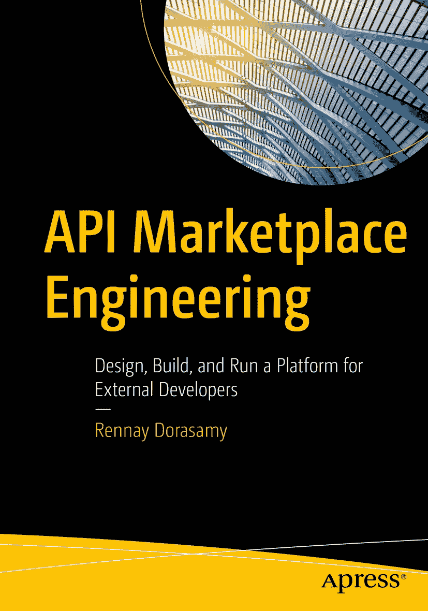

ISBN 978-1-4842-7312-8e-ISBN 978-1-4842-7313-5 [`doi.org/10.1007/978-1-4842-7313-5`](https://doi.org/10.1007/978-1-4842-7313-5) © Rennay Dorasamy 2022 本作品受版权保护。无论涉及全部或部分材料，所有权利均仅且排他性地授予出版商，具体包括翻译、重印、插图再利用、朗诵、广播、以缩微胶片或任何其他实体方式复制，以及传播或信息存储与检索、电子改编、计算机软件处理，或通过当前已知或未来开发的类似或不同方法进行处理的权利。本出版物中对通用描述性名称、注册名称、商标、服务标志等的使用，即使在没有特别声明的情况下，也不意味着这些名称不受相关保护法律法规约束，因此可供普遍使用。出版商、作者和编辑有理由认为本书中的建议和信息在出版时是真实且准确的。对于本文所载材料，或可能存在的任何错误或遗漏，出版商、作者或编辑均不提供明示或暗示的担保。对于已发布地图中的司法管辖权主张及机构隶属关系，出版商保持中立。

本 Apress 品牌由注册公司 APress Media, LLC（Springer Nature 旗下）出版。

注册公司地址为：1 New York Plaza, New York, NY 10004, U.S.A.

*献给 Dineshree、Kerisha 和 Nicalen*

引言

API 市场（API Marketplace）是任何以建立平台型业务为目标的组织的关键赋能者。由于其作为第三方开发者与企业之间数字渠道的定位，这是一项需要精妙平衡的工作：在精细化控制下开放对内部服务与能力的访问；在组织治理约束下推动创新产品与解决方案；以令人惊叹的敏捷速度交付，同时符合企业级质量标准；在获得同意的前提下释放并民主化客户数据；采用前沿技术构建行星级规模架构，同时保持企业级可靠性。

API 市场的基本前提是开放性。秉持这一精神，本书旨在记录我们的实施多年来所走过的历程——与即将启程或已踏上类似征程的工程团队分享我们的经验、收获、陷阱与解决方案。书中讨论的方法与方案随着时间不断演进，并持续处于优化之中。我真诚希望本书能够加速其他团队的实施进程，也期待这些平台后续增强实践能够继续被分享，以推动该实践的采用。

本书主要面向技术读者，从不同视角展示 API 市场。作为出发点，我先界定 API 市场的愿景与目标——本质上是它要解决的问题（*为什么？*）、采取的方法（*如何做？*）以及所需角色（*由谁来做？*）。随后，我将详细审视席卷金融服务行业的全球监管浪潮，这一趋势也很可能出现在其他领域——如电信与医疗。其目的是帮助你理解监管驱动因素，以及不同地区的多样化应对方式，从而帮助你定义平台的定位与路线图。

新的数字渠道会带来新的受众。在“消费（Consumption）”章节中，我讨论了帮助业务与技术用户理解并访问平台的策略。在“变现（Monetization）”章节中，我介绍了我们实施的核心——我们称之为 *API Marketplace 飞轮*——它使我们的实施能够实现自我可持续。我还详细讨论了支持多种计费方式所需的技术要素——有些已较成熟，有些正在演进，有些则具有革新性。

构建 API 市场需要在平台架构、API 设计与交付方面转变思维方式；在相关章节中，我们将深入介绍我们过去与当前的方法。沙箱（Sandbox）环境是任何市场化实施中的关键组成部分，我提出了应对不同场景与消费者类型的策略。API 产品生命周期中，可能最具挑战、但也最令人兴奋且最具动态性的阶段，是其进入运营语境之后。我将如实分享我们的经验——无论好坏——以及支撑因素和实践方法，以为我们的实施提供企业级支持。

关于如何阅读本书，我建议从第 1 章开始，该章为 API 市场奠定背景，然后再深入阅读最契合你关注领域的章节。

*   如果你仍在调研或决定是否构建 API 市场，请先阅读 *监管（Regulation）*，再阅读 *变现（Monetization）*。

*   产品负责人应先阅读 *消费（Consumption）* 和 *变现（Monetization）*。

*   平台团队应先阅读 *平台架构（Platform Architecture）*，然后理解 *沙箱（Sandbox）* 需求以及 *运营（Operations）* 的执行语境。

*   交付负责人和开发团队应先阅读 *API 设计（API Design）*，然后是 *开发（Development）*、*沙箱（Sandbox）*、*运营（Operations）*，最后再回到 *消费（Consumption）*。

致谢

首先也是最重要的，这一切若没有上帝将不可能实现——从构想到完成。我要感谢我的妻子，也是我力量核心中的核心，Dineshree，感谢她在本项目期间给予我的爱与支持。最重要的是，当我踏上这些“疯狂征程”时，她始终如一的理解与耐心。她对我的意义远超她所能想象。对我的孩子——Kerisha 和 Nicalen——如果这本书占用了本该陪伴你们的时间，我由衷地说一声抱歉。我希望最终成果能让你们感到骄傲。我的挚友 Asif Hamza 以其睿智的建议、激励与忠告，鼓励我不断把标准设得更高。

“养育一个孩子需要整个村庄”这句非洲谚语确实如此。正是凭借来自家人一生的鼓励、支持与信任，我才能承担如此规模的项目——Mannie、Ronnie、Kamala、Savanthala、Viverge、Tanya、Ethan、Neshica、Kerushen、Nishen、Kershnee、Alena、Ayla、Lawrence、Daisy 和 Shivaal——以及朋友们——Ajay、Nafisa、Zara、Rayyan、Bilal、Brett、Jairaj、Jason、JJ、Kiren、Mark、Paul “PCB”、Rajesh、Sree、Srinath、Tony、Trevlyn、Vish、Walter、Warren、Waseem，以及 William（Mr. Magic）。

致我来自“企业号星舰”的无畏队友——Jacque Coetzee（柯克舰长）、Amjid “AJ” Ali（斯波克先生）、Kevin Kalil（麦考伊医生）和 Gareth Hiepner（乌乎拉）——能够以工程负责人（Scotty）的身份与你们共事，既是荣誉也是幸运。我认为自己很走运，因为并非总能与志同道合的人*以及*你真正喜欢的人一起工作。特别感谢我们之前的产品负责人 Shiv Rajah，他在我们的演进过程中发挥了关键作用。

构建这个平台也让我有机会与一支拥有丰富知识和经验的跨国团队合作，其中有些人我从未在线下见过——但我把他们都视为一生的朋友：Philip Anderson、Shafaat Ali Yasir、我的跨洲兄弟 Ravi Shah（开放银行先生）和 Amit Pareek（API Connect 大师）、不屈不挠的 Lakshmi Basireddy（质量守护者）、Miguel de Barros、Kaushik Lala、Dr. Ferdinand Damon、Donald Sepeng、Brightly Mphahlele、Mthobisi Kunene、Monika Vadlapudi、David Napo、Anvitha Swarangi、Sathya Perumalsamy、Deepika Chalpe、Deepika Jain、Ummair Asghar、Charles Swart、Dingane Hlaluka、Hina Kanwal、Olivier Mulmann、Shahanoor Ahmed、Priya Singh、Sahiti Nedunuri、Chenchaiah Sudulagunta、Louw Fouche、Ndoda Keswa，以及 Elizabeth Congdon。

我也为能在这样一家组织中工作而感到无比自豪：这里在多个企业能力领域都有经验丰富的资深专家，而他们对我们 Marketplace 的落地实施至关重要。API Gateway：Tiaan Mouton、Andries Marx、Nkomo Magolo、Lance Moore。Identity：Ashley Govender、Danie Weideman、Willie Visagie、Bhavna Yerpude、Heidi Van Zyl、SW Engelbrecht。Quality Assurance：Oagile Nthutang、Kamil Maharaj、Manesh Hari、Azeez Salawu、Criscelda Mogane。DevOps：Jaco Greyling、Steve Breyer-Menke、Marcus Talken、Darren George、Wayne Turner、Adam Aucamp。Architecture：Nico Basson、Paul Sing、Adele Jones、Bruce Barker、Ryan Mulholland、Gerard de Jong、Gys Le Roux、Louis Werth、Lourens Labuschange。Project Management：Gerhard Rabie、Annalinde Singh、Neziwe Manaka、Cyrilise Palmer、Jo Thindwa。Product：Shirley Malope、Serisha Iyer、Charles Phillips、Warren Tromp。Infrastructure：Jan Jacobs、Tumelo Malete、George Phage、Maanda Ambani。External：Pieter Myburgh、Lovemore Nalube、Dylan Youens、George Nel、Hardus van der Berg、Akash Shaha、Loyiso Matymza、Damon Vrkoc、Kabelo Mokwana、Henry Oertel。Forensics：Justin Fairhurst。Business Analysis：Tshepo Mekgoe、Kerassa Pillay、Pravesh Mungaldave。Information Security：Phillip Gerber、Tian Gerber、Enzlin Burts。Network Security：Andre Jansen、Jared Camberg、Iaan Botha。Change and Release：Amanda Kopolo、Patiwe Singapi、Stephanie van Ross、Cecil Loots、Marty Dada、Liesl Moss。

致 Apress 团队——Jonathan Gennick、Jill Balzano、Robert Stackowiak、Laura Berendson 和 Welmoed Spahr——对于这次一生难得的机会，我感激不尽。真的很神奇——尽管我们相隔多个大洲，但在整个过程中，我始终能感受到你们的指导与陪伴。

最后同样重要的是，特别感谢 Marco Vidulich 和 Ray Naicker，感谢他们的领导力、洞察先机的非凡能力，以及开拓未知领域所需的勇气与坚定信念，最终打造出了如今非洲领先的 API Marketplace。

关于作者 关于技术审阅者

