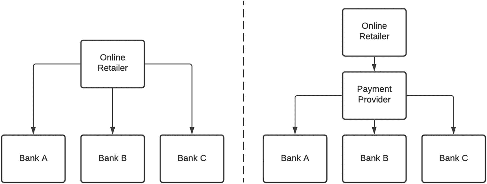
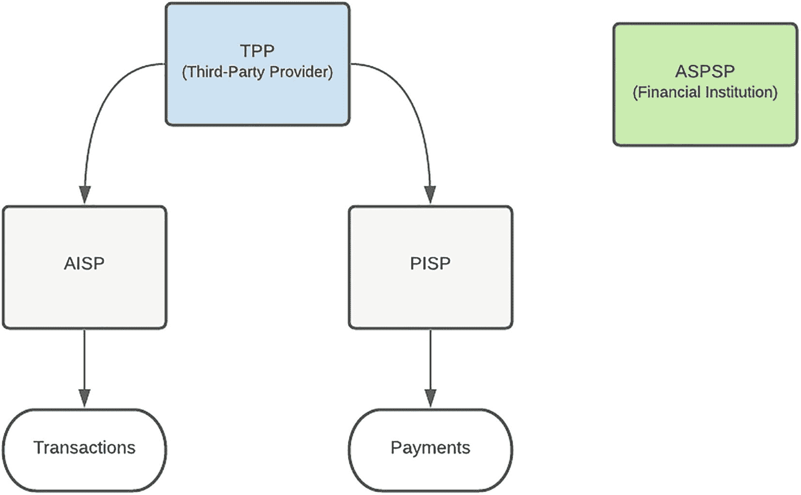

# 2. 监管

金融服务（FS）行业在技术采纳方面一直是开拓者。从自动柜员机（ATM）的推出，到电话银行，再到基于 Web 和移动应用的银行服务，这一点体现得非常明显。鉴于客户数据及相关交易的敏感性，通往金融服务提供商的大门长期以来都受到严格守护——这也完全可以理解。在本章中，我们将审视促使客户数据与金融后端服务向第三方共享的因素，这一变化彻底革新了该行业。就像海洋中部的板块碰撞引发海啸一样，连锁效应已被触发，变革浪潮已经席卷全球多个地区。

由此可见，若 API Marketplace 能够在金融服务这样监管严格的行业中成为必要并得以建立，那么电信、医疗等其他行业也能够并且将会效仿。本章将深入探讨 API 对金融服务行业的影响。我们将从这场“地震”事件的震中——支付（Payments）——开始，随后进入开放*银行*（Open *Banking*）的话题，最后审视以开放*金融*（Open *Finance*）形式出现的后续冲击波对行业的影响。

## 背景

数字支付服务支撑了电子商务的繁荣。从最初仅采集信用卡信息，到为电子购物篮中的商品完成支付，这一能力已显著提升。表面上看，交易参与方似乎只应包括终端用户、在线零售商和金融机构。由于银行数量众多、协议复杂且接口机制繁琐，创新型金融科技（FinTech）公司通过介入以抽象这些复杂性，并为在线零售商提供易于使用的服务，已将自身确立为新的、不可或缺的参与者。

其中一类服务是支付发起。图 2-1 展示了在线零售商如何只需对接一个支付服务提供商，即可借助其与多家银行的接口网络，而无需分别与每家银行直接集成。

图 2-1

直接集成与经纪式集成策略对比

### 屏幕抓取

通过网上银行渠道，第三方支付服务商一直能够借助屏幕抓取这一做法实现与银行的集成。屏幕抓取是一种技术：通过模拟网页浏览器的计算机软件读取并提取目标网站的数据，或执行通常需要用户在网站上手动完成的操作。为完成支付，客户会向服务商提供其银行凭证（用户名、个人识别码（PIN）和密码），服务商再利用这些信息启动自动化流程，登录用户的网上银行门户并完成付款。

对终端用户而言，其优势在于便捷——可节省登录网银门户、录入零售商银行信息、设置付款以及发送付款确认的时间。该流程也被优化并无缝嵌入结账路径中，大多数客户甚至不知道自己实际上是在直接登录网上银行。由于传统的银行间电子资金转账（EFT）通常需要数小时甚至数天才能到账并显示，对商户而言的优势是支付服务商可以实时提供付款确认。因为支付服务商已连接到用户网银门户、核验资金并执行交易，商户可以确信付款已完成——而不必依赖终端用户提供的付款确认（后者可能存在欺诈风险）。

这种做法的内在缺点在于：从数据隐私和消费者保护角度看，通过屏幕抓取访问客户金融信息通常被认为安全性较低。鉴于其对支付系统完整性、安全性与效率以及客户本身都构成风险，银行监管机构已日益加强干预以遏制该方式。

屏幕抓取还支持“源头分拣”（sorting at source）这一实践。这使得在多家银行开设账户的支付服务商能够按银行对付款指令进行分拣，并分别转发至对应银行——后者再将其作为内部交易处理。尽管源头分拣模型听起来像是降低成本、提升清算速度的更优方式，但在某些监管政策和规则下此做法被禁止，因为它会减少银行间清算。由于银行业长期缺乏能够支持与第三方安全共享客户金融信息的法律框架和政策，屏幕抓取一直是支付发起和账户聚合中的常见机制。

### 应用程序编程接口（APIs）

为解决这一问题，银行一直在探索 API 作为替代方案，以共享客户金融信息并支持创新支付解决方案，从而提升客户体验。在传统银行语境下，API 大多面向内部、专有、缺乏标准化且外部使用者无法访问——即所谓“封闭 API（closed APIs）”。相对地，“开放 API（open APIs）”可被第三方用于创建创新应用和产品，扩大客户触达并改善用户体验。

API 在银行业中的一项优势是：在获得客户同意的前提下，*可以*以安全方式与第三方共享客户数据，并且*无需*共享登录凭证。第三方应用可从公共网络直接连接到银行系统，以获取账户信息、发起支付并跟踪支付进度。若 API 由银行独占，可能引发担忧：银行会因控制数据共享范围而拥有过大的权力。这可能导致银行扮演“守门人”角色，进而造成反竞争并抑制创新。“开放银行（Open Banking）”概念正是在这种背景下出现，旨在让第三方服务商通过开放 API 安全访问银行中的客户金融信息，以利用创新技术并提升客户体验。下一节我们将更详细地探讨开放银行。

## 开放银行

由于客户对数据访问与控制的需求上升，以及渴望颠覆市场的第三方服务商不断涌现，银行业正面临一场迫在眉睫的革命。开放银行为平稳且可控的转型提供了机会，更重要的是，它让银行能够继续成为新生态系统中的关键组成部分。客户将对其金融数据拥有更大控制权，从而作出更明智的决策并更好地管理资金。竞争加剧将带来更广泛、更多样化的服务供给，并推动第三方服务商与银行双方共同创新。

### 目标

我们考虑开放银行政策的一些目标：

*   **金融稳定与安全**：在各平台间共享的敏感客户数据必须得到保护，以维护整个金融生态系统的信心。

*   **透明度与公共问责**：客户应了解使用其银行凭证所涉及的风险，包括许多第三方服务商仅承担有限责任这一点。任何开放银行实施方案都应明确第三方获得客户授权共享金融数据访问权限的流程与时间线。为保护客户数据权利，应禁止在价值链中向其他方进一步共享数据。

*   **标准化与技术中立**：应明确定义 API、数据处理、存储和网络安全标准，以便轻松对接多个银行平台，而无需定制化开发。

*   **促进金融包容、竞争与创新，以及成本效益**：开放银行有助于为所有利益相关方创造公平竞争环境，以提供服务和解决方案。它应使广泛客户群体都能获得银行服务——既包括为高收入人群提供个性化投资产品，也包括帮助金融服务覆盖不足的客户获得银行服务。从实施角度看，中小银行和第三方也应能够在无需大量资本投入和技术基础设施的情况下参与其中。

### 术语

在了解开放银行监管框架时，你可能会遇到许多新的术语和分类。我们将介绍最常见的一些，并讨论它们如何融入该框架。

*   **账户信息服务提供商（AISP）**通过汇总和分析客户一个或多个支付账户中的交易信息，帮助客户形成其财务状况的整合视图。这可以通过核查来自多个来源的收入与支出，帮助客户评估信用资质。

*   **支付发起服务提供商（PISP）**代表客户发起支付交易，并通过不同于开户银行所属平台的其他平台完成该过程。

*   **第三方提供商（TPP）**是指经授权可代表客户访问账户、但并不自行运营这些账户的实体。TPP 的类型包括 PISP 和 AISP。FinTech（金融科技公司）就是 TPP 的一个示例。

*   **账户服务支付服务提供商（ASPSP）**为付款人提供并维护支付账户。本质上，这就是持有客户账户和资金的银行或金融机构。

图 2-2 对这些术语和分类及其相互关系进行了可视化展示。

图 2-2

开放银行参与方的可视化表示

### 益处

开放银行能够为生态系统中的所有参与者带来多方面的益处。客户可通过利用支付服务，获得更少行政操作、更流畅的线上零售体验。这节省了以往登录银行门户并发送付款确认所需的时间。账户聚合服务使比较和切换更加容易。与第三方提供商共享交易数据也更安全，因为客户可以对共享哪些数据、共享时长以及撤销访问权限进行细粒度控制。访问账户历史记录可使第三方提供更个性化的产品与服务，并实现更准确的风险评级。移动钱包等支付方式也可作为银行卡和交易账户支付的替代方案。消费者还将受益于竞争加剧，这可能降低金融服务费用并提升服务水平。

第三方提供商将获得更多商业机会，因为开放银行为非银行机构创造了公平竞争环境。这将使其能够提供创新的账户和支付解决方案，从而改善客户体验。对客户历史账户数据的洞察也有助于更优的风险评级和产品匹配。

尽管乍看之下开放银行似乎会对银行产生负面影响，但实际上也可能带来诸多好处。通过提供便捷、安全的数据共享能力以及资金管理控制能力，建立透明、开放的关系，银行可以维持客户信任。通过展示数字化能力并拥抱创新解决方案，同时配备必要的安全控制，银行还可增强客户信心，从而提供最优或高端产品与服务。银行可以通过基于 API 的平台型业务模式建立新的合作关系并获取新的收入来源。银行的触达范围也会扩大，因为第三方提供商的产品和服务能够在更短、更积极的时间框架内覆盖更广泛受众。

商户同样可以拓展其产品供给，并将业务触达延伸至过去难以进入的市场。一个例子是支持从交易账户直接付款，从而覆盖没有信用卡的客户。替代性支付方式也可能降低银行卡交易成本。开放银行有潜力消除银行卡交易中由发卡行、处理机构和卡组织带来的商户服务费中的多种费用要素，这对客户同样有益。

支付系统也将受益于竞争加剧，因为更公平的竞争环境有望带来创新支付解决方案。开放银行可以通过剔除虚假和欺诈性第三方提供商，并建立技术与数据共享标准，提升支付流程透明度。它还能够支持更高效的底层基础设施，从而提升交易清算与结算效率。

### 风险

开放银行实施过程中存在诸多风险。提高认知并提前采取缓释措施，是使市场能够应对这些挑战的关键。由于解决方案是数字化的，这可能会导致无法使用互联网或智能手机的客户被排除在外。任何进入金融系统的新渠道都会引入欺诈的可能性。客户的金融数据可能被用于未经客户授权的用途。开放银行还可能使客户数据面临被窃取和不当使用的风险。薄弱的安全措施可能导致因犯罪活动而产生资金损失。

客户在共享其金融数据时，可能并不了解相关风险，以及许多第三方提供商所承担的有限责任。这个问题可以通过有力的客户教育活动来解决。此外，在客户授权流程中，相关提示和警告信息必须清晰、简洁。还应让客户了解可用于查看和撤销第三方访问权限的机制。

第三方提供商不受与银行相同的监管约束，且可能因数据处理不当而给银行带来声誉风险。敏感的客户数据可能因员工的意外或恶意行为而被共享。第三方可能更容易成为网络犯罪分子的目标，因为其安全机制可能不如银行完善。对第三方系统进行初始审查、定期审查和抽查，及/或开展独立安全评估，可确保建立必要的安全控制。根据所使用 API 产品的性质，这可能成为强制性要求。

开发和运营消费开放银行 API 的产品或服务，需要新进入者在设计、开发、支持和维护方面投入大量资金。API 市场产品负责人应向潜在提供商清晰传达这一点。

银行同样会因第三方欺诈或失控行为而面临声誉风险。未经授权使用消费者数据会对消费者对银行的信任产生负面影响。可通过对希望接入市场的第三方进行全面审查和筛选来缓释这一风险。一项先发策略是传递强有力的市场信息，确保客户和第三方在整个开放银行旅程中明确各自的安全责任。

银行面临的最重大风险之一是“去中介化”。第三方提供商可能削弱银行的角色，潜在地导致客户关系部分流失，进而造成收入下降。开放银行与 ATM、网上银行或基于应用的银行一样，都是客户与银行互动的渠道。稳固的银客关系有助于建立忠诚和信任。银行可以通过任何渠道利用客户数据与活动，更好地理解客户行为，从而提供个性化产品和服务。去中介化的潜在影响也可被视为一种动力，促使银行提升自身能力以维系客户关系。

开放银行将导致银行商业模式发生变化，因为在运营基础设施、客户接入、交易监测和安全检查方面都存在重大调整。这可能会增加银行成本并带来竞争挑战。最佳缓释方式是以前瞻性的视角看待金融服务格局。制定清晰且定义明确的路线图，并参考在开放银行进程上更领先的国家和组织的经验，将有助于确保银行具备实施开放银行的准备度。

如果客户数据丢失或支付被拦截、第三方无法履行财务义务，以及交易源于欺诈活动，商户可能不得不面对声誉风险暴露。支付系统在系统故障、人为错误和网络攻击情况下也可能面临操作风险。这可能影响支付系统的完整性与信心。对银行 API 的访问可能使更多第三方实现源头分拣（sort-at-source），从而减少银行间清算，并影响银行间清算机构。

### 规定式、促进式或市场驱动式方法

一些国家采取了规定式方法，强制银行共享经客户授权的数据，并要求希望访问此类数据的第三方在监管或监督机构注册。英国采取了监管路径，并于 2018 年纳入开放银行标准，要求规模最大的银行作为账户服务支付服务提供商（ASPSP）开发开放 API，以便第三方提供商（TPP）访问客户账户。开放银行实施实体（OBIE）由竞争与市场管理局（CMA）设立，负责交付 API、数据结构和安全架构。欧盟通过了《支付服务指令》第二版（PSD2），将 API 作为释放客户数据并赋能消费者选择的机制。然而，分析并就最优方案达成一致耗费了大量时间——因为第三方、银行和监管机构有不同的目标、诉求和顾虑，需要加以平衡。因此，英国和欧盟的监管措施都花费了一些时间才得以实施，许多银行也错过了截止期限。巴林等地区采用类似 PSD2 的监管方式，建立了一套指导方针和标准，以确保实施一致性并促进采用。银行也被给予了必须合规的最后期限。

其他司法辖区采取了更具促进性和灵活性的方法，通过发布指导意见、推荐标准，以及推出开放 API 标准和技术规范来推进。开放银行的共同支柱包括：授权同意、数据隐私预期以及数据安全要求。监管机构并未在一开始就强制要求实现目标结果，而是允许第三方提供商在基础设施建立之前使用安全的替代方案。比如，一些监管机构在 API 尚未提供前，允许通过屏幕抓取（screen-scraping）方式访问经客户同意的账户信息。其余一些地区则选择了灵活的市场驱动方式，不设明确法规或标准。在下一节中，我们将回顾不同地区的开放银行活动。

### 全球开放银行概览

表 2-1 至 2-9 展示了多个国家在某一时间点的开放银行现状。需要重点关注的是，各司法辖区所采用的战略存在差异——有些选择了规定性（Prescriptive）方法；有些则选择了促进型（Facilitative）或市场驱动型方法。我们还考察了主导该倡议的监管机构、参与的服务提供商、接入类型、产品范围以及当前状态。刚刚起步的国家可以借鉴那些数年前已开始实践国家的洞见与经验。

表 2-9

开放银行——美国

| 司法辖区 | 美国 |
| --- | --- |
| 方法 | 市场驱动型 |
| 牵头机构 | 美国消费者金融保护局 |
| 服务提供商 | 自愿参与 |
| 接入类型 | API、屏幕抓取 |
| 产品范围 | 由消费者决定（任何金融数据） |
| 状态 | 开放银行目前没有法律强制要求，数据共享方式由金融机构自行决定。相关实体仍在使用屏幕抓取而非开放 API。这包括聚合客户金融数据的基于 Web 的财务管理工具 |

表 2-8

开放银行——南非

| 司法辖区 | 南非 |
| --- | --- |
| 方法 | 市场驱动型 |
| 牵头机构 | 南非储备银行（SARB） |
| 服务提供商 | 自愿参与 |
| 接入类型 | API、屏幕抓取 |
| 产品范围 | 正在审查中 |
| 状态 | 目前，SARB 不对开放银行活动（如屏幕抓取和开放 API）进行监管、监督或审查，也不评估其有效性、稳健性、完整性或鲁棒性。SARB 认为开放银行活动应当被监管并改革，应管理相关风险并嵌入安全考量，同时确保并提升客户体验。目前咨询流程正在进行中 |

表 2-7

开放银行——新加坡

| 司法辖区 | 新加坡 |
| --- | --- |
| 方法 | 促进型 |
| 牵头机构 | 新加坡金融管理局 |
| 服务提供商 | 自愿参与 |
| 接入类型 | API |
| 产品范围 | 在系统内对所有参与方都有效的数据与人工智能的伦理使用 |
| 状态 | 新加坡正尝试实施一种不同类型的监管框架，采取较不激进、更加自然演进的方式。其不计划将监管强制施加给金融机构 |

表 2-6

开放银行——日本

| 司法辖区 | 日本 |
| --- | --- |
| 方法 | 规定性 |
| 牵头机构 | 金融厅 |
| 服务提供商 | 所有银行 |
| 接入类型 | API |
| 产品范围 | 银行账户（活期、储蓄、存款） |
| 状态 | 2018 年，《银行法》修订，要求金融机构开发 API 供第三方使用 |

表 2-5

开放银行——印度

| 司法辖区 | 印度 |
| --- | --- |
| 方法 | 混合模式——规定性与市场驱动型 |
| 牵头机构 | 印度国家支付委员会（NPCI） |
| 服务提供商 | 参与的银行和支付服务提供商 |
| 接入类型 | API |
| 产品范围 | 由消费者决定（任何金融数据） |
| 状态 | 印度政府已强制推行开放 API 政策。2016 年推出 IndiaStack，作为一组 API。Aadhaar 生物识别数字系统通过政府专有软件（处理集中式认证数据库）促进开放 API 银行业务 |

表 2-4

开放银行——中国香港

| 司法辖区 | 中国香港 |
| --- | --- |
| 方法 | 促进型 |
| 牵头机构 | 香港金融管理局 |
| 服务提供商 | 20 家参与的零售银行已提供 500 多个开放 API，可访问广泛银行产品和服务的信息 |
| 接入类型 | API |
| 产品范围 | 由消费者决定（任何金融数据） |
| 状态 | 2018 年 7 月：香港金融管理局推出《开放 API 框架》，旨在促进银行业开发并更广泛采用 API。2019 年 1 月：该框架第一阶段启动 |

表 2-3

开放银行——欧盟

| 司法辖区 | 欧盟 |
| --- | --- |
| 方法 | 规定性 |
| 牵头机构 | 欧盟委员会 |
| 服务提供商 | 所有银行和支付服务提供商 |
| 接入类型 | API、屏幕抓取 |
| 产品范围 | 活期和储蓄账户 |
| 状态 | PSD2 指导银行开放其系统，允许第三方在客户同意的前提下访问特定客户账户信息，以便代表客户进行支付（通过贷记转账），并向其提供不同支付账户的汇总视图。• 其目标是通过数据共享提升竞争并促进创新 |

表 2-2

开放银行——中国

| 司法辖区 | 中国 |
| --- | --- |
| 方法 | 市场驱动型 |
| 牵头机构 | 金融科技公司 |
| 服务提供商 | 支付宝、金融科技公司 |
| 接入类型 | API |
| 产品范围 | 由消费者决定（任何金融数据） |
| 状态 | • 开放银行并非由监管机构推动，而是由金融科技公司驱动 |

表 2-1

开放银行——澳大利亚

| 司法辖区 | 澳大利亚 |
| --- | --- |
| 方法 | 规定性 |
| 牵头机构 | 财政部 |
| 服务提供商 | 分阶段推进。2020 年 7 月——四大银行。2021 年 2 月——其他银行 |
| 接入类型 | API |
| 产品范围 | 信用卡与借记卡、存款与交易账户、抵押贷款和个人贷款数据 |
| 状态 | • 2018 年：澳大利亚政府批准开放银行框架 • 2020 年 7 月：以分阶段方式实施，依法要求四大银行向消费者开放其在信用卡和借记卡以及存款和交易账户方面的使用数据 • 2020 年 11 月：共享抵押贷款和个人贷款数据 • 2021 年 2 月：其他银行开始共享数据 |

## 从开放银行到开放金融

开放银行只是金融服务行业蜕变的第一阶段。开放金融（Open Finance）这一术语用于描述开放银行数据共享的延伸，同样建立在“消费者拥有其在金融服务提供商平台上所产生数据”的原则之上。在消费者同意的前提下，这些数据可以与获批的第三方提供商共享，以开发并提供创新产品和服务。开放银行仅聚焦于访问银行交易数据或代表客户发起支付，而开放金融的范围更广。它涵盖了所有消费者金融服务数据，如储蓄、债务、投资、养老金、替代性借贷和保险。在保险领域，来自现有服务提供商的客户数据可用于识别个性化且价格最优的保险科技产品；而在替代性借贷领域，历史交易数据可用于更可靠的信用评分和偿付能力分析。它有潜力改变消费者和企业使用金融服务的方式。

从开放银行的发展历程中，有许多经验可用于推动开放金融取得成功：

**标准化**：数据访问的标准化是避免市场碎片化的关键。就像一个国家内电源和插座标准保持一致一样，提供统一的 API 定义将使第三方能够专注于为客户创造价值，而不是应对各服务提供商之间的细微差异。对于数据共享，基于规则的方法——如英国开放银行所采用的方式——可能比 PSD2 中采用的基于原则的方法更可取。

**监管**：立法者、监管机构和公共部门应关注开放银行的快速发展。尽管“屏幕抓取”（screen scraping）因共享客户凭证而存在固有安全缺陷，但这一做法仍被允许持续了若干年。开放 API 迅速崛起为替代方案，并革新了银行业。随着这股浪潮可能蔓延至银行业之外，保险等其他行业未来也可能受到影响。监管机构在其中发挥关键作用：需要有力的方向指引和适当的框架，以支持行业建立标准和基础设施，平衡其中涉及的不同公共利益。同样重要的是，现有金融服务提供商、金融科技公司（FinTech）与监管机构之间应持续协作，以推动生态系统发展。

**商业模式**：开放金融的一个关键考量是资金模型，因为必须兼顾生态系统中所有参与方的需求。根据 PSD2 等规范，银行可能不得就数据共享和支付数据收费。考虑到银行为实现这一点已投入大规模资金，除满足核心监管要求外，这可能并非一项具有吸引力的举措。开放金融可以在监管最低要求之上，为竞争与创新腾出空间。基于开放 API 技术的高级 API（Premium APIs）可通过支持跨多个不同行业的数据共享来推动开放金融发展。

**争议处理机制**：由于争议可能给金融服务提供商和第三方带来声誉损害，所有利益相关方都应建立投诉管理流程，以便处理所提出的投诉或问题。为应对数据隐私泄露和数据滥用，可能需要建立责任框架，以追究金融服务提供商和第三方提供商的责任。

**以客户为中心**：客户金融数据是开放金融生态系统的核心要素。由于这些数据在整个生命周期中始终归客户所有，因此必须始终将客户置于核心位置。客户应清楚了解其数据如何被收集、共享和使用。知情同意是关键机制，可使消费者了解其所同意事项的条款条件以及数据将如何被使用。客户还应享有撤销访问授权的权利，并且此前已共享的数据应可被“遗忘”。

客户教育是金融服务提供商和第三方的重要职责，将有助于建立信任。如果潜在客户不信任该生态系统，他们就不会同意共享其数据。可信的第三方提供商同样是获取并维持客户信任的重要要素。

## 示例应用

开放银行和开放金融已使银行和第三方提供商能够推出新产品与服务。我们重点介绍其中几个应用——由银行打造的 YOLT、采用前沿人工智能（AI）技术的 CHIP、利用开放 API 扩展现有产品能力的 bunq、为第三方提供平台能力以屏蔽集成复杂性的 TrueLayer，以及提供跨银行账户聚合能力的 Revolut。

金融科技公司（FinTech）的高速、低成本与创新能力，帮助扩展了现有能力，并推动了数字化应用和平台的构建。

*   **YOLT**：ING 打造了最大的第三方可信实体之一——YOLT（2016 年始于荷兰，现已进入英国、法国和意大利）。YOLT 的应用通过调用开放银行 API 聚合跨银行账户信息，并向客户提供建议。YOLT 的使命是“让每个人都拥有更聪明管理金钱的能力。”目前其客户约为 +-500,000；但其不足之一在于其 App/功能仅支持“读取与建议”。应用给出的任何建议仍需在源银行系统中执行。

*   **CHIP**：CHIP 使用人工智能（AI）计算你可以储蓄的金额，从已关联的活期账户中划转资金，并通过直接借记（direct debit）存入由巴克莱银行托管的独立储蓄账户。储蓄比例（最高可达 5%）通过游戏化方式与您对 CHIP 的社交推广挂钩——每成功邀请一位朋友注册可额外获得 1%。

*   **bunq**：早在 PSD2 之前，bunq 就已开放其 API。bunq 让开发者能够在一家持有完整银行牌照的银行之上构建独特应用，丰富所有 bunq 用户的体验。借助 bunq API，开发者可以连接交易数据、推送通知、付款请求、银行卡、联名账户，以及限额与预算功能。

*   **TrueLayer**：TrueLayer 的 API 平台使将开放银行、支付等金融服务集成到任何应用或网站变得简单，并可覆盖全球各地。TrueLayer 可连接欧洲所有银行 API，而不受其所采用标准或协议差异的影响。

*   **Revolut**：借助这一新功能，德国客户现可将其在 Comdirect、Commerzbank、Deutsche Bank、ING-DiBa 和 Sparkasse 的账户连接至 Revolut 应用，并在一个地方查看全部财务状况——直接通过智能手机实现。该功能由英国金融科技公司 TrueLayer（欧洲金融 API/编程接口提供商）合作开发。使用 TrueLayer 平台可确保德国主要银行的账户信息被安全集成，并在 Revolut 应用中实时更新。

## 总结

在本章中，我们回顾了开放银行（Open Banking）和开放金融（Open Finance）如何在金融服务行业中走到前沿。从本质上讲，这一进程是由“以客户最佳利益为核心”所驱动的。诸如屏幕抓取（screen scraping）之类的做法，会因共享凭证而危及客户安全——API 正是对此的修复机制。新的支付方式和账户聚合将为客户带来更高便利性和个性化服务——而 PSD2 等规范使第三方能够实现这些能力。市场中更充分的竞争可以带来更多客户选择、降低成本并提升服务水平——开放银行标准正是为此而引入的。

我们赞颂了这一模式对所有参与方的益处——从为全球数十亿无银行账户人群带来金融包容性的前景，到为第三方提供商创造更公平的竞争环境。当然，这一运动并非没有风险——我们也强调了其中一些风险并给出了潜在缓解措施。当前最令人振奋的是，开放银行浪潮正在全球蔓延。尽管不同地区在不同产品领域采取了不同路径，但其共同的核心目标都是：让客户所拥有的数据实现民主化。

我们还强调，这仅仅是开始。开放银行是更宏大开放金融倡议的先声，将影响金融服务行业中更多细分领域。这带来了前所未有的机会，可重新设计金融服务，以实现最大化的可扩展性与效率。将一切串联起来的金线是监管。监管的一项关键目标是：数据共享与开放银行应在风险管理和创新激励之间取得平衡。监管框架应当顺应市场变化，明确角色与责任。

尽管一些组织已主动建设能力以支持开放银行，但许多组织并未做好准备。一个规划完善且执行到位的 API 平台战略，能够为组织提供参与并引导监管咨询过程所必需的知识与经验。

确实值得注意的是，单一需求所产生的涟漪效应——具体而言是支付发起（payment initiation）——触发了下一轮变化，即访问客户账户信息。这引发了监管变革，从本质上迫使组织调整其政策，并在客户同意的前提下向第三方开放访问。而这种裂变并未止步于此——它还推动了金融服务其他领域的变化，例如保险和借贷。

如果我们将同样一套原则应用到其他行业，如电信和医疗保健，那么可以合理推断：用户的移动交易历史或健康信息属于用户本人，并且应在用户同意下可供第三方访问。Google 和 Facebook 等提供商已将这一能力内嵌进其产品服务。正如当年通过监管允许用户在更换运营商时保留手机号一样，我认为移动交易数据，甚至可能包括通话记录，实现数据民主化只是时间问题。这个行业只需要一个足够有说服力、能够触发变革的需求。许多国家正计划提供国家医疗服务。对现有患者病历以及私营部门数据的访问，或许正是推动该行业变革的临界点。

一些组织采取了观望态度，准备对监管变化作出反应。也有许多组织已洞察到构建平台型业务的潜力，正通过提前启动其 API Marketplace 实施来先于监管布局，或抢占战略位置。

