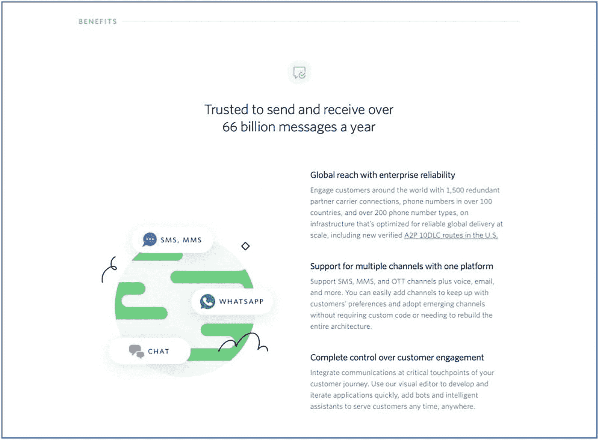
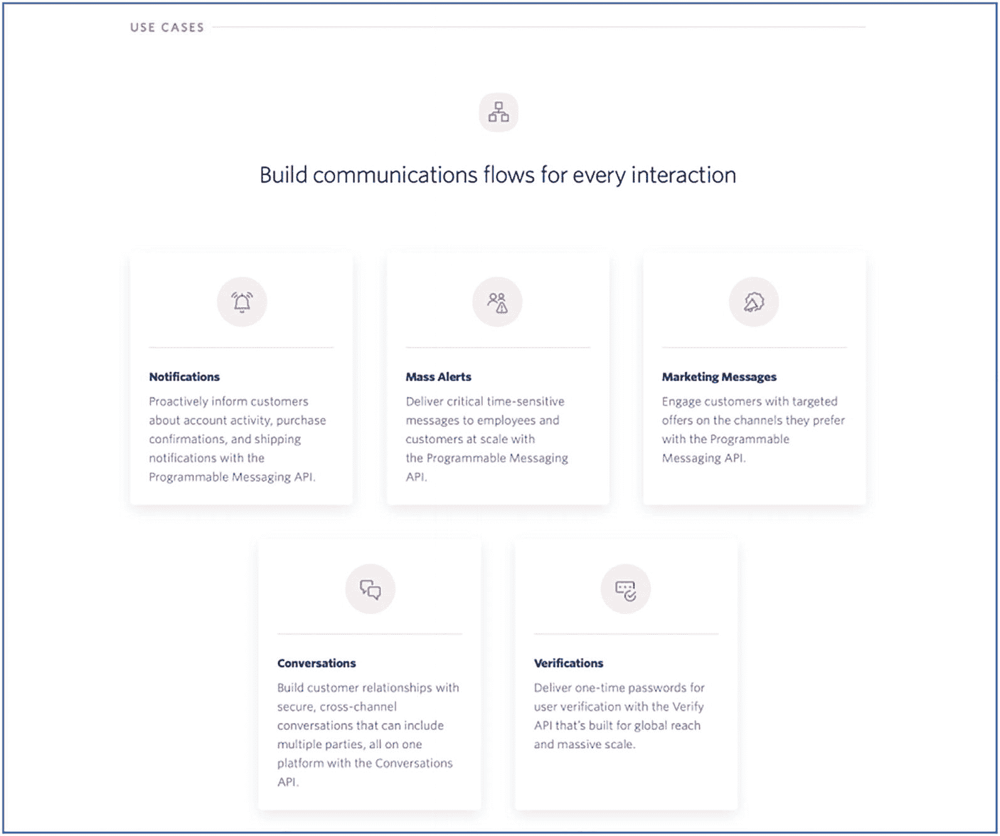
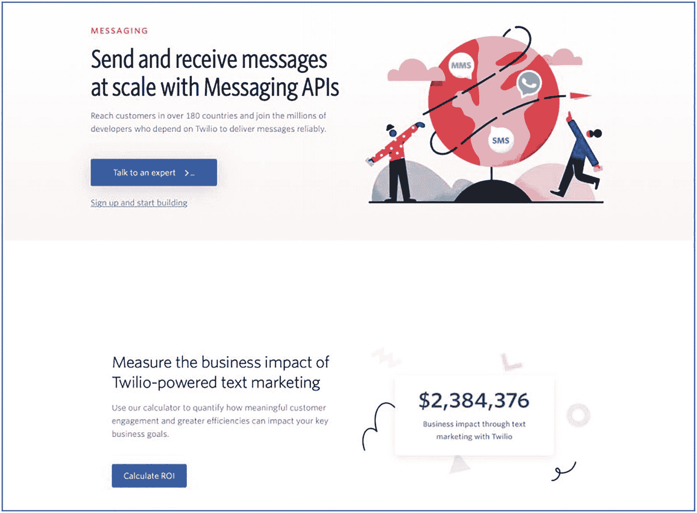
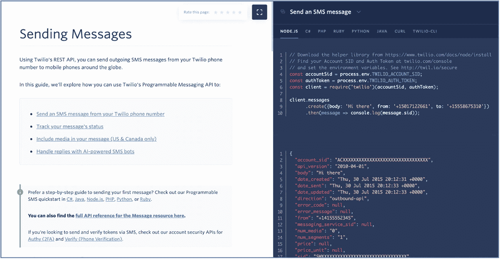
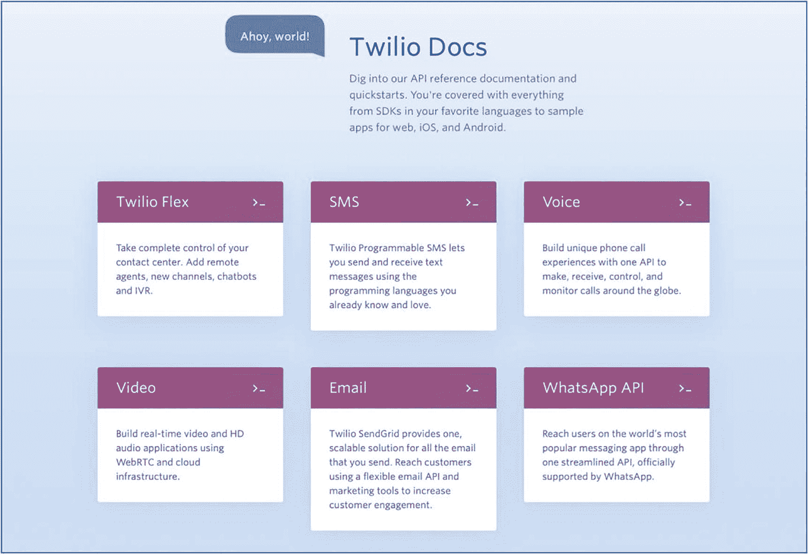

# 3. 消费

需要投入大量关注的关键领域之一，是 API Marketplace 的*界面*。尽管真正的主角是提供功能的 API 本身，但主角也需要舞台和剧场来表演。如果舞台太小，或剧场太难进入，那么 API 的卓越价值就会被埋没。在整个旅程中始终牢记这一点至关重要。没有第三方消费，就不会有流量；没有流量，就不会有收入；而收入维系着 Marketplace，后者的存在正是为了实现愿景（Vision）。

Marketplace 提供可被多个第三方消费的*产品（Products）*。某些产品或 API 由于监管要求或对特定功能的需求，几乎可以“自我销售”。然而，大多数产品都必须被主动营销，以展示其能力并鼓励采用与使用。我们将在下文讨论实现这一目标的机制。

## Marketplace API 与内部 API

交付团队应始终牢记 API Marketplace 的*语境（context）*。根据我作为集成开发人员的经验，在为内部项目暴露或消费某个接口时，我们可以通过面对面会议、电话或电子邮件，让消费方团队与提供方团队直接沟通，从而补充接口规范文档之外的细节。这之所以可行，是因为这类集成通常是一对一的消费方与提供方关系。

一个成功的 API Marketplace 会有*大量*消费者。尽管理论上可行，但与每个消费者逐一进行一对一会议来讲解集成问题，既不可持续，也不可扩展。这也不同于内部集成项目：在内部项目中，交付负责人会毫不犹豫地安排尽可能多的会议来解决接口挑战。第三方通常有多个 API 提供商可选；如果 Marketplace 不够吸引人或不易消费，他们通常就会转向别处。一个好的 Marketplace，应当能够抽象并简化后端平台的复杂性，并将其打包为易于消费的形式。

API Marketplace 并不是普通的、千篇一律的集成“管道”工作——把一个系统连到另一个系统即可。面向消费者暴露的 API 必须经过深思熟虑与谨慎构建。正如 Amazon 的“API Manifesto”所述：

*所有服务接口，无一例外，都必须从底层开始按可外部化（externalize-able）的方式进行设计。也就是说，团队必须规划并设计出能够将该接口暴露给外部世界开发者的能力。没有例外。*

## 用户画像

许多组织容易陷入一个误区：只搭建一个技术门户，里面充斥着大量三个字母的缩写词。在我们争分夺秒构建最小可行产品（MVP）时，也正是这么做的。我们的落地页有一些鲜艳的图标和图形，再配上匆忙拼凑的简短文字，而我们的重点都放在了技术层面。同样，根据经验，团队发布的门户第一版很可能会运行最长时间，因为团队的关注点会转向推出新的 API 产品。

由于其属性，人们很容易将“API 市场”归类为技术性事物，并且只关注工程师和集成开发人员。同样重要的是从商业视角看待市场，并思考如何利用它来提供业务价值。公司本质上都在尝试构建新的产品和服务，以更高效、更便捷的方式解决老问题。使用者需要理解 API 市场的意图与价值，才能判断如何利用它来实现其组织目标。

尽管在 API 体系中，用户体验（UX）看起来可能有些多余，但它是市场采纳过程中的关键要素。面向不同用户画像的 UX 有助于在正确的时间向正确的受众提供相关信息。这可以通过独立门户来实现，也可以在单一门户中通过清晰定义的分区来实现。

在接下来的章节中，我们将围绕以下方面，探讨如何满足业务和技术用户画像的目标：

*   **吸引（Attract）**：抓住平台潜在用户的注意力，覆盖广泛的用户群体——从成熟组织到金融科技公司和初创企业。

*   **教育（Educate）**：对平台理解越深入，使用就越高效，也更有可能更广泛地使用各类产品供给。

*   **建立信任（Build trust）**：市场的意图是通过使用内部产品和服务来赋能外部组织。平台的潜在使用方需要对其能力和可靠性有信心。

*   **透明（Transparency）**：细则藏得太深或信息晦涩，会影响与第三方的关系，并可能损害平台在市场中的声誉。

*   **协作（Collaborate）**：持续让客户保持参与，并利用反馈来优化平台、推动产品路线图。双方关系是持续性的。

*   **引领（Lead）**：由对门户内容负责的领域负责人主导，并支持组织内外的其他计划。

## 业务价值

你所在组织的 API 市场门户的首批访问者，很可能来自业务发展视角。该个人或团队会审查 API 产品，以判断其是否适合作为某个仍在构思或构建中的产品/服务的基础要素。图 3-1-1、3-1-2 和 3-1-3 是很好的示例，展示了 Twilio 如何为其 Messaging API 实现这一点。

图 3-1-3

在不使用任何技术术语的情况下表达服务收益

图 3-1-2

简单、易于关联的使用场景

图 3-1-1

Twilio Message API 的非技术概览

在接下来的章节中，我们将回顾构建 API 市场“业务门户”时需要考虑的关键领域。

### 吸引

虽然你可以采用“梦幻之地（Field of Dreams）”式策略——“*只要你建好了，他们就会来*”——但主动推广平台可能更有效。社交媒体发布、发布会、文章，以及在科技、创业与初创企业网站上的采访，都有助于吸引潜在用户。主页面上的核心信息（可能是用户看到的第一件事）就是你的“电梯演讲”——我们的 API 市场如何帮助你的组织？这可以包括一个 2 到 3 分钟的视频，在高层级上（最好在非技术语境中）展示市场如何提供服务和能力，并支持构建新产品。

务必大力强调采纳的收益。这可以通过激励来表达：“今天使用我们的平台，你将获得先发优势，为业务赋能并超越竞争对手”；也可以通过风险提醒来表达——“在欧洲，各国政府已出台法规，要求所有银行在 2018 年底前遵守《支付服务指令》。我们的政府也正在研究类似监管。”

### 教育

被充分赋能的第三方将理解平台的目的，并能够利用其业务能力进行商业化应用。此时你的受众可能没有任何技术背景。隐喻和类比对于传达关键信息非常重要。详细讲解诸如“*什么是 API？*”和“*你可以用它做什么？*”等核心概念的**解释型视频（Explainer videos）**会有很大帮助。可在与内部后端团队沟通时测试这些材料的效果。由于交付团队长期沉浸在细节中，某些 API 相关概念和功能很容易被视为理所当然。务必记住：对于 API 新手而言，学习曲线相对陡峭。

通过**案例研究（Case studies）**详细展示平台用户如何成功利用 API 推出新产品和服务，也将帮助潜在客户理解如何使用市场来实现业务目标。同时，提供使用平台所需时间与投入方面的信息也会有帮助。务必提供准确信息：过于乐观可能导致第三方设定不切实际的上线时间，进而引发集成疲劳；过于悲观则可能导致平台无人使用。鼓励按迭代方式采纳产品。对使用方和提供方而言，从一个或少量产品开始并完成落地，会比一开始铺开很多产品、后续又放弃更有益。

应聚焦**业务价值**而非 API 产品本身。举例来说，一个返回客户姓名和地址信息的*Customer* API，可用于*身份验证*；也可用于简化第三方应用的注册或开户流程。应强调繁琐的注册表单会导致潜在用户大量流失，而*Customer* API 可以帮助缓解这一问题。同样，*Accounts* API 可用于判断用户的财务行为，从而实现更优或个性化的服务供给。在 API 市场概念刚刚兴起的发展中国家，应重点展示在 API 生态活跃市场中已创造出的价值。

**邮件列表（Mailing lists）**和定期的**博客（blog）**发布，也有助于保持当前和潜在客户的持续参与。这同样有助于定义产品路线图。产品负责人可以利用这些沟通渠道来判断用户对新 API 的兴趣或潜在采纳情况。第三方也可以借此获知产品新版本、发布与补丁信息。

由于 API 市场处于持续演进中，客户教育是一项长期活动。这也是在该平台上工作的最大回报之一——创新与优化的循环永不停歇。你需要确保平台用户能够释放其全部潜力。

### 建立信任

请从潜在第三方的视角来审视 API 市场。该实体很可能将这个市场作为其业务运营的基础性组成部分。如果平台在稳定性或可靠性方面出现任何问题，对该组织而言后果可能是灾难性的。我们的实施之所以能获得显著采用，一个重要原因是：在我们的 Marketplace 背后，是一个拥有数百万客户、在全国范围内受信赖的品牌。我们的团队成员始终清楚，这种关系是相互的。我们平台的任何问题或缺陷，都可能影响我们所代表组织的信任与品牌形象。我倾向于把通过这种机制获得的信任称为“继承而来的”信任。本质上，你信任我是因为你认识我的父母。但我认为，信任也应当是“赢得的”。

这可以通过与平台用户建立紧密关系来实现。在平台发布的早期或试点阶段，要与第三方提供商密切合作。我们最近发布一款产品时，曾与一位热情的开发者每周通话，甚至有时每天通话。这种互动不仅帮助我们梳理并解决了正在发布的 API 产品中的问题，也让我们洞察了该产品的实际使用方式。外部开发团队对产品的信心也显著提升，因为他们能够看到提供方的投入与承诺。在 FinTech 和初创社区中，口碑传播通常也非常迅速。

你的平台采用情况会受到正面*和*负面反馈的影响。来自成熟第三方的背书（最好用他们自己的表述），以**客户证言**的形式呈现，可能有助于说服潜在用户使用你的 Marketplace。同样，这并不容易获得，往往需要整个团队投入大量工作。**参考客户**也将有助于建立信任。如果平台潜在用户看到某个知名品牌或产品正在使用该平台，就能形成一种隐性的信任。识别并锁定一个或多个成熟品牌至关重要，并且必须积极推动其使用你的 Marketplace。根据我们在时间规划上的实践经验，一个关键教训是：如果你希望你的平台在黑色星期五（11 月第四个星期五）前可用，你需要在 6 月就启动集成活动。

API 市场的一个关键结构是 Marketplace 与第三方提供商之间的**合作伙伴关系**。如前所述，Marketplace 需要平台消费者才能生存。同样重要的是要强调另一层关键伙伴关系：Marketplace 与该组织终端用户之间的关系。终端用户信任 Marketplace，只会将信息或数据访问权限授予那些已得到其授权的第三方。对于正在阅读本文的 API 项目团队——请意识到，这不仅是一项需要坚守的重大责任，也是一种非凡的荣誉，因为正是你们的努力促成了这种三方关系。

### 透明性

强大且持久的关系需要透明。尽管第三方是 Marketplace 的消费者，但请务必记住：他们与平台的成败有着内在且紧密的关联，其程度并不亚于内部团队。其背后的简单逻辑是——如果 Marketplace 失败，将会影响他们的组织，甚至可能影响其持续运营的能力。

要对**时间线**保持坦诚。包括 Marketplace 上线、API 产品能力、可用性以及路线图。由于竞争压力，这并非总能做到完全公开。但始终应追求“少承诺，多交付”。我们在早期旅程中学到的一条关键经验是：我们应始终比开发者社区领先一步。随着 Marketplace 上线，许多第三方注册使用该平台——远超预期。不幸的是，由于需要内部审批，我们 Marketplace 中的一些 API 产品尚未准备好商业化。事后看来，更稳妥的做法应是将这些 API 产品从目录中移除，或在门户中明确标注其商业可用时间线仍待确定。

**定价**——无论是成本还是激励形式——都应清晰、明确，且不应包含隐藏条款。第三方很可能需要投入时间和资金来使用 API Marketplace 的产品。此外，第三方也需要清楚了解使用平台的成本结构。也就是说，费用是按交易计费、分层计费，还是固定费用。还可能通过潜在线索或推荐佣金的形式，提供使用 Marketplace 的激励。归根结底，第三方需要尽可能多的财务信息，以判断与 Marketplace 合作的商业可行性。在 Marketplace 早期阶段，可能有必要允许免费访问 API 以促进采用。请务必向消费者说明这可能会调整，并将在后续进行评估。如果由于外部因素暂时无法提供定价，也务必清晰说明。

**服务级别协议**（SLA）和问题解决时间线必须明确定义。其内在好处是，SLA 可以在多个提供商之间复用。这些还可以分级——更高等级将获得更多支持和更快解决速度——当然成本也更高。前期达成一致还能就解决预期设定正确认知，并在处理运营咨询时显著帮助 Marketplace 支持团队。再次强调，请务必如实说明解决时间——过于乐观会在长期故障中导致信心流失，而过于悲观则可能影响采用和信心。对于不清晰或仍待定义的部分，应明确标注，并在发生运营问题时确保清晰沟通。

### 协作

可以考虑提供一次或几次无义务的**咨询**会议。对于发展中市场尤为如此，因为潜在客户往往希望通过面对面讨论问题或场景来获得额外的安心。根据经验，在客户旅程的这个阶段，技术支持团队未必最适合协助潜在用户。应由产品负责人在技术团队支持下主持这些会议。技术团队能够协助开发或集成问题；而产品负责人则能够从商业成功角度定位 Marketplace。

一个**登记你的兴趣**的线索生成表单是必需的。必须在 24 小时内进行邮件或电话跟进。FinTech 和初创企业运转节奏极快，若未及时跟进，潜在机会很容易流失。在跟进过程中，产品负责人将能够判断潜在客户的成熟度、组织所处阶段，以及所需支持的层级和领域（包括问题偏商业还是技术性质）。

随着 Marketplace 演进并且采用率提升，可能有必要提供分层的**支持等级**。由于交付团队的人手可能固定，未必能够为所有第三方提供同等程度的时间与关注。更高等级的付费服务将带来更紧密的协作，也可能为专属服务经理提供资金支持。在 Marketplace 早期阶段，请务必将每一条客户咨询（无论潜在客户还是现有客户）记录到服务台系统中并持续跟进。

### 负责人

这项工作最好由产品负责人（PO）牵头，因为这将构成面向外部消费者的销售宣讲基础。PO 还将向内部平台团队大力阐述在 Marketplace 中拥有代表性的好处。请始终牢记，API Marketplace 拥有众多消费者——来自外部组织的业务型*和*技术型受众。从这些关系中获得的知识也可用于向内部团队和利益相关方展示能力。务必给予这项工作恰当程度的关注与重视。

## 技术开发者门户

我在科技行业有超过 20 年经验，并且我自己也是一名自豪的开发者；因此，当谈到技术信息来源时，我的标准极高，*但*容忍度很低。我期望获得高质量且精准的信息，以便吸收并理解某个产品或服务。尽管所有开发者最终都会去 StackOverflow，但如果我必须频繁诉诸这种方式，我对某个产品能力与成熟度的信心就会下降。如果有合适的信息或资源可用，我并不介意投入时间和精力去学习或理解概念，以便使用该技术。开发者门户是 API Marketplace 与技术受众建立关系的基础。

图 3-2-1 和 3-2-2 展示了 Twilio 针对其 Messaging API 的技术文档视图。图 3-2-1 通过识别发送消息的各种渠道，展示了下一层级的细节。在图 3-2-2 中，文档提供了 API 使用所需的底层技术细节。

图 3-2-2

用于消费 API 的技术说明与代码示例

图 3-2-1

循序渐进地介绍不同的消息通道

我们认为，构建一个能让开发者信任并保持忠诚的 Marketplace，应关注以下领域。

### 吸引

对 API Marketplace 的技术消费，可能来自第二波评审，第一波通常是业务发展评估。技术团队将负责提供一份用于集成到 Marketplace 的**影响评估**。将会审查诸如文档标准、自助服务、示例代码、测试数据可用性以及开发者支持等标准。此评估反馈将有助于确定集成的时间线和成本。

尽管 API Marketplace 的目标是吸引第三方提供方进入平台，但这需要以必要的**最低水平**技能与经验为前提。在定义目标受众时务必牢记这一点。引入新手或初级开发者的风险在于，团队将不得不提供更多的手把手指导与支持。

**用户群组**和社区活动也可用于消除 API Marketplace 概念的神秘感，并向感兴趣的开发者介绍该平台。由于 API Marketplace 的目标是实现数据访问民主化，可考虑那些能够消费产品并启动多样化应用的创业者。**黑客松**是鼓励参与和激发兴趣的绝佳机制。一个积极的副作用是，它们还可能帮助你发现有才华的开发者加入交付团队。

我们在一次实施中观察到一种新颖做法：与外部组织合作，由其邀请一组多元化开发者参加 3–5 天训练营。在此期间，开发者会与专家配对获得支持，并构建一个使用 API Marketplace 的应用程序。

FinTech 和初创企业也热衷于消费 API 来快速启动应用交付。务必在此类组织常访问的网站发布文章并鼓励参与。Marketplace 具有**病毒式传播**特性，如果开发者体验积极，口碑会自然扩散。构建并培育开发者社区至关重要，这应成为 API Marketplace 的核心目标。

### 教育

对 API Marketplace 的技术消费至少需要中级开发经验，最好具备 2–3 年的实操编码或集成经验。虽然你可以教育新手开发者，但我认为门户的目标与材料不应包含如何发起 REST API 调用的教程。网上已有很多优秀教程，可帮助开发者快速掌握 API。

不过，请务必覆盖 API Marketplace *特有*概念，例如在**蓝图**中讲解 OAuth。委托授权作为 Marketplace 的基本原则之一，*必须*被清晰且简明地详细说明与解释。我们遇到过许多新的 API 消费者，在能够对照时序图追踪调用之前，并不真正理解流程。许多集成开发者只熟悉 client ID/secret 模式。

对于每个 API 产品，尽量提供多种编程语言的**代码示例**。一些标杆级开发者门户会提供以下语言示例：Node.js、C#、PHP、Ruby、Python、Java 和 cURL。API Marketplace 的最大优势之一是访问方式中立——HTTP。务必利用这一点来兼容广泛的开发者群体。根据我个人消费某大型云服务商产品的开发经验，**代码实验室**可以带来巨大差异。代码实验室不同于代码示例，因为它会逐步引导开发者完成 API 消费流程。可以把代码示例看作现成蛋糕，把代码实验室看作食谱。

随着 marketplace 逐步成熟，可考虑提供用于集成的**模式**或推荐实践。典型示例是从移动应用消费 API。鉴于大量提供方在集成方面可能面临类似挑战，提供模式将有助于缓解集成摩擦，让你的 API 更易被消费。顺便回答一个常见问题：关于直接从移动应用消费 API，答案是绝不要在应用中存储凭据，而应使用经用户认证的令牌来发起 API 调用。

**博客文章**和**播客**同样是与开发者社区保持连接的极佳方式。这些工具可用于分享 Marketplace 的建设历程，并让用户了解你的路线图。可在播客中提出并回应尖锐议题——例如监管时间线以及如何据此规划。这些内容能让外界更深入理解平台内部运作与运营方式。

随着平台成熟并扩展规模，可考虑推出**开发者认证**。它不必是庞大的体系——只需基础理论评估和实践练习，以确保开发者掌握 Marketplace 概念。对于更敏感的 API 产品，这可能会成为强制要求。

最后，可下载的 Postman 集合将极大帮助潜在开发者。Postman 被视为 API 开发的事实标准工具，本章后续也会讨论。务必提供文档，逐项说明集合中的每个值，并附上分步指南。Postman 集合本身大约只占 40% 的工作量，其余 60% 在配套文档上。如果可能，考虑聘请技术写作人员协助整理这些材料。遗憾的是，一些最优秀的开发者并不一定最擅长撰写文档。

### 建立信任

在开发者社区中，信任必须靠赢得。这可以通过关注细节并坚持高标准交付来实现。通过帮助开发者解决他们仅凭现有技术文档无法自行解决的难题，开发者会感受到支持。及时响应支持请求同样是强制性的。快速反馈——哪怕只是*“我们正在调查，会尽快回复你”*——都至关重要。基于这一点，支持团队内部必须具备相应流程，使开发问题能够被升级并得到处理。

我想强调，开发者支持是一种平衡。我们当然希望支持开发者使用我们的 Marketplace，但也希望客户群体尽可能具备自助能力。也就是说——首要求助渠道应是 Portal 文档；若仍存在明显理解差距，应先在开发者论坛提问，以征集社区反馈。如果这些方式都无效，并且使用方确信问题出在内部运行机制，或属于其无法在 Marketplace 团队介入前自行解决的问题，则应提交工单。此外，工单还应包含他们已进行的排障与调查细节，以及*他们*判断该问题超出其控制范围的依据。这个要求看起来可能很高——但强大的开发者社区不仅能缓解支持团队压力，也能提升 Marketplace 的整体标准。也就是说，API 产品质量将提升，因为它会接受来自使用方更具挑战性的评审。

同样重要的是**言行一致**。如果 API Marketplace 是访问数据的新数字渠道，你的流程也应当是*数字化*的。对于一个兴趣刚被激发的开发者而言，没有什么比无法立即上手实践更令人沮丧。比如，拥有一个很棒的开发者门户，展示了惊人的功能与能力，却只提供一个*预约沟通*或*联系我们*表单。自助服务是绝对必要的。我想特别强调这一点，因为它能让用户从概念无缝过渡到落地实践。

通过提供对功能的即时访问，你的 API Marketplace 将从“营销/概念产品（vaporware）”转变为可落地代码。根据经验，开发者非常反感 vaporware。怀疑会立刻上升，寻找 Marketplace 薄弱点的审视也会加剧。请务必在 API 产品发布时提供即时自助访问，至少应提供 Sandbox/Simulated 环境。

### 透明性

对信息的**开放**、明确且无歧义的访问，也是*维持*开发者社区信任的方式。在竞争压力允许的范围内，尽可能提供 API 产品路线图洞察。第三方可以据此规划并安排各自发布节奏。若可能，可考虑与第三方就潜在 API 产品开展咨询式流程，以便在产品生命周期早期确定潜在需求/采纳情况。这将有助于将精力聚焦到更易被消费的 API 上。尽管拥有数百个 API 产品的目录看起来很惊艳，但如果其中大多数 API 的使用量或采纳率都很低，它只会增加支持和维护范围，并分散对高使用率 API 的关注。

可以考虑设立**beta**计划，允许受信任的部分第三方提前访问早期阶段的 API 产品。该流程能让团队在边界清晰且安全的“staging”环境中优化和打磨产品——从接口设计、性能工程到文档更新。beta 标签清晰表明产品仍在建设中。当我们的 Marketplace 向公众发布时，我们的产品负责人巧妙地加入了“beta”标识，使我们在发布早期阶段拥有更大的调整空间。在获得信息与网络安全许可后，也可能将 beta 发布 API 连接到内部质量保证（QA）后端，以进行更深入的集成测试。不过这应在充分审慎评估后执行，因为向第三方开放内部环境可能打开“潘多拉魔盒”。

在若干成熟开发者门户中可见的一个创新特性是 API **status** 页面，并且该页面本身也可通过 API 获取。这使使用方能够接入你的运营平台，并在服务或 API 宕机时采取预防性措施。状态信息还包括历史数据，从而让使用方与运维团队能够快速识别运行不佳的产品，并在内部或后端平台上推动修复。提供这种级别的可见性，是向第三方传递一个信号：你认真对待平台稳定性与可靠性，并已采取措施在问题发生时提供即时告警/通知。

一旦 API 进入生产环境，任何新增功能更新，或补丁与问题修复，都必须在**release notes**中清晰记录。这应成为部署周期的一部分，因为第三方必须被持续告知 API 的任何变更。

### 协作

务必鼓励使用方对 API 产品提出反馈，并在可能情况下在后续版本中尽量响应这些反馈。某些反馈——例如规定性监管接口过于复杂、难以消费——可能无法通过变更来满足。反馈是一份礼物；如果使用方愿意花时间提交反馈，从他们的视角看，这很可能意义重大——务必始终与用户形成闭环。继续上面的例子——针对复杂受监管接口的反馈，处理方式应是先表示理解，再说明该接口由监管强制要求，最后给出辅助建议，例如示例代码或实验课程。

在技术开发者门户中设置一个区域，可能是消息论坛里的**feature**请求专属版块。随着第三方持续消费你的 API，他们最有条件识别产品缺口和潜在改进方向。这对产品生命周期是极佳输入，能让一个好 API 变得更卓越。再次强调，依据 API 的规模与覆盖面，请求的优先级或排期应与该请求的投票数相关联。这是活跃开发者社区最大的价值之一——用户可以帮助推动产品路线图向前发展。

在企业内部的集成方案中，所有服务使用方通常会提前很久收到变更通知，且某些治理流程要求在变更实施前获得所有使用方批准。由于 API Marketplace 位于组织边缘，交付团队在更新 API 时可能未充分考虑更广泛影响。也就是说，从责任分配 RACI（Responsible, Accountable, Consulted, Informed）矩阵角度看，第三方可能既未被 Consulted，甚至未被 Informed。应遵循轻量级变更管理流程，确保所有服务使用方至少知悉其所消费 API 的任何维护或发布。

### 牵头方

这项工作也应由产品负责人（PO）进行协调，并充分吸收工程团队的重要投入与指导。尽管内容本质上具有很强的技术性，有人可能会认为这项工作最好由技术团队来理解并交付。我的反驳是，技术团队*并不*适合牵头这项工作，因为他们可能过于贴近细节。产品负责人将提供第三方视角。由于产品负责人最终要对 API 的成功与采用率负责，他们应当牵头 Business 和 Technical 两个门户的工作，因为这属于面向客户的事项。到这里应当已经很明显：产品负责人*必须*具备半技术背景。

## 开发者布道

即便是一个好产品，配有良好文档，也仍然需要被布道推广。我在学习如何使用一个新的移动应用开发平台时，从一家大型云服务商那里观察并体会到了这种方法。起初，我完全不理解这为什么有必要——文档、代码示例和实验内容都非常出色，甚至新手开发者也能在很短时间内上手运行。然而，当我进一步深入这个平台时，我遇到了文档中没有覆盖的场景。也正是在那一刻，我理解了 Developer Advocate 的价值。

他们可能并不知道，但通过反复观看、暂停并跟着他们的视频教程同步编写代码，我已经能直呼其名。我惊叹于他们的解决方案远比我预想的复杂方案更简单、更优雅。除了更深入了解该平台之外，我也学会了如何更高效地使用*Node.js*。文档与 Advocate 的区别在于，后者是在用产品解决真实世界场景。

想象一下，几块乐高积木散落在桌上。尽管你也许可以自己搭出一个基础结构，但你很可能只会使用熟悉的积木。观看别人如何使用一块你不熟悉的积木来实现某个特定功能，会帮助你正确理解这块积木的作用，并让你在未来更有信心使用它。

简而言之——API Marketplace，尤其是在发展中市场，需要强有力的开发者布道。以有趣、易懂的语境讲解委托授权等概念的视频教程，必然有助于缓解开发者焦虑。访问机制使开发者能够*随时*、并按需*反复多次*查看材料，以理解复杂概念。随着近期线上 meetup 的蓬勃发展，加入用户组如今比以往任何时候都更容易。应尽可能利用这一点，让潜在开发者（具备前置经验并拥有愿意学习的心态）快速在平台上手。用户组、线下或线上会议的内在价值在于，它允许 Marketplace 与开发者之间进行双向沟通。我认为这种互动是互利共赢的。

开发者可以从 Marketplace 技术交付团队获得实操支持。交付团队也能第一手看到开发者视角。有时在象牙塔中进行开发，可能产出理论上完备但不切实际的产品。这类产品通常会被搁置。API Marketplace 产品开发的一条关键信条应当是：简单、实用、可靠。团队中的任何成员都应有信心，能够轻松向外部用户解释如何使用该产品。

在我们的发布活动中，产品团队争取到了用于制作 T 恤和马克杯的资金。我对此努力会心一笑，起初把它当作一种营销手段。然而，当我看到交付团队对穿上这些 T 恤感到无比自豪时，我非常惊讶，也正是在那一刻我意识到了这些小物件的重要性。“Swag”，也被称为“merch”，为无形实体提供了一种有形连接。直到今天，我的桌上还放着那个（未使用的）马克杯，因为我为我们所取得的成果感到自豪。我们的关键目标之一，是让开发者社区与 Marketplace 建立连接，并拥有同样的归属感与支持感。

## 开发者支持

与其他集成环境相比，API 市场的独特之处在于：在开发阶段和运营执行阶段都需要支持。这看起来可能会使所需的支持能力翻倍——然而，支持开发者最终会带来平台在运营层面的更多使用。开发者支持也不同于运营支持，因为两者问题咨询的性质不同。

我们最常见的问题集中在看似复杂的委托授权模型上。为了解决这个问题，团队制作了能够清晰说明该概念的材料。你可能会惊讶，这些内容其实只是一些图片拼成的幻灯片。我们在多个场景中都成功使用了它——面向内部和外部开发者皆然。在讲解过程中，它有助于厘清终端用户、第三方提供方以及我们组织各自的角色。当我们在与 API 使用者、测试人员或解决方案架构师的通话中逐步演示流程时，我几乎能感受到那种“恍然大悟”的瞬间：他们一下子就明白了它的工作方式。

随着我们的市场不断增长和演进，我们也在持续改进并优化开发者支持流程。在发布早期阶段，大多数开发者问题由我们的一线支持团队处理。不过，如果一线支持无法提供帮助，问题就会转交给内部团队，进行更深入的技术或产品支持。对于某些请求，我们曾尝试通过电子邮件解决。然而，十有八九，成功率最高的方式还是与第三方开发者进行在线讨论。

坦率地说，这一部分在我们的实施中仍在持续完善。非常有帮助的一点是，我们的产品负责人（PO）具备卓越的关系建设能力。当请求在一线支持与后端支持之间流转时，PO 也会与第三方沟通，以便明确需求，并在在线讨论前缓解潜在摩擦。请务必记住，到讨论开始时，第三方很可能因为问题尚未解决而感到不满，而一线支持也可能因多次尝试未果而感到沮丧。

在线讨论时，我们会安排此前一直与用户沟通的一线支持工程师参会——以保证连续性。高级工程师和产品负责人也会参加会议。我们的意图并不是要让外部开发者感到压力，恰恰相反。我们希望表明：第三方对我们很重要，而且整个团队都重视这种合作关系。

围绕这类互动的第一原则是*倾听*。首先，在讨论前准备阶段，你必须清晰且专注地听取一线工程师对问题的分诊说明。基于这些反馈，团队应准备好相关材料或信息。其次，你必须清晰且专注地倾听外部开发者。在会议初期收到的反馈或提问，将帮助你构建更好的平台。一旦你确认自己已经准确把握问题或现状，再提出解决方案。如果你需要进一步调查，也请明确说明。建议在通话后一天左右进行跟进。这将表明 API 市场真诚地关注开发者的成功。

一个积极的副作用是：我们与开发者社区建立了更好、更具个人化的关系。我们不再只面对客户端 ID 和电子邮件地址，而是能将其与真实的声音和面孔对应起来。我们了解开发者正在构建哪些类型的应用，也了解他们如何使用我们的 API。在几乎所有互动中，开发者都会自豪地展示他们的应用。对于新产品发布，我们还邀请第三方开发者参加全天会议，执行端到端集成测试。这帮助我们在将能力扩展给更多第三方提供方之前，识别并细化潜在问题。收到的反馈也被用于更新并调整产品的工作方式。

尽管这些互动不像运营场景中的问题那样承受高强度时间压力，我们仍然尝试以处理运营问题同等的关注度和严谨性来处理开发者支持请求。从优先级角度看，运营环境始终第一。我们的市场通过电子邮件和 Slack 接收支持请求。一线支持工程师会先尝试解决配置类或简单问题。对于更复杂的问题，会登记服务台工单以便跟踪，并分配给相关团队成员进行调查和解决。如有需要，问题会升级至产品负责人，由其安排与外部团队的在线讨论。

最后，正如本章前文所述，我们鼓励外部开发团队尽可能实现自助能力。如果 API 集成存在技术问题，我们会要求提供有关请求与响应的 HTTP 跟踪信息，以及可能的代码摘录。本质上，这是一种*“帮我帮你”*式的协作。API 市场一个利他的目标是：让平台赋能、培育并建设本地开发者社区。我们将在下一节中更详细地讨论这一点。

## 生态系统

这些年来，我非常幸运能够参与一个 API Marketplace 的实施工作，并且一直惊叹于这个生态系统如何随着时间推移以及项目成熟而不断演进。我们最初是在一个“小鱼缸”里起步的——只有交付团队中的少数几名成员，目标是交付一个最小可行产品（MVP）。一开始，我们与外部世界几乎没有真正的连接，只与后端平台有几条薄弱的链路。

随着平台为生产负载做好准备，我们进入了一个更大的“水箱”，并与不同的企业团队紧密合作，以实现更高的稳定性和可靠性。随着我们理解企业能力为实施带来的价值，我们对其的尊重和认可也不断提升。在 API Marketplace 生态系统的语境中，人们可能很容易忽略企业内部团队。如今，我认为这恰恰是平台最关键的支撑要素之一，也是我们生态系统中不可或缺的一部分。毫无疑问，以流程和治理形式存在的、与成熟企业体系的“系绳”，有时会被视作拖慢变革速度的“磨盘”。但回过头看，几乎所有这些要求都让平台变得更稳定、更可靠，也更具企业级水准。

我们非常幸运，首个主流消费者是一个内部支持的超级应用。我们已经从“水箱”进入“水坝”——水体更大、严肃性更高，但本质上仍是一个用于从运营角度验证平台的“安全空间”。随着越来越多参与方加入生态系统，我们必须在极度激进的交付需求与深植于后端平台的运营问题之间取得平衡。这可能促成了 Marketplace 最大的一次扩张。在短短几个月内，与后端平台的集成数量呈指数级增长。超级应用带来的推动力帮助巨大：随着这艘“巨舰”冲破壁垒、撕开繁文缛节，我们连接更多后端平台的能力也随之快速增长。每新增一次集成，我们都必须与一个后端建立新的关系——不仅是在开发层面，也包括运营支持层面。

此后，我们已经迈向“开放水域”。在成功支撑高性能内部消费者负载并借此赢得口碑后，我们如今更多地与外部第三方合作。这些第三方的规模和体量从单开发者实体，到知名金融科技公司，再到成熟的在线零售商不等。不过，我们对所有合作方都秉持同样的尊重与投入。

最让我持续感到惊叹的，是生态系统的共生特性。没有消费者和企业服务的支持，API Marketplace 就无法存在。与此同时，它又是外部消费者利用企业服务能力的关键枢纽。我们期待由此产生的涟漪效应，终有一天能演变为蝴蝶效应——Marketplace 已经激发了本地开发者社区。作为领先的金融服务提供商，我们 Marketplace 所提供的能力，已经促成了许多创新产品与服务的构建。这些新的增长萌芽需要被培育和支持，并将孕育出成功的第三方，进一步反哺 Marketplace。Marketplace 的成功取决于一个活跃、繁荣的生态系统，在其中所有实体共同协作、共同成长。

## 开发者参与

API Marketplace 可以采用不同的开发者互动策略。一些平台采用社区化方式，访问是开放的，成员彼此支持，以便更有效地利用平台。开发者之间的互动也可能催生创新产品和解决方案，其中可能包含来自不同平台的 API。在这种参与模式下，开发者门户本质上是志同道合开发者分享想法与协作的会合点。一些门户还会展示个体开发者的经验与专长。随着解决方案被验证和认可，开发者的等级与可信度会提升。经验丰富的成员可以在帮助新开发者时充当“生态大使”。

另一种方式是基于关键筛选标准选择合作伙伴。其意图是让规模更小、但更有经验、更成熟、且理念一致的合作伙伴子集进入生态系统。封闭生态合作关系用于创建、扩展和改进 API 供给。开发者可通过合作伙伴网络获得财务激励、高级支持与辅导、对新产品的提前访问以及正式认证。尽管开发者池更小，但这也可能潜在地需要平台提供方投入更多管理与支持。

由于来自不同组织的开发者可能不会直接沟通，通常需要合作伙伴经理提供支持，并将问题转交给后端技术团队解决。共享信息或协助其他开发者也可能不可行，因为他们可能将其视为竞争优势的损失。还应注意，在这样的环境中，预期服务水平明显更高。如果开发者提交了问题，反馈和/或解决方案必须在比社区论坛明显更短的时间内给出。

开发者参与的形态将由你要构建的 API Marketplace 的性质决定。比如，如果你的 API 用于帮助在本地社区寻找走失宠物，应采用社区化方式；如果你的 API 用于寻找制造核武器所需钚的来源，你可能就需要限制能够访问平台的合作伙伴。

## 工具链

开发者会使用各种各样的工具来完成工作。开发者工具范围可以从邮件客户端、代码编辑器、集成开发环境（IDE）到 Wiki。在本节中，我会重点介绍一些我个人在日常交付中认为有用的工具和实践。用于 API 消费与开发的优秀工具和产品非常多。这里并非要做产品对比或基准评测。如果你已有经验，或对其他工具更熟悉，请继续使用它。

### cURL

cURL（即 client URL）是一款使用 URL 语法来获取和发送文件的命令行工具。它支持包括 HTTP 和 HTTPS 在内的多种协议——这使其非常适合用于 API 工作。它几乎可在任何硬件平台上运行，并被许多主流操作系统内置。

我使用 cURL 的原因如下：

*   **通用性**：当我在容器、虚拟机和服务器之间切换时，常常无法使用本地机器上那些强大的图形用户界面（GUI）工具。在因网络限制而无法享受 UI 便利的远程节点上，能够通过*curl*访问端点来检查连通性，或模拟/重放客户端请求，其价值无可替代。

*   **简洁性**：我也喜欢使用 cURL，因为它朴素、免繁饰且维护成本低。它专注于自己作为“信使”的角色，在关键参与者——客户端与服务器——之间传递消息。发起各种 API 调用的语法简明，在线教程和示例也很容易获得。

*   **中立性**：如果一个请求在 cURL 中可用，或反过来不可用，那么结论是无可争辩的。尽管开发者可能使用不同工具，但 cURL 命令可以轻松共享，并在几秒内重放。由于命令行是所有操作系统的“最大公约数”，cURL 因而跨越开发者边界，具备了通用“公民身份”。

### Postman API 客户端

Postman 是一款流行的 API 客户端，可让开发者轻松创建、共享、测试并文档化 API。它通过允许用户创建并保存简单或复杂的 HTTP/s 请求，以及读取响应来实现这一点。Postman 拥有许多功能。以下并非完整清单，但重点介绍了我和我的团队经常使用的要素：

*   **快速上手**：一旦我们有了端点和请求细节，就能快速调用 API。Postman 的 UI 直观，并支持以不同方式发起请求。例如，请求体可以用多种格式指定——并可通过简单的单选按钮界面进行选择。免费版本已具备所有快速启动所需的能力。

*   **能力**：这个工具可以按你的需要做到简单或复杂。Postman 适配了广泛的开发者技能层级——从只想向端点发起请求的新手开发者，到希望搭建复杂自动化测试执行流程的资深测试工程师。

*   **共享**：由于我通常跨多台机器工作，同步能力带来了极佳的可移植性，我可以在一台机器上开始一个集合，然后在另一台机器上继续。我们最常用的功能之一是团队成员之间共享集合。我们经常遇到这样的情况：同一个调用在某位开发者那里可用，但在另一位那里不可用。API 请求极其细致复杂，对于复杂调用而言，成功与失败的差别可能只在一个参数。通过公共链接导出集合即可轻松共享。请注意，这不应被用于敏感 API。这显著提升了协作效率，并使开发团队成员之间能够即时对齐。

*   **代码片段**：在开发集成解决方案时，使用工具调用 API 或端点只是漫长战役中的一场胜利。下一处“战场”是从代码中实现同样的结果。代码片段功能非常有用，因为它可将 Postman 中的请求转换为多种不同语言——甚至包括 cURL 命令。这非常实用，因为它有助于从工具到代码的过渡。

*   **变量与环境**：作为软件开发生命周期的一部分，解决方案必须在多个环境中流转——从开发（Development）到测试（Test），再到预发布（Staging），最后到生产（Production）。在会话式 API 交互中也很常见的一点是：前一个请求的输出会被后一个请求使用。变量可用作占位符——可手动设置，或使用脚本更新，从而显著加快测试速度。诸如端点之类的变量，也可以为特定环境进行配置。

### Fiddler

Fiddler 是一款调试代理服务器工具，用于记录、检查并修改计算机与一个或多个 Web 服务器之间的 HTTP 和 HTTPS 流量。

我们的支持团队最近收到一位第三方开发者的支持请求，对方在调用 API 时遇到了问题。这个请求之所以与我们收到的其他请求不同，是因为它包含了每个请求和响应的详细 HTTP 跟踪信息。这不仅让我们能够跟踪调用流程并确认顺序是否正确，还帮助支持团队准确定位到哪一个请求中的哪一个参数有误。该开发者能够通过使用 Fiddler 提供这些跟踪信息，因为 Fiddler 拦截了调用并记录了 HTTP 请求与响应。

### 开发者赋能教育

由于 Marketplace 团队每天都在使用这些工具和技术，很容易忽视其他开发者可能遇到的学习曲线。技术开发者门户应将以下一项或多项作为强制要素，以支持第三方：

1.  为每个 API 产品提供 Postman 示例集合。该集合必须包含预填充请求，开发者只需提供最少信息（如凭证）即可发起首次 API 调用。

2.  提供工具配置的快速指南，并特别关注可能引发问题的区域。例如，Postman 中 “Headers” 与 “Parameters” 的区别。

3.  在提交支持请求时，说明请求所需的详细信息以及*如何*获取这些信息。应使用类似 Fiddler 的拦截器来捕获请求与响应——而不是发送代码片段。

被赋能的开发者将形成一个更有经验的开发者社区，减少支持请求，并且当请求出现时，其内容会更详细、更简洁。前期投入时间和精力，将在 Marketplace 生命周期后续阶段带来显著收益，例如需要更少的运维人员，以及更快地解决或响应支持咨询。

## 总结

在本章中，我们讨论了围绕 API Marketplace 的业务门户与技术门户的策略。尽管聚光灯照在精彩舞台上的耀眼 API 产品上，但确保开发者受众的需求始终处于关注焦点同样重要。

每个 Marketplace 实施都会因 API 产品组合、门户形态、开发者关注点和参与策略的不同而独具特色。提前定义这种身份，有助于团队清晰规划通往目标状态的路径。也可能有必要让平台身份随着时间推移而演进或调整——以响应客户需求。API Marketplace 的动态特性确实是其最大优势之一，因为这种灵活性使其能够比现有企业系统更快地做出响应。

在下一章中，我们将探讨 API Marketplace 的变现。消费模型（Consumption model）会对平台如何变现产生重大影响，因为二者本质上紧密相连。如果变现模型是高交易量、低交易成本，那么就需要更多开发者进入管道。如果策略是较低交易量、基于订阅的收入，那么目标就是一小部分成熟、忠诚且愿意并能够支付订阅费用的组织。

