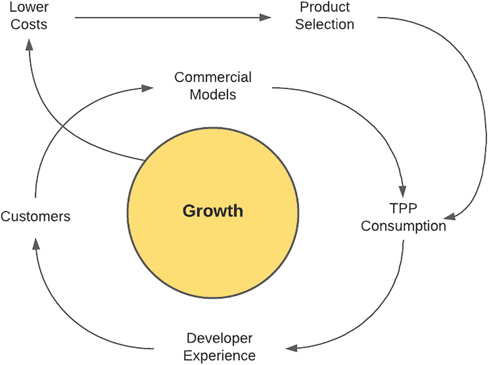
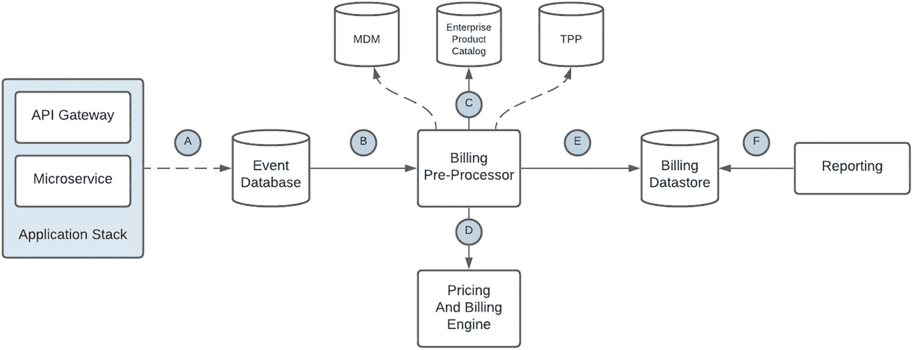
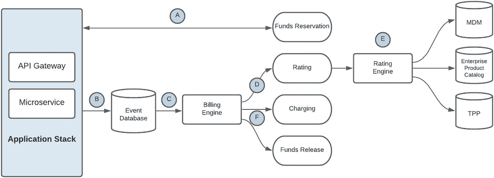
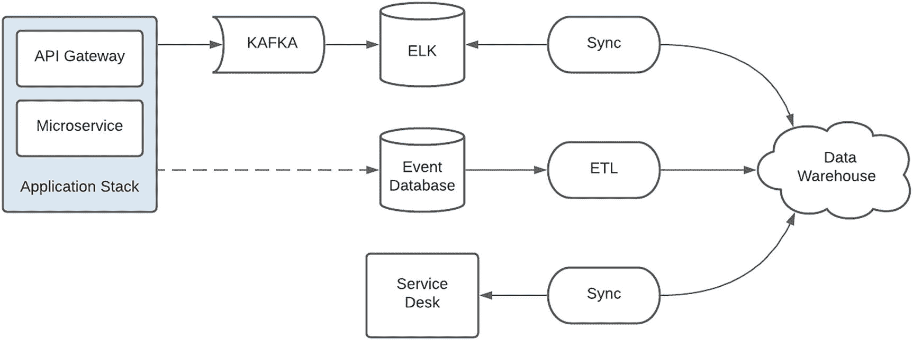
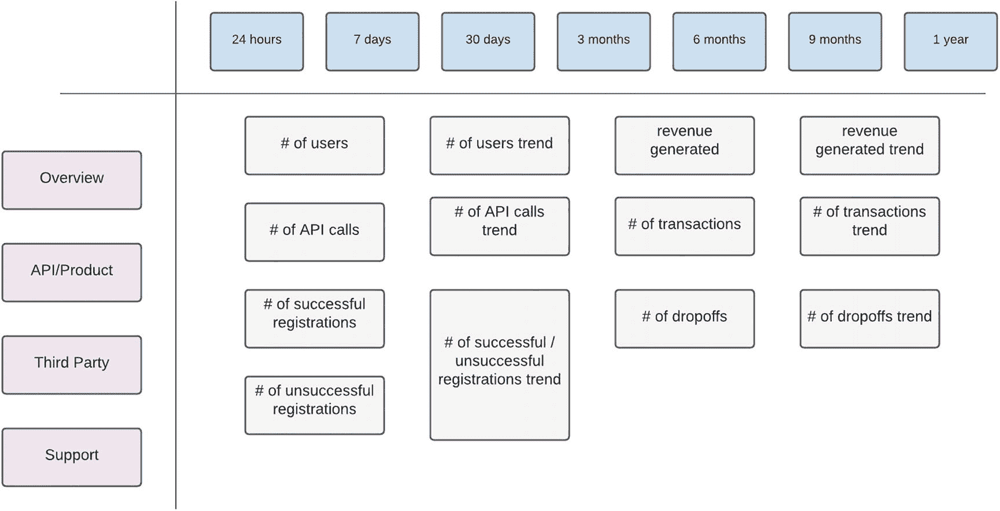
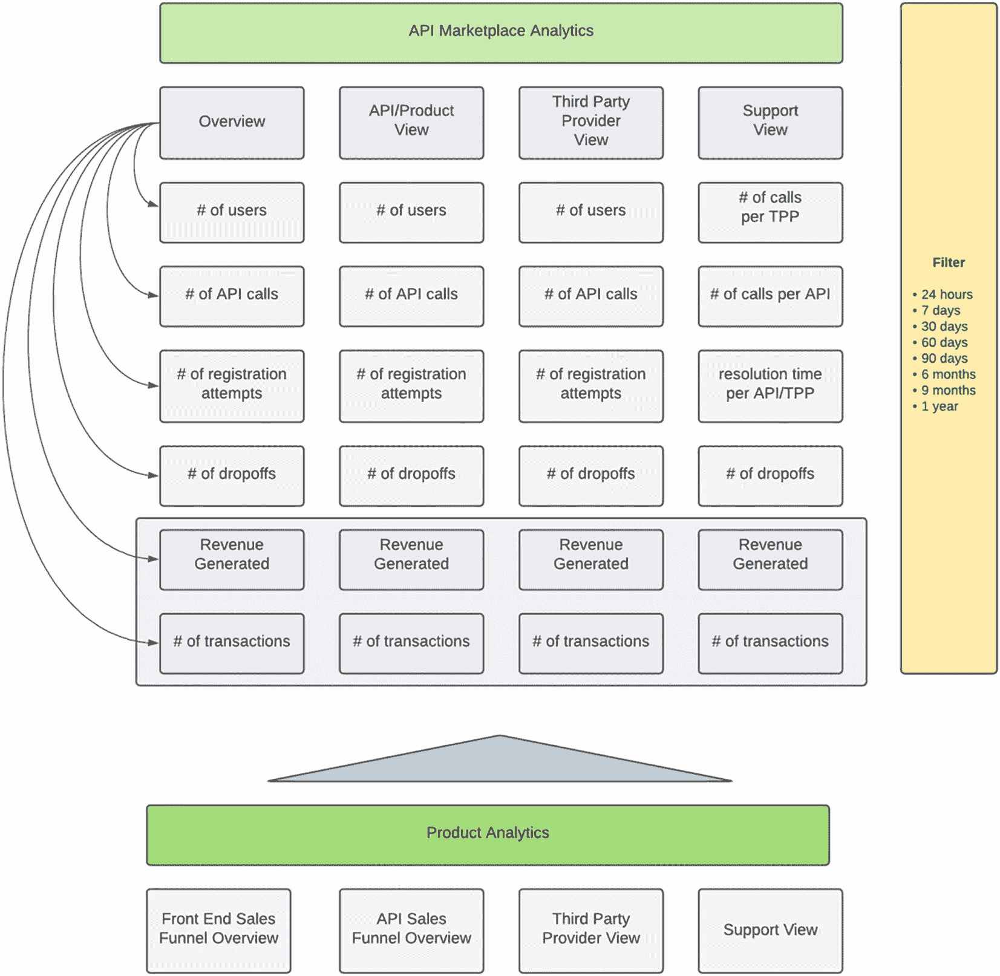
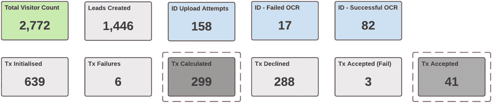

# 4. 商业化

我认为，工程能力很可能是 API Marketplace 商业化或商业主张中*最*重要的推动因素。对许多技术导向的人来说，这听起来也许有些自相矛盾，因为这两个领域似乎位于光谱的两端。

请允许我用建造一架新型客机来说明这一观点。如果工程团队只专注于速度、性能和技术，那么它无疑会非常快且技术过硬。但还需要考虑许多其他因素，比如可搭载的乘客数量、燃油消耗、航程或飞机可覆盖的距离，以及维护成本和使用寿命。这些因素决定了飞机在财务上的可行性。现实中的一个例子是超音速客机“协和号”的退役：它是工程奇迹，但遗憾的是并不算最经济的选择。

同样地，技术交付团队也有责任关注 API Marketplace 的商业走向和财务可行性，因为这会影响其生命周期。坦率地说，我更愿意将其视为一种特权，这也要求工程团队在设计和构建解决方案时始终关注商业目标。基于对多个 IT 项目的观察，如果把这一目标完全交由项目管理层独自承担，最终往往会产生技术上可行但失衡的解决方案。这类项目通常会在接近发布时被搁置，或因不可持续而被封存。

在我们的实施中，一个效果显著的方法是：赋予团队中任何成员就 API 产品的商业层面提出质疑或建议的机会。这得益于一位项目负责人——他不仅欢迎反馈，还经常主动向团队索取反馈，把它视为团队对平台拥有主人翁意识的信号。来自技术团队、关于潜在高收益产品的天马行空式提案，往往会被以极高的技巧性处理，以避免伤及自尊，因为这些想法可能并不符合组织运作的“规则”。

在本章中，我将从技术视角探讨“商业化”这一目标，采用一种偏重逻辑的视角，结合那些在概念阶段夭折的产品经验，以及许多已进入实施阶段（其中一些现已产生收入）的产品经验。我们将拆解当前在平台上使用的策略，以及为最大化财务潜力而持续调整的策略。本章的核心主题是：技术与商业相互依存——二者缺一不可。

## API Marketplace 飞轮

借鉴 Amazon 飞轮模型——其增长战略以客户体验为核心——我们平台的驱动流程（如图 4-1 所示）则以开发者体验为基础。这个流程应完全归功于我们的项目负责人，而我还得费了一番口舌，才说服他分享这套流程蓝图；它本质上驱动着我们平台的运营模型。

在一个新市场中，这无疑是一个大胆的决定，而它得以实现，依赖于管理层的长期视角以及清晰定义的数字化战略支持。与许多组织不同，我们采取了“重质不重量”的方式。为支撑这一点，所有 API 产品都按照并对齐行业标准来构建。若采用自定义定义，也许能更快交付，但会更难被采用。

图 4-1

API Marketplace 飞轮

我们的策略是先启动飞轮：赢得信任，并建立开发者对平台的亲和度。根据对第三方消费者的观察，我们的 API 为其交付给终端用户的产品或服务开发提供了显著支持与加速。在许多情况下，这些用户来自更大组织过去可能并未重点面向的细分市场。尽管 Marketplace 的主要消费者本质上是第三方提供方，但终端用户活跃度的提升会带来更多 API 使用，这反过来使我们能够开发更优、更具竞争力的商业模式，进而带来 API 的额外消费，并吸引新消费者进入平台。

通过利用规模经济，以现有基础设施和运营能力服务并支持新客户，平台能够在不增加额外成本的情况下创造更多收入，从而获得更高利润率。我们采用了与 Amazon 类似的策略，并有意识地将这一收益通过降价回馈给客户。正如 Jeff Bezos 的明智预判，降低成本会带来流量增长，而这又会不可避免地加快飞轮动能。一个观察是：更低成本也降低了准入门槛，平台因此吸引了更多小型咨询公司，它们正利用我们的产品构建创新解决方案。

就像去超市原本只想快速买一两样东西，最终却总会推着装满额外商品的购物车离开一样，第三方通常从一个 API 产品开始，随后借助接入流程和技术集成经验，逐步吸收并消费其他产品。我们的 Marketplace 起初只有少量 API 产品，但随着时间推移，产品选择通过现有消费者需求和新产品定义稳步增长。虽然我们不能宣称拥有最多的 API 产品数量，但我们“产品池”中的产品都能带来真实的业务与客户价值。

## 你的 Marketplace 定位

在你着手为组织建立 API Marketplace 之前，必须清晰了解 API 将如何被使用。这将指导你的销售与营销策略，也将定义应重点触达的第三方细分群体，更重要的是，确立衡量平台成功的指标。在表 4-1 中，我通过与实体店的对比，描述了组织使用 API 的一些方式。请注意，这并非一份穷尽或定论式清单——你的平台方向与重点将依据组织的需求和愿景目标进行定制，可能从某一细分领域起步，随后演进到另一领域，或同时覆盖多个细分领域。

表 4-1

Marketplace 定位

| 目标 | 描述 |
| --- | --- |
| 最简型 | 这类商店只提供最基本的必需品。没有花哨商品——只有维持库存周转和基本运营所绝对需要的东西。这类 API 市场的建设目标也只是满足监管合规要求。监管机构已发布必须在特定期限内遵守的法规，而为了避免处罚，只需完成最基础的要求即可。当前没有战略性目标——可能采取观望策略。 |
| 垂直细分型 | 我一直很想去的一家商店是 RadioShack。如果你需要任何与电子产品相关的东西，这里就是理想目的地。它只面向特定市场，但在该品类中是一站式商店。与之类似的 API 市场是只处理特定类别 API 的市场。例如，银行可能只提供与资金相关的 API——从支付、贷款到交易数据。 |
| 超市型 | 超市是全球各地社区运转的重要支柱。你可以快速进去购买牛奶这类基本用品，也可以寻找灯泡这类不那么常用的商品。它们满足广泛的客户需求，但商品选择通常基于大众化需求。因此，你可能能找到最常见型号的灯泡，但找不到适配 20 世纪初古董枝形吊灯的那一种。这类市场是聚合器（Aggregator）。它将常用 API 汇集在一起，并在统一平台下提供便捷使用。单一对接点减少了维护多个供应商账户或关系的需要。其内在优势在于，借助规模经济，可减少支持所需人员。此外，由更大实体代表多个消费者形成的合力，还可能从后端供应商获得更具竞争力的价格和服务。连锁体系中的“超市”相比个人客户，通常能从供应商处获得更好的价格与服务。 |
| 香榭丽舍大道型 | 巴黎著名的购物大道是香榭丽舍大道（Champs-Élysées）。这里汇聚了成熟品牌门店，是本地居民和游客都喜爱的目的地。由于场地面积稀缺，只有特定品牌才会被邀请入驻，以维持该空间的独特性。虽然每家店是独立运营的，但它们在这一区域的气质与氛围中天然地彼此关联。这类市场是一个生态系统——没有单一所有者，而是围绕一个核心主题或结构建立。消费者与提供方之间是一对一关系。对提供方执行能力的信任与信心，会因其出现在该平台中而被隐性评估。也就是说，服务提供商若能加入这个“专属圈层”，就意味着其必须达到特定质量标准。反过来，提供方也需要持续维持高质量水准，才能保留成员资格。这种相互信任是随时间逐步建立的。 |
| 购物中心型 | 购物中心是许多消费者喜爱的场所。这里商店种类丰富，对潜在租户的最低要求也相对宽松。更重要的是，安保、停车、洗手间等公共设施会统一提供，作为面向顾客的便利服务，并由所有租户共同受益。许多购物中心还拥有“主力租户”，作为吸引顾客的核心亮点。这类市场代表封闭生态系统。消费者可直接联系提供方，同时共享通用能力——通常包括安全与支持服务。公共基础设施也可承载多租户方案，以降低成本并实现规模经济。此处的“主力租户”可能是成熟且受信赖的品牌，例如声誉良好的金融机构，并且其本身也参与该环境。对于先建设自有市场、之后希望通过吸引更多第三方开发者并支持较小提供方触达更大受众来刺激增长的组织而言，这可能是一种自然演进路径。 |

## 价值与收入策略

在这个由技术加速驱动的快节奏世界里，如今出现了许多全新且创新的创收方式，这在几年前几乎难以想象。比如——拥有大量粉丝与关注者的社交媒体人物会成为“意见领袖”（influencers），并通过内容获得更多观看量以及产品营销推广而获得报酬。职业电竞选手的收入甚至可能超过职业体育运动员。简而言之，理解并重视这一点非常重要：*价值*既可以通过“硬收入”的形式被显性创造，也可以通过品牌定位与客户忠诚度等方式被隐性创造。本节将探讨 API 市场可以如何通过不同路径创造价值——包括隐性价值与显性价值。

### 开发者付费

让我们从一种能让资本家满意的方案开始。毕竟，当 API 市场这一概念被拿去融资时，其财务可行性将会是一个热门话题。在这种方式下，第三方提供商将为使用 API 产品付费。通过研究 Twilio 等成功平台，可以发现有多种实现方式：

*   **按使用付费**：这本质上是一种“预付费”概念。多年前，移动运营商向客户提供语音和短信服务时，客户通常会先往账户里充值“话费”，这一模式因此流行起来。我并非经济学家，但我一直觉得很奇怪：这类账户中的语音单位成本（按秒或按分钟）通常高出许多——尽管移动运营商承担的风险其实更低。更奇怪的是，这种做法在很长时间里基本被用户群体普遍接受。从消费角度看，第三方会预先购买额度，随后随着 API 使用而逐步扣减。一旦额度耗尽，将不再处理任何请求。对 API 提供方的好处是：预先收款、风险更低，而且如果资费参照移动套餐——单位成本还更高。对 API 使用方的好处是风险可控——采用这种方式，可以设定明确预算以防成本失控，并可随时终止合作关系。

*   **免费增值（Freemium）**：不少云服务商会提供免费的计算资源和额度，以吸引开发者进入其平台。因为这些优惠，我个人确实使用过很多产品和服务。随着我对 Firebase 等产品越来越熟悉，我后来转向了付费选项，以获得更多功能。若非有推广赠送额度，我可能不太愿意直接提供信用卡信息去尝试。这一模式可用于赢得开发者信任；若使用得当，还能建立用户对你 API 产品的忠诚度。对 API 提供方而言，风险在于服务本质上是零成本提供的。但在许多情况下，基于 API 的特性，这种风险可能很小，因为通常只是处理请求所产生的内部成本。站在开发者角度，这显然对我很有吸引力。

*   **分层定价**：在金融服务行业，我们看到金融科技（FinTech）解决方案出现了爆发式增长，这些方案旨在改进金融服务的交付与使用方式。它们本质上是拥有好点子的初创公司，但往往资本投入有限。分层产品能够让处于组织生命周期不同阶段的消费者，以符合其需求的价格点访问你的产品。反过来，套餐也可通过结构设计来保持低成本——例如基础套餐可提供有限支持。分层还能够清晰展示不同等级之间的差异，并可用于财务预测，这对初创公司的商业计划极其重要。每个层级可包含：在限定周期内指定数量的免费交易、超出后的按笔计费、不同级别的支持服务，以及服务可用性或对特定 API 产品的访问权限。产品负责人需要开展大量研究来设计这些套餐，因为不同地区、人口结构和消费者行为会导致市场差异显著。在我的职业生涯中，我见过许多商业模式在一个市场表现极佳，却在另一个市场惨淡失败。产品必须针对消费市场进行定制。

*   **积分制**：我们国家最成功的医疗保障计划之一就是围绕“积分”概念构建的。这个想法极其简单，但在运作效果和覆盖范围上却影响深远。会员因健康生活方式获得积分——锻炼越多、体能越好，积分越高。随着积分增加，用户等级提升。会员随后可以折扣价购买机票、电影票等商品。对计划提供方的好处是：健康会员更不容易生病并发起理赔。这个项目拥有大量会员，很多人如今对健身近乎狂热；它甚至成功到该组织已进入银行业——激励机制是消费也可获得积分。这是一个多方共赢的案例。消费者与提供方都受益，参与该项目的大量外部服务提供商也同样受益。将该模式简单应用于 API 市场的方式是：消费者在达到特定交易次数后获得积分额度。该额度可用于抵扣成本，或购买你组织中的其他产品。例如，第三方消费者可以使用通过 API 交易获得的积分，抵扣其月度账户费用。这有助于产品间的交叉导流，从而提升客户留存。在上述场景中，消费者可能不愿转向其他提供商，因为那会影响其每月账户费用。

*   **交易手续费**：这可能是最容易实施的机制。每个 API 请求都会生成一个事件，并被路由到某个引擎，在那里完成中介处理、计费评级与出账。在一个计费周期结束时，会生成账单，然后由消费者付款。实际落地中隐藏着大量复杂性。开票、催收和计费争议都是必须考虑的领域。由于计费发生在使用之后，账单失控的风险很大——就像云服务或产品被意外持续运行，最终产生天文数字账单一样。提供方同样面临风险，因为客户可能拖欠应付款项；同时还需要投入大量时间进行客户教育，以避免此类情况，并维持更长期的客户关系。尽管这种方式最透明，但我认为它也是最基础、最僵化的方式，因为它并不鼓励或奖励第三方行为。

在继续之前，有两个关键因素必须考虑。第一，对于上述任一方式，平台的计费能力都必须坚如磐石、透明清晰，不能存在任何疑点或不确定性。借鉴移动计费的经验，客户问题通常可通过明细账单被立即解决。你的计费平台必须能够生成明细账单，清楚展示交易发生时间、调用了哪个 API，并且能够进一步下钻，提供诸如交易来源、请求载荷和响应载荷等附加信息。

第二个、也可能是*最*重要的因素是：API 产品必须*首先*为第三方创造价值和收入，进而才会为你的组织带来收入。完全可以构建并发布一个 API 产品，再给它贴上高价标签，以彰显其潜在高价值并作为宣传资本。然而，如果没有有说服力的价值主张，第三方采用和使用将很少，它最终只会被搁置，带来微薄收入。

### 开发者获得收益

这种方法的原则是激励第三方使用组织的 API。从本质上讲，所有方法都应被视为一种合作伙伴关系，因为一方的成功意味着另一方的成功。在这里，消费者是组织的延伸，并共享收入成果。这让我想起我曾与一位创业公司老板的对话，他以高额价格出售了自己的企业。尽管这是许多人梦寐以求的模式，但他却很遗憾自己保留了全部所有权——如果有更多利益相关方，企业本可以做得更大。

从财务角度看，与其完全拥有一个较小的蛋糕，不如分享一个更大蛋糕的一部分，可能更具盈利性。这是 API 市场的一个关键主题——它使你的组织能够通过第三方触达更多客户。若从逻辑上看，如果第三方能从其促成的交易中获益，那么它就是价值链的一部分，并会尽最大努力促成交易。让我们看看可以如何实现这一点：

*   **收入分成**：这可能是我最喜欢的第三方参与机制之一。它体现了双赢方式，并清楚表明组织致力于将第三方视为有价值的合作伙伴。非洲移动网络爆发式增长的一个关键因素是：几乎任何街角的小商贩都能售卖话费。商贩的激励来自每笔销售的佣金。移动运营商只是利用了一个成熟且广泛分布的话费分销网络。第三方提供商也更有可能推广或重点展示能带来更高分成的产品或服务。潜在的收入分配比例还可能成为第三方商业计划中的关键转折点，促使其构建新的产品或服务。

*   **联盟（Affiliate）**：拥有稳定客户基础的第三方也可以作为品牌倡导者，推动你的 API 产品被采用。类似于培训合作伙伴帮助候选人获得认证，也有服务提供商可以构建定制化训练营项目，帮助潜在开发者快速上手你的 API 产品。除了让 API 获得更多曝光外，另一个好处是可直接从联盟服务提供商和受训开发者那里获得关于 API 采用的反馈。尽管这项工作也可以由内部交付团队承担，但专业机构可能已经拥有稳定的订阅用户群、与开发者建立关系的能力，且更重要的是具备中立性，这会让新消费者降低戒备。与创业孵化器（旨在支持发展中企业的项目）合作，也是支持这些举措的好方式，并且是在组织生命周期早期接触新组织、展示 Marketplace 价值的绝佳机会。

*   **推荐（Referral）**：这种模式的成功，从成千上万的 YouTube 赞助频道中即可见一斑。通过实施简单的推荐计划，如果开发者的朋友和同事使用其代码注册，他们就可以获得奖励。这当然有助于吸引并建立你的 Marketplace 受众。对于某些 API 产品，潜在客户线索（Lead）的价值本身就足以补偿第三方提供商。例如，当潜在客户在考虑购房或购车时使用金融贷款计算器 API，第三方即可获得补偿。由于客户信息可以在调用中被传递，这也为组织提供了潜在销售机会。

### 免费（Free）

Free 与 Freemium 的关键区别在于：Free API 产品将始终免费提供。在这种情况下，价值创造是隐性的——它推动 API 采用，并增加使用你平台的第三方提供商数量——这些第三方随着时间推移可能被转化。其目标是通过零成本实现大规模扩散，从而让你的品牌触达更多潜在客户。

这对第三方来说是一个有吸引力的选项，尽管托管组织可能并不情愿提供，但其对第三方的潜在影响和价值可能非常可观。例如，在企业中一个用于提供收入类型和职业类型列表的简单数据 API 可能被视为理所当然，但对于需要这些数据完成注册流程的初创公司而言却可能价值巨大。它还使你的组织有机会通过新渠道提供服务——本质上，这些渠道就是由第三方构建的应用和服务。

### 间接（Indirect）

秉持合作精神并巩固双赢模型这一基础原则，该策略以终端客户受益为核心。一个成功的销售策略应使所有参与者都能从交易中获得价值。采用间接策略时，可通过以下方式创造价值：

*   **客户（Customers）**：满足监管要求（如开放银行 Open Banking）清楚地表明，客户数据的所有权与共享控制权掌握在终端用户手中。它使用户能够以由你平台促成的方式，安全且灵活地访问新产品与服务。本质上，是*他们的*数据，但在*你的*规则下。对用户和组织而言，这是双赢。

*   **企业对企业（B2B** **)**：允许外部合作伙伴访问 API，可拓宽面向客户的解决方案范围。例如，向你的忠诚度与奖励计划开放 API 访问，可以让终端客户参与积分兑换体系，这不仅能扩大你的计划覆盖范围、带来更多积分兑换，也能为用户提供良好的价值主张。

*   **信息型（Informational）**：通过 API 共享信息，可提升客户对市场变化的认知。可共享的信息示例包括外汇汇率、营销活动（如限时促销优惠）以及组织更新动态。

*   **声誉型（Reputational）**：建立新的数字渠道可将你的组织定位为技术领导者和变革推动者。这可能成为使你的组织区别于竞争对手的因素，并为你的品牌带来显著价值。

## 计费工程

在定义了 API 市场中的若干计费策略之后，下面我们来讨论实际落地所需的技术工程。API 产品通常会定义其变现方式——有些可能由第三方付费；有些可能采用收入分成、引荐模式，或免费。这通常由产品负责人（Product Owner）与后端支撑系统密切协商后确定。

同样重要的是识别将如何向消费者计费——第三方是否需要先为账户充值，并在每笔交易时扣费，还是在交易发生后再统一计费并开具发票？无论选择哪种机制，都必须构建一个可服务平台所有 API 的“计费主干”。所有事件（即使是免费 API）都应进入计费流水线，以用于分析与报表目的，而且不应轻视这一计费能力。在可能的情况下，应复用企业级能力。如果无法实现，请考虑使用托管或管理服务，因为这会带来较高的运维影响。

事件计费模型（Event Billing Model）的技术流程如图 4-2 所示。

图 4-2

事件计费模型

事件计费模型中的步骤如表 4-2 所述。

表 4-2

事件计费序列

| 步骤 | 描述 |
| --- | --- |
| A | 事件由应用栈中的某个元素生成，通常发生在 API 请求完成时；目前主要来自微服务组件。该事件包含调用明细，包括产品、第三方标识、完成状态、请求与响应载荷以及日期时间。为最小化调用延迟并支持离线处理，事件会被写入数据库 |
| B | 事件记录由计费预处理器按批处理计划或触发器读取。批处理计划可在特定时间段内处理大量记录，从而提升处理效率。触发执行则可实现近实时事件处理 |
| C | 记录会从主数据管理（MDM）、企业产品目录（包含 API 到产品的映射）以及第三方提供商数据库等系统补充附加元数据——后者包含第三方相关的额外配置，例如应计费的账户。由于此过程是异步完成的，因此数据采集不存在时间压力 |
| D | 经过富化与中介处理的记录会以预定义格式路由到作为企业服务提供的定价与计费引擎。该能力将处理计费事件并更新第三方账户数据。请注意，关于事件应如何计费的规则已包含在记录中。这种方式使计费预处理器能够影响事件的计费方式 |
| E | 该中介记录还会存储在市场中业务支撑应用可访问的数据存储中 |
| F | 使用富化后的中介记录定期运行自定义报表，以提供平台的近实时计费视图。注意，这些视图可能并非精确的收入数据——但可支撑本章后续讨论的“名义视图” |

近实时计费模型（real-time Billing Model）的技术流程如图 4-3 所示。

图 4-3

实时计费

*近*实时计费模型中的步骤如表 4-3 所述。

表 4-3

实时计费序列

| 步骤 | 描述 |
| --- | --- |
| A | 在处理 API 请求之前，会先发起一笔资金预留调用。这可确保第三方有足够可用额度来服务该请求。在调用当下，确切应计费金额可能尚不明确——系统会按 API 产品特性预留一个预定义的预算金额。如果无法满足资金预留请求所需的最低金额，则向消费者返回错误 |
| B | 事件由应用栈中的某个元素生成，通常发生在 API 请求完成时；目前主要来自微服务组件。该事件包含调用明细，包括产品、第三方标识、完成状态、请求与响应载荷以及日期时间。为最小化调用延迟并支持离线处理，事件会被写入数据库 |
| C | 事件记录的写入会触发对计费引擎的调用。计费引擎会编排对下述各组件的调用 |
| D | 首先需要对事件进行费率计算。事件记录会被路由到费率引擎（Rating Engine） |
| E | 费率引擎会将主数据管理（MDM）、企业产品目录（包含 API 到产品映射）以及第三方提供商数据库（包含第三方额外配置，如计费账户）等系统中的配置数据缓存到内存数据存储中，以获得最佳处理性能。请注意，对于这类账单处理，延迟是关键考量。低延迟可更快处理事件，从而缩小余额更新与后续请求之间的风险时间窗 |
| F | 随后，计费后的事件会由扣费组件（Charging element）用于从第三方剩余额度中扣减具体金额。计费后的事件也可能表明不应向第三方扣费——例如 API 请求未成功处理，或产品属于促销活动。在这种情况下，将释放预留金额 |

## 分析与洞察

在试点实施 API 市场时，借助导航型数据会显著降低难度，且这些数据最好尽可能实时且足够细粒度。按照典型的工程思维，本节最初计划放在“运营”章节中。经过进一步思考，我发现这会暗示“由机舱而不是舰桥来掌舵”。尽管运营指标非常关键，但真正驱动平台方向与目标的是经过*解读*的信息。举例来说，可将“每秒交易数”这一运营指标视为速度指示；但如果缺少补充数据（如产生流量的第三方提供商与 API 产品）来指示方向，那么这就可能等同于“挂空挡踩油门”——转速很高，却没有向前动能。

本节旨在强调：需要了解平台的历史航迹与进展，并建立一组当前导航数据（例如位置与当前航向）来规划前路。需要注意的是，舰桥指挥中心控制面板上的所有仪表与表盘并不会在第一天就全部启用。随着工程团队对平台进行埋点或从分散的数据源采集数据、使数据流入，这些指标才会逐步“点亮”。如果产品负责人对所需内容有清晰定义，这种自上而下的方法将引导工程团队。相对地，另一种自下而上、技术驱动的做法，往往只会得到一些随机系统指标——它们或许能在控制面板上组成漂亮的小部件，却无法提供有价值的业务指示。

### 数据采集

在全面运行状态下，API Marketplace 生态系统内几乎会持续不断地产生事件流。除了显而易见的 API 调用之外，潜在消费者可能正在基于原型开发提交支持工单，发往后端系统的请求可能正在变慢，终端用户可能正处于完成高价值交易的最后阶段，或是来自临时营销活动的突发负载也可能正在产生。一个关键目标是尽可能多地捕获这些数据——并且要做到高效、一致、可靠。

基于多年在各类集成领域的经验，并借鉴医疗分诊流程，我们实施了传感器（Sensor）与探针（Probe）策略，如图 4-4 所示。对于我们可直接控制的要素（如应用栈），我们在关键流程上显式挂载了传感器。这些传感器会发布定义良好的事件，提供关于请求的细粒度信息——例如第三方标识符和交易金额。当事件被接收后，仍需要补充额外元数据——例如根据该标识符解析出第三方名称。

图 4-4

数据采集策略

在很多场景中，数据是由外部系统捕获的。对此，我们采用探针策略。用于记录客户交互的服务台（Service Desk）包含大量信息，就是此类实体的一个示例。潜在第三方关于访问 API 产品或获取更多信息的请求，是有价值的 Lead 数据。关于服务中断或交易追踪的支持请求同样至关重要，因为它们代表了可能带来 Retention 价值的交互。由于数据存储在企业托管应用中，技术团队构建了一个探测机制（以自定义应用形式存在），用于查询并提取这些交互数据。在某些急需补充信息的场景中，这种方法也被用于解析并提取应用数据和审计数据，以加快访问速度。

对整体环境进行盘点、识别各类参与方与信息来源，并制定数据采集策略（明确如何获取数据）是非常重要的。

### 数据分析

在我职业生涯早期，当我被要求为团队所支持的一个集成平台提供 Analytics 时，我是从技术导向的角度来推进这项工作的。我曾痴迷于衡量底层指标，例如每条流程的请求量，并对平台和应用进行了埋点，以留下可被摄取到数据库中的数据轨迹。遗憾的是，当我尝试构建查询来解读数据、判断是否存在有意义的模式时，最初看着数据流不断涌入的兴奋与自豪，很快被沮丧所取代。从这段经历中，我得到的基本认知是：上下文是分析信息的关键，而一个分析数据点通常由多个底层指标构成，如图 4-5-1 和 4-5-2 所示。

图 4-5-2

分析目标

图 4-5-1

分析来源

这正是项目高管所请求的 Analytics 视图。请注意，每个指标都包含多个维度。我们来跨不同维度检查一些指标，以说明它可以如何使用：

*   **用户数（# of users）**：（i）唯一终端用户请求数，用于判断客户对第三方产品和服务的采用情况；（ii）按第三方提供方划分，用于对平台消费者进行排名；（iii）在定义时间段内统计，用于预测特定提供方的未来流量。这些信息可用于识别可能带来更高流量及潜在更高收入的提供方。

*   **已完成交易数（# of completed transactions）**：（i）针对某个特定 API 产品，用于确定其产生的收入；（ii）按第三方提供方划分，同样用于对平台消费者进行排名；（iii）在定义时间段内统计，用于理解该流量是突发性还是持续性。

这些信息对于从不同视角理解平台至关重要。它不仅能轻松识别高流量 API，还能下钻到具体操作层面，了解产品是如何被使用的。它也可以指导你的第三方引入策略。例如，若大部分流量来自单一消费者，这可能是一个风险信号，意味着为了平台的长期稳定需要更多“锚点”客户。相反，若许多消费者的流量都很少，可能表明平台尚未在任何第三方内部建立深层次黏性。之所以能够提出这些假设与推断，正是因为在不同时段、跨多个维度具备了关键数据。

### 报告

随着平台的成熟、更多高价值 API 产品的推出，以及为关键第三方提供任务关键型支持的要求提升，我们的团队实施了以下机制，以提升对平台活动的可见性：

*   **仪表板**：如图 4-6 所示，并在表 4-4 中描述。与汽车仪表盘提供广泛信息的方式非常类似，你通常会关注速度表，但也会被其他指示器（例如油量）所吸引，因为它会影响车辆速度。下面这个仪表板乍看之下可能像是指标“爆炸”。通常，产品负责人或业务负责人会先关注某个特定指标；如果该指标未落在定义参数范围内，就会进一步查看其他数值，以判断它们如何影响主要指标。仪表板的价值在于：不仅提供平台关键指标，还提供可能影响平台的因素或条件细节。

*   **电子邮件**：仪表板快照会每小时通过电子邮件发送给关键产品干系人。此外，高价值交易成功完成的通知也会分发给产品团队。我曾颇为惊讶地看到，高级商务人员会在完成交易数量偏低时发来询问，确认是否发生技术中断；而在高价值交易出现时，也会发送兴奋的祝贺消息。这表明，定期分发的信息确实被商务团队查看和使用，并且 API 已被视为关键收入渠道。

每两小时一次的**即时消息**由运营支持团队发送，内容包括系统稳定性以及关键 API 产品成功完成的交易情况。同样地，如果这些数字异常偏低，就会引发关于支撑系统和下游提供方可用性的疑问。

表 4-4

报告仪表板指标

| 指标 | 描述 |
| --- | --- |
| 访客总数 | 访问应用程序（门户或 API）的唯一用户数量 |
| 已创建线索 | 完成基础信息步骤/表单并请求进一步信息的用户。未继续后续流程的用户，销售代理可通过电话联系 |
| 身份证件统计 | 上传的身份证明文档数量、成功处理数量，以及因 OCR 导致的失败数量。会对失败请求进行排查，以确定是上传图像问题还是系统故障 |
| 交易统计 | 基于流程执行逻辑计算的详细交易数量及其相关状态：已计算、已拒绝、失败、已接受 |

图 4-6

仪表板示例

成功报告策略的关键在于提供具体、相关的数据，并以目标受众能够快速理解与分析的格式进行拉取（通过 Web）或推送（通过电子邮件或即时消息）。

## 概念性损益表

概念性损益表是我们 Marketplace 的一个关键构件，承担多项功能。借用项目高管提出的术语，它用于衡量渠道能力层面的整体盈利性。由于 Marketplace 可能包含一系列产品，其中一些可产生收入，另一些因监管要求必须免费，因此它有助于理解所有产品的价值。

作为市场撮合方，本质上是在消费者与提供方之间进行中介，有时会面临价值证明的挑战。毕竟，维持平台运行需要成本——基础设施、软件、开发人员、支持工程师、产品负责人和交付负责人都需要投入。由于一笔交易的收入通常由后端服务提供方确认，Marketplace 可能因此被归类为内部“成本中心”。遗憾的是，像建立数字品牌或赋能第三方这样的隐性价值，在只看最终财务结果的财务主管眼中往往意义不大。

这种现象会让团队感到非常沮丧，因为通常带来更高收入的业务单元会获得更高预算分配和更多认可。项目高管并不满足于仅被视作“成本中心”，并希望组织理解 Marketplace 计划的贡献与重要性，因此明智地建立了“概念性价值”这一衡量方式。

损益表这一“透镜”的放大倍数被提升，用于持续审视每个 API 产品的表现。在产品初期，产品与业务负责人可能会提出一些假设，并据此影响是否构建某个 API 的决策。构建完成后，需要持续测量以判断产品健康度。诸如预期流量规模或第三方采纳度等假设会被不断验证。平台规模与基础设施也会被置于聚光灯下，以识别其是否可能成为产品成功的阻碍。持续测量有助于判断产品是否正在接近收益受限阶段，从而需要修复措施或做出退役决策。

在这种细粒度层面理解具体产品，可更深入洞察总体拥有成本（TCO）。某些更成功的产品可能需要更高水平的支持与监控，因此应承担更高比例的平台运营成本。损益表各明细项的细节，使得对每个产品进行量化衡量成为可能。

最后，将损益表作为我们的标准衡量机制，为执行委员会的评审与评估带来显著优势，因为他们通常具有财务导向的思维方式。该流程消除了对 Marketplace 的定性或“直觉式”判断，转而采用定量方法来清晰理解财务状况。在某些情况下，这可能会发出需要转向的信号，以确保该计划的长期持续性。下一节将对此进行讨论。

## 转向新的商业模式

我们最初希望建立的 API Marketplace，其根基很快就遇到了“硬地”——第三方提供商在技术就绪度方面存在不足。尽管 API 遵循开放标准，团队也非常乐意协助解决集成挑战，但我们失望地看到第三方提供商对 API 的采用率很低。局势在某个临界点进一步恶化：一家成熟的第三方公司（拥有经验丰富的开发团队）在一项激进的集成项目排期中进度落后，并表示将错过一个关键交付日期。

Marketplace 的产品负责人迅速行动，提出了一个激进方案：由我们的团队代表第三方托管该应用，以赶上时间节点。尽管这一决定表现出对我们交付能力远超客户本身的信任与信心，工程团队最初仍将其视为一时冲动。毕竟，这是一个 *API* Marketplace——而不是 *应用托管* Marketplace。根据我的一线经验，我也可以向你保证：让一名集成开发者去构建用户界面（UI），几乎就像让超人去开采氪石一样。

这个托管应用的目标相对简单。它确实需要一些 API 集成——但只需最低限度。第三方将实现一个标准重定向来启动应用，该应用会消费平台中的 API。前端开发之所以没有那么难受，是因为我们仍忠于初衷：使用 API 来撬动组织内部能力。坦率地说，这种集成模式后来成为了平台最大的收入来源之一！

最初这像是一笔“被迫购买”，因为技术团队不得不紧急调整部署策略并申请设计与安全审批；但随着团队发现他们如今可以直接使用 API——以我们过去一直试图说服第三方采用的方式——这一做法逐渐演变。该方法也使其他提供商能够通过采用同样模式来加速其集成工作。

在这个案例中，产品负责人完全有权坚持立场，要求采用 API，即使这会冒着错过截止日期的风险。然而，这次转向展示了技术平台的多样性与灵活性：它能够通过适应不同的市场条件来创造新的商业模式。

## 总结

在本章开头，我提出了这样一个观点：工程能力是 API Marketplace 商业成功的底层支撑。我们还讨论了飞轮过程——一旦启动，就会在平台的各个领域产生连锁效应。通过聚焦开发者体验（Developer Experience），平台会吸引更多客户（Customers），从而降低成本（Costs），并支持更激进且新颖的商业模式（Commercial Models）；这些模式反过来为新产品开发（Product Development）提供资金，被更多第三方（Third Parties）消费，最终回到更好的开发者体验，形成完整闭环。这股持续运动的浪潮驱动着 API Marketplace 的增长战略。

我们谈到了为你的 API Marketplace 建立“身份”的必要性，并将其与开设一家实体店进行对比。通过这一类比，我希望你已经开始构想自己想打造的“店铺类型”，以及那些即将“开张”的新平台。随后我们讨论了 API Marketplace 的价值创造方式，并观察到它可以通过隐性、显性，甚至间接的方式实现。进一步深入到具体实现层面，我们回顾了支持多种计费策略的工程方法。需要特别注意的是：计费策略应当先行，平台则围绕该策略进行工程化建设。接着我们进入了变现（Monetization）的关键领域——可见性与度量。Analytics 和 Insights 提供了极其重要的可见性，驱动着用于“驾驶”Marketplace 的控制面板。我们回顾了数据采集、分析和报告策略。名义损益表（Notional Income Statement）是我们用于度量并判断 Marketplace 盈利能力的机制。最后，我们展示了一种通过转向来创造新商业模式的方法。

运营一个 API Marketplace 是一项极具挑战但也回报丰厚的工作。团队采用了创业公司思维，这使我们更高效、更节俭、更精益，并持续寻找新机会。这本身又是另一个飞轮过程，推动着持续的工程优化流程。其结果是平台架构不断演进——我们将在下一章更详细地讨论这一点。

