# 5. 平台架构

我们的 Marketplace 诞生于“后 Netflix 时代”的世界中，是新成立数字化实践中的首批项目之一。团队不仅承担了开放银行原型的交付任务，还获得了采用前沿技术的机会与授权。事后看来，这既是祝福也是诅咒。采用容器化等新方法，使我们的平台具备了高度灵活性。不幸的是，我们比组织内其他团队领先了 2 到 3 年，我们想采用的新方法当时尚未被信任，更谈不上被理解。

时间的内在价值在于：它让我们的团队得以持续演进和优化平台，并通过知识共享与迭代交付，与组织其他部分建立起信任。变革的浪潮很快抵达了我们组织的海岸，我们正在试验的概念与方法也在类似机构中变得更加普及并被信任。这也使我们能够将 Marketplace 定位为企业级平台——它对于组织职能至关重要，而不再是一个只承担小众角色的“卫星式”部署。

通过这一过程，我们对企业内部支撑系统有了更深的理解。我们也因将前沿技术投入运营所需的努力而变得更加谦逊，并清晰认识到：人和流程是最终解决方案中不可或缺的关键要素。

在接下来的小节中，我将以“时间推移视角”展示我们平台的各个要素、它如何变化，以及我对其演进的思考与计划。这样做是希望帮助你更快启动自己的实现，并分享我们后来确立的一些理念与原则。

## 要素

就像元素周期表中的元素一样，图 5-1 详细展示了我们平台架构的组件。其中一些（例如反向代理）作为原子化的企业共享服务提供。另一些（例如我们的微服务）则经过“基因工程式”打造，从而赋予平台独特身份。这些模块构成了 Marketplace 的核心，我们也在持续优化其功能，以使平台更高效。以下各节将进一步详细讨论每个要素。

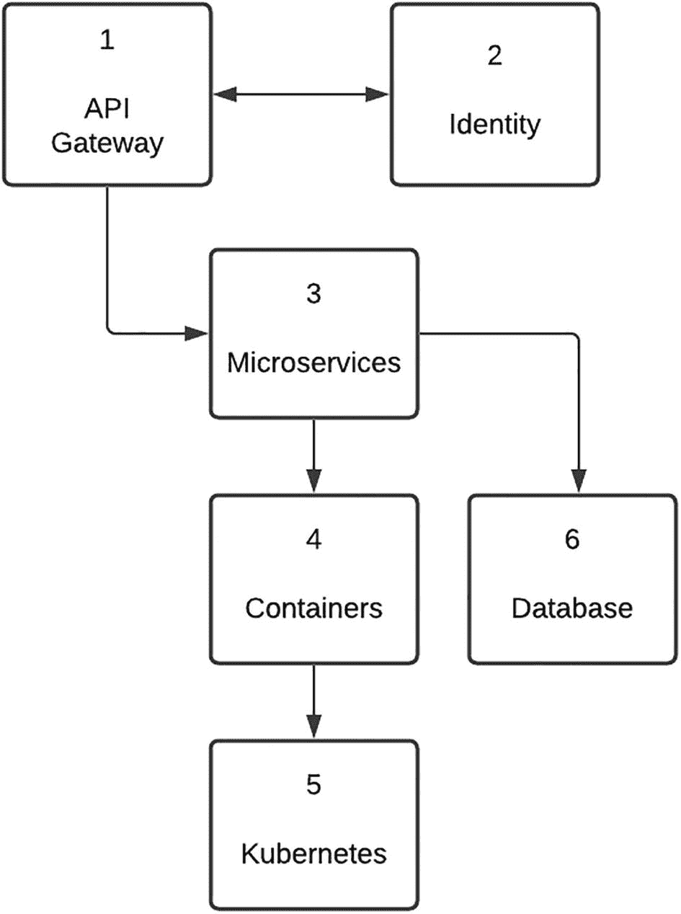

图 5-1

API Marketplace 平台的要素


### API 网关（外部/内部）

API 网关本质上是企业的入口。在我们的部署中，它被放置在非军事区（DMZ）的边缘，另有第二个独立实例作为内部服务的入口。其核心功能是安全、API 管理和监控。我们组织的一项关键标准是：所有 API，无论面向内部还是外部，都应通过 API 网关访问。API 网关的一大特性是能够对用户请求进行限流。虽然这也可以定制开发，但使用现成产品的好处在于，它能减轻团队的运维负担。诸如安全配置、证书管理、API 产品更新和版本管理等任务都可开箱即用。

多家云服务提供商都提供平台即服务（PaaS）的 API 网关，并且可以轻松完成资源开通。PaaS 方案的优势在于，底层基础设施的扩缩容与管理由云服务商负责。作为一家成熟的金融机构，我们使用的是商业现成产品，由内部团队管理并由软件供应商提供支持。为让交付团队拥有一定自主性，我们在网关内为 API 产品创建了独立的开发者组织。这本质上是对 API 网关基础设施进行逻辑隔离。我们在开发环境中被允许拥有管理权限，但在推进到生产环境时必须遵守严格治理要求。

### 身份

该模块承载了许多对 API Marketplace 功能至关重要的能力。其中最重要的一项是访问控制认证策略，通俗来说，它是终端用户认证的基础。由于其中托管了目录服务器，包含用于凭证校验的用户档案信息，因此在实施之初我们做出的一个基础设计决策是：复用企业级认证能力，并在 Marketplace 内构建自定义授权框架。反向代理能力也归属于同一体系，作为终端用户请求与服务端门户应用之间的中介。通过复用企业安全基础设施（包括物理设施、流程与服务），我们的实施工作得到了显著加速。为满足 Marketplace 的特定需求，我们也进行了一些定制，例如允许对后端 Web 应用进行未认证访问的 junction，以及滚动刷新令牌窗口。这一决策也帮助我们顺利通过架构与设计评审委员会。资深架构师对此有一种安心感：这个可能成为新攻击通道的前沿 API Marketplace，是基于可信的企业安全标准进行防护的。

### 容器平台（托管/非托管）

图 5-2 展示了应用部署方式的演进。从右到左可以看到三种方法：传统部署、虚拟化部署，以及正在快速流行的容器部署。

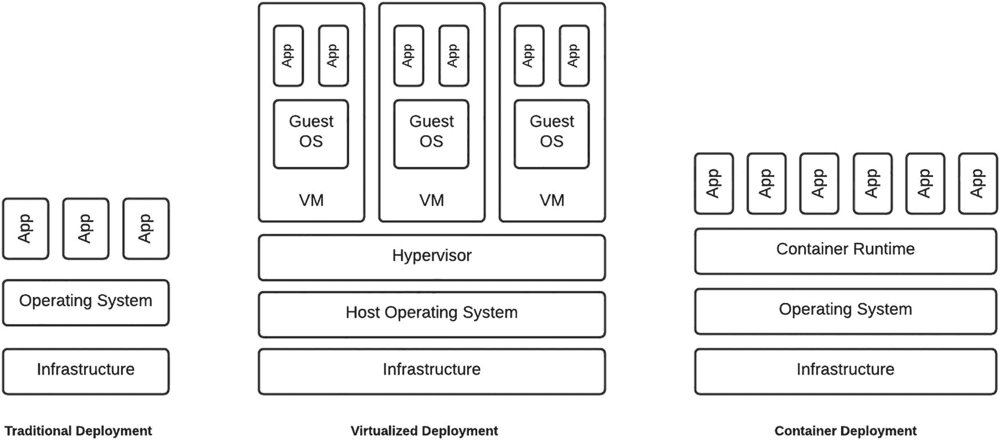

图 5-2

部署策略的演进

我很幸运，拥有图 5-2 中所有方法的实践经验。在我最早参与的一个项目中，我们分配到一台 Windows 服务器，它运行在由组织管理的数据中心物理机器上。我仍记得自己兴奋地截下 CPU 数量和内存大小的截图，发给大学同学，炫耀新项目分到的硬件配置。即便在一次生产部署之夜，我不得不开车前往数据中心，亲自重启服务器，我也感觉自己像“太空先锋”宇航员，正沿着登机桥走向下一次太空任务。正如图中所示，所有应用都直接运行在操作系统上，一旦其中某个应用“闹脾气”导致 CPU 或内存占用飙升，其他应用也会受牵连。

几年后，在一个新中间件平台项目中，我们分配到了 Sun Sparc 服务器，每台都有大量支持多线程的 CPU，以及高达 512GB 的内存。那份服务器架构白皮书曾被我珍藏在床头，我甚至觉得 NASA 和 JPL 可能也在用同款硬件发射航天飞机。Sun Solaris 的美妙之处在于 Hypervisor 内置在操作系统中，我们可以把机器划分成多个逻辑 Solaris Zone（虚拟机），每个都有自己的操作系统，并分配了特定数量的线程与内存资源。若某个应用行为异常，Solaris 管理软件可以将其隔离，防止影响其他 zone。我当时经常维护一份记录 Solaris Zone 详情的电子表格，用于不同环境和技术栈组件。

我曾为这份表格的细致程度感到自豪，甚至让团队其他成员颇为无奈——我会像称呼老朋友一样，用 IP 来指代每个 zone，而别人根本不熟悉。由于我负责平台构建，我尽可能把安装流程脚本化——但最终仍不得不在不同 zone 上执行自定义命令，有时为解决集群问题，有时为处理缺失依赖。同样，我把这些人工干预视为维持平台稳定运行的“赫拉克勒斯式”努力的一部分。那时我并未意识到，自己也在制造一种“雪花环境”。环境中的每个 zone 都与其他不同。现在我只能自我安慰：即使我的部署脚本创建了完全一致的克隆，随着运维变更只在部分 zone 上执行，它们也必然会逐渐失去同步。

虚拟机（VM）是朝正确演进方向迈出的一步——它们能更充分利用底层基础设施。缺点是 VM 资源开销较重，VM 配置不可避免地会逐步不同步，而且它们也鼓励基础设施纵向扩展，而这在长期内并不可持续。也就是说，物理宿主机只能扩展到一定上限，从而限制其可承载 VM 的数量。

在我们的 Marketplace 实施中，在我加入之前就已做出一个早期决策：采用容器方案。我第一次接触容器是 Docker，当我照着清单 5-1 的教程操作时，我被这一概念的简洁性深深震撼，并真诚地怀疑：2014 年这项技术发布时，我到底躲在哪块石头下面，竟然错过了它。


```
FROM node:14
# Create app directory
WORKDIR /usr/src/app
# Install app dependencies
COPY package*.json ./
RUN npm install
# Bundle app source
COPY . .
EXPOSE 8080
CMD [ "node", "server.js" ]
Listing 5-1
Simple Docker configuration
```

就像虚拟机由 Hypervisor 这一关键要素来实现一样，容器由容器运行时来实现。关于 Hypervisor 和容器运行时如何实现这一点，已经有很多优秀资料进行了详细说明。我的个人定义是：容器是软件配置的一种特定定义，这种定义被称为镜像。如清单 5-1 所示，该定义会指定一个基础软件元素，然后在其上添加自定义部署和要执行的命令。所有从该镜像创建出来的实例都会相同。它不是从操作系统层面入手，而是让你专注于应用层及其相关依赖。

以烘焙蛋糕为例来理解虚拟机与容器的区别。对于虚拟化方式，厨师会得到一个完整厨房——各种烹饪器具、全部电器以及可自由选择的完整食材储备。通常情况下，厨师最终只会使用其中一部分器具、电器和食材。对于容器方式，厨师只会得到完成蛋糕所需的东西——特定器具、原料，也许只有一台烤箱。容器方式还迫使部署团队在代码/配置层面进行变更。如果需要引入某个库或软件包，就必须更新容器镜像配置。容器实例天生是短暂的。镜像也很轻量，而且由于不需要完整操作系统即可运行，对底层基础设施的需求仅占很小一部分。其结果是，相比虚拟机，同样的基础设施上可以运行更多容器。进一步的好处是，这使基础设施能够进行水平扩展。更便宜但性能较弱的硬件，也能因容器轻量的占用而轻松承载多个容器实例。

像 Kubernetes 这样的托管容器平台，提供了自愈能力，例如重启失败的容器，并在向客户端公布前检查容器健康状态。它还提供自动发布与回滚。坦率地说，我们早期项目团队在容器化方面几乎处于无人区——更别提还要在*本地部署（on-premises）*环境中构建一个 *Kubernetes* 托管容器平台。我至今仍能想起一位抓狂的项目经理那种无助的表情：他急于达成冲刺目标，而常驻 DevOps 工程师在容器平台构建期间针对某个问题给出的反馈却是“*我们不知道自己不知道什么*”。当我们试验云 PaaS 服务时，挫败感随着内部组织治理和安全限制呈指数级增长——这些服务几分钟就能开通，却无法访问内部系统。我们平台的第一个迭代版本是在单节点上的单个 pod——而且还需要定期重启。虽是小小胜利——但对我们的项目团队来说，这确实是个人一小步，却是 DevOps 的一大步！

此后，我们对托管容器平台进行了两次重大迭代；随着持续演进，我们现在对 *Kubernetes* 所提供能力的理解和认知已大幅提升。人们很容易被容器化的吸引力打动，尤其是像 Kubernetes 这样的平台。我见识过基础设施即代码（Infrastructure as Code）的力量，也曾因“创世脚本（Genesis scripts）”可以在几分钟内 terraform 整个环境的可能性而产生过宏大幻想。把我从这种遐想中拉回现实的是：在 API Marketplace 的语境下，托管容器平台只是应用平台的一个*使能者（enabler）*。我后来得出的结论是，像 Kubernetes 这样的托管容器平台真正的力量在于：它淡出到后台，让你能够专注于应用本身。作为全栈工程师，理解容器平台的组成与功能，以及一个请求如何从 ingress 经过 service 到达 pod，是至关重要的。我们本地 Kubernetes 平台的管理工作现已移交给企业级 DevOps 团队，后续还将进一步迁移到托管云服务。Kubernetes as a Service 这类产品通过抽象基础设施管理和网络结构配置等复杂性，帮助团队更轻松地实现诸如设置持久卷之类的复杂目标。


### 微服务

我可能带有很强的主观偏见——但我认为我们的微服务层是整个平台的魔法配方。公平地说，微服务是以容器为基础的。我的看法是，容器是最佳*配角*，而微服务才是*最佳*主角。我并非一直都这么认为。在加入这个项目时，我职业生涯的大部分时间都在成熟的集成环境中度过，诸如企业服务总线（ESB）、应用服务器和流程服务器这类组件，再加上跨复杂集群配置的部署方式，早已根深蒂固。那时我的观点是：没有这些元素构建出来的集成根本称不上企业级——这可能也和我此前在一家软件 OEM 工作有关。如果我们去掉微服务层，就能减轻搭建本地容器平台的负担，还可以用传统集成机制连接后端服务。传统意味着安全，我也就可以回到自己在职业生涯中打磨成熟的那套集成“剧本”。

我仍然记得当时与项目发起人的那次讨论，那次我试图把微服务从平台中移除。我慷慨陈词，主张改用集成软件——我把它描述成一门威力强大的加农炮，可作为 API 网关的底座，而且在企业里早已成熟；相比之下，微服务方案就像豌豆射手，甚至可能走在“前沿中的前沿”*之前*。由于容器是关键目标，我建议继续使用它们——只是让其扮演不那么关键的角色。总结来说，我强调豌豆射手发射的“豌豆”是 NodeJS——在我看来它是“Web 语言”，而不是像 Java 那样的集成语言。我对自己罗列出的这套反对微服务的论据颇为得意，并安慰自己：我们会在项目节奏没那么紧张时再尝试这项技术。可当裁决结果是“无罪”时，我震惊了。给出的理由是：微服务层能为平台带来高度灵活性，更重要的是速度。这是我职业生涯中见过最准确的预判之一。

微服务层为我们的平台赋予了前所未有的可控性与多样性，并且是我们成功的关键。早上随口抛出的想法，到了下午就可能变成可运行、可演示的组件。这让我们得以践行“向前修复”的信条——乍看之下也许并不正统。如果遇到测试或运维问题，我们会尽最大努力修复，而不是回滚。起初我非常抗拒使用 NodeJS，因为我觉得它不像 Java 那样具备我所熟悉的结构性和性能。如今与 NodeJS 共事了一段时间后，这种抗拒已经消散，而这种“缺少结构”的特性反而让团队能够以光速交付代码。表面上看，JavaScript 很简单，但对其事件循环与异步特性的深入理解，使我们构建出了一个能够轻松处理高并发、低延迟请求的平台。并非每天都一帆风顺，也有一些时候，这种灵活性（比如构建阶段未捕获的变量定义错误）会引发问题。

NodeJS 很出色，也满足我们平台的需求。但它并不是你要构建的平台的必选项。重要的是要考虑组织在开发语言方面的标准，以及开发与运维人员的技能水平。也就是说，如果一个组织主要使用 .NET，那么引入 NodeJS 几乎等同于向企业体内注入病毒。还要牢记：编程语言是为理念服务的。任何编程语言，无论是否强类型，都可以采用。问题不在于你用*什么*，而更多在于你*怎么*用。

当我们在一家成熟企业内部建设 API Marketplace 时，经常发现自己夹在治理严格的 API 网关和风险规避型、奉行“没坏就别修”原则的 IT 能力之间。微服务就是我们的减震机制，它缓冲了这种冲击，并让我们能够在极具进攻性的项目周期内持续交付。

我们会在本章后续部分更深入地探讨微服务架构。

### 数据库

数据库是任何平台的核心要素，因为它用于持久化交易数据；对我们而言更是如此，因为它支撑了无状态微服务架构。我们最初的方案是将数据库运行在容器平台上。这在提交给内部解决方案对齐论坛的初始设计中占据了重要位置。不幸的是，我们的 DevOps 德鲁伊技能还不足以攻克 Kubernetes 集群中的持久化存储卷问题，于是我们改用了新的设计策略：我们的 Kubernetes 集群不承载任何持久化存储。希望这个立场能激励某位读者写一本《Kubernetes 持久化存储傻瓜指南》，我保证买一本。

然而，这个决定是在激烈讨论与反复权衡之后才做出的。帮助拍板的决定性因素是：数据库管理永远不会是我们团队的核心职能。我们当然可以轻松构建一个数据库容器，但若要做到高可用与容错，就会让容器集群配置复杂得多。如今我们的平台使用企业提供的数据库服务，而从我观察到的数据库管理各个方面来看，我毫不怀疑我们当初做了正确决定。澄清一点：数据归我们团队负责，数据库归企业服务团队负责。


## 集成策略

如下图所示，我们的微服务集成策略随着时间不断演进。我觉得很有意思：在某个阶段刚开始时，一种想法或方法看起来总是好得不可思议，以至于你迫不及待想把它推广到整个技术栈的每个组件。可当这种方法走向尾声时，反向思维又会占上风，团队开始堆积技术债务事项，准备迁移到下一种方法。回顾这些年来我们的集成方法时，我会把它看作是从猿到人的进化。平心而论，这种“高屋建瓴”的视角来自事后复盘的优势。这也多少给人一些安慰：我们当前的集成策略很可能也会在我们发现更优解后继续演化。

图 5-3 展示了我们第一代微服务所采用的集成方式，这套方式支撑了我们的 MVP。团队当时对微服务采取了“纯粹主义”视角，将封装与隔离原则奉为圭臬，以至于每个组件都分配给不同的开发者。结果就是，每位开发者都在自己负责的微服务中构建并嵌入了各自的集成逻辑。从事后复盘的角度看，这绝对是一个“扶额”时刻。在紧张推进 MVP 的过程中，面对地理上分散的开发团队，以及每位开发者为了达成冲刺目标而努力避免垫底的现实，这种情况非常容易发生。直到很久以后我们才发现：某位开发者为获取账户列表而集成的平台，其实和另一位开发者为获取映射参考数据而调用的是同一个平台。

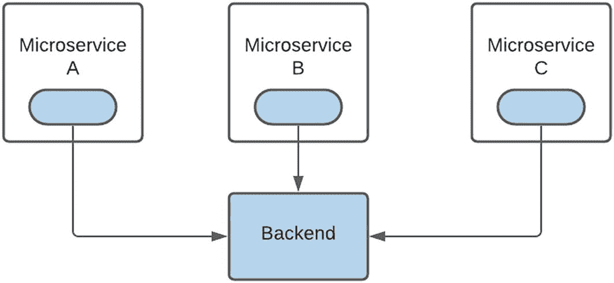

图 5-3

嵌入式集成逻辑

唯一的好处是团队达成了 MVP 目标。遗憾的是，优势也仅止于此。代码重复、集成方式不统一、部署体积更大更重——这些问题足以让任何优秀的集成团队羞愧低头。

图 5-4 展示了我们进化旅程的下一站。那时我们的代码库还没有今天这么庞大，一次灵感迸发中，我把所有集成逻辑整合进了一个共享库。我当时对自己的成果相当满意，因为这个共享库可以让微服务与后端集成逻辑进行进程内通信。这个方案不仅性能会非常高，还能消除可怕的代码重复。我对共享库这个概念如此着迷，甚至把它称作一个“框架”。这个珍贵资产托管在一个 git 子模块中，每个微服务都会引用它。

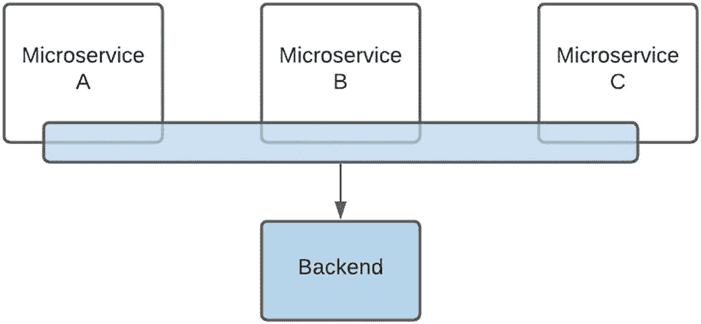

图 5-4

共享集成库

然而，随着团队中微服务开发者数量增长，这个框架变得越来越碎片化。子模块机制也导致每个微服务都在引用框架的某个特定变体。如果开发者需要新的集成功能或操作，他们只需拉取子模块、加入新逻辑，再把这个版本嵌入微服务。读到这里的 git 管理员和资深爱好者可能已经在翻白眼，疑惑这种事怎么会发生。还是那句话：在地理分散、技能水平不一、又有敏捷交付目标的团队里，即便是优秀开发者，为了交付也可能做出不理想的技术决策。

直到今天，当我打开这个时代尚未迁移的代码时，仍会不寒而栗。我们后来已经制定了修复方案：切断了 git 子模块这根“脐带”，每个微服务都保留共享库的本地副本。你可能会因此发笑：我们原本想把王国从代码重复的邪恶中解放出来，结果并不成功，而且由于每个微服务都内置了一份“框架”本地副本，这种失败被进一步放大。一些开发团队可能会认为，重复但彼此隔离的集成代码组件并非坏事，尤其在敏捷环境中——因为它支持模块隔离，并允许组件独立部署，而不必承担“更新共享元素可能必然破坏其依赖组件”的负担。这也可能减少回归测试需求，因为只需测试宿主微服务即可，其他微服务不会受到这次变更影响，能够继续运行。

作为开发者，我始终坚信（也许这种观念有些过时）：如果某个代码元素被写了不止一次，那它就应该被重构成一个可服务多个消费者的单一元素，即便接口可以不同。按我的标准，把一个框架复制并嵌入到每个微服务中，简直等同于灾难级、世界末日式事件。就像一个资源即将枯竭、难以维持居民生存的星球上的外星种族会发射探测器寻找新家园一样，当框架碎片化开始威胁我们的交付速度，并可能让平台倒退回“每个微服务各写一套定制集成逻辑”的黑暗时代时，我们的研发团队也开始探索新的集成方式。

图 5-5 说明了目前支撑我们平台集成策略、并确保我们“进化生存”的解决方案。其核心前提是：将集成组件抽取出来并外部化，只能通过定义良好的接口访问。

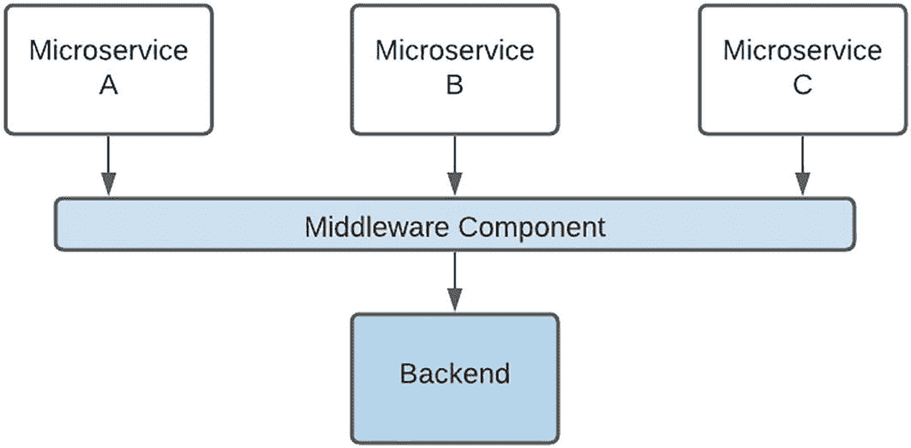

图 5-5

专用集成适配器

这促成了我们平台中新一类微服务的诞生，我们将其标记为“中间件组件”。本平台中微服务的不同分类体系将在本章后续部分讨论。

其固有优势在于可减少代码重复，并使微服务部署更轻量、更精简。也就是说，不再把某个版本的框架打包进微服务内部，而是将框架能力外部化，并通过接口访问。遗憾的是，这也打开了进程外执行可能带来的性能劣势之门。为尽量降低这一影响，我们采用了 Google RPC（gRPC），下一节会更详细介绍。


### Google 远程过程调用（gRPC）

坦白说，当有人提出使用 gRPC 时，我的第一反应是尽快否决它。我把 RPC 和微软组件对象模型（COM）/分布式组件对象模型（DCOM）的黑暗年代，以及复杂的通用对象请求代理架构（CORBA）配置联系在了一起。尽管我很喜欢分布式组件这个概念，但我过去在让它真正跑起来这件事上的经历是痛苦的。我不想让我们的平台承受这种复杂性，因为它会让运维开销呈指数级增长。所以，我选择继续走那条最安全、也是最多人走过的路。归根结底，微服务通信将通过经典的 HTTP 来实现。毕竟，我们已经要处理诸如本地部署 Kubernetes 集群这类多变因素，一想到还要在技术栈里再加入一个新的、而且在当时相对未经充分验证的技术要素，我就不寒而栗。

直到 6 个月后，当我跑完一个基础教程时，我才突然意识到 gRPC 有潜力彻底革新我们的平台架构。开始教程几分钟后，我难以置信地盯着屏幕：来自一个终端窗口的客户端请求，竟然神奇地——更重要的是，轻松地——出现在另一个窗口中。这项技术有很多优点，我稍后会一一称赞。其中我最欣赏的是它的简洁性。gRPC 的核心是一个简单的服务定义，它使用协议缓冲（protocol buffers）来定义请求和响应对象。gRPC 负责处理组件之间、不同语言之间以及不同环境之间通信的复杂性。`*.proto*`定义是客户端与服务端之间唯一共享的组件。这也给了我们一个机会——虽然截至目前我们还没有使用——即在同一技术栈中采用不同的编程语言。而且，由于大多数语言都提供了客户端库，这件事变得更加容易。gRPC 是使我们能够从共享集成库（图 5-4）过渡到专用集成适配器（图 5-5）的关键技术。由于使用了更新版本的 HTTP 标准及其传输协议，gRPC 的性能远高于 REST。

远程过程调用（RPC）有四种类型：

1.  **一元 RPC**：客户端发送一个请求并获得一个响应。例如，客户端向服务器请求当前时间。我们平台中的大多数组件都使用这种通信方式。我的建议是先从这里开始，如果有需要，再按需探索其他机制。

2.  **服务端流式 RPC**：它与一元 RPC 类似，不同之处在于服务器会针对客户端请求返回一个消息流。例如，从服务器下载一个二进制文档时，客户端发起文件请求，服务器将文件拆分为多个块，再以流的形式发送给客户端，客户端重组后进行处理。我们使用这种机制从企业内容管理系统中获取文档。

3.  **客户端流式** **RPC**：它也与一元 RPC 类似，不同之处在于客户端向服务器发送的是一个消息流，而不是单条消息。例如，向服务器上传图像时，文件会被拆分成多个块，然后以流的形式发送到服务器，由服务器重组图像后进行处理。我们使用这种方式上传图像以进行光学字符识别（OCR）处理。

4.  **双向流式** **RPC**：客户端和服务器可以按任意顺序读取和写入消息。例如，图像可以由不同的光学字符识别（OCR）引擎处理，每个引擎的响应会通过独立的数据流返回。

gRPC 是技术简化从而推动大规模采用的一个典型例子。我也将这段经历视为一个鲜明提醒：要对新概念和新方法保持开放心态，并对抗先入为主的观念，从而持续演进我们的平台架构。此后，我已经向那些最初建议使用 gRPC、却被我惹恼的工程师道了歉，并且理所当然地将这项技术的发现与引入归功于他们。话虽如此，我仍保留“武器化”这项技术、并将其从研发构想推进到生产运行环境这一功劳的主张。

### Port-Forward 的威力

由于我们的业务逻辑组件可能需要利用多个集成微服务来完成某个特定功能，组装整体解决方案变得越来越有挑战。DevOps 持续集成（CI）流水线可用于将代码部署到服务器。CI 流程在环境间迁移方面非常出色，但对于初始开发任务而言，我认为使用 CI 流水线就像在和远方星球上的人对话。你说一句话，然后要等一段时间，直到消息被接收并回复后，才能继续。作为一个没耐心的开发者，我要求能够立即修改并立刻观察结果。这只有通过本地开发环境才能实现。

我最初建立这套环境的方式是：在本地分别启动每个微服务，每个服务放在独立终端、监听不同端口。每次开发会话都要花不少时间来完成这项准备，但前期的时间投入能节省数小时，因为我不必等待 CI 流水线。我当时对这个搭建颇为得意，每打开一个终端标签页、启动一个微服务，我都会暗自为自己点赞。

一位开发同事给出的专业建议，让我猛然意识到残酷现实：我这是在更辛苦地工作，而不是更聪明地工作。解决方案是使用 Kubernetes 命令行工具 *kubectl* 的 *port-forward* 能力，启动一个本地监听器，把请求路由到运行在 Kubernetes 集群中的 gRPC Pod。这个概念如图 5-6 所示。

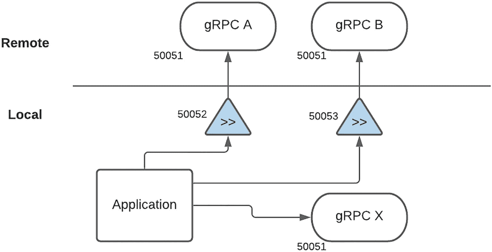

图 5-6

Port-forward 连接性

这使开发者能够基于以下策略，混合使用本地与远程组件来构建解决方案：

*   远程 gRPC 微服务 Pod（A、B）监听端口 *50051*。之所以可行，是因为它们分别运行在独立的容器实例中。

*   本地 gRPC 微服务（X）监听端口 *50051*。由于它运行在我的本地机器上，其他本地进程不能再使用该端口。

*   本地 *port-forward* 进程监听端口 *50052* 和 *50053*，并将流量分别路由到 gRPC A 和 B。

*   应用被配置为：服务 A 使用端口 *50052*，服务 B 使用端口 *50053*，服务 X 使用 *50051*。


### 分类体系

并非所有微服务都生而平等，而且随着时间推移，我们逐渐形成了不同的组件类别。此前在担任技术架构师时，我一向以构建定义清晰、分层明确的架构为傲。每个组件都归属于特定层级，并且如同军队指挥链那样执行严格协议——组件只允许接收来自其上一层的请求，也只能将请求转发到下一层。尽管这些架构图看起来很漂亮，但从开发与运行角度看并不理想。接入新的后端、增加或更新业务逻辑时，往往需要改动多个层级，导致交付变慢并增加运维开销。在架构中引入新元素时，也常常在方案设计阶段引发明显焦虑和大量架构层面的争论。

基于在分层隔离组件过程中积累的“战伤”，我们有意识地采用了一种相当“松耦合”的架构模式。就像我们的团队组织结构图一样，我们采用扁平结构，并没有“只有某些类型组件才能与另一类组件交互”的硬性规定。组件之间的关系（如图 5-7 所示）是有机演进而来的。核心关注点是功能性，而其中一条核心原则是可复用性。

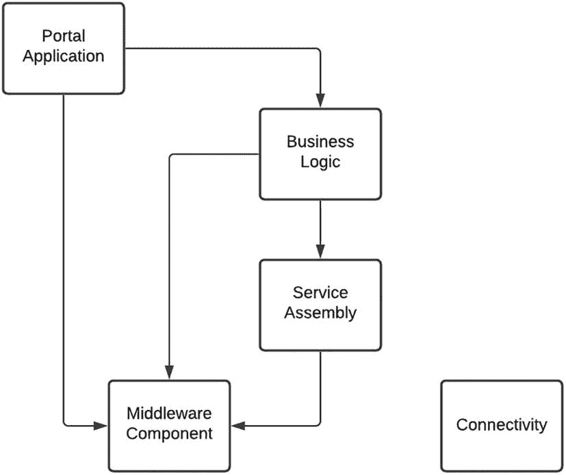

图 5-7

微服务分类体系

我们的平台包含以下几类微服务：

*   **中间件**：这类组件的关键目标是封装与后端平台的集成。该微服务会抽象 REST、SOAP、本地部署（on-premises）或基于云的服务，并向调用方提供统一的、基于 GRPC 的接口。这样我们就可以在不影响微服务消费者的前提下实施变更（例如升级到更高版本）——前提是我们保持服务契约（gRPC proto 定义）不变。对后端或支撑系统的所有访问都必须通过中间件组件完成。数据库访问就是一个例子。与我们第一代允许任意组件访问数据库的微服务架构不同，只有特定中间件组件可以与数据存储集成。这使我们可以“自豪地”宣称：无论是切换数据库供应商，还是从文档型数据库迁移到关系型数据库，都能较为轻松地实现。跨不同环境的后端系统凭据与配置，都被封装并隔离在特定中间件组件内。我们也尽最大努力维持中立的服务契约，不允许后端数据结构“渗漏”给消费者。该组件的一项关键职责是解析、处理并转换系统特定响应，最终输出中立的 gRPC 响应。

*   **连接性（Connectivity）**：这种微服务用作协议通信桥梁。该组件专注于接收 A 格式请求并将其转换为 B 格式。例如，我们使用连接性组件消费 Kafka 主题中的消息，并将其整理为可写入数据存储的形式。这类组件通常是事件驱动的，并针对高吞吐、低延迟处理进行了优化。

*   **服务组装（Service assembly）**：这是一个“高阶”微服务，也是我们集成平台有机演进的例证。在为新需求制定方案时，团队发现某些逻辑片段在多个业务逻辑微服务中重复出现。这带来了一个独特挑战：这些逻辑并非后端集成逻辑，但又与我们“消除代码重复”的理念冲突。为了解决该问题，我们沿用了处理后端集成时的方法：提取重复逻辑，将其隔离并外部化为新组件，通过 gRPC 访问。这类组件可归类为集中式服务编排（Service Orchestration）。关键规则是：针对同一个请求，只能使用一个“服务组装”组件。这样可以尽量降低微服务之间通信带来的性能影响。

*   **业务逻辑**：该微服务负责编排下游组件以实现特定业务功能。如果前置工作充分完成，并且下游中间件与服务组装元素以正确接口构建到位，你会惊讶于这些组件组合的速度之快。话虽如此，也不要对支撑组件的接口过度设计。一位好友曾打趣说，某些组织的通用数据模型复杂到即使外星人在 3000 年登陆，也能毫无障碍地对接。我的看法是：这往往是为了“可复用”而给接口增加了不必要的复杂度。极有可能新调用方会觉得接口过于复杂，最终干脆绕过它。更好的做法是先从最小化接口开始，在必要时再扩展。若采用这种方式，为实现新业务功能，通常就需要对支撑组件接口进行微调/更新。审计通常也在这一组件实现，因为这里会记录“业务交易”相关信息。这也是你应接入业务活动监控（Business Activity Monitoring）的层。例如，业务逻辑组件可以在创建客户账户时触发“业务级”事件，而中间件组件则可以针对支撑系统中的开通请求发送“系统级”事件。

尽管我很想说这种结构从一开始就是我们的目标，但它实际上是有机演进的。坦率地讲，在不断编写与重写各类元素的过程中，确实损失了许多开发人天。如今基础结构已经建立，新引入到我们生态中的元素可以被快速分类并加以利用。我们的架构愿景相当灵活，并由若干关键原则支撑，最终实现了相对统一的部署方式。


## 平台即服务

图 5-8 所示的平台即服务（PaaS）理念贯穿了我们的平台部署过程，我想花一点时间来详细说明。

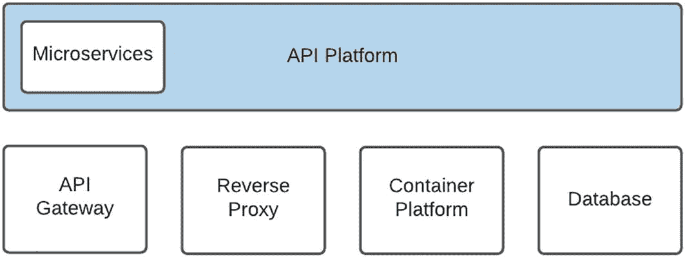

图 5-8

部署策略的演进

正如本章前文所述，我们在实施初期所采用的技术比组织内其他团队领先了两到三年。我们在数字化实践中的定位以及建立新平台的目标，使我们获得了这一机会。随着企业缓慢但稳步地赶上，他们对这些新应用要素的理解、吸收与管理能力也在提升。我也毫不避讳地说，在运营环境中，他们对这些能力的支持水平已经超过了我们。原因在于*专注*。

作为 API 市场团队，我们的首要目标是交付 API 产品。比如，虽然在某个阶段上线数据库可能是重点工作，但我们未必会给予数据库真正长期且持续的关注。我们的企业级专门团队则具备这种专注力，并且在全组织范围内对类似工作有更广阔的视角，因此在与软件供应商谈判整合性许可证协议等方面，也更具优势。同样的方法几乎适用于我们软件栈中的所有支撑要素。数字化实践与技术团队之间的共识是：后者在企业级层面更适合支持这些软件要素。

再次坦诚地说，放手其中一些要素并不容易。就像父母会整夜照顾新生儿，并在孩子迈出第一步时倍感自豪一样，我们过去如此、现在依然对我们环境中的这些要素怀有同样的感情。我们曾熬夜翻查晦涩的配置文件，试图弄明白为什么请求没有被正确路由；随后又自豪地监控平台承接第一批生产流量。最终帮助我们放手这些要素的，是这样一种认知：它们将去往一个更好的“家”，在那里它们会得到必要的关注和支持——一个拥有经验丰富的领域工程师、并且对未来有周密规划的团队。

## 平台服务

开发者就像雪花。作为开发者，我怀着最大的敬意这样说。每位开发者都独一无二；如果让三位开发者实现同一个日志方案，我们很可能会得到四种不同方案——总会有那个“超额完成者”想通过提交多个选项来展示实力。从创造力角度看，这非常棒；但从支持角度看，这却是一场噩梦，因为在运营环境中，统一性和结构化是根本。平台服务通过提供共享库或软件包，成为连接开发与运维世界的关键机制，以实现以下目标：

*   **日志（Logging）**：在 API 环境中，日志就像金块一样珍贵。使用容器的一大挑战在于日志会写入容器本地文件系统。如果实例重启（这非常常见），或者容器存在多个实例，查找日志会变得相当困难。我们构建的日志平台服务的一项关键功能是：将日志条目路由到 Elastic Logstash 平台，并在其中建立索引以便搜索和分析。

*   **审计（Auditing）**：对大多数开发者而言，这件事可能和文档一样“不受欢迎”。但高质量审计对于客户支持和报表至关重要。诸如支付交易等关键业务级事件，必须进行审计以满足组织的取证要求。审计工具函数或库为所有开发者提供了便捷且更重要的是一致的审计机制。

*   **错误处理（Error handling）**：从运维角度看，拥有一个集中式错误处理位置非常有价值。它能够支持一致地处理事件、对特定条件进行升级或降级处理，并触发对支持人员的告警。更高级的能力还可包括复杂事件处理：基于指定时间范围内的一系列事件，触发更高层级的错误条件。另一个好处是，它可以以 HTTP 状态码、错误码和消息的形式，向使用方返回一致的响应信息。考虑到如果每位开发者都要自行实现错误响应可能导致的碎片化，这应当是最先落地的平台服务之一。

*   **属性管理（Property management）**：属性管理以及运行时配置更新能力，是技术栈中最重要却又最容易被低估的平台服务之一。举例来说，考虑一个面向后端平台的 API 端点。随着调用应用从开发、测试、预生产到生产等不同环境推进，后端端点很可能各不相同，因此每个环境都需要更新。如果端点配置是静态写死的，那将是很糟糕的做法。更优雅的方案是在运行时指定配置。需要注意的是，优雅程度也有高低——配置数据可以写在 Kubernetes 的 config map 中。但如果你的部署包含多个微服务且各自拥有自己的 config map，配置数据就可能分散在多个 config map 里。端点只是其中一个例子。凭据、超时时间、税率百分比等也应支持运行时配置。通过向开发者提供平台服务，也间接为运维团队提供了统一的属性管理机制。

*   **追踪（Tracing）**：如果你做过集成平台支持工作，就会知道“圣杯”能力是：能够从入口开始，穿过整个技术栈，经过后端平台，直到出口，全程追踪一次交易。请相信我，在微服务架构中，一次交易为完成处理可能需要多次跳转。能够回溯交易路径是 API 平台的关键能力。市面上有现成的应用性能管理（APM）产品，可通过探针和运行时注入追踪信息来帮助追踪请求。这些工具在应用性能调优和系统故障定位方面很出色，但并不是交易追踪的银弹。良好的追踪与日志策略，本质上是一条“黄金线”，能帮助运维团队沿着交易路径穿越整个平台。

## 部署架构

我们尝试了上述要素的多种组合，以确定最优配置。这或许是我们部署架构中最有价值的部分之一，因为“乐高积木”式的方法让我们能够灵活地以多种形态组装技术栈。自项目启动以来，我们一直受制于本地基础设施和系统。在下文中，我将详细介绍一条路线图，以及迁移到云基础设施和托管服务这一关键目标。每一次迭代都在为下一次提供支撑，而我们在每次部署中都进行了测试，并把组织边界又向前推进了一点。需要指出的是，企业信息与网络安全团队所表现出的高度包容与耐心，是我们成功的关键因素。


### 启动配置

图 5-9 展示了支撑我们 MVP 的启动部署配置。就像被放进糖果店的孩子一样，我们不顾一切，尽可能使用了更多技术要素，并让请求经过尽可能多的跳转才到达目的地。如果企业策略不允许某个特定系统的防火墙访问，我们就采用回跳方案，直到找到替代路径。虽然凭借一支坚韧的团队这当然可行，但最终结果并没有达到本可以实现的最优状态。

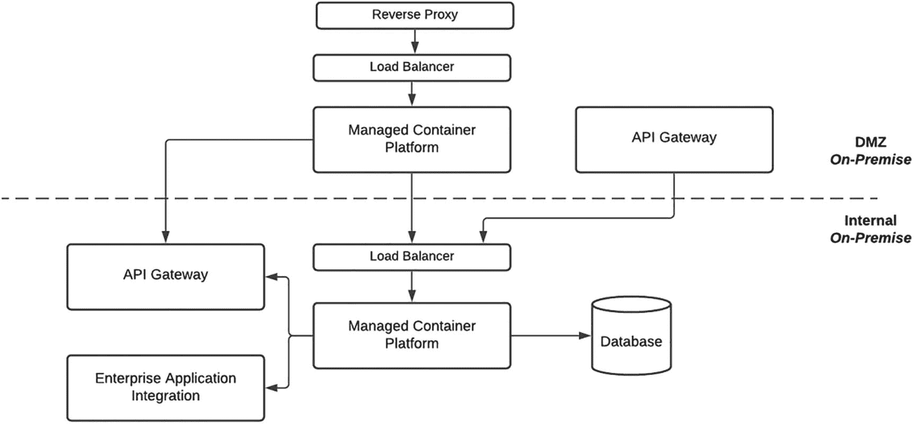

图 5-9

启动配置

如果说构建一个本地部署的 Kubernetes 集群还不够有挑战性，那么我们还选择了构建两个——一个在内部网络，另一个在非军事区（DMZ）。我们组织的 DMZ 就像遥远星球上的流放监狱。只能通过“跳板机”访问，本质上就是远程桌面连接。运气好的话你能抢到两个会话中的一个，否则你只能等着在某位既有用户去洗手间休息时“接管”一个会话。我至今仍记得一位新来的 DevOps 工程师发现自己无法获得 GUI 权限来运行安装脚本时那种绝望的表情。在我们的 DMZ 里，像真正的监狱一样，也有不同的安全等级。我们刚开始时，容器和 Kubernetes 被视为极其危险，因此专门为我们新建了一个比其他区域限制更严格的分区。我们是在尝试连接 DMZ *内部*各组件时才得知此事的。为排查连通性问题而组织的专题会议，过程就像潜艇上的指令传递——请求从测试人员传到协调人，再到网络工程师，再到 DevOps 工程师，然后再一路返回。尽管这段经历有时很痛苦，但它也是一次巨大的学习机会，让我们理解了组织的网络拓扑，更重要的是学会如何在其中穿行。要让方案可用，必须明确会进行负载均衡的各节点配置以及防火墙开放端口；这些工作即便可以外包给基础设施设计人员，完成也往往要几天甚至几周。

我们选择的方法是卷起袖子先由内部完成第一版，再与设计师评审，由其纠正并指导我们正确做法。从职业发展的角度看，通过这次协作，我们与基础设施项目经理、设计师和支持团队建立了良好关系。通过与这些团队紧密合作，我们更好地理解了内部流程、这些流程存在的原因，以及企业支持团队所承受的巨大压力。我们对内部团队“看似漫长”的解决周期所产生的不满，很快转变为对其付出的同理与尊重，最终也为我们自己先前任性的行为感到尴尬。与其抨击那些我们认为拖慢进度的流程与治理机制，我们选择去理解并与之协作。值得肯定的是，组织本身也在努力精简运营，以更敏捷地响应并将解决方案推向市场。这段经历虽然令人谦逊，却是最有回报的经历之一，因为它要求我们通过建立与支持团队的关系来实现部署目标。

一个加速我们交付、并持续至今仍在发挥作用的因素，是获准让 DMZ 中的 API Gateway 实例可以直接（虽经由负载均衡器）访问我们的微服务。企业标准原本要求所有内部 API 必须通过内部 Gateway 访问。这将导致接口定义需要发布两次（内部一次、外部一次），并且由于请求还要多经过一站，也会影响性能。多节点托管容器平台在 DMZ 中仅托管了一个授权门户容器应用。这样复杂部署的理由是：平台上线时有助于承受高流量。每当回想起我们最初的判断，以及那些基于情绪而非现实做出的设计决策，我仍会忍俊不禁。

### 现状配置

图 5-10 反映了一个更加成熟、更加负责的团队所采用的部署配置。过去那种只求达成 MVP 的狂热日子已经过去，我们对平台技术要素以及企业支撑系统的现实状况有了更清醒的认识。我们也非常幸运，有两位资深 DevOps 工程师加入团队，他们真正“知道我们所不知道的事”。凭借他们的经验，一个更稳定、更符合企业要求的 Kubernetes 集群很快建立起来——这是第三次迭代。

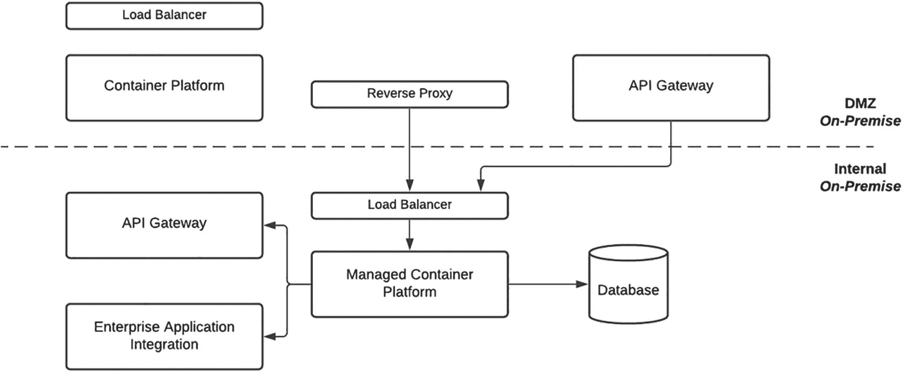

图 5-10

现状配置

最早提出的问题之一，是在 DMZ 中是否真的需要一个完整的 Kubernetes 集群。他们耐心地解释，就像家长对饭前想吃冰淇淋的孩子那样：使用更简单的 Docker 容器平台部署，也可以实现同样目标。他们对我们 DevOps 平台演进的贡献，堪比一个高度发达的外星文明在帮助刚学会用火的穴居人。这同样是一堂重要的课。如果你要拥抱新技术，不论是短期 MVP 还是长期转型项目，都务必配备匹配技能水平的人才，或者考虑只采用技术子集，甚至干脆不采用。观察大师施展技艺本身就是一种震撼的体验；很快，我们的平台拥有了可工作的流水线，团队也开始通过即时消息向托尔金中土世界里的角色“下达指令”来发布代码组件。

这次部署最重大的进展之一，是网络安全团队批准由 DMZ 中的反向代理对外暴露内部托管的 Web 应用。这个里程碑式决定使得原本托管在 DMZ 容器平台中的单一 Web 应用能够迁移到内部 Kubernetes 集群。这优化了交付流程，因为内部流水线和网络连通性都可复用，支持也更简化——容器及其相关日志都能被轻松访问。我们选择不下线 DMZ 容器平台，目前将其用于托管不属于平台核心的外部应用。比如利用 API Marketplace 能力、但服务于第三方目标（例如同步账户交易）的应用，就部署在该平台上。


### 目标态配置

尽管最终搭建出企业级本地部署 Kubernetes 平台这一过程充满挑战且收获颇丰，但团队已经得出结论：这项工作很像把狮子当宠物养。这个平台需要持续关注和专门支持；如果控制不当，它会“吞噬”缺乏经验的维护者。图 5-11 展示了我们部署架构下一阶段的规划。我们设想利用云基础设施与平台服务来运行技术栈中的各类组件。鉴于 API Gateway 等组件属于共享实例，这必然会是一次分阶段迁移。代码仓库和 DevOps 流水线等支撑性要素也必须迁移到云上。

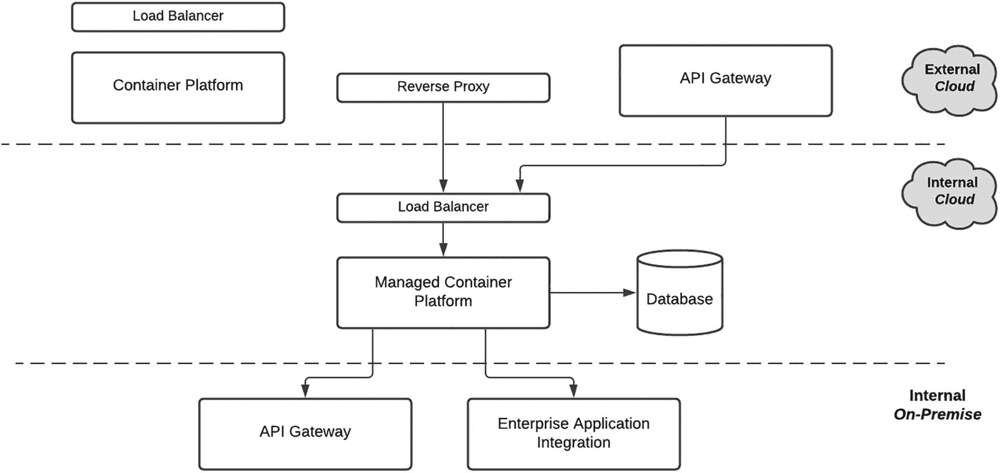

图 5-11

现状配置

对于初创公司或规模较小的组织而言，使用云基础设施或平台服务通常是相对简单的任务。而这次迭代揭示出：对于成熟企业来说，这恰恰处在难度光谱的另一端。需要考虑的因素很多，例如从本地组件连接到云端，再从云端回到本地。我们的最终目标是采用云厂商托管的 Kubernetes 服务，以屏蔽底层基础设施需求，让我们能够专注于以容器形式运行的微服务本身。

简而言之，我们将容器打包后托管到托管式容器平台上。托管服务将负责所需的安全补丁、升级以及基础设施弹性扩缩容。扩缩容是关键因素，因为这意味着我们不再需要像现在这样维护物理硬件或虚拟机。尽管我们非常期待迁移到云端，但也在尽力控制预期。若以这段漫长且时有颠簸的上云之旅为鉴，在新环境中驻留与运营可能会带来一整套全新的挑战。我希望这种学习与成长能像我们此前的迭代一样富有回报。

## 总结

为 API Marketplace 建立平台架构为我们的团队提供了巨大的学习机会。我们意识到，阅读一篇介绍 Netflix 如何部署和运营应用的博客文章，只是触及表面；当团队需要在显著不同的组织环境中亲自落地时，才会真正体会其中复杂性。这让我们获得了对 Docker（容器化）、gRPC（服务间微服务通信）以及 Kubernetes（容器管理）等技术要素的实战经验。

我们把 ingress、service、pod 这类深层技术组件视作自己亲手抚养和培育的“孩子”。就像初为人父母一样，这段旅程也充满挑战。我们经历过剧烈的“肠绞痛”时刻，彼此疲惫相望，怀疑自己是否能撑过去。

同样，我们也有许多自豪时刻：当我们扩展 pod 副本数量并顺利通过性能测试时，平台迈出了“第一步”。我们的平台就像婴儿一样不断成熟，如今正进入新的生命周期阶段。时间带来的好处是，我们对其运行方式、优势与短板有了更深入的理解。仍有大量内容需要改进与优化，这也是我将 API Marketplace 视为一个有生命、会呼吸的有机体的原因。非洲谚语“养育一个孩子需要整个村庄的力量”恰如其分地概括了我们的经历——如果没有企业内各方的帮助与支持，我们不可能实现这一目标。

在接下来的章节中，我们将讨论平台架构如何支撑 Marketplace 的 API 产品，涵盖从设计、开发到运营的全过程。

