# 6. 安全

建设 API Marketplace 就像在一片陌生且充满敌意的区域为你的组织设立大使馆。尽管你的初衷是良善的，目标也是帮助第三方提供方利用你的产品和服务，但这也使企业每天都暴露在一系列新的攻击向量之下。当宝贵的客户数据及其他敏感信息面临风险时，代价极其高昂。“每个人都对平台安全性与完整性负责”这句准则绝不能掉以轻心。任何 API 产品上的安全漏洞都可能引发负面舆论，进而影响其他产品、Marketplace 乃至整个组织。

安全不仅仅是 API 的访问机制。更重要的是将其视为贯穿平台每一层的要素——涵盖技术、人员与流程三个维度。幸运的是，我们有成熟的模式与安全标准可作为实施指引。同时，这也是一项精细的平衡工作：既要满足组织自身需求，又不能影响开发者采用。

在接下来的各节中，我将介绍在 API Marketplace 落地过程中，可能适用于不同产品、受众以及生命周期阶段的安全主题。正如我们在前文章节“监管”中所述，针对特定行业，这些标准可能存在变体。我们将更详细地研究开放银行（Open Banking）的变体。

安全环境持续变化、动态演进，这使 API Marketplace 更具挑战也更有趣，因为它要求我们持续学习并不断适应，才能保持安全。我们非常幸运，因为在这一领域已有大量文献、产品方案与观点可供参考。知识对于理解全局并保持安全至关重要。

## 跨领域关注点

让我们来看看，在 API Marketplace 的实施中，安全性会如何影响各个领域。

*   **API**：产品的性质决定了 API 的访问机制。如果需要终端用户同意，则会在企业对消费者（B2C）场景中实现；如果目标是实现系统集成，则会在企业对企业（B2B）场景中实现。

*   **网络**：当调用穿过你平台技术栈中的各个元素时，如何对其进行监控、跟踪和审查？当它到达后端时，会保持客户身份，还是采用系统身份？你的平台是否应该与企业其他部分进行防火墙隔离——这会增加大量管理开销，但也能带来细粒度访问控制的优势？

*   **应用**：即使有最好的安全实现，应用代码中的漏洞仍可能被利用。现实中不乏触目惊心的案例：未经授权访问客户数据，系统通过技术团队从未想到的方式被攻破。

*   **容器**：这种部署策略因其模块化方法而极为流行。需要确认基础镜像是否可能已被入侵。凭据的配置与管理策略必须在企业层面明确定义，以防止临时且松散的实现。应用运行的上下文看似微不足道——然而，root 用户权限或文件系统写权限可能在不经意间成为安全后门。适用于传统部署的同等严谨性，也必须应用到容器中。

*   **基础设施**：你的解决方案是在本地硬件上运行，还是部署到基础设施即服务（IaaS）或平台即服务（PaaS）公有云方案上？如果是后者，则必须定义新的安全策略和治理机制，以维护解决方案与平台的完整性。

*   **流程**：设想一个看似简单的目标：向第三方提供访问 API 的凭据。是通过电子邮件共享，还是通过受密码保护的文档？这可能会引出一个颇具喜剧色彩的“先有鸡还是先有蛋”问题——我们还得考虑如何共享那个包含凭据文档的密码。如果凭据是通过人工介入生成的，它其实已经被削弱了。任何像样的安全策略还要求定期更换凭据——这该如何实现——尤其是在需要面对大量第三方提供商时。

*   **运维**：你的支持人员是否拥有访问后端系统的凭据？如果第一反应是响亮的*不*，这会不会妨碍支持问题的解决？开发人员也可能在无意中通过看似无害的日志语句泄露敏感客户数据（例如账号），并一路扩散到运维支持工具中。

本节的目的并不是要吓得你在能够完全保证安全性的每一个方面之前，就搁置 API Marketplace 的实施计划。目标是强调安全性必须被考虑的多个维度。同样，这将根据你企业的技术环境和需求进行定制，而每个平台在实现上无疑都会具有独特性。

一种对我们极其有效的方法是：积极寻求来自其他领域团队的定期且严格的评审——信息与网络安全、架构以及企业共享服务。坦率地说，反馈并不总是正面的，我们也不得不重构解决方案来缓解问题。但我可以肯定地说，最终结果的完整性绝对值得这份投入。

在接下来的章节中，我们将深入探讨冰山一角——API 安全。这只是我们审视 Marketplace 实施时众多视角之一。认识到安全几乎影响你平台的每一个方面，将帮助技术团队以正确方式建立基础要素与核心实践，从而避免后期返工。

## API 安全

你的 API 产品采用何种访问机制，本质上与消费者类型和解决方案性质紧密相关。可以把它类比为你家里的门禁。根据你居住的环境，封闭社区入口处可能有保安只允许住户进入；你家前门可能有坚固的门锁，只有你和家人有钥匙；而室内门锁可能几乎从不使用。在接下来的章节中，我们将结合适用场景及对应受众，评估可采用的安全方法。

### 开放 API

这类接口通常提供参考性或公开可访问的数据。示例包括服务站点位置、国家代码，或指定地点的天气信息。尽管 API 可能根本不需要安全机制，但至少最好使用**客户端 ID**和**密钥**，如图 6-1 所示。这样做的好处是可以了解谁在消费你的 API——因为需要先注册才能获取凭据。*客户端标识符*还可用于提供不同服务级别，并且更重要的是，在不影响其他消费者的情况下限制异常消费者的访问。

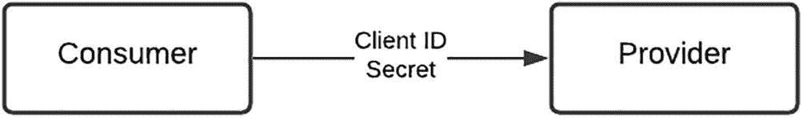

图 6-1

开放 API 安全模式

这类产品的受众可能非常广泛：从学习如何调用 API 的开发者，到寻求可靠参考数据源的成熟服务提供商。

### 企业对企业（B2B）

这类 API 的目标是实现系统到系统的集成。示例包括查询库存可用性、下单购买产品，或与关联方及合作伙伴共享企业数据。传统上，要实现这类集成，需要定制化、专门构建的接口，以及消费者与提供方之间专用的网络基础设施（如专线）。因此，前期开通会带来显著的成本和时间影响。虽然可以通过在双方之间配置使用公共网络基础设施的虚拟专用网络（VPN）来实现，但也可以通过使用安全**证书**来简化集成模式，如图 6-2 所示。

图 6-2

B2B 安全模式

证书及其关联口令短语提供了额外一层安全保障，因为它与特定消费者直接绑定，并且是建立传输层安全（TLS）连接握手过程中的关键要素。证书可以由 API 托管方组织签发，也可以由消费者提供并在托管方注册。鉴于这类 API 的敏感性，这类解决方案的受众通常是知名合作伙伴或成熟的第三方服务提供商。

### 企业对消费者（B2C）

在这种场景中，消费者会请求权限，以代表终端用户进行交易或访问其数据。终端用户会直接指示提供方允许或拒绝该请求。该交互如图 6-3 所示。一个常见示例是使用你的社交媒体（Google 或 Facebook）凭据访问合作伙伴网站以建立你的身份。幸运的是，业界已有一个被广泛接受的标准——OAuth 2.0，它详细规定了终端用户、消费者和提供方之间的交互编排。

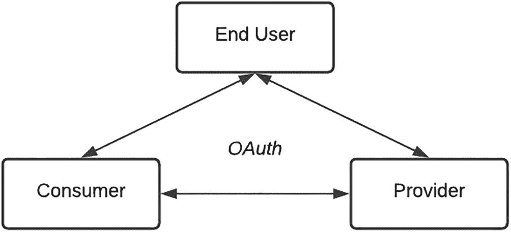

图 6-3

B2C 安全模式

终端用户同意这一关键要素，使得向更广泛的第三方提供方开放这些 API 成为可能。即使有严格的安全标准，一个不良第三方提供方一旦被纳入你的生态系统，仍有机会诱导获取更多客户数据（其中一种方法将在后文讨论）。因此，极其重要的是对第三方进行审查和尽职调查，以满足你的实施所设定的尽调标准。

在下一节中，我们将深入 OAuth 流程的细节，并讨论一些支持性的后台流程与变体，帮助你更好地理解其运作方式。

## OAuth

简单来说，OAuth 是一个开放标准框架，为应用程序提供*安全的委托访问*能力。

为了理解其工作方式，请考虑以下场景：

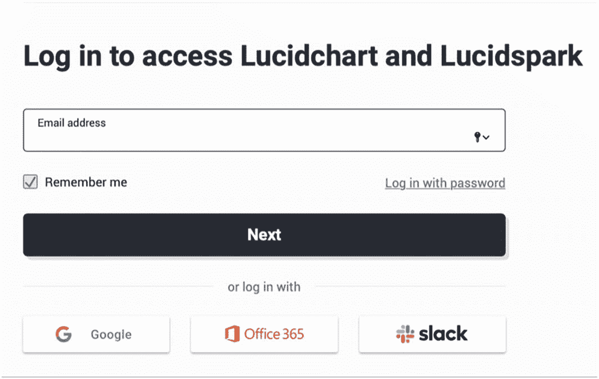

图 6-4

Lucidchart 登录

*   我最喜欢的在线制图服务 Lucidchart 需要我创建一个账户——如图 6-4 所示。

*   要创建账户，我本可以按传统注册流程填写在线表单，提供我的姓名、电子邮件地址并设置密码。随后 Lucidchart 会发送一封带有链接的邮件，以确认我是该邮箱地址的合法所有者。

*   Lucidchart 还允许我使用 Google 账户登录，*前提是*我授予它权限，让它通过 Google 验证我的个人资料。

OAuth 正是促成这一过程的标准，它使终端用户能够确认身份，并向第三方应用授予受限的数据访问权限。

### 参与方与作用域

让我们按出场顺序识别该场景中的参与方或角色：

1.  我是*资源所有者（Resource Owner）*，因为我是 Google 账户的持有者。

2.  Lucidchart 是*客户端（Client）*，因为它是需要访问我个人资料的应用程序。

3.  Google 是*资源服务器（Resource Server）*，因为它在其服务器上存储了我的个人资料。

这里有几个我想强调的关键概念。尽管 Google 在其基础设施上持有我的个人资料数据，*我*才是这些数据的所有者。过去“客户数据归托管组织所有”的传统做法已经被逆转，控制权已回归其真正所有者——终端用户。

*作用域（scope）*表示我愿意与第三方共享的数据范围。在上述场景中，Lucid 仅需要从 Google 获取我的姓名、电子邮件地址、语言偏好和头像，如图 6-5 所示。

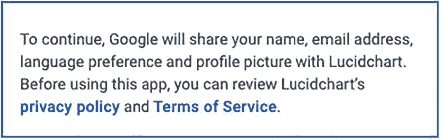

图 6-5

受限访问

虽然我的头像不算最好看，但我愿意分享这些信息。若 Lucidchart 请求对我的 Google 账户进行完全访问——我就会非常犹豫，因为那将意味着我会开放对个人邮箱、日历和联系人的访问。正如你会注意到的，Lucidchart 只请求了它明确需要的信息，没有更多。在 OAuth 语境下，这就是受限作用域或权限；作为*资源所有者（Resource Owner）*，我愿意批准这一点。

在继续之前，请务必巩固对*参与方（actors）*、其所扮演角色以及*作用域（scopes）*这些概念的理解。你可以考虑其他场景，例如银行业中的 OAuth（或与你所在行业相关的场景），以识别其中的参与方、角色和作用域。

### 应用注册

在 OAuth 文献中一个经常被忽视的重要后台流程，是 *Client* 与 *Resource Server* 之间的交互。*Resource Server* 可能并不是我数据的所有者，但作为负责任的服务提供方，并且作为其尽职调查流程的一部分，应只向经过验证的参与方释放数据。任何使用 OAuth 访问其 API 的应用，都必须具备可向 *Resource Server* 的 OAuth 服务器标识该应用的授权凭据。*Client* 将向 *Resource Server* 注册一个应用，并提供有关请求来源以及用户应被重定向到何处的详细信息。

对此步骤的快速回顾：

1.  *Client* 必须向 *Resource Server* 注册一个应用。此步骤的目的是建立 *client* 身份，并使 *resource server* 能够跟踪访问请求。

2.  *Client* 需要提供有关请求来源以及最终用户应被重定向到何处的详细信息。这一点很重要，因为它能限制潜在的中间人攻击。你会注意到，重定向 URI 会用于多种交互。

3.  在该流程结束时，*Resource Server* 将以 *Client ID* 和 *Client Secret.* 的形式向 *Client* 提供凭据。

在某些 API 网关产品中，一旦应用被创建，对 API 产品的访问是通过订阅流程实现的。

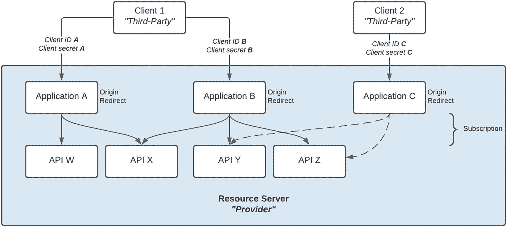

图 6-6

客户端与资源服务器交互

如图 6-6 所示

*   一个或多个 C*lients*（第三方）可以向一个 *Resource Server*（提供方）注册一个或多个应用。

*   每个应用都订阅了一个或多个 API。

*   每个应用都必须指定（一个或多个）重定向 URI，也可以提供（一个或多个）来源 URI。

*   一个应用会被签发一组凭据——即 *Client ID* 和 *Client Secret*。

*   根据组织策略，对特定 API 的访问可能只授予已授权的客户端。如图所示，*Client 2* 没有对 API *W* 和 *X* 的订阅（访问）权限。

图 6-7 概述了应用注册流程。

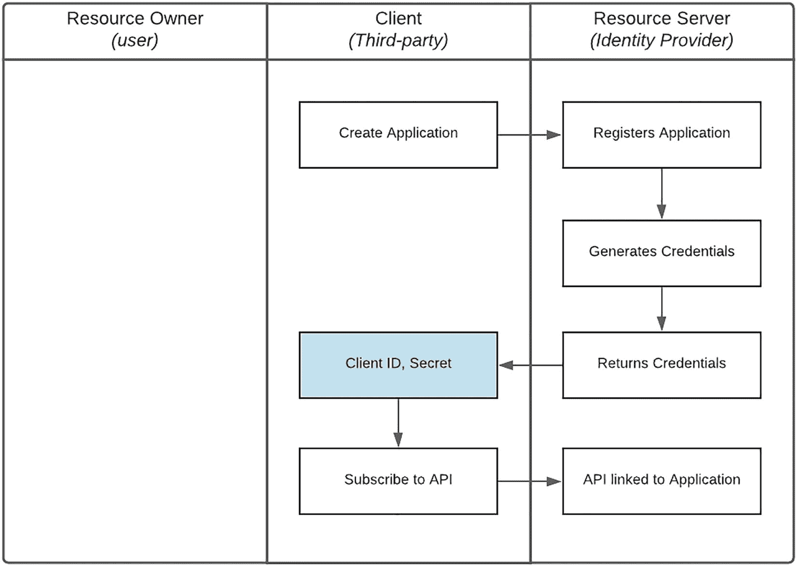

图 6-7

应用注册流程

1.  *Client* 创建一个应用，提供诸如电子邮件、所有者和联系人等详细信息，以及诸如解决方案名称、重定向 URI 和客户端证书（如有必要）等元数据。

2.  *Resource Server* 使用所提供的信息注册应用，并生成以 *Client ID* 和 *Secret* 形式存在的凭据。

3.  凭据会返回给第三方。此时，第三方拥有 *Client ID* 和 *Secret*。应用的配置数据（例如重定向 URI）是可以更改的；但是，*Client ID* 可能是固定的。许多 API 网关实现仅在注册时提供 *Secret*，如果丢失则会重新生成。

4.  此时，*Client* 将应用订阅或关联到由 *Resource Server* 发布的特定 API 产品。

注意

上述流程中的某些部分可以通过自助服务或人工干预完成。

*   某些 Marketplace 实现可能只向经过验证的使用者提供凭据，即便是在 Sandbox 环境中也是如此。

*   在 Live 环境中，应用创建和订阅可能由产品负责人完成，以将第三方限制在特定产品范围内。

### 授权类型与访问令牌

现在 *Client* 已经注册了应用并拥有凭据，接下来有不同方式来获得访问权限。在 OAuth 框架中，这被称为授权类型（grant type）。针对不同使用场景有许多授权类型，同时也有用于创建新授权类型的框架。举例来说，*Device Code* 授权类型可用于在输入受限的电视设备上登录在线服务。

需要强调的是，在 Open API 或 B2B 场景中，*Client ID* 和 *Client secret* 可能足以访问 API。而在 B2C 场景中，*Client ID* 和 *secret* 会在 *grant type* 所定义的流程中用于获取 Access Token，而 Access Token 才是访问受保护资源时使用的凭据：

**客户端凭据（ID/secret）+ 授权类型 ➤ 访问令牌 ➤ API**

一个典型的 Access Token 包含表 6-1 所示属性。

表 6-1

访问令牌属性

| 字段 | 是否必需 | 描述 |
| --- | --- | --- |
| `access_token` | 必需 | 访问令牌字符串 |
| `token_type` | 必需 | 这是令牌类型，通常就是字符串“Bearer”，表示任何持有该令牌的一方都可使用它 |
| `expires_in` | 可选 | 令牌被授予的有效时长 |
| `refresh_token` | 可选 | 如果访问令牌过期，则使用它来请求新的 Access token |
| `scope` | 可选 | 表示被授予的访问范围 |

在接下来的章节中，我们将深入介绍以下授权类型获取 Access Token 的流程：

*   客户端凭据（Client Credentials）

*   授权码（Authorization Code）

*   刷新令牌（Refresh Token）

### 客户端凭据

图 6-8 详细说明了客户端凭据流程。

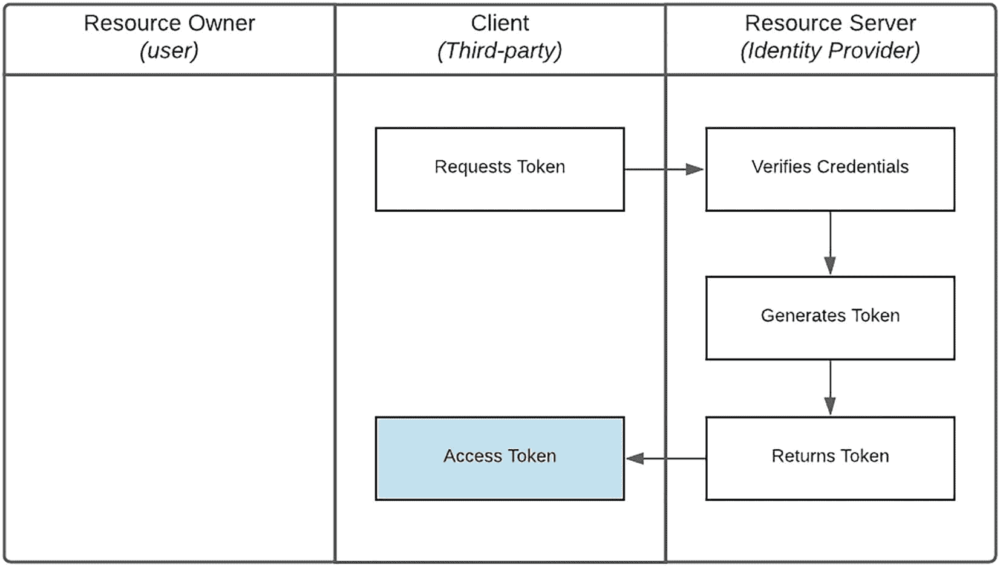

图 6-8

客户端凭据流程

1.  *Client* 发起 *Access Token* 请求，并提供
    1.  凭据：*Client ID* 和 *Secret*

    2.  `client_credentials` 的 *grant type*

    3.  Scope：*Client* 希望访问的资源范围

2.  *Resource Server* 将根据 *Client ID* 定位对应应用，验证 *Secret* 是否匹配，并在已订阅所请求 API（在 *scope* 中指定）的情况下返回 *Access Token*。

3.  此时，第三方已拥有 *Access Token*。注意，该令牌可能有指定的有效期，通常为 3,599 秒。

### 授权码

图 6-9 详细说明了授权码流程。

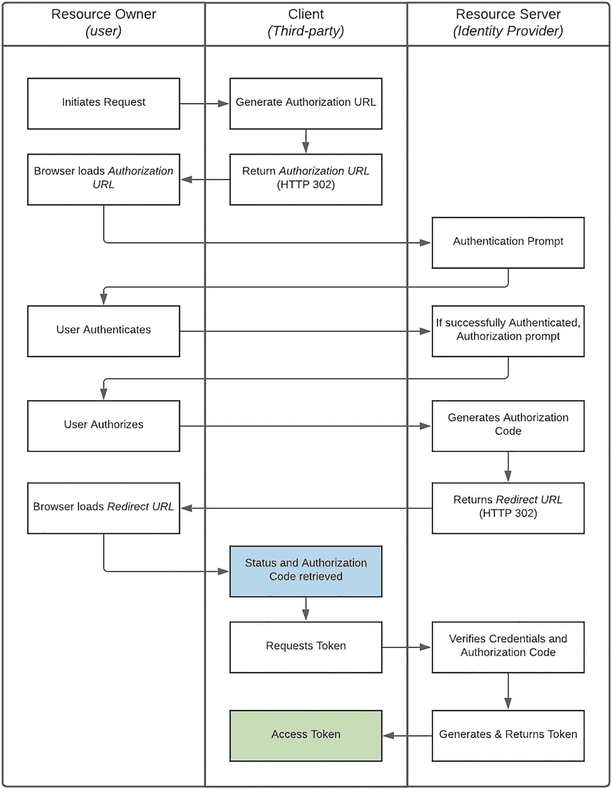

图 6-9

授权码流程

1.  请求由*资源所有者*发起。正如我们在前面的场景中所述，*我（资源所有者）*请求使用我的 Google（*资源服务器*）资料来访问 Lucidchart（*客户端*）。

2.  *客户端*构建一个授权 URL，提供以下内容：
    1.  凭证：仅提供*客户端 ID* —— 用于表明请求来源。

    2.  *code* 类型的响应，表示需要一个授权码。

    3.  重定向 URI：决定用户在完成授权流程后应被重定向到哪里。请注意，这**必须**与为该应用配置的重定向 URI 一致。

    4.  范围（Scope）：标识*客户端*希望代表用户访问的资源。

    5.  状态（State）：用于在授权请求与授权服务器响应之间保持状态。

3.  然后，*客户端*通过 HTTP 302 将用户重定向到构建好的授权 URL。这是流程中的关键步骤，因为它需要*客户端*与*资源服务器*之间的直接交互。

4.  *资源服务器*验证请求中的*客户端 ID*、*重定向 URI*和*范围*，若有效，则提示*资源所有者*确认身份（认证）并提供同意（授权）。

5.  *资源所有者*完成身份认证，并授权*客户端*访问请求的资源。在我们的场景中，我会提供我的 Google 用户名和密码，并允许 Lucid 访问我资料中的特定内容。

6.  当*资源所有者*成功完成认证和授权后，*资源服务器*会生成一个*授权码*。若失败，则返回一个指示失败原因的*错误*。

7.  *资源服务器*将*授权码*或*错误*附加到*重定向 URI*，并连同*state*参数一起，再次通过 HTTP 302 将用户重定向到*客户端*。

8.  当重定向回*客户端*后，将确定授权请求状态——成功则为*授权码*，失败则为*错误*。

9.  若成功，*客户端*会发起获取*访问令牌*的请求，并提供：
    1.  凭证：*客户端 ID*和*密钥*

    2.  `authorization_code` 类型的*grant type*

    3.  *授权码*

    4.  重定向 URI：必须与应用配置项一致

10.  *资源服务器*将定位由*客户端 ID*引用的应用，验证*密钥*和重定向 URI 是否匹配；若提供了有效的*授权码*，则返回一个*访问令牌*。

11.  返回的*访问令牌*将包含一个*refresh_token*属性。

12.  *access_token*可用于调用 API —— 即已订阅该已注册应用的 API。

### 刷新令牌

由于访问令牌通常只在较短时间内有效（一般为一小时），因此使用刷新令牌（Refresh Token）*grant type*来在更长时间内访问资源。这也避免了终端用户在访问令牌过期后还要重复认证与重复授权的不便。需要特别注意的是，在某些场景下（如一次性付款），令牌可能只能在特定时间段内使用（甚至短于*expires_in*值），且只能使用一次。

为防止永久访问，必须限定令牌可刷新的持续时间。例如，令牌自首次签发访问令牌起，最长只能刷新 6 个月；超过该期限后，终端用户必须重新认证并重新授权访问。

图 6-10 详细说明了刷新令牌流程。

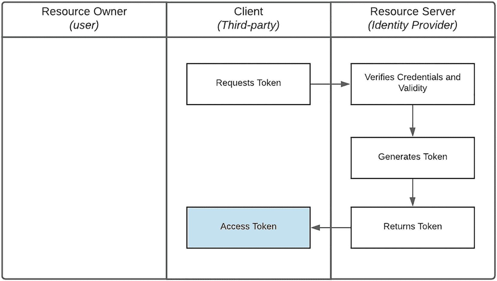

图 6-10

刷新令牌流程

1.  *客户端*发起获取新*访问令牌*的请求，并提供：
    1.  凭证：*客户端 ID*和*密钥*

    2.  `refresh_token` 类型的*grant type*

    3.  重定向 URI：应用已配置的 URI

    4.  *刷新令牌*：其作为属性由上一次生成的访问令牌返回

2.  *资源服务器*将定位由*客户端 ID*引用的应用，验证*密钥*与重定向 URI 是否匹配；若在刷新有效期内，则返回一个*访问令牌*。

3.  此时，第三方拥有了一个*访问令牌*。请注意，*access_token*可能有指定的有效期，通常为 3,599 秒。*refresh_token*的有效期更长。

4.  返回的新*访问令牌*也将包含一个*refresh_token*属性，可用于下一次刷新请求。注意，该令牌只能使用一次。

### 权限撤销

*资源服务器*的一项关键职责是向*资源所有者*提供对既往授权的可见性和控制能力。终端用户应能够轻松查看：*谁*获得了访问权限、*何时*授予，以及可访问*哪些*内容。更重要的是，用户应能够撤销特定*客户端*的访问权限。这通常通过用户管理门户实现。继续以 Lucidchart 场景为例，我可以使用 Google 提供的账户管理页面，查找哪些第三方可以访问我的账户，并移除其访问权限——如图 6-11 所示。

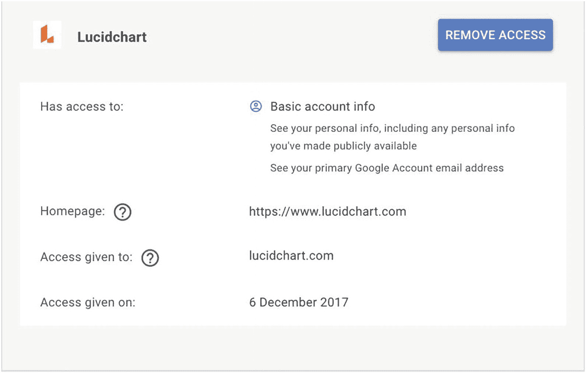

图 6-11

权限管理

某些第三方也可能向终端用户提供撤销访问或解除账户关联的功能。*客户端*（第三方）会调用*资源服务器*的令牌撤销端点，以通知该事件并使授权及其关联令牌失效：

*   凭证：*客户端 ID*和*密钥*

*   *刷新令牌*：其作为属性由上一次生成的访问令牌返回

### 变体：开放银行

OAuth 标准为大多数安全场景下的委托访问提供了良好的基础。在开放银行场景中确认客户同意，出于以下一个或多个原因，需要采用自定义或定制化方法：

*   它要求对终端用户信息进行细粒度访问。例如，客户可能只允许第三方访问特定的银行账户。

*   由于数据具有动态特性，需要自定义同意机制。延续上面的示例，一旦客户完成身份认证，其账户可以被检索并在一个自定义视图中展示以供授权。

*   必须采用两阶段机制，以验证第三方执行的是客户确切的指令或*意图*。

这一过程的核心是*意图*这一概念：

1.  *客户端*向*资源服务器*注册一个意图，表明其希望执行的操作。

2.  *资源所有者*对该意图进行授权，同时指定可被访问的确切资源，并将其记录在该意图中。

3.  在执行来自*客户端*的请求之前，*资源服务器*会确认该请求与*资源所有者*最初授权的意图和资源相匹配。

为了实现上述目标，会结合使用 *Client Credentials* 和 *Authorization* *Code* 两种 OAuth 授权类型，如图 6-12 所示。这展示了如何将 OAuth 标准中的各个元素组装成一个定制化实现。

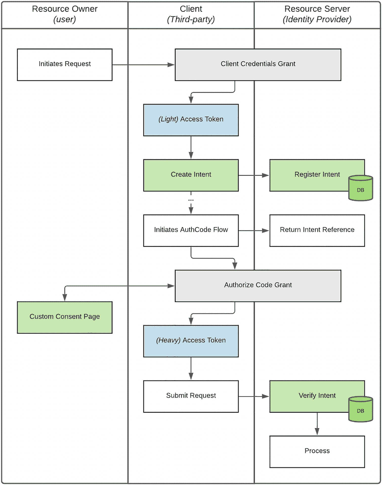

图 6-12

OAuth 流程的开放银行变体

该流程的快速概览：

*   *客户端*使用 *Client Credentials* 授权来确认其身份以及访问特定 API 产品的能力，并获得一个*访问令牌*。我们将该令牌称为“轻”令牌。

*   然后，*客户端*使用该轻令牌向*资源服务器*注册一个意图，并接收一个意图标识符作为引用。

*   *客户端*将该意图标识符包含在授权 URL 中，并发起一个定制化的 *Authorization Code* 流程。

*   这使得*资源服务器*在接收到来自*资源所有者*重定向的请求时，能够定位原始意图。

*   可围绕已注册意图的类型构建自定义同意页面，使*资源所有者*能够更细粒度地控制共享哪些数据。

*   例如，在发起支付时，可以提供账户列表并选择其中一个。由于交互直接发生在*资源所有者*与*资源服务器*之间，*客户端*无法访问敏感数据。

*   在成功授权并收到 *code*，以及完成 *Authorization Code* 授权的最后一步后，*客户端*会获取一个新的*访问令牌*，称为“重”令牌。

*   之所以称其为“重”令牌，是因为该令牌与意图具有内在绑定关系。随后使用此令牌向*资源服务器*发起的请求，都会以该意图为参考进行处理。

*   *客户端*使用该“重”令牌对*资源服务器*发起 API 调用。

*   后续的刷新令牌（若允许）也会与该意图关联。

正如你从上文中会注意到的，尽管流程中增加了额外步骤，但使用意图通过以下方式提供了额外的安全性：

1.  允许对资源进行更细粒度的控制

2.  当*资源服务器*在处理*客户端*请求之前将指令与意图进行比对时，提供了第二个策略执行点

### 漏洞

正如你可能已经观察到的，*Authorization Code* 流程以通过 HTTP 302 实现的重定向为基础。尽管这在其功能上很重要，但它也提供了攻击机会，并且是对流程完整性威胁最大的因素之一。毫无疑问，经验丰富的黑客可以利用复杂机制拦截和重定向网络数据包，或创建伪造 DNS 记录来利用重定向漏洞。由于我的职业生涯主要致力于开发而非黑客攻击，我将在图 6-13 中给出一种更简单得多的方式，说明不诚实的第三方如何钓鱼或窃取终端用户凭据。

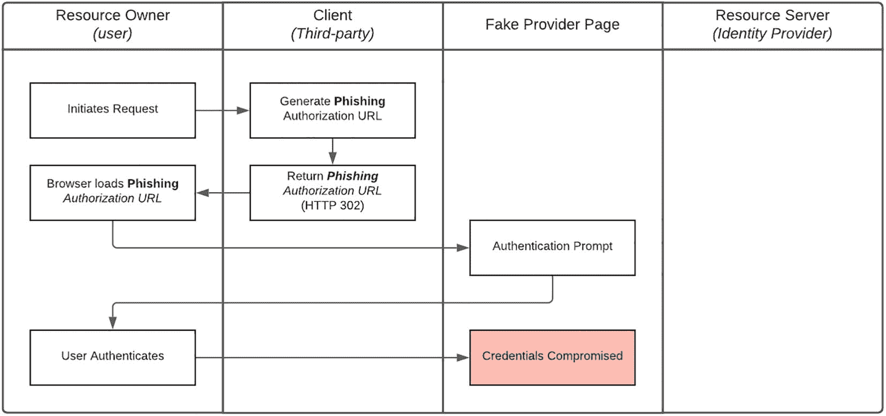

图 6-13

凭据钓鱼流程

如图所示，作为 *Authorization Code* 流程的一部分，*客户端*可以恶意将终端用户重定向到伪造的提供方页面。该页面很容易被构造得看起来像*资源服务器*的页面——并且还可托管在一个与原始域名高度相似的域名上。随后，终端用户就会在被攻陷的网站中输入其凭据。实现这一点所需的技术能力仅是基础级的 Web 开发与托管知识，远低于理解 TCP/IP 协议栈或 DNS 所需的门槛。一个重要且有意思的点是，应对此类攻击的潜在补救措施，是通过*流程*更新，在允许第三方参与你的生态系统之前先验证其完整性。

## OWASP

开放式 Web 应用安全项目（OWASP）是一个非营利基金会，通过其由社区主导的开源软件项目、全球数百个分会、数以万计的成员，以及举办本地和全球会议，致力于提升软件安全性。

### 安全 Top 10

OWASP 识别出的 API 安全风险 Top 10 [[`https://owasp.org/www-project-api-security`](https://owasp.org/www-project-api-security)] 列出了以下内容：

*   **对象级授权失效**（API1）：API 往往会暴露处理对象标识符的端点，从而形成较大的攻击面并引发对象级访问控制问题。凡是使用用户输入访问数据源的函数，都应进行对象级授权检查。

*   **用户认证失效**（API2）：认证机制经常被错误实现，使攻击者能够攻陷认证令牌，或利用实现缺陷临时或永久冒充其他用户身份。系统识别客户端/用户能力一旦被破坏，整体 API 安全也会随之受损。

*   **过度数据暴露**（API3）：开发者为追求通用实现，常在未考虑各属性敏感性的情况下暴露对象全部属性，并依赖客户端在展示给用户前自行过滤数据。

*   **缺乏资源与速率限制**（API4）：API 经常不会对客户端/用户可请求资源的大小或数量施加限制。这不仅会影响 API 服务器性能并导致拒绝服务（DoS），还会为暴力破解等认证缺陷敞开大门。

*   **功能级授权失效**（API5）：包含不同层级、分组和角色的复杂访问控制策略，以及管理功能与普通功能之间不清晰的边界，往往会导致授权缺陷。攻击者可利用这些问题访问其他用户资源和/或管理功能。

*   **批量赋值**（API6）：将客户端提供的数据（如 JSON）直接绑定到数据模型，若未基于允许列表进行适当属性过滤，通常会导致批量赋值问题。攻击者可通过猜测对象属性、探索其他 API 端点、阅读文档或在请求负载中附加额外属性，修改本不应修改的对象属性。

*   **安全配置错误**（API7）：安全配置错误通常源于不安全的默认配置、不完整或临时性配置、开放的云存储、错误配置的 HTTP 头、不必要的 HTTP 方法、过于宽松的跨域资源共享（CORS），以及包含敏感信息的详细错误消息。

*   **注入**（API8）：SQL、NoSQL、命令注入等注入缺陷，发生于不可信数据作为命令或查询的一部分被发送给解释器时。攻击者的恶意数据可诱使解释器执行非预期命令，或在未正确授权的情况下访问数据。

*   **资产管理不当**（API9）：API 通常比传统 Web 应用暴露更多端点，因此正确且持续更新的文档极其重要。对主机和已部署 API 版本进行适当盘点，也有助于缓解如过时 API 版本和暴露调试端点等问题。

*   **日志记录与监控不足**（API10）：日志与监控不足，再加上与事件响应集成缺失或无效，会使攻击者得以进一步攻击系统、维持持久化、横向移动到更多系统进行篡改、提取或销毁数据。多数泄露研究表明，发现一次入侵平均需要 200 多天，且通常由外部而非内部流程或监控发现。

### 建议

为应对过度数据暴露（API3）风险，我们采用以下指导原则：

*   详细审查 API 返回结果，确认其仅包含有效数据。

*   始终在服务端过滤敏感数据。

*   避免使用诸如 *toJSON()* 和 *toString()* 之类的通用方法。应改为选择性返回特定属性。

*   实现基于模式（schema）的响应校验机制，以定义并强制 API 方法返回的数据（包括错误信息）。

*   保持接口尽可能简单。仅提供必要信息。如有需要，使用版本化来扩展 API。

大多数 API 网关都提供开箱即用的资源与速率限制功能，且通常支持按不同消费者服务质量进行细粒度控制。应利用这些能力来缓解缺乏资源与速率限制（API4）的问题。

为防止注入（API8），在 *平台架构* 中已明确微服务编排逻辑与集成组件之间的角色分离。该措施可限制 API 输入被直接用于数据库查询的可能性。

下一节将讨论的高强度安全评审流程，对识别和解决潜在问题有显著帮助。

## 安全评审

应用扫描工具生成的安全报告有时会长达几十页甚至上百页。除了要安抚紧张的交付负责人、说明问题没有表面看起来那么严重之外，这个过程常让人感觉像是在闯关受刑。非常有帮助的一点在于：在内部测试阶段发现并修复问题，远胜于在你最喜欢的技术新闻网站上看到你的 API 发生安全泄露。我们详尽且不妥协的流程见图 6-14。

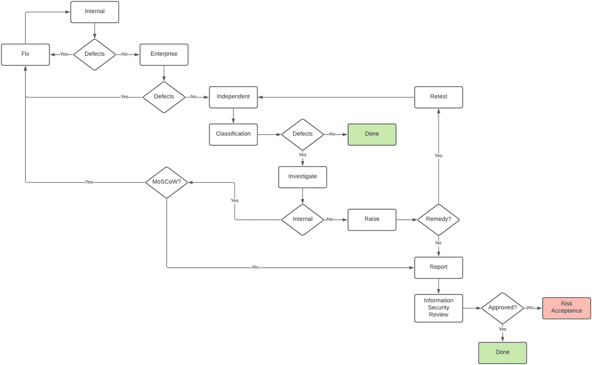

图 6-14

安全评审流程

几个要点如下：

*   安全测试由三个具备不同专业能力的团队执行。根据以往经验，我们发现通过更严格的输入校验策略，可以从安全报告中减少约 80 多页内容。为识别这类问题并避免交付负责人不必要的焦虑，安全测试会先由内部质量保障团队执行，然后再请求企业安全团队评审。之后，还会安排一次由独立外部安全咨询机构执行的测试。

*   外部测试提供的安全报告将由信息安全团队复审并重新分级——严重级别通常会*上调*一个等级。即从中危到高危，从高危到严重。

*   为协助修复优先级排序，发现的问题或缺陷采用 MoSCoW（Must have、Should have、Could have、Won’t have）方法分类。

*   已识别问题也可能超出团队可控范围——例如共享企业组件所需的配置更新。在这种情况下，即便由外部团队调查和修复，我们仍保留该问题的所有权。

*   重新分级后的安全报告由 Marketplace 团队负责，内部与外部的修复和更新都会纳入交付周期。

*   在应用更新后，通常会重新执行安全测试，以确认问题已解决，并识别修复过程中可能引入的新问题。

## 总结

在本章中，我们首先从更宏观的角度审视了在 API 市场实施中安全性的重要性。如前所述，它涉及每一个领域，因此对这一目标给予充分关注，尤其是保持敬畏，对于实施方案的完整性和长期可持续性至关重要。随后我们聚焦到 API 安全，并探讨了三种集成模式。第一种是开放 API，这类 API 通常可访问，但需要凭据来跟踪并控制第三方访问。企业对企业（B2B）API 用于实现系统到系统的集成，且面向更小且更熟悉的受众。将证书作为安全机制，可能会简化该集成模式下的网络要求。

最后，我们讨论了最流行、使用最广泛的企业对消费者（B2C）模式。在这种模式下，终端用户会授权第三方代表其发起请求或访问其数据。为了理解如何通过行业标准实现这一点，我们深入讲解了 OAuth 流程中的关键细节。在充分理解参与方、作用域、授权类型和访问令牌之后，我们还回顾了应用注册等支持流程，并逐步讲解了客户端凭据、授权码和刷新令牌这几种授权类型。撤销授权的能力极其重要，是任何实现中不可妥协的要求。

接着我们介绍了 OAuth 在开放银行场景中的一个变体，并观察到“意图”在该方法中起着关键作用。我们还讨论了一种可能危及终端用户凭据的方式，并鼓励你继续主动寻找其他可被利用的机会。这将使你的团队能够提前应对这些问题——解决方案可能是流程更新，而不一定是技术变更。

我们审视了开放式 Web 应用安全项目（OWASP）API 十大风险，并建议如何通过更聪明的设计、谨慎的开发，以及利用我们技术栈中产品能力来应对其中一部分风险。最后，我们经历了迭代式安全评审流程的重重考验；这个流程虽缓慢却稳步地帮助我们识别并修复防护中的漏洞。

在我的职业生涯中，我非常幸运能与许多高技能人才共事，他们对安全的热情如同我对集成的热情一样高涨。我鼓励你去寻找这些知识宝库，虚心聆听、认真学习；他们无疑会指出你实现中的缺陷，并用其睿智建议帮助你将平台打造成能经受实战考验的系统。由于 API 市场的性质及其运营领域，它将持续遭受攻击。

