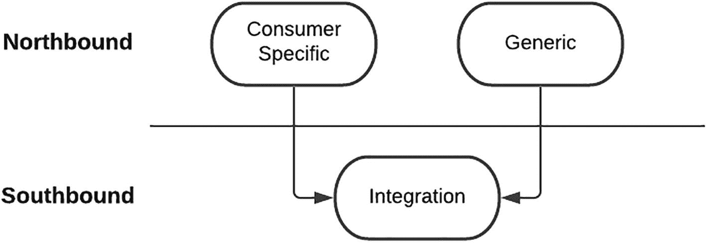
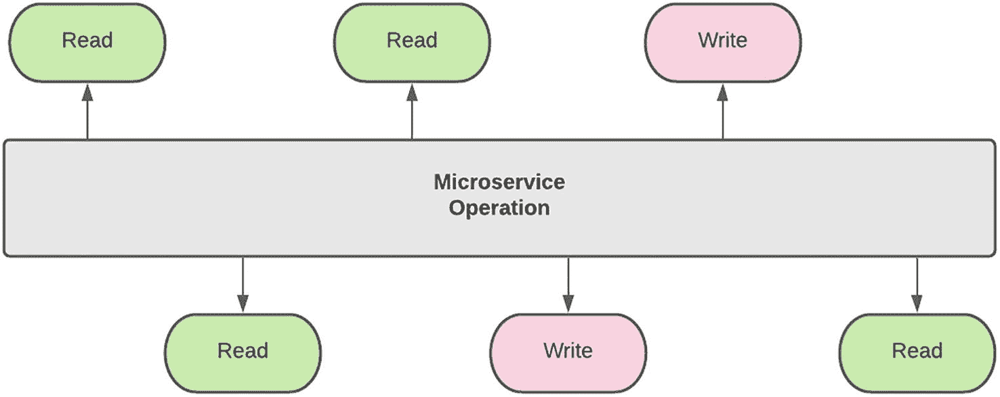
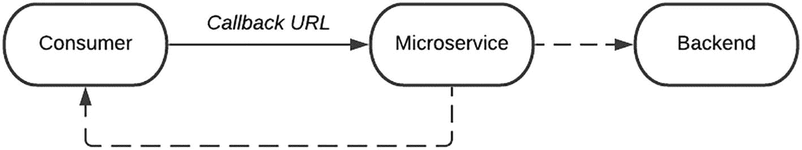
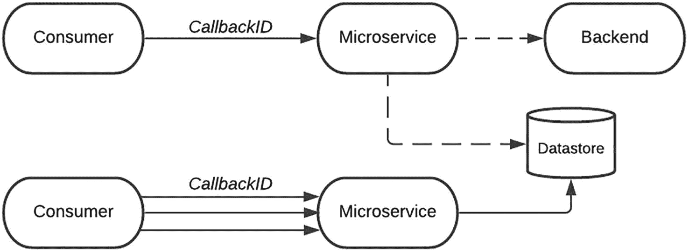
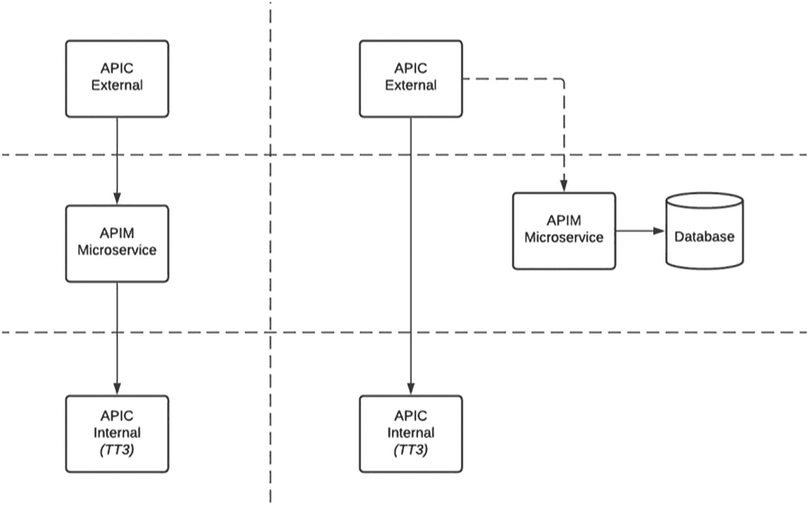

# 7. API 设计

打造 API 的接口是一项可以从多个视角来审视的活动。对开发者而言，这相当直接，因为输入与输出通常定义明确；即使不明确，也可以在后续过程中轻松补充。对企业架构师而言，这更像是阿特拉斯肩扛世界般的重任：接口应经过深思熟虑，能够被当前和未来的多个消费者复用，并且能够承受来自后端提供方的任何“板块级”变化。对 API 产品负责人而言，接口应当干净、清晰，且便于第三方使用。监管机构则会定义一种能够覆盖广泛消费者的接口，这往往需要由前 NASA 阿波罗工程师级别的人才撰写的复杂文档。

在光谱的一端，设计是开发生命周期中极其重要的阶段，做出正确决策的压力可能导致“分析瘫痪”。当产品将被外部第三方消费时，系统中还会引入额外压力，因为变更或更新无法被局部封闭。在活跃的 API 生态中，设计不佳的接口可能导致开发者采用率低，甚至对产品及市场声誉造成损害。

在另一端，API 虽然重要，但只是达成目标的手段，尽快产出规范能够缓解高要求消费者带来的压力。这可能会产生一个只满足单一消费者的定制接口，但这种不合理之处可以稍后再修复——前提是投入更多时间和精力。

我们市场中的 API 来自多种视角，并落在上述光谱的不同位置。这一过程我们仍在持续打磨和优化。在本章中，我将分享我们的经验、学习和踩坑，以帮助你更深入理解我们的设计流程。你可以将这些经验调整后应用到你自己的市场实施中。从术语约定来看，我将外部方消费的接口称为北向接口，将市场消费的后端接口称为南向接口。

## 设计策略

在我们开始讨论*如何*定义 API 之前，先稍作停顿，思考下面这个问题：

*   *你的 API 增加了什么价值（VALUE）？*

请尽可能诚实地回答这个问题——它没有绝对的对错，最终取决于企业需求。组织的意图是否只是为了在市场上建立存在感，而这只是一个“打勾式”的 API 发布动作？在这种情况下，可能增加的隐性价值是：组织满足了监管或合规要求。又或者目标是比竞争对手发布更多 API 产品——偏好数量以获得更高“炫耀资本”，而不是质量。在这种情况下，你的市场看起来更接近某个流行调研的右上象限。也许这是一个试点项目，当前只有一个已确认消费者，但要求这些 API 未来能服务更大范围受众。其短期价值是支持单一消费者，中长期价值是支持多个消费者。也可能这是一次真正的战略响应：将你的组织建设为平台提供方，打造新的数字渠道，使第三方提供者能够利用企业能力构建并发布其应用与服务。这可能为组织带来长期价值，因为它将创造新的收入来源。

认真反思这个问题至关重要，因为它本质上驱动着 API 设计背后的策略。例如，监管要求可能迫使你的组织向第三方开放 API。你市场的第一轮迭代可能只是为了在监管截止日期前达成该目标。下文所列、用于构建 API 产品的策略，均由 API 市场的目标所驱动。清楚理解哪些地方必须进行权衡，将有助于塑造 API 的定位、采用情况，以及后续迭代的改进方向。

### 自上而下，预定义

这些是所有组织都必须遵循的标准 API。支付服务指令（PSD2）就是一个例子。对消费者而言，其优势在于集成方案只需构建一次，便可在不同提供方之间复用。对提供方而言，其优势在于接口是预先定义好的，只需要补充实现即可。这类集成的挑战在于北向（面向外部）接口与南向（后端）接口之间的映射。由于北向接口被设计为尽可能通用，通常会有非常广泛的输入以及海量的组合。

根据我们实施 PSD2 接口的经验，我们发现南向接口属于一个小众的大型机应用，它多年来一直忠实地服务于组织的特定需求。我们这项并不令人羡慕的任务，就像把一侧数百根精细的光纤，接补到另一侧几十个真空管上。对于这种类型的集成，在完成连接这两类接口的映射工作后，我通常会有一种和组装预包装产品后发现多出零件时一样的感受。要建立对映射正确性的信心，方法是对解决方案进行严格测试，并让后端提供方确认请求被正确接收和处理。

这种接口类型的另一个缺点是，组织会失去其独特身份。消费者有充分理由认为，如果每个提供方都有独特身份，将会显著延长他们的开发周期。从提供方的角度看，标准化会让你很难从众多竞争者中脱颖而出。你的 API 产品只会变成提供方目录中的一个新端点。大型机解决方案虽然陈旧，却可能具备某些令人惊叹的功能，第三方本可以加以利用。不幸的是，这一缕阳光会被覆盖在接口之上的统一性“毯子”所遮蔽。

### 自下而上

大多数北向接口都由其南向对应接口驱动。与预定义 API 相比，这些是按后端功能“塑形”锻造出的产品。上一节提到的那些独特而美丽的“功能阳光”，本来会被标准接口掩盖，如今则可以明亮地照耀出来，供世界看见并使用。现在出现的挑战在于：确定应暴露哪些功能片段与数据。此外，必须特别谨慎，避免南向接口的数据结构“渗出”。也就是说，外部消费者不应受到后端提供方细微变更的影响。

坦率审视我们的 API 目录后，我发现其中有一些并不是我完全引以为傲的。这些 API 也没有出现在我们的开发者门户中。在你的 Marketplace 之旅中，总会有某个时刻，API 生产线跟不上消费者需求。虽然我认为这在某种程度上是个令人羡慕的处境，但它有时会导致糟糕的短期决策，并带来长期后果。

我清楚记得曾与产品负责人讨论过一个关键 Marketplace 消费者急需的 API。当时团队已全力以赴，没有能力再“采收”这个 API，尤其是在既定时间线内。最终在疲惫中做出的决定是：我们发布该 API 的 0.00001 版本。这实际上就是一个直通式接口。我们为这个糟糕决定保留的一点体面前提是：这个 API 会在后续时间进行修订。

正如大多数交付团队所知，绝大多数进入生产运行环境的解决方案几乎不可能回退。偏偏这个后端平台的数据模型，是我整个集成职业生涯中见过最糟糕的之一。消费我平台发布 API 的用户，对我提供给他们的接口可能也有和我使用别人接口时同样的感受。创建这类 API 产品的挑战在于：团队必须在其整个生命周期内承担所有权与维护责任。即使创建了新版本，如果旧接口稳定，消费者也极不可能将其集成更新到新接口。

为避免你的平台出现这种情况，关键在于获得项目赞助方的强力支持，使其能够为团队抵挡来自消费者的压力。随着我们平台逐渐成熟，我们已能以更好的方式处理这类请求。我们当前的交付流程会要求对正在开发的解决方案进行重新优先级排序，或者将所需功能安排到更晚的时间。一个前置的“*不*”，虽然不受欢迎，却可能带来更好的长期方案。在需求管道中建立明确流程，也让消费者能更高效地规划，从而使临时突发请求大幅下降。

### 消费者驱动（Consumer-Driven）

这种设计策略通常始于某一个消费者的需求，并带有一项关键指令：接口在未来应支持多个消费者。我们平台最近接到任务，需要弥合一个新的外部托管数字平台与内部核心企业能力之间的鸿沟。在项目启动之初，Marketplace 团队郑重承诺要构建可供其他第三方提供商复用的北向接口。我们对这一目标的投入，可从 API 的命名规范与标准中体现出来。其设计方式使得其他方能够轻松消费这些接口。

这一使命目标所带来的推动力，促成了与组织内几乎所有后端平台的南向集成。当后端提供方对我们提出挑战时，我们选择让开，让数字平台这台“巨无霸战车”的势能从他们身上碾过。

我们很快意识到，巨无霸并不是精细温和的生物——它们同样冲击了我们的交付流程。随着团队接收越来越多消费者特定的业务需求，我们在维护通用、可复用接口的纯粹性方面举步维艰。我们曾试图坚守立场，并明确指出这些变更会影响 API 的可复用性和可扩展性。我大脑左侧的理性部分认同当时做出变更的决定，因为那时只有一个消费者；而右侧的感性部分却深受打击，因为这意味着我们违背了打造可复用产品的承诺。

我们试图控制这种“传染”的扩散：先隔离消费者特定的载荷（payload），再隔离操作（operation），并希望在未来某个时间点进行“康复”。遗憾的是，我们并未成功，目前的“诊断结果”是：需要在我们的目录中“截肢”某些特定 API。听起来也许有些夸张，但我希望当你经历类似情况时，能记起这个类比。

我想传达给你的关键信息是——如果你的旅程始于单一消费者，请谨慎选择你的战场。正如图 7-1 所示，务必将关键后端南向集成抽象为可复用的集成组件。对于北向接口，识别哪些可以被隔离，并将其拆分为通用接口。例如，参考数据 API 就是通用接口的理想候选。与其为可能永远不会出现的未来消费者而设计，不如对你的首要消费者给予应有的重视，发布一个能满足其需求的特定 API。

图 7-1

消费者特定的集成方法

帮助我得出这一结论的原因在于：如果没有这个特定消费者的需求，我们一开始就不会有*任何*API 产品可做。我想给你一句颇有智慧的建议——不要试图一步到位“煮沸整个海洋”。让你的平台拥有一定空间，先提供消费者特定接口，再在后续构建通用且可复用的集成组件。也就是说，与其先构建一个单一产品再事后切分重组，不如从一开始就构建多个分段化产品。

### 自主构建（Build Your Own）

如果说自顶向下（Top-Down）策略给了你一个现成且必须落地的接口，消费者驱动（Consumer-Driven）方法由单一用户需求牵引，自底向上（Bottom-Up）方法受后端系统影响，那么从接口视角看，真正可设计的空间并不大。自主构建（Build Your Own）策略则不同，它允许 API Marketplace 团队在定义 API 的愿景与目的上拥有完全自主权。就像艺术家从一整块石料中雕刻出精美雕塑，一点点打磨掉粗糙边角，直至成品诞生，你也将经历同样的过程。不会有僵化的监管机构、苛刻的单一消费者或过时的遗留后端，来替你挡住那些在消费你的 API 时遇到困难的开发者的怒火。

即便如此，这块可供你绘制接口“壁画”的空白画布仍是难得机遇，是应当双手紧握的“金环”。对我们团队有效的方法，是一套严格而全面的评审流程。我们有时称其为“Apple Design（苹果式设计）”评审。无论是苹果的拥趸还是批评者，大多都会认同其面向终端用户的产品兼具功能性与优雅性。这并非“自然而然”得来，而是无数严格设计评审与迭代的结果。你的 API 产品也必须如此。从一开始就接受：会有大量迭代和大规模返工。友谊与同盟关系应暂时搁置，目标应直指卓越。

在最近一次 API 设计评审中，我们收到了若干改进建议，也提出了关于功能与可用性的问题。第一轮评审后，达成的方向是采用通用、开放的方法，以便于扩展，但这需要对开发者进行更多教育。我对这一策略相当满意，因为它与已在建设中的中间件集成组件高度契合。坦白说，当时我们开发已推进很深，API Gateway 的实施几乎完成，结果却又提出了关于可用性的问题。

我不想掩饰——回到起点重画蓝图，尤其是在你的“壁画颜料”都快干的时候，确实艰难。人们本能地会想捍卫现有方案。真正帮助我的是意识到：最终产品的新方向将带来更简化的方法和更高的开发者采纳率。我算是幸运的——我们是在开发中途发现了这一点。也会有一些 API 产品上线后仍需回到起点重做。这必须内化为团队文化：持续返工、打磨、优化，直到最终产品足够完美。

还应强调的是，经受设计评审流程的“重重考验”有助于巩固产品定义相关原则。当我们收到后端团队关于增加输入元素的挑战时，这些原则证明是至关重要的支撑。尽管 API 可以变化，你也要准备好捍卫自己所创建产品的身份。简而言之，如果你坚信某一战略方向，就不要害怕坚定立场。

## 注意事项（Considerations）

设计 API 时需要考虑的因素很多。有些因素应在流程早期纳入，用作筛选器，以区分优劣；另一些因素用于理解 API 的形态与功能，确保交付成果能够实现预期能力。这些阶段可能是显性的，例如详细性能要求；也可能是隐性的，例如在组织内部推进架构设计评审。在接下来的章节中，我们将讨论其中一些因素，以及我们在设计过程中用于筛选、理解和构建更优 API 的经验与方法。

### 可行性与可实施性

这是设计过程中最关键但也可能最困难的考量之一。其中的核心认知是：并非所有 API 都适合作为 Marketplace 上的产品。当一个新产品机会出现时，产品负责人（由工程团队支持）必须在工作正式开始前，通过回答以下一个或多个问题来完成尽职调查。

*   该产品是否符合企业风险、安全与数据隐私政策？

*   第三方开发者是否对该产品有需求，和/或外部提供方是否能够使用它？

*   对下游系统有哪些依赖？时间线如何？

*   构建该产品所需的开发工作量和复杂度如何？

*   预测的显性或隐性收入模型，是否能在产品整个运营生命周期内支撑该产品？

这一过程的产出不一定是非黑即白的二元结论。作为理解产品的一部分，团队可以对产品进行塑形，以提升其可行性。对下游系统的依赖与时间线问题，可以通过分阶段或迭代式发布来缓解。与第三方就产品潜在采纳进行沟通，以判断需求，也可能是明智之举。如果该产品能够带来未来潜在机会，也可以从运营视角在短期内为其提供资金支持，并兼顾长期目标。

API 产品虽然是数字化的，但与实体产品类似。在开始构建之前，团队至少必须对创建和运营它所需的时间、成本与投入有一个高层视图。

### 需求

敏捷是我们当前团队最大的优势之一，因为与企业其他部分相比，我们能够以“光速”响应、转向并机动调整。不幸的是，这有时也是我们的阿喀琉斯之踵，因为我们没有停下来审视问题陈述更广泛的上下文。我们通过在运营环境中吸取了一些惨痛教训后，采取的风险缓解措施是：通过清晰定义 API 需求来强化需求流程。我们仍然可以保持敏捷方式，但必须清楚了解“赛场”以及参与背景。

这种清晰性可以通过功能性需求与非功能性需求来实现。仅仅提到这些术语，就可能让同行开发者一阵发怵，因为它常常与传统的、某种程度上近乎“神圣化”的企业架构实践同义。在你跳到下一节之前，想一想：如果你设计并建造的是一条只供单车骑行者通行的道路，却来了一个由 18 轮卡车组成的车队，会有多少返工。反过来，思考一下反向场景中被浪费的开发投入。

根据我们的经验，在给出资源投入、开发、测试和交付时间估算之前，我们现在会考虑以下一些问题：

*   **性能**：接口的预期吞吐量是多少？支撑系统的响应时间与相关服务等级如何？这会直接影响我们平台基础设施的扩展，因为高吞吐 API 可能需要额外硬件容量。

*   **可用性**：如果支撑系统不可用，请求应当排队并在稍后重试，还是应当向调用方返回错误？如果请求需要重试，API Marketplace 平台就必须具备处理异步请求的能力。

*   **可维护性**：哪个运营团队会处理终端用户查询？在支持团队之间跟踪运营问题的支持流程是什么？

*   **接入（Onboarding）**：谁来处理希望消费该服务的第三方的接入、尽职调查、商业法律协议？

*   **报表与历史数据** **：** 需要上报的关键指标有哪些？报表频率与可用性如何——从发布与历史追溯角度看？

*   **业务规则**：作为进入企业的新渠道，我们努力将业务规则保持在 Marketplace 之外。理想情况下，这些规则应在后端逻辑中集中维护，而不是在渠道逻辑中重复实现。若无法集中托管，那么业务规则有哪些、复杂度如何、变更频率如何，以及变更所需时间线如何？

需要强调的是，这些只是我们在构建新 API 时考虑的*部分*领域。对于某些解决方案，在与已知后端协作时，我们只考虑其中的一个子集。本着敏捷精神，我们也会并行启动后端集成，以便在需求明确并形成高层设计后能够迅速推进。

即便附带“后续可修订”的前提，在给出交付预估时仍应谨慎，因为任何估算都很可能被视为具有约束力——尤其是在高压环境下。另一种缓解策略是（在实施早期阶段可能更容易做到）：以“beta”标识发布 API。如有需要，这可为返工保留一定灵活性。但这一阶段必须有明确时间线，因为过长的测试期可能会吓退 API 的外部消费者。

### 文档

对 API 产品成功至关重要的一个关键要素是文档。对此我再怎么强调都不为过。遗憾的是，根据多年开发经验，文档通常是在最后才“补上”。再优秀的 API 产品，如果没有足够水平的配套文档，也无法、也不会发挥其潜力。正如代码行体现了开发者的“遗产”，详细说明 API 使用方式的文档，也代表了团队将传递给未来使用者的一份“遗产”。API 的行为与运行方式、参数、输入和输出等细节，都应包含在 API 的定义中（也称为 swagger）。文档与定义之间是共生关系，二者应共同演进，最好以相同速度演进，并且重要的是同步演进。

这件事说起来容易做起来难，而且这是必须由团队承担而非某个个人完成的活动之一。作为开发者，我非常喜欢编码。有一类编码工作有时像泥泞沼泽一样拖慢我，那就是给变量或操作命名。让我焦虑的原因在于，我希望名称足够合理，并能与未来维护我代码的人产生共鸣。文档也是同理。负责塑造定义的团队成员，可能只能用寥寥几句简短词语来描述它。随着定义被评审，文档也必须经过同伴评审、更新，然后提交给工程负责人和产品负责人评审并反馈。如果团队资源允许，这项任务最适合由技术写作者完成。

正如前文关于*API 消费*一章所强调的，API 产品的消费者类型并不相同。技术文档可以满足开发者的需求。关于 API 产品商业使用与应用方式的细节和指南，对业务受众同样至关重要。此外，还需要对 API 进行营销与定位，以吸引外部消费者关注。API 产品在设计阶段就必须考虑不同类型与层级的文档。

### 治理

治理是另一个可能让敏捷开发者感到畏惧的话题。然而，它会为团队将要构建的 API 以及 Marketplace 将要承载的内容带来巨大且广泛的收益。应尽可能早地在开发生命周期中考虑治理，并持续推进。我相信你会同意，几乎没有什么事情比看到一个你投入了大量时间和精力的项目或倡议，因不合规而被搁置更令人沮丧了。在我们的组织中，企业架构（EA）团队的职责是确保解决方案按照企业的特定方向进行设计和构建。

我们与 EA 能力之间的关系经历了一次蜕变，这种变化与平台成熟度成反比。让我解释一下这句话。在 MVP 阶段，我们尽最大努力绕开治理和企业架构师。主要原因是 Marketplace 倡议，更不用说其底层技术，与组织通常所做的事情相距甚远，以至于我们担心某天早上来上班时会发现工位被官僚主义的红色警戒线围了起来。我仍清楚地记得我们第一次在解决方案对齐论坛（Solution Alignment Forum）上的提交，当时我们获取部分批准的策略是将该倡议标记为“Research & Development”。也就是说，我们被允许继续推进，但仅限于“实验室条件”，并被严格要求返回进行进一步审批。

随着时间推移，我们发现架构评审流程中的洞见与建议，使我们能够更高效地推进交付中的其他领域。例如，获得使用文档型数据存储的批准，使我们得以使用一项企业级服务。

我们已经学会并仍在学习如何更高效地应对设计评审流程。关键原则是尊重与谦逊。尊重流程——这些治理结构对交付团队而言也许显得繁琐，但其存在是为了保护企业。尊重企业架构师——有时他们的问题和反馈看起来完全脱离上下文，但事后看来却为我们在运维环境中节省了大量时间。谦逊是我们治理之旅核心中最重要的特质之一。能够吸收反馈并做出必要调整，最终将形成一个与企业标准保持一致的平台。

通过成熟度与认知提升的过程，项目如今会为设计评审的充分准备分配足够时间。此外，我们还寻求了一位首席架构师（Lead Architect）的协助，他作为提交过程的“引导者”，在正式汇报日期前，帮助其在多轮内部更新及关键企业架构师评审中顺畅流转。这也帮助我们的项目团队和 Marketplace 与企业建立了更深层的连接。

## 访问机制

API 可以通过多种方式访问。SOAP（Simple Object Access Protocol）和 REST（Representational State Transfer）都是 Web 服务通信协议。也有像 GraphQL 这样令人兴奋的可选方案。应根据访问 API 的消费者或客户端类型、编程语言、环境以及应用需求来确定采用何种方式。

你的 Marketplace 最好具备多种可选方案，并在设计阶段拥有选择最优方案的能力与灵活性。公共 API 中很大一部分是 REST API。我建议你在 Marketplace 中发布的首批 API 采用 RESTful，因为有大量资源和参考站点可用于对标。在本节中，我们将讨论并对比不同的访问机制。

### SOAP

SOAP 将应用逻辑的组件以服务而非数据的方式暴露出来。它与编程语言、平台和传输方式无关。作为一项成熟的万维网联盟（W3C）标准，它在错误处理和自动化方面具备预构建的可扩展性。通过其他协议和技术，它也具有很强的扩展能力。

除了 WS-Security 之外，它还支持 WS-Addressing、WS-Coordination、WS-Reliable Messaging 以及其他一系列 Web 服务标准。如果你需要更强健的安全性，WS-Security 支持可为数据隐私和完整性提供额外保障，并支持通过中介进行身份验证，而不仅仅是 SSL 所提供的点对点方式。另一个优势是它提供内建重试逻辑，以补偿通信失败。但这也有代价：它是 Web 服务访问中更“重量级”的选择，并且由于使用复杂的 XML 格式，往往速度较慢。

### REST

RESTful API 是一种 API 架构风格，它使用 HTTP 请求来访问和使用数据。REST 中的对象被定义为可寻址的 URI，并通过 HTTP 的内建动词进行交互——具体来说，GET 用于读取，POST 用于创建，PUT 用于更新，DELETE 用于删除等。其核心概念是一切皆资源。由于它与 HTTP 紧密对齐，几乎可在 Web 的任何地方使用，并且在通过互联网公开 API 时被广泛采用。

REST 支持更多样的数据格式，结合 JavaScript Object Notation（JSON）后，通常被认为更易于使用，因为学习曲线更平缓。它对浏览器客户端支持更好，也不需要昂贵工具即可使用。作为一种更高效的方法，它通常比 SOAP 更快、占用带宽更少。

### GraphQL

GraphQL 是一种用于 API 的开源查询语言，由 Facebook 于 2012 年作为数据获取 API 开发。自 2016 年开源以来，它的人气不断增长。图（graph）指的是更复杂且具有关联关系的资源。获取复杂图结构需要客户端与服务器之间多次往返。因此，REST API 常常会导致过度获取/不足获取。过度获取是指获取的数据多于所需；不足获取则相反，指获取时返回的数据不够。

GraphQL 则围绕模式（schema）、查询（queries）和解析器（resolvers）构建，其目标是改进 REST：允许客户端请求特定的数据片段，而不只是整个数据块。你无需处理冗长的数据流——你只会得到你请求的内容。而你请求的内容还可以由多个不同的 REST API 组合而成。REST 在瘦客户端场景下表现良好，例如托管在浏览器中的 Web 应用，因为主要处理工作在服务器端完成。GraphQL 则利用了更强大客户端的能力，例如承载应用程序的移动设备。

## 模式

API 产品就像一座冰山，只有约百分之十露出水面，庞大的部分隐藏在水下。第三方只能看到打磨完善、已发布的接口及相关文档。产品的核心——可能更为复杂——位于实现层。构建产品有多种方法，以下内容绝非穷尽列表。随着你的 Marketplace 成熟与演进，你会加入自己的变体，以满足组织的独特需求。人们很容易陷入将产品归类到某一特定模式的纠结中。请尽量避免这一陷阱。作为数字平台，产品不一定要遵循经典架构惯例。正因如此，平台才能具备敏捷性和灵活性。简而言之，让产品“跳出框线”去发挥。

### 同步

我们的第一批微服务是基于一个数字化集成框架构建的，该框架面向集成到单一后端，如图 7-2 所示。在当时，只有一个需要集成的后端是完全合理的。毕竟，微服务的纯粹定义就是一个原子化的功能单元。在平台的早期阶段，这种模式完美满足了我们的大多数需求。对于大多数 API 平台来说，这种方法也是一个很好的起点。

图 7-2

单一后端

随着消费者驱动（Consumer-Driven）方法带来的需求日益复杂，我们有必要把对不同后端的调用串联起来。我们以战术性方案的名义这样做，长期目标是将这部分逻辑迁移到专门的中间件服务中。为了满足极其激进的项目交付时间，我们在微服务中加入了更多逻辑，最终形成了图 7-3 所示的实现方式。基于多年的集成经验，这类实现会让我产生严重的眩晕感。

图 7-3

复杂业务逻辑

如果这个顺序流程只有一次写操作，它或许还能勉强达到允许继续存在的最低标准。遗憾的是，这个流程中还有更多写操作。对于更宽容的开发者或架构师来说，这也许是可接受的做法。我对这种做法的担忧在于：如何在整个流程中保持事务一致性。如果第一次写入成功而后续写入失败，那么事务或请求就会处于不一致状态。在传统中间件平台中，这正是消息队列和回滚机制至关重要的地方，它们用于确保事务性。我的坚定立场是：这类集成逻辑最好维护在具备必要工具和服务支持的环境中。

不幸的是，战术方案的交付速度远胜于战略方案，而且通过存储瞬时状态并重放请求，已经实现了伪事务性。我的建议是：在构建系统时，绝不要让你的微服务复杂到这个程度，因为这无异于搭建纸牌屋。我把这种微服务称为“单体化微服务（Monolithic Microservice）”。务必不惜一切代价避免它。

### 异步

最初我们很幸运，因为我们所集成的后端平台通常在毫秒级响应，最差也只是秒级。随着我们吸纳更多不同后端并加入更多业务逻辑，我们发现请求延迟在持续攀升。对于某些 API 操作，完成一次请求甚至需要一分钟以上。不要浪费时间和精力去抱怨一个主机应用需要几分钟来创建客户记录。虽然对数字化平台来说，几分钟几乎像一个世纪，但在主机系统语境下，这已经是光速了。

这很快就成为问题，因为 API 网关超时被设置为 60 秒。当网关的维护方拒绝我们增加超时时间时，问题进一步升级——而且他们拒绝得完全合理。API 网关并不适合处理长时间运行的请求，这类事务会影响其他服务使用者。我们夹在两难之间：一边是处理请求耗时不可控的后端平台，另一边是对请求处理时间有硬性上限的 API 网关，因此我们必须为这些用例找到新的执行方式。

不幸的是，我们的约束还不止于此。就像一位被捆绑、淹没在水下且还面临鲨鱼袭击威胁的逃脱艺术家一样，我们还必须应对另一个参数：网络防火墙限制。微服务不允许直接访问企业网络外部的服务，除非通过 API 网关进行复杂的反向代理，这会使开发时间翻倍。

如果没有这个限制，我们本可以直接实现图 7-4 所示的异步回调模式。调用方发起请求时传入一个返回 URL，该 URL 会在流程结束时被调用。如果你的微服务平台不是部署在“恶魔岛”里，这是一种高效得多的异步处理模式，因为它支持事件驱动架构。

图 7-4

异步回调

最终采用的方案是图 7-5 所述的异步轮询（Async-Polling）方式。在 API 发起时，会向消费者返回一个*回调* *标识符*。微服务继续处理请求，并在完成后将响应更新到数据存储中。与此同时，消费者通过一个专用操作轮询微服务，以判断请求是否已完成。尽管这种方式不如回调机制优雅，但它的内在优势是微服务不必承担向消费者回传响应的负担。责任转移给消费者，由其自行判断事务状态。

图 7-5

异步轮询

### 代理 vs. 旁路采集之争

为了实现一个 API 产品而进行方案设计，在我们团队里从来都不是件枯燥的事。举例来说，考虑下面这个场景：它源于最近一个 API 产品需求，并且坦率地讲，这是团队内部争论非常激烈的话题。由于我们的 API 市场（Marketplace）现在被视为外部第三方访问组织服务的入口，我们被要求为某个特定业务需求用例托管一个 API。它是一个小众功能，只会对特定消费者开放。因此，它不会出现在对外发布的 API 产品目录中。此外，这类事务本质上承载的是高度时间敏感的客户请求。也就是说，如果请求不能在毫秒内成功处理，可能会给使用该接口的商户带来潜在收入损失。

实现该需求的两种方法在图 7-6 中进行了对比。左侧是我们当前的方法，我们称之为“中间人（man-in-the-middle）”模式；右侧是新的“tap-and-go（旁路即走）”策略。tap-and-go 的支持者强调，由于 Marketplace 并不是事务中的关键参与者，因此应采用观察者角色。作为观察者，只应提取监控和洞察所需的信息。传统代理方法的支持者则强调，该产品应按照标准设计理念来实现。

图 7-6

代理 vs. 旁路采集

团队最终以真正“角斗士”式的方式，决定将两种方案都推进到预发布（staging）环境。这使我们能够在 API 需求逐步明确、性能测试结果逐步可用的过程中，灵活选择最佳方案。

从传统应用开发的视角看，这似乎极其低效。而我认为这恰恰是我们 Marketplace 最大的优势之一。灵活的架构，再加上一支高度敏捷且能力出众的团队，使我们能够构建并测试多种方案，从而确定应采用的最佳路径。

## 生命周期

设计过程代表了 API 产品的胚胎阶段；它将成长、变化、老化，并最终走向终止。如果我们以这种方式看待 API 产品，就能获得让其持续演进并不断改进的灵活性。对接口的变更应当谨慎进行，因为这会影响 API 的使用方。还有其他一些维度也需要考虑，而且这些维度既可以也应该发生变化。我们将在以下章节讨论其中一部分。

### 开发者体验

来自 API 真实使用者的反馈，是设计流程中极其关键的输入。一个由后端团队、法务与合规部门批准，并由技术团队交付、但对终端用户几乎没有价值的 API 产品，只会被束之高阁，等待“最佳使用期”到期。遗憾的是，我们的 Marketplace 中确实有属于这一类的 API 产品。在构建 API 的过程中，很容易掉入“只要你构建了，他们就会来”的陷阱。一个早期预警信号是：很难找到 API 能支持的真实用例。请站在第三方使用者的角度，严格评估它是否真的能帮助你达成某个明确结果。如果你自己都难以完成这项评估，那么第三方很可能也会遇到同样的问题。

应尽早向潜在第三方征求关于需求和采用意愿的反馈。在 Marketplace 的早期阶段，这可能会有挑战，因为开发者社区本身仍在形成中。第三方采用也是流程的第一步，而这种关系需要持续投入和维护。在初始阶段，可通过文档、指南和教程帮助对方理解 API 的功能与用法。随着采用率提升、API 获得更多认可，可以为 API 产品增加更多能力。例如，一个保险 API 产品可能先从提供个人保险保障报价开始。后续迭代可加入报价接受与保单签发。再之后，还可加入其他保障类型。也可以考虑增加理赔记录相关的修订与更新能力。

正如这个例子所示，与其等待完整产品集全部可用，不如尽快发布 API 产品的一个修订版本。定义一个功能与特性上线时间的路线图会是加分项，但不一定是关键前置条件。也就是说，如果初始 API 修订版本已经获得了强劲的第三方采用，这种势头可能会推动后端企业团队开放更多功能。这并不容易，但请尽量保持产品路线图的灵活性——更受欢迎或被频繁请求的功能，应当能够优先进入待办列表顶部。正如 Consumption 章节强调的一条关键原则：*没有第三方消费，就不会有流量。没有流量，就没有收入。收入维系 Marketplace，而 Marketplace 的存在是为了实现愿景。* 第三方与开发者的接受度及反馈，是设计流程中至关重要的组成部分。

### 版本管理

API 最大的优势之一是可以同时存在多个版本。我首先要强调，这绝不意味着可以为糟糕设计开绿灯。发布 API 时始终都要保持谨慎并进行充分考量。版本管理本质上将使用方与提供方解耦，使双方都能沿各自的发布节奏前进。如果某个特定版本的功能仍能满足使用方需求，那么就不一定需要迁移到后续更新。API 的新版本也使提供方能够发布额外功能，并由一部分使用方率先采用。

大多数 API Gateway 原生提供此能力，不同版本带来的复杂性通常在这一层栈中处理。小版本修订是对 API 的更新，不包含破坏性接口变更；每次部署后，所有 API 使用方都会自动订阅到更新后的产品。如果存在需要使用方进行更新的变更，则会创建一个新产品，使用方需要重新订阅并更新端点配置。

在新增 API 版本时，也必须考虑 Developer Portal 和配套文档的相应变化。随着平台成熟度提升，应发布每次更新的 Release Notes，覆盖从小版本到中版本再到大版本的变更细节。这也是向外部开发者社区传递 Marketplace 透明度的一个信号。

一种对我们的实施帮助极大的做法是：仅向一部分外部使用者提供新版本的早期访问权限。这不仅能帮助我们判断消费行为，也能识别覆盖缺口——无论是 API 功能、文档，还是理解层面上的缺口。需要提醒的是，这同样是非常耗时的工作，因为它往往是“多对一”的投入。这里的“多”，指的是交付团队中的许多成员，需要共同支持那“一位”因变量拼写错误而无法消费 API 的外部开发者。

最后我想强调，API 的身份应保持不变。版本管理应像望远镜的不同镜片，用于调整对比度与焦距，让产品呈现得更清晰。如果产品存在显著差异或方向变化，那么创建一个变体，甚至一个全新产品，可能是对使用方更审慎、也更负责的做法。

### 生命周期终止

我最近收到一封来自某后端团队开发经理的邮件，令我非常震惊。内容如下：

*   *主题：停用 <System> API v1 和 <System> SOAP v5、v6、v7*

*   *正文：*

*   *大家好，*

*   *我们计划在 <date – in 10 days> 于生产环境中下线旧版本的 <System> SOAP 和 API。*

*   *这些版本在 DEV、TST 和 QA 环境中已经停用超过一个月。*

*   *如果您对下线这些版本有任何顾虑，请联系我以及……*

我的第一反应是恐慌，我立刻疯狂检查我们集成组件中的最新代码，以确认我们平台正在使用哪些版本。很快我就松了一口气，因为我们幸运地分别使用的是 API v3 和 SOAP v8。随着肾上腺素带来的冲击逐渐消退，放松感又被愤怒取代。虽然目前我们的平台是安全的，但对于一个关键南向提供方来说，这种服务方式极其糟糕。试想某个应用在生产环境中仍使用旧版 API，且过去一个月并没有测试需求。如果这个应用处于纯运行状态、没有开发能力，那么 10 天后它就会遭遇一场“当头棒喝”。

这是该提供方极其冷漠且不负责任的行为。如果确实有迫切需要在短时间内淘汰旧版接口，提供方有责任先根据 API 订阅或安全访问配置整理出消费方清单，再逐一直接联系并确认旧版本可以下线。仅仅发一封“10 天后 API 版本退役”的通知邮件，完全不是可接受的做法。

这正是“临时拼凑式”API 的后果：可能只是为了满足某个特定消费方需求而构建，却没有定义生命周期。API 的停止支持/退役日期，必须在其诞生时、发布时或新版本发布时就清晰定义。这与任何商业软件发布实践一致。它体现了提供方承诺在特定时间前持续支持该产品，也使消费方能够规划从该版本迁移。我认为这体现了成熟度，也是信任的基础，而信任正是 API Marketplace 的关键根基之一。

请记住，第三方消费方在决定将你的 API 用于其应用、产品或服务时，是在做一个重大决策。他们在启动阶段很可能有开发资金投入。通过清晰提供 API 可用时间线信息，消费方就能将其纳入财务、业务和开发规划之中。

## 设计指南

就像学徒在导师指导下、通过经验不断变得更熟练一样，你的团队也会很快在 API 定义方面持续进步。作为这个过程的一部分，有一些普遍接受的指导原则与标准需要考虑。它们与平台和产品无关，几乎可应用于任何定义。从 Twilio 到 Facebook 再到 Google，都有优秀的 API 平台示例和参考。在为你的 Marketplace 定义标准与约定时，这些都可作为指南。下面章节中我们将讨论其中一部分。

### 错误处理

向消费方返回错误信息是 API 的关键要素。如下所述，HTTP 状态码通常被视为返回 API 调用执行结果的最佳实践：

*   **成功**：请求成功处理以 2xx HTTP 响应码表示。最常见的是 200 OK。其他码如 201 表示资源已创建，204 表示请求已成功处理，但未找到结果。

*   **客户端错误**：客户端错误以 4xx HTTP 响应码表示。这类错误说明客户端请求有问题，例如缺少必填参数或认证失败。问题必须在客户端应用修复后重新提交。

*   **服务端错误**：服务端错误以 5xx HTTP 响应码表示，需要由提供方解决。可能原因包括下游系统故障。客户端可持续重新提交/重试请求，直到成功。

作为起点，你可以先使用以下状态码，并按需扩展：

*   200 – OK

*   400 – Bad Request

*   500 – Internal Server Error

状态码主要供机器消费。还应包含提供更多错误信息的消息。尽量包含尽可能详细的问题信息。

例如，如果请求因缺少必填参数而无法处理，应明确指出缺少的是哪些参数名。这不仅能帮助开发者定位根因，也能减少支持团队处理潜在求助请求的压力。

注意不要在响应消息中泄露内部系统信息。例如在错误消息中包含堆栈跟踪。这会暴露内部实现细节，削弱 API 安全性，并可能带来安全风险。

### 过滤与分页

始终应努力从性能角度设计接口。不断提升的网络和 CPU 速度，可能导致接口开发时忽视了对消费方和提供方的负担：前者收到超大数据集，后者承受范围过广的查询。根据我在运维中间件环境中的经验，处理请求的线程数量是有限的。请求到达后，会从线程池分配一个工作线程进行处理。你需要尽最大努力让该线程尽快回到线程池，以便处理更多请求。如果所有工作线程都忙碌，请求就会开始排队。请记住，在消费方看来，请求从发起那一刻起就是“进行中”。如果请求在被处理前先进入队列，可能导致消费方超时。

团队中的 DevOps 工程师可能会插话说，容器化平台可以轻松横向扩展以应对高流量。这一点没错，但请从后端提供方视角看问题。该提供方可能并不具备可扩展的容器化平台，也可能同时在服务多个其他渠道。来自你 Marketplace 的突发请求，可能导致其系统高负载、交易失败，甚至系统中断。作为 API 设计者，你最重要的职责之一，不仅是保护你自己的平台，也要保护支撑它的相关平台。

实现这一点并提升性能的机制，是指定请求过滤条件并对响应进行分页。过滤可帮助阻止过于宽泛的查询到达下游系统。`limit` 和 `offset` 便于开发者对对象进行分页。这也会带来更可预测的执行时间，因为处理时长不再直接依赖于数据集大小或查询复杂度。

### 软件开发工具包（SDK）

在处理第三方关于我们 API 的请求时，我经常需要停下来，从外部使用者的角度审视问题。随着我们每天越来越深入技术细节，处理接口的某些方面几乎会变成机械操作，而一些复杂概念或功能也可能被想当然地认为很容易理解。一个机械操作的例子是在客户端应用中配置安全证书。这个挑战是团队多年前就已克服的，任何开发者都可以轻松从我们的代码仓库中获取示例。尽管我们希望开发者社区能够自给自足，并熟悉像 StackOverflow 这样的资源，但我们的目标是尽可能提升并加速开发者体验。为了进一步支持外部使用者，还请记住：技术团队可能只有一名开发者。

一种方式是提供代码示例和教程，细致地一步一步描述整个过程。另一种策略是提供一个封装 API 的 SDK，它能显著帮助开发者理解你的接口，并带来以下好处：

*   **简化集成**：证书配置、超时和异常处理等复杂性都可以由 SDK 抽象掉。

*   **统一消费方式**：由于 SDK 是入口点，它可以一致地执行 API 使用相关的策略和规则。还可以加入客户端校验，以缓冲格式不良请求对 API 的影响。

*   **原生语言支持**：SDK 可以像添加一个软件包一样轻松集成，并可直接在原生代码中使用。无需 HTTP 客户端，也不需要对请求和响应进行编组。HTTP 状态码可以作为异常返回。

需要注意的是，SDK 并非银弹。在采取这一措施之前，必须清楚理解支持与持续维护客户端代码所需的投入。

## 总结

API 设计是构建 Marketplace 过程中最令人兴奋、但有时也最让人不知所措的领域之一。在本章中，我们讨论了 API 的定义与目标如何被组织战略以隐性或显性的方式影响。我们强调了用于筛选、理解和支持设计过程的关键考量。我们还回顾了访问机制——传统、当前与未来——分别是 SOAP、REST 和 GraphQL。关于实现、API 生命周期和指导原则的模式也进行了讨论。贯穿设计哲学的黄金主线是：Marketplace 是组织的延伸，而其 API 是组织身份的映射。

设计阶段的产出是 API 蓝图，而该蓝图将作为开发阶段的输入，这也是下一章的主题。在传统瀑布式软件开发生命周期中，这两者是界限清晰且彼此分离的阶段。架构师将接力棒交给开发者，然后回到他们的“象牙塔”去思考下一个棘手的业务需求。在敏捷交付模式中，设计者深度参与交付能力——在我们的项目里，设计者和开发者往往是同一批人。这使得 API 产品的整体交付可以采用迭代方式推进。

