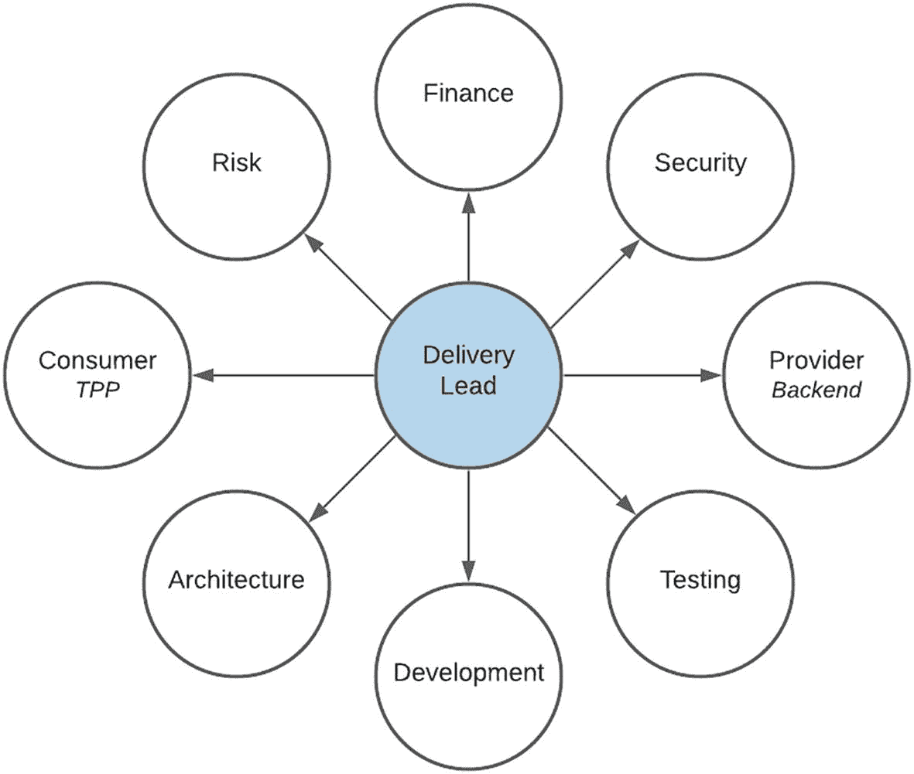
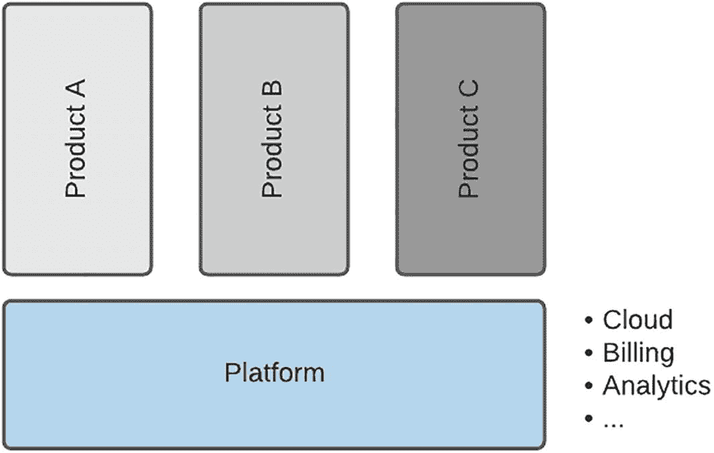
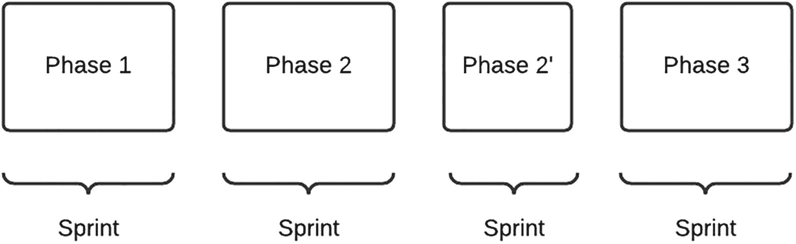
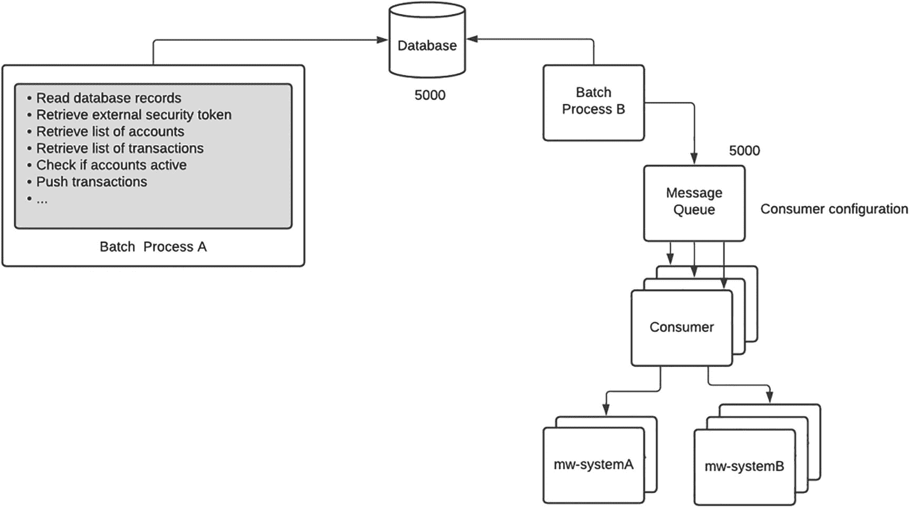
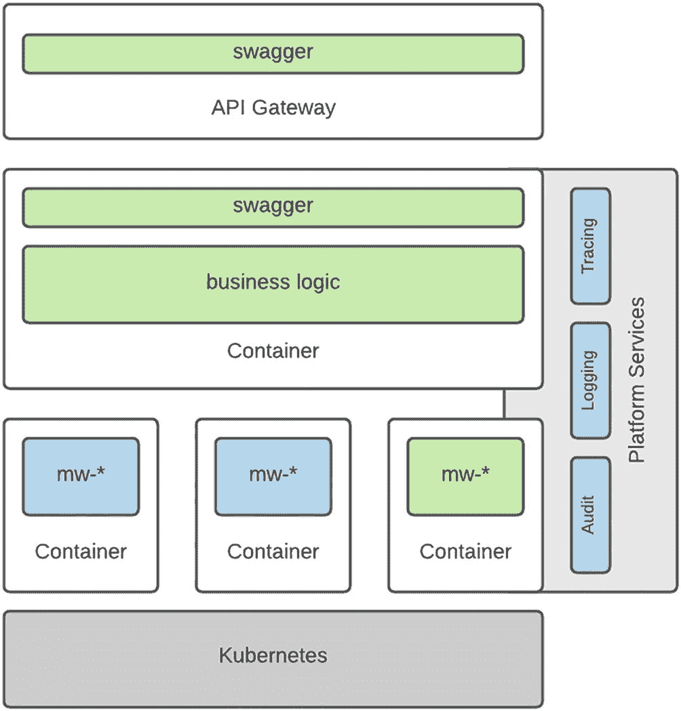
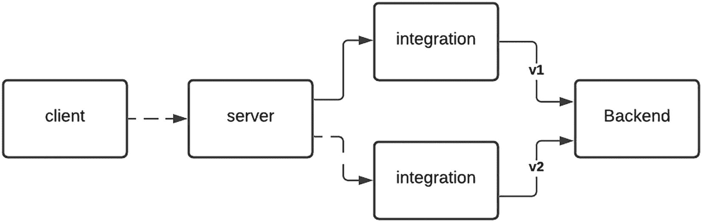
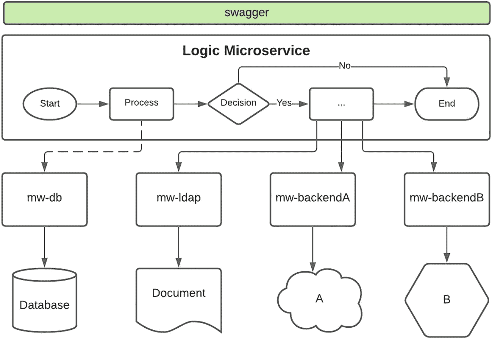

# 8. API 开发

在软件开发生命周期的所有阶段中，开发是我最喜欢的阶段。正是在这一阶段，设计与设想被注入生命，各种假设也终于可以被验证。与其他软件领域不同，在 API 语境下，实现的复杂性被接口所屏蔽。任何经验丰富的集成工程师都会确认，接口让团队能够在开发完成度上保持“扑克脸”。在许多项目中，我有时会发布一个“薄如蝉翼”实现的 API，要么是为了摆脱一个近乎疯狂的项目经理所主导的关键路径，要么是通过展示“已准备好集成测试”的姿态来虚张声势，把压力转移给使用方。

这一阶段并非没有挑战。在搭建两个系统之间“桥梁”的过程中，常常会慢慢意识到：集成复杂度远超预期。任何资深集成工程师也都会承认，在连接点缺少所需信息是令人恐惧的。这就像你在收尾一幅 10,000 片拼图时，发现少了 3 片一样。更糟的是，这通常还发生在那些实现“薄如蝉翼”的方案上！

在我的职业生涯中，我发现开发这趟过山车从不走同一条路线。这或许正是我热爱集成工程的首要原因。从一开始与外部团队代表的友好会面，到开发者之间充满技术术语的交流，再到为解决问题而在团队间爆发的激烈讨论；从与网络安全团队进行必要的协调外交以解除防火墙阻断，到第一次系统握手成功时的肾上腺素飙升，最终到看到它在生产环境中运行时的如释重负——总会有变化，让这一切始终令人兴奋。本章中，我们将深入探讨若干支持 API 开发的关键领域细节。

## API 优先，技术其次

在我职业生涯的早期，我曾深深迷恋 Java。更具体地说，是 Java Enterprise Edition（JEE）。我曾梦想着各种 bean——Enterprise Java Beans（EJB）——并且乐于与志同道合的朋友和同事进行长达一小时的讨论，辩论无状态会话 bean 相比有状态会话 bean 的优势，同时也对消息驱动 bean 的并行处理能力颇为欣赏。经历了几次角色转换之后，我意识到自己把关注焦点调到了最大放大倍数，以至于看不到更大的全局。

简而言之，集成需求的首要目标不是应该*如何*实现，而是*为什么*要实现。对开发团队来说，这可能是个很难接受的信息——但 API 消费者真正期待的只是对请求的响应。消费者其实并不关心实现细节——请求究竟是通过最新的人工智能（AI）云产品处理，还是通过几十年前的大型机处理，并不重要。最核心的目标是一个一致且可靠的接口。

面对当今丰富多样的技术选项，人们很容易一头扎进“兔子洞”，试图寻找最优、甚至可能是最前沿的实现方案。在一个正在兴起的 API 市场中，尤其是在数字化语境下，这种倾向很容易成为常态。尽管我也很享受折腾新技术，但在方案设计时我强烈建议保持克制。始终要记住，技术是为达成目标而服务的。

一个我很喜欢的例子是实现一个用于获取参考数据的接口。为了让这项看似平淡的任务更有趣一些，积极的开发者可能会尝试缓存响应。策略往往从一个简单的内存缓存开始，这在单实例场景下运行良好。但如果是分布在集群不同节点上的多实例呢？缓存是否需要数据持久化（这可能需要 Redis 之类的技术），还是仅基于内存（这可能需要 Memcached）？既然这是第一次实现缓存，方案应该部署在哪里？本地部署还是云上？缓存失效策略怎么办？我们应当如何、又在何时清理缓存中的陈旧数据？尽管这些目标本身合理，但你可以看到 API 的关注点如何从参考数据的*获取*偏移到了数据的*缓存*上。

我多次观察到，次要和非核心目标如何影响并拖慢需求交付，因为这些任务已经被嵌入进了解决方案之中。在敏捷环境下，目标是尽可能快地发布一个最小可用、具备功能的方案。注意，这与“薄如蝉翼”的实现不同——后者本质上只是一个带有模拟响应的接口。

回到参考数据这个需求，第一轮迭代要尽快上线，应该先做纯粹的数据获取。通过暴露一个能对请求做出响应的 API，即便延迟较高，消费者也能先感受到集成流程——从接口规范到返回数据。即使在设计阶段或后续性能测试中已经提出了性能优化需求，这种策略也应坚持。如果在更好性能和更快开发之间二选一，在紧迫交付周期下，项目经理很可能会选择后者。对于性能需求，一个折中方案可能是在客户端实现缓存。

这一理念很大程度上借鉴了 Facebook 的一句格言：

> *完成比完美更好。*

要克制在接口生命周期早期就进行优化的诱惑。从简单开始，持续迭代。聚焦核心任务，例如从源到目标的映射。*识别*可改进区域，例如用于性能优化的缓存、分页和过滤。同时，也务必考虑其他可能没那么“有趣”的领域——例如安全、校验和错误处理。即便只是开发环境中的一个可运行 API，也应在产品负责人和工程负责人的协助下对需求进行优先级排序。基于多年的经验，我非常确信：安全性、可靠性和一致性通常会优先于性能。请始终将 API 的目标置于焦点之中。

## 团队结构

与普遍认知相反，开发并不只是一个开发者在昏暗房间里独自敲键盘。借用一句非洲谚语“养育一个孩子需要整个村庄”，交付一个 API 同样需要团队协作。这个产品远不止几行代码，而是依赖于从设计到实现全过程中的以下角色。

### 交付负责人（Delivery Lead）

交付负责人负责协调并安排构建产品的各项活动。这是一项具有挑战性的任务，需要在多个工作流之间进行细致协调，如图 8-1 所示，以确保能够满足时间计划。由于外部团队和系统可能提供关键依赖项，因此需要大量的沟通与协调，每个环节都必须被精心编排，以尽量减少延误。

图 8-1

API 开发编排

让我们来看一看某些外部实体如何参与开发流程，以及交付负责人的职责：

*   **提供方（Provider）**：将提供现有接口的规范、新接口开发的时间计划，以及可用于解答开发者问题的领域专家资源。来自后端的任何延迟都可能影响开发和测试活动。

*   **消费方** **（第三方提供商）**：将请求 API 产品规范以及可用性时间计划——无论是在沙箱环境（后续章节会讨论）还是生产（Live）容量下——并与产品负责人协作协调接入活动，例如审查与审批，以预先规避行政流程延误。

*   **财务与报告**：预测产品交付时间线以及来自外部团队的潜在成本回收，管理 API 交付与所构建产品运维支持的预算，并向项目干系人定期汇报交付情况，同时管理其对时间计划的预期。

*   **开发**：通过在开发开始时提供已批准的设计和后端接口规范、提供对领域专家的访问以快速解决问题，以及提供对企业资源的访问，确保开发人员拥有一条平稳且不中断的推进路径。

由于在任何时点都可能有多个 API 处于开发中，交付负责人需要对多个产品有全局视角，并可能会将某个产品的交付优先级置于另一个之上。例如，如果一个更紧急的 API 需要额外开发人员，团队可能不得不进行重新平衡。

基于多年的项目经验，一个宝贵的教训是：你能投入到一个问题中的人数是有上限的。也就是说，有些任务需要特定的时间，增加团队成员并不能更快完成。团队管理层必须理解并认同这一点，因为“人多反而坏事”（too many cooks spoil the broth）这句谚语很容易应验：为新成员补齐背景需要耗费时间，而任务拆分还可能带来依赖关系和预算超支。

由于需要同时处理多项事务，在我们的实施中效果非常好的一种策略是：将交付负责人角色分配给不同个人，分别侧重商务或技术方向。这样我们可以让一个人专注于追踪财务和风险等商务目标，另一个人专注于完成架构与安全审批等技术目标。两者之间有重叠区域，这减少了对单人交付的依赖——偏技术的负责人可以借助项目发起人的支持；同样，如果其对应负责人暂时不可用，偏商务的负责人也可获得工程团队支持。我喜欢把他们称为“动态双人组（dynamic duo）”，他们确保交付光谱中的所有需求都被考虑到，从而使我们的项目保持平衡。

### 开发人员（Developers）

集成开发从其本质上看通常节奏很快，因为两个系统之间的接口往往处于整个项目交付的关键路径上。传统项目时间线通常以“月”为单位，而我们的交付目标是冲刺（sprint），最短可能一周，最长两周。其驱动因素在于第三方消费方通常也处于高速节奏环境中，发布周期更快，因此上市时间（time to market）成为关键因素。

我们应对快速交付周期的理念是：在每次发布中对 API 产品进行迭代。也就是说，我们不等待三个月后进行一次“大爆发式（big-bang）”上线，而是先提供基础功能，并在每次部署时持续更新。这确实会给开发增加一些复杂性，因为在推进新版本工作的同时，可能还需要修复或更新前一个版本。

在开发者旅程中有很多方面需要考虑。下面列举一些我认为成功的关键点。

*   **主人翁意识（Ownership）**：我们的开发团队中有相当一部分是全栈工程师。某些细分技能开发者有时是必要的，但开发者应具备解决其直接专业领域之外问题的能力。举例来说，开发者可能会建议修改 API 定义，并提交 swagger 更新供评审。主人翁意识的关键在于*及时*沟通。由于开发可能跨越一系列系统和人员（如 API 网关、微服务和数据存储），沟通是成功交付的关键。在以“周”为单位衡量的交付周期中，如果等到下一次团队会议才报告问题，损失的几个小时就可能导致错过目标日期。强烈鼓励团队成员在可能的情况下先自行尝试解决阻塞问题；如果无法解决，再升级寻求帮助。诚然，某些挑战（例如访问后端领域专家）可能无法自行克服。在这些情况下，团队文化应当是灵活转向（pivot）——做出合理假设并继续推进，暂停当前活动并转向无依赖任务，或向团队其他成员发送消息，表明自己可以协助其他任务。

*   **单元测试（Unit testing）**：在敏捷、快节奏的交付环境中，为实现激进交付时程，良好且充分的单元测试可能会成为被牺牲的一环。在很多实施项目中，我都观察到人们常把这个“问题”往后拖，开发者寄希望于后续质量保障阶段再识别并解决问题。团队就单元测试的覆盖水平作出一个全局且有意识的决定非常重要。在大多数情况下，*减少*单元测试是交付压力所致。项目干系人必须理解单元测试是开发流程中的关键要素；如果为了更快交付而将其短路，也必须承担相应责任。另一种缓解方式是正面应对而非忽视问题。也就是说，早期迭代可以先发布基础功能，并以 beta 版本标识；而在周期后段的计划发布中，明确聚焦测试与质量保障。这一策略可以缓解交付压力——尽快推出一个版本，但同时对全面发布前加固方案作出明确承诺。

*   **文档**：为安抚交付之神而做出的另一项牺牲，是将规范文档编写延后。坦率地说，即便时间充裕，也未必能让开发人员产出高质量文档。在传统的瀑布式项目中，技术设计稿完成之前，连一行代码都不会编写。而在敏捷的数字化交付环境中，原型往往在需求尚未被完整梳理前就已上线运行，并且解决方案与实现方式始终可能变化，直到并包括生产部署阶段。因此，开发人员有时不愿记录开发过程，因为它是流动变化的，并且在其生命周期中可能不断调整。一种做法是接受这种现状，并采用“文档即代码”的策略。另一种做法是在团队协作 Wiki 上创建一个简单模板，只要求最少但关键的信息，例如源系统与目标系统之间的映射规则。关键在于，开发方法论必须相应调整，以支撑所选策略。由团队负责人（Team Lead）对文档进行评审与批准，应成为进入下一交付阶段关卡的关键要求。若缺乏必要的制衡与校验机制，就会导致文档质量低下甚至没有文档的可能性。

每个团队都会根据所在组织形成自身版本的开发实践。至关重要的是，所有内部和外部干系人都要达成一致，并且开发人员要在规划会议中管理好各方对解决方案交付水平与质量的预期。如果时间线被压缩，团队所有成员都应知晓并接受：测试、文档等环节需要后续再补充完善。与其忽视这些问题，不如在一开始就提出并以团队方式进行规划。我们实施成功的关键之一，是把开发视为一项团队协作工作。

### 质量保证

这是我们交付流程中最关键的支撑支柱之一。为体现其重要性，QA 或测试工程师可以行使否决权来阻止发布。由于交付目标激进，开发人员往往在“真空”环境中测试，且主要覆盖理想路径（happy-path）场景。集成测试可能是该方案第一次在不同系统与多种上下文中被验证。

作为测试工作的一部分，方案必须接受多层次审查，涵盖标准场景、错误场景和异常场景。标准、功能与错误条件可通过提供一系列有效与无效输入来模拟。异常场景的模拟可能需要中断到后端的连接组件，以观察应用行为。可测试场景与条件的一个关键输入来源，是运维团队基于常规生产发布经验提供的建议。

随着我们在一段时间内显著提升测试能力，我们现在还会考虑以下子领域：

*   **安全**：在信息安全团队近期进行的一次应用扫描中，我们收到了一份近 100 页、措辞严厉的报告。复盘后我们发现，只需改进一个输入字段的校验，就能解决其中 70 页的问题。其余问题此前已在其他 API 上识别并讨论过。基于这一经验，我们团队决定将安全扫描纳入内部测试评审与批准流程的一部分执行，以便团队能够提前处理问题。需要强调的是，这并不意味着安全评审到此结束。在新的 API 产品获准发布前，企业信息安全团队会委托外部服务提供商开展详细的安全评估，以确认是否存在漏洞。

*   **性能**：半开玩笑半认真地说——在集成语境下做压力测试可能会变成一项“很有压力”的活动，因为这需要下游服务提供商共同参与。API Marketplace 组件的性能测试应定期在回环（loopback）环境或带模拟后端的环境中进行。与真实后端联调的测试也应排期执行，至少每季度一次。这将确保端到端价值链上的所有环节都能承受“黑色星期五”等峰值事件带来的负载。

*   **自动化测试**：遗憾的是，这对测试团队构成了一个典型的两难困境（catch-22）。自动化测试无疑能节省大量时间，尤其是在回归测试活动中。但在节奏狂热、多个测试任务并行推进的环境里，自动化测试工作通常会被延后。自动化测试必须成为团队文化的一部分，因为其执行是持续集成（CI）/持续交付（CD）流程的核心要素。这也是为什么 Netflix 等组织能够频繁向生产环境发布的主要原因。

## 交付方法

我们的 Marketplace 诞生于组织有意识转向更敏捷交付模式的时期。新的工作方式（Way of Work）很快建立起来，早晨站会时，过去沿用更传统方式运作的业务单元围在看板（Kanban）前协作，已不再罕见。我们的交付理念始终基于敏捷原则，并且随着时间推移不断调整和定制方法，以满足独特需求。

Marketplace 最初的策略更偏战术层面。团队的首要目标只是先把 API Marketplace 上线，并期待第三方提供商会随之而来。因此，交付目标和冲刺目标在技术上高度聚焦，这让团队始终忙碌，但对平台建立迫切需要的“根基”帮助有限。

项目曾配备一名专职产品负责人（Product Owner）试图转移重心，但常常被一个固执的技术团队所压制。幸运的是，该平台后来被认定为更大组织目标的赋能器，这一定位在运营上要求更完善的流程与结构，在商业上要求更明确的方向与聚焦。这也促使我们必须更好地进行规划，并更高效地使用时间、开发产能和预算，以实现 Marketplace 的战略目标。

以下章节将详细说明我们目前仍在持续演进的流程：当需求进入其生命周期中的交付阶段后，我们如何进行处理。

### 制定战略

在每个新季度开始时，项目负责人会与团队的高级成员会面，以便：

1.  提供组织范围内的计划与目标视图。由于企业和各事业部有许多并行项目在进行，这有助于洞察 Marketplace 如何融入更大的整体格局。

2.  回顾上一季度的进展，并评估该平台在本财年规划路线图中的位置。

3.  识别潜在风险和改进领域，以优化解决方案交付与运营能力。

4.  为未来季度定义目标，并结合团队各领域的输入确定目标优先级。

这些会议的目的，是在高层面定义下一季度的战略目标，并与其他外部计划保持一致。该过程也具有高度协作性，致力于找到平衡点：既让已规划的计划能够不中断地持续推进，也让 Marketplace 在未来机会面前处于有利位置。

在后续更高频的规划会议中（下一节将说明），这些已勾勒的目标会被当作“指南针”，以确保我们的方向正确、平台朝着正确方向前进。团队文化也允许在必要时更新目标。也就是说，如果组织需要调整重点，以交付更高业务或客户价值的需求，团队领导层将重新召集会议，决定如何实现。

### 规划

在实施早期阶段，规划往往是全天进行，且全员参与。其目标是让团队所有成员都能了解即将到来的需求，并征集反馈与任务规模评估。初衷虽好，但结果是团队通常会损失一个完整的 sprint 工作日，而且往往仍需在会后继续调研任务才能给出估算。作为当前流程的一部分，工程负责人会在设计阶段编制高层级的影响评估（IA），并在需要时由团队临时协助解答技术问题。IA 会给出所需时间与资源投入的指示，据此可确定成本估算。

由于实际开发时间非常宝贵，我们尽量少占用这部分时间，仅在必要时才要求技术团队参与会议。为此，规划工作被拆分为两轮。

第一轮中，平台负责人、产品负责人、交付负责人和工程负责人会面，讨论即将到来的几个 sprint 的交付目标。该目标必须与季度战略目标保持一致。需求也会被排序优先级，并初步指明由哪位开发者负责哪项任务。

在获得这一视图后，会安排第二场与团队的会议，以传达下一个 sprint 的目标。大多数情况下，这并不是团队第一次接触该需求，因为他们的意见已在影响评估活动中被纳入。由于目标定义清晰，会议更聚焦，开发者无需经历冗长的优先级与战略争论。在该会议中，工程负责人还会提供解决方案的详细拆解以及明确的完成定义。某项需求很可能会被拆分为多个阶段，团队对此决策也会有清晰认知。团队成员可以就目标提出关切，并指出即将开展工作中的风险和潜在问题。这使交付负责人能够更清楚地掌握即将交付内容，并启动措施来缓解潜在风险与延误。

如表 8-1 所示，在任意时点都可能有多个计划处于不同状态并行推进。

表 8-1

API Marketplace 中持续进行的交付

| 流水线 | A | B | .. | *N* |
| --- | --- | --- | --- | --- |
| 设计 | 已完成 | 已完成 | 受阻 | 进行中 |
| 架构 | 已完成 | 已完成 | 受阻 | 进行中 |
| API 网关 | 已完成 | 已完成 |   |   |
| 微服务 | 进行中 | 进行中 |   |   |
| 质量保障 | 暂停 | 暂停 |   |   |
| DevOps |   |
| 变更管理 |   |
| 上线后支持 |   |

任务并发由交付负责人谨慎管理。尽管这可能增加管理复杂度，但它赋予团队灵活性：当某条工作线因设计审批或后端就绪度延迟而受阻时，团队可以转向新的工作流。对发布管理来说，这是一件棘手的事，因为 Marketplace 无法提前数月预测将部署到生产环境的内容；但这也是我们团队最强的能力之一。

### 小队（Squads）

在 Marketplace 的发展历程中，曾出现一些更大型的计划，它们并不适配这种快速交付模式。最初尝试将这些计划打包推进，导致团队规模接近 30 人。因此，诸如计划会、站会和回顾会等 sprint 仪式耗时显著增加，且对团队宝贵时间的利用效率不高。受 Amazon “两个披萨团队”规则启发（即团队规模不应大到两张披萨都喂不饱），我们将团队拆分为多个小队。

小队的定义是：一个自组织、跨职能团队，具备端到端交付产品所需能力，并且仅需较少外部输入。小队应由能够设计、开发、测试和部署产品的成员组成。

我们还请教了其他经历过类似增长轨迹的团队，并借鉴了他们的洞见与经验。一个关键经验是组建平台小队（Platform squad）：它专注于提升基础 Marketplace 的能力与成熟度，并支持持续的产品开发。

如图 8-2 所示，平台小队通过聚焦云迁移、构建计费与分析能力等计划来演进 Marketplace，这些能力会被部署到 Marketplace 的产品所复用。平台小队是长期运行但更精干的团队；而产品小队则按需组建与解散，团队规模更大。这也使资源调度更高效，因为团队可按需组装。此外，平台小队由运营支出（OPEX）预算提供资金，产品小队由资本支出（CAPEX）预算提供资金。

图 8-2

API Marketplace 小队

### 敏捷方法论

交付是在一个冲刺周期（sprint）内完成的——这是一个短期、时间受限的阶段，最短一周，最长两周。如图 8-3 所示，功能是分阶段发布的。分阶段方法基于“频繁发布（Release Often）”原则。我们发现，长期停留在开发阶段的解决方案，随着来自不同需求的变更不断作用于共享组件，往往会变得更加复杂。一个明显迹象是生产版本与测试版本开始出现显著偏离。例如，生产环境是版本 2.04，而测试环境是版本 2.17。偏离越大，说明已应用的变更越多，从而提高发布风险。

图 8-3

冲刺方法

从发布角度看，我们会在每个冲刺结束时部署到生产环境。由于可能存在多个并行推进的项目，团队目标是至少每月一次让生产与 QA 环境保持一致。如图所示，为了应对更新后的业务需求或第三方需求，冲刺周期也可能缩短。更快的交付周期同样支撑了我们的“向前修复（fix-forward）”策略。如果在新版本部署后、运行环境中发现问题，我们会尽可能快速修复问题，而不是回滚。API 的版本化为我们提供了这种“从容空间”，因为运行环境中可能同时存在多个活跃版本。

## DevOps

很多年前我第一次接触“DevOps”这个术语时，曾开玩笑说我参与过的很多项目团队其实早就在这么做了——开发人员直接在生产环境写代码修复问题。如今，借助与专家共事的经验，我理解并认同这确实是软件开发生命周期中一个全新且关键的领域。DevOps 的*实践*如今已成为我们 Marketplace 持续成功的基础。

在实施初期，这只是一个愿景目标，因为交付团队当时采用的是手动部署流程。正如前几章所述，项目非常幸运地在一段时间内拥有经验丰富的 DevOps 工程师，这极大加速了我们的进展。通过观察这些大师施展技艺，我现在把 DevOps 工程看作“基础设施魔法”——它可以用一句魔法咒语（也就是 Terraform 脚本）创造新世界，在我们的场景里即创建新环境。这个范式的实践与收益已被充分阐述。在接下来的章节中，我将重点说明 DevOps 如何支持我们的开发流程。

### 持续集成（CI）

在实施初期，Marketplace 只包含少量微服务——一只手就数得过来。每个人都很熟悉它们，而且每个服务都由特定开发者编写。到了集成测试阶段，我们这个地理分散的团队所有成员都会加入语音会议，有时会持续一整天。团队会紧张地盯着屏幕共享，看被指定的“部署”工程师执行一连串晦涩命令，把所需代码元素部署到测试环境；当发现缺少配置参数时大家会沮丧叹气；最终在测试工程师发出“全部通过”信号后才松一口气。这就是我们（手动）持续集成流程的第一个版本。

随着本地部署的容器平台被重建，这一流程几乎在一夜之间完成了演进。作为重建的一部分，部署流程也发生了巨大变化。突然之间，代码提交会触发流水线，自动构建并部署到下一个测试环境。一旦在低层测试环境确认功能无误，开发者会发起一个拉取请求（pull request），且必须经过评审与批准，代码变更才能合并到主分支。这个动作还会触发更高层流程，将组件部署到预发布环境（staging）。部署流程不会立即将其设为活动版本。此时需要向“中土世界巫师”甘道夫——一个聊天机器人——发送即时消息（IM），然后它会“施法”更新 Kubernetes 集群配置，把请求路由到新版本。甘道夫只接受团队中特定“霍比特人”的指令，这既维护了发布流程的严谨性，也能在出现问题时快速协助回退到先前版本。

这个部署流程以简洁取胜，屏蔽了开发团队无需直接面对的大量后端复杂性，并引入了一个明确、可重复、可靠的流程，用于在各环境之间迁移代码。如果部署或测试因配置参数缺失或代码缺陷而失败，就会迫使问题在源头被解决——进而再次触发流水线和流程来完成修复。我们的实施非常幸运，仿佛得到了来自未来、穿越时空而来的 DevOps 工程师帮助。当他们突然离开后，所有时间红利也随之消失，团队不得不自行支持并更新这个看似复杂的发布流程。

我希望从这段经历中传达的关键经验是：以迭代方式构建你的 CI 流水线。先以“绝不手动部署”这一基本原则打好地基。然后先落地一个简单流程，再持续迭代。市面上有很多优秀的开源 CI 工具，比如 Jenkins，以及可部署到本地基础设施的云服务方案。

当你建立起一个简单、稳定、可重复的流程后，再逐步引入版本管理、聊天机器人和自动化测试等要素。自动化测试对持续交付至关重要，下一节将展开讨论。

### 持续交付（CD）

在我们的发展过程中，某个阶段一位过于热情的工程师在流水线中加入了若干额外校验，导致流程停滞。开发人员向来勤勉，团队也找到了绕过这些校验的方法。增加额外校验的初衷是高尚的，而且如果严格执行，确实能够在目标环境中产出更高质量的代码组件。遗憾的是，坦率地讲，团队的开发成熟度尚未达到所需水平。

任何读过介绍 Netflix 发布流程博客的人，都会希望在自己的开发环境中复现同样的做法。老实说，代码提交后 16 分钟就能部署到生产环境，这样的愿景依然是我们努力追求的乌托邦。需要牢记的是，这一流程可能经历了很长时间才得以实现，它之所以可行是因为 Netflix 的系统架构，并且可能得到整个企业的全面支持。拥有一个流畅的持续交付（CD）流程一直是我们的关键愿景目标之一，但也要注意你所在组织的实际背景。作为一家成熟企业，我们必须在每个发布阶段遵守严格的治理关卡。此外，我们还依赖一些采用传统机制（即手动部署）的外部系统。而且客观来说，金融机构所需的服务等级可能比 Netflix 严格得多。

我在这方面的建议是：聚焦并优化你能够掌控的 CD 流程阶段。任何面向生产环境的部署——更不用说自动化部署——都承担着重大责任，必须以高度谨慎和充分考量来执行。自动化部署流程只有在整个交付团队共同承诺的前提下才能实现。当开发人员使用新的外部代码包时，应将企业级安全扫描纳入构建流水线，以识别潜在漏洞。开发人员还必须在提交中包含详尽的单元测试，并在流水线中执行。必须纳入代码覆盖率工具，以确认单元测试的充分性。质量保证团队必须基于业务需求场景创建新的自动化测试脚本，而不是简单重复开发人员的单元测试。在自动化单元测试和功能测试成功完成后，整个团队应当具备足够信心批准该组件进行部署。CD 相比赋能技术，更关乎人员与流程。

### 微服务

近期对一个批量同步方案进行的复盘提供了很好的示例：该方案为解决运维问题逐步演变成单体，而微服务方法如何赋能 DevOps 在其中体现得非常明显。图 8-4 左侧展示当前（As-Is）方案，右侧展示建议的目标（To-Be）设计。

图 8-4

单体 vs. 微服务

将方案拆解为更小组件有多方面收益。从设计角度看，通过引入消息平台，它可以将流程执行从同步模式转为异步模式。更重要的是，从 DevOps 角度看，它将运维控制权和能力从开发转移到运维团队。按照旧流程，方案的原始开发者总是需要参与性能问题讨论。新方法使 DevOps 团队无需任何开发变更即可扩展运行时方案。并发可通过配置控制，例如指定消息队列消费者数量。与源系统和目标系统的连接也可以独立扩展，即依据定义的服务等级增加中间件微服务 pod 的副本数。因此，DevOps 并不局限于基础设施自动化供给和 CI/CD 流水线——它也是详细方案设计中的关键考量。

DevOps 是一种*实践*，必须成为团队精神与文化的一部分。它贯穿旅程中的每一步——我们会在后续章节讨论监控与日志，这是运维领域另一个关键支撑要素。从团队资源配置角度，务必至少配备一个，可能两个，专职 DevOps 工程师角色。建立并持续迭代 CI/CD 流程是重要的基础要素，而且在开发生命周期尽可能早的阶段就应具备一个简单、基础的流程，以防止出现手动部署的可能性。

## 应用开发

正如在介绍我们平台架构的章节中所述，我们在微服务组装方式上经历了多轮迭代。随着不断发现实现目标的更新、更优方法，这仍是一项持续进行的工作。以下各节详细说明了我们在构建支持 Marketplace 产品实现时所采用的流程与技术方法。

### 开发指导

基于多个已进入运维环境的解决方案经验，我想强调：在整个开发过程中与开发人员保持持续沟通至关重要。敏捷环境节奏很快，有时这会导致一定程度的混乱。一旦 API 设计完成、集成方法确定，工作就会移交给开发团队进行构建。

在这个阶段，工程负责人必须将愿景清晰传达给开发人员，确保方案按正确模式落地。我喜欢把这个过程称为“描准目标（painting the target）”。它类似军事中的做法：战场上的步兵用激光标记目标，数百英里外发射的导弹便可据此制导命中。由于团队很可能地理分散，甚至跨洲跨时区，因此不要想当然。组件图中两个方框之间的一条连线，开发人员可能会有多种理解。例如，这种连接可以是同步或异步；也可以通过 HTTP 或 gRPC 实现。

开发人员可能并不知道另一个团队刚构建好的下游集成，从而在不知不觉中重复投入。务必在一开始就明确完成定义（definition of done），并在开发流程启动时以及每个 sprint 的固定检查点安排详细的方案实现会议。

在我参与过的最具挑战性的项目之一中，即使团队较为初级，一个效果极佳的方法是“四次站会，然后坐下来深度讨论”。每周末、即 sprint 进行到中段时，我们会与团队做一次详细评审，判断交付是否沿着正确轨迹推进。这类详细评审甚至可以深入到代码层面。定期检查点可以确保更早识别问题，并留出充足时间解决。没有定期评审时，问题最有可能在运维环境中才被发现。这是一个必须融入团队交付方法论的关键流程。请注意，这并非微观管理或不信任开发人员，而是呼吁团队中的资深成员对最终交付承担更多责任。

### API 网关

我认为这个要素与国际机场的护照查验功能非常相似。来自不同软件供应商的每一种 API 网关产品实现，都可能具有其独特的一组特性与能力。对于我们的实现，我们经过慎重决定，采用标准的、原生能力，以便未来能够轻松迁移。促成这一决策的一个重要驱动因素是：网关基础设施是企业级共享服务，定制化可能会影响未来升级或其他租户。我们在 API 网关开发中的关键原则如下：

1.  **不进行转换或协议翻译**：网关的核心目标是代理 REST API。发布给第三方消费者的 swagger 定义与微服务保持一致——直接映射。

2.  **定义良好的请求**：根据我在 SOAP 方面的经验，我曾尝试混入 *<any>* 类型的请求以加快开发。结果发现，通用负载几乎与 *<any>* XML 请求一样被负面看待，而且我的建议引起了 API 网关技术负责人的警觉，并导致其对后续请求增加了审查力度。

3.  **轻量化**：API 网关不是 ESB 或流程引擎，也不具备相同的时间容忍度。不存在长时间运行的流程。请求应尽可能快地处理。企业超时标准是 60 秒，这已经相当宽松了，尤其考虑到某主流云提供商 API 网关 PaaS 产品是不可协商的 30 秒。务必记住，API 很可能支撑的是客户的数字化体验，而要留住受众，需要毫秒级响应时间。

4.  **安全性**：可以通过控制订阅，为特定第三方授予某些 API 的访问权限。只有在第三方获得批准后，才能提供对“Live”API 的访问。有多种访问机制，从客户端标识符与密钥到基于令牌的访问。对于更敏感的 API，还可以应用客户端证书和 jws-signatures 等额外控制。对开发流程最大的好处是，这些复杂性可以由网关产品处理，下游组件因此得到屏蔽保护。

5.  **速率限制**：在拥有大量新第三方开发者的环境中，一个非常关键的优秀特性是对请求进行限流的能力。第三方可能会无意或有意触发大量请求——这可能导致拒绝服务、影响其他 API 消费者，或淹没下游系统。通过指定并发请求数和设定时间窗口内的请求数，可以防止这种情况。这是开箱即用的功能，可通过配置更新实现，而非定制开发。

### 微服务

图 8-5 展示了我们平台中的关键微服务类型、它们的交互模式以及平台服务的使用方式。为了更深入了解微服务内部运作，我将更详细地讨论这些组件。

图 8-5

微服务架构

**中间件组件**用于与后端系统集成。这些是专用组件，作为连接南向平台的网关。该组件封装了集成逻辑与复杂性，并暴露一个简单的业务接口供消费。一个中间件组件只能连接一个后端。一个关键原则是，不允许组件之间交叉通信。也就是说，一个中间件组件不能调用另一个。图 8-6 详细说明了中间件组件的内部架构。

图 8-6

中间件组件剖析

从左到右，这些元素的功能如下：

*   **客户端**：用于发起到该组件的 gRPC 调用。它在开发阶段和单元测试中使用。通过 *port-forward*，客户端可用于直接发起对部署在其他环境中的组件调用。例如，在测试环境中，客户端可用于发起请求以验证到下游系统的连通性。

*   **服务端**：该元素包含用于服务 gRPC 请求的“管道机制”。负责反序列化、转换请求、调用集成组件、转换并序列化响应。在开发过程中，如果后端不可用，可以模拟该组件的响应。服务端组件还可用于将请求路由到不同的集成组件。我们已成功使用该方法来实施不同提供方接口之间的迁移策略。一个简单方法是使用环境变量在运行时重新配置路由。

*   **集成**：该元素的目标就是与后端系统对接。出于抽象原因，这部分开发中不包含任何 gRPC 引用，并且可在无任何上游依赖的情况下直接通过命令行测试。该组件负责处理请求过程中可能出现的各种响应类型和错误条件。特定于应用的规则（如错误码映射或默认值设置）也在该组件中完成，以实现整合与隔离。通常建议为特定接口设置专用的集成组件。这能保持代码元素整洁并便于维护。

**逻辑组件**编排流程以实现 API 产品，如图 8-7 所示。例如，用于获取客户档案的 API 产品可以利用多个中间件组件来组装响应。可以对来自一个系统的响应进行解析和转换，以构造对另一个系统的请求。区分应用逻辑与业务逻辑极其重要。将请求路由到中间件服务以创建客户是应用逻辑的示例；创建客户记录的过程则是业务逻辑示例。由于 Marketplace 是企业的新渠道，它应当利用由中心统一拥有和管控的业务流程。

图 8-7

逻辑微服务编排

该组件的北向接口通常是发布在 API 网关上的 swagger 定义。这简化了 API 网关与微服务之间的集成。该组件的另一个关键功能是策略执行。根据 API 产品的性质，微服务可能会执行校验与核验，例如在满足请求之前确认终端用户同意。为简化流程执行，可以并发发起对中间件组件的请求。还可以使用 gRPC 流来优化请求处理。举例来说，在对文档进行光学字符识别（OCR）时，我们会先调用某个中间件组件，该组件随后向本地企业服务和云视觉服务同时发起请求。请求处理完成后，会在流中返回响应。如果接收到的第一个响应不成功，组件会以尽力而为的方式等待第二个响应来处理请求。如果第一个响应表明处理成功，则无需等待，执行将继续。

### 平台服务

所有微服务都依赖平台服务，这些服务被打包为企业级库，并在构建过程中导入。正如在平台架构中讨论的那样，这提供了一个统一的“实用服务”层，从而支持对微服务进行一致性的支持与管理。

### 门户应用

在 API 市场的语境下，用户界面似乎有些自相矛盾。根据实施经验，Web 应用是平台的核心支柱之一，而前端开发人员是必不可少的人员配置。我们的实现针对以下用例构建了定制应用：

*   **授权**：同意页面会在用户成功认证后、并作为 OAuth 流程的一部分展示给用户，这是一个定制门户应用。它用于获取用户信息（如个人资料和账户数据），并展示更丰富的同意界面。例如，我们不是提供一个简单的权限页面来授予对所有账户信息的访问权限，而是展示详细的账户列表，并允许用户选择可由第三方访问的特定账户。

*   **第三方接入**：作为一个数字化渠道，我们实现中的一个理想目标是确保完整体验尽可能自动化、流程化。正如第 3 章所述，平台必须能够扩展以处理大量外部使用方。为实现这一点，需要一个定制门户来促进接入流程：从请求公司注册文件，到接受条款与条件，再到根据 API 产品提供银行信息。需要特别指出的是，这个 Web 应用是一种访问机制，而实现这一目标的关键在于定义清晰的业务流程。

*   **管理**：这为支持团队提供了一个界面，用于变更运行时配置数据，例如属性值和端点配置数据。提供 UI 的好处在于可确保一致、统一的访问方式，并且具备安全、审计和版本控制能力——因此在必要时可追踪并回滚变更。更重要的是，它能最小化对数据库和配置映射等支撑系统的访问需求，例如在 Kubernetes 集群场景下。

*   **托管应用**：这当然是一个独特用例，但也是平台的重要收入来源。这也是团队为保持交付势头而进行转向的一个例子。负责交付一组战略性 API 产品的小队得知，试点使用方将无法在“黑色星期五”上线前完成开发。由于延迟本质上会导致错过这一关键节点，小队做出了战术决策：代表第三方构建并托管应用的部分组件，并利用新 API。第三方所需的开发工作因此显著减少，通过合理设置重定向，用户体验也得以保留。这一做法非常成功，进而催生出一种新的部署模式。其优势在于：托管应用可被多个第三方复用；由于集成显著简化，可扩大受众范围；还能利用可能尚未对外发布的内部服务；使企业能够塑造并定制用户体验；并且由于终端用户直接与企业交互，从而提升用户信任。

## 总结

在本章中，我们讨论了一项关键的开发理念：技术是为 API 交付服务的。我们还识别了参与该活动的角色——既包括通过清除交付路径障碍而作出隐性贡献的角色，也包括通过编写代码作出显性贡献的角色——并审视了我们规划和管理并行活动的方法。建立 DevOps *实践* 并采用持续集成/持续部署原则，有助于简化开发流程，提升稳定性与可预测性，并支持现有和新增开发资源。最后，我们深入探讨了应用开发，强烈强调在此过程中加强沟通与指导，同时分析了平台的核心要素，并回顾了门户应用的类型与目标。

需要注意的是，这些方法与流程经历了较长时间的定义和打磨，并且*仍在*持续演进。它们已经根据我们实施中的需求进行了定制，例如地理上分布式的团队以及对企业共享能力的使用。以客户为中心、担当力强并持续为团队背书的项目发起人；设定高标准、厌恶错过截止日期的交付负责人；绝不妥协的产品负责人；以及执着于在代码中留下可持续遗产的工程负责人——这些个性特质同样在打造强大交付能力方面发挥了关键作用。在下一章中，我们将讨论 Sandbox 环境、它在 API 市场生态系统中的作用，以及其实现策略。

