# 9. Sandbox

Sandbox 是一个划定边界、经过严格隔离的空间，使使用方能够测试并使用你的 API，从而感受其工作方式。在我们 API 市场生命周期中的所有技术挑战、成就与突破中，正是对这个看似朴素的 Sandbox 的一次重构，成为促使我撰写本书的转折点。我们最初的 Sandbox 策略相对简单，并服务于特定范围的 API 产品。随着平台的成长、成熟和演进，这一构造与方法却保持不变。就像 Jitterbug 或 Charleston 舞步在今天的舞蹈时代依然可以跳，但总显得有些格格不入。团队早已意识到这种方法需要一次彻底升级，但其优先级总会被其他“更重要”的交付项挤到后面。

这之所以曾经可行，是因为平台生态中 API 产品与第三方使用方之间存在独特组合——正如你将在下文策略中看到的那样。然而，一场“完美风暴”正在酝酿：在某个关键使用方发布其产品之前，必须先测试并签署通过一个特定场景。命运使然，这个场景正好直接击穿了我们的 Sandbox 策略，不仅威胁要把我们最老的技术债“骷髅”从衣柜里拖出来，还几乎要让它跳起 Moonwalk。商业团队推动方案上市的压力，最终转化为动能与驱动力，不仅促成了我们对 Sandbox 的再工程化，也促使我们重新构想它在平台中的目的与功能。

正是这种工程能力与想象力之间独特的协同，构成了我们实现方案的核心——也希望同样能成为你的核心。一次又一次观察到这种独特特质在我们的 Marketplace 中持续发挥“魔力”后，至少尝试在本书中捕捉其精髓的念头，已经强烈到无法忽视。在接下来的章节中，我将分享我对 Sandbox 的目的、流程、策略及其实现方式的看法。


## 目的

我认为以下这些比喻最能描述 Sandbox（沙盒）的目的——*先试试看*、*在可控范围内大胆尝试*、*先试后买*。正如你所想，为某个特定 API 提供方进行投资或作出相关承诺，是一项重大的决策。对于组织内部项目而言，风险因素较小——集成需求两端的项目团队选择不多，且*必须*完成集成。而对于采用预定义接口的 API Marketplace 实施，消费者可能会担心自己期待的是三脚插头，结果却遇到两孔欧标插座——这种担心完全合理。

Sandbox 的功能之一就是缓解这种顾虑。以我作为集成开发者的经验，我可以肯定地说，仅仅评审接口规范（即使文档写得很好）与通过代码向端点发起请求并接收响应，是完全不同的体验。开发者能够获得一个可落地的机会，将规范映射到实际功能，更重要的是，可以验证该 API 是否适配其使用场景。“适配”也需要从多个角度来理解。

请看下面这个简化的接口定义：

```
...
paths:
/customer
...
parameters:
-in: customerID
...
responses:
200:
...
```

尽管该接口可能满足第三方的需求，但接口的*行为*同样是关键因素。假设上述功能由对后端提供方的多次查询组合而成，以汇总响应，因此整体调用延迟超过 30 秒。这样的延迟可能会显著影响终端用户体验，并影响是否消费该操作的决策。这也可能促成一个功能请求：提供一个仅返回部分数据、但响应更快的操作。

Sandbox 为这些讨论提供了一个互动触点。它相对于“Live”环境的上下文、关系和功能如图 9-1 所示。正如图中所示，沿“Live”路径传递的请求最终会到达后端提供方。而在“Sandbox”上下文中处理的请求，则由我称为“*Virtualiser*”的组件提供服务。

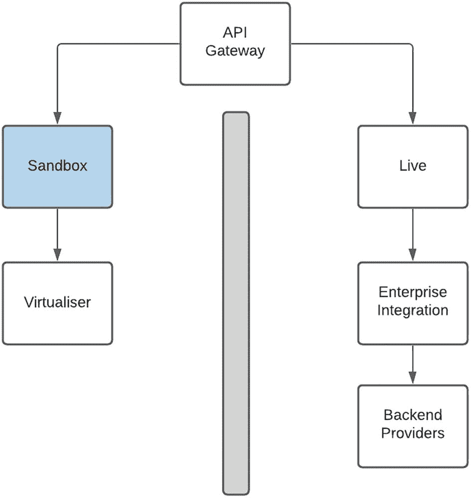

图 9-1

Sandbox 与 Live 上下文

从战术层面使用时，Sandbox 为 Marketplace 团队提供了一个独特机会：发布一个尚不存在实际实现的 API 产品。出现这种情况可能有以下几个原因：

1.  它可用于判断某个 API 产品的消费者需求水平与范围。在我们与第三方提供方的合作中，我们发现“意向”与“实现”之间常常存在差距——即消费者对 API 表示兴趣，但并未真正落地。产品负责人可以利用 Sandbox 产品来衡量*真实*消费情况，作为第三方承诺程度的指标。

2.  此外，热点功能或主要被消费的功能有助于塑造产品。困难或复杂的操作自然会吸引较少消费，因此可以很容易识别出来，以便简化或考虑下线。

3.  它还可以帮助交付团队分阶段发布 API——先提供更受欢迎的操作。这有助于缓解开发团队压力，并在发布规划时支持更量化的分析。也就是说，产品负责人可以清晰展示热点，这些热点可转化为对特定功能的需求证明。

必须极其谨慎地使用这种方法。正如我此前提到的——开发者对“障眼法”有着惊人的敏感度，一旦信任被破坏，就很难重建。话虽如此，策略应当是始终比消费者领先一步，最好多步。要对 API 当前所处阶段和目标保持透明——设想一下，如果开发者已经围绕该产品构建了解决方案，而你却决定不再继续，会带来多大的失望。同时，时间线也要明确。对于第三方开发者来说，关于 Live 环境中某项具体产品或功能可用性的日期若含糊不清或缺乏承诺，几乎没有什么比这更令人沮丧。

还需要注意的是，如图 9-2 所示，“Sandbox”这一构造在 Development、Test、Staging 和 Production 环境中都会保持一致。这个决定进一步强化了我们的承诺：在将变更部署供外部使用之前，确保 Sandbox 在内部已得到完整测试与验证。此外，Production Sandbox 环境被视为一个*完整成熟*的运行环境。其变更与更新遵循同样的治理机制，支持也按类似的运行级别提供。

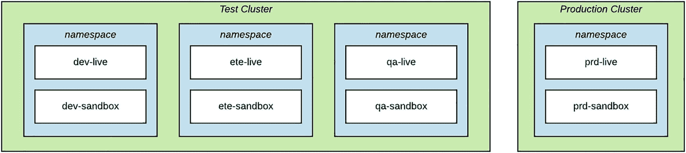

图 9-2

贯穿所有环境的 Sandbox

## 流程

Sandbox 对主办组织和第三方提供方同样重要。它在我们的接入流程中扮演关键角色，并被用作多项评审的质量闸门。第一项评审是由第三方展示将消费这些 API 的应用。这为即将推向市场的使用场景提供了直观证据，也将展示 API 的成功消费情况及其在应用中的作用。

第二项评审用于第三方应用的功能测试。来自消费者的调用会在 Sandbox 中被全链路追踪，以确认请求载荷与目标地址的准确性。也正因如此，从运行角度看，我们的 Sandbox 环境完全对标 Live 环境，因为它也配备相同的支持工具和流程。

需要强调 Sandbox 环境的支持要求与上下文。虽然其服务级别可能不如 Live 严格，且我们对服务中断的容忍度可能略高，但需要支持的对象是开发者。这通常是开发者编写首个应用时的第一站；即便文档中已给出细节，在 API 消费过程中，开发者仍会尝试各种请求类型与实现方式。开发者支持流程必须定义清晰，并且 Sandbox 环境必须能够承受大量格式不规范的请求冲击，而不会崩溃并需要人工介入支持。鉴于这一使用场景，为确保服务可用性，自动重启失败组件或卡住进程，可能是一种可接受的实践。

随着 Marketplace 实施逐渐成熟，可考虑实现自助服务能力，以简化 Sandbox 访问。注册与开通流程应当无缝，尽可能让开发工作立即开始。同时，务必向潜在消费者明确说明接入流程和 Sandbox 环境的使用方式，以对齐预期并提供时间线参考。


## 沙箱策略

由于我们对沙箱的初始方案自平台上线以来一直没有变化，因此我们选择利用这次重构机会来实现最大化影响。这很合理——确实有一个迫切需要立即解决的问题。但与此同时，沙箱这个“壁橱”里其实还藏着不少“骷髅”，它们可不喜欢任何舞步。话虽如此，我们也谨慎地控制了范围，以保持对任务本身的聚焦。结合我们 Marketplace 中的 API 产品集合，第一个目标是识别潜在的使用场景：

*   **beta**：正在考虑进一步开发，或处于开发过程中且定义仍在变化的产品；跟踪消费使用模式非常重要。

*   **后端模拟**：相对简单的“ping-ack”API，本质上是原子性的；最好是只读操作；并返回定义良好、标准化的响应。

*   **浅层**：适用于跨多个后端系统进行编排的 API 产品的*早期拦截*模式；单个 API 产品中的调用可能会影响其他产品。

*   **半真实（Semi-Live）**：允许对真实后端系统进行可控且有限访问的 API 产品。

*   **QA**：访问组织内部质量保证测试环境。

在接下来的章节中，我们将通过以下方面更详细地探讨每种沙箱策略：其要填补的目的、方法、驱动其使用的优缺点，以及最终如何在技术上实现。我尤其希望了解你可能已在自己平台上实施的任何新方法或混合方法。

### beta

该策略可用于以下原因之一：

*   回答这个问题——*如果我们把它做出来，他们会来吗？* 由于交付团队通常会保持精简以降低成本和管理开销，为正确的受众构建正确的产品是平台整体成功的关键。必须投入时间并聚焦于那些确有需求且上线后会被消费的产品。

*   定义并塑造 API 产品。测试并打磨某些特性的能力，长期来看可提升采用率与消费量。这也可用于在尚未写下一行实现代码之前，就处理接口复杂性问题。

*   在“*始终领先一步*”的猫鼠博弈中，为后端交付缓冲强烈的消费者需求。简单来说，API 的实现可能落后——可能是内部开发延迟，也可能是外部后端提供方延迟。该方法可用于先发布可工作的接口，再让实现逐步追上。

#### 方法

对于该方法，跟踪和记录第三方消费行为至关重要，因为其价值在于对数据的分析和洞察。使用模式应清晰表明消费者、API 以及操作。解读后的指标可作为与 API 用户讨论“哪些有效、哪些无效”的基础。

由于这些 API 可能仍处于“起步”阶段，诸如调用后端延迟等性能数据可能尚不可用。这必须作为 API 设计的一部分加以考虑——例如，采用异步回调方式来补偿可能的长事务，可能是更稳妥的选择。

根据 API 的性质，可能有必要将访问限制在封闭用户组内。对于敏感或战略性 API，可能只允许特定第三方访问，以保留机构知识产权以及潜在竞争优势。

表 9-1 展示了该方法的优缺点。

表 9-1

beta 沙箱策略的优缺点

| 优点 | 缺点 |
| --- | --- |
| 从构想到实施响应迅速 | 不能代表真实后端行为 |
| 可量化衡量第三方消费情况 | 由于 API 的易变或动态特性，第三方兴趣可能较低 |
| 在第三方积极反馈下，以交互方式定义并优化 API 产品 | 从沙箱到生产实现周期过长，可能导致第三方信任流失 |
| 能够测试并验证设计方法与假设 |   |
| 可用于缓冲实现延迟 |   |

#### 使用场景

该策略通常用于 API 产品开发的早期构思与概念阶段。也可用于理解消费模式并塑造 API 产品。由于 API 仍在开发过程中，且可能发生变更甚至终止，因此必须妥善管理第三方预期。还可通过“仅限邀请”的访问策略，作为与特定第三方建立信任的机制。

#### 设计考量

如图 9-3 所示

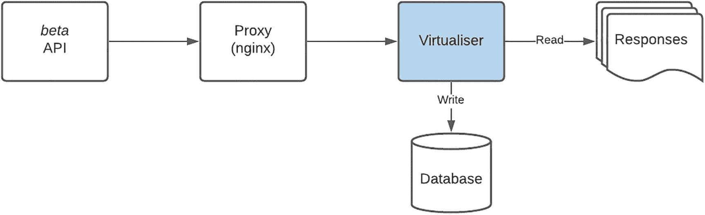

图 9-3

“beta”沙箱环境设计

*   可能没有生产（Live）实现。

*   静态响应可存储在文件中。

*   交互记录在数据库中，用于分析与洞察。

### 后端模拟

这最适用于*简单*API，且需满足*以下全部*条件：

*   由单一后端提供方提供服务的 API。

*   API 操作通常是*读取*功能。不会对提供方状态产生变更，且该操作隐含为*原子性*。例如，返回客户数据的 API。

*   来自后端提供方的响应是固定或定义良好的。延续上例，后端会返回 (i) 客户数据，或 (ii) 表示客户未找到的*业务*错误，或 (iii) 表示技术故障的*系统*错误。

#### 方法

为这些*简单*API 创建沙箱的方法，可能反而是最*复杂*的，因为它是通过模拟后端提供方来实现的。API 调用会穿过平台栈中的所有元素，完全“毫无察觉”它正在沙箱上下文中执行。当调用到达与后端提供方交互的中间件组件时，请求会被发送到“*系统虚拟器*”，如果它能在请求中匹配特定值，就会返回预定义响应。通过改变输入数据，可以触发模拟后端的不同响应与行为。也可以模拟系统故障和不同延迟，以获得更具代表性的行为。

表 9-2 展示了该方法的优缺点。

表 9-2

浅层沙箱策略的优缺点

| 优点 | 缺点 |
| --- | --- |
| 调用穿越完整应用栈，行为更具代表性 | 沙箱环境中所有组件的完整部署会带来更高资源占用 |
| 可基于特定请求数据配置或参数化响应 | 仅适用于简单只读操作 |
| API 产品特性使其实施与更新可快速周转 | 对所有第三方消费者使用静态响应——没有或仅有有限定制能力 |
|   | 刚性或固定响应可能限制额外用途 |

#### 使用场景

该方法最适用于由单一提供方支撑、用于数据检索或读取操作的 API 产品。它在支持跨多个消费者使用静态响应的场景中也表现良好。就我们而言，最初对*系统虚拟器*的更新需要开发投入。由于测试团队在等待开发人员可用性方面出现延迟，测试负责人花时间理解该框架，并自此接管了这项能力。当前可通过修改与创建新数据文件来更新和新增场景。最近一次检查时，我发现测试团队已经在编写代码，以更准确地模拟后端。


#### 设计

如图 9-4 所示

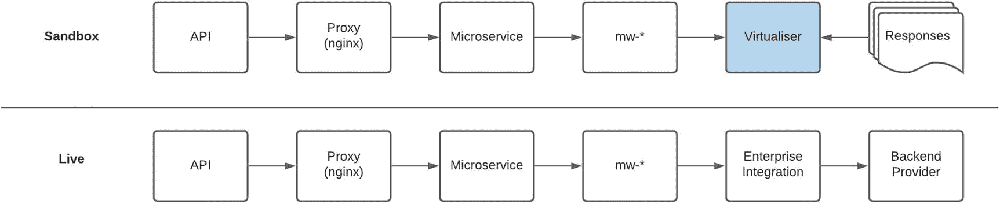

图 9-4

后端模拟沙盒环境的设计

*   *系统虚拟化器*被配置为根据请求中的特定值返回预定义的响应。

*   中间件组件的端点配置已更新，以将请求路由到*系统虚拟化器*。

*   这需要一个专用的运行环境来执行。它确实需要类似的部署策略，但不需要像生产（Live）环境那样的扩展能力，因为性能要求会更低。

### 浅层（Shallow）

你可能还记得，曾有一个特定场景促成了对 Sandbox 的更新。我们平台的早期产品相对简单。也就是说，通常只有一个后端提供方，可通过*后端模拟*策略来服务。随着时间推移，随着越来越多的中间件组件可用于对接后端系统，为满足业务需求，微服务编排逻辑逐渐变得愈发复杂。这很快演变成一个因交付目标和任务而无法停止的庞然大物。在我们意识到之前，一些 API 已经通过如图 9-5 所示的复杂流程来实现。

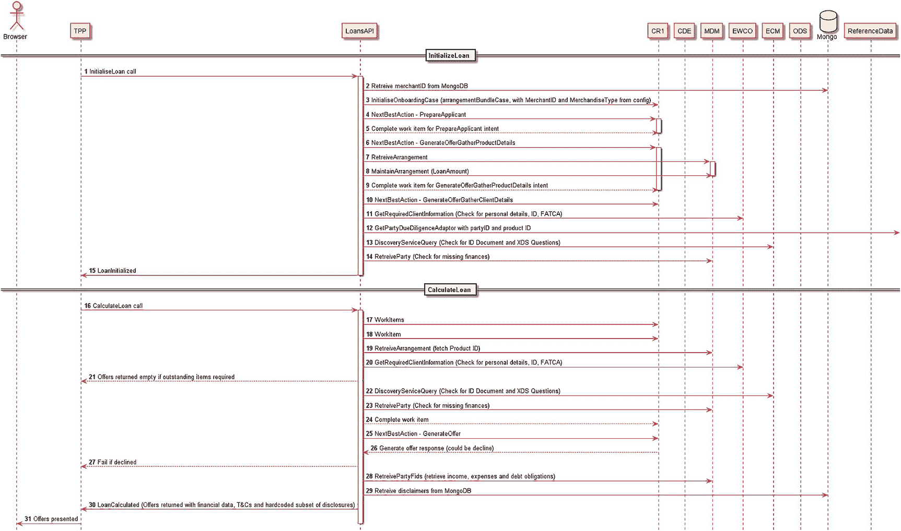

图 9-5

展示复杂编排逻辑的流程图

不幸的是，在我们履行简化编排逻辑这一郑重承诺之前，创建 Sandbox 版本的请求就已到来。使用既有*后端模拟*方法的挑战在于：它需要复杂的数据准备，而单笔交易还会跨越多个系统。进一步增加复杂度的是其中某些步骤的*写入（write）*操作。经过多次尝试后，团队很快意识到，对*系统虚拟化器*的定制几乎变得无法支持，并且后续更新将是一场噩梦。

以一种典型的*“跳出框架思考”*方式来看，我们发现的解决方案恰恰位于离问题源头最远的地方。通过后退一步并从消费者视角提出问题，Sandbox 集成的主要目标是让使用方更好地熟悉我们的 API。本质上，第三方只是希望针对请求获得一个具有代表性的响应。至于接口所提供的抽象背后如何实现，这并不是 Sandbox 关心的问题。通过重构问题陈述并从不同语境思考，本 Sandbox 策略的目的，是让第三方能够测试那些具有复杂编排逻辑、跨越多个后端系统且可能包含导致状态变更的写操作的 API 产品。

#### 方法

与其教骷髅跳太空步，不如在请求进入具有复杂逻辑的微服务*之前*尽早拦截它，并在一个并行但*浅层（shallow）*的实现中处理该请求。这个模式看起来可能与*beta*方法非常相似。然而关键区别在于，这是一个具有既定契约且我们需要维护的 API 产品，同时还必须满足“按第三方维度管理状态变更”的要求。本章稍后将进一步详细讨论技术方案。

这种方法的优缺点如表 9-3 所示。

表 9-3

浅层沙盒策略的优缺点

| 优点 | 缺点 |
| --- | --- |
| 适用于跨多个后端系统、业务流程复杂的 API | 由于在并行流程中处理，无法完全代表生产（Live）解决方案 |
| 能够按第三方管理状态 | 需要维护和支持额外的软件组件 |
| 自定义解决方案便于配置和更新，以应对新需求 |   |
| 资源占用更小，因为无需部署微服务和中间件组件 |   |

#### 用例

这种方法提供了一种整洁且优雅的解决方案，使 Sandbox API 与 Live 实现保持一致。它还允许按第三方维持状态，以支持更细粒度的集成场景。进一步说明：*Shallow* 方法会以一种*ping-ack*方式提供相同响应。采用该策略后，第三方将基于其执行的操作接收到更新后的数据集。对于跨越两个或更多后端系统、复杂度中到高的解决方案，应考虑采用该方法。

#### 设计

如图 9-6 所示

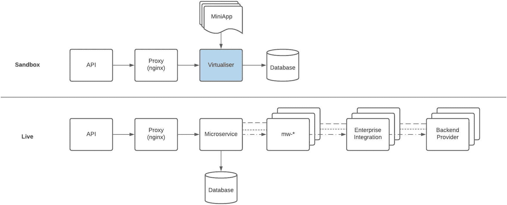

图 9-6

浅层沙盒环境的设计

*   请求在并行流程中处理。

*   本章稍后将提供该方法的技术设计细节。

### 半实况（Semi-Live）

这种方法的核心在于将 Sandbox 环境连接到已定义的 Live 接口。正如本章后续讨论的分布图所示，这并不是一种常见的 Sandbox 策略。我观察到两类高度依赖 Live 接口的用例。

第一类是 Twilio 消息环境。开发者可以发送消息并最终到达用户设备。Twilio 非常巧妙地支持了 WhatsApp API 的测试：通过向一个共享的 WhatsApp 目标地址发送特定关键字，将手机号关联到开发者测试账号。初始会提供价值 20 美元的免费额度，后续可充值以继续测试。这是一个通过 Sandbox 环境创造收入的绝佳示例。

第二类场景中，我们发现有必要连接到 Live 安全服务以生成令牌，该令牌将用于 Sandbox 环境中的后续调用。

#### 方法

尽管我很喜欢这一策略，但我同样保持警惕。我认为这如同打开了潘多拉魔盒，并强烈建议谨慎对待其使用及潜在滥用。该方法可通过简单更新端点配置并将请求路由到 Live 后端来实现。对 Sandbox API 请求进行限流至关重要，因为第三方可能在无意中发起请求洪流，导致拒绝服务。随着生态更成熟，也许可以按交易向使用者收费。

这种方法的优缺点如表 9-4 所示。

表 9-4

半实况沙盒策略的优缺点

| 优点 | 缺点 |
| --- | --- |
| API 请求行为更具代表性 | 将生产（Live）环境暴露给开发受众 |
| 混合能力可节省后端服务模拟时间 | 需要额外的支持机制来规范并监控使用 |
| 通过对 Live 平台的受控或受限访问收费，具备潜在收入来源 | 引入安全风险，因为 Sandbox 现已成为访问 Live 元素和服务的入口机制 |

#### 用例

调用 Live 服务的能力提供了一种灵活的混合型 Sandbox 能力，但由于其潜在安全风险，必须谨慎使用和管理。它应作为例外，而非常态使用。支持其采用的优秀用例确实存在——例如前文提到的 Twilio 消息服务。关键是必须建立相关系统与控制措施来管理并监控其使用。它最适合用于提供参考数据，这类数据通常是只读的并且可以公开共享。


#### 设计

如图 9-7 所示

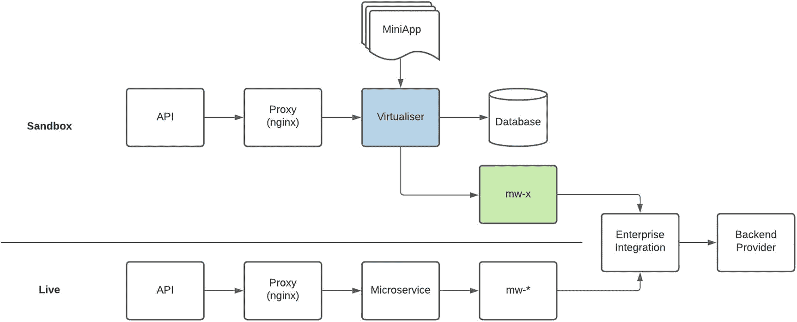

图 9-7

半实况（Semi-Live）Sandbox 环境的设计

*   已配置到 Live 后端提供方的特定中间件组件被部署到 Sandbox 环境中。

*   Virtualiser 可以访问这些中间件组件。

*   该方法的技术设计细节将在本章后续部分提供。

### QA Live

我们发现这是最不常用的策略。它具有特殊功能，面向特定受众和使用场景。

如前所述，我们平台的一个基础消费者是一个内部开发、外部托管的应用程序，它通过 Marketplace 访问关键企业服务。由于该消费者的特性以及快速的开发节奏，我们授予其访问质量保证（QA）测试环境的权限，以便在产品发布前验证端到端功能。

尽管这种模式仅限于该特定用例，但我们发现，对于某些 API，在“Live”上下文中进行测试是迫切需要的。坦率地说，模拟后端或浅层拦截策略可能不足以覆盖后端提供方的所有响应和使用场景。在这些情况下，获得*真实*表现的唯一方式是直接集成到后端，完成完整交易。

#### 方法

这个内部基础消费者帮助开辟了从外部托管系统进行访问的路径。防火墙中添加了特定规则，以允许来自定义源 IP 的流量。目标地址不是连接到*Production Sandbox*端点，而是设置为*QA Live*。鉴于该消费应用的性质及其高优先级，网络与信息安全团队批准了访问权限。坦率地说，由于测试环境的敏感性和特殊性质，其他第三方提供方的访问很少被允许。

该方法的优缺点见表 9-5。

表 9-5

QA-Live Sandbox 策略的优缺点

| 优点 | 缺点 |
| --- | --- |
| 在所有方法中，最能代表生产环境中的应用行为 | 受 QA 环境中系统和数据可用性的影响 |
| 无需创建 API 的 Sandbox 版本——节省人力 | 为内部域中的共享组件增加额外负载和流量 |
|   | 开发——新版本发布或补丁可能影响测试，需要谨慎安排计划 |

#### 用例

这种方法有非常特定的使用场景。第一类是组织内部消费者：他们了解组织流程和信息，并且能够容忍服务可用性与性能的波动。第二类是当无法创建 API 的 Sandbox 版本，且必须确保消费应用在测试期间获得*完整*的代表性行为与响应的情形。在这种情况下，访问策略应仅允许临时访问。

#### 设计

如图 9-8 所示

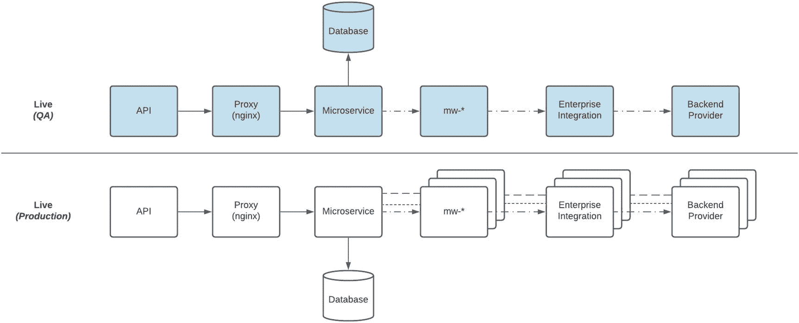

图 9-8

将 QA 用作 Sandbox 环境的详细设计

*   请求在质量保证（QA）环境中处理。

*   这是与生产环境并行的实现。

*   该方法满足了解决方案端到端功能测试的需求。需要注意的是，QA 环境的扩展规模可能与生产环境不同——行为可能存在差异。

### 第三方 Sandbox 访问

图 9-9 展示了我们平台中第三方与 Sandbox 访问关系的一个示例分布。影响这一分布的关键因素是，并非所有第三方都会消费相同的 API 产品，原因可能包括以下一个或多个方面：

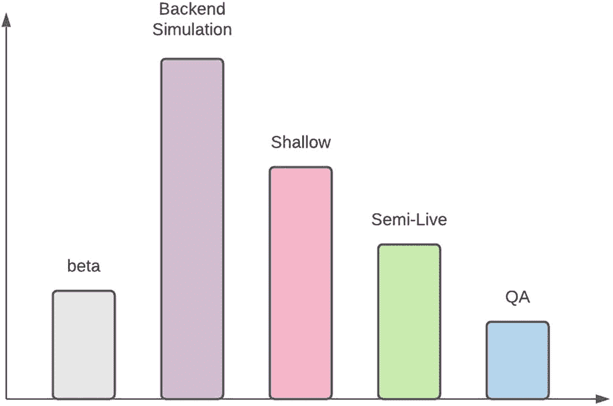

图 9-9

第三方 Sandbox 分布

*   处于***beta***阶段的 API 产品可能受众较小——如果仅允许部分第三方访问*或*潜在消费者兴趣较低。许多第三方可能只关注稳定且可用于生产的 API。

*   许多第三方会消费更简单的 API 产品，这些产品采用***Backend Simulation***策略。

*   如果编排跨越多个后端提供方，则 API 会被归类为复杂类型，并且非常适合采用***Shallow***方法。这类 API 产品通常满足细分场景需求，因此第三方吸引力与消费量较低。

*   只有少数被选择的第三方可能有权访问采用更复杂 Sandbox 策略支持的 API 产品——例如***Semi-Live***和***QA***。

我倾向于把 Sandbox API 的访问方式类比为一家实体银行网点。任何人都可以进入营业厅。只有银行工作人员可以进入员工区域。在银行工作人员中，只有资深且获得授权的成员才能进入敏感区域，例如银行金库。

同样地，有些 API 及其关联的 Sandbox 环境，只允许特定且已授权的第三方访问。该策略看起来可能与最大化第三方消费的思路相悖。谚语*“horses for courses”*很贴切——你的 API 组合中会有一些产品只适合特定消费者。尽管可以给每个第三方授予每个 API 产品的访问权限，但出于客户数据敏感性和安全限制，组织可能并不具备让*任何*第三方访问关键区域或服务的意愿或风险偏好。

我在图 9-10 中以类似飞镖靶盘的方式描绘了我们的访问策略：从最外圈最低安全、最开放，逐步到核心（靶心）最高安全、最受限制。需要注意的是，你的访问策略可能会因组织的 API 产品与治理政策而不同——你可以选择增加、移除，甚至重排这些层级顺序。

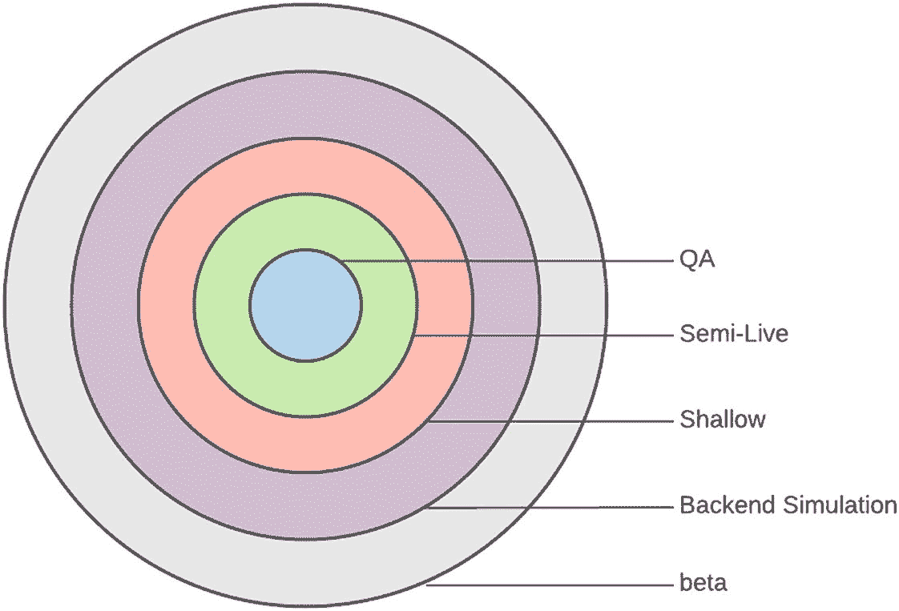

图 9-10

第三方 Sandbox 访问


## 构建一个 Virtualiser

在重构之前，我们第一个也是唯一的 Sandbox 策略是*后端模拟（Backend Simulation）*。为实现这一点，团队采用了开源项目 *Mountebank*，它可以在给定特定请求时返回预定义响应。我们在托管容器平台上部署了一个自定义应用。该应用在特定端口监听请求，集成组件只需修改端点配置即可将流量路由到该服务。每当需要模拟一个新的后端时，都需要更新该应用以便：

1.  根据一组规则（包括路径、操作、参数和负载）将传入请求路由到特定的内嵌 JavaScript 函数。

2.  在函数上下文已知的情况下，函数会使用专门为该集成方案构建的自定义逻辑，从请求中提取更多信息。

3.  然后，函数利用收集到的信息定位随应用部署的数据文件——格式为 *json* 或 *xml*。

4.  获取文件后，会更新其中某些元素，例如日期和时间，以提供更具代表性的响应。

5.  最后返回更新后的响应。

这种方法利用了该开源方案处理请求的能力，并结合自定义代码来组装响应。

### 需求

以该实现为基线，我们为下一版 *Virtualiser* 制定了以下需求：

*   **无需代码更新或部署**：为了应对任何变更——无论是请求处理、响应处理还是新增数据文件——此前都必须更新并重新部署自定义应用。由于部署必须在维护窗口内进行，这会造成较长延迟。我们的目标是以配置方式实施更新。

*   **运行时配置**：由于 *Mountebank* 的配置存放在应用内部文件中，无法在运行时进行变更。我们需要让变更能够立即生效。

*   **可访问性与易于更新**：鉴于规则和内嵌 JavaScript 的复杂性，初始配置只能由开发人员完成，后续变更或更新也只能由对框架有深入理解的技术成员完成。我们的需求是团队中*任何*成员都能轻松修改。

*   **第三方特定**：由于第三方标识通常包含在调用后端提供方的请求中，返回的往往是通用响应。我们希望能够返回面向特定消费者的响应。

*   **应用感知**：自定义应用在其自身上下文中运行，与我们的应用架构没有任何连接。作为重构的一部分，团队提出了全面需求：新版本应能感知内部结构，并能够利用这些结构进行请求路由和处理。

### 实施选项

凭借多年软件开发经验所带来的谦逊与成熟，我们明白这并非新问题，许多 API 平台都面临类似挑战。市面上有很优秀的商用现成方案（COTS），例如 Computer Associate 的 Service Virtualisation 产品。不幸的是，这不仅会带来许可证成本，还需要走新软件采购的治理流程——这会导致较长周期。

团队评估并测试了两个令人印象深刻的开源项目：

*   **Hoverfly** 是一个轻量级 API 模拟工具。使用 Hoverfly，你可以创建应用所依赖 API 的高真实性模拟。

*   **Mountebank** 是首个提供跨平台、多协议“线上”测试替身（test doubles）的开源工具。它正是我们*后端模拟（Backend Simulation）*策略的基础。

经过大量审议与讨论，我们最终决策的核心依据是两者都依赖本地配置。一个关键需求是：变更无需代码更新或部署。另一个可选路径是 fork 这些项目并按需改造——但这将需要大量定制和维护。结合我们的约束与需求，我们最终选择了自研开发路线。这将带来最快且可能最高效的解决方案。

### 设计理念

我们以 Mountebank 为参考，确立了两个核心要素：

一个**谓词（predicate）**，即基于输入参数组合的条件，这些参数包括 HTTP 请求元素以及外部配置，如表 9-6 所示。

表 9-6

谓词参数

| 元素 | 示例 |
| --- | --- |
| 方法 | *GET/POST/PUT/...* |
| 路径 | */customer* |
| 查询参数 | *?x=1&y=2* |
| 请求头 | *x-subscription-id* |
| 请求体 | *{ name: ‘Tom Sawyer’ }* |
| 数据库配置 | *使用 x-subscription-id 检索到的数据库记录* |

请注意以下自定义项：

*   使用特定请求头值 *x-subscription-id* 来检索数据库配置记录，并将其作为谓词评估参数。

*   使用模糊逻辑匹配参数的 key 或 key+value——例如，若 *query* 包含 key *x* 或表达式 *x=1*。

*   当多个谓词都可匹配时，采用匹配数量最高的那个。

一个**响应（response）**是为生成结果而执行的动作。响应根据被模拟场景进行配置，如表 9-7 所示。

表 9-7

Virtualiser 响应类型

| 类型 | 描述 |
| --- | --- |
| 静态 | 恒定的预定义数据，不会变化 |
| 随机 | 使用正则表达式，结合已配置变量（如当前日期时间或输入请求中的元素）更新响应中的特定元素 |
| 代码 | 动态执行的小型应用（脚本） |
| 代理 | 将请求路由到已配置端点进行处理 |

这种动态执行的“小型应用”使我们具备了响应复杂 API 请求的能力。它可通过写入持久化存储（磁盘或数据库）来维持状态，从而支持*浅层虚拟化（Shallow Virtualisation）*。它也支持*半实时（Semi-Live）*模式，即调用实时服务来构造响应。该应用以脚本形式存储，并在运行时解释执行。脚本可在无需部署的情况下更新。代理能力则提供了一种优雅机制，可在运行时动态路由请求以进行处理。


### 示例流程

图 9-11 以及后续的示例配置，能让你对该过程有更深入的理解。

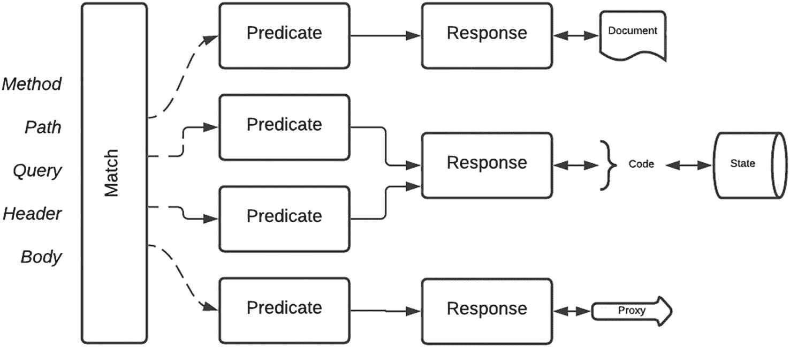

图 9-11

Virtualiser 处理流程

*   当接收到请求时，我们会尝试查找所有匹配的*谓词（Predicate）*。

*   对于某个特定请求，可能存在多个匹配项。将使用匹配数量最多的谓词（Predicate）。

*   随后会检索关联的*响应（Response）*。多个谓词可以映射到同一个*响应（Response）*。这使得请求识别与处理之间可以解耦。

*   *响应（Response）*可以通过静态数据、代码执行，或代理到已配置端点进行处理来生成。

*   代码执行元素或“mini app”可以维护状态。这使得可以基于已定义状态生成动态响应。

以下摘录是针对下述地址的示例配置：

*   *http://server/sport/catalogue?categoryID=nnn*

*   如果未指定*categoryID*的值，则任意值*nnn*都将匹配。

*   如果还存在另一个未为*query*参数指定条件的*谓词（Predicate）*配置，则会优先使用该配置，因为其匹配项更多。

```
{
"method": "GET",
"path": "/sport/catalogue",
"api": "SPORT",
"operation": "GetCatalogue",
"response": {
"query": [
{
"key": "product",
"source": "query",
"query": "categoryID"
}
]
},
"query": {
"categoryID": ""
}
}
```

以下摘录是针对下述地址的示例配置：

*   *http://server/sport/catalogue?categoryID= 11329*

*   一旦找到*谓词（Predicate）*，便会使用`response`数据查找其关联的*响应（Response）*。根据上述配置，它指定了检索条件的`source`来自`categoryID`参数——`{"product":"11329"}`

*   *响应（Response）*的`action`参数表明要返回的负载是`context`变量中的 JSON 对象。

*   该策略允许针对不同的`categoryID`值返回不同的负载，同时也支持在运行时进行更新。

```
{
"product": "11329",
"response": {
"action": "data",
"context": { .. },
"ErrorDescription": "OK",
"TxID": "0c772fd1-4203-4390-bc51-8c74edf0e979"
}
}
```

这个 Virtualiser 设计是专门为满足我们 Marketplace 实现需求而定制的。我们还增加了其他扩展，可使用 header 或 query 参数的值，从指定集合中检索数据库记录，并使用这些值进行额外匹配。该方案展示了一个示例设计。你可以针对自己的 Marketplace 应用许多更新和优化。如果你有任何想法愿意分享，请随时告诉我。

## 总结

在本章中，我们介绍了 Sandbox——它是任何 API Marketplace 的关键组成部分。我们强调了它的目标以及其在帮助第三方提供方理解你的 API 方面所起到的关键作用，同时它也能帮助你更好地了解调用方应用。我们详细讨论了多种 Sandbox 策略，说明了各自的方法、优点和缺点、最适用的用例，以及高层设计。

我还提供了一个示例分布，展示哪些策略使用最广泛，以及一种访问提供策略。最后我们深入细节，定义了自定义 Virtualiser 的需求，它可用于满足两种 Sandbox 策略。基于需求，我们进一步评估了实现选项，从商业方案到开源方案，最终选择构建自定义解决方案以获得最大灵活性。随后我们概述了该自定义方案的核心元素，并处理了一个示例请求，以更好地理解其工作方式。

在企业软件开发中，实现 Sandbox 环境可能是少数能够给予创造力和跳出常规思维更大空间的场景之一。它甚至可以作为你 Marketplace 实施的试点阶段，用于衡量市场需求。

在下一章中，我们将进入 Operations 领域——这很可能是你的 API 停留时间最长的领域。

