# 10. API 运营

与 API Marketplace 中其他高度灵活、能够快速转向或调整方向的领域相比，Operations 领域更加结构化、有组织且目标明确。团队依靠严格的流程和结构运作，是整个平台的基石。任何其他做法都将迅速滑向混乱，且该实现很快会被归类为原型。由于平台是支撑更广泛第三方应用的使能要素，任何内部或支撑系统故障都可能引发连锁反应，最终造成更大影响，并导致第三方消费者面向客户的产品或服务产生负面观感。

由于该领域通常归入运营支出（OPEX）预算，直觉反应可能是尽量压低成本。尽管我们的 Marketplace 可能并不直接面向终端客户，但如果服务水平被认为不稳定，仍可能造成重大的声誉影响和行业观感问题。正如前几章所述，一项重要工作是吸引外部开发者进入平台；而维护关系、留住这些消费者则需要投入更多努力。

根据经验，集成支持一直是一项充满挑战但也很有回报的角色。毫无疑问，我从设计到开发，再到真正理解一个解决方案及其底层要素，最大的收获都来自在 Operations 中积累的经历。开发阶段中参数与条件通常定义明确。即使有大量测试场景和高强度压测，环境仍可能相对隔离。我职业生涯早期的一个项目中，我清楚记得一位资深工程师兴奋地汇报说，他在自己的笔记本上一整夜跑了数百万笔交易且毫无问题。然而当我们的解决方案最终上线后，接下来的两年里我们花了无数个夜晚处理运营问题。原因在于生产环境与测试环境差异巨大，流量负载、支撑系统可用性以及不可预测的客户行为都不应被低估。正因如此，我始终坚信解决方案架构师必须花时间从事 Operations 角色，才能学会设计更健壮的解决方案。

不幸的是，在快速变化、高流量、混乱的运营环境中，以松散、战术性的方式“以火攻火”，极有可能导致失败，并可能危及平台的成功与长期发展。在本章中，我将讨论我们过去、当前以及面向未来的运营标准、流程与方法，以实现 Marketplace 的成功运营。

## 运营宇宙

坦率地说，稳定我们的支持能力一直是我们最大的挑战之一，而且这仍是一项持续进行的工作。项目发起人多年前就预见到了该平台的关键性。遗憾的是，当团队争分夺秒地构建并部署平台时，他睿智的建议并未被采纳，团队秉持的口号是——“*船到桥头自然直*”。随着 Marketplace 突然被认定为实现全新外部托管数字化体验、并撬动企业内部能力的关键要素，团队几乎在一夜之间被推到了运营聚光灯下。

就像还在训练中的消防员，平时接到的紧急任务通常只是去救一只被困在树上的猫一样，当团队被要求应对跨越多个下游系统、且此前从未进行过此类运营处理的高流量高价值交易“火海”时，显然准备不足。我们用一个术语来描述这种状态：“支持外科手术（support surgery）”，并安排了每日会议，以检查建议策略是否生效，若未生效则及时调整。经过时间积累和大量努力，团队通过提升平台监控能力、定义事件管理流程，以及加深对后端支撑系统的理解并建立更好的运营协作关系，最终打下了坚实的支持基础。

从这段经历中得到的一个关键启示是：应在项目生命周期尽可能早的阶段，对 Marketplace 支持运营化投入充足且（更重要的是）诚实的关注。在接下来的章节中，我们将讨论支撑运营域的关键概念与方法，并识别其构建所依赖的基础要素——如图 10-1 所示。

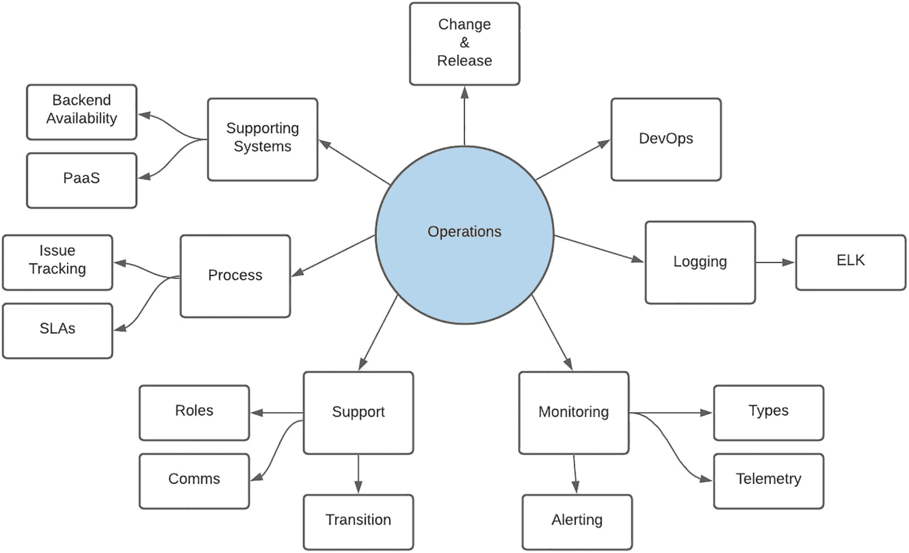

图 10-1

运营子域

## 变更与发布管理

传统上，运营团队通常不太喜欢更新，因为更新会给环境引入风险。对我们的实施而言，效果极佳的一种理念是：高频但小规模发布。正如在阐述开发的章节中所提到的，在一个 sprint 中可能会有多个并行流，最终在 sprint 结束时部署到生产环境。

对于新 API 产品这类重大更新，通常会像图 10-2 所示，提前很久发布到生产环境，再开放给第三方使用。通过在发布与使用之间设置缓冲期，团队就有机会在相对低压的状态下验证功能，并在需要时进行更新或修订。我们在上线新功能时，常常会在部署当晚发现还需要额外配置，而且这些配置大多不在我们的控制范围内（例如防火墙或网络访问）。更早部署使团队能够在自己进入关键路径之前识别并解决这些依赖问题。

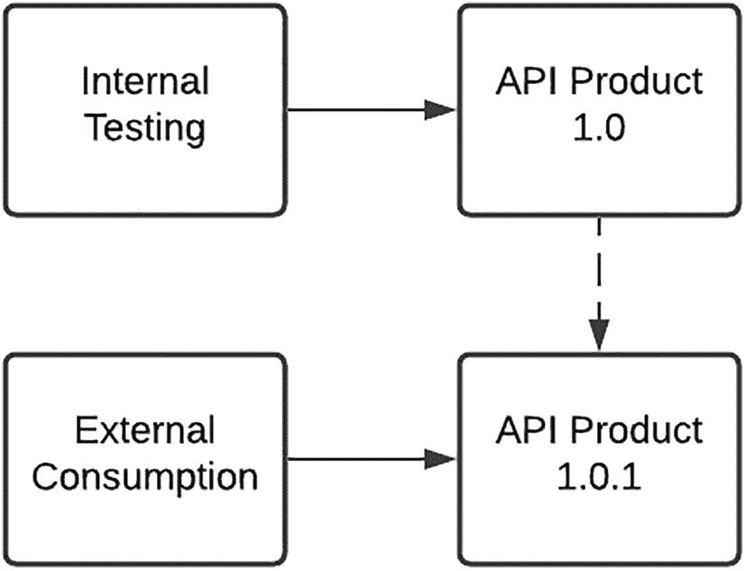

图 10-2

API 产品的首次发布

对于较小的产品迭代，如图 10-3 所示，API 版本管理是关键要素。由于 API 产品的不同版本可以并存，何时迁移的决定权交由第三方使用方。前提是各个特定版本都有明确定义的生命周期终点。通过提供详细说明后续版本变更内容的发布说明，我们也向使用方清晰传达了一个信号：出于更好的安全性、稳定性，或新增功能等原因，迁移到新版本可能更符合他们的利益。

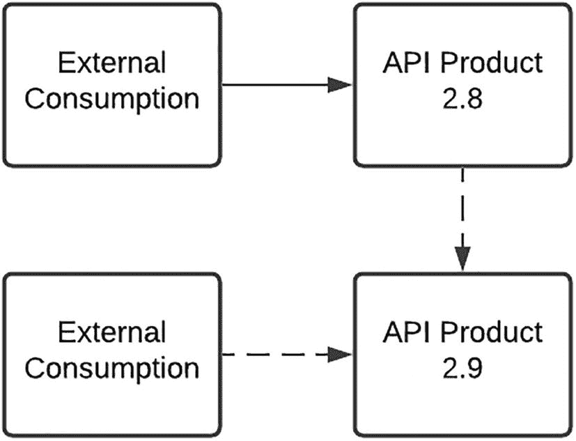

图 10-3

API 产品的更新

如图 10-4 所示，对微服务等内部支撑要素的更新通常是小步迭代式的。若更新引发问题，团队会评估原因、影响和可能的解决方案。从文化角度看，我们倾向于减少归责，不过度纠结于原因本身。我们的经验是，指责会引发恐惧，而恐惧会抑制团队敏捷性。如果某个问题本可在测试阶段识别出来，我们会将其作为未来改进的学习点。更多时候，问题与生产环境中特有的数据或场景相关，这些在测试期间无法复现。若影响表现为显著的服务劣化，则会立即回滚变更。强大的 DevOps 能力可在几分钟内实现这一点。这同样是一种“解放式”能力，是团队快速交付的重要支撑。如果问题能够快速解决，并且风险很小（最好为零），交付负责人在与工程团队协商后，可能会决定“向前修复（fix forward）”。

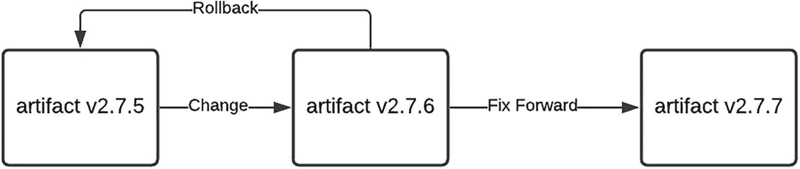

图 10-4

内部更新

这并不是一个轻率做出的决定，而且这种做法如果不加以控制，可能会导致“在生产环境中编码”这一大忌。必须格外谨慎，确保正在进行中的开发不会被意外纳入更新内容。为此，制定清晰的代码版本管理策略（包含发布标签与分支）至关重要。若能明智且克制地使用，“向前修复”的内在好处在于无需回滚发布，从而节省时间并保持发布流水线持续运转。根据问题的性质、影响、频率及解决时限，也可能在更长周期内实施修复——这将有助于减少因临时更新而引入额外错误的风险。

我们组织已经认识到：敏捷数字化解决方案需要更加灵活的变更与发布策略，并已投入大量努力尝试去适配。必须完整说明的是，质量关卡并未降低——只是流程被精简以实现更快流转。这仍在持续推进中，在达到 Netflix 式持续部署“理想境界”之前我们还有一段路要走——但话说回来，金融机构的服务等级要求及潜在后果，远高于视频流媒体服务。

图 10-5 提供了我们发布“漏斗”的高层视图。我喜欢把它想象成原子在一个不断缩小的空间中来回碰撞，直到最终要么被弹出，要么必须有序排队向前推进。在任何给定时刻，都有大量需求、修复项或原型处于开发中。有些原型会成长为完整解决方案；另一些则会被淘汰。支撑性后端平台的就绪程度也会决定哪些需求可以进入测试阶段。由交付负责人牵头的规划会议将为特定解决方案识别潜在上线日期，并将其打包进生产发布。目标是至少每两周发布一次。一旦发布视图确定，就会整理所需的变更控制工件，并通知发布管理团队部署意图与日期。

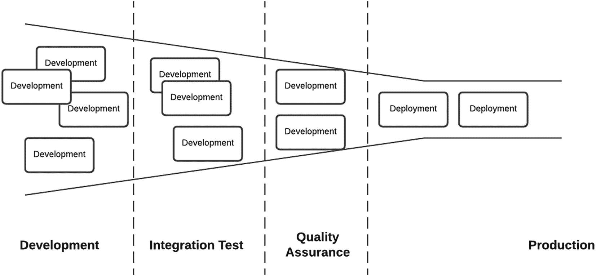

图 10-5

发布漏斗

发布流程所需的工件包括以下内容：

*   **实施指南**：这是在运行环境中部署代码资产及所需配置的一组说明。在具备高度优化的 DevOps 流水线时，该文档只需说明要部署的组件与版本。也可能需要记录防火墙规则及后端系统安全访问的配置更新。对于跨多个系统的复杂部署，该指南会详细说明发布时间线与事件顺序。

*   **测试证据与 QA 签署**：在解决方案可发布之前，来自质量保证团队的测试执行记录与验收是关键输入。目前这通常以文档形式存在，以满足既有标准。作为团队持续部署（CD）目标的一部分，一个理想方向是提供自动化回归、功能与性能测试结果，以证明解决方案的完整性。

*   **发布说明**：对将部署到环境中的变更进行说明——无论是新功能、对现有方案的更新或优化，还是用于解决运行问题的修复或补丁。

## DevOps 实践

正如朴素的雪橇曾在埃及金字塔建造过程中用于运输大型重物，DevOps 实践也是支撑我们运行环境的关键要素，如图 10-6 所示。凭借多年在运维领域的经验，我曾经常通过调整应用服务器配置把平台从灾难边缘拉回，也曾在系统故障时临场手工重建系统，并因此制造出“雪花环境”；这是一段既令人谦卑又富有启发的经历。

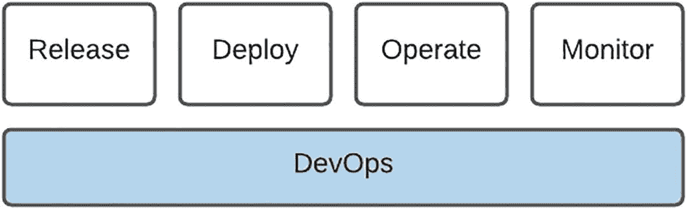

图 10-6

DevOps 基础

一个完善可观测的运维 DevOps 流程，甚至在第一行代码写下之前就已开始。代码仓库、构建流水线、持续集成（CI）以及迁移流程（前文已详细说明）共同构成了该流程的一部分，它使 DevOps 实践从开发端得以落地，并最终渗透到运维领域。坦率地说，作为经历过前 DevOps 时代的开发者，当既定发布流程压缩了“微调和快速更新”的空间时，确实会有挫败感。可作为一名工程负责人，看到一个运转顺畅、定义清晰、可重复且可靠，且几乎不给“微调和快速更新”留下空间的流程时，我由衷感激。

可重复的流程是关键，尤其在敏捷、快速变化的环境中更是如此，因为它既支持快速交付，也具备在必要时回滚的能力。在运维语境下，*可靠地*、*迅速地*执行回滚的能力绝不可轻视。回想过去多年，我仍清楚记得回滚发布时的失望与尴尬，也记得使用备份恢复系统并等待验证回灌过程时的忐忑。微服务架构也带来了巨大帮助，因为它允许细粒度控制，只回滚或前滚出现问题的组件。这种能力为平台提供了一张安全网，带来的信心就像高空走钢丝者在有保护网时更敢于突破极限。

由于我们平台架构中仍有遗留部分，并非所有系统都具备 DevOps 能力。组织对此非常清楚，并且每个系统都制定了最终实现这一目标的路线图。对于新的实施，例如我们最近迁移到的云容器平台，这是不可妥协的。该环境在“零接触”政策下被严格锁定，唯一可用的变更机制就是图 10-7 所示的 DevOps 流水线。坚定且毫不松懈的承诺，可能是实现这一目标的唯一方式。只要存在漏洞或后门，交付团队就一定会发现并加以利用。

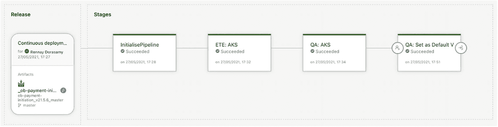

图 10-7

DevOps 流水线

## 日志记录

基于多年在集成环境中的经验，我认为日志是任何中间件解决方案的生命线。在开发和支持过程中，日志是我用来洞察请求执行路径的主要机制。或许有更优雅的方法可以借助调试工具观察栈上的值，但对我个人而言，一个放置得当、充当“线人”的*console.log*或*logger.debug*语句，往往能在令人眼花缭乱的“谁是凶手”追踪挑战中，指向那个幕后主谋。

如图 10-8 所示，日志可能存在于多种上下文中。在开发阶段，通常只需跟踪单个文件或标准输出（stdout）流。在集群环境中，日志数量等于参与节点的数量。在面向微服务、以容器为导向的平台中，日志会呈爆炸式增长，单个请求可能穿越多个 Pod，而这些 Pod 又分布在集群中的不同节点上。

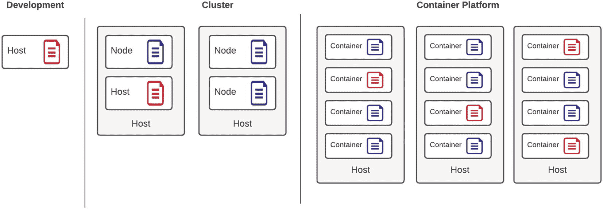

图 10-8

日志上下文

追踪一笔交易就像试图在许多不同的干草堆里找针。这是我在运维领域学到并始终铭记于平台设计中的经验之一。一个关键的平台架构原则是：从入口点开始为交易附加唯一标识符，并在其穿越环境的每一条日志语句中都使用该标识。这个看似简单的策略实现了我所谓分布式集成环境中的“圣杯”——跨多个组件追踪交易的能力。每个组件都用可追踪标识符记录日志后，这场战斗就已经赢了一半。还必须始终牢记，容器是短暂的——为了处理负载可以创建更多容器，负载消退后又会被销毁，或者因应用异常而重启。由于日志通常写入*stdout*，容器实例关闭或重启时，日志可能因此丢失。

有一些方式可以缓解日志丢失，比如挂载容器可访问的持久化存储。为了尽量降低容器环境复杂度，团队在应用层面解决了这一需求，方案见图 10-9。所有应用都使用平台日志服务，该服务可访问应用上下文。上下文中填充了大量元数据，例如唯一交易标识符、宿主应用名称以及发起请求的客户端详情。在发起日志请求时，会从上下文、容器和运行时中提取补充数据，打包成一个简单的 JSON 对象，然后通过 UDP 发送到负载均衡端点。由于这是即发即弃（fire-and-forget）请求，因此将对应用性能的影响降到最低。这也是企业级 Elasticsearch、Logstash 和 Kibana（ELK）服务的入口点。

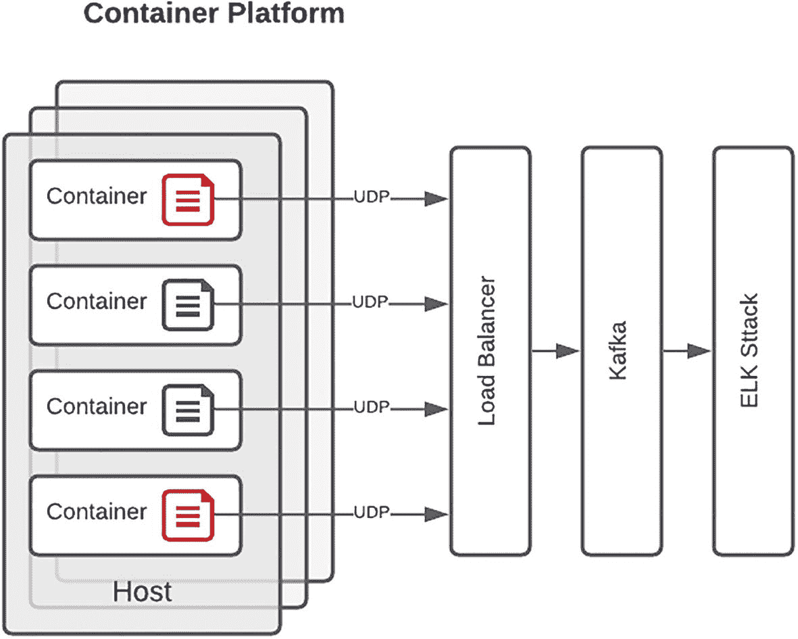

图 10-9

日志策略

系统专属的 Kafka 主题用于缓冲请求并防止消息丢失，因为该能力被企业内不同平台共同使用。这也是我们选择利用企业服务以最小化运维开销的又一个例子，从而让团队能够将最大精力投入到创造*API*价值上。随后，日志*event*会被摄入 ELK 栈，下一节将更详细介绍。

### ELK 栈

ELK 是三个开源项目名称首字母的缩写：Elasticsearch、Logstash 和 Kibana。Elasticsearch 是搜索与分析引擎。Logstash 是服务端数据处理管道，可同时从多个来源摄入数据，对其进行转换，然后发送到类似 Elasticsearch 的“存储仓（stash）”。Kibana 让用户能够通过图表和曲线可视化 Elasticsearch 中的数据。

优秀应用的一个特征，是能被广泛用户群体轻松采纳和运维。Kibana 控制台本质上是 ELK 栈的用户界面，如图 10-10 所示；它不仅满足这一目标，在我看来还完成得格外出色。

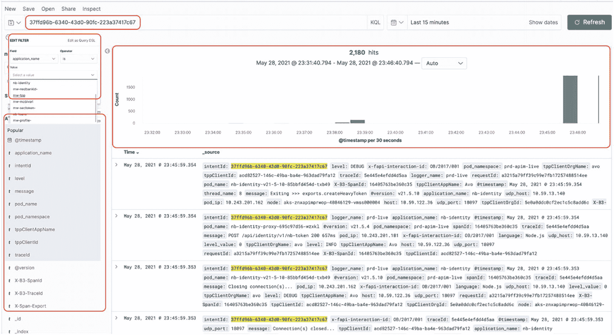

图 10-10

Kibana 控制台

我观察到一些支持工程师——有时是刚加入团队、只参加过少量知识分享会的新人——也能熟练地在 Kibana 控制台中定位请求失败原因。只要提供唯一标识符，Elasticsearch 就能消除扫描多份日志的困难，几乎即时展示所有包含该引用的条目，并提供可用于下钻到特定时间范围的时序图。

Kibana 更进一步，允许用户仅查看字段子集。还可添加额外过滤器以聚焦特定组件。也可以执行 Kibana 查询（即 Kibana Query Language，KQL）来扩大或缩小搜索范围。ELK 栈很可能是我们运维环境中最重要的要素；如果团队所有成员都投入时间和精力掌握其能力，那么它必将在开发和支持两方面带来显著成效。

## 监控

运维中的这个领域遵循冰山原则。表面上看，它似乎相对简单；但深入观察后，会发现远不止眼前所见。这是一段持续演进的旅程，在我们实施的第一天，能力只具备今天的一小部分。我们监控能力的很大一部分都借助了企业级功能，这在软件许可证层面带来了更低成本，也让发布过渡更顺畅，因为变更管理委员会对继续使用既有运维流程和工具更有信心。在接下来的章节中，我们将审视监控的各个方面，并讨论为何部分之和会形成更大的整体，从而使运维团队能够以先发制人的方式管理平台。

### 环境监控

几乎每个网络运营中心或指挥中心环境中，都会有一排排屏幕展示令人印象深刻且不断变化的刻度盘和仪表。在我看来，这是监控环境的传统机制。如图 10-11 所示，折线图通常表示 CPU 利用率或内存消耗。当达到预定义阈值时，支持人员通常会一阵忙碌，而当图线回落到阈值以下时，大家又会松一口气。

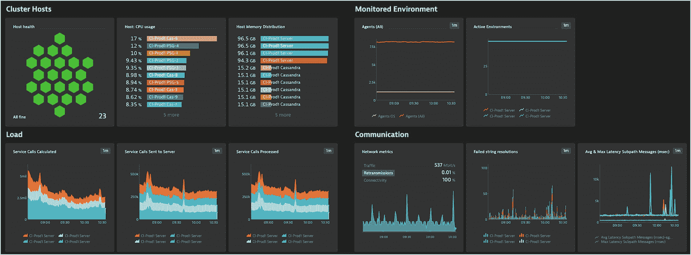

图 10-11

基础设施监控

这些指标的信息来源通常是安装在物理或虚拟主机上的代理程序。这是监控的基础层级，用于判断物理基础设施是否存在问题。它的作用很像给病人量体温。如果体温或 CPU 偏高，就可作为出现异常的指示。通常这也就是它所能提供信息的边界。

在 API 或集成环境中，下一个监控层级是服务或端点监控，如图 10-12 所示。这有时也被称为合成监控。周期性探针会测试服务的可用性。我们的团队通常会包含一个*isUp*操作，仅返回一个 HTTP 200。通过定义告警触发规则（例如连续三次失败），可以消除误报。由于请求通常会沿完整的网络基础设施路径到达端点，因此也能识别负载均衡器或防火墙配置问题，而这些问题未必会在基础设施监控仪表盘中体现。

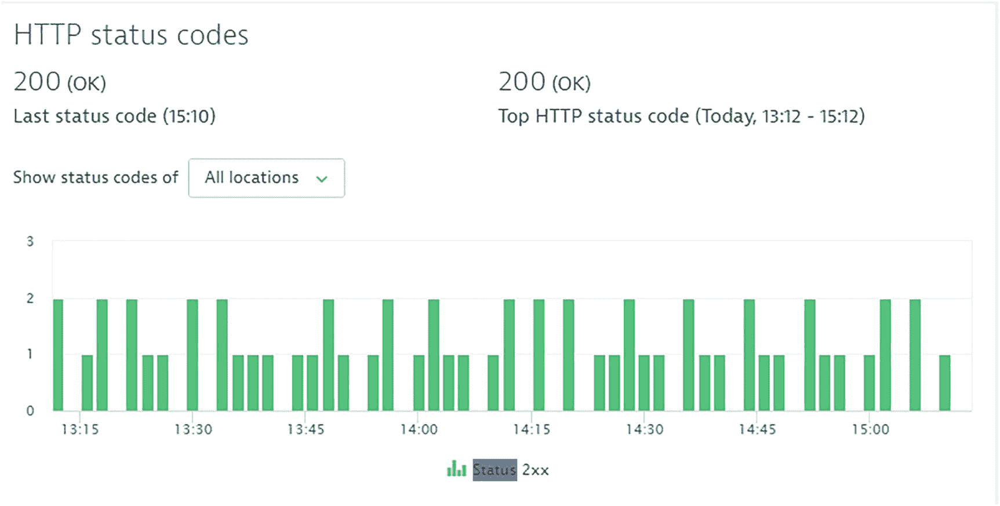

图 10-12

服务监控

由于网络环境复杂，曾发生过外部系统变更或更新影响我们服务可用性的情况。周期性、定时执行可作为问题发生时间的确凿证据；进一步的好处是，它能在外部使用方发现并报告问题之前，就先行提醒团队。若继续用病人分诊作类比，这相当于检测血压或血氧饱和度。流量变低可能表明系统中潜在阻塞。单独看它并不能指出根因——但有助于缩小需要进一步调查的范围。

### 应用性能监控

多年前我第一次接触应用性能监控（APM）时，就对这项软件工程成就印象极深。APM 顾问为我们应用的 Java 虚拟机做了埋点，借助字节码注入的“魔法”，我们能够看到事务在平台中的流转。乍看之下，这正是我长期追寻的事务追踪“圣杯”。但随着更多接触和深入研究，我发现 APM 在软件开发生命周期中有其特定角色，而我对某种略微“更神圣圣杯”的追寻仍未结束。

尽管 APM 可在生产运维环境中日常使用，但它提供的洞察（如图 10-13 所示）通常主要用于负载测试和性能工程。它就像注入病人血液中的示踪染料，能展示请求到达目的地所经过的精确路径。一些 APM 产品还会直接呈现数据库请求，从而暴露缺少索引、性能不佳的查询。

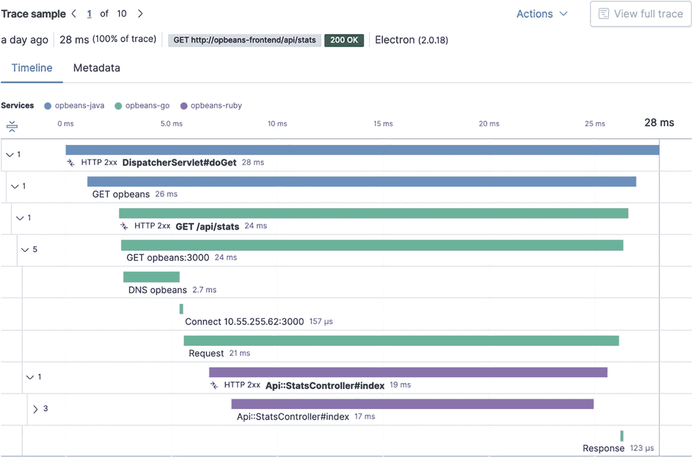

图 10-13

APM 事务追踪

APM 的分析路径可用于优化方案，识别高延迟区域以及系统架构中的潜在瓶颈。坦率地说，这很可能就是运维人员可作为事务执行“唯一信息预言机”使用的圣杯。不过就目前而言，基于我个人经验以及对当前运维流程与规范的观察，我们还没有达到这个结论。

### 功能监控

功能监控的目标，是比“仅验证 API 端点可用”更深入一层，去测试并确认其完整功能是否正常。对于技术候选人，我最喜欢的面试问题之一是：在项目管理、设计、开发、测试或支持这些项目分工中，他/她更倾向哪个方向。顺便说明一下——项目管理其实是个“陷阱”选项，不幸选中它的人，基本就到此为止了。虽然很多人都喜欢写代码，最常见回答是开发，而几乎没人投支持。图 10-14 展示了我“运维岗位也能写大量代码”这一观点的证据——这是我为平台内部监控开发的一款应用，昵称为*“Homer Knows”*。

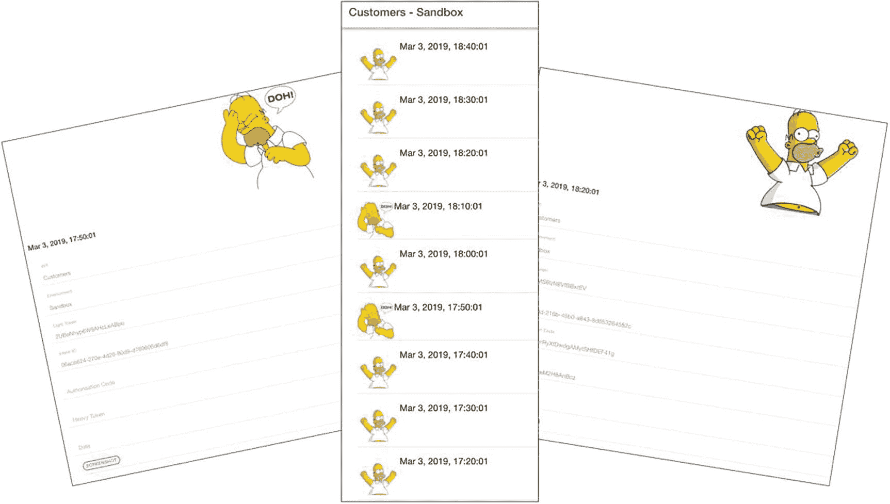

图 10-14

Homer Knows

我们 Marketplace 的关键要素之一是 OAuth 流程。它由一系列 API 调用构成，并会重定向到 Web 用户界面（UI），提示用户进行认证与授权。我们原本只能验证前几步 API 调用，而 UI 和后续调用的问题，往往要等第三方反馈故障后才会发现。从运维角度看，这种*被动式*方式让我很不安，于是我以此为动力构建了一个可通过桌面端或移动端访问的定制应用：它在简单的*cron*脚本定时触发下，模拟一个用户（Homer Simpson）定期跑完整个流程。无论流程成功还是失败，*Homer*都会*知道*。除了学习一个新的移动应用框架，这次实践还让我有机会以与第三方近似的方式来消费 API。延续我们的医学类比，这使运维团队能够在潜在事故*发生期间*观察“病人”状态，从而可能实时揭示根本原因。

### 遥测

监控中的一个维度，尤其吸引我的是遥测（Telemetry）。我最初接触这一概念，是通过观看一级方程式（F1）比赛。当赛车在赛道上行进时，赛事工程师能够获取这台机器几乎每个方面的详细信息。这可能让维修区团队对赛车运行状况获得了惊人的洞察；如果使用得当，还可以在策略上带来额外的一点竞争优势，并最终赢得比赛。

由这一认知延伸出的首先是：持续不断涌入的数据量——从胎压和温度，到剩余燃油、机油温度，再到气流，可能有几十项，甚至数百上千项指标需要筛查。遥测真正的美妙之处在于，它赋予了对源端进行远程控制的能力。当前的 F1 规则可能不允许这样做，但在早些年，赛事工程师可以远程修改赛车配置。举例来说，如果他们发现发动机温度危险地偏高，赛事工程师（与车手协商后）可以降低每个挡位的最高转速，以保护发动机坚持到比赛结束。

从软件工程的视角来看，这非常令人兴奋，因为它使运维团队能够对解决方案进行“运行时”配置变更，以优化性能，或在必要时保障应用可用性。变更示例包括：增加更多容器副本或实例以应对预期流量、通过环境变量策略动态调整端点配置，或在变更窗口期间展示与移除维护页面。需要注意的是，遥测的目标并不是对运行域进行大规模变更，而是提供“远程控制”能力，用于做细微的航向修正或更新。在不能承受停机的运行环境中，这无疑是一件极其多用途的利器。

### 告警

一个关键教训是：糟糕的告警策略会迅速导致运维流程失效。随着平台业务量增长，发出的告警数量压垮了支持团队。深入调查显示，大多数告警源于数据问题或下游问题，而 Marketplace 支持团队对此几乎无能为力。在大量不可执行处理项（噪声）中，真实系统问题越来越容易被漏掉，导致问题解决出现不必要的延迟。

我们随后采用的实时告警方法（为应对高流量而设计）是：不针对“噪声”发送告警，而是基于发现的错误进行分类。最初，所有新错误都会触发告警。经过协商后，若团队无法立即采取行动，则将这些错误重新分类以调整告警策略。这些错误仍会在运维服务台中记录和跟踪，以便修复数据问题或推动下游系统进行变更。此外，所有错误也会在运维仪表板中展示，并且每天向关键干系人发送全量错误报告，这有助于跟踪与下游系统相关的错误量变化。

为了尽可能复用企业服务并与我们的策略保持一致，平台最初被配置为使用组织现有的告警能力，通过电子邮件和短信（SMS）等多种渠道向值班工程师发送告警。电子邮件的一个挑战是，即便发送到分发组，重要告警也会淹没在大量消息中；针对某个线程的排查或解决回复又会制造更多邮件；而要查找或追溯历史事件，则不得不翻阅邮件归档。使用短信的缺点则是移动网络资费带来的成本。很快我们便意识到，传统机制并不理想，需要一种替代方案。

一个颇具吸引力的方案是集成 Slack 这类流行沟通平台，数字化领域的其他团队也在使用它。这本有潜力将我们的告警能力推进到光谱的另一端。但在对该方法进行更深入思考后，我们识别出一些潜在缺点：采用非企业标准会与组织战略产生明显偏离；与 Slack 服务的集成连接存在挑战；并且要求团队每位成员额外安装并配置软件——有时还需要在个人设备上操作，更不用说管理该服务本身的额外开销。

我们找到的一个很棒的折中方案是使用组织标准沟通软件 Microsoft Teams。Teams 拥有出色的“频道（channel）”功能，告警会以消息形式路由到频道。支持工程师可以围绕某条消息发起线程，开发人员在需要协助时也可跟进并回复。作为组织标准工具，我们还能复用移动应用的安全能力与分发策略。最大的好处在于，我们再次与“复用组织能力与规模优势、消费企业服务”的战略保持一致。

## 支持

本节我们讨论支持能力中的“人”这一要素。最优秀的解决方案，都是在充分考虑并认知*人员、流程和技术*的基础上构建的。作为*人员*要素，支持团队成员借助*技术*（如日志与监控）以及*流程*（如事件管理）来维护 Marketplace 的健康与稳定。由于 Marketplace 需要 24x7 全天候关注，我们对团队中的这些支持工程师怀有深深的感激。接下来我们将通过讨论支持团队结构、将解决方案从开发过渡到运维的方法，以及我们的内外部沟通策略，进一步展开细节。

### 角色

我们组织数字化实践手册中的一项基础原则是践行*“你构建，你运维*.*”*。乍看之下，这似乎是一种对敏捷方案交付毫不留情的“严厉关爱”方式。根据一线观察，这很可能是构建负责任且可靠解决方案的最强推动因素之一。基于以往项目经验，我观察到解决方案交付与运维之间存在清晰分界——这种分割跨越了部门与事业部，各自拥有自己的人员与组织结构。尽管这种划分能够带来清晰聚焦、关注点分离以及明确的职责边界，但它不可避免地会形成一种*“我们与他们”*的文化。开发团队可能会草率地将方案部署到生产环境，而运维团队则可能在未满足苛刻条件前不愿接手所有权。

在“开发”章节中讨论过的全栈小队，也包含负责解决方案日常运行的支持人员。这种方式确保一个 API 产品从诞生到退役的责任与问责始终归属于该小队。举例来说，如果方案设计不佳，或缺少足够的日志与错误处理机制，那么运维与开发之间的反馈闭环会很短，并能快速闭合。另有一条长期规则：方案的开发人员在上线后 30 天内负责支持。在此期间，开发人员将执行 1 级支持，且由运维人员跟班。该阶段还会安排知识共享会议，为支持团队提供运行和管理该方案所需的信息与技能。对于更复杂的方案交付，可能会将运维团队成员分配至项目团队，以便更深入了解内部执行过程，并实现向支持阶段的无缝过渡。

以下列表详细说明了支持团队中的角色：

*   **运维负责人**：对平台整体健康状况承担第一责任，并协调团队活动——从支持人员排班到值班表安排。该角色需要足够的技术判断力，能够理解问题及其影响，必要时可能需要深入细节，但也要有克制力，判断何时亲自上阵、何时指挥团队。不幸的是，技术导向的人往往比流程更偏爱细节。其优势是负责人能协助问题解决；其风险（对此我有切身体会）在于个人可能承担过多，成为单点故障，甚至成为最大风险：没有时间建立或支持管理团队所必需的流程与规程。正因如此，这一角色最适合由技术与流程能力均衡的人担任。

*   **1/2 级支持**：如上所述，该角色通常由上线后支持期内的开发人员担任。根据你的 Marketplace 特性，平台需要 24x7 支持，而这组工程师位于一线，负责识别与分诊问题并维护 API 产品完整性。本章稍后会讨论，定义清晰的仪表板与告警机制是帮助该团队识别问题的关键。分诊是支持工程师极其重要的职责，而能够判断问题根因是我们着力培养的关键特质。工程师会持续对问题负责，直到问题被解决或缓解，即便问题超出平台边界。若需要额外协助，则会创建支持请求，详细记录问题、受影响域、分析结果、日志以及可能的可疑区域。随后将其分配到下一层级支持进行调查。

*   **3 级（开发）支持**：在团队规模较小时，1/2 级无法解决的问题会直接路由给开发人员协助。其好处是缩短了问题发现到解决之间的闭环。其缺点是可能影响宝贵的开发时间。秉持团队“*你构建，你运维*”的理念，这能让开发人员对其交付结果保持问责。本质上，编写高质量代码并重视与运维团队进行方案知识共享，将最大限度减少对后续开发的干扰。必要时，可能需要进行代码更新。根据问题严重程度，这可能被纳入下一次发布，或通过流程快速通道立即部署。

### 过渡

鉴于交付节奏，Marketplace 中来自多个业务流的 API 产品会持续交付与更新，以跟上产品负责人需求和消费者需求。运维能力以共享服务形式运行，以实现最高效率。也就是说，由一个团队跨多个业务流支持所有 API 产品。这样团队只需配置一名 1/2 级支持工程师（通常按 24x7 排班），同时还能降低成本。

当生产环境有新更新时，交付团队在指定周期内对上线后支持负主要责任。在此期间，运维团队成员会提供影子支持，以观察可能出现的问题及其修复方式。这可被视为“在岗培训”或隐性知识共享。交付团队还会组织知识共享会议，其次数与发布复杂度成正比。交付团队以一种*“让我帮你来帮我”*的视角看待这一过渡期。也就是说——升级到开发支持的支持请求概率，与支持工程师的知识和技能成反比。简单来说——被充分赋能的支持工程师，可能无需开发人员协助就能解决运维问题。

根据个人经验，我发现开发进行到一半还要处理支持咨询，会导致上下文切换，严重影响我的交付能力。除了对生产环境中稳定可靠方案所带来的自豪感之外，这一点本身就足以成为任何开发人员确保运维团队获得充分赋能、能够支持其方案的理由。

### 沟通策略

任何运营能力的关键要素之一，都是有效的沟通策略。由于组织内外存在大量集成点，要让所有利益相关方保持一致并非易事。以下是我们当前机制的示例：

*   **定期更新**：由值班支持工程师每 2 小时通过 WhatsApp 发送一次更新，内容包括：i）生产 Live 和 Sandbox 环境的稳定性；ii）内部消费应用的商业统计数据，如访客数与注册数；iii）API 调用分析，即当前流量与一周前流量的对比。

*   **第三方沟通**：当计划内维护会影响 API 产品可用性时，向第三方发送通知。通常 Marketplace 团队一旦从支撑型企业系统或下游服务提供商处收到计划更新通知，就会立即进行告知。由于我们拥有治理良好的组织变更管理流程，通知通常最迟会在事件发生前至少 3 天发出。若发生内部或下游系统故障导致事故或紧急中断，也会向第三方运维团队发送通知。由于企业内平台与系统数量庞大，对于那些我们未直接集成的系统，将我们的平台登记为“受影响/相关”方确实花费了一些时间。例如，Marketplace 并不直接集成到主机系统（mainframe），但一旦其宕机，Marketplace 仍会受到显著影响。

*   **作战室（War room）**：该措施通常在企业内发生严重中断时启用。一般由值班支持工程师触发：当其观察到与收入相关的关键 API 产品在一段时间内失败请求数超过预设阈值时即启动。来自支撑团队（无论是企业服务支持团队还是下游提供商）的反馈，会传达给更广泛的 Marketplace 团队。

*   **焦点电话会议（Focus call）**：当中断持续时间较长时，将召开焦点电话会议，并要求所有支撑团队强制参加。由于这可能涉及众多工程师和系统负责人参与，其目的在于让所有利益相关方同时在线，以尽快解决问题。

## 流程

为确保运营事件处理方式统一，Marketplace 支持团队将图 10-15 所示的轻量化流程作为主要参考。该流程为问题修复提供不同路径——如有必要，会创建“Incident（事件单）”，这是组织内跨系统沟通问题的标准方式。读者会注意到，该流程清晰定义了通知策略，以确保所有利益相关方保持一致。

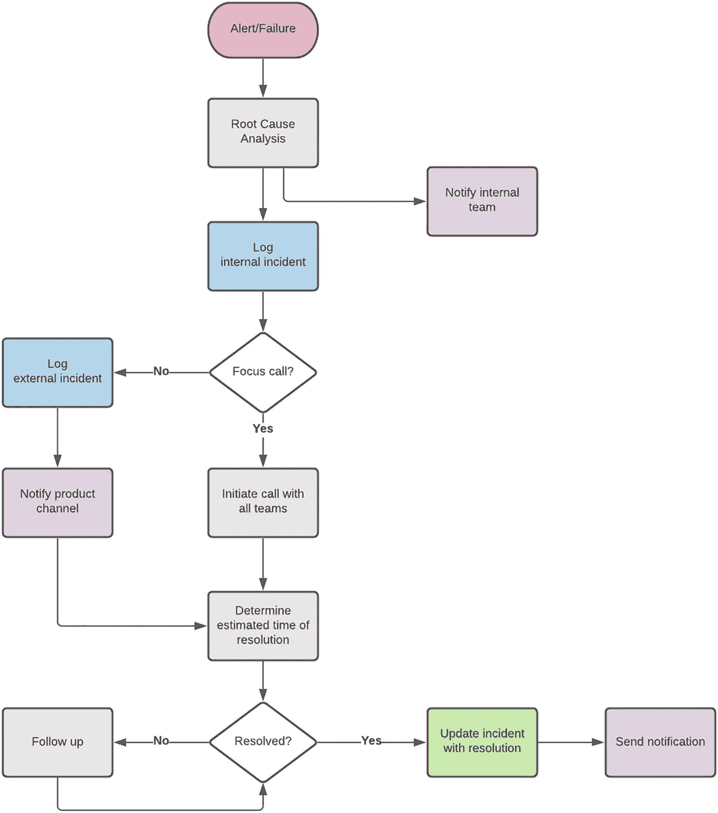

图 10-15

事件管理流程

### 问题跟踪与报告

在我们的 Marketplace 刚上线时，API 产品很少，消费者更少。就像小镇警长维持治安一样，我们当时的方法非常临场、随性。问题记录在“餐巾纸背面”，并在最后时刻被解决。正如小镇因发现金矿而爆发式增长一样，随着多个交付流并行构建新的 API 产品、连接到新的后端提供方的“铁路”不断铺设、第三方提供商蜂拥而至消费 API，平台也迅速扩张。问题不断堆积，而那种“神枪警长式”的环境维护方法很快演变为单点故障。

支撑该环境的关键举措之一，是实施服务台来记录、跟踪并报告问题。支持工程师被明确要求：凡是无法在几分钟内解决的请求，都必须认真登记。记录问题所花费的时间，即便只是处理来自第三方提供商的开发咨询这样看似琐碎的事项，也被证明极具价值，因为这为团队提供了定义清晰的时间线和事件记录。随着对运营环境可见性的提升，运维管理团队得以清晰掌握“战场态势”。资源可被调配到最关键的问题上，而长期无进展的事项也会随时间推移获得更高可见度。

类似于开发团队每天通过站会讨论当前冲刺任务，运维团队也有每日例会。该会议在策略上安排在平台团队站会之前，以便那些需要更多技术支持的事项能在更大范围内讨论。在该会议中，会讨论过去 24 小时内的问题、宕机、错误和修复活动。由于有团队资深成员参与，这一机制能够提供：对平台稳定性的洞察、对未来类似情况处理方式的指导、解决未决事项的下一步决策，以及运维团队申请额外协助的机会——包括开发支持、进一步调查时间，或通过升级推动外部依赖方响应。

每日会议的另一个目标，是“回馈可见性”，让支持团队了解各交付流即将发布的版本。随着开发冲刺接近完成，某些内容可能因测试延迟或外部依赖而无法发布。让支持工程师及时获知发布计划，可使团队有充足时间准备，并在必要时提前提醒交付负责人注意计划维护事项或可能影响发布的外部系统稳定性问题。更重要的是，这也是对运维团队持续保障平台平稳运行的明确认可与尊重信号。

凭借技术导向的团队特质以及对 API 的偏好，我们已整合服务台软件提供的接口，并使其成为每日以程序化方式挖掘的关键数据源之一。处于不同生命周期阶段的进行中问题会被汇总并展示在定制仪表板上，用于快速识别平台热点。例如，大量第三方提供商支持请求报告间歇性网络问题，可能提示防火墙存在隐患，可据此进行前瞻性处理。历史事项同样重要，并会在定期评审会议中用于向外部利益相关方汇报，如图 10-16-1 和 10-16-2 所示。这些报告可提供平台稳定性、问题平均解决时间以及流量规模等洞察，可用于论证平台追加基础设施与人员资金的必要性。它为需要重点关注的支持领域提供了清晰、明确且有数据支撑的证据，从而提升平台稳定性。

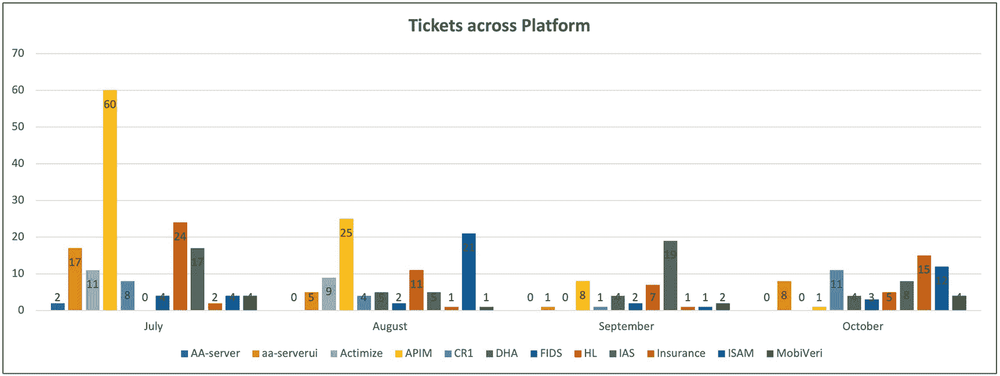

图 10-16-2

按应用域统计工单报告

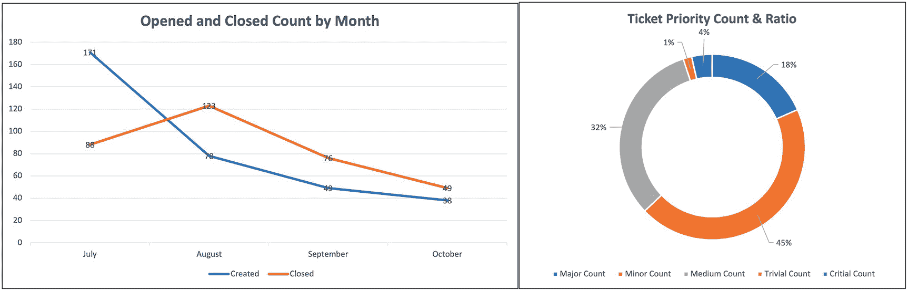

图 10-16-1

报告——工单趋势与严重性分析

### 服务级别协议

事件由支持工程师根据问题的严重性和优先级划分到不同类别。定义及严重性映射遵循表 10-1 中定义的矩阵。

表 10-1

严重性-响应映射

| 严重性分类 | 严重性标签 | 标准响应时间 |
| --- | --- | --- |
| 功能完全受阻（所有用户受影响） | 严重（阻断级） | < 30 分钟 |
| 部分功能受阻（许多用户受影响） | 高 | < 2 小时 |
| 部分功能受影响（有替代方案） | 中 | < 24 小时 |
| 某一功能区段受影响（用户数量较少） | 低 | < 48 小时 |
| 支持团队受阻（后端依赖） | 阻塞 | 在服务台中跟踪 |

## 支撑系统

我们的平台有两个主要依赖——一个内部依赖和一个外部依赖。内部组件是 Marketplace 的构建模块，已在介绍平台架构的章节中讨论。内部组件出现问题可能会导致整个平台不可用。外部元素是 API 产品的后端服务提供系统。根据提供方接口的性质，一个或多个 API 产品都可能受到影响。在下面各节中，我将更详细地讨论内部和外部支撑要素。

### 平台即服务策略

正如在介绍平台架构的章节中所讨论并在图 10-17 中所示，我们的策略是尽可能利用企业现有能力。几乎从 Marketplace 创建之初，我们就已经认识并接受这样一个事实：组织内拥有高技能、专注且敬业的人员，他们通常具有多年管理特定系统的运营经验。基于这一点，我们采用了尽可能利用企业能力的策略。

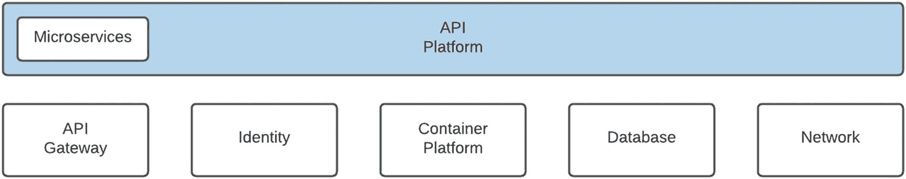

图 10-17

托管平台服务

外包的“托管服务”方式也有其缺点，因为它使我们与企业紧密耦合，我们可能需要更长时间等待系统升级，并且必须与其他租户共享资源。然而，我们发现平台成熟度加速、专属技术支持以及显著降低运营支出预算等优势，使其成为一个很有吸引力的选择。

一旦支撑系统出现问题，Marketplace 支持工程师将通过联系负责该系统的对口团队来遵循事件管理流程。如果无法建立直接联系，则需要运营指挥中心协助，后者将启动既定的升级流程以追踪相关系统负责人。在中断问题解决之前，问题归属仍由 API Marketplace 支持团队承担。由于每个系统都有其自身依赖，根因可能位于更底层的技术栈。举例来说，数据库中断可能由与存储区域网络（SAN）的连接丢失引起，而该连接丢失又可能是防火墙规则更新导致的。凭借多年支持复杂互依系统的经验，我们的组织采取务实果断的方法：对于高严重性、影响服务的中断，会迅速召集“焦点会议”，并要求所有支撑团队强制参与。这种方法能够快速定位根因并完成修复。正是在这种时刻，当我们看到企业整体力量被调动起来解决中断时，我们会更加庆幸采用了平台即服务策略。

### 后端依赖

如图 10-18 所示，API Marketplace 拥有多个消费者，每个消费者使用一个或多个 API，而一个 API 会集成到一个或多个提供方系统中。沿着这棵关系树向上回溯可以观察到：单一提供方的故障可能影响一个或多个 API，并进一步产生连锁效应，影响一个或多个消费者。

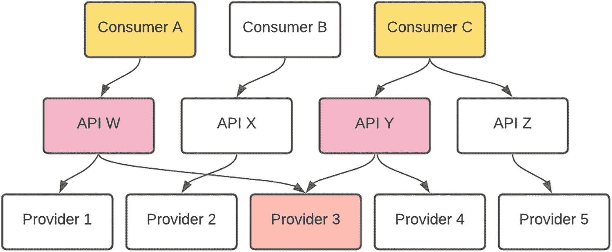

图 10-18

消费者、API、提供方关系

我们管理这一复杂的消费者、API 与提供方网络的方法如下：

*   清晰掌握每个 API 产品对应哪些后端系统作为**提供方**。这是一个“动态”视图，因为每次发布都可能出现产品与后端之间的新连接。

*   根据 API 的性质，确定后端的**关键性**。例如，如果安全服务提供方不可用，会影响身份验证，用户将无法登录；如果参考数据提供方不可用，则可临时使用缓存数据。

*   API Gateway 可用于确定消费者订阅了哪些 API 产品。

*   制定服务矩阵，以便运营团队能够快速判断后端提供方接口丢失所带来的影响。对于关键提供方依赖，消费应用也可能需要额外措施，例如显示维护页面或隔离特定功能。

*   我们平台待办事项中的一个重要条目是发布 API 状态。提供方系统的可用性将是该视图的关键输入。

## 总结

在本章中，我们更深入地探讨了运营环境中的不同领域。基于我们构建并上线 API 平台的经验，以及对大量需考虑领域的观察，一个关键经验是：应在平台生命周期的早期就建立运营化视角。我们还强调了我们的变更与发布管理方法，该方法经过了定制，并且重要的是，已适配到一个既有组织中运行。再次说明，DevOps *实践*是实现持续、可靠敏捷交付的关键推动因素。

必须始终从*人员（people）、流程（process）*和*技术（technology）*的视角来考虑运营环境的运行。尽管这听起来可能有些老生常谈，但这些要素在本质上彼此交织、相互支撑，并最终带来更高效、更可靠的平台。前文讨论的日志与监控方法提供了*技术*能力，并使我们能够洞察解决方案执行情况。对支持团队角色、赋能和沟通策略的强调，展示了*人员*要素如何融入其中。定义良好的*流程*是实现 Marketplace 良好运行、可预测性与稳定性的关键。

我们的 Marketplace，以及很可能你的也是，依赖于许多内部支撑要素和后端服务提供方。最后，我们探讨了利用企业托管服务并与提供方系统高效协作的方法。坦率地说，本章最终比预期更长、也更为细致。我将其归因于运营版图的广阔，以及一个简单事实：一个解决方案在其生命周期中的大部分时间都处于执行环境之中。

