# 8.实时模板

在本章中，我们将介绍以下内容:

*   实时模板

*   使用实时模板

*   创建您自己的实时模板

出于各种原因，Java 与开发人员之间有一种又爱又恨的关系。如果我是一个打赌的人，我会说 Java 被讨厌的原因之一是因为冗长。要完成任何事情，你必须忍受它的锅炉板代码。您有几个选择:

*   **转到 Python**——你需要转行，可能会离开现在的工作(剧烈的)。

*   **切换到科特林**——有可能。许多 Java 商店现在都在采用 Kotlin。你也许根本不需要跳槽，但你真的想跳槽吗？Java 是你的初恋吧？

*   咬紧牙关，奋力前进，输入密码–哎哟！你好，腕管综合症。

*   **使用 IntelliJ 的实时模板**–耶！你的手指(和键盘)会为此感谢你的。这就是本章的全部内容。

## 那么什么是活模板呢？

你以前使用过文本扩展器吗——你输入一些字母模式，比如 *datetoday* 它会扩展到当前日期或者 *tgif* ，它会扩展到“谢天谢地今天是星期五”？实时模板与此非常相似。这是 IntelliJ 的一个特性，你可以输入一个助记符(或类似的东西)，它可以扩展为一个表达式或结构。

你想看看实际情况吗？下次定义一个类并且需要编写 main()方法时，键入单词“main”(如图 [8-1](#Fig1) 所示)，然后按 ENTER 或 TAB 展开模板。


图 8-1

使用“main”live 模板插入公共静态 void main

当模板展开时，您将拥有一个空的 main()方法(如图 [8-2](#Fig2) 所示)。IDE 还会将插入符号放在方法的第一个空行上。想得很周到。这样，您就可以开始在方法中键入第一行，而无需重新定位光标。

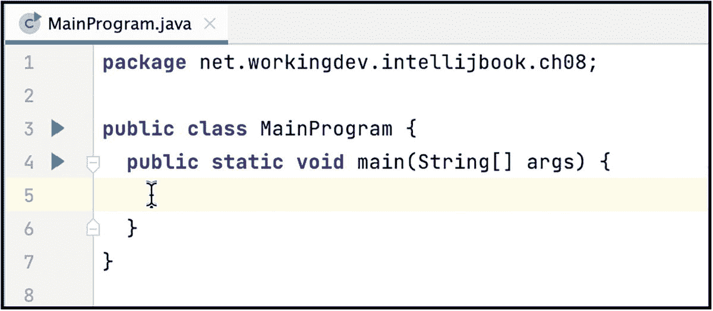

图 8-2

扩展了“主”实时模板

main 方法还有另一个模板。尝试输入“psvm”，如图 [8-3](#Fig3) 所示。

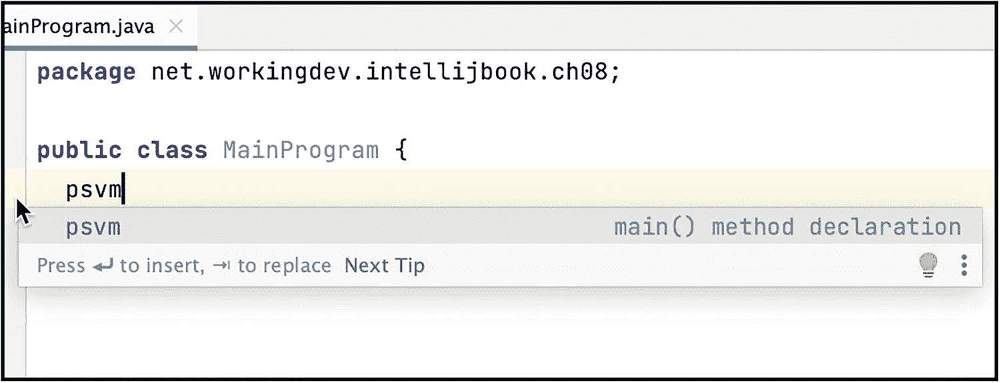

图 8-3

使用“psvm”模板

按 ENTER 或 TAB 也将“psvm”扩展为`public static void main()`方法。现在，在到达 main 的第一个空行后，尝试输入“so”，如图 [8-4](#Fig4) 所示。

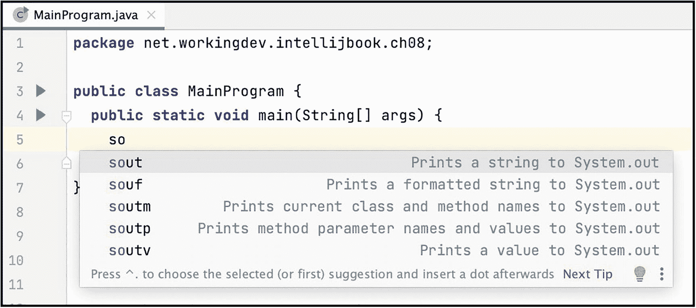

图 8-4

IntelliJ 展示了一些以“so”开头的实时模板

我们想写 *System.out.println()，*所以选择“sout”选择“sout”时按 ENTER 或 TAB 键，将模板展开到*system . out . println()；*如图 [8-5](#Fig5) 所示。


图 8-5

“sout”扩展为 system . out . println()；

到目前为止，您已经输入了八个键(“main”和“So”，包括选项卡)，它扩展到了 58 个字符。这就意味着你再也不用输入 50 个字符了——非常简洁，对吧？想象一下，如果你真的可以使用 Java 的所有 38 个实时模板。击键的节省是巨大的。

## 参数化模板

我们再举一个例子；在主方法中，输入“for”，如图 [8-6](#Fig6) 所示。


图 8-6

使用“fori”模板

可以看到，IntelliJ 为我们呈现了三个选项:(1)**，扩展为 for 循环结构；(2) ***fori*** ，扩展成更全面的 for 循环结构；以及(3) ***foreach*** ，这是您在处理集合时可能会用到的。让我们用“fori”；选择“fori”时，按 TAB 或 ENTER 键。IntelliJ 将其扩展为近乎完整的 for 循环结构(如图 [8-7](#Fig7) )。**

 **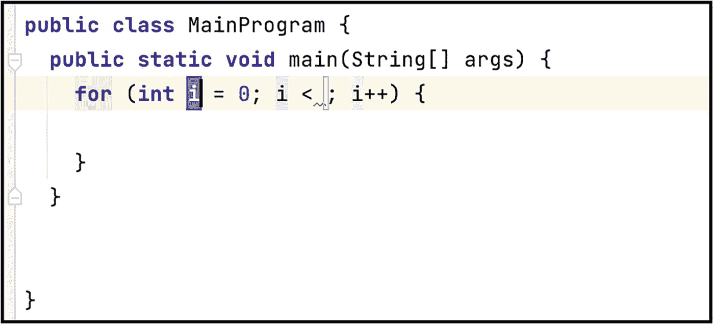

图 8-7

“fori”扩展了

它有一个起始计数器值、极限表达式和计数器增量表达式。随着模板的扩展，脱字符号落在 *"* i "上，以防您想要更改计数器变量(我通常不去管它)。如果您再次按 TAB，插入符号会停留在您应该键入限制表达式的值的地方(如图 [8-8](#Fig8) 所示)。

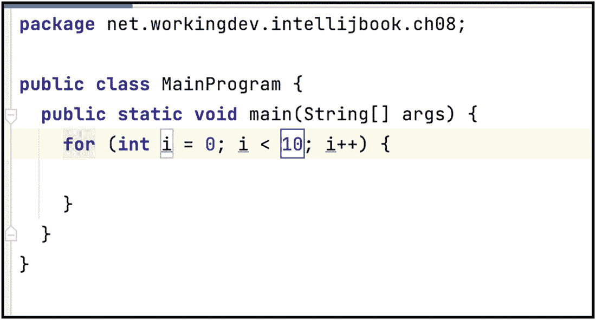

图 8-8

按 TAB 键会将您带到限制表达式

请注意，每次按 TAB 都会将插入符号定位到一个占位符上，您应该在这里输入值以完成语句。

再按一次 TAB，它应该将脱字符号放在“for”语句的第一个空行上(如图 [8-9](#Fig9) 所示)。

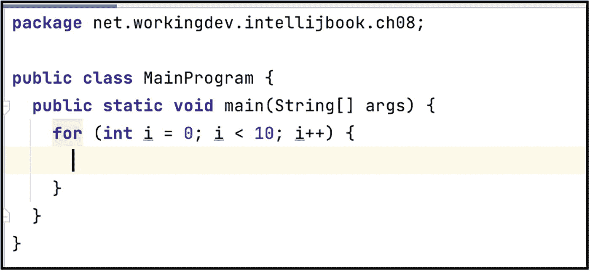

图 8-9

最后一次按 TAB 键

你应该已经找到窍门了。使用实时模板非常容易。你应该随时随地使用它们。他们节省时间。

## 显示所有可用模板

实时模板知道它们的上下文。你不能在任何地方使用它们。例如，尝试在方法之外键入“fori”(如图 [8-10](#Fig10) 所示)。


图 8-10

在方法外部键入“fori”

看看 IntelliJ 是如何将其标记为错误的？“fori”模板在方法之外没有意义。模板知道上下文。他们知道他们应该在哪里。

IntelliJ 总是尽力提供帮助。当您在编辑器中键入一串字符时，很难预测您要做什么。在图 [8-11](#Fig11) 中，当我键入“p”时，它试图建议一堆选项，很难区分哪些是实时模板，哪些不是。根据经验，如果它(1)没有括号或花括号，并且(2)没有有用的描述，那么它就不是一个活模板。

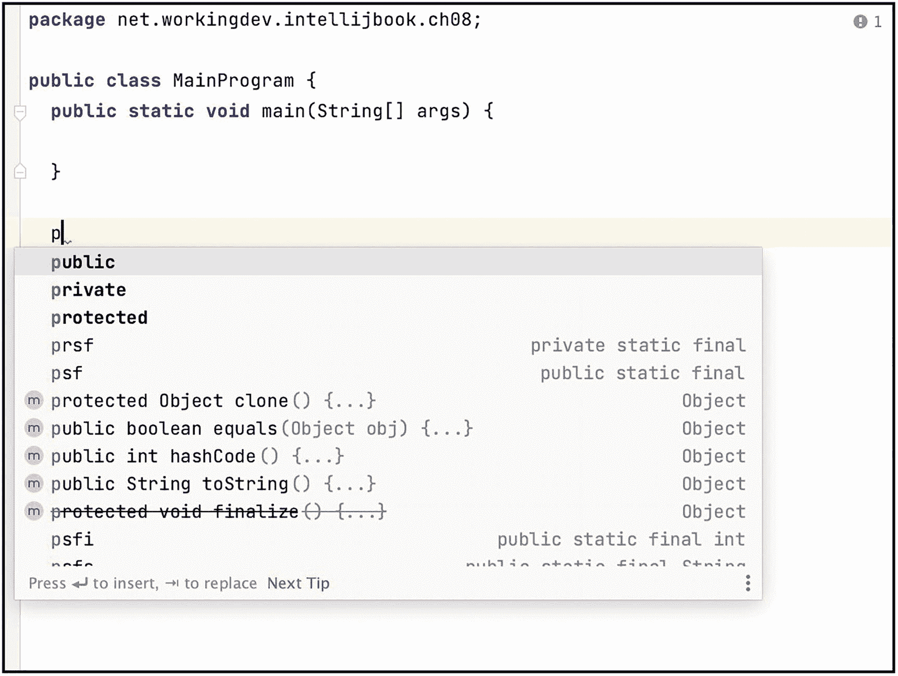

图 8-11

显示以“p”开头的可能模板

你能在图 [8-11](#Fig11) 中找出哪些是实时模板吗？

如果你猜对了 prsf、psf 和 psfi，那你就猜对了。

如果你想显示所有实时模板的列表(插入符号所在)，只需使用 **cmd + J** (macOS)或 **CTRL + J** (Windows 和 Linux)并滚动即可。图 [8-12](#Fig12) 显示了所有实时模板的下拉列表。

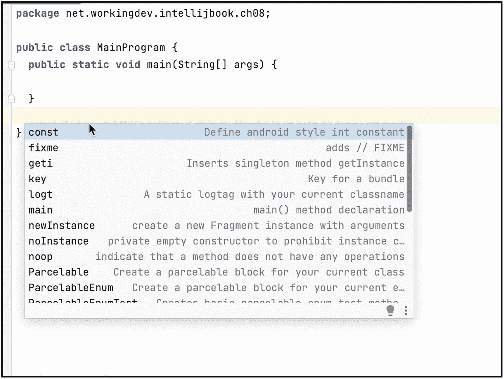

图 8-12

实时模板列表

## 环绕实时模板

考虑清单 [8-1](#PC1) 中的代码；这是一组典型的 Java 类，演示了如何实现单例——它不是一个合适的单例，所以不要在生产中使用它，但它足以演示如何控制对象实例数量的基本流程。

```java
public class MainProgram {
  public static void main(String[] args) {

    Tree objTree = null;

    objTree = TreeFactory.getTree();

  }
}

class TreeFactory {
  private static Tree tree;
  private TreeFactory() {
    tree = new Tree();
  }
  public static Tree getTree() throws Exception {
    return tree;
  }
}

class Tree { }

Listing 8-1TreeFactory, Tree, and MainProgram Classes

```

假设我们想用 try-catch 包围 getTree()调用；您可以使用实时模板来节省一些击键。

要用任何控制流结构包围一个语句，将插入符号放在您想要包围的行上，然后使用键盘快捷键 **cmd + option + T** (macOS)或 **CTRL + Alt + T** (Linux 和 Windows)。

弹出*包围*对话框，选择要使用的控制结构，如图 [8-13](#Fig13) 所示。

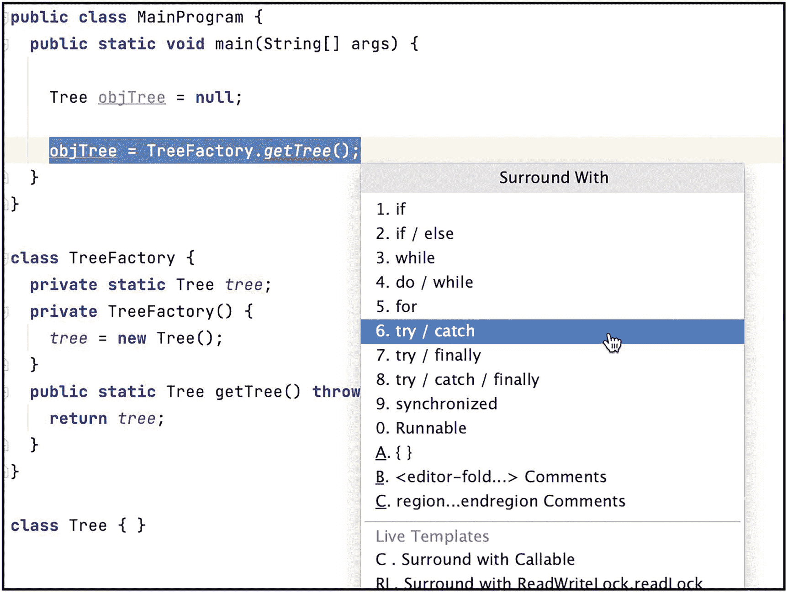

图 8-13

使用“包围”模板

选择 try-catch，然后按 ENTER 键。

图 [8-14](#Fig14) 显示了活动模板完成的动作。

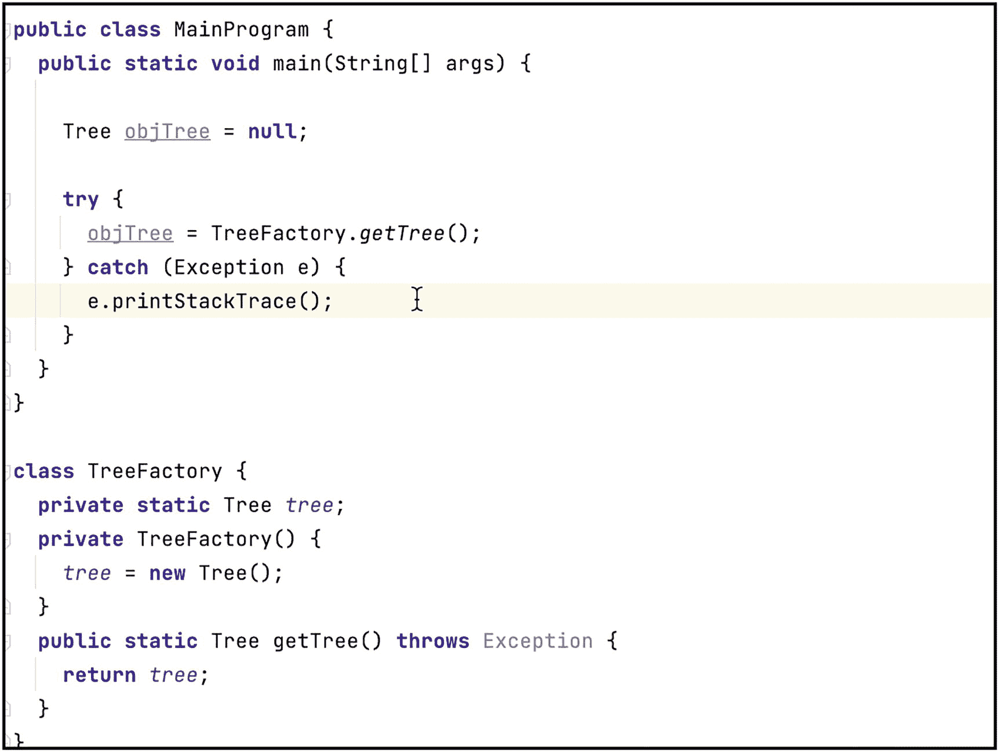

图 8-14

扩展的试玩直播模板

如您所见，try-catch 模板用适当的 catch 表达式甚至 printStackTrace()语句预先填充了控制结构。

让我们进一步举个例子。现在，将插入符号放在 try-catch 结构的外部。我们将检查对 getTree()的调用是否返回 null。图 [8-15](#Fig15) 向我们展示了如何使用实时模板来完成这项工作。


图 8-15

使用 if null (ifn)模板

键入“if”并等待实时模板显示选项。

选择“ifn”并按回车键。

图 [8-16](#Fig16) 显示实时模板知道哪些变量在范围内。


图 8-16

显示哪些变量在范围内的实时模板

当然，我们想要测试的是 objTree 变量，所以选择它。清单 [8-2](#PC2) 显示了我们完成的主程序。

```java
public class MainProgram {
  public static void main(String[] args) {

    Tree objTree = null;

    try {
      objTree = TreeFactory.getTree();
    } catch (Exception e) {
      e.printStackTrace();
    }

    if (objTree == null) {

    }
  }
}

Listing 8-2MainProgram

```

一旦你掌握了其中的诀窍，你会想知道没有这些你是如何编码的。它们真的会节省你无数的打字时间。

## 创建您自己的模板

您可以在 IDE 的首选项或设置中多了解一些实时模板。要得到它，在 macOS 上使用 **cmd +，在 Windows/Linux 上使用**(逗号)或**CTRL+Alt+S**；然后进入**编辑器** ➤ **直播模板**。

您会看到模板是按语言分组的(如图 [8-17](#Fig17) 所示)。

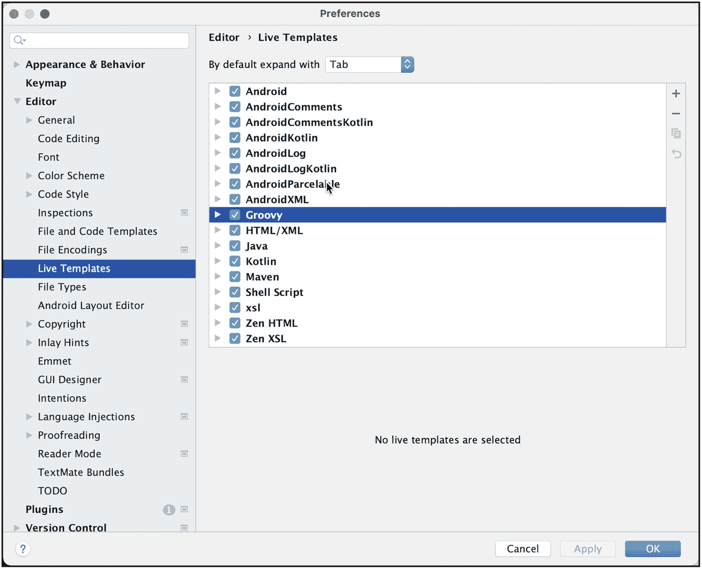

图 8-17

首选项对话框中的实时模板

单击“Java 语言”展开选择；这显示了所有 38 个 Java 实时模板(如图 [8-18](#Fig18) 所示)。

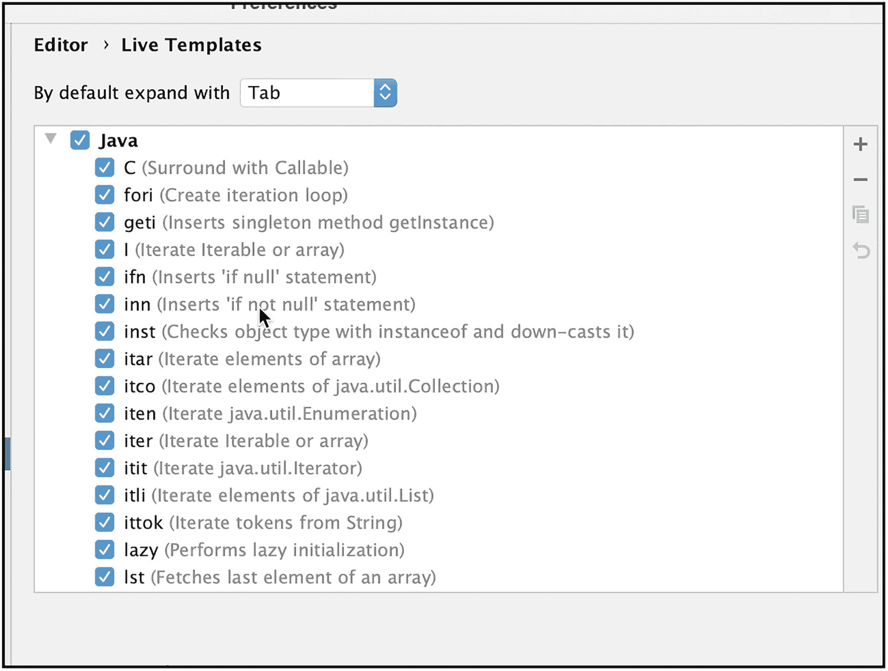

图 8-18

Java Live 模板

当您单击每个项目时，IntelliJ 会显示每个实时模板的详细信息。您可以看到模板文本和几个影响模板行为的其他选项，如图 [8-19](#Fig19) 所示。

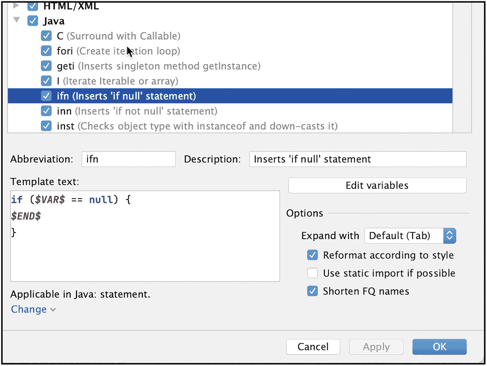

图 8-19

模板文本

为了深入挖掘实时模板，我们为什么不创建一个自己的模板。我们可以创建一个实时模板，并将其添加到现有的模板组中，但我不想弄乱现有的一组实时模板。因此，让我们创建一个新的模板组。

点击实时模板对话框上的加号(如图 [8-20](#Fig20) 所示)并点击“模板组”


图 8-20

添加模板组

在随后的屏幕中，输入模板组的名称；我将称之为“我的模板”，如图 [8-21](#Fig21) 所示。

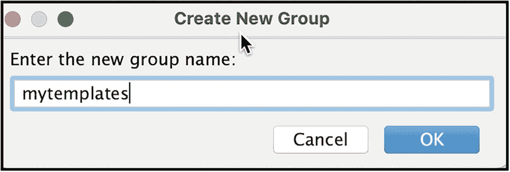

图 8-21

创建新组

选中“mytemplates”组时，再次单击加号；这次，点击“实时模板”，如图 [8-22](#Fig22) 所示。

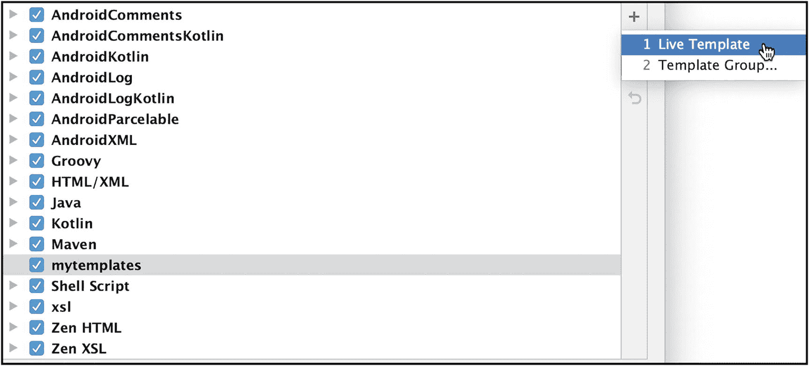

图 8-22

新建实时模板

在接下来的屏幕中，您可以填写模板详细信息，如图 [8-23](#Fig23) 所示。

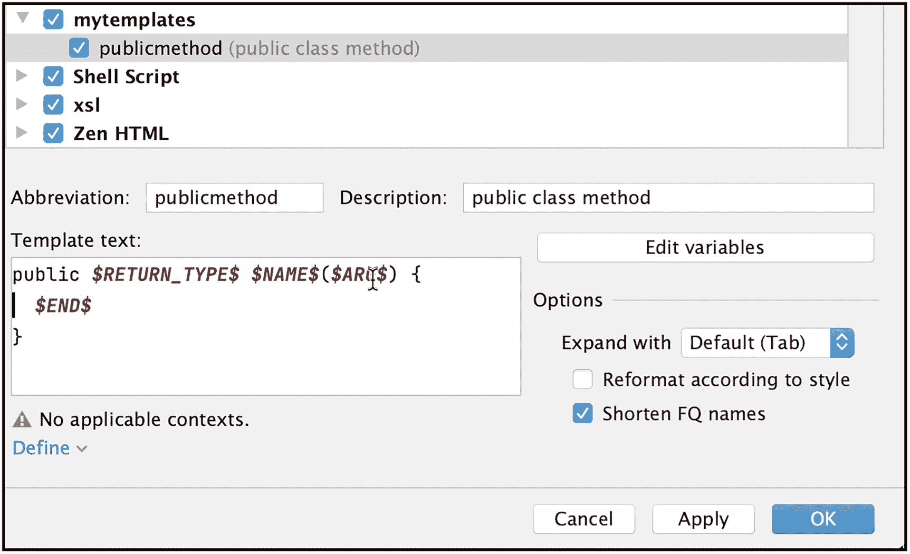

图 8-23

新模板详细信息

*   **缩写**–这将是实时模板的快捷键。这不能与任何现有的实时模板相同。此外，花时间想清楚这一点；它也需要容易记忆。至于我们的例子，我将使用 publicmethod。

*   **描述**–这是您将在实时模板右侧看到的描述，如下拉列表所示。

*   **模板文本**–这是模板展开时的正文。模板文本中的变量(被美元符号包围的那些)是程序员在模板扩展时必须填充的变量。在我们的例子中，我使用了四个变量——您可以使用更多(或更少)。模板文本中的所有变量都是任意的，这意味着我只是编造了它们，除了 **$END$** 变量；那是一个预定义的模板变量，对 IntelliJ 有特殊的意义。$END$变量指示代码完成时插入符号或光标的结束位置。您不能再使用 TAB 键导航到下一站。

我想再次参考图 [8-23](#Fig23) 。注意到左下方写着“没有适用的上下文”吗？这意味着我们必须告诉 IntelliJ 我们的新模板可以从哪个上下文中调用——我们是否可以在方法之外、方法之内调用它，等等。

要为我们的新模板定义上下文，请单击“定义”链接，如图 [8-24](#Fig24) 所示。然后选择“声明”

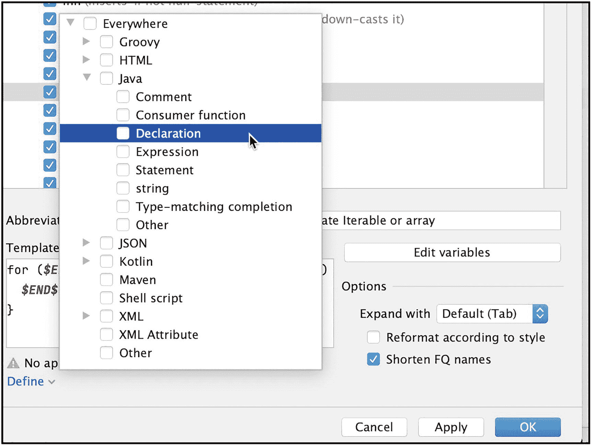

图 8-24

模板上下文

当我们选择“声明”时，意味着我们可以在任何需要声明的地方使用我们的模板。

现在，对其进行测试(参见图 [8-25](#Fig25) )。

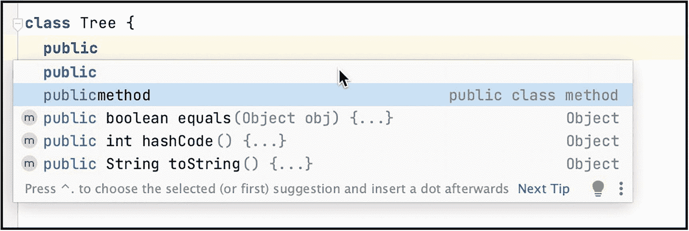

图 8-25

我们正在使用的新模板

选择“publicmethod”，然后按 ENTER 键。图 [8-26](#Fig26) 显示了扩展的模板——它工作了！


图 8-26

扩展的 publicmethod 模板

## 共享模板

如果你用的是其他 JetBrains 的 IDE (WebStorm，Rider，PyCharm 等。)，将您的 IntelliJ 模板导出到那些其他 ide——或者其他也使用 IntelliJ 的人。

您可以通过导出 live 模板来共享它们；为此，您需要

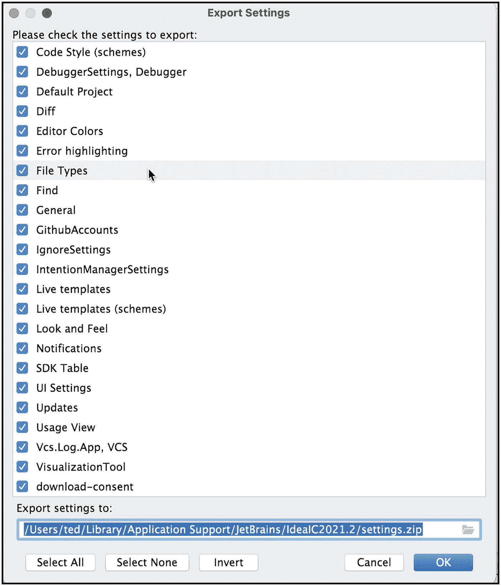

图 8-27

导出设置

1.  进入主菜单栏，然后**文件** ➤ **管理 IDE 设置** ➤ **导出设置**。

2.  在“导出设置”对话框(如图 [8-27](#Fig27) 所示)中，确保选择了 **Live Templates** 框，并指定保存导出设置的档案的路径和名称。

3.  单击确定完成导出操作。

要导入模板，请执行以下操作:

1.  在主菜单栏上，进入**文件** ➤ **管理 IDE 设置** ➤ **导入设置**。

2.  使用导出的模板配置指定归档文件的路径。

3.  在**导入设置**对话框中，选择**实时模板**复选框，然后点击确定按钮完成导入操作。

4.  重新启动 IntelliJ(或另一个 JetBrains IDE)。你应该在 IDE 设置的**编辑器** ➤ **实时模板**页面上看到导入的实时模板。

## 关键要点

*   Java 是一种相当冗长的语言。如果不使用文本扩展工具，可能会严重伤害手指。谢天谢地，IntelliJ 有实时模板。如果你想知道你节省了多少击键次数，只要去 IntelliJ 的主菜单栏，然后去帮助➤生产力指南。它会显示您的使用统计数据。

*   IntelliJ 有 38 个模板(仅针对 Java 学好它们是值得的。你的手指(和键盘)会为此感谢你的。

*   你不局限于预定义的模板；您可以添加自己的模板。如你所见，这很容易做到。**