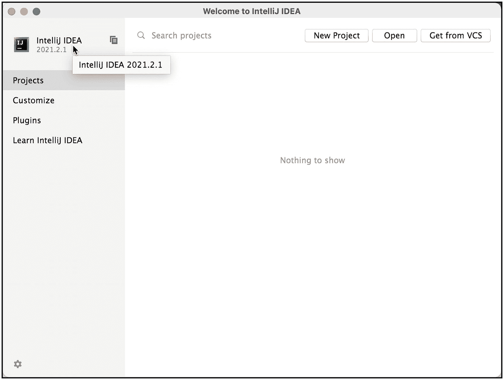
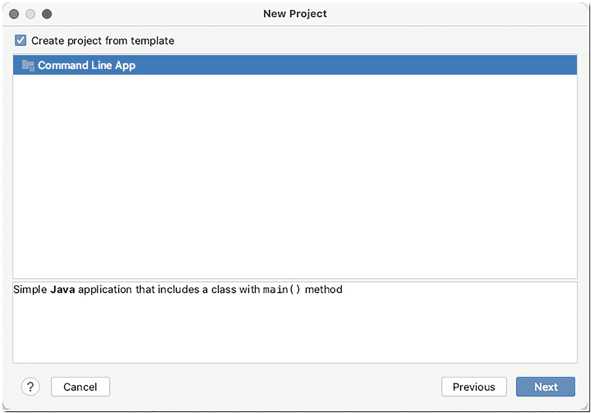
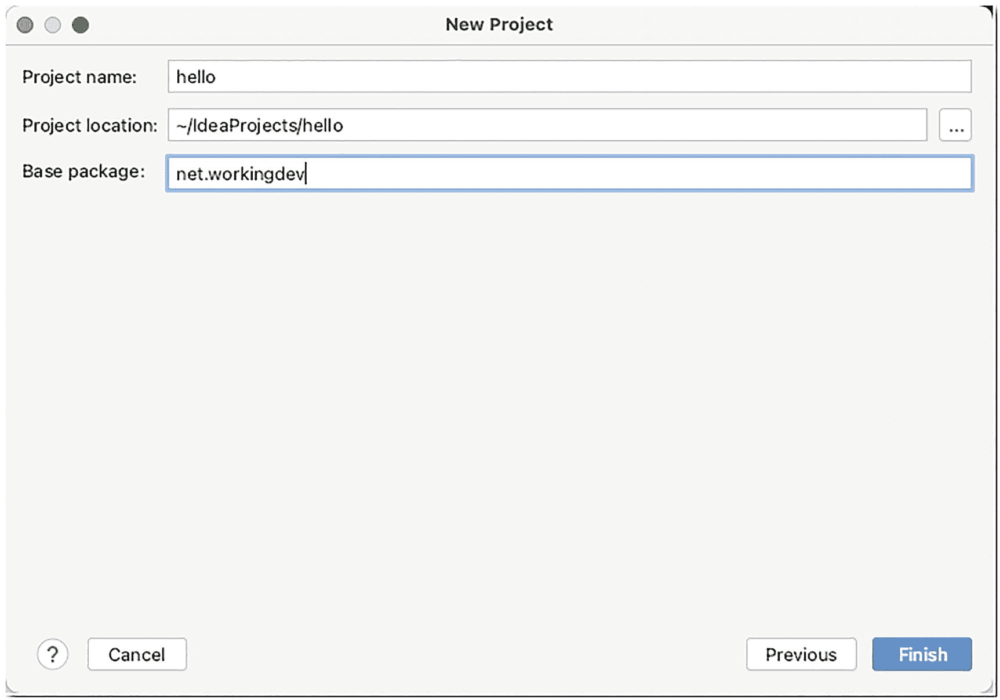
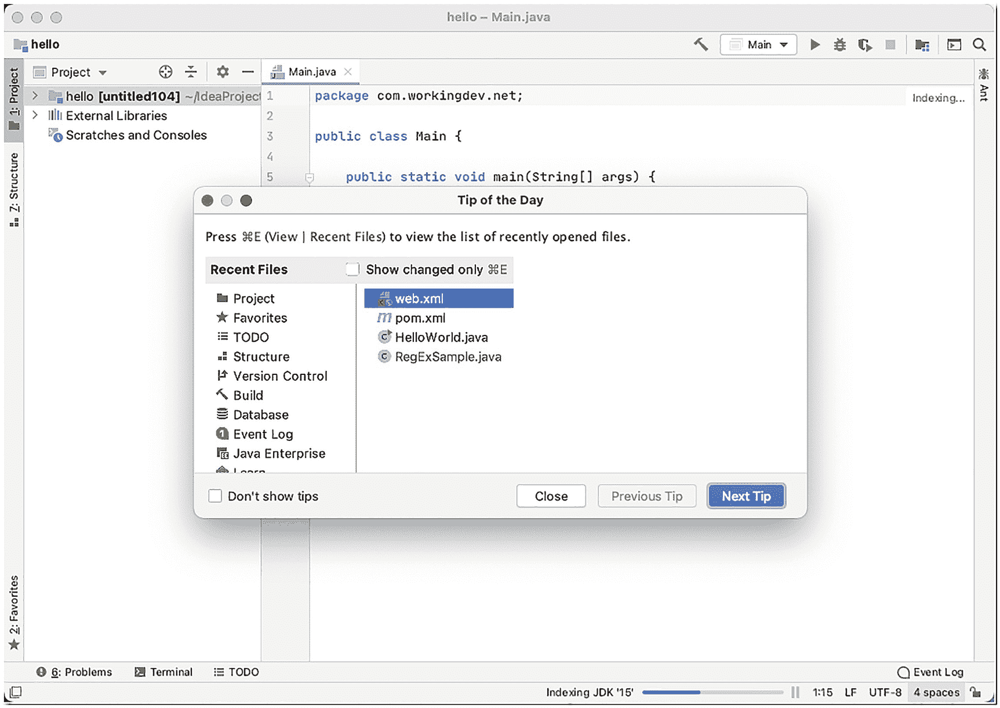
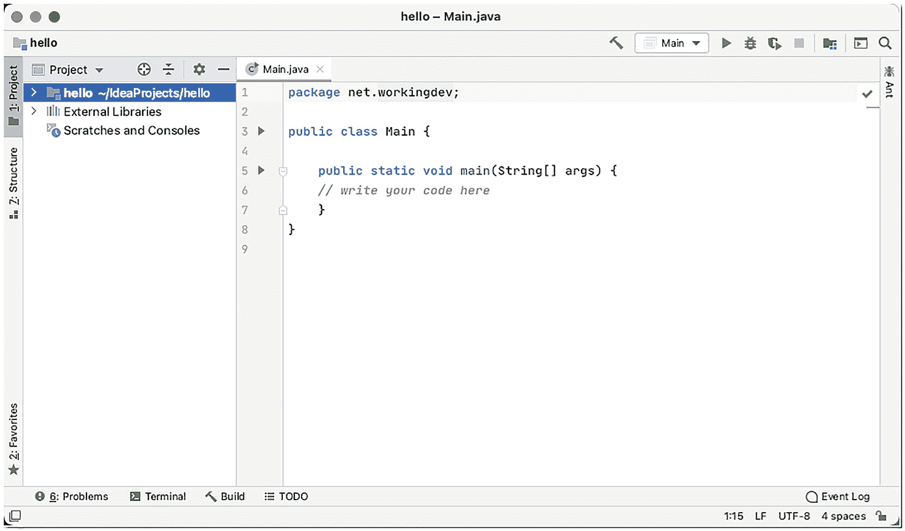
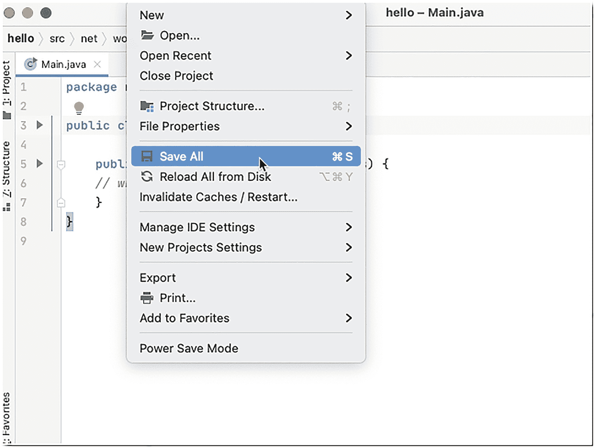
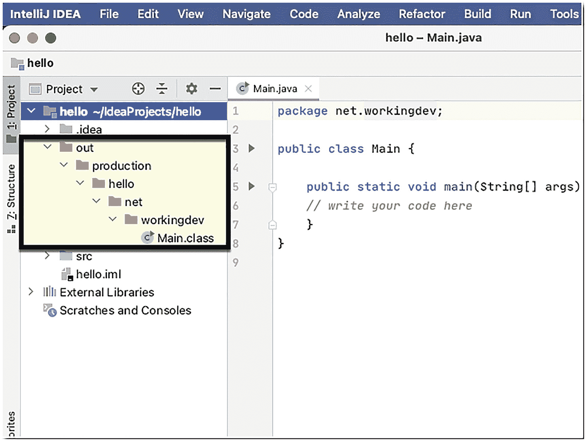
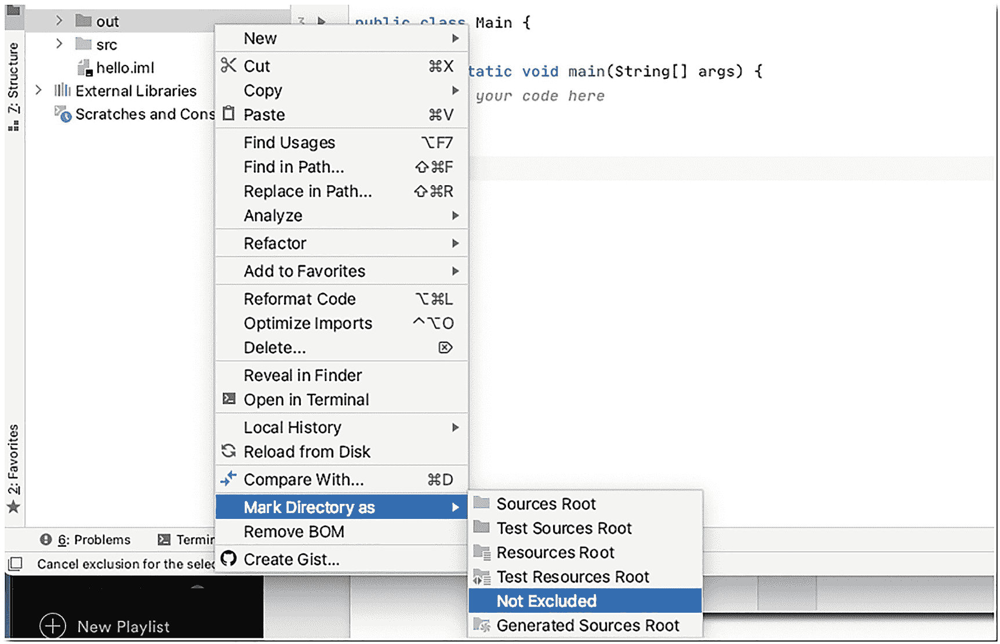
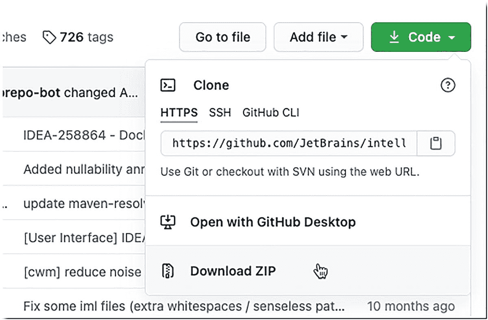
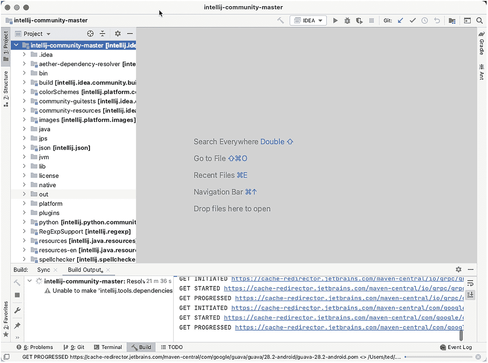

# 二、创建和运行项目

我们将在本章中介绍如下:

*   创建项目

*   建造它

*   运行它

您需要知道的基本任务是在 IntelliJ 中创建、构建和运行项目。这就是我们在本章要做的。

使用 IntelliJ 时，您需要习惯项目的概念，因为如果没有项目结构，您在 IntelliJ 中无法做很多事情。如果您想要构建一个应用程序，您需要创建一个项目并将源代码(和其他资产)添加到该项目中。

## 构建基本的 Java 项目

如果你还没有启动 IntelliJ，现在是时候了；打开后，您会看到欢迎窗口(如图 [2-1](#Fig1) 所示)。



图 2-1

欢迎来到 IntelliJ IDEA

突出显示的四个选项允许我们处理一个项目:

*   **新项目**——这个选项相当简单明了。它将让您从头开始创建一个项目。

*   **打开或导入**——这将让我们指向一个现有的项目，并让 IntelliJ 从该文件夹中引入所有工件。在此过程中，IntelliJ 将在加载项目时创建一个新的项目配置文件。

*   **从 VCS 获得**–如果你已经设置了版本控制(我们还没有)，你可以使用这个选项从像 GitHub、Bitbucket 或本地回购协议这样的回购协议中加载项目。

*   **搜索项目**–当你已经创建了几个项目时，在这个打开的屏幕上会有一个很长的列表。您可以使用“搜索项目”功能快速启动项目。

让我们创建一个新项目。选择**新建项目**。

你会看到**新建项目**对话框(如图 [2-2](#Fig2) )。


图 2-2

新项目

如您所见，IntelliJ 让我们可以使用 Kotlin、Groovy 和 Java 等编程语言来处理各种项目。我们将使用 Java。

如图 [2-2](#Fig2) 所示，IntelliJ 已经检测到我安装的 JDK；对我来说，是 JDK 15 号。如果您的机器中有多个 JDK 版本，您可以单击 Project SDK 下拉按钮(如图 [2-3](#Fig3) 所示)来选择您想要使用的 JDK。


图 2-3

新项目，项目 SDK

我将跳过“附加库和框架”部分，因为我现在不需要任何东西，然后单击下一步**。**

在接下来的窗口中，IntelliJ 允许您从模板创建一个项目(如图 [2-4](#Fig4) 所示)。



图 2-4

新项目，模板

我会选择一个**命令行 App** ，然后点击**下一个**。

在下一个窗口中，我们将输入项目的名称、包和位置，如图 [2-5](#Fig5) 所示。



图 2-5

项目名称、位置和包

这是一个“Hello World”项目，所以我将使用“Hello”作为**项目名称**。

**项目位置**显示 IntelliJ 将存储项目文件的位置。IntelliJ 显示项目文件的默认位置，但是如果您希望将其存储在不同的位置，您可以更改它—如果您希望这样做，请单击省略号(带有三个点的按钮)。

**基础包**将指定您将在项目中创建的类的名称空间。

对名称、位置和包满意后，单击**下一步**继续。

IntelliJ 开始创建你的闪亮的新项目，在随后的窗口中，它显示了**Main.java**文件(如图 [2-6](#Fig6) )。



图 2-6

Main.java，与“日积月累”

第一次在 IntelliJ 中创建项目时，会弹出 TOD(每日提示)对话框，并且它会在每次启动 IDE 时一直显示，除非您勾选了**不显示提示**复选框。我只是把托德留在那里——因为小费给得太多了。您可以点击**关闭**按钮退出对话框。

现在可以看到我们的主程序了(图 [2-7](#Fig7) )。



图 2-7

Main.java

编辑**Main.java**以匹配清单 [2-1](#PC1) 中显示的代码。

```java
package com.workingdev.net;

public class Main {

    public static void main(String[] args) {
        System.out.println("Hello World");
    }
}

Listing 2-1Main.java

```

完成后，您可以通过进入主菜单栏，然后进入**文件** ➤ **全部保存**来保存更改，如图 [2-8](#Fig8) 所示。或者，您可以使用键盘快捷键来保存文件:



图 2-8

全部保存

*   `cmd + S` (macOS)

*   `CTRL + S` (Linux 和 Windows)

IntelliJ 中一个很好的省时工具 Eclipse 中没有——是打开“自动保存”的选项。你可以在首选项(macOS)或者设置(Linux/Windows)中打开这个功能，然后进入**外观和行为** ➤ **系统设置** ➤ **自动保存**(如图 [2-9](#Fig9) )。


图 2-9

首选项|自动保存

下一步是构建项目。你可以从主菜单栏中选择**构建** ➤ **构建项目**，如图 [2-10](#Fig10) 所示。


图 2-10

构建项目

当构建完成时，你会注意到在**项目工具**窗口中会出现一个名为 **out** 的新橙色文件夹(如图 [2-11](#Fig11) )。



图 2-11

项目工具窗口中的 **out** 文件夹

**out** 文件夹包含生成的类文件。 **out** 文件夹被标记为橙色，因为它被排除在项目之外——它毕竟是生成的代码，所以它是有意义的。

您可以用不同的方式标记文件夹。如果你想更深入地探索它，尝试使用 **out** 文件夹上的上下文菜单，然后选择标记目录(如图 [2-12](#Fig12) )。



图 2-12

将目录标记为

你现在不需要做任何改变。我只是想指出 IntelliJ 在标记文件夹方面能做些什么。如果您向项目中添加一些临时资源，但这些资源不一定是项目的一部分(如输出目录)，或者当您创建测试根文件夹时(单元测试时)，这可能会很方便。

下一步是运行程序。进入主菜单栏，然后进入**运行** ➤ **运行主**，如图 [2-13](#Fig13) 所示。


图 2-13

奔跑

IDE 底部弹出输出窗口(如图 [2-14](#Fig14) 所示)并打印我们程序的结果。


图 2-14

Hello World 输出

给你。这就是如何在 IntelliJ 中创建和运行 Java 项目。

## 建设大型项目

在这一节中，我将向您展示 IntelliJ 如何处理大型项目。你不必跟着来。事实上，我建议您不要这样做，因为我们还没有能力解决导入重要项目所带来的问题。

我要做的是从 GitHub home repo 下载 IntelliJ IDEA CE 的源代码(如图 [2-15](#Fig15) ) [`https://github.com/JetBrains/intellij-community`](https://github.com/JetBrains/intellij-community) 。这个项目是巨大的。已经分叉了三千八百次；它有 320 个分支机构和 614 个贡献者。这不是一个微不足道的项目。


图 2-15

IntelliJ 在 GitHub 上休息

我将通过点击“代码”按钮下载项目(如图 [2-16](#Fig16) )。我去拿压缩文件。



图 2-16

下载 ZIP

我将解压压缩文件，然后在 IntelliJ 中打开它。“Hello World”项目仍然在我的机器中打开，所以我将进入主菜单栏，然后进入**文件** ➤ **打开**，然后指向我解压缩压缩文件的目录。

IntelliJ 将加载项目的所有工件并创建新的配置。在这个过程中，我需要解决一些冲突，如版本，SDK 设置等。；但是一旦完成，来自 GitHub 的 IntelliJ 项目将被加载。

我将构建项目，就像我们如何构建“Hello World”项目一样。IntelliJ 忙于构建项目(如图 [2-17](#Fig17) 所示)。



图 2-17

IntelliJ 项目加载到 IntelliJ 中

这不会是一个短暂的过程。这要花一点时间，足够我喝点咖啡，吃点快餐了。

当它最终完成时，我将运行这个项目， *et voila* ，我将再次看到 IntelliJ 的欢迎窗口——我不会再向您展示它了，因为您已经看过了。

## 关键要点

*   从头开始创建项目非常简单。您可以从“欢迎”窗口执行此操作。

*   您可以将现有项目加载到 IntelliJ 中；只需使用欢迎窗口中的打开选项，并指向现有项目的文件夹。

*   IntelliJ 是一个非常有能力的 IDE 它可以处理大型项目——这就是我向您展示如何从 IntelliJ 内部构建 IntelliJ IDE 本身的原因。如果 IntelliJ 能处理这么大的项目，我打赌它也能处理你的项目。