# 四、IDE 工具

在本章中，我们将介绍以下内容:

*   项目工具窗口

*   导航栏

*   结构工具窗口

*   临时文件

*   待办事项

*   问题工具窗口

*   末端的

*   主要编辑

IntelliJ 是一个健壮的 IDE。虽然它很快，但它并不完全是轻量级的——这是有充分理由的。它的功能非常丰富。在这一章中，我们将看看一些最常用的 IntelliJ 工具。

## IDE

让我们先熟悉一下 IDE。图 4-1 显示了你可能最常使用的 IDE 的一些部分。


图 4-1

IntelliJ IDEA(项目已打开)

<colgroup><col class="tcol1 align-left"> <col class="tcol2 align-left"></colgroup> 
| -什么 | **主菜单栏**–这是导航 IntelliJ 的主要方式，但这里的大多数项目都有键盘快捷键，所以知道这些快捷键是有好处的，尤其是对于你经常使用的命令。JetBrains 在其网站上维护了一个页面，列出了最常用的键盘快捷键；你应该把它做成书签——或者更好，把它打印出来贴在你的笔记本上，别在你的公告板上，等等。下面是链接: [`www.jetbrains.com/help/idea/mastering-keyboard-shortcuts.html`](http://www.jetbrains.com/help/idea/mastering-keyboard-shortcuts.html) 。 |
| ➋ | **导航条**–该导航条是动态的。当你进行一项操作时，它会在这里留下你的脚印，就像一些网站上的面包屑一样。如果你想追溯你的步骤，这是非常有用的。 |
| ➌ | **工具栏**–在这里你可以找到最常见的开发任务，例如，运行应用程序、调试应用程序、搜索、设置等。 |
| -你好 | **编辑窗口**——节目的明星。这是你做编码工作的地方。当您启动一个文件(从项目工具窗口)时，IntelliJ 会在这里打开它进行编辑。 |
| ➎ | **项目工具窗口**–您可以在这里浏览您的项目。您可以从该窗口启动任何项目文件。 |
| ➏ | **工具窗口栏**–它沿着 IDE 的周边运行。如您所见，它包含了启动特定工具窗口所需的各个按钮，如收藏夹、结构、问题、待办事项、终端等。 |
| -好的 | **显示/隐藏工具窗口**–显示或隐藏工具窗口栏。这是个开关。 |

## 项目工具窗口

在主编辑器窗口旁边，项目工具窗口可能是您花费大量时间的地方。此窗口显示项目的各种视图。它还允许您在项目中添加、移除或重新定位项目。项目工具窗口是将项目文件启动到主编辑器窗口的主要方式；双击它，它就会弹出来供编辑。

图 4-2 显示了带有默认项目视图的项目工具窗口。

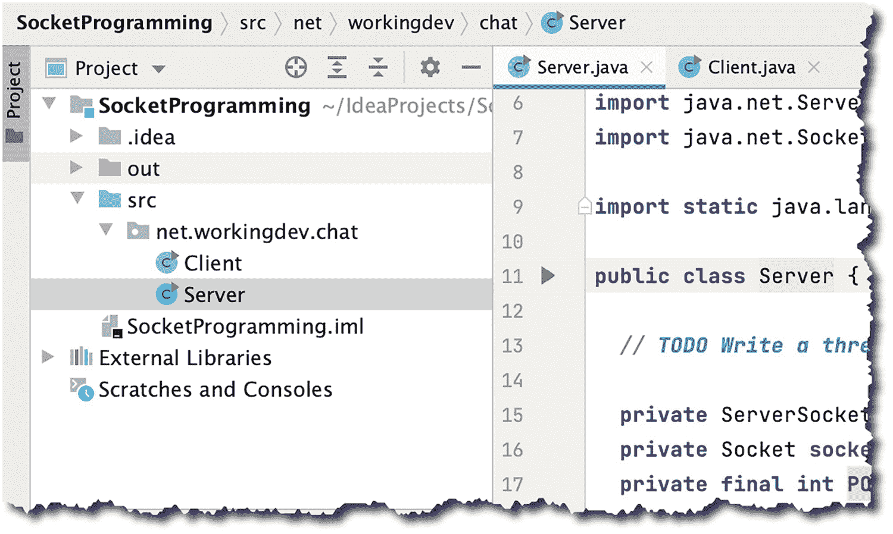

图 4-2

项目工具窗口

如果主编辑器窗口需要更多的屏幕空间，可以通过点击工具窗口栏上的按钮隐藏项目工具窗口(如图 4-3 )。

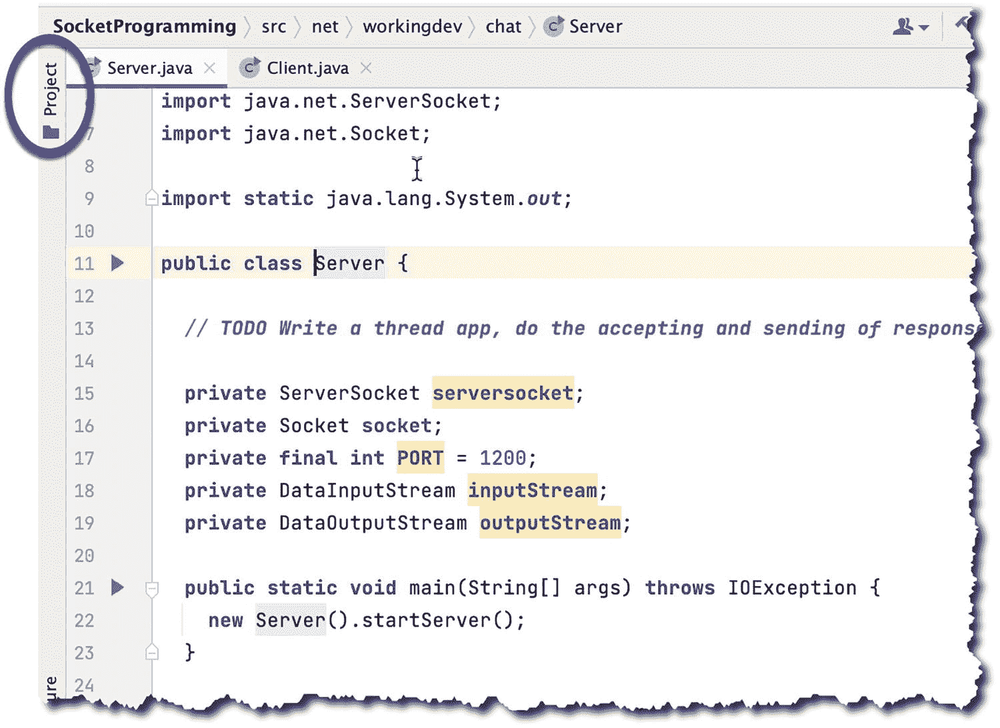

图 4-3

项目工具窗口，隐藏

默认情况下，项目工具窗口使用项目视图显示文件；这个视图向我们展示了项目中的所有文件——甚至是那些与我们的代码不直接相关的文件，例如,**。想法**文件、 **iml** 文件等。您可以通过点击**项目视图**下拉菜单(如图 4-4 所示)然后选择“包”来改变这个视图，只显示与我们的应用程序代码直接相关的文件


图 4-4

切换到包视图

图 4-5 显示了“包”视图上的项目工具窗口。现在我们只能看到代码包中的代码——其他什么也看不到。

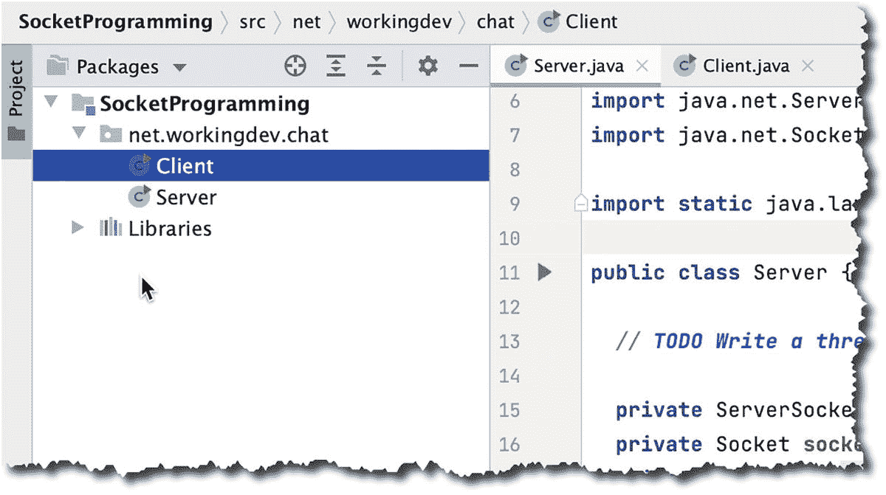

图 4-5

项目工具窗口，在包视图中

当您单击下拉菜单来更改项目工具窗口的视角时，您可能已经注意到还有其他选项，如打开文件、测试、划痕和控制台。

项目工具窗口视图的其他选项(简要)解释如下:

*   如果您创建了任何单元测试类，那么当您选择这个视图时，它们就会显示出来。

*   **打开的文件**–显示主编辑器中所有打开的文件。

*   **scratch and Consoles**–显示你所有的 scratch 文件。

## 结构工具窗口

项目工具窗口的正下方是结构窗口。正如您可能已经从它的名字中猜到的，它显示了类(和接口)的结构。

结构窗口的内容反映了项目工具窗口中当前选中的类或接口的结构，如图 4-6 所示。

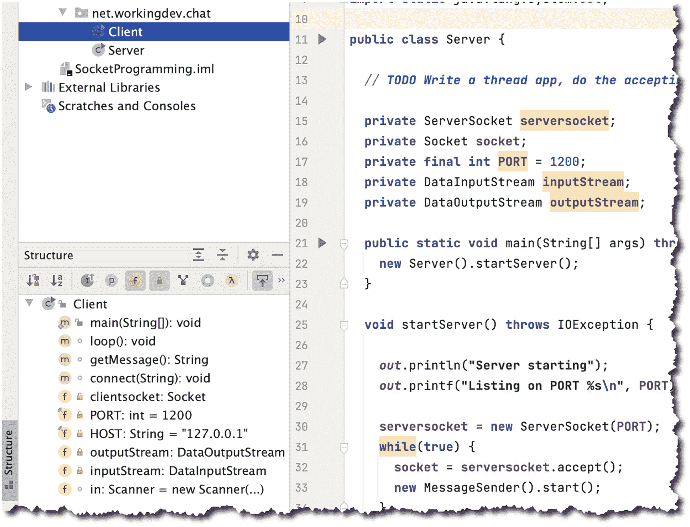

图 4-6

结构工具窗口

结构窗口显示所选类的所有字段(成员变量)、方法、lambdas 和属性。它甚至会告诉你类成员是否被继承。

结构窗口是导航您的类的有用工具，尤其是当您的类变得更加复杂时。

## 导航栏

导航栏未被充分重视。许多程序员认为这个工具只是一个美化了的面包屑——好吧，它确实是某种面包屑机制，但不仅仅如此。您可以通过导航栏真正导航整个项目，就像您使用项目工具窗口导航一样。

面包屑中的每个项目都是可导航的；如图 4-7 所示，当我们点击“套接字编程”(项目名称)上的面包屑时，它会显示项目上的其他文件和文件夹——就像在项目工具窗口中一样。

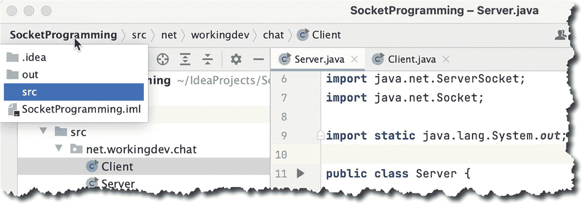

图 4-7

导航栏显示项目级别的下拉列表。

图 4-8 显示了显示包装内容的导航栏。


图 4-8

显示包级别下拉列表的导航栏

图 4-9 显示了显示类成员的导航栏，就像在结构窗口中一样。

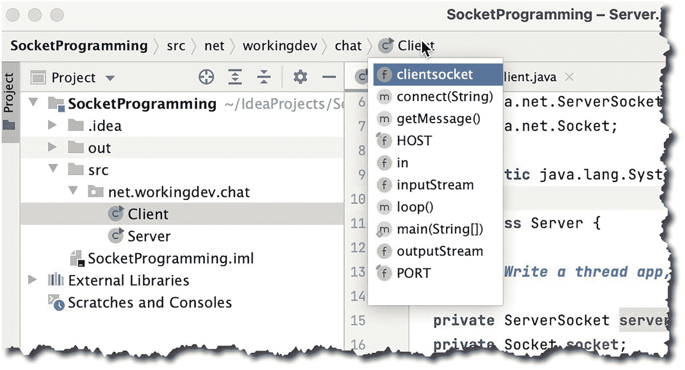

图 4-9

导航栏显示课程级别的下拉列表

## 临时文件

这个名字泄露了秘密。草稿文件可让您为项目创建草稿。这是一种写下东西或跟踪事情的便捷方式，但是您不确定是否希望这些代码成为项目的一部分。

您可以使用“Scratches and Consoles”(在项目工具窗口中)上的上下文菜单创建一个 scratch 文件；点击**新建** ➤ **暂存文件**(如图 4-10 )。

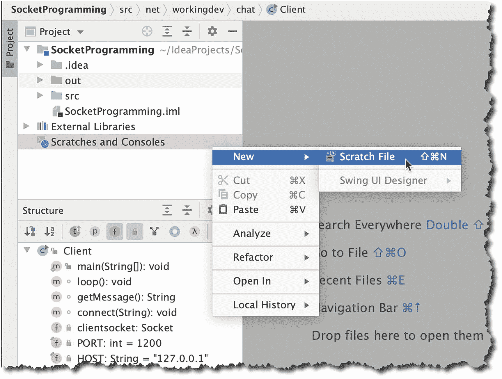

图 4-10

创建新的暂存文件

在随后的弹出窗口中，选择您想要创建的暂存文件类型；您可以从各种类型中进行选择，例如，Java 文件、HTML、JSON 等。(如图 4-11 所示)。

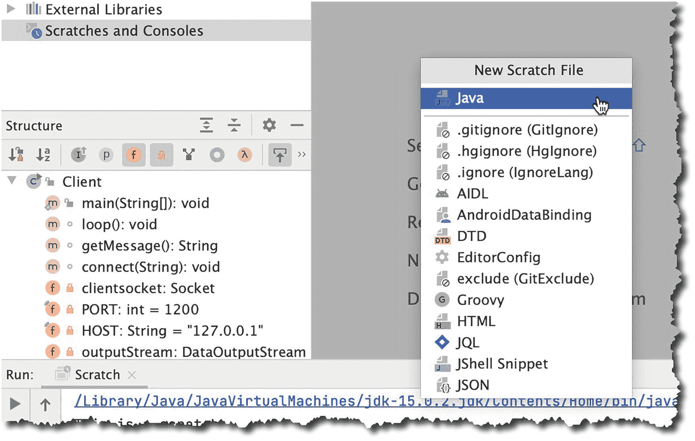

图 4-11

新暂存文件

您可以编译 Java 临时文件(并运行它们),就像您编译并运行实际上是项目一部分的 Java 文件一样；参见图 4-12 。


图 4-12

暂存文件，编译并运行

您可以很容易地更改暂存文件的文件格式；只需右键单击暂存文件，选择“覆盖文件类型”，然后选择新的文件类型。

## 待办事项

待办事项是对你自己(或团队其他成员)的指示。这是一个提示，提醒你做特定的事情或者在特定的类上实现特定的特性。

你可能认为这没什么大不了的；毕竟所有的编程编辑都可以这么做吧？是也不是。是的，因为所有的编辑器都允许你写待办事项提醒。只需在 TODO 项前面加上注释字符，然后写下 TODO。就像这样:

```java
// TODO Write a thread app, do the accepting and responding of msgs there

```

后面跟单词 TODO 的单行注释应该可以达到这个目的。这没什么，但 IntelliJ 的亮点在于它如何将你所有的待办事项收集在一个地方。

点击待办事项工具窗口(如图 4-13 所示)查看整个项目的所有待办事项。


图 4-13

整个窗口

“待办事项”窗口显示分散在项目文件中的所有待办事项。此外，如果双击任何 TODO 项，IntelliJ 将在主编辑器中打开包含 TODO 注释的文件。

## 问题

“问题工具”窗口显示整个项目中的所有问题和警告项。起初，您可能看不到问题工具窗口的价值，因为 IntelliJ 做了一项出色的工作，无论何时您搞砸了一个语法，它都会告诉您(似乎就在您的面前)——您会看到红色的卷线。但是这个窗口真正的亮点是在警告方面。在 IntelliJ 中，警告并不重要。只有当你的鼠标停留在一行代码(IntelliJ 认为它可以改进)上时，你才会意识到它们，然后你会看到一个黄色的灯泡——如图 4-14 所示。


图 4-14

IntelliJ 警告

否则，你甚至不会意识到这些警告。

“问题工具”窗口显示项目中的所有错误和警告。所以，如果你想全部看到，只需点击工具窗口栏中的“问题”按钮(如图 4-15 )。

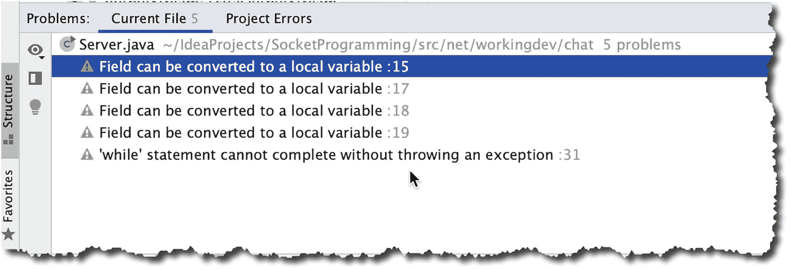

图 4-15

问题工具窗口

单击问题工具窗口中的任何警告(或问题)项，会在主编辑器窗口中显示相关文件。

## 末端的

“终端工具”窗口打开时，是一个可以在 IntelliJ 中使用的实际终端。许多程序员使用这个工具，因为在键盘上打字仍然比用鼠标搜索和啄快。如果您非常熟悉 CLI 命令，您会喜欢终端窗口。它在 IDE 的底部弹出(并隐藏)，如图 4-16 所示。

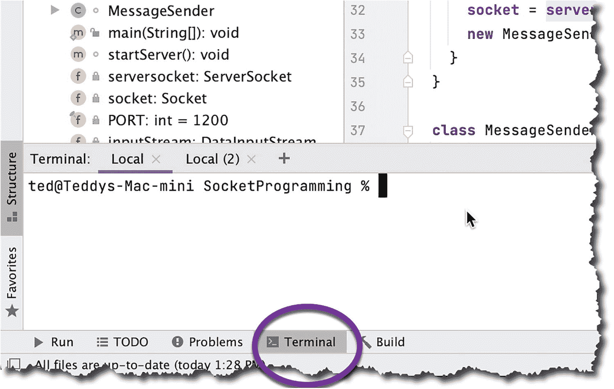

图 4-16

终端窗口

当您打开终端窗口时，IntelliJ 会直接将您带到项目目录。没有必要 CD 到~/idea projects/name your project——仅仅是为了这个行为，我就不再使用我的原生终端工具了。我只使用 IntelliJ 中的终端。

您可能想要使用“终端”窗口的一些原因:

*   如果你是一个命令行忍者，你喜欢做你的 Git 推送，存储，提交，添加等。，但是您不想离开 IDE，那么终端就非常适合您。

*   您可能需要在 Maven 或 Gradle 上运行一些命令。

*   你运行的是 MongoDB (mongod 和 mongo)。您可以在 IDE 中创建多个终端会话，这非常适合这些任务。

## 主编辑器窗口

主编辑器窗口占据了最大的屏幕空间，这是创建和编辑代码的地方。

您可能不需要使用主编辑器窗口的说明；毕竟很直观。您可以在使用它的过程中了解它的功能，但我还是想指出一些事情。首先，主编辑器允许您折叠代码的各个部分。当你点击房屋形状的五边形时(如图 4-17 所示)，代码的各个部分将会折叠。如果你点击同一个五边形，它会展开。当你审计你的代码时，这是一个很好的工具。

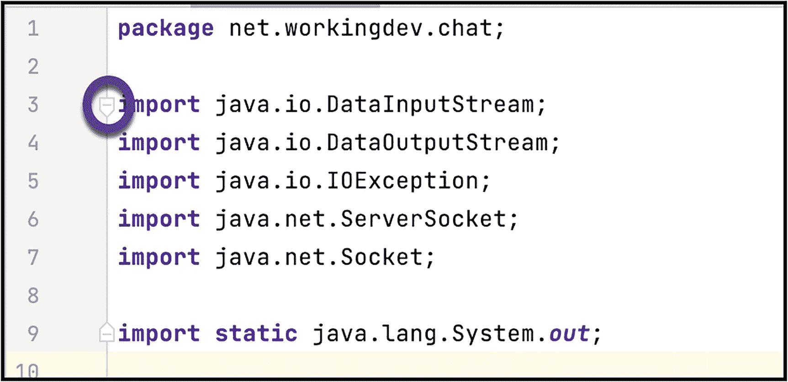

图 4-17

代码折叠

接下来，当你正在编辑一个有 runnable main 方法的类时，编辑器栏上的 Run 按钮就会出现(如图 4-18 所示)。单击此按钮将允许您运行您的类，就像单击工具栏上的运行按钮一样。

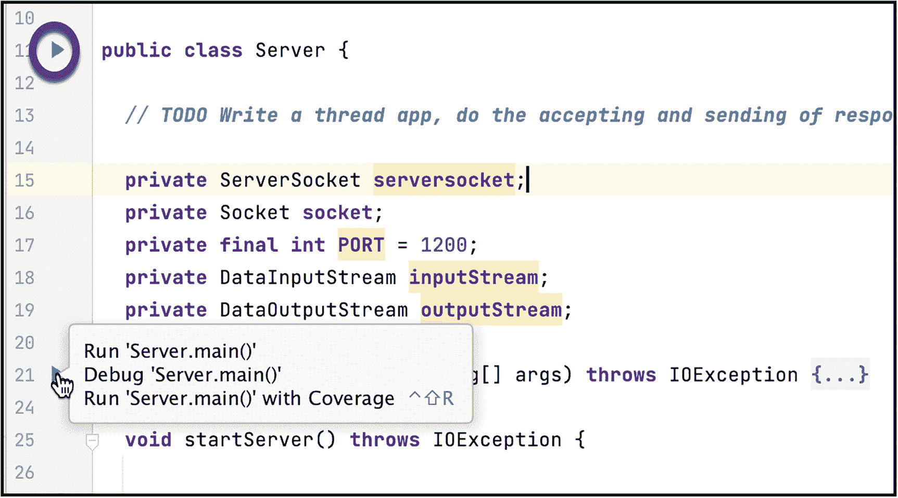

图 4-18

编辑器栏上的运行按钮

接下来是编辑窗口右上角的警告图标(如图 4-19 )。IntelliJ 显示项目中发现的所有问题的摘要。单击警告摘要会打开问题工具窗口。

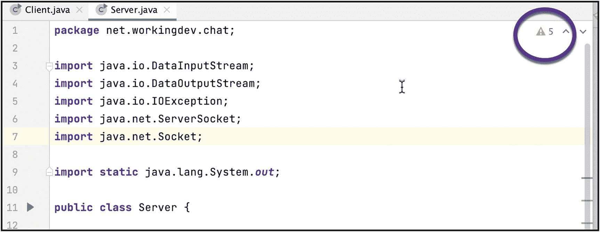

图 4-19

右上角的警告图标

接下来是 GUI 编辑器。你可能会使用 GUI 组件、Android 应用程序(如图 4-20 所示)或 JavaFX 应用程序(如图 4-21 所示)来处理项目。不管是什么情况，IntelliJ 都会保护你。它有所见即所得的能力来完成工作。

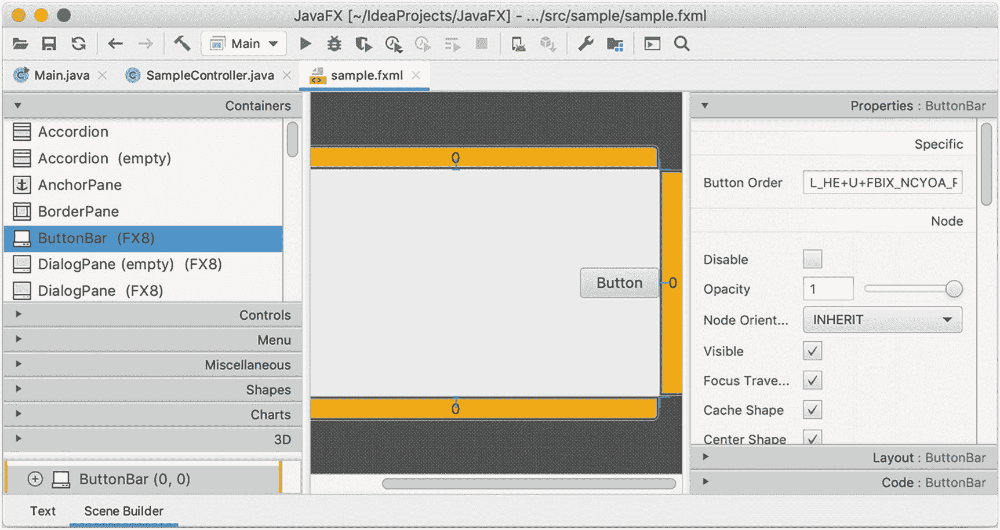

图 4-21

JavaFX 场景生成器

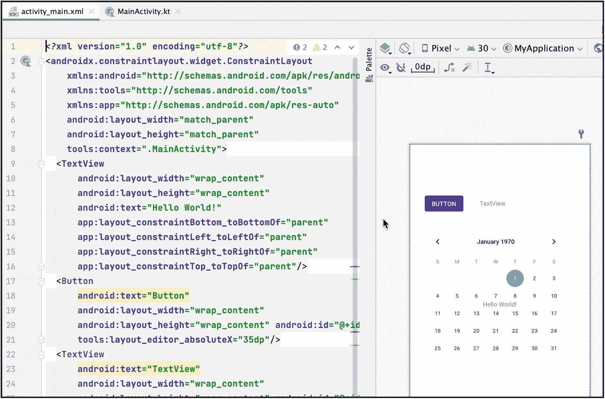

图 4-20

Android 项目

## 关键要点

*   IntelliJ 不是一个简单的程序编辑器。这是一个全面的集成开发环境，加载了许多有用的功能。

*   在 IntelliJ 中导航项目文件的方法不止一种。导航项目文件的主要方式是通过项目工具窗口，但也可以通过导航栏来完成。

*   IntelliJ 的 TODO 功能简单易用；只需写一行注释，后跟单词 TODO，就可以开始了。当您单击工具窗口栏中的待办事项工具窗口时，可以看到所有待办事项。

*   用 IntelliJ 的集成终端做一些 CLI 杂技；这里不需要 cmd、Terminal、iTerm 或 Terminator。

*   主编辑器窗口具有 GUI 编辑功能；当您使用 Android 项目或 JavaFX 项目时，这将非常方便。