# 六、检查和意图

在本章中，我们将介绍以下内容:

*   代码检查

*   意图

你使用 IntelliJ 已经有一段时间了。我很确定你已经看到了灯泡(红色和黄色)、带有感叹号的黄色三角形和下面带有一条曲线的绿色复选标记——这些是 IntelliJ 用来告诉我们代码有问题的图标。他们被称为检查图标。我们将在本章中讨论它们。

## 代码检查

IntelliJ IDEA 是智能的(双关语)；它比你更了解你的代码。当你打字时，它在后台努力工作，试图看到你弄糟了代码的哪些部分；在代码被修改的地方，IntelliJ 会给出警告信号——请注意，这一切甚至发生在你编译代码之前。如果 IDE 是哑的，它就不会被称为 IntelliJ。名不虚传。

代码检查是 IDE 的一项功能，它可以扫描、检测和纠正项目中的异常代码，甚至可以在编译之前进行。IDE 可以发现并突出显示各种问题。它可以定位死代码，发现拼写问题(比您希望的更多)，并改进整体代码结构。

IntelliJ 可以发现的问题从良性到严重都有，比如尾部的分号(如图 [6-1](#Fig1) 所示)。黄色灯泡表示警告；它们是良性的，因为它们不会阻止你编译，但是 IntelliJ 警告你，因为代码不是最佳的。


图 6-1

IntelliJ 标记尾部分号

其他时候，你会看到一个红色的灯泡(如图 [6-2](#Fig2) 中的灯泡)。


图 6-2

红色灯泡，表示有错误

红色灯泡是错误标志。您需要对有问题的代码进行更改，以免您的项目无法编译。

### 解决检查问题

最容易处理的检查是那些相当明显的检查，例如，不可及的语句，如图 [6-3](#Fig3) 所示。

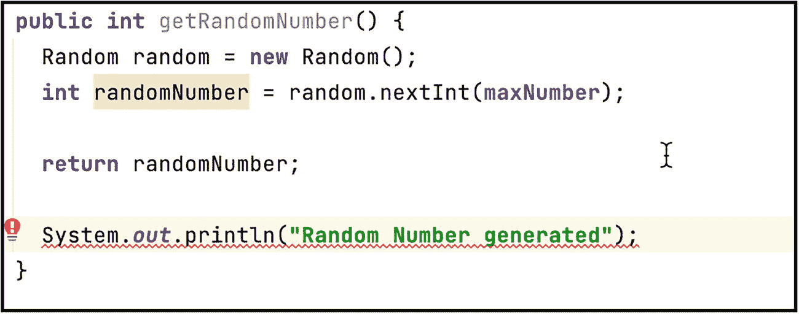

图 6-3

不可达语句

最后一条 *println()* 语句下面的红色曲线清楚地表明您的代码有问题。假设你按下 **option + ENTER** (macOS)或者 **Alt + ENTER** (Windows 和 Linux)，IntelliJ 的快速修复就开始了。IDE 向您展示您可能想要采取的检查操作，以便您可以解决问题，如图 [6-4](#Fig4) 所示。

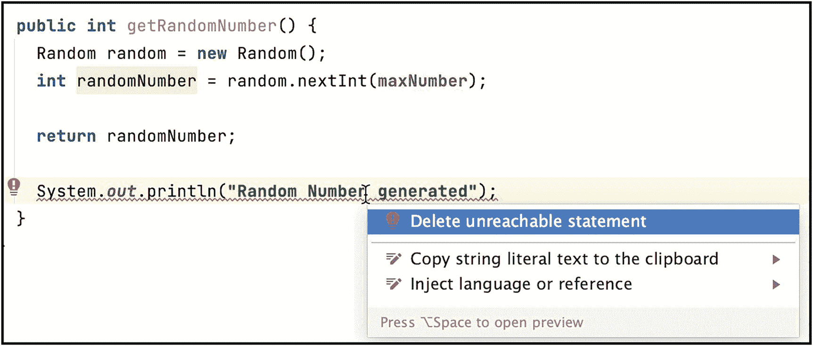

图 6-4

检查行动

在我们的例子中，操作很简单；只需*删除不可及的语句*，如果你选择，问题立即消失——但这是显而易见的；当然，您可以看到 *println()* 是无法到达的。你不需要为此检查。让我们试试另一个。

看看你能不能认出这个。在图 [6-5](#Fig5) 的第 6 行，我给**打了个电话。** **AnotherMethod()** 和 IntelliJ 通过用红色波浪线给这个的*调用加下划线来升起一面旗帜。你能说出原因吗？*

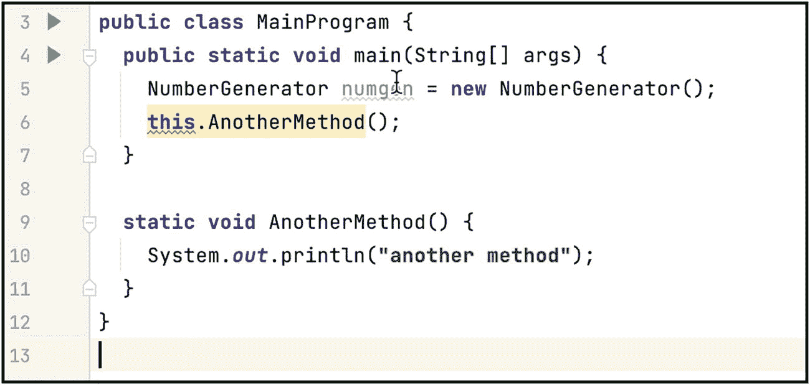

图 6-5

对另一个方法()的非静态调用的检查操作

在我们的例子中很容易发现错误，因为它是一段很短的代码，但是当您的源文件已经有几百行长时，很容易忘记 *AnotherMethod()* 是静态的；这也是为什么把*叫做**的原因。*** *另一种方法()*进行标记。但是不要担心，让我们看看检查行动提供了什么。再次执行**选项+ ENTER** (或者如果您在 Linux 或 Windows 上，执行 **Alt + ENTER** )来显示检查操作。

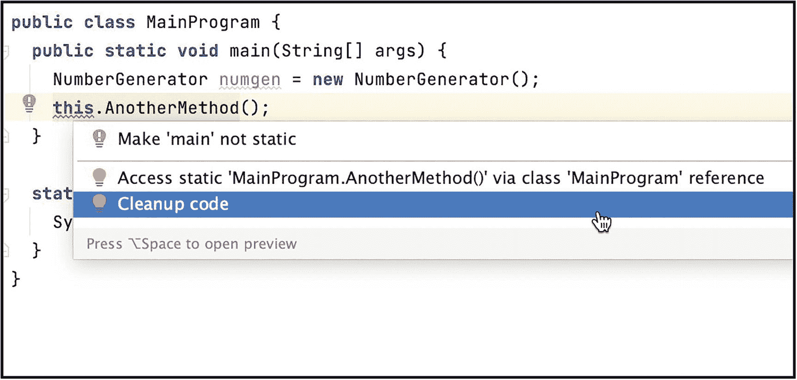

图 6-6

检验行动选项

检查中有几个建议:

*   **使主要的，而不是静态的**-这是不可行的。主方法必须是静态的。有时候，检查操作提供的选项没有帮助(也不正确)，这就是其中之一。

*   **进入静态主程序。AnotherMethod()via class main program reference**——这只是一种花哨的说法，“删除第 6 行中的 *this* 关键字，并简单地调用 another method()，而不使用自引用。”这将解决我们的问题。

*   **清理代码**–这将做与第二个(前面的)选项完全相同的事情。它将简单地删除没有自引用的调用 AnotherMethod()。大多数时候，这是正确的选择。所以，让我们选择这个，清单 [6-1](#PC1) 显示了结果代码。

```java
public class MainProgram {
  public static void main(String[] args) {
    NumberGenerator numgen = new NumberGenerator();
    this.AnotherMethod();
  }

  static void AnotherMethod() {
    System.out.println("another method");
  }
}

Listing 6-1The resulting code

```

大多数时候，检查操作非常简单，就像在代码中使用一个类型而没有先停下来导入它一样——为什么要这么麻烦呢？只需要一个 **Alt + ENTER** 就可以了(见图 [6-7](#Fig7) )。

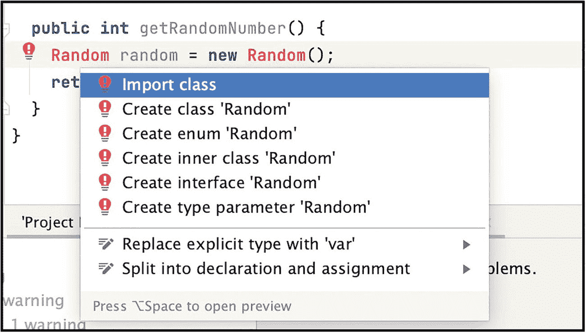

图 6-7

使用检查操作导入类

### 检验代码

IntelliJ 在我们键入时标记我们的错误；如果您希望在运行过程中得到次优代码的警告，这是非常方便的。IntelliJ 在后台实际检查整个项目的错误和警告。

IDE 会让您在浏览当前行时注意到错误(或警告),但是如果您想知道整个文件的错误/警告，您可以通过单击右侧的检查图标来做到这一点——它是编辑器右上角的小部件，显示当前文件中的问题数量(及其严重性)。如图 [6-8](#Fig8) 所示。


图 6-8

检查图标

如果点击 inspection widget，IntelliJ 会显示**问题工具窗口**(如图 [6-9](#Fig9) )。


图 6-9

显示问题工具窗口的主编辑器

“问题工具”窗口显示当前文件中所有问题的综合列表。你可以通过简单地点击问题列表上的每一项来逐一查看它们。

当您单击每个项目时，IDE 会将光标移动到发现问题的特定行；然后，您可以使用 **option + ENTER** (对于 Windows 和 Linux 为 Alt + ENTER)来选择一个修复(如图 [6-10](#Fig10) )。

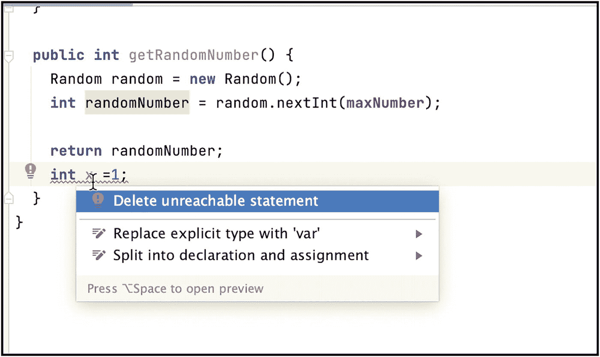

图 6-10

修复无法实现的语句

或者，您可以在问题工具窗口中使用每个问题项的上下文菜单(如图 [6-11](#Fig11) 所示)。

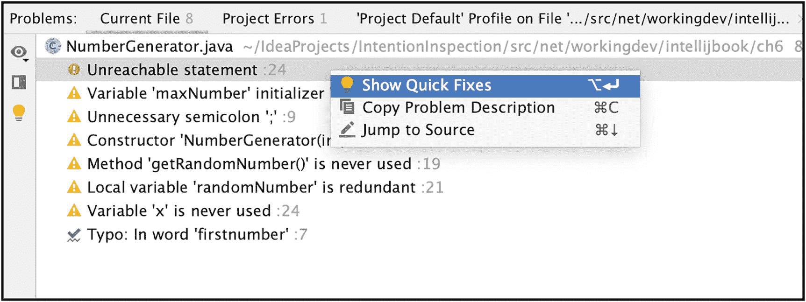

图 6-11

在问题工具窗口中使用上下文菜单

如果你选择“显示快速修复”，IntelliJ 会在问题工具窗口中显示快速修复的选项(如图 [6-12](#Fig12) 所示)；这样，您就不必返回到源文件来执行修复。这会节省你的时间。

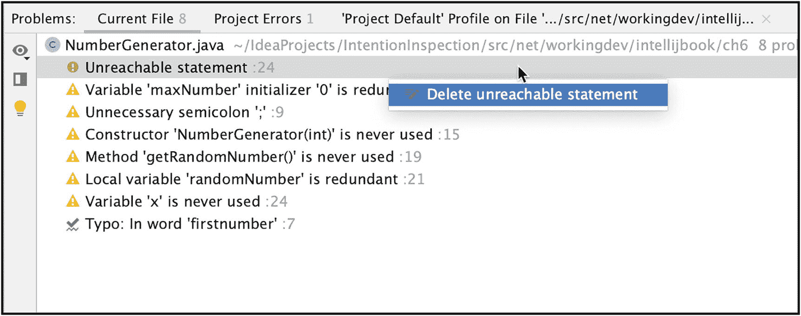

图 6-12

显示“快速修复”选项

当快速修复有多个选项时，IntelliJ 会向您显示选项，以便您可以滚动并选择合适的选项。在图 [6-13](#Fig13) 中，IntelliJ 试图提供帮助，并展示了它的建议，以修复它认为是一个打字错误——在我的例子中，我真的打算将它拼写为“firstnumber”IntelliJ 的词典中没有此项；这就是为什么它被标记为打字错误。我打算忽略它。

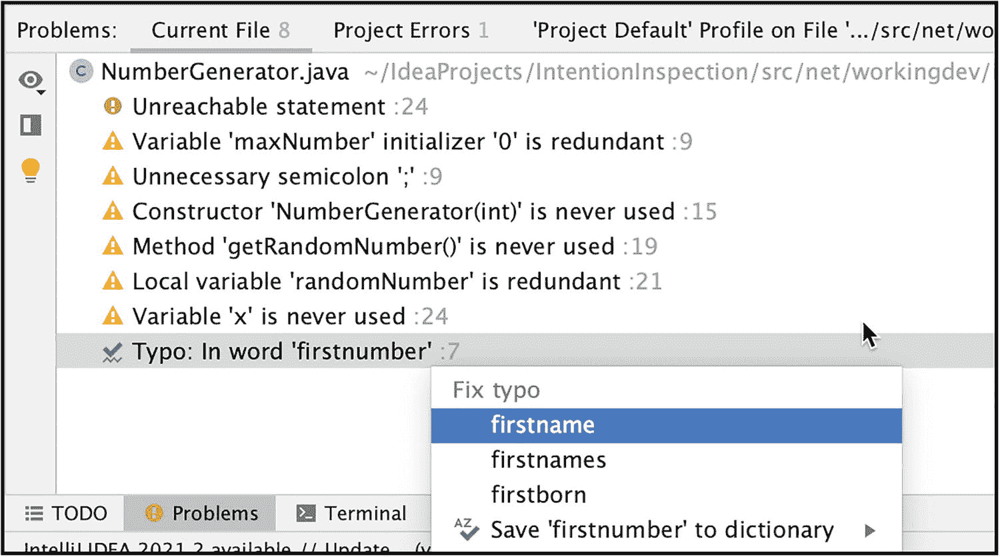

图 6-13

快速修复选项

导航问题列表中项目的另一种方法是拆分问题工具窗口的窗格。点击工具窗口的**分格** **图标**(如图 [6-14](#Fig14) )，可以在工具窗口看到程序源代码。可以使用常用的快速修复(**选项+回车**或者 **Alt +回车**)来修复问题。

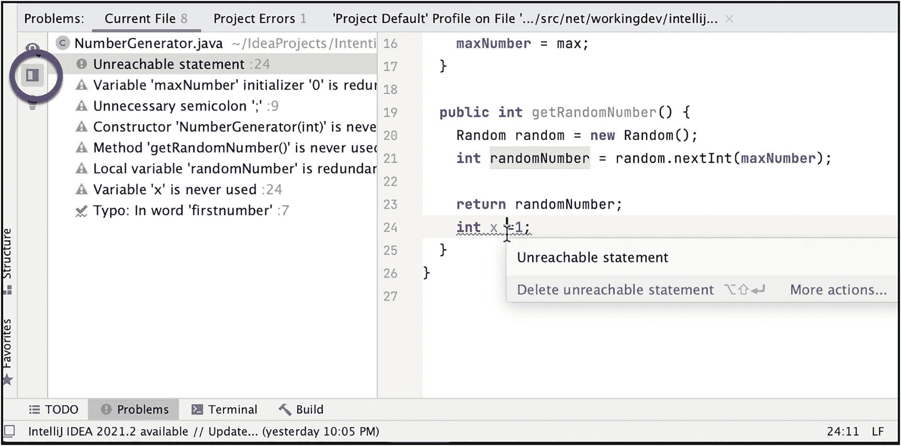

图 6-14

问题工具窗口的拆分窗格

IntelliJ 给了我们很多处理检查问题的方法。导航检查问题的另一种方法是将鼠标悬停在滚动条的条纹上(如图 [6-15](#Fig15) 所示)。

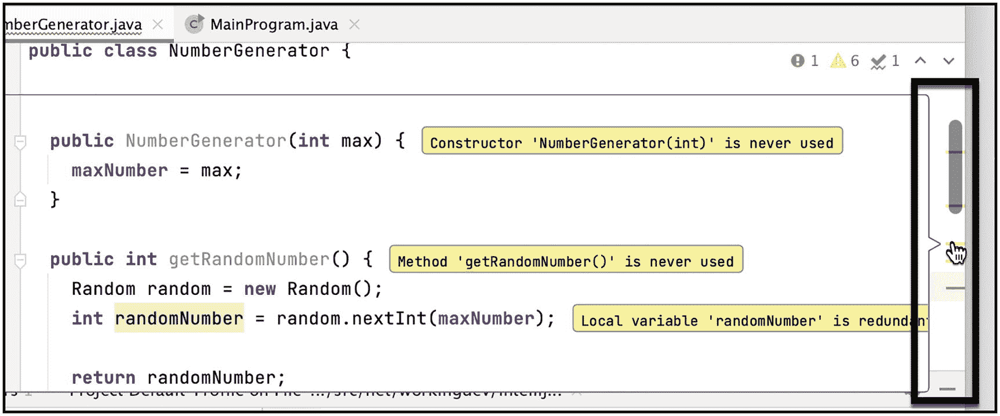

图 6-15

滚动条上的条纹

黄色条纹显示警告，红色条纹显示错误。当您将鼠标悬停在条纹上时，警告和错误会显示在弹出对话框中，检查会在标注气球中突出显示(这样您就可以很容易地发现它们)。

IntelliJ 不仅能让您轻松发现检查问题，还能让您轻松解决这些问题。从滚动条中，您还可以访问快速修复(如图 [6-16](#Fig16) 所示)。

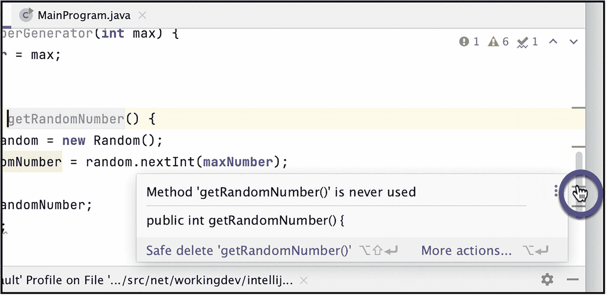

图 6-16

从滚动条快速修复

最后，您可以使用检测小工具的上下箭头键导航检测问题，如图 [6-17](#Fig17) 所示。


图 6-17

检测小部件的上下箭头键

如果您不喜欢使用鼠标，您可以使用 **F2** 或 **Shift + F2** 键跳过检查问题。

### 检查整个项目

您已经知道如何处理单个源文件中的问题；我们只需点击每个源文件上的检查小部件——任务完成。但是项目通常有多个源文件。如果您的项目有 100 个源文件，这是否意味着您需要单击检查小部件 100 次才能看到整个项目的问题？当然不是。IntelliJ 有办法对整个项目进行检查。

要对整个项目进行检查，进入主菜单栏，然后**分析** ➤ **检查代码**。或者，使用动作快捷键( **Shift + cmd + A** 或 **Shift + CTRL + A** )，然后选择*检查代码*，如图 [6-18](#Fig18) 所示。

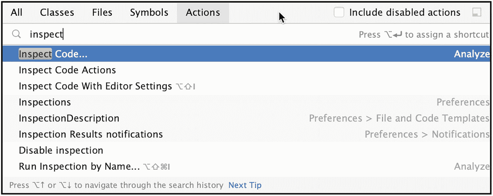

图 6-18

检查代码操作

无论哪种方式，都将进入*指定检查范围*对话框(如图 [6-19](#Fig19) )。


图 6-19

指定检查范围

选择“整个项目”来运行整个项目的检查。然后 IntelliJ 对整个项目运行检查扫描，并弹出问题工具窗口来显示检查问题的完整列表。如果你有一个大项目，这可能需要一些时间。

图 [6-20](#Fig20) 显示了问题工具窗口，其中列出了检查发现的所有问题。


图 6-20

整个项目的检查清单

问题是按类别组织的，而不是按位置(源文件)组织的。正如您在我们的小示例项目中看到的，它按类别列出了问题，如数据流、声明冗余、可能的错误和校对。

现在，您可以浏览每个问题，并使用各种解决方法来解决它们。

在可能的情况下，IntelliJ 以一组布局良好的按钮提供解决方案，如图 [6-21](#Fig21) 所示。如果你想使用这个或者你更愿意使用可靠的**选项+ ENTER** 快捷键，这完全取决于你。

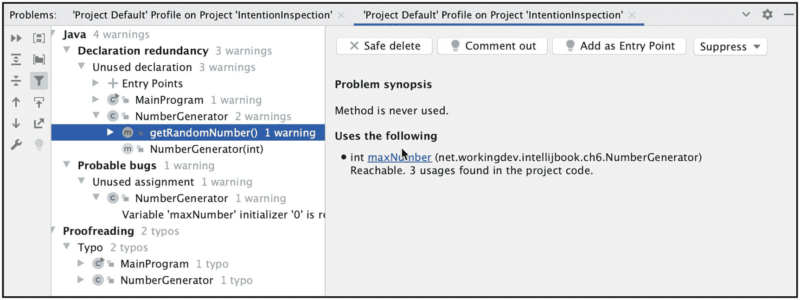

图 6-21

IntelliJ 提供了可能的解决方案。

## 意向行动

灯泡并不总是意味着你的代码有问题。IntelliJ 还使用黄色灯泡向您展示可以改进代码的地方。

让我们举一个简单的例子来说明如何使用意图动作。考虑图 [6-22](#Fig22) 中所示的以下代码。


图 6-22

打印时的意图

使用我们的快速修复快捷方式(option + ENTER 或 Alt + ENTER)，IntelliJ 为我们提供了几种改进代码的方法。正如你在图 [6-23](#Fig23) 中看到的，我们可以选择用 StringBuilder.append()或 MessageFormat.format()替换字符串表达式，或者用格式化的 printf()替换 println 选择哪一个完全取决于你的喜好。我偏向于 printf()选项，但这只是我自己。


图 6-23

我们 println 示例的意图操作

不是所有的意图行为都是有用的(或正确的，取决于你的上下文)。事实上，其中一些是彻头彻尾的讨厌，就像图 [6-24](#Fig24) 中显示的这个。


图 6-24

分割申报意向行动

它建议我们这样做。

```java
Random random;
random = new Random();

```

而不是这个；

```java
Random random = new Random();

```

这个建议在这种情况下没有意义。内联声明和定义更有意义。

幸运的是，您可以为任何意图定制行为。所以，让我们现在解决那个讨厌的分裂声明意图。

使用快速修复快捷键(option + ENTER 或 Alt + ENTER)，然后点击右箭头(如图 [6-25](#Fig25) )。


图 6-25

编辑意向设置

从这里，您可以禁用“拆分声明”意图或编辑意图设置；任何一种选择都会使意图行动沉默。IntelliJ 不会再用它来烦你了。但是，出于某种原因，您希望恢复意图操作，您可以在 IDE 的首选项或设置中这样做。这是在**编辑** ➤ **的意图**下的。使用到处搜索键盘快捷键(双 Shift)，然后输入“意图”(如图 [6-26](#Fig26) )。


图 6-26

弹出意图对话框的快捷键

在随后的对话框中，在意向对话框中查找“拆分申报项”，如图 [6-27](#Fig27) 所示。您可以使用意向对话框中的搜索文本字段来快速缩小选项范围。

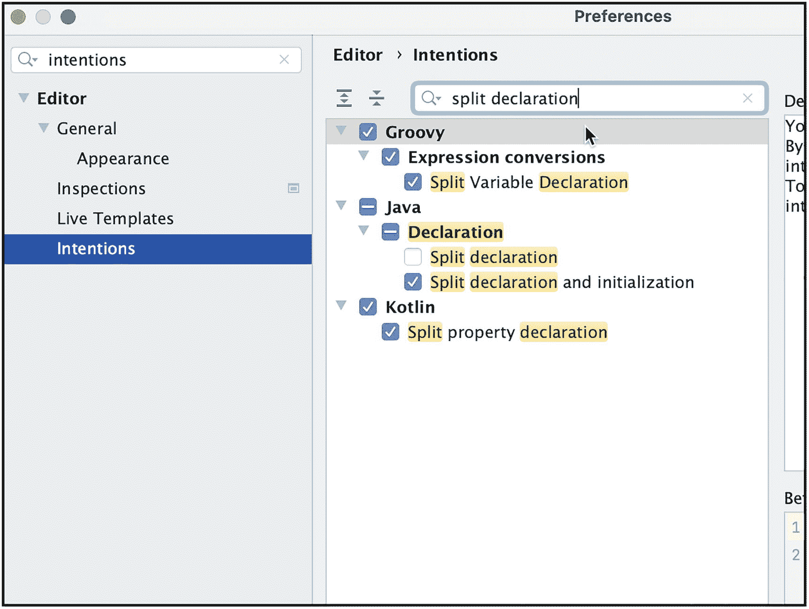

图 6-27

意向对话框中的拆分申报条目

如您所见，Split 声明被禁用了——因为我们不久前取消了它。当您在主编辑器或问题工具窗口中抑制一个意图时，该意图动作在首选项(或设置，如果您在 Linux/Windows 上)中被禁用。

使用**偏好** ➤ **意图**来定制 IntelliJ 在建议代码改进时的行为。如果你对某些意图感到恼火，就压制它们。

## 关键要点

*   注意编辑器的灯泡和曲线。当您看到它们时，意味着 IDE 发现了一些次优代码。

*   无论你在哪里看到灯泡或曲线，只要按下 option + ENTER(对于 Windows/Linux，按 Alt + ENTER)就可以快速修复。快速解决的捷径是你的朋友。

*   IntelliJ 并不总是正确的。有些建议对你来说可能没有意义。你可以在**偏好设置(或设置)** ➤ **编辑** ➤ **意图**中关闭它们。