# 十一、测试

在本章中，我们将介绍以下内容:

*   测试

*   单元测试

*   测试基础

*   如何在 IntelliJ 中设置

测试是开发过程中同样重要的一部分。如果你想让你的应用程序被任何重要的人使用(也许是付费用户)，那么这个应用程序不能有粗糙的边缘。它不能有任何重大或明显的错误。它需要经过验证和测试。

## 测试类型

测试有很多种；你将使用哪一个取决于你正在构建的应用程序的类型。如果你正在开发一款游戏，除了通常的功能、集成、开发者和用户验收测试之外，你很可能会包括声音测试、浸泡测试、符合性或一致性测试。假设您正在构建一个企业电子商务系统。在这种情况下，除了漏洞测试之外，你很可能会在性能或压力测试上多花一点时间——测试种类很多。下面简单介绍一些常见的。

**功能测试**。功能测试是测试应用程序的标准方式。它被称为*功能*，因为我们正在测试应用程序的特性(也称为功能)，因为它们是在需求规范中指定的——需求规范是你或业务分析师在应用程序的规划阶段编写的。需求规格将被写在一个文档中(通常称为功能需求规格)。你可能在功能规范中发现的一个例子是“用户必须在进入应用程序之前登录到服务器”，“用户必须提供有效的电子邮件进行注册”，等等。测试人员，通常称为 QA 或 QC(分别是质量保证和质量控制的缩写)，是执行这些测试的人。他们将创建测试资产，制定测试策略，执行它们，并最终报告执行的结果。失败的测试通常被分配给开发人员(您)来修复和重新提交。我在这里描述的是一个开发团队的典型实践，这个团队有一个单独的或者专门的测试团队；如果你是一个人的团队，QA 很可能也是你。测试是一种完全不同的技能，我强烈建议你寻求其他人的帮助，最好是那些有测试经验的人，来帮助你。

**性能测试**。仅仅从它的名字，你就可以猜到这种测试是做什么的。它将应用推向极限，并观察它在压力下的表现。这里你想看到的是应用程序在高于正常水平的条件下是如何反应的。

**浸泡测试或耐久测试**。这是一种性能测试；通常，你会让应用程序长时间运行在各种操作模式下，例如，让应用程序在暂停时或在标题屏幕上暂停很长时间。你在这里试图找到的是应用程序如何响应这些条件，以及它如何利用系统资源，如内存、CPU、网络带宽等。；您最有可能使用应用程序分析器来执行这些测量。

**音量测试**。这是另一种形式的性能测试；如果您的应用程序使用数据库，您可能希望了解当数据加载到数据库时它将如何响应。你要检查的是系统在各种数据负载下的反应。

**尖峰测试(或可扩展性测试** **)** 。这也是另一种性能测试。如果应用程序依赖于中央服务器，该测试通常会增加连接到中央服务器的用户(设备端点)数量。你需要观察用户数量的激增是如何影响用户体验的:应用程序是否仍能响应，是否对每秒帧数、延迟等有影响。

**兼容性测试**。在这里，您可以检查应用程序在不同设备和软硬件配置上的表现。

**符合性或一致性测试**。例如，如果你正在为 Android 开发一个游戏应用程序，这是你对照 Google Play 应用程序或游戏指南检查游戏的地方；请务必阅读位于 [`https://support.google.com/googleplay/android-developer/answer/10959797?hl=en`](https://support.google.com/googleplay/android-developer/answer/10959797%253Fhl%253Den) 的 Google Play 开发者政策中心。确保你也熟悉 PEGI(泛欧游戏信息)和 ESRB(娱乐软件评级委员会)。如果游戏应用程序内容包含不符合特定评级的不良内容，则需要对其进行识别和报告。违规可能是拒绝的原因，这可能导致昂贵的返工和重新提交。如果您正在从用户那里收集数据，您可能需要审核应用程序，以检查它是否符合适用的数据隐私法规。

**本地化测试**。这一点至关重要，尤其是如果这款应用面向全球市场的话。应用程序标题、内容和文本需要用支持的语言进行翻译和测试。

**恢复测试**。这将边缘案例测试带到了另一个高度。在这里，应用程序被迫失败，您将观察应用程序在失败时的行为以及失败后如何恢复。它会让你洞察你是否写了足够多的 **try-catch-finally** 块。应用程序应该优雅地失败，而不是突然失败。只要有可能，运行时错误应该由 try-catch 块来保护；并且当异常发生时，尽量写日志，保存游戏状态。

**渗透或安全测试**。这也称为漏洞测试。这种测试试图发现应用程序的弱点。它模拟了潜在攻击者为规避应用程序的所有安全功能而进行的活动；例如，如果应用程序使用数据库来存储数据，尤其是用户数据，笔测试人员(进行渗透测试的专业人员)可能会在 Wireshark 运行时使用该应用程序——Wireshark 是一种检查数据包的工具；这是一个网络协议分析器。如果您以明文形式存储密码，它会在这些测试中显示出来。

**声音测试**。如果你的应用程序使用声音，检查是否有任何错误加载文件；还有，听听声音文件有没有爆裂声等等。

**开发者测试**。这是你(程序员)在向应用程序添加一层又一层代码时要做的测试。这包括编写测试代码(也用 Java)来测试你的实际程序。这就是所谓的单元测试。这就是本章的全部内容。

## 单元测试

开发人员以这样或那样的方式测试他们的代码；有些人通过简单地运行应用程序，给它输入一些内容，甚至试图通过在输入框中键入特殊字符来破坏它。他们(开发人员)经常这样做，通常是在他们完成一个方法的编码之后，这是一个自然的停止点，然后他们开始一些测试活动。我们这样做是因为我们想知道应用程序的行为是否与预期一致。更多的时候，我们所做的测试是一种非结构化的测试——如果你愿意这样称呼的话，那就是临时测试。

那么单元测试和特别测试有什么不同呢？我们为什么要为此烦恼呢？

单元测试和特别测试都是由开发人员完成的。他们的相似之处到此为止。单元测试是一种已建立的测试方法，其中对源代码的单个单元(通常是方法)进行测试，以确定测试结果是否与一组预期行为一致。单元测试是自动化的；它不是像特别测试那样手动完成的。自动化测试脚本(通常)由构建应用程序的同一个开发人员编写。

单元测试很简单；这是一个方法可能会做或产生的特定的东西。一个应用程序通常有许多单元测试，因为每个测试都被定义为一组狭窄的行为。所以，你需要大量的测试来覆盖全部的功能。Java 开发人员通常使用 JUnit 来编写单元测试。

JUnit ( [`https://junit.org/`](https://junit.org/) )是 Kent Beck 和 Erich Gamma 编写的回归测试框架。你可能记得他们分别是创建极限编程的人和来自四人帮(g of，设计模式)的人，以及其他人。

### 为什么您应该进行单元测试

您需要以某种方式测试您的代码；为什么不遵循一个成熟的测试框架呢？

自动化测试是防止回归和测试代码库中那些边缘案例的最简单的方法——边缘案例通常在特别测试中被忽略。

使用单元测试的另一个令人信服的原因是它给你信心无情地重构你的代码。当您引入代码库的变更时，单元测试会在您破坏某些东西时提醒您。如果您可以信任单元测试，重新认证您的代码就像重新运行测试一样简单。

### 何时编写测试

这是一个激烈辩论的话题。TDD 的拥护者坚持认为，在编写实际代码之前，应该先编写测试。另一方面，一些开发人员会在编写了大量代码后编写测试。我认为，很多开发人员都介于两者之间(包括你自己)——写一点代码，然后写一点测试。

### 何时运行测试

您应该尽可能频繁地运行您的测试。一旦您对代码进行了重大的修改，就运行测试。

如果您的团队有一个策略，您应该在一天结束时签入所有代码，那么在签入代码之前运行所有的测试是一个好主意。这是为了确保您的更改不会破坏现有代码。

## IntelliJ 中的 JUnit

IntelliJ 对 JUnit 有极好的支持；它在安装过程中安装捆绑的 JUnit 插件。你可以看看 IntelliJ 的**首选项** **(或者设置)** ➤ **插件**来验证一下(如图 [11-1](#Fig1) )。


图 11-1

JUnit 外挂程式

在 IntelliJ 中，编写 JUnit 测试是一项简单的任务。测试只是一个使用 **@Test** 注释的类，如清单 [11-1](#PC1) 所示的代码。

Note

您可以在 IntelliJ 中使用 JUnit 3、4 或 5。如你所见，对于这一章，我使用了 JUnit5。

```java
import static org.junit.junpiter.api.Assertions;

public class SampleTest {
  @Test
  void shouldShowSimpleAssertion() {
    Assertions.assertEquals(1,1);
  }
}

Listing 11-1SampleTest.java

```

注释@Test 来自 JUnit5 的`org.junit.jupiter.api`。`Test`。当您用@Test 修饰一个方法时，它就成为了一个测试方法。

我们的测试方法(在清单 [11-1](#PC1) 中)还没有测试任何其他的类或方法；我们只是在做一个简单的断言。

断言类来自 Junit5 的 jupiter 库。这个类中的一个方法是 **assertEquals()** 方法。第一个参数是期望值，第二个参数是实际值。如果第二个参数(实际值)等于第一个参数(预期值)，断言返回 true，因此测试通过。

IntelliJ 让我们很容易分辨出哪个参数是期望值，哪个是实际值。IntelliJ 的参数提示(见图 [11-2](#Fig2) )将我们从记忆方法参数的位置意义中解放出来。我们不必记住哪个参数是期望值，哪个是实际值。

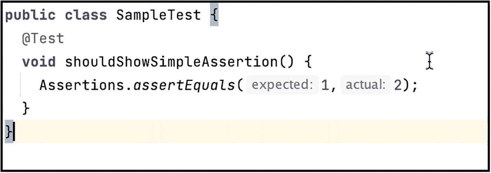

图 11-2

assertEquals()方法的操作中的参数提示

虽然您可以关闭参数提示，但我建议不要这样做，因为这是一个有用的特性。然而，如果你认为你有一个有效的理由这样做，以下是如何做到这一点:

1.  将插入符号放在一个参数提示上——在图 [11-3](#Fig3) 中，我将插入符号放在“预期的”提示中。

2.  使用**选项+ ENTER** (macOS)或 **Alt + ENTER** (Linux/Windows)快捷键。

3.  将显示一个下拉选项，如图 [11-3](#Fig3) 所示。

4.  选择**不显示当前方法**的提示。

这将关闭 assertEquals()的参数提示。


图 11-3

关闭参数提示

IntelliJ 将在第一次遇到@Test 注释时对其进行标记。使用常用的代码检查工具即可；使用 **option + ENTER** (macOS)或 **Alt + ENTER** (Linux/Windows)将 jUnit5 添加到类路径中(如图 [11-4](#Fig4) )。

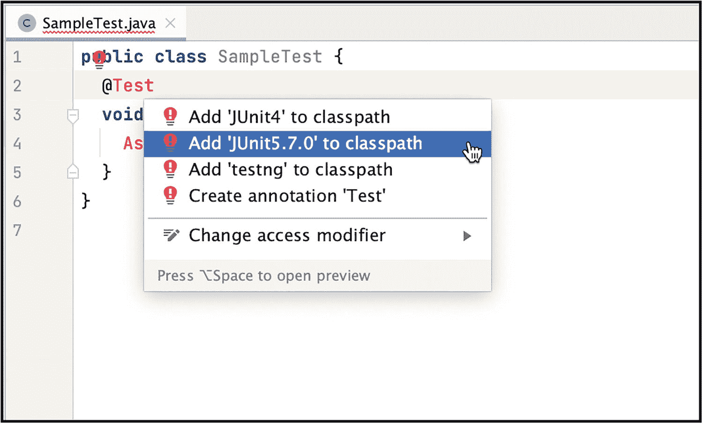

图 11-4

将 JUnit5 添加到类路径

虽然我们刚刚将 JUnit5 添加到我们的类路径中，但是我们的库中还没有它。在接下来的对话框中(图 [11-5](#Fig5) ), IntelliJ 将提供从 Maven 资源库下载它。我想将其下载到我的项目的库文件夹中；因此，我勾选了**下载到**旁边的框，如图 [11-5](#Fig5) 所示。


图 11-5

从 Maven 资源库下载库

单击确定完成操作。下载完成后，您会在项目的 lib 文件夹中找到 JUnit5 库(如图 [11-6](#Fig6) 所示)。


图 11-6

lib 文件夹中的 JUnit5 库

我们需要为断言类添加一个导入语句。您可以使用代码检查快捷键( **option + ENTER** 或 **Alt + ENTER** )来快速解决这个问题；选择**导入类**，如图 [11-7](#Fig7) 所示。

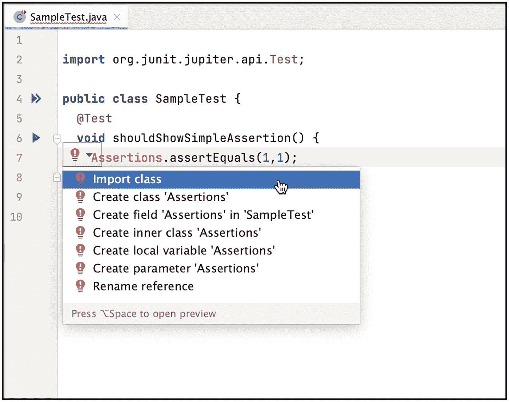

图 11-7

导入断言类

现在一切正常，我们可以进行测试了。由于我们只有一个测试方法，我将只点击测试方法旁边的绿色箭头(如图 [11-8](#Fig8) 所示)。

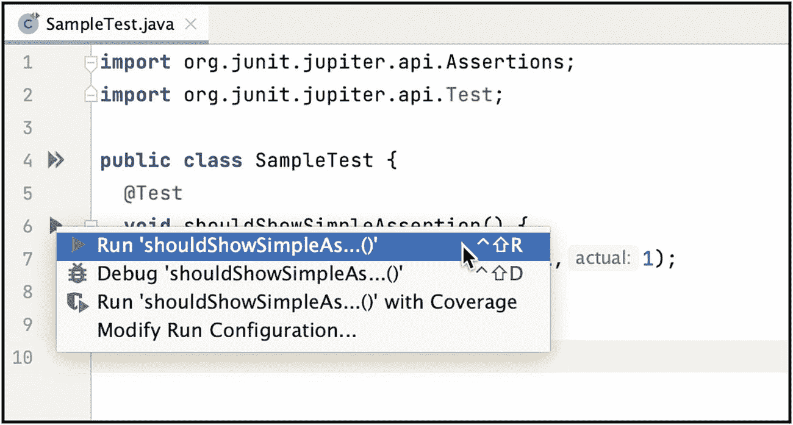

图 11-8

运行 shouldShowSimpleAssertion()

如你所料，我们的测试通过了。

当一个测试成功时，你会在通过测试的测试用例方法和测试类旁边看到绿色的复选标记，如图 [11-9](#Fig9) 所示。


图 11-9

测试成功

当测试失败时会发生什么？让我想想。编辑 assertEquals()方法，使其看起来像下面的代码:

```java
Assertions.assertEquals(1,2);

```

当预期值(第一个参数)与实际值(第二个参数)不同时，测试应该会失败。

重新运行测试，不出所料，它失败了。图 [11-10](#Fig10) 向我们展示了失败测试的结果。

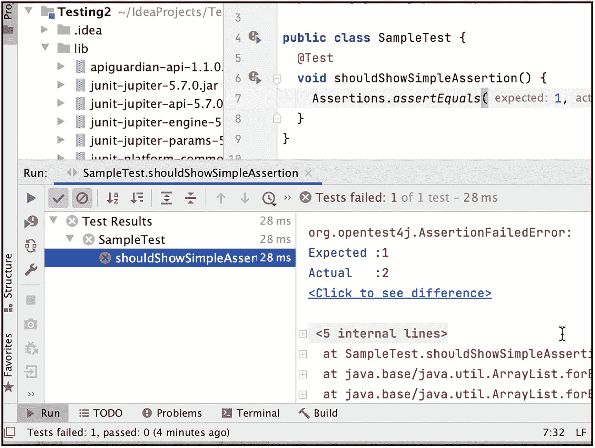

图 11-10

测试失败

失败的测试方法和包含它的测试类旁边的 X 标记表示断言失败。

当您选择失败的测试时(图 [11-10](#Fig10) 中**运行**窗口的左面板)，测试失败的详细信息显示在右面板。在这里，我们可以看到期望值是 1，实际值是 2 —这就是它失败的原因。assertEquals()方法仅在预期值与实际值相同时返回 true。

### 测试实际的类

现在我们已经有了足够的关于设置 JUnit 测试的理论和实践知识，让我们在一个实际的类中使用它——您可能想要为此设置一个新的项目。

向新项目添加一个新的 Java 类，并编辑它以匹配清单 [11-2](#PC3) 。

```java
public class MainProgram {

  String sayYourName() {
    return getClass().getName();
  }

  int addTwoNumbers(int a, int b) {
    return a + b;
  }
}

Listing 11-2MainProgram

```

为现有的类创建一个测试类是非常容易的。将插入符号放在类名上，然后按 **cmd + N** (macOS)或**Alt+Insert**(Linux/Windows)，再选择**测试**(如图 [11-11](#Fig11) )。

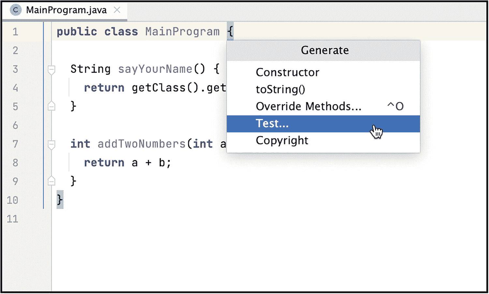

图 11-11

生成➤测试

IntelliJ 提示我们“没有找到测试根”(图 [11-12](#Fig12) )。理想情况下，您应该在项目中建立一个测试根文件夹，其中包含所有的测试类。由于我们没有这样做，IntelliJ 询问您是否希望源根目录也作为您的测试文件夹。现在，我将单击“确定”。

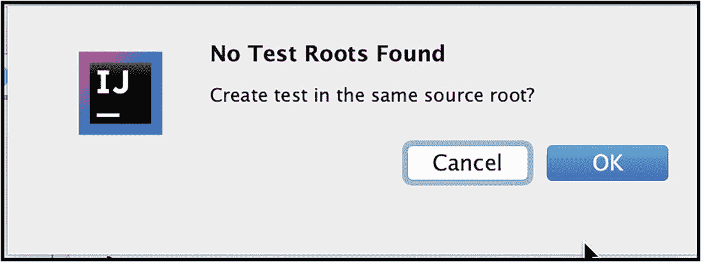

图 11-12

未找到测试根

点击确定后，弹出**创建测试**对话框。在这里我们可以输入 IntelliJ 将为我们生成的测试类的一些细节(图 [11-13](#Fig13) )。有点问题。在当前模块中找不到 JUnit5——必须为您使用它的每个项目导入 JUnit 5 库。

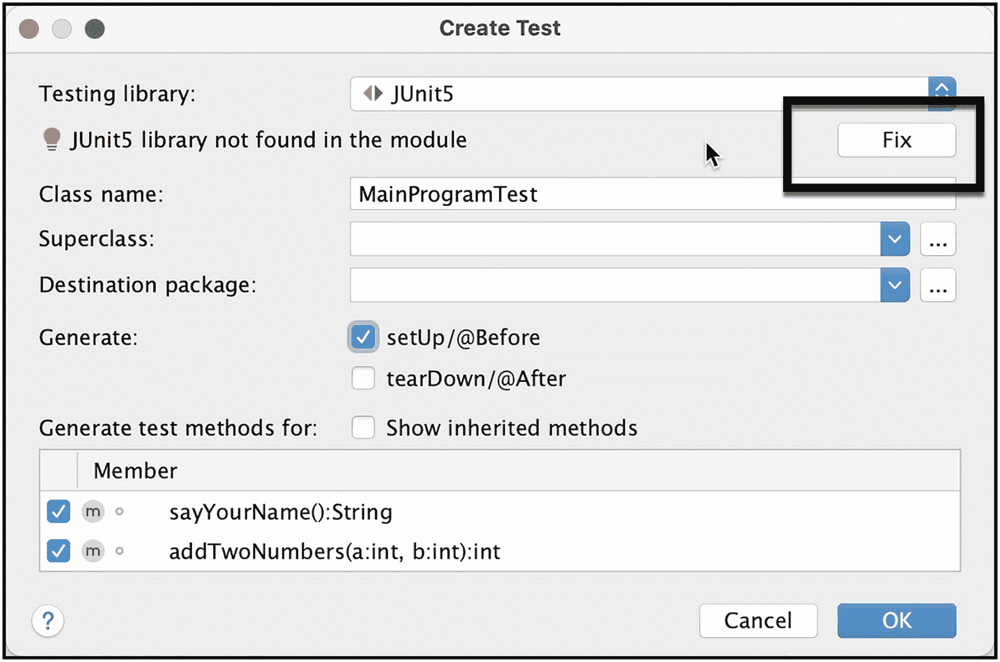

图 11-13

未找到创建测试➤ JUnit5

单击“Fix”按钮将尝试下载 JUnit5 库并为我们的项目创建一个本地副本。

接下来会弹出“从 Maven 资源库下载库”(图[11-14](#Fig14))——你之前已经看过了，所以你已经知道该怎么做了。

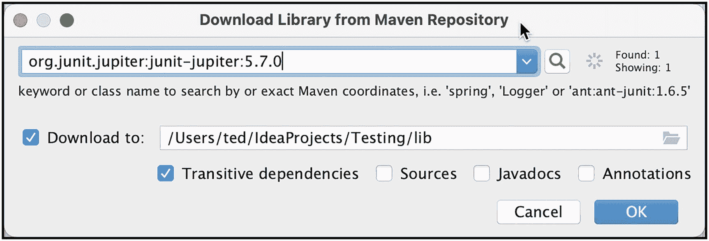

图 11-14

从 Maven 资源库下载库

单击确定完成操作。下载完成后，我们将再次看到“创建测试”对话框(图 [11-15](#Fig15) )。

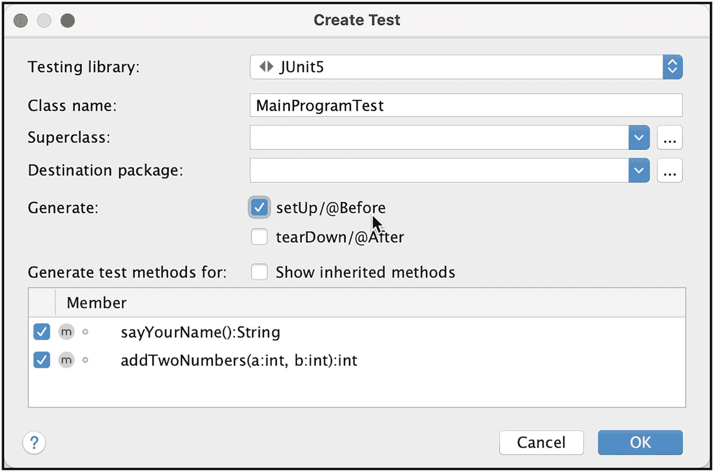

图 11-15

创建测试

类名默认为要测试的类名加上单词“Test”对话框的下部面板包含 MainProgram(要测试的类)的成员方法。您可以检查您想要生成测试的方法—我想要为 sayYourName()和 addTwoNumbers()方法创建测试，所以我检查了它们。

另外，我想为一些设置生成一个存根方法，所以我在框前勾选了**setUp/@框。**

点击确定按钮，完成**生成**动作。图 [11-16](#Fig16) 向我们展示了生成的 MainProgramTest 类和项目的 lib 文件夹，其中现在包含了下载的 JUnit5 库。

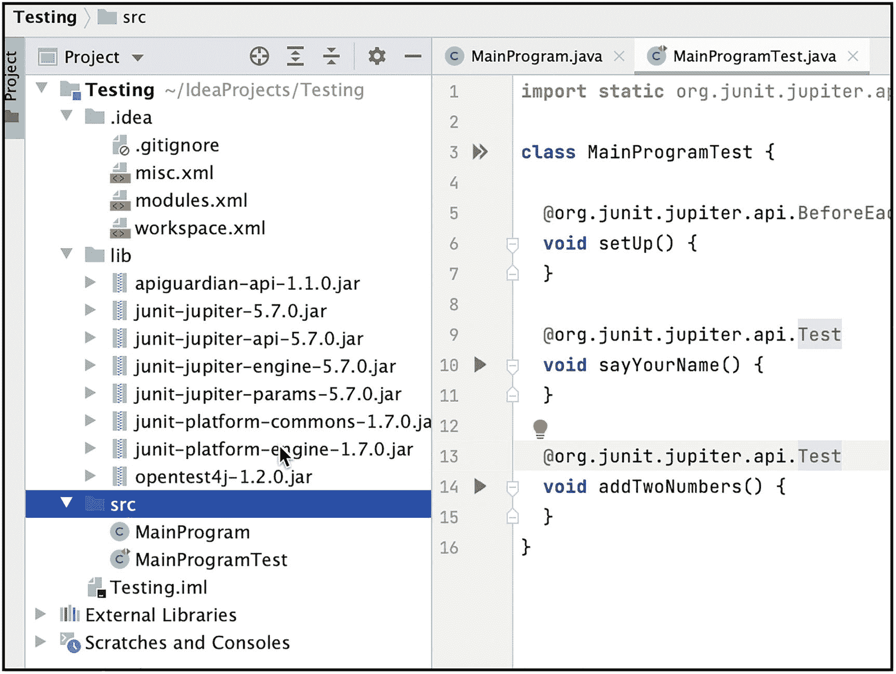

图 11-16

项目工具窗口中的 Lib 文件夹

Note

在早期版本的 IntelliJ 中，单词“Test”必须是类名的一部分。这是一个要求。对于当前版本的 JUnit 来说，这不再是真的了——但是按照惯例，我们仍然将“Test”作为类的一部分。

清单 [11-3](#PC4) 显示了生成的 MainProgramTest 类。

```java
import static org.junit.jupiter.api.Assertions.*;

class MainProgramTest {

  @org.junit.jupiter.api.BeforeEach
  void setUp() {
  }

  @org.junit.jupiter.api.Test
  void sayYourName() {
  }

  @org.junit.jupiter.api.Test
  void addTwoNumbers() {
  }
}

Listing 11-3MainProgramTest

```

在生成的 MainProgramTest 上可能有几个错误。它们只是缺少导入语句和类路径错误——如图 [11-17](#Fig17) 所示。您可以使用代码检查工具( **option + ENTER** 或 **Alt + ENTER** )快速解决它们。

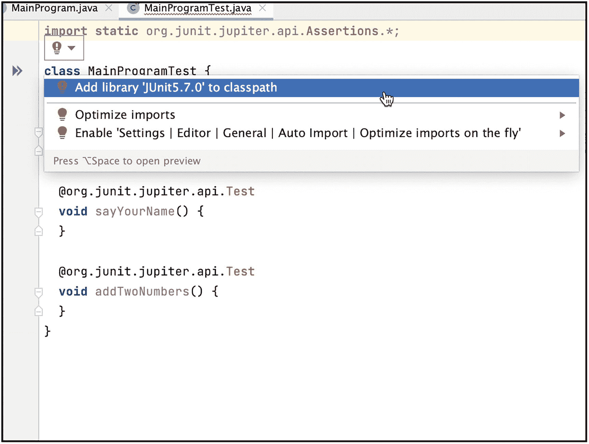

图 11-17

将 JUnit5 添加到类路径

一旦您解决了缺少的类路径条目和导入语句，我们现在就可以开始编码实际的测试了。

编辑 MainProgramTest 类，并执行以下操作:

1.  向该类添加一个 MainProgram 成员变量(mp)。

2.  在 setUp()方法中实例化 **mp** 成员变量。

您的代码应该类似于清单 [11-4](#PC5) 中的代码。

```java
class MainProgramTest {

  MainProgram mp = null;

  @org.junit.jupiter.api.BeforeEach
  void setUp() {
    mp = new MainProgram();
  }

  @org.junit.jupiter.api.Test
  void sayYourName() {
  }

  @org.junit.jupiter.api.Test
  void addTwoNumbers() {
  }
}

Listing 11-4Add

```

您可以使用 setUp()方法来实例化测试类的成员变量。还可以使用 setUp()方法连接数据库、打开文件、启动与服务器的连接等。

接下来，让我们为 sayYourName()和 addTwoNumbers()方法添加实际的测试。清单 [11-5](#PC6) 显示了 MainProgramTest 类的完整代码。

```java
import org.junit.jupiter.api.Assertions;

class MainProgramTest {

  MainProgram mp = null;

  @org.junit.jupiter.api.BeforeEach
  void setUp() {
    mp = new MainProgram();
  }

  @org.junit.jupiter.api.Test
  void sayYourName() {
    Assertions.assertEquals("MainProgram", mp.sayYourName());
  }

  @org.junit.jupiter.api.Test
  void addTwoNumbers() {
    Assertions.assertEquals(5, mp.addTwoNumbers(3,2));
  }
}

Listing 11-5Complete Code for MainProgramTest

```

清单 [11-5](#PC6) 中标记为粗体的语句是您需要编写的语句；这个类的其余部分是为我们生成的。

现在是运行测试的时候了。

完成的主程序测试如图 [11-18](#Fig18) 所示。

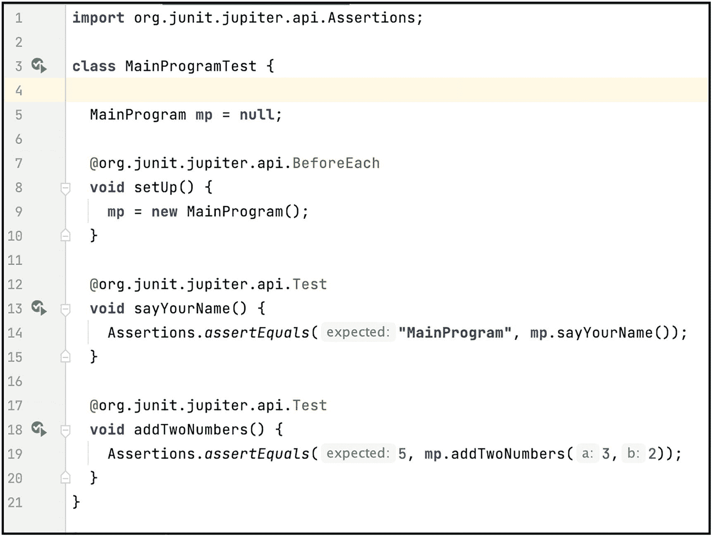

图 11-18

运行 MainProgramTest

您可以运行一个单独的测试—单击第 13 行旁边的绿色箭头将运行 sayYourName()测试；单击第 18 行上的箭头运行 addTwoNumbers()测试。

我想运行所有的测试，所以我将单击第 3 行(MainProgramTest 类)旁边的绿色箭头。

图 [11-19](#Fig19) 显示了我们测试运行的结果。

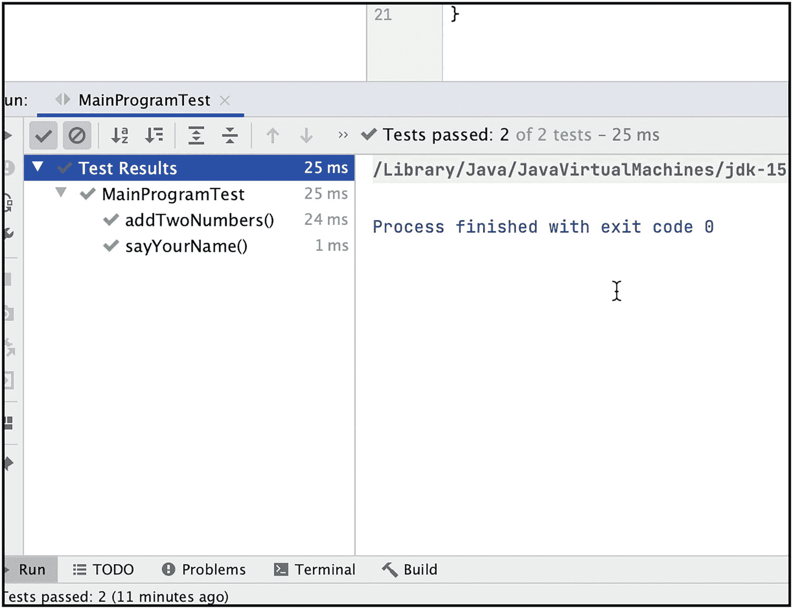

图 11-19

主程序测试的测试运行

全是绿色标记。我们所有的测试都通过了。

## 更多示例

我为这个新例子创建了一个新项目；如图 [11-20](#Fig20) 所示，相当原始。


图 11-20

新项目

我将为这个项目设置一个合适的测试根文件夹。来自 JetBrains ( [`www.jetbrains.com/help/idea/testing.html`](http://www.jetbrains.com/help/idea/testing.html) )的指导是我们需要在创建任何测试类之前建立一个测试根文件夹。在我们之前的例子中，我们不需要创建一个专用的测试根文件夹——而且在大多数情况下，我们做得很好。但是如果你正在做一个重要的项目，最好遵循正确的指导——这就是为什么我们要建立一个测试根文件夹。

IntelliJ 中的文件夹处理方式不同。src 文件夹有一种特殊的处理方式，而测试根文件夹则完全不同。就像我前面说的，最好遵循工具制造者自己的正确指导。

创建项目时，默认情况下已经创建了 src 文件夹，但没有创建 test 文件夹。你必须自己创建它——为此，在**项目工具窗口**中右击项目名称，如图 [11-21](#Fig21) 所示。

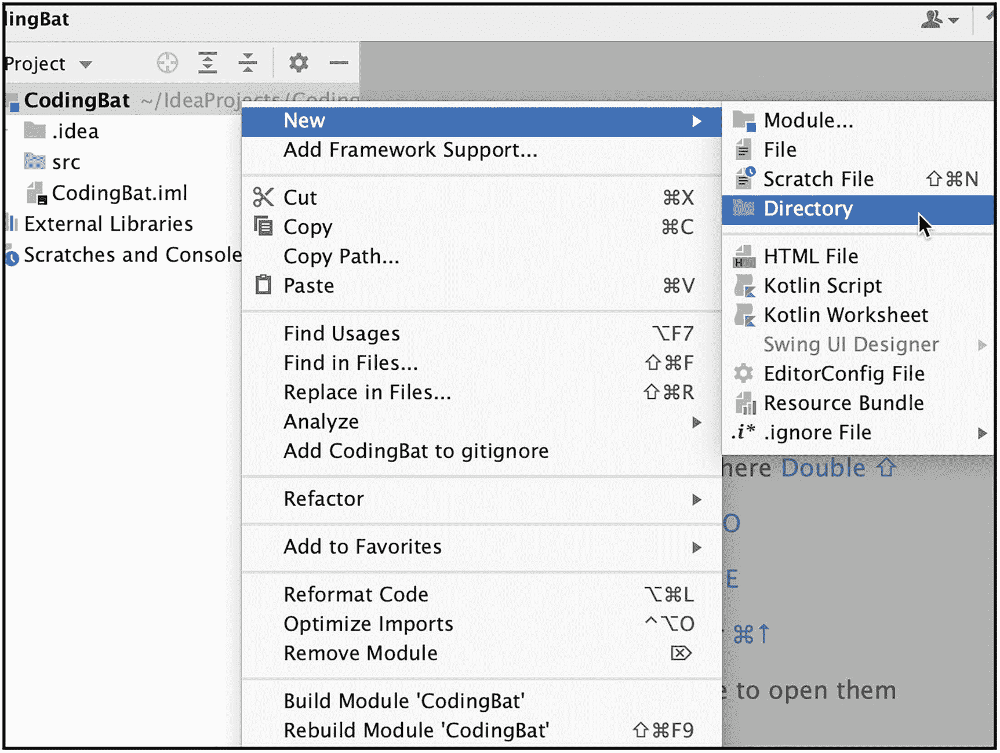

图 11-21

新目录

**选择新的** ➤ **目录**，然后提供新的目录名。我们想要创建一个测试根目录，所以我们称之为“测试”——如图 [11-22](#Fig22) 所示。


图 11-22

新目录名

键入新目录的名称后按 ENTER 键，在**项目工具窗口**中创建文件夹。

接下来，右键单击新创建的**测试**目录，选择**标记目录为** ➤ **测试源根**，如图 [11-23](#Fig23) 所示。

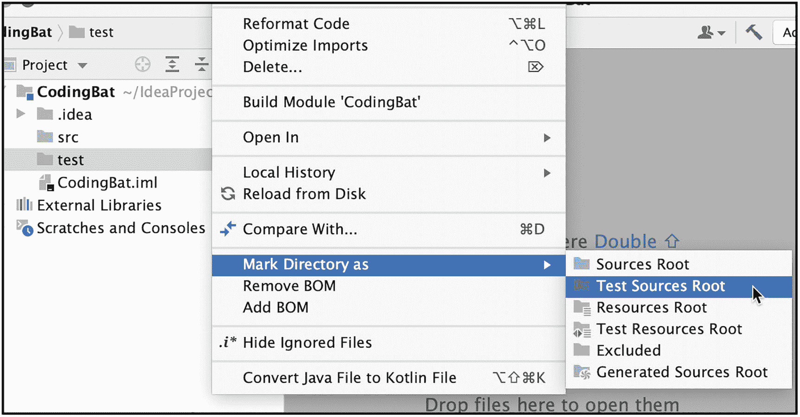

图 11-23

将目录标记为测试源根目录

现在我们准备编码和测试。让我们从 [`https://codingbat.com/prob/p159227`](https://codingbat.com/prob/p159227) 中挑选一个简单的热身运动；问题内容如下:

"给定 2 个 int 值，如果一个为负，一个为正，则返回 true。除非参数' negative '为真，否则只有当两者都为负时才返回 true。

因此，在 src 文件夹中，我们添加了一个源文件。你可以通过右击 src 文件夹，并选择**新建** ➤ **Java 类**来实现。把它命名为“波斯内克”编辑它以匹配清单 [11-6](#PC7) 。

```java
public class PosNeg {
  boolean posNeg(int a, int b, boolean negative) {
    boolean retval = false;

    return retval;
  }
}

Listing 11-6PosNeg Class

```

这对我们来说应该是一个很好的起点。

让我们创建测试。

前面，我向您展示了如何使用 generate 键盘快捷键来生成测试类。您仍然可以使用它，但我想我会向您展示另一种方法，这一次只使用代码检查快捷方式，我们以前最喜欢的——**命令+ ENTER** (macOS)或 **Alt + ENTER** (对于 PC 用户)。

将插入符号放在类名(PosNeg)上——如图 [11-24](#Fig24) 所示——然后使用代码检查快捷方式。

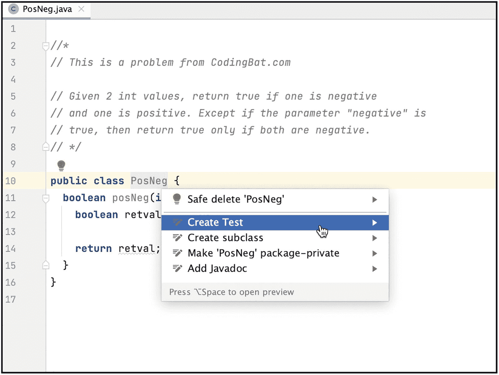

图 11-24

通过快速修复快捷方式创建测试(command + ENTER)

选择“创建测试”在接下来的屏幕中(图 [11-25](#Fig25) )，输入名称 test class 并选择要生成的存根方法——哦，顺便说一下，您需要修复“在模块中找不到 JUnit5 库”的错误。你已经知道怎么做了。


图 11-25

创建测试对话框

单击“确定”完成操作；当它完成时，你应该在测试文件夹中有一个类(如图 [11-26](#Fig26) 所示)。

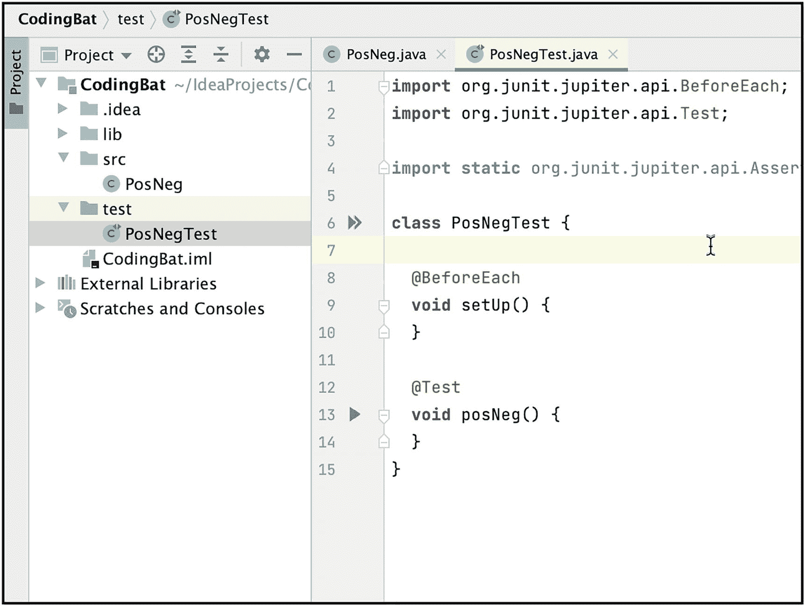

图 11-26

生成的 PosNegTest 类

编辑 PosNegTest 类以匹配清单 [11-7](#PC8) 。

```java
import static org.junit.jupiter.api.Assertions.*;

class PosNegTest {

  PosNeg pn = null;
  @BeforeEach
  void setUp() {
    pn = new PosNeg();
  }

  @Test
  void posNegOneNegativeOneFalse() {
    assertEquals(true, pn.posNeg(1,-1,false));
  }

  @Test
  void posNegNegativeOneOneFalse() {
    assertEquals(true, pn.posNeg(-1,1,false));
  }

  @Test
  void posNegNegativeFourNegativeFiveTrue() {
    assertEquals(true, pn.posNeg(-4,-5,true));
  }
}

Listing 11-7PosNegTest Class

```

我为 posNeg()方法编写了三个测试。详情见表 [11-1](#Tab1) 。

表 11-1

posNeg()方法的测试用例

<colgroup><col class="tcol1 align-left"> <col class="tcol2 align-left"> <col class="tcol3 align-left"></colgroup> 
| 

判例案件

 | 

因素

 | 

预期结果

 |
| --- | --- | --- |
| one | posNeg（1， -1， false） | 真实的 |
| Two | posNeg（-1， 1， false） | 真实的 |
| three | 正负（-4， -5， 真） | 真实的 |

通常情况下，你会为每一个你将要测试的方法准备更多的测试用例。这是因为您希望看到您的代码在各种条件下的行为。理想情况下，您应该涵盖边界条件。在我们简单的测试案例中，当两个输入都为正，两个输入都为负时，我有一个测试；当一个输入为负，另一个输入为正时，我有另一个测试。这不是详尽的报道，但这是一个良好的开端。

让我们进行测试。

图 [11-27](#Fig27) 显示三个测试都失败了。不奇怪。我们还没有对 posNeg()方法做任何事情。这是一个好的开始。这实际上是你应该开始的地方——一个失败的测试。现在，让我们第一次尝试解决问题。

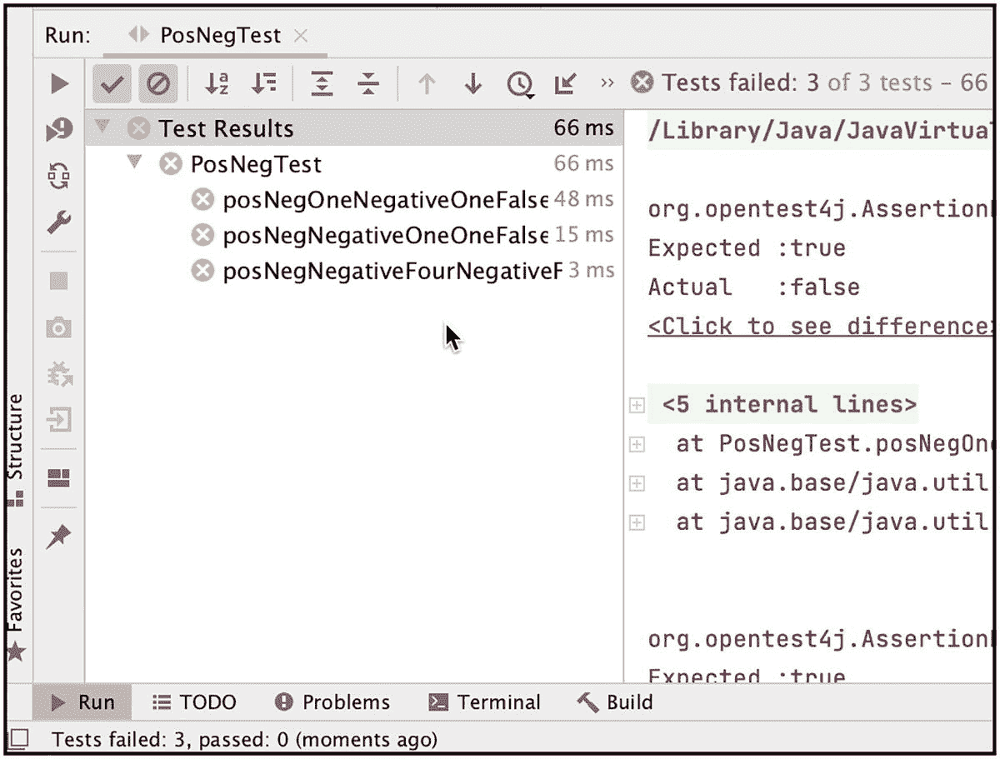

图 11-27

三次测试失败

编辑 PosNeg 类以匹配清单 [11-8](#PC9) 。

```java
public class PosNeg {
  boolean posNeg(int a, int b, boolean negative) {
    boolean retval = false;

    if (negative) {
      if ((a * b) < 0) {
        // one is positive and the other negative
        retval = false;
      }
      else {
        // either they're both positive or negative
        if (a < 0) {
          // both numbers are negative
          retval = true;
        }
        else {
          retval = false;
        }
      }
    }

    return retval;
  }
}

Listing 11-8PosNeg Class

```

一点点编码，一点点测试。让我们看看我们的代码是否能让所有的测试用例都通过。重新运行测试类。

图 [11-28](#Fig28) 显示了我们工作的进度。一次考试通过了，但两次没有通过。

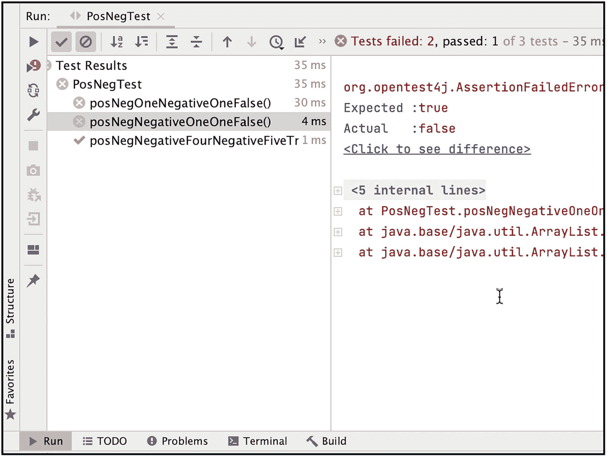

图 11-28

一次测试通过；两次测试失败

如果您点击任何失败的测试(运行窗口的左面板，如图 [11-28](#Fig28) 所示)，详细信息将显示在右面板中。在这里，您可以看到测试方法**posnegnegneveroneoneFalse()**的预期结果应该是 true，但是我们的测试运行是 false。

因此，虽然我们当前的解决方案已经部分正确，但它在三个测试中有两个失败了。所以，还是多写一点代码，多做一点测试吧。

切换回 PosNeg 类，继续编码，直到通过所有测试。编辑它以匹配清单 [11-9](#PC10) 。以粗体突出显示的语句是新添加的内容。

```java
public class PosNeg {
  boolean posNeg(int a, int b, boolean negative) {
    boolean retval = false;

    if (negative) {
      if ((a * b) < 0) {
        // one is positive and the other negative
        retval = false;
      }
      else {
        // either they're both positive or negative
        if (a < 0) {
          // both numbers are negative
          retval = true;
        }

        else {
          retval = false;
        }
      }
    }
    else {
      retval = ((a * b) < 0);
    }
    return retval;
  }
}

Listing 11-9Complete Code for PosNeg

```

让我们重新进行测试。

图 [11-29](#Fig29) 显示了我们测试运行的结果。现在，所有的测试都通过了。

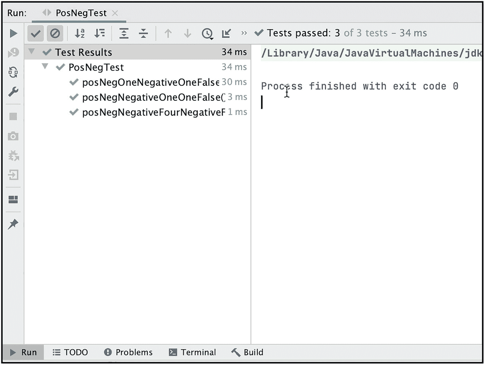

图 11-29

所有测试都通过了

我希望这能让你开始单元测试。我们只是触及了表面。我让您来探索 JUnit 断言类的其他断言方法。

## 关键要点

*   测试是开发的重要部分。不要吝啬。

*   在 IntelliJ 中设置单元测试非常容易。你没有理由不用它。

*   单元测试建立对代码库的信心。如果你信任测试，你可以毫不留情地重构。当你对代码充满冒险精神时，它就是你的生命线。您可以不受惩罚地试验您的代码；继续运行您的测试，只要您没有破坏任何东西，就继续破解。

*   从一次失败的测试开始——这没什么错。编写一点代码，然后进行一点测试，直到你覆盖了所有的测试用例。