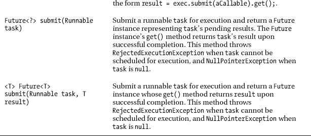
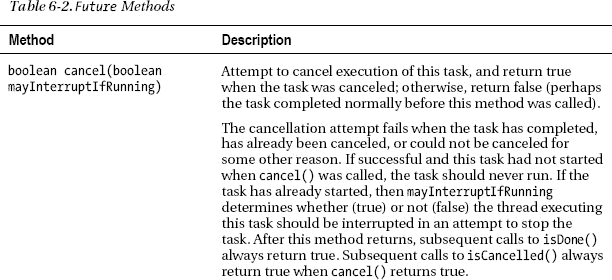
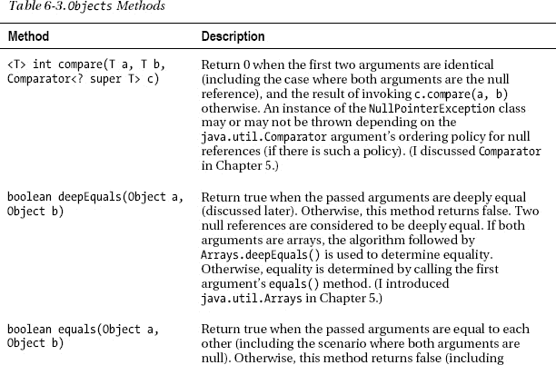
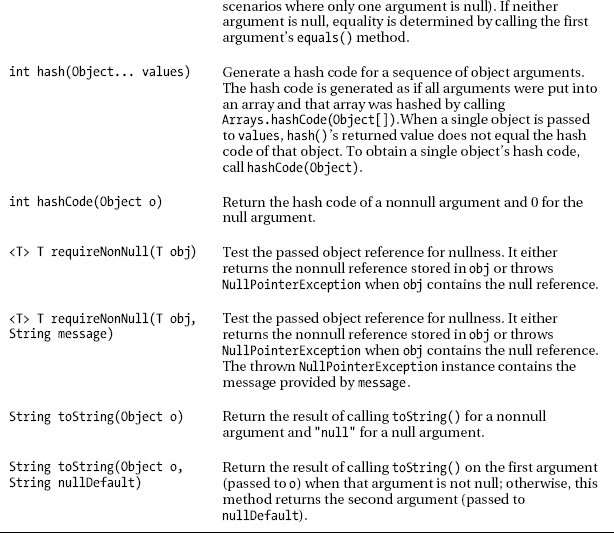

# 六、浏览附加工具 API

第五章向您介绍了集合框架，这是一个实用 API 的集合。第六章介绍了额外的工具 API，特别是并发工具`Objects`和`Random`。

### 并发工具

Java 5 引入了并发工具，它们是简化并发(多线程)应用开发的类和接口。这些类型位于`java.util.concurrent`包及其`java.util.concurrent.atomic`和`java.util.concurrent.locks`子包中。

并发工具在其实现中利用低级线程 API(参见第四章)并提供高级构建模块来简化多线程应用的创建。它们被组织成执行器、同步器、并发收集、锁、原子变量和其他工具类别。

#### 执行人

第四章介绍了线程 API，它让你可以通过像`new Thread(new RunnableTask()).start();`这样的表达式来执行可运行的任务。这些表达式将任务提交与任务的执行机制紧密耦合(在当前线程、新线程或从线程池[组]中任意选择的线程上运行)。

 **注意**一个*任务*是一个对象，它的类实现了`java.lang.Runnable`接口(一个可运行的任务)或者`java.util.concurrent.Callable`接口(一个可调用的任务)。

并发工具提供执行器作为执行可运行任务的低级线程 API 表达式的高级替代。一个*执行器*是一个对象，它的类直接或间接地实现了`java.util.concurrent.Executor`接口，该接口将任务提交与任务执行机制相分离。

 **注意**executor 框架使用接口将任务提交与任务执行机制解耦，类似于 Collections 框架使用核心接口将列表、集合、队列、队列和映射与它们的实现解耦。解耦产生了更易于维护的灵活代码。

`Executor`声明了一个单独的`void execute(Runnable runnable)`方法，该方法在未来的某个时间执行名为`runnable`的可运行任务。`execute()`在`runnable`为`null`时抛出`java.lang.NullPointerException`，不能执行`runnable`时抛出`java.util.concurrent.RejectedExecutionException`。

 **注** `RejectedExecutionException`当一个执行程序正在关闭并且不想接受新任务的时候可以抛出。此外，当执行程序没有足够的空间来存储任务时，也会抛出这个异常(也许执行程序使用了一个有界的阻塞队列来存储任务，而队列已经满了——我将在本章的后面讨论阻塞队列)。

下面的例子给出了前面提到的`new Thread(new RunnableTask()).start();`表达式的`Executor`等价物:

```java
Executor executor = ...; //  ... represents some executor creation
executor.execute(new RunnableTask());
```

虽然`Executor`很容易使用，但是这个接口在各方面都有限制:

*   `Executor`只关注`Runnable`。因为`Runnable`的`run()`方法不返回值，所以对于一个可运行的任务来说，没有方便的方法向它的调用者返回值。
*   `Executor`没有提供一种方法来跟踪执行可运行任务的进度，取消正在执行的可运行任务，或者确定可运行任务何时完成执行。
*   `Executor`无法执行可运行任务的集合。
*   没有为应用提供关闭执行程序的方法(更不用说正确关闭执行程序了)。

这些限制由`java.util.concurrent.ExecutorService`接口解决，该接口扩展了`Executor`，其实现通常是一个*线程池*(一组可重用的线程)。表 6-1 描述了`ExecutorService`的方法。




表 6-1 是指`java.util.concurrent.TimeUnit`，一个以给定粒度单位表示持续时间的枚举:`DAYS`、`HOURS`、`MICROSECONDS`、`MILLISECONDS`、`MINUTES`、`NANOSECONDS`、`SECONDS`。此外，`TimeUnit`声明了用于跨单元转换的方法(例如，`long toHours(long duration)`)，以及用于在这些单元中执行定时和延迟操作的方法(例如，`void sleep(long timeout)`)。

表 6-1 也指可调用任务，类似于可运行任务。与`Runnable`不同，它的`void run()`方法不能抛出被检查的异常，`Callable<V>`声明了一个返回一个值的`V call()`方法，它可以抛出被检查的异常，因为`call()`是用一个`throws Exception`子句声明的。

最后，表 6-1 引用了`Future`接口，它代表了一个异步计算的结果。`Future`，其泛型类型为`Future<V>`，提供了取消任务、返回任务值以及确定任务是否完成的方法。表 6-2 描述了`Future`的方法。




假设您打算编写一个应用，它的图形用户界面(GUI)允许用户输入单词。用户输入单词后，应用将这个单词呈现给几个在线词典，并获得每个词典的条目。这些条目随后显示给用户。

因为在线访问可能很慢，而且用户界面应该保持响应(也许用户想要结束应用)，所以您将“获取单词条目”任务卸载到一个在单独线程上运行该任务的执行器。下面的例子使用了`ExecutorService`、`Callable`和`Future`来实现这个目标:

```java
ExecutorService executor = ...; //  ... represents some executor creation
Future<String[]> taskFuture = executor.submit(new Callable<String[]>()
                                              {
                                                  public String[] call()
                                                  {
                                                     String[] entries = ...;
                                                     // Access online dictionaries
                                                     // with search word and populate
                                                     // entries with their resulting
                                                     // entries.
                                                     return entries;
                                                  }
                                              });
// Do stuff.
String entries = taskFuture.get();
```

在以某种方式获得一个执行程序后(您将很快了解如何获得)，该示例的主线程向执行程序提交一个可调用的任务。`submit()`方法立即返回一个对用于控制任务执行和访问结果的`Future`对象的引用。主线程最终调用这个对象的`get()`方法来获得这些结果。

 **注意**`java.util.concurrent.ScheduledExecutorService`接口扩展了`ExecutorService`并描述了一个执行器，让你安排任务运行一次或在给定延迟后定期执行。

虽然您可以创建自己的`Executor`、`ExecutorService`和`ScheduledExecutorService`实现(比如`class DirectExecutor implements Executor { public void execute(Runnable r) { r.run(); } }`—直接在调用线程上运行 executor)，但是并发工具提供了一个更简单的选择:`java.util.concurrent.Executors`。

 **提示**如果您打算创建自己的`ExecutorService`实现，您会发现使用`java.util.concurrent.AbstractExecutorService`和`java.util.concurrent.FutureTask`类会很有帮助。

`Executors`工具类声明了几个类方法，这些方法返回各种`ExecutorService`和`ScheduledExecutorService`实现的实例(以及其他类型的实例)。这个类的`static`方法完成以下任务:

*   创建并返回一个用常用配置设置配置的`ExecutorService`实例。
*   创建并返回一个用常用配置设置配置的`ScheduledExecutorService`实例。
*   创建并返回一个“包装的”`ExecutorService`或`ScheduledExecutorService`实例，通过使特定于实现的方法不可访问来禁用执行器服务的重新配置。
*   创建并返回一个用于创建新线程的`java.util.concurrent.ThreadFactory`实例。
*   从其他类似闭包的形式中创建并返回一个`Callable`实例，这样它就可以用在需要`Callable`参数的执行方法中(例如，`ExecutorService`的`submit(Callable)`方法)。(查看维基百科的“闭包(计算机科学)”条目[ `[`en.wikipedia.org/wiki/Closure_(computer_science)`](http://en.wikipedia.org/wiki/Closure_(computer_science))` ]来了解闭包。)

例如，`static ExecutorService newFixedThreadPool(int nThreads)`创建一个线程池，它重用固定数量的线程，这些线程在一个共享的无界队列上运行。最多`nThreads`线程主动处理任务。如果在所有线程都处于活动状态时提交了额外的任务，它们将在队列中等待一个可用的线程。

如果在执行器关闭之前，任何一个线程由于执行过程中的故障而终止，那么在需要执行后续任务时，一个新的线程将取代它的位置。在明确关闭执行器之前，线程池中的线程将一直存在。当您将零或负值传递给`nThreads`时，该方法抛出`IllegalArgumentException`。

 **注意**线程池用于消除为每个提交的任务创建一个新线程的开销。线程创建并不便宜，而且创建许多线程会严重影响应用的性能。

您通常会在输入/输出上下文中使用执行器、可运行的、可调用的和未来的。(我在第八章的中讨论了 Java 对文件系统输入/输出的支持。)执行冗长的计算提供了您可以使用这些类型的另一个场景。例如，清单 6-1 在欧拉数 e (2.71828…)的计算上下文中使用了一个执行程序、一个可调用程序和一个未来。

***清单 6-1。**计算欧拉数 e*

`import java.math.BigDecimal;
import java.math.MathContext;
import java.math.RoundingMode;

import java.util.concurrent.Callable;
import java.util.concurrent.ExecutionException;
import java.util.concurrent.ExecutorService;
import java.util.concurrent.Executors;
import java.util.concurrent.Future;

class CalculateE
{
   final static int LASTITER = 17;
   public static void main(String[] args)
   {
      ExecutorService executor = Executors.newFixedThreadPool(1);
      Callable<BigDecimal> callable;
      callable = new Callable<BigDecimal>()
                 {
                    public BigDecimal call()
                    {
                       MathContext mc = new MathContext(100,
                                                        RoundingMode.HALF_UP);
                       BigDecimal result = BigDecimal.ZERO;
                       for (int i = 0; i <= LASTITER; i++)
                       {
                          BigDecimal factorial = factorial(new BigDecimal(i));
                          BigDecimal res = BigDecimal.ONE.divide(factorial, mc);
                          result = result.add(res);
                       }
                       return result;` `                    }
                    public BigDecimal factorial(BigDecimal n)
                    {
                       if (n.equals(BigDecimal.ZERO))
                          return BigDecimal.ONE;
                       else
                          return n.multiply(factorial(n.subtract(BigDecimal.ONE)));
                    }
                 };
      Future<BigDecimal> taskFuture = executor.submit(callable);
      try
      {
         while (!taskFuture.isDone())
            System.out.println("waiting");
         System.out.println(taskFuture.get());
      }
      catch(ExecutionException ee)
      {
         System.err.println("task threw an exception");
         System.err.println(ee);
      }
      catch(InterruptedException ie)
      {
         System.err.println("interrupted while waiting");
      }
      executor.shutdownNow();
   }
}`

执行清单 6-1 的`main()`方法的主线程首先通过调用`Executors` ' `newFixedThreadPool()`方法获得一个执行器。然后，它实例化一个实现了`Callable`的匿名类，并将这个任务提交给执行器，接收一个`Future`实例作为响应。

提交任务后，线程通常会做一些其他工作，直到它需要获得任务的结果。我选择通过让主线程重复输出等待消息来模拟这项工作，直到`Future`实例的`isDone()`方法返回 true。(在实际应用中，我会避免这种循环。)此时，主线程调用实例的`get()`方法来获得结果，然后输出结果。

 **注意**务必在执行程序完成后将其关闭；否则，应用可能不会结束。应用通过调用`shutdownNow()`来完成这项任务。

callable 的`call()`方法通过计算数学幂级数 e = 1/0 来计算 e！+1/1!+1/2!+….这个数列可以通过求和 1/ *n* 来求值！，其中 *n* 的范围从 0 到无穷大。

`call()`首先实例化`java.math.MathContext`封装一个*精度*(位数)和一个舍入方式。我选择 100 作为 e 的精度上限，选择`HALF_UP`作为舍入模式。

 **提示**增加精度以及`LASTITER`的值，使级数收敛到更长更精确的 e 的近似值

`call()`接下来将名为`result`的局部变量`java.math.BigDecimal`初始化为`BigDecimal.ZERO`。然后它进入一个循环，计算阶乘，用阶乘除`BigDecimal.ONE`，并将除法结果加到`result`。

`divide()`方法将`MathContext`实例作为其第二个参数，以确保除法不会导致*非终止的十进制扩展*(除法的商结果无法精确表示，例如 0.3333333……)，这会抛出`java.lang.ArithmeticException`(提醒调用者商无法精确表示的事实)，执行器会将其重新抛出为`ExecutionException`。

当您运行此应用时，您应该观察到类似如下的输出:

```java
waiting
waiting
waiting
waiting
2.71828182845904507051604779584860506117897963525103269890073500406522504250484331405588797434
4245741730039454062711
```

#### 同步器

线程 API 提供了同步原语，用于同步线程对临界区的访问。因为很难正确编写基于这些原语的同步代码，所以并发工具包括同步器，这些类有助于常见形式的同步。

五种常用的同步器是倒计时锁、循环屏障、交换器、移相器和信号机:

*   一个*倒计时锁存器*让一个或多个线程在一个“门”等待，直到另一个线程打开这个门，此时这些其他线程可以继续。`java.util.concurrent.CountDownLatch`类实现了这个同步器。
*   一个*循环障碍*让一组线程相互等待到达一个共同的*障碍点*。`java.util.concurrent.CyclicBarrier`类实现了这个同步器，并利用了`java.util.concurrent.BrokenBarrierException`类。`CyclicBarrier`实例在应用中非常有用，这些应用包含固定大小的线程，它们偶尔会互相等待。`CyclicBarrier`支持一个可选的`Runnable`，称为*屏障动作*，它在团队中最后一个线程到达之后，任何线程被释放之前，在每个屏障点运行一次。这个屏障动作对于在任何一方继续之前更新共享状态是有用的。
*   一个*交换器*让一对线程在同步点交换对象。`java.util.concurrent.Exchanger`类实现了这个同步器。每个线程在进入`Exchanger`的`exchange()`方法时提供一些对象，与一个伙伴线程匹配，并在返回时接收其伙伴的对象。交换器可能在*遗传算法*(见`[`en.wikipedia.org/wiki/Genetic_algorithm`](http://en.wikipedia.org/wiki/Genetic_algorithm)`)和管道设计等应用中有用。
*   *相位器*是一个可重复使用的同步屏障，其功能类似于`CyclicBarrier`和`CountDownLatch`，但提供了更多的灵活性。例如，与其他屏障不同，在相位器上注册同步的线程数量可能随时间而变化。`java.util.concurrent.Phaser`类实现了这个同步器。`Phaser`可以用来代替`CountDownLatch`来控制为可变数量的团体服务的一次性动作。它也可以被在 Fork/Join 框架的上下文中执行的任务使用，这将在本章后面讨论。
*   一个*信号量*维护一组许可，用于限制可以访问有限资源的线程数量。`java.util.concurrent.Semaphore`类实现了这个同步器。如果有必要，对`Semaphore`的`acquire()`方法之一的每个调用都会被阻塞，直到获得许可，然后获取它。每次调用`release()`都会添加一个许可，潜在地释放一个阻塞的收购方。然而，没有使用实际的许可对象；`Semaphore`实例只记录可用许可的数量，并相应地采取行动。`Semaphore`通常用于限制可以访问某些(物理或逻辑)资源的线程数量。

考虑一下`CountDownLatch`类。它的每个实例都被初始化为非零计数。一个线程调用`CountDownLatch`的`await()`方法之一来阻塞，直到计数达到零。另一个线程调用`CountDownLatch`的`countDown()`方法来减少计数。一旦计数达到零，等待线程就被允许继续。

 **注意**等待线程释放后，对`await()`的后续调用立即返回。此外，因为计数不能被重置，所以一个`CountDownLatch`实例只能被使用一次。当需要重复使用时，请使用`CyclicBarrier`类。

我们可以使用`CountDownLatch`来确保工作线程几乎同时开始工作。例如，看看清单 6-2 中的。

***清单 6-2。**使用倒计时锁存器触发协调启动*

`import java.util.concurrent.CountDownLatch;
import java.util.concurrent.ExecutorService;
import java.util.concurrent.Executors;

class CountDownLatchDemo
{
   final static int NTHREADS = 3;
   public static void main(String[] args)
   {
      final CountDownLatch startSignal = new CountDownLatch(1);
      final CountDownLatch doneSignal = new CountDownLatch(NTHREADS);
      Runnable r = new Runnable()
                   {
                      public void run()
                      {` `                         try
                         {
                            report("entered run()");
                            startSignal.await(); // wait until told to proceed
                            report("doing work");
                            Thread.sleep((int)(Math.random()*1000));
                            doneSignal.countDown(); // reduce count on which
                                                    // main thread is waiting
                         }
                         catch (InterruptedException ie)
                         {
                            System.err.println(ie);
                         }
                      }
                      void report(String s)
                      {
                         System.out.println(System.currentTimeMillis()+": "+
                                            Thread.currentThread()+": "+s);
                      }
                   };
      ExecutorService executor = Executors.newFixedThreadPool(NTHREADS);
      for (int i = 0; i < NTHREADS; i++)
         executor.execute(r);
      try
      {
         System.out.println("main thread doing something");
         Thread.sleep(1000);      // sleep for 1 second
         startSignal.countDown(); // let all threads proceed
         System.out.println("main thread doing something else");
         doneSignal.await();      // wait for all threads to finish
         executor.shutdownNow();
      }
      catch (InterruptedException ie)
      {
         System.err.println(ie);
      }
   }
}`

清单 6-2 的主线程首先创建一对倒计时闩锁。倒计时闩锁阻止任何工作线程继续运行，直到主线程准备好让它们继续运行。`doneSignal`倒计时闩锁导致主线程等待，直到所有工作线程完成。

主线程接下来创建一个 runnable，它的`run()`方法由随后创建的工作线程执行。

`run()`方法首先输出一个初始消息，然后调用`startSignal`的`await()`方法，等待这个倒计时锁存器的计数读到零，然后才能继续。一旦发生这种情况，`run()`输出一条消息，表明工作正在进行，并休眠一段随机的时间(0 到 999 毫秒)来模拟这项工作。

此时，`run()`调用`doneSignal`的`countDown()`方法来减少这个锁存器的计数。一旦该计数达到零，等待该信号的主线程将继续，关闭执行器并终止应用。

创建 runnable 后，主线程获得一个基于`NTHREADS`线程的线程池的执行器，然后调用执行器的`execute()`方法`NTHREADS`次，将 runnable 传递给每个基于`NTHREADS`池的线程。这个动作启动进入`run()`的工作线程。

接下来，主线程输出一条消息并休眠一秒钟，以模拟做额外的工作(给所有工作线程一个进入`run()`并调用`startSignal.await()`的机会)，调用`startSignal`的`countdown()`方法以使工作线程开始运行，输出一条消息以指示它正在做其他事情，并调用`doneSignal`的`await()`方法以等待这个倒计时锁的计数达到零，然后才能继续。

当您运行此应用时，您将会看到类似如下的输出:

```java
main thread doing something
1312936533890: Thread[pool-1-thread-1,5,main]: entered run()
1312936533890: Thread[pool-1-thread-2,5,main]: entered run()
1312936533890: Thread[pool-1-thread-3,5,main]: entered run()
1312936534890: Thread[pool-1-thread-1,5,main]: doing work
1312936534890: Thread[pool-1-thread-2,5,main]: doing work
1312936534890: Thread[pool-1-thread-3,5,main]: doing work
main thread doing something else
```

您可能会看到在最后一条“`entered run()`”消息和第一条“`doing work`”消息之间出现了`main thread doing something else`消息。

 **注**为了简洁，我避免了演示`CyclicBarrier`、`Exchanger`、`Phaser`和`Semaphore`的例子。相反，我建议您参考这些类的 Java 文档。每个类的文档都提供了一个示例，向您展示如何使用该类。

#### 并发收款

`java.util.concurrent`包包括几个接口和类，它们是集合框架的面向并发的扩展(参见第五章):

*   `BlockingDeque`是`BlockingQueue`和`java.util.Deque`的子接口，它也支持阻塞操作，在检索元素之前等待队列变为非空，在存储元素之前等待队列中的空间变得可用。`LinkedBlockingDeque`类实现了这个接口。
*   `BlockingQueue`是`java.util.Queue`的子接口，也支持阻塞操作，即在检索元素之前等待队列变为非空，在存储元素之前等待队列中的空间变得可用。每个`ArrayBlockingQueue`、`DelayQueue`、`LinkedBlockingDeque`、`LinkedBlockingQueue`、`LinkedTransferQueue`、`PriorityBlockingQueue`和`SynchronousQueue`类都实现了这个接口。
*   `ConcurrentMap`是`java.util.Map`的子接口，它声明了附加的原子`putIfAbsent()`、`remove()`和`replace()`方法。`ConcurrentHashMap`类(并发等价于`java.util.HashMap`)和`ConcurrentSkipListMap`类实现了这个接口。
*   `ConcurrentNavigableMap`是`ConcurrentMap`和`java.util.NavigableMap`的子接口。`ConcurrentSkipListMap`类实现了这个接口。
*   `TransferQueue`是`BlockingQueue`的子接口，描述了一个阻塞队列，生产者可以在其中等待消费者接收元素。`LinkedTransferQueue`类实现了这个接口。
*   `ConcurrentLinkedDeque`是基于链接节点的无界并发队列。
*   `ConcurrentLinkedQueue`是`Queue`接口的无界线程安全 FIFO 实现。
*   `ConcurrentSkipListSet`是一个可伸缩的并发`NavigableSet`实现。
*   `CopyOnWriteArrayList`是`java.util.ArrayList`的线程安全变体，其中所有的*变异*(不可交换)操作(添加、设置等等)都是通过制作底层数组的新副本来实现的。
*   `CopyOnWriteArraySet`是一个`java.util.Set`实现，它的所有操作都使用一个内部`CopyOnWriteArrayList`实例。

清单 6-3 在清单 4-27 的生产者-消费者应用(`PC`)中使用了`BlockingQueue`和`ArrayBlockingQueue`。

***清单 6-3。**阻塞队列相当于清单 4-27 的`PC`应用*

`import java.util.concurrent.ArrayBlockingQueue;
import java.util.concurrent.BlockingQueue;
import java.util.concurrent.ExecutorService;
import java.util.concurrent.Executors;

class PC
{
   public static void main(String[] args)
   {
      final BlockingQueue<Character> bq;
      bq = new ArrayBlockingQueue<Character>(26);
      final ExecutorService executor = Executors.newFixedThreadPool(2);
      Runnable producer;
      producer = new Runnable()
                 {
                    public void run()
                    {
                       for (char ch = 'a'; ch <= 'z'; ch++)
                       {
                          try
                          {
                             bq.put(ch);
                             System.out.println(ch+" produced by producer.");
                          }
                          catch (InterruptedException ie)` `                          {
                             assert false;
                          }
                       }
                    }
                 };
      executor.execute(producer);
      Runnable consumer;
      consumer = new Runnable()
                 {
                    public void run()
                    {
                       char ch = '\0';
                       do
                       {
                          try
                          {
                             ch = bq.take();
                             System.out.println(ch+" consumed by consumer.");
                          }
                          catch (InterruptedException ie)
                          {
                             assert false;
                          }
                       }
                       while (ch != 'z');
                       executor.shutdownNow();
                    }
                 };
      executor.execute(consumer);
   }
}`

清单 6-3 分别使用`BlockingQueue`的`put()`和`take()`方法将一个对象放入阻塞队列和从阻塞队列中移除一个对象。`put()`没有空间放物体时遮挡；`take()`队列为空时阻塞。

虽然`BlockingQueue`确保了一个字符在产生之前不会被消耗，但是这个应用的输出可能会有不同的指示。例如，下面是一次运行的部分输出:

```java
Y consumed by consumer.
Y produced by producer.
Z consumed by consumer.
Z produced by producer.
```

第四章的`PC`应用通过引入围绕`setSharedChar()` / `System.out.println()`的额外同步层和围绕`getSharedChar()` / `System.out.println()`的额外同步层，克服了这种不正确的输出顺序。下一节将向您展示锁形式的另一种选择。

#### 锁

`java.util.concurrent.locks`包提供了用于锁定和等待条件的接口和类，其方式不同于内置的同步和监视器。

这个包最基本的锁接口是`Lock`，它提供了比通过`synchronized`保留字所能实现的更广泛的锁操作。`Lock`还通过关联的`Condition`对象支持等待/通知机制。

 **注意**与线程进入临界区时获得的隐式锁相比，`Lock`对象的最大优势在于它们能够退出获取锁的尝试。例如，当锁不能立即使用或者超时过期(如果指定的话)时，`tryLock()`方法就会退出。另外，当另一个线程在获取锁之前发送中断时，`lockInterruptibly()`方法退出。

`ReentrantLock`实现了`Lock`，描述了一个可重入的互斥`Lock`实现，具有与通过`synchronized`访问的隐式监控锁相同的基本行为和语义，但是具有扩展的功能。

清单 6-4 展示了一个版本的清单 6-3 中的`Lock`和`ReentrantLock`，确保输出不会以错误的顺序显示(一个消费的消息出现在一个产生的消息之前)。

***清单 6-4。**实现锁的同步*

`import java.util.concurrent.ArrayBlockingQueue;
import java.util.concurrent.BlockingQueue;
import java.util.concurrent.ExecutorService;
import java.util.concurrent.Executors;

import java.util.concurrent.locks.Lock;
import java.util.concurrent.locks.ReentrantLock;

class PC
{
   public static void main(String[] args)
   {
      final Lock lock = new ReentrantLock();
      final BlockingQueue<Character> bq;
      bq = new ArrayBlockingQueue<Character>(26);
      final ExecutorService executor = Executors.newFixedThreadPool(2);
      Runnable producer;
      producer = new Runnable()
                 {
                    public void run()
                    {
                       for (char ch = 'a'; ch <= 'z'; ch++)
                       {
                          try` `{
                             lock.lock();
                             try
                             {
                                while (!bq.offer(ch))
                                {
                                   lock.unlock();
                                   Thread.sleep(50);
                                   lock.lock();
                                }
                                System.out.println(ch+" produced by producer.");
                             }
                             catch (InterruptedException ie)
                             {
                                assert false;
                             }` `                          }
                          finally
                          {
                             lock.unlock();
                          }
                       }
                    }
                 };
      executor.execute(producer);
      Runnable consumer;
      consumer = new Runnable()
                 {
                    public void run()
                    {
                       char ch = '\0';
                       do
                       {
                          try
                          {
                             lock.lock();
                             try
                             {
                                Character c;
                                while ((c = bq.poll()) == null)
                                {
                                   lock.unlock();
                                   Thread.sleep(50);
                                   lock.lock();
                                }
                                ch = c; // unboxing behind the scenes
                                System.out.println(ch+" consumed by consumer.");
                             }
                             catch (InterruptedException ie)
                             {
                                assert false;
                             }
                          }
                          finally
                          {
                             lock.unlock();
                          }
                       }
                       while (ch != 'z');
                       executor.shutdownNow();
                    }
                 };
      executor.execute(consumer);
   }
}`

清单 6-4 使用`Lock`的`lock()`和`unlock()`方法来获取和释放一个锁。当线程调用`lock()`并且锁不可用时，线程被禁用(并且不能被调度)，直到锁变得可用。

这个清单还使用了`BlockingQueue`的`offer()`方法而不是`put()`方法在阻塞队列中存储一个对象，使用了`poll()`方法而不是`take()`方法从队列中检索一个对象。使用这些替代方法是因为它们不会阻塞。

如果我使用了`put()`和`take()`，这个应用将会在下面的场景中死锁:

1.  消费者线程通过它的`lock.lock()`调用获得锁。
2.  生产者线程试图通过它的`lock.lock()`调用获取锁，但被禁用，因为消费者线程已经获取了锁。
3.  消费者线程调用`take()`从队列中获取下一个`java.lang.Character`对象。
4.  因为队列是空的，所以使用者线程必须等待。
5.  消费者线程在等待之前不会放弃生产者线程需要的锁，因此生产者线程也继续等待。

 **注意**如果我可以访问`BlockingQueue`实现使用的私有锁，我会使用`put()`和`take()`，也会在那个锁上调用`Lock`的`lock()`和`unlock()`方法。由此产生的应用将与清单 4-27 的`PC`应用完全相同(从锁的角度来看),其中生产者线程和消费者线程各使用了两次`synchronized`。

运行这个应用，你会发现它生成了与清单 4-27 的`PC`应用相同的输出。

#### 原子变量

`java.util.concurrent.atomic`包提供了以`Atomic`为前缀的类(例如`AtomicLong`)，支持对单个变量进行无锁、线程安全的操作。每个类都声明了像`get()`和`set()`这样的方法来读写这个变量，而不需要外部同步。

清单 4-23 声明了一个名为`ID`的小工具类，用于通过`ID`的`getNextID()`方法返回唯一的长整数标识符。因为此方法不是同步的，所以多个线程可以获得相同的标识符。清单 6-5 通过在方法头中包含保留字`synchronized`解决了这个问题。

***清单 6-5。**通过`synchronized`* 以线程安全的方式返回唯一标识符

```java
class ID
{
   private static long nextID = 0;
   static synchronized long getNextID()
   {
      return nextID++;
   }
}
```

虽然`synchronized`适合这个类，但是在更复杂的类中过度使用这个保留字会导致死锁、饥饿或其他问题。清单 6-6 向您展示了如何通过用原子变量替换`synchronized`来避免对并发应用的*活性*(及时执行的能力)的攻击。

***清单 6-6。**通过`AtomicLong`* 以线程安全的方式返回唯一 id

```java
import java.util.concurrent.atomic.AtomicLong;

class ID
{
   private static AtomicLong nextID = new AtomicLong(0);
   static long getNextID()
   {
      return nextID.getAndIncrement();
   }
}
```

在清单 6-6 中，我已经将`nextID`从`long`转换为`AtomicLong`实例，并将该对象初始化为 0。我还重构了`getNextID()`方法来调用`AtomicLong`的`getAndIncrement()`方法，该方法将`AtomicLong`实例的内部长整型变量递增 1，并在一个不可分割的步骤中返回先前的值。

#### 附加并发工具

除了支持 Java 5 引入的并发工具之外，Java 7 还引入了一对提高性能的并发工具，这在一定程度上是通过充分利用多个处理器/内核来实现的。这些工具由`java.util.concurrent.ThreadLocalRandom`类和 Fork/Join 框架组成。

##### 线程局部随机

`ThreadLocalRandom`类描述了一个独立于当前线程的随机数生成器。换句话说，只能从当前线程访问它。

和`java.lang.Math`类使用的全局随机数生成器一样(我将在本章后面讨论)，一个`ThreadLocalRandom`实例用一个内部生成的*种子*(起始值)初始化，否则不能修改。当适用时，在并发程序中使用`ThreadLocalRandom`而不是调用`Math.random()`通常会导致更少的开销和争用。

要使用这个类，首先调用`ThreadLocalRandom`的`static ThreadLocalRandom current()`方法来返回当前线程的`ThreadLocalRandom`实例。继续调用`ThreadLocalRandom`的`next`方法之一，比如`double nextDouble(double n)`，它返回一个伪随机的、均匀分布的`double`值，介于 0(含)和指定值`n`(不含)之间。传递给`n`的参数是要返回的随机数的上限，并且必须是正数；否则抛出`IllegalArgumentException`。

以下示例通过另一个“`next`”方法进行了演示:

```java
int r = ThreadLocalRandom.current().nextInt(20, 40);
```

这个例子调用`ThreadLocalRandom`的`int nextInt(int least, int bound)`方法返回一个伪随机的、均匀分布的值，该值在给定的`least`值(包含)和`bound`(不包含)之间。在这个例子中，`least`是`20`，它是可以返回的最小值，bound 是`40`，它比可以返回的最大值(39)大一个整数。

 **注意** `ThreadLocalRandom`利用线程局部变量，我在第四章对 Java 线程 API 的介绍中讨论过。

##### 分叉/连接框架

代码总是需要更快地执行。历史上，这种需求是通过提高微处理器速度和/或支持多处理器来解决的。然而，在 2003 年左右，由于自然限制，微处理器速度停止增长。为了弥补这一点，处理器制造商开始在处理器中添加多个处理内核，通过大规模并行来提高速度。

 **注** *并行*是指通过多个处理器和内核的某种组合来同时运行线程/任务。相比之下，*并发*是一种更广义的并行形式，其中线程通过任务切换同时运行或看起来同时运行，也称为*虚拟并行*。有些人进一步将并发性描述为程序或操作系统的属性，将并行性描述为同时执行多个任务的运行时行为。

Java 通过线程 API 和并发工具(如线程池)支持并发。并发的问题是它不能最大限度地利用可用的处理器/内核资源。例如，假设您创建了一个排序算法，该算法将数组分成两半，分配两个线程对每一半进行排序，并在两个线程完成后合并结果。

让我们假设每个线程运行在不同的处理器上。因为数组的每一半中可能出现不同数量的元素重新排序，所以一个线程可能会在另一个线程之前完成，并且必须在合并发生之前等待。在这种情况下，浪费了处理器资源。

这个问题(以及代码冗长和难以阅读的相关问题)可以通过递归地将任务分解成子任务并组合结果来解决。这些子任务并行运行，并且几乎同时完成(如果不是同时完成的话)，它们的结果被合并，并通过堆栈传递到前一层子任务。等待几乎不会浪费任何处理器时间，递归代码也不那么冗长，而且(通常)更容易理解。Java 提供了 Fork/Join 框架来实现这个场景。

Fork/Join 由一个特殊的执行器服务和线程池组成。executor 服务使一个任务对框架可用，这个任务被分解成更小的任务，这些任务从池中被*分叉*(由不同的线程执行)。一个任务一直等到*加入*(其子任务完成)。

Fork/Join 使用*工作窃取*来最小化线程争用和开销。工作线程池中的每个工作线程都有自己的双端工作队列，并将新任务推送到该队列。它从队列的头部读取任务。如果队列为空，工作线程会尝试从另一个队列的尾部获取任务。窃取并不常见，因为工作线程按照后进先出(LIFO)的顺序将任务放入队列中，并且随着问题被分成子问题，工作项的大小会变得更小。你开始把任务交给一个中心工作人员，它继续把它们分成更小的任务。最终所有的工人都与最小同步有关。

Fork/Join 主要由`java.util.concurrent`包的`ForkJoinPool`、`ForkJoinTask`、`ForkJoinWorkerThread`、`RecursiveAction`和`RecursiveTask`类组成:

*   `ForkJoinPool`是运行`ForkJoinTask`的`ExecutorService`实现。一个`ForkJoinPool`实例为来自非`ForkJoinTask`客户端的提交提供入口点，并提供管理和监控操作。
*   `ForkJoinTask`是在`ForkJoinPool`上下文中运行的任务的抽象基类。一个`ForkJoinTask`实例是一个类似线程的实体，它比普通线程要轻得多。在一个`ForkJoinPool`中，大量的任务和子任务可能由少量的实际线程托管，代价是一些使用限制。
*   `ForkJoinWorkerThread`描述一个由`ForkJoinPool`实例管理的线程，它执行`ForkJoinTask` s
*   `RecursiveAction`描述一个递归的无结果`ForkJoinTask`。
*   `RecursiveTask`描述了一个递归的结果承载`ForkJoinTask`。

Java 文档提供了基于`RecursiveAction`的任务(比如排序)和基于`RecursiveTask`的任务(比如计算斐波那契数)的例子。你也可以使用`RecursiveAction`来完成矩阵乘法(见`[`en.wikipedia.org/wiki/Matrix_multiplication`](http://en.wikipedia.org/wiki/Matrix_multiplication)`)。

例如，假设你已经创建了清单 6-7 的`Matrix`类来表示由特定数量的行和列组成的矩阵。

*清单 6-7。一个表示二维表格的类*

```java
class Matrix
{
   private double[][] matrix;
   Matrix(int nrows, int ncols)
   {
      matrix = new double[nrows][ncols];
   }
   int getCols()
   {
      return matrix[0].length;
   }
   int getRows()
   {
      return matrix.length;
   }
   double getValue(int row, int col)
   {
      return matrix[row][col];
   }
   void setValue(int row, int col, double value)
   {
      matrix[row][col] = value;
   }
}
```

清单 6-8 展示了将两个`Matrix`实例相乘的单线程方法:

***清单 6-8。**通过标准矩阵乘法算法将两个`Matrix`实例相乘*

`class MatMult
{
   public static void main(String[] args)
   {
      Matrix a = new Matrix(1, 3);
      a.setValue(0, 0, 1); // | 1 2 3 |
      a.setValue(0, 1, 2);
      a.setValue(0, 2, 3);
      dump(a);
      Matrix b = new Matrix(3, 2);
      b.setValue(0, 0, 4); // | 4 7 |
      b.setValue(1, 0, 5); // | 5 8 |
      b.setValue(2, 0, 6); // | 6 9 |
      b.setValue(0, 1, 7);
      b.setValue(1, 1, 8);
      b.setValue(2, 1, 9);
      dump(b);
      dump(multiply(a, b));
   }
   static void dump(Matrix m)` `   {
      for (int i = 0; i < m.getRows(); i++)
      {
         for (int j = 0; j < m.getCols(); j++)
            System.out.print(m.getValue(i, j)+" ");
         System.out.println();
      }
      System.out.println();
   }
   static Matrix multiply(Matrix a, Matrix b)
   {
      if (a.getCols() != b.getRows())
         throw new IllegalArgumentException("rows/columns mismatch");
      Matrix result = new Matrix(a.getRows(), b.getCols());
      for (int i = 0; i < a.getRows(); i++)
         for (int j = 0; j < b.getCols(); j++)
            for (int k = 0; k < a.getCols(); k++)
               result.setValue(i, j, result.getValue(i, j)+a.getValue(i, k)*
                               b.getValue(k, j));
      return result;
   }
}`

清单 6-8 的`MatMult`类声明了一个演示矩阵乘法的`multiply()`方法。在验证了第一个`Matrix` ( `a`)中的列数等于第二个`Matrix` ( `b`)中的行数(这对于算法来说是必不可少的)之后，`multiply()`创建一个名为`result`的`Matrix`，并进入一系列嵌套循环来执行乘法。

这些循环的本质如下:对于`a`中的每一行，将该行的每一列值乘以`b`中相应列的行值。将乘法的结果相加，并将总数存储在通过`a`中的行索引(`i`)和`b`中的列索引(`j`)指定的位置的`result`中。

当您运行此应用时，它会生成以下输出，这表明 1 行乘 3 列的矩阵乘以 3 行乘 2 列的矩阵会得到 1 行乘 2 列的矩阵:

```java
1.0 2.0 3.0

4.0 7.0
5.0 8.0
6.0 9.0

32.0 50.0
```

计算机科学家将这种算法归类为 O(n <sup>3</sup> )，读作“n 次方的 big-oh”或“近似 n 次方”。这种符号是对算法性能进行分类的一种抽象方式(不会陷入具体细节，如微处理器速度)。O(n <sup>3</sup> 分类表示性能非常差，并且这种性能随着被相乘的矩阵的大小增加而恶化。

通过将每个逐行逐列的乘法任务分配给单独的类似线程的实体，可以提高性能(在多处理器和/或多核平台上)。清单 6-9 向您展示了如何在 Fork/Join 框架的上下文中完成这个场景。

***清单 6-9。**通过 Fork/Join 框架将两个矩阵相乘*

`import java.util.ArrayList;
import java.util.List;

import java.util.concurrent.ForkJoinPool;
import java.util.concurrent.RecursiveAction;

class MatMult extends RecursiveAction
{
   private Matrix a, b, c;
   private int row;
   MatMult(Matrix a, Matrix b, Matrix c)
   {
      this(a, b, c, -1);
   }
   MatMult(Matrix a, Matrix b, Matrix c, int row)
   {
      if (a.getCols() != b.getRows())
         throw new IllegalArgumentException("rows/columns mismatch");
      this.a = a;
      this.b = b;
      this.c = c;
      this.row = row;
   }
   @Override
   public void compute()
   {
      if (row == -1)
      {
         List<MatMult> tasks = new ArrayList<>();
         for (int row = 0; row < a.getRows(); row++)
            tasks.add(new MatMult(a, b, c, row));
         invokeAll(tasks);
      }
      else
         multiplyRowByColumn(a, b, c, row);
   }
   static void multiplyRowByColumn(Matrix a, Matrix b, Matrix c, int row)
   {
      for (int j = 0; j < b.getCols(); j++)
         for (int k = 0; k < a.getCols(); k++)
            c.setValue(row, j, c.getValue(row, j)+a.getValue(row, k)*
                       b.getValue(k, j));
   }
   static void dump(Matrix m)
   {
      for (int i = 0; i < m.getRows(); i++)
      {
         for (int j = 0; j < m.getCols(); j++)
            System.out.print(m.getValue(i, j)+" ");` `         System.out.println();
      }
      System.out.println();
   }
   public static void main(String[] args)
   {
      Matrix a = new Matrix(2, 3);
      a.setValue(0, 0, 1); // | 1 2 3 |
      a.setValue(0, 1, 2); // | 4 5 6 |
      a.setValue(0, 2, 3);
      a.setValue(1, 0, 4);
      a.setValue(1, 1, 5);
      a.setValue(1, 2, 6);
      dump(a);
      Matrix b = new Matrix(3, 2);
      b.setValue(0, 0, 7); // | 7 1 |
      b.setValue(1, 0, 8); // | 8 2 |
      b.setValue(2, 0, 9); // | 9 3 |
      b.setValue(0, 1, 1);
      b.setValue(1, 1, 2);
      b.setValue(2, 1, 3);
      dump(b);
      Matrix c = new Matrix(2, 2);
      ForkJoinPool pool = new ForkJoinPool();
      pool.invoke(new MatMult(a, b, c));
      dump(c);
   }
}`

清单 6-9 展示了一个扩展了`RecursiveAction`的`MatMult`类。为了完成有意义的工作，`RecursiveAction`的`void compute()`方法被覆盖。

 **注意**虽然`compute()`通常用于递归地将任务细分为子任务，但我选择以不同的方式处理乘法任务(为了简洁和简单)。

在创建了`Matrix` es `a`和`b`之后，清单 6-9 的`main()`方法创建了`Matrix` `c`并实例化了`ForkJoinPool`。然后实例化`MatMult`，将这三个`Matrix`实例作为参数传递给`MatMult(Matrix a, Matrix b, Matrix c)`构造函数，并调用`ForkJoinPool`的`T invoke(ForkJoinTask<T> task)`方法开始运行这个初始任务。在初始任务及其所有子任务完成之前，此方法不会返回。

`MatMult(Matrix a, Matrix b, Matrix c)`构造函数调用`MatMult(Matrix a, Matrix b, Matrix c, int row)`构造函数，将`-1`指定为`row`的值。作为前面提到的`invoke()`方法调用的结果，`compute()`使用这个值来区分初始任务和子任务。

当最初调用`compute()`时(`row`等于`-1`，它创建一个`MatMult`任务的`List`，并将这个`List`传递给`RecursiveAction`的`Collection<T> invokeAll(Collection<T> tasks)`方法(继承自`ForkJoinTask`)。这个方法派生出所有`List`集合的任务，这些任务将开始执行。然后它等待直到`invokeAll()`方法返回(也加入到所有这些任务中)，当`boolean isDone()`方法(也继承自`ForkJoinTask`)为每个任务返回 true 时，就会发生这种情况。

注意`tasks.add(new MatMult(a, b, c, row));`方法调用。这个调用为一个`MatMult`实例分配一个特定的`row`值。当`invokeAll()`被调用时，每个任务的`compute()`方法被调用，并检测分配给`row`的不同值(不是-1)。然后，它为其特定的`row`执行`multiplyRowByColumn(a, b, c, row);`。

当您运行此应用(`java MatMult`)时，它会生成以下输出:

```java
1.0 2.0 3.0
4.0 5.0 6.0

7.0 1.0
8.0 2.0
9.0 3.0

50.0 14.0
122.0 32.0
```

### 物体

*Java 7 的新`java.util.Objects`类由操作对象的类方法组成。这些实用工具包括用于比较两个对象、计算对象的哈希代码、要求引用不能为空以及返回对象的字符串的空安全或空容忍方法。*

表 6-3 描述了`Objects'`类的方法。





`Objects`在调用所提供的`Comparator`之前，通过使用`==`实现空容忍的`compare()`方法来首先比较其对象标识的参数。

`equals()`和`deepEquals()`方法定义了对象引用的等价关系。与`Object.equals(Object o)`不同，`Objects.equals(Object a, Object b)`处理空值，当两个参数都为空时返回 true，或者当第一个参数为非空并且`a.equals(b)`返回 true。

在数组(包括嵌套数组)的上下文中使用`deepEquals()`方法来确定两个数组是否*深度相等*(它们都为空或者它们包含相同数量的元素，并且两个数组中所有对应的元素对都深度相等)。

当以下任何条件成立时，该方法的两个(可能为空)参数(由下面的`e1`和`e2`表示)完全相等:

*   `e1`和`e2`是对象引用类型的数组，`Arrays.deepEquals(e1, e2)`将返回 true
*   `e1`和`e2`是相同原始类型的数组，`Arrays.equals(e1, e2)`的适当重载将返回 true。
*   `e1 == e2`
*   `e1.equals(e2)`会返回 true。

平等意味着深度平等，但反过来就不一定了。在以下示例中，`x`和`y`完全相等，但不相等:

```java
Object common = "string";
Object[] x = {"string"};
Object[] y = {"string"};
System.out.println("x == y: "+(x == y)); // false (two different references)
System.out.println("Objects.equals(x, y): "+Objects.equals(x, y)); // false
System.out.println("Objects.deepEquals(x, y): "+Objects.deepEquals(x, y)); // true
```

数组`x`和`y`不相等，因为它们包含两个不同的引用，而`Objects.equals()`在这个上下文中使用引用相等(比较它们的引用)。(当一个类覆盖了`Object`的`equals()`方法时，就会出现对象相等，或者比较对象内容。)然而，这些数组完全相等，因为`x`和`y`都是对象引用类型的数组，并且`Arrays.deepEquals(x, y)`将返回 true。

 **注意**与`java.lang.Object`类不同，由于其前缀`java.lang`而被自动导入，当您想要避免指定`java.util`前缀时，您必须显式地将`Objects`导入到您的源代码(`import java.util.Objects;`)中。

`requireNonNull()`方法的 Java 文档指出，它们主要是为在方法和构造函数中进行参数验证而设计的。其思想是在试图在方法或构造函数中使用这些引用之前，检查方法或构造函数的参数值是否为空引用，并避免潜在的`NullPointerException` s. 清单 6-10 提供了一个演示。

***清单 6-10。**测试空引用参数的构造函数参数*

`import java.util.Objects;

class Employee
{
   private String firstName, lastName;
   Employee(String firstName, String lastName)
   {
      try
      {
         firstName = Objects.requireNonNull(firstName);
         lastName = Objects.requireNonNull(lastName,
                                           "lastName shouldn't be null");
         lastName = Character.toUpperCase(lastName.charAt(0))+
                    lastName.substring(1);
         this.firstName = firstName;
         this.lastName = lastName;` `      }
      catch (NullPointerException npe)
      {
         // In lieu of a more sophisticated logging mechanism, and also for
         // brevity, I output the exception's message to standard output.
         System.out.println(npe.getMessage());
      }
   }
   String getName()
   {
      return firstName+" "+lastName;
   }
   public static void main(String[] args)
   {
      Employee e1 = new Employee(null, "doe");
      Employee e2 = new Employee("john", null);
      Employee e3 = new Employee("john", "doe");
      System.out.println(e3.getName());
   }
}`

清单 6-10 的`Employee`构造函数首先调用传递给其`firstName`和`lastName`参数的每个参数值的`Objects.requireNonNull()`。如果任一参数值为空引用，`NullPointerException`被实例化并抛出；否则，`requireNonNull()`方法将返回参数值，该值保证为非空。

现在调用`lastName.charAt()`是安全的，它从调用该方法的字符串中返回第一个字符。该字符被传递给`Character`的`toUpperCase()`工具方法，当它不代表小写字母或小写字母的大写等价物时，该方法返回该字符。在`toUpperCase()`返回之后，字母(可能是大写的)被加到字符串的其余部分之前，导致姓氏以大写字母开始。(假设名称仅由字母组成。)

清单 6-10 的`Objects.requireNonNull()`方法调用为下面的例子提供了一个更简洁的替代方案，它演示了`requireNonNull(T obj, String message)`的`message`参数是如何使用的:

```java
if (firstName == null)
   throw new NullPointerException();
if (lastName == null)
   throw new NullPointerException("lastname shouldn't be null");
```

编译清单 6-10 ( `javac Employee.java`)并运行结果应用(`java Employee`)。您应该观察到以下输出:

```java
null
lastName shouldn't be null
John Doe
```

如清单 6-10 所示，`Objects`类的方法被引入是为了通过降低`NullPointerException`被意外抛出的可能性来提高空安全性。作为另一个例子，`Employee e = null; String s = e.toString();`导致抛出`NullPointerException`实例，因为您不能对存储在`e`中的空引用调用`toString()`。相反，`Employee e = null; String s = Objects.toString(e);`不会导致抛出`NullPointerException`实例，因为`Objects.toString()`在检测到`e`包含空引用时会返回`"null"`。不需要像在`if (e != null) { String s = e.toString(); /* other code here */ }`中那样让显式测试一个引用是否为空，您可以将空检查卸载到`Objects`类的各种方法中。

引入这些方法也是为了避免“重新发明轮子”综合症。许多开发人员重复编写了执行类似操作的方法，但都是以空安全的方式进行的。Java 的标准类库中包含了`Objects`规范了这种常见的功能。

### 随机

第四章给你介绍了`Math`类的`random()`方法。如果您要研究这个方法的源代码，您会发现下面的实现:

```java
private static Random randomNumberGenerator;
private static synchronized Random initRNG()
{
   Random rnd = randomNumberGenerator;
   return (rnd == null) ? (randomNumberGenerator = new Random()) : rnd;
}
public static double random()
{
   Random rnd = randomNumberGenerator;
   if (rnd == null) rnd = intRNG();
   return rnd.nextDouble();
}
```

这个实现展示了*惰性初始化*(直到第一次需要时才初始化，以提高性能)，向您展示了`Math`的`random()`方法是根据一个名为`Random`的类实现的，该类位于`java.util`包中。`Random`实例生成随机数序列，被称为*随机数生成器*。

 **注意**这些数字不是真正随机的，因为它们是由数学算法生成的。因此，它们通常被称为伪随机数。然而，去掉“伪”前缀并把它们称为随机数通常是很方便的。

`Random`从一个被称为*种子*的特殊 48 位值开始，生成它的随机数序列。该值随后通过数学算法进行修改，该算法被称为*线性同余发生器*。

 **注**查看维基百科的“线性同余生成器”条目(`[`en.wikipedia.org/wiki/Linear_congruential_generator`](http://en.wikipedia.org/wiki/Linear_congruential_generator)`)了解这种生成随机数的算法。

`Random`声明了一对构造函数:

*   创建一个新的随机数生成器。此构造函数将随机数生成器的种子设置为一个值，该值很可能不同于对此构造函数的任何其他调用。
*   `Random(long seed)`使用其`seed`参数创建一个新的随机数生成器。这个参数是随机数发生器内部状态的初始值，由`protected int next(int bits)`方法维护。

 **注意**其他方法使用的`next()`方法是`protected`，这样子类可以改变生成器的实现，如下所示

```java
protected int next(int bits) {
    long oldseed, nextseed;
    AtomicLong seed = this.seed;
    do {
       oldseed = seed.get();
       nextseed = (oldseed*multiplier+addend)&mask;
    } while (!seed.compareAndSet(oldseed, nextseed));
    return (int) (nextseed >>> (48-bits));
}
```

一些不同的东西。关于子类化的例子，请查看“子类化 Java . util . random”(`[`www.javamex.com/tutorials/random_numbers/java_util_random_subclassing.shtml`](http://www.javamex.com/tutorials/random_numbers/java_util_random_subclassing.shtml)`)。

因为`Random()`不接受`seed`参数，所以产生的随机数生成器总是生成不同的随机数序列。这解释了为什么每次应用开始运行时,`Math.random()`都会生成一个不同的序列。

 **提示** `Random(long seed)`让您有机会重用相同的种子值，允许生成相同的随机数序列。在调试包含随机数的错误应用时，您会发现这个功能非常有用。

`Random(long seed)`调用`void setSeed(long seed)`方法将种子设置为指定值。如果在实例化`Random`后调用`setSeed()`，随机数生成器将被重置为调用`Random(long seed)`后的状态。

前面的代码片段演示了`Random`的`double nextDouble()`方法，该方法返回随机数生成器序列中 0.0 到 1.0 之间的下一个伪随机、均匀分布的双精度浮点值。

`Random`还声明了以下方法来返回其他类型的值:

*   `boolean nextBoolean()`返回该随机数生成器序列中的下一个伪随机、均匀分布的布尔值。值 true 和 false 以(大约)相等的概率生成。
*   `void nextBytes(byte[] bytes)`生成伪随机字节整数值，并将它们存储在`bytes`数组中。生成的字节数等于`bytes`数组的长度。
*   `float nextFloat()`返回此随机数生成器序列中 0.0 到 1.0 之间的下一个伪随机、均匀分布的浮点值。
*   `double nextGaussian()`返回此随机数生成器序列中的下一个伪随机、高斯(“正态”)分布双精度浮点值，其平均值为 0.0，标准差为 1.0。
*   `int nextInt()`返回该随机数生成器序列中的下一个伪随机、均匀分布的整数值。所有 2 个 <sup>32 个</sup>可能的整数值以(近似)相等的概率产生。
*   `int nextInt(int n)`从该随机数生成器的序列中，返回一个介于 0(含)和指定值(不含)之间的伪随机、均匀分布的整数值。所有`n`可能的整数值都以(近似)相等的概率生成。
*   `long nextLong()`返回该随机数生成器序列中的下一个伪随机、均匀分布的长整数值。因为`Random`使用一个只有 48 位的种子，所以这个方法不会返回所有可能的 64 位长的整数值。

`java.util.Collections`类声明了一对用于混排列表内容的`shuffle()`方法。相比之下，`Arrays`类没有声明一个`shuffle()`方法来混洗数组的内容。清单 6-11 解决了这个遗漏。

***清单 6-11。**洗牌一个整数数组*

`import java.util.Random;

class Shuffler
{
   public static void main(String[] args)
   {
      Random r = new Random();
      int[] array = { 0, 1, 2, 3, 4, 5, 6, 7, 8, 9 };
      for (int i = 0; i < array.length; i++)
      {
         int n = r.nextInt(array.length);
         // swap array[i] with array[n]
         int temp = array[i];
         array[i] = array[n];
         array[n] = temp;` `      }
      for (int i = 0; i < array.length; i++)
         System.out.print(array[i]+" ");
      System.out.println();
   }
}`

清单 6-11 给出了一个简单的整数数组洗牌的方法——这个方法可以被推广。对于从数组开始到数组结束的每个数组条目，该条目与另一个条目交换，该条目的索引由`int nextInt(int n)`选择。

当您运行这个应用时，您将看到一个打乱的整数序列，类似于我观察到的以下序列:

```java
7 1 5 2 9 8 6 4 3 0
```

**练习**

以下练习旨在测试您对并发工具`Objects`和`Random`的理解:

1.  `Semaphore`类的 Java 文档提供了一个`Pool`类，演示了信号量如何控制对项目池的访问。因为`Pool`是不完整的，所以引入一个单独的资源(用一个包含该资源的数组替换`protected Object[] items = ...`，然后在从`SemaphoreDemo`类的`main()`方法启动的一对线程的上下文中演示`Pool`的`getItem()`和`putItem()`方法。
2.  Create an `EqualsDemo` application to play with `Objects`' `deepEquals()` method. As well as an `EqualsDemo` class, this application declares `Car` and `Wheel` classes. A `Car` instance contains (typically four) `Wheel` instances, and a `Wheel` instance contains a brand name. Each of `Car` and `Wheel` must override `Object`'s `equals()` method but does not have to override `hashCode()` in this example. Your `main()` method should contain the following code and generate the output shown in the comments: `Car[] cars1 = { new Car(4, "Goodyear"), new Car(4, "Goodyear") };
    Car[] cars2 = { new Car(4, "Goodyear"), new Car(4, "Goodyear") };
    Car[] cars3 = { new Car(4, "Michelin"), new Car(4, "Goodyear") };
    Car[] cars4 = { new Car(3, "Goodyear"), new Car(4, "Goodyear") };
    Car[] cars5 = { new Car(4, "Goodyear"), new Car(4, "Goodyear"),
                    new Car(3, "Michelin") };
    System.out.println(Objects.deepEquals(cars1, cars2)); // Output: true
    System.out.println(Objects.deepEquals(cars1, cars3)); // Output: false
    System.out.println(Objects.deepEquals(cars1, cars4)); // Output: false
    System.out.println(Objects.deepEquals(cars1, cars5)); // Output: false`

    注释表明，当两个数组包含相同数量的相等元素时，它们是完全相等的。

3.  创建一个`Die`应用，它使用`Random`来模拟*骰子*的角色(一个骰子)。输出值。

### 总结

Java 5 引入了并发工具来简化并发应用的开发。并发工具分为执行器、同步器、并发集合、锁、原子变量和其他工具类别，并在其实现中利用低级线程 API。

执行器将任务提交从任务执行机制中分离出来，由`Executor`、`ExecutorService`和`ScheduledExecutorService`接口描述。同步器有助于常见形式的同步:倒计时锁、循环屏障、交换器、移相器和信号量都是常用的同步器。

并发收集是收集框架的扩展。锁支持高级锁定，并且可以以不同于内置同步和监视器的方式与条件相关联。原子变量封装了单个变量，并支持对该变量进行无锁、线程安全的操作。

Java 7 的新`ThreadLocalRandom`类描述了一个独立于当前线程的随机数生成器，其新的 Fork/Join 框架允许您递归地将一个任务分解为子任务，并将结果组合起来，以最大限度地利用多个处理器和/或处理器内核。

新的`Objects`类由操作对象的类方法组成。这些实用工具包括用于比较两个对象、计算对象的哈希代码、要求引用不能为空以及返回对象的字符串的空安全或空容忍方法。

`Math`类的`random()`方法是根据`Random`类实现的，其实例被称为随机数生成器。`Random`从一个特殊的 48 位种子开始生成一个随机数序列。该值随后通过称为线性同余发生器的数学算法进行修改。

本章及其前几章中的例子利用了底层平台的标准 I/O 工具来创建基于字符的用户界面。然而，Java 也允许您创建 GUI 来实现更引人注目的用户界面。第七章向你介绍 Java 用于创建和丰富图形用户界面的 API。