# 八、与文件系统交互

应用经常与文件系统交互，以向文件输出数据和/或从文件输入数据。Java 的标准类库通过其经典的`File`、`RandomAccessFile`、流和写/读 API 支持文件系统访问。第八章向你介绍`File`、`RandomAccessFile`，以及各种流和写/读 API。

 **注意**虽然通过 Java 的新 I/O API 访问文件系统是首选，但我不在本章讨论新 I/O，因为新 I/O 的一些方面涉及到网络，我直到第九章才讨论。此外，您应该了解本章的经典 I/O API，因为您会在修改使用经典 I/O 的遗留代码时遇到它们。

### 文件

应用经常与一个*文件系统*交互，该文件系统通常表示为从*根目录*开始的文件和目录的层次结构。

运行 Java 虚拟机(JVM)的 Windows 和其他平台通常支持至少一个文件系统。例如，Unix 或 Linux 平台将所有*挂载的*(附加和准备好的)磁盘组合成一个虚拟文件系统。相比之下，Windows 将单独的文件系统与每个活动磁盘驱动器相关联。

Java 通过其具体的`java.io.File`类提供对平台可用文件系统的访问。`File`声明了`File[] listRoots()`类方法来返回可用文件系统的根目录(root ),作为一个`File`对象的数组。

 **注意**可用文件系统根的设置受到各种平台级操作的影响，例如插入或弹出可移动介质，以及断开或卸载物理或虚拟磁盘驱动器。

清单 8-1 展示了一个`DumpRoots`应用，它使用`listRoots()`获得一个可用文件系统根的数组，然后输出数组的内容。

***清单 8-1。**将可用的文件系统根目录转储到标准输出设备*

```java
import java.io.File;

class DumpRoots
{
   public static void main(String[] args)
   {
      File[] roots = File.listRoots();
      for (File root: roots)
         System.out.println(root);
   }
}
```

当我在我的 Windows XP 平台上运行这个应用时，我收到了下面的输出，它显示了四个可用的根:

```java
A:\
C:\
D:\
E:\
```

如果我在 Unix 或 Linux 平台上运行`DumpRoots`，我将收到一个由虚拟文件系统根(`/`)组成的输出行。

除了使用`listRoots()`之外，您还可以通过调用`File`构造函数(如`File(String pathname)`)获得一个`File`实例，该构造函数创建一个存储`pathname`字符串的`File`实例。下列赋值语句演示了此构造函数:

```java
File file1 = new File("/x/y");
File file2 = new File("C:\\temp\\x.dat");
```

第一条语句假设使用 Unix 或 Linux 平台，以根目录符号`/`开始路径名，然后是目录名`x`，分隔符`/`，以及文件或目录名`y`。(它也适用于 Windows，Windows 假定该路径从当前驱动器的根目录开始。)

 **注意***路径*是一个目录层次结构，必须遍历它才能定位文件或目录。路径名是路径的字符串表示；与平台相关的*分隔符*(如 Windows 反斜杠[ `\` ]字符)出现在连续名称之间。

第二条语句假设使用 Windows 平台，以驱动器说明符`C:`开始路径名，然后是根目录符号`\`，目录名`temp`，分隔符`\`，文件名`x.dat`(尽管`x.dat`可能指的是一个目录)。

 **注意**字符串中出现的字符一定要用双反斜杠，特别是在指定路径名的时候；否则，您将面临出现错误或编译器错误消息的风险。例如，我在第二条语句中将反斜杠字符增加了一倍，以表示反斜杠而不是制表符(`\t`)，并避免编译器错误消息(`\x`是非法的)。

每条语句的路径名都是一个*绝对路径名*，是一个以根目录符号开头的路径名；不需要其他信息来定位它所表示的文件/目录。相比之下，*相对路径名*不是以根目录符号开始的；它是通过从其他路径名获取的信息来解释的。

 **注意**`java.io`包的类默认解析当前用户(也称为工作)目录的相对路径名，该目录由系统属性`user.dir`标识，通常是 JVM 启动的目录。(第四章展示了如何通过`java.lang.System`类的`getProperty()`方法读取系统属性。)

`File`实例通过存储*抽象路径名*来包含文件和目录路径名的抽象表示(这些文件或目录可能存在，也可能不存在于它们的文件系统中)，这提供了独立于平台的分层路径名视图。相反，用户界面和操作系统使用依赖于平台的*路径名字符串*来命名文件和目录。

抽象路径名由可选的平台相关前缀字符串组成，如磁盘驱动器说明符“/”表示 Unix 根目录，或“\”表示 Windows 通用命名约定(UNC)路径名。和零个或多个字符串名称的序列。抽象路径名中的第一个名称可以是目录名，或者在 Windows UNC 路径名的情况下是主机名。每个后续名称表示一个目录；姓氏可以表示目录或文件。*空抽象路径名*没有前缀和空名称序列。

路径名字符串与抽象路径名之间的转换本质上是平台相关的。当路径名字符串转换为抽象路径名时，其中的名称由默认名称分隔符或底层平台支持的任何其他名称分隔符分隔。例如，`File(String pathname)`在 Unix 或 Linux 平台上将路径名字符串`/x/y`转换为抽象路径名`/x/y`，在 Windows 平台上将相同的路径名字符串转换为抽象路径名`\x\y`。

 **注***默认名称分隔符*可从系统属性`file.separator`中获得，也存储在`File`的`separator`和`separatorChar`类字段中。第一个字段将字符存储在一个`java.lang.String`实例中，第二个字段将其存储为一个`char`值。这些`final`字段的名称都不遵循完全大写的惯例。

当一个抽象路径名被转换成一个路径名字符串时，每个名称通过一个默认的名称分隔符与下一个名称分开。

`File`为实例化这个类提供了额外的构造函数。例如，下面的构造函数将父路径名和子路径名合并成存储在`File`对象中的组合路径名:

*   `File(String parent, String child)`从一个`parent`路径名字符串和一个`child`路径名字符串创建一个新的`File`实例。
*   `File(File parent, String child)`从一个`parent`路径名`File`实例和一个`child`路径名字符串创建一个新的`File`实例。

每个构造函数的`parent`参数都被传递了一个*父路径名*，这是一个由除了由`child`指定的姓氏之外的所有路径名组成的字符串。以下陈述通过`File(String, String)`展示了这一概念:

```java
File file3 = new File("prj/books/", "bj7");
```

构造函数将相对父路径名`prj/books/`与子路径名`bj7`合并成相对路径名`prj/books/bj7`。(如果我指定了`prj/books`作为父路径名，构造函数就会在`books`后面添加分隔符。)

 **提示**因为`File(String pathname)`、`File(String parent, String child)`和`File(File parent, String child)`不检测无效的路径名参数(除了当`pathname`或`child`为`null`时抛出`java.lang.NullPointerException`，所以在指定路径名时一定要小心。您应该尽量只指定对应用运行的所有平台都有效的路径名。例如，不要在路径名中硬编码驱动器说明符(比如 C:)，而是使用从`listRoots()`返回的根。更好的是，保持路径名相对于当前用户/工作目录(从`user.dir`系统属性返回)。

在获得一个`File`对象后，你可以通过调用表 8-1 中描述的方法来询问它以了解它存储的抽象路径名。


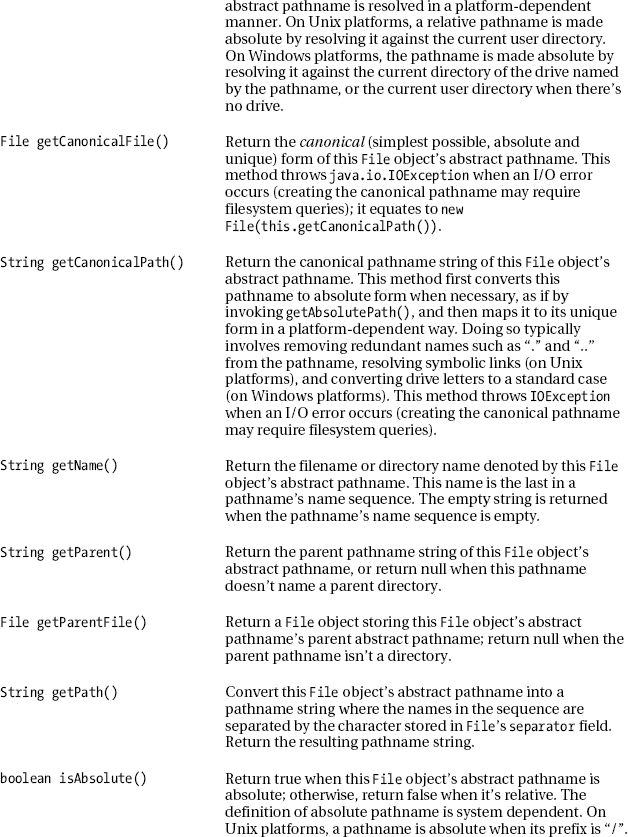


表 8-1 指的是`IOException`，它是那些描述各种 I/O 错误的异常类的公共异常超类，如`java.io.FileNotFoundException`。

清单 8-2 用路径名命令行参数实例化`File`，并调用表 8-1 中描述的一些`File`方法来了解这个路径名。

***清单 8-2。**获取摘要路径名信息*

```java
import java.io.File;
import java.io.IOException;

class PathnameInfo
{
   public static void main(String[] args) throws IOException
   {
      if (args.length != 1)
      {
         System.err.println("usage: java PathnameInfo pathname");
         return;
      }
      File file = new File(args[0]);
      System.out.println("Absolute path = "+file.getAbsolutePath());
      System.out.println("Canonical path = "+file.getCanonicalPath());
      System.out.println("Name = "+file.getName());
      System.out.println("Parent = "+file.getParent());
      System.out.println("Path = "+file.getPath());
      System.out.println("Is absolute = "+file.isAbsolute());
   }
}
```

例如，当我指定`java PathnameInfo .`(句点代表我的 XP 平台上的当前目录)时，我观察到以下输出:

```java
Absolute path = C:\prj\dev\bj7\ch08\code\PathnameInfo\.
Canonical path = C:\prj\dev\bj7\ch08\code\PathnameInfo
Name = .
Parent = null
Path = .
Is absolute = false
```

这个输出表明规范的路径名不包括句点。它还显示没有父路径名，并且路径名是相对的。

继续，我现在指定`java PathnameInfo c:\reports\2011\..\2010\February`。这一次，我观察到以下输出:

`Absolute path = c:\reports\2011\..\2010\February
Canonical path = C:\reports\2010\February` `Name = February
Parent = c:\reports\2011\..\2010
Path = c:\reports\2011\..\2010\February
Is absolute = true`

这个输出表明规范路径名不包括`2011`。它还显示路径名是绝对的。

对于我的最后一个例子，假设我指定`java PathnameInfo ""`来获取空路径名的信息。作为响应，该应用生成以下输出:

```java
Absolute path = C:\prj\dev\bj7\ch08\code\PathnameInfo
Canonical path = C:\prj\dev\bj7\ch08\code\PathnameInfo
Name =
Parent = null
Path =
Is absolute = false
```

输出显示`getName()`和`getPath()`返回空字符串(`""`)，因为空路径名为空。

您可以通过调用表 8-2 中描述的方法来询问文件系统，以了解由`File`对象的抽象路径名表示的文件或目录。

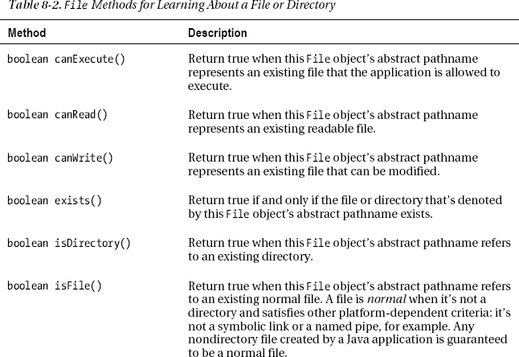

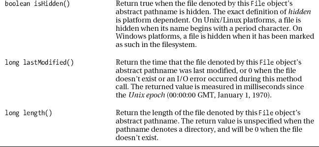


清单 8-3 用其路径名命令行参数实例化`File`，并调用表 8-2 中描述的所有`File`方法来了解路径名的文件/目录。

***清单 8-3。**获取文件/目录信息*

`import java.io.File;
import java.io.IOException;

import java.util.Date;

class FileDirectoryInfo
{
   public static void main(final String[] args) throws IOException
   {
      if (args.length != 1)
      {
         System.err.println("usage: java FileDirectoryInfo pathname");
         return;
      }
      File file = new File(args[0]);
      System.out.println("About "+file+":");
      System.out.println("Can execute = "+file.canExecute());
      System.out.println("Can read = "+file.canRead());
      System.out.println("Can write = "+file.canWrite());
      System.out.println("Exists = "+file.exists());
      System.out.println("Is directory = "+file.isDirectory());
      System.out.println("Is file = "+file.isFile());
      System.out.println("Is hidden = "+file.isHidden());
      System.out.println("Last modified = "+new Date(file.lastModified()));
      System.out.println("Length = "+file.length());` `   }
}`

例如，假设我有一个名为`x.dat`的三字节只读文件。当我指定`java FileDirectoryInfo x.dat`时，我观察到以下输出:

```java
About x.dat:
Can execute = true
Can read = true
Can write = true
Exists = true
Is directory = false
Is file = true
Is hidden = false
Last modified = Wed Aug 24 18:45:07 CDT 2011
Length = 3
```

 **注意** Java 6 向`File`添加了`long getFreeSpace()`、`long getTotalSpace()`和`long getUsableSpace()`方法，这些方法返回关于*分区*(文件系统的特定于平台的存储部分；例如，C:\)由`File`实例的路径名描述。

`File`声明了五个方法，这些方法返回位于由`File`对象的抽象路径名标识的目录中的文件和目录的名称。表 8-3 描述了这些方法。

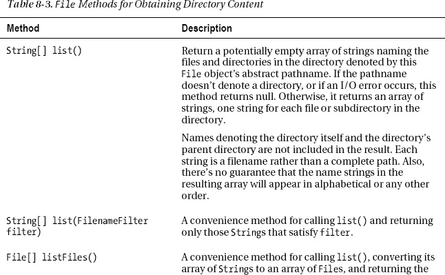


重载的`list()`方法返回表示文件和目录名的`String`数组。第二种方法让您通过基于`java.io.FilenameFilter`的过滤器对象只返回感兴趣的名字(比如只返回以扩展名`.txt`结尾的名字)。

`FilenameFilter`接口声明了一个单独的`boolean accept(File dir, String name)`方法，这个方法为位于由`File`对象的抽象路径名标识的目录中的每个文件/目录调用:

*   `dir`标识路径名的父部分(目录路径)。
*   `name`标识最终目录名或路径名的文件名部分。

`accept()`方法使用这些参数来确定文件或目录是否满足可接受的标准。当文件/目录名应该包含在返回的数组中时，它返回 true 否则，此方法返回 false。

清单 8-4 展示了一个`Dir` (ectory)应用，它使用`list(FilenameFilter)`来获取那些以特定扩展名结尾的名字。

***清单 8-4。**列举具体人名*

`import java.io.File;
import java.io.FilenameFilter;

class Dir
{
   public static void main(final String[] args)
   {
      if (args.length != 2)
      {
         System.err.println("usage: java Dir dirpath ext");
         return;
      }
      File file = new File(args[0]);
      FilenameFilter fnf = new FilenameFilter()
                           {
                              public boolean accept(File dir, String name)
                              {
                                 return name.endsWith(args[1]);
                              }
                           };` `      String[] names = file.list(fnf);
      for (String name: names)
         System.out.println(name);
   }
}`

例如，当我在 XP 平台上指定`java Dir c:\windows bmp`时，`Dir`只输出那些扩展名为`bmp`(位图)的`\windows`目录文件名:

```java
Blue Lace 16.bmp
Coffee Bean.bmp
FeatherTexture.bmp
Gone Fishing.bmp
Greenstone.bmp
Prairie Wind.bmp
Rhododendron.bmp
River Sumida.bmp
Santa Fe Stucco.bmp
Soap Bubbles.bmp
winnt.bmp
winnt256.bmp
Zapotec.bmp
```

重载的`listFiles()`方法返回`File`的数组。在很大程度上，它们与它们的`list()`方法是对称的。然而，`listFiles(FileFilter)`引入了一种不对称。

`java.io.FileFilter`接口声明了一个单独的`boolean accept(String pathname)`方法，这个方法为位于由`File`对象的抽象路径名标识的目录中的每个文件/目录调用。传递给`pathname`的参数标识了文件或目录的完整路径。

`accept()`方法使用这个参数来确定文件或目录是否满足可接受的标准。当文件/目录名应该包含在返回的数组中时，它返回 true 否则，此方法返回 false。

 **提示**因为每个接口的`accept()`方法完成相同的任务，您可能想知道使用哪个接口。如果您喜欢一个分解成目录和命名组件的路径，请使用`FilenameFilter`。但是，如果您喜欢完整的路径名，请使用`FileFilter`；你可以随时呼叫`getParent()`和`getName()`来获得这些组件。

`File`还声明了几个创建文件和操作现有文件的方法。表 8-4 描述了这些方法。


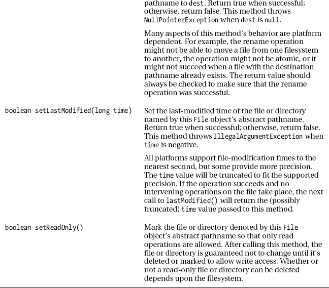


假设您正在设计一个文本编辑器应用，用户将使用它打开一个文本文件并对其内容进行更改。在用户将这些更改显式保存到文件之前，您希望文本文件保持不变。

因为用户不想在应用崩溃或计算机断电时丢失这些更改，所以您将应用设计为每隔几分钟将这些更改保存到一个临时文件中。这样，用户就有了更改的备份。

您可以使用重载的`createTempFile()`方法来创建临时文件。如果您没有指定一个目录来存储这个文件，那么它将被创建在由系统属性`java.io.tmpdir`标识的目录中。

在用户告诉应用保存或放弃更改后，您可能希望删除临时文件。方法让你注册一个临时文件来删除；当 JVM 在没有崩溃/断电的情况下结束时，它就会被删除。

清单 8-5 展示了一个`TempFileDemo`应用，让你试验`createTempFile()`和`deleteOnExit()`方法。

***清单 8-5。**试验临时文件*

```java
import java.io.File;
import java.io.IOException;

class TempFileDemo
{
   public static void main(String[] args) throws IOException
   {
      System.out.println(System.getProperty("java.io.tmpdir"));
      File temp = File.createTempFile("text", ".txt");
      System.out.println(temp);
      temp.deleteOnExit();
   }
}
```

输出临时文件存放的位置后，`TempFileDemo`创建一个临时文件，文件名以`text`开头，扩展名为`.txt`。`TempFileDemo` next 输出临时文件的名称，并注册临时文件，以便在应用成功终止时删除。

我在运行`TempFileDemo`的过程中观察到以下输出(文件在退出时消失):

```java
C:\DOCUME~1\JEFFFR~1\LOCALS~1\Temp\
C:\DOCUME~1\JEFFFR~1\LOCALS~1\Temp\text3436502412322813057.txt
```

 **注意** Java 6 添加到了`File`中新的`boolean setExecutable(boolean executable)`、`boolean setExecutable(boolean executable, boolean ownerOnly)`、`boolean setReadable(boolean readable)`、`boolean setReadable(boolean readable, boolean ownerOnly)`、`boolean setWritable(boolean writable)`和`boolean setWritable(boolean writable, boolean ownerOnly)`方法，这些方法允许您为由`File`对象的抽象路径名标识的文件设置所有者或每个人的执行、读取和写入权限。

最后，`File`实现了`java.lang.Comparable`接口的`compareTo()`方法，并覆盖了`equals()`和`hashCode()`。表 8-5 描述了这些其他方法。


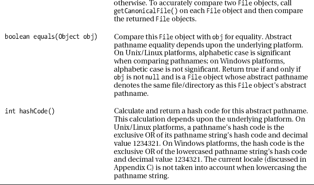

### 随机文件

可以为*随机访问*创建和/或打开文件，其中写和读操作可以发生，直到文件被关闭。Java 通过其具体的`java.io.RandomAccessFile`类支持这种随机访问。

`RandomAccessFile`声明了以下构造函数:

*   如果文件不存在，创建并打开一个新文件，或打开一个现有文件。文件由`file`的抽象路径名标识，并根据`mode`创建和/或打开。
*   如果文件不存在，创建并打开一个新文件，或打开一个现有文件。文件由`pathname`标识，并根据`mode`创建和/或打开。

任一构造函数的`mode`参数必须是`"r"`、`"rw"`、`"rws"`或`"rwd"`中的一个；否则，构造函数抛出`IllegalArgumentException`。这些字符串文字具有以下含义:

*   通知构造器打开一个已有的只读文件。任何写入文件的尝试都会导致抛出一个`IOException`类的实例。
*   `"rw"`通知构造器创建并打开一个不存在的新文件进行读写，或者打开一个已存在的文件进行读写。
*   `"rwd"`通知构造器创建并打开一个不存在的新文件进行读写，或者打开一个已存在的文件进行读写。此外，对文件内容的每次更新都必须同步写入底层存储设备。
*   `"rws"`通知构造器在文件不存在时创建并打开一个新文件进行读写，或者打开一个已有的文件进行读写。此外，对文件内容或元数据的每次更新都必须同步写入底层存储设备。

 **注意**文件的*元数据*是关于文件的数据，而不是实际的文件内容。元数据的例子包括文件的长度和文件最后修改的时间。

`"rwd"`和`"rws"`模式确保对位于本地存储设备上的文件的任何写入都被写入该设备，这保证了当操作系统崩溃时关键数据不会丢失。当文件不在本地设备上时，不做任何保证。

 **注意**在`"rwd"`或`"rws"`模式下打开的随机存取文件的操作比在`"rw"`模式下打开的随机存取文件的操作慢。

当`mode`为`"r"`且`pathname`标识的文件无法打开时(可能不存在，也可能是目录)，或者当`mode`为`"rw"`且`pathname`为只读或目录时，这些构造函数抛出`FileNotFoundException`。

以下示例通过尝试使用`"r"`模式字符串打开现有的随机访问文件来演示第二个构造函数:

```java
RandomAccessFile raf = new RandomAccessFile("employee.dat", "r");
```

一个随机存取文件与一个*文件指针*相关联，该指针标识下一个要写入或读取的字节的位置。当打开一个现有文件时，文件指针被设置为它的第一个字节，偏移量为 0。创建文件时，文件指针也被设置为 0。

写入和读取操作从文件指针开始，并使其前进超过写入或读取的字节数。超过文件当前结尾的写入操作会导致文件被扩展。这些操作会一直持续到文件关闭。

`RandomAccessFile`声明了各种各样的方法。我在表 8-6 中展示了这些方法的典型示例。


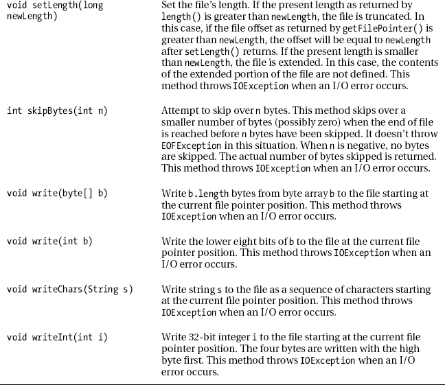


大多数表 8-6 的方法都是不言自明的。然而,`getFD()`方法需要进一步的启发。

 **注意**`RandomAccessFile``read`-前缀方法和`skipBytes()`源自`java.io.DataInput`接口，这个类实现了这个接口。此外，`RandomAccessFile`的`write`前缀方法源自`java.io.DataOutput`接口，该类也实现了该接口。

当打开一个文件时，底层平台创建一个依赖于平台的结构来表示该文件。这个结构的句柄存储在`getFD()`返回的`java.io.FileDescriptor`类的实例中。

 **注意**一个*句柄*是 Java 传递给底层平台的标识符，在这种情况下，当它要求底层平台执行文件操作时，它标识一个特定的打开文件。

`FileDescriptor`是一个小类，声明了三个`FileDescriptor`常量，分别名为`in`、`out`和`err`。这些常量让`System.in`、`System.out`和`System.err`提供对标准输入、标准输出和标准误差流的访问。

`FileDescriptor`还声明了一对方法:

*   `void sync()`告诉底层平台*将打开文件的输出缓冲区的内容刷新*(清空)到它们相关的本地磁盘设备。`sync()`将所有修改的数据和属性写入相关设备后返回。当缓冲区不能被刷新时，或者因为平台不能保证所有的缓冲区已经与物理媒体同步，它抛出`java.io.SyncFailedException`。
*   `boolean valid()`确定该文件描述符对象是否有效。当文件描述符对象代表一个打开的文件或其他活动的 I/O 连接时，它返回 true 否则，它返回 false。

写入打开文件的数据最终被存储在底层平台的输出缓冲区中。当缓冲区填满时，平台会将它们清空到磁盘。缓冲区可以提高性能，因为磁盘访问速度很慢。

然而，当你向通过模式`"rwd"`或`"rws"`打开的随机存取文件写入数据时，每个写操作的数据都被直接写入磁盘。因此，写操作比在`"rw"`模式下打开随机存取文件时要慢。

假设您有这样一种情况，既通过输出缓冲区写入数据，又直接将数据写入磁盘。下面的例子通过以模式`"rw"`打开文件并有选择地调用`FileDescriptor`的`sync()`方法来解决这个混合场景:

```java
RandomAccessFile raf = new RandomAccessFile("employee.dat", "rw");
FileDescriptor fd = raf.getFD();
// Perform a critical write operation.
raf.write(...);
// Synchronize with underlying disk by flushing platform's output buffers to disk.
fd.sync();
// Perform non-critical write operation where synchronization is not necessary.
raf.write(...);
// Do other work.
// Close file, emptying output buffers to disk.
raf.close();
```

`RandomAccessFile`对于创建一个*平面文件数据库*很有用，一个组织成记录和字段的单个文件。*记录*存储单个条目(例如零件数据库中的零件)，而*字段*存储条目的单个属性(例如零件号)。

平面文件数据库通常将其内容组织成一系列固定长度的记录。每个记录被进一步组织成一个或多个固定长度的字段。图 8-1 在零件数据库的背景下说明了这一概念。

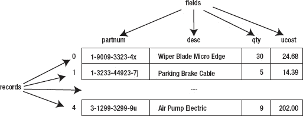

***图 8-1。**这个平面文件数据库描述了汽车零件。*

根据图 8-1 ，每个字段都有一个名称(零件号、desc、数量和成本)。此外，每个记录被分配一个从 0 开始的数字。这个例子由五条记录组成，为了简洁起见，只显示了其中的三条。

 **注意**术语*字段*也用于指在类内声明的变量。为了避免与这种重载术语混淆，可以将字段变量想象成类似于记录的字段属性。

为了向您展示如何根据`RandomAccessFile`实现平面文件数据库，我创建了一个简单的`PartsDB`类来模拟图 8-1 。查看清单 8-6 。

***清单 8-6。**实施零件平面文件数据库*

`import java.io.Closeable;
import java.io.IOException;
import java.io.RandomAccessFile;

class PartsDB implements Closeable
{
   final static int PNUMLEN = 20;
   final static int DESCLEN = 30;
   final static int QUANLEN = 4;
   final static int COSTLEN = 4;
   private final static int RECLEN = 2*PNUMLEN+2*DESCLEN+QUANLEN+COSTLEN;
   private RandomAccessFile raf;
   PartsDB(String pathname) throws IOException
   {
      raf = new RandomAccessFile(pathname, "rw");
   }
   void append(String partnum, String partdesc, int qty, int ucost)
      throws IOException
   {` `raf.seek(raf.length());
      write(partnum, partdesc, qty, ucost);
   }
   **@Override**
   **public** void close() throws IOException
   {
**//      throw new IOException("cannot close raf");**
      raf.close();
   }
   int numRecs() throws IOException
   {
      return (int) raf.length()/RECLEN;
   }
   Part select(int recno) throws IOException
   {
      if (recno < 0 || recno >= numRecs())
         throw new IllegalArgumentException(recno+" out of range");
      raf.seek(recno*RECLEN);
      return read();
   }
   void update(int recno, String partnum, String partdesc, int qty, int ucost)
      throws IOException
   {
      if (recno < 0 || recno >= numRecs())
         throw new IllegalArgumentException(recno+" out of range");
      raf.seek(recno*RECLEN);
      write(partnum, partdesc, qty, ucost);
   }
   private Part read() throws IOException
   {
      StringBuffer sb = new StringBuffer();
      for (int i = 0; i < PNUMLEN; i++)
         sb.append(raf.readChar());
      String partnum = sb.toString().trim();
      sb.setLength(0);
      for (int i = 0; i < DESCLEN; i++)
         sb.append(raf.readChar());
      String partdesc = sb.toString().trim();
      int qty = raf.readInt();
      int ucost = raf.readInt();
      return new Part(partnum, partdesc, qty, ucost);
   }
   private void write(String partnum, String partdesc, int qty, int ucost)
      throws IOException
   {
      StringBuffer sb = new StringBuffer(partnum);
      if (sb.length() > PNUMLEN)
         sb.setLength(PNUMLEN);
      else
      if (sb.length() < PNUMLEN)
      {
         int len = PNUMLEN-sb.length();` `         for (int i = 0; i < len; i++)
            sb.append(" ");
      }
      raf.writeChars(sb.toString());
      sb = new StringBuffer(partdesc);
      if (sb.length() > DESCLEN)
         sb.setLength(DESCLEN);
      else
      if (sb.length() < DESCLEN)
      {
         int len = DESCLEN-sb.length();
         for (int i = 0; i < len; i++)
            sb.append(" ");
      }
      raf.writeChars(sb.toString());
      raf.writeInt(qty);
      raf.writeInt(ucost);
   }
   static class Part
   {
      private String partnum;
      private String desc;
      private int qty;
      private int ucost;
      Part(String partnum, String desc, int qty, int ucost)
      {
         this.partnum = partnum;
         this.desc = desc;
         this.qty = qty;
         this.ucost = ucost;
      }
      String getDesc()
      {
         return desc;
      }
      String getPartnum()
      {
         return partnum;
      }
      int getQty()
      {
         return qty;
      }
      int getUnitCost()
      {
         return ucost;
      }
   }
}`

清单 8-6 的`PartsDB`类实现了`java.io.Closeable`接口，因此它可以在 try-with-resources 语句的上下文中使用(参见第三章)。我本可以选择实现、T2 的`java.lang.AutoCloseable`超接口，但却选择了`Closeable`，因为它的`close()`方法被声明为抛出`IOException`。

`PartsDB`声明标识字符串和 32 位整数字段长度的常数。然后，它声明一个常数，以字节为单位计算记录长度。该计算考虑了一个字符在文件中占用两个字节的事实。

这些常量后面是一个名为`raf`的字段，它的类型是`RandomAccessFile`。在随后的构造函数中，这个字段被分配了一个`RandomAccessFile`类的实例，由于`"rw"`，它创建/打开一个新文件或者打开一个现有文件。

`PartsDB`接下来声明`append()`、`close()`、`numRecs()`、`select()`和`update()`。这些方法将记录追加到文件中，关闭文件，返回文件中的记录数，选择并返回特定记录，以及更新特定记录:

*   `append()`方法首先调用`length()`和`seek()`。这样做可以确保在调用私有的`write()`方法来写入包含该方法参数的记录之前，文件指针被定位到文件的末尾。
*   `close()`方法被声明为`public`,因为它是从`Closeable`继承的，并且接口方法是公共的——你不能让一个覆盖的方法更难访问。这个方法也被声明为抛出`IOException`，因为`RandomAccessFile`的`close()`方法可以抛出`IOException`。因为这种情况很少发生，所以我注释掉了一个 throw 语句，您可以用它来试验被抑制的异常——当我展示`UsePartsDB`时，我将向您展示如何这样做。
*   `numRecs()`方法返回文件中记录的数量。这些记录从 0 开始编号，以`numRecs()-1`结束。每个`select()`和`update()`方法都验证它的`recno`参数在这个范围内。
*   `select()`方法调用私有的`read()`方法来返回由`recno`标识的记录，作为`Part`静态成员类的实例。`Part`的构造函数将一个`Part`对象初始化为记录的字段值，它的 getter 方法返回这些值。
*   `update()`方法同样简单。与`select()`一样，它首先将文件指针定位到由`recno`标识的记录的开始处。和`append()`一样，它调用`write()`写出它的参数，但是替换一个记录而不是添加一个记录。

记录是通过私有的`write()`方法写入的。因为字段必须有精确的大小，`write()`用右边的空格填充比字段大小短的基于`String`的值，并在需要时将这些值截断为字段大小。

通过私有的`read()`方法读取记录。`read()`在将基于`String`的字段值保存到`Part`对象之前，删除填充。

`PartsDB`本身是没用的。我们需要一个能让我们试验这个类的应用，清单 8-7 满足了这个需求。

***清单 8-7。**试验零件平面文件数据库*

`import java.io.IOException;

class UsePartsDB
{
   public static void main(String[] args)` `{
      **try (PartsDB pdb = new PartsDB("parts.db"))**
      {
         if (pdb.numRecs() == 0)
         {
            // Populate the database with records.
            pdb.append("1-9009-3323-4x", "wiper blade micro edge", 30, 2468);
            pdb.append("1-3233-44923-7j", "parking brake cable", 5, 1439);
            pdb.append("2-3399-6693-2m", "halogen bulb h4 55/60w", 22, 813);
            pdb.append("2-599-2029-6k", "turbo oil line o-ring ", 26, 155);
            pdb.append("3-1299-3299-9u", "air pump electric", 9, 20200);
         }
         dumpRecords(pdb);
         pdb.update(1, "1-3233-44923-7j", "parking brake cable", 5, 1995);
         dumpRecords(pdb);
**//         throw new IOException("i/o error");**
      }
      catch (IOException ioe)
      {
         System.err.println(ioe);
**         if (ioe.getSuppressed().length == 1)**
**            System.err.println("suppressed = "+ioe.getSuppressed()[0]);**
      }
   }
   static void dumpRecords(PartsDB pdb) throws IOException
   {
      for (int i = 0; i < pdb.numRecs(); i++)
      {
         PartsDB.Part part = pdb.select(i);
         System.out.print(format(part.getPartnum(), PartsDB.PNUMLEN, true));
         System.out.print(" | ");
         System.out.print(format(part.getDesc(), PartsDB.DESCLEN, true));
         System.out.print(" | ");
         System.out.print(format(""+part.getQty(), 10, false));
         System.out.print(" | ");
         String s = part.getUnitCost()/100+"."+part.getUnitCost()%100;
         if (s.charAt(s.length()-2) == '.') s += "0";
         System.out.println(format(s, 10, false));
      }
      System.out.println("number of records = "+pdb.numRecs());
      System.out.println();
   }
   static String format(String value, int maxWidth, boolean leftAlign)
   {
      StringBuffer sb = new StringBuffer();
      int len = value.length();
      if (len > maxWidth)
      {
         len = maxWidth;
         value = value.substring(0, len);
      }
      if (leftAlign)` `      {
         sb.append(value);
         for (int i = 0; i < maxWidth-len; i++)
            sb.append(" ");
      }
      else
      {
         for (int i = 0; i < maxWidth-len; i++)
            sb.append(" ");
         sb.append(value);
      }
      return sb.toString();
   }
}`

清单 8-7 的`main()`方法首先实例化`PartsDB`，用`parts.db`作为数据库文件的名称。当该文件没有记录时，`numRecs()`返回 0，通过`append()`方法将几条记录追加到文件中。

`main()`接下来将存储在`parts.db`中的五条记录转储到标准输出设备，更新编号为 1 的记录中的单位成本，再次将这些记录转储到标准输出设备以显示这一变化，并关闭数据库。

 **注意**我将单位成本值存储为基于整数的便士数量。例如，我指定 literal `1995`来表示 1995 年的便士，即 19.95 美元。如果我要使用`java.math.BigDecimal`对象来存储货币值，我将不得不重构`PartsDB`来利用对象序列化，但我现在还不准备这么做。(我将在本章后面讨论对象序列化。)

`main()`依靠一个`dumpRecords()`助手方法来转储这些记录，`dumpRecords()`依靠一个`format()`助手方法来格式化字段值，以便它们可以显示在正确对齐的列中。以下输出揭示了这种一致性:

```java
1-9009-3323-4x       | Wiper Blade Micro Edge         |         30 |      24.68
1-3233-44923-7j      | Parking Brake Cable            |          5 |      **14.39**
2-3399-6693-2m       | Halogen Bulb H4 55/60W         |         22 |       8.13
2-599-2029-6k        | Turbo Oil Line O-Ring          |         26 |       1.55
3-1299-3299-9u       | Air Pump Electric              |          9 |     202.00
Number of records = 5

1-9009-3323-4x       | Wiper Blade Micro Edge         |         30 |      24.68
1-3233-44923-7j      | Parking Brake Cable            |          5 |      **19.95**
2-3399-6693-2m       | Halogen Bulb H4 55/60W         |         22 |       8.13
2-599-2029-6k        | Turbo Oil Line O-Ring          |         26 |       1.55
3-1299-3299-9u       | Air Pump Electric              |          9 |     202.00
Number of records = 5
```

清单 8-7 依靠 try-with-resources 语句来简化代码——注意`try (PartsDB pdb = new PartsDB("parts.db"))`。要观察一个被抑制的异常，取消对清单 8-6 的`close()`方法中 的 throw 语句的注释(确保注释掉该方法中的`raf.close();`,否则编译器会报错无法到达的代码)，取消对清单 8-7 的 try 块中的 throw 语句的注释。这一次，当您运行应用时，您会注意到输出的末尾有下面两行:

```java
java.io.IOException: I/O error
Suppressed = java.io.IOException: cannot close raf
```

这就是:一个简单的平面文件数据库。尽管缺乏对高级数据库特性(如事务管理)的支持，平面文件数据库可能就是您的应用所需要的全部。

 **注**要了解更多关于平面文件数据库的信息，请查看维基百科的“平面文件数据库”条目(`[`en.wikipedia.org/wiki/Flat_file_database`](http://en.wikipedia.org/wiki/Flat_file_database)`)。

### 溪流

与`File`和`RandomAccessFile`一起，Java 使用流来执行 I/O 操作。一个*流*是一个任意长度的有序字节序列。字节通过*输出流*从应用流向目的地，并通过*输入流*从源流向应用。图 8-2 说明了这些流程。


***图 8-2。**将输出和输入流概念化为流动。*

 **注** Java 对*流*的使用，类比说“水流”“电子流”等等。

Java 识别各种流目的地；比如字节数组、文件、屏幕、*套接字*(网络端点)。Java 也能识别各种流源。例子包括字节数组、文件、键盘和套接字。(我在第九章中讨论插座。)

#### 流类概述

`java.io`包提供了几个输出流和输入流类，它们是抽象的`OutputStream`和`InputStream`类的后代。图 8-3 揭示了输出流类的层次结构。


***图 8-3。**除了`PrintStream`之外的所有输出流类都由它们的`OutputStream`后缀表示。*

图 8-4 揭示了输入流类的层次结构。

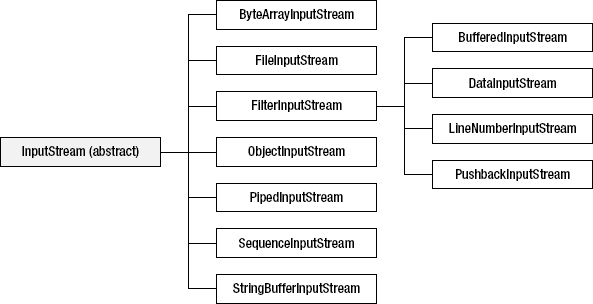

*图 8-4**。**`LineNumberInputStream``StringBufferInputStream`已弃用。*

`LineNumberInputStream`和`StringBufferInputStream`已经被弃用，因为它们不支持不同的字符编码，这是我在本章后面讨论的主题。`LineNumberReader`和`StringReader`是他们的替代品。(我将在本章后面讨论读者。)

 **注意** `PrintStream`是另一个不推荐使用的类，因为它不支持不同的字符编码；`PrintWriter`是它的替代品。然而，Oracle 是否会弃用这个类值得怀疑，因为 `PrintStream`是`System`类的`out`和`err`类字段的类型；太多的遗留代码依赖于这个事实。

其他 Java 包提供了额外的输出流和输入流类。例如，`java.util.zip`提供了五个将未压缩数据压缩成各种格式的输出流类，以及五个从相同格式解压缩压缩数据的匹配输入流类:

*   `CheckedOutputStream`
*   `CheckedInputStream`
*   `DeflaterOutputStream`
*   `DeflaterInputStream`
*   `GZIPOutputStream`
*   `GZIPInputStream`
*   `InflaterOutputStream`
*   `InflaterInputStream`
*   `ZipOutputStream`
*   `ZipInputStream`

为了简洁起见，在这一章中我只关注`OutputStream`、`InputStream`、`FileOutputStream`、`FileInputStream`、`FilterOutputStream`、`FilterInputStream`、`BufferedOutputStream`、`BufferedInputStream`、`DataOutputStream`、`DataInputStream`、`ObjectOutputStream`、`ObjectInputStream`和`PrintStream`类。附录 C 讨论了附加的流类。

#### 输出流和输入流

Java 提供了用于执行流 I/O 的`OutputStream`和`InputStream`类。`OutputStream`是所有输出流子类的超类。表 8-7 描述了`OutputStream`的方法。


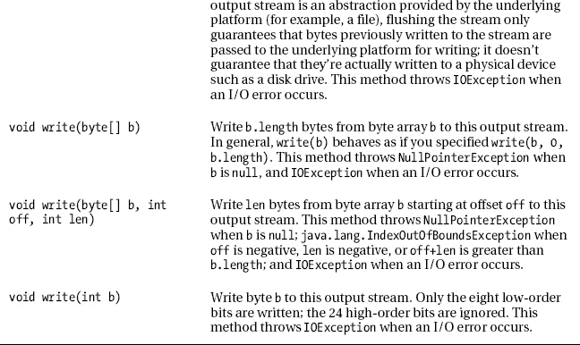


在需要经常保存更改的长时间运行的应用中，`flush()`方法很有用；例如，前面提到的文本编辑器应用每隔几分钟就将更改保存到一个临时文件中。记住`flush()`只向平台刷新字节；这样做不一定会导致平台将这些字节刷新到磁盘。

 **注意**`close()`方法自动刷新输出流。当应用在调用`close()`之前结束时，输出流会自动关闭，其数据会被刷新。

`InputStream`是所有输入流子类的超类。表 8-8 描述了`InputStream`的方法。


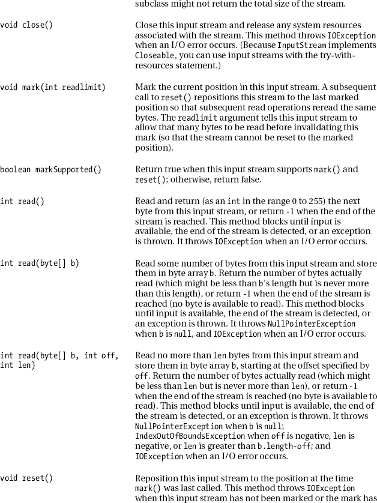


`InputStream`子类如`ByteArrayInputStream`支持通过`mark()`方法标记输入流中的当前读取位置，稍后通过`reset()`方法返回到该位置。

 **注意**不要忘记调用`markSupported()`来查明流子类是否支持`mark()`和`reset()`。

#### FileOutputStream 和 FileInputStream

文件是常见的流目的地和源。具体的`FileOutputStream`类允许你将一个字节流写到一个文件中；具体的`FileInputStream`类让你从文件中读取一个字节流。

`FileOutputStream`子类化`OutputStream`并声明五个用于创建文件输出流的构造函数。例如，`FileOutputStream(String name)`为由`name`标识的现有文件创建一个文件输出流。当文件不存在并且不能被创建，它是一个目录而不是一个普通的文件，或者文件不能被打开输出时，这个构造函数抛出`FileNotFoundException`。

以下示例使用`FileOutputStream(String name)`创建一个以`employee.dat`为目的地的文件输出流:

```java
FileOutputStream fos = new FileOutputStream("employee.dat");
```

 **提示** `FileOutputStream(String name)`覆盖现有文件。要追加数据而不是覆盖现有内容，调用一个包含一个`boolean append`参数的`FileOutputStream`构造函数，并将`true`传递给这个参数。

`FileInputStream`子类化`InputStream`并声明三个用于创建文件输入流的构造函数。例如，`FileInputStream(String name)`从由`name`标识的现有文件创建一个文件输入流。当文件不存在，它是一个目录而不是一个普通文件，或者有其他原因导致文件无法打开输入时，这个构造函数抛出`FileNotFoundException`。

以下示例使用`FileInputStream(String name)`创建一个以`employee.dat`为源的文件输入流:

```java
FileInputStream fis = new FileInputStream("employee.dat");
```

清单 8-8 将源代码呈现给一个`DumpFileInHex`应用，该应用使用`FileOutputStream`和`FileInputStream`创建一个包含另一个文件的十六进制表示的文件。

***清单 8-8。**创建文件的十六进制表示*

`import java.io.FileInputStream;
import java.io.FileOutputStream;
import java.io.IOException;

class DumpFileInHex
{
   final static String LINE_SEPARATOR = System.getProperty("line.separator");
   public static void main(String[] args)
   {
      if (args.length != 1)
      {
         System.err.println("usage: java DumpFileInHex pathname");
         return;
      }
      String dest = args[0]+".hex";
      try (FileInputStream fis = new FileInputStream(args[0]);
           FileOutputStream fos = new FileOutputStream(dest))
      {
         StringBuffer sb = new StringBuffer();
         int offset = 0;
         int ch;
         while ((ch = fis.read()) != -1)
         {
            if ((offset%16) == 0)
            {
               writeStr(fos, toHexStr(offset, 8));
               fos.write(' ');
            }
            writeStr(fos, toHexStr(ch, 2));
            fos.write(' ');
            if (ch < 32 || ch > 127)
               sb.append('.');
            else
               sb.append((char) ch);
            if ((++offset%16) == 0)
            {
               writeStr(fos, sb.toString()+LINE_SEPARATOR);
               sb.setLength(0);
            }
         }
         if (sb.length() != 0)
         {
            for (int i = 0; i < 16-sb.length(); i++)
               writeStr(fos, "   ");
            writeStr(fos, sb.toString()+LINE_SEPARATOR);` `         }
      }
      catch (IOException ioe)
      {
         System.err.println("I/O error: "+ioe.getMessage());
      }
   }
   static String toHexStr(int value, int fieldWidth)
   {
      StringBuffer sb = new StringBuffer(Integer.toHexString(value));
      sb.reverse();
      int len = sb.length();
      for (int i = 0; i < fieldWidth-len; i++)
         sb.append('0');
      sb.reverse();
      return sb.toString();
   }
   static void writeStr(FileOutputStream fos, String s) throws IOException
   {
      for (int i = 0; i < s.length(); i++)
         fos.write(s.charAt(i));
   }
}`

清单 8-8 的`DumpFileInHex`类首先声明一个包含`line.separator`系统属性的值的`LINE_SEPARATOR`常量。输出该常量的值以结束当前文本行并开始新的文本行。因为不同的平台提供了不同的行分隔符(例如，Unix/Linux 上的换行符或 Windows 上的回车后跟换行符)，所以输出`LINE_SEPARATOR`确保了最大的可移植性。

`DumpFileInHex` next 给出了它的`main()`方法，它的第一个任务是确保只指定了一个命令行参数(标识输入文件)。假设是这种情况，`main()`接下来通过将`.hex`附加到命令行参数的值来创建输出文件的名称。

接下来，`main()`给出了一个 try-with-resources 语句，该语句最初打开输入文件并创建输出文件。然后，在`toHexStr()`和`writeStr()`方法的帮助下，try 块使用 while 循环从输入文件中读取每个字节，并将该字节的十六进制表示和文字值写入输出文件:

*   `toHexStr()`确保在十六进制值字符串前添加前导零，以适应字段宽度。例如，如果一个十六进制值必须正好占据八个字段位置，并且如果它的长度小于 8，则在字符串前面加上前导 0。(虽然 Java 提供了`java.util.Formatter`类来处理这个任务，但是`toHexStr()`现在已经足够了，因为我直到附录 c 才讨论`Formatter`)
*   `writeStr()`将一串 8 位字符写入文件输出流。通常情况下，你不会创建这样的方法，因为它忽略了不同的字符集(本章后面会讨论)。然而，字符集不是这个例子的问题。

编译完这个清单(`javac DumpFileInHex.java`)后，假设您想要创建一个结果`DumpFileInHex.class`文件的十六进制表示。你可以通过执行`java DumpFileInHex DumpFileInHex.class`来完成这个任务。如果一切顺利，这个命令行会创建一个`DumpFileInHex.class.hex`文件。该文件的第一部分如下所示:

`00000000 ca fe ba be 00 00 00 33 00 88 0a 00 29 00 42 09 .......3....).B.
00000010 00 43 00 44 08 00 45 0a 00 46 00 47 07 00 48 0a .C.D..E..F.G..H.
00000020 00 05 00 42 0a 00 05 00 49 08 00 4a 0a 00 05 00 ...B....I..J....
00000030 4b 07 00 4c 0a 00 0a 00 4d 07 00 4e 0a 00 0c 00 K..L....M..N....
00000040 4d 07 00 4f 0a 00 0e 00 42 0a 00 0a 00 50 0a 00 M..O....B....P..
00000050 28 00 51 0a 00 28 00 52 0a 00 0c 00 53 0a 00 0e (.Q..(.R....S...
00000060 00 54 0a 00 0e 00 4b 09 00 28 00 55 0a 00 0e 00 .T....K..(.U....
00000070 56 0a 00 0e 00 57 08 00 58 0a 00 0c 00 59 07 00 V....W..X....Y..
00000080 5a 0a 00 1b 00 5b 0a 00 0a 00 59 07 00 5c 08 00 Z....[....Y..\..
00000090 5d 0a 00 1e 00 5e 0a 00 5f 00 60 0a 00 0e 00 4d ]....^.._.`....M
000000a0 0a 00 0e 00 61 0a 00 62 00 57 0a 00 62 00 63 08 ....a..b.W..b.c.
000000b0 00 64 0a 00 43 00 65 07 00 66 07 00 67 01 00 0e .d..C.e..f..g...
000000c0 4c 49 4e 45 5f 53 45 50 41 52 41 54 4f 52 01 00 LINE_SEPARATOR..
000000d0 12 4c 6a 61 76 61 2f 6c 61 6e 67 2f 53 74 72 69 .Ljava/lang/Stri
000000e0 6e 67 3b 01 00 06 3c 69 6e 69 74 3e 01 00 03 28 ng;...<init>...(
000000f0 29 56 01 00 04 43 6f 64 65 01 00 0f 4c 69 6e 65 )V...Code...Line`

#### 滤波器 utputStream 和 FilterInputStream

文件流将字节原封不动地传递到目的地。Java 还支持*过滤流*，在输入流到达目的地之前对其进行缓冲、压缩/解压缩、加密/解密或其他操作。

*过滤器输出流*获取传递给其`write()`方法的数据(输入流)，对其进行过滤，并将过滤后的数据写入底层输出流，该输出流可能是另一个过滤器输出流或目标输出流，如文件输出流。

过滤器输出流是从 concrete `FilterOutputStream`类的子类创建的，concrete`FilterOutputStream`类是一个`OutputStream`子类。`FilterOutputStream`声明了一个单独的`FilterOutputStream(OutputStream out)`构造函数，它创建了一个构建在`out`之上的过滤器输出流，即底层输出流。

清单 8-9 揭示了子类化`FilterOutputStream`很容易。至少，声明一个构造函数，将它的`OutputStream`参数传递给`FilterOutputStream`的构造函数，并覆盖`FilterOutputStream`的`void write(int b)`方法。

***清单 8-9。**加扰一个字节流*

`import java.io.FilterOutputStream;
import java.io.IOException;
import java.io.OutputStream;

class ScrambledOutputStream extends FilterOutputStream
{
   private int[] map;
   ScrambledOutputStream(OutputStream out, int[] map)
   {
      super(out);
      if (map == null)
         throw new NullPointerException("map is null");
      if (map.length != 256)
         throw new IllegalArgumentException("map.length != 256");` `      this.map = map;
   }
   @Override
   public void write(int b) throws IOException
   {
      out.write(map[b]);
   }
}`

清单 8-9 展示了一个`ScrambledOutputStream`类，它通过重新映射操作对输入流的字节进行加密，从而对输入流执行简单的加密。它的构造函数接受一对参数:

*   `out`标识要写入加扰字节的输出流。
*   `map`标识输入流字节映射到的 256 字节整数值的数组。

构造函数首先通过一个`super(out)`调用将其`out`参数传递给`FilterOutputStream`父节点。然后，在保存`map`之前，它验证其`map`参数的完整性(`map`必须非空，长度为 256——一个字节流正好提供 256 个字节进行映射)。

`write()`方法很简单:它用参数`b`映射到的字节调用底层输出流的`write()`方法。`FilterOutputStream`声明`out`为`protected`(为了性能)，这就是为什么我可以直接访问这个字段。

 **注意**只需重写`write(int)`，因为`FilterOutputStream`的另外两个`write()`方法都是根据这个方法实现的。

清单 8-10 展示了一个`Scramble`应用的源代码，用于通过`ScrambledOutputStream`对源文件的字节进行加扰，并将这些加扰后的字节写入目标文件。

***清单 8-10。**打乱一个文件的字节*

`import java.io.FileInputStream;
import java.io.FileOutputStream;
import java.io.IOException;

import java.util.Random;

class Scramble
{
   public static void main(String[] args)
   {
      if (args.length != 2)
      {
         System.err.println("usage: java Scramble srcpath destpath");
         return;
      }
      try (FileInputStream fis = new FileInputStream(args[0]);` `           ScrambledOutputStream sos =
              new ScrambledOutputStream(new FileOutputStream(args[1]),
                                        makeMap()))
      {
         int b;
         while ((b = fis.read()) != -1)
            sos.write(b);
      }
      catch (IOException ioe)
      {
         ioe.printStackTrace();
      }
   }
   static int[] makeMap()
   {
      int[] map = new int[256];
      for (int i = 0; i < map.length; i++)
         map[i] = i;
      // Shuffle map.
      Random r = new Random(0);
      for (int i = 0; i < map.length; i++)
      {
         int n = r.nextInt(map.length);
         int temp = map[i];
         map[i] = map[n];
         map[n] = temp;
      }
      return map;
   }
}`

`Scramble`的`main()`方法首先验证命令行参数的个数:第一个参数标识包含未解读内容的文件的源路径；第二个参数标识存储加密内容的文件的目标路径。

假设已经指定了两个命令行参数，`main()`实例化了`FileInputStream`，创建了一个连接到由`args[0]`标识的文件的文件输入流。

继续，`main()`实例化`FileOutputStream`，创建一个连接到由`args[1]`标识的文件的文件输出流。然后实例化`ScrambledOutputStream`，将`FileOutputStream`实例传递给`ScrambledOutputStream`的构造函数。

 **注意**当一个流实例被传递给另一个流类的构造函数时，两个流被*链接在一起*。例如，加扰输出流链接到文件输出流。

`main()`现在进入一个循环，通过调用`ScrambledOutputStream`的`void write(int b)`方法，从文件输入流中读取字节，并将它们写入加扰的输出流。这个循环一直持续到`FileInputStream`的`int read()`方法返回`-1`(文件结束)。

try-with-resources 语句通过调用它们的`close()`方法来关闭文件输入流和加扰输出流。它不调用文件输出流的`close()`方法，因为`FilterOutputStream`自动调用底层输出流的`close()`方法。

`makeMap()`方法负责创建传递给`ScrambledOutputStream`的构造函数的 map 数组。想法是用所有 256 字节的整数值填充数组，以随机顺序存储它们。

 **注意**我在创建`java.util.Random`对象时传递 0 作为种子参数，以便返回一个可预测的随机数序列。在`Unscramble`应用中创建互补的 map 数组时，我需要使用相同的随机数序列，我将很快介绍这一点。没有相同的序列，解读将无法工作。

假设您有一个简单的名为`hello.txt`的 15 字节文件，其中包含“`Hello, World!`”(后跟回车符和换行符)。当你在 XP 平台上执行`java Scramble hello.txt hello.out`时，你会观察到图 8-5 的混乱输出。


***图 8-5。**不同的字体产生不同外观的乱码输出。*

*过滤器输入流*从其底层输入流(可能是另一个过滤器输入流或源输入流，如文件输入流)获取数据，对其进行过滤，并通过其`read()`方法(输出流)使该数据可用。

过滤器输入流是从 concrete `FilterInputStream`类的子类创建的，concrete`FilterInputStream`类是一个`InputStream`子类。`FilterInputStream`声明了一个单独的`FilterInputStream(InputStream in)`构造函数，它创建了一个构建在`in`之上的过滤器输入流，即底层输入流。

清单 8-11 显示子类化`FilterInputStream`很容易。至少，声明一个构造函数，将它的`InputStream`参数传递给`FilterInputStream`的构造函数，并覆盖`FilterInputStream`的`int read()`和`int read(byte[] b, int off, int len)`方法。

***清单 8-11。**解读字节流*

`import java.io.FilterInputStream;
import java.io.InputStream;
import java.io.IOException;

class ScrambledInputStream extends FilterInputStream
{
   private int[] map;
   ScrambledInputStream(InputStream in, int[] map)
   {
      super(in);
      if (map == null)` `         throw new NullPointerException("map is null");
      if (map.length != 256)
         throw new IllegalArgumentException("map.length != 256");
      this.map = map;
   }
   @Override
   public int read() throws IOException
   {
      int value = in.read();
      return (value == -1) ? -1 : map[value];
   }
   @Override
   public int read(byte[] b, int off, int len) throws IOException
   {
      int nBytes = in.read(b, off, len);
      if (nBytes <= 0)
         return nBytes;
      for (int i = 0; i < nBytes; i++)
         b[off+i] = (byte) map[off+i];
      return nBytes;
   }
}`

清单 8-11 展示了一个`ScrambledInputStream`类，它通过重新映射操作对底层输入流的加扰字节进行解扰，从而对底层输入流执行简单的解密。

`read()`方法首先从底层输入流中读取加扰的字节。如果返回值为-1(文件结束)，则将该值返回给调用者。否则，该字节将被映射到其未加扰的值，该值将被返回。

`read(byte[], int, int)`方法类似于`read()`，但是将从底层输入流中读取的字节存储在一个字节数组中，并考虑到数组中的偏移量和长度(要读取的字节数)。

同样，底层的`read()`方法调用可能会返回-1。如果是，则必须返回该值。否则，数组中的每个字节都被映射到它的未加扰值，并返回读取的字节数。

 **注意**只需重写`read()`和`read(byte[], int, int)`即可，因为`FilterInputStream`的`int read(byte[] b)`方法是通过后一种方法实现的。

清单 8-12 将源代码呈现给一个`UnScramble`应用，通过对源文件的字节进行解扰并将这些解扰的字节写入一个目标文件来试验`ScrambledInputStream`。

***清单 8-12。**解读文件的字节*

`import java.io.FileInputStream;
import java.io.FileOutputStream;` `import java.io.IOException;

import java.util.Random;

class Unscramble
{
   public static void main(String[] args)
   {
      if (args.length != 2)
      {
         System.err.println("usage: java unscramble srcpath destpath");
         return;
      }
      try (FileOutputStream fos = new FileOutputStream(args[1]);
           ScrambledInputStream sis =
              new ScrambledInputStream(new FileInputStream(args[0]),
                                       makeMap()))

      {
         int b;
         while ((b = sis.read()) != -1)
            fos.write(b);
      }
      catch (IOException ioe)
      {
         ioe.printStackTrace();
      }
   }
   static int[] makeMap()
   {
      int[] map = new int[256];
      for (int i = 0; i < map.length; i++)
         map[i] = i;
      // Shuffle map.
      Random r = new Random(0);
      for (int i = 0; i < map.length; i++)
      {
         int n = r.nextInt(map.length);
         int temp = map[i];
         map[i] = map[n];
         map[n] = temp;
      }
      int[] temp = new int[256];
      for (int i = 0; i < temp.length; i++)
         temp[map[i]] = i;
      return temp;
   }
}`

`Unscramble`的`main()`方法首先验证命令行参数的个数:第一个参数标识带有加扰内容的文件的源路径；第二个参数标识存储未加扰内容的文件的目标路径。

假设已经指定了两个命令行参数，`main()`实例化`FileOutputStream`，创建一个文件输出流，该流连接到由`args[1]`标识的文件。

继续，`main()`实例化`FileInputStream`，创建一个连接到由`args[0]`标识的文件的文件输入流。然后实例化`ScrambledInputStream`，将`FileInputStream`实例传递给`ScrambledInputStream`的构造函数。

 **注意**当一个流实例被传递给另一个流类的构造函数时，两个流被*链接在一起*。例如，加扰的输入流链接到文件输入流。

`main()`现在进入一个循环，从加扰的输入流中读取字节，并将它们写入文件输出流。这个循环一直持续到`ScrambledInputStream`的`read()`方法返回`-1`(文件结束)。

try-with-resources 语句通过调用它们的`close()`方法来关闭文件输出流和加密的输入流。它不调用文件输入流的`close()`方法，因为`FilterInputStream`自动调用底层输入流的`close()`方法。

`makeMap()`方法负责创建传递给`ScrambledInputStream`的构造函数的 map 数组。这个想法是复制清单 8-10 的地图数组，然后将其反转，以便可以执行解读。

继续前面的`hello.txt` / `hello.out`示例，执行`java Unscramble hello.out hello.bak`，您将在`hello.bak`中看到与`hello.txt`中相同的未解码内容。

#### buffer utputstream 和 bufferedinputstream

`FileOutputStream`和`FileInputStream`出现性能问题。每个文件输出流`write()`方法调用和文件输入流`read()`方法调用都会导致对底层平台的本地方法之一的调用，这些本地方法调用会降低 I/O 的速度(我将在附录 c 中讨论本地方法)

具体的`BufferedOutputStream`和`BufferedInputStream`过滤器流类通过最小化底层输出流`write()`和底层输入流`read()`方法调用来提高性能。相反，对`BufferedOutputStream`的`write()`和`BufferedInputStream`的`read()`方法的调用考虑了 Java 缓冲区:

*   当写缓冲区已满时，`write()`调用底层输出流`write()`方法来清空缓冲区。对`BufferedOutputStream`的`write()`方法的后续调用将字节存储在这个缓冲区中，直到它再次充满。
*   当读缓冲区为空时，`read()`调用底层输入流`read()`方法来填充缓冲区。对`BufferedInputStream`的`read()`方法的后续调用从这个缓冲区返回字节，直到它再次变空。

`BufferedOutputStream`声明了以下构造函数:

*   `BufferedOutputStream(OutputStream out)`创建一个缓冲输出流，将其输出传输到`out`。创建一个内部缓冲区来存储写入`out`的字节。
*   `BufferedOutputStream(OutputStream out, int size)`创建一个缓冲输出流，将其输出传输到`out`。创建一个长度为`size`的内部缓冲区来存储写入`out`的字节。

下面的例子将一个`BufferedOutputStream`实例链接到一个`FileOutputStream`实例。后续的`write()`方法调用在`BufferedOutputStream`实例缓冲字节上，偶尔会导致内部`write()`方法调用在封装的`FileOutputStream`实例上:

```java
FileOutputStream fos = new FileOutputStream("employee.dat");
BufferedOutputStream bos = new BufferedOutputStream(fos); // Chain bos to fos.
bos.write(0); // Write to employee.dat through the buffer.
// Additional write() method calls.
bos.close(); // This method call internally calls fos's close() method.
```

`BufferedInputStream`声明了以下构造函数:

*   `BufferedInputStream(InputStream in)`创建一个缓冲输入流，从`in`输入。创建一个内部缓冲区来存储从`in`读取的字节。
*   `BufferedInputStream(InputStream in, int size)`创建一个缓冲输入流，从`in`输入。创建一个长度为`size`的内部缓冲区来存储从`in`读取的字节。

以下示例将一个`BufferedInputStream`实例链接到一个`FileInputStream`实例。后续的`read()`方法调用在`BufferedInputStream`实例上解缓冲字节，偶尔会导致内部的`read()`方法调用在封装的`FileInputStream`实例上:

```java
FileInputStream fis = new FileInputStream("employee.dat");
BufferedInputStream bis = new BufferedInputStream(fis); // Chain bis to fis.
int ch = bis.read(); // Read employee.dat through the buffer.
// Additional read() method calls.
bis.close(); // This method call internally calls fis's close() method.
```

#### DataOutputStream 和 DataInputStream

`FileOutputStream`和`FileInputStream`对于读写字节和字节数组很有用。但是，它们不支持读写基本类型值(如整数)和字符串。

为此，Java 提供了具体的`DataOutputStream`和`DataInputStream`过滤流类。每个类都通过提供以独立于平台的方式写入或读取基元类型值和字符串的方法来克服这一限制:

*   整数值以*大端格式*读写(最高有效字节在前)。查看维基百科的“字节序”条目(`[`en.wikipedia.org/wiki/Endianness`](http://en.wikipedia.org/wiki/Endianness)`)，了解*字节序*的概念。
*   浮点和双精度浮点值是根据 IEEE 754 标准读写的，该标准规定每个浮点值四个字节，每个双精度浮点值八个字节。
*   字符串是根据修改后的 *UTF-8* 来读写的，这是一种有效存储双字节 Unicode 字符的可变长度编码标准。查看维基百科的“UTF-8”条目(`[`en.wikipedia.org/wiki/Utf-8`](http://en.wikipedia.org/wiki/Utf-8)`)，了解更多关于 UTF-8 的信息。

`DataOutputStream`声明一个`DataOutputStream(OutputStream out)`构造函数。因为这个类实现了`DataOutput`接口，`DataOutputStream`还提供了对`RandomAccessFile`提供的同名写方法的访问。

`DataInputStream`声明一个单独的`DataInputStream(InputStream in)`构造函数。因为这个类实现了`DataInput`接口，`DataInputStream`还提供了对`RandomAccessFile`提供的同名读取方法的访问。

清单 8-13 给出了一个`DataStreamsDemo`应用的源代码，该应用使用一个`DataOutputStream`实例将多字节值写入一个`FileOutputStream`实例，并使用`DataInputStream`从一个`FileInputStream`实例读取多字节值。

***清单 8-13。**输出然后输入多字节值流*

```java
import java.io.DataInputStream;
import java.io.DataOutputStream;
import java.io.FileInputStream;
import java.io.FileOutputStream;
import java.io.IOException;

class DataStreamsDemo
{
   final static String FILENAME = "values.dat";
   public static void main(String[] args)
   {
      try (DataOutputStream dos =
              new DataOutputStream(new FileOutputStream(FILENAME)))
      {
         dos.writeInt(1995);
         dos.writeUTF("saving this string in modified utf-8 format!");
         dos.writeFloat(1.0F);
      }
      catch (IOException ioe)
      {
         System.err.println("i/o error: "+ioe.getMessage());
      }
      try (DataInputStream dis =
              new DataInputStream(new FileInputStream(FILENAME)))
      {
         System.out.println(dis.readInt());
         System.out.println(dis.readUTF());
         System.out.println(dis.readFloat());
      }
      catch (IOException ioe)
      {
         System.err.println("i/o error: "+ioe.getMessage());
      }
   }
}
```

`DataStreamsDemo`创建一个名为`values.dat`的文件，调用`DataOutputStream`方法向该文件写入一个整数、一个字符串和一个浮点值，并调用`DataInputStream`方法读回这些值。不出所料，它会生成以下输出:

```java
1995
Saving this String in modified UTF-8 format!
1.0
```

 **注意**当读取由`DataOutputStream`方法调用序列写入的值文件时，确保使用相同的方法调用序列。否则，您肯定会得到错误的数据，并且在使用`readUTF()`方法的情况下，会抛出`java.io.UTFDataFormatException`类的实例(是`IOException`的子类)。

#### 对象序列化和反序列化

Java 提供了`DataOutputStream`和`DataInputStream`类来传输原始类型值和`String`对象。但是，您不能使用这些类来流式传输非`String`对象。相反，您必须使用对象序列化和反序列化来流式传输任意类型的对象。

*对象序列化*是一个 JVM 机制，用于*将*对象状态序列化为字节流。它的*反序列化*对应部分是一个 JVM 机制，用于从字节流中*反序列化*该状态。

 **注意**一个对象的状态由存储原始类型值和/或对其他对象的引用的实例字段组成。当对象被序列化时，属于该状态的对象也被序列化(除非您阻止它们被序列化)，它们的对象被序列化(除非被阻止)，依此类推。

Java 支持三种形式的序列化和反序列化:默认序列化和反序列化、自定义序列化和反序列化以及外部化。

##### 默认序列化和反序列化

默认的序列化和反序列化是最容易使用的形式，但是对如何序列化和反序列化对象几乎没有控制。尽管 Java 代表您处理了大部分工作，但是有几项任务您必须执行。

您的第一个任务是让要序列化的对象的类实现`java.io.Serializable`接口(直接或通过类的超类间接实现)。实现`Serializable`的基本原理是为了避免无限制的序列化。

 **注意** `Serializable`是一个空的标记接口(没有要实现的方法),类实现它来告诉 JVM 可以序列化类的对象。当序列化机制遇到一个其类没有实现`Serializable`的对象时，它抛出一个`java.io.NotSerializableException`类的实例(一个`IOException`的间接子类)。

*无限制序列化*是序列化整个*对象图*的过程(从一个起始对象可到达的所有对象)。Java 不支持无限制的序列化，原因如下:

*   *安全*:如果 Java 自动序列化一个包含敏感信息(比如密码或信用卡号)的对象，黑客很容易发现这些信息并大肆破坏。最好给开发者一个选择，防止这种情况发生。
*   *性能*:序列化利用了反射 API，我在第四章中介绍过。在那一章中，你学到了反射会降低应用的性能。无限制的序列化真的会损害应用的性能。
*   *不适合序列化的对象*:有些对象只存在于正在运行的应用的上下文中，序列化它们是没有意义的。例如，反序列化的文件流对象不再表示与文件的连接。

清单 8-14 声明了一个`Employee`类，它实现了`Serializable`接口来告诉 JVM 可以序列化`Employee`对象。

***清单 8-14。**实施`Serializable`*

```java
class Employee implements java.io.Serializable
{
   private String name;
   private int age;
   Employee(String name, int age)
   {
      this.name = name;
      this.age = age;
   }
   String getName() { return name; }
   int getAge() { return age; }
}
```

因为`Employee`实现了`Serializable`，序列化一个`Employee`对象时序列化机制不会抛出`NotSerializableException`。不仅`Employee`实现了`Serializable`，而且`String`类也实现了这个接口。

你的第二个任务是使用`ObjectOutputStream`类及其`void writeObject(Object obj)`方法来序列化一个对象，使用`OutputInputStream`类及其`Object readObject()`方法来反序列化该对象。

 **注意**虽然`ObjectOutputStream`扩展了`OutputStream`而不是`FilterOutputStream`，虽然`ObjectInputStream`扩展了`InputStream`而不是`FilterInputStream`，但是这些类的行为就像过滤流一样。

Java 提供了具体的`ObjectOutputStream`类来启动对象状态到对象输出流的序列化。这个类声明了一个`ObjectOutputStream(OutputStream out)`构造器，它将对象输出流链接到由`out`指定的输出流。

当您将一个输出流引用传递给`out`时，该构造函数会尝试将一个序列化头写入该输出流。当`out`为`null`时，它抛出`NullPointerException`，当一个 I/O 错误阻止它写这个头时，它抛出`IOException`。

`ObjectOutputStream`通过对象的`writeObject()`方法序列化对象。这个方法试图将关于`obj`的类的信息，后跟`obj`的实例字段的值写入底层输出流。

`writeObject()`不序列化`static`字段的内容。相比之下，它序列化所有没有明确以`transient`保留字为前缀的实例字段的内容。例如，考虑以下字段声明:

```java
public transient char[] password;
```

这个声明指定了`transient`来避免序列化一个密码给一些黑客。JVM 的序列化机制忽略任何标记为`transient`的实例字段。

当出错时，`writeObject()`抛出`IOException`或者一个`IOException`子类的实例。例如，这个方法在遇到一个类没有实现`Serializable`的对象时抛出`NotSerializableException`。

 **注意**因为`ObjectOutputStream`实现了`DataOutput`，所以它还声明了将原语类型值和字符串写入对象输出流的方法。

Java 提供了具体的`ObjectInputStream`类来启动对象输入流中对象状态的反序列化。这个类声明了一个`ObjectInputStream(InputStream in)`构造器，它将对象输入流链接到由`in`指定的输入流。

当您将一个输入流引用传递给`in`时，该构造函数试图从该输入流中读取一个序列化头。当`in`为`null`时，它抛出`NullPointerException`，当一个 I/O 错误阻止它读取这个头时抛出`IOException`，当流头不正确时抛出`java.io.StreamCorruptedException`(一个`IOException`的间接子类)。

`ObjectInputStream`通过对象的`readObject()`方法反序列化对象。这个方法试图从底层输入流中读取关于`obj`的类的信息，后跟`obj`的实例字段的值。

当出错时，`readObject()`抛出`java.lang.ClassNotFoundException`、`IOException`或`IOException`子类的实例。例如，这个方法在遇到原始值而不是对象时抛出`java.io.OptionalDataException`。

 **注意**因为`ObjectInputStream`实现了`DataInput`，所以它还声明了从对象输入流中读取原始类型值和字符串的方法。

清单 8-15 展示了一个应用，它使用这些类来序列化和反序列化清单 8-14 的`Employee`类的一个实例到一个`employee.dat`文件。

***清单 8-15。**序列化和反序列化一个`Employee`对象*

```java
import java.io.FileInputStream;
import java.io.FileOutputStream;
import java.io.IOException;
import java.io.ObjectInputStream;
import java.io.ObjectOutputStream;

class SerializationDemo
{
   final static String FILENAME = "employee.dat";
   public static void main(String[] args)
   {
      try (ObjectOutputStream oos =
              new ObjectOutputStream(new FileOutputStream(FILENAME)))
      {
         Employee emp = new Employee("john doe", 36);
         oos.writeObject(emp);
      }
      catch (IOException ioe)
      {
         System.err.println("i/o error: "+ioe.getMessage());
         return;
      }
      try (ObjectInputStream ois =
              new ObjectInputStream(new FileInputStream(FILENAME)))
      {
         Employee emp = (Employee) ois.readObject();
         System.out.println(emp.getName());
         System.out.println(emp.getAge());
      }
      catch (ClassNotFoundException cnfe)
      {
         System.err.println(cnfe.getMessage());
      }
      catch (IOException ioe)
      {
         System.err.println(ioe.getMessage());
      }
   }
}
```

清单 8-15 的`main()`方法首先实例化`Employee`，并通过`writeObject()`将该实例序列化为`employee.dat`。然后它通过`readObject()`从这个文件中反序列化这个实例，并调用实例的`getName()`和`getAge()`方法。与`employee.dat`一起，当您运行这个应用时，您会发现下面的输出:

```java
John Doe
36
```

当序列化对象被反序列化时，不能保证相同的类会存在(可能实例字段已经被删除)。在反序列化过程中，当检测到被反序列化的对象和它的类之间的差异时，这个机制导致`readObject()`抛出一个`java.io.InvalidClassException`(`IOException`的间接子类)的实例。

每个序列化对象都有一个标识符。反序列化机制将被反序列化的对象的标识符与其类的序列化标识符进行比较(所有可序列化的类都被自动赋予唯一的标识符，除非它们显式指定了自己的标识符)，并在检测到不匹配时引发`InvalidClassException`。

也许您已经向类中添加了一个实例字段，并且希望反序列化机制将实例字段设置为默认值，而不是让`readObject()`抛出一个`InvalidClassException`实例。(下次序列化对象时，将写出新字段的值。)

您可以通过向类添加一个`static final long serialVersionUID = *long integer value*;`声明来避免抛出的`InvalidClassException`实例。 *`long integer value`* 必须是唯一的，被称为*流唯一标识符(SUID)* 。

在反序列化过程中，JVM 会将反序列化对象的 SUID 与其类的 SUID 进行比较。如果它们匹配，`readObject()`在遇到*兼容的类变更*时`readObject()`不会抛出`InvalidClassException`(例如，添加实例字段)。然而，当遇到*不兼容的类变更*(例如，变更实例字段的名称或类型)时，它仍然会抛出这个异常。

 **注意**每当你以某种方式改变一个类时，你必须计算一个新的 SUID，并把它赋给`serialVersionUID`。

JDK 为计算 SUID 提供了一个`serialver`工具。例如，要为清单 8-14 的`Employee`类生成一个 SUID，切换到包含`Employee.class`的目录并执行`serialver Employee`。作为响应，`serialver`生成以下输出，您将其粘贴(除了`Employee:`)到`Employee.java`:

```java
Employee:    static final long serialVersionUID = -6768634186769913248L;
```

Windows 版本的`serialver`还提供了一个图形用户界面(GUI ),您可能会发现使用起来更方便。要访问这个 GUI，请指定`serialver -show`。当 GUI 出现时，在完整类名文本框中输入`Employee`并点击显示按钮，如图 8-6 中的所示。


*图 8-6**。**`serialver`GUI 显示`Employee`的 SUID。*

##### 自定义序列化和反序列化

我之前的讨论集中在默认的序列化和反序列化(除了标记一个实例字段`transient`以防止它在序列化过程中被包含)。但是，有时您需要定制这些任务。

例如，假设您想要序列化一个没有实现`Serializable`的类的实例。作为一种变通方法，您将这个类分成子类，让子类实现`Serializable`，并将子类构造函数调用转发给超类。

尽管这种变通方法允许您序列化子类对象，但是当超类没有声明反序列化机制所要求的无参数构造函数时，您不能反序列化这些序列化的对象。清单 8-16 演示了这个问题。

***清单 8-16。**有问题的反序列化*

`import java.io.FileInputStream;
import java.io.FileOutputStream;
import java.io.ObjectInputStream;
import java.io.ObjectOutputStream;
import java.io.Serializable;

class Employee
{
   private String name;
   Employee(String name) { this.name = name; }
   @Override
   public String toString() { return name; }
}
class SerEmployee extends Employee implements Serializable
{
   SerEmployee(String name) { super(name); }
}
class SerializationDemo
{
   public static void main(String[] args)
   {
      try (ObjectOutputStream oos =
              new ObjectOutputStream(new FileOutputStream("employee.dat")))
      {
         SerEmployee se = new SerEmployee("John Doe");
         System.out.println(se);
         oos.writeObject(se);
         System.out.println("se object written to file");
      }
      catch (Exception e)
      {
         e.printStackTrace();
      }
      try (ObjectInputStream ois =
              new ObjectInputStream(new FileInputStream("employee.dat")))
      {
         Object o = ois.readObject();` `         System.out.println("se object read from byte array");
      }
      catch (Exception e)
      {
         e.printStackTrace();
      }
   }
}`

清单 8-16 的`main()`方法用雇员姓名实例化`SerEmployee`。这个类的`SerEmployee(String)`构造函数将这个参数传递给它的`Employee`对手。

`main()` next 通过`System.out.println()`间接调用`Employee`的`toString()`方法，获取这个名字，然后输出。

接下来，`main()`通过`writeObject()`将`SerEmployee`实例序列化为`employee.dat`文件。然后它试图通过`readObject()`反序列化这个对象，这就是问题所在，如下图所示:

```java
John Doe
se object written to file
java.io.InvalidClassException: SerEmployee; SerEmployee; no valid constructor
        at java.io.ObjectStreamClass.checkDeserialize(ObjectStreamClass.java:730)
        at java.io.ObjectInputStream.readOrdinaryObject(ObjectInputStream.java:1751)
        at java.io.ObjectInputStream.readObject0(ObjectInputStream.java:1347)
        at java.io.ObjectInputStream.readObject(ObjectInputStream.java:369)
        at SerializationDemo.main(SerializationDemo.java:37)
Caused by: java.io.InvalidClassException: SerEmployee; no valid constructor
        at java.io.ObjectStreamClass.<init>(ObjectStreamClass.java:488)
        at java.io.ObjectStreamClass.lookup(ObjectStreamClass.java:327)
        at java.io.ObjectOutputStream.writeObject0(ObjectOutputStream.java:1130)
        at java.io.ObjectOutputStream.writeObject(ObjectOutputStream.java:346)
        at SerializationDemo.main(SerializationDemo.java:27)
```

这个输出揭示了一个抛出的`InvalidClassException`类的实例。这个异常对象在反序列化过程中被抛出，因为`Employee`没有无参数构造函数。

我们可以通过利用我在第二章中介绍的包装类模式来解决这个问题。此外，我们在子类中声明了一对私有方法，序列化和反序列化机制会查找并调用它们。

通常，序列化机制将类的实例字段写出到基础输出流中。但是，您可以通过在该类中声明一个私有的`void writeObject(ObjectOutputStream oos)`方法来防止这种情况发生。

当序列化机制发现此方法时，它会调用方法，而不是自动输出实例字段值。唯一输出的值是通过方法显式输出的值。

相反，反序列化机制向从底层输入流中读取的类的实例字段赋值。然而，您可以通过声明一个私有的`void readObject(ObjectInputStream ois)`方法来防止这种情况发生。

当反序列化机制发现此方法时，它会调用方法，而不是自动为实例字段赋值。分配给实例字段的唯一值是通过方法显式分配的值。

因为`SerEmployee`没有引入任何字段，也因为`Employee`没有提供对其内部字段的访问(假设你没有这个类的源代码)，序列化的`SerEmployee`对象会包含什么呢？

虽然我们不能序列化`Employee`的内部状态，但是我们可以序列化传递给其构造函数的参数，比如雇员姓名。

清单 8-17 揭示了重构后的`SerEmployee`和`SerializationDemo`类。

***清单 8-17。**解决有问题的反序列化*

`import java.io.FileInputStream;
import java.io.FileOutputStream;
import java.io.IOException;
import java.io.ObjectInputStream;
import java.io.ObjectOutputStream;
import java.io.Serializable;

class Employee
{
   private String name;
   Employee(String name) { this.name = name; }
   @Override
   public String toString() { return name; }
}
class SerEmployee implements Serializable
{
   private Employee emp;
   private String name;
   SerEmployee(String name)
   {
      this.name = name;
      emp = new Employee(name);
   }
   private void writeObject(ObjectOutputStream oos) throws IOException
   {
      oos.writeUTF(name);
   }
   private void readObject(ObjectInputStream ois)
      throws ClassNotFoundException, IOException
   {
      name = ois.readUTF();
      emp = new Employee(name);
   }
   @Override
   public String toString()
   {
      return name;
   }
}
class SerializationDemo
{
   public static void main(String[] args)
   {
      try (ObjectOutputStream oos =
              new ObjectOutputStream(new FileOutputStream("employee.dat")))` `      {
         SerEmployee se = new SerEmployee("John Doe");
         System.out.println(se);
         oos.writeObject(se);
         System.out.println("se object written to file");
      }
      catch (Exception e)
      {
         e.printStackTrace();
      }
      try (ObjectInputStream ois =
              new ObjectInputStream(new FileInputStream("employee.dat")))
      {
         SerEmployee se = (SerEmployee) ois.readObject();
         System.out.println("se object read from file");
         System.out.println(se);
      }
      catch (Exception e)
      {
         e.printStackTrace();
      }
   }
}`

`SerEmployee`的`writeObject()`和`readObject()`方法依赖于`DataOutput`和`DataInput`方法:它们不需要调用`writeObject()`和`readObject()`来执行任务。

当您运行此应用时，它会生成以下输出:

```java
John Doe
se object written to file
se object read from file
John Doe
```

`writeObject()`和`readObject()`方法可用于序列化/反序列化超出正常状态的数据项(非`transient`实例字段)；例如，序列化/反序列化一个`static`字段的内容。

但是，在序列化或反序列化附加数据项之前，必须告诉序列化和反序列化机制序列化或反序列化对象的正常状态。以下方法有助于您完成这项任务:

*   `ObjectOutputStream`的`defaultWriteObject()`方法输出对象的正常状态。您的`writeObject()`方法首先调用这个方法来输出那个状态，然后通过`ObjectOutputStream`方法如`writeUTF()`输出额外的数据项。
*   `ObjectInputStream`的`defaultReadObject()`方法输入对象的正常状态。您的`readObject()`方法首先调用这个方法来输入那个状态，然后通过`ObjectInputStream`方法如`readUTF()`输入额外的数据项。

##### 外化

除了默认序列化/反序列化和自定义序列化/反序列化，Java 还支持外部化。与默认/自定义序列化/反序列化不同，*外部化*提供了对序列化和反序列化任务的完全控制。

 **注**外部化通过让您完全控制序列化和反序列化哪些字段，帮助您提高基于反射的序列化和反序列化机制的性能。

Java 通过其`java.io.Externalizable`接口支持外部化。这个接口声明了下面一对`public`方法:

*   `void writeExternal(ObjectOutput out)`通过调用`out`对象上的各种方法保存调用对象的内容。当一个 I/O 错误发生时，这个方法抛出`IOException`。(`java.io.ObjectOutput`是`DataOutput`的子接口，由`ObjectOutputStream`实现。)
*   `void readExternal(ObjectInput in)`通过调用`in`对象上的各种方法来恢复调用对象的内容。当发生 I/O 错误时，这个方法抛出`IOException`，当找不到被恢复对象的类时，抛出`ClassNotFoundException`。(`java.io.ObjectInput`是`DataInput`的子接口，由`ObjectInputStream`实现。)

如果一个类实现了`Externalizable`，它的`writeExternal()`方法负责保存所有要保存的字段值。此外，它的`readExternal()`方法负责恢复所有保存的字段值，并按照它们保存的顺序。

清单 8-18 展示了清单 8-14 的`Employee`类的重构版本，向您展示如何利用外部化。

***清单 8-18。**重构清单 8-14 的`Employee`类以支持外部化*

`import java.io.Externalizable;
import java.io.IOException;
import java.io.ObjectInput;
import java.io.ObjectOutput;

class Employee implements Externalizable
{
   private String name;
   private int age;
   **public** Employee()
   {
      System.out.println("Employee() called");
   }
   Employee(String name, int age)
   {
      this.name = name;` `      this.age = age;
   }
   String getName() { return name; }
   int getAge() { return age; }
   @Override
   public void readExternal(ObjectInput in)
      throws IOException, ClassNotFoundException
   {
      System.out.println("readExternal() called");
      name = in.readUTF();
      age = in.readInt();
   }
   @Override
   public void writeExternal(ObjectOutput out) throws IOException
   {
      System.out.println("writeExternal() called");
      out.writeUTF(name);
      out.writeInt(age);
   }
}`

`Employee`声明了一个`public Employee()`构造函数，因为每个参与外部化的类都必须声明一个`public`无参数构造函数。反序列化机制调用此构造函数来实例化对象。

 **注意**反序列化机制在没有检测到`public`无参数构造函数时抛出`InvalidClassException`一条“无有效构造函数”的消息。

通过实例化`ObjectOutputStream`并调用它的`writeObject()`方法，或者通过实例化`ObjectInputStream`并调用它的`readObject()`方法来启动外部化。

 **注意**当传递一个其类(直接/间接)实现`Externalizable`到`writeObject()`的对象时，`writeObject()`发起的序列化机制只将该对象的类的标识写入对象输出流。

假设你在同一个目录下编译了清单 8-15 的`SerializationDemo.java`源代码和清单 8-18 的`Employee.java`源代码。现在假设你处决了`java SerializationDemo`。作为响应，您会看到以下输出:

```java
writeExternal() called
Employee() called
readExternal() called
John Doe
36
```

在序列化一个对象之前，序列化机制检查对象的类，看它是否实现了`Externalizable`。如果是，该机制调用`writeExternal()`。否则，它会寻找一个私有的`writeObject(ObjectOutputStream)`方法，如果存在的话就调用这个方法。如果该方法不存在，该机制将执行默认的序列化，它只包括非`transient`实例字段。

在反序列化一个对象之前，反序列化机制检查对象的类，看它是否实现了`Externalizable`。如果是这样，该机制会尝试通过公共的无参数构造函数实例化该类。假设成功，它调用`readExternal()`。

如果对象的类没有实现`Externalizable`，反序列化机制会寻找私有的`readObject(ObjectInputStream)`方法。如果该方法不存在，该机制将执行默认的反序列化，其中只包括非`transient`实例字段。

#### 打印流

在所有的流类中，`PrintStream`是一个古怪的类:为了与命名约定保持一致，它应该被命名为`PrintOutputStream`。此筛选器输出流类将输入数据项的字符串表示形式写入基础输出流。

 **注** `PrintStream`使用默认的字符编码将字符串的字符转换成字节。(在下一节向作者和读者介绍字符编码时，我会讨论字符编码。)因为`PrintStream`不支持不同的字符编码，所以你应该使用等价的`PrintWriter`类来代替`PrintStream`。然而，当使用`System.out`和`System.err`时，您需要了解`PrintStream`，因为这些类字段属于类型`PrintStream`。

`PrintStream`实例是打印流，其各种`print()`和`println()`方法将整数、浮点值和其他数据项的字符串表示打印到底层输出流。与`print()`方法不同，`println()`方法在输出中添加了一个行结束符。

 **注意**行结束符(也称为行分隔符)不一定是换行符(通常也称为换行)。相反，为了提高可移植性，行分隔符是由系统属性`line.separator`定义的字符序列。在 Windows 平台上，`System.getProperty("line.separator")`返回实际的回车码(13)，用`\r`象征性地表示，后面是实际的换行符/换行码(10)，用`\n`象征性地表示。相反，`System.getProperty("line.separator")`在 Unix 和 Linux 平台上只返回实际的换行符/换行符代码。

`println()`方法调用它们对应的`print()`方法，然后调用`void println()`方法的等价方法，最终导致`line.separator`的值被输出。比如，`void println(int x)`输出`x`的字符串表示，调用这个方法输出行分隔符。

 **注意**永远不要将`\n`转义序列硬编码到你要通过`print()`或`println()`方法输出的字符串中。这样做是不可移植的。例如，当 Java 先执行`System.out.print("first line\n");`，然后执行`System.out.println("second line");`时，当在 Windows 命令行查看该输出时，您会在一行看到`first line`，然后在下一行看到`second line`。相反，当在 Windows 记事本应用中查看该输出时，您将看到`first linesecond line`(需要回车/换行序列来终止行)。当你需要输出一个空行的时候，最简单的方法就是调用`System.out.println();`，这就是为什么你会发现这个方法调用分散在我的书里。我承认我并不总是遵循我自己的建议，所以你可能会在本书的其他地方找到文本字符串中的`\n`被传递给`System.out.print()`或`System.out.println()`的实例。

`PrintStream`提供另外两个有用的功能:

*   与其他输出流不同，打印流从不重新抛出从底层输出流抛出的`IOException`实例。相反，异常情况会设置一个内部标志，可以通过调用`PrintStream`的`boolean checkError()`方法进行测试，该方法会返回 true 来指示有问题。
*   可以创建对象来自动将它们的输出刷新到底层输出流。换句话说，在写入一个字节数组、调用一个`println()`方法或者写入一个换行符之后，会自动调用`flush()`方法。分配给`System.out`和`System.err`的`PrintStream`实例自动将它们的输出刷新到底层输出流。

### 作家和读者

Java 的流类适用于字节流序列，但不适用于字符流序列，因为字节和字符是两种不同的东西:一个字节代表一个 8 位数据项，一个字符代表一个 16 位数据项。还有，Java 的`char`和`String`类型自然处理字符而不是字节。

更重要的是，字节流不知道*字符集*(整数值【称为*码点*和符号之间的映射，如 Unicode)和它们的*字符编码*(字符集成员和字节序列之间的映射，为提高效率对这些字符进行编码，如 UTF-8)。

如果您需要流式传输字符，您应该利用 Java 的 writer 和 reader 类，它们被设计为支持字符 I/O(它们使用`char`而不是`byte`)。此外，writer 和 reader 类考虑了字符编码。

**字符集和字符编码简史**

早期的计算机和编程语言主要是由以英语为母语的国家的英语程序员创造的。他们开发了代码点 0 到 127 与英语中常用的 128 个字符(如 A-Z)之间的标准映射。由此产生的字符集/编码被命名为*美国信息交换标准码(ASCII)* 。

ASCII 的问题是它对于大多数非英语语言来说是不够的。例如，ASCII 不支持像法语中使用的 cedilla 这样的变音符号。由于一个字节最多可以表示 256 个不同的字符，世界各地的开发人员开始创建不同的字符集/编码，这些字符集/编码对 128 个 ASCII 字符进行编码，但也对额外的字符进行编码，以满足法语、希腊语或俄语等语言的需要。多年来，已经创建了许多遗留(并且仍然重要)文件，它们的字节表示由特定字符集/编码定义的字符。

国际标准化组织(ISO)和国际电工委员会(IEC)已经致力于在被称为 ISO/IEC 8859 的联合总括标准下标准化这些八位字符集/编码。结果是一系列名为 ISO/IEC 8859-1、ISO/IEC 8859-2 等的子标准。例如，ISO/IEC 8859-1(也称为 Latin-1)定义了一个字符集/编码，它由 ASCII 和覆盖大多数西欧国家的字符组成。此外，ISO/IEC 8859-2(也称为 Latin-2)定义了一个涵盖中欧和东欧国家的类似字符集/编码。

尽管 ISO/IEC 尽了最大努力，过多的字符集/编码仍然是不够的。例如，大多数字符集/编码只允许您创建英语和一种其他语言(或少量其他语言)组合的文档。例如，您不能使用 ISO/IEC 字符集/编码来创建使用英语、法语、土耳其语、俄语和希腊语字符组合的文档。

这个问题和其他问题正在由一个国际组织努力解决，该组织已经创建并正在继续开发一种单一通用字符集 *Unicode* 。因为 Unicode 字符是 ISO/IEC 字符的两倍大，所以 Unicode 使用几种称为 *Unicode 转换格式(UTF)* 的可变长度编码方案之一来编码 Unicode 字符以提高效率。例如，UTF-8 将 Unicode 字符集中的每个字符编码为一到四个字节(并向后兼容 ASCII)。

术语*字符集*和*字符编码*经常互换使用。在 ISO/IEC 字符集的上下文中，它们的意思是相同的，其中码位是编码。但是，这些术语在 Unicode 的上下文中是不同的，Unicode 是字符集，UTF-8 是 Unicode 字符的几种可能的字符编码之一。

#### 作者和读者类别概述

`java.io`包提供了几个作者和读者类，它们是抽象的`Writer`和`Reader`类的后代。图 8-7 揭示了作家阶层的层次结构。


***图 8-7。**与`FilterOutputStream`不同，`FilterWriter`是抽象的。*

图 8-8 揭示了阅读器类的层次结构。


*图 8-8**。**与`FilterInputStream`不同，`FilterReader`是抽象的。*

尽管 writer 和 reader 类的层次结构与它们的输出流和输入流相似，但还是有区别。例如，`FilterWriter`和`FilterReader`是抽象的，而它们的`FilterOutputStream`和`FilterInputStream`等价物不是抽象的。另外，`BufferedWriter`和`BufferedReader`不延伸`FilterWriter`和`FilterReader`，而`BufferedOutputStream`和`BufferedInputStream`延伸`FilterOutputStream`和`FilterInputStream`。

输出流和输入流类是在 JDK 1.0 中引入的。在它们发布后，设计问题出现了。比如`FilterOutputStream`和`FilterInputStream`本来应该是抽象的。但是，进行这些更改已经太晚了，因为这些类已经被使用了；进行这些更改会导致代码崩溃。JDK 1.1 的作者和读者类的设计者花时间来纠正这些错误。

 **注**关于`BufferedWriter`和`BufferedReader`直接子类化`Writer`和`Reader`而不是`FilterWriter`和`FilterReader`，相信这个变化和性能有关。对`BufferedOutputStream`的`write()`方法和`BufferedInputStream`的`read()`方法的调用导致对`FilterOutputStream`的`write()`方法和`FilterInputStream`的`read()`方法的调用。因为一个文件 I/O 活动(比如将一个文件复制到另一个文件)可能涉及许多`write()` / `read()`方法调用，所以您希望获得尽可能好的性能。通过不子类化`FileWriter`和`FileReader` , `BufferedWriter`和`BufferedReader`获得更好的性能。

为了简洁起见，在这一章中我只关注`Writer`、`Reader`、`OutputStreamWriter`、`OutputStreamReader`、`FileWriter`和`FileReader`类。

#### 作家和读者

Java 提供了用于执行字符 I/O 的`Writer`和`Reader`类。`Writer`是所有 writer 子类的超类。下面列出了`Writer`和`OutputStream`之间的区别:

*   `Writer`声明了几个`append()`方法，用于将字符追加到这个编写器。这些方法的存在是因为`Writer`实现了`java.lang.Appendable`接口，该接口与`Formatter`类(参见附录 C)一起用于输出格式化字符串。
*   `Writer`声明了额外的`write()`方法，包括一个方便的`void write(String str)`方法，用于将`String`对象的字符写入该编写器。

`Reader`是所有 reader 子类的超类。下表列出了`Reader`和`InputStream`之间的区别:

*   `Reader`声明了`read(char[])`和`read(char[], int, int)`方法，而不是`read(byte[])`和`read(byte[], int, int)`方法。
*   `Reader`没有声明一个`available()`方法。
*   `Reader`声明一个`boolean ready()`方法，当保证下一个`read()`调用不会阻塞输入时，该方法返回 true。
*   `Reader`声明了一个从字符缓冲区读取字符的`int read(CharBuffer target)`方法。(我在附录 c 中讨论`CharBuffer`)

#### OutputStreamWriter 和 InputStreamReader

具体的`OutputStreamWriter`类(一个`Writer`子类)是传入的字符序列和传出的字节流之间的桥梁。根据默认或指定的字符编码，写入此编写器的字符被编码为字节。

 **注意**默认字符编码可通过`file.encoding`系统属性访问。

对`OutputStreamWriter` `write()`方法的每次调用都会导致编码器在给定的字符上被调用。结果字节在写入基础输出流之前在缓冲区中累积。传递给`write()`方法的字符没有被缓冲。

`OutputStreamWriter`声明了四个构造函数，包括:

*   `OutputStreamWriter(OutputStream out)`在传入的字符序列(通过其`append()`和`write()`方法传递给`OutputStreamWriter`)和底层输出流`out`之间创建一座桥梁。默认的字符编码用于将字符编码成字节。
*   `OutputStreamWriter(OutputStream out, String charsetName)`在传入的字符序列(通过其`append()`和`write()`方法传递给`OutputStreamWriter`)和底层输出流`out`之间创建一座桥梁。`charsetName`标识用于将字符编码成字节的字符编码。当不支持命名字符编码时，这个构造函数抛出`java.io.UnsupportedEncodingException`。

 **注意** `OutputStreamWriter`依赖于抽象的`java.nio.charset.Charset`和`java.nio.charset.CharsetEncoder`类来执行字符编码。(我在附录 c 中讨论了这些类。)

下面的示例使用第二个构造函数创建到基础文件输出流的桥，以便可以将波兰语文本写入 ISO/IEC 8859-2 编码的文件。

```java
FileOutputStream fos = new FileOutputStream("polish.txt");
OutputStreamWriter osw = new OutputStreamWriter(fos, "8859_2");
char ch = '\u0323'; // Accented N.
osw.write(ch);
```

具体的`InputStreamReader`类(一个`Reader`子类)是传入的字节流和传出的字符序列之间的桥梁。从该读取器读取的字符根据默认或指定的字符编码从字节解码。

对`InputStreamReader` `read()`方法的每次调用都可能导致从底层输入流中读取一个或多个字节。为了有效地将字节转换为字符，可以从基础流中提前读取比满足当前读取操作所需更多的字节。

`InputStreamReader`声明了四个构造函数，包括:

*   `InputStreamReader(InputStream in)`在底层输入流`in`和输出字符序列(通过`read()`方法从`InputStreamReader`返回)之间创建一个桥梁。默认的字符编码用于将字节解码成字符。
*   `InputStreamReader(InputStream in, String charsetName)`在底层输入流`in`和输出字符序列(通过`read()`方法从`InputStreamReader`返回)之间创建一座桥梁。`charsetName`标识用于将字节解码成字符的字符编码。当不支持命名字符编码时，这个构造函数抛出`UnsupportedEncodingException`。

 **注** `InputStreamReader`依赖于抽象的`Charset`和`java.nio.charset.CharsetDecoder`类来执行字符解码。(我在附录 c 中讨论了`CharsetDecoder`)

下面的示例使用第二个构造函数创建到基础文件输入流的桥，以便可以从 ISO/IEC 8859-2 编码的文件中读取波兰语文本。

```java
FileInputStream fis = new FileInputStream("polish.txt");
InputStreamReader isr = new InputStreamReader(fis, "8859_2");
char ch = isr.read(ch);
```

 **注意** `OutputStreamWriter`和`InputStreamReader`声明一个`String getEncoding()`方法，该方法返回正在使用的字符编码的名称。当编码有历史名称时，返回该名称；否则，将返回编码的规范名称。

#### 文件写入器和文件读取器

`FileWriter`是一个方便的类，用于向文件中写入字符。它子类化了`OutputStreamWriter`，它的构造函数调用了`OutputStreamWriter(OutputStream)`。此类的一个实例等效于下面的代码片段:

```java
FileOutputStream fos = new FileOutputStream(pathname);
OutputStreamWriter osw;
osw = new OutputStreamWriter(fos, System.getProperty("file.encoding"));
```

在第三章的中，我展示了一个带有`File`类的日志库(清单 3-20 )，它没有包含文件写入代码。清单 8-19 通过提供一个修改过的`File`类来解决这种情况，该类使用`FileWriter`将消息记录到一个文件中。

***清单 8-19。**将消息记录到实际文件中*

`package logging;

import java.io.FileWriter;
import java.io.IOException;

class File implements Logger` `{
   private final static String LINE_SEPARATOR =
      System.getProperty("line.separator");
   private String dstName;
   private FileWriter fw;
   File(String dstName)
   {
      this.dstName = dstName;
   }
   @Override
   public boolean connect()
   {
      if (dstName == null)
         return false;
      try
      {
         fw = new FileWriter(dstName);
      }
      catch (IOException ioe)
      {
         return false;
      }
      return true;
   }
   @Override
   public boolean disconnect()
   {
      if (fw == null)
         return false;
      try
      {
         fw.close();
      }
      catch (IOException ioe)
      {
         return false;
      }
      return true;
   }
   @Override
   public boolean log(String msg)
   {
      if (fw == null)
         return false;
      try
      {
         fw.write(msg+LINE_SEPARATOR);
      }
      catch (IOException ioe)
      {
         return false;
      }` `      return true;
   }
}`

清单 8-19 重构清单 3-20 ，通过对`connect()`、`disconnect()`和`log()`方法中的每一个进行修改来支持`FileWriter`:

*   `connect()`尝试实例化`FileWriter`，成功后其实例保存在`fw`中；否则，`fw`继续存储其默认的空引用。
*   `disconnect()`试图通过调用`FileWriter`的`close()`方法来关闭文件，但只有当`fw`不包含其默认的空引用时。
*   `log()`试图通过调用`FileWriter`的`void write(String str)`方法将其`String`参数写入文件，但仅当`fw`不包含其默认的空引用时。

`connect()`的 catch 子句指定了`IOException`而不是`FileNotFoundException`，因为`FileWriter`的构造函数在无法连接到已有的普通文件时会抛出`IOException`；`FileOutputStream`的构造器抛出`FileNotFoundException`。

`log()`的`write(String)`方法将`line.separator`值(为了方便起见，我将其赋给了一个常数)附加到输出的字符串中，而不是附加`\n`，这将违反可移植性。

是一个从文件中读取字符的便利类。它子类化了`InputStreamReader`，它的构造函数调用了`InputStreamReader(InputStream)`。此类的一个实例等效于下面的代码片段:

```java
FileInputStream fis = new FileInputStream(pathname);
InputStreamReader isr;
isr = new InputStreamReader(fis, System.getProperty("file.encoding"));
```

通常需要在文本文件中搜索特定字符串的出现。虽然正则表达式对于这项任务来说是理想的，但是我还没有讨论它们——我在附录 c 的新 I/O 的上下文中讨论正则表达式。因此，清单 8-20 给出了正则表达式的更详细的替代方案。

***清单 8-20。**查找包含与搜索字符串匹配的内容的所有文件*

`import java.io.BufferedReader;
import java.io.File;
import java.io.FileReader;
import java.io.IOException;

class FindAll
{
   public static void main(String[] args)
   {
      if (args.length != 2)
      {
         System.err.println("usage: java FindAll start search-string");
         return;
      }
      if (!findAll(new File(args[0]), args[1]))
         System.err.println("not a directory");` `   }
   static boolean findAll(File file, String srchText)
   {
      File[] files = file.listFiles();
      if (files == null)
         return false;
      for (int i = 0; i < files.length; i++)
         if (files[i].isDirectory())
            findAll(files[i], srchText);
         else
         if (find(files[i].getPath(), srchText))
            System.out.println(files[i].getPath());
      return true;
   }
   static boolean find(String filename, String srchText)
   {
      try (BufferedReader br = new BufferedReader(new FileReader(filename)))
      {
         int ch;
         **outer_loop:**
         do
         {
            if ((ch = br.read()) == -1)
               return false;
            if (ch == srchText.charAt(0))
            {
               for (int i = 1; i < srchText.length(); i++)
               {
                  if ((ch = br.read()) == -1)
                     return false;
                  if (ch != srchText.charAt(i))
                     **continue outer_loop;**
               }
               return true;
            }
         }
         while (true);
      }
      catch (IOException ioe)
      {
         System.err.println("I/O error: "+ioe.getMessage());
      }
      return false;
   }
}`

清单 8-20 的`FindAll`类声明了`main()`、`findAll()`和`find()`类方法。

`main()`验证命令行参数的数量，必须是两个。第一个参数标识了搜索在文件系统中的起始位置，用于构造一个`File`对象。第二个参数指定搜索文本。然后，`main()`将`File`对象和搜索文本传递给`findAll()`,搜索包含该文本的所有文件。

递归`findAll()`方法首先调用传递给该方法的`File`对象上的`listFiles()`，以获取当前目录中所有文件的名称。如果`listFiles()`返回 null，这意味着`File`对象没有引用现有的目录，`findAll()`返回 false 并输出一个合适的错误消息。

对于返回列表中的每个名称，`findAll()`或者在名称代表一个目录时递归调用自身，或者调用`find()`方法在文件中搜索文本；当文件包含此文本时，将输出文件的路径名字符串。

`find()`方法首先通过`FileReader`类打开由第一个参数标识的文件，然后将`FileReader`实例传递给`BufferedReader`实例以提高文件读取性能。然后，它进入一个循环，继续从文件中读取字符，直到到达文件的末尾。

如果当前读取的字符与搜索文本中的第一个字符匹配，则进入一个内部循环，从文件中读取后续字符，并将它们与搜索文本中的后续字符进行比较。当所有字符都匹配时，`find()`返回 true。否则，标记的 continue 语句用于跳过内部循环的剩余迭代，并将执行转移到标记的外部循环。在读取了最后一个字符后，仍然没有匹配，`find()`返回 false。

现在你知道了`FindAll`是如何工作的，你可能会想尝试一下。以下示例向您展示了我如何在我的 XP 平台上使用该应用:

```java
java FindAll \prj\dev OpenGL
```

该示例在我的默认驱动器(C:)上的`\prj\dev`目录中搜索包含单词`OpenGL`(区分大小写)的所有文件，并生成以下输出:

```java
\prj\dev\bj7\ch13\978-1-4302-3909-3_Friesen_13_Java7Android.doc
\prj\dev\bogl\article.html
\prj\dev\ew32pp\appa\CWinApp.html
\prj\dev\ws\articles\articles.html
\prj\dev\ws\tutorials\ct\air26gsp1\air26gsp1.html
\prj\dev\ws\tutorials\ct\jfx20bgsp1\jfx20bgsp1.html
\prj\dev\ws\tutorials\ct\jfx20bgsp2\jfx20bgsp2.html
```

如果我现在指定`java FindAll \prj\dev opengl`，我会观察到以下简短的输出:

```java
\prj\dev\bogl\article.html
```

呈现了一个标准的基于 I/O 的用户界面，当您只想从命令行运行这个应用时，它是合适的。因为你可能更喜欢 GUI，清单 8-21 展示了这个应用的一个基于 Swing 的版本。

***清单 8-21。**重构`FindAll`以支持 GUI*

`import java.awt.EventQueue;

import java.awt.event.ActionEvent;
import java.awt.event.ActionListener;

import java.io.BufferedReader;
import java.io.File;
import java.io.FileReader;
import java.io.IOException;

import javax.swing.BoxLayout;
import javax.swing.JButton;` `import javax.swing.JFrame;
import javax.swing.JLabel;
import javax.swing.JOptionPane;
import javax.swing.JPanel;
import javax.swing.JScrollPane;
import javax.swing.JTextArea;
import javax.swing.JTextField;

class FindAll
{
   final static String LINE_SEPARATOR = System.getProperty("line.separator");
   static JTextArea txtSrchResults;
   static JFrame f;
   static volatile String result;
   static JPanel createGUI()
   {
      JPanel pnl = new JPanel();
      pnl.setLayout(new BoxLayout(pnl, BoxLayout.Y_AXIS));
      JPanel pnlTemp = new JPanel();
      JLabel lblStartDir = new JLabel("Start directory");
      pnlTemp.add(lblStartDir);
      final JTextField txtStartDir = new JTextField(30);
      pnlTemp.add(txtStartDir);
      pnl.add(pnlTemp);
      pnlTemp = new JPanel();
      JLabel lblSrchText = new JLabel("Search text");
      pnlTemp.add(lblSrchText);
      lblSrchText.setPreferredSize(lblStartDir.getPreferredSize());
      final JTextField txtSrchText = new JTextField(30);
      pnlTemp.add(txtSrchText);
      pnl.add(pnlTemp);
      pnlTemp = new JPanel();
      JButton btnSearch = new JButton("Search");
      pnlTemp.add(btnSearch);
      pnl.add(pnlTemp);
      pnlTemp = new JPanel();
      txtSrchResults = new JTextArea(20, 30);
      pnlTemp.add(new JScrollPane(txtSrchResults));
      pnl.add(pnlTemp);
      ActionListener al;
      al = new ActionListener()
           {
              @Override
              public void actionPerformed(ActionEvent ae)
              {
                 final String startDir = txtStartDir.getText();
                 final String srchText = txtSrchText.getText();
                 txtSrchResults.setText("");
                 Runnable r;
                 r = new Runnable()
                     {
                        @Override` `public void run()
                        {
                           if (!findAll(new File(startDir), srchText))
                           {
                              Runnable r;
                              r = new Runnable()
                                  {
                                     @Override
                                     public void run()
                                     {
                                        String msg = "not a directory";
                                        JOptionPane.showMessageDialog(f, msg);
                                     }
                                  };
                              EventQueue.invokeLater(r);
                           }
                        }
                     };
                 new Thread(r).start();
              }
           };
      btnSearch.addActionListener(al);
      return pnl;
   }
   static boolean findAll(File file, String srchText)
   {
      File[] files = file.listFiles();
      if (files == null)
         return false;
      for (int i = 0; i < files.length; i++)
         if (files[i].isDirectory())
            findAll(files[i], srchText);
         else
         if (find(files[i].getPath(), srchText))
         {
            result = files[i].getPath();
            Runnable r = new Runnable()
                         {
                            @Override
                            public void run()
                            {
                               txtSrchResults.append(result+LINE_SEPARATOR);
                            }
                         };
            EventQueue.invokeLater(r);
         }
      return true;
   }
   static boolean find(String filename, String srchText)
   {
      try (BufferedReader br = new BufferedReader(new FileReader(filename)))
      {` `         int ch;
         outer_loop:
         do
         {
            if ((ch = br.read()) == -1)
               return false;
            if (ch == srchText.charAt(0))
            {
               for (int i = 1; i < srchText.length(); i++)
               {
                  if ((ch = br.read()) == -1)
                     return false;
                  if (ch != srchText.charAt(i))
                     continue outer_loop;
               }
               return true;
            }
         }
         while (true);
      }
      catch (IOException ioe)
      {
         System.err.println("I/O error: "+ioe.getMessage());
      }
      return false;
   }
   public static void main(String[] args)
   {
      Runnable r = new Runnable()
                   {
                      @Override
                      public void run()
                      {
                         f = new JFrame("FindAll");
                         f.setDefaultCloseOperation(JFrame.EXIT_ON_CLOSE);
                         f.setContentPane(createGUI());
                         f.pack();
                         f.setResizable(false);
                         f.setVisible(true);
                      }
                   };
      EventQueue.invokeLater(r);
   }
}`

清单 8-21 的`FindAll`类声明了几个类字段以及`createGUI()`、`findAll()`、`find()`和`main()`类方法。因为大部分内容之前已经讨论过了(在第七章和本章的前面)，我将只关注几个项目。

`FindAll`是一个多线程应用。与执行`main()`的主线程一样，`FindAll`的 GUI 也运行在事件分派线程(EDT)上，并创建一个工作线程来执行 EDT 之外的`findAll()`方法，以保持 GUI 的响应性。

在某些时候，线程必须与共享变量进行通信，这就是缺乏同步问题可能出现的地方。我通过创建一个单独的`volatile` `result`字段并使用`final`局部变量来消除这些问题。

`result`字段是`volatile`，以便 EDT 和工作线程可以在多核或多处理器平台上看到`result`的`String`参考值，其中每个核/处理器都有该字段的本地缓存副本。如果`result`不是`volatile`，当`findAll()`找到一个匹配时，EDT 可能看不到对分配给`result`的新`String`对象的引用，并且可能会将先前找到的匹配的副本附加到文本区域。(这在单处理器/单核平台上不是问题。)

虽然这个基本原理也适用于`startDir`和`srchText`局部变量，但是它们被声明为`final`而不是`volatile`。它们需要被声明为`final`，这样就可以从实现搜索按钮的动作监听器中的`java.lang.Runnable`的匿名类中访问它们。

如果您还记得，第四章指出`final`字段可以在没有同步的情况下安全地访问。因此，`volatile`对于`final`字段不是必需的，并且您不能同时声明一个字段为`volatile`和`final`。(可以安全地访问`final`字段，但不一定是`final`引用字段引用的对象。因为`String`对象是不可变的，所以如果我在`startDir`、`srchText`和`result`上调用`String`方法就不会有问题。)

搜索按钮的动作监听器在 runnable 中声明了一个 runnable，代码看起来可能很复杂。以下步骤解释了该代码的工作原理:

1.  当用户单击 search 按钮时，它的`actionPerformed()`方法在 EDT 上被调用。
2.  `actionPerformed()`访问起始目录和搜索文本文本字段，清除结果文本区域，以便新的搜索结果不会附加到先前的搜索结果中，创建可运行的，并在 EDT 上启动一个工作线程(执行该可运行的)。
3.  此后不久，工作线程将通过调用它的`run()`方法开始执行 runnable。
4.  `run()`调用`findAll()`开始搜索。如果`findAll()`返回 false，则创建一个新的 runnable，通过一个基于`javax.swing.JOptionPane`的对话框输出错误消息。工作线程执行`java.awt.EventQueue`的`invokeLater()`方法来确保对话框显示在 EDT 上。

 **注意**附录 C 介绍了`javax.swing.SwingWorker`类，它简化了工作线程和 EDT 之间的通信。

清单 8-21 揭示了以下代码:

```java
pnl.setLayout(new BoxLayout(pnl, BoxLayout.Y_AXIS));
```

这段代码使用 Swing 的`javax.swing.BoxLayout`类在垂直列中布局容器的组件。与`java.awt.GridLayout`不同，`BoxLayout`不会给每个组件相同的大小。

因为可能会返回许多搜索结果，所以 textarea 需要是可滚动的。但是，这个组件在默认情况下是不可滚动的，所以必须将其添加到 scrollpane 中。这个任务是在`javax.swing.JScrollPane`类的帮助下完成的。

`JScrollPane`提供需要滚动的组件调用的构造函数；比如`JScrollPane(Component view)`。相反，AWT 的`java.awt.ScrollPane`类要求你将组件传递给它的`add()`方法。

图 8-9 显示了`FindAll`的基于 Swing 的 GUI。


***图 8-9。**搜索结果显示在一个可滚动的文本区域。*

图 8-10 显示了`FindAll`的 GUI 及其“非目录”对话框。


***图 8-10。**当您将“起始目录”文本字段留空，或者在该文本字段中输入文件名或不存在的目录的路径时，会出现一个对话框。*

**演习**

以下练习旨在测试您对`File`以及各种流和编写器/读取器 API 的理解:

1.  创建一个名为`Touch`的应用，用于将文件或目录的时间戳设置为当前或指定的时间。这个应用有以下用法语法:`java Touch [-d *timestamp*] *pathname*`。如果不指定`[-d *timestamp*]`， *`pathname`，*的时间戳设置为当前时间；否则设置为指定的 *`timestamp`* 值，格式为*`yyyy`*-*MM*-*DD**HH*:*MM*:*ss**`z`*(`2010-08-13 02:37:45 UTC`和`2006-04-22 12:35:45 EST`为例)。提示:`java.util.Date`类(我在附录 C 中正式介绍过)有一个`getTime()`方法，它的返回值可以传递给`File`的`setLastModified()`方法。此外，你会发现`Date date = new SimpleDateFormat("yyyy-MM-dd HH:mm:ss z").parse(args[1]);`和`System.err.println("invalid option: " + args[0]);`很有用。(维基百科的“touch (Unix)”词条[ `[`en.wikipedia.org/wiki/Touch_(Unix)`](http://en.wikipedia.org/wiki/Touch_(Unix))` ]向你介绍了一个名为`touch`的标准 Unix 程序。除了改变文件的访问和修改时间戳，`touch`用于创建一个新的空文件。)
2.  创建一个名为`Split`的应用，用于将一个大文件分割成多个较小的`part*x*`文件(其中 *`x`* 从 0 开始递增)；例如`part0`、`part1`、`part2`等等)。每个`part*x*`文件(可能除了保存剩余字节的最后一个`part*x*`文件)将具有相同的大小。这个应用有以下用法语法:`java Split *pathname*`。此外，您的实现必须使用`BufferedInputStream`、`BufferedOutputStream`、`File`、`FileInputStream`和`FileOutputStream`类。(我发现`Split`有助于在多张 CD/DVD 上存储无法放入一张 CD/DVD 的大文件，也有助于通过电子邮件将大文件发送给朋友。为了在 Windows 平台上重组零件文件，我使用了`copy`命令及其`/B`二进制选项。重组零件文件时，按顺序重组:`part0`、`part1` … `part9`、`part10`等。)
3.  从标准输入中读取文本行通常很方便，而`InputStreamReader`和`BufferedReader`类使这项任务成为可能。创建一个名为`CircleInfo`的应用，在获得一个链接到标准输入的`BufferedReader`实例后，进入一个循环，提示用户输入半径，将输入的半径解析成一个`double`值，并输出一对消息，报告基于这个半径的圆的周长和面积。
4.  `FindAll`的问题在于，您可以在正在进行的搜索过程中开始新的搜索操作。此外，没有办法停止正在进行的搜索，除非开始一个新的搜索或关闭窗口。当搜索正在进行时，通过禁用其搜索按钮来修改`FindAll`。另外，添加一个最初被禁用的 Stop 按钮，它允许您停止现有的搜索(也可以重新启用搜索)。

### 总结

应用经常与文件系统交互，以向文件输出数据和/或从文件输入数据。Java 的标准类库通过其经典的`File`、`RandomAccessFile`、流和写/读 API 支持文件系统访问。

Java 通过其具体的`File`类提供对底层平台可用文件系统的访问。`File`实例包含文件和目录的抽象路径名，这些文件和目录可能存在于它们的文件系统中，也可能不存在。

可以打开文件进行随机访问，在随机访问中，可以混合进行写和读操作，直到文件关闭。Java 通过提供具体的`RandomAccessFile`类来支持这种随机访问。

Java 使用流来执行 I/O 操作。流是任意长度的有序字节序列。字节通过输出流从应用流向目的地，通过输入流从源流向应用。

`java.io`包提供了几个输出流和输入流类，它们是抽象的`OutputStream`和`InputStream`类的后代。子类的例子包括`FileOutputStream`和`BufferedInputStream`。

Java 的流类适合于字节流序列，但不适合于字符流序列，因为字节和字符是两回事，而且字节流不了解字符集和编码。

如果您需要流式传输字符，您应该利用 Java 的 writer 和 reader 类，它们被设计为支持字符 I/O(它们使用`char`而不是`byte`)。此外，writer 和 reader 类考虑了字符编码。

`java.io`包提供了几个作者和读者类，它们是抽象的`Writer`和`Reader`类的后代。子类的例子包括`OutputStreamWriter`、`FileWriter`、`InputStreamReader`、`FileReader`和`BufferedReader`。

和文件系统一样，应用经常必须与网络和数据库进行交互。第九章介绍了标准类库的面向网络和面向数据库的 API。