# 八、创建你的演员引擎：为你的游戏设计角色并定义他们的能力

既然我们已经在第七章的中创建了游戏计时循环，让我们在第八章的中进入一些临时代码，并创建公共抽象类框架，我们可以用它来创建我们将在无敌百吉游戏中使用的不同类型的精灵。这实质上等同于你的游戏的“角色引擎”，因为你将定义和设计你的游戏将包括的各种类型的游戏组件作为角色，这两个类将用于创建所有其他类，这些类将用于创建你的游戏中的对象(组件)。这些将包括诸如无敌面包圈本身(面包圈类)、他的对手(敌人类)、他在游戏中寻找的所有宝藏(宝藏类)、射向他的东西(抛射体类)、他在上面和周围导航的东西(道具类)，所有这些都提供了无敌面包圈必须尝试和实现的游戏目标。

在本章中，我们将创建两个公共抽象类结构。第一个，Actorclass，将是另一个，Hero 子类的超类。这两个抽象类可以在书中用来创建我们的固定精灵，它们是不动的精灵(障碍和宝藏)，使用 Actor 超类，和在屏幕上移动的精灵，使用 Actor 类的 Hero 子类。英雄类将为运动精灵(超级英雄，和他在多人游戏版本中的主要敌人)提供额外的方法和变量。这些将跟踪像碰撞和物理特性，以及演员动画(运动状态)。在屏幕上有大量的动作会让游戏玩起来更有趣，并且让我们让游戏对玩家来说更有挑战性。

预先创建 Actor 引擎将使您获得创建公共抽象类的经验。正如你在第三章中所回忆的，公共抽象类在 Java 中被用来创建其他类(和对象)结构，但并不直接用在实际的游戏编程逻辑中。这就是为什么我称创建这两个“蓝图”类为创建演员引擎，因为我们本质上定义了游戏的最低级别，在这一章中的“演员”。

随着本书中游戏设计的进展，我们将使用 Actor (fixed sprite)类创建 Treasure 子类，用于在游戏过程中 InvinciBagel 将获得的“固定”宝藏。我们还将使用这个 Actor 超类创建 Prop 类，用于 InvinciBagel 必须成功地向上、向上、向下、绕过或通过的游戏中的障碍。我们还将使用 Actor 超类的 Hero 子类创建在屏幕上移动的精灵，比如 Bagel 类。我们最终会创造一个敌人职业和抛射职业。

除了在本章中设计两个关键的公共抽象演员类，我们还将使用不到 10 个 PNG32 数字图像资源来定义我们的主要无敌角色的数字图像状态。我们将在本章中这样做，以便在我们想要在本书的下一章中使用这些类和精灵图像状态之前，我们将在下一章中查看事件处理，以便玩家可以控制 InvinciBagel 在屏幕上的位置以及什么状态(站立、奔跑、跳跃、飞跃、飞行、着陆、错过、蹲伏等)。)他用它来导航他世界中的障碍。

## 游戏角色设计:预先定义属性

任何流行游戏的基础都是角色——英雄和他的主要敌人——以及游戏的障碍、武器库(投射物)和宝藏。这些“角色”中的每一个都需要使用 Java 中的变量来定义属性，这些属性使用系统内存区域来实时跟踪每个角色在游戏过程中发生了什么。我将尝试在第一次就正确地做到这一点，就像您希望在第一次定义数据库时，定义一个数据库记录结构来保存将来需要的数据一样。这可能是你游戏开发的一个具有挑战性的阶段，因为你需要展望未来，确定你希望你的游戏和它的演员有什么样的功能，然后把这些放到你的演员的能力(变量和方法)前面。图 8-1 让你了解在本章的过程中我们将为游戏角色安装的 24 个属性中的一些，因为我们创建了一百多行代码来实现我们的游戏角色引擎。


图 8-1。

Design a public abstract Actor superclass and a public abstract Hero subclass to use to create sprite classes

如你所见，我试图得到一个平衡的变量数量；在这种情况下，在固定精灵演员类和运动精灵英雄类之间，每个大约有 12 个。正如你从第三章中所知道的，因为我们将要创建的 Hero 子类扩展了 Actor 超类，它实际上有 24 个属性或特征，因为它假设了所有的超类变量，除了有自己的。一个设计上的挑战是将尽可能多的这些属性放在 Actor 超类中，这样固定的精灵就有尽可能多的灵活性。一个很好的例子是，在第一轮设计中，我在 Hero 类中有枢轴点(pX 和 pY 变量),但后来我想了想“如果我想稍后旋转固定精灵(障碍和宝藏)以获得更高的设计效率会怎么样”,所以我将这些变量放在 Actor 超类中，将这种枢轴(旋转)功能赋予固定和运动精灵。

我在 Hero 类中“上移”到 Actor 超类的另一个变量是 List 属性。在这个设计过程中，我对自己说，“如果出于某种原因，我希望我的固定精灵有不止一个图像状态呢？”我还将 Actor 类从使用简单的 Rectangle Shape 对象升级为使用 SVGPath Shape 子类，这样我就可以使用比矩形更复杂的形状来定义碰撞几何体(这就是 spriteBounds 变量的含义),以支持游戏后期更复杂的高级障碍结构。

还要注意，我在 Actor 类中有 spriteFrame ImageView，它保存 sprite 图像资产，因为固定和运动 sprite 都使用图像，所以我可以将 ImageView 放入 Actor 超类中。我在 Actor 超类中使用 imageStates 列表,这样固定精灵就可以像运动精灵一样访问不同的“视觉状态”。正如您可能已经猜到的，List 是一个填充了 JavaFX Image 对象的 Java List 对象。Actor 类中的 iX 和 iY 变量是图像(或初始)位置 X 和 Y，它们在游戏级别布局上放置一个固定的 sprite，但当由 Hero 子类假定时，也将保持运动 sprite 的当前 sprite 位置。其他变量保存布尔状态(活/死等。)和寿命、损坏、偏移、碰撞或我们稍后需要的物理数据。

## 无敌精灵图像:视觉动作状态

除了设计用于实现游戏中的角色、宝藏和障碍的最佳演员引擎类之外，另一个要优化的重要内容是游戏的主要角色，以及角色根据玩家的角色移动而在动画的不同状态之间移动。从内存优化的角度来看，我们能够完成所有这些的图像帧越少越好。正如你在图 8-2 中看到的，我将只使用九种不同的精灵图像资源来提供所有的无敌角色运动状态；其中一些可以以多种方式使用:例如，通过使用 pX 和 pY 变量，这将允许我们围绕我们选择的任何枢轴点旋转这些 sprite 帧。这方面的一个例子是飞行状态的中心轴点放置，如图 8-2 中间所示，通过将该图像顺时针旋转 50 度(水平方向)到 100 度(倾斜向下飞，而不是向上飞)，我们就可以起飞(向上飞)、飞行和着陆(向下飞)。


图 8-2。

The nine primary character motion sprites for the InvinciBagel character that will be used during the game

尽管我们在 sprite Actor 引擎抽象类中提供了偏移和枢轴点功能，但这并不意味着我们不应该确保我们的运动 sprite 图像状态彼此之间很好地同步。这使得我们不必经常使用这些旋转或偏移功能来获得良好的视觉效果。这就是我所说的子画面注册，包括不同的子画面状态相对于彼此的最佳定位。

在图 8-3 中可以看到一些将相互使用的子画面帧之间的子画面注册的例子。例如，开始运行 imageStates[1]精灵应该以与站立(或等待)imageStates[0]精灵相同的脚位置开始其运行周期，如图 8-3 左侧所示。此外，相对于开始运行 sprite 的 imageStates[1],运行的 imageStates[2] sprite 应该尽可能保持其主体部分不动。一个准备着陆的 imageStates[6] sprite 应该相对于着陆的 imageStates[7] sprite 真实地改变脚的位置。


图 8-3。

Sprite registration (alignment) to make sure the transition motion is smooth

相对于所有其他精灵，您想要做的是优化精灵注册，将所有数字图像精灵放入相同的正方形 1:1 纵横比分辨率图像格式，并将它们全部放在数字图像合成软件包(如 GIMP 或 Photoshop)的层中。然后使用移动工具和轻推(使用键盘上的箭头键移动单个像素)每个精灵到适当的位置，相对于您打开可见性(使用每个层左侧的眼睛图标打开/关闭)的两个层。结果如图 8-3 所示。

## 创建执行元超类:修复执行元属性

让我们开始编写我们的公共抽象演员类，这将是我们在本书中为游戏创建的所有精灵的基础。我不会重新讨论如何在 NetBeans 中创建新类(参见图 7-2 ),因为您已经在第七章中了解到了这一点，所以创建一个 Actor.java 类，使用公共抽象类 Actor 声明它，并将前五行代码放在类的顶部，声明一个名为 imageStates 的 List < Image >,创建一个新的 ArrayList < >对象，以及一个名为 spriteFrame 的 ImageView、一个名为 spriteBound 的 SVGPath 和双变量 iX 和 iY。对所有这些进行保护，这样任何子类都可以访问它们，如图 8-4 所示。对于与 List 类(对象)、ArrayList 类(对象)、Image 类(对象)、ImageView 类(对象)和 SVGPath 类(对象)所需的导入语句相关的红色错误下划线，您需要使用 Alt-Enter 工作流程。一旦 NetBeans 为您编写了这些代码，声明 List < Image > ArrayList、spriteFrame ImageView、SVGPath collision Shape 对象以及包含 sprite 的 X 和 Y 位置的 double 变量的十几行代码应该类似于下面的 Java 类结构:

```java
package invincibagel;

import java.util.ArrayList;

import java.util.List;

import javafx.scene.image.Image;

import javafx.scene.image.ImageView;

import javafx.scene.shape.SVGPath;
```

`public``abstract`

`protected List<Image>``imageStates`

`protected ImageView``spriteFrame`

`protected SVGPath``spriteBound`

`protected double``iX`

`protected double``iY`

```java
}
```

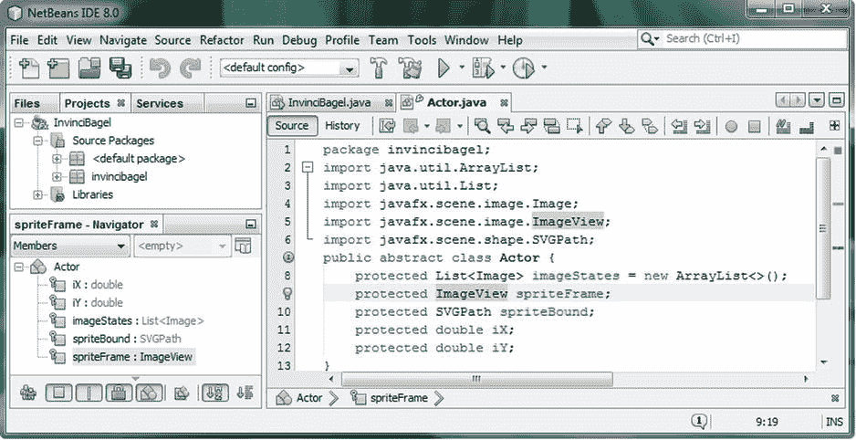

图 8-4。

Create a New Class in NetBeans, name it public abstract class Actor, and add in the primary Actor variables

这五个变量或属性持有任何 sprite 的“核心”属性；spriteFrame ImageView 和它保存的图像资产(一个到多个可见状态)的 List  ArrayList(这定义了子画面的外观)、spriteBound 碰撞形状区域(定义了被认为与子画面相交的区域)以及子画面在显示屏上的 X，Y 位置。

这五个变量也将在稍后使用 Actor()构造函数方法和 Hero()构造函数方法进行配置。首先我们将创建 Actor()构造函数；之后，我们将添加所有其他变量，我们需要每个 Actor 子类都包含这些变量。

在我们为 Actor 类创建了所有其他变量(这些变量不是使用 Actor()构造函数方法设置的)之后，我们将初始化这些变量以在构造函数方法中保存它们的默认值，最后我们将让 NetBeans 创建。get()和。使用一个你会喜欢的自动编码函数为我们的变量设置()方法。

我们将编码并传递给这个 Actor()构造函数的参数将包括名为 SVGdata 的 String 对象，它将包含一个定义 SVGPath 冲突形状的文本字符串，以及 sprite X，Y 位置和一个逗号分隔的图像对象列表。SVGPath 类有一个. setContent()方法，可以读取或“解析”原始 SVG 数据字符串，因此我们将使用它将字符串 SVG data 变量转换为 SVGPath 碰撞形状对象。

我们将不会在本章或下一章中实现碰撞代码或 SVGPath Shape 对象，但我们需要将它们放在适当的位置，这样我们可以在后面的第十六章碰撞检测处理以及如何使用 GIMP 和 PhysEd (PhysicsEditor)软件包创建碰撞多边形数据中使用它们。

我们将创建的 Actor 构造函数方法将遵循以下构造函数方法格式:

`public Actor(String``SVGdata``, double``xLocation``, double``yLocation``, Image...``spriteCels``)`

稍后，如果我们需要创建更复杂的 Actor()构造函数方法，我们可以通过添加其他更高级的参数来“重载”该方法，例如 pivot point pX 和 pY，或者 isFlipH 或 isFlipV 布尔值，以允许我们水平或垂直镜像固定的 sprite 图像。您的 Java 代码将如下所示:

`public Actor(String``SVGdata``, double``xLocation``, double``yLocation``, Image...``spriteCels``) {`

```java
spriteBound = new SVGPath();
```

`spriteBound.setContent(``SVGdata`

`spriteFrame = new ImageView(``spriteCels[0]`

`imageStates.addAll(Arrays.asList(``spriteCels`

`iX =``xLocation`

`iY =``yLocation`

```java
}
```

请注意，使用 Java new 关键字调用的 ImageView 构造函数通过使用 spriteCels[0]注释，使用逗号分隔的列表传递您正在传递的 List  ArrayList 数据的第一帧(Image)。如果您要创建一个允许您设置轴心点数据的重载方法，它可能如下所示:

`public Actor(String``SVG``, double``xLoc``, double``yLoc``, double``xPivot``, double``yPivot``, Image...``Cels``){`

```java
spriteBound = new SVGPath();
```

`spriteBound.setContent(``SVG`

`spriteFrame = new ImageView(``Cels[0]`

`imageStates.addAll(Arrays.asList(``Cels`

`iX =``xLoc`

`iY =``yLoc`

`pX =``xPivot`

`pY =``yPivot`

```java
}
```

如图 8-5 所示，您需要使用 Alt-Enter 工作流程，并让 NetBeans 为您的 Arrays 类编写导入语句。一旦你这样做了，你的代码就不会有错误。

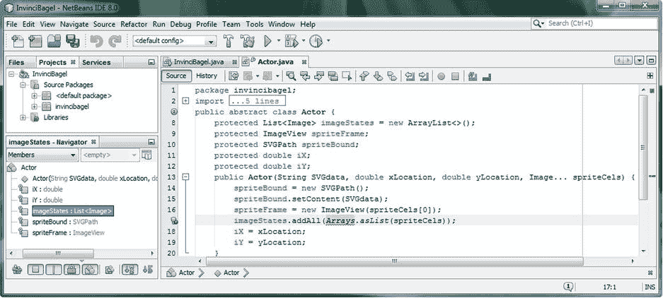

图 8-5。

Create a constructor method to set up fixed Actor sprite subclasses with collision shape, Image list, location

接下来，让我们编写这个类的另一个关键方法，抽象方法。update()方法，然后我们可以添加我们将需要的 Actor 类的其余固定 sprite 属性。之后，我们可以初始化 Actor()构造函数方法中的附加变量。最后，我们将学习如何为 Actor 类创建“getter 和 setter”方法，然后继续使用这个新的自定义 Actor 超类来创建我们的另一个 Hero motion sprites 子类。

### 创建一个。update()方法:连接到 GamePlayLoop 引擎

对于任何 sprite 类来说，除了创建它的构造函数方法之外，最重要的方法是。update()方法。那个。update()方法将包含 Java 8 代码，告诉 sprite 在 GamePlayLoop 的每个脉冲上做什么。因为这个原因，这个。update()方法将用于将使用我们的 Actor 超类和 Hero 子类创建的 Actor sprite 子类“连接”到我们在第七章中创建的 GamePlayLoop 计时引擎中。

因为我们需要一个。update()方法作为游戏中每个 Actor 对象(actor sprite)的一部分，我们需要包含一个“空的”(目前)抽象。我们当前正在编写的 Actor 超类中的 update()方法。

正如您在第三章中了解到的，这个公共抽象方法在 Actor 超类中是空的，或者更准确地说，是未实现的，但是需要在任何 Actor 子类中实现(也就是说，需要被实现)(或者再次声明为抽象方法)，包括我们稍后将要编码的 Hero 子类。

该方法被声明为 public abstract void，因为它不返回任何值(它只是在每个 JavaFX 脉冲事件上执行)并且不包含{...}花括号，因为它里面(还)没有任何代码体！声明公共抽象(空的或未实现的)方法的单行代码应该如下所示:

`public``abstract``void``update`

正如你在图 8-6 中看到的，这个方法实现起来非常简单，一旦你在你的 Actor()构造函数方法下添加了这个新方法，你的 Java 8 代码再次没有错误，你就可以准备添加更多的代码了。

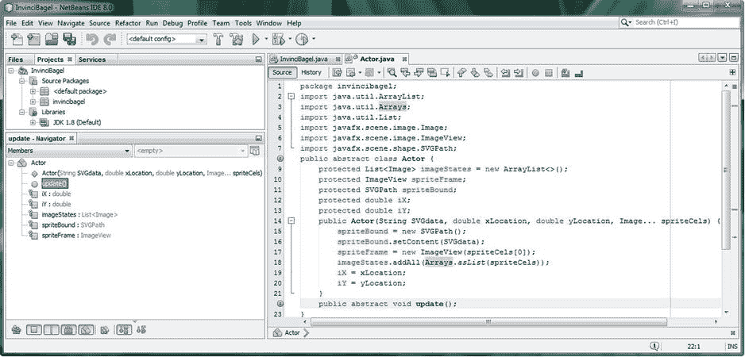

图 8-6。

Add an Arrays import statement to support constructor method; add a public abstract .update() method

接下来，我们将为我们的固定精灵演员超类添加其余的属性(或变量)，这需要我们提前考虑，在创建这个游戏期间，我们希望能够用我们的精灵完成什么。

### 向 Actor 类添加 Sprite 控件和定义变量

从编码的角度来看，这个过程的下一部分很简单，因为我们将在 Actor 类的顶部声明更多的变量。然而，从设计的角度来看，这更加困难，因为它要求我们尽可能地提前思考，并推测我们的精灵演员(固定精灵和运动精灵)需要什么样的可变数据，以便能够在游戏的构建和游戏过程中做我们想做的一切。

在 iX 和 iY 变量之后，我要声明的第一个附加变量是 pX 和 pY 枢轴点变量。我最初将它们放在 Hero 子类中，一旦我们完成了这个 Actor 超类的创建，接下来我们将创建它。我将这些“升级”到演员超类级别的原因是因为我想拥有旋转固定精灵(宝藏和障碍)以及运动精灵的灵活性。在关卡和场景设计方面，这给了我更多的权力和灵活性。这些支点 X 和 Y 变量将被声明为受保护的 double 数据变量，并使用下面两行 Java 代码来完成:

`protected double``pX`

`protected double``pY`

接下来，我们需要在 Actor 类(对象)定义中添加一些布尔“标志”。这些将指示关于所讨论的精灵对象的某些事情，例如它是活的(对于固定精灵这将总是假的)还是死的，或者它是固定的(对于固定精灵这将总是真的，对于不在运动中的运动精灵也是真的)还是移动的，或者奖励对象，指示它们的捕获(碰撞)的附加点(或寿命)，或者有价值的，指示它们的获取(碰撞)的附加能力(或寿命)。最后，我定义了一个水平翻转和垂直翻转标志，与没有这些标志的情况相比，使用(固定的或运动的)精灵图像资源给了我四倍的灵活性。

由于 JavaFX 可以在 X 或 Y 轴上翻转或镜像图像，这意味着我可以使用 FlipV 反转精灵方向(向左或向右),或使用 FlipH 反转方向(向上或向下)。

这六个额外的布尔标志固定(演员)sprite 属性将通过使用受保护的布尔数据变量来声明，使用以下六行 Java 8 代码，如图 8-7 所示(没有错误，没有减少):

`protected boolean``isAlive`

`protected boolean``isFixed`

`protected boolean``isBonus`

`protected boolean``hasValu`

`protected boolean``isFlipV`

`protected boolean``isFlipH`

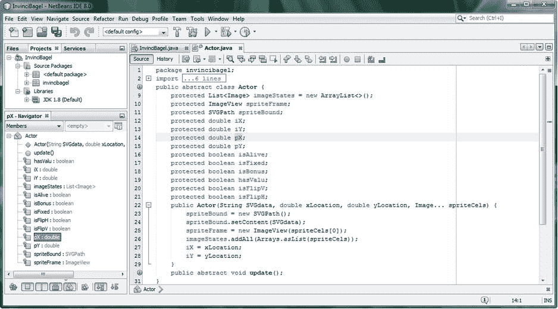

图 8-7。

Add the rest of the variables needed to support rotation (pivot point), and sprite definition states

接下来，我们将在 Actor()构造函数方法中初始化这些变量。如果您想使用参数列表将这些布尔标志的设置传递给 Actor()构造函数方法，请记住，您可以创建任意多的重载构造函数方法格式，只要每个格式的参数列表都是 100%唯一的。在本书的后面部分，我们可能会这样做，例如，如果我们需要一个构造函数方法来为布局设计的目的旋转我们的固定精灵，或者一个围绕给定的轴翻转它，例如，为了相同的确切目的，或者一个两者都做的方法，这将给我们一个九参数 Actor()构造函数方法调用。

#### 在 Actor 构造函数方法中初始化 Sprite 控件和定义变量

现在，我们将把轴心点 pX 和 pY 初始化为 0(左上角原点),所有布尔标志的值都设为 false，只有 isFixed 变量除外，对于固定的 sprite，它的值总是设为 true。我们将在当前 Actor()构造函数方法中使用以下八行 Java 代码，并在该方法中处理使用方法参数配置 Actor 对象的前四行代码的下面使用这些代码:

```java
pX = 0;

pY = 0;

isAlive = false;

isFixed = true;

isBonus = false;

hasValu = false;

isFlipV = false;

isFlipH = false;
```

我们也可以使用复合初始化语句来实现这一点。这将把代码减少到三行:

`px = pY =` `0;`

```java
isFixed = true;
```

`isAlive = isBonus = hasValu = isFlipV = isFlipH =` `false;`

正如你在图 8-8 中看到的，我们现在已经编写了近 30 行无错误的 Java 8 代码，我们准备创建剩下的。get()和。set()方法将组成公共抽象 Actor 超类。

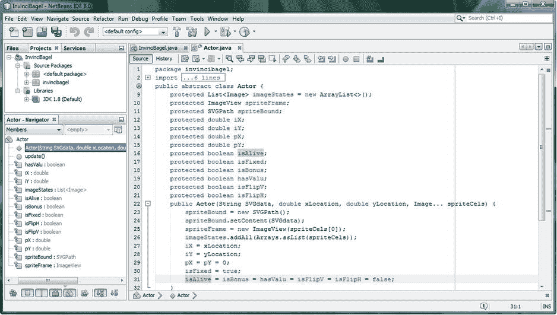

图 8-8。

Add initialization values to the eight new fixed sprite pivot and state definition variables you just declared

Actor 类中的其余方法通常称为“getter”和“setter”方法，因为这些方法提供了对类内部数据变量的访问。使用 getter 和 setter 方法是正确的做法，因为这样做实现了 Java 封装的概念(和优势)，它允许 Java 对象成为对象属性(可变数据值)和行为(方法)的自包含容器。

### 访问参与者变量:创建 Getter 和 Setter 方法

NetBeans 的一个真正强大的(并且节省时间的)功能是，它将编写您的所有。get()和。自动为每个对象和数据变量设置()方法。我们将在本书中尽可能使用这一便利的特性，因此您可以习惯于使用这一节省时间的特性来为您编写大量 Java 8 代码，加速您的 Java 8 游戏代码生产输出！您可以通过使用源菜单及其插入代码子菜单来访问该自动编码功能，如图 8-9 所示。可以看到，还有一个键盘快捷键(Alt-Insert)；使用其中任何一个都会调出浮动生成菜单，该菜单在图 8-9 的底部中央以红色高亮显示。


图 8-9。

Use Source ➤ Insert Code menu (or Alt+Insert) to bring up a Generate Getter and Setter dialog and select all

点击在生成浮动菜单中间高亮显示的 Getter 和 Setter 选项，将出现一个生成 Getter 和 Setter 对话框，如图 8-9 右侧所示。确保层次结构是打开的，并且 Actor 旁边的复选框被选中，这将自动选择该类中的所有变量，在这种情况下，在图 8-9 的右侧也显示了十几个被选中的变量。

一旦所有这些都被选中，点击对话框底部的 Generate 按钮，生成 24。get()和。如果 NetBeans 8.0 没有提供这一便利的 IDE 功能，则必须手动键入 set()方法。

这些。get()和。由 NetBeans 8.0 源代码➤插入代码➤生成➤ Getters 和 Setters 菜单序列生成的 set()方法将为您提供以下 24 个 Java 方法代码构造，相当于我们在公共抽象 Actor 类中定义的 12 个变量中的每一个都有两个方法:

`public List<Image>``getImageStates()`

```java
return imageStates;

}
```

`public void``setImageStates(List<Image> imageStates)`

```java
this.imageStates = imageStates;

}
```

`public ImageView``getSpriteFrame()`

```java
return spriteFrame;

}
```

`public void``setSpriteFrame(ImageView spriteFrame)`

```java
this.spriteFrame = spriteFrame;

}
```

`public SVGPath``getSpriteBound()`

```java
return spriteBound;

}
```

`public void``setSpriteBound(SVGPath spriteBound)`

```java
this.spriteBound = spriteBound;

}
```

`public double``getiX()`

```java
return iX;

}
```

`public void``setiX(double iX)`

```java
this.iX = iX;

}
```

`public double``getiY()`

```java
return iY;

}
```

`public void``setiY(double iY)`

```java
this.iY = iY;

}
```

`public double``getpX()`

```java
return pX;

}
```

`public void``setpX(double pX)`

```java
this.pX = pX;

}
```

`public double``getpY()`

```java
return pY;

}
```

`public void``setpY(double pY)`

```java
this.pY = pY;

}
```

`public boolean``isAlive()`

```java
return isAlive;

}
```

`public void``setIsAlive(boolean isAlive)`

```java
this.isAlive = isAlive;

}
```

`public boolean``isFixed()`

```java
return isFixed;

}
```

`public void``setIsFixed(boolean isFixed)`

```java
this.isFixed = isFixed;

}
```

`public boolean``isBonus()`

```java
return isBonus;

}
```

`public void``setIsBonus(boolean isBonus)`

```java
this.isBonus = isBonus;

}
```

`public boolean``hasValu()`

```java
return hasValu;

}
```

`public void``setHasValu(boolean hasValu)`

```java
this.hasValu = hasValu;

}
```

`public boolean``isFlipV()`

```java
return isFlipV;

}
```

`public void``setIsFlipV(boolean isFlipV)`

```java
this.isFlipV = isFlipV;

}
```

`public boolean``isFlipH()`

```java
return isFlipH;

}
```

`public void``setIsFlipH(boo lean isFlipH)`

```java
this.isFlipH = isFlipH;

}
```

注意，除了。get()和。set()方法生成，对于布尔变量还有一个附加的。是()方法，它是代替。get()方法。因为我已经使用“is”前缀命名了布尔标志，所以我将删除第二个“Is ”,以便这些“double is”方法更具可读性。我还将对 hasValu 方法做同样的事情，这样在方法调用中查询布尔设置就更自然了，例如。hasValu()、isFlipV()、isBonus()、isFixed()或。例如 isFlipH()。为了可读性，我建议您对代码进行同样的编辑。

现在我们准备创建我们的 Hero 子类，它将向我们在 Actor 类中创建的 13 个属性添加另外 11 个属性，使总数达到 24 个。Hero 类中的这 11 个附加属性将用于可以在屏幕上移动的可移动精灵(我喜欢称之为运动精灵)。在我们游戏的单人版本中，我们的无敌英雄角色将是主要的英雄角色对象，在未来的多人版本中，这将包括无敌英雄角色对象和敌人英雄角色对象。

## 创建英雄超类:动作演员属性

接下来让我们创建我们的公共抽象英雄类！这个类将是我们在本书中为游戏创建动作精灵的基础。在 NetBeans 中创建您的 Hero.java 类，并将其声明为`public abstract class Hero extends Actor`。由于我们已经在 Actor 类中完成了许多“繁重的工作”,所以您不必创建 ImageView 来保存 sprite 图像资产，也不必创建 List < Image > ArrayList 对象，该对象加载了一个由 Image 对象填充的 List 对象，或者创建一个 SVGPath Shape 对象来保存碰撞形状 SVG polyline(或多边形)路径数据。

由于我们不必声明任何主属性，因为这些属性是从 Actor 超类继承的，所以我们要做的第一件事是创建一个 Hero()构造函数方法。这将包含字符串对象中的碰撞形状数据，sprite X，Y 位置，以及将加载到 List  ArrayList 对象中的图像对象。在我们创建了一个基本的 Hero()构造函数方法之后，我们将完成计算你的运动精灵需要包含的其他属性(或变量),就像我们在设计 Actor 超类时所做的一样。

请记住，您已经有了使用 Actor()方法在 Actor 类中构造的 spriteBound SVGPath Shape 对象、imageStates List  ArrayList 对象、SpriteFrames Image 对象以及 iX 和 iY 变量。为了能够编写我们的 Hero()构造函数方法，我们还需要这些。由于这些都已经就绪，由于 Hero 类声明中的 java extends 关键字，我们所要做的就是使用 super()构造函数方法调用，并将这些变量从 Hero()构造函数向上传递给 Actor()构造函数。这将使用 Java super 关键字自动将这些变量传递给 Hero 类供我们使用。

因此，我们已经具备了编写核心 Hero()构造函数方法所需的一切，现在让我们开始吧。Hero()构造函数将接受与 Actor()构造函数相同数量的复杂参数。这些包括碰撞形状数据，包含在名为 SVGdata 的字符串对象中，子画面的“初始位置”X 和 Y 位置，以及子画面的图像对象(cels 或 frames)的逗号分隔列表，我将其命名为 Image...斯普里特塞尔。这张照片...designation 需要在参数列表的末尾，因为它是“开放式的”，这意味着参数列表将传入一个或多个图像对象。您的代码将如下所示:

`public void Hero(String``SVGdata``, double``xLocation``, double``yLocation``, Image...``spriteCels``) {`

`super(``SVGdata``,``xLocation``,``yLocation``,``spriteCels``);`

```java
}
```

通过使用 super()将核心构造函数传递到 Actor 超类 Actor()构造函数方法，您之前编写的代码(在 Actor()构造函数内部)将使用 Java new 关键字和 SVGPath Shape 子类创建 spriteBound SVGPath Shape 对象，并将使用 SVGPath 类。setContent()方法，以便加载 SVGPath Shape 对象以及要用于 sprite 图像状态的碰撞形状。设置了 iX 和 iY 的初始位置，imageStates 列表数组加载了从参数列表末尾传入的 sprite 图像对象。

值得注意的是，因为我们是这样设置的，所以 Hero 类可以访问 Actor 类所拥有的一切(十三个强大的属性)。实际上，反过来看可能更“突出”，演员(固定精灵)类拥有英雄(运动精灵)类的所有能力。这种能力应该用于关卡设计 wow factor，包括多图像状态(List  Array)、自定义 SVGPath 碰撞形状功能、自定义枢轴点位置，以及围绕 X 轴(FlipV = true)或 Y 轴(FlipH = true)或两个轴(FlipH = FlipV = true)翻转(镜像)精灵图像的能力。将这些功能放入你的 Actor 引擎(Actor 和 Hero 抽象超类)只是第一步；在你的游戏设计和编程中出色地使用它们，随着时间的推移，你会继续构建和完善游戏，这是本章中奠定基础的最终目标。正如你在图 8-10 中看到的，我们的基本(核心)构造函数代码是没有错误的。

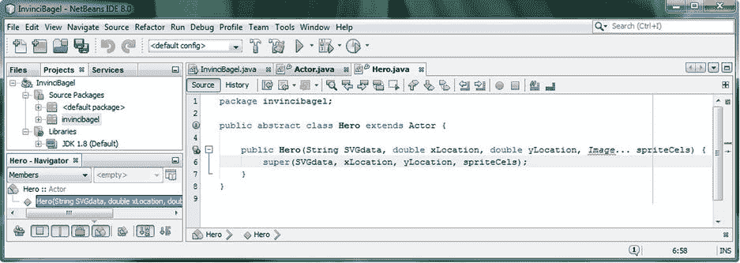

图 8-10。

创建一个公共抽象类 Hero extends Actor 并添加一个构造函数方法和一个 super()构造函数

### 添加更新和冲突方法:。更新()和。碰撞()

现在我们有了一个基本的构造函数方法，稍后我们会添加它，让我们添加所需的抽象。update()方法，以及. collide()方法，因为运动精灵正在移动，因此可能会与物体发生碰撞！首先让我们添加`public abstract void .update();`方法，因为它是我们的 Actor 超类所需要的。这样做实质上是向下传递(或者向上传递，如果您愿意的话)了实现需求。update()方法，从 Actor 超类到 Hero 子类，并继续到 Hero 的任何未来子类(这将使 Hero 成为一个超类，并更好地反映其名称)。未来的非抽象(函数)类将实现这一点。update()方法，该方法将用于完成游戏编程逻辑的所有繁重工作。正如你在图 8-11 中看到的，运动精灵(Hero 子类)也需要有一个碰撞检测方法，我称之为。collide()，因为这是一个更短的名字，至少现在，除了返回一个布尔值 false(这里没有冲突，老板！)布尔数据值。的 Java 代码。collide()方法结构将把一个 Actor 对象作为它的参数，因为这是你的 Hero 对象将与之碰撞的对象，应该如下所示:

`public boolean``collide``(``Actor object`

`return``false`

```java
}
```

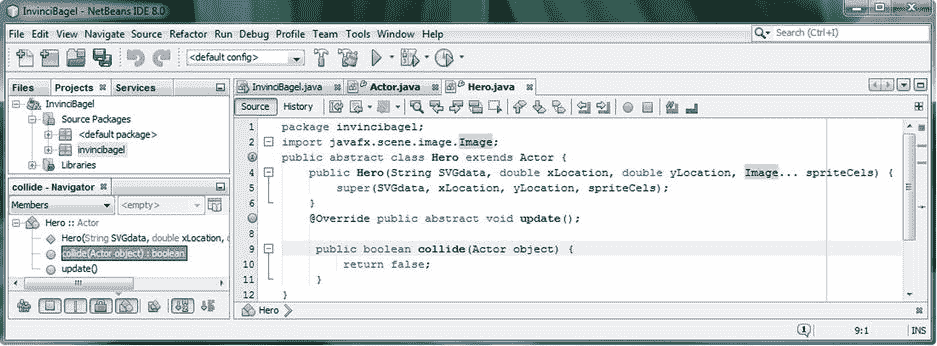

图 8-11。

Add the @Override public abstract void .update() and public boolean .collide(Actor object) methods

接下来，我们再给这个英雄类增加十一个变量。这些将保存适用于运动精灵的数据值，这些精灵必须处理与物体的碰撞，并遵守物理定律。我们还需要一些东西，比如寿命变量，以及一个保存累积伤害(点数)的变量，如果敌人互相射击，伤害就会累积。我们将添加受保护的变量，如 X 和 Y 速度，X 和 Y 偏移(用于微调物体相对于精灵的位置)，碰撞形状旋转和缩放因子，最后是摩擦，重力和反弹因子。

### 向 Hero 类添加 Sprite 控件和定义变量

我们需要做的下一件事是确保我们需要保存运动精灵数据的所有变量都在 Hero 类的顶部定义，如图 8-12 所示。NetBeans 将使用这些信息为 Hero 类创建 getter 和 setter 方法。Java 代码应该是这样的:

`protected double``vX`

`protected double``vY`

`protected double``lifeSpan`

`protected double``damage`

`protected double``offsetX`

`protected double``offsetY`

`protected double``boundScale`

`protected double``boundRot`

`protected double``friction`

`protected double``gravity`

`protected double``bounce`


图 8-12。

Add eleven variables at the top of Hero class defining velocity, lifespan, damage, physics, collision

在我们添加所有 22 个 getter 和 setter 方法之前，总共是 11 个。get()和 11。set()方法，为了匹配我们新的 Hero 类变量，让我们回过头来完成我们的 Hero()构造函数方法，并初始化我们刚刚在 Hero 类顶部添加的这十一个变量。

#### 在 Hero 构造函数中初始化 Sprite 控件和定义变量

让我们给我们的英雄演员对象(运动精灵)1000 个单位的寿命，并设置其他变量为零，你可以看到我已经使用复合初始化语句来节省八行代码。如图 8-13 所示，代码没有错误，Java 编程语句应该采用以下格式:

`lifespan =``1000`

`vX = vY = damage = offsetX = offsetY =``0`

`boundScale = boundRot = friction = gravity = bounce =``0`

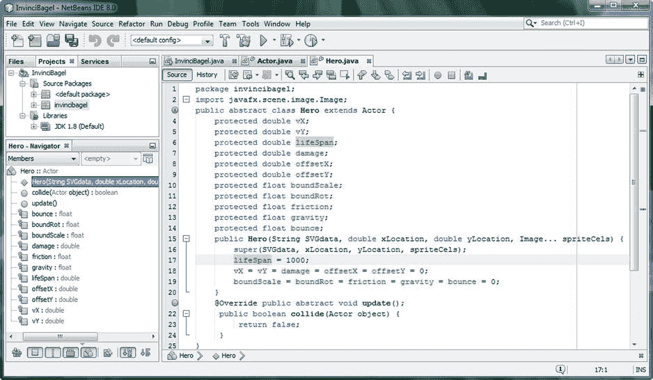

图 8-13。

Add initialization for your eleven variables inside of your constructor method using compound statements

在我们生成 getter 和 setter 方法之前，让我们看看如何使用复合变量声明语句的组合，以及如果我们不显式地指定它们，Java 将为我们的变量设置哪些默认变量类型值，以减少编写整个 Hero 类所需的代码量，从 25 行代码(如果不使用复合变量初始化语句，则为 33 行代码)减少到 14 行代码。

如果不计算带一个花括号(三个)的代码行，我们说的是不到十几行 Java 语句，包括包、类和导入声明，来编码整个公共抽象类。这是相当令人印象深刻的，考虑到核心类给了我们多少运动精灵的力量和能力。当然，在我们添加了 22 个 getter 和 setter 方法(每个方法有 3 行代码)后，我们将有大约 80 行代码，没有空格。值得注意的是，NetBeans 将为我们编写超过 75%的此类代码！相当酷。

#### 通过复合语句和缺省变量值优化 Hero 类

在让 NetBeans 为我们编写 getter 和 setter 方法之前，我将做两件主要的事情来减少 Hero 类的主要部分的代码量。第一种方法是对所有相似的数据类型使用复合声明，首先声明受保护的 double 和受保护的 float 修饰符和关键字，然后在它们后面列出所有变量，用逗号分隔，这在编程术语中称为“逗号分隔”。11 个 Hero 类变量声明的 Java 代码现在将如下所示:

```java
protected double vX, vY, lifeSpan, damage, offsetX, offsetY;

protected float boundScale, boundRot, friction, gravity, bounce;
```

正如你在图 8-13 和 8-14 中看到的，我们为初始化做了相同类型的复合语句:

```java
lifeSpan = 1000;

vX = vY = damage = offsetX = offsetY = 0;

boundScale = boundRot = friction = gravity = bounce = 0;
```

如果您碰巧正在 HDTV 显示屏上进行编辑，也可以只用两行代码来完成:

```java
lifeSpan = 1000;

vX = vY = damage = offsetX = offsetY = boundScale = boundRot = friction = gravity = bounce = 0;
```

接下来，如果我们依靠 Java 编译器将变量初始化为零，因为如果没有指定初始化值，double 和 float 变量将被初始化为，我们可以将这两行代码减少为一行代码:

```java
lifeSpan = 1000;
```

现在我们已经完成了 Hero()构造函数方法的“核心”,让 NetBeans 编写一些代码吧！

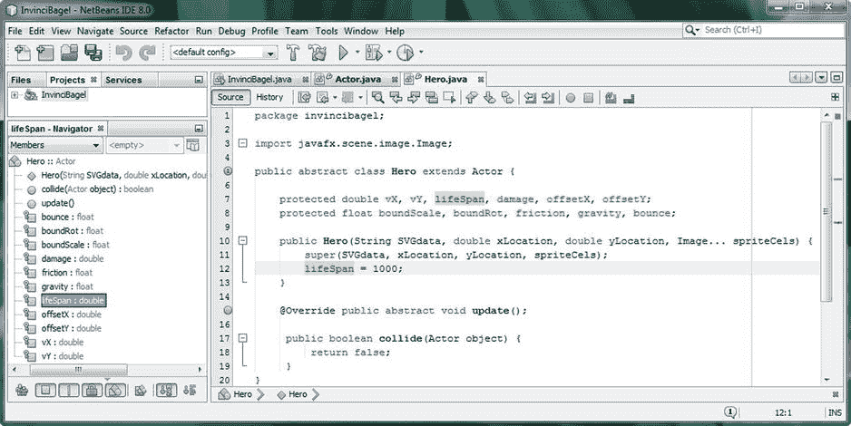

图 8-14。

Optimize your Java code by using compound declarations, and leveraging default initialization values

### 访问英雄变量:创建 Getter 和 Setter 方法

在你的。collide()方法，并将光标放在那里，这将向 NetBeans 显示您希望它放置将要生成的代码的位置。这在图 8-15 中由源菜单后面的浅蓝色阴影线显示。使用源>插入代码菜单序列或 Alt-Insert 击键组合，当生成浮动弹出菜单出现在这条蓝线下时(这显示了选中的代码行)，选择 Getter 和 Setter 选项，在图 8-15 中高亮显示，并选择所有的英雄职业。确保选择了所有的英雄类变量，或者通过使用英雄类主选择复选框，或者通过使用每个变量的复选框 UI 元素，如图 8-15 的右侧所示。

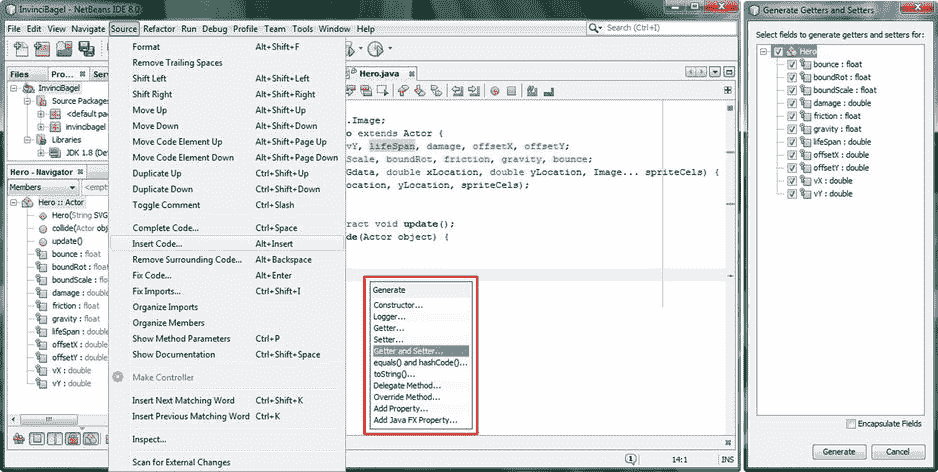

图 8-15。

Use the Source ➤ Insert Code ➤ Generate ➤ Getter and Setter menu sequence and select all class variables

单击“生成 Getters 和 Setters”对话框底部的“生成”按钮后，您将看到 22 个新方法，它们都是 NetBeans 为您编写的全新方法。这些方法如下所示:

`public double``getvX()`

```java
return vX;

}
```

`public void``setvX(double vX)`

```java
this.vX = vX;

}
```

`public double``getvY()`

```java
return vY;

}
```

`public void``setvY(double vY)`

```java
this.vY = vY;

}
```

`public double``getLifeSpan()`

```java
return lifeSpan;

}
```

`public void``setLifeSpan(double lifeSpan)`

```java
this.lifeSpan = lifeSpan;

}
```

`public double``getDamage()`

```java
return damage;

}
```

`public void``setDamage(double damage)`

```java
this.damage = damage;

}
```

`public double``getOffsetX()`

```java
return offsetX;

}
```

`public void``setOffsetX(double offsetX)`

```java
this.offsetX = offsetX;

}
```

`public double``getOffsetY()`

```java
return offsetY;

}
```

`public void``setOffsetY(double offsetY)`

```java
this.offsetY = offsetY;

}
```

`public float``getBoundScale()`

```java
return boundScale;

}
```

`public void``setBoundScale(float boundScale)`

```java
this.boundScale = boundScale;

}
```

`public float``getBoundRot()`

```java
return boundRot;

}
```

`public void``setBoundRot(float boundRot)`

```java
this.boundRot = boundRot;

}
```

`public float``getFriction()`

```java
return friction;

}
```

`public void``setFriction(float friction)`

```java
this.friction = friction;

}
```

`public float``getGravity()`

```java
return gravity;

}
```

`public void``setGravity(float gravity)`

```java
this.gravity = gravity;

}
```

`public float``getBounce()`

```java
return bounce;

}
```

`public void``setBounce(float bounce)`

```java
this.bounce = bounce;

}
```

值得注意的是，使用 Hero 类创建的对象也可以访问我们之前为 Actor 类生成的 getter 和 setter 方法。如果你想知道 Java 关键字在所有这些中意味着什么。set()方法，它引用的是使用 Actor 或 Hero 类构造函数方法创建的当前对象。因此，如果您调用。iBagel Bagel 对象(我们将在第十章中创建)的 setBounce()方法，这个关键字指的是这个(iBagel) Bagel 对象实例。因此，如果我们想要设置 50%的反弹因子，我们将使用我们的新。setBounce() setter 方法:

`iBagel.``setBounce``(``0.50`

接下来让我们看看这些 sprite Actor 类是如何与我们在本书中编写的其他类相适应的。在那之后，我们将总结我们在这一章中学到的东西，我们可以进入这本书的未来章节，并使用这些类为我们的游戏创建精灵，就像我们学习如何在游戏中使用精灵一样。

## 更新游戏设计:演员或英雄如何融入

让我们更新一下我在第七章(图 7-19)中介绍的图表，以包括 Actor.java 和 Hero.java 类。正如你在图 8-16 中看到的，我不得不切换。更新()物理和。collide()图的冲突部分，因为 Actor 类只包括。update()方法，而 Hero 类包含了这两种方法。自从。collide()方法将在。update()方法，我也用 chrome 球体连接了图的这两个部分。

那个。GamePlayLoop 对象中的 handle()方法将调用这些。update()方法，所以这里也有联系。Actor 和 Hero 类与 InvinciBagel 类之间存在联系，因为使用这些抽象类创建的所有游戏 sprite 对象都将在该类的方法中声明和实例化。

我们在开发我们的游戏引擎框架方面取得了很大的进展，同时，我们也看到了 Java 8 编程语言的一些核心特性是如何为我们所用的。在下一章的事件处理中，我们将会看到强大的 Java 8 lambda expressions 新特性，所以关于 Java 8 前沿特性的更多知识将会在游戏中出现。希望你和我一样激动！

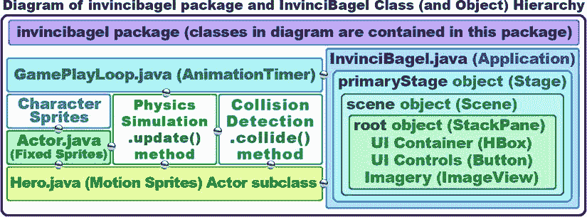

图 8-16。

The current invincibagel package class (object) hierarchy, now that we have added Actor and Hero classes

## 摘要

在第八章中，我们写了第二轮的游戏引擎，我们将在本书中设计和编码，演员(固定精灵)超类，和它的英雄(运动精灵)子类。一旦我们在第十章和后续章节开始创建游戏精灵，英雄职业也将成为超职业。从本质上讲，在这一章中，你学习了如何创建公共抽象类，这些类将在本书中用来定义我们的 sprite 对象。这相当于为我们游戏中的所有演员(精灵)做了所有繁重的工作(精灵设计和编码工作)，使我们从现在开始为我们的游戏创建强大的固定和运动精灵变得更加容易。我们正在首先建立我们的知识库和我们的游戏引擎框架！

我们首先看一下这些演员和英雄类将如何设计，以及我们将使用它们创建什么类型的实际精灵类。我们查看了九个 sprite 图像资源，以及这些资源如何通过仅使用九个资源来覆盖广泛的运动，并查看了如何相对于彼此“注册”sprite“状态”。

接下来，我们设计并创建了我们的 Actor 超类，以处理固定的精灵，如 props 和 treasure，创建了基本的 List 、ImageView、SVGPath、iX 和 iY 变量以及一个构造函数方法，该方法使用这些来定义固定的精灵外观、位置和碰撞边界。然后，我们添加了一些额外的变量，我们将需要在未来的游戏设计方面，并了解如何让 NetBeans 写。get()和。set()方法。

接下来，我们设计并创建了我们的 Hero 子类，它扩展了 Actor 来处理运动精灵，例如不可战胜的妖怪自己和他的敌人，以及投射物和移动挑战。我们创建了基本的构造函数方法来设置 Actor 超类中的变量，这次是为了定义运动精灵图像、初始位置和碰撞边界。然后，我们添加了一些额外的变量，这将是我们在未来的游戏设计方面需要的，并再次看到了 NetBeans 将如何编写我们的。get()和。为我们设置()方法，看起来总是很有趣！

最后，我们看了一下更新的 invincibagel 包、类和对象结构图，看看在本书的前八章中我们已经取得了多大的进步。这越来越令人兴奋了！

在下一章中，我们将看看如何控制游戏精灵，我们将使用本章中创建的演员引擎来创建游戏精灵。接下来的第九章将涵盖 Java 8 和 JavaFX 事件处理，这将允许我们的游戏玩家使用事件处理来操纵(控制)这些演员精灵。