# 十五、实现游戏音频资源：使用 JavaFX `AudioClip`类音频序列引擎

既然我们已经使用抽象的 Actor(fixed sprite)和 Hero(motion sprite)超类创建了 motion sprite 和 fixed sprite 类，我们需要将代码放入播放游戏音频资产的位置。虽然一般不认为数字图像(视觉)资产重要，但数字音频(听觉)资产对游戏质量非常重要。事实上，您会惊讶于这些优秀的音频资产能为您的 Java 8 游戏产品增加多少感知价值。在本章中，我们将学习如何使用诸如 Audacity 2.0.6 这样的开源工具，为您的 Java 8 游戏开发优化和实现数字音频资产。

幸运的是，JavaFX AudioClip 引擎(实际上，它是 javafx.scene.media 包中的一个类)可以为我们的游戏开发带来很多动力。这是因为该类本质上被设计为音频排序引擎，能够控制音频资产性能的各个方面，以及使用 6 个八度音阶(三个向上和三个向下)的音高移位功能来创建新的音频资产。在本章开始时，我们将详细学习这个类，然后在我们的主要 InvinciBagel.java 类中实现它，并在新的 Bagel.java 类中使用它。playAudioClip()方法，我们将在该类的 primary 中对其进行编码和调用。update()方法。

在我们详细了解 JavaFX AudioClip 类之后，我们将开始使用流行的 Audacity 2.0.6 数字音频编辑(和音频效果)软件，我们在第一章中安装了该软件，当时我们安装了所有的开源游戏开发软件工具。我们将使用 Audacity 完成一个音频资产创建和优化过程。我们将使用我们在第五章中学到的概念，涵盖新媒体内容创作概念，并优化数字音频文件以实现 800%的数据空间节省。我们将这样做，以便我们的数字音频资产不使用超过 64KB 的系统内存；事实上，我们将获得六个 16 位数字音频资产，以使用不到 62KB 的数据。

一旦我们创建了六个音频资产，它们将与我们用来控制无敌角色的六个不同的键相匹配，我们将创建。InvinciBagel 类中的 loadAudioAssets()方法，并了解如何声明 AudioClip 和 URL 对象。在里面。loadAudioAssets()方法然后我们将一起使用这两个类(对象),以便为游戏创建我们的数字音频资产，并将它们安装到玩家的计算机系统(或消费电子设备)内存中。

一旦这六个 AudioClip 对象就位，我们将让 NetBeans 为 AudioClip 对象创建六个 Setter 方法，然后对它们进行“变形”。setiSound()方法添加到。我们需要的 playiSound()方法。完成之后，我们将进入 Bagel.java 类，并添加一个. playAudioClip()方法。在这个方法中，我们将调用。playiSound()方法，基于玩家按下的键。

在本章中，我们有很多内容要讲，所以让我们从深入了解 JavaFX AudioClip 类及其各种属性和方法开始，我们可以用它们来调用令人印象深刻的音频序列！解决了这个问题之后，我们就可以进入有趣的内容，开始使用 Audacity 2.0.6 和 NetBeans 8 进行创作了！

## JavaFX AudioClip 类:一个数字音频序列器

public final AudioClip 类是 javafx.scene.media 包的一部分，本质上是一个数字音频样本回放和音频排序引擎，旨在使用简短的音频片段或“样本”来创建更复杂的音频演奏。这就是为什么这个类是用于 Java 8 游戏开发的完美的数字音频媒体播放类。从下面显示的 Java 继承层次结构可以看出，JavaFX AudioClip 类是 java.lang.Object master 类的直接子类。这意味着 AudioClip 类已经被“临时编码”,专门用于作为数字音频排序引擎。

```java
java.lang.Object
```

`> javafx.scene.media.` `AudioClip`

您的 AudioClip 对象将分别引用内存中的一个数字音频样本。这些可以以几乎为零的延迟触发，这使得这个类成为用于 Java 8 游戏开发的完美类。AudioClip 对象的加载方式与媒体(长格式音频或视频)对象类似，使用 URL 对象，但行为方式有很大不同。例如，媒体对象不能自己播放；它需要一个 MediaPlayer 对象，如果包含数字视频，还需要 MediaView 对象。媒体对象将更适合于长格式的数字音频资产(如音乐)，这些资产不能同时放入内存中，并且必须进行流式传输以获得最佳的内存利用率。MediaPlayer 只能将足够的解压缩数字音频数据“预滚动”到内存中，以便播放一小段时间，因此 MediaPlayer 方法对于较长的数字音频剪辑(尤其是经过压缩的数字音频剪辑)来说更加节省内存。

AudioClip 对象可以在实例化后立即使用，这一点您将在本章后面看到，对于 Java 8 游戏开发来说，这是一个重要的属性。AudioClip 对象回放行为可以说是“触发并忘记”，这意味着一旦您的 playiSound()方法调用之一被调用，您在数字音频样本上的唯一可操作控制就是调用 AudioClip。stop()方法。

有趣的是，您的 AudioClip 对象也可能被触发(播放)多次，audio clip 甚至可以被同时触发，这一点您将在本章稍后部分看到。要使用 Media 对象达到同样的效果，您必须为要并行播放的每个声音创建一个新的 MediaPlayer 对象。

AudioClip 对象如此通用(响应迅速)的原因是因为您的 AudioClip 对象存储在内存中。AudioClip 对象使用代表整个声音的原始、未压缩的数字音频样本。它以原始的、未压缩的状态存储在内存中，这就是为什么在本章的下一节我们将使用 WAVE 音频文件格式。这种音频格式应用零压缩，因此，优化的数字音频样本的最终文件大小也将代表这些样本中的每一个将利用的系统内存量。

然而，AudioClip 类真正令人印象深刻的是它通过其属性和三个重载属性赋予开发人员的能力。play()方法调用。使用 AudioClip 不定常数，您可以设置样本回放优先级，将音高(声音的频率)向上移动 8 倍(较高八度)或向下移动 1/8(较低八度)，在空间频谱的任何位置移动声音，控制声音的左右平衡，控制声音的音量(或振幅)，以及控制声音播放的次数，从一次到永远。

除了这些 AudioClip 属性的 getter 和 setter 方法之外，还有。播放()和。stop()方法以及三个(重载的)方法。play()方法:一个用于简单(默认)回放；您可以在其中指定音量；您可以在其中指定音量、平衡、频率(音高移位系数)、声相和样本优先级。

控制 AudioClip 对象的关键是调用三者之一。play()方法，具体取决于您希望如何控制样本回放。使用。play()进行简单的回放，就像我们在本章将要做的那样；或者使用。播放(双倍音量)以从 0.0(关)到 1.0(满)的相对音量播放您的 AudioClip 对象；或者使用。play(双音量、双平衡、双速率、双声相、双优先级)以相对音量(0.0 到 1.0)、相对平衡(-1.0 左、0.0 中、1.0 右)、音高移位率(0.125 到 8.0)、相对声相(-1.0 左、0.0 中、1.0 右)播放您的 AudioClip 对象；以及优先级整数，其指定哪些样本优先于其他样本播放，哪些样本由于资源和优先级低而可能不被播放。接下来让我们开始使用 Audacity 来优化我们的示例！

## 创建和优化数字音频:Audacity 2.0.6

发布 Audacity 的最新版本——在我写这篇文章的时候是 2.0.6，用你的麦克风录下你说“left”这个词的声音幸运的是，我的 NetBeans 8 和 Java 8 开发工作站也是我的 Skype 工作站，我在一个支架上有一个基本的 Logitech 可调麦克风，我可以用它来制作基本的音频文件，我们需要将音频文件放入我们在第章第 1 3 中放置的每个不同精灵动作的位置。在本章的这一节，我将介绍数字音频文件的“临时创建”和优化工作流程，对于我们在本章的编码部分需要使用的六个数字音频文件中的每一个，您都可以自己完成这项工作。如果您想简单地了解使用 JavaFX AudioClip 类实现数字音频资产的 Java 8 编码部分，您也可以使用本书软件资源库中包含的六个音频文件。我建议大家复习一下如何优化未压缩的音频，以便在系统内存中使用，因为我们将要获取 113KB 的原始音频数据，从中剔除 99KB 的数据，并将其再减少 88%，只有 14KB。

正如您在图 15-1 的左侧所看到的，我已经记录了口语单词“left”，并使用 Audacity 选择工具只选择了记录会话中包含音频数据的那部分，以较暗的灰色阴影显示。因为您可以在 Audacity 波形编辑区域看到数字音频波形表示，所以您可以看到您刚才记录的数据所在的录音部分。录音中不包含任何数字音频数据的部分看起来就像一条直线。

获取原始数字音频数据的最快方式，这是我们真正想要的。WAV 文件，并且是我们希望使用 Audacity 进行优化的唯一数据，是使用文件➤导出选择菜单序列。这将允许我们使用 WAVE PCM 数字音频格式直接将选定的音频数据写入 left.wav 文件。这样做之后，我们就可以开始一个新的 Audacity 编辑会话，只需打开该文件，开始数字音频内容优化过程。

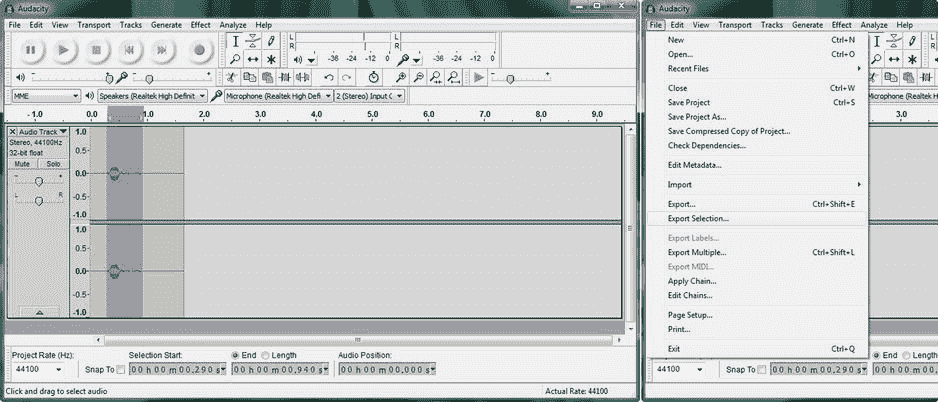

图 15-1。

Launch Audacity, record your voice saying the word “left,” and then select the wave and Export Selection

在 Audacity 中使用导出选择菜单选项后，您将得到导出文件对话框，如图 15-2 所示。在对话框底部的文件名:字段中键入 left，然后单击保存按钮。


图 15-2。

In the Export File dialog, name the file “left” using the .WAV audio file type

现在，我们在 left.wav 音频文件中只剩下口语词，并已保存该文件，以便我们可以看到基线原始 32 位 44.1kHz 数字音频将为我们提供什么数据足迹(以及我们游戏的内存足迹，如果我们要按原样使用该文件)，我们可以结束录制会话，因为它已经达到了目的。我们将通过使用文件➤关闭菜单序列来完成此操作，该菜单序列可以在图 15-3 的左侧看到。

接下来，我们将返回并使用文件➤打开菜单序列打开 left.wav 文件，该文件仅包含我们希望优化的数字音频数据段。这可以在图 15-3 (菜单序列)的中间看到，在屏幕截图的右边你可以看到一个选择一个或多个音频文件(文件打开)的对话框。请注意，left.wav 文件显示了它的原始数据量(113 KB)。

我们可以使用这个原始数据占用量作为基线，看看在我们即将开始的优化过程中，我们减少了多少次数据占用量(一旦完成，最终将减少 8.8 倍)。

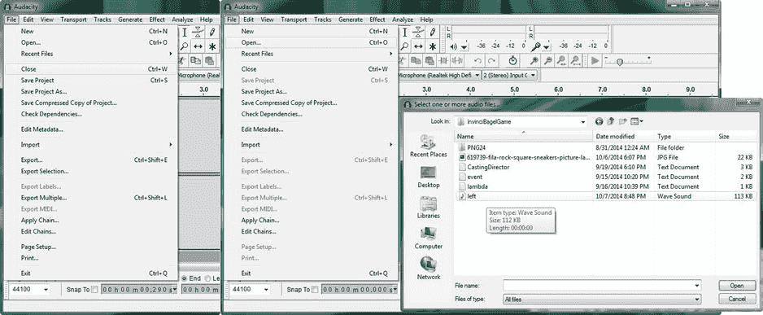

图 15-3。

Close the current editing session, then Open the “left” file, noting its raw file size, for further optimization

当你点击打开按钮并在 Audacity 中第一次打开一个文件时，你会得到一个警告对话框，如图 15-4 所示。这将建议您可以制作原始文件的副本以在编辑会话中使用，而不是使用原始文件。这就是多媒体行业中所谓的“非破坏性”编辑，并且总是一个非常好的想法，因为它本质上为您提供了一个备份文件(原件)，作为工作流程的一部分。

选择“编辑前制作文件副本(更安全)”单选按钮选项，并选中“不再警告，并始终使用我上面的选择”复选框，这将使 Audacity 2 成为一个非破坏性的非线性数字音频编辑软件包。单击“确定”按钮，我们就可以开始您的数字音频数据优化工作流程了。我们将优化我们的数字音频数据，但不压缩它，我将进入为什么这是下一步。

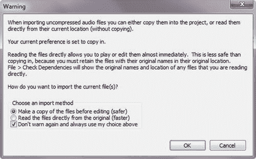

图 15-4。

Enable non-destructive audio editing in Audacity

### 优化与压缩:音频内存占用

你可能想知道为什么我使用未压缩的脉冲编码调制(PCM)波。wav)文件格式，而不是许多人用来存储数字音频音乐文件的行业标准的. MP3 文件格式。在我们开始优化过程之前，我将在前面介绍这样做的原因。在数字音频领域，数据占用优化实际上分为两个阶段。首先，优化采样分辨率(32 位原始录音、24 位 HD 音频、16 位 CD 质量音频和 8 位低质量音频)和采样频率(44.1kHz、22.05kHz、11.025kHz 是主要频率级别，仍然可以保持足够的数据以获得高质量的结果)，然后应用压缩。压缩会影响文件大小；在这种情况下，它是你。Java 资源文件。

那么，为什么我们不把我们的文件压缩成 MP3 格式，使我们的。JAR 文件小几千字节？其主要原因是因为 MP3 是一种“有损”格式，它丢弃了音频样本的原始数据(和质量)。因为 JavaFX AudioClip 类将获取我们的数字音频资产并将其解压缩到内存中，所以如果我们使用 MP3，内存中包含的音频数据质量将比使用 WAV 格式时低。鉴于我们将在样本优化工作过程中获得至少 8 倍的数据占用空间减少(我们将在本章的下一节中学习),并且我们所有的数字音频资产都将被优化到 4KB 到 14K 之间的数据占用空间，相对于样本质量的降低，MP3 压缩不会给我们带来任何真正的 JAR 文件数据占用空间的减少，这将“消耗”我们的“成本”。游戏音频是短脉冲音效和音乐循环，所以我们可以使用 WAV 文件格式，仍然可以得到一个很好的结果，而不必使用任何压缩。另一个优点是，你在我们的文件管理软件中看到的 WAV 文件的数据大小也是样本将使用的内存量。

#### 音频采样分辨率和频率:优化您的内存占用

内存数据占用减少过程的第一步是获取原始 32 位数据采样速率，并将其降低 100%，从 32 位浮点数据降至 16 位 PCM 数据，如屏幕截图左下方的图 15-5 所示。在 Audacity 样本编辑区域左侧的灰色信息面板中找到下拉箭头，我在这个截图中用红色圈出了它，因为如果您不习惯使用它，很难找到它。这将为您提供一个菜单，允许您设置数据显示(波形或频谱图)和设置样本数据格式，这是我们想要用来选择 16 位 PCM 选项而不是 32 位浮点选项的子菜单。不要用这个菜单设置你的采样率，因为它会降低你的声音(如果你以后想用这个作为特殊效果，你可以试试)。接下来，我们将了解设置采样速率的正确工作流程。

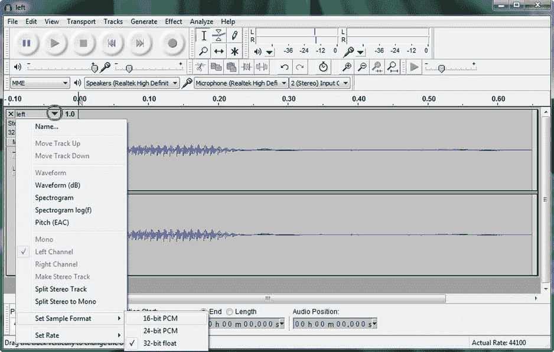

图 15-5。

Click the drop-down menu arrow at the left and select the Set Sample Format ➤ 16-bit PCM setting option

重要的是要注意，如果您在进行这种数据位级别的更改后保存您的文件，您的文件大小将不会改变！您可能已经注意到,“导出文件”对话框正在以 16 位 PCM WAVE 格式保存您的文件，因此它正在做与您在内存中所做的相同的调整，以调整磁盘上的文件大小。我在这里简单地介绍了这一步骤，以便您对整个过程有一个全面的了解，首先是降低采样数据速率，然后是降低采样频率速率，这是我们接下来要做的事情，最后是解决立体声与单声道采样问题，这将是我们在本章这一部分的最后一步。

每次应用工作流程时，这些“优化措施”都可以将文件大小(和内存占用)减少 100%或更多。事实上，当我们将采样频率从 44，100 降低到 11，025 时，我们将减少 200%的数据占用空间(从 44，100 降低到 22，050，然后从 22，050 降低到 11，025)。

##### 设置音频采样频率:减少 200%的内存数据占用

在 Audacity 中为您的项目设置数字音频采样频率的正确方法是使用项目采样频率设置的下拉对话框。这可以在图 15-6 的左下角看到，在一个红色方框内突出显示。选择 11025 频率设置，这会将音频数据(将这些视为声波的垂直切片)采样速率从每秒 44，100 次降低到每秒 11，025 个数据切片，或者首先将采样的音频数据降低 4 倍，这是由于数据中的采样频率步长(在这种情况下，您应该将其视为使用的内存，而不是使用的文件空间)优化工作流程而导致的 200%的数据占用空间减少。


图 15-6。

Reduce audio sampling frequency by four times by reducing it from 44100 per second to 11025 per second

您可以在 44、100 和 8000 采样频率之间尝试这七种不同的设置，因为每种设置都有不同的质量水平，8000 的质量太低，不适用于声音样本，但它可能适合“脏”或“嘈杂”的声音，如爆炸。

如果你想听听这些不同的设置听起来像什么，当然，在你选择了每一个之后，点击图 15-6 左上角显示的音频传输按钮中的绿色播放(向右的三角形)。你会看到 32，000 频率听起来就像 44，100 频率，22，050 频率也是如此。16，000 或 11，025 的频率速率听起来并不“明亮”，但仍然可用，因此我使用 11，025 的速率，以获得甚至 4 倍的数据下采样。这是因为均匀的 2 倍(100%)或 4 倍(200%)缩减采样将始终提供最佳结果。这是因为所涉及的数学没有留下“部分”样本(或像素，因为同样的概念适用于成像)。

接下来，让我们使用文件➤导出工作流程。如果您想在菜单上看到这个，这个菜单顺序可以在图 15-1 中看到，并且显示在导出选择选项上方的文件菜单上。在图 15-7 所示的“导出文件”对话框中，您可以使用不同的文件名保存新版本的文件，这样，left.wav 文件中既有原始的未压缩数据，也有 left 立体声. wav 文件中的新的压缩(立体声)数据。将该文件命名为左立体声，点击保存按钮，将其保存为未压缩的 16 位 PCM WAV 文件，如图 15-7 左侧所示。


图 15-7。

Use the File ➤ Export dialog, name the file leftstereo, Save the file, then use File ➤ Open to check its file size

接下来我们要做的是使用图 15-3 中显示的相同工作流程，并使用文件➤打开菜单序列，打开选择一个或多个音频文件对话框，如图 15-7 右侧所示，这将允许我们将鼠标悬停在 leftstereo.wav 文件上，并看到其大小为 28.0 KB，比原始的 112 KB 源文件大小少四倍，正如我们所预期的那样！

因此，我们将这个表示单词“left”的音频文件的内存需求从 1/9 兆字节(112 KB)减少到 1/36 兆字节(28KB)。这意味着您可以拥有 36 个这样大小的音频资产，并且仍然只使用 1 兆字节的系统内存！当我创建其他五个音频资产时，这一个被证明是最大的，最小的(up 和 s，你可能已经猜到了)每个都不到 4KB！

我们数字音频优化工作流程的最后一步是将这些数据从立体声文件转换为单声道文件。我们这样做是因为我们的游戏音频资产不需要同一个口语词的两个副本。大部分游戏音频特效也是如此，比如激光爆破、爆炸；单声道音频在这些类型的音频音效情况下工作得很好。这一点尤其正确，因为 JavaFX AudioClip 类及其声相和平衡功能还允许我们使用单声道数字音频资源模拟立体声效果，如果我们愿意的话。

这还会将我们的数据占用空间再减少 100%，为我们提供 14KB 的音频文件。我们可以将 72 个这种大小的数字单声道音频资产放入 1 兆字节的系统内存中，因此使用单声道(单声道)音频资产而不是立体声数字音频资产是一件非常好的事情，这也是我们接下来要讨论的原因。

#### 立体声与单声道音频:再减少 100%的内存占用

我们的数字音频优化工作流程的最后一个阶段是将我们的数字音频数据从使用立体声音频资产转换为单声道音频资产。我们将这样做，因为在这种情况下，我们不需要为我们的游戏音频资产复制两个相同的口语单词。对于大多数游戏相关的数字音频特效来说也是如此，比如激光爆破和爆炸。在这些类型的音频音效环境中，单声道音频的效果与立体声音频一样好。这一点尤其正确，因为 JavaFX AudioClip 类为开发人员提供了音频平移和平衡功能。这将允许开发者使用单声道音频资产来模拟立体声效果。Audacity 能够将立体声音频资产(两个声道，一个左声道和一个右声道)数据组合成一个听起来相同的单声道音频资产。

如果我们使用图 15-8 中的菜单序列所示的 Audacity Tracks ➤立体声音轨转单声道算法，将我们的两个立体声音轨合并成一个单声道音轨，它将会再减少 100%的数字音频数据占用空间，为我们提供一个 14KB 的音频文件。我们可以将 72 个这样大小的数字音频资产放入 1 兆字节的系统内存中。事实上，通过使用我在本章的这一节中展示的(未压缩的，不多不少的)数字音频数据占用优化，我已经成功地将所有六个数字音频资产放入了不到 62 KB 的内存占用中。

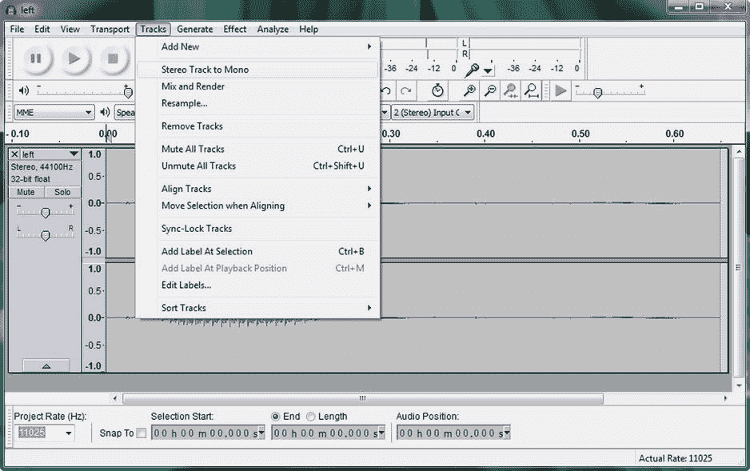

图 15-8。

Use the Tracks ➤ Stereo Track to Mono algorithm to combine the stereo samples into one Mono sample

在使用这种立体声到单声道的算法之前，我想让你做的是点击 Audacity 顶部的 Play transport 按钮，仔细听几次立体声音频资源。接下来，使用图 15-8 所示的菜单序列，调用立体声到单声道的合并算法。在您看到单个单声道音频资产后，您可以向前看，并在图 15-9 中看到，再次点击播放传输按钮，然后听音频样本，现在它是单声道的，看看您是否可以检测到任何差异。

使用专门的音效，这种差异甚至更难察觉(如果你能察觉的话)。Audacity 2.0.6 软件包是一个完全专业的数字音频编辑、增甜和音效程序，正如你在这里看到的，你可以使用该软件的正确工作流程来实现专业的游戏音频开发结果，这就是为什么我让你在第一章中下载并安装它。为了确保您拥有最强大的 Audacity 2.0.6 版本，请确保您下载了所有的 LADSPA、VST、Nyquist、LV2、LAME 和 FFMPEG 插件，然后将它们安装在 C:\ Program Files \ Audacity \ Plug-Ins 文件夹中，并重新启动 Audacity。

#### 准备编码:导出资产并将其复制到项目中

让我们使用文件➤导出菜单序列导出最终的单声道文件并将其命名为 leftmono.wav，如图 15-9 所示。您可以使用相同的工作流程记录其他五个文件，或者使用我创建的资产，如果您愿意的话。

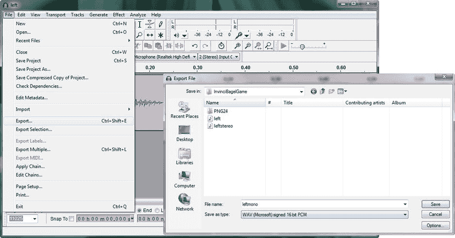

图 15-9。

Again use the File ➤ Export menu sequence and name the file leftmono and select the WAV 16-bit PCM

使用操作系统文件管理实用程序将六个音频资产复制到 InvinciBagel/src 文件夹中，如图 15-10 所示，以便我们在本章的剩余部分编写代码时参考。


图 15-10。

Use your file management software to copy the six .WAV files into the InvinciBagel/src project folder

现在我们准备好回到 Java 8 编码中。首先，我们将在 InvinciBagel.java 类中添加代码，以实现六个 AudioClip 对象，这些对象将引用我们的音频资产，然后，在 Bagel.java 类中，我们将在一个新的。playAudioClip()方法，我们将把它添加到我们的 Bagel 类的 primary。update()方法。

## 向 InvinciBagel.java 添加音频:使用 AudioClip

要实现 AudioClip 声音引擎，我们需要做的第一件事是声明六个私有 AudioClip 对象，在 InvinciBagel.java 类的顶部使用一个复合声明语句。我将用下面一行 Java 代码将这些声音命名为 0 到 5，如图 15-11 所示:

`private``AudioClip`

如图 15-11 所示，您必须使用 Alt-Enter 工作流程，并选择“为 javafx.scene.media.AudioClip 添加导入”选项，并让 NetBeans 8 为您编写 AudioClip 类导入语句。


图 15-11。

Add the private AudioClip compound declaration statement for your iSound0 through iSound5 objects

### 引用音频剪辑资源:使用 java.net.URL 类

与 JavaFX 中的图像对象(可以使用简单的正斜杠字符和文件名来引用)不同，数字音频资产不容易引用，需要使用 URL 类，它是 java.net(网络)包的一部分。URL 类用于创建 URL 对象，该对象提供统一资源定位符(URL)文件引用，它本质上是指向“数据资源”的“指针”，而“数据资源”通常是新的媒体资产，在我们的 Java 8 游戏开发中，它是/src 文件夹中的一个 WAVE 音频文件。

像 AudioClip 类一样，URL 类也是临时编写的，以提供 URL 对象，正如您从 Java 类层次结构中看到的那样，它看起来像下面这样:

```java
java.lang.Object
```

`> java.net.` `URL`

我们实现六个 AudioClip 对象的第二步是使用复合声明语句在 InvinciBagel.java 类的顶部声明六个名为 iAudioFile0 到 iAudioFile5 的私有 URL 对象，这可以在图 15-12 中看到，看起来像下面的单行 Java 代码:

`private``URL`

如图 15-12 所示，您必须再次使用 Alt-Enter 工作流程，并选择“为 java.net.URL 添加导入”选项，并再次让 NetBeans 8 为您编写 URL 类导入语句。


图 15-12。

Add a private URL compound declaration statement for the iAudioFile0 through iAudioFile5 URL objects

现在我们准备编写加载 URL 对象的 Java 代码，然后使用这些代码实例化我们的 AudioClip 对象。为了在该类中使用自定义方法来维护我们的高级代码组织，让我们将 loadAudioAssets()方法添加到我们的。start()方法接下来，然后创建一个私有的 void loadAudioAssets()方法来保存我们的 AudioClip 相关代码，以防我们将来要在我们的游戏中添加六个以上的数字音频资产。

值得注意的是，由于 AudioClip 类在音高移动和 2D 空间(从左到右)音频移动方面的多功能性，您应该不需要像您想象的那样多的音频资源，因为您甚至可以将六个设计良好的音频资源变成数百种不同的游戏音效。

### 正在添加您的音频资产加载方法:。loadAudioAssets()

在你的 start()方法中创建一个方法调用，如图 15-13 所示，名为`loadAudioAssets()` `;`，并在`loadImageAssets();`方法调用之前按逻辑方法顺序放置它。为了消除红色波浪错误突出显示，在 createSceneEventHandling()方法之后添加一个`private void loadAudioAssets(){}`空方法。通过这种方式，您的数字音频资源将在您的 KeyEvent 处理设置完成后，并且在您的数字图像资源被引用和加载到内存之前被引用和加载到内存中。

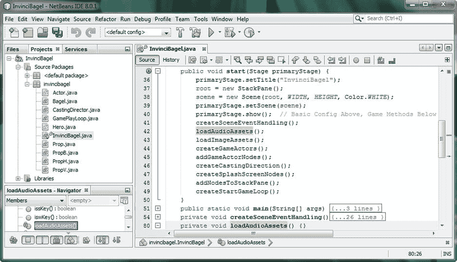

图 15-13。

Create the private void .loadAudioAssets() method to hold the AudioClip object instantiation statements

在你的内心。loadAudioAssets()方法体，您将有两个 Java 代码语句，因为加载数字音频资产比引用数字图像资产要复杂一些。首先，您将使用 getClass()加载您的第一个 iAudioFile0 URL 对象。getResource()方法链。这个方法链用您想要使用的数字音频样本资源加载 URL(统一资源定位器)对象，并将为您的类对象执行此操作(在本例中，这是 InvinciBagel 类，因为这是我们编写此代码的 Java 类)。

您正在寻找的获取 URL 的资源位于。getResource()方法调用，并使用与您用于数字图像资源的资源引用相同的格式，在本例中是“/leftmono.wav”文件引用，它由。getResource()方法转换为二进制 URL 数据格式。该 Java 代码如图 15-14 所示，看起来像下面的 Java 方法体:

`private void``loadAudioAssets()`

`iAudioFile0 =``getClass().getResource`

`iSound0 = new AudioClip(iAudioFile0``.toString()`

```java
}
```

有趣的是，第二行代码使用了。toString()方法调用，它将这个 URL 对象转换回 String 对象，这是用音频资源 URL 加载 AudioClip()构造函数方法所必需的。你可能在想:为什么不用`iSound0 = new AudioClip("/leftmono");`？您可以尝试这样做，但是，您必须使用“file:/Users/Users/my documents/netbeans projects/InvinciBagel/src/left mono . wav”对目录进行“硬编码”

我使用了 URL 对象方法，以便您能够从 JAR 文件内部引用这个音频文件，而不是使用上面显示的方法，该方法需要硬盘驱动器上的“绝对”位置。因此，这个 getClass()。getResource()方法链正在将“相对”引用数据添加到此 URL 对象中。InvinciBagel 类需要这个相对引用数据，以便能够从 NetBeans 8 项目 InvinciBagel/src 文件夹内部以及 Java 8 游戏应用的 JAR 文件内部引用 WAV 音频资源文件。

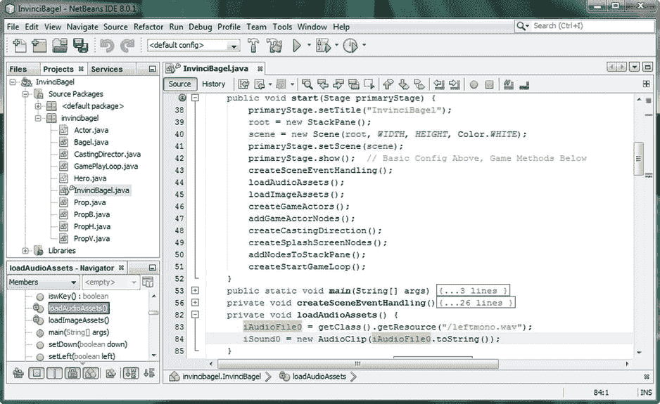

图 15-14。

Instantiate and load the URL object, and then use it inside of the iSound0 AudioClip object instantiation

接下来，使用您信任的程序员的快捷方式，将这两行代码复制并粘贴五次，这是创建其他五个 AudioClip 对象的简单方法。将 iAudioFile0 和 iSound0 上的零分别更改为 iAudioFile1 至 iAudioFile5 和 iSound1 至 iSound5。然后将 WAV 音频文件名引用分别改为 rightmono.wav、upmono.wav、downmono.wav、wmono.wav、smono.wav。您完成的 loadAudioAssets()方法应该看起来像下面的 Java 方法体，如图 15-15 所示:

```java
private void loadAudioAssets() {
```

`iAudioFile0``= getClass().getResource("/``leftmono.wav`

`iSound0 = new AudioClip(``iAudioFile0`

`iAudioFile1``= getClass().getResource("/``rightmono.wav`

`iSound1 = new AudioClip(``iAudioFile1`

`iAudioFile2``= getClass().getResource("/``upmono.wav`

`iSound2 = new AudioClip(``iAudioFile2`

`iAudioFile3``= getClass().getResource("/``downmono.wav`

`iSound3 = new AudioClip(``iAudioFile3`

`iAudioFile4``= getClass().getResource("/``wmono.wav`

`iSound4 = new AudioClip(``iAudioFile4`

`iAudioFile5``= getClass().getResource("/``smono.wav`

`iSound5 = new AudioClip(``iAudioFile5`

```java
}
```

因为我们已经将 AudioClip 对象设为私有，所以我们需要在 InvinciBagel 类中创建方法，可以使用方法调用从我们的 Bagel.java 类(以及稍后开发的其他类)中调用这些方法。

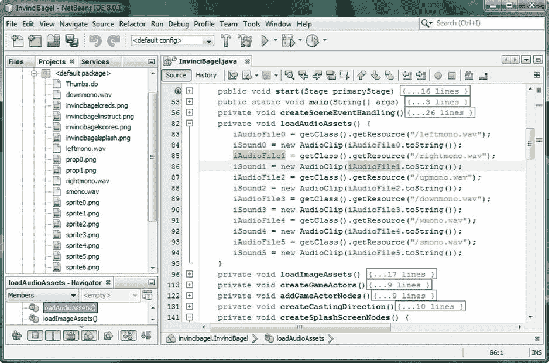

图 15-15。

Create more AudioClip objects referencing the rightmono, upmono, downmono, wmono, and smono files

使用您的源代码➤插入代码➤生成➤ Setters 工作过程打开生成 Setters 对话框，如图 15-16 所示，并选择 iSound0 到 iSound5 对象，这样 NetBeans 就创建了 6 个。setiSound()方法。

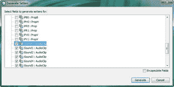

图 15-16。

Use the Generate Setters dialog and create six .setiSound() methods

现在我们准备使用这六个新的。NetBeans 为我们编写的 setiSound()方法，我们并不需要它，因为我们的音频剪辑是使用。loadAudioAssets()方法，来创建六个。事实上，我们确实需要 playiSound()方法来回放这六个数字音频资产。让我们接下来做那件事。

### 提供对音频剪辑的访问。playiSound()方法

我们将要做的是我认为是另一个程序员的捷径，但我没有复制和粘贴，而是使用 NetBeans 源代码➤插入代码函数为我要更改的 iSound 对象创建 Setter 方法。setiSound()到。playiSound()方法，这样我就不必键入所有这六个方法体。如图 15-17 所示，NetBeans 为我们创建了六个完整的方法体，我们所要做的就是移除方法参数区域内的 AudioClip iSound 引用，将 setiSound()改为 playiSound()，最后将`this.iSound0 = iSound0;`语句改为`this.iSound0.play();`。我们将为这六个人中的每一个人做这件事。setiSound()方法体，这将允许我们快速创建六个。playiSound()方法体。

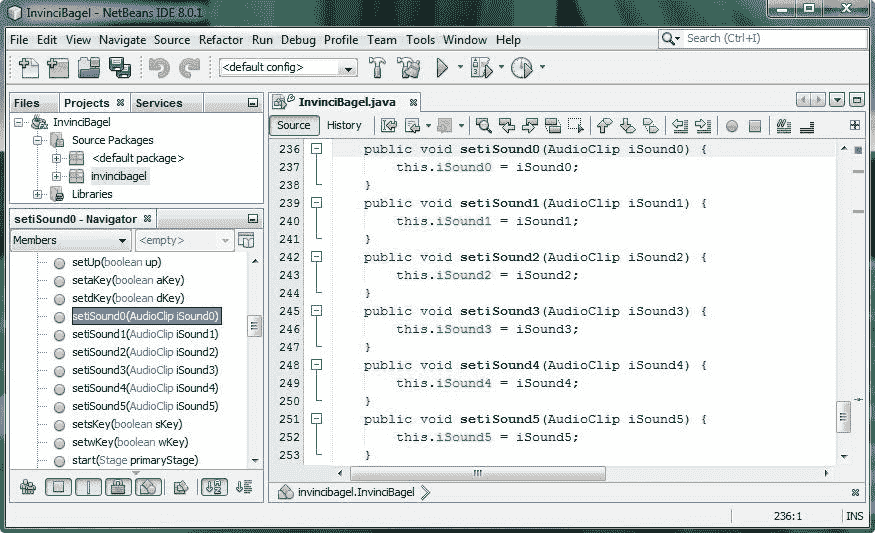

图 15-17。

Edit these six .setiSound() methods, created by NetBeans, at the bottom of the InvinciBagel.java class

编辑过程相对简单:选中 setiSound 的 set 部分，在 set 上键入“play”；选择参数区域的内部(AudioClip iSound#)，并按 delete 或 backspace 键删除它；最后，在 this.iSound 和 the 之间的方法内部，选择 Java 语句的“= isound”部分；分号并键入。改为播放()。完整的 Java 方法体如图 15-18 所示，应该如下所示:

```java
public void playiSound0() {
```

`this.``iSound0`

```java
}

public void playiSound1() {
```

`this.``iSound1`

```java
}

public void playiSound2() {
```

`this.``iSound2`

```java
}

public void playiSound3() {
```

`this.``iSound3`

```java
}

public void playiSound4() {
```

`this.``iSound4`

```java
}

public void playiSound5() {
```

`this.``iSound5`

```java
}
```

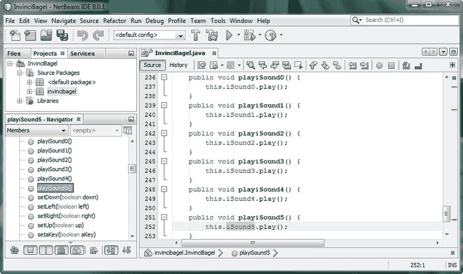

图 15-18。

Turn .setiSound() methods into .playiSound() methods by adding calls to the AudioClip .play() method

#### 触发了。java 中的 playiSound()方法。playAudioClip()方法

现在我们已经声明了，universal resource 定位(引用)并实例化了我们的 AudioClip 对象，并创建了。playiSound()方法允许我们从 InvinciBagel.java 类的“外部”触发这些数字音频样本，我们可以进入 Bagel.java 类，并编写一些允许我们触发这些音频对象的代码，以查看 AudioClip 类的工作情况。用我们现有的代码做到这一点的最好方法是使用我们用来移动我们的运动精灵对象的事件处理器代码，也允许我们为我们当前为游戏设置的每个按键事件触发这些声音中的一个。这就是为什么我用它们将被触发的键来命名这些文件。我们需要在 Bagel.java 类中做的第一件事，类似于我们在 InvinciBagel 类中做的，是对。update()方法引用了空的私有 void playAudioClip()方法。这个方法调用和空的方法体如图 15-19 所示。

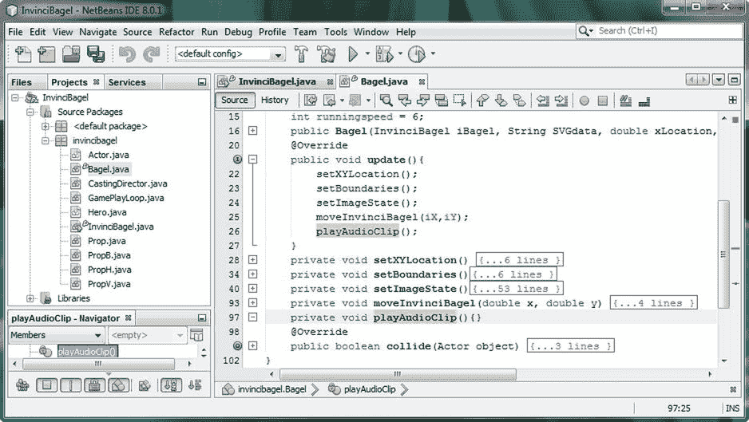

图 15-19。

Create an empty .playAudioClip() method in the Bagel.java class and add a call to it inside of .update()

在 playAudioClip()方法体中，我们需要创建条件 if()结构，类似于我们在第一章 2 中为 sprite 移动所做的。我们将通过 invinciBagel.playiSound()对象引用和条件 if()语句内的方法调用，将按键事件处理(左、右、上、下、w、s)与说出每个按键(AudioClip 对象 iSound0 到 iSound5)的音频文件相匹配，如图 15-20 所示，使用以下 Java 代码:

`private void``playAudioClip()`

```java
if(invinciBagel.isLeft())  { invinciBagel.playiSound0(); }

if(invinciBagel.isRight()) { invinciBagel.playiSound1(); }

if(invinciBagel.isUp())    { invinciBagel.playiSound2(); }

if(invinciBagel.isDown())  { invinciBagel.playiSound3(); }

if(invinciBagel.iswKey())  { invinciBagel.playiSound4(); }

if(invinciBagel.issKey())  { invinciBagel.playiSound5(); }

}
```

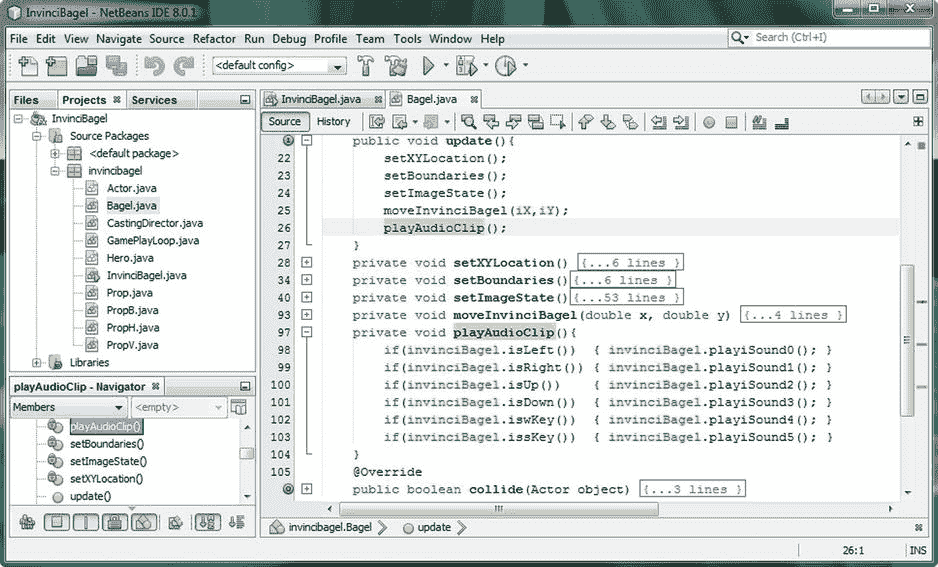

图 15-20。

Add conditional if() statements to the .playAudioClip() method that call the correct .playiSound() method

现在，我们已经将数字音频添加到了我们的游戏引擎基础设施中，接下来我们所要做的就是将画外音替换为声音效果，我们将完成游戏开发中的数字音频部分。如果您使用运行➤项目工作流程并测试代码，您会发现使用 JavaFX 可以快速触发音频样本。

## 摘要

在第十五章中，我们将注意力从游戏在我们眼中的样子(视觉)转移到了它在我们耳中的声音(听觉)，并花了一章来实现 AudioClip 类的代码，这样我们就可以触发数字音频音效。

首先，我们看一下 JavaFX AudioClip 类。我们了解了为什么它非常适合用于我们的音频游戏开发，包括短音乐循环(使用不定常数设置)或快速音效。

接下来，我们学习了如何使用 Audacity 2.0.6 优化数字音频资产。我们学习了优化数字音频的工作过程，以便只占用十几千字节的系统内存，以及如何优化音频，以至于我们甚至不必应用压缩，特别是因为 Java 8 支持的音频压缩编解码器是“有损”编解码器，一旦音频数据被解压缩到系统内存中，就会降低音频数据的质量。

最后，我们在 InvinciBagel.java 类中使用. loadAudioAssets()方法实现了 AudioClip 对象，然后创建了六个。playiSound()方法来允许外部类访问和播放这些数字音频资产。我们还在 Bagel.java 类中添加了一个. playAudioClip()方法，该方法根据按下的键触发音频样本。在下一章，我们将看看如何在我们的游戏代码中加入碰撞检测。