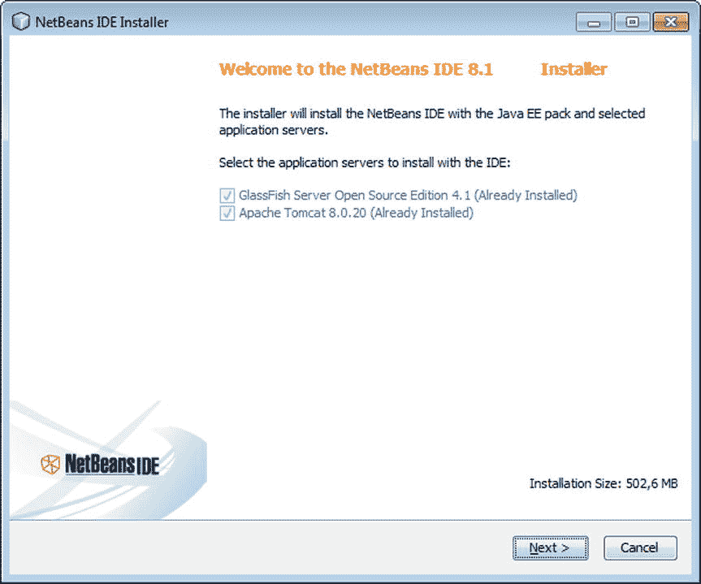
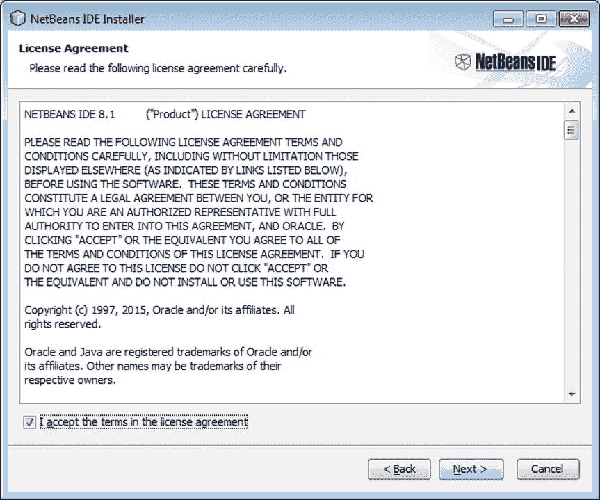
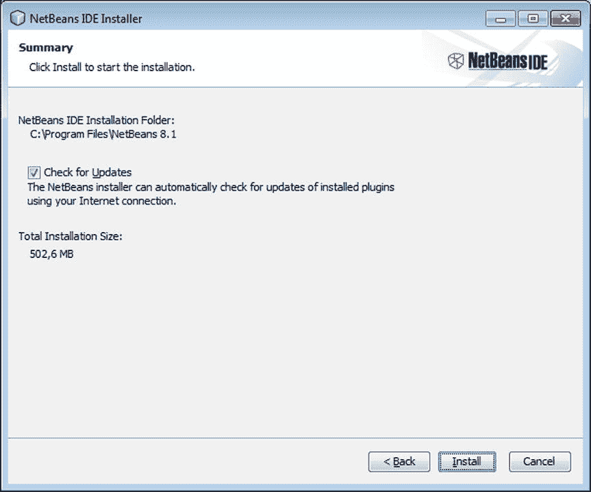
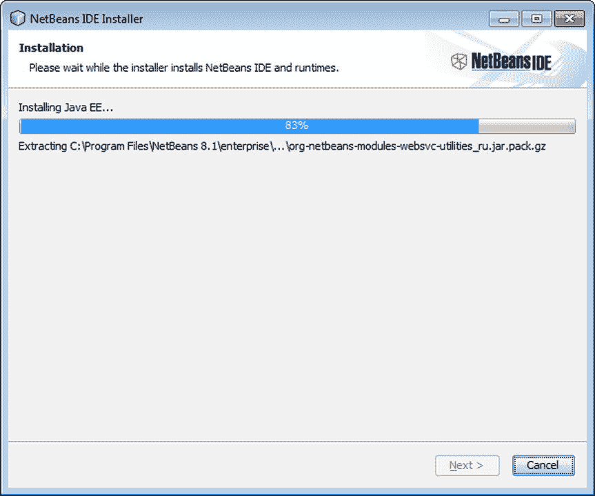
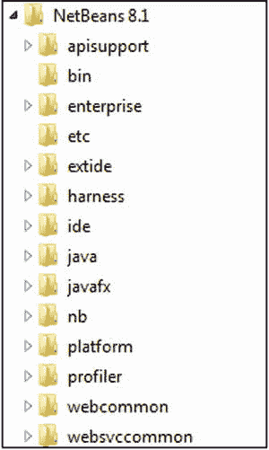
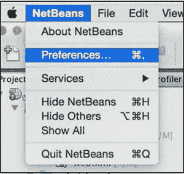

# 一、安装和设置

由于其开箱即用的体验，NetBeans 是学习 Java 的最佳入门 IDE。一个简单的点击式安装过程提供了您需要的所有工具，以及一个友好而直观的用户界面来开发各种 Java 应用。—Zoran Sevarac，塞尔维亚贝尔格莱德大学助理教授，欧米诺创始人

在本章中，我将向您介绍 NetBeans IDE，之后我将为您提供启动和运行 IDE 所需的信息。你会发现这个过程很简单，很快你就能完成一个基本的场景，如第二章中所描述的，它将引导你完成用 IDE 用 Java 编程的工作流程。

## 什么是 NetBeans IDE？

IDE 是一个 100%免费的开源开发环境，可以帮助您创建不同种类的软件应用。在本书的上下文中，我们将特别关注 IDE 作为开发 Java 应用的环境。IDE 支持所有类型的 Java 应用，帮助您开发使用所有 Java 技术的项目—Java SE、Java EE、嵌入式和云。

IDE 是模块化的，可以通过插件进行扩展。本章将向您介绍的下载包中包含的特性非常广泛，您不需要使用任何插件，至少最初不需要。

Java 是用来编写 IDE 的语言。它可以在安装了 Java 开发工具包(JDK)的操作系统上运行。指导您完成 ide 安装和设置过程的安装程序适用于 Windows、Linux 和 Mac OSX。IDE 也可以作为 ZIP 或 TAR 文件下载，如果您想在没有提供安装程序的操作系统上使用 IDE，这可能会很有用。

出于本书的目的，IDE 的存在是为了简化 Java 应用的开发过程。如果没有 IDE，Java 开发中固有的编辑-编译-调试循环会很麻烦，而且容易出错。为了克服和帮助开发过程，IDE 集成了用于这些活动的工具。具体来说，IDE 会执行以下操作:

*   通知您代码中的问题，并在 Java 编辑器中突出显示它们。
*   使用 Java 编辑器中的代码模板、代码完成和提示等编辑器功能，帮助您快速高效地进行编码。
*   在 Java 编辑器中键入时显示类和方法的文档。
*   包括可视化导航帮助，包括导航器和编辑器功能(如代码折叠),以及许多加速编码的键盘快捷键。
*   在“输出”窗口中提供超链接，使您可以从编译错误跳转到 Java 编辑器中找到相关有问题代码的行。
*   通过在整个代码中管理对包、类和方法名称的引用，帮助管理应用代码中的更改。当您移动或重命名代码时，IDE 会找到受您的更改影响的相关代码，并让您控制是否应该自动更改相关代码。
*   附带一个调试器和分析器，它们协同工作，帮助您快速轻松地识别代码中的问题。当代码运行时，您可以逐句通过它并设置断点，而不需要添加打印语句。分析器允许您识别代码中的瓶颈，例如导致性能问题和死锁的区域。
*   允许您将开发工作流集成到一个单一的环境中，包括将代码签入和签出版本控制系统，如 Git、Mercurial 和 Subversion。

## IDE 的优势

就像其他开发环境一样，IDE 由一组编辑器和图形工具组成，用于高效编码和快速检测问题。IDE 从创建项目开始，通过编辑过程，指导您编译、调试和打包应用。

在使用 IDE 时，您可以使用它的免费和先进的工具和功能，而不会有将代码移动到单一集成开发环境中的缺点。例如，IDE 的独特之处在于它支持的基于 Maven、Gradle 或 Ant 的项目架构和构建结构也是基于开放标准的。其他 ide 使用专有的元数据和其他文件对您强制执行特定于 IDE 的结构和过程，因此当您想要在其他 IDE 之外运行应用时，您需要更改应用架构。使用 NetBeans ide，您可以确保您所做的工作在 IDE 外部编译和运行，就像在 IDE 内部一样。当您使用 Hudson 或 Jenkins 等连续构建服务器时，以及当您使用 Maven 作为构建工具时，这尤其方便。

在为新的和不断发展的软件标准提供支持方面，IDE 始终与潮流保持一致，甚至走在潮流的前面。当您使用 Java 时，您可以确保 IDE 支持最新的规范和技术，并且您从它那里获得的所有帮助都基于最新的标准。例如，通过重构工具、批处理分析器、Java 提示和语法着色，IDE 的 Java 编辑器支持最新的语言功能，尤其是那些与 Java SE 8 中引入的 lambdas 和函数操作相关的功能。

IDE 的新用户往往会对“开箱即用”的特性感到惊讶，也就是说，不需要安装任何额外的插件。IDE 内置了一个全功能的 Java EE 平台开发环境，同样是开箱即用的。Java SE 应用可用的编辑器、调试器、分析器和项目支持也可用于 Java EE 开发，无需任何设置或配置。

## 下载 IDE

您可以从 NetBeans.org 网站下载 IDE:

[`http://www.netbeans.org/downloads/index.html`](http://www.netbeans.org/downloads/index.html)

您也可以从 Oracle.com 网站下载它和 JDK:

[`http://www.oracle.com/technetwork/java/javase/downloads`](http://www.oracle.com/technetwork/java/javase/downloads)

最好使用最新版本的 JDK 和 IDE。在撰写本文时，IDE 的最新版本是 NetBeans IDE 8.1。本书通篇使用 NetBeans IDE 8.1，并且假设您在阅读本书时使用的是 NetBeans IDE 8.1。

图 1-1 显示了 NetBeans.org 上可用的下载包。

图 1-1。

NetBeans IDE download bundles

NetBeans IDE 下载包包含表 1-1 中描述的功能。对于本书中的说明，您需要 Java EE 下载包。一般来说，当您学习 Java 语言时，Java SE 下载包是您所需要的，因为它包括 Java 编辑器、调试器和分析器。然而，当您作为 Java 开发人员受雇于一个组织时，您通常会创建使用 Java EE 平台的应用，因为 Java EE 是一个用于创建复杂的企业 Java web 应用的集成解决方案。Java EE 下载包提供了在使用 Java EE 平台时很有用的工具。简而言之，Java EE 下载包包含了 IDE 提供的全套 Java 特性，是您在阅读本书时应该下载并安装的下载包。

表 1-1。

NetBeans IDE Download Bundles

<colgroup><col> <col></colgroup> 
| 下载捆绑包 | 特征 |
| --- | --- |
| Java SE | 提供创建 Java 桌面应用的功能，包括 JavaFX 和 Swing 用户界面工具，包括 Java 编辑器、Java 调试器和 Java profiler。 |
| 容器 | 提供与 Java SE 发行版相同的功能，以及用于 Java EE 平台的工具，如 Java servlets、Java Server Faces、Java Persistence API、Enterprise Java Beans、Java RESTful Web 服务，以及用于框架(如 PrimeFaces)的代码生成器。包括用于注册和部署到 GlassFish 和 Tomcat 的工具，以及管理部署到这些服务器的应用的工具。 |
| C/C++ | 提供开发 C 和 C++应用的功能，包括项目模板、编辑器、代码生成器、调试器和用于配置管理的生成文件向导。 |
| HTML5/JavaScript 和 PHP | 为 HTML5 web 应用提供特性，包括 HTML5、JavaScript 和 CSS3 的编辑器、模板和代码生成器，以及使用 Cordova 创建部署到 iOS 和 Android 的混合移动应用。包括一个 JavaScript 调试器、SASS 和更少工具以及 JavaScript 框架支持，例如 Knockout.js 和 AngularJS。PHP 的特性包括编辑器、代码模板、代码生成器和调试器，以及与 MYSQL 和其他数据库服务器的集成。 |
| 全部 | 在一个下载包中提供上述所有工具。您不太可能需要“All”发行版，建议您使用其他下载包之一，特别是最符合您实际需求的下载包。 |

Note

对于 Java 开发，也就是说，如果您希望使用 Java SE、Java EE 或所有发行版，那么在系统上安装 IDE 和 Java 运行时环境(JRE)对于运行 IDE 是不够的。你需要有 JDK，也就是 Java 开发工具包，里面包括 JRE。IDE 依赖于 JDK 提供的开发工具，如`javac`编译器，并利用该下载的其他部分，如它包含的 JDK 源代码。去这里下载 JDK 的最新版本: [`http://www.oracle.com/technetwork/java/javase/downloads`](http://www.oracle.com/technetwork/java/javase/downloads)

## 安装 IDE

一旦下载了 IDE，安装就很简单了。首先确保您的系统上安装了合适版本的 JDK，必须是 JDK 7 或更高版本。打开命令提示符并运行以下命令:

`java -version`

您应该会看到类似于以下内容的输出:

`java version "1.8.0_40-ea"`

`Java(TM) SE Runtime Environment (build 1.8.0_40-ea-b23)`

`Java HotSpot(TM) 64-Bit Server VM (build 25.40-b25, mixed mode)`

您可以看到 JDK 8 更新 40 已安装。如果命令不被识别，进入 [`http://www.oracle.com/technetwork/java/javase/downloads`](http://www.oracle.com/technetwork/java/javase/downloads) ，下载最新版本的 JDK 并安装。

一旦安装了 JDK，就可以开始安装 IDE 了。在 Windows 上，双击在上一节中下载的 IDE 安装程序。在 Mac OSX 或 Linux 上，从命令提示符启动安装程序。如下所述，逐步完成安装向导。

Figure 1-2 shows the first screen in the wizard that you use to install the IDE. As you can see, together with the IDE, you can install the GlassFish server and the Apache Tomcat server. GlassFish is useful if you want to work with Java EE, while Apache Tomcat is focused on Java web applications, which do not make full use of the Java EE platform. For the purposes of this book, you should install the GlassFish server so that you can use the IDE tools that relate to the Java EE platform.

图 1-2。

Welcome to the NetBeans IDE installer  

图 1-3 显示了使用 IDE 时需要同意的许可条款。

图 1-3。

License agreement

图 1-5。

Summary Once you have gone through Steps 1-3, the installer shows where the IDE will be installed. If you click the Check for Updates checkbox, the IDE will notify you when new versions of installed features are available and prompt you to let the IDE install them.   In Figure 1-4 you can see that you need to specify the location where the IDE will be installed, together with the JDK that will be used to start it. If you need to change the JDK used to start the NetBeans IDE after you have installed it, you can use the `netbeans.conf` file, which is in the installation directory’s `etc` folder, to point to a different JDK.

图 1-4。

NetBeans IDE installation folder and JDK location  

完成这些步骤后，IDE 将开始安装过程，如图 1-6 所示。

图 1-6。

NetBeans IDE installation

如图 1-7 所示，安装程序会在安装过程完成时通知您。您可以通过让 IDE 定期自动提交您使用 IDE 的匿名数据来帮助 IDE 工程师改进 IDE。

图 1-7。

Setup complete

这就是你所需要做的，NetBeans IDE 现在已经安装好了，如图 1-8 所示。如您所见，安装程序会引导您在系统上选择一个 JDK 来运行 IDE，并且在 Windows 上，可以创建桌面图标和开始菜单项来启动 IDE。

图 1-8。

Figure 1-8.

## 使用麦克·OSX

尽管 IDE 可以在 Windows、Linux 和 Mac OSX 上运行，但是了解 IDE 使用方式的不同是很重要的。为了保持一致，也为了避免因操作系统的不同而混淆本书，所有图片和描述都假设您使用的是 Windows。在 Linux 发行版上，IDE 的行为与 Windows 相同，当然，IDE 本身看起来很不一样。在 Mac OSX 上，IDE 不仅看起来不同，而且在某些特定方面的行为也不同。不仅在本书中，而且在使用 IDE 本身时，了解这些差异以避免许多挫折是很重要的。

最重要的是，每当这本书告诉你通过在 IDE 的菜单栏中进入工具➤选项来打开选项窗口时，如果你使用的是 Mac OSX，你应该转到 NetBeans ➤首选项，如图 1-9 所示。

图 1-9。

Accessing the Options window on Mac OSX via NetBeans ➤ Preferences

整本书使用的键盘快捷键也需要稍微调整一下，以便与 Mac OSX 配合使用。一般来说，当你看到使用 Ctrl 键的快捷键时，你应该使用 Mac OSX 上的 Cmd 键。例如，在 Windows 和 Linux 上，你使用 Ctrl+C 将字符复制到键盘上，而在 Mac OSX 上，你使用 Cmd+C。欲知详情和更多例子，请访问以下网址: [`https://netbeans.org/kb/articles/mac.html`](https://netbeans.org/kb/articles/mac.html) 。

现在您已经下载并安装了 IDE，并且知道了与 Mac OSX 的区别，您已经准备好创建您的第一个“hello world”应用，这将是下一章的重点。