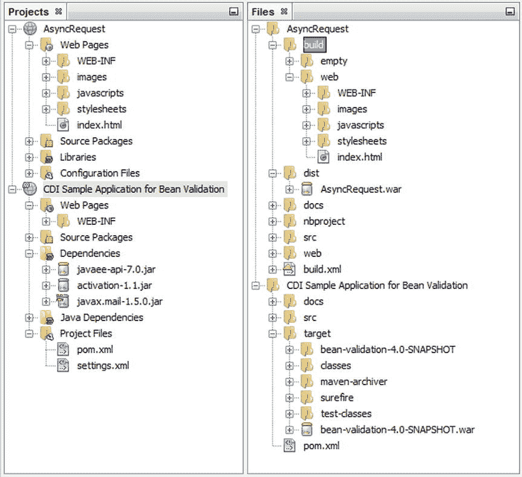
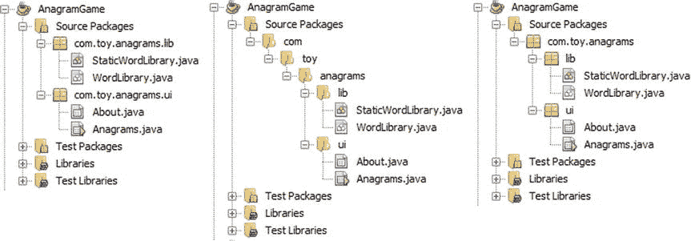
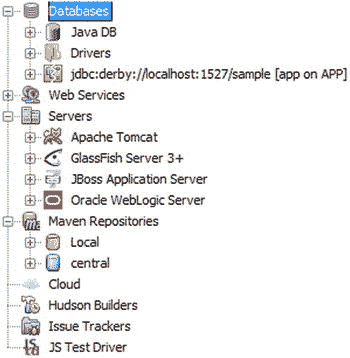
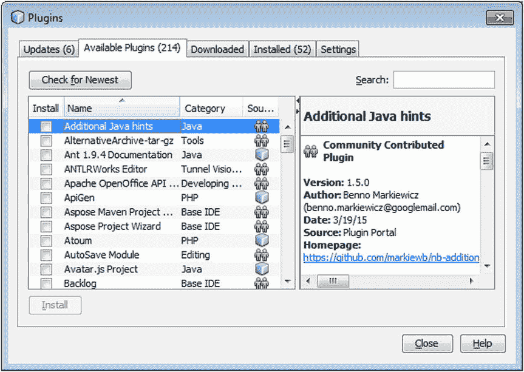
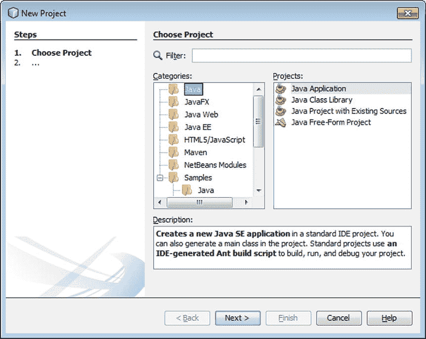
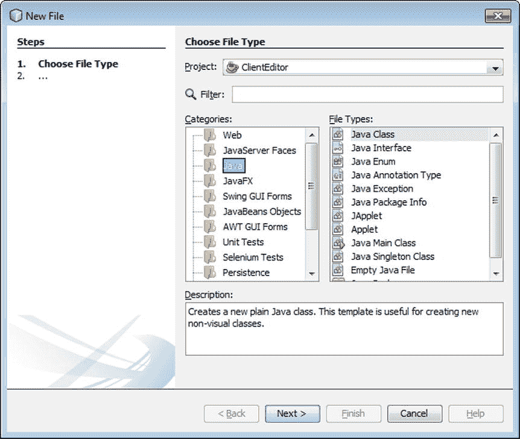
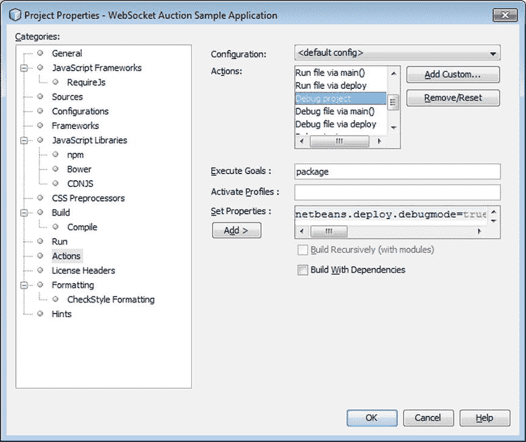
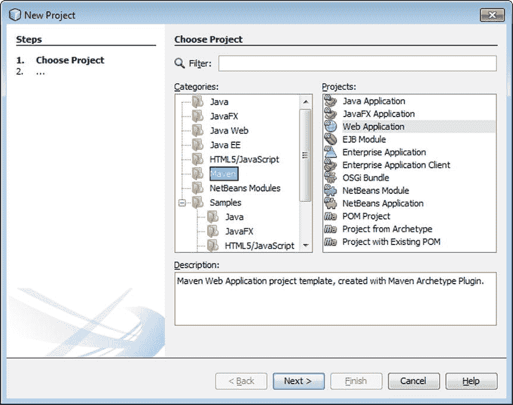
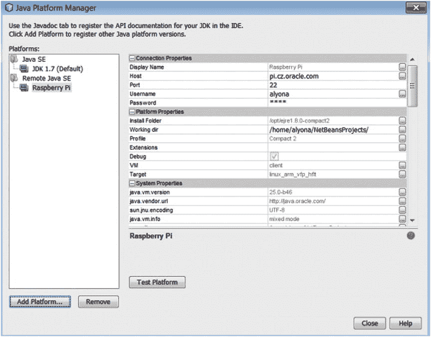

# 四、使用向导和插件

> Download, double-click and start encoding. I use NetBeans to encode, debug and analyze Java EE, Java SE, JavaFX, HTML5 and JavaScript ... out of the box. NetBeans saved me and my airhacks.com students a lot of time. Adam Bean, an independent developer and pilot in airhacks.com

在这一章中，我将对 ide 中的工作流以及它为您提供的关键 Java 技术提供的工具进行概述。IDE 中包含许多向导，帮助您为每种 Java 技术——Java SE、Java EE、Embedded 和 Cloud——设置项目。本章的结构基于 Oracle.com 上的 Java 技术大纲，如以下 URL 所述:

[T2`https://www.oracle.com/java/technologies/index.html`](https://www.oracle.com/java/technologies/index.html)

当与 NetBeans 社区提供的许多插件结合使用时，本章中描述的向导将为您提供创建任何类型的 Java 应用所需的一切。由于这个原因，你将被介绍到插件管理器中最有用的插件，以及最有用的向导。

完成本章后，您应该对 IDE 的应用结构原理有了深入的了解，并且能够通过使用 IDE 的向导及其相关插件，在 IDE 中快速有效地设置您的开发工作。

## 概观

您可能会对如何开始开发您感兴趣的 Java 应用的快速概述感兴趣，而不是费力地阅读本章的其余部分。表 [4-1](#Tab1) 概述了每种 Java 技术在 NetBeans 中的入口点。

表 4-1。

Getting Started with Java Technologies in the IDE

<colgroup><col> <col> <col></colgroup> 
| 技术 | 描述 | 入门指南 |
| --- | --- | --- |
| Java SE | Java platform，Standard Edition (Java SE)使您能够为尽可能多的计算平台开发安全、可移植、高性能的应用。Java SE 应用运行在计算机桌面上，而不是浏览器或移动设备上。如今，这些应用有时被称为“内部”应用。 | 在 IDE 中，打开“新建项目”向导(Ctrl+Shift+N)。当您开始学习 Java 时，您可能希望使用简单的基于 ant 的 Java SE 项目模板，该模板可以在 Java ➤ Java 应用的新建项目向导中找到。当您更加熟悉 Java 并且对使用广泛使用的 Maven 构建系统感兴趣时，请在新建项目向导中转到 Maven ➤ Java 应用，开始创建您的 Java SE 应用。 |
| 容器 | Java 平台企业版(Java EE)是企业 Java 计算的行业标准。Java EE 使开发人员能够编写更少的样板代码，更好地支持最新的 web 应用和框架，并获得增强的可伸缩性和更丰富的功能。 | 在 IDE 中，打开“新建项目”向导(Ctrl+Shift+N)。当您开始学习 Java 时，您可能希望使用简单的基于 ant 的 Java EE 项目模板，该模板可以在 Java Web ➤ Web 应用的新建项目向导中找到。当您更加熟悉 Java EE 并且对使用广泛使用的 Maven 构建系统感兴趣时，请在新建项目向导中转到 Maven ➤ Web 应用，开始创建您的 Java EE 应用。 |
| 植入的 | Java 嵌入式产品的设计和优化旨在满足嵌入式设备的独特要求，如微控制器、传感器(如 Raspberry Pi)和网关。它们支持 M2M 通信和“物联网”的智能系统，因此您可以使用您的设备做更多事情。 | 在 IDE 中，转到工具➤ Java 平台。单击添加平台并选择远程 Java 标准版。单击“下一步”,您将能够连接到嵌入式设备上安装的 JDK。一旦注册了嵌入式 JDK，您就可以将您的 Java 应用部署到其中，方法是在您想要部署到嵌入式设备的项目的“项目属性”窗口中设置嵌入式 JDK。 |
| 云 | Java 云服务提供了在云中开发和部署业务应用的企业级平台。它们使您能够通过即时访问支持任何标准 Java EE 应用的云环境，以及集成的安全性和数据库访问，最大限度地提高工作效率。 | 在 IDE 中，转到服务窗口(Ctrl+5)并查看云节点，在这里可以管理部署到 Java 云服务的应用。Amazon Beanstalk 支持开箱即用。插件可用于 Oracle Cloud、Oracle Developer Cloud Service、Red Hat OpenShift 和 Jelastic。 |

对于喜欢冒险的读者来说，表 [4-1](#Tab1) 应该足以让你开始使用这些技术。对于那些想了解更多细节的读者，以及那些遇到问题的爱冒险的读者，本章的剩余部分将详细探讨每一种 Java 技术以及 IDE 为支持它们而提供的工具。

## 一般

在本节中，将向您介绍 IDE 工具结构和 IDE 中各种 Java 项目的应用结构的一般原理。IDE 坚持认为应用结构应该如何在 IDE 中可视化。通常，一旦您理解了 IDE 处理应用的角度，您就会对 IDE 采用的方法非常满意。

例如，您将了解到 IDE 只在“项目”窗口中显示您最可能使用的工件，而“文件”窗口也包含生成的代码。如果不了解这些考虑因素，您会经常问自己这样的问题，“我的构建文件夹在哪里？”以及“我刚刚构建的应用的 JAR 在哪里？”

一旦您研究了 IDE 遵循的一般应用结构原则，您将更详细地了解每种 Java 技术以及 IDE 为它们提供的工具。

### 应用结构

当您在 IDE 中创建新项目时，它将在“项目”窗口中打开(Ctrl+1)。“项目”窗口显示了应用的逻辑结构。逻辑结构由您可能想要直接使用的文件夹和文件组成，并且不会因自动化过程(如构建过程)而改变。

当您在一个项目上执行一个自动化过程时，可能会创建各种各样的工件，比如构建过程或者 JUnit 测试过程。这些工件不会显示在“项目”窗口中。如果您正在寻找以某种方式生成或自动创建的工件，请打开文件窗口(Ctrl+2)。文件窗口有一个 dist 文件夹，其中包含以某种方式为您创建的归档文件，如 JAR、WAR 和 EAR。在基于 Ant 的项目中,“文件”窗口在构建过程完成后显示一个构建文件夹，而基于 Maven 的项目在构建过程完成后在“文件”窗口中显示一个目标文件夹。

图 4-1 展示了基于 Ant 的项目 AsyncRequest 和基于 Maven 的项目 CDI Sample Application for Bean Validation 的要点。这两个项目都可以在 New Project 向导的 Samples 类别中找到。

图 4-1。

Projects and Files windows

### 项目组

NetBeans 项目是一组源文件以及用于构建、运行和调试这些源文件的设置。在 IDE 中，所有开发都必须在一个项目中进行。对于涉及大型代码库的应用，将应用源代码分成几个项目通常是有利的。

您可以创建项目分组，以便一次打开和关闭几个项目。此外，每个组可以有不同的主项目。创建项目组后，该项目组在“项目组”菜单中可用。当您从该菜单中选择一个项目组时，该项目组之外所有打开的项目都将关闭。如果要关闭所有打开的项目，请选择文件➤项目组➤(无)。

### 查看 Java 包

默认情况下，如图 [4-2](#Fig2) 中最左边的图像所示，每个包在应用结构中显示为一个单独的节点。

图 4-2。

Java packages as list, tree, and reduced tree

但是，IDE 中有一个隐藏的功能，使您能够更改包的显示方式。包可以显示为列表(左图)、树(中图)或简化的树(右图)。通过右键单击“项目”窗口中的空白区域，并选择“查看 Java 包为”子菜单，为包选择不同的视图布局，可以在包布局之间切换。你不用再做什么了；封装布局会立即自我更新。

### 全面的服务集成

每当你想知道用于连接数据库、服务器或云服务的工具在哪里时，你应该首先查看服务窗口(Ctrl+5)，如图 [4-3](#Fig3) 所示。

图 4-3。

Services window

“服务”窗口很有用，因为它为您提供了访问任何可以想象的外部资源的单一访问点。“服务”窗口中包括数据库、web 服务、服务器、Maven 存储库、Hudson 连续构建服务器和问题跟踪器的访问点。

这些服务提供了一个统一的、标准化的机制来使用它们。在每种情况下，右键单击服务来初始化、注册或启动服务的实例。例如，右键单击 Servers 节点以注册本地安装的 GlassFish 服务器，这样您就可以从服务窗口管理它，而不是从命令提示符或管理控制台(通常在浏览器外部运行)管理它。

### 插件管理器

IDE 的独特之处在于，原则上，基本的 Java 开发不需要任何额外的插件。然而，由于 IDE 相对容易扩展，并且已经存在了十多年，世界上许多人已经为它创建了插件。

使用插件管理器(如图 [4-4](#Fig4) 所示，可在工具菜单下访问)从注册的更新中心动态更新 IDE，并管理 IDE 插件。使用插件管理器的“可用插件”选项卡查看和安装可从已注册的更新中心获得的新插件。

图 4-4。

Plugin Manager

在学习本章的过程中，有时会建议您使用插件管理器将附加功能安装到 IDE 中。

虽然插件管理器中有许多插件，但是那些列在表 [4-2](#Tab2) 中的插件是你可能想要考虑马上安装的。这些插件在它们的功能集方面是雄心勃勃的，它们与流行的或“酷”的外部技术相集成，并且它们与插件当前可用的功能子集相关联。

表 4-2。

Plugins to Consider Installing Right Away

<colgroup><col> <col></colgroup> 
| 种类 | 描述 |
| --- | --- |
| DukeScript 项目向导 | 使用此向导可以通过 NetBeans 创建新的 DukeScript 项目。该向导基于 Maven，负责项目的正确而简单的配置。使用 DukeScript 和这个向导来开发运行在 iOS、Android、桌面、浏览器甚至 NetBeans 插件上的应用。 |
| 轻松文本 | 使用 PMD 执行代码分析，并在编辑器和“操作项”窗口中显示结果。 |
| easyurl | 提供 UML 绘图功能、代码生成和从 Java 代码创建 UML 类图。它是由贝尔格莱德大学组织科学学院开源软件开发中心开发的。 |
| Eclipse Java 代码格式化程序 | 帮助您在 Eclipse JDT 和 NetBeans IDE 用户团队中遵循通用的代码风格。Eclipse 的原始格式化引擎是嵌入式的，它允许您像 Eclipse 同事一样格式化源代码。您只需要提供一个 Eclipse 格式化程序配置文件。 |
| gluon 外挂程式 | 允许开发人员使用相同的代码库创建面向 Android 和 iOS 移动平台以及桌面平台的 JavaFX 应用。 |
| 梯度支持 | 允许在 NetBeans 中将包含 build.gradle 文件的目录作为项目打开。然后，打开的项目可以作为普通的 Java 项目使用。 |
| jBatch 套件 | 允许开发人员使用 Java Batch 1.0 规范设计 Java 批处理应用模型并自动生成 Java 代码。批处理的典型特征是面向批量、非交互、后台执行。它经常长时间运行，可能是数据密集型或计算密集型的，按顺序或并行执行，并且可能通过各种调用模型启动，包括临时的、预定的和按需的。 |
| JBoss 锻造厂 | 允许开发人员快速开始使用各种基于 Maven 的 Java EE 应用。 |
| 缩进 | 一个强大的 Java 和 C/C++源代码格式化程序。Jindent 使您能够转换任何外来的 Java/C/C++源代码，以满足您偏好的编码风格或任何常见的 Java 代码约定。 |
| 测试工具 | 提供 Apache JMeter (2.4)到 NB 基础设施的紧密集成。此插件将安装其他插件，包括负载生成器和分析器/负载生成器桥。 |
| JPA 建模器 | 帮助软件开发人员以图形化图表的形式创建、设计和编辑 Java 持久性应用业务模型。它使用 JPA 类图中的 JPA 2.0 自动生成 Java 代码。 |
| 杰贝尔 | 一个生产力工具，允许您查看对代码所做的更改，而无需重新部署。它将您的项目工作区直接映射到一个正在运行的应用，这样对类和资源的更改就会立即反映在应用中。它跳过了构建和重新部署阶段。IDE 插件捆绑了 JRebel 代理，自动化服务器和项目配置，并提供调试器支持。 |
| 莫奈 | 这使得 JavaFX 快速 GUI 设计的工作流程与目前通过 Matisse GUI 生成器为 Swing 提供的工作流程相同。提供 FXML 文件的设计视图。这个插件使用 JavaFX 场景生成器提供了一个新的多视图。 |
| 我坚持 | 提供开发 Vaadin 项目的帮助，包括项目生成向导、用于更新 Vaadin 版本的首选项页面、设置小部件集编译参数，以及为常用命令提供帮助方法。 |

除了插件管理器中提供的插件之外，在 NetBeans 插件门户网站上还有更多插件( [`http://plugins.netbeans.org`](http://plugins.netbeans.org/) )。插件管理器中的插件是由 NetBeans 团队提供的，以及由 NetBeans 社区创建和验证的。插件门户中的插件是由 NetBeans 社区提供的。如果它们没有经过验证，也就是说，没有经过 NetBeans 社区的试用和批准，它们将不会出现在插件管理器中。在假设 IDE 不支持某项技术之前，请确保检查插件管理器和插件门户。通常，NetBeans 社区中的某些人会创建一个 NetBeans 插件来支持您最喜欢的技术。

## Java SE

Java platform，Standard Edition (Java SE)使您能够为尽可能多的计算平台开发安全、可移植、高性能的应用。通过使应用在异构环境中可用，企业可以提高最终用户的工作效率、加强沟通和协作，并大幅降低企业和消费者应用的拥有成本。

Java SE 应用运行在计算机桌面上，而不是浏览器或移动设备上。这些应用有时被称为“内部”应用。本书第 2 章提供了创建 Java SE 应用的完整的端到端描述。所有这些类型的应用的起点是去文件➤新项目(Ctrl+Shift+N)，这将打开新项目向导。选择 Java 类别，如图 [4-5](#Fig5) 所示。

图 4-5。

Getting started with Java SE projects

正如您在图 [4-4](#Fig4) 中看到的，在 IDE 中为开始创建和使用 Java SE 应用提供了不同的入口点。通常，您将使用 Java 应用项目模板在 IDE 中开始工作。尤其是当您第一次学习 Java 语言时，这是您可能从事的工作的理想切入点。

还提供了三个更专业的项目模板。Java 类库项目模板将创建一个没有主类的新 Java 应用。这个想法是，您将使用这个模板提供的项目结构来创建 Java 库，也就是说，为 Java 应用提供一部分通用功能的 Java 代码包。如果要从磁盘上包含 Java 源文件的一组文件夹中创建 NetBeans 项目，而没有 build.xml 文件，请使用 Java 项目和现有源代码项目模板。Ant 驱动这些应用，IDE 将为您设置 Ant 构建脚本。通常，这样的 Ant 构建脚本已经存在，在这种情况下，您将使用 Java 自由格式项目模板，该模板允许您将 Ant build.xml 文件与 Java 源代码一起导入。如果您使用 Maven 而不是 Ant 作为您的构建系统，请在 New Project 向导中使用 Maven 类别而不是 Java 类别。如果您的 Maven 项目已经存在于磁盘上，只需通过文件➤打开项目打开它，因为 IDE 会自动知道如何解释您的 POM 文件。要为 Java SE 应用创建新的 Maven 项目，请在新建项目向导中选择 Maven ➤ Java 应用或 Maven ➤ JavaFX 应用。

一旦应用被设置好，您将希望在其中创建新文件，通常是新的 Java 源文件。为此，转到文件➤新建文件(Ctrl+N)，如图 [4-6](#Fig6) 所示。特别是，Java、JavaFX、Swing GUI 表单、JavaBeans 对象和 AWT GUI 表单类别与 Java SE 开发直接相关。

图 4-6。

Getting started with files in Java projects

根据您创建的文件类型，IDE 提供了各种支持功能。在本书的[第三章](03.html)中，详细描述了 Java 编辑器。此外，IDE 还为 Java Swing 组件的布局和设计提供了 Matisse GUI 构建器，并与 JavaFX 场景构建器集成，用于 JavaFX 组件的布局和设计。关于这些 GUI 设计者的详细信息可以在 NetBeans.org 的 Java GUI 应用学习资源中找到，网址如下: [`https://netbeans.org/kb/trails/matisse.html`](https://netbeans.org/kb/trails/matisse.html) `.`

请注意，您可以在“项目属性”窗口中配置您使用的每个项目。右键单击一个项目，然后选择“属性”。项目属性窗口打开，如图 [4-7](#Fig7) 所示。可以为您处理的每个项目定义一系列配置，从类路径上的 JAR 文件到编译设置和运行时命令。例如，当您使用基于 Maven 的应用时，您可以将 POM 文件中的命令映射到项目命令，以便当您按下运行项目的 F6 时，您可以执行您在 POM 中定义的目标。IDE 中相当多的功能都可以配置，所有这些功能都位于 IDE 在“项目属性”窗口中提供的统一位置。

图 4-7。

Properties of Maven-based Java EE projects

随着您对 IDE 越来越熟悉，您可能会越来越希望使用键盘快捷键，而不是菜单项和工具栏按钮。将鼠标悬停在工具栏按钮上可以查看它们相关的键盘快捷键，例如 F6 表示运行，F11 表示构建。在“选项”窗口的“键盘映射”部分，您可以调整和微调所有与处理项目相关的键盘快捷键。有关键盘快捷键的列表，请转到“帮助”|“键盘快捷键卡片”。

## 容器

Java 平台企业版(Java EE)是企业 Java 计算的行业标准。Java EE 平台提供了增强 HTML5 支持、提高开发人员工作效率和进一步改善企业需求满足方式的新特性，使开发人员能够编写更少的样板代码，更好地支持最新的 web 应用和框架，并获得增强的可伸缩性和更丰富的功能。

Java EE 平台包含一系列规范，涉及从数据库访问、业务逻辑封装、安全性到前端开发的方方面面。请访问以下网址了解全部详情和完整的端到端教程: [`http://docs.oracle.com/javaee/7/tutorial`](http://docs.oracle.com/javaee/7/tutorial) 。下一章将提供一个简单的端到端场景，使用 Maven 和 Java Server Faces (JSF ),以及 RESTful Web 服务和 JavaScript。

要开始创建 Java EE 应用，请转到文件➤新项目(Ctrl+Shift+N)。新建项目向导打开，如图 [4-8](#Fig8) 所示。如果您不熟悉 Maven，并且主要关注于学习 Java EE 平台，那么您的切入点可能是新建项目向导中的 Java Web ➤ Web 应用。然而，如果你想使用 Maven，并且你还没有一个基于 Maven 的项目，从 Maven ➤ Web 应用开始，如图 [4-8](#Fig8) 所示。

图 4-8。

Getting started with Java EE projects

如果您已经在磁盘上有一个基于 Maven 的应用，即一个包含 POM 文件的应用，只需转到文件➤打开项目。IDE 自动理解 POM 文件，并以逻辑方式在 IDE 中布局应用。POM 还以多种方式得到支持。双击打开 POM，注意 IDE 显示了有效的 POM、POM 的源，以及显示 POM 中注册的 jar 之间的依赖关系的图形视图。

接下来，您可能希望在设置完项目后立即创建新文件。为此，在 IDE 中转至文件➤新文件，特别是浏览持久性和 Web 服务类别，如图 [4-9](#Fig9) 所示。

图 4-9。

Getting started with files in Java EE projects

您将很快发现，除了帮助您创建简单的 Java 源文件之外，IDE 还提供了高级代码生成器。从一个数据库或一个或多个符合 JPA 规范的实体类开始，IDE 可以为您生成许多工件。代码生成器，如图 [4-9](#Fig9) 所示，之所以成为可能，是因为工件基于 Java EE 平台的规范。规范使工具提供者，比如 IDE，能够提前知道文件的结构和内容以及其他需要创建的工件。例如，如果你想通过基于 JAX-RS 规范的 RESTful Web 服务来公开数据库中的数据，你只需要通过 RESTful Web 服务从数据库向导，如图 [4-9](#Fig9) 所示。探索其他代码生成器，阅读描述，并注意它们如何与 Java EE 平台提供的规范直接相关。

## 植入的

当您想要更多——更多选择、更多保护和更多嵌入式应用功能时，Java 是最佳选择。Oracle Java 嵌入式产品经过专门设计和优化，能够满足微控制器、传感器和网关等嵌入式设备的独特要求。它们支持智能系统用于 M2M 通信和“物联网”，因此您可以利用您的设备做更多事情。

当使用 Java 嵌入式产品时，您通常会希望在嵌入式设备上安装 JDK 8 for ARM，比如在 Raspberry Pi 上。面向 ARM 的 JDK 8 包括面向 ARM 平台的 Java 运行时环境(JRE)和工具，如开发应用所需的编译器和调试器。

一旦你设置和配置了你的嵌入式设备，比如 Raspberry Pi，这就是你在上面安装 JDK 8 for ARM 的方法:

`sudo apt-get update`

`sudo apt-get upgrade`

`sudo apt-get install oracle-java8-jdk`

在设备上安装了 JDK 8 for ARM 之后，您通常需要 Putty、WinSCP、SSH 等命令行工具来从命令行连接您的开发环境，以便在设备上运行应用。然而，除了所有这些工具，您只需要 IDE。

在 IDE 中，转到主菜单中的工具➤ Java 平台。单击添加平台。选择远程 Java 标准版。单击下一步。出现 Add Java Platform 窗口，在这里您可以使用主机、端口和其他连接详细信息连接到您的设备，如图 [4-10](#Fig10) 所示。

图 4-10。

Registering a remote Java SE platform

现在，您已经在 IDE 中设置了一个远程 Java SE 平台，您可以创建一个标准的 Java SE 项目。在项目的“项目属性”窗口的“运行”选项卡中，指定项目使用远程 Java SE 平台。您将能够在设备上创建、编译、运行、调试和分析应用，就像它是一个本地应用一样。

## 云

Java 云服务提供了在云中开发和部署业务应用的企业级平台。它们使您能够通过即时访问支持任何标准 Java EE 应用的云环境，以及集成的安全性和数据库访问，最大限度地提高工作效率。

表 [4-3](#Tab3) 提供了 IDE 中可用的云服务提供商列表。

表 4-3。

Java Cloud Service Providers

<colgroup><col> <col> <col></colgroup> 
| 公司 | 技术 | 入门指南 |
| --- | --- | --- |
| 神谕 | 甲骨文云和甲骨文开发者云服务 | 在 IDE 中，转到工具➤插件并搜索 Oracle 云。安装插件并在服务窗口中查看云节点以开始。 |
| 红帽子 | openshift(打开 hift) | 在浏览器中，进入 plugins.netbeans.org，搜索 OpenShift。安装插件并在服务窗口中查看云节点以开始。 |
| 弹性的 | 弹性的 | 在浏览器中，去 plugins.netbeans.org 搜索 Jelastic。安装插件并在服务窗口中查看云节点以开始。 |
| 亚马孙 | 亚马逊豆茎 | 在 IDE 中，转至“服务”窗口。展开云节点并开始使用 Amazon Beanstalk 提供程序。 |

一旦您设置了一个云服务提供商，您就可以指定将一个 Java EE 应用部署到它上面。与其他任何服务器一样，在项目的“项目属性”窗口中，您可以指定要使用的服务器。在这种情况下，服务器将是您已经注册的远程云服务提供商。

例如，如果您注册了 Oracle Cloud，您将在 Cloud 节点中看到一个新节点，如图 [4-11](#Fig11) 所示。此外，您将在 Servers 节点中看到一个新节点，当您将应用部署到 Oracle Cloud 时，您将能够在 Servers 节点中展开 Oracle Cloud 节点并管理部署的工件。

图 4-11。

Java EE applications deployed to the Oracle Cloud

某些云服务提供商为部署应用提供了不止一个远程位置。例如，Oracle Developer Cloud Service 通过支持完整开发生命周期的自动供应开发平台简化了开发。Oracle 开发人员云服务的重点是让您能够进行远程开发、部署和协作。插件管理器提供了一个插件，将 Oracle 开发人员云服务集成到 IDE 中，以便您可以远程使用 Oracle 开发人员云服务提供的服务，如 GitHub 和 Hudson。详情请访问以下网址`:` [`https://cloud.oracle.com/developer_service`](https://cloud.oracle.com/developer_service) 。