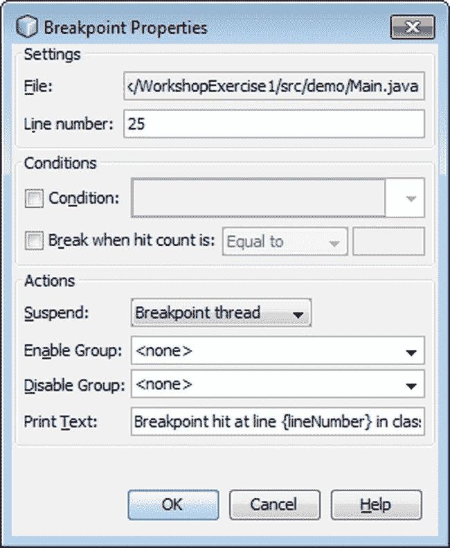
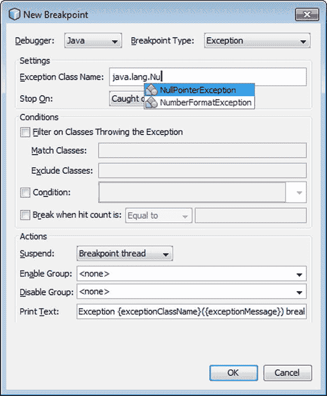
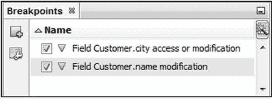
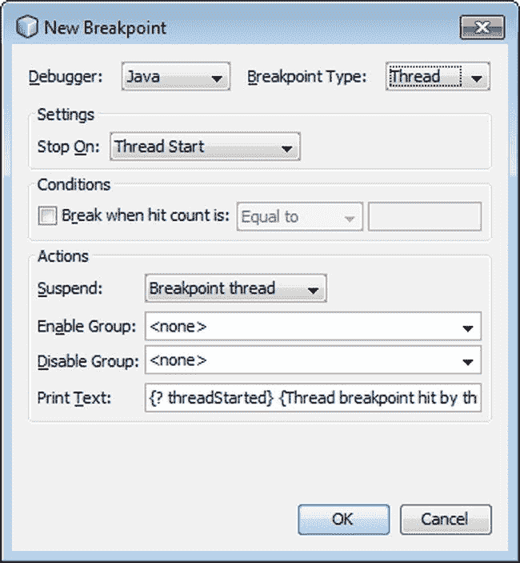
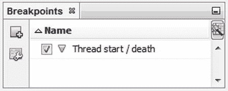
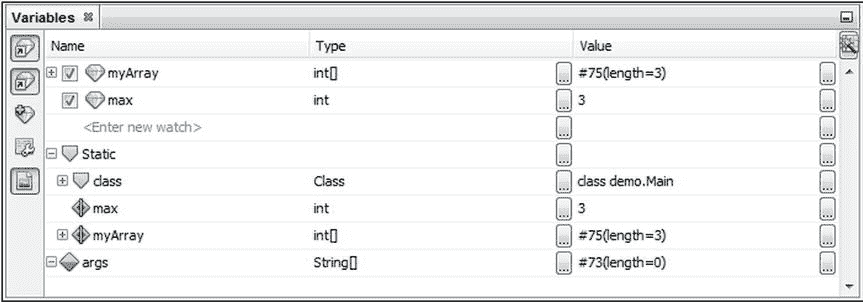
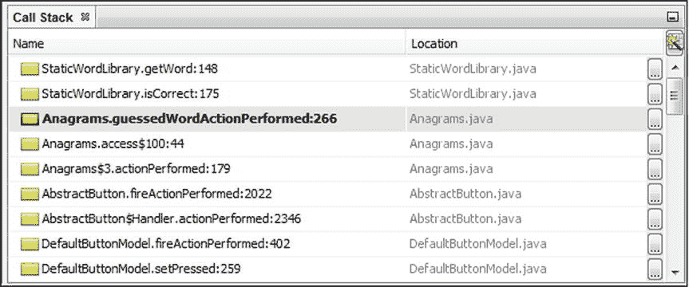
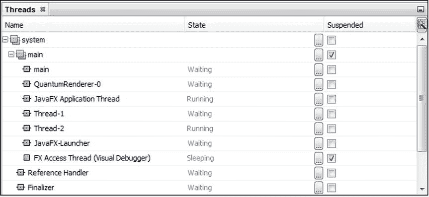
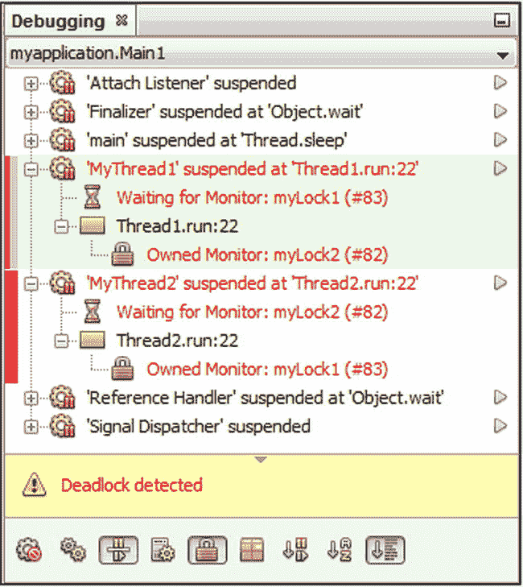

# 八、故障排除

我喜欢 NetBeans 的一点是它不断追求创新。NetBeans 调试器是第一个提供混合语言支持(例如 Java/JavaScript)的，并将很快帮助为 Oracle 实验室基于新的 Truffle 框架构建的任何语言提供现成的调试，例如 JRuby、FastR、Python 等！—Jaroslav Tulach，NetBeans 的创始人

NetBeans IDE 提供了一个丰富的环境，用于识别错误、排除瓶颈故障以及优化 Java 应用中的代码。内置的 Java 调试器允许您在 Java 代码执行的同时逐步调试您的 Java 代码，使您能够监视正在运行的应用的各个方面，例如它的变量值、它的方法调用的当前序列、它的线程状态以及它的对象的创建。

当使用调试器时，如图 8-1 所示，你没有理由用`System.out.println`语句来诊断应用中出现的问题。(使用前面章节中描述的“检查&转换”功能来识别并删除所有的`System.out.println`语句。)相反，您可以使用调试器来指定代码中带有断点的“关注点”(断点不存储在代码中，而是存储在 IDE 中)，在这些断点处暂停程序，并使用 IDE 中的调试工具来评估正在运行的程序的当前状态。

图 8-1。

NetBeans Debugger

此外，您可以在调试时更改代码，并动态地将类重新加载到调试器中，而无需重新启动调试会话。

表 8-1 列出了您可以使用调试器执行的活动。

表 8-1。

Debugger Activities

<colgroup><col> <col></colgroup> 
| 活动 | 描述 |
| --- | --- |
| 步骤 | 逐句通过应用代码，包括 JDK 源代码。需要时，您可以在当前调用栈中退回到以前调用的方法的开头(“弹出”调用)。 |
| 执行 | 使用断点作为分隔符，一次执行特定的代码块。 |
| 暂停 | 当满足指定的条件时暂停执行，例如当迭代器达到某个值时，或者在导致异常的代码行或异常本身处暂停执行。监视线程时，可以单独或集体挂起它们。 |
| 轨道 | 通过“监视”功能跟踪变量或表达式的值或变量引用的对象。 |
| 应用 | 动态应用代码更改并继续调试会话。 |
| 识别 | 识别和分析死锁。 |
| 奔跑 | 可以同时运行单个或多个调试会话。 |

## 入门指南

调试器使您能够在称为“断点”的关键点暂停程序的执行，并检查变量值、线程状态等。一旦在断点处暂停执行，就可以一行一行地单步执行代码。

开始调试程序包括以下步骤。

Determine the “point of interest” in your code where you want to start debugging and set a breakpoint at that line by clicking in the left margin of that line. A red icon appears in the left margin to mark the breakpoint. In addition, the whole line is highlighted in red.   Start the Debugger by choosing Debug Project or by pressing Ctrl+F5\. The IDE builds (or rebuilds) the application and then opens up Debugger windows, by default in the lower half of the IDE.   When the execution of the program stops at the breakpoint, which you can see when the red breakpoint highlight is replaced by the green highlight, you can use the buttons in the toolbar, or their related keyboard shortcuts, to step through the code line by line while viewing the status of variables, threads, and other information.   Observe the program flow, while monitoring and analyzing the evolving values of variables in the Variables window.   Based on your analysis, fix your code and, where applicable, apply code changes and continue the debugging session.  

或者，除了设置断点之外，您还可以使用另外两个在特定情况下可能有用的工具来开始调试程序。

*   运行到光标处。在源代码编辑器中，单击要暂停执行的行，然后单击工具栏中的“运行到光标处”。仅当您选择项目主类中的一行代码或主项目中由主类直接调用的类时，此命令才可用于启动调试会话。
*   调试文件。如果项目中有多个可执行类，有时您可能希望从指定为项目主类的类之外的类启动调试器。要在项目主类以外的类上启动调试器，请在“项目”窗口或“文件”窗口中右键单击文件的节点，然后选择“调试文件”。如果文件有 main 方法，则只能对该文件启动调试器。

## 调试器窗口

开始调试程序时，会出现各种调试器窗口。调试器窗口记录被调试程序的执行状态，例如代码是否在断点处停止。“输出”窗口中会打开选项卡，用于记录任何应用输出，以及 IDE 在运行命令时使用的脚本的输出。

调试器窗口(如监视、变量和调用栈)以选项卡的形式打开，并提供有关调试会话的当前信息，如变量的当前值和当前方法调用的列表。它们在表 8-2 中描述。还可以通过从“窗口”“➤调试”菜单中选择来打开各个调试窗口。

表 8-2。

Debugger Windows

<colgroup><col> <col> <col></colgroup> 
| 工具 | 始于 | 描述 |
| --- | --- | --- |
| 变量 | Alt+Shift+1 | 显示调试器当前上下文中的所有字段和局部变量及其当前值。该节点下列出了字段。 |
| 手表 | Alt+Shift+2 | 显示您已监视的字段、局部变量或表达式的名称。尽管无论当前上下文如何，都会显示您的所有监视，但显示的值是该上下文的值(而不是设置监视的上下文的值)。例如，如果您有一个对`this`关键字的监视，那么在监视窗口中引用的`this`将总是对应于从当前方法调用中引用的对象。 |
| 调用栈 | Alt+Shift+3 | 显示当前调用链中的所有方法调用。“调用栈”窗口使您能够直接跳转到方法调用的代码，将程序的执行备份到以前的方法调用，或者选择一个上下文来查看局部变量值。 |
| 班级 | Alt+Shift+4 | 为当前调试的应用提供按类加载器分组的类的树视图。 |
| 断点 | Alt+Shift+5 | 显示您在所有正在运行的调试会话中设置的所有断点。 |
| 线 | Alt+Shift+6 | 显示当前会话中的线程。在此窗口中，您可以通过将另一个线程指定为当前线程来切换上下文。 |
| 会议 | Alt+Shift+7 | 为 IDE 中的每个调试会话显示一个节点。在此窗口中，您可以切换当前会话。 |
| 来源 | Alt+Shift+8 | 显示可用于调试的源代码，并使您能够指定要使用的源代码。例如，您可以使用此窗口来启用对 JDK 源代码的调试。 |

大多数调试器窗口根据调试器的当前上下文显示值。通常，当前上下文对应于一个会话中一个线程中的一个方法调用。您可以更改上下文(例如，在“线程”窗口中指定不同的当前线程)，而不会影响被调试程序的运行方式。

## 步伐

一旦程序暂停，有几种方法可以恢复代码的执行。您可以逐行(逐步)或以更大的增量单步执行代码，如表 8-3 所示。

表 8-3。

Debugger Steps

<colgroup><col> <col> <col></colgroup> 
| 步进命令 | 捷径 | 描述 |
| --- | --- | --- |
| 进入 | F7 | 执行当前行。如果该行是对方法或构造函数的调用，并且有可供被调用代码使用的源代码，则程序计数器移到方法或构造函数的声明。否则，程序计数器移动到文件中的下一行。 |
| 跨过 | F8 | 执行当前行并将程序计数器移动到文件中的下一行。如果执行的行是对方法或构造函数的调用，则方法或构造函数中的代码也会被执行。 |
| 走出去 | Ctrl+F7 | 执行当前方法或构造函数中的其余代码，并将程序计数器移动到方法或构造函数的调用方之后的行。如果您已经单步执行了不需要分析的方法，此命令非常有用。 |
| 运行到光标处 | 法乐四联症 | 在源代码编辑器中执行程序中当前行和插入点之间的所有行。 |
| 中止 | - | 停止当前会话中的所有线程。 |
| 继续 | Ctrl+F5 | 继续执行程序，直到下一个断点。 |

### 逐行执行代码

通过选择“调试➤单步执行”(F7)，可以让调试器一次单步执行一行。

如果在方法调用中使用“单步执行”命令，调试器将进入该方法并在第一行暂停，除非该方法是尚未指定在调试器中使用的库的一部分。

### 执行一个方法而不单步执行它

通过选择“调试➤单步调试”(F8)，可以执行方法，而无需调试器在方法中暂停。

使用“单步执行”命令后，调试器在方法调用后的行再次暂停。

### 在方法结束时继续执行

如果已经单步执行了不需要继续分析的方法，可以让调试器完成该方法的执行，然后在方法调用后的行处再次暂停。

要以这种方式完成方法的执行，请选择“调试➤单步执行(Ctrl+F7)”。

### 继续到下一个断点

如果在调试时不需要观察每一行代码，可以继续执行，直到下一点，或者直到执行被挂起。

若要继续执行已在断点处暂停的程序，请选择“调试”“➤”“继续”或按 F5。

### 继续到光标位置

当执行暂停时，您可以继续执行特定的行，而不设置断点，方法是将光标放在该行，然后选择“调试➤运行到光标处”(F4)。

### 走进 JDK 和其他图书馆

调试时，如果在 IDE 的库管理器中注册了与 JDK 和任何其他库相关联的源代码，就可以单步执行这些库的代码。

默认情况下，在调试时，IDE 不会单步执行 JDK 源代码。如果在 JDK 方法调用中使用“单步执行”命令，IDE 将执行该方法，并将程序计数器返回到方法调用后的行(就像使用“单步执行”命令一样)。

若要允许单步执行已调试应用的 JDK 源代码，请启动该应用的调试器，然后通过从“窗口”菜单的“调试”菜单中选择“源代码”或按 Alt-Shift+8 打开“源代码”窗口。选中 JDK 的“用于调试”复选框。

### 限制可以进入库的类

如果您使用库进行调试，可以设置一个筛选器来排除一些正在使用的源代码。

要排除在调试器中使用的类，首先要启动应用的调试器。通过从“窗口”菜单的“调试”菜单中选择“源代码”或按 Alt-Shift+8 打开“源代码”窗口。右键单击要为其创建排除过滤器的库所在的行，然后选择“添加类别排除过滤器”。

在“添加类别排除筛选器”对话框中键入一个筛选器。过滤器可以是以下一种或多种:

*   完全限定的类名。
*   末尾带有星号(*)的包名或类名，用于创建通配符。例如，您可以键入以下命令来排除`javax.swing`包中的所有类:`javax.swing.*`

以通配符开头的表达式。例如，要排除名称末尾有`Test`的所有类，可以使用`*Test`。

您可以创建多个类别排除过滤器。

若要禁用该过滤器，请在“源代码”窗口中取消选择该过滤器旁边的“在调试中使用”复选框。

要删除类别排除过滤器，请右键单击该过滤器，然后选择删除。

### 从一个方法备份到它的调用

在某些情况下，退回到代码中可能会有用。例如，如果您遇到了一个断点，并且想要查看通向该断点的代码是如何工作的，您可以从调用栈中移除(“弹出”)当前调用，以重新执行该方法。

您可以打开“调用栈”窗口，查看当前线程中当前方法调用链内的所有方法调用。当前呼叫标有图标。栈中的其他调用用图标标记。

若要备份到上一个方法调用，请打开“调用栈”窗口(Alt+Shift+3)，右键单击“调用栈”窗口中代表代码中要返回的位置的那一行，然后选择“弹出到此处”。程序计数器返回到发出呼叫的线路。然后，您可以重新执行该方法。要备份到最近的方法调用，还可以从“调试”菜单的“栈”菜单中选择“弹出最顶层调用”。

## 断点

如图 8-2 所示，断点是一个标记，当您在调试器中运行应用时，您可以设置它来指定执行应该暂停的位置。

图 8-2。

Breakpoint

断点存储在 IDE 中，而不是存储在应用的代码中，并且在调试会话和 IDE 会话之间保持不变。

### 设置断点

当执行在断点处暂停时，执行暂停的行在源代码编辑器中以绿色突出显示，如图 8-3 所示。

图 8-3。

Paused execution

调试器控制台会打印一条消息，如图 8-4 所示，其中包含已到达断点的信息。

图 8-4。

Message printed in the Debugger Console

最简单的形式是，断点提供了一种在特定点暂停正在运行的程序的方法。当程序到达断点时，您可以执行表 8-4 中列出的活动和诊断任务。

表 8-4。

Breakpoint Tasks

<colgroup><col> <col></colgroup> 
| 工作 | 描述 |
| --- | --- |
| 班长 | 在程序执行的那一点监控变量的值。 |
| 控制 | 通过逐行或逐个方法单步执行代码来控制程序的执行。 |
| 检测变化 | 检测字段或局部变量的值何时更改(例如，这可以帮助您确定代码的哪一部分为字段分配了不适当的值)。 |
| 检测创作 | 检测对象的创建时间(例如，在试图跟踪内存泄漏时，这可能很有用)。 |

您可以设置多个断点，并且可以设置不同类型的断点。

最简单的断点类型是行断点，其中程序的执行在特定行停止。您还可以在其他情况下设置断点，例如调用方法、引发异常或更改变量值。此外，您可以在某些类型的断点中设置条件，以便它们仅在特定情况下暂停程序的执行。

断点类型汇总见表 8-5 。

表 8-5。

Breakpoint Types

<colgroup><col> <col></colgroup> 
| 类型 | 描述 |
| --- | --- |
| 线条 | 在一行代码上设置。当调试器到达该行时，它会在执行该行之前停止。断点以红色背景突出显示。您还可以指定行断点的条件。 |
| 班级 | 当从另一个类引用该类时，并且在执行该类中带有断点的任何行之前，执行被挂起。 |
| 例外 | 当异常发生时，执行被挂起。您可以指定是在捕获到异常、未捕获到异常时停止执行，还是两者都停止执行。 |
| 方法 | 当调用方法时，执行被挂起。 |
| 可变的 | 当变量被访问时，执行被挂起。您还可以配置断点，使其仅在变量被修改时暂停执行。 |
| 线 | 每当线程启动或终止时，执行都被挂起。还可以在线程死亡时设置断点(或者在线程开始和死亡时都设置断点)。 |

#### 线条

要设置行断点，如图 8-5 所示，点击要设置断点的行的左边距。或者，在编辑器中单击该行的任意位置，然后按 Ctrl+F8。

图 8-5。

Line breakpoint

断点创建后，会自动注册到断点窗口(Alt+Shift+5)，如图 8-6 所示。

图 8-6。

Line breakpoint registered in the Breakpoints window

若要删除断点，请单击定义断点的行的左边距，或者单击该行并按 Ctrl+F8。通过反复单击 Ctrl+F8，可以在行断点和删除之间切换。还可以使用“断点”窗口删除断点。

要自定义行断点，请右键单击左边的红色图标，然后选择断点➤属性。或者，使用“断点”窗口(Alt+Shift+5)。在“断点”窗口中，右击断点并选择“属性”。断点属性窗口打开，如图 8-7 所示。

图 8-7。

Breakpoint Properties window

#### 班级

你可以在一个类上设置一个断点，如图 8-8 所示，这样当类中的代码将要被访问时或者当类从内存中卸载时，调试器就会暂停。

图 8-8。

Class breakpoint

若要设置类调用断点，请单击定义该类的行的左边距。或者，选择调试➤新断点(Ctrl+Shift+F8)，从断点类型下拉列表中选择类，如图 8-9 所示。

图 8-9。

Class breakpoint type in the New Breakpoint window

断点窗口显示类调用断点，如图 8-10 所示。

图 8-10。

Class breakpoint registered in the Breakpoints window

#### 方法

您可以设置一个断点，以便调试器在调用方法或构造函数时暂停，在方法或构造函数的任何行被执行之前，如图 8-11 所示。

图 8-11。

Method breakpoint

若要在方法或构造函数上设置断点，请单击定义该方法的行的左边距。或者，选择调试➤新断点(Ctrl+Shift+F8)，并从断点类型下拉列表中选择方法。断点属性窗口打开，停止于下拉菜单设置为方法入口，如图 8-12 所示。

图 8-12。

Stop On Method Entry in the Breakpoint Properties window

通过选中给定类的所有方法复选框，可以使断点应用于该类中的所有方法和构造函数，这将导致断点窗口注册该类中的所有方法。断点窗口显示方法调用断点，如图 8-13 所示。

图 8-13。

All methods in class registered in the Breakpoints window

#### 例外

您可以设置断点，以便调试器在程序中引发异常时暂停。要在异常上设置断点，请选择调试➤新断点(Ctrl+Shift+F8)，然后从断点类型下拉列表中选择异常。新断点窗口打开，断点类型下拉框设置为异常，如图 8-14 所示。

图 8-14。

Exception breakpoint type in the New Breakpoint window

在“异常类名”字段中，键入要在其上设置断点的异常类。可以按 Ctrl+Space 让代码补全功能帮你补全类名，如图 8-14 所示。在“停止于”下拉列表中，选择是否希望断点应用于已捕获的异常、未捕获的异常或两者。

断点窗口显示异常断点，如图 8-15 所示。

图 8-15。

Exception breakpoint in the Breakpoints window

#### 田

您可以设置断点，以便调试器在访问字段时暂停，或者仅在修改字段时暂停。要在字段上设置断点，选择调试➤新断点(Ctrl+Shift+F8)，从断点类型下拉列表中选择字段，如图 8-16 所示。

图 8-16。

Field breakpoint in the New Breakpoint window

填写类名和字段名字段。从停止于下拉列表中选择一个选项。如果选择“字段访问”或“修改”，则每次在代码中访问该字段时，执行都会挂起。如果选择字段修改，则仅当字段被修改时，执行才会暂停。

如果您在按 Ctrl+Shift+F8 时选择了该变量，则新断点窗口的大多数字段都会为您正确填充。

断点窗口显示字段断点，如图 8-17 所示。

图 8-17。

Field breakpoint registered in the Breakpoints window

#### 线

通过设置一个断点，在每次创建或结束新线程时暂停执行，可以监视程序中线程的创建或死亡。

要在线程上设置断点，选择调试➤新断点(Ctrl+Shift+F8)，从断点类型下拉列表中选择线程，如图 8-18 所示。

图 8-18。

Thread breakpoint in the New Breakpoint window

在“停止于”下拉列表中，选择“线程开始”、“线程死亡”或“线程开始或死亡”。

断点窗口显示线程断点，如图 8-19 所示。

图 8-19。

Thread breakpoint registered in the Breakpoints window

### 管理断点

您可以使用如图 8-19 所示的断点窗口和之前的图在一个地方管理断点。您可以在断点上定义条件，并将断点分组，这对于测试指定的功能集非常有用。您还可以暂时禁用断点，并在此窗口中为断点提供其他自定义设置。

要打开“断点”窗口，请选择窗口➤调试➤断点或按 Alt+Shift+5。

#### 情况

您可以设置一个断点，仅在满足特定条件时暂停执行。例如，如果您有一个很长的`*For*`循环，并且您想看看在循环结束之前发生了什么，那么您可以根据迭代器达到某个值来设置断点。

表 8-6 列出了您可以在断点上定义的条件示例。

表 8-6。

Example Breakpoint Conditions

<colgroup><col> <col></colgroup> 
| 工作 | 描述 |
| --- | --- |
| `i==4` | 如果变量`i`在当前范围内等于`4`，执行将仅在断点处停止。 |
| `ObjectVariable!=null` | 执行不会在断点处停止，直到`ObjectVariable`被赋值。 |
| `MethodName` | 如果`Method`具有布尔返回类型，只有当`Method`返回`true`时，执行才会在断点处停止。 |
| `CollectionX.contains(ObjectX)` | 如果`ObjectX`在集合中，执行将仅在断点处停止。 |

若要使断点有条件，请打开“断点”窗口(Alt+Shift+5)。在“断点”窗口中，右键单击要在其上放置条件的断点，然后选择“属性”。

在“断点属性”窗口中，在“条件”字段中填入在断点处暂停执行所需满足的条件。

#### 组

在某些情况下，您可能有几个相关的断点，您希望能够一起启用、禁用或删除它们。或者，您可能只想将一些断点合并到一个节点下，以使断点窗口不那么杂乱。

若要对断点进行分组，请通过选择窗口➤调试➤断点(Alt+Shift+5)来打开“断点”窗口。按住 Shift 键或 Ctrl 键单击以选择要分组的断点。右键单击选择，选择“设置组名”，然后输入组的名称。

在“断点”窗口中，断点分组在一个可展开的节点下。

#### 允许

您可能会发现在整个应用中保持断点设置很有用，但是您可能不希望所有的断点都一直处于活动状态。如果是这种情况，您可以禁用断点或断点组，并保留它供以后使用。

若要禁用断点或断点组，请通过选择窗口➤调试➤断点(或按 Alt+Shift+5)打开“断点”窗口。在“断点”窗口中，右键单击断点或断点组，然后选择“禁用”。

若要删除一行断点，请单击有断点的行的左边距，或者单击该行并按 Ctrl+F8。若要删除另一种类型的断点，请通过选择“窗口”“➤调试”“➤断点”(或按 Alt+Shift+5)来打开“断点”窗口。在“断点”窗口中，右键单击断点，然后选择“删除”。

#### 记录

如果您希望在遇到断点时进行监视，而不是每次遇到断点时都挂起执行，则可以将断点配置为不挂起执行。当程序在代码中到达这样的断点时，将在调试器控制台窗口中打印一条消息。

若要在命中断点时关闭执行挂起，请通过选择窗口➤调试➤断点(Alt+Shift+5)来打开“断点”窗口。在“断点”窗口中，右击断点并选择“属性”以打开“断点属性”窗口。在“操作”组合框中，选择“无线程(继续)”。

#### 信息

您可以自定义在代码中遇到断点时打印到控制台的文本。

要自定义到达断点时打印的控制台消息，请通过选择窗口➤调试➤断点(Alt+Shift+5)打开“断点”窗口。在“断点”窗口中，右击断点并选择“属性”以打开“断点属性”窗口。在“打印文本”组合框中，修改要打印的文本。为了使打印文本更有意义，可以使用替代代码来打印螺纹名称和行号。

表 8-7 列出了替代代码。

表 8-7。

Example Messages and Substitution Codes

<colgroup><col> <col></colgroup> 
| 替代代码 | 印刷品 |
| --- | --- |
| `{className}` | 命中断点的类的名称。此代码不适用于线程断点。 |
| `{lineNumber}` | 执行被挂起的行号。此代码不适用于线程断点。 |
| `{methodName}` | 暂停执行的方法。此代码不适用于线程断点。 |
| `{threadName}` | 命中断点的线程。 |
| `{variableValue}` | 变量值(对于变量上设置的断点)或异常值(对于异常断点)。 |
| `{variableType}` | 变量类型(针对变量上设置的断点)或异常类型(针对异常断点)。 |

## 手表

当您单步执行程序时，您可以监视字段和局部变量的运行值。

变量窗口(Alt+Shift+1)如图 8-20 所示，显示程序当前执行上下文中的所有变量，并列出它们的类型和值。

图 8-20。

Variables window

如果变量的值是一个对象引用，则该值由井号(`#`)和一个数字给出，该数字用作对象实例的标识符。

双击变量名称可以跳转到变量的源代码。

您还可以通过设置监视并在“监视”窗口(Alt+Shift+2)中查看，来创建与您的分析相关的变量和表达式的自定义视图，如图 8-21 所示，该窗口不同于变量窗口。

图 8-21。

Watches window

“监视”窗口在三个方面不同于“变量”窗口。

*   “监视”窗口显示您指定的变量或表达式的值，这使窗口保持整洁。
*   “监视”窗口显示您设置的所有监视，无论变量是否在上下文中。如果变量分别存在于不同的上下文中，则“监视”窗口中给定的值适用于当前上下文中的值(不一定是设置监视的上下文)。
*   监视在调试会话中持续存在。

### 在变量或字段上设置监视

要对变量或表达式设置监视，请在源代码编辑器中右键单击该变量，然后选择“新建监视”。然后，变量或表达式被添加到"监视"窗口中。

调试时，您还可以在当前调试上下文中检查变量的值，方法是将鼠标悬停在源代码编辑器中的变量上，以显示带有该值的工具提示，如图 8-22 所示。

图 8-22。

Tooltip showing value of current variable

### 监控分配给变量的对象

您可以创建一个所谓的“固定观察器”来监视分配给变量的对象，而不是变量本身的值。

要创建固定观察器，请启动调试会话并打开变量窗口(Alt+Shift+1)。在编辑器中，右键单击要为其设置固定监视的变量，然后选择“创建固定监视”。

然后，一个固定的监视被添加到“监视”窗口中。因为固定监视应用于调试会话期间创建的特定对象实例，所以当调试会话完成时，固定监视被移除。

### 显示类的 toString 方法的值

您可以在“局部变量”和“监视”窗口中添加一列，以显示对象的`to` `String`方法的结果。这样做提供了一种方法，可以获得比值列中的对象实例的数字标识符更有用的信息(如当前分配的字段的值)。

要在其中一个窗口中显示`toString()`列，请打开“局部变量”窗口(Alt+Shift+1)或“监视”窗口(Alt+Shift+2)。点按窗口右上角的按钮。在“更改可见列”对话框中，选择`toString()`复选框。

### 改变变量或表达式的值

调试程序时，可以更改“局部变量”或“监视”窗口中显示的变量或表达式的值。例如，您可以增加迭代器的值，以便更快地到达循环的末尾。

要更改变量值，请打开“监视”窗口或“变量”窗口。在变量或表达式的值字段中，键入新值，然后按 Enter 键。

### 显示以前方法调用的变量

调用栈窗口(Alt+Shift+3)显示当前方法调用链中的所有调用，如图 8-23 所示。

图 8-23。

Call Stack window

如果要查看链中另一个调用的变量状态，可以打开“调用栈”窗口，右键单击该方法的节点，然后选择“设为当前”。您也可以双击某个方法使其成为当前方法。

您可以使用“使被调用方成为当前方”( Ctrl+Alt+Up)和“使调用方成为当前方”( Ctrl+Alt+Down)命令浏览调用栈中的项目。

将不同的方法设为当前方法不会改变程序计数器的位置。如果用一个 step 命令或 continue 命令继续执行，程序将从暂停执行的地方继续执行。

## 线

IDE 的线程窗口(Alt+Shift+7)可以让你查看当前调试程序中线程的状态，如图 8-24 所示。

图 8-24。

The Threads window

它还使您能够更改在其他调试器窗口(如“调用栈”窗口和“变量”窗口)中监视的线程，并挂起单个线程。

### 切换当前监控的线程

“调用栈”和“变量”窗口的内容取决于调试器中当前正在监视的线程(也称为当前线程)。

若要切换当前监视的线程，请通过按 Alt+Shift+7 打开“线程”窗口。右键单击要监视的线程，然后选择“设为当前线程”。

### 挂起和恢复线程

您可以通过在“线程”窗口中右键单击线程节点并选择“挂起”来挂起线程的执行。

右键单击挂起线程的节点并选择“恢复”,可以恢复该线程的执行。

### 在断点处挂起单个线程

默认情况下，当程序遇到断点时，所有线程都被挂起。但是，您可以配置一个断点，以便在命中断点时只挂起其线程。通过按 Alt+Shift+5 打开“断点”窗口。在“断点”窗口中，右击断点并选择“属性”。在“断点属性”窗口中，从“挂起”组合框中选择“当前”。

### 将调试隔离到单个线程

默认情况下，应用中的所有线程都在调试器中执行。

如果希望隔离调试，以便调试器中只运行一个线程，请确保要调试的线程在“线程”窗口中被指定为当前线程(Alt+Shift+7)。当前线程标有图标。通过按 Alt+Shift+6 打开会话窗口。在“会话”窗口中，右键单击该会话的节点，然后选择“范围➤调试当前线程”。

### 识别死锁

IDE 可以通过在所有挂起的线程中自动搜索死锁来帮助您识别潜在的死锁情况。当检测到死锁时，IDE 会在调试窗口中显示一个通知，并识别涉及的线程，如图 8-25 所示。

图 8-25。

Detecting deadlocks

调试应用时，从主菜单中选择“调试➤检查死锁”,检查挂起的线程是否存在死锁。

## 代码更改

使用“应用代码更改”功能，可以在调试会话过程中微调代码，并在不启动新的调试会话的情况下继续调试。这可以为您节省大量时间，否则这些时间将花费在等待重新构建源代码和重新启动调试会话上。

应用代码更改功能对于表 8-8 中列出的一组特定场景非常有用。

表 8-8。

Scenarios for “Apply Code Changes”

<colgroup><col> <col></colgroup> 
| 方案 | 支持？ |
| --- | --- |
| 微调您创建的可视组件的外观。 | 是 |
| 改变方法中的逻辑。 | 是 |
| 添加或移除方法或字段。 | 不 |
| 更改类、字段或方法的访问修饰符。 | 不 |
| 重构类层次结构。 | 不 |
| 更改尚未加载到虚拟机中的代码。 | 不 |

有关更高级的代码更改功能，请参见 NetBeans 合作伙伴 ZeroTurnaround 在`zeroturnaround.com`提供的 JRebel 产品。JRebel 是一个 JVM 插件，它允许你重新加载你对代码所做的修改，而不需要重启/重新部署。它将您的项目工作区直接映射到一个正在运行的应用，因此当您对项目中的任何类或资源进行更改时，该更改会立即反映在应用中，从而跳过构建和重新部署阶段。您可以将 JRebel 与 NetBeans 调试器一起使用，并在重新加载代码更改时调试您的应用。

要在 IDE 中安装 JRebel，请转到`plugins.netbeans.org`，找到 JRebel NetBeans 插件，可以从以下网址下载: [`http://plugins.netbeans.org/plugin/22254/jrebel-netbeans-plugin`](http://plugins.netbeans.org/plugin/22254/jrebel-netbeans-plugin) 。此外，在 IDE 的大多数版本中，您应该能够在插件管理器中找到 JRebel NetBeans 插件，方法是在 IDE 中转到“工具”“➤插件”。

## GUI 快照

如图 8-26 和 8-27 所示，GUI 快照是一个可视化调试工具，可以帮助您定位 GUI 组件的源代码。GUI 组件的源代码有时很难找到，快照为您提供了一种基于 GUI 找到代码的方法，而不是搜索代码。

图 8-27。

GUI Snapshot for JavaFX components

图 8-26。

GUI Snapshot for Java Swing components

如本节所述，一旦创建了 GUI 的快照，就可以在快照中选择组件，并从弹出菜单中调用任务，以查看组件的源代码，显示侦听器，并在组件上设置断点。

要制作 GUI 快照，请在调试 Java Swing 或 JavaFX 应用时从主菜单中选择 Debug ➤ Take GUI Snapshot。当您选择获取 GUI 快照时，IDE 将获取 GUI 的快照，并在主窗口中打开该快照。

当您在快照中选择一个组件时，IDE 会在“属性”窗口中显示所选组件的详细信息。如果属性窗口不可见，可以从主菜单中选择窗口➤属性来打开该窗口。IDE 还会在“导航”窗口中显示组件在层次结构中的位置。右键单击快照中的组件，然后从弹出菜单中选择“转到组件声明”。IDE 将在编辑器中打开源文件，并将光标移动到代码中声明组件的那一行。再次右键单击快照中的组件，然后选择转到组件源。IDE 将在编辑器中打开源文件，并将光标移动到组件源代码中的行。

最后，您可以使用 GUI 快照和 Events 窗口来浏览组件事件，使您能够定位组件侦听器和由组件触发的事件。