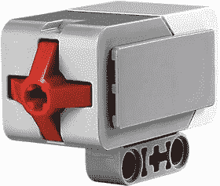
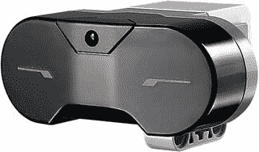

# 十、触摸传感器和超声波传感器简介

正如您在第三章中所看到的，电机是执行运动的最重要组件。在这一章中，你将学习一组传感器，它们被用来执行有根据的动作。

想象一下，一个机器人在你的房子里走来走去，却没有配备任何传感器。这样的行程将是短暂的，因为机器人撞上了墙壁，而保险杠没有激活或被一些低层障碍物阻挡车轮。然而，如果你在机器人身上安装了一个距离传感器，你可能会想象机器人可以通过使用这个距离传感器避开障碍物，在你的房子周围徘徊几个小时。

乐高 MindStorm EV3/NXT 套件带有四个常见的传感器:触摸传感器，颜色传感器，光传感器和超声波传感器。在本章中，您将使用您创建的轮式机器人，并添加这四个传感器中的两个——触摸传感器和超声波传感器——以使它在房间内移动时更加了解周围的环境。在下一章，你将看到如何应用光传感器和颜色传感器来探索你的机器人周围的环境。

特别是，本章将涵盖以下主题:

*   触摸传感器简介
*   超声波传感器简介
*   触摸传感器编程实践
*   超声波传感器编程实践

## 传感器类别

莱霍斯 EV3 为所有类型的传感器提供软件抽象。在这种情况下，传感器必须物理连接到 EV3 模块中的端口，并且传感器对象必须知道这是哪个端口。为了识别这些信息，您创建了一个传感器的实例，然后在它的构造函数中传递这些信息，比如`SensorPort.S1`、`SensorPort.S2`、`SensorPort.S3`和`SensorPort.S4`。在您的代码中，传感器类必须指出它们插入了哪个端口。这可以通过使用端口类`lejos.hardware.port.Port`来完成。

端口类类似于`MotorPort`。这个类中有四个静态端口对象。通常，这些在传感器的构造函数中使用，如下所示:

```java
        Port portS1 = ev3brick.getPort("S1");
        EV3TouchSensor touchSensor = new EV3TouchSensor(portS1);

```

## 触摸传感器

触摸传感器是 EV3 机器人套件中最基本的传感器。它有一个简单的开关，由前面的红色按钮激活，如图 10-1 所示:



图 10-1。

The Lego EV3 touch sensor

如图 10-1 所示，触摸按钮有一个轴孔，允许乐高积木轴直接连接到开关上。触摸传感器检测它何时被某物按压，何时被再次释放，它将返回一个简单的浮点值，指示传感器是否被按压。`EV3TouchSensor`类实现了 Touch 接口，它包含一个简单的方法`getTouchMode ()`。`getTouchMode(`方法检测其前端按钮何时被按下，其中样本包含一个元素。值 0 表示按钮未被按下，值 1 表示按钮被按下。

总之，为了使用触摸传感器，您可以使用以下构造函数创建它的一个实例:

```java
EV3TouchSensor touchSensor = new EV3TouchSensor(portS1);
SensorMode toucher = touchSensor.getTouchMode();
float[] sample = new float[toucher.sampleSize()];

```

要测试触摸传感器是否被按下，您可以使用`fetchSample ()`方法:

```java
toucher.fetchSample(sample, 0);
if (sample[0]==1) then the button is pressed

```

以下程序等待触摸传感器被按下。按下触摸传感器后，触摸传感器的值将在 LED 屏幕上显示 50 秒。该计划被终止，直到你按下 EV3 砖上的退出按钮。下面是使用 S1 港的测试程序的源代码。

```java
//******************************************************************
//Wei Lu Java Robotics Programming with Lego EV3 ch10p1.java
//an example for touch sensor testing
//******************************************************************

import lejos.hardware.BrickFinder;

import lejos.hardware.Keys;

import lejos.hardware.ev3.EV3;

import lejos.hardware.lcd.TextLCD;

import lejos.hardware.port.Port;

import lejos.hardware.sensor.EV3TouchSensor;

import lejos.hardware.sensor.SensorMode;

public class ch10p1 {
        public static void main(String[] args) throws Exception {

                // get EV3 brick
                EV3 ev3brick = (EV3) BrickFinder.getLocal();

                // LCD class for displaying and Keys class for buttons
                Keys buttons = ev3brick.getKeys();
                TextLCD lcddisplay = ev3brick.getTextLCD();

                // block the thread until a button is pressed
                buttons.waitForAnyPress();

                // get a port instance
                Port portS1 = ev3brick.getPort("S1");

                // Get an instance of the touch EV3 sensor
EV3TouchSensor touchSensor = new EV3TouchSensor(portS1);

                // get an instance of this sensor in measurement mode
                SensorMode toucher = touchSensor.getTouchMode();

                // initialize an array of floats for fetching samples
                float[] samplevalue = new float[toucher.sampleSize()];

                lcddisplay.clear();

                while (buttons.getButtons() != Keys.ID_ESCAPE) {

                        // fetch a sample
                        toucher.fetchSample(samplevalue, 0);

                        lcddisplay.drawString("value: " + samplevalue[0], 0, 0);
                        Thread.sleep(50);
                }

                lcddisplay.clear();
                System.out.println("EXIT");
                System.exit(0);
        }

}

```

## 超声波传感器

超声波传感器发出人类几乎听不见的声音信号，然后测量反射回来需要多长时间。由于音速是众所周知的，传感器可以计算信号传播的距离。超声波传感器通常用于避开障碍物，在不同位置之间导航，甚至在不同位置之间构建地图。超声波传感器以厘米为单位测量到固体物体的距离，它可以测量高达 255 厘米的距离。超声波传感器的精确度从 6 厘米到 180 厘米。经验实验表明，超过 180 厘米的物体不能被可靠地定位。此外，它的精度为正负 3 厘米，尽管对于更近的物体精度会有所提高。

如图 10-2 所示，超声波传感器往往会产生一个声纳锥体，也就是说它在锥体形状内探测前方的物体。圆锥体以大约 30 度的角度打开，这意味着在 180 厘米的距离处，圆锥体的直径大约为 90 厘米。圆锥形对机器人来说很好，因为它可以更好地扫描机器人前面的更大区域，以发现可能的碰撞。



图 10-2。

The Lego EV3 ultrasonic sensor

在 leJOS NXJ 中，超声波传感器是实现测距仪接口的距离传感器。以下方法用于通过测距仪接口获得距离。

```java
double         distance  = rf.getRange();

```

这个方法将以厘米为单位返回到一个物体的距离。当单次扫描检测到多个物体时，可使用以下方法获得相应的距离:

```java
float [] distances  = rf.getRanges();

```

若要创建实例，可以使用以下构造函数:

```java
UltrasonicSensor(Port SensorPort)

```

在 leJOS NXJ 中，超声波传感器以两种模式工作:默认为连续模式和 ping 模式。在 ping 模式下，传感器只发送一次 ping。当在连续模式下运行时，传感器尽可能频繁地发出 pings，最近获得的结果可通过调用以下命令获得:

```java
int getDistance()

```

返回值以厘米为单位。如果没有找到回应，返回值将是 255。

以下程序将测试您的超声波传感器是否工作正常；也就是说，它能够识别你的机器人和它前面的障碍物之间的厘米距离。在程序中，我们使用端口号 S1，并在按下退出键后终止程序。

```java
//******************************************************************
//Wei Lu Java Robotics Programming with Lego EV3 ch10p2.java
//an example for ultrasonic sensor testing
//******************************************************************

import lejos.hardware.BrickFinder;

import lejos.hardware.Keys;

import lejos.hardware.ev3.EV3;

import lejos.hardware.lcd.TextLCD;

import lejos.hardware.port.Port;

import lejos.hardware.sensor.EV3UltrasonicSensor;

import lejos.robotics.SampleProvider;

public class ch10p2 {
        public static void main(String[] args) throws Exception {

                // get EV3 brick
                EV3 ev3brick = (EV3) BrickFinder.getLocal();

                // LCD class for displaying and Keys class for buttons
                Keys buttons = ev3brick.getKeys();
                TextLCD lcddisplay = ev3brick.getTextLCD();

                // block the thread until a button is pressed
                buttons.waitForAnyPress();

                // get a port instance
                Port portS1 = ev3brick.getPort("S1");

                // Get an instance of the Ultrasonic EV3 sensor
EV3UltrasonicSensor sonicSensor = new EV3UltrasonicSensor(portS1);

                // get an instance of this sensor in measurement mode
SampleProvider sonicdistance = sonicSensor.getDistanceMode();

                // initialize an array of floats for fetching samples
                float[] sample = new float[sonicdistance.sampleSize()];

                // fetch a sample
                sonicdistance.fetchSample(sample, 0);

                while (buttons.getButtons() != Keys.ID_ESCAPE) {
                        lcddisplay.clear();
                        lcddisplay.drawString("distance: " + sample[0], 0, 1);
                        try {
                                //Thread.sleep(10000);
                        } catch (Exception e) {
                        }

                }
        }
}

```

在上面的代码中，要使用超声波传感器，您必须创建一个`UltrasonicSensor`的实例:

```java
// get a port instance
        Port portS1 = ev3brick.getPort("S1");
        // Get an instance of the Ultrasonic EV3 sensor
EV3UltrasonicSensor sonicSensor =
new EV3UltrasonicSensor(portS1);

```

您必须指出您将传感器插入了哪个端口。在本例中，超声波插入端口 1。如果您的程序需要知道从传感器到任何对象的距离，那么您需要使用 getDistanceMode()方法:

```java
                // get an instance of this sensor in measurement mode
                SampleProvider sonicdistance =
                sonicSensor.getDistanceMode();
                // initialize an array of floats for fetching samples
                float[] sample = new float[sonicdistance.sampleSize()];
                // fetch a sample
                sonicdistance.fetchSample(sample, 0);

```

总之，超声波传感器可以帮助你的 EV3 机器人测量距离，观察物体的位置。如你所知，超声波传感器使用与蝙蝠相同的科学原理；也就是说，它通过计算声波检测到物体然后返回所需的时间来测量距离。通常，与柔软织物制成的物体或弯曲形状的物体相比，具有坚硬表面的较大物体返回的读数最好，因为后者很难被传感器检测到。

## 触摸传感器编程实践

到目前为止，你的机器人对他们的环境一无所知。现在你要开始用一些传感器来练习，这样机器人就可以判断如何最好地移动。在这一部分中，你的任务是给你的机器人增加触觉和超声波传感器，这样它就可以在周围环境中移动，根据需要执行避障动作。开始时，机器人应该沿直线前进，直到遇到障碍物。一旦检测到障碍物，你的机器人应该尝试一个回避策略。最简单的操作是后退，旋转远离物体，然后再次前进。你的机器人应该继续移动和躲避物体，直到程序被用户终止(例如，按下退出按钮)。你实际上应该产生两个不同的程序:一个只使用触摸传感器，另一个只使用超声波传感器。

在本练习中，您将开发一个程序，将触摸传感器放置在机器人的前面，并编写一个程序，使机器人能够绕过障碍物。伪代码可能如下，其中有一个循环不断询问传感器是否有问题以及是否应该采取规避措施。在本练习中，我们使用的 leJOS 版本是 leJOS NXJ。

```java
while true
        Move forward
        if (touch sensor is pressed)
                move backward
                appropriate delay
                turn right

```

下面的示例程序`ch10p3.java`说明了如何实现这个目标。

```java
//******************************************************************************************
//Wei Lu Java Robotics Programming with Lego EV3 ch10p3.java
//This program has the robot move forward until the touch sensor is //activated.
//When the sensor is activated the robot will back up, rotate 90 degrees and continue moving.
//******************************************************************************************

import lejos.nxt.Button;

import lejos.nxt.Motor;

import lejos.nxt.SensorPort;

import lejos.nxt.TouchSensor;

import lejos.robotics.navigation.DifferentialPilot;

public class ch10p3 {
        public static void main(String[] args) {
// set up differential pilot and nav path controller to // use for
                // navigation
                DifferentialPilot pilot = new DifferentialPilot(4.32f, 12.2f, Motor.A,
                                Motor.C);
pilot.setRotateSpeed(60); // rotate speed set slower to // prevent slipping

                // set up touch sensor
                TouchSensor touch = new TouchSensor(SensorPort.S1);

                // wait to begin
                Button.waitForPress();

                // move forward until touch sensor is pressed
                while (!Button.ESCAPE.isPressed()) {
                        pilot.forward();

// if sensor is pressed, stop, rotate 90 degrees // then continue
                        if (touch.isPressed()) {
                                pilot.stop();
                                pilot.travel(-10);
                                pilot.rotate(90);
                        }
                }
        }

}

```

## 超声波传感器编程实践

在本练习中，您将编写一个程序，让您的机器人在一个区域内漫游，使用超声波传感器避免与墙壁碰撞。它应该在您按下 ENTER 键时开始，在您按下 ESCAPE 键时停止，不断显示其 LCD 上显示的距离。此外，如果测距仪检测到障碍物，该程序的代码应该能够指示机器人后退一定距离，旋转远离物体，然后再次前进。下面是一个示例程序`ch10p4.java`，向您展示如何实现这个目标。

```java
//**********************************************************************************
//Wei Lu Java Robotics Programming with Lego EV3 ch10p4.java
//This program will move the robot forward until the ultrasonic //sensor detects an
//object within 25cm. When the object is detected the robot will //back up to 30cm,
//rotate 90 degrees, then continue moving.
//**********************************************************************************

import lejos.nxt.Button;

import lejos.nxt.Motor;

import lejos.nxt.SensorPort;

import lejos.nxt.UltrasonicSensor;

import lejos.robotics.navigation.DifferentialPilot;

public class ch10p4 {

        public static void main(String[] args) {

                int distance;

// set up differential pilot and nav path controller to // use for
                // navigation
                DifferentialPilot pilot = new DifferentialPilot(4.32f, 12.2f, Motor.A,
                                Motor.C);

                // rotate speed set slower to prevent slipping
                pilot.setRotateSpeed(180);

                // set up ultrasonic sensor
                UltrasonicSensor ultraSonic = new UltrasonicSensor(SensorPort.S1);

                // wait to begin
                Button.waitForPress();

                // move forward until distance from object is 25 cm

                while (!Button.ESCAPE.isPressed()) {
                        distance = ultraSonic.getDistance();
                        while (distance > 25) {
                                pilot.forward();
                                distance = ultraSonic.getDistance();
                        }

                        // if object is closer than 25 cm backup to 30 cm

                        if (distance <= 25) {
                                while (distance <= 30) {
                                        pilot.backward();
                                        distance = ultraSonic.getDistance();
                                }

                                // rotate 90 degrees and continue loop
                                pilot.rotate(90);
                        }
                }
        }
}

```

## 摘要

在本章中，您了解了触摸和超声波传感器的功能及其工作原理。您还熟悉了超声波传感器和触摸传感器的用法，并学习了如何应用 leJOS NXJ Java 编程语言来控制和操作触摸传感器和超声波传感器，以使机器人具有与其环境交互的能力。

在下一章中，您将使用您创建的轮式机器人，并添加光传感器和颜色传感器，以使您的机器人在房间中移动时更加了解周围的环境。