# 提示信息：

reg.prompt.userid=用户 ID
reg.prompt.password=密码
reg.prompt.password.confirmation=确认密码

在清单 6-3 中，你可以看到错误消息键如何与实际错误消息关联。你还可以看到，用户界面中显示的提示信息可以存储在属性文件中。本质上，使用属性文件是一种简单、通用的方式，用于为任何 Java 应用程序存储静态键/值对。

[www.it-ebooks.info](http://www.it-ebooks.info/)

Doray_6048C06.fm 第 59 页 2006 年 1 月 23 日星期一 下午 1:10

第 6 章 ■ 简单验证

**59**

■**注意** 属性键的点分记法（例如，reg.error.userid.bad）只是一种约定。这种约定很有用，因为它为你的属性文件形成了一个命名空间。如果你有两个或更多属性文件，遵循此约定可以防止你（或你的开发团队）重复使用相同的键。

该约定也很有用，因为它能让你大致了解该键可能引用的内容。

`ActionMessage`构造函数的字符串参数*必须*是属性文件中的一个键。这看起来可能有些限制，但这样做有充分的理由。这正是 Struts 使应用程序易于本地化的方式。

例如，如果你想要一个德语版的注册 Web 应用程序，你只需将这个属性文件（registration.properties）交给翻译人员。

你可以将翻译后的版本保存为 registration_de.properties，并将其与 Web 应用程序打包在一起。德语用户将看到德语版的注册 Web 应用程序，而其他用户则会看到默认的英文版。本地化 Web 应用程序从未如此简单！我们将在第 12 章中进一步看到实际应用。

■**注意** 使用属性文件还能使你的 Web 应用程序更加一致，因为它减少了你在一个错误消息中显示“您的用户 ID 有误”，而在另一个表单中对同一错误显示“您的用户 ID 无效”的可能性。

但`ActionMessages`只是错误消息显示谜题的一半。

另一半关键部分是`ActionMessage`存储在`ActionErrors`实例中时所使用的**键**。参考清单 6-1：

errors.add(**"password"** , new ActionMessage(...)); 正如你可能猜到的，该键对应于与该错误关联的表单属性的名称。这只是一个有用的约定，并非必需。Struts 使用一个名为`<errors>`的特殊 Struts 标签，该标签带有一个名为`property`的属性，你可以将其与错误键匹配，如下所示：

<html:errors property=**"password"** />

你可以将此标签放在包含表单的 JSP 页面中，靠近密码字段的位置。我将在第 8 章中更详细地介绍这一点，届时我会描述 Struts 的视图组件。

图 6-2 总结了`ActionErrors`、`ActionMessage`、属性文件、错误键和错误标签之间的关系。

[www.it-ebooks.info](http://www.it-ebooks.info/)

Doray_6048C06.fm 第 60 页 2006 年 1 月 23 日星期一 下午 1:10

**60**

第 6 章 ■ 简单验证

**图 6-2.** *ActionErrors 如何将错误消息与视图组件关联* 总结一下，当用户提交表单时，Struts 会在关联的`ActionForm`子类上调用`validate()`，该方法返回一个`ActionErrors`实例。这只是一个`ActionMessages`的集合，每个消息都引用存储在属性文件中的错误消息。

当 Struts 重新显示页面时，它会使用你嵌入在页面中的特殊`<errors>`标签来精确定位错误消息的显示位置。页面上的`<errors>`标签通过其`property`属性进行区分，该属性在标签和存储在`ActionErrors`集合中的特定`ActionMessage`实例之间建立了链接。

一次性理解这么多内容确实不少！你可能想尝试下面的测验，看看自己是否真正理解了前面的内容。

**简单验证测验**

Q1：假设验证某个字段需要进行数值计算。这算不算简单验证？你应该给出明确的理由。

Q2：`validate()`何时被调用？是在 Struts 填充`ActionForm`之前还是之后？

Q3：如果`validate()`返回一个空的`ActionErrors`实例，表单会重新显示吗？

Q4：重写清单 6-1，使 Struts 仅显示遇到的*第一个*验证错误的错误消息。

Q5：如果你更改了表单某个属性的名称（例如将 zipcode 改为 postcode），你是否需要更改`ActionErrors`中对应的错误键，即把 errors.add("zipcode",...)改为 errors.add("postcode",...)？

Q6：如果你对 Q5 的回答是肯定的，你还需要做哪些其他更改？

Q7：如果单个属性有多个验证错误，你认为会显示哪个错误消息（如果有的话）？

[www.it-ebooks.info](http://www.it-ebooks.info/)

Doray_6048C06.fm 第 61 页 2006 年 1 月 23 日星期一 下午 1:10

第 6 章 ■ 简单验证

**61**

请对照附录 D 中的答案检查你的回答。一旦你对内容有信心，请尝试实验 6。

**实验 6：LILLDEP 的 ContactForm**

LILLDEP（小型数据录入程序）是一个维护*联系人*数据库的 Web 应用程序。

每个联系人具有以下 14 个属性：

• 联系人姓名
• 联系人职务（例如，“高级工程师”）
• 部门
• 电子邮件**地址**
• **电话号码
• 传真号码
• 联系人所属公司
• 联系人公司地址
• 公司地址邮政编码（美国称为“zip code”）
• 公司所在国家
• 联系人公司网站
• 联系人公司从事的活动
• **联系人公司分类**
• **备忘录，包含此联系人的杂项备注 图 6-3 显示了用户看到的表单数据。

[www.it-ebooks.info](http://www.it-ebooks.info/)

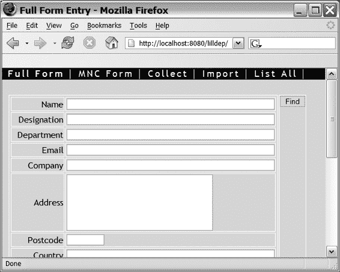

Doray_6048C06.fm 第 62 页 2006 年 1 月 23 日星期一 下午 1:10

**62**

第 6 章 ■ 简单验证

**图 6-3.** *LILLDEP 起始页面*

处理此联系人数据验证的关联`ActionForm`子类称为`ContactForm`。在本实验中，你将完成`ContactForm`的实现。

你需要做三件事：

• 为 14 个属性中的每一个添加对应的 getXXX 和 setXXX 函数。
• 完成`validate()`函数。
• 完成`reset()`函数的实现，该函数用于重置`ContactForm`的值。

按照以下步骤完成本实验。

**步骤 1：准备开发环境和脚本**

**1.** 从 Apress 网站（http://www.apress.com）的源代码部分复制 lilldep.zip 文件到你在实验 4 中创建的 Struts 目录中。

**2.** 解压内容，确保保留了目录结构。

**3.** 你应该会看到一个名为.\Struts\lilldep\的子目录。

**4.** 在文本编辑器中打开.\Struts\lilldep\compile.bat，并修改 PATH 环境变量，使其指向你的 JDK 安装目录。

[www.it-ebooks.info](http://www.it-ebooks.info/)

Doray_6048C06.fm 第 63 页 2006 年 1 月 23 日星期一 下午 1:10

第 6 章 ■ 简单验证

**63**

■**注意** 在具有内置解压功能的 Windows XP、ME 或 2000 系统上，zip 文件可能会在解压路径中添加一个额外的 lilldep 目录。因此，compile.bat 文件的路径可能是.\Struts\lilldep\lilldep\compile.bat。你可以将 lilldep 文件夹上移一层，或者继续使用。编译脚本应该都能正常工作。

通过点击 compile.bat 来测试你的更改。你应该不会看到任何错误，并且应该在.\Struts\lilldep\目录下看到一个名为 lilldep.war 的文件。

在接下来的内容中，我将引用所有相对于.\Struts\lilldep\的路径。

**步骤 2：为 ContactForm 实现 Getter 和 Setter 方法**

`ContactForm`的骨架已经为你创建，位于 net\thinksquared\lilldep\struts 目录中。


现在，*与*注册 Web 应用示例（清单 6-1）不同，该示例中的表单数据存储在私有变量（如 _userid 和 _pwd）中，而 ContactForm 的 getter 和 setter 必须将数据存储在一个名为 Contact 的 bean 中。

■**注意** Contact bean 是使用 Lisptorq 自动生成的。如果您想了解它以及其他 Model 类是如何创建的详细信息，请参考附录 A。

Contact bean 还包含前面列出的 14 个属性各自的 getter 和 setter。您为 ContactForm 编写的 getter/setter 应调用 ContactForm 中包含的 Contact bean 的相应 getter/setter。这看起来可能有点奇怪，但这简化了后续实验课中的代码。

完成以下步骤：

**1.** 为 ContactForm 添加 getter 和 setter。

**2.** 添加一对额外的函数，getContact()和 setContact()，用于获取和设置 Contact bean 实例。

**3.** 运行 compile.bat 以确保没有错误。

**步骤 3：实现 validate()**

您需要实现一些验证：

[www.it-ebooks.info](http://www.it-ebooks.info/)

Doray_6048C06.fm 第 64 页 2006 年 1 月 23 日星期一 下午 1:10

**64**

第 6 章 ■ 简单验证

**1.** 确保公司名称不为空。错误键为 lilldep.error.company。

**2.** 确保联系人姓名不为空。错误键为 lilldep.error.name。

**3.** 确保电子邮件地址*如果*不为空，则是一个有效的电子邮件地址。错误键为 lilldep.error.email。

检查您的工作是否编译无误。

这些只是您在实际中可能对 ContactForm 运行的少数几个验证。在第 15 章中，您将看到如何*无需*使用 Java 编写简单的验证。

**步骤 4：实现 reset()**

除了 validate()之外，ActionForm 还暴露了另一个名为 reset()的函数，该函数将 ActionForm 的值重置为您定义的默认值。视图代码可以使用重置按钮调用 reset()。

该函数的框架位于 ContactForm 中。完成实现以重置 Contact bean 的属性。（提示：您应该仔细阅读 Contact 的源代码，以找到适合执行此操作的函数。）

像往常一样，编译您的代码以确保没有错误。

**Struts 今天为您做了什么？**

就像在生活中一样，“数算恩典”往往能让您正确看待问题，因此思考一下 Struts 迄今为止在简化 Web 应用编写方面所做的工作可能会有所帮助：

• **自动将表单数据传输到您的应用中**：当用户提交表单时，数据会自动从表单中读取并放入您的 ActionForm 子类中。

Struts 甚至为您执行类型转换。

• **集中处理简单验证**：所有简单验证都放在 validate()函数中。这已经不能再简单了。嗯，其实还可以更简单，您将在第 15 章中看到。

• **自动重新显示填写错误的表单并附带错误消息**：如果没有 Struts，您必须自己完成这项工作。花点时间思考一下如果没有 Struts，您会如何自己实现这一点。我希望您能明白这是一个非常大的优势！

• **支持错误消息的轻松本地化**：这是通过使用属性文件实现的。

[www.it-ebooks.info](http://www.it-ebooks.info/)

Doray_6048C06.fm 第 65 页 2006 年 1 月 23 日星期一 下午 1:10

第 6 章 ■ 简单验证

**65**

**总结**

• ActionForm 是用于简单验证的核心类。

• 您的 ActionForm 子类必须为每个表单属性提供 getter 和 setter，并且必须重写 validate()以运行简单验证。

• ActionErrors 是 validate()的返回值，用于保存错误消息。

• 单个错误消息由 ActionMessage 的实例表示。

• 实际的错误消息存储在属性文件中。

[www.it-ebooks.info](http://www.it-ebooks.info/)

Doray_6048C06.fm 第 66 页 2006 年 1 月 23 日星期一 下午 1:10

[www.it-ebooks.info](http://www.it-ebooks.info/)

Doray_6048C07.fm 第 67 页 2006 年 1 月 24 日星期二 上午 10:12

第 7 章

■ ■ ■

处理业务逻辑


**在**上一章中，你学习了如何对用户输入进行简单的验证。在 Struts 框架（实际上，在任何合理的框架中）中，只有当所有简单验证都通过后，数据才能被系统处理。这种处理通常被称为“业务逻辑”，包含三大类任务：

• **复杂验证**：这些是需要进一步运行的验证，但与简单验证不同，它们不具有通用性。它们需要特定领域的处理，或与 Web 应用的模型组件进行通信。

• **数据转换**：这包括进行计算、保存数据以及准备输出数据。这是特定任务的核心部分。

• **导航**：**这涉及在任务完成时决定接下来向用户显示哪个页面。**

**Struts 将这三项任务集中在一个名为 Action 的单一控制器类中。**

**1,2,3 Action！**

正如简单验证由你的 ActionForm 子类执行一样，业务逻辑的处理则由你的

org.apache.struts.action**.Action** 子类完成。

在 MVC 范式中，你的 Action 子类是一个控制器（参见第 5 章，图 5-5），因为它通过定义良好的接口与 Web 应用的模型和视图组件进行通信。

你的 Action 子类所处理的输入数据是用户提交的表单数据。正如你在上一章中回忆的那样，用户提交的表单数据由 Struts 自动传输给你的 ActionForm 子类。这个 ActionForm 子类实例包含了你的 Action 子类的输入数据。ActionForm 子类是一个 JavaBean，这意味着它具有与 HTML 表单上每个属性相对应的 getXXX() 和 setXXX() 函数。你的 Action 子类可以使用这些 getXXX() 函数来读取表单数据。图 7-1 说明了这一数据流。

**图 7-1.** *从表单到 Action 的数据流*

实际上，对于你定义的每个 Action 子类，你可以关联任意数量的 ActionForm 子类，所有这些子类都是该 Action 子类的潜在输入。你将在第 9 章中了解这种关联是如何建立的。

**Action 的无状态性**

关于 Action，需要了解的一个非常重要的事情是它必须是无状态的。你绝不能在你的 Action 子类中存储数据。换句话说，你的 Action 子类绝不能有*实例变量*（函数内的变量是可以的）。清单 7-1 说明了你*绝不能*做的事情。

**清单 7-1.** *绝不要在 Action 子类中使用实例变量！*

public class MyBadAction extends Action{

**private String myBadVariable; // 绝对不要这样做！**

protected void myFunction(){

String s = null; //函数内的变量是可以的。

...

[www.it-ebooks.info](http://www.it-ebooks.info/)

Doray_6048C07.fm Page 69 Tuesday, January 24, 2006 10:12 AM

第 7 章 ■ 处理业务逻辑

**69**

}

...//Action 的其余部分

}

Struts 管理你的 Action 子类的创建，并且这些子类会被池化（重用）以高效地服务用户请求。因此，你不能使用实例变量。无法保证你在实例变量中存储的数据适用于给定的请求。

**子类化 Action**

在你的 Action 子类中，你只需要重写一个方法，那就是 execute()（参见清单 7-2）。

**清单 7-2.** *execute() 函数*

public ActionForward execute(ActionMapping mapping,

ActionForm form,

HttpServletRequest request,

HttpServletResponse response)

■**注意** 在旧版本的 Struts（1.0 及更早版本）中，execute() 被称为 perform()。

在 ActionForm 上的 validate() 方法通过后，Struts 会调用与该表单关联的 Action 上的 execute()。如你所见，有五个类在此函数中发挥作用：


• ActionForward：表示要显示的“下一个”页面。这是 `execute()` 的返回值。

• ActionMapping：表示此 Action 与其可能的“下一个”页面之间的关联。

• ActionForm：包含输入表单数据。

• HttpServletRequest：包含请求范围和会话范围的数据。你也可以使用此类将会话数据放入其中。请注意，并非所有数据都来自提交的表单。其他数据可以放在表单的“action”URL 中。你可以通过 `HttpServletRequest` 读取这些数据。

[www.it-ebooks.info](http://www.it-ebooks.info/)

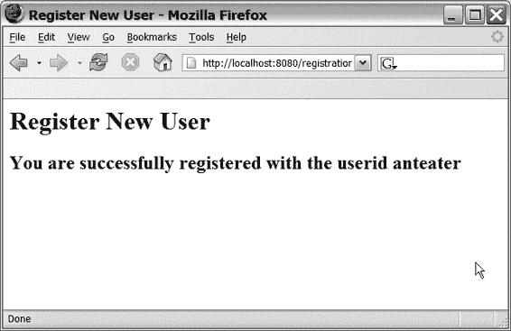

Doray_6048C07.fm 第 70 页 2006 年 1 月 24 日星期二 上午 10:12

**70**

第 7 章 ■ 处理业务逻辑

• HttpServletResponse：允许你将数据写入用户的 Web 浏览器。你不太可能用到此类，除非你想向用户发送生成的 PDF 报告等。()

每个类的重要功能在附录 B 中列出。

**注册 Web 应用中的业务逻辑**

现在，我们将继续之前注册 Web 应用的示例（参见第 5 章和第 6 章），看看如何处理业务逻辑。对于注册 Web 应用，这涉及以下内容：

• **复杂验证**：检查给定的用户 ID 是否存在。我在第 6 章清单 6-2 中给出了一个解决方案，我们将在此处使用它。

• **数据转换**：使用 User 数据对象（参见第 5 章清单 5-1）将用户 ID 和密码保存到数据库。

• **导航**：如果注册成功，则显示“您已注册！”页面（图 7-2）；如果用户 ID 已存在，则重新显示带有错误消息的表单（图 7-3）。

**图 7-2.** *“您已注册！”页面*

[www.it-ebooks.info](http://www.it-ebooks.info/)

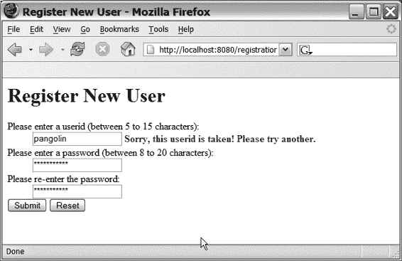

Doray_6048C07.fm 第 71 页 2006 年 1 月 24 日星期二 上午 10:12

第 7 章 ■ 处理业务逻辑

**71**

**图 7-3.** *向用户重新显示带有错误消息的表单* 我们只需要一个名为 RegistrationAction 的 Action 子类，如清单 7-3 所示。

**清单 7-3.** *RegistrationAction.java*

package net.thinksquared.registration.struts;

import javax.servlet.http.*;

import org.apache.struts.action.*;

import net.thinksquared.registration.data.User;

public class RegistrationAction extends Action{

public ActionForward execute(ActionMapping mapping,

ActionForm form,

HttpServletRequest request,

HttpServletResponse response){

//获取用户 ID 和密码

RegistrationForm rForm = (RegistrationForm) form;

String userid = rForm.getUserId();

String password = rForm.getPassword();

[www.it-ebooks.info](http://www.it-ebooks.info/)

Doray_6048C07.fm 第 72 页 2006 年 1 月 24 日星期二 上午 10:12

**72**

第 7 章 ■ 处理业务逻辑

//复杂验证：检查用户 ID 是否存在

if(User.exists(userid)){

ActionMessages errors = new ActionMessages();

errors.add("userid",

new ActionMessage("reg.error.userid.exists"));

saveErrors(request,errors);

//导航：重新显示用户表单。

return mapping.getInputForward();

}else{

//数据转换：将用户 ID 和密码保存到数据库：

User user = new User();

user.setUserId(userid);

user.setPassword(password);

user.save();

//导航：显示“您已注册”页面

return mapping.findForward("success");

}

}

}

请花时间仔细研究清单 7-3，因为它将成为你编写每个 Action 的模式。

首先要注意的是从 ActionForm 到 RegistrationForm 的类型转换：`RegistrationForm rForm = (RegistrationForm) form;`

回想一下，传递给 `execute()` 的 ActionForm 实际上是一个 RegistrationForm 实例（参见清单 6-1），并且它包含已通过简单验证的表单数据。进行类型转换是为了能够读取表单的 `userid` 和 `password` 属性。

■**注意** 这不是从 ActionForm 读取数据的最佳方式。在第 17 章中，我将介绍一种更好的替代方法。

[www.it-ebooks.info](http://www.it-ebooks.info/)

Doray_6048C07.fm 第 73 页 2006 年 1 月 24 日星期二 上午 10:12


第 7 章 ■ 处理业务逻辑

**73**

我尚未向你展示 Struts 如何知道表单数据会进入`RegistrationForm`并由其验证，也未说明 Struts 如何知道填充后的`RegistrationForm`需要发送给`RegistrationAction`进行进一步处理。你将在第 9 章了解这两个映射是如何实现的。

我将使用每个`Action`子类执行的三大任务来分析清单 7-3 的其余部分：复杂验证、数据转换和导航。

**复杂验证**

清单 7-3 中执行复杂验证的相关部分如清单 7-4 所示。

**清单 7-4.** *RegistrationAction 中的复杂验证*  
`if(User.exists(userid)){`

**`ActionMessages errors = new ActionMessages();`**

**`errors.add("userid",`**

**`new ActionMessage("reg.error.userid.exists"));`**  
**`saveErrors(request,errors);`**

//导航：重新显示用户表单。  
`return mapping.getInputForward();`

`}else{ ...`

`User.exists()`函数检查给定的用户 ID 是否存在。这正是我所说的控制器（`RegistrationAction`）与模型（`User`类）之间“定义明确”接口的典型示例。

Struts 并不阻止你使用原始 SQL 来检查用户 ID 是否存在，但这会是 MVC 设计模式的一种较差实现。让模型类像这样处理数据访问，能使代码更清晰、更易维护且更具前瞻性。如果你切换到使用不同 SQL 变体的数据库，最多只需修改`exists()`函数的实现，而无需修改每个检查重复用户 ID 的 SQL 语句。

下一条语句创建一个空白列表来保存错误消息：  
`ActionMessages errors = new ActionMessages();`

使用`ActionMessages`而非`ActionErrors`来保存错误消息的做法有些遗憾。在 Struts 的早期版本中，确实会使用`ActionErrors`，但后续版本已弃用`ActionErrors`，仅在`ActionForm`的`validate()`方法返回值中保留其使用。

[www.it-ebooks.info](http://www.it-ebooks.info/)

Doray_6048C07.fm 第 74 页 2006 年 1 月 24 日星期二 上午 10:12

**74**

第 7 章 ■ 处理业务逻辑

创建错误消息容器后，我接着向其中添加一条错误消息：  
`errors.add("userid", new ActionMessage("reg.error.userid.exists"));`  
这对你来说应该已是老生常谈。如果理解这条语句有困难，建议重读第 6 章的“使用 ActionErrors”部分。

我要讨论的最后一条语句是：  
`saveErrors(request,errors);`

通过使用`saveErrors()`保存错误列表，可以指示复杂验证失败。

然而，与简单验证中表单会自动重新显示不同，这里的错误列表用于填充“下一个”页面上的`<html:errors>`标签。

■**注意** `saveErrors()`实际上将错误保存到请求对象上，该对象是作为参数传入`execute()`的`HttpServletRequest`实例。

`execute()`完成后，Struts 会检查请求对象中的错误，然后尝试在`execute()`返回的`ActionForward`实例所指示的“下一个”页面中显示这些错误。

Struts 知道*哪些*错误消息需要显示以及*在哪里*显示，因为“下一个”页面被假定包含我们的老朋友——`<html:errors>`标签。我们将在下一章详细讨论这一点。如果没有`<html:errors>`标签，则不会显示任何错误消息。

敏锐的读者可能会疑惑为什么是`saveErrors(request, errors)`而不是简单的`saveErrors(errors)`。答案是`Action`子类必须是无状态的。因此，错误对象必须存储在请求上。

**数据转换**

在`RegistrationAction`类中，涉及的唯一数据转换是将用户 ID 和密码保存到数据库，如清单 7-5 所示。

**清单 7-5.** *RegistrationAction 中的数据转换*  
`User user = new User();`  
`user.setUserId(userid);`  
`user.setPassword(password);`  
`user.save();`


[www.it-ebooks.info](http://www.it-ebooks.info/)

Doray_6048C07.fm Page 75 Tuesday, January 24, 2006 10:12 AM

第 7 章 ■ 处理业务逻辑

**75**

如你所见，使用 Model 类写入数据能够生成简洁的代码。Model 类并非 Struts 的一部分，因为这项任务最好交由专门的持久化框架（如 Hibernate 或 Torque）来处理。详情请参考附录 A。

**导航**

导航指的是决定下一步向用户显示哪个页面的编程逻辑。在 RegistrationAction 中，只有两个可能的“下一个”页面：包含已提交表单的页面（重新显示并附带错误信息），以及表示注册成功的“您已注册！”页面。

到达每个页面所用的代码略有不同。清单 7-6 展示了所涉及的导航逻辑。

**清单 7-6.** *RegistrationAction 中的导航*

if(User.exists(userid)){

...

//导航：重新显示用户表单。

**return mapping.getInputForward();**

}else{

...

//导航：显示“您已注册”页面

return mapping.findForward("success");

}

ActionForward 是 execute() 方法的返回值，它是对“下一个”页面的引用。清单 7-6 展示了实例化它的两种最重要方式。

■**注意** 如果你查阅 ActionForward 的 JavaDocs，会发现实际上存在多种不同的 ActionForward 构造器。每个构造器都允许你更改默认设置，例如页面是否为重定向。甚至还有 ActionForward 的子类，用于创建具有更常见选项的 ActionForward。

第一种方式涉及创建指向包含已提交表单页面的 ActionForward 引用。你可能需要这样做的唯一原因，是在复杂验证失败时重新显示表单：

[www.it-ebooks.info](http://www.it-ebooks.info/)

Doray_6048C07.fm Page 76 Tuesday, January 24, 2006 10:12 AM

**76**

第 7 章 ■ 处理业务逻辑

mapping.getInputForward()

要获取输入页面的引用，你可以在 ActionMapping 实例（即 mapping）上使用 getInputForward() 函数。回想一下，mapping 是由 Struts 提供给你的，因为它是 execute() 方法中的一个参数。

请注意，与简单验证中由 Struts 自动处理重新显示不同，这里你需要“手动”操作，这意味着你必须自己指定错误页面。这是因为简单验证和复杂验证的本质截然不同。例如，你可能会在执行任务前检查用户的账户余额。如果余额不足，自动重新显示输入页面是没有意义的。更合适的响应是显示一个“余额不足”页面。

第二种实例化 ActionForward 的方式是让它指向一个*命名的*“下一个”页面：

mapping.findForward("success")

在这里，名称 success 指向一个命名页面，这是我绑定到 RegistrationAction 的一个可能的“下一个”页面。我将在第 9 章中描述如何实现这一点。

这种间接引用页面的方式可能看起来过于复杂。为什么不直接使用像这样的直接引用呢？

new ActionForward("/mywebapp/registered.jsp")

有两个充分的理由说明为什么应该避免使用直接引用。第一，间接方法使你的 Web 应用更易于维护；第二，它促进了代码复用。

要理解第一个理由，你需要知道命名页面是在一个名为 struts-config.xml 的文件中指定的。因此，如果你移动了一个页面，只需修改这一个文件即可。如果路径是硬编码的，你就需要更改多个 Action 并重新编译你的应用！这并不好。

第二个理由更为微妙，但也更有说服力。通常你需要在不同的上下文中复用同一个 Action。根据上下文的不同，你可能希望显示不同的“成功”页面。将“下一个”页面硬编码到 Action 中会消除这种可能性。

总结一下，有两种重要的方式来显示“下一个”页面：


• **输入页面**：`mapping.getInputForward()`

• **命名页面**：`mapping.findForward(...)`

**实验 7：为 LILLDEP 实现 ContactAction**

本实验从实验 6 结束的地方继续。ContactAction 是与实验 6 的 ContactForm 相关联的 Action 子类。

[www.it-ebooks.info](http://www.it-ebooks.info/)

Doray_6048C07.fm Page 77 Tuesday, January 24, 2006 10:12 AM

第 7 章 ■ 处理业务逻辑

**77**

在本实验中，你将完成 ContactAction 的实现。开始之前，请确保你可以无错误地编译 LILLDEP webapp。然后完成以下步骤：

**1.** 从 ContactForm 获取 Contact 数据对象并保存它。你可能需要仔细阅读 BaseContact 的源代码，了解如何保存 Contact。

**2.** 如果在保存 Contact 时抛出异常，则重新显示输入页面，并附带属性 `ActionMessages.GLOBAL_MESSAGE` 的错误消息键 `lilldep.error.save`。

**3.** 如果一切顺利，则转发到名为“success”的页面。

**4.** 运行 `compile.bat` 以确保你的工作编译无误。

**总结**

在本章中，你学习了业务逻辑如何由你的 Action 子类处理。

本章要点如下：

• `org.apache.struts.action.Action` 子类必须是无状态的。

• 你只需要重写 Action 的 `execute()` 方法。

• 复杂的验证错误使用 `saveErrors()` 函数进行标记。

• 带有错误的页面重新显示是“手动的”。

• 使用 `mapping.getInputForward()` 重新显示输入页面。

• 使用 `mapping.findForward(...)` 显示命名页面。

[www.it-ebooks.info](http://www.it-ebooks.info/)

Doray_6048C07.fm Page 78 Tuesday, January 24, 2006 10:12 AM

[www.it-ebooks.info](http://www.it-ebooks.info/)

Doray_6048C08.fm Page 79 Thursday, January 12, 2006 10:59 AM

第 8 章

■ ■ ■

基本 Struts 标签

**S**truts 完全通过使用自定义标签（实际上，正确的术语是自定义*动作*，但我认为自定义*标签*这个术语传达的意义更多，并且与 Struts Actions 混淆的可能性更小）来实现 MVC 设计模式的视图组件。这些标签应用于构成 webapp 视图组件的 JSP 中。Struts 标签被捆绑到*五个*标签库中：

• **HTML**：HTML 库中的自定义标签本质上与普通的 HTML `<form>` 标签及其相关的输入标签（如各种 `<input>` 标签）一一对应。此标签库的目的是使你能够将视图组件连接到第 6 章和第 7 章中描述的控制器组件。实际的连接细节将在第 9 章中描述。

• **Bean**：此库主要包含用于编写文本的自定义标签。使用 Bean 标签而不是将文本硬编码到 JSP 中有两个原因。第一个是为了实现国际化，即以多种语言显示视图组件。我们将在第 12 章中展示 Struts 如何帮助你国际化你的 webapp。第二个原因是避免使用 scriptlet 来显示存储在请求或会话对象上的对象内容。

• **Logic**：此库提供用于条件处理和循环的标签。你使用 Logic 库中的标签来代替使用 scriptlet。逻辑库标签更易于使用，并能生成可读性显著更高的代码。

• **Nested**：此库包含用于显示表单或对象的“嵌套”属性的标签。我们将在第 10 章中详细描述这一点。

• **Tiles**：此库包含允许你创建布局的标签。你将在第 14 章中了解如何使用 Tiles 标签库。

**79**

[www.it-ebooks.info](http://www.it-ebooks.info/)

Doray_6048C08.fm Page 80 Thursday, January 12, 2006 10:59 AM

**80**

第 8 章 ■ 基本 Struts 标签

■**注意** 附录 C 是所有 Struts 标签的全面参考。

在本章中，我们将仅讨论来自 HTML 和 Bean 库中最常用的标签。

在我们深入每个标签的细节之前，你首先必须了解 Struts 如何处理 JSP 页面。

**页面处理生命周期**

当 Struts 被请求一个页面时，它首先将该页面上的所有 Struts 标签替换为必要的文本数据。这种替换过程的底层机制在第 4 章中已经描述过。并非所有 Struts 标签都会显示在页面上。有些标签有前置条件，只有满足条件时才会显示。例如，`<html:errors>` 标签仅当存在要显示的错误消息时才会显示。

对于不包含表单的页面，此标签替换阶段就结束了该页面的处理生命周期。

如果一个页面*确实*包含表单，那么 Struts 会处理表单数据。这基本上分两个阶段进行，这也是前两章的主题：简单验证和业务逻辑处理。

表单数据首先经过简单验证（在你的 ActionForm 子类上）。如果验证失败，页面*通常*会自动重新显示。

■**注意** 是否确实执行简单验证，以及如果执行，重新显示哪个输入页面，都由 Struts 配置文件控制，这将在第 9 章中描述。

因为页面现在包含验证错误，页面上任何相关的 `<html:errors>` 标签都会显示其错误消息。

一旦用户更正并重新提交表单，数据将再次被验证。和之前一样，如果表单仍然包含错误，页面将再次重新显示。这种重新显示表单和验证的循环会一直持续，直到表单数据没有简单验证错误为止。

当这种情况发生时，Struts 将表单数据发送给业务逻辑处理（由你的 Action 子类处理），并显示“下一个”页面。请注意，“下一个”页面可能是一个错误页面，或者在发生复杂验证错误时可能包含错误消息。

图 8-1 总结了这些步骤。

[www.it-ebooks.info](http://www.it-ebooks.info/)

Doray_6048C08.fm Page 81 Thursday, January 12, 2006 10:59 AM

第 8 章 ■ 基本 Struts 标签

**81**

为了使这些概念更具体，我们将继续使用前几章的 Registration webapp 示例。在此过程中，我们将向你展示如何使用来自 HTML 和 Bean 库的最基本的 Struts 标签。再次说明，附录 C 是所有 Struts 标签的全面参考。

**图 8-1.** *典型的 Struts 页面处理生命周期* **评估、替换和发送**

当请求一个 Struts JSP 页面时，其处理*不*涉及主 Struts servlet（ActionServlet）。只有表单数据的提交才涉及主 servlet。正是这个 servlet 填充你的 ActionForm 子类，并在你的 Action 子类上调用 `execute()`。

当然，Struts 类参与了页面的渲染，但这些只是代表每个标签的 `BodyTagSupport` 和 `TagSupport` 类（参见第 4 章）。这些类知道的唯一状态存储在服务器端的 `HttpServletRequest` 和 `HttpSession` 对象中，分别代表当前请求和会话。

正如你在第 4 章中看到的，`BodyTagSupport` 或 `TagSupport` 负责标签视觉外观的最终渲染。不过，并非所有 Struts 标签都有视觉外观。例如，来自 Logic 库（在第 10 章中讨论）的标签执行条件处理，以选择性地显示*确实*有视觉外观的其他标签。

[www.it-ebooks.info](http://www.it-ebooks.info/)

Doray_6048C08.fm Page 82 Thursday, January 12, 2006 10:59 AM

**82**

第 8 章 ■ 基本 Struts 标签

Struts JSP 页面的处理可以总结为三个步骤：

• **评估**：一些 Struts 标签（来自 Logic 库）或 `<html:errors>` 标签评估自身以确定是否应该显示。

• **替换**：从请求或会话对象（或全局转发）中读取数据——


更多内容请参见第 9 章）并粘贴到渲染后的页面中。例如，`<html:errors>` 会粘贴相应的错误信息。

• **发送**：最终页面被发送给用户。

当请求一个 Struts JSP 页面时，始终会涉及这三个步骤。

**注册 Web 应用的视图组件**

注册 Web 应用的视图组件（参见第 5 章）由单个页面 `registration.jsp` 组成，该页面包含一个带有三个输入字段的表单：一个用于用户 ID 的文本输入框，以及两个密码字段。

其 JSP 代码如清单 8-1 所示，用户看到的可视化输出如图 8-2 所示。在继续阅读之前，请花些时间研究这两者。

**清单 8-1.** *Registration.jsp*

<%@ page contentType="text/html;charset=UTF-8" %>

<%@ taglib uri="/tags/struts-bean" prefix="bean" %>

<%@ taglib uri="/tags/struts-html" prefix="html" %>

<html:html>

<head>

<title><bean:message key="registration.jsp.title"/></title>

</head>

<body>

<h1><bean:message key="registration.jsp.heading"/></h1>

<html:form action="Registration.do" focus="userid">

<p>

<bean:message key="registration.jsp.prompt.userid"/>

<html:text property="userid" size="20" />

<html:errors property="userid" />

</p><p>

<bean:message key="registration.jsp.prompt.password"/>

<html:password property="password" size="20" />

<html:errors property="password" />

[www.it-ebooks.info](http://www.it-ebooks.info/)

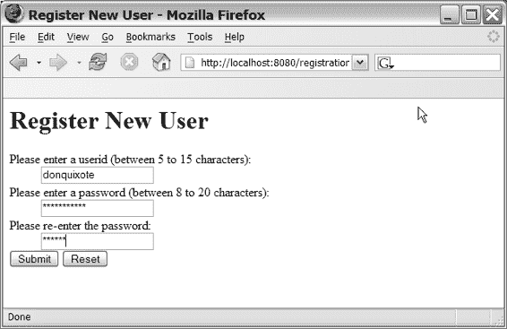

Doray_6048C08.fm Page 83 Thursday, January 12, 2006 10:59 AM

第 8 章 ■ 基本 Struts 标签

**83**

</p><p>

<bean:message key="registration.jsp.prompt.password2"/>

<html:password property="password2" size="20" />

</p>

<html:submit>

<bean:message key="registration.jsp.prompt.submit"/>

</html:submit>

<html:reset>

<bean:message key="registration.jsp.prompt.reset"/>

</html:reset>

</html:form>

</body>

</html:html>

**图 8-2.** *用户看到的 registration.jsp 页面* **声明并安装 HTML 和 Bean 库**

清单 8-1 首先定义了 Bean 和 HTML 标签库的前缀：

<%@ taglib uri="/tags/struts-bean" prefix="bean" %>

<%@ taglib uri="/tags/struts-html" prefix="html" %>

[www.it-ebooks.info](http://www.it-ebooks.info/)

Doray_6048C08.fm Page 84 Thursday, January 12, 2006 10:59 AM

**84**

第 8 章 ■ 基本 Struts 标签

在实验 4 中编写过自定义标签后，这对你来说应该不陌生。

TLD 文件和 Java 处理器都打包在你的 Struts 发行版中：

• TLD 文件应放置在 `\WEB-INF\` 目录下。
• Struts 附带了一个你应该使用的 `web.xml` 文件。在撰写本文时，该 `web.xml` 文件已包含为你方便而声明的适当 `<taglib>` 部分。

但你应该始终自行检查，并在必要时为五个标签库插入 `<taglib>` 部分。

• 这些标签的 Java 处理器类位于构成 Struts 二进制文件的各个 JAR 文件中，你应将其放置在你的 Web 应用的 `\lib\` 目录下（参见第 2 章）。

■**警告** 请*不要*将 Struts JAR 文件放在 Servlet 容器的“共享”或“公共”目录中。

它们*不得*被共享。你必须在每个 Web 应用的 `\lib\` 目录中部署一套全新的文件。在某些情况下，共享可能导致 Servlet 容器抛出 `ClassNotFoundException`。

**显示静态文本**

你在清单 8-1 中可能首先注意到的是，图 8-2 中的提示文本（如“注册新用户”等）并未出现在清单中。相反，`registration.jsp` 使用 `<bean:message>` 标签来显示这些内容。例如，标签

<bean:message key="registration.jsp.prompt.userid"/> 显示为

请输入用户 ID（5 到 15 个字符之间）

`<bean:message>` 标签可用于任何位置以显示静态文本。该标签上的 `key` 属性指向资源文件 `Application.properties` 中的一个键值对，就像第 6 章和第 7 章中错误消息的情况一样。

当然，你也可以在 JSP 中硬编码文本，但这会使你的应用更难以国际化和维护。

■**注意** Struts 显示静态文本的简单方法只能帮你到这里。如果你有*大量*静态文本需要显示，那么使用像 FreeMarker 或 Velocity 这样的模板引擎（本书*不会*涵盖这两者）将是必要的。请参考“有用链接”部分获取一些网络资源。

[www.it-ebooks.info](http://www.it-ebooks.info/)

Doray_6048C08.fm Page 85 Thursday, January 12, 2006 10:59 AM

第 8 章 ■ 基本 Struts 标签

**85**

Bean 标签库除了 `<bean:message>` 之外还包含其他标签。你可能使用的另一个标签是 `<bean:write>`，它允许你显示 JavaBean 对象的属性。有关此标签的描述，请参考附录 C。

**表单与表单处理器**

Web 应用的核心在于获取用户输入并处理它们。在 Struts 中（与 HTML 一样），主要方式是通过*表单*。

在 Struts 中，表单在 `<html:form>` 容器标签内声明。这与你在 HTML 中声明表单的方式类似。`<html:form>` 元素具有 `action` 属性，用于描述处理表单数据的处理器：

<html:form action="Registration.do" ...

在此代码片段中，处理器名为 Registration。处理器是你的 `ActionForm` 子类（执行简单验证）与你的 `Action` 子类（执行业务逻辑）的*特定组合*。你将在下一章了解如何声明处理器。目前，你只需理解 `action` 属性指向你已定义的处理器。

处理器传统上以 `.do` 前缀结尾，这告诉 Servlet 容器该动作将由 Struts 处理。此映射在 `web.xml` 中完成，如清单 8-2 所示（该清单也显示了 Struts ActionServlet 的声明）。这些声明已在 Struts 附带的 `web.xml` 文件中为你完成。然而，对细节有一个高层次的理解是有用的，因此我将稍微偏离主题来讨论这一点。

■**注意** 如果不清楚，清单 8-2 是 Apache 软件基金会慷慨提供的 `web.xml` 文件的摘录。Apache 许可证可在 http://www.apache.org/licenses/LICENSE-2.0 获取。

**清单 8-2.** *Struts 的标准 Servlet 和 Servlet 映射声明*

<servlet>

<servlet-name>action</servlet-name>

<servlet-class>

org.apache.struts.action.ActionServlet

</servlet-class>

<init-param>

<param-name>config</param-name>

<param-value>/WEB-INF/struts-config.xml</param-value>

</init-param>

<load-on-startup>2</load-on-startup>

</servlet>

[www.it-ebooks.info](http://www.it-ebooks.info/)

Doray_6048C08.fm Page 86 Thursday, January 12, 2006 10:59 AM

**86**

第 8 章 ■ 基本 Struts 标签

<servlet-mapping>

<servlet-name>action</servlet-name>

<url-pattern>*.do</url-pattern>

</servlet-mapping>

清单 8-2 中的 `<servlet>` 声明启动了主要的 Struts Servlet 类（`org.apache.struts.action.ActionServlet`），并为其提供了对 Struts 配置文件（`struts-config.xml`）的引用，该文件将在第 9 章中描述。此 `<servlet>` 声明被命名为 `action`。随后的 `<servlet-mapping>` 标签引用了此名称，并指定任何以 `.do` 结尾的传入 URL 都将被转交给名为 `action` 的 Servlet 进行处理。

请记住，是 Servlet 容器（在我们的例子中是 Tomcat）读取 `web.xml` 文件并执行这些指令。Servlet 容器也是协调用户与 Struts 之间控制流的组件，如图 8-1 所示。它通过清单 8-2 中的 `<servlet>` 和 `<servlet-mapping>` 声明知道如何做到这一点。

关于 `<html:form>` 标签，最后要注意的是属性 `focus="userid"`。


这是一个指令，告诉 Struts *自动生成* JavaScript，使得当用户浏览器加载页面时，表单上的 userid 字段能够获得焦点（即光标出现在该字段中）。生成的 JavaScript 细节并不重要，但 Struts 能够做到这一点本身*至关重要*。正如你将在本书中看到的，Struts 的强大之处很大程度上就体现在这类便捷的小功能上。

**数据输入标签**

接受数据输入的 Struts 标签必须放在 <html:form> 标签内。清单 8-1 包含了四个输入标签：

• <html:text> 表示一个文本字段。
• <html:password> 表示一个密码字段。该字段中的文本会以星号显示。
• <html:submit> 表示提交按钮。
• <html:reset> 表示重置按钮，用于清空表单。

还有其他一些输入标签（例如，用于单选按钮、列表和下拉列表的标签），这些标签将在附录 C 以及后续章节的实验环节中详细描述。在本章中，我们只集中讨论这四个输入标签。

文本字段标签 <html:text> 和 <html:password> 都有一个 property 属性，用于将它们与表单上的字段绑定。每个字段*必须*与处理该表单的 ActionForm 子类中的 getXXX() 和 setXXX() 方法对相对应。至于表单处理器*如何*将 JSP 页面与 ActionForm 子类关联起来，这将是第 9 章的主题。

目前，只需假设每个 <html:form> 都有与 ActionForm 子类的属性相对应的输入字段即可。

例如，从清单 8-1 我们可以推断出，处理注册数据的 ActionForm 子类必须包含 getUserid() 和 setUserid() 方法。而它确实包含这些方法（请参考清单 6-1）。

文本字段还接受一个 size 属性，允许你指定显示字段的物理尺寸。这与 HTML 中文本输入字段的预期行为完全一致。事实上，所有输入标签的属性都与它们对应的 HTML 标签属性非常接近。

<html:submit> 和 <html:reset> 标签分别代表表单上的提交按钮和重置按钮。这些标签内包含的 <bean:message> 标签告诉 Struts 要在按钮上放置什么标签。同样，这种方法便于实现国际化，并且也能让你的 Web 应用外观更加统一。

重置按钮会调用你的 ActionForm 子类上的 reset() 函数（参见实验 6 的第 4 步）。如果没有定义该函数，则会调用父类的 super.reset() 函数，该函数只是简单地重新显示一个空白表单。

**显示错误信息**

在前两章中，你已经了解了验证错误信息是如何生成的。现在我们将描述它们是如何显示的。

当表单验证失败时（无论是简单验证还是复杂验证），会创建一个包含错误信息的 ActionErrors 或 ActionMessages 对象。ActionErrors 和 ActionMessages 的行为都类似于 Java 的 HashMap。HashMap 的键对应于 <html:errors> 标签的 property 属性。关联的值就是错误信息本身。

然而，与 HashMap 不同的是，它可以在同一个键下存储*多个*错误信息。如果单个字段关联了多个错误，这显然非常有用。

当 Struts 加载一个页面时，它会检查该页面是否存在 ActionErrors 或 ActionMessages。如果存在，它会忠实地将错误信息粘贴到页面中正确的 <html:errors> 标签里。图 8-3 展示了这一过程。

正如你所见，只有那些键同时存在于 ActionErrors（或 ActionMessages）*和* JSP 页面中的错误才会被显示。所有其他的错误信息或错误标签都会被忽略。

因此，在图 8-3 中，只有属性 userid 的错误信息被显示出来。属性 desc 的错误信息被忽略了，因为没有对应的 <html:errors> 标签。


名为 `pwd` 的属性的 `<html:errors>` 标签根本不会显示，因为 `ActionErrors` 对象中没有与该属性对应的错误消息。

■**提示** 一个有用的技巧是像这样省略 `property` 属性：`<html:errors/>`。这会导致显示*所有*错误消息。这对于调试尤其有用。

[www.it-ebooks.info](http://www.it-ebooks.info/)

Doray_6048C08.fm Page 88 Thursday, January 12, 2006 10:59 AM

**88**

第 8 章 ■ 基本 Struts 标签

**图 8-3.** *显示错误*

要显示一个不与任何实际表单属性关联的通用错误消息，你可以使用一个特殊的*全局属性*。在你的 `ActionForm` 或 `Action` 中，你可以使用键 `ActionMessages.GLOBAL_MESSAGE`：

`errors.add(ActionMessages.GLOBAL_MESSAGE, new ActionMessage(...));` 并在 `<html:errors>` 标签上使用属性值 `org.apache.struts.action.GLOBAL_MESSAGE`：

`<html:errors property="org.apache.struts.action.GLOBAL_MESSAGE"/>` **HTML 和 Bean 标签库概要**

上一节描述了在你的 Struts Web 应用中 70% 的时间会使用的所有标签。剩下的 30% 我们将在第 10、11 和 14 章中描述。附录 C 是*所有*标签的全面参考。

此时，HTML 和 Bean 标签的概要对你来说会很有用。表 8-1 列出了 HTML 标签库中的标签及其用途。表 8-2 对 Bean 标签库做了同样的说明。你可以在附录 C 中找到每个标签的详细信息。表 8-1 和表 8-2 基于 Apache 软件基金会提供的文档。Apache 许可证可在 http://www.apache.org/licenses/LICENSE-2.0 获取。

[www.it-ebooks.info](http://www.it-ebooks.info/)

Doray_6048C08.fm Page 89 Thursday, January 12, 2006 10:59 AM

第 8 章 ■ 基本 Struts 标签

**89**

**表 8-1.** *HTML 标签库概要*

**标签**

**用法/说明**

`base`

生成一个 HTML `<base>` 标签。这会创建一个引用，你的 JSP 中所有相对路径都将基于此引用进行计算。

`html`

生成一个 `<html>` 标签。同时包含来自用户会话的语言属性。

`xhtml`

告诉页面上的其他标签将它们自身渲染为符合 XHTML 1.0 标准的标签。

`frame`

生成一个 HTML `<frame>`。

`javascript`

指示自动生成的 JavaScript 的位置。与第 15 章描述的 Validator 框架一起使用。

`form`

定义一个表单。`action` 和 `focus` 属性最有用，其次是第 11 章描述的 `enctype` 属性。

`checkbox`

生成一个复选框输入字段。

`file`

生成一个文件选择输入字段。

`hidden`

生成一个隐藏字段。

`multibox`

生成多个复选框输入字段。与索引属性一起使用。

`option`

生成一个选择选项。

`options`, `optionsCollection`

生成一个选择选项列表。

`password`

生成一个密码输入字段。

`radio`

生成一个单选按钮输入字段。

`select`

生成一个选择元素。

`text`

生成一个文本输入字段。

`textarea`

生成一个 HTML `textarea` 元素。

`image`

生成一个图像输入字段。

`button`

生成一个按钮输入字段。

`cancel`

生成一个取消按钮。

`submit`

生成一个提交按钮。

`reset`

生成一个重置按钮。

`errors`

显示错误消息。

`messages`

用于错误消息和普通消息的迭代器。

`img`

生成一个 HTML `img` 标签。

`link`

生成一个超链接。

`rewrite`

展开给定的 URI。用于为你的 JavaScript 函数创建 URL。

[www.it-ebooks.info](http://www.it-ebooks.info/)

Doray_6048C08.fm Page 90 Thursday, January 12, 2006 10:59 AM

**90**

第 8 章 ■ 基本 Struts 标签

**表 8-2.** *Bean 标签库概要*

**标签**

**用法/说明**

`message`

根据给定的键写入静态文本。

`write`

写入指定 JavaBean 属性的值。

`cookie/header/parameter`

每个都根据指定的 cookie/header/parameter 定义一个脚本变量。

`define`

根据指定的 JavaBean 定义一个脚本变量。

`page`

将一个页面作用域的变量暴露为 JavaBean。

`include`


允许您调用外部 JSP、全局转发或 URL，并将生成的响应数据作为变量使用。被调用页面的响应不会写入响应流。

resource

允许您从当前 Web 应用中读取任意文件，并将其作为字符串变量或 InputStream 暴露出来。

size

定义一个新的 JavaBean，其中包含指定集合或映射中的元素数量。

struts

将指定的 Struts 内部配置对象作为 JavaBean 暴露出来。

**实验 8：LILLDEP 的联系人录入页面**

在本实验中，您将完成 LILLDEP 主页面（full.jsp）的实现。

**1.** 在编辑器中打开 \lilldep\web\full.jsp。添加缺失的标签库声明。

您会使用哪些库？（TLD 文件位于 \web\WEB-INF\ 目录下。）  
**2.** 修改 web.xml 以包含标签库的位置。

**3.** 为缺失的属性实现标签。此表单的属性已在实验 6 中列出。使用 \web\resources\Application.properties 中的键来显示您可能需要的任何消息。

**4.** 为实验 6 中每个经过验证的字段添加错误标签。同时为实验 7 中保存联系人时遇到的错误添加一个错误标签。

**5.** 实现提交按钮。此表单的处理程序名称是什么？

■**注意** 源代码答案位于 LILLDEP 发行版的 answers 文件夹中。本实验中提出的问题答案可在附录 D 中找到。

[www.it-ebooks.info](http://www.it-ebooks.info/)

Doray_6048C08.fm 第 91 页 2006 年 1 月 12 日星期四 上午 10:59

第 8 章 ■ 基本 Struts 标签

**91**

**实用链接**

• FreeMarker，一个强大的开源模板引擎：http://freemarker.sourceforge.net

• Velocity，一个来自 Apache 的更简单、轻量级的开源模板引擎：http://jakarta.apache.org/velocity/

• *《Pro Jakarta Velocity：从专业到专家》*，作者 Rob Harrop（Apress，2004 年）：www.apress.com/book/bookDisplay.html?bID=347

**总结**

在本章中，您已经了解了基本 Struts 标签如何用于显示表单数据和错误消息。

• 用于显示表单数据和错误消息的 Struts 标签位于 HTML 和 Bean 库中。

• 表单有一个关联的表单处理程序，它是 ActionForm 和 Action 子类的特定组合。

• 表单数据首先通过简单验证（ActionForm），然后再处理业务逻辑（Action）。

• Struts 处理错误填写表单的重显示以及必要字段的错误消息。

[www.it-ebooks.info](http://www.it-ebooks.info/)

Doray_6048C08.fm 第 92 页 2006 年 1 月 12 日星期四 上午 10:59

[www.it-ebooks.info](http://www.it-ebooks.info/)

Doray_6048.book 第 93 页 2006 年 1 月 10 日星期二 下午 5:10

第 9 章

■ ■ ■

配置 Struts

**到**目前为止，我已经按照 MVC 设计模式介绍了 Struts 的各个部分。在实验 6、7 和 8 中，您已经为 LILLDEP Web 应用自行实现了这些部分。缺少的是 Struts 如何将各种模型-视图-控制器部分连接起来的方式。

Struts 使用一个名为 struts-config.xml 的单一配置文件来存储这些信息。Struts 发行版附带了此文件的示例，您可以复制并根据自己的需要进行修改。

**struts-config.xml 的结构**

毫不意外，struts-config.xml 以 XML 格式保存数据。它包含几个部分，每个部分处理 Struts 特定部分的配置：

• **表单 Bean 声明**：在此处将您的 ActionForm 子类映射到一个名称。您可以在 struts-config.xml 文件的其余部分甚至 JSP 页面上使用此名称作为 ActionForm 的别名。

• **全局异常**：此部分定义处理过程中抛出的异常的处理程序。

• **全局转发**：此部分将 Web 应用中的页面映射到一个名称。您可以使用此名称来引用实际页面。这避免了在 Web 页面上硬编码 URL。

• **表单处理程序**：还记得我在上一章提到的表单处理程序吗？


这里是声明它们的地方。表单处理器也称为“动作映射”。

• **控制器** **声明**：此部分配置 Struts 内部机制。在实际应用中很少使用。

• **消息资源**：此部分告诉 Struts 在哪里找到你的属性文件，这些文件包含提示信息和错误消息。

**93**

[www.it-ebooks.info](http://www.it-ebooks.info/)

Doray_6048.book 第 94 页 2006 年 1 月 10 日，星期二，下午 5:10

**94**

第 9 章 ■ 配置 STRUTS

• **插件** **声明**：这是声明 Struts 扩展的地方。你将使用两个重要的插件：**Tiles** 和 **Validator**。

这些部分必须按此顺序放置。并非所有部分都必须存在。例如，你可能不想利用全局异常处理功能。在这种情况下，你的 `struts-config.xml` 文件将不包含全局异常部分。

■**注意** 早期版本的 Struts 在表单 Bean 声明之前有一个“数据源”部分。此数据源部分允许你为 Web 应用预配置 JDBC 数据源。该部分现已弃用。

在这七个部分中，表单 Bean、表单处理器（或动作映射）和消息资源部分是最重要的，你必须掌握它们才能使用 Struts。

在我介绍各个部分之前，让我们先看一个简单的 `struts-config.xml` 文件，即 Registration Web 应用所使用的文件。

**配置 Registration Web 应用**

Registration Web 应用的 `struts-config.xml` 文件（如清单 9-1 所示）只需要表单 Bean、全局异常、全局转发、表单处理器（或动作映射）和消息资源部分。

**清单 9-1.** *Registration Web 应用的 struts-config.xml*

<?xml version="1.0" encoding="ISO-8859-1" ?>

<!DOCTYPE struts-config PUBLIC

"-//Apache Software Foundation//DTD Struts Configuration 1.1//EN"

"http://jakarta.apache.org/struts/dtds/struts-config_1_1.dtd">

<struts-config>

<form-beans>

<form-bean

name="RegistrationForm"

type="net.thinksquared.registration.struts.RegistrationForm"/>

</form-beans>

[www.it-ebooks.info](http://www.it-ebooks.info/)

Doray_6048.book 第 95 页 2006 年 1 月 10 日，星期二，下午 5:10

第 9 章 ■ 配置 STRUTS

**95**

<global-exceptions>

<exception key="reg.error.io-unknown"

type="java.io.IOException"

handler="net.thinksquared.registration.ErrorHandler"/>

<exception key="reg.error.unknown"

type="java.lang.Exception"

path="/errors.jsp" />

</global-exceptions>

<global-forwards>

<forward name="ioError" path="/errors.jsp"/>

</global-forwards>

<action-mappings>

<action

path="/Registration"

type="net.thinksquared.registration.struts.RegistrationAction"

name="RegistrationForm"

scope="request"

validate="true"

input="/Registration.jsp">

<forward name="success" path="/Success.jsp"/>

</action>

</action-mappings>

<message-resources parameter="Application"/>

</struts-config>

在清单 9-1 中，三个主要部分应该一目了然：表单 Bean 部分由 `<form-beans>` 标签包围，表单处理器部分由 `<action-mappings>` 标签包围，而单个消息资源部分由 `<message-resources>` 标签包围。接下来我将详细描述这些部分。

**声明表单 Bean**

表单 Bean 部分是你为 `ActionForm` 子类命名的地方，这些名称既可以在 `struts-config.xml` 中使用，也可以在 JSP 页面中使用。

[www.it-ebooks.info](http://www.it-ebooks.info/)

Doray_6048.book 第 96 页 2006 年 1 月 10 日，星期二，下午 5:10

**96**

第 9 章 ■ 配置 STRUTS

该声明由一个封闭的 `<form-beans>` 标签（注意是复数形式）和一个或多个 `<form-bean>`（注意是单数形式）标签组成，如清单 9-2 所示。

**清单 9-2.** *表单 Bean 部分*

<form-beans>

<form-bean

name="RegistrationForm"

type="net.thinksquared.registration.struts.RegistrationForm"/>

</form-beans>

一个 `<form-bean>` 标签有两个属性：


• name：name 属性是 ActionForm 子类的唯一标签。在清单 9-2 中，name 是 RegistrationForm，但你可以使用任何你喜欢的名称，只要它在其他 form bean 声明中是唯一的，并且符合 XML 属性值的要求。

• type：type 属性是该 ActionForm 子类的完全限定类名。

通过此声明，你可以使用名称 RegistrationForm 来引用 ActionForm 子类 net.thinksquared.registration.struts.RegistrationForm。

**声明全局异常**

全局异常允许你捕获 Action 子类中未捕获的运行时异常，并使用自定义错误消息显示它们。与默认的 Tomcat 错误页面相比，这无疑为你的应用程序增添了一些精致感。清单 9-3 展示了定义异常处理器的两种方式。

**清单 9-3.** *声明全局异常处理器*

<global-exceptions>

<exception key="reg.error.io-unknown"

type="java.io.IOException"

handler="net.thinksquared.registration.IOErrorHandler"/>

<exception key="reg.error.unknown"

type="java.lang.Exception"

path="/errors.jsp"/>

</global-exceptions>

[www.it-ebooks.info](http://www.it-ebooks.info/)

Doray_6048.book 第 97 页 2006 年 1 月 10 日，星期二，下午 5:10

第 9 章 ■ 配置 STRUTS

**97**

<global-exceptions> 标签包含全局异常处理器，每个处理器由一个 <exception> 标签表示。每个 <exception> 标签有两个必需属性：

• key：错误键。当异常处理器被触发时，会创建一个带有此键的 ActionMessage 并放入请求中。此错误消息会被粘贴到包含 <html:errors> 标签的 JSP 页面上，最终显示出来。请注意，key 是一个必需属性，即使你不使用它也必须指定。

• type：描述被捕获的错误类型。Struts 会首先尝试查找与声明类型匹配的错误类。如果没有完全匹配的，Struts 会沿着该错误的超类树向上查找，直到找到与声明的异常匹配的项。

有两种方式可以处理捕获的异常：使用 path 属性指向一个显示错误消息的 JSP 页面，或者使用 handler 属性，该属性是你的 ExceptionHandler 子类的完全限定类名——即你的处理器子类：

org.apache.struts.action.ExceptionHandler

你只需要重写 execute() 函数：

public ActionForward execute(**Exception ex,**

**ExceptionConfig ae,**

ActionMapping mapping,

ActionForm form,

HTTPRequestServlet request,

HTTPResponseServlet response)

如你所见，除了额外的前两个参数外，这与 Action.execute() 几乎相同。你应该在 <global-forwards> 部分（见下一节）中声明“下一个”页面，以便 mapping 可以解析它。

在大多数情况下，使用自定义的 ExceptionHandler 子类有些过度，除非你有特殊需求。

**声明全局转发**

你可以使用全局转发来定义所有 Action 或 ExceptionHandler 可访问的转发路径。实际上，只要你有一个由 Struts 初始化的 ActionMapping 实例，所有这些路径都是可访问的。对于 Action 或 ExceptionHandler 中的 execute() 函数来说，情况确实如此。

全局转发定义在一个封闭的 <global-forwards> 标签内，你可以在其中放置任意数量的 <forward> 标签，如清单 9-4 所示。

[www.it-ebooks.info](http://www.it-ebooks.info/)

Doray_6048.book 第 98 页 2006 年 1 月 10 日，星期二，下午 5:10

**98**

第 9 章 ■ 配置 STRUTS

**清单 9-4.** *声明全局转发*

<global-forwards>

<forward name="ioError" path="/errors.jsp"/>

</global-forwards>

每个 <forward> 标签有两个属性：

• name：此转发的全局唯一名称。

• path：此转发所指向的 JSP 或表单处理器的路径。在这两种情况下，路径都必须以斜杠 (/) 开头。

在清单 9-4 中，声明了一个名为 ioError 的转发，它指向路径 errors.jsp。你可以通过 execute() 中可用的 mapping 对象访问此路径：**mapping.findForward("ioError")**

**声明表单处理器**

表单处理器定义在一个单一的 <action-mappings> 封闭标签内，如清单 9-5 所示。

**清单 9-5.** *表单处理器声明*

<action-mappings>

<action

path="/**Registration**"

type="net.thinksquared.registration.struts.RegistrationAction"

name="RegistrationForm"

scope="request"

validate="true"

input="/Registration.jsp">

<forward name="success" path="/Success.jsp"/>

</action>

</action-mappings>

<action-mappings> 标签作为每个表单处理器的容器，每个处理器由一个 <action> 标签描述。<action> 标签包含几个配置处理器的属性：

[www.it-ebooks.info](http://www.it-ebooks.info/)

Doray_6048.book 第 99 页 2006 年 1 月 10 日，星期二，下午 5:10

第 9 章 ■ 配置 STRUTS

**99**

• path：描述表单处理器的名称。

• type：处理业务逻辑的 Action 子类的完全限定类名。

• name：与此处理器关联的 form bean 的名称。

• validate：告诉 Struts 是否应对表单数据执行简单验证。

• scope：设置表单数据的作用域。只允许 request 或 session 作用域。

• input：构成此页面输入的页面的相对路径。

path 属性必须以斜杠开头。这有一个含义，我将在后面的章节中介绍。你可能想回忆一下表单处理器在你的 JSP 中是如何使用的，即 <html:form> 标签的 action 属性：

<html:form action=" **Registration**.do" ...> 在此代码片段中，表单处理器是 Registration，这对应于清单 9-5 中表单处理器声明的 path 属性。.do 扩展名告诉 servlet 容器这是一个 Struts 表单处理器。此扩展名是默认的，并在 Struts 分发的 web.xml 文件中定义。

就像在 form bean 声明中一样，type 属性是处理业务逻辑的 Action 子类的完全限定名称。在这种情况下，它是 RegistrationAction。

name 属性是与处理器关联的 form bean 的名称。在这种情况下，它是 RegistrationForm，这是 RegistrationForm 子类的一个明显别名。

validate 属性可以是 true 或 false，它告诉 Struts 是否应调用 form bean 的 ActionForm 子类上的 validate() 方法。换句话说，只有当 validate="true" 时，Struts 才会执行简单验证。

scope 属性可以是 request 或 session，它告诉 Struts 将包含表单数据的 form bean 放入哪个作用域。

最后，input 属性只是输入页面的路径。这就是 mapping.getInputForward()（参见第 7 章）知道输入页面是什么的方式。在清单 9-5 中，输入页面是 Registration.jsp。

请注意，输入页面的路径必须以斜杠开头，这表示 webapp 的“根”目录。这对应于你为部署 webapp 而创建的 WAR 文件中的根目录。或者，换一种方式来看，当 webapp 安装后，根目录就是 servlet 容器下托管的 \webapps\<app name>\ 目录。

例如，如果 Registration webapp 部署在一个名为 registration.war 的 WAR 文件中，那么 servlet 容器上的根目录将是 \webapps\registration\。

[www.it-ebooks.info](http://www.it-ebooks.info/)

Doray_6048.book 第 100 页 2006 年 1 月 10 日，星期二，下午 5:10

**100**

第 9 章 ■ 配置 STRUTS

关于 input 属性的最后一点。如果我把它放在全局转发部分，我可以为 Registration.jsp 声明一个全局转发，并使用该全局转发的名称作为 input 的值。

**转发**

每个 <action> 标签可以包含零个或多个 <forward> 标签。这些转发与


在全局转发部分声明的 `<forward>` 仅对包含它的表单处理器可见。而在全局转发部分声明的 `<forward>` 则全局可见。

`<forward>` 代表该表单处理器可能跳转的“下一个”页面。与全局转发部分中的 `<forward>` 类似，每个 `<forward>` 标签都有两个属性：

• name：为“下一个”页面指定一个名称

• path：实际页面的路径，相对于 Web 应用的根目录。name 属性用于在关联该表单处理器的 Action 子类中标识这个“下一个”页面。这就是 `mapping.findForward()` 的工作方式（参见清单 7-2）：`return mapping.findForward("success");`

这里的标签 `success` 就是 name 属性的值。

如果 path 是真实路径，则必须以斜杠开头。如果你将该页面声明为全局转发，那么你可以直接使用全局转发的名称。在这种情况下，路径值开头不能有斜杠，因为它只是一个标签，而非真实路径。

**控制器声明**

控制器部分可能是七个部分中使用最少的。它用于手动覆盖 Struts 的一些默认设置。这里我只提几个有用的设置：

• maxFileSize：指定上传文件的大小上限。你可以使用数字后跟 K、M 或 G 来分别表示千字节、兆字节或吉字节。例如，`maxFileSize="2M"` 将文件大小限制为 2MB。我们将在第 11 章中处理文件上传。

• nocache：告诉 Struts 是否应该缓存内容。设置 `nocache="true"` 会禁用内容缓存。

• contentType：指定页面的默认内容类型。例如，如果你默认提供 XML 页面，则设置 `contentType="text/xml"`。

[www.it-ebooks.info](http://www.it-ebooks.info/)

Doray_6048.book Page 101 Tuesday, January 10, 2006 5:10 PM

第 9 章 ■ 配置 STRUTS

**101**

• 以下代码片段展示了如何声明一个控制器部分：

<controller maxFileSize="1.618M" contentType="text/svg" /> 这将最大可上传文件大小设置为黄金比例的 1.618MB，并将默认内容类型设置为 SVG。

**消息资源**

消息资源部分声明了存储应用程序键/值对的属性文件的位置。回想一下，这个属性文件的内容被隐式地用于创建错误消息：

`errors.add("userid",new ActionMessage("reg.error.userid.exists"));` 以及 JSP 页面上的提示：

`<bean:message key="registration.jsp.prompt.userid"/>` 与前两个部分不同，这一部分*没有*包含标签。

`<message-resources parameter="Application"/>` `<message-resources>` 标签的主要属性是 `parameter` 属性，它指定了应用程序属性文件相对于 Web 应用 `\WEB-INF\classes\` 目录的位置。因此，在上面的声明中，消息资源文件是

`\WEB-INF\classes\Application.properties`

请注意，在声明中，`.properties` 扩展名是隐含的。如果你将属性文件放在更深的包中，例如：

`\WEB-INF\classes\net\thinksquared\registration\struts\resources\` 那么 `parameter` 属性的值将是：

`net.thinksquared.registration.struts.resources.Application`

**声明插件**

插件是 Struts 的自定义扩展。一个例子是 Tiles 框架，它是独立于 Struts 开发的。在 Struts 的早期（1.2 之前）版本中，Tiles 必须单独下载。尽管它现在是 1.2 发行版的一部分，但其早期独立存在的痕迹仍然很明显，因为你必须为 Tiles 声明一个插件部分才能在 Struts 中使用它。

[www.it-ebooks.info](http://www.it-ebooks.info/)

Doray_6048.book Page 102 Tuesday, January 10, 2006 5:10 PM

**102**

第 9 章 ■ 配置 STRUTS

插件部分告诉 Struts 要初始化哪些插件以及它们需要哪些数据（通常是插件所需的各种配置文件的路径）。清单 9-6 显示了一个典型的插件声明。

**清单 9-6.** *一个可能的 Tiles 插件声明*

<plug-in className="org.apache.struts.tiles.TilesPlugin" >

<set-property property="definitions-config"

value="/WEB-INF/tiles-defs.xml"/>

</plug-in>

每个 `<plug-in>` 标签声明一个插件。在你的 `struts-config.xml` 文件中可以有多少个这样的标签没有限制。`className` 属性是必需的，它指向 Struts 调用的插件类。这个类对于每个插件都是唯一的。

每个 `<plug-in>` 标签可以包含零个或多个 `<set-property>` 标签来设置插件所需的各种属性。这里只有两个属性：

• property：定义正在设置的属性

• value：指定相应的值

不用说，每个插件都需要不同的配置，你需要从插件的文档中获取详细信息。

**实验 9a：配置 LILLDEP**

在本实验中，你将配置 LILLDEP 并将其部署到 Tomcat 上。对 LILLDEP 的 `\web\WEB-INF\struts-config.xml` 文件进行以下更改：

**1.** 为你实验 6 中实现的 ActionForm 子类声明一个名为 `ContactFormBean` 的表单 Bean。

**2.** 为 `full.jsp` 中的表单声明一个表单处理器。这个表单处理器的名称应该是什么？

**3.** 该表单处理器的 Action 子类应该是你在实验 7 中实现的那个。使用的表单 Bean 应该是步骤 1 中的那个。

**4.** 将 `scope` 属性设置为 `request`。

**5.** 为表单处理器的 `input` 属性提供一个值。这个属性在哪里使用？如果从表单处理器的声明中省略这个属性会发生什么？

[www.it-ebooks.info](http://www.it-ebooks.info/)


Doray_6048.book Page 103 Tuesday, January 10, 2006 5:10 PM

第 9 章 ■ 配置 STRUTS

**103**

**6.** 为此表单处理器创建一个指向 `full.jsp` 页面的转发。这个转发的 `name` 属性应该是什么？（提示：检查 Action 子类的代码。）如果省略这个转发声明会发生什么？

**7.** 运行 `compile.bat` 生成 WAR 文件，然后部署并测试你的应用程序。

图 9-1 显示了 LILLDEP 起始页面应该是什么样子。你应该能够向 LILLDEP 输入数据。测试你在实验 6 中编写的简单验证。

**图 9-1.** *LILLDEP 起始页面*

**代码复用**

在 `struts-config.xml` 文件中声明表单处理器而不是硬编码的原因之一是为了促进代码复用。

在实验 9a 中，你实现了一个特定于 `full.jsp` 页面的表单处理器。但是，如果你希望另一个页面将数据提交到这个表单处理器呢？显然你现在做不到，因为这个表单处理器的唯一“下一个”页面是 `full.jsp`。

一种方法是声明一个新的 `<forward>`，并修改 `ContactAction` 以分派到与输入页面相对应的转发。这个“解决方案”并不是一个好方法，因为每次你想要添加或删除一个页面时，都必须修改并重新编译 `ContactAction`。

[www.it-ebooks.info](http://www.it-ebooks.info/)

Doray_6048.book Page 104 Tuesday, January 10, 2006 5:10 PM

**104**

第 9 章 ■ 配置 STRUTS

Struts 提供的解决方案要好得多。其思想是在 `struts-config.xml` 中声明一个*新的*表单处理器来处理来自不同页面的输入。然后，你可以在这个新的表单处理器中重用表单 Bean 和 Action 子类，但使用不同的 `<forward>`。

下一个实验课程将向你展示如何做到这一点。

**实验 9b：MNC 页面**

在 LILLDEP 中，用户经常需要填写来自跨国公司（MNC）的联系人。对于这些公司，用户希望有一个单独的表单，只包含以下七个字段：

• 姓名

• 职位

• 部门

• 电子邮件

• 公司

• 地址

• 邮政编码

“分类”字段应*自动*设置为字符串值 `mnc`。你可以使用 `<html:hidden>` 标签


<html:hidden property="myFormProperty" value="myFixedValue"/> 用于自动设置分类字段。其他字段应留空。图 9-2 展示了 MNC 页面在用户眼中的显示效果。

**1.** 完成 mnc.jsp 的实现。表单处理器应命名为 ContactFormHandlerMNC。

**2.** 在 struts-config.xml 中添加一个新的表单处理器，用于接收来自 mnc.jsp 的数据。（单个）转发应指向 mnc.jsp。该转发的名称应是什么？（提示：ContactAction 只知道一个转发标签。）

**3.** 运行 compile.bat 以生成 WAR 文件。

**4.** 停止 Tomcat，然后删除 \webapps\lilldep\ 文件夹。之后重新部署 LILLDEP Web 应用程序。

按照实验 9a 中的方式测试你的应用程序。

[www.it-ebooks.info](http://www.it-ebooks.info/)

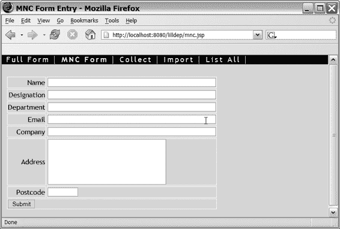

Doray_6048.book 第 105 页 2006 年 1 月 10 日星期二 下午 5:10

第 9 章 ■ 配置 STRUTS

**105**

**图 9-2.** *MNC 数据输入页面*

**总结**

在本章中，你学习了配置 Struts 的基础知识：

• struts-config.xml 文件将 Web 应用程序的视图和控制器部分连接在一起。

• struts-config.xml 部署在 Web 应用程序的 \WEB-INF\ 目录中。

• ActionForm 子类通过表单 Bean 声明暴露给 Web 应用程序。

• 表单处理器声明将表单 Bean、Action 子类以及一个或多个“下一个”页面连接在一起。

• 应用程序的属性文件在 struts-config.xml 的消息资源部分中声明。

[www.it-ebooks.info](http://www.it-ebooks.info/)

Doray_6048.book 第 106 页 2006 年 1 月 10 日星期二 下午 5:10

[www.it-ebooks.info](http://www.it-ebooks.info/)

Doray_6048C10.fm 第 107 页 2006 年 1 月 24 日星期二 上午 10:12

第 10 章

■ ■ ■

更多标签

**第** 8 章我们介绍了基本的 Struts 标签：用于显示静态文本、辅助表单数据输入以及显示错误消息的标签。

本章中我们将探讨的内容会稍微复杂一些。自 Struts 首次开发以来，Java/JSP 领域发生了两次范式转变：JSP 标准模板库（JSTL）和 JavaServer Faces（JSF）。

JSTL 旨在创建一套标准化的 JSP 标签，用于执行某些通用任务，例如迭代、条件处理、格式化、国际化、XML 处理和数据访问。在 JSTL 出现之前，像 Struts 这样的每个 JSP 相关技术都必须从头开始创建自定义标签来完成这些工作。

这种“自己动手”的方法有两个主要缺点：

• **更陡峭的学习曲线**：刚接触此类 JSP 相关技术的开发者必须学习如何使用该技术的自定义标签来执行通用操作。

• **不完整或不灵活的标签库**：由于新技术的重点*并非*在于做好通用功能，这意味着这些自定义标签库通常在灵活性和功能上有所欠缺。开发者常常不得不借助脚本小程序（scriptlet）的笨拙技巧来获得所需的功能。

JSTL 通过提供执行许多通用功能的标签很好地解决了这些问题。它还大量使用了一种称为表达式语言（EL）（来自新的 JSP 2.0 规范）的“迷你语言”，这使得这些标签非常灵活。因此，当 JSTL 与自定义 Struts 标签功能重叠时，它是首选技术。

不幸的是，JSTL 需要符合 JSP 2.0 规范的 Servlet 容器才能工作。这对于那些必须使用不符合 JSP 2.0 规范的“遗留”Servlet 安装环境的开发者来说是个问题。

另一个并行发展的是 JavaServer Faces（JSF），这是 Sun 公司的一项规范，它（除其他功能外）提供了一套自定义标签来显示各种客户端界面，其丰富程度远超 Struts HTML 和 Bean 标签库中那可怜的一小部分。Apache Shale 项目（更多内容见第 20 章）是基于 JSF 规范对 Struts 进行的彻底重写。未来 Shale 中的某些标签很可能会被引入 Struts。

**107**

[www.it-ebooks.info](http://www.it-ebooks.info/)

Doray_6048C10.fm 第 108 页 2006 年 1 月 24 日星期二 上午 10:12

**108**

第 10 章 ■ 更多标签

本章将介绍另外两个 Struts 标签库，以及 Struts 与 JSTL 之间的一些相关重叠部分。我们还将探讨如何让 Struts 标签接受 EL 表达式。

我们将在第 20 章中描述 JSF 和 Shale。

但首先，这里有一些指导原则来指引方向。

**最佳实践**

在标签和标签库的泥沼中很容易迷失方向，因此我希望你考虑两条我认为有用的经验法则，以便在面临选择时决定使用哪个标签库：

• **警惕脚本小程序**：脚本小程序本身并非“邪恶”，但如果你发现自己使用它们来弥补标签的不足，那么是时候考虑寻找替代方案了。

• **使用“定制的通用解决方案”**（请原谅这个矛盾修辞法）：尽可能使用像 JSTL 这样的通用解决方案。

我希望这两个启发式方法背后的理由显而易见。自定义标签的存在就是为了消除使用脚本小程序的需要。因此，如果你发现自己不得不使用脚本小程序，那么你正在使用的自定义标签并没有很好地完成它们的工作。

**剩余的 2 + 1 个 Struts 库**

在第 8 章中，你了解了如何使用 HTML 和 Bean 标签库。还有另外三个 Struts 标签库：**Logic**、**Nested** 和 **Tiles** 标签库。

■**注意** 在 Struts 1.2 之前的旧版本中，你可能会遇到一个“template”标签库。Tiles 库取代了这个较旧的“template”标签库。

在本章中，我们只介绍 Logic 和 Nested 标签库。Tiles 标签需要单独用一整章来介绍（第 14 章）。

[www.it-ebooks.info](http://www.it-ebooks.info/)

Doray_6048C10.fm 第 109 页 2006 年 1 月 24 日星期二 上午 10:12

第 10 章 ■ 更多标签

**109**

**Logic 标签库**

Logic 库包含以下标签：

• **迭代**：iterate 标签

• **条件处理**：equal、present、match、empty、notEqual、notPresent、notMatch、notEmpty、messagesNotPresent、messagesPresent、lessThan、lessEqual、greaterThan 和 greaterEqual 标签

• **流程控制**：redirect 和 forward 标签

■**注意** 除了用于流程控制的标签外，所有这些标签在 JSTL 中都有对应的版本，我们将在本章后面介绍。应尽可能使用 JSTL 版本。

接下来我们逐一介绍这三类标签。

**迭代**

<logic:iterate> 标签可用于遍历集合、枚举、数组或迭代器。我们将这些统称为“可迭代”对象。要使用 <logic:iterate> 标签，你必须：

**1. 创建可迭代对象**：这在你 Action 子类中完成，因为这是控制器代码。永远不要忘记 MVC 模式。

**2. 将可迭代对象放入请求中**：回想一下，在你的 Action 的 execute() 函数中，你有一个对请求对象的引用。你可以将对象放入此请求对象或其关联的会话对象中，并为该对象指定一个*名称*。

**3. 转发到包含** <logic:iterate> **标签的 JSP 页面**：**由 Action 调用的 JSP 页面将能够通过你指定的名称访问这些对象。**

**即使你使用 JSTL 进行迭代，这三个步骤也是相同或相似的，因此请务必仔细研究以下说明这些步骤的代码清单。**


我们将继续完善本书中一直在开发的 LILLDEP Web 应用。需求是创建一个简单的按邮政编码搜索联系人的页面。用户输入邮政编码，页面返回联系人列表。这显然是一个人为设计的例子，但能让事情保持简单！

[www.it-ebooks.info](http://www.it-ebooks.info/)

Doray_6048C10.fm 第 110 页 2006 年 1 月 24 日星期二 上午 10:12

**110**

第 10 章 ■ 更多标签

此外，为清晰起见，我们只展示相关且非显而易见的代码部分。首先，清单 10-1 展示了 Action 子类，恰如其分地命名为`PostcodeSearchAction`，它接收用户想要搜索的邮政编码。

**清单 10-1.** *PostcodeSearchAction 的一部分*

public ActionForward execute(...){

PostcodeSearchForm psForm = (PostcodeSearchForm) form;

String postcode = form.getPostcode();

// **步骤 1**：创建可迭代对象

// 检索与给定邮政编码匹配的联系人列表。

// 如果你觉得以下代码令人困惑，请阅读附录 A。

Criteria crit = new Criteria();

crit.add(Contact.POSTCODE,postcode);

Iterator results = ContactPeer.doSelect(crit);

// **步骤 2**：将可迭代对象放入请求

// 将列表保存在结果中。你可能需要参考

// 附录 B 了解 HttpServletRequest 的一些函数。

request.setAttribute("search_results", results);

// **步骤 3**：转发到 JSP

// 在这种情况下，struts-config.xml 将 "success" 映射到

// Display.jsp

return new ActionForward(mapping.findForward("success"));

}

因此，一个联系人的`Iterator`被放置在请求对象上。这个`Iterator`被称为`search_results`。清单 10-2 展示了列出联系人的`Display.jsp`部分。

**清单 10-2.** *Display.jsp 的一部分*

<logic:iterate name="search_results" id="contact" indexId="cnt">

<p>

联系人编号 <bean:write name="cnt"/>

<bean:write name="contact" property="name"/>

<bean:write name="contact" property="company"/>

<bean:write name="contact" property="tel"/>

</p>

</logic:iterate>

[www.it-ebooks.info](http://www.it-ebooks.info/)

Doray_6048C10.fm 第 111 页 2006 年 1 月 24 日星期二 上午 10:12

第 10 章 ■ 更多标签

**111**

在清单 10-2 中，列出了每个联系人的姓名、公司和电话号码。

`<logic:iterate>` 标签有三个主要属性：

*   `name`：引用你放置在请求上的可迭代对象。在此实例中，它是 `search_results`。
*   `id`：指定一个名称，代表可迭代对象上的单个元素。在这种情况下，`id` 是 `contact`。即使你不使用它，此属性也是必需的。
*   `indexId`（可选）：指定一个代表当前迭代次数的数字。我在这里使用它的唯一原因是为了使用 `<bean:write>` 写出迭代次数。当你想要使用*索引属性*时，`indexId` 很重要，我将在下一节中讨论这个主题。

`<bean:write>` 写出给定联系人的姓名、公司和电话。

请注意，`<bean:write>` 的 `name` 属性引用了由 `<logic:iterate>` 的 `id` 属性暴露的单个元素。有关 `<bean:write>` 的详细说明，请参考附录 C。

**遍历 HASHMAPS**

如果可迭代对象是 `HashMap` 或实现了 `Map` 的类，则元素是 `Map.Entry` 的实例。此接口包含 `getKey()` 和 `getValue()` 函数，因此你可以使用

`<bean:write name="xxx" **property="key"** />` 来显示键，以及

`<bean:write name="xxx" **property="value"** />` 来显示对应的值。

我想重申（请原谅这个双关语），`<logic:iterate>` 提供的功能与 JSTL 的 `<forEach>` 标签有重叠。我们将在后面的章节中讨论这一点。

**简单、嵌套、索引和映射属性**

许多 Struts 标签接受一个 `property` 属性，该属性引用它们所操作对象上的一个属性。我们已经在实践中看到了这一点，例如，在上一节的 `<bean:write>` 标签中：

`<bean:write name="contact" property="company"/>` 正如这里使用的，`<bean:write>` 尝试显示在名为 `contact` 的对象上调用的 `getCompany()` 的返回值。这是一个*简单属性*的示例。

[www.it-ebooks.info](http://www.it-ebooks.info/)

Doray_6048C10.fm 第 112 页 2006 年 1 月 24 日星期二 上午 10:12

**112**

第 10 章 ■ 更多标签

简单属性是那些隐式地在当前考虑的对象上调用 `getXXX()` 函数的属性。

Struts 支持其他三种类型的属性：*嵌套*、*索引*和*映射*属性。

**嵌套属性**允许你引用一个属性的属性。例如，如果在我们之前的例子中，`getCompany()` 的返回值是一个 JavaBean 对象，那么嵌套属性将允许你引用此对象上的一个属性：

`<bean:write name="contact" property**=**" **company.name**"/>` 正如这里使用的，`<bean:write>` 尝试显示 `getCompany().getName()` 的返回值。

**索引属性**类似于简单属性，但它们假设应调用的函数是 `getXXX(int index)` 而不是 `getXXX()`。因此，如果 `contact` 对象支持 `getCompany(index)` 函数，你可以这样调用它：

`<bean:write name="contact" property=" **company[41]**"/>` 正如这里使用的，`<bean:write>` 尝试显示 `getCompany(41)` 的返回值。

这个例子引出了一个问题，即如何将索引属性与 `<logic:iterator>` 一起使用，例如，显示一个值列表。你可以这样做：

<logic:iterate name="companies" id="company" indexId="cnt">

<bean:write name="companies" property=" **company[<%=cnt%>]**"/>

</logic:iterate>

这个例子假设 `companies` 对象有一个 `getCompany(index)` 函数。

这个例子也应该在你的脑海中敲响警钟：它使用了一个脚本小程序！一定有更好的方法——确实有。在这个特定的例子中，你有两个选择：使用 `<forEach>` 和 `<out>` JSTL 标签（我们稍后会介绍），或者使用 Struts-EL 标签（我们稍后也会介绍），它们是普通 Struts 标签的增强版本：

<logic-el:iterate name="companies" id="company" indexId="cnt">

<bean-el:write name="companies" property=" **company[${cnt}]**"/>

</logic-el:iterate>

在这个例子中，变化几乎察觉不到，但在更实际的情况下，生成的代码会更容易阅读。

**映射属性**类似于索引属性，不同之处在于假设调用的函数是 `getXXX(String s)`。例如，如果前面例子中的 `contact` 对象有一个 `getMobile(String mobileType)` 函数，你可以使用

`<bean:write name="contact" property=" **mobile(home)**"/>`

`<bean:write name="contact" property=" **mobile(office)**"/>` 这些例子将分别调用 `getMobile("home")` 和 `getMobile("office")`。

你也可以混合使用各种类型的属性：

[www.it-ebooks.info](http://www.it-ebooks.info/)

Doray_6048C10.fm 第 113 页 2006 年 1 月 24 日星期二 上午 10:12

第 10 章 ■ 更多标签

**113**

`<bean:write name="contacts" property=" **contact[5772]**. **company**"/>` 这是对 `getContact(5772).getCompany()` 的隐式调用。

表 10-1 总结了各种属性类型。

**表 10-1.** *简单、嵌套、索引和映射属性* **类型**

**用法**

**调用的函数**

简单

property="myProperty"

getMyProperty()

嵌套

property="myProperty.mySubProperty"

getMyProperty().getMySubProperty()

索引

property="myProperty[5772] "

getMyProperty(5772)

映射

property="myProperty(myString) "

getMyProperty("myString")

**条件处理**

Logic 标签库有许多用于执行条件处理的标签。这些可以分为三类：

*   **测试：** present, empty, messagesPresent
*   **比较：** equal, lessThan, lessEqual, greaterThan, greaterEqual
*   **字符串匹配：** match


这些标签（用于测试和字符串匹配）中有些带有否定形式：`notPresent`、`notEmpty`、`messagesNotPresent` 和 `notMatch`。所有这些标签在使用时都遵循相同的结构。用伪代码表示：

<tag>

// 此处为条件处理的代码

</tag>

此外，所有这些标签都有两个共同的属性：

• name：指定标签所操作对象的名称。假设之前的 Action 已将该对象放置在请求中。前面关于迭代的章节展示了如何实现这一点。

• property：对应 name 属性所引用对象上的简单、嵌套、索引或映射属性。此属性为可选。

需要进行比较或匹配的标签还会接受一个额外的 value 属性。让我们看几个使用这些标签的示例：

[www.it-ebooks.info](http://www.it-ebooks.info/)

Doray_6048C10.fm 第 114 页 2006 年 1 月 24 日星期二 上午 10:12

**114**

第 10 章 ■ 更多标签

<logic:empty name="search_results">

<i>抱歉，此邮政编码下没有联系人</i>

</logic:empty>

<logic:notEmpty name="search_results">

</logic:notEmpty>

`empty` 和 `notEmpty` 标签仅检查给定的可迭代对象是否包含元素，因此不需要 value 属性。下面是另一个示例：

<logic:lessThan name="myConstants" property="pi" value="3.14">

<i>你的圆周率少了一些！</i>

</logic:lessThan>

如果 `myConstants.getPi()` 小于 3.14，这段代码会显示消息“你的圆周率少了一些！”。

表 10-2 总结了这些标签。

**表 10-2.** *条件处理标签总结* **标签**

**含义**

present

测试请求中是否存在某个变量。

empty

测试数组或 Collection 是否为空。

messagesPresent

测试请求中是否存在消息（一个 ActionMessage 实例）。消息的名称在 value 属性中给出。

比较标签

测试给定属性是否通过给定的比较。用于比较的值（equal、lessEqual 等）在 value 属性中提供。

match

检查给定属性是否包含 value 属性作为子字符串。

表 10-2 中标签的否定形式为 `notPresent`、`notEmpty`、`messagesNotPresent` 和 `notMatch`。附录 C 更详细地描述了所有这些标签。

最后，请注意 JSTL 有一个 `<if>` 标签，可以用来替代这些标签中的许多。我们将在本章后面部分介绍它。

**流程控制**

执行流程控制（实际上是重定向）的两个标签是 `<logic:redirect>` 及其简化版本 `<logic:forward>`。在 JSP 页面上使用它们会将控制权传递给另一个页面。例如：

<logic:forward name="someOtherPage"/>

会将控制重定向到一个名为 `someOtherPage` 的全局转发（请参考第 9 章）。

[www.it-ebooks.info](http://www.it-ebooks.info/)

Doray_6048C10.fm 第 115 页 2006 年 1 月 24 日星期二 上午 10:12

第 10 章 ■ 更多标签

**115**

`<logic:redirect>` 也会将控制重定向到另一个页面，但提供了更多执行重定向的选项。有关这些标签的更多详细信息，请参考附录 C。

请注意，没有等效的 JSTL 标签可以利用在 `struts-config.xml` 中声明的全局转发。

**嵌套标签库**

嵌套标签库允许你*相对于*一个对象应用标签。在某些情况下，这可以大大简化你的服务器端 ActionForm 代码，正如你将在本章的实验环节中看到的那样。

■**注意** 如果你曾使用 Visual Basic 编程，你可能用过 `With` 关键字。嵌套标签库是它的一种不够优雅的实现。

为了说明嵌套标签库的工作原理，让我们首先考虑图 10-1 中所示的类图。

**图 10-1.** *MyActionForm、Monkey 和 Banana 类*

[www.it-ebooks.info](http://www.it-ebooks.info/)

Doray_6048C10.fm 第 116 页 2006 年 1 月 24 日星期二 上午 10:12

**116**

第 10 章 ■ 更多标签


图 10-1 描述了一个 ActionForm 子类及其功能。MyActionForm 中的数据由两个对象持有：Monkey 对象，它又包含一个 Banana 对象。我们的 Web 应用需要允许用户输入 Monkey 的名称，以及 Monkey 的 Banana 的品种（图 10-2）。

**图 10-2.** *用于输入 Monkey 名称和 Banana 品种的表单* 如清单 10-3 所示，Nested 标签库允许你*无需*在 MyActionForm 中为名称和品种添加额外的 getter 和 setter 方法即可实现此功能。

**清单 10-3.** *MonkeyPreferences.jsp*

<%@ page contentType="text/html;charset=UTF-8" language="java" %>

<%@ taglib uri="/tags/struts-html" prefix="html" %>

<%@ taglib uri="/tags/struts-nested" prefix="nested" %>

<html:html>

<body>

<html:form action="MonkeyPreferencesForm.do">

**<nested:nest property="monkey">**

Monkey 的名称：

**<nested:text property="name" size="60" />**

<br>

<nested:nest property="banana">

Banana 的品种：

<nested:text property="species" size="60" />

</nested:nest>

</nested:nest>

<html:submit/>

</html:form>

</body>

</html:html>

[www.it-ebooks.info](http://www.it-ebooks.info/)

Doray_6048C10.fm Page 117 Tuesday, January 24, 2006 10:12 AM

第 10 章 ■ 更多标签

**117**

<html:form>标签隐式地将*根对象*设置为 MyActionForm。这意味着所有属性都是相对于 MyActionForm 实例计算的。<nested:nest>标签

<nested:nest property="monkey">

Monkey 的名称：

<nested:text property="name" size="60" /> 使得属性引用相对于 monkey 属性。因此<nested:text>的 property 标签实际上是 monkey.name。

看到<nested:text>时你应该会眼前一亮。是的，没错。Nested 标签库包含了*所有*HTML 标签库、大部分 bean 标签库以及除流程控制标签外的所有 Logic 标签库的“嵌套”对应版本。附录 C 列出了 Nested 标签库所支持的 HTML、bean 和 logic 标签库中的标签。

显然，使用 Nested 标签库能实现的功能，使用嵌套*属性*（参见前文）也都能实现。例如，清单 10-4 展示了如何在不使用嵌套标签的情况下重写清单 10-3。但在复杂场景下，使用 Nested 标签库能让你的代码更简洁一些。

**清单 10-4.** *MonkeyPreferences.jsp，第二版*

<%@ page contentType="text/html;charset=UTF-8" language="java" %>

<%@ taglib uri="/tags/struts-html" prefix="html" %>

<html:html>

<body>

<html:form action="MonkeyPreferencesForm.do"> Monkey 的名称：

**<html:text property="monkey.name" size="60" />**

<br>

Banana 的品种：

**<html:text property="monkey.banana.species" size="60" />**

<html:submit/>

</html:form>

</body>

</html:html>

最后，有时你可能需要指定一个不同于默认根对象的根对象。你可以使用<nested:root>标签来实现：

<nested:root name="myNewRoot">

</nested:root>

当然，这个示例假设名为 myNewRoot 的对象已被放置在请求中。这通常在你的 Action 子类中完成。请参考清单 10-1 及随附的讨论来了解具体做法。

[www.it-ebooks.info](http://www.it-ebooks.info/)

Doray_6048C10.fm Page 118 Tuesday, January 24, 2006 10:12 AM

**118**

第 10 章 ■ 更多标签

**JSTL 与 Struts**

如前所述，JSTL 的创建是为了给 JSP 开发者提供一套全面的标签来执行各种通用任务。其最终目标是让 JSP 开发者完全避免使用脚本片段。

你可能会问，是什么让 JSTL 成为比脚本片段更具吸引力的替代方案。请看清单 10-5，然后对比清单 10-6（JSTL 版本）。

**清单 10-5.** *数到 99*

<%@ page contentType="text/html;charset=UTF-8" language="java" %>

<html>

<body>

<%

for(int i = 1; i <= 99; i++){

%>

这是第 <%= i %> 次迭代

<%

}

%>

</body>

</html>

**清单 10-6.** *使用 JSTL 数到 99*

<%@ page contentType="text/html;charset=UTF-8" language="java" %>


<%@ taglib uri="http://java.sun.com/jstl/core" prefix="c" %>

<html>

<body>

<c:forEach var="i" begin="1" end="99" step="1"> 这是第 <c:out value="${i}"/> 次迭代

</c:forEach>

</body>

</html>

即使在这个简单的示例中，也能明显看出 JSTL 示例（清单 10-6）比使用脚本小程序的清单 10-5 更具可读性。

现在，正如我所说，JSTL 是一个庞大的实用标签库，要有效覆盖它们需要一整本书的篇幅。

■**注意** 你可以参考《Pro JSP 2, 第 4 版》（Apress, 2005）。这本书涵盖了 JSP 2.0、JSTL 以及更多内容。

[www.it-ebooks.info](http://www.it-ebooks.info/)

Doray_6048C10.fm 第 119 页 2006 年 1 月 24 日星期二 上午 10:12

第 10 章 ■ 更多标签

**119**

我在这里要讨论的是 JSTL 与 Struts 标签之间的*交集*。幸运的是，这个交集是可管理的。JSTL 包含四个标签库：核心标签库、格式化标签库、XML 处理标签库和数据库访问标签库。其中，只有核心标签库和格式化标签库属于这个交集。在这些标签库中，只有少数几个标签与我们相关。它们分为三类：

• **输出**：由 `<c:out>` 标签执行。在 Struts 中，你会使用 `<bean:write>`。此外，格式化标签库中还有一些标签用于格式化文本和显示资源消息。

• **迭代**：由 `<c:forEach>` 标签执行。与之类似的 Struts 标签是 `<c:iterate>`。

• **条件处理**：由 `<c:if>` 和 `<c:choose>...<c:when>` 标签执行。Struts Logic 标签库中有大量标签与之对应。

在描述这三个 JSTL 标签之前，我们先来看看表达式语言（EL）。

JSTL 的强大功能很大程度上归功于在其标签内部使用 EL。

■**注意** 虽然我在这里结合 JSTL 标签介绍 EL，但这纯粹是出于教学目的。EL 独立于 JSTL，是 JSP 2.0 规范的一部分。

**表达式语言（EL）**

EL 允许“支持 EL 的”标签的属性具有动态值。在 EL 出现之前，如果你想要动态属性，就必须在属性中嵌入脚本小程序或自定义标签（见清单 10-7），这会导致代码难以阅读。

清单 10-7 展示了一个典型场景，其中动态属性非常重要，以及如何使用脚本小程序来实现此功能。该代码片段使用一个（虚构的）自定义标签 `<h:tr>` 交替将表格行的颜色设为灰色，并输出带有一些花哨格式的 HTML 表格行。

**清单 10-7.** *将表格行交替着色为灰色*

<% for(int i = 0; i < 10; i++){ %>

<h:tr **bgcolor="#<%= (i%2 == 0)? 'FFFFFF' : 'DDDDDD' %>"** >

<td> 这是第 <%= i %> 行 </td>

</h:tr>

<% } %>

除非你是 Perl 程序员，否则我相信你会同意清单 10-7 难以阅读。EL 通过允许支持 EL 的标签拥有动态属性来解决这个问题。

[www.it-ebooks.info](http://www.it-ebooks.info/)

Doray_6048C10.fm 第 120 页 2006 年 1 月 24 日星期二 上午 10:12

**120**

第 10 章 ■ 更多标签

例如，如果 `<h:tr>` 是一个支持 EL 的标签，那么清单 10-7 可以重写为清单 10-8 所示，这样更具可读性。

**清单 10-8.** *使用 EL 和 JSTL 将表格行交替着色为灰色*

<c:forEach var="i" begin="0" end="9" step="1">

<h:tr bgcolor="#**${(i%2 == 0)? 'FFFFFF' : 'DDDDDD'}**">

<td> 这是第 <c:out value="${i}"/> 行 </td>

</h:tr>

</c:forEach>

现在，EL 不仅仅是使用 `${...}` 分隔符代替 `<%...%>` 分隔符的脚本小程序。EL 包含几个关键字和运算符，有助于实现为标签赋予动态属性的功能。我们接下来看看这些内容。

**使用 EL**

EL 表达式在 `${...}` 分隔符内进行求值。在 EL 表达式中，你可以使用许多常见运算符：

• **算术运算符**：+、–、% 或 mod、*、/ 或 div
• **逻辑运算符**：and 或 &&、or 或 ||、not 或 !
• **比较运算符**：< 或 lt、<= 或 le、== 或 eq、!= 或 ne、> 或 gt、>= 或 ge
• **条件求值**：(condition) ? A : B 如果 condition 为真则返回 A，否则返回 B


否则，A 或 B 可以是固定字符串（例如 `astring`）、变量或数值。

不过，为了让代码更具可读性，请保持简洁。

• **empty** 运算符：在对象名称前加上 `empty`，用于判断该对象是否为空（数组、Collection、Enumeration、HashMap 或 Iterator）或为 null（其他任何对象）。

这些运算符无需进一步解释，因为它们与 Java 中的运算符类似。

你也可以在 EL 中使用*嵌套*属性和*索引*属性。嵌套属性与 Struts 中的相同：名称中的 `.` 分隔符表示嵌套属性。例如：`${myObject.myProperty}`

返回 `myObject.getMyProperty()` 的值。这里没什么特别的。

EL 中的索引属性具有双重功能。你可以使用数值、字符串或变量进行索引。使用字符串进行索引等同于使用映射属性。表 10-3

提供了一些示例。

[www.it-ebooks.info](http://www.it-ebooks.info/)

Doray_6048C10.fm 第 121 页 2006 年 1 月 24 日星期二 上午 10:12

第 10 章 ■ 更多标签

**121**

**表 10-3.** *索引属性与 EL*

**EL 表达式**

**值**

`${myArray[2718].name}`

`myArray[2718].getName()`

`${myMap['exp'].value}`

`myMap.get("exp").getValue()`

`${myArray[myOffset]}`

返回 `myArray` 中索引等于变量 `myOffset` 的元素。

最后，EL 暴露了几个*隐式对象*，这些是内置对象，你的 EL 表达式

始终可以访问它们。这类对象数量不少，我不会逐一介绍。要了解更多信息，请参考 Sun 的 J2EE 教程（参见“有用链接”）。

■**注意** 一个常见的陷阱是使用与隐式对象名称相同的变量名。例如，将自己的变量命名为“requestScope”是不允许的。还有一些你必须避免的保留关键字。这些关键字在 Sun 的教程中列出（参见“有用链接”）。

最重要的隐式对象中包括那些代表各种作用域的对象。

这些对象允许你按作用域显式访问变量。这些作用域对象包括 `pageScope`、`requestScope`、`sessionScope` 和 `applicationScope`。假设你想访问一个名为 `myObject` 的会话作用域变量。方法如下：`${sessionScope.myObject}`

其他作用域中的变量以类似方式访问。

在本节中，我们将探讨 EL 在 JSTL 标签 `<forEach>`、`<if>`、

`<choose>...<when>` 和 `<out>` 中的使用，这些标签与 Struts 相关。希望阅读完本节后，你对 EL 有足够的了解，能够很好地使用它。

**<c:out> 标签**

`<c:out>` 标签用于输出文本，在许多情况下可以替代 `<bean:write>`。

这个标签的使用很简单，因为它只有一个 `value` 属性：

`<c:out value="${myObject.myProperty}">`

快速浏览附录 C 会发现，`<bean:write>` 并非只有单一功能——它拥有一些属性可用于格式化显示的值。仅用 `<c:out>` 无法做到这一点；你需要使用 JSTL 格式化标签库。使用这个标签库需要对 JSTL 进行比此处更深入的讲解。同样，如果你有兴趣了解更多，请查阅 *Pro JSP 2, 第 4 版*。

[www.it-ebooks.info](http://www.it-ebooks.info/)

Doray_6048C10.fm 第 122 页 2006 年 1 月 24 日星期二 上午 10:12

**122**

第 10 章 ■ 更多标签

**<c:forEach> 标签**

`<c:forEach>` 标签用于迭代。你可以用它代替 Struts 的 `<logic:iterate>` 标签。你已经看到如何使用 `<c:forEach>` 在固定范围内进行迭代（参见清单 10-6 和 10-8）。你也可以用它来迭代 Java 数组、Collection、Enumeration 或 Iterator。清单 10-9 展示了如何做到这一点。

**清单 10-9.** *使用 <c:forEach> 迭代可迭代对象*

`<c:forEach var="item" items="${sessionScope.myIteratable}">`

`<c:out value="${(empty item)? 'nil' : item.myProperty}"/>`

`</c:forEach>`

这里两个重要的属性是 `var`，**它暴露了可迭代对象中的单个元素，以及 `items`，它是可迭代对象的名称。注意清单 10-9 中**


**使用 myIteratable 对象，具体作用于会话范围，通过 sessionScope 隐式对象实现。**

**快速回顾测验**

你还记得在 `<logic:iterate>` 中，`var` 和 `items` 的对应物是什么吗？

还有一个名为 `varStatus` 的实用属性，它能提供当前迭代的相关信息。`varStatus` 有四个属性：

• `first` 和 `last`，根据当前迭代是否为循环中的第一个或最后一个，分别返回 `true` 或 `false`。

• `count`，**用于返回当前迭代的序号，从 1 开始计数。**

**• `index`，用于返回当前迭代的绝对索引，从 0 开始计数，并根据 `step` 属性的值递增。**

清单 10-10 展示了 `varStatus` 的实际用法。

**清单 10-10.** *varStatus 的 first、last、count 和 index 属性*

<c:forEach begin="10" end="15" step="2" **varStatus="status"** >

<c:out value="${status.first}"/>

<c:out value="${status.last}"/>

<c:out value="${status.count}"/>

<c:out value="${status.index}"/><br>

</c:forEach>

[www.it-ebooks.info](http://www.it-ebooks.info/)

Doray_6048C10.fm Page 123 Tuesday, January 24, 2006 10:12 AM

第 10 章 ■ 更多标签

**123**

清单 10-10 的输出结果为：

true false 1 0

false false 2 2

false true 3 4

我们将要介绍的最后两个 JSTL 标签是用于条件处理的 `<c:if>` 和 `<c:choose>...<c:when>`。

**<c:if> 和 <c:choose>...<c:when> 标签**

`<c:if>` 允许你在测试条件通过时处理单个代码块。该测试本身是一个由 `test` 属性引用的 EL 表达式，如清单 10-11 所示。

**清单 10-11.** *<c:if> 的实际应用*

<c:if **test="${(empty user.userid || empty user.password)}"** > 请输入您的用户 ID 和密码。

</c:if>

在清单 10-11 中，如果用户 ID 或密码为空，则会显示该消息。`<if>` 标签不支持 `else` 或 `if else` 块。如果你需要这些功能，则必须使用更笨拙的 `<choose> ... <when>` 标签（参见清单 10-12）。如果你使用过可扩展样式表语言（XSL），对此应该非常熟悉。

**清单 10-12.** *<c:choose>...<c:when> 的实际应用*

<c:choose>

<c:when test="${empty user.userid}">

请输入您的用户 ID。

</c:when>

<c:when test="${empty user.password}">

请输入您的密码。

</c:when>

<c:when test="${not user.loggedIn}">

抱歉，无法为您登录。

</c:when>

<c:otherwise>

您已登录成功！

</c:otherwise>

</c:choose>

在清单 10-12 中，有两个 `when` 子句分别测试用户 ID 和密码是否为空，另一个测试用户是否已登录。最后的 `otherwise` 标签是一个兜底块。请注意，`otherwise` 块是可选的。

[www.it-ebooks.info](http://www.it-ebooks.info/)

Doray_6048C10.fm Page 124 Tuesday, January 24, 2006 10:12 AM

**124**

第 10 章 ■ 更多标签

**现在你来试试**

在本章前面，我提到一些条件处理标签有对应的 JSTL 版本。请为以下标签构建 JSTL 等价物：

• `equal`、`present`、`empty`、`lessThan`、`lessEqual`、`greaterThan` 和 `greaterEqual`

• 上述所有标签的否定形式（`notEqual`、`notPresent` 等）如果需要这些标签的定义，请参考附录 C。附录 D 包含答案。

本节到此结束我对 JSTL 的讲解。在下一节中，我们将描述对原始标签库的一个扩展，该扩展允许它们处理 EL。

**Struts EL 扩展**

为了让 EL 在自定义标签中工作，该标签必须启用 EL 功能。当前这套 Struts 标签并未启用 EL，因此以下代码无法工作：

// 无法工作！！

<bean:write name=${(empty obj)? obj2.prop : obj.prop /> 在最新的 Struts 发行版中，提供了一套启用 EL 功能的 Struts 标签。你可以在发行版的 `./contrib/struts-el/lib/` 文件夹中找到这些新标签。该文件夹中还提供了 JSTL 的一个实现。如果你使用这些 Struts EL 标签库，你*可以*在你的 Struts 标签中使用 EL 表达式。

当然，你必须使用对应的 Struts-EL 标签，而不是原始的 Struts 标签。以下代码片段说明了这一点：

// 可以工作


<bean-el:write name=${(empty obj)? obj2.prop : obj.prop /> 当然，仅仅更改前缀是不够的——你还必须在 JSP 中修改 taglib 声明，并在 `web.xml` 中添加一个新的 `<taglib>` 部分，以指向 Struts-EL Bean 标签库。

Struts-EL 标签库仅实现了原始 Struts 标签库中标签的*一部分*。未实现的标签假定在 JSTL 中有对应的标签。

■**注意** 要使用 JSTL 和 Struts-EL 标签，你必须拥有一个实现了 JSP 2.0 规范的 Servlet 容器，这需要支持 EL。Tomcat 5\.*x* 符合 JSP 2.0 规范。

[www.it-ebooks.info](http://www.it-ebooks.info/)

Doray_6048C10.fm 第 125 页 2006 年 1 月 24 日，星期二，上午 10:12

第 10 章 ■ 更多标签

**125**

**实验 10a：LILLDEP 完整列表页面**

在本实验中，你将创建一个页面，列出 LILLDEP 数据库中的所有条目。

**步骤 1：完成 ListingAction**

完成 Action 子类 `ListingAction` 的实现，使其准备一个遍历 LILLDEP 数据库的 `Iterator`。以下代码行展示了如何获取包含数据库中所有联系人的 `Iterator`：

`Iterator everything = ContactPeer.doSelect(new Criteria());`（有关详细信息，请参阅附录 A 中关于 Lisptorq 的章节。）确保你的 `ListingAction` 实现执行以下操作：

• 转发到名为 `success` 的页面。

• 将联系人的 `Iterator` 放入请求对象中（请参阅前面关于 `<logic:iterator>` 的章节，了解如何实现）。不要为对象使用临时名称，而是在接口 `JSPConstants` 中使用一个合适的名称。这样做很有帮助，因为所有在 JSP 和 Action 类之间共享的名称都存储在一个文件 `JSPConstants` 中。

**步骤 2：完成 listing.jsp**

使用 `<logic:iterate>` 完成 `listing.jsp` 的实现，在表格中列出以下字段：

• name
• email
• company
• address
• postcode
• website

当用户点击 website 时，应跳转到该公司的网站。

**步骤 3：修改 web.xml**

在 `web.xml` 中为 Struts Logic 标签库添加声明。

[www.it-ebooks.info](http://www.it-ebooks.info/)

Doray_6048C10.fm 第 126 页 2006 年 1 月 24 日，星期二，上午 10:12

**126**

第 10 章 ■ 更多标签

**步骤 4：修改 struts-config.xml**

在 `struts-config.xml` 中添加一个新的 action 映射：

• 路径应为 `/Listing`。
• 此 action 映射应将 `ListingAction` 和 `listing.jsp` 关联起来。

问题：这个 action 映射是否需要表单 bean？（答案见附录 D。）

编译、重新部署并测试你的工作。主页面 `full.jsp` 的工具栏上有一个名为“完整列表”的链接，该链接会调用处理器 `Listing.do`。

■**注意** 请记住，你需要重新输入联系人，因为重新部署会销毁旧的数据库。

**实验 10b：简化 ContactForm**

在前面关于嵌套标签库的章节中，我提到你可以使用嵌套标签库或嵌套属性来简化 `ActionForm` 子类。

`ContactForm` 正是这种情况，它有许多 getter 和 setter 方法。如果你使用嵌套标签库或嵌套属性，其中大部分都可以移除。

请完成以下步骤。

**步骤 1：修改 ContactForm**

移除 `ContactForm` 上除 `getModel()` 和 `setModel()` 之外的所有 getter 和 setter 方法。
问题：如果现在编译并部署 LILLDEP，它能工作吗？为什么能或为什么不能？（答案见附录 D。）

**步骤 2：修改 full.jsp 和 mnc.jsp**

使用嵌套标签库或嵌套属性，确保这两个表单上的所有字段和错误消息都能正确显示。

问题：在任一方法中，新的基础对象是什么？（答案见附录 D。）

■**注意** 如果你选择使用嵌套标签库，请记得在 `web.xml` 中添加一个部分来声明它。

编译、重新部署并测试你的工作。

[www.it-ebooks.info](http://www.it-ebooks.info/)

Doray_6048C10.fm 第 127 页 2006 年 1 月 24 日，星期二，上午 10:12

第 10 章 ■ 更多标签

**127**

**实验 10c：使用 JSTL**


在本实验中，我希望你在 listing.jsp 中使用 JSTL 的 `<c:forEach>` 标签，而不是 `<logic:iterate>` 标签。

**步骤 1：安装 JSTL 和 Struts EL 标签库**

打开位于 Apress 网站 (http://www.apress.com) 源代码部分的 Struts 发行版；它包含在一个名为 jakarta-struts-1.2.6.zip 的压缩文件中。

**1.** 将 `.\contrib\struts-el\lib\` 文件夹中的所有 JAR 文件复制到 LILLDEP 的 `\lib` 文件夹，注意*覆盖*现有文件。

**2.** 将所有 TLD 文件复制到 LILLDEP 的 `\web\WEB-INF\` 文件夹。同样，覆盖旧文件。

**步骤 2：修改 web.xml**

添加一个 `<taglib>` 条目，声明 JSTL 核心标签库 c.tld。推荐的 URI 是 http://java.sun.com/jstl/core，当然，你也可以自由使用任何你喜欢的 URI。

**步骤 3：修改 listing.jsp**

在 listing.jsp 中，使用 JSTL 的 `<c:forEach>` 标签，而不是 `<logic:iterate>` 标签。记得在页面开头为 JSTL 核心标签库添加一个 taglib 声明。

像往常一样，编译、重新部署并测试你的工作。

**有用链接**

• Struts Apache 在线参考（Logic 标签库）：http://struts.apache.org/

struts-doc-1.2.x/userGuide/dev_logic.html

• Struts Apache 在线参考（Nested 标签库）：http://struts.apache.

org/struts-doc-1.2.x/userGuide/dev_nested.html

• *Pro JSP 2, 第 4 版*，作者：Simon Brown, Sam Dalton, Daniel Jepp, Dave Johnson, Sing Li, 和 Matt Raible (Apress, 2005)

• JSTL 规范：www.jcp.org/en/jsr/detail?id=052

[www.it-ebooks.info](http://www.it-ebooks.info/)

Doray_6048C10.fm Page 128 Tuesday, January 24, 2006 10:12 AM

**128**

第 10 章 ■ 更多标签

• Sun 的 EL 教程：http://java.sun.com/j2ee/1.4/docs/tutorial/doc/

JSPIntro7.html

• 因在 JSTL 中有对应功能而未启用 EL 的 Struts 标签列表：http://struts.apache.org/struts-doc-1.2.x/faqs/struts-el.html **总结**

• Logic 库包含用于迭代、条件处理和流程控制的标签。这些标签大多在 JSTL 中有对应功能。

• Nested 标签库用于切换属性所引用的隐式基础对象。你可以使用嵌套属性来实现类似效果。

• JSTL 包含四个标签库（核心、格式化、XML 处理和数据库访问），你可以用它们替代部分 Struts 标签。

• JSTL 核心标签库中的 `<c:forEach>`、`<c:if>`、`<c:choose>...<c:when>` 和 `<c:out>` 标签可用于替换 Logic 标签库中的 Struts `<logic:iterate>` 和条件处理标签。

• `<c:out>` 可用于替换 `<bean:write>`，但需要 JSTL 格式化标签库中的辅助标签来完全替代 `<bean:write>`。

• EL 是一种为启用 EL 的标签提供动态属性的方式。EL 有几个特殊关键字来帮助实现这一点。

• 有一些启用 EL 的 Struts 标签，你可以与原始的 Struts 标签一起使用。

[www.it-ebooks.info](http://www.it-ebooks.info/)


Doray_6048C11.fm Page 129 Thursday, January 12, 2006 11:02 AM

第 11 章

■ ■ ■

上传文件

**本**章中，我将讨论几种可用于*上传*文件到服务器的技术。如果你曾尝试使用 JSP 和 Servlet 创建此功能，就会知道这并不容易。

Struts 提供了一种非常简便的文件上传方式。但在展示具体方法之前，先了解一下用户尝试上传文件时后台发生的情况是很有益的。

任何允许文件上传的 Web 应用的起点都是用于上传文件的 HTML 元素：

<input type="file">

在大多数图形浏览器中，这会被渲染为一个文本输入字段，后跟一个“浏览”按钮，如图 11-1 所示。

**图 11-1.** *Mozilla 中显示的文件上传输入字段* 用户可以直接在给定字段中输入文件名，或单击“浏览”按钮，该按钮会启动一个对话框，允许用户直观地导航到所需文件。


当用户点击包含表单的提交按钮时，Web 浏览器会读取文件，并使用合适的编码（如 uuencode，参见“实用链接”）对每个字节进行编码，然后将编码后的数据连同任何已提交的表单数据一起发送到服务器。根据文件长度，文件也可能被分割成多个部分。

因此，从服务器端来看，上传的数据是经过编码并分割成多个部分的。要重建原始文件，你必须正确解析输入数据，重新拼接被分割的部分，最后对所有内容进行解码。哎呀！

Struts 让这一切变得简单得多。首先，在 JSP 页面中，你需要放入一个 `<html:file>` 标签：

<html:file property="myFile"/>

**129**

[www.it-ebooks.info](http://www.it-ebooks.info/)

Doray_6048C11.fm Page 130 Thursday, January 12, 2006 11:02 AM

**130**

第 11 章 ■ 文件上传

和往常一样，`property` 属性对应你 `ActionForm` 子类中用于接收上传文件的属性。在上面的代码片段中，该属性名为 `myFile`。

你需要做的第二个更改是在包含表单的 `<html:form>` 中添加一个特殊属性：

<html:form **enctype="multipart/form-data"** action=...

这个新属性告诉 Struts，表单提交的数据将被编码并分割成多个部分。

接下来，在你的 `ActionForm` 子类中，你需要声明一个属性来接收文件数据，如清单 11-1 所示。

**清单 11-1.** *MyActionForm 代码片段*

import org.apache.struts.upload.FormFile;

public class MyActionForm extends ActionForm{

protected **FormFile** _file;

public FormFile getMyFile(){

return _file;

}

public void setMyFile(FormFile f){

_file = f;

}

... //MyActionForm 的其余部分

在清单 11-1 中，`FormFile` 是 Struts 中用于处理已下载文件访问的类。其完整限定类名为：

org.apache.struts.upload.FormFile

`FormFile` 有两个重要函数：

• `getInputStream()`：返回已下载文件的 `InputStream`。你可以用它来读取文件本身。
• `destroy()`：删除已下载的文件。已下载的文件保存在临时目录中，因此请务必调用 `destroy()` 来释放磁盘空间。

`FormFile` 还有其他一些函数；这些函数列在附录 B 中。

[www.it-ebooks.info](http://www.it-ebooks.info/)

Doray_6048C11.fm Page 131 Thursday, January 12, 2006 11:02 AM

第 11 章 ■ 文件上传

**131**

**一次上传固定数量的文件**

从我们目前的讨论来看，应该很清楚：由于上传的文件只是 `ActionForm` 的一个属性，因此你可以在单个表单上上传多个文件。如果这些文件需要被同等对待，最佳方式是使用索引属性，如清单 11-2 所示。

**清单 11-2.** *用于上传固定数量文件的简单表单*

<%@ taglib uri="/tags/struts-html" prefix="html" %>

<html>

<body>

<html:form enctype="multipart/form-data" action="/FileUpload.do">

<h1>上传四个文件</h1>

文件 1:<html:file property="file[0]" size="20"/><br> 文件 2:<html:file property="file[1]" size="20"/><br> 文件 3:<html:file property="file[2]" size="20"/><br> 文件 4:<html:file property="file[3]" size="20"/>

<html:submit/><br>

</html:form>

</body>

</html>

与清单 11-2 关联的 `ActionForm` 在清单 11-3 中描述。

**清单 11-3.** *与清单 11-2 关联的 ActionForm*

import org.apache.struts.upload.FormFile;

public class FileUploadForm extends ActionForm{

protected FormFile[] _files;

public FileUploadForm(){

_files = new FormFile[4];

}

public FormFile getFile(int i){

return _files[i];

}

[www.it-ebooks.info](http://www.it-ebooks.info/)

Doray_6048C11.fm Page 132 Thursday, January 12, 2006 11:02 AM

**132**

第 11 章 ■ 文件上传

public void setFile(int i, FormFile f){

_files[i] = f;

}

... //FileUploadForm 的其余部分

从清单 11-3 中需要注意的一点是 `setFile()` 中参数的顺序。一个常见的错误是颠倒顺序：

setFile(FormFile f , int i) //错误！！参数顺序颠倒了。

除此之外，清单 11-2 和 11-3 应该没有其他令人意外的地方。


如果文件上传时的指定顺序不重要，那么可以对该技术进行一些改进。清单 11-4 是清单 11-3 中 FileUploadForm 的一个变体。

**清单 11-4.** *清单 11-3 的一个变体*

import java.util.*;

import org.apache.struts.action.*;

import org.apache.struts.upload.*;

public class FileUploadForm extends ActionForm {

protected List _files;

public FileUploadForm(){

_files = new ArrayList();

}

public FormFile getFile(int i){

return(_files.size() > i)? (FormFile)_files.get(i) : null;

}

public void setFile(int i, FormFile f){

if(f.getFileSize() <= 0){

f.destroy();

}else{

_files.add(f);

}

}

}

[www.it-ebooks.info](http://www.it-ebooks.info/)

Doray_6048C11.fm 第 133 页 2006 年 1 月 12 日星期四 上午 11:02

第 11 章 ■ 文件上传

**133**

清单 11-4 的优势在于，你无需在 ActionForm 子类中硬编码要上传的文件数量。同时请注意，`setFile()`只接受非零长度的文件。

这种方法的缺点在于，无法保证 Struts 会按索引变量的升序或降序来调用`setFile()`函数。这意味着后续检索上传文件时，可能无法按照用户指定的顺序进行。

这两种简单方法的主要缺陷在于，你必须事先知道要上传的文件数量。即使采用第二种方法，`<html:file>`标签的数量也必须在 JSP 中硬编码。用户无法上传任意数量的文件。在某些应用（例如网络邮件应用）中，这可能限制性太强。接下来我将展示如何克服这一缺点。

**限制上传文件的大小**

在第 9 章中，我描述了如何限制单次上传中可接受的最大文件大小。

你可以使用`struts-config.xml`中的`<controller>`标签来实现这一点。例如：

<controller maxFileSize="2M" />

这会将限制设置为 2MB。你可以使用一个数值后跟 K、M 或 G，分别表示以千字节、兆字节或千兆字节为单位的大小。

**上传任意数量的文件**

Struts 并未提供上传任意数量文件的一站式解决方案。

不过，它确实提供了足够的工具，让你可以“自行构建”解决方案。在本节中，我将描述这个有趣问题的一个解决方案。（为了阐述清晰，我描述的解决方案*不会*保留上传文件的顺序，但修复这个问题并不太难。）该解决方案的核心是为文件上传表单设置*两个*提交按钮：

• 第一个提交按钮是“上传更多文件”按钮（或类似功能的链接）。这个按钮的作用是强制 Struts 保存已上传的文件，然后重新显示输入页面，并列出到目前为止已上传的文件。其他字段中输入的值也会被显示出来。由于这种往返可能需要时间，通常建议给用户提供多个输入字段来上传文件。

• 第二个按钮是真正的提交按钮，它会将所有表单数据（包括所有已上传的文件）发送出去进行处理。

[www.it-ebooks.info](http://www.it-ebooks.info/)

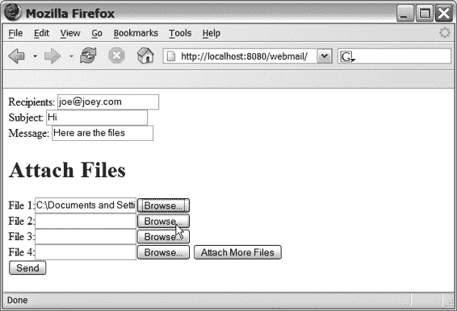

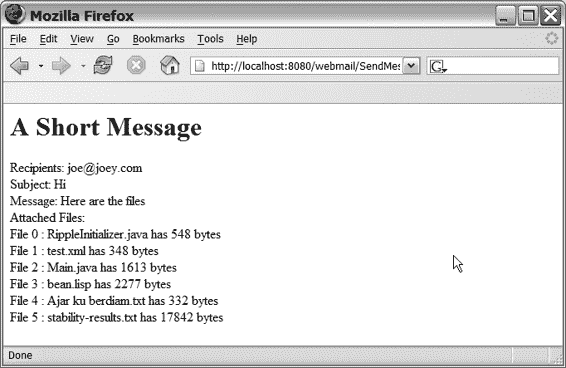

Doray_6048C11.fm 第 134 页 2006 年 1 月 12 日星期四 上午 11:02

**134**

第 11 章 ■ 文件上传

接下来，我将以一个简单的网络邮件应用为例来说明这个解决方案。这个 Web 应用只有两个页面：第一个页面允许用户撰写电子邮件，第二个页面显示邮件内容。图 11-2 展示了撰写页面的样子，而图 11-3 则描绘了输出页面。

**图 11-2.** *撰写页面*

**图 11-3.** *输出页面（显示六个附件）*

[www.it-ebooks.info](http://www.it-ebooks.info/)

Doray_6048C11.fm 第 135 页 2006 年 1 月 12 日星期四 上午 11:02

第 11 章 ■ 文件上传

**135**


Struts 提供了一种稳健的方式，让你可以在单个表单上放置两个提交按钮。我在第 17 章的 LookupDispatchAction 中详细描述了这一技术。在继续之前，请先阅读该部分。在接下来的内容中，我将假设你已经了解 LookupDispatchAction 的工作原理。

该解决方案的起点是清单 11-4 中的 FileUploadForm。这个 ActionForm 子类包含了我们上传任意数量表单所需的所有功能。

为了容纳电子邮件的其他字段，我们对 FileUploadForm 进行了子类化，如清单 11-5 所示。这是一个良好的设计，因为我们可以在其他表单中重用文件上传功能。

**清单 11-5.** *WebmailForm.java*

package net.thinksquared.webmail;

import javax.servlet.http.*;

import org.apache.struts.action.*;

public class WebmailForm extends FileUploadForm{

private String _recipients;

private String _subject;

private String _message;

public String getRecipients(){

return _recipients;

}

public String getSubject(){

return _subject;

}

public String getMessage(){

return _message;

}

public void setRecipients(String recipients){

_recipients = recipients;

}

public void setSubject(String subject){

_subject = subject;

}

[www.it-ebooks.info](http://www.it-ebooks.info/)

Doray_6048C11.fm Page 136 Thursday, January 12, 2006 11:02 AM

**136**

第 11 章 ■ 上传文件

public void setMessage(String message){

_message = message;

}

public ActionErrors validate(ActionMapping mapping,

HttpServletRequest request){

ActionErrors errors = new ActionErrors();

//不允许空白消息/收件人/主题

if(_recipients.trim().length() == 0){

errors.add("recipients",

new ActionMessage("webmail.error.recipients"));

}

if(_subject.trim().length() == 0){

errors.add("subject",

new ActionMessage("webmail.error.subject"));

}

if(_message.trim().length() == 0){

errors.add("message",

new ActionMessage("webmail.error.message"));

}

return errors;

}

}

清单 11-6 包含了显示图 11-2 中撰写页面的 JSP 页面。

为了清晰起见，并突出显示消息键与 LookupDispatchAction 的结合使用，我在清单 11-6 中没有一致地使用消息资源。

**清单 11-6.** *撰写页面的 JSP*

<%@ taglib uri="/tags/struts-html" prefix="html" %>

<%@ taglib uri="/tags/struts-bean" prefix="bean" %>

<html>

<body>

<html:form enctype="multipart/form-data" action="/SendMessage.do"> 收件人: <html:text property="recipients"/>

<html:errors property="recipients"/><br>

[www.it-ebooks.info](http://www.it-ebooks.info/)

Doray_6048C11.fm Page 137 Thursday, January 12, 2006 11:02 AM

第 11 章 ■ 上传文件

**137**

主题: <html:text property="subject"/>

<html:errors property="subject"/><br> 消息: <html:text property="message"/>

<html:errors property="message"/><br>

<h1>附加文件</h1>

文件 1:<html:file property="file[0]" size="20"/><br> 文件 2:<html:file property="file[1]" size="20"/><br> 文件 3:<html:file property="file[2]" size="20"/><br> 文件 4:<html:file property="file[3]" size="20"/>

<html:submit property="action">

<bean:message key="webmail.prompt.more-files"/>

</html:submit><br>

<html:submit property="action">

<bean:message key="webmail.prompt.send"/>

</html:submit>

</html:form>

</body>

</html>

在清单 11-6 中，请注意两个提交按钮，以及使用 LookupDispatchAction 所需的设置（参见第 17 章）。处理这两个提交的 Action 子类出现在清单 11-7 中。请注意，由于 LookupDispatchAction 的工作方式，我们*没有*在 SendMessageAction 中重写 execute() 方法。

**清单 11-7.** *SendMessageAction*

package net.thinksquared.webmail;

import java.util.*;

import javax.servlet.http.*;

import org.apache.struts.action.*;

import org.apache.struts.actions.*;

public class SendMessageAction extends LookupDispatchAction{

[www.it-ebooks.info](http://www.it-ebooks.info/)

Doray_6048C11.fm Page 138 Thursday, January 12, 2006 11:02 AM

**138**

第 11 章 ■ 上传文件

protected Map getKeyMethodMap(){

Map m = new HashMap();


m.put("webmail.prompt.more-files","attach"); m.put("webmail.prompt.send","send");

return m;

}

public ActionForward attach(ActionMapping mapping,

ActionForm form,

HttpServletRequest request,

HttpServletResponse response){

return mapping.getInputForward();

}

public ActionForward send(ActionMapping mapping,

ActionForm form,

HttpServletRequest request,

HttpServletResponse response){

return mapping.findForward("success");

}

} 按钮

struts-config.xml 文件如清单 11-8 所示，输出页面的 JSP 如图 11-3 所示，其代码在清单 11-9 中提供。请注意，表单 bean 位于会话作用域中。这意味着您需要执行一些清理工作（为清晰起见，此处未在清单中显示）以重置表单字段。

**清单 11-8.** *struts-config.xml*

<?xml version="1.0" encoding="ISO-8859-1" ?>

<!DOCTYPE struts-config PUBLIC

//...为清晰起见省略

<struts-config>

[www.it-ebooks.info](http://www.it-ebooks.info/)

Doray_6048C11.fm Page 139 Thursday, January 12, 2006 11:02 AM

第 11 章 ■ 文件上传

**139**

<form-beans>

<form-bean name="msgForm"

type="net.thinksquared.webmail.WebmailForm"/>

</form-beans>

<action-mappings>

<action path="/SendMessage"

type="net.thinksquared.webmail.SendMessageAction"

name="msgForm"

validate="true"

scope="session"

parameter="action"

input="/index.jsp">

<forward name="success" path="/out.jsp"/>

</action>

</action-mappings>

<message-resources parameter="Application"/>

</struts-config>

**清单 11-9.** *输出页面的 JSP*

<%@ taglib uri="/tags/struts-nested" prefix="nested" %>

<%@ taglib uri="/tags/struts-logic" prefix="logic" %>

<%@ taglib uri="/tags/struts-bean" prefix="bean" %>

<html>

<body>

<h1>短消息</h1>

<nested:root name="msgForm">

收件人：

<nested:write property="recipients"/><br> 主题：

<nested:write property="subject"/><br>

[www.it-ebooks.info](http://www.it-ebooks.info/)

Doray_6048C11.fm Page 140 Thursday, January 12, 2006 11:02 AM

**140**

第 11 章 ■ 文件上传

消息：

<nested:write property="message"/><br>

</nested:root>

附件：<br>

<logic:iterate name="msgForm" property="files" id="file"

indexId="i">

文件 <bean:write name="i"/> :

<bean:write name="file" property="fileName"/> 大小为 <bean:write name="file" property="fileSize"/> 字节<br>

</logic:iterate>

</body>

</html>

清单 11-4 至 11-9 的源代码可在 Apress 网站的源代码部分找到，网址为 http://www.apress.com，文件名为 multiple-file-uploading.zip。建议您将此文件复制到开发目录，解压缩，然后运行 compile.bat。部署 WAR 文件并试用该 Web 应用程序，直到您确信已理解本节介绍的内容。

完成后，实现一个解决方案，使上传的文件按用户上传的顺序排列。完成实现、部署和测试解决方案后，继续进行实验 11。

**实验 11：将数据导入 LILLDEP**

在本实验环节中，您将创建一个处理程序，允许用户将联系人导入 LILLDEP。上传的数据必须采用逗号分隔值（CSV）格式，如果您曾使用过 Microsoft Excel，应该对此很熟悉：

名称 | 电子邮件 | 部门 | ...

乔 | joe@joey.com | ITC 部门 | ...

...

在示例中，分隔符是管道符号（|），而不是通常的逗号。第一行给出列名，后续行是数据。

请完成以下步骤，为 LILLDEP 提供这个新的“导入”功能。

[www.it-ebooks.info](http://www.it-ebooks.info/)

Doray_6048C11.fm Page 141 Thursday, January 12, 2006 11:02 AM

第 11 章 ■ 文件上传

**141**

**步骤 1：完成 ImportForm**

完成 ImportForm 的代码。具体来说，添加 getFile() 和 setFile() 函数。

您是否需要实现 validate() 或 reset() 方法？

**步骤 2：完成 import.jsp**

**1.** 添加一个用于上传 CSV 文件的表单。表单处理程序应为 ImportForm.do。


**2.** 添加一个 `<html:file>` 标签和适当的标签。`<html:file>` 的 `property` 属性应该是什么？请记住，只使用 `Application.properties` 文件中的消息。

**3.** 务必添加一个 `<html:errors>` 标签，用于显示上传或处理文件时的错误消息。

**第 3 步：完成 ImportAction**

有一个名为 `CSVIterator` 的 LILLDEP 工具类，它可以读取和解析 CSV 文件。其构造函数接受一个 `Reader` 作为数据输入，以及一个 `String` 作为分隔符（在本实验中，你将使用管道符号作为分隔符）：

```java
public CSVIterator(Reader input, String separator)
```

该类是一个迭代器（Iterator），当调用 `next()` 时，会返回一个 `Map`。这个 `Map` 包含与 CSV 文件中每一列对应的条目。思路是从这个 `Map` 创建一个 `Contact` 对象，然后保存该 `Contact`。你可以使用其中一个 `Contact` 构造函数轻松实现这一点：

```java
public Contact(Map data)
```

根据这些信息，完成 `ImportAction`，使其使用上传的文件来填充 LILLDEP 数据库。（提示：你可以使用 `InputStreamReader` 将 `InputStream` “转换”为 `Reader`。）

在你的实现中，请务必：

• 通过重新显示带有错误信息的导入页面，向用户展示任何上传/处理错误。

• 如果一切正常，则转发到成功页面。

[www.it-ebooks.info](http://www.it-ebooks.info/)

Doray_6048C11.fm 第 142 页 2006 年 1 月 12 日，星期四，上午 11:02

**142**

第 11 章 ■ 文件上传

**第 4 步：修改 struts-config.xml**

完成以下操作：

**1.** 为 `ImportForm` 声明一个新的表单 Bean。

**2.** 定义一个新的表单处理器来处理导入操作。表单处理器的 `path` 属性是什么？

**3.** 添加一个名为 `success` 的转发，指向 `/Listing.do`。

**第 5 步：编译、重新部署并测试你的应用程序**

`full.jsp` 页面的工具栏区域有一个名为“Import”的链接。使用 `.\csv-data\test.csv` 文件来测试你的导入功能。该文件应能无错误地上传和处理，并且你应该能在第 10 个实验中创建的“完整列表”页面中看到上传的条目。

**实用链接**

• 维基百科中的 Uuencode 条目：http://en.wikipedia.org/wiki/Uuencode

**总结**

• `<html:file>` 标签用于将文件上传到服务器。

• `FormFile` 类处理对已下载文件的访问。

[www.it-ebooks.info](http://www.it-ebooks.info/)

Doray_6048C12.fm 第 143 页 2006 年 1 月 12 日，星期四，上午 11:04

第 12 章

■ ■ ■

国际化

简单来说，国际化（简称 *i18n*，因为 *internationalization* 一词中 *i* 和 *n* 之间有 18 个字母），或本地化，就是让应用程序能够支持除当前目标语言之外的其他语言的工作。

本地化一个 Web 应用程序绝非易事。除了简单地将网页翻译成新语言之外，还有许多细微之处。要理解这些问题，请考虑在本地化应用程序时需要解决的四个领域：

• **处理输入**：由于输入数据来自 Web 浏览器，你的 Web 应用程序必须能够正确处理不同的*字符编码*（下一节将详细介绍）。

• **验证**：使用新语言的用户可能对日期或数字采用不同的约定。你的验证逻辑必须能正确处理这些情况。

• **输出**：对话框、提示信息、按钮标签和其他文本必须翻译成新语言。理想情况下，用户应该能够选择与 Web 应用程序交互的语言。Struts 在这方面解决得特别好。

• **数据存储及相关问题**：你可能需要确保数据库能够处理多字节字符编码。当你的 Web 应用程序将数据传递给其他应用程序时，也会出现类似的问题——你必须确保这些应用程序能够接受新语言和字符编码的文本。

在本章中，你将看到 Struts 如何通过解决前三个领域来极大地简化本地化 Web 应用程序的任务。但首先，我需要定义一些术语。

**字符编码、Unicode 和 UTF-8**

**字符**是一个抽象实体，对应于一种语言或文字中的一个书写单位。例如，字母“A”或“A”或“A”都代表同一个字符。

**143**

[www.it-ebooks.info](http://www.it-ebooks.info/)

Doray_6048C12.fm 第 144 页 2006 年 1 月 12 日，星期四，上午 11:04

**144**

第 12 章 ■ 国际化

不过，“A”和“a”代表不同的字符，因为它们具有不同的含义。字符还包括标点符号和文字中的其他符号。

**字符集**是一组字符的集合，并为每个字符分配一个唯一的数字标识符。换句话说，字符集只是（字符，标识符）对的集合。一个字符集中的字符可能来自一种或多种语言或文字。

**Unicode** 是一个旨在涵盖所有人类语言和文字中字符的字符集。

■**注意** 听起来可能很奇怪，但一种语言可能有多种文字。例如，维吾尔语（来自中亚）有三种文字：古老的阿拉伯文字、前苏联国家使用的类似西里尔字母的文字，以及中国政府发明、现在维吾尔人在互联网上交流使用的拉丁文字。

Unicode（当前版本为 4.0）由 Unicode 联盟定义，该组织由许多（主要是美国）公司支持。该联盟已经识别了地球上每种（嗯，几乎是每种）语言中的每一个字符，并为每个字符分配了一个唯一的数字。编号方式使得每种语言获得一个或多个连续的编号块。

**字符编码**将字符集中的每个数字标识符转换为另一个称为**字符代码**的数字。这样做是因为字符代码在计算机上存储更方便或更高效。因此，字符编码只是（字符，字符代码）对的集合。

现在，如果*不需要*进行转换——直接使用字符集的数字标识符——那么字符编码和字符集当然是相同的。ASCII 就是一个例子，它同时定义了字符编码和字符集。其他例子包括 Latin 1 和各种语言的 ISO 编码。

回到 Unicode：其缺点在于，对于日常编程来说，它作为*字符编码*实际上毫无用处，因为现有的字符编码（尤其是 ASCII）根深蒂固。许多现有的程序或软件库只接受 ASCII 输入，无法使用 Unicode 的数字标识符。

**UTF-8** *是一种针对 Unicode 的*字符编码*，它解决了这个问题。UTF-8 将每个 Unicode 定义的数字标识符转换为可能占用一个或多个字节存储空间的字符代码。UTF-8 的绝妙之处在于，同时属于 Unicode 和 ASCII 的字符被赋予了相同的字符代码。*

*这意味着你的“支持 UTF-8”的程序可以利用 Unicode，同时仍然可以与只接受 ASCII 的旧程序或库一起工作。当然，这并不能解决让旧程序接受 Unicode 的问题。关键在于，你*不会* *完全*失去与旧软件协作的能力。

[www.it-ebooks.info](http://www.it-ebooks.info/)

Doray_6048C12.fm 第 145 页 2006 年 1 月 12 日，星期四，上午 11:04

第 12 章 ■ 国际化

**145**

这引出了两个问题。如果程序实际上并不使用 Unicode 定义的数字标识符，那么 Unicode 有什么用？为什么需要将 Unicode 与 UTF-8 分开？


要理解 Unicode 的优势，你必须认识到它是一个*被广泛接受的* *标准*，用于为*所有*字符分配唯一的数字标识符。因此，如果 Web 浏览器和服务器约定它们之间传输的文本数据代表 Unicode 字符，你就可以开发能够处理*任何*语言的 Web 应用。如果没有一个被广泛接受的标准来涵盖所有字符，这是不可能实现的。在 Unicode 出现之前，字符集要么未被广泛接受，要么没有包含所有字符。

要理解为什么 Unicode 必须与 UTF-8 分离，你必须明白它们各自不同的目标。Unicode 数字标识符代表一个字符，因此具有*含义*。而 UTF-8 字符编码则关乎让现有程序能够正常工作。

这些是不同的目标，最好用不同的方式来解决。

例如，并非所有遗留软件都使用 ASCII（想想前苏联地区），因此将 UTF-8 字符编码硬编码到 Unicode 中（即让 Unicode 数字标识符等于 UTF-8 字符编码）对所有人来说并非都有利。此外，对于非拉丁语系语言，Unicode 的其他编码在存储空间方面更高效。将 UTF-8 硬编码到 Unicode 中会迫使这些语言的使用者（想想中国）使用比必要更多的存储空间。这两个因素都会阻碍 Unicode 的广泛采用。

因此，Unicode 与其任何编码（如 UTF-8）之间的分离，为用户带来了既能就数据含义达成一致*又能*灵活选择最符合其需求的字符编码的好处。

***那纯文本呢？**

如果你所说的“纯文本”是指没有任何编码的文本数据，我希望通过前面的讨论你能意识到，世界上根本不存在所谓的“纯文本”！

任何文本数据都有一个隐含的字符编码。在西方世界，这可能是 ASCII。

需要理解的重要一点是，你可以*假设*一种编码——大多数程序和软件都假设一种编码，比如 ASCII——或者你可以明确指定一种编码，就像 XML 或 HTML 文档的头部那样。然而，确保*声明的*编码与（由文本编辑器完成的）*实际*编码相匹配是另一个问题。

最后，就像 Java 整数的二进制值可以显示为字符串一样，Unicode 字符的数字标识符也可以显示为字符串。这些通常以 ASCII 编码显示为十六进制数，例如

\u7528。这在一定程度上规避了在遗留软件中“使用”Unicode 的问题。

你将在后面的章节（“本地化输出”）中了解更多相关内容。*不要*将 Unicode 数字标识符的这种 ASCII 表示与 UTF-8 混淆。

[www.it-ebooks.info](http://www.it-ebooks.info/)

Doray_6048C12.fm 第 146 页 2006 年 1 月 12 日，星期四，上午 11:04

**146**

第 12 章 ■ 国际化

**区域设置**

在上一节中，我描述了如何使用 Unicode 和 UTF-8 编码使客户端-服务器程序能够以任何语言通信数据。

然而，这还不够。还需要一种机制，让用户能够*选择*他们想要的语言。例如，如果你说中文，你可能希望我的 Web 应用以中文呈现给你。

**区域设置**是实现这一目标的广泛使用的机制。区域设置是语言或语言变体的标识符。例如，美国英语的标识符是 en_US

而斯瓦希里语的标识符是 sw。

区域设置字符串本身是语言代码和可能的国家/地区代码的组合。语言代码是来自 ISO 639 标准的两个字母的字符串。国家/地区代码（例如 en_US 中的 US）取自 ISO 3166 标准。请注意，两个字母的语言代码是小写的，两个字母的国家/地区代码是大写的，用下划线连接。

本质上，Web 浏览器在 HTTP 标头中指定所需的区域设置作为额外参数。如果可能，服务器会以该区域设置向该用户发送所有页面作为响应。

区域设置是 Struts 中本地化的主要基础。Struts 的所有国际化特性都旨在让你能够轻松地按区域设置自定义应用程序。

你将在本章以及后续章节中看到它的实际应用。

既然你已经了解了字符编码、Unicode、UTF-8 和区域设置的基础知识，是时候继续解决在尝试本地化 Struts Web 应用时会遇到的三个主要关注领域了。

**处理输入**

Web 浏览器可能会使用多种字符编码，具体取决于用户的默认区域设置或偏好。由于你要处理的输入数据来自 Web 浏览器，你的 Web 应用可能需要处理任意的字符编码。

现在，你最不想做的事情就是接受和处理不同的字符编码。

为什么不呢？假设你将来自不同编码的文本存储到数据库中。以后你怎么知道它们来自哪种编码？你必须将编码信息与你保存的每个文本数据一起存储。这可不妙。

显而易见的解决方案是使用一种能够处理*所有*语言的单一编码——比如 UTF-8。

然而，这里你遇到了一个问题：你*无法*固定从用户 Web 浏览器接收到的字符编码。浏览器会以任何旧的字符编码提交表单数据，对此你无能为力。

■**注意** 根据 HTML 4.0 规范，Web 服务器可以在 HTTP 响应中设置 accept-charset 参数，

但大多数浏览器会忽略此参数。

[www.it-ebooks.info](http://www.it-ebooks.info/)

Doray_6048C12.fm 第 147 页 2006 年 1 月 12 日，星期四，上午 11:04

第 12 章 ■ 国际化

**147**

你可以做出的一个合理假设是，浏览器会使用它们从服务器接收到的相同编码进行响应。因此，如果你的 HTML 表单是 UTF-8 编码的，那么可以稳妥地假设响应也将是 UTF-8 编码。但这并不总是成立，因为 Web 浏览器为用户提供了更改默认编码的选项。

因此，这里有一个值得坚持的好规则。*在你的整个应用程序中，在每个 JSP、HTML、XML 页面等中，始终如一地使用单一的通用字符编码（如 UTF-8）。*

对于你的 JSP，你可以使用 <%@ page 声明：

<%@ page contentType="text/html; **charset=UTF-8**" %> 或者你可以在你的 struts-config.xml 中使用 <controller> 标签（参见第 9 章）：

<controller contentType="text/html; **charset=UTF-8**" /> 第二种方法意味着你无需在所有 JSP 中嵌入 <%@ page 声明。

当然，如果你绕过 Struts 直接调用 JSP，这个技巧就不起作用了。如果你通过 JSP 的名称（例如 myPage.jsp）调用它，你就是在绕过 Struts。如果页面是通过 <forward> 或 .do 扩展名传递的，那么你就没有绕过 Struts，这个技巧就会生效。

对于你的静态 HTML 页面，你可以使用 <meta> 标签来指定编码：

<head>

<meta http-equiv="content-type" content="text/html; charset=UTF-8">

</head>

这里你必须小心谨慎，因为必须确保 HTML 文件的实际编码（由编写 HTML 的文本编辑器决定）与声明的编码（在 <meta> 标签中声明）相同。如果一个表单声明是 UTF-8 编码但实际上却是另一种编码，你无法知道浏览器会以什么编码进行响应。

**本地化验证**

我所说的“本地化验证”是指执行特定于区域设置的验证。例如，如果一位德国用户（区域设置 de）输入了一个日期，你可能希望根据 dd.mm.yyyy 格式来验证输入。对于美国用户，你可能会使用不同的格式，可能是 mm/dd/yyyy。


目前，Struts 对实现这一功能的支持非常有限。在第 15 章介绍验证器框架时，你会看到 Struts 对本地化验证的*唯一*支持。

公平地说，需要本地化验证的场景并不多。事实上，在很多情况下，这样做反而是错误的！例如，有些用户使用 en_US 语言环境，但实际并不居住在美国。因此，你无法可靠地通过语言环境来验证依赖于地理位置的字段，比如邮政编码（美国的 zip code）。

[www.it-ebooks.info](http://www.it-ebooks.info/)

Doray_6048C12.fm 第 148 页 2006 年 1 月 12 日星期四 上午 11:04

**148**

第 12 章 ■ 国际化

然而，对于日期、货币值或数字这类内容，本地化验证*可能*是必要的。本节包含了我个人收集的一些技巧，希望对你有所帮助。

第一个技巧是在你的 ActionForm 子类中针对每个特殊语言环境进行测试（见清单 12-1）。

**清单 12-1.** *暴力本地化验证* String locale = getLocale();

String date = getDate();

boolean dateOK = false;

if ("de".equals(locale)) {

dateOK = validateDate(date,"dd.mm.yyyy");

}else if("en-us".equals(locale)){

dateOK = validateDate(date,"mm/dd/yyyy");

}else{ //捕获所有日期验证

dateOK = validateDate(date,"dd/mm/yyyy");

}

在清单 12-1 中，`getLocale()` 是 ActionForm 基类的一个函数。`validateDate()` 是一个虚构的函数，它根据第二个格式字符串来验证日期字符串。这种暴力方法对于按语言环境进行少量验证是可以的，但它有很多缺点，维护起来简直是噩梦！

一种稍微复杂一点的实现方式是使用 HashMap 来存储（语言环境，格式）对。这消除了多个 if else 语句，如清单 12-2 所示。

**清单 12-2.** *暴力本地化验证，第二版*

public MyActionForm(){

myDateFormats = new HashMap();

myDateFormats.put("en-US"," mm/dd/yyyy"); myDateFormats.put("de","dd.mm.yyyy");

myDateFormats.put("default","dd/mm/yyyy");

}

public ActionErrors validate(...){

...

[www.it-ebooks.info](http://www.it-ebooks.info/)

Doray_6048C12.fm 第 149 页 2006 年 1 月 12 日星期四 上午 11:04

第 12 章 ■ 国际化

**149**

boolean dateOK = false;

Object o = myDateFormats.get(getLocale());

if(null == o) o = myDateFormats.get("default");

dateOK = validateDate(getDate(), (String) o);

...

}

第二个技巧是 Mike Gavaghan 在 JavaWorld 的一篇文章中提出的巧妙方法（参见本章末尾的“有用链接”）。其思想是使用 `<html:hidden>` 标签将格式字符串嵌入到 JSP 中，如清单 12-3 所示。

**清单 12-3.** *使用隐藏格式字段 (JSP)*

<bean:message key="myapp.jsp.prompt.date"/>

<html:text property="date"/>

<html:hidden property="dateFormat"/>

在调用此页面之前，你需要使用 Action 填充隐藏字段，填入语言环境的日期格式。现在，由于日期格式存储在表单本身中，你可以检索它并使用该格式运行验证，如清单 12-4 所示。

**清单 12-4.** *使用隐藏格式字段 (ActionForm)* public ActionErrors validate(...){

...

boolean dateOK = false;

dateOK = validateDate(getDate(), getDateFormat());

...

}

清单 12-4 意味着需要在 MyActionForm 上添加 `getDateFormat()` 和 `setDateFormat()` 函数。这种技术允许你将特定于语言环境的格式与该语言环境的属性文件一起存储。这种解决方案比将格式硬编码到 ActionForm 子类中要好。

[www.it-ebooks.info](http://www.it-ebooks.info/)

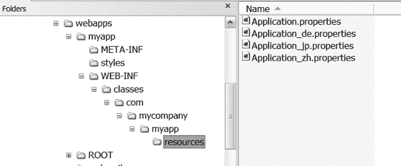

Doray_6048C12.fm 第 150 页 2006 年 1 月 12 日星期四 上午 11:04

**150**

第 12 章 ■ 国际化

**本地化输出**

本地化输出是 Struts 非常擅长的事情。如果你一直注意使用


在应用程序的 JSP 页面中（而非使用静态文本）统一使用 `<bean:message>` 标签后，通过 Struts 实现应用程序输出的本地化就变得非常简单。

由于应用程序的所有文本都存储在 `Application.properties` 文件中，因此要支持新语言，只需执行以下步骤：

• **翻译** `Application.properties` 文件至新语言环境的语言。翻译时需保持键（key）不变，仅修改消息内容。如果翻译人员使用了 ASCII 以外的字符编码，则在使用前必须对翻译后的文件进行后处理。稍后将详细说明这一点。

• **将语言环境标识符**追加到翻译后的文件名中。例如，日语翻译必须命名为 `Application_jp.properties`。附加的 `_jp` 标识表明此翻译属于日语语言环境。

• **安装**新的属性文件到默认 `Application.properties` 文件所在的*同一文件夹*中（参见图 12-1）。

仅此而已！当用户的浏览器设置为所需语言环境（例如 jp）时，Struts 将使用正确的属性文件（本例中为 `Application_jp.properties`）为该用户提供服务。所有提示、按钮、对话框和文本都将以日语显示。

**图 12-1.** *已安装的各种 Application.properties 文件*

■**注意** 如果您正在为美国英语（关联语言环境为 en_US）编写应用程序，则属性文件应命名为 `Application_en_US.properties`。

[www.it-ebooks.info](http://www.it-ebooks.info/)

Doray_6048C12.fm 第 151 页 2006 年 1 月 12 日 星期四 上午 11:04

第 12 章 ■ 国际化

**151**

在我展示如何做出此选择之前，让我们先解决一个遗留问题——翻译后的 `Application.properties` 文件的字符编码。

**处理翻译后的 Application.properties 文件**

Java 编程语言仅接受 ISO 8859-1 字符编码的源代码和属性文件。这里我指的是实际的源代码——而非 Java 字符串的内部表示，后者不受此编码限制。

ISO 8859-1（又称 Latin 1）可以编码大多数西欧语言，并且在大多数用途上与 ASCII 类似。更准确地说，同时存在于 ASCII 和 ISO 8859-1 中的字符具有相同的字符代码。

您的 `Application.properties` 文件也必须采用此编码。我们如何用这种受限的编码来表示其他语言呢？答案是使用一个名为 `native2ascii` 的工具。该程序位于 JDK 的 `bin` 目录中。

当您收到翻译后的 `Application.properties` 文件时，它很可能不是 ASCII 或 ISO 8859-1 编码。获取此信息的唯一可靠途径是询问翻译人员。一旦您知道了源编码，就可以使用 `native2ascii`：
`native2ascii -encoding UTF-8 jp.properties Application_jp.properties`
在此示例中，翻译后的文件是 `jp.properties`，它采用 UTF-8 编码。最终输出是 `Application_jp.properties`，您可以直接使用。

`native2ascii` 背后的“魔法”在于，它会用其字符串的 Unicode 版本“转义”非 ISO 8859-1 字符。这在您的属性文件中显示为 `\uxxxx` 序列。

当 Struts 创建要传递给用户的 HTML 页面时，会使用页面中通过 `<%@ page ...` 指令指定的编码：
`<%@ page contentType="text/html; **charset=UTF-8**" %>`
或者，您可以在 `struts-config.xml` 中使用 `<controller>` 标签（参见第 9 章）：
`<controller contentType="text/html; **charset=UTF-8**" />`
在这两种情况下，都会使用 UTF-8 字符编码来编码传递给用户的 HTML 页面。

**从浏览器中选择语言环境**

大多数现代浏览器允许用户选择默认语言环境。图 12-2 和 12-3 分别展示了 Mozilla 和 Internet Explorer 中的设置。

[www.it-ebooks.info](http://www.it-ebooks.info/)

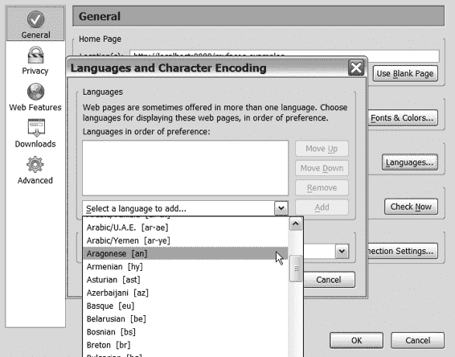

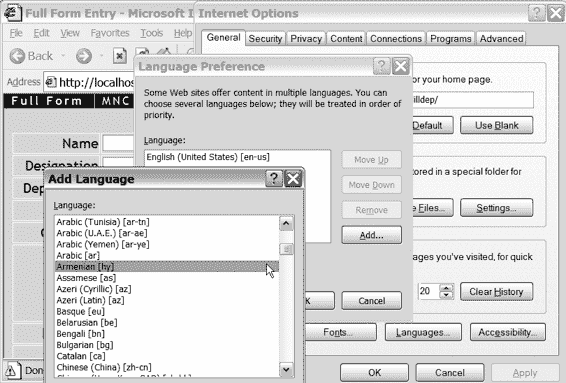

Doray_6048C12.fm 第 152 页 2006 年 1 月 12 日 星期四 上午 11:04

**152**

第 12 章 ■ 国际化


**图 12-2.** *使用 Mozilla 添加新区域设置*

**图 12-3.** *使用 Internet Explorer 添加新区域设置*

[www.it-ebooks.info](http://www.it-ebooks.info/)

Doray_6048C12.fm 第 153 页 2006 年 1 月 12 日星期四 上午 11:04

第 12 章 ■ 国际化

**153**

你可能会注意到，这些网络浏览器并不总是能给出正确的区域设置字符串。

例如，美国英语被错误地显示为 en-us，而实际上它应该是 en_US。

**通过链接切换区域设置**

让用户更改其网络浏览器中的区域设置并不总是可取的，甚至可能无法实现。在这种情况下，你可能希望他们点击一个链接，告诉服务器切换到所需的区域设置。实现此目的的方法是将区域设置编码为链接上的参数。例如：

<a href="/ChangeLocale.do?language=ta">泰米尔语</a> 在此链接中，ChangeLocale 是一个表单处理器，它没有关联的表单 bean。在 struts-config.xml 中的声明将是

<action path="/ChangeLocale"

type="com.mycompany.myapp.ChangeLocaleAction">

<forward name="success" path="/index.jsp"/>

</action>

ChangeLocaleAction 是一个 Action 子类，具有以下 execute() 方法： public ActionForward execute(...){

String language = request.getParameter("language"); String country = request.getParameter("country"); if(null == country){

setLocale(request, new Locale(language));

}else{

setLocale(request, new Locale(language,country));

}

return new ActionForward(mapping.findForward("success"));

}

当用户点击链接（该链接包含新的语言代码，以及可选的新的国家代码）时，控制权将传递给 ChangeLocaleAction，它会将该用户会话的默认区域设置设置为所需的组合。请注意，java.util.Locale 是一个内置的 Java 类。

[www.it-ebooks.info](http://www.it-ebooks.info/)

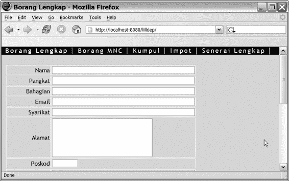

Doray_6048C12.fm 第 154 页 2006 年 1 月 12 日星期四 上午 11:04

**154**

第 12 章 ■ 国际化

**使用 LocaleAction 切换区域设置**

另一种允许用户切换区域设置的方法是使用 Struts 类 LocaleAction。要*有效*地使用这个类，你首先需要理解动态表单（参见第 16 章），因此我将把对 LocaleAction 的讨论推迟到第 17 章。

**实验 12：面向马来西亚市场的 LILLDEP**

在本实验中，你将看到将 LILLDEP 移植到马来西亚（或印度尼西亚）市场是多么容易。

**1.** 在 Apress 网站的源代码部分（网址为 http://www.apress.com），将 lab12.zip 复制到你的主 LILLDEP 开发文件夹中。这个 zip 文件应包含一个名为 Application_ms.properties 的文件；ms 是马来语的区域设置字符串，马来语是马来西亚使用的语言（印度尼西亚使用的是一种略有变体的语言）。将此 zip 文件的内容解压到 .\web\resources\ 目录下。

**2.** 编译并重新部署 LILLDEP。

**3.** 打开 Internet Explorer，然后选择“工具” ➤ “Internet 选项” ➤ “语言”（参见图 12-2）。如果你使用的是 Mozilla 或其他浏览器，则需要自行找到此设置。添加马来语 (ms) 并移除所有其他语言。

**4.** 关闭所有 Internet Explorer 实例，然后打开一个并导航到 LILLDEP 页面。你应该会看到所有提示和按钮都显示为马来语（参见图 12-4）。

**图 12-4.** *马来语版本的 LILLDEP*

[www.it-ebooks.info](http://www.it-ebooks.info/)

Doray_6048C12.fm 第 155 页 2006 年 1 月 12 日星期四 上午 11:04

第 12 章 ■ 国际化

**155**

**有用链接**

• “Web 应用程序的端到端国际化：超越 JDK”，作者：Mike Gavaghan：http://www.javaworld.com/javaworld/jw-05-2004/

jw-0524-i18n.html

• ISO 639 语言代码：http://en.wikipedia.org/wiki/ISO_639

• ISO 3166 国家代码：http://en.wikipedia.org/wiki/ISO_3166

• Unicode：www.unicode.org

• UTF-8 及相关编码：http://en.wikipedia.org/wiki/UTF-8

**总结**

• 本地化发生在四个领域：输入、验证、输出以及与其他程序（如数据库）的通信。


• Struts 对输出本地化提供了支持，但在其他方面的支持则很薄弱或根本不存在。

• 输出本地化只需翻译 `Application.properties` 文件即可实现。

• 属性文件需要使用 ISO 8859-1（Latin 1）编码。你可能需要使用 `native2ascii` 工具将其他编码“转义”为此编码。

[www.it-ebooks.info](http://www.it-ebooks.info/)

Doray_6048C12.fm Page 156 Thursday, January 12, 2006 11:04 AM

[www.it-ebooks.info](http://www.it-ebooks.info/)

Doray_6048.book Page 157 Tuesday, January 10, 2006 5:10 PM

第 13 章

■ ■ ■

复习实验：在 LILLDEP 中编辑联系人

**恭**喜你！你已经读完了本书的一半内容。在进入更高级的主题之前，我想给你一个机会来复习前面章节中的一些内容。

在这个复习实验中，你将实现在 LILLDEP 的数据库中编辑联系人的功能。

具体来说，你将在“完整列表”页面（`listing.jsp`）的基础上进行构建，这样当用户点击公司名称时，他们会被带到一个显示联系人完整详细信息的页面。这些详细信息可以被修改并重新提交，从而更新数据库中的条目。

请尽力回答第 1–4 题：

**1.** 如果你将公司名称变成一个链接，你将如何确定哪个公司被点击了？（*提示*：查看 `BaseContact` 的源代码。）  
**2.** 你显然希望重用 `full.jsp` 来显示将要被编辑的数据。你需要对它进行任何修改以支持更新联系人信息吗？为什么？  
**3.** 你是否可以类似地重用 `ContactForm` 和 `ContactAction`？你需要对它们进行修改以支持更新吗？  
**4.** 完成编辑功能还需要哪些其他类？（*提示*：是什么创建了用于编辑的已填充表单？）

在继续之前，请将你的答案与附录 D 中的答案进行比较。

**157**

[www.it-ebooks.info](http://www.it-ebooks.info/)

Doray_6048.book Page 158 Tuesday, January 10, 2006 5:10 PM

**158**

第 13 章 ■ 复习实验：在 LILLDEP 中编辑联系人

**实现编辑功能**

你只需要在用户点击公司名称后，填充并显示 `full.jsp` 表单即可。在前面的实验环节中，你已经实现了更新联系人的代码。请完成以下步骤：

**1.** 修改 `listing.jsp`，为公司名称添加链接。让处理器为 `EditContact.do`。  
**2.** 完成 `EditContactAction` 的实现，以加载表单数据。该 Action 应转发到 `full.jsp`。  
**3.** 添加一个 action 映射，将路径 `EditContact` 与 `EditContactAction` 和表单 `ContactForm` 关联起来。

测试你的应用程序，看看表单是否正确填充。同时确保你可以对联系人的详细信息进行修改。

[www.it-ebooks.info](http://www.it-ebooks.info/)

Doray_6048C14.fm Page 159 Tuesday, January 24, 2006 10:13 AM

第 2 部分

■ ■ ■

高级 Struts

*随着 Struts 成为 Java 平台新开发者的常见起点，一个有趣的现象正在发生——对于许多开发者来说，使用 Struts 的关键感知价值被认为是用于 HTML 表单的 JSP 自定义标签。虽然这些标签非常有用，但它们并不能构成一个健壮的用户界面组件模型，这导致了需要创建或集成第三方标签库来满足更复杂的展示需求。对我来说，核心价值始终在于控制器层——请求处理生命周期，以及该生命周期所启用的功能，例如用于可重用外观的 Tiles 框架，以及用于客户端和服务器端表单验证业务规则执行的 Validator 框架。*

—Craig McClanahan

[www.it-ebooks.info](http://www.it-ebooks.info/)

Doray_6048C14.fm Page 160 Tuesday, January 24, 2006 10:13 AM

[www.it-ebooks.info](http://www.it-ebooks.info/)

Doray_6048C14.fm Page 161 Tuesday, January 24, 2006 10:13 AM

第 14 章

■ ■ ■

Tiles


**T**iles 是一个 Struts *插件*——一款独立于 Struts 开发的软件，用于扩展 Struts 的基本功能。

Tiles 最初由 Cedric Dumoulin 开发，但现在（自 1.2 版本起）已集成到 Struts 中。事实上，它取代了较早的“模板”库，该库仅提供有限的布局能力。唯一能暴露其先前独立存在痕迹的是，它作为一个插件，因此需要进行一些配置。

Tiles 为 Struts 应用程序提供了两项新能力：

• **布局**：能够轻松为 Struts 应用程序提供统一的“外观和感觉”。在大多数 Web 应用程序中，页面遵循相似的*布局*——例如，它们可能具有共同的页眉、页脚或侧边栏。Tiles 拥有优雅的继承机制，使得创建和维护此类布局（即使是复杂的布局）变得容易。

• **组件**：能够构建可重用的 GUI 组件，并轻松嵌入到 JSP 页面中。组件为您提供了显示*动态内容*的灵活性——这些内容可以根据用户交互或外部数据源而变化。例如，显示各个城市的天气预报列表、用户感兴趣的新闻条目或定向营销内容。

简而言之，布局提供了共同的外观和感觉，而组件则允许以可重用的包形式提供动态内容。

Tiles 的强大之处在于，您可以混合使用这两项能力：您的布局可以包含组件。例如，您可以指定一个布局，将组件作为包含用户搜索列表的侧边栏显示。合理使用，这可以构建出易于使用的应用程序。在本章的实验部分，您将亲自创建这样一个组件。

当然，布局和组件行为也可以通过其他方式模拟。例如，您可以通过简单地在 JSP 页面中粘贴相应的 HTML 来强制实现统一的外观和感觉。您可以通过在 JSP 中剪切和粘贴脚本片段来实现“组件”！

**161**

[www.it-ebooks.info](http://www.it-ebooks.info/)

Doray_6048C14.fm Page 162 Tuesday, January 24, 2006 10:13 AM

**162**

第 14 章 ■ T I L E S

如果您仔细阅读了第 5 章关于 MVC 的讨论，这些方法的缺点应该显而易见。MVC 的核心是根据功能分离代码，违反这一原则会导致后续维护的麻烦。这些临时方法也是如此。使用它们，对布局或组件进行全站范围的更改会很困难，因为您必须修改每个页面。

正如您将看到的，Tiles 做得更好——也更简单。

**安装 Tiles**

要使用 Tiles，您必须在 struts-config.xml 中声明它。清单 14-1 显示了一个典型的声明。

■**注意** 请记住，插件声明必须放在 struts-config.xml 文件的*最后*。将其放在任何其他位置都会导致 Struts 启动时抛出异常。

**清单 14-1.** *在 struts-config.xml 中的 Tiles 声明*

<plug-in className="org.apache.struts.tiles.TilesPlugin" >

<set-property property="definitions-config"

value="/WEB-INF/tiles-defs.xml"/>

</plug-in>

清单 14-1 中的声明做了两件事。首先，它告诉 Struts 要实例化哪个*插件类*。在本例中，是 org.apache.struts.tiles.TilesPlugin。这个插件类负责 Struts 的初始化。

其次，<plug-in> 标签包含一个或多个 <set-property> 标签，每个标签向插件类传递一个参数-值对。在清单 14-1 中，传递给 org.apache.struts.tiles.TilesPlugin 的唯一参数是 definitions-config 参数，它指向 Tiles 定义文件的相对位置。在本例中，是 /WEB-INF/tiles-defs.xml。

这个 tiles-def.xml 文件（如果您愿意，可以将其命名为其他名称——只需更改 value 属性即可）是您为 Tiles 声明布局和组件的地方。您可以将其视为 struts-config.xml 的 Tiles 对应物。


■**注意** Struts 发行版中包含一个 `tiles-documentation.war` 文件。该文件在 `/WEB-INF/` 文件夹下包含一个可用的示例 `tiles-def.xml` 文件。

清单 14-2 展示了 `tiles-def.xml` 文件的格式。

[www.it-ebooks.info](http://www.it-ebooks.info/)

Doray_6048C14.fm Page 163 Tuesday, January 24, 2006 10:13 AM

第 14 章 ■ T I L E S

**163**

**清单 14-2.** *一个空白的 Tiles 定义文件*

```xml
<?xml version="1.0" encoding="ISO-8859-1" ?>

<!DOCTYPE tiles-definitions PUBLIC

"-//Apache Software Foundation//DTD Tiles Configuration 1.1//EN"

"http://struts.apache.org/dtds/tiles-config_1_1.dtd">

<tiles-definitions>

</tiles-definitions>
```

根标签是 `<tiles-definitions>`，它包含一个或多个 `<definition>` 标签，用于声明布局或组件。接下来的两节将展示如何操作。

■**注意** Tiles DTD（文档类型定义）存储在 Struts 发行版附带的 `struts.jar` 文件中。在该 JAR 文件中，DTD 的路径为 `/org/apache/struts/resources/tiles-config_1_1.dtd`。此文件还包含清单 14-2 中使用的 `DOCTYPE` 元素。该 DTD 也存在于 Struts 发行版 zip 文件的 `/lib` 文件夹中。

你可以将 Tiles 定义拆分成多个文件。这对于需要多组外观或需要单独维护组件的大型项目非常有用。每个这样的 Tiles 定义文件都必须遵循清单 14-2 的格式，并且你需要在插件声明中声明每个文件。只需在 `<set-property>` 标签中用逗号分隔文件名即可。例如，如果你有三个 Tiles 定义文件：`A.xml`、`B.xml` 和 `C.xml`，那么 `<set-property>` 标签应写为：

```xml
<set-property property="definitions-config"
              value="/WEB-INF/A.xml,/WEB-INF/B.xml,/WEB-INF/C.xml"/>
```

最后，Tiles 还使用一个自定义标签库 `struts-tiles.tld`。你需要在 `web.xml` 文件中声明它（参见第 3 章），以便在你的 JSP 中使用该标签库。

**用于布局的 Tiles**

布局是为你的 Web 应用程序创建统一外观的一种方式。例如，你可能希望所有 JSP 页面都包含一个包含版权信息的页脚、一个侧边导航栏以及一个带有公司徽标的页眉。

在 Tiles 中，布局就是 JSP 页面。布局的 JSP 页面定义了各个部分（正文、页眉、页脚、侧边栏等）在显示页面上的相对位置。每个部分的内容由指向其他包含内容的 HTML 或 JSP 页面的 `<tiles:insert>` 标签定义。清单 14-3 是一个包含标题、页眉、正文和页脚部分的简单布局。

**清单 14-3.** *simple-layout.jsp，一个包含标题、页眉、正文和页脚的简单布局*

```jsp
<%@ taglib uri="/tags/struts-tiles" prefix="tiles" %>
<html>
<head>
<title>**<tiles:getAsString name="title"/>**</title>
</head>
<body>
<table>
<tr><td>**<tiles:insert attribute="header"/>**</td></tr>
<tr><td>**<tiles:insert attribute="body"/>**</td></tr>
<tr><td>**<tiles:insert attribute="footer"/>**</td></tr>
</table>
</body>
</html>
```

如清单 14-3 所示，布局仅定义了内容的*相对位置*，而非实际内容本身。图 14-1 展示了布局中各个组件的相对位置。

**图 14-1.** *simple-layout.jsp 中页眉、正文和页脚的相对位置*

[www.it-ebooks.info](http://www.it-ebooks.info/)

Doray_6048C14.fm Page 165 Tuesday, January 24, 2006 10:13 AM

第 14 章 ■ T I L E S

**165**

`<tiles:getAsString>` 标签显示标题的内容，而 `<tiles:insert>` 标签则显示与 `attribute` 或 `name` 属性对应的内容。这些属性指向的实际内容可以在被调用的 JSP 或 Tiles 定义文件中定义。

例如，假设 `myPage.jsp` 想要使用清单 14-3 中的布局（`simple-layout.jsp`）。清单 14-4 展示了 `myPage.jsp` 可能的内容。

**清单 14-4.** *myPage.jsp，它使用了 simple-layout.jsp*

```jsp
<%@ taglib uri="/tags/struts-tiles" prefix="tiles" %>
<tiles:insert page="/layouts/simple-layout.jsp">
  <tiles:put name="title" value="A simple page" />
  <tiles:put name="header" value="/common/header.jsp" />
  <tiles:put name="footer" value="/common/footer.jsp" />
  <tiles:put name="body" value="/mypage-content.jsp" />
</tiles:insert>
```

`myPage.jsp` 所做的只是（使用 `<tiles:put>` 嵌套标签）指定*哪些*文件与页眉、页脚和正文属性相关联。标题被指定为一个字符串，在此例中为 "A simple page"。

请注意清单 14-3 和 14-4 中 `<tiles:insert>` 用法的区别：

*   在布局 JSP（清单 14-3）中，使用 `attribute` 属性来告诉 Struts 它应该使用什么内容来替换外层的 `<tiles:insert>` 标签。例如，当 Struts 处理清单 14-3 中的 `<tiles:insert attribute="header"/>` 时，它本质上是在请求对象上查找 `header` 的值。然后它使用这个值（一个 JSP 页面，或者如我们将在下一节中看到的，一个组件）并将该页面或组件的内容粘贴到 `<tiles:insert>` 标签的位置。
*   在被调用的 JSP（清单 14-4）中，使用 `page` 属性来指定一个布局，并且该布局的输出用于替换 `<tiles:insert>` 标签。嵌套的 `<tiles:put>` 标签在请求对象上定义 Tiles 属性。布局读取这些属性以创建其输出。例如，当 Struts 处理清单 14-4 中的 `<tiles:insert>` 时，它知道必须使用布局文件 `/layouts/simple-layout.jsp`。在这个布局文件中，有几个 `<tiles:insert>` 标签需要创建 `header`、`footer` 和 `body` 属性。每个属性的值都在调用 JSP 中使用 `<tiles:put>` 标签定义。

需要注意的是，使用 `<tiles:put>` 标签定义的属性仅适用于外层 `<tiles:insert page="...">` 标签中定义的布局。在极少数情况下，如果你的被调用 JSP 页面中有两个 `<tiles:insert page="...">` 标签，则必须分别为每个标签指定属性。这两个标签之间的属性是不共享的。

[www.it-ebooks.info](http://www.it-ebooks.info/)

Doray_6048C14.fm Page 166 Tuesday, January 24, 2006 10:13 AM

**166**

第 14 章 ■ T I L E S

■**注意** `<tiles:insert>` 标签的 `page`、`template` 和 `component` 属性是同义词。你可以使用不同的同义词来指示使用的是布局还是 Tiles 组件（参见下一节）。这仅仅是为了提高可读性。

指定 `attribute` 或 `name` 属性值的另一种方法是在 Tiles 定义文件中创建一个定义。例如，你可以将清单 14-4 的一部分移到 Tiles 定义文件中，如清单 14-5 所示。

**清单 14-5.** *tiles-def.xml，包含一个单一的定义*

```xml
<?xml version="1.0" encoding="ISO-8859-1" ?>

<!DOCTYPE tiles-definitions PUBLIC

"-//Apache Software Foundation//DTD Tiles Configuration 1.1//EN"

"http://struts.apache.org/dtds/tiles-config_1_1.dtd">

<tiles-definitions>

  <definition name=".simple" path="/layouts/simple-layout.jsp">
    <tiles:put name="header" value="/common/header.jsp" />
    <tiles:put name="footer" value="/common/footer.jsp" />
  </definition>

</tiles-definitions>
```

清单 14-5 展示了一个名为 `.simple` 的 Tiles 定义文件（前导点的含义稍后会变得明显）。这个定义只定义了两个属性：`header` 和 `footer`。

要在 JSP 中使用 `.simple` 定义，请参见清单 14-6。

**清单 14-6.** *myPage2.jsp，它使用了 Tiles 定义*

```jsp
<%@ taglib uri="/tags/struts-tiles" prefix="tiles" %>
<tiles:insert **definition=".simple"** >
  <tiles:put name="title" value="A simple page" />
  <tiles:put name="body" value="/mypage-content.jsp" />
</tiles:insert>
```


清单 14-5 和 14-6 共同展示了如何使用 Tiles 定义替代布局路径。共享属性是在 Tiles 定义文件中定义的，而特定于被调用 JSP 页面的属性则在该页面中定义。这样做是合理的，因为您可能希望固定页眉和页脚，但更改显示页面的标题和正文。

[www.it-ebooks.info](http://www.it-ebooks.info/)

Doray_6048C14.fm 第 167 页 2006 年 1 月 24 日星期二 上午 10:13

第 14 章 ■ TILES

**167**

**快速测验**

这种方法（清单 14-5 和 14-6）相比之前的方法（清单 14-4）有什么优势？

Tiles 布局定义甚至可以“被子类化”。例如，假设我们想要一个与旧定义（清单 14-5）相似的新定义，但标题是固定的，并且页脚被更改。清单 14-7 显示了修改后的定义文件。

**清单 14-7.** *包含新定义的 tiles-def.xml*

<?xml version="1.0" encoding="ISO-8859-1" ?>

<!DOCTYPE tiles-definitions PUBLIC

"-//Apache Software Foundation//DTD Tiles Configuration 1.1//EN"

"http://struts.apache.org/dtds/tiles-config_1_1.dtd">

<tiles-definitions>

<definition name=".simple" path="/layouts/simple-layout.jsp">

<tiles:put name="header" value="/common/header.jsp" />

<tiles:put name="footer" value="/common/footer.jsp" />

</definition>

<definition name=".simple.admin" extends=".simple" >

<tiles:put name="title" value="Admin Zone" />

<tiles:put name="footer" value="/common/admin-footer.jsp" />

</definition>

</tiles-definitions>

`extends`属性表示名为`.simple.admin`的新定义从基础定义`.simple`中借用了所有属性和特性。

■**注意** 这就是使用`.`分隔符的原因——您可以立即看出`.simple`没有祖先定义，而`.simple.admin`直接继承自`.simple`。

嵌套的`<tiles:put>`标签要么覆盖某些属性（如`footer`），要么添加新属性（如`title`）。新定义的使用方式与旧定义完全相同。

定义和使用布局的最后一种方式是在 Tiles 定义文件中*完全*定义它们。接续清单 14-7：

[www.it-ebooks.info](http://www.it-ebooks.info/)

Doray_6048C14.fm 第 168 页 2006 年 1 月 24 日星期二 上午 10:13

**168**

第 14 章 ■ TILES

<definition name=".simple.admin.main" extends=".simple.admin" >

<tiles:put name="body" value="/admin/body.jsp" />

</definition>

在这种情况下，您不需要一个 JSP 页面来嵌入定义，因为这个新定义定义了显示布局所需的所有属性。您可以通过在`struts-config.xml`中的`<forward>`调用它来使用此定义：

<forward name="success" path=".simple.admin.main" />

或者作为输入页面，如下所示：

<action path="/MyFormHandler" input=".simple.admin.main" ...

**在布局中使用样式表**

大多数专业的 Web 应用程序使用层叠样式表（CSS）来实现统一的字体和颜色。当您尝试在 Tiles 布局中使用样式表时，可能会遇到问题。例如，假设您的样式表是`\styles\styles.css`，并且您的布局引用了此样式表，如清单 14-8 所示。

**清单 14-8.** *包含静态样式表引用的 simple-layout.jsp 片段*

<%@ taglib uri="/tags/struts-tiles" prefix="tiles" %>

<html>

<head>

<style type="text/css" media="screen">

@import **"./styles/styles.css"** ;

</style>

<title> <tiles:getAsString name="title"/> </title>

</head>

...

如果所有使用此布局的 JSP 文件都位于 Web 应用程序的根文件夹中，那么此样式表声明是可行的。但对于较大的应用程序，这可能不可行。例如，您可能希望将“admin”页面放在单独的`\admin\`子文件夹中。这样做意味着对样式表的引用现在变成了`../styles/styles.css`（注意前面的`..`）。清单 14-8 中的静态样式表引用将无法工作。

一个有用的技巧是使用`request`对象上的`getContextPath()`函数来绕过此限制。清单 14-8 中的样式表声明现在变为：


<style type="text/css" media="screen">

@import " **<%= request.getContextPath() %>** /styles/styles.css";

</style>

[www.it-ebooks.info](http://www.it-ebooks.info/)

Doray_6048C14.fm 第 169 页 2006 年 1 月 24 日星期二 上午 10:13

第 14 章 ■ 磁贴

**169**

每次使用布局时，都会计算出样式表的正确路径。一种较差的实现方式是硬编码完整的 URL：

<style type="text/css" media="screen">

@import " **http://www.mycompany.com/myapp/**styles/styles.css";

</style>

这种方法效果较差，因为服务器使用的端口或应用程序名称可能在部署时发生变化。无论哪种情况，硬编码的解决方案都无法生效。

**磁贴组件**

在前面的章节中，你已经了解了如何使用磁贴开发布局。接下来，我们将探讨磁贴的一种截然不同的用途：构建组件。

在磁贴中，*组件*是显示在用户 Web 浏览器内的矩形区域（这也是“磁贴”名称的由来），能够渲染*动态*内容。例如，显示选定股票价格的组件、广告组件、用户搜索列表组件，或用户访问过的页面列表组件……可能性是无限的！

关于磁贴组件，有两点需要注意：

• **易于嵌入**：使用方便的`<tiles:insert>`标签，可以将磁贴组件嵌入到任何 JSP 页面中。想要在你的 JSP 页面上添加一个天气预报磁贴组件？只需插入一个带有正确属性的`<tiles:insert>`标签即可。

• **独立性**：为了发挥作用，磁贴组件应独立于其环境（即嵌入它的 JSP 页面）运行。*有时可以打破这一规则（正如你将在本章实验部分看到的那样），但这总是以牺牲可重用性为代价的。*

***创建磁贴组件**

与创建和声明磁贴布局相比，创建磁贴组件涉及更多步骤。共需五个步骤：

**1\. 创建磁贴*控制器***。这是一个用于创建动态内容或处理用户输入的 Java 类。

**2\. 在 struts-config.xml 中声明磁贴控制器**。

**3\. 创建磁贴“视图”。** 这是显示磁贴控制器输出结果的 JSP 页面。

[www.it-ebooks.info](http://www.it-ebooks.info/)

Doray_6048C14.fm 第 170 页 2006 年 1 月 24 日星期二 上午 10:13

**170**

第 14 章 ■ 磁贴

**4\. 声明一个磁贴** `<definition>`，将 JSP 页面与控制器关联起来。

一个控制器可以在多个定义中使用。这完全类似于一个 Action 子类可以在多个表单处理器中使用。

**5\. 在 JSP 页面中使用组件**，方法是在页面中嵌入`<tiles:insert>`标签。

要创建磁贴控制器，你需要继承 TilesAction 基类：org.apache.struts. **tiles**.action**s**.TilesAction

注意，这里是 tiles.actions（复数形式）。接下来我将更详细地描述这五个步骤，然后以一个具体的示例应用程序作为总结。

步骤 1：创建磁贴控制器

你需要重写的函数名为 execute()（意料之中！），但其签名与 Action.execute()略有不同，如清单 14-9 所示。

**清单 14-9.** *TilesAction 上的 execute()*

public ActionForward execute(**ComponentContext context**, ActionMapping mapping,

ActionForm form,

HttpServletRequest request,

HttpServletResponse response)

**throws IOException, ServletException**{ ...

你只需重写这一个函数来处理用户输入或准备输出数据。

在 execute()中传入的 org.apache.struts.tiles.ComponentContext 实例，充当了为磁贴组件准备数据的存储区域。你可以通过该类的 putAttribute()和 getAttribute()方法存储和检索数据。只有 ActionForward 返回值所代表的 JSP 页面才能直接访问放置在此 ComponentContext 实例上的数据。这有助于保持磁贴组件相对于其环境的独立性。


总而言之，`ComponentContext` 的主要用途是作为从 Tiles 控制器到其转发到的 JSP 页面之间的通信渠道。

这与 `HttpServletRequest` 作为 `Action` 子类与转发的 JSP 之间通信方式类似。Tile 控制器也可以将数据放入 `HttpServletRequest` 对象，但这会破坏该 Tiles 组件的独立性，因为页面上的其他 Tiles 组件可能会覆盖放入请求对象中的数据。

最后需要注意的一点是，此 `execute()` 方法被标记为会抛出 `IOException` 和 `javax.servlet.ServletException`。

[www.it-ebooks.info](http://www.it-ebooks.info/)

Doray_6048C14.fm 第 171 页 2006 年 1 月 24 日，星期二，上午 10:13

第 14 章 ■ T I L E S

**171**

第二步：声明控制器

Tiles 控制器的声明与任何表单处理器的声明完全相同。例如，清单 14-10 展示了一个不接受任何输入数据，并且有两个可能视图的简单控制器。

**清单 14-10.** *一个控制器，两个视图*

<action path="/MyTilesController"

type="com.mycompany.myapp.tiles.MyTilesController">

<forward name="success" path="/tiles/my-tiles-view.jsp"/>

<forward name="failure" path="/tiles/error.jsp"/>

</action>

或许唯一的区别在于，当声明一个 Tiles 控制器时，如果该 Tiles 组件只关联了一个 JSP 视图，那么*可以*省略声明任何 `<forward>`。清单 14-11 展示了一个示例。

**清单 14-11.** *一个控制器，一个视图*

<action path="/MyTilesController"

type="com.mycompany.myapp.tiles.MyTilesController" /> 在这种情况下，控制器的 `execute()` 函数（清单 14-9）返回 `null`，并且与此组件关联的 Tiles `<definition>` 与清单 14-10 中 Tiles 组件关联多个 JSP 视图的情况略有不同。

我稍后将描述这个区别。

第三步：创建 Tiles 视图

Tiles 视图就是显示 Tiles 控制器输出的 JSP。这类似于与 `Action` 子类关联的“下一个”JSP 页面。

当然，主要区别在于 JSP 页面通常会被解析为 HTML 片段，而不是完整的 HTML 页面。这是因为 JSP 页面的输出将被嵌入到一个完整的 HTML 页面中。

第四步：声明 Tiles `<definition>`

Tiles `<definition>` 使得控制器能够在 `<tiles:insert>` 标签中被*方便地*使用。可以直接在 `<tiles:insert>` 中使用已在 `struts-config.xml` 中声明的 Tiles 控制器，就像在清单 14-4 中直接使用布局一样。例如：

<tiles:insert path="/MyTilesController.do"/> 使用 Tiles 定义的好处是，你可以避免在所有 JSP 中硬编码处理器的路径。

[www.it-ebooks.info](http://www.it-ebooks.info/)

Doray_6048C14.fm 第 172 页 2006 年 1 月 24 日，星期二，上午 10:13

**172**

第 14 章 ■ T I L E S

声明的定义将取决于该组件是仅使用单个视图页面（如清单 14-11 所示）还是多个视图（清单 14-10）。

在典型的单视图情况下，定义如清单 14-12 所示进行声明。

**清单 14-12.** *具有单个视图的 Tiles 组件*

<definition name=".myTile"

path="/tiles/my-tiles-view.jsp"

controllerUrl="/MyTilesController.do">

<put name="title" value="This is My Tile"/>

</definition>

按此方式声明后，控制器 `execute()` 的返回值应为 `null`，并且 `path` 属性中的 JSP 页面将用作视图。`controllerUrl` 属性用于指定在 `struts-config.xml` 中声明的 Tiles 处理器。你可以定义供视图使用的属性（在清单 14-12 中，定义了 `title` 属性）。

如果组件有多个视图，则它们必须全部在 `struts-config.xml` 中声明为 `<forward>`，如清单 14-10 所示。在这种情况下，Tiles `<definition>` 更简单，如清单 14-13 所示。

**清单 14-13.** *具有多个视图的 Tiles 组件*

<definition name=".myTile"


path="/MyTilesController.do">

<put name="title" value="这是我的 Tile"/>

</definition>

请注意，path 现在指向在 struts-config.xml 中声明的 Tiles 控制器。

同样，你可以使用嵌套的 `<put>` 标签来定义任意一个视图所需的属性。

**第 5 步：使用组件**

正如我在本节引言中所说，使用 tile 非常简单。你只需在 JSP 中声明使用 Tiles 标签库：

<%@ taglib uri="/tags/struts-tiles" prefix="tiles" %>

[www.it-ebooks.info](http://www.it-ebooks.info/)

Doray_6048C14.fm Page 173 Tuesday, January 24, 2006 10:13 AM

第 14 章 ■ TILES

**173**

然后在 JSP 页面的任意位置使用 `<tiles:insert definition="...">`。例如，要使用清单 14-12 或清单 14-13 中声明的 Tiles 组件，请使用以下代码：

<tiles:insert definition=".myTile"/>

你还可以通过嵌套的 `<tiles:put>` 标签为视图页面指定更多属性，如清单 14-6 所示。

**示例：“登录”Tiles**

Tiles 组件非常有用。如果使用得当，它们可以极大地简化你的代码和代码维护。

到目前为止，我们的讨论有点抽象，这也很合理，因为创建和使用 Tiles 组件有多种方式，我希望你能对整个事情有一个全局的概览。

在本节中，我将介绍如何将我们的老朋友——Registration Web 应用——制作成一个 Tiles 组件。为什么要这样做？因为它让你可以自由地将用户登录功能放置在你的 Web 应用的任何位置。如果用户需要在你的 Web 应用的多个地方登录，那么为用户登录创建一个 Tiles 组件将是一个自然的选择。

我实际要实现的，是 Registration Web 应用的一个非平凡变体。

图 14-2 描述了这个增强版新应用的控制流程，或许将其命名为“登录”Tiles 组件更为恰当。

**图 14-2.** *登录组件的控制流程*

[www.it-ebooks.info](http://www.it-ebooks.info/)

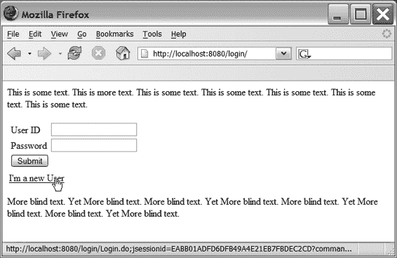

Doray_6048C14.fm Page 174 Tuesday, January 24, 2006 10:13 AM

**174**

第 14 章 ■ TILES

如图 14-2 所示，共有三种可能的视图：

• 一个包含用户 ID 和密码字段的“常规登录”表单（见图 14-3）
• 一个针对没有用户 ID 的用户的“新用户”表单（图 14-4）
• 一个“注销”视图，在用户已登录时显示（图 14-5）
此外，与我们之前讨论的 Tiles 组件不同，该组件接受用户输入——例如，用户 ID 和密码。

**图 14-3.** *常规登录表单*

[www.it-ebooks.info](http://www.it-ebooks.info/)

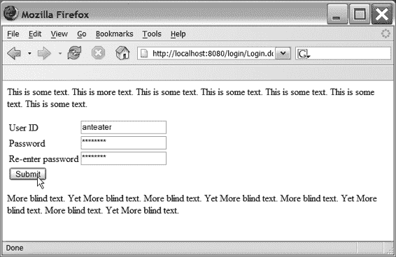

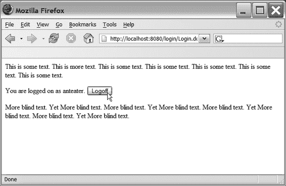

Doray_6048C14.fm Page 175 Tuesday, January 24, 2006 10:13 AM

第 14 章 ■ TILES

**175**

**图 14-4.** *新用户表单*

**图 14-5.** *注销视图*

由于这是一个更复杂的组件，出于教学目的，我将不按顺序描述组件的每个部分，而是从最简单的部分开始。

首先，清单 14-14 展示了如何将 Login Tiles 组件嵌入到*任何* JSP 页面中。

[www.it-ebooks.info](http://www.it-ebooks.info/)

Doray_6048C14.fm Page 176 Tuesday, January 24, 2006 10:13 AM

**176**

第 14 章 ■ TILES

**清单 14-14.** *index.jsp，一个嵌入了登录组件的 JSP 页面*

<%@ taglib uri="/tags/struts-tiles-el" prefix="tiles-el" %>

<html>

<body>

在本节中，我将介绍如何将我们的老朋友 ...

**<tiles-el:insert definition=".login"/>** 如图 14-2 所示，有 ...

</body>

</html>

从 taglib 声明可以看出，我将使用支持 Struts EL 的标签（参见第 10 章）。

图 14-3 和图 14-4 都显示登录组件接受用户输入。这些数据存储在一个名为 LogonForm 的 ActionForm 子类中（见清单 14-15）。

**清单 14-15.** *LogonForm.java*

package net.thinksquared.login.struts;

import javax.servlet.http.*;

import org.apache.struts.action.*;

public class LogonForm extends ActionForm {

public static final int UNDEFINED = 0;

public static final int LOGGED_ON = 1;

public static final int LOG_OFF = 2;


public static final int REGULAR = 3;

public static final int NEW_USER = 4;

protected int _status;

protected String _userid;

protected String _password;

protected String _password2;

protected boolean _hasErrors;

[www.it-ebooks.info](http://www.it-ebooks.info/)

Doray_6048C14.fm Page 177 Tuesday, January 24, 2006 10:13 AM

第 14 章 ■ 磁 砖

**177**

public LogonForm(){

_status = UNDEFINED;

_hasErrors = false;

}

public void setStatus(int i){ _status = i; }

public int getStatus(){ return _status; }

public void setUserid(String s){ _userid = s; }

public String getUserid(){ return _userid; }

public void setPassword(String s){ _password = s; }

public String getPassword(){ return _password; }

public void setPassword2(String s){ _password2 = s; }

public String getPassword2(){ return _password2; }

public ActionErrors validate(ActionMapping mapping,

HttpServletRequest request){

if(_status >= REGULAR){

ActionErrors errors = new ActionErrors();

if(_userid == null || _userid.length() < 1){

errors.add("userid",

new ActionMessage("userlogin.error.userid.blank"));

}else if(_password == null ||

_password.length() < 6 || _password.length() > 12){

errors.add("password",

new ActionMessage("userlogin.error.password.length"));

}else if(_status >= NEW_USER &&

(_password2 == null || !_password2.equals(_password))){

errors.add("password2",

new ActionMessage("userlogin.error.password.retype"));

}

if(!errors.isEmpty()){

_hasErrors = true;

return errors;

}

}

[www.it-ebooks.info](http://www.it-ebooks.info/)

Doray_6048C14.fm Page 178 Tuesday, January 24, 2006 10:13 AM

**178**

第 14 章 ■ 磁 砖

_hasErrors = false;

return null;

}

/*********** 状态码 ************/

public int getStatusRegular(){ return REGULAR; }

public int getStatusNewUser(){ return NEW_USER; }

public int getStatusLogOff() { return LOG_OFF; }

/********** 错误状态 ************/

public boolean hasErrors(){ return _hasErrors; }

/********** 清除表单数据 ********/

public void clear(){

_status = UNDEFINED;

_hasErrors = false;

_userid = _password = _password2 = null;

}

}

清单 14-15 应该不会让人感到意外，除了 `hasErrors()` 函数和三个用于状态码的函数：`getStatusRegular()`、`getStatusNewUser()` 和 `getStatusLogOff()`。这些函数的用途很快就会明了。

接下来，是登录组件的三个视图。清单 14-16 展示了“常规”视图（图 14-3）。

**清单 14-16.** *regular.jsp*

<%@ taglib uri="/tags/struts-bean-el" prefix="bean-el" %>

<%@ taglib uri="/tags/struts-html-el" prefix="html-el" %>

<html-el:form action="/Login.do">

<table>

<tr>

<td><bean-el:message key="userlogin.prompt.userid"/></td>

<td>

<html-el:text property="userid"/>

<html-el:errors property="userid"/>

</td>

</tr>

<tr>

[www.it-ebooks.info](http://www.it-ebooks.info/)

Doray_6048C14.fm Page 179 Tuesday, January 24, 2006 10:13 AM

第 14 章 ■ 磁 砖

**179**

<td><bean-el:message key="userlogin.prompt.password"/></td>

<td>

<html-el:password property="password"/>

<html-el:errors property="password"/>

</td>

</tr>

<tr colspan="2">

<td>

<html-el:hidden property="status"

value="${LogonForm.statusRegular}"/>

<html-el:submit>

<bean-el:message key="userlogin.prompt.submit"/>

</html-el:submit>

</td>

</tr>

</table>

</html-el:form>

<html-el:link action="/Login.do?command=${LogonForm.statusNewUser}">

<bean-el:message key="userlogin.prompt.new"/>

</html-el:link>

清单 14-16 包含一个表单和一个链接。表单接受两个字段：用户 ID 和密码字段。该链接允许新用户注册到系统。这个 JSP 页面也解释了 `LogonForm.java`（清单 14-15）中“状态码”函数的使用方法。

例如：

<html-el:hidden property="status"

value="${LogonForm.statusRegular}"/>

使用 EL 通过调用 `LogonForm` 上的 `getStatusRegular()` 函数来确定常规状态码的值。一种更简单的替代方案是硬编码该值：

<html-el:hidden property="status" value="3"/> //不要这样做！


哎呀！“新用户”视图（图 14-4）与常规视图类似，只是多了一个“确认密码”字段。清单 14-17 展示了该页面的 JSP 代码。

[www.it-ebooks.info](http://www.it-ebooks.info/)

Doray_6048C14.fm 第 180 页 2006 年 1 月 24 日星期二 上午 10:13

**180**

第 14 章 ■ TILES

**清单 14-17.** *newuser.jsp*

<%@ taglib uri="/tags/struts-bean-el" prefix="bean-el" %>

<%@ taglib uri="/tags/struts-html-el" prefix="html-el" %>

<html-el:form action="/Login.do">

<table>

<tr>

<td><bean-el:message key="userlogin.prompt.userid"/></td>

<td>

<html-el:text property="userid"/>

<html-el:errors property="userid"/>

</td>

</tr>

<tr>

<td><bean-el:message key="userlogin.prompt.password"/></td>

<td>

<html-el:password property="password"/>

<html-el:errors property="password"/>

</td>

</tr>

<tr>

<td><bean-el:message key="userlogin.prompt.password2"/></td>

<td>

<html-el:password property="password2"/>

<html-el:errors property="password2"/>

</td>

</tr>

<tr colspan="2">

<td>

<html-el:hidden property="status"

value="${LogonForm.statusNewUser}"/>

<html-el:submit>

<bean-el:message key="userlogin.prompt.submit"/>

</html-el:submit>

</td>

</tr>

</table>

</html-el:form>

最后，“注销”视图（见清单 14-18）只有一个注销按钮，如图 14-5 所示。

[www.it-ebooks.info](http://www.it-ebooks.info/)

Doray_6048C14.fm 第 181 页 2006 年 1 月 24 日星期二 上午 10:13

第 14 章 ■ TILES

**181**

**清单 14-18.** *success.jsp*

<%@ taglib uri="/tags/struts-bean-el" prefix="bean-el" %>

<%@ taglib uri="/tags/struts-html-el" prefix="html-el" %>

<html-el:form action="/Logoff.do">

<bean-el:message key="userlogin.prompt.loggedonas"

arg0="${LogonForm.userid}"/>

<html-el:submit>

<bean-el:message key="userlogin.prompt.logoff"/>

</html-el:submit>

<html-el:hidden property="status"

value="${LogonForm.statusLogOff}"/>

</html-el:form>

请注意，注销视图（success.jsp）将数据提交给名为 Logoff.do 的表单处理器，这与前两个视图不同，它们将数据提交给 Login.do。这是因为我们不需要对注销操作进行验证，因此在 struts-config.xml 中，Logoff.do 的声明设置了 validate="false"且没有输入页面。

接下来，我们检查 struts-config.xml 文件（见清单 14-19）。为清晰起见，我只展示 form-beans 和 action-mappings 部分。

**清单 14-19.** *struts-config.xml 的 form-beans 和 action-mappings 部分*

<form-beans>

<form-bean name="LogonForm"

type="net.thinksquared.login.struts.LogonForm"/>

</form-beans>

<action-mappings>

<action path="/Login"

type="org.apache.struts.actions.ForwardAction"

name="LogonForm"

scope="session"

validate="true"

input="/index.jsp"

parameter="/index.jsp"/>

[www.it-ebooks.info](http://www.it-ebooks.info/)

Doray_6048C14.fm 第 182 页 2006 年 1 月 24 日星期二 上午 10:13

**182**

第 14 章 ■ TILES

<action path="/Logoff"

type="org.apache.struts.actions.ForwardAction"

name="LogonForm"

scope="session"

validate="false"

parameter="/index.jsp"/>

<action path="/LoginController"

type="net.thinksquared.login.struts.UserLoginAction"

name="LogonForm"

scope="session"

validate="false">

<forward name="success" path="/userlogin/success.jsp"/>

<forward name="new-user" path="/userlogin/newuser.jsp"/>

<forward name="regular" path="/userlogin/regular.jsp"/>

</action>

</action-mappings>

这里的声明有点复杂，所以请务必仔细注意。首先，声明了 LogonForm。这你应该很熟悉，无需进一步解释。

接下来是三个表单处理器。前两个，Login.do 和 Logoff.do，由三个视图上的表单直接调用。常规视图和新用户视图提交到 Login.do，而注销视图提交到 Logoff.do。

这两个表单处理器之间的唯一区别是，Logoff.do 不验证表单数据（因为我们正在注销）。


`Login.do` 和 `Logoff.do` 都与 `ForwardAction` 关联，后者会转发到表单处理器 `parameter` 属性所指定的页面。对于 `ForwardAction` 而言，此 `parameter` 属性是*必需的*。除此之外，`ForwardAction` 不执行任何处理。

因此，从清单 14-19 的声明中可以明显看出，`Login.do` 和 `Logoff.do` 除了立即重新显示输入页面外，什么也不做！

这看起来可能有点奇怪。为什么提交的页面会立即重新显示，而显然没有经过任何处理？答案当然是，输入页面（清单 14-14）包含一个嵌入的 Login `<tiles:insert>`。当输入页面重新显示时，嵌入的 Tiles 组件也会被更新。在此更新过程中，会调用关联的 Tiles 控制器，表单数据才会被实际处理。

我们从清单 14-14 中看到，被调用的定义是 `.login`。该定义的声明如下：

<definition name=".login" path="/LoginController.do" /> 因此，Tiles 控制器就是名为 `LoginController.do` 的表单处理器：

[www.it-ebooks.info](http://www.it-ebooks.info/)

Doray_6048C14.fm 第 183 页 2006 年 1 月 24 日，星期二 上午 10:13

第 14 章 ■ TILES

**183**

<action path="/LoginController"

type="net.thinksquared.login.struts.UserLoginAction"

name="LogonForm"

scope="session"

**validate="false"** >

<forward name="success" path="/userlogin/success.jsp"/>

<forward name="new-user" path="/userlogin/newuser.jsp"/>

<forward name="regular" path="/userlogin/regular.jsp"/>

</action>

`UserLoginAction` 是 `TilesAction` 的子类，我稍后会进行描述。`LoginController` 本身*不*执行简单的验证（`validate="false"`），这不应引起任何疑问，因为简单的验证已由页面的主表单处理器 `Login.do` 完成。

所有表单处理器——`Login.do`、`Logoff.do` 和 `LoginController.do`——都设置为会话作用域。这是合理的，因为我们希望登录信息在用户与系统交互期间持续存在。这样做还有一个额外的好处：如果*另一个* JSP 页面嵌入了 Login 组件，将会显示正确的视图。用户只需登录一次，所有其他包含 Login 组件的页面也会正确反映这一点。

最后，我们来看 `UserLoginAction` 类（见清单 14-20），用户数据的处理和流程控制都在这里完成。

**清单 14-20.** *UserLoginAction.java*

package net.thinksquared.login.struts;

import java.io.IOException;

import javax.servlet.*;

import javax.servlet.http.*;

import org.apache.struts.tiles.*;

import org.apache.struts.tiles.actions.*;

import org.apache.struts.action.*;

public final class UserLoginAction extends TilesAction{

public ActionForward execute(ComponentContext ctx,

ActionMapping mapping,

ActionForm form,

HttpServletRequest request,

HttpServletResponse response)

throws IOException,ServletException{

[www.it-ebooks.info](http://www.it-ebooks.info/)

Doray_6048C14.fm 第 184 页 2006 年 1 月 24 日，星期二 上午 10:13

**184**

第 14 章 ■ TILES

LogonForm lForm = (LogonForm) form;

String cmd = request.getParameter("command");

if(cmd != null){

return mapping.findForward("new-user");

}

if(lForm.getStatus() == LogonForm.UNDEFINED){

return mapping.findForward("regular");

}

if(lForm.getStatus() == LogonForm.LOGGED_ON){

return mapping.findForward("success");

}

if(lForm.getStatus() == LogonForm.LOG_OFF){

System.out.println("Logging off " + lForm.getUserid()); lForm.clear();

return mapping.findForward("regular");

}

if(lForm.getStatus() == LogonForm.NEW_USER){

if(lForm.hasErrors()){

return mapping.findForward("new-user");

}else{

System.out.println("Creating New User " + lForm.getUserid()); return mapping.findForward("success");

}

}

if(lForm.getStatus() == LogonForm.REGULAR){

if(lForm.hasErrors()){

return mapping.findForward("regular");

}else{

System.out.println("Logging on regular user " +

lForm.getUserid());

return mapping.findForward("success");

}

}

[www.it-ebooks.info](http://www.it-ebooks.info/)

Doray_6048C14.fm 第 185 页 2006 年 1 月 24 日，星期二 上午 10:13

第 14 章 ■ TILES

**185**


//catch-all

return mapping.findForward("regular");

}

}

我们首先检查 URL 上是否有任何参数：`String cmd = request.getParameter("command");`

if(cmd != null){

return mapping.findForward("new-user");

}

URL 上可能存在参数的唯一原因是用户点击了 `regular.jsp` 上的“我是新用户”链接（参见清单 14-21）。

**清单 14-21.** *来自 regular.jsp 的链接片段*

<html-el:link action="/Login.do?command=${LogonForm.statusNewUser}">

<bean-el:message key="userlogin.prompt.new"/>

</html-el:link>

在这种情况下，我们显然想要显示新用户视图。

■**注意** 由于我们仅仅检查命令参数是否存在，我们本可以使用

<html-el:link action="/Login.do?command="dummy"..>。然而，如果将来我们添加更多链接视图，我们将不得不将链接改为类似于清单 14-21 的形式。

接下来的两个代码块只是重新显示必要的视图：

if(lForm.getStatus() == LogonForm.UNDEFINED){

return mapping.findForward("regular");

}

if(lForm.getStatus() == LogonForm.LOGGED_ON){

return mapping.findForward("success");

}

这在页面首次加载时（第一个块）或用户在登录后刷新页面时（第二个块）是必需的。

以下块用于注销用户，并在显示默认的常规视图之前注意清除表单：

[www.it-ebooks.info](http://www.it-ebooks.info/)

Doray_6048C14.fm Page 186 Tuesday, January 24, 2006 10:13 AM

**186**

第 14 章 ■ TILES

if(lForm.getStatus() == LogonForm.LOG_OFF){

System.out.println("Logging off " + lForm.getUserid()); lForm.clear();

return mapping.findForward("regular");

}

为清晰起见，我没有实现模型代码，而是使用 `System.out.println()` 调用来指示应该执行的操作。

最后两个块可能是最有趣的：

if(lForm.getStatus() == LogonForm.NEW_USER){

if(lForm.hasErrors()){

return mapping.findForward("new-user");

}else{

System.out.println("Creating New User " + lForm.getUserid()); return mapping.findForward("success");

}

}

if(lForm.getStatus() == LogonForm.REGULAR){

if(lForm.hasErrors()){

return mapping.findForward("regular");

}else{

System.out.println("Logging on regular user " + lForm.getUserid()); return mapping.findForward("success");

}

}

所有这些代码块所做的就是在用户正确填写常规登录表单或新用户登录表单后显示注销视图。但请注意，在显示注销视图之前，会使用 `hasErrors()`（参见清单 14-15）检查表单是否有错误。

这就是我们在 `LogonForm` 上创建 `hasErrors()` 函数的原因——它使 Login 组件能够判断表单数据是否通过了简单的验证。

我们不能依赖 Struts 在简单验证失败时自动重新显示页面，因为当页面重新显示时，Login Tiles 组件的 JSP 并不存在。是 Tiles 控制器（`UserLoginAction`）决定将哪个 JSP 粘贴到输入页面中。因此，它必须知道是否存在验证错误，以便粘贴正确的 JSP。在 `LogonForm` 上创建一个 `hasErrors()` 函数是实现此目的的一种简单方法。

这基本上就结束了 Login Tiles 组件的示例。请访问 Apress 网站的源代码部分 http://www.apress.com 下载 Login Tiles 组件的源代码。名为 `login.war` 的 WAR 文件已准备好部署，它也在 Apress 网站的源代码部分。我鼓励您尝试这个简单的 Tiles 组件，以更好地理解 Tiles 组件的工作原理。

[www.it-ebooks.info](http://www.it-ebooks.info/)

Doray_6048C14.fm Page 187 Tuesday, January 24, 2006 10:13 AM

第 14 章 ■ TILES

**187**

**获取外部表单数据**

如果页面上有多个 Tiles 组件会怎样？清单 14-20 中的强制转换 `LogonForm lForm = (LogonForm) form;` 会抛出异常吗？答案是不会，因为传递给 Tiles 控制器的 `ActionForm` 类型（更准确地说，是表单 bean）必须与 `struts-config.xml` 中声明的类型匹配。如果没有提交这样的表单 bean，则会创建一个空白的表单 bean 并传递给 Tiles 控制器。这意味着只要声明正确，强制转换将*始终有效*。

这有一个有趣的推论：假设表单数据被发送到与表单 bean X 关联的表单处理器。那么，同一页面上所有也与此表单 bean X 关联的 Tiles 组件都将收到该表单数据的副本。

例如，考虑以下一组表单处理器声明：

<action path="MyAction" name="MyFormBean" type="...">

<action path="MyTileControllerA" name="MyFormBean" type="...">

<action path="MyTileControllerB" name="MyFormBean" type="...">

<action path="MyTileControllerC" name="DifferentFormBean" type="...">

以及以下 JSP 页面片段：

<html:form action="/MyAction.do">

...

</html:form>

<tiles:insert definition=".myTilesComponentA"/>

<tiles:insert definition=".myTilesComponentB"/>

<tiles:insert definition=".myTilesComponentC"/>

当表单数据被提交时，它首先被存储在一个 `MyFormBean` 实例中，然后由与 `MyAction` 关联的 `Action` 子类处理。

不太明显的是，`MyTileControllerA` 和 `MyTileControllerB` 上的 `execute()` 函数会接收到 `MyFormBean` 的*独立副本*。`MyTilesControllerC` 的 `execute()` 函数会接收到一个新的 `DifferentFormBean` 实例。

您将在接下来的实验环节中使用这个技巧，让 Tiles 组件从外部表单接收数据。

**实验 14：查找功能**

我们希望向 `full.jsp` 和 `mnc.jsp` 添加一个查找功能，并对现有代码进行最少的修改。具体来说：

[www.it-ebooks.info](http://www.it-ebooks.info/)

Doray_6048C14.fm Page 188 Tuesday, January 24, 2006 10:13 AM

**188**

第 14 章 ■ TILES

•   我们希望使用两个 JSP 中的现有表单将关键字搜索传递到我们的查找工具中。
•   如果用户点击“查找”，表单数据将用作关键字。将出现一个与查询匹配的联系人列表。每个联系人都是一个 HTML 链接。
•   如果用户点击某个联系人链接，表单将填充该联系人的数据。如果用户点击“提交”，表单数据将被解释为对联系人信息的更新。
•   如果用户只是填写表单并点击“提交”而不是“查找”，则表单数据将被解释为新条目。

图 14-6 显示了查找功能在 `full.jsp` 和 `mnc.jsp` 页面中的位置。

**图 14-6.** *查找功能在现有 JSP 页面中的位置*
请注意，表单现在有两个提交按钮：一个用于提交表单数据（“真正的”提交按钮），另一个用于将键入的数据作为搜索查询提交（查找按钮）。

解决这个问题的最佳方法是使用 `LookupDispatchAction` 技术（参见第 17 章）。在继续之前，请阅读有关 `LookupDispatchAction` 的部分。

本实验还使用了 Lisptorq 生成的模型类，因此请务必先阅读附录 A 中的相关部分。

[www.it-ebooks.info](http://www.it-ebooks.info/)

Doray_6048C14.fm Page 189 Tuesday, January 24, 2006 10:13 AM

第 14 章 ■ TILES

**189**

**步骤 1：设置 Tiles**

**1.** 在 `struts-config.xml` 中添加 Tiles 的插件部分。记得将插件部分放在文件末尾。将 Tiles 定义文件命名为 `tiles-def.xml`。
**2.** Tiles 使用一个名为 `struts-tiles.tld` 的标签库。在 `web.xml` 中声明它。

**步骤 2：编写控制器**

类 `ContactPeer` 有一个 `find()` 函数：

public static Scroller find(Contact query)

您将需要此函数来基于给定的 `Contact` 执行搜索。


现在，与 Find 磁贴相关的 Controller 类是 FindAction，它是 `net.thinksquarded.lilldep.struts.TilesLookupDispatchAction` 的子类。这个基类的使用方式与 LookupDispatchAction（参见第 17 章）大致相同，但它是专门为 Tiles 设计的。

**1.** 完成 FindAction 中 `find()` 方法的实现，使其从给定的 ActionForm 中提取 Contact 实例。将 Contact 的*克隆*版本保存到当前会话中，键为 `JSPConstants.FIND_QUERY`。使用 `Contact.klone()` 方法来克隆 Contact。

**2.** 使用 `ContactPeer.find()` 方法，利用此 Contact 创建一个 Scroller 对象。将此 Scroller 对象放置到当前请求中，键为 `JspConstants.FIND_RESULTS`。

**3.** `find()` 应返回 `null`，因为导航由表单的主处理器决定。

**4.** 完成 FindAction 中 `unknown()` 方法的实现，使其在会话中查找键为 `JspConstants.FIND_QUERY` 的 Contact。如果该 Contact 存在，则使用它通过 `ContactPeer.find()` 获取一个 Scroller。将 Scroller 保存到当前请求中。`unknown()` 应返回 `null`。

**5.** 实现 `getKeyMethodMap()` 函数，其要求与 `LookupDispatchAction.getKeyMethodMap()` 相同。

**6.** 使用 `compile.bat` 检查你的代码是否能编译通过。

[www.it-ebooks.info](http://www.it-ebooks.info/)

Doray_6048C14.fm Page 190 Tuesday, January 24, 2006 10:13 AM

**190**

第 14 章 ■ 磁贴（TILES）

我希望你明白我们在这里做什么。我们想将查询保存到会话作用域中，以便能够在页面间查看 Find 结果。我们不能简单地保存 Scroller（并在每次需要时使用 `absolute()` 重置它），因为我们可能会更改 Contact 的详细信息，使其不再匹配查询。

这一步中有几个微妙之处：

• 注意，我们必须保存查询的克隆，而不是查询本身。这是因为 Struts 会重置查询对象本身的字段。这是 Struts 工作方式的一部分。因此，为了避免持有一个被清空的表单，我们必须克隆它。

• 当 URL 中的 `command` 参数指向 Tiles Controller（即 FindAction）上不存在的函数时，会调用 `unknown()` 函数（你可以从 `TilesLookupDispatchAction` 中看到此行为）。在我们的例子中，当用户点击 Submit 而不是 Find 时，会调用 `unknown()`。

• 当 `full.jsp` 页面被直接调用或被其他表单处理器（例如 `EditContact.do`）调用时，URL 中不存在 `command` 参数。这意味着会调用 `TilesLookupDispatchAction` 上的 `unspecified()` 函数。因此，为了让 Find 工具正确更新自身，`unspecified()` 必须调用 `unknown()`。

**第 3 步：添加 Tiles Action 映射**

**1.** 在 `struts-config.xml` 中创建一个新的表单处理器，以声明你刚刚创建的 Tiles controller。

**2.** 将 `parameter` 属性设置为 `command`。这对于 `TilesLookupDispatchAction` 根据点击的提交按钮正确分发是必要的。

**3.** 将表单处理器的 `scope` 设置为 `session`，以匹配主表单的作用域。

**4.** 确保你的 Tiles controller 能够获取从主页面提交的表单副本。（请参阅“获取外部表单数据”一节了解如何实现。）**第 4 步：修改 ContactAction**

由于现在有*两个*提交按钮（Submit 和 Find），我们需要 ContactAction 处理 Submit 而忽略 Find。

[www.it-ebooks.info](http://www.it-ebooks.info/)

Doray_6048C14.fm Page 191 Tuesday, January 24, 2006 10:13 AM

第 14 章 ■ 磁贴（TILES）

**191**

**1.** 我们将使用 `LookupDispatchAction` 来实现这一点，因此你需要将 ContactAction 的基类更改为 `LookupDispatchAction`。

**2.** 将 `execute()` 方法的名称更改为 `save()`。

**3.** 因为现在有两个提交按钮，我们不能依赖 Struts 自动为我们验证表单。这意味着我们必须从 `save()` 中调用 `validate` 函数。进行必要的更改以实现这一点，并注意在 `struts-config.xml` 中将关联表单处理器的 `validate` 设置为 `false`。

**4.** 实现 `find()` 函数，其签名和返回类型与 `execute()` 相同。此函数应将表单的 Contact 替换为一个干净的实例，然后返回名为 `success` 的 forward。

**5.** 实现 `getKeyMethodMap()`。

你还需要向与 ContactAction 关联的表单处理器（有两个）添加一个名为 `parameter` 的额外属性，其值设置为 `command`。这是 `LookupDispatchAction` 根据点击的提交按钮正确分发所必需的。

**第 5 步：编写 Tiles JSP**

**1.** 编辑 `find-tile.jsp`，使其使用按名称 `JspConstants.FIND` 保存在请求上的 Scroller 来显示公司名称。提示：使用 `<logic:iterate>` 并像在 `listing.jsp` 中那样进行迭代。记得检查 Scroller 是否为 null。

**2.** 为每个公司名称创建一个指向 EditAction 的链接，就像你在第 13 章的 `listing.jsp` 中所做的那样。

**3.** 如果你能让公司名称链接的背景在被点击时改变颜色（不使用 JavaScript 解决方案——使用 Struts），你将获得额外加分。

**第 6 步：编写 Tiles 定义**

在 Tiles 定义文件 `tiles-def.xml` 中添加一个新定义。该定义应执行以下操作：

• 为定义提供一个唯一的名称。

• 将第 2 步中的 Tiles 表单处理器链接到第 4 步中的 Tiles JSP。

[www.it-ebooks.info](http://www.it-ebooks.info/)

Doray_6048C14.fm Page 192 Tuesday, January 24, 2006 10:13 AM

**192**

第 14 章 ■ 磁贴（TILES）

**第 7 步：添加 Find 磁贴**

现在，你需要将 Find 磁贴放入你的 JSP 中。我们从 `full.jsp` 开始：**1.** 查看布局规范（图 14-6），并放入一个包含两个单元格的表格。一个单元格将容纳现有的数据输入面板，另一个（右侧）将容纳 Find 按钮和结果窗口。

**2.** 放入一个 Find 按钮（在 `Application.properties` 中查找键！），它是一个 `<html:submit>`。

**3.** 你需要将 `property="command"` 添加到新的 Find 按钮以及现有的 Submit 按钮上。

**4.** 添加 Tiles 标签库的 taglib 声明。

**5.** 对 `mnc.jsp` 重复步骤 1-3。

**第 8 步：部署和测试**

编译并部署你的 webapp。验证以下内容：

• Find 工具是否工作？换句话说，当你使用 Find 时，是否能看到公司列表？

• 当你点击公司名称链接时，表单是否会填充数据？

• 当你点击公司名称时，其背景颜色是否会改变？

• 当你进行更改时，联系人信息是否正确更新？

• 当你进行更新时，Find 结果是否会改变？例如，如果你对某个公司名称执行 Find 操作，然后更改该公司名称，Find 列表是否会改变？

• Find 在 `full.jsp` 和 `mnc.jsp` 上是否都能正常工作？

• 如果你使用 full/MNC 输入表单输入新联系人，数据库是否正确创建了新联系人？

[www.it-ebooks.info](http://www.it-ebooks.info/)

Doray_6048C14.fm Page 193 Tuesday, January 24, 2006 10:13 AM

第 14 章 ■ 磁贴（TILES）

**193**

**总结**

• Tiles 是一种用于创建布局和组件的机制。

• 布局有助于简化 Web 应用程序的外观和感觉。

• Tiles 组件是一种创建可重用 GUI 组件的方式。

[www.it-ebooks.info](http://www.it-ebooks.info/)

Doray_6048C14.fm Page 194 Tuesday, January 24, 2006 10:13 AM

[www.it-ebooks.info](http://www.it-ebooks.info/)

Doray_6048C15.fm Page 195 Tuesday, January 24, 2006 10:13 AM

第 15 章

■ ■ ■

验证器框架

**验**证器框架是一个 Struts 插件，最初由 David Winterfeldt 创建，它提供了一组*通用验证*，你可以使用它们来运行各种简单的验证。


与其在 ActionForm 子类中实现 validate() 函数，不如将验证规则声明在 XML 文件中。

因此，Validator 框架消除了在 ActionForm 子类中实现 validate() 的必要性。（你仍然需要 ActionForm 子类来存储表单数据。）与在 ActionForm 子类中编写单独的 validate() 函数相比，使用 Validator 框架能带来诸多好处：

• **更好的可维护性**：由于新的 XML 格式验证都集中在一个文件中，你可以更轻松地维护这些验证规则。

• **标准化**：许多简单的验证需要执行相同的检查。例如，用户 ID 和密码字段可能都需要检查以确保它们仅由字母数字组成。如果这些检查分散在多个 validate() 函数中，标准化将是一项挑战。正如你将看到的，Validator 框架能让你更轻松地标准化验证规则。

• **正确的实现**：一些“简单”的验证实际上很难正确实现！一个典型的例子是验证电子邮件地址是否符合 RFC-2822 规范（该规范涉及电子邮件地址格式等）。与其重新发明轮子，不如直接利用 Validator 框架提供的验证功能。

• **更少的代码重复**：同样，由于 Validator 框架提供了一套相当全面的验证规则，你可以减少代码重复。你无需在每个 Web 应用程序中自行实现信用卡号等内容的验证代码。你可能会说，可以一次性编写这些验证，放入一个类中，然后在所有应用程序中复用。确实如此，但这意味着团队新成员需要学习更多内容才能高效工作。

在最坏的情况下，一些开发者可能会忘记共享的验证库，而在自己的 validate() 函数中重复编写验证逻辑。

**195**

[www.it-ebooks.info](http://www.it-ebooks.info/)

Doray_6048C15.fm Page 196 Tuesday, January 24, 2006 10:13 AM

**196**

第 15 章 ■ VALIDATOR 框架

• **自动客户端验证**：只需在 JSP 中放置一个 `<html:javascript/>` 标签，即可自动生成客户端的 JavaScript 验证。Validator 框架会自动为你生成这些验证。不过，Validator 框架的这一功能仍处于开发阶段；目前无法指定*仅*进行客户端验证。

Validator 框架提供了一套相当全面的通用验证规则，你应该能够用 XML 声明替换所有 validate() 函数。

然而，如果无法完全替换，你也可以在 Validator 框架声明的验证规则*之外*，运行自己的自定义验证。此外，还可以*扩展* Validator 框架提供的标准验证规则集。

**声明 Validator 插件**

与 Tiles（参见第 14 章）类似，Validator 框架独立于 Struts。它属于 Apache Commons 项目（参见本章末尾的“有用链接”），该项目旨在创建一组可重用的框架，Validator 框架便是其中之一。

实际上，Validator 框架的内部实现存储在 Struts 发行版附带的 commons-validator.jar 文件中。该 JAR 文件包含了框架的所有 Java 类以及用于运行客户端验证的 JavaScript。

要在 Struts 应用程序中使用 Validator 框架，你需要声明它。这意味着需要在 struts-config.xml 文件中添加 `<plug-in>` 声明（参见清单 15-1）。

**清单 15-1.** *struts-config.xml 中 Validator 框架的插件声明*

<plug-in className="org.apache.struts.validator.ValidatorPlugIn" >

<set-property property="pathnames"

value="/WEB-INF/validator-rules.xml,/WEB-INF/validation.xml"/>

</plug-in>


请注意，这里是 `ValidatorPlugIn`（大写字母 I）。一个常见的错误来源是使用小写字母“i”，就像 `TilesPlugin` 中那样。

`<set-property>` 标签设置了一个名为 `pathnames` 的单一属性，该属性对插件是可访问的。

`pathnames` 的值是一组以逗号分隔的文件：

• `validator-rules.xml` 是一组为 Validator 框架声明的通用验证规则。该文件已随 Struts 发行版提供。

• `validation.xml` 将你的 `ActionForm` 子类（更准确地说，是声明的表单 bean）中的每个字段，与从 `validator-rules.xml` 中声明的规则里选取的一个或多个验证规则关联起来。因此，`validation.xml` 就是你替换 `ActionForm` 子类中 `validate()` 函数的地方。

[www.it-ebooks.info](http://www.it-ebooks.info/)

Doray_6048C15.fm 第 197 页 2006 年 1 月 24 日，星期二，上午 10:13

第 15 章 ■ 验证器框架

**197**

正如声明所示，你需要将这两个文件都放在 Web 应用的 `/WEB-INF/` 文件夹中。

`validator-rules.xml` 和 `validation.xml` 具有相同的结构——也就是说，它们由相同的 XML 文档标签定义（DTD）来描述。

■**注意** DTD 包含在 `commons-validator.jar` 文件中，该文件随 Struts 发行版提供，路径为 `/org/apache/commons/resources/validator_1_1_3.dtd`。

由于它们结构相同，你完全可以创建一个包含两者信息的单一文件。当然，这会导致维护问题。

或者，你也可以将 `validation.xml` 文件拆分成多个文件。要使用它们，只需更改插件声明即可。例如，如果你有三个验证文件，分别名为 `A.xml`、`B.xml` 和 `C.xml`，那么代码清单 15-1 将更改为代码清单 15-2 所示。Struts 在处理之前，会将代码清单 15-2 中声明的所有*四个*文件拼接在一起。

**代码清单 15-2.** *将 validation.xml 文件拆分为三部分*

<plug-in className="org.apache.struts.validator.ValidatorPlugIn" >

<set-property property="pathnames"

value="/WEB-INF/validator-rules.xml,

/WEB-INF/A.xml,

/WEB-INF/B.xml,

/WEB-INF/C.xml"/>

</plug-in>

如果你的项目包含子项目，拆分 `validation.xml` 文件会很有用。管理并维护几个较小的文件（每个文件包含来自单个子项目的表单）比管理一个包含所有项目验证规则的大文件要容易得多。

**Validator DTD 基础**

由于 `validator-rules.xml` 和 `validation.xml` 文件在 Validator 框架中扮演核心角色，你必须理解它们的结构。代码清单 15-3 是 Validator DTD 的一个片段，它描述了 Validator XML 结构的主要划分。

**代码清单 15-3.** *Validator XML 结构的顶层节点*

<!ELEMENT form-validation (global*, formset*)>

<!ELEMENT global (validator*, constant*)>

<!ELEMENT formset (constant*, form+)>

[www.it-ebooks.info](http://www.it-ebooks.info/)

Doray_6048C15.fm 第 198 页 2006 年 1 月 24 日，星期二，上午 10:13

**198**

第 15 章 ■ 验证器框架

`<form-validation>` 标签是根标签，所有其他标签都包含在其中。`<form-validation>` 的重要子标签包括：

• `<global>`，它又包含“全局”常量的声明（我们稍后会讲到）或验证器的声明。

• `<formset>`，代表针对某个区域设置的验证规则。我们将在本章末尾讨论这一点。

• `<form>`，它是 `<formset>` 的子标签，包含你对 `struts-config.xml` 中声明的任何表单 bean 上字段的验证规则。你将在 `validation.xml` 文件中声明这些规则。

在 `validator-rules.xml` 文件中，你只会看到 `<validator>` 声明，每个声明对应 Validator 框架中可用的一个通用验证器。

你的 `validation.xml` 文件应仅包含 `<form>` 或 `<constant>` 声明。这种在 `validator-rules.xml` 和 `validation.xml` 之间的标签划分纯粹是为了可维护性：你将所有声明的验证规则放在 `validator-rules.xml` 中，而将你对验证规则的*使用*放在 `validation.xml` 中。


在向您展示如何使用和扩展 Validator 框架时，我将更详细地描述这些标签。

**使用 Validator 框架**

使用 Validator 框架非常简单：

• 对于每个需要验证的表单 bean，您需要在 `validation.xml` 文件中添加一个新的 `<form>` 标签。`<form>` 标签的 `name` 属性应与表单 bean 的名称相同。

• 对于表单 bean 中每个需要验证的字段，您需要在 `<form>` 标签内添加一个 `<field>` 子标签。`<field>` 标签的 `property` 属性应与您要验证的字段名称相同。`property` 属性支持嵌套字段（有关嵌套字段/属性的详细信息，请参阅第 10 章）。

• `<field>` 标签还有一个 `depends` 属性，您可以使用该属性指定要为此字段运行的验证。验证的名称以逗号分隔的列表形式指定。

• `<field>` 标签可能包含可选的子标签，用于自定义错误消息或验证器使用的变量（例如，字段的最小长度）。

• 确保您的表单 bean 是 `org.apache.struts.validator.ValidatorForm` 的子类。

[www.it-ebooks.info](http://www.it-ebooks.info/)

Doray_6048C15.fm 第 199 页 2006 年 1 月 24 日，星期二，上午 10:13

第 15 章 ■ VALIDATOR 框架

**199**

就是这样！为了了解其工作原理，让我们探讨如何使用 Validator 框架来验证 `RegistrationForm`，这是 Registration webapp 的唯一表单 bean（参见第 6 章中的清单 6-1）。

**示例：验证 RegistrationForm**

`RegistrationForm`（参见清单 6-1）有三个需要验证的字段。在本节中，我将创建一个使用 Validator 框架的 `RegistrationForm` 版本。新的 `RegistrationForm.java` 类如清单 15-4 所示。

**清单 15-4.** *用于 Validator 框架的 RegistrationForm.java*
```java
package net.thinksquared.registration.struts;

import org.apache.struts.validator.*;

public final class RegistrationForm extends ValidatorForm{

    private String _userid = null;
    private String _pwd = null;
    private String _pwd2 = null;

    /**
     * 与表单属性对应的 getXXX 和 setXXX 函数
     */
    public String getUserid(){ return _userid; }
    public void setUserid(String userid){ _userid = userid; }
    public String getPassword(){ return _pwd; }
    public void setPassword(String pwd){ _pwd = pwd; }
    public String getPassword2(){ return _pwd2; }
    public void setPassword2(String pwd2){ _pwd2 = pwd2; }
}
```

如果将清单 15-4 与清单 6-1 进行比较，您会注意到一些变化：

• `RegistrationForm` 现在继承自 `org.apache.struts.validator.ValidatorForm`，而不是 `org.apache.struts.action.ActionForm`。
• `validate()` 函数已经消失。

[www.it-ebooks.info](http://www.it-ebooks.info/)

Doray_6048C15.fm 第 200 页 2006 年 1 月 24 日，星期二，上午 10:13

**200**

第 15 章 ■ VALIDATOR 框架

您需要继承 `ValidatorForm`，因为此基类将运行您在 `validation.xml` 文件中声明的验证。这也解释了 `validate()` 函数消失的原因——Struts 将改为调用 `ValidatorForm` 上的 `validate()` 方法。

■**注意** `RegistrationForm` 的表单 bean 声明将保持不变。

为了理解如何声明验证，请考虑 `RegistrationForm` 有三个字段：`userid`、`password` 和 `password2`。清单 6-1 中运行的检查是为了确保 `userid` 已填写，并且 `password` 和 `password2` 匹配。

这些验证并不完整。我们将为 `userid` 和 `password` 添加最大/最小长度检查，并检查 `userid` 和 `password` 是否仅限于字母数字字符。包含所有这些检查的 `validation.xml` 文件如清单 15-5 所示。

**清单 15-5.** *为 RegistrationForm 声明验证*

```xml
<?xml version="1.0" encoding="ISO-8859-1" ?>
<!DOCTYPE form-validation PUBLIC ... *//* 为清晰起见已截断

<form-validation>
    <formset>
        <form name="RegistrationForm">
            <field property="userid"
                depends="required,mask,maxLength,minLength">
                <msg name="required" key="reg.error.userid.missing" />
                <msg name="mask" key="reg.error.userid.alphanum"/>
```


<msg name="minLength" key="reg.error.userid.length" />

<msg name="maxLength" key="reg.error.userid.length" />

<arg name="minLength" key="${var:minlength}" position="0"

resource="false"/>

<arg name="minLength" key="${var:maxlength}" position="1"

resource="false"/>

<arg name="maxLength" key="${var:minlength}" position="0"

resource="false"/>

<arg name="maxLength" key="${var:maxlength}" position="1"

resource="false"/>

[www.it-ebooks.info](http://www.it-ebooks.info/)

Doray_6048C15.fm 第 201 页 2006 年 1 月 24 日星期二 上午 10:13

第 15 章 ■ 验证器框架

**201**

<var>

<var-name>mask</var-name>

<var-value>^[a-zA-Z0-9]*$</var-value>

</var>

<var>

<var-name>minlength</var-name>

<var-value>5</var-value>

</var>

<var>

<var-name>maxlength</var-name>

<var-value>10</var-value>

</var>

</field>

<field property="password"

depends="required,mask,maxLength,minLength">

*//* 与 userid 的验证类似，

*// 为清晰起见，此处省略。*

*</field>

<field property="password2" depends="validwhen">

<msg name="validwhen" key="reg.error.password.mismatch"/>

<var>

<var-name>test</var-name>

<var-value>(password == *this*)</var-value>

</var>

</field>

</form>

</formset>

</form-validation>

如您所见，这里只有一个 `<formset>` 标签，这意味着我们尚未对任何验证进行本地化。请不要误解——*错误消息*是本地化了的，因为清单 15-5 明显使用了属性文件中的键。但验证本身并未本地化。

要理解其中的区别，请参考第 12 章中关于“本地化验证”的讨论。

大多数情况下，您不需要本地化验证，因此您的 `validation.xml` 文件将只包含一个 `<formset>` 标签。我将在本章末尾描述如何使用多个 `<formset>` 标签来帮助您本地化验证。

[www.it-ebooks.info](http://www.it-ebooks.info/)

Doray_6048C15.fm 第 202 页 2006 年 1 月 24 日星期二 上午 10:13

**202**

第 15 章 ■ 验证器框架

嵌套的 `<form>` 标签是实际操作发生的地方。在清单 15-5 中，只有一个 `<form>` 标签，对应于需要验证的 `RegistrationForm` 表单 Bean。如果您有其他需要验证的表单 Bean，那么 `<formset>` 将包含更多的 `<form>` 标签，每个表单 Bean 对应一个。

每个字段的验证是分开进行的。`password` 字段的验证与 `userid` 的验证非常相似，因此我省略了这个字段。从 `userid` 字段的 `<field>` 声明中，您可以看出我运行了四个验证：

<field property="userid"

depends="required,mask,maxLength,minLength">

`required` 验证器检查该字段是否由用户填写。它不需要额外的信息即可运行。如果 `required` 验证失败，以下 `<msg>` 标签

<msg name="required" key="reg.error.userid.missing"/> 确保显示由键 `reg.error.userid.missing` 指定的错误消息。

可以使用 `resource=false` 属性强制显示静态字符串（但不建议这样做）：

<msg name="required" key="Userid is missing!" resource="false"/> `mask` 验证器检查字段的值是否与给定的正则表达式匹配。

■**注意** 正则表达式是一种紧凑表达任何字符串的方式。例如，DOS 正则表达式 `*.*` 匹配所有带扩展名的文件名。正则表达式语言因提供者而异，因此在验证器框架中使用 `*.*` 将 ***不会*** 匹配每个带扩展名的文件名。验证器框架使用一种更强大的正则表达式语言，类似于 Perl 编程语言中使用的语言。有关参考，请参阅本章末尾的“有用链接”部分。

这个正则表达式在 `var` 标签中给出：

<var>

<var-name>mask</var-name>

<var-value>^[a-zA-Z0-9]*$</var-value>

</var>

这声明了一个名为 `mask` 的*变量*，其值为 `^[a-zA-Z0-9]*$`。`mask` *验证器*需要定义此变量才能工作。在这种情况下，正则表达式匹配字母数字字符串（包含罗马字母和阿拉伯数字 0 到 9 的字符串）。

类似地，`maxLength` 和 `minLength` 验证器分别需要变量 `maxlength` 和 `minlength`。

[www.it-ebooks.info](http://www.it-ebooks.info/)

Doray_6048C15.fm 第 203 页 2006 年 1 月 24 日星期二 上午 10:13

第 15 章 ■ 验证器框架

**203**

这些检查的错误消息需要一些解释。例如，`minLength` 的自定义错误消息由以下代码声明：

<msg name="minLength" key="reg.error.userid.length"/> `Application.properties` 中此键对应的条目是：

Passwords should be between {0} and {1} characters long

`{0}` 和 `{1}` 替换参数必须使用 `<arg>` 标签定义：

<arg name="minLength" key="${var:minlength}" position="0"

resource="false"/>

<arg name="minLength" key="${var:maxlength}" position="1"

resource="false"/>

`name` 属性对应于验证器的名称（在 `<msg>` 标签中也存在），而此处的 `key` 指的是 `minlength` 和 `maxlength` 变量的值。由于 `key` 属性应被解释为静态值，而不是 `Application.properties` 中的键，因此我设置了 `resource="false"`。`position` 属性指示此替换参数所对应的位置。

**本地化替换参数**

在清单 15-5 中，替换参数*没有*被本地化。因此，阿拉伯语地区的用户会看到阿拉伯语的错误消息，*除了*数字部分（现代阿拉伯数字与所谓的“阿拉伯”数字 0 到 9 不同——后者由印度教徒在印度发明，后来传入西方）。

如果您需要本地化替换参数，有两种选择：

• 将变量硬编码到错误消息中。如果您不期望在其他错误消息中重用该替换参数，这是最佳选择。

• 如果需要重用替换参数，请在您的 `Application.properties` 文件中将其声明为键/值对。然后使用 `<arg>` 标签，其 `key` 属性对应此键，并省略 `resource` 属性，或设置 `resource="true"`。

只有当为其声明的所有验证器都通过时，`userid` 字段的验证才算成功。

`password2` 字段的验证使用了 `validwhen` 验证器，我将在后面的章节（“使用 validwhen”）中更详细地描述它。

**验证嵌套和索引属性**

`userid`、`password` 和 `password2` 都是*简单*属性（定义见第 10 章）。您也可以验证*嵌套*和*索引*属性。

[www.it-ebooks.info](http://www.it-ebooks.info/)

Doray_6048C15.fm 第 204 页 2006 年 1 月 24 日星期二 上午 10:13

**204**

第 15 章 ■ 验证器框架

对于嵌套属性，只需使用通常的 `.` 表示法设置字段的 `property` 属性来访问嵌套属性。例如，设置 `property="contact.email"` 会验证给定表单的 `contact` 属性上的 `email` 属性。

验证索引属性则略有不同。假设您有一个返回数组*或值集合的函数，并且您想要验证数组中的每个项。* 方法是使用 `<field>` 的 `indexedListProperty` 属性。例如：

<field indexedListProperty="items" ...

将 `items` 解释为数组或集合，并将验证该数组/集合中的每个元素。

您还可以将索引属性与简单或嵌套属性结合使用。例如：

<field indexedListProperty="items" property="id" ...

将验证 `items` 数组/集合中每个元素的 `id` 属性。而

<field indexedListProperty="contacts" property="address.postcode" ...

将验证 `contacts` 数组/集合中每个元素上的嵌套属性 `address.postcode`。

**使用常量**


用户 ID 和密码的验证都会检查用户输入的值是否由字母数字组成。在清单 15-5 中，每个验证的正则表达式都是重复的。有没有办法“共享”这些正则表达式？答案是“有”，方法是将正则表达式声明为常量。你有两种选择：

• 定义全局常量——一种对每个`<formset>`中的每个字段都可访问的常量。

• 定义单个`<formset>`内每个字段都可访问的常量。

要声明全局常量，你需要将以下 XML 放置在第一个`<formset>`标签*之前*：

<global>

<constant>

<constant-name>alphanumericMask</constant-name>

<constant-value>^[a-zA-Z0-9]*$</constant-value>

</constant>

</global>

这将声明一个名为`alphanumericMask`的常量，其值为`^[a-zA-Z0-9]*$`。在`<formset>`中声明常量类似：

[www.it-ebooks.info](http://www.it-ebooks.info/)

Doray_6048C15.fm 第 205 页 2006 年 1 月 24 日星期二 上午 10:13

第 15 章 ■ 验证器框架

**205**

<formset>

<constant>

<constant-name>alphanumericMask</constant-name>

<constant-value>^[a-zA-Z0-9]*$</constant-value>

</constant>

<form name="RegistrationForm" ...

请注意，根据 DTD，`<constant>`必须在`<formset>`标签的开头声明。

要在上述任一情况下使用已声明的`alphanumericMask`常量，你需要使用`${constant-name}`引用：

<var>

<var-name>mask</var-name>

<var-value> **${alphanumericMask}**</var-value>

</var>

**客户端验证**

要创建客户端验证，只需在 JSP 页面的任意位置放置一个`<html:javascript form="MyFormBean"/>`标签，这样 Struts 就能在最终的网页中嵌入 JavaScript，以运行客户端验证。但请记住，没有简单的方法（除了修改验证器本身，或者编写插件）可以阻止表单通过服务器端验证。

这可能会让你怀疑客户端验证是否还有用！公平地说，验证器框架正在积极开发中，我相信我们很快会看到客户端验证方面的改进。

接下来，我们来看看验证器框架中可用的标准验证器。

**标准验证器**

表 15-1 列出了撰写本文时（Struts 1.2.4 至 1.2.7 版本）的所有标准验证器。然而，正如我提到的，验证器框架正在积极开发中，因此请务必查看 Struts 验证器网站（参见“有用链接”部分）以获取最新信息。

表 15-1 的第一列显示验证器的名称。这是你在`<field>`标签的`depends`属性中使用的名称。第二列给出了验证器接受的变量列表。第二列中列出的所有变量都是*必需的*。最后一列给出了验证器的“触发器”——如果*满足*这些条件，将触发验证器失败。

几乎每个验证器都易于使用，但`validwhen`验证器可能是个例外。我们接下来将讨论它。

[www.it-ebooks.info](http://www.it-ebooks.info/)

Doray_6048C15.fm 第 206 页 2006 年 1 月 24 日星期二 上午 10:13

**206**

第 15 章 ■ 验证器框架

**表 15-1.** *标准验证器、其参数及其触发器* **验证器**

**变量**

**触发器**

required

-

字段仅包含空白字符。

mask

mask

字段与掩码不匹配。掩码变量是一个正则表达式。

intRange,floatRange

min,max

字段 > 最大值 或 字段 < 最小值。

maxLength

maxLength

字段字符数超过 maxLength。

minLength

minLength

字段字符数少于 minLength。

double,float,long,integer,short,byte

字段无法转换为关联的基本类型。

date

datePattern 或

字段与给定的日期模式不匹配。

datePatternStrict

注意：datePatternStrict 要求模式中的任何前导零在字段中也必须存在。

creditCard

字段不是信用卡号。

email

字段不是符合规范的电子邮件地址。

（注意：这实际上比在字段中测试单个@符号要复杂得多！）


url

schemes,

字段不是一个 URL。支持多种协议。

allowallschemes,

schemes 是一个以逗号分隔的协议列表，

allow2slashes,

例如 http,https,ftp,file,telnet,gopher。

nofragments

allowallschemes（可选，默认为 false）若为 true，则接受任何协议。

（均为可选参数）

allow2slashes（= false）接受协议中的双反斜杠（//）。nofragments（= false）*禁止* URL 中的片段标识符。

validwhen

test

测试条件失败。更多详情请参见下一小节。

requiredif

已弃用

已弃用——请改用 validwhen。

range

已弃用

已弃用——请改用 *intRange* 或 *floatRange*。

**请改用 *。*

**使用 validwhen**

当一个字段的验证依赖于另一个字段时，validwhen 验证器非常有用。使用此验证器，您可以制定复杂的依赖关系。

我一直相信一个例子胜过千言万语，因此清单 15-6 展示了 validwhen 的实际应用示例。

[www.it-ebooks.info](http://www.it-ebooks.info/)

Doray_6048C15.fm 第 207 页 2006 年 1 月 24 日星期二 上午 10:13

第 15 章 ■ 验证器框架

**207**

**清单 15-6.** *使用 validwhen*

<field property="mySecondField" depends="validwhen">

<var>

<var-name>test</var-name>

<var-value>

**((myFirstField == null) or (*this* != null))**

**</var-value>**

**</var>

</field>

当 myFirstField 为空或 mySecondField 不为空时，mySecondField 有效。符号 *this* 指代正在被验证的字段。另请注意，逻辑运算符是 or 和 and，*而非* 通常的 Java 中的 || 和 &&。

■**注意** 这是一个如何有条件地验证字段的示例。仅当 myFirstField 为空时，mySecondField 才会被验证（检查是否为空值）。这就是如何使用 validwhen 来替代较旧的（1.2 版本之前）验证器 requiredif。

显然，validwhen 是解决各种问题的强大方案。考虑验证两次输入的密码这一常见问题（参见清单 15-7）。

**清单 15-7.** *检查相同字段*

<field property="password2" depends="validwhen">

<var>

<var-name>test</var-name>

<var-value>

**(password == *this*)**

**</var-value>**

**</var>

</field>

**将 validwhen 与索引字段一起使用**

validwhen 还使得验证依赖的索引字段及其属性变得异常简单。

例如，假设您的表单有一个值表格，比如购物车中的商品列表。您可以通过以下方式之一实现：

[www.it-ebooks.info](http://www.it-ebooks.info/)

Doray_6048C15.fm 第 208 页 2006 年 1 月 24 日星期二 上午 10:13

**208**

第 15 章 ■ 验证器框架

• 为每一列使用单独的数组

• 使用一个包含对象的单一数组，该对象持有单行的值

我们将分别处理这两种情况。

在第一种场景中，我们的购物车有两列，分别由数组 itemID 和 itemCount 表示。我们想要检查每个非空的 itemID 元素是否都有对应的非空 itemCount 元素。执行此操作的验证器声明如清单 15-8 所示。

**清单 15-8.** *验证索引字段*

<field property="itemCount" depends="validwhen">

<var>

<var-name>test</var-name>

<var-value>

**((itemID[] == null) or (*this* != null))**

**</var-value>**

**</var>

</field>

验证器会自动对 itemCount 和 itemID 的每一行执行检查。

在第二种场景中，我们使用一个名为 item 的对象来保存单行数据。该对象具有属性 id 和 count。

■**注意** 请记住，要使此功能生效，item 需要是一个 JavaBean。也就是说，它需要为每个属性（如 id 和 count）提供 getXXX 和 setXXX 函数。

清单 15-9 展示了我们如何执行相同的验证。

**清单 15-9.** *验证索引字段上的属性*

<field property="count"

indexedListProperty="item" depends="validwhen">

<var>

<var-name>test</var-name>

<var-value>

**((item.id[] == null) or (*this* != null))**

**</var-value>**

**</var>

</field>

[www.it-ebooks.info](http://www.it-ebooks.info/)

Doray_6048C15.fm 第 209 页 2006 年 1 月 24 日星期二 上午 10:13


第 15 章 ■ 验证器框架

**209**

最后，请注意你可以显式引用索引字段上的特定行。清单 15-10 展示了一个示例。

**清单 15-10.** *引用索引字段上的显式行*

<field property="myField1" depends="validwhen">

<var>

<var-name>test</var-name>

<var-value>

**((item.id[1] == null) or (*this* != null))**

**</var-value>**

**</var>**

</field>

在下一节中，我们将探讨如何在你已在 validation.xml 中使用的标准验证之外，运行你自己的验证。

**添加自定义验证**

尽管验证器框架中的验证集相当全面，但你可能希望在验证器框架提供的验证之外运行你自己的验证。有两种方法可以实现这一点：

• 在你的 ValidatorForm 子类中放入一个 validate()函数。如果自定义验证不太可能在应用程序的其他部分被重用，你可以采用这种方法。

• 通过创建一个新的验证器来扩展验证器框架本身。如果有很强的重用需求，你可以选择这条路径。

在大多数情况下，放入一个 validate()函数就足够了。只有在深思熟虑后才使用第二种方案，因为验证器应该是*通用的*，即使仅针对你 Web 应用程序的问题域也是如此。否则，你可能会遇到潜在的维护问题。你能明白为什么吗？

在本节中，我们将探讨这两种方法。

**实现 validate()**

正如我之前提到的，在标准验证之外实现你自己的验证的一种方法是实现 validate()函数。

我们将再次以 RegistrationForm 类为例（参见清单 15-4），并添加自定义验证来检测给定的密码是否不在常见单词列表中，例如“password”

[www.it-ebooks.info](http://www.it-ebooks.info/)

Doray_6048C15.fm 第 210 页 2006 年 1 月 24 日星期二 上午 10:13

**210**

第 15 章 ■ 验证器框架

或“secret”。清单 15-11 展示了你需要添加到 RegistrationForm 中以实现此功能的 validate()函数。

**清单 15-11.** *检查常见单词作为密码* public ActionErrors validate(ActionMapping mapping,

HttpServletRequest request){

//首先运行 validation.xml 中声明的验证

**ActionErrors errors = super.validate(mapping,request);**

**if(errors != null && !errors.isEmpty()) return errors; errors = (errors == null)? new ActionErrors() : errors;

//接下来运行你的自定义验证

for(int i = commonWords.length - 1; i >= 0; i--){

if (_password.toUpper().equals(commonWords[i])){

errors.add("password",

new ActionMessage("reg.error.password.toocommon", commonWords[i]));

return errors;

}

}

return (errors.isEmpty())? null : errors;

}

在清单 15-11 中，在基类（ValidatorForm）上调用了 validate()，它会运行 validation.xml 中定义的验证。最终结果是一个 ActionErrors 对象，我们可以向其中添加我们自己的新错误消息。请注意使用了 ActionMessage 的第二个构造函数（参见附录 B），以便用验证中被拒绝的常见单词来自定义错误消息。

**扩展验证器框架**

与其像清单 15-11 那样实现 validate()，我们可以扩展验证器框架。请谨慎使用此方法。对于 Registration Web 应用程序示例来说，这有些过度设计——实现 validate()就足够了。然而，在本小节中，我将为了相同的功能扩展验证器框架，只是为了让你能够比较这两种方法。

[www.it-ebooks.info](http://www.it-ebooks.info/)

Doray_6048C15.fm 第 211 页 2006 年 1 月 24 日星期二 上午 10:13

第 15 章 ■ 验证器框架

**211**

那么，在什么情况下扩展验证器框架是合适的呢？实际上，只有当你能够证明自定义验证器的重用是合理的时候。这通常意味着自定义验证器检查的是你的 Web 应用程序问题域中普遍存在的变量。

很好的例子是*标识符*，例如产品代码、ISBN 号、IP 地址或邮政编码（在美国以外被称为“postal codes”）。虽然这些可以使用标准的掩码验证器进行验证，但这样做并不总是容易的，特别是如果你需要处理规则的例外情况（例如，邮政编码），或者变量可能随时间改变格式（例如，IP 地址）。

扩展验证器框架比实现 validate()函数要好得多，因为你显然想要*重用*这些验证。例如，邮政编码字段可能出现在多个表单中，或者存在于你可能创建的许多不同 Web 应用程序中。

创建一个新的验证器很简单：

**1.** 实现实际执行验证的 Java 处理程序类。

**2.** 可选地创建用于表单验证的 JavaScript。本书不涉及此主题。

**3.** 在 validator-rules.xml 中使用<validator>标签声明新的处理程序。

**实现 Java 处理程序**

这是创建自定义验证器整个过程中最棘手的部分。大部分复杂性源于你必须处理嵌套和索引属性的可能性，并且你必须使用辅助类（Resources、GenericValidator 等）来读取验证输入数据所需的信息，或者重用验证器框架中可用的验证。

你的 Java 处理程序可以是*任何*Java 对象，只要满足以下条件：

• 它实现了 java.io.Serializable。

• 执行自定义验证的函数具有公共访问权限。它还必须是一个返回布尔值的静态函数，如果验证失败则返回 false，否则返回 true。

你可以随意命名这个函数。标准方法签名如清单 15-12 所示。

[www.it-ebooks.info](http://www.it-ebooks.info/)

Doray_6048C15.fm 第 212 页 2006 年 1 月 24 日星期二 上午 10:13

**212**

第 15 章 ■ 验证器框架

**清单 15-12.** *自定义验证函数的标准签名* public static boolean

myValidationFunction(Object bean, ValidatorAction va,

Field field, ActionMessages errors,

Validator validator, HttpServletRequest request){

该函数的六个参数如下：

• java.lang.Object：这可以是一个 String 或一个符合 JavaBean 规范的对象。它保存要验证的值。如果它是一个 JavaBean，要验证的值位于该 bean 的某个属性上。你的验证函数必须处理这些可能性中的每一种。

• org.apache.commons.validator.ValidatorAction：此类包含在<validator>中声明的信息。你可能永远不会调用此类上的函数，但是当你想加载保存在 Struts 的 Resource 类中的池化错误消息时，需要一个它的初始化实例。没有这样的实例，你就必须每次想创建错误消息时都调用一个新的 ActionMessage(...)，这效率不高。

• org.apache.commons.validator.Field：这包含与被验证字段相关的数据。通过此实例，你可以找出被验证属性的名称以及<field>标签中包含的任何其他信息。

• ActionMessages：这只是一个用于放置你的错误消息的容器。Struts 管理 ActionMessages 对象的创建，使这些对象能够被池化以提高效率。

• org.apache.commons.validator.Validator：这是验证器框架本身的一个实例，你可以用它来读取<form>中的其他字段。你可能需要用它来执行字段依赖的验证（就像 validwhen 的情况一样）。与 ValidatorAction 类似，需要一个实例来加载池化的 ActionMessage 实例以提高效率。

• HttpServletRequest：这是与当前请求关联的请求对象。


■**注意** 实际上，你可以使用这六个参数的*任意子集*，且*顺序不限*！Validator 框架会根据你在该验证的 `<validator>` 标签中的声明，在运行时解析正确的函数。

然而，保持函数签名的一致性会使维护工作更加轻松。

一个典型的验证函数会执行以下步骤：

[www.it-ebooks.info](http://www.it-ebooks.info/)

Doray_6048C15.fm 第 213 页 2006 年 1 月 24 日，星期二，上午 10:13

第 15 章 ■ VALIDATOR 框架

**213**

**1.** 确定要验证的值。你将使用辅助类 `org.apache.commons.validator.ValidatorUtils` 来完成此操作。

**2.** 如有必要，收集有关环境的信息（例如表单上其他字段的值）。你可以通过函数参数列表中传入的 `Field`、`ValidatorAction` 和 `Validator` 实例来执行此操作。

**3.** 运行自定义验证。了解 `org.apache.commons.validator.GenericValidator` 上的函数会很有帮助，因为它包含许多你可以重用的有用验证。

**4.** 定位一个合适的 **ActionMessage** 实例（而不是调用 `new`），并将此实例放置在给定的 `ActionMessages` 对象上。使用辅助类 `org.apache.struts.validator.Resources` 来完成此操作。

清单 15-13 展示了一个简单的验证——确保给定的数据是字母数字。

**清单 15-13.** *用于验证字母数字字符串的 Java 处理器*
```java
package com.mycompany.myapp.struts.validator;

import java.io.Serializable;

import org.apache.commons.validator.ValidatorAction;

import org.apache.commons.validator.Field;

import org.apache.commons.validator.Validator;

import org.apache.struts.action.ActionMessages;

import javax.servlet.http.HttpServletRequest;

import org.apache.commons.validator.util.ValidatorUtils;

import org.apache.commons.validator.GenericValidator;

import org.apache.struts.validator.Resources;

public class MyValidations implements Serializable{

public static boolean isAlphanumeric(Object bean,

ValidatorAction va,

Field field,

ActionMessages errors,

Validator validator,

HttpServletRequest request){

[www.it-ebooks.info](http://www.it-ebooks.info/)

Doray_6048C15.fm 第 214 页 2006 年 1 月 24 日，星期二，上午 10:13

**214**

第 15 章 ■ VALIDATOR 框架

**//步骤 1: 确定值**

String value = null;

if(String.class.isInstance(bean)){

value = (String) bean;

}else{

value = ValidatorUtils.getValueAsString(bean,

field.getProperty());

}

//**步骤 2: 收集环境信息**

/* -------- 不需要 --------- */

**//步骤 3: 运行自定义验证**

try{

if(!(GenericValidator.isBlankOrNull(value) ||

GenericValidator.matchRegexp(value, "^[a-zA-Z0-9]$"))){

errors.add(field.getKey(),

**/****

*** 步骤 4: 定位一个合适的 ActionMessage**

*** 实例。**

***/**

Resources.getActionMessage(validator,

request,

va,

field));

return false;

}

}catch(Exception ignore){}

return true;

}

}
```
对 Apache Commons Validator 类进行系统而详细的阐述超出了本书的范围。然而，在大多数情况下，以下信息将证明是有用的：

[www.it-ebooks.info](http://www.it-ebooks.info/)

Doray_6048C15.fm 第 215 页 2006 年 1 月 24 日，星期二，上午 10:13

第 15 章 ■ VALIDATOR 框架

**215**

• `field.getProperty()` 返回正在验证的字段的属性。

• `field.getKey()` 返回与此验证器关联的错误消息。

• `ValidatorUtils.getValueAsString(bean, property)` 读取给定 bean 的简单/嵌套/索引属性。

• `GenericValidator.isBlankOrNull(value)` 如果值为空或 null，则返回 true。

• `GenericValidator` 还有许多其他你可能觉得有用的函数，例如 `matchRegexp(value, regexp)`，如果值与给定的正则表达式匹配，则返回 true。

• Struts 类 `org.apache.struts.validator.FieldChecks` 是与 Validator 框架每个标准验证器相对应的 Java 处理器类。

掌握了本节的信息，你应该能够通过阅读 Commons Validator 源代码以及 Struts 中的 `FieldChecks` 来进一步深入研究该主题。

■**注意** 要编译你的代码，你需要在类路径中包含 `commons-validator.jar`、`commons-beanutils.jar`、`servlet-apis.jar` 和 `struts.jar`。这些文件位于 Struts 发行版中。

最后一步是在 `validator-rules.xml` 中声明你的验证器。清单 15-14 展示了在字母数字验证的情况下如何操作。

**清单 15-14.** *声明字母数字验证器*

```xml
<form-validation>

<global>

<validator name="alphanumeric"

classname="com.mycompany.myapp.struts.validator.MyValidations"

method="isAlphanumeric"

methodParams="java.lang.Object,

org.apache.commons.validator.ValidatorAction,

org.apache.commons.validator.Field,

org.apache.struts.action.ActionMessages,

javax.servlet.http.HttpServletRequest"

msg="errors.alphanumeric"/>

// ... 其他 <validator> 声明
```
[www.it-ebooks.info](http://www.it-ebooks.info/)

Doray_6048C15.fm 第 216 页 2006 年 1 月 24 日，星期二，上午 10:13

**216**

第 15 章 ■ VALIDATOR 框架

验证器的名称就是它在你的 `validation.xml` 文件中被调用的名称。`classname` 属性对应于包含验证函数的类。`method` 属性是用于此验证器的实际方法。`methodParams` 属性声明了验证函数的函数签名。

`msg` 参数定义了一个*默认*的错误消息键，用户必须在 `Application.properties` 文件中实现该键。然而，更可取的做法是覆盖这个默认消息键并指定你自己的，就像我在清单 15-4 中所做的那样。

你可以向你的 `<validator>` 声明添加一个 `depends` 属性。它的功能与 `<field>` 标签上的 `depends` 类似：在调用你的自定义验证之前，会触发以逗号分隔的验证器列表。例如，在清单 15-15 中，我对清单 15-14 进行了略微修改。

**清单 15-15.** *在字母数字验证器中使用 depends*

```xml
<validator name="alphanumeric"

classname="com.mycompany.myapp.struts.validator.MyValidations"

method="isAlphanumeric"

methodParams="java.lang.Object,

org.apache.commons.validator.ValidatorAction,

org.apache.commons.validator.Field,

org.apache.struts.action.ActionMessages,

javax.servlet.http.HttpServletRequest"

msg="errors.alphanumeric"

**depends="required"/>**

// ... 其他 <validator> 声明
```
清单 15-15 中修改后的验证器在用户输入空值时会失败，因为它依赖于 `required` 验证器。

**迁移遗留代码**

随着你的 Web 应用程序的增长，创建和维护包含主要是通用验证的单独 `validate()` 函数可能是一项挑战。正如我在本章引言中讨论的那样，使用 Validator 框架带来了许多好处，因此将你的遗留代码迁移到 Validator 框架可能是你想要做的事情。幸运的是，这是一个简单的三步过程：

**1.** 将基类从 `ActionForm` 更改为 `ValidatorForm`。

**2.** 注释掉遗留代码上的旧 `validate()` 函数。这样，如果你在新验证中发现错误，就可以轻松“回滚”到旧的验证。

[www.it-ebooks.info](http://www.it-ebooks.info/)

Doray_6048C15.fm 第 217 页 2006 年 1 月 24 日，星期二，上午 10:13

第 15 章 ■ VALIDATOR 框架

**217**

**3.** 像往常一样，在 `validation.xml` 中声明所需的验证。如果并非所有验证都可以迁移到 Validator 框架，请使用前面描述的两种技术来适应这些特殊情况。

最明智的做法是增量迁移，并使用单元测试框架（参见“有用链接”）来测试更改。

**本地化验证**


在某些情况下，你可能需要本地化验证逻辑。这种情况很少见，而且在大多数你可能想要这样做的场景中（例如检查邮政编码），验证可能会产生误导。我在第 12 章中讨论了本地化验证的陷阱，并为你提供了一些有用的技巧，以便在需要时实现这一点。

Validator 框架确实提供了对本地化验证的支持，但解决方案并不理想。我必须赶紧补充一点，这并非一个重大缺陷，因为在决定本地化任何验证之前，你应该三思（甚至四思！）。

■**注意** 不要将本地化验证与本地化输出（例如错误消息）混淆。Validator 框架通过使用 `Application.properties` 中的键/值对，为本地化错误消息提供了良好的支持。

回想一下，`<formset>` 标签是一个容器标签，用于包含所有声明的验证。为了创建特定于某个区域设置的验证，你必须在包含 `<form-validation>` 标签的根元素中放入一个新的 `<formset>`。

这个新的 `<formset>` 标签将包含新区域设置的*所有*必要验证（关于区域设置的讨论，请参阅第 12 章）。请注意“所有”一词的强调——你无法选择性地仅覆盖少数几个字段的验证；你必须在新 `<formset>` 中为*每个*字段再次指定验证。

`<formset>` 标签接受三个可选属性，可用于指定区域设置：

• `language`：这是一个 ISO-639 语言标识符。例如，`en` 代表英语，`zh` 代表中文。

• `country`：这是一个 ISO-3166 国家标识符。例如，代码 `US` 指代美国。

• `variant`：这是特定语言/国家组合的变体。用户通常无法在 Web 浏览器中设置此项。

如果所有这些属性都未指定，则 `<formset>` 元素被视为默认元素。

[www.it-ebooks.info](http://www.it-ebooks.info/)

Doray_6048C15.fm Page 218 Tuesday, January 24, 2006 10:13 AM

**218**

第 15 章 ■ VALIDATOR 框架

使用 `<formset>` 进行本地化验证的最大缺点是，你无法“覆盖”仅少数几个字段的验证。因此，如果你真的、真的需要本地化验证，我建议采用我在第 12 章中介绍的两种技巧之一。

**实验 15：在 LILLDEP 中使用 Validator 框架**

在实验 6 中，你为 ContactForm 手动编写了各种验证。在本实验环节中，你将把 ContactForm 迁移到使用 Validator 框架。

**1.** 在 `struts-config.xml` 中添加 Validator 的插件部分。为你的验证集使用默认名称 `validation.xml`。

**2.** 将 ContactForm 的基类更改为 `org.apache.struts.validator.ValidatorForm`。

**3.** 注释掉现有的 `validate()` 函数。

**4.** 完成 `./web/WEB-INF` 中的 `validation.xml`。声明你在实验 6 中实现的所有验证。如果你完成了实验 10b，还需要修改相关的 JSP。

**5.** 编译、部署并测试你的更改。

**有用链接**

• 电子邮件相关的 RFC-2822：http://rfc.net/rfc2822.html

• Struts 的 Validator 页面：http://struts.apache.org/struts-doc-1.2.x/userGuide/dev_validator.html

• Commons Validator 框架项目：http://jakarta.apache.org/commons/validator/

• 正则表达式教程：http://www.regular-expressions.info/tutorial.html

• 关于单元测试的一些信息（同时也是 Java 单元测试框架 JUnit 的主页）：www.junit.org

[www.it-ebooks.info](http://www.it-ebooks.info/)

Doray_6048C15.fm Page 219 Tuesday, January 24, 2006 10:13 AM

第 15 章 ■ VALIDATOR 框架

**219**

• ISO-639 语言代码：http://en.wikipedia.org/wiki/ISO_639

• ISO 3166 国家代码：http://en.wikipedia.org/wiki/ISO_3166

**总结**

• Validator 框架通过简化 Web 应用程序验证的创建和维护，带来了许多好处。


• 您可以通过实现自己的 `validate()` 函数或创建新的验证器来扩展 Validator 框架。

[www.it-ebooks.info](http://www.it-ebooks.info/)

Doray_6048C15.fm 第 220 页 2006 年 1 月 24 日星期二 上午 10:13

[www.it-ebooks.info](http://www.it-ebooks.info/)

Doray_6048C16.fm 第 221 页 2006 年 1 月 24 日星期二 上午 10:14

第 16 章

■ ■ ■

动态表单

**每**当需要为用户输入创建新表单时，通常都必须编写一个新的 ActionForm 子类。这很快就会变得繁琐，尤其是当您的表单包含许多 getter 和 setter 函数时。（希望您在实验 6 中已经体会到了这有多糟糕，当时您必须实现包含 14 个 getter 和 setter 的 ContactActionForm。）

在前面的章节中，我向您展示了如何通过重用表单（实验 9a）或使用嵌套属性（实验 10a）来避免在 ActionForm 子类中编写多余的 getter 和 setter 函数，从而稍微缓解这些问题。

但这些方法只能帮您到这里。本章的主题——*动态表单*——是一种完全消除编写 Java 代码的方法。相反，您可以在 `struts-config.xml` 中为每个要创建的表单声明额外的 XML。涉及的 XML 是对您熟悉的常规 `<form-bean>` 声明的扩展：您需要为表单中的每个属性添加 `<form-property>` 标签。

与生活中的其他事物一样，使用动态表单既有优点也有缺点。主要优点当然是您不必为表单声明 getter 和 setter。如果您的应用程序需要大量表单，这可能是一个相当大的优势。然而，正如您稍后将看到的，动态表单也有许多重要的缺点。

在本章末尾，我们还将介绍 Struts（自 Struts 1.2.6 起）的几个最新补充，它们将动态表单的理念发挥到了极致。使用 `LazyValidatorForm`，您甚至不必在表单中声明属性！

本章不会完全涵盖动态表单的所有内容。在第 19 章中，我将向您展示如何实现一个插件，为动态表单提供有趣的扩展。

**声明动态表单**

要创建动态表单，您只需在 `struts-config.xml` 文件中声明它即可。

声明动态表单很简单：在表单的 `<form-bean>` 声明中，为表单上的每个属性添加额外的 `<form-property>` 标签。

您可以通过这种方式声明*简单*、*索引*、*映射*或*嵌套*属性（参见第 10 章）。

清单 16-1 展示了如何声明一个包含简单（String）、索引（数组）和映射属性（使用 HashMap）的表单 Bean。

**221**

[www.it-ebooks.info](http://www.it-ebooks.info/)

Doray_6048C16.fm 第 222 页 2006 年 1 月 24 日星期二 上午 10:14

**222**

第 16 章 ■ 动态表单

**清单 16-1.** *声明动态表单*

<form-bean name="MyFormBean"

type="org.apache.struts.action.DynaActionForm">

<form-property name="MySimpleProp"

type="java.lang.String"

initial="Hello" />

<form-property name="MySimpleIntProp"

type="int" />

<form-property name="MyIndexedProp"

type="java.lang.String[]"

size="314" />

<form-property name="MyMappedProp"

type="java.util.HashMap" />

<form-property name="MyNestedProp"

type="com.myco.myapp.MyBean" />

</form-bean>

首先要注意的是，`type` 属性*必须*是 `org.apache.struts.action.DynaActionForm`（它本身是 ActionForm 的子类）或您自己的 DynaActionForm 子类。

换句话说，*除非* `type` 属性指示的 ActionForm 子类也是 DynaActionForm 的子类，否则 Struts 会忽略 `<form-bean>` 的 `<form-property>` 标签。对于 1.2.6 之后的 Struts 版本，这并不完全正确。详情请参阅注释。

■**注释** 在 1.2.6 之后的 Struts 版本中，如果 `type` 属性指示的类是 `BeanValidatorForm` 类型或其子类（如 `LazyValidatorForm`），那么 `<form-property>` 标签也会被读取。我将在本章末尾描述这两个有趣的新增内容。

[www.it-ebooks.info](http://www.it-ebooks.info/)


Doray_6048C16.fm 第 223 页 2006 年 1 月 24 日星期二 上午 10:14

第 16 章 ■ 动态表单

**223**

**声明简单属性**

从清单 16-1 中可以轻松看出，简单属性可以是受支持的 Java 类或原始类型。DynaActionForm 支持的 Java 类和原始类型包括：

• java.lang.BigDecimal

• java.lang.BigInteger

• boolean 和 java.lang.Boolean

• byte 和 java.lang.Byte

• char 和 java.lang.Character

• java.lang.Class

• double 和 java.lang.Double

• float 和 java.lang.Float

• int 和 java.lang.Integer

• long 和 java.lang.Long

• short 和 java.lang.Short

• java.lang.String

• java.sql.Date

• java.sql.Time

• java.sql.Timestamp

（此列表可在 Struts 文档站点上找到。请参考本章末尾的“有用链接”。）你可以选择使用`initial`属性为简单属性指定默认值。例如，在清单 16-1 中，简单属性 MySimpleProp 的默认值是 Hello。

**声明索引属性**

要创建索引属性，只需在类名（或原始类型）后加上`[]`。

你还需要为数组指定一个大小。如果需要*灵活*长度的数组，有两种方法可以实现。

[www.it-ebooks.info](http://www.it-ebooks.info/)

Doray_6048C16.fm 第 224 页 2006 年 1 月 24 日星期二 上午 10:14

**224**

第 16 章 ■ 动态表单

第一种方法是省略`size`属性。由于未指定大小，新创建的表单 Bean 的此索引属性将为 null。因此，你必须在 Action 子类中“初始化”表单 Bean（一个 DynaActionForm 实例），然后才能用它存储数据。你在第 10 章中已经见过这种技术的变体。

当请求一个页面时，实际上是对表单处理器的请求。该表单处理器（一个 Action 子类）会创建一个正确类型和长度的数组，并将其插入到表单 Bean 中。只有在此之后，控制权才会传递给 JSP 页面，由该页面填充表单。DynaActionForm 有一个名为`set(String propertyName, Object value)`的函数，你可以用它来初始化表单 Bean。清单 16-2 演示了这种技术的实际应用。

**清单 16-2.** *在运行时设置数组长度*

public ActionForward execute(...){

DynaActionForm dForm = (DynaActionForm) form;

/* 以某种方式获取所需的数组长度 */

int length = ...;

/* 创建新数组 */

String[] myProp = new String[length];

/* 将数组插入表单 */

dForm.set("MyIndexedProp", myProp);

/* 转发到 JSP */

return mapping.findForward("success");

}

由`success`指向的 JSP 页面将能够使用表单的 MyIndexedProp 属性。

毋庸置疑，你需要使用会话作用域才能使其生效。

第二种实现灵活数组的方法是使用实现了`java.util.List`接口的类（例如`ArrayList`）作为`<form-property>`的类型：

<form-property name="MyIndexedProperty" type="java.util.ArrayList" />

不幸的是，使用这种方法会丢失 Struts 的自动类型转换，因为存储在 List 中的所有数据都将作为 String 实例存储。

**声明映射属性**

映射属性通过使用实现了`java.util.Map`接口的类型（例如`HashMap`）来定义：

<form-property name="MyMappedProperty" type="java.util.HashMap" />

[www.it-ebooks.info](http://www.it-ebooks.info/)

Doray_6048C16.fm 第 225 页 2006 年 1 月 24 日星期二 上午 10:14

第 16 章 ■ 动态表单

**225**

**声明嵌套属性**

最后，嵌套属性使用`type`属性定义，该属性是一个 JavaBean，假定它包含在 JSP 中使用的嵌套属性：

<form-property name="MyNestedProperty" type="com.myco.myapp.MyBean" />

关于嵌套属性，唯一需要注意的是，你必须确保嵌套属性最终解析为前面为简单属性列出的受支持原始类型或 Java 类之一。这应该不足为奇，因为即使是普通的 ActionForm，你也会期望如此。

**访问动态属性**

在某些时候，你需要从动态表单中读取（或写入）数据。DynaActionForm 基类提供了三个与简单、索引和映射属性相对应的 getter 方法：

• `get(String property)` **返回给定属性的 Object 值。此访问器用于简单属性。**

• `get(String property, int index)` **返回给定属性在给定索引处的 Object 值。此访问器用于索引属性。**

• `get(String property, String key)` **返回给定属性上给定键的 Object 值。此访问器用于映射属性。**

类似地，还有`set(String property, Object value)`、`set(String property, int index, Object value)`和`set(String property, String key, Object value)`。

如果你对属性使用了原始类型，那么`get()`返回的 Object 类型和`set()`的参数类型将是该原始类型对应的 Java 类。例如，如果你声明了一个`int`类型的属性，那么你应该期望`get()`返回一个`Integer`，并且你应该在`set()`中传递一个`Integer`实例。

**将属性传输到 JavaBean**

在许多情况下，你只想对动态表单 Bean 执行的操作是将属性值传输到 JavaBean 实例中。这通常发生在以下情况：

• 你正在使用 Struts 作为现有应用程序的基于 Web 的前端。现有应用程序通常已经拥有用于保存数据的 JavaBean 类。你希望将属性从动态表单传输到此 JavaBean。

[www.it-ebooks.info](http://www.it-ebooks.info/)

Doray_6048C16.fm 第 226 页 2006 年 1 月 24 日星期二 上午 10:14

**226**

第 16 章 ■ 动态表单

• 你希望将数据传输到数据对象中。如果你正在使用像 Torque 或 Lisptorq 这样的模型框架（它们通过数据对象暴露数据），就会出现这种情况。详情请参见第 5 章和附录 A。

Apache Commons 的 Bean 项目（参见“有用链接”）提供了一个实用工具类，可以帮助你轻松完成此传输。以下代码：

org.apache.commons.bean.BeanUtils. **copyProperties**(myJavaBean , form)

会将 DynaActionForm 实例（form）的属性复制到你的 JavaBean 类（myJavaBean）中。

当然，只会复制 myJavaBean 上存在的属性。Apache Bean 类的 JAR 文件随 Struts 一起打包在`commons-beanutils.jar`中。

**动态表单的缺点**

与普通的 ActionForm 相比，动态表单有一些显著的局限性：

• **使用 EL 时必须使用不同的语法属性**：如果你使用 EL，则必须在表单的属性前加上`map`前缀。例如，你不能使用`${myform.myproperty}`，而必须使用`${myform.map.myproperty}`。这适用于简单、索引、映射和嵌套属性。仅在使用 EL 引用属性时才需要这样做。在原始或支持 EL 的 Struts 标签中引用属性时，无需更改。例如，`<bean:write name="myform" property="myproperty"/>`可以正常工作。

• **不能使用常规的 getter 和 setter 方法**：如果你继承 DynaActionForm（例如，为了运行自定义验证），则不能在你的子类中使用常规的 getter 和 setter 方法，并期望它们能与 Struts 标签一起工作。Struts 处理 DynaActionForm 及其子类的方式与处理普通 ActionForm 不同。如果你需要直接处理表单数据，这可能是一个严重的问题。动态表单的设计理念假设你*不会*直接处理它们的数据。相反，你应该使用上一小节中描述的 BeanUtils 技术，将表单的属性传输到合适的 JavaBean 中。


• **无法进行编译时检查**：使用动态表单会失去编译时检查的能力。例如，由于 `DynaActionForm` 的 `get()` 方法返回值均为 `Object` 类型，因此无法*在编译时*判断返回值是否被赋给了错误的类型。而传统 getter 方法则不存在此问题，因为其返回值类型通常非常明确（如 `String` 或 `Double` 等），赋值类型不匹配的情况会被 Java 编译器捕获。setter 方法也存在类似情况。

[www.it-ebooks.info](http://www.it-ebooks.info/)

Doray_6048C16.fm Page 227 Tuesday, January 24, 2006 10:14 AM

第 16 章 ■ 动态表单

**227**

**何时使用动态表单**

那么，究竟*何时*该使用动态表单呢？Apache Struts 用户指南（参见“实用链接”）对此有详细说明：

*DynaActionForm 旨在为常见问题提供简便解决方案：当你的 ActionForm 仅使用简单属性和标准验证，且只需将这些属性传递给另一个 JavaBean 时……DynaActionForm 并非 ActionForm 的即插即用替代品……*

第一句话指的是使用 BeanUtils 将属性传递给 JavaBean 的过程。你在上一小节中已经看到过实际应用。

使用“标准验证”意味着采用 Validator 框架。这是*推荐做法*，因为频繁访问表单属性需要调用 `DynaActionForm` 的 `get()` 方法，而由于失去了代码的编译时检查能力，这种方法容易出错。`get()` 方法本身并不容易出错，但你的代码可能存在 bug，且无法在编译时发现。而使用传统 ActionForm 时，编译器会为你进行检查，因此不存在此问题。

第二句话指的是动态表单的属性在 EL 引用方式上与传统 ActionForm 的属性不同。如果你试图在大量使用 EL 的应用程序中替换常规 ActionForm，这可能会成为一道障碍。

**验证动态表单**

与普通 ActionForm 类似，动态表单中的数据验证有两种方式：

• 实现一个包含 `validate()` 方法的 `DynaActionForm` 子类。

• 使用 `org.apache.struts.validator.DynaValidatorForm` 子类（它基于 Validator 框架，详见第 15 章）。

与使用 Validator 框架的 ActionForm 一样，你可以通过继承 `DynaValidatorForm` 并在子类的 `validate()` 方法中调用 `super.validate()` 来运行自定义验证逻辑。我在第 15 章中已经介绍过这种技术。

结合 Validator 框架和 BeanUtils 使用动态表单，可以完全消除为表单 Bean 编写 Java 代码的需求。但在深入探讨之前，我将先展示如何使用动态表单实现 Registration 网络应用程序（参见第 5 章）。

[www.it-ebooks.info](http://www.it-ebooks.info/)

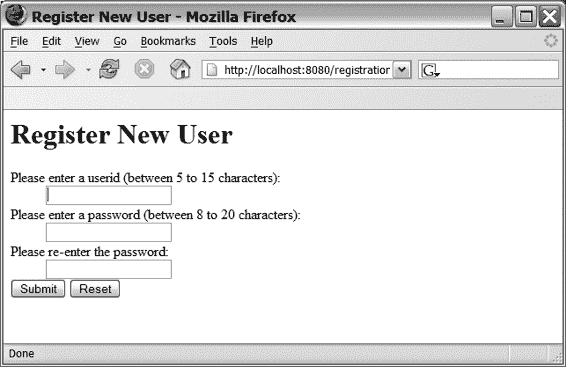

Doray_6048C16.fm Page 228 Tuesday, January 24, 2006 10:14 AM

**228**

第 16 章 ■ 动态表单

**使用动态表单的 Registration 网络应用程序**

在第 5 章中，我介绍了简单的 Registration 网络应用程序，并在第 14 章中对其进行了扩展。在本节中，我将通过 Registration 网络应用程序的一个简单变体来演示如何使用动态表单。

Registration 网络应用程序仅包含一个页面。该页面有一个包含三个字段的表单：用户 ID、密码和重复密码，如图 16-1 所示。

**图 16-1.** *Registration 网络应用程序主页面*

为方便起见，我在清单 16-3 中重现了第 8 章的 JSP 代码。

**清单 16-3.** *registration.jsp*

<%@ page contentType="text/html;charset=UTF-8" %>

<%@ taglib uri="/tags/struts-bean" prefix="bean" %>

<%@ taglib uri="/tags/struts-html" prefix="html" %>

<html:html>

<head>

<title><bean:message key="registration.jsp.title"/></title>

</head>

<body>

<h1><bean:message key="registration.jsp.heading"/></h1>

<html:form action="Registration.do" focus="userid">


<p>

<bean:message key="registration.jsp.prompt.userid"/>

[www.it-ebooks.info](http://www.it-ebooks.info/)

Doray_6048C16.fm Page 229 Tuesday, January 24, 2006 10:14 AM

第 16 章 ■ 动态表单

**229**

<html:text property="userid" size="20" />

<html:errors property="userid" />

</p><p>

<bean:message key="registration.jsp.prompt.password"/>

<html:password property="password" size="20" />

<html:errors property="password" />

</p><p>

<bean:message key="registration.jsp.prompt.password2"/>

<html:password property="password2" size="20" />

</p>

<html:submit>

<bean:message key="registration.jsp.prompt.submit"/>

</html:submit>

<html:reset>

<bean:message key="registration.jsp.prompt.reset"/>

</html:reset>

</html:form>

</body>

</html:html>

请注意，这是清单 8-1 的直接复制。为了使用动态表单，我无需对 JSP 做任何修改。正如之前讨论过的，这是因为我没有在标签中使用 EL。

之前，在第 6 章中，我必须使用一个名为 RegistrationForm 的 ActionForm 子类（见清单 6-1）来存储和验证表单数据。现在不必了！由于我将使用 DynaValidatorForm 和 Validator 框架，不再需要这个类。

清单 16-4 展示了如何声明动态表单（与清单 6-1 相比，更改部分以粗体显示）。

**清单 16-4.** *新注册 Web 应用的 struts-config.xml*

<?xml version="1.0" encoding="ISO-8859-1" ?>

<!DOCTYPE struts-config PUBLIC

"-//Apache Software Foundation//DTD Struts Configuration 1.1//EN"

"http://jakarta.apache.org/struts/dtds/struts-config_1_1.dtd">

<struts-config>

<form-beans>

**<form-bean**

**name="RegistrationForm"**

**type="org.apache.struts.validator.DynaValidatorForm">**

[www.it-ebooks.info](http://www.it-ebooks.info/)

Doray_6048C16.fm Page 230 Tuesday, January 24, 2006 10:14 AM

**230**

第 16 章 ■ 动态表单

**<form-property name="userId" type="java.lang.String" />**

**<form-property name="password" type="java.lang.String" />**

**<form-property name="password2" type="java.lang.String" />**

**</form-bean>**

</form-beans>

<global-exceptions>

<exception key="reg.error.io-unknown"

type="java.io.IOException"

handler="net.thinksquared.registration.ErrorHandler"/>

<exception key="reg.error.unknown"

type="java.lang.Exception"

path="/errors.jsp" />

</global-exceptions>

<global-forwards>

<forward name="ioError" path="/errors.jsp"/>

</global-forwards>

<action-mappings>

<action

path="/Registration"

type="net.thinksquared.registration.struts.RegistrationAction"

name="RegistrationForm"

scope="request"

validate="true"

input="/Registration.jsp">

<forward name="success" path="/Success.jsp"/>

</action>

</action-mappings>

<message-resources parameter="Application"/>

**<plug-in className="org.apache.struts.validator.ValidatorPlugIn" >**

**<set-property property="pathnames"**

**value="/WEB-INF/validator-rules.xml,/WEB-INF/validation.xml"/>**

**</plug-in>**

</struts-config>

[www.it-ebooks.info](http://www.it-ebooks.info/)

Doray_6048C16.fm Page 231 Tuesday, January 24, 2006 10:14 AM

第 16 章 ■ 动态表单

**231**

在 validation.xml 中执行简单验证的声明与你在第 15 章（见清单 15-5）中看到的完全一致。

我还需要对 RegistrationAction（见第 7 章，清单 7-3）进行修改，以便正确地从传递给 execute() 方法的 ActionForm 中读取数据。我在清单 16-5 中以粗体标出了这些更改。

**清单 16-5.** *新的 RegistrationAction.java*

package net.thinksquared.registration.struts;

import javax.servlet.http.*;

import org.apache.struts.action.*;

import net.thinksquared.registration.data.User;

public class RegistrationAction extends Action{

public ActionForward execute(ActionMapping mapping,

ActionForm form,

HttpServletRequest request,

HttpServletResponse response){

**//获取用户 ID 和密码（已更改！）**

**DynaActionForm dForm = (DynaActionForm) form;**

**String userid = dForm.get("userid");**

**String password = dForm.get("password");**

//复杂验证：检查用户 ID 是否存在

if(User.exists(userid)){


```java
ActionMessages errors = new ActionMessages();

errors.add("userid",

new ActionMessage("reg.error.userid.exists"));

saveErrors(request,errors);

//导航：重新显示用户表单。

return new ActionForward(mapping.getInput());

}else{

//数据转换：将用户 ID 和密码保存到数据库：

```

[www.it-ebooks.info](http://www.it-ebooks.info/)

Doray_6048C16.fm 第 232 页 2006 年 1 月 24 日星期二 上午 10:14

**232**

第 16 章 ■ 动态表单

```java
User user = new User();

user.setUserId(userid);

user.setPassword(password);

user.save();

//导航：显示"您已注册"页面

return new ActionForward(mapping.findForward("success"));

}

}

}
```

只有加粗部分发生了变更。`RegistrationAction`的其他部分与清单 7-3 相同。

**看，不用手！：LazyValidatorForm**

**(Struts 1.2.6+)**

Struts 1.2.6 版本引入了一种新型动态表单，称为`LazyValidatorForm`。顾名思义，`LazyValidatorForm`使用 Validator 框架来执行验证。如果需要，您可以继承`LazyValidatorForm`并编写自己的`validate()`函数。

`LazyValidatorForm`的特殊之处在于，您无需声明*任何*表单属性——无论是简单属性、映射属性还是索引属性。对于这些属性，如果不存在，`LazyValidatorForm`会自动创建必要的简单、映射或索引属性。

当然，如果您使用嵌套属性，则必须声明它，因为`LazyValidatorForm`绝对无法知道该属性应使用哪个 bean 类。其声明方式与传统动态表单相同。

但是，如果您*希望*声明一个属性（任何类型），您可以使用通常的`<form-property>`标签来实现。您可能希望这样做的原因有三个：

• 您希望使用与`LazyValidatorForm`内部使用的**不同的** Map **或** List **实现**。您可能出于效率考虑（您的代码比`LazyValidatorForm`使用的实现更快）或为了默认实现不具备的额外功能（例如，日志记录或调试）而这样做。

• 您希望利用**自动类型转换**。除非您明确要求，否则数据始终以`String`实例形式存储。为了让`LazyValidatorForm`知道要将给定属性转换为哪种类型，您必须使用`<form-property>`指定其类型。顺便说一句，如果您指定了数组类型，`LazyValidatorForm`会在填充表单时自动为您扩展该数组。很简洁！

[www.it-ebooks.info](http://www.it-ebooks.info/)

Doray_6048C16.fm 第 233 页 2006 年 1 月 24 日星期二 上午 10:14

第 16 章 ■ 动态表单

**233**

• 您不希望将**一个** null **的 List 传递给 Validator 框架**。如果用户没有为索引属性传递任何值，该属性的值将为 null。这将导致 Validator 框架抛出异常。解决方法是使用`<form-property>`声明索引属性。这会告诉`LazyValidatorForm`创建一个您声明的类型的零长度数组或空 List。这能让 Validator 框架保持满意。

**清单 16-6 展示了如果使用`LazyValidatorForm`，清单 16-1 会是什么样子。

**清单 16-6.** *使用 LazyValidatorForm 声明动态表单*

```xml
<form-bean name="MyFormBean"

type="org.apache.struts.validator.LazyValidatorForm">

<form-property name="MySimpleProp"

type="java.lang.String"

initial="Hello" />

<form-property name="MySimpleIntProp"

type="int" />

<form-property name="MyIndexedProp"

type="java.lang.String[]" />

<form-property name="MyNestedProp"

type="com.myco.myapp.MyBean" />

</form-bean>
```

现在，清单 16-6 与清单 16-1 相比变化不大，但通常情况并非如此。在许多情况下，自动类型转换并非必需（就像 LILLDEP 的`ContactForm`那样），初始值也非必需。在这种情况下，清单 16-7 展示了我们如何精简清单 16-6。

**清单 16-7.** *使用 LazyValidatorForm 声明动态表单，第二版*

```xml
<form-bean name="MyFormBean"

type="org.apache.struts.validator.LazyValidatorForm">

<form-property name="MyNestedProp"

type="com.myco.myapp.MyBean" />

</form-bean>
```

如您所见，清单 16-7 要好得多。嵌套属性的声明仍然保留，因为这是让`LazyValidatorForm`知道使用哪个 bean 类的唯一方法。

**使用 LazyValidatorForm 的缺点**

`LazyValidatorForm`具有传统动态表单的所有缺点，并且还多了一个：您失去了传统动态表单的“防火墙”属性，我稍后会解释。

如果提交给 Struts 的表单数据包含*比已声明属性更多的*属性（更大的数组数据或新属性），那么 Struts 会抛出异常。使用`LazyValidatorForm`则不会发生这种情况。这意味着恶意用户可以制作一个包含大量虚假“数据”的 HTML 页面并将其提交给您的 Web 应用程序，并且它会被接受。如果您的代码不加思索地将这些表单数据直接转储到数据库中，问题可能会很严重。如果数据处理需要时间，您的 Web 应用程序可能会变慢。在极端情况下，您的 Web 应用程序可能会崩溃。

[www.it-ebooks.info](http://www.it-ebooks.info/)

Doray_6048C16.fm 第 235 页 2006 年 1 月 24 日星期二 上午 10:14

第 16 章 ■ 动态表单

**235**

传统动态表单不会出现此问题，因为 Struts 确切地知道需要哪些属性，以及这些属性的长度——除了可能由 List 或 Map 支持的属性，但您可以首先避免使用它们。使用`LazyValidatorForm`，您没有*不*使用这些选项的选择。

缓解此问题的一种方法是使用前面描述的`BeanUtils`技术，将数据从`LazyValidatorForm`实例传输到 JavaBean 类。这样，只有合法数据才会被处理。当然，这意味着您不能接受映射或 List 支持的索引属性，因为这样做会允许恶意用户向您提供大量虚假数据列表。

**BeanValidatorForm 的隐藏力量**

**(Struts 1.2.6+)**

`LazyValidatorForm`的基类是`BeanValidatorForm`，它本身也有有趣的用途。这个类是`ValidatorForm`的基类，因此使用 Validator 框架进行简单验证。

`BeanValidatorForm`的有趣之处在于，它在其构造函数中接受一个 JavaBean，并自动用用户的表单数据填充这个 JavaBean。自 1.2.6 版本起，如果`<form-bean>`的`type`属性不是`ActionForm`的子类，Struts 会在幕后自动将实例化的对象“包装”在`BeanValidatorForm`实例中。

要了解这在实际中的意义，假设您要*隐式地*使用`BeanValidatorForm`重做实验 6。您无需创建`ContactForm`类，而是首先像这样声明表单 bean：

```xml
<form-bean name="ContactFormBean"

type=" **net.thinksquared.lilldep.database.Contact**"/>
```

请注意，`type`引用的类*不是*`ActionForm`的子类。Struts（自 1.2.6 起）会自动实例化`Contact`并将其插入到`BeanValidatorForm`的构造函数中。这*是*一个`ActionForm`子类，并将自动填充`Contact`的字段。

要在您的 Action 中检索`Contact`实例，您只需调用：

```java
BeanValidatorForm bForm = (BeanValidatorForm) form;

Contact contact = (Contact) bForm.getInstance();
```

简单！当然，请记住这仅在 1.2.6 及更高版本中可用。

[www.it-ebooks.info](http://www.it-ebooks.info/)

Doray_6048C16.fm 第 236 页 2006 年 1 月 24 日星期二 上午 10:14

**236**

第 16 章 ■ 动态表单

**实验 16：在 LILLDEP 中删除选定的联系人**


在 listing.jsp 中，我们希望在每条联系人列表的左侧放置复选框，以便用户选择要删除的联系人。你将通过动态表单和 `<html:multibox>` 来实现此功能。

`<html:multibox>` 通常与 `<logic:iterate>` 配合使用，在每次迭代时渲染一个复选框，因此得名 *multibox*。这些复选框与表单 Bean 上的一个索引属性绑定。例如：

<form-bean name="myForm"

type="org.apache.struts.action.DynaActionForm">

<form-property name="myArray" type="java.lang.String[]" />

</form-bean>

（此代码片段使用了动态表单，但你也可以使用常规的 ActionForm。）相应的 `<html:multibox>` 用法可能是：

<logic:iterate id="aBean" name="myBeans">

<html:multibox property="myArray"

value="<%=((MyBean)aBean).myValue() %>"/>

</logic:iterate>

multibox 上的 value 属性是 multibox 的复选框提交的实际值。*仅当*关联的复选框被选中时，该值才会被存储。

另请注意，使用 `<html:multibox>` 时，*无需*使用显式的索引属性（例如 property="myArray[..]"）来填充表单 Bean。

了解了这些背景知识后，请按以下步骤完成在完整列表页面上实现删除功能。

**第 1 步：声明 SelectionForm 表单 Bean**

SelectionFormBean 是用于保存被选中删除的联系人 ID 的表单 Bean。

将其声明为动态表单。它应包含一个名为 selected 的单一数组属性，类型为 java.lang.String[]。

[www.it-ebooks.info](http://www.it-ebooks.info/)

Doray_6048C16.fm 第 237 页 2006 年 1 月 24 日星期二 上午 10:14

第 16 章 ■ 动态表单

**237**

**第 2 步：修改 listing.jsp**

listing.jsp 需要显示用于选择要删除的联系人的复选框：**1.** 在 listing.jsp 中添加一个 `<html:form>` 标签，使其提交到 DeleteContacts.do。

**2.** 添加一个 `<html:multibox>` 标签，用于向 SelectionFormBean 输入数据。如有必要，可使用脚本小程序。如果你能使用支持 EL 的 Struts 标签来避免使用脚本小程序，则可获得额外加分。

提示：`<html:multibox>` 提交的值应为要删除的联系人的 ID。

**第 3 步：创建用于删除联系人的 Action**

完成 DeleteContactsAction 的实现，使其删除选中的联系人。几点提示：

• 使用 get(String property, int index) 从动态表单中读取值。

• 如果索引大于可用列表项的数量，此函数会抛出 IndexOutOfBoundsException。

完成后，为 DeleteContacts 添加一个新的 Action 映射。success 结果应返回到 Listing.do（*而不是* listing.jsp！）。像往常一样，编译、部署并测试你的工作。

**有用链接**

• DynaActionForm 支持的类型列表：http://struts.apache.org/

struts-doc-1.2.x/userGuide/building_controller.html

• LazyValidatorForm JavaDoc：http://struts.apache.org/struts-doc-1.2.7/api/

org/apache/struts/validator/LazyValidatorForm.html

• BeanValidatorForm JavaDoc：http://struts.apache.org/struts-doc-1.2.7/api/

org/apache/struts/validator/BeanValidatorForm.html

• Apache Commons 的 BeanUtils 项目：http://jakarta.apache.org/commons/

beanutils/

[www.it-ebooks.info](http://www.it-ebooks.info/)

Doray_6048C16.fm 第 238 页 2006 年 1 月 24 日星期二 上午 10:14

**238**

第 16 章 ■ 动态表单

**总结**

• 动态表单是一种无需编写任何 Java 代码即可创建表单 Bean 的方式。

• 当你拥有简单属性，并使用 Validator 框架进行验证时，动态表单效果最佳。你需要将数据传输到 JavaBean 进行处理。

• 在某些情况下，特别是使用 EL 时，动态表单不能替代 ActionForms。

• LazyValidatorForm 是 Struts 新增（1.2.6 版本）的功能，它消除了在表单 Bean 中声明属性的需要。

• 自 1.2.6 版本起，你可以将 JavaBean 用作 `<form-bean>` 的类型，Struts 会将 Bean 包装在 BeanValidatorForm 中。这将自动为你填充 Bean 的数据。

[www.it-ebooks.info](http://www.it-ebooks.info/)


Doray_6048C17.fm 第 239 页 2006 年 1 月 24 日 星期二 上午 10:14

第 17 章

■ ■ ■

杂项

**杂项**（发音为 *poh*-poo-ri）是指装在布袋中的香料和花瓣混合物，因其宜人的香气而受到珍视。本章同样汇集了各种有用的 Struts 技术，希望能让你的 Struts 应用“气味”更加芬芳！按出现顺序（以及你可能觉得它们有用的可能性）排列，它们分别是：

• PropertyUtils：一种无需进行类型转换即可读取 JavaBean（特别是 ActionForm）属性的方法。

• DownloadAction：一个 Action 子类，用于简化向 Web 客户端下载数据的过程。这些数据可以是你的 Web 应用动态生成的，也可以是服务器上的静态文件。

• LocaleAction：另一种允许用户切换区域设置的方法。

• IncludeAction **和** ForwardAction：帮助你为遗留的 Servlet 或 JSP 添加 Struts 前端。

• LookupDispatchAction：允许你在 HTML 表单上拥有多个操作，*无需*使用 JavaScript。

• DispatchAction：一种基于请求 URL 在 Action 中执行条件处理的简洁方法。

• MappingDispatchAction：帮助你将在相关功能分组到一个 Action 中。

• **全局转发**：关于如何有效使用全局转发的第二种方法。

• **日志记录**：Struts 捆绑了 Apache Commons Logging，你可以用它来执行日志记录。

• **通配符**：一个有助于减少 `struts-config.xml` 文件中声明数量的有用技巧。

• **拆分** `struts-config.xml`：随着 Web 应用的增长，拆分 `struts-config.xml` 的需求也随之增加。我将介绍几种实现方法。

**239**

[www.it-ebooks.info](http://www.it-ebooks.info/)

Doray_6048C17.fm 第 240 页 2006 年 1 月 24 日 星期二 上午 10:14

**240**

第 17 章 ■ 杂项

**PropertyUtils**

Apache Commons Beans 子项目包含一些非常有用的类（你在上一章已经见过 BeanUtils），其中就包括 PropertyUtils 类。这个类公开了一些静态方法，帮助你从 JavaBean 读取数据或向 JavaBean 写入数据。该 JAR 文件（`commons-beanutils.jar`）随 Struts 二进制文件一起提供，因此你可以在 Struts 应用中立即使用 PropertyUtils。

它不使用类型转换，因此你无需在设计时知道 JavaBean 的类。相反，PropertyUtils 利用 Java 的内省特性来完成其工作。

■**注意** PropertyUtils 实际上将其所有工作委托给 PropertyUtilsBean。后者负责解析属性和内省 JavaBean 的实际工作。PropertyUtils 只是为 PropertyUtilsBean 的函数（这些函数不是静态的）提供了便捷的静态访问方式。

PropertyUtils 最有用的函数包括：

• `boolean isReadable(Object bean, String property)`：如果可以在 bean 上读取给定属性，则返回 **true**，否则返回 **false**。这暗示存在相应的 `getXXX` 函数。

• `boolean isWritable(Object bean, String property)`：如果可以向 bean 写入给定属性，则返回 **true**，否则返回 **false**。这暗示存在相应的 `setXXX` 函数。

• `Class getPropertyType(Object bean, String property)`：返回与给定属性关联的 **Class** 对象。

• `Object getProperty(Object bean, String property)`：返回给定属性的值。

• `setProperty(Object bean, String name, Object value)`：将给定值写入 bean。

这些函数接受简单、索引、映射、嵌套甚至混合属性（其他属性类型的组合）。这些函数中的每一个都可能抛出：

• `IllegalAccessException`：如果调用代码无法调用相关的 `setXXX` 或 `getXXX` 函数（尽管该函数存在）

• `NoSuchMethodException`：如果 bean 上不存在所需的属性

[www.it-ebooks.info](http://www.it-ebooks.info/)

Doray_6048C17.fm 第 241 页 2006 年 1 月 24 日 星期二 上午 10:14

第 17 章 ■ 杂项

**241**

• `InvocationTargetException`：如果 bean 上的 get/set 函数抛出异常

• `IllegalArgumentException`：如果 bean 或 property 为 null

**使用 PropertyUtils**

这一切都很好，但 PropertyUtils 在 Struts 编程中如何发挥作用呢？回想一下，你的 ActionForm 子类（包括你的 DynaActionForm 子类）也是 JavaBean。在之前的实验课程中，为了读取（或写入）ActionForm 的属性，我们必须进行类型转换，如清单 17-1 所示。

**清单 17-1.** *读取 ActionForm 属性的类型转换惯用法*
```java
public ActionForward execute(ActionMapping mapping,
                              ActionForm form,
                              HttpServletRequest request,
                              HttpServletResponse response){
    //获取用户 ID 和密码
    RegistrationForm rForm = (RegistrationForm) form;
    String userid = rForm.getUserId();
    String password = rForm.getPassword();
    ...
```

清单 17-1 展示了我在本书中一直使用的一种惯用法。要读取 ActionForm 子类中的属性，你必须执行以下操作：

• 执行类型转换。

• 读取表单的属性。

我使用这种惯用法主要是为了清晰起见，因为它简化了示例和实验课程代码。如果可维护性对你很重要，那么在将其用于生产代码之前，你应该三思。这是因为使用清单 17-1 中的类型转换有两个很大的缺点：

• **不支持动态表单**：你不能轻易地将 ActionForm 替换为等效的动态表单。你必须修改 Action 代码。你在第 16 章中已经看到了这一点，当时我讨论了动态表单，并将 Registration Web 应用移植为使用动态表单。请参考清单 16-5，了解如何修改清单 17-1 才能使其与动态表单一起工作。

[www.it-ebooks.info](http://www.it-ebooks.info/)

Doray_6048C17.fm 第 242 页 2006 年 1 月 24 日 星期二 上午 10:14

**242**

第 17 章 ■ 杂项

• **紧密耦合**：它将你的 Action 类过于死板地绑定到你的 ActionForm 类，从而阻止了 Action 与其他 ActionForm 的重用。例如，如果你想重用清单 17-1 中的 Action，你必须确保所有传入其 `execute()` 方法的 ActionForm 都是 `RegistrationForm` 类型。在某些场景下，这个约束可能过于严格。

除了这种方法，你可以使用 PropertyUtils 来规避这两个缺点。PropertyUtils 让你能够将 Action 与特定的 ActionForm 子类（包括动态表单）完全解耦。

使用 PropertyUtils，清单 17-1 现在看起来像清单 17-2。

**清单 17-2.** *使用 PropertyUtils 读取 ActionForm 属性*
```java
import org.apache.commons.beanutils.PropertyUtils;
...
public ActionForward execute(ActionMapping mapping,
                              ActionForm form,
                              HttpServletRequest request,
                              HttpServletResponse response)
    throws Exception{
    //获取用户 ID 和密码
    String userid = PropertyUtils.getProperty(form,"userid");
    String password = PropertyUtils.getProperty(form,"password");
    ...
```

如清单 17-2 所示使用 PropertyUtils，将 `RegistrationActionForm` 替换为等效的动态表单会容易得多——你无需修改你的 Action 子类代码。

**简而言之...**

使用 PropertyUtils 的一个缺点是，与动态 bean 一样，你会失去编译时检查。你本质上是用编译时检查换取了类之间的更松散耦合。

然而，在大多数情况下，所获得的优势（更松散的耦合*以及*以后切换到动态表单的能力）远远超过了这一损失。

因此，除非你有非常充分的理由，否则请使用 PropertyUtils 来访问表单或 bean 属性。从长远来看，一致地使用它会使你的代码更易于维护。

[www.it-ebooks.info](http://www.it-ebooks.info/)

Doray_6048C17.fm 第 243 页 2006 年 1 月 24 日 星期二 上午 10:14

第 17 章 ■ 杂项

**243**

**DownloadAction (Struts 1.2.6+)**


有时您可能需要让用户从您的 Web 应用中下载数据。如果只是静态文件，这不成问题——只需在网页上放置一个文件链接即可。然而，通常需要下载的数据是按需生成的。在这种情况下，您必须自行处理下载过程。

这并不困难（您需要编写一个有效的 HTTP 头，然后将数据放入 `execute()` 方法附带的 `HttpServletResponse` 对象中），但有点繁琐。新引入的（自 1.2.6 版本起）`DownloadAction` 类简化了这项工作。您只需提供：

• 一个包含待下载数据的 `InputStream`。
• 一个描述数据格式的“内容类型”字符串（例如 `text/html` 或 `image/png`）。有关内容类型字符串的列表，请参阅“有用链接”部分。

`DownloadAction` 有一个名为 `StreamInfo` 的内部静态接口：
```java
public static interface StreamInfo {
    public abstract String **getContentType()**;
    public abstract InputStream **getInputStream()** throws IOException;
}
```
该接口通过 `getContentType()` 暴露内容类型，并通过 `getInputStream()` 暴露 `InputStream`。要使用 `DownloadAction`，您需要：

• 实现 `StreamInfo`。
• 通过继承 `DownloadAction` 并重写其 `getStreamInfo()` 方法来暴露它。
• 在 `struts-config.xml` 文件中添加一个表单处理器（`<action>` 标签），将您的 `DownloadAction` 子类与一个路径关联。不需要 `<forward>` 元素。（您能说出原因吗？）

作为额外奖励，`DownloadAction` 附带两个内部类：`FileStreamInfo` 和 `ResourceStreamInfo`，它们都实现了 `StreamInfo` 接口。

您可以使用 `FileStreamInfo` 来允许下载静态文件。`FileStreamInfo` 的构造函数为：
```java
public FileStreamInfo(String contentType, File file)
```
其含义不言自明。

`ResourceStreamInfo` 允许用户下载 Web 应用根目录内的文件：
```java
public ResourceStreamInfo(String contentType,
                          ServletContext context, String path)
```
[www.it-ebooks.info](http://www.it-ebooks.info/)

Doray_6048C17.fm 第 244 页 2006 年 1 月 24 日星期二 上午 10:14

**244**

第 17 章 ■ 杂项

`ServletContext` 包含有关 Web 应用路径等信息。您可以通过 `HttpSession` 对象获取 Web 应用的实例：
```java
ServletContext context = response.getSession().getServletContext();
```
因此，您只需指定内容类型和待下载文件的相对路径即可。

当然，在大多数情况下，您可能更倾向于使用 HTML 链接，而不是 `FileStreamInfo` 或 `ResourceStreamInfo`。如果出于某种原因无法暴露待下载文件的链接，您会发现这些类非常有用。清单 17-3 展示了一个如何继承 `DownloadAction` 并使用匿名类实现 `StreamInfo` 的示例。

**清单 17-3.** *扩展 DownloadAction*

```java
package com.myco.myapp.struts;

import java.io.*;
import javax.servlet.http.*;
import org.apache.struts.action.*;
import org.apache.struts.actions.DownloadAction;

public class MyDownloadAction extends DownloadAction{
    protected StreamInfo getStreamInfo(ActionMapping mapping,
                                       ActionForm form,
                                       HttpServletRequest request,
                                       HttpServletResponse response)
        throws Exception{
        /* 以某种方式获取 InputStream，作为处理请求的结果 */
        InputStream input = ...;
        /* 类似地获取内容类型 */
        String contentType = ...;
        return new StreamInfo{
            public InputStream getInputStream(){ return input; }
            public String getContentType(){ return contentType; }
        }
    }
}
```
[www.it-ebooks.info](http://www.it-ebooks.info/)

Doray_6048C17.fm 第 245 页 2006 年 1 月 24 日星期二 上午 10:14

第 17 章 ■ 杂项

**245**

您还需要创建一个表单处理器：

```xml
<action path="/MyFileDownloadHandler"
        form="MyDataForm"
        type="com.myco.myapp.struts.MyDownloadAction" />
```
表单 Bean（`MyDataForm`）仅在您需要收集用户输入以创建可下载内容时才必要。您不需要 `<forward>`，因为下载的内容就是隐式的“下一个”页面。


用户屏幕上具体显示的内容取决于浏览器。例如，假设你的下载处理器提供的是 PDF 文件。如果用户点击调用该处理器的链接，浏览器可能会在安装了 Adobe 浏览器插件的情况下，在浏览器*内*显示 PDF 文件。如果没有安装插件，用户可能会导航到一个空白页面，并看到一个下载对话框。具体行为取决于所使用的浏览器。

如果用户选择“另存为”而不是打开文件，则不会导航到“下一个”页面。用户只会看到一个下载对话框。因此，你应该用正在下载的数据类型来标记此类链接，以便用户做出适当的选择（是点击链接还是选择“另存为”）。

**LocaleAction**

在第 12 章末尾，我提到过另一种切换区域设置的方法。该方法是使用 Struts 类 `LocaleAction`。与我在第 12 章中概述的服务器端解决方案不同，使用 `LocaleAction` 无需编写任何 Java 代码。

以下是需要执行的操作：

• 实现动态表单，每个你想允许用户切换到的区域设置对应一个表单。

这些表单*必须*包含一个表示区域设置语言代码的 `language` 属性（参见第 12 章）。你必须将此属性的初始值设置为该区域设置的语言代码（例如，日语为 `jp`，英语为 `en`）。你*可以*选择性地为区域设置的国家代码指定一个 `country` 属性（参见第 12 章）。同样，`country` 属性的初始值必须设置为国家代码（例如，`US`）。

• 为每个动态表单放置一个表单处理器（`<action>` 标签）。单个 `<forward>` 标签应命名为 `success`，并且必须指向你想用新语言显示的页面。

举个例子，假设我们允许用户在英语和日语之间切换。

`struts-config.xml` 文件的声明如清单 17-4 所示。

[www.it-ebooks.info](http://www.it-ebooks.info/)

Doray_6048C17.fm Page 246 Tuesday, January 24, 2006 10:14 AM

**246**

第 17 章 ■ 杂 项

**清单 17-4.** *使用 LocaleAction*

<form-beans>

<form-bean name="English"

type="org.apache.struts.action.DynaActionForm">

<form-property name="language" type="String" initial="en" />

<form-property name="country" type="String" initial="US" />

</form-bean>

<form-bean name="Japanese"

type="org.apache.struts.action.DynaActionForm">

<form-property name="language" type="String" initial="jp" />

</form-bean>

... //其他表单 bean

</form-beans>

<action-mappings>

<action path="/ToEnglish"

name="English"

type="org.apache.struts.actions.LocaleAction">

<forward name="success" path="/mystartpage.jsp" />

</action>

<action path="/ToJapanese"

name="Japanese"

type="org.apache.struts.actions.LocaleAction">

<forward name="success" path="/mystartpage.jsp" />

</action>

... //其他表单处理器

</action-mappings>

不言而喻，`mystartpage.jsp` 应该使用 Struts 进行本地化。另一种方法是使用普通的（但已本地化的）HTML 或 JSP 页面作为 `<forward>` 的目标。

[www.it-ebooks.info](http://www.it-ebooks.info/)

Doray_6048C17.fm Page 247 Tuesday, January 24, 2006 10:14 AM

第 17 章 ■ 杂 项

**247**

为了允许用户切换区域设置，你需要放置 `<html:link>`（参见附录 C）指向相关的表单处理器：

<html:link action="/ToJapanese">

<bean:message key="prompt.to.japanese" />

</html:link>

<html:link action="/ToEnglish" >

<bean:message key="prompt.to.english" />

</html:link>

`LocaleAction` 使用与第 12 章（在“使用链接切换区域设置”小节中）描述的相同技术，在用户会话中切换区域设置。

**IncludeAction 和 ForwardAction**

使用 Struts 的一个令人信服的理由是，它提供了一个验证用户输入的框架。如果你有以 Servlet 或 JSP 形式存在的遗留代码（业务逻辑），这是个好消息：可以在遗留代码处理之前，包含一个 Struts 前端来彻底验证用户输入。


你可以轻松地构建自己的前端解决方案，但 Struts 提供了一个立即可用的方案。`IncludeAction` 和 `ForwardAction` 使得将 Struts 与遗留的 Servlet 或 JSP 集成变得简单。

你可以像使用其他 Action 一样使用它们，只需在 `<action>` 标签中添加一个 `parameter` 属性。这个 `parameter` 属性是一个路径，指向包含你想要调用的业务逻辑的 Servlet 或 JSP 的位置，一旦 Struts 完成用户输入的验证。

例如，假设你的遗留代码（一个 Servlet）执行用户登录，并且你想放置一个 Struts 前端来执行简单的验证，就像第 6 章清单 6-1（Registration webapp）中那样。使用 `IncludeAction` 并将 `LoginForm`（用于保存和验证用户数据）与遗留 Servlet `com.myco.myapp.MyLoginServlet` 关联起来的 `<action>` 声明将是：

```xml
<action path="/Login"
        type="org.apache.struts.actions.IncludeAction"
        name="LoginForm"
        validate="true"
        input="/login.jsp"
        parameter="/WEB-INF/classes/com/myco/myapp/MyLoginServlet" />
```

请注意，与 `DownloadAction` 一样，你不能指定 `<forward>`，因为遗留 Servlet 负责生成“下一个”页面。*但是*，*你可以指定异常处理器。*

*[www.it-ebooks.info](http://www.it-ebooks.info/)*

Doray_6048C17.fm 第 248 页 2006 年 1 月 24 日，星期二，上午 10:14

**248**

第 17 章 ■ 杂项

**国际化**

不幸的是，使用这种技术对遗留应用进行国际化没有简单的方法，因为你几乎无法控制遗留代码的输出。

如果你的遗留代码编写良好，业务逻辑在 Servlet 中，视图代码在 JSP 中，那么可以将遗留 JSP 迁移到使用 Struts 标签，并使用 `IncludeAction` 或 `ForwardAction` 在 Struts 和遗留 Servlet 之间进行协调。当然，这假设遗留代码能正确处理非 ASCII 字符。但情况通常*并非*如此，不过如果你的目标语言只使用 Latin-1，那么你或许足够幸运，它们能够处理。

使用 `ForwardAction` 的 `<action>` 声明类似——你只需将 `org.apache.struts.actions.IncludeAction` 替换为 `org.apache.struts.actions.ForwardAction`。

这就引出了一个问题：两者有什么区别？

`IncludeAction` 执行程序化的“包含”。这意味着两件事：

*   **被调用的遗留代码*不能修改*发送给客户端的 Cookie 或头信息。** 发送给客户端的头和 Cookie 由 Struts 决定。在某些场景下，保留头或 Cookie 信息至关重要——例如，当你使用 Struts 指定了请求的作用域时。
*   **你可以继承 `IncludeAction` 来向响应对象写入内容。** 当然，你需要在某个时刻调用 `super.execute()` 以确保遗留代码被调用。你可以在任何时候执行此操作，无论是在向响应对象写入内容之前、之后，还是之间。

`ForwardAction` 执行程序化的“转发”，这意味着对发送给客户端的数据的*完全控制权*被移交给遗留代码。Struts *不能*决定头或 Cookie 信息，并且你*不能*像使用 `IncludeAction` 那样，通过继承 `ForwardAction` 来向客户端写入数据。`ForwardAction` 只是将对响应对象的所有控制权传递给遗留代码。

**简而言之...**

在大多数需要为遗留代码添加前端的情况下，你可能会使用 `IncludeAction`，因为它提供了更大的灵活性。它也很实用，因为即使在遗留代码发送其输出后，你仍然可以向客户端写入数据。

当遗留代码需要写入头或 Cookie 信息才能正常工作时（例如，如果它需要将内容类型设置为 `text/html` 以外的其他类型），`ForwardAction` 是唯一的出路。

[www.it-ebooks.info](http://www.it-ebooks.info/)

Doray_6048C17.fm 第 249 页 2006 年 1 月 24 日，星期二，上午 10:14

第 17 章 ■ 杂项

**249**

**LookupDispatchAction**

有时你可能希望在一个表单上放置多个提交按钮，每个按钮指示服务器端代码对提交的数据执行不同的操作。

实现此目的的一种常见技术是使用 JavaScript 设置表单上隐藏字段的值，从而允许服务器端处理代码判断用户点击了哪个提交按钮。

例如，考虑下面的页面，它包含两个提交按钮（Save 和 Update）、一个隐藏字段以及根据点击的按钮更改隐藏字段值的 JavaScript：

```jsp
<%@ page contentType="text/html;charset=UTF-8" %>
<%@ taglib uri="/tags/struts-html" prefix="html" %>
<html:html>
<head>
<script language="JavaScript">
function changeMode(formName, src){
    document.forms[formName].elements["mode"].value = src;
}
</script>
</head>
<body>
<html:form action="MyFormHandler.do">
//... 表单上的其他字段，已省略
<html:hidden property="mode" value="unknown"/>
<html:submit value="Save"
             onclick="changeMode('MyFormBean','save')" />
<html:submit value="Update"
             onclick="changeMode('MyFormBean','update')" />
</html:form>
</body>
</html:html>
```

这种自制的做法有三个缺点：

[www.it-ebooks.info](http://www.it-ebooks.info/)

Doray_6048C17.fm 第 250 页 2006 年 1 月 24 日，星期二，上午 10:14

**250**

第 17 章 ■ 杂项

*   如果用户关闭了 JavaScript，它将无法工作。
*   每次你有两个或更多提交按钮时，都必须复制服务器端代码，以便根据 `<html:hidden>` 字段的值进行分发处理。你可以创建自己的 Action 子类来做到这一点，但正如你很快会看到的，这将是重复造轮子，而且造出来的轮子更差。
*   另一个令人烦恼的是，你必须在每个具有此功能的 JSP 上粘贴或“包含”或“导入”该 JavaScript。并且你必须记得为每个提交按钮放入隐藏字段和 `onsubmit` 属性。

Struts 提供了一种避免所有这些麻烦的方法。`LookupDispatchAction` 允许你在 HTML 表单上拥有多个操作，*而无需*编写任何 JavaScript。

`LookupDispatchAction` 的魔力在于，当你使用带有 `property` 属性的 `<html:submit>` 时，提交按钮上显示的文本会在表单提交时作为 URL 中的一个参数传递。提交的参数名称就是 `property` 属性的值。这就是 `LookupDispatchAction` 知道表单上哪个提交按钮被点击的方式。

使用 `LookupDispatchAction` 很容易。我们考虑一个具体的例子：一个包含两个提交按钮的表单：Print 用于打印表单数据，Save 用于保存数据。

你要做的第一件事是实现表单（参见清单 17-5）。

**清单 17-5.** *构建表单*

```jsp
<html:form action="MyFormHandler.do">
... // 表单属性在此处
<html:submit property="action">
    <bean:message key="myapp.submit.button.print" />
</html:submit>
<html:submit property="action">
    <bean:message key="myapp.submit.button.save" />
</html:submit>
</html:form>
```

关于清单 17-5，唯一可能令人惊讶的是在 `<html:submit>` 按钮中使用了 `property` 属性。这表示 Struts 应该将提交按钮的*文本*（在本例中，是 `myapp.submit.button.print` 或 `myapp.submit.button.save` 的*值*）作为请求 URL 中的一个参数传递，参数名为 `action`。

[www.it-ebooks.info](http://www.it-ebooks.info/)

Doray_6048C17.fm 第 251 页 2006 年 1 月 24 日，星期二，上午 10:14

第 17 章 ■ 杂项

**251**

例如，如果点击了 Print 按钮，请求 URL 将是 `http://..../MyFormHandler.do?action=Print`，当然，这假设用户当前所选语言环境中 `myapp.submit.button.print` 的值是 `Print`。

■**注意** 我在清单 17-5 中使用了 `property="action"`，但你可以使用不同的值。


LookupDispatchAction 利用 URL 中包含的信息来判断哪个按钮被点击。在实际应用中，URL 中可能还会传递其他参数，因此你需要告诉 LookupDispatchAction 使用*哪个*参数名。这在你声明表单处理器时完成，如清单 17-6 所示。

**清单 17-6.** *声明表单处理器*

<action path="/MyFormHandler"

type="myco.myapp.struts.MyLookupDispatchAction"

**parameter="action"**

...

清单 17-6 展示了如何声明表单处理器。唯一额外信息是 `parameter="action"`，它告诉你的 LookupDispatchAction 子类，应使用请求 URL 中名为 `action` 的参数来判断哪个提交按钮被点击。

最后，你需要实现 LookupDispatchAction 子类，用于处理“打印”和“保存”请求。你还必须实现 `getKeyMethodMap()` 函数，该函数告诉 LookupDispatchAction 当特定提交按钮被点击时应调用哪个函数，如清单 17-7 所示。

**清单 17-7.** *子类化 LookupDispatchAction*

import org.apache.struts.actions.LookupDispatchAction;

...

public class MyLookupDispatchAction extends LookupDispatchAction{

/**

* 告诉 LookupDispatchAction 当某个“提交”按钮被点击时

* 应使用哪个函数。

*

* 注意：此函数仅由基类的 execute() 调用一次，

* 因此无需保存返回的映射副本。

**/

[www.it-ebooks.info](http://www.it-ebooks.info/)

Doray_6048C17.fm Page 252 Tuesday, January 24, 2006 10:14 AM

**252**

第 17 章 ■ 杂项

protected Map getKeyMethodMap(){

Map m = new HashMap();

m.put("myapp.submit.button.print","print"); m.put("myapp.submit.button.save","save"); return m;

}

public ActionForward print(ActionMapping mapping,

ActionForm form,

HttpServletRequest request,

HttpServletResponse response)

throws IOException, ServletException {

//此处为打印代码。

//记得返回“下一个”页面。

}

public ActionForward save(ActionMapping mapping,

ActionForm form,

HttpServletRequest request,

HttpServletResponse response)

throws IOException, ServletException {

//此处为保存代码。

//记得返回“下一个”页面。

}

}

如清单 17-7 所示：

• `getKeyMethodMap()` 返回一个 Map 实例，其中包含每个提交按钮文本对应的消息键。此消息键与你的 LookupDispatchAction 子类中需要被调用的函数名称相关联。请注意，`getKeyMethodMap()` 仅被调用一次，因此无需保存返回的 Map 实例副本。实际上，基类会自动为你保存返回的实例。

• 存在 `print()` 和 `save()` 函数，它们具有与 `execute()` 相同的签名。这些函数负责打印和保存提交的表单数据。具体调用哪个函数取决于用户点击的提交按钮。

*没有* **`execute()` 的实现，因为我们希望隐式使用基类的 `execute()` 来调用 `print()` 或 `save()`。**

**[www.it-ebooks.info](http://www.it-ebooks.info/)

Doray_6048C17.fm Page 253 Tuesday, January 24, 2006 10:14 AM

第 17 章 ■ 杂项

**253**

除了几个零散问题外，使用 LookupDispatchAction 就这些内容：

• 如果请求 URL 不包含 `action` 参数，则会抛出异常。与其听天由命，不如通过实现一个名为 `unspecified()` 的函数（具有与 `execute()` 相同的签名）来捕获此类错误，这或许更为便捷。你*不应*在 `getKeyMethodMap()` 中声明此函数。

• 某些表单使用取消按钮。你可以在表单中使用 `<html:cancel>` 来实现此功能。你可以通过实现一个名为 `cancelled()` 的函数（具有与 `execute()` 相同的签名）来处理被取消的表单。你*不应*在 `getKeyMethodMap()` 中声明此函数。

使用 `unspecified()` 和 `cancelled()`，清单 17-7 可以重写为清单 17-8 所示。

**清单 17-8.** *包含 unspecified() 和 cancelled() 的 MyLookupDispatchAction* import org.apache.struts.actions.LookupDispatchAction;

...

public class MyLookupDispatchAction extends LookupDispatchAction{

//此处无变化

protected Map getKeyMethodMap(){

Map m = new HashMap();

m.put("myapp.submit.button.print","print"); m.put("myapp.submit.button.save","save"); return m;

}

public ActionForward print(...)

throws IOException, ServletException {

//此处为打印代码。

}

public ActionForward save(...)

throws IOException, ServletException {

//此处为保存代码。

}

[www.it-ebooks.info](http://www.it-ebooks.info/)

Doray_6048C17.fm Page 254 Tuesday, January 24, 2006 10:14 AM

**254**

第 17 章 ■ 杂项

public ActionForward unspecified(ActionMapping mapping,

ActionForm form,

HttpServletRequest request,

HttpServletResponse response)

throws IOException, ServletException {

mapping.findForward("page-not-found");

}

public ActionForward cancelled(ActionMapping mapping,

ActionForm form,

HttpServletRequest request,

HttpServletResponse response)

throws IOException, ServletException {

mapping.findForward("main-page");

}

}

LookupDispatchAction 是使用隐藏字段处理多操作表单的一种优雅替代方案。它也是一种更健壮的替代方案，因为它不依赖于客户端机器上启用的 JavaScript。

**DispatchAction**

顾名思义，DispatchAction 是 LookupDispatchAction 的基类，它根据 URL 参数执行方法分发。

DispatchAction 最常见的用法是从 HTML 链接中调用它，参数嵌入在链接中。与 LookupDispatchAction 一样，分发是通过在 `<action>` 标签中使用 `parameter` 属性声明的参数名来完成的：

<action path="/MyHandler"

type="myco.myapp.struts.MyDispatchAction"

**parameter="command"**

...

同样，对于 `command` 参数的每个可能值，都必须有一个对应的函数。与 LookupDispatchAction 的区别在于，这里*没有* `getKeyMethodMap()`。这是因为 URL 中 `command` 的值必须与 DispatchAction 子类中定义的函数完全对应。

作为一个具体示例，假设 `command` 可以取值为 `detailed` 或 `summary`（供用户查看的详细或摘要版本数据）。链接可能如下：

[www.it-ebooks.info](http://www.it-ebooks.info/)

Doray_6048C17.fm Page 255 Tuesday, January 24, 2006 10:14 AM

第 17 章 ■ 杂项

**255**

<a href="MyHandler.do? **command=detailed**&id=35 >查看详情</a>

<a href="MyHandler.do? **command=summary**&id=35 >查看摘要</a> 你的 DispatchAction 子类必须实现 `detailed()` 和 `summary()` 函数，它们具有与 `execute()` 相同的签名。你*不应*重写 `execute()`，并且可以根据需要实现 `unspecified()` 和 `cancelled()`，如清单 17-9 所示。

**清单 17-9.** *MyDispatchAction*

import org.apache.struts.actions.DispatchAction;

...

public class MyDispatchAction extends DispatchAction{

public ActionForward detailed(ActionMapping mapping,

ActionForm form,

HttpServletRequest request,

HttpServletResponse response)

throws IOException, ServletException {

//此处为详细视图的代码。

}

public ActionForward summary(...)

throws IOException, ServletException {

//此处为摘要视图的代码。

}

public ActionForward unspecified(...)

throws IOException, ServletException {

mapping.findForward("page-not-found");

}

}

**MappingDispatchAction**

这个 Action 子类帮助你将相关功能分组到一个 Action 中。与 LookupDispatchAction 一样，MappingDispatchAction 也是 DispatchAction 的子类。与前两个类一样，你也需要子类化基类（MappingDispatchAction）才能使用它。

[www.it-ebooks.info](http://www.it-ebooks.info/)

Doray_6048C17.fm Page 256 Tuesday, January 24, 2006 10:14 AM

**256**

第 17 章 ■ 杂项


与 `LookupDispatchAction` 或 `DispatchAction` 不同，`MappingDispatchAction` 并非根据请求参数进行分发。相反，你可以通过声明多个表单处理器，让它们共享同一个 `MappingDispatchAction` 子类来执行不同的操作。

举个例子，假设你想在 Web 应用中整合几种略有不同的打印功能：打印为 PDF、打印为 HTML 以及打印为文本。负责处理打印操作的 Action 子类需要获取必要的数据，并将其发送给相应的辅助类，以便输出为正确的格式。在这种情况下，如果让三个不同的 Action 来处理数据，会显得很不自然，因为它们的代码很可能非常相似。你更希望拥有*一个* `PrintingAction`，其中包含三个函数，分别对应每种打印格式。

为此，你需要声明三个 `<action>`，每种打印格式对应一个，如清单 17-10 所示。

**清单 17-10.** *PrintingAction 的多个声明*

<action path="/PrintToPDF"

type="myco.myapp.struts.PrintingAction"

**parameter="pdf"**

...

<action path="/PrintToHTML"

type="myco.myapp.struts.PrintingAction"

**parameter="html"**

...

<action path="/PrintToText"

type="myco.myapp.struts.PrintingAction"

**parameter="text"**

...

清单 17-10 中的 `parameter` 属性指向 `PrintingAction` 中的实际函数名（参见清单 17-11）。

**清单 17-11.** *PrintingAction*

import org.apache.struts.actions.MappingDispatchAction;

...

public class PrintingAction extends MappingDispatchAction{

public ActionForward **pdf**(ActionMapping mapping,

ActionForm form,

HttpServletRequest request,

HttpServletResponse response)

throws IOException, ServletException {

[www.it-ebooks.info](http://www.it-ebooks.info/)

Doray_6048C17.fm Page 257 Tuesday, January 24, 2006 10:14 AM

C H A P T E R 1 7 ■ P O T P O U R R I

**257**

//此处为打印为 PDF 的代码。

}

public ActionForward **html**(...)

throws IOException, ServletException {

//此处为打印为 HTML 的代码。

}

public ActionForward **text**(...)

throws IOException, ServletException {

//此处为打印为文本的代码。

}

public ActionForward unspecified(...)

throws IOException, ServletException {

mapping.findForward("page-not-found");

}

}

`pdf()`、`html()`、`text()` 和 `unspecified()` 的方法签名与 `Action` 的 `execute()` 方法相同。

■**注意** 与其他 `DispatchActions` 一样，你*不要*重写 `execute()` 方法。

你现在应该已经知道，`unspecified()` 用于处理请求的函数在 `PrintingAction` 中不存在的情况。（问题：这种情况是如何发生的？）**简而言之...**

你可能已经注意到，`MappingDispatchAction` 和 `DispatchAction` 非常相似。

当然，两者都是根据 URL 上的参数进行分发。区别在于它们的使用方式：

• `MappingDispatchAction`：当你希望为同一个 Action 定义多个表单处理器时使用。

• `DispatchAction`：当你出于任何原因不希望定义多个表单处理器时使用（例如，为了使 `struts-config.xml` 更易于管理）。

[www.it-ebooks.info](http://www.it-ebooks.info/)

Doray_6048C17.fm Page 258 Tuesday, January 24, 2006 10:14 AM

**258**

C H A P T E R 1 7 ■ P O T P O U R R I

在大多数情况下，选择哪一个很大程度上取决于个人偏好。我个人倾向于在整个应用中使用 `MappingDispatchAction`，因为你可以根据 `struts-config.xml` 中的声明，立即知道关联的 Action 上提供了哪些功能。

**使用全局转发**

在第 9 章中，我向你展示了如何声明全局转发。这些转发可以在 `struts-config.xml` 文件中的任何位置访问，*并且*可以在 `<html:link>` 中使用。后者正是全局转发的优势所在。

你可以在 `<html:link>` 中使用全局转发，而不是硬编码*路径*。

举个例子，许多 Web 应用都有通用的静态导航链接。LILLDEP 主页就是一个很好的例子。它包含几个导航链接：Full、MNC、Listing、Import 和 Collect。与其像下面这样硬编码：

<a href="Listing.do">...

<a href="import.jsp">...

...

你应该使用：

<html:link forward="listing">...

<html:link forward="import">...


...并将全局转发声明为

<global-forwards>

<forward name="listing" path="/Listing.do"/>

<forward name="import" path="/import.jsp"/>

...

</global-forwards>

这种方法的优势在于，如果你将某个 JSP 或 HTML 页面从一个位置移动到另一个位置，无需修改指向该页面的每个链接，只需更改全局转发的路径即可。这极大地提高了 Web 应用的可维护性。

**日志记录**

Struts 使用 Apache Commons Logging 接口进行日志记录。这是一个针对多种日志系统的统一*接口*。

[www.it-ebooks.info](http://www.it-ebooks.info/)

Doray_6048C17.fm 第 259 页 2006 年 1 月 24 日 星期二 上午 10:14

第 17 章 ■ 杂 项

**259**

启动时，Commons Logging 会为你的安装环境定位最佳的日志系统（Log4j 或 Java 1.4 的日志功能），如果两者都不存在，则使用默认的 SimpleLog 类。

■**注意** Log4j 属于 Apache Logging 子项目。它是一个应用非常广泛的开源日志系统。

相关网址请参见“实用链接”。

你按类创建日志记录器实例——是按类，*不是*按类的实例。

例如，为了在特定的 Action 子类中记录日志消息，请使用清单 17-12 中的代码。

**清单 17-12.** *使用 Apache Commons Logging 进行日志记录* **import org.apache.commons.logging.Log;**

**import org.apache.commons.logging.LogFactory;**

...

public class MyAction extends Action{

**private static Log log = LogFactory.getLog(MyAction.class);** public ActionForward execute(...){

try{

// 一些处理代码

}catch(IOException ioe){

// 记录异常

if(log.isErrorEnabled()){

log.error("发生 IO 异常！",ioe);

}

}

}

}

LogFactory 是一个辅助类，用于在给定与 MyAction 关联的 Class 对象时创建 Log 实例：

LogFactory.getLog(MyAction.class)

返回值是一个 Log 实例，它是实际底层日志类（Log4j 或 JDK 1.4 日志记录器或 SimpleLog）的包装器。它包含多个可用于记录不同消息的函数：

[www.it-ebooks.info](http://www.it-ebooks.info/)

Doray_6048C17.fm 第 260 页 2006 年 1 月 24 日 星期二 上午 10:14

**260**

第 17 章 ■ 杂 项

• trace()：用于记录非常详细的信息
• debug()：用于记录调试消息
• info()：用于在运行时标记“有趣”的事件，如启动或关闭
• warn()：用于表示发生了接近错误但尚未出错的情况
• error()：用于标记处理过程中抛出的异常
• fatal()：用于标记致命错误，导致系统提前关闭

每个函数都有两种形式。第一种形式（以 trace() 为例）：
trace(Object message)
用于打印出给定的消息；而第二种形式：
trace(Object message, Throwable ex)
允许你在打印消息的同时打印异常信息。最终实际记录的消息取决于所使用的底层日志系统。请记住，Commons Logging 只是执行实际工作的日志系统的一个包装器。

这里列出的每个函数也代表一个*优先级级别*：“trace”优先级最低，“fatal”优先级最高。这种优先级系统使得可以有选择地决定从哪个类或包记录哪些消息。

例如，Log4j 允许你（使用属性文件）精确地定义给定类或包允许记录哪些优先级的消息，如清单 17-13 所示。

**清单 17-13.** *Log4j 的一些设置*

log4j.logger.com.myco.myapp=INFO

log4j.logger.com.myco.myapp.struts.database.Database=ERROR

清单 17-13 中的设置意味着，包 com.myco.myapp 中的类允许记录 fatal、error、warn 和 info 消息，但*不*允许记录 debug 或 trace 消息。第二行意味着 Database 类只允许记录 fatal 或 error 消息。

我想强调，清单 17-13 仅用于说明，并不适用于所有日志系统，仅适用于 Log4j。每个底层日志系统都需要以不同的方式进行配置，这*不能*由 Commons Logging 控制。Commons Logging 只是某个正确配置的日志系统的一个*包装器*。

你应该查阅你所使用的日志系统的文档，以确定如何配置它。Commons Logging 只为你提供了可移植性，它并不会简化日志系统的设置过程。

现在，由于某些类可能被配置为低于给定级别的日志优先级，因此在尝试记录日志之前先检测这一点是合理的。这主要是因为调用日志函数（trace()、debug() 等）通常涉及创建额外的系统资源。为了避免这种不必要的开销，最好先测试是否允许在所需级别进行日志记录。代码：

if(log.isErrorEnabled()){

log.error("发生 IO 异常！",ioe);

}

首先检查 MyAction 是否具有包含 error 及以上级别的日志记录权限。

**简而言之...**

Commons Logging 是一种易于使用、可移植的方式，用于在你的 Struts（或其他）应用程序中执行日志记录。请使用它，而不是直接使用某个特定的日志解决方案。

**使用通配符**

通配符是一种减少 struts-config.xml 中重复内容的方法，前提是你的 Web 应用具有某种规律的结构。例如，考虑清单 17-14，它是为 LILLDEP 的 Full 和 MNC 页面声明的 <action> 的一个变体。

**清单 17-14.** *LILLDEP 中 Full 和 MCN 页面处理程序声明的变体*

<action path="/ContactFormHandler_full"

type="net.thinksquared.lilldep.struts.ContactAction"

name="ContactFormBean"

scope="request"

validate="true"

input="/full.jsp">

<forward name="success" path="/full.jsp"/>

</action>

<action path="/ContactFormHandler_mnc"

type="net.thinksquared.lilldep.struts.ContactAction"

name="ContactFormBean"

scope="request"

validate="true"

input="/mnc.jsp">

<forward name="success" path="/mnc.jsp"/>

</action>

[www.it-ebooks.info](http://www.it-ebooks.info/)

Doray_6048C17.fm 第 262 页 2006 年 1 月 24 日 星期二 上午 10:14

**262**

第 17 章 ■ 杂 项

清单 17-14 中存在明显的重复结构。使用通配符，你可以将这两个声明缩减为一个，如清单 17-15 所示。

**清单 17-15.** *LILLDEP 声明第二版*

<action path="/ContactFormHandler_*****"

type="net.thinksquared.lilldep.struts.ContactAction"

name="ContactFormBean"

scope="request"

validate="true"

input="/**{1}**.jsp">

<forward name="success" path="/**{1}**.jsp"/>

</action>

路径中的 * 是一个通配符，匹配零个或多个*不包含*斜杠 (/) 字符的字符。你可以使用 ** 来匹配包含斜杠的情况。你必须做出这种区分，因为斜杠在路径中使用时具有特殊含义（你将在下一小节中看到）。

在清单 17-15 中，我只使用了一个通配符。也可以使用多个通配符；例如：

<action path="/*FormHandler_*" ...

将匹配诸如 ContactFormHandler_full 或 SearchFormHandler_mnc 之类的路径。你可以使用 {1} 和 {2} 来访问匹配的字符串。对于 ContactFormHandler_full，{1} 将等于 Contact，{2} 将等于 full。总共允许使用九个通配符。

■**注意** {0} 通配符返回完整的请求 URI。

如果多个 <action> 匹配同一个请求，则使用在 struts-config.xml 中最后声明的那个。此规则有一个例外：如果某个 <action> 不包含通配符并且匹配请求，则*始终*使用它。

**简而言之...**

在命名你的 <action> 时，请努力以未来使用通配符的视角来命名。不过，不要过度使用通配符，因为它们会使你的系统更难以管理。

一个好的遵循规则是每个 <action> 最多使用一个通配符。


[www.it-ebooks.info](http://www.it-ebooks.info/)

Doray_6048C17.fm 第 263 页 2006 年 1 月 24 日 星期二 上午 10:14

第 17 章 ■ 杂 项

**263**

**拆分 struts-config.xml**

随着项目规模的增长，尤其是在团队协作中，你可能会希望将 `struts-config.xml` 拆分成多个文件。你可能希望这样做有几个原因：

-   **可管理性**：当 `config.xml` 文件变得过大时，Web 应用程序的控制流会变得不够清晰。你可能希望将 `struts-config.xml` 拆分成不同的部分，每个部分可能代表整个 Web 应用程序中某个有限部分的控制流。
-   **分离命名空间**：有两个或更多团队负责 Web 应用程序的不同方面，你希望这些团队能够彼此独立地工作。这里主要关注的是为每个团队提供不同的*命名空间*。不同的命名空间有助于避免两个团队创建同名但不同的表单 Bean 的问题。
-   **源代码控制**：一些设计不佳的源代码控制系统只允许单个签出。如果你在一个大型团队中工作，这可能会非常受限，因为很可能不止一个人想要同时编辑 `struts-config.xml`。

拆分 `struts-config.xml` 的第一种方法就是直接拆分。你可以创建多个 `struts-config.xml` 文件（当然，使用不同的名称！），并指示 Struts 将它们视为一个文件。为此，你需要编辑 servlet 配置文件 `web.xml`。

例如，假设你有多个配置文件：`struts-config.xml`、`struts-config-admin.xml` 和 `struts-config-logon.xml`。清单 17-16 展示了如何在 `web.xml` 中声明它们。你只需要在每个 Struts 配置文件之间放置一个逗号。很简单！

**清单 17-16.** *在 web.xml 中声明多个 Struts 配置文件*

<servlet>

<servlet-name>action</servlet-name>

<servlet-class>

org.apache.struts.action.ActionServlet

</servlet-class>

<init-param>

<param-name>config</param-name>

[www.it-ebooks.info](http://www.it-ebooks.info/)

Doray_6048C17.fm 第 264 页 2006 年 1 月 24 日 星期二 上午 10:14

**264**

第 17 章 ■ 杂 项

**<param-value>**

**/WEB-INF/struts-config.xml,**

**/WEB-INF/struts-config-admin.xml,**

**/WEB-INF/struts-config-logon.xml**

**</param-value>**

</init-param>

</servlet>

现在，这种方法解决了可管理性和源代码控制问题，但它没有解决命名空间问题，因为 Struts 会在内部将所有声明的配置文件合并在一起。因此，虽然对你来说它们看起来是两个或多个文件，但对 Struts 来说它们是一个文件。

Struts 有一个称为模块的功能，允许你将 Struts 配置文件拆分成不同的模块。一个模块代表 Web 应用程序中的一个*逻辑*拆分。每个模块都有自己的命名空间，因此这解决了命名空间问题。使用前面的例子，假设我们希望为每个 Struts 配置文件提供独立的命名空间：为 `struts-config.xml` 中声明的项提供默认命名空间，为 `struts-config-admin.xml` 提供 admin 命名空间，为 `struts-config-logon.xml` 提供 logon 命名空间。在 `web.xml` 中得到的声明如清单 17-17 所示。

**清单 17-17.** *在 web.xml 中声明多个子模块*

<servlet>

<servlet-name>action</servlet-name>

<servlet-class>

org.apache.struts.action.ActionServlet

</servlet-class>

<init-param>

**<param-name>config</param-name>**

**<param-value>/WEB-INF/struts-config.xml</param-value>**

</init-param>

<init-param>

**<param-name>config/admin</param-name>**

**<param-value>/WEB-INF/struts-config-admin.xml</param-value>**

</init-param>

<init-param>

**<param-name>config/logon</param-name>**

**<param-value>/WEB-INF/struts-config-logon.xml</param-value>**

</init-param>

</servlet>

[www.it-ebooks.info](http://www.it-ebooks.info/)

Doray_6048C17.fm 第 265 页 2006 年 1 月 24 日 星期二 上午 10:14

第 17 章 ■ 杂 项

**265**


通过清单 17-17 中的声明，我们可以在两个不同的子模块中声明同名的表单 Bean。这同样适用于`<action>`、`<forward>`以及其他配置元素。

不同子模块对`<action>`和`<forward>`的访问方式会有所不同。例如，假设我们在 admin 子模块中声明了一个`<action>`：

<action path="Listing.do" ...

那么，在`<html:link>`或`<html:form>`中，你需要将其引用为`/admin/Listing.do`。

■**注意** 如果在默认子模块中定义了相同的`<action>`，则应使用`/Listing.do`。

这引出了一个重要问题：在任何设计良好的应用程序中，你很可能会有共享的声明，例如共享的全局`<forward>`或表单 Bean。当使用多个子模块拆分应用时，这些声明*不会*在模块之间共享。为解决此问题，应将共享声明集中放在一个 Struts 配置文件中。

例如，延续之前的示例，我们将这个新文件命名为`struts-config-shared.xml`。清单 17-18 展示了如何在子模块间共享该文件中的声明。

**清单 17-18.** *跨子模块使用共享的 Struts 配置文件*

<servlet>

<servlet-name>action</servlet-name>

<servlet-class>

org.apache.struts.action.ActionServlet

</servlet-class>

<init-param>

<param-name>config</param-name>

**<param-value>**

**/WEB-INF/struts-config-shared.xml,**

**/WEB-INF/struts-config.xml**

**</param-value>**

</init-param>

<init-param>

<param-name>config/admin</param-name>

[www.it-ebooks.info](http://www.it-ebooks.info/)

Doray_6048C17.fm Page 266 Tuesday, January 24, 2006 10:14 AM

**266**

第 17 章 ■ 杂项

**<param-value>**

**/WEB-INF/struts-config-shared.xml,**

**/WEB-INF/struts-config-admin.xml**

**</param-value>**

</init-param>

<init-param>

<param-name>config/logon</param-name>

<param-value>/WEB-INF/struts-config-logon.xml</param-value>

</init-param>

</servlet>

在清单 17-18 中，我在默认子应用和 admin 子应用之间共享了`struts-config-shared.xml`。这使用了与之前描述的多配置文件技术相同的技巧。只需用逗号分隔文件名即可。

**简而言之...**

拆分 Struts 配置文件有两种方法。如果只关心可管理性或源代码控制，请使用多文件方法。如果还需要独立的命名空间，请使用多子模块方法。

在后一种方法中，你可以在一个文件中声明通用的表单 Bean、动作、转发等，并在子模块之间共享它们。这既避免了声明重复，又提供了独立的命名空间。

**实用链接**

• 常用内容类型（MIME 类型）字符串汇编：http://www.utoronto.ca/webdocs/HTMLdocs/Book/Book-3ed/appb/mimetype.html

• Apache Commons Logging：http://jakarta.apache.org/commons/logging/

• Log4j：http://logging.apache.org/log4j/docs/

**总结**

Struts 提供了许多有用的类、特性和技巧，使编写 Web 应用更加容易。本章涵盖了一些利用现有资源而非在 Web 应用中重新发明轮子的方法。

[www.it-ebooks.info](http://www.it-ebooks.info/)

Doray_6048C18.fm Page 267 Thursday, January 12, 2006 11:27 AM

第 18 章

■ ■ ■

复习实验：

集合功能

**在**本次实验课中，你将实现一个将联系人分组到逻辑**集合**中的功能。这本质上是一个在 LILLDEP 中分类和管理联系人的工具。

该集合功能包含四个部分：

• 主**集合**页面以链接形式显示已定义集合的列表。点击链接后，用户将看到该集合内的联系人列表。集合页面还允许定义新集合。用户通过集合导航按钮访问此页面（见图 18-1）。

• **新建集合**页面提示用户输入集合名称、查询条件和备注。此页面将显示新定义集合的联系人列表。


• **收藏集列表**页面会列出某个收藏集中的联系人。它还允许用户从完整列表中添加*任意联系人*，或点击公司名称进入收藏集完整显示页面。

*• **收藏集完整显示**页面会显示联系人的详细信息，并配有“上一个”和“下一个”按钮，用于在收藏集中上下导航。

存储单个收藏集数据需要使用*两个*数据库表。收藏集表存储收藏集的名称、备注以及自动生成的收藏集 ID。收藏集映射表则存储联系人 ID 与收藏集 ID 的配对关系。

**267**

[www.it-ebooks.info](http://www.it-ebooks.info/)

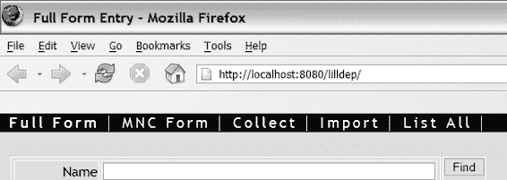

Doray_6048C18.fm 第 268 页 2006 年 1 月 12 日星期四 上午 11:27

**268**

第 18 章 ■ 复习实验：收藏集功能

■**注意** 我们将使用 Lisptorq 生成的模型类来存储和检索这些表中的数据，因此请务必阅读附录 A 中关于 Lisptorq 的部分。

需要实现的内容相当多，因此我们将这个实验分解为六个子部分。本实验的源代码答案（位于 Apress 网站源代码部分，网址为 http://www.apress.com）也相应地分为六个部分。

**图 18-1.** *收藏集功能的导航按钮* **实验 18a：主收藏页面**

主收藏页面允许用户创建、查看和编辑收藏集。图 18-2 显示了已定义几个收藏集的该页面。本实验将设置基本页面，后续实验将实现查看和编辑功能。

**1.** 完成 CollectAction 的实现，以准备要显示的收藏集列表。（*提示*：你需要使用 Criteria 类来检索存储在数据库中的所有收藏集数据对象。）使用 JSPConstants 中的适当常量作为属性名称，用于存储收藏集数据对象列表。

**2.** 添加一个动作映射，使得指向 Collect.do 的链接能够显示收藏集列表。

成功转发应指向 collect.jsp。

**3.** 完成 collect.jsp，**使其显示所有已定义收藏集的名称。**

（*提示*：Scroller 接口扩展了 Iterator，因此你应该能够使用<logic:iterate>来处理它。）

**4.** collect.jsp 列出的每个收藏集**左侧应有一个指向 DeleteCollection.do 的删除链接。该链接应将收藏集的 ID 作为名为 id 的参数传递。**

**[www.it-ebooks.info](http://www.it-ebooks.info/)

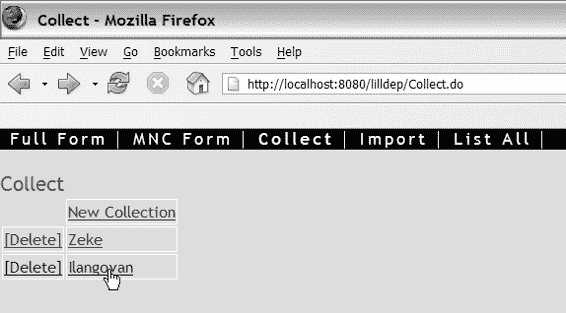

Doray_6048C18.fm 第 269 页 2006 年 1 月 12 日星期四 上午 11:27

第 18 章 ■ 复习实验：收藏集功能

**269**

**5.** 完成 DeleteCollectionAction 的实现，使其能够删除选定的收藏集。（*提示*：参考附录 B，了解如何从 HttpServletRequest 中检索 id 参数的值。）

**6.** 添加一个动作映射，使得 DeleteCollection.do 映射到 DeleteCollectionAction。成功应转发到 Collect.do（而*不是* collect.jsp）。

在继续之前，请确保你的工作能够编译通过。

**图 18-2.** *主收藏页面，显示了一些收藏集* **实验 18b：新建收藏集页面**

每个收藏集都有一个用于识别的*名称*和一个用于保存用户笔记的*备注*。

此外，一个收藏集可以包含任意数量的联系人。为了引导创建收藏集，用户需要指定一个 SQL*查询*：

• 查询语句类似于 SQL——例如，postcode<>'' and email like'%mit%' 将获取所有邮政编码非空且电子邮件地址包含字符串 mit 的联系人。

• 每个查询都会产生一个与查询字符串匹配的联系人列表。用户随后可以在收藏集中添加、删除或编辑联系人。

图 18-3 显示了新建收藏集页面。

[www.it-ebooks.info](http://www.it-ebooks.info/)

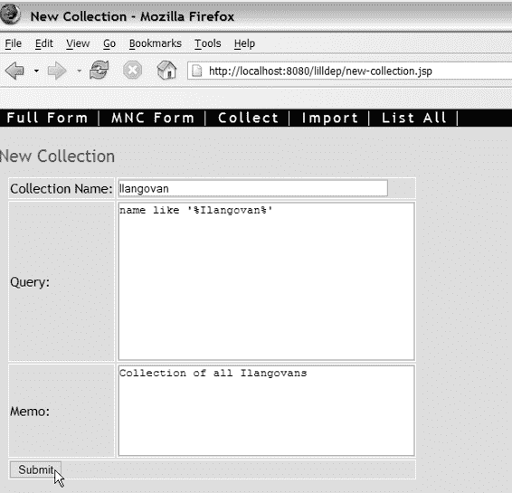

Doray_6048C18.fm 第 270 页 2006 年 1 月 12 日星期四 上午 11:27

**270**

第 18 章 ■ 复习实验：收藏集功能


**图 18-3.** *新建集合页面*

完成以下步骤：

**1.** 添加一个名为 `NewCollectionFormBean` 的**动态**表单 Bean，其属性包括 name、query 和 memo，类型均为 String。

**2.** 添加验证器（使用 Validator 框架）以检查 name 和 query 属性不为空。检查消息资源文件中是否有合适的错误消息。

**3.** 完成 new-collection.jsp 的实现，**使其向用户询问 name、query 和 memo 属性值。记得添加 `<html:error>` 标签，以便在验证失败时向用户发出警告。**

**4.** 完成 NewCollectionAction 的实现，以创建一个新集合。

（*提示*：使用 DynaActionForm 的通用 get() 方法读取属性值。你还需要知道如何使用 peer 对象执行任意 SQL SELECT 语句。）

**5.** 添加一个动作映射以创建新集合。success 转发到 list-collection.jsp。

[www.it-ebooks.info](http://www.it-ebooks.info/)

Doray_6048C18.fm Page 271 Thursday, January 12, 2006 11:27 AM

第 18 章 ■ 复习实验：集合功能

**271**

**6.** 在动作映射上声明一个*本地*异常处理器，以便在出现错误时传递到 new-collection.jsp。这与声明全局异常处理器（参见第 9 章）完全相同，只是 `<exception>` 标签作为 `<action>` 的子标签出现。请注意，`<exception>` 标签必须出现在任何 `<forward>` 标签之前。

**实验 18c：集合列表页面**

现在，你将实现查看集合中联系人的功能。图 18-4 显示了完成实验 18d 后的集合列表页面。首先，你需要启用从主 Collect 页面列出集合的功能：

**1.** 在 collect.jsp 上，使集合的名称链接到 ListCollection.do，并将集合的 ID 作为参数传递。

**2.** 为 ListCollection.do 添加一个动作映射，将其与 ListCollectionAction 关联。success 转发到 list-collection.jsp。

**3.** list-collection.jsp 列出集合中的联系人，但它需要一个 Scroller 来遍历所有联系人。完成 ListCollectionAction 的实现，以便将选定的集合放入会话中（参见 JSPConstants 以获取合适的键），从而使其对 list-collection.jsp 可访问。

将其放入会话而非请求的原因将在实验 18d 和 18f 中变得明显。在继续之前编译你的工作。

**4.** NewCollectionAction 也会转发到 list-collection.jsp，因此它也需要将新创建的集合放入会话中。使用与步骤 3 相同的键。

**5.** 完成 list-collection.jsp，使其显示集合中的联系人列表。你应该列出与完整列表页面（参见第 13 章）完全相同的项目。在页面顶部突出显示集合的名称。（*提示*：你需要使用 Collection.getContacts()。）

在继续之前编译、部署并测试。特别要测试你是否能够：

• 创建一个新集合
• 列出新创建的集合
• 从主 Collect 页面访问集合列表
• 从主 Collect 页面删除集合

[www.it-ebooks.info](http://www.it-ebooks.info/)

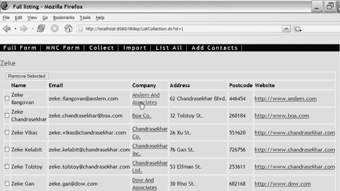

Doray_6048C18.fm Page 272 Thursday, January 12, 2006 11:27 AM

**272**

第 18 章 ■ 复习实验：集合功能

**图 18-4.** *集合列表页面*

**实验 18d：移除选定的联系人**

我们希望在集合列表（即 list-collection.jsp）中每个联系人名称的左侧添加复选框（见图 18-4），以允许用户从集合中选择性地移除联系人。在实验 16 中，我们使用了带有 `<html:multibox>` 的动态表单。现在我们将使用相同的技术。

一种方法是创建一个新表单（可能是一个动态表单，遵循实验 16 的做法），该表单保存要从集合中移除的联系人，以及要执行此操作的集合的 ID：

<form-bean name="RemoveSelectionFormBean"


type="org.apache.struts.action.DynaActionForm">

<form-property name="selected" type="java.lang.String[]" />

<form-property name="collectionId" type="java.lang.String" />

</form-bean>

后者可能作为隐藏输入字段存储在展示给用户的列表中，而 `selected` 属性则像之前一样通过 `<html:multibox>` 填充。

如果你担心安全问题，这种简单的技术有一个明显的缺陷，因为恶意用户可以手动构造一个 HTML 表单，其中包含他本无权访问的集合 ID。

[www.it-ebooks.info](http://www.it-ebooks.info/)

Doray_6048C18.fm Page 273 Thursday, January 12, 2006 11:27 AM

第 18 章 ■ 复习实验：集合功能

**273**

防止这种情况的一种简单方法是将集合 ID 存储在会话对象中，而不是暴露在表单上。这样，恶意用户必须伪造一个有效的会话 ID 才能访问给定的集合。这比读取嵌入在页面 HTML 中的集合 ID 要困难得多。

■**注意** 一个额外的好处是我们可以重用实验 16 中的 `SelectionFormBean`。

我们将在此处采用这种方法。事实上，我们早已考虑过这种技术——还记得在实验 18c 中，我们要求你将 `Collection` 实例存储在会话作用域中吗？这正是它派上用场的地方。我们可以直接使用这个对象来确定当前选中的集合。

缺点是必须确保所有进入 `list-collection.jsp` 的入口点都将 `Collection` 放入当前会话；否则，`list-collection.jsp` 将无法正确显示。有两个这样的入口点——`NewCollectionAction` 和 `ListCollectionAction`——它们在实验 18c 中已经完成了这一步。

因此，我们只需要完成从集合中移除联系人的实际工作：**1.** 完善 `RemoveCollectionContactsAction`，从指定集合中移除选中的联系人。你需要查询当前会话对象，找到你在上一个实验中保存的 `Collection`。

**2.** 为路径 `RemoveCollectionContacts.do` 添加一个动作映射，将 `RemoveCollectionContactsAction` 和 `SelectionForm` 关联起来（参见实验 16）。转发到 `list-collection.jsp`，以便重新显示集合的列表。

最后，你需要修改 `list-collection.jsp`，使其允许用户选择并提交要移除的联系人：

**1.** 添加一个 `<html:multibox>`，其值为关联联系人的 ID。

**2.** 创建一个提交到 `RemoveCollectionContacts.do` 的 `<html:form>`。

像往常一样，编译、部署并测试你的更改。

**实验 18e：添加选中的联系人**

我们需要允许用户在查看集合列表（即 `list-collection.jsp`）时，将选中的联系人添加到集合中。用户通过点击页面顶部导航栏中的“添加联系人”来完成此操作（见图 18-4）。

[www.it-ebooks.info](http://www.it-ebooks.info/)

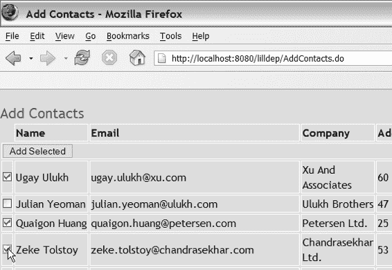

Doray_6048C18.fm Page 274 Thursday, January 12, 2006 11:27 AM

**274**

第 18 章 ■ 复习实验：集合功能

我们希望“添加联系人”链接显示所有联系人的列表（由 `select-contacts.jsp` 显示），并在公司名称左侧带有复选框。用户选择要添加到当前集合的联系人，这些信息将被发送到 `AddCollectionContacts.do`。图 18-5 显示了“添加联系人”页面。

**1.** 创建一个名为 `AddContacts` 的新表单处理器，它调用 `ListingAction` 并转发到 `select-contacts.jsp`。

**2.** 完善 `select-contacts.jsp`，使其显示联系人列表（如同“完整列表”页面）。用户可以从该列表中选择任意数量的联系人，以添加到当前选中的集合中。使用你在实验 18d 中使用的 `<html:multibox>` 技术。确保你的表单提交到 `AddCollectionContacts.do`。

**3.** 完善 `AddCollectionContactsAction` 的实现，使其将选中的联系人添加到当前集合中。

**4.** 添加一个合适的表单处理器，将 `AddCollectionContactsAction` 与 `AddCollectionContacts.do` 关联起来。与 `AddCollectionContacts` 关联的表单 Bean 当然是 `SelectionFormBean`（参见实验 16）。`AddCollectionContacts` 应转发到 `list-collection.jsp`。

像往常一样，在继续之前编译、部署并测试你的工作。

**图 18-5.** *添加联系人页面*

[www.it-ebooks.info](http://www.it-ebooks.info/)

Doray_6048C18.fm Page 275 Thursday, January 12, 2006 11:27 AM

第 18 章 ■ 复习实验：集合功能

**275**

**实验 18f：在搜索中上下导航**

从集合的列表页面（`list-search.jsp`）中，我们希望编辑集合中的联系人，并使用“上一个”和“下一个”按钮进行导航。

也就是说，我们希望集合的列表是一组链接（如同第 13 章中的“完整列表”页面——另见图 18-4）。如果点击某个链接，将显示该联系人的详细信息。用户可以在集合中上下移动，通过页面顶部的“下一个”或“上一个”按钮查看每个联系人的详细信息。图 18-6 显示了联系人编辑页面。用户可以随时修改联系人的详细信息。修改后，更改将保存到数据库，并重新显示*同一个*联系人的详细信息。

主要的设计挑战是如何访问集合中的特定联系人（当用户点击链接时），然后沿着集合向前/向后导航以显示其他联系人进行编辑（当用户点击“下一个”或“上一个”时）。

在继续阅读之前，请花几分钟思考这些问题的解决方案。

（*提示*：你需要查看 `Scroller` 接口的源代码。）第一个问题很容易解决，因为 `Scroller` 接口有一个 `absolute()` 函数，允许我们根据联系人在集合中的“偏移量”定位到所需的联系人。

■**注意** `Scroller` 的 `absolute()` 函数之所以如此命名，是因为具体的 `Scroller` 实现包含一个 `java.sql.ResultSet` 实例，该实例也有一个 `absolute()` 函数。`Scroller` 的 `absolute()` 函数会调用底层 `ResultSet` 的 `absolute()` 函数。

此外，`<logic:iterate>` 会暴露一个索引变量（使用属性 `indexId`；参见第 10 章），我们可以用它来标记列表中的链接。`absolute()` 函数结合偏移量可用于在集合的列表中上下导航。正如我们将看到的，这比听起来要简单！

我们将在此处使用 `DispatchAction`（参见第 17 章），因此在继续之前请确保你理解其工作原理。完成以下步骤：

**1.** 修改 `list-collection.jsp`，使公司名称现在成为一个链接，指向 `CollectionNav.do&action=go`，并带有一个名为 `offset` 的参数（等于迭代器的索引），以及一个名为 `id` 的参数（用于联系人的 ID）。

**2.** 完善 `CollectionNavAction` 的实现，使得当 `action=go` 时，它使用从给定 `id` 参数确定的 `Contact` 来初始化表单（一个 `ContactFormBean`）。将 `offset` 参数以合适的键存储在会话中。

[www.it-ebooks.info](http://www.it-ebooks.info/)

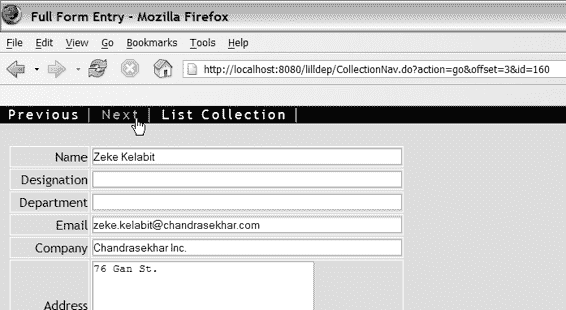

Doray_6048C18.fm Page 276 Thursday, January 12, 2006 11:27 AM

**276**

第 18 章 ■ 复习实验：集合功能

**3.** 为路径 `CollectionNav.do` 添加一个动作映射，将 `CollectionNavAction` 和表单 Bean `ContactFormBean` 关联起来。转发目标应为 `full-collection.jsp`。

记得设置动作映射的 `parameter` 属性。

**4.** 完善 `ContactUpdateAction` 的实现，以保存更新后的联系人。

**5.** 添加一个动作映射，用于处理 `full-collection.jsp` 中表单的提交。

重用 `ContactForm` 来保存联系人详细信息。记得使用会话作用域，以便在点击“提交”时重新显示联系人。


**6.** 修改 `CollectionNavAction` 以处理 `action=previous` 和 `action=next` 操作。这些显然是用于在通讯录联系人列表中上下移动的命令。（*提示*：使用 `CollectionNavAction` 的 `go()` 函数中保存的偏移量。你可以利用该偏移量和 `absolute()` 函数导航到正确的联系人。）编译、部署并测试你的修改。

**图 18-6.** *联系人编辑页面*

**总结**

我希望这个复习实验能巩固你在本书第二部分学到的部分概念。同时，我也希望你能看到使用 Struts 在现有 Web 应用基础上进行增量式构建是多么容易。

[www.it-ebooks.info](http://www.it-ebooks.info/)

Doray_6048C19.fm 第 277 页 2006 年 1 月 16 日，星期一，下午 3:20

第 19 章

■ ■ ■

开发插件

**插**件是扩展 Struts 基本功能的绝佳方式。在前面的章节中，你已经见识过插件的作用——在 Tiles 和 Validator 框架中。在本章中，我将引导你开发一个名为 DynaForms 的实用且非平凡的插件。本质上，DynaForms 插件为动态表单 Bean 带来了类似 Tiles 的继承机制。稍后我将更详细地解释这意味着什么。

这个想法的灵感来源于两篇优秀的文章：Samudra Gupta 撰写的《为 Struts 增添趣味》第 1 部分和第 2 部分（参见本章末尾的“有用链接”）。

Samudra 针对实现动态表单 Bean 继承机制问题的解决方案涉及对 Struts 基础类（主要是 `ActionServlet`）进行子类化。

不幸的是，正如 Samudra 在其文章中所讨论的，他的解决方案存在几个缺点：继承声明有些笨拙且受限。如果你有兴趣了解更多，可以查阅这些文章的详细信息。

在本章中，我们将采取一条不同的路线，希望是一条更清晰的路线——这意味着你将更多地了解 Struts 的内部工作原理。我们将创建一个插件，允许开发者在 `struts-config.xml` *之外* 的 XML 文件中创建具有继承性的表单 Bean。

为了更好地理解讨论内容，建议你手头有一份最新的 Struts 源代码副本（下载站点请参见“有用链接”；本章我将使用 1.2.7 版本），并将其放入 Eclipse（或类似 IDE）的项目中。像 Eclipse 这样的 IDE（再次参见“有用链接”）对于轻松追踪函数调用、声明和类层次结构是绝对必要的。你也可以用记事本完成，但那会非常无趣。

**当前任务**

考虑图 19-1 中所示的实体层次结构（Samudra 第一篇文章中主要示例的变体）。

**277**

[www.it-ebooks.info](http://www.it-ebooks.info/)

Doray_6048C19.fm 第 278 页 2006 年 1 月 16 日，星期一，下午 3:20

**278**

第 19 章 ■ 开发插件

**图 19-1.** *一个简单的实体层次结构*

Ship 和 Car 实体都包含来自 Vehicle 的属性。现在，假设你想为这些实体中的每一个创建对应的动态表单 Bean。你会怎么做？清单 19-1 展示了具体方法。

**清单 19-1.** *实体层次结构的动态表单 Bean 声明*

<form-bean name="Vehicle"

type="org.apache.struts.action.DynaActionForm">

<form-property name="class" type="java.lang.String"

initial="Unknown Class"/>

<form-property name="height" type="java.lang.Integer"

initial="0"/>

<form-property name="width" type="java.lang.Integer"

initial="0"/>

</form-bean>

<form-bean name="Ship"

type="org.apache.struts.action.DynaActionForm">

<form-property name="class" type="java.lang.String"

initial="Ship"/>

<form-property name="height" type="java.lang.Integer"

initial="1000"/>

<form-property name="width" type="java.lang.Integer"

initial="0"/>

<form-property name="name" type="java.lang.String"/>

</form-bean>

[www.it-ebooks.info](http://www.it-ebooks.info/)

Doray_6048C19.fm 第 279 页 2006 年 1 月 16 日，星期一，下午 3:20

第 19 章 ■ 开发插件

**279**

<form-bean name="Car"

type="org.apache.struts.action.DynaActionForm">


<form-property name="class" type="java.lang.String"

initial="Car"/>

<form-property name="height" type="java.lang.Integer"

initial="1000"/>

<form-property name="width" type="java.lang.Integer"

initial="0"/>

<form-property name="make" type="java.lang.String"/>

<form-property name="year" type="java.lang.Integer"/>

</form-bean>

这些声明中存在大量重复。如果 Vehicle 有更多“子实体”，情况会变得更糟。我们的目标是让清单 19-1 能够简化为清单 19-2 所示的形式。

**清单 19-2.** *使用 extends 属性*

<form-bean name=".vehicle"

type="org.apache.struts.action.DynaActionForm">

<form-property name="class" type="java.lang.String"

initial="Unknown Class"/>

<form-property name="height" type="java.lang.Integer" initial="0"/>

<form-property name="width" type="java.lang.Integer" initial="0"/>

</form-bean>

<form-bean name=".vehicle.ship" **extends=".vehicle"** >

<form-property name="class" initial="Ship"/>

<form-property name="height" initial="1000"/>

<form-property name="name" type="java.lang.String"/>

</form-bean>

<form-bean name=".vehicle.car" **extends=".vehicle"** >

<form-property name="class" initial="Car"/>

<form-property name="make" type="java.lang.String"/>

<form-property name="year" type="java.lang.Integer"/>

</form-bean>

好多了！如你所见，这确实大大减少了代码重复。extends 属性的功能类似于 Tiles 中的对应属性，你可以从一个 Tiles 定义“扩展”出另一个。请注意，我为表单名称使用了点号命名系统，与 Tiles 使用的命名系统类似。

[www.it-ebooks.info](http://www.it-ebooks.info/)

Doray_6048C19.fm Page 280 Monday, January 16, 2006 3:20 PM

**280**

第 19 章 ■ 开发插件

我们希望在 DynaForms 插件中实现其他一些功能：

• “子表单 bean”可以覆盖 <form-property> 的初始值或类型。

• DynaForms 不得对表单 bean 的类类型施加任何限制。你应该能够使用 DynaForms 声明*任何*表单 bean。

• 应该有一种机制来防止“祖先”表单 bean（这些 bean 永远不会在你的 struts-config.xml 文件中使用）被实例化。这可以节省系统资源。为了实现这一点，我将在 <form-bean> 中添加另一个名为 create 的属性。

将 create 设置为 false 将禁止创建该表单 bean。例如，如果我们想禁止创建清单 19-2 中的 .vehicle，我们可以使用

<form-bean name=".vehicle" create="false" ....

总之，除了 extends 和 create 属性之外，新的表单 bean 声明看起来与原始的 Struts 声明完全相同。

此外，我还将做一个大的简化：新的表单 bean 声明将不支持 <set-property> 标签。添加对 <set-property> 的支持并*不*是太难。

鼓励你在本章末尾自行尝试。

最后，我们不能将新的表单 bean 直接放在 struts-config.xml 中，因为这需要对 ActionServlet 进行子类化。相反，我们必须将它们放在另一个 XML 文件（或多个 XML 文件）中。

现在 DynaForms 插件的目标已经明确，下一步就是决定如何实现这些目标。

**实现路线图**

本质上，DynaForms 插件的实现需要：

• 解析输入的 XML 文件（可能不止一个）。因此，插件声明将至少需要一个 pathnames 属性，类似于 Validator 框架，它是一个以逗号分隔的文件名列表。

• 解析表单 bean 的继承属性。

• 以某种方式让 Struts 识别这些 bean，就像它们已在 struts-config.xml 中声明过一样。

对于第一点，我将向你展示如何使用 Apache Digester，这是一种读取 XML 文件的简便方法。Struts 内部也使用了 Digester。第二步相对简单，但最后一步需要了解 Struts 如何读取和声明表单 bean。我们将首先处理这最后一步。

[www.it-ebooks.info](http://www.it-ebooks.info/)


Doray_6048C19.fm 第 281 页 2006 年 1 月 16 日 星期一 下午 3:20

第 19 章 ■ 开发插件

**281**

**Struts 处理表单 Bean 的方式**

当 Struts 首次加载时，会创建 `ActionServlet` 的单个实例，该实例负责处理 Struts 的所有后续初始化工作，包括读取 `struts-config.xml`。这个类是 Struts 内部的，但由于它在 `web.xml` 中声明，因此 Servlet 容器能够识别它。清单 19-3 展示了 `web.xml` 中的声明。你还可以看到，Struts 配置文件名 `struts-config.xml` 作为初始化参数传递给了 `ActionServlet`。

■**注意** 如果目前还不清楚，清单 19-3、19-4 和 19-5 均摘自 Apache 软件基金会慷慨提供的代码。Apache 许可证可在 http://www.apache.org/licenses/LICENSE-2.0 获取。

**清单 19-3.** *在 web.xml 中声明 ActionServlet 和 struts-config.xml 文件*

<servlet>

<servlet-name>action</servlet-name>

<servlet-class>

**org.apache.struts.action.ActionServlet**

</servlet-class>

<init-param>

<param-name>config</param-name>

<param-value>/WEB-INF/struts-config.xml</param-value>

</init-param>

</servlet>

一旦创建了 `ActionServlet` 实例，就会调用其 `init()` 函数，利用 `struts-config.xml` 中包含的信息来初始化 Struts。实际读取 `struts-config.xml` 的相关代码如清单 19-4 所示。

**清单 19-4.** *在 init() 中初始化 Struts*

public void init() throws ServletException {

...

// 根据需要初始化模块

ModuleConfig moduleConfig = initModuleConfig("", config); initModuleMessageResources(moduleConfig);

initModuleDataSources(moduleConfig);

initModulePlugIns(moduleConfig);

moduleConfig.freeze();

...

}

[www.it-ebooks.info](http://www.it-ebooks.info/)

Doray_6048C19.fm 第 282 页 2006 年 1 月 16 日 星期一 下午 3:20

**282**

第 19 章 ■ 开发插件

在清单 19-4 中，你应注意以下几点：

*   `config` 指的是 Struts 配置文件的文件名（默认为 `/WEB-INF/struts-config.xml`）。
*   `ModuleConfig` 是一个类，用于保存 `struts-config.xml` 中包含的所有配置信息。它拥有多个变量，每个变量保存来自 `struts-config.xml` 不同部分的信息。例如，表单 Bean 声明保存在 `ModuleConfig` 的一个类型为 `FormBeanConfig` 的变量中。图 19-2 展示了如何通过使用 `FormBeanConfig` 和 `FormPropertyConfig` 将表单 Bean 数据存储在 `ModuleConfig` 中。
*   表单 Bean 在函数 `initModuleConfig()` 中被读取。
*   插件由 `initModulePlugIns()` 按顺序处理。稍后你将看到，所有插件都将有机会查询和操作 `ModuleConfig` 实例。
*   在读取 `struts-config.xml` 文件后，`ModuleConfig` 实例会被“冻结”。`ModuleConfig` 实例被冻结后，不得对其进行任何修改。

**图 19-2.** *ModuleConfig、FormBeanConfig 和 FormPropertyConfig*

[www.it-ebooks.info](http://www.it-ebooks.info/)

Doray_6048C19.fm 第 283 页 2006 年 1 月 16 日 星期一 下午 3:20

第 19 章 ■ 开发插件

**283**

`ModuleConfig` 实例一旦创建，就会传递给我们的插件。我们的 `DynaForms` 插件将需要根据新的 XML 表单 Bean 声明文件创建新的 `FormBeanConfig` 实例，并将它们添加到 `ModuleConfig` 中。一旦完成，我们的工作就结束了。

嗯，差不多！快速检查一下 `initModuleConfig()`（该函数创建 `ModuleConfig` 实例并用表单 Bean 信息进行初始化）会发现，其类型为 `DynaActionForm` 子类的表单 Bean 需要特殊处理（参见清单 19-5）。

**清单 19-5.** *对 DynaActionForm 子类的特殊处理* protected ModuleConfig initModuleConfig(String prefix, String paths) throws ServletException {

/* 创建 ModuleConfig 实例，"config" */

/* 使用 Apache Digester 读取表单 Bean 数据 */

// 强制创建并注册我们将要使用的所有动态表单 Bean 的 DynaActionFormClass 实例


FormBeanConfig fbs[] = config.findFormBeanConfigs();

for (int i = 0; i < fbs.length; i++) {

if (fbs[i].getDynamic()) {

fbs[i].getDynaActionFormClass();

}

}

return config;

}

在清单 19-5 中，`config` 指的是新创建的 `ModuleConfig` 实例。如清单所示，一旦该实例填充了表单 Bean 信息（由 `FormBeanConfig` 实例持有），就会查询每个 `FormBeanConfig` 实例（使用 `getDynamic()`），以判断它是否为 `DynaActionForm` 的子类。如果是，则对该 `FormBeanConfig` 调用 `getDynaActionFormClass()` 方法。`getDynaActionFormClass()` 所做的全部工作就是使用存储在 `FormBeanConfig` 中的 `<form-property>` 元素来初始化该 `DynaActionForm` 子类。

我们必须在我们的 DynaForms 插件中复制此行为。

[www.it-ebooks.info](http://www.it-ebooks.info/)

Doray_6048C19.fm Page 284 Monday, January 16, 2006 3:20 PM

**284**

第 19 章 ■ 开发插件

**练习**

在 Eclipse（或其他 IDE）中打开 `ActionServlet`，并跟踪我在本节中描述的函数调用。同时查看 `ModuleConfig` 和 `FormBeanConfig`。

你的目标应该是验证我在本节中所做陈述的真实性。

现在你已经对表单 Bean 的读取和存储方式有了全局了解，我将向你展示如何创建一个插件。

**插件剖析**

插件必须实现 Struts 的 `PlugIn` 接口，如清单 19-6 所示。

**清单 19-6.** *PlugIn 接口*

/**********************************************************************

Licensed under the Apache License, Version 2.0 (the "License"); you may not use this file except in compliance with the License. You may obtain a copy of the License at

http://www.apache.org/licenses/LICENSE-2.0

Unless required by applicable law or agreed to in writing, software distributed under the License is distributed on an "AS IS" BASIS, WITHOUT WARRANTIES OR

CONDITIONS OF ANY KIND, either express or implied.

See the License for the specific language governing permissions and limitations under the License.

**********************************************************************/

package org.apache.struts.action;

import javax.servlet.ServletException;

import org.apache.struts.config.ModuleConfig;

public interface PlugIn {

//在插件使用每个属性的 setter 方法初始化后调用

[www.it-ebooks.info](http://www.it-ebooks.info/)

Doray_6048C19.fm Page 285 Monday, January 16, 2006 3:20 PM

第 19 章 ■ 开发插件

**285**

void init(ActionServlet servlet, ModuleConfig config)

throws ServletException;

//在系统关闭前调用

void destroy();

}

该接口只有两个函数：

• `init()` 在创建 `PlugIn` 实例时被调用。请注意，此函数接收一个 `ModuleConfig` 实例。

• `destroy()` 在 Struts 关闭时被调用，以允许插件清理任何系统资源（释放文件句柄、关闭数据库连接等）。

除了这两个函数之外，你的 `PlugIn` 接口实现还需要为你想要传入插件类的每个参数添加相应的 setter 方法。这些参数在 `struts-config.xml` 的插件声明中设置。例如，声明

<plug-in className="com.mycompany.myapp.MyPlugIn" >

<set-property property="message" value="hello world"/>

</plug-in>

意味着 `MyPlugIn` 有一个 `setMessage()` 函数。

在下一节中，我将向你介绍 `DynaFormsPlugIn`。

**实现 DynaFormsPlugIn**

清单 19-7 是 DynaForms 插件的 `PlugIn` 接口实现。

**清单 19-7.** *DynaFormsPlugIn.java*

package net.thinksquared.struts.dynaforms;

import java.io.IOException;

import java.util.StringTokenizer;

import javax.servlet.ServletContext;

import javax.servlet.ServletException;

[www.it-ebooks.info](http://www.it-ebooks.info/)

Doray_6048C19.fm Page 286 Monday, January 16, 2006 3:20 PM

**286**

第 19 章 ■ 开发插件

import org.apache.struts.action.PlugIn;

import org.apache.struts.action.ActionServlet;

import org.apache.struts.config.ModuleConfig;

public class DynaFormsPlugIn implements PlugIn{

protected String _pathnames = "";

public void setPathnames(String pathnames){

_pathnames = pathnames;

}

public void init(ActionServlet servlet, ModuleConfig config) throws ServletException{

ServletContext context = servlet.getServletContext();

StringTokenizer tokenizer =

new StringTokenizer(_pathnames,",");

while(tokenizer.hasMoreTokens()){

String fname =

context.getRealPath(tokenizer.nextToken().trim());

try{

DynaFormsLoader loader =

DynaFormsLoaderFactory.getLoader(fname);

**loader.load(fname,config);**

}catch(NoSuitableLoaderException le){

throw new ServletException(le);

}catch(IOException ioe){

throw new ServletException(ioe);

}catch(DefinitionsException de){

throw new ServletException(de);

}

}

[www.it-ebooks.info](http://www.it-ebooks.info/)

Doray_6048C19.fm Page 287 Monday, January 16, 2006 3:20 PM

第 19 章 ■ 开发插件

**287**

}

public void destroy(){/* 不执行任何操作 */}

}

如你所见，`DynaFormsPlugIn` 包含三个函数：一个用于 `pathnames` 属性的 setter 方法，该属性是一个以逗号分隔的文件名列表（请参阅前面的“实现路线图”一节）。这些文件名指向包含表单 Bean 声明的文件。

`destroy()` 函数是一个“空操作”实现（意味着它不执行任何操作）。

大部分操作都在 `init()` 函数中。此函数执行以下操作：

• 获取 `ServletContext` 的引用。解析文件路径需要用到此类。在我们的案例中，我们有包含表单 Bean 声明的 XML 文件，需要读取它们。插件声明只会指定它们相对于 Web 应用根目录的路径，例如 `/WEB-INF/form-beans-def.xml`。显然，这个路径是不够的。要读取文件，我们需要文件的完整路径。这就是 `ServletContext` 发挥作用的地方。它有一个 `getRealPath()` 函数，可以解析给定相对文件路径的完整路径。

• 从 `DynaFormsLoaderFactory` 获取一个 `DynaFormsLoader` 实例。`DynaFormsLoader` 实际上是一个我们需要实现的接口。这是一个良好的设计：如果你需要使用*你自己的* `DynaFormsLoader` 来加载表单 Bean，你可以这样做。`DynaFormsLoaderFactory` 根据 `<form-beans>` 的 `type` 属性决定使用哪个加载器。你很快就会看到这是如何完成的。

• `DynaFormsLoader` 上的 `load()` 函数执行实际工作：读取表单 Bean 声明，并将必要的 `FormBeanConfig` 实例添加到 `ModuleConfig`。

总结一下，`init()` 函数使用逗号分隔符解析 `pathnames` 变量。每个文件的完整路径通过 `ServletContext` 的 `getRealPath()` 函数确定。此文件名被传递给 `DynaFormsLoaderFactory`，后者为我们提供一个 `DynaActionForm` 实例。我们对该实例调用 `load()` 来解析表单 Bean 声明并将其加载到 `ModuleConfig` 中。`load()` 函数还将解析每个表单 Bean 的 `extends` 属性，并执行前面“Struts 如何处理表单 Bean”一节中描述的 `DynaActionForms` 的特殊处理。

在我们继续之前，你必须了解如何使用 Apache 的 Digester 框架读取 XML 文件。这个易于使用的框架在 Struts 内部被广泛使用。Digester 框架的 JAR 文件位于 Struts 发行版中（`commons-digester.jar`）。这是使用 Digester 而不是其他 XML 解析工具（例如优秀的 JDOM）的另一个好理由。

[www.it-ebooks.info](http://www.it-ebooks.info/)

Doray_6048C19.fm Page 288 Monday, January 16, 2006 3:20 PM

**288**

第 19 章 ■ 开发插件

**使用 Apache 的 Digester 读取 XML**

Apache 的 Digester 框架为你提供了一种读取 XML 文档部分内容的简单方法。读取的数据存储在你提供给 Digester 的 JavaBean 中。


通常，你需要为读取的每种标签定义一个 JavaBean 类，但这并非强制要求。你*可以*让一个 JavaBean 对应多个标签。不过在本章中，我们将为每个标签使用一个 JavaBean。

你还需要指示 Digester 你想要读取 XML 文件的*哪些*部分。

这些部分会存储在你的 JavaBean 对象中。例如，假设你的 XML 文件（名为 myfile.xml）*仅*包含如下所示的标签：

<user id="albert" password="relativity" desc="Albert Einstein" /> 现在，你想要将这些数据读取到清单 19-8 所示的 User JavaBean 中。

**清单 19-8.** *User Bean*

public class User{

protected String _id = null;

protected String _password = null;

public void setId(String id){ _id = id; }

public String getId(){ return _id; }

public void setPassword(String pwd){ _password = pwd; }

public String getPassword(){ return _password; }

}

请注意，desc 属性并未被存储。清单 19-9 展示了如何使用 Digester 实现这一操作。

**清单 19-9.** *使用 Digester 创建单个 User*

//步骤 1：创建新的 Digester 实例：

Digester digester = new Digester();

//步骤 2：将 <user> 标签与 User bean 关联：

digester.addObjectCreate("user", "User");

//步骤 3：告知 Digester 读取 User bean 中

// 所有必需的属性：

digester.addSetProperties("user");

[www.it-ebooks.info](http://www.it-ebooks.info/)

Doray_6048C19.fm Page 289 Monday, January 16, 2006 3:20 PM

第 19 章 ■ 开发插件

**289**

//步骤 4：实际解析文件

User u = (User) digester.parse(new File("myfile.xml"));

//步骤 5：我们的 User bean 包含了来自 XML 文件的数据！

System.out.println("ID=" + u.getId() + " pwd=" + u.getPassword()); Digester 类（org.apache.commons.digester.Digester）中的 parse() 函数会解析输入的 XML 文件，并返回一个已填充数据的 User 实例。有两个函数需要你特别留意：

• addObjectCreate(path, bean)：接收 XML 文件中的一个路径以及一个 JavaBean，该 JavaBean 将根据该路径被填充数据。在我们之前的例子中，路径就是 user，我们希望从中读取数据并返回一个填充好的 User 对象。

• addSetProperties(path)：这告诉 Digester，你希望将给定路径所指示标签的属性读取到通过 addObjectCreate() 与该路径关联的 JavaBean 中。因此，在我们之前的例子中，如果你省略了 addSetProperties()，返回的 User bean 将不包含任何信息。

处理多个 user 声明也很容易。例如，假设我们现在修改了 myfile.xml，如清单 19-10 所示。

**清单 19-10.** *修改后的 XML 文件，包含多个 User*

<users>

<user id="albert" password="relativity" desc="Albert Einstein" />

<user id="marie" password="radioactivity" desc="Marie Curie" />

<user id="paul" password="qed" desc="Paul Dirac" />

</users>

要读取此文件中的所有 User，我们可以将它们存储到一个 Users 类中，如清单 19-11 所示。

**清单 19-11.** *Users Bean*

public class Users extends java.util.ArrayList{

public void addUser(User u){

add(u);

}

public User getUser(int i){

return (User) get(i);

}

}

[www.it-ebooks.info](http://www.it-ebooks.info/)

Doray_6048C19.fm Page 290 Monday, January 16, 2006 3:20 PM

**290**

第 19 章 ■ 开发插件

如清单 19-11 所示，Users bean 只是 User bean 的一个集合。我们希望 Digester 根据新的 XML（参见清单 19-8）创建 User bean，并将它们放入包含它们的 Users bean 中。为此，我们需要修改清单 19-9，如清单 19-12 所示。

**清单 19-12.** *使用 Digester 创建多个 User*

//步骤 1：创建新的 Digester 实例：

Digester digester = new Digester();

//步骤 2：将 <users> 标签与 Users 类关联。

digester.addObjectCreate("users", "Users");

//步骤 3：将 <user> 标签与 User bean 关联。

// 注意，这里指明了 <user> 标签的路径。

digester.addObjectCreate("users/user", "User");

//步骤 4：告知 Digester 读取 User bean 中

// 所有必需的属性：


digester.addSetProperties("users/user");

//步骤 5：告诉 Digester 将所有新创建的

// User bean 通过调用

// Users.addUser(aNewUserBean)放入 Users 类中

**digester.addSetNext("users/user", "addUser");**

//步骤 6：实际解析文件

Users users = (Users) digester.parse(new File("myfile.xml"));

//步骤 7：打印出 Users bean 中的每个 User：

for(int i = users.size() - 1; i >= 0; i--){

User u = users.getUser(i);

System.out.println("ID=" + u.getId() +

" pwd=" + u.getPassword());

}

除了路径和 parse()返回的 bean 有明显变化外，最显著的改变是调用了 Digester 的 addSetNext(path, myFunction)函数。

当 Digester 完成对单个`<user>`标签的解析后，它会询问“接下来做什么？”这个问题的答案由你在 addSetNext()中提供的信息给出。Digester 会在与 addSetNext()所定义路径的*父级*相关联的对象上调用 myFunction()。该函数的参数

[www.it-ebooks.info](http://www.it-ebooks.info/)

Doray_6048C19.fm 第 291 页 2006 年 1 月 16 日星期一 下午 3:20

第 19 章 ■ 开发插件

**291**

是最近创建的对象。这是理解 addSetNext()工作原理的关键，可能有点令人困惑，所以我们一步一步来理解。

再看清单 19-12，指令

digester.addObjectCreate("users", "Users"); 将路径/users（我加了前导/来表示这是一个路径）映射到 Users 类。

因此，每次 Digester 遇到/users 标签时，它都会创建一个新的 Users 对象。我们继续往下看：digester.addSetNext("users/user", "addUser"); 这告诉 Digester，在解析完路径为/users/user 的标签（并因此创建了一个 User bean）后，它必须调用与/users/user 的*父路径*相关联的对象上的 addUser()函数。/users/user 的父路径显然是/users，并且我们知道与/users 路径关联的对象是 Users 对象。因此，addUser()函数会在该 Users bean 上被调用，并将最新的 User 作为 addUser()的参数。

请注意，无需实现循环来读取每个 User。每次 Digester 遇到与你使用 addObjectCreate()、addSetProperties()或 addSetNext()声明的路径相匹配的路径时，它都会执行函数所指示的相应操作。

本节仅浅尝辄止地介绍了 Digester 框架。如果你有兴趣了解更多，请查阅互联网上许多更详细描述这一实用框架的文章。

接下来，我们来看 DynaFormsLoaderFactory 的实现，这个类负责创建 DynaFormsLoader 的具体实现。

**实现 DynaFormsLoaderFactory**

清单 19-13 展示了 DynaFormsLoaderFactory 是如何实现的。

**清单 19-13.** *DynaFormsLoaderFactory.java*

package net.thinksquared.struts.dynaforms;

import java.io.IOException;

import java.io.File;

import org.apache.commons.digester.Digester;

import net.thinksquared.struts.dynaforms.definitions.Beans; public class DynaFormsLoaderFactory{

private DynaFormsLoaderFactory(){}

[www.it-ebooks.info](http://www.it-ebooks.info/)

Doray_6048C19.fm 第 292 页 2006 年 1 月 16 日星期一 下午 3:20

**292**

第 19 章 ■ 开发插件

public static DynaFormsLoader getLoader(String filename)

throws IOException,DefinitionsException,NoSuitableLoaderException{

Beans config = readConfig(filename);

String clazzname = config.getType();

if( null == clazzname ){

return new DefaultDynaFormsLoader();

}else{

try{

return (DynaFormsLoader) instantiate(clazzname);

}catch(Exception e){

throw new NoSuitableLoaderException("无法初始化加载器 "

+ clazzname);

}

}

}

protected static Beans readConfig(String filename)

throws IOException,DefinitionsException{

try{

Digester digester = new Digester();

digester.addObjectCreate("form-beans",

"net.thinksquared.struts.dynaforms.definitions.Beans"); digester.addSetProperties("form-beans");

return (Beans)digester.parse(new File(filename));

}catch(IOException ioe){

throw ioe;

}catch(Exception e){


throw new DefinitionsException("定义文件 " +

filename +

" 格式不正确");

}

}

[www.it-ebooks.info](http://www.it-ebooks.info/)

Doray_6048C19.fm Page 293 Monday, January 16, 2006 3:20 PM

第 19 章 ■ 开发插件

**293**

protected static Object instantiate(String clazzname)

throws Exception{

return Class.forName(clazzname).newInstance();

}

}

首先，请注意构造函数只有私有访问权限。这是一种名为*单例*的设计模式，它阻止了 DynaFormsLoaderFactory 被实例化。实例化 DynaFormsLoaderFactory 是对资源的浪费，因为所有操作都在该类的*静态*函数中进行。

**单例设计模式**

在其最初的表述中，单例设计模式是为了解决确保一个类*仅有一个*实例的问题。但单例设计模式的本质在于它允许你控制给定类的实例数量，因此我在文中使用了这个术语。

为此，类的所有构造函数都被标记为私有，因此无法直接使用 new 关键字实例化该类。相反，该类提供了一个静态函数（通常称为 getInstance()）来控制类的实例化。以下代码给出了一个典型单例的骨架： public class MySingleton{

private static MySingleton _self = new MySingleton();

private MySingleton(){

/* 此处为初始化代码 */

}

public static MySingleton getInstance(){

return _self;

}

}

请注意，我必须在开始时创建 _self 实例。另一种选择是在 getInstance() 中检查 _self == null，然后才创建 MySingleton 实例。这种方法在多线程应用程序中可能会失败，除非 getInstance() 被标记为 synchronized。

唯一的公共函数是 getLoader()，它返回 DynaFormsLoader 的一个具体实现。该函数将表单 Bean 声明文件的文件名作为参数。通过

Beans config = readConfig(filename);

[www.it-ebooks.info](http://www.it-ebooks.info/)

Doray_6048C19.fm Page 294 Monday, January 16, 2006 3:20 PM

**294**

第 19 章 ■ 开发插件

输入文件使用 Digester 框架进行解析。Beans 类是一个 JavaBean 类，我们稍后会介绍。

查看 readConfig() 函数可以发现，为了确定 type 属性，只读取了根元素 <form-beans>。如果 type 属性不存在，工厂将返回一个 DefaultDynaFormsLoader 实例来加载表单 Bean。你可以通过为 type 设置一个值来指定你自己的 DynaFormsLoader 实现：

<form-beans type="com.mycompany.myapp.MyDynaFormsLoader"> ...

当你想要为 DynaForms 插件添加新功能（例如处理 <set-property> 标签）时，这种灵活性会派上用场。

在下一节中，我们将深入探讨 DynaFormsLoader 默认实现的细节。

**DefaultDynaFormsLoader**

DefaultDynaFormsLoader（参见清单 19-14）使用 Digester 框架读取 XML 文件，将数据解析为 Beans 类（参见清单 19-15），该类保存来自单个文件的所有表单 Bean 声明。

清单 19-16 描述了 Bean 类，它保存来自单个 <form-bean> 声明的信息。它还有一个名为 merge() 的函数，用于在“子表单 Bean”上创建已在父表单 Bean 中声明的属性。清单 19-17 描述了 Property 类，它保存来自单个 <form-property> 声明的信息。

**清单 19-14.** *DefaultDynaFormsLoader.java*

package net.thinksquared.struts.dynaforms;

import java.io.IOException;

import java.io.File;

import java.util.Iterator;

import org.apache.struts.config.ModuleConfig;

import org.apache.struts.config.FormBeanConfig;

import org.apache.struts.config.FormPropertyConfig;

import org.apache.commons.digester.Digester;

import net.thinksquared.struts.dynaforms.*;

import net.thinksquared.struts.dynaforms.definitions.*;


public class DefaultDynaFormsLoader implements DynaFormsLoader{

[www.it-ebooks.info](http://www.it-ebooks.info/)

Doray_6048C19.fm 第 295 页 2006 年 1 月 16 日，星期一，下午 3:20

第 19 章 ■ 开发插件

**295**

public void load(String filename,ModuleConfig config)

throws IOException, DefinitionsException{

Beans beans = readBeans(filename);

for(Iterator beanz = beans.values().iterator(); beanz.hasNext();){

Bean b = resolve(beans, (Bean)beanz.next());

if(b.getCreate()){

config.addFormBeanConfig(createFormBeanConfig(b));

}

}

}

protected Beans readBeans(String filename)

throws IOException, DefinitionsException{

try{

Digester digester = new Digester();

digester.addObjectCreate("form-beans",

"net.thinksquared.struts.dynaforms.definitions.Beans"); digester.addSetProperties("form-beans");

digester.addObjectCreate("form-beans/form-bean",

"net.thinksquared.struts.dynaforms.definitions.Bean"); digester.addSetProperties("form-beans/form-bean"); digester.addObjectCreate("form-beans/form-bean/form-property",

"net.thinksquared.struts.dynaforms.definitions.Property"); digester.addSetProperties("form-beans/form-bean/form-property"); digester.addSetNext("form-beans/form-bean/form-property",

"addProperty");

digester.addSetNext("form-beans/form-bean","addBean"); return (Beans)digester.parse(new File(filename));

[www.it-ebooks.info](http://www.it-ebooks.info/)

Doray_6048C19.fm 第 296 页 2006 年 1 月 16 日，星期一，下午 3:20

**296**

第 19 章 ■ 开发插件

}catch(IOException ioe){

throw ioe;

}catch(Exception e){

throw new DefinitionsException("定义文件 " +

filename +

" 格式不正确。");

}

}

protected Bean resolve(Beans beans, Bean b)

throws DefinitionsException{

if(b.getExtends() == null){

//检查所有属性是否都有类型

Object[] properties = b.values().toArray();

for(int i = 0; i < properties.length; i++){

Property p = (Property) properties[i];

if(p.getType() == null){

throw new DefinitionsException("属性 '" +

p.getName() +

"' 的类型未在表单 bean '" +

b.getName() +

"' 上设置。");

}

}

return b;

}

Bean parent = beans.getBean(b.getExtends());

if(parent == null){

throw new DefinitionsException(

"无法解析名为 " +

b.getExtends() +

" 的父 bean。");

}

b.merge(parent);

//在层次结构中进一步解析此 bean

return resolve(beans,b);

}

[www.it-ebooks.info](http://www.it-ebooks.info/)

Doray_6048C19.fm 第 297 页 2006 年 1 月 16 日，星期一，下午 3:20

第 19 章 ■ 开发插件

**297**

protected FormBeanConfig createFormBeanConfig(Bean bean){

FormBeanConfig config = bean.getFormBeanConfig();

//为此表单 bean 添加所有表单属性

for(Iterator ps = bean.values().iterator(); ps.hasNext();){

Property p = (Property) ps.next();

config.addFormPropertyConfig(p.getFormPropertyConfig());

}

//强制为所有动态表单 bean 创建并注册 DynaActionFormClass 实例

if(config.getDynamic()){

config.getDynaActionFormClass();

}

return config;

}

}

**清单 19-15.** *Beans.java*

package net.thinksquared.struts.dynaforms.definitions;

import java.util.*;

public class Beans extends HashMap{

protected String _type = null; //加载器类名

public void addBean(Bean b){

put(b.getName(),b);

}

public Bean getBean(String name){

Object obj = get(name);

return (obj == null)? null : (Bean)obj;

}

public void setType(String t){

_type = t;

}

[www.it-ebooks.info](http://www.it-ebooks.info/)

Doray_6048C19.fm 第 298 页 2006 年 1 月 16 日，星期一，下午 3:20

**298**

第 19 章 ■ 开发插件

public String getType(){

return _type;

}

}

**清单 19-16.** *Bean.java*

package net.thinksquared.struts.dynaforms.definitions;

import java.util.*;

import org.apache.struts.config.FormBeanConfig;

public class Bean extends HashMap{

protected String _name = null;

protected String _type = null;

protected String _extends = null;

protected boolean _create = true;

public void addProperty(Property p){

put(p.getName(),p);

}

public Property getProperty(String name){

Object obj = get(name);

return (obj == null)? null : (Property)obj;

}

public void setName(String n){


_name = n;

}

public String getName(){

return _name;

}

public void setType(String t){

_type = t;

}

[www.it-ebooks.info](http://www.it-ebooks.info/)

Doray_6048C19.fm 第 299 页 2006 年 1 月 16 日 星期一 下午 3:20

**第 19 章 ■ 开发插件**

**299**

public String getType(){

return _type;

}

public void setExtends(String e){

_extends = e;

}

public String getExtends(){

return _extends;

}

public void setCreate(boolean b){

_create = b;

}

public boolean getCreate(){

return _create;

}

/**

* 将 bean 与其父 bean 合并。

* 如果 bean b 不是父 bean，则

* 不执行合并操作。

*/

public void merge(Bean b){

//如果 bean 之间没有公共属性，则不合并。

if(_extends == null || !_extends.equals(b.getName())) return; _extends = b.getExtends();

if(_type == null){

_type = b.getType();

}

Object[] properties = b.values().toArray();

[www.it-ebooks.info](http://www.it-ebooks.info/)

Doray_6048C19.fm 第 300 页 2006 年 1 月 16 日 星期一 下午 3:20

**300**

**第 19 章 ■ 开发插件**

for(int i = 0; i < properties.length; i++){

Property p = (Property) properties[i];

Object obj = getProperty(p.getName());

if(obj == null){

addProperty(p);

}else{

Property cp = (Property) obj;

if(cp.getType() == null){

cp.setType(p.getType());

}

}

}

}

/**

* 获取此 Bean 所代表的 FormBeanConfig 实例

*/

public FormBeanConfig getFormBeanConfig(){

FormBeanConfig config = new FormBeanConfig();

config.setName(getName());

config.setType(getType());

return config;

}

}

**清单 19-17.** *Property.java*

package net.thinksquared.struts.dynaforms.definitions;

import org.apache.struts.config.FormPropertyConfig;

public class Property{

protected String _name = null;

protected String _type = null;

protected String _initial = null;

protected int _size = 0;

[www.it-ebooks.info](http://www.it-ebooks.info/)

Doray_6048C19.fm 第 301 页 2006 年 1 月 16 日 星期一 下午 3:20

**第 19 章 ■ 开发插件**

**301**

public void setName(String n){

_name = n;

}

public String getName(){

return _name;

}

public void setType(String t){

_type = t;

}

public String getType(){

return _type;

}

public void setInitial(String i){

_initial = i;

}

public String getInitial(){

return _initial;

}

public void setSize(int s){

_size = s;

}

public int getSize(){

return _size;

}

/**

* 获取此 Property 所代表的 FormPropertyConfig 实例

*/

public FormPropertyConfig getFormPropertyConfig(){

return new FormPropertyConfig(getName(),

getType(),

getInitial(),

getSize());

}

}

[www.it-ebooks.info](http://www.it-ebooks.info/)

Doray_6048C19.fm 第 302 页 2006 年 1 月 16 日 星期一 下午 3:20

**302**

**第 19 章 ■ 开发插件**

本质上，`DefaultDynaFormsLoader` 的 `getLoader()` 方法首先从给定文件中读取所有表单 bean：

Beans beans = readBeans(filename);

`beans` 对象是一个 `Bean` 对象集合（参见清单 19-16），这些 `Bean` 对象又可能包含 `Property` 对象（参见清单 19-17）。`beans` 对象对应于 `<form-beans>` 根标签。`Bean` 类对应于一个 `<form-bean>` 声明，而 `Property` 类对应于 `<form-bean>` 内部的 `<form-property>` 标签。

此时，bean 容器中的每个 bean 对象都是*未解析的*，这意味着 bean 的继承属性尚未确定。接下来的代码正是处理此问题：

for(Iterator beanz = beans.values().iterator(); beanz.hasNext();){

Bean b = resolve(beans, (Bean)beanz.next());

if(b.getCreate()){

config.addFormBeanConfig(createFormBeanConfig(b));

}

}

这段代码遍历 bean 容器中的所有 bean 对象，解析每个 bean，然后根据解析后的 bean 创建一个 `FormBeanConfig` 实例。最后，通过 `addFormBeanConfig()` 将此 `FormBeanConfig` 对象添加到 `ModuleConfig` 实例中。

请注意：

• `resolve()` 函数递归地将一个 bean 的属性与其祖先 bean 的属性合并。属性的实际合并操作在 `bean.merge()` 中执行（参见清单 19-16）。

• `createFormBeanConfig()` 根据给定的已解析 bean 创建一个 `FormBeanConfig` 对象。


• 标记为 `create=false`（即 `bean.getCreate()` 返回 `false`）的表单 Bean *不会*被添加到 `ModuleConfig` 中。

DynaForms 插件的源代码位于 Apress 网站（http://www.apress.com）的源代码部分，文件名为 `DynaFormsPlugIn.zip`，并根据通用公共许可证（GPL）发布。

**实验 19：测试驱动 DynaForms 插件**

在本实验环节中，您将测试驱动 DynaForms 插件。

**1.** 将 `dynaformstest.zip` 文件从 Apress 网站的源代码部分复制到您的开发目录中，并解压缩。

**2.** 除了 `lib` 文件夹中常见的 Struts JAR 文件外，您还会看到 `dynaforms.jar` 文件，其中包含 DynaForms 插件的类。

[www.it-ebooks.info](http://www.it-ebooks.info/)

Doray_6048C19.fm 第 303 页 2006 年 1 月 16 日，星期一，下午 3:20

第 19 章 ■ 开发插件

**303**

**3.** 查看 `struts-config.xml` 文件。您能说出哪个文件包含了新的表单 Bean 声明吗？

**4.** `dynaformstest` Web 应用模拟了清单 19-2 的层次结构。编译并部署 `dynaformstest` Web 应用。运行该 Web 应用，并确保您理解其工作原理。如有必要，请查阅 `DynaFormsPlugIn.zip` 中 DynaForms 插件的源代码。

**额外加分实验：处理 <set-property>**

在本实验中，您将扩展 DynaForms 插件，使其能够处理表单 Bean 声明中的 `<set-property>` 标签。此标签用于将初始化参数传递给自定义的 `FormBeanConfig` 或 `FormPropertyConfig`。

根据 Struts 配置文件 1.2 DTD（可在您的 Struts 发行版中找到），`<set-property>` 在表单 Bean 声明中出现的位置有两个：

• 作为 `<form-bean>` 的子节点
• 作为 `<form-property>` 的子节点

在这两种情况下，Struts 都假定在自定义的 `FormBeanConfig` 或 `FormPropertyConfig` 上存在与每个 `<set-property>` 对应的 `setXXX` 函数。这类似于 Struts 期望在 `PlugIn` 实现类上为插件声明中使用的每个 `<set-property>` 标签提供一个 `setXXX` 函数。

当然，`FormBeanConfig` 或 `FormPropertyConfig` 上并不存在这样的 `setXXX` 函数；它们被假定存在于这两个类的自定义*子类*上。

默认情况下，Struts 将使用基础配置对象（`FormBeanConfig` 或 `FormPropertyConfig`）来保存表单 Bean 和表单属性的配置信息。

但是，如果您在任一标签中指定了 `className` 属性，则将使用 `className` 所引用的类。例如，来自

`<form-bean name="ordinaryFormBean" ...`

*没有*指定 `className` 属性的信息，将被放置在默认的 `FormBeanConfig` 中。

但是，来自

`<form-bean name="specialFormBean"
         className="com.myco.myapp.MyFormBeanConfig" ...`

的信息将被放置在 `MyFormBeanConfig` 类中，该类*必须*是 `FormBeanConfig` 的子类。

因此，这个声明

[www.it-ebooks.info](http://www.it-ebooks.info/)

Doray_6048C19.fm 第 304 页 2006 年 1 月 16 日，星期一，下午 3:20

**304**

第 19 章 ■ 开发插件

`<form-bean name="specialFormBean"
         className="com.myco.myapp.MyFormBeanConfig">
    **<set-property property="message" value="Hello World"/>**
    ...
</form-bean>`

将导致 Struts 实例化 `MyFormBeanConfig`，然后在此对象上调用 `setMessage("Hello World")`。

Struts 使用 Digester 框架在 `MyFormBeanConfig` 对象上调用相应的 `setXXX` 函数。不幸的是，由于我们使用自己的自定义 Bean 对象来存储表单 Bean 数据，因此无法采用这种方法。相反，我将概述一个可能的解决方案，并鼓励您去实现它。

**解决方案大纲**

**1.** 为 `Bean` 和 `Property` 类添加 `get/setClassName()` 函数。这允许 Digester 存储 `className` 信息。

**2.** 为 `Bean` 和 `Property` 类添加一个名为 `_properties` 的 `HashMap`。这将存储来自 `<set-property>` 的属性/值对。

**3.** 在 DynaForms 定义目录中创建一个名为 `Parameter` 的新类。此类对应于一个 `<set-property>` 标签，并且应该具有 `property` 和 `value` 的 getter 和 setter 方法。

**4.** 为 `Bean` 和 `Property` 类添加相同的 `addParameter(Parameter)` 函数。此函数应将 `Parameter` 中的属性/值数据放入 `_properties` HashMap 中。

**5.** 显然，我们也希望 `<set-property>` 能够像 `<form-property>` 一样被继承。为此，修改 `Bean` 类上的 `merge()` 函数，使其将属性/值对从父 Bean 复制到子 Bean 中，*仅当*该属性在子 Bean 上不存在时才进行复制。

**6.** 我们需要让 Digester 在遇到 `<set-property>` 标签时调用步骤 4 中的 `addParameter()` 函数。修改 `DefaultDynaFormsLoader` 的 `readBeans()` 函数，使其调用 Digester 的 `addObjectCreate()` 来创建一个 `Parameter` 对象。

我们需要调用此函数两次，一次用于每个 `<form-bean>` 中的 `<set-property>`，一次用于每个 `<form-property>` 中的 `<set-property>`。我们还需要调用两次 `addSetProperties()`，以使用属性/值对填充 `Parameter` 对象。最后，我们必须调用两次 `addSetNext()`，以便在 `Bean` 和 `Property` 上调用 `addParameter`。

[www.it-ebooks.info](http://www.it-ebooks.info/)

Doray_6048C19.fm 第 305 页 2006 年 1 月 16 日，星期一，下午 3:20

第 19 章 ■ 开发插件

**305**

**7.** 将 `DynaFormsLoaderFactory.instantiate()` 的访问权限从 `protected` 更改为 `public`。我们将使用此函数来实例化 `FormBeanConfig` 和 `FormPropertyConfig` 的自定义子类。

**8.** 修改 `Bean` 类上的 `getFormBeanConfig()` 和 `Property` 类上的 `getFormPropertyConfig()`，使其根据步骤 1 中 `className` 变量的值返回正确的 `FormBeanConfig`/`FormPropertyConfig` 子类。使用 `DynaFormsLoaderFactory.instantiate()` 函数来完成此操作。

**9.** 此时，步骤 8 返回的配置对象尚未配置，因为我们尚未将 `<set-property>` 中的信息传递给它。您可以使用 Apache Commons Bean 框架来完成此操作。与 Digester 一样，JAR 文件（`commons-beanutils.jar`）随 Struts 一起提供。您要使用的类是 `org.apache.commons.beanutils.BeanUtils`。要使用步骤 2 中 `_properties` HashMap 的信息填充自定义配置子类，请调用 `BeanUtils.populate(config, _properties)`，其中 `config` 是步骤 8 中的自定义配置子类。对 `Bean` 类上的 `getFormBeanConfig()` 和 `Property` 类上的 `getFormPropertyConfig()` 都进行此更改，以便返回的配置对象被正确配置。

像往常一样，使用您自己的自定义 `FormBeanConfig` 或 `FormPropertyConfig` 类（每个类都包含一个 `message` 属性作为示例）编译并测试您的工作。（记得在您的表单 Bean 声明文件中添加适当的 `<set-property>`。）当调用 `getMessage()` 函数时，您可以获取要显示的消息。

**有用链接**

• “为 Struts 增添趣味”，第 1 和第 2 部分，作者 Samudra Gupta：http://javaboutique.internet.com/tutorials/Dynaform/ 和 http://javaboutique.internet.com/tutorials/Dynaform/index-6.html
• 一篇解释如何使用 Apache Digester 框架的好文章，作者 Keld H. Hansen：http://javaboutique.internet.com/tutorials/digester/
• Eclipse 网站：www.eclipse.org
• Struts 网站：http://struts.apache.org/acquiring.html#Source_Code

[www.it-ebooks.info](http://www.it-ebooks.info/)

Doray_6048C19.fm 第 306 页 2006 年 1 月 16 日，星期一，下午 3:20

**306**

第 19 章 ■ 开发插件

**总结**

• 插件首次在 Struts 1.1 中引入，是扩展或修改 Struts 功能的好方法。
• 插件必须实现 `org.apache.struts.action.PlugIn` 接口。
• 此接口有两个函数：`init()`，在 `PlugIn` 实现被实例化时调用；以及 `destroy()`，在 Struts 关闭时调用。
• 在初始化之前，可以使用


插件声明中的 `<set-property>` 标签。每个 `<set-property>` 都必须在插件实现中定义对应的 `setXXX` 方法。

[www.it-ebooks.info](http://www.it-ebooks.info/)

Doray_6048C20.fm 第 307 页 2006 年 1 月 16 日，星期一，下午 3:21

第 20 章

■ ■ ■

JavaServer Faces 与

Struts Shale

**本**章我们将探讨一项名为 JavaServer Faces（JSF）的 Web 应用技术，该技术在未来多年内将在 Java Web 应用框架领域扮演重要角色。

我们还将预览一项名为 Struts Shale 的新技术，除了名称相似外，它与你所知的 Struts 几乎毫无共同之处。Struts Shale（简称 Shale）是众多继承 Struts 血统但拥抱 JSF 优势的新 Web 应用框架中的先行者。

除这两者外，我们还将带你一窥 Struts-Faces 集成库，它允许你在“经典”Struts（即本书所描述的 Struts）中同时使用 JSF。

在深入探讨激动人心的细节之前，我想先让你对本章的两个主角——JSF 和 Shale——有一个宏观的了解。

**JSF 概述**

JSF 是一个 Web 应用框架，其核心关注点是 MVC 设计模式中的视图层。

事实上，JSF 的*首要目标*是为*基于 Web 的用户界面（UI）组件*提供一套*标准架构*。

这听起来有些拗口，我们不妨逐一解析这些关键词：

• **首要目标**：作为一个功能完备的 Web 应用框架，JSF 除了视图层之外还处理许多其他事务，例如控制流和验证。但切勿被误导——它的核心仍是视图层。我认为从一开始就把握这一核心精神有助于你更好地理解 JSF。JSF 与 Struts 是截然不同的东西，最好避免过早地对它们进行比较。

• **标准**：JSF *并非*软件。它是一个规范（类似于 Servlet 规范或 JSP 规范），任何人都可以基于它创建具体的实现。

目前已有两种实现：Sun 公司的 JSF 参考实现，以及本章将使用的 Apache MyFaces。

**307**

[www.it-ebooks.info](http://www.it-ebooks.info/)

Doray_6048C20.fm 第 308 页 2006 年 1 月 16 日，星期一，下午 3:21

**308**

第 20 章 ■ JAVASERVER FACES 与 STRUTS SHALE

• **架构**：JSF 的重点在于架构——各个组件如何相互通信、请求如何处理等等。重点不在于具体的组件（如下拉列表、选项卡视图或电子邮件地址验证器）。事实上，JSF 被特意设计为可扩展的。

• **基于 Web 的 UI 组件**：举个例子或许有帮助。我使用 OpenOffice 作为文字处理器。我自定义了工具栏，使其在每次加载 OpenOffice 时显示某些按钮。某些按钮会高亮显示，例如“对齐”按钮，以指示当前激活的对齐方式。此外，当我点击“另存为”时，OpenOffice 会记住我上次保存文件的目录，并弹出已选中该文件夹的“保存”对话框。现在想象一下在你的 Web 应用中实现所有这些功能。你该从何入手？现实情况是，让基于 Web 的应用表现得像普通桌面应用一样极具挑战性。基于 Web 的 UI 组件及其背后的请求处理机制能帮助你实现这一目标。

与通常只提供一两种方式来完成特定任务的 Struts 不同，JSF 规范非常灵活，你可以从众多组合中选择一种来完成任务。这种灵活性可能会造成一种错觉，认为 JSF 过于复杂而难以使用。

从某种意义上说，这确实如此。JSF 很复杂，但大部分复杂性对使用它构建 Web 应用的页面开发者和应用开发者来说是隐藏的。只有在你扩展 JSF 时——例如，创建新的 UI 组件，或提供与其他框架（如 Commons Validator 框架或 Spring）的集成点时——复杂性才会显现出来。


简而言之，使用 JSF 构建 Web 应用相当容易，但对其进行重大扩展则更为困难。而在扩展 JSF 的多种可能方式中，对 UI 组件和验证器进行扩展可能是最简单的。

**Shale 概述**

与作为规范的 JSF 不同，Shale 是你可以立即使用的实际软件。

Shale 被标榜为 Struts（为清晰起见，我们有时会称之为“经典”Struts）的彻底重写。这次重写非常彻底，Struts 开发者很可能认不出它还是 Struts！

Shale 基于 JSF。我的意思是，JSF 之于 Shale，就如同 JSP 之于 Struts。没有 JSF，就没有 Shale。你需要一个 JSF 的实现（如 MyFaces）才能让 Shale 工作。我不想过分强调这一点，但理解这一点至关重要。

[www.it-ebooks.info](http://www.it-ebooks.info/)

Doray_6048C20.fm 第 309 页 2006 年 1 月 16 日，星期一，下午 3:21

第 20 章 ■ JAVASERVER FACES 与 STRUTS SHALE

**309**

**STRUTS TI 与 STRUTS OVERDRIVE**

Struts Shale 并非唯一的“新式 Struts”——“Struts Ti”和“Struts OverDrive”也都在开发中。

Struts Ti（Titanium 的简称）是经典 Struts 与 WebWork 的融合。WebWork 是一个开源 Web 应用框架，通常被认为在技术上比 Struts 更可靠，但又与 Struts 足够相似，因此可以合并。在撰写本文时，关于 Struts OverDrive 的信息很少，但我猜测它是使用 Nexus 框架进行视图/控制器通信的 Struts。Nexus 框架处理文本格式化、本地化和类型转换。这个框架实际上适用于许多不同的 Web 应用框架（Spring、Struts 等）和表示层（JSP、ASP.NET 等）。OverDrive 是赋予利用 Nexus 框架的应用程序的品牌名称。有关 Ti 和 OverDrive 的详细信息，请参阅“有用链接”。

与 Shale 一样，这些项目与你从本书中了解的 Struts 相比，差异很大。

以我（诚然是持怀疑态度的）观点来看，它们加上“Struts”前缀是为了利用庞大的现有 Struts 用户群。

但我担心这是一个错误。拆分品牌名称只有在每个拆分都针对明确、可识别的细分市场时才有意义。微软的桌面/服务器产品就是一个很好的例子。每个产品在“Windows”这个总品牌下都针对一个明显不同的细分市场。但在 Web 应用框架的情况下，并没有明显的多重细分市场，因此拥有*四个*都叫“Struts”的框架只会造成混乱，实际上是在稀释 Struts 品牌。我相信大多数 CIO 会坚持使用久经考验的经典 Struts，或者如果他们打算迁移，会考虑更成熟的框架，如 Spring 或基于标准的 JSF。很少有人会去探索 Struts X。事实上，他们更有可能选择原始的 WebWork，而不是它与 Struts 的融合体（即 Struts Ti）。现在，他们很可能两者都不会考虑。

在我看来，能够与 Struts 1.*x* 保持向后兼容，同时随着时间的推移引入重大改进的项目，才能赢得胜利——或者更确切地说，赢得用户。在撰写本文时，这匹获胜的黑马看起来像是 Struts 1.*x*。如果 Struts-Faces 集成库（本章后面会介绍）得到更多开发，这种可能性还会增加。Shale 可能会紧随其后，因为它提供了卓越的功能。

Shale 有三个主要设计目标：

• **将 JSF 扩展到视图层之外**：Shale 为 JSF 规范未能很好解决的领域（例如验证用户输入的实际操作）提供支持。回想一下，JSF 主要关注视图层，因此 Shale 必须做相当多的工作，才能使 JSF 被习惯于 Validator 框架、动态表单和 Tiles 这些便利功能的长期 Struts 开发者所接受。

[www.it-ebooks.info](http://www.it-ebooks.info/)

Doray_6048C20.fm 第 310 页 2006 年 1 月 16 日，星期一，下午 3:21

**310**


第 20 章 ■ JAVASERVER FACES 与 STRUTS SHALE

• **添加 Struts 此前不具备的功能**：例如，Struts 无法处理跨多个页面请求的用户交互。Shale 通过一项名为“对话”（借鉴自 Spring 的“webflow”）的功能实现了这一点。

• **与其他 Web 应用框架集成**：主要是 Spring 框架。

此外，还提供对 Ajax 技术的部分支持。

请注意！Shale *并非*“经典”Struts 的自然演进——你不能简单地将 Struts Web 应用“升级”为 Shale。

那么为什么还要保留“Struts”前缀呢？原因可能是 Struts 中最有用的部分已被成功重构为 Apache Commons 项目（Validator 框架和动态表单），或者在很大程度上已独立于 Struts（如 Tiles）。Shale 重用了这些组件，以提供 JSF 规范中不具备的重要便利功能。从这个意义上说，经典 Struts 是 Shale 的一部分。另请注意我们在侧边栏“Struts Ti 与 Struts OverDrive”中讨论过的另一种更尖锐的观点。

**学习 Struts 是浪费时间吗？**

上述介绍可能会让你思考：学习 Struts 是否在浪费时间？

绝非如此！

“经典”Struts 是迄今为止最流行的 Web 应用框架，并且很可能在相当长一段时间内与 JSF 和 Shale 共存。正如你将在本章后面看到的，JSF 在验证和动态表单等多个领域不如 Struts 完善。这是有意为之，因为 JSF 专注于视图层，而将其他领域的不足留给其他技术去解决。这实际上正是 Shale 存在的理由*。遗憾的是，在撰写本文时，Shale 仅处于 1.0 版本，远未达到经典 Struts 的成熟度。*

此外，经典 Struts 仍在积极开发中，因此很可能会有新功能和改进，进一步推动那些不需要 JSF 或 Shale 高级功能的用户采用它。

最后，扎实掌握 Struts 知识能让你在学习新技术时占据优势，并为你评估这些技术是否满足自身需求提供更好的视角。

**JavaServer Faces (JSF)**

正如你现在可能已经了解的，JSF 专注于视图层。从 Struts 开发者的角度来看，这种专注意味着 JSF 与 Struts 之间存在两个重要差异。

[www.it-ebooks.info](http://www.it-ebooks.info/)

Doray_6048C20.fm 第 311 页 2006 年 1 月 16 日星期一 下午 3:21

第 20 章 ■ JAVASERVER FACES 与 STRUTS SHALE

**311**

• **更复杂的请求处理生命周期**：由于 JSF 使用服务器端 UI 组件，它处理传入 HTTP 请求的方式与 Struts 不同。JSF 的请求处理生命周期分为多个*阶段*。这与 Struts 不同，Struts 只有两个阶段：一个用于验证 ActionForm，另一个用于调用 Action 的 execute()函数。此外，JSF 允许你自己的类在每个阶段结束时监听*事件*（更多内容将在后续小节中介绍）。这是对 Struts 的巨大改进，也是 JSF 如此可扩展的原因。

• **部分配置信息从配置文件移至 JSP**：

**JSF 没有验证框架、动态表单或 Tiles 的概念，因此不存在这些组件的配置文件。相反，验证（以及你将看到的许多其他内容）是在构成 Web 应用的 JSP 中指定的。与 Struts 一样，JSF 确实有一个名为 faces-config.xml 的配置文件，因此并非所有配置信息都移到了 JSP 中。

注意这两点非常重要，有助于减轻你（作为 Struts 开发者）在学习 JSF 时可能遇到的认知失调。

**服务器端 UI 组件**

当页面提交到 Struts Web 应用时，页面上的表单数据会存储在 ActionForm 子类中。通常，我们会将 ActionForm 视为目标数据在模型层的临时存储区域。


虽然完全正确，但看待 ActionForm 的另一种方式是，它存储了视图层在服务器端的*状态*。这些状态信息可用于在必要时（例如，当出现简单的验证错误时）以原始状态重新显示页面。

例如，在注册 Web 应用程序（参见第 5 章）中，当用户输入错误的密码时，页面会重新显示，并保留最初输入的用户 ID。

根据我们新的理解方式，可以说保存在 ActionForm 上的数据被用来将视图的状态（重新显示原始用户 ID）恢复为其原始状态。

JSF 将这种看待事物的方式发挥到了极致。JSF 拥有各种 UI 组件的标签，就像 Struts 拥有其 `<html:xxx>` 和 `<bean:xxx>` 标签一样。最大的区别在于，*每个 JSF 标签都会在服务器端创建一个对象*。这个对象用于保存 UI 组件的状态。我们稍后将详细说明。

JSF 另一个发挥到极致的方面是 JSF 标签的组织方式。在 Struts 中，我们习惯于简单的两级嵌套层次结构：一个 `<html:form>` 可以包含像 `<html:input>` 或 `<html:submit>` 这样的元素，如下面的代码片段所示：

[www.it-ebooks.info](http://www.it-ebooks.info/)

Doray_6048C20.fm 第 312 页 2006 年 1 月 16 日，星期一，下午 3:21

**312**

第 20 章 ■ JAVASERVER FACES 与 STRUTS 的对比

<html:form action="MyHandler.do">

<bean:message key="myapp.prompt.name"/></td>

<html:text property="name" size="60" />

<html:errors property="name"/>

<html:submit>

<bean:message key="myapp.prompt.submit"/>

</html:submit>

</html:form>

这反映了 Struts 显示标签与普通 HTML 标签紧密对应的事实。

另一方面，JSF 的层次结构要丰富得多，并且通常有更多层级，如清单 20-1 所示。

**清单 20-1.** *展示层次化组织的 JSF 标签片段*

<f:view>

<h:panelGroup>

<h:messages style="color:red" globalOnly="true"/>

<h:outputText value="#{reg_messages['title_reg']}" />

<h:form binding="#{user.container}">

<h:outputText value="#{reg_messages['user_id']}"/>

<h:inputText id="userId"

value="#{user.userId}" required="true">

<x:validateRegExpr pattern='^[A-Za-z0-9]{5,10}$' />

</h:inputText>

<h:message for="userId" />

...

这种层次化组织（层次结构通过嵌套定义）允许你精细地控制页面如何渲染以呈现给用户。你将在本章后面了解其原因。

目前，需要注意的重要一点是，清单 20-1 中的页面创建的相应服务器端对象也以树状方式嵌套，如图 20-1 所示。

当第一次请求一个 JSF 页面时，对象树——我们称之为“UI 树”——会在服务器端创建。JSF 使用 UI 树来生成所请求页面的 HTML。

当*下一次*请求同一个页面时（由同一个用户在同一个会话中），这个 UI 树会在服务器端重新创建，并用页面中的数据填充。这些数据不一定只是要传递给模型层的用户输入，还可以包括每个 UI 组件的状态。

例如，假设一个 JSF 页面包含一个树形视图 UI 组件的标签，就像你可能在 Microsoft Explorer 或 Outlook 中使用过的那样。请求该页面的用户看到树形视图并点击了其中的一个节点。树形视图展开，用户继续点击，暴露出树的更多部分，如图 20-2 所示。

[www.it-ebooks.info](http://www.it-ebooks.info/)

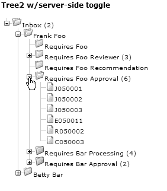

Doray_6048C20.fm 第 313 页 2006 年 1 月 16 日，星期一，下午 3:21

第 20 章 ■ JAVASERVER FACES 与 STRUTS 的对比

**313**

**图 20-1.** *服务器上对应的 UI 树* **图 20-2.** *MyFaces 中的树形视图*

当页面被提交时，树形视图的状态——换句话说，用户展开了哪些节点——会与其他表单数据一起，以不引人注目的方式发送出去。这些数据存储在代表树形视图组件的服务器端对象上。


总而言之，与 Struts 将页面数据放入单个 ActionForm 不同，JSF 会创建一个服务器端 UI *树*来保存数据——既包括发往模型层的数据，也包括表示视图状态的数据。JSF 对这两者不加区分。

[www.it-ebooks.info](http://www.it-ebooks.info/)

Doray_6048C20.fm Page 314 Monday, January 16, 2006 3:21 PM

**314**

第 20 章 ■ JAVASERVER FACES 与 STRUTS SHALE

因此，需要处理的是 UI 树，就像 Struts 处理 ActionForms 一样。UI 树中包含的用户提交数据需要经过验证和处理，才能交付给模型层。接下来我们将了解这是如何完成的。

**请求处理生命周期**

JSF 的请求处理生命周期描述了如何处理来自客户端的 HTTP 请求，以由服务器生成响应。JSF 的请求处理生命周期分为几个*阶段*。图 20-3 对此进行了说明。

■**提示** 你需要非常熟悉本节内容，因为现有的 JSF 文档以及基于 JSF 的技术（如 Shale）的文档，经常引用 JSF 请求处理生命周期的各个阶段。

**图 20-3.** *JSF 的请求处理[生命周期](http://www.it-ebooks.info/)*

[www.it-ebooks.info](http://www.it-ebooks.info/)

Doray_6048C20.fm Page 315 Monday, January 16, 2006 3:21 PM

第 20 章 ■ JAVASERVER FACES 与 STRUTS SHALE

**315**

总共有六个阶段（图 20-3 中的实线框），每个阶段及其关联的*事件*在后续阶段开始之前都会完全处理完毕。

■**注意** *事件*和*事件监听器*是 JSF 将其内部机制暴露给第三方类的机制。它们是 JSF 的一个重要扩展点。我们将在下一节中描述这两者。

在图 20-3 中，我们标记了两种方式（验证错误和转换错误），通过这些方式，处理过程会快速进入“渲染响应”阶段。实际上，在*任何*阶段之后立即处理事件的事件监听器都可能导致 JSF 进入“渲染响应”阶段。

**FACES 请求**

并非所有发送到服务器的 HTTP 请求都按照图 20-3 进行处理，只有那些请求 JSF 页面的请求才会如此。此类请求被称为 *faces 请求*。这类似于并非每个 HTTP 请求都由 Struts 处理，只有那些带有 .do 扩展名（默认情况下）的请求才会被处理。JSF 对应的扩展名是 .jsf。（同样，这取决于你如何配置 web.xml。JSF 扩展名的另一个常见选择是 .faces。）

你的页面不必具有 .jsf 扩展名，但对它们的调用必须使用该扩展名。例如，假设你有一个包含 JSF 标记的 JSP 页面，名为 mypage.jsp。要正确调用此页面，你需要请求

http://www.mycompany.com/mypage. **jsf**

如果你直接请求 http://www.mycompany.com/mypage.jsp，则会收到错误消息。

你可以将页面命名为 .jsf 扩展名，但这在符合 JSP 1.2 规范的 servlet 容器中*无法*工作。JSP 1.2 要求 JSP 页面具有 .jsp 扩展名。因此，最可移植的方法是将你的 JSF 页面命名为 .jsp，并以 .jsf 扩展名请求它们。

让我们详细看看每个阶段。如果我的某些评论目前看起来晦涩难懂，请不要担心。我将在以下小节中解释这些晦涩的部分。

• **恢复视图**：如果这是用户第一次请求此页面，则会创建 *UI 树*（请参阅上一小节的讨论）。如果这是第二次创建该页面，则会使用先前保存的状态重新创建 UI 树。每个 UI 组件的*值绑定*也会在此阶段进行处理。

[www.it-ebooks.info](http://www.it-ebooks.info/)

Doray_6048C20.fm Page 316 Monday, January 16, 2006 3:21 PM

**316**

第 20 章 ■ JAVASERVER FACES 与 STRUTS SHALE

• **应用请求值**：UI 树上的每个 UI 组件都有机会根据传入的 HTTP 请求中包含的信息更新其状态。

• **处理验证**：在此阶段，处理验证。如果存在错误，则处理过程直接进入“渲染响应”阶段。

• **更新模型值**：顾名思义，在此阶段，模型层会使用 UI 树中的数据进行更新。JSF 知道哪些 UI 组件保存了发往模型层的数据，因为你已在 JSF 标记中指定了这一点。数据转换错误将导致处理过程直接进入“渲染响应”阶段。

• **调用应用程序**：根据先前阶段发布的*动作事件*执行导航。你也可以对 JSF 进行自定义，将其他处理代码添加到此阶段。

• **渲染响应**：根据导航结果或现有的 UI 树（如果页面需要重新显示）生成 HTML 输出。UI 树的状态也会被保存，以便在后续请求中进行处理。

在每个阶段（恢复视图和渲染响应阶段除外）之后，都会处理该阶段可能生成的事件。

事件是包含指示特定处理状态信息的 Java 对象。

事件由 UI 树上的 UI 组件或你附加到任何阶段的自定义处理代码生成。事件的处理由 JSF 本身或事件监听器完成。

接下来我们将了解这是如何完成的。

**事件与事件监听器**

在本书中，你已经遇到过两种设计模式：MVC 设计模式和单例设计模式（在第 19 章中）。事件和事件监听器属于一种简单但强大的设计模式，称为*观察者模式*。

在观察者设计模式中，有两个角色。第一个是发布者，一个会不时更新的数据源。第二个是订阅者，表示对获取发布者最新数据感兴趣的实体。

让订阅者获取最新数据的一种糟糕方式是让它们定期轮询发布者。这种称为轮询的技术显然效率低下：轮询太快会浪费 CPU 时间；轮询太慢则可能过晚获取数据或完全丢失数据。

观察者设计模式没有采用轮询，而是采用了“别找我们，我们会找你”的原则。对从发布者获取数据感兴趣的订阅者首先向发布者*注册*。当新数据到达时，发布者会*通知*所有已注册的订阅者。

[www.it-ebooks.info](http://www.it-ebooks.info/)

Doray_6048C20.fm Page 317 Monday, January 16, 2006 3:21 PM

第 20 章 ■ JAVASERVER FACES 与 STRUTS SHALE

**317**

让我们举一个具体的例子。像 Swing 或抽象窗口工具包（AWT）这样的 GUI 框架拥有表示可视化 UI 组件的类，例如按钮、复选框等。这些 GUI 组件中的每一个都需要发出某些用户交互的信号，例如在按钮上单击鼠标，或在文本输入框中按下某个键。每个这样的活动都称为一个*事件*。

一个事件通常由一个 Java 类表示，该类包含描述该事件数据的字段。例如，对于鼠标单击，MouseClickEvent 可能包含鼠标单击的 X 和 Y 坐标，如清单 20-2 所示。

**清单 20-2.** *表示鼠标单击的类*

public class MouseClickEvent{

private int _x, _y;

public MouseClickEvent(int x, int y){

_x = x; _y = y;

}

public int getX(){ return _x; }

public int getY(){ return _y; }

}

请注意，表示事件的类通常是*不可变的*，这意味着一旦创建，你只能从中读取数据。这样做的原因是因为一个事件可能在多个订阅者之间共享。你不希望任何订阅者修改该事件。


现在我们有了一个表示鼠标点击的类。太棒了！但如何保证订阅者能够理解这个事件中包含的数据呢？很简单——让它们实现一个标准接口，如清单 20-3 所示。

**清单 20-3.** *MouseClickListener 接口*

public interface MouseClickListener{

public mouseClicked(MouseClickEvent mce);

}

因此，实现 MouseClickListener 的订阅者明确声明它知道如何处理鼠标点击。清单 20-4 展示了一个实现 MouseClickListener 的订阅者示例。

[www.it-ebooks.info](http://www.it-ebooks.info/)

Doray_6048C20.fm 第 318 页 2006 年 1 月 16 日星期一 下午 3:21

**318**

第 20 章 ■ JAVASERVER FACES 与 STRUTS SHALE

**清单 20-4.** *实现 MouseClickListener 的订阅者示例* public class MySubscriber implements MouseClickListener{

public mouseClicked(MouseClickEvent mce){

System.out.println(“x 坐标 = “ + mce.getX());

System.out.println(“y 坐标 = “ + mce.getY());

}

}

那么发布者呢？它们需要实现任何接口吗？通常不需要，但发布者应该具备添加或移除事件监听器的功能。订阅者需要知道这些函数并调用它们；示例如清单 20-5 所示。

**清单 20-5.** *生成鼠标点击事件的 GUI 组件片段* public class MyGuiWidget{

private Set _mouseClickListeners = new HashSet();

public addMouseClickListener(MouseClickListener mcl){

_mouseClickListeners.add(mcl);

}

public removeMouseClickListener(MouseClickListener mcl){

_mouseClickListeners.remove(mcl);

}

protected void broadcastMouseClick(int x, int y){

if(_mouseClickListeners.isEmpty()) return;

MouseClickEvent mce = new MouseClickEvent(x,y);

for(Iterator listeners = _mouseClickListeners.iterator();

listeners.hasNext();){

((MouseClickListener) listeners.next()).mouseClicked(mce);

}

}

[www.it-ebooks.info](http://www.it-ebooks.info/)

Doray_6048C20.fm 第 319 页 2006 年 1 月 16 日星期一 下午 3:21

第 20 章 ■ JAVASERVER FACES 与 STRUTS SHALE

**319**

// 其他从屏幕接收鼠标点击并调用 broadcastMouseClick() 的函数

...

}

**MOUSECLICKEVENT 真的必要吗？**

你现在可能已经意识到，MouseClickEvent 类并非严格必要。事实上，完全可以完全消除这个类，而将 X 和 Y 坐标作为 mouseClicked() 的参数：

public interface MouseClickListener{

public mouseClicked(int x, int y);

}

两种方法都有效，JSF 两种都会使用，但大多数情况下使用第一种。

你的 Java 应用程序会像清单 20-6 所示那样连接 MyGuiWidget 和 MySubscriber。

**清单 20-6.** *生成鼠标点击事件的 GUI 组件片段* MyGuiWidget widget = new MyGuiWidget();

MySubscriber sub1 = new MySubscriber();

MySubscriber sub2 = new MySubscriber();

widget.addMouseClickListener(sub1);

widget.addMouseClickListener(sub2);

现在你理解了这一切，可能会想知道这与 JSF 有何关联。实际上，在每个阶段（除了恢复视图和渲染响应），都会生成事件。

这些事件可能与阶段变化有关（PhaseEvent），或表明用户需要执行某个特定操作，例如导航到下一页或调用某个类上的函数（ActionEvent），或指示 UI 组件的值已更改（ValueChangedEvent）。

此外，正如侧边栏所指出的，可以在没有显式“事件”对象的情况下标记事件。验证和模型层更新就是这样完成的。本质上，你需要

[www.it-ebooks.info](http://www.it-ebooks.info/)

Doray_6048C20.fm 第 320 页 2006 年 1 月 16 日星期一 下午 3:21

**320**

第 20 章 ■ JAVASERVER FACES 与 STRUTS SHALE

为这些事件分别创建监听器，并以某种方式（你很快就会看到如何操作）将它们注册到 JSF。JSF 会在适当的阶段调用这些监听器。

那么，关键问题就是：我们如何为各种事件注册监听器？


在清单 20-6 中，你可以看到如何使用 Java 语言以编程方式实现这一点。这*并非* JSF 的常规做法。相反，你需要在*JSP 页面*中将事件生产者与事件监听器连接起来，该页面指定了 UI 树*。*

我们将在解决一些遗留问题之后，再给出一个如何实现此功能的示例。

**JSF 标签库**

标准 JSF 标签库只有两个：

• 核心标签库处理与视图渲染方式无关的 JSF 功能。请记住，JSF 非常灵活，它不必仅使用 HTML 作为其视图媒介。例如，也可以使用 JSF 渲染为无线标记语言（WML）。核心标签库包含例如用于运行验证或加载消息资源的标签。

• HTML 标签库定义了专门描述视图层的标签，特别是针对 HTML 输出。

我想提醒你，“标准”UI 组件和验证器的集合相当有限。要创建复杂的 Web 应用程序，你可能需要扩展 JSF。有两种方法可以实现这一点：

• 使用第三方 UI 组件和验证器。MyFaces 就附带了一些这样的组件。

• 使用专门解决 JSF 缺陷的框架。Shale 就是这样一个框架。

**值绑定与方法绑定**

JSF 引入了两种非常强大的技术，称为*值绑定*和*方法绑定*。

你在 Struts 中已经有过一些值绑定的经验。还记得如何在 Struts 标签中从表单 Bean 读取和写入属性吗？例如，如果你希望一个 `<html:text>` 将一个名为 `userId` 的属性保存到名为 `user` 的表单 Bean 中，你会这样做：

<html:text property="userId"/>

其中 `user` 表单 Bean 是隐式的。这就是值绑定的含义。然而，JSF 的语法是不同的：

[www.it-ebooks.info](http://www.it-ebooks.info/)

Doray_6048C20.fm 第 321 页 2006 年 1 月 16 日星期一 下午 3:21

第 20 章 ■ JAVASERVER FACES 与 STRUTS SHALE

**321**

<h:inputText value="#{user.userId}"/>

JSF 使用一种表达式语言语法（参见第 10 章）。请注意，这与 JSTL 的“EL”语法不同，因为它以井号（#）开头。

*方法绑定*是这一思想的扩展。它允许你的 JSF 标签调用表单 Bean（JSF 术语为*支持 Bean*）上的函数。例如：

<h:commandButton action="#{user.Logon}" />

描述了一个按钮，如果点击它，将调用 `user` 支持 Bean 上的 `Logon()` 函数。

这种技术很强大，因为你可以在一个表单上定义多个按钮，并将它们绑定到不同的函数，每个函数以不同的方式处理表单数据。

**快速测验**

在 Struts 中你会如何做同样的事情？

正因如此，支持 Bean 有时就像是 ActionForm 和 Action 的结合体。

当你阅读 JSF 文献时，肯定会遇到*受管 Bean* 这个术语。受管 Bean 是一种其实例化由 JSF 控制的支持 Bean。

这类似于 Struts 中的表单 Bean。表单 Bean（在 Struts 中）和受管 Bean（JSF 中）的共同特点是，两者的实例化都由各自的框架执行。

在 faces-config.xml（JSF 配置文件）中声明受管 Bean 的方式也有所不同。你不会使用

<form-bean name="user" type="net.thinksquared.reg.User" />

而是会这样写

<managed-bean>

<managed-bean-name>user</managed-bean-name>

<managed-bean-class>net.thinksquared.reg.User</managed-bean-class>

</managed-bean>

JSF 的风格更加冗长，因为它不使用属性，而是使用单独的标签。

**导航**

在 Struts 中，导航信息（`<forward>`）与处理声明（`<action>`）混合在一起。JSF 在表示导航信息方面做得更好。

事实上，与 Struts 相比，整个 JSF 导航模型更容易理解和使用。JSF 不使用像 ActionForward 这样的专用类，而是使用普通的 Java 字符串。

[www.it-ebooks.info](http://www.it-ebooks.info/)

Doray_6048C20.fm 第 322 页 2006 年 1 月 16 日星期一 下午 3:21

**322**


第 20 章 ■ JavaServer Faces 与 Struts Shale

因此，你的支持 Bean 中执行导航的函数将返回一个字符串，而不是返回相当于 ActionForward 的内容。这些被称为*逻辑结果*。

例如，请参考清单 20-7。

**清单 20-7.** *一个简单的导航规则*

<navigation-rule>

<from-view-id>/index.jsp</from-view-id>

<navigation-case>

<from-outcome>register </from-outcome>

<to-view-id>/register.jsp</to-view-id>

</navigation-case>

<navigation-case>

<from-outcome>success</from-outcome>

<to-view-id>/success.jsp</to-view-id>

</navigation-case>

</navigation-rule>

这个示例定义了一个单一的*导航规则*，包含两个逻辑结果：register 和 success。你可以根据需要定义任意数量的导航规则，甚至可以添加条件，例如

<from-view-id>/index.jsp</from-view-id>

这告诉 JSF，“上一个”页面必须是什么，这个 `<navigation-rule>` 才会生效。

**示例：注册 Web 应用**

在本节中，我们将把老朋友——注册 Web 应用（参见第 5 章）移植到 JSF。

首先，以下是规格说明：

• 共有三个页面：一个用于用户登录，一个用于用户注册，最后一个用于指示登录*或*注册成功。

• 登录页面包含通常的表单，其中有用户 ID 和密码字段。该页面还包含一个指向注册页面的链接。如果系统检测到输入的用户 ID 不存在，则会转发到注册页面。

• 注册页面与登录页面类似，只是多了一个“确认密码”字段。

• 像往常一样，在输入被接受并传递给模型层之前，会对字段进行验证。

[www.it-ebooks.info](http://www.it-ebooks.info/)

Doray_6048C20.fm 第 323 页 2006 年 1 月 16 日，星期一，下午 3:21

第 20 章 ■ JavaServer Faces 与 Struts Shale

**323**

■**警告** 这个示例*并未*向你展示 JSF 的全部功能，也没有展示如何高效地使用它。

我们使用注册 Web 应用仅仅是因为我们已经用 Struts 和 Tiles 实现了它。

我希望这能为你提供一些思维框架，以便你掌握 JSF 中的新概念。我们将从配置 JSF 开始。

**配置 JSF**

与 Struts 一样，配置 JSF 时需要用到两个文件：web.xml（Servlet 配置文件）和 faces-config.xml。这两个文件都应放在 WEB-INF 目录中。

web.xml 文件包含的信息告诉 Servlet 容器哪些请求扩展名（如 .jsf）应该被转发到 JSF，以及状态存储在哪里（客户端或服务器）。MyFaces 发行版中提供了一个带有默认设置的 web.xml 文件。你应该可以直接使用这个文件而无需任何修改。

faces-config.xml 文件包含声明 `<managed-bean>`、`<navigation-rule>` 以及其他标签的信息，用于插入第三方 UI 组件和验证器等。清单 20-8 显示了注册 Web 应用的 faces-config.xml 文件。

**清单 20-8.** *注册 Web 应用的 faces-config.xml*

<?xml version="1.0"?>

<!DOCTYPE faces-config PUBLIC

"-//Sun Microsystems, Inc.//DTD JavaServer Faces Config 1.0//EN"

"http://java.sun.com/dtd/web-facesconfig_1_0.dtd">

<faces-config>

<managed-bean>

<managed-bean-name>user</managed-bean-name>

<managed-bean-class>net.thinksquared.reg.User</managed-bean-class>

<managed-bean-scope>request</managed-bean-scope>

</managed-bean>

<navigation-rule>

<navigation-case>

<from-outcome>register</from-outcome>

<to-view-id>/register.jsp</to-view-id>

</navigation-case>

<navigation-case>

[www.it-ebooks.info](http://www.it-ebooks.info/)

Doray_6048C20.fm 第 324 页 2006 年 1 月 16 日，星期一，下午 3:21

**324**

第 20 章 ■ JavaServer Faces 与 Struts Shale

<from-outcome>success</from-outcome>

<to-view-id>/success.jsp</to-view-id>

</navigation-case>

</navigation-rule>

</faces-config>

我们声明了一个名为 user 的受管 Bean。这个 Bean 同时持有用户 ID


密码数据*并*执行复杂的验证。请注意，用户 bean 被声明为请求作用域。

我们还声明了一个导航规则，将注册页面（register.jsp）映射到逻辑结果 register，同样，将显示成功注册的页面（success.jsp）映射到逻辑结果 success。

**消息资源**

与 Struts 类似，JSF 也通过使用消息资源包来支持国际化。

JSF 的支持比 Struts 好得多。我们无需在配置文件中指定 application.properties 文件，而是可以在使用消息资源的 JSP 中声明它。

这意味着我们可以使用多个消息资源。您很快就会看到它的实际应用。

清单 20-9 显示了 Registration Webapp 的消息资源。该文件存储为 net\thinksquared\reg\messages.properties，因此将被称为 net.thinksquared.reg.messages。

**清单 20-9.** *Registration Webapp 的消息资源文件*

#-------- 错误提示 --------

user_exists = 用户 ID {0} 已被占用。请尝试其他 ID。

user_not_registered = 您尚未注册！请立即注册。

wrong_password = 密码错误。请重试。

password_mismatch = 您输入的密码不匹配。

#-------- 按钮文本 ----------

register = 注册

logon = 登录

#-------- 其他文本 ----------

title = 请登录

title_reg = 请注册

new_user = 注册为新用户...

registered_ok = 您已注册为 {0}，密码为 {1}！

[www.it-ebooks.info](http://www.it-ebooks.info/)

Doray_6048C20.fm 第 325 页 2006 年 1 月 16 日 星期一 下午 3:21

第 20 章 ■ J A V A S E R V E R F A C E S 与 S T R U T S S H A L E

**325**

logon_ok = 您已登录为 {0}

user_id = 用户 ID：

password = 密码：

password2 = 重新输入密码：

请注意，logon_ok 的消息以 You''re 开头。重复的单引号并非错误——这是“转义”单引号的方式。

**用户支持 Bean**

用户支持 bean（也是一个受管 bean）用于存储数据（用户 ID 和密码），并且还具有登录现有用户或注册新用户的功能，如清单 20-10 所示。

**清单 20-10.** *用户支持 Bean*

package net.thinksquared.reg;

import java.util.Map;

import java.util.HashMap;

import java.util.ResourceBundle;

import java.text.MessageFormat;

import javax.faces.context.FacesContext;

import javax.faces.application.FacesMessage;

import javax.faces.component.UIComponent;

public class User {

private static Map _dbase = new HashMap(); //我们的模拟数据库。

private String _uid,_pwd;

private UIComponent _container;

public User(){

_uid = null;

_pwd = null;

_container = null;

}

[www.it-ebooks.info](http://www.it-ebooks.info/)

Doray_6048C20.fm 第 326 页 2006 年 1 月 16 日 星期一 下午 3:21

**326**

第 20 章 ■ J A V A S E R V E R F A C E S 与 S T R U T S S H A L E

//------------------------------------- 数据 get/set

public void setUserId(String uid){

_uid = uid;

}

public String getUserId(){

return _uid;

}

public void setPassword(String pwd){

_pwd = pwd;

}

public String getPassword(){

return _pwd;

}

//------------------------------------- UI get/set

public void setContainer(UIComponent container){

_container = container;

}

public UIComponent getContainer(){

//我们必须返回 null，否则

//保存的 _container 将被嫁接

//到新的 UI 树中。

return null;

}

//------------------------------------- 操作

public String Register(){

//获取当前“上下文”的句柄

FacesContext context = FacesContext.getCurrentInstance();

//获取所需属性文件的句柄

ResourceBundle bundle =

ResourceBundle.getBundle("net.thinksquared.reg.messages", context.getViewRoot().getLocale());

[www.it-ebooks.info](http://www.it-ebooks.info/)

Doray_6048C20.fm 第 327 页 2006 年 1 月 16 日 星期一 下午 3:21

第 20 章 ■ J A V A S E R V E R F A C E S 与 S T R U T S S H A L E

**327**

//复杂验证：用户是否存在？

if(_dbase.get(_uid) != null){

Object[] params = {_uid};

String msg = MessageFormat.format(


bundle.getString("user_exists"),params);

String clientId =

_container.findComponent("userId").getClientId(context); context.addMessage(clientId, new FacesMessage(msg));

//返回 null 会导致重新显示输入页面

return null;

}

//一切正常——继续注册用户

_dbase.put(_uid,_pwd);

Object[] params = {_uid,_pwd};

String msg = MessageFormat.format(

bundle.getString("registered_ok"),params);

context.addMessage (null, new FacesMessage(msg));

return "success";

}

public String Logon(){

//获取当前"上下文"的句柄

FacesContext context = FacesContext.getCurrentInstance();

//获取所需属性文件的句柄

ResourceBundle bundle =

ResourceBundle.getBundle("net.thinksquared.reg.messages", context.getViewRoot().getLocale());

//复杂验证：

// 用户是否存在？

// 给定的密码是否与数据库中的匹配？

Object pwd = _dbase.get(_uid);

if(null == pwd){

[www.it-ebooks.info](http://www.it-ebooks.info/)

Doray_6048C20.fm Page 328 Monday, January 16, 2006 3:21 PM

**328**

第 20 章 ■ JAVASERVER FACES 与 STRUTS SHALE

String msg = bundle.getString("user_not_registered"); context.addMessage (null, new FacesMessage(msg));

return "register";

}else if(!pwd.equals(_pwd)){

String msg = bundle.getString("wrong_password");

String clientId =

_container.findComponent("password").getClientId(context); context.addMessage(clientId, new FacesMessage(msg));

return null;

}

//一切正常——继续登录用户

//此处为登录用户的代码...

Object[] params = {_uid};

String msg = MessageFormat.format(

bundle.getString("logon_ok"),params);

context.addMessage (null, new FacesMessage(msg));

return "success";

}

}

清单 20-10 包含三个部分。第一部分是一组用于数据的 getter 和 setter 方法。

JSF 会在更新模型值阶段调用这些函数。JSF 知道需要调用这些函数，是因为我们使用了值绑定来将输入字段链接到这些函数。（参见清单 20-11 和 20-12。值绑定在输入字段上显示为 value=#{...}。）这类似于将 Struts 标签输入链接到 ActionForm 的方式。

第二部分包含一个*UI 组件*的单个 getter 和 setter 方法。这对你来说应该是全新的，因为 Struts 没有 UI 组件。我们将<h:form> UI 组件绑定到了用户 bean 上。（参见清单 20-11 和 20-12。这个值绑定在<h:form>标签上显示为 binding=#{...}。）想要拥有与<h:form>对应的 UI 组件副本的原因很快就会变得显而易见。

最后一部分包含两个函数：一个用于注册新用户，另一个用于登录已有用户。我们只描述 Register()函数，因为 Logon()中没有新的技术细节。

首先，注意 Register()的返回值是一个字符串。这个字符串代表与<navigation-case>（参见清单 20-8）关联的*逻辑结果*（表示“下一个”页面）。

在 Register()中，我们做的第一件事是获取对 FacesContext 对象的引用：

[www.it-ebooks.info](http://www.it-ebooks.info/)

Doray_6048C20.fm Page 329 Monday, January 16, 2006 3:21 PM

第 20 章 ■ JAVASERVER FACES 与 STRUTS SHALE

**329**

FacesContext context = FacesContext.getCurrentInstance();

这个 FacesContext 对象持有 UI 树的根节点，并公开了各种有用的函数。

下一步是获取消息资源包，以便我们可以向视图输出消息：

//获取所需属性文件的句柄

ResourceBundle bundle =

ResourceBundle.getBundle("net.thinksquared.reg.messages", context.getViewRoot().getLocale());

与 Struts 相比，这更加繁琐，因为 JSF 允许我们拥有多个消息资源文件。你必须按名称*并且*从正确的区域设置中定位这些文件。语句 context.getViewRoot().getLocale()

显然会获取当前请求的区域设置。注意，getViewRoot()是 FacesContext 上的一个函数，它返回 UI 树的根节点。


一旦我们获得了 `FacesContext` 和正确的 `ResourceBundle` 的句柄，就可以开始进行复杂验证：

//复杂验证：用户是否存在？

if(_dbase.get(_uid) != null){

Object[] params = {_uid};

String msg = MessageFormat.format(

bundle.getString("user_exists"),params);

String clientId =

_container.findComponent("userId").getClientId(context); context.addMessage(clientId, new FacesMessage(msg));

//返回 null 会导致输入页面重新显示

return null;

}

执行复杂验证（检查用户 ID 是否已存在）的唯一代码位于 `if(...)` 语句的子句中。而 `if()` 语句的主体则负责将错误消息显示在正确的位置！这乍看起来可能有点令人望而生畏，所以我们一步一步来。这里涉及的错误消息是 `user_exists`，消息资源文件（参见清单 20-9）告诉我们：`user_exists = 用户 ID {0} 已被占用，请尝试其他 ID。`

[www.it-ebooks.info](http://www.it-ebooks.info/)

Doray_6048C20.fm 第 330 页 2006 年 1 月 16 日，星期一，下午 3:21

**330**

第 20 章 ■ JAVASERVER FACES 与 STRUTS SHALE

如你所见，它包含一个替换变量 `{0}`，我们希望将其替换为用户输入的 ID。例如，如果用户输入了用户 ID “Kermit”，我们希望最终的错误消息显示为：

用户 ID Kermit 已被占用，请尝试其他 ID。

Java 有一个名为 `MessageFormat` 的函数可以为你执行此替换。这正是我们在前两行中所做的：

Object[] params = {_uid};

String msg = MessageFormat.format(

bundle.getString("user_exists"),params);

`ResourceBundle` 上的 `getString()` 函数会获取与给定键（`user_exists`）对应的错误消息。然后我们使用 `MessageFormat` 将 `{0}` 替换为 `_uid`（即用户 ID）。因此，`msg` 变量保存了最终的错误消息。我们如何让它显示在页面上呢？这就是后续几行代码的作用。

首先，我们需要知道在*哪里*显示错误消息。使用 Struts 时，这很容易。但在 JSF 中，由于我们可能使用第三方组件，这就有点棘手了。理解其原因将有助于你更好地掌握 JSF，因此我们在此稍作展开。

回顾一下，在 JSF 中，页面上的所有信息都存储在一个 UI 树中。树上的每个节点（`javax.faces.component.UIComponent` 的实例）都可以使用 `id` 属性进行标记。显然，标签只有在唯一时才有意义——这是定位所需节点的唯一方法。挑战在于确保唯一性的同时，还要允许自定义组件。

为什么？嗯，一个自定义组件可能由许多子组件组成，每个子组件都必须有唯一的标签。使用 Struts 时，确保唯一性很容易，因为你只需读取页面的 JSP，并在需要时更改 ID 即可。但在 JSF 中使用自定义组件时，这并不总是有效，因为 JSP 上的标签与 UI 树中的节点之间并非一一对应。

我们之前讨论过的树视图组件就是一个例子。树视图 UI 组件会在*运行时*在 UI 树中创建新节点。它可能会为这些节点分配唯一的标签，而难点就在这里——如果这些节点的名称与另一个自定义组件的节点名称冲突怎么办？

JSF 通过使用*命名容器*来解决这些问题。命名容器是 UI 树上的一个普通节点，它会为其所有子节点的 ID 附加一个额外的前缀。此前缀由 JSF 确定，因此节点的最终标签确实是唯一的。

大多数情况下，我们只知道节点的*未*加前缀的 ID。为了使用其未加前缀的 ID 搜索特定节点，我们必须：

• 拥有对该节点所在命名容器的引用

• 拥有对同一命名容器内另一个子节点的引用

[www.it-ebooks.info](http://www.it-ebooks.info/)

Doray_6048C20.fm 第 331 页 2006 年 1 月 16 日，星期一，下午 3:21


第 20 章 ■ JAVASERVER FACES 与 STRUTS SHALE

**331**

我们选择了第二条路径。这正是 `setContainer()` 函数的作用所在。它允许 JSF 保存一个 UI 组件的副本——即 `<h:form>` UI 组件——该组件与我们希望定位的 `<h:message>` 标签属于同一个命名容器。在清单 20-10 中，我们将这个保存的副本命名为 `_container`，因为 `<h:form>` 包含了我们感兴趣的所有其他 UI 组件（参见清单 20-11）。

JSF 如何知道它需要调用这个函数？如果你查看清单 20-11，`<h:form>` 的声明是：

<h:form binding="#{user.container}">

这会导致与 `<h:form>` 对应的 UI 组件通过 `setContainer()` 方法保存到 `User` 类上。

不幸的是，故事并未就此结束！当我们的某个页面被重新加载，或者当你从一个页面导航到另一个页面时，JSF 还会使用 `getContainer()` 方法从用户后台 Bean 中检索出 UI 组件并进行嫁接。它会将之前存储的 `<h:form>` UI 组件及其所有子节点，嫁接到它看到绑定被创建的位置。

JSF 这样做是为了允许后台 Bean 改变页面的外观。如果使用得当，这是一种创建动态视图的非常强大的技术。你可以利用这种技术在 Web 应用中添加、移除或重新定位元素（如工具栏、按钮或迷你窗口）。

然而，在我们的案例中，我们并不希望出现这种行为，因此我们必须将 `getContainer()` 的返回值设置为 `null`。这会告诉 JSF 不要嫁接任何东西，而是调用 `setContainer()` 并保存 `<h:form>` 的一个副本。

有了这些背景知识，接下来的两行代码应该很容易理解：

String clientId = _container.findComponent("userId").getClientId(context);
context.addMessage(clientId, new FacesMessage(msg));

第一行使用 `_container` 通过 `findComponent()` 方法定位名为 `userId` 的 UI 组件。然后在该 UI 组件上调用 `getClientId()` 方法，以获取绝对 ID（并添加了命名容器的前缀）。下一行使用这个绝对 ID（clientId）为该 UI 组件附加一条错误消息。

我们做的最后一件事是返回 `null`。这向 JSF 表明没有“下一个”页面——当前页面需要重新显示。这是相对于 Struts 的一个优势，Struts 要求你在 `struts-config.xml` 中声明“输入”页面。

这引出了一个有趣的话题：JSF 究竟是如何知道它应该将 `Register()` 的返回值解释为“下一个”页面的？答案在于调用 `Register()` 的 JSF 标签：

<h:commandButton action="#{user.Register}" ...

你可以看到，该按钮调用了 `user.Register()`，并将其解释为一个“动作”。本质上，与这个 `<h:commandButton>` 对应的 UI 组件会调用 `Register()`，然后创建一个 `ActionEvent`（类似于 Struts 的 `ActionForward`）。`ActionEvent` 在

[www.it-ebooks.info](http://www.it-ebooks.info/)

Doray_6048C20.fm Page 332 Monday, January 16, 2006 3:21 PM

**332**

第 20 章 ■ JAVASERVER FACES 与 STRUTS SHALE

调用应用阶段进行处理。一个逻辑结果为 `null` 的 `ActionEvent` 会导致页面被重新显示。

这一节包含的信息量很大，需要一次性消化，所以如果你对细节没有把握，请不要气馁。我建议你（稍作休息后！）继续学习下一节，然后尝试本节末尾的注册 Web 应用练习。

**视图**

注册 Web 应用中的主要视图是用于执行用户登录的 `logon.jsp`（清单 20-11）和用于注册新用户的 `register.jsp`（清单 20-12）。

**清单 20-11.** *logon.jsp*

<%@ taglib uri="http://java.sun.com/jsf/html" prefix="h"%>

<%@ taglib uri="http://java.sun.com/jsf/core" prefix="f"%>

<%@ taglib uri="http://myfaces.apache.org/extensions" prefix="x"%>

<f:loadBundle basename="net.thinksquared.reg.messages"

var="reg_messages"/>

<html>

<body>

<f:view>

<h:panelGroup>

<h:messages style="color:red" globalOnly="true"/>

<h:outputText value="#{reg_messages['title']}"

style="font-weight:bold" />


<h:form binding="#{user.container}">

<f:verbatim><table><tr><td></f:verbatim>

<h:outputText value="#{reg_messages['user_id']}"/>

<f:verbatim></td><td></f:verbatim>

<h:inputText id="userId" value="#{user.userId}"

required="true">

<x:validateRegExpr pattern="^[A-Za-z0-9]{5,10}$" />

</h:inputText>

<h:message for="userId" />

<f:verbatim></td></tr><tr><td></f:verbatim>

[www.it-ebooks.info](http://www.it-ebooks.info/)

Doray_6048C20.fm Page 333 Monday, January 16, 2006 3:21 PM

第 20 章 ■ JavaServer Faces 与 Struts Shale

**333**

<h:outputText value="#{reg_messages['password']}"/>

<f:verbatim></td><td></f:verbatim>

<h:inputText id="password" value="#{user.password}"

required="true">

<x:validateRegExpr pattern="^[A-Za-z0-9\-\_]{5,10}$" />

</h:inputText>

<h:message for="password" />

<f:verbatim></td></tr><tr><td></td><td></f:verbatim>

<h:commandButton action="#{user.Logon}"

value="#{reg_messages['logon']}"/>

<f:verbatim></td></tr></table><br></f:verbatim>

</h:form>

</h:panelGroup>

<h:commandLink action="register">

<h:outputText value="#{reg_messages['new_user']}" />

</h:commandLink>

</f:view>

</body>

</html>

关于清单 20-11，有几点需要说明：

• <f:loadBundle> 加载给定的消息资源包，并通过 `var` 属性定义的名称将其暴露出来。

• <f:view> 是 JSF 的强制根标签。必须有一个这样的标签，并且它必须包含所有其他与 UI 相关的 JSF 标签。

• <h:panelGroup> 充当一个或多个 JSF 标签的容器。

• <h:messages>（注意是复数形式）显示通过 `addMessage()` 保存到关联的 `FacesContext` 中的错误或其他消息。在清单 20-11 中，`globalOnly` 属性指示仅显示通过调用 `context.addMessage(null, mymessage)` 保存的消息。

[www.it-ebooks.info](http://www.it-ebooks.info/)

Doray_6048C20.fm Page 334 Monday, January 16, 2006 3:21 PM

**334**

第 20 章 ■ JavaServer Faces 与 Struts Shale

• <h:outputText> 显示文本。它类似于 `<bean:write>` 或 `<bean:message>`，具体取决于你如何分配 `value` 属性。在清单 20-11 中，我们仅用它来显示来自消息资源包的提示或标签。

• <h:form> 允许你提交表单数据。

• <f:verbatim> 简单地输出其主体中的文本。从某种角度来看，这是 JSF 的一个缺陷，因为 `<f:verbatim>` 标签会使你的 JSP 变得非常难以阅读（我们在清单 20-12 中已将其剥离，以便你更容易看到重要部分）。另一方面，它可能会迫使你使用像 CSS 这样的布局技术来处理 webapp 的布局。请访问 Zen Garden 网站（参见“有用链接”），了解 CSS 在充分发挥潜力时有多强大。

• <h:inputText> 渲染一个输入文本字段。`required=true` 表示该字段是必填的。如果你提交一个空值，将为此 UI 组件发布一条错误消息。

• <x:validateRegExpr> 是 MyFaces 对 JSF 的扩展，允许你基于正则表达式验证用户输入。这就是为组件定义验证器的方式——你将验证器的标签嵌套在 UI 组件的标签中。

• <h:commandButton> 显示一个按钮。`action` 属性必须是一个表示逻辑结果的字符串，或者绑定到一个类的方法上，该方法的字符串返回值被解释为逻辑结果。

• <h:message> 显示与 `for` 属性引用的 UI 组件关联的第一条消息。`<h:message>` 应该与 `for` 属性指示的组件位于同一个命名容器中。

• <h:commandLink> 显示一个超链接，其目标为给定的结果。

我们在上一节中已经解释了较难的属性。对于作为 Struts 开发者的你来说，理解这些标签的工作原理应该不会太难。

接下来，让我们看看 `register.jsp` 页面。用于控制布局的大量 `<f:verbatim>` 标签可能会使代码难以阅读，因此在清单 20-12 中，我们将其剥离了。

**清单 20-12.** *剥离了 <f:verbatim> 标签的 register.jsp*

<%@ taglib uri="http://java.sun.com/jsf/html" prefix="h"%>

<%@ taglib uri="http://java.sun.com/jsf/core" prefix="f"%>

<%@ taglib uri="http://myfaces.apache.org/extensions" prefix="x"%>

<f:loadBundle basename="net.thinksquared.reg.messages"

var="reg_messages"/>

[www.it-ebooks.info](http://www.it-ebooks.info/)

Doray_6048C20.fm Page 335 Monday, January 16, 2006 3:21 PM

第 20 章 ■ JavaServer Faces 与 Struts Shale

**335**

<html>

<body>

<f:view>

<h:panelGroup>

<h:messages style="color:red" globalOnly="true"/>

<h:outputText value="#{reg_messages['title_reg']}"

style="font-weight:bold" />

<h:form binding="#{user.container}">

<h:outputText value="#{reg_messages['user_id']}"/>

<h:inputText id="userId"

value="#{user.userId}" required="true">

<x:validateRegExpr pattern="^[A-Za-z0-9]{5,10}$" />

</h:inputText>

<h:message for="userId" />

<h:outputText value="#{reg_messages['password']}"/>

<h:inputText id="password" value="#{user.password}"

required="true">

<x:validateRegExpr pattern="^[A-Za-z0-9\-\_]{5,10}$" />

</h:inputText>

<h:message for="password" />

<h:outputText value="#{reg_messages['password2']}"/>

<h:inputText id="password2" value="" required="true">

<x:validateEqual for="password" />

</h:inputText>

<h:message for="password2"/>

<h:commandButton action="#{user.Register}"

value="#{reg_messages['register']}"/>

</h:form>

</h:panelGroup>

</f:view>

</body>

</html>

[www.it-ebooks.info](http://www.it-ebooks.info/)

Doray_6048C20.fm Page 336 Monday, January 16, 2006 3:21 PM

**336**

第 20 章 ■ JavaServer Faces 与 Struts Shale

清单 20-12 对你来说应该没有意外，除了 `<x:validateEqual>`，这是一个验证器标签，用于测试两个字段是否相等。`<x:validateEqual>` 是 MyFaces 对 JSF 扩展的又一个例子。

关于清单 20-12，另一个有趣的地方是，重新输入的密码从未保存到用户支持 bean 中。相反，该值在相等性验证运行后被丢弃。

**动手试试！**

注册 webapp 可在 Apress 网站源代码部分找到，网址为 http://www.apress.com，文件名为 `jsf-registration-webapp.zip`。将其复制并解压到你的开发文件夹中，然后测试该 webapp。通过添加新字段、验证和新功能来尝试修改代码。

**下一步去哪里？**

我希望这篇简短的介绍成功地激发了你对 JSF 的兴趣。以下是一些关于下一步去哪里的建议：

• **下载规范**：JSF 规范可供下载。该规范相当易读，我发现它作为参考很有帮助。但是，你应该注意，它针对的是那些想要实现 JSF 的人，因此它并不是真正的 JSF 入门指南。

• **下载 MyFaces 的源代码**：我发现这对于了解 JSF 的内部工作原理非常有价值。不过，下载源代码时可能会遇到一点小麻烦：在撰写本文时，你需要一个 Subversion 客户端（参见“有用链接”）来下载源代码。你还需要 Ant（同样，参见“有用链接”）来自动下载 MyFaces 的依赖项（库 JAR 文件）。这可能有点麻烦，所以我们为你做好了。我们在 Apress 网站的源代码部分放置了一份 MyFaces 1.1.1 源代码的副本。同样在 Apress 网站的源代码部分，还有一份 Ant 的副本，你必须安装它才能编译 MyFaces。

Ant 发行版包含关于如何使用 Ant 的文档。请注意，MyFaces 的 Ant 构建文件需要互联网连接才能工作。


• **尝试 MyFaces 示例**：MyFaces 提供了许多有用的组件和验证器。建议感兴趣的读者下载 Apache 网站上提供的 myfaces-examples.war 文件（参见“实用链接”）并亲自尝试。我们未将其包含在 Apress 网站的源代码部分，因为 MyFaces 团队一直在添加有趣的新组件，我们不希望您错过最新的好东西。

• JSF 中心网站上有许多优秀的 JSF 教程。我还发现 JSF 常见问题解答网站非常有帮助。两者均参见“实用链接”。

[www.it-ebooks.info](http://www.it-ebooks.info/)

Doray_6048C20.fm 第 337 页 2006 年 1 月 16 日星期一 下午 3:21

第 20 章 ■ JAVASERVER FACES 与 STRUTS SHALE

**337**

下一节将预览新的 Struts-Faces 集成库。该库允许您将 JSF 与 Struts 结合使用，并让您优雅地“升级”现有的 Struts 应用程序。

**实验 20：Struts-Faces 集成库**

Struts-Faces 集成库（“实用链接”会告诉您在哪里下载最新版本）已经存在一段时间了，但直到最近才看到积极的开发进展。

它本质上是一个独立的 JAR 文件，您可以用它来以最小的麻烦“启用 JSF”功能——至少在理论上是这样！我们将在本实验中审查的版本（1.0 版）有一些显著的限制，我们将在实验过程中讨论这些限制。

我们将采取的方法是让您自己将集成库应用到一个非常简单的“注册”Struts Web 应用程序中。

■**注意** 本实验的代码答案可在 Apress 网站的源代码部分找到，文件名为 lab-20-answers.zip。

**步骤 1：准备开发环境**

注册 Web 应用程序是一个纯 Struts Web 应用程序，您将对其进行转换，使其在视图层使用 JSF 标签，而不是功能有限的 Struts 标签。

**1.** 将 Apress 网站源代码部分中的 registration.zip 文件解压到一个合适的开发文件夹中。其中包含一个简单注册 Web 应用程序的源文件。

**2.** 编译并部署注册 Web 应用程序，然后试用它，以便了解其工作原理。

**步骤 2：安装 JSF、JSTL 和 Struts-Faces 集成库**

Struts-Faces 集成库需要安装 JSF 1.0+ 实现和 JSTL。

不幸的是，该库*不*适用于 MyFaces。相反，您必须使用 Sun 的参考实现，由于许可限制，该实现未包含在 Apress 网站的源代码部分。请完成以下步骤：

[www.it-ebooks.info](http://www.it-ebooks.info/)

Doray_6048C20.fm 第 338 页 2006 年 1 月 16 日星期一 下午 3:21

**338**

第 20 章 ■ JAVASERVER FACES 与 STRUTS SHALE

**1.** 访问 Sun JSF 下载网站 (http://java.sun.com/j2ee/javaserverfaces/download.html) 并下载最新的 JSF 参考实现。提取相关的 JSF 二进制文件 jsf-api.jar 和 jsf-impl.jar，并将它们放置在 .\registration\lib 文件夹中。

**2.** 从 Apress 网站源代码部分的 Struts 发行版 zip 文件中提取 JSTL 二进制文件 jstl.jar 和 standard.jar，并将其放置到 .\registration\lib\ 文件夹中。

**3.** 从 Apress 网站源代码部分的 struts-faces.zip 文件中提取名为 struts-faces.jar 的 JAR 文件，并将其放置在 .\registration\lib 中。

您应该已经知道，注册 Web 应用程序的脚本会复制 .\registration\lib 中的文件，并在部署时将它们放置到 Web 应用程序的 /WEB-INF/lib 文件夹中。

**步骤 3：编辑 web.xml 和 struts-config.xml**

要初始化 JSF 并使 Struts-Faces 库和 struts-config.xml 文件正常工作，您需要遵循以下步骤：

**1.** 声明标准 Faces Servlet。在 web.xml 中添加以下声明：

<servlet>

<servlet-name>faces</servlet-name>

<servlet-class>javax.faces.webapp.FacesServlet</servlet-class>


<load-on-startup>1</load-on-startup>

</servlet>

你需要特别注意 <load-on-startup> 的值；它必须设置为声明中的最小值。如果你声明了其他 servlet，请确保它们的

<load-on-startup> 值大于与 FacesServlet 关联的值。

这可以确保 FacesServlet 优先被初始化。

**2.** 添加标准的 JSF servlet 映射。在 web.xml 中，添加以下 servlet 映射：

<servlet-mapping>

<servlet-name>faces</servlet-name>

<url-pattern>*.faces</url-pattern>

</servlet-mapping>

这告诉 Tomcat，以 .faces 结尾的页面 URL 应被转发到名为 faces 的 servlet，正如你从之前的 <servlet> 声明中所见，该 servlet 就是 FacesServlet。

[www.it-ebooks.info](http://www.it-ebooks.info/)

Doray_6048C20.fm 第 339 页 2006 年 1 月 16 日，星期一，下午 3:21

第 20 章 ■ JAVASERVER FACES 与 STRUTS SHALE

**339**

**3.** 添加一个特殊的 Struts 控制器。**在你的 struts-config.xml 文件中，添加以下**

**<controller> 元素（就在 *<message-resource>* 标签之前）：

<controller>

<set-property property="processorClass"

value="org.apache.struts.faces.application.FacesRequestProcessor"/>

</controller>

■**注意** 注册 webapp 未使用 Tiles，因此我们使用了上一步中所示的控制器。

然而，如果你的应用程序*确实*使用了 Tiles，请改用 FacesTilesRequestProcessor。

**第 4 步：迁移你的 Struts JSP 页面**

Struts-Faces TLD 文件包含了一些标签，你可以用它们来替代 Struts HTML 和 Bean 标签库。建议你使用 JSTL 替代 Struts Logic 标签库，并使用嵌套属性语法替代 Nested 标签库。上述说明同样适用于 Struts-EL 标签。不过，你应继续按原样使用 Tiles 标签库。

如果你有一个现有的 Struts 应用程序，你可以*逐步*迁移到 JSF——不必一次性完成所有工作。无论你是要迁移现有应用还是创建新应用，每个页面都需要执行以下几步操作。

首先，在你的 JSP 中声明 JSTL、JSF 和 Struts-Faces 标签库。它们必须按以下顺序声明：

<%@ taglib prefix="c" uri="http://java.sun.com/jstl/core" %>

<%@ taglib prefix="f" uri="http://java.sun.com/jsf/core" %>

<%@ taglib prefix="h" uri="http://java.sun.com/jsf/html" %>

<%@ taglib prefix="s" uri="http://struts.apache.org/tags-faces" %>

显然，你应该移除页面上对 HTML、Bean、Nested 或 Logic 标签库的声明。

接下来，放入替换标签。表 20-1 显示了 Struts-Faces 标签库中的标签，它们相当于 HTML 或 Bean 标签库中的某些标签。

你可以使用 <s:loadMessages> 替代 <f:loadMessages>。两者的区别在于，<s:loadMessages> 会使你声明的 Struts Application.properties 文件对 JSF 标签可用。

这些替换标签的属性与对应的 Struts 标签类似，但在某些情况下，它们相当基础。一个典型的例子是 <s:message>，它不允许像 <bean:message> 那样使用替换参数。在这种情况下，你应该使用功能更强大的 <h:outputFormat> 标签，它允许使用替换参数。

[www.it-ebooks.info](http://www.it-ebooks.info/)

Doray_6048C20.fm 第 340 页 2006 年 1 月 16 日，星期一，下午 3:21

**340**

第 20 章 ■ JAVASERVER FACES 与 STRUTS SHALE

**表 20-1.** *Struts-Faces 标签及其最接近的纯 Struts 等价标签* **标签名称**

**Struts 对应标签**

s:errors

html:errors

s:form

html:form

s:commandLink

html:link

s:html

html:html

s:write

bean:write

s:message

bean:message

s:javascript

html:javascript

但是，为了让 JSF 标签能够读取你的 Application.properties 文件，你需要像这样通过 <s:loadMessages> 将其暴露出来：

<s:loadMessages var="messages"/>

...

<h:outputFormat value="#{messages['app.logon.prompt.success']} ">

<f:param value="#{LogonForm.userid}"/>

</h:outputFormat>

当没有等价标签时，你应该使用合适的 JSF 或 JSTL 标签来代替。


表 20-2 包含了一些常用的 JSF 替换项，可供你使用。

**表 20-2.** *Struts 标签及其 JSF 等价物* **Struts 标签名称**

**JSF 替换项**

<html:text property="myProp">

<h:inputText id="myprop" value="#{myFormBean.myProp}" >

<html:password ...>

<h:inputSecret ...>

<html:hidden ...>

<h:inputHidden ...>

<html:submit >

<h:commandButton id="submit" type="SUBMIT"...>

<html:reset >

<h:commandButton id="reset" type="RESET"...>

<html:cancel >

<h:commandButton id="cancel" type="SUBMIT"...> 在迁移过程中，你必须遵循标准的 JSF 规则，例如添加外层的 `<f:view>` 标签。如果你正在迁移 Struts-EL 标签，请务必将 `${...}` 替换为 JSF EL 的 `#{...}`。当然，这同样适用于 Struts-Faces 标签，因为它们只是 JSF 的扩展。

现在，修改表单处理器的名称。在你的 `<s:form>` 中，你需要将表单处理器的名称从 `*.do` 改为 `struts-config.xml` 中声明的路径。例如，如果你之前有

[www.it-ebooks.info](http://www.it-ebooks.info/)

Doray_6048C20.fm 第 341 页 2006 年 1 月 16 日，星期一，下午 3:21

第 20 章 ■ JAVASERVER FACES 与 STRUTS 的融合

**341**

<html:form action="MyFormHandler.do" ...

现在应该改为

<s:form action="/MyFormHandler" ...

注意开头的斜杠。

最后，对 `.\registration\web\index.jsp` 进行必要的修改。你可能需要参考上一节中的 JSF 示例和注释。

**步骤 5：迁移 `<forward>` 和输入属性**

最后，你需要迁移指向已迁移 JSP 的 `<forward>`。

■**注意** 请在此处格外小心——*仅*当你迁移了 `<forward>` 所指向的 JSP 时，才修改它！

对于每个这样的 forward，将目标页面的 `.jsp` 后缀改为 `.faces`。例如，将

<forward name="login" path="/login.jsp" /> 改为

<forward name="login" path="/login.**faces**" /> *不要* **修改对应 JSP 页面的实际扩展名！** 同样，你需要在你的 `<action-mapping>` 上更改所有受影响的输入属性的声明，以使用 `.faces` 扩展名。例如，将

<action .... input="/login.jsp” ...

改为

<action .... input="/login.faces" ...

你只应更改指向已迁移页面的输入属性。

**步骤 6：使入口点转发到 `*.faces`**

如果你的某个页面已迁移到 JSF，那么你的 Web 应用的所有入口点都必须转发到 `*.faces`。

例如，假设你的应用的起始页面是 `registration.jsp`，其中包含 Struts 标签。然后你将此页面迁移到 JSF。你不能直接从浏览器调用该页面（有关详细信息，请参阅前面 JSF 介绍部分中的边栏“Faces 请求”）。

[www.it-ebooks.info](http://www.it-ebooks.info/)

Doray_6048C20.fm 第 342 页 2006 年 1 月 16 日，星期一，下午 3:21

**342**

第 20 章 ■ JAVASERVER FACES 与 STRUTS 的融合

你需要从另一个页面（例如 `index.jsp`）间接调用它。此页面应包含一个指向 `registration.faces` 的转发：

<jsp:forward page="registration.faces" />

注意没有开头的斜杠。请为 Registration Web 应用进行相应的更改。

**步骤 7：必要时修改 Actions**

在本书中，我们一直要求你在 Action 子类中报告复杂的验证错误时使用 `ActionMessages`——这是正确的做法，因为旧的 `ActionErrors` 类已被弃用。

不幸的是，Struts-Faces 集成库（1.0 版本）仅能与此已弃用的 `ActionErrors` 类一起工作！如果你使用规范的 `ActionMessages` 类，那么在复杂验证失败后重新显示页面时，会抛出 `ClassCastException`。

我相信这将在该库的下一个版本中得到修复，但在此实验中，你只能将 `RegistrationAction` 中的 `ActionMessages` 实例改为 `ActionErrors`。

现在就这样做，然后编译并部署你的应用。你应该能够注册一个用户。

测试所有简单和复杂的验证是否都能正常工作。如果无法让所有功能都正常工作，请确保你没有犯以下错误：


• **在 JSTL 标签中使用** #{} **代替** ${}：JSF 标签使用前者，而 JSTL 使用后者。

• **未能为嵌套在 JSTL 标签内的*每个* JSF 标签手动分配唯一 ID**：此问题的症状是出现“Duplicate ID error”或类似错误。在这种情况下，只需为嵌套在任何 JSTL 标签内的每个 JSF 标签（或 JSF 扩展标签）分配唯一 ID 即可。通常，你可以通过为 `<s:form>` 或 `<h:form>` 分配一个 ID 来解决问题。

如果所有方法都失败，不妨查看 Apress 网站源代码部分中 `lab-20-answers.zip` 文件里的答案，这没什么不好意思的。

■**注意** 由于许可限制，答案压缩包中不包含 Sun JSF 参考实现。你需要自行下载。

**第 8 步：添加必要的 <managed-bean> 声明** 这一步解决了 Struts-Faces 集成库的另一个缺点（如果你已经完成了第 7 步，可能已经注意到）：即成功注册后，点击浏览器的刷新按钮时，`RegistrationForm` 表单 Bean 并*不会*被实例化。

这可以通过欺骗 JSF 为你创建必要的表单 Bean 来轻松解决。方法是创建一个空白的 `faces-config.xml` 文件，然后添加一个 `<managed-bean>` 部分，其中的 Bean 名称与 `struts-config.xml` 中的完全一致（在我们的例子中，它是 `RegistrationForm`）。

这是一个权宜之计，我相信这个问题将在 Struts-Faces 库的未来版本中得到解决。

**简而言之**

在本实验课程中，我们仅仅触及了 Struts-Faces 集成库的皮毛。

如果你感兴趣，应该尝试一下发行版附带的示例应用程序。

你可能还注意到，除了使用 `ActionErrors` 之外，你无需修改应用程序中的 `Action` 或 `ActionForm` 子类。这当然是一个巨大的优势，并且在大多数情况下，比迁移到像 Shale 这样的全新框架更可取。

然而，你应该意识到 Struts-Faces 库并非总是有效。在本节的初稿中，我尝试迁移第 14 章的登录 Web 应用程序，结果发现你无法移植那些将视图转发到其他 JSP 的 Tiles，而这正是登录 Web 应用程序所做的。这可能是 JSF 的限制，因此很难看出此类问题如何在 Struts-Faces 库的未来版本中得到解决。也许可以修改 Tiles 标签，使其与 Struts-Faces 集成库更好地配合使用。

这里的教训是，你需要一个能够解决此类问题的新框架——一个从头开始重写的 Struts。这正是 Shale 的全部意义所在。

**Struts Shale 预览**

正如我们之前提到的，Shale 基于 JSF。这意味着它继承了 JSF 的所有优点，例如高度可定制的视图层。但 Shale 在 JSF 之上增加了许多优势。

在本节中，我们将带你了解 Shale 的主要增值领域。这些领域分为两大类：

• 一组服务和服务选项。（不要将这些与 Web 服务混淆。这里的服务类似于 Struts 插件，而服务选项只是配置 Shale 及其服务的方式。）服务包括与 Validator 框架的集成，以及 Tiles 的重写（现在称为“Clay”）。在这些之上一个重要的新增功能是 Shale 的对话框管理器，它使控制流更加透明。这些服务在设计时考虑到了可定制性，因此与 Struts 相比，Shale 更易于定制和扩展。

• 与其他框架和技术的集成（Spring、Ajax、JNDI 等）。

在我看来，这些优势加上 JSF 的优点，使 Shale 成为 Struts 当之无愧的继承者。不幸的是，仅凭技术优势并不能保证生存，而且由于我们在本章开头侧边栏（“Struts Ti 和 Struts OverDrive”）中概述的原因，Shale 对经典 Struts 的“继承”绝非板上钉钉。

**ViewController**

在 JSF 中，支持 Bean 是普通的旧 Java 对象（POJO）。这为你创建支持 Bean 提供了很大的灵活性，但也意味着你的 Bean 必须“手动”完成很多事情。

一个很好的例子是用户支持 Bean 的实际实现（参见清单 20-10）。

在我的实现中，我使用了一个 `HashMap` 来模拟数据库。在实际实现中，你可能需要创建和释放数据库连接，而这些操作最好集中处理，而不是在 `Logon()` 和 `Register()` 等函数中重复。

Shale 提供了一个名为 `ViewController` 的*接口*（参见清单 20-13），其中包含一些事件处理函数和一个名为 `postback` 的变量。

**清单 20-13.** *Shale 的 ViewController 接口*

```java
/**********************************************************************
Licensed under the Apache License, Version 2.0 (the "License"); you may not use this file except in compliance with the License. You may obtain a copy of the License at

http://www.apache.org/licenses/LICENSE-2.0

Unless required by applicable law or agreed to in writing, software distributed under the License is distributed on an "AS IS" BASIS, WITHOUT WARRANTIES OR CONDITIONS OF ANY KIND, either express or implied.

See the License for the specific language governing permissions and limitations under the License.
**********************************************************************/
package org.apache.shale.view;

public interface ViewController{

    /**
     * 如果页面是第二次被调用，则返回 true。
     */
    public boolean isPostBack();

    /**
     * 设置“回发”标志。
     */
    public void setPostBack(boolean postBack);

    /**
     * 在当前请求的 JSF 请求处理生命周期完成后调用。
     */
    public void destroy();

    /**
     * 在此 ViewController 支持 Bean 被实例化，并且上述所有属性设置器被调用之后，但在 JSF 请求处理生命周期开始之前调用。
     */
    public void init();

    /**
     * 在 UI 树恢复后调用。因此，如果页面是第一次显示，则*不会*调用此方法。
     */
    public void preprocess();

    /**
     * 在“渲染响应”阶段之前调用。此方法仅对实际将要渲染的视图调用。例如，如果你已导航到不同的视图，则不会调用此方法。
     */
    public void prerender();
}
```

如果你的*受管* Bean 实现了 `ViewController` 接口，Shale 将在适当的时候调用你的 `ViewController` 实现上的事件处理函数（请参考清单 20-13 中的注释）。

其理念是让你在这些函数中集中处理资源的创建或销毁活动。

■**注意** `AbstractViewController` 类实现了 `ViewController`，为 `isPostBack()` 和 `setPostBack()` 提供了可运行的实现，并为事件处理程序提供了空操作实现。如果需要，你可以为了方便而扩展此类。

一个重要的陷阱是，你必须为你的 `<managed-bean>` 使用正确的名称。


名字可不能随便取！你的受管 Bean 的名称（这里指的是在 `faces-config.xml` 中声明的名称，而非后台 Bean 的类名）必须与关联的 JSP 页面名称（称为*视图标识符*）相匹配。以下是一些示例：

• 如果视图标识符是 `/logon.jsp`，那么受管 Bean 必须命名为 `logon`。

• 如果视图标识符是 `/admin/logon.jsp`，那么受管 Bean 必须命名为 `admin$logon`。

• 如果视图标识符是 `/header.jsp`，那么受管 Bean 必须命名为 `_header`，因为单独的 `header` 在 JSF 中是保留字。

由此可见，受管 Bean 与 JSP 页面之间存在一一对应的关系。这与我们在注册 Web 应用中使用的一对多关系形成了对比。

所有这些可能看起来有点抽象，因此我们将把 ViewController 思想应用到一个“实际”的例子中——注册 Web 应用，该应用需要创建和释放数据库连接。清单 20-14 展示了这个类，为了清晰起见，省略了其中的逻辑。

**清单 20-14.** *用户后台 Bean，第二版*

```java
package net.thinksquared.reg;

//...其他导入语句已省略

org.apache.shale.view.AbstractViewController;

public class User extends AbstractViewController{

    Connection _connection; //数据库连接

    //...其他私有变量

    //...构造函数

    //...数据 get/set 方法

    //...UI get/set 方法

    //------------------------------------- 动作

    public String Register(){
        //使用 _connection 读写数据库
    }

    public String Logon(){
        //使用 _connection 读写数据库
    }

    //------------------------------------- 用于 ViewController

    public void init(){
        //创建数据库连接 _connection。
    }

    public void destroy(){
        //释放数据库连接 _connection。
    }

}
```

在清单 20-14 中，你可以看到我们如何利用 ViewController 提供的功能来集中管理数据库连接的创建和释放。

当然，由于 Shale 假定受管 Bean 与视图之间是一一映射的关系，因此 `<managed-bean>` 声明（参见清单 20-8）必须按照清单 20-15 所示进行更改。

**清单 20-15.** *注册 Web 应用的新 `<managed-bean>` 声明*

```xml
<managed-bean>
    <managed-bean-name> **logon**</managed-bean-name>
    <managed-bean-class>net.thinksquared.reg.User</managed-bean-class>
    <managed-bean-scope>request</managed-bean-scope>
</managed-bean>

<managed-bean>
    <managed-bean-name> **register**</managed-bean-name>
    <managed-bean-class>net.thinksquared.reg.User</managed-bean-class>
    <managed-bean-scope>request</managed-bean-scope>
</managed-bean>
```

如你所见，我们使用了前面讨论过的命名规则。此外，`register.jsp` 和 `logon.jsp` 中的 `binding` 和 `value` 属性也需要更改。不再使用 `#{used.XXX}`，而必须根据情况使用 `#{logon.XXX}` 或 `#{register.XXX}`。

**对话框管理器**

根据 Shale 网站的描述，Shale 的对话框管理器是一种“定义与用户‘对话’的机制，该对话需要多个 HTTP 请求来实现，并以状态图的形式建模”。

因此，*对话框* 是一种跨越多个 HTTP 请求与用户的交互。Shale 允许你在一个 XML 文件（通常命名为 `dialog-config.xml`）中为对话框建模（你可以定义多个对话框）。你必须在 `web.xml` 文件中像这样声明它：

```xml
<context-param>
    <param-name>org.apache.shale.dialog.CONFIGURATION</param-name>
    <param-value>/WEB-INF/dialog-config.xml</param-value>
</context-param>
```

如果你有多个对话框配置文件，只需使用逗号作为分隔符将它们添加到声明中即可。

每个“对话框”都以状态图的形式建模。清单 20-16 展示了我们如何为注册 Web 应用定义几个对话框。

**清单 20-16.** *注册 Web 应用的对话框（dialog-config.xml）*

```xml
<?xml version="1.0" encoding="UTF-8"?>
<!DOCTYPE dialogs PUBLIC
    "-//Apache Software Foundation//DTD Shale Dialog Configuration 1.0//EN"
    "http://struts.apache.org/dtds/shale-dialog-config_1_0.dtd">

<dialogs>
    <dialog name="Logon" start="Perform Logon">
        <action name="Perform Logon" method="#{logon.Logon}">
            <transition outcome="success" target="Exit"/>
            <transition outcome="register" target="Register User"/>
        </action>
        <subdialog name="Register User" dialogName="Register User">
            <transition outcome="success" target="Exit"/>
        </subdialog>
        <end name="Exit" viewId="/success.jsp"/>
    </dialog>

    <dialog name="Register User" start="Registration Form">
        <view name="Registration Form" viewId="/register.jsp">
            <transition outcome="register" target="Perform Registration"/>
        </view>
        <action name="Perform Registration" method="#{register.Register}">
            <transition outcome="success" target="Exit"/>
        </action>
        <end name="Exit" viewId="/success.jsp"/>
    </dialog>
</dialogs>
```

清单 20-16 的逻辑应该很清晰。请注意，我们在这里使用了清单 20-15 中新的 `<managed-bean>` 声明。

■**注意** 注册 Web 应用并未完全展示 Shale 对话框的实用性，因为用户交互仅跨越了几个页面。

请注意，在清单 20-16 中，所有转换信息都包含在 `dialog-config.xml` 文件中。但在我们之前的 JSF 实现中，JSP 页面直接像这样调用用户后台 Bean 上的函数：

```jsp
<h:commandButton action="#{user.Logon}" ... //参见清单 20-11
<h:commandLink action="register"> ... //参见清单 20-11
<h:commandButton action="#{user.Register}" ... //参见清单 20-12
```

我们必须将它们更改为：

```jsp
<h:commandButton action="dialog:Logon" ...
<h:commandLink action="dialog:Register User"> ...
<h:commandButton action="register" ...
```

因为现在导航是使用 Shale 的对话框管理器执行的，而不是由 JSF 的默认导航处理器执行。请注意，`action` 属性现在以 `dialog:XXX` 开头，其中 `XXX` 是对话框的“名称”。提交注册信息的命令按钮（在 `register.jsp` 上）：

```jsp
<h:commandButton action="register" ...
```

有所不同，因为它需要返回一个逻辑结果，而不是直接进入一个对话框：

```xml
<view name="Registration Form" viewId="/register.jsp">
    <transition **outcome="register"** target="Perform Registration"/>
</view>
```

最后，请注意，你可以混合使用 JSF 类型的导航和 Shale 基于对话框的导航。要进入 Shale 对话框，你只需使用名为 `dialog:XXX` 的逻辑结果即可。在我们的例子中，我们已经将所有导航元素从清单 20-8 移到了对话框配置文件中，因此 `faces-config.xml` 文件现在应该只包含 `<managed-bean>` 声明。

**练习**

下载最新版本的 Shale 发行版（参见“有用链接”），并按照我们到目前为止讨论的方式实现注册 Web 应用。

**与验证器框架的集成**

在撰写本文时，与验证器框架的集成*不*包括使用 `validations.xml` 文件来声明验证规则。


相反，Shale 与 Validator 框架的集成方式与 MyFaces 创建 JSF 扩展的方法非常相似。Shale 的一大优势是，你可以像使用 Struts 一样创建客户端验证。

然而，对于服务器端验证，至少目前来看，MyFaces 的方法更简洁。Shale 仍是一个不断变化的目标！

以下是使用 Shale 验证器标签的方法：

**1.** 将 Commons Validator 发行版中的 `validator-rules.xml` 文件添加到你的 `WEB-INF` 目录。你可以使用经典 Struts 自带的那个文件。

**2.** 添加这个标签库声明：`<%@ taglib uri="http://struts.apache.org/shale/core" prefix="s" %>`。

**3.** 使用 `<s:commonsValidator>` 将 Shale 的验证器添加到 JSF 输入组件中。

如果你想要客户端验证，需要在 `<h:form>` 中添加额外的属性 `onsubmit='validateForm(this)'` 和子标签 `<s:validatorScript functionName="validateForm"/>`。前者调用 JavaScript 函数来验证表单，后者指示 Shale 粘贴 JavaScript 验证代码。

清单 20-17 展示了如何使用 Shale 的 Validator 框架重写 `logon.jsp`（参见清单 20-11）。像往常一样，我们删除了 `<f:verbatim>` 标签。

**清单 20-17.** *使用 Shale 的 logon.jsp*

```jsp
<%@ taglib uri="http://java.sun.com/jsf/html" prefix="h"%>
<%@ taglib uri="http://java.sun.com/jsf/core" prefix="f"%>
<%@ taglib uri="http://struts.apache.org/shale/core" prefix="s"%>

<f:loadBundle basename="net.thinksquared.reg.messages"
  var="reg_messages"/>

<html>
<body>
<f:view>
  <h:panelGroup>
    <h:messages style="color:red" globalOnly="true"/>
    <h:outputText value="#{reg_messages['title_reg']}"
      style="font-weight:bold" />
    <h:form binding="#{user.container}"
      onsubmit="validateForm(this)">
      <h:outputText value="#{reg_messages['user_id']}"/>
      <h:inputText id="userId"
        value="#{logon.userId}" required="true">
        <s:commonsValidator type="mask"
          mask="^[A-Za-z0-9]{5,10}$"
          arg="#{reg_messages['bad_user_id']}"
          server="true"
          client="true"/>
      </h:inputText>
      <h:message for="userId" />
      <h:outputText value="#{reg_messages['password']}"/>
      <h:inputText id="password" value="#{logon.password}"
        required="true">
        <s:commonsValidator type="mask"
          mask="^[A-Za-z0-9\-\_]{5,10}$"
          arg="#{reg_messages['bad_user_id']}"
          server="true"
          client="true"/>
      </h:inputText>
      <h:message for="password" />
      <h:commandButton action="dialog:Logon"
        value="#{reg_messages['logon']}"/>
      <s:validatorScript functionName="validateForm"/>
    </h:form>
    <h:commandLink action="dialog:Register User">
      <h:outputText value="#{reg_messages['new_user']}" />
    </h:commandLink>
  </h:panelGroup>
</f:view>
</body>
</html>
```

请注意，我们加入了前两个小节中所做的更改。

**JNDI 集成**

JNDI（Java 命名和目录接口）是 Java 企业版的一项功能，用于获取在 `web.xml` 或应用服务器配置设置中声明的资源的句柄。

对 JNDI 的详细讨论超出了本书的范围。不过，Shale 网站提供了几个简单的示例，我们将在此描述其变体。

JNDI 涉及*环境条目*的概念，这些条目本质上就是 `web.xml` 中的变量声明。例如，假设你的 Web 应用需要在每个页面上显示公司徽标。你可以使用消息资源来存储 URL，但另一种方法是使用环境条目（我不推荐这种方法，仅用作示例）。

首先，在 `web.xml` 中声明环境条目：

```xml
<env-entry>
  <description>公司徽标 GIF 的 URL</description>
  <env-entry-name>logo</env-entry-name>
```


<env-entry-value>http://www.myco.myapp/logo.gif</env-entry-value>

<env-entry-type>java.lang.String<env-entry-type>

</env-entry>

你的 JSF 标签可以利用 Shale 的 JNDI 集成特性来访问这个环境条目：

<h:graphicImage value=**#{jndi:logo}** />

就是这样。`jndi:` 前缀告诉 Shale，该绑定引用的是一个 JNDI 资源，在本例中，就是名为 `logo` 的环境条目。

一个更实际的场景是获取数据库连接。JNDI 允许你在 `web.xml` 中声明*数据源引用*。例如，你可以像下面这样为公司的员工数据库定义一个数据源引用：

<resource-ref>

<description>MyCo 员工数据库</description>

<res-ref-name>jdbc/MyCoPersonnelDB</res-ref-name>

<res-type>javax.sql.DataSource</res-type>

<res-auth>Container</res-auth>

</resource-ref>

通常，你需要在后台 bean 中创建和释放数据库连接。

清单 20-18 展示了如何使用 Shale 的 JNDI 集成来提供清单 20-14 中 `init()` 方法的实现。

[www.it-ebooks.info](http://www.it-ebooks.info/)

Doray_6048C20.fm 第 354 页 2006 年 1 月 16 日，星期一，下午 3:21

**354**

第 20 章 ■ JAVASERVER FACES 与 STRUTS SHALE

**清单 20-18.** *User.init() 的一个实现*

public void init(){

//获取 faces 上下文

FacesContext context = FacesContext.getCurrentInstance();

//创建到数据库的连接 _connection。

ValueBinding vb =

context.getApplication()

.createValueBinding("#{jndi['jdbc/MyCoPersonnelDB'].connection}"); _connection = (Connection) vb.getValue(context);

}

**使用 Clay 实现可复用的视图**

Clay 是 Shale 的一个子框架。它本质上是一个自定义的 JSF UI 组件，充当在其他地方定义的子 UI 树的占位符。这个想法对你来说应该不陌生。Tiles 做了类似的事情——你在 `tiles-def.xml` 文件中定义 UI，然后使用一个 Tiles 标签来指示你希望 UI 放置的位置。

Clay 做了同样的事情，但为你构建 UI 树提供了更多选项。任何对 Clay 有意义的探索本身都需要一整章的篇幅，所以我将留给你自己去探索这项有趣的技术。

**服务器端 Ajax 支持**

Ajax 并非单一技术，而是指一系列广泛的技术，其特点在于使用客户端 JavaScript 和 XML 在客户端和服务器之间传递数据。

服务器端 Ajax 支持（也称为*远程处理*）涉及从模型层提取数据，并将其序列化为 XML 以交付给客户端。

Shale 的远程处理支持主要集中在向客户端交付 XML 数据（例如，用于编写 XML 的 `org.apache.shale.remote.ResponseWrapper` 类）以及管理远程会话上。

**测试框架**

单元测试是增量构建和测试代码的过程。在单元测试范式中，你编写一点代码，然后测试一点，如此反复，直到应用程序完成。

你创建的测试是需要按顺序运行的 Java 类，每个类测试代码的一部分。JUnit（参见“有用链接”）是 Java 世界中普遍使用的单元测试框架。

[www.it-ebooks.info](http://www.it-ebooks.info/)

Doray_6048C20.fm 第 355 页 2006 年 1 月 16 日，星期一，下午 3:21

第 20 章 ■ JAVASERVER FACES 与 STRUTS SHALE

**355**

相信我，单元测试可以为你省去很多麻烦，即使是中等复杂程度的应用程序也是如此。一旦你尝试过，你会惊讶于自己过去是如何成功编写 Java 代码的。

不幸的是，单元测试在 Web 应用程序测试方面进展甚微。Shale 通过提供一组模拟对象和 JUnit 测试用例基类来支持单元测试。更多详情请查看 JUnit 网站。

**练习**

下载最新的 Shale 发行版（参见“有用链接”），并尝试运行示例用例 Web 应用程序。

**JSF vs. Shale vs. Struts**


最终选择哪种技术（JSF、Shale 或 Struts）取决于你的需求。话虽如此，如果你对 Apache 的产品感到满意，那么你很可能会倾向于选择 Shale 而非纯 JSF。Shale 带来的优势如此之多，以至于使用它而非纯 JSF 是显而易见的决定。

Shale 的致命弱点在于它像任何新软件一样，仍处于不断变化的状态。

在撰写本文时，许多服务都被标记为“开发中”，这意味着它们随时可能发生变化。我预计当你读到这本书时，Shale 肯定已经发生了重大变化。因此，如果你计划使用 Shale，应仔细研究所需要的功能，确保它们足够稳定。Struts 邮件列表（Shale 与经典 Struts 共享此列表，因此你应在邮件中标注 [Shale]）以及 Shale 文档都是很好的资源。

在 Struts 和 Shale 之间做出选择则更为困难。如果你已有现有的 Struts Web 应用，建议继续使用 Struts，因为将现有 JSP 页面迁移到使用 JSF 标签的成本通常高得令人望而却步。

对于新项目，很难给出明确的答案。Struts 开发者自身以及参与 JSF 和 Shale 的人员似乎都无条件地主张迁移到 Shale 或 JSF。我会更加谨慎，因为正如你所见，JSF（以及因此的 Shale）比 Struts 更复杂。这并非高深莫测，但确实存在陡峭的学习曲线。

然而，如果你发现自己一直在使用各种奇技淫巧来强行让 Struts 将 Web 应用表现得像桌面应用，那么 Shale 绝对是你值得探索的选项，同时也可以考虑其他 Web 应用框架，比如 Spring。

我避免对 Struts、JSF 和 Shale 进行逐项功能对比。

尽管它们广义上都是 Web 应用框架，但各自的“最佳适用场景”（它们大放异彩的场景）是不同的。

[www.it-ebooks.info](http://www.it-ebooks.info/)

Doray_6048C20.fm Page 356 Monday, January 16, 2006 3:21 PM

**356**

第 20 章 ■ JavaServer Faces 与 Struts Shale

相反，表 20-3 对经典 Struts、JSF 和 Shale 进行了比较，以帮助你回答一个简单的问题：“我正在启动一个新项目。应该使用 Struts、Shale 还是 JSF？”请将评分视为*相对*于彼此而言。请不要以任何绝对意义来理解它们——例如，“容易”意味着“与其他选项相比更容易”。

表 20-3 未考虑 Struts-Faces 集成库。即使考虑了，可能也不会有太大变化。Struts 存在一些难以轻易消除的设计问题。这些缺陷（可扩展性差、代码模块化程度低和代码复用性差）在开发更复杂的应用时会凸显出来。Struts-Faces 库虽然有用，但并未解决架构问题。

**表 20-3.** *Struts、JSF 和 Shale 的对比矩阵* **因素**

**Struts**

**JSF**

**Shale**

**备注**

**(MyFaces)**

学习曲线

平缓

中等

陡峭

Shale 的学习曲线最陡峭，因为它在 JSF 之上引入了额外的服务。

开发简单

容易

困难

中等

所谓“简单”Web 应用，我指的是复杂度类似

Web 应用

LILLDEP 的应用。目前许多 Web 应用都属于此类。Shale 凭借其对话框管理器，改进了页面转换的维护。这相对于纯 JSF 是一个明显的优势。

开发复杂

非常

中等

中等/容易

所谓“复杂”Web 应用，我指的是（例如）复

Web 应用

困难

制了 OpenOffice Writer（或 Word）全部功能的 Web 应用。Shale 凭借其可扩展性和额外功能（如对 Ajax、对话框等的支持），让开发体验好得多。

可扩展性

差

非常好

良好

Struts 仅提供插件用于扩展（以及通过配置文件的自定义加载器实现更有限的扩展性）。你可以利用 Struts 提供的扩展点做很多事情，但有时不得不重新发明轮子，就像我在第 19 章中所做的那样。JSF 和 Shale 都提供了结构更完善的


您可以扩展它们的具体方式。

**寿命**

高

非常高

中等/低 所谓寿命，我指的是“这个框架五年后还在使用的概率有多大？”以下是我的预测：鉴于 Sun 公司将其作为规范并作为 Java 平台上唯一可信的基于组件的 Web 框架予以支持，JSF 的存续是确定无疑的。经典的 Struts 可能会因其庞大的用户群而存活下来。Shale 可能会被同一细分领域中的竞争技术所掩盖，这些技术并不自称是“Struts 的继任者”。因此，它被命名为 *Struts* Shale 是非常不幸的。人们往往会从 Struts 经典版与 Struts Shale 的角度来思考，而实际上，它们最适合应用于不同的细分领域。

[www.it-ebooks.info](http://www.it-ebooks.info/)

Doray_6048C20.fm 第 357 页 2006 年 1 月 16 日，星期一，下午 3:21

第 20 章 ■ JAVASERVER FACES 与 STRUTS SHALE

**357**

**表 20-3.** *Struts、JSF 和 Shale 的对比矩阵* **因素**

**Struts**

**JSF**

**Shale**

**备注**

**(MyFaces)**

升级难易度

容易

容易

困难

如果经典的 Struts 保持向后兼容，那么显然升级很容易。JSF 是一个成熟的规范，因此你也不应期望那里会出现意外。另一方面，Shale 正在变化（在撰写本文时），因此升级到较新版本时可能会遇到困难。

代码复用性

低

高

一般

代码复用性在更复杂的项目中变得重要，因此这里给出的评级主要适用于这些项目。JSF 的构建首要考虑的是复用性和可扩展性。

模块化代码

低

一般

一般

对于复杂的 Web 应用，使用 Struts 很难实现模块化代码。你在实验 14 中可能已经对此有所了解。如果知道方法，使用 JSF 创建模块化代码很容易，但也很容易把它搞得一团糟。代码模块化会影响维护和开发。代码越模块化，就越容易维护和开发。关于此问题的简短讨论，请参见附录 D 中对第 1 章所提问题的解答。

**实用链接**

• 官方 JSF 规范：http://java.sun.com/j2ee/javaserverfaces/download.html

• MyFaces 网站：http://myfaces.apache.org/

• Struts-Faces 集成库下载站点：http://jakarta.apache.org/site/binindex.cgi

• Sun JSF 下载站点：http://java.sun.com/j2ee/javaserverfaces/download.html

• 官方 Shale 网站：http://struts.apache.org/struts-shale/index.html

• Struts Ti 网站：http://struts.apache.org/struts-sandbox/struts-ti/index.html

• WebWork 网站：www.opensymphony.com/webwork/

• Struts OverDrive 网站：http://opensource2.atlassian.com/confluence/oss/display/OVR/Home

[www.it-ebooks.info](http://www.it-ebooks.info/)

Doray_6048C20.fm 第 358 页 2006 年 1 月 16 日，星期一，下午 3:21

**358**

第 20 章 ■ JAVASERVER FACES 与 STRUTS SHALE

• Spring 网站：www.springframework.org

• *Foundations of Ajax* (Apress, 2005)：www.apress.com/book/bookDisplay.html?bID=10042

• CSS Zen Garden：www.csszengarden.com

• Subversion 网站：http://subversion.tigris.org (另请参阅 http://svnbook.red-bean.com 上的 *Version Control with Subversion*，一本关于 Subversion 的免费书籍)

• Ant 网站：http://ant.apache.org

• JUnit 页面：www.junit.org

• JSF Central 网站：www.jsfcentral.com

• JSF FAQ 网站：www.jsf-faq.com

**总结**

• JSF 是现代 Java Web 应用视图层的新 Java 标准。

• JSF 是一个规范。一个开源实现是来自 Apache 的 MyFaces。

• JSF 的主要目的是管理在 Web 浏览器中显示的 UI 组件。

• JSF 在允许创建行为类似于桌面应用程序的 Web 应用方面取得了长足进步。

• Shale 将 JSF 扩展到了视图层之外，包括与 Apache Commons 项目（如 Validator）的集成，改进了复杂导航（使用对话框），以及更多功能。

• 尽管名称如此，Struts Shale 并不是经典 Struts 的“直接替代品”。


• Struts 和 JSF/Shale 适用于不同的领域。Struts 适合简单的 Web 应用，但不适用于更复杂的应用。Shale 则满足了更复杂 Web 应用的需求。

• 如果你有兴趣*逐步*将 JSF 与 Struts 结合使用，而无需完全重新设计你的 Web 应用，可以考虑使用 Struts-Faces 集成库。

[www.it-ebooks.info](http://www.it-ebooks.info/)

Doray_6048AppA.fm Page 359 Monday, January 16, 2006 3:22 PM

附 录 A

■ ■ ■

模型框架

**本**附录中，我将提供一些简单示例，展示如何使用 Hibernate 和 Torque，同时（厚颜无耻地推销一下）还会介绍一个简单、开源的“持久化类”框架，名为 Lisptorq，由我所在的公司开发。

我将使用第 5 章首次介绍的 Registration Web 应用来演示这些持久化框架的用法。我将向你展示如何持久化清单 A-1 中概述的 User 类的不同版本。

**清单 A-1.** *Registration Web 应用模型的骨架* public class User{

protected String _userId = null;

protected String _password = null;

/* Bean 风格的 getter 和 setter 方法 */

public String getUserId(){

return _userId;

}

public String setUserId(String userId){

_userId = userId;

}

public String getPassword(){

return _password;

}

public String setPassword(String password){

_password = password;

}

**359**

[www.it-ebooks.info](http://www.it-ebooks.info/)

Doray_6048AppA.fm Page 360 Monday, January 16, 2006 3:22 PM

**360**

附 录 A ■ 模 型 框 架

/**

* 检查用户 ID 是否存在。

*/

public static boolean exists(String userid){

// 实现已省略

}

/**

* 保存 _userid 和 _password 对

*/

public void save() throws Exception{

// 实现已省略

}

}

**获取软件**

这里讨论的三个持久化框架都是开源的，可以从它们的网站免费获取：

• **Hibernate**: www.hibernate.org

• **Torque**: http://db.apache.org/torque/

• **Lisptorq**: www.thinksquared.net/dev/lisptorq/

Hibernate 和 Torque 都需要进行一些设置才能在项目中使用。请查阅它们各自的网站以获取安装说明。

另一方面，Lisptorq 是专门为易于使用和实验而设计的。你只需复制两个 JAR 文件：一个名为 jlisp 的 Java Lisp 解释器，以及包含构成 Lisptorq 的 LISP 程序的 Lisptorq JAR 文件 lisptorq.jar。这两个文件都在 Apress 网站的源代码部分，网址为 http://www.apress.com，但你应从前面列出的 URL 下载最新文件。

由于 Lisptorq 易于理解和使用，我将首先介绍它，并让你在实验 A 中进行一些实践。然后，我将使用 Hibernate 和 Torque 重新实现 Registration Web 应用。

**Lisptorq**

Lisptorq 是一个*代码生成器*，它根据数据库模式生成 Java 源代码。这些生成的类构成了 Web 应用的模型层。

[www.it-ebooks.info](http://www.it-ebooks.info/)

Doray_6048AppA.fm Page 361 Monday, January 16, 2006 3:22 PM

附 录 A ■ 模 型 框 架

**361**

例如，清单 A-2 展示了如何使用 Lisptorq 定义 Registration Web 应用的数据库模式。这里只有一个名为 user 的表，包含两个字段：user_id 和 password。

**清单 A-2.** *在 Lisptorq 中定义 user 表* define database

(

(user

(user_id (REQUIRED PRIMARY (VARCHAR 32)))

(password (REQUIRED (VARCHAR 32)))

)

)

清单 A-2 应该是不言自明的。user_id 和 password 字段都是必填字段，并且 user_id 字段被用作主键。

当在清单 A-2 描述的模式上运行 Lisptorq 时（我将在下面的实验中向你展示如何操作），输出将是*四个*模型类，外加四个其他辅助类。通常，对于数据库模式中的每个表，会生成四个模型类。


前两个类被称为*数据对象*类，本质上是为表中每一列提供属性的 JavaBean。持久化操作由*对等类*处理，这些类包含用于在数据库中保存、删除和搜索数据对象的方法。因此，使用 Lisptorq 为清单 A-2 生成的 Model 类如下：

• BaseUser：包含 user_id 和 password 的 getter 和 setter 方法。它还包含一个 save() 方法，用于将类中的数据持久化。

• BaseUserPeer：包含用于持久化 BaseUser 类的函数。它包含 doSave()、doDelete() 和 doSelect() 等函数，分别用于保存、删除和搜索用户。

• User：一个表示用户的空类。你可以在此类中编写自己的附加函数。User 继承自 BaseUser。

• UserPeer：BaseUserPeer 的一个空子类。此类允许你扩展 BaseUserPeer 的功能。

为一个数据库实体拥有四个类可能看起来有点复杂，但这种看似疯狂的做法自有其道理。User 类（数据对象）保存数据，而 UserPeer 类（对等类）用于从数据库中保存、删除或检索数据对象。

Base 类包含自动生成的函数，负责执行实际工作。非 Base 类（User 和 UserPeer）则提供给你，以便在 Base 类的基础上添加额外的功能。

清单 A-3 展示了如何使用 User 类保存用户 ID 和密码数据。

[www.it-ebooks.info](http://www.it-ebooks.info/)

Doray_6048AppA.fm Page 362 Monday, January 16, 2006 3:22 PM

**362**

附录 A ■ 模型框架

**清单 A-3.** *保存 Lisptorq 生成的 User Bean* User u = new User();

u.setUserId("kolmogorov");

u.setPassword("turbulence23");

u.save();

这几行代码在幕后做了大量工作：生成了用于保存用户 ID 和密码的 SQL。使用 Model 类让你无需自己编写一行 SQL！

除了这四个模型类（记住，每个表会创建四个类），Lisptorq 总是生成四个辅助类：Criteria、Database、DatabaseSetup 和 Scroller：

• Criteria 允许你无需使用 SQL 即可创建查询。

• Database 管理数据库连接。

• DatabaseSetup 为你提供了一个 main() 函数，你可以调用它来设置数据库。显然，你只需要使用这个类一次。

• Scroller 是一个*接口*，扩展了 java.util.Iterator。它表示一个迭代器，可以向前迭代（使用通常的 hasNext() 和 next()）或向后迭代（使用 hasPrevious() 和 previous()）。你还可以使用 absolute() 定位“游标”。

清单 A-4 是使用 Criteria 类以及 User 和 UserPeer 模型类对清单 A-1 中 exists() 函数的实现。

**清单 A-4.** *使用 Criteria 和 Model 类实现的 exists()* public static boolean exists(String userId){

Criteria crit = new Criteria();

crit.add(User.USER_ID,userId);

return UserPeer.doSelect(crit).iterator().hasNext();

}

Lisptorq 目前生成的代码针对 Derby SQL 进行了优化。Derby 是一个 Java 嵌入式数据库，目前正在 Apache 进行“孵化”。它由 IBM 捐赠，之前是名为 Cloudscape 的专有 Java 嵌入式数据库。它是少数支持原子性、一致性、隔离性和持久性（即 ACID，参见“有用链接”）的开源数据库之一。Derby 的 JAR 文件（derby.jar）位于 Apress 网站的源代码部分，网址为 http://www.apress.com。

[www.it-ebooks.info](http://www.it-ebooks.info/)

Doray_6048AppA.fm Page 363 Monday, January 16, 2006 3:22 PM

附录 A ■ 模型框架

**363**

**实验 A：试用 Lisptorq**

我希望上一节已经激起了你对使用 Model 类的兴趣。为了让你初步体验，在本实验环节中，你将开发一个简单的应用程序，使用 Lisptorq 生成的 Model 类来存储和检索数据。

为了完成本实验，你必须参考 Lisptorq 手册，网址为 www.thinksquared.net/dev/lisptorq/。


**步骤 1：准备开发环境**

**1.** 在你的开发环境中创建一个名为 `lisptorq` 的文件夹。

**2.** 在此文件夹内创建一个 `.\lib` 子文件夹。

**3.** 将位于 Apress 网站（http://www.apress.com）源代码部分的 `jlisp_0.2.zip` 中的 LISP 解释器 `jlisp.jar` 解压到 `.\lib` 文件夹中。

**4.** 将 Apress 网站源代码部分的 `lisptorq.jar` 保存到 `.\lib` 文件夹中。

**5.** 将 Apress 网站源代码部分的 Derby 数据库驱动程序 `derby.jar` 保存到开发环境的 `.\lib` 文件夹中。

**步骤 2：编写数据库模式**

接下来，我们将创建一个简单的书店应用，用于存储书籍及其出版商和作者信息。（此应用最初出现在 Apache Torque 的教程中。）该数据库包含三个表：

• `author`：包含四列：`author_id`、`first_name`、`last_name` 和 `full_name`。将 `author_id` 设置为自动生成字段，并作为此表的主键。

• `publisher`：仅包含两列：`publisher_id` 和 `name`。将 `publisher_id` 设置为自动生成字段，并作为此表的主键。

• `book`：包含四列：`title` 和 `ISBN` 用于存储数据；`author_id` 作为外键，引用 `author` 表中的 `author_id` 列；`publisher_id` 作为外键，引用 `publisher` 表。

这三个表所代表的内容应该相当清晰。除了三个 ID 列应为 `INTEGER` 类型外，其他列应为 `VARCHAR(255)` 类型。

你需要完成以下步骤：

[www.it-ebooks.info](http://www.it-ebooks.info/)

Doray_6048AppA.fm 第 364 页 2006 年 1 月 16 日，星期一，下午 3:22

**364**

附录 A ■ 模型框架

**1.** 在 Lisptorq 开发文件夹中创建一个名为 `main.lisp` 的新文本文件。

**2.** 用记事本（或你喜欢的 IDE）打开此文件，并为该数据库编写 Lisptorq 数据库模式。你很可能需要帮助——请参考位于 www.thinksquared.net/dev/lisptorq/ 的 Lisptorq 手册。

**步骤 3：指定数据库设置**

Derby 是一个嵌入式数据库，因此你需要为其指定一个文件夹来存储数据库文件，并设置一个名为 `derby-home` 的系统属性。这些任务由 Lisptorq 生成的辅助类为你完成，但你需要提供相关信息。

以下是必须指定的配置参数：

• `database-type` 应设置为 `derby`。

• `database-name` 应设置为 `bookstore`。

• `derby-home` 应设置为 `./bookstore`。

• `package` 应设置为 `net.bookstore`。

再次参考在线手册以获取如何设置这些配置参数的帮助。

`database-type` 设置为 `derby`，因为本实验使用 Derby 数据库。`database-name` 指定生成的类在内部如何引用该数据库。`derby-home` 设置是 Derby 所必需的，它是一个指向包含数据库文件的文件夹的路径。你*不*需要自己创建此文件夹；`DatabaseSetup` 程序会为你完成。最后，`package` 设置是你希望放置生成的类的包。

**步骤 4：生成 Java 文件**

首先，在 `main.lisp` 的末尾输入 `(lisptorq:generate database)`。此命令用于请求生成 Model 类。接下来，运行 `main.lisp` 以生成所有 Model 层源代码文件：

```
java -classpath .\lib\jlisp.jar;.\lib\lisptorq.jar
net.thinksquared.jlisp.Loader main.lisp
```

如果一切顺利，你应该会在开发文件夹中看到 16 个文件（每个表四个文件，外加四个辅助类）。

下一步是编写一个测试程序来写入和检索记录。

[www.it-ebooks.info](http://www.it-ebooks.info/)

Doray_6048AppA.fm 第 365 页 2006 年 1 月 16 日，星期一，下午 3:22

附录 A ■ 模型框架

**365**

**步骤 5：编写测试程序**

在文件 `Test.java` 中编写一个简单的测试程序，用于存储以下信息：

• 作者：刘易斯·卡罗尔、哈罗德·爱德华兹、阿瑟·柯南·道尔

• 出版商：Dover Books、Macmillan Publishers

• 书籍：

• *爱丽丝梦游仙境*，作者：刘易斯·卡罗尔，出版商：Dover Books

• *黎曼的 Zeta 函数*，作者：哈罗德·爱德华兹，出版商：Dover Books

• *福尔摩斯探案集*，作者：A. C. 道尔，出版商：Macmillan Publishers

• *镜中奇遇*，作者：刘易斯·卡罗尔，出版商：Macmillan Publishers

将这些信息输入到相关的数据对象中，然后保存它们。请记住，书籍需要外键。你将如何指定这些外键？

数据保存后，运行以下查询：

• 列出 Dover Books 出版的所有书籍及其作者。

• 列出所有出版刘易斯·卡罗尔作品的出版商。

同样，你应该参考在线手册以获取帮助。

**步骤 6：初始化数据库**

编译你的工作（`javac *.java`），然后运行 `DatabaseSetup` 来创建数据库：

```
java -classpath ./lib/derby.jar org.bookstore.DatabaseSetup
```

你应该会看到数据库文件在 `.\bookstore` 文件夹中创建。

**步骤 7：运行测试程序**

最后，使用以下命令运行你的测试程序：

```
java -classpath ./lib/derby.jar org.bookstore.Test
```

尝试使用这个简单的应用程序，直到你完全熟悉 Model 类。尝试扩展此处描述之外的功能。检查 LILLDEP 的数据库模式（在本附录的后面部分描述）。

接下来，让我们看看如何将 Torque 用于 Registration Web 应用。

[www.it-ebooks.info](http://www.it-ebooks.info/)

Doray_6048AppA.fm 第 366 页 2006 年 1 月 16 日，星期一，下午 3:22

**366**

附录 A ■ 模型框架

**将 Torque 用于 Registration Web 应用**

与 Lisptorq 类似，Torque 也会为你自动生成 Java 源代码。事实上，数据对象和 peer 类及其上的函数与 Lisptorq 生成的非常相似（实际上，这就是 *Lisptorq* 中 *torq* 的来源）。

我在此不讨论 Torque 的安装和设置——你应该参考 Torque 网站（参见“有用链接”）了解详情。不过，我将通过 Registration Web 应用来演示其用法。与 Lisptorq 不同，Torque 使用 XML 来指定数据库模式。

`user` 表在 Torque 的 XML 模式中描述，如清单 A-5 所示。

**清单 A-5.** *Torque 对 user 表的 XML 描述*

```xml
<?xml version="1.0" encoding="ISO-8859-1" standalone="no"?>

<!DOCTYPE database SYSTEM

"http://db.apache.org/torque/dtd/database_3_1.dtd">

<database name="registration">

<table name="user" description="Table of registered users">

<column

name="user_id"

required="true"

primaryKey="true"

type="VARCHAR"

size="32"/>

<column

name="password"

required="true"

type="VARCHAR"

size="32"/>

</table>

</database>
```

这个 XML 相当不言自明。Torque 根据此 XML 生成的输出包括通常的四个类（数据对象和 peer 类），与 Lisptorq 一样。因此，如果你知道如何使用 Lisptorq，你就知道如何使用 Torque。

例如，使用 Torque 实现的 `exists()` 函数（参见清单 A-4）如清单 A-6 所示。如你所见，与清单 A-4 相比，差异非常小。

[www.it-ebooks.info](http://www.it-ebooks.info/)

Doray_6048AppA.fm 第 367 页 2006 年 1 月 16 日，星期一，下午 3:22

附录 A ■ 模型框架

**367**

**清单 A-6.** *使用 Torque 实现的 exists()*

```java
public static boolean exists(String userId){

    Criteria crit = new Criteria();

    crit.add(UserPeer.USER_ID, userId);

    return UserPeer.doSelect(crit).iterator().hasNext();

}
```

这两个框架的核心思想是，你拥有由框架为你的 Web 应用定制的特殊 Model 类。Hibernate 采取了不同的方法，允许你持久化*任何* JavaBean。不幸的是，灵活性带来了更多的复杂性，但 Hibernate 在将这种复杂性降至最低方面做得非常出色。接下来，我们将看到 Hibernate 如何用于 Registration Web 应用。

**将 Hibernate 用于 Registration Web 应用**


Hibernate 可以持久化任何遵循 JavaBeans 约定的 Java 对象或对象集合：Java 类的每个属性都必须有对应的 getXXX 和 setXXX 方法。

与 Torque 一样，使用 Hibernate 也需要进行一些设置。详情请查阅 Hibernate 网站（参见“有用链接”）。在本节中，我将重点展示如何将 Hibernate 用作 Registration Web 应用的模型层。

User 类（见代码清单 A-7）确实遵循了这一约定，因为 `_userId` 和 `_password` 变量都有对应的 getter 和 setter 方法。

**代码清单 A-7.** *User Bean*

package net.thinksquared.registration.data;

public class User{

protected String _userId = null;

protected String _password = null;

public String getUserId(){

return _userId;

}

public String setUserId(String userId){

_userId = userId;

}

[www.it-ebooks.info](http://www.it-ebooks.info/)

Doray_6048AppA.fm Page 368 Monday, January 16, 2006 3:22 PM

**368**

附录 A ■ 模型框架

public String getPassword(){

return _password;

}

public String setPassword(String password){

_password = password;

}

}

对于每个你想用 Hibernate 持久化的 Bean，你都必须为其创建一个 XML 描述文件，该文件本质上将 Bean 的属性映射到数据库中的表和列。

User 的 XML 映射文件见代码清单 A-8。

**代码清单 A-8.** *User Bean 的 Hibernate XML 描述*

<?xml version="1.0" encoding="UTF-8"?>

<!DOCTYPE hibernate-mapping

PUBLIC "-//Hibernate/Hibernate Mapping DTD//EN"

"http://hibernate.sourceforge.net/hibernate-mapping-2.0.dtd">

<hibernate-mapping>

<class name="net.thinksquared.registration.data.User"

table="user">

<id name="userId" type="string"

unsaved-value="null">

<column name="user-id" sql-type="char(32)"

not-null="true"/>

<generator class="assigned"/>

</id>

<property name="password">

<column name="password" sql-type="char(32)"

not-null="true"/>

</property>

</class>

</hibernate-mapping>

[www.it-ebooks.info](http://www.it-ebooks.info/)

Doray_6048AppA.fm Page 369 Monday, January 16, 2006 3:22 PM

附录 A ■ 模型框架

**369**

这个 XML 文件相当不言自明，我就不再详细描述了。其核心思想是，你有一个 XML 文件，它将你的 Bean 映射到数据库中的现有表。

从头开始保存一个 Bean 是一个简单的三步过程，与使用 JDBC 保存数据非常相似：

**1.** 初始化 Hibernate。

**2.** 获取一个 Session 对象。

**3.** 使用 Session 保存 Bean 并关闭 Session。

第 1 步通常在应用程序启动时执行*一次*。代码清单 A-9 展示了第 1 到第 3 步。

**代码清单 A-9.** *使用 Hibernate 保存 User Bean*

User u = new User();

u.setUserId("kolmogorov");

u.setPassword("turbulence23");

//第 0 步：启动 Hibernate

Configuration config = new Configuration().addClass(User.class); SessionFactory factory = config.buildSessionFactory();

//第 1 步：获取一个 Session

Session s = factory.openSession();

//第 2 步：保存并关闭

Transaction t = s.beginTransaction();

s.save(u);

t.commit();

s.close();

请记住，User 类并非由 Hibernate 自动生成——它被假定为应用中已有的一个类。Hibernate 的工作是让你能够将 User 的实例保存到数据库，而无需担心 SQL 和数据库的问题。

进行对象搜索也很容易。代码清单 A-10 展示了如何实现 `exists()` 函数来检查给定的用户 ID 是否存在。

[www.it-ebooks.info](http://www.it-ebooks.info/)

Doray_6048AppA.fm Page 370 Monday, January 16, 2006 3:22 PM

**370**

附录 A ■ 模型框架

**代码清单 A-10.** *使用 Hibernate 实现 exists()* public static boolean exists(String userId){

final String QUERY = "select u from u " +

"in class net.thinksquared.registration.data" +

" where u.userId = :userId";

Session s = ... //以某种方式获取一个 session。

Query q = s.createQuery(QUERY);

try{

q.setString("userId",userId);

List l = q.list();

return (l.size() > 0);

}finally{


s.close();

}

}

QUERY 字符串是 Hibernate 查询语言（HQL）的一个示例，它与 SQL 类似，区别在于它作用于持久化对象。

这些示例甚至未能触及 Hibernate 能力的皮毛。

但我希望至少能让您对 Hibernate 的使用方式有所了解。

**简而言之...**

在本节中，我简要概述了主要的持久化框架：Hibernate 和 Torque。这些框架非常复杂，有整本书专门介绍它们，因此本节中的介绍非常不完整。即便如此，我希望我已经为您自己探索这一领域提供了一个良好的起点。

**自动生成 LILLDEP 模型类**

我使用 Lisptorq 来生成 LILLDEP 模型类。相关代码位于 LILLDEP 主开发文件夹的 `.\lisp\` 子目录中。

共有三个数据库表：

[www.it-ebooks.info](http://www.it-ebooks.info/)

Doray_6048AppA.fm 第 371 页 2006 年 1 月 16 日，星期一 下午 3:22

附录 A ■ 模型框架

**371**

• CONTACT，存储联系信息（参见实验 6）
• COLLECTION，存储集合的名称和备注
• COLLECTION_MAP，存储实际属于某个集合的联系人

要使用 Lisptorq 生成这些类，首先需要创建一个描述这三个表的 LISP 文件，如清单 A-11 所示。

**清单 A-11.** *models.lisp，用于自动生成 LILLDEP 模型类的 Lisptorq LISP 文件*
(import lisptorq.lisp)

define database

(

(contact

(contact_id (PRIMARY REQUIRED INTEGER AUTO))

(name ((VARCHAR 1024)))

(designation ((VARCHAR 1024)))

(department ((VARCHAR 1024)))

(email ((VARCHAR 255)))

(tel ((VARCHAR 255)))

(fax ((VARCHAR 255)))

(company ((VARCHAR 1024)))

(address ((VARCHAR 1024)))

(postcode ((VARCHAR 16)))

(website ((VARCHAR 255)))

(activity ((VARCHAR 2048)))

(classification ((VARCHAR 16)))

(memo ((VARCHAR 2048)))

)

(collection

(collection_id (PRIMARY REQUIRED INTEGER AUTO))

(name ((VARCHAR 1024)))

(memo ((VARCHAR 2048)))

)

(collection_map

(collection_id (REQUIRED INTEGER (FOREIGN collection)))

(contact_id (REQUIRED INTEGER (FOREIGN contact)))

)

)

[www.it-ebooks.info](http://www.it-ebooks.info/)

Doray_6048AppA.fm 第 372 页 2006 年 1 月 16 日，星期一 下午 3:22

**372**

附录 A ■ 模型框架

(lisptorq:set database-name lilldep)

(lisptorq:set database-type derby)

(lisptorq:set derby-home ./dbase)

(lisptorq:set package net.thinksquared.lilldep.database) (lisptorq:generate database)

要根据此定义自动生成模型类，只需将 JAR 文件 `jlisp.jar` 和 `lisptorq.jar` 放入类路径，然后调用 `Loader` 类，如下所示：
java -classpath jlisp.jar;lisptorq.jar
net.thinksquared.jlisp.Loader models.lisp

这将生成所有模型类和辅助类，包括一个 `DatabaseSetup` 类，您可以调用它在数据库中创建表。关于使用 Lisptorq 的教程，请访问 www.thinksquared.net/dev/lisptorq/。

不幸的是，对于 LILLDEP 来说，我们必须使用两个不同的 derby-home：一个用于数据库首次初始化时，另一个用于在 Tomcat 上部署时。

这意味着您必须创建该类两次，或者*手动*将 `Database.java` 中设置 derby-home 的静态部分更改为清单 A-12 中列出的内容。

**清单 A-12.** *对 Database.java 的调整*

//set path to database

String catalinaHome = System.getProperty("catalina.home"); if(catalinaHome == null){

//we are called from an pre-install program

System.setProperty("derby.system.home","./dbase");

}else{

//we are on a Tomcat servlet

System.setProperty("derby.system.home",

catalinaHome + "/webapps/lilldep/dbase");

}

[www.it-ebooks.info](http://www.it-ebooks.info/)

Doray_6048AppA.fm 第 373 页 2006 年 1 月 16 日，星期一 下午 3:22

附录 A ■ 模型框架

**373**

**有用链接**

• Derby 项目：http://incubator.apache.org/derby/
• 更多关于 ACID 的信息：http://en.wikipedia.org/wiki/ACID
• Hibernate：www.hibernate.org/
• Torque：http://db.apache.org/torque/


• Lisptorq: www.thinksquared.net/dev/lisptorq/

[www.it-ebooks.info](http://www.it-ebooks.info/)

Doray_6048AppA.fm 第 374 页 2006 年 1 月 16 日 星期一 下午 3:22

[www.it-ebooks.info](http://www.it-ebooks.info/)

Doray_6048AppB.fm 第 375 页 2006 年 1 月 17 日 星期二 下午 4:44

附录 B

■ ■ ■

常用类

**本**附录描述了选定的 Servlet 和 Struts 类。请注意，并未列出某个类的所有函数——仅列出了我认为你可能觉得有用的那些。

Struts 类（Action、ActionForm、ActionMessage、ActionMessages、ActionError、ActionErrors、ActionMapping、FormFile、ComponentContext 和 ExceptionHandler）的文档改编自 Apache 对这些类的 JavaDocs，并根据 Apache 许可证在此转载以供你方便使用。Apache 许可证副本可在 www.apache.org/licenses/LICENSE-2.0 获取。

**javax.servlet.http.HttpServletRequest**

该类封装了一个传入的 HTTP 请求。它用于存储或检索具有请求作用域的对象（使用 get/set/removeAttribute()）。你也可以先使用 getSession()获取一个 HttpSession 对象（参见下一节），然后在其上存储会话作用域的对象。

**返回类型**

**函数**

**说明**

Object

getAttribute(String name)

返回指定名称的属性值（作为 Object），如果不存在该名称的属性则返回 null

void

removeAttribute(String name)

从此请求中移除一个属性

void

setAttribute(String name,Object o)

在此请求中存储一个属性

HttpSession

getSession()

返回与此请求关联的当前会话，如果请求没有会话，则创建一个

String

getParameter(String name)

返回请求参数的值（作为 String），如果参数不存在则返回 null

**375**

[www.it-ebooks.info](http://www.it-ebooks.info/)

Doray_6048AppB.fm 第 376 页 2006 年 1 月 17 日 星期二 下午 4:44

**376**

附录 B ■ 常用类

**javax.servlet.http.HttpSession**

顾名思义，HttpSession 用于存储会话作用域的变量。它具有与 HttpServletRequest 相同的 get/set/removeAttribute()函数。

**返回类型**

**函数**

**说明**

Object

getAttribute(String name)

返回此会话中绑定到指定名称的对象，如果该名称下未绑定任何对象则返回 null

void

removeAttribute(String name)

从此会话中移除绑定到指定名称的对象

void

setAttribute(String name, Object value)

使用指定的名称将一个对象绑定到此会话

String

getId()

返回一个包含分配给此会话的唯一标识符的字符串

**org.apache.struts.action.ActionMessage**

ActionMessage 封装了一个独立的、与区域设置无关的*消息*。对于 Web 应用程序开发者来说，只有 ActionMessage 的构造函数是重要的。

**构造函数**

**说明**

ActionMessage(String key)

构造一个没有替换值的动作消息

ActionMessage(String key, Object value0)

使用指定的替换值构造一个动作消息

ActionMessage(String key, Object[] values)

使用指定的替换值构造一个动作消息

ActionMessage(String key, Object value0,

使用指定的替换值构造一个动作消息

Object value1)

ActionMessage(String key, Object value0,

使用指定的替换值构造一个动作消息

Object value1, Object value2)

ActionMessage(String key, Object value0,

使用指定的替换值构造一个动作消息

Object value1, Object value2, Object value3)

[www.it-ebooks.info](http://www.it-ebooks.info/)

Doray_6048AppB.fm 第 377 页 2006 年 1 月 17 日 星期二 下午 4:44

附录 B ■ 常用类

**377**

**org.apache.struts.action.ActionMessages**

该类用于存储多个 ActionMessage。

**返回类型**

**函数**

**说明**

void

add(String property,ActionMessage message)

向指定属性的消息集合中添加一条消息

boolean

isEmpty()

如果此集合中没有记录任何消息则返回 true，否则返回 false


ActionMessages 还包含一个名为 GLOBAL_MESSAGE 的静态字符串变量，这是一个用于全局消息（相对于与特定属性相关的消息）的属性名称标记。

**org.apache.struts.action.ActionErrors**

ActionErrors 是 ActionMessages 的子类，其唯一用途是作为 ActionForm 的 validate() 方法的返回值。该类上的所有函数和属性均已弃用。你应该改用 ActionMessages 上的函数或属性。

**org.apache.struts.action.ActionMapping**

ActionMapping 保存有关特定表单处理器的有效“下一个”页面的信息。

**返回类型**

**函数**

**说明**

ActionForward

findForward(String name)

查找并返回 ActionForward 实例，该实例定义了应如何处理到指定逻辑名称的转发。

ActionForward

getInputForward()

获取输入表单的上下文相关路径，如果遇到验证错误，应将控制权返回到该输入表单。

**org.apache.struts.action.Action**

Action 是传入 HTTP 请求的内容与处理该请求应执行的相应业务逻辑之间的适配器。Struts 将为每个请求选择一个合适的 Action，创建一个实例（如有必要），并调用 execute() 函数。Action 必须以线程安全的方式编程，因为 Struts 会为多个并发请求共享同一个实例。这意味着你在设计时应牢记以下几点：

• 实例变量和静态变量*不得*用于存储与特定请求状态相关的信息。

• 它们*可以*用于在同一个 Action 的多个请求之间共享全局资源。

• 如果其他资源（JavaBeans、会话变量等）需要保护，则*必须*对其进行同步访问。（但通常，资源类应设计为在必要时提供自身的保护。）

**返回类型**

**函数**

**说明**

ActionForward

execute(ActionMapping mapping,

处理指定的 HTTP 请求，并创建相应的 HTTP 响应（或转发到另一个将创建该响应的 Web 组件），同时提供处理业务逻辑抛出的异常的功能。

ActionForm form,

HttpServletRequest request,

HttpServletResponse response)

void

addErrors(HttpServletRequest request,

将指定的错误键添加到适当的请求属性中，供 <html:errors> 标签使用（如果需要任何消息）。

ActionMessages errors)

void

saveErrors(HttpServletRequest request,

将指定的错误消息键保存到适当的请求属性中，供 <html:errors> 标签使用（如果需要任何消息）。

ActionMessages errors)

**org.apache.struts.action.ActionForm**

ActionForm 是一个 JavaBean，可选地与一个或多个 ActionMapping 关联。在调用相应的 Action.execute() 函数之前，此类 bean 的属性将从相应的请求参数中初始化。

当此 bean 的属性被填充后，但在调用 Action 的 execute() 函数之前，将调用此 bean 的 validate() 函数，这使 bean 有机会验证用户提交的属性是否正确有效。如果此函数发现问题，它将返回一个封装了这些问题的错误消息对象，并且 Struts 会将控制权返回给相应的输入表单。否则，validate() 函数返回 null，表示一切可接受，并且应调用相应的 Action.execute() 函数。

为了实例化，必须对 ActionForm 类进行子类化。


子类应为其希望暴露的所有 bean 属性提供 getter 和 setter 方法。此外，它们还应重写任何希望修改其功能的公有或受保护方法。

由于 ActionForms 是 JavaBeans，子类还应按照 JavaBean 规范的要求实现 Serializable。某些容器要求对象满足*所有* JavaBean 要求，才能使用 ActionForms 所依赖的内省 API。

**返回类型**

**函数**

**说明**

void

reset(ActionMapping mapping,

根据需要将 bean 属性重置为

HttpServletRequest request)

默认状态

ActionErrors

validate(ActionMapping mapping,

验证已为此 HTTP 请求设置的属性，并

HttpServletRequest request)

返回一个封装了所有已发现验证错误的 ActionErrors 对象

**org.apache.struts.upload.FormFile**

此*接口*用于表示客户端上传的文件。

**返回类型**

**函数**

**说明**

void

destroy()

销毁此表单文件的所有内容

String

getContentType()

获取此文件的 Content-Type 字符串

byte[]

getFileData()

以字节数组形式获取此文件的数据

String

getFileName()

获取此文件的文件名

int

getFileSize()

获取此文件的大小

InputStream

getInputStream()

获取表示此文件的 InputStream

[www.it-ebooks.info](http://www.it-ebooks.info/)

Doray_6048AppB.fm Page 380 Tuesday, January 17, 2006 4:44 PM

**380**

附录 B ■ 常用类

**org.apache.struts.tiles.ComponentContext**

此类相当于 Tile 的 HttpServletRequest。

**返回类型**

**函数**

**说明**

void

addAll(Map newAttributes)

将所有属性添加到此上下文中

void

addMissing(Map defaultAttrs)

将所有缺失的属性添加到此上下文中

Object

getAttribute(String name)

从此上下文中获取一个属性

Iterator

getAttributeNames()

获取所有属性的名称

void

putAttribute(String name,Object value)

向此上下文中放入一个新属性

**org.apache.struts.action.ExceptionHandler**

ExceptionHandler 是一个特殊类，用于处理在 ActionForm 或 Action 子类中生成的异常。关于如何声明和使用 ExceptionHandler，请参考第 9 章。

**返回类型**

**函数**

**说明**

ActionForward

execute(Exception ex, ExceptionConfig ae, 处理异常。您的子类必须重写

ActionMapping mapping, ActionForm form,

此函数。

HttpServletRequest request,

HttpServletResponse response)

[www.it-ebooks.info](http://www.it-ebooks.info/)

Doray_6048AppC.fm Page 381 Tuesday, January 17, 2006 4:46 PM

附录 C

■ ■ ■

Struts 标签参考

**本**附录是 Struts 1.2 所有标签的参考手册，涵盖五个标签库：HTML、Bean、Logic、Nested 和 Tiles。我们提供了使用示例以及关于 Struts-EL 和 JSTL（两者均见第 10 章）的信息，并在适当位置提供了与 JSF 和 Struts-Faces 集成库（两者均见第 20 章）等效的标签。本参考手册*不*包含已过时的 Template 标签库，该库已被 Tiles 标签库取代。

为使本参考手册更加紧凑，我们将出现在多个标签中的属性归入一个或多个*公共属性集*。这些属性集将在描述每个标签库的章节开头进行介绍。

**HTML 标签库**

HTML 标签库中的自定义标签本质上与普通的 HTML `<form>` 标签及其相关的输入标签（如各种 `<input>` 标签）一一对应。

此标签库的目的是使您能够将 Struts Web 应用的视图层连接到控制器层。两者之间的连接在 struts-config.xml 中静态完成。

HTML 标签库中的标签可根据功能分为四组：


• **表单标签**：这些标签用于将数据从视图层传输到控制器层。这些标签大多与对应的 HTML 标签（`<form>` 和各种 HTML 数据输入标签）一一对应，但也有一些 Struts 特有的标签（例如 multibox），它们能更便捷地实现视图层与控制器层之间的数据传输。

• **消息标签**：这些标签用于在视图层显示来自控制器的消息。

• **URL 标签**：这些标签是普通 HTML 中需要 URL 才能工作的标签的对应版本。Struts 版本的存在主要是为了允许你使用全局转发的名称，而不是实际的 URL。

• **其他标签**：这些标签没有明确的功能分组，需要单独处理。

**381**

[www.it-ebooks.info](http://www.it-ebooks.info/)

Doray_6048AppC.fm Page 382 Tuesday, January 17, 2006 4:46 PM

**382**

附 录 C ■ S T R U T S 标 签 参 考

表 C-1 至 C-4 按功能分组概述了这些标签。表 C-1 至 C-4 基于 Apache 对这些标签的文档。Apache 许可证副本可在 www.apache.org/licenses/LICENSE-2.0 获取。

**表 C-1.** *HTML 标签库的表单标签*

**标签**

**用途**

form

定义一个表单。

checkbox

生成一个复选框输入字段。

file

生成一个文件选择输入字段。

hidden

生成一个隐藏字段。

multibox

生成多个复选框输入字段。

radio

生成一个单选按钮输入字段。

select 和 option、options

select 生成一个下拉列表。option 元素嵌套在

或 optionsCollection

select 内部，并为外层 select 元素生成选项。

text/password

生成一个文本/密码输入字段。

textarea

生成一个 HTML textarea 输入字段。

image

生成一个图像输入字段。

button

生成一个按钮输入字段。

cancel

生成一个取消按钮。

submit

生成一个提交按钮。

reset

生成一个重置按钮。

**表 C-2.** *HTML 标签库的消息标签*

**标签**

**用途**

errors

显示错误消息

messages

遍历错误消息和消息（有关这些术语的描述，请参阅 `<logic:iterate>` 条目）

[www.it-ebooks.info](http://www.it-ebooks.info/)

Doray_6048AppC.fm Page 383 Tuesday, January 17, 2006 4:46 PM

附 录 C ■ S T R U T S 标 签 参 考

**383**

**表 C-3.** *HTML 标签库的 URL 标签*

**标签**

**用途**

base

生成一个 HTML `<base>` 标签。这将创建一个引用，JSP 中所有相对路径都将基于此引用进行计算。

img

生成一个 HTML `` 标签。

link

生成一个 HTML 超链接。

rewrite

展开给定的 URI。用于创建输入到 JavaScript 函数中的 URL。

**表 C-4.** *HTML 标签库的其他标签*

**标签**

**用途**

html

生成一个 `<html>` 标签。同时包含来自用户会话的语言属性。

xhtml

告诉页面上的其他标签以符合 XHTML 1.0 标准的标签形式呈现。

frame

生成一个 HTML 框架。

javascript

指示自动生成的 JavaScript 的放置位置。与第 15 章描述的 Validator 框架结合使用。

**通用属性集**

HTML 标签库中有一些属性是多个标签共有的。这些属性可以自然地归为几个*通用属性集*，我们将在下面进行描述。我们将为每个集合指定一个缩写，并在后续对每个标签的描述中使用。

事件处理器属性集

最大的此类属性集由对应于 HTML 事件处理器属性的属性组成。Struts 版本与 HTML 版本完全相同。我们将其称为*事件处理器属性集*，或简称为 **evt-attrs**。该集合中的属性在表 C-5 中描述。该集合中每个属性的值都是一个 JavaScript 函数，当特定操作发生时（例如鼠标点击、失去焦点等）被调用。如果你熟悉 HTML，表 C-5 应该不会让你感到意外。

[www.it-ebooks.info](http://www.it-ebooks.info/)


Doray_6048AppC.fm 第 384 页 2006 年 1 月 17 日 星期二 下午 4:46

**384**

附录 C ■ STRUTS 标签参考

**表 C-5.** *evt-attrs 属性集*

**属性名称**

**触发条件**

onblur

元素失去焦点。

onchange

元素的值发生改变且元素已失去焦点。

onclick

元素被点击。

ondblclick

元素被双击。

onfocus

元素获得焦点。

onkeydown

当元素获得焦点时按下按键。

onkeypress

当元素获得焦点时按下并释放按键。

onkeyup

当元素获得焦点时释放按键。

onmousedown

当指针位于元素上方时按下鼠标按钮。

onmousemove

鼠标指针在元素上方移动。

onmouseout

鼠标指针离开元素。

onmouseover

鼠标指针进入元素。

onmouseup

当指针位于元素上方时释放鼠标按钮。

无障碍属性集

下一个属性集也与 HTML 相关，这些属性有助于实现无障碍访问。

表 C-6 列出了这些标签，我们将其称为无障碍属性集，或简称为 **acc-attrs**。

**表 C-6.** *acc-attrs 属性集*

**属性名称**

**用途**

accesskey

指定按下后可使此元素获得焦点的按键。

alt

指定此元素的替代文本。

altKey

指定替代文本的消息资源键。

tabindex

一个正整数，指定此元素的 Tab 键顺序。

title

指定此元素的建议标题。在大多数图形浏览器中，当鼠标指针悬停在元素上时，建议标题会显示为工具提示。

titleKey

指定建议标题的消息资源键。

表 C-6 中的大多数属性只是其对应 HTML 属性的镜像。例外情况是 `altKey` 和 `titleKey`，它们使用 Struts 的消息资源文件来生成实际属性（分别为 `alt` 和 `title`）的本地化版本。

[www.it-ebooks.info](http://www.it-ebooks.info/)

Doray_6048AppC.fm 第 385 页 2006 年 1 月 17 日 星期二 下午 4:46

附录 C ■ STRUTS 标签参考

**385**

渲染属性集

渲染属性集（**ren-attrs**）由一些属性组成，这些属性指定了与标签对应的底层 HTML 元素的最终渲染效果。这些属性列在表 C-7 中。

**表 C-7.** *ren-attrs 属性集*

**属性名称**

**用途**

disabled

此布尔属性用于禁用（disabled = "true"）一个输入元素。在大多数图形浏览器中，这会导致 HTML 元素显示为灰色。

style

指定此元素的 CSS 样式。

styleClass

指定此元素的 CSS 样式表类。`styleClass` 对应于 HTML 的 `class` 属性。

styleId

指定要分配给此元素的 HTML ID。也就是说，`styleId` 对应于 HTML 的 `id` 属性。

Struts 属性集

Struts 属性集（**struts-attrs**）由 Struts 特有的常用属性组成。这些属性列在表 C-8 中。

**表 C-8.** *struts-attrs 属性集*

**属性名称**

**用途**

bundle

指定要使用的消息资源包。如果未指定，则使用默认的 `Application.properties` 文件。资源包是一种在 Web 应用程序中使用多个消息资源文件的方式。请注意，当前对此功能的支持并不均衡。此外，使用它会使维护变得复杂。

`bundle` 属性在 `<bean:message>` 的条目中有更详细的解释。此属性是 Struts 1.2.5 新引入的。

indexed

此布尔属性仅在封闭标签嵌套在 `<logic:iterate>` 标签内时有效。如果为 true，则渲染后的 HTML 标签名称将被索引，例如 `myProperty[12]`。方括号中的数字将随着封闭的 `<logic:iterate>` 标签的每次迭代而递增。

property

提交表单时将使用的请求参数或 HTML POST 元素的名称，其值设置为指定值（参见下一个条目）。

value

输入元素的值。此值通过请求参数或 HTML POST 本身提交给控制器层。

初始 Bean 属性集


初始 Bean 属性集（**init-attr**）仅包含一个名为 name 的属性，该属性引用一个 JavaBean，其对应属性（由元素的 property 属性指定）用作渲染元素的初始值。与封闭表单关联的表单 Bean 是该任务的默认 Bean，如果未指定 name，则使用该默认 Bean。

[www.it-ebooks.info](http://www.it-ebooks.info/)

Doray_6048AppC.fm Page 386 Tuesday, January 17, 2006 4:46 PM

**386**

附录 C ■ STRUTS 标签参考

**错误样式属性集（Struts 1.2.5+）**

错误样式属性集（**err-attrs**）是 Struts 1.2.5 中新增的。这些属性允许你在给定输入元素触发验证错误时指定错误样式。表 C-9 描述了这些属性。

**表 C-9.** *err-attrs 属性集*

**属性名称**

**用法**

errorKey

存储错误消息的键。仅当同时指定了关联的 <html:errors> 的 name 属性时，才需要指定此属性。两者必须相同。

errorStyle

当元素存在错误消息时，应用于该元素的 CSS 样式。

errorStyleClass

当元素存在错误消息时，应用于该元素的 CSS 样式类名称。

errorStyleId

当元素存在错误消息时，为此元素分配的新 ID。

**HTML 标签库的 Struts-EL 标签**

HTML 库中的所有标签都有支持 EL 的版本。

■**注意** 支持 EL 的标签是指允许你使用 EL 表达式的标签。相关示例请参考第 10 章。

**base**

此标签用于方便地创建 HTML <base> 标签。

HTML <base> 标签允许你在 JSP 中指定用于计算相对路径（例如，../../myscripts.js 或 mypage.html）的基础 URL。你可能会认为此类 URL 是使用封闭 JSP 页面的绝对路径来解析的，但情况并非总是如此。保证这一点的唯一方法是使用 <base> 标签，或者更方便地使用 <html:base>。

使用限制

<base> 和 <html:base> 都必须是 HTML <head> 标签的子标签。

[www.it-ebooks.info](http://www.it-ebooks.info/)

Doray_6048AppC.fm Page 387 Tuesday, January 17, 2006 4:46 PM

附录 C ■ STRUTS 标签参考

**387**

属性

• server：指定基础 URL。如果省略 server 属性，则 Struts 会粘贴到封闭 JSP 页面的路径。server 属性会渲染为 <base> 的 href 属性。

• target：如果你的应用使用了框架，则可以在定义框架的页面中指定此基础 URL 所应用的框架名称。

示例

最简单且最有用的示例是单独使用 <html:base /> 标签：

<head>

<html:base />

</head>

隐含的基础 URL 是 JSP 页面本身的 URL。这会被渲染为：

<head>

<base href="http://www.mycompany.com/mywebapp/">

</head>

类似地，如果你想固定当前 Web 应用中某个框架的基础 URL，请使用以下代码：

<head>

<html:base target="myframe" />

</head>

如果你需要将基础 URL 设置为指向另一个服务器，请使用 server 属性：

<head>

<html:base server="http://www.myothercompany.com" />

</head>

等价物

Struts-Faces 标签库（参见第 20 章）包含一个 <s:base> 标签，它接受一个 target 属性。不过，没有与 server 属性等价的属性。

对于 <html:base/> 标签，一种变通方法是：

<base href="<%= request.getScheme() %>://<%= request.getServerName() %>:

<%= request.getServerPort() %>/

<%= request.getContextPath() %>/">

[www.it-ebooks.info](http://www.it-ebooks.info/)

Doray_6048AppC.fm Page 388 Tuesday, January 17, 2006 4:46 PM

**388**

附录 C ■ STRUTS 标签参考

**button**

<html:button> 表示一个 HTML 按钮。单独的 <html:button> 不执行任何操作——例如，它不会提交表单。你必须使用一个（或多个）事件处理属性（参见 evt-attrs）来激活某些 JavaScript，才能执行任何有趣的操作。


■**注意** 尽管当前 Apache Struts 在线文档有说明，但按钮的值并不会作为 URL 参数发送。

如果希望显示由图形定义的按钮，请改用 `<html:image>`。

使用限制

此标签必须位于 `<html:form>` 标签内部。必须指定 `property` 属性。

属性

前四组属性（`evt-attrs`、`acc-attrs`、`ren-attrs` 和 `struts-attrs`）均被接受。

唯一必需的属性是 `property`。如果未指定 `value`，且 `<html:button>` 标签体内没有渲染文本，则按钮文本默认为“Click”。

示例

以下代码片段将渲染一个文本标签为“Click”的 HTML 按钮，点击时会调用 JavaScript 函数 `changeMode()`：

<html:button onclick="changeMode(src)" property="button1" /> 在此片段中，假设的 JavaScript 函数可能通过测试 `src.name == "button1"` 来判断哪个按钮被点击。

下一个示例展示了三个按钮，它们的文本均为“Click Me”。最后一个按钮使用 `<html:bean>` 来本地化其文本：

<html:button property="button1" value="Click Me" />

<html:button property="button2">Click Me</html:button>

<html:button property="button3">

<html:bean message="msg.click-me"/>

</html:button>

[www.it-ebooks.info](http://www.it-ebooks.info/)

Doray_6048AppC.fm Page 389 Tuesday, January 17, 2006 4:46 PM

附录 C ■ STRUTS 标签参考

**389**

等价标签

JSF 的 `<h:commandButton>` 功能更强大，允许你通过 `action` 属性轻松将按钮链接到服务器端函数：

<h:commandButton action="#{myManagedBean.myFunction}" ...

当然，要在 Struts 中使用此标签，你需要将其嵌入到 Strut-Faces 的 `<s:form>` 标签中。有关 `<h:commandButton>` 和 `<s:form>` 的详细信息，请参阅第 20 章。

**cancel**

此标签在表单上显示一个“取消”按钮。点击此按钮会提交包含它的表单，但会跳过简单验证。不过，为了显示“下一个”页面，会调用表单 Action 的 `execute()` 函数。这当然意味着 Action 子类必须包含特殊逻辑来判断“取消”按钮是否被点击（详见本节“示例”部分）。

当表单数据提交时，“取消”按钮上显示的文本会作为请求 URL 的参数发送。

使用限制

此标签必须位于 `<html:form>` 标签内部。*不得*指定 `property` 属性。

如果指定了该属性，Struts 将无法识别此按钮为“取消”按钮。

属性

前四组属性（`evt-attrs`、`acc-attrs`、`ren-attrs` 和 `struts-attrs`）均被接受。

但是，*不要*指定 `property` 属性。如果未指定 `value`，且 `<html:cancel>` 标签体内没有渲染文本，则按钮文本默认为“Cancel”。

示例

以下示例展示了三个按钮，它们的文本均为“Cancel Me”。最后一个“取消”按钮使用 `<html:bean>` 来本地化其文本：

<html:cancel value="Cancel Me" />

<html:cancel>Cancel Me</html:cancel>

<html:cancel>

<html:bean message="msg.cancel-me"/>

</html:cancel>

为了检测“取消”按钮是否被点击，你可以在 Action 的 `execute()` 中使用以下代码：

[www.it-ebooks.info](http://www.it-ebooks.info/)

Doray_6048AppC.fm Page 390 Tuesday, January 17, 2006 4:46 PM

**390**

附录 C ■ STRUTS 标签参考

public ActionForward execute(... HttpServletRequest request, ...){

if (isCancelled(request)){

// 取消按钮被按下。忽略表单数据

return mapping.findForward("cancelled");

}

// 此处为正常表单处理代码

...

}

等价标签

JSF 的 `<h:commandButton id="cancel" type="SUBMIT">` 允许你模拟 `<html:cancel>` 按钮的功能。当然，要在 Struts 中使用此标签，你需要将其嵌入到 Strut-Faces 的 `<s:form>` 标签中。有关 `<h:commandButton>` 和 `<s:form>` 的详细信息，请参阅第 20 章。

**checkbox**

此标签在表单内渲染一个复选框输入字段。另请参阅 `<html:multibox>`。

使用限制


此标签必须位于 `<html:form>` 标签内部。`property` 属性是必需的。`ActionForm` 上对应的属性必须是布尔类型。

属性

所有通用属性集（`evt-attrs`、`acc-attrs`、`ren-attrs`、`struts-attrs`、`init-attr` 以及新的 `err-attrs`）均被接受，并具有其通常含义。

需要注意以下四点：

• `ActionForm` 子类上对应的属性必须是布尔类型。

• `value` 属性指定了当复选框被选中时，传递给 `setXXX()` 方法的参数。因此，如果你指定 `value="true"`（或 `on` 或 `yes`），那么当复选框被选中时，会调用 `setXXX(true)`。如果你为 `value` 使用了任何其他设置，那么当复选框被选中时，会调用 `setXXX(false)`。

• 只有当 `value` 等于 `getXXX()` 的返回值时，复选框才会显示为选中状态。因此，如果 `value="true"`（或 `on` 或 `yes`）且 `getXXX()` 也返回 `true`，那么复选框会显示为选中状态。类似地，如果 `value` 不是 `true`（或 `on` 或 `yes`）且 `getXXX()` 返回 `false`，那么复选框也会显示为选中状态。

[www.it-ebooks.info](http://www.it-ebooks.info/)

Doray_6048AppC.fm Page 391 Tuesday, January 17, 2006 4:46 PM

附录 C ■ STRUTS 标签参考

**391**

• 只有当复选框被选中时，才会调用 `ActionForm` 子类上对应的 `setXXX()` 函数。这意味着，为了让你的应用程序检测到未选中的复选框，你需要在 `ActionForm` 的 `reset()` 函数中调用 `setXXX()`。Struts 在表单（重新）显示之前，以及在调用任何 `setXXX()` 函数之前，会自动调用 `reset()`。

示例

代码

<html:checkbox property="pregnant" />

<html:checkbox property="nonsmoker" value="false" /> 渲染出两个复选框字段。对应的 `ActionForm` 可能是：

public SurveyForm extends ActionForm{

    protected boolean _isPregnant, _isSmoker;

    public boolean getPregnant(){ return _isPregnant; }

    public void setPregnant(boolean isPregnant){

        _isPregnant = isPregnant;

    }

    public boolean getNonsmoker(){ return _isSmoker; }

    public void setNonsmoker(boolean isSmoker){

        _isSmoker = isSmoker;

    }

    public boolean isSmoker(){return _isSmoker;}

    public void reset(ActionMapping mapping,

                      HttpServletRequest request){

        //清除复选框状态

        setPregnant(false);

        setNonsmoker(true);

    }

    ... //SurveyForm 的其余部分

`pregnant` 属性很直接：如果用户选中了关联的复选框，那么这直接映射到 `pregnant` 属性。

`nonsmoker` 属性则不那么明显：实际存储的底层属性其实是 `nonsmoker` 的反面。这只是一个便利性设计，但正如你所见，它是以增加混淆为代价的。

[www.it-ebooks.info](http://www.it-ebooks.info/)

Doray_6048AppC.fm Page 392 Tuesday, January 17, 2006 4:46 PM

**392**

附录 C ■ STRUTS 标签参考

另一种对 JSP 表单和 `ActionForm` 子类进行编码的、不那么令人困惑的替代方案是：

<html:checkbox property="pregnant" />

<html:checkbox property="nonsmoker"/>

注意这里移除了 `value="false"`。`ActionForm` 子类现在变为：

public SurveyForm2 extends ActionForm{

    protected boolean _isPregnant, _isNonSmoker;

    public boolean getPregnant(){ return _isPregnant; }

    public void setPregnant(boolean isPregnant){

        _isPregnant = isPregnant;

    }

    public boolean getNonsmoker(){ return _isNonSmoker; }

    public void setNonsmoker(boolean isNonSmoker){

        _isNonSmoker = isNonSmoker;

    }

    public boolean isSmoker(){return !_isNonSmoker;}

    public void reset(ActionMapping mapping,

                      HttpServletRequest request){

        //清除复选框状态

        setPregnant(false);

        setNonsmoker(false);

    }

    ... //SurveyForm2 的其余部分

等价物

JSF 的 `<h:selectBooleanCheckbox>` 是一个等价物。将其包裹在 Struts-Faces 的 `<s:form>` 元素中，以便 Struts 处理提交的值。

**errors**

此标签用于显示一条或多条错误消息。如果未找到匹配的错误消息，则不显示任何内容。另请参阅 `<html:messages>`，它会遍历错误消息和普通消息。

使用限制

无。

[www.it-ebooks.info](http://www.it-ebooks.info/)


Doray_6048AppC.fm 第 393 页 2006 年 1 月 17 日星期二 下午 4:46

附录 C ■ STRUTS 标签参考

**393**

属性

• property: 用于检索错误消息的键。请注意，同一属性下可能保存了多条错误消息。如果未指定 property，则会显示所有错误消息。此技巧对调试非常有用。

• locale/bundle: 这些属性用于指定不同的区域设置对象或消息资源文件。locale 指定一个键，可用于查找当前会话中存储的 Locale 对象。bundle 属性在 <bean:message> 条目中有更详细的说明。你可以使用这些属性来指定与当前用户区域设置不同的区域设置，或与默认消息资源文件不同的文件。

• name: 保存错误消息的对象的名称。如果你希望使用 Struts 的默认错误报告机制，请不要指定此属性。

• prefix/suffix: 这两个键用于指定将在每条错误消息前后呈现的文本。例如，你可以设置

myapp.errors.prefix=<font color=red>

myapp.errors.suffix=</font>

然后像这样使用这些属性：

<html:errors property="email"

prefix="myapp.errors.prefix"

suffix="myapp.errors.suffix" />

错误消息将显示为

<font color=red>错误的电子邮件格式</font>

• header/footer: 这些属性与 prefix/suffix 类似，但它们应用于错误消息列表的开头和结尾。当需要显示多条错误消息时，会用到它们。

示例

通常，你会像这样将 <html:errors> 放置在输入元素附近：

<html:text name="contact" property="postcode" />

<html:errors property="postcode"/>

[www.it-ebooks.info](http://www.it-ebooks.info/)

Doray_6048AppC.fm 第 394 页 2006 年 1 月 17 日星期二 下午 4:46

**394**

附录 C ■ STRUTS 标签参考

等价标签

来自 Struts-Faces 集成库的 <s:errors> 标签是等效的。

**file**

此标签允许轻松上传文件。

■**注意** 第 11 章对此有用标签有更全面的阐述。

使用限制

property 属性是必需的。它必须是 <html:form> 的子标签。

属性

所有通用属性集（evt-attrs、acc-attrs、ren-attrs、struts-attrs、init-attr 以及新的 err-attrs）均被接受，并具有其通常含义。

除此之外，还有一些特定于 file 的属性：

• accept: 一个以逗号分隔的“可接受”文件扩展名列表。这些扩展名由浏览器显示。不幸的是，大多数浏览器会忽略此信息。

• size: 显示字段的长度。如果省略，则由浏览器决定。

• maxlength: 要接受的最大字符数。默认允许无限数量的字符。大多数 Web 浏览器会忽略此属性。

示例

示例请参考第 11 章。

等价标签

没有纯 JSF 的等价标签，但 MyFaces 提供了一个名为 <x:inputFileUpload> 的扩展来实现此功能。访问上传文件的机制与 Struts 的 FormFile 非常相似（它被称为 UploadedFile）。然而，这可能会让你陷入困境，因为当前的 Struts-Faces 集成库（1.0）无法与 MyFaces 配合使用。

**form**

表示一个 HTML 表单。它也是许多输入标签的必需父元素。

[www.it-ebooks.info](http://www.it-ebooks.info/)

Doray_6048AppC.fm 第 395 页 2006 年 1 月 17 日星期二 下午 4:46

附录 C ■ STRUTS 标签参考

**395**

使用限制

action 属性是必需的。

属性

除了 ren-attrs 属性外，form 还接受以下属性：

• action: 处理此表单数据的表单处理程序的名称。此属性是必需的。

• method: 此表单的 HTTP 提交方式——POST 或 GET，默认为 POST。


• focus/focusIndex：focus 指定表单首次加载时应获得焦点的表单字段名称。Struts 会自动生成实现此功能的 JavaScript。如果未指定 focus 属性，则不会自动生成此类 JavaScript。

focusIndex 适用于带索引的输入元素。您可以指定获得焦点的元素的索引。

• enctype：指定提交此表单数据时使用的编码。仅当表单中包含 `<html:file>` 输入元素时才需要设置此属性（更多详情请参见对应条目，或参考第 11 章）。

• onsubmit/onreset：这些是表单提交或重置时要调用的 JavaScript 事件处理程序的名称。

• acceptCharset：此表单有效的字符编码（自 Struts 1.2.7 起）。这是一个标准的 HTML 属性。

• readonly：如果为 true，表示表单数据不可编辑。

• scriptLanguage：如果设置为 false，则生成的 `<script>` 标签中省略 language 属性。如果指定了 XHTML 渲染，则忽略此属性。

• target：提交此表单数据的目标窗口名称。这是一个标准的 HTML 属性。

示例

最常见的情况是，您会指定 action 和 focus 属性：

<html:form action="MyFormHandler.do" focus="email"> 请输入您的电子邮件地址： <html:text property="email"/>

...

</html:form>

[www.it-ebooks.info](http://www.it-ebooks.info/)

Doray_6048AppC.fm Page 396 Tuesday, January 17, 2006 4:46 PM

**396**

附录 C ■ STRUTS 标签参考

等效项

Struts-Faces 的 `<s:form>` 是 `<html:form>` 的最佳替代品。详情请参考第 20 章。

**frame**

渲染一个 HTML `<frame>`。使用 `<html:frame>` 的优势在于，您可以使用全局转发或表单处理程序轻松地将内容放入框架中。

使用限制

您必须指定 action/module、href、page 或 forward 其中之一。

属性

• action/module、href、page 或 forward：用于指定框架的 URL。action/module 对指定一个表单处理程序。action 必须以斜杠开头，如果要指定模块，请使用 module 属性。href 是相对或绝对 URL。page 是模块相对 URL（因此必须以斜杠开头）。forward 是全局转发的名称。

• anchor：链接的可选 HTML 锚点。

• paramName、paramProperty、paramScope 和 paramId：用于创建单个请求参数。该请求参数会附加到最终 URL 上。前三个属性用于在当前请求或会话中定位单个对象。该对象的 toString() 方法返回值即为单个参数值。参数名称由 paramId 指定。示例请参考 `<html:link>`。

• name/property/scope：用于创建多个请求参数。这些请求参数会附加到最终 URL 上。这些属性用于定位一个类型为 `java.util.Map` 的对象。Map 的键是参数名称，对应的值是参数值。如果指定了 property，则必须同时指定 name。示例请参考 `<html:link>`。

• transaction：如果为 true，则将当前事务令牌作为请求参数附加到 URL 上。事务令牌的详细信息请参考 `<logic:present>` 条目。

• title/titleKey：详情请参考 acc-attrs。

• style/styleClass/styleId：详情请参考 ren-attrs。

• scrolling：指定是否在必要时创建滚动条（scrolling="auto"），或者始终创建（yes）或从不创建（no）。

[www.it-ebooks.info](http://www.it-ebooks.info/)

Doray_6048AppC.fm Page 397 Tuesday, January 17, 2006 4:46 PM

附录 C ■ STRUTS 标签参考

**397**

• marginheight/marginwidth：指定顶部和底部边距的高度（marginheight）或左右边距的宽度（marginwidth）。使用的单位是像素。

• frameborder：指定是否需要渲染边框（frameborder="1"）或不需要（frameborder="0"）。

• frameName：渲染后的 `<frame>` 的名称。


• noresize: 一个布尔属性，指示此框架是否可以调整大小（false）或尺寸是否固定（true）。

• longdesc: 指向此框架更详细描述的 URL。此属性是标准 HTML 属性，详情请查阅 HTML 参考文档。

• bundle: 允许您选择与默认不同的消息资源文件。

bundle 属性在<bean:message>条目中有更详细的说明。

示例

以下是一个包含两个框架的页面：

<%@ page contentType="text/html;charset=UTF-8" %>

<%@ taglib uri="/tags/struts-html" prefix="html" %>

<frameset rows="10%,*">

<html:frame action="/NavBar.do" scrolling="no" frameName="navbar" />

<html:frame page="/index.jsp" scrolling="yes" frameName="main" />

</frameset>

等价标签

无。

**hidden**

此标签表示一个隐藏的表单字段。

使用限制

property 属性是必需的。它必须是<html:form>的子标签。

属性

前五个通用属性集（evt-attrs、acc-attrs、ren-attrs、struts-attrs 和 init-attr）均被接受，并具有其通常含义。

除此之外，还有 write 属性，如果设置为 true，则会显示隐藏字段的值。这对于调试非常有用。

[www.it-ebooks.info](http://www.it-ebooks.info/)

Doray_6048AppC.fm Page 398 Tuesday, January 17, 2006 4:46 PM

**398**

附录 C ■ STRUTS 标签参考

示例

代码

<html:hidden property="clientId" />

指定了一个隐藏字段，该字段保存当前表单 bean 中名为 clientId 的属性的值。

您也可以像这样指定 value 属性：

<html:hidden property="command" value="update" /> 然后，读取表单数据的 Action 子类可以根据隐藏值进行分发。

请查看<bean:define>条目以获取另一个有用的示例。

等价标签

JSF 的<h:inputHidden>是<html:hidden>的等价标签，但您需要将其包含在 Struts-Faces 的<s:form>标签内，以便关联的表单 bean 能够填充提交的值：

<s:form ...

**<h:inputHidden id="clientId" binding="#{MyFormBean.clientId}" />**

...

</s:form>

**html**

此标签插入<html>和</html>标签，并附带当前用户区域设置的语言属性。

使用限制

无——如果使用此标签，其他 Struts 标签应嵌套在其中。

属性

• xhtml: 如果设置为 true，则会使嵌套的 Struts 标签以 XHTML 1.0 格式呈现。（另请参见<html:xhtml>。）

• lang: （自 Struts 1.2.0 起）如果设置为 true，则在最终的<html>标签中添加 lang 属性。其值按以下顺序查找：（1）当前会话的区域设置，（2）accept-language HTTP 请求头，（3）服务器的默认区域设置。请查阅 HTML 参考文档以了解如何使用 HTML 的 lang 属性。

[www.it-ebooks.info](http://www.it-ebooks.info/)

Doray_6048AppC.fm Page 399 Tuesday, January 17, 2006 4:46 PM

附录 C ■ STRUTS 标签参考

**399**

示例

以下是如何呈现符合 XHTML 1.0 标准的页面：

<html:html xhtml="true">

...

</html:html>

等价标签

Struts-Faces 集成库中的<s:html>标签是等价标签。

**image**

此标签呈现一个 HTML 图像输入字段。点击显示的图像会提交包含该字段的表单。

使用限制

此标签必须位于<html:form>标签内。您需要指定 src、srcKey、page 或 pageKey。

属性

前四个通用属性集（evt-attrs、acc-attrs、ren-attrs 和 struts-attrs）均被接受，并具有其通常含义，但 property 属性除外（稍后说明）。

image 有几个特定属性：

• property: 指定基础对象上的函数，该函数返回一个 JavaBean，该 JavaBean 具有 setX(int x)和 setY(int y)函数，用于保存图像输入字段的鼠标点击坐标(x,y)。如果您想直接在基础对象上使用 setX()和 setY()，只需设置 property=""。


• src/srcKey/page/pageKey：使用其中一项来指定要使用的图像。`src` 是图像的 URL。`page` 是图像的模块相对 URL（因此必须以斜杠开头）。带 `Key` 的版本是消息资源键，指向实际的 URL。

• border：显示图像周围边框的宽度。单位为像素。

• locale：指定一个键，用于查找当前会话中存储的 `Locale` 对象。该对象用于确定任何已使用键的值。如果省略，则使用默认的 Struts 消息资源文件。

[www.it-ebooks.info](http://www.it-ebooks.info/)

Doray_6048AppC.fm Page 400 Tuesday, January 17, 2006 4:46 PM

**400**

附录 C ■ STRUTS 标签参考

示例

以下代码展示了 JSP 中的图像输入字段：

<html:form ...>

<html:image page="/myMapImage.jpg" property="" />

</html:form>

`ActionForm` 子类可能如下：

public MapActionForm extends ActionForm{

public final int UNKNOWN = Integer.MAX_VALUE;

protected int _x , _y;

public int getX(){ return _x; }

public void setX(int x){ _x = x; }

public int getY(){ return _y; }

public void setY(int y){ _y = y; }

public void reset(ActionMapping mapping,

HttpServletRequest request){

_x = _y = UNKNOWN;

}

}

等价标签

无。

**img**

此标签渲染一个 HTML ``。

使用限制

必须指定以下属性之一：`action`、`module` 或 `src/srcKey`，或 `page/pageKey`。

属性

接受前三个通用属性集：`evt-attrs`、`acc-attrs` 和 `ren-attrs`。

除此之外，还有一些特定于 `img` 的属性：

[www.it-ebooks.info](http://www.it-ebooks.info/)

Doray_6048AppC.fm Page 401 Tuesday, January 17, 2006 4:46 PM

附录 C ■ STRUTS 标签参考

**401**

• action、module 或 src/srcKey，或 page/pageKey：用于定位要显示的图像。第一个 `action/module` 对指定一个表单处理器。`action` 当然必须以斜杠开头，如果要指定模块，请使用 `module` 属性。`src` 是图像的 URL。`page` 是图像的模块相对 URL（因此必须以斜杠开头）。带 `Key` 的版本是消息资源键，指向实际的 URL。它们对于显示本地化图像非常有用。

• border：指定显示图像周围边框的宽度。单位为像素。

• locale/bundle：用于指定不同的 `Locale` 对象或消息资源文件。`locale` 指定一个键，用于查找当前会话中存储的 `Locale` 对象。`bundle` 属性在 `<bean:message>` 条目中有更详细的说明。

• align：指定图像相对于周围文本的对齐方式。这是 `` 元素的标准 HTML 属性。有效值为 `left`、`right`、`top`、`texttop`、`bottom`、`absbottom`、`middle` 和 `absmiddle`。请查阅 HTML 参考以了解这些设置的作用。

• height/width：以像素为单位指定最终显示图像的高度和宽度。图像的缩放由浏览器完成。

• hspace/vspace：图像与周围元素之间的水平空间（`hspace`）和垂直空间（`vspace`）。单位为像素。

• imageName：在 `` 标签中渲染一个 `name` 属性：`name=<imageName>`。用于脚本编写。

• ismap：此布尔属性是 HTML `` 标签的 `ismap` 属性的对应项。用于指示服务器端图像映射——仅用于那些不理解 HTML `<map>` 元素的古老 Web 浏览器。因此，你极不可能使用 `ismap`。

• usemap：要使用的 HTML `<map>` 元素的名称。这会将图像转换为可点击的图像映射。请参阅 HTML 参考了解如何创建 `<map>`。用户点击图像时浏览器的行为完全在客户端处理。不涉及服务器端处理。如果你想将鼠标点击位置传递给服务器端代码，请改用 `<html:image>`。

[www.it-ebooks.info](http://www.it-ebooks.info/)


Doray_6048AppC.fm 第 402 页 2006 年 1 月 17 日星期二 下午 4:46

**402**

附录 C ■ STRUTS 标签参考

• paramName、paramProperty、paramScope 和 paramId：用于创建单个请求参数。该请求参数会附加到图片的最终 URL 中。前三个属性用于定位当前请求或会话中的单个对象。该对象的 `toString()` 方法返回值即为单个参数值。参数名称由 paramId 指定。

• name/property/scope：用于创建多个请求参数。这些请求参数会附加到图片的最终 URL 中。这些属性用于定位一个 `java.util.Map` 类型的对象。Map 的键作为参数名称，对应的值作为参数值。如果指定了 property，则必须同时指定 name。

• useLocalEncoding：如果设置为 true，则告知 Struts 使用当前 `HttpServletResponse` 的字符编码。

示例

以下是渲染本地化图片的方法：

<html:img srcKey="app.images.companylogo" /> 要了解如何在图片 URL 上创建单个或多个请求参数，请参考 <html:link> 条目。

等价标签

JSF 的 `<h:graphicImage>` 是等价标签。

**javascript**

此标签用于生成客户端验证的 JavaScript。该标签与 Validator 框架紧密关联。

使用限制

此标签仅在与 `<html:form>` 配合使用时才有意义，因为生成的 JavaScript 用于客户端表单验证。JavaScript 代码由 Validator 框架自动生成。因此，要使此标签正常工作，您的 ActionForm 子类也必须继承自 ValidatorForm。

属性

此标签最常见的用法是不定义任何属性。不过，您可以通过以下属性对生成的 JavaScript 进行少量自定义：

[www.it-ebooks.info](http://www.it-ebooks.info/)

Doray_6048AppC.fm 第 403 页 2006 年 1 月 17 日星期二 下午 4:46

附录 C ■ STRUTS 标签参考

**403**

• bundle：指定用于生成错误消息的消息资源包（参见表 C-8）。此属性在 Struts 1.2.7 版本中新增。另请参见 <bean:message> 条目。

• htmlComment：如果设置为 true，则将 JavaScript 包裹在 HTML 注释分隔符（`<!--` 和 `-->`）中。这是为了防止非常旧的浏览器在页面上渲染 JavaScript。如果您使用了 `<html:xhtml>` 或 `<html:html xhtml="true">`，此设置将被忽略。默认值为 true。

• cdata：如果 `cdata="true"`，并且您使用了 `<html:xhtml>` 或 `<html:html xhtml="true">`，则生成的 JavaScript 会被 XML 的 `CDATA[...]` 分隔符包裹。

• method：为自动生成的 JavaScript 名称指定不同的前缀。使用此属性可防止您自己的 JavaScript 与 Struts 生成的 JavaScript 代码之间发生名称冲突。

• scriptLanguage：如果设置为 false，则省略生成的 `<script>` 标签中的 language 属性。

• staticJavascript/dynamicJavascript：这两个属性都接受布尔值。staticJavascript（默认值为 true）指定是否将 Validator 框架中的静态 JavaScript 代码粘贴到页面中。类似地，dynamicJavascript（默认值为 true）指定是否为表单生成的动态 JavaScript 代码粘贴到页面中。通常情况下，您可以省略这两个属性。

• src：此属性会在渲染后的 `<script>` 标签中添加一个 HTML src 属性。您可以使用它来指定希望在浏览器显示页面时加载的自定义 JavaScript 文件。

• page/formName：Validator 框架允许您创建多页验证（本书不涉及此主题）。此功能在创建简化复杂数据填写的多页向导时非常有用。通常，用户每次只会看到一个子表单，每个子表单都带有“下一步”和“上一步”按钮。page 属性是当前页面的编号，formName 属性是表单 bean 的名称。

示例


最常见的用法是要求进行所有验证。只需不指定任何属性即可实现：

<html:javascript />

将其粘贴到页面的任何位置均可生效。

[www.it-ebooks.info](http://www.it-ebooks.info/)

Doray_6048AppC.fm Page 404 Tuesday, January 17, 2006 4:46 PM

**404**

附录 C ■ STRUTS 标签参考

等效标签

来自 Struts-Faces 集成库的 `<s:javascript>` 标签是等效标签。

**link**

此标签用于渲染一个 HTML 链接。

使用限制

必须指定 action/module、href、page、forward 或 linkName 其中之一。

属性

接受前三个通用属性集：evt-attrs、acc-attrs 和 ren-attrs。

除此之外，还有几个 link 特有的属性：

• action/module、href、page、forward、linkName：用于指定链接的 URL。action/module 对用于指定表单处理器。action 必须以斜杠开头，如果要指定模块，请使用 module 属性。href 是链接的 URL。page 是相对于模块的链接 URL（因此必须以斜杠开头）。forward 是全局转发的名称。linkName 是同一页面上另一个链接的名称。该链接的 URL 将用于当前链接。

• anchor：链接的可选 HTML 锚点。

• bundle：用于指定不同的消息资源文件。bundle 属性在 `<bean:message>` 条目中有更详细的说明。

• transaction：如果为 true，则将当前事务令牌作为请求参数附加到链接的 URL。有关事务令牌的详细信息，请参阅 `<logic:present>` 条目。

• paramName、paramProperty、paramScope 和 paramId：用于创建单个请求参数。该请求参数会附加到链接的最终 URL 中。前三个属性用于在当前请求或会话中定位单个对象。该对象的 toString() 方法返回值即为单个参数值。参数名称由 paramId 指定。

• name/property/scope：用于创建多个请求参数。这些请求参数会附加到链接的最终 URL 中。这些属性用于定位一个 `java.util.Map` 类型的对象。Map 的键是参数名称，对应的值是参数值。如果指定了 property，则必须同时指定 name。

[www.it-ebooks.info](http://www.it-ebooks.info/)

Doray_6048AppC.fm Page 405 Tuesday, January 17, 2006 4:46 PM

附录 C ■ STRUTS 标签参考

**405**

• useLocalEncoding：如果设置为 true，则告诉 Struts 使用当前 `HttpServletResponse` 的字符编码。

示例

以下是一个使用全局转发的简单示例：

<html:link forward="success" />

渲染后的链接将指向 success 全局转发的实际位置。您还可以为链接包含请求参数：

<html:link page="/mypage.jsp" paramName="myRequestValue"

paramId="action" />

此代码片段将渲染一个链接，其中包含一个名为 action 的请求参数，其值由对 bean myRequestValue 调用 toString() 的结果给出。

以下是创建多个请求参数的方法：

<html:link href="http://www.kenyir.org/index.jsp" name="myMap"/>

等效标签

来自 Struts-Faces 集成库的 `<s:commandLink>` 标签是等效标签。您也可以使用 JSF 的 `<h:commandLink>`，但会失去使用全局转发和表单处理器的能力。

**messages**

messages 是用于遍历 *错误消息* 和 *消息* 的迭代器——请参阅 `<logic:messagesPresent>` 条目以了解这两个术语的解释。默认情况下，`<html:messages>` 遍历错误消息，但您可以通过将 messages 属性设置为 true 来遍历消息。

`<html:messages>` 本身不会打印出错误消息或消息。您必须在其内部嵌套一个合适的标签（例如 `<bean:write>`）来实现打印。

使用限制

id 属性是必需的。

属性

• id：其行为类似于 `<logic:iterate>` 的 id 属性——它暴露一个引用单个消息的变量。

• message：一个布尔属性，指示是遍历错误消息（false 或省略）还是遍历消息（true）。

[www.it-ebooks.info](http://www.it-ebooks.info/)

Doray_6048AppC.fm Page 406 Tuesday, January 17, 2006 4:46 PM

**406**

附录 C ■ STRUTS 标签参考

• property：用于检索消息的键。请注意，同一个属性下可能保存了多条消息。如果未指定 property，则显示所有消息。这个技巧对于调试非常有用。

• name：保存消息的对象的名称。如果您希望使用 Action 的 `saveErrors()` 或 `saveMessages()`，请不要指定此属性。

• header/footer：两者都是消息资源键，指向将在迭代开始和结束时渲染的文本。仅当有多个错误消息需要显示时才会发生。有关详细信息，请参阅 `<html:errors>` 条目。

• locale/bundle：用于指定不同的 Locale 对象或消息资源文件。locale 指定一个键，可用于查找存储在当前会话上的 Locale 对象。bundle 属性在 `<bean:message>` 条目中有更详细的说明。您可以使用这些属性来指定与当前用户区域设置不同的区域设置，或与默认消息资源文件不同的文件。

示例

以下是一个显示所有错误消息的简单示例：

<html:messages id="anError">

<bean:write name="anError" />

</html:messages>

请记住，错误消息要么来自简单的验证失败（参见第 6 章），要么是使用 Action 的 `saveErrors()` 注册的（参见第 7 章）。

以下是显示消息的方法：

<html:messages id="aMessage" message="true">

<bean:write name="aMessage" />

</html:messages>

消息的创建方式与错误消息完全相同，但使用 Action 的 `saveMessages()` 注册，该方法的签名与 `saveErrors()` 相同。

以下是显示页眉和页脚的方法（如果有任何错误消息要显示）：

<html:messages id="anError" header="err.header" footer="err.footer">

<bean:write name="anError" />

</html:messages>

这假设消息资源键 err.footer 和 err.header 已在您的 Application.properties 文件中定义：

[www.it-ebooks.info](http://www.it-ebooks.info/)

Doray_6048AppC.fm Page 407 Tuesday, January 17, 2006 4:46 PM

附录 C ■ STRUTS 标签参考

**407**

err.header=<b>

err.footer=</b>

因此，HTML 粗体标签（`<b>`）会在迭代的开始和结束时打印。

等效标签

没有等效标签，但很容易创建一个粗糙的替代方案：错误消息存储在键 `Globals.ERROR_KEY` 下，消息存储在 `Globals.MESSAGE_KEY` 下。两者都存储在请求上。`Globals` 是一个 Struts 类（`org.apache.struts.Globals`），包含各种常量。存储的对象是 `ActionMessages` 或 `ActionErrors` 实例。

您可以使用 JSTL 的 `<c:set>` 轻松创建对此对象的引用，并在页面中使用定义的消息对象。

**multibox**

此标签基于底层数组渲染一个或多个复选框输入字段。

另请参阅 `<html:checkbox>`。但请注意，与 `<html:checkbox>` 不同，`ActionForm` 上对应的属性不必是布尔类型。任何类型的数组都可以。

使用限制

此标签必须位于 `<html:form>` 标签内部。property 属性是必需的。

属性

接受所有通用属性集（evt-attrs、acc-attrs、ren-attrs、struts-attrs、init-attr 和新的 err-attrs），并具有其通常的含义。

需要注意的几个要点：

• 返回值可以通过 value 属性或标签主体内嵌套的内容来指定。


• 要使用此标签，通常需要将其嵌套在 `<logic:iterate>`（或任何其他兼容的循环结构，如 JSTL 的 `<c:forEach>`）中，并使用脚本或支持 EL 的此标签版本来动态设置 `value` 属性（如果需要嵌套内容，则必须使用脚本）。

• 仅当复选框被选中时，其值才会被提交。这意味着，为了检测到已清除的复选框，您需要将底层数组设置为零长度数组。有关更多信息，请参见以下示例。

[www.it-ebooks.info](http://www.it-ebooks.info/)

Doray_6048AppC.fm Page 408 Tuesday, January 17, 2006 4:46 PM

**408**

附 录 C ■ S T R U T S 标 签 参 考

示例

考虑表单上的 `<html:multibox>`：

<html-el:form ...>

<logic:iterate name="contacts" id="contact">

<html-el:multibox property="ids" value="${contact.getId()}" />

</logic:iterate>

</html-el:form>

以及关联的 `ActionForm` 子类：

public SelectedContactIds extends ActionForm{

protected String[] _ids;

public void setIds(String[] ids){ _ids = ids; }

public String[] getIds(){return _ids;}

public void reset(ActionMapping mapping,

HttpServletRequest request){

// 我们使用一个新的字符串数组
// 而不是 null，以便于轻松迁移到
// Validator 框架，该框架要求
// 数组为非空值。
_ids = new String[0];

}

}

`_ids` 变量的长度不是固定的——它取决于渲染出的复选框中有多少个被选中。

等价物

无。

**radio**

此标签渲染一个单选按钮输入字段。

使用限制

此标签必须位于 `<html:form>` 标签内部。`property` 和 `value` 属性是必需的。

[www.it-ebooks.info](http://www.it-ebooks.info/)

Doray_6048AppC.fm Page 409 Tuesday, January 17, 2006 4:46 PM

附 录 C ■ S T R U T S 标 签 参 考

**409**

属性

所有通用属性集（`evt-attrs`、`acc-attrs`、`ren-attrs`、`struts-attrs`、`init-attr` 和新的 `err-attrs`）都被接受，并具有其通常的含义。

除此之外，还有 `idName` 属性，它指向一个 JavaBean。当指定了 `idName` 时，`value` 属性被用作此 JavaBean 的一个属性名。此组合用于指定单选按钮的返回值。

示例

以下是表单上几个单选按钮的示例。请注意所有单选按钮如何引用相同的属性（`color`），从而允许用户从列表中选择一种颜色：

<html:radio property = "color" value="Red"/>红色<br>
<html:radio property = "color" value="Yellow"/>黄色<br>
<html:radio property = "color" value="Blue"/>蓝色<br>

以下是使用 `idName` 属性的相同示例：

<logic:iterate name="colors" id="c">

<html:radio idName="c" value="color"/>

<bean:write name="c" property="color"/><br>

</logic:iterate>

在第二个示例中，`colors` 是一个可迭代对象（参见 `<logic:iterate>` 条目），并持有 JavaBean（在代码片段中通过变量 `c` 暴露），这些 JavaBean 具有一个 `getColor()` 函数。

等价物

JSF 的 `<h:selectOneRadio>` 是一个等价物。

**reset**

此标签显示一个按钮，如果点击该按钮，将清除包含它的表单的字段。

使用限制

此标签应位于 `<html:form>` 标签内部。

属性

前四个属性集（`evt-attrs`、`acc-attrs`、`ren-attrs` 和 `struts-attrs`）被接受。

如果未指定 `value`，并且 `<html:reset>` 标签主体内没有渲染文本，则按钮文本默认为“Reset”。

[www.it-ebooks.info](http://www.it-ebooks.info/)

Doray_6048AppC.fm Page 410 Tuesday, January 17, 2006 4:46 PM

**410**

附 录 C ■ S T R U T S 标 签 参 考

示例

此示例显示了三个提交按钮，所有按钮的文本都是“Reset Me”。最后一个重置按钮使用 `<html:bean>` 标签来本地化其文本：

<html:reset value="Reset Me" />

<html:reset >Reset Me</html:reset >

<html:reset >

<html:bean message="msg.reset-me"/>

</html:reset >

在所有情况下，如果用户点击按钮，表单将被提交，关联的 `ActionForm` 的 `reset()` 函数将被调用，然后页面会重新显示。您的 `ActionForm` 子类可以重写此函数以提供自定义的表单字段重置。

等价物

JSF 的 `<h:commandButton id="reset" type="RESET">` 允许您模拟 `<html:reset>` 按钮的功能。当然，要将其与 Struts 一起使用，您需要将其嵌入到 Strut-Faces 的 `<s:form>` 标签中。有关 `<h:commandButton>` 和 `<s:form>` 的详细信息，请参阅第 20 章。

**rewrite**

此标签解析并渲染一个 URL。使用的规则与 `<html:link>` 类似。

但与 `<html:link>` 不同的是，URL 不会嵌入到 HTML `<a>` 标签中；URL 是单独渲染的。您可能会发现这对于调试或在脚本中使用很有用。

使用限制

您必须指定 `action/module`、`href`、`page` 或 `forward`。

属性

• `action/module`、`href`、`page` 或 `forward`：用于指定一个 URL。`action`、`module` 对指定一个表单处理器。`action` 当然必须以斜杠开头，如果您想指定一个模块，请使用 `module` 属性。`href` 是相对或绝对 URL。`page` 是模块相对 URL（因此，必须以斜杠开头）。`forward` 是全局转发的名称。

• `anchor`：链接的可选 HTML 锚点。

• `transaction`：如果为 `true`，则将当前事务令牌作为请求参数附加到 URL。有关事务令牌的详细信息，请参阅 `<logic:present>` 条目。

[www.it-ebooks.info](http://www.it-ebooks.info/)

Doray_6048AppC.fm Page 411 Tuesday, January 17, 2006 4:46 PM

附 录 C ■ S T R U T S 标 签 参 考

**411**

• `paramName`、`paramProperty`、`paramScope` 和 `paramId`：您可以使用这些来创建一个请求参数。该请求参数会被附加到最终的 URL。前三个属性用于在当前请求或会话上定位单个对象。此对象的 `toString()` 就是单个参数值。参数的名称由 `paramId` 给出。

• `name/property/scope`：您可以使用这些来创建多个请求参数。这些请求参数会被附加到最终的 URL。这些属性用于定位一个 `java.util.Map` 类型的对象。Map 的键是参数名称，对应的值是参数值。如果您指定了 `property`，则还必须指定 `name`。

• `useLocalEncoding`：如果设置为 `true`，则告诉 Struts 使用当前 `HttpServletResponse` 的任何字符编码。

示例

以下是使用全局转发的简单示例：

<html:rewrite forward="success" />

渲染出的字符串将是 `success` 全局转发的真实 URL。更多示例，请参阅 `<html:link>` 条目。

等价物

无。

**select，以及 option、options 和 optionsCollection**

`select` 显示一个 HTML 选择框。

其他选项标签嵌套在其中，以便为包含它的 `select` 元素渲染选项：

• `option`：渲染单个选项。有一些属性可用于帮助本地化显示的文本。

• `options`：显示一个选项列表，从 JavaBean 中填充。

• `optionsCollection`：`options` 的更精简版本。也显示一个从 JavaBean 填充的选项列表。

每个渲染出的 `<option>` 都有一个 `value` 和一个 `label`。`value` 是如果该选项被选中时提交的值。`label` 是呈现给用户以便他们进行选择的文本。

[www.it-ebooks.info](http://www.it-ebooks.info/)

Doray_6048AppC.fm Page 412 Tuesday, January 17, 2006 4:46 PM

**412**

附 录 C ■ S T R U T S 标 签 参 考

使用限制

`select` 标签必须位于 `<html:form>` 标签内部，并且各种选项标签必须嵌套在 `<html:select>` 标签内。还有其他一些限制：

• `select` 的 `property` 属性是必需的。
• `option` 的 `value` 属性是必需的。

select 的属性


所有通用属性集（`evt-attrs`、`acc-attrs`、`ren-attrs`、`struts-attrs`、`init-attr` 以及新增的 `err-attrs`）均被接受，并具有其常规含义。除此之外，还有几个特定于 `select` 的属性：

• `multiple`：如果指定该属性（实际值不重要），则启用多选功能。

如果指定了 `multiple` 属性，则底层属性必须是一个数组。与 `<html:multibox>` 类似，如果你希望检测到未选中的项目，则必须在 `ActionForm` 的 `reset()` 方法中将底层属性设置为一个零长度数组。详情请参见 `<html:multibox>` 的条目。

• `size`：一次显示的选项数量。

**option 的属性**

`option` 标签接受 `ren-attrs` 属性集。除此之外，以下属性是 `option` 特有的：

• `value`：提交的值。此属性是必需的。

• `key`：指定选项标签的消息资源键。如果省略，则标签为 `option` 标签主体内嵌套的文本。

• `locale`/`bundle`：这些属性用于指定不同的 `Locale` 对象或消息资源文件。`locale` 指定一个键，可用于查找当前会话中存储的 `Locale` 对象。`bundle` 属性在 `<bean:message>` 的条目中有更详细的说明。你可以使用这些属性来指定与当前用户不同的区域设置，或与默认消息资源文件不同的文件。

**options 的属性**

`option` 标签接受 `ren-attrs` 属性集，但 `styleId` 属性除外。（省略此属性是因为 `options` 标签可能会渲染多个 HTML `<option>` 元素，而 HTML 标准禁止存在两个具有相同 `id` 的元素。）

[www.it-ebooks.info](http://www.it-ebooks.info/)

Doray_6048AppC.fm Page 413 Tuesday, January 17, 2006 4:46 PM

附录 C ■ STRUTS 标签参考

**413**

有两种方法可以指定每个渲染的 `<option>` 元素要使用的值和标签：

• 指定 `collection`/`property`/`labelProperty` 属性：`collection` 属性给出一个 JavaBean 集合的名称，每个 JavaBean 包含单个 `<option>` 的值和标签。`property` 属性是在每个 bean 上调用的 `getXXX()` 函数的名称，用于获取 `<option>` 的值。类似地，`labelProperty` 属性是在每个 bean 上调用的 `getXXX()` 函数的名称，用于获取 `<option>` 的标签。如果省略 `labelProperty`，则 `<option>` 的值将用作标签。

• 指定 `name`/`property` 和 `labelName`/`labelProperty` 属性：`name` 和 `property` 对指定了任意作用域中的一个集合，用于获取每个渲染的 `<option>` 的值。如果仅指定 `property` 属性，则 `ActionForm` 子类是隐式的基础对象。类似地，`labelName` 和 `labelProperty` 对指定了一个集合，用于获取每个渲染的 `<option>` 的标签。如果仅指定 `labelProperty`，则 `ActionForm` 子类是隐式的基础对象。

如果既未指定 `labelName` 也未指定 `labelProperty`，则标签与值相同。

`<html:options>` 的其余属性是 `filter`，如果为 `true`，则会过滤标签中的 HTML 保留字符（如 `<`、`>` 或 `&`）。默认值为 `true`。

**optionsCollection 的属性**

`optionsCollection` 是 `<html:options>` 的简化、流线型版本。与 `<html:options>` 类似，`optionsCollection` 标签接受 `ren-attrs` 属性集，但 `styleId` 属性除外。它也具有 `filter` 属性，与 `<html:options>` 相同。

`optionsCollection` 假设每个渲染的 `<option>` 的值和标签都存储在一个 JavaBean 集合中。此集合使用 `name` 和 `property` 属性指定。如果仅指定 `property` 属性，则与封闭表单关联的 `ActionForm` 子类是隐式的基础对象。每个 JavaBean 都被假定具有两个 `getXXX()` 函数，用于获取单个 `<option>` 标签的值和标签。


默认情况下，用于获取值的函数名为 `getValue()`，用于标签的函数名为 `getLabel()`。若希望为两者指定不同的名称，可使用 `value` 和 `label` 属性。例如，设置 `value="color"` 将意味着调用 `getColor()` 函数来确定每个 `<option>` 的值。

**LabelValueBean 类**

对于 `options` 和 `optionsCollection`，你需要一个包含用于值和标签的 `getXXX()` 函数的 JavaBean 类。Struts 提供了一个名为 `org.apache.struts.utility.LabelValueBean` 的工具类，它正好实现了这一功能。该类包含 `getValue()` 和 `getLabel()` 函数，可直接与 `optionsCollection` 配合使用。清单 C-1 展示了如何使用此类（可能是在 Action 子类中）。

**清单 C-1.** *使用 LabelValueBean 类*

```java
// 创建集合以保存值-标签对
List labelValuePairs = new ArrayList();

// 填充集合
labelValuePairs.add( new LabelValueBean("labelOne", "valueOne"));
labelValuePairs.add( new LabelValueBean("labelTwo", "valueTwo"));

// 以合适的标签保存到请求中
request.setAttribute("myOptions", labelValuePairs);
```

**简单性能优化**

出于性能考虑，你应该保存并重用单个集合实例，而不是在每个填充 Action 中重新创建它。

不过，有时你的选择可能需要混合动态和静态选项。这种情况下的一个简单解决方案是使用多个 `<html:optionsCollection>`——一个用于来自缓存的静态选项，另一个用于引用动态创建的值-标签对。

即使在动态创建对的情况下，也可以进行一些优化。最耗时的任务是创建新的 `LabelValueBean` 对象。如果可能的值-标签组合是有限的，你可能希望将它们缓存在一个 `WeakHashMap` 中，该映射充当临时缓存。当然，以这种方式缓存 JavaBean 的好处可能会被从 `WeakHashMap` 中检索 bean 时计算键所带来的性能损失所抵消。因此，当你手头已有可用的键时，此技术效果最佳。

**国际化**

使用 JavaBeans 而非 Struts 的消息资源机制意味着选项标签无法轻易本地化。一个简单的解决方案是使用自定义类（参见清单 C-2）来处理集合（我们将使用 `Iterator`），并使用 `LabelValueBeans` 存储指向本地化标签的消息资源键，而非实际标签。

从消息键到实际标签的转换，同时避免创建不必要的对象，需要一些技巧，如清单 C-2 所示。

[www.it-ebooks.info](http://www.it-ebooks.info/)

Doray_6048AppC.fm 第 415 页 2006 年 1 月 17 日 星期二 下午 4:46

附录 C ■ STRUTS 标签参考

**415**

**清单 C-2.** *LocalizableIterator 类*

```java
/*************************************************
 * 版权所有 2005 Arnold Doray
 * 此代码根据 Lesser GNU 通用公共许可证发布。
 * 详情请参阅：
 * http://www.gnu.org/copyleft/lesser.html
 *************************************************/

import java.util.Iterator;
import java.util.Locale;
import org.apache.struts.util.MessageResources;
import org.apache.struts.util.LabelValueBean;

public class LocalizableIterator implements Iterator{

    protected LocalizedLabelValueBean _bean = null;
    protected Iterator _labelValuePairs = null;

    public LocalizableIterator(){
        _bean = new LocalizedLabelValueBean();
    }

    public void set(Iterator labelValuePairs, Locale locale,
                    MessageResources resources){
        _labelValuePairs = labelValuePairs;
        _bean.setLocale(locale);
        _bean.setResources(resources);
    }

    public boolean hasNext(){
        return _labelValuePairs.hasNext();
    }

    public Object next(){
        return _bean.setLabelValueBean(
            (LabelValueBean)_labelValuePairs.next());
    }
}
```


[www.it-ebooks.info](http://www.it-ebooks.info/)

Doray_6048AppC.fm 第 416 页 2006 年 1 月 17 日星期二 下午 4:46

**416**

附录 C ■ STRUTS 标签参考

public void remove() throws UnsupportedOperationException{

throw new UnsupportedOperationException();

}

public class LocalizedLabelValueBean{

private MessageResources _resources;

private Locale _locale;

private LabelValueBean _delegate;

private String _label = null;

private void setLocale(Locale locale){

_locale = locale;

}

private void setResources(MessageResources resources){

_resources = resources;

}

private LocalizedLabelValueBean

setLabelValueBean(LabelValueBean delegate){

_delegate = delegate;

_label = null;

return this;

}

public String getValue(){

return _delegate.getValue();

}

public String getLabel(){

if(null == _label){

_label = _resources.getMessage(_locale,

_delegate.getLabel());

}

return _label;

}

}

}

如清单 C-2 所示，`LocalizableIterator` 在调用 `next()` 时生成同一个对象，但每次都用不同的 `LabelValueBean` 进行配置。以下是在你的 `Action` 子类中使用此类的方法。请记住，与清单 C-1 不同，底层的

[www.it-ebooks.info](http://www.it-ebooks.info/)

Doray_6048AppC.fm 第 417 页 2006 年 1 月 17 日星期二 下午 4:46

附录 C ■ STRUTS 标签参考

**417**

`LabelValueBean` 集合（由清单 C-2 中的变量 `labelValuePairs` 给出）现在存储的是消息资源键，而不是实际标签：

//以某种方式获取 LabelValueBean 集合
//这些标签实际上是消息资源键
List labelValuePairs = ...

//创建一个新的 LocalizableIterator
LocalizableIterator li = new LocalizableIterator();

//初始化它
li.set(labelValuePairs.iterator(),
getLocale(request), getResources(request));

//在合适的标签下保存到请求中
request.setAttribute("myOptions", li);

示例

你可以在 JSP 代码中混合使用一个或多个 `option`/`options`/`optionsCollection` 标签。以下是一个示例：

<html:select property="selectedColor">

<html:option value="new-color" key="app.prompt.newcolor" />

<html:optionsCollection name="myOptions" />

</html:select>

或者，要启用多选，请使用以下代码：

<html:select property="selectedColor" multiple="true">

<html:optionsCollection name="myOptions" />

<html:options collection = "myOtherOptions"

property = "value" labelProperty="label" />

</html:select>

请记住，`multiple` 属性的值并不重要——只要指定了 `multiple` 属性，Struts 就会假定底层属性是一个数组。

等价物

JSF 的 `<h:selectOneListbox>` 是单选列表的等价物。`<h:selectManyListbox>` 是多选列表的等价物。

[www.it-ebooks.info](http://www.it-ebooks.info/)

Doray_6048AppC.fm 第 418 页 2006 年 1 月 17 日星期二 下午 4:46

**418**

附录 C ■ STRUTS 标签参考

**submit**

此标签显示一个按钮，点击该按钮会导致包含它的表单被提交以进行处理。

使用限制

此标签必须位于 `<html:form>` 标签内部。

属性

接受前四个属性集（`evt-attrs`、`acc-attrs`、`ren-attrs` 和 `struts-attrs`）。

如果未指定 `value`，并且 `<html:submit>` 标签体内没有渲染文本，则按钮文本默认为“Submit”。

示例

此示例展示了三个提交按钮，所有按钮的文本都是“Submit Me”。最后一个提交按钮使用 `<html:bean>` 来本地化其文本：

<html:submit value="Submit Me" />

<html:submit >Submit Me</html:submit>

<html:submit >

<html:bean message="msg.submit-me"/>

</html:submit >

如果你的表单针对不同操作使用多个提交按钮，最后一种技术尤其有用。有关详细信息，请参阅第 17 章关于 `LookupDispatchAction` 的部分。

等价物

JSF 的 `<h:commandButton id="submit" type="SUBMIT">` 允许你模拟 `<html:submit>` 按钮的功能。当然，要将其与 Struts 一起使用，你需要将其嵌入到 Strut-Faces 的 `<s:form>` 标签中。有关 `<h:commandButton>` 和 `<s:form>` 的详细信息，请参阅第 20 章。

**text/password**


`text` 表示单行文本输入字段，`password` 表示密码字段。两者唯一的区别在于，使用 `<html:password>` 时，用户输入的字符不会显示，只会显示星号或其他占位符。

使用限制

`property` 属性是必需的。它必须是 `<html:form>` 的子标签。

[www.it-ebooks.info](http://www.it-ebooks.info/)

Doray_6048AppC.fm Page 419 Tuesday, January 17, 2006 4:46 PM

附 录 C ■ S T R U T S 标 签 参 考

**419**

属性

所有通用属性集（`evt-attrs`、`acc-attrs`、`ren-attrs`、`struts-attrs`、`init-attr` 以及新的 `err-attrs`）均被支持，并具有其通常含义。

除此之外，还有几个特定于 `text` 和 `password` 的属性：

• `size`：显示字段的长度。如果省略，则由浏览器决定。
• `readonly`：如果为 `true`，则文本字段不可编辑。
• `maxlength`：可接受的最大字符数。默认允许输入无限数量的字符。

`password` 标签有一个额外的布尔属性 `redisplay`，其默认值为 `true`。这会导致之前输入的密码（当表单因验证错误而重新显示时）以星号形式出现。不幸的是，实际的密码也会嵌入到该页面的 HTML 中。您应将 `redisplay` 设置为 `false`，以防止密码从缓存页面中被获取。

示例

代码

<html:text property="email" />

为当前表单 bean 上名为 `email` 的属性指定了一个文本输入字段。

<html:password property="pwd" />

指定了一个密码字段。

等价物

JSF 的 `<h:inputText>` 是 `<html:text>` 的等价物，但您需要将其包裹在 Struts-Faces 的 `<s:form>` 标签内，以便将提交的值填充到关联的表单 bean 中：

<s:form ...

**<h:inputText id="email" binding="#{MyFormBean.email}" />**

**<h:inputSecret id="pwd" binding="#{MyFormBean.pwd}" />**

...

</s:form>

[www.it-ebooks.info](http://www.it-ebooks.info/)

Doray_6048AppC.fm Page 420 Tuesday, January 17, 2006 4:46 PM

**420**

附 录 C ■ S T R U T S 标 签 参 考

**textarea**

此标签表示一个多行文本输入字段。

使用限制

`property` 属性是必需的。它必须是 `<html:form>` 的子标签。

属性

所有通用属性集（`evt-attrs`、`acc-attrs`、`ren-attrs`、`struts-attrs`、`init-attr` 以及新的 `err-attrs`）均被支持，并具有其通常含义。

除此之外，还有几个特定于 `textarea` 的属性：

• `cols`/`rows`：要显示的列数（`cols`）或行数（`rows`）。如果省略其中任何一个，则由浏览器决定。
• `readonly`：如果为 `true`，则文本字段不可编辑。

示例

代码

<html:textarea property="memo" cols="8" rows="3"/>

为当前表单 bean 上名为 `memo` 的属性指定了一个文本区域输入字段。

等价物

JSF 的 `<h:inputTextarea>` 是 `<html:textarea>` 的等价物，但您需要将其包裹在 Struts-Faces 的 `<s:form>` 标签内，以便将提交的值填充到关联的表单 bean 中：

<s:form ...

**<h:inputTextarea id="memo" binding="#{MyFormBean.memo}"**

**cols="8" rows="3" />**

...

</s:form>

**xhtml**

此标签使当前页面上的 Struts 标签以 XHTML 1.0 格式呈现。

这本质上是 HTML 的 XML 兼容版本。您应该注意，一些较旧的浏览器可能无法处理像 `<input />` 这样的 XHTML 元素，而只能处理 HTML 的 `<input>`。

[www.it-ebooks.info](http://www.it-ebooks.info/)

Doray_6048AppC.fm Page 421 Tuesday, January 17, 2006 4:46 PM

附 录 C ■ S T R U T S 标 签 参 考

**421**

使用限制

如果您使用 JSP 包含（include），此标签不会被“继承”。您必须在每个希望以 XHTML 格式呈现的 JSP 和 JSP 片段上放置此标签。

属性

无。

示例

在页面开头使用 `<html:xhtml/>` 即可。

等价物

无。

**Bean 标签库**

Bean 标签库包含用于读取 JavaBeans 属性和写入文本的标签。


使用 Bean 标签而非在 JSP 中硬编码文本有两个原因。其一是为了实现国际化，其二是为了避免使用脚本小程序。

表 C-10 基于 Apache 文档，给出了 Bean 库中标签的概要说明。Apache 许可证副本请参阅 www.apache.org/licenses/LICENSE-2.0。

**表 C-10.** *Bean 标签库概要*

**标签**

**用法/说明**

message

根据给定的键写入静态文本。

write

写入指定 JavaBean 属性的值。

cookie/header/parameter

每个标签根据指定的 cookie/header/parameter 变量的值暴露一个脚本变量。

define

每个标签根据指定的 JavaBean 的值暴露一个脚本变量。

page

每个标签根据指定的页面作用域变量的值暴露一个脚本变量。

include

允许你调用一个外部的 JSP、全局转发或 URL，并将得到的响应数据作为一个变量提供。被调用页面的响应不会写入响应流。

resource

允许你从当前 Web 应用中读取任何文件，并将其作为 String 变量或 InputStream 暴露。

size

定义一个新的 JavaBean，其中包含指定 Collection/Map/array 中的元素数量。

struts

将指定的 Struts 内部配置对象作为 JavaBean 暴露。

[www.it-ebooks.info](http://www.it-ebooks.info/)

Doray_6048AppC.fm 第 422 页 2006 年 1 月 17 日 星期二 下午 4:46

**422**

附录 C ■ STRUTS 标签参考

**Bean 标签库的 Struts-EL 标签**

Bean 库中只有以下标签具有支持 EL 的版本：include、message、page、resource、size 和 struts。（注意：支持 EL 的标签是指允许你使用 EL 表达式的标签。示例请参阅第 10 章。）

**cookie/header/parameter**

每个标签根据指定的 cookie/header/parameter 的值暴露一个脚本变量。

使用限制

id 和 name 属性是必需的。

属性

• name：要检索的 cookie/header/parameter 的名称。
• id：暴露变量的名称。脚本小程序和其他自定义标签将能够使用此名称访问 cookie/header/parameter 的属性。
• value：当找不到给定名称的 cookie/header/parameter 时返回的默认值。
• multiple：指定如何处理多个同名的 cookie/header/parameter。此属性的确切值不重要。如果存在 multiple 属性，那么由 id 暴露的变量是一个相应类型的数组（Cookie[]/String[]/String[]）。如果不存在 multiple 属性，则将第一个出现的 cookie/header/parameter 绑定到暴露的变量。

示例

考虑以下 URL：

http://www.kenyir.org/mypage.jsp?command=test&action=save&id=12345

以下是如何暴露请求 URL 上名为 command 的参数：

<bean:parameter name="command" id="cmd" value="" /> Command is: <%=cmd%>

如果有多个名为 command 的参数，例如：http://www.kenyir.org/mypage.jsp?command=print&command=save

[www.it-ebooks.info](http://www.it-ebooks.info/)

Doray_6048AppC.fm 第 423 页 2006 年 1 月 17 日 星期二 下午 4:46

附录 C ■ STRUTS 标签参考

**423**

你可以通过以下方式访问所有参数：

<bean:parameter name="command" id="cmd" value="" multiple="true"/>

<logic:iterate name="cmd" id="aCommand">

<bean:write name="aCommand"/>

</logic:iterate>

其他标签（header 和 cookie）也有类似的示例。

等价标签

JSTL 的 `<c:set>` 可以替代这些标签。

以下是在未指定 multiple 属性的情况下，如何使用 `<c:set>` 作为等价标签。暴露的变量称为 myVar*，对应的 cookie/header/parameter 的名称始终是 myAttr。

<c:set var="myVar1" value="${cookie.myAttr}" />

<c:set var="myVar2" value="${header.myAttr}" />

<c:set var="myVar3" value="${param.myAttr}" />

如果指定了 multiple 属性，则应改用以下方式之一：


<c:set var="myVar4" value="${pageContext.request.cookies.myAttr}" />

<c:set var="myVar5" value="${headerValues.myAttr}" />

<c:set var="myVar6" value="${paramValues.myAttr}" /> 注意，还有一个 `<c:remove>` 用于删除已声明的变量。

**define**

此标签基于（1）给定的字符串或（2）另一个 JavaBean 的数据来暴露一个变量。

脚本小程序和其他标签可以像访问其他变量一样访问这个暴露的变量。这看起来可能没什么用，但实际上很有用。详情请参考示例。

另请参阅 cookie/header/parameter 和 page 的相关条目，这些是相关的标签。

使用限制

`id` 属性是必需的，作为暴露变量的名称。你还需要指定 `name/property/scope`，或 `value`，或将暴露变量的值嵌套在 `<bean:define>` 标签体内。

另外，请注意，一个变量只能定义一次。尝试在同一页面上使用相同名称定义新变量将导致抛出异常。

[www.it-ebooks.info](http://www.it-ebooks.info/)

Doray_6048AppC.fm Page 424 Tuesday, January 17, 2006 4:46 PM

**424**

附录 C ■ STRUTS 标签参考

属性

• `id`：暴露变量的名称。脚本小程序和其他自定义标签将能够使用此名称访问新变量。

• `name/property/scope`：这些属性用于定位要暴露的对象，需要指定名称以及可选的属性和作用域。如果未指定 `scope`，则会在所有作用域中搜索该命名对象。

• `value`：要暴露的字符串值。这将使用 `id` 属性暴露的变量绑定到 `value` 属性指定的字符串。

• `toScope`：放置新变量的作用域。可以是 `page`、`request`、`session` 或 `application`。

• `type`：使用 `id` 属性暴露的变量的完全限定类名。如果未指定，则在同时指定 `value` 属性时使用 `java.lang.String`。当使用嵌套技术时（参见示例），也会隐含此类型。如果使用 `name/property/scope` 方法，则隐含的类名是 `java.lang.Object`。

示例

以下是一些如何使用 `<bean:define>` 暴露字符串或变量的示例：

<bean:define id="myVar1" name="myAttr"

property="myProp" scope="session"/>

<bean:define id="myVar2" name="myAttr" scope="session"/>

<bean:define id="myVar3" value="Hello World" toScope="request" />

<bean:define id="myVar4">Here's looking at you kid!</bean:define>

<bean:define id="myVar5">

<bean:write name="myAttr" property="myProp"/>

</bean:define>

在最后一个示例中，如果 `myAttr.getMyProp()` 返回 `null`，则会抛出异常。否则，`myVar5` 等于调用时 `myAttr.getMyProp()` 的值。

如果你将 `<bean:define>` 与 Struts-EL 标签一起使用，它可以帮助你本地化验证（参见第 12 章）。回顾第 12 章关于本地化验证主题的讨论，我们解释过可以使用将本地化格式字符串与表单数据一起嵌入的技巧（参见清单 12-3）。使用 Action 来填充隐藏字段。一种更优雅的填充隐藏字段的方法是使用 `<bean:define>` 和 `<html-el:hidden>`，如下所示：

<bean:define id="dateFormat">

<bean:message key="myapp.formats.dateFormat"/>

</bean:define>

<html-el:hidden property="${dateFormat}" /> `myapp.formats.dateFormat` 指向的消息是日期格式，当然，这由 Struts 自动本地化。无需 Action 子类！

等价物

JSTL 的 `<c:set>` 可用于替代 `<bean:define>`。之前的示例移植到 `<c:set>` 将是：

<c:set var="myVar1" value="${sessionScope.myAttr.myProp}"/>

<c:set var="myVar2" value="${sessionScope.myAttr}"/>

<c:set var="myVar3" value="Hello World" scope="request" />

<c:set var="myVar4">Here's looking at you kid!</c:set>

<c:set var="myVar5">

<bean:write name="myAttr" property="myProp"/>

</c:set>

最后一个示例类似：

<c:set var="dateFormat">

<bean:message key="myapp.formats.dateFormat"/>

</c:set>

<html-el:hidden property="${dateFormat}" /> **include**

这个有趣的标签允许你调用一个外部的 JSP、全局转发或 URL，并将得到的响应数据作为变量提供。被调用页面的响应不会写入响应流。

如果暴露的变量使用 `<bean:write>` 显示，则接收到的输出会被 HTML 编码（`<` 被替换为 `&lt;` 等）。

使用限制

你必须指定 `id` 属性，以及 `forward`、`page` 或 `href` 中的一个。

[www.it-ebooks.info](http://www.it-ebooks.info/)

Doray_6048AppC.fm Page 426 Tuesday, January 17, 2006 4:46 PM

**426**

附录 C ■ STRUTS 标签参考

属性

• `id`：暴露变量的名称。脚本小程序和其他自定义标签将能够使用此名称访问新变量。得到的变量是页面作用域的。

• `forward`：要调用的全局转发的名称。

• `page`：当前 Web 应用中要调用的 JSP 页面的名称。此名称是模块相关的，并且需要以斜杠开头。

• `href`：外部页面的绝对 URL——例如：`http://www.kenyir.org/code/index.html`。

• `anchor`：被调用页面上的 HTML 锚点名称。

• `transaction`：如果设置为 `true`，则在响应中包含事务令牌（有关说明，请参见 `<logic:redirect>` 条目）。

示例

此示例读取给定的外部页面，然后显示实际内容。请记住，任何接收到的 HTML 都会被编码：

<bean:include id="myPage" href="http://localhost:8080/lilldep/"/>

<bean:write name="myPage" />

等价物

最接近的等价物是 JSTL 的 `<c:import>`，它调用一个 URL 并将接收到的数据作为字符串或 Reader 暴露。

之前的示例可以很容易地使用 JSTL 进行转换：

<c:import var="myPage" url="http://localhost:8080/lilldep/" />

<c:out value="${myPage}"/>

请注意，你还可以使用嵌套的 `<c:param>` 标签对接收到的数据执行参数替换。

**message**

此标签显示国际化消息。你可以指定最多五个替换参数。

[www.it-ebooks.info](http://www.it-ebooks.info/)

Doray_6048AppC.fm Page 427 Tuesday, January 17, 2006 4:46 PM

附录 C ■ STRUTS 标签参考

**427**

使用限制

你必须指定 `key` 属性或 `name/property/scope` 组合。

属性

• `key`：要显示的消息资源的键。如果未指定 `locale/bundle` 组合，则使用默认的消息资源文件和用户的当前语言环境来确定要显示的消息资源。

• `name/property/scope`：这些属性用于基于具有给定名称以及可选属性和作用域的对象来派生一个键。如果未指定 `scope`，则会在所有作用域中搜索该命名对象。

• `locale/bundle`：这些属性用于指定不同的 Locale 对象或消息资源文件。`locale` 指定一个键，可用于查找存储在当前会话上的 Locale 对象。`bundle` 属性将在下一小节中更详细地解释。

• `arg0/arg1/arg2/arg3/arg4`：这些是第一个、第二个、第三个、第四个和第五个替换参数的值。

使用多个消息资源文件

Struts 允许你声明多个消息资源文件（即，针对同一语言环境的多个 `Application.properties` 文件）。每个这样的消息资源文件都有一个唯一的名称，在 Struts 标签中使用 `bundle` 属性引用。默认的消息资源文件没有名称，如果未指定 `bundle` 属性，则使用该文件。

你应该注意，使用多个消息资源文件存在一些问题：

• 有报告称，使其与 Validator 框架一起工作存在问题。


• 这会使维护变得更加困难。因为除了指定键名之外，你还必须指明资源包名称（如果不是默认资源包的话）。如果日后你决定将某条消息从一个文件移动到另一个文件（这在整合应用以确保显示消息或提示的一致性时很常见），那么你就必须修改所有使用了该特定消息的标签的 bundle 属性值。

因此，应尽可能避免使用此功能。

另一种方案是为键名采用命名约定，例如本书中为消息键使用的点号命名约定（如 `app.error.prompt.login`）。这允许你创建独立的命名空间，从而无需使用多个消息资源文件。

[www.it-ebooks.info](http://www.it-ebooks.info/)

Doray_6048AppC.fm Page 428 Tuesday, January 17, 2006 4:46 PM

**428**

附录 C ■ STRUTS 标签参考

既然你已经了解了风险，下面介绍如何在 `struts-config.xml` 文件中声明多个消息资源文件：

<message-resources parameter="Application" />

<message-resources parameter="Application2"

key="myOtherResourceFile"/>

在此示例中，第二个消息资源文件是 `Application2.properties`，并且与默认的 `Application.properties` 文件存储在相同位置（即 `/WEB-INF/classes/` 目录下）。

要从默认文件中显示提示，请使用：

<bean:message key="app.error.prompt.login" />

要从第二个文件中显示提示，请使用：

<bean:message bundle="myOtherResourceFile"

key="app.prompt.checkdata" />

额外的 `bundle` 属性告诉 Struts 使用哪个消息资源文件。

示例

以下是显示消息的方法：

<bean:message key="app.prompt.login" />

以下是使用一个 `toString()` 方法返回键名的 JavaBean 的方法：

<bean:message name="myLoginMessageKey" />

以下是使用一个属性提供键名的 JavaBean 的方法：

<bean:message name="MyBean" property="formatKey" />

此示例调用 `MyBean.getFormatKey()` 并将其结果用作消息键名。如有必要，会对返回值调用 `toString()` 方法。

如果消息包含替换参数，例如：

app.prompt.logoff=注销 {0}

你可以使用以下方法进行替换（使用 EL 表达式）：

<bean:message-el key="app.prompt.logoff" arg0="${user.name}" />

[www.it-ebooks.info](http://www.it-ebooks.info/)

Doray_6048AppC.fm Page 429 Tuesday, January 17, 2006 4:46 PM

附录 C ■ STRUTS 标签参考

**429**

等价实现

在 JSTL 和 JSF 中都有对应的等价实现。使用 JSTL 时，你可以使用格式化标签库：

<fmt:bundle basename="Application">

<fmt:message key="app.prompt.logoff">

<fmt:param value="${user.name}"/>

</fmt:message>

</fmt: bundle>

此代码片段是上一个示例（包含单个替换参数）的等价实现。

如果你使用 JSF，可能会发现使用 Struts-Faces 集成库（参见第 20 章）来暴露默认消息资源文件会很方便：

<s:loadMessages var="messages"/>

<h:outputFormat value="#{messages['app.prompt.logoff']}">

<f:param value="#{user.name}"/>

</h:outputFormat>

这是前面 JSTL 示例的等价实现。

最后，还有来自 Struts-Faces 集成库的 `<s:message>` 标签。

**page**

这个便捷的标签将页面上下文中的对象暴露为变量，这些变量可以通过脚本或自定义标签进行访问。

`PageContext` 对象是当前页面所有状态的中央存储库。这包括第 2 章中描述的会话（`HttpSession`）和请求（`HttpServletRequest`）。此外还有：

• `application`：`javax.servlet.ServletContext` 对象，通过调用 `pageContext.getServletContext()` 获得。
• `config`：`javax.servlet.ServletConfig` 对象，通过调用 `pageContext.getServletConfig()` 获得。不要将其与 Struts 的内部配置对象混淆。
• `response`：与页面关联的 `HttpServletResponse` 对象。

你应该查阅最新的 Servlet 参考资料（或通过 Google 搜索类名获取 JavaDoc）以了解更多关于这些对象的信息。

使用限制


`id` 和 `property` 属性都是必需的。

[www.it-ebooks.info](http://www.it-ebooks.info/)

Doray_6048AppC.fm Page 430 Tuesday, January 17, 2006 4:46 PM

**430**

附录 C ■ STRUTS 标签参考

属性

• `id`：公开变量的名称。脚本片段和其他自定义标签将能够使用此名称访问新变量。此属性是必需的。

• `property`：值为 `application`、`session`、`request`、`config` 或 `response`；用于从页面上下文中获取关联的对象。此属性是必需的。

示例

代码片段

<bean:page id="myVar" property="session" /> 将与包含页面关联的会话对象（`HttpSession`）公开为一个名为 `myVar` 的 bean。其他页面上下文对象也类似地公开。

等效项

JSTL 的 `<c:set>` 可用于替代 `<bean:page>`。让我们看一些示例。

要公开应用程序，请使用以下代码：

<c:set var="myVar" value="${pageContext.servletContext}"/> 要公开会话，请使用以下代码：

<c:set var="myVar" value="${pageContext.session}"/> 要公开请求，请使用以下代码：

<c:set var="myVar" value="${pageContext.request}"/> 要公开配置对象，请使用以下代码：

<c:set var="myVar" value="${pageContext.servletConfig}"/> 要公开响应，请使用以下代码：

<c:set var="myVar" value="${pageContext.response}"/> 您应该注意，JSTL 隐式对象 `sessionScope` 与 `pageContext.session` 不同。前者是一个包含键/值对的 `Map`，而后者是实际的 `HttpSession` 对象，您可以读取其属性。

**resource**

`resource` 允许您从当前 Web 应用程序读取任何文件，并将其公开为 `String` 变量或 `InputStream`。另请参阅 `<bean:include>`。

[www.it-ebooks.info](http://www.it-ebooks.info/)

Doray_6048AppC.fm Page 431 Tuesday, January 17, 2006 4:46 PM

附录 C ■ STRUTS 标签参考

**431**

使用限制

`id` 和 `name` 属性是必需的。

属性

• `id`：公开变量的名称。脚本片段和其他自定义标签将能够使用此名称访问新变量。此属性是必需的。

• `name`：要加载的资源的模块相对名称。

• `input`：如果存在此属性（实际值无关紧要），则公开的变量类型为 `InputStream`；否则为 `String`。

示例

坦率地说，除非您使用其他可以读取和解析 `InputStream` 的自定义标签，否则很难看出此标签的用处。以下是一个示例，使用假设的 RSS 源（`/myRss.xml`，包含 RSS 标记）和假设的 `<rss>` 自定义标签来解析和显示输出：

<bean:resource id="rssSrc" name="/myRss.xml" input="yes" />

<rss:write name="rssSrc" />

等效项

最接近的等效项是 JSTL 的 `<c:import>`，它调用一个 URL 并将接收到的数据公开为 `String` 或 `Reader`。前面的示例可以很容易地使用 JSTL 进行转换：

<c:import varReader="rssSrc" url="myRss.xml" />

<rss:write value="${rssSrc}"/>

**size**

此标签将给定 `Collection`、`Map` 或数组的大小公开为一个变量（类型为 `Integer`），该变量可通过脚本片段或自定义标签访问。

使用限制

`id` 属性是必需的，并且您必须使用 `collection` 属性或 `name`/`property`/`scope` 组合来指定要测量其大小的数组/`Collection`/`Map`。

[www.it-ebooks.info](http://www.it-ebooks.info/)

Doray_6048AppC.fm Page 432 Tuesday, January 17, 2006 4:46 PM

**432**

附录 C ■ STRUTS 标签参考

属性

• `id`：公开变量的名称。脚本片段和其他自定义标签将能够使用此名称访问新变量。此属性是必需的。

• `name`/`property`/`scope`：这些属性用于定位 `Collection`/`Map`/数组，使用给定的名称以及可选的 `property` 和 `scope`。如果未指定 `scope`，则会在所有作用域中搜索命名对象。


• collection: 这是 name/property/scope 组合的一个非常便捷的替代方案。你可以使用脚本小程序来计算此属性的值，例如：

<bean:size id="mySize"

collection="<%=MyObject.calculateCollection() %>" />

• 此属性背后的原理在 <logic:iterate> 的条目中进行了讨论。

示例

以下是一个简单的示例，它暴露了给定集合的大小：

<bean:size id="mySize" name="MyCollection"/>

<bean:write name="mySize"/>

等价标签

你可以将 JSTL 的 <c:set> 与 JSTL 的 length 函数结合使用：

<c:set var="myVar" value="${fn:length(MyCollection)}" /> 记得声明 JSTL 函数标签库。

**struts**

此标签将一个 Struts 全局转发、表单 bean 或表单处理器（表单处理器的 ActionMapping）作为一个变量暴露出来，可供脚本小程序和其他标签访问。如果你希望 JSTL 访问 Struts 的内部变量，这会很有用。

使用限制

id 属性是必需的。你还必须指定 forward、formBean 或 mapping 属性。

[www.it-ebooks.info](http://www.it-ebooks.info/)

Doray_6048AppC.fm Page 433 Tuesday, January 17, 2006 4:46 PM

附录 C ■ STRUTS 标签参考

**433**

属性

• id: 被暴露变量的名称。脚本小程序和其他自定义标签将能够使用此名称访问新变量。此属性是必需的。

• forward: 要暴露的全局转发的名称。

• formBean: 要暴露的已声明表单 bean 的名称。

• mapping: 要暴露的表单处理器的名称。

示例

考虑以下 struts-config.xml 片段：

<form-beans>

<form-bean name="RegistrationFormBean"

type="net.thinksquared.reg.RegistrationFormBean" />

</form-beans>

<global-forwards>

<forward name="myForward" path="/index.jsp" />

</global-forwards>

<action-mappings>

<action path="/Login"

type="net.thinksquared.reg.RegistrationAction"

validate="true"

name="RegistrationFormBean"

input="myInput.jsp">

<forward name="success" path="registered.jsp" />

<forward name="new-user" path="new-user.jsp" />

</action>

</action-mappings>

以下是你如何暴露全局转发：

<bean:struts id="fwd" forward="myForward"/>

<bean:write name="fwd"/>

<bean:write name="fwd" property="path" />

[www.it-ebooks.info](http://www.it-ebooks.info/)

Doray_6048AppC.fm Page 434 Tuesday, January 17, 2006 4:46 PM

**434**

附录 C ■ STRUTS 标签参考

以及表单 bean：

<bean:struts id="fbean" formBean="RegistrationFormBean"/>

<bean:write name="fbean"/>

<bean:write name="fbean" property="type" /> 以及表单处理器：

<bean:struts id="fhandler" mapping="/Login"/>

<bean:write name="fhandler"/>

<bean:write name="fhandler" property="input" /> 等价标签

无。

**write**

此标签将指定的 bean 属性写入响应流。它允许对给定的 bean 属性进行一些格式化。

使用限制

name 属性是必需的。

属性

• name/property/scope: 这些属性用于定位具有给定名称以及可选属性和作用域的 JavaBean。如果未指定 scope，则会在所有作用域中搜索命名对象。

• ignore: 如果为 true，则在未找到命名的 JavaBean 时静默失败。默认值 (false) 会导致抛出异常。

其余属性用于格式化 bean 的属性：

• filter: 如果设置为 true，则会导致属性的 String 值被 HTML 编码。例如，与符号 (&) 将被编码为 &，而 > 将被编码为 &gt;。默认值为 true。

• format/formatKey: 两者都指定一个用于格式化 bean 属性的格式字符串。format 将其值直接用作格式字符串。formatKey 将其值用作键，以在消息资源文件中查找实际的格式字符串。除非指定了 locale/bundle 组合，否则将使用当前用户的 locale 和默认的消息资源包。

[www.it-ebooks.info](http://www.it-ebooks.info/)

Doray_6048AppC.fm Page 435 Tuesday, January 17, 2006 4:46 PM

附录 C ■ STRUTS 标签参考

**435**


• locale/bundle：这些属性用于指定不同的 Locale 对象或消息资源文件。locale 指定一个键，可用于查找存储在当前会话中的 Locale 对象。bundle 属性在 <bean:message> 的条目中有更详细的说明。你可以将它们与 formatKey 结合使用，以指定与当前用户不同的区域设置，或与默认消息资源文件不同的文件。

示例

代码

<bean:write name="myString" />

将显示 myString 所引用的字符串。

<bean:write name="MyBean" property="message" /> 将显示 MyBean.getMessage() 的值。

<bean:write name="myFloat" format="#.##" /> 将显示 myFloat = 3.1416 为 3.14。

<bean:write name="myCalendar" format="dd/mm/yyyy" /> 将把 myCalendar 表示的日期格式化为 dd/mm/yyyy。例如，2006 年 2 月 20 日

将显示为 20/02/2006。

<bean:write name="myCalendar" formatKey="app.format.dateFormat" /> 将使用消息键 app.format.dateFormat 的值作为格式字符串。

等价写法

你可以使用 JSTL 的 <c:out> 来显示 bean 的属性：

<c:out value="${MyBean.message}"/>

显示 MyBean.getMessage() 的值。要格式化输出，你可以使用 JSTL 的格式化标签库：

<fmt:formatNumber value="${myFloat}" pattern="#.##" /> 作为前面数字格式化的等价写法，或者

<fmt:formatDate value="${myCalendar}" pattern="dd/mm/yyyy" /> JSTL 的格式化标签库在格式化字符串、日期、货币和数字方面有许多变体。如果你有兴趣了解更多，应查阅最新规范。

最后，来自 Struts-Faces 集成库的 <s:write> 标签是另一个等价写法。

[www.it-ebooks.info](http://www.it-ebooks.info/)

Doray_6048AppC.fm Page 436 Tuesday, January 17, 2006 4:46 PM

**436**

附 录 C ■ STRUTS 标签参考

**逻辑标签库**

逻辑标签库提供了用于条件处理、循环和流程控制的标签。

• 条件处理：equal/notEqual、empty/notEmpty、greaterEqual/lessEqual/greaterThan/lessThan、match/notMatch、messagesPresent/messagesNotPresent 和 present/notPresent。
• 循环：iterate 标签。
• 流程控制：forward 和 redirect 标签。

除了涉及流程控制的标签外，所有这些标签都有 JSTL 的等价写法，因此如果可能，你应该使用 JSTL 版本。

**通用属性集**

逻辑标签库有两个通用属性集。第一个，我们称之为基础对象属性集（或简称为 **base-attrs**），在表 C-11 中说明，适用于相应标签所应用的 JavaBean 对象。

**表 C-11.** *base-attrs 属性集*

**属性名称**

**用法**

name

基础对象的名称。如果省略此属性，则使用隐式基础对象（如果有）。如果标签包含在 <html:form> 中，则隐式基础对象是与该表单关联的表单 bean。

property

基础对象上的属性，其值用于标签的功能。例如，如果标签是比较标签，则使用基础对象上 property 的值进行比较。这假设基础对象上存在相应的 getXXX() 函数。

scope

搜索由 name 属性指定的对象的作用域。

如果 scope 未声明，则搜索所有作用域以查找由 name 属性指定的对象。有效的作用域是 page、request、session 和 application。

某些标签允许你使用来自其他来源（即基础对象上的 property 之外）的值来完成其工作。这些扩展属性（**exprop-attrs**）列在表 C-12 中。

[www.it-ebooks.info](http://www.it-ebooks.info/)

Doray_6048AppC.fm Page 437 Tuesday, January 17, 2006 4:46 PM

附 录 C ■ STRUTS 标签参考

**437**

**表 C-12.** *exprop-attrs 属性集*

**属性名称**

**用法**

cookie

要使用的 cookie 的名称。

header


要使用的 HTTP 请求头变量名称。名称匹配不区分大小写。

parameter

要使用的 URL 请求参数名称。如果存在多个，则使用第一个出现的参数。

**选择器属性**

Logic 库中的许多标签都使用选择器属性。这些属性用于选择要执行该标签功能的对象或属性。选择器属性包括 cookie、header、name/property 和 parameter。

Struts 按此顺序查询这些属性。例如，如果同时指定了 cookie 和 parameter，则仅使用 cookie 属性来执行标签的任务。

请注意，name/property 属性在此方面被视为一对。也就是说，如果指定了 name，则可以选择性地同时指定 property。不能仅指定 property——如果它们作为选择器属性发挥作用，则必须同时指定 name。每个标签的参考文档会告知您是否属于这种情况。

**Logic 标签库的 Struts-EL 标签**

Logic 库中只有以下标签具有支持 EL 的版本：forward、iterate、match/notMatch、messagesPresent/messagesNotPresent、present/notPresent 和 redirect。

其他标签有更简单的 JSTL 等效项。

■**注意** 支持 EL 的标签是那些允许您使用 EL 表达式的标签。有关示例，请参阅第 10 章。

**empty/notEmpty**

如果指定的属性（或基础对象）为 null、零长度字符串、空 Collection 或空 Map，则 empty 会条件性地执行其主体。如果未指定 property 属性，则针对由 name 属性给出的基础对象进行测试。

notEmpty 与 empty 相反。

使用限制

即使嵌套在<html:form>中，也必须指定 name 属性。

[www.it-ebooks.info](http://www.it-ebooks.info/)

Doray_6048AppC.fm Page 438 Tuesday, January 17, 2006 4:46 PM

**438**

附录 C ■ STRUTS 标签参考

属性

仅适用 base-attrs 属性集。

示例

以下示例展示了当 MyCollection 为空时，使用<logic:empty>标签条件性地处理嵌套的<bean:write>标签：

<logic:empty name="MyCollection">

<bean:write name="MyCollection" property = "myproperty[13]" />

</logic:empty>

下一个示例说明了 property 标签的使用：

<logic:empty name="contact" property="email">

<bean:write name="contact" property="email"/>

</logic:empty>

仅当 getEmail()函数返回 null 或零长度字符串时，才会执行<bean:write>。您还可以使用 scope 变量来指定查找 bean 的作用域：

<logic:notEmpty name="MyBean" scope="request">

<bean:write name="MyBean" property = "myproperty" />

</logic:empty>

在前面的示例中，如果在请求作用域中可以找到 MyBean，则会在基础对象上调用<bean:write>。

等效项

您可以使用 JSTL 的<c:if>或<c:choose>...<c:when>轻松创建 empty 和 notEmpty 的等效项。例如，使用<c:if>，前面的示例将变为：

<c:if test="${empty MyCollection}">

<bean:write name="MyCollection" property = "myproperty[13]" />

</c:if>

以及

<c:if test="${empty contact.email}">

<bean:write name="contact" property="email"/>

</c:if>

[www.it-ebooks.info](http://www.it-ebooks.info/)

Doray_6048AppC.fm Page 439 Tuesday, January 17, 2006 4:46 PM

附录 C ■ STRUTS 标签参考

**439**

您必须使用 JSTL 的隐式对象（requestScope、sessionScope 等）来指定作用域：

<c:if test="${ not empty requestScope.MyBean}">

<bean:write name="MyBean" property = "myproperty" />

</c:if>

**equal/notEqual**

equal 检查给定的属性（或扩展属性）是否等于给定值。如果是，则执行 equal 标签的主体。notEqual 与 equal 相反。

使用限制

value 属性是必需的。您还必须指定一个选择器属性（有关定义，请参阅本节开头）。

属性


`base-attrs` 和 `exprop-attrs` 属性均可接受。此外还有一个额外的 `value` 属性，它是一个常量值，用于与属性或扩展属性进行比较。

示例

以下示例展示了 `<logic:equal>` 标签的用法：当变量 `client` 等于字符串 `"Joe"` 时，条件性地处理嵌套的 `<bean:write>` 标签：

<logic:equal name="client" value="Joe">

<bean:write name="client" />

</logic:equal>

下一个示例说明了 `parameter` 属性的用法：

<logic:equal parameter="username" value="Susan"> Hello Susan!

</logic:equal>

仅当请求 URL 上存在名为 `username` 且值为 `Susan` 的参数时，才会执行标签体。如果存在多个此类参数，则使用 URL 中出现的第一个参数。

您还可以使用 `scope` 变量来指定查找 bean 的作用域：

<logic:notEqual name="MyBean" property="email"

scope="session" value="joey@joey.com">

<bean:write name="MyBean" property = "email" />

</logic:notEqual>

[www.it-ebooks.info](http://www.it-ebooks.info/)

Doray_6048AppC.fm Page 440 Tuesday, January 17, 2006 4:46 PM

**440**

附录 C ■ STRUTS 标签参考

在此示例中，如果 session 作用域中存在名为 `MyBean` 的 bean，并且其 `getEmail()` 方法返回的值等于 `joey@joey.com`，则会在基础对象上调用 `<bean:write>`。请注意，如果 `MyBean` 为 null，或者没有 `getEmail()` 方法，则会抛出异常。

等价实现

您可以使用 JSTL 的 `<c:if>` 或 `<c:choose>...<c:when>` 轻松创建 `equal` 和 `notEqual` 的等价实现。例如，使用 `<c:if>`，前面的示例可以改写为：

<c:if test="${client == 'Joe'}">

<bean:write name="client" />

</c:if>

下一个示例说明了 `parameter` 属性的用法：

<c:if test="${param.username == 'Susan'}">

Hello Susan!

</c:if>

您还可以使用 `scope` 变量来指定查找 bean 的作用域：

<c:if test="${sessionScope.MyBean.email != 'joey@joey.com'}">

<bean:write name="MyBean" property = "email" />

</c:if>

另请注意，与仅接受常量值的 Struts 标签不同，JSTL 的等价实现没有此类限制。以下是一个将变量与另一个变量进行比较的示例（使用 Struts 标签无法实现此功能，因为 `value` 必须是常量——当然，除非您愿意使用脚本小程序）：

<c:if test="${cookie.userlogin != MyBean.userlogin}">

<bean:message key = "error.myapp.login" />

</c:if>

**forward**

此标签用于将页面转发到指定的全局转发（请参阅第 9 章和第 17 章）。此标签没有标签体。另请参阅 `<logic:redirect>`。

使用限制

`name` 属性是必需的。

属性

`name` 属性是要使用的全局转发的名称。

[www.it-ebooks.info](http://www.it-ebooks.info/)

Doray_6048AppC.fm Page 441 Tuesday, January 17, 2006 4:46 PM

附录 C ■ STRUTS 标签参考

**441**

■**注意** 如果您希望转发到 Tiles 定义，一种变通方法是从 Action 子类中执行此操作，然后将该子类暴露为全局转发。

示例

考虑在 `struts-config.xml` 中声明的全局转发：

<global-forwards>

<forward name="login" path="/login.jsp"/>

<forward name="logoff" path="/Logoff.do"/>

</global-forwards>

那么，转发

<logic:forward name="login"/>

将导致显示 `login.jsp` 页面。类似地，转发

<logic:forward name="logoff"/>

将导致调用 `Logoff.do` 表单处理器。您可以使用此方法来加载 Tiles 定义。

等价实现

无。

**greaterEqual/lessEqual/greaterThan/lessThan**

`greaterEqual` 是一个条件标签，如果给定的属性（或扩展属性）大于或等于 `value` 属性给定的常量值，则执行其标签体。此组中的其他标签定义类似。

请注意，如果 `value` 不是数值，则将其解释为字符串，并执行字符串之间的比较（使用 Java 的标准字符串比较）。

使用限制


`value` 属性是必需的。此外，您还必须指定一个 `selector` 属性（有关定义，请参见本节开头）。

属性

`base-attrs` 和 `exprop-attrs` 均可接受。此外，还有一个额外的 `value` 属性，它是一个常量值，用于与属性或扩展属性进行比较。

[www.it-ebooks.info](http://www.it-ebooks.info/)

Doray_6048AppC.fm 第 442 页 2006 年 1 月 17 日星期二 下午 4:46

**442**

附录 C ■ STRUTS 标签参考

示例

以下示例展示了如何使用 `<logic:greaterThan>` 标签，在变量 `hits` 大于或等于 10 时，有条件地处理嵌套标签（未显示）：

<logic:greaterEqual name="hits" value="10">

//此处为其他标签。

</logic:greaterEqual>

下一个示例说明了 `cookie` 属性的使用：

<logic:greaterThan cookie="logintries" value="3">

<bean:message key= "error.myapp.login.tries-exceeded" />

</logic:greaterThan>

只有当名为 `logintries` 的 cookie 值大于 3 时，`<bean:message>` 才会被执行。

等价实现

你可以使用 JSTL 的 `<c:if>` 或 `<c:choose>...<c:when>` 轻松创建这些标签的等价实现。例如，使用 `<c:if>`，前面的示例可以写成：

<c:if test="${hits >= 10}">

//此处为其他标签。

</c:if>

下一个示例说明了 `cookie` 属性的使用：

<c:if test="${cookie.logintries > 3}">

//此处为其他标签。

</c:if>

另请注意，与仅接受常量值的 Struts 标签不同，JSTL 的等价实现没有此类限制。

**iterate**

`<logic:iterate>` 标签可用于遍历 Collections、Maps、Enumerations、数组或 Iterators（统称为“可迭代对象”）。嵌套在 `<logic:iterate>` 中的标签（或静态文本）会被执行并写入 JSP 的响应流（即，写入最终的 HTML 页面）。

使用限制

`id` 属性是必需的。您还必须指定可迭代对象（使用 `name/property` 属性或 `collection` 属性）。

[www.it-ebooks.info](http://www.it-ebooks.info/)

Doray_6048AppC.fm 第 443 页 2006 年 1 月 17 日星期二 下午 4:46

附录 C ■ STRUTS 标签参考

**443**

属性

`iterate` 标签使用 `base-attrs` 来指定代表要遍历的 Collection/Map/Enumeration/array/Iterator 的基础对象。除此之外，还可以使用以下几个其他属性：

• `collection`：`name/property` 组合仅允许你遍历那些可以作为 JavaBean 属性读取的可迭代对象。这可能相当受限。例如：

<logic:iterate name="MyBean" property="myCollection" ...

会隐式调用函数

MyBean.getMyCollection()

• 以确定可迭代对象。然而，许多 Java 类并不使用 JavaBeans 的 `getXXX()` 约定，因此需要为它们采用不同的方法。

解决方案是将 `collection` 属性与 scriptlet 结合使用：

<logic:iterate collection="<%=MyObject.iterator()%>" ...

• `id`：这是从可迭代对象中读取的单个元素所赋予的名称。

• `indexId`：当前索引；从零开始。

• `length`：要从可迭代对象中读取的最大元素数量。如果未指定，则读取所有元素。

• `offset`：要从可迭代对象中返回的第一个元素的索引。例如，如果可迭代对象是一个数组 [a, b, c]，使用 `offset="1"` 会使循环仅读取 b 和 c。请注意，与 Java 中一样，偏移量是从零开始的。

• `type`：从可迭代对象中读取的元素的完全限定类名。如果某个元素与此类名不匹配，则会抛出 `ClassCastException`。

示例

以下是基本用法：

<logic:iterate name="MyBean" property="myCollection" id="anElement">

<bean:write name="anElement" />

</logic:iterate>

[www.it-ebooks.info](http://www.it-ebooks.info/)

Doray_6048AppC.fm 第 444 页 2006 年 1 月 17 日星期二 下午 4:46

**444**

附录 C ■ STRUTS 标签参考

以及使用 `collection` 属性的用法：

<logic:iterate collection="<%=MyObject.iterator()%>" id="anElement">

<bean:write name="anElement" />


</logic:iterate>

并使用 `indexId` 属性显示当前迭代次数：

<logic:iterate name="MyContacts" id="aContact" indexId="count">

<bean:write name="count" />

<bean:write name="aContact" property="email"/>

</logic:iterate>

等价实现

JSTL 的 `<c:forEach>` 是 `<logic:iterate>` 更好的替代方案。以下是使用 JSTL 重写上述示例：

<c:forEach var="anElement" items="${MyBean.myCollection}">

<c:out value="${anElement}"/>

</c:forEach>

下一个示例不需要 `collection` 属性：

<c:forEach var="anElement" items="<%=MyObject.iterator()%>">

<c:out value="${anElement}"/>

</c:forEach>

最后，通过以下方式暴露迭代次数：

<c:forEach var="aContact" items="${MyContacts}" varStatus="count">

<c:out value="${count}"/>

<c:out value="${aContact.email}"/>

</c:forEach>

**match/notMatch**

`match` 是一个条件标签，当指定属性（或扩展属性）包含 `value` 属性作为子字符串时，执行其标签体。`notMatch` 是 `match` 的反向操作。

使用限制

`value` 属性是必需的。同时必须指定一个选择器属性（定义见本节开头）。

[www.it-ebooks.info](http://www.it-ebooks.info/)

Doray_6048AppC.fm Page 445 Tuesday, January 17, 2006 4:46 PM

附录 C ■ STRUTS 标签参考

**445**

属性

接受 `base-attrs` 和 `exprop-attrs`，并保持其通常含义。除此之外，还有两个额外属性：

• `value`：一个常量子字符串，用于匹配属性或扩展属性。例如，如果属性或扩展属性结果为字符串“Visit Zimbabwe”，则 `value="im"` 会匹配成功，而 `value="Zic"` 则不会。

• `location`：值为 `start` 或 `end`，指定匹配应在源字符串中的位置。如果省略，则任何位置的匹配都会成功。

示例

以下是一个简单示例，查找带有 `.sg` 后缀的电子邮件地址：

<logic:match name="MyBean" property="email"

value=".sg" location="end">

我猜你来自新加坡！

</logic:match>

或者你可以查询 HTTP 请求头：

<logic:notMatch header="user-agent" value="Windows"> 现在试试 knoppix：http://www.knoppix.net

</logic:notMatch>

等价实现

你可以使用 JSTL 的 `<c:if>`（或 `<c:choose>...<c:when>`）结合 JSTL 函数轻松创建这些标签的等价实现。（这是一个标准的 JSTL 函数库。你必须声明 JSTL 函数标签库才能使用它。）例如，使用 `<c:if>` 重写上述示例：

<c:if test="${fn:endsWith(MyBean.email,'.sg')}"> 我猜你来自新加坡！

</c:if>

以及

<c:if test="${fn:contains(header.user-agent,'Windows')}"> 现在试试 knoppix：http://www.knoppix.net

</c:if>

[www.it-ebooks.info](http://www.it-ebooks.info/)

Doray_6048AppC.fm Page 446 Tuesday, January 17, 2006 4:46 PM

**446**

附录 C ■ STRUTS 标签参考

**messagesPresent/messagesNotPresent**

`messagesPresent` 是一个条件标签，当当前请求中存在指定消息或错误消息时，执行其标签体。`messagesNotPresent` 是 `messagesPresent` 的反向操作。

请注意以下术语：

• “错误消息”是存储在 `ActionMessages/ActionErrors` 实例中的 `ActionMessage` 实例，而该实例又存储在请求中 `Globals.ERROR_KEY` 键下。

• “消息”是存储在 `ActionMessages/ActionErrors` 实例中的 `ActionMessage` 实例，而该实例又存储在请求中 `Globals.MESSAGE_KEY` 键下。

例如，你的 `ActionForm` 的 `validate()` 方法可能返回一个包含一个或多个 `ActionMessage` 实例的 `ActionErrors` 实例。这些 `ActionMessage` 实例按键存储，正如你在第 6 章和第 7 章中看到的那样。该键称为相应错误消息/消息的“名称”。

错误消息和消息都可以通过 `<html:errors>` 显示，或通过 `<html:messages>` 迭代。

使用限制

无。

属性

共有三个属性：`name`、`property` 和 `message`。


请注意，`name` 和 `property` 属性并不具有其通常的含义。相反，会根据这些属性的设置进行以下检查：

• 如果未指定任何属性，`messagesPresent` 仅检查当前请求中是否存在错误消息。如果存在错误消息，则执行其标签体。

设置 `message="true"` 会使 `messagesPresent` 转而检查是否存在任何消息。

• 如果指定了 `property` 属性，`messagesPresent` 会检查是否存在具有该名称的错误消息。同样，设置 `message="true"` 会转而检查是否存在相应的消息。

• `name` 属性允许你在请求中查找错误消息/消息，但使用的键不是 `Globals.ERROR_KEY` 或 `Globals.MESSAGE_KEY`。请注意，如果你指定了 `message` 属性，则 `name` 属性将被忽略。

• 如果指定了 `name` 属性，那么即使请求中的是字符串或字符串数组，也会匹配成功。

[www.it-ebooks.info](http://www.it-ebooks.info/)

Doray_6048AppC.fm 第 447 页 2006 年 1 月 17 日星期二 下午 4:46

附录 C ■ STRUTS 标签参考

**447**

各种组合可能最好通过示例来说明。

示例

最简单的示例是测试是否存在错误消息：

<logic:messagesPresent >

此页面存在错误！

</logic:messagesPresent>

或者，你可以测试特定的错误消息：

<logic:messagesPresent property="email">

电子邮件地址字段存在错误！

</logic:messagesPresent>

如果你的 Action 发布消息，你也可以测试这些消息：

<logic:messagesNotPresent property="alerts" messages=true "> 没有针对你的警报。

</logic:messagesNotPresent>

并且，你可以根据请求中的特定键查找错误消息、消息、字符串或字符串数组：

<logic:messagesPresent name="mywebapp_debug_messages"> 调试消息是： <bean:write name="mywebapp_debug_messages"/>

</logic:messagesPresent>

等价物

无。当然，可以使用脚本片段结合 JSTL 的 `<c:if>` 来实现类似功能。

**present/notPresent**

`present` 检查请求中是否存在指定属性或扩展属性下的对象。如果对象存在，则执行标签体。`notPresent` 是 `present` 的反义。

使用限制

你必须指定一个选择器属性（参见本节开头的定义）或 `user` 或 `role`。

属性

接受 `base-attrs` 和 `exprop-attrs`，并具有其通常的解释。如果指定了 `property` 属性，`present` 会检查返回值是否不为 null。

[www.it-ebooks.info](http://www.it-ebooks.info/)

Doray_6048AppC.fm 第 448 页 2006 年 1 月 17 日星期二 下午 4:46

**448**

附录 C ■ STRUTS 标签参考

除此之外，还有其他 `user` 和 `role` 属性。这些属性依赖于底层 Servlet 技术的用户认证功能，并为该用户指定一个或多个角色。具体实现方式超出了本书的范围，因此如果你有兴趣了解更多，应查阅最新的 Servlet 参考资料。`user` 属性指定当前请求的远程用户名。`role` 属性是一个以逗号分隔的角色字符串。如果这些角色中的任何一个对当前用户是有效的，`present` 就会执行其标签体。

示例

最简单的用法是检查请求中是否存在对象：

<logic:present name="myobject">

我的对象存在！

</logic:present>

类似地，使用 `property` 属性可以确保给定的属性不为 null：

<logic:present name="contact" property="designation"> 联系人的职位是：

<bean:write name="contact" property="designation"/>

</logic:present>

你还可以检查当前已认证的用户名：

<logic:present user="donquixote">

嗨，唐！

</logic:present>

或者检查当前已认证的用户是否具有任何指定的角色：

<logic:notPresent role="admin,staff">

抱歉，你无权查看此页面！

</logic:notPresent>

等价物

你可以使用 JSTL 的 `<c:if>` 或 `<c:choose>...<c:when>` 轻松创建这些标签的等价物。例如，使用 `<c:if>`，前面的示例将是：

<c:if test="${myobject != null}">

我的对象存在！

</c:if>

<c:if test="${contact != null && contact.designation != null}"> 联系人的职位是：

<c:out value="${contact.designation}"/>

</c:if >

[www.it-ebooks.info](http://www.it-ebooks.info/)

Doray_6048AppC.fm 第 449 页 2006 年 1 月 17 日星期二 下午 4:46

附录 C ■ STRUTS 标签参考

**449**

<c:if test="${pageContext.request.remoteUser == 'donquixote'}"> 嗨，唐！

</c:if >

最后一个示例——检查角色——不幸的是，JSTL 没有对应的等价物。但是，有一个用于安全性的 JSF 扩展可以很好地处理这种情况。如果你感兴趣，请查看 http://jsf-security.sourceforge.net。

**redirect**

此标签执行页面重定向。该标签没有标签体。另请参见 `<logic:forward>`。

使用限制

你必须指定 `forward`、`href`、`action` 或 `page` 来指定要重定向到的基 URL。

属性

有两组主要属性。第一组指定要重定向到的页面的基 URL。有四种方式可以做到这一点：

• `forward`：要重定向到的全局转发的名称（例如，`forward="login"`）。

• `href`：要重定向到的原始 URL（例如，`href="http://www.kenyir.org"`）。

• `action`：要重定向到的表单处理器（即动作映射）的名称。必须以斜杠开头，因为它是相对于默认模块的（例如，`action="/Logoff"`）。（有关模块的更多信息，请参见第 17 章。）

• `page`：当前 Web 应用程序中要重定向到的网页的路径。此路径相对于 Web 应用程序的基文件夹。路径必须以斜杠开头（例如，`page="/index.jsp"`）。

`redirect` 还允许你在重定向的 URL 上指定参数：

• `anchor`：允许你指定锚点的名称。锚点是标准的 HTML。它们用于标记长网页的各个部分，以便于导航。

• `name/property/scope`：这些属性用于在请求或会话中定位一个 `Map` 实例。Map 的键是参数的名称，值是对应参数的值。如果值是数组，则会向 URL 写入多个参数，每个参数名称相同但值不同。

如果你想创建多个 URL 参数，可以组合使用这三个变量。

[www.it-ebooks.info](http://www.it-ebooks.info/)

Doray_6048AppC.fm 第 450 页 2006 年 1 月 17 日星期二 下午 4:46

**450**

附录 C ■ STRUTS 标签参考

• `paramName`、`paramProperty`、`paramScope` 和 `paramId`：前三个属性用于在当前请求或会话中定位单个对象。如果此对象不是数组，则调用其 `toString()` 方法，并将其作为单个参数值。如果对象是数组，则创建多个名称相同但值不同的参数。参数的名称由 `paramId` 给出。

其余属性是 `useLocalEncoding` 和 `transaction`。如果 `useLocalEncoding` 设置为 `true`，则告诉 Struts 使用当前 `HttpServletResponse` 的任何字符编码。`transaction` 属性需要一些详细说明。

事务令牌

Struts 有一种机制可以防止表单被多次提交。如果用户快速连续两次单击表单的提交按钮，就可能发生这种情况。通常，Struts 会将其视为两次独立的提交。这当然是一个错误。此问题的标准解决方案是使用*事务令牌*。

你必须使用两个 `Action` 子类。第一个 `Action` 子类在请求表单时被激活。它在请求和会话上都放置一个唯一的字符串。这个唯一的字符串就是事务令牌。`Action` 具有函数

`saveToken(HttpServletRequest request)`


为您实现此功能。该函数会自动生成事务令牌，并将其放置在请求和会话的相应键下。以下是该 Action 子类的 `execute()` 方法的简单示例：

public ActionForward execute(...){

//创建事务令牌

saveToken(request);

//为用户提供要填写的表单

return mapping.findForward("success");

}

第二个 Action 子类负责在用户提交表单后处理表单数据。其 `execute()` 方法如下所示：

public ActionForward execute(...){

if(isTokenValid(request,true)){

return mapping.findForward("duplicate-submission");

}

//照常处理表单数据。

...

}

[www.it-ebooks.info](http://www.it-ebooks.info/)

Doray_6048AppC.fm Page 451 Tuesday, January 17, 2006 4:46 PM

附录 C ■ STRUTS 标签参考

**451**

函数 `isTokenValid(request,true)` 用于检查请求上的事务令牌与会话上的令牌是否匹配。检查完成后，它会销毁会话上的副本。这意味着，如果用户第二次点击提交按钮，会话上将没有副本，导致 `isTokenValid()` 返回 false。

然而，您应该意识到，前面章节中概述的简单解决方案有一个重大缺陷：返回给用户的错误页面（duplicate-submission）可能会让他认为表单数据根本没有被处理！仔细措辞错误信息可能会有所帮助，但您仍然无法向用户显示真正的成功页面。

更复杂的解决方案也会解决此类用户交互问题。

回到事务属性，如果将其设置为 true，则请求上的事务令牌的值将作为 URL 参数发送。

示例

以下是一个使用全局转发的名称进行简单重定向的示例：

<logic:redirect forward="login" />

接下来是一个添加单个 URL 参数的示例。参数名称（paramId）是 email-address。参数的值通过调用 `contact.getEmail()` 确定：

<logic:redirect action="/MyFormHandler" paramId="email-address"

paramName="contact" paramProperty="email" /> 以下是如何基于 Map 添加多个 URL 参数。该 Map 通过调用 `contact.getAttributes()` 获取，该属性位于会话范围内：

<logic:redirect action="/mypage.jsp" name="contact"

property="attributes" scope="session" /> 等价物

无。JSTL 或 JSF 中没有单个标签能执行 `<logic:redirect>` 的所有功能。

**嵌套标签库**

嵌套标签库允许您相对于一个对象应用标签。您可以使用嵌套属性来模拟完全相同的功能（详细说明请参见第 10 章）。

不幸的是，对于程序员来说，嵌套标签库可能感觉像是一个权宜之计。例如，假设您想要写入

MyBean.getMyPropertyA().getMyPropertyB()

[www.it-ebooks.info](http://www.it-ebooks.info/)

Doray_6048AppC.fm Page 452 Tuesday, January 17, 2006 4:46 PM

**452**

附录 C ■ STRUTS 标签参考

您可能期望能够这样做：

<nested:root name="MyBean">

<nested:nest property="myPropertyA">

**<bean:write property=”myPropertyB”/> //错误！！**

</nested:nest>

</nested:root>

相反，嵌套标签库为 `<bean:write>` 和许多其他标签提供了替代标签。因此，执行此任务的正确代码是

<nested:root name="MyBean">

<nested:nest property="myPropertyA">

**<nested:write property=”myPropertyB”/>**

</nested:nest>

</nested:root>

`<bean:write>` 的替代品是 `<nested:write>`。嵌套标签库的大部分内容由替代标签组成。这些标签是其他标签库中对应标签的精确副本：

*   **HTML 的替代品**：checkbox, errors, file, form, hidden, image, img, link, messages, multibox, options, optionsCollection, password, radio, select, submit, text, 和 textarea
*   **Bean 的替代品**：define, message, size, 和 write
*   **Logic 的替代品**：empty, equal, greaterEqual, greaterThan, iterate, lessEqual, lessThan, match, messagesNotPresent, messagesPresent, notEmpty, notEqual, notMatch, notPresent, 和 present

由于这些标签是原始标签的精确副本，我在此不再重复它们的功能。您应查阅本附录中原始标签的参考。排除这些替代标签，嵌套标签库只有三个需要解释的自有标签。接下来的部分将处理这个任务。

**嵌套标签库的 Struts-EL 标签**

嵌套标签库没有 Struts-EL 标签。

■**注意** 启用 EL 的标签是那些允许您使用 EL 表达式的标签。示例请参见第 10 章。

[www.it-ebooks.info](http://www.it-ebooks.info/)

Doray_6048AppC.fm Page 453 Tuesday, January 17, 2006 4:46 PM

附录 C ■ STRUTS 标签参考

**453**

**nest**

此标签允许将嵌套向上移动一级。当前 `<nested:nest>` 标签内的所有替代标签将以此标签的 `property` 属性指示的值作为其基础对象。

使用限制

无，但您显然需要指定 `property` 属性才能完成任何操作。

属性

只有一个属性：`property`，它指示当前隐式基础对象上的属性，所有子嵌套标签将以此为基础对象。

示例

假设您想在 `<html:form>` 中使用 `<bean:write>` 访问一个嵌套属性。

<html:form action=...

<bean:write property="contact.name"/>

<bean:write property="contact.email"/>

<bean:write property="contact.company"/>

</html:form>

您可以改用 `<nested:nest>` 和 `<nested:write>` 标签：

<html:form action=...

<nested:nest property="contact">

<nested:write property="name"/>

<nested:write property="email"/>

<nested:write property="company"/>

</nested:nest>

</html:form>

在这两个代码片段中，隐式基础对象由外层的 `<html:form>` 决定。

基础对象就是与该表单关联的表单 Bean 实例。如果您想更改基础对象，则必须使用 `<nested:root>`。

等价物

无。

[www.it-ebooks.info](http://www.it-ebooks.info/)

Doray_6048AppC.fm Page 454 Tuesday, January 17, 2006 4:46 PM

**454**

附录 C ■ STRUTS 标签参考

**writeNesting**

此标签用于将当前嵌套级别写入响应流（即渲染后的 HTML 页面），或使其作为页面范围的变量可用。

使用限制

无。

属性

此标签有三个属性：

*   `property`：此属性的值会盲目地附加到嵌套级别的末尾，并以点号作为前缀。
*   `id`：当指定了 `id` 时，嵌套级别不会写入最终的 HTML 页面，而是作为一个页面范围的 String 变量公开，其名称由 `id` 的值决定。
*   `filter`：此属性接受值 `true` 或 `false`。如果为 `true`，则对嵌套级别进行编码。例如，与符号 (&) 显示为 `&`。尽管 Apache 在线文档如此说明，但不会执行 URL 编码——例如，空格不会编码为 `%20%` 等。

这些属性最好通过 JSP 示例来说明。

示例

只有在与 `<nested:nest>` 标签结合使用时，使用 `writeNesting` 才有意义，如下面的代码片段所示：

<html:form ...>

<nested:nest property="contact">

<nested:nest property="company">

**嵌套级别是：<nested:writeNesting />**

</nested:nest>

</nested:nest>

</html:form>

在此示例中，显示的 HTML 将包含文本

嵌套级别是：contact.company

[www.it-ebooks.info](http://www.it-ebooks.info/)

Doray_6048AppC.fm Page 455 Tuesday, January 17, 2006 4:46 PM

附录 C ■ STRUTS 标签参考

**455**


如果我们使用了 <nested:writeNesting id="dummy" />，那么输出将会是空白。这是因为在页面作用域中创建了一个名为 dummy 的变量，而不是将其显示在页面上。要显示它，你需要在与定义该变量的 <nested:writeNesting> 相同的嵌套层级内嵌入一个脚本片段。例如：

<html:form ...>

<nested:nest property="contact">

<nested:nest property="company">

**<nested:writeNesting id="dummy"/>** **嵌套层级为：<%= dummy %>**

</nested:nest>

</nested:nest>

</html:form>

请注意，如果你将脚本片段放在不同的嵌套层级中，将会出现错误：

<html:form ...>

<nested:nest property="contact">

<nested:nest property="company">

**<nested:writeNesting id="dummy"/>**

</nested:nest>

**嵌套层级为：<%= dummy %> //错误！！**

</nested:nest>

</html:form>

最后，`property` 属性只是将给定的值附加到嵌套层级的末尾。因此，代码片段

<html:form ...>

<nested:nest property="contact">

<nested:nest property="company">

**嵌套层级为：<nested:writeNesting property="hello" />**

</nested:nest>

</nested:nest>

</html:form>

在 HTML 页面上显示为

嵌套层级为：contact.company.hello

等价标签

无。

[www.it-ebooks.info](http://www.it-ebooks.info/)

Doray_6048AppC.fm Page 456 Tuesday, January 17, 2006 4:46 PM

**456**

附录 C ■ STRUTS 标签参考

**root**

此标签用于指定一个基础对象。

你可以使用 `root` 来指定一个与当前对象不同的基础对象（例如在 `<html:form>` 标签内部的情况），或者在没有基础对象时定义一个基础对象（例如在 `<html:form>` 外部的任何地方）。

使用限制

无，但显然你需要指定 `name` 属性才能实现任何功能。

属性

只有一个属性 `name`，它是当前请求中 JavaBean 的名称。

该 Bean 被用作所有由 `<nested:root>` 包裹的嵌套标签的新基础对象。

示例

假设你想在 `<html:form>` 中使用 `<bean:write>` 访问一个嵌套属性，但希望基础对象是名为 `MyBean` 的对象，而不是 `<html:form>` 隐含的基础对象。

你可以这样做：

<html:form action=...

<bean:write name="MyBean" property="contact.name"/>

<bean:write name="MyBean" property="contact.email"/>

<bean:write name="MyBean" property="contact.company"/>

</html:form>

要使用嵌套标签实现同样的效果，你需要使用 `<nested:root>`：

<html:form action=...

<nested:root name="MyBean">

<nested:nest property="contact">

<nested:write property="name"/>

<nested:write property="email"/>

<nested:write property="company"/>

</nested:nest>

</nested:root>

</html:form>

如你所知（参见相应参考），`<html:form>` 定义了一个隐式的基础对象，即与该表单关联的表单 Bean。`<nested:root>` 允许你临时重新定义这个基础对象。这在 `<html:form>` 外部也同样有效。例如，代码片段

[www.it-ebooks.info](http://www.it-ebooks.info/)

Doray_6048AppC.fm Page 457 Tuesday, January 17, 2006 4:46 PM

附录 C ■ STRUTS 标签参考

**457**

<bean:write name="MyBean" property="contact.name"/>

<bean:write name="MyBean" property="contact.email"/>

<bean:write name="MyBean" property="contact.company"/> 可以被替换为

<nested:root name="MyBean">

<nested:nest property="contact">

<nested:write property="name"/>

<nested:write property="email"/>

<nested:write property="company"/>

</nested:nest>

</nested:root>

等价标签

无。

**Tiles 标签库**

Tiles 标签库支持 Tiles 插件，该插件用于创建布局和可重用的 GUI 组件。第 14 章详细解释了 Tiles，你应该查阅该章以了解如何使用 Tiles。

表 C-13 给出了 Tiles 标签库中所有标签的概要。表 C-13 基于 Apache 文档。请参阅 www.apache.org/licenses/LICENSE-2.0 获取 Apache 许可证副本。

**表 C-13.** *Tiles 标签库概要*

**标签**

**用法/注释**

insert

插入一个布局或 Tile。


definition

声明一个布局或自定义布局，供后续使用。

put

向当前上下文添加一个 Tiles 属性。

putList 和 add

putList 在当前上下文中定义一个列表属性。add 用于向该列表添加项目。

get

将指定的 JSP 或 Tiles 定义写入响应流。

getAsString

将指定的 Tiles 属性作为字面字符串写入响应流。

useAttribute

将 Tiles 属性暴露给脚本小程序或其他自定义标签。

importAttribute

允许脚本小程序或其他自定义标签读取 Tiles 属性。

initComponentDefinitions

遗留标签，允许在 Struts 之外使用 Tiles。

[www.it-ebooks.info](http://www.it-ebooks.info/)

Doray_6048AppC.fm Page 458 Tuesday, January 17, 2006 4:46 PM

**458**

附 录 C ■ S T R U T S 标 签 参 考

**通用属性**

与其他 Struts 标签库不同，Tiles 没有真正意义上的通用属性集。然而，确实存在一些通用属性。这些属性在表 C-14 中进行了描述。

**表 C-14.** *Tiles 标签库中常用的属性* **属性**

**描述**

template/component/page

这些是同义词，都指代包含布局信息的 JSP 页面。

beanName/beanProperty/beanScope

这些属性用于在指定的 JSP 作用域（application、session、request、page）或 Tile 的 ComponentContext 上（此时使用 beanScope=tile/component/template——这些也都是同义词）定位一个 JavaBean 实例（使用 beanName 和可选的 beanProperty）。如果未指定 beanScope，则会搜索所有作用域（首先是 ComponentContext，然后是所有 JSP 作用域）以查找命名的 JavaBean 实例。

role

一个身份验证角色（参见 `<logic:present>` 条目中关于身份验证角色的讨论），远程用户必须拥有该角色，包含该标签的标签才会被处理。如果远程用户没有指定的角色，则跳过包含该标签的标签。

ignore

如果为 true（默认为 false），则如果找不到包含该标签的标签的数据（该数据通过标签的 name 属性确定；此 name 属性的解释因标签而异），则直接跳过对包含该标签的标签的进一步处理。ignore 的默认值为 false，这意味着如果找不到标签的数据，则会抛出异常。

flush

如果为 true，则在处理标签之前刷新 OutputStream。此属性用于修复某些 Servlet 容器的问题。默认值为 false。

**关于等效标签的说明**

您应该注意，Tiles 没有纯粹的 JSF（或 JSTL）等效项。因此，我在所有条目中都省略了“等效项”部分。

**Tiles 标签库的 Struts-EL 标签**

所有 Tiles 标签都有支持 EL 的版本。

■**注意** 支持 EL 的标签是那些允许您使用 EL 表达式的标签。有关示例，请参阅第 10 章。

[www.it-ebooks.info](http://www.it-ebooks.info/)

Doray_6048AppC.fm Page 459 Tuesday, January 17, 2006 4:46 PM

附 录 C ■ S T R U T S 标 签 参 考

**459**

**insert**

此标签将一个页面、Tiles 布局或控制器插入到包含它的页面中。您可以使用嵌套的 `<tiles:put>` 标签自定义布局。

使用限制

您必须指定要插入的内容。您可以使用 template/component/page 这些同义词，或者 definition、attribute 或 name 属性来实现。

属性

除了常用的 role、flush 和 ignore 属性（见表 C-14）之外，以下属性指定了要插入的内容：

• template/component/page：要插入的 JSP 页面的名称。

• definition：要插入的 Tiles 定义的名称。

• attribute：引用要插入的 JSP 页面或 Tiles 定义的已定义属性。使用此属性假定您已在其他地方使用 `<tiles:put>` 定义了该属性。请参阅清单 14-3 和 14-4 了解如何使用此属性。

• name：要插入的 JSP 页面、Tiles 定义或 `<tiles:put>` 定义的属性的名称。

• beanName/beanProperty/beanScope：这些属性用于定位一个对象（参见表 C-14 了解如何操作）。定位到的对象以两种方式之一使用：(1) 如果该对象是 `org.apache.struts.tiles.AttributeDefinition` 或 `org.apache.struts.tiles.ComponentDefinition` 的实例，则它们代表要插入的 JSP 页面或 Tiles 定义。坦率地说，很难看出此选项何时有用。(2) 否则，将调用该对象的 `toString()` 方法，其结果用作要插入的 JSP 页面、Tiles 定义或 `<tiles:put>` 定义的属性的名称。

您还可以在执行插入之前调用控制器代码来准备数据或显示消息。为此，您可以指定以下属性之一：

• controllerUrl：可以是表单处理程序的名称或 URL。

• controllerClass：任何实现了 `org.apache.struts.tiles.Controller` 接口的类。该接口有一个单一的 `execute()` 方法，如清单 14-9 所述。

示例

此代码使用 template/component/page 插入一个布局。请注意前导斜杠：

[www.it-ebooks.info](http://www.it-ebooks.info/)

Doray_6048AppC.fm Page 460 Tuesday, January 17, 2006 4:46 PM

**460**

附 录 C ■ S T R U T S 标 签 参 考

<tiles:insert page="/mypage.jsp" />

您也可以类似地插入一个 Tiles 定义：

<tiles:insert definition=".basic" />

有关使用 `<tiles:insert>` 的更多示例，请参阅第 14 章。

**definition**

此标签声明一个布局或其自定义版本，使其能够被重用。您从 `<tiles:insert>` 调用该定义以实际使用它。

通常，您首先在共享的 JSP 页面中声明定义，然后使用 `<%@ include file="..." %>` 将该 JSP 页面包含到您使用该定义的页面中。

`<tiles:definition>` 还允许您自定义现有的布局或现有的定义，然后在您自己的一个或多个 JSP 页面中重用该自定义版本。您可以使用 `<tiles:put>` 和相关标签执行自定义。

请注意，我在第 14 章中没有讨论 `<tiles:definition>` 标签的使用，因为更好的替代方案是在 `tiles-defs.xml` 文件中声明您的定义。这使得您的定义的维护更容易跟踪，并且无需使用共享的 JSP 页面。

使用限制

`id` 属性是必需的。

属性

• id：为此定义指定一个唯一名称。

• scope：指定定义创建后的 JSP 作用域。默认作用域是 page。将值设置为生命周期更长的作用域（例如 session）将允许您在整个用户会话中使用 `<tiles:insert>` 访问该定义。当然，如果使用不当，这种自由会导致“高维护”的 Web 应用程序。

• template/page：保存实际布局的 JSP 页面的名称。请记住，定义只声明一个布局。实际的布局本身包含在一个 JSP 页面中。该页面通常包含 `<tiles:insert attribute="..."/>` 标签来指定命名项的位置。有关示例，请参阅清单 14-3。

• role：一个角色，必须与远程用户的任何一个角色匹配，此定义才能被处理。有关角色的简要讨论，请参阅 `<logic:present>` 条目。

• extends：您想要进一步自定义的“父”定义的名称。请参阅清单 14-7 了解其工作原理。

[www.it-ebooks.info](http://www.it-ebooks.info/)

Doray_6048AppC.fm Page 461 Tuesday, January 17, 2006 4:46 PM

附 录 C ■ S T R U T S 标 签 参 考

**461**

示例

考虑下面的布局页面（mylayout.jsp）片段：

<table>

<tr><td><tiles:insert attribute="header"/></td></tr>

<tr><td><tiles:insert attribute="body"/></td></tr>

<tr><td><tiles:insert attribute="footer"/></td></tr>

</table>

此布局指定了三个元素（header、body 和 footer）的相对位置。

要使用此布局，您可以在共享的 JSP 页面（shared-layouts.jsp）中像这样声明一个 `<tiles:definition>`：


<tiles:definition id=".basic" page="/mylayout.jsp" /> 这按原样声明了页面，未做任何自定义。然而，通常来说，在声明布局时对其进行自定义是合理的。在前面的示例中，我们可能希望为 header 和 footer 元素指定内容：

<tiles:definition id=".basic" page="/mylayout.jsp">

<tiles:put name="header" value="/navbar.jsp" />

<tiles:put name="footer" value="/terms-of-use.jsp" />

</tiles:definition>

在这段代码片段中，header 现在指向 navbar.jsp，而 footer 指向 terms-of-use.jsp。

因此，剩下的元素 body 是未定义的。要使用已声明的定义，你需要包含共享的 JSP，然后使用 <tiles:insert>：

<%@ include file="shared-layouts.jsp" %>

<tiles:insert definition=".basic">

<tiles:put name="body" value="hello-world.jsp" />

</tiles:insert>

请注意，现在 body 被定义为指向 hello-world.jsp。

**put**

put 在布局中定义一个命名属性。这允许你自定义布局以进行显示。

使用限制

put 标签必须嵌套在 <tiles:insert> 或 <tiles:definition> 中。你还必须指定 name（指布局中的属性）以及该属性的 content。

[www.it-ebooks.info](http://www.it-ebooks.info/)

Doray_6048AppC.fm 第 462 页 2006 年 1 月 17 日星期二 下午 4:46

**462**

附录 C ■ STRUTS 标签参考

属性

• name：put 定义的属性名称。

• value/content：表示属性内容的 URL 或字符串。value 和 content 是同义词。

• beanName/beanProperty/beanScope：用于定位被查询的对象，以确定此 put 的值。详情请参考表 C-14。这些属性可以替代 value 或 content 使用。

• type：指示此 put 值的含义——它是 JSP 页面的 URL（type="page" 或 type="template"）、Tiles 定义（type="definition" 或 type="instance"）还是字符串（type="string"）？如果未指定，则默认为 type="page"，除非 direct="true"，此时 type="string"。

• direct：如果设置为 true，则 value 将被解释为字面字符串，而不是需要求值的引用（JSP 页面的 URL 或 Tiles 定义）。默认值为 false。

• role：一个角色，必须与远程用户的任一角色匹配，此 put 才会被处理。关于角色的简要讨论，请参考 <logic:present> 条目。

示例

请参考 <tiles:definition> 条目中的示例，了解 put 的典型用法。

你也可以像这样在 put 的标签体内指定其值：

<tiles:put name="myPageTitle">Here's looking at you!</tiles:put> 当你需要指定不符合 XML 属性格式的文本时，这种形式很有用。

**putList 和 add**

putList 创建一个项目列表，并为该列表指定一个名称。一个或多个 add 标签嵌套在 putList 中，用于向列表添加元素。

使用限制

你必须为 putList 指定 name 属性。

属性

putList 只有一个属性 name，即列表的名称。add 标签与 <tiles:put> 具有完全相同的属性，但 name 属性除外。

[www.it-ebooks.info](http://www.it-ebooks.info/)

Doray_6048AppC.fm 第 463 页 2006 年 1 月 17 日星期二 下午 4:46

附录 C ■ STRUTS 标签参考

**463**

示例

你应该理解，putList 和 add 不能像 <tiles:put> 那样轻松地用于自定义布局。例如，你可能期望能够像这样定义布局的自定义：

<tiles:insert page="mylayout.jsp">

<tiles:putList name="sideBarItems">

<tiles:add value="/sidebar1.jsp"/>

<tiles:add value="/sidebar2.jsp"/>

<tiles:add value="/sidebar3.jsp"/>

</tiles:putList>

</tiles:insert>

然后，在布局页面（mylayout.jsp）中，你可能期望这样做：

<tiles:importAttribute />

<logic:iterate name="sideBarItems" id="item">

<tiles:insert name="item"/> //错误！！

</logic:iterate>


这种方法行不通：你不能在 `<logic:iterate>` 内部嵌套 `<tiles:insert>`（会抛出 ServletException）。你只能退而求其次，使用脚本小程序来遍历这些项目：

<tiles:importAttribute />

<%

for(Iterator items = sideBarItems.iterator(); items.hasNext();){

String item = items.next().toString();

%>

<tiles:insert name="<%=item %>"/>

<% } %>

这种做法的可读性差得多。

**get**

get 从 Tile 的 ComponentContext 中读取 name 属性（该属性通过 `<tiles:put>` 或 `<tiles:putList>` 设置），将值解释为一个 JSP 页面或 Tiles 定义，并将其输出写入响应流。

使用限制

你需要指定要显示的内容，因此 name 属性是必需的。

[www.it-ebooks.info](http://www.it-ebooks.info/)

Doray_6048AppC.fm 第 464 页 2006 年 1 月 17 日，星期二 下午 4:46

**464**

附录 C ■ STRUTS 标签参考

属性

• name：要包含的 Tiles 属性的名称。

• ignore：如果找不到 name 指定的属性，设置 ignore="true" 会静默失败。否则，将抛出异常，这是默认行为。

• flush：其含义与通常相同（参见表 C-14）。

• role：其含义与通常相同（参见表 C-14）。

示例

考虑以下代码片段：

<tiles:insert page="one.jsp">

<tiles:put name="myTilesAttr" value="two.jsp"/>

</tiles:insert>

<tiles:get name="myTilesAttr" />

这会导致在 one.jsp 的内容之后显示 two.jsp 的内容。

**getAsString**

此标签与 `<tiles:get>` 类似，但 Tiles 属性被解释为字面字符串。这对于显示静态文本非常有用（例如，用于网页的 `<title>` 部分）。

使用限制

你需要指定要显示的内容，因此 name 属性是必需的。

属性

• name：要显示的 Tiles 属性的名称。如果找不到，将抛出异常。

• flush：其含义与通常相同（参见表 C-14）。

• role：其含义与通常相同（参见表 C-14）。

[www.it-ebooks.info](http://www.it-ebooks.info/)

Doray_6048AppC.fm 第 465 页 2006 年 1 月 17 日，星期二 下午 4:46

附录 C ■ STRUTS 标签参考

**465**

示例

考虑以下代码片段：

<tiles:insert page="one.jsp">

<tiles:put name="myTilesAttr" value="two.jsp"/>

</tiles:insert>

<tiles:getAsString name="myTilesAttr" />

这会导致在 one.jsp 的内容之后显示字符串 “two.jsp”。

**useAttribute**

此标签将一个 Tiles 属性暴露为具有指定作用域的 Java 变量。请将此与 `<tiles:importAttribute>` 进行对比。

使用限制

你需要指定要暴露的 Tiles 属性的名称。

属性

• name：要暴露的 Tiles 属性的名称。必需。

• id：脚本小程序或其他标签将用来识别该 Tiles 属性的名称。如果省略，id 默认为 Tiles 属性的名称。

• scope：暴露变量的 JSP 作用域（page、request、session 或 application）。默认为 page 作用域。

• classname：暴露变量的类名。

• ignore：如果为 true，则在找不到 Tiles 属性时静默失败。默认行为是抛出异常。

示例

考虑以下代码片段：

<tiles:insert page="mylayout.jsp">

<tiles:put name="myTilesAttr" value="one"/>

</tiles:insert>

<tiles:useAttribute name="myTilesAttr" id="x"/>

<%= x %>

在这里，我们将 Tiles 属性 myTilesAttr 暴露为一个名为 x 的脚本变量。

[www.it-ebooks.info](http://www.it-ebooks.info/)

Doray_6048AppC.fm 第 466 页 2006 年 1 月 17 日，星期二 下午 4:46

**466**

附录 C ■ STRUTS 标签参考

**importAttribute**

importAttribute 将指定的 Tiles 属性（使用 `<tiles:put>` 或 `<tiles:putList>` 声明）复制到指定的作用域中。回想一下，每个 Tile 将其属性存储在一个 ComponentContext 实例中，而不是直接存储在 request、session、page 或 application 作用域中。因此，你需要将属性从 ComponentContext 复制到 request、session、page 或 application 作用域中，以便非 Tiles 标签能够读取这些属性。importAttribute 正是执行此操作。

使用限制


`importAttribute` 需要一个 `ComponentContext` 来读取数据，如果找不到实例，则会抛出异常。这意味着你必须将 `<tiles:importAttribute>` 放置在 `<tiles:insert>` 之后，或者放置在由 `<tiles:insert>` 调用的页面内，以确保 `ComponentContext` 已被创建。

属性

• `name`: 指定要复制的属性名称。如果省略，则 `ComponentContext` 的所有属性都会被复制到指定的作用域中。

• `scope`: 指定要将属性复制到的作用域（`request`、`session`、`page` 或 `application`）。

如果省略，则使用页面作用域（`page`）。

• `ignore`: 如果找不到指定的属性，默认情况下会抛出异常。

设置 `ignore="true"` 会使 `importAttribute` 静默失败。

示例

考虑以下代码片段：

<tiles:insert page="mylayout.jsp">

<tiles:put name="object1" value="one"/>

<tiles:put name="object2" value="two"/>

<tiles:put name="object3" value="three"/>

<tiles:put name="object4" value="four"/>

</tiles:insert>

<bean:write name="object1"/> //错误！！

发生错误是因为 `<bean:write>` 无法在任何作用域中找到 `object1`。

要使其正常工作，你需要使用 `<tiles:importAttribute>`：

<tiles:importAttribute />

<bean:write name="object1"/> //正确

[www.it-ebooks.info](http://www.it-ebooks.info/)

Doray_6048AppC.fm Page 467 Tuesday, January 17, 2006 4:46 PM

附录 C ■ STRUTS 标签参考

**467**

**initComponentDefinitions**

此标签用于初始化 Tiles 子系统。回想一下，Tiles 最初并非 Struts 的一部分，实际上它可以独立使用。因此，此标签仅在你于 Struts 之外使用 Tiles 时才有用。例如，如果你编写自己的 Servlet，此标签就很有用，因为它允许你初始化 Tiles 子系统，而无需依赖 Struts 来完成。

坦率地说，Tiles 现在与 Struts 的集成度如此之高，以至于这个标签已不再非常实用。

[www.it-ebooks.info](http://www.it-ebooks.info/)

Doray_6048AppC.fm Page 468 Tuesday, January 17, 2006 4:46 PM

[www.it-ebooks.info](http://www.it-ebooks.info/)

Doray_6048AppD.fm Page 469 Tuesday, January 24, 2006 4:45 PM

附录 D

■ ■ ■

答案

**本**附录列出了正文中提出问题的答案。

**第 1 章：引言**

**问题：** 如果将执行不同功能的代码片段分别打包，并为它们提供标准化的相互通信方式，那么人们就可以维护或处理 Web 应用的某些部分，而无需过多担心其他部分。你能理解这是为什么吗？

**答案：** 打个比方可能会有所帮助：想想你上次填写所得税申报表的情景。这不是一件令人愉快的事，但想象一下，如果没有这样的表格作为指导，你必须申报收入，情况会糟糕多少。很可能，你会遗漏某些内容，然后你和你最喜欢的国税局（IRS）工作人员之间就会来回沟通问题和答案。这可不是一种高效的征税或纳税方式！税务表格背后的神奇之处在于，它标准化了你和国税局之间的沟通。

使用表格的另一个巨大优势是，你无需了解国税局是如何运作的。例如，你无需知道你的所得税是如何处理的。你只需要知道如何填写税务表格。因此，通过税务表格，你可以为了缴纳所得税而与国税局进行有效沟通，而无需了解太多关于他们的信息，也无需猜测他们想要你提供什么信息。

同样的理念也适用于代码，并且适用于构建应用程序不同部分的人员。沿着功能边界划分代码，并为生成的代码单元提供标准化的相互通信方式（用 Java 术语来说，就是*接口*），可以简化所需的代码（就像你不需要知道国税局如何运作一样），并促进应用程序构建者之间的沟通，使他们更容易并行构建或维护应用程序。

总之，按功能分离代码*以及*使用标准化的通信方法意味着更简单的开发和维护，因为 **469**

[www.it-ebooks.info](http://www.it-ebooks.info/)

Doray_6048AppD.fm Page 470 Tuesday, January 24, 2006 4:45 PM

**470**

附录 D ■ 答案

• 一个代码模块需要了解与之通信的模块内部细节更少。

• 需要了解更少意味着代码更简单。

**第 3 章：理解作用域**

以下答案针对应用程序、会话、请求和页面作用域回答了这些问题：

• Audrey 是第一个查看 First.jsp 的人。**她会看到什么？**

**• Brenda 随后从另一台机器查看 First.jsp。她看到了什么？**

**• 如果 Audrey 在 Brenda **之后*再次*查看 First.jsp，她会看到什么？**

**• 如果 Brenda 现在直接加载 Second.jsp 会怎样？

应用程序作用域的答案：

• Audrey 看到 12。每个页面都将其数字追加到 myVariable。

• Brenda 看到 1212。Brenda 将 12 追加到 Audrey 的 12 之后。

• Audrey 看到 121212。

• Brenda 看到 1212122。最后一个 2 没有对应的 1，因为 Brenda 没有加载 First.jsp。

会话作用域的答案：

• Audrey 看到 12。每个页面都将其数字追加到 myVariable。

• Brenda 看到 12。Brenda 获得了一个全新的 myVariable 副本。

• Audrey 看到 1212，因为 myVariable 在整个会话期间都存在。

• Brenda 看到 12122。最后一个 2 没有对应的 1，因为 Brenda 没有加载 First.jsp。

[www.it-ebooks.info](http://www.it-ebooks.info/)

Doray_6048AppD.fm Page 471 Tuesday, January 24, 2006 4:45 PM

附录 D ■ 答案

**471**

请求作用域的答案：

• Audrey 看到 12。每个页面都将其数字追加到 myVariable。请求作用域的变量在页面转发后仍然存在。

• Brenda 看到 12。Brenda 获得了一个全新的 myVariable 副本。

• Audrey 看到 12，因为她看到的是 myVariable 的一个新副本。

• Brenda 看到 2。这个 2 前面没有 1，因为 Brenda 没有加载 First.jsp。

页面作用域的答案：在每种情况下，Audrey 和 Brenda 都只看到 2，因为页面作用域的变量只存在于最后调用的页面上。

`<% int x = 7; %>` 中的变量 `x` 具有隐式的页面作用域。

**第 5 章：MVC 设计模式**

**需求 1：** 一个用于收集联系人信息的页面 视图 = 显示数据输入表单的代码

**需求 2：** 提交后检查联系人详细信息（邮政编码、电子邮件或必填字段）并显示错误的代码

控制器 = 检查数据并显示错误（如果有）的代码 **需求 3：** 将数据存储到数据库并从数据库检索数据的代码 控制器 = 调用模型来存储数据的代码

模型 = 实际存储数据的代码

**第 6 章：简单验证**

简单验证测验答案：

**问题 1**：假设验证某个字段需要进行数值计算。这算不算简单验证？你应该给出明确的理由。

**答案**：通常，这不属于简单验证。识别简单验证的一个好规则是，所讨论的验证是否可以通用化（例如检查电子邮件格式）。在这种情况下，任意的数值计算被认为是“数据转换”，因此应归类为复杂验证。

[www.it-ebooks.info](http://www.it-ebooks.info/)

Doray_6048AppD.fm Page 472 Tuesday, January 24, 2006 4:45 PM

**472**

附录 D ■ 答案

**问题 2**：`validate()` 何时被调用？是在 Struts 填充 `ActionForm` 之前还是之后？

**答案**：`validate()` 是在 Struts 填充你的 `ActionForm` 子类*之后*被调用的。

**问题 3**：如果 `validate()` 返回一个空的 `ActionErrors` 实例，表单会重新显示吗？

**答案**：不会，表单不会重新显示。因为没有错误！

**问题 4**：重写清单 6-1，使得 Struts 只显示遇到的*第一个*验证错误的错误消息。

**答案**：你可以在每次验证之后插入 `return errors;`。


**Q5**：如果你更改了表单某个属性的名称（例如将 `zipcode` 改为 `postcode`），是否需要同时修改 `ActionErrors` 中对应的错误键，即把 `errors.add("zipcode",...)` 改为 `errors.add("postcode",...)`？

**答案**：你*不*需要强制进行此修改，因为错误键与表单属性名称是相互独立的。不过，为了避免混淆，*明智*的做法是同步修改。

**Q6**：如果你对 Q5 的回答是“是”，那么还需要进行哪些其他修改？

**答案**：如果你确实进行了修改，还需要同时修改 `<errors>` 标签中的 `property` 属性。换句话说，你需要将 `<html:errors property="zipcode"/>` 改为 `<html:errors property="postcode"/>`。

**Q7**：如果单个属性存在多个验证错误，你认为会显示哪条错误消息（如果有的话）？

**答案**：如果某个属性存在多条错误消息，该属性的所有错误消息都会被显示出来。这通常会造成混淆，因此 Q4 中的技巧非常有用。

**实验 8：LILLDEP 的联系人录入页面**

**步骤 1**：你会使用哪些库？

**答案**：HTML 标签库和 Bean 标签库

**步骤 5**：该表单的处理程序名称是什么？

**答案**：`ContactFormHandler`

[www.it-ebooks.info](http://www.it-ebooks.info/)

Doray_6048AppD.fm 第 473 页 2006 年 1 月 24 日星期二 下午 4:45

附录 D ■ 答案

**473**

**实验 9a：配置 LILLDEP**

**步骤 2**：表单处理程序的名称应该是什么？

**答案**：这个问题有两种回答方式：

• 该表单在 Struts 标签中将被识别的名称是 `ContactFormHandler`，因此 `path` 属性声明为 `path="/ContactFormHandler"`。（在本书中，这就是我所说的表单处理程序的“名称”。）

• 表单处理程序的 `name` 属性是 `ContactFormBean`。这仅仅是对该处理程序表单 Bean 的引用。它*不是*该处理程序在 Struts 标签中被调用的名称。

**步骤 5**：为表单处理程序的 `input` 属性提供一个值。这个值在哪里使用？如果从表单处理程序的声明中省略此属性，会发生什么？

**答案**：表单处理程序的 `input` 属性应为 `/full.jsp`。每当调用 `mapping.getInputForward()` 时（例如在 `ContactAction.java` 中），都会显式使用此值。当出现简单验证错误时，Struts 也会隐式使用此值来重新显示输入页面。如果省略此值，则输入页面不会显示，而是显示一个通用的 Servlet 错误页面。

**步骤 6**：为此表单处理程序创建一个指向 `full.jsp` 页面的转发。该转发的 `name` 属性应该是什么？（提示：检查 `Action` 子类的代码。）如果省略此转发声明，会发生什么？

**答案**：转发的 `name` 属性是 `success`。如果省略此值，则“下一个”页面不会显示，而是显示一个通用的 Servlet 错误页面。

**实验 9b：MNC 页面**

**步骤 2**：在 `struts-config.xml` 中添加一个新的表单处理程序，用于接收来自 `MNC.jsp` 的数据。该（单个）转发应指向 `MNC.jsp`。转发的名称应该是什么？

**答案**：转发的名称是 `success`。

[www.it-ebooks.info](http://www.it-ebooks.info/)

Doray_6048AppD.fm 第 474 页 2006 年 1 月 24 日星期二 下午 4:45

**474**

附录 D ■ 答案

**第 10 章：更多标签**

**快速回顾测验**：你还记得 `<logic:iterate>` 中 `var` 和 `items` 的对应项是什么吗？

**答案**：`var` **暴露了可迭代对象中的单个元素，因此它在 `<logic:iterate>` 中的对应项是 `id`。而由于 `items` 指的是可迭代对象的名称，它在 `<logic:iterate>` 中的对应项是 `name`。**

**现在你来操作**：为 `equal`、`present`、`empty`、`lessThan`、`lessEqual`、`greaterThan` 和 `greaterEqual` 以及上述所有条件的否定形式（`notEqual`、`notPresent` 等）构建 JSTL 等价表达式。

**答案**：以上所有内容都应能轻松构建。例如，`<logic:lessThan name="myConstants" property="pi" value="3.14">` 的 JSTL 测试应为：


test="${myConstants.pi < 3.14}"

其他标签的构造方式类似，但 `<logic:present>` 是个例外。该标签用于测试当前请求中是否存在某个项。有两种*不等价*的方式可以测试这一点。你可以使用

test="${myVariable != null}"

来测试变量 myVariable 的引用是否存在。或者你也可以使用 test="${not empty myVariable}"

后一种检查不仅会在 myVariable 不存在时返回 true，还会在 myVariable 存在但为空时返回 true，即它为零长度的字符串、空数组或空集合。

另一个不太容易找到对应 JSTL 替换的 Struts 标签是

<logic:messagesPresent>。该标签用于测试是否存在 Struts 消息。例如：

<logic:messagesPresent property="emailMsg">...

检查是否存在名为 emailMsg 的消息。为了使用 JSTL 模拟此标签，我们必须知道 Struts 消息存储在请求对象的哪个位置。快速比较相关的 Struts 源代码文件（org.apache.struts.taglib.logic.

PresentTag、org.apache.struts.taglib.logic.MessagesPresentTag 和 org.apache.

struts.taglib.TagUtils）可以发现，这些测试本质上是相同的。因此，之前的两种解决方案也适用于 `<logic:messagesPresent>`。

[www.it-ebooks.info](http://www.it-ebooks.info/)

Doray_6048AppD.fm 第 475 页 2006 年 1 月 24 日星期二 下午 4:45

附录 D ■ 答案

**475**

**实验 10a：LILLDEP 完整列表页面**

**步骤 4**：这个动作映射需要一个表单 Bean 吗？

**答案**：不需要，因为我们不处理用户输入。相反，我们使用这个处理器来生成列表。

**实验 10b：简化 ContactForm**

**步骤 1**：如果现在编译并部署 LILLDEP，它能工作吗？为什么能或为什么不能？

**答案**：不能，它无法工作。你还必须修改 JSP 以使用相关的

`<nested>` 标签，*或者*更改属性属性以使用嵌套属性。

**步骤 2**：在两种方法中，新的基础对象是什么？

**答案**：在两种方法中，新的基础对象都是 contact。例如，使用嵌套属性时，电子邮件地址的新属性声明为 property="contact.email"

**实验 11：向 LILLDEP 导入数据**

**步骤 1**：你需要实现 validate() 或 reset() 方法吗？

**答案**：是的，你可以使用 validate() 来确保上传的文件大小不为零，并且具有正确的扩展名（.csv 或 .CSV）。你可以使用 reset() 来调用 FormFile 实例上的 destroy()。

**步骤 2**：`<html:file>` 的 property 属性应该是什么？

**答案：** `<html:file property="file" />` **步骤 4**：定义一个新的表单处理器来处理导入。该表单处理器的 path 属性是什么？

**答案：** path="/ImportForm"

[www.it-ebooks.info](http://www.it-ebooks.info/)

Doray_6048AppD.fm 第 476 页 2006 年 1 月 24 日星期二 下午 4:45

**476**

附录 D ■ 答案

**第 13 章：复习实验**

**问题**：如果你将公司名称变成一个链接，你将如何确定哪个公司被点击了？（*提示*：查看 BaseContact 的源代码。）**答案**：你将联系人的 ID（使用 Contact.getId() 确定）作为参数嵌入到链接中。这个链接可以指向一个表单处理器，该处理器会：

•根据链接中嵌入的 ID 创建相应的 Contact 对象（你必须知道如何使用 Criteria 类来实现这一点——参见附录 A）（请参考 HttpServletRequest 上的函数来了解如何操作——参见附录 B）

•将此 Contact 实例放入 ContactForm

•转发到 full.jsp 进行显示

**问题**：你显然希望重用 full.jsp 来显示将要编辑的数据。你需要对其进行任何更改以支持更新联系人信息吗？为什么？

**答案**：不需要对 full.jsp 进行任何更改，因为 Contact 实例的 save() 函数（实际上是在 BaseContact 上）能正确处理更新。

**问题**：**你能类似地重用 ContactForm 和 ContactAction 吗？你需要对它们进行更改以支持更新吗？**


****答案**：是的，两者都可以重用。无需修改，因为 `Contact.save()` 能正确处理更新。这就是使用 Model 类而非在 Action 子类中嵌入 SQL 的强大之处。

**问题**：**完成编辑功能还需要哪些其他类？（*提示*：什么创建了用于编辑的填充表单？）**

****答案**：我们需要一个新的 Action 来创建并填充表单。详情请参见第一个问题的答案。

**第 14 章：Tiles**

**快速测验**：这种方法（清单 14-5 和 14-6）相比之前的方法（清单 14-4）有什么优势？

**答案**：清单 14-4 将布局应用于单个页面，无法重用。更准确地说，你当然可以在 Web 应用中重用该*页面*，但无法在其他 JSP 页面中重用该*布局*。要重用布局，你必须在 Tiles 定义文件中定义布局。这正是清单 14-5 所做的；它定义了一个可应用于任意数量页面的布局，如清单 14-6 所示。

[www.it-ebooks.info](http://www.it-ebooks.info/)

Doray_6048AppD.fm 第 477 页 2006 年 1 月 24 日星期二下午 4:45

附录 D ■ 答案

**477**

**第 15 章：验证器框架**

**问题**：在大多数情况下，编写一个 `validate()` 函数就足够了。只有在深思熟虑后才使用第二种替代方案，因为验证器应该是*通用的*，至少在你的 Web 应用的问题域内如此。否则，你可能会遇到潜在的维护问题。你能明白为什么吗？

**答案**：如果某个特定的验证只使用一次，那么为验证器框架编写扩展就没有意义。这是因为此类扩展的维护开销（你需要在 `validation-rules.xml` 中声明新的验证器，创建必要的 Java 代码，并在 `validations.xml` 中使用该验证器）远高于使用 `validate()` 函数。

当然，如果同一个验证被多次使用（即验证器是*通用的*），那么在 `validate()` 中重复代码，甚至将必要的验证器代码重构到单独的类中，其成本会更高。后一种选择看似成本较低，但你仍然需要在每个使用的表单上实现 `validate()`。

**第 17 章：大杂烩**

**问题**：你现在应该知道，`unspecified()` 处理的是请求的函数在 `PrintingAction` 上不存在的情况。（问题：这怎么会发生？）**答案**：如果 JSP 代码中存在错误（即 JSP 代码在 URL 中省略了 `dispatch` 参数），或者用户手动输入了错误的 URL（同样，在 URL 中省略了 `dispatch` 参数），就可能发生这种情况。

`unspecified()` *不会*处理 `dispatch` 参数值对应函数不存在的情况。在这种情况下，会抛出异常，除非你使用全局（或局部——参见第 18 章）异常处理器捕获了它，否则你会看到标准的 JSP 错误页面。使用异常处理器的替代方案是扩展 `LookupDispatchAction`（就像我在实验 14 的 `TilesLookupDispatchAction` 中所做的那样），以包含一个处理这种可能性的 `unknown()` 函数。

**第 20 章：JavaServer Faces 和 Struts Shale**

**快速测验**：在 Struts 中你会如何做同样的事情？

**答案**：使用 `LookupDispatchAction`。JSF 的方法使用起来要容易得多。无需经历子类化 `LookupDispatchAction` 并在 `struts-config.xml` 中声明特殊参数的麻烦，使用 JSF 你只需告诉 JSF 在 `commandButton` 的 `action` 属性中调用哪个函数即可。

[www.it-ebooks.info](http://www.it-ebooks.info/)

Doray_6048AppD.fm 第 478 页 2006 年 1 月 24 日星期二下午 4:45

[www.it-ebooks.info](http://www.it-ebooks.info/)

Doray_6048Index.fm 第 479 页 2006 年 1 月 25 日星期三上午 11:00

索引

■**符号**

Action 子类，重写 `execute()` 方法

`#{}` 与 `${}`，342

`${...}` 分隔符，用于计算 EL 表达式

`<action>` 标签

`${...}` 与 `#{...}`，340

为 `MappingDispatchAction` 声明属性，98


‘（单引号），在 JSF 中转义，325

子类，256

*（星号）通配符，使用，262

与 `<forward>` 标签配合使用，100

. 分隔符，与 Tiles 布局的关系，167

ActionErrors

. 在 `tiles-def.xml` 中，与新定义一起使用，167

与 `validate()` 的关系，55

[]（方括号），声明索引属性

使用，57, 60

与 Struts-Faces 集成一起使用，223

{0} 通配符，使用，262

库，342

|（管道符号），用作分隔符，140

ActionForms

`<%@ page`，与 JSP 一起用于字符编码，147

结构，54, 57

转换为 `RegistrationForm`，72

■

描述，378

**数字**

子类，54

100 摄氏度

ActionForm 属性，类型转换

转换为 212 华氏度，31

读取惯用方法，241

转换为 373 开尔文，31

ActionForm 子类

212 华氏度，将 100 摄氏度转换为，31

为复选框 EL 标签编码，392

373 开尔文，将 100 摄氏度转换为，31

将 Action 与其解耦，242

■**A**

为 Registration Web 应用实现，55

`tiles-documentation.war` 文件的内容，162

映射到 `struts-config.xml` 中的名称，93

Scroller 的 `absolute()` 函数，解释

使用表单 Bean 命名，95

275

读取属性，241

`AbstractViewController` 类，实现

与业务逻辑的关系，67

使用 `ViewController`，346

在文件上传中的作用，130

Accessibility 属性集，属性与

简化，126

用法，384

ActionForms

Action 类，描述，377

与后台 Bean 对比，321

Action Controller 类

在 JSF 中的概念化，311

在业务逻辑中的作用，67, 70

与 `DynaActionForms` 对比，226

无状态性，68

与 UI 树对比，314

**479**

子类化，69–70

[www.it-ebooks.info](http://www.it-ebooks.info/)

Doray_6048Index.fm Page 480 Wednesday, January 25, 2006 11:00 AM

**480**

■索 引

ActionForward

应用，国际化涉及的因素

在业务逻辑中实例化，75

143

与 Java 字符串对比，322

JSF 中的应用请求值阶段，

解释，316

ActionMapping 类，概述，377

算术运算符，与 EL 表达式一起使用

`<action-mappings>` 封闭标签，在其中定义

120

表单处理器，98

数组长度，在运行时设置，224

ActionMessages

数组大小，为索引属性指定

添加到 `ActionErrors` 实例，57

223

保存错误消息，73

ASCII 与 Unicode 对比，144

概述，376

星号（*）通配符，使用，262

存储，377

属性集

字符串参数，59

Accessibility 属性集，384

ActionServlet，与 Struts 的关系，48

Error Style 属性集，386

add EL 标签，使用，462–463

Event Handler 属性集，383

`add()` 函数（用于 ActionMessages），57

Initial Bean 属性集，385

`addObjectCreate(path, bean)` 函数，与 Digester 一起使用

Logic 标签库，概述，436

289

Rendering 属性集，385

`addParameter()` 函数，调用

Struts 属性集，385

与 Digester 一起使用，304

属性，24

`addSetProperties(path)` 函数，与 Digester 一起使用

用于 add 标签，462

289

用于 definition 标签，460

Ajax，与 Shale 的关系，354

用于 empty 标签，438

字母数字字符串，用于验证的 Java 处理器

用于 equal 标签，439

213–214

用于 forward 标签，440

字母数字验证器，声明，215

用于 get 标签，464

Ant 网站，358

用于 getAsString 标签，464

Apache Ant 网站，35

用于 greaterEqual 标签，442

Apache Commons 日志，重要性

用于 greaterThan 标签，442

260。*另请参阅* 日志

Apache Commons Validator 类，

用于 importAttribute 标签，466

相关函数，214

用于 insert 标签，459

Apache Commons 的 BeanUtils 项目，

网站，237

用于 iterate 标签，443

Apache Struts 网站，6

用于 lessEqual 标签，442

Apache 的 Digester。*请参阅* Digester

用于 lessThan 标签，442

Application 作用域，解释，17

用于 match 标签，445

`Application.properties`，在本地化输出中的作用

用于 messagesNotPresent 标签，446

150–151

用于 messagesPresent 标签，446

`Application.properties` 文件

用于 nest 标签，453

处理，151

用于 notEmpty 标签，438

在 JSF 中指定，324

用于 notEqual 标签，439

[www.it-ebooks.info](http://www.it-ebooks.info/)

Doray_6048Index.fm Page 481 Wednesday, January 25, 2006 11:00 AM

■索 引

**481**

用于 notMatch 标签，445

用于 rewrite 标签，410

用于 notPresent 标签，447


对于 size 标签，432

对于 option 和 options 标签，412

对于 struts 标签，433

对于 option、options 和 optionsCollection

对于 submit 标签，418

标签，412–413

用于条件处理的标签，113

对于 present 标签，447

对于 text 标签，419

对于 put 标签，462

对于 textarea 标签，420

对于 putList 标签，462

对于 write 标签，434, 435

对于 redirect 标签，449, 450

■**B**

对于 root 标签，456

后备 bean。*另请参阅* 用户后备 bean

对于 select 标签，412

与 ActionForms 和 Actions 对比，321

对于 Tiles 标签库，458

使用其改变页面外观，331

对于 useAttribute 标签，465

作为 POJO（Plain Old Java Objects），344

Fi

对于 writeNesting 标签，454

nd

基类，通过 Java 处理器进行子类化

it f

对于 base 标签，387

类，26

a

对于 button 标签，388

st

Base Object 属性集，与

er

对于 cancel 标签（HTML 标签库），389

at

Logic 标签库的关系，436

http:/

对于 checkbox 标签，390

基础对象，指定，456–457

对于 cookie 标签，422

HTML 库中 base 标签的用法，89

/s

对于 define 标签，424

u

<base> 标签，创建，386–387

per

对于 errors 标签，393

Bean 类，与

index

对于 form 标签，395

DefaultDynaFormsLoader 一起使用，302

.apre

对于 header 标签，422

Bean 标签库

对于 hidden 标签，397

为其定义前缀，83

ss.c

对于 html 标签，398

描述，79

om

对于 image 标签，399

概述，90, 421

对于 img 标签，400, 402

用于 DefaultDynaFormsLoader 的

对于 include 标签，426

Bean.java 代码，298, 300

对于 javascript 标签，402, 404

<bean:> 标签，替换为 <c:> 标签，121

对于 link 标签，404

<bean:message> 标签，用于显示静态文本，84

对于 message 标签，427

<bean:write> 标签

对于 messages 标签，405–406

与其一起使用的 Java 处理器类，27

对于 multibox 标签，407

与迭代器一起使用，111

对于 page 标签，430

与 property 属性一起使用，111

对于 parameter 标签，422

在 Hibernate 中保存 bean，369

对于 password 标签，419

beans 对象，与

对于 radio 标签，409

DefaultDynaFormsLoader 一起使用，302

对于 reset 标签，409

用于 DefaultDynaFormsLoader 的

对于 resource 标签，431

Beans.java 代码，297–298

[www.it-ebooks.info](http://www.it-ebooks.info/)

Doray_6048Index.fm Page 482 Wednesday, January 25, 2006 11:00 AM

**482**

■I N D E X

BeanVaildatorForms，隐藏的力量，235

org.apache.struts.action.Action, 377, 378

BeanValidatorForm JavaDoc，网络资源

org.apache.struts.action.ActionForm, 378

地址，237

org.apache.struts.action.

BodyContent，获取其实例，28

ActionMapping, 377

BodyTagSupport 示例，26, 28

org.apache.struts.action.

浏览器，从中选择区域设置，151

ActionMessage, 376

业务逻辑

org.apache.struts.action.

处理，67

ActionMessages, 377

在 Registration Web 应用中，70, 73

org.apache.struts.action.

涉及的任务，67

ExceptionHandler, 380

将 Action Controller 类与其一起使用，67, 70

org.apache.struts.tiles.

HTML 库中的 button 标签，使用，89,

ComponentContext, 380

388–389

org.apache.struts.upload.FormFile, 379

按钮，显示是否被点击，409

在事件中表示，317

className 信息，使用

■**C**

Digester 存储，304

<c:> 标签，使用，121

Clay，可重用视图，354

Cancel 按钮，显示，389

被点击的按钮，显示，409–410

HTML 库中的 cancel 标签，使用，89, 390

客户端验证，创建，205, 351

cancelled() 函数，与

代码重用，通过 struts-config.xml 中的

LookupDispatchAction 类一起使用，

表单处理器声明促进，103, 104

253–254

层叠样式表（CSS），168

<c:forEach> 标签，使用，122–123

Collection 工具，组成部分，267

ChangeLocale 表单处理器，在

集合 ID，存储在会话对象上，273

struts-config.xml 中声明，153

Collection 实例

字符，定义，143

为性能优化保存和重用，414

字符编码

存储在会话作用域中，273

定义，144

Collection 列表页面，创建，271

处理输入，146–147

Collection 页面，创建，269, 271

一致使用，147

集合大小，暴露，432

字符集，定义，144

集合的列表页面，编辑和

导航，275–276

复选框输入字段，渲染，407–408

集合

复选框，添加到 listing.jsp，236

向其中添加联系人，273–274

HTML 库中的 checkbox 标签，使用，89, 390

从其中移除选中的联系人，272–273


<choose>...<when> 标签，使用，123

命令参数

<c:if> 标签，使用，123

检查是否存在，185

类。*另请参阅* 模型类

与 DispatchAction 类一起使用，254

javax.servlet.http.HttpServletRequest

类，375

Commons Logging，重要性，260

javax.servlet.http.HttpSession 类，376

[www.it-ebooks.info](http://www.it-ebooks.info/)

Doray_6048Index.fm 第 483 页 2006 年 1 月 25 日，星期三，上午 11:00

■索 引

**483**

Commons Validator 框架项目

加载到 LILLDEP 中，140, 142

网站，218

从集合中移除，272–273

commons-validator.jar 文件，内容，196

在 LILLDEP 中选择删除，236

比较，与 EL 表达式一起使用，120

Contacts 迭代器，使用，110

比较标签，效果，114

contentType 默认设置，描述

compile.bat，测试温度转换

100

与标签一起使用，32

控制器部分，声明，100

复杂验证

<controller> 元素，包含用于

注册业务逻辑中的

Struts-Faces 集成库，339

Web 应用程序，70

struts-config.xml 的 <controller> 标签，

说明，53

限制上传文件的大小

执行业务逻辑，73–74

使用，133

在 JSF 中执行，329

cookie 标签

在业务逻辑中的作用，67

在 Bean 标签库中，用法，90

Fin

在 EL 中，422–423

d

复杂验证失败，使用 saveErrors() 发出信号，74

Core 标签库（JSF 中），描述，320

ast

ComponentContext 实例，与 Tiles 控制器一起使用，170

country 属性，与 <formset> 标签一起使用，217

er at

组件。*参见* Tiles 组件

Craig McClanahan 的博客，6

条件求值，使用 EL 表达式执行，120

createFormBeanConfig() 函数，使用

/s

条件处理，使用 Logic 标签库执行，113–114

与 DefaultDynaFormsLoader 一起使用，302

uper

creditCard 验证器，变量和触发器

索引

配置对象，配置用于 DynaForms 插件，305

206

.apre

CSS Zen Garden 网站，358

CSVIterator 类，使用，141

ss.c

常量，在验证框架中使用，204–205

自定义标签

o

联系人录入页面，为 LILLDEP 创建，90

定义，14, 23

m

ContactActions

处理，24–25

为“查找”功能更改，190–191

无主体的子类化，26

为 LILLDEP 实现，76

■**D**

ContactForms

数据输入标签，与注册 Web 应用程序一起使用，86–87

与 BeanValidatorForm 对比，235

数据对象类，使用 Lisptorq 创建，361

为 LILLDEP 创建，61, 64

数据持久化，方法，50

迁移以使用 Validator 框架，218

数据源引用，在 web.xml 中声明，353

简化，126

数据转换

ContactPeer 类，find() 函数，189

注册业务逻辑中的

联系人

Web 应用程序，70

添加到集合，273–274

执行业务逻辑，67, 74

从 listing.jsp 中删除，237

数据库，为 Lisptorq 初始化，365

在 LILLDEP 的数据库中编辑，157

[www.it-ebooks.info](http://www.it-ebooks.info/)

Doray_6048Index.fm 第 484 页 2006 年 1 月 25 日，星期三，上午 11:00

**484**

■索 引

数据库模式，为 Lisptorq 编写，363

DispatchActions

数据库设置，为 Lisptorq 指定，364

使用，254–255

日期验证器，变量和触发器，206

与集合一起使用，275–276

声明，关于共享的建议，265

DispatchAction 子类，使用，255, 258

DefaultDynaFormsLoader，实现，294, 302

Display.jsp 迭代器代码示例，110

DefaultDynaFormsLoader.java，294, 297

.do 前缀，与处理器一起使用，85

define 标签

doAfterBody() 函数，与 BodyTagSupport 的关系，27

在 Bean 标签库中，90

点号表示法，与属性键一起使用，59

在 EL 中，423, 425, 460–461

double,float,long,integer,short,byte 验证器，

definitions-config 参数，传递给

变量和触发器，206

org.apache.struts.tiles.TilesPlugin，162

DownloadAction 类

DeleteContactsAction，实现，237

子类化，244–245

depends 属性，添加到 <validator> 声明中，216

使用，243, 245

Derby SQL

DTD（文档类型定义）

作为嵌入式数据库，364

用于 Tiles，163

与 Lisptorq 的关系，362

用于 Validator 框架，197–198

derby-home，与 LILLDEP 一起使用，372

重复 ID 错误，在 JSF 中抛出


migration, 342

设计模式

DynaActionForms

定义，37

访问其支持的类型列表，237

相关资源，37

与 ActionForms 对比，226

destroy() 函数

支持的 Java 类和原始类型

在文件上传中的作用，130

由，223

与 PlugIn 接口一起使用，285

DynaActionForm 子类代码示例，283

detailed() 函数，在……中实现

DynaForms 插件

DispatchAction 类，255

描述，277

Shale 中的 Dialog Manager 概述，348, 350

特性，280

dialog-config.xml 文件，转换信息

实现，280, 285, 287

在，350

将 ModuleConfig 实例传递给，283

Digester

测试驱动，302

使用 addParameter() 函数调用，304

使用 <set-property> 标签，303, 305

为 DynaForms 调用 setXXX 函数

DynaFormsLoaderFactory，实现，

使用插件，304

291, 294

使用单个用户创建，288

DynaFormsPlugIn，包含的函数

处理多个用户声明，

在，287

289, 291

为实体创建动态表单 Bean，

使用读取 XML，288, 291

278–279。*另请参阅* 表单 Bean

使用存储 className 信息，304

动态表单

Web 资源，305

创建，221

声明，221, 225

[www.it-ebooks.info](http://www.it-ebooks.info/)

Doray_6048Index.fm Page 485 Wednesday, January 25, 2006 11:00 AM

■索 引

**485**

使用 LazyValidatorForm 声明，233

equal 比较标签，效果，114

使用 LazyValidatorForms 声明，234

equal EL 标签，使用，439–440

定义，221

错误消息

缺点，226

显示，406

使用指南，227

在 JSF 中显示，330

读写数据，225

使用 ActionErrors 显示，57, 60

与 Registration Web 应用一起使用，228, 232

使用 errors EL 标签显示，392, 394

验证，227

保存在 ActionMessages 中，73

动态属性，访问，225–226

迭代器，405, 407

动态视图，在 JSF 中创建，331

在 user_exists 消息资源文件中，329

■

Error Style 属性集，概述，386

**E**

错误

Eclipse 网站，35, 305

在 Login Tiles 组件中检查，186

编辑功能，为 LILLDEP 实现，158

Fin

在 Registration Web 应用中显示，87–88

d

EJB（企业 Java Bean），与 Web 应用的关系，4

it f

HTML 库中的 errors 标签，用法，89

ast

EL（表达式语言）

事件处理器属性集，属性和触发器，383

er

概述，119–120

at

与 JSTL 的关系，107

http:/

事件监听器，为事件注册，320

与动态表单一起使用，226

/s

事件

up

EL 表达式，求值，120

标记，319

er

EL 扩展，概述，124

由 Java 类表示，317

index

EL 语法与 JSF 表达式语言语法对比，321

JSF 中的事件和事件监听器

.apre

解释，315

EL 标签

概述，316

ss.c

迁移，340

om

使用，432, 434

异常处理器

HTML 标签库的 EL 标签，html 标签，

为 Collection 页面创建，271

398–399

在 struts-config.xml 中定义，93

EL 启用标签，解释，452

定义，96

电子邮件验证器，变量和触发器，206

ExceptionHandler，描述，380

空条件处理标签，含义，114

异常

空 EL 标签，使用，437, 439

使用 Log 实例的 trace() 函数打印，260

空运算符，与 EL 表达式一起使用，120

使用 PropertyUtils 类的函数抛出，240

空标签，效果，114

execute() 函数

实体，层次结构，278

用于创建 Tiles 控制器，170–170

环境条目，与 JNDI 的关系，353

与 Tiles 组件一起使用，187

execute() 方法，在 Action 子类中重写，69, 70

[www.it-ebooks.info](http://www.it-ebooks.info/)

Doray_6048Index.fm Page 486 Wednesday, January 25, 2006 11:00 AM

**486**

■索 引

exists() 函数

在 Web 浏览器中查看的 Hello.jsp，14

在 Lisptorq 中实现，362

实体层次结构，278

与 Torque 一起使用，366

HttpServletRequest 和 HttpSession，12

扩展属性，与 Logic 标签库的关系，436–437

文件上传的输入字段，129

extends 属性，与实体一起使用，279–280

“您已注册”页面，70

Struts 扩展，在 struts-config.xml 中声明，94

JSF 的请求处理生命周期，314

LILLDEP 主页面，45


LILLDEP 起始页，62，103

外部页面，使用包含 EL 标签，426

马来语中的 LILLEP，154

■**F**

登录组件控制流，173

<f:loadMessages> 与 <s:loadMessages> 对比，

登录 Tiles 组件的登录表单，174

登录 Tiles 组件的注销视图，175

<f:view> 标签，包含在 JSF 迁移中，340

MNC 数据录入页，105

*.faces，使入口点转发至，341

ModuleConfig、FormBeanConfig 以及

faces 请求，与 JSF 页面的关系，315

FormPropertyConfig，282

faces-config.xml

MVC 设计模式，38

为 JSF 配置，323–324

MVC 映射到 Struts，48

在其中声明托管 Bean，321

MyActionForm、Monkey 和 Banana

FacesContext 对象，在 JSF 中使用，329

类图，115

字段，条件验证，207

新集合页面，270

图表

文件上传的输出页面，134

ActionErrors 将错误信息绑定到视图

页面处理生命周期，81

组件，60

注册 Web 应用主页面，228

添加联系人页面，274

registration.jsp，83

使用 Mozilla 添加新区域设置，152

头部、主体和

Apache Tomcat 欢迎页面，9

页脚在 simple-layout.jsp 中的相对位置，164

Application.properties 文件，150

Scopes Web 应用起始页，19

显示集合的收集页面，269

子类化 ActionForm，54

集合功能导航按钮，268

Tomcat 启动，9

集合列表页面，272

MyFaces 中的树视图，313

文件上传的撰写页面，134

登录 Tiles 组件的用户表单，175

联系人编辑页面，276

WAR 文件结构，11

自定义标签处理流程，26

Web 应用框架，4

从表单到 Action 的数据流，68

HTML 库中文件标签的用法，89

显示的错误，88

文件上传

JSP 页面中的查找功能，188

用于的 HTML 元素，129

Monkey 名字和 Banana 物种的表单，116

一次上传多个文件，131，133

限制大小，133

向用户重新显示带有错误消息的表单，71

上传任意数量的文件，133，140

[www.it-ebooks.info](http://www.it-ebooks.info/)

Doray_6048Index.fm 第 487 页 2006 年 1 月 25 日星期三 上午 11:00

■索 引

**487**

FileStreamInfo 类，与

FormBeanConfig 实例，与

DownloadAction 类一起使用，243

DefaultDynaFormsLoader 一起使用，302

FileUploadForm

form-beans 和 action-mappings 部分

代码，131–132

位于 struts-config.xml 中，181

使用其上传文件，135

FormFile 类，在文件上传中的作用，130

查找功能，部署和测试，192

表单。*另请参阅* HTML 表单

查找函数，添加到 full.jsp 和 mnc.jsp 中，

显示取消按钮，389–390

187，192

防止被重新提交，450

查找磁贴，放置在用于查找功能的 JSP 中，192

表单和表单处理器，与注册 Web 应用一起使用，85–86

First.jsp 列表，18

转发 EL 标签，使用，440–441

流程控制标签，概述，114

<forward> 在 struts-config.xml 中，从中调用 Tiles

focus= “userid” 属性，与

定义，168

<html:form> 标签一起使用，86

<forward> 标签

<form-bean> 标签，属性，96

属性，98，100

查找

表单 Bean。*另请参阅* 动态表单 Bean

迁移到 JSF，341

声明，95–96，221–222

使用 <action> 标签，100

为子模块定义，265

处理，281，284

ForwardAction 类，使用，247–248

与托管 Bean 对比，321

使用全局转发定义转发路径，97

表单字段，表示隐藏表单字段，

Ajax 基础网站，6，358

397–398

框架，渲染 HTML 框架，396–397

表单处理器名称，为 JSF 迁移更改，340

FreeMarker 网站，91

full.jsp

向其中添加 <html link>，247

添加查找函数到，187，192

填充和显示，158

为 DownloadAction 类创建表单处理器，245

为登录 Tiles 组件创建表单处理器，

■**G**

182–183

get EL 标签，使用，463–464

声明，98，100

get() 函数，与

在 struts-config.xml 中声明，93

DynaActionForms 一起使用，227

用于 LookupDispatchAction 类，251

getAsString EL 标签，使用，464，465

保存关于有效的信息，377

getAttribute() 函数，与 Servlet 类的关系，20

<form-property> 标签

getContainer()，防止 UI 组件通过其进行嫁接，331

忽略动态表单，222

与 LazyValidatorForms 一起使用，232


`<form>` 标签，与验证一起使用，202

`getContextPath()` 函数，与……一起使用

`<formset>` 标签，指定语言环境，217

样式表和 Tiles 布局，168

HTML 标签库中的表单标签，使用，89

`getDateFormat()` 函数，与……一起使用

381–382

`MyActionForm`，149

表单验证，解释，53

`FormFile` 类的 `getInputStream()` 函数，

在文件上传中的作用，130

`<form-validation>` 标签，子标签，198

[www.it-ebooks.info](http://www.it-ebooks.info/)

Doray_6048Index.fm 第 488 页 2006 年 1 月 25 日星期三 上午 11:00

**488**

■索 引

`getInstance()` 静态函数，在……中使用

`hasErrors()` 函数，与 Login Tiles 一起使用

单例设计模式，293

组件，186

`getKeyMethodMap()` 函数，

井号（#），在 JSF 语法中使用，321

为 `LookupDispatchAction` 类实现，251

`HashMaps`，存储（语言环境，格式）对，148

与 `LookupDispatchAction` 类一起使用，252

哈希映射，迭代，111

`header` 标签

`getLoader()` 函数

在 Bean 标签库中，用法，90

与 `DefaultDynaFormsLoader` 一起使用，302

在 EL 中，423

在 `DynaFormsLoaderFactory` 中使用，293

“Hello World!” 消息，显示，28, 29

`getStatusRegular()` 函数，在 `LogonForm` 上调用，179

`Hello.jsp`，13–15

辅助类

`getString()` 函数，与 `javax.servlet.jsp.tagext.BodyContent` 一起使用，28

概述，28–29

在 `Lisptorq` 中使用，362

getter 方法，与动态表单一起使用，225

Hibernate 应用程序

getter 和 setter 方法

下载，50, 360

为 `ContactForm` 实现，63

在其中保存 bean，369

与 JSF 一起使用，328

在其中搜索对象，369–370

`getXXX()` 和 `setXXX()` 函数

用于 Registration Web 应用程序，367, 370

示例，27

与其一起使用 XML 描述，368–369

在业务逻辑中与 `ActionForm` 子类一起使用，67

隐藏表单字段，表示，397–398

`hidden` 标签在 HTML 库中，用法，89

全局常量，在验证框架中声明，204

HQL（Hibernate 查询语言），示例，370

全局异常，声明，96–97

HTML ``，渲染，400, 402

`<global-exceptions>` 标签，必需的属性，97

HTML 按钮，表示，388–389

全局转发

html 标签

使用 include EL 标签调用，425–426

在 EL 中，398–399

声明，97

在 HTML 库中，用法，89

使用，258, 405

HTML 元素，使用其上传文件，129

将 redirect EL 标签与其一起使用，451

HTML 表单，表示，394, 396。*另请参阅* 表单

`greaterEqual` EL 标签，使用，441–442

HTML 框架，渲染，396–397

`greaterThan` EL 标签，使用，441–442

HTML 图像输入字段，表示，399, 400

GUI 组件。*请参阅* Tiles 组件

HTML 链接，输入，404–405

■**H**

HTML 选择项，显示，411, 417

`handler` 属性，与捕获的异常一起使用，97

HTML 标签库。*另请参阅* HTML 标签库的 EL 标签

处理程序类。*请参阅* Java 处理程序

定义其前缀，83

处理程序，与表单一起使用，85

其中的标签组，381

[www.it-ebooks.info](http://www.it-ebooks.info/)

Doray_6048Index.fm 第 489 页 2006 年 1 月 25 日星期三 上午 11:00

■索 引

**489**

在 JSF 中，320

索引字段，将验证器与其一起使用，207, 209

概述，89

索引属性

目的，381

为动态表单声明，223–224

`<html:file>` 标签，使用其上传文件，129

描述，112

`<html:form>` 标签

一次上传多个文件，131

设置根对象，117

使用 EL，120

使用 `focus=`，86

验证，203–204

`<html:hidden>` 标签，使用其本地化验证，149

`IndexOutOfBoundsException`，抛出，237

`init()` 函数

`<html:link>`，添加到表单处理程序，247

在其中初始化 Struts，281

`<html:multibox>`，使用其创建复选框，236

与 `DynaFormsPlugIn` 一起使用，287

HTTP 请求

与 `PlugIn` 接口一起使用，285

封装，375

`initComponentDefinitions` EL 标签，使用，467

生成，13, 15

初始 Bean 属性集，概述，385

`HttpServletRequest` 类

输入属性

描述，12

与 `<action>` 标签一起使用，99

关联的函数，20

输入页面，从中调用 Tiles 定义文件，168

`HttpSession` 类

`insert` EL 标签，使用，459–460

描述，12

“下一个”页面，为 `Action` 子类显示，76

关联的函数，20

`HttpSession` 对象，获取实例

索引


来自 244 页的 ServletContext

.

为 Tomcat 创建 INSTALL 目录，第 7 页

apre

■**I**

类的实例，使用 `ss.c` 控制

单例设计模式，第 293 页

i18n。*参见* 国际化

o

国际化。*另请参阅* 本地化

m

JSF 中子节点的 ID，追加前缀至，第 330 页

定义，第 143 页

if() 语句，执行复杂操作

遗留应用程序的，第 248 页

使用 JSF 进行验证，第 329 页

与消息资源的关系

image EL 标签，使用，第 399、400 页

机制，第 417 页

在 JSP 中显示图像输入字段，第 400 页

与资源机制的关系，第 414 页

HTML 库中的 image 标签，用法，第 89 页

JSF 中的支持，第 324 页

img 标签

Web 应用程序的 Web 资源，第 155 页

在 EL 中，第 400、402 页

国际化消息，使用 message EL 标签显示，第 426、429 页

在 HTML 库中，第 89 页

Internet Explorer，添加新区域设置，第 152 页

隐式对象，使用 EL 暴露，第 121 页

intRange、floatRange 验证器，变量和

importAttribute EL 标签，使用，第 466 页

触发器，第 206 页

include EL 标签，使用，第 425–426 页

JSF 中的调用应用程序阶段，解释

Bean 标签库中的 include 标签，用法，第 90 页

第 316 页

IncludeAction 类，使用，第 247–248 页

ISO 3166 国家代码网站，第 155、219 页

[www.it-ebooks.info](http://www.it-ebooks.info/)

Doray_6048Index.fm 第 490 页 2006 年 1 月 25 日星期三 上午 11:00

**490**

■索 引

ISO 8859-1 字符编码，重要性

JSF（JavaServer Faces）

第 151 页

中的支持 bean，第 344 页

ISO 639 语言代码网站，第 155、219 页

为 Registration Web 应用程序配置，

iterate EL 标签，使用，第 442、444 页

第 323–324 页

遍历哈希映射，第 111 页

创建动态视图，第 331 页

迭代标签，使用，第 109、111 页

描述，第 107 页

迭代

显示错误消息，第 330 页

获取信息，第 122 页

事件和事件监听器，第 315–316、320 页

使用 <c:> 标签执行，第 122 页

扩展，第 320 页

■

关注视图层，第 310 页

**J**

初始化，第 338–339 页

Java 类

国际化支持，第 324 页

以代码为中心的特性，第 13 页

定位节点，第 330 页

由 Java 类表示事件，第 317 页

托管 Bean，第 321 页

Java 文件，为 Lisptorq 生成，第 364 页

与方法绑定，第 320–321 页

Java 处理器

将 Struts JSP 页面迁移到，第 339、341 页

为自定义验证器实现，第 211、216 页

概述，第 307–308 页

概述，第 26、28 页

执行复杂验证，第 329 页

Java 标签处理器，为温度转换标签编写，第 33 页

将 Registration Web 应用程序移植到，第 322、336 页

JavaBeans

与 Shale 的关系，第 308 页

将动态属性传输到，第 225–226 页

请求处理生命周期，第 314、316 页

与 BeanValidatorForms 一起使用，第 235 页

保存 UI 组件的副本，第 331 页

JavaScript

使用服务器端 UI 组件，第 311、314 页

避免使用，第 250 页

与 getter 和 setter 一起使用，第 328 页

为客户端验证生成，第 402、404 页

与命名容器一起使用，第 330 页

HTML 库中的 javascript 标签，用法，第 89 页

与 treeview UI 组件一起使用，第 330 页

JavaServer Pages (JSP)，概述，第 13、15 页

与 Shale 和 Struts 对比，第 355 页

javax.servlet.http.HttpServletRequest 类，

与 Struts 对比，第 308、310、313 页

概述，第 375 页

与值绑定，第 320–321 页

javax.servlet.http.HttpSession 类，

JSF（JavaServer Pages）

概述，第 376 页

导航，第 321–322 页

javax.servlet.jsp.tagext.BodyContent 辅助类，

使用 Java Strings XE，第 321 页

描述，第 28 页

JSF Central 网站，第 358 页

javax.servlet.jsp.tagext.BodyTagSupport，

JSF 下载站点，第 338 页

子类化，第 26 页

Struts 标签的 JSF 等价物，第 340 页

javax.servlet.jsp.tagext.TagSupport 基础

JSF 表达式语言语法，与 JSTL EL 语法的关系，第 321 页

处理器，描述，第 26 页

JSF FAQ 网站，第 358 页

JNDI（Java 命名和目录接口），

JSF 页面和 faces 请求，第 315 页

与 Shale 集成，第 353–354 页

[www.it-ebooks.info](http://www.it-ebooks.info/)

Doray_6048Index.fm 第 491 页 2006 年 1 月 25 日星期三 上午 11:00

■索 引

**491**

JSF 页面

JSTL 标签库，为 Struts-Faces 集成库声明，第 339 页

为 JSF 页面创建 UI 树，第 312 页

JSTL 标签，在标签中使用 #{}，第 342 页

JSF 规范网站，第 336、357 页

JUnit 页面，第 358 页

JSF 标签库，概述，第 320 页

■**K**

JSF 标签库，为 Struts-Faces 集成库声明，第 339 页

key 属性

JSF 标签
与 <bean:message> 标签一起使用，第 84 页


使用 `<exception>` 标签，第 97 页

行为，第 311 页

组织，第 311 页

■**L**

JSF 类型导航，与 Shale 的混合使用

实验课

基于对话框的导航，第 350 页

添加选中的联系人，第 273–274 页

.jsf 扩展名，重要性，第 315 页

集合列表页面，第 271 页

F

JSP 全局转发，使用 include EL 调用

集合页面，第 269, 271 页

索引

标签，第 425–426 页

配置 LILLDEP，第 102 页

它 f

JSP 页面与托管 Bean，一对一关系

a

LILLDEP 的联系人录入页面，第 90 页

st

两者之间的关系，第 346 页

er

LILLDEP 的 ContactForm，第 61, 64 页

at

JSP（Java 服务器页面）

在 LILLDEP 中删除选中的联系人，

http:/

在其中声明 Tiles 标签库，第 172 页

第 236–237 页

为温度转换标签编写代码，第 34 页

/

描述，第 6 页

sup

所创建变量的影响，第 20 页

查找功能，第 187, 192 页

erindex

在其中嵌入 Tiles 组件，第 169 页

为 LILLDEP 实现 ContactAction，

请求变量，第 15 页

第 76 页

.apre

以文本为中心的特性，第 13 页

将数据导入 LILLDEP，第 140, 142 页

ss.c

在 Tiles 中用于布局，第 163, 169 页

安装 Tomcat，第 7, 10 页

o

在 Tiles 中使用 Login 组件，第 175 页

面向马来西亚市场的 LILLDEP，第 154 页

m

在作用域示例中使用，第 18 页

LILLLDEP 完整列表页面，第 125, 126 页

<jsp:forward> 标签，示例，第 18 页

MNC 页面，第 104 页

<jsp:useBean> 标签

MVC 测验，第 45 页

示例，第 18 页

移除选中的联系人，第 272–273 页

与其一起使用的变量，第 20 页

作用域测验，第 18–19 页

JSTL（JSP 标准标签库）

简化 ContactForm，第 126 页

说明，第 107 页

Struts-Faces 集成库，第 337, 343 页

资源，第 118 页

温度转换标签，第 31, 34 页

与 Struts，第 118, 124 页

测试驱动 Lisptorq，第 363, 365 页

其中的标签库，第 119 页

测试驱动 DynaForms 插件，第 302 页

使用，第 127 页

上下搜索，第 275–276 页

JSTL 二进制文件，从 Struts 发行版中提取

使用 JSTL，第 127 页

zip 文件，第 338 页

在 LILLDEP 中使用验证器框架，第 218 页

JSTL 规范网站，第 127 页

[www.it-ebooks.info](http://www.it-ebooks.info/)

Doray_6048Index.fm 第 492 页 2006 年 1 月 25 日星期三 上午 11:00

**492**

■索 引

LabelValueBean 类，与选项 EL 标签一起使用，

LILLDEP 模型类，自动生成，

第 413–414 页

第 370, 372 页

language 属性，与 `<formset>` 标签一起使用，

LILLDEP web 应用，与 iterate 标签一起使用，

第 217 页

第 109 页

语言，其中的脚本，第 144 页

HTML 库中的 link 标签，用法，第 89 页

Latin 1 字符编码，重要性，

链接

第 151 页

渲染 HTML 链接，第 404–405 页

布局路径与 Tiles 定义，第 166 页

使用链接切换区域设置，第 153 页

布局，第 161 页。*另请参阅* Tiles 布局定义

Lisptorq

使用 Tiles 创建，第 163, 169 页

为其生成 Java 文件，第 364 页

为 Tiles 声明，第 162 页

使用其生成 LILLDEP 模型类，

在 Tiles 定义文件中定义，第 167 页

第 370, 372 页

在其中定义命名属性，第 461–462 页

其中的辅助类，第 362 页

与其一起使用样式表，第 168–169 页

为其初始化数据库，第 365 页

LazyValidatorForm JavaDoc，Web 资源，

为其运行测试程序，第 365 页

第 237 页

为其指定数据库设置，第 364 页

LazyValidatorForms

与 Torque 对比，第 366 页

与 BeanValidatorForms，第 235 页

为其编写数据库模式，第 363 页

缺点，第 234 页

为其编写测试程序，第 365 页

使用，第 232, 235 页

Lisptorq 代码生成器，特性，第 360, 362 页

前导斜杠 (/)，在 JSF 迁移中与表单处理器一起使用，

Lisptorq 手册，访问，第 363 页

第 341 页

Lisptorq 软件，下载，第 360 页

lessEqual 比较标签，效果，第 114 页

Lisptorq 教程网站，第 372 页

使用 lessEqual EL 标签，第 441–442 页

Lisptorq 用户表定义，第 361 页

使用 lessThan EL 标签，第 441–442 页

Lisptorq 网站，第 50 页

LILLDEP（小型数据录入程序）

Lisptorq 生成的 User Bean，保存，第 362 页

配置，第 102 页

list-collection.jsp，修改以选择和提交要移除的联系人，

联系人录入页面，第 90 页

第 273 页

ContactForm，第 61 页

监听器。*请参阅* JSF 中的事件和事件监听器

删除选中的联系人，第 236–237 页

listing.jsp

实现 ContactAction，第 76 页

添加复选框，第 236 页

实现编辑功能，第 158 页

构建，第 157–158 页

将数据导入，第 140, 142 页

列表

面向马来西亚市场，第 154 页

web.xml 中的 ActionServlet 声明和

与 MVC 设计模式的关系，第 45 页

struts-config.xml 文件，第 281 页

在 LILLDEP 中使用验证器框架，第 218 页

运行时设置的数组长度，第 224 页

LILLDEP 完整页面和 MCN 页面的声明


DefaultDynaFormsLoader, 298, 300

Handlers, 261–262

Beans.java, 297–298

LILLDEP 完整列表页面, 125, 126

<c:>...<c:when>, 123

LILLDEP 主页面，使用全局转发

<c:if> 标签, 123

与, 258

[www.it-ebooks.info](http://www.it-ebooks.info/)

Doray_6048Index.fm 第 493 页 2006 年 1 月 25 日，星期三，上午 11:00

■索 引

**493**

将常见词作为

索引字段上的显式行, 208

密码, 210

extends 属性, 279

检查重复用户 ID, 57

Registration Webapp 的 faces-config.xml,

检查相同字段, 207

表示鼠标点击的类, 317

<fc:forEach> 遍历可迭代

使用 EL 和 JSTL 为表格行着色, 120

对象, 122

First.jsp, 18

为表格行着色为灰色, 119

form beans 部分, 96

RegistrationAction 中的

form handler 声明, 98

复杂验证, 73

LookupDispatchAction 类的

用于上传文件的 compose 页面, 136

form handler, 251

Counting to 99 脚本小程序, 118

使用 LookupDispatchAction 类的

使用 JSTL 的 Counting to 99, 118

表单, 250

RegistrationAction 中的

struts-config.xml 的 form-beans 和

数据转换, 74

action-mappings 部分, 181

Database.java 为 Lisptorq 和 LILLDEP

生成鼠标点击事件的 GUI 组件,

318–319

修改, 372

Hello.jsp, 13

声明字母数字验证器, 215

声明全局异常处理器, 96

Hibernate 对 User Bean 的 XML 描述,

声明全局转发, 98

隐藏格式字段 (ActionForm), 149

RegistrationForm 的

隐藏格式字段 (JSP), 149

验证声明, 200

索引

DefaultDynaFormsLoader.java, 294, 297

嵌入了 Login Tiles 组件的

index.jsp, 176

Registration Webapp 的对话框

(dialog-config.xml), 348–349

Action 子类中禁止的实例变量, 68

Digester 用于创建多个用户, 290

标签的 Java 处理器类, 27

Digester 用于创建单个用户, 288

用于验证字母数字字符串的

Display.jsp 部分, 110

Java 处理器, 213–214

DownloadAction 子类化, 244

JSF 标签片段, 312

DynaActionForm 类, 283

包含 taglib 声明和自定义标签的

DynaFormsLoaderFactory.java, 291, 293

JSP, 24

DynaFormsPlugIn.java, 285, 287

声明动态表单的

实体层次结构的动态表单 Bean 声明,

LazyVaidatorForm, 233

278

声明动态表单的

动态表单声明, 222

LazyValidatorForm, 234

execute() 函数, 69

LILLDEP 完整和 MCN 页面处理器的

TilesAction 上的 execute(), 170

声明, 261–262

Lisptorq 中 exists() 的实现, 362

LILLDEP 模型类自动生成, 371–372

使用 Hibernate 的 exists() 实现, 370

Lisptorq 生成的 User Bean, 362

使用 Torque 的 exists(), 367

LocalAction 类, 246

[www.it-ebooks.info](http://www.it-ebooks.info/)

Doray_6048Index.fm 第 494 页 2006 年 1 月 25 日，星期三，上午 11:00

**494**

■索 引

可本地化的迭代器类, 415–416

DefaultDynaFormsLoader 的

通过暴力方式本地化验证, 148

Property.java 代码, 300–301

Log4j 设置, 260

用于读取 ActionForm 属性的

使用 Apache Commons Logging

PropertyUtils, 242

进行日志记录, 259

去除了标签的 register.jsp, 334, 336

logon.jsp, 332, 333

Registration Webapp 骨架, 359–360

使用 Shale 的 logon.jsp, 351, 352

registration.jsp, 82–83, 228

LogonForm.java, 176, 178

RegistrationAction.java, 71–72

LookupDispatchAction 子类化,

Validator 框架的

251–252

RegistrationForm.java, 199

Shale 中 Registration Webapp 的

RegistrationForm.java, 55

<managed-bean> 声明, 348

Login Tiles 组件的

JSF 中 Registration Webapp 的

regular.jsp 链接片段, 185

消息资源文件, 324

Login Tiles 组件的

<message:write> 的处理器类, 28

regular.jsp 视图, 178

动作中的脚本小程序, 15

MonkeyPreferences.jsp, 116–117

Second.jsp, 18

MonkeyPreferences.jsp 第二版, 117

SendMessageAction, 137

MouseClickListener 接口, 317

Servlet 和 Servlet 映射声明, 85–86

MyActionForm 片段, 130

Shale 的 ViewController 接口, 344–345

MyDispatchAction, 255

带有 unspecified() 和 cancelled() 的

跨子模块共享的 Struts 配置文件,

MyLookupDispatchAction, 254

265–266

带有 unspecified() 和 cancelled() 的

MyLookupDispatchAction, 253


simple-layout.jsp，第 164 页

使用 simple-layout.jsp 的 myPage.jsp，第 165 页

带有静态样式表的 simple-layout.jsp

引用，第 168 页

使用 Tiles 定义的 myPage2.jsp，第 166 页

自定义验证的标准签名

RegistrationAction 中的导航，第 75 页

函数，第 212 页

JSF 中的导航规则，第 322 页

web.sml 中的 Struts 配置文件，第 263 页

新的 RegistrationAction.java，第 231、232 页

web.sml 中的 Struts 配置文件，第 264 页

Login Tiles 的 newuser.jsp 视图

在 init() 中初始化的 Struts，第 281 页

组件，第 180 页

用于文件上传的 struts-config.xml 文件，第 138 页

文件上传的输出页面，第 139、140 页

用于新 Registration 的 struts-config.xml

Tiles 的插件声明，第 102 页

Web 应用，第 229–230 页

Validator 的插件声明

用于 Registration Web 应用的 struts-config.xml，

struts-config.xml 中的框架，第 196 页

94–95 页

PlugIn 接口，第 284 页

在 web.xml 中声明的子模块，第 264 页

PostcodeSearchAction 部分，第 110 页

实现 MouseClickListener 的 Subscriber，

PrintingAction，第 256 页

第 318 页

PrintingAction 声明，第 256 页

Login Tiles 组件的 success.jsp 注销视图，

用于 Registration Web 应用的属性文件，第 58 页

第 181 页

web.xml 中的 taglib 部分，第 25 页

[www.it-ebooks.info](http://www.it-ebooks.info/)

Doray_6048Index.fm 第 495 页 2006 年 1 月 25 日星期三 上午 11:00

■索 引

**495**

具有多个视图的 Tiles 组件，第 172 页

区域设置

具有单个视图的 Tiles 组件，第 172 页

概述，第 146 页

具有一个视图的 Tiles 控制器，第 171 页

从浏览器中选择，第 151 页

具有两个视图的 Tiles 控制器，第 171 页

使用链接切换，第 153 页

struts-config.xml 中的 Tiles 声明，第 162 页

可本地化的迭代器类代码示例，

Tiles 定义文件，第 163 页

第 415–416 页

带有新定义的 tiles-def.xml，第 167 页

本地化。*另请参阅* 国际化

声明 <message:write> 的 TLD 文件，第 30 页

Validator 框架中替换参数的本地化，

第 203 页

Validator XML 结构的顶层节点，第 197 页

验证的本地化，第 217、218 页

用户表的 Torque XML 描述，第 366 页

渲染本地化图像，第 402 页

读取 ActionForm 属性的类型转换惯用法，

第 241 页

本地化

上传固定数量的文件，第 131 页

输出，第 150、154 页

F

验证，第 147、149 页

i

JSF 中的用户支持 Bean，第 325、328 页

nd

创建 Log 实例，第 259 页

it f

用户支持 Bean，第二版，第 346–347 页

a

用于 Digester 的 User Bean，第 288 页

Log4j

ster

用于 Hibernate 的 User Bean，第 367–368 页

使用 Log4j 定义优先级消息，第 260 页

at

Log4j 的重要性，第 259 页

http:/

使用 Hibernate 保存的 User Bean，第 369 页

Log4j 的网站，第 266 页

user.init() 实现，第 354 页

/s

按类创建 logger 实例，第 259 页

UserLoginAction.java，第 183、185 页

uper

用于 Digester 的 Users Bean，第 289、290 页

日志记录，概述，第 258、261 页。*另请参阅*

index

验证索引字段，第 208 页

Apache Commons 日志记录

validation.xml 文件拆分为三部分，第 197 页

日志函数，管理对日志函数的调用，第 261 页

.apre

validwhen 验证器，第 207 页

使用 <logic::iterate> 标签，第 109、111 页

varStatus 属性，第 122–123 页

ss.c

<logic:forward> 标签的效果，第 114 页

为温度转换标签修改的 web.xml，

o

用 <c:forEach> 标签替换 <logic:iterate> 标签，

第 34 页

m

第 122 页

包含多个用户的 XML 文件，第 289 页

<logic:redirect> 标签的效果，第 114 页

创建项目列表，第 462、463 页

Logic 标签库。*另请参阅* Logic 标签库的 EL 标签

load() 函数，与 DynaFormsLoader 一起使用，

Logic 标签库中的属性集，第 436、437 页

第 287 页

Logic 标签库描述，第 79 页

为 Struts-Faces 集成库指定 <load-on-startup> 值，

Logic 标签库概述，第 109、115 页

第 338 页

使用 Logic 标签库进行条件处理，

LocaleActions

第 113–114 页

使用 LocaleActions 切换区域设置，第 154 页

Logic 标签库的选择器属性，第 437 页

使用 LocaleActions，第 245、247 页

Logic 标签库的网站，第 127 页

将 (locale,format) 存储在 HashMaps 中，第 148 页

使用 EL 表达式时的逻辑运算符，第 120 页

封装与区域设置无关的消息，

JSF 中逻辑结果的重要性，第 322 页

第 376 页

[www.it-ebooks.info](http://www.it-ebooks.info/)

Doray_6048Index.fm 第 496 页 2006 年 1 月 25 日星期三 上午 11:00

**496**

■索 引

Login Tile 示例，第 173、186 页

mask 验证器

Login Tiles 组件

mask 验证器的用途，第 202 页

显示 Login Tiles 组件的视图，第 185 页

mask 验证器的变量和触发器，第 206 页

Login Tiles 组件的注销视图，第 180 页

match 条件处理标签的含义，第 114 页

Login Tiles 组件的视图，第 178、181 页

使用 match EL 标签，第 444–445 页

将 Login.do 和 Logoff.do 表单处理器与 Login Tiles 组件一起使用，第 182 页


maxFileSize 默认设置，说明，100

.login 定义，声明，182

maxLength 验证器，变量和触发器

logoff 视图，在 Login Tiles 中显示

for，206

组件，186

消息 EL 标签，使用，426，429

logon.jsp 文件，使用 Shale 的 Validator 重写

JSF 中的消息资源包

框架，351–352

获取，329

logon.jsp 视图，重要性，332，334

支持国际化，

LogonForms

324–325

在其上调用 getStatusRegular() 函数，179

消息资源文件

为 Login Tiles 组件声明，182

声明多个消息资源文件，

LogonForm.java 代码，176

427–428

LookupDispatchActions

其中的 user_exists 错误消息，329

与 DispatchAction 类对比，254

消息资源键，与本地化标签一起使用

414，416

在文件上传中的作用，135–136

消息资源部分，概述，101

使用，249，254

消息标签

LookupDispatchAction 子类，

实现，251–252

在 Bean 标签库中，90

在 HTML 库中，381–382

■**M**

Java 中的 MessageFormat 函数，执行

马来西亚市场，LILLDEP 用于，154

替换，330

托管 Bean

<message:write> 标签

在 JSF 中，321

使用 TLD 文件声明，29

和 JSP 页面，346

示例，28

<managed-bean>，与 Shale ViewController 的关系

346

消息

<managed-bean> 声明

迭代器，405，407

包含在 JSF 迁移中，343

日志记录，259–260

HTML 库中的 messages 标签，用法，89

在 Shale 中与 Dialog Manager 一起使用，349

messagesNotPresent 标签，使用，447

映射属性

messagesPresent 标签

为动态表单声明，224

含义，114

使用，112

使用，447

映射，与业务逻辑的关系，76

<meta> 标签，与 HTML 页面一起使用以实现

MappingDispatchAction 类，与

字符编码，147

DispatchAction 子类对比，257–258

[www.it-ebooks.info](http://www.it-ebooks.info/)

Doray_6048Index.fm Page 497 Wednesday, January 25, 2006 11:00 AM

■索 引

**497**

minLength 验证器

myVariable

错误消息，203

使用，20

变量和触发器，206

使用 StringBuffer，20

mnc.jsp，添加 Find 函数，187，193

■**N**

模型类。*另请参阅* 类

name 属性

为 LILLDEP 自动生成，372

与 <action> 标签一起使用，99

使用 Lisptorq 创建，361–362

与 <form-bean> 标签一起使用，96

模型代码，在 MVC 模式中首先设计

与 <forward> 标签一起使用，98，100

46

命名属性，在布局中定义，

ModuleConfig 实例，传递给

461–462

DynaForms 插件，283

命名空间，使用 struts-config.xml 分隔

模块，将 Struts 配置文件拆分为

263

多个，264

命名容器，与 JSF 一起使用，330

MonkeyPreferences.jsp，116–117

Fin

native2ascii，在本地化输出中的作用，151

d

鼠标点击事件，使用 GUI 小部件生成

it f

318–319

导航

ast

鼠标点击，在类中表示，317

在 Registration webapp 的业务逻辑中

er

70

at

MouseClickEvent 类，替代方案，319

在业务逻辑中执行，75–76

http:/

Mozilla，添加新语言环境，152

与业务逻辑的关系，75

multibox 标签

/s

在业务逻辑中的作用，67

up

在 EL 中，407–408

er

导航规则，在 JSF 中定义，322

index

在 HTML 库中，用法，89

nest 标签，使用，453

multiple-file-uploading.zip，位置和

.apre

内容，140

嵌套属性

MVC 设计模式

为动态表单声明，225

ss.c

遵循的约束，39

为 LazyValidatorForms 声明，232

om

与 Struts 的关系，47–48

描述，112

使用函数分离代码，38

与 EL 一起使用，120

指定部分，46，47

验证，203，204

MyDataForm 表单 Bean，与

嵌套标签库。*另请参阅* 标签库

DownloadAction 类一起使用，245

描述，79

MyDispatchAction 子类代码，255

概述，115，117，451–452

MyFaces

网站，127

下载源代码，336

<nested:root> 标签，指定与默认不同的根对象

树形视图，313

117

网站，357

嵌套级别，编写，454，455

myFunction()，使用 Digester 调用，290

new 关键字，在单例设计模式中使用

293

myPage.jsp，使用布局，165

newuser.jsp Login Tiles 组件的视图

myPage2.jsp 与 Tiles 定义，代码，

180

mystartpage.jsp，本地化，246


[www.it-ebooks.info](http://www.it-ebooks.info/)

Doray_6048Index.fm 第 498 页 2006 年 1 月 25 日，星期三，上午 11:00

**498**

■索 引

Nexus 框架，与 Struts 的关系

■**P**

OverDrive，309

页面处理，生命周期，80, 82

nocache 默认设置，说明，100

页面重定向，执行，449, 451

节点，在 JSF 中定位，330

业务逻辑中的页面引用，直接

notEmpty 标签，使用，114, 437, 439

与间接类型，76

notEqual EL 标签，使用，439, 440

Page 作用域，说明，17

notMatch EL 标签，使用，444–445

页面标签

notPresent EL 标签，使用，448

在 Bean 标签库中，90

null，在 JSF 中返回，331

在 EL 中，429–430

■

参数属性

**O**

与 <action> 标签一起用于 IncludeAction

对象。*另请参阅* 根对象

和 ForwardAction，247

使用 EL 暴露隐式对象，121

与 <action> 标签和

在 Hibernate 中搜索，369

DispatchAction 类一起使用，254

观察者设计模式，与

与 PrintingAction 一起使用，256

JSF 中的事件和事件监听器的关系，316

参数标签

运算符，与 EL 表达式一起使用，120

在 Bean 标签库中，90

option EL 标签，使用，412, 413

在 EL 中，423

选项标签，本地化，414, 417

parse() 函数，在

HTML 库中的选项标签，使用

org.apache.commons.digester.

org.apache.struts.action.Action 类，

Digester 类上使用，289

概述，378

密码标签

org.apache.struts.action.ActionErrors，

在 EL 中，418–419

概述，377

在 HTML 库中，89

org.apache.struts.action.ActionForm 类，

password2 字段，验证，203

概述，378

路径属性

org.apache.struts.action.ActionMapping

类，概述，377

与 <action> 标签一起使用，99

org.apache.struts.action.ActionMessage

与 <forward> 标签一起使用，98, 100

类，概述，376

对等类，在 Lisptorq 中处理，361

org.apache.struts.action.ActionMessages

持久化，在 Lisptorq 中处理，361

类，概述，377

管道符号 (|)，用作分隔符，140

org.apache.struts.action.ExceptionHandler

纯文本，重要性，145

类，概述，380

插件声明

org.apache.struts.tiles.ComponentContext

包含在 struts-config.xml 文件中，162

类，概述，380

与 Validator 框架一起使用，196

org.apache.struts.tiles.TilesPlugin 类，

实例化，162

PlugIn 接口

org.apache.struts.upload.FormFile 接口，

实现，284, 285

概述，379

为 DynaForms 插件实现，285, 287

<plug-in> 标签，其中的 <set-property> 标签，162

[www.it-ebooks.info](http://www.it-ebooks.info/)

Doray_6048Index.fm 第 499 页 2006 年 1 月 25 日，星期三，上午 11:00

■索 引

**499**

插件

属性属性

剖析，284–285

在文件上传中的作用，130

声明，101

与 <html:submit> 按钮一起用于

DynaForms 插件，280

LookupDispatchAction 类，250

轮询订阅者，低效性，316

与 <plug-in> 标签一起使用，102

PostcodeSearchAction 代码示例，110

与 Struts 标签一起使用，111

present 标签

Property 类，与

含义，114

DefaultDynaFormsLoader 一起使用，302

使用，448

属性键，使用点号表示法，59

原始类型，与动态属性一起使用，225

Property.java 代码，用于

print() 函数，使用

DefaultDynaFormsLoader，300–301

缺点，242

PropertyUtils 类

PrintingAction 代码示例，256

LookupDispatchAction 类，252

优先级消息，使用 Log4j 记录，260

说明，240

私有访问，与单例设计模式的关系，293

功能，240

Pro Jakarta Struts 网站，6

使用，241–242

*Pro Jakarta Velocity: From Professional to*

读取 ActionForm 属性，242

*Expert* 网站，6, 91

发布者角色，在观察者设计模式中，

Process Validations 阶段，在 JSF 中，说明

与 JSF 的关系，316

316

发布者

处理，分类，48

将事件监听器关联到，318

put EL 标签，使用，461–462

将事件关联到，319

putList EL 标签，使用，462–463

■**Q**

查询，为 Tiles 控制器克隆，190

■**R**


单选按钮输入字段，渲染，408–409

表单，224

HTML 库中 radio 标签的用法，89

为动态范围验证器声明嵌套属性，变量和触发器，206

表单，225

readConfig() 函数，与 DynaFormsLoaderFactory 一起使用，294

为动态表单声明简单属性，223

重定向，与作用域的关系，17

在 ActionForm 子类中读取，241

重定向 EL 标签，使用，449，451

简单属性，112

JSF 中的 Register()，类型，112

解释其返回值，331

属性文件，使用，328

优势，59

register.jsp 视图，重要性，334–335

使用 struts-config.xml 配置，93

与 ActionErrors 一起使用，58

[www.it-ebooks.info](http://www.it-ebooks.info/)

Doray_6048Index.fm 第 500 页 2006 年 1 月 25 日星期三 上午 11:00

**500**

■索 引

Registration webapp

渲染属性集，属性及用法，385

业务逻辑，70，73

替换参数，在 Validator 框架中本地化，203

使用 struts-config.xml 配置，94–95

声明并安装 HTML 和 Bean 库，83

请求作用域，解释，17

对话框，348–349

JSP 页面中的 request 变量，解释，15

显示错误，87–88

必填验证器，显示静态文本，84

用途，202

faces-config.xml 文件，323

变量和触发器，206

主要视图，332，336

重置标签，制作成 Tiles 组件，173，186

在 EL 中，409–410

移植到 JSF，322，336

在 HTML 标签库中，89

属性文件，58

reset()，为 ContactForm 实现，64

需求，39，44

resolve() 函数，与 DefaultDynaFormsLoader 一起使用，302

用户输入，56

资源标签，使用，90，430–431

与数据输入标签一起使用，86，87

ResourceStreamInfo 类，与 DownloadAction 类一起使用，243

与动态表单一起使用，228，232

Restore View 阶段（JSF），解释，315

与表单和表单处理器一起使用，85–86

Review Labs，在 LILLDEP 中编辑联系人，157

使用 Hibernate，367

View 组件，82，88

使用 Torque，366

registration.jsp 代码示例，82–83

重写 EL 标签，使用，410–411

RegistrationActions，71–72

HTML 库中 rewrite 标签的用法，89

复杂验证，73

RFC-2822 电子邮件网站，218

数据转换，74

根对象。*另请参阅* 对象

为动态表单修改，231

使用 <html:form> 标签设置，117

导航，75

指定，117

RegistrationForms，根标签，使用，456–457

在 JSF 迁移中实例化，342

运行时异常，使用全局异常捕获，96

与 validate() 函数一起使用，209

■**S**

验证，199，203

<s:form>，更改表单处理器名称，340–341

RegistrationForm.java 代码，55

<s:loadMessages> 与 <f:loadMessages> 对比，339

正则表达式，与 mask 验证器的关系，202

save() 函数，与 LookupDispatchAction 类一起使用，252

正则表达式教程网站，218

saveErrors()，用其标记复杂验证失败，74

Render Response 阶段（JSF），scope 属性，与 <action> 标签一起使用，99

解释，316

[www.it-ebooks.info](http://www.it-ebooks.info/)

重要性，315

Doray_6048Index.fm 第 501 页 2006 年 1 月 25 日星期三 上午 11:00

■索 引

**501**

作用域

Servlet

定义，17

定义，7

与隐式对象的关系，121

网站，16

类型，17

session 对象，在其上存储集合 ID，273

Scopes Quiz 实验课，18–19

会话作用域

脚本片段，解释，17

建议，108，112

存储 Collection 实例，273

与 JSTL 对比，118

sessionScope 对象，示例，121

Actions 列表中的脚本片段，15

会话作用域变量，存储，376

Scroller 接口，与搜索集合的关系，275

set(String propertyName,Object value) 函数

search_results 迭代器，使用，110

用其初始化表单 Bean，224

Second.jsp 列表，18

使用 set(String propertyName,Object value) 函数初始化

select 标签

F

在 EL 中，411–412

i

nd

在 HTML 标签库中，89

it f

a

SelectionFormBean，为 listing.jsp 声明，236

st

er

setAttribute() 函数，与 Servlet 类的关系，20

at

setDateFormat() 函数，与 MyActionForm 一起使用，149

http:/

Logic 标签库中的 selector 属性，


setFile() 参数，在多个文件中的作用

/

概述，第 437 页

s

一次上传，第 132–133 页

up

在单例设计模式中使用 _self 实例

er

<set-property> 标签

index

模式，第 293 页

在 DynaForms 插件中支持，第 280 页

服务器端 UI 组件，与 JSF 一起使用，第 311 页

.apre

与 <plug-in> 标签一起使用，第 162 页

服务器端验证，在 Shale 中执行

第 351 页

与 DynaForms 插件一起使用，第 303、305 页

ss.c

servlet 类

与 Validator 框架一起使用，第 196 页

om

概述，第 12 页

setter 和 getter，与 JSF 一起使用，第 328 页

启动，第 86 页

Shale

servlet 容器

与 Ajax，第 354 页

基础知识，第 10–11 页

设计目标，第 309 页

行为，第 13 页

对话框管理器，第 348、350 页

与自定义标签的交互，第 24 页

缺点，第 355 页

Servlet 规范网站，第 16 页

特性，第 343 页

servlet 技术

与 Validator 框架的集成，

第 350、352 页

通用性，第 49 页

与 JNDI 集成，第 353、354 页

克服缺点，第 37 页

概述，第 308、310 页

重要性，第 7 页

与 JSF 的关系，第 308 页

ServletContext

支持单元测试，第 355 页

与 DownloadAction 类一起使用，第 244 页

与 JSF 和 Struts 对比，第 355、356 页

与 DynaFormsPlugIn 一起使用，第 287 页

[www.it-ebooks.info](http://www.it-ebooks.info/)

Doray_6048Index.fm 第 502 页 2006 年 1 月 25 日星期三 上午 11:00

**502**

■索 引

ViewController 接口，第 344、348 页

Struts

网站，第 357 页

优点，第 7 页

Shale 的基于对话框的导航，与

优点，第 64 页

JSF 类型导航混合使用，第 350 页

与 MVC 模式模型部分相关的缺陷，

共享声明，建议，第 265 页

第 49 页

简单定义，与 Tiles 一起使用，第 166 页

发展，第 4 页

简单属性

重要性，第 310 页

为动态表单声明，第 223 页

在 init() 中初始化，第 281 页

示例，第 111 页

与 MVC 设计模式的关系，第 47–48 页

简单 Tiles 定义文件，header 和

两级嵌套层次结构，第 311 页

footer 属性，第 166 页

用户，第 5 页

简单验证

值绑定，第 320 页

核心类，第 54 页

与 JSF 对比，第 313 页

说明，第 53 页

与 JSF (JavaServer Faces) 对比，第 308、310 页

处理，第 53 页

与 JSF 和 Shale 对比，第 355 页

simple-layout.jsp，第 164 页

与 Shale 对比，第 308、310 页

header、body 和 footer 的相对位置，

网站，第 305 页

第 164 页

Struts 属性集，属性及用法，第 385 页

与 myPage.jsp 一起使用，第 165 页

struts-config.xml，拆分，第 263、266 页

带有静态样式表引用，第 168 页

Struts 配置文件，在子模块间共享，

单引号（'），在 JSF 中转义，第 325 页

第 265 页

单例设计模式，与

Struts EL 标签。参见 EL 标签

DynaFormsLoaderFactory 一起使用，第 293 页

Struts 内部机制，在 struts-config.xml 中配置，

size 标签

第 93 页

在 Bean 标签库中，第 90 页

Struts JAR 文件，关于共享的建议，第 84 页

在 EL 中，第 431–432 页

Struts JSP 页面

源代码控制，通过拆分 struts-config.xml 增强，

迁移到 JSF，第 339、341 页

第 263 页

处理，第 82 页

Spring 框架网站，第 6 页

Struts OverDrive

Spring 网站，第 358 页

说明，第 309 页

SQL 查询，与集合一起使用，第 269 页

网站，第 357 页

方括号（[]），声明索引属性，

Struts Request，生命周期，第 48–49 页

第 223 页

Struts Shale。参见 Shale

状态信息，为视图层存储，第 311 页

Bean 标签库中的 struts 标签，用法，第 90 页

静态文本，在 Registration webapp 中显示，

第 84 页

Struts 标签

StreamInfo 类

为 EL 启用，第 124 页

使用匿名类实现，第 244 页

JSF 等价标签，第 340 页

与 DownloadAction 类一起使用，第 243 页

关联的库，第 79 页

StringBuffer 与 String 对比，说明，第 20 页

与 property 属性一起使用，第 111 页

未启用 EL 的 Struts 标签，第 128 页

[www.it-ebooks.info](http://www.it-ebooks.info/)

Doray_6048Index.fm 第 503 页 2006 年 1 月 25 日星期三 上午 11:00

■索 引

**503**

Struts Ti (Titanium)

观察者设计模式中的订阅者角色，

描述，第 309 页

与 JSF 的关系，第 316 页

网站，第 357 页

订阅者，将事件关联到，第 317–318 页

Struts 的 Validator 页面网站，第 218 页

Subversion 网站，第 358 页

struts-config.xml 文件

success.jsp 登录 Tiles 组件代码，第 181 页

使用 LocalAction 类的声明，

summary() 函数，使用 DispatchAction 类实现，

第 245–246 页

第 255 页

在 struts-config.xml 中声明 ChangeLocal 表单处理器，

Sun JSF 下载站点，第 357 页

第 153 页

■**T**

在 struts-config.xml 中声明 Tiles，第 162 页

为 Struts-Faces 集成编辑


标签库。*另请参阅* 嵌套标签库

库，338

最佳实践，108

检查登录 Tiles 组件，

在 JSTL 中，119

181–182

逻辑标签库，109, 114

在其中包含插件声明，162

Fin

嵌套标签库，115, 117

d

验证器的插件声明

it f

框架中的，196

taglib 声明，示例，24

ast

用于注册 Web 应用程序，94–95

标签

er at

结构，93–95

相对于对象应用，115

http:/

与文件上传一起使用，138–139

属性，24

Struts-Faces 库

声明，23

/su

特性，23–24

p

描述，337

er

与布局一起使用，164

索引

下载，357

编辑 web.xml 和 struts-config.xml

标签前缀，用途，24

.apre

文件，338–339

Ted Husted 的网站，6

安装，337, 338

温度转换标签，部署和

ss.c

准备开发环境

测试，34

om

用于，337

温度转换标签实验课，

与 ActionErrors 类一起使用，342

31, 34

Struts-Faces 标签，对应的 Struts 标签，

测试程序，为 Lisptorq 运行，365

339–340

文本，使用 <c:out> 标签输出，121

struts-faces.jar 文件，解压，338

文本标签

样式表，与布局一起使用，168

在 EL 中，418–419

提交按钮，使用 LookupDispatchAction

在 HTML 标签库中，用法，89

类，254

textarea 标签

提交按钮

在 EL 中，420

在文件上传中的作用，137–138

在 HTML 标签库中，89

在多个文件上传中的作用，133

Tiles

与 LookupDispatchAction 类一起使用，249

安装，162–163

提交标签

用于布局，163, 169

在 EL 中，418

概述，161–162

在 HTML 标签库中，89

为查找功能做准备，189

[www.it-ebooks.info](http://www.it-ebooks.info/)

Doray_6048Index.fm 第 504 页 2006 年 1 月 25 日星期三 上午 11:00

**504**

■索引

Tiles <definition>，声明，171–172

<tiles:getAsString> 标签，与布局一起使用，165

Tiles 动作映射，包含用于查找

<tiles:insert> 标签

功能，190

将 Tiles 组件嵌入到 JSP

Tiles 组件

页面中，169

创建，169

页面、模板和组件

声明，162

属性，166

声明多个视图，172

与布局一起使用，164–165

描述，161, 169

在 Tiles 控制器中使用，171–172

示例，173, 178, 181, 183, 185–186

Hello.jsp 中的时间显示，说明，14

获取与之相关的外部表单数据，187

TLD（标签库描述符）文件，

重要性，23

使用，172

TLD 文件

Tiles 控制器

建立逻辑路径，24

为组件创建，170

概述，29, 31

声明，171

物理位置，25

解释，169

为温度转换标签编写，33

用于登录 Tiles 组件，182

Tomcat

为查找功能编写，189, 190

安装，7–8

Tiles 定义

网站，16

优势，171

Torque

从 struts-config.xml 中的 <forward> 调用，168

下载，360

在布局中定义，167

用于注册 Web 应用程序，366–367

示例，163

对比 Lisptorq，366

对比布局路径，166

网站，50

拆分为多个文件，163

Torque 对用户表的描述，366

为查找功能编写，191

trace() 函数，与 Log 实例一起使用，260

Tiles DTD（文档标签定义），

转换令牌，与重定向 EL 标签的关系，

位置，163

450–451

Tiles JSP，为查找功能编写，191

已翻译的 Application.properties 文件，

处理，151

Tiles 布局定义，子类化，167。*另请*

JSF 页面中的树视图，状态，313

*参阅* 布局

树视图 UI 组件，与 JSF 一起使用，330

Tiles 标签库

故障排除，Tomcat 安装，10

属性，458

类型属性

在 JSP 中声明，172

为动态表单声明嵌套属性，225

描述，79

与 <action> 标签一起使用，99

概述，457

与 <exception> 标签一起使用，97

Tiles 视图，创建，171

与 <form-bean> 标签一起使用，96

tiles-def.xml 文件

与动态表单一起使用，222

声明布局和组件，162

包含单个定义，166

[www.it-ebooks.info](http://www.it-ebooks.info/)

Doray_6048Index.fm 第 505 页 2006 年 1 月 25 日星期三 上午 11:00

■索引

**505**

类型转换

Apache Commons Logging，266

与 ActionForms 一起使用的缺点，241

Apache Commons 的 BeanUtils 项目，237


Apache Struts 网站，6

使用 PropertyUtils 的缺点

BeanValidatorForm JavaDoc，237

类，241

Commons Validator 框架项目，218

■**U**

Craig McClanahan 的博客，6

JSF 中的 UI 组件，保存副本，331

CSS Zen Garden，358

UI 树

Derby 项目，373

与 ActionForms 对比，314

Digester 框架，305

为 JSF 页面创建，312–313

DynaActionForm 支持的类型，237

Unicode

Eclipse 网站，35，305

与 UTF-8，144

来自 Sun 的 EL 教程，128

与 ASCII 对比，144

Foundations of Ajax 网站，6

Fin

定义，144

Foundations of Ajax，358

d it f

网站，155

FreeMarker，91

ast

单元测试

Hibernate，50，373

er at

Shale 中的支持，354

Web 应用程序的国际化，155

http:/

网站，218

ISO 3166 国家代码，219

为 Tiles 调用 unknown() 函数

ISO-639 语言代码，219

/s

控制器，190

u

JSF Central 网站，358

per

使用 unspecified() 函数

JSF FAQ 网站，358

索引

LookupDispatchAction 类，

JSF 规范，357

253–254

.apre

JSTL 规范，127

JSF 中的更新模型值阶段，

ss.c

说明，316

JUnit 页面，358

LazyValidatorForm JavaDoc，237

o

上传文件。*参见* 文件上传

m

URI（统一资源标识符），

Lisptorq，50，373

与标签库声明的关系，24

Log4j，266

HTML 标签库中的 URL 标签，描述

Logic 标签库，127

383，381

MIME 类型字符串，266

url 验证器，变量和触发器，206

MyFaces 网站，357

URL

Nested 标签库，127

使用 include EL 标签调用，425–426

Pro Jakarta Struts 网站，6

解析和渲染，410–411

Pro Jakarta Velocity：从专业到专家，91

使用 useAttribute EL 标签，465

Pro JSP 2，第 4 版，127

有用链接。*另请参阅* 网站

ProJakarta Velocity 网站，6

ACID，373

正则表达式教程，218

“为 Struts 增添趣味”，305

用于电子邮件的 RFC-2822，218

Ant 网站，358

The ServerSide 网站，6

Apache Ant 网站，35

[www.it-ebooks.info](http://www.it-ebooks.info/)

Doray_6048Index.fm 第 506 页 2006 年 1 月 25 日星期三 上午 11:00

**506**

■索 引

Servlet 信息，16

为 Digester 创建 Users Bean，289

Servlets 规范，16

本书读者，假设，5

Shale 网站，357

UTF-8 字符编码

Spring，358

与 Unicode 的关系，144–145

Spring 的 Web 应用程序框架

网站，155

网站，6

Wikipedia 中的 Uuencode 条目，Web 地址，142

Struts OverDrive 网站，357

■**V**

Struts 标签，128

validate 属性，与 <action> 标签一起使用，99

Struts Ti 网站，357

validate() 函数

Struts 网站，305

主体，56

Struts 的 Validator 页面，218

创建和维护，216

Struts-Faces 集成库，357

与扩展 Validator 框架对比，

Subversion 网站，358

195，211

Sun JSF 下载站点，357

实现，209

Ted Husted 的网站，6

为 ContactForm 实现，63–64

Tomcat 网站，16

与 ActionForm 子类一起使用，54

Torque，50，373

验证

单元测试信息，218

嵌套和索引属性，203–204

Wikipedia 中的 Uuencode 条目，142

在 JSF 中执行，329

Velocity，91

验证函数，步骤，212

WebWork 网站，357

验证测验，60

用户支持 Bean。*另请参阅* 支持 Bean

validation.xml 文件，拆分为多个

代码示例，325，328

文件，197

在 Registration Web 应用程序的 JSF 版本中使用，

验证

325，332

创建客户端验证，205

用于 Hibernate 代码示例的 User Bean，367–368

自定义，209，216

User 类，持久化版本，359–360

声明，200–201

用户声明，使用 Digester 处理，

本地化，147，149，217–218

289，291

validations.xml，与 Registration Web 应用程序的

用户 ID，检查 ActionForms，57

动态表单一起使用，231

用户管理 Bean，为 Registration Web 应用程序的

Validator 框架

JSF 版本创建，324

扩展，210–211

user.init() 实现示例代码，

353–354

将 Shale 与，350，352 集成

userid 字段，验证，203

将遗留代码迁移到，216

UserLoginAction Tiles 控制器，与

概述，195–196

Login Tiles 组件一起使用，186

使用，198，205

用于 Login Tiles 组件的 UserLoginAction.java 代码，

在，204–205 中使用常量

183，185

与动态表单一起使用，227


用户，在登录磁贴中注销

与 LazyValidatorForms 一起使用，232, 235

组件，185

[www.it-ebooks.info](http://www.it-ebooks.info/)

Doray_6048Index.fm 第 507 页 2006 年 1 月 25 日星期三 上午 11:00

■索 引

**507**

Validator 插件，声明，196, 197

■**W**

ValidatorForm，为……创建子类

WAR 文件（Web 应用程序归档文件）

RegistrationForm，200

内容，10

validator-rules.xml，在其中声明验证器，215

打包为……的 Web 应用程序，10

验证器

Web 应用程序

创建，211

定义，3

在 validator-rules.xml 中声明，215

重新部署，10

示例，205, 209

web.xml

validwhen 验证器

ActionServlet 声明和

使用，206–207

struts-config.xml 文件位于，281

与索引字段一起使用，207, 209

为温度转换修改

变量及其触发器，206

标签，33

value 属性

为 JSF 配置，323, 324

F

在 struts-config.xml 中声明多个 Struts 配置

i

在条件处理中使用，113

nd

文件，263

it f

与 <plug-in> 标签一起使用，102

在其中声明子模块，264

a

与 multibox 一起用于复选框，236

ster

web.xml 文件

JSF 中的值绑定，示例，

at

320–321, 328

内容，25

http:/

var 标签，其中的正则表达式，202

声明数据源引用，353

/

声明环境条目，353

s

var 变量

声明 Shale 对话框，348

up

在作用域上访问，121

er

在 JSP 页面上创建，20

为 Struts-Faces 集成库编辑

index

使用 define EL 标签公开，423, 425

339

.

webapp 页面，映射到

variant 属性，与 <formset> 标签一起使用，

struts-config.xml 中的名称，93

apre

217

Web 应用程序，与全局转发一起使用，258

ss.c

varStatus 属性，获取关于

o

当前迭代的信息，122

webapps 目录，内容，10

m

varStatus 属性代码示例，122–123

WEB-INF 目录，与 WAR 归档文件一起使用，10

Velocity 网站，91

网站。*另请参阅* 实用链接

View 代码，在 MVC 模式中首先设计，46

ACID，373

View 组件，Registration Web 应用程序的，

82, 88

Hibernate 软件，360

View 层，

Hibernate，373

与 JSF 的关系，310

Web 应用程序国际化，155

为其存储状态信息，311

ISO 3166 国家代码，155

Shale 中的 ViewController 接口，概述

ISO 639 语言代码，155

344, 348

JSF (JavaServer Faces)，338

Registration Web 应用程序中的视图，332, 336

Lisptorq 手册，363

Lisptorq 软件，360

Lisptorq 教程，372

[www.it-ebooks.info](http://www.it-ebooks.info/)

Doray_6048Index.fm 第 508 页 2006 年 1 月 25 日星期三 上午 11:00

**508**

■索 引

Lisptorq，373

Torque 软件，360, 373

Unicode，155

UTF-8 及相关编码，155

维基百科中的 Uuencode 条目，142

WebWork 网站，357

通配符，使用，261, 262

write 标签

在 Bean 标签库中，90

在 EL 中，434, 435

writeNesting 标签，使用，454–455

Writer 实例，与 BodyContent 一起使用，28

■**X**

符合 XHTML 1.0 标准的页面，渲染，399

xhtml 标签

在 EL 中，420–421

在 HTML 标签库中，89

XML

使用 Digester 读取，288, 291

与 Torque 一起使用，366

XML 描述，与 Hibernate 一起使用，368

包含多个用户的 XML 文件代码示例，289

[www.it-ebooks.info](http://www.it-ebooks.info/)

Doray_6048Index.fm 第 509 页 2006 年 1 月 25 日星期三 上午 11:00

[www.it-ebooks.info](http://www.it-ebooks.info/)

Doray_6048Index.fm 第 510 页 2006 年 1 月 25 日星期三 上午 11:00

[www.it-ebooks.info](http://www.it-ebooks.info/)

Doray_6048Index.fm 第 511 页 2006 年 1 月 25 日星期三 上午 11:00

[www.it-ebooks.info](http://www.it-ebooks.info/)

Doray_6048Index.fm 第 512 页 2006 年 1 月 25 日星期三 上午 11:00

[www.it-ebooks.info](http://www.it-ebooks.info/)

Doray_6048Index.fm 第 513 页 2006 年 1 月 25 日星期三 上午 11:00

您需要配套电子书

购买本书后，您只需 **10 美元** 即可获得其配套电子书。

**我**们相信这本 Apress 图书将证明其不可或缺，以至于您会想随身携带，这就是为什么我们向现在购买本书的客户提供 10 美元的配套电子书。方便且可全文搜索，任何内容丰富、页数繁多的 Apress 图书的电子版都是您编程库中的宝贵补充。您可以轻松查找、复制和应用代码——然后通过在说明和应用程序之间快速切换来执行示例。

甚至同时处理甜甜圈、无糖汽水和复杂代码，使用免提电子书也变得简单！

购买本书后，获取 10 美元配套电子书很简单：**1** 访问 **www.apress.com/promo/tendollars/**。

**2** 填写一个基本注册表格，以接收一个关于本书的随机生成问题。

**3** 在 60 秒内正确回答问题，您将收到一个可用于兑换 10 美元电子书的促销代码。

2560 Ninth Street • Suite 219 • Berkeley, CA 94710

所有 Apress 电子书均受版权保护。未经版权所有者及出版人事先书面许可，不得以任何形式或通过任何方式（电子或机械，包括影印、录制或任何信息存储检索系统）复制或传播任何部分。购买者可以为自己的非商业用途打印全部或部分作品。购买者可以将电子书标题放置在其任何个人电脑上，供个人阅读和参考。

**优惠有效期至 2006 年 8 月 20 日。**

[www.it-ebooks.info](http://www.it-ebooks.info/)


Doray_6048Index.fm 第 514 页 2006 年 1 月 25 日星期三 上午 11:00

快速查找

使用 Apress *SuperIndex*™

快速找到专家所知

以创新为引领，Apress 现在为您提供其 *SuperIndex*™，这是本书精美索引的增强版伴侣。Apress *SuperIndex*™ 是一个支持关键字和短语的搜索工具，可让您搜索整个 Apress 库。

由 dtSearch™ 提供支持，可即时提供结果。

无需翻阅书籍或 PDF，您可以从大量 Apress 图书中电子访问您选择的主题。Apress *SuperIndex*™ 是查找关键代码片段或晦涩引用的完美工具。Apress *SuperIndex*™ 使所有用户能够从技术界最优秀的人士那里获取基本信息和数据。

无需注册，Apress *SuperIndex*™ 免费使用。

**1** 对超过 300 种图书进行彻底全面的搜索 **2** 无需注册

**3** 即时结果

**4**

查找所需内容的单一目的地

**5** 为速度和准确性而设计

**6** 节省您的时间、精力和焦虑程度

立即搜索：***http://superindex.apress.com***

[www.it-ebooks.info](http://www.it-ebooks.info/)


