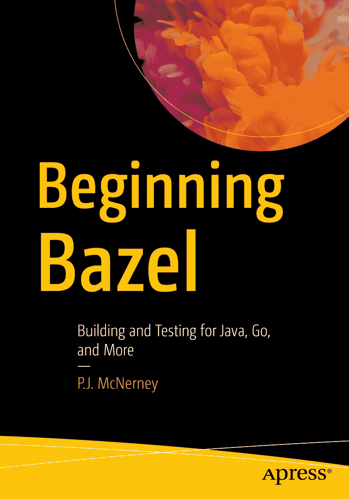

ISBN 978-1-4842-5193-5e-ISBN 978-1-4842-5194-2 [`doi.org/10.1007/978-1-4842-5194-2`](https://doi.org/10.1007/978-1-4842-5194-2) © P.J. McNerney 2020 本作品受版权保护。无论涉及全部还是部分内容，所有权利均由出版商保留，具体包括翻译、重印、插图再利用、朗诵、广播、以缩微胶片或任何其他实体方式复制、传输或信息存储与检索、电子改编、计算机软件，以及目前已知或未来开发的类似或非类似方法等权利。本书中可能出现注册商标名称、标识和图像。我们并未在每次出现注册商标名称、标识或图像时都使用商标符号，而仅以编辑性方式使用这些名称、标识和图像，并以有利于商标所有人的方式呈现，无意侵犯商标权。即使本出版物中使用的商品名、商标、服务标志及类似术语未被明确标识，也不应被视为对其是否受专有权保护的意见表达。尽管本书中的建议和信息在出版时被认为真实且准确，但作者、编辑及出版商均不对可能存在的错误或遗漏承担任何法律责任。出版商对本文所载材料不作任何明示或暗示的保证。由 Springer Science+Business Media New York 向全球图书贸易发行，地址：233 Spring Street, 6th Floor, New York, NY 10013。电话 1-800-SPRINGER，传真 (201) 348-4505，电子邮件 orders-ny@springer-sbm.com，或访问 www.springeronline.com。Apress Media, LLC 是一家加利福尼亚州有限责任公司，其唯一成员（所有者）为 Springer Science + Business Media Finance Inc（SSBM Finance Inc）。SSBM Finance Inc 是一家特拉华州公司。

### 关于作者与技术审阅者

### 关于作者

### 关于技术审阅者

