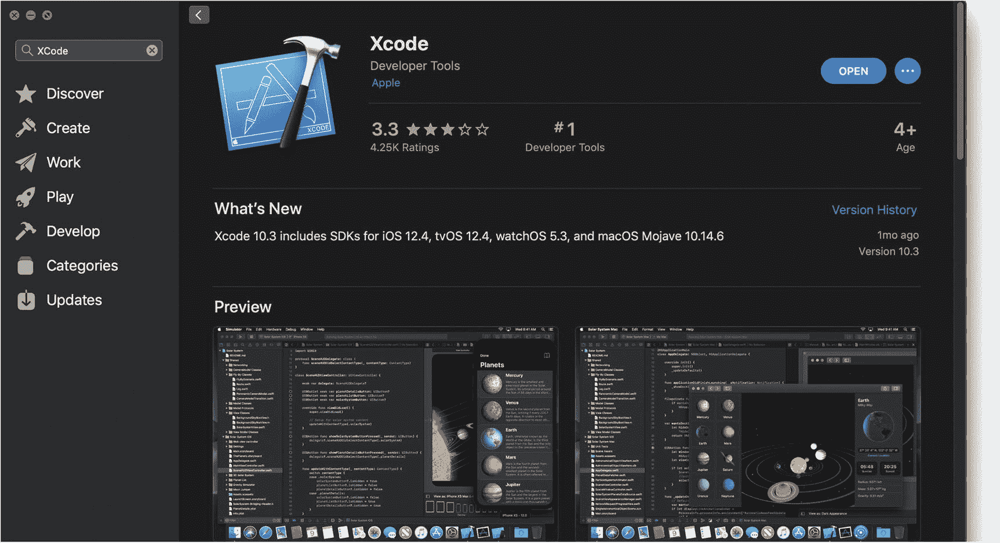
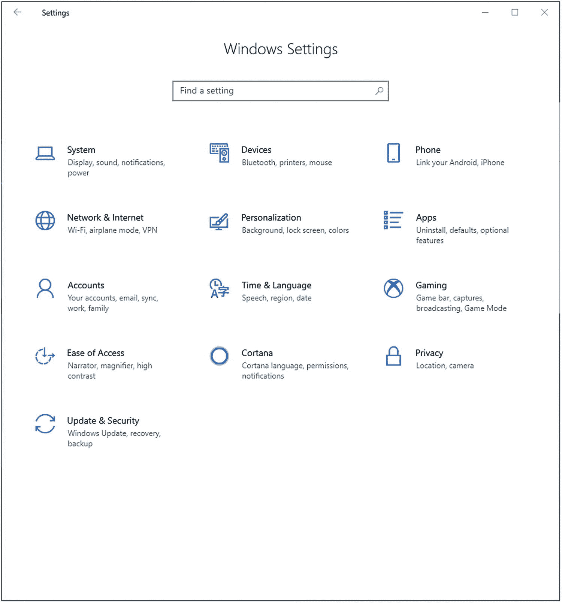
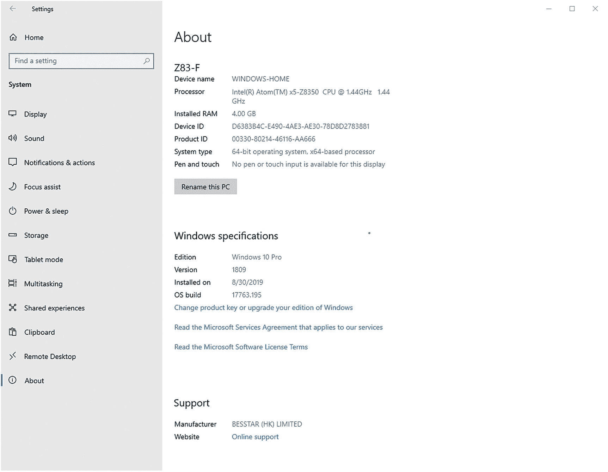
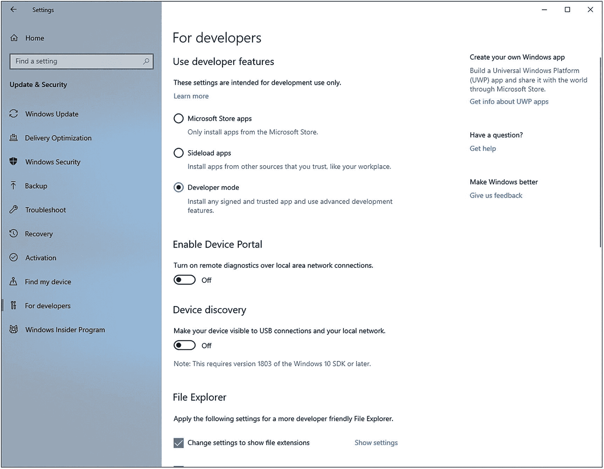
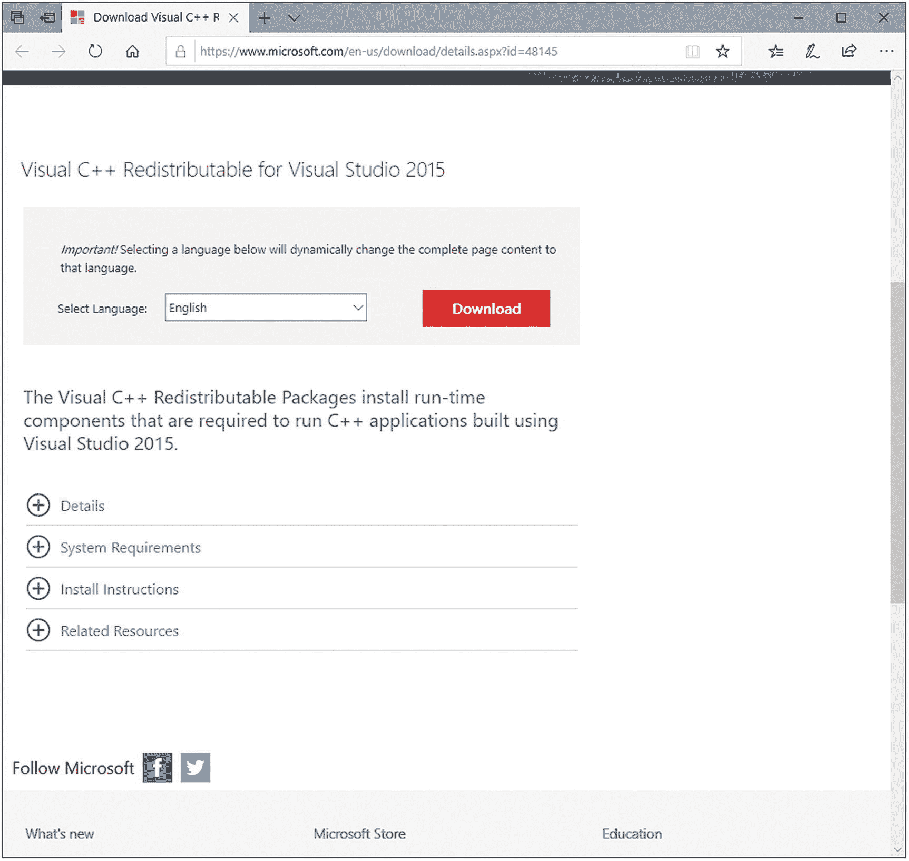
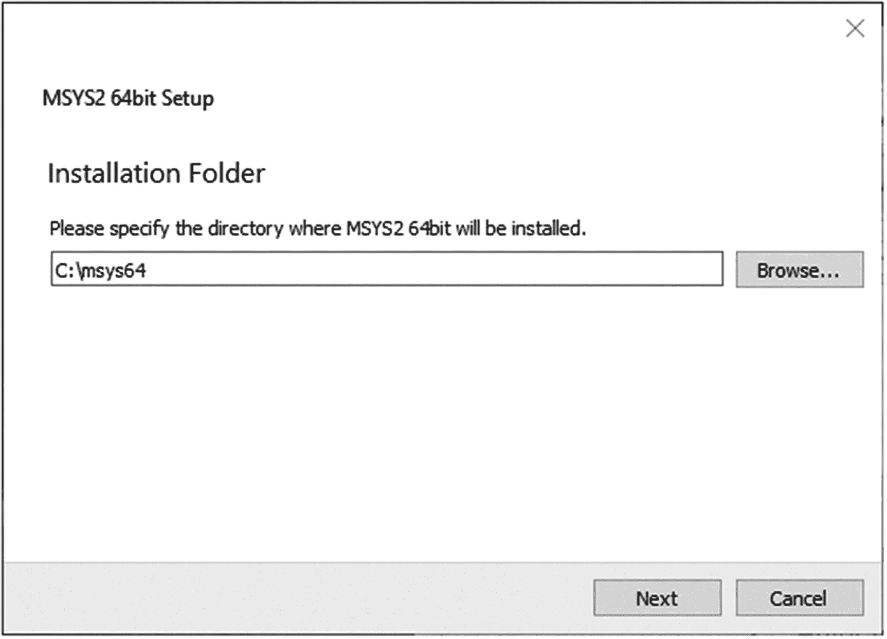
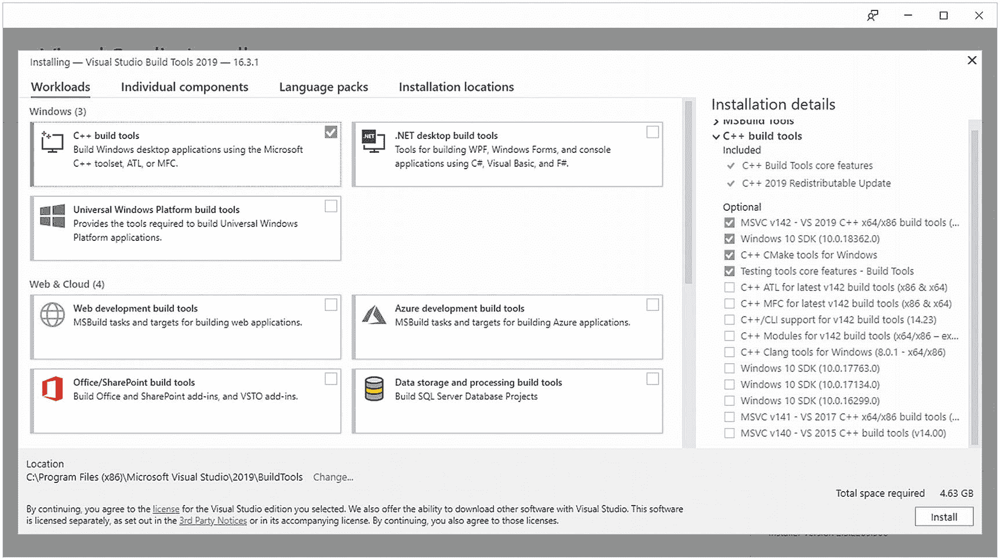

# 2. 设置与安装

在我们开始构建之前，需要安装 Bazel 以及其他所需工具和框架（例如编译器）。在本章中，我们将演示在多种操作系统上的必要步骤。

### 注意

在本书中，我们将使用 Bazel 1.0.0 版本。Bazel 发展非常迅速，新的能力和配置不断出现。在这一演进过程中，依赖关系可能发生变化，从而需要对构建代码进行调整。为了保证这里示例的一致性，建议你统一使用 1.0.0 版本。等你熟悉 Bazel 后，可以升级到更新版本，并按需调整示例。

我们将介绍以下操作系统的安装说明：Windows、MacOS 和 Ubuntu Linux。更多安装说明可在 [`https://docs.bazel.build/versions/master/install.html`](https://docs.bazel.build/versions/master/install.html) 找到。

由于我们聚焦于 Bazel 1.0.0 版本，可以在 [`https://github.com/bazelbuild/bazel/releases/`](https://github.com/bazelbuild/bazel/releases/) 找到我们所有平台所需的安装二进制文件。

对于所有操作系统，我们都需要一些基础工具来引导安装 Bazel。这些包括用于构建和运行 Python、Java 和 C++ 的工具与框架。虽然在本书中我们*不会*显式构建任何 C++ 项目，但我们会依赖一些确实会构建 C++ 的项目（例如 Protocol Buffers）。

### 注意

就 Bazel 而言，Java、Python 和 C++ 是“特殊”的，因为它们基本构成了 Bazel 开箱即用的*内置*语言。也就是说，使用这些语言构建库和二进制文件的规则本身就是 Bazel 的一部分。

在本书过程中我们还会构建的其他语言包括 Go 和 Swift；不过，我们不需要显式下载它们的工具。相反，我们将看到，通过依赖外部项目并注册合适的工具链，我们可以“免费”获得构建这些语言所需的组件。后续章节会进一步介绍这部分内容。

## MacOS


### 安装 Xcode

在 MacOS 上安装时，我们首先需要安装 Xcode 来执行基础构建操作。获取 Xcode 最简单的方式是在 MacOS 上打开 App Store 应用并下载该应用。



图 2-1

从 App Store 获取 Xcode

下载完应用后，你需要打开该应用并接受许可协议。

另外，你也可以通过命令行接受许可协议。为此，请打开终端窗口并执行以下命令：

```
~$ sudo xcodebuild -license accept
```

### 安装 Bazel

在你完成 Xcode 设置后，就可以在你的机器上安装 Bazel 了。请下载 1.0.0 版本的 Bazel 二进制安装程序。可在[`https://github.com/bazelbuild/bazel/releases/download/1.0.0/bazel-1.0.0-installer-darwin-x86_64.sh`](https://github.com/bazelbuild/bazel/releases/download/1.0.0/bazel-1.0.0-installer-darwin-x86_64.sh)找到。

下载完成后，进入你下载该安装脚本的目录（例如 Downloads）。作为预防措施，你可能需要先通过更改文件权限来确保安装脚本可执行。完成后，即可运行安装。

```
~$ cd Downloads
~/Downloads$ chmod +x bazel-1.0.0-installer-darwin-x86_64.sh
~/Downloads$ ./bazel-1.0.0-installer-darwin-x86_64.sh –user
```

*–-user* 标志会将 Bazel 安装到 ~/bin（即你用户的 *bin* 目录）。为了确保你可以运行 Bazel，请确认 ~/bin 在你的默认路径中。将以下内容添加到你的 ~/.zshrc（如果你使用的是早于 Catalina 的 MacOs 版本，则为 .bashrc）文件中。

```
export PATH="$PATH:$HOME/bin"
```

添加后，执行 source 你的 ~/.zshrc（或 ~/.bashrc）文件，以确保新路径被加载。

```
~$ source ~/.zshrc
```

现在你已经可以在 MacOS 上运行 Bazel 了。你可以在命令行中使用 *version* 指令轻松验证，这会输出你正在使用的 Bazel 版本。

```
~$ bazel --version
bazel 1.0.0
```

### 安装 Java

运行本书示例至少需要 Java 8。对于 MacOS 10.7 及以上版本，Java 不再默认安装；因此我们需要显式下载并安装它。

访问[`https://java.com/en/download/mac_download.jsp`](https://java.com/en/download/mac_download.jsp)下载 Java。将文件下载到电脑后，按照说明在你的电脑上安装 Java。

完成后，打开终端并运行以下命令，验证你是否已在电脑上成功安装 Java：

```
~$ java -version
java version "1.8.0_181"
Java(TM) SE Runtime Environment (build 1.8.0_181-b13)
Java HotSpot(TM) 64-Bit Server VM (build 25.181-b13, mixed mode)java
```

### 验证你的 Python 版本

默认情况下，MacOS 机器会自带 Python。为了运行本书中的示例，你至少需要 Python 2.7.15。要验证你的电脑上是否有足够版本的 Python，请打开终端查看版本。

```
~$ python --version
Python 2.7.15
```

### 注意

在撰写本书时，Python 2 和 Python 3 都可与 Bazel 配合使用，当前也已有迁移到后者的路径。你*可以*将默认版本设置为其中任意一个；但是，为了本书示例讲解的需要，这超出了本书范围；目前这些示例应当可在任一版本下运行。

## Ubuntu Linux

### 安装必需软件包

在 Ubuntu 上的安装与 MacOS 非常相似。不过在这种情况下，我们不是下载 Xcode，而是安装一组必需软件包（即 pkg-config、zip、g++、zlib1g-dev、unzip、python3）。

打开终端窗口并执行以下命令：

```
~$ sudo apt-get install pkg-config zip g++ zlib1g-dev unzip python3
```

这可能还会要求你安装其他附加软件包。当询问是否安装附加软件包时，按“Y”。

### 安装 Bazel

在获取先决条件后，你就可以下载 Bazel 了。从[`https://github.com/bazelbuild/bazel/releases/download/1.0.0/bazel-1.0.0-installer-linux-x86_64.sh`](https://github.com/bazelbuild/bazel/releases/download/1.0.0/bazel-1.0.0-installer-linux-x86_64.sh)获取安装脚本。

打开终端并进入你下载该文件的位置（例如 ~/.Downloads）。你可能需要设置权限以执行该文件。处理完成后，即可运行执行。

```
~$ cd Downloads
~/Downloads$ chmod +x bazel-1.0.0-installer-linux-x86_64.sh
~/Downloads$ ./bazel-1.0.0-installer-linux-x86_64.sh --user
```

*–-user* 标志会将 Bazel 安装到 ~/bin（即你用户的 *bin* 目录）。为了确保你可以运行 Bazel，请确认 ~/bin 在你的默认路径中。将以下内容添加到你的 ~/.bashrc 文件：

```
export PATH="$PATH:$HOME/bin"
```

添加后，source 你的 *~/.bashrc* 文件，以确保新路径被加载。

```
~$ source ~/.bashrc
```

现在你已经可以在 Ubuntu 上运行 Bazel 了。你可以在命令行中使用 *version* 指令轻松验证，这会输出你正在使用的 Bazel 版本。

```
~$ bazel –-version
bazel 1.0.0
```

### 安装 Java

为了确保我们安装的是正确版本的 Java（通过 OpenJDK），我们首先需要检查你的 Ubuntu 版本。打开终端并执行以下命令：

```
~$ lsb_release -a
No LSB modules area available
Distributor ID: Ubuntu
Description:      Ubuntu 16.04.5 LTS
Release:          16.04
Codename:         xenial
```

如果你使用的是 Ubuntu 16.04，那么你需要使用 OpenJDK 8。运行以下命令：

```
~$ sudo apt-get install openjdk-8-jdk
```

如果你使用的是 Ubuntu 18.04，那么你需要使用 Open JDK 11。请改为运行以下命令：

```
~$ sudo apt-get install openjdk-11-jdk
```

在每种情况下，为了完成 Java 安装，都可能需要安装其他附加软件包。

安装完成后，运行以下命令验证你已安装的 Java 版本：

```
~$ java -version
openjdk version "1.8.0_222"
OpenJDK Runtime Environment (build 1.8.0_222-8u222-b10-1ubuntu1~16.04.1-b10)
OpenJDK 64-Bit Server VM (build 25.222-b10, mixed mode)
```

## Windows

### 设置你的系统

为了使用 Bazel，建议你使用 64 位 Windows 10，版本 1703 或更高。要检查你的 Windows 版本，请打开*设置*。



图 2-2

Windows 设置

选择 *System* ➤ *About*。你需要的信息位于 *Windows* *Specification* *.* 下。



图 2-3

验证 Windows 的 OS build

此外，你还需要启用开发者模式，才能在你的机器上进行开发。前往 *Settings* ➤ *Update & Security* ➤ *For developers*。



图 2-4

启用开发者模式

在 *Use developer features* 下，选择 *Developer mode*。你可能需要等待开发者包下载完成。


### 安装所需应用程序

在真正获取 Bazel 本体之前，你需要先安装若干应用程序。

#### 适用于 Visual Studio 2015 的 Visual C++ 可再发行组件

该软件包包含运行使用 Visual Studio 2015 构建的 C++ 应用程序所需的运行时组件。访问 [`www.microsoft.com/en-us/download/developer-tools.aspx`](http://www.microsoft.com/en-us/download/developer-tools.aspx)，并搜索 *适用于 Visual Studio 2015 的 Visual C++ 可再发行组件*。



图 2-5

获取 Visual C++ 可再发行组件包

下载该软件包并安装到你的计算机上。

#### MSYS2

MSYS2 是一个为软件分发与构建提供基础工具的平台；在这里，我们最关注的是它为 Windows 提供了一个 bash shell。它还提供了一个包管理系统，使软件安装变得简单，类似 Linux 中的方式（例如通过 *apt-get*）或 MacOS 中的方式（例如类似 *Homebrew* 的工具）。

访问 [`www.msys2.org/`](http://www.msys2.org/) 并下载适用于 x86_64 的 MSYS2。将该软件安装到你的计算机上；为简化操作，请使用默认安装路径。



图 2-6

在你的计算机上安装 MSYS2

安装完成后，打开一个 MSYS2 终端。你需要安装若干软件包（即 *zip*、*unzip*、*patch*、*diffutils* 和 *git*）。在终端中执行以下命令：

```
pjmcn@WINDOWS-HOME MSYS~
$ pacman -S zip unzip patch diffutils git
```

你可能还需要安装其他附加包才能完成安装过程。

### Bazel 安装

处理完必要组件后，现在你就可以下载并安装 Bazel 本体了。从 [`https://github.com/bazelbuild/bazel/releases/download/1.0.0/bazel-1.0.0-windows-x86_64.exe`](https://github.com/bazelbuild/bazel/releases/download/1.0.0/bazel-1.0.0-windows-x86_64.exe) 获取可执行文件。

与 Linux 和 MacOS 不同，下载得到的可执行文件*就是* Bazel 可执行文件；不存在单独的安装脚本。下载完成后，将该应用移动到某个目录（例如，C:\Users\<user name>\bin），并将其重命名为 *bazel.exe*。

将该路径添加到你的 MSYS2 *.bashrc* 文件中。

```
export PATH="$PATH:/c/Users//bin"
```

添加后，source 一下你的 *~/.bashrc* 文件，以确保新路径被加载。

```
~$ source ~/.bashrc
```

现在你已经可以在 Windows 上运行 Bazel 了。你可以在命令行中使用 *version* 指令轻松验证，这将输出你正在使用的 Bazel 版本。

```
pjmcn@WINDOWS-HOME MSYS~
$ bazel –-version
bazel 1.0.0
```

#### 安装语言支持

为了使用多种语言（C++、Java 和 Python），你需要安装对应的支持框架和应用程序。

##### C++

尽管本书不会直接构建 C++ 应用程序，但我们将依赖若干需要 C++ 支持的库。访问 [`https://visualstudio.microsoft.com/downloads/#build-tools-for-visual-studio-2019`](https://visualstudio.microsoft.com/downloads/%2523build-tools-for-visual-studio-2019)。下载 Build Tools Installer 并运行安装。


图 2-7

获取适用于 Visual Studio 2019 的构建工具

在安装过程中，请确保你选择了 C++ 构建工具。



图 2-8

安装 C++ 构建工具

##### Java

本书中的许多示例都会使用 Java。访问 [`www.oracle.com/technetwork/java/javase/downloads/index.html`](http://www.oracle.com/technetwork/java/javase/downloads/index.html)。你至少需要下载适用于 Windows x64 的 Java SE Development Kit 10。下载合适的安装可执行文件并安装到你的计算机上。

### 注意

MSYS2 对路径中的空格处理有困难。默认路径会把 Java 安装到 *Program Files*。为避免问题，你应将安装路径改为不含空格的位置（例如，C:\Users\<user name>\bin\Java\<jdk-version>\）。

与 Bazel 一样，确保将 Java 安装路径添加到 bash shell 的 PATH（位于你的 *.bashrc* 文件中）。

```
export PATH="$PATH:/c/Users//bin/Java//bin"
```

此外，你还需要设置 *JAVA_HOME* 变量。

```
export JAVA_HOME="/c/Users//bin/Java/"
```

source 该 *.bashrc*，并确认 Java 已在 MSYS2 中配置完毕。

```
pjmcn@WINDOWS-HOME MSYS~
$ source .bashrc
pjmcn@WINDOWS-HOME MSYS~
$ java --version
java version "11.0.4" 2019-07-16 LTS
Java™ SE Runtime Environment 18.9 (build 11.0.4+10-LTS)
Java Hotspot™ 64-Bit Server VM 18.9 (build 11.0.4+10-LTS, mixed mode)
```

##### Python

最后，为了构建 Python 项目，你需要下载适用于 Windows 的 Python 2.7 或 3。访问 [`www.python.org/downloads/release/python-2716`](http://www.python.org/downloads/release/python-2716) 并下载 Windows x86-64 MSI Installer。下载完成后，执行安装程序以安装 Python。

再次提醒，确保将 Python 路径添加到你的 bash shell 的 PATH 中。

```
export PATH="$PATH:/c/Python27"
```

source .bashrc 并确认 python 已在 MSYS2 中配置完毕。

```
pjmcn@WINDOWS-HOME MSYS~
$ source .bashrc
pjmcn@WINDOWS-HOME MSYS~
$ python –-version
Python 2.7.16
```

## 最后说明

到这个阶段，你应该已经能够执行本书中的 Bazel 示例。若你希望在其他操作系统上安装 Bazel，请访问 [`https://docs.bazel.build/versions/master/install.html`](https://docs.bazel.build/versions/master/install.html)。

完成运行 Bazel 所需的基础准备后，你现在可以开始上手并享受其中的乐趣了。

