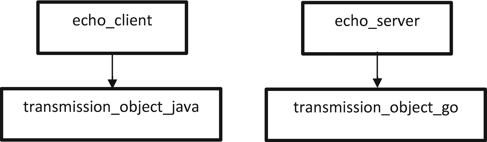
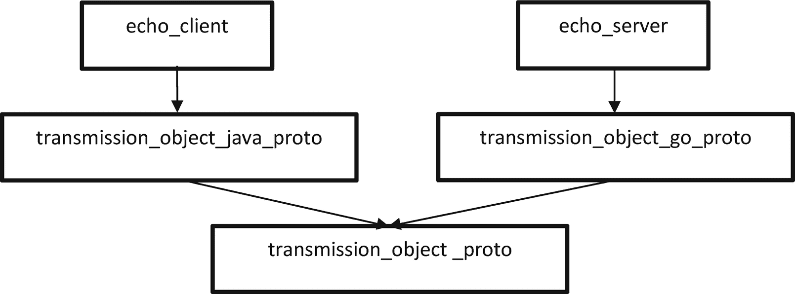
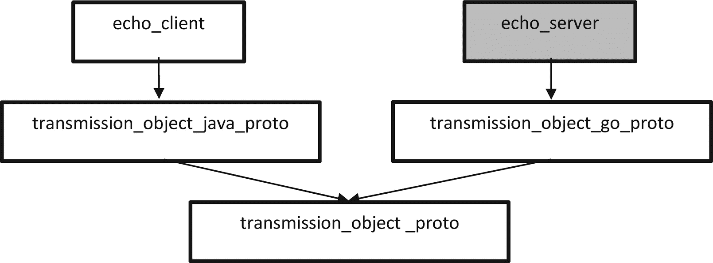
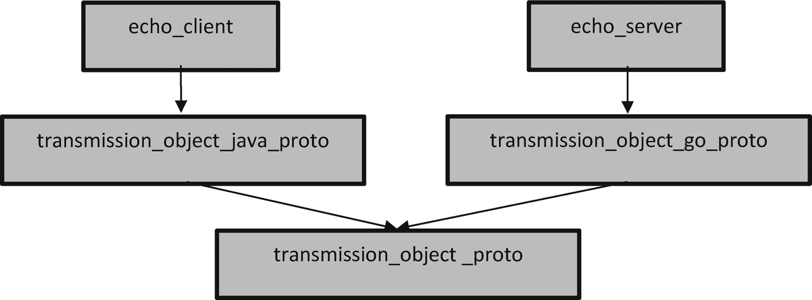

# 6. Protocol Buffers 与 Bazel

在上一章中，你创建了一个简单的 echo 服务器和客户端，展示了 Bazel 在仅需最少配置的情况下，驾驭和管理多语言的一部分能力。那个示例中一个明显的缺点来自于传输对象的定义：两种语言都需要各自独立地定义该对象。随着时间推移，这很容易导致通信的“字面崩溃”——两个（或更多）传输对象定义逐渐失去同步。

在本章中，我们将引入一种专门解决这一问题的机制：*Protocol Buffer*（通常称为 *protobuf*）*。*Protocol Buffers 同样是 Google 的产物，它提供了一种声明式且类型安全的方式来描述对象结构，并提供用于序列化的线传输格式。Protocol Buffer 的定义在本质上与语言无关。定义完成后，可以将其编译为特定语言版本（Protocol Buffers 支持大量语言），从而把线传输格式读写为该语言的原生对象。

虽然 Protocol Buffers 并不与 Bazel 强绑定，但 Bazel 对它提供了非常出色的支持，使其易于添加到项目中，并在多语言间复用。此外，借助 Bazel 的依赖管理，也可以非常轻松地在 Protocol Buffer 定义处做出修改，并确保所有依赖项目至少能够基于新定义通过编译。

## 设置你的工作区

首先，我们会在 `WORKSPACE` 文件中加入一些用于 Protocol Buffers 的基础支持。先为本章工作创建一个新目录：

```
$ mkdir chapter_06
$ cd chapter_06
chapter_06$ touch WORKSPACE
```

现在让我们引入使用 Protocol Buffers 所需的规则。打开你的 `WORKSPACE` 文件并添加以下内容。

```
http_archive(
name = "rules_proto",
strip_prefix = "rules_proto-97d8af4dc474595af3900dd85cb3a29ad28cc313",
urls = ["https://github.com/bazelbuild/rules_proto/archive/97d8af4dc474595af3900dd85cb3a29ad28cc313.tar.gz",],
)
load("@rules_proto//proto:repositories.bzl", "rules_proto_dependencies", "rules_proto_toolchains")
rules_proto_dependencies()
rules_proto_toolchains()
Listing 6-1
Adding support for Protocol Buffers
```

保存你的 `WORKSPACE` 文件*。*

```
如前几章你应已熟悉的那样，我们首先拉取具备所需功能的 Bazel 仓库，然后调用该仓库对应的初始化代码（即 rules_proto_dependencies() 和 rules_proto_toolchains()）。
```

## 创建你的第一个 Protocol Buffer

完成设置后，我们就可以开始创建一些 Protocol Buffers 了。先为代码创建目录，并为 Protocol Buffer 定义创建初始文件：

```
chapter_06$ mkdir src
chapter_06$ cd src
chapter_06/src$ touch transmission_object.proto
```

### 注意

细心的读者会注意到，在上一章中，我们是在编写代码前先创建 `BUILD` 文件。这次顺序的变化是有意为之，我们很快会解释原因。

让我们创建一个用于传输的基础消息。打开你的 `transmission_object.proto` 文件并添加以下内容。

```
syntax = "proto3";
package transmission_object;
message TransmissionObject {
float value = 1;
string message = 2;
}
Listing 6-2
Defining a simple Protocol Buffer
```

将其保存到 `transmission_object.proto`*。*

我们简要看一下刚才写了什么。第一行（`syntax`）用于告诉编译器此处使用的是哪个 Protocol Buffers 版本（在撰写本书时，最新版本是第 3 版）。

下一行（`package`）用于定义该 Protocol Buffer 所在的概念包。这与 Java 或 Go 的包概念非常相似。

最后是消息本身的定义。它最接近 C 风格的结构体：为对象命名（`TransmissionObject`），并给出一组带类型的字段（即 `value` 和 `message`，类型分别为 `float` 和 `string`）。这里唯一的小扩展是字段编号的加入；它用于为消息中的每个成员定义唯一标识符。这一点很重要，因为它使你可以在保持向后兼容的同时新增或移除数据成员。

现在我们为该 Protocol Buffer 创建构建目标。将以下内容添加到你的 `BUILD` 文件中。

```
load("@rules_proto//proto:defs.bzl", "proto_library")
proto_library(
name = "transmission_object_proto",
srcs = ["transmission_object.proto"],
)
Listing 6-3
Creating the build target for the Protocol Buffer
```

保存你的 `BUILD` 文件。

### 注意

已经熟悉 Bazel 的读者可能会觉得显式引入 `proto_library` 有些奇怪。`proto_library` 规则过去是 Bazel 核心的一部分。这体现了 Bazel 的演进方式：将特定构件从核心中迁出，放入显式包中。

到这一步，从技术上讲，我们已经具备了开始构建 Protocol Buffer 的条件，现在来执行：

```
chapter_06/src$ bazel build :transmission_object_proto
INFO: Analysed target //src:transmission_object_proto (16 packages loaded, 624 targets configured).
INFO: Found 1 target...
Target //src:transmission_object_proto up-to-date:
bazel-genfiles/src/transmission_object_proto-descriptor-set.proto.bin
INFO: Elapsed time: 80.442s, Critical Path: 24.91s
INFO: 184 processes: 184 darwin-sandbox.
INFO: Build completed successfully, 187 total actions
```

你首先会注意到的一点是，至少在第一次构建 Protocol Buffer 目标时，相比前几章的执行会出现明显延迟。因为此时不仅需要拉取 Protocol Buffer 编译器的依赖，*还*需要为你的目标机器编译它。只有 protobuf 编译器自身编译完成后，它才能编译你的 protobuf 定义。

不用担心。这种变慢通常只会发生在你第一次实际运行 Protocol Buffer 编译器时；一旦生成完成，Protocol Buffer 编译器会保持在缓存中（除非你更改依赖或执行 `bazel clean`）。

## 在 Java 中使用 Protocol Buffer

尽管我们已经成功编译了 Protocol Buffer，但目前我们真正得到的只是它的语言无关描述符；若要真正使用它，还需要为其创建语言特定目标。我们先从 Java 开始。再次利用这样一个事实：Java 作为 Bazel 的内置语言之一，自带对 Java 版 Protocol Buffers 的支持。


### 创建 Java Proto 库目标

打开你的 `BUILD` 文件并添加以下内容。

```
java_proto_library(
name = "transmission_object_java_proto",
deps = [":transmission_object_proto"],
)
Listing 6-4
Creating the Java Protocol Buffer library
```

保存 `BUILD` 文件。让我们构建新创建的目标：

```
chapter_06/src$ bazel build :transmission_object_java_proto
INFO: Analysed target //src:transmission_object_java_proto (2 packages loaded, 350 targets configured).
INFO: Found 1 target...
Target //src:transmission_object_java_proto up-to-date:
bazel-bin/src/libtransmission_object_proto-speed.jar
bazel-genfiles/src/transmission_object_proto-speed-src.jar
INFO: Elapsed time: 0.703s, Critical Path: 0.45s
INFO: 2 processes: 1 darwin-sandbox, 1 worker.
INFO: Build completed successfully, 3 total actions
```

恭喜！你现在有了一个我们实际上可以在 Java 程序中使用的目标。

### 注意

在这个案例中，你不需要显式加载 `java_proto_library`。不过，考虑到 Bazel 的演进，请记住未来某些版本可能会要求你显式加载该规则。

### 使用你的 Java Protocol Buffer 目标

在上一章中，你使用 JSON 创建了一个简单的 Java echo 客户端。在这里，我们将复用几乎相同的代码来实现 Protocol Buffer 示例，只做少量改动。

在你的 `src` 目录下创建 `EchoClient.java`，并添加以下内容（相较上一章的改动已加粗）。

```
import java.io.BufferedReader;
import java.io.InputStreamReader;
import java.io.PrintWriter;
import java.net.Socket;
import transmission_object.TransmissionObjectOuterClass.TransmissionObject;
public class EchoClient {
public static void main (String args[]) {
System.out.println("Spinning up the Echo Client in Java...");
try {
final Socket socketToServer = new Socket("localhost", 1234);
// Note we don't need the second BufferedReader here.
final BufferedReader commandLineInput = new BufferedReader(new InputStreamReader(System.in));
System.out.println("Waiting on input from the user...");
final String inputFromUser = commandLineInput.readLine();
if (inputFromUser != null) {
System.out.println("Received by Java: " + inputFromUser);
TransmissionObject transmissionObject = TransmissionObject.                  newBuilder()
.setMessage(inputFromUser)
.setValue(3.145f)
.build();
transmissionObject.writeTo(socketToServer.getOutputStream());
TransmissionObject receivedObject = TransmissionObject.parseFrom(socketToServer.getInputStream());
System.out.println("Received Message from server: ");
System.out.println(receivedObject);
}
socketToServer.close();
} catch (Exception e) {
System.err.println("Error: " + e);
}
}
}
Listing 6-5
Protocol Buffer version of the echo client
```

将其保存为 `EchoClient.java`。

让我们花点时间分析一下前面的代码。用于引入我们生成的 Protocol Buffer 的 import 语句由三个主要部分组成：

*   `transmission_object`
    *   这是在原始 `transmission_object.proto` 文件中指定的包。

*   `TransmissionObjectOuterClass`
    *   这是一个生成的类，用于封装 Protocol Buffer 定义中包含的所有消息。

    *   这是 Java 每个文件只能有一个（外部）类这一规则的产物；从技术上讲，我们本可以在 Protocol Buffer 文件中定义多个消息，但在一个 Java 文件中只能有一个类。

    *   这使我们能够在 Java 中创建并使用多个 Protocol Buffer 消息。

*   `TransmissionObject`
    *   这是表示原始 Protocol Buffer 消息的实际 Java 对象。

在代码本身中，Java Protocol Buffer 实例通过构建器模式（builder pattern）创建，这使你可以设置各个字段，然后生成一个不可变的 `TransmissionObject` 实例。该对象随后可以直接将自身写入输出流，也可以从输入流中解析自身。

最后，让我们创建构建目标，以便真正构建 `EchoClient` 的新版本。打开你的 `BUILD` 文件并添加以下内容（同样，相较上一章的改动已加粗）。

```
java_binary(
name = "echo_client",
srcs = ["EchoClient.java"],
main_class = "EchoClient",
deps = [":transmission_object_java_proto"],
)
Listing 6-6
Creating the BUILD target for the EchoClient
```

现在我们可以构建该目标：

```
chapter_06/src$ bazel build :echo_client
INFO: Analysed target //src:echo_client (0 packages loaded, 0 targets configured).
INFO: Found 1 target...
Target //src:echo_client up-to-date:
bazel-bin/src/echo_client.jar
bazel-bin/src/echo_client
INFO: Elapsed time: 0.219s, Critical Path: 0.06s
INFO: 1 process: 1 worker.
INFO: Build completed successfully, 2 total actions
```

恭喜！你已经成功将客户端更新为使用 Protocol Buffers。不过，你再次得到了一个无可连接对象的客户端。接下来，我们将对服务端进行必要修改，使其也能处理我们的 Protocol Buffer 定义。

### 注意

有人可能会想用上一章的服务端来运行这个新版本客户端。你当然可以尝试，但需要明确的是这样**无法**工作，因为客户端和服务端使用的是不同协议（JSON vs. Protocol Buffer）；这些字节会被以不同方式解释。

尽管 Protocol Buffers *确实* 支持与 JSON 的相互转换，但你需要在代码中显式指定这一点。

## 在 Go 中使用 Protocol Buffer

在上一节中，我们能够利用 Java 是 Bazel 内置语言之一这一事实，直接开始开发。然而，由于 Go *不是* 这些核心语言之一，我们需要做一些额外配置。幸运的是，其中大部分内容你在前几章已经见过。

打开你的 `WORKSPACE` 文件，并在获取 `rules_proto` 的配置之前，添加下面加粗的内容。

```
http_archive(
name = "io_bazel_rules_go",
urls = ["https://github.com/bazelbuild/rules_go/releases/download/v0.19.5/rules_go-v0.19.5.tar.gz"],
)
load("@io_bazel_rules_go//go:deps.bzl", "go_rules_dependencies", "go_register_toolchains")
go_rules_dependencies()
go_register_toolchains()
http_archive(
name = "rules_proto",
strip_prefix = "rules_proto-97d8af4dc474595af3900dd85cb3a29ad28cc313",
urls = ["https://github.com/bazelbuild/rules_proto/archive/97d8af4dc474595af3900dd85cb3a29ad28cc313.tar.gz",],
)
load("@rules_proto//proto:repositories.bzl", "rules_proto_dependencies", "rules_proto_toolchains")
rules_proto_dependencies()
rules_proto_toolchains()
Listing 6-7
Adding the Go rules to the project
```

保存你的 *WORKSPACE* 文件.j

### 注意

在这个特定场景中，我们指定先加载 `io_bazel_rules_go`，再加载 `rules_proto`。原因是这两个包的底层依赖之间可能会产生冲突。按这种顺序排列可以消除该问题。不过，在你后续构建 `WORKSPACE` 依赖时，这仍是一个需要特别留意的点。


### 创建 Go Proto 库目标

和将 Go 功能纳入我们的项目时一样，在创建 Go proto 库目标时，我们需要将必要的规则显式引入到 `BUILD` 文件中。

打开你的 `BUILD` 文件并添加以下内容。

```
load("@io_bazel_rules_go//proto:def.bzl", "go_proto_library")
go_proto_library(
name = "transmission_object_go_proto",
proto = ":transmission_object_proto",
importpath = "transmission_object"
)
Listing 6-8
Creating the Go proto library target
```

保存你的 `BUILD` 文件。让我们构建你的新目标：

```
chapter_06/src$ bazel build :transmission_object_go_proto
INFO: Analysed target //src:transmission_object_go_proto (21 packages loaded, 6358 targets configured).
INFO: Found 1 target...
...
Target //src:transmission_object_go_proto up-to-date:
bazel-bin/src/darwin_amd64_stripped/transmission_object_go_proto%/transmission_object.a
INFO: Elapsed time: 5.486s, Critical Path: 3.75s
INFO: 52 processes: 52 darwin-sandbox.
INFO: Build completed successfully, 54 total actions
```

和你之前创建 Java Protocol Buffer 目标的经验一样，你可能会注意到构建时间比平时稍长一些。再次说明，这是正常现象，因为特定语言（即 Go）的插件正在被编译；和之前一样，首次编译后会被缓存，后续构建会快得多。

再次祝贺你，因为我们现在有了一个可以在 Go 程序中实际使用的目标。接下来让我们修改 echo 服务器来利用它。

### 使用你的 Go Protocol Buffer 目标

和 echo 客户端类似，在上一章中，你已经创建了一个 echo 服务器版本，它会将接收到的 JSON 消息回传（并做一些修改）。和之前一样，我们只需对原始程序做一些小改动，就可以处理 Protocol Buffers。

在 `src` 中创建文件 `echo_server.go`，并向其中添加以下内容（和之前一样，与上一章相比的更改已加粗）。

```
package main
import (
"fmt"
"log"
"net"
"transmission_object”
"github.com/golang/protobuf/proto"
)
func main() {
log.Println("Spinning up the Echo Server in Go...")
listen, error := net.Listen("tcp", ":1234")
if error != nil {
log.Panicln("Unable to listen: " + error.Error())
}
defer listen.Close()
connection, error := listen.Accept()
if error != nil {
log.Panicln("Cannot accept a connection! Error: " + error.Error())
}
log.Println("Receiving on a new connection")
defer connection.Close()
defer log.Println("Connection now closed.")
buffer := make([]byte, 2048)
size, error := connection.Read(buffer)
if error != nil {
log.Panicln(
"Unable to read from the buffer! Error: " + error.Error())
}
data := buffer[:size]
transmissionObject := &transmission_object.TransmissionObject{}
error = proto.Unmarshal(data, transmissionObject)
if error != nil {
log.Panicln(
"Unable to unmarshal the buffer! Error: " + error.Error())
}
log.Println("Message = " + transmissionObject.GetMessage())
log.Println("Value = " +
fmt.Sprintf("%f", transmissionObject.GetValue()))
transmissionObject.Message = "Echoed from Go: " +
transmissionObject.GetMessage()
transmissionObject.Value = 2 ∗ transmissionObject.GetValue()
message, error := proto.Marshal(transmissionObject)
if error != nil {
log.Panicln("Unable to marshal the object! Error: " + error.Error())
}
connection.Write(message)
}
Listing 6-9
Protocol Buffer version of the Go server
```

将其保存为 `echo_server.go`。

虽然这些改动并不是对 JSON 的完全直接替换，但最终结果与我们上一章中的实现非常接近。

特别需要注意的是，我们必须引入 proto 库本身的依赖（[`github.com/golang/protobuf/proto`](http://github.com/golang/protobuf/proto)），以便对对象在数据流之间进行反序列化/序列化。不同于之前在 Go 中对 encoding 包的依赖，我们需要在 `BUILD` 文件中指定依赖时将其考虑进去。

打开 `BUILD` 文件并添加以下内容，以创建所需的构建目标（与上一章相比的差异已加粗）。

```
load("@io_bazel_rules_go//go:def.bzl", "go_binary")
go_binary(
name = "echo_server",
srcs = ["echo_server.go"],
deps = [
":transmission_object_go_proto",
"@com_github_golang_protobuf//proto:go_default_library",
],
)
Listing 6-10
Adding the echo server build target
```

保存你的 `BUILD` 文件。

### 依赖的依赖

细心的读者会注意到，我们为 go_default_library 指定的依赖实际上并没有在 WORKSPACE 文件中直接声明；然而，上述代码依然可以顺利编译。

这个额外依赖的来源，是我们在为 Go 规则设置额外依赖时调用的函数（即 go_rules_dependencies），它会拉取其他依赖，其中就包括上面列出的这个。

尽管从技术上讲这在 WORKSPACE 文件中是“显式”指定的，但由于使用了依赖函数，这一点被隐藏了。在这种情况下，我们利用了这样一个事实：这些特定依赖的版本本来就是为了协同工作而设计的。

如果你觉得这种方式过于隐式，那么可以做两件事：（1）在 WORKSPACE 文件中显式指定一个依赖；这会替换隐式依赖的版本。（2）将该依赖拉入你的项目中（例如通过 third_party 目录）。

选择哪条路径取决于你希望对依赖控制得多严格。（1）可能更容易快速上手，也更便于后续更换依赖。然而，（2）能够为构建可复现性提供最强保证。

现在我们可以构建支持 Protocol Buffer 的 echo 服务器了：

```
chapter_06/src$ bazel build :echo_server
INFO: Analysed target //src:echo_server (0 packages loaded, 0 targets configured).
INFO: Found 1 target...
Target //src:echo_server up-to-date:
bazel-bin/src/darwin_amd64_stripped/echo_server
INFO: Elapsed time: 0.169s, Critical Path: 0.00s
INFO: 0 processes.
INFO: Build completed successfully, 1 total action
```


## 使用 Protocol Buffers 实现 Echo

我们已经用 Protocol Buffers 重构了 echo 客户端和服务器，现在可以让它们再次相互通信了。

打开一个终端并启动服务器：

```
chapter_06/src$ bazel run :echo_server
INFO: Analysed target //src:echo_server (0 packages loaded, 0 targets configured).
INFO: Found 1 target...
Target //src:echo_server up-to-date:
bazel-bin/src/darwin_amd64_stripped/echo_server
INFO: Elapsed time: 0.169s, Critical Path: 0.00s
INFO: 0 processes.
INFO: Build completed successfully, 1 total action
INFO: Build completed successfully, 1 total action
2019/06/18 23:39:53 Spinning up the Echo Server in Go...
```

现在打开另一个终端并启动客户端：

```
chapter_06/src$ bazel run :echo_client
INFO: Analysed target //src:echo_client (0 packages loaded, 0 targets configured).
INFO: Found 1 target...
Target //src:echo_client up-to-date:
bazel-bin/src/echo_client.jar
bazel-bin/src/echo_client
INFO: Elapsed time: 0.249s, Critical Path: 0.10s
INFO: 1 process: 1 worker.
INFO: Build completed successfully, 2 total actions
INFO: Build completed successfully, 2 total actions
Spinning up the Echo Client in Java...
Waiting on input from the user...
```

现在，给它输入一小段文本：

```
chapter_06/src$ bazel run :echo_client

Spinning up the Echo Client in Java...
Waiting on input from the user...
Waiting on input from the user...
My Client Message
Received by Java: My Client Message
Received Message from server:
value: 6.29
message: "Echoed from Go: My Client Message"
```

现在我们来看一下 echo 服务器端的控制台输出：

```
chapter_06/src$ bazel run :echo_server

2019/06/18 23:41:50 Receiving on a new connection
2019/06/18 23:43:34 Message = My Client Message
2019/06/18 23:43:34 Value = 3.145000
2019/06/18 23:43:34 Connection now closed.
```

恭喜！你已经使用 Protocol Buffers 重新创建了 echo 客户端/服务器。

## 依赖追踪与管理

与上一章相比，这里在格式上有一些细微差异，但输出结果实际上是相同的。这就引出了一个显而易见的问题：为什么我们要把上一章的内容全部重做一遍？答案在于我们如何管理所选传输对象的变更；而这反过来也展示了 Bazel 执行依赖管理的能力，甚至可以跨多种语言。

在上一章中，echo 客户端和服务器的依赖树如下：



图 6-1

JSON echo 客户端和服务器的依赖树

如前所述，一个主要缺陷是 JSON 对象的定义是各语言各自独立的，彼此没有关联。API 的任何变更（即修改 JSON 对象）都需要在两个位置同时进行，这就很容易出现只改了一个地方而另一个没改的错误。

对比一下我们为 Protocol Buffer echo 客户端和服务器创建的依赖树：



图 6-2

Protocol Buffer echo 客户端和服务器的依赖树

现在，Protocol Buffer echo 客户端和服务器的依赖树仍然相对简单，对于任何从事大规模开发的人来说都很熟悉。不过，它的显著之处在于以下几点：(a) 我们把三种语言（即 Java、Go、Protocol Buffer）之间的依赖连接在了一起；(b) 通过这样做，我们解决了 JSON 客户端中的 API 变更管理问题；以及 (c) 我们用相对较少的配置代码就完成了这一点。

### 变更管理实战

在构建好我们的依赖树之后，现在来看看它在实践中的效果。首先，我们要确保所有目标都已经是最新状态。

使用特殊目标 `all` 来构建所有目标：

```
chapter_06/src$ bazel build :all
INFO: Analysed 5 targets (43 packages loaded, 7657 targets configured).
INFO: Found 5 targets...
INFO: Elapsed time: 12.039s, Critical Path: 1.03s
INFO: 0 processes.
INFO: Build completed successfully, 1 total action
```

现在检查构建目标 `echo_client` 和 `echo_server` 的时间戳：

```
chapter_06/src$ ll ../bazel-bin/src/echo_client.jar
-r-xr-xr-x  1 pj  wheel  12168 Jun 18 22:06 ../bazel-bin/src/echo_client.jar
chapter_06/src$ ll ../bazel-bin/src/darwin_amd64_stripped/echo_server
-r-xr-xr-x  1 pj  wheel  3595880 Jun 18 23:14 ../bazel-bin/src/darwin_amd64_stripped/echo_server
```

对 `echo_sever.go` 做一个微小修改，但要确保仍可编译（例如，修改某条日志语句中的文本）。现在再次重建全部内容，并重新检查时间戳：

```
chapter_06/src$ bazel build :all
INFO: Analysed 5 targets (1 packages loaded, 126 targets configured).
INFO: Found 5 targets...
INFO: Elapsed time: 1.103s, Critical Path: 0.55s
INFO: 2 processes: 2 darwin-sandbox.
INFO: Build completed successfully, 3 total actions
chapter_06/src$ ll ../bazel-bin/src/echo_client.jar
-r-xr-xr-x  1 pj  wheel  12168 Jun 18 22:06 ../bazel-bin/src/echo_client.jar
chapter_06/src$ ll ../bazel-bin/src/darwin_amd64_stripped/echo_server
-r-xr-xr-x  1 pj  wheel  3595880 Jun 20 03:10 ../bazel-bin/src/darwin_amd64_stripped/echo_server
```

不出所料，Bazel 只需要重建 `echo_server`，因为我们的修改仅限于该目标。



图 6-3

对 echo_server 的修改只会影响单个目标

不过，我们来做一个更实质性的变更：从 `TransmissionObject` 消息中移除一个字段。

```
syntax = "proto3";
package transmission_object;
message TransmissionObject {
float value = 1;
// string message = 2;
}
Listing 6-11
Removing the Message field from TransmissionObject
```

现在，让我们尝试重新构建 `echo_client` 和 `echo_server`：


### 注意

你会注意到，我们在构建命令中添加了标志 `keep_going（或其简写形式 -k）`。如果不加它，“构建全部”命令会在第一次失败时停止；使用它后，我们可以看到所有构建失败的目标。

```
chapter_06/src$ bazel build --keep_going :all
INFO: Analysed 5 targets (0 packages loaded, 0 targets configured).
INFO: Found 5 targets...
ERROR: chapter_06/src/BUILD:12:1: Couldn't build file src/echo_client.jar: Building src/echo_
client.jar (1 source file) failed (Exit 1)
src/EchoClient.java:22: error: cannot find symbol
.setMessage(inputFromUser)
^
symbol:   method setMessage(String)
location: class Builder
ERROR: chapter_06/src/BUILD:27:1: Couldn't build file src/darwin_amd64_stripped/echo_server%/
src/echo_server.a: GoCompile src/darwin_amd64_stripped/echo_server%/src/echo_server.a failed (Exit 1) builder failed: error executing command bazel-out/host/bin/external/go_sdk/builder compile -sdk external/go_sdk -installsuffix darwin_amd64 -src src/echo_server.go -arc ... (remaining 12 argument(s) skipped)
Use --sandbox_debug to see verbose messages from the sandbox
compile: error running compiler: exit status 2
/private/var/tmp/_bazel_pj/e24198bf4e647dabf052e612ba765c04/sandbox/darwin-sandbox/1/execroot/__main__/src/echo_server.go:41:47: transmissionObject
.GetMessage undefined (type *transmission_object.TransmissionObject has no field or method GetMessage)
/private/var/tmp/_bazel_pj/e24198bf4e647dabf052e612ba765c04/sandbox/darwin-sandbox/1/execroot/__main__/src/echo_server.go:44:20: transmissionObject.Message undefined (type *transmission_object.TransmissionObject has no field or method Message)
/private/var/tmp/_bazel_pj/e24198bf4e647dabf052e612ba765c04/sandbox/darwin-sandbox/1/execroot/__main__/src/echo_server.go:44:70: transmissionObject.GetMessage undefined (type *transmission_object.TransmissionObject has no field or method GetMessage)
INFO: Elapsed time: 0.364s, Critical Path: 0.18s
INFO: 0 processes.
FAILED: Build did NOT complete successfully
```

在这个例子中，通过修改基础依赖，我们“污染”了整棵依赖树：



图 6-4

对 transmission_object_proto 的更改会影响所有目标

如果你愿意，在通过恢复该字段修复代码后，可以再次检查修改日期进行确认。

## 最后总结

在本章中，你已经能够非常简单地为 Protocol Buffers 添加并使用所需功能。在这个过程中，你也亲眼看到了 Bazel 的能力：即使代码由多种语言编写，它也能非常轻松且强大地管理构建依赖。虽然这里的示例确实只是浅尝辄止，但你应该已经能够看到一种简单、标准的声明式构建语言所带来的可能性。

Protocol Buffers 也进一步印证了 Bazel 在轻松处理多语言方面的能力。同时，你也初步了解了如何在多语言之间便捷地使用 Protocol Buffers 进行序列化。

在后续章节中，我们还会继续探讨 Bazel 与 Protocol Buffers 的更多用法。不过现在，我们先退一步，看看 Bazel 为代码组织提供的一些能力。

