# 9. Bazel 与 Android

在前面的章节中，你使用 Bazel 开发的功能大概率会部署到某个后端服务器。然而，Bazel 的用途并不止后端项目，它同样可以处理移动客户端。在本章中，我们将探索如何使用 Bazel 构建 Android 应用。

## 环境准备

和之前一样，我们将基于前面章节继续构建。首先再次确认所有由 Bazel 生成的文件都已清除。然后，复制上一章的工作内容：

```
$ cd chapter_08
chapter_08$ bazel clean
chapter_08$ ls
WORKSPACE   client    proto   server
chapter_08$ cd ..
$ cp -rf chapter_08 chapter_09
$ cd chapter_09
chapter_09$
```

### 工作区

正如你可能已经猜到的，我们需要在 `WORKSPACE` 文件中补充一个额外依赖。在这个场景下，我们要指定用于构建 Android 项目的规则。

打开 `WORKSPACE` 文件并添加以下内容。

```
http_archive(
name = "rules_android",
urls = ["https://github.com/bazelbuild/rules_android/archive/v0.1.1.zip"],
strip_prefix = "rules_android-0.1.1",
)
android_sdk_repository(name = "androidsdk")
Listing 9-1
Modifying the WORKSPACE file for the Android rules
```


### 注意

在前面的章节中，我们提到过有一些开箱即用的规则（例如 `java_library`、`cc_library` 等）。`android_library` 和 `android_binary` 的规则在技术上最初也属于更*开箱即用*的规则。不过，随着 Bazel 的成熟，他们开始将规则从这个核心集合中移除，并为这些规则创建显式的包，以便于维护。

从开发角度看，这样做是合理的；通过让规则更加模块化、减少其作为单体包一部分的程度，它们就可以按合适的节奏进行修订，而不需要重建整个 Bazel 系统。

在 *WORKSPACE* 文件中，我们正在调用一个规则 `android_sdk_repository`。它用于指定相对于该项目的 Android SDK 路径。在这个特定场景下，如果规则本身没有其他额外指定，该规则默认使用 *ANDROID_HOME* 环境变量。我们很快就会设置它。

### 注意

在这种情况下依赖环境变量，考虑到 Bazel 对其依赖项保持可控性的做法，可能会引发一些担忧。在这个特定场景中，环境变量可以被视为一种便利；不过，在 `android_sdk_repository` 规则中，*确实*可以指定 Android SDK 的显式路径，甚至可以是相对于当前 `WORKSPACE` 文件的路径。

当你将 Android SDK 依赖纳入源代码版本控制时，这种指定方式非常有用。这也再次让 Bazel 回到它所偏好的那种封闭式（hermetic）构建模式。

### Android Studio

在本章中，我们下载 Android Studio 的目的是获得一个易于使用的 Android 模拟器，以便运行我们的成果，同时为 Android SDK 提供一个方便的位置。严格来说，你*确实*可以使用你通过 Bazel 完成的工作来驱动一个 Android Studio（以及 IntelliJ）项目（类似于使用 *gradle*）。不过，这种集成不在本书本章的讨论范围内。

### 注意

为此，你也可以使用你更喜欢的 Android 模拟器，*或者*仅仅把你的 Android 设备连接到电脑来进行尝试。在这些情况下，你基本可以跳过 Android Studio（但请特别注意确保你已具备接下来“Environment”部分所要求的 Android SDK）。

前往 [`https://developer.android.com/studio`](https://developer.android.com/studio)，并按照说明在你的平台上下载和安装 Android Studio。

本书示例使用的 Android Studio 版本是 3.4.2。后续版本在界面上可能会有变化，因此截图可能无法完全对应。

#### Environment

如前所述，我们需要设置 `ANDROID_HOME` 环境变量，以确保 Bazel 知道去哪里查找 Android SDK。请确保在你的环境中设置 `ANDROID_HOME` 变量，其值指向你机器上 Android SDK 的位置。

Android Studio 的 Android SDK 默认位置取决于具体操作系统。请根据你的系统设置环境变量：

对于 Linux：

```
export ANDROID_HOME=$HOME/Android/Sdk/
```

对于 MacOS：

```
export ANDROID_HOME=$HOME/Library/Android/sdk
```

对于 Windows：

```
set ANDROID_HOME=%LOCALAPPDATA%\Android\Sdk
```

需要注意的一点是，上述命令只会在当前控制台会话生命周期内设置环境变量。你可能需要考虑将这些设置加入你所用控制台和操作系统的默认配置文件中。

此外，上述值只是 SDK 的*默认*位置；在安装 Android Studio 的过程中，你也可能将其安装到了其他位置。要找到该位置，请在 Android Studio 中打开 SDK Manager。

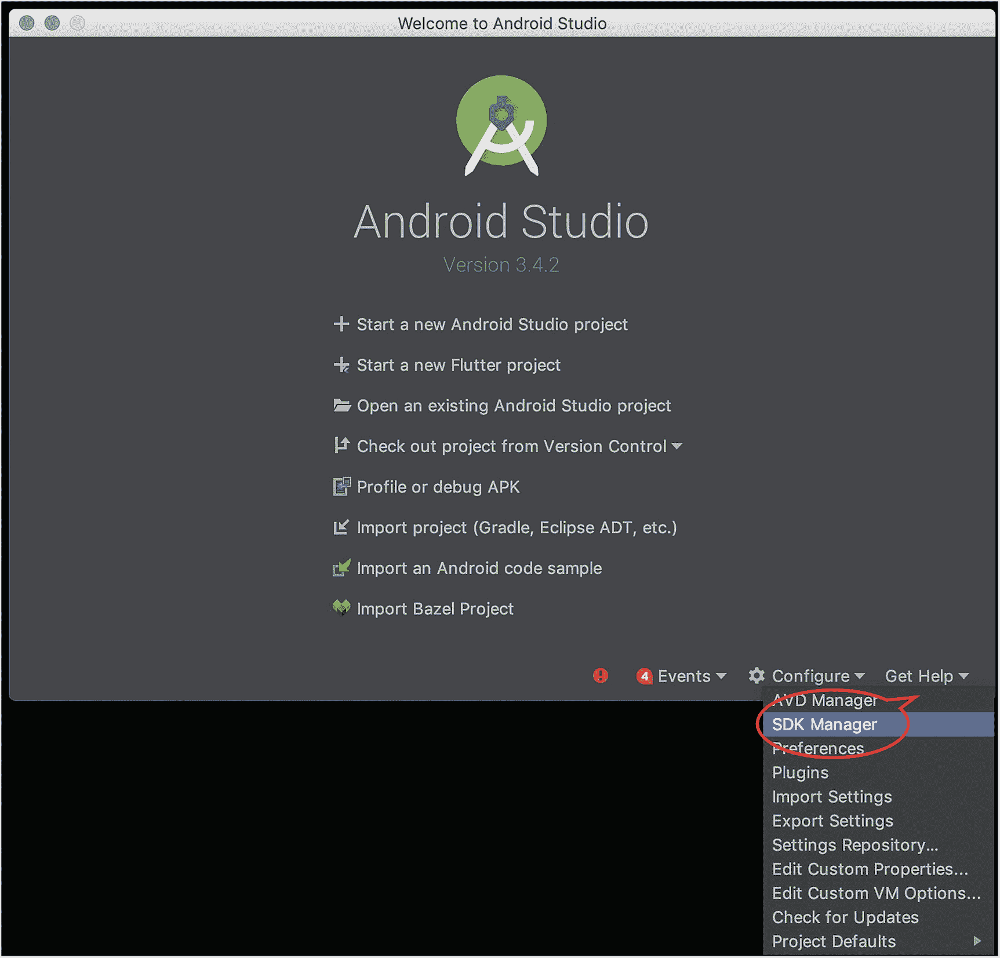

图 9-1

在 Android Studio 中启动 SDK Manager

在 SDK Manager 中，你将能够找到 Android SDK 的位置。使用该值来设置 `ANDROID_HOME` 环境变量的值。

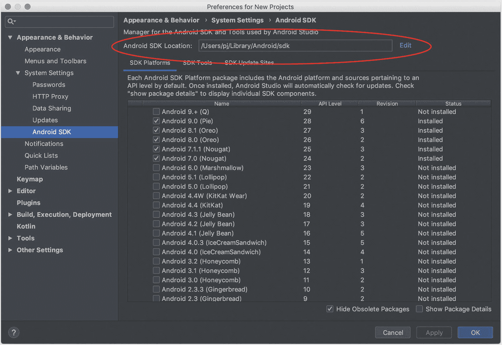

图 9-2

确认 Android SDK 的位置

#### 下载 SDK

当我们已经打开并运行 SDK Manager 时，也应确保至少有一个 Android SDK 可用于开始开发。至少选择 *Android 8.1 (Oreo)*（即 API Level 27），然后点击 *OK* 开始下载 SDK（如果你选择了多个）。

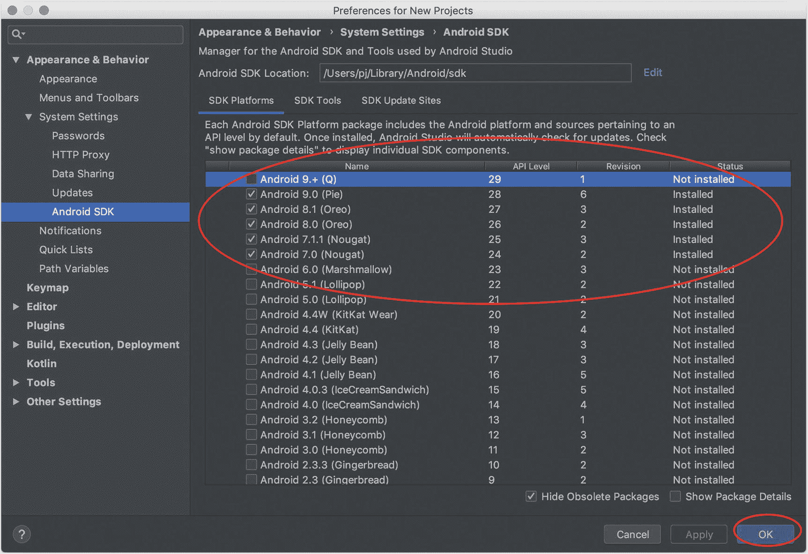

图 9-3

选择要下载的 Android SDK 版本

下载完 SDK 后，点击 *Finish*。

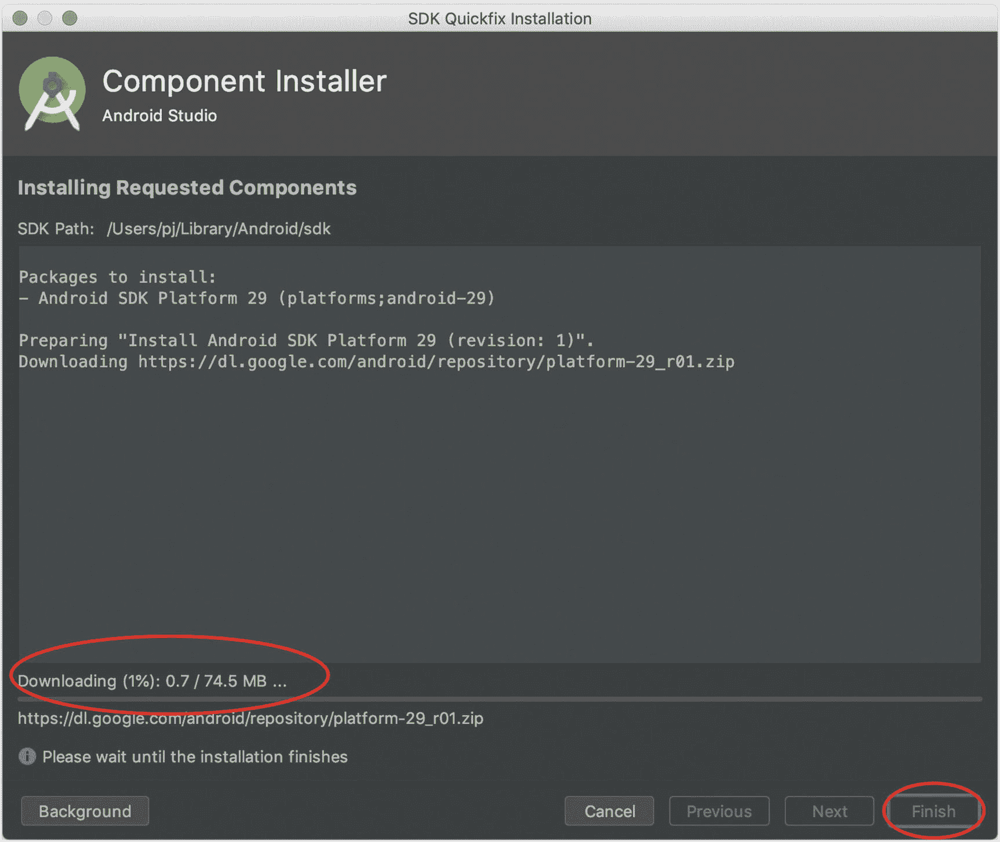

图 9-4

下载 Android SDK

### 创建模拟器

最后，让我们创建一个 Android Emulator 实例。在主界面中，打开 *AVD Manager*。

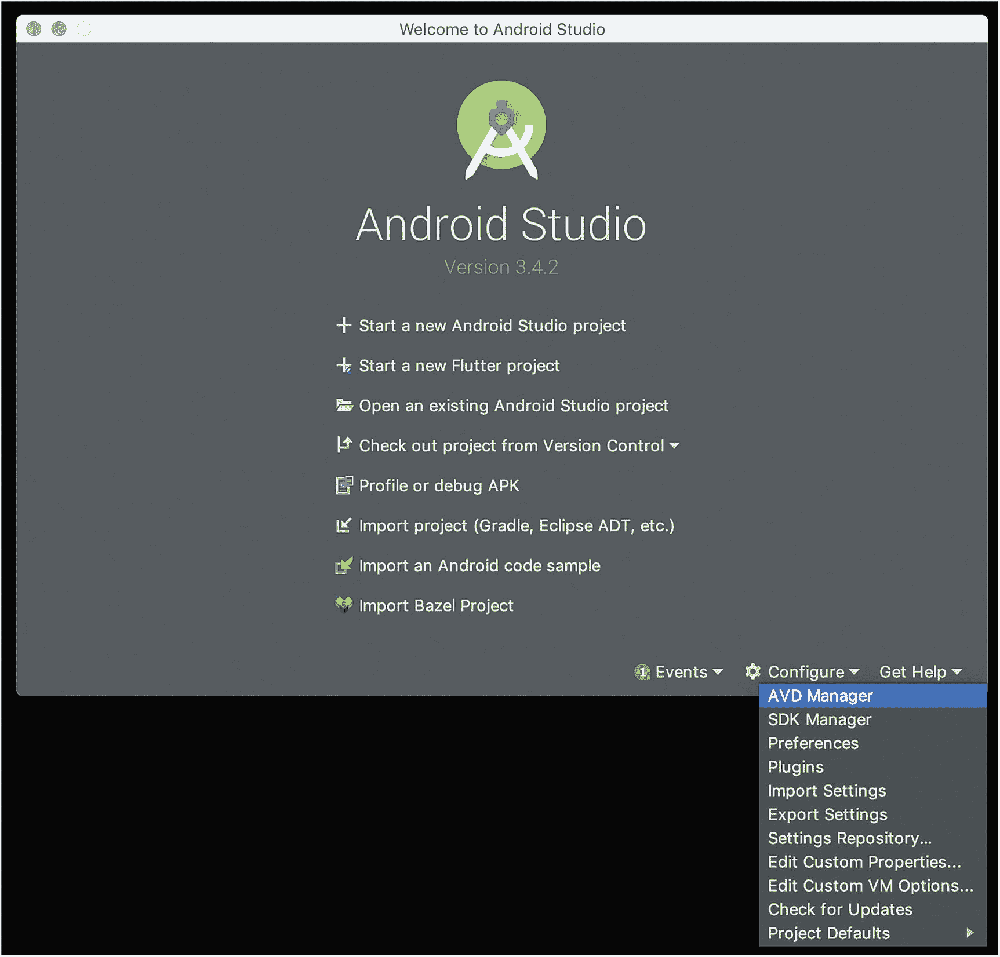

图 9-5

在 Android Studio 中启动 AVD Manager

此时，我们还没有任何模拟器配置文件，因此点击 *Create Virtual Device* 来创建一个。


图 9-6

创建虚拟设备

在 *Select Hardware* 页面中，从 Phone 类别选择一个设备（例如 Pixel 2），然后点击 *Next*。

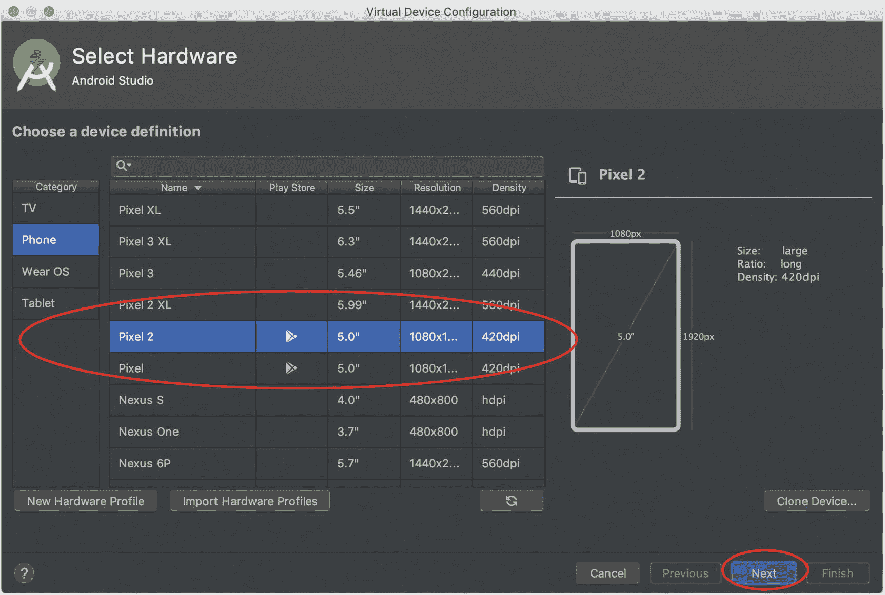

图 9-7

选择特定设备

在 *System Image* 页面中，选择你要使用的 Android SDK 具体版本（例如 Oreo），然后点击 *Next*。

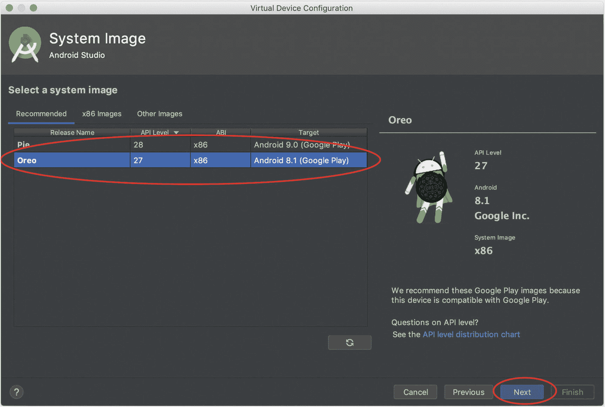

图 9-8

选择 Android SDK 的版本

最后，你可以为该模拟配置命名（如果你愿意）。点击 *Finish* 完成虚拟设备的创建。

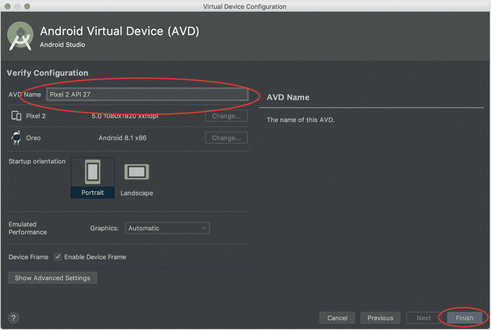

图 9-9

命名并完成虚拟设备创建


## 在 Bazel 中创建 Android Echo 客户端

完成所有准备工作后，我们现在已经可以开始真正创建 Android 应用了。在这个例子中，我们将创建 echo 客户端的移动版本。

不过，在编写实际的 gRPC 代码之前，我们先从一个简单的壳版本开始，它只在本地回显（即输入文本会立即返回）。这样做只是为了先熟悉在 Bazel 中开发 Android 应用的基础知识。

让我们为 Android 相关工作创建一个新目录：

```
chapter_09$ cd client/echo_client/
chapter_09/client/echo_client$ mkdir android
chapter_09/client/echo_client$ cd android
chapter_09/client/echo_client/android$
```

在 `client/echo_client/android` 目录中，创建 `EchoClientMainActivity.java` 文件并添加以下内容。

```
package client.echo_client.android;
import android.app.Activity;
import android.os.Bundle;
import android.view.View;
import android.widget.Button;
import android.widget.EditText;
import android.widget.TextView;
public class EchoClientMainActivity extends Activity {
@Override
public void onCreate(Bundle savedInstanceState) {
super.onCreate(savedInstanceState);
setContentView(R.layout.echo_client_main_activity);
Button textSenderButton = findViewById(R.id.text_sender);
EditText clientTextEditor = findViewById(R.id.text_input);
TextView serverResultsText = findViewById(R.id.server_result_text);
textSenderButton.setOnClickListener(new View.OnClickListener() {
public void onClick(View v) {
serverResultsText.setText(clientTextEditor.getText().toString());
}});
}
}
Listing 9-2
Creating a basic Android echo client
```

将文件保存为 `EchoClientMainActivity.java`*。* 从前面的代码可以看出，我们正在创建一个简单的文本编辑器用于输入文本；按下按钮后，文本会显示在一个文本视图中。

现在让我们创建真正构建 UI 的布局文件：

```
chapter_09/client/echo_client/android$ mkdir -p res/layout
```

在 `client/echo_client/android/res/layout` 下创建以下文件。

```

Listing 9-3
Creating the layout file
```

将其保存到 `client/echo_client/android/res/layout` 下，文件名为 `echo_client_main_activity.xml`*。*

对于我们的 Android 应用，还需要一个 `AndroidManifest.xml` 文件。

```

Listing 9-4
AndroidManifest.xml
```

将其保存到 `client/echo_client/android/AndroidManifest.xml`*。*

最后，让我们创建 `BUILD` 文件并定义目标。

```
load("@rules_android//android:rules.bzl", "android_library", "android_binary")
android_library(
name = "echo_client_android_activity",
srcs = ["EchoClientMainActivity.java"],
manifest = "AndroidManifest.xml",
custom_package = "client.echo_client.android",
resource_files = [
"res/layout/echo_client_main_activity.xml"
],
)
android_binary(
name = "echo_client_android_app",
manifest = "AndroidManifest.xml",
custom_package = "client.echo_client.android",
deps = [ ":echo_client_android_activity",],
)
Listing 9-5
Creating the BUILD file for the Android client
```

将其保存到 `client/echo_client/android/BUILD`。

虽然 Android 的构建规则是新的，但你在本书中已经多次见过这种模式。不出所料，我们需要从 `rules_android` 包中显式加载 `android_librar`*y* 和 `android_binary` 规则。

对于每条规则，有不少我们熟悉的属性（即 name、srcs、dep）。还有几个值得重点说明的属性：

*   manifest
    *   指向 `AndroidManifest.xm`*l* 文件。

*   `android_library` 和 `android_binary` 都必需该属性。

*   resource_files
    *   包含一组 Android 资源文件（例如 layout.xml、strings.xml 等）。

*   严格来说这是*可选*的；但在本例中，如果去掉这里的这个属性，构建会失败（因为它将不再依赖生成类所需的文件）。

*   custom_package
    *   该属性显式指定应用使用的包名。

*   `android_library` 和 `android_binary` 都对目录结构有要求。

*   具体来说，它们期望目录以 `java` 或 `javatests` 开头，以此推断 Java 包名。

*   如果目录*不是*以 java 开头，则必须显式设置 `custom_package` 属性。

从技术上讲，我们其实并不一定非要同时有 `android_library` 实例和 `android_binary` 实例。`android_binary` 规则本身提供了足够多的选项，理论上我们*可以*把所有需要的内容（即 Java 源文件和资源文件）都放在那里。不过，这里的拆分是为了演示这两条规则。

让我们执行一次测试构建，确保一切都按预期运行。为简化起见，我们只构建最终二进制：

```
chapter_09/client/echo_client/android$ bazel build :echo_client_android_app
INFO: Analyzed target //client/echo_client/android:echo_client_android_app (1 packages loaded, 5 targets configured).
INFO: Found 1 target...
Target //client/echo_client/android:echo_client_android_app up-to-date:
bazel-bin/client/echo_client/android/echo_client_android_app_deploy.jar
bazel-bin/client/echo_client/android/echo_client_android_app_unsigned.apk
bazel-bin/client/echo_client/android/echo_client_android_app.apk
INFO: Elapsed time: 0.935s, Critical Path: 0.70s
INFO: 3 processes: 3 darwin-sandbox.
INFO: Build completed successfully, 4 total actions
```

恭喜！你已经使用 Bazel 构建了第一个 Android 应用。现在我们可以在模拟器上测试它了。

### 启动 Android 模拟器实例

在你先前创建好虚拟设备后，现在就可以启动它。打开 *AVD 管理器*，这里会列出你所有的虚拟设备（本例中只有一个）。点击“播放”按钮，启动一个虚拟设备实例。

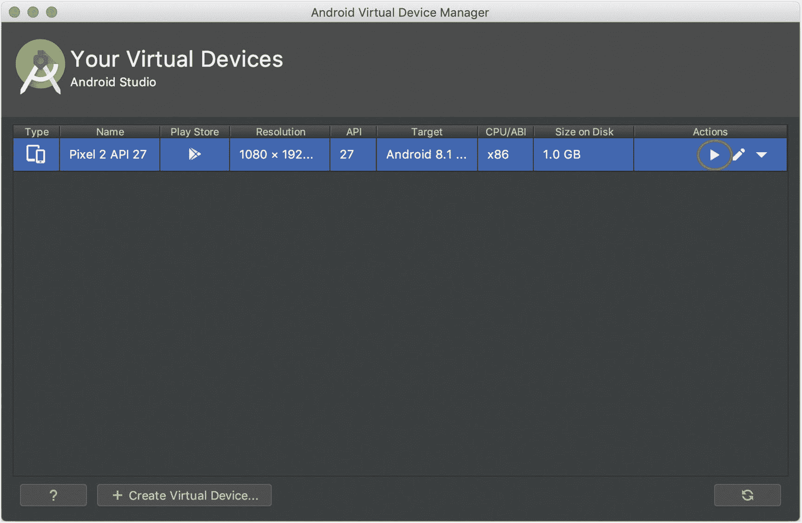

图 9-10

启动虚拟设备

你应该会看到如下空白屏幕。


图 9-11

启动后的模拟器

### Bazel 移动安装

在完成构建并设置好模拟器后，我们现在可以部署应用了。乍一看，我们可以使用 Android Debug Bridge（ADB）命令把应用装到模拟器上。不过，Bazel 提供了一个非常有用的命令 `mobile-install`*。* 与 `run` 类似，`mobile-install` 会构建目标应用，然后安装到已连接设备上（本例中即模拟器）。

额外的好处是，我们还可以加上 `start_app` 选项，以便应用安装完成后立即启动。使用该选项后，`mobile-install` 在功能上就相当于前几章中 `run` 的移动端版本。

运行以下命令来构建、部署并启动应用：

```
chapter_09/client/echo_client/android$ bazel mobile-install --start_app :echo_client_android_app
```

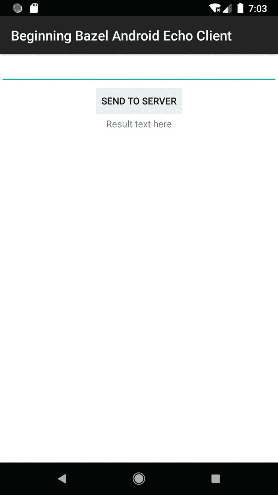

图 9-12

应用初始界面

恭喜！你的应用已经运行起来了，它会在本地回显你在文本编辑器中输入的任何内容。

### 注意

*mobile-install* 命令不仅仅是 ADB 功能的一个便捷代理。由于它与 Bazel 构建系统集成，还可以用于向移动应用部署增量变更。这能大幅提升开发效率，使你能够以更迭代的方式处理移动应用的各个方面（例如 UI）。不过，关于这种增量部署的具体细节不在本书讨论范围之内。


## 添加 gRPC 支持

尽管前面的示例对于创建一个基础的 Android 应用很有帮助，但它并不是一个功能非常完善的应用。延续前几章的主题，我们现在把真正的 echo 客户端功能添加到这个应用中。幸运的是，你在前几章已经完成了大部分繁重工作；这里我们可以直接复用。

在我们开始 Android 代码本身之前，首先必须确保添加了合适的权限；否则，当我们尝试执行进程间通信时会报错。

打开 `AndroidManifest.xml` 文件并添加以下权限。

```

Listing 9-6
Adding permission to access networking to the Android app
```

将更改保存到 `AndroidManifest.xml`。

现在让我们对 Android 代码本身做必要的修改。打开 `EchoClientMainActivity.java` 文件，并添加下面加粗所示的更改。

```
package java.com.beginning_bazel.client.echo_client;
import android.app.Activity;
import android.os.Bundle;
import android.util.Log;
import android.view.View;
import android.widget.Button;
import android.widget.EditText;
import android.widget.TextView;
import io.grpc.ManagedChannel;
import io.grpc.ManagedChannelBuilder;
import transmission_object.TransmissionObjectOuterClass.TransmissionObject;
import transceiver.TransceiverOuterClass.EchoRequest;
import transceiver.TransceiverOuterClass.EchoResponse;
import transceiver.TransceiverGrpc;
public class EchoClientMainActivity extends Activity {
@Override
public void onCreate(Bundle savedInstanceState) {
super.onCreate(savedInstanceState);
setContentView(R.layout.echo_client_main_activity);
Button textSenderButton = findViewById(R.id.text_sender);
EditText clientTextEditor = findViewById(R.id.text_input);
TextView serverResultsText = findViewById(R.id.server_result_text);
textSenderButton.setOnClickListener(new View.OnClickListener() {
public void onClick(View v) {
final String clientText =
clientTextEditor.getText().toString();
if (!clientText.isEmpty()) {
ManagedChannel channel =
ManagedChannelBuilder
.forAddress("10.0.2.2", 1234)
.usePlaintext()
.build();
TransceiverGrpc.TransceiverBlockingStub stub =
TransceiverGrpc.newBlockingStub(channel);
EchoRequest request = EchoRequest.newBuilder()
.setFromClient(
TransmissionObject.newBuilder()
.setMessage(clientText)
.setValue(3.145f)
.build();
.build();
try {
EchoResponse response = stub.echo(request);
serverResultsText.setText(response.toString());
} catch (Throwable t) {
Log.d("EchoClientMainActivity", "error:", t);
} finally {
channel.shutdown();
}
}
}});
}
}
Listing 9-7
Modifying the Android client to support gRPC
```

将更改保存到 `EchoClientMainActivity.java`。

### 注意

细心的读者会注意到，我们将地址从*localhost*改成了*10.0.2.2*。在模拟器中，*localhost*指向的是模拟设备本身，而不是运行模拟器的那台机器。Android Studio 指定了一个特殊 IP 地址（即 *10.0.2.2*），用于连接运行在你开发机器上的进程。你不需要对服务端做任何改动。

如果你决定使用*不同的*模拟平台，请查阅该平台的文档，确认它是否指定了不同的地址（或采用不同策略）来连接你开发机器上的进程。

所有新增代码你应该都很熟悉；只做了少量改动，它与上一章命令行 Java 客户端中的代码几乎一致。

### 注意

在上一章和本章中，我们都使用了*阻塞 stub*版本来调用后端。虽然这在这里对我们来说很方便，但一般来说，你不会希望在 UI 线程上发起这种 I/O 调用，因为这可能导致 UI 无响应。相反，你很可能需要研究此调用生成的其他版本（例如使用 Future），以便选择最适合你应用程序的方式。

最后，让我们把必要的依赖添加到 `BUILD` 文件中。再一次，这部分对你来说应该非常熟悉，与前一章相比改动很少。

```
load("@rules_android//android:rules.bzl", "android_library", "android_binary")
android_library(
name = "echo_client_android_activity",
srcs = ["EchoClientMainActivity.java"],
manifest = "AndroidManifest.xml",
custom_package = "client.echo_client.android",
resource_files = [
"res/layout/echo_client_main_activity.xml"
],
deps = [
"//proto:transceiver_java_proto",
"//proto:transceiver_java_proto_grpc",
"//proto:transmission_object_java_proto",
"@io_grpc_grpc_java//api",
"@io_grpc_grpc_java//okhttp",
"@io_grpc_grpc_java//stub",
],
)
android_binary(
name = "echo_client_android_app",
manifest = "AndroidManifest.xml",
deps = [ ":echo_client_android_activity",],
)
Listing 9-8
Adding dependencies into the Android BUILD file
```


### 注意

再次强调，细心的读者会发现，我们已经将之前的运行时依赖 `@io_grpc_grpc_java//netty` 替换为静态依赖 `@io_grpc_grpc_java/okhttp`。可以肯定的是，`netty` 最适合同时支持客户端*和*服务器端功能。`OkHttp` 的设计目标是为纯客户端场景提供轻量化支持，因此这里将其引入 Android。

将这些更改保存到 `BUILD` 文件中。

为确保无误，我们再构建一次应用。不过，这次你可能会看到一条令人意外的错误信息。

```
chapter_09/client/echo_client/android$ bazel build :echo_client_android_app
ERROR: 
'single_file' is no longer supported. use allow_single_file instead. You can use --incompatible_disable_deprecated_attr_params=false to temporarily disable this check.
ERROR: /external/io_grpc_grpc_java/protobuf-lite/BUILD.bazel:1:1: error loading package '@com_google_protobuf_javalite//': Extension file 'protobuf.bzl' has errors and referenced by '@io_grpc_grpc_java//protobuf-lite:protobuf-lite'
ERROR: Analysis of target '//client/echo_client/android:echo_client_android_app' failed; build aborted: error loading package '@com_google_protobuf_javalite//': Extension file 'protobuf.bzl' has errors
```

在这个特定场景下，你其实并没有做错任何事；你之所以遇到这个错误，可能是因为 Bazel 本身在持续演进。在这里，你的某个依赖由于使用了已弃用属性而报错。不过事情并非无解，上面高亮的那一行已经告诉了我们下一步该怎么做。

如果我们在 `build`（以及 `mobile-install`）命令中加入参数 `–-incompatible_disable_deprecated_attr_params=false`，你会看到问题自行修复。

```
chapter_09/client/echo_client/android$ bazel build –-incompatible_disable_deprecated_attr_params=false :echo_client_android_app
INFO: Writing tracer profile to '/private/var/tmp/_bazel_pj/72676801ec24996691dac393febb05db/command.profile.gz'
INFO: Analyzed target //client/echo_client/android:echo_client_android_app (80 packages loaded, 2140 targets configured).
INFO: Found 1 target...
Target //client/echo_client/android:echo_client_android_app up-to-date:
bazel-bin/client/echo_client/android/echo_client_android_app_deploy.jar
bazel-bin/client/echo_client/android/echo_client_android_app_unsigned.apk
bazel-bin/client/echo_client/android/echo_client_android_app.apk
INFO: Elapsed time: 11.048s, Critical Path: 6.06s
INFO: 13 processes: 9 darwin-sandbox, 4 worker.
INFO: Build completed successfully, 14 total actions
```

严格来说，尽管这种方式可行，但不应将其视为永久解决方案。当你真正遇到类似问题时，正确做法是修复依赖中的问题（必要时可提交相应修改）。这也说明了尽可能将你的优势保持在本地化范围内的好处，这样你更容易掌控自己的技术命运。

不过，这也体现出一点：即使 Bazel 本身仍在快速演进，它也在努力为你提供“应急阀门（escape valves）”，以便让开发继续推进。虽然这些不是长期方案，但它们确实能帮助你更平滑地在软件版本之间过渡。

## 在后端上运行 Android 客户端

现在我们已经增强了 Android 客户端，使其可以对本地服务器发起 RPC，接下来让我们同时启动服务器和客户端。

之前你需要两个控制台实例，因为客户端和服务器都是命令行工具。在这里，你只需要一个。

首先，构建、部署并启动我们更新后的 Android 应用。运行以下命令：

```
bazel mobile-install --incompatible_disable_deprecated_attr_params=false --start_app :echo_client_android_app
```

确认应用已经启动并运行后，运行以下命令启动服务器：

```
chapter_09$ bazel run server/echo_server
INFO: Deleting stale sandbox base /private/var/tmp/_bazel_pj/72676801ec24996691dac393febb05db/sandbox
Target //server/echo_server:echo_server up-to-date:
bazel-bin/server/echo_server/darwin_amd64_stripped/echo_server
INFO: Elapsed time: 16.670s, Critical Path: 0.30s
INFO: 0 processes.
INFO: Build completed successfully, 1 total action
INFO: Build completed successfully, 1 total action
2019/08/01 16:39:03 Spinning up the Echo Server in Go
```

现在，输入一些文本并点击“Send to Server”。你应该会在 Android 客户端中收到响应，如下所示。

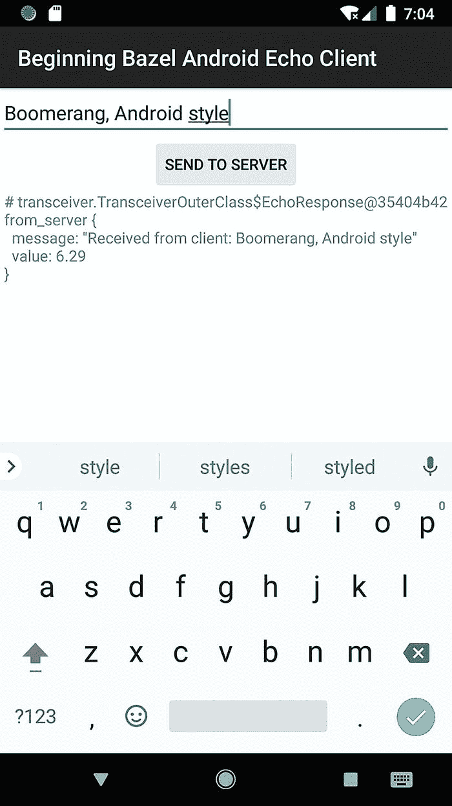

图 9-13

显示应用界面及后端返回响应的屏幕

恭喜！你已经创建了 Android 回声客户端，并成功与本地回声服务器通信。

## 结语

在本章中，你通过学习如何使用 Bazel 构建 Android 应用，进一步拓展了自己的知识体系。此外，你还能将前面章节所学应用起来，构建出一个能够与此前工作成果进行通信的应用。虽然这显然只是一个远程通信的玩具示例，但它可以作为更大型项目的起点。

在展示了 Bazel 构建 Android 项目的能力之后，我们将在下一章进一步扩展到 iOS 应用开发。


### 练习——在 Android 上使用 Java Lite Protos

在上一章中，你已经能够利用前面章节的成果，轻松地为你的 Android 应用添加 gRPC 支持。在这一过程中有一点被略过了：`java_proto_library` 的输出在函数数量上通常会比较冗长；也就是说，生成的类、内部类、静态类等数量往往很大。对于运行在服务器上的程序来说这通常问题不大，但对于大规模 Android 程序，这会逐渐成为一个问题。资深 Android 开发者都熟悉单个 DEX 文件中令人头疼的函数数量限制（即 64K 函数）。

虽然你可以采用 multidex 策略来应对函数数量增加的问题，但这会因 Android SDK 版本不同而变得复杂。幸运的是，至少对于 `java_proto_library` 这一场景，我们有一个可行替代方案：`java_lite_proto_library`。该规则会生成功能更精简的 proto Java 代码，同时仍保留大多数场景下常用的核心功能。

值得注意的是，`java_lite_proto_library`（目前）属于那种开箱即用但仍需要一些外部支持的规则之一（这也许能说明这一组规则的迁移路径）。该规则的定义方式与 `java_proto_library` 几乎*完全相同*。由 `java_lite_proto_library` 生成的 proto 并不实现原版本的*全部*功能，但在最常见的使用场景中通常可以直接替换（这里就是这种情况）。

幸运的是，你可以通过在 `WORKSPACE` 文件中添加以下内容，轻松获得所需支持：

```
http_archive(
name = "com_google_protobuf_javalite",
strip_prefix = "protobuf-javalite",
urls = ["https://github.com/google/protobuf/archive/javalite.zip"],
)
```

此外，你还需要确保所使用的 grpc 库*同样*会生成与 `java_lite_proto_library` 输出兼容的代码。幸运的是，我们现有的 `java_grpc_library` 规则已经为我们处理了这一点；你只需要在应用中添加选项 `flavor = "lite"`。

例如：

```
java_grpc_library(
name = "transceiver_java_lite_proto_grpc",
srcs = [":transceiver_proto"],
deps = [":transceiver_java_lite_proto"],
flavor = "lite",
visibility = ["//client/echo_client:__subpackages__"],
)
```

当你创建好 `java_lite_proto_library` 和 `java_grpc_library`（带有 “lite” proto 支持）实例后，将应用的 `android_library` 重定向到这些新建规则上。由于我们在这里使用 protobuf 的方式，你无需修改任何 Android 代码。你应该能够顺利构建并运行代码，且功能不会发生变化。

不过，你应当对比这次变更前后的应用体积。你会看到体积显著减小（如果你确实想了解具体差异，可以使用 Android Studio 的分析工具查看函数数量的变化）。

对于玩具项目，这种差异可能不明显；但当你使用 protobuf 构建规模较大的 Android 应用时，你会希望使用 “lite” 版本来帮助保持应用体积小，并避免使用 multidex。

