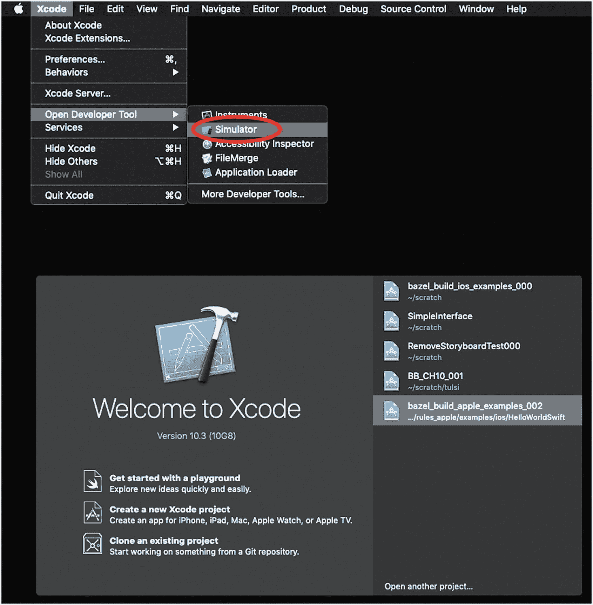
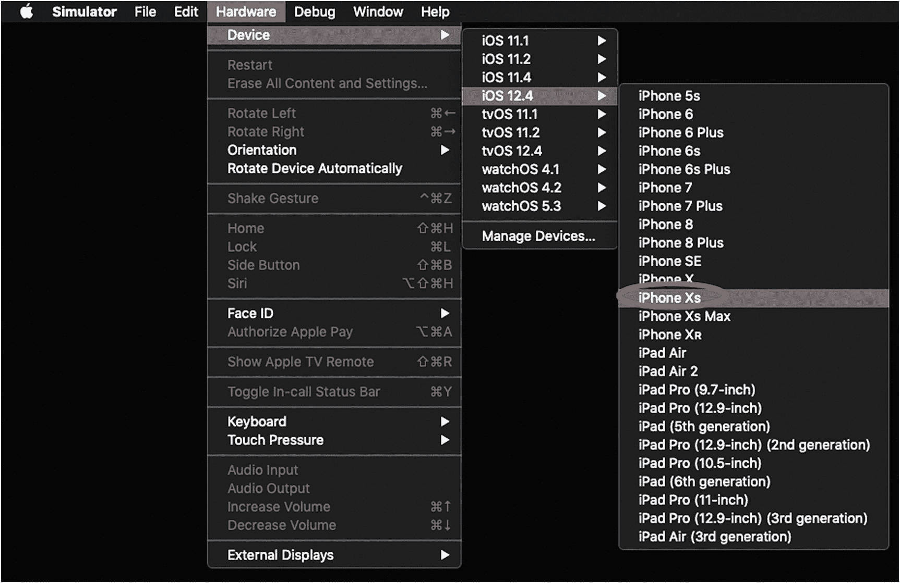
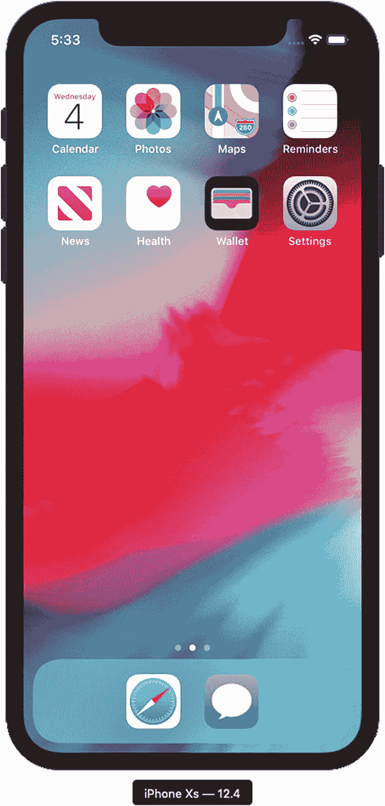
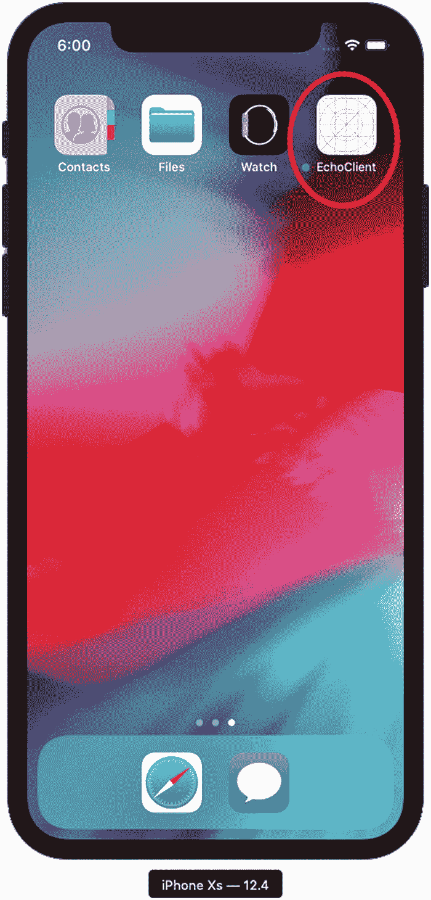
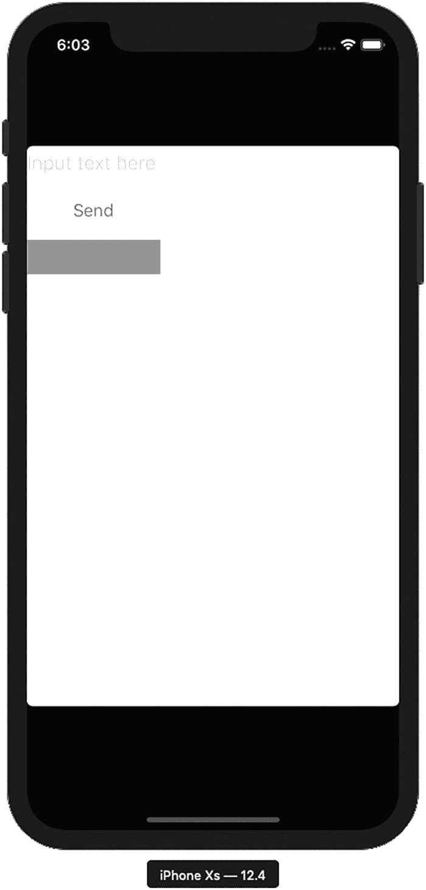
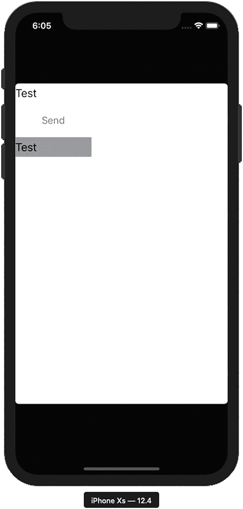
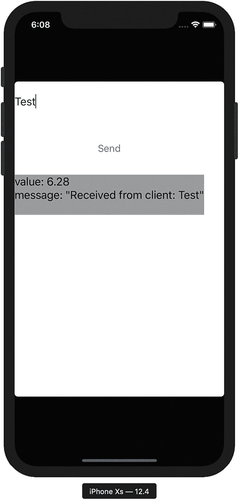

# 10. Bazel 与 iOS

在上一章中，你使用 Bazel 从适用于服务器的命令行程序扩展到 Android，从而迈入移动端世界。为了完整起见，我们将为 iOS 创建一个等效客户端。

### 注意

在本章中，我们将使用原生工具创建一个 iOS 项目。不过，由于 Xcode 仅在 MacOS 上可用，你只能在 MacOS 机器上构建本章项目。

## 设置

我们将再次基于前面章节的内容继续构建。先确认上一章由 Bazel 生成的文件已清理，然后复制上一章的工作：

```
$ cd chapter_09
chapter_09$ bazel clean
chapter_09$ ls
WORKSPACE   client    proto   server
chapter_09$ cd ..
$ cp -rf chapter_09 chapter_10
$ cd chapter_10
chapter_10$
```

由于你已经在机器上配置好了 Xcode 来构建前几章的示例，因此你应当已经具备开发 iOS 应用所需的一切。

## Workspace

我们再次在 `WORKSPACE` 文件中添加依赖，以获取构建 iOS 项目所需的规则。

打开 `WORKSPACE` 文件并添加以下内容。

```
load("@bazel_tools//tools/build_defs/repo:http.bzl", "http_archive")
load("@bazel_tools//tools/build_defs/repo:git.bzl", "git_repository")
skylib_version = "0.8.0"
http_archive(
name = "bazel_skylib",
url = "https://github.com/bazelbuild/bazel-skylib/releases/download/{}/bazel-skylib.{}.tar.gz".format(skylib_version, skylib_version),
)
git_repository(
name ="build_bazel_rules_apple",
commit="1445924a158a89ad634f562c84a600a3435ef8c2",
remote="https://github.com/bazelbuild/rules_apple.git",
)
load(
"@build_bazel_rules_apple//apple:repositories.bzl",
"apple_rules_dependencies",
)
apple_rules_dependencies()
load(
"@build_bazel_rules_swift//swift:repositories.bzl",
"swift_rules_dependencies",
)
swift_rules_dependencies()
load(
"@build_bazel_apple_support//lib:repositories.bzl",
"apple_support_dependencies",
)
apple_support_dependencies()

Listing 10-1
Modifying the WORKSPACE for the iOS rules
```

将你对 *WORKSPACE* 文件的修改保存。

### 注意

在这些改动中，我们仅对 `build_bazel_rules_apple` 显式调用了 `http_archive`；但很明显，我们还通过 `*_dependencies()` 函数获取了多个额外依赖。你在前面的章节中已经见过这种做法，但这里仍值得特别说明，因为我们将显式使用这些额外包之一中的规则（即 `build_bazel_rules_swift` 包）。


## 在 Bazel 中创建 iOS 客户端

与你在 Android 示例中编写的内容类似，我们将首先创建一个基础的 iOS 应用程序，然后再实际使用任何 gRPC 代码。在此过程中，我们将探讨一些在 Bazel 下构建 iOS 应用的细节要点。

让我们为 iOS 开发创建一个新目录。正如预期的那样，它将位于 client 目录中，与 Android 和命令行客户端并列：

```
chapter_10$ cd client/echo_client/
chapter_10/client/echo_client$ mkdir ios
chapter_10/client/echo_client$ cd ios
chapter_10/client/echo_client/ios$
```

在 `client/echo_client/ios` 目录中，创建 `MainViewController.swift` 文件并添加以下内容。

```
import UIKit
public class MainViewController : UIViewController {
private let textInput = UITextField()
private let sendButton =  UIButton(type: UIButton.ButtonType.system)
private let receivedText = UILabel()
override public func viewDidLoad() {
super.viewDidLoad()
self.view.backgroundColor = .white
textInput.placeholder = "Input text here"
textInput.textColor = .black
textInput.backgroundColor =.white
textInput.isEnabled = true
sendButton.setTitle("Send", for: UIControl.State.normal)
sendButton.addTarget(self, action: #selector(send), for: .touchUpInside)
sendButton.isEnabled = true
receivedText.numberOfLines = 0
receivedText.text = "Received text will show up here."
receivedText.backgroundColor = .gray
receivedText.textColor = .black
let stackView = UIStackView(arrangedSubviews: [self.textInput, self.sendButton, self.receivedText])
stackView.alignment = .fill
stackView.axis = .vertical
stackView.distribution = .fillEqually
stackView.spacing = 10.0
stackView.translatesAutoresizingMaskIntoConstraints = false
self.view.addSubview(stackView)
}
override public func viewDidAppear(_ animated: Bool) {
super.viewDidAppear(animated)
textInput.text = ""
receivedText.text = ""
}
@objc func send(sender: UIButton!) {
receivedText.text = textInput.text
}
}
Listing 10-2
Creating the MainViewController
```

将该文件保存为 `MainViewController.swift`*.* 正如我们在 Android 版本客户端中所做的那样，我们正在创建一个非常简单的本地回显客户端：点击 *Send* 后，它会将输入文本原样反映到输出中。

### 注意

与 Android 客户端不同，我们是通过代码以编程方式生成 UI，而不是创建等效的 `.storyboard` 文件。尽管 Bazel 的 iOS 规则确实支持使用 `.storyboard` 文件，但生成这些文件的标准工具是 Xcode 本身（即通过创建一个新项目）。为简化起见，我们选择不使用 `.storyboard` 文件，因为用于生成 UI 的代码非常直接。

在 Android 示例中，我们将整个应用都定义在一个文件中；这里我们将再创建一个文件（即 `AppDelegate` 文件），以遵循 iOS 的惯例。

在 `client/echo_client/ios` 目录中，创建 `AppDelegate.swift` 文件并添加以下内容。

```
import UIKit
@UIApplicationMain
class AppDelegate: NSObject, UIApplicationDelegate {
var window: UIWindow?
func application(
_ application: UIApplication, didFinishLaunchingWithOptions
launchOptions: [UIApplication.LaunchOptionsKey : Any]?) -> Bool {
window = UIWindow(frame: UIScreen.main.bounds)
window?.makeKeyAndVisible()
window?.rootViewController = MainViewController()
return true
}
}
Listing 10-3
Creating the basic AppDelegate
```

将该文件保存为 `AppDelegate.swift`*.*

最后，我们还需要创建一个 `Info.plist` 文件，用于定义 iOS 应用程序的一些基础属性。

在 `client/echo_client/ios` 目录中，创建 `Info.plist` 文件并添加以下内容。

```

CFBundleDevelopmentRegion
en
CFBundleExecutable
$(EXECUTABLE_NAME)
CFBundleIdentifier
$(PRODUCT_BUNDLE_IDENTIFIER)
CFBundleInfoDictionaryVersion
6.0
CFBundleName
$(PRODUCT_NAME)
CFBundlePackageType
APPL
CFBundleShortVersionString
1.0
CFBundleVersion

LSRequiresIPhoneOS

UIRequiredDeviceCapabilities

arm64

UISupportedInterfaceOrientations

UIInterfaceOrientationPortrait

Listing 10-4
Creating the Info.plist file
```

将该文件保存为 `Info.plist`*.*

在 `client/echo_client/ios` 目录中，创建一个 `BUILD` 文件，并向其中添加以下内容。

```
load("@build_bazel_rules_apple//apple:ios.bzl", "ios_application")
load("@build_bazel_rules_swift//swift:swift.bzl", "swift_library")
swift_library(
name = "Lib",
srcs = [
"AppDelegate.swift",
"MainViewController.swift",
],
)
ios_application(
name = "EchoClient",
bundle_id = "com.beginning-bazel.echo-client",
families = ["iphone"],
infoplists = [":Info.plist"],
minimum_os_version = "11.0",
deps = [":Lib"],
)
Listing 10-5
Creating the BUILD file for the iOS project
```

保存 `BUILD` 文件。

结合前几章所做的工作，`BUILD` 文件中的内容应该不会让你感到陌生；你只是加载了一组新的规则，并用它们创建了一些构建目标。特别是，`swift_library` 看起来应当与其他语言中的类似用法非常相近。对于 `ios_application`，其中许多属性是新的，但也都应该容易理解。


### 为 iOS 构建

在设置好代码和 BUILD 规则后，我们现在来执行一次构建。先从 `EchoClient` 目标开始：

```
chapter_10/client/echo_client/ios$ bazel build :EchoClient
INFO: Analyzed target //client/echo_client/ios:EchoClient (19 packages loaded, 405 targets configured).
INFO: Found 1 target...
Target //client/echo_client/ios:EchoClient up-to-date:
bazel-bin/client/echo_client/ios/EchoClient.ipa
INFO: Elapsed time: 9.965s, Critical Path: 9.48s
INFO: 10 processes: 7 darwin-sandbox, 2 local, 1 worker.
INFO: Build completed successfully, 36 total actions
```

这看起来应该和前几章的内容非常熟悉。

不过，我们还要对 `Lib` 目标执行一次构建。虽然我们已经作为 `EchoClient` 的依赖成功构建了这个目标，但仍值得讨论一下：要构建一个目标，具备足够上下文信息的重要性。

```
chapter_10/client/echo_client/ios$ bazel build :Lib
INFO: Analyzed target //client/echo_client/ios:Lib (25 packages loaded, 854 targets configured).
INFO: Found 1 target...
ERROR: chapter_10/client/echo_client/ios/BUILD:4:1: Compiling Swift module client_echo_client_ios_Lib failed (Exit 1)
client/echo_client/ios/AppDelegate.swift:1:8: error: no such module 'UIKit'
import UIKit
^
Target //client/echo_client/ios:Lib failed to build
Use --verbose_failures to see the command lines of failed build steps.
INFO: Elapsed time: 4.094s, Critical Path: 0.15s
INFO: 0 processes.
FAILED: Build did NOT complete successfully
```

尽管我们已经正确设置了构建目标，构建仍然*失败*了，而且错误看起来有些奇怪。毕竟，`UIKit` 是 iOS 应用的核心库；在构建 iOS 应用时它本应始终可用。

要理解发生了什么，我们需要回顾一点：Swift 作为一种语言，并不只用于 iOS；你可以用 Swift 在很多平台上创建原生应用。我们在 `BUILD` 文件中的初始定义只是使用了 `swift_library`；仅凭这一点并没有说明该 Swift 库应为哪个平台构建。实际上，默认会为 MacOS 平台（即系统默认平台）构建。

而对于 `ios_application`，我们是在显式声明该目标应为 iOS 平台进行*交叉编译*，并引入正确编译所需的 SDK。Bazel 有一个叫做*配置（configuration）*的属性，它封装了执行构建时的环境信息。默认情况下，一个构建目标的配置会应用到其依赖项上。这就是为什么你之前能够成功构建 `EchoClient` 的全部内容：因为 `ios_application` 具有正确配置，并且该配置传递到了依赖项。

若要仅对 *swift_library* 启用这一点，我们可以在 *build* 命令中添加一些说明，以正确执行构建。

执行下面的命令，它在命令行中加入了指令 `–-apple_platform_type=ios`：

```
chapter_10/client/echo_client/ios$ bazel build –-apple_platform_type=ios :Lib
INFO: Build option --apple_platform_type has changed, discarding analysis cache.
INFO: Analyzed target //client/echo_client/ios:Lib (3 packages loaded, 854 targets configured).
INFO: Found 1 target...
Target //client/echo_client/ios:Lib up-to-date:
bazel-bin/client/echo_client/ios/Lib-Swift.h
bazel-bin/client/echo_client/ios/client_echo_client_ios_Lib.swiftdoc
bazel-bin/client/echo_client/ios/client_echo_client_ios_Lib.swiftmodule
bazel-bin/client/echo_client/ios/libLib.a
INFO: Elapsed time: 4.139s, Critical Path: 3.72s
INFO: 2 processes: 1 darwin-sandbox, 1 worker.
INFO: Build completed successfully, 3 total actions
```

在完整指定平台后，构建成功了。

### 注意

你可能还记得上一章中我们不需要显式指定平台。上一章里我们使用的是 `android_binary` 和 `android_library` 规则；和 `ios_application` 一样，它们足以指定目标的构建平台。

### 注意

同样，细心的读者会注意到第一条 `INFO` 消息：由于构建选项变更，“analysis cache” 已被丢弃。回想一下，Bazel 会做大量工作来确保构建完整性。为了避免错误渗入系统，必须不仅按构建了*什么*来索引构建产物，也要按*如何*构建来索引。使用不同选项（例如平台、debug 与 opt 等）构建同一目标，基本上等价于对该目标*以及*其所有依赖项做了变更——至少从缓存结果的角度来看是如此。

## 在 Xcode 模拟器中运行 iOS 客户端

和 Android 部分一样，我们将把初始构建结果运行在 iOS 模拟器上，以验证其可用性。

首先我们要创建一个 iPhone 模拟器实例。打开 Xcode，然后依次进入 *Xcode* ➤ *Open Developer Tool* ➤ *Simulator*。



图 10-1

启动模拟器

启动 Simulator 后，你现在可以关闭 Xcode（这与我们在上一章对 Android Studio 的操作类似）。

在 Simulator 应用中，我们为 iOS 12.4 创建一个 iPhone Xs 的硬件设备。



图 10-2

选择要模拟的特定 iOS 设备

这将创建一个 iPhone Xs 设备模拟器实例。



图 10-3

针对该设备的 iOS 模拟器启动界面

现在你已经准备好在模拟器上运行该应用了。


### 在 Xcode 模拟器上执行应用程序

在上一章中，我们可以使用 `bazel mobile-install <android_target>` 来构建并将应用直接安装到 Android 模拟器上。遗憾的是，`mobile-install` 仅适用于 Android 模拟器实例；我们不能对 iOS 项目使用完全相同的流程。尝试这样做会*构建*成功，但不会在模拟器中实际*执行*该目标。

我们可以通过直接使用一些 Xcode 命令来达到与 `mobile-install` 近似的效果。首先，确保构建目标是完全最新的。我们需要特别留意生成的 .ipa 文件位置：

```
chapter_10/client/echo_client/ios$ bazel build :EchoClient
Starting local Bazel server and connecting to it...
INFO: Analyzed target //client/echo_client/ios:EchoClient (44 packages loaded, 1155 targets configured).
INFO: Found 1 target...
INFO: Deleting stale sandbox base /private/var/tmp/_bazel_pj/6ba16646dc915b8e018ad2c967b485b8/sandbox
Target //client/echo_client/ios:EchoClient up-to-date:
bazel-bin/client/echo_client/ios/EchoClient.ipa
INFO: Elapsed time: 12.762s, Critical Path: 0.39s
INFO: 0 processes.
INFO: Build completed successfully, 1 total action
```

.ipa 文件实际上是一个压缩目录。虽然我们不能直接把 .ipa 文件安装到模拟器上，但我们可以将其解压，然后把底层的 .app 目录安装到模拟器上。先解压 .ipa 文件以获取其内部内容：

```
chapter_10/client/echo_client/ios$ cd ../../..
chapter_10$ unzip bazel-bin/client/echo_client/ios/EchoClient.ipa
Archive:  bazel-bin/client/echo_client/ios/EchoClient.ipa
creating: Payload/
creating: Payload/EchoClient.app/
creating: Payload/EchoClient.app/_CodeSignature/
extracting: Payload/EchoClient.app/_CodeSignature/CodeResources
extracting: Payload/EchoClient.app/EchoClient
creating: Payload/EchoClient.app/Frameworks/
extracting: Payload/EchoClient.app/Frameworks/libswiftCoreImage.dylib
extracting: Payload/EchoClient.app/Frameworks/libswiftObjectiveC.dylib
extracting: Payload/EchoClient.app/Frameworks/libswiftCore.dylib
extracting: Payload/EchoClient.app/Frameworks/libswiftCoreGraphics.dylib
extracting: Payload/EchoClient.app/Frameworks/libswiftUIKit.dylib
extracting: Payload/EchoClient.app/Frameworks/libswiftMetal.dylib
extracting: Payload/EchoClient.app/Frameworks/libswiftDispatch.dylib
extracting: Payload/EchoClient.app/Frameworks/libswiftos.dylib
extracting: Payload/EchoClient.app/Frameworks/libswiftCoreFoundation.dylib
extracting: Payload/EchoClient.app/Frameworks/libswiftDarwin.dylib
extracting: Payload/EchoClient.app/Frameworks/libswiftQuartzCore.dylib
extracting: Payload/EchoClient.app/Frameworks/libswiftFoundation.dylib
extracting: Payload/EchoClient.app/Info.plist
extracting: Payload/EchoClient.app/PkgInfo
```

接下来，执行以下命令以识别当前处于活动状态的 Xcode 模拟器实例。我们要找的是活动实例的 ID：

```
chapter_10$ xcrun simctl list | grep Booted
iPhone Xs (1DE26879-2844-4036-ABE2-A6B718A9CADA) (Booted)
Phone: iPhone Xs (1DE26879-2844-4036-ABE2-A6B718A9CADA) (Booted)
```

虽然看起来有两个活动实例，但仔细检查会发现它们的 ID 是相同的。现在，我们可以将应用安装到模拟器上。执行以下命令：

```
chapter_10$ xcrun simctl install 1DE26879-2844-4036-ABE2-A6B718A9CADA Payload/EchoClient.app
```

在应用列表中，你应该会看到如下内容。



图 10-4

已安装在模拟器上的应用

点击 `EchoClient` 应用。你应该会看到如下内容。



图 10-5

运行中的 iOS EchoClient

对于这个基础应用，你还应该能够点击输入文本框，输入一些文本，并在输出标签中看到本地回显结果。



图 10-6

运行一个简单的回显测试（仅本地）

恭喜！你已经使用 Bazel 创建并安装了你的第一个 iOS 应用！

## 向 iOS 应用添加 gRPC

最后，正如你在前几章所做的那样，让我们加入 gRPC 功能。正如你可能预期的，iOS 所需的工作与其他客户端的做法非常相似。

打开 `proto/BUILD` 并添加以下更改（加粗部分为重点）。

```
load("@io_bazel_rules_go//proto:def.bzl", "go_proto_library")
load("@io_grpc_grpc_java//:java_grpc_library.bzl", "java_grpc_library")
load("@build_bazel_rules_swift//swift:swift.bzl", "swift_grpc_library", "swift_proto_library")
proto_library(
name = "transmission_object_proto",
srcs = ["transmission_object.proto"],
)

swift_proto_library(
name = "transmission_object_swift_proto",
deps = [":transmission_object_proto"],
visibility = ["//client/echo_client:__subpackages__"],
)
swift_proto_library(
name = "transceiver_swift_proto",
deps = [":transceiver_proto"],
visibility = ["//client/echo_client:__subpackages__"],
)
swift_grpc_library(
name = "transceiver_swift_proto_grpc",
srcs = [":transceiver_proto"],
flavor = "client",
deps = [":transceiver_swift_proto"],
visibility = ["//client/echo_client:__subpackages__"],
)
Listing 10-6
Adding in the Swift protobuf rules
```

将文件保存到 `proto/BUILD`。新增 `swift_proto_library` 和 `swift_grpc_library` 规则这件事对你来说应该并不意外。

### 注意

`swift_proto_library` 和 `swift_grpc_library` 都会自动生成 Swift 模块名，其命名方式为：目标路径（相对于 workspace 根目录）与目标名本身的组合。例如，在本例中，`transmission_object_swift_proto` 的相对路径是 `/proto`，因此其模块名将是 `proto_transmission_object_swift_proto`。

创建完这些新目标后，让我们把它们加入 iOS 应用中。打开 `client/echo_client/ios/BUILD` 文件并添加以下更改（加粗部分为重点）。

```
load("@build_bazel_rules_apple//apple:ios.bzl", "ios_application")
load("@build_bazel_rules_swift//swift:swift.bzl", "swift_library")
swift_library(
name = "Lib",
srcs = [
"AppDelegate.swift",
"MainViewController.swift",
],
deps = [
"//proto:transmission_object_swift_proto",
"//proto:transceiver_swift_proto",
"//proto:transceiver_swift_proto_grpc",
],
)
ios_application(
name = "EchoClient",
bundle_id = "com.beginning-bazel.echo-client",
families = ["iphone"],
infoplists = [":Info.plist"],
minimum_os_version = "11.0",
deps = [":Lib"],
)
Listing 10-7
Adding in the Swift protobuf dependencies
```

现在，我们将添加真正执行 gRPC 调用的 Swift 代码。打开 `client/echo_client/ios/MainViewController.swift` 并添加以下内容（加粗部分为重点）。

```
import UIKit
import proto_transmission_object_proto
import proto_transceiver_proto
import proto_transceiver_swift_proto_grpc

@objc func send(sender: UIButton!) {
let client = Transceiver_TransceiverServiceClient(address: "localhost:1234", secure: false)
var transmissionObject = TransmissionObject_TransmissionObject()
transmissionObject.message = textInput.text ?? ""
transmissionObject.value = 3.14
var request = Transceiver_EchoRequest()
request.fromClient = transmissionObject
let response = try? client.echo(request)
if let response = response {
receivedText.text = response.fromServer.textFormatString()
}
}
Listing 10-8
Adding in the send/receive functionality
```

将更改保存到 `client/echo_client/ios/MainViewController.swift`*.*


### 注意

你可能会注意到，与您为 Android Studio 模拟器所配置的内容不同，我们这里又改回使用“localhost”作为服务器地址。在 iOS 模拟器中访问你的开发机器时，这才是正确的地址。

添加了 gRPC 功能后，让我们来构建并测试我们的成果：

```
chapter_10/client/echo_client/ios$ bazel build -–apple_platform_type=ios client/echo_client/ios:EchoClient
INFO: Analyzed target //client/echo_client/ios:EchoClient (16 packages loaded, 267 targets configured).
INFO: Found 1 target...
Target //client/echo_client/ios:EchoClient up-to-date:
bazel-bin/client/echo_client/ios/EchoClient.ipa
INFO: Elapsed time: 1.851s, Critical Path: 0.09s
INFO: 0 processes.
INFO: Build completed successfully, 3 total actions
```

### 注意

细心的读者会发现，我们在命令行中添加了`--apple_platform_type=ios`指令。此前，`ios_application`已足以表明应如何编译`swift_library`目标。在这个场景中，由于我们正在为一个 protobuf 依赖生成代码（截至本文写作时，它可能还不能正确处理隐式工具链转换），我们显式指定了该构建选项。

应用成功构建后，让我们重复之前的步骤，把最新版本安装到模拟器中（先删除之前解压出来的目录）：

```
chapter_10/client/echo_client/ios$ cd ../../..
chapter_10/client/echo_client/ios$ rm -rf Payload
chapter_10$ unzip bazel-bin/client/echo_client/ios/EchoClient.ipa
chapter_10$ xcrun simctl install 1DE26879-2844-4036-ABE2-A6B718A9CADA Payload/EchoClient.app
```

在 iOS 模拟器中打开新安装的应用。现在让我们在终端中运行服务器：

```
chapter_10$ bazel run server/echo_server
Target //server/echo_server:echo_server up-to-date:
bazel-bin/server/echo_server/darwin_amd64_stripped/echo_server
INFO: Elapsed time: 14.009s, Critical Path: 12.36s
INFO: 324 processes: 324 darwin-sandbox.
INFO: Build completed successfully, 328 total actions
INFO: Build completed successfully, 328 total actions
2019/09/06 06:12:21 Spinning up the Echo Server in Go...
```

当你在 iOS 模拟器中输入文本并点击*发送*时，你应该会在输出中看到熟悉的响应。



图 10-7

使用 gRPC 运行 Echo 测试

恭喜！你已经成功使用 Bazel 创建了一个 iOS 应用，并使用 gRPC 进行通信。

## 结语

在本章中，你扩展了使用 Bazel 构建 iOS 应用的知识。可以想象，为 MacOS 系列构建其他应用也会非常容易。正如我们在前面章节看到的，这个 gRPC 示例在很大程度上只是一个玩具示例；不过，它可以很容易扩展成更有趣得多的应用（例如消息应用）。

### 索引

### A

Android 调试桥（ADB）命令 Android 平台 Android Studio 客户端命令 客户端选项 AndroidManifest.xml 属性 二进制 BUILD 文件目录 EchoClientMainActivity.java 文件 模拟器实例 布局文件 移动端安装 模拟器 AVD 管理器 完成窗口 创建 硬件屏幕 特定版本 虚拟设备环境 gRPC AndroidManifest.xml 文件依赖 EchoClientMainActivity.java 修改 SDK Manager 启动与运行 配置 版本选择 WORKSPACE 文件

### B

Bazel 构建系统 一致且优化的方法 依赖分析 执行与缓存 显式依赖声明 高级构建语言特性 安装说明 含义 微服务与移动应用 场景 可见性特性 工作区管理

### C, D

客户端/服务器程序，WORKSPACE 文件 代码组织 BUILD 文件 客户端和服务器代码 构建目标 echo_server 代码 protobuf 代码 当前包目录 代码 echo 客户端代码 协议缓冲区配置 src/BUILD 文件 个体目标可见性概念 语言无关特性 混合 包级别 包路径特定可见性

### E, F

Echo 客户端/服务器程序 echo 程序 Go echo 服务器 Go 规则 Java echo 客户端 构建目标 java_binary 名称风格 源代码名称 JSON 重复 执行选项 Go 结构体 Java 简单消息

### G, H

gRPC 参见远程过程调用（RPCs）

### I

iOS 命令客户端 AppDelegate.swift 文件 BUILD 文件 代码和 BUILD 规则目录 Info.plist 文件 MainViewController 文件 gRPC 依赖 protobuf 规则 发送/接收函数 测试选项 配置工作区 Xcode 模拟器 应用执行 硬件设备 iPhone Xs 设备 模拟器欢迎屏幕

### J, K, L

Java GSON 配置 Transmission Object/EchoClient

### M, N, O

Mac OS X Bazel 安装 Java Python 版本 Xcode

### P, Q

协议缓冲区 BUILD 文件定义 依赖 依赖树 echo 客户端和服务器 Go echo 服务器构建目标 proto 库目标 规则 服务器 Java 组件 echo 客户端 Proto 库目标管理 transmission_object.proto 文件 工作区

### R, S, T

远程过程调用（RPCs） 客户端交互 定义 消息 实现 接口 修改 协议缓冲区 运行代码 服务器修改 配置 源代码（客户端终端） 收发器服务

### U, V

Ubuntu Linux Bazel 安装 Java 必需软件包

### W

Windows Bazel 安装 C++ 应用 Java Python 开发者模式 MSYS2 规范 版本设置 Visual C++ 可再发行组件 WORKSPACE 文件 bazel_tools 仓库 二进制 命令行 运行选项 构建目标 全量构建命令 clean 选项 目录特征 深入探讨 依赖 构建目标目录 包 HelloWorld.java IntMultiplier.java java_library 依赖 目录创建 外部依赖 git_repository http_archive 语言规则 引用 git_repository 关于 load 方法的细节 获取工具 Go 语言规则 仓库 Hello World load 命令 加载多条规则 Python helloworld 代码 根目录 规则 源代码结构 测试依赖 失败测试 java_test 构建目标 配置 test.log 文件

### X, Y, Z

Xcode
