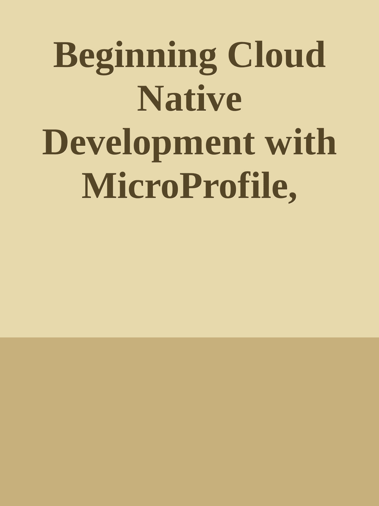

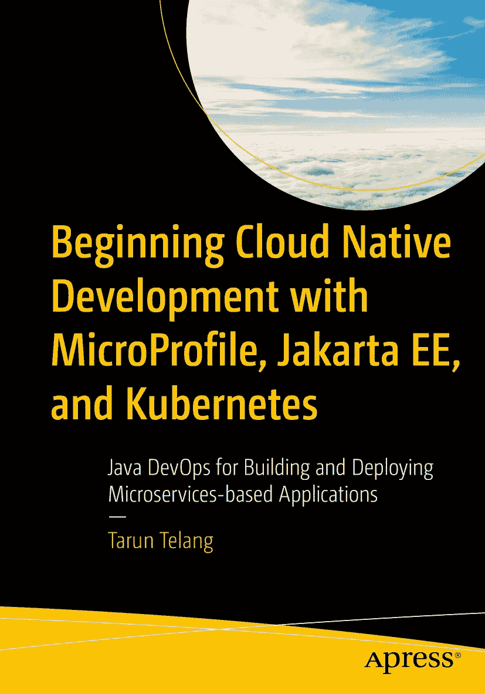

**云原生入门**

**开发实战：**

**MicroProfile、Jakarta EE**

**与 Kubernetes**

**构建与部署基于微服务的**

**应用的 Java DevOps**

**Tarun Telang**

***《云原生开发入门：基于 MicroProfile、Jakarta EE 与***

***Kubernetes——用于构建与部署基于微服务应用的 Java DevOps》***

Tarun Telang

印度，海得拉巴

ISBN-13（平装）: 978-1-4842-8831-3

ISBN-13（电子版）: 978-1-4842-8832-0

[`doi.org/10.1007/978-1-4842-8832-0`](https://doi.org/10.1007/978-1-4842-8832-0)

版权所有 © 2023 Tarun Telang

本作品受版权法保护。无论是整部作品还是其中部分内容，所有权利均由出版商保留，特别包括翻译、重印、插图再利用、朗诵、广播、以缩微胶片或任何其他有形方式复制、传播或信息存储与检索、电子改编、计算机软件处理，以及任何现有或未来开发的类似或不同方法。

本书中可能出现注册商标名称、标识和图片。我们并未在每次出现商标名称、标识或图片时都使用商标符号，而是仅以编辑性方式并为商标权利人利益使用这些名称、标识和图片，无任何侵犯商标之意。

本出版物中对商品名称、商标、服务标志及类似术语的使用，即使未明确标注其商标属性，也不应被视为对其是否受专有权保护的意见表达。

尽管本书中的建议与信息在出版时被认为真实且准确，但作者、编辑及出版商均不对可能存在的错误或遗漏承担任何法律责任。出版商对本文所载材料不作任何明示或暗示担保。

Apress Media LLC 董事总经理：Welmoed Spahr

采编编辑：Steve Anglin

开发编辑：Laura Berendson

统筹编辑：Gryffin Winkler

文字编辑：Kezia Endsley

封面设计：eStudioCalamar

封面图片：Pixabay (www.pixabay.com)

由 Apress Media, LLC 面向全球图书贸易发行，地址：1 New York Plaza, New York, NY 10004, U.S.A. 电话 1-800-SPRINGER，传真 (201) 348-4505，电子邮箱 orders-ny@springer-sbm.com，或访问 www.springeronline.com。Apress Media, LLC 是一家加利福尼亚州 LLC，其唯一成员（所有者）为 Springer Science + Business Media Finance Inc（SSBM Finance Inc）。SSBM Finance Inc 是一家**特拉华州**公司。

如需了解翻译事宜，请发送邮件至 booktranslations@springernature.com；如需重印、平装版或有声版权利，请发送邮件至 bookpermissions@springernature.com。

Apress 图书可批量采购，用于学术、企业或推广用途。多数图书也提供电子书版本与授权。更多信息请参阅我们的纸质书与电子书批量销售网页：http://www.apress.com/bulk-sales。

本书作者引用的任何源代码或其他补充材料，读者可在 GitHub（https://github.com/Apress）获取。更详细信息请访问 http://www.

apress.com/source-code.

采用无酸纸印刷

*本书献给我的祖父母、父母、妻子 Nikita 以及* *儿子 Vihan。他们一直是我灵感与*

*鼓励的源泉。本书也献给所有为让我们的星球变得更宜居而努力工作的软件与技术*

*创造者。*

*——Tarun Telang*

**目录**

关于作者 ��������������������������������������������������������������������������������������������������� xiii 关于技术审阅者 ���������������������������������������������������������������������������������������xv 致谢 �������������������������������������������������������������������������������������������������xvii 引言 ������������������������������������������������������������������������������������������������������������xix 第 1 章：[云计算导论 ������������������������������������������������������������������������������������ 1](https://doi.org/10.1007/978-1-4842-8832-0_1)

[云计算导论 ���������������������������������������������������������������������������������������������������������� 1](https://doi.org/10.1007/978-1-4842-8832-0_1#Sec1)

[云计算示例 ��������������������������������������������������������������������������������������������������������� 2](https://doi.org/10.1007/978-1-4842-8832-0_1#Sec2)

[云计算的优势 ��������������������������������������������������������������������������������������������������� 4](https://doi.org/10.1007/978-1-4842-8832-0_1#Sec3)

[云计算的基本特征 ��������������������������������������������������������������������������������� 5](https://doi.org/10.1007/978-1-4842-8832-0_1#Sec4)

[基于部署模型的云计算类型 �������������������������������������������������������������������� 7](https://doi.org/10.1007/978-1-4842-8832-0_1#Sec10)

[公有云 ����������������������������������������������������������������������������������������������������������������������������� 8](https://doi.org/10.1007/978-1-4842-8832-0_1#Sec11)

[社区云 �������������������������������������������������������������������������������������������������������������������� 9](https://doi.org/10.1007/978-1-4842-8832-0_1#Sec14)

[私有云 ������������������������������������������������������������������������������������������������������������������������� 11](https://doi.org/10.1007/978-1-4842-8832-0_1#Sec17)

[混合云 �������������������������������������������������������������������������������������������������������������������������� 12](https://doi.org/10.1007/978-1-4842-8832-0_1#Sec20)

[云计算的服务模型 ������������������������������������������������������������������������������������������� 13](https://doi.org/10.1007/978-1-4842-8832-0_1#Sec23)

[软件即服务（SaaS）���������������������������������������������������������������������������������������������������� 14](https://doi.org/10.1007/978-1-4842-8832-0_1#Sec24)

[平台即服务（PaaS）����������������������������������������������������������������������������������������������������� 16](https://doi.org/10.1007/978-1-4842-8832-0_1#Sec28)

[基础设施即服务（IaaS）���������������������������������������������������������������������������������������������� 18](https://doi.org/10.1007/978-1-4842-8832-0_1#Sec31)

[Java 在云计算中的作用 ����������������������������������������������������������������������������������������� 19](https://doi.org/10.1007/978-1-4842-8832-0_1#Sec34)

[云计算的演进 ���������������������������������������������������������������������������������������������� 21](https://doi.org/10.1007/978-1-4842-8832-0_1#Sec35)

[总结������������������������������������������������������������������������������������������������������������������������������������� 26](https://doi.org/10.1007/978-1-4842-8832-0_1#Sec36)

第 2 章：[云原生应用开发 ��������������������������������������������������������� 29](https://doi.org/10.1007/978-1-4842-8832-0_2)

[什么是云原生？����������������������������������������������������������������������������������������������������������������� 29](https://doi.org/10.1007/978-1-4842-8832-0_2#Sec1)

[云原生应用的特征 ������������������������������������������������������������������������ 30](https://doi.org/10.1007/978-1-4842-8832-0_2#Sec2)

[云原生应用示例 ��������������������������������������������������������������������������������� 32](https://doi.org/10.1007/978-1-4842-8832-0_2#Sec3)

v

目录

[云原生应用的优势 ����������������������������������������������������������������������������������������� 33](https://doi.org/10.1007/978-1-4842-8832-0_2#Sec4)

[使用云原生应用的缺点��������������������������������������������������������������������� 34](https://doi.org/10.1007/978-1-4842-8832-0_2#Sec5)

[云原生应用 vs� 传统应用 ��������������������������������������������������������������� 35](https://doi.org/10.1007/978-1-4842-8832-0_2#Sec6)

[云原生应用开发 ��������������������������������������������������������������������������������������� 37](https://doi.org/10.1007/978-1-4842-8832-0_2#Sec7)

[面向 Java 的应用托管服务 ������������������������������������������������������������������������� 38](https://doi.org/10.1007/978-1-4842-8832-0_2#Sec8)

[云原生应用开发示例 ��������������������������������������������������������������������� 38](https://doi.org/10.1007/978-1-4842-8832-0_2#Sec9)

[云原生应用开发是未来 ������������������������������������������������������������ 39](https://doi.org/10.1007/978-1-4842-8832-0_2#Sec10)

[云原生应用开发的阶段 ����������������������������������������������������������������� 40](https://doi.org/10.1007/978-1-4842-8832-0_2#Sec11)

[总结������������������������������������������������������������������������������������������������������������������������������������� 52](https://doi.org/10.1007/978-1-4842-8832-0_2#Sec22)

第 3 章：[搭建开发环境��������������������������������������������������� 55](https://doi.org/10.1007/978-1-4842-8832-0_3)

[前置条件 ������������������������������������������������������������������������������������������������������������������������������� 55](https://doi.org/10.1007/978-1-4842-8832-0_3#Sec1)

[硬件要求 ������������������������������������������������������������������������������������������������������������������������ 55](https://doi.org/10.1007/978-1-4842-8832-0_3#Sec2)

[安装 Java 开发工具包（JDK） ����������������������������������������������������������������������������������� 57](https://doi.org/10.1007/978-1-4842-8832-0_3#Sec5)

[使用 Maven ������������������������������������������������������������������������������������������������������������������������������� 58](https://doi.org/10.1007/978-1-4842-8832-0_3#Sec6)

[安装 Maven �������������������������������������������������������������������������������������������������������������������� 59](https://doi.org/10.1007/978-1-4842-8832-0_3#Sec7)

[Git ������������������������������������������������������������������������������������������������������������������������������������������������ 60](https://doi.org/10.1007/978-1-4842-8832-0_3#Sec8)

[安装 Git ��������������������������������������������������������������������������������������������������������������������������� 60](https://doi.org/10.1007/978-1-4842-8832-0_3#Sec9)

[创建 GitHub 账号 ����������������������������������������������������������������������������������������������������� 61](https://doi.org/10.1007/978-1-4842-8832-0_3#Sec10)

[创建 GitHub 仓库 ������������������������������������������������������������������������������������������������ 62](https://doi.org/10.1007/978-1-4842-8832-0_3#Sec11)

[将代码推送到 GitHub 仓库 ������������������������������������������������������������������������������������ 63](https://doi.org/10.1007/978-1-4842-8832-0_3#Sec12)

[使用 Docker ������������������������������������������������������������������������������������������������������������������������������� 65](https://doi.org/10.1007/978-1-4842-8832-0_3#Sec13)

[使用 Docker 的优势 ������������������������������������������������������������������������������������������������������� 65](https://doi.org/10.1007/978-1-4842-8832-0_3#Sec14)

[安装 Docker �������������������������������������������������������������������������������������������������������������������� 66](https://doi.org/10.1007/978-1-4842-8832-0_3#Sec15)

[Docker Hub ���������������������������������������������������������������������������������������������������������������������������� 67](https://doi.org/10.1007/978-1-4842-8832-0_3#Sec16)

[使用 Kubernetes ������������������������������������������������������������������������������������������������������������������������ 68](https://doi.org/10.1007/978-1-4842-8832-0_3#Sec18)

[安装 Kubernetes ������������������������������������������������������������������������������������������������������������� 69](https://doi.org/10.1007/978-1-4842-8832-0_3#Sec19)

[为 Kubernetes 配置 Docker ��������������������������������������������������������������������������������������� 71](https://doi.org/10.1007/978-1-4842-8832-0_3#Sec20)

[创建 Kubernetes 集群 ����������������������������������������������������������������������������������������������� 73](https://doi.org/10.1007/978-1-4842-8832-0_3#Sec21)

[使用 Zipkin �������������������������������������������������������������������������������������������������������������������������������� 74](https://doi.org/10.1007/978-1-4842-8832-0_3#Sec22)

[安装 Zipkin ��������������������������������������������������������������������������������������������������������������������� 74](https://doi.org/10.1007/978-1-4842-8832-0_3#Sec23)

vi

目录

[集成开发环境（IDE） ������������������������������������������������������������������������������ 75](https://doi.org/10.1007/978-1-4842-8832-0_3#Sec24)

[总结������������������������������������������������������������������������������������������������������������������������������������� 76](https://doi.org/10.1007/978-1-4842-8832-0_3#Sec25)

第 4 章：[构建 RESTful Web 服务 ������������������������������������������������������������� 77](https://doi.org/10.1007/978-1-4842-8832-0_4)

[REST：用于构建 Web 服务的架构风格 �������������������������������������������������������������� 78](https://doi.org/10.1007/978-1-4842-8832-0_4#Sec1)

[Open Liberty 运行时简介 ����������������������������������������������������������������������������������������� 78](https://doi.org/10.1007/978-1-4842-8832-0_4#Sec2)

[Open Liberty 应用服务器的关键特性 ������������������������������������������������������������ 79](https://doi.org/10.1007/978-1-4842-8832-0_4#Sec3)

[下载并安装 Open Liberty ������������������������������������������������������������������������������ 80](https://doi.org/10.1007/978-1-4842-8832-0_4#Sec4)

[启动 Open Liberty 服务器 ������������������������������������������������������������������������������������������� 80](https://doi.org/10.1007/978-1-4842-8832-0_4#Sec5)

[打印 Open Liberty 服务器上的功能列表 ���������������������������������������������������������� 82](https://doi.org/10.1007/978-1-4842-8832-0_4#Sec6)

[创建服务器实例 ���������������������������������������������������������������������������������������������������� 85](https://doi.org/10.1007/978-1-4842-8832-0_4#Sec7)

[停止 Open Liberty 服务器 ����������������������������������������������������������������������������������������� 86](https://doi.org/10.1007/978-1-4842-8832-0_4#Sec8)

[配置服务器 ���������������������������������������������������������������������������������������������������������� 87](https://doi.org/10.1007/978-1-4842-8832-0_4#Sec9)

[在 Open Liberty 中创建 RESTful Web 服务 ������������������������������������������������������������������� 87](https://doi.org/10.1007/978-1-4842-8832-0_4#Sec10)

[创建 RESTful API ����������������������������������������������������������������������������������������������������������� 98](https://doi.org/10.1007/978-1-4842-8832-0_4#Sec18)

[总结����������������������������������������������������������������������������������������������������������������������������������� 109](https://doi.org/10.1007/978-1-4842-8832-0_4#Sec26)

第 5 章：[微服务架构 ����������������������������������������������������������������� 111](https://doi.org/10.1007/978-1-4842-8832-0_5)

[垂直扩展 ������������������������������������������������������������������������������������������������������������������������� 111](https://doi.org/10.1007/978-1-4842-8832-0_5#Sec1)

[水平扩展 ��������������������������������������������������������������������������������������������������������������������� 112](https://doi.org/10.1007/978-1-4842-8832-0_5#Sec2)

[垂直扩展 vs� 水平扩展 ��������������������������������������������������������������������������������������������� 113](https://doi.org/10.1007/978-1-4842-8832-0_5#Sec3)

[面向服务架构的历史 �������������������������������������������������������������������������������������� 113](https://doi.org/10.1007/978-1-4842-8832-0_5#Sec4)

[面向服务架构的类型 �������������������������������������������������������������������������������������� 115](https://doi.org/10.1007/978-1-4842-8832-0_5#Sec5)

[面向服务的架构（SOA） ����������������������������������������������������������������������������������� 115](https://doi.org/10.1007/978-1-4842-8832-0_5#Sec6)

[什么是 Web 服务？ ������������������������������������������������������������������������������������������������������� 116](https://doi.org/10.1007/978-1-4842-8832-0_5#Sec7)

[什么是 SOAP？ �������������������������������������������������������������������������������������������������������������������������� 117](https://doi.org/10.1007/978-1-4842-8832-0_5#Sec8)

[什么是 REST？ ��������������������������������������������������������������������������������������������������������������������� 118](https://doi.org/10.1007/978-1-4842-8832-0_5#Sec9)

[REST vs� SOAP ��������������������������������������������������������������������������������������������������������������������� 118](https://doi.org/10.1007/978-1-4842-8832-0_5#Sec10)

[单体架构 ������������������������������������������������������������������������������������������������������ 119](https://doi.org/10.1007/978-1-4842-8832-0_5#Sec11)

[微服务架构的演进 �������������������������������������������������������������������������������� 120](https://doi.org/10.1007/978-1-4842-8832-0_5#Sec12)

[微服务架构的优势 �������������������������������������������������������������������������������������� 121](https://doi.org/10.1007/978-1-4842-8832-0_5#Sec14)

vii

目录

[微服务架构的缺点 �������������������������������������������������������������������������������������� 122](https://doi.org/10.1007/978-1-4842-8832-0_5#Sec15)

[设计考量 ��������������������������������������������������������������������������������������������������������� 122](https://doi.org/10.1007/978-1-4842-8832-0_5#Sec16)

[在云原生应用中使用微服务 �������������������������������������������������������������� 123](https://doi.org/10.1007/978-1-4842-8832-0_5#Sec17)

[云原生十二要素应用 ���������������������������������������������������������������������������� 124](https://doi.org/10.1007/978-1-4842-8832-0_5#Sec18)

[什么是虚拟机？ ������������������������������������������������������������������������������������������������������� 126](https://doi.org/10.1007/978-1-4842-8832-0_5#Sec19)

[什么是容器？ ��������������������������������������������������������������������������������������������������������������� 127](https://doi.org/10.1007/978-1-4842-8832-0_5#Sec20)

[什么是基于容器的应用？ ���������������������������������������������������������������������������� 128](https://doi.org/10.1007/978-1-4842-8832-0_5#Sec21)

[什么是无服务器应用？ �������������������������������������������������������������������������������������� 130](https://doi.org/10.1007/978-1-4842-8832-0_5#Sec22)

[无服务器计算用于哪些场景？ ������������������������������������������������������������������������������� 130](https://doi.org/10.1007/978-1-4842-8832-0_5#Sec23)

[无服务器计算的优势 ��������������������������������������������������������������������������������������� 131](https://doi.org/10.1007/978-1-4842-8832-0_5#Sec24)

[无服务器计算的缺点 ���������������������������������������������������������������������������������� 131](https://doi.org/10.1007/978-1-4842-8832-0_5#Sec25)

[主流无服务器平台 ���������������������������������������������������������������������������������������������� 132](https://doi.org/10.1007/978-1-4842-8832-0_5#Sec26)

[无服务器计算平台的主要组件 ����������������������������������������������������������� 132](https://doi.org/10.1007/978-1-4842-8832-0_5#Sec27)

[无服务器应用 vs� 容器 ������������������������������������������������������������������������������� 134](https://doi.org/10.1007/978-1-4842-8832-0_5#Sec28)

[微服务部署模式 ������������������������������������������������������������������������������������������� 138](https://doi.org/10.1007/978-1-4842-8832-0_5#Sec47)

[关键考量 �������������������������������������������������������������������������������������������������������������� 138](https://doi.org/10.1007/978-1-4842-8832-0_5#Sec48)

[微服务部署策略与模式 ����������������������������������������������������������� 139](https://doi.org/10.1007/978-1-4842-8832-0_5#Sec49)

[微服务管理 ������������������������������������������������������������������������������������������������ 142](https://doi.org/10.1007/978-1-4842-8832-0_5#Sec58)

[总结����������������������������������������������������������������������������������������������������������������������������������� 142](https://doi.org/10.1007/978-1-4842-8832-0_5#Sec59)

第 6 章：[Eclipse MicroProfile 框架 �������������������������������������������������� 143](https://doi.org/10.1007/978-1-4842-8832-0_6)

[什么是 Eclipse MicroProfile 框架？ �������������������������������������������������������������������������� 143](https://doi.org/10.1007/978-1-4842-8832-0_6#Sec1)

[MicroProfile 中的功能分层 �������������������������������������������������������������������������������� 144](https://doi.org/10.1007/978-1-4842-8832-0_6#Sec2)

[Eclipse MicroProfile 框架的常见实现 �������������������������������������� 147](https://doi.org/10.1007/978-1-4842-8832-0_6#Sec3)

[MicroProfile 配置 �������������������������������������������������������������������������������������������������������������� 148](https://doi.org/10.1007/978-1-4842-8832-0_6#Sec4)

[MicroProfile 健康检查规范 ������������������������������������������������������������������������������������ 156](https://doi.org/10.1007/978-1-4842-8832-0_6#Sec19)

[MicroProfile 容错组件 ����������������������������������������������������������������������������������� 159](https://doi.org/10.1007/978-1-4842-8832-0_6#Sec20)

[容错组件的关键特性 ����������������������������������������������������������������� 159](https://doi.org/10.1007/978-1-4842-8832-0_6#Sec21)

[容错 API �������������������������������������������������������������������������������������������������������������� 160](https://doi.org/10.1007/978-1-4842-8832-0_6#Sec22)

[总结����������������������������������������������������������������������������������������������������������������������������������� 162](https://doi.org/10.1007/978-1-4842-8832-0_6#Sec23)

viii

目录

第 7 章：[MicroProfile 框架——第 2 部分 �������������������������������������������������������� 163](https://doi.org/10.1007/978-1-4842-8832-0_7)

[MicroProfile 指标规范 ������������������������������������������������������������������������������������� 163](https://doi.org/10.1007/978-1-4842-8832-0_7#Sec1)

[指标类型 ������������������������������������������������������������������������������������������������������������������ 164](https://doi.org/10.1007/978-1-4842-8832-0_7#Sec2)

[指标组件������������������������������������������������������������������������������������������������������������ 164](https://doi.org/10.1007/978-1-4842-8832-0_7#Sec3)

[指标注解 ������������������������������������������������������������������������������������������������������������� 164](https://doi.org/10.1007/978-1-4842-8832-0_7#Sec4)

[Maven 依赖 ������������������������������������������������������������������������������������������������������������� 165](https://doi.org/10.1007/978-1-4842-8832-0_7#Sec5)

[使用 @Timed 跟踪响应时间 ������������������������������������������������������������������������������ 165](https://doi.org/10.1007/978-1-4842-8832-0_7#Sec6)

[跟踪调用次数 ������������������������������������������������������������������������������������ 166](https://doi.org/10.1007/978-1-4842-8832-0_7#Sec7)

[跟踪内存使用情况 ������������������������������������������������������������������������������������������������������ 167](https://doi.org/10.1007/978-1-4842-8832-0_7#Sec8)

[MetricRegistry ��������������������������������������������������������������������������������������������������������������������� 167](https://doi.org/10.1007/978-1-4842-8832-0_7#Sec9)

[创建自定义指标 ����������������������������������������������������������������������������������������������������� 168](https://doi.org/10.1007/978-1-4842-8832-0_7#Sec10)

[使用 Open Tracing ������������������������������������������������������������������������������������������������������������������� 171](https://doi.org/10.1007/978-1-4842-8832-0_7#Sec15)

[分布式追踪 �������������������������������������������������������������������������������������������������������������� 171](https://doi.org/10.1007/978-1-4842-8832-0_7#Sec16)

[它是如何工作的？ �������������������������������������������������������������������������������������������������������������� 171](https://doi.org/10.1007/978-1-4842-8832-0_7#Sec17)

[使用 Jakarta RESTful Web Service ������������������������������������������������������������������������������������ 174](https://doi.org/10.1007/978-1-4842-8832-0_7#Sec21)

[使用 MicroProfile OpenAPI 规范 �������������������������������������������������������������������������� 177](https://doi.org/10.1007/978-1-4842-8832-0_7#Sec22)

[OpenAPI ������������������������������������������������������������������������������������������������������������������������������� 177](https://doi.org/10.1007/978-1-4842-8832-0_7#Sec23)

[MicroProfile OpenAPI 规范的能力 ��������������������������������������������������������������������������������������� 177](https://doi.org/10.1007/978-1-4842-8832-0_7#Sec24)

[生成 OpenAPI 文档 ������������������������������������������������������������������������������������������ 177](https://doi.org/10.1007/978-1-4842-8832-0_7#Sec25)

[在你的项目中使用 MicroProfile OpenAPI ������������������������������������������������������������������� 178](https://doi.org/10.1007/978-1-4842-8832-0_7#Sec26)

[MicroProfile OpenAPI 注解 ��������������������������������������������������������������������������������������� 181](https://doi.org/10.1007/978-1-4842-8832-0_7#Sec27)

[总结����������������������������������������������������������������������������������������������������������������������������������� 181](https://doi.org/10.1007/978-1-4842-8832-0_7#Sec28)

第 8 章：[MicroProfile JSON Web Token 与 Jakarta Security ������������������������� 183](https://doi.org/10.1007/978-1-4842-8832-0_8)

[微服务的安全最佳实践 �������������������������������������������������������������������������������� 183](https://doi.org/10.1007/978-1-4842-8832-0_8#Sec1)

[什么是 JSON Web Token（JWT）？ ������������������������������������������������������������������������������������������� 184](https://doi.org/10.1007/978-1-4842-8832-0_8#Sec2)

[JSON Web Token 的使用场景 ����������������������������������������������������������������������������������������� 184](https://doi.org/10.1007/978-1-4842-8832-0_8#Sec3)

[认证 ��������������������������������������������������������������������������������������������������������������������� 184](https://doi.org/10.1007/978-1-4842-8832-0_8#Sec4)

[授权 ����������������������������������������������������������������������������������������������������������������������� 184](https://doi.org/10.1007/978-1-4842-8832-0_8#Sec5)

[会话信息 ��������������������������������������������������������������������������������������������������������������������� 185](https://doi.org/10.1007/978-1-4842-8832-0_8#Sec6)

[基于声明的身份 ��������������������������������������������������������������������������������������������������������� 185](https://doi.org/10.1007/978-1-4842-8832-0_8#Sec7)

ix

目录

[信息交换 ���������������������������������������������������������������������������������������������������������� 185](https://doi.org/10.1007/978-1-4842-8832-0_8#Sec8)

[联合 ��������������������������������������������������������������������������������������������������������������������������� 185](https://doi.org/10.1007/978-1-4842-8832-0_8#Sec9)

[创建并签名 JWT ������������������������������������������������������������������������������������������������������ 186](https://doi.org/10.1007/978-1-4842-8832-0_8#Sec10)

[测试应用程序 �������������������������������������������������������������������������������������������������������� 189](https://doi.org/10.1007/978-1-4842-8832-0_8#Sec11)

[验证与校验 JWT �������������������������������������������������������������������������������������������������� 190](https://doi.org/10.1007/978-1-4842-8832-0_8#Sec12)

[在微服务环境中使用 JWT �������������������������������������������������������������������������������� 191](https://doi.org/10.1007/978-1-4842-8832-0_8#Sec13)

[保护 RESTful 应用程序 ������������������������������������������������������������������������������������������� 192](https://doi.org/10.1007/978-1-4842-8832-0_8#Sec14)

[保护 REST 资源 �������������������������������������������������������������������������������������������������� 193](https://doi.org/10.1007/978-1-4842-8832-0_8#Sec15)

[ @RolesAllowed 注解 ������������������������������������������������������������������������������������������� 195](https://doi.org/10.1007/978-1-4842-8832-0_8#Sec16)

[ @Claim 注解 ������������������������������������������������������������������������������������������������������� 196](https://doi.org/10.1007/978-1-4842-8832-0_8#Sec17)

[ @HeaderParam 注解 ������������������������������������������������������������������������������������������ 196](https://doi.org/10.1007/978-1-4842-8832-0_8#Sec18)

[配置 JWK 集或 PEM 编码的公钥 ����������������������������������������������������������������� 197](https://doi.org/10.1007/978-1-4842-8832-0_8#Sec19)

[PEM 格式的公钥密码学标准 #8 ��������������������������������������������������������������������������������������� 197](https://doi.org/10.1007/978-1-4842-8832-0_8#Sec20)

[JSON Web Key（JWK） ����������������������������������������������������������������������������������������������������������� 198](https://doi.org/10.1007/978-1-4842-8832-0_8#Sec21)

[JSON Web Key Set（JWKS） �������������������������������������������������������������������������������������������������� 198](https://doi.org/10.1007/978-1-4842-8832-0_8#Sec22)

[Jakarta EE 安全规范 �������������������������������������������������������������������������������������� 199](https://doi.org/10.1007/978-1-4842-8832-0_8#Sec23)

[使用 Jakarta Security 保护 Servlet �������������������������������������������������������������������������� 199](https://doi.org/10.1007/978-1-4842-8832-0_8#Sec24)

[MicroProfile REST 客户端 �������������������������������������������������������������������������������������������� 203](https://doi.org/10.1007/978-1-4842-8832-0_8#Sec25)

[ @RegisterClient 注解 ������������������������������������������������������������������������������������������ 204](https://doi.org/10.1007/978-1-4842-8832-0_8#Sec26)

[配置你的 REST 客户端 ����������������������������������������������������������������������������������������������� 204](https://doi.org/10.1007/978-1-4842-8832-0_8#Sec27)

[REST 客户端接口 ����������������������������������������������������������������������������������������������������������� 205](https://doi.org/10.1007/978-1-4842-8832-0_8#Sec28)

[使用 MicroProfile OpenAPI 为 RESTful API 编写文档 ����������������������������������������������������� 209](https://doi.org/10.1007/978-1-4842-8832-0_8#Sec29)

[什么是 OpenAPI 规范？ ������������������������������������������������������������������������������������ 209](https://doi.org/10.1007/978-1-4842-8832-0_8#Sec30)

[什么是 MicroProfile OpenAPI？ ������������������������������������������������������������������������������������ 209](https://doi.org/10.1007/978-1-4842-8832-0_8#Sec31)

[总结����������������������������������������������������������������������������������������������������������������������������������� 212](https://doi.org/10.1007/978-1-4842-8832-0_8#Sec34)

第 9 章：[使用 Kubernetes 容器化微服务 �������������������������������� 213](https://doi.org/10.1007/978-1-4842-8832-0_9)

[什么是容器？ ��������������������������������������������������������������������������������������������������������������� 213](https://doi.org/10.1007/978-1-4842-8832-0_9#Sec1)

[为什么使用容器？ ���������������������������������������������������������������������������������������������������������������� 213](https://doi.org/10.1007/978-1-4842-8832-0_9#Sec2)

[什么是容器编排？ ��������������������������������������������������������������������������������������������� 214](https://doi.org/10.1007/978-1-4842-8832-0_9#Sec3)

[使用容器编排的优势 ���������������������������������������������������������������������������� 214](https://doi.org/10.1007/978-1-4842-8832-0_9#Sec4)

[理解 Kubernetes 术语 ����������������������������������������������������������������������������������� 215](https://doi.org/10.1007/978-1-4842-8832-0_9#Sec5)

x

目录

[Kubernetes 的关键特性 ����������������������������������������������������������������������������������������������� 217](https://doi.org/10.1007/978-1-4842-8832-0_9#Sec6)

[使用 Kubernetes �������������������������������������������������������������������������������������������������������������� 218](https://doi.org/10.1007/978-1-4842-8832-0_9#Sec7)

[使用 Docker 容器 ����������������������������������������������������������������������������������������������������������� 219](https://doi.org/10.1007/978-1-4842-8832-0_9#Sec8)

[在 Docker 中运行 MicroProfile 应用程序 ��������������������������������������������������������������������� 220](https://doi.org/10.1007/978-1-4842-8832-0_9#Sec9)

[将 Docker 镜像推送到 Docker Hub ��������������������������������������������������������������������������� 223](https://doi.org/10.1007/978-1-4842-8832-0_9#Sec10)

[扩展你的部署 ����������������������������������������������������������������������������������������������������� 227](https://doi.org/10.1007/978-1-4842-8832-0_9#Sec11)

[总结����������������������������������������������������������������������������������������������������������������������������������� 228](https://doi.org/10.1007/978-1-4842-8832-0_9#Sec12)

附录 A：Maven 简介 ���������������������������������������������������������������������� 231

附录 B：使用 Maven 创建 Open Liberty 项目 �������������������������������� 241

附录 C：安装 Open Liberty 工具 ������������������������������������������������������������ 247

索引 ��������������������������������������������������������������������������������������������������������������������� 253

xi

**关于作者**

**Tarun Telang** 是一位实践型技术专家，在多层架构、高可扩展软件应用程序的设计与实现方面拥有丰富经验。他曾就职于多家知名公司，包括 Microsoft、Oracle、Polycom 和 SAP。在业务应用程序的架构设计与开发方面，他拥有超过 17 年经验。

他的职业生涯始于 SAP，担任企业 Java 开发人员，并在那里为大型企业开发分布式应用软件。他从企业会话 Bean（session beans）和消息驱动 Bean（message-driven beans）起步，同时使用 Java Management Extensions（JMX）技术对企业应用程序的配置与管理进行仪表化。

他很快掌握了多种企业级技术，包括 Enterprise Beans、Java Management Extensions、Servlets 和 Server Pages 技术。作为开发人员的第一年，他就获得了 Sun Certified Programmer for the Java Platform, Standard Edition 6，以及 SAP NetWeaver Java Web Application Server 的 SAP Certified Development Consultant 认证（该服务器是符合 Java EE 5 标准的应用服务器）。

他还在 XSLT 和 XSD 等 XML 技术方面积累了专业能力。他使用会话 Bean 和消息驱动 Bean 开发了多个解决方案，以处理跨多个系统的面向消息通信。2007 年，Tarun 因其关于新兴技术的文章和博客，以及在 SAP 开发者社区中推动创新解决方案的贡献，被评为 SAP Mentor 和 Community Influencer。

他经常撰写 Java 及相关技术文章。Tarun 还创作了多门在线课程，其中包括一门畅销的 YAML 数据序列化语言课程。

他曾在多个开发者大会进行技术演讲，包括 SAP TechEd 和 Great Indian Developer Summit。他在会议上演讲已超过 15 年，并持续发布技术论文和博客，帮助大家掌握软件技术基础。Tarun 使用 Spring 框架和微服务架构开发过基于云的视频会议应用，并具备使用 Persistence API 和 Hazelcast 框架构建基于 REST 服务的经验。

他还使用多种架构模式（包括微服务架构和面向服务架构）开发了许多端到端的云端解决方案。Tarun 在 Web、移动和云技术方面积累了深厚经验。他也熟悉敏捷方法在实践中的应用，包括以用户为中心和移动优先设计，以管理分布在多个地区的跨职能团队项目。Tarun 还是 *Java EE to Jakarta EE 10 Recipes: A Problem-Solution Approach for* *Enterprise Java*（Apress，2022）的合著者。

Tarun 曾在加拿大和德国工作，目前与妻子和儿子居住在印度海得拉巴。你可以在 LinkedIn（[www.linkedin.](http://www.linkedin.com/in/taruntelang/)

[com/in/taruntelang/), F](http://www.linkedin.com/in/taruntelang/)acebo[ok (www.facebook.com/tarun.telang](https://www.facebook.com/tarun.telang)）和 Twitter（@taruntelang）上关注他。他的博客位于 [`blogs.taruntelang.me`](https://blogs.taruntelang.me)，是获取各类软件技术相关内容的优质资源！

xiv

**关于技术审阅者**

**Massimo Nardone** 在安全、Web/移动开发、云和 IT 架构方面拥有超过 25 年经验。他在 IT 领域真正热爱的方向是安全和 Android。

20 多年来，他一直使用 Android、Perl、PHP、Java、VB、Python、C/C++ 和 MySQL 进行编程并教授他人编程。他拥有意大利萨莱诺大学（University of Salerno）的计算机科学硕士学位。

多年来，他曾担任 CISO、CSO、安全高管、IoT 高管、项目经理、软件工程师、研究工程师、首席安全架构师、PCI/SCADA 审计员，以及高级 IT 安全/云/SCADA 架构负责人。他的技术技能包括安全、Android、云、Java、MySQL、Drupal、Cobol、Perl、Web 与移动开发、MongoDB、D3、Joomla、Couchbase、C/C++、WebGL、Python、Pro Rails、Django CMS、Jekyll、Scratch 等。

他曾担任赫尔辛基理工大学（阿尔托大学）网络实验室的访问讲师与习题指导教师。他还拥有四项国际专利（涉及 PKI、SIP、SAML 和代理领域）。目前他在 Cognizant 任网络安全负责人和 CISO，帮助客户开展信息安全与网络安全相关工作，包括战略、规划、流程、政策、程序、治理、意识提升等。2017 年 6 月，他成为 ISACA 芬兰董事会常任成员。

Massimo 已为不同出版社审阅了 45 本以上 IT 书籍，并且是 *Pro Spring Security: Securing Spring Framework 5 and Boot 2-based* *Java Applications*（Apress，2019）、*Beginning EJB in Java EE 8*（Apress，2018）、*Pro JPA 2 in* *Java EE 8*（Apress，2018）和 *Pro Android Games*（Apress，2015）的合著者。

xv

abouT The TeChniCal reviewers

**Pramit Das** 在多个平台、各种技术栈上的软件设计与开发方面拥有超过 12 年经验。他对编程以及探索新兴与即将到来的技术充满热情。在 C/C++、Java、Scala、JavaScript 和 Python 等编程语言方面拥有丰富实战经验，同时熟悉其相关工具、库与框架，包括 Spring、Django、NodeJs 和 Spark。他还对 Oracle、MySQL、MongoDB、Cassandra 等后端存储方案，以及其他基于云的托管服务有着深入了解。

在学术方面，Pramit 于 2009 年毕业于 NIT Rourkela，获得计算机科学与工程学士学位。他拥有产品型和服务型行业经验，目前在云计算巨头 Salesforce 担任全职工程师。

xvi

**致谢**

在本书写作过程中，我要感谢我的妻子 Nikita 和儿子 Vihan，感谢他们的耐心与爱。我也感激所有导师和朋友，是他们在我职业生涯的每个阶段鼓励我不断成长。

我要感谢我的父母，他们引导我走上正确的技术道路，并始终在每一步支持我，即使当我决定去做一些事情

与他们的预期完全不同。同样需要指出的是，如果没有他们，我可能不会成为一名开发者，也不会拥有如此出色的职业生涯。最后，

再次感谢我的妻子（以及灵魂伴侣）Nikita。能与一个始终激励你、鞭策你的人在一起，是一种不可思议的感觉——不仅在职业上如此，在个人生活中也是如此。

感谢你一直陪伴在我身边！

我还要特别感谢 Pramit Das 和 Massimo Nardone（技术审阅者），感谢他们为本书所做的无可挑剔的工作。我也非常感谢 Steve Anglin、Mark Powers 以及 Apress Media（apress.com）的每一位成员，感谢他们在本书出版过程中给予的支持。

最后同样重要的是，我要感谢你——读者——愿意花时间阅读这本书。我希望它能帮助你在成为更优秀 Jakarta EE 开发者的旅程中不断前行。

xvii

**引言**

云原生应用因其诸多优势而日益流行，例如可扩展性、灵活性和高效性。云原生应用被设计为充分利用云计算范式。这意味着它们是分布式的、可扩展的、具备韧性的并且具有弹性的。你可以在公有云、私有云或混合云上运行它们。要构建云原生应用，开发者必须使用合适的工具和技术。

企业 Java（或 Jakarta Enterprise Edition）是云原生应用的一个流行平台。它提供了一套标准和 API，帮助开发者构建企业级应用。包括 Red Hat、IBM 和 Oracle 在内的许多平台厂商都支持这一标准。它提供了许多特性，使其成为开发云原生应用的理想选择。

MicroProfile 倡议于 2016 年由 Red Hat、IBM、Tomitribe 和 Payara 发起。

该组织旨在通过提供一个可由多个运行时实现的基础平台定义，改善微服务环境中的应用开发者体验。该组织于 2016 年 6 月发布了首个 MicroProfile 规范版本。该规范包含一组面向应用开发者的 API，包括 RESTful Web 服务、上下文与依赖注入，以及 JSON 处理。

MicroProfile 是一组规范，定义了开发者如何使用 Jakarta

EE 来构建微服务。它还提供了一个帮助开发者创建云原生应用的平台。MicroProfile 正在使其规范与 Jakarta EE 平台保持一致。MicroProfile 组织的目标是创建一套标准，使开发者能够在 Jakarta EE 平台之上开发微服务。作为 Jakarta EE 项目归属机构的 Eclipse Foundation，也负责管理 MicroProfile 标准的制定。

MicroProfile 是一个 Jakarta EE 工作组。它的创建是为了回应微服务的流行趋势。它也满足了对微服务开发标准平台的需求。它最初由少数几家 Jakarta EE 厂商组成（IBM、Red Hat、Payara 和 Tomitribe），现已发展到包含 25 家以上成员，包括 Oracle、Microsoft、Hazelcast 等。MicroProfile 倡议由 Eclipse Foundation 治理，而 MicroProfile 规范通过 Eclipse

xix

引言

MicroProfile 项目进行开发。该项目向所有希望贡献的个人和组织开放。MicroProfile 规范以公开透明的方式开发，并欢迎所有贡献。Eclipse MicroProfile 项目采用协作式开发流程，并鼓励所有感兴趣的各方参与。

Docker 是一个软件容器平台，允许开发者将应用及其所有依赖打包为一个标准化的软件开发单元。

你可以在任何平台上运行 Docker 容器，包括公有云、私有云和混合云。这使得在任何平台（包括云平台）上部署应用变得容易。

Docker 是一个流行的开源容器平台，你可以

用于打包和运行微服务。与传统虚拟化技术相比，它具备多项优势，包括可移植性、易用性等。

Kubernetes 是一个用于管理容器化应用的工具。它提供了一个开源平台，用于部署、管理和扩展应用。Kubernetes 基于 Linux 内核，并且可以使用 Docker 容器来管理应用。它提供了诸如扩缩容、负载均衡和自愈等特性。

Kubernetes 可自动化容器化应用的部署、扩缩和管理。它通过将容器分组为逻辑单元，支持对应用进行便捷管理与发现。Kubernetes 构建于 Google 数十年大规模运行生产工作负载的经验之上，同时也吸收了社区中最佳的理念和实践。

Kubernetes 具有可移植性和可扩展性，可在任何地方运行——从你的笔记本电脑到公有云再到数据中心。Kubernetes 的简洁性与灵活性使其成为云原生应用的理想选择。此外，它还是开源软件，让你能够受益于社区创新。

Kubernetes 已为生产环境做好准备，具备强大特性和能力来编排你的容器化应用。Kubernetes 已经在大规模场景中经过实战检验，支撑着全球一些最大的网站运行。

在本书中，你将学习如何使用 MicroProfile 和 Jakarta EE 技术开发微服务，将其部署到 Kubernetes/Docker 上，并创建云原生应用。本书还涵盖了使用 MicroProfile 和 Jakarta EE 开发云原生应用的最佳实践。它首先会介绍云原生应用的不同方面。随后你将继续进行开发环境搭建，并学习 Jakarta EE 基础。接下来，本书将探讨 MicroProfile 的功能，你将学习如何使用这些功能来构建微服务。

xx

引言

随后你将学习 Docker 和 Kubernetes，以及如何使用它们来部署你的应用。最后，你将把所有内容整合起来，学习如何构建一个完整的云原生应用。

**本书适合谁阅读**

欢迎阅读 *Beginning Cloud Native Development with MicroProfile, Jakarta EE, and* *Kubernetes.*

本书面向希望学习如何使用 MicroProfile 和 Jakarta EE 开发云原生应用的 Java 开发者。不要求你具备 Kubernetes 或容器编排的先验知识。

在本书中，你将学习如何使用 MicroProfile 和 Jakarta EE 开发云原生应用，并将其部署到 Kubernetes。书中涵盖的主题包括编写 RESTful Web 服务、创建微服务、配置健康检查等。

通过阅读本书，你最终将能够使用 MicroProfile 和 Jakarta EE 开发云原生应用，并将其部署到 Kubernetes。

**本书结构**

本书涵盖四个主要主题。

• **云原生开发** 介绍云原生开发的概念以及十二要素应用方法论。你将了解开发云原生应用的优势，以及将现有应用迁移到云端时必须考虑的挑战。

• **MicroProfile 规范** 概述 MicroProfile 各项规范，以及如何使用它们开发微服务。你将了解可用的不同类型注解，以及如何用它们创建 RESTful Web 服务。

• **Jakarta EE 规范** 介绍 Jakarta EE 平台及其各种规范。你将了解 Java EE 与 Jakarta EE 之间的差异，以及该平台提供的新特性。

xxi

引言

• **Kubernetes** 讲解使用 Kubernetes 进行容器编排的基础知识。你将了解 Kubernetes 集群中创建的不同类型对象、如何将应用部署到 Kubernetes，以及如何使用 Kubernetes 对应用进行扩缩容。

**约定**

在整本书中，我对 Java 代码、SQL、命令行文本和结果采用统一的呈现风格。当代码片段、SQL、保留字或代码片段出现在正文中时，会使用等宽的 Courier 字体显示，例如下面这个（可运行的）示例：

public class MyExample {

public static void main(String[] args){

System.out.println("Jakarta EE is excellent!");

}

}

**下载代码**

本书中的代码示例可在 github.com/apress/beginning-cloud-
native-dev-microprofile-jakarta-kubernetes 获取。

**注意** 本书的源码可能会随时间发生变化，以便纳入 Jakarta ee、MicroProfile 以及 Kubernetes 平台中的最新特性。

如果你在源码中发现任何问题，请通过本书的 Github
仓库提交，代码将据此进行相应调整。

xxii

**第 1 章**

**云计算导论**

云计算是科技行业最新的流行词，而且这并非没有道理。它有潜力彻底改变人们使用计算机的方式。本章将介绍云计算并解释它是什么。你还将看到一些云计算示例，并了解使用这项新技术的好处。最后，你将探索云计算的不同类型，并了解它们如何随着时间演进。

**云计算简介**

云计算是一种计算方式，其中应用和数据等资源存储在远程服务器上，并通过互联网进行访问。你无需在自己的计算机上安装程序，而是可以访问或将程序保存在远程服务器上。因此，你可以通过任何可联网设备访问你的数据，无论是台式机、笔记本电脑、平板电脑还是智能手机。

云计算具有以下关键优势。它能够提供无处不在、便捷、按需的网络访问，以访问可配置计算资源共享池（例如网络、服务器、存储、应用和服务），这些资源可以在极少管理工作或极少服务提供商交互的情况下被快速配置和释放。图 1-1
展示了终端用户如何访问云计算。

© Tarun Telang 2023

T. Telang，*《使用 MicroProfile、Jakarta EE 和 Kubernetes 开始云原生开发》*，

[`doi.org/10.1007/978-1-4842-8832-0_1`](https://doi.org/10.1007/978-1-4842-8832-0_1#DOI)

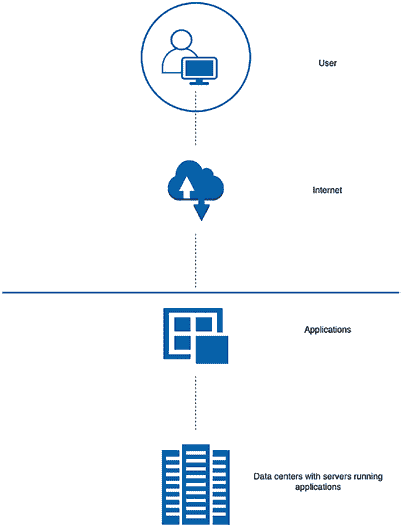

第 1 章 云计算导论

***图 1-1。** 云计算*

云计算还具有环境效益，因为它减少了对高能耗硬件的需求。

**云计算示例**

云计算有许多不同的示例，其中一些最常见的包括：

• **电子邮件：** *Gmail、Yahoo Mail* 和 *Outlook.com* 都是基于云的电子邮件服务示例。这意味着无论你身处世界何地，都可以在智能手机、平板电脑或台式电脑上查看电子邮件。能够通过任何联网设备访问电子邮件，正是云计算的一个例子。如果你在度假或出差时需要查看邮件，这是一项非常出色的功能。此外，如果你不小心删除了一封邮件，也可以很快从云端恢复。

第 1 章 云计算导论

• **云存储：** *Dropbox、Google Drive* 和 *iCloud* 都是云存储服务示例。这意味着你可以将文件存储在线上，而不是存储在自己的计算机上。这样你就能够通过任何联网设备访问这些文件。

• **基于 Web 的生产力软件：** *Google Docs、Sheets* 和 *Slides* 都是基于云的生产力软件示例。这意味着你无需在计算机上安装程序，就可以通过任何联网设备创建和编辑文档、电子表格和演示文稿。

云存储优于将文档保存在你的计算机上

因为你可以从任何能够连接互联网的设备访问它们。

如果你需要在不同地点处理同一份文档，或者你不小心删掉了某个文档，这会很有帮助。此外，云存储还让人们在项目中协作变得更容易，因为他们可以同时处理同一份文档，而不必担心通过电子邮件互相发送文档的不同版本。

• **多媒体流媒体：**Netflix、Vimeo 和 YouTube 都是视频流服务的例子，而 Spotify、Apple Music 和 Pandora 都是基于云的音乐流服务的例子。这意味着你无需将媒体（视频或歌曲）下载到电脑上，而是可以在任何能够连接互联网的设备上观看或收听。媒体流行的原因在于它不会占用你设备上的存储空间，而且你可以无需等待下载完成就观看视频。图 1-2 展示了不同类型的云计算应用。这些只是云计算的一小部分示例。正如你所看到的，云计算在很多方面都非常有帮助。

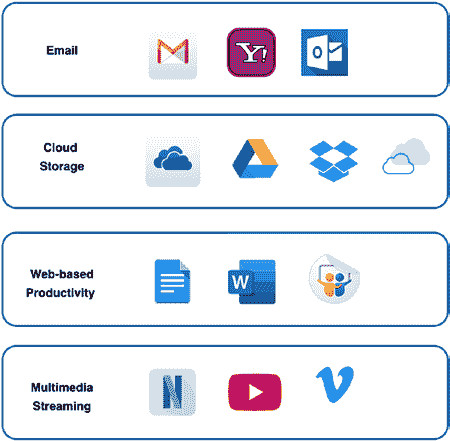

第 1 章 云计算导论

***图 1-2。** 云计算应用类型*

**云计算的优势**

近年来，云计算的使用呈指数级增长。这是因为云计算可以带来多种优势，例如以下几点：

• **节省成本：**云计算可以帮你节省硬件和软件成本。例如，你可以使用基于云的存储服务，而不是购买实体硬盘。与购买实体硬盘相比，云存储通常更具成本效益。这是因为你不需要购买昂贵的硬件，比如计算机。你还可以通过使用云应用来节省软件成本，而不必为本地机器购买软件程序。这是云解决方案的一个重要优势——你不必担心硬件和软件的资本支出、定期打补丁或数据中心维护。这些任务都由提供商负责。这可以为你节省时间和金钱，也让你能够轻松开始使用云计算。

• **灵活性与可扩展性：**云计算让你能够根据需求向上或向下扩展资源。例如，如果你的网站流量突然增加，你可以快速添加更多服务器来处理负载。相反，如果流量减少，你可以移除服务器以节省成本。这同样可以降低你的计算开销。

第 1 章 云计算导论

• **可靠性：**基于云的服务比本地部署方案更可靠。这是因为云服务提供商拥有资源与专业能力来确保其服务始终可用。云服务分布在多个服务器上，因此不存在单点故障。数据会在多个可用区的多个服务器之间进行复制，因此即使某一台服务器宕机，其他服务器也可以接管工作。提供商还会部署灾难恢复计划，从而帮助确保你的数据始终安全且可访问。

• **生产力：**云计算可以提升团队生产力，使团队能够从世界任何地方访问信息和应用程序。

**云计算的基本特征**

云计算模型包含五个基本特征，如图 1-3 所示。它们分别是按需自助服务、广泛网络访问、资源池化、快速弹性和可计量服务。下面我们将详细看看这些特征。

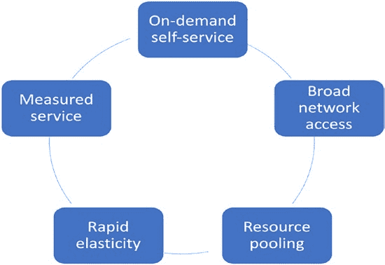

第 1 章 云计算导论

***图 1-3。** 云计算的基本特征*

**按需自助服务**

用户无需与服务提供商直接交互即可访问云服务。他们只需通过基于 Web 的界面注册服务，就可以立即开始使用。例如，用户可以注册云服务并开始用其存储数据，而无需联系客户支持。这一特征使用户能够快速、轻松地开始使用云服务，而不需要复杂配置。

**广泛网络访问**

云服务可以通过网络使用任何标准设备访问，例如笔记本电脑、智能手机和平板电脑。例如，用户可以在世界任何地方通过笔记本电脑或智能手机访问其云存储账户。这一特征使云服务非常便捷且易于访问。

**资源池化**

云服务提供商将来自多个客户的存储、处理能力、内存和网络带宽等资源汇集起来，并按需提供。多租户是云计算的一项关键特性，它使提供商能够在多个客户之间共享资源。在该模型中，每位客户都会获得专属的一部分资源，并与其他客户相互隔离。这有助于提供商更有效地管理和监控资源，同时为客户带来更高的安全性与隐私保障。这一特征也有助于提高资源利用率并降低拥有成本。

第 1 章 云计算导论

**快速弹性**

云服务可以快速扩展或收缩，以满足用户不断变化的需求。在某些情况下，消费者可以根据云提供商的策略自动扩大或缩减其使用量。例如，社交网站在重大事件期间（如选举或自然灾害）可能需要快速增加更多服务器。在其他情况下，用户可能需要减少使用量以节省成本。这一特征使云提供商能够动态分配资源，并可根据需要灵活增加或减少资源使用。

**可计量服务**

云提供商提供按实际使用量计费的计量服务。此外，云系统还可以利用计量模式自动控制并优化资源。例如，当某段时间内数据未被访问时，云存储服务可能会自动将其迁移到成本更低的存储层级。这一特征让用户能够更好地控制其使用情况和成本。

**基于部署模型的云计算类型**

云计算主要有四种类型：公有云、社区云、私有云和混合云。图 1-4 展示了这些基于部署模型的不同云计算类型。

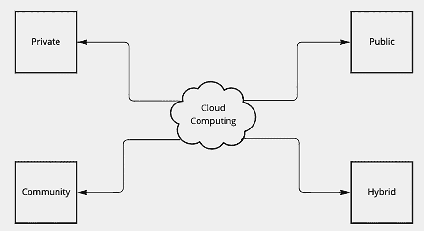

第 1 章 云计算导论

***图 1-4。** 基于部署模型的云计算类型*

以下各节将详细讨论每一种云计算类型。

**公有云**

公有云是一种通过互联网提供托管服务的云计算类型。公有云由第三方公司拥有并运营，它们按需向客户提供其资源——例如服务器、存储和应用程序。

公有云最常见的例子是 Gmail 和 Dropbox。这些服务允许用户通过任何可连接互联网的设备访问其数据和应用程序。

**公有云的优势**

使用公有云的主要优点是其可扩展性很高，而且你只需为所使用的资源付费。例如，如果你需要在 Gmail 中存储更多数据，你可以购买更多存储空间。公有云还很便利，因为你可以在全球任何地方访问它。

第 1 章 云计算导论

**公有云的缺点**

使用公有云的主要缺点是你依赖于云

提供商的安全措施。例如，如果 Dropbox 发生数据泄露，你的数据就会面临风险。此外，公有云的可靠性可能低于私有云，因为它们会受到云提供商无法控制的中断影响。

**社区云**

社区云是一种计算模型，向具有共同需求或目标的用户社区提供共享应用和数据。它在社区内部促进协作、灵活性和标准化，同时为用户提供可个性化的自助服务环境。云基础设施专为某一特定消费者社区独占使用而配置，这些消费者来自在共同关注点（如使命、安全要求、政策与合规考量）上具有一致性的组织。

社区云模型可用于支持多种类型的社区，包括：

–

**技术型**：开发者、工程师或其他技术导向用户，  
他们共享联合开发或运营目标。

–

**业务型**：同一公司或组织内的员工，  
他们需要在项目上协作或访问共享数据。

–

**地理型**：居住在同一区域或城市的人群，  
他们希望在线建立连接。

–

**兴趣型**：拥有共同兴趣或爱好的用户，  
他们希望建立连接并共享信息。

社区云通常由组织或用户共同建立，他们汇集资源并创建共享基础设施。该基础设施可用于托管应用、存储数据，或向社区成员提供其他服务。在许多情况下，社区云由第三方提供商管理，后者负责维护底层基础设施。

第 1 章 云计算导论

**社区云的优势**

社区云可为用户提供诸多优势，包括：

• **降低成本：**通过共享资源和分摊费用，用户可以节省计算成本。

• **改进协作：**社区云可让用户更容易在项目上协作或访问共享数据。

• **增强安全性：**社区云可为用户提供更好的安全与隐私保护。

• **提升性能：**通过共享资源，社区云可提升用户应用与服务的性能。

通常，社区云会在若干组织之间共享基础设施，这些组织来自具有相似关注点（安全、合规、司法管辖等）的特定群体或行业，并决定通过合作来优化资源利用、降低成本。一般而言，每个组织使用社区云基础设施中的一部分，并按其实际使用量付费。

**社区云的局限性**

对于需要共享数据或在项目上协作的组织来说，社区云可能是一个强有力的工具。尽管如此，在实施该方案之前，必须评估其潜在风险与收益。在某些情况下，社区云未必是组织的最佳选择，尤其当存在安全或隐私方面的担忧时。

组织在决定是否实施社区云时，还应考虑以下因素：

• 我的组织是否具备管理社区云所需的资源？

• 是否存在需要考虑的安全或隐私问题？

• 实施社区云相关的成本有哪些？

• 使用社区云能带来哪些收益？

• 使用社区云是否存在潜在风险？

第 1 章 云计算导论

社区云可以是提升协作、降低成本的良好方式，但在实施该方案之前，务必评估其潜在风险与收益。

**私有云**

私有云是一种云计算类型，它通过专有架构提供与公有云相似的优势，包括可扩展性和自助服务。

私有云建立在私有网络之上，相比公有云提供了更高的安全性和控制力。

当组织选择部署私有云时，可以将其数据和应用保留在内部，也可以外包给第三方提供商。

私有云由单一组织拥有并运营。这意味着只有该组织的成员才能访问该服务。

**私有云的优势**

使用私有云有若干优势，包括：

• **更高的安全性与控制力：** 私有云在私有网络上部署，相比公有云提供更高的安全性和控制能力。

• **更好的性能：** 私有云可以提供更好的性能，因为它不与其他组织共享。

• **降低成本：** 私有云可能比公有云更具成本效益，尤其是对具备必要基础设施的组织而言。

**私有云的劣势**

尽管有这些优势，私有云也存在一些相关挑战。

• 与公有云相比，私有云的部署和管理可能更复杂。此外，私有云可能需要更高的前期投入。

• 组织在决定私有云是否是正确解决方案之前，应仔细评估自身需求。

第 1 章 云计算导论

私有云并不适用于所有人，但对于那些需要更高安全性与控制力或更好性能的组织来说，它可能是一个极佳的选择。

私有云通常被大型组织使用，例如银行和政府机构。

**混合云**

混合云将本地基础设施——或私有云——与公有云结合在一起。这种组合可以帮助组织在保持对敏感数据控制的同时，更便捷且更安全地访问数据和应用。混合云通常被需要对特定数据保密的组织采用。混合云的一个例子是：组织将部分数据和应用存储在私有云中，而将其他数据存储在公有云中。这种组合可以帮助组织在保持对敏感数据更严格控制的同时，更便捷且更安全地访问数据和应用。

**混合云的优势**

使用混合云有若干优势，包括：

• **更高的灵活性：** 采用混合云后，组织可以根据需要更容易地扩展或缩减资源。这在需求增长时期（例如产品发布期间或节假日购物季）尤其有帮助。

• **更好的安全性：** 通过将敏感数据保留在私有云中，组织可以更好地保护其免受潜在威胁。

• **降低成本：** 组织可通过使用混合云节省资金，因为它们可以利用公有云较低的成本，同时仍保持对其数据的控制。

**混合云的缺点**

使用混合云也有一些潜在缺点，包括：

• **管理复杂：** 同时管理私有云和公有云可能很复杂。组织需要具备相关知识和专业技能的员工来管理这两类环境。

第 1 章 云计算导论

• **成本增加：** 虽然混合云可以为组织节省资金，但其成本也可能高于仅使用私有云或公有云。这是因为组织需要维护和管理两个彼此独立的环境。

• **潜在安全风险：** 尽管混合云可以提供更好的安全性，但仍存在数据泄露的可能。这是因为数据同时存储在公有和私有环境中，增加了未授权人员访问数据的风险。

混合云为组织提供了诸多优势，包括更高的灵活性、更好的安全性和更低的成本。然而，也存在一些潜在缺点，例如管理复杂和成本增加。总体而言，混合

对于那些既需要保持对其数据控制、又希望利用公有云低成本优势的组织来说，云是一种不错的选择。

**云计算的服务模型**

在你已经了解云计算的基本特性之后，本节将介绍云计算的服务模型。这些服务模型是交付云服务的不同方式。图 1-5 展示了三种最常见的云服务类型，即基础设施即服务（IaaS）、平台即服务（PaaS）和软件即服务（SaaS）。

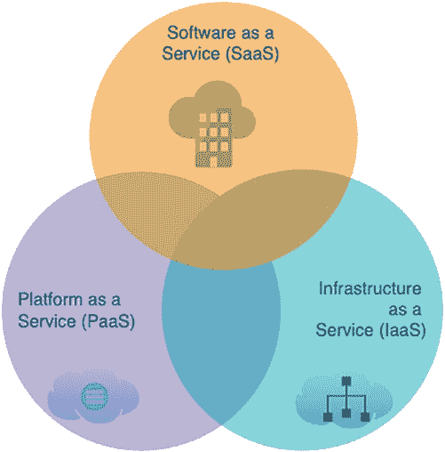

第 1 章 云计算导论

***图 1-5。** 云计算的服务模型*

以下各节将详细介绍这些服务模型中的每一种。

**软件即服务（SaaS）**

软件即服务（SaaS）是一种通过互联网交付软件应用程序的云计算类型。SaaS 是企业节省 IT 基础设施成本并降低软件应用管理复杂性的一种方式。

借助 SaaS，企业可以访问并使用托管在云中的软件应用程序。

这意味着企业无需安装或管理运行该软件所需的基础设施。SaaS 应用通常通过 Web 浏览器或移动应用进行访问。

向消费者提供的能力是使用运行在云基础设施上的提供商应用程序。应用程序可通过各种客户端设备访问，可采用瘦客户端界面（如 Web 浏览器，例如基于 Web 的电子邮件）或程序接口。消费者不管理也不控制底层云基础设施，包括网络、服务器、操作系统、存储，甚至单个应用程序能力；唯一可能的例外是有限的、用户特定的应用配置设置。

第 1 章 云计算导论

**优势**

使用 SaaS 有很多优势，包括：

• **降低成本：** 使用 SaaS，企业只需按订阅方式为其使用的软件付费。无需投资硬件或 IT 基础设施。

• **更高灵活性：** SaaS 应用可通过任何连接互联网的设备访问。这使企业能够根据需要轻松扩大或缩减使用规模。

• **更好的安全性：** SaaS 提供商通常具备强有力的安全措施来保护数据。

**劣势**

尽管 SaaS 能带来许多好处，但也有一些需要注意的问题，包括：

• **供应商锁定：** 一旦企业使用了某个 SaaS 应用，切换到其他提供商可能会很有挑战。这是因为数据通常存储在云中，而更换提供商可能复杂且成本高昂。

• **定制能力有限：** SaaS 应用通常不像本地部署软件那样可高度定制。这可能导致难以满足企业的特定需求。

• **依赖互联网：** SaaS 应用需要互联网连接才能运行。对于网络连接较差的企业来说，这可能是个问题。

尽管存在这些问题，SaaS 仍是各种规模企业的热门选择。它可以是一种具有成本效益且灵活的方式，用于改进业务运营。

**工作原理**

要理解 SaaS 的工作方式，先了解一些 SaaS 应用架构会很有帮助。SaaS 应用通常采用多层架构构建。

这意味着应用程序被划分为多个部分：

第 1 章 云计算导论

• **前端：** 这是用户与之交互的应用部分。

• **后端：** 这是存储数据并处理逻辑的应用部分。

• **中间件：** 这是连接前端和后端的应用部分。它通常使用 Web 应用框架构建。

SaaS 应用托管在云中，这意味着它们被存储在

服务器网络。当用户想要使用应用程序时，他们会向服务器发送请求。服务器随后将前端代码发送到用户设备。用户设备随后运行代码并显示应用程序的前端。当用户与应用程序交互时，他们的交互会被发送到后端。后端随后

处理请求并将响应发送回用户设备。

**平台即服务（PaaS）**

PaaS 是一种云计算服务，为用户提供在云中开发、测试和部署应用程序的平台。PaaS 服务可以通过

多种方式交付，包括基于 Web 的界面、API 或命令行

界面。

对于希望专注于构建

应用程序而无需担心基础设施管理的开发者来说，PaaS 是一种极佳的解决方案。PaaS 提供商负责所有底层基础设施，使开发者能够专注于他们的代码。

此外，PaaS 服务通常具有可扩展性并提供高可用性，因此非常适合关键任务型应用程序。

开发者不管理也不控制底层云基础设施，

包括网络、服务器、操作系统或存储，但可以控制

已部署的应用程序，并且可能还能控制应用托管环境

配置。

第 1 章 云计算简介

**PaaS 的优势**

请考虑 PaaS 提供的以下优势：

• **缩短新应用上市时间：**由于 PaaS 负责

所有底层基础设施，开发者可以专注于

构建他们的应用程序，从而缩短上市前置时间。

• **节约成本：**PaaS 服务通常比

传统的应用开发和部署模式更具成本效益，因为

你只需为实际使用的资源付费。

• **提高开发者生产力：**PaaS 服务可以通过提供他们所需的一切来提升

开发者生产力，

以便在云中开发和部署应用程序。

• **提升应用质量：**PaaS 服务可以通过提供对最新工具和

技术的访问，帮助提升你的应用程序

质量。

• **提高敏捷性和灵活性：**PaaS 服务可以为你提供

快速响应不断变化市场

条件所需的敏捷性与灵活性。

近年来，PaaS 服务已成为各类规模组织的热门解决方案，这些组织希望利用云计算的优势。无论你是希望降低成本、提高开发者生产力，还是提升应用质量，PaaS

都能帮助你实现目标。

**PaaS 的局限性**

在选择 PaaS 提供商时，考虑你的具体需求和

要求非常重要。请务必仔细阅读服务商的服务条款，以确保你的使用场景得到支持。此外，还应注意 PaaS 的以下潜在局限性：

• **供应商锁定：**一旦你在某个

特定 PaaS 平台上开发了应用程序，迁移到

另一个平台可能会困难且成本高昂。如果你的 PaaS 提供商倒闭或大幅

涨价，这可能会成为问题。

第 1 章 云计算简介

• **控制力不足：**由于你无法控制底层

基础设施，你在自定义和配置

应用程序的方式上可能会受到限制。

• **共享基础设施相关的安全风险：**由于 PaaS

服务与其他客户共享基础设施，因此存在

你的数据可能被泄露的风险。

• **工具和技术选择有限：**某些 PaaS 提供商仅

提供有限的工具和技术选择，这可能不

适合你的需求。

**基础设施即服务（IaaS）**

IaaS 指的是提供计算基础设施——通常是物理或虚拟机器——以及相关服务，通常通过互联网交付。IaaS 提供商为客户提供按需付费模式，以使用、管理和扩展这些资源。

IaaS 为客户提供对计算、存储和网络资源池的按需访问，

这些资源可以在几乎不需要管理工作或服务提供商交互的情况下快速配置和释放。

IaaS 使企业能够根据需要快速向上或向下扩展其计算基础设施。

这种灵活性是 IaaS 的关键优势之一。

IaaS 提供商提供多种服务，包括：

• 计算（虚拟服务器和裸金属服务器）

• 存储（对象存储、块存储和文件存储）

• 网络（负载均衡、VPN 和 DNS）

• 监控与管理（日志记录、性能监控和

安全监控）

• 安全（防火墙、入侵检测/防御以及合规性）

第 1 章 云计算导论

**IaaS 的优势**

IaaS 的其他一些优势包括：

• **降低资本支出：**客户仅在使用资源时为其付费。

无需在硬件和软件上进行大额前期投资。

• **灵活性与可扩展性：**资源可以快速向上或向下扩展，

以满足不断变化的需求。

• **降低运营支出：**IaaS 客户无需担心管理和维护其基础设施，

这由服务提供商负责。

• **按使用付费：**客户仅在使用资源时为其付费。

**IaaS 的局限性**

IaaS 并非没有局限性，包括：

• **控制受限：**客户无法直接控制

物理基础设施。

• **安全顾虑：**客户需要对其数据和应用程序的安全负责。

• **供应商锁定：**客户可能会被锁定在某一特定供应商的平台上，

从而使未来切换到其他供应商变得困难。

**Java 在云计算中的作用**

Java 在云计算中发挥着非常重要的作用。Java 之所以是开发云端应用程序的良好选择，有以下几个原因。

1\. **Java 是一种非常稳定的语言：**它已经存在超过 25 年，

并被全球一些最大的公司使用，

例如 Google、Amazon 和 IBM。这意味着有一个庞大的开发者社区熟悉这门语言，

并且可以提供支持。

第 1 章 云计算导论

2\. **Java 具有很强的可扩展性：**Java 可用于为大型企业创建程序。

很多人都知道如何使用它，并且在你遇到问题时可以提供帮助。

这意味着它可以处理大量数据和流量。云端应用通常需要能够快速且轻松地扩展，

而 Java 正是为此而构建的。

3\. **Java 是安全的：**安全性对云端应用至关重要。

Java 在语言层内置了多种安全特性，这使黑客更难利用漏洞攻击。

例如，它具有强健的安全模型，可用于控制

对数据和资源的访问。

4\. **Java 是高效的：**云端应用需要能够

快速且高效地运行，而 Java 的设计正是为了这一点。Java

虚拟机（JVM）非常高效，Java 代码会被编译为字节码，

而字节码同样非常高效。

5\. **Java 拥有良好的支持：**Java 开发者可用的工具和库很多，

这使开发云端应用更加容易。

**注意** Java 是世界上最受欢迎的编程语言之一，并已成为云计算的关键组成部分。Java 的流行部分归因于其平台独立性。Java 可以运行在任何设备或操作系统上，这

使其成为云端应用的理想选择。

可用于使用 Java 构建云应用的一些工具和库包括：

• **Jakarta EE** 是一个基于标准的平台，用于开发对云友好的应用程序。它提供了全面的 API 和

功能集，使开发云端应用变得容易。

• **Microprofile** 是一种轻量级规范，提供一组 API

以及用于开发微服务的功能。它包括诸如健康检查、配置和安全性等功能。

第 1 章 云计算导论

根据 [TIOBE 指数](https://www.tiobe.com/tiobe-index/)，Java 目前是仅次于 Python 和 C 的第三大流行编程语言。自 2002 年以来，它一直位居前三，并且短期内没有下滑迹象。这得益于其庞大且忠诚的用户群体，以及使其非常适合开发云端应用的众多特性。

根据 Cloud Foundry 对全球企业开发者和决策者的调查，Java 也是开发云端应用最受欢迎的语言之一（[Cloud Foundry 报告](https://www.cloudfoundry.org/wp-content/uploads/Developer-Language-Report_FINAL.pdf)）。总之，Java 是开发云端应用的良好选择，因为它稳定、可扩展、安全、高效且生态支持完善。

**云计算的演进**

云计算可以追溯到互联网早期，当时高校和企业的研究人员正在寻找共享资源的方法。这包括共享计算时间、存储和应用程序。他们使用“公用计算（utility computing）”一词来描述这一概念。1989 年初，蒂姆·伯纳斯-李（Tim Burners-Lee）开发了一个名为万维网（World Wide Web）的项目，使用户能够通过互联网访问信息。这推动了部署在中心服务器上的 Web 应用的发展。

HTML 和 HTTP 被开发出来，以提供一种共享文档和数据的标准方式。HTML 是一种用于创建网页的标记语言。它提供了组织信息的方式，并包含可控制网页外观的标签。HTML 并不是编程语言，但它可用于创建包含 JavaScript 和其他脚本语言的页面。

HTTP 是一种在 Web 服务器与浏览器之间传输数据的协议。它是万维网的基础，提供了浏览器向服务器请求信息、以及服务器向浏览器返回信息的机制。

HTTP 是一种应用层协议，运行在 TCP/IP 之上，而 TCP/IP 是互联网的主要通信协议。

1994 年，Netscape 发布了首个商用网页浏览器，使互联网更容易被公众使用。因此，基于 Web 的应用需求增加。不久之后，在 1995 年，Sun Microsystems 发布了 Java 的第一个版本。Java 运行在虚拟机上，这使它能够在任何操作系统上运行。

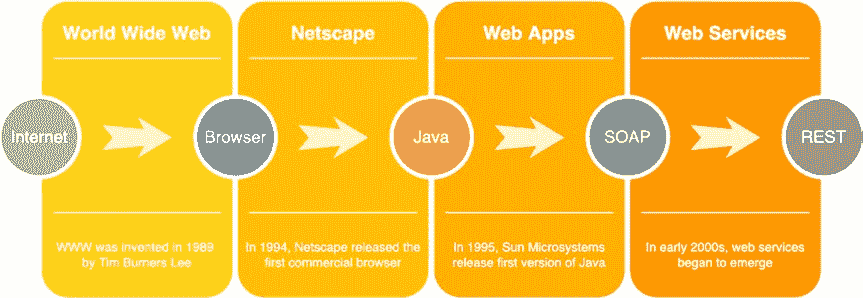

第 1 章 云计算导论

Java 的平台无关性是其关键特性之一，这使它成为开发 Web 应用的理想选择。

在 21 世纪初，一种称为 Web 服务的新型服务开始出现。Web 服务是通过互联网提供特定功能的应用。在当时，Web 服务相对简单，例如提供某一地点当前气温的天气服务。随着 Web 服务日益流行，对更复杂 Web 服务的需求也随之增长。为响应这一需求，企业开始提供基于 Web 的应用平台。

第一代应用平台主要聚焦于提供运行 Web 服务所需的基础设施，包括 Web 服务器、数据库和应用服务器。第二代应用平台则增加了对更复杂 Web 应用的支持。这些平台包含了安全性、可扩展性和可管理性等特性。第二代应用平台催生了云计算这一概念。

为了让 Web 服务彼此通信，它们需要采用一套通用规则。这套通用规则被称为 Web 服务协议。最流行的两种 Web 服务协议是 SOAP 和 REST。SOAP（Simple Object Access Protocol，简单对象访问协议）是一种使用 XML 在应用之间交换信息的协议。REST（Representational State Transfer，表述性状态转移）是一种更新、更简单的协议，使用 XML 或 JSON 在应用之间交换信息。21 世纪初期开发的大多数 Web 服务都基于 SOAP。然而近年来，REST 因为简单易用而越来越流行。图 1-6 展示了 Web 服务的演进过程。

***图 1-6。** Web 服务的演进*

第 1 章 云计算导论

云计算在现实世界中的第一个典型案例由 Salesforce.com 于 21 世纪初推出。他们提供了一款基于 Web 的客户关系管理（CRM）应用。这使企业能够通过任何连接互联网的设备访问其 CRM 数据。2008 年，Google 推出了 Google App Engine（GAE），这是一个允许开发者在 Google Cloud 上构建和运行应用的平台。由此，云计算对开发者和企业变得更加可及。

2006 年，Amazon 推出了 Amazon Web Services（AWS），这是一个基于云的平台，使开发者能够在 Amazon Cloud 上构建和运行应用。它是一组基于 Web 的服务，允许开发者和终端用户通过互联网访问信息和应用。AWS 包括存储、数据库、网络和分析等服务。根据 ZDNet 的文章（[2021 年顶级云服务提供商：AWS、Microsoft Azure、Google Cloud、混合云与 SaaS](http://www.zdnet.com/article/the-top-cloud-providers-of-2021-aws-microsoft-azure-google-cloud-hybrid-saas/)），自发布以来，AWS 一直是全球最大的云计算服务提供商。

2011 年，Apple 推出了 iCloud，这是一项基于云的存储与同步服务。它允许用户将文档、音乐、照片等数据存储在云端，并可通过任何连接互联网的 Apple 设备访问。Apple iCloud 是一个封闭系统，这意味着只有运行 iOS 或 macOS 的设备可以访问它。它更像是一种类似 Dropbox 或 Google Drive 的云存储服务。2008 年，Microsoft 推出了 Azure，这是一个基于云的平台，允许开发者在 Microsoft Cloud 上构建和运行应用。Azure 包含存储、数据库、网络和分析等服务。它是仅次于 Amazon Web Services（AWS）的第二大云计算平台。迁移到公有云的组织示例包括：使用 AWS 提供流媒体服务的 Netflix；以及使用 AWS 运营度假租赁平台的 Airbnb。对于使用 Microsoft 产品与服务生态的企业而言，Azure 更为适合。

云已成为许多组织的默认选择。随着云计算使用的增长，对更好的工具与技术来管理和监控云端应用的需求也在增加。为满足这一需求，新一代应用平台应运而生，即云原生应用。云原生应用被设计为运行在云上。它们采用微服务构建，微服务是小型、独立的服务，可以独立部署与扩展。云原生应用还被设计为具备容错能力和高可用性。

第 1 章 云计算导论

近年来，在云中运行应用的方式正从传统虚拟机（VM）转向容器。容器比虚拟机更轻量，因为它们只包含所需的最少代码和库，以便

运行应用程序。它们不像虚拟机（VM）那样需要冗长的资源配置过程。这使得在云中部署和扩展应用程序更加容易。它们在资源利用方面也更高效，并且能够更快地部署应用程序。它们还具有更好的可移植性，因为它们可以运行在任何支持容器运行时的平台上，例如 Docker。Docker 是创建和管理容器最流行的工具。它于 2013 年发布，并已成为在云中运行容器的标准。

2016 年，MicroProfile 标准作为一项协作成果被提出，参与方包括 IBM、Red Hat、Tomitribe 和 Payara 等领先软件厂商。它由 Eclipse Foundation 管理。创建 MicroProfile 规范的动机是为构建基于微服务的应用程序提供一套通用标准，使其能够运行在任何 Java 平台上。它包含开放追踪、指标、REST

客户端、JSON 处理、基于 JWT 的安全、健康检查监控、配置、上下文与依赖注入、RESTful Web 服务以及容错等标准。

2017 年，Oracle 将 Java EE 捐赠给了 Eclipse Foundation。Eclipse Foundation 是

一个开源社区，提供协作与创新的平台。

Jakarta EE 规范包含大约 40 项标准，涵盖了 servlet、服务器页面、Jakarta Server Faces、表达式语言、WebSocket、JSON 处理、RESTful Web 服务、安全、企业 Bean、批处理并发、

事务、Java Message Service 等众多技术。

云原生应用通常部署在分布式系统上，并且

被设计为运行在容器中。图 1-7 展示了云原生应用的架构。容器比虚拟机更轻量，但要高效运行它们仍然需要大量协同。

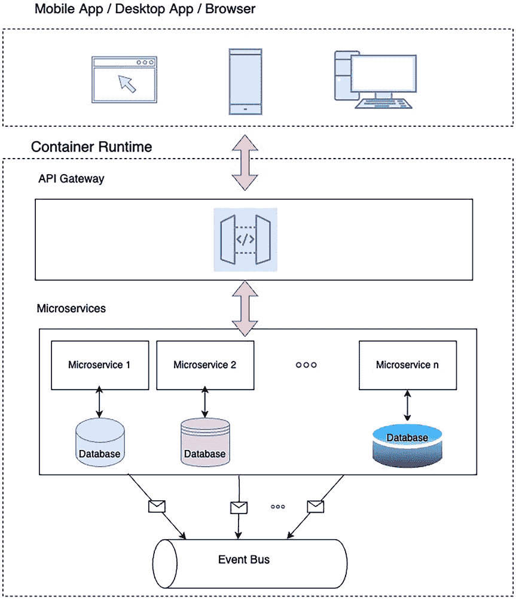

第 1 章 云计算简介

***图 1-7。** 云原生架构*

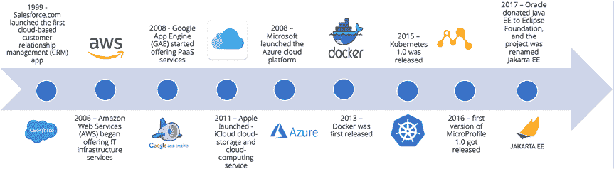

第 1 章 云计算简介

由于在云中运行应用程序的复杂性，需要进行容器编排。

Kubernetes 是一个流行的容器编排平台，可自动完成基于容器应用的部署、扩缩容和管理。Kubernetes 是一个

开源容器编排平台，最初由 Google 开发。

目前它由 Cloud Native Computing Foundation（CNCF）管理。Kubernetes 被

设计用于自动化基于容器应用的部署、扩缩容与管理。它是运行云原生应用的热门选择。图 1-8

展示了云计算演进的时间线。

***图 1-8。** 云计算历史*

**总结**

云计算是一项有潜力彻底改变人们使用计算机方式的技术。它允许用户从远程服务器而不是其自身设备访问资源，例如存储和计算能力。这可以节省时间和成本，并使得从世界任何地方访问信息变得更加容易。

云计算主要有三种类型：公有云、私有云和混合云。公有

云计算是通过互联网向公众提供的服务。私有云计算是向特定组织提供的服务，通常通过私有网络提供。

混合云计算是指一个组织同时使用公有云和私有云。

在 21 世纪初，各公司开始向企业和消费者提供基于云的服务，例如存储

和计算能力。此后，云计算的使用迅速增长，如今已成为许多企业不可或缺的一部分。

第 1 章 云计算简介

Java 编程语言在云计算中被广泛使用。它易学易用，并且与平台无关，这意味着用 Java 编写的程序可以在任何类型的计算机上运行。Java 还用于创建 Web 应用程序，即运行在 Web 服务器上并由用户通过浏览器访问的应用程序。

云计算最重要的方面之一是对 Web 服务的使用。Web 服务是可通过互联网访问的应用程序。它们通常用于向企业和消费者提供某种服务，例如存储或计算能力。

Web 服务通常使用诸如 Java 这样的编程语言编写。

Web 服务使用标准格式来通信数据。这使得

不同类型的计算机能够相互理解并交换数据。例如，一个 Web 服务可以使用简单对象访问协议（SOAP）与使用 Windows 操作系统的

计算机进行通信。

REST（表述性状态转移）是另一种 Web 服务。它是

一种用于设计网络化应用程序的架构风格。RESTful Web 服务基于 REST 原则，并使用 HTTP 协议传输数据。

微服务是一种软件架构，旨在让大型应用程序的开发与部署更容易。微服务是小型、模块化组件，

可以独立部署。微服务可以使用 Java

编程语言，结合各种框架和标准进行开发，例如 MicroProfiles

和 Jakarta EE。

至此，你应该已经对云计算有了良好的理解。在下一章中，

你将学习云原生应用开发，它使开发人员能够编写专门为云中运行而设计的代码。它使用微服务和容器，使应用程序的开发、部署和扩展更加容易。

**第 2 章**

**云原生应用**

**开发**

“云原生（cloud-native）”一词在技术圈已无处不在，但其含义仍有些模糊。要弄清它，我们先从“它不是什么”开始：云原生并不关乎应用运行在何处。应用运行在公有云、私有云，还是本地数据中心并不重要。重要的是应用如何构建与运行。在本章中，你将首先探讨云原生的含义、云原生应用的特征、开发云原生应用的优缺点，以及它们与传统应用的区别。接下来，你将学习

面向 Java 应用的托管服务，以及它们如何在云原生应用开发中发挥作用。最后，你将概览云原生应用开发的各个阶段，包括持续集成/持续交付（CI/CD）、

微服务架构、容器化、无服务器计算、API 管理、

安全等。

**什么是云原生？**

云原生是一个术语，指为充分利用云计算环境而设计的应用程序或服务。云原生应用通常

使用微服务构建，微服务是小型、独立的模块，可独立部署和扩展。这种方法在更新和扩缩容方面提供了更高的灵活性与敏捷性，因为每个微服务都可以单独更新或扩展，而不会影响应用的其他组件。

云原生应用旨在利用云的弹性与

可扩展性。这种方法在更新和扩缩容方面提供了更高的灵活性与敏捷性，因为每个微服务都可以单独更新或扩展，而不会影响应用的其他组件。29

© Tarun Telang 2023

T. Telang，*Beginning Cloud Native Development with MicroProfile, Jakarta EE, and Kubernetes*，

[`doi.org/10.1007/978-1-4842-8832-0_2`](https://doi.org/10.1007/978-1-4842-8832-0_2#DOI)

第 2 章 云原生应用开发

在更新和扩缩容方面，这种方法允许更高的灵活性与敏捷性，因为每个微服务都可以单独更新或扩展，而不会影响应用的其他组件。

云原生应用旨在充分利用云计算的优势。

它们基于微服务架构构建，并通过 Docker 等容器以及托管的 Kubernetes 集群进行部署。

它们也易于部署和管理。术语“云原生”常常与“容器原生”或“基于微服务”互换使用。云原生应用是云计算运动中的重要组成部分。它们使企业能够快速开发和部署新应用，而无需昂贵的基础设施。云原生应用通常使用 Docker 和 Kubernetes 等开源技术构建。

基于 Java 的云原生应用可以使用 MicroProfile 和 Jakarta EE

规范来构建。MicroProfile 是一项开源规范，定义了一套用于构建云原生应用的

标准。它包括微服务、安全性和 REST API 的相关标准。

Jakarta EE 是 Java EE 的新名称，而 Java EE 是一个用于构建企业级

应用的成熟平台。MicroProfile 和 Jakarta EE 是互补关系。MicroProfile 专注于微服务，而 Jakarta EE 专注于企业应用。因此，这两个平台都可用于构建云原生应用。

**云原生应用的特征**

如果你想构建一个云原生应用，有几件事需要牢记。首先，你需要选择一种微服务架构，使你能够将应用拆分为小型、独立的模块。其次，你需要确保应用具备可扩展性，能够通过增加更多资源来应对增长的需求。

最后，你需要确保应用是安全的，并使用其所运行云平台的安全特性。

以下关键特征在云原生应用中很常见：

• **微服务：** 云原生应用通常使用

微服务构建，微服务是小型、独立的服务，它们协同工作以形成完整应用。

• **松耦合：** 云原生应用通常采用

松耦合设计，这意味着它们可以轻松拆分为

更小的部分，并可独立部署和更新。

第 2 章 云原生应用开发

• **可扩展性：** 云原生应用被设计为可扩展，

这意味着它们可以通过增加

更多资源来轻松应对增长的需求。

• **弹性：** 云原生应用具有弹性，这意味着

即使系统的某一部分发生故障，它们仍可继续运行。

• **敏捷性：** 云原生应用被设计为敏捷，

这意味着它们可以被快速部署和更新。

• **安全性：** 云原生应用被设计为安全，这

意味着它们会使用其所运行云平台的安全特性。

• **自动化：** 云原生应用通常是自动化的，

这意味着它们可以在无需人工

干预的情况下部署和更新。

• **自愈：** 云原生应用包含监控和

日志功能，可轻松检测和诊断问题。

此外，云原生应用还被设计为具备自愈能力，

这意味着它们可以从故障中自动恢复。

• **DevOps 文化：** 云原生应用通常在

DevOps 文化下开发，这意味着开发人员与运维

人员协作创建并部署应用。

这些特征使云原生应用非常适合部署

在云环境中，在这种环境里资源可根据需要快速增减，

且故障是可预期的。云原生应用还可以在不影响整体系统的情况下快速更新，这使其成为敏捷开发

流程的理想选择。

图 2-1 说明了云原生应用的关键特征。

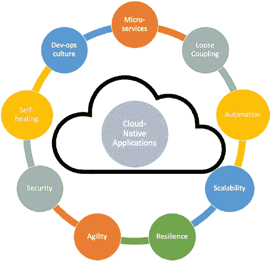

第 2 章 云原生应用开发

***图 2-1。** 云原生应用的特征*

**云原生应用示例**

一些常见的云原生应用示例包括：

• **Netflix：** 一种基于云的流媒体服务，允许用户在线观看电影和电视节目。

• **Instagram：** 一个照片和视频分享的社交网络服务，可在移动端和 Web 平台上使用。

• **Pinterest：** 一个视觉发现和社交媒体工具，允许用户保存和分享图片与视频。

• **Uber：** 一种网约车服务，允许用户通过移动应用请求并支付行程费用。

• **Airbnb：** 一个度假租赁市场，允许用户查找并预订度假房源。

第 2 章 云原生应用开发

• **Twitter：** 一个社交网络与微博客服务，允许用户发送和接收称为“推文”的简短更新。

• **Facebook：** 一个社交网络服务，允许用户与朋友和家人建立联系。

• **Spotify：** 一个音乐流媒体服务，为用户提供数百万首歌曲的访问。

这些应用都采用微服务架构构建，并使用容器进行部署。它们被设计为可扩展、可靠且高性能。

例如，Netflix 是一个使用微服务构建的云原生应用。Netflix 最初使用单体架构，但后来迁移到基于微服务的架构，以利用云的可扩展性与敏捷性。Netflix 通过将应用拆分为小型、独立的模块来实现大规模扩展，这些模块可以独立部署和扩缩容。Netflix 还使用容器和 Kubernetes 集群来管理其应用。容器使 Netflix 能够将应用打包为可移植单元，并可在任何地方运行。Kubernetes 使 Netflix 能够快速地大规模部署和管理其应用。

**云原生应用的优势**

云原生开发非常适合那些希望快速开发和部署新应用、且无需昂贵基础设施的企业。云原生应用通常使用 Docker 和 Kubernetes 等开源技术构建。

企业使用云原生应用可以获得诸多收益，包括：

• **可扩展性：** 云原生应用可以快速扩容或缩容以满足不断变化的需求。换句话说，它们具备“弹性”扩展能力。云原生开发也非常适合希望利用云可扩展性与敏捷性的企业。

• **灵活性：** 云原生应用可以部署在多种云平台上。由于它们使用容器、微服务和 REST API 等标准技术构建，因此与平台无关。这使你能够灵活选择最符合自身需求的平台。云原生应用采用微服务架构构建，在更新与扩缩容方面具有更高灵活性。

第 2 章 云原生应用开发

• **可靠性：** 云原生应用被设计为高可用并可容忍故障。这意味着即使其一个或多个组件发生故障，它们仍可持续运行。云原生开发也非常适合希望构建高性能、可靠应用的企业。

• **性能：** 云原生应用通常具有高性能和高响应性。这是因为它们被设计为利用分布式计算。

• **高可用性：** 云原生应用通常可实现 24/7 全天候可用。它们被设计为可部署在多台服务器上。

• **易于部署：** 云原生应用可以快速且轻松地部署。它们通常以容器形式打包。

总之，云原生应用具备云计算的全部优势。云原生应用旨在充分利用云的弹性与可扩展性。它们通常基于微服务构建，微服务是可部署的小型独立模块。云原生应用具有可扩展、可靠和高性能等特征，同时也易于部署和管理。

**使用云原生应用的缺点**

使用云原生应用有一些缺点需要注意。如果实施不当，它们可能会引入额外的复杂性和技术债务。

以下是云原生应用的劣势：

• **复杂性增加：** 它们通常比传统应用更复杂，开发和管理都更具挑战性。它们往往需要专业技能和知识才能高效开发与运维。

• **成本增加：** 由于需要专业技能和基础设施，它们在开发和运营上可能比传统应用更昂贵。此外，云原生应用可能比传统应用需要更多资源，从而提高成本。

第 2 章 云原生应用开发

• **依赖增加：** 它们通常对其他服务和组件有更多依赖，这使得管理更具挑战性。

• **开发更具挑战：** 由于复杂性增加，它们可能更难以高效开发。通常需要专业技能和知识。

尽管存在这些缺点，但由于其带来的多项收益，云原生应用对许多组织来说仍是一个不错的选择。

**云原生应用 vs.**

**传统应用**

云原生通常与传统（遗留）或单体应用进行对比；后者通常是大型、复杂且难以更新和扩展的应用。

单体应用通常并非为在云环境中部署而设计，这会限制组织利用云优势的能力。

表 2-1 列出了云原生应用与传统应用之间的一些关键差异。

第 2 章 云原生应用开发

***表 2-1。** 云原生应用与传统应用之间的关键差异* **特征 云原生应用**

**传统应用**

**微服务** 云原生应用通常构建为一组小型、独立的微服务。传统应用则是作为单一单元部署的单一大型代码库。换句话说，传统应用采用单体架构。

**松耦合** 云原生应用的组件可独立部署和扩展。它们通过 API 或消息队列相互通信。传统应用的组件彼此紧密依赖，难以独立部署和扩展。

**自动化**

云原生应用使用自动化工具构建，例如持续集成与持续交付（Ci/Cd）流水线。

传统应用通常使用手工流程构建，例如代码审查和测试。它们并非使用持续集成与持续交付（Ci/Cd）流水线等自动化工具构建。这使得它们难以部署和扩展。

**可扩展**

云原生应用可以根据需求变化轻松进行横向或纵向扩缩容。

传统应用无法轻松根据需求变化进行扩缩容。

**自愈**

云原生应用被设计为可自动从故障中恢复。

传统应用并非设计为可自动从故障中恢复。

**DevOps 文化** 使用云原生应用的组织通常具备 DevOps 文化，该文化强调开发人员与运维人员之间的协作，以加速软件开发与交付流程。

对于习惯于更传统软件开发方式的组织而言，这种文化转变可能具有挑战性。

第 2 章 云原生应用开发

总体而言，云原生应用在设计上比传统单体应用更敏捷、更灵活、可扩展性更强。对于希望加快软件开发与交付流程的组织来说，它们是一个很好的选择。

**云原生应用开发**

云原生应用开发通常遵循微服务架构，在这种架构中，应用程序由一组独立、松耦合的服务构建而成，这些服务可以独立部署和扩展。微服务架构是一种

软件开发方法，强调组件之间的松耦合。这使得

系统具有更高的灵活性和敏捷性，因为对某一组件的更新不一定需要更新其他组件。微服务架构使开发人员能够以模块化方式构建

应用程序，使用小型、独立的服务，并且这些服务可以轻松更新和独立扩展。这种方法在开发和部署应用程序时提供了更高的灵活性和敏捷性。这种方法使开发人员能够

在不影响整个应用程序的情况下更改单个服务。

各组织正在采用云原生应用开发方法，以

加快产品上市时间、提高开发者生产力，并使应用能够利用云的诸多优势，例如按需扩展和

降低运营成本。

使用云原生应用的组织具有以下优势：

• 它们可以缩短上市时间，因为微服务可以

独立且快速地部署。

• 它们可以实现更高的灵活性和可扩展性，因为每个

微服务都可以独立更新或扩展。

• 它们可以降低运营成本，因为它们可以按需使用弹性计算

资源。

除了微服务之外，云原生应用开发还依赖其他几种现代技术和方法，包括容器化、持续

交付与部署，以及 DevOps。

第 2 章 云原生应用开发

采用云原生应用开发的组织通常会使用

公有云、私有云和混合云环境的组合。这使它们能够利用各类环境的优势来满足其特定需求。

云原生应用开发是一个快速演进的领域，新的

技术和方法不断被引入。因此，开发人员需要跟进最新进展，才能构建出能够充分利用云能力的应用程序。

云原生应用可以使用任何编程语言构建。然而，

某些语言更适合构建云原生应用。

**Java 应用的托管服务**

Java 是构建云原生应用程序的热门选择。这是因为它是一门成熟的语言，并拥有庞大的工具和库生态系统。此外，许多

云提供商都为基于 Java 的应用程序提供托管服务。面向 Java 应用的托管服务是帮助你管理和优化 Java 应用程序的服务。这些服务可以帮助你完成诸如监控你的

应用性能、管理应用依赖关系以及管理

应用部署等任务。托管服务可以通过自动化管理 Java 应用程序所涉及的许多任务，帮助你节省时间和成本

。

包括 Amazon Web Services、Microsoft Azure 和 Google Cloud Platform 在内的多家服务提供商也为基于 Java 的应用提供服务。请参考以下资源，了解主流云提供商在 Java 方面的最新产品：

–

Google Cloud 上的 Java（[`cloud.google.com/java)`](https://cloud.google.com/java)）

–

AWS 上的 Java（[`aws.amazon.com/java/`](https://aws.amazon.com/java/)）

–

面向 Java 开发者的 Azure 文档（[tion (https://docs.microsoft.com/](https://docs.microsoft.com/en-us/azure/developer/java/)）

[en-us/azure/developer/java/)](https://docs.microsoft.com/en-us/azure/developer/java/)

**云原生应用开发示例**

云原生应用开发的一个例子是在线零售商 Amazon.com。

Amazon.com 是最早采用微服务架构的公司之一，并且

已经使用它很多年了。微服务的一个好处是它们可以部署在各种环境中，包括本地数据中心、公有云，38

第 2 章 云原生应用开发

以及混合云。亚马逊开发了自己的容器服务 Amazon Elastic

Container Service（ECS），这使得大规模部署和管理容器变得容易。

因此，他们能够快速且高效地构建和部署应用程序，

并充分利用云带来的诸多优势。

云原生应用开发的另一个例子是社交媒体

平台 Twitter。Twitter 也采用了微服务架构，并利用它

快速高效地部署新功能和更新。此外，Twitter 使用

持续交付与持续部署来快速推出新的代码变更，

且无需停机。Twitter 还开发了多种用于管理和

部署微服务的技术。例如，Twitter 使用了一个名为 Murder 的工具来管理

将新的代码变更部署到其微服务中。Murder（指乌鸦群）是一个分布式系统，允许开发者将代码变更推送到一个

中央代码库。随后，Murder 会将这些代码变更部署到相应的服务器。

Murder 工具将部署新代码变更所需的时间从数天缩短到

数分钟。此外，Murder 还有助于减少

手动部署代码变更时可能发生的故障和缺陷数量。

请记住，云原生应用开发是一个快速演进的领域，

新的技术和方法不断被引入。因此，你需要跟进最新进展，才能构建出能够充分利用云优势的应用程序。

**云原生应用开发是未来**

随着技术世界不断演进，人们开发

应用程序的方式也在变化。近年来，已经出现了向云原生应用开发转变的趋势——这有充分理由。云原生应用开发是一种

能够利用云所提供诸多优势的方法。通过

以这种方式开发应用程序，你可以利用云所提供的可扩展性、灵活性和成本效益。

此外，云原生应用开发还使你能够利用

最新技术和趋势。通过能够在云中快速、轻松地部署应用程序，你可以保持领先，并持续满足用户不断变化的需求。那么，为什么云原生应用开发是

应用开发的未来？原因有很多：

第 2 章 云原生应用开发

• **云提供了无限可能：** 云为你提供了

前所未有的灵活性和可扩展性。你可以

轻松地在云中部署应用程序，而无需担心

基础设施。这意味着你可以专注于开发

应用程序，而不是担心如何部署它。

• **云具有成本效益：** 云是一种具有成本效益的方式来

开发和部署应用程序。你无需担心

维护自己的基础设施，这可能成本高昂。此外，

你还可以利用按需付费模式，这

意味着你只需为所使用的资源付费。

• **云始终保持最新：** 云始终与最新技术和趋势保持同步。

这意味着你可以

在新特性和功能发布后立即加以利用。

• **云是全球化的：** 云是一种全球性现象。这意味着

你可以通过你的应用程序触达全球受众。

• **云是安全的：** 云是一种非常安全的方式来开发和

部署应用程序。你无需担心

自己基础设施的安全性。

所以，这就是云原生应用开发之所以是

应用程序开发的未来。随着技术世界的不断演进，云将变得越来越重要。如果你还没有使用云来开发和部署你的应用程序，现在正是时候。

**云原生应用开发的阶段**

你已经了解到，开发云原生应用有许多优势。

然而，云原生应用开发并非没有挑战。其中最大的挑战之一是，它要求开发者在思考和实施应用开发方式上进行彻底转变。这种思维转变包括：将应用视为可由更小型微服务组合而成的服务；能够快速、轻松地部署这些服务，并且部署方式要与云的运行机制保持一致。此外，能够对这些服务进行管理和监控也非常重要，以确保它们按预期运行。

第 2 章 云原生应用开发

另外，为云原生开发流程找到合适的工具和技术也可能很困难。好消息是，已有多家公司提供云原生开发平台和服务。这些平台可以为开发者提供

构建云原生应用所需的工具。此外，还有多个开源项目为云原生开发提供支持。支持云原生应用开发的工具和技术包括 Docker 等容器技术、

Kubernetes 等编排框架，以及可提供预构建环境来部署云原生应用的平台即服务（PaaS）产品。当前有许多可用于开发云原生

应用的开源 PaaS 服务。其中一些工具包括 OpenShift、Cloud Foundry 和 Heroku。

表 2-2 展示了云原生开发开源工具及其说明列表。

***表 2-2。** 用于云原生应用* *开发的开源工具和 PaaS 服务*

**工具**

**说明**

**Docker**

docker 是一种工具，可让你使用

容器来创建、部署和运行应用。容器允许你将应用及其所有依赖一起打包，从而可以在任何 linux 服务器上运行。这使得应用能够轻松地在

开发、测试和生产环境之间迁移，而无需担心

依赖问题。

Kubernetes Kubernetes 是一种用于管理容器化应用的编排工具。它提供了一个可自动化部署、扩缩容以及管理容器化

应用的平台。

openShift

openShift 是 red hat 提供的 paaS 产品，可提供用于

部署云原生应用的预构建环境。它包含用于构建、部署和

管理应用的工具。

Cloud

Cloud Foundry 是一个开源的平台即服务（paaS）。它为开发者提供了一个平台 Foundry

用于构建、部署和管理应用。Cloud Foundry 提供多个不同版本，每个版本都提供不同的一组工具和服务。

heroku

heroku 是一种 paaS，可使开发者构建、部署和管理应用。它包含用于管理应用开发、部署和扩缩容的工具。

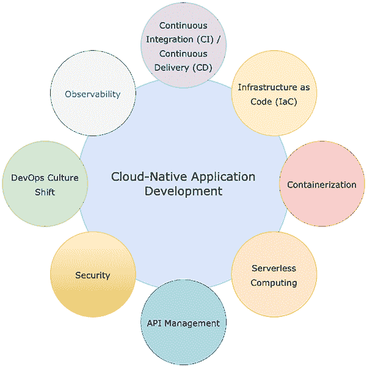

第 2 章 云原生应用开发

以上只是众多可用于

开发云原生应用的工具和技术中的一小部分。最重要的是为当前任务选择

合适的工具。不存在放之四海而皆准的解决方案，因此有必要评估你的应用需求，并选择最能支持这些需求的工具。

图 2-2 展示了云原生应用开发的各个阶段。

***图 2-2。** 云原生应用开发的阶段*

接下来的章节将详细介绍每一个阶段。

**持续集成/持续交付（CI/CD）**

持续集成与持续交付（CI/CD）是一种软件工程实践，

在这种实践中，团队成员会频繁地集成他们的工作，通常每个人至少每天集成一次。每次集成都会通过自动化构建进行验证，以尽可能快地发现集成错误。CD 是一种按需发布代码（或更高频发布）以便尽快获得用户反馈的实践。

第 2 章 云原生应用开发

CI/CD 通过将代码签入、自动化测试和软件部署整合到一条精简的流水线中，实现开发流程自动化。

这有助于确保代码始终经过错误检查并符合项目标准，测试能够自动运行以识别潜在问题，并且新代码能够快速且安全地部署。

CI/CD 流水线是现代软件开发流程中的重要组成部分。

它们能够帮助加快开发周期，并让新代码变更的部署更加容易。

可用的 CI/CD 工具有很多，但其中一些最受欢迎的包括 Jenkins、Tra[vis CI (www.travis-ci.com/), and Cir](http://www.travis-ci.com/)cleCI（[`circleci.com/`](https://circleci.com/)）。

此外，还有一些基于云的 CI/CD 服务，例如 AWS

CodePip[eline (https://aws.amazon.com/codepipeline/) and A](https://aws.amazon.com/codepipeline/)zure DevOps（[`azure.microsoft.com/en-in/products/devops`](https://azure.microsoft.com/en-in/products/devops)）。

**基础设施即代码（IaC）**

基础设施即代码是 DevOps 的重要组成部分。它涉及使用代码来管理和

自动化你的基础设施部署。它包括对

服务器、网络和应用程序的配置。它允许你使用声明式语言来定义你的

基础设施，例如 Terraform 或 AWS CloudFormation。

这使你能够轻松地对基础设施进行版本控制并自动化资源预配流程。此外，IaC 工具还能帮助确保你的基础设施具有一致性和可重复性，从而更易于管理和更新。

IaC 可以通过自动化

资源的部署和管理，帮助你更高效地管理基础设施。这可以让你更容易保持

基础设施的一致性和最新状态，并有助于减少管理环境所需的手工

工作量。

IaC 工具还可以通过让你自动化

资源预配与管理来帮助控制成本。这有助于你节省

基础设施成本，同时减少管理环境所需的时间和精力。

表 2-3 展示了常见 IaC 工具及其说明列表。

第 2 章 云原生应用开发

t

tion,

ge

学习

loud。

azure 资源。

configura

te the tasks tha

t [https://](https://puppet.com/)

t 你可以投入

了解更多

ge your

tion about this project

ge a

t run in the c

。terraform 可以管理

s provisioning,

y and mana

更多信息

tions tha

tform 资源。

t [`cloud.google.com/`](https://cloud.google.com/deployment-manager/docs)

m

pla

pplica

vices 资源，以便

tion a

。

访问产品主页

eb Ser

t [`docs.microsoft.com/en-us/`](https://docs.microsoft.com/en-us/azure/azure-resource-manager/management/overview)

te your infrastructure’

W

tion,

y Google Cloud

amazon

t [`docs.aws.amazon.com/AWSCloudFormation/`](https://docs.aws.amazon.com/AWSCloudFormation/latest/UserGuide/Welcome.html)

。

这使其更容易部署

and deplo

更高效地管理你的基础设施并自动化

ger 可在以下找到

ge,

t 帮助你自动化

或了解更多信息

，访问官方文档

。F

。

mana

ger

te,

ana

并安全高效地进行基础设施版本管理

*gies*

tion user guide a

m

azure 资源，

。

orma

resource mana

gement tool tha

ging

yment

更改，

vice providers 以及自定义内部解决方案。

你原本不得不手动完成的工作

*echnolo*

azure

deplo

*d T*

tion mana

puppet 可以帮助你管理

*n*

t 帮助你建模并搭建你的

ging those resources and more time focusing on your a

t 帮助你创建

aWS Cloud F

t [`www.terraform.io/`](https://www.terraform.io/)

。

*s a*

*ool*

vice tha

gement.

访问

*aC T*

*ar I*

**描述**

它是一项服务

更少时间用于管理

此外，

[latest/UserGuide/Welcome.html](https://docs.aws.amazon.com/AWSCloudFormation/latest/UserGuide/Welcome.html)

这是一个用于管理

官方文档用于

[azure/azure-resource-manager/management/overview](https://docs.microsoft.com/en-us/azure/azure-resource-manager/management/overview)

这是一个工具，能够

关于 Google Cloud

[deployment-manager/docs](https://cloud.google.com/deployment-manager/docs)

这是一个用于构建、

现有且流行的服务

可在以下找到

这是一个配置

以及管理

否则你将不得不手动完成

[puppet.com/](https://puppet.com/)

*ulop **P***

****y**

tion

**ool/**

orma

resource

ger

yment

ger

ana

ana

***表 2-3。***

**IaC 工具**

**技术**

aWS

CloudF

azure

m

Google Cloud

deplo

m

terraform

puppet

第 2 章 云原生应用开发

。

到

不得不做

eC2。

ansible 可以帮助

amazon

，领域特定的

tion 工具。

ruby

t 你原本不得不完成的

tforms 例如

t [`www.ansible.com/`](https://www.ansible.com/)

它使用纯

gement 和编排

ate the tasks tha

loud-based 平台。

erlang。

。

更多信息请访问该网站

Chef 用于简化配置任务以及

tion mana

ruby 和

“recipes”（配方）。

te tightly with c

tion 技术

tion

automait

[`www.chef.io/`](https://www.chef.io/)

用以下语言编写的管理工具

vers，并可紧密集成

访问

以及易于使用的配置

s sery’

werful,

tion mana

强大，

ge your infrastructure more effectively and can autom

dSl）用于编写系统配置

。要了解更多关于该

ge（

这是一个简单、

帮助你管理

手动地

这是一个配置

语言

维护公司

探索该工具更多内容，

ansible

Chef

第 2 章 云原生应用开发

**微服务架构**

云原生应用开发的第三阶段是微服务架构。

这一阶段的核心是将你的应用拆分为小型、独立的服务，这些服务可以独立部署和扩展。微服务有许多优势，例如

可扩展性和弹性提升。然而，它们的开发与管理也可能更困难。你将在第 [5](https://doi.org/10.1007/978-1-4842-8832-0_5) 章了解更多关于微服务架构的内容。

**容器化**

容器化是将应用打包为容器的过程。容器是虚拟机的轻量级替代方案，允许你将应用及其依赖一并打包。这使得在任何

环境中部署和运行应用都变得容易。可用的容器技术包括 Docker。此外，还有一些基于云的容器服务，例如 Amazon ECS 和 Google

Container Engine。你将在本书后续章节中详细学习容器化技术。

**无服务器计算**

云原生应用开发中的最新趋势之一包括无服务器计算，它使开发者能够在无需担心服务器预配和管理的情况下构建应用。

无服务器函数会响应事件执行，并且只按其运行时长计费。

这使其具有很高的成本效益。可用的无服务器平台有很多，例如 AWS Lambda、Azure Functions 和 Google

Cloud Function。此外，还有一些无服务器框架，例如 Serverless Framework。你将在第 [5](https://doi.org/10.1007/978-1-4842-8832-0_5) 章了解更多关于无服务器计算的内容。

**API 管理**

API 管理的核心是设计、构建和管理 API。API 是一组编程指令，允许软件与其他软件交互。API 用于向外部开发者暴露数据和功能。API 管理是云原生应用开发中的关键组成部分。它使你能够控制谁可以访问你的 API，以及他们如何使用它。此外，API 管理还能帮助你监控并排查 API 问题。目前有许多 API 管理平台

可供使用，例如 Apigee、Kong 和 Amazon API Gateway。你将在本书后续内容中进一步学习

如何构建和部署 REST API。

第 2 章 云原生应用开发

**安全**

这一阶段的重点是确保你的应用是安全的。在开发云原生应用时，你需要关注许多安全问题。

这些问题包括数据泄露、应用漏洞以及拒绝服务攻击。

为了保护你的应用，你需要在每一层实施安全控制。这包括网络层、主机层、应用层和数据层。此外，你还需要部署防火墙、入侵检测系统等安全工具。现有许多安全产品和服务可用，例如 AWS Identity and Access Management、Azure

Active Directory 和 Google Cloud Identity。

**DevOps 文化转变**

云原生开发要求许多组织在文化上进行转变：从传统瀑布式开发转向更敏捷的 DevOps 方法论。在瀑布式

开发中，变更通常以大批量方式进行且发布频率较低。这可能

导致开发周期长、产品上市速度慢。相比之下，DevOps 更加敏捷，因为它强调开发团队与运维团队之间的协作。

变更以小批量进行并频繁发布，这有助于加快

开发并提升上市速度。

云原生方法还要求改变应用的设计与构建方式。

在传统应用开发中，应用通常是单体结构，所有组件紧密耦合。这会使应用扩展和新增功能变得困难。相比之下，云原生应用以微服务方式设计，每个组件都可以独立部署。这使得应用扩展更容易，

并且更便于添加新功能。它也要求团队组织方式发生变化。在传统应用开发中，团队通常是孤岛式的，每个团队都在

相互隔离的状态下工作。当团队需要协调工作时，这会导致延迟和错误。

相比之下，云原生开发团队更具跨职能特征，并且彼此紧密协作。这有助于加快开发并提升代码质量。总体而言，云原生方法要求在文化、方法论和技术上进行转变。对许多组织来说，这是一次重大变革，但其收益十分明确。云原生应用比传统应用更具可扩展性、韧性和敏捷性。它们也更易于开发和部署。

第 2 章 云原生应用开发

**可观测性**

可观测性是一种监控系统的实践方式，使你能够在问题发生时进行

检测与诊断。可观测性的目标是提供系统各方面的可见性，从而在问题影响客户之前识别并修复问题。这意味着不仅要监控系统健康状态，还要跟踪对系统所做的变更、理解用户如何与系统交互等。要做到这一点，你必须对系统本身和运行环境都有深入理解。

理解可观测性与监控之间的区别至关重要。

监控是收集系统数据并利用这些数据生成报告的过程。这些数据可用于识别问题，但不能用于诊断问题。而可观测性则使你能够实时检测并诊断问题。这是因为可观测性使用来自系统各层的数据，而不仅仅是应用层。实现可观测性的方法有很多（见图 2-3），其中最常见的方法包括日志、追踪和指标。

• **日志（Logging）：** 日志是收集并存储

系统中已发生事件信息的过程。这些数据可用于

故障排查或定位问题。

• **追踪（Tracing）：** 追踪是一种可让你跟随请求

在系统中流转路径的技术。这对于

理解系统工作方式和诊断问题非常有用。

• **指标（Metrics）：** 指标是可用于衡量

系统各方面的数值。你可以使用这些数据来监控

性能并识别趋势。

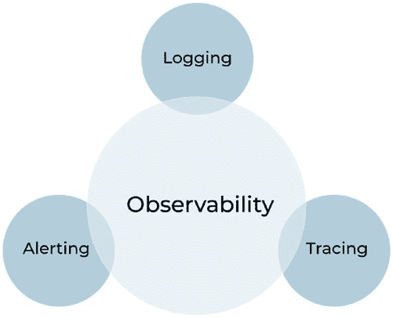

第 2 章 云原生应用开发

***图 2-3。** 实现可观测性的方法*

可观测性有四个关键组成部分（见图 2-4）。

• **数据采集：** 这通常通过日志、追踪和

指标来完成。

• **数据分析：** 这包括使用仪表盘和告警等工具

来暴露问题。

• **告警：** 这可确保在

问题出现时通知到正确的人。

• **修复问题：** 这是你利用已收集的数据

来识别并修复底层问题的阶段。

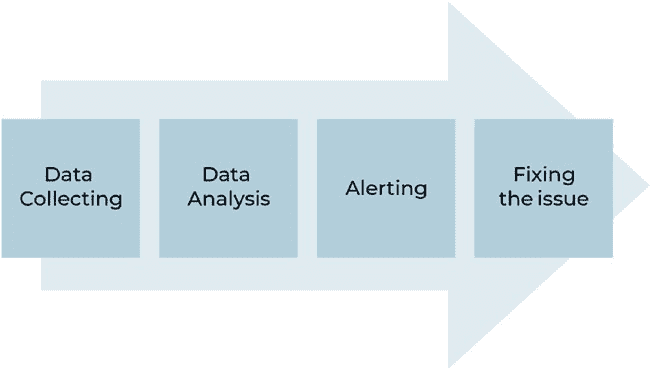

第 2 章 云原生应用开发

***图 2-4。** 可观测性的组成部分*

**数据采集：** 实现可观测性的第一步是数据采集。你需要从系统的所有层收集数据，包括应用、数据库、网络和基础设施。数据采集的方法有很多。其中最

常见的方法包括日志、追踪和指标。

**数据分析：** 下一步是数据分析。这一步是你利用已收集的数据来提升环境可靠性的阶段。例如，你可以使用数据

分析来生成仪表盘和报告。仪表盘是数据的可视化展示，可用于识别趋势和问题。报告则更为详细。你可以用它们来诊断问题或跟踪一段时间内的进展。你还可以用它们执行以下工作：

• 识别问题根因。通过跟踪你的

系统变更并理解用户如何与其交互，你

可以快速识别任何问题的根本原因。

• 检测趋势和模式。通过在更长时间范围内

分析数据，你可以发现那些在

实时查看数据时可能看不到的趋势和模式。

• 提升监控覆盖范围。通过了解系统中哪些部分

最重要，你可以将监控

精力聚焦在最可能引发问题的区域。

第 2 章 云原生应用开发

**告警：** 下一步是告警，即在检测到问题时发送通知。这一步

要确保在问题出现时通知到正确的人。

这可以通过电子邮件、短信或其他通知系统来实现。制定清晰明确的告警策略非常重要，这样你才能快速识别并修复问题。

**可观测性的最佳实践**

在组织内实现可观测性有若干最佳实践。

1\. 从系统所有层收集数据——应用、数据库、

网络和基础设施。

2\. 使用多种数据采集方法——日志、追踪和

指标——以获得对系统最全面的视图。

3\. 对日志同时使用短期和长期存储。这样可以

让你在更长时间范围内跟踪事件，从而更容易

用于识别和诊断问题。

4\. 使用标准化格式。这有助于你在不同工具和系统之间共享数据。

5\. 实时分析数据。使用仪表板和告警等工具，在问题发生时及时发现它们。

6\. 及时传达告警。确保在问题出现时通知到正确的人。

7\. 尽可能实现自动化，以减少修复问题所需的时间和精力。

这一阶段的重点是监控你的应用程序并收集其性能数据。可观测性是云原生应用开发中的关键部分。

它使你能够识别并诊断应用程序中的问题。此外，可观测性还可以帮助你从源头上预防问题发生。市面上有许多不同的可观测性工具和服务。表 2-4 列出了较为流行的工具。

第 2 章 云原生应用开发

***表 2-4。** 常见可观测性工具*

**工具**

**说明**

New relic

New r[elic (https://newrelic.com/) 是一种基于 SaaS 的解决方案，提供面向 Web 和移动应用的应用性能管理（APM）。](https://newrelic.com/)New relic 提供数据驱动的洞察，帮助开发者对其应用进行故障排查与性能调优。

datadog

da[tadog (www.datadoghq.com/) 是一项面向云端应用的监控服](https://www.datadoghq.com/)务。它允许用户从服务器、数据库、工具和服务中收集并可视化数据，以帮助排查问题并识别性能瓶颈。

appdynamics appd[ynamics (www.appdynamics.com/](http://www.appdynamics.com/)) 是一种应用性能监控（APM）解决方案，可帮助开发者排查并优化其 Web 与移动应用的性能。appdynamics 提供对应用性能的实时可见性，使开发者能够在影响用户体验之前识别并修复性能问题。

Splunk

[Splunk (www.splunk.com/](http://www.splunk.com/)) 是一个面向机器数据的软件平台，可帮助开发者对应用进行故障排查、监控与分析。Splunk 允许用户从任何来源收集并索引数据，包括日志文件、应用事件和系统指标。Splunk 提供对应用与系统性能的实时可见性，使开发者能够在问题影响用户体验之前识别并修复问题。

**总结**

云原生应用是专门为充分利用云而设计的。它们具有一些区别于传统应用的特征，包括以下几点：

• 它们具备可移植性，可以在任何云平台上运行。

• 它们具备自给自足能力，可以在不依赖特定环境或基础设施的情况下部署。

• 它们是模块化的，可以拆分为更小的组件，以便于管理和扩展。

第 2 章 云原生应用开发

• 它们具备弹性，能够根据需求变化自动扩缩容。

• 它们具备韧性，能够从故障中快速恢复。

与传统应用相比，云原生应用提供了许多优势，包括以下方面：

• **更高的敏捷性与更快的上市时间：** 云原生应用比传统应用部署更快、过程更省事。

• **更低的成本：** 云原生应用通常需要更少的运行资源，因此总体成本更低。

• **更好的可扩展性：** 云原生应用可按需扩展或缩减，更容易应对需求波动。

• **更强的性能：** 由于架构经过优化，云原生应用的性能通常优于传统应用。

然而，开发云原生应用也有一些缺点，包括更高的复杂性。云原生应用开发更复杂，并且需要更多专业能力。尽管开发云原生应用存在一些不足，但在大多数情况下，其优势远远大于劣势。你还了解了以下各阶段

云原生应用开发。这些包括持续集成/持续交付（CI/CD）、微服务架构、容器化、无服务器计算、API 管理、安全等。

云原生应用开发是一个多阶段过程。每个阶段都很重要，都需要得到应有的重视。

• **持续集成/持续交付（CI/CD）：** 在这一阶段，开发人员将代码更改集成到中央代码仓库中，然后将其部署到测试环境进行验证。通过验证流程的更改随后会被推进到生产环境。该过程是持续进行的，因此新的更改会不断被创建并测试。

• **基础设施即代码：** 在这一阶段，所有基础设施都通过代码来定义和配置。这带来了更高的灵活性，以及更容易复现环境的能力。

第 2 章 云原生应用开发

• **微服务架构：** 在这一阶段，应用会被拆分为称为微服务的更小组件。每个微服务负责一个特定任务，并且可以独立于其他微服务进行部署。这使应用更具可扩展性和弹性。

• **容器化：** 在这一阶段，微服务会被打包进容器以便部署。容器使微服务无需修改即可在任何平台上运行，并让其管理和扩展更加容易。

• **无服务器计算：** 在这一阶段，应用运行在“无服务器”环境中，由第三方管理服务器。这消除了管理服务器或基础设施的需求，并使应用能够按需更轻松地扩展。

• **API 管理：** 在这一阶段，支撑应用的 API 会被创建和管理。这有助于确保它们安全可靠，并且可以被客户端轻松访问。

• **安全：** 在这一阶段，安全机制会贯穿应用的整个生命周期。这包括身份认证、授权和数据加密等措施。

• **DevOps 文化转型：** DevOps 文化转型是成功开发和部署云原生应用的必要条件。DevOps 的核心是开发人员与运维人员之间的协作。它有助于自动化软件开发流程，并改善团队之间的沟通。此外，DevOps 还有助于提升交付速度并提高质量。

• **可观测性（监控与日志）：** 在这一阶段，会对应用性能进行监控和日志记录。这有助于识别问题并进行故障诊断。

云原生应用开发过程是迭代式的，因此这些阶段不一定按顺序完成。不过，它们确实代表了一个云原生应用从初始开发到生产环境的典型演进路径。现在你已经了解了云原生应用开发的基础，可以开始开发你自己的应用了。在本书后续内容中，你将通过构建一个云原生应用把所学知识付诸实践。在下一章中，你将学习如何搭建开发环境。

**第 3 章**

**搭建你的**

**开发环境**

要开发云原生应用，你需要一个开发环境。

开发环境包括一组用于编写、编译、测试和运行代码的工具与软件。搭建开发环境看起来可能令人生畏，但只要有正确的指导，这件事也可以简单直接。

本章将向你展示如何为基于 Java 的云原生应用搭建开发环境。其中包含开始使用开发环境所需工具的详细安装与配置步骤。内容涵盖 Java Development Kit（JDK）、Maven、Git、Docker 和 Kubernetes 的前置条件与安装说明。此外，还将讨论使用 Docker 和 Kubernetes 的优势。

**前置条件**

开发云原生 Java 应用的硬件要求非常

要求较低。总体而言，大多数现代笔记本电脑和台式机都能满足这些要求。以下部分列出了搭建你的开发环境所推荐的硬件要求。

**硬件要求**

要开发云原生 Java 应用程序，你需要以下硬件：

**CPU：** 开发云原生 Java 应用程序对 CPU 的要求并不高。不过，如果你使用具有多个核心的高端 CPU，将获得更好的性能。

© Tarun Telang 2023

T. Telang，*Beginning Cloud Native Development with MicroProfile, Jakarta EE, and Kubernetes*，

[`doi.org/10.1007/978-1-4842-8832-0_3`](https://doi.org/10.1007/978-1-4842-8832-0_3#DOI)

第 3 章 搭建你的开发环境

**内存：** 4GB RAM 或更高

**硬盘空间：** 至少 50GB 可用磁盘空间

**操作系统**

开发云原生 Java 应用程序对操作系统的要求也不高。你可以使用以下任一操作系统：

• Windows 10 或更高版本

• macOS 10.13 或更高版本

• Linux：Ubuntu 18.04 或更高版本，Fedora 28 或更高版本

如果你不确定自己电脑的系统架构，可以使用以下命令进行判断。

在 Linux 或 macOS 中，你可以运行以下命令来查看系统架构：

uname -m

该命令的输出将显示你的系统架构。例如，在 64 位系统上，你会看到如下输出：

x86_64

对于 Windows，请使用以下命令：

echo %PROCESSOR_ARCHITECTURE%

**软件依赖**

除了硬件要求外，在开始开发云原生 Java 应用程序之前，你还需要安装一些软件依赖。这些依赖包括：

• **JDK 17 或更高版本：** 你可以从 Oracle 网站下载最新的 JDK [（www.oracle.com/java/technologies/downloads/）](http://www.oracle.com/java/technologies/downloads/)。

• **Maven：** 你可以从 Apache Maven 官网下载 Maven（[`maven.apache.org/`](https://maven.apache.org/)）。

• **Git：** 你可以从 Git 官网下载 Git（[`git-scm.com/`](https://git-scm.com/)）。

第 3 章 搭建你的开发环境

• **GitHub 账号：** 如果你还没有账号，可以在 GitHub 网站免费创建一个账号（[`github.com/`](https://github.com/)）。

• **Docker：** 你必须下载适用于 Mac 或 Windows 的 Docker Desktop。

• **Docker Hub 账号：** 你需要一个 Docker Hub 网站账号。如果你还没有，可以在 Docker Hub 网站创建一个（[`hub.docker.com/`](https://hub.docker.com/)）。

**安装 Java 开发工具包（JDK）**

Java 开发工具包（JDK）是用于开发 Java 应用程序的软件开发环境。它包含运行 Java 应用程序所需的 Java 运行时环境（JRE），以及将 Java 源代码编译为字节码所用的 Java 编译器。

在安装 JDK 之前，你需要检查系统中是否已安装。为此，请打开终端窗口并输入以下命令：

java -version

如果系统中已安装 JDK，你应当会看到类似如下输出：

java version "17.0.1" 2021-10-19 LTS

Java(TM) SE Runtime Environment (build 17.0.1+12-LTS-jvmci-21.3-b05)

Java HotSpot(TM) 64-Bit Server VM (build 17.0.1+12-LTS-jvmci-21.3-b05,

mixed mode, sharing)

如果你看到上述输出，说明系统中已安装 JDK，你可以跳到下一节。

如果你的系统尚未安装 JDK，请按照以下步骤安装：

1\. 从 Oracle 网站下载 JDK 17 或更高版本（[`www.oracle.com/java/technologies/downloads/`](https://www.oracle.com/java/technologies/downloads/)）。

2\. 下载完成后，运行下载的安装程序，并按照屏幕上的说明完成安装。

第 3 章 搭建你的开发环境

`JAVA_HOME` 环境变量用于让 Java 应用程序确定 JDK 的安装位置。

正确设置此变量非常重要，这样才能确保你的 Java 应用程序正常运行。

适用于 Windows 的 Oracle JDK 安装程序会自动为你设置 `JAVA_HOME` 环境变量。  
如果你使用其他 JDK（例如 OpenJDK），则需要手动设置 `JAVA_HOME` 环境变量。OpenJDK（Open Java Development Kit）是 Java 平台标准版（Java SE）的一个免费且开源的实现。你可以在 OpenJDK 项目网站 openjdk.org 上了解更多详细信息。

要设置 `JAVA_HOME` 环境变量，请打开终端窗口并输入以下命令：

export JAVA_HOME=<path-to-jdk>

其中 `<path-to-jdk>` 是你的 JDK 安装路径。例如，如果你将 JDK 安装在 `/usr/local/jdk`，则输入以下命令：

export JAVA_HOME=/usr/local/jdk

你可以通过输入以下命令来验证 `JAVA_HOME` 变量是否设置正确：

echo $JAVA_HOME

如果 `Java_HOME` 变量设置正确，你应该会看到 JDK 的安装路径。

例如：

/usr/local/jdk

安装完成后，运行 `java -version` 命令验证安装结果。

如果你看到了版本信息输出，说明 JDK 已成功安装到你的系统中。

**使用 Maven**

Maven 是一个用于 Java 应用程序的构建自动化工具。它可管理依赖、编译代码、运行测试，并将代码打包为可部署的构件。构建云原生 Java 应用程序需要 Maven。附录 A 对 Maven 进行了详细说明。

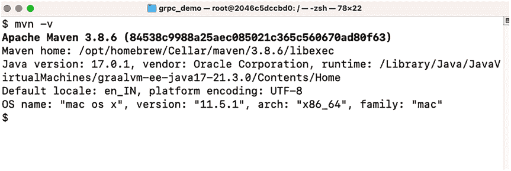

第 3 章 搭建你的开发环境

**安装 Maven**

要在你的系统上安装 Maven，请按照以下步骤操作：

1\. 从 Apache Maven 官方网站下载最新版本的 Maven  
[网站（https://maven.apache.org/）](https://maven.apache.org/)。

2\. 将下载的压缩包解压到你选择的目录。

3\. 将解压后 Maven 文件夹中的 `bin` 目录添加到你的 `PATH` 环境变量中。

4\. 运行以下命令验证安装：

mvn -v

你应该会看到类似如下输出：

Apache Maven 3.8.5 (3599d3414f046de2324203b78ddcf9b5e4388aa0)

Maven home: /Users/home/apache-maven-3.8.5

Java version: 17.0.1, vendor: Oracle Corporation, runtime: /Library/Java/

JavaVirtualMachines/jdk17.0_1.jdk/Contents/Home/jre

Default locale: en_IN, platform encoding: UTF-8

OS name: "mac os x", version: "11.5.1", arch: "x86_64", family: "mac"

如果你看到了如图 3-1 所示的输出，说明 Maven 已成功安装到你的系统中。

***图 3-1。** `mvn -v` 命令的输出*

请参见附录 B，了解如何使用 Maven 创建 Jakarta EE Web 应用项目。

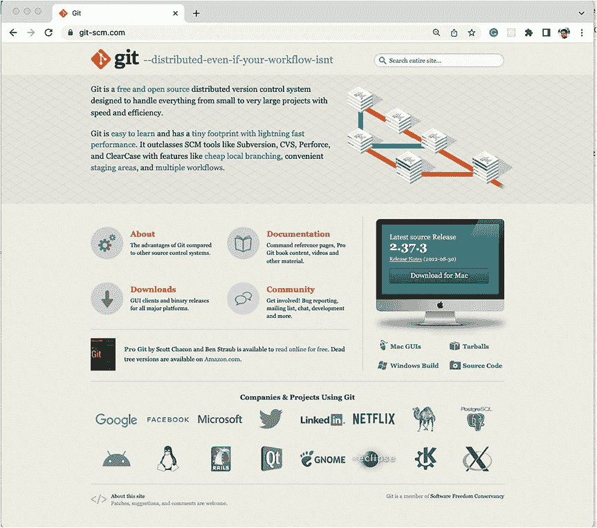

第 3 章 搭建你的开发环境

**Git**

Git 是一个分布式版本控制系统，用于跟踪软件开发项目中的变更。

**安装 Git**

要在你的系统上安装 Git，请按照以下步骤操作：

1\. 从 Git 官方网站下载最新版本的 Git  
[网站（https://git-scm.com/）](https://git-scm.com/)。

图 3-2 展示了 Git 网站首页。

***图 3-2。** git-scm 首页*

第 3 章 搭建你的开发环境

2\. 运行下载的安装程序，并按照屏幕提示完成安装。

3\. 运行以下命令验证安装：

git --version

你应该会看到类似如下输出：

git version 2.31.1

**创建 GitHub 账户**

GitHub 是一个用于版本控制与协作的代码托管平台。本示例应用程序的代码将存储在该平台上。如果你还没有 GitHub 账户，请按以下步骤创建：

1\. 访问 GitHub 网站[（https://github.com/）](https://github.com/)并点击 Sign up 按钮。

2\. 在相应字段中输入你的电子邮箱地址、密码和用户名。

3\. 系统会询问你是否希望通过电子邮件接收产品更新和公告。根据你的偏好，选择“y”表示是，或选择“n”表示否。

4\. 完成 CAPTCHA 验证后，点击 Create Account 按钮。

5\. 然后输入你在上一步提供的邮箱中收到的验证码。

6\. 验证通过后，你可以点击 Skip Personalization，直接进入你的 GitHub Dashboard。

现在你已经完成了使用 GitHub 的全部准备。

第 3 章 搭建你的开发环境

**创建 GitHub 仓库**

在本节中，你将学习如何为你的项目创建一个 GitHub 仓库。

1\. 登录你的 GitHub 账号，然后点击页面右上角的 + 图标。

2\. 在下一页中，点击 New Repository。

3\. 在 Create a New Repository 页面中，输入以下信息（参考图 3-3）：

• **Owner：** 确认已选择你的 GitHub 用户名。默认情况下应已选中。

• **Repository name**：此处选择 cloud-native-app。

• **Description (optional)**：一个基于 Java 的云原生应用开发项目。

• **Public/private**：如果你希望互联网上的任何人都能看到该仓库，请选择 Public。

• **Initialize this repository with:** 勾选 Add a README file 复选框。为项目仓库添加 README 文件是一个良好实践。该文件包含项目相关信息，例如项目内容、如何搭建等。

• **Add .gitignore**：为 .gitignore 模板选择 Java。

• **License:** None。

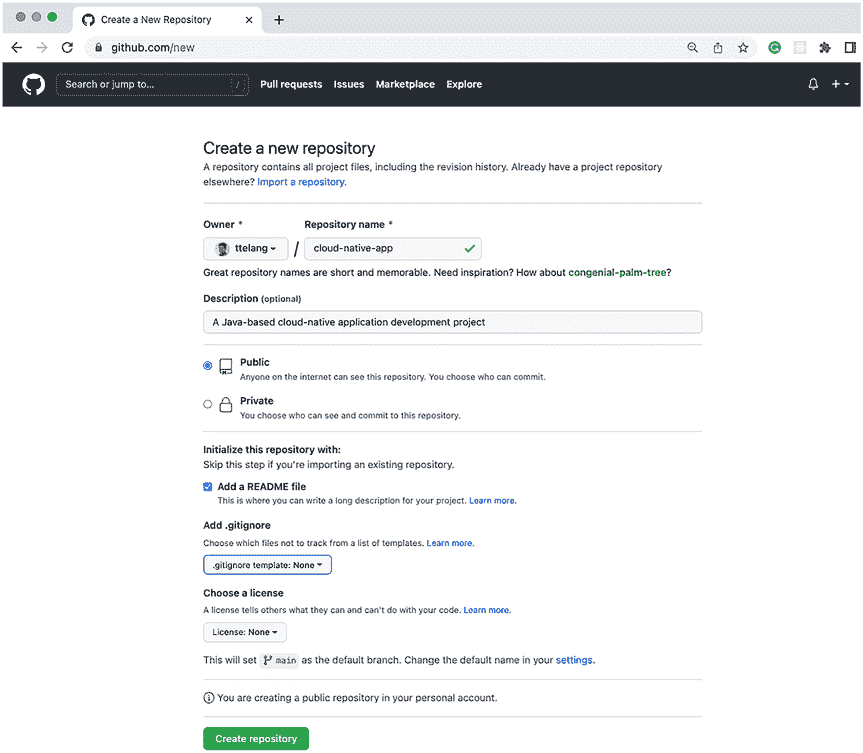

第 3 章 搭建你的开发环境

***图 3-3。** GitHub 中的 Create Repository 页面*

4\. 点击 Create Repository 按钮。至此，你的项目 GitHub 仓库应已创建完成。

**将代码推送到 GitHub 仓库**

在本节中，你将学习如何将项目代码推送到 GitHub 仓库。

1\. 打开终端窗口，并将当前工作目录切换到你的项目所在位置。

第 3 章 搭建你的开发环境

2\. 运行以下命令，将本地目录初始化为 Git 仓库：

git init

3\. 运行以下命令，将项目中的所有文件添加到 Git 仓库：

git add .

这个 git 命令会将当前目录中的所有文件添加到 Git 仓库中。这有助于跟踪代码库的更改，并便于与其他开发者协作。

4\. 运行以下命令，将这些更改提交到 Git 仓库：

git commit -m "Initial commit"

git commit 命令用于将更改保存到本地仓库。-m 选项用于指定提交信息。在此示例中，提交信息是 Initial commit。该命令会创建一个带有指定信息的新提交，并将其添加到当前分支。

5\. 运行以下命令，将 GitHub 仓库作为远程仓库添加到本地 Git 仓库：

git remote add origin https://github.com/<your-github-
username>/<project- name>.git

git remote add 命令会添加一个新的远程仓库，作为本地仓库的来源。在本例中，你将 GitHub 上托管的项目添加为本地仓库的 origin。请将 <your-github-username> 和 <project-name> 替换为你实际的 GitHub 用户名和项目名。

6\. 运行以下命令，将更改推送到 GitHub 仓库：

git push -u origin <branch-name>

这个 git 命令用于将你的代码推送到服务器。-u 选项用于设置上游仓库，即本地仓库将推送到的远程仓库。origin 是远程仓库名称；请将 <branch-name> 替换为你希望推送代码的分支名称，例如 master。

第 3 章 搭建你的开发环境

你应该会看到如下输出：

Enumerating objects: 40, done.

Counting objects: 100% (40/40), done.

Delta compression using up to 8 threads

Compressing objects: 100% (31/31), done.

写入对象：100%（40/40），63.79 KiB | 21.26 MiB/s，完成。

总计 40（delta 3），复用 0（delta 0），包复用 0

远程：正在解析 delta：100%（3/3），完成。

远程：

远程：通过访问以下地址在 GitHub 上为“master”创建一个拉取请求：

远程：https://github.com/ttelang/cloud-native-app/pull/new/master

远程：

推送到 https://github.com/ttelang/cloud-native-app.git

* [新分支] master -> master

你的项目现已推送到 GitHub 仓库。

**使用 Docker**

如今，几乎所有应用程序都在以某种方式使用容器。

Docker 是一个容器化平台，用于将完整的应用环境打包并运行在小型、隔离且可移植的容器中。使用 Docker 平台，你可以轻松配置和自定义容器，以运行各种操作系统、Web 服务器、应用服务器、数据库等等。Docker 让开发者能够非常方便地将应用及其所有库和依赖一起打包，并以一个轻量级的单一包形式发布。随后，这个包可以部署到容器中，并可移植到各种云环境。

**使用 Docker 的优势**

Docker 容器是虚拟机的一种轻量级替代方案，可为应用开发带来诸多好处，包括：

• **隔离性：** 容器将应用彼此隔离，也将其与底层基础设施隔离。这种隔离可以提高安全性，并改善开发、测试和生产环境之间的可复现性。

第 3 章 搭建你的开发环境

• **可移植性：** 容器可以部署在任何支持容器运行时的主机上，这使得应用能够在开发、测试和生产环境之间轻松迁移。

• **高效性：** 容器比虚拟机占用少得多的磁盘空间和内存，因此可以运行在更小、性能更低的主机上。此外，单台主机上可以运行多个容器，从而进一步提高效率。

• **灵活性：** 容器可以部署在各种环境中，从本地数据中心到公有云。

Docker 容器通常与 Kubernetes 一起使用。Kubernetes 是一个容器编排平台，提供了更多特性和功能，用于大规模管理容器。

**安装 Docker**

在本节中，你将学习如何在你的系统上安装并设置 Docker。要在系统上安装 Docker，请按以下步骤操作：

1\. 从 Docker 官网站下载适用于 Mac 或 Windows 的 Docker Desktop [（https://www.docker.com/）。](https://www.docker.com/)

2\. 运行下载好的安装程序，并按照屏幕上的说明完成安装。

3\. 运行以下命令以验证安装：

`docker --version`

你应该会看到类似如下输出：

`Docker version 20.10.11, build dea9396`

如果你看到了这条输出，说明 Docker 已经在你的系统上成功安装。

根据你的系统配置不同，Docker 安装过程可能不会很顺利。如果在安装 Docker 时遇到问题，请查阅文档（[`docs.docker.com/install/）以获取更多`](https://docs.docker.com/install/)信息。

第 3 章 搭建你的开发环境

**Docker Hub**

Docker Hub 是一个公共镜像仓库，包含大量可用于各种用途的 Docker 镜像。例如，你可以在 Docker Hub 上找到 MongoDB 镜像、Tomcat 镜像或 Java 应用服务器镜像。你也可以创建自己的镜像并将其推送到公共仓库，供其他人使用。

**创建 Docker Hub 账户**

如果你还没有 Docker Hub 账户，请按以下步骤创建：

1\. 访问 Docker 网站（[`hub.docker.com/`](https://hub.docker.com/)），然后点击 Register 按钮。

2\. 在注册页面（图 3-4）中，输入你的用户名、电子邮箱地址和密码。

3\. 勾选复选框以同意服务协议、隐私政策和数据处理条款。

4\. 完成 reCAPTCHA 验证并点击“注册（Sign Up）”按钮，以创建你的 Docker Hub 账户。

5\. 现在你可以登录 Docker Hub 网站，访问容器镜像库。

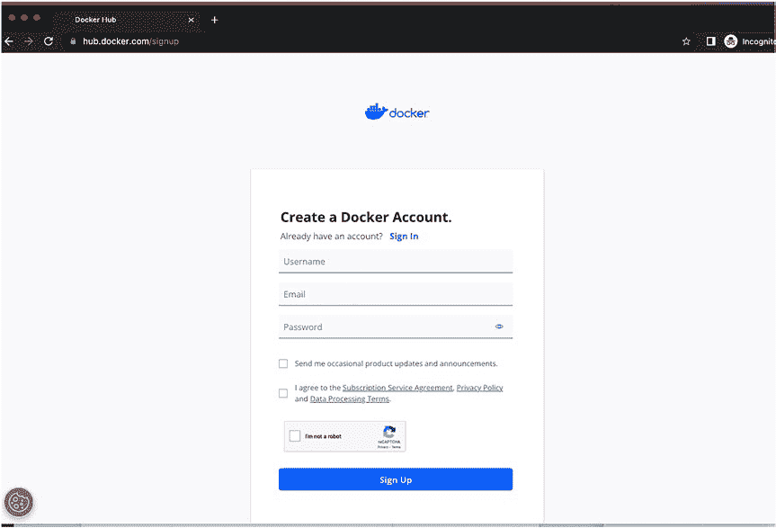

第 3 章 搭建你的开发环境

***图 3-4。** Docker Hub 注册页面*

当你成功创建 GitHub 和 Docker Hub 账户后，就可以开始为基于 Java 的云原生应用开发搭建开发环境了。在第 [9 章，你](https://doi.org/10.1007/978-1-4842-8832-0_9)将学习如何创建 Docker 镜像并将其推送到 Docker Hub。

**使用 Kubernetes**

Kubernetes 是一个强大的工具，可帮助你自动化容器化应用的部署与扩缩容。由于 Kubernetes 需要正确配置 Docker，因此理解这两种技术协同使用的优势非常重要。

Kubernetes 提供了多项优势，例如容器化应用的自动部署与扩缩容、自愈能力、服务发现与负载均衡，以及存储编排。

第 3 章 搭建你的开发环境

Kubernetes 是一个开源的容器编排平台，可自动化容器化应用的部署、扩缩容和管理。在本节中，你将在开发机器上安装 Kubernetes。安装 Kubernetes 最简单的方法是使用 Minikube 之类的工具。Minikube 是运行在开发机器上的单节点 Kubernetes 集群。Minikube 的优势包括：

• 易于安装并快速上手。

• 可在本地开发机器上运行。

• 无需为运行 Minikube 预置或管理任何基础设施。

你将在第 [9 章。](https://doi.org/10.1007/978-1-4842-8832-0_9)中进一步学习 Kubernetes 与容器编排。

**安装 Kubernetes**

要安装 Minikube，请按照 Minikube 文档网站中“[快速开始](https://minikube.sigs.k8s.io/docs/start/)”部分的说明进行操作。

你需要根据你的平台架构和操作系统运行相应的安装命令。

在 Windows 上，你可以通过此链接下载并运行最新安装程序：[https://](https://storage.googleapis.com/minikube/releases/latest/minikube-installer.exe)

[storage.googleapis.com/minikube/releases/latest/minikube-installer.exe.](https://storage.googleapis.com/minikube/releases/latest/minikube-installer.exe)

在 macOS 或 Linux 上，你需要运行 curl 命令，如下所示：

curl -LO https://storage.googleapis.com/minikube/releases/latest/minikube-

<operating system>-<architecture>

sudo install minikube-<operating system> -<architecture> /usr/local/bin/

minikube

请务必将 <architecture> 替换为 x86-64 或 arm64，并将 <operation system> 替换为 Linux 操作系统对应的 linux，或 macOS 对应的 darwin。系统会提示你输入管理员或 root 密码。

这将通过二进制下载方式安装最新的 Minikube 稳定版本。

现在，在你的机器上启动 Docker 服务，并通过运行以下命令验证安装：

minikube start

第 3 章 搭建你的开发环境

你应该会看到与下方类似的输出：

ΨŵŝŶŝŬƵďĞƐƚĂƌƚ

ŵŝŶŝŬƵďĞǀϭ͘Ϯϱ͘Ϯ ŽŶĂƌǁŝŶϭϭ͘ϱ͘ϭ ;ĂƌŵϲϰͿ

ಉ hƐŝŶŐƚŚĞĚŽĐŬĞƌĚƌŝǀĞƌďĂƐĞĚŽŶĞdžŝƐƟŶŐƉƌŽĮůĞ

^ƚĂƌƟŶŐĐŽŶƚƌŽůƉůĂŶĞŶŽĚĞŵŝŶŝŬƵďĞŝŶĐůƵƐƚĞƌŵŝŶŝŬƵďĞ

WƵůůŝŶŐďĂƐĞŝŵĂŐĞ͘͘͘

ƌĞĂƟŶŐĚŽĐŬĞƌĐŽŶƚĂŝŶĞƌ;WhƐсϮ͕DĞŵŽƌLJсϭϵϴϴDͿ͘͘͘

WƌĞƉĂƌŝŶŐ<ƵďĞƌŶĞƚĞƐǀϭ͘Ϯϯ͘ϯ ŽŶŽĐŬĞƌϮϬ͘ϭϬ͘ϭϮ ͘͘͘

ඵ ŬƵďĞůĞƚ͘ŚŽƵƐĞŬĞĞƉŝŶŐͲŝŶƚĞƌǀĂůсϱŵ

ඵ 'ĞŶĞƌĂƟŶŐĐĞƌƟĮĐĂƚĞƐĂŶĚŬĞLJƐ͘͘͘

ඵ ŽŽƟŶŐƵƉĐŽŶƚƌŽůƉůĂŶĞ͘͘͘

ඵ ŽŶĮŐƵƌŝŶŐZƌƵůĞƐ͘͘͘

sĞƌŝĨLJŝŶŐ<ƵďĞƌŶĞƚĞƐĐŽŵƉŽŶĞŶƚƐ͘͘͘

ඵ hƐŝŶŐŝŵĂŐĞŐĐƌ͘ŝŽͬŬϴƐͲŵŝŶŝŬƵďĞͬƐƚŽƌĂŐĞͲƉƌŽǀŝƐŝŽŶĞƌ͗ǀϱ

ŶĂďůĞĚĂĚĚŽŶƐ͗ƐƚŽƌĂŐĞͲƉƌŽǀŝƐŝŽŶĞƌ͕ĚĞĨĂƵůƚͲƐƚŽƌĂŐĞĐůĂƐƐ

ŽŶĞ͊ŬƵďĞĐƚůŝƐŶŽǁĐŽŶĮŐƵƌĞĚƚŽƵƐĞΗŵŝŶŝŬƵďĞΗĐůƵƐƚĞƌĂŶĚΗĚĞĨĂƵůƚΗŶĂŵĞƐƉĂĐĞďLJ

ĚĞĨĂƵůƚ

如果你看到了图 3-5 所示的输出，就说明 Minikube 已经成功安装到你的系统上。

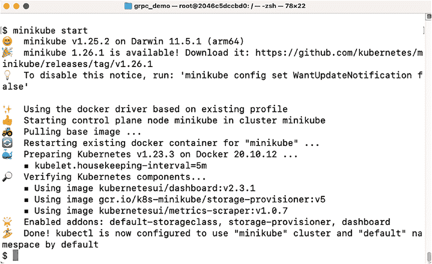

第 3 章 搭建你的开发环境

***图 3-5。** Minikube 启动命令的输出结果*

**为 Kubernetes 配置 Docker**

Minikube 是开始使用 Kubernetes 的绝佳方式，因为它易于安装且容易上手。通过将 Docker 配置为使用正确的设置，你可以确保应用程序在 Kubernetes 上正确运行。要在 Windows 上为 Kubernetes 配置 Docker，请按照以下说明操作：

1\. 右键单击系统托盘中的 Docker 图标并选择“Settings”。

2\. 选择 Kubernetes，并勾选 Enable Kubernetes 复选框。

3\. 点击 Apply & Restart。

要在 macOS 上为 Kubernetes 配置 Docker，请按照以下说明操作：

1\. 打开 Docker Desktop 偏好设置窗口。

2\. 点击 Kubernetes 选项卡。

3\. 选择 Enable Kubernetes，如图 3-6 所示。

4\. 点击 Apply & Restart。这将重启 Docker 并启用 Kubernetes。

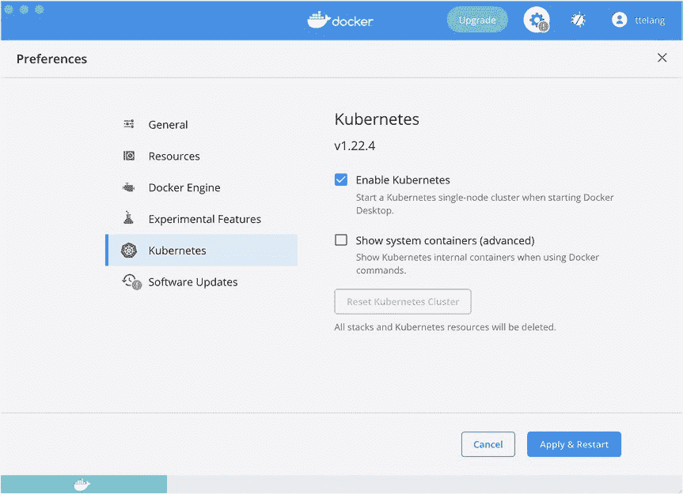

第 3 章 搭建你的开发环境

***图 3-6。** Docker Desktop 中的 Kubernetes 偏好设置*

要在 Linux 上为 Kubernetes 配置 Docker，请按照以下说明操作：

1\. 在文本编辑器中打开 Docker 守护进程配置文件。该

文件位于 /etc/docker/daemon.json。

2\. 将以下内容添加到文件中：

{

"exec-opts": ["native.cgroupdriver=systemd"],

"log-driver": "json-file",

"log-opts": {

"max-size": "100m"

},

"storage-driver": "overlay2"

}

第 3 章 搭建你的开发环境

3\. 保存文件并退出文本编辑器。

4\. 重启 Docker 守护进程。

5\. 要验证 Kubernetes 是否已启用，运行以下命令：

docker info | grep -i "kubernetes"

你应该会看到以下输出：

WARNING: No swap limit support

Kubernetes Root Dir: /var/lib/kubelet

Kubernetes Runtime Wants Filesystem: true

Kubernetes Runtime Execs Mounted via Containerd: false

Runtimes: docker runc

Default RuntimeName: docker

Init binary path: /usr/local/bin/podman

Kubernetes version: v1.15.3

Cgroup Driver: systemd

**创建 Kubernetes 集群**

Kubernetes 集群是一组用于运行容器化应用程序的节点或服务器。

Kubernetes 集群中的每个节点都运行一个 Kubernetes 代理，用于管理

在该节点上运行的应用程序。该代理与 Kubernetes 主节点通信，

而主节点负责管理整个集群。

在本节中，你将使用 Minikube 创建一个 Kubernetes 集群。

1\. 如果 Minikube 尚未运行，请通过运行

以下命令来启动它：

$ minikube start

2\. 通过运行以下

命令来验证集群已启动并运行：

$ kubectl get nodes

第 3 章 搭建你的开发环境

3\. 你应该会看到以下输出：

$ kubectl get po -A

NAMESPACE NAME READY STATUS

RESTARTS AGE

kube-system coredns-64897985d-h2cwq 1/1 Running

0 2m

kube-system etcd- minikube 1/1 Running

0 2m15s

kube-system kube-apiserver-minikube 1/1 Running

0 2m15s

kube-system kube-controller-manager-minikube 1/1 Running

0 2m13s

kube-system kube-proxy-wm5c5 1/1 Running

0 2m

kube-system kube-scheduler-minikube 1/1 Running

0 2m14s

kube-system storage-provisioner 1/1 Running

1 (89s ago) 2m12s

**使用 Zipkin**

Zipkin 是一个分布式追踪系统。它可以帮助你了解应用程序的行为，并提供对各个微服务性能的洞察。

**安装 Zipkin**

要安装 Zipkin，你首先需要安装 Java。安装好 Java 后，你可以通过以下链接下载并安装 Zipkin：

[`zipkin.io/pages/quickstart`](https://zipkin.io/pages/quickstart)

安装完成后，你可以通过运行以下命令启动 Zipkin：

java -jar zipkin.jar

随后 Zipkin 将启动，并可通过 http://localhost:9411/ 访问。你可以

访问 Zipkin UI 来查看追踪数据，如图 3-7 所示。

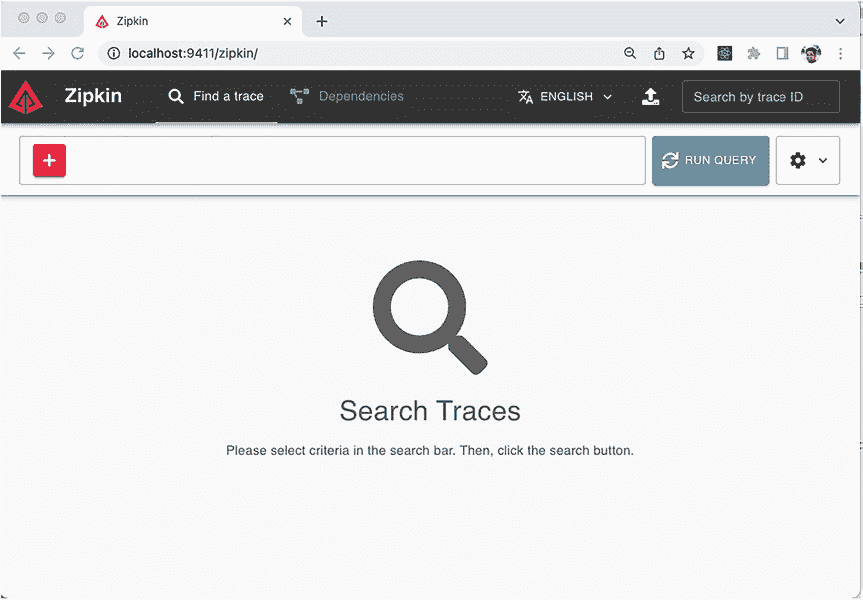

第 3 章 搭建你的开发环境

***图 3-7。** 用于查看追踪的 Zipkin UI*

**集成开发环境（IDE）**

IDE（即集成开发环境，Integrated Development Environment）是一种用于开发软件应用程序的软件工具。它包含用于编辑代码、编译代码、运行测试以及调试应用程序的功能。一些流行的 IDE 包括 Eclipse、IntelliJ、Visual Studio Code 和 Apache NetBeans。

在开始之前，你需要准备一个自己选择的集成开发环境（IDE）。

一些流行的 Java 开发 IDE 有：

• IntelliJ IDEA Ultimate 或 Community Edition（社区版）[(www.jetbrains.](https://www.jetbrains.com/idea/)

[com/idea/](https://www.jetbrains.com/idea/)）

• Eclipse IDE for Enterprise Java and Web Developer[s（www.eclipse.](http://www.eclipse.org/downloads/packages/)

[org/downloads/packages/）](http://www.eclipse.org/downloads/packages/)

第 3 章 搭建你的开发环境

• Apache NetBeans（[`netbeans.apache.org/)`](https://netbeans.apache.org/)）

• Visual Studio Code（[`code.visualstudio.com/`](https://code.visualstudio.com/)）或你选择的任何其他 IDE。

恭喜你！你已经成功为云原生应用开发搭建好了开发环境。

**总结**

本章介绍了开发云原生 Java 应用所需工具和软件的安装过程。你首先安装了 Java Development Kit（JDK），随后安装了 Maven、Git、Open Liberty、Docker 和 Kubernetes。使用 Docker 和 Kubernetes 的优势之一是它们能让应用部署变得更加容易。Docker 和 Kubernetes 都是开源技术，并拥有庞大的用户与贡献者社区。

之后你还安装了 Zipkin，它是一个分布式追踪系统。假设你已经安装好了所有工具和软件，那么在接下来的章节中，你就可以开始构建微服务和云原生应用了。同时也建议你使用 IDE，因为它能带来更好的编码体验。一些流行的 IDE 包括 Eclipse、IntelliJ IDEA、NetBeans 和 Visual Studio Code。

**第 4 章**

**构建 RESTful Web**

**服务**

在第 [2](https://doi.org/10.1007/978-1-4842-8832-0_2) 章中，你已经了解到，微服务是一种架构风格，它将应用组织为一组小型、模块化的服务。微服务是可独立部署、可扩展、可测试的服务，并通过定义良好的 API 相互通信。这种服务解耦提升了开发与部署的敏捷性，同时也增强了运行层面的韧性。

RESTful API 是一种应用程序编程接口（API），它遵循 REST 架构风格的约束，并支持与 RESTful Web 服务进行交互。例如，Facebook、Twitter 和 Google 都将其功能以 RESTful Web 服务形式提供，任何客户端应用都可以通过 REST 调用这些 Web 服务。

RESTful API 的三个关键组成部分是：

• 运行在用户计算机或智能手机上的客户端，并发起通信

• 服务器，通过提供 API 来访问其数据或功能

• 资源，即服务器能够提供给客户端的任意内容

当客户端通过 RESTful API 请求某个资源时，服务器会将该资源状态的一个表示（通过 HTTP/JSON）传输给请求方或端点。

在本章中，你将学习如何使用 Jakarta EE 平台创建 RESTful Web 服务。你还将学习如何在 Open Liberty 服务器上部署并测试你的 Web 服务。首先，本章将重点介绍如何使用 Jakarta RESTful Web Service（前称 JAX-RS）创建服务端组件。你将从创建一个返回产品基本信息的简单 Web 服务开始。随后你将添加更多功能，例如返回产品列表，并允许客户端创建新产品。

© Tarun Telang 2023

T. Telang, *微服务、Jakarta EE 与 Kubernetes 云原生开发入门（Beginning Cloud Native Development with MicroProfile, Jakarta EE, and Kubernetes）*,

[`doi.org/10.1007/978-1-4842-8832-0_4`](https://doi.org/10.1007/978-1-4842-8832-0_4#DOI)

第 4 章 构建 RESTful Web 服务

**REST：一种用于构建的架构风格**

**Web 服务**

表述性状态转移（REST）是一种架构风格，它定义了一组用于创建 Web 服务的约束。

遵循 REST 架构风格的 Web 服务，或简称 RESTful Web 服务，可在互联网中的计算机系统之间提供互操作性。符合 REST 的 Web 服务允许请求方系统通过

一组统一且预定义的无状态操作来访问和操作 Web 资源的文本表述。REST 风格使用标准的

HTTP 方法（如 GET、POST、PUT 和 DELETE）来操作资源。它还

使用简单的 URL 语法来访问资源，并使用标准 HTTP 状态码来指示请求结果。

REST 架构风格定义了一组在创建 RESTful API 时必须遵循的约束。

关键约束如下：

• 客户端应能够使用标准 HTTP

方法（GET、POST、PUT、DELETE）访问资源。

• 客户端应能够确定每个资源的 URI。

• 资源应以 JSON 或 XML 格式表示。

• 服务器应针对每个请求返回正确的 HTTP 响应码（200 OK、404

Not Found 等）。

**Open Liberty 运行时简介**

Open Liberty（[`openliberty.io/) 是一个灵`](https://openliberty.io/)活且开源的服务器运行时环境，使你能够快速构建和部署基于微服务的应用程序

。它是一个轻量级、模块化的运行时环境，具有快速启动和低内存占用的特点。它提供了你快速高效构建微服务应用

所需的基础能力。

IBM WebSphere Liberty 应用服务器（[www.ibm.com/in-en/cloud/](https://www.ibm.com/in-en/cloud/websphere-liberty)

[websphere-liberty](https://www.ibm.com/in-en/cloud/websphere-liberty)）构建于 Open Liberty 之上。Open Liberty 是一个灵活的运行时环境，支持多种编程模型、语言和框架。

你可以在 Open Liberty 中使用你选择的技术，而无需担心

厂商锁定。Open Liberty 由一个庞大且充满活力的开源社区支持。

第 4 章 构建 RESTful Web 服务

**Open Liberty 应用服务器的关键特性**

Open Liberty 提供了一组专门用于增强微服务应用开发、部署和管理的功能。它提供了

以下关键特性，帮助你开发、部署和管理基于微服务的应用程序：

• **微服务的快速开发：** Open Liberty 让你能够使用自己喜爱的 IDE（

如 Eclipse 或 IntelliJ IDEA）快速开发基于微服务的应用程序。

你还可以使用任意构建工具，如 Maven 或 Gradle。

• **轻松部署到不同环境：** Open Liberty 为你提供

多种部署选项，以便你可以将

应用程序部署到自己选择的平台。你还可以使用容器技术，如 Docker。

• **远程管理、监控与运维：** Open

Liberty 为你提供了多种管理选项，因此你

可以以最适合需求的方式管理应用程序。

它为应用程序的监控和管理提供了内置支持。你可以使用 Open Liberty 管理中心（Admin Center），它

是一个用于监控应用程序健康状况

和性能的图形用户界面。它还提供 Open Liberty 命令行

接口，以支持更脚本化的使用方式。

• **云就绪：** Open Liberty 专为云而设计。它支持

最新标准和技术，包括 Jakarta EE 和 Eclipse

MicroProfile。

• **对 Java 标准与技术的支持：** Open Liberty

支持 MicroProfile 中的全部特性，以及 Jakarta EE 规范中的许多特性。这意味着你可以编写

Jakarta EE 应用程序并将其部署在 Open Liberty 上。

• **安全性：** Open Liberty 提供全面的安全特性，

包括对单点登录（SSO）和传输层

安全性（TLS）。TLS 在客户端与服务器之间提供安全连接，而 SSO 允许用户一次登录即可访问

第 4 章 构建 RESTful Web 服务

其被授权使用的所有应用程序。这些特性使

Open Liberty 成为那些必须确保其 Web 应用程序和数据安全的组织的理想选择。

**下载并安装 Open Liberty**

安装 Open Liberty 是一个简单的过程，只需几分钟。以下是在你的计算机上安装 Open Liberty 的步骤：

1\. 从 [`openliberty.io/`](https://openliberty.io/downloads/) 下载 Open Liberty

[downloads/.](https://openliberty.io/downloads/)

2\. 要安装 Open Liberty，请将下载文件的内容解压到你选择的目录中。

解压后内容的文件夹结构应如下所示：

wlp

├── BETA_NOTICES

├── LICENSE

├── README.TXT

├── bin

├── clients

├── dev

├── lib

├── templates

└── usr

你可以使用 Open Liberty 开发面向云的应用程序，并可部署在微服务架构中。

**启动 Open Liberty 服务器**

解压下载文件内容后，你可以在 bin 文件夹中运行以下命令来启动 Open Liberty：

$ ./server start

然后你将看到图 4-1. 所示的输出。

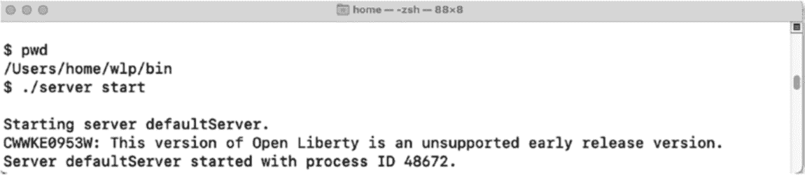

第 4 章 构建 RESTful Web 服务

***图 4-1。** `./server start` 命令的输出*

你可以设置 PATH 环境变量，以便可以从任何

目录启动服务器，并且无需像以下步骤那样在命令前加上 `./`。

对于 Linux 或 macOS：

• 根据你当前使用的 shell，在文本编辑器中打开你主目录下的 `.bash_profile` 或 `.zshrc` 文件。如果你没有这个文件，请在主目录中创建一个。

• 在该文件中添加以下一行：

export PATH=<path-to-directory>;$PATH

对于 Windows：

• 如果你使用的是 Windows，你可以使用以下

命令设置完整路径，或者在“控制面板 ➤ 高级系统设置”区域中设置环境变量：

set PATH=<path-to-directory>;%PATH%

将 `<path-to-directory>` 替换为服务器可执行文件所在路径。你应重启命令提示符或终端以使

更改生效。

这将以默认配置启动一个 Open Liberty 实例。然后你可以通过以下 URL 访问该实例：http://localhost:9080/。图 4-2

显示了 Open Liberty 服务器的欢迎页面。

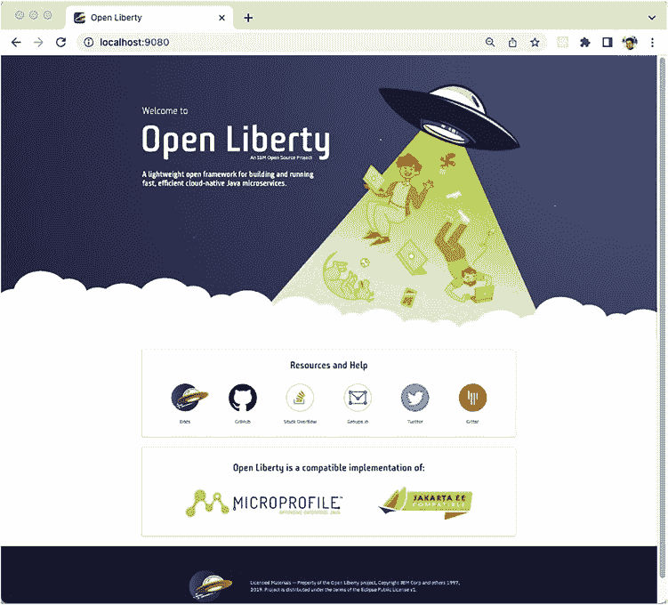

第 4 章 构建 RESTful Web 服务

***图 4-2。** Open Liberty 欢迎页面*

这验证了 Open Liberty 已成功安装。你现在可以开始创建你的第一个应用程序了。

**打印 Open Liberty 服务器上的功能列表**

你可以使用

`productInfo` 命令打印 Open Liberty 服务器上已安装的功能列表。这是一个很有用的命令，可用于查看安装并运行了哪些功能。

要打印已安装功能的列表，你只需打开终端并运行以下命令：

./productInfo featureInfo

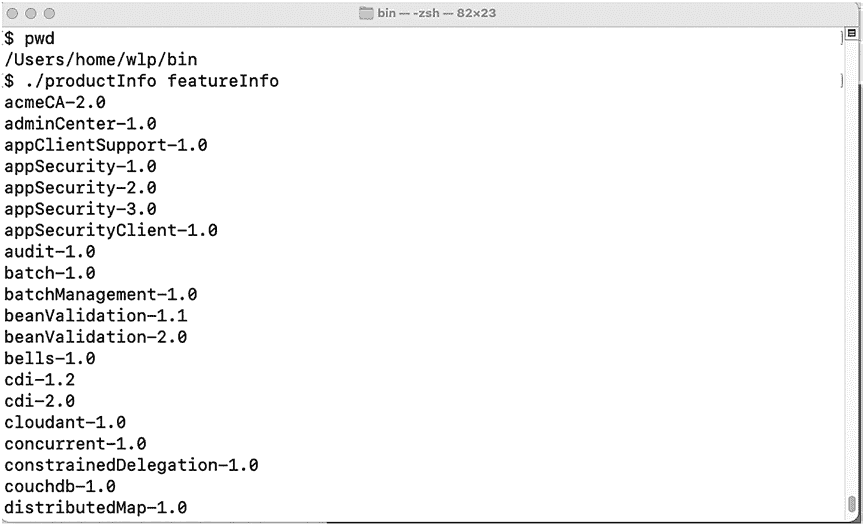

第 4 章 构建 RESTful Web 服务

图 4-3 shows 显示了输出结果。

***图 4-3。** `./productInfo featureInfo stop` 命令的输出*

Open Liberty 服务器支持大量功能。

表 4-1 给出了 Open Liberty 服务器支持的前几个功能列表，以展示 Open Liberty 服务器具有多么强的可扩展性和模块化能力。

第 4 章 构建 RESTful Web 服务

***表 4-1。** Open Liberty 功能及说明*

**功能**

**说明**

acmeCa-2.0:

此功能允许使用 ACME v2

协议对证书进行签名和验证。

appSecurity-3.0:

此功能为 Open

Liberty 提供应用安全能力。

audit-1.0:

此功能启用对服务器活动的审计，以跟踪对数据

和系统资源的更改。这可用于安全目的。

排查问题，或确定系统的使用方式。

cdi-2.0：

此特性为 Open Liberty 提供上下文与依赖注入能力。它用于管理应用程序组件之间的依赖关系。

cloudant-1.0：

此特性提供了从 Cloudant 数据库存储和检索数据的能力。Cloudant 是一种分布式数据库，可帮助开发者构建可扩展应用程序。

concurrent-1.0：

此特性为 Open Liberty 提供企业级 Concurrency Utilities 1.0。

constraineddelegation-1.0：此特性允许在服务器之间对受限资源进行委派。这可用于提升安全性，或更轻松地管理被委派的资源。

couchdb-1.0：

此特性提供了从 CouchDB 数据库存储和检索数据的能力。CouchDB 是一种面向文档的数据库，可帮助开发者构建可扩展应用程序。

distributedMap-1.0：

此特性提供了一个可用于在服务器之间共享数据的分布式映射。

有关完整特性列表，请访问官方文档页面 [www.ibm.com/](http://www.ibm.com/docs/en/was-liberty/base?topic=management-liberty-features)

[docs/en/was-liberty/base?topic=management-liberty-features。](http://www.ibm.com/docs/en/was-liberty/base?topic=management-liberty-features)

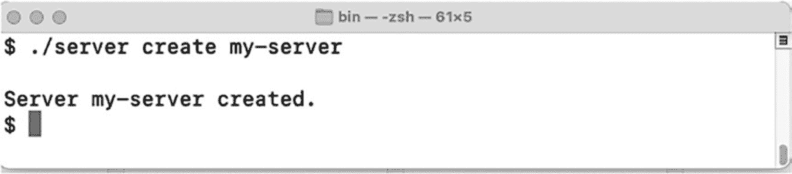

第 4 章 构建 RESTful Web 服务

**创建服务器实例**

如果你想运行不同的一组特性，或希望进一步优化性能，你可能需要一个新的服务器实例。创建新的服务器实例很简单。你只需要使用 server create 命令并在后面跟上新服务器的名称。在本例中，将新服务器命名为 my-server。

./server create my-server

该命令的输出如图 4-4 所示。

***图 4-4。** ./server create my-server 命令的输出*

它会创建一个名为 my-server 的新目录，其中包含运行新服务器实例所需的所有文件。图 4-5 显示了新创建的目录。

***图 4-5。** Open Liberty 新服务器实例的文件夹结构*

在 Open Liberty 服务器中，不同文件夹用于存储不同类型的文件。

apps 文件夹存储你希望在服务器上运行的应用程序。dropins 文件夹存储你想添加到服务器实例中的文件。workarea 文件夹存储服务器使用的临时文件。

Open Liberty 提供了一种将应用部署到服务器的简单方式。你只需将可部署文件移动到服务器目录下的 dropins 文件夹中。Open Liberty 会自动部署应用程序，并在需要时重启服务器。

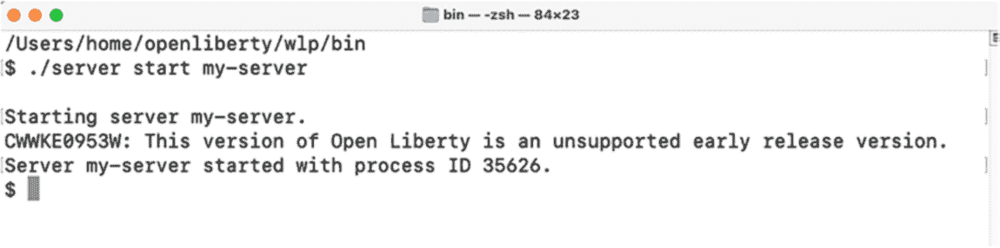

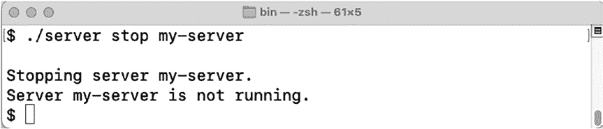

第 4 章 构建 RESTful Web 服务

你可以使用 server start 命令启动新的服务器实例，如下所示：

./server start my-server

该命令的输出如图 4-6 所示。

***图 4-6。** ./server start my-server 命令的输出*

**停止 Open Liberty 服务器**

如果你想停止新创建的服务器实例，可以使用 server stop 命令，并在后面加上服务器名称。例如，下面这个命令：

./server stop my-server

它会给出如图 4-7 所示的输出。

***图 4-7。** ./server stop my-server 命令的输出*

要停止你已启动的 Open Liberty 默认实例，可以运行以下命令：

./server stop

命令成功执行后，你将看到如图 4-8 所示的输出。

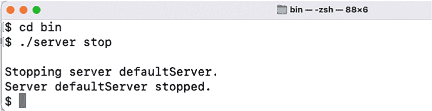

第 4 章 构建 RESTful Web 服务

***图 4-8。** ./server stop 命令的输出*

**配置服务器**

你可以使用名为 server.xml 的配置文件来配置服务器。你还可以通过在 server.xml 中添加 featureManager 元素，为服务器添加特性。

文件。例如，你可以通过添加以下 XML 来添加 `restfulWS-3.0` 和 `jsonb-2.0` 特性：

<featureManager>

<feature>restfulWS-3.0</feature>

<feature>jsonb-2.0</feature>

</featureManager>

Open Liberty 了解其所需的依赖项，并会负责添加它们。如果你想禁用某个特性，只需从你的 `server.xml` 文件中移除对应的 `feature` 元素即可。

**在 Open Liberty 中创建 RESTful Web 服务**

如果你从零开始，可以利用通过 Get Started - Open Liberty 网站创建的起步应用快速上手：[https://](https://openliberty.io/start)

[openliberty.io/start](https://openliberty.io/start)。你将看到图 4-9 中的表单。

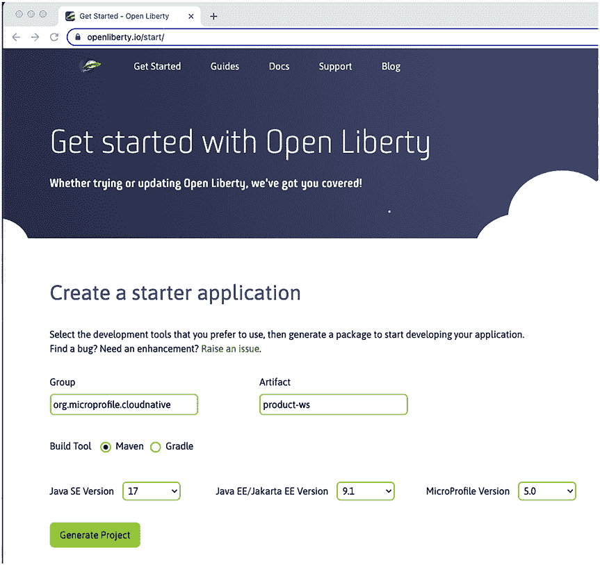

第 4 章 构建 RESTful Web 服务

***图 4-9。** Get Started - Open Liberty 网页*

你需要提供以下详细信息：

**Group ID：** org.microprofile.cloudnative

**Artifact ID：** product-ws

**Build Tool：** Maven

**Java SE Version：** 17

**Java EE/Jakarta EE Version：** 9.1

**MicroProfile Version：** 5.0

第 4 章 构建 RESTful Web 服务

选择所需的构建工具。Maven 和 Gradle 都受支持。本书使用 Maven；如果你愿意，后续也可以轻松迁移到 Gradle。本示例使用 Java SE 版本 17 和 MicroProfile 版本 5.0，因为在撰写本书时，这些是 Open Liberty 支持的最新稳定版本。准备就绪后，点击 Generate Project 按钮下载生成的项目。

**探索项目结构**

你可以解压该项目。其结构应如下所示：

product-ws

├── Dockerfile

├── README.txt

├── mvnw

├── mvnw.cmd

├── pom.xml

└── src

└── main

├── java

│ └── org

│ └── microprofile

│ └── rest

│ └── RestApplication.java

└── liberty

└── config

└── server.xml

Dockerfile 可用于在 Docker 容器中构建和运行应用程序（这将在第 [9 章](https://doi.org/10.1007/978-1-4842-8832-0_9) 中介绍）。`mvnw` 和 `mvnw.cmd` 脚本可用于在不安装 Maven 的情况下构建和运行应用程序。

**理解 Open Liberty 项目的 Maven pom.xml 文件**

Open Liberty starter 为你提供了一种简单快捷的方法来获取在 Open Liberty 中开始开发应用程序所需的文件。当你使用 Open Liberty starter 生成项目时，`pom.xml` 文件会包含用于 89

第 4 章 构建 RESTful Web 服务

Open Liberty 特性的最新稳定版本的依赖项。还会包含 `liberty-maven-plugin` 文件，以便你将应用程序部署并运行在 Open Liberty 服务器上。

以下是 `pom.xml` 文件中包含的源代码：

<?xml version="1.0" encoding="UTF-8" ?>

<project

xsi:schemaLocation="http://maven.apache.org/POM/4.0.0 http://maven.

apache.org/xsd/maven-4.0.0.xsd">

<modelVersion>4.0.0</modelVersion>

<groupId>org.microprofile.cloudnative</groupId>

<artifactId>product-ws</artifactId>

<version>1.0-SNAPSHOT</version>

<packaging>war</packaging>

<properties>

<maven.compiler.source>17</maven.compiler.source>

<maven.compiler.target>17</maven.compiler.target>

<project.build.sourceEncoding>UTF-8</project.build.sourceEncoding>

</properties>

<dependencies>

<dependency>

<groupId>jakarta.platform</groupId>

<artifactId>jakarta.jakartaee-api</artifactId>

<version>9.1.0</version>

<scope>provided</scope>

</dependency>

<dependency>

<groupId>org.eclipse.microprofile</groupId>

<artifactId>microprofile</artifactId>

<version>5.0</version>

<type>pom</type>

<scope>provided</scope>

</dependency>

</dependencies>

第 4 章 构建 RESTful Web 服务

<build>

<finalName>product-ws</finalName>

<pluginManagement>

<plugins>

<plugin>

<groupId>org.apache.maven.plugins</groupId>

<artifactId>maven-war-plugin</artifactId>

<version>3.3.2</version>

</plugin>

<plugin>

<groupId>io.openliberty.tools</groupId>

<artifactId>liberty-maven-plugin</artifactId>

<version>3.5.2</version>

</plugin>

</plugins>

</pluginManagement>

<plugins>

<plugin>

<groupId>io.openliberty.tools</groupId>

<artifactId>liberty-maven-plugin</artifactId>

</plugin>

</plugins>

</build>

</project>

**说明：**

• 第 1 行：XML 声明定义了 XML 版本（1.0）和编码（UTF-8）。

• 第 2 行：project 元素是 POM 的*根*。所有其他元素都必须嵌套在该元素内。

• 第 3-4 行：xmlns 属性定义了 Maven 使用的 XML 命名空间。xsi:schemaLocation 属性定义了用于校验 POM 的模式位置。

第 4 章 构建 RESTful Web 服务

• 第 5 行：modelVersion 元素定义了 Maven 使用的 POM 模型版本。它必须与 project 起始标签中的值匹配。本示例使用的是 POM 模型 4.0.0 版本。

• 第 6-8 行：groupId 元素定义了项目所属组的唯一标识符。本示例使用 MicroProfile 组。

• 第 9-10 行：artifactId 元素定义了项目本身的唯一标识符。本示例使用名为 bookstore 的 Maven 工件。

• 第 11-12 行：version 元素定义了项目版本。本示例使用 SNAPSHOT 版本。

• 第 13-14 行：packaging 元素定义了 Maven 将生成的工件类型。本示例使用 WAR 文件。

• 第 15-18 行：properties 元素定义了可在整个 POM 中使用的属性。本示例定义了 Maven 编译器插件的 Java source 和 target 版本。

• 第 19-20 行：dependencies 元素定义了项目依赖项。本示例依赖 Jakarta EE 9.1 API 和 MicroProfile 5.0 API。

• 第 21-34 行：build 元素定义了项目的构建配置。本示例配置了 Maven war 插件和 Liberty Maven 插件。

• 第 35 行：finalName 元素定义了生成工件的名称。本示例使用 bookstore 作为最终名称。

• 第 36-39 行：pluginManagement 元素定义了项目的插件管理配置。本示例配置了 Maven war 插件和 Liberty Maven 插件。

• 第 40-43 行：plugins 元素定义了项目插件。本示例使用 Liberty Maven 插件。

第 4 章 构建 RESTful Web 服务

**在 Open Liberty 中运行现有 Jakarta EE 项目**

如果你已经有一个使用 Maven 的现有应用程序，只需将以下 Maven 依赖添加到 pom.xml 文件中：

<dependency>

<groupId>io.openliberty</groupId>

<artifactId>openliberty-runtime</artifactId>

<version>[22.0.0.8,)</version>

<type>zip</type>

</dependency>

这段代码会将最新版 Open Liberty Runtime 作为依赖添加到你的项目中。在构建期间，它会在本地 Maven 仓库中下载并安装 Open Liberty Runtime ZIP 文件。version 字段包含一个范围，会自动选择与你项目兼容的最新 Open Liberty Runtime 版本。运行 Maven 构建时，它可确保你使用的是最新版本的 Open Liberty，但最低为 22.0.0.8\。如果你想使用 Open Liberty 的特定版本，可以在 version 元素中指定版本号。

当你构建项目时，Maven 会在 target 目录中生成一个名为 product-ws.war 的 WAR 文件。当你准备好超越入门阶段后，可以通过向 POM 文件添加更多依赖来继续开发应用程序。

**server.xml 配置文件**

系统会提供一个 server.xml 配置文件，其中包含你之前所选 MicroProfile 和 Jakarta EE 版本所需的功能。

<?xml version="1.0" encoding="UTF-8"?>

<server description="new server">

<!-- Enable features -->

<featureManager>

<feature>jakartaee-9.1</feature>

<feature>microProfile-5.0</feature>

</featureManager>

...

...

第 4 章 构建 RESTful Web 服务

<httpEndpoint id="defaultHttpEndpoint"

httpPort="9080"

httpsPort="9443" />

<!-- Automatically expand WAR files and EAR files -->

<applicationManager autoExpand="true"/>

<!-- Configures the application on a specified context root -->

<webApplication contextRoot="/api" location="product-ws.war" />

<!-- Default SSL configuration enables trust for default certificates

from the Java runtime -->

<ssl id="defaultSSLConfig" trustDefaultCerts="true" />

</server>

**说明：**

server 元素是 server.xml 文件的根元素。description

元素是服务器的人类可读描述，在本例中设置为 new server。

featureManager 元素启用了 Jakarta EE 9.1 和 MicroProfile 5.0 特性。

httpEndpoint 元素定义了服务器的 HTTP 端点。在这个示例中，

HTTP 使用端口 9080，HTTPS 使用端口 9443。

applicationManager 元素使应用程序能够在服务器中自动

展开。webApplication 元素定义了服务器中的一个 Web 应用。该

示例使用 product-ws.war 文件，并通过 /product 上下文根进行访问。ssl 元素定义了服务器的 SSL 配置。本例信任来自 Java 运行时的默认证书。

**开发 REST 应用程序**

系统会为你生成一个简单的 RestApplication.java 文件，以便你开始创建基于 REST 的应用程序。

package org.microprofile.rest;

import jakarta.ws.rs.ApplicationPath;

import jakarta.ws.rs.core.Application;

@ApplicationPath("/api")

第 4 章 构建 RESTful Web 服务

public class RestApplication extends Application {

}

jakarta.ws.rs.ApplicationPath 注解用于指定应用程序的上下文

根。在本例中，它是“/api”。RestApplication 类通过继承 jakarta.ws.rs.core.Application 类来创建一个 Jakarta RESTful Web 服务

应用程序。

当你请求此 Web 服务时，必须在

URL 中包含 contextRoot。例如，如果你请求 product 资源，则需要请求 http://localhost:9080/api/product。

接下来，在命令行或终端中运行以下命令，以在开发模式下启动

Liberty 服务器。

mvn liberty:dev

**在 IntelliJ IDEA Ultimate Edition 中使用 Open Liberty 插件**

IntelliJ IDEA Ultimate Edition 的 Open Liberty 插件是一个支持在 Open Liberty 服务器上开发应用程序的插件。如果你想使用 Eclipse IDE，请参阅附录 C 获取更多细节。

**在 IntelliJ IDEA Ultimate Edition 中安装 Open Liberty 插件**

该插件可在 JetBrains 市场中获取。你可以在 IntelliJ

IDEA 中通过选择 File ➤ Preferences ➤ Plugins 并搜索 “Open Liberty” 来安装。找到插件后，点击 Install，并在提示时重启 IntelliJ IDEA。

安装完成后，你会在右侧看到一个 Liberty 选项，如图 4-10 所示。点击它后，你将看到可在项目上运行的各种 Maven 命令。你还可以在 Dev 模式下启动 Open Liberty 服务器。见图 4-11。

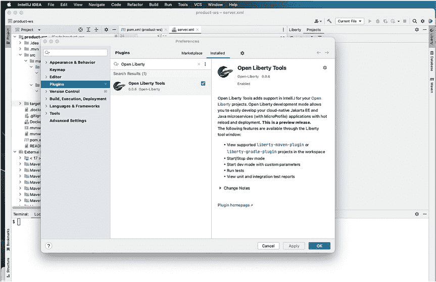

第 4 章 构建 RESTful Web 服务

***图 4-10。** Open Liberty Tools 插件*

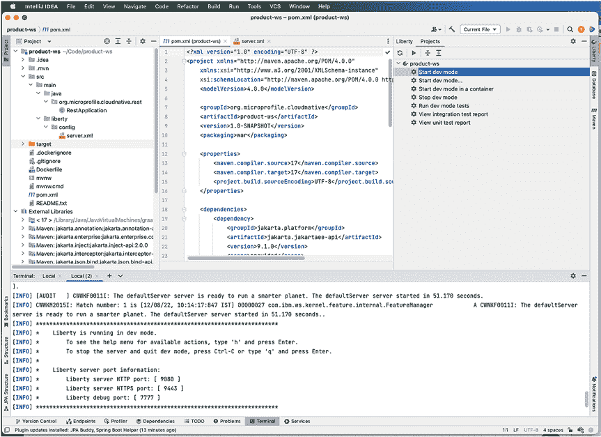

第 4 章 构建 RESTful Web 服务

***图 4-11。** 使用 IntelliJ IDEA 在开发模式下运行 Open Liberty 服务器*

*Ultimate Edition - Open Liberty Tools 插件*

这将在开发模式下启动 Open Liberty 服务器。如果你对源代码进行了任何

更改，服务器会自动检测这些更改并

重新部署应用程序。此外，如果你进行了任何配置更改，例如修改 HTTP 端口，服务器也会自动检测这些更改。

现在将 server.xml 文件中的 contextRoot 属性改为 /。contextRoot

元素告诉服务器使用哪个目录作为应用程序的根目录。原始值是 product-ws，这意味着服务器会在 /wlp/product-ws

目录中查找文件。将其改为 / 后，你就是在告诉服务器到 /wlp/

目录中查找文件。

第 4 章 构建 RESTful Web 服务

**创建 RESTful API**

当你创建 REST API 时，通常首先定义 API 将要暴露的资源。每个资源都由唯一的 URI 标识。然后你定义可对每个资源执行的操作。这些操作通常是 CRUD

操作：创建、读取、更新和删除。

现在你已经了解了如何创建一个 RESTful API 来管理商店的产品列表。该 RESTful API 允许客户端应用访问作为服务器资源存储的产品。

该 API 使用 Jakarta EE 和 REST 架构风格实现。这个

API 具有以下方法：

• GET /api/products：获取产品列表。

• POST /api/products：创建一个新产品；产品详细信息

以 JSON 格式在请求体中提供。

• PUT /api/products：更新一个现有产品；更新后的

产品详细信息以 JSON 格式在请求体中提供。

• DELETE /api/products/{id}：删除一个产品；产品 ID

在请求 URL 路径中提供。

**创建资源类**

资源类是一个表示特定 REST 资源的对象，在这个例子中是产品。它包含产品的详细信息，例如 ID、名称、价格、数量等。

为简单起见，本示例仅存储 ID 和名称。要首先实现资源类，你需要创建一个 Product 类，如下所示：

public class Product {

private Integer id;

private String name;

// default constructor

public Product() {

}

Chapter 4 Building reStful WeB ServiCeS

// parameterized constructor public Product(Integer id,

String name) {

this.id = id;

this.name = name;

}

// getters and setters

public Integer getId() {

return id;

}

public void setId(Integer id) {

this.id = id;

}

public String getName() {

return name;

}

public void setName(String name) {

this.name = name;

}

}

Product 类是一个普通的 Java 对象（Plain Old Java Object）。它具有 id 和 name 属性。你应当为所有字段声明默认构造函数、getter 和 setter。通过这样做，你可以让 Jackson 库在 Java 对象与 JSON 之间进行相互转换。所有属性也必须是 Object 类型。Jackson 无法使用基本类型，因为它们不能为 null。id 属性的类型是 Integer，name 属性的类型是 String。同时还为 id 和 name 实例变量提供了 getter 和 setter。getName() 和 getId() 方法返回各自属性的值。该类还有两个构造函数。第一个构造函数是默认构造函数。第二个构造函数接收 id 和 name 参数，并将 id 和 name 属性设置为对应的值。

Chapter 4 Building reStful WeB ServiCeS

**创建服务类**

服务类表示一组相关资源。它包含用于对资源执行创建、更新、删除和检索（CRUD）操作的方法。

现在你将创建一个 ProductService 类，并使用 getProducts() 方法返回一个

Product 对象列表：

package org.microprofile.cloudnative.rest;

import java.io.Serializable;

import java.util.*;

import jakarta.enterprise.context.ApplicationScoped;

import jakarta.ws.rs.*;

import jakarta.ws.rs.core.MediaType;

import jakarta.ws.rs.core.Response;

@Path("/products")

@ApplicationScoped

public class ProductService {

private List<Product> products;

public ProductService(){

products = new ArrayList<>();

products.add(new Product(Integer.parseInt("1"), "product 1"));

products.add(new Product(Integer.parseInt("2") , "product 2"));

}

@GET

@Produces(MediaType.APPLICATION_JSON)

public List<Product> getProducts() {

// Return a list of products

return products;

}

}

Chapter 4 Building reStful WeB ServiCeS

RESTful Web 服务可以生成和消费许多不同的媒体类型，

包括 JSON、XML 和 HTML。注解用于指定方法可以

消费或生成的媒体类型。例如，如果一个方法使用如下注解：

- @Consumes(MediaType.APPLICATION_JSON)，它可以消费 JSON。类似地，如果

一个方法使用如下注解：

- @Produces(MediaType.APPLICATION_XML)，它可以生成 XML。

这两个注解也可以在单个方法中一起使用，以支持多种

媒体类型。例如，在同一个方法中同时使用 - @Consumes(MediaType.APPLICATION_JSON) 和 -

@Produces(MediaType.APPLICATION_XML)，这样该

方法就可以消费 JSON 并生成 XML。

表 4-2 展示了一些常见媒体类型的列表，以及它们在 jakarta.ws.rs.core.MediaType 类中的常量字段和对应的 HTTP

ContentType。

***表 4-2。** 常见媒体类型及其常量字段*

**媒体类型**

**MediaType 类中的常量字段**

**HTTP ContentType**

JSON

MediaType.APPLICATION_JSON

application/json

XML

MediaType.APPLICATION_XML

application/xml

HTML

MediaType.TEXT_HTML

text/html

ProductService 类使用了 @ApplicationScoped 注解。这将确保

该类在应用程序运行期间始终可用。ProductService 类包含一个 getProducts() 方法，用于返回产品列表。该方法使用

@GET 注解，这会将该方法映射到 HTTP 的 GET 方法。

@Produces 注解告诉服务器该方法会生成 JSON 内容。

当你向 /api/

products 端点发起 GET 请求时，将返回如下 JSON 响应。

要调用这个 RESTful Web 服务，你可以在浏览器中输入[`localhost:9080/api/`](https://localhost:9080/api/products)

[products](https://localhost:9080/api/products) URL。如图 4-12，响应是一个 JSON 对象数组。每个对象都具有 id 和 name 属性。请注意，浏览器只能测试 GET 方法。

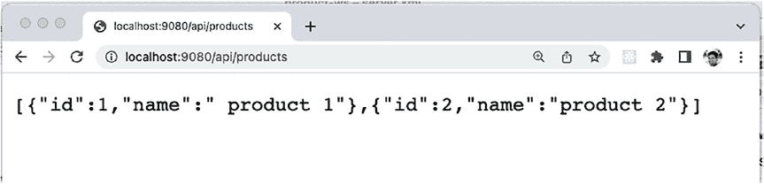

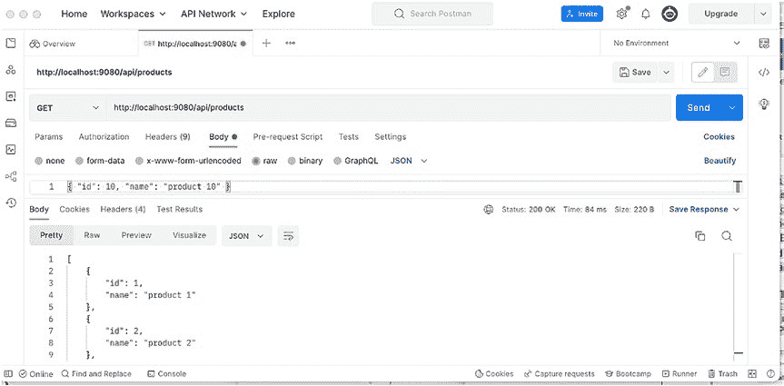

第 4 章 构建 RESTful Web 服务

***图 4-12。** 浏览器中 RESTful Web 服务的输出*

要调用所有 HTTP 方法（包括 PUT、POST 和 DELETE），你可以使用 REST

客户端，例如 Postman *(*[www.postman.com/)。参](http://www.postman.com/)见图 4-13。

***图 4-13。** 使用 Postman 客户端调用 RESTful Web 服务*

此外，你还可以使用 curl 命令行工具来执行 REST API 的所有 HTTP

方法。参见图 4-14。

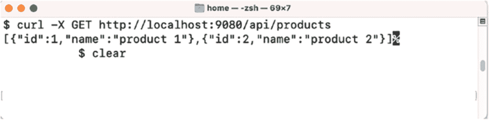

第 4 章 构建 RESTful Web 服务

***图 4-14。** 使用 curl 命令行工具调用 RESTful Web 服务* **为服务类编写单元测试**

可以编写单元测试来测试 REST API 的服务类。以下代码演示了如何使用 JUnit5 为 ProductService 类编写单元测试：

package org.microprofile.cloudnative.rest;

import org.junit.jupiter.api.AfterEach;

import org.junit.jupiter.api.BeforeEach;

import org.junit.jupiter.api.Test;

import java.util.List;

import static org.junit.jupiter.api.Assertions.assertEquals;

import static org.junit.jupiter.api.Assertions.assertNotNull;

class ProductServiceTest {

private ProductService productService;

@BeforeEach

void setUp() {

productService = new ProductService();

}

@AfterEach

void tearDown() {

productService = null;

}

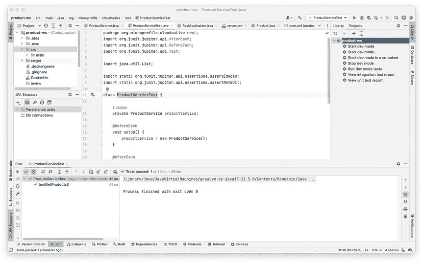

第 4 章 构建 RESTful Web 服务

@Test

void testGetProducts() {

List<Product> products = productService.getProducts();

assertNotNull(products);

assertEquals(2, products.size());

}

}

testGetProducts() 方法用于测试

ProductService 类的 getProducts() 方法。assertNotNull() 和 assertEquals() 方法用于

验证 products 列表不为 null，且它包含两个产品。

你也可以使用 IDE 执行单元测试。例如，在 IntelliJ 中，你可以右键单击测试类并选择 Run ProductServiceTest。在 Eclipse 中，你可以右键单击 ProductServiceTest 类并选择 Run As ➤ JUnit Test。参见图 4-15。

***图 4-15。** 使用 IntelliJ IDEA Ultimate Edition 执行单元测试*

第 4 章 构建 RESTful Web 服务

**使用 REST API 更新产品数据**

在成功完成 ProductService 的 GET 方法开发与测试、并获取产品资源列表之后，你现在将看到如何通过产品的 REST API 来创建、更新和删除产品。为此，你只需要向 ProductService 类中添加方法。

**创建产品**

@POST

@Consumes(MediaType.APPLICATION_JSON)

public Response createProduct(Product product) {

System.out.println("Creating product");

products.add(product);

return Response.status(Response.Status.CREATED)

.entity("New product created").build();

}

**说明：**

@POST 注解定义了 `createProduct()` 方法可通过 HTTP POST 请求调用。@Consumes 注解指定该方法将消费 JSON 数据。该方法接收一个参数，类型为 Product。这个参数将由 HTTP POST 请求中发送的数据填充。该方法创建一个新的 Product 对象并将其添加到产品列表中。最后，该方法返回一个 Response 对象，状态码为 201（Created），并附带一条消息表明新产品已创建。向 /api/products REST 端点发送 POST 请求的输出如图 4-16 所示。

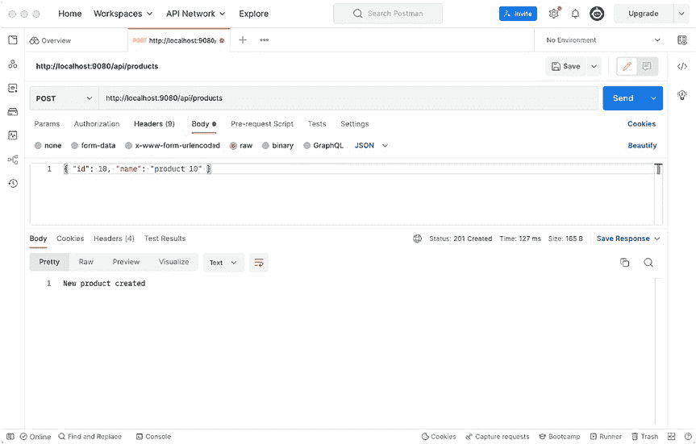

第 4 章 构建 RESTful Web 服务

***图 4-16。** REST 端点 /api/products 上 POST 请求的输出* **更新产品**

@PUT

@Consumes(MediaType.APPLICATION_JSON)

public Response updateProduct(Product product) {

// Update an existing product

Response response;

System.out.println("Updating product");

for (Product p : products) {

if (product.getId().equals(p.getId())) {

p.setName(product.getName());

response = Response.status(Response.Status.NO_CONTENT)

.entity("An existing product updated").build();

return response;

}

}

return Response.status(Response.Status.NOT_FOUND)

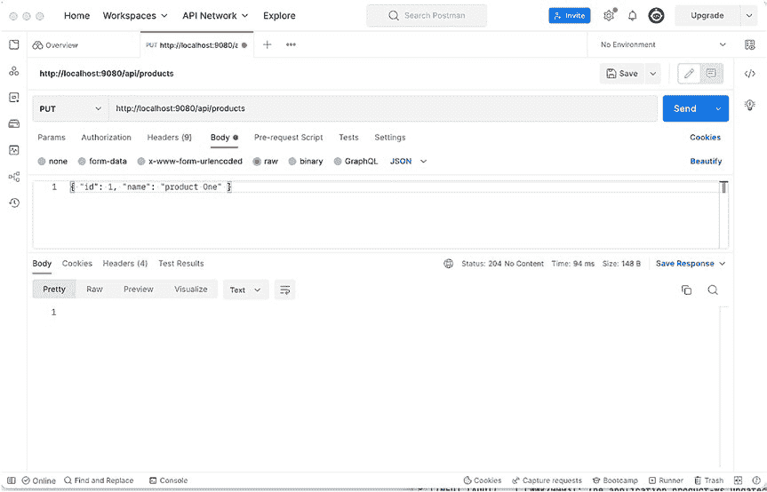

第 4 章 构建 RESTful Web 服务

.entity("Product with id->" + product.getId() + " does

not exist")

.build();

}

**说明：**

@PUT 注解定义了 `updateProduct()` 方法可通过 HTTP PUT 请求调用。@Consumes 注解指定该方法将消费 JSON 数据。该方法接收一个参数，类型为 Product。这个参数将由 HTTP PUT 请求中发送的数据填充。该方法遍历产品列表，并更新与请求中发送 id 相同的产品。如果未找到相同 id 的产品，该方法返回 404（Not Found）错误。最后，该方法返回一个 Response 对象，状态码为 204（No Content），并附带一条消息表明现有产品已更新。

向 /api/products 端点发送 POST 请求的输出如图 4-17. 所示。

***图 4-17。** REST 端点 /api/products 上 PUT 请求的输出* 107

第 4 章 构建 RESTful Web 服务

**删除产品**

@DELETE

@Path("products/{id}")

public Response deleteProduct(@PathParam("id") Integer id) {

// Delete a product

Response response;

System.out.println("Deleting product with id: " + id);

for (int i=0; i < products.size(); i++) {

if (id.equals(products.get(i).getId())) {

products.remove(i);

response = Response.status(Response.Status.NO_CONTENT)

.entity("A product deleted").build();

return response;

}

}

return Response.status(Response.Status.NOT_FOUND)

.entity("Product with id->" + id + " does not exist")

.build();

}

**说明：**

@DELETE 注解定义了 `deleteProduct()` 方法可通过 HTTP DELETE 请求调用。@Path 注解指定了用于标识要删除哪个产品的 ID 路径参数。该方法接收一个 Integer 类型的参数，并使用 @PathParam 注解标注。这个参数将由 HTTP DELETE 请求中的 id 路径参数填充。该方法遍历产品列表，并删除与请求中发送 id 相同的产品。如果未找到相同 ID 的产品，该方法返回 404（Not Found）错误。最后，该方法返回一个 Response 对象，状态码为 204（No Content），并附带一条消息表明现有产品已删除。

除了本章前面讨论的各种方法外，你还可以使用 IntelliJ IDEA Ultimate Edition 调用 REST Web 服务端点来验证输出。

图 4-18 shows 展示了在 IntelliJ IDEA Ultimate Edition IDE 的 Endpoints 选项卡中，向 /api/products/{id} 端点发送 DELETE 请求的输出。这样一来，开发者 108

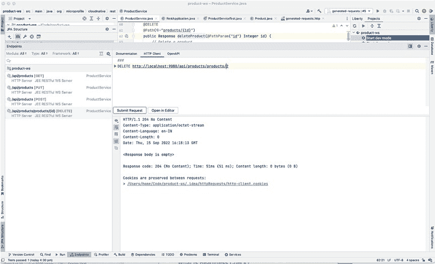

第 4 章 构建 RESTful Web 服务

无需切换到其他工具，即可对正在开发中的 REST API 进行开发测试。

***图 4-18。** REST 端点 /api/*

*products 上 DELETE 请求的输出*

本章展示的代码并非生产级质量；为了说明 REST API 的基本原理，代码做了高度简化。在接下来的章节中，你将学习如何在此代码基础上进行扩展。通过实现最新 MicroProfile 和 Jakarta EE 标准中的诸多特性，你可以将其打造为更健壮且具备云就绪能力的微服务。你还将学习如何对该应用进行容器化、扩缩容、部署和管理。

**总结**

本章介绍了如何使用 Jakarta EE RESTful Web Services API 创建 RESTful Web 服务，以及如何将其部署到 Open Liberty 应用服务器。本章还为你概述了 REST（Representational State Transfer，表述性状态转移）。随后讨论了 Open Liberty 运行时的关键特性。你学习了如何下载 109

第 4 章 构建 RESTful Web 服务

并安装 Open Liberty 应用服务器。最后，本章提供了在 Open Liberty 应用服务器中运行 Jakarta EE 应用的分步说明。阅读本章后，你应当理解 REST 的基础知识，并能够独立使用 Open Liberty 运行时创建和部署 RESTful Web 服务。

你还学习了如何配置 Open Liberty 服务器，以及如何使用 IntelliJ IDEA Ultimate Edition 的 Open Liberty 插件开发 RESTful API。最后，你看到了如何为 RESTful Web 服务创建并运行单元测试。

本章的一些关键要点包括：

• REST 是一种用于构建 Web 服务的架构风格。REST 已成为设计 Web 服务的标准，尤其是在微服务领域。

• Open Liberty 是一个灵活且轻量的运行时。你可以在该平台上快速开发、部署和执行 RESTful Web 服务。

• Open Liberty 还为最新技术和标准提供完整支持，例如 MicroProfile 和 Jakarta RESTful Web Services。它还提供了用于快速开发和测试应用的工具，如 Maven Liberty 构建插件。

• 在开发 REST 应用时，你可以使用 IntelliJ IDEA Ultimate Edition 的 Open Liberty 插件来获得更好的开发者体验。该插件支持在 IDE 内创建、运行和调试 Open Liberty 应用。

本章仅覆盖了 RESTful Web 服务最基础的内容。重点是帮助你开始构建、测试和部署 RESTful Web 服务的流程。现在你应该已经准备好引入 Jakarta EE RESTful Web Services 的一些自定义特性。

下一章将更深入地探讨 REST 架构模式。你将学习更多关于标准约定、设计考量、最佳实践，以及许多与为云原生和微服务应用构建 RESTful Web 服务相关的高级概念。

**第 5 章**

**微服务**

**架构**

*基于服务的架构* 已成为构建可扩展且具备弹性系统的一种日益流行的方法。通过将服务彼此解耦，它使得各个服务能够独立扩展。它还能更高效地利用资源，并降低故障对整个系统的影响。

从概念上讲，基于服务的架构与 n 层架构相似，

其功能被划分为不同的层级（tier）或层（layer）。例如，在三层架构中，表示层（面向用户的界面）位于一层，应用逻辑层（实现业务逻辑的代码）位于另一层，数据库层（数据存储的位置）位于第三层。每一层负责一组特定任务，各层之间通过网络互联。这使企业能够通过为特定层增加更多服务器来实现系统的水平扩展。这样也更便于管理系统依赖关系和更新。

**垂直扩展**

垂直扩展是指通过在同一层级增加资源来提升系统容量的过程。它也被称为向上扩展（scaling up），即向单台服务器添加更多资源。对应用进行垂直扩展最常见的方法，就是直接为现有服务器增加更多 RAM 或 CPU 核心。要进行垂直扩展，首先需要识别需要增加的资源，这可能包括 RAM、CPU 核心或存储容量。一旦明确需要升级的内容，你就可以

购买新硬件，或为现有服务器增加更多核心。

© Tarun Telang 2023

T. Telang，*《Beginning Cloud Native Development with MicroProfile, Jakarta EE, and Kubernetes》*，

[`doi.org/10.1007/978-1-4842-8832-0_5`](https://doi.org/10.1007/978-1-4842-8832-0_5#DOI)

第 5 章 微服务架构

垂直扩展的主要优势在于它通常是最容易且成本最低的实现方式。在许多情况下，你只需为现有服务器增加更多 RAM 或 CPU 核心，

而无需购买新硬件。此外，垂直扩展还能用于快速应对需求增长。例如，如果你的网站

突然迎来流量高峰，你可以迅速为服务器增加资源，以处理增加的负载。

虽然垂直扩展通常是在提升容量时采取的第一步，但它确实存在局限。垂直扩展的主要问题是，到了某个节点你会触及物理服务器的最大容量，再为现有服务器增加 RAM 或 CPU 核心

将不再可行。此时，你将需要购买新硬件或转向水平扩展。并且，未来究竟需要多少额外容量也很难准确预测。

垂直扩展还可能导致“容量孤岛”。例如，如果你在系统中增加第二台服务器，该服务器很可能拥有其自身的 RAM、CPU 核心和存储

容量。结果就是，你现在会有两台容量水平不同的服务器。这会让系统中的流量均衡分配变得困难，并可能导致一台服务器过载，而另一台仍有充足容量。

**水平扩展**

水平扩展是指向系统中增加更多服务器的过程，也称为向外扩展（scaling out）。这可以通过添加新的物理服务器来实现，或使用服务器

虚拟化在单台物理机器上创建多个“虚拟”服务器。无论哪种方式，整体系统容量都会因增加服务器而提升。

水平扩展的优势在于，它通常比垂直

扩展更具可扩展性。由于每台新服务器都从“空白状态”开始，它可以被充分利用，且不需要特别配置才能与系统其余部分协同工作。此外，水平扩展也可能更高效，因为每台新服务器通常都能以满负载能力运行。

水平扩展的缺点包括复杂性增加以及更高的

成本。当你向系统中增加更多服务器时，需要跟踪各种不同配置，并确保每台服务器都具备正确资源。这在管理上可能

较为困难，尤其是在未使用配置管理系统时。

此外，水平扩展通常需要更多硬件，因为每台新增服务器

都需要自己的一套资源。因此，水平扩展可能比垂直扩展更昂贵。

第 5 章 微服务架构

**垂直扩展 vs. 水平扩展**

哪种方式最适合你的应用取决于多个因素，包括成本、性能、可扩展性和可管理性。在决定采用垂直扩展还是水平扩展时，有几个因素需要考虑。首先，思考你的系统未来将如何增长。如果你预期会有大量增长，水平扩展可能是更好的选择。其次，考虑每种方式相关的成本。总体而言，垂直扩展通常最容易且最便宜实现，而水平扩展更复杂、成本更高。不过，从长期来看，水平扩展往往更具扩展性，也更易管理。

垂直扩展可能比水平扩展效率更低。当你向单台服务器增加更多

资源时，这些资源往往无法被充分利用。例如，如果你给一台当前仅运行在 50% 容量的服务器再增加一个 CPU 核心，这个新核心很可能大部分时间处于空闲状态。相比之下，在水平扩展中，每台新增服务器都可以被充分利用，因为它是从空白状态启动的。

最后，考虑你系统的复杂度。如果你没有使用配置管理，水平扩展可能更难管理。

如果你不确定哪种方式适合自己，可以考虑先从垂直

扩展开始，必要时再切换到水平扩展。这样你可以快速起步，并在需要时继续扩展。无论你选择哪种方式，

扩展都是任何系统中的重要组成部分。通过理解每种方式的优缺点，你可以确保系统能够应对增长带来的需求。

**面向服务架构的历史**

面向服务架构的历史可以追溯到

计算的早期时代。当组织最初开始使用计算机来自动化业务流程时，面向服务架构应运而生。面向服务架构最初旨在为不同组织提供一种共享信息和资源的方式，而不必依赖单一的集中式计算机系统。在面向服务架构的早期，不同组织使用了多种方法来共享信息和资源，包括点对点连接、客户端/服务器模型以及分布式计算。

面向服务架构这一概念源于更早期的计算模型，

例如客户端-服务器和 n 层架构。在传统的*客户端-服务器架构*中，客户端向服务器发出请求，服务器处理请求并返回 113

第 5 章 微服务架构

响应。客户端-服务器架构通常用于处理

需要高计算资源、而客户端机器无法独立完成的请求。它

是 20 世纪 80 年代和 90 年代早期最流行的计算风格。这一模型

是集中式且不够灵活的，因为服务器程序必须专门设计来处理每一种不同类型的请求。

相比之下，面向服务架构基于松耦合理念，

这意味着服务可以彼此独立，并能够相互通信，

而无需预先了解或规划。这使得从现有服务构建组合应用成为可能，并且在不影响应用其余部分的前提下变更或新增服务。

Web 服务的使用一直是实现面向服务架构的关键推动因素。Web

服务是可独立运行、模块化的应用，可在 Internet 上发布、发现和调用。它们使用 XML 和 SOAP 等开放标准来促进

互操作性。

第一代面向服务架构的特征是缺乏

标准化和互操作性。每个组织都使用其专有的软件和硬件，这使得不同组织之间难以通信和共享信息。这些解决方案在 20 世纪 90 年代末出现，由 BEA Systems、IBM、Microsoft 和 Sun Microsystems 等公司主导。此外，早期的基于服务的架构并不是为了支持互联网而设计的，因为当时互联网尚未广泛普及。

第二代基于服务的架构在 20 世纪 90 年代末出现，伴随着互联网的

到来以及组织需要能够在全球范围内共享信息和资源的需求。这一代新的基于服务的架构

建立在互操作性和标准化原则之上。第二代基于服务的架构最显著的例子是 Web 服务

架构，它旨在让不同组织能够通过互联网共享信息和资源。第二代基于服务的架构解决方案由 Oracle、SAP 和 TIBCO 等公司主导。

第三代基于服务的架构正在随着

云计算的兴起而出现。云计算是一种新型计算方式，它使

组织能够通过互联网访问由第三方提供商拥有并运营的远程服务器。这一代新的基于服务的架构以其弹性扩展能力和按需付费定价模式为特征。第三代基于服务架构最显著的例子是 Amazon Web Services 平台、Google Cloud Platform 和 Azure。第三代基于服务的架构解决方案正由 Amazon、Google 和 Netflix 等公司主导。

第 5 章 微服务架构

第四代基于服务的架构目前正在开发中，

并且很可能建立在人工智能（AI）和机器学习（ML）原则之上。这一代新的基于服务架构将能够学习和演进，从而为用户提供更好的服务。第四代基于服务架构最显著的例子是 IBM Watson 平台。

总而言之，基于服务的架构已经演进以满足组织不断变化的

需求。第一代基于服务架构是为一个没有互联网的世界而设计的。第二代是为一个有互联网的世界而设计的。第三代正在为一个有云计算的世界而设计。

而第四代正在为一个有人工智能和机器学习的世界而开发。

**基于服务架构的类型**

微服务架构和 SOA 架构是两种流行的基于服务的

架构类型。

**面向服务架构（SOA）**

*面向服务架构（SOA）*是一种架构风格，可实现松耦合、可互操作服务的构建。SOA 中的服务可以

被动态发现和调用，并且可以被组合成复杂的

工作流。面向服务架构这一术语在 21 世纪初开始流行，当时包括 SAP、IBM 和 Microsoft 在内的一些公司开始推广 SOA，

将其作为构建软件系统的一种方式。SOA 是传统单体应用架构的一种演进，在传统架构中所有组件都紧密耦合且难以复用。这种架构方法使服务能够松耦合，从而允许它们被复用并组合以创建新服务。

SOA 架构基于面向服务计算的思想，其中

服务是可被其他服务访问和使用的自包含单元。这种架构类型的优势在于它促进了互操作性和服务复用。然而，在现有 SOA 架构中更改或新增服务可能会更困难。

第 5 章 微服务架构

SOA 并不是一种特定技术或平台，而是一种可以

使用各种技术和平台实现的设计方法。SOA 通常通过

Web 服务实现，Web 服务是自包含、自描述、模块化的应用程序，可以在网络上发布、定位和调用。Web 服务使用基于标准的协议（如 HTTP）在不同平台和编程语言之间提供互操作性。客户端可以在不了解底层实现的情况下调用这些 Web 服务。

这种服务的松耦合还使它们能够被快速组合成新的服务或应用程序，从而提供更高的灵活性和可复用性。

**什么是 Web 服务？**

Web 服务是两台电子设备通过

万维网进行通信的一种方式。虽然一些 Web 服务可以通过 Web 浏览器访问，

但它们通常通过充当用户界面的软件程序来访问，例如 Web 应用或网站。Web 服务通常用于向用户提供信息或功能，但它们也可以用于与其他软件程序通信。例如，某个 Web 服务可能允许用户请求从一个地点到另一个地点的路线，或者允许用户向另一位用户发送短信。

Web 服务基于允许不同软件程序进行

通信的标准。这使开发者能够创建可与

现有 Web 服务协同工作的新应用程序。

Web 服务的一些常见标准包括：

• **SOAP（简单对象访问协议）**：定义

两台设备如何通过互联网交换信息的标准。

• **XML（可扩展标记语言）**：定义

数据如何在设备之间进行结构化和交换的标准。

• **WSDL（Web 服务描述语言）**：定义

如何在互联网上描述和定位 Web 服务的标准。

• **REST（表述性状态转移）**：定义

如何使用 HTTP 协议访问 Web 服务的标准。

• **JSON（JavaScript 对象表示法）**：定义

数据如何以一种便于

人类阅读和编写的格式在设备之间交换的标准。

第 5 章 微服务架构

**什么是 SOAP？**

SOAP 是 Simple Object Access Protocol 的缩写。它是一种基于 XML 的消息协议，用于在计算机之间交换信息。SOAP 旨在独立于

任何特定的编程模型和其他实现细节。

SOAP 消息由称为*信封（envelopes）*的 XML 元素构成，这些元素封装了正在交换的数据。信封定义了 SOAP 消息的结构

以及应如何处理该消息。一个 SOAP 信封可以包含多个消息头和

一个消息体。消息体包含实际交换的数据，而消息头可以

包含有关消息的附加信息，例如发送方、接收方以及任何处理指令。因此，SOAP 提供了一种基于强契约的消息格式，可用于从各种来源访问数据。

SOAP 消息通常通过 HTTP 传输，但它们也可以通过

其他协议传输。当通过 HTTP 传输时，SOAP 消息通常

使用 XML 编码。尽管 SOAP 的设计目标是独立于任何

特定传输协议，但 HTTP 是 SOAP

消息最常用的传输方式。

SOAP 常与其他 Web 服务技术结合使用，例如

WSDL 和 UDDI。WSDL 是用于描述 Web 服务功能的标准，而 UDDI 是用于列出可用 Web 服务的标准。这些技术结合起来可用于创建完整的 Web 服务解决方案。

SOAP 是构建 Web 服务的一个非常强大的工具，可用于访问

来自多种来源的数据。然而，由于 SOAP 基于 XML，它可能会非常冗长，并且在解析和生成 SOAP 消息时需要大量处理能力。因此，一些开发者更倾向于使用 JSON 或 gRPC 等替代技术，

因为它们更轻量，所需处理能力更低。

最初的 SOAP 规范并未涉及安全问题。因此，后来制定了

WS-Security 规范，用于为 SOAP 扩展安全特性。如今，WS-

Security 已成为 SOAP 消息最常用的安全标准。其他

对 SOAP 的扩展规范还包括 WS-Addressing，它定义了一种标准

方式，用于在 SOAP 消息中包含发送方和接收方等信息；以及 WS-ReliableMessaging，它增加了消息投递保障等可靠性特性。

SOAP 因许多原因而受到批评，包括其复杂性以及

调试 SOAP 应用的困难。然而，它仍然流行起来，尤其是在企业环境中。

下一节将讨论 REST，它是 SOAP 的一种替代方案。

第 5 章 微服务架构

**什么是 REST？**

REST 是 Representational State Transfer（表述性状态转移）的缩写。它是一种架构风格，定义了一组基于 Web 组件如何通信的约束和属性。

REST 常用于 Web 服务语境中，在这种语境下，它定义了资源

如何被客户端暴露和访问。客户端可以是任何向 Web 服务发起请求的应用类型，例如 Web 浏览器、移动应用或桌面应用。在 REST 中，客户端负责管理自身状态，服务器负责处理请求并返回响应。这种关注点分离简化了应用开发与部署。

REST 定义了一组原则，旨在使 Web 服务更加

可扩展、灵活且易维护。这些原则包括：

• 资源以 URI（统一资源标识符）路径形式暴露。

RESTful 应用应具备统一接口，并且在所有资源与操作之间

保持一致。这使得应用更易于使用和理解。

• 使用 HTTP 方法来访问和操作资源。

• 资源应以客户端和服务器都能理解的格式表示

（通常是 JSON 或 XML）。

• 客户端与服务器之间采用无状态通信。

REST 常被拿来与其他架构风格（如 SOAP）进行比较。然而，两者之间

存在一些关键差异。

**REST 与 SOAP**

正如你在前面章节中所学，REST 和 SOAP 是两种流行的 Web 服务

技术。REST 与 SOAP 的主要区别在于，REST 是一种更轻量级的

协议，不像 SOAP 那样依赖大量基础设施。这使得它对资源的消耗更低，因此实现起来通常更快、成本也更低。

REST 可以完全构建在开源技术栈之上。另一方面，SOAP 在开发以及生产部署中都需要昂贵的软件和硬件。

REST 的可分发性也优于 SOAP，因为它可以轻松部署在各种平台上。

第 5 章 微服务架构

此外，REST 比 SOAP 更简单。REST 服务通常比 SOAP 服务更易于开发

和测试。REST 也比 SOAP 更具可扩展性，因为它是无状态的。RESTful 应用通常更容易扩容。另外，REST 也比 SOAP 更灵活，

因为 RESTful 应用更容易扩展和定制。

另一方面，SOAP 是一种更健壮、功能更丰富的协议。它包含

对安全性和事务处理的支持，因此非常适合关键任务型应用。SOAP 服务通常也比 REST

服务具有更好的互操作性，因为它们可与多种编程语言和平台配合使用。

在讨论完面向服务架构的选项后，下一节将深入探讨

微服务的演进。

**单体架构**

单体架构是软件开发中传统的一体化模型。在该模型中，软件应用由单一、庞大的代码库组成。由于缺乏模块化，这类应用通常难以维护和扩展。单体应用通常作为单个、自包含单元构建，这会使新增功能或更新现有功能变得困难。单体应用往往也难以测试和部署，因为它们要求所有依赖都被正确安装和配置。这会使得在不同环境中确保应用正确运行变得困难。

对于预计长期增长不大的小型项目，单体应用可能是一个不错的选择。对于需要高度紧耦合的项目，它们也可能是合适的选择。然而，对于大多数应用而言，更模块化的方法通常是更好的选择。

可扩展性通常是单体应用的主要问题。由于整个应用作为单一单元构建，新增功能或扩展现有功能都可能比较困难。单体应用通常也很难拆分为可独立部署的更小服务。

如果你正在考虑使用单体应用，也应了解这类应用可能带来的潜在困难。

–

**脆弱的代码库：** 庞大的代码库难以维护，而且

引入缺陷的风险更高。

–

**难以测试：** 测试单体应用可能很困难，因为

其所有依赖都必须被正确安装和配置。

第 5 章 微服务架构

–

**部署挑战：** 单体应用可能难以

部署，因为它们要求所有依赖都被安装

并正确配置。

–

**可扩展性问题：** 单体应用可能难以扩展，

因为它们缺乏模块化。新增功能或

扩展现有功能都会比较困难。

**微服务架构的演进**

微服务架构的起源可以追溯到分布式计算的早期，当时系统被设计为将大型任务拆分为可独立处理的更小部分。这种方法主张

通过小型、可组合的服务来构建系统。

在 21 世纪初，面向服务架构（SOA）成为构建分布式系统的流行方式。像 Web Services Description Language（WSDL）和 Simple Object Access Protocol（SOAP）这样的技术使开发者能够通过 HTTP 定义并交换服务。

然而，SOA 也有一些局限。首先，SOA 系统不易进行水平扩展，

因为每个服务都有其专用基础设施。其次，SOA

系统往往复杂且脆弱，并且难以管理

服务之间的依赖关系。

在 2010 年代，微服务架构作为 SOA 的轻量级替代方案出现。这类系统由可独立部署和

运行的小型模块化服务组成。这种方法与*单体架构*相对，后者将系统的所有组件打包为单个大型可执行文件。微服务架构最著名的例子是 Twitter 平台。

单体架构之所以流行，是因为它们简单且易于

理解。然而，它们也有若干缺点，包括可扩展性和

可维护性问题。另一方面，微服务基于模块化与去中心化原则，并强调简单性与可扩展性。

得益于 DevOps 工具与实践的进步，如今部署和管理基于微服务的系统

比以往任何时候都更加容易。

第 5 章 微服务架构

**微服务架构**

微服务架构将应用程序组织为一组松耦合的服务。在微服务架构中，服务是细粒度的，协议是轻量级的。将应用拆分为不同且更小服务的好处包括：能够更轻松、更独立地开发、部署和扩展应用程序。微服务通常通过 DevOps 工具

和实践进行部署与管理。

微服务的优势包括更高的灵活性、更好的可扩展性，

以及更低的成本。它也是 DevOps 运动的关键推动因素，而 DevOps 运动专注于提升软件开发的速度与质量。

当我们谈论微服务时，通常指的是一种软件架构模式：应用程序由一组小型、可独立部署的

服务组成。这些服务通过定义良好的 API 相互通信，并且

可单独部署与扩展。

**微服务架构的优势**

与传统单体

架构相比，微服务架构有许多优势。这种方法的一个优点是，它使每个服务都可以独立开发、部署和扩展，从而带来更快的开发

周期和更敏捷的部署。此外，每个服务都可以使用不同的语言编写，这使你能够为每个服务选择最合适的语言。

微服务的另一个好处是，这种架构可以提供更高水平的容错性，因为如果某个服务发生故障，其他服务仍可继续运行。

微服务还有助于提升模块化程度和可维护性，因为每个

服务通常只负责单一任务或功能。这使得理解和修改特定服务的代码更容易，也有助于防止某个服务中的变更影响其他服务。当某个服务需要更新时，你只需更新该服务的代码并部署它，而不会影响应用程序的其余部分。这使得在不破坏系统其他部分的情况下更改应用程序变得更加容易。

最后，微服务还能使持续交付与部署

（CD/CI）流水线更容易实施，因为每个服务都可以独立部署。这可以带来更快、更可靠的部署，并在修改

代码库时降低风险。

第 5 章 微服务架构

总之，微服务的优势包括更高的灵活性、更好的

可扩展性以及更低的成本。它也是 DevOps 运动的关键推动因素，而该运动专注于提升软件开发的速度和质量。

**微服务架构的缺点**

尽管采用微服务架构有许多优势，但也有一些需要考虑的挑战。其中最大的挑战之一是管理服务之间的通信，随着服务数量的

增长，这会变得复杂。此外，微服务还可能引入运维开销，因为每个服务都需要独立部署和管理。

尽管存在这些挑战，微服务已成为许多现代应用中流行的架构风格

。若使用得当，它们可以带来多项

优势，从而有助于改进开发流程和软件的整体质量。

**设计考量**

如果你正在考虑将单体应用拆分为微服务，有几点你需要牢记。首先，你需要仔细设计服务之间的接口。服务粒度是微服务中的一个重要设计

考量。服务应当是细粒度的，并专注于

单一职责。这将使服务更易于开发、部署和扩展。

此外，这也会让你更容易理解服务及其依赖关系。

其次，你需要管理并监控服务之间的依赖关系。它

在设计微服务架构时，考虑服务之间的依赖关系也同样重要。每个服务都应当是独立的，并且不依赖其他服务。这将使服务的部署和管理更加容易。最后，你还需要为管理分布式系统所带来的挑战做好准备。这些挑战包括管理服务间通信、管理数据一致性以及处理故障。

第 5 章 微服务架构

**在云原生应用中使用微服务**

微服务是构建云原生应用的一种流行架构方式。使用云原生技术可以获得诸多收益，包括：

• **缩短上市时间：** 微服务可以独立且快速地部署，从而加快产品上市速度。

• **更高的灵活性和可扩展性：** 每个微服务都可以独立更新或扩缩容，提供更高的灵活性和可扩展性。相较于传统单体应用，这是一个显著优势，因为单体应用通常更难扩展。

• **降低运营成本：** 云原生应用可以按需使用弹性计算资源，从而降低运营成本。

• **提升韧性或容错能力：** 如果某个微服务发生故障，可以独立重启，从而提升容错能力。相比之下，在单体应用中，单点故障可能会导致整个应用宕机。

在使用微服务时，也有一些需要考虑的挑战，包括：

• **复杂性增加：** 组件数量的增加会使调试和故障排查更加困难。同时，还需要额外的工具来管理和监控基于微服务的应用。

• **服务发现：** 在微服务架构中，每个服务都需要能够发现并与其他服务通信。这可能是一个挑战，尤其是在大型复杂应用中。

• **数据一致性：** 由于每个微服务都是独立的，可能会出现数据不一致问题。需要进行谨慎管理以避免问题发生。

第 5 章 微服务架构

请使用以下最佳实践，开始在你的云原生应用中使用微服务：

• **预先定义应用架构：** 这将帮助你确定需要构建哪些服务，以及它们将如何交互。

• **使用服务注册中心：** 服务注册中心可用于存储可用服务及其位置的信息，这对服务发现非常有用。

• **使用容器化：** 容器化可以帮助减少管理和部署微服务的开销。

• **使用微服务框架：** 目前有多种微服务框架可用，可帮助简化微服务的构建和部署过程。

• **谨慎处理数据一致性：** 数据一致性是任何分布式系统中的重要考量。

面向服务架构的未来很可能将由微服务的持续采用以及无服务器计算的兴起所驱动。

**云原生十二要素应用**

*twelve-factor methodology*（十二要素方法论）是一套用于设计和开发云友好型应用的指导原则。遵循这些原则有助于提升性能、可扩展性和韧性。使用十二要素方法论设计和开发的应用，被称为*云原生十二要素应用*。

1\. **代码库：** 十二要素应用始终会在版本控制系统（如 Git）中进行跟踪，并从那里进行部署。这使得在必要时可以轻松回滚更改，并维护代码库的历史记录。

2\. **依赖：** 所有依赖项（如库和框架）都应在清单文件中声明，例如用于基于 Maven 的 Java 项目的 POM 文件，以便能够轻松安装和更新。

第 5 章 微服务架构

3\. **配置：** 配置应存储在环境中，而不是代码中，这样无需更改代码本身就可以轻松调整配置。

4\. **后端服务：** 十二要素应用被设计为使用外部后端服务，例如数据库和消息队列。它们应被视为附加资源。这意味着这些服务可以轻松分离并替换，而不会影响正在运行的代码。

5\. **构建、发布、运行：** 十二要素应用通过可重复、可自动化的流程进行构建，其中包含测试以确保质量。这确保了它们可以在任何时间发布。随后，它们以不可变工件的形式发布，从而能够轻松且快速地部署。最后，它们在隔离环境（例如容器）中运行，以便根据需要进行扩缩容。

6\. **进程：** 十二要素应用被设计为以无状态进程运行。应用被拆分为小型、自治的进程。每个进程都可以根据需要独立启动、停止或重启，而不会影响其他进程。

7\. **端口绑定：** 十二要素应用被设计为部署在可导出端口供其绑定的服务器上。这使得在同一台服务器上运行应用的多个实例变得容易，也使得在必要时更换服务器更加方便。

8\. **并发：** 十二要素应用被设计为在并发环境中运行，从而能够利用现代计算资源，例如服务器集群。应用的不同部分可以在不同的内核或机器上同时运行。这也使其能够根据需要进行扩缩容。

9\. **可丢弃性：** 十二要素应用被设计为可以快速启动或停止。这使得在必要时部署新版本或回滚变更变得容易，同时不会影响整个应用。

第 5 章 微服务架构

10\. **开发/生产一致性：** 十二要素应用被设计为在开发环境与生产环境中保持相同环境。这使得更容易尽早发现错误，并避免部署到生产环境时出现意外。

11\. **日志：** 日志记录是跟踪系统中发生事件的过程。通过跟踪对系统重要的事件，日志可用于改进系统运行并防止问题发生。十二要素应用将日志视为事件流。这使得对日志进行聚合和处理以用于监控与分析变得容易。

12\. **管理进程：** 十二要素应用为应用管理设置了独立进程，例如执行数据库迁移。这种关注点分离使应用更易于管理并减少错误。

**什么是虚拟机？**

*虚拟机*是一种模拟物理计算机的软件程序。它允许一台计算机同时运行多个操作系统和应用程序。

与物理机相比，虚拟机有许多优势。它们更容易部署、管理和扩展。它们还提供更高的灵活性和资源利用率。此外，虚拟机不受硬件约束限制，并且可以轻松迁移到不同主机。

虚拟机可用于在不同环境中测试软件和应用程序，而不会影响宿主机。它们还可用于在一台计算机上运行多个操作系统。

虚拟机的主要缺点之一是其稳定性可能不如物理机。此外，虚拟机可能更消耗资源，需要比物理机更多的 CPU、内存和存储。它们在管理和故障排查方面也可能更复杂。

虚拟机之所以可行，是因为有虚拟化软件，它为客户机操作系统创建运行所需的虚拟环境。虚拟化软件在客户机操作系统与宿主硬件之间提供了一层抽象，使在一个宿主上运行多个客户机成为可能。

第 5 章 微服务架构

虚拟机是在另一台计算机上运行的计算机。另一台计算机称为宿主机（host），在其上运行的计算机称为客户机（guest）。硬件基础设施是构成计算机系统的电子和物理组件。这包括中央处理器（CPU）、内存、存储、输入/输出设备以及网络硬件。

虚拟化是创建虚拟机的过程。这可以通过模拟硬件的软件来实现，或通过在现有物理硬件之上运行管理程序（hypervisor）来实现。虚拟化软件在客户机操作系统与宿主硬件之间提供一层抽象，使在一个宿主上运行多个客户机成为可能。

管理程序（Hypervisor）是一类虚拟化软件，允许多个客户操作系统在单一宿主上运行。最常见的管理程序类型是裸金属管理程序（bare-metal hypervisor），它直接运行在宿主硬件上。其他类型的管理程序包括托管型（hosted）和半虚拟化（para-virtualized）。

裸金属管理程序通常用于对性能和稳定性要求严格的企业环境。托管型管理程序通常用于较小规模环境，或用于测试与开发。半虚拟化是一种需要在客户机操作系统中安装专用软件才能正常运行的虚拟化类型。

使用虚拟机有许多好处，包括能够在一台计算机上运行多个操作系统、能够轻松将客户机从一台宿主迁移到另一台宿主，以及能够将各客户机彼此隔离。

虚拟机也有一些缺点。与在计算机上运行单一操作系统相比，它们可能更消耗资源，而且稳定性可能不如原生运行的操作系统。尽管存在这些缺点，虚拟机仍因其众多优势而广受欢迎。

**什么是容器？**

容器是一种虚拟化技术，可将应用程序或服务与底层操作系统（OS）隔离开来。这使你能够在单个 OS 实例上同时运行多个容器。

第 5 章 微服务架构

每个容器都有其隔离环境，可在其中运行而不影响其他容器或宿主 OS。这使容器成为微服务的理想方案；微服务是小型、自治、可独立部署和扩展的服务。

容器经常与虚拟机（VM）进行比较。VM 和容器都提供隔离能力，并允许你在单一宿主上运行多个实例。然而，这两种虚拟化方式之间存在一些关键差异。

VM 比容器更“重”，也更消耗资源。每个 VM 内都需要运行一个完整的 OS 实例，这可能导致资源利用效率低下。

相比之下，容器共享同一个 OS 内核，只包含运行所需的库和文件，因此更轻量、更高效。这使你能够在单一宿主上运行比 VM 更多的容器实例。

另一个关键差异是，VM 通常用于运行完整应用，而容器通常用于运行应用中的单个服务或组件。

这使得使用容器部署和扩展应用变得更容易。

如果你正在寻找一种虚拟化应用和服务的方法，容器是一个很好的方案。它们轻量、高效，并且易于部署和扩展。

**什么是基于容器的应用？**

[容器是](https://en.wikipedia.org/wiki/OS-level_virtualization)轻量级虚拟机或自包含的部署单元。

它们使你能够将运行应用程序所需的所有依赖项打包到一个自包含单元中。使用容器运行应用程序意味着，你必须先将应用程序及其依赖项打包，使其能够在类似 [Docker](https://en.wikipedia.org/wiki/Docker_(software)) 的容器中运行。然后你就可以在任何服务器上运行这些容器，如图 5-1 所示。

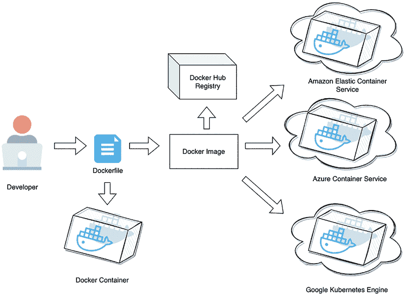

第 5 章 微服务架构

***图 5-1。** 基于容器的应用程序*

要在容器中运行应用程序，首先要构建一个镜像（例如 Docker 镜像），它是用于创建容器的模板。你可以使用一个称为 Dockerfile 的文本文件来创建镜像，其中包含描述如何构建 Docker 镜像的指令。借助唯一的配置和设置，你可以使用这个镜像创建任意数量的容器。然后，只要安装了像 Docker Engine 这样的容器运行时技术，你就可以在任何地方运行它们，而无需其他库或工具。

由于容器为你的代码提供了隔离环境，因此它们非常适合部署在 Amazon Web Services (AWS)、Google Cloud Platform 和 Microsoft Azure 等云平台上。你还可以使用像 [Kubernetes t](https://en.wikipedia.org/wiki/Kubernetes)o 这样的容器编排平台来大规模部署和管理容器。这使它们非常适合云端部署，因为你可以快速将它们从一台服务器迁移到另一台服务器，而不必担心兼容性问题。

第 5 章 微服务架构

**什么是无服务器应用程序？**

无服务器计算是一种构建和运行应用程序的新方式。它也被称为函数即服务（Function as a Service），或 FaaS。无服务器计算是一种云计算执行模型。云提供商负责运行服务器，并动态分配机器资源来运行代码，根据需求进行扩缩容。无服务器计算免除了开发人员预置、管理和运维服务器的需求，使他们能够专注于应用程序本身。

“无服务器（serverless）”这个术语具有误导性，因为其中仍然有服务器参与。这只是意味着开发人员不必操心它们。云提供商会负责所有底层基础设施，从而让开发人员专注于代码。

**无服务器计算用于哪里？**

无服务器计算是一个相对较新的概念，仍在不断演进。它尚未被广泛采用，但受欢迎程度正在上升，尤其是在那些没有资源投资传统 IT 基础设施的初创公司和中小企业中。

你可以将无服务器计算用于应用程序中需要快速高效完成的小型、独立任务。这些任务通常由事件驱动，例如处理用户上传或支付处理。

你也可以将无服务器计算用于更大、更复杂的应用程序，方法是将应用拆分为更小的组件，并由不同的无服务器函数分别处理每个组件。

无服务器计算最常见的一些使用场景包括：

• **Web 应用程序**—你可以使用无服务器计算托管静态网站和动态 Web 应用程序。

• **移动应用程序**—你也可以使用无服务器函数为移动应用程序的后端提供支持。它们可以处理用户身份验证、数据库查询、推送通知以及其他常见任务。

• **物联网（IoT）**—你可以用它实时处理来自传感器和设备的数据。你还可以用它触发操作，例如发送通知或激活设备。

第 5 章 微服务架构

• **数据处理**—你可以使用无服务器函数处理交易和支付。你还可以用它发送收据和通知。

• **机器学习（ML）**—你可以使用无服务器函数训练和部署机器学习模型。

**无服务器计算的优势**

与虚拟机或容器等传统计算模型相比，无服务器计算具有以下优势：

• **降低成本**—无需投资或维护服务器。你只需为所使用的资源付费，而且没有前期成本。无需为闲置容量或未利用的服务器付费。这可以显著节省成本，尤其适用于工作负载可变或不可预测的应用程序。

• **提升敏捷性**—无服务器计算使你能够快速部署代码，并可根据用户需求自动扩缩容。你甚至可以毫无问题地应对流量突增。

• **改进专注度**—通过免除服务器管理，无服务器计算让你能够专注于开发和部署应用程序。你可以专注于代码，把其余工作交给无服务器平台处理。这会让你作为开发者的工作更轻松。

**无服务器计算的缺点**

尽管有许多优点，无服务器计算也确实存在一些缺点。

• **调试与排障困难**—无服务器计算的主要缺点之一是，由于你无法直接访问底层服务器，调试和排查问题会更具挑战性。

第 5 章 微服务架构

• **灵活性降低**—与其他托管选项相比，无服务器计算可能灵活性更低，因为你受限于无服务器平台所提供的资源。

• **供应商锁定**—它可能导致供应商锁定；如果你对当前提供商不满意，切换到其他平台会变得困难。

• **支持不足**—由于这仍是一项新技术，无服务器计算在支持和文档方面仍显不足。当你遇到卡点时，可能很难找到问题答案或获得帮助。

**流行的无服务器平台**

如果你正在寻找构建和运行应用程序的新方式，你应该了解一下无服务器计算。它是节省基础设施成本并自动扩展应用程序的绝佳方式。以下是一些值得探索的热门无服务器平台：

• Amazon Web Services Lambda

• Azure Functions

• Google Cloud Functions

• IBM Cloud Functions

• Apache OpenWhisk

每个平台都有其优势和劣势，因此你需要为你的项目选择合适的平台。

**无服务器计算平台的主要组件**

无服务器平台通常构建在 Amazon Web Services (AWS)、Microsoft Azure 或 Google Cloud Platform (GCP) 等云基础设施平台之上。这些平台提供运行代码所需的全部资源，包括存储、网络和计算资源。无服务器计算平台的主要组件包括：

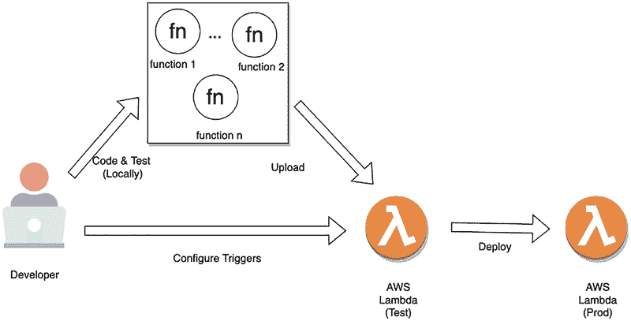

第 5 章 微服务架构

• **函数（Functions）**—这些是你编写并部署到无服务器平台的代码片段。每个函数都可以由事件触发，例如用户上传或支付。

• **事件（Events）**—这些是触发函数的事件，例如用户上传或支付。

• **存储（Storage）**—这是存放你的代码和数据的地方。

• **网络（Networking）**—这是你的函数彼此通信以及与外部世界通信的方式。

• **计算资源（Computing resources）**—这些是函数运行所需的资源，例如 CPU 和内存。

[无服务器应用程序](https://en.wikipedia.org/wiki/Serverless_computing)运行在完全无状态的环境中。在无服务器应用程序中，你使用函数即服务（FaaS）将代码打包并部署为独立可执行单元。代码会响应诸如传入 HTTP 请求之类的事件

或上传文件到 S3 存储桶。运行无服务器应用意味着你不需要预置或管理传统服务器。云服务提供商的基础设施会按需执行应用，并在不再需要时将其关闭。常见的 FaaS 服务包括 AWS Lambda、Azure Functions 和 Google Cloud Functions。

无服务器应用可以显著简化应用的部署与管理，因为无需担心服务器或扩缩容。参见图 5-2.

***图 5-2。** 无服务器应用*

第 5 章 微服务架构

这种方法比使用容器更容易管理，而且成本可能更低，因为

你只需为代码运行的时间付费。不过，无服务器部署的灵活性较低，效率也可能更差。

**无服务器应用 vs. 容器**

在云计算领域，部署应用主要有两种方式：容器和无服务器应用。两者各有优点和缺点。那么哪一种更适合你的应用？既然你已经对这两种方式有了基本了解，接下来我们来看看它们各自的利弊。

**开发难易度**

开发者始终面临着快速产出高质量代码的压力。这

可能是一项艰巨的任务，尤其是在你使用新技术时。开发难易度指的是快速、轻松开发应用的能力。这可以通过多种方式衡量，例如你能多快启动并运行、进行修改有多容易，以及会遇到多少错误。

**基于容器的应用**

你可以使用自己选择的框架或编程语言来开发容器化应用，然后将其编译为可在任何具备相同运行时依赖的机器上运行的二进制文件。借助容器，你可以快速

搭建与生产环境一致的开发环境。这

有助于加快开发速度并减少生产环境中的意外情况。它也让你能够轻松地在本地机器上开发和测试应用。如果你已经熟悉 Docker 并知道如何创建镜像，那么你很可能可以很快上手基于容器的应用。

**无服务器应用**

无服务器应用通常使用主流编程语言之一，但

你不会将它们编译成二进制文件。相反，你会把它们打包成函数。你必须使用提供商的门户或命令行界面来测试和部署它们。与容器化应用相比，开发无服务器应用更容易。这是 134

第 5 章 微服务架构

因为你不需要操心容器或服务器的搭建与管理。

这些都由提供商替你处理。这让你能够专注于代码开发。

你也可以在本地环境中构建并测试代码。

**部署难易度**

部署是一个关键流程，因为它会将代码投放到生产环境。它包括

将代码配置为可在实时环境中使用，测试其是否按预期工作，然后将其部署到一台或多台服务器。代码部署完成后，你还需要配置并管理环境，以确保其平稳运行并满足

你的业务或组织需求

**基于容器的应用**

基于容器的应用易于部署，因为你可以将其打包并迁移

到任何服务器，而无需担心兼容性问题。你还可以使用

像 Kubernetes 这样的容器编排平台来大规模部署和管理容器。容器化应用也可以借助 Puppet、Chef 或 Ansible 等自动化工具进行部署。这使得在多台机器上部署它们变得很容易。

**无服务器应用**

对于无服务器应用，你无需预置任何基础设施，但你确实需要一个 FaaS 提供商。这些提供商提供的功能集通常比

容器平台。无服务器应用通过云提供商的门户或命令行界面进行部署。这可能需要一定的学习曲线，但通常比较容易。

部署过程并不能保证总是一帆风顺。每个提供商部署应用的方法都不同，而配置和维护代码是你的责任。虽然有许多公共库和工具，但要为你的特定应用和平台找到合适的工具可能并不容易。

**云计算成本**

许多公司依赖公共云服务提供商来满足其基础设施需求。

云计算成本是指使用计算、存储和网络资源等云服务的[费用](https://customerthink.com/how-much-does-it-cost-to-build-cloud-computing-service/)。

第 5 章 微服务架构

**基于容器的应用**

基于容器的应用运行成本可能高于无服务器应用。

这是因为容器通常需要更多资源（例如 CPU、内存、磁盘）。

因此，如果你选择在公共云提供商上部署基于容器的应用，你的云账单会更高。

**无服务器应用**

无服务器应用的运行成本通常比基于容器的应用低得多。

这是因为你只需为应用实际执行的时间付费，而不是为服务器整个运行时长付费（后者可能是全天候 24/7）。

此外，无服务器应用会自动扩展以满足需求，因此当流量激增时，你无需担心额外服务器的预置问题。

**可移植性**

可移植性是指将应用从一个提供商迁移到另一个提供商并且相对容易实现的能力。

**基于容器的应用**

你可以以较小代价将基于容器的应用从一个提供商迁移到另一个提供商。云原生应用是为充分利用云而构建的。它们

被设计为可移植、可扩展且具备弹性。在云原生应用中，你通常会看到可以轻松部署和扩展的微服务。

基于容器的应用非常适合云原生应用。容器使代码能够轻松打包并作为独立可执行单元进行部署。它们还允许你在同一台服务器上运行多个容器，从而便于扩展应用。

**无服务器应用**

无服务器应用不像基于容器的应用那样具有可移植性。这是因为无服务器应用与提供商的基础设施紧密耦合。

如果你想将应用迁移到另一个提供商，你很可能需要

花费大量时间和精力来修改代码。使用无服务器应用的一个主要

缺点是供应商锁定。供应商锁定发生在 136

第 5 章 微服务架构

你被锁定在某个特定供应商上而无法轻松切换时。如果你所绑定的提供商决定涨价或更改条款和

条件，这就会成为一个问题。

**可扩展性与性能**

可扩展性衡量的是系统或应用在支持更多用户或流量时维持性能的能力。性能是指系统或应用在处理给定工作负载水平时的执行速度。

**基于容器的应用**

容器化应用通常比无服务器应用更具可扩展性，

因为你可以轻松添加或移除容器以满足扩展

需求。此外，容器比无服务器

应用提供更高程度的隔离性。如果一个容器发生故障，也不会影响其他容器。然而，这在无服务器应用中可能会成为问题。

**无服务器应用**

无服务器平台会在应对增量负载挑战时维持可扩展性和性能。它不适合需要快速响应的应用。与在专用服务器上运行应用相比，你可能会经历一定的延迟。

因为云服务提供商会按需执行无服务器应用程序。

**安全性考量**

对于任何应用程序而言，安全性始终是一个关键考量。

**无服务器应用程序**

默认情况下，无服务器应用程序是安全的。无服务器平台提供商会承担许多

[安全任务](https://www.traceable.ai/use-cases/api-discovery-and-risk-management)，例如打补丁，而这些原本需要你自己完成。此外，大多数 FaaS 提供商还提供内置安全功能，例如加密和访问控制。

然而，无服务器应用程序可能容易受到分布式拒绝服务

（DDoS）攻击。由于你的应用运行在提供商的基础设施上，黑客可能会一次性向你的应用发送大量请求，使其不堪重负并导致宕机。

第 5 章 微服务架构

你通常会使用像 Node.js 这样的流行框架来创建无服务器应用程序，而这些框架可能存在一些固有的安全缺陷。如果你的应用没有得到充分保护，黑客可能会[攻破它。](https://www.traceable.ai/blog-post/use-the-owasp-api-top-10-to-secure-your-apis)

**基于容器的应用程序**

你可以让基于容器的应用程序比无服务器应用程序更安全。

通过在专用基础设施上运行它们，与使用云服务提供商的基础设施相比，你可以更好地保护你的应用程序。

此外，由于容器是自包含的，黑客通常更难访问代码和数据。不过，你需要自行管理容器的安全性；如果你不是安全专家，这可能会很困难。

如果你需要高度隔离或可扩展性，容器可能是正确的

选择。不过，如果你需要简洁性和开发便利性，无服务器可能是更好的选择。基于容器的应用程序比无服务器提供了更高的灵活性和控制力，但也需要更多的管理和专业能力。不过，使用容器也有一些潜在

缺点。它们要求你管理和配置服务器，而且其开发难度可能高于无服务器应用程序。

**微服务部署模式**

微服务架构是当今应用开发中最流行的趋势。

它们是实现更快开发并为客户和用户交付更优解决方案的绝佳方式。部署微服务对组织至关重要。微服务使你的开发团队能够更快推出软件解决方案，并更好地响应客户需求。

之所以能够做到这一点，是因为开发人员还可以加快开发和测试

周期、减少错误并快速修复缺陷。尽管微服务架构提供了多种优势，但由于引入了额外复杂性，它们也存在一些缺点。

**关键考量**

以下是与微服务部署相关、任何

组织都必须了解的一些关键考量：

第 5 章 微服务架构

• 在运行时拥有大量服务、依赖关系和交互

会使项目难以管理。

• 多个微服务之间的通信会带来更多

故障机会。你的开发团队必须非常熟悉

分布式系统。他们必须能够处理由

网络延迟和负载均衡引发的问题。

• 你的开发团队还需要具备合适的 DevOps、网络

和安全技能，才能交付微服务。你的团队还必须

理解相关概念、编码风格和测试用例，这可能

需要更多时间和精力。

• 微服务的升级与发布需要大量协调

不同工程团队之间的工作。此外，你的团队必须

在分布式环境中执行复杂测试。幸运的是，

微服务部署策略可以帮助你克服这些

挑战并将停机时间降到最低。

**微服务部署策略与模式**

微服务部署模式是一种用于更新和修改的技术

软件组件。微服务部署模式或策略能够实现轻松部署，

并允许你修改微服务。

以下各小节列出了有助于

提升微服务可用性的微服务部署模式。

**金丝雀部署**

这是微服务部署中一种广为人知的策略。*金丝雀*是一个候选版本的微服务，只接收一小部分流量。

这包括先将新版本微服务发布到仅占总负载一小部分的

流量中，并观察其是否按预期运行。随着微服务通过严格测试，它会逐步承载更大的工作负载。如果金丝雀版本运行不正确，流量可以被路由到稳定版本，同时对问题进行调查与调试。金丝雀回滚是指定期将微服务回滚的过程。

第 5 章 微服务架构

金丝雀部署策略一次只发布一个微服务。

对于关键性更高且风险更大的微服务，可以先于其他微服务上线。它通过在关键微服务暴露给整个系统之前尽早发现问题，从而提升可用性。

**金丝雀部署的陷阱**

这种方法最大的潜在陷阱是可能过早发布微服务。金丝雀发布通常是流量有限、规模较小的微服务。部署过程中的频繁问题也会拖慢开发进度。

**蓝绿部署**

蓝绿部署策略是在生产环境中同时维护两种微服务变体。

其中一个微服务版本（蓝色微服务）

对用户可见并承接流量。另一个（绿色微服务）保持空闲，供开发人员进行更新。微服务会保持在蓝色状态，直到通过测试并准备发布。通过所有测试后，微服务会切换到绿色状态，在该状态下承接流量并对用户可见。不过，微服务会被持续监控，以检测其表现是否良好，或是否需要回退到蓝色状态。

蓝绿部署可以通过在开发与部署期间保持微服务

可用来提升可用性。在

开发和部署期间不会出现停机，因为始终有另一个稳定变体在服务

生产流量。此外，如果新部署运行不正确，你可以快速回滚到之前的变体（即蓝色微服务）。

**蓝绿部署策略的陷阱**

微服务版本不匹配是蓝绿部署的一个潜在陷阱。另一个陷阱是微服务需要持续监控以发现问题。这会导致成本和时间增加。

**暗发布**

暗发布是一种将更新部署到仅面向一小部分用户群体的微服务的技术。它不会影响整个系统。当你对一个新功能进行暗发布时，最初会对大多数终端用户隐藏该功能。发布受众可能会有所不同 140

第 5 章 微服务架构

具体取决于使用场景和业务需求。暗发布的过程

包括在与生产环境隔离的环境中构建新版本微服务。

功能测试完成后，你会先将其部署到预生产或测试

环境中，并逐步扩大发布范围，直到所有用户都能接触到它。

随后，如果你发现该功能运行良好，就继续将其部署给更多用户使用。

功能开关是渐进式发布更新的好方法。你可以轻松地

开启或关闭功能。这样一来，你就可以在不完全上线的情况下测试其影响。在测试阶段，你可以选择将哪些流量路由到功能开关之后的微服务。当微服务经过测试并证明在真实负载下适用时，它会被激活以承接整个生产环境的流量。

暗发布最大的好处之一是，你可以在发布产品前进行更多测试，

这让你能够及早发现缺陷，从而节省在生产环境中修复缺陷所需的时间和成本。

暗发布还允许开发团队在终端用户可见之前

测试新的系统架构。该策略允许将部署受控地推送给预先确定的受众，这些受众在统计上更有可能使用该微服务。这将使你能够在部署到生产环境之前获得关键洞察。

**暗发布的陷阱**

暗发布最大的潜在陷阱是它可能会过早发布微服务。另一个缺点是微服务位于功能开关之后，这可能

导致调试微服务所需的成本和时间增加。此外，为了支持持续开发，团队必须能够在开发过程中将微服务置于功能

开关之后。

**分阶段发布**

用于微服务的分阶段发布部署策略是指一次向一个环境逐步发布微服务。例如，你的开发团队

应先将微服务发布到测试环境，之后再发布到生产环境。

第 5 章 微服务架构

在确认微服务在测试环境中是安全的之前，不要在生产环境中启用它们。分阶段发布策略会按增量方式部署每个服务。这

可确保每个服务两次故障之间的间隔时间比同时部署时更长。它通过在时间上错开多个服务的故障来保持高可用性。这也提供了更好的恢复能力。

**分阶段发布的陷阱**

在这种方法中，当微服务被引入

新环境时，可能会出现停机。一次部署大批量变更可能会让

开发团队难以诊断故障并从故障中恢复。此外，你的开发流程必须将所有变更作为单一批次部署。这意味着任何错误都需要他们为每个微服务回滚整个发布流程。

**微服务管理**

对于工程经验有限

或尚未建立最佳实践的组织而言，部署微服务可能非常具有挑战性。技术选型也会发挥作用，因为某些微服务需要更多管理，尤其是处于高频迭代平台中的微服务。

这些微服务需要持续关注以提升其性能、安全性、扩展能力等。

**总结**

在本章中，你学习了微服务架构。你还了解了其他各种流行的软件设计方法及其优缺点。当

正确实施时，微服务可以帮助你创建由松耦合服务

组成、且更易于管理和扩展的应用程序。

然而，使用这种架构风格也伴随着一些挑战。

为处理服务间故障制定策略并谨慎考虑服务如何交互非常重要。在接下来的章节中，你将学习如何

使用 Eclipse MicroProfile 实现完整的微服务解决方案。你还将学习如何在 Docker 容器中部署它们，并使用 Kubernetes 对其进行编排。

**第 6 章**

**Eclipse MicroProfile**

**框架**

在本章中，你将了解 Eclipse MicroProfile 架构。本章还涵盖了 Eclipse MicroProfile 中最基础且最关键的标准，即配置、健康检查、容错、指标、RESTful Web 服务、开放追踪和开放 API。

**什么是 Eclipse MicroProfile 框架？**

Eclipse MicroPr[ofile (https://microprofile.io/](https://microprofile.io/)) 是一项标准，它提供了一组模块化的 Jakarta EE（[`jakarta.ee/`](https://jakarta.ee/) *）* 及与微服务相关的特性，适用于微服务架构下的应用开发。其目标是针对微服务架构优化 Enterprise Java，促进通用标准的使用，并避免供应商锁定。

Eclipse MicroProfile 规范应对了微服务的挑战，

例如分布式追踪、健康检查和安全性。它还提供了用于响应式编程、JSON 处理和 RESTful Web 服务的 API。

MicroProfile 项目（[`projects.eclipse.org/projects/technology.`](https://projects.eclipse.org/projects/technology.microprofile)

[microprofile](https://projects.eclipse.org/projects/technology.microprofile) *）* 由 Red Hat、IBM、Payara、Tomitribe 和 LJC（伦敦 Java 社区）于 2016 年发起。该项目现作为 Eclipse

基金会旗下的开源项目运行。MicroProfile 是一组提供微服务框架的规范。

它定义了若干 Jakarta EE 规范和 API，以便更容易开发和部署微服务。

© Tarun Telang 2023

T. Telang，*Beginning Cloud Native Development with MicroProfile, Jakarta EE, and Kubernetes*，

[`doi.org/10.1007/978-1-4842-8832-0_6`](https://doi.org/10.1007/978-1-4842-8832-0_6#DOI)

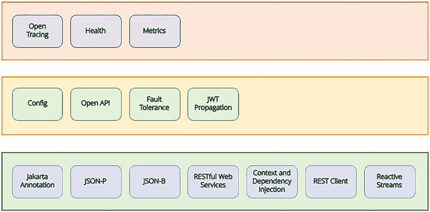

第 6 章 eClipse MiCroprofile 框架

**MicroProfile 中的功能分层**

MicroProfile 旨在与 Jakarta EE 协同工作。它有三层功能。底层包括 RESTful Web 服务、REST 客户端、依赖注入、JSON

处理和响应式流操作符。中间层包含 Open API、配置、容错和安全（JWT 传播）等特性。顶层包含指标、追踪和健康检查等特性。图 e 6-1 depicts these 展示了这三层。

***图 6-1。** MicroProfile 中的三层功能*

Open Liberty 对 MicroProfile 功能的三层都提供了完整支持。

底层包含以下标准：

• **Jakarta 注解** [(https://jakarta.ee/specifications/](https://jakarta.ee/specifications/annotations/)

[annotations/](https://jakarta.ee/specifications/annotations/))：Open Liberty 支持 Jakarta 注解的最新版本，这是 Java 注解事实上的标准。该

Jakarta Annotations API 使你能够编写类型安全的声明式代码。

• **JSON-P** [*(* https://jakarta.ee/specifications/jsonp/](https://jakarta.ee/specifications/jsonp/))：JSON

处理（即 JSON-P）API 提供了一种可移植的方式来解析和

生成 JSON 数据。Jakarta JSON Processing 是 Jakarta EE

规范的一部分，并包含在 Open Liberty 中。

• **JSON-B** ([`jakarta.ee/specifications/jsonb/): T`](https://jakarta.ee/specifications/jsonb/)he JSON 绑定（JSON-B）API 提供了一个标准绑定层，用于

第 6 章 eClipse MiCroprofile 框架

在 Java 对象与 JSON 文档之间进行转换。Open Liberty

内置支持 Jakarta JSON Binding（JSON-B）。

• **RESTful Web 服务** [(https://jakarta.ee/specifications/](https://jakarta.ee/specifications/restful-ws/)

[restful-ws/): T](https://jakarta.ee/specifications/restful-ws/)his 提供了一种编写 RESTful Web 服务的标准方式。RESTEasy 是该规范的可移植实现，

并包含在 Open Liberty 中。你可以使用它创建 REST API。

• **CDI** ([`jakarta.ee/specifications/cdi/`](https://jakarta.ee/specifications/cdi/))**：**上下文与依赖注入（CDI）使你能够管理

有状态组件的生命周期，并将依赖注入到你的组件中。

• **REST 客户端** [(https://microprofile.io/project/eclipse/](https://microprofile.io/project/eclipse/microprofile-rest-client)

[microprofile-rest-client](https://microprofile.io/project/eclipse/microprofile-rest-client))：REST Client 使你能够编写类型安全、声明式代码来调用 RESTful Web 服务。它提供了

用于调用 REST 服务的 API 规范。

• **响应式流** [(https://microprofile.io/project/eclipse/](https://microprofile.io/project/eclipse/microprofile-reactive-streams)

[microprofile-reactive-streams](https://microprofile.io/project/eclipse/microprofile-reactive-streams))：Reactive Streams 规范为异步流

处理（具备非阻塞背压）提供了标准。它还提供了 API

规范用于处理响应式流。*smallrye-*

*reactive- streams* 操作符是该

规范的可移植实现，并包含在 Open Liberty 中。

以下规范构成了 MicroProfile 规范的中间层：

• **配置** [(https://microprofile.io/project/eclipse/](https://microprofile.io/project/eclipse/microprofile-config)

[microprofile-config): T](https://microprofile.io/project/eclipse/microprofile-config)he 配置层提供了从多个来源访问配置数据的统一机制。

它提供了将配置属性注入

应用程序的 API 规范。这包括属性文件、系统属性、

环境变量和 JSON 文档。

第 6 章 eClipse MiCroprofile 框架

• **Open API** [(https://microprofile.io/project/eclipse/](https://microprofile.io/project/eclipse/microprofile-open-api)

[microprofile-open-api](https://microprofile.io/project/eclipse/microprofile-open-api))：Open API 规范使你能够以标准

格式为 RESTful Web 服务编写文档。该文档可被 Swagger UI 等工具使用，

以便为你的 Web 服务生成交互式文档。

• **JWT 传播** [(https://microprofile.io/project/eclipse/](https://microprofile.io/project/eclipse/microprofile-jwt-auth)

[microprofile-jwt-auth](https://microprofile.io/project/eclipse/microprofile-jwt-auth))：JWT 传播规范使你能够在微服务架构中的组件之间

传播安全令牌（例如 JSON Web Token）。它提供了 API

用于使用 JSON Web Token 进行身份认证。

• **容错** [(https://microprofile.io/project/eclipse/](https://microprofile.io/project/eclipse/microprofile-metrics)

[microprofile-metrics](https://microprofile.io/project/eclipse/microprofile-metrics))：容错层提供了可用于编写容错代码并

在云原生应用中优雅处理故障的 API 和注解。这

包括超时、重试、断路器和

舱壁隔离的 API 规范。

以下规范构成了 MicroProfile 规范的顶层：

• **指标** ([`microprofile.io/project/eclipse/`](https://microprofile.io/project/eclipse/microprofile-metrics)

[microprofile-metrics](https://microprofile.io/project/eclipse/microprofile-metrics))：Metrics 规范提供了一种标准方式来暴露应用程序中与性能相关的数据。

这些数据随后可用于监控你的应用。

它还提供了将指标导出到监控系统的 API。

• **开放追踪** ([`microprofile.io/project/eclipse/`](https://microprofile.io/project/eclipse/microprofile-opentracing)

[microprofile-opentracing](https://microprofile.io/project/eclipse/microprofile-opentracing))：Open Tracing 规范使你能够追踪请求在微服务

架构中流转的过程。它还提供了 API 用于跨

微服务追踪请求。这对于调试和性能

分析非常有用。

• **健康** [(https://microprofile.io/project/eclipse/](https://microprofile.io/project/eclipse/microprofile-health)

[microprofile-health): T](https://microprofile.io/project/eclipse/microprofile-health)健康规范提供了一种标准方式，用于从你的应用程序中暴露与健康状况相关的信息。这些信息可用于监控应用程序的健康状态。它还提供了用于编写健康检查的 API。

第 6 章 Eclipse MicroProfile 框架

Eclipse MicroProfile 平台允许开发者为其微服务选择所需的规范。它还被设计为易于扩展，以便开发者可以根据需要添加更多功能。如果开发者需要新的规范，可以向 MicroProfile 社区提出请求。如果该请求获得社区批准，新的规范将在未来版本中创建并加入 MicroProfile 平台。这使得该平台具备通用性，并能适配任何组织的需求。

**Eclipse 的流行实现**

**MicroProfile 框架**

Eclipse MicroProfile 是希望构建微服务的开发者的重要工具。它提供了一组可用于构建微服务的标准规范。这使开发者更容易共享代码并创建可互操作的服务。以下是一些流行的 MicroProfile 实现：

• **Payara Micro** [(https://www.payara.fish/products/payara-](https://www.payara.fish/products/payara-micro/)

[micro/): P](https://www.payara.fish/products/payara-micro/)ayara Micro 是开发者、架构师和 IT 组织首选的开源轻量级中间件平台，适用于希望在生产环境中改进应用服务器启动速度，同时保持一致开发体验的场景。

• **WildFly** [(https://www.wildfly.org/](https://www.wildfly.org/)): WildFly 是一个轻量级、符合 Jakarta EE 标准的应用服务器。

• **Apache TomEE** [(https://tomee.apache.org/](https://tomee.apache.org/)): TomEE（读作“Tommy”）是一个面向 Jakarta EE 规范、完全基于 Apache 技术栈的应用服务器。

• **Open Liberty** [(https://openliberty.io/](https://openliberty.io/)): Open Liberty 是一个快速、轻量、占用资源极小并支持 Jakarta EE 规范的应用服务器。

• **Quarkus** ([`quarkus.io/`](https://quarkus.io/)): Quarkus 是一个 Kubernetes 原生 Java 技术栈，针对 GraalVM 和 OpenJDK HotSpot 量身打造，并由优秀的 Java 库与标准构建而成。

• **Helidon.io** ([`helidon.io/`](https://helidon.io/)): Helidon 是一个基于微服务的 Java 应用开发框架。

第 6 章 Eclipse MicroProfile 框架

• **Launcher** ([`github.com/fujitsu/launcher`](https://github.com/fujitsu/launcher)): Fujitsu Launcher 是一个基于微服务的应用服务器。

• **KumuluzEE** [(https://ee.kumuluz.com/](https://ee.kumuluz.com/)): KumuluzEE 是一个开源框架，用于简化 Java 云原生应用的开发。

在本书中，我主要使用 Open Liberty 进行演示，因为它实现了最新的 MicroProfile 标准。如果你想使用任何其他支持 Eclipse MicroProfile 的应用服务器，开发流程应当也是类似的。

**MicroProfile Config**

MicroProfile Config 组件提供了一组 API，帮助你管理应用程序配置。Config API 允许你：

–

读取和写入配置值

–

从多个来源访问配置值，包括属性文件、系统属性和环境变量

–

使用配置事件观察配置值的变化

Config API 的一些特性包括：

• Config：Config 类用于访问配置数据。

• ConfigSource：ConfigSource 用于从特定来源读取配置数据。

• Property：Property 用于表示配置数据中的键/值对。

• Converter：Converter 用于在配置数据中进行类型转换。

• Filter：Filter 用于过滤配置数据。

**Maven 依赖**

要使用 Config API，你需要在你的 pom 中包含以下依赖。

xml 文件：

第 6 章 eClipse MiCroprofile 框架

<dependency>

<groupId>org.eclipse.microprofile.config</groupId>

<artifactId>microprofile-config-api</artifactId>

<version>1.0</version>

</dependency>

**在 Open Liberty 中启用 MicroProfile Config**

要启用 MicroConfig 特性，你需要将以下代码添加到服务器中。

xml 文件：

<featureManager>

<feature>mpConfig-1.4</feature>

</featureManager>

**使用 MicroProfile Config**

Config 类提供了可用于访问配置属性的静态方法。在添加该依赖后，你可以创建一个名为 MyConfig 的类，如下所示：

import org.eclipse.microprofile.config.inject.ConfigProperty;

import jakarta.enterprise.context.ApplicationScoped;

import jakarta.inject.Inject;

import jakarta.inject.Named;

@ApplicationScoped

public class MyConfig {

@Inject

@ConfigProperty(name = "greeting", defaultValue="Hello")

private String greeting;

public String getGreeting() {

return greeting;

}

}

第 6 章 eClipse MiCroprofile 框架

属性文件可以放在 classpath 中，或者放在文件系统中，文件名为 greeting.properties。

**定义配置属性**

以下是将用于配置 greeting 属性的属性文件源代码：

greeting=Hello Microservices!

MyConfig 类是一个标准的 Java 类，并使用 @ApplicationScoped 注解，

这意味着它只会被创建一次，并在应用程序整个生命周期中使用。该类有一个字段，使用了 @Inject 和 @ConfigProperty 注解。ConfigProperty

注解会告诉 Config API 将 greeting 属性的值注入到该字段中。

如果找不到该属性，则会使用默认值 Hello。

**测试 Config 组件**

getGreeting() 方法只是简单地返回 greeting 字段的值。你可以通过创建一个使用该类的 RESTful Web 服务端点来测试这个类：

import jakarta.inject.Inject;

import jakarta.ws.rs.GET;

import jakarta.ws.rs.Path;

import jakarta.ws.rs.Produces;

import jakarta.ws.rs.core.MediaType;

@Path("/config")

public class ConfigResource {

@Inject

private MyConfig myConfig;

@GET

@Produces(MediaType.TEXT_PLAIN)

public String getGreeting() {

return myConfig.getGreeting();

}

}

第 6 章 eClipse MiCroprofile 框架

当你部署应用程序并调用 /config 端点时，你应该能看到你注入的 greeting 属性：

Hello Microservices!

你还可以将配置属性注入到方法参数中，

如下所示：

import org.eclipse.microprofile.config.inject.ConfigProperty;

// ...

public class MyConfig {

// ...

@Inject

public void setGreeting(@ConfigProperty(name = "greeting") String greeting) **创建 ConfigSource**

如你所见，Config API 使得将配置属性注入到应用程序中变得很容易。Config API 为配置实现定义了一个契约。ConfigSource

用于从特定来源读取配置数据。例如，你可以创建一个从文件读取配置数据的 ConfigSource。

ConfigSource 接口具有以下方法：

• String getName()：返回 ConfigSource 的名称。

• int getOrdinal()：返回 ConfigSource 的序号。

序号决定了 ConfigSource 的优先级。序号越高，

优先级越高。

• Map<String, String> getProperties()：返回此

ConfigSource 中属性的映射。映射中的键是属性名，

值是属性值。

• getValue(String propertyName)：返回给定

属性的值。如果找不到该属性，此方法返回 null。

• Set getPropertyNames()：返回此

ConfigSource 中属性名的 Set 集合。

第 6 章 eClipse MiCroprofile 框架

以下是一个简单的 ConfigSource 实现，它从文件读取配置

数据：

import org.eclipse.microprofile.config.spi.ConfigSource;

import java.io.IOException;

import java.util.HashMap;

import java.util.Map;

import java.util.Set;

public class MyConfigSource implements ConfigSource {

private Map<String, String> properties;

public MyConfigSource() throws IOException {

properties = new HashMap<>();

properties.put("greeting", "Hello from MyConfigSource!");

}

public Map<String, String> getProperties() {

return properties;

}

public String getValue(String propertyName) {

return properties.get(propertyName);

}

public String getName() {

return "MyConfigSource";

}

public Set<String> getPropertyNames() {

return properties.keySet();

}

public int getOrdinal() {

// 我们希望这个配置源具有更高的优先级，所以我们

return 1000

return 1000;

}

}

第 6 章 eClipse MiCroprofile 框架

提醒：所有源代码都可从 github.com/apress/beginning-cloud-native-dev-microprofile-jakarta-kubernetes 获取。

**注册 ConfigSource**

一旦你实现了 ConfigSource，就需要将其注册到 Config API 中。

你可以通过在应用程序的 META-INF/services 目录中创建一个名为 org.eclipse.microprofile.config.spi.ConfigSource 的文件来完成此操作。该文件包含你的 ConfigSource 的完全限定类名。

**访问配置数据**

注册 ConfigSource 后，你就可以访问配置数据：

import org.eclipse.microprofile.config.Config;

public class MyApplication {

// ...

public void doSomething() {

Config config = ConfigProvider.getConfig();

String myProp = config.getValue("my.prop", String.class);

}

}

此示例使用 getValue() 方法从 ConfigSource 检索属性。

第一个参数是属性名称，第二个参数是你希望将属性转换成的类型。如果属性不存在，将返回默认值（此处为 null）。ConfigSource 是分层的，这意味着你可以用一个 ConfigSource 覆盖另一个 ConfigSource 中的属性。例如，你可以创建一个从文件读取配置数据的 ConfigSource，以及另一个从系统属性读取配置数据的 ConfigSource。系统属性的优先级高于基于文件的 ConfigSource，而基于文件的 ConfigSource 的优先级又高于默认 ConfigSource。

第 6 章 eClipse MiCroprofile 框架

**访问配置元数据**

除了将配置值注入应用程序之外，Config API 还提供了访问配置属性元数据的方法。Config 接口使用 getProperty(String propertyName) 方法来访问这些元数据。

它会返回给定属性的信息。如果找不到该属性，此方法将返回 null。

**为配置属性指定默认值**

如果属性不存在，你还可以指定要使用的默认值：

import org.eclipse.microprofile.config.inject.ConfigProperty;

public class MyApplication {

@Inject

@ConfigProperty(name="my.prop", defaultValue="foo")

private String myProp;

}

在这个示例中，如果 my.prop 属性不存在，将使用默认值 "foo"。

**ConfigProperty 中的类型转换**

ConfigProperty 还支持类型转换，因此你可以将配置数据注入到任意类型的字段中：

import org.eclipse.microprofile.config.inject.ConfigProperty;

public class MyApplication {

@Inject

@ConfigProperty(name="my.prop", defaultValue="1234")

private Integer myProp;

}

在这个示例中，my.prop 属性在注入到 myProp 字段之前会被转换为整数。如果转换失败，将抛出 org.eclipse.microprofile.config.ConversionFailedException。

第 6 章 eClipse MiCroprofile 框架

**使用可选的 ConfigProperty**

如果你希望将属性作为可选字段注入，可以使用 org.eclipse.microprofile.config.inject.ConfigProperty 注解：

import org.eclipse.microprofile.config.inject.ConfigProperty;

public class MyApplication {

@Inject

@ConfigProperty(name="my.prop")

private Optional<String> myProp;

}

在这个示例中，`myProp` 字段将被注入一个 `Optional<String>` 对象。如果该属性不存在，注入的 `Optional` 将为空。可选属性通过 `getOptionalValue()` 方法获取，而不是通过 `getValue()`。

**将配置数据转换为 POJO**

你还可以使用 Config API 将配置数据转换为 POJO：

import org.eclipse.microprofile.config.inject.ConfigProperty;

public class MyApplication {

@Inject

private MyPojo myPojo;

}

public class MyPojo {

@ConfigProperty(name="my.prop")

private String myProp;

}

这个示例将名为 `my.prop` 的属性注入到 `MyPojo` 类的 `myProp` 字段中。如果该属性不存在，将抛出 `org.eclipse.microprofile.config.ConfigPropertyNotFoundException`。这段代码还展示了如何访问配置属性的元数据，并将配置数据转换为 POJO。

**以编程方式查找配置数据**

除了注入之外，你还可以使用 Config API 以编程方式查找配置数据：

第 6 章 eClipse MiCroprofile fraMework

import org.eclipse.microprofile.config.inject.ConfigProperty;

public class MyApplication {

public void doSomething() {

Config config = ConfigProvider.getConfig();

String myProp = config.getValue("my.prop", String.class);

}

}

和注入字段一样，如果属性不存在，你也可以指定一个默认值来使用：

import org.eclipse.microprofile.config.inject.ConfigProperty;

public class MyApplication {

public void doSomething() {

Config config = ConfigProvider.getConfig();

String myProp = config.getValue("my.prop");

}

}

你还可以使用类型转换：

import org.eclipse.microprofile.config.inject.ConfigProperty;

public class MyApplication {

public void doSomething() {

Config config = ConfigProvider.getInstance().getConfig();

Integer myProp = config.getValue("my.prop");

}

}

**MicroProfile 健康检查规范**

Eclipse MicroProfile 健康检查规范提供了一组注解和 API，用于为你的应用程序编写健康检查。*健康检查* 是一种可用于判断应用程序或服务健康状态的测试。Health Check 组件的一些特性包括：

第 6 章 eClipse MiCroprofile fraMework

• HealthCheck：用于将一个类标记为健康检查器。

• HealthCheckResponse：用于表示健康检查的结果。

• HealthCheckRegistry：用于注册和运行健康检查器。

Health Check API 允许你公开关于应用程序健康状态的信息。这些信息可被负载均衡器和其他工具使用，以判断应用程序是否健康。要使用 Health Check API，你需要在 `pom.xml` 文件中包含以下依赖：

<dependency>

<groupId>org.eclipse.microprofile.health</groupId>

<artifactId>microprofile-health-api</artifactId>

<version>1.0</version>

</dependency>

Health Check API 为健康检查实现定义了一个约定。健康检查是一个实现了 `HealthCheck` 接口的 Java 类：

package org.eclipse.microprofile.health;

public interface HealthCheck {

HealthCheckResponse call();

}

`call()` 方法用于执行实际的健康检查并返回一个 `HealthCheckResponse` 对象：

package org.eclipse.microprofile.health;

public interface HealthCheckResponse {

boolean isHealthy();

String getMessage();

}

如果健康检查成功，`isHealthy()` 方法返回 `true`，否则返回 `false`。`getMessage()` 方法可用于返回一条描述健康检查结果的消息。

第 6 章 eClipse MiCroprofile fraMework

你可以通过实现 `HealthCheck` 接口来创建一个健康检查：

import org.eclipse.microprofile.health.Health;

import org.eclipse.microprofile.health.HealthCheck;

import org.eclipse.microprofile.health.HealthCheckResponse;

@Health

public class MyHealthCheck implements HealthCheck {

@Override

public HealthCheckResponse call() {

return HealthCheckResponse.named("my-health-check")

.withData("time", System.currentTimeMillis())

.up()

.build();

}

}

MyHealthCheck 类使用了 @Health 注解，这会告知运行时它是一个健康检查。call() 方法返回一个 HealthCheckResponse 对象，表示健康检查成功，并包含了一些关于执行检查时间的数据。

你可以部署该应用并调用 /health 端点来查看健康检查结果：

{

"status": "UP",

"checks": [

{

"name": "my-health-check",

"data": {

"time": 1484648754368

}

}

]

}

第 6 章 eClipse MiCroprofile 框架

如你所见，健康检查已成功，并且响应中包含了你在健康检查中指定的数据。下一节将介绍如何使用 Fault Tolerance API 使你的应用在面对故障时更具韧性。

**MicroProfile Fault Tolerance 组件**

容错性是指系统在发生故障时仍能持续正确运行的能力。一个具备容错能力的系统能够在无需人工干预的情况下检测、隔离并恢复错误。

**Fault Tolerance 组件的关键特性**

Fault Tolerance 组件的一些关键特性包括：

• **断路器**：断路器用于防止应用向下游系统发起过多失败请求。如果失败次数超过阈值，断路器将会“打开”，后续所有请求都会立即失败。经过配置的延迟后，断路器会进入“半开”状态，并允许有限数量的请求通过。如果这些请求成功，断路器会“关闭”，并允许所有请求通过。

• **舱壁隔离**：舱壁用于将系统某一部分的故障与系统其他部分隔离开。例如，如果你的系统包含数据库和 Web 前端，你可以使用舱壁来确保数据库故障不会影响 Web 前端。

• **重试**：当操作失败时，系统应重试该操作。

• **超时**：超时特性用于在操作耗时过长时中止该操作。

• **回退**：回退特性用于在操作失败时提供默认响应。

• **异步执行**：系统可以异步执行操作，这样调用方就不必等待操作完成。

第 6 章 eClipse MiCroprofile 框架

**Fault Tolerance API**

Fault Tolerance API 使你能够让应用在故障场景下更具韧性。

本节将介绍如何使用 Fault Tolerance 组件构建一个简单的容错应用。由于容错是构建在 Config API 之上的，你可以使用配置数据来配置容错应用的行为。

要使用 Fault Tolerance API，你需要在 pom.xml 文件中加入以下依赖：

<dependency>

<groupId>org.eclipse.microprofile.faulttolerance</groupId>

<artifactId>microprofile-fault-tolerance-api</artifactId>

<version>1.0</version>

</dependency>

Fault Tolerance API 为容错实现定义了一套契约。容错注解用于标注 Java 方法：

import org.eclipse.microprofile.faulttolerance.Retry;

@Retry(maxRetries = 3, delay = 1000)

public String doSomething() {

// ...

}

Retry 注解会告知运行时在方法失败时最多重试三次。Delay 属性指定每次重试之间的等待时间，单位为毫秒。如果三次尝试后方法仍然失败，运行时将抛出 FaultToleranceException。

其他容错注解列在 Table 6-1. 中。

第 6 章 eClipse MiCroprofile 框架

***表 6-1。** 容错注解及其说明*

**容错**

**说明**

**注解**

@Timeout

为方法指定超时时间。如果方法执行时间超过指定超时时间，将被中止，并抛出 FaultToleranceException。

@CircuitBreaker 指定该方法应在断路器中执行。如果该方法失败次数过多，断路器将会打开，且该方法

将不会被执行。经过一段时间后，断路器会关闭，

该方法将再次执行。

@Fallback

指定当主方法失败时要执行的回退方法。

@Bulkhead

指定该方法应在舱壁隔离中执行。舱壁隔离

限制该方法的并发执行数量。如果达到

该限制，后续对该方法的调用将被拒绝。

这些注解可以组合使用，以创建更复杂的容错

策略。例如，你可以同时使用 Timeout 和 Fallback

注解来标注一个方法：

import org.eclipse.microprofile.faulttolerance.Timeout;

import org.eclipse.microprofile.faulttolerance.Fallback;

@Timeout(1000)

@Fallback(MyFallbackMethod.class)

public String doSomething() {

// ...

}

在这个示例中，如果该方法执行时间超过 1000 毫秒，它将被中止，并执行回退方法。

第 6 章 eClipse MiCroprofile 框架

**总结**

本章介绍了 MicroProfile Config 和 Fault Tolerance 组件。下一章将介绍如何使用 Metrics 组件、构建 RESTful Web 服务、

使用 Open API 组件为 API 生成文档，以及使用

OpenTracing 组件对请求进行追踪。

**第 7 章**

**MicroProfile**

**框架 – 第 2 部分**

在上一章中，你已经了解了 MicroProfile 的架构。那一章还深入讲解了几个关键标准，例如配置、健康检查和容错。

本章讨论 MicroProfile 中一些更重要的标准：Metrics、RESTful Web 服务、开放追踪（OpenTracing）以及 OpenAPI 规范（OAS）。

Metrics 和健康检查是监控服务

或应用状态的两种方式。健康检查可以告诉你服务是否健康，而指标则提供有关服务性能的信息。现在让我们详细了解

MicroProfile Metrics 规范。

**MicroProfile Metrics 规范**

MicroProfile Metrics 项目提供了一组用于衡量应用性能的注解和 API。它是一项用于以标准格式暴露应用指标的规范。它使其他工具和框架能够轻松收集并跟踪应用指标。

换句话说，该规范定义了一组标准指标，你可以使用它们来跟踪应用的健康状态和性能。你可以通过多种方式暴露这些指标，例如使用 JMX、JSON 或 Prometheus。

JMX 是 Java Management Extension（Java 管理扩展）。它是一个 Java 平台，提供用于

管理和监控 Java 应用的工具。JMX 可用于监控应用的

性能，并用于识别和诊断问题。

Prometheus 工具是一个监控和时序数据库系统。它允许你

从你的服务中收集指标，并将其存储用于长期分析。

© Tarun Telang 2023

T. Telang, *Beginning Cloud Native Development with MicroProfile, Jakarta EE, and Kubernetes*,

[`doi.org/10.1007/978-1-4842-8832-0_7`](https://doi.org/10.1007/978-1-4842-8832-0_7#DOI)

第 7 章 MiCroprofile 框架 – 第 2 部分

**指标类型**

MicroProfile Metrics 规范定义了一组标准指标；可分为多个类别：

• **基础指标：** 所有应用通用，例如

CPU 数量或可用内存大小。

• **应用指标**：特定于某个应用，例如每秒请求数

或平均响应时间。

• **供应商指标**：特定于某个供应商或技术，例如

每秒数据库查询次数。

除了这里提到的标准指标外，MicroProfile Metrics 还支持自定义指标。你可以使用自定义指标来跟踪标准指标未涵盖的应用特定信息。

**指标组件**

以下是 Metrics 组件中的一些核心部分：

• MetricRegistry：保存应用程序的所有指标。

• Meters：衡量事件发生的速率。

• Gauges：衡量某一时刻函数的值。

• Counter：对某个值进行递增或递减。

• Histograms：跟踪数据流中数值的分布情况。

• *Timers*：衡量执行某个操作所需的时间。

Metrics 组件还包含一个 JMX 接口，用于暴露

你的应用程序指标。

**Metrics 注解**

MicroProfile Metrics 规范定义了一组用于暴露

指标的注解。这些注解可用于类、方法或字段。Table 7-1 lists 列出了 Metrics 注解及其说明。

第 7 章 MicroProfile 框架——第 2 部分

***表 7-1。** Metrics 注解*

**注解**

**说明**

@Timed

确定一个方法执行所需的时间，并将该

信息作为指标暴露出来。

@Counted

跟踪一个方法被调用的次数，并将该

信息作为指标暴露出来。

@Gauge

允许你暴露一个可为任意值的自定义指标。它对于

暴露应用程序特定指标很有用。

@ConcurrentGauge 与 Gauge 注解类似，但允许跟踪一个方法的并发调用次数。

@Metered

确定一个方法执行所需的时间，并将该

信息作为速率指标暴露出来。

@SimplyTimed

确定一个方法执行所需的时间，并将该

信息同时作为总耗时指标和速率指标暴露出来

除了这些注解之外，MicroProfile Metrics 规范还定义了一组

用于处理指标的编程式 API。这些 API 可用于注册自定义指标或访问现有指标。

**Maven 依赖**

要使用 Metrics 组件，你需要以下 Maven 依赖：

<dependency>

<groupId>org.eclipse.microprofile</groupId>

<artifactId>microprofile-metrics</artifactId>

</dependency>

**使用 @Timed 跟踪响应时间**

MicroProfile Metrics 规范还允许你将方法响应时间作为计时指标进行跟踪。下面的代码示例展示了如何使用 @Timed 注解来跟踪响应时间。

第 7 章 MicroProfile 框架——第 2 部分

import org.eclipse.microprofile.metrics.MetricType;

import org.eclipse.microprofile.metrics.annotation.Timed;

public class MyApplication {

// 将响应时间作为计时指标暴露

@Timed(name = "responseTime", description = "The response time of the method", unit = "ms", metricType = MetricType.TIMER)

public void myMethod() {

// 方法实现

// ....

}

}

这将暴露一个名为 myTimer 的指标，用于跟踪在

myMethod() 方法中花费的时间（毫秒）。

**跟踪调用次数**

MicroProfile Metrics 规范还允许你将方法调用次数作为计数器指标进行跟踪。下面的代码示例展示了如何使用 @Metric

注解来跟踪调用计数：

import org.eclipse.microprofile.metrics.Metrics;

import org.eclipse.microprofile.metrics.MetricType;

public class MyApplication {

// 将调用次数作为计数器指标暴露

@Metric(name = "invocationCount", description = "The number of times

the method has been invoked", unit = "invocations", metricType =

MetricType.COUNTER)

public int myMethod() {

// 方法实现

// ....

}

}

第 7 章 MicroProfile 框架——第 2 部分

在本示例中，@Metric 注解会告诉 MicroProfile Metrics 跟踪

myMethod() 方法的调用次数，并将该指标作为计数器暴露。

该指标的名称、描述和单位也可以指定。metricType

属性用于指定指标类型，在这个例子中是计数器。

**跟踪内存使用情况**

你还可以使用 MicroProfile Metrics 跟踪应用程序的内存使用情况。

下面的代码示例展示了如何使用 MicroProfile Metrics 注解来

跟踪某个方法的内存使用情况：

import org.eclipse.microprofile.metrics.annotation.Metered;

public class MyApplication {

// 跟踪该方法的内存使用情况

@Metered(name = "memoryUsage", unit = MetricUnits.BYTES, description

= "该方法以内存字节计的使用量", metricType = MetricType.

METERED)

public void myMethod() {

// 方法实现

// ....

}

}

在这个示例中，@Metered 注解告诉 MicroProfile Metrics 跟踪 myMethod() 方法的

内存使用情况，并将该指标作为一个 meter 暴露出来。该指标的名称、

描述和单位也可以被指定。

**指标注册表**

MetricRegistry 是通过 MicroProfile Metrics 暴露的所有指标的注册表。

它可用于以编程方式访问指标值或注册自定义指标。

要获取 MetricRegistry 的引用，你可以像下面这样注入它：

@Inject

MetricRegistry registry;

第 7 章 MicroProfile 框架——第 2 部分

然后你可以使用 MetricRegistry 访问任何已暴露的指标。例如，要

获取 request-rate 指标的值，你可以使用如下代码：

Double requestRate = registry.getMetrics().get("request-rate").

doubleValue();

**创建自定义指标**

你也可以通过实现 org.eclipse.microprofile.

metrics.Metric 接口来创建自己的指标。下面的代码示例创建了一个用于

跟踪应用中活跃用户数量的自定义指标：

import org.eclipse.microprofile.metrics.Metric;

import org.eclipse.microprofile.metrics.MetricUnits;

public class ActiveUsersMetric implements Metric {

private int activeUsers;

public void setActiveUsers(int activeUsers) {

this.activeUsers = activeUsers;

}

public int getValue() {

return activeUsers;

}

public String getName() {

return "activeUsers";

}

public MetricType getType() {

return MetricType.GAUGE;

}

public String getUnit() {

return MetricUnits.NONE;

}

}

第 7 章 MicroProfile 框架——第 2 部分

在这个示例中，ActiveUsersMetric 类实现了 Metric 接口。

该类包含一个 setActiveUsers() 方法用于设置活跃用户数量，以及一个 getValue() 方法用于获取该指标的当前值。该指标的名称、类型和单位也可以被指定。

你可以使用 org.

eclipse.microprofile.metrics.MetricsRegistry 接口将你的自定义指标注册到 MicroProfile Metrics 中。下面的代码

示例展示了如何向 MicroProfile Metrics 注册一个自定义指标：

public class MyApplication {

public static void main(String[] args) {

// 创建 MetricRegistry

MetricRegistry registry = Metrics.getRegistry();

// 创建自定义指标

ActiveUsersMetric activeUsersMetric = new ActiveUsersMetric();

// 注册指标

registry.register("activeUsers", activeUsersMetric);

}

}

在这个示例中，创建了一个自定义 MetricRegistry，并将该自定义指标

注册到了其中。然后你可以使用 MetricRegistry 来检索该

指标的值。例如，你可以使用下面的代码获取

activeUsers 指标的值：

int activeUsers = registry.getGaugeValue("activeUsers");

**暴露指标**

**JMX**

要通过 Java 管理扩展（JMX）暴露指标，请将以下

依赖添加到你的项目中：

<dependency>

<groupId>org.eclipse.microprofile.metrics</groupId>

<artifactId>microprofile-metrics-api</artifactId>

<version>2.3</version>

</dependency>

第 7 章 MicroProfile 框架——第 2 部分

这将为你的应用启用 MicroProfile Metrics 的 JMX 支持。默认情况下，所有指标都会通过 JMX 暴露。如果你想禁用它，可以在应用配置中设置以下属性：

mp.metrics.jmx.disabled=true

**JSON**

要以 JSON 格式暴露指标，请将以下依赖添加到你的项目中：

<dependency>

<groupId>org.eclipse.microprofile.metrics</groupId>

<artifactId>microprofile-metrics-rest</artifactId>

<version>2.3</version>

</dependency>

这将为你的应用启用 MicroProfile Metrics 的 JSON 支持。默认

情况下，所有指标都会以 JSON 格式暴露。如果你想禁用它，可以在应用配置中设置以下属性：

mp.metrics.rest.disabled=true

**Prometheus**

要以 Prometheus 格式暴露指标，请将以下依赖添加到你的项目中：

<dependency>

<groupId>org.eclipse.microprofile.metrics</groupId>

<artifactId>microprofile-metrics-impl</artifactId>

<version>2.3</version>

</dependency>

这将为你的应用启用 MicroProfile Metrics 的 Prometheus 支持。默认情况下，所有指标都会以 Prometheus 格式暴露。

如果你想禁用此功能，可以在应用配置中设置以下属性：

mp.metrics.prometheus.disabled=true

第 7 章 MiCroprofile fraMework – 第 2 部分

MicroProfile Metrics 规范是用于监控应用性能的实用工具。它可用于跟踪方法的执行时间、方法的内存使用情况，以及你定义的自定义指标。MicroProfile Metrics 易于使用，并且可以与其他监控工具集成。

**使用 Open Tracing**

MicroProfile OpenTracing 规范定义了一组用于在你的方法中启用分布式追踪的标准 API。MicroProfile OpenTracing

规范的目标是保持不同追踪实现之间的一致性，例如 Jaeg[er（www.jaegertracing.io/）](http://www.jaegertracing.io/)、Zipk[in（https://zipkin.io/）和 A](https://zipkin.io/)ppDynamics（[www.appdynamics.com/）。T](https://www.appdynamics.com/)这意味着你可以在微服务中使用任何兼容的追踪实现，而无需修改代码。

MicroProfile OpenTracing 规范由两部分组成：

• API 定义描述了如何对 RESTful Web 服务进行埋点，

以实现分布式追踪。

• 兼容层允许不同的追踪实现

与 MicroProfile OpenTracing API 互换使用。

**分布式追踪**

分布式追踪是一种通过追踪请求在系统中的流转来理解分布式系统工作方式的技术。它可用于排查各种问题（如性能问题），并识别分布式系统中的瓶颈。

在微服务架构中，每个微服务都是运行在其所在机器上的独立进程。请求可能会从一个微服务流向另一个微服务，因此很难从整体上理解系统如何工作。

分布式追踪可以通过追踪请求在系统中的流转并识别每个请求涉及了哪些微服务，帮助你看清全局。

**它是如何工作的？**

MicroProfile OpenTracing API 定义了如何对微服务进行埋点，以实现

分布式追踪。该 API 基于 OpenTracing 标准，这是一种与供应商无关的-171

第 7 章 MiCroprofile fraMework – 第 2 部分

用于追踪而对分布式系统进行埋点的中立方式。没有分布式追踪时，很难理解一个请求如何在微服务架构中流转。

MicroProfile OpenTracing 兼容层允许不同的追踪

实现与 MicroProfile OpenTracing API 一起使用。这意味着

你可以在微服务中使用任何兼容的追踪实现，而无需

修改你的代码。

**Jakarta RESTful Web Service 中的 MicroProfile OpenTracing**

要实现 OpenTracing，首先你需要在项目的 pom.xml 文件中包含以下 Maven 依赖。

<dependency>

<groupId>org.eclipse.microprofile.opentracing</groupId>

<artifactId>microprofile-opentracing-api</artifactId>

<version>3.0</version>

</dependency>

要在应用中通过 Zipkin 启用分布式追踪，首先请确保它已

安装并正在运行。请参阅 Chapt[第 3 章 t](https://doi.org/10.1007/978-1-4842-8832-0_3) 了解如何在你的系统上安装 Zipkin。接下来，将以下代码添加到你的 server.xml 文件中。

假设你使用 Open Liberty 作为 MicroProfile 实现，

server.xml 文件将位于以下路径：

/<project-folder>/src/main/liberty/config

在你的 RESTful Web 服务运行后，你可以在

Zipkin 服务器中查看追踪数据。

默认情况下，Jakarta RESTful Web 服务资源中的所有方法都会被追踪。你可以使用 @Traced(false) 注解来排除某些方法不被追踪。

**显式启用 OpenTracing**

要为非 Jakarta RESTful Web 服务方法启用追踪，你需要将 @

Traced 注解添加到该方法上。对应的代码片段如下：

@Traced (value = true, operationName = “MyApplication.someMethod”)

public void someMethod() {

// ...

}

第 7 章 MiCroprofile fraMework – 第 2 部分

operationName= 参数用于指定 span 的名称。

**注入自定义 Tracer 对象**

底层的 OpenTracing Tracer 对象可以通过 CDI，使用 @Inject 注解注入到 Jakarta RESTful Web

服务资源类中。

public class MyApplication {

@Inject

private Tracer tracer;

public void someMethod() {

// ... 使用 tracer 做一些事情

}

}

之后，你可以通过创建 span 来开始为你的代码添加埋点。例如，要为一个方法添加埋点，可按如下方式操作：

public class MyApplication {

private Tracer tracer;

public void someMethod() {

Span span = tracer.buildSpan("someOperation").start();

try (Scope scope = tracer.scopeManager().activate(span)){

// ... 在这里做一些事情

} finally {

span.finish();

}

}

}

finish() 方法在 finally 代码块中调用，以确保 span 总是会被

完成，即使抛出了异常也是如此。它会设置 span 的状态和结束时间。

可以通过使用 span.log() 方法添加日志，以记录 span 期间发生的事件信息。

第 7 章 MiCroprofile fraMework – 第 2 部分

你还可以使用 tracer.setTag() 方法为 span 添加标签：

public class MyApplication {

private Tracer tracer;

public void someMethod() {

Span span = tracer.buildSpan("someOperation").start();

try (Scope scope = tracer.scopeManager().activate(span)){

// ... 在这里做一些事情

span.log("something happened here");

span.setTag("operationType", "read");

// ... 在这里做一些事情

} finally {

span.finish();

}

}

}

更多信息请参阅 MicroProfile OpenTracing 规范

([`download.eclipse.org/microprofile/microprofile-opentracing-3.0/`](https://download.eclipse.org/microprofile/microprofile-opentracing-3.0/microprofile-opentracing-spec-3.0.html)

[microprofile-opentracing-spec-3.0.html)。](https://download.eclipse.org/microprofile/microprofile-opentracing-3.0/microprofile-opentracing-spec-3.0.html)

**使用 Jakarta RESTful Web 服务**

如今 Web 服务非常流行，因为它们能够构建解耦系统，

在这种系统中，各服务可以相互通信，而无需了解彼此的实现细节。

设计和实现 Web 服务有很多种方式。其中一种流行方式是

使用表述性状态转移（REST）架构。

Jakarta RESTful Web 服务采用 REST 架构。这类 Web 服务

使构建现代化、可扩展的 Web 应用变得容易。REST 架构

基于这样一个原则：所有数据和功能都应通过统一接口进行访问。

这使得开发、测试和部署 Web 应用更加容易。

第 7 章 MiCroprofile fraMework – 第 2 部分

例如，假设你有一个产品目录，并希望将其作为 Web 服务提供。使用 REST 时，你可以创建一个表示目录中资源（产品）的 URL。当客户端（例如 Web 浏览器）请求该 URL 时，服务器将返回 JSON 格式的产品列表。

让我们创建这个简单的 RESTful Web 服务。要使用 Jakarta RESTful Web 服务

API，你需要在项目中添加以下 Maven 依赖：

<!-- https://mvnrepository.com/artifact/jakarta.ws.rs/jakarta.ws.rs-api -->

<dependency>

<groupId>jakarta.ws.rs</groupId>

<artifactId>jakarta.ws.rs-api</artifactId>

<version>3.1.0</version>

</dependency>

现在将 Product 类定义为一个 POJO：

public class Product {

private int id;

private String name;

public String getName() {

return name;

}

public int getId() {

return id;

}

public Product(int id, String name) {

this.id = id;

this.name = name;

}

}

第 7 章 MicroProfile 框架——第 2 部分

接下来，创建一个带有 `getProducts()` 方法的 ProductService 类，该方法返回一个

产品列表：

import java.util.*;

import jakarta.ws.rs.*;

@Path("/products")

public class ProductService {

@GET

@Produces(MediaType.APPLICATION_JSON)

public List<Product> getProducts() {

// 返回产品列表

List<Product> products = new ArrayList<>();

products.add(new Product(1, " product 1"));

products.add(new Product(2, "product 2"));

return products;

}

}

你还需要创建一个 Application：

import jakarta.ws.rs.ApplicationPath;

import jakarta.ws.rs.core.Application;

@ApplicationPath("/api")

public class HelloApplication extends Application {

}

该类将用于配置 JAX-RS 应用程序。`@ApplicationPath`

注解定义了此应用程序中所有资源的基础 URI。

然后，你可以将该应用程序部署到兼容 Jakarta EE 的服务器上，并通过 http://localhost:8080/api/products 访问该 Web 服务。你应该会看到如下所示的 JSON 格式产品列表：

[{"id":1,"name":"product_1"},{"id":2,"name":"product_2"}]

第 7 章 MicroProfile 框架——第 2 部分

**使用 MicroProfile OpenAPI 规范**

MicroProfile OpenAPI 规范提供了一组 Java API，允许开发者基于其 RESTful Web 服务，按照 OpenAPI v3 标准定义并自动生成 API 规范。这些 API 规范随后可用于生成交互式文档、客户端 SDK 及其他工具，从而使开发者更容易使用基于 MicroProfile 的 API。

MicroProfile OpenAPI 是 Eclipse MicroProfile 项目的一部分，并且

与所有主流 MicroProfile 实现兼容。它基于 OpenAPI

规范（OAS），并使用 Jakarta RESTful Web 服务

规范中的注解。具体而言，MicroProfile OpenAPI 规范定义了如何

描述通过 HTTP 传输 JSON 的 REST API。

**OpenAPI**

OpenAPI 规范（前身为 Swagger）是一项用于描述和记录 REST API 与其使用者之间接口的技术规范。它允许 REST

API 提供方使用可被各种工具消费的格式来描述并暴露其 API。

这有助于创建一致、文档完善且易于被人类和机器共同使用的 API。该规范

旨在提供一种统一的 API 描述方式，使其同时具备人类可读性与机器可读性。OAS3 规范是一项由社区推动的计划，已被包括 Google、Microsoft 和 Amazon 在内的许多大型组织采用。

**MicroProfile OpenAPI 规范的能力**

MicroProfile OpenAPI 使开发者能够轻松为其

微服务生成文档。文档包括提供了哪些服务、如何调用这些服务以及使用了哪些数据类型等信息。此外，该文档还可用于生成客户端代码，以访问这些 Web 服务。

**生成 OpenAPI 文档**

你可以通过多种方式生成 OpenAPI 文档。最常见的

方式是使用注解。这只需要在你现有的 Jakarta RESTful Web 服务注解基础上补充 OpenAPI 注解。

第 7 章 MicroProfile 框架——第 2 部分

你也可以使用 JSON 或 YAML 文件。你可以从预定义模型开始，

并手动更新 Web 服务的整个 OpenAPI 文档树。不过，基于注解的方法是推荐方案，因为它更易维护且

更容易理解。最后，你还可以通过配置过滤掉不想记录的资源。

**在你的项目中使用 MicroProfile OpenAPI**

要在你的项目中使用 MicroProfile OpenAPI，你需要将以下 Maven 坐标添加到你的项目中：

<dependency>

<groupId>org.eclipse.microprofile.openapi</groupId>

<artifactId>microprofile-openapi-api</artifactId>

<version>3.1-RC1</version>

<type>jar</type>

</dependency>

这个依赖项包含了你为 API 编写文档所需的注解。

首先，你需要创建一个 Jakarta RESTful Web Service 资源类，其中包含你想要编写文档的 API 方法：

import jakarta.ws.rs.GET;

import jakarta.ws.rs.Path;

import jakarta.ws.rs.Produces;

import jakarta.ws.rs.core.MediaType;

import java.util.List;

@Path("/myresource")

public class MyResource {

@GET

@Produces(MediaType.APPLICATION_JSON)

@Operation(summary = "Get all MyObjects")

@APIResponse(responseCode = "200", description = " successful

operation",

content = @Content(schema = @Schema(implementation =

MyObject.class))),

第 7 章 MiCroprofile fraMework – 第 2 部分

@APIResponse(responseCode = "400", description = "MyObject not found") public List <MyObject> getAll() {

// ...

}

}

这个示例有一个资源类，其中只有一个 API 方法 getAll()。该方法返回一个 MyObject 列表。

这个方法使用 @Operation 注解来记录资源上的操作。summary 字段提供该操作的简要说明。

getAll() 方法使用 @APIResponse 注解来记录该操作的成功响应。responseCode 字段指定响应的状态码，description 字段提供响应的简要说明。这里有两种可能的响应——一种是包含 MyObject 列表的成功响应，状态码为 200；另一种是未找到 MyObject 时的失败响应，状态码为 400。content 字段指定响应内容的模式（schema）。

在这个示例中，响应内容是一个 MyObject 列表。

最后，你需要将以下属性添加到 src/main/resources/META-INF/microprofile-config.properties 文件中：

mp.openapi.scan=true

这个属性会告诉 MicroProfile OpenAPI 扫描你的类中的注解，并为它们生成 API 文档。

现在你已经配置好了 MicroProfile OpenAPI，你可以构建并运行你的应用程序。

当你访问 http://localhost:8080/openapi.json URL 时，你应该会看到由 MicroProfile OpenAPI 生成的 API 文档：

{

"openapi": "3.0.1",

"info": {

"version": "1.0.0",

"title": "My API"

},

"paths": {

"/myresource": {

第 7 章 MiCroprofile fraMework – 第 2 部分

"get": {

"operationId": "getAll",

"summary": "Get all MyObjects",

"responses": {

"200": {

"description": " successful operation",

"content": {

"application/json": {

"schema": {

"$ref": "#/components/schemas/MyObject"

}

}

}

},

"400": {

"description": "Invalid input"

}

}

}

}

},

"components": {

"schemas": {

"MyObject": {

"type": "object",

"properties": {},

"javaType": "com.example.MyObject"

}

}

}

}

如你所见，MicroProfile OpenAPI 已经为这个资源类生成了 API 文档。你可以使用这份文档来了解该 API 以及如何使用它。

第 7 章 MiCroprofile fraMework – 第 2 部分

**MicroProfile OpenAPI 注解**

MicroProfile OpenAPI 注解可用于为任何 Jakarta RESTful Web Service 资源编写文档。这些注解也可以与其他 Jakarta RESTful Web Service 注解一起使用，例如 @Path 和 @Produces。常用于 RESTful Web Service 文档的注解列在表 7-2 中。

***表 7-2。** MicroProfile OpenAPI 中使用的注解*

**注解**

**说明**

@OpenAPIDefinition 用于定义 API 的通用信息，例如标题、描述、版本等。

@Operation

用于记录资源上的一个操作。summary 和

description 字段提供该操作的摘要和描述。

@Parameter

用于记录一个操作的参数。

@Tag

用于记录一个操作或资源的标签。name 字段

指定标签名称，description 字段提供

标签描述。

@APIResponse

用于记录一个操作的响应。

@RequestBody

用于记录一个操作的请求体。

所有这些注解都定义在 org.eclipse.microprofile.openapi.annotations 包中。

**总结**

在本章中，你学习了与 MicroProfile 框架相关的大多数核心概念。在下一章中，你将看到如何使用 MicroProfile 的 JWT 传播特性来保护 RESTful Web 服务。

**第 8 章**

**MicroProfile JSON Web**

**令牌与 Jakarta**

**安全**

本章讨论 MicroProfile JSON Web Token 规范。首先会概述 JWT，然后讨论 MicroProfile 实现的具体细节。

最后，本章还包含一些代码示例，展示如何在微服务环境中使用 JWT。

**微服务的安全最佳实践**

如今，微服务风靡一时。但服务越多，复杂性就越高——复杂性越高，安全漏洞的风险也就越大。那么，你该如何保护你的微服务呢？

你可以先从几个基本步骤开始。首先，确保每个服务都经过适当的身份认证和授权。其次，使用加密来保护服务之间传输的敏感数据。第三，采用强大的监控和日志工具来检测并追踪可疑活动。最后，务必让你的软件保持最新，并应用最新的安全补丁。

遵循这些步骤将有助于你防范针对微服务的最常见攻击，但保持警惕并持续关注新威胁同样重要。

现在我们来看看如何使用 MicroProfile JSON Web Token 控制对微服务的用户与角色访问。

© Tarun Telang 2023

T. Telang，*《Beginning Cloud Native Development with MicroProfile, Jakarta EE, and Kubernetes》*，

[`doi.org/10.1007/978-1-4842-8832-0_8`](https://doi.org/10.1007/978-1-4842-8832-0_8#DOI)

第 8 章 MiCroprofile JSoN Web tokeNS aNd Jakarta SeCurity

**什么是 JSON Web Token（JWT）？**

JSON Web Token（JWT）是一种开放标准，它定义了一种紧凑且自包含的方式，用于在各方之间以 JSON 对象形式安全地传输信息。

JWT 可以表示任何声明（claim），例如身份信息、安全角色或会话信息。

这些声明可以被验证并且值得信任，因为它们经过数字签名。JWT 可以使用密钥或公钥/私钥对进行签名。JWT 还可用于授权：只有持有有效 JWT 的用户才能访问特定资源。

MicroProfile JSON Web Token 规范定义了如何在微服务环境中使用 JWT，包括如何验证和校验令牌。它基于 JWT 标准，并增加了一些面向微服务的附加特性。

**JSON Web Token 的使用场景**

JSON Web Token 可用于以下场景。

**身份认证**

JWT 可用于用户身份认证。用户可以通过提供具有正确签名的 JWT 来完成认证。内存中的认证方式更快、更便捷，因为用户凭据存储在内存中；但其安全性较低，因为数据更容易受到攻击。存储在数据库中的用户凭据速度较慢、使用更复杂，但安全性更高，因为数据可通过加密或访问控制得到更好的保护。加密会让黑客更难获取和窃取信息。访问控制可确保只有获得授权的用户才有权限查看或修改数据。

**授权**

JSON Web Token 的一个常见用例是授权。在这种场景中，JWT 包含代表用户身份和安全角色的声明。这些声明可用于确定用户被允许访问哪些资源。

例如，具有 admin 安全角色的用户可能被允许访问所有资源。相比之下，具有只读安全角色的用户可能仅被允许访问被标记为可读的资源。

第 8 章 MiCroprofile JSoN Web tokeNS aNd Jakarta SeCurity

**会话信息**

JSON Web Token 的另一个常见用例是存储会话信息。在这种场景中，JWT 包含表示用户会话信息的声明，例如

例如会话何时开始、何时过期。这些信息可以跟踪用户会话，并确保其不会超过某个时间限制。

**基于声明的身份（Claims-Based Identity）**

JWT 也可用于表示基于声明的身份。在这种场景中，JWT

包含代表用户身份的声明，例如姓名和电子邮件地址。

应用程序可以使用这些声明来识别用户。

例如，应用程序可能会使用用户的电子邮件地址声明，在数据库中查找其个人资料信息。或者，应用程序可能会使用用户姓名声明，在欢迎页面显示用户姓名。

JWT 可以与其他身份提供者（例如 LDAP 或 Active Directory）配合使用，为用户提供单点登录体验。

**信息交换（Information Exchange）**

JWT 也可用于在各方之间交换信息。在这种场景中，

JWT 包含代表被交换数据的声明。例如，一个 JWT

可能包含订单 ID 声明和用户 ID 声明。应用程序可以使用这些声明来查找订单并展示给用户。

JWT 可以用于信息交换，并且常用于单点登录（SSO）系统。

**联合身份（Federation）**

JWT 也可用于联合身份场景。在这种场景中，JWT 包含代表用户身份的声明。应用程序可以使用这些声明来识别用户并查找其个人资料信息。

JWT 可以与其他身份提供者（例如 Active Directory Federation

Services（ADFS））配合使用，为用户提供单点登录体验。

第 8 章 MiCroprofile JSoN Web tokeNS aNd Jakarta SeCurity

**创建并签名 JWT**

JWT 由三部分组成：头部（header）、载荷（payload）和签名（signature）。每一部分之间用点号分隔：

sdfdfsdfsdSDFJJEOKJA.0dsfDNFSUJSDJ.ASDSAasdhjasS

头部和载荷是 JSON 对象，而签名是数字签名，

可用于验证 JWT 是否被篡改。

*头部（header）*通常包含用于为 JWT 签名的算法信息，*载荷（payload）*包含实际的声明。声明可以是你希望表示的任何内容，例如用户姓名、电子邮件地址或安全角色。

JWT 的头部包含以下信息：

–

令牌类型（JWT）

–

用于创建签名的算法（HS256）

下面是一个头部和载荷示例。

Header:

{

"typ": "JWT",

"alg": "HS256"

}

Payload:

{

"iss": "Bob",

"exp": 1463808400,

"http://example.com/is_root": true,

"sub": "alice"

}

在这个示例中，载荷包含以下声明：

• iss：令牌的签发者

• exp：令牌的过期时间

第 8 章 MiCroprofile JSoN Web tokeNS aNd Jakarta SeCurity

• [`example.com/is_root：一个标志`](http://example.com/is_root:)，用于指示该令牌是否用于 root 资源

• sub：令牌的主题

你应尽量让令牌保持简短。不要在主体中添加大量数据。如果令牌过长，会拖慢请求。

*签名（signature）*是通过使用密钥对头部和载荷进行签名生成的。这个密钥仅 JWT 的签发者知晓，有助于确保 JWT 未被篡改。

下面是一个 JWT 签名示例：

eyJhbGciOiJIUzI1NiIsInR5cCI6IkpXVCJ9.eyJuYW1lIjoicmVzb3VyY2UiLCJzdWIiOiJQ

cm9maWxlIiwianRpIjoibWFya2V0aW5nIl0sImdldENvcnJlY3RNc2ciOiJVc2VySGV4ZWN1d

Gl2ZSIsInNlcW5vIjoiZXhhbXBsZS1jbGljayIsImlzcyI6InNlcW5vIiwic2VyaWYiOiJVc2

VySGV4ZWN1dGl2ZSIsInR5cGUiOiJVc2VySGV4ZWN1dGl2ZSIsInNyYzIjoibWFya2V0aW5n

Il0sImFtciI6IlNlcW5vIl0sImdybCI6IlNlcW5vIl0

要创建并签名 JWT，你需要以下几项：

• 一个 JSON 对象，包含你希望

纳入 JWT 的声明或断言。这也称为载荷（payload）。

• 一个密钥，或一对公钥/私钥。

• 一个用于给 JWT 签名的算法。

你在载荷中包含的声明将取决于你的应用程序。这里列出一些

常见声明：

• iss（issuer）：JWT 的签发者。这通常是该 URL 的

签发 JWT 的服务。

• sub（主题）：JWT 的主题。这通常是已认证用户的用户 ID。

• aud（受众）：JWT 的受众。这通常是将要使用 JWT 的服务 URL。

• exp（过期时间）：JWT 的过期时间。它用于防止重放攻击。

第 8 章 Microprofile JSON Web Tokens 与 Jakarta Security

• nbf（生效时间）：JWT 在此时间之前不得被接受并处理。

• iat（签发时间）：JWT 被签发的时间。

• jti（JWT ID）：JWT 的唯一标识符。

创建并签名 JWT 的代码如下所示：

import org.eclipse.microprofile.jwt.JsonWebToken;

import jakarta.enterprise.context.RequestScoped;

import jakarta.inject.Inject;

import java.util.HashMap;

import java.util.Map;

@RequestScoped

public class JWTGenerator {

private static final Logger LOG = Logger.getLogger(JWTGenerator.

class.getName());

private static final String ISSUER = "https://example.com";

@Inject

private JsonWebToken jwt;

public String generate() {

LOG.log(Level.INFO, "Generating JWT for: {0}", jwt.getName());

Map<String, Object> claims = new HashMap<>();

claims.put("iss", ISSUER);

claims.put("sub", jwt.getSubject());

claims.put("aud", "https://example.com/resources");

claims.put("exp", System.currentTimeMillis() + 60 * 1000); //

1 minute

return Jwts.builder().setClaims(claims).

signWith(SignatureAlgorithm.HS512, "secret".getBytes()).

compact();

}

}

第 8 章 Microprofile JSON Web Tokens 与 Jakarta Security

**说明：**

JWTGenerator 类使用了 RequestScoped 注解。

这意味着每个请求都会创建该类的一个新实例。JWTGenerator 类有一个 generate 方法，用于创建并签名 JWT。

generate 方法注入了 JsonWebToken 接口。该接口提供对已认证用户信息的访问，例如用户名和用户 ID。

generate 方法会创建一个 map，用于存储将被包含在 JWT 中的声明（claims）。iss（签发者）、sub（主题）、aud（受众）和 exp（过期时间）声明会被添加到 map 中。iss 声明被设置为签发 JWT 的服务 URL。sub 声明被设置为已认证用户的用户 ID。aud 声明被设置为将使用 JWT 的服务 URL。exp 声明用于防止重放攻击，并被设置为从当前时间起 1 分钟后过期。

这些声明用于创建一个 JWT，并使用 HS512 算法和密钥进行签名。随后，签名后的 JWT 会由 generate 方法返回。

**测试应用程序**

要测试该应用程序，你可以使用 curl 向 /resources/jwks
端点发起请求。该端点会返回公钥，可用于验证 JWT 的签名。

$ curl -i http://localhost:8080/resources/jwks

你应该会看到如下响应：

HTTP/1.1 200

Content-Type: application/json;charset=UTF-8

Content-Length: 779

{"keys":[{"kty":"RSA","e":"AQAB","use":"sig","kid":"jwk-rsa1","alg":"RS256"

,"n":"yNWVhtYEKJR21y9xsHV- PD_bYwbXSeNuFal46xYxVfRL5mqha7vttvjB_vc7Xg2RvgCxH

PCqoxgMPTzHrZT75LjCwIIaUl4- qazaG4ZoTxziTYjsBMvsPuUvMVQe

...

第 8 章 Microprofile JSON Web Tokens 与 Jakarta Security

**验证与校验 JWT**

要验证并校验 JWT，你需要持有用于签名 JWT 的密钥。这个密钥通常由 JWT 的签发方持有。签名验证的方式是：使用密钥对 header 和 payload 进行签名，然后将结果与 JWT 中的签名进行比较。如果匹配，则 JWT 被视为有效。

还需要校验 payload 中的声明，以确保它们未被篡改。例如，会检查过期时间（exp）声明以确认 JWT 尚未过期。

要校验 JWT 的签名，你需要配置 SignatureConfiguration。

这可以通过编程方式完成，也可以通过 MicroProfile Config 完成。

以下是一个通过编程方式配置 SignatureConfiguration
的示例：

SignatureConfiguration signatureConfig =

new SignatureConfiguration()

.setKeyId("jwt-key")

.setSignatureAlgorithm(SignatureAlgorithm.RS256)

.setKeyStoreLocation("/path/to/keystore.jks")

.setKeyStorePassword("secret");

这个示例使用了 RSA256 签名算法，密钥库位于 /path/to/keystore.jks。密钥库密码是 "secret"。

你也可以通过 MicroProfile Config 来配置 SignatureConfiguration：

mp.jwt.verify.signature.key-id=jwt-key

mp.jwt.verify.signature.algorithm=RS256

mp.jwt.verify.signature.key-store-location=/path/to/keystore.jks

mp.jwt.verify.signature.key-store-password=secret

当你完成 SignatureConfiguration 设置后，你可以创建一个 JWTProcessor 并传入你的配置：

JWTProcessor jwtProcessor = new DefaultJWTProcessor();

jwtProcessor.setSignatureConfiguration(signatureConfig);

第 8 章 MicroProfile JSON Web Token 与 Jakarta Security

现在你已经配置好了 JWTProcessor，可以使用它来验证 JWT 的签名：

JWTClaimsSet claimsSet = jwtProcessor.process(jwtString, null);

如果签名有效，process() 方法将返回一个 JWTClaimsSet。如果签名无效，则会抛出异常。

**在微服务环境中使用 JWT**

MicroProfile JSON Web Token 规范是微服务环境安全的重要组成部分。在微服务环境中，每个服务通常都要对自身安全负责。这意味着每个服务都需要能够验证和校验 JWT。

JSON Web Token 是微服务中流行的令牌格式，因为它遵循定义良好且广为人知的标准。基于令牌的认证机制提供了一种轻量级方式，可在不同服务之间传播用户身份。

MicroProfile JSON Web Token 规范定义了 JWT 在微服务环境中的使用方式。该规范定义了一组适用于微服务需求的声明（claims）。这些声明包括令牌的签发者（issuer）、主题（subject）和受众（audience）。此外，该规范还定义了 JWT 在微服务环境中的使用方法，包括如何验证和校验令牌。

举例来说，假设你有两个微服务——一个认证服务（auth service）和一个产品服务（product service）。认证服务负责对用户进行身份认证并签发 JWT。产品服务负责管理用户。

认证服务会在用户完成认证后向其签发 JWT。这些 JWT 包含有关用户的声明信息，例如姓名和电子邮件地址。产品服务使用 MicroProfile JWT 规范来验证和校验由认证服务签发的 JWT。然后，产品服务可以使用 JWT 中的信息来识别访问它的用户。图 8-1 展示了从产品服务进行认证并获取数据所经历的步骤顺序。

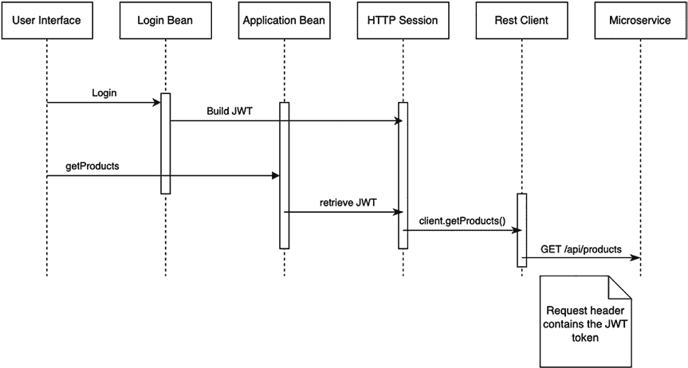

第 8 章 MicroProfile JSON Web Token 与 Jakarta Security

***图 8-1。** 展示 JWT 传播过程的时序图*

有关 JSON Web Token（JWT）的更多信息，请访问 JWT 官网：[`jwt.io`](https://jwt.io)。

**保护 RESTful 应用程序**

通过使用 MicroProfile 中的 JWT 功能，你可以通过指定以下注解来保护 REST 应用程序：

@LoginConfig(authMethod = "MP-JWT", realmName = "jwt-jaspi")

@DeclareRoles({"user", "admin"})

public class MyApplication extends Application {

// ...

}

MyApplication 类使用 MP-JWT 认证方法和 jwt-jaspi 域（realm）进行保护，并声明了 user 和 admin 角色。

这个示例使用 MP-JWT 功能来保护 REST 应用程序。你也可以用它来保护其他类型的应用程序，例如 Java EE Web 应用程序。

第 8 章 MicroProfile JSON Web Token 与 Jakarta Security

用于保护该 REST 应用程序的完整代码如下所示：

import org.eclipse.microprofile.auth.LoginConfig;

import jakarta.annotation.security.DeclareRoles;

import jakarta.ws.rs.ApplicationPath;

import jakarta.ws.rs.core.Application;

@LoginConfig(authMethod = "MP-JWT", realmName = "jwt-jaspi")

@DeclareRoles({"user", "admin"})

@ApplicationPath("/")

public class MyApplication extends Application {

// ...

}

MyApplication 类还使用了 LoginConfig 和 DeclareRoles 注解。

LoginConfig 注解用于配置身份验证方法和领域名称。

本示例使用 MP-JWT 身份验证方法和 jwt-jaspi 领域。

声明了 user 和 admin 两种角色。

**保护 REST 资源**

MicroProfile JWT API 还定义了一组用于保护 REST

资源的注解。这些注解可用于保护 RESTful 应用程序中的资源。

在第 [4](https://doi.org/10.1007/978-1-4842-8832-0_4) 章中，你已经了解了 RESTful Web 服务以及各种 HTTP

方法的作用。

下面的代码展示了如何使用 MicroProfile 注解来保护

RESTful 应用程序中的资源：

import org.eclipse.microprofile.jwt.JWTAccessDeniedException;

import java.security.Principal;

import jakarta.annotation.security.DenyAll;

import jakarta.annotation.security.PermitAll;

import jakarta.annotation.security.RolesAllowed;

import jakarta.enterprise.context.RequestScoped;

import jakarta.inject.Inject;

import jakarta.ws.rs.container.ContainerRequestContext;

第 8 章 MicroProfile JSON Web Token 与 Jakarta Security

import jakarta.ws.rs.core.Context;

import jakarta.ws.rs.core.SecurityContext;

import java.io.IOException;

@Path("/")

@RequestScoped

public class Resource {

@Inject

Principal caller;

@Context

SecurityContext securityContext;

@GET

public String doGet() {

if (securityContext.isUserInRole("admin")) {

return "admin";

} else {

return "user";

}

}

// 此资源仅允许具有 "admin" 角色的用户访问

@GET

@Path("/admin")

@RolesAllowed("admin")

public String doGetAdmin() {

return "admin";

}

// 此资源对所有用户开放

@GET

@Path("/public")

@PermitAll

public String doGetPublic() {

return "public";

}

第 8 章 MicroProfile JSON Web Token 与 Jakarta Security

// 此资源不允许任何用户访问

@GET

@Path("/denied")

@DenyAll

public String doGetDenied() {

return "denied";

}

public void displyUserDetails() {

Principal principal = securityContext.getUserPrincipal();

String name = principal.getName();

// "name" 声明

String email = principal.getClaim("email");

// "email" 声明

// ...

}

}

在此示例中，/admin 资源仅允许具有 admin 角色的用户访问。

/public 资源对所有用户开放。/denied 资源不允许任何用户访问。

java.security.Principle 接口可用于从 JWT 令牌中获取有关

调用者的信息。displayUserDetails() 方法演示了如何使用它

来获取调用者信息。

**@RolesAllowed 注解**

@RolesAllowed 可用于保护 RESTful 应用程序中的资源。允许访问资源的角色在该注解中指定。

例如，假设你有一个 RESTful 资源，仅允许具有 admin 角色的用户

访问。这可以通过为该资源添加

@RolesAllowed("admin") 注解来实现。

下面的代码展示了如何使用 @RolesAllowed 注解来保护

RESTful 应用程序中的资源。允许访问资源的角色在注解中指定。

第 8 章 MicroProfile JSON Web Token 与 Jakarta Security

@RestController

@RequestMapping("/users")

public class ProductResource {

@RolesAllowed("admin")

protected List<User> getProducts() {

// 在此从数据库获取用户

}

...

}

在此示例中，只有具有 admin 角色的用户才能调用 Products 资源的 getProducts() 方法。

**@Claim 注解**

@Claim 注解可用于将某个声明（claim）的值注入到 Java 方法

参数中。声明名称在该注解中指定。

例如，假设你有一个方法需要访问发起请求用户的电子邮件地址。

这可以通过为 email

参数添加 @Claim("email") 注解来实现。

以下代码展示了如何使用 @Claim 注解将某个声明（claim）的值注入到 Java 方法参数中。声明的名称在注解中指定。

public void doSomething(**@Claim("email")** String email) {

// do something with the email address here

}

在这个示例中，用户的电子邮箱地址被注入到 doSomething() 方法中。

**@HeaderParam 注解**

@HeaderParam 注解可以将 HTTP 请求头的值注入到 Java 方法参数中。请求头名称在注解中指定。

第 8 章 MicroProfile JSON Web Tokens 与 Jakarta Security

例如，假设你有一个方法需要访问 authHeader 的值。可以通过使用 @HeaderParam("authHeader") 注解该请求头参数来实现。

以下代码展示了如何使用 @HeaderParam 注解将 HTTP 请求头的值注入到 Java 方法参数中。请求头名称在注解中指定。

public void doSomething(@HeaderParam("authHeader") String authHeader) {

// do something with the authHeader here

}

在这个示例中，authHeader 的值被注入到 doSomething 方法中。

**配置 JWK 集或 PEM 编码的公钥**

MicroProfile JWT Auth 规范支持以下公钥格式：

• PEM 格式的 Public Key Cryptography Standards #8

• JSON Web Key（JWK）

**PEM 格式的 Public Key Cryptography Standards #8**

要配置 PEM 格式的公钥，你需要设置以下 MicroProfile Config 属性：

mp.jwt.verify.publickey.location=/META-INF/publicKey.pem

mp.jwt.verify.publickey.format=PEM

mp.jwt.verify.publickey.location 属性的值必须是 PEM 编码公钥文件的路径。该文件可以位于应用程序的资源目录中。

以下是一个 PEM 编码公钥示例：

-----BEGIN PUBLIC KEY-----

MIICIjANBgkqhkiG9w0BAQEFAAOCAg8AMIICCgKCAgEAuYP6FyP/cTmVnxE1JXs+

5ySE+FNxztk0aDV8pPiwoZmxIkcH2QYP1XCfY16/m05zt6nEJbDP7OiWl57bFmuG

KTPvfOHXlh17UfStys ...

-----END PUBLIC KEY-----

第 8 章 MicroProfile JSON Web Tokens 与 Jakarta Security

**JSON Web Key（JWK）**

JSON Web Key（JWK）是一种 JavaScript Object Notation（JSON）数据结构，用于表示加密密钥。JWK Set 是一种表示一组 JWK 的 JSON 数据结构。

要配置 JWK Set，你需要设置以下 MicroProfile Config 属性：mp.jwt.verify.publickey.location=/META-INF/jwkset.json

mp.jwt.verify.publickey.format=JWKSET

mp.jwt.verify.publickey.location 属性的值必须是 JWK Set 文件的路径。该文件可以位于应用程序的资源目录中。以下是一个 JWK Set 示例：

{

"kty":"RSA",

"key":"-----BEGIN PUBLIC KEY-----

MIICIjANBgkqhkiG9w0BAQEFAAOCAg8AMIICCgKCAgEAuYP6FyP/cTmVnxE1JXs+5ySE+FNxztk

0aDV8pPiwoZmxIkcH2QYP1XCfY16/m05zt6nEJbDP7OiWl57bFmuGKTPvfOHXlh17UfStys...

-----END PUBLIC KEY-----",

"e":"AQAB",

"d":"https://www.example.com/key-store.jks"

}

请注意，JWT 必须使用请求头中指定的算法进行签名，并且用于签名 JWT 的密钥必须是指定格式。

**JSON Web Key Set（JWKS）**

JWK Set 必须只包含一个密钥，并且算法必须在 JWT 的请求头中指定。

JWK Set 是一种表示一组 JWK 的 JSON 数据结构。JWK Set 必须只包含一个密钥，并且算法必须在 JWT 的请求头中指定。

这个示例展示了一个 JWKS：

{

"keys":[

{"kty":"RSA",

第 8 章 MicroProfile JSON Web Tokens 与 Jakarta Security

"key":"-----BEGIN PUBLIC KEY-----

MIICIjANBgkqhkiG9w0BAQEFAAOCAg8AMIICCgKCAgEAuYP6FyP/cTmVnxE1JXs+5ySE+FNxztk

0aDV8pPiwoZmxIkcH2QYP1XCfY16/m05zt6nEJbDP7OiWl57bFmuGKTPvfOHXlh17UfStys...

-----END PUBLIC KEY-----",

"e":"AQAB",

"d":"https://www.example.com/key-store.jks"}]

}

要配置 JWK Set，请在你的 MicroProfile Config 中指定以下内容：

mp.jwt.verify.publickey.location=https://www.example.com/jwkset.json

公钥将从该 URL 读取。

**Jakarta EE Security 规范**

Jakarta EE Security 规范定义了多种用于保护 Web 服务的机制。

它可以配置基础认证机制，例如 HTTP Basic 和 Digest 认证。它还支持用于 Web 服务的表单认证。

此外，它还提供了多种为 RESTful Web 服务配置 SSL 的选项。

如果你使用 SSL 或 TLS，Web 服务客户端必须拥有有效证书，才能与服务器建立安全连接。连接一旦建立，客户端与服务器之间交换的所有数据都将被加密。

**使用 Jakarta Security 保护 Servlet**

Jakarta Security 规范为服务器端 Java 应用提供了完整的安全解决方案。它们同时提供认证（Authentication）和授权（Authorization）服务。

认证是用于验证用户是否为其所声称身份的过程。授权是用于确定用户被允许执行哪些操作的过程。

Jakarta Security 项目提供了多种保护 Servlet 的机制，

包括自定义认证。

*基于表单的认证*是 Web 上最常见的用户认证方式。在这种方法中，会向用户展示一个登录表单，用户在其中输入用户名和密码。如果凭据有效，用户将被授予对受保护资源的访问权限。

第 8 章 MicroProfile JSON Web Tokens 与 Jakarta Security

*Basic 认证*是一种更简单的 Servlet 保护方法。在 HTTP Basic 认证中，Web 服务器会提示用户输入用户名和密码。随后，

服务器会验证这些凭据。如果凭据有效，用户将被授予对受保护资源的访问权限。HTTP Basic 认证以明文传输用户名

和密码，因此不如基于表单的认证安全。

不过，可以将 HTTPS 与 HTTP Basic 认证一起使用，以防止

凭据被攻击者截获。

*Digest 认证*与 Basic 认证类似，不同之处在于密码不会以明文发送。相反，会计算密码的单向哈希并发送到服务器。随后服务器会对接收到的密码计算哈希，并将其与发送来的哈希进行比较。如果两者匹配，则认为用户已通过认证。

*自定义认证*允许你编写自己的认证代码。这是保护 Servlet 最灵活的方式。通过自定义认证，你可以使用任何

你想要的认证方案。

基于表单的认证和 Basic 认证都可以用于保护

Servlet。不过，通常基于表单的认证比 HTTP

Basic 认证更安全。基于表单的认证也可以使用 HTTPS 来保护

客户端与服务器之间的通信。使用 HTTPS 时，用户的

凭据会被加密，第三方攻击者无法截获。

Jakarta Security 还提供了一个可用于保护 Servlet 的安全过滤器。该安全过滤器会拦截对受保护资源的所有请求，并验证用户是否具备访问这些资源所需的权限。

要在 RESTful Web 服务中使用 HTTP Basic 认证，你需要在 web.xml 文件中进行配置。以下是在 web.xml 文件中进行 HTTP Basic 认证的配置：

<security-constraint>

<web-resource-collection>

<web-resource-name>secured</web-resource-name>

<url-pattern>/*</url-pattern>

</web-resource-collection>

<auth-constraint>

<role-name>user</role-name>

</auth-constraint>

</security-constraint>

第 8 章 MicroProfile JSON Web Tokens 与 Jakarta Security

<login-config>

<auth-method>BASIC</auth-method>

<realm-name>default</realm-name>

</login-config>

此配置定义了一个安全约束，将 Web 应用中任何资源的访问限制为仅具有 user 角色的用户。同时，它还将该 Web 应用配置为使用 HTTP Basic 认证。

完成 HTTP Basic 认证配置后，当浏览器提示时提供用户名和密码，你就可以通过浏览器访问受保护的

资源。

你也可以使用像 curl 这样的工具来访问受保护资源：

curl -u user:password http://localhost:8080/secured

该命令会使用用户名和密码 user:password 调用 localhost 的 8080 端口上的“secured”资源。

public class SecuredServlet extends HttpServlet {

@Override

protected void doGet(HttpServletRequest req, HttpServletResponse

resp) throws ServletException, IOException {

// do something

}

}

要测试此配置，你可以按如下方式使用 curl：

$ curl -v http://localhost:8080/secured

服务器将返回 401 未授权状态码，以及如下所示的 WWW-Authenticate 标头：

HTTP/1.1 401 Unauthorized

WWW-Authenticate: Basic realm="default"

然后客户端可以在 Authorization 标头中携带相应凭据，重新发送请求，如下所示：

$ curl -v -u user:password http://localhost:8080/secured

第 8 章 MiCroprofile JSoN Web tokeNS aNd Jakarta SeCurity

然后服务器将返回所请求的资源：

HTTP/1.1 200 OK

Content-Type: text/plain

这是一个受保护资源。

要使用 Jakarta Security 保护一个 servlet，你需要在 web.xml 文件中添加以下代码行：

<security-constraint>

<web-resource-collection>

<web-resource-name>secured</web-resource-name>

<url-pattern>/*</url-pattern>

</web-resource-collection>

<auth-constraint>

<role-name>admin</role-name>

</auth-constraint>

</security-constraint>

<login-config>

<auth-method>FORM</auth-method>

<form-login-config>

<form-login-page>/login.jsp</form-login-page>

<form-error-page>/error.jsp</form-error-page>

</form-login-config>

</login-config>

<security-role>

<role-name>admin</role-name>

</security-role>

在这段代码中，`<security-constraint>` 元素定义了一个安全约束，

该约束适用于 Web 应用中的所有资源。`<auth-constraint>` 元素指定只有具有 admin 角色的用户才能访问受保护资源。`<login- config>` 元素指定将使用基于表单的身份验证。`<form- login- config>` 元素指定了基于表单身份验证过程中使用的登录页和错误页。最后，`<security-role>` 元素定义了 admin 角色。

第 8 章 MiCroprofile JSoN Web tokeNS aNd Jakarta SeCurity

要在 RESTful Web 服务中使用摘要认证（digest authentication），你需要在 web.xml 文件中进行配置。

以下是在 web.xml 文件中的摘要认证配置：

// ...

<login-config>

<auth-method>DIGEST</auth-method>

<realm-name>default</realm-name>

</login-config>

**MicroProfile REST 客户端**

MicroProfile REST Client 是一个规范，它定义了一组用于构建 REST 客户端的 API 和注解。它提供了一种类型安全的方式来调用 RESTful 服务。本节将向你展示如何构建一个简单的 MicroProfile REST Client，并使用它访问远程服务。它还演示了如何使用客户端 API 调用不同的 HTTP

方法，例如 GET、POST、PUT 和 DELETE。

MicroProfile REST Client 是一个 Eclipse 项目，为 Java 应用程序提供可移植的 RESTful

客户端 API。要查看更多关于该项目的详细信息，请参阅 [https://](https://github.com/eclipse/microprofile-rest-client)

[github.com/eclipse/microprofile-rest-client. T](https://github.com/eclipse/microprofile-rest-client)该项目旨在让你能够轻松编写可移植且可复用的代码，以便无论底层技术或平台如何，都能访问 RESTful 服务。

如果你使用 Maven 构建应用程序，请将以下依赖添加到你的 pom.xml 文件中。MicroProfile REST Client 已包含在 MicroProfile 依赖中。要了解更多关于 MicroProfile 项目的信息，请访问其官方网站 [`microprofile.io/.`](https://microprofile.io/)

<dependency>

<groupId>org.eclipse.microprofile</groupId>

<artifactId>microprofile</artifactId>

<version>5.0</version>

<type>pom</type>

<scope>provided</scope>

</dependency>

第 8 章 MiCroprofile JSoN Web tokeNS aNd Jakarta SeCurity

或者你也可以专门使用 REST 客户端依赖，如下所示：

<dependency>

<groupId>org.eclipse.microprofile.rest-client</groupId>

<artifactId>microprofile-rest-client-api</artifactId>

<version>1.4</version>

<scope>provided</scope>

</dependency>

以下是在 Open Liberty 中启用 REST 客户端功能的 server.xml 配置：

<featureManager>

<feature>mpRestClient-3.0</feature>

</featureManager>

**@RegisterClient 注解**

第一步是使用 @RegisterRestClient 注解你的客户端接口。

该注解会将客户端注册到 MicroProfile REST Client

服务中。该注解的 value 属性用于指定目标服务的基础 URI：

@RegisterRestClient

(configKey = "systemClient"

baseUri="http://localhost:9080/api/products")

public interface ProductsClient implements Autoclosable{

// 方法写在这里

}

**配置你的 REST 客户端**

要使用 MicroProfile Config 配置 URI，你需要在项目中添加一个名为 src/

main/webapp/META-INF/microprofile-config.properties 的配置文件。该文件

包含配置键值对。此示例将基础 URI 配置为 http://localhost:8080/api/products。你也可以使用 Config 文件配置其他客户端属性，例如 followRedirects 和 connectTimeout：

systemClient/mp-rest/uri=http://localhost:9080/system

第 8 章 MiCroprofile JSoN Web tokeNS aNd Jakarta SeCurity

**REST 客户端接口**

下面是 REST 客户端接口示例：

@RegisterRestClient

(configKey = "systemClient"

baseUri="http://localhost:9080/api/products")

@RegisterProvider(UnknownUriExceptionMapper.class)

@Path("/products")

@Produces("application/json")

@Consumes("application/json")

public interface ProductsClient implements AutoClosable{

@GET

List<User> getProducts();

@GET

@Path("/{productId}")

Product getProduct(@PathParam("productId") String productId);

@POST

Response createProduct(@HeaderParam("Authorization") String

authorization,

Product product);

@PUT

@Path("/{productId}")

Response updateProduct(@BeanParam PutProduct putProduct, Product

product);

@DELETE

@Path("/{productId}")

Response deleteProduct(@CookieParam("AuthToken") String

authorization,

@PathParam("productId") String productId);

}

第 8 章 MiCroprofile JSoN Web tokeNS aNd Jakarta SeCurity

public class PutProduct {

@HeaderParam("Authorization")

private String authorization;

@PathParam("productId")

private String productId;

// getter、setter、构造函数已省略

}

@RegisterProvider 注解会将 ExceptionMapper 注册到

RESTful Web 服务客户端中。它会将 Web 服务客户端抛出的异常映射为 HTTP 状态码。UnknownUriExceptionMapper 类将 jakarata.ws.rs.

NotFoundException 异常映射为 404 Not Found 错误。

ProductsClient 接口使用 @jakarta.ws.rs.Path

注解来定义 REST 端点。@Path 注解为该资源指定相对

路径。该接口中的方法表示可对产品资源执行的操作，例如获取产品列表或获取某个特定产品。

你可以使用 @Consumes

注解指定出站请求的媒体（MIME）类型。

这决定了请求中 Content-Type 头的值。

你还可以使用 @Produces

注解指定入站响应的媒体类型，

这决定了请求中 Accept 头的值。

默认使用媒体类型 jakarta.ws.rs.core.MediaType.APPLICATION_JSON

("application/json")。除非你显式将媒体类型设置为其他类型（例如 XML），否则 REST 客户端会自动将值序列化为 JSON。

如果你想读写二进制数据，可以使用 byte[] 类型：

// ...

@POST

Response upload(byte[] data);

@GET

byte[] download();

}

你可以在方法上使用 @PathParam 注解指定路径参数。例如，

下面这个方法会检索具有给定 ID 的产品：

第 8 章 MiCroprofile JSoN Web tokeNS aNd Jakarta SeCurity

// ...

@GET

Product getProduct(@PathParam("productId") String productId);

GetProduct 方法用于获取一个产品。它将产品 ID 作为路径参数。

createProduct 方法用于创建一个新产品。它接收两项内容：授权字符串和产品本身。@HeaderParam("Authorization") 注解告诉 REST 客户端，应从 HTTP 请求头中获取授权字符串。产品以 POJO 对象的形式传入，在发送到服务器之前会被转换为 JSON 字符串。

deleteProduct 方法用于从数据库中删除一个现有产品。它接收两项内容：用于身份验证的 AuthToken Cookie，以及产品 ID。

updateProduct 方法用于更新一个现有产品。它接收 PutProduct 对象（包含产品 ID 和授权字符串）以及 Product 对象（包含更新后的产品信息）。

@RestClient 注解用于将字段或方法标记为 MicroProfile REST 客户端。注入 REST 客户端与注入其他 CDI Bean 类似，例如：

import org.eclipse.microprofile.rest.client.inject.RestClient;

import jakarta.inject.Inject;

import jakarta.ws.rs.GET;

import jakarta.ws.rs.Path;

import jakarta.ws.rs.PathParam;

public class GreetingService {

private final GreetingClient greetingClient;

public GreetingService() {

// 构造函数注入

this.greetingClient = RestClientBuilder.newBuilder()

.baseUri("http://localhost:8080")

.build(GreetingClient.class);

}

Chapter 8 MiCroprofile JSoN Web tokeNS aNd Jakarta SeCurity

public String getGreeting() {

return greetingClient.getGreeting();

}

}

interface GreetingClient {

@GET

@Path("/greeting/{name}")

String getGreeting(@PathParam("name") String name);

}

在这个示例中，GreetingClient 接口使用 @RestClient 注解标注，并用于调用远程 REST 服务。

GreetingService 类注入了 GreetingClient 的一个实例，并使用它来调用远程 REST 服务。

RestClientBuilder 可用于配置注入的 REST 客户端。在此示例中，配置了 REST 服务的基础 URI。还可以配置的其他选项包括：

–

注册提供程序，例如支持 JSON-B 或 Jackson

–

配置超时

–

配置 SSL

–

配置代理

更多信息请参见 MicroProfile REST Client 文档。

MicroProfile REST Client 规范定义了一个用于调用 RESTful 服务的 Java API。该 API 与 JAX-RS 2.0 Client API 类似，但提供了一些 MicroProfile 特有的附加功能。

MicroProfile REST Client 的主要优势是它允许你在无需编写样板代码的情况下调用 REST 服务。这可以让你的代码更简洁、更易读。

另一个优势是，MicroProfile REST Client 定义了一种可移植的方式，用于配置客户端的创建方式以及其调用 REST 服务的方式。这意味着你可以将应用部署在任何 MicroProfile 运行时上，并且它能够与任何兼容的 REST 客户端实现一起工作。

Chapter 8 MiCroprofile JSoN Web tokeNS aNd Jakarta SeCurity

**使用 MicroProfile OpenAPI 编写 RESTful API 文档**

在本节中，你将学习如何使用 MicroProfile OpenAPI 注解为 REST API 编写文档。你还将学习如何使用 OpenAPI UI 查看文档。

**什么是 OpenAPI 规范？**

OpenAPI 规范（OAS）为 RESTful API 定义了一个标准的、与语言无关的接口。这使得第三方工具可以基于 OAS 轻松生成文档、客户端库和其他工具。它之前被称为 Swagger。

OpenAPI 规范由 OpenAPI Initiative 维护，该组织是由行业专家组成的联盟，致力于标准化 REST API 的描述方式。

**什么是 MicroProfile OpenAPI？**

MicroProfile OpenAPI 计划旨在引入 OpenAPI 的优势

基于 MicroProfile 平台构建的微服务规范。它是一个构建在 OpenAPI 规范之上的规范，并增加了 MicroProfile 倡议特有的能力。

MicroProfile OpenAPI 提供了可用于生成 RESTful API 文档的工具和 API。该文档可供开发者用于理解 API 并生成客户端代码。MicroProfile OpenAPI 规范定义了一种用于记录 RESTful API 的标准格式。

**使用 MicroProfile OpenAPI 为 REST API 编写文档**

要使用 MicroProfile OpenAPI 为 JAX-RS REST API 编写文档，你需要使用 OpenAPI 注解来标注 JAX-RS 资源类和方法。OpenAPI 注解用于配置 JAX-RS 资源的文档。

首先，你需要在项目中添加 MicroProfile OpenAPI 依赖：

<dependency>

<groupId>org.eclipse.microprofile.openapi</groupId>

<artifactId>microprofile-openapi-api</artifactId>

<version>1.0.0</version>

</dependency>

第 8 章 MiCroprofile JSoN Web tokeNS aNd Jakarta SeCurity

接下来，你需要配置 OpenAPI 文档。这可以通过使用 @OpenAPIDefinition 注解来完成：

import jakarta.ws.rs.GET;

import jakarta.ws.rs.Path;

import org.eclipse.microprofile.openapi.annotations.Operation;

import org.eclipse.microprofile.openapi.annotations.tags.Tag;

import org.eclipse.microprofile.openapi.annotations.OpenAPIDefinition;

import org.eclipse.microprofile.openapi.annotations.info.Info;

import org.eclipse.microprofile.openapi.annotations.servers.Server;

@OpenAPIDefinition(

info = @Info(

title = "Products API",

version = "1.0.0",

description = "This is Products API."

),

servers = {

@Server(url = "/api")

}

)

@Path("/greeting")

public class GreetingResource {

@GET

@Operation(summary = "Say hello", tags = {"greeting"})

public String sayHello() {

return "Hello";

}

}

@OpenAPIDefinition 注解用于配置 API 的整体文档。@Info 注解用于配置 API 的相关信息，例如标题、版本和描述。@Server 注解用于配置 API 服务器的 URL。

第 8 章 MiCroprofile JSoN Web tokeNS aNd Jakarta SeCurity

这个示例使用 @Operation 注解标注了 sayHello() 方法。该注解用于配置操作的信息，例如摘要和标签。标签可用于对相关操作进行分组。

MicroProfile OpenAPI 实现将基于这些注解为 API 生成文档。生成的文档将采用 OpenAPI 格式。

表 8-1 列出了 MicroProfile OpenAPI 规范提供的常用注解。

***表 8-1。** MicroProfile OpenAPI 规范中的注解*

**注解**

**描述**

@OpenAPIDefinition 指定 API 的常规信息，例如标题、版本等。

@Operation

指定单个 API 操作的信息，例如摘要、标签等。

@Schema

指定属性数据类型的信息。

@ParameterIn

指定请求参数的位置，例如 QUERY、PATH 等。

@Callback

为异步操作指定回调 URL。

@Callbacks

指定多个 @Callback 注解。

**查看生成的文档**

要查看生成的文档，你可以使用 OpenAPI UI 工具。OpenAPI UI 是一个基于 Web 的工具，可用于查看 REST API 的文档。

可以通过以下 URL 访问 OpenAPI UI 工具：

http://localhost:8080/openapi/

/openapi 端点获取由源代码注解中的注释生成的 OpenAPI 规范信息。它以 YAML 格式返回信息。

第 8 章 MiCroprofile JSoN Web tokeNS aNd Jakarta SeCurity

**总结**

在本章中，你学习了如何使用 MicroProfile JWT Auth 规范来验证 JWT 的签名。你还学习了如何配置应用程序以使用 JWK Set 或 PEM 编码的公钥。在下一章中，你将学习

使用 Docker 和 Kubernetes 对你的应用程序进行容器化，以管理部署。

**第 9 章**

**使用 Kubernetes**

**对微服务进行**

**容器化**

本章将解释如何使用 Docker 和 Kubernetes 对你的微服务进行容器化。

你将首先了解什么是容器，以及为什么应该使用容器。

接着你将学习如何安装 Docker 和 Kubernetes。最后，你将学习如何使用 Docker 和 Kubernetes 将微服务部署到容器中。

**什么是容器？**

容器是一种软件打包方式，使其能够在同一主机上与其他软件隔离运行。这不同于虚拟化，在虚拟化中，每个客户操作系统都有自己的内核，并在其隔离环境中运行。

对微服务进行容器化，是提升系统整体可靠性与弹性的绝佳方式。容器允许你将微服务及其所有依赖打包为一个单一单元。这使得微服务的部署和管理更加容易。

**为什么使用容器？**

使用容器的原因有很多，主要如下：

© Tarun Telang 2023

T. Telang，*《Beginning Cloud Native Development with MicroProfile, Jakarta EE, and Kubernetes》*，

[`doi.org/10.1007/978-1-4842-8832-0_9`](https://doi.org/10.1007/978-1-4842-8832-0_9#DOI)

第 9 章 使用 Kubernetes 对微服务进行容器化

• **可移植性：** 容器可以轻松地从一台主机迁移到另一台主机。这是因为它们不依赖于主机操作系统。

• **隔离性：** 容器彼此之间以及与主机操作系统相互隔离。如果一个容器崩溃，不会影响其他容器。

• **高效性：** 容器比虚拟机使用更少的资源。这是因为每个容器共享主机操作系统内核。

**什么是容器编排？**

容器编排是指对容器化应用的部署、管理和扩缩容进行自动化的过程。最流行的容器编排工具是 Kubernetes。

Kubernetes 是一个用于自动化部署、扩缩容和管理容器化应用的开源系统。它最初由 Google 设计，现在由云原生计算基金会（Cloud Native Computing Foundation）维护。Kubernetes 是一个可移植、可扩展、开源的平台，用于管理容器化工作负载和服务，并支持声明式配置与自动化。它拥有庞大且快速增长的生态系统。Kubernetes 的服务、支持和工具都已广泛可用。

**使用容器编排的好处**

使用容器编排有很多好处，以下是主要优势：

• **提升效率：** 容器编排工具可以通过自动化管理大量容器所需的许多任务，提升你的工作流效率。

• **增强灵活性：** 容器编排工具可以让你更容易在各种环境中部署和管理应用程序。

第 9 章 使用 Kubernetes 对微服务进行容器化

• **改进可扩展性：** 容器编排工具可以通过按需轻松添加或移除容器，提升应用程序的可扩展性。

• **增强安全性：** 容器彼此之间以及与主机操作系统相互隔离，这使恶意行为者更难访问你的数据或感染你的系统。

• **降低成本：** 容器通过使用更少资源，帮助你降低应用运行成本。

• **更易调试：** 容器编排工具通过提供系统中所有容器的统一视图，使应用问题调试更容易。

**理解 Kubernetes 术语**

在你深入学习并开始使用 Kubernetes 管理容器之前，你应当先熟悉一些与 Kubernetes 相关的重要术语。

**Pod**：由一个或多个容器组成的一组单元，共享存储/网络，并且一个

用于说明如何运行容器的规范。Pod 表示一个部署单元；即你希望作为一个组在 Kubernetes 节点上运行的单个应用容器，或一组共置（协同放置）的容器。

**Kubelet**：kubelet 是运行在每个工作节点上的一个进程，用于管理

节点上的 Pod。kubelet 会确保 Pod 处于运行且健康的状态。它还会与主节点通信，以协调应用在

各节点上的部署。

**Node：** Kubernetes 中的工作机器；是集群的一部分。根据集群环境不同，节点可以是 VM，也可以是物理机（裸金属）。每个节点都会运行 Kubernetes

代理，并由主控组件进行管理。

**Worker node：** 运行你的应用程序和云服务。工作节点承载 Pod，并运行这些 Pod 中的容器。每个工作节点上都运行有 kubelet 和 kube-proxy。

• *kubelet* 负责在

节点上运行和管理 Pod。

第 9 章 使用 Kubernetes 容器化微服务

• *kube-proxy* 是运行在每个工作节点上的一个进程，

负责管理该节点上服务的网络。它负责

该节点上服务的网络与负载均衡。kube-

proxy 确保流向服务的流量被正确路由。

**Control plane node：** 运行 Kubernetes 控制平面组件，包括 API server、scheduler 和 controller manager。一个集群中只有一个控制平面节点。你不会在控制平面节点上运行用户提供的应用程序。

**Master node：** 运行 Kubernetes 主控组件的节点。一个 Kubernetes 集群只有一个主节点。主节点用于管理 Kubernetes

集群。主节点上运行着多个进程，包括 kube-

apiserver、kube-controller-manager 和 kube-scheduler。

• *kube-apiserver* 提供 Kubernetes API。kubelet 使用它

与主节点进行通信。

• *kube-controller-manager* 管理副本控制器

和服务。它负责确保在集群中运行的应用程序

维持期望状态。

• *kube-scheduler* 将 Pod 调度到节点上运行。它负责

确保集群中的应用在各节点间实现

负载均衡。

**Kubernetes cluster：** 一组用于运行容器化

应用程序的机器，称为节点（nodes）。

**Service**：一个向网络暴露以提供流量服务的 Pod。当你创建服务时，Kubernetes 会创建对应的负载均衡器，将流量路由到你的 Pod。

**Replication controller：** 副本控制器可确保在任意时刻都有指定数量的 Pod 副本在运行。如果副本过少，控制器会创建更多副本；如果副本过多，控制器会删除多余副本。副本控制器的典型使用场景是确保始终有指定数量的 Web 服务器在运行。

**Labels：** 附加到对象（如 Pod）上的键/值对。标签使用户能够组织并选择一组对象。

**Annotations：** 附加到对象（如 Pod）上的键/值对。注解不会影响对象的身份标识，但可用于存储任意数据，以用于文档说明或其他用途。

第 9 章 使用 Kubernetes 容器化微服务

**Kubernetes 的关键特性**

Kubernetes 是当今部署容器化应用程序的热门选择。它提供了许多特性，例如：

• **自动部署：** 当代码库发生变化时，Kubernetes 可以自动部署你的

应用程序，并可在必要时回滚

部署。

• **存储编排：** Kubernetes 可以自动为应用

配置存储，并支持多种存储后端。它可以

自动挂载存储系统，例如本地存储、公有

云提供商等。

• **滚动更新：** Kubernetes 可以对

应用程序执行滚动更新，这意味着它可以一次更新一个节点上的应用，

且不会中断服务。它会发布应用的新版本，

同时确保零停机。

• **自动装箱（bin-packing）：** Kubernetes 会自动将

容器调度到集群节点上，以高效利用可用资源。

• **监控：** Kubernetes 可以生成详细日志和监控

数据，覆盖系统各个方面，可用于排查

问题或优化性能。

• **健康检查：** Kubernetes 可以对

应用执行健康检查，以确保其按预期运行，并可在必要时

重启或替换不健康组件。

• **自愈能力：** 如果 Kubernetes 集群中的某个节点

发生故障，系统会检测到该故障，并将受影响的 Pod 调度到

其他节点上运行。

• **水平扩缩容：** Kubernetes 让你可以轻松地

根据需要通过增减集群节点来扩展你的

应用程序。

• **自动扩缩容：** Kubernetes 可以根据流量水平自动对应用

进行扩容或缩容，也可以对应用中的单个

组件分别扩缩容。

第 9 章 使用 Kubernetes 容器化微服务

• **负载分发：** Kubernetes 可以在

集群中的不同节点之间分发负载，并根据可用资源自动调度应用

在特定节点上运行。

• **服务发现与负载均衡：** Kubernetes 会自动

为集群中的每个 Pod 分配唯一 IP 地址，并可在它们之间进行负载

均衡流量分发。

• **密钥与配置管理**：借助 secrets，Kubernetes

可以存储和管理敏感信息，例如密码和

API 密钥。配置数据可以存储在 config maps 中。

**使用 Kubernetes**

Kubernetes 可通过多种方式用于大规模管理容器化应用。最常见的方式是使用公有

云提供商的托管 Kubernetes 服务，例如 Google Kubernetes Engine（GKE）或 Amazon Elastic Container

Service for Kubernetes（EKS）。这些服务会处理所有基础设施

管理任务，例如节点配置、Kubernetes 部署等。

另一种选择是使用诸如 *kubeadm* 之类的工具来安装和管理 Kubernetes。

如果你希望对基础设施有更多控制，或者你正在私有数据中心运行 Kubernetes，这会是一个不错的选择。

Kubernetes 也可以用于管理非容器化应用。这通常通过创建所谓的“裸金属”集群来实现，这类集群可用于部署和管理

VM，甚至是物理服务器。

当 Kubernetes 启动并运行后，你可以通过多种方法使用它来部署应用。

最常见的方法是使用容器镜像，这些镜像可以从 Docker Hub 等公共镜像仓库

或私有仓库中拉取。你也可以使用 Kubernetes 借助 Jenkins 等构建工具直接部署源代码。

Kubernetes 也常与其他工具配合使用，例如用于监控的 Pr[ometheus (https://](https://prometheus.io/)

[prometheus.io/) for monit](https://prometheus.io/)oring、用于服务网格的 Is[tio (https://istio.io/](https://istio.io/))，以及用于包管理的 Helm（[`helm.sh/) for p`](https://helm.sh/)ackage management。

第 9 章 使用 Kubernetes 容器化微服务

**使用 Docker 容器**

首先，确保你的系统已安装 Docker。要将一个

应用容器化，你需要创建一个 Dockerfile。Dockerfile 是一个文本文件，包含用于构建和运行容器的命令。在 Dockerfile 中，你需要指定希望用于容器的基础镜像，以及用于构建和运行应用程序的命令。

基础镜像是可用于创建新镜像的预构建镜像。例如，如果你想为 Open Liberty Server 创建镜像，你可以使用

一个已安装并配置 Java 运行时与 Open Liberty 服务器的基础镜像。

这样可以避免你必须在镜像中安装 Open Liberty。可用的基础镜像有很多种，你甚至可以创建自己的基础镜像。为了找到符合你需求的基础镜像，你可以在 Docker Hub 仓库中进行搜索。选定基础镜像后，你必须创建一个 Dockerfile。

Dockerfile 的内容如下：

FROM open-liberty

ARG VERSION=1.0

ARG REVISION=SNAPSHOT

LABEL \

org.opencontainers.image.authors="Tarun Telang" \ name="demo" \ version="$VERSION-$REVISION" \

summary="A sample microservice." \

description="An image containing a sample microservice running with the

Open Liberty runtime." \

COPY --chown=1001:0 src/main/liberty/config/ /config/

COPY --chown=1001:0 target/*.war /config/apps/

RUN configure.sh

文件中的第一行指定要使用的基础镜像。本示例使用的是

openliberty/open-liberty 基础镜像。第二行将应用程序的配置文件复制到容器中的 /config 目录。第三行将应用程序的 WAR 文件复制到 /config/apps 目录。最后一行运行 configure.sh 脚本，该脚本会将配置文件应用到服务器。

第 9 章 使用 Kubernetes 对微服务进行容器化

**在 Docker 中运行 MicroProfile 应用程序**

第一步，在你的项目目录中运行以下命令，以便在项目的 target 目录中构建一个 .war 文件。

$ mvn package

mvn package 命令会构建一个 .war 文件。生成的 .war 文件可以在

target 目录中找到。

当项目成功构建后，你应该会看到以下输出：

...

...

[INFO] Building war: /home/project/mp-demo/target/product-ws.war

[INFO] --------------------------------------------------------------------

[INFO] BUILD SUCCESS

[INFO] --------------------------------------------------------------------

[INFO] Total time: 7.826 s

[INFO] Finished at: 2022-08-28T20:53:07Z

[INFO] -----------------------------------------------------------

接下来，运行以下命令以下载最新的 Open Liberty

Docker 镜像：

$ docker pull open-liberty

docker pull 命令将从 Docker

Hub 拉取最新的 Open Liberty 镜像。Open Liberty 的 Docker 镜像成功下载后，你会看到以下输出。

Using default tag: latest

latest: Pulling from library/open-liberty

0c673eb68f88: Already exists

028bdc977650: Already exists

1ccd5c23a917: Pull complete

8619a97d585d: Pull complete

939335e1685d: Pull complete

38d0c214fbd9: Pull complete

第 9 章 使用 Kubernetes 对微服务进行容器化

2e17378e4efe: Pull complete

79d116412958: Pull complete

cf67e7591f9b: Pull complete

bb086ba294ec: Pull complete

ee1c870013e1: Pull complete

Digest: sha256:fcc5e656cfcd08ca308214c4163e0eae4c8d3016af4e3fc43a95ff

ea96800d72

Status: Downloaded newer image for openliberty/open-liberty:latest

docker.io/openliberty/open-liberty:latest

现在，既然你已经下载了基础镜像，就可以使用

docker build 命令来构建镜像：

$ docker build -t openliberty-mp-demo:1.0-SNAPSHOT .

这将使用 Dockerfile 的内容创建一个名为 openliberty-mp-demo 的镜像。该命令成功完成后，你会看到如下输出：

Sending build context to Docker daemon 146MB

Step 1/7 : FROM openliberty/open-liberty

---> b5cd482cfb55

Step 2/7: ARG VERSION=1.0

---> Running in 9cbbafc3e3c1

Removing intermediate container 9cbbafc3e3c1

---> 88df52795daf

Step 3/7 : ARG REVISION=SNAPSHOT

---> Running in 0b521ef54703

Removing intermediate container 0b521ef54703

---> ae93b14e7aa0

Step 4/7 : LABEL org.opencontainers.image.authors="Tarun

Telang" name="demo" version="$VERSION-$REVISION" summary="The sample microservice" description="This image contains the a sample microservice running with the Open Liberty runtime."

---> Running in bbe0c0484328

Removing intermediate container bbe0c0484328

---> e48ec9d295d9

第 9 章 使用 Kubernetes 对微服务进行容器化

Step 5/7 : COPY --chown=1001:0 src/main/liberty/config/ /config/

---> 241c3e8f4355

第 6/7 步：`COPY --chown=1001:0 target/*.war /config/apps/`

---> 2b16449cf495

第 7/7 步：`RUN configure.sh`

---> 在 fa6715060554 中运行

正在移除中间容器 fa6715060554

---> af7f2ca5b7cd

构建成功 af7f2ca5b7cd

成功标记 openliberty-getting-started:1.0-SNAPSHOT

要验证镜像是否已构建，请运行 `docker images` 命令以列出所有本地 Docker 镜像：

$ `docker images`

你应该会在 Docker 镜像列表中看到一行包含你的 Docker 镜像，如下所示：

仓库 标签 镜像 ID 创建时间 大小

openliberty-mp-demo 1.0-SNAPSHOT b5cd482cfb55 3 周前 886MB

现在你可以使用 `docker run` 命令来运行你的应用程序：

$ `docker run -d --name product-ws -p 9080:9080 openliberty-mp-
demo:1.0-SNAPSHOT`

这将启动一个名为 product-ws 的 Docker 容器。`-d` 选项用于以*分离*模式运行容器。`-p` 选项用于在主机与容器之间进行端口映射。在本例中，容器内的 9080 端口将映射到你本地机器上的同一端口。

你可以使用 `docker ps` 命令来验证容器是否正在运行，如下所示：

$ `docker ps`

请确保容器状态为 up。

这将使用 my-liberty-app 镜像启动一个容器，并将主机上的 9080 端口映射到容器中的 9080 端口。现在你应该可以通过 http://localhost:9080\. 访问你的 222

第 9 章 使用 Kubernetes 对微服务进行容器化

应用程序。即使你在 Docker 容器中运行它，该应用程序也可以通过相同的 URL 访问。

你可以使用以下命令停止应用程序：

$ `docker stop product-ws`

`docker stop` 命令用于停止正在运行的容器。在本示例中，你停止了名为 product-ws 的容器。

要移除容器，请运行以下命令：

$ `docker rm product-ws`

`docker rm` 命令用于移除已停止的容器。在本示例中，

你移除了名为 product-ws 的容器。

要移除镜像，请运行以下命令：

$ `docker rmi openliberty/open-liberty`

`docker rmi` 命令用于移除镜像。在本示例中，你移除了名为 openliberty/open-liberty 的镜像。

**将 Docker 镜像推送到 Docker Hub**

如果你还没有 Docker Hub 账户，请先创建一个。有了 Docker Hub 账户后，使用以下命令登录：

$ `docker login -u <username> -p <password>`

将 `<username>` 和 `<password>` 替换为你的 Docker Hub 用户名和密码。

警告！通过 CLI 使用 --password 是不安全的。请使用 --password-stdin。

警告！你的密码将以未加密形式存储在 /home/theia/.docker/

config.json 中。

配置凭据助手以消除此警告。请参阅

https://docs.docker.com/engine/reference/commandline/

login/#credentials-store

登录成功

第 9 章 使用 Kubernetes 对微服务进行容器化

如果你看到此输出，说明你已成功登录 Docker Hub。你必须先为镜像打标签，

然后才能将其推送到 Docker Hub。Docker Hub 使用这些标签作为命名空间来标识镜像。

要为镜像打标签，请运行以下命令：

`docker tag <image-id> <username>/< image-name >:<tag>`

例如，如果你的用户名是 taruntelang，仓库是 openliberty-

mp- demo，你可以这样为镜像打标签：

$ `docker tag openliberty-mp-demo:1.0-SNAPSHOT taruntelang/openliberty-mp-
demo:1.0-SNAPSHOT`

latest 标签表示这是镜像的最新版本。你也可以使用其他标签（如 v1 或 2.0）来表示镜像的不同版本。

要将镜像推送到 Docker Hub，请运行以下命令：

$ `docker push <username>/<image-name>:<tag>`

将 `<username>` 替换为你的 Docker Hub 用户名，将 `<imagename>` 替换为你的镜像名称，并将 `<tag>` 替换为镜像标签。例如，你可以使用 1.0-SNAPSHOT

作为标签。在这种情况下，你应运行以下命令：

$ `docker push taruntelang/openliberty-mp-demo:1.0-SNAPSHOT`

你可以通过访问[hub.docker.com. Aft](http://hub.docker.com)来验证你的镜像是否已发布。登录你的 Docker Hub 账户后，你应该能看到图 9-1 中的镜像。

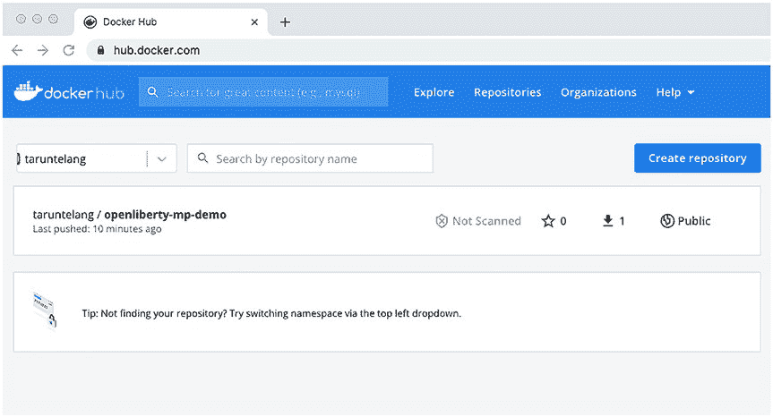

第 9 章 使用 Kubernetes 容器化微服务

***图 9-1。** 你的 Docker Hub 账户在 Docker 注册表中的 Docker 镜像* 现在 Docker 镜像已可在 Docker Hub 上获取，你可以将其部署到

Kubernetes。

要将 Docker 镜像部署到 Kubernetes，请运行以下命令：

kubectl create deployment <deploymentname> --image=<username>/<imagenam e>:<tag>

将 <deploymentname> 替换为部署名称，将 <username> 替换为你的 Docker Hub 用户名，将 <imagename> 替换为你的镜像名称，将 <tag> 替换为镜像标签。

在本例中，你需要运行以下命令：

$ kubectl create deployment mp-demo --image=taruntelang/openliberty-mp-

demo:1.0-SNAPSHOT

这将在 Kubernetes 中创建一个部署，并产生如下输出。

deployment.apps/mp-demo created

要查看该部署，请运行以下命令：

$ kubectl get deployments

第 9 章 使用 Kubernetes 容器化微服务

你应该能看到刚刚创建的部署。

NAME READY UP-TO-DATE AVAILABLE AGE

mp-demo 0/1 1 0 2m7s

要查看该部署中的 Pod，请运行以下命令：

kubectl get pods

你应该会看到正在运行你的微服务的 Pod：

NAME READY STATUS RESTARTS AGE

mp-demo-65fc677585-mdzrg 1/1 Running 0 2m46s

你的部署和 Pod 可能需要一些时间才能就绪，因为需要从 Docker Hub 的注册表中拉取 Docker

镜像。

要访问该微服务，你必须将 Pod 暴露为一个服务。为此，请运行以下命令：

$ kubectl expose deployment <deployment-name> --type=LoadBalancer

--port=<port>

将 <deployment-name> 替换为部署名称，将 <port> 替换为微服务运行的端口。例如，如果微服务运行在 9080 端口，你应将 9080 用作 <port> 的值。

$ kubectl expose deployment mp-demo --type=LoadBalancer --port=9080

service/mp-demo exposed

这将在 Kubernetes 中创建一个服务。要查看该服务，请运行以下

命令：

kubectl get services

你应该能看到刚刚创建的服务。

NAME TYPE CLUSTER-IP EXTERNAL-IP

PORT(S) AGE

mp-demo LoadBalancer 172.21.121.32 69fd7a23-us-east.lb.appdomain.cloud

9080:30390/TCP 59s

你可以使用这些信息来访问该微服务。

恭喜！你已成功将一个微服务部署到 Kubernetes。

第 9 章 使用 Kubernetes 容器化微服务

**扩展你的部署**

Kubernetes 使扩展部署变得很容易。要扩展一个部署，请运行以下命令：

kubectl scale deployment <deploymentname> --replicas=<numberofreplicas>

将 <deploymentname> 替换为部署名称，将 <numberofreplicas> 替换为副本数量。例如，要将部署扩展到四个副本，你应使用 --replicas=4。

$ kubectl scale deployment ms-deployment --replicas=4

deployment.extensions/mp-deployment scaled

要查看该部署，请运行以下命令：

$ kubectl get deployments

你应该会看到该部署已扩展到四个副本。

NAME READY UP-TO-DATE AVAILABLE AGE

mp-deployment 4/4 4 4 4m38s

要查看该部署中的 Pod，请运行以下命令：

kubectl get pods

你应该会看到现在有四个 Pod。

NAME READY STATUS RESTARTS AGE

mp-demo-7d4c44f8-7bb9c5b68b-6tgxq 1/1 Running 0 4m38s

mp-demo-7d4c44f8-7bb9c5b68b-hg78w 1/1 Running 0 4m38s

mp-demo-7d4c44f8-7bb9c5b68b-lz6nl 1/1 Running 0 4m38s

mp-demo-7d4c44f8-7bb9c5b68b-x6wnf 1/1 Running 0 4m38s

你也可以使用 kubectl 删除部署。要删除一个部署，请运行以下

命令：

kubectl delete deployment <deploymentname>

将 <deploymentname> 替换为你要删除的部署名称。

$ kubectl delete deployment ms-deployment

第 9 章 使用 Kubernetes 容器化微服务

deployment.extensions "ms-deployment" deleted

你也可以使用 kubectl 删除服务。要删除一个服务，请运行以下

命令：

$ kubectl delete service <servicename>

将 <servicename> 替换为你要删除的服务名称。

$ kubectl delete service ms-service

service "ms-service" deleted

你已经学习了如何使用 Docker 将一个微服务容器化，并将其部署到

Kubernetes 集群上。

**总结**

在本章中，你首先学习了什么是容器以及为什么要使用

容器。接着，你学习了容器编排。你还学习了 Kubernetes 的

核心特性和术语。你学习了如何使用 Docker 将一个

微服务容器化并部署到 Kubernetes 集群上。最后，你学习了如何按需扩缩部署并在需要时将其删除。以下是本章的关键要点：

• 容器化是一种软件打包方式，使其能够在同一主机上与其他软件隔离运行，从而提升

可靠性与韧性。容器将你的微服务及其

所有依赖打包为一个可移植、易部署、

易管理的单元。

• 容器编排是对容器化应用的部署、管理和扩缩进行自动化的过程。Kubernetes

是最流行的容器编排工具。容器

编排可提升效率与安全性、降低成本、

简化调试，并提高运行在容器中的应用的

灵活性和可扩展性。

以下是你应当记住的一些 Kubernetes 核心术语。

第 9 章 使用 Kubernetes 对微服务进行容器化

• *Pod* 是部署在同一主机上的一组容器。Pod

提供容器之间的共置与通信能力。

• *Service* 是一种抽象，用于定义一组逻辑上的 Pod，并为这些 Pod

提供稳定的网络访问。Service 使微服务之间实现松耦合。

• *Deployment* 是一种对象，用于描述一组

Pod 的期望状态。即使 Pod 被删除或重启，Deployment 也能确保

维持该期望状态。

• *Node* 是 Kubernetes 中的工作机器。每个 Node 上都有 Pod

运行。Node 之间通过

Kubernetes API 进行通信。

• *Worker node* 是用于运行容器的机器。Worker node

可以是物理机或虚拟机。

• *Master node* 是用于管理 Kubernetes 集群的机器。

• 一组 Node 被称为 *Cluster*。

• *Labels* 是附加到对象（如 Pod）上的键/值对。它们

用于标识和选择对象组。

• *Selectors* 用于基于对象的标签来选择一组对象。

• *Annotations* 用于存储对象的非标识性元数据。

Kubernetes 的关键特性包括管理、自动部署、存储编排、

滚动更新、自动装箱、监控、健康检查、

水平扩展、自动扩展、负载均衡、服务发现、密钥与

配置管理，以及容器化应用的负载分发。

Dockerfile 用于创建 Docker 镜像。基础镜像是创建新镜像的起点。

Docker 镜像是一个只读模板，其中包含用于创建容器的一组

指令。你可以从 Docker Hub 或其他仓库获取基础镜像。

你需要编写 Dockerfile 并运行 docker build 命令来构建

Docker 镜像。

第 9 章 使用 Kubernetes 对微服务进行容器化

docker login --username=<your-dockerhub-username> --email=<your-email

@company.com>

docker images

docker tag <imageid> <your-dockerhub-username>/<repository>:<tag> docker push <your-dockerhub-username>/<repository>:<tag>

在将 Docker 镜像部署到 Kubernetes 之前，你需要先将其推送到镜像仓库。

你可以将镜像推送到 Docker Hub，或其他仓库，例如 Google Container

Registry（GCR）。

Kubectl 是一个用于管理 Kubernetes 对象的命令行工具。你可以使用

kubectl 创建、删除、更新和查看 Kubernetes 对象，例如 Pod、Service 和 Deployment。

在本章中，你学习了如何将你的微服务打包为 Docker 镜像，

并将其部署到 Kubernetes 集群上。

你可以通过在自己的基础设施上安装 Kubernetes，或者使用托管的

Kubernetes 服务（如 Google Kubernetes Engine（GKE））来使用 Kubernetes。

`kubectl` 是可管理 Kubernetes 部署的命令行工具，并且

用于与 Kubernetes 进行交互。以下是你学到的命令。

• `kubectl get`：获取 Kubernetes 资源的信息

• `kubectl describe`：获取 Kubernetes

资源的详细信息

• `kubectl scale`：扩缩容是指增加或减少

部署中的副本数量。可以使用此命令完成该操作。

最后，要删除一个部署，请使用 `kubectl delete deployment` 命令。要

删除一个服务，请使用 `kubectl delete service <service-name>` 命令。

**附录 A**

**Maven 简介**

Maven 是一个构建自动化工具，主要用于 Java 项目。简而言之，Maven 可以帮助你基于一份

中心化信息来管理项目的构建、报告和文档需求。

**注意** 根据 Apache Software Foundation 的说法，Apache Maven 是一个软件

项目管理与理解工具。它基于项目对象模型（POM）的概念，

能够在一个中心位置管理项目的构建、报告和文档

需求。

**Maven 的特性**

Maven 是 Java 项目中流行的构建工具。与其他构建工具相比，它具有多个优势，例如 [Apache an[t (https://ant.apache.org/)](https://ant.apache.org/)) *.* Maven 提供了广泛的功能，可分为以下类别：

• **构建系统：** Maven 可用作 Java 项目的构建系统。

它提供了大量插件，可用于编译、测试

以及打包代码。

• **依赖管理：** Maven 可以为项目管理

依赖项。这包括从仓库下载依赖

并将其添加到项目的类路径中。

• **文档：** Maven 可以为项目生成文档，

其中包括 API 文档以及测试、代码

覆盖率等方面的报告。

© Tarun Telang 2023

T. Telang，*《Beginning Cloud Native Development with MicroProfile, Jakarta EE, and Kubernetes》*，

[`doi.org/10.1007/978-1-4842-8832-0`](https://doi.org/10.1007/978-1-4842-8832-0#DOI)

附录 A Maven 简介

• **报告：** Maven 可以生成关于项目健康状况的多种报告，

例如代码质量、测试覆盖率等。

• **发布管理：** Maven 可用于项目的发布管理。

这包括版本打标签、创建发布说明，

以及将构件上传到仓库。

**Maven 生命周期**

Maven 基于一个称为 *生命周期* 的核心概念。Maven 生命周期是项目在开发过程中所经历的一组有序阶段。构建项目时，Maven 会按顺序经过这些阶段，并在经过时执行每一个阶段。以下是 Maven 生命周期中的标准阶段：

• **验证并处理资源：** 此阶段会验证

项目是否正确，以及项目所需的所有资源是否

可用，例如图片、XML 文件等。

• **编译：** 此阶段编译项目的源代码。

• **处理类：** 此阶段对已编译的源代码进行后处理，

例如添加调试信息。

• **生成测试源码：** 此阶段为

项目生成测试源代码。

• **处理测试资源：** 此阶段处理测试源代码的资源，

例如图片、XML 文件等。

• **测试编译：** 此阶段编译测试源代码。

• **测试：** 此阶段使用合适的单元

测试框架对已编译的源代码进行测试。这些测试不应要求代码被

打包或部署。

• **准备打包：** 此阶段为安装准备包，

例如创建清单文件。

• **打包：** 此阶段将已编译的源代码打包为

可分发格式，例如 JAR。

附录 A Maven 介绍

• **安装（Install）：** 此阶段会将打包结果安装到本地仓库中，以便在其他本地项目中作为依赖使用。

• **部署（Deploy）：** 此阶段会将最终包复制到远程仓库中，以便与其他开发者和项目共享。

**Maven 的优势**

在构建过程中使用 Maven 有很多好处：

• **简化构建过程：** 你不再需要手动管理依赖。Maven 会自动下载所需依赖并将其引入你的项目中。

• **让依赖管理更容易：** Maven 使用标准的目录布局和默认的构建生命周期。这使你能够轻松了解文件所在位置以及每个文件的作用。

• **提供一致的构建：** 使用 Maven，可以轻松在不同环境中维护项目构建的一致性。

• **促进更轻松的协作：** Maven 提供良好的项目文档。

• **让新项目启动更容易：** Maven 提供标准的目录布局以及创建新 Java 项目的便捷方式。这让新开发者更容易加入项目。

• **支持“约定优于配置”原则：** 这意味着 Maven 会自动为你的项目应用合理的默认值。你也可以在需要时覆盖这些默认值。

• **提升团队协作：** Maven 为开发者提供了便捷方式来共享项目构建相关信息。这使团队更容易协同开发项目。

• **便于与 IDE 集成：** Maven 与 Eclipse、NetBeans 和 IntelliJ IDEA 等主流 IDE 紧密集成。这使开发者更容易处理 Maven 项目。

附录 A Maven 介绍

• **高质量的项目信息：** Maven 会生成有关项目健康状况的标准报告，包括测试报告、代码覆盖率报告和静态代码分析报告。这让你可以轻松了解项目进展情况。

• **更容易查找依赖：** Maven 中央仓库包含海量 Java 库和构件（artifacts）。这使你能够更容易找到所需依赖。

• **平滑迁移到新特性：** Maven 提供一致的方式来升级项目依赖、插件和目标（goals）。这使你更容易保持与最新特性同步。

• **可扩展性：** Maven 具有高度可扩展性。你可以轻松添加新插件或自定义现有插件。

• **自动化常见任务：** Maven 可以自动执行任务，例如编译源代码、生成文档和打包项目。这能节省你的时间和精力。

• **让项目发布更容易：** Maven 提供标准化的项目发布方式。这使开发者更容易部署项目。

**Maven 如何使开发过程受益？**

Maven 可以通过多种方式帮助改进开发流程：

1\. 它可以帮助降低构建过程的复杂度，使流程更精简且更易理解。

2\. 它可以更高效地管理依赖，从而减少潜在冲突并降低手动更新的需求。

3\. 它可以在不同机器和环境中提供一致的构建，从而更容易确保所有开发者都基于同一代码库工作。

4\. 它可以通过为开发者提供共享构建流程信息的标准方式来改进团队协作。

附录 A Maven 介绍

5\. 它可以促进与 IDE 的便捷集成，使开发者处理 Maven 项目更加简单。

6\. 它可以生成高质量的项目信息，例如代码覆盖率报告和静态代码分析报告。

7\. 它可以提供透明的方式迁移到新特性，使你更容易跟进最新发展。

8\. 它具有高度可扩展性，允许开发者轻松添加新插件或自定义现有插件。

**Maven 架构**

Maven 是一种声明式工具，这意味着它不要求开发者编写

大量的配置文件。相反，Maven 使用标准的目录布局和默认的构建生命周期。这使开发者能够轻松了解文件应放在哪里，以及每个文件的作用。

Maven 也具有很强的可扩展性。开发者可以轻松添加新插件，或自定义

现有插件以满足其需求。

Maven 的架构基于三个概念：项目对象模型（POM）、

插件和目标（goals）。

• *POM* 是 Maven 的核心元素。它是一个 XML 文件，

包含有关项目的信息，例如名称、版本、

依赖项和构建设置。

• *插件（Plugins）* 是扩展 Maven 功能的组件。它们

用于执行常见任务，例如编译代码或创建

JAR 文件。

• *目标（Goals）* 是插件执行的具体操作。例如，

Java 编译器插件的 compile 目标会编译

项目代码。

Maven 的标准目录布局基于文件系统层次结构标准（Filesystem Hierarchy Standard）。

该布局为所有 Maven 项目定义了一致的结构，使开发者能够轻松了解文件位置及每个文件的作用。

附录 A Maven 简介

**什么是 Maven 仓库？**

Maven *仓库* 是一个目录，用于存储所有项目 JAR、库 JAR、插件或任何其他项目特定制品（artifacts），并可供 Maven 使用。仓库有三种类型：

–

**本地仓库：** 这是开发者机器上的一个目录，

所有依赖项都存储在本地。

–

**中央仓库：** 这是由 Apache 维护的仓库，

其中包含大多数常用依赖项。

–

**远程仓库：** 这些是由第三方维护的仓库，

可用于下载依赖项。

**使用 Maven 创建 Java 项目**

使用 Maven 创建 Java 项目很简单。只需在终端运行以下命令：

$ mvn archetype:generate -DgroupId=com.example -DartifactId=my-project

-DarchetypeArtifactId=maven-archetype-quickstart

-DinteractiveMode=false

这将生成一个简单的 Java 项目，结构如下：

my-project

├── pom.xml

├── src

├── main

│ └── java

│ └── com

│ └── example

│ └── App.java

└── test

└── java

└── com

└── example

└── AppTest.java

附录 A Maven 简介

**在你的项目中使用 Maven**

你可以通过将以下内容添加到你的 pom.xml 文件中，在项目中使用 Maven：1

< **project**>

< **modelVersion**>4.0.0</**modelVersion**>

**<groupId**>com.example</**groupId**>

< **artifactId**>my-project</**artifactId**>

< **version**>1.0-SNAPSHOT</**version**>

< **dependencies**>

< **dependency**>

< **groupId**>junit</**groupId**>

< **artifactId**>junit</**artifactId**>

< **version**>4.12</**version**>

< **scope**>test</**scope**>

</**dependency**>

</**dependencies**>

< **build**>

< **plugins**>

< **plugin**> < < **groupId**>org.apache.maven.plugins</**groupId**> 17

< **artifactId**>maven-compiler-plugin</**artifactId**>

< **version**>3.5.1</**version**>

< **configuration**>

< **source**>1.8</**source**>

< **target**>1.8</**target**>

</**configuration**>

</**plugin**>

</**plugins**>

</**build**>

</**project**>

**说明：**

• 第 1 行：<project> 元素是 pom.xml 文件的根元素。

• 第 2 行：<modelVersion> 元素表示正在使用的

POM 模型版本。

附录 A Maven 简介

• 第 3 行：<groupId> 元素表示项目的组 ID。

• 第 4 行：<artifactId> 元素表示项目的制品 ID。

• 第 5 行：<version> 元素表示项目的版本。

• 第 6 行：<dependencies> 元素表示项目的

依赖项。

• 第 7 行：<dependency> 元素表示项目的

单个依赖项。

• 第 8 行：<groupId> 元素表示该

依赖项的组 ID。

• 第 9 行：<artifactId> 元素表示

该依赖项的制品 ID。JUnit 依赖项用于对

项目代码进行单元测试。

• 第 10 行：<version> 元素表示该

依赖项的版本。

• 第 11 行：`<scope>` 元素表示依赖的作用域。

依赖有五种可能的作用域：compile、runtime、test、provided 和 system。compile 作用域表示该依赖在编译时需要。runtime 作用域表示该依赖在运行时需要。test 作用域表示该依赖用于测试。provided 作用域表示该依赖对编译器可用，但不是必需的。system 作用域表示该依赖由系统提供。在本例中，作用域设置为 test，这意味着该依赖仅在测试时可用。

• 第 12 行：`</dependency>` 元素结束单个依赖的配置。

• 第 13 行：`</dependencies>` 元素结束所有依赖的配置。

• 第 14 行：`<build>` 元素表示项目的构建配置。

附录 A Maven 介绍

• 第 15 行：`<plugins>` 元素表示项目的构建插件。

• 第 16 行：`<plugin>` 元素表示单个构建插件。

• 第 17 行：`<groupId>` 元素表示构建插件的组 ID。

• 第 18 行：`<artifactId>` 元素表示构建插件的制品 ID。maven-compiler-plugin 用于编译 Java 源代码。

• 第 19 行：`<version>` 元素表示构建插件的版本。

• 第 20 行：`<configuration>` 元素表示构建插件的配置。

• 第 21 行：`<source>` 元素表示 Java 源版本。

• 第 22 行：`<target>` 元素表示 Java 目标版本。

• 第 23 行：`</configuration>` 元素结束构建插件的配置。

• 第 24 行：`</plugin>` 元素结束单个构建插件的配置。

• 第 25 行：`</plugins>` 元素结束所有构建插件的配置。

• 第 26 行：`</build>` 元素结束项目的构建配置。

• 第 27 行：`</project>` 元素结束 POM 的配置。

**有用的 Maven 命令**

以下命令会告诉你 maven-compiler-plugin 的作用。

`mvn help:describe -Dplugin=org.apache.maven.plugins:maven-compiler-plugin`

附录 A Maven 介绍

该命令调用了 help 插件中的 describe 目标，即 help:describe。该目标从命令行接收参数，你可以使用 -D 来指定。-Dplugin 参数用于指定你想查看详细信息的插件。

**快照版本（Snapshot）和发布版本（Release）有什么区别？**

*快照版本*是项目开发过程中的版本，可能不稳定。*发布版本*是被认为稳定并可用于生产环境的项目版本。

**附录 B**

**使用 Maven 创建 Open Liberty**

**项目**

在本附录中，你将学习如何使用 Maven 创建 Open Liberty 项目。它将带你完成使用 Open Liberty 和 Maven 创建一个简单项目所需的步骤。

使用 Maven 创建新的 Open Liberty 项目很简单。第一步是使用 maven archetype:generate 命令生成一个基础项目结构。

*原型（archetype）*是项目模板。它提供某一类项目所需的基础结构和文件。该原型可在 Maven 中央仓库中获取。

*Maven 中央仓库（Maven Central Repository）*是 Maven 项目使用的软件构件集合。它包含大量项目的构件，从 Jakarta EE 项目到 Spring、Hibernate 等流行开源项目。

**使用 Maven 生成 Web 项目**

要生成 Web 项目，请使用 liberty-archetype-webapp 原型。在你希望创建项目的目录下运行以下命令：

`$ mvn archetype:generate`

`-DarchetypeGroupId="io.openliberty.tools"`

`-DarchetypeArtifactId="liberty-archetype-webapp"`

`-DarchetypeVersion="3.6.1"`

`-DgroupId="<com.mycompany.app>"`

`-DartifactId="<artifactId>"`

`-DinteractiveMode=false`

© Tarun Telang 2023

T. Telang，*Beginning Cloud Native Development with MicroProfile, Jakarta EE, and Kubernetes*，

[`doi.org/10.1007/978-1-4842-8832-0`](https://doi.org/10.1007/978-1-4842-8832-0#DOI)

附录 B 使用 Maven 创建 Open Liberty 项目

**说明：**

–

将 `<artifactId>` 和 `<groupId>` 替换为你的应用程序的制品名称和组 ID。

–

`archetypeGroupId` 参数用于指定要使用的 archetype 所属的组。本示例使用 `io.openliberty.tools`。

–

`archetypeArtifactId` 指定该组内你要使用的制品，即 `liberty-plugin-archetype`。最后，

将版本号指定为 3.6.1。

该命令将创建一个新项目。生成项目的文件夹结构如下：

<artifactId>

│ ├── pom.xml

│ └── src

│ └── main

│ ├── java

│ │ └── <My-groupId>

│ │ └── HelloServlet.java

│ ├── liberty

│ │ └── config

│ │ └── server.xml

│ └── webapp

│ └── WEB-INF

│ └── index.html

└── pom.xml

这将生成一个基础项目结构，包含以下文件和目录：

• pom.xml：Maven 项目文件，包含有关项目的信息，例如依赖、插件和目标。

• src/main/java：此目录包含项目的 Java 源代码。

• src/main/resources：此目录包含资源，例如属性文件和 Web 应用资源。

附录 B 使用 Maven 创建 Open Liberty 项目

• src/test/java：此目录包含 JUnit 测试。

• liberty/config/server.xml：此文件包含 Liberty 服务器的配置。

项目生成后，还会创建一个 `liberty-archetype-webapp/pom.xml` 文件。

该文件包含 `liberty-maven-plugin`，用于在 Open Liberty 上打包、部署和运行应用。有关

Liberty Maven 插件的更多细节，请访问其在 MVNRepository 上的主页 [位于 https://](https://mvnrepository.com/artifact/io.openliberty.tools/liberty-maven-plugin)

[mvnrepository.com/artifact/io.openliberty.tools/liberty-maven-plugin](https://mvnrepository.com/artifact/io.openliberty.tools/liberty-maven-plugin) 以及其在 GitHub 上的项目页面 [位于 https://github.com/OpenLiberty/ci.maven.](https://github.com/OpenLiberty/ci.maven)

`liberty-archetype-webapp` archetype 还包含一个示例 Java 类

（HelloWorldServlet.java）以及一个用于配置 servlet 的 web.xml 文件。

请注意，`liberty-maven-plugin` 已添加到你项目的 pom.xml 文件中。该

`liberty-maven-plugin` 会下载并安装 Open Liberty 运行时，启动和

停止服务器，并将你的应用部署到服务器。它将使用 Liberty 运行时，该运行时专为在云中开发和部署 Java 应用而设计。

<build>

<!-- Define and configure plugins -->

<pluginManagement>

<plugins>

...

...

<plugin>

<groupId>io.openliberty.tools</groupId>

<artifactId>liberty-maven-plugin</artifactId>

<version>3.6.1</version>

</plugin>

</plugins>

</pluginManagement>

</build>

你还应在 pom.xml 文件中更新以下依赖，以使用

最新版本的 Servlet。

附录 B 使用 Maven 创建 Open Liberty 项目

<dependency>

<groupId>jakarta.servlet</groupId>

<artifactId>jakarta.servlet-api</artifactId>

<version>5.0.0</version>

</dependency>

现在你可以开始着手你的项目了；你可以将项目导入你的

IDE，并在 Liberty 服务器上运行应用。

$ mvn liberty:dev

当你修改代码时，你会看到这些更改会自动反映在正在运行的

服务器中。表 B-1 列出了 Open Liberty 服务器的 Maven 命令。

***表 B-1。** Open Liberty 服务器的 Maven 命令*

**Maven 命令**

**说明**

**mvn liberty:dev**

下载、安装并启动 Open Liberty 服务器用于开发

用途。它会监听项目源代码和

服务器配置中的任何更改。这对开发非常方便，因为

每当保存更改时，服务器都会自动重新加载，并且应用会重新部署。

**mvn liberty:devc**

构建 Docker 镜像，挂载所需目录，映射

所需端口，然后以开发模式运行应用于一个

Docker 容器。它还会像开发模式一样监听源代码和配置的更改。

根据这些更改，源代码会按需自动重新构建、服务器会重启，或配置会被重新加载。

**mvn liberty:create**

使用默认的 server.xml 文件创建一个新的 Open Liberty 项目。

**mvn liberty:package**

创建一个可部署到任意 Open Liberty 服务器的 .war 文件。

如果与 -Dinclude=runnable 选项一起使用，该命令将创建一个可运行的 .jAr 文件，并包含所有必需依赖。然后可以使用 java -jar 命令执行该文件以启动应用程序。

（*续*）

附录 B 使用 Maven 创建 Open Liberty 项目

***表 B-1。***（*续*）

**Maven 命令**

**描述**

**mvn liberty:deploy**

将应用程序部署到正在运行的服务器。

**mvn liberty:install-** 在本地 Open Liberty 运行时中安装一个特性。

**feature**

**mvn liberty:reload**

使用最新更改重新加载服务器和应用程序。

**mvn liberty:run**

首先将 Open Liberty 服务器运行时下载并安装到项目中的 target/liberty/wlp 目录，然后在 target/liberty/wlp/usr/servers/defaultServer 目录中创建一个具有所需配置的服务器实例。它使用 loose config 构建并将项目部署到 Open Liberty 服务器。最后，它在前台运行 Open Liberty 服务器。loose config 功能允许你在无需重新部署应用程序的情况下更改 Liberty 服务器配置。这对于测试不同配置或排查问题很有帮助。

**mvn liberty:start**

在后台启动 Open Liberty 服务器。

**mvn liberty:stop**

在后台停止 Open Liberty 服务器。

**liberty:undeploy**

从 Open Liberty 服务器中卸载应用程序。

**附录 C**

**安装 Open Liberty**

**工具**

要安装 Open Liberty Tools，请按以下步骤操作：

1\. 你必须安装 Eclipse IDE for Enterprise Java and Web Developer[s (https://www.eclipse.org/downloads/packages/](https://www.eclipse.org/downloads/packages/release/2022-06/r/eclipse-ide-enterprise-java-and-web-developers)

[release/2022-06/r/eclipse-ide-enterprise-java-and-](https://www.eclipse.org/downloads/packages/release/2022-06/r/eclipse-ide-enterprise-java-and-web-developers)

[web-developers). M](https://www.eclipse.org/downloads/packages/release/2022-06/r/eclipse-ide-enterprise-java-and-web-developers)请确保下载与你的操作系统对应的软件包。参见图 C-1。

© Tarun Telang 2023

T. Telang，*《Beginning Cloud Native Development with MicroProfile, Jakarta EE, and Kubernetes》*，

[`doi.org/10.1007/978-1-4842-8832-0`](https://doi.org/10.1007/978-1-4842-8832-0#DOI)

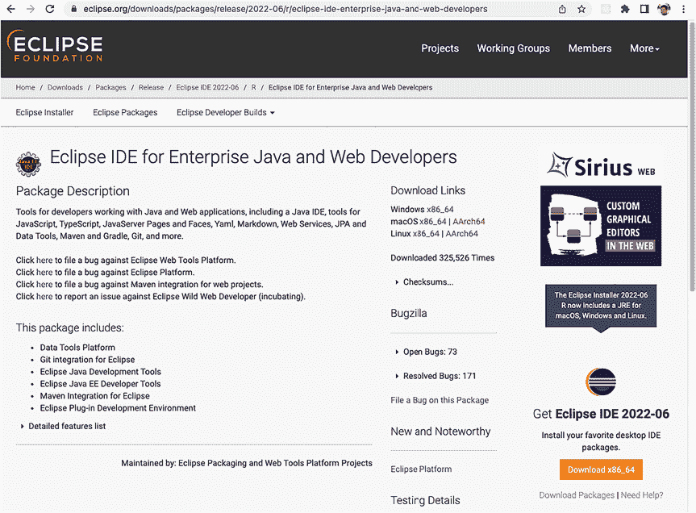

附录 C 安装 Open Liberty 工具

***图 C-1。** Eclipse IDE for Enterprise Java and Web Developers 的下载页面* 2\. 将 Eclipse Developer Tools 的 .ZIP 文件下载到你电脑上任意选择的目录。

可在[https://](https://openliberty.io/start/#eclipse_developer_tools)

[openliberty.io/start/#eclipse_developer_tools](https://openliberty.io/start/#eclipse_developer_tools)获取。参见图 C-2。

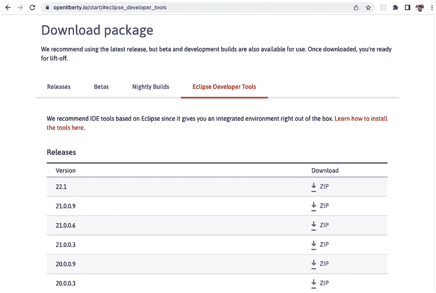

附录 C 安装 Open Liberty 工具

***图 C-2。** Open Liberty Eclipse Developer Tools 下载页面*

3\. 启动你的 Eclipse IDE，然后依次选择 Help ➤ Install New Software ➤ Add。

4\. 在 Add Repository 窗口中，点击 Archive。参见图 C-3.

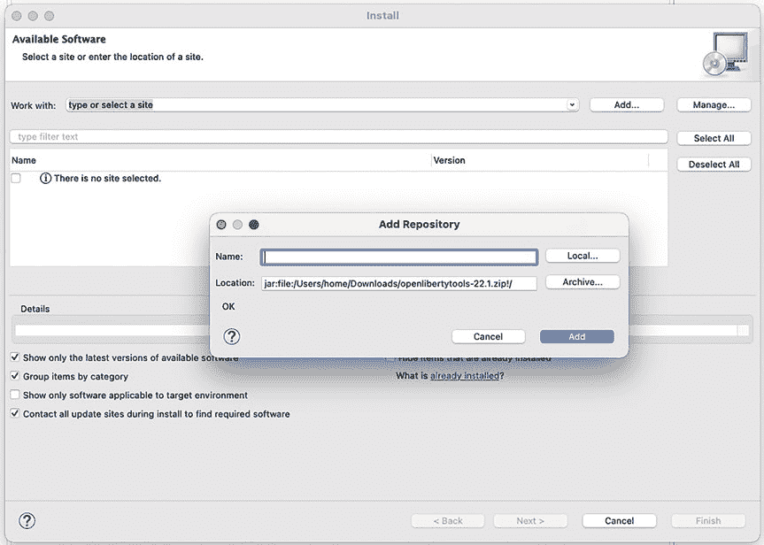

附录 C 安装 Open Liberty 工具

***图 C-3。** Eclipse IDE 的 Add Repository 窗口*

5\. 浏览到你在步骤 2 下载的 .ZIP 文件所在位置。选择该文件，然后点击 Open。

6\. 按照安装向导中的说明进行操作。参见图 C-4。

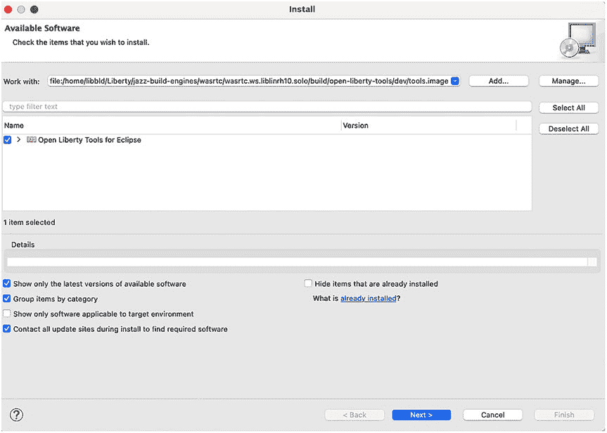

附录 C 安装 Open Liberty 工具

***图 C-4。** Eclipse IDE 的安装向导*

7\. 安装过程完成后，重启工作台。

你已成功在你的机器上安装 Open Liberty Tools。

**索引**

**A**

特征，5–7

定义，1

Active Directory Federation Services

终端用户访问，1

（ADFS），185

示例，2，3

Amazon Elastic Container Service

HTTP，21

（ECS），39

Java，19–21

Amazon Web Services（AWS），23，38，43，

服务（*见* Service models）

129，132，144

类型，部署模型，8

基于注解的方法，178

社区云，9，10

`@APIResponse` 注解，179

混合云，12，13

applicationManager 元素，94

私有云，11

`@ApplicationPath` 注解，176

公有云，8，9

应用程序编程接口（API），

基于 Web 的应用程序，21

46，77，148，171，177–180，193，203，

Web 服务，22，23，26，27

208–211，216

云原生应用

人工智能（AI），115

优势，33

特征，30–32

**B**

定义，29

裸金属集群，218

设计，29，30

裸金属虚拟机监控程序，127

开发，37

蓝绿部署策略，140

缺点，34

示例，32，33

**C**

*与* 传统应用对比，35–37

Cloud Native Computing Foundation

`call()` 方法，157，158

（CNCF），26

中央处理器（CPU），127

ConfigProperty 注解，150

`@Claim` 注解，196

`@Consumes` 注解，105，107，206

客户端-服务器架构，113，114

基于容器的应用，26，

云计算

128–129，134–138

应用类型，4

容器化，37，46，53，54，65，

优势，1，2，4，5

124，228

© Tarun Telang 2023

T. Telang，*Beginning Cloud Native Development with MicroProfile, Jakarta EE, and Kubernetes*，

[`doi.org/10.1007/978-1-4842-8832-0`](https://doi.org/10.1007/978-1-4842-8832-0#DOI)

索引

容器

Docker，30，33

Docker

优势，65

基础镜像，219

定义，65

Docker Hub 账户，223，225，226

Docker Hub 账户，创建，67，68

运行 MicroProfile

hub，67

应用，220–222

安装，66

扩展部署，227，228

`docker build` 命令，221，229

Kubernetes，228

Dockerfile，129，219，221，229

微服务，213

Docker Hub，57，67，68，218–220，223–226，

编排，214

229，230

优势，214

`docker pull` 命令，220

Kubernetes，214

操作系统（OS），127

**E**

运行应用，128，129

无服务器计算，130

Eclipse Developer Tools，248，249

用途，213，214

Eclipse MicroProfile，142

虚拟机（VMs），128

容错 API，160，161

contextRoot 属性，97

容错组件，159

持续集成/持续交付

功能层，144–146

（CI/CD），29，36，42–43，53，121

健康检查规范，156–158

`createProduct()` 方法，105，207

实现，147，148

创建、更新、删除和检索

Jakarta EE，143

（CRUD）操作，98，100

MicroProfile Configuration（*见*

自定义认证，199，200

MicroProfile Config）

客户关系管理

微服务架构，143

（CRM），23

Open Liberty，144，145

**F**

**D**

容错注解，160，161

暗发布，140，141

`finish()` 方法，173

`@DELETE` 注解，108

基于表单的认证，199，200，202

`deleteProduct()` 方法，108，207

函数即服务（FaaS），130，133

开发环境，搭建

硬件要求，55–57

JDK，57，58

**G**

Maven，58，59

GET HTTP 方法，101

摘要认证，199，200，203

`getAll()` 方法，179

分布式追踪，74，76，143，171，172

`getGreeting()` 方法，150

索引

`getMessage()` 方法，157

物联网（IoT），130

`getName()` 和 `getId()` 方法，99

`isHealthy()` 方法，157

GetProduct() 方法，100，101，104，176，

196，207

**J**

`getValue()` 方法，153，155，169

Git

Jakarta EE 平台，20，24，27，30，77，93，

创建 GitHub 账户，61

94，98，109，110，143，144，147

创建 GitHub 仓库，62，63

Jakarta EE Security 规范，199–202

定义，60

Jakarta RESTful Web 服务，77，95，110，

安装，60

172–178，181

项目代码，GitHub 仓库，63–65

`jakarta.ws.rs.ApplicationPath`

`git commit` 命令，64

注解，95

GitHub，57，61–65，68，243

基于 Java 的应用

`git remote add` 命令，64

优势，53

Google App Engine（GAE），23

特征，52

Google Cloud Functions，46，133

CI/CD，43

Google 云平台（GCP），38，114，

云原生应用

129，132

开发，阶段

Google 容器注册表（GCR），230

API 管理，46

Google Kubernetes 引擎（GKE），218，230

CI/CD，42

容器化，46

DevOps，47

**H**

IaC，43，44

@HeaderParam 注解，196，197，207

微服务架构，46

健康检查 API，157

可观测性，48，50，51

混合云计算，26

安全，47

虚拟机监控程序，127

无服务器计算，46

云原生开发

**I**

开源工具，41

PaaS 服务，41

IBM WebSphere Liberty 应用

云原生开发，

服务器，78

阶段，42

基础设施即服务（IaaS），

开发，53，54

13，18–19

示例，39，40

基础设施即代码（IaC），43

服务，38

@Inject 注解，150，173

基于 Java 的云原生应用，30，

集成开发环境

55，62，68

（IDE），75，76，110，244

Java 开发工具包（JDK），55，57–58，76

索引

Java 管理扩展（JMX），163，

pod，215

164，169，170

复制控制器，216

JavaScript 对象表示法（JSON），22，99，

工作节点，215

101，105，116，143–145，170，198

JSON Web Key（JWK），197，198

**L**

JSON Web Key Set（JWKS），198

JSON Web Token（JWT）

LoginConfig 注解，192，193

创建/签名，186–189

定义，184

**M, N**

微服务环境

机器学习（ML），115，131

认证服务问题，191

Maven

@Claim 注解，196

架构

@HeaderParam，196

创建 Java 项目，236

REST 应用，192，193

POM，235

REST 资源，193–195

pom.xml 文件，237–239

@RolesAllowed，195

仓库，236

PEM 格式，197，198

快照，240

测试应用，189

优点，233，234

用例，184，185

命令，239

验证/校验，190，191

定义，231

开发过程，234，235

特性，231，232

**K**

生命周期，232，233

kubectl，228，230

Open Liberty 项目

kubectl delete deployment 命令，230

命令，244

Kubernetes，26，30，33，214，228，230

Web 项目，241–243，245

优点，69

Maven 中央仓库，241

集群，73，74

@Metered 注解，167

将 Docket 配置到

MetricRegistry，164，167–169

Kubernetes，71–73

MicroProfile，20，24，27，30，79，163

控制平面节点，216

MicroProfile Config

定义，68

访问数据，153

特性，217

访问元数据，154

安装，69

API，148

kubelet，215

Config 类，149，150

标签，216

ConfigSource，151，152

主节点，216

将配置数据转换为

节点，215

POJO，155

索引

默认值，154

OpenAPI，209，211

特性，148

@RegisterRestClient，204

可选字段，155

微服务，27，30，33，34，36–38，

编程，155，156

121–124，183

属性，150

微服务架构

测试组件，150

容器，127

类型转换，154

部署

MicroProfile 度量规范

优点，138，139

类别，164

策略/模式，139–141

组件，164

缺点

自定义度量，168–170

云原生应用，123，124

JMX，163

设计，122

Maven 依赖，165

十二要素

MetricRegistry，167

方法论，124–126

度量注解，164，165

水平扩展，112

跟踪调用次数，166

管理，142

跟踪内存使用，167

单体架构，119

跟踪响应时间，165

垂直扩展，111，112

MicroProfile OpenAPI 规范

垂直 *vs* 水平扩展，113

注解，181

虚拟机（VM），126，127

文档，177

Microsoft Azure，38，129，132

生成文档，178

单体架构

OAS3，177

定义，119

项目，178–180

微服务，121

MicroProfile OpenTracing

可扩展性，119

分布式，171

SOA，120

规范，171

类型，119

工作原理

myMethod() 方法，166，167

启用追踪，172

注入自定义追踪器

对象，173，174

**O**

Jakarta RESTful

OpenAPI 规范（OAS），163，177，

Web 服务，172

209，211

MicroProfile REST Client

Open Liberty，144

客户端接口，205–208

下载/安装

配置，204

配置文件，87

HTTP 方法，203

创建 RESTful Web

OAS，209

服务，87，88

索引

Open Liberty（*续*）

组件，77

开发 REST 应用，94

Open Liberty，78，110

特性，82，84

资源类，98，99

IntelliJ IDEA 旗舰版，95，97

服务类，100，101，103

运行 Jakarta EE 项目，93

更新产品数据，105–109

pom.xml 文件，89，92

编写单元测试，服务

pom.xml 文件，90，91

类，103，104

项目结构，89

Retry 注解，160

服务器，80–82，219

@RolesAllowed 注解，195

服务器实例，85，86

停止服务器，86，87

server.xml 配置文件，93

**S**

server.xml 配置文件，94

无服务器计算，130

基于微服务的应用，78，79

优点，131

openliberty-mp-demo，221，224

组件，132

Open Liberty 工具，247，248，250，251

缺点，131

开源技术，30，33，76

流行平台，132

@Operation 注解，179，211

无服务器应用

*vs* 容器，134–138

FaaS，133

**P, Q**

用例，130

平台即服务（PaaS），13，16–18，41

停止服务器命令，86，87

@POST 注解，105

基于服务的架构，111

项目对象模型（POM），91–93，231，

集中式计算机系统，113

235，237

第一代，114

@PUT 注解，107

第二代，114

第三代，114

类型，115，116

**R**

Web 服务，114

@RegisterProvider 注解，206

服务模型

@RegisterRestClient 注解，204

IaaS

表述性状态转移（REST），

优点，18，19

27，78，109，118

定义，18

@RestClient 注解，207，208

限制，19

RESTful API，*见* RESTful Web 服务

服务种类，18

RESTful Web 服务

PaaS

架构风格，78，98

优点，17

客户端应用，77

定义，16

索引

限制，17

**U**

提供商，16

updateProduct 方法，207

SaaS

应用，14

优点，15

**V**

定义，14

虚拟机（VM），18，24，46，

缺点，15

126–128，131

多层架构，15

类型，13，14

面向服务架构（SOA），

**W, X, Y**

115–116，119，120

Web 服务

setActiveUsers() 方法，169

应用，116

简单对象访问协议（SOAP），

定义，116

27，117，120

REST *vs* SOAP，118

软件即服务（SaaS），14

SOAP，117，118

span.log() 方法，173

软件程序，116

分阶段发布部署策略，141

Web 服务描述语言

（WSDL），116，117，120

**T**

WebSocket，24

@Timed 注解，165

基于令牌的身份认证

机制，191

**Z**

十二要素方法论，124

Zipkin，74–76，171，172

