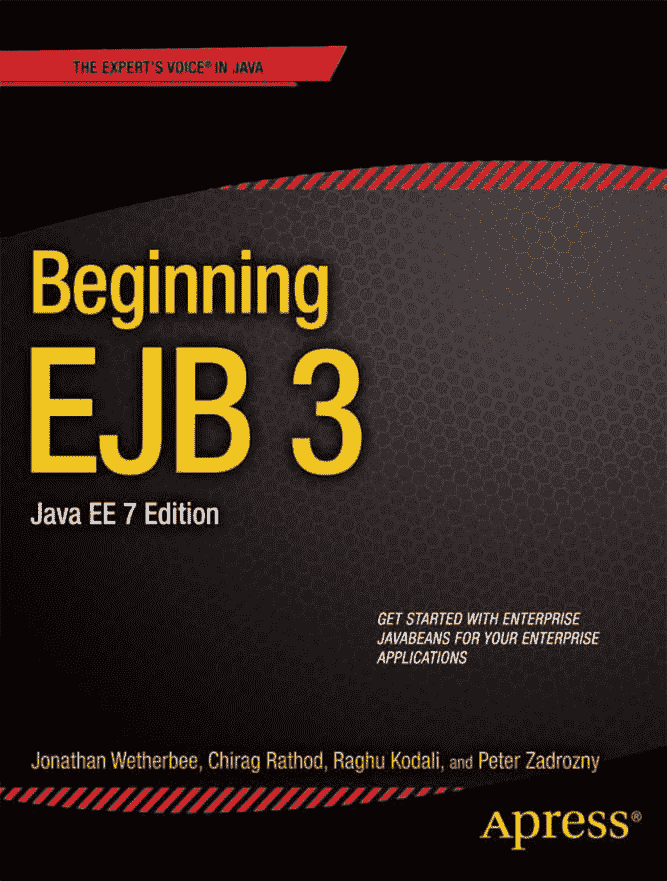

《Beginning EJB 3：Java EE 7 版》


乔纳森·韦瑟比

奇拉格·拉索德

拉古·科达利

彼得·扎德罗兹尼


**《Beginning EJB 3：Java EE 7 版》**

版权所有 © 2013，乔纳森·韦瑟比、奇拉格·拉索德、拉古·科达利、彼得·扎德罗兹尼

本作品受版权保护。出版商保留所有权利，无论是全部还是部分材料，特别是翻译权、重印权、插图再利用权、朗诵权、广播权、缩微胶片复制权或任何其他物理形式的复制权，以及信息存储与检索的传输权、电子改编权、计算机软件权，或现在已知或未来开发的任何类似或不同方法。法律保留的例外情况包括与评论或学术分析相关的简短摘录，或专门为输入计算机系统并执行而提供的材料，仅供购买者独家使用。仅根据出版商所在地现行版权法的规定，允许复制本出版物或其部分内容，且必须始终从 Springer 获得使用许可。使用许可可通过版权清算中心的 RightsLink 获取。违反者将根据相应版权法被起诉。

ISBN-13（平装）：978-1-4302-4692-3

ISBN-13（电子版）：978-1-4302-4693-0

本书中可能出现商标名称、徽标和图像。我们并非在每次出现商标名称、徽标或图像时都使用商标符号，而是仅以编辑方式使用这些名称、徽标和图像，以维护商标所有者的利益，且无意侵犯商标权。

本出版物中使用的商品名称、商标、服务标志和类似术语，即使未明确标识，也不应被视为对其是否受专有权利保护的表达意见。

尽管本书中的建议和信息在出版时被认为是真实准确的，但作者、编辑和出版商均不对可能出现的任何错误或遗漏承担法律责任。出版商对本书所含内容不作任何明示或暗示的保证。

总裁兼出版商：保罗·曼宁

首席编辑：史蒂夫·安格林

开发编辑：马修·穆迪和加里·施瓦茨

技术审阅：阿梅尔·恩乔博

编辑委员会：史蒂夫·安格林、马克·贝克纳、尤恩·白金汉、加里·康奈尔、路易丝·科里根、摩根·埃特尔、乔纳森·根尼克、乔纳森·哈塞尔、罗伯特·哈钦森、米歇尔·洛曼、詹姆斯·马卡姆、马修·穆迪、杰夫·奥尔森、杰弗里·佩珀、道格拉斯·庞迪克、本·雷诺-克拉克、多米尼克·谢克沙夫特、格温南·斯皮林、马特·韦德、汤姆·韦尔什

协调编辑：凯蒂·沙利文

文字编辑：凯伦·詹姆森

排版：SPi Global

索引编制：SPi Global

插图：SPi Global

封面设计：安娜·伊什琴科

全球图书贸易发行由 Springer Science+Business Media New York 负责，地址：233 Spring Street, 6th Floor, New York, NY 10013。电话：1-800-SPRINGER，传真：(201) 348-4505，电子邮件：`orders-ny@springer-sbm.com`，或访问 `www.springeronline.com`。Apress Media, LLC 是加利福尼亚州的有限责任公司，其唯一成员（所有者）是 Springer Science + Business Media Finance Inc (SSBM Finance Inc)。SSBM Finance Inc 是特拉华州的一家公司。

有关翻译信息，请发送电子邮件至 `rights@apress.com`，或访问 `www.apress.com`。

Apress 和 friends of ED 的书籍可批量购买用于学术、企业或促销用途。大多数图书也提供电子版和许可证。如需更多信息，请参考我们的特殊批量销售–电子书许可网页：`www.apress.com/bulk-sales`。

作者在本文中引用的任何源代码或其他补充材料，读者可在 `www.apress.com` 获取。有关如何找到本书源代码的详细信息，请访问 `www.apress.com/source-code/`。

献给我的儿子们——雅各布、帕特里克和尼古拉斯——感谢你们在整个过程中给予的爱、支持和灵感。

——乔恩·韦瑟比

献给谢莉和阿什维尼。

——奇拉格·拉索德

内容概览

关于作者

关于技术审阅者

前言

致谢

 第 1 章：EJB 架构简介

 第 2 章：EJB 会话 Bean

 第 3 章：实体与 Java 持久化 API

 第 4 章：高级持久化特性

 第 5 章：EJB 消息驱动 Bean

 第 6 章：EJB 与 Web 服务

 第 7 章：集成会话 Bean、实体、消息驱动 Bean 和 Web 服务

 第 8 章：EJB 中的事务支持

 第 9 章：EJB 3 性能与测试

 第 10 章：上下文与依赖注入

 第 11 章：EJB 打包与部署

 第 12 章：EJB 客户端应用程序

 第 13 章：在可嵌入 EJB 容器中进行测试

索引

目录

关于作者

关于技术审阅者

前言

致谢

 第 1 章：EJB 架构简介

EJB 简介

什么是 EJB？

EJB 开发模型的核心特性

EJB 规范的演进

EJB 3 简化开发模型

分布式计算模型

本书的组织结构

第 1 章：EJB 3 架构简介

第 2 章：EJB 会话 Bean

第 3 章：实体与 Java 持久化 API

第 4 章：高级持久化特性

第 5 章：EJB 消息驱动 Bean

第 6 章：EJB 与 Web 服务

第 7 章：集成会话 Bean、实体、消息驱动 Bean 和 Web 服务

第 8 章：EJB 中的事务支持

第 9 章：EJB 性能与测试

第 10 章：上下文与依赖注入

第 11 章：EJB 打包与部署

第 12 章：EJB 客户端应用程序


第 13 章：在可嵌入 EJB 容器中进行测试

开始入门

下载 NetBeans IDE

安装 NetBeans IDE 及其集成的 GlassFish 服务器

测试 NetBeans IDE 和 GlassFish 的安装

管理 GlassFish 应用服务器

故障排除

结论

 第 2 章：EJB 会话 Bean

会话 Bean 简介

会话 Bean 的类型

何时使用会话 Bean？

无状态会话 Bean

Bean 类

业务接口

业务方法

依赖注入

生命周期回调方法

拦截器

有状态会话 Bean

Bean 类

业务接口

业务方法

生命周期回调方法

拦截器

异常处理

单例会话 Bean

Bean 类

业务接口

业务方法

生命周期回调方法

并发管理

错误处理

定时器服务

基于日历的时间表达式

基于日历的时间表达式示例

定时器持久化

会话 Bean 的客户端视图

编译、部署和测试会话 Bean

前提条件

编译会话 Bean 及其客户端

部署会话 Bean 及其客户端

运行客户端程序

结论

 第 3 章：实体与 Java 持久化 API

一个实体示例

一个简单的 JavaBean：Customer.java

一个简单的实体：Customer.java

一个暴露默认值的实体：Customer.java

编码要求

实体数据访问

属性名称

示例：注解实例变量

示例：注解属性访问器

声明主键

简单主键

复合主键

实体示例总结


持久化存档

persistence.xml 文件

EntityManager

持久化上下文

获取 EntityManager 实例

事务支持

实体生命周期

新实体实例的生命周期

O/R 映射

@Table 注解（再探）

@Column 注解（再探）

复杂映射

实体关系

@OneToOne

@OneToMany 和 @ManyToOne

@ManyToMany

懒加载与即时加载字段绑定

级联操作

Java 持久化查询语言 (JPQL)

@NamedQuery 和 @NamedQueries

绑定查询参数

动态查询

批量更新与删除操作

复杂查询

持久化与适配

正向生成——持久化

逆向工程——适配

哪个适合你的项目？

示例应用：CustomerOrderManager

Customer.java

编译、部署和测试 JPA 实体

打开示例应用

创建数据库连接和示例模式

编译实体、EJB 和客户端

部署 JPA 持久化单元、EJB 模块和 Servlet

运行客户端程序

结论

 第 4 章：高级持久化特性

映射实体继承层次结构

入门指南

实体继承映射策略

每类层次结构单表（InheritanceType.SINGLE_TABLE）

公共基表与连接子类表（InheritanceType.JOINED）

每个最外层具体实体类单表（InheritanceType.TABLE_PER_CLASS）

O/R 实现方法比较

在继承层次结构中使用抽象实体、映射超类和非实体类

抽象实体类

映射超类（@MappedSuperclass）

非实体类

非实体单值字段和集合字段

多态关系

关系映射

多态 JPQL 查询


使用原生 SQL 查询

查询条件 API

复合主键与嵌套外键

使用嵌入式复合键 (@EmbeddedId)

在实体类上直接暴露复合键类字段 (@IdClass)

映射使用复合键的关系

乐观锁支持 (@Version)

自动生成主键值支持 (@GeneratedValue)

拦截器：实体回调方法

编译、部署和测试 JPA 实体

前提条件

打开示例应用程序

创建数据库连接

编译源代码

运行客户端程序

测试其他持久化示例

结论

映射实体继承层次结构

在继承层次结构中使用抽象实体、映射超类和非实体类

多态关系

多态 JPQL 查询

使用原生 SQL 查询

使用查询条件 API

复合主键与嵌套外键

乐观锁支持

自动生成主键值支持

拦截器：实体回调方法

 第 5 章：EJB 消息驱动 Bean

面向消息的架构

什么是 JMS？

消息应用程序架构

使用 MDB

何时使用 MDB？

MDB 类

配置属性

MDB 中的依赖注入

生命周期回调方法

拦截器

异常处理

客户端视图

编译、部署和测试 MDB

前提条件

编译会话 Bean 和 MDB

创建 JMS 和 JavaMail 资源

部署会话 Bean、MDB 及其客户端

运行客户端程序

结论

 第 6 章：EJB 与 Web 服务

什么是 Web 服务？

UDDI

WSDL

SOAP

REST

何时使用 Web 服务？

Java EE 与 Web 服务


JAX-WS

JAX-RS

JAXB

JAXR

SAAJ

JSR 181

作为 Web 服务的 EJB 无状态会话 Bean

开发新的 Web 服务

打包、部署和测试 Web 服务

前提条件

编译会话 Bean

部署基于会话 Bean 的 Web 服务

测试信用服务

Web 服务客户端视图

开发访问 Web 服务的 Java 客户端

作为 Web 服务客户端的会话 Bean

结论

 第 7 章：集成会话 Bean、实体、消息驱动 Bean 和 Web 服务

引言

应用程序概述

应用程序组件与服务

购物车组件

搜索外观组件

客户外观组件

订单处理外观组件

持久化服务

电子邮件服务

信用服务

订单处理服务

Wines Online 应用程序业务流程

深入组件/服务演练

持久化服务

客户外观组件

搜索外观组件

购物车组件

订单处理外观组件

订单处理服务

电子邮件服务

信用服务

数据库模式

构建、部署和测试应用程序

前提条件

创建数据库连接

创建 JMS 和 JavaMail 资源

打开示例应用程序

配置 EJB Web 服务

[`wineapp@yahoo.com`](http://wineapp@yahoo.com)账户与`user.properties`文件](../Text/9781430246923_Ch07.xhtml#Sec37)

构建、部署和执行示例应用程序

Servlet 输出

生成的电子邮件

结论

 第 8 章：EJB 中的事务支持

什么是事务？

分布式事务

事务的 ACID 属性

Java 事务 API（JTA）


两阶段提交协议

EJB 中的事务支持

EJB 事务服务

服务模型中会话 Bean 的事务行为

容器管理事务（CMT）划分

Bean 管理事务（BMT）划分

隐式提交与显式提交

在 JPA 实体中使用事务

实体与事务上下文之间的关系

容器管理与应用程序管理的持久化上下文

事务范围的持久化上下文与扩展持久化上下文

JTA 与资源本地 EntityManager

两个示例场景

使用 CMT 划分的无状态会话 Bean

使用应用程序管理 EntityManager 的 Java 外观

使用 CMT 会话 Bean 过滤测试数据

使用 BMT 划分和扩展持久化上下文的有状态会话 Bean

构建、部署和测试：来自 Wines Online 应用程序的事务场景

前提条件

打开示例应用程序

创建数据库连接

编译源代码

部署并运行客户端程序

结论

 第 9 章：EJB 3 性能与测试

测试方法论

性能标准

模拟应用程序使用

定义测试指标

Grinder 工具

测试应用程序

性能测试

测试环境

测试脚本

设置

初步测试

样本大小

校准

实际测试运行

分析结果

结论

 第 10 章：上下文与依赖注入

什么是 CDI？

与 EJB 的关系

CDI 概念

Bean 与 beans.xml

作用域

使用@Inject 进行依赖注入

依赖解析

替代方案

生产者

与会话 Bean 的交互

会话 Bean 作用域

解决会话 Bean 歧义

限制


编译、部署和测试 CDI 应用程序

前提条件

示例代码结构

编译 CDI Bean 及其客户端

部署和运行 CDI 客户端

总结

 第 11 章：EJB 打包与部署

关于部署工具的说明

打包与部署流程概述

提供者

组装者

部署者

Java EE 部署基础设施

Java EE 服务器

Java EE 容器

Java EE 部署组件

Java EE 应用程序

Java EE 模块类型

库组件

应用服务器与平台无关性

部署工具

部署计划

部署角色

应用程序组装者

应用程序部署者

组装 EJB JAR 模块

命名范围

组装持久化单元

命名范围

总结

 第 12 章：EJB 客户端应用程序

应用程序架构

JSF

Java EE Web 技术的演进

JSF 架构

JSF 工具与组件

使用 JSF 和 EJB 开发 Web 应用程序

登录页面

新客户注册页面

链接页面

搜索页面

葡萄酒列表页面

显示所选葡萄酒详情页面

显示购物车商品页面

通知页面

编译、部署和测试 JSF 应用程序

前提条件

编译 JSF 应用程序

部署和运行葡萄酒商店应用程序

应用程序客户端容器

总结

 第 13 章：在可嵌入 EJB 容器中进行测试

测试客户端

EJB Lite

可嵌入 EJB 容器

本章结构

概念

JUnit 测试

WineAppServiceTest：WineAppService EJB 的 JUnit 测试类

实例化可嵌入 EJB 容器并启动 Derby

在持久化单元中初始化数据

单元测试方法

构建和测试示例代码

前提条件

打开示例应用程序

编译源代码

运行 JUnit 测试

总结

索引

关于作者


**Jon Wetherbee** 是 Oracle JDeveloper IDE 中 EJB 开发工具的首席工程师和技术负责人。他在 Oracle 拥有超过 20 年的开发经验，从事过多种 O/R 映射工具的开发，并自 EJB 1.1 起负责 Oracle 核心 EJB 工具集的管理。最近，Jon 负责为 Oracle 的应用开发框架 ADF 设计和开发 EJB 及 JPA 数据绑定解决方案。

在加入 JDeveloper 项目之前，Jon 是 Oracle CASE（计算机辅助软件工程）工具的产品经理，并致力于早期对象关系框架的研究。他于 1999 年因在面向对象环境中集成关系数据库的工作获得一项专利。Jon 是本书第一版《Beginning EJB 3 Application Development: From Novice to Professional》（Apress，2006 年）的合著者，并在《Java Developer's Journal》和 Oracle 技术网络上发表过文章。他乐于演讲，曾在多个会议和开发者团体中发表演讲，包括 Oracle 的 iDevelop（班加罗尔、台北）、The Server Side Java Symposium（巴塞罗那）以及各种 Java 用户组。Jon 拥有布朗大学认知科学理学学士学位。


**Chirag Rathod** 是一位首席工程师，负责在 Oracle 的 JDeveloper IDE 中为 EJB 和 CDI 开发和提供设计时功能。他拥有超过 14 年的开发工具开发经验。在加入 JDeveloper IDE 团队之前，他参与了 Oracle 旗舰产品（如 Oracle SQL*Plus、Oracle Forms 和 Oracle Designer）的开发。Chirag 在 Maharaja Sayajirao 大学技术与工程学院获得计算机科学工程学士学位。


**Raghu Kodali** 是 Solix Technologies 的产品管理与战略副总裁，负责产品愿景、管理、战略、用户设计和交互。他的工作包括下一代数据优化平台、行业领先的数据发现平台、企业数据管理即服务，以及使用大数据平台和云进行应用开发。Raghu 是《Big Data Analytics using Splunk》（Apress，2013 年）的合著者。在加入 Solix 之前，他在 Oracle 工作了 12 年，担任高级管理职位，负责 Oracle Fusion Middleware 产品的产品管理和战略。此外，Raghu 还是 Oracle 的 SOA 倡导者，领导下一代 Java EE 计划。Raghu 撰写了一本关于 Java 计算的主要技术参考书《Beginning EJB 3 Application Development: From Novice to Professional》（Apress，2006 年），发表了大量关于企业技术的文章，并且是《Oracle Information Integration, Migration and Consolidation》（PACKT Publishing，2011 年）的合著者之一。


**彼得·扎德罗兹尼**是软件行业的资深人士。他是 Opallios 公司的创始人兼首席技术官，该公司专注于利用大数据和云技术的力量，同时通过外包产品开发为客户创造价值。彼得还在圣何塞州立大学担任大数据主题的讲师。他曾在全球多个国家的初创公司和财富 500 强公司担任过各种高管和技术职务。其职业生涯的亮点包括在欧洲启动 WebLogic 的业务，以及在墨西哥启动 Sun Microsystems 的业务。他是一位成就卓著的作家，撰写了多本关于大数据分析、J2EE 和性能工程的成功书籍，并且是流行开源项目 The Grinder 的原始贡献者。

关于技术审校者


**恩乔博·阿梅尔·法布里斯**是一名设计计算机工程师，毕业于喀麦隆国家高级工程学院，并且是 Oracle 认证专家、Java SE 6 程序员。过去，他曾使用 EJB/JEE 开发多个系统，包括一个求助热线系统和一个商业管理应用程序。他目前是 Sopra Group 公司 Java 团队的一员，与 EJB、Spring 和 ICEFaces 解决方案协同工作。请访问他的网站 `http://armel-ndjobo.developpez.com`。

前言

亲爱的读者，

当我们在 2006 年构思本书的第一版时，轻量级的 EJB 3 API 仍处于早期阶段，但我们清楚地看到，EJB 规范设计者最终实现了功能与易用性的完美结合。来自 EJB 2.x 的世界，这就像一股清新的空气，让我们想起了在多年编写 C 和 C++ 程序后，发现 Java 技术时的感受。EJB 组件被重新定义为一个普通的 Java 类，其元数据可以通过 Java 注解声明，并通过引入泛型、容器注入和拦截器得到增强，成为了一个更加灵活的开发模型的基础：一个通过简洁获得优雅的模型。随着新的 Java 持久化 API (JPA) 的出现，实体也被重塑为轻量级的 Java 类，并且 O/R 映射元数据可以通过规范定义的注解来指定，我们突然拥有了一个包含最新技术的全面企业组件模型，所有这些都整合到了一个全球标准中。所以，你可以理解是什么让我们如此兴奋。

快进到现在，EJB 3.2 和 JPA 2.1 规范已经发布。这些规范合计超过一千页，已经成熟，涵盖了多个新领域，并改进了其易用性。我们再次看到了一个机会，可以将这些最新材料转化为一种易于理解的格式，这种格式阅读流畅，并大量使用了你可以在自己的机器上构建、执行和进一步探索的示例。在这第二版中，伴随 Java EE 7 的发布，我们通过一系列易于消化的章节介绍了 EJB 3.2 和 JPA 2.1 API，以及 CDI 和 JAX-RS 规范中的关键特性，让你能够一次一个主题地熟悉这些技术。在每个章节中，我们提供了可执行的源代码示例，演示了每个特性如何工作，以及各个部分如何组合在一起。这样你就不必一口吞下整个“玉米卷饼”。本着我们在本书众多示例中使用的 Apress Wines Online 应用程序的精神，我们希望你能真正品味和欣赏 Java EE 7 组件生态系统的丰富性。

对于每项技术，我们提供了直接的示例，但也努力解释何时何地使用其特性，它们的优缺点是什么，并提供最佳实践用法的见解。在完成这些主题探索之后，我们解释了如何将 EJB 和相关组件集成到一个全面的 Java EE 7 应用程序中，然后将焦点转向事务管理、性能分析、部署、在可嵌入 EJB 容器中进行测试，以及如何构建健壮的 EJB 客户端。

我们的工作是将你从 EJB 新手转变为专家，我们希望你能享受这段旅程！

乔纳森·韦瑟比，奇拉格·拉索德，拉古·科达利，以及彼得·扎德罗兹尼

谁应该阅读本书？

本书的目标读者是企业软件开发人员，他们具有 Java 经验，使用过早期版本的 EJB 或相关技术构建过单层或多层应用程序，并且希望基于最新的跨平台行业标准构建企业软件。

作为一本入门级文本的作者，我们有两个主要目标：

*   我们的首要目标是让你能够熟练使用 EJB 的许多基本元素以及几个密切相关的技术，以便你能够在 Java EE 环境中设计、构建、部署、执行和测试全面的企业应用程序。我们期望你能够轻松掌握构建和组装基于 EJB 组件的应用程序所需的基本要素。
*   我们的第二个目标是为你提供一个关于 Java EE 整体服务和持久化层的广阔视角，特别是关于 EJB 提供的全部功能范围。我们希望你在读完本书后，能够拥有一个广度优先的基础，这将作为一个发射台，让你能够更深入地探索 EJB 及相关规范的特定领域。

为此，本书力求提供一个易于上手的 EJB 入门途径，让你能够熟练地构建使用 EJB 全部功能的服务和应用程序。我们刻意避免深入探讨规范的许多领域，以便你能够熟悉整体环境，而不会被细粒度选项的细节所干扰。我们相信，这种基于对 EJB 提供的广泛功能有扎实理解的广度优先基础，将使你处于最佳位置，然后能够以规范和其它高级文本作为参考指南，更深入地探索你自己的软件开发项目所需的 EJB API 的特定领域。

致谢

本书的诞生离不开那些在其整个生命周期中提供技术输入和纯粹灵感的人们的努力和见解。特别地，我要感谢我的同事兼本第二版的主要合著者奇拉格·拉索德，感谢他在这项工作的各个阶段所展现的洞察力、精神和奉献精神。当亲密的合作者同时也是如此好的朋友时，熬夜和早起都变得轻松了！拉古·斯里尼瓦桑和约翰·布拉肯在设计会议和关于 EJB 及 JPA 最佳实践的讨论中提供了宝贵的帮助。克里斯·卡特在我探索的过程中支持了我，即使这分散了我对 JDeveloper 的注意力；他知道从研究和撰写本书中获得的见解必将回报给团队。与玛丽娜·瓦特金娜愉快地讨论了一个半小时关于 EJB 3.2 的最新状态和未来方向，既富有启发性又非常及时。


得益于上述所有技术的支持，若非日常生活中的种种干扰，撰写一本关于我所珍视主题的书籍本应只是一场马拉松式的长跑！但正是这些令人愉悦的干扰，让我得以在众人中特别感谢几位。亚当·贝达和劳伦·韦伯斯特让我对真正重要的事物有了终生的洞察与视角。而鲍勃·利布在撰写本书的心理历程中给予的深刻指导与导航至关重要。朗达·杰弗里、安迪·科特赖特、戴夫·克拉克和玛丽安娜·克莱巴诺夫：感谢你们在过去一年中成为我良好的倾听者和出色的朋友。

我的父母，安德里亚和彼得·韦瑟比，感谢你们的爱与鼓励，并不断提醒我你们是我最忠实的粉丝。

最后，我完成此书的根本动力源于渴望再次与我的孩子和挚友们共度更多时光。此刻，便是兑现之时！

——乔恩·韦瑟比

当乔恩·韦瑟比问我是否有兴趣与他合作一个“非工作”相关的项目时，我完全不知道会涉足什么领域。我要感谢乔恩给予我这次合著第二版的绝佳机会。于我而言，他不仅是首席作者——更是一位朋友和导师，引领我走过最终成就此书的路途。

我要感谢斯里尼瓦桑·T·拉曼和克里斯·卡特，他们不仅在此过程中支持我，还给予我鼓励。若非甲骨文公司给予我时间和资源，我恐怕要熬更多个通宵来撰写此书。为此，我衷心感谢甲骨文公司。

我的父母，钱德拉巴拉和贾扬蒂拉尔·拉索德，感谢你们的爱。最后但同样重要的是，我要感谢我的妻子阿什维尼和女儿谢莉，是你们让我感觉自己像一位正在创作下一部“畅销书”的“作者”。

——奇拉格·拉索德

第 1 章


EJB 架构简介

当我们着手撰写本书时，目标是向开发者介绍企业级 JavaBeans (EJB)，并着重关注这项技术如何在日常的真实世界应用中使用。*JSR-345：企业级 JavaBeans*^(*TM*)*，3.2 版 EJB 核心合约与需求* 是一份深度的规范，同时满足了初级开发者和硬核高级用户的需求。这是一个庞大的受众群体，而作为参考指南，EJB 规范文档很好地覆盖了这一点。在撰写一本关于如何*使用* EJB 的书籍时，我们必须缩小受众范围；尽管如此，我们相信本书能够满足大多数 Java EE 开发者的需求。

本书的目标读者是那些熟悉 Java、曾使用早期版本的 EJB 或其他技术构建过单层或多层应用，并准备迎接使用基于标准的技术构建企业级应用的挑战（与回报）的开发者。考虑到总共 1100 页的参考材料 [涵盖 EJB 和 Java 持久化 API (JPA) 规范] 可能令人望而生畏，我们为开发者提供了一条入门路径，逐步展开 EJB 的各个部分，并为您提供所需的信息和代码示例，以便您卷起袖子开始工作。

随着每一章的展开，您不仅将学习规范的新领域，还将通过具体示例学习如何将其应用到您自己的应用程序中。许多示例直接来源于在第 7 章和第 12 章中构建的综合性、端到端的 Java EE 企业级葡萄酒在线应用，以便您了解它们如何融入更大的图景。我们鼓励您采纳这些示例并加以实践。在您喜欢的 IDE 或开发环境中尝试它们，进行修改并尝试新事物。本书涵盖的 EJB 及相关 API——JPA、Web 服务以及上下文和依赖注入 (CDI)——为您提供了丰富的操作空间。一旦您熟悉了构建、部署和测试的基础知识，您会发现 EJB 组件不仅功能强大，而且易于构建和使用。

本书的作者们共同使用 EJB 与 Java EE 技术栈中的其他技术构建了许多应用程序，我们试图在其中收录关于我们学到的实用模式、我们发现的成功策略以及您可以避免的一些陷阱的建议。本书的大部分章节致力于探索 EJB 的特定领域，但我们还包含了关于 Java 持久化 API (JPA)、上下文和依赖注入 (CDI)、Web 服务、评估 EJB 应用程序性能以及部署到您选择的 Java EE 应用服务器的章节。本章末尾的“入门”部分将帮助您设置环境，以运行本书每章末尾提供的许多有用的示例应用程序。

我们希望本书不仅能作为 EJB 信息的参考指南，还能作为操作指南和实用示例库，供您在构建自己的应用程序时参考。祝您阅读愉快！

EJB 简介

在 20 世纪 90 年代末，随着 Java 因解决大规模应用企业需求的独立技术（如 RMI、JTA 和 CORBA）的出现而得到加强，对一种能够统一这些技术并将其纳入标准组件开发模型的业务组件框架的需求应运而生。EJB 应运而生以满足这一需求。在随后的几年里，EJB 不断发展以包含众多特性（同时明智地拒绝了其他特性），并已成熟为一个健壮且标准的框架，用于在分布式、多用户环境中部署和执行业务组件。

什么是 EJB？

EJB 的每个版本都通过 Java 社区流程 (JCP) 作为 Java 规范请求 (JSR) 进行管理。本书涵盖的最新版本由 *JSR 345：企业级 JavaBeans*^(*TM*)*3.2* 定义。EJB 3.0 之前的 EJB JSR 涵盖了持久化组件，但自从引入 JPA 以来，持久化现在通过其自身的 JSR 进行管理。尽管如此，这两个领域相辅相成，我们在本书中包含了几个主要致力于 JPA 的章节。

EJB 3.2 规范，标题为 *JSR 345：企业级 JavaBeans*^(*TM*)*，3.2 版 EJB 核心合约与需求*，连同 EJB 3.2 API 中定义的类库，共同定义了一个组件模型和一个容器框架。

EJB 组件模型

作为组件模型，EJB 定义了开发者可以按如下方式构建和定制的三种对象类型：

*   *会话 Bean* 可以是有状态的、无状态的或单例的，它们执行业务服务操作。这些服务可以声明式地配置为在分布式、事务性和访问控制的上下文中运行。
*   *消息驱动 Bean* (MDB) 通过与消息队列或主题关联，响应外部事件而被异步调用。

与此相辅相成的是，Java 持久化 API (JPA) 主要定义了以下持久化对象类型：


*   **实体**是具有唯一标识且代表持久化业务数据的对象。

会话 Bean 和消息驱动 Bean 是 EJB，它们通常被统称为企业**Bean**。在早期版本的 EJB 中，实体被称为实体 Bean，也属于这一类别。然而，在 EJB 3 中，实体现在由持久化提供者管理，而非 EJB 容器，因此它们不再被视为企业 Bean。

EJB 容器

EJB 容器提供了 EJB 组件运行所需的支撑环境。该环境提供事务和安全服务、资源池化和缓存、组件生命周期服务、并发支持等功能——本书将逐一探讨这些内容。EJB 组件通过使用 EJB 特定的元数据来指定它们希望如何与支撑容器进行交互，这些元数据要么由容器捕获并在运行时应用于 EJB 的行为，要么在 EJB 组件部署到 EJB 容器时被解释，并用于构建包装。

EJB 开发模型的核心特性

在其整个发展历程中，EJB 始终专注于交付具备若干核心特性的组件。

声明式元数据

EJB 组件模型的一个显著特点是，开发者能够使用 Java 注解和/或 XML 描述符，以**声明式**（而非**编程式**）的方式指定企业 Bean 和实体的行为。这极大地简化了开发过程，因为无需在 Java 源代码中掺杂服务实现代码，即可为 Bean 添加大量定制功能。为了兼顾开发者偏好和应用程序的灵活性，EJB 为开发者提供了注解和 XML 两种选择，并允许在同一 EJB 或实体中同时使用这两种方法来指定元数据中的行为。当同一元数据片段在注解和 XML 中均有定义时，XML 声明在解决冲突时具有更高优先级。本章后续的“EJB 3 简化开发模型”部分将进一步探讨此方法的其他优势。

例外配置

与声明式指定行为的能力相辅相成的是 EJB 中对智能默认值的强力运用。许多行为会自动附加到 EJB 或实体上，而无需显式声明，例如会话 Bean 方法的事务行为，以及映射到实体持久化数据属性的表和列的名称。仅当需要非默认行为时，才需要显式指定注解或 XML 中的对应项。在利用默认行为的最常见情况下，这种方法能产生非常精简、干净的代码。这种开发模型被称为*例外配置*，因为只有在例外（非默认）情况下，才需要显式配置组件的行为。

可伸缩性

大规模应用程序要求随着客户端负载的增加而具有良好的伸缩能力。EJB 服务器采用资源池化来最大化对象复用，利用持久化缓存来避免重复查询或创建相同对象，并在中间层实现乐观锁定策略，以减轻关系数据库管理系统（RDBMS）的负载并避免并发锁定问题。EJB 容器还管理 EJB 的生命周期，允许释放和复用依赖资源以优化性能。

位置透明性

EJB 可以配置为远程访问，从而允许通过网络连接进行访问。客户端（可能是另一个 EJB）只需请求一个远程 EJB 的实例，本地和远程 EJB 容器就会透明地管理通信细节。

事务性

Java 事务 API（JTA）定义了分布式事务的标准 API，而 EJB 容器充当 EJB 的 JTA 事务管理器。自诞生以来，EJB 规范就定义了一个标准模型，用于在企业 Bean 上以声明方式指定容器管理的事务行为。

多用户安全性

可以在 EJB 上以声明方式指定方法级别的访问控制，从而强制执行由应用服务器管理员定义的用户和角色级别权限。

可移植性

符合规范的 EJB 至少理论上可以部署到任何实现了 EJB 的应用服务器上。在实践中（在 EJB 3 之前的版本中尤其如此），供应商提供了自己的元数据定义，企业 Bean 开发者逐渐依赖这些定义，从而被锁定在特定供应商的实现中。随着 EJB 的成熟，它已经逐渐吸收了这些以前是平台特定的特性，因此今天实现的 EJB 比过去具有更强的可移植性。

可复用性

EJB 是松耦合的组件。一个 EJB 可以被复用并打包到多个应用程序中，但它必须与它所依赖的 EJB 的业务接口捆绑在一起，或者能够访问这些接口。

持久化

尽管 JPA 实体不再包含在 EJB 规范中，但它们是 EJB 的重要补充。实体是具有唯一标识的持久化领域对象。一个实体类映射到一个数据库表，每个实体实例由该表中的一行数据表示。

EJB 规范的演进

每次引入新版本的 EJB 规范时，它都会包含新的重要特性，以满足普遍需求并采用新兴技术。以下是自 1996 年 EJB 规范诞生以来，或者更确切地说，自 1998 年首次商业实现以来，其演进过程的简要总结。

EJB 1.0

初始版本 1.0 开始支持有状态和无状态的服务对象，称为会话 Bean；并可选支持持久化领域对象，称为实体 Bean。为了实现可移植性，EJB 通过一个特殊的远程接口进行访问，该接口提供了可移植性和远程访问能力，但带来了远程基础设施和按值传递语义的开销。

EJB 1.1

后续版本 1.1 强制要求供应商支持实体 Bean，并引入了 XML 部署描述符来替代将元数据存储在特殊的序列化类文件中。

EJB 2.0

EJB 2.0 通过引入本地接口解决了远程接口的开销和按值传递的缺点。只有运行在 J2EE 容器内的客户端才能通过本地接口访问 EJB，但按引用传递的方法调用允许组件之间进行更高效的交互。还引入了一种新型 EJB——消息驱动 Bean（MDB），它可以参与异步消息系统。实体 Bean 获得了对容器管理关系（CMR）的支持，允许 Bean 开发者以声明方式指定由 EJB 容器管理的实体 Bean 之间的持久化关系。此外，还引入了 Enterprise JavaBeans 查询语言（EJB QL），使开发者能够使用类似 SQL 的语言查询实体 Bean 实例。

EJB 2.1

EJB 2.1 增加了对 Web 服务的支持，允许会话 Bean 暴露端点接口，并引入了定时器服务，允许在指定时间或时间间隔调用 EJB。EJB 2.1 还扩展了 EJB QL 函数，并引入了 XML 模式来替代定义`ejb-jar.xml`部署描述符的 DTD。

EJB 3.0


EJB 3.0 是该标准演进过程中的一个重要里程碑。它引入了一种新的、简化的开发模型（见下文），EJB 组件变成了 POJO（普通老式 Java 对象）；EJB 的 bean 类不再需要实现 EJB 特定的接口，而将 Java 类变为 EJB 的那些属性被提取到 Java 注解中，或者被捕获在外部的 `ejb-jar.xml` 部署描述符文件中。只需满足几个基本条件，任何类都可以成为 EJB，并利用 EJB 容器提供的企业级服务。

同样在 EJB 3.0 中新增的是，规范中的实体 Bean 部分被新的 JPA 规范所取代，并且与新的简化开发模型一致，JPA 实体也是 POJO。JPA 实体也与 EJB 容器解耦，可以独立于 EJB 使用，包括在纯 Java SE 环境中使用。

EJB 3.1

EJB 3.1 进一步改进了 EJB 3.0 中引入的简化开发模型。本地 EJB 现在支持无接口选项。会话 Bean 提供了单例模式，以及异步和增强的定时器支持。EJB Lite——EJB 容器功能的一个可嵌入子集——允许 EJB 组件在与 EJB 客户端相同的虚拟机中执行。

EJB 3.2

在 EJB 3.2 中，异步和增强的定时器功能被添加到 EJB Lite 子集中。除了其他改进之外，Bean 开发者可以对生命周期拦截器方法的事务性拥有更多控制权，并且管理本地和远程行为声明的规则也得到了简化。

EJB 3 简化开发模型

EJB 3.0 与早期版本相比有显著不同。EJB 3 的设计者着手重新设计开发体验；引入一个大大简化的开发模型，以减少企业 Bean 本身的复杂性；同时，吸收了许多同类技术中的思想。共识是：该规范被广泛认为实现了这些目标，并因此克服了许多阻碍早期版本 EJB 被广泛采用的问题。

XML 与注解

如果你熟悉早期版本的 EJB，你在 EJB 3 中首先会注意到的事情之一就是，不再需要在部署描述符中捕获 EJB 元数据。EJB 现在允许你使用 Java 注解将 EJB 元数据存储在 Bean 源代码中。这并不是说 XML 部署描述符已经消失；它们仍然存在且运行良好，并且许多开发者更喜欢它们而不是注解。使用 XML 可以将 Java 源代码与 EJB 元数据解耦，允许相同的实体或企业 Bean 类在不同的上下文中使用，其中特定于上下文的信息被捕获在 XML 中，并且不会“污染” Bean 类。

然而，许多用户更倾向于在其 POJO 类的上下文中直接查看其 EJB 元数据并使用注解。为了避免陷入一场“宗教战争”（双方都有很多直言不讳的支持者），我们建议你自己选择。我们遵循的一个简单规则是：如果我们需要将实体和 Bean 类与其 EJB 元数据解耦，例如当我们希望使用相同的实体类配合两种不同的实体继承策略时，我们会将元数据放在 XML 中。否则，我们坚持使用注解。别忘了——你总是可以混合搭配，依靠一个坚定的策略：每当使用 XML 和注解都为某个元素指定了元数据时，XML 总是胜出。这允许 Bean 开发者下游的任何角色（参见本章后面的“EJB 角色”部分）覆盖元数据设置，而无需更新 Java 源代码，因为覆盖可以专门应用于 XML 描述符。

 **注意**   我们还推荐一个更高级的策略：仅在定义企业 Bean 或实体的行为（该行为真正是其定义不可或缺的一部分）时使用注解，例如实体关系字段的关系类型，或会话 Bean 上方法的事务性需求。任何可以合理地被覆盖的内容，例如实体映射到的表名，或用于填充实体主键的值生成器的详细信息，都应该放在 XML 描述符中，这样应用程序组装者（或许与数据库管理员协商后）可以在部署时指定它们。虽然在 Java 源文件中使用注解指定默认值并无害处，但这种方法区分了不应修改的固定元数据和可以自由修改而不改变企业 Bean 或实体行为的松散元数据。

依赖注入

在 Java EE 容器中实例化 EJB 之后，但在将其交给客户端之前，容器可以根据为该企业 Bean 定义的规则初始化实例上的属性数据。这个特性被称为*依赖注入*，它是控制反转模式的一个例子，即由外部提供者而不是类本身来初始化对象实例的属性。EJB 3 在 Java EE 中引入了依赖注入的使用，并且很大程度上因为它非常流行，这个特性现在有了自己的规范。当前的依赖注入 API 通过 *JSR-330：Java 依赖注入*^(*TM*) 进行管理，其功能通过 *JSR 346：Java*^(*TM*)*EE 1.1 的上下文与依赖注入* 进一步扩展，我们将在第 10 章“上下文与依赖注入”中介绍。

 **注意**   注入使用“推”模型将数据推送到 Bean，并且无论 Bean 是否实际使用该数据都会发生。如果存在数据不会被使用的可能性，Bean 可以选择避免承担资源派生的成本，而是通过执行 Java 命名和目录接口（JNDI）查找，仅在数据实际（或可能）被使用时才“拉取”数据。

EJB 中依赖注入使用的常见示例如下：

*   将 `EntityManager` 注入到会话 Bean 中，以便与持久化单元中的实体进行交互
*   将 `UserTransaction` 注入到管理其事务边界的会话 Bean 中

拦截器：回调方法

企业 Bean 和实体都可以指定它们的一些方法，或单独类上的方法，在发生某些生命周期事件时被调用。例如，会话 Bean 可以指示在 Bean 被实例化之后、但在被交给客户端之前，应该调用某个方法。此方法可以初始化 Bean 上的状态信息，或使用 JNDI 查找资源，或执行它希望的任何其他操作，前提是它不需要事务上下文。这种回调方法被称为*拦截器*，它们允许 Bean 开发者以编程方式参与企业 Bean 或实体与其容器之间的交互。这种模式（也称为*横切关注点*）的一个重要优势是，单个拦截器可以定义一次，然后应用于多个方法，甚至多个 EJB。

POJO 实现


EJB 3 在消除早期 EJB 版本中困扰企业 Bean 类及其必需接口的繁琐机制方面取得了长足进步。与开发者抱怨即使定义最基本的 Bean 行为也必须编写 XML 元数据类似，他们发现必须编写自定义接口来处理企业 Bean 的工厂支持非常繁琐，并且要求会话 Bean 的接口继承 EJB 特定接口也很不方便。所有这些限制都在 EJB 3 中得到了解决。

Home 方法不再是强制性的，尽管它们仍然受支持。对于会话 Bean 和 MDB，默认构造函数取代了早期 EJB 规范要求的无参 `ejbCreate()` 方法。

对于实体，`Home` 接口被 `EntityManagerFactory` 实例取代，该实例为 JPA 持久化单元生成 `EntityManager` 实例，以管理实体生命周期操作，包括查询执行。

**智能使用默认值**

EJB 3 如何简化开发过程的一个绝佳示例是其利用默认行为，无需任何编码或声明性元数据即可提供丰富的功能。例如，只需使用 `@Entity` 注解标记一个 POJO，其所有公共属性就会自动成为持久化字段，并且表和列名称会采用与实体和字段名称匹配的派生值。仅在需要覆盖特定区域的默认行为时，才需要额外的注解或 XML 元素。仅当表名称与实体名称不匹配时，才需要 `@Table` 注解。我们已非常谨慎地确保默认值与最常见的用法相匹配，这样在大多数用例中，就不需要显式元数据，从而产生更精简、更整洁的代码。

 **注意** 依赖默认行为的一个后果是，类不会在任何地方描述其完整行为，因此您需要充分了解正在应用的默认行为。IDE 在推导和显示企业 Bean 或实体及其显式显示的完全默认值方面可能很有用。

**分布式计算模型**

任何企业应用程序的核心都是能够在单独的 Java 线程或进程中执行任务和运行组件。通过基于 RMI 的远程服务，应用程序客户端层中的客户端可以访问网络上任何位置的应用服务器中运行的 EJB。远程接口方法的传值行为提供了一种粗粒度模型，旨在减少松散连接的客户端和服务器之间的网络流量。然而，许多使用 EJB 的应用程序不需要远程访问，并选择将其 EJB 配置为本地使用。这消除了远程访问支持的开销，同时继续提供其余的企业服务。

**EJB 角色**

EJB 规范为参与定义企业 Bean 或实体不同阶段，或为企业 Bean 提供服务和 API 实现的个人定义了七个角色。本书针对的是参与定义企业 Bean 及其相关元数据的三个角色。在实践中，这些角色中的一个或多个可能由同一个人执行，某些任务可能由一个角色执行并由另一个角色覆盖；但理解 EJB 开发过程中任务的逻辑划分是有用的。我们将在本书的各个章节中引用这些角色。

**企业 Bean 提供者**

企业 Bean 提供者，也称为 Bean 提供者，负责定义和实现企业 Bean 的业务逻辑和结构。这包括定义 Java 类、实现服务方法、在 Bean 及其方法上声明性地指定事务和安全性信息、注入或查找所需资源，以及任何其他可应用于企业 Bean 类的内容。

应用于 JPA 实体时，Bean 提供者定义实体的持久化结构及其与其他实体的关系。提供者可以定义映射和主键生成行为，但此角色通常仅限于定义实体的逻辑依赖关系和结构。

**应用程序组装者**

应用程序组装者将 EJB 组合成 EJB 模块，将实体组合成持久化归档，然后将这些模块与其他 Java EE 模块组合在一起以生成应用程序。此任务需要解析对逻辑服务器资源的引用，包括 EJB 之间的引用。应用程序组装者必须使用为 EJB 和实体组件定义的接口和元数据，但无需熟悉实现细节。

**部署者**

部署者获取由应用程序组装者组装好的应用程序，并将其部署到特定的应用服务器实例或集群。部署者必须解析 EJB 组件定义的所有外部依赖关系，将它们映射到安装在应用服务器环境中的具体资源。对于实体，部署者可以提供或覆盖实体将映射到的实际数据库对象的详细信息。

**本书的组织方式**

为了让您了解本书其余部分的结构，以下是每章的简要总结。您无需按顺序阅读这些章节。每章都附有示例程序，它们可以独立运行。不过，主题是逐步介绍的，因此，如果您在某章中引用了该章未定义的术语或概念，那么它很可能是在本书的前面章节中定义的。

第 1 章：EJB 3 架构简介

本章首先介绍本书并提供 EJB 的概述。该概述涵盖 EJB 开发框架和组件模型、EJB 的核心特性、EJB 的历史、EJB 3 简化开发模型以及 EJB 分布式计算模型。本章最后有一个“入门”部分，帮助您安装运行本书提供的许多示例应用程序所需的 NetBeans IDE 和 GlassFish Java EE 参考实现服务器。

第 2 章：EJB 会话 Bean

第 2 章 探讨了 EJB 的主要服务对象：会话 Bean。会话 Bean 在其多种角色中被审视：作为实体外观、作为服务组件（无论是否包含状态）、作为单例或定时器驱动对象，以及作为事务和安全性服务的主要协调者。

第 3 章：实体与 Java 持久化 API

本章介绍了 Java 持久化 API (JPA)，以及可用于在 Java EE 容器内部和外部支持实体的各种持久化服务。本章涵盖了基本的 O/R 映射，并介绍了 Java 持久化查询语言 (JPQL)。

第 4 章：高级持久化特性

本章深入探讨更高级的持久化概念，描述了 JPA 中为映射实体继承层次结构提供的支持。三种受支持的继承映射策略的示例指出了每种方法的优缺点，以帮助您决定哪种方法最适合您应用程序的特定需求。在其他主题中，本章还涵盖了复杂主键 (PK) 映射、用于使用数据库序列或表自动填充主键值的 ID 生成器、锁定策略和缓存管理。

第 5 章：EJB 消息驱动 Bean


本章介绍如何使用消息驱动 Bean（MDB）为应用程序添加异步、事件驱动的行为。本章将通过代码示例解释和演示 Java 的消息传递 API——JMS。

第 6 章：EJB 与 Web 服务

会话 Bean 为 Web 服务提供了出色的实现方案，本章将探讨 EJB 如何支持这两种技术的完美结合。

第 7 章：集成会话 Bean、实体、消息驱动 Bean 与 Web 服务

在分别介绍完所有不同的组件模型类型后，第 7 章将它们整合到一个集成的 Java EE 应用程序中。我们认为，了解所有组件如何协同工作以构建一个可运行的应用程序，对您来说会特别有用。

第 8 章：EJB 中的事务支持

EJB 提供了丰富的事务服务支持，使得 Bean 提供者能够轻松地以声明方式为企业 Bean 指定由容器提供的自定义事务行为。同时，EJB 也允许企业 Bean 选择退出此模型，自行控制事务划分行为。本章将两种不同的事务模型应用于同一个逻辑场景，以权衡每种方法的优劣。

第 9 章：EJB 性能与测试

本章提供了宝贵的视角，介绍如何评估 EJB 组件的性能，以帮助您决定在 EJB 提供的众多选项中，哪一个最适合您的应用程序。除了解释如何设置性能测试外，我们还展示了一些我们运行过的性能测试案例，并附上了我们对结果的评估。

第 10 章：上下文与依赖注入

上下文与依赖注入（CDI）服务在 Java EE 6 中引入，它通过一种强大的方式增强了 EJB 中定义的组件模型，即向应用程序注入生命周期由服务器上下文管理且方便管理的资源。本章介绍 CDI，并解释 EJB 开发者如何利用这种支持来丰富应用程序的行为。

第 11 章：EJB 打包与部署

本章涵盖了组装和部署，我们将讨论应用程序组装者和部署者角色所需完成的任务。本章讨论如何打包 EJB 和持久化模块，如何以不同方式将模块组装到企业归档（EAR）文件中，如何解析模块之间以及打包在不同模块中的 EJB 之间的引用，以及如何将资源需求绑定到目标应用服务器环境中已安装的具体资源。

第 12 章：EJB 客户端应用程序

在本章中，我们将引导您了解可用于构建应用程序的应用程序架构和不同的编程模型，包括每种方法的优缺点。完成这些介绍后，我们将确定一种应用程序架构——使用 JavaServer Faces（JSF）技术开发 Web 应用程序。然后，我们将深入探讨 JSF 的架构和概念，并重点介绍如何将 JSF 用户界面组件和 JSF 导航模型与我们之前在第 7 章中开发的 EJB/WebService/JPA 后端应用程序集成。

最后，我们还将解释如何使用轻量级应用程序客户端容器在纯 Java SE 环境中执行您的会话 Bean。这个轻量级容器为其环境中执行的 EJB 提供了真正的 EJB 容器所提供的一些服务（例如容器注入）。

第 13 章：在可嵌入 EJB 容器中进行测试

在生产部署中，EJB 组件在 Java EE 环境中的应用服务器内运行。出于测试目的，EJB 允许您在 EJB 容器的一个轻量级子集中测试您的 EJB 组件，该子集称为 EJB Lite，并作为可嵌入的 EJB 容器实现，可以在纯 Java SE 环境中运行。本章涵盖了多种 EJB 测试场景，并指导您使用 JUnit 在 GlassFish 的可嵌入 EJB 容器中测试 EJB 组件（和 JPA 实体）。

开始入门

本章的这一部分将帮助您准备好运行本书其余部分示例所需的软件安装和配置。在撰写本书时，EJB 3.2 规范即将最终定稿。GlassFish 应用服务器已经实现了该规范，使开发者社区能够亲身体验新规范。

GlassFish 是一个实现了 Java EE 平台最新特性的开源应用服务器。事实上，GlassFish 是 Java EE 平台所有规范（包括 EJB 3.2 规范）的参考实现。NetBeans IDE 紧密跟踪 GlassFish 的发布，确保 NetBeans 支持 Java EE 规范的最新状态，并使 NetBeans 成为部署和运行本书示例的理想平台。您会发现，后续的每一章都附带一个 NetBeans 应用程序项目，该项目由一个或多个额外的项目组成，这些项目代表演示该章所涵盖功能的 EJB、Web 或其他模块。尽管这些示例应用程序都配置为在 GlassFish 服务器中运行，但它们是可移植的（由于遵循 Java EE 标准），并且可以部署到您选择的任何 Java EE 7 服务器。

虽然我们是在 Windows 7 环境下使用 NetBeans 构建和测试本书中的示例，但代码示例并不特定于操作系统，它们可以在任何能够运行 NetBeans 及其集成的 GlassFish 服务器的系统上执行。尽管如此，您可能需要在其他操作系统上调整环境设置，才能安装和运行 NetBeans 及其集成的 GlassFish 服务器。

 **注意** 您可以在以下网站找到有关 NetBeans IDE 及其集成的 GlassFish 应用服务器的更多详细信息：`http://netbeans.org/features/index.html`。

本章的其余部分将涵盖以下内容：

*   下载 NetBeans IDE
*   安装 NetBeans 及其集成的 GlassFish 服务器
*   测试 NetBeans 和 GlassFish 的安装
*   管理 GlassFish 应用服务器

即使您熟悉 NetBeans 和 GlassFish，我们也建议您阅读以下章节，因为运行后续章节中的示例代码依赖于正确完成此设置。

下载 NetBeans IDE

您可以从以下位置下载最新的 NetBeans 安装程序：

`http://netbeans.org/downloads/`

请确保您下载的是包含“Java EE”技术的安装程序，如图 1-1 所示。此安装程序还将包含所需的 Java SE 和 GlassFish 包。Ant 随 GlassFish 一起提供；您可以使用它，也可以配置环境属性以使用其他安装。GlassFish 项目建议您使用其安装包中捆绑的 Ant。

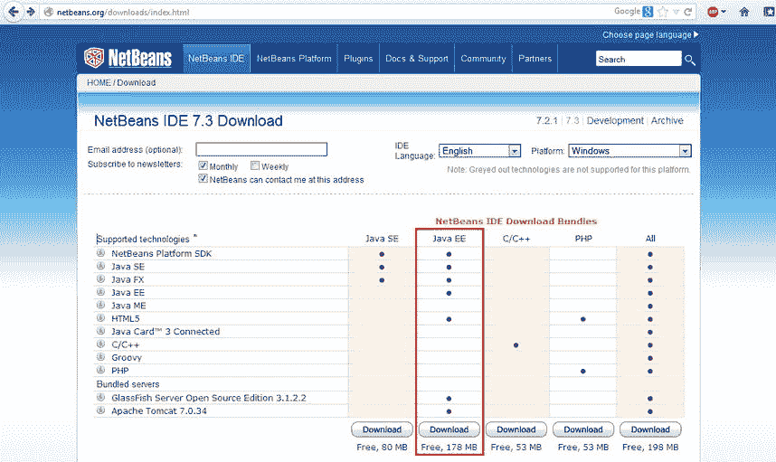

图 1-1. 下载 NetBeans IDE

 **注意** 当我们开始编写本书时，最新的 NetBeans 版本是 7.2。在编写过程中，7.3 版本发布了。我们已经使用 NetBeans 7.3 版本测试了设置和示例代码。

下载完成后，您就可以开始安装 NetBeans 及其集成的 GlassFish 服务器了。


安装 NetBeans IDE 及其集成的 GlassFish 服务器

导航至 NetBeans IDE 安装程序下载到的目录，并运行该安装程序。安装向导的第一页会列出将要安装的软件包。如果你看到“未找到兼容的 JDK”警告消息，如图 1-2 所示，那么你将不得不退出向导，并首先从以下位置下载并安装 Java 平台 (JDK) 7。

`http://www.oracle.com/technetwork/java/javase/downloads/index.html`

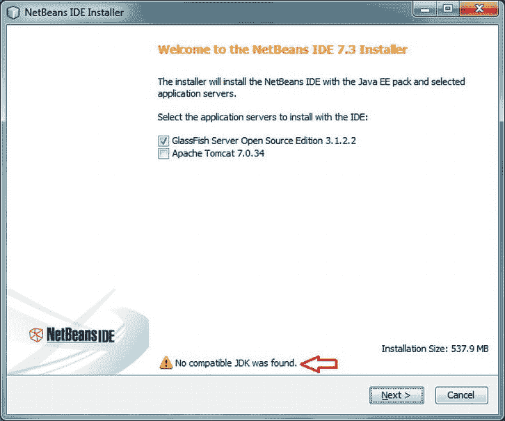

图 1-2.  安装 NetBeans。“未找到兼容的 JDK”警告

 **注意**  即使你没有看到“`No compatible JDK was found`”警告，也请确认你已安装了 Java 平台 (JDK) 7。如果你没有安装 Java 平台 (JDK) 7，那么在运行本书中的示例时，你可能会遇到“`javac: invalid target release: 1.7`”错误。

安装兼容的 JDK 版本后，重新运行 NetBeans 安装程序。确认“未找到兼容的 JDK”警告不再出现，然后继续执行向导，保持所有默认值选中。“摘要”页面将列出 NetBeans IDE 和 GlassFish 应用服务器将要安装到的文件夹。按下 `Install` 按钮完成向导，如图 1-3 所示。

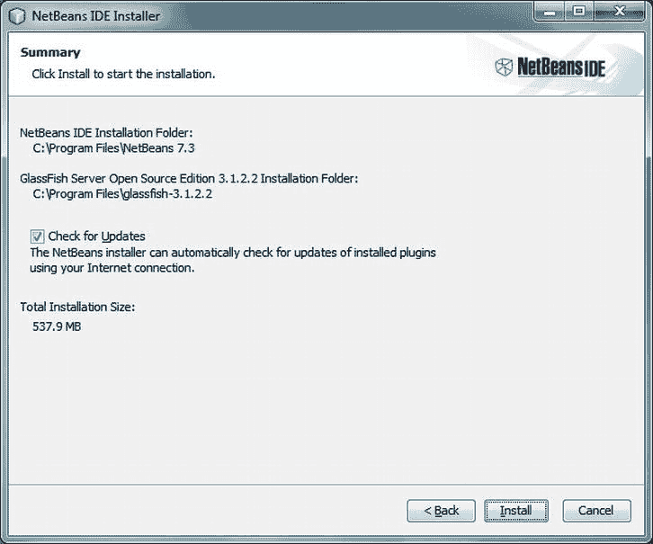

图 1-3.  安装 NetBeans IDE 和 GlassFish 应用服务器

成功安装后，你的 NetBeans IDE 和 GlassFish 应用服务器即可使用。在接下来的章节中，我们将向你展示如何创建一个简单的 NetBeans 项目，并验证已安装的 GlassFish 服务器是否正常运行。

测试 NetBeans IDE 和 GlassFish 安装

假设上述所有步骤均已成功执行，你现在可以启动 NetBeans IDE 和集成的 GlassFish 应用服务器了。我们还将演示一些简单的测试，以确保你已准备好运行本书中的示例。

启动 NetBeans IDE

NetBeans IDE 提供了一个用于创建、部署和执行 Java EE 应用程序的图形化环境。诸如启动和关闭 GlassFish 服务器域之类的管理任务也可以使用 NetBeans 执行。

调用 NetBeans，可以通过在 Windows 7 机器的“开始”菜单中选择“NetBeans”，或者在命令提示符下运行 `C:\Program Files\NetBeans 7.3\bin\netbeans64.exe`。请注意，确切路径取决于 图 1-3 中提到的安装位置，对于 32 位系统，可执行文件将命名为 `netbeans.exe`。如果你运行的是 Windows 8，则需要按下“Windows”键并开始输入“NetBeans”。应用搜索工具将搜索 NetBeans 可执行文件，你可以选择它来启动 NetBeans IDE。

使用示例项目进行测试

NetBeans IDE 打开后，我们将创建一个示例项目来测试 IDE 以及应用服务器的编译、部署和执行方面。

要创建新项目，请按 `Ctrl-Shift-N` 打开 `New Project` 向导。选择 `Java Web` 类别和 `Web Application` 项目，如图 1-4 所示。继续执行向导，保持所有默认值选中，然后 `Finish` 向导。

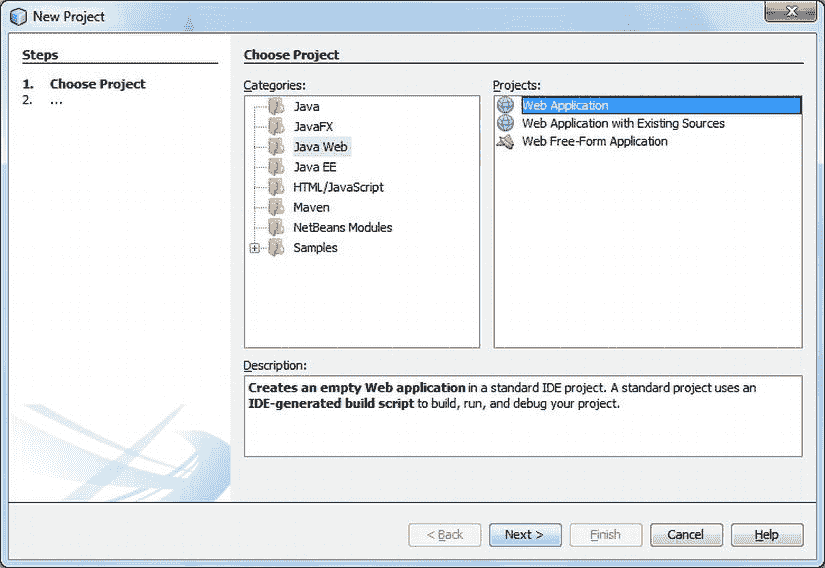

图 1-4.  创建一个示例测试项目

NetBeans 将创建一个名为 `WebApplication1` 的项目。接下来，我们将在项目 `WebApplication1` 下创建一个 servlet。要创建 servlet，请在项目导航器中右键单击项目名称以调用上下文菜单。选择 `New` 下可用的 `Servlet ...` 菜单，如图 1-5 所示。

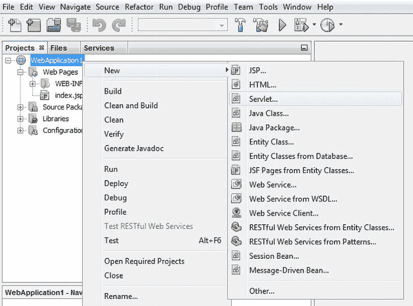

图 1-5.  创建一个测试 servlet

在 `New Servlet` 向导中，输入包名并保持其他默认值，然后 `Finish` 向导，如图 1-6 所示。我们使用了 `setup` 作为包名。

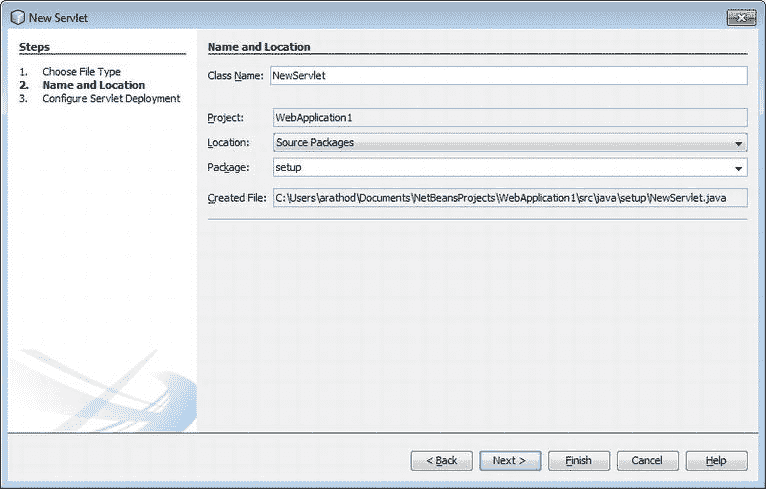

图 1-6.  浏览 New Servlet 向导

创建 `NewServlet` 类后，我们可以立即通过调用 servlet 文件上的上下文菜单并选择 `Run File` 菜单选项来*运行*它，如图 1-7 所示。

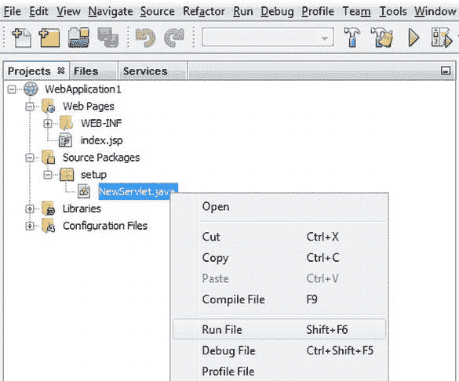

图 1-7.  运行 servlet

当我们*运行* servlet 时，NetBeans 将自动启动集成的 GlassFish 服务器。如果 Windows 防火墙显示一个或多个 Windows 安全警报对话框，如图 1-8 所示，你可能需要为 Java EE 和应用服务器相关功能提供必要的权限。

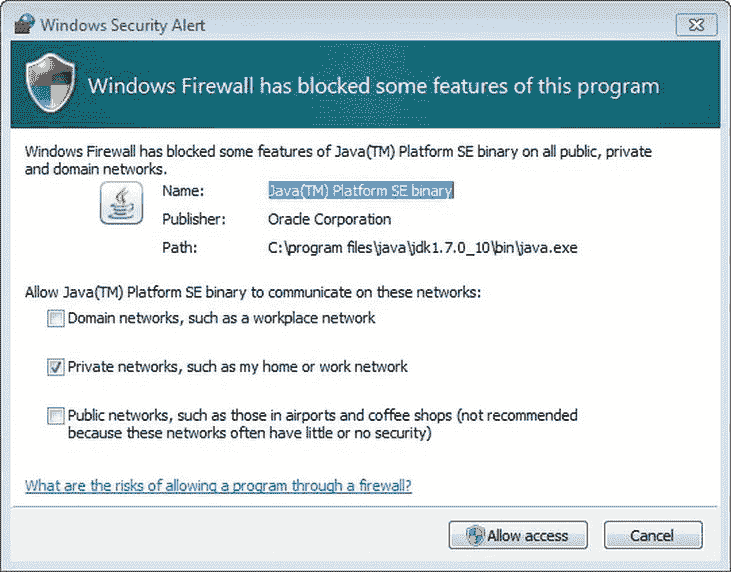

图 1-8.  如果 Windows 防火墙显示警报，则允许访问

作为运行 servlet 的一部分，NetBeans 将编译、打包并将其部署到集成的 GlassFish 服务器。部署后，NetBeans 将自动在默认浏览器中打开 servlet URL，如图 1-9 所示。


图 1-9.  运行 servlet 类

成功执行 servlet 类意味着 NetBeans 和集成的 GlassFish 服务器的安装已成功完成，并且运行本书中示例的设置已准备就绪。

 **注意**  本章的这一部分绝不是 GlassFish 应用服务器的用户指南。有关 GlassFish 的更多信息，请参阅 `http://glassfish.java.net/downloads/quickstart/index.html`。

管理 GlassFish 应用服务器

NetBeans 为我们提供了一个图形界面来执行各种 GlassFish 服务器相关的管理任务。你可以从 `Services` 选项卡重新启动、启动和停止 GlassFish 服务器，如图 1-10 所示。

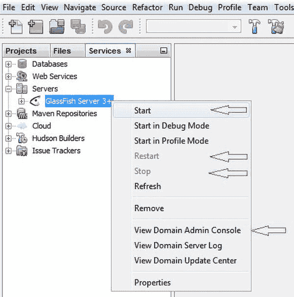

图 1-10.  管理 GlassFish 应用服务器

一旦 GlassFish 成功启动，你可以测试服务器是否能够接受基本的 HTTP 请求。为此，打开浏览器，输入 URL `http://localhost:8080/`，如果服务器已启动并正在运行，你将能够看到如图 1-11 所示的页面。

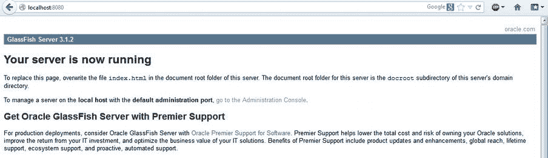

图 1-11.  测试 GlassFish 服务器

 **注意**  如果你尝试从非安装 GlassFish 的机器访问，请将 `localhost` 替换为机器名称或 IP 地址。如果你在安装期间更改了端口号，请使用该端口而不是 8080。


下一步是测试对 GlassFish 服务器管理控制台的访问。确保 GlassFish 服务器已启动并正在运行，然后从上下文菜单中选择 `View Domain Admin Console` 菜单选项，如图 1-10 所示。NetBeans 将启动默认浏览器并打开管理员控制台。或者，您也可以输入 URL `http://localhost:4848/`，即可看到管理控制台页面，如图 1-12 所示。

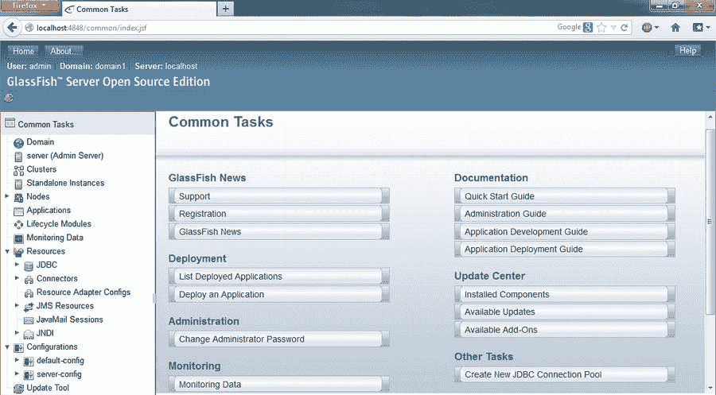

图 1-12.  GlassFish 管理控制台

 **注意**  如果您尝试从非 GlassFish 安装所在的机器进行访问，请将 `localhost` 替换为机器名或 IP 地址。您需要在管理控制台登录页面输入用户名和密码。如果在安装过程中更改了端口号，请使用该端口而非 4848。

故障排除

即使严格按照本章所述步骤操作，并在安装和配置 NetBeans IDE 及其集成的 GlassFish 应用服务器时格外小心，在运行本书附带的示例代码时仍可能遇到问题。本节将尝试指出您可能遇到的问题，并提供如何解决这些问题的信息。

安装过程中出现“未找到兼容的 JDK”警告

在 NetBeans 安装向导的第一页上，您会看到一条 `No compatible JDK was found` 警告消息。

诊断

本书中的示例需要 NetBeans 7.3 或更高版本。NetBeans 7.3 又需要 Java 平台 (JDK) 7。如果您的机器上未安装 Java 平台 (JDK) 7，您将收到 `No compatible JDK was found` 警告消息。

解决方案

您需要退出向导，并从以下位置下载并安装 Java 平台 (JDK) 7。

`http://www.oracle.com/technetwork/java/javase/downloads/index.html`

无法看到 GlassFish 服务器的测试页面

安装 NetBeans IDE 及其集成的 GlassFish 应用服务器后，您无法看到如图 1-11 所示的 GlassFish 服务器测试页面。

诊断

您可能因以下原因无法看到测试页面：

*   GlassFish 服务器未运行。
*   浏览器无法解析服务器的主机名。
*   URL 中指定的端口号不正确。

解决方案

*   使用上下文菜单启动/重启 GlassFish 服务器，如图 1-10 所示。
*   验证 URL 中使用的机器名或 IP 地址是否正确。您可以在 Windows 机器的命令提示符下执行 `ipconfig` 命令来查找机器的 IP 地址。如果您使用的是 `localhost`，请验证浏览器能否通过将其回环到您机器的 IP 地址来解析它。
*   验证 URL 中使用的端口号是否正确。此解决方案将在后续章节中说明。

无法解析“localhost”主机名

您的浏览器或 NetBeans IDE 的测试器能够使用机器名或 IP 地址运行 GlassFish 服务器的测试页面，但无法解析 `localhost` 主机名。

诊断

NetBeans IDE 的测试器或浏览器无法使用 `localhost` *回环*到您的机器。

解决方案

更新 Windows 机器的 `C:\Windows\System32\drivers\etc\hosts` 文件，添加一条将您机器的 IP 地址映射到 `localhost` 的条目。

```
# localhost 名称解析由 DNS 本身处理。
# 127.0.0.1          localhost
# ::1                localhost
<您机器的 IP 地址>    localhost
```

浏览器无法连接到“8080”端口

您 URL 的主机名部分正确，但浏览器无法连接到端口 8080 上的 GlassFish 应用服务器。

诊断

如果 8080 端口已被其他应用程序占用，您的浏览器将无法为 GlassFish 应用服务器使用该端口。在安装过程中，配置工具会首先尝试将 8080 端口分配给 GlassFish 应用服务器，但如果检测到 8080 端口不可用，则会为其分配一个不同的端口号。

解决方案

您可以通过以下步骤找到 GlassFish 应用服务器正在运行的端口：

*   导航到 NetBeans IDE 的 `Services` 选项卡，并在 GlassFish 服务器节点上调用上下文菜单，如图 1-10 所示。
*   选择 `Properties` 菜单选项以打开 `Servers` 对话框。
*   在左侧面板中选择 GlassFish 服务器实例。
*   `Common` 选项卡下的 `Location` 文本字段将显示 GlassFish 应用服务器正在运行的端口号。

编译或执行示例应用程序项目时出错

打开示例应用程序项目后出现编译错误，或者示例应用程序项目未按预期执行。

诊断

本书提供的示例已在 NetBeans 7.3 和 Java 平台 (JDK) 7 上测试通过。

如果 NetBeans IDE 未配置为使用 Java 平台 (JDK) 7，则在编译本书提供的示例应用程序项目时，您可能会遇到“`javac: invalid target release: 1.7`”错误。

示例应用程序代码包含与创建它们时对应的 NetBeans 安装的*硬编码*端口号。如果示例代码中硬编码的端口号与您的 NetBeans 安装不同，示例将无法按预期执行。

解决方案

要解决“`javac: invalid target release: 1.7`”错误，您必须验证 NetBeans 正在使用 Java 平台 (JDK) 7。您可能需要从前面章节提到的 URL 安装它。

如果示例应用程序未按预期工作，请验证示例代码使用的端口号是否与您的 NetBeans 安装相同。

您可以查阅每个示例应用程序附带的 `Readme.txt` 文件以获取更多信息。

无法发送或接收“葡萄酒订单”邮件

执行示例应用程序项目时，您无法发送或接收“葡萄酒订单”邮件。

诊断

少数示例项目在执行过程中会发送邮件。您可能因以下原因在发送邮件时遇到问题，并且可能无法收到邮件：

*   您尚未更新示例代码中的 `from` 和 `to` 电子邮件地址。
*   您在位于防火墙后面的机器上运行示例。
*   `JMS Resource` 配置不正确。
*   `JavaMail Session` 配置不正确。

解决方案

在执行发送邮件的示例应用程序项目之前，请验证：

*   您已按照第 5 章所示创建并配置了 `JMS Resource`。
*   您已按照第 5 章所示创建并配置了 `JavaMail Session`。
*   您已更新了示例源代码中的 `from` 和 `to` 电子邮件地址。
*   您不在防火墙后面。

您可以查阅第 5 章示例应用程序附带的 `Readme.txt` 文件，了解如何为常用邮件服务配置 `JavaMail Session` 属性。

即使在验证了这些细节之后，如果您在发送或接收邮件时仍然遇到问题，请检查 GlassFish 服务器日志以获取有关该问题的更多详细信息。

结论

本章以对本书和 EJB 的介绍开篇。本概述涵盖了关于 EJB 核心特性、EJB 框架和组件模型的基本信息。其中简要介绍了 EJB 的历史、EJB 3 简化开发模型以及 EJB 分布式计算模型。


在“本书的组织结构”部分，我们提供了各章节的摘要，以说明本书的整体脉络，并帮助您决定，若希望跳序阅读，应优先关注哪些领域。

本章以“入门指南”一节作为结尾，帮助您安装和配置 NetBeans IDE 及其集成的 GlassFish 应用服务器（该服务器包含最新 Java EE 规范的参考实现），并验证安装是否成功。完成此任务后，您便拥有了运行本书代码示例以及后续章节中研究 EJB 众多特性所需的软件基础设施。

**第 2 章**


**EJB 会话 Bean**

本章将讨论 EJB 会话 Bean，即 EJB 客户端应用程序所使用的核心业务服务对象。您将深入理解简化的 EJB 会话 Bean 模型，并了解以下主题：

*   会话 Bean 的类型——有状态、无状态和单例——以及何时使用每种类型
*   Bean 类、业务接口和业务方法
*   异步方法
*   回调方法
*   拦截器
*   异常处理
*   客户端视图
*   与会话 Bean 相关的注解依赖注入
*   定时器服务

**会话 Bean 简介**

*会话 Bean* 是 Java 组件，它们可以在独立的 EJB 容器中运行，也可以在作为标准 Java 平台企业版（Java EE）应用服务器一部分的 EJB 容器中运行。这些 Java 组件通常用于对特定的用户任务或用例进行建模，例如输入客户信息或实现一个与客户端应用程序保持会话状态的流程。会话 Bean 可以包含多种类型应用程序的业务逻辑，例如人力资源、订单录入和费用报告应用程序。EJB 容器为会话 Bean 提供服务，而 Bean 则通过使用 Java 注解和/或 XML 元数据来指明它需要哪些服务。

**会话 Bean 的类型**

会话 Bean 分为三种类型：

*   **无状态**：此类型的 Bean 不会代表客户端应用程序维护任何会话状态。
*   **有状态**：此类型的 Bean 维护一个状态，并且 Bean 的特定实例与特定的客户端请求相关联。有状态 Bean 可以被视为在服务器上运行的客户端程序的扩展。
*   **单例**：此类型的 Bean 在每个应用程序中仅实例化一次。单例 Bean 在应用程序的整个生命周期内存在，并在客户端调用之间维护其状态。

我们将在以下各节中深入探讨无状态、有状态和单例 Bean 的更多细节。

**何时使用会话 Bean？**

会话 Bean 用于编写业务逻辑、维护客户端的会话状态，以及建模执行一个或多个业务操作的后端流程或用户任务。典型的示例包括：

*   人力资源应用程序中的会话 Bean，用于创建新员工并将该员工分配到特定部门
*   费用报告应用程序中的会话 Bean，用于创建新的费用报告
*   订单录入应用程序中的会话 Bean，用于为特定客户创建新订单
*   电子商务应用程序中管理购物车内容的会话 Bean
*   利用 EJB 容器中事务服务的会话 Bean（无需应用程序开发人员编写事务支持代码）
*   当客户端应用程序未部署在同一服务器上时，用于解决部署需求的会话 Bean
*   利用容器在组件或方法级别提供的安全支持的会话 Bean
*   实现日志记录功能并在应用程序的不同组件之间共享的会话 Bean

会话 Bean 可用于传统的 2 层或 3 层架构（配合专业/富客户端应用程序），或用于 3 层基于 Web 的应用程序。这些应用程序可以部署在不同的逻辑和物理层组合中。在下一节中，我们将研究一些可能的组合。

**带富客户端的 3 层架构**

图 2-1 展示了会话 Bean 在 3 层架构中的典型结构，该架构包含一个富客户端前端应用程序，该应用程序具有供最终用户（例如客户服务代表、银行柜员等）使用的数据录入界面。这些客户端应用程序可以使用 Java Swing 技术与 Java 平台标准版（Java SE）开发，或者它们可以是普通的旧 Java 对象（POJO），从命令行运行。通常，最终用户从其桌面启动客户端应用程序，输入一些数据，并通过按下某个用户界面组件（例如“提交”按钮）来触发事件。一般的工作流程可能如下所示：

1.  用户操作通过远程方法调用（RMI）建立与会话 Bean（在 EJB 容器中运行）的连接。
2.  客户端应用程序调用会话 Bean 中的一个或多个业务方法。
3.  会话 Bean 通过交互数据库、企业应用程序、遗留系统等来处理请求并验证数据，以执行特定的业务操作或任务。
4.  最后，会话 Bean 通过数据集合或包含确认消息的简单对象，将响应发送回客户端应用程序。

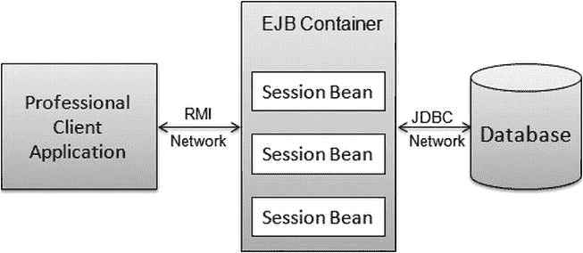

图 2-1.  带富客户端的 3 层架构中的会话 Bean

**Web 应用程序的 3 层架构**

此架构，如图 2-2 所示，通常由运行在台式机或笔记本电脑浏览器中的 Web 应用程序作为前端。如今，其他类型的客户端设备，如智能手机、平板电脑、手机和 telnet 设备，也被用于运行这些应用程序。运行在浏览器或移动设备中的 Web 应用程序使用诸如 JavaServer Pages（JSP）、JavaServer Faces（JSF）或 Java Servlet 等 Web 技术来呈现用户界面（数据录入界面、提交按钮等）。典型的用户操作，例如输入搜索条件或向 Web 应用程序购物车添加特定项目，将通过上述 Web 技术之一调用在 EJB 容器中运行的会话 Bean。一旦会话 Bean 被调用，它就会处理请求并将响应发送回 Web 应用程序，Web 应用程序根据需要格式化响应，然后将响应发送回请求的客户端设备（浏览器、智能手机、telnet 等）。

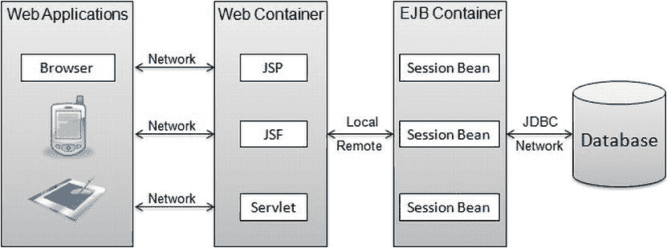

图 2-2.  带 Web 应用程序的 3 层架构中的会话 Bean

在刚刚讨论的 3 层架构中，客户端应用程序（即 Web 应用程序）和会话 Bean 可以在同一应用服务器实例中运行（位于同一位置），也可以在同一台机器上运行的不同实例中运行。它们还可以在物理上分离的、各自运行着一个应用服务器实例的机器上运行。

**无状态会话 Bean**

无状态会话 Bean 由以下元素组成：

*   Bean 类，包含要执行业务方法的实现
*   可选地，一个或多个业务接口，允许向客户端应用程序展示 Bean 业务方法的不同组合

**Bean 类**


无状态会话 Bean 类是指任何带有类级别注解 `@Stateless` 的标准 Java 类。如果使用部署描述符代替注解，则应在 `ejb-jar.xml` 描述符中将该 Bean 类标记为无状态会话 Bean。如果同时使用注解和部署描述符（混合模式），则在 Bean 类中指定了任何其他类级别或成员级别注解时，必须指定 `@Stateless` 注解。如果同时使用注解和部署描述符，则在部署过程中，部署描述符中的设置或值将覆盖类中的注解。

 **注意**  从 EJB 3.1 开始，会话 Bean 类可以是另一个会话 Bean 类的子类。

为了说明无状态会话 Bean 的使用，我们将创建一个 `SearchFacade` 会话 Bean，它为客户端应用程序提供关于可用葡萄酒的各种搜索功能。工作流程如下：

1.  应用程序的用户将输入或选择一个或多个搜索条件，这些条件将被提交给 `SearchFacade` 会话 Bean。
2.  `SearchFacade` Bean 将访问后端数据库以检索请求的信息。为了简化本章中的代码示例，我们实际上将在 Bean 类中检索硬编码值的列表。在后续章节中，我们将增强 `SearchFacade` Bean 以访问后端数据库。
3.  Bean 将满足搜索条件的信息返回给客户端应用程序。

清单 2-1 展示了 `SearchFacade` Bean 的定义。在本章的后续部分，我们将构建代码来演示上述工作流程的实际运行。`SearchFacadeBean` 是一个带有类级别注解 `@Stateless` 的标准 Java 类。

***清单 2-1.***  SearchFacadeBean.java

```
package com.apress.ejb.chapter02;
import javax.ejb.Stateless;
@Stateless(name="SearchFacade")
public class SearchFacadeBean implements SearchFacade, SearchFacadeLocal {
    public SearchFacadeBean() {
    }
}
```

业务接口

无状态会话业务接口是一个标准 Java 接口，没有其他特殊要求。该接口包含一系列可供客户端应用程序使用的业务方法定义。会话 Bean 可以有一个由 Bean 类实现的业务接口，该接口可以在设计时由 JDeveloper、NetBeans 或 Eclipse 等工具生成，也可以在部署时由 EJB 容器生成。

业务接口也可以使用注解，如下所述：

*   `@Remote` 注解可用于表示远程业务接口。
*   `@Local` 注解可用于表示本地业务接口。

 **注意**  从 EJB 3.1 开始，会话 Bean 支持“无接口本地视图”。这是本地视图的一种变体，它公开 Bean 类的公共方法，而无需单独的业务接口。

如果接口中未指定任何注解，则 Bean 类本身的公共方法将成为其自身的*事实上的*本地接口。

如果你的架构要求客户端应用程序（Web 应用程序或富客户端）在与运行 EJB 容器中会话 Bean 不同的 Java 虚拟机（JVM）上运行，那么你需要使用远程接口。不同的 JVM 可以位于同一台物理机器上，也可以位于不同的机器上。如果你的应用程序架构将客户端应用程序和会话 Bean 使用同一个 JVM，那么使用本地接口（可以是无接口选项）可以提高性能。

你的应用程序架构可能同时需要远程接口和本地接口。例如，一家企业可能有一个订单录入应用程序，该应用程序使用会话 Bean 开发，这些 Bean 具有用于提交新订单以及处理管理任务（例如产品数据录入）的业务方法。你可能会有两个不同的客户端应用程序访问后端的订单录入应用程序，如下所示：

*   一个 Web 客户端应用程序（如图 2-3 所示），它可以在与会话 Bean 相同的 JVM 中运行，用于提交新订单

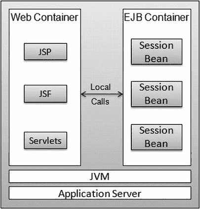

图 2-3.  使用会话 Bean 本地接口的 Web 客户端

*   一个富客户端应用程序（如图 2-4 所示），它运行在最终用户的桌面机器上，由管理员用于数据录入目的

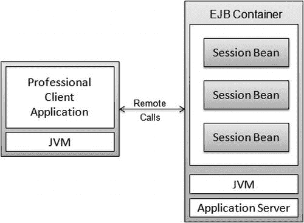

图 2-4.  使用会话 Bean 远程接口的富客户端

`SearchFacade` 会话 Bean 同时具有远程和本地接口，如图 2-5 所示。

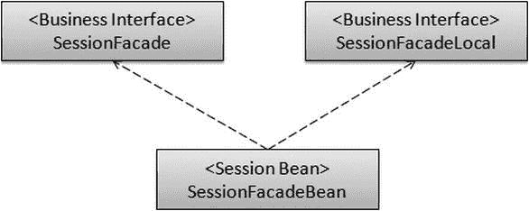

图 2-5.  SearchFacade 会话 Bean 的业务接口

清单 2-2 展示了 `SearchFacade` 远程业务接口的代码片段，其中包含 `@Remote` 注解和一个 `wineSearch()` 方法声明。`wineSearch()` 方法接受一个表示葡萄酒类型的参数，并返回一个与葡萄酒类型条件匹配的葡萄酒列表。

***清单 2-2.***  SearchFacade.java

```
package com.apress.ejb.chapter02;
import java.util.List;
import javax.ejb.Remote;

@Remote
public interface SearchFacade {
    List wineSearch(String wineType);
}
```

清单 2-3 展示了 `SearchFacade` 本地业务接口的代码片段，其中包含 `@Local` 注解和一个 `wineSearch()` 方法声明。

***清单 2-3.***  SearchFacadeLocal.java

```
package com.apress.ejb.chapter02;
import java.util.List;
import javax.ejb.Local;

@Local
public interface SearchFacadeLocal {
    List wineSearch(String wineType);
}
```

业务方法

在 Bean 类中实现的方法必须与远程或本地业务接口中声明的业务方法相对应。它们基于具有相同名称和方法签名的约定进行匹配。Bean 类中其他在业务接口中没有相应声明的方法将是 Bean 类方法的私有方法。

`SearchFacade` Bean 实现了一个方法 `wineSearch()`，该方法已在远程和本地业务接口中声明。`wineSearch()` 方法根据葡萄酒类型返回一个静态的葡萄酒列表。清单 2-4 展示了 `wineSearch()` 的实现。

***清单 2-4.***  SearchFacadeBean.java

```
package com.apress.ejb.chapter02;
import java.util.ArrayList;
import java.util.List;
import javax.ejb.Stateless;

@Stateless(name="SearchFacade")
public class SearchFacadeBean implements SearchFacade, SearchFacadeLocal {
    public SearchFacadeBean() {
    }

public List wineSearch(String wineType) {
        List wineList = new ArrayList();
        if (wineType.equals("Red")) {
        wineList.add("Bordeaux");
        wineList.add("Merlot");
        wineList.add("Pinot Noir");
        }
        else if (wineType.equals("White")) {
        wineList.add("Chardonnay");
        }

return wineList;
    }
}
```

异步业务方法


异步方法会立即将控制权返回给调用者，而无需等待方法执行完成。异步方法通常用于处理器密集型或长时间运行的后台任务，例如打印文档或发送大型电子邮件。

从 EJB 3.1 开始，会话 Bean 可以声明其一个或多个方法能够异步执行。当会话 Bean 客户端调用异步方法时，容器会立即将控制权返回给客户端。这使得客户端能够在业务方法于单独线程中完成执行的同时，并行执行任务。例如，客户端可以利用此功能，通过进度条来展示长时间运行任务的进度。

异步方法通过在业务方法上添加 `javax.ejb.Asynchronous` 注解来定义。在类级别添加 `@Asynchronous` 注解，会将会话 Bean 的所有业务方法标记为异步。异步方法必须返回 `void` 或 `java.lang.concurrent.Future<V>` 接口的实现。返回 `void` 的异步方法不能抛出应用程序异常。只有返回 `Future<V>` 的异步方法才能抛出应用程序异常。

在 Bean 类上定义的异步方法应具有以下签名：

```
public void <METHOD>(Object)
```

或

```
public java.util.concurrent.Future<V> <METHOD>(Object) throws <APPLICATION-EXCEPTION>
```

会话 Bean 客户端调用异步方法的方式与调用同步方法相同。如果异步方法被定义为返回结果，客户端会立即收到一个 `Future<V>` 接口的实例。客户端可以使用此实例进行以下任何操作：

*   使用 `get()` 方法检索最终结果集。由于此方法调用会同步阻塞，直到返回结果或抛出异常，因此通常直到 `isDone()` 返回 `true` 时才调用它。
*   使用 `isDone()` 方法检查异步方法的状态。
*   使用 `cancel(boolean)` 方法取消方法调用。调用 `cancel()` 不会中断线程，它只是设置一个状态标志，该标志可以在运行的方法内部进行检查，以便其能够优雅地中断执行并返回。
*   使用 `isCancelled()` 方法检查方法调用是否已被取消。
*   检查异常。

 **注意**   作为 Web 服务公开的会话 Bean 方法不能是异步的。

如果异步方法返回结果，则必须使用 `javax.ejb.AsyncResult<V>` 便捷包装器对象来返回该结果。请注意，此对象实际上并不会返回给客户端，而是由 EJB 容器拦截并解包，以服务于对 `Future<V>` 对象的方法调用，该对象是在客户端调用方法时实际返回给客户端的。

依赖注入

在第 1 章中，我们介绍了依赖注入作为编程设计模式的概念。在本节中，我们将初步了解如何在无状态会话 Bean 中使用依赖注入。依赖注入将在第 10 章中详细讨论。

EJB 容器提供了将各种类型的资源注入无状态会话 Bean 的功能。通常，为了执行用户任务或处理来自客户端应用程序的请求，会话 Bean 中的业务方法需要一种或多种类型的资源。这些资源可以是其他会话 Bean、数据源或消息队列。托管 Bean 可以使用上下文和依赖注入（CDI）注入到会话 Bean 中。

无状态会话 Bean 尝试使用的资源可以通过注解或部署描述符进行注入。可以通过对实例变量进行注解或对 setter 方法进行注解来获取资源。清单 2-5 展示了一个基于 setter 和实例变量注入 `myDb` 的示例，`myDb` 代表数据源。

***清单 2-5.***  数据源注入

```
@Resource
DataSource myDb;

// 或
@Resource
public void setMyDb(DataSource myDb) {
    this.myDb = myDb;
}
```

你通常会使用 setter 注入来预配置或初始化注入资源的属性。

生命周期回调方法

在某些实例或用例中，使用会话 Bean 的应用程序需要对生命周期事件（如其自身的创建、移除等）进行细粒度控制。例如，`SearchFacade` 会话 Bean 可能需要在创建时执行一些数据库初始化，或在销毁时关闭一些数据库连接。应用程序可以通过称为*回调方法*的方法来获得对 Bean 生命周期各个阶段的细粒度控制。回调方法可以是会话 Bean 中任何带有回调注解的方法。EJB 容器会在 Bean 生命周期的适当阶段（Bean 创建和销毁）调用这些方法。

以下是针对无状态会话 Bean 的两种此类回调：

*   `PostConstruct`：使用 `@PostConstruct` 注解表示。Bean 类中使用特定签名（如下所述）的方法可以标记为此注解。
*   `PreDestroy`：使用 `@PreDestroy` 注解表示。同样，Bean 类中任何具有特定签名（如下所述）的方法都可以标记为此注解。

在 Bean 类上定义的回调方法应具有以下签名：

```
void <METHOD>()
```

回调方法也可以在 Bean 的监听器类上定义；这些方法应具有以下签名：

```
void <METHOD>(Object)
```

其中 `Object` 可以声明为实际的 Bean 类型，该类型是运行时传递给回调方法的参数。生命周期回调方法可以具有 public、private、protected 或包级别访问权限。生命周期回调方法不得声明为 `final` 或 `static`。

`PostConstruct` 回调发生在 Bean 实例在 EJB 容器中实例化之后。如果 Bean 使用任何依赖注入机制来获取对其环境中资源或其他对象的引用，则 `PostConstruct` 将在注入执行之后、Bean 类中的第一个业务方法被调用之前发生。以 `SearchFacade` 会话 Bean 为例，你可以有一个业务方法 `wineSearchByCountry()`，它会返回特定国家的葡萄酒列表，并有一个 `PostConstruct` 回调方法 `initializeCountryWineList()`，该方法会在 Bean 被实例化时初始化该国家的葡萄酒列表。理想情况下，你会从后端数据存储加载列表；但在本章中，我们将仅使用一些硬编码值填充到 `HashMap` 中，如清单 2-6 所示。

***清单 2-6.***  PostConstruct 方法

```
@PostConstruct
public void initializeCountryWineList() {
    // countryMap 是 HashMap
    countryMap.put("Australia", "Sauvignon Blanc");
    countryMap.put("Australia", "Grenache");
    countryMap.put("France","Gewurztraminer");
    countryMap.put("France","Bordeaux");
}
```

`PreDestroy` 回调发生在容器从其对象池中销毁未使用或过期的 Bean 实例之前。此回调可用于关闭通过依赖注入创建的任何连接池，并释放任何其他资源。


对于 `SearchFacade` 会话 Bean，我们可以在其中添加一个 `PreDestroy` 回调方法（`destroyWineList()`），当 Bean 被销毁时，该方法会清空国家葡萄酒列表。理想情况下，在 `PreDestroy` 阶段，我们应该关闭所有通过依赖注入创建的资源；但在本章中，我们仅清空存储国家和葡萄酒列表的 `HashMap`。清单 2-7 展示了 `destroyWineList()` 的代码。

***清单 2-7.***  PreDestroy 方法

```
@PreDestroy
public void destroyWineList() {
    countryMap.clear();
}
```

拦截器

EJB 规范提供了一种名为*拦截器*的注解，它允许你在业务方法调用时进行干预，在方法调用前后添加自定义的包装代码。可以为会话 Bean 和消息驱动 Bean（MDB）定义拦截器方法。我们将向你展示在会话 Bean 上下文中拦截器的用法。

在典型应用中，拦截器有许多用例，你可能会发现需要在业务方法调用前后执行特定任务。例如，你可能希望执行以下操作之一：

*   在转账金额超过 10 万美元的关键业务方法执行前，执行额外的安全检查
*   进行一些性能分析，计算执行任务所需的时间
*   在方法调用前后进行额外的日志记录

定义拦截器有两种方式。你可以在特定方法上添加 `@AroundInvoke` 注解，或者注解 Bean 类以指定一个拦截器类，该拦截器类将干预 Bean 类上的所有（或显式指定的子集）方法。拦截器类通过在其关联的 Bean 类上使用 `@Interceptor` 注解来表示。如果有多个拦截器类，则使用 `@Interceptors` 注解。方法特定的拦截器通过在业务方法上应用 `@Interceptors` 注解来表示。使用 `@AroundInvoke` 注解的方法应具有以下签名：

```
Object <METHOD>(InvocationContext) throws Exception
```

`AroundInvoke` 方法可以具有 public、private、protected 或包级别访问权限。`AroundInvoke` 方法不能声明为 `final` 或 `static`。`InvocationContext` 的定义如下：

```
package javax.ejb;
public interface InvocationContext {
   public Object getBean();
   public java.lang.reflect.Method getMethod();
   public Object[] getParameters();
   public void setParameters(Object[] params);
   public EJBContext getEJBContext();
   public java.util.Map getContextData();
   public Object proceed() throws Exception;
}
```

以下列表描述了上述代码中的方法：

*   `getBean()` 返回被调用方法所属的 Bean 实例。
*   `getMethod()` 返回被调用的 Bean 实例上的方法。
*   `getParameters()` 返回方法调用的参数。
*   `setParameters()` 修改用于方法调用的参数。
*   `getEJBContext()` 允许拦截器方法访问 Bean 的 `EJBContext`。
*   `getContextData()` 允许使用返回的 `Map` 在同一个 `InvocationContext` 实例中的拦截器方法之间传递值。
*   `proceed()` 调用下一个拦截器（如果存在），或者调用目标 Bean 方法。

在 `SearchFacade` 会话 Bean 中，我们可以添加一个拦截器，用于记录客户端应用程序调用每个业务方法所花费的时间。清单 2-8 展示了一个时间日志方法，它将打印出执行业务方法所花费的时间。使用 `InvocationContext` 获取 Bean 类的名称和被调用方法的名称。在调用业务方法之前，捕获当前系统时间，并在业务方法执行后从系统时间中减去该时间。最后，使用 `System.out.println` 将详细信息打印到控制台日志。

***清单 2-8.***  拦截器方法

```
@AroundInvoke
public Object TimerLog (InvocationContext ctx) throws Exception {
    String beanClassName = ctx.getClass().getName();
    String businessMethodName = ctx.getMethod().getName();
    String target = beanClassName + "." + businessMethodName ;
    long startTime = System.currentTimeMillis();
    System.out.println ("Invoking " + target);
    try {
        return ctx.proceed();
    }
    finally {
        System.out.println ("Exiting" + target);
        long totalTime = System.currentTimeMillis() - startTime;
        System.out.println ("Business method" + businessMethodName +
        "in" + beanClassName + "takes" + totalTime + "ms to execute");
    }
}
```

有状态会话 Bean

与无状态会话 Bean 类似，有状态 Bean 包含一个 Bean 类，以及可选的一个或多个业务接口。

Bean 类

有状态会话 Bean 类是任何带有类级别注解 `@Stateful` 的标准 Java 类。如果使用部署描述符而不是注解，则应将 Bean 类标记为有状态会话 Bean。在混合模式下，即同时使用注解*和*部署描述符时，如果在类中指定了任何其他类级别或成员级别注解，则必须指定 `@Stateful` 注解。

为了说明有状态会话 Bean，我们将创建一个 `ShoppingCart` 会话 Bean，它将跟踪添加到用户购物车中的商品及其各自的数量。在本章中，我们将为购物车使用硬编码值，以说明客户端和有状态会话 Bean 之间的状态和会话维护。清单 2-9 展示了 `ShoppingCart` 会话 Bean 的定义。

***清单 2-9.***  ShoppingCartBean.java

```
package com.apress.ejb.chapter02;
import javax.ejb.Stateful;
@Stateful(name="ShoppingCart")
public class ShoppingCartBean implements ShoppingCart, ShoppingCartLocal {
    public ShoppingCartBean() {
    }
}
```

在某些用例中，应用程序希望 EJB 容器在事务发生前后通知它，然后利用这些通知来管理数据和缓存。当有状态会话 Bean 实现 `javax.ejb.SessionSynchronization` 接口时，它可以接收来自 EJB 容器的此类通知。这是一个可选功能。有状态会话 Bean 从 EJB 容器接收三种不同类型的事务通知：

*   `afterBegin`：表示一个新事务已开始
*   `beforeCompletion`：表示事务即将提交
*   `afterCompletion`：表示事务已完成

例如，`ShoppingCart` 会话 Bean 可以实现 `javax.ejb.SessionSynchronization` 接口以接收 `afterCompletion` 通知，从而可以清空购物车缓存。

业务接口


有状态会话 bean 的业务接口与无状态会话 bean 所使用的接口类似，并且使用相同的注解方式，即通过 `@Local` 和 `@Remote` 注解进行标记。有状态会话 bean 的本地视图可以在没有单独本地业务接口的情况下进行访问。`ShoppingCart` 会话 bean 同时具有远程和本地接口，如图 2-6 所示。

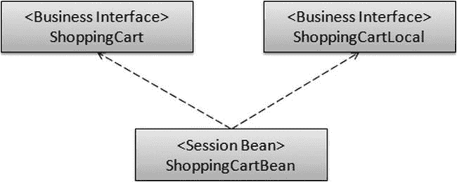

图 2-6.  ShoppingCart 的业务接口

我们将主要从 Web 应用程序中使用本地接口。添加远程接口是为了便于在本章中对 bean 进行单元测试。

清单 2-10 和 2-11 分别展示了带有 `@Remote` 和 `@Local` 注解的远程和本地 `ShoppingCart` 业务接口。

***清单 2-10.***  ShoppingCart.java

```
package com.apress.ejb.chapter02;
import javax.ejb.Remote;
@Remote
public interface ShoppingCart {
}
```

***清单 2-11.***  ShoppingCartLocal.java

```
package com.apress.ejb.chapter02;
import javax.ejb.Local;
@Local
public interface ShoppingCartLocal {
}
```

或者，你也可以使用清单 2-12 中展示的编码风格，即在指定 `@Stateful` 或 `@Stateless` 并附带业务接口名称之前，先指定 `@Local` 和 `@Remote` 注解。

***清单 2-12.***  ShoppingCartBean.java

```
package com.apress.ejb.chapter02;
import javax.ejb.Local;
import javax.ejb.Remote;
import javax.ejb.Stateful;

@Local({ShoppingCartLocal.class})
@Remote({ShoppingCart.class})
@Stateful(name="ShoppingCart")

public class ShoppingCartBean implements ShoppingCart, ShoppingCartLocal {
    public ShoppingCartBean() {
    }
}
```

 **注意**   本书将遵循之前的约定，即在业务接口上标记 `@Local` 和 `@Remote` 注解。

业务方法

有状态会话 bean 中的业务方法与无状态会话 bean 中的类似。我们将通过添加业务方法来增强 `ShoppingCart` bean，这些方法将向购物车添加和移除葡萄酒，并返回购物车商品列表。

清单 2-13 展示了实现 `addWineItem()`、`removeWineItem()` 和 `getCartItems()` 方法的 `ShoppingCart` bean。

***清单 2-13.***  ShoppingCartBean.java

```
package com.apress.ejb.chapter02;
import java.util.ArrayList;
import javax.ejb.Stateful;

@Stateful(name="ShoppingCart")
public class ShoppingCartBean implements ShoppingCart, ShoppingCartLocal {
    public ShoppingCartBean() {
    }
    public ArrayList cartItems;
    public void addWineItem(String wine) {
       cartItems.add(wine);
    }

public void removeWineItem(String wine) {
       cartItems.remove(wine);
    }

public void setCartItems(ArrayList cartItems) {
        this.cartItems = cartItems;
    }

public ArrayList getCartItems() {
        return cartItems;
    }
}
```

生命周期回调方法

有状态会话 bean 支持构造、销毁、激活和钝化等回调事件。以下是映射到上述事件的回调方法：

*   `PostConstruct`：使用 `@PostConstruct` 注解标记。
*   `PreDestroy`：使用 `@PreDestroy` 注解标记。
*   `PreActivate`：使用 `@PreActivate` 注解标记。
*   `PrePassivate`：使用 `@PrePassivate` 注解标记。

`PostConstruct` 回调发生在 bean 实例在 EJB 容器中被实例化之后。如果 bean 使用任何依赖注入机制来获取对其环境中资源或其他对象的引用，则 `PostConstruct` 事件会在注入执行之后、bean 类中的第一个业务方法被调用之前发生。

对于 `ShoppingCart` 会话 bean，我们可以有一个名为 `initialize()` 的业务方法，用于初始化 `cartItems` 列表，如清单 2-14 所示。

***清单 2-14.***  PostConstruct 方法

```
@PostConstruct
public void initialize() {
    cartItems = new ArrayList();
}
```

`PreDestroy` 回调发生在任何带有 `@Remove` 注解的方法完成之后。对于 `ShoppingCart` 会话 bean，我们可以有一个名为 `exit()` 的业务方法，用于将 `cartItems` 列表写入数据库。在本章中，我们仅向系统控制台打印一条消息来说明该回调。清单 2-15 展示了带有 `@PreDestroy` 注解的 `exit()` 方法的代码。

***清单 2-15.***  PreDestroy 方法

```
@PreDestroy
public void exit() {
    // items list into the database.
    System.out.println("Saved items list into database");
}
```

`@Remove` 注解对于有状态会话 bean 来说是一个有用的生命周期方法。当调用带有 `@Remove` 注解的方法时，容器会在该方法执行后从对象池中移除该 bean 实例。清单 2-16 展示了带有 `@Remove` 注解的 `stopSession()` 方法的代码。

***清单 2-16.***  移除方法

```
@Remove
public void stopSession() {
    // The method body can be empty.
    System.out.println("From stopSession method with @Remove annotation");
}
```

当有状态会话 bean 实例空闲时间过长时，`PrePassivate` 回调会被触发。在此事件期间，容器可能会钝化并将其状态存储到缓存中。标记有 `@PrePassivate` 的方法会在容器钝化 bean 实例之前被调用。

当客户端应用程序再次使用一个已钝化的有状态会话 bean 时，会触发 `PostActivate` 事件。此时会创建一个状态已恢复的新实例。当 bean 实例准备就绪时，会调用带有 `@PostActivate` 注解的方法。

拦截器

无状态和有状态会话 bean 的拦截器之间存在一些细微差别。`AroundInvoke` 方法可用于有状态会话 bean。对于实现了 `SessionSynchronization` 的有状态会话 bean，`afterBegin` 会在任何带有 `AroundInvoke` 注解的方法之前以及 `beforeCompletion()` 回调方法之前发生。

异常处理

EJB 规范概述了两种类型的异常：

*   应用程序异常
*   系统异常

*应用程序异常*是与客户端应处理的业务逻辑执行相关的异常。例如，如果客户端应用程序传递了无效参数（如错误的信用卡号），则可能会引发应用程序异常。

另一方面，*系统异常*是由系统级故障引起的，例如 Java 命名和目录接口（JNDI）错误或获取数据库连接失败。系统异常必须是 `java.rmi.RemoteException` 的子类，或者是非应用程序异常的 `java.lang.RuntimeException` 的子类。

从 EJB 应用程序的角度来看，应用程序异常是通过编写继承自 `java.lang.Exception` 类的特定于应用程序的异常类来实现的。


在系统异常的情况下，应用程序会捕获特定的异常，例如由 JNDI 故障导致的 `NamingException`，并抛出 `EJBException`。在本章中，示例并未使用任何资源，但在后续章节中会有更多系统异常的示例。

单例会话 Bean

单例会话 Bean 是在 EJB 3.1 中引入的，它是一种*单例会话 Bean* 组件，每个应用程序仅实例化一次。对于一个应用程序，单例会话 Bean 的实例只能存在一个。一旦实例化，单例会话 Bean 将在应用程序的整个生命周期内存在。单例会话 Bean 在客户端调用之间维护其状态，但在容器关闭或崩溃后无法保存该状态。与无状态和有状态会话 Bean 类似，单例会话 Bean 由一个 Bean 类以及可选的一个或多个业务接口组成。

Bean 类

单例会话 Bean 类是任何带有类级别注解 `@Singleton` 的标准 Java 类。如果使用部署描述符代替注解，则应将 Bean 类标记为单例会话 Bean。如果同时使用注解和部署描述符（混合模式），则在类中指定任何其他类级别或成员级别注解时，必须指定 `@Singleton` 注解。

为了说明单例会话 Bean，我们将创建一个 `ShopperCount` 会话 Bean，用于跟踪登录我们购物网站的用户数量。清单 2-17 展示了 `ShopperCount` 会话 Bean 的定义。

***清单 2-17.***  ShopperCountBean.java

```
package com.apress.ejb.chapter02;

import javax.ejb.Singleton;
import javax.ejb.Startup;
@Singleton (name = "ShopperCount")
@Startup
public class ShopperCountBean {
   private int shopperCounter;

// 增加购物者计数器
   public void incrementShopperCount() {
       shopperCounter++;
   }

// 返回购物者数量
   public int getShopperCount() {
       return shopperCounter;
   }
}
```

单例会话 Bean 由 EJB 容器自行决定何时实例化。但是，你可以使用 `@Startup` 注解 Bean 类，以指示容器必须在应用程序启动序列期间初始化该单例 Bean。

当应用程序中使用多个单例会话 Bean 时，应用程序可能要求它们按特定顺序初始化。`@DependsOn` 注解声明了单例会话 Bean 的启动依赖关系。清单 2-18 展示了依赖于 `ShopperCount` 会话 Bean 的 `LogShopperCount` 会话 Bean 的定义。

***清单 2-18.***  LogShopperCount.java

```
package com.apress.ejb.chapter02;

import javax.ejb.Singleton;
import javax.ejb.Startup;
import javax.ejb.DependsOn;
import java.util.logging.Logger;

@Singleton
@Startup
@DependsOn("ShopperCount")
public class LogShopperCount {
   private final Logger log = Logger.getLogger("LogShopperCount.class");

public void logShopperCount() {
       // 记录购物者数量
   }
}
```

与无状态和有状态会话 Bean 不同，单例会话 Bean 不得实现 `javax.ejb.SessionSynchronization` 接口或使用会话同步注解。

业务接口

单例会话 Bean 的业务接口与无状态和有状态会话 Bean 的接口类似，并且使用 `@Local` 和 `@Remote` 注解以相同的方式进行注解。单例会话 Bean 支持无接口本地视图，这使得对于本地视图而言，业务接口的声明是可选的。

业务方法

单例会话 Bean 中的业务方法与无状态和有状态会话 Bean 中的方法类似。我们将通过添加一个重置计数器的业务方法来增强 `ShopperCount` Bean。

清单 2-19 展示了实现业务方法的 `ShopperCount` Bean。

***清单 2-19.***  ShopperCountBean.java

```
package com.apress.ejb.chapter02;

import javax.ejb.Singleton;
import javax.ejb.Startup;

@Singleton(name = "ShopperCount")
@Startup
public class ShopperCountBean {
   private int shopperCounter = 0;

// 增加购物者计数器
   public void incrementShopperCount() {
       shopperCounter++;
   }

// 返回购物者数量
   public int getShopperCount() {
       return shopperCounter;
   }

// 重置计数器
   public void resetCounter() {
       shopperCounter = 0;
   }
}
```

生命周期回调方法

单例会话 Bean 支持构造和销毁的回调事件。以下是映射到上述事件的回调方法：

*   `PostConstruct`：使用 `@PostConstruct` 注解标记
*   `PreDestroy`：使用 `@PreDestroy` 注解标记。

`PostConstruct` 回调发生在 Bean 实例在 EJB 容器中实例化之后。如果 Bean 使用任何依赖注入机制来获取对其环境中资源或其他对象的引用，则 `PostConstruct` 事件发生在注入执行之后、Bean 类中的第一个业务方法被调用之前。

`PreDestroy` 回调发生在应用程序关闭期间。容器会考虑单例会话 Bean 之间的 `DependsOn` 关系，并按照与创建顺序相反的顺序移除它们。对于 `ShopperCount` 示例，`LogShopperCount` Bean 将在 `ShopperCount` Bean 之前被移除。

清单 2-20 展示了带有 `@PostConstruct` 注解的 `applicationStartup()` 方法的代码。该方法在启动时重置 `shopperCounter`。清单 2-20 还展示了带有 `@PreDestroy` 注解的 `applicationShutdown()` 方法的代码。该方法在应用程序关闭时打印一条消息。

***清单 2-20.***  ShopperCountBean.java

```
package com.apress.ejb.chapter02;

import javax.annotation.PostConstruct;
import javax.annotation.PreDestroy;
import javax.ejb.Singleton;
import javax.ejb.Startup;

@Singleton(name = "ShopperCount")
@Startup
public class ShopperCountBean {
   private int shopperCounter;

// 增加购物者计数器
   public void incrementShopperCount() {
       shopperCounter++;
   }

// 返回购物者数量
   public int getShopperCount() {
       return shopperCounter;
   }

// 重置计数器
   public void resetCounter() {
       shopperCounter = 0;
   }

// 重置计数器
   @PostConstruct
   public void applicationStartup() {
       System.out.println("来自 applicationStartup 方法。");
       resetCounter();
   }

@PreDestroy
   public void applicationShutdown() {
      System.out.println("来自 applicationShutdown 方法。");
   }
}
```

与无状态会话 Bean 一样，单例会话 Bean 永远不会被钝化，因此不应使用 `@PrePassivate` 和 `@PostActivate` 注解来装饰单例会话 Bean 上的方法。

并发管理

单例会话 Bean 每个应用程序仅实例化一次，因此它被设计为支持并发访问。并发访问意味着多个客户端可以同时访问同一个单例会话 Bean 实例。并发访问的管理对客户端是透明的。客户端只需要一个对单例会话 Bean 的引用，而无需关心其他客户端是否也在访问该单例会话 Bean 的同一个实例。

并发管理通过两种方式进行：


*   **容器管理并发：** 容器控制并发访问，并通过提供一组固定的选项来精细控制状态同步行为。这是默认的并发管理类型。
*   **Bean 管理并发：** 容器允许对并发 Bean 实例进行完全访问，用户负责状态同步。

并发类型（容器管理或 Bean 管理）由在单例会话 Bean 类上指定的 `javax.ejb.ConcurrencyManagement` 注解指定。对于容器管理并发，`@ConcurrencyManagement` 的 `type` 属性设置为 `javax.ejb.ConcurrencyManagementType.CONTAINER`；对于 Bean 管理并发，`@ConcurrencyManagement` 的 `type` 属性设置为 `javax.ejb.ConcurrencyManagementType.BEAN`。

容器管理并发

对于使用容器管理并发的单例会话 Bean，容器通过将每个业务方法与共享的 `Read` 锁或独占的 `Write` 锁相关联来管理并发。使用 `@Lock` 注解指定 `Read` 或 `Write` 锁。

清单 2-21 通过在 `getShopperCount` 方法上使用 `Read` 锁，在 `incrementShopperCount` 方法上使用 `Write` 锁，演示了容器管理并发。通过此更改，多个客户端可以同时获取 `shopperCounter` 的值，但在一个客户端访问 `incrementShopperCount` 时，所有其他客户端对该方法的访问将被阻塞。

***清单 2-21.***  ShopperCountBean.java

```
package com.apress.ejb.chapter02;

import javax.annotation.PostConstruct;
import javax.annotation.PreDestroy;
import javax.ejb.ConcurrencyManagement;
import javax.ejb.ConcurrencyManagementType;
import javax.ejb.Lock;
import javax.ejb.LockType;
import javax.ejb.Singleton;
import javax.ejb.Startup;

@Singleton(name = "ShopperCount")
@Startup
@ConcurrencyManagement(ConcurrencyManagementType.CONTAINER)
public class ShopperCountBean {
    private int shopperCounter;
    // 增加购物者计数器
    @Lock(LockType.WRITE)
    public void incrementShopperCount() {
        shopperCounter++;
    }

// 返回购物者数量
    @Lock(LockType.READ)
    public int getShopperCount() {
        return shopperCounter;
    }

// 重置计数器
    public void resetCounter() {
        shopperCounter = 0;
    }

// 重置计数器
    @PostConstruct
    public void applicationStartup() {
        resetCounter();
    }

@PreDestroy
    public void applicationShutdown() {
        System.out.println("From applicationShutdown method.");
    }
}
```

对于单例会话 Bean，类级别的 `@Lock` 注解指定所有业务方法将使用指定的锁类型，除非在方法级别显式设置了不同的类型。当单例会话 Bean 类上没有显式存在 `@Lock` 注解时，默认锁类型 `@Lock(LockType.WRITE)` 将应用于所有业务方法。

Bean 管理并发

在 Bean 管理并发的情况下，容器允许对单例会话 Bean 实例进行完全并发访问，Bean 开发人员必须保护 Bean 的内部状态，防止因并发访问导致的同步错误。为此，您可以使用诸如 `synchronized` 和 `volatile` 之类的同步原语。

错误处理

单例会话 Bean 初始化期间可能会发生错误。这些错误是致命的，因此必须丢弃该单例会话 Bean 实例。尝试调用初始化失败的单例会话 Bean 实例将导致 `javax.ejb.NoSuchEJBException`。一旦单例会话 Bean 成功实例化，如果从业务方法或回调中抛出异常，它不会被销毁。

定时器服务

*EJB 定时器服务*是一种容器管理服务，允许为基于时间的事件调度回调。定时器通知可以安排在基于日历的时间、特定时间、特定时间之后或特定的重复间隔触发。

将定时器用于应用程序级别的进程。不要将定时器用于实时事件。使用定时器的典型示例包括：

*   费用报告应用程序中的定时器，每晚 9 点打印新提交的费用。
*   错误跟踪应用程序中的定时器，每天早上 6 点向团队成员发送未解决错误的列表。
*   人力资源应用程序中的定时器，每年 1 月 1 日向所有员工发送公共假期列表。

 **注意**   不能为有状态会话 Bean 创建定时器。

在 EJB 3.1 中，通过引入 `@Schedule` 和 `@Schedules` 注解简化了定时器的创建，这些注解会根据方法上指定的元数据自动创建定时器。在清单 2-22 中，我们通过添加一个每两小时记录一次购物者数量的重复定时器来增强 `LogShopperCount`。

***清单 2-22.***  LogShopperCount.java

```
package com.apress.ejb.chapter02;

import javax.ejb.DependsOn;
import javax.ejb.Schedule;
import javax.ejb.Singleton;
import javax.ejb.Startup;

@Singleton
@Startup
@DependsOn("ShopperCountBean")
public class LogShopperCount {

// 每 2 小时记录购物者数量
       @Schedule(hour="*/2")
       public void logShopperCount() {
       // 记录购物者数量
       }
}
```

在带有 `@Schedule` 注解的方法中传递 `Timer` 对象，以获取有关定时器的信息。清单 2-23 演示了如何使用 `Timer` 对象获取有关刚过期的定时器的信息。

***清单 2-23.***  LogShopperCount.java

```
package com.apress.ejb.chapter02;

import javax.ejb.DependsOn;
import javax.ejb.Schedule;
import javax.ejb.Singleton;
import javax.ejb.Startup;
import javax.ejb.Timer;

@Singleton
@Startup
@DependsOn("ShopperCount")
public class LogShopperCount {

// 每 2 小时记录购物者数量
@Schedule(hour="*/2")
public void logShopperCount(Timer timer) {
// 记录购物者数量
String timerInfo = (String) timer.getInfo();
System.out.println(timerInfo);
}
}
```

基于日历的时间表达式

定时器服务受 UNIX `cron` 实用程序的启发。表 2-1 列出了基于日历的时间表达式的各种属性。

表 2-1. 基于日历的时间表达式的属性

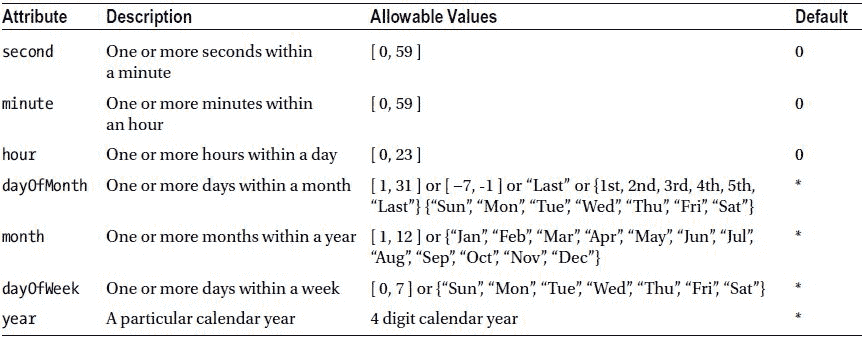

 **注意**   对于 `dayOfWeek`，0 和 7 都代表星期日，负数（−7 到 −1）表示该月的倒数第 n 天。所有字符串常量（“Sun”、“Jan”、“Last”、“1st”）都不区分大小写。仅秒、分钟和小时支持增量。列表中的重复值将被忽略。

基于日历的时间表达式示例

让我们看一些演示使用基于日历的时间表达式的示例。

*   “每天每小时的每分钟的每一秒”

*   `@Schedule(second="*", minute="*", hour="*")`

*   “每小时内的每十五分钟”

*   `@Schedule(minute="*/15", hour="*")`
*   `@Schedule(minute="0, 15, 30, 45", hour="*")`

*   “每个星期五午夜”

*   `@Schedule(dayOfWeek="Fri")`

*   “周末每六小时”

*   `@Schedule(hour="*/6", dayOfWeek="Sat, Sun")`

*   “每个工作日上午 7:30 美国太平洋时间”

*   `@Schedule(minute="30", hour="7", dayOfWeek="Mon-Fri", timezone="America/Los_Angeles")`

*   “1 月 10 日和 9 月 10 日上午 6 点”

*   `@Schedule(month="Jan, Sep", dayOfMonth="10", hour="6")`

*   “12 月最后一个星期五下午 6 点”

*   `@Schedule(month="Dec", dayOfMonth="Last Fri", hour="18")`

*   “每个月的倒数第二天（最后一天的前一天）”


*   `@Schedule(dayOfMonth="-1")`

*   “仅限 2013 年的每一天”

*   `@Schedule(year="2013")`

**定时器持久性**

定时器是持久化的。定时器服务通过将定时器存储在数据库中来持久化它。定时器服务使用的数据库可以通过将定时器服务的定时器数据源设置更改为有效的 JDBC 资源来更改。持久化有助于定时器在应用程序关闭、容器崩溃和容器关闭时存活。

可以通过将 `@Schedule` 注解的 `persistent` 属性设置为 `false` 来按定时器禁用持久化。非持久化定时器的生命周期与创建它的 JVM 相关联。如果应用程序关闭、容器崩溃或创建定时器的 JVM 崩溃/关闭，则非持久化定时器被视为已取消。

**会话 Bean 的客户端视图**

会话 Bean 可以被视为客户端程序或应用程序的逻辑扩展，该应用程序的大部分逻辑和数据处理都在其中发生。客户端应用程序通常通过会话 Bean 的客户端视图接口访问会话对象。这些是前面章节中讨论的业务接口。

访问会话 Bean 的客户端应用程序可以是以下三种类型之一：

*   **远程**：远程客户端在与它们访问的会话 Bean 不同的 JVM 中运行，如图 2-4 所示。远程客户端通过 Bean 的远程业务接口访问会话 Bean。远程客户端可以是另一个 EJB、一个 Java 客户端程序或一个 Java Servlet。远程客户端具有位置独立性，这意味着它们可以使用与在同一 JVM 中运行的客户端相同的 API。
*   **本地**：本地客户端在同一 JVM 中运行，如图 2-3 所示，并通过本地业务接口访问会话 Bean。本地客户端可以是另一个 EJB，或使用 Java Servlet、JavaServer Pages (JSP) 或 JavaServer Faces (JSF) 的 Web 应用程序。本地客户端是位置相关的。远程和本地客户端的比较见表 2-2。

表 2-2. 选择本地与远程客户端的考量因素

| 远程 | 本地 |
    | --- | --- |
    | Bean 与客户端之间的松耦合 | 对组件的轻量级访问 |
    | 位置独立性 | 位置依赖性 |
    | 昂贵的远程调用 | 必须与 Bean 位于同一位置 |
    | 对象必须序列化 | 不需要 |
    | 对象按值传递 | 对象按引用传递 |

*   **Web 服务**：您可以将无状态会话 Bean 发布为 Web 服务，供 Web 服务客户端调用。我们将在第 6 章中讨论 Web 服务和客户端。

在某些情况下，会话 Bean 需要同时具有本地和远程业务接口，以支持不同类型的客户端应用程序。客户端可以通过依赖注入或 JNDI 查找来获取会话 Bean 的业务接口。在调用会话 Bean 中的方法之前，客户端需要通过 JNDI 获取 Bean 的存根对象。一旦客户端拥有存根对象的句柄，它就可以调用会话 Bean 中的业务方法。对于无状态会话 Bean，可以在每次调用时获取一个新的存根。对于有状态会话 Bean，需要在客户端缓存存根，以便容器知道在后续调用中返回哪个 Bean 实例。使用依赖注入，我们可以通过以下代码获取 `SearchFacade` 会话 Bean 的业务接口：

```
@EJB SearchFacade searchFacade;
```

如果访问会话 Bean 的客户端是远程的，则在获取具有正确环境属性的上下文接口后，客户端可以使用 JNDI 查找。本地客户端也可以使用 JNDI 查找，但依赖注入会产生更简洁的代码。清单 2-24 展示了 `SearchFacadeTest` 客户端程序的代码，该代码查找 `SearchFacade` Bean，调用 `wineSearch()` 业务方法，并打印返回的葡萄酒列表。`SearchFacadeClient` 还查找 `ShopperCount` 单例 Bean，并调用 `getShopperCount()` 业务方法来打印已登录的购物者数量。

 **注意**   如果远程客户端是 Java 应用程序或命令行程序，则可以使用应用程序客户端容器来调用会话 Bean。应用程序客户端容器支持远程客户端的依赖注入。我们将在第 12 章中与其他类型的客户端应用程序一起讨论应用程序客户端容器。

***清单 2-24.***  SearchFacadeClient.java

```
package com.apress.ejb.chapter02;
import java.io.IOException;
import java.io.PrintWriter;
import java.util.List;
import javax.ejb.EJB;
import javax.servlet.ServletException;
import javax.servlet.annotation.WebServlet;
import javax.servlet.http.HttpServlet;
import javax.servlet.http.HttpServletRequest;
import javax.servlet.http.HttpServletResponse;

@WebServlet(name = "SearchFacadeClient", urlPatterns = {"/SearchFacadeClient"})
public class SearchFacadeClient extends HttpServlet {

@EJB
    SearchFacadeBean searchFacade;

@EJB
    ShopperCountBean shopperCount;
    protected void processRequest(HttpServletRequest request, HttpServletResponse response)
            throws ServletException, IOException {
        response.setContentType("text/html;charset=UTF-8");
        PrintWriter out = response.getWriter();
        try {

out.println("<html>");
            out.println("<head>");
            out.println("<title>Servlet SearchFacadeClient</title>");
            out.println("</head>");
            out.println("<body>");
            out.println("<h1> Starting Search Facade test ... </h1>");

out.println("<h1>SearchFacade Lookup</h1>");
            out.println("<h1>Searching wines</h1>");
            List winesList = searchFacade.wineSearch("Red");
            out.println("<h1>Printing wines list</h1>");
            for (String wine:(List<String>)winesList ){
                out.println("<h1>" + wine + "</h1>");
            }

System.out.println("Printing Shopper Count after incrementing it ...");
            shopperCount.incrementShopperCount();
            out.println("<h1>" + shopperCount.getShopperCount() + "</h1>");

out.println("</body>");
            out.println("</html>");
        } finally {
            out.close();
        }
    }

@Override
    protected void doGet(HttpServletRequest request, HttpServletResponse response)
            throws ServletException, IOException {
        processRequest(request, response);
    }

@Override
    protected void doPost(HttpServletRequest request, HttpServletResponse response)
            throws ServletException, IOException {
        processRequest(request, response);
    }

@Override
    public String getServletInfo() {
        return "Short description";
    }
}
```

清单 2-25 展示了 `ShoppingCartClient` Servlet，它查找有状态的 `ShoppingCart` 会话 Bean，调用 `addWineItem()` 业务方法向购物车添加葡萄酒，调用 `getCartItems()` 业务方法获取购物车中的商品，最后打印购物车中的葡萄酒列表。

***清单 2-25.***  ShoppingCartClient.java


```
package com.apress.ejb.chapter02;
import java.io.IOException;
import java.io.PrintWriter;
import java.util.ArrayList;
import java.util.List;
import javax.ejb.EJB;
import javax.servlet.ServletException;
import javax.servlet.annotation.WebServlet;
import javax.servlet.http.HttpServlet;
import javax.servlet.http.HttpServletRequest;
import javax.servlet.http.HttpServletResponse;

@WebServlet(name = "ShoppingCartClient", urlPatterns = {"/ShoppingCartClient"})
public class ShoppingCartClient extends HttpServlet {

@EJB
   ShoppingCartBean shoppingCart;
    protected void processRequest(HttpServletRequest request, HttpServletResponse response)
            throws ServletException, IOException {
        response.setContentType("text/html;charset=UTF-8");
        PrintWriter out = response.getWriter();
        try {
            out.println("<html>");
            out.println("<head>");
            out.println("<title>Servlet ShoppingCartClient</title>");
            out.println("</head>");
            out.println("<body>");
            out.println("<h1>Starting Shopping Cart test ... </h1>");

out.println("<h1>ShoppingCart Lookup </h1>");
            out.println("<h1>Adding Wine Item </h1>");
            shoppingCart.addWineItem("Zinfandel");
            out.println("<h1>Printing Cart Items </h1>");
            ArrayList cartItems = shoppingCart.getCartItems();
            for (String wine: (List<String>)cartItems) {
                out.println("<h1>" + wine + "</h1>");
            }

out.println("</body>");
            out.println("</html>");
        } finally {
            out.close();
        }
    }

@Override
    protected void doGet(HttpServletRequest request, HttpServletResponse response)
            throws ServletException, IOException {
        processRequest(request, response);
    }

@Override
    protected void doPost(HttpServletRequest request, HttpServletResponse response)
            throws ServletException, IOException {
        processRequest(request, response);
    }

@Override
    public String getServletInfo() {
        return "Short description";
    }
}
```

清单 2-26 展示了 `ShopperCountClient` Servlet，它查找单例 `ShopperCount` 会话 Bean，调用 `resetCounter()` 业务方法重置购物者计数，调用 `incrementShopperCount()` 业务方法增加购物者计数，最后打印统计的购物者总数。购物者计数的值将在整个应用程序中可见。

***清单 2-26.***  ShopperCountClient.java

```
package com.apress.ejb.chapter02;
import java.io.IOException;
import java.io.PrintWriter;
import javax.ejb.EJB;
import javax.servlet.ServletException;
import javax.servlet.annotation.WebServlet;
import javax.servlet.http.HttpServlet;
import javax.servlet.http.HttpServletRequest;
import javax.servlet.http.HttpServletResponse;

@WebServlet(name = "ShopperCountClient", urlPatterns = {"/ShopperCountClient"})
public class ShopperCountClient extends HttpServlet {
    @EJB
    ShopperCountBean shopperCount;
    protected void processRequest(HttpServletRequest request, HttpServletResponse response)
            throws ServletException, IOException {
        response.setContentType("text/html;charset=UTF-8");
        PrintWriter out = response.getWriter();
        try {
            /* TODO output your page here. You may use following sample code. */
            out.println("<html>");
            out.println("<head>");
            out.println("<title>Servlet ShopperCountClient</title>");
            out.println("</head>");
            out.println("<body>");

out.println("<h1>Resetting Shopper Count ... </h1>");
            shopperCount.resetCounter();
            out.println("<h1>Incrementing Shopper Count ... </h1>");
            shopperCount.incrementShopperCount();
            out.println("<h1>Shopper Count: " + shopperCount.getShopperCount() + "</h1>");
            out.println("</body>");
            out.println("</html>");
        } finally {
            out.close();
        }
    }

@Override
    protected void doGet(HttpServletRequest request, HttpServletResponse response)
            throws ServletException, IOException {
        processRequest(request, response);
    }

@Override
    protected void doPost(HttpServletRequest request, HttpServletResponse response)
            throws ServletException, IOException {
        processRequest(request, response);
    }

@Override
    public String getServletInfo() {
        return "Short description";
    }
}
```

编译、部署和测试会话 Bean

会话 Bean 需要打包成 EJB JAR（`.jar`）文件，然后才能部署到 EJB 容器中。在某些 EJB 容器或应用服务器的情况下，打包好的 EJB 归档文件在部署前需要组装成企业归档（EAR）文件。EJB 容器或应用服务器提供了部署工具或 Ant 任务来简化 EJB 的部署。像 JDeveloper、NetBeans 和 Eclipse 这样的 Java IDE（集成开发环境）也提供了部署功能，允许开发者将 EJB 打包、组装并部署到应用服务器。打包、组装和部署的详细内容将在第 11 章中介绍。

到目前为止，本章我们已经开发了一个无状态会话 Bean（`SearchFacade`）、一个有状态会话 Bean（`ShoppingCart`）和一个单例会话 Bean（`ShopperCount`）。接下来的部分将引导您完成编译、部署和测试这些会话 Bean 所需的步骤。

前提条件

在执行后续章节详述的任何步骤之前，请先完成第 1 章的“入门”部分。该部分将引导您完成本章示例所需的安装和环境设置。

编译会话 Bean 及其客户端

将 `Chapter02-SessionSamples` 目录及其内容复制到您选择的目录中。运行 NetBeans IDE，并使用“文件”“打开项目”菜单打开 `Chapter02-SessionSamples` 项目。确保选中“打开所需项目”复选框。

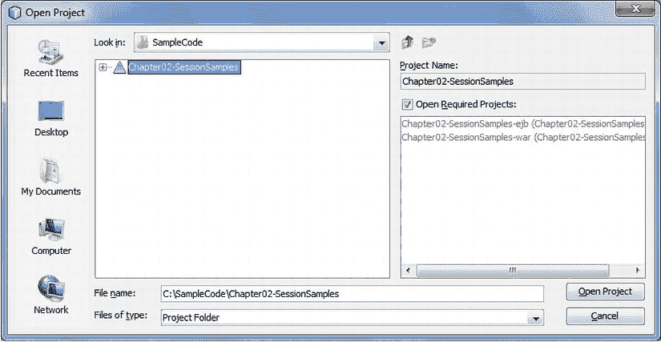

图 2-7.   打开 Chapter02-SessionSamples 项目

展开 `Chapter02-SessionSamples-ejb` 节点，观察我们创建的三个会话 Bean 出现在 `com.apress.ejb.chapter02` 包中。同样，三个客户端 Servlet 出现在 `Chapter02-SessionSamples-war` 节点下。

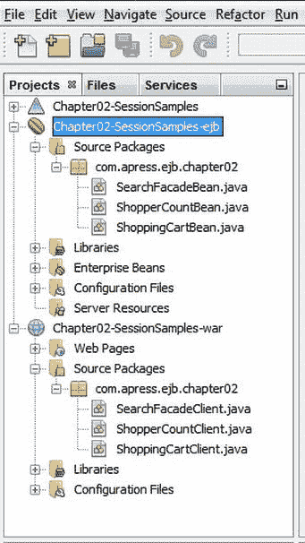

图 2-8.   验证会话 Bean 及其客户端在项目中可用

在 `Chapter02-SessionSamples` 节点上调用上下文菜单，并通过选择“清理并构建”菜单选项来构建应用程序。

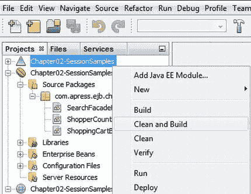

图 2-9.   构建应用程序

部署会话 Bean 及其客户端

编译完会话 Bean 和 Servlet 客户端后，您可以将应用程序部署到 GlassFish 应用服务器。在 `Chapter02-SessionSamples` 节点上调用上下文菜单，并通过选择“部署”菜单选项来部署应用程序。

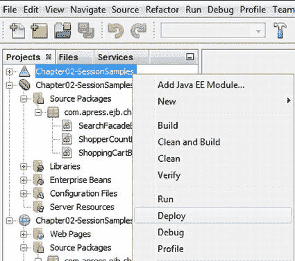

图 2-10.   部署应用程序

NetBeans 将启动集成的 GlassFish 应用服务器并将应用程序部署到该服务器。服务器的日志窗口将记录应用程序的部署状态。

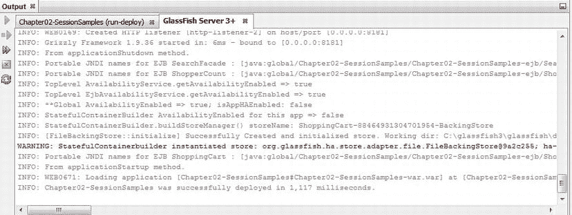


图 2-11.   显示成功部署的日志

运行客户端程序

在会话 Bean 及其客户端 Servlet 成功部署后，我们需要设置要执行的运行目标。我们有 3 个运行目标可供选择：`ShopperCountClient`、`SearchFacadeClient` 或 `ShoppingCartClient`。要设置运行目标，请在 `Chapter02-SessionSamples` 节点上调用上下文菜单，并选择 `Properties` 菜单选项。选择 `Run` 类别，在 `Relative URL` 文本字段中输入运行目标，然后点击对话框的“确定”按钮。

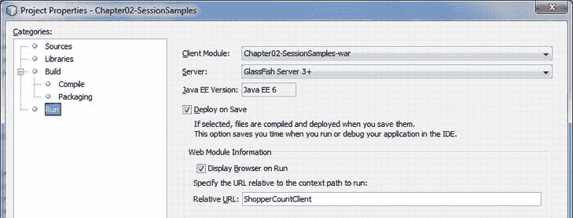

图 2-12.   设置要执行的目标

要运行客户端 Servlet，请在 `Chapter02-SessionSamples` 节点上调用上下文菜单，并选择 Run 菜单选项。

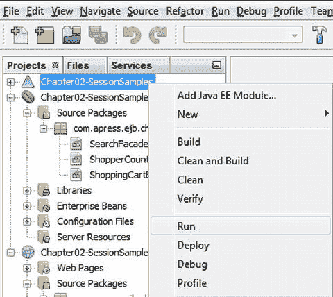

图 2-13.   运行选定的 Servlet

NetBeans 将打开您的默认浏览器并执行选定的 Servlet。以下是 3 个客户端 Servlet 的输出结果。

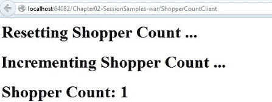

图 2-14.   ShopperCountClient Servlet 的输出

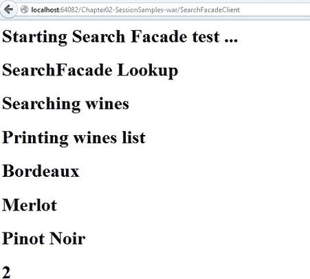

图 2-15.   SearchFacadeClient Servlet 的输出

 **注意**   应用程序客户端容器将在第 12 章中详细讨论。

结论

本章通过一组特定示例介绍了 EJB 会话 Bean 的详细信息。我们研究了使用标准 Java 语言构件（如 Java 类和接口）开发会话 Bean 的简化 EJB 模型。我们探讨了会话 Bean 以及一些典型的用例，在这些用例中，会话 Bean 可用于开发应用程序。我们讨论了三种不同类型的会话 Bean（无状态、有状态和单例），包括它们之间的区别以及每种类型的一些通用用例。我们介绍了会话 Bean 在两层和三层应用程序架构中的使用。我们讨论了依赖注入在无状态、有状态和单例 Bean 中的使用。我们考虑了实现对应用程序流程进行细粒度控制的方法，包括在无状态和有状态 Bean 中使用生命周期回调方法和拦截器，以及使用诸如 `@PostConstruct` 和 `@PreDestroy` 之类的注解。我们研究了编译/构建、打包和将会话 Bean 部署到 GlassFish 应用服务器所需的条件。最后，我们研究了使用 GlassFish 应用程序客户端容器运行示例客户端程序。

在接下来的两章中，我们将深入探讨 Java 持久化 API (JPA)，以便您学习如何将 POJO 映射到数据库表并执行查询和 CRUD 操作。

第 3 章


实体与 Java 持久化 API

既然您已经了解了 EJB 如何通过会话 Bean 提供业务服务，我们将把注意力转向一种不同类型的组件，称为*实体*，它们是表示数据库中表的类，其实例表示这些表中的行。会话 Bean 为客户端应用程序提供服务，而实体则代表业务数据。一种常见的模式是，会话 Bean 提供一个便捷的接口，用于在事务、安全、访问控制和其他企业服务的上下文中操作实体。执行创建、检索、更新和删除操作的方法（也称为 CRUD 方法）在会话 Bean 上暴露给客户端，以提供一种“外观”模式，我们将在本书中一直使用这种模式。

Java 持久化 API (JPA) 首次引入于 Java EE 5，它标志着与之前定义为 EJB 规范一部分的“实体 Bean”持久化模型的背离。JPA 被广泛认为是对早期 EJB 版本中定义的实体 Bean 模型的巨大改进。JPA 毫不掩饰地借鉴了专有和开源模型，如 TopLink、Hibernate、JDO 和 Spring，这些模型作为早期 EJB 修订版中定义的通常重量级且繁琐的实体 Bean 模型的流行替代方案而获得了发展势头。因此，与会话 Bean 一样，实体是简单的 POJO（普通旧式 Java 对象），除了表明它们是实体的一小部分元数据（捕获在 Java 注解或持久化 XML 描述符中）之外，它们是对底层数据库表非常清晰的表示。虽然 JPA 在范围和能力上扩展了持久化模型，但实体本身在很大程度上与其支持的持久化框架解耦，允许它们在 Java EE 容器内外既作为普通 POJO 使用，也作为由持久化框架管理的对象使用。

JPA 1.0 在 Java EE 5 中引入，JPA 2.0 伴随 Java EE 6 出现，而 JPA 2.1 与 Java EE 7 保持一致。自 JPA 1.0 以来引入的大多数功能都允许对 JPA 进行高级配置，这超出了本书的范围。然而，在下一章中，我们将描述一些我们认为对于介绍其最新修订版中的 JPA 至关重要的功能。

本着本书的精神，关于持久化的两章将涵盖最常用的功能，通过使用我们的在线葡萄酒商店应用程序的实践示例来描述它们的用法。本章将引导您开始编写实体类并使用关键的持久化功能。下一章将探讨更高级的持久化功能。通过这些示例，这些章节解释了持久化编程模型的主要领域。然而，它们无意替代内容广泛的 JPA 规范。当您准备好探索超出本讨论范围的细节时，我们鼓励您参考 JPA 规范。

表 3-1 总结了本章将要介绍的内容。

表 3-1.   本章关键主题


| 概念 | 描述 |
| --- | --- |
| 实体示例 | 我们从简单的 JavaBean 开始，逐步添加将其转换为简单实体所需的注解，然后再进一步扩展。 |
| 主要实体注解 | 进一步细化实体的要求：实体类必须有一个无参的 `public` 或 `protected` 构造方法，并且不能是 `final` 的。实体通过其 JavaBeans 属性访问器或实例变量定义其持久化结构，也可以包含自定义方法。 |
| `EntityManager` | `EntityManager` 对象提供持久化服务，包括事务管理以及查询、合并、删除、查找和刷新操作。它是理解 JPA 持久化框架的核心。 |
| 实体生命周期 | 实体实例作为内存中的 Java 对象，在其生命周期中可能会经历多种正式状态。理解这些不同状态有助于你了解实体何时与后端数据库保持一致或不一致状态，以及如何在事务上下文中协调这些差异。 |
| 对象/关系 (O/R) 映射 | JPA 通过注解和/或 XML 描述符定义声明式标记，将实体字段映射到关系数据库管理系统 (RDBMS) 中的表列。 |
| 实体关系 | 实体类可以持有对自身或其他实体的一元引用和集合引用。请注意，在 JPA 中，关系字段不由容器进行双向维护。 |
| Java 持久化查询语言 (JPQL) | JPA 定义了一种类似 SQL 的语言——JPQL——它支持查询以及批量更新和删除操作。查询可以静态定义为命名查询，也可以动态定义。查询可以接受绑定参数并返回 Java 对象，包括实体实例或 Map。 |
| 持久化 vs. 适配 | 在设计实体类时，一个实际考虑因素是：实体类是主要的设计对象，还是数据库模式是事实来源。在前一种情况下，数据库主要用于持久化实体数据；而在后一种情况下，实体类用于将表适配到 Java 中。 |
| 示例应用程序 | 最后，我们给出了一个示例应用程序，它由三个 JPA 实体、一个 EJB 和一个 HTTP Servlet 组成，通过一个简单的工作模型演示了本章中的所有概念。 |

实体示例

让我们看看如何将一个简单的 JavaBean 转换为实体，并逐步对其进行定制以增加功能和灵活性。

一个简单的 JavaBean：Customer.java

我们从简单的 JavaBean 开始，如清单 3-1 所示。该类具有 JavaBeans 标准定义的属性。JavaBean 的每个属性通过一对属性访问器方法向 Bean 外部世界呈现。对于每个属性，getter 方法检索其数据，setter 方法为其赋值。在内部，这些属性访问器方法读取和写入 JavaBean 类上的私有专用实例变量。

***清单 3-1.***  一个简单的 JavaBean

```
public class Customer {
  private long customerId;
  private String name;

public long getCustomerId() { return customerId; }
  public void setCustomerId(long customerId) { this.customerId = customerId; }
  public String getName() { return name; }
  public void setName(String name) { this.name = name; }
}
```

一个简单的实体：Customer.java

清单 3-2 展示了我们的简单 JavaBean 被转换为实体后的样子。

***清单 3-2.***  一个简单的实体

```
@Entity
public class Customer implements Serializable {
  @Id
  private long customerId;
  private String name;

public long getCustomerId() { return customerId; }
  public void setCustomerId(long customerId) { this.customerId = customerId; }
  public String getName() { return name; }
  public void setName(String name) { this.name = name; }
}
```

唯一需要做的更改是添加 `@Entity` 和 `@Id` 注解。`@Id` 注解将 `customerId` 标识为实体的主键，这是表达其唯一标识所必需的。这是将该类转换为实体所需的最少元数据。我们还添加了 `Serializable` 接口，因为这是一个确保与远程客户端兼容的良好实践。

@Entity 注解

`@Entity` 注解是必需的，用于在实体部署时将其标识为实体。当实体部署在持久化归档文件（JAR 文件）中时，它们可能伴随有非实体类。此注解（或其等效声明在 `orm.xml` 文件中）告诉容器查找该类上的进一步注解，并处理其 O/R 映射，允许其参与查询和与其他实体的持久化关系，并在持久化提供程序稍后实例化它们时进行字节编织或其他处理。所有未标记为实体的类在部署期间都会被持久化提供程序忽略。

@Id 注解

`@Id` 注解指示哪个或哪些字段（可能有多个）是实体的主键或标识符。标识符字段中的值在实体类型 `Customer` 的所有实体实例中必须是唯一的，以便唯一标识此实体。如果主键跨越表中的多个列，则需要复合主键，并且 `@Id` 字段可以被一个标注了 `@EmbeddedId` 的单个字段替换。我们将在本章后面讨论如何指定复合键。

与 EJB 2.x 的比较

JPA 的基本编码结构是实体类。在 EJB 2.x 及更早版本中，实体 Bean 作为主要的持久化对象，由 Bean 类以及本地和/或远程组件和 Home 接口组成。从 JPA 开始，实体 Bean 的大部分外在特征已被剥离，或通过大量使用默认值和注解而简化。剩下的只是实体 Bean 类，现在称为*实体类*；或者更简单地称为*实体*。虽然在 XML 描述符中指定持久化元数据同样有效，但为简洁起见，本章中的所有示例都使用 Java 注解。与 EJB 3 领域一样，每个由注解指定的声明式构造在持久化单元（共置实体的集合）的 XML 描述符中都有对应的表示形式，因此也可以在 XML 中等效指定。使用注解还是 XML 完全是个人的选择。

默认配置

前面的两个注解是显式指定的。鉴于 EJB 3 利用默认配置的简化开发模型，你发现此示例中的许多其他元数据都是默认隐含的，这并不会让你感到惊讶。在探索这些默认设置之前，值得思考一下为什么选择显式指定 `@Entity` 和 `@Id` 注解，而不是隐式推断。

`@Entity` 注解本可以是每个通过持久化归档文件部署的类的默认设置，并且可以使用假设的 `@NotEntity` 注解来指定非实体类。然而，遵循会话 Bean 和消息驱动 Bean 设定的模式，选择了显式选择加入的模式。


类似地，所有字段本都可以被假定为主键的一部分，但在实践中，一个实体的属性中通常只有一小部分（通常只有一个）构成其主键。规范设计者认为，在这种情况下，采用显式在主键字段上指定 `@Id` 的选择加入模式更有意义，这意味着并非所有列都是主键的一部分。这种决策体现了“默认配置”的方法，即在更常见的情况下不需要注解，仅在需要覆盖时才使用。

下一节将探讨这个 `Customer` 实体默认获得的一些行为，并展示如何覆盖这些默认行为。

一个暴露默认值的实体：Customer.java

清单 3-3 展示了同一个实体及其部分默认值。

***清单 3-3.***  一个显示默认值的实体

```
@Entity(name="Customer")
@Table(name=" CUSTOMER")
public class Customer implements Serializable {
  @Id
  @Column(name="CUSTOMERID", table="CUSTOMER", unique=true,
          nullable=false, insertable=true, updatable=true)
  private long customerId;

@Basic(fetch=FetchType.EAGER)
  @Column(name="NAME", table="CUSTOMER")
  private String name;

// . . .
}
```

每个实体都有一个名称，除非另有指定，否则该名称默认为非限定类名，在本例中为 `LiCustomer`。此名称用于在查询语句（Java 持久化查询语言，简称 JPQL，将在第 4 章中介绍）中引用该实体，并且通常在非限定类名不便于使用或属于 JPQL 中的保留名称时进行指定。

@Table 注解

一个实体实例通常代表表中的一行，并通过实体上的相应属性暴露该行中的每个列值。因此，实体必须映射到数据库中的一张表，该表使用 `@Table` 注解指定。其名称默认为实体名称。由于并非所有数据库都支持混合大小写的表名，因此这会被转换为名为 `CUSTOMER` 的表。

@Column 注解

类似地，实体上声明的每个字段默认映射到同名的列，因此 `customerId` 和 `name` 字段映射到 `CUSTOMER` 表中的 `CUSTOMERID` 和 `NAME` 列。`@Column` 注解也可用于覆盖默认的列类型信息，以及列级约束，例如用于指示该列是否可选、是否可插入和/或是否可更新的约束。通常，只有在部署实体时依赖容器来创建表的情况下，才需要指定这种详细程度。

@Basic 注解

属于简单 Java 类型（例如 `String` 或 `int`，如 `customerId` 和 `name` 字段）的实体字段，由 JPA 自动配置为使用 *@Basic* 注解。简单类型的数组，以及任何其他实现了 `Serializable` 接口的类型，也可以标记为 `@Basic`。

持久化框架提供列数据类型到某些 Java 类型的自动转换，并且 JPA 持久化提供程序在部署期间为实体类生成表时，会尝试定义合适的默认列类型。大多数数值、字符串和日期类型都会被自动转换。

表 3-2 列出了可以注解为 `@Basic` 并自动映射的 Java 类型列表。

表 3-2.   适用于简单映射的字段/属性类型

| Java 类型 |
| --- |
| Java 原始类型（`int`、`long`、`char` 等） |
| 原始类型包装类（`Integer`、`Long`、`Char` 等） |
| Java 可序列化类型 |
| 用户定义的可序列化类型 |
| 枚举 |
| `java.lang.String` |
| `java.math.BigInteger` |
| `java.math.BigDecimal` |
| `java.util.Date` |
| `java.util.Calendar` |
| `java.sql.Date` |
| `java.sql.Time` |
| `java.sql.Timestamp` |
| `byte[]` |
| `Byte[]` |
| `char[]` |
| `Character[]` |

其他字段类型

还有许多其他类型说明符可以应用于不同类型的列。例如，一个实体也可能持有对其他实体的引用，这些引用也通过实体上的属性来表示。我们将在本章后面部分介绍如何指定这些关系属性的一些示例。

一个实体可能拥有除属性访问方法之外的其他方法，但通常这些方法仅限于用于管理集合关系属性的添加和删除操作的辅助方法。

编码要求

除了 `@Entity` 注解和主键说明符之外，实体的最低编码要求是：它必须有一个 `public` 或 `protected` 的默认（无参数）构造函数，并且该类不能是 final 的。在这个 `Customer` 示例中，隐含了一个默认构造函数，因为在一个公共类上，如果没有定义任何非默认构造函数，Java 会假定存在一个默认构造函数。实体上也可以指定非默认构造函数，它们通常用于使用实体的必需属性来初始化实体。

java.io.Serializable 接口

那些将按值传递的实体（例如，通过远程会话 Bean 传递给 EJB 容器外部的 Java SE 客户端时），必须实现 `java.io.Serializable` 标记（无方法）接口。实现此接口向编译器表明，它必须强制实体类上的所有字段都是可序列化的，以便任何实例都可以被序列化为字节流，并通过 HTTP 使用远程方法调用（RMI）进行传递。

在实例变量上放置注解 vs. 在 JavaBean 属性访问器上放置注解

在定义实体类时，您可以选择将成员级别的注解放在实体实例变量上，或者放在这些实例变量对应的 JavaBean 属性访问器上。与选择使用注解还是 XML 来指定元数据一样，这在很大程度上是个人偏好问题。

 **注意**   在 JPA 2.0 中，一项限制被放宽，现在允许开发者在实例变量和属性 getter 方法上都进行注解。以前，继承层次结构中的所有实体必须遵循单一的方法。

无论成员级别的注解指定在何处，实体的实例变量都不能是 public 的，并且该实体的客户端（包括相关实体）必须始终通过访问器方法来访问实体的属性。由实体提供者决定哪些属性访问器设为 public（暴露给客户端），哪些设为 protected（仅对持久化提供者可用）。当在实例变量上进行注解时，如果需要，实体可以不必定义任何属性访问器方法。

根据策略，只有持久化框架和类方法本身才允许直接访问这些字段。对于两种访问类型，客户端都必须通过实体类上的公共访问器或其他方法来访问字段数据。

选择一种方法而非另一种方法会产生几个实质性的后果。这些将在以下章节中讨论。

实体数据访问

当注解指定在实体的实例变量上时，持久化管理器在向实体读写持久化属性时，会直接访问实例变量。当注解指定在属性访问器上而非实例变量上时，持久化管理器会通过这些属性访问器来读写属性数据。


直接注解实体的实例变量可以避免方法调用的开销，并提供轻微的性能优化，因为持久化管理器直接与字段交互。而注解属性访问器则为实体开发者提供了一种简单的方式，使其能够在所有读写属性数据的尝试中拦截并执行自定义逻辑。

后一种方式为实体开发者提供了按需延迟派生持久属性值的机会（如果需要的话）。然而，请注意，在实体状态转换期间，属性访问器方法上的任何验证或副作用代码都会被调用。正如你将在下一章中看到的，如果实体开发者希望在首次加载实体的持久状态时，或在将更改保存到持久存储之前，初始化临时数据或优化持久数据，那么最好使用实体生命周期回调方法来执行这些步骤。结合使用字段级注解和实体生命周期回调的好处在于，setter 方法中的验证和其他代码仅在客户端调用 setter 时才会执行，而不会在框架从持久存储实例化实体时执行。

另一个考虑因素是实体在参与查询时的行为。这是一个类似的问题，因为查询语句可能同时检索和更新实体上的字段数据。因此，了解使用属性访问器可能产生的任何副作用非常重要。

**属性名称**

选择注解实例变量还是属性访问器的第二个实质性影响，发生在属性访问器表达的默认字段名称与实例变量名称不同时。当注解属性访问器时，逻辑属性名称是根据 JavaBean 属性命名约定从 getter 方法派生出来的；而如果注解的是实例变量，则逻辑属性名称就是实例变量的名称。

**示例：注解实例变量**

清单 3-4 中的代码片段演示了实例变量注解，并展示了验证和副作用代码。在这个示例中（也可在本章的源代码区域找到），实体提供者缩小了客户端接口，仅暴露`get`/`setZipCode()`方法，但向持久化提供者指定了`zipCodeInternal`和`zipCode`两个属性。将注解放在实例变量上，可以在实体的客户端 API 和其持久化接口之间实现清晰的分离。

***清单 3-4.***  一个使用实例变量注解的实体

```
@Entity
public class Address implements Serializable {
  @Id
  private long addressId;
  @Column(name = "ZIP")
  private int zipCodeInternal;
  @Transient
  private String zipCode;

public long getAddressId() { return addressId; }
  public void setAddressId(long addressId) { this.addressId = addressId; }

public String getZipCode() {
    if (zipCode == null && zipCodeInternal > 0) {
      zipCode = convertToStr(zipCodeInternal);
    }
    return zipCode;
  }

public void setZipCode(String zipCode) throws IllegalArgumentException {
    //  验证 zipcode 字符串，确保它能干净地缩减为 5 位或 9 位整数，
    //  并将其赋值给内部的持久化类字段'zipCodeInternal'
    //  . . . <此处为验证代码>. . .
    this.zipCode = zipCode;
    zipCodeInternal = convertToInt(zipCode);
  }

private int convertToInt(String zipCode) {
    return new Integer(zipCode).intValue();
  }

private String convertToStr(int zipCode) {
    return new Integer(zipCode).toString();
  }
}
```

`get`/`setZipCode()`方法允许实体将内部数据延迟转换为对客户端友好的`String`表示形式，但仅在请求时进行。对于`zipCodeInternal`实例变量，甚至没有指定任何属性访问器。

**@Transient 注解**

你可能不希望实体类的所有字段或属性都持久化。派生字段或临时字段可以注解为`@Transient`，以指示持久化框架应忽略它们。`zipCode`实例变量被标记为`@Transient`，表示持久化提供者不应管理它。该实例变量仅用于将内部的`int`值适配为对客户端友好的派生`String`值。

**示例：注解属性访问器**

清单 3-5 演示了实体开发者如何在注解实体的属性访问器时使用副作用代码。

***清单 3-5.***  一个使用属性访问器注解的实体

```
@Entity
public class Address implements Serializable {

private BigDecimal addressId;
  private int zipCode;
  private String city;

@Id
  public BigDecimal getAddressId() { return addressId; }
  public void setAddressId(BigDecimal addressId) { this.addressId = addressId; }

public int getZipCode() { return zipCode; }
  public void setZipCode(int zipCode) {
    if (zipCode != this.zipCode)
    {
      city = null; // 强制 city 被延迟重新派生
      this.zipCode = zipCode;
    }
  }

public String getCity() {
    //  如果可用，从 zipcode 属性派生 city
    if (city == null && zipCode > 0) {
      city = deriveCityFromZip();
    }
    return city;
  }
  public void setCity(String city) {
    this.city = city;
  }

private String deriveCityFromZip() {
    /* 此处为实现代码. . . */
    return null;
  }
}
```

将`@Id`注解放在`getAddressId()`属性访问器上，可以消除访问策略的歧义，指示持久化提供者应使用属性访问器。强制持久化提供者通过属性访问器赋值，使得实体有机会在分配新邮政编码时重置`city`值。此外，知道`city`字段将通过其 getter 方法由持久化管理器获取，允许实体仅在通过`getCity()`访问器请求时才延迟计算其值。如果该实体的使用涉及在实体持久化（或合并）到数据库之前多次调用`setZipCode()`，那么将`city`值的派生推迟到实际请求时才进行会更高效。如果此实体使用实例变量访问，则每次分配`zipCode`时都需要立即更新`city`字段，因为随时可能发出将实体更改合并到数据库的请求。然而，如前所述，使用实体生命周期回调方法可以避免立即派生该值的开销。

**访问类型总结**

JPA 提供了两种模型，供持久化提供者访问实体上的字段数据：直接通过实例变量，或间接通过属性访问器。在一般情况下，我们发现注解实体的实例变量比注解其属性访问器更可取。你很少需要验证来自持久存储的数据，并且 setter 方法中的任何副作用代码通常应延迟执行，而不是在实体实例化时立即执行。此外，字段级注解允许你将通过该字段的 get/set 方法暴露的公共属性类型与底层列表示解耦。例如，你可能希望通过`getZipcode()/setZipcode()`方法将`zipCode`属性暴露为`String`，但在内部将其转换为整数，使用`Integer`类型的字段，以便持久化到数据库中的`INTEGER`列。最后，使用实体生命周期回调方法提供了在加载实体数据之后和保存之前进行额外初始化或准备的机会。

**声明主键**


实体必须声明其主键。主键用于在实体类型的所有实例中唯一标识一个实体实例。主键可以是简单的，由基本 Java 类的单个字段表示，例如 `String` 或 `Long`，就像之前的 `Customer` 示例（清单 3-2）那样。或者，主键也可以是复杂的，由一个包含多个基本字段或属性的复合类表示。

实体表中被主键字段映射的底层列，可能会受到数据库主键约束的正式约束，但这并非必需条件。然而，对于任何实体实例，其主键列的值必须在所有该实体实例中解析为唯一值。数据库约束有助于强制执行这一要求，在没有约束的情况下，应注意确保应用程序分配了唯一的值。

简单主键

通过在实体类上使用 `@Id` 注解标注单个基本类型字段来声明简单主键（参见清单 3-6）。基本类型字段是一种基本的 Java 类型（基本类型列表见表 3-2）。

***清单 3-6.***  具有简单主键的实体

```
@Entity
public class Customer implements Serializable {
    @Id
    private Integer id;
    private String name;

public Customer() {}
    public Customer(Integer id) { this.id = id; }

public Integer getId() { return id; }
    public void setId(Integer id) { this.id = id; }

public String getName() { return name; }
    public void setName(String name) { this.name = name; }
}
```

请注意，我们可以通过使用数据库序列自动填充主键值，来消除实体类中备用构造函数的实用性。清单 3-7 展示了使用 JPA 提供的 ID 值生成器时可能的样子。

***清单 3-7.***  使用 @GeneratedValue 填充的具有简单主键的实体

```
@Entity
@SequenceGenerator(name = " CustomerSequence",
                   sequenceName = " CUSTOMER_SEQ",
                   initialValue = 100, allocationSize = 20)
public class Customer implements Serializable {
    @Id
    @GeneratedValue(strategy = GenerationType.SEQUENCE,
                    generator = " CustomerSequence")
    private Integer id;
    private String name;

public Integer getId() { return id; }
    public void setId(Integer id) { this.id = id; }

public String getName() { return name; }
    public void setName(String name) { this.name = name;}
}
```

@GeneratedValue 注解

`@GeneratedValue` 注解告诉持久化框架使用指定的序列生成器自动填充此列，该生成器必须在持久化归档中的某个实体上定义。（它直接定义在 `Customer` 实体上。）`@SequenceGenerator` 注解定义了一个可共享的序列生成器，它可以定义一个新的框架生成的序列，或者引用数据库中现有的序列。ID 生成器将在第 4 章中更全面地探讨。

复合主键

如果实体的主键映射到多个数据库列，则使用复杂（或复合）主键。这可以在实体类上以两种方式之一表示。实体可以直接在实体类上声明复合键中的每个字段（使用 `@Id` 注解每个字段），并在 `@IdClass` 注解中指定一个提供完全相同字段的复合键类。或者，实体可以通过使用 `@EmbeddedId` 注解一个字段，来指定一个单一的复杂字段作为其主键。`@EmbeddedId` 字段的类类型就是实体的复合键类。这个复合键类使用 `@Embeddable` 注解，并且必须为其每个字段指定映射细节。这些字段最终将映射到实体的基表。无论采用哪种方法，复合主键类都必须重写 `java.lang.Object` 上的 `hashCode()` 和 `equals(Object obj)` 方法。

清单 3-8 展示了这些选项的样子。

***清单 3-8.***  使用 @IdClass 的具有复合主键的实体

```
@Entity
@IdClass(CustomerPK.class)
public class Customer implements Serializable {
    @Id
    private Integer customerId;
    @Id
    private String name;

public Integer getCustomerId() { return customerId; }
    public void setCustomerId(Integer customerId) { this.customerId = customerId; }
    public void setName(String name) { this.name = name; }
    public String getName() { return name; }
}
```

@IdClass 注解

`@IdClass` 标识一个普通的 POJO（例如清单 3-9 中所示的示例），该 POJO 不需要任何元数据。主键字段所需的任何映射细节都在实体的字段上指定。

***清单 3-9.***  一个作为复合主键的简单 POJO

```
public class CustomerPK implements Serializable {

private Integer id;
  private String name;

public void setId(Integer id) { this.id = id; }
  public Integer getId() { return id; }

public void setName(String name) { this.name = name; }
  public String getName() { return name; }

@Override
  public int hashCode() { return 0; /* 此处为实现代码 */ }
  @Override
  public boolean equals(Object obj) { return false; /* 此处为实现代码 */ }
}
```

复合主键类必须符合实体的访问类型（注解的实例变量 vs 属性访问器），并且其所有字段或属性必须在实体类上具有匹配的字段或属性。实体上对应的字段必须使用 `@Id` 注解。

@EmbeddedId 注解

或者，实体可以通过使用 `@EmbeddedId` 注解其某个字段或属性，将其指定为复合主键（参见清单 3-10）。

***清单 3-10.***  使用 @EmbeddedId 注解的实体

```
@Entity
public class Customer implements Serializable {
  @EmbeddedId
  private CustomerPK customerId;

public CustomerPK getCustomerId() { return customerId; }
  public void setCustomerId(CustomerPK customerId) {
    this.customerId = customerId;
  }

// . . .
}
```

@Embeddable 注解

每个 `@EmbeddedId` 必须引用一个标记为 `@Embeddable` 的类。清单 3-11 显示了相应的可嵌入复合键类。

***清单 3-11.***  一个 @Embeddable 复合键类

```
@Embeddable
public class CustomerPK implements Serializable {
  Long id;
  String name;

public void setId(Long id) { this.id = id; }
  public Long getId() { return id; }

public void setName(String name) { this.name = name; }
  public String getName() { return name; }

@Override
  public int hashCode() { return 0; /* 此处为实现代码 */ }
  @Override
  public boolean equals(Object obj) { return false; /* 此处为实现代码 */ }
}
```


复合键类 `CustomerPK` 必须使用 `@Embeddable` 注解。与 `@IdClass` 的情况不同，其实例变量或属性访问器可以包含 `@Column` 注解，以指定其映射细节。

实体示例总结

基本的 `@Entity` 和 `@Id` 注解足以定义一个实体类，这使得实体编码的入门变得非常直接。随着你对可用注解的熟悉程度加深，以及需求变得更加复杂，你可以简单地向实体添加注解，以实现强大的持久化功能。

我们刚刚在本节中介绍了最基础的内容。现在，我们将把注意力从实体类本身转向 `EntityManager` 以及持久化框架中的其他一些重要服务。稍后，我们将回来探索更多满足更复杂需求的注解。

持久化归档

到目前为止，我们将持久化归档视为一组共同部署为 JAR 文件的实体的封装。该归档定义了捆绑在一起进行部署的实体及相关非实体类。严格来说，持久化归档并不需要存在于其专用的 .jar 文件中。持久化归档可以捆绑在 .war 文件、EJB .jar 文件中，甚至可以作为 .class 文件和 `META-INF/persistence.xml` 文件存在于 Java 应用程序的类路径上。

无论其外部上下文如何，我们现在来仔细看看这个归档的内容。

persistence.xml 文件

持久化归档要求在其 `META-INF` 目录中包含一个 `persistence.xml` 文件。该文件将归档中的实体子集分组为所谓的*持久化单元*。一个 `persistence.xml` 文件必须至少定义一个持久化单元，并且同一个实体可以包含在同一 `persistence.xml` 文件中的多个持久化单元内。

清单 3-12 展示了一个 `persistence.xml` 文件的示例。

***清单 3-12.***  persistence.xml 文件示例

```
<?xml version="1.0" encoding="UTF-8"?>
<persistence version="2.0" xmlns="http://java.sun.com/xml/ns/persistence" xmlns:xsi="http://www.w3.org/2001/XMLSchema-instance" xsi:schemaLocation="http://java.sun.com/xml/ns/persistencehttp://java.sun.com/xml/ns/persistence/persistence_2_0.xsd">
  <persistence-unit name="Chapter03PersistenceUnit" transaction-type="JTA">
    <provider>org.eclipse.persistence.jpa.PersistenceProvider</provider>
    <jta-data-source>jdbc/wineapp</jta-data-source>
    <class>com.apress.ejb.chapter03.entities.Address</class>
    <class>com.apress.ejb.chapter03.entities.Customer</class>
    <class>com.apress.ejb.chapter03.entities.CustomerOrder</class>
    <exclude-unlisted-classes>false</exclude-unlisted-classes>
    <properties>
      <property name="eclipselink.ddl-generation" value="create-tables"/>
    </properties>
  </persistence-unit>
  <persistence-unit name="Chapter03PersistenceUnit-JSE" transaction-type="RESOURCE_LOCAL">
    <provider>org.eclipse.persistence.jpa.PersistenceProvider</provider>
    <class>com.apress.ejb.chapter03.entities.Customer</class>
    <properties>
      <property name="javax.persistence.jdbc.driver" value="oracle.jdbc.OracleDriver"/>
      <property name="javax.persistence.jdbc.url" value="jdbc:oracle:thin:@localhost:1521:XE"/>
      <property name="javax.persistence.jdbc.user" value="wineapp"/>
      <property name="javax.persistence.jdbc.password" value="221CE6B0A87AC61AE68FF3A130F7F666"/>
      <property name="eclipselink.logging.level" value="FINER"/>
    </properties>
  </persistence-unit>
</persistence>
```

这个 `persistence.xml` 文件定义了两个持久化单元：`Chapter03PersistenceUnit` 和 `Chapter03PersistenceUnit-JSE`。`Customer` 类在两个单元中都有定义。第一个持久化单元供 Java EE 客户端（如会话 Bean）使用；而第二个单元则配置供 Java SE 客户端（如清单 3-14 中所示的 `CustomerService.java` 类）使用。在两个持久化单元中指定不同的配置设置，可以使客户端与持久化单元的配置细节隔离开来，并且使得在 Java SE 和 EE 环境中运行的实体在两种情况下看起来几乎相同。

EntityManager

`EntityManager` 是客户端访问 JPA 持久化框架提供的实体管理服务的网关。客户端会话在与持久化实体实例交互之前，必须先获取一个 `EntityManager` 实例。`EntityManager` 提供对查询、更新、刷新和删除现有实体实例的支持，以及注册实体类以创建具有标识的新持久化对象。

持久化上下文

`EntityManager` 在一个称为*持久化上下文*的事务上下文中维护一个实例缓存。持久化上下文允许 `EntityManager` 跟踪已修改、创建和删除的实体实例，并将实体实例与在 `EntityManager` 自身事务并发执行的外部事务所提交的更改进行协调。

通过 `EntityManager` 查询到的实体实例可以自由地传递给 EJB 容器内部和外部的客户端。客户端可以像操作普通 Java 对象一样访问和更新实体数据。要将更改应用回持久化存储，客户端需要在事务范围内调用 `EntityManager` 的 `merge()` 方法，然后 `EntityManager` 会将实体数据的状态持久化到后端存储中。

获取 EntityManager 实例

`EntityManager` 实例既可以在 EJB 容器内部（Java EE）获取，也可以在容器外部（Java SE）获取。这为客户端提供了灵活性，使其能够以统一的方式与持久化实体 Bean 进行交互，而无需考虑持久化代码是在 Java EE 容器内部还是外部运行。

使用容器注入的会话 Bean

清单 3-13 提供了一个通过容器注入获取 `EntityManager` 实例的会话 Bean 示例。

***清单 3-13.***  注入 EntityManager 实例的会话 Bean

```
@Stateless
public class CustomerManager {

@PersistenceContext(unitName="Chapter03PersistenceUnit")
  private EntityManager em;

public void createCustomer() {
    final Customer cust = new Customer();
    cust.setName("Moneybags MgGee");
    em.persist(cust);
  }
}
```

在此示例中，我们使用容器注入来获取一个绑定到 `Chapter03PersistenceUnit` 持久化单元的 `EntityManager` 实例，该单元包含了来自清单 3-7 的 `Customer` 实体。然后，我们使用这个 `EntityManager` 来持久化一个新的 `Customer` 实例。请注意，此示例假设存在一个 ID 生成器或其他服务，用于自动填充新实例的主键。

使用 EntityManagerFactory 的 Java SE 服务客户端

有时无法使用容器注入，或者应用程序希望对 `EntityManager` 的生命周期拥有更多控制权。在这种情况下，客户端可以先获取一个 `EntityManagerFactory`，再从中获取 `EntityManager`。`javax.persistence.Persistence` 类充当获取 `EntityManagerFactory` 的工厂，并且可以在 Java EE 环境和 Java SE 环境中使用。清单 3-14 展示了普通的 Java SE 服务客户端如何获取 `EntityManager`。


***清单 3-14.***  一个充当实体外观的 POJO

```
public class CustomerService {

public static void main(String[] args) {
    final EntityManagerFactory emf =
      Persistence.createEntityManagerFactory("Chapter03PersistenceUnit-JSE");
    final EntityManager em = emf.createEntityManager();
    final Customer cust = new Customer();
    cust.setName("Best Customer Ever");
    em.persist(cust);
  }
}
```

这里我们创建了一个 `EntityManagerFactory`，它再次绑定到 `Chapter03PersistenceUnit-JSE` 持久化单元，该单元包含了来自清单 3-7 的 `Customer` 实体。然后，我们通过该工厂创建了一个 `EntityManager` 实例，并使用它来持久化一个新的 `Customer` 实例。

通过 JNDI 查找 EntityManager

第三种选择，同样适用于 Java SE 和 EE 环境，是通过 Java 命名和目录接口 (JNDI) 查找 `EntityManagerFactory` 或 `EntityManager` 本身。清单 3-15 展示了如何在会话 Bean 中实现此操作。

***清单 3-15.***  通过 JNDI 查找 EntityManager

```
@Stateless
@PersistenceContext(unitName="Chapter03PersistenceUnit")
public class CustomerServiceBean {
    @Resource
    SessionContext ctx;

public void performService() {
        EntityManager em = (EntityManager)ctx.lookup("Chapter03PersistenceUnit");
        // . . .
    }
}
```

注入的 `SessionContext` 资源提供了一个 JNDI 命名空间，用于在运行时获取其他资源。

事务支持

`EntityManager` 还公开了用于开始、提交和回滚事务的方法，这些方法适用于资源本地（非 JTA）事务。此主题将在第 8 章中深入讨论。

实体生命周期

一个实体实例在其作为内存中 Java 对象的生命周期中可能会经历多种正式状态。理解这些不同的状态将帮助您了解实体何时与后端数据库处于一致或不一致的状态，以及如何在事务上下文中协调这些差异。

一个实体实例在其作为 Java 对象的生命周期中通常会经历多种持久化状态。自 EJB 3 以来，实体类是完全透明的。它们使用普通的构造函数创建，而不是早期 EJB 版本中的 `Home` 和 `LocalHome` 工厂接口。它们可以自由地传入和传出 EJB 容器以及客户端之间，并且客户端可以更新它们，而无需承担回调 EJB 容器的开销。

新实体实例的生命周期

让我们来看一个新创建的持久化实体实例的生命周期。在其生命周期中，实体可能会经历新建、托管、分离和已删除状态。

新建实体实例

客户端通过使用实体的 Java 构造函数之一来创建新的实体实例。与早期的 EJB 规范相比，这是一个显著的简化，早期的规范要求用户在实体 Bean 的 `Home` 和/或 `LocalHome` 接口上定义 `create()` 工厂方法。所有实体类都需要默认（无参数）构造函数，但也可以定义其他构造函数。客户端可以存在于 EJB 容器外部或内部。在构造时，它处于新建状态，并且尚未具有持久化标识，因为它尚未与 `EntityManager` 的持久化上下文关联。客户端可以自由调用其任何方法并分配数据值，并且对实体的所有更新都保留在实体类本地。

托管实体实例

要将此实体类转换为持久化对象，客户端需要获取一个 `EntityManager` 实例并调用 `EntityManager.persist()` 方法。清单 3-16 展示了一个来自会话 Bean 的代码片段，该 Bean 通过注入获取 `EntityManager`，然后将作为参数传递给 `persistEntity()` 方法的实体实例持久化。

***清单 3-16.***  展示如何使实体实例持久化的示例

```
@Stateless
public class MySessionEJB {

@PersistenceContext(unitName = "Chapter03PersistenceUnit")
  private EntityManager em;

public void persistEntity(Object entity) {
    em.persist(entity);
  }
}
```

当实体被持久化时，它会作为托管实例添加到持久化上下文中。被托管为实体带来了以下优势：

*   默认情况下，实体上的所有字段都被指定为由持久化提供程序延迟加载。虽然延迟指定实际上只是一个提示（请参阅本章后面的“延迟与即时字段绑定”部分），但延迟字段绑定只能无缝地在托管实例上执行。
*   当实体被托管时，对其所做的更改可能会被持久化管理器跟踪，以优化后续的 `EntityManager.merge()` 操作。例如，更改跟踪可以直接在实体实例上处理，使用持久化提供程序在实例化实体时提供的字节码增强。这在管理相关实体网络时尤其重要，以便在将实体网络合并回持久化上下文时，计算变更集所需的工作量最小。

通常，不能保证调用 `EntityManager.persist()` 会立即执行 SQL `INSERT` 语句。由持久化管理器决定是立即执行此步骤，还是稍后但在提交事务之前执行。然而，在此示例中，无状态会话 Bean 上方法的默认行为是在每次调用其方法时创建一个新事务并提交工作，因此实体不仅被插入，而且也被提交了。

在此步骤中，可能已为实体实例分配了序列值，并且可能还执行了其他副作用代码。

分离实体实例

实体在其所属的持久化上下文的生命周期内保持托管状态，或者直到它从数据库中被移除。如果发生这些事件之一，或者如果实例通过值传递给客户端，它将成为一个分离的实体实例，并且不再与持久化上下文关联。分离的实体不会进行更改跟踪或其他内部优化。特别是，持久化提供程序无法延迟绑定在实体分离时尚未绑定的字段，并且尝试访问尚未绑定的分离实体字段将抛出运行时异常。要将其状态合并回持久化上下文并使其再次成为托管实例，您需要将分离的实体传递给 `EntityManager.merge()` 方法。

虽然从 `EntityManager.merge()` 调用返回的实体实例是托管的，但更改不会立即传播到持久化存储；它们仅更新实体本身。假设客户端修改了实体：

```
entity = mySession.persistEntity(entity);
entity.setName("foo");
```

在上述第二条语句之后，名称更改仅应用于实体实例，并且没有更改传播到持久化上下文或数据库。要将这些更改应用于持久化上下文，您需要调用 `EntityManager.merge()` 操作，如下所示：

```
// 假设已获取 EntityManager em，可能通过注入
em.merge(entity);
```


此操作会更新持久化上下文缓存，并可能同时更新底层数据库中的行，具体取决于生效的事务设置。

已移除的实体实例

当实体的 `remove()` 方法被调用时，该实体即成为已移除的实例。当上下文事务提交时，代表其持久化状态的行（如果该实体映射到多个表，则为多行）将被移除。

O/R 映射

我们已经研究了许多定义实体通用行为的注解。现在，让我们探讨涉及将实体上的持久化字段或属性映射到数据库表列的 O/R 映射注解。

实体类的核心是定义其持久化结构的字段或属性列表。这些定义其持久化状态的字段或属性必须映射到数据库表中的列。持久化框架的职责是在将实体实例交付给客户端之前，从数据库加载此状态到该实例中，并在持久化时将此状态复制回表的行中。在早期版本的 EJB 中，此 O/R 映射信息因不同的容器管理持久化（CMP）提供商而异；而在 JPA 中，此映射标记已成为规范的一部分。与自 3.0 版以来 EJB 的几乎所有部分一样，用户可以选择通过注解来指定此信息，或者使用 `orm.xml` 文件中的 XML 来指定。

@Table 注解（再探）

`@Table` 注解允许你指定实体所映射的基础表的详细信息。清单 3-17 展示了 `@Table` 注解的定义。

***清单 3-17.***  @Table 注解

```
@Target({ElementType.TYPE})
@Retention(RetentionPolicy.RUNTIME)
public @interface Table {
    String name() default "";
    String catalog() default "";
    String schema() default "";
    UniqueConstraint[] uniqueConstraints() default {};
}
```

每个实体标识一个将保存其持久化数据的数据库表，如下所示：

```
@Entity
@Table(name="ADDRESSES")
public class Address implements Serializable {
    . . .
}
```

此处，`@Table` 注解用于覆盖 `Address` 实体的默认表名。如果没有 `@Table` 注解，默认表名将与实体类名相同（在此示例中，默认表名将为 `"ADDRESS"`）。`@Table` 注解还允许你指定数据库模式和约束信息，以便在部署期间生成表时使用。实体也可以通过指定 `@SecondaryTable` 注解来映射到多个表。

 **注意**   预定义的注解类型 `@Target` 和 `@Retention` 可以在注解定义上指定，以向编译器提供关于该注解的信息。`@Target` 注解标识可以接受该注解的程序元素（在我们的示例中，是类的一部分）。`@Retention` 注解用于指示该注解是仅应在 Java 源文件中可用，还是在编译后的类文件中也可用。当指定 `@Retention(SOURCE)` 时，该注解作为文档使用，并可能被集成开发环境（IDE）等设计时工具使用，但注解的使用不会编译到 `.class` 文件中。当指定 `@Retention(RUNTIME)` 时，该信息也会编译到 `.class` 文件中，因此可以通过 Java 反射获取，供部署或运行时工具（如 EJB 容器）使用。

@Column 注解（再探）

实体类字段或属性使用 `@Column` 注解映射到数据库列。同样，如果某个字段通过其实例变量或属性访问器没有定义 `@Column` 注解，则映射的列名将从该字段名派生。

清单 3-18 给出了 `@Column` 注解的定义。


***清单 3-18.***  @Column 注解

```
@Target({ElementType.METHOD, ElementType.FIELD})
@Retention(RetentionPolicy.RUNTIME)
public @interface Column {
    String name() default "";
    boolean unique() default false;
    boolean nullable() default true;
    boolean insertable() default true;
    boolean updatable() default true;
    String columnDefinition() default "";
    String table() default "";
    int length() default 255;
    int precision() default 0; // decimal precision
    int scale() default 0; // decimal scale
  }
```

如你所见，如果需要，可以完整指定列的属性。当你想在部署时给出指令以生成自定义列定义时，这非常有用。最常见的情况是，你会使用 `name` 属性将列名与字段或属性名解耦，例如当列名过于实用或晦涩时。

此处，字段 `identifier` 被指示映射到一个名为 `ID` 的列，从而解除了默认情况下将两者绑定的命名依赖关系：

```
@Entity
@Table(name="ADDRESSES")
public class Address implements Serializable {
    . . .
    @Column(name="ID")
    String identifier;
    . . .
}
```

复杂映射

更复杂的映射，包括涉及每个实体多个表、复杂数据类型、嵌入类和继承层次结构的映射，将在下一章中介绍。现在，让我们先研究实体之间的关系是如何映射的。

实体关系

实体可以持有对自身或其他实体的单值和集合引用。此外，关系可以在关系涉及的一个或两个实体上作为关系字段公开。对于熟悉 EJB 2.x 的人来说，请注意，在 JPA 中，关系字段不再由容器双向维护。更新双向关系一端的关系字段不再自动导致另一端的关系字段也被更新。在映射关系字段时，其主键始终代表目标实体。关系的源端（即拥有端）可以映射到源实体表上的外键，但并不要求在底层列上指定实际的数据库外键约束。

让我们看看 JPA 如何让你定义关系。

@OneToOne

以下是 `@OneToOne` 关系注解的定义：

```
@Target({ElementType.METHOD, ElementType.FIELD})
@Retention(RetentionPolicy.RUNTIME)
public @interface OneToOne {
    Class targetEntity() default void.class;
    CascadeType[] cascade() default {};
    FetchType fetch() default EAGER;
    boolean optional() default true;
    String mappedBy() default "";
}
```

`@OneToOne` 关系由关系一端或两端的单值实体引用表示。一个关系字段将映射到其表上的列，这些列引用关系另一端表上的主键列。

以下是一个示例，其中 `Customer` 使用了 `Address`，但 `Address` 不知道它被 `Customer` 使用，因此其类中没有关系字段：

```
@Entity
public class Customer implements Serializable {
    . . .
    @OneToOne
    @JoinColumn(name="MAILING_ADDRESS_REF",
                referencedColumnName="ADDRESS_PK")
    protected Address address;
    . . .
}
```

要使其成为双向关系，只需向 `Address` 添加一个指向 `Customer` 的关系字段：

```
@Entity
public class Address implements Serializable {
    . . .
    @OneToOne(mappedBy="address")
    protected Customer customer;
    . . .
}
```

请注意，通过使用 `(mappedBy="address")` 属性，无需在 `Address.customer` 字段上重复指定 `@JoinColumn` 信息。此外，关系另一端的实体类型是从 `customer` 字段类型派生出来的。

如果你随后要使关系变为单向但方向相反，只需将 `@JoinColumn` 注解从 `Customer.address` 移到 `Address.customer` 上，然后移除 `Customer.address` 字段即可。

@OneToMany 和 @ManyToOne

类似地，以下是 @OneToMany 和 @ManyToOne 注解的定义：

@OneToMany:

```
@Target(value = {ElementType.METHOD, ElementType.FIELD})
@Retention(value = RetentionPolicy.RUNTIME)
public @interface OneToMany {

public Class targetEntity() default void.class;
  public CascadeType[] cascade() default {};
  public FetchType fetch() default FetchType.LAZY;
  public String mappedBy() default "";
  public boolean orphanRemoval() default false;
}
```

@ManyToOne:

```
@Target(value = {ElementType.METHOD, ElementType.FIELD})
@Retention(value = RetentionPolicy.RUNTIME)
public @interface ManyToOne {

public Class targetEntity() default void.class;
  public CascadeType[] cascade() default {};
  public FetchType fetch() default FetchType.EAGER;
  public boolean optional() default true;
}
```

`@OneToMany` 关系注解被添加到一个 `Collection` 关系字段上，其中另一端的实体要么没有关系字段，要么有一个指向此实体的单值关系字段。如果关系另一端的实体上有一个字段，则该字段将被注解为 `@ManyToOne`，表明它是一个属于 `Collection` 的实体，并且它知道拥有该 `Collection` 的实体类型。与 `@OneToOne` 关系字段一样，在 `@OneToMany` 关系上指定 `mappedBy` 属性足以标识用于两个关系字段的映射。

```
@Entity
public class Orders implements Serializable {
    . . .
    @OneToMany(mappedBy="orders")
    protected Collection<OrderItems> orderItemsCollection;
    . . .
}

@Entity
public class OrderItems implements Serializable {
    . . .
    @ManyToOne
    @JoinColumn(name="SELECTION_REF", referencedColumnName="SELECTION_PK")
    protected Orders orders;
    . . .
}
```

请注意，通过使用泛型集合类型（`Collection<OrderItems>`），持久化框架能够确定关系另一端的实体类型。这样，解析 `@OneToMany` 端的映射所需的就是该实体上的字段或属性名称，在本例中为 `orders`。

@ManyToMany

以下是 `@ManyToMany` 关系注解的定义：

```
@Target(value = {ElementType.METHOD, ElementType.FIELD})
@Retention(value = RetentionPolicy.RUNTIME)
public @interface ManyToMany {
  public Class targetEntity() default void.class;
  public CascadeType[] cascade() default {};
  public FetchType fetch() default FetchType.LAZY;
  public String mappedBy() default "";
}
```

`@ManyToMany` 注解被分配给一个 `Collection` 关系字段，以指示目标实体也拥有一个源实体类型的 `Collection`。这种类型的映射需要一个 `@JoinTable`，通常称为*交集表*。连接表持有指向关系两端实体主键的引用。在下面的示例中，交集表 `EJB_PROJ` 有两列：`EMP_ID` 是引用回 `EMPLOYEE` 表上 `ID` 主键列的引用列，`PROJ_ID` 是指向 `PROJECT` 表上 `ID` 主键列的引用列。

```
@Entity
public class Employee implements Serializable {
    . . .
    @ManyToMany(mappedBy="employees", cascade=CascadeType.PERSIST)
    @JoinTable(name="EMP_PROJ",
               joinColumns={@JoinColumn(name="EMP_ID",
                                        referencedColumnName="ID")},
               inverseJoinColumns={@JoinColumn(name="PROJ_ID",
                                               referencedColumnName="ID")})
    protected Collection<Project> projects;
    . . .
}


@Entity
public class Project implements Serializable {
    . . .
    @ManyToMany(mappedBy="projects")
    protected Set<Employee> employees;
    . . .
}
```

在 `@ManyToMany` 上使用 `(mappedBy="projects")` 属性，使得 `@JoinTable` 注解中包含的映射信息可以被两个关联字段共享。

懒加载与即时加载字段绑定

出于性能考虑，默认情况下所有字段值都被指定为懒加载，这是因为每个字段映射（如 `@Basic`、`@OneToMany` 等）中隐含的 `fetch` 属性默认值均为 `FetchType.LAZY`。实际上，这个默认的 `FetchType.LAZY` 值仅仅是一个提示，持久化管理器并不强制遵守该请求。对于许多字段（包括几乎所有简单值），在真正需要时才懒加载实体的字段会带来显著负担，因此持久化管理器通常会忽略 `FetchType.LAZY` 指令，直接进行即时加载。

然而，当在字段映射上指定了非默认值 `FetchType.EAGER` 时，这就不再是一个可选请求。当字段被如此修饰后，持久化管理器在实体实例化时必须立即绑定其值。这在处理关联字段时尤为重要。关联字段可以使用 `fetch=FetchType.EAGER` 属性进行注解，以确保即使实体变为游离状态，客户端仍然能够遍历该关联字段以访问相关的实体实例。

当实体处于托管状态时，关联值会在首次请求时绑定。但是，当实体被实例化后变为游离状态（例如序列化后传递给远程客户端），可能需要预先即时绑定其所有关联字段。在这种情况下，可以覆盖默认的 `fetch` 值，在关联字段上设置 `(fetch=FetchType.EAGER)`。但需要注意此操作的后果，因为如果即时加载的集合又即时加载其引用的对象，依此类推，可能会引发级联加载风暴。

级联操作

与其他实体关联的实体可以跨引用级联某些生命周期操作。这使得对一个实体的操作能够传播到某些其他相关实体。级联选项通过各个关联字段上的注解来定义，从而可以精确控制级联行为。以下是级联选项：

```
public enum CascadeType {
    ALL,
    PERSIST,
    MERGE,
    REMOVE,
    REFRESH
}
```

例如，一个持有独占 `Address` 实体引用的 `Customer` 实体，可能希望将对 `Customer` 的所有操作都传播到 `Address` 实例。

```
@Entity
public class Customer implements Serializable {
    . . .
    @OneToOne(cascade=CascadeType.ALL)
    protected Address address;
    . . .
}
```

当对 `Customer` 实体调用 `persist()` 或 `remove()` 等 `EntityManager` 操作时，该操作也会被调用到 `address` 字段持有的 `Address` 实例，以及该 `Address` 实例的任何级联字段，依此类推。

使用这些 `cascade` 注解属性，实体开发者可以声明式且简洁地指定级联行为，并且免除了客户端在顶层实例上执行 `persist()`、`merge()`、`remove()` 或 `refresh()` 生命周期操作时，需要跟踪需要操作的实例网络的负担。

Java 持久化查询语言 (JPQL)

JPA 定义了自己的查询语言，以支持基于实体的查询以及批量更新和删除操作。JPQL 与 SQL 有很多共同之处，主要区别在于其主要结构是实体和字段，而不是表和列。与 SQL 一样，JPQL 查询既可以通过声明的 `@NamedQuery` 注解静态定义，也可以作为动态语句提交给 `EntityManager` 并在运行时处理。查询可以接受绑定参数，返回的结果可以是实体或普通的 Java 对象。

通过以实体及其字段来表达查询，JPQL 语句变得独立于底层模式。因此，当实体的映射被修改时，JPQL 查询无需更改。

JPQL 查询由 `EntityManager` 在持久化上下文中执行，因此查询结果将包含上下文中待处理的未提交数据。

@NamedQuery 和 @NamedQueries

```
@Target({TYPE}) @Retention(RUNTIME)
public @interface NamedQuery {
    String name();
    String query ();
    LockModeType lockMode() default LockModeType.NONE;
    QueryHint[] hints() default {};
}
@Target({TYPE}) @Retention(RUNTIME)
public @interface NamedQueries {
    NamedQuery [] value ();
}
```

实体可以在 `@NamedQuery` 注解中声明命名的 JPQL 语句，以定义可重用的查询。`@NamedQuery` 仅包含一个 `name` 和一个包含 JPQL 文本的 `query`。`@NamedQuery` 的名称在持久化单元内必须唯一。

```
@Entity
@NamedQueries({
  @NamedQuery(name="Inventory.findAll",
              query="select o from Inventory o"),
  @NamedQuery(name="Inventory.findByYear",
              query="select o from Inventory o where o.year=:year"),
  @NamedQuery(name="Inventory.findByRegion",
              query="select o from Inventory o where o.region=?1 ")
})
public class Inventory implements Serializable {
    . . .
}
```

绑定查询参数

查询可以接受绑定参数，可以是命名参数或索引参数。要调用上一节中的查询，客户端代码（例如会话 Bean）可能会发出以下调用：

```
@Stateless
public class InventoryManagerBean implements InventoryManager,
                                             InventoryManagerLocal {
    . . .
    /** <code>select o from Inventory o</code> */
    public List<Inventory> findAllInventory() {
        return em.createNamedQuery("Inventory.findAll", Inventory.class).getResultList();
    }

/** <code>select o from Inventory o where o.year=:year</code> */
    public List<Inventory> findInventoryByYear(Object year) {
        return em.createNamedQuery("Inventory.findByYear", Inventory.class).setParameter("year",
year).getResultList();
    }

/** <code>select object(o) from Inventory o where o.region=?1 </code> */
    public List<Inventory> findInventoryByRegion(Object p1) {
        return em.createNamedQuery("findInventoryByRegion", Inventory.class).setParameter(0,
p1).getResultList();
    }
    . . .
}
```

请注意，`findInventoryByYear` 查询使用命名参数 `:year`，而 `findInventoryByRegion` 使用索引参数 `?1`。这两种方法等效，但在查询执行前绑定参数时需要不同的 `setParameter()` 调用，如前面的示例代码所示。

动态查询

到目前为止，我们展示的示例查询都是通过在实体类上使用 `@NamedQuery` 注解定义的。也可以通过在运行时动态构建查询字符串来动态执行查询。

清单 3-19 展示了如何实现这一点的示例。

***清单 3-19.***  动态 JPQL 使用示例

```
@Stateless
public class CustomerManagerBean {

@PersistenceContext(unitName = "Chapter03PersistenceUnit")
  private EntityManager em;


/** <code>select object(o) from Customer o</code> */
  public List<Customer> findAllCustomers() {
    return em.createQuery("select o from Customer o", Customer.class).getResultList();
  }

// . . .
}

批量更新与删除操作

JPQL 也可用于对特定实体类（包括子类实例）的多个实例执行批量更新和删除操作。这些 JPQL 语句同样可以接受参数，并返回受操作影响的实体实例数量。批量删除操作的示例如清单 3-20 所示。

***清单 3-20.***  JPQL 中批量删除语句的示例

```
@Stateless
public class CustomerManagerBean {

@PersistenceContext(unitName = "Chapter03PersistenceUnit")
  private EntityManager em;

/**
   * 对已完成的 CustomerOrder 项执行批量删除
   */
  public int bulkDeleteFulfilledOrders() {
    return em.createQuery("delete from CustomerOrder o where o.status = 'FULFILLED'").executeUpdate();
  }

// . . .
}
```

批量删除和更新语句通过 `EntityManager` 的查询引擎，使用 `EntityManager.createQuery()` 调用执行。它们也可以声明式地通过 `@NamedQuery` 元素指定，或动态地指定，如上述清单 3-20 所示。

 **注意**   执行批量更新和删除操作时应格外小心，因为这些操作会绕过 `PersistenceContext`，可能导致缓存不一致。它们本质上会被直接转换为 SQL 并执行，而不会进行乐观锁检查，也不会遵循关系字段上指定的级联规则。作为经验法则，批量操作应在自己的事务上下文中执行，或者至少在事务开始时执行。如果使用了 `type` 为 `PersistenceContextType.EXTENDED` 的 `PersistenceContext`，请确保在批量操作后调用 `EntityManager.flush()`。这样，批量操作后缓存中就不会存在可能已过期或已移除的实体。

复杂查询

我们将在下一章介绍 JPQL 更高级的领域，包括返回普通非实体 Java 对象的查询，以及用 SQL 编写的原生查询，这些查询可能返回转换为实体实例的结果。

持久化 vs. 适配

应用程序设计者在处理 JPA 实体类时需要做出的决策之一，是采用自上而下还是自下而上的设计方式；也就是说，是先创建实体并让数据库模式随之生成，还是先创建数据库模式。当然，也可以并行构建实体和表，但在许多情况下，其中一方是固定的，另一方必须与之匹配。

正向生成——持久化

在自上而下的模型中，实体类作为真实来源，数据库模式被创建用于持久化实体类数据。底层表可以作为部署实体类的附带效果生成；你可能希望在 `@Table`、`@Column` 及相关注解中指定元数据，以指导部署工具生成模式结构。

逆向工程——适配

在自下而上的方法中，数据库模式是真实来源：模式是固定的，而 Java 对象（实体类）的存在是为了将数据库对象适配到 Java 世界中。此过程通常通过 IDE 使用 EJB 逆向工程工具提供，为每个表生成默认的实体类，并为每个列生成默认的字段。

哪种方法适合你的项目？

两种方法在实际开发项目中同样常见。你的需求将决定使用哪些工具来将数据库与实体 Bean 连接起来。你可以将这个问题视为持久化与适配的问题：数据库模式的存在仅仅是为了持久化实体 Bean，还是你在将数据库模式适配到 Java 空间？在开始创建实体 Bean 时，请考虑这个问题。

示例应用程序：CustomerOrderManager

在 CustomerOrderManager 示例中，我们展示了会话 Bean 如何作为一组相互关联的 JPA 实体的外观。我们的 `CustomerOrderManager` 会话 Bean 将 CRUD（创建、检索、更新、删除）操作作为服务方法公开，允许客户端访问和操作 `Customer`、`CustomerOrder` 和 `Address` 实体。会话外观上的这些服务方法提供事务、访问控制和其他企业级服务，并允许持久化框架处理 JPA 实体与底层 RDBMS 之间的接口。

Customer.java

`Customer.java` 类（如清单 3-21 所示）包含一对命名查询，并具有简单的主键。它通过 `billingAddress` 和 `shippingAddress` 字段与 `Address` 实体保持两个单向的 `@OneToOne` 关系。它还通过 `customerOrders` 字段与 `CustomerOrder` 保持双向的 `@OneToMany` 关系。请注意，`customerOrders` 字段的属性访问器由 `addCustomerOrder()` 和 `removeCustomerOrder()` 方法补充。客户端在向 `Customer` 添加或移除 `CustomerOrder` 时应使用这些方法，以确保涉及的两个实体类上的关系字段都使用正确的关系信息进行更新。

***清单 3-21.***  Customer.java

```
@Entity
@NamedQueries({
  @NamedQuery(name = "Customer.findAll",
              query = "select o from Customer o"),
  @NamedQuery(name = "Customer.findByEmail",
              query = "select o from Customer o where o.email = :email")})
@Table(name = "CH03_CUSTOMER")
@TableGenerator(name = "Customer_ID_Generator",
                table = "CUSTOMER_ID_GENERATOR",
                pkColumnName = "PRIMARY_KEY_NAME",
                pkColumnValue = "Customer.id",
                valueColumnName = "NEXT_ID_VALUE")
public class Customer implements Serializable {

@Id
  @Column(nullable = false)
  @GeneratedValue(strategy = GenerationType.TABLE,
                  generator = "Customer_ID_Generator")
  private BigDecimal id;
  @Version
  private int version;
  @Column(length = 4000)
  private String email;
  @OneToMany(mappedBy = "customer", cascade = {CascadeType.ALL})
  private List<CustomerOrder> customerOrders;
  @OneToOne
(cascade = {CascadeType.ALL})
  @JoinColumn(name = "BILLING_ADDRESS")
  private Address billingAddress;
  @OneToOne(cascade = {CascadeType.ALL})
  @JoinColumn(name = "SHIPPING_ADDRESS")
  private Address shippingAddress;

public BigDecimal getId() { return id; }
  public void setId(BigDecimal id) { this.id = id; }

public int getVersion() { return version; }
  public void setVersion(int version) { this.version = version; }

public String getEmail() { return email; }
  public void setEmail(String email) { this.email = email; }

public List<CustomerOrder> getCustomerOrders() { return customerOrders; }
  public void setCustomerOrders(List<CustomerOrder> customerOrders) {
    this.customerOrders = customerOrders;
  }

public CustomerOrder addCustomerOrder(CustomerOrder customerOrder) {
    if (customerOrders == null) {
      customerOrders = new ArrayList<CustomerOrder>();
    }
    customerOrders.add(customerOrder);
    customerOrder.setCustomer(this);
    return customerOrder;
  }


public CustomerOrder removeCustomerOrder(CustomerOrder customerOrder) {
    getCustomerOrders().remove(customerOrder);
    customerOrder.setCustomer(null);
    return customerOrder;
  }

public Address getBillingAddress() { return billingAddress; }
  public void setBillingAddress(Address billingAddress) {
    this.billingAddress = billingAddress;
  }

public Address getShippingAddress() { return shippingAddress; }
  public void setShippingAddress(Address shippingAddress) {
    this.shippingAddress = shippingAddress;
  }
}
```

清单 3-22 中展示的 `CustomerOrder` 实体实例，代表客户下达的订单。为简洁起见，本示例省略了相关的 `OrderItem` 实体。完整的 Apress Wines Online 应用程序（包含许多其他实体）将在第 7 章中探讨。

***清单 3-22.***  CustomerOrder.java

```
@Entity
@NamedQueries({
  @NamedQuery(name = "CustomerOrder.findAll",
              query = "select o from CustomerOrder o")})
@Table(name = "CH03_CUSTOMER_ORDER")
@TableGenerator(name = "CustomerOrder_ID_Generator",
                table = "CUSTOMERORDER_ID_GENERATOR",
pkColumnName = "PRIMARY_KEY_NAME", pkColumnValue = "CustomerOrder.id",
valueColumnName = "NEXT_ID_VALUE")
public class CustomerOrder implements Serializable {

@Id
  @Column(nullable = false)
  @GeneratedValue(strategy = GenerationType.TABLE,
                  generator = "CustomerOrder_ID_Generator")
  private BigDecimal id;
  @Version
  private int version;
  @Temporal(TemporalType.DATE)
  @Column(name = "CREATION_DATE")
  private Date creationDate;
  private String status;
  @ManyToOne
  @JoinColumn(name = "CUSTOMER_ID")
  private Customer customer;

public Date getCreationDate() { return creationDate; }
  public void setCreationDate(Date creationDate) {
    this.creationDate = creationDate;
  }

public BigDecimal getId() { return id; }
  public void setId(BigDecimal id) { this.id = id; }

public String getStatus() { return status; }
  public void setStatus(String status) { this.status = status; }

public int getVersion() { return version; }
  public void setVersion(int version) { this.version = version; }

public Customer getCustomer() { return customer; }
  public void setCustomer(Customer customer) { this.customer = customer; }
}
```

本示例中的最后一个实体是 `Address`，如清单 3-23 所示。`Address` 实体被 `Customer` 实体引用，但自身不持有任何关系字段，这使得来自 `Customer` 的引用是单向的。

***清单 3-23.***  Address.java

```
@Entity
@NamedQueries({
  @NamedQuery(name = "Address.findAll",
              query = "select o from Address o")})
@Table(name = "CH03_ADDRESS")
@TableGenerator(name = "Address_ID_Generator",
                table = "CH03_ADDRESS_ID_GEN",
                pkColumnName = "PRIMARY_KEY_NAME",
                pkColumnValue = "Address.id",
                valueColumnName = "NEXT_ID_VALUE")
public class Address implements Serializable {

@Column(length = 4000)
  private String city;
  @Id
  @Column(nullable = false)
  @GeneratedValue(strategy = GenerationType.TABLE,
                  generator = "Address_ID_Generator")
  private BigDecimal id;
  private String state;
  @Column(length = 4000)
  private String street1;
  @Column(length = 4000)
  private String street2;
  @Version
  private Integer version;
  @Column(name = "ZIP_CODE")
  private int zipCode;

public String getCity() { return city; }
  public void setCity(String city) { this.city = city; }

public BigDecimal getId() { return id; }
  public void setId(BigDecimal id) { this.id = id; }

public String getState() { return state; }
  public void setState(String state) { this.state = state; }

public String getStreet1() { return street1; }
  public void setStreet1(String street1) { this.street1 = street1; }

public String getStreet2() { return street2; }
  public void setStreet2(String street2) { this.street2 = street2; }

public Integer getVersion() { return version; }
  public void setVersion(Integer version) { this.version = version; }

public int getZipCode() { return zipCode; }
  public void setZipCode(int zipCode) { this.zipCode = zipCode; }
}
```

`CustomerOrderManager` 无状态会话 Bean 作为前述三个实体的外观，并提供了对 `EntityManager` 上 `persist()`、`merge()` 和 `remove()` 方法的接口。它如清单 3-24 所示。

***清单 3-24.***  CustomerOrderManager.java

```
@Stateless
public class CustomerOrderManager {

@PersistenceContext(unitName = "Chapter03PersistenceUnit")
  private EntityManager em;

public CustomerOrderManager() {
  }

public <T> T persistEntity(T entity) {
    em.persist(entity);
    return entity;
  }

public <T> T mergeEntity(T entity) {
    return em.merge(entity);
  }

public void removeCustomer(Customer customer) {
    customer = em.find(Customer.class, customer.getId());
    em.remove(customer);
  }

/** <code>select o from Customer o</code> */
  public List<Customer> getCustomerFindAll() {
    return em.createNamedQuery("Customer.findAll", Customer.class).getResultList();
  }

public void removeAddress(Address address) {
    address = em.find(Address.class, address.getId());
    em.remove(address);
  }

/** <code>select o from Address o</code> */
  public List<Address> getAddressFindAll() {
    return em.createNamedQuery("Address.findAll", Address.class).getResultList();
  }

public void removeCustomerOrder(CustomerOrder customerOrder) {
    customerOrder = em.find(CustomerOrder.class, customerOrder.getId());
    em.remove(customerOrder);
  }

/** <code>select o from CustomerOrder o</code> */
  public List<CustomerOrder> getCustomerOrderFindAll() {
    return em
      .createNamedQuery("CustomerOrder.findAll", CustomerOrder.class)
      .getResultList();
  }

/** <code>select o from CustomerOrder o where o.email = :email</code> */
  public List<CustomerOrder> getCustomerOrderFindByEmail(String email) {
    return em
      .createNamedQuery("CustomerOrder.findByEmail", CustomerOrder.class)
      .setParameter("email", email)
      .getResultList();
  }
}
```

要部署此示例，您需要一个 `persistence.xml` 文件，该文件声明一个命名的持久化单元，可供会话 Bean 引用（参见清单 3-25）。

***清单 3-25.***  persistence.xml

```
<?xml version="1.0" encoding="UTF-8"?>
<persistence version="2.0" xmlns="http://java.sun.com/xml/ns/persistence" xmlns:xsi="http://www.w3.org/2001/XMLSchema-instance" xsi:schemaLocation="http://java.sun.com/xml/ns/persistencehttp://java.sun.com/xml/ns/persistence/persistence_2_0.xsd">
  <persistence-unit name="Chapter03PersistenceUnit" transaction-type="JTA">
    <provider>org.eclipse.persistence.jpa.PersistenceProvider</provider>
    <jta-data-source>jdbc/wineapp</jta-data-source>
    <class>com.apress.ejb.chapter03.entities.Address</class>
    <class>com.apress.ejb.chapter03.entities.CustomerOrder</class>
    <class>com.apress.ejb.chapter03.entities.Customer</class>
    <exclude-unlisted-classes>true</exclude-unlisted-classes>
    <properties>
      <property name="eclipselink.ddl-generation" value="create-tables"/>
    </properties>
  </persistence-unit>
</persistence>
```

编译、部署和测试 JPA 实体

前提条件

在执行后续章节详述的任何步骤之前，请先完成第 1 章的“入门”部分。该部分将引导您完成本章示例所需的安装和环境设置。

打开示例应用程序


将 `Chapter03-PersistenceSamples` 目录及其内容复制到你选择的目录中。运行 NetBeans IDE，并使用 `File Open Project` 菜单打开 `Chapter03-PersistenceSamples` 项目。确保选中“`Open Required Projects'`”复选框。

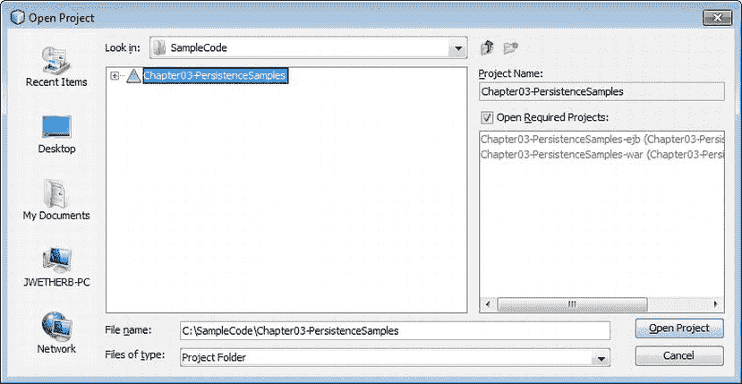

图 3-1.   打开 Chapter03-PersistenceSamples 项目

展开 `Chapter03-PersistenceSamples-ejb` 节点，观察包含此示例应用程序的 EJB 外观和 JPA 实体的包，以及章节列表的源代码。`persistence.xml` 文件可以在 `Configuration Files` 文件夹中找到，而指定数据库连接的 JDBC 数据源则位于 `Server Resources` 下的 `glassfish-resources.xml` 文件中。如上方“持久化归档”部分所述，JPA 持久化归档可以在应用程序中以多种方式打包。在此示例中，我们将持久化归档与 EJB 外观一起打包在 EJB .jar 文件中。

客户端 HTTP Servlet `CustomerOrderManagerClient.java` 位于 `Chapter03-PersistenceSamples-war` 项目中。

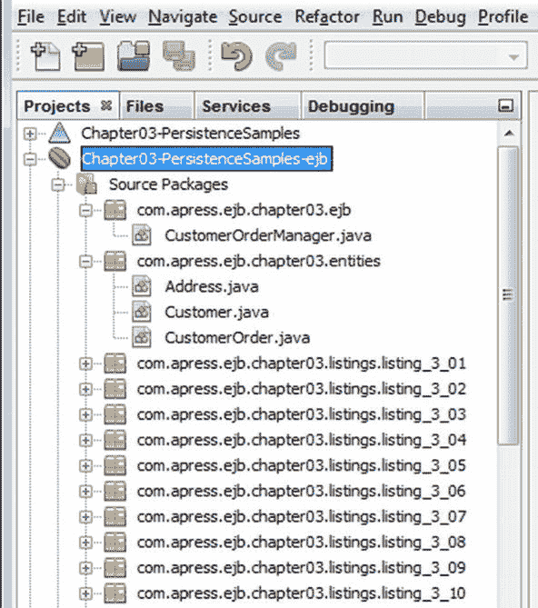

图 3-2.   验证项目中存在 EJB 和 JPA 构件

创建数据库连接和示例模式

本章中的示例需要一个数据库连接和一个填充了映射到 JPA 实体的表的数据库模式。要创建数据库本身，请单击 `Services` 选项卡，展开 `Databases` 图标，然后在 `Java DB` 节点上调用“`Create Database. . .`”。创建一个名为“`WineApp` `,`”的数据库，用户名和密码为 `wineapp/wineapp`：

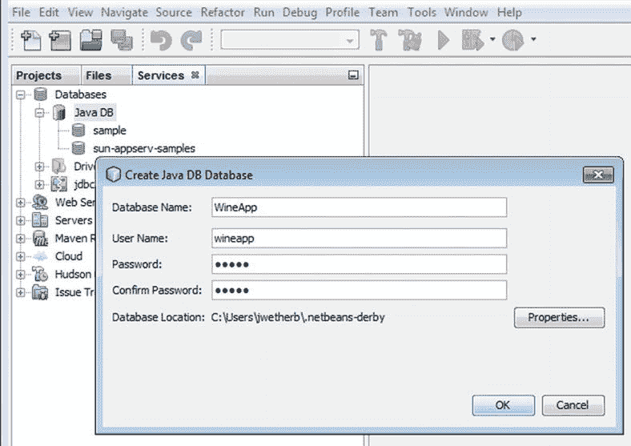

图 3-3.   创建 WineApp 数据库和连接

最后一步创建了一个数据库连接，现在可以用它来创建数据库模式。为此，请切换到 `Files` 选项卡，展开 `Chapter03-PersistenceSamples` 文件夹，然后展开 `database` 文件夹，右键单击 `Chapte03-WineAppSchema.sql` 文件，并选择“`Run File`”。在对话框中，务必选择上一步创建的新 `WineApp` 连接。你可以安全地忽略 `Chapter03-WineAppSchema.sql` 脚本中因尝试清理尚不存在的对象而引发的错误。

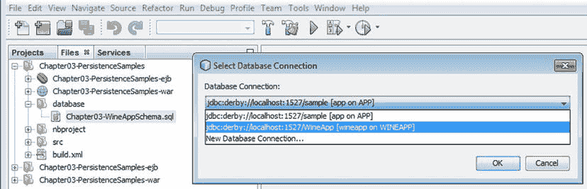

图 3-4.   在 WineApp 数据库中创建示例数据库模式

编译实体、EJB 和客户端

在 `Chapter03-PersistenceSamples` 节点上调用上下文菜单，并通过选择 `Clean and Build` 菜单选项来构建应用程序。

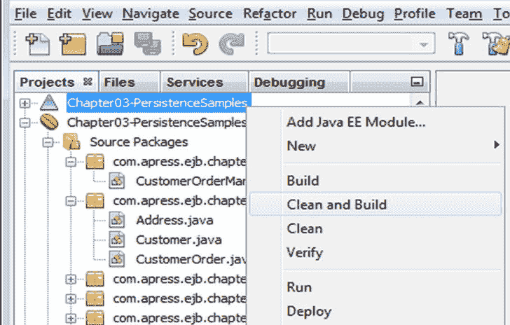

图 3-5.   构建应用程序

部署 JPA 持久化单元、EJB 模块和 Servlet

编译应用程序后，你可以将其部署到 GlassFish 应用服务器。在 `Chapter03-PersistenceSamples` 节点上调用上下文菜单，并通过选择 `Deploy` 菜单选项来部署应用程序。

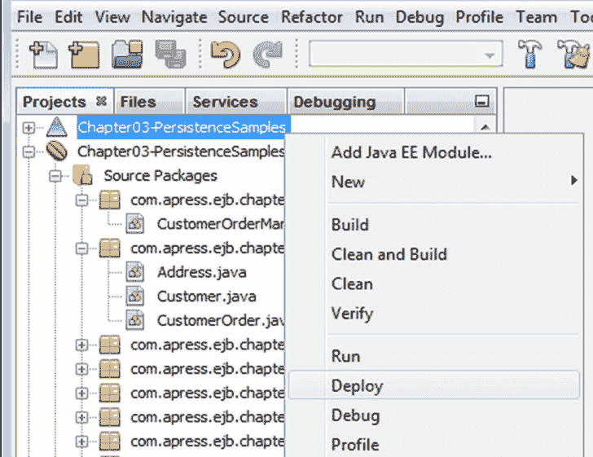

图 3-6.   部署应用程序

NetBeans 将启动集成的 GlassFish 应用服务器并将应用程序部署到服务器。服务器的日志窗口将记录应用程序的部署状态。

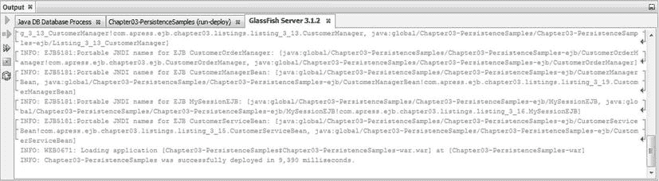

图 3-7.   显示成功部署的日志

运行客户端程序

成功部署实体、EJB 及其客户端 Servlet 后，我们需要设置要执行的运行目标。要设置运行目标，请在 `Chapter03-PersistenceSamples` 节点上调用上下文菜单，并选择 `Properties` 菜单选项。选择 `Run` 类别，在 `Relative URL` 文本字段中输入运行目标“`CustomerOrderManagerClient`”，然后确认对话框。

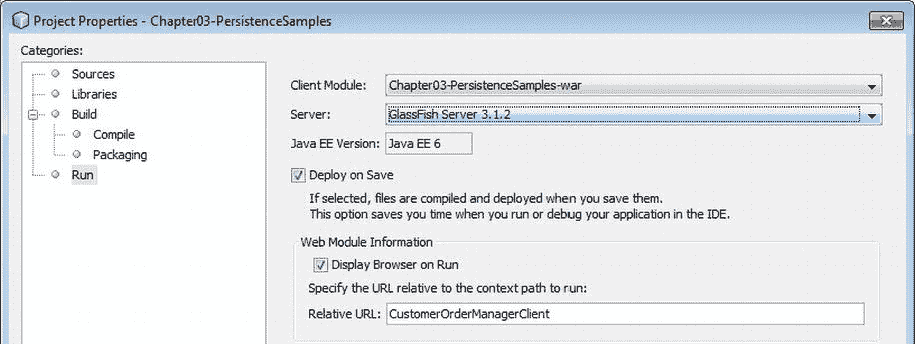

图 3-8.   设置要执行的目标

要运行客户端 HTTP Servlet，请在 `Chapter03-PersistenceSamples` 节点上调用上下文菜单，并选择 `Run` 菜单选项。

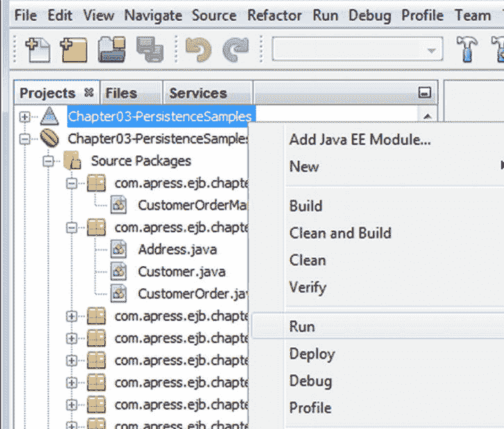

图 3-9.   运行选定的 Servlet

NetBeans 将打开你的默认浏览器并执行选定的 Servlet。任何现有的冲突数据将被删除，新的测试数据将被创建，然后被查询并以表格格式呈现。为避免循环依赖，实体的属性仅在首次遇到时显示；之后对该实体的任何引用都将显示为 `[<entity> <PK> already printed]`。引用的对象（包括引用对象的列表）将显示在嵌套的表格单元格中。以下是客户端 Servlet 的输出，显示了 Servlet 操作的日志。

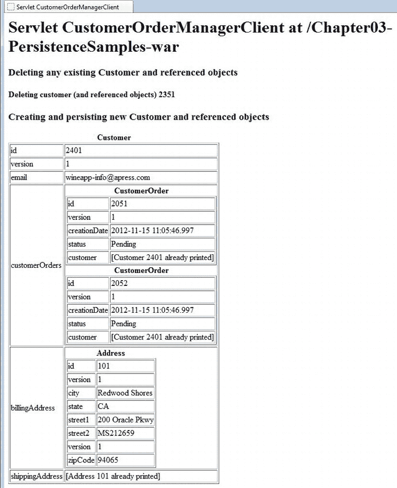

图 3-10.   CustomerOrderManagerClient Servlet 的输出

查看 `CustomerOrderManagerClient.java` 中的代码。请随意尝试创建额外的实体，测试 EJB 会话 Bean 上的 `mergeEntity()` 和其他服务方法，并观察结果行为。要将测试模式重置回其原始状态，你可以随时重新执行图 3-4 中描述的步骤。

结论

本章介绍了 Java 持久化 API 及其提供的一些基本服务。我们研究了如何通过简单地添加几个注解，将一个简单的 JavaBean 转换为 JPA 实体。然后，我们扩展了这个示例，以说明如何通过声明性地在实体类上指定额外的注解，进一步优化实体以增加更大的灵活性。

我们探讨了 JPA 的这些基本组件：持久化归档、持久化单元、持久化上下文和 `EntityManager`。我们逐步了解了实体生命周期，以检查实体在以下状态之间转换时的行为：新建、托管、分离和已删除。

关于 O/R 映射的部分探讨了实体如何映射到底层表，以及如何控制基本映射以允许字段映射到具有不同名称的列。

我们讨论了实体主键的作用，探讨了简单主键和复合主键以及如何定义它们。我们展示了如何配置 ID 生成器，以便 JPA 在持久化实体时自动分配其主键。

然后，我们深入研究了实体关系，并讨论了 JPA 支持的关系字段类型：`@OneToOne`、`@OneToMany`、`@ManyToOne` 和 `@ManyToMany`。

随后讨论了 JPQL，并举例说明了如何声明和执行命名查询，以及如何使用动态查询和批量更新与删除查询。

最后，我们提供了一个示例应用程序，说明了相关实体如何交互，以及如何通过会话外观（由 HTTP Servlet 调用）来操作它们。

第 4 章


高级持久化特性

我们将本书的持久化部分组织成三个主要章节。前一章介绍了 Java 持久化 API (JPA)，并为你提供了创建实体、建立对象/关系 (O/R) 映射以及编写检索实体的查询的起点。理解了这些概念，你就可以创建和构建具有强大、持久化实体的应用程序，这些实体既可以在 EJB 容器内部运行，也可以在外部运行。

在本章中，我们将以此知识为基础，探索 Java 持久化 API (JPA) 中能为你的应用程序提供更大灵活性和强大功能的领域，包括以下内容：


*   如何定义和使用实体继承层次结构
*   如何使用抽象实体、映射超类和非实体类
*   如何使用 Java 持久化查询语言（JPQL）、原生 SQL 和查询条件 API 构建查询
*   如何配置 ID 生成器以自动填充主键字段
*   如何指定实体生命周期回调
*   如何配置乐观锁定

持久化 API 的第三个主要领域涉及在使用 JPA 实体时，EJB 对事务管理的支持，这将在第 8 章中介绍。EJB 容器为您提供了多种选项，让会话 Bean 管理 `EntityManager` 的生命周期、控制持久化上下文的存活时间，以及使用 Java 事务 API（JTA）或资源本地事务。充分了解 EJB 和 JPA 支持事务的方式以及如何应用这项技术后，您将拥有构建大规模、持久化企业级应用的工具。

与本书其他章节一样，本章涵盖了规范中定义的许多概念，但无意取代规范。事实上，强烈建议读者将规范作为参考文档和资源，以更深入地探索这些概念，并发现其他超出本入门文本范围的内容。在此，我们专注于将规范中的一些基本特性转化为实际应用，提供示例说明如何使用新的持久化特性来实现构建基于组件的企业级 Java 应用这一现实目标。

本章中的每个主要概念都包含在一个独立的、可运行的示例中。运行这些示例所需的步骤将在本章末尾的“编译、部署和测试 JPA 实体”一节中介绍。总体结构是，我们为每个示例提供一个独立的 NetBeans 项目，并为每个项目提供其自己的 JPA 持久化单元、实体和 Java 测试服务类。您可以在纯 Java SE 环境中从 Java 客户端运行和测试这些示例，而无需运行 Glassfish，或者您也可以执行每个项目附带的 Servlet，在 Java EE Web 环境中运行示例。

 **注意**   如前一章所述，实体可以指定其持久化状态由其实例变量或 Bean 属性访问器定义。为了提高本章的可读性，我们使用术语*字段*来泛指实体的持久化成员，而将实体如何声明其持久化属性的细节留待讨论。

映射实体继承层次结构

Java 自诞生以来就支持单类继承——即非接口类可以扩展另一个类。虽然在业务领域的许多方面，利用继承带来的代码复用和多态性优势已成为常见做法，但在 JPA 引入之前，EJB 持久化领域并不支持数据继承。这曾是一个重大缺陷，因为在现实世界中，数据通常是层次化的，而缺乏对数据对象继承的标准内置支持导致了无数的变通方法和令人头疼的问题。利用 JDK 注解的易用性，JPA 提供了对定义和映射实体继承层次结构的声明式支持，包括抽象实体以及多态关系和查询。

 **注意**   *抽象实体*是包含 `abstract` 修饰符的实体类，因此不能直接实例化。抽象实体必须是实体继承层次结构中的中间类；它本身不能是叶子实体，因为它只能通过其子实体之一进行实例化。相应地，实体继承层次结构中的所有叶子实体都必须是具体的，因此是可实例化的。抽象实体的存在是为了为其子实体提供公共数据结构，并通过与其他实体的多态关系来表示其子实体。

JPA 中实体继承支持的很大一部分源于设计人员和工具开发者的工作，他们多年来想出了各种方法来实现自己的 O/R 映射，而 JPA 则方便地采用了源自这些努力的几种替代继承映射方法。

在给定的实体继承层次结构中，单一继承策略适用于该层次结构中的所有实体。此外，无论采用何种继承策略，层次结构中的所有实体都必须使用相同的主键类型。这使得容器能够合理地支持多态关系，无论类层次结构采用何种映射策略。

另外，如果您的数据库有表列数限制为 256 列的限制，请注意实体可以自由地将其字段映射分布到多个表的连接行中。

入门指南

本章中的所有代码片段都以可运行的形式存在，您可以下载并在本地环境中直接执行，同时附带了用于在本地数据库中创建相应表和其他数据库对象的 SQL 脚本。运行示例的步骤将在本章末尾描述。由于这些示例仅涉及实体，我们可以利用 JPA 提供的纯 Java SE（容器外）支持，跳过将这些实体部署到 Java EE 容器中的步骤。您将看到，一个简单的 Java 类就足以创建能够与这些实体交互并驱动示例测试的 `EntityManager`。实际观察这些概念将有助于澄清此处未解答的问题，并且这些示例还应为您测试自己的想法提供一个有用的起点。

实体继承映射策略

JPA 为三种主要的实现策略提供了声明式支持，这些策略决定了层次结构中的实体如何映射到底层表。我们将通过将每种策略应用于一个示例实体层次结构来研究它们，并探讨每种方法的优缺点。此比较旨在帮助您决定如何在自己的应用中映射每个实体层次结构。

示例实体层次结构

为了说明这三种策略如何在代码中体现，图 4-1 展示了一个示例实体层次结构，该结构演示了继承和多态关系。

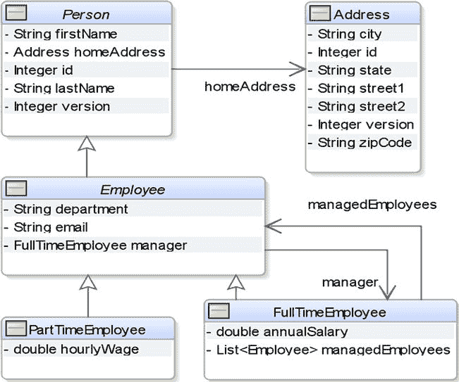

图 4-1.  一个以基础实体 Person 为根的实体类型层次结构，显示了层次结构内部和外部实体之间的关系

在此示例中，`Person` 实体作为实体层次结构中的根类，并由 `Employee` 实体扩展。`Employee` 进一步特化以产生另外两个实体：`FullTimeEmployee` 和 `PartTimeEmployee`。图中通过未命名的白色箭头表示继承关系，通过命名的开放箭头表示普通实体关系。


根实体 `Person` 和中间实体 `Employee` 在我们的示例中都是抽象的。只有叶子实体 `FullTimeEmployee` 和 `PartTimeEmployee`，以及独立实体 `Address` 是具体的且可实例化的。请注意，即使是抽象实体也可能参与与其他实体的关系，并且正如你将从后续代码中看到的，抽象实体也可以在 JPQL 语句中使用。每当引用非叶子实体时，该引用隐式地假设所引用的实际具体实现可能是该实体或其任何子类实体。不过，非叶子实体也可以是具体的，如果我们选择在示例中这样做，本可以将这些基类设为具体。

根实体 `Person` 还持有一个对 `Address` 实例的单值引用，由 `Person` 上的 `homeAddress` 字段表示。此关系被 `Person` 的所有子类继承；因此，所有 `Employee`（`FullTimeEmployee` 和 `PartTimeEmployee`）的实例也可以引用它们的 `homeAddress` 字段。请注意，`Address` 上没有对应的字段引用 `Person`，因此这是一个单向关系。从上一章我们对实体关系的介绍中，你会记得这是一个一对一关系。

 **注意**   两个实体之间仅通过其中一个实体上的字段暴露的关系称为*单向关系*。通过两个相关实体上的字段暴露的关系称为*双向关系*。

此外，我们在 `FullTimeEmployee`（一个 `manager`）和一组 `Employee`（其 `managedEmployees`）之间定义了一个一对多、双向的关系。由于此关系通过关系两端的字段暴露（在这种情况下，涉及的两个实体实际上是同一个实体 `Employee`），因此这是一个双向的一对多关系。

在查看每个示例时，你会看到 Java 源文件在三种继承映射策略中基本保持不变。只有用于声明继承策略的类级别注解以及一些细节（如表名）将一个示例中的实体与另一个示例中的实体区分开来。这是一个关键优势——所选的继承策略可以在不影响实体 Java API 的情况下进行替换。在接下来的三节中，我们将说明如何将每种映射策略应用于此层次结构。

在这些继承示例中，我们为 `Address` 实体包含了一个单独的表，该表与映射到每个继承层次结构的表并列，如数据库模式图所示。严格来说，没有必要为每个实体层次结构替换 `ADDRESS` 表，因为与 `Person` 实体关联的任何表都可以持有其自身对公共 `ADDRESS` 表的外键引用。然而，我们采用这种方法是为了帮助隔离每个继承示例。

对象/关系继承映射策略

 **注意**   除非另有说明，你可以假定本章中提到的所有 JPA 类都在 `javax.persistence.*` 包中。

现在我们已经定义了实体层次结构，让我们看看 JPA 原生支持的三种 O/R 策略如何用于映射此 `Person` 实体层次结构以及关联的 `Address` 实体到关系模式。以下是 `InheritanceType` 枚举定义的每种策略的摘要：

```
public enum InheritanceType
```

`{ SINGLE_TABLE, JOINED, TABLE_PER_CLASS };`

*   `SINGLE_TABLE`：单表每类继承层次结构。这是默认策略。实体层次结构本质上被扁平化为其字段的总和，这些字段被映射到单个表中。
*   `JOINED`：公共基表与连接的子类表。在这种方法中，层次结构中的每个实体映射到其自己的专用表，该表仅映射该实体上声明的字段。层次结构中的根实体映射到基表，而层次结构中所有其他实体的表都引用此基表。
*   `TABLE_PER_CLASS`：单表每最外层具体实体类。第三种继承映射选项也不是 JPA 容器为符合 JPA 2.1 规范最终草案所必需的，因此可移植的应用程序应避免使用它，直到它被正式强制要求或至少得到广泛支持。此策略将每个叶子（即最外层的具体）实体映射到其自己的专用表。每个这样的叶子实体分支被扁平化，将其声明的字段与其所有超实体上声明的字段合并，这些字段的总和被映射到其表上。

@GeneratedValue 注解

在每个继承策略示例中，我们使用 `@GeneratedValue` 注解来自动填充 `Person` 实体层次结构和独立实体 `Address` 的主键。在我们的示例中，我们指定一个名为 `id` 的字段作为主键，仅仅是为了保持一致性。在元数据中指定 ID 生成器允许持久化提供程序在实体实际作为行保存到数据库之前为其分配 ID 值。声明式指定 `@GeneratedValue` 注解肯定比在应用程序代码中分配 ID 更容易，并且相对于使用数据库触发器自动填充 ID 值的替代方案也是一种优化。由于在持久化关系映射时会使用 ID 值，这节省了持久化管理器从数据库中再次查询该行以检索触发器填充值的麻烦。有关如何自定义基于序列或表的 ID 生成器的详细信息将在本章后面提供。

我们现在将探讨每种策略，讨论其优缺点，并通过示例说明其用法。

 **注意**   下面列表清单中显示的示例的 Java 源文件都可以在本章的源代码区域中找到。

单表每类继承层次结构 (InheritanceType.SINGLE_TABLE)

默认的继承映射策略是 `SINGLE_TABLE`，其中类层次结构中的所有实体都映射到单个表。此表上的专用鉴别器列标识与每一行关联的特定实体类型，并且层次结构中的每个实体都被赋予一个唯一值存储在此列中。默认情况下，实体的鉴别器值是其实体名称，尽管实体可以使用 `@DiscriminatorValue` 注解覆盖此值。这种方法在查询时性能良好，因为只涉及一个表，并且如果你的层次结构类型能够遵守实际限制，这可能是最佳使用方法。

图 4-2 显示了一个模式图，该模式使用 `SINGLE_TABLE` 策略映射我们的示例实体。我们选择为这些表添加前缀 `CH04_ST_`，以避免与示例模式中由完整的企业在线葡萄酒应用程序使用的 `PERSON` 和 `ADDRESS` 表冲突。

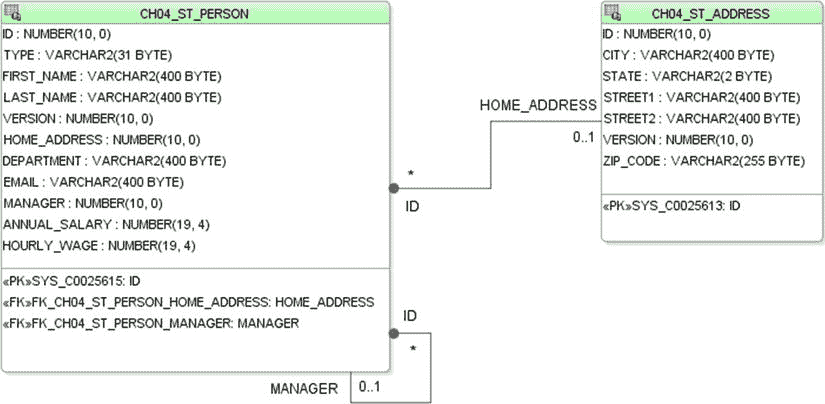

图 4-2.  CH04_ST_PERSON 表保存了以 Person 为根的实体层次结构中的所有实体实例。CH04_ST_ADDRESS 表保存了关联的 Address 实例。


在以`Person`实体为根的实体层次结构中，所有属性都映射到单张表`CH04_ST_PERSON`的列上。该表包含一个外键引用，绑定到`HOME_ADDRESS`列，指向映射到`Address`实体的`CH04_ST_ADDRESS`表。它还包含一个外键引用，通过`MANAGER`列指向自身。该外键不强制唯一，这意味着多行数据在`MANAGER`列中可以持有相同的值。

示例实体类

清单 4-1 至 4-4 展示了`Person`层次结构中的实体如何使用`SINGLE_TABLE`继承策略进行映射。继承策略在层次结构的根实体上声明，并适用于层次结构中的所有子实体。示例实体中引入但尚未涵盖的注解将在后续章节中解释。

***清单 4-1.***  Person.java，SINGLE_TABLE 继承层次结构中的抽象根实体

```
/*
 * Person: 一个抽象实体，也是继承层次结构的根
 *
 * 创建 ID 生成器表 "CH04_ST_PERSON_ID_GEN":
 * CREATE TABLE "CH04_ST_PERSON_ID_GEN" ("PRIMARY_KEY_NAME" VARCHAR2(4000) PRIMARY KEY,    "NEXT_ID_VALUE" NUMBER(38));
 *
 * 为此实体的 ID 生成器 'Person.id' 初始化该表数据（起始值为 '0'）:
 * INSERT INTO "CH04_ST_PERSON_ID_GEN" VALUES ('Person.id', 0);
*/
@Entity
@NamedQueries({ @NamedQuery(name = "Person.findAll", query = "select o from Person o") })
@Table(name = "CH04_ST_PERSON")
@TableGenerator(name = "Person_ID_Generator", table = "CH04_ST_PERSON_ID_GEN", pkColumnName = "PRIMARY_KEY_NAME",
                pkColumnValue = "Person.id", valueColumnName = "NEXT_ID_VALUE")
@Inheritance(strategy = InheritanceType.SINGLE_TABLE)
@DiscriminatorColumn(name="TYPE")
public abstract class Person
  implements Serializable
{
  @SuppressWarnings("compatibility:-7074714881275658754")
  private static final long serialVersionUID = 5291172566067954515L;

@Id
  @Column(nullable = false)
  @GeneratedValue(strategy = GenerationType.TABLE, generator = "Person_ID_Generator")
  private Integer id;
  @Column(name = "FIRST_NAME", length = 400)
  private String firstName;
  @Column(name = "LAST_NAME", length = 400)
  private String lastName;
  @OneToOne(cascade=CascadeType.ALL)
  @JoinColumn(name = "HOME_ADDRESS")
  private Address homeAddress;
  @Version
  private Integer version;
  public Person() {
  }

/* get/set 方法... */
}
```

***清单 4-2.***  Employee.java，SINGLE_TABLE 继承层次结构中的抽象中间实体

```
/*
 * Employee: 一个扩展 Person 的抽象实体
 */
@Entity
@NamedQueries({
  @NamedQuery(name = "Employee.findAll", query = "select o from Employee o")})
@Table(name = "CH04_ST_EMPLOYEE")
public abstract class Employee extends Person implements Serializable {
  @SuppressWarnings("compatibility:276774077273820023")
  private static final long serialVersionUID = -8529011412038476148L;
  @Column(length = 400)
  private String department;
  @Column(length = 400)
  private String email;
  @ManyToOne
  @JoinColumn(name = "MANAGER")
  private FullTimeEmployee manager;

public Employee() {
  }

/* get/set 方法... */
}
```

***清单 4-3.***  FullTimeEmployee.java，SINGLE_TABLE 继承层次结构中的具体叶子实体

```
/*
 * FullTimeEmployee: 一个具体的叶子实体
 */
@Entity
@NamedQueries({
  @NamedQuery(name = "FullTimeEmployee.findAll", query = "select o from FullTimeEmployee o")})
@Table(name = "CH04_ST_FT_EMPLOYEE")
public class FullTimeEmployee
        extends Employee
        implements Serializable {
  @SuppressWarnings("compatibility:9058152191575937294")
  private static final long serialVersionUID = -7301681120809804802L;
  @Column(name = "ANNUAL_SALARY")
  private double annualSalary;
  @OneToMany(mappedBy = "manager", cascade = {CascadeType.PERSIST, CascadeType.MERGE})
  private List<Employee> managedEmployees;

public FullTimeEmployee() {
  }

/* get/set 方法... */
}
```

***清单 4-4.***  PartTimeEmployee.java，SINGLE_TABLE 继承层次结构中的具体叶子实体

```
/*
 * PartTimeEmployee: 一个具体的叶子实体
 */
@Entity
@NamedQueries({
  @NamedQuery(name = "PartTimeEmployee.findAll", query = "select o from PartTimeEmployee o")})
@Table(name = "CH04_ST_PT_EMPLOYEE")
public class PartTimeEmployee extends Employee implements Serializable {
  @SuppressWarnings("compatibility:-4882346458268010846")
  private static final long serialVersionUID = 4017999239159878209L;
  @Column(name = "HOURLY_WAGE")
  private double hourlyWage;

public PartTimeEmployee() {
  }

/* get/set 方法... */
}
```

在此实体层次结构之外，存在`Address`实体，如清单 4-5 所示。该实体是之前展示的根（抽象）`Person`实体上单向`@OneToOne`关系的目标。

***清单 4-5.***  Address.java，一个具体的独立实体

```
/*
 * Address: 一个独立实体
 *
 * 创建 ID 生成器表 "CH04_ST_ADDRESS_ID_GEN": CREATE TABLE "CH04_ST_ADDRESS_ID_GEN"
 * ("PRIMARY_KEY_NAME" VARCHAR2(4000) PRIMARY KEY, "NEXT_ID_VALUE" NUMBER(38));
 *
 * 为此实体的 ID 生成器 'Address.id' 初始化该表数据（起始值为 '0'）:
 * INSERT INTO "CH04_ST_ADDRESS_ID_GEN" VALUES ('Address.id', 0);
 */
@Entity
@NamedQueries({
  @NamedQuery(name = "Address.findAll", query = "select o from Address o")})
@Table(name = "CH04_ST_ADDRESS")
@TableGenerator(name = "Address_ID_Generator", table = "CH04_ST_ADDRESS_ID_GEN", pkColumnName = "PRIMARY_KEY_NAME",
                pkColumnValue = "Address.id", valueColumnName = "NEXT_ID_VALUE")
public class Address
        implements Serializable {
  @SuppressWarnings("compatibility:-5340972441524875330")
  private static final long serialVersionUID = -5279408726470732092L;
  @Id
  @Column(nullable = false)
  @GeneratedValue(strategy = GenerationType.TABLE, generator = "Address_ID_Generator")
  private Integer id;
  @Column(length = 400)
  private String city;
  @Column(length = 2)
  private String state;
  @Column(length = 400)
  private String street1;
  @Column(length = 400)
  private String street2;
  @Version
  private Integer version;
  @Column(name = "ZIP_CODE")
  private String zipCode;

public Address() {
  }

/* get/set 方法... */
}
```

让我们来看看此示例中引入的一些注解。

@JoinColumn 注解

`Employee`实体有一个类型为`FullTypeEmployee`的`manager`字段，其映射方式如下：

```
@ManyToOne
@JoinColumn(name = "MANAGER")
private FullTimeEmployee manager;
```

`manager`字段的类型为`FullTimeEmployee`，并映射到`MANAGER`列，该列由`@JoinColumn`注解上的`name = "MANAGER"`属性标识。`MANAGER`列恰好是`FullTypeEmployee`实体所映射表的外键引用，在本例中，该表就是`CH04_ST_PERSON`表。为这类列定义外键并非严格必要，但通常被认为是良好的数据库设计。由于`manager`字段映射到外键列，因此它被视为关系的*拥有*方。


此双向关系另一端的实体 `FullTimeEmployee` 持有 `managedEmployees` 字段。

```
@OneToMany(mappedBy = "manager", cascade = {CascadeType.PERSIST, CascadeType.MERGE})
private List<Employee> managedEmployees;
```

由于我们已经在拥有方指定了映射关系，该字段只需使用 `mappedBy = "manager"` 属性来引用那个 `manager` 字段即可。这样一来，两个关系字段都映射到同一个外键上，因此无需使用连接表。

 **注意**   即使目标实体没有暴露对应的 `@ManyToOne` 关系字段，JPA 也允许你将 `@OneToMany` 字段映射到目标实体表的外键上。为此，你需要在 `@OneToMany` 字段上使用 `@JoinColumn` 来标识远程外键，而不是使用 `mappedBy` 属性。

`managedEmployees` 字段包含一个 `Employee` 实例列表，在实际应用中，这些实例将是具体的 `FullTimeEmployee` 和/或 `PartTimeEmployee` 实例。

`cascade = { CascadeType.PERSIST, CascadeType.MERGE }` 属性表示，对此实体 `Employee` 执行的任何合并或持久化操作，也必须应用于此关系字段引用的所有 `FullTimeEmployee` 实例。例如，如果创建了一个新的 `Employee` 实例，并为其分配了一个 `FullTimeEmployee` 作为经理，那么通过 `EntityManager.persist()` 持久化该 `Employee` 实例时，也会同时持久化任何被引用的 `FullTimeEmployee` 实例（如果它们尚未被持久化的话）。

`Person` 实体通过 `homeAddress` 字段与 `Address` 建立关系。

```
@OneToOne(cascade=CascadeType.ALL)
@JoinColumn(name = "HOME_ADDRESS")
private Address homeAddress;
```

由于 `Address` 上没有对应的字段来引用 `Person`，因此这是一个单向关系。`@OneToOne` 上的 `cascade` 属性指示哪些操作应传播到被引用的对象。因为我们指定了 `CascadeType.ALL` 的级联规则，所以应用于 `Person` 的所有事件——`DETACH`、`MERGE`、`PERSIST`、`REFRESH` 和 `REMOVE`——都会自动应用于其 `homeAddress` 对象。

@DiscriminatorColumn 注解

每当我们像使用 `InheritanceType.SINGLE_TABLE` 策略那样，将多个实体类映射到单个表时，必须有一种方法能够识别表中任何给定行的具体实体类型。为了确定实体类型，持久化管理器会在根实体的表中查找名为 `DTYPE` 的列来获取此信息。如果你的模式需要不同的列名来捕获此信息，你可以使用 `@DiscriminatorColumn` 注解来标识 JPA 应使用哪一列；在清单 4-1 中，Person.java 实体通过 `@DiscriminatorColumn(name = "TYPE")` 注解指定了一个名为 `TYPE` 的鉴别器列。如果我们像其余示例那样使用名为 `DTYPE` 的列，则可以完全省略此注解并接受默认值。

@DiscriminatorValue 注解

存储在鉴别器列中的值称为鉴别器值。每个具体实体都显式声明或默认接受一个唯一的鉴别器值，该值用于标识与表中每一行关联的具体实体类型。鉴别器值默认为实体名称，在此示例中，我们为层次结构中的每个实体都接受了此默认值。当将遗留表和数据库适配到 JPA，并且希望将预先存在的鉴别器值映射到名称不同的实体时，可以使用 `@DiscriminatorValue` 注解为层次结构中需要覆盖的每个实体指定要使用的鉴别器值。

SINGLE_TABLE 策略的优缺点

我们从设计时和性能的角度来考量每个继承层次结构，权衡其优缺点。我们从 SINGLE_TABLE 策略开始。

设计时考量

当类型层次结构相当简单且稳定时，SINGLE_TABLE 映射方法效果很好。向层次结构添加新类型以及向现有超类型添加字段，只需向表中添加新列即可。然而，在特别大型的部署中，这可能会对数据库内部的索引和列布局产生不利影响。如果你的层次结构可能会超出单个表的列限制（通常为 256 列），或者由于某种原因需要将多个非常大的字段映射到内联 LOB（大型对象）列，则可能需要引入 `@SecondaryTable` 映射。在这种情况下，采用后续方法之一可能更为明智。此外，对于层次结构中并非所有类型共享的列，不能使用 NOT NULL 约束。

性能影响

SINGLE_TABLE 策略对于跨层次结构中的所有类型或特定类型进行查询非常高效。内部持久化框架不需要表连接——只需要一个列出类型标识符的 `WHERE` 子句即可。特别是，涉及采用此映射策略的类型的关系，其性能表现良好。

示例客户端代码

正如我们在本章“入门”部分提到的，我们准备了示例客户端代码来测试继承示例，以及本章后面出现的其他示例。在本章提供的示例代码中，我们为每个继承示例都提供了一个 Java 客户端和一个 HTTP servlet。清单 4-6 展示了一个简单的 Java 类，它作为一个外观（类似于 EJB Session bean 外观），用于为 `Chapter04-PersistenceIISamples-SingleTable` 持久化单元实例化一个 `EntityManager`，并公开用于操作该单元中 JPA 实体的 CRUD 方法。清单 4-7 展示了一个用于此服务的 Java 客户端，它执行这些 CRUD 方法并打印结果。我们也可以为此目的使用实际的 EJB Session 外观，但我们想演示一个普通的 Java 类如何在非 JavaEE 环境中与 JPA 实体交互。

在示例代码区域中，我们为其他继承策略提供了类似的 Java 服务外观和配套的 Java 客户端。除了每个策略使用的持久化单元以及使用特定继承策略细节进行注解的实体类不同之外，它们在各个继承策略之间是相同的。

类似地，我们为每个继承策略提供了一个简单的 HTTP servlet 客户端，演示了在 JavaEE Web 环境中使用 JPA 实体。这些 servlet 替代了 Java 客户端，并直接与相同的 Java 服务外观进行交互。

***清单 4-6.***  JavaServiceFacade.java，一个作为图 4-1 中定义的实体的外观的 Java 类

```
/*
 * Java 服务外观，用于获取在 Java EE 容器外部运行的 EntityManager，
 * 并演示对少量实体执行 CRUD 操作。
 * 采用自动提交行为，模拟无状态 Session Bean 的默认事务行为。
 */
public class JavaServiceFacade {
  private final EntityManager em;

public JavaServiceFacade() {
    // 为了支持非 JavaEE 环境，我们避免注入，并为所需的持久化单元创建 EntityManagerFactory。
    // 然后从此工厂创建 EntityManager。
    final EntityManagerFactory emf = Persistence.createEntityManagerFactory("Chapter04-PersistenceIISamples-SingleTable");
    em = emf.createEntityManager();
  }


/**
   * 对持久化上下文中所管理实体进行的所有更改，
   * 都将被应用到数据库并提交。
   */
  private void commitTransaction() {
    final EntityTransaction entityTransaction = em.getTransaction();
    if (!entityTransaction.isActive()) {
      entityTransaction.begin();
    }
    entityTransaction.commit();
  }

public Object queryByRange(String jpqlStmt, int firstResult, int maxResults) {
    Query query = em.createQuery(jpqlStmt);
    if (firstResult > 0) {
      query = query.setFirstResult(firstResult);
    }
    if (maxResults > 0) {
      query = query.setMaxResults(maxResults);
    }
    return query.getResultList();
  }

public <T> T persistEntity(T entity) {
    em.persist(entity);
    commitTransaction();
    return entity;
  }
  public <T> T mergeEntity(T entity) {
    entity = em.merge(entity);
    commitTransaction();
    return entity;
  }

public void removeEmployee(Employee employee) {
    employee = em.find(Employee.class, employee.getId());
    em.remove(employee);
    commitTransaction();
  }

/**
   * <code>select o from Employee o</code>
   */
  public List<Employee> getEmployeeFindAll() {
    return em.createNamedQuery("Employee.findAll", Employee.class).getResultList();
  }

public void removeFullTimeEmployee(FullTimeEmployee fullTimeEmployee) {
    fullTimeEmployee = em.find(FullTimeEmployee.class, fullTimeEmployee.getId());
    em.remove(fullTimeEmployee);
    commitTransaction();
  }

/**
   * <code>select o from FullTimeEmployee o</code>
   */
  public List<FullTimeEmployee> getFullTimeEmployeeFindAll() {
    return em.createNamedQuery("FullTimeEmployee.findAll", FullTimeEmployee.class).getResultList();
  }

public void removePartTimeEmployee(PartTimeEmployee partTimeEmployee) {
    partTimeEmployee = em.find(PartTimeEmployee.class, partTimeEmployee.getId());
    em.remove(partTimeEmployee);
    commitTransaction();
  }

/**
   * <code>select o from PartTimeEmployee o</code>
   */
  public List<PartTimeEmployee> getPartTimeEmployeeFindAll() {
    return em.createNamedQuery("PartTimeEmployee.findAll", PartTimeEmployee.class).getResultList();
  }

public void removePerson(Person person) {
    person = em.find(Person.class, person.getId());
    em.remove(person);
    commitTransaction();
  }

/**
   * <code>select o from Person o</code>
   */
  public List<Person> getPersonFindAll() {
    return em.createNamedQuery("Person.findAll", Person.class).getResultList();
  }
  public void removeAddress(Address address) {
    address = em.find(Address.class, address.getId());
    em.remove(address);
    commitTransaction();
  }

/**
   * <code>select o from Address o</code>
   */
  public List<Address> getAddressFindAll() {
    return em.createNamedQuery("Address.findAll", Address.class).getResultList();
  }
}

***清单 4-7.*** JavaServiceFacadeClient.java，一个用于 JavaServiceFacade 的 Java 客户端，演示了如何删除、创建和检索图 4-1 中定义的实体。

```
/*
 * Java 服务外观的 Java 客户端
 */
public class JavaServiceFacadeClient {
  public static void main(String[] args) {
    try {
      final JavaServiceFacade javaServiceFacade = new JavaServiceFacade();

//-----------------------------------------------------------------------------------
      //  清除所有之前的测试数据。由于 "Person.homeAddress" 关系字段上的 "cascade" 设置，
      //  删除一个 Person 也会同时删除其关联的 Address。
      //-----------------------------------------------------------------------------------
      for (PartTimeEmployee parttimeemployee : (List<PartTimeEmployee>)
       javaServiceFacade.getPartTimeEmployeeFindAll()) {
        javaServiceFacade.removePartTimeEmployee(parttimeemployee);
      }
      for (FullTimeEmployee fulltimeemployee : (List<FullTimeEmployee>)
       javaServiceFacade.getFullTimeEmployeeFindAll()) {
        javaServiceFacade.removeFullTimeEmployee(fulltimeemployee);
      }

//-----------------------------------------------------------------------------------
      //  创建 FullTimeEmployee 和 PartTimeEmployee 实例及其 Address 对象，
      //  并将它们持久化到数据库中。
      //-----------------------------------------------------------------------------------
      Address add = new Address();
      add.setCity("San Mateo");
      add.setState("CA");
      add.setStreet1("1301 Ashwood Ct");
      add.setZipCode("94402");
      javaServiceFacade.persistEntity(add);

FullTimeEmployee ft = new FullTimeEmployee();
      ft.setAnnualSalary(1000D);
      ft.setDepartment("HQ");
      ft.setEmail("x@y.com");
      ft.setFirstName("Brian");
      ft.setLastName("Jones");
      ft.setHomeAddress(add);
      ft = javaServiceFacade.persistEntity(ft);
      add = new Address();
      add.setCity("San Francisco");
      add.setState("CA");
      add.setStreet1("53 Surrey St");
      add.setZipCode("94131");
      javaServiceFacade.persistEntity(add);

final PartTimeEmployee pt = new PartTimeEmployee();
      pt.setHourlyWage(100D);
      pt.setDepartment("SALES");
      pt.setEmail("a@b.com");
      pt.setFirstName("David");
      pt.setLastName("Holmes");
      pt.setHomeAddress(add);
      pt.setManager(ft);
      javaServiceFacade.persistEntity(pt);

//-----------------------------------------------------------------------------------
      //  通过特定类型的 JPQL 查询检索实体，并打印输出
      //-----------------------------------------------------------------------------------
      System.out.println("\nPersons:\n");
      for (Person person : (List<Person>) javaServiceFacade.getPersonFindAll()) {
        printPerson(person);
      }
      System.out.println("\nEmployees:\n");
      for (Employee employee : (List<Employee>) javaServiceFacade.getEmployeeFindAll()) {
        printEmployee(employee);
      }
      System.out.println("\nPartTimeEmployees:\n");
      for (PartTimeEmployee parttimeemployee : (List<PartTimeEmployee>)
       javaServiceFacade.getPartTimeEmployeeFindAll()) {
        printPartTimeEmployee(parttimeemployee);
      }
      System.out.println("\nFullTimeEmployees:\n");
      for (FullTimeEmployee fulltimeemployee : (List<FullTimeEmployee>) javaServiceFacade.getFullTimeEmployeeFindAll()) {
        printFullTimeEmployee(fulltimeemployee);
      }
      System.out.println("\nAddresses:\n");
      for (Address address : (List<Address>) javaServiceFacade.getAddressFindAll()) {
        printAddress(address);
      }
    } catch (Exception ex) {
      ex.printStackTrace();
    }
  }


private static void printEmployee(Employee employee) {
    System.out.println("dept = " + employee.getDepartment());
    System.out.println("email = " + employee.getEmail());
    System.out.println("manager = " + employee.getManager());
    System.out.println("firstName = " + employee.getFirstName());
    System.out.println("id = " + employee.getId());
    System.out.println("lastName = " + employee.getLastName());
    System.out.println("version = " + employee.getVersion());
    System.out.println("homeAddress = " + employee.getHomeAddress());
  }
  private static void printFullTimeEmployee(FullTimeEmployee fulltimeemployee) {
    System.out.println("annualSalary = " + fulltimeemployee.getAnnualSalary());
    System.out.println("managedEmployees = " + fulltimeemployee.getManagedEmployees());
    System.out.println("dept = " + fulltimeemployee.getDepartment());
    System.out.println("email = " + fulltimeemployee.getEmail());
    System.out.println("manager = " + fulltimeemployee.getManager());
    System.out.println("firstName = " + fulltimeemployee.getFirstName());
    System.out.println("id = " + fulltimeemployee.getId());
    System.out.println("lastName = " + fulltimeemployee.getLastName());
    System.out.println("version = " + fulltimeemployee.getVersion());
    System.out.println("homeAddress = " + fulltimeemployee.getHomeAddress());
  }

private static void printPartTimeEmployee(PartTimeEmployee parttimeemployee) {
    System.out.println("hourlyWage = " + parttimeemployee.getHourlyWage());
    System.out.println("dept = " + parttimeemployee.getDepartment());
    System.out.println("email = " + parttimeemployee.getEmail());
    System.out.println("manager = " + parttimeemployee.getManager());
    System.out.println("firstName = " + parttimeemployee.getFirstName());
    System.out.println("id = " + parttimeemployee.getId());
    System.out.println("lastName = " + parttimeemployee.getLastName());
    System.out.println("version = " + parttimeemployee.getVersion());
    System.out.println("homeAddress = " + parttimeemployee.getHomeAddress());
  }

private static void printPerson(Person person) {
    System.out.println("firstName = " + person.getFirstName());
    System.out.println("id = " + person.getId());
    System.out.println("lastName = " + person.getLastName());
    System.out.println("version = " + person.getVersion());
    System.out.println("homeAddress = " + person.getHomeAddress());
  }

private static void printAddress(Address address) {
    System.out.println("city = " + address.getCity());
    System.out.println("id = " + address.getId());
    System.out.println("state = " + address.getState());
    System.out.println("street1 = " + address.getStreet1());
    System.out.println("street2 = " + address.getStreet2());
    System.out.println("version = " + address.getVersion());
    System.out.println("zipCode = " + address.getZipCode());
  }
}

公共基表与连接子类表（InheritanceType.JOINED）

在 `JOINED` 策略中，层次结构中的每个实体都引入自己的表，但仅用于映射在该实体类型上声明的字段。层次结构中的根实体映射到一个根表，该表定义了实体层次结构中所有表要使用的主键结构，以及鉴别器列和可选的版本列。层次结构中的其他每个表都定义一个与根表主键匹配的主键，并且它们可以选择从其 ID 列向根表的 ID 列添加外键约束。非根表不包含鉴别器类型或版本列。由于层次结构中的每个实体实例都由一个虚拟行表示，该行跨越其自身的表以及其所有超实体的表，因此它最终会与根表中的一行进行连接，该行捕获了鉴别器类型和版本信息。查询任何类型的所有字段都需要在超类型层次结构中的所有表之间进行连接。


图 4-3 展示了使用`JOINED`继承策略映射实体的模式。与之前的示例类似，我们在表名前添加了策略标识符，此处为`CH04_JOIN_`，以便这些示例中的所有表都能加载到同一个测试模式中，而不会发生名称冲突。

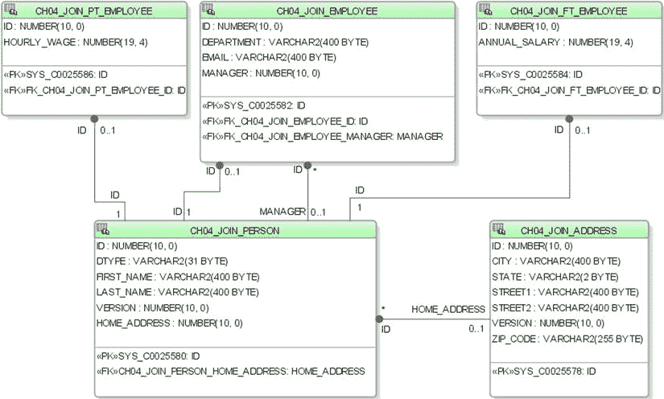

图 4-3  使用 JOINED 策略映射示例实体的模式。层次结构中的每个实体都有自己独立的表来持久化其声明的字段。表 CH04_JOIN_ADDRESS 保存关联的 Address 实例

示例实体类

现在让我们来看一下映射到上述模式的实体类。我们省略了每个实体的类主体，因为这些实体与之前`SINGLE_TABLE`策略示例中展示的实体之间的唯一区别在于实体类级别的注解。代码清单 4-8 至 4-11 展示了`Person`层次结构中的实体，而代码清单 4-12 展示了`Address`实体。

***代码清单 4-8.***  Person.java，JOINED 继承层次结构中的抽象根实体

```
/*
 * Person: 一个抽象实体，是继承层次结构的根
 */
@Entity
@NamedQueries({
  @NamedQuery(name = "Person.findAll", query = "select o from Person o")})
@Table(name = "CH04_JOIN_PERSON")
@TableGenerator(name = "Person_ID_Generator", table = "CH04_JOIN_PERSON_ID_GEN",
                pkColumnName = "PRIMARY_KEY_NAME", pkColumnValue = "Person.id",
                valueColumnName = "NEXT_ID_VALUE")
@Inheritance(strategy = InheritanceType.JOINED)
public abstract class Person implements Serializable {
  /* 类主体在所有继承策略中完全相同 */
}
```

***代码清单 4-9.***  Employee.java，JOINED 继承层次结构中的抽象中间实体

```
/*
 * Employee: 一个扩展 Person 的抽象实体
 */
@Entity
@NamedQueries({
  @NamedQuery(name = "Employee.findAll", query = "select o from Employee o")})
@Table(name = "CH04_JOIN_EMPLOYEE")
public abstract class Employee extends Person implements Serializable {
  /* 类主体在所有继承策略中完全相同 */
}
```

***代码清单 4-10.***  FullTimeEmployee.java，JOINED 继承层次结构中的具体叶子实体

```
/*
 * FullTimeEmployee: 一个具体的叶子实体
 */
@Entity
@NamedQueries({
  @NamedQuery(name = "FullTimeEmployee.findAll", query = "select o from FullTimeEmployee o")})
@Table(name = "CH04_JOIN_FT_EMPLOYEE")
public class FullTimeEmployee extends Employee implements Serializable {  /* 类主体在所有继承策略中完全相同 */
}
```

***代码清单 4-11.***  PartTimeEmployee.java，JOINED 继承层次结构中的具体叶子实体

```
/*
 * PartTimeEmployee: 一个具体的叶子实体
 */
@Entity
@NamedQueries({
  @NamedQuery(name = "PartTimeEmployee.findAll", query = "select o from PartTimeEmployee o")})
@Table(name = "CH04_JOIN_PT_EMPLOYEE")
public class PartTimeEmployee extends Employee implements Serializable {
  /* 类主体在所有继承策略中完全相同 */
}
```

***代码清单 4-12.***  Address.java，一个具体的独立实体

```
/**
 * Address: 一个独立实体
 */
@Entity
@NamedQueries({
  @NamedQuery(name = "Address.findAll", query = "select o from Address o")})
@Table(name = "CH04_JOIN_ADDRESS")
@TableGenerator(name = "Address_ID_Generator", table = "CH04_JOIN_ADDRESS_ID_GEN",
                pkColumnName = "PRIMARY_KEY_NAME",pkColumnValue = "Address.id",
                valueColumnName = "NEXT_ID_VALUE")
public class Address implements Serializable {
  /* 类主体在所有继承策略中完全相同 */
}
```

从高亮显示的差异可以看出，它们非常微小。忽略表名的差异（这些差异仅仅是为了避免与其他示例中的表发生名称冲突），只有根实体`Person`上的`@Inheritance`注解发生了变化。除了表名和序列名之外，`Address`实体与`SINGLE_TABLE`策略的先前示例代码清单 4-5 完全相同。

JOINED 策略的优缺点

设计时考量

使用 JOINED 策略，在层次结构的任何级别引入新类型，只需在模式中插入一个新表即可。该类型的子类型将在运行时自动与该新类型进行连接。同样，通过添加、修改或删除字段来修改层次结构中的任何实体类型，只会影响直接映射到该类型的表。此选项在设计时提供了最大的灵活性，因为对任何类型的更改始终局限于该类型专用的表。

性能影响

JOINED 方法不会受到`UNION`操作的影响，但本质上需要多次`JOIN`操作才能执行几乎任何查询。跨所有实例进行查询时，最初仅涉及对最顶层基实体表的一次查询，以检索层次结构中所有实例的主键列表。由于基实体表中存在鉴别器列，根据持久化管理器实现所采用的延迟加载策略，将这些实例解析为实体类可以是高效的。

每个最外层具体实体对应一个表 (InheritanceType.TABLE_PER_CLASS)

对最终继承映射策略的支持对于持久化提供者是可选的。JPA 规范并不强制要求支持此策略，因此可移植的应用程序应避免使用它，直到它被官方强制要求或至少得到广泛支持。此继承映射选项将每个最外层的具体实体映射到其专用的表。每个表映射该实体整个类型层次结构中的所有字段；由于没有共享表，因此没有共享列。唯一的表结构要求是所有表必须共享一个共同的主键结构，这意味着主键列的名称和类型必须在层次结构中的所有表中匹配。

为了更清楚地说明，图 4-4 使用 TABLE_PER_CLASS 继承策略展示了我们的第三种类型层次结构，该图演示了每个实体子类对应一个表的方法。这些表除了主键结构之外无需共享任何共同点，并且由于表隐式标识了实体类型，因此不需要鉴别器列。请注意，虽然为`abstract`实体`Person`和`Employee`显示了表，但它们实际上并未被使用。未来版本的 EclipseLink（JPA 的参考实现）可能会进行修订，以在使用`TABLE_PER_CLASS`继承策略时抑制这些表的生成。在这种情况下，将这些类标注为`@MappedSuperclass`而不是`@Entity`可以防止生成这些类，但也会阻止这些类参与实体关系或 JPQL 语句。

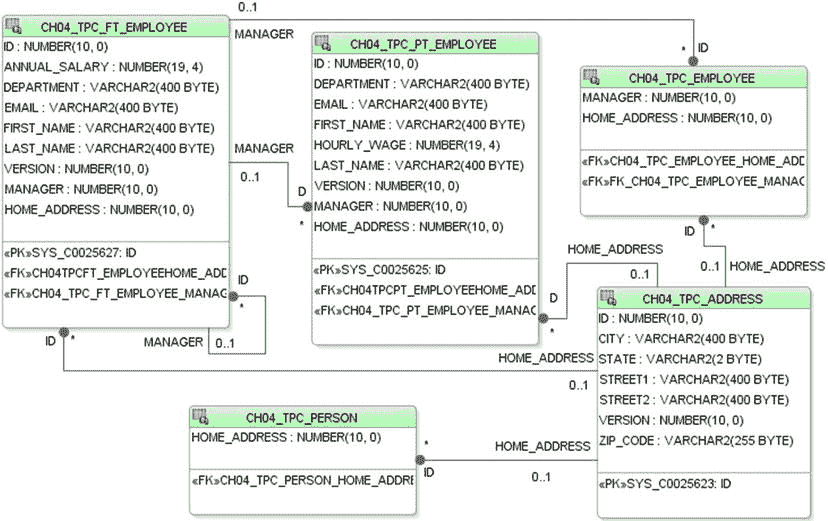

图 4-4  使用 TABLE_PER_CLASS 策略映射示例实体的模式。具体的叶子实体被映射到专用的表，这些表包含映射其所有声明和继承字段的列

示例实体类

代码清单 4-13 至 4-16 展示了映射到这些表的实体是如何进行注解的。由于只有类级别的注解与之前的策略不同，因此方法主体已被省略。


***清单 4-13.***  Person.java，TABLE_PER_CLASS 继承层次结构中的抽象根实体

```
/**
 * Person: 一个抽象实体，也是继承层次结构的根
 */
@Entity
@NamedQueries({
  @NamedQuery(name = "Person.findAll", query = "select o from Person o")})
@Table(name = "CH04_TPC_PERSON")
@TableGenerator(name = "Person_ID_Generator", table = "CH04_TPC_PERSON_ID_GEN",
                pkColumnName = "PRIMARY_KEY_NAME", pkColumnValue = "Person.id",
                valueColumnName = "NEXT_ID_VALUE")
@Inheritance(strategy = InheritanceType.TABLE_PER_CLASS)
public abstract class Person implements Serializable {
  /* 类主体在所有继承策略中都是相同的 */
}
```

***清单 4-14.***  Employee.java，TABLE_PER_CLASS 继承层次结构中的抽象中间实体

```
/*
 * Employee: 一个扩展 Person 的抽象实体
 */
@Entity
@NamedQueries({
  @NamedQuery(name = "Employee.findAll", query = "select o from Employee o")})
@Table(name = "CH04_TPC_EMPLOYEE")
public abstract class Employee extends Person implements Serializable {
  /* 类主体在所有继承策略中都是相同的 */
}
```

***清单 4-15.***  FullTimeEmployee.java，TABLE_PER_CLASS 继承层次结构中的具体叶子实体

```
/*
 * FullTimeEmployee: 一个具体的叶子实体
 */
@Entity
@NamedQueries({
  @NamedQuery(name = "FullTimeEmployee.findAll", query = "select o from FullTimeEmployee o")})
@Table(name = "CH04_TPC_FT_EMPLOYEE")
public class FullTimeEmployee extends Employee implements Serializable {
  /* 类主体在所有继承策略中都是相同的 */
}
```

***清单 4-16.***  PartTimeEmployee.java，TABLE_PER_CLASS 继承层次结构中的具体叶子实体

```
/*
 * PartTimeEmployee: 一个具体的叶子实体
 */
@Entity
@NamedQueries({
  @NamedQuery(name = "PartTimeEmployee.findAll", query = "select o from PartTimeEmployee o")})
@Table(name = "CH04_TPC_PT_EMPLOYEE")
public class PartTimeEmployee extends Employee implements Serializable {
  /* 类主体在所有继承策略中都是相同的 */
}
```

同样，`TABLE_PER_CLASS` 示例中的 `Address` 类与之前的示例相同，只是我们选择的表名和序列名不同。

TABLE_PER_CLASS 策略的优缺点

设计时考量

使用 TABLE_PER_CLASS 策略时，当新的最外层具体类型被引入层次结构时，会添加新的表。这很好，因为既不会影响现有表，也不会以任何方式影响它们的数据。然而，由于每个类型也会映射其所有超类型的字段，因此在基类上引入新字段，或引入新的基实体本身，都需要修改层次结构中所有受影响子类型的表，以映射任何新引入的字段。

性能影响

使用 TABLE_PER_CLASS 方法时，跨多个类型进行查询需要 `UNION` 选择语句，这可能性能不佳，但查询单个类型非常高效，因为查询只涉及一个表。应避免此层次结构中的多态关系（涉及超类型），因为它们必然需要此 `UNION` 操作来解析为具体的子类型实例。

O/R 实现方法比较

现在我们已经探讨了三种继承映射实现，让我们看看类继承层次结构的一些特征，在选择用于类型层次结构的实现方法时应考虑这些特征。以下列表包含关于您自己的实体层次结构的主观问题。它们没有精确的答案；相反，它们旨在在构建应用程序时激发设计考量。

*   类层次结构可以是静态的，具有固定数量的子类型，也可以是动态的，具有不同数量的子类型。您需要将新子类型纳入层次结构的频率如何？
*   层次结构可以是深的，包含许多子类，也可以是浅的，只包含少数几个。您的层次结构粒度如何？
*   层次结构中的类型可能差异很大，子类上的属性集与基类上的属性集非常不同，或者属性差异很小。实体的持久属性集彼此之间的差异有多大？
*   其他实体是否会与此类型层次结构中的类定义关系？如果是，基类是否会经常成为被引用的类型？
*   此层次结构中的类型是否会被频繁查询、更新或删除？SQL `JOIN` 或 `UNION` 操作的存在与否将如何影响应用程序的性能？
*   在应用程序的生命周期中，您更新类型层次结构本身的频率如何？这种变更的影响因每种继承策略而异，需要考虑以下因素：

*   向层次结构添加或删除新类型（例如重构类时）。
*   添加、删除或修改层次结构中实体上的字段。

*   添加、删除或修改涉及此层次结构中类型的关系。

 **注意**   关于这三种继承策略的性能比较，以及如何设置您自己的性能比较测试的详细信息，请参阅第 9 章。查看我们性能测试的结果，并在构建实体层次结构时测试您自己的实体层次结构，以帮助您决定哪种策略在您的应用程序上下文中最有意义。

在继承层次结构中使用抽象实体、映射超类和非实体类

在实体类层次结构中，JPA 允许混合使用非实体类和抽象类。使用上面的 JOINED 示例，让我们看看如何映射这些类。

抽象实体类

如上一节关于继承层次结构所示，JPA 实体可以是具体的，也可以是抽象的。抽象实体只是一个不能自行实例化的实体——它仍然可以参与实体关系和查询，并且其字段会按照其类型层次结构的映射策略进行持久化。清单 4-17 是我们一个抽象实体的示例。

***清单 4-17.***  Person.java，JOINED 继承层次结构中的抽象根实体

```
/**
 * Person: 一个抽象实体，也是继承层次结构的根
 */
@Entity
@NamedQueries({
  @NamedQuery(name = "Person.findAll", query = "select o from Person o")})
@Table(name = "CH04_JOIN_PERSON")
@TableGenerator(name = "Person_ID_Generator", table = "CH04_JOIN_PERSON_ID_GEN",
                pkColumnName = "PRIMARY_KEY_NAME", pkColumnValue = "Person.id",
                valueColumnName = "NEXT_ID_VALUE")
@Inheritance(strategy = InheritanceType.JOINED)
public abstract class Person implements Serializable {
  ...
  @OneToOne(cascade=CascadeType.ALL)
  @JoinColumn(name = "HOME_ADDRESS")
  private Address homeAddress;
  ...
}
```

抽象的 `Person` 实体不仅可以查询（这里我们定义了一个名为 `"Person.findAll"` 的命名查询），它还持有一个与 `Address` 实体的关联，该关联由其所有子类共享。尽管 `Person` 是抽象的，但它可以指定自己的映射和自己的表。只是它不会有自己的鉴别器值，因为永远不会有基类 `Person` 的具体实体实例。

映射超类 (@MappedSuperclass)


映射超类是一种非实体类，但持久化管理器仍能识别它，并且它可以声明持久化字段及其映射。由于它不是实体，因此不能作为持久化实体关系的目标，也不能在 JPQL 查询中使用。但是，它可以为任何直接或间接继承它的实体提供通用的持久化属性。从之前的继承示例开始，让我们将根实体 `Person` 转换为一个映射超类。代码清单 4-18 和 4-19 展示了转换后的类。

***代码清单 4-18.***  Person.java，一个抽象的映射超类（非实体）

```
/**
 * Person: 一个映射超类，是继承层次结构的基类（但不是根实体）
 *
 * 创建 ID 生成器表 "CH04_MS_PERSON_ID_GEN": CREATE TABLE
 * "CH04_MS_PERSON_ID_GEN" ("PRIMARY_KEY_NAME" VARCHAR2(4000) PRIMARY KEY,
 * "NEXT_ID_VALUE" NUMBER(38));
 *
 * 为此实体的 ID 生成器 'Person.id' 初始化该表的数据（从值 '0' 开始）: INSERT INTO "CH04_MS_PERSON_ID_GEN" VALUES
 * ('Person.id', 0);
 */
@MappedSuperclass
@TableGenerator(name = "Person_ID_Generator", table = "CH04_MS_PERSON_ID_GEN",
                pkColumnName = "PRIMARY_KEY_NAME", pkColumnValue = "Person.id",
                valueColumnName = "NEXT_ID_VALUE")
public abstract class Person implements Serializable {
  @SuppressWarnings("compatibility:-7074714881275658754")
  private static final long serialVersionUID = 5291172566067954515L;
  @Id
  @Column(nullable = false)
  @GeneratedValue(strategy = GenerationType.TABLE, generator = "Person_ID_Generator")
  private Integer id;
  @Column(name = "FIRST_NAME", length = 400)
  private String firstName;
  @Column(name = "LAST_NAME", length = 400)
  private String lastName;
  @OneToOne(cascade=CascadeType.ALL)
  @JoinColumn(name = "HOME_ADDRESS")
  private Address homeAddress;
  @Version
  private Integer version;

public Person() {
  }

/* get/set 方法 */
}
```

***代码清单 4-19.***  Employee.java，一个 JOINED 实体继承层次结构中的抽象根实体，同时也是映射超类的子类

```
/*
 * Employee: 继承层次结构的根。继承自 Person，一个映射超类。
 */
@Entity
@NamedQueries({
  @NamedQuery(name = "Employee.findAll", query = "select o from Employee o")})
@Table(name = "CH04_MS_EMPLOYEE")
@Inheritance(strategy = InheritanceType.JOINED)
public abstract class Employee extends Person implements Serializable {
  @SuppressWarnings("compatibility:276774077273820023")
  private static final long serialVersionUID = -8529011412038476148L;
  @Column(length = 400)
  private String department;
  @Column(length = 400)
  private String email;
  @ManyToOne
  @JoinColumn(name = "MANAGER")
  private FullTimeEmployee manager;

public Employee() {
  }

/* get/set 方法 */
}
```

`Person` 类变成了一个映射超类（`@MappedSuperclass`），并且它被去掉了 `@NamedQuery`、`@Table` 和 `@Inheritance` 注解。`@Inheritance` 被移到了 `Employee` 上，`Employee` 成为了层次结构中新的根实体。

虽然映射超类不能作为持久化关系字段的目标被引用，但它可以拥有自己的持久化关系字段，因此引用 `Address` 实体的 `homeAddress` 字段是完全合法的。

还要注意，我们可以继续在映射超类上定义 `@Id` 和 `@Version` 字段，甚至可以继续为 `id` 字段指定一个 ID 生成器。继承此映射超类的实体将这些字段以及映射超类上定义的所有其他字段映射到它们自己的表中。

非实体类

实体也可以在其类型层次结构中使用非实体类。一个实体可以继承一个非实体类，或者一个非实体类可以继承它。这些类可以是具体的或抽象的，因此它们可以被实例化，但它们的字段将不会被 JPA 持久化框架持久化或维护。它们也不能参与任何持久化实体关系或 JPQL 查询。如果类型层次结构中的一个类仅作为其子类的组织构造，并且不参与实体关系（并且没有其他理由将其标记为实体），那么最好将其保留为普通类。以后随时可以通过为其添加注解或在 XML 描述符中将其指定为实体来将其转换为实体。

非实体单值和集合字段

最后，一个实体可以嵌入一个非实体类，或一个非实体类的集合，供其自身私有使用。这种嵌入的引用可以是单个对象或对象集合。单对象字段通常是我们已经熟悉的类型：基本对象类型，如 `String`、`int` 或 `Long`，它们被隐式标记为 `@Basic`。单对象字段也可以具有复杂类型，我们作为实体引用已经熟悉这些类型，使用标记为 `@OneToOne` 或 `@ManyToOne` 的字段。当字段引用复杂的非实体类型时，它们被标记为 `@Embedded`，并且目标类必须使用 `@Embeddable` 注解。对非实体对象的集合引用被标记为 `@ElementCollection`，它们可以是 `@Basic` 或 `@Embeddable` 类类型的集合。让我们仔细看看这些非实体字段引用。

@Embedded 和 @Embeddable

一个实体或映射超类可以包含标记为 `@Embedded` 的字段，并且它们的类型必须是一个相应标记为 `@Embeddable` 的类。与映射超类类似，可嵌入类可以为其持久化字段保存映射元数据。当以这种方式使用时，引用可嵌入对象的字段被标记为 `@Embedded`，并且可嵌入类上的字段映射到拥有实体的表。可嵌入类完全由嵌入它们的类拥有，并且与它们的拥有对象一起被持久化、合并、查询和删除。可嵌入类的实例没有自己的持久化标识，也不能在实体之间传递。它们通常因其作为字段组织工具的便利性而被使用，允许将一组持久化字段封装为拥有实体上的单个字段。

作为一个例子，让我们将我们的 `Address` 实体（代码清单 4-20）转换为一个可嵌入类，并将其作为 `Person` 实体（代码清单 4-21）上的一个字段嵌入。图 4-5 显示了配置为我们的 `JOINED` 层次结构的基础模式，不同之处在于 `CH04_JOIN_ADDRESS` 上的数据列已被合并到 `CH04_EMB_PERSON` 表中。

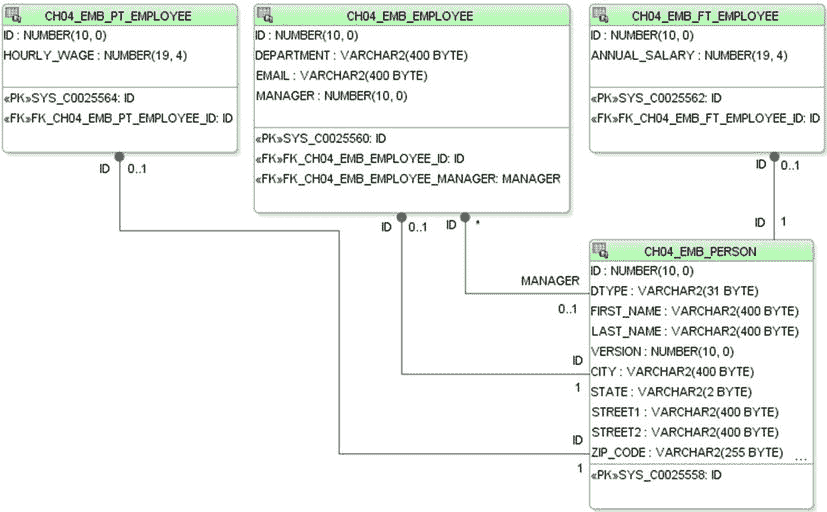

图 4-5.  CH04_EMB_PERSON 表包含 Person 实体中所有字段的列，以及来自嵌入的 Address 的字段

将 `Address.java` 转换为 `@Embeddable` 非实体类的过程如代码清单 4-20 所示。`@Id` 和 `@Version` 字段现在消失了，因为 Address 不再拥有自己的标识。`Employee`、`FullTimeEmployee` 和 `PartTimeEmployee` 实体与 `JOINED` 层次结构配置相比没有变化。

***代码清单 4-20.***  Address.java，一个可嵌入的非实体类


```
/**
 * Address: 一个可嵌入的非实体类
 */
@Embeddable
public class Address implements Serializable {
  @SuppressWarnings("compatibility:-5340972441524875330")
  private static final long serialVersionUID = -5279408726470732092L;
  @Column(length = 400)
  private String city;
  @Column(length = 2)
  private String state;
  @Column(length = 400)
  private String street1;
  @Column(length = 400)
  private String street2;
  @Column(name = "ZIP_CODE")
  private String zipCode;

public Address() {
  }

/* get/set 方法 */
}
```

***清单 4-21.***  Person.java，一个持有 @Embedded homeAddress 字段的实体

```
/**
 * Person: 一个抽象实体，也是继承层次结构的根
 *
 * 创建 ID 生成器表 "CH04_EMB_PERSON_ID_GEN": CREATE TABLE "CH04_EMB_PERSON_ID_GEN"
 * ("PRIMARY_KEY_NAME" VARCHAR2(4000) PRIMARY KEY, "NEXT_ID_VALUE" NUMBER(38));
 *
 * 为此实体的 ID 生成器 'Person.id' 初始化该表的数据（起始值为 '0'）: INSERT INTO "CH04_EMB_PERSON_ID_GEN" VALUES ('Person.id', 0);
 */
@Entity
@NamedQueries({
  @NamedQuery(name = "Person.findAll", query = "select o from Person o")})
@Table(name = "CH04_EMB_PERSON")
@TableGenerator(name = "Person_ID_Generator", table = "CH04_EMB_PERSON_ID_GEN",
                pkColumnName = "PRIMARY_KEY_NAME", pkColumnValue = "Person.id",
                valueColumnName = "NEXT_ID_VALUE")
@Inheritance(strategy = InheritanceType.JOINED)
public abstract class Person implements Serializable {
  @SuppressWarnings("compatibility:-7074714881275658754")
  private static final long serialVersionUID = 5291172566067954515L;
  @Id
  @Column(nullable = false)
  @GeneratedValue(strategy = GenerationType.TABLE, generator = "Person_ID_Generator")
  private Integer id;
  @Column(name = "FIRST_NAME", length = 400)
  private String firstName;
  @Column(name = "LAST_NAME", length = 400)
  private String lastName;
  @Embedded
  private Address homeAddress;
  @Version
  private Integer version;

public Person() {
  }

/* get/set 方法 */
}
```

当 `Person` 实例被持久化时，其 `homeAddress` 实例上的字段值会被保存到 `CH04_EMB_PERSON` 表的相应列中。

@ElementCollection

JPA 2.0 引入的一个有用的映射特性是，能够在实体或映射超类中嵌入非实体对象的集合，并使这些集合完全归嵌入类所有。`@ElementCollection` 是使用 `@Embeddable` 和 `@Basic` 字段的集合对应物；只是集合中的实例始终存储在独立于所属实体或映射超类的单独表中。同样，它也是实体关系类型 `@OneToMany` 的非实体对应物。清单 4-22 展示了我们的 Employee 实体持有两个元素集合，一个包含 `@Embeddable` 实例，另一个包含 `@Basic` 实例。

***清单 4-22.***  Person.java，一个持有两个 @ElementCollection 字段的实体

```
@Entity
public abstract class Person implements Serializable {
  ...
  @ElementCollection(fetch=FetchType.LAZY)
  private List<Address> addresses;

@ElementCollection
  Private Collection<String> favoriteCities;

public Person() {
  }

/* get/set 方法 */
}
```

这段代码演示了 `@ElementCollection` 的一些最简单用法，主要采用了默认映射。通过使用更高级的映射，你可以自定义集合映射表如何连接到 `Person` 的根表、查询是立即加载还是延迟加载、列名和表名、如何将元素集合指定为 `Map`，以及许多其他细节。

多态关系

如前面的示例所示，实体关系可以在层次结构中的具体实体和抽象实体之间指定。你可以与继承层次结构中的任何实体定义关系，并且该关系将隐式地包含该实体的子类型。即使在映射超类上声明的持久化实体关系字段也是多态的。以这种方式隐式包含子类型的关系称为*多态关系*。

在 JPA 中，关系可以针对任何其他实体类定义，包括层次结构中的抽象超类型实体。这种对多态关系的支持补充了 JPA 对映射类层次结构的支持，并为跨实体类型层次结构在任何级别查询实体提供了强大的构造。在前面的实体层次结构示例中，`FullTimeEmployee.manager` 到 `Employee.managedEmployees` 的关系说明了具体实体 `FullTimeEmployee`（`manager`）与其抽象 `Employee`（`managedEmployee`）实例集合之间的一对多、双向关系。此示例显示了同一层次结构内实体之间的关系，但它同样可以轻松地在不同实体层次结构的实体之间定义。

关系映射

映射多态关系不需要了解关系中任一实体的继承表映射策略。这一点从以下事实可以明显看出：在我们应用了三种继承映射策略中的每一种时，示例实体类中的关系字段映射保持不变。所有关系都映射到目标类的主键，这种映射假设之所以成为可能，是因为规范要求类层次结构中的所有类共享一个公共的主键结构，即使每个子类映射到自己的表也是如此。为每个实体定义的映射信息足以让 JPA 持久化框架将基类型引用解析为实际的子类实例。关系字段是使用 `JOIN` 和 `UNION` 语句自动派生的，并且这些查询进一步受到使用 `WHERE` 子句（引用鉴别器列值）的约束。

多态 JPQL 查询

类似地，JPQL 和 Criteria API 查询可以选择或连接超类型类的实体，并且任何符合查询条件的子类型实例都将返回到查询结果列表中。此外，查询可以使用内部 `JOIN` 子句将引用绑定到超类型层次结构中的任何类型，唯一的限制是 `JOIN` 子句的左侧和右侧必须解析为公共的基类型。

在前面的继承层次结构中，在抽象 `Person` 和 `Employee` 实体上定义的命名查询 `"Person.findAll"` 和 `"Employee.findAll"` 就是多态查询的示例。从这些查询返回的实例都是具体实体——要么是 `FullTimeEmployee`，要么是 `PartTimeEmployee`。

举例来说，让我们看看示例客户端中的一些代码。清单 4-23 查询所有家庭地址在 San Mateo 某处的 `Employee` 实例。该查询在抽象 `Employee` 实体上发出，并遍历在根 `Person` 实体上定义的 `homeAddress` 关系字段。从此查询返回的任何实体都将是具体的，要么是 `FullTimeEmployee`，要么是 `PartTimeEmployee`。

***清单 4-23.***  演示 JPQL 中多态关系用法的代码清单

```
//  用于演示多态关系用法的临时 JPQL
final String stmt =
  "select o from Employee o where o.homeAddress.city = 'San Mateo'";
final List<Employee> emps = em.createQuery(stmt).getResultList();
for (Employee emp : emps)
{
  System.out.println(emp.getFirstName());
  System.out.println(emp.getLastName());
}
```

使用原生 SQL 查询


JPQL 允许通过名称引用实体字段，并通过关系与其他实体进行连接，而无需考虑底层映射细节。这为数据库模式定义者和查询定义者角色之间提供了相当程度的独立性。然而，有时您需要控制查询以利用特定索引、返回稀疏数据集，或者发出用 SQL 表达更为便捷的查询。JPA 让您能够轻松做到这一点，并且如果您愿意，它甚至支持将查询结果映射回实体。

例如，您可能希望使用原生 SQL 查询，仅从一个恰好映射到您某个实体的表中返回名称和主键列数据。然后，查询到的名称值可以通过组合框呈现给用户，只有当用户选择一个名称时，您才去访问 `EntityManager`，并使用 `EntityManager.find(Object primaryKey)` 调用将该名称对应的主键值绑定到一个实体实例上。如果您使用 JPQL 返回一个包含完全加载实体的集合，而不是仅返回稀疏的键和名称数据集，那么您将查询比实际需要更多的数据字段，从而导致消耗比实际需求更多的资源。

清单 4-24 中的示例展示了如何定义一个返回 `Address` 实体类型实例的命名原生 SQL 查询。对于客户端而言，执行此命名原生查询与执行等效的 JPQL 命名查询是相同的。

***清单 4-24.***  演示原生 SQL 支持的代码清单

```
@NamedNativeQueries({
  @NamedNativeQuery(name = "Address.findAllNative",
    query = "select id, city, state, street1, street2, zip_code from ch04_join_address",
    resultClass=Address.class)})
```

查询条件 API

JPA 2.0 引入了一种替代 JPQL 的方法来定义和执行查询，该方法使用强类型组件。仅使用 Java，条件 API 允许您动态构建任意复杂的查询并执行它们，以返回与通过 JPQL 所能达到的相同结果，但具有编译时类型检查。由于 JPQL 和条件 API 使用相同的底层查询引擎，它们在能力上是等效的，并且对于 JPQL 中可表达的每个特性，都有一个类似的条件 API 调用。例如，对于通过查询构建器动态定义查询的情况，条件 API 可能比动态构建等效的 JPQL 语句更易于管理。

虽然完整的条件 API（如同 JPQL 语言的完整功能集）超出了本书的范围，但我们在清单 4-25 中展示了一个如何使用它的示例。

***清单 4-25.***  演示查询条件 API 使用的代码清单

```
/**
 *  条件 API 等效于以下 JPQL 查询：
 *
 *    select o from Address o where o.city = :city
 */
public List<Address> getAddressFindByCity(String city) {
  //  定义一个返回 Address 类型对象的查询
  CriteriaBuilder cb = em.getCriteriaBuilder();
  CriteriaQuery<Address> c = cb.createQuery(Address.class);
  Root<Address> addr = c.from(Address.class);

//  添加 SELECT 子句
  c.select(addr);

//  在 WHERE 子句中定义一个谓词，用于比较 city
  //  属性与参数值
  ParameterExpression<String> p = cb.parameter(String.class, "city");
  c.where(cb.equal(addr.get("city"), p));

//  绑定 'city' 参数
  TypedQuery<Address> q = em.createQuery(c);
  q.setParameter("city", city);

//  将查询结果作为 List<Address> 返回
  return q.getResultList();
}
```

条件 API 是一种更正式的方法，但在合适的应用场景中可能非常有用。

复合主键与嵌套外键

在将实体映射到新模式时，最佳实践是指定一个专用的单列作为主键列，正如我们在前面的示例中所做的那样。实体的主键值一旦分配就无法更新。此外，使用专用列来保存主键，而不是使用名称或其他包含有意义属性数据的列，可以消除用户希望修改恰好是主键一部分的语义重要字段时可能出现的潜在冲突。遵循一种对所有实体通用的单一方法也是可取的，而使用单个专用列作为主键是我们发现行之有效的一种简单模式。

然而，在某些情况下，模式已经定义好并正在被适配为 JPA 实体形式的 Java 代码，或者出于其他原因需要复合主键。我们经常遇到的一种遗留情况是，复合主键包含的列（例如外键列）也参与了与其他实体的关系。除此之外，这些关系必然是强制性的（因为所有主键列必须为 `NOT NULL`），因此当您需要持久化此类相关实体时，必须小心如何持久化您的实体图，以避免在 `EntityManager.persist()` 调用期间插入行数据时违反 `NOT NULL` 约束。

有两种方法可以使用复合主键来实现实体的标识。它们将在以下章节中描述。

使用嵌入式复合键 (@EmbeddedId)

如果复合键的字段不代表您认为属于实体定义的有用属性数据，您可以将单个实体字段指定为主键字段，并将其类型设置为复合键类类型。此复合键类被标记为 `@Embedded`。它的字段将被映射，就好像它们是实体本身的一部分一样，但客户端只能通过复合字段访问它们。

实体上的嵌入式复合键字段 `myId` 使用 `@EmbeddedId` 进行注解。在清单 4-26 中，我们引入了 `@Embeddable` 类 `MyIdClass`，它包含了之前位于 `Person` 上的 `firstName` 和 `lastName` 字段。

***清单 4-26.***  MyIdClass.java，一个适合用作 @EmbeddedId 的 @Embeddable 类

```
@Embeddable
public class MyIdClass {
  @Column(name = "FIRST_NAME", length = 400)
  private String firstName;
  @Column(name = "LAST_NAME", length = 400)
  private String lastName;

@Override
  public boolean equals(Object obj) {
    return (obj instanceof MyIdClass &&
            firstName.equals(((MyIdClass) obj).getFirstName()) &&
            lastName.equals(((MyIdClass) obj).getLastName()));
  }

@Override
  public int hashCode() {
    return System.identityHashCode(this);
  }

/* get/set 方法 */
}
```

清单 4-27 展示了这个新类在 `Person` 类上作为 `@EmbeddedId` 使用的情况。

***清单 4-27.***  Person.java，演示使用 @EmbeddedId 注解的复合主键

```
@Entity
@NamedQueries({
  @NamedQuery(name = "Person.findAll", query = "select o from Person o")})
@Table(name = "CH04_EMBID_PERSON")
public class Person implements Serializable {
  @SuppressWarnings("compatibility:-7074714881275658754")
  private static final long serialVersionUID = 5291172566067954515L;
  @EmbeddedId
  private MyIdClass myId = new MyIdClass();
  @Version
  private Integer version;

public Person() {
  }

/* get/set 方法 */
}
```


要将`Person`类改为使用嵌入式 ID，我们将`@Id Integer id`字段替换为`@EmbeddedId myIdClass myId`字段。为了使该实体重新适配到示例中的`JOINED`实体层次结构中，`Person`的`Employee`子实体上的`manager`关系字段以及所有子实体上的主键字段都需要进行修改，以映射到新主键中的所有列。

在实体类上直接公开复合键类字段（@IdClass）

映射复合主键的另一种方法是在实体类上为主键类中的每个字段显式声明字段，但为每个字段添加`@Id`注解，如清单 4-28 所示。如果主键上的某些字段同时也是实体中有用的属性，你可能会倾向于采用这种方法。然后，你需要定义一个新的复合键类，在其中声明所有这些`@Id`字段，并确保这些字段与键类字段的名称和类型完全匹配。

从之前使用`@EmbeddedId`的示例类开始，我们可以修改`MyIdClass`，移除`@Embedded`注解，如清单 4-28 所示。

***清单 4-28.*** MyIdClass.java，一个适合用作@IdClass 的可序列化 Java 类

```
public class MyIdClass implements Serializable {
  @Column(name = "FIRST_NAME", length = 400)
  private String firstName;
  @Column(name = "LAST_NAME", length = 400)
  private String lastName;

public MyIdClass() {
  }

public MyIdClass(String firstName, String lastName) {
    this.firstName = firstName;
    this.lastName = lastName;
  }

@Override
  public boolean equals(Object obj) {
    return obj instanceof MyIdClass && firstName.equals(((MyIdClass) obj).getFirstName()) && lastName.equals(((MyIdClass) obj).getLastName());
  }

@Override
  public int hashCode() {
    return System.identityHashCode(this);
  }
  /* get/set methods */
}
```

这个复合键类不需要特殊的注解。它主要用于通过`EntityManager.find()`方法根据主键查找`Person`实例。

在`Person`类中，`firstName`和`lastName`字段现在都被标记为`@Id`。我们添加了一个`@IdClass`注解，将`MyIdClass`标识为复合主键类，如清单 4-29 所示。

***清单 4-29.*** Person.java，一个使用@IdClass 作为复合主键的实体

```
@Entity
@NamedQueries({
  @NamedQuery(name = "Person.findAll", query = "select o from Person o")})
@Table(name = "CH04_IDCLASS_PERSON")
@IdClass(MyIdClass.class)
public class Person implements Serializable {
  @SuppressWarnings("compatibility:-7074714881275658754")
  private static final long serialVersionUID = 5291172566067954515L;
  @Id
  @Column(name = "FIRST_NAME", length = 400)
  private String firstName;
  @Id
  @Column(name = "LAST_NAME", length = 400)
  private String lastName;
  @Embedded
  private Address homeAddress;
  @Version
  private Integer version;

public Person() {
  }

/* get/set methods */
}
```

映射使用复合键的关系

在定义关系时，如果目标实体使用了复合主键，则拥有方实体必须将其关系字段映射到相应类型的列。这需要使用`@JoinColumns`注解（或等效的 XML 元数据）。如果这些列恰好嵌套在拥有方实体的主键中，或者它们受到`NOT NULL`约束，那么必须在调用`EntityManager.persist()`操作将该实体持久化到持久化上下文时，或者至少在调用`EntityManager.flush()`发出数据库`INSERT`调用时，绑定该关系。

在以下示例中，`PersonPK`复合主键类包含两个字段——`id`和`addressId`——由于它们是主键的一部分，因此是强制性的（`NOT NULL`）。由于`addressId`和关系字段`homeAddress`都映射到同一个`ADDRESS_ID`列，并且这两个字段中只能有一个是可插入和可更新的，因此我们必须将其中一个字段标记为只读。在清单 4-30 中，通过在`@JoinColumn`注解上设置`insertable=false`和`updatable=false`属性，将关系字段`homeAddress`标记为只读。

***清单 4-30.*** Person.java，包含一个复合主键，该主键映射到一个由普通@Id 字段和关系字段共享的列

```
/*
 * Person: 一个抽象实体，是 SINGLE_TABLE 层次结构的根，
 * 演示了使用包含字段的复合键，该字段映射的列同时也被映射到关系字段。
 */
@Entity
@Inheritance(strategy = InheritanceType.SINGLE_TABLE)
@NamedQueries({
  @NamedQuery(name = "Person.findAll", query = "select o from Person o")})
@TableGenerator(name = "Person_ID_Generator", table = "CH04_FKINPK_PERSON_ID_GEN",
                pkColumnName = "PRIMARY_KEY_NAME", pkColumnValue = "Person.id",
                valueColumnName = "NEXT_ID_VALUE")
@Table(name = "CH04_FKINPK_PERSON")
@IdClass (PersonPK.class)
public abstract class Person
  implements Serializable
{
  @Id
  @Column(name = "ADDRESS_ID")
  private Integer addressId;
  @Id
  @Column(nullable = false)
  @GeneratedValue(strategy = GenerationType.TABLE, generator = "Person_ID_Generator")
  private Integer id;
  @Column(name = "FIRST_NAME")
  private String firstName;
  @Column(name = "LAST_NAME")
  private String lastName;
  @Version
  private Integer version;
  @OneToOne(cascade = { CascadeType.ALL })
  @JoinColumn(name = "HOME_ADDRESS")
  private Address homeAddress;

public Person() {
  }

/* get/set methods */
}
```

使用此`Person`类时，你可以通过`homeAddress`关系字段检索数据，但不能更新此字段。其值必须在实体持久化时填充，并且由于它是实体主键的一部分，之后不能修改。

乐观锁支持（@Version）


如前面的示例所示，你可以使用 `@Version` 注解来指定一个字段，供 `EntityManager` 在合并操作和并发管理时执行乐观锁。*乐观锁*是一种有用的性能优化手段，它将原本需要数据库承担的工作转移到了客户端。数据库通常提供*悲观锁*服务，允许数据库客户端（此处指 JPA 的 `EntityManager`）锁定表中的某一行，以防止在 `EntityManager` 应用某些更改时其他客户端更新该行。这是一种确保两个客户端不会同时修改同一行的有效机制，但它需要在数据库内部进行昂贵的、低级别的访问检查。悲观锁的替代方案是将并发控制转移到像 `EntityManager` 这样的数据库客户端中，并采用乐观锁策略。通过使用专用的 `@Version` 列，`EntityManager` 遵循几条简单的规则。每当它将修改后的实体发送到数据库时（例如在提交或刷新操作期间），它会查看实体实例的 `@Version` 字段的当前值，从数据库中查询该实体行的当前状态，并比较版本值。如果它们相同，它会递增实体实例的 `@Version` 字段（或任何标注了 `@Version` 的字段），并将更改发送到数据库，从而执行一条 `UPDATE` 语句。如果版本值不同，则意味着在 `EntityManager` 上次查询该行并将其加载到实体实例，到该实例被刷新回数据库的这段时间内，有其他客户端修改了该行。当检测到这种差异时，我们称之为*并发异常*，`EntityManager` 会抛出异常并将事务标记为回滚。`EntityManager` 的客户端需要预见到可能发生并发异常，并且必须准备好解决冲突，通常的做法是通知用户存在冲突，以便在继续操作前刷新实体。

在实体上使用专用的 `@Version` 列，允许 `EntityManager` 通过简单比较实体实例中存储的 `@Version` 字段值与数据库中 `VERSION` 列的值来执行乐观锁。如果你没有指定 `@Version` 字段，`EntityManager` 就必须遍历实体实例中的每个字段，并将其值与数据库中对应的映射列进行比较，这要繁琐得多。声明的 `@Version` 字段将由持久化框架自动填充，不应由应用程序代码更新。

总而言之，使用 `@Version` 字段并非强制要求，但在实体上定义 `@Version` 字段是一种良好的实践，可以让 `EntityManager` 利用这种优化。

支持自动生成的主键值（@GeneratedValue）

除了通过 `@Version` 列提供内置的乐观锁支持外，JPA 还提供了几种便捷的方式，在持久化实体时自动填充主键列。你可以声明一个字段的值应通过以下方式填充：

*   持久化框架维护的自动机制（`strategy=GenerationType.AUTO`）
*   自定义数据库序列（`strategy=GenerationType.SEQUENCE` 或 `GenerationType.IDENTITY`）
*   模拟伪序列的自定义数据库表（`strategy=GenerationType.TABLE`）

我们发现自动填充主键功能在便利性方面非常高，省去了我们在应用程序中为每个实体编写此代码的麻烦。在 `persistence.xml` 中对持久化单元使用模式生成设置，可以让你让 JPA 在数据库中自动创建所需的工件（序列或表），甚至可以通过注解或 XML 使用 JPA 元数据指定的设置来配置它们。一旦安装，`AUTO` 策略会为任何标注了 `@GeneratedValue` 或 `@GeneratedValue(strategy=GenerationType.AUTO)` 的 `@Id` 字段生成唯一标识符，至少能让实体类看起来不那么杂乱。由于并非所有数据库都支持序列对象，你可能希望使用表生成器，正如本章示例所示。

列表 4-31 演示了默认 ID 生成特性的用法。

***列表 4-31.***  Person.java，使用默认 ID 生成器

```
@Entity
@Inheritance(strategy = InheritanceType.JOINED)
@DiscriminatorColumn(name = "TYPE")
@Table(name = "CH04_JOIN_PERSON")
@NamedQuery(name = "findAllPerson", query = "select object(o) from Person o")
public abstract class Person implements Serializable {
    @Id
    @GeneratedValue
    private Long id;
    /* ... */
}
```

用于生成本章示例中所有表和序列的 SQL 脚本可在示例代码区域中找到。此外，JPA 提供商会生成 DDL 对象，甚至一些所需的 DML，以支持部署的任何实体；因此，预先创建模式并非严格必要。然而，虽然 JPA 会接受关于使用哪些表和列名的指导，但目前还没有办法指定自动为你创建的约束或其他工件的名称。因此，如果你需要控制映射对象的名称和其他细节，最好在首次部署持久化单元之前预先创建模式。

为了说明如何预先创建 ID 生成所需的表和序列，列表 4-31 和 4-32 展示了在这些示例中创建 ID 生成器表和序列所需的 DDL。

***列表 4-32.***  @GeneratedValue 与 @SequenceGenerator 的用法

```
/**
 * 要创建 ID 生成器序列 "CH04_SEQID_PERSON_ID_GEN"：
 * CREATE SEQUENCE "CH04_SEQID_PERSON_ID_GEN" INCREMENT BY 50 START WITH 50;
 */
@Entity
@Table(name = "CH04_JOIN_PERSON")
@SequenceGenerator(name = "Person_ID_Generator", sequenceName = "CH04_JOIN_PERSON_ID_GEN",
                   allocationSize = 50, initialValue=1)
@Inheritance(strategy = InheritanceType.JOINED)
public abstract class Person implements Serializable {
  ...
  @Id
  @Column(nullable = false)
  @GeneratedValue(strategy = GenerationType.SEQUENCE, generator = "Person_ID_Generator")
  private Integer id;
  ...
}
```

列表 4-33 提供了一个基于表的 ID 生成器声明示例，以及一条用于为伪序列创建命名行的 INSERT 语句。

***列表 4-33.***  @GeneratedValue 与 @TableGenerator 的用法


```
/**
 * 用于创建 ID 生成器表"CH04_JOIN_PERSON_ID_GEN"：CREATE TABLE
 * "CH04_JOIN_PERSON_ID_GEN" ("PRIMARY_KEY_NAME" VARCHAR2(4000) PRIMARY KEY,
 * "NEXT_ID_VALUE" NUMBER(38));
 *
 * 初始化该表以用于此实体的 ID 生成器'Person.id'（起始值为'0'）：INSERT INTO "CH04_JOIN_PERSON_ID_GEN" VALUES
 * ('Person.id', 0);
 */
@Entity
@Table(name = "CH04_JOIN_PERSON")
@TableGenerator(name = "Person_ID_Generator", table = "CH04_JOIN_PERSON_ID_GEN",
                pkColumnName = "PRIMARY_KEY_NAME", pkColumnValue = "Person.id",
                valueColumnName = "NEXT_ID_VALUE")
@Inheritance(strategy = InheritanceType.JOINED)
public abstract class Person implements Serializable {
  ...
  @Id
  @Column(nullable = false)
  @GeneratedValue(strategy = GenerationType.TABLE, generator = "Person_ID_Generator")
  private Integer id;
  ...
}
```

拦截器：实体回调方法

JPA 支持多种回调方法，或称*拦截器*，允许你在实体或映射超类发生特定生命周期事件时添加自定义代码。你可以注册拦截器，使其在特定实体类型发生特定生命周期事件时被调用，或者更广泛地，在任何实体发生生命周期事件时被调用。后一种情况是少数必须使用 XML 指定元数据的场景之一，因为其效果会全局应用于持久化单元中的所有实体。

以下注解可应用于方法，以表明它们是实体回调方法：

*   `@PrePersist`
*   `@PostPersist`
*   `@PreRemove`
*   `@PostRemove`
*   `@PreUpdate`
*   `@PostUpdate`
*   `@PostLoad`

要使用回调方法，你需要编写一个方法来实现所需行为，然后使用上述生命周期回调注解之一（例如 `@PrePersist`）对其进行注解。回调方法可以任意命名，但不得接受任何参数，且必须返回 void。如果需要，单个方法可以使用多个实体回调注解进行注解。

或者，可以为实体（或映射超类）注册回调类，以拦截一个或多个实体类型上的一个或多个生命周期事件。对于任何给定的实体生命周期事件，可以注册多个拦截器方法，它们将按照指定的顺序执行。

实体回调方法可用于在实体持久化之前验证其内容，以及在实例化后填充瞬态派生字段。清单 4-34 展示了如何将 `@PreUpdate` 拦截器插入公司薪资系统中的 `FullTimeEmployee` 实体，以便每当来自某个邮政编码的员工实例因任何原因被更新时，自动为其加薪。（美好的愿望！）

***清单 4-34.***  FullTimeEmployee.java，使用非法实体回调最终向老板“反击”！

```
@Entity
@Inheritance
public class FullTimeEmployee extends Employee {
  ...
  @PreUpdate
  public void wishfulThinking() {
    if (getHomeAddress().getZipCode() == 94402) {
      setSalary(getSalary() + 10000);
    }
  }
  ...
}
```

编译、部署和测试 JPA 实体

对于本章描述的七个主要特性，我们分别提供了一个独立的 NetBeans 项目，用于在纯 Java SE 环境中测试该特性。此外，每个项目都附带一个专用的 HTTP Servlet，用于通过 Java EE Web 应用程序测试相同的代码。我们鼓励你从这两个客户端环境探索这些示例，编辑 JPA 实体和测试代码，并观察结果。

前提条件

在执行后续章节详述的任何步骤之前，请先完成第 1 章的“入门”部分。该部分将引导你完成本章示例所需的安装和环境设置。

打开示例应用程序

将 `Chapter04-PersistenceIISamples` 目录及其内容复制到你选择的目录中。运行 NetBeans IDE，并使用 `File Open Project` 菜单打开 `Chapter04-PersistenceIISamples` 项目。确保选中“`Open Required Projects`”复选框。

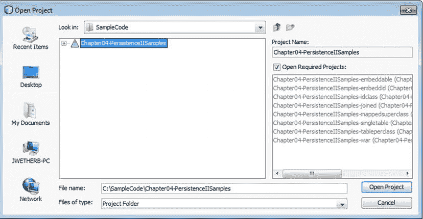

图 4-6.   打开 Chapter04-PersistenceIISamples 项目

这些示例中未使用 EJB Session Bean，尽管它们本可以轻松替代 Java 服务外观类。Java 外观类通过在每次执行 persist、merge 或 remove 操作时自动提交结果，来模拟无状态 Session Bean 的默认事务行为。主要区别在于 EJB 在 EJB 容器中执行，该容器提供企业级服务，而这些服务对于这些 JPA 示例并非必需。

本章的示例由七个 Java 类库和一个 Web 应用程序组成，该 Web 应用程序为这七个 Java 库各包含一个 Servlet。展开第一个 Java 类库——`Chapter04-PersistenceIISamples-embeddable`，观察每个项目共有的通用结构：

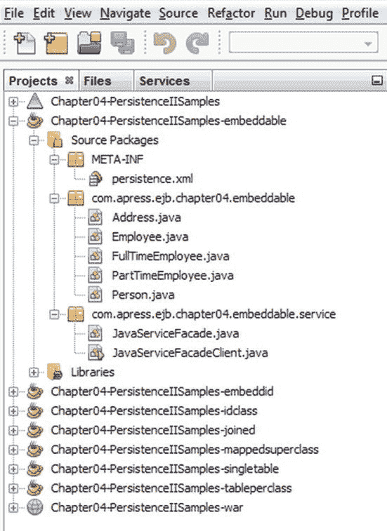

图 4-7.   观察 Chapter04-PersistenceIISamples-joined 项目的结构

每个 Java 类库包含：

*   一个单一的 JPA 持久化单元，由若干 JPA 实体或其他映射类以及一个 `META-INF/persistence.xml` 文件组成
*   一个 Java 服务外观——`JavaServiceFacade.java`——一个包装类，提供用于操作上下文持久化单元中 JPA 实体的 CRUD 方法
*   一个 Java 客户端——`JavaServiceFacadeClient.java`——用于执行该持久化单元测试用例的服务外观

创建数据库连接

本章的示例需要数据库连接，我们将使用 NetBeans 和 Glassfish 捆绑的 Derby 数据库。如果你尚未创建 WineApp 数据库（该数据库也用于第 3 章的示例），请单击 `Services` 选项卡，展开 `Databases` 图标，然后在 `Java DB` 节点上调用“`Create Database...`”。创建一个名为“`WineApp`”的数据库，用户名和密码为 `wineapp/wineapp`：

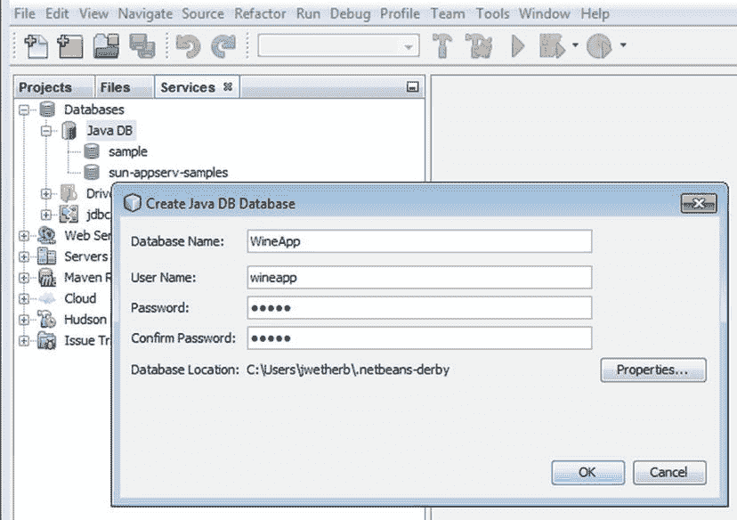

图 4-8.  创建 WineApp 数据库和连接

最后一步创建的数据库连接被 JPA 项目中每个 `persistence.xml` 文件中的持久化单元所引用。虽然可以预先创建数据库对象（表、序列、键约束等），但我们将让 JPA 在每个持久化单元首次需要时自动创建这些数据库对象。

编译源代码

在 `Chapter04-PersistenceIISamples` 节点上调用上下文菜单，并通过选择 `Clean and Build` 菜单选项来构建应用程序。

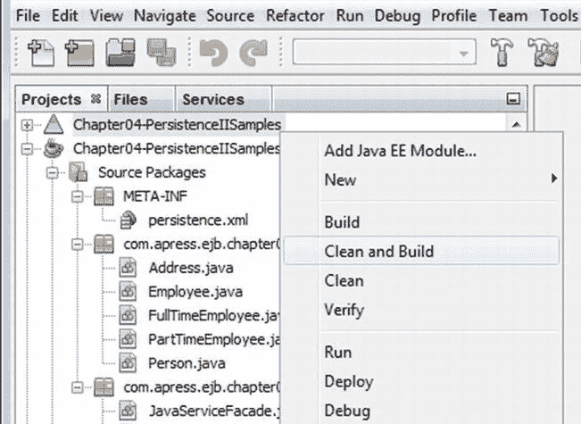

图 4-9.   构建应用程序

运行客户端程序

在创建了 `WineApp` 数据库并构建了项目之后，你可以运行示例客户端。打开 `Chapter04-PersistenceIISamples-singletable` 项目，展开 `com.apress.ejb.chapter04.singletable.service` 包。你将看到 Java 服务外观（`JavaServiceFacade.java`）及其客户端类。右键单击 `JavaServiceFacadeClient.java`，然后选择“`Run File`”。测试将在 NetBeans 中运行，输出将发送到日志窗口。

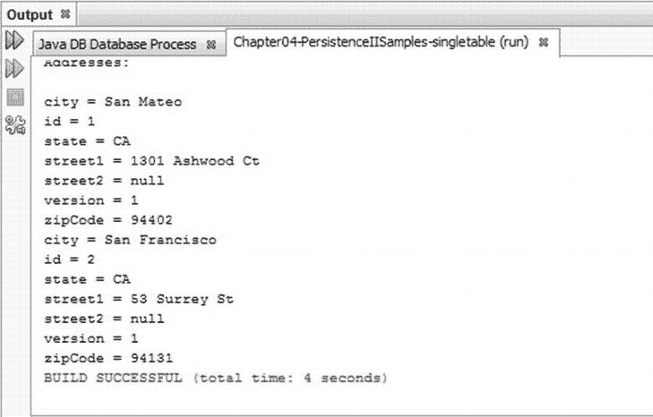


图 4-10.   在 Java SE 环境中执行 SINGLE_TABLE 继承示例

 **注意**   你可能会在日志窗口中看到一些 SQL 警告和错误，可以忽略它们。这些示例中的持久化单元使用了 `create-tables` 的表生成策略，这意味着当客户端实例化持久化单元时，JPA 将始终尝试创建表。一旦为某个持久化单元创建了模式，你可能希望更新其 `persistence.xml` 文件，将模式生成策略重置为 `none`。

接下来，通过打开 `Chapter04-PersistenceIISamples-war` 项目并展开 `com.apress.ejb.chapter04.client` 包来运行 HTTP Servlet 客户端。打开 NetBeans 用于运行 Servlet 的浏览器。（如果不确定，请通过“工具”“选项”“常规”打开 NetBeans 首选项。）右键单击 `SingleTableInheritanceClient.java` Servlet，然后选择“`运行文件`”以 Web 应用程序的形式运行测试。

NetBeans 将在默认浏览器中执行该 Servlet。在测试执行期间，任何现有的冲突数据都会被删除，新的测试数据会被创建，然后以表格格式进行查询和呈现。引用的对象（包括引用对象的列表）会显示在嵌套的表格单元格中。以下是该客户端 Servlet 的输出，显示了 Servlet 操作的日志。

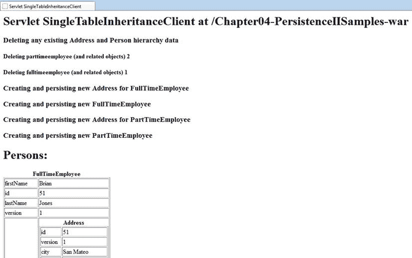

图 4-11.   在 Java EE Web 环境中执行 SINGLE_TABLE 继承示例

查看 `SingleTableInheritanceClient.java` 中的代码。你可以自由尝试创建额外的实体，测试 Java 服务外观上的查询和其他服务方法，并观察结果行为。要将测试模式重置回原始状态，你可以随时删除 WineApp 测试数据库，然后重新执行图 4-8 中描述的步骤。

测试其他持久化示例

其余六个项目分别测试了本章涵盖的不同特性，这些特性已在项目名称中标识。建议你将这些项目作为参考，了解如何配置各种继承层次结构、映射超类、嵌入类和复合主键。

由于本章中的每个项目共享相同的结构，并且每个项目都附带一个专用的 HTTP Servlet 测试器，因此上述步骤可以指导你以相同的方式执行每个示例。

结论

本章我们涵盖了相当多的内容，掌握了这些信息后，你应该能够构建一些强大的实体，这些实体经过配置，能够最佳地适应你的应用领域。以下是本章涵盖的关键概念总结。

映射实体继承层次结构

JPA 为实体类继承层次结构提供了三种常见的 O/R 映射策略的内置支持：SINGLE_TABLE、JOINED 和 TABLE_PER_CLASS。我们研究了每种方法的优缺点，并提供了最适合每种策略的常见用例示例。

在继承层次结构中使用抽象实体、映射超类和非实体类

JPA 在类型层次结构中混合实体与抽象类和非实体类时提供了灵活的解决方案。实体可以是具体的，也可以是抽象的。只有实体类可以被查询或作为映射实体关系的目标，但实体仍然可以使用非实体类，既可以通过使用 `@Embedded` 和 `@ElementCollection` 嵌入它们，也可以通过扩展它们或被它们扩展。我们展示了一些混合这些选项的示例来说明它们的用法。

多态关系

可以在实体之间指定关系，包括层次结构中的抽象超类型实体。这允许你与继承层次结构中任何位置的实体定义关系，该关系将隐式地涉及该实体的子类型。

多态 JPQL 查询

类似地，JPQL 查询可以选择或连接超类型类的实体，并且任何符合查询条件的子类型实例都将包含在查询结果中。我们研究了如何使用 JPQL 构建可重用的 `@NamedQuery` 对象，以及 JPA 2.0 中引入的 QueryCriteria API。

使用原生 SQL 查询

`EntityManager` 允许你发出原生 SQL 查询，这既是对经验丰富的 SQL 开发者的友好表示，也是一种优化手段，以避免在只需要实体的少数几个字段时查询所有字段的开销。我们提供了一个示例，说明如何定义一个返回实体实例的命名原生 SQL 查询，以便结果可以无缝集成到应用程序中。

使用查询条件 API

作为 JPQL 的类型安全替代方案，JPA 2.0 中引入的条件 API 允许你通过动态组装子句和谓词来构建查询，形成一个 CriteriaQuery 对象，该对象可以被调用来检索实体或其他结果。

复合主键和嵌套外键

我们探讨了不同类型的复合主键用法，展示了如何使用 `@EmbeddedId` 字段和多个 `@Id` 字段。当实体的主键映射到也涉及与其他实体关系的列时（例如，当主键包含一个或多个也是外键一部分的列时），情况可能会变得有点棘手。我们提供了一些如何处理这种情况的示例。

支持乐观锁定

使用 `@Version` 注解，你可以指定一个字段（该字段在继承层次结构中的所有实体中通用），由 `EntityManager` 在管理并发时（例如在合并操作期间）用于执行乐观锁定。此字段将由持久化框架自动填充，不应由应用程序代码更新。

支持自动生成的主键值

JPA 为使用唯一值填充 `@Id` 字段提供了声明式支持。我们提供了如何声明基于数据库序列和基于表的 ID 生成器的示例。

拦截器：实体回调方法

你可以在实体类或你选择的辅助类上指定方法，以处理实体生命周期回调。我们列出了可用的回调方法，并解释了如何使用它们来注册你自己的自定义方法，这些方法将在生命周期事件期间被调用。

第 5 章


EJB 消息驱动 Bean

本章讨论了面向消息架构的必要性。它介绍了 Java 消息服务（JMS），这是消息传递应用程序的典型架构，并详细阐述了 EJB 消息驱动 Bean（MDB）背后的概念。本章还涵盖了与 MDB 相关的注解、依赖注入和拦截器。

面向消息的架构

当今的 IT 组织拥有数十个应用程序和服务，它们执行诸如库存、计费、费用报告和订单录入等定义明确的任务。随着互联网和电子商务的发展，企业开始思考不同的应用程序如何能够独立工作，但同时仍然是信息工作流的一部分。

这种新的需求带来了集成现有应用程序以及构建与现有应用程序协同工作的新应用程序的概念。将现有应用程序与新应用程序集成是一项非常复杂的任务：首先是因为大多数企业使用大量应用程序，其次是因为它们复杂的业务工作流。


消息传递是在异步通信和松耦合事务模型中集成现有应用和新应用最可行的解决方案之一。异步消息传递允许应用程序通过独立交换消息进行通信，而无需彼此硬编码连接。发送消息的应用程序或业务流程无需等待接收方，只要发送方和接收方都理解并商定消息格式和中间目标即可。

什么是 JMS？

JMS 是一种 Java 消息中间件（MOM）API，允许应用程序异步发送和接收消息。JMS 是 JSR 914 定义的标准 Java EE API 的一部分。JMS 类似于 JDBC（Java 数据库连接），后者提供了连接多种类型数据库（Oracle、DB2、MySQL）的标准 API。同样，JMS 提供了连接多种类型消息系统（IBM MQ、SonicMQ）的标准 API。

JMS 架构包含以下部分：

*   **JMS 提供者：** 一个消息系统（如图 5-1 所示），负责消息的路由和传递。JMS 提供者可以是应用服务器（如 Oracle WebLogic Server、IBM WebSphere、Oracle GlassFish Server）的消息组件。JMS 提供者也称为 *JMS 服务器*。

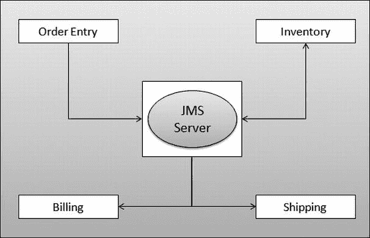

图 5-1.  JMS 消息系统

*   **JMS 客户端：** 任何使用 JMS API 消费或生成 JMS 消息的 Java 应用程序或 Java EE 组件。
*   **JMS 消费者：** 消费 JMS 消息的 JMS 客户端应用程序。如图 5-1 所示的库存、计费和发货应用程序即为 JMS 消息消费者。
*   **JMS 生产者：** 生成消息的 JMS 客户端。如图 5-1 所示的订单录入应用程序即为 JMS 消息生产者。
*   **JMS 消息：** 由消息头、属性和消息体组成的消息。消息头标识消息，属性提供特定于应用程序和提供者的附加属性，消息体包含消息内容。JMS 规范支持发送和接收不同类型的消息。表 5-1 显示了消息类型及其描述。

表 5-1. JMS 消息类型

| 消息类型 | 描述 |
    | --- | --- |
    | `ByteMessage` | 由一系列字节组成 |
    | `MapMessage` | 由一组名称/值对组成 |
    | `ObjectMessage` | 由一个序列化的 Java 对象组成 |
    | `StreamMessage` | 由一系列原始数据类型组成 |
    | `TextMessage` | 由字符串组成 |

消息应用架构

通常，存在两类不同的消息应用：

*   点对点（P2P）模型
*   发布-订阅（pub-sub）模型

P2P 模型基于消息队列，队列中保存了 JMS 客户端应用程序发送的 JMS 消息。消息生产者和消费者商定一个公共队列来交换消息。

当每条消息有且仅有一个消息消费者时，使用 P2P 模型。例如，图 5-2 所示的订单录入系统将新订单发送到消息队列中，由库存系统拾取。类似地，库存系统发送的消息由发货系统消费，发货系统发送的消息由计费系统消费。

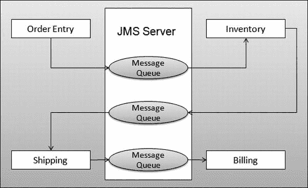

图 5-2.  使用队列的 JMS 消息系统

发布-订阅模型基于主题，主题是消息的目标地址。多个接收者或 JMS 消费者可以检索每条消息。在此模型中，发布者并不总是知道可能的订阅者。发布-订阅模型用于广播型应用，如图 5-3 所示，其中一条消息会传递给多个 JMS 客户端。每个具有唯一名称的主题都在消息服务器中定义。每条带有相关主题的消息都会被发布并传递给所有订阅者。

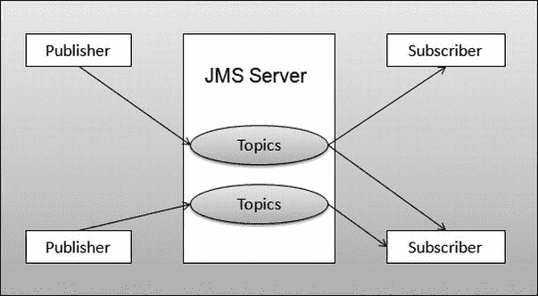

图 5-3.  使用主题的 JMS 消息系统

使用 MDB

*MDB* 是一个异步消息消费者，用于处理通过 JMS 传递的消息。当 MDB 执行消息处理任务时，MDB 运行的 EJB 容器负责处理服务（事务、安全、资源、并发、消息确认），让 Bean 开发者专注于处理消息的业务逻辑。传统的 JMS 应用程序需要自行编写这些服务中的一部分。MDB 本质上是无状态的，这意味着 EJB 容器可以拥有多个 MDB 实例并发执行，以处理来自各种应用程序或 JMS 生产者的数百条 JMS 消息，并为企业应用提供服务质量（QoS），例如高可用性和可靠性。

EJB 客户端应用程序不能像访问会话 Bean 和实体那样直接访问 MDB。与 MDB 通信的唯一方式是将 JMS 消息发送到 MDB 正在监听的目标。任何使用 JMS API 的 Java 应用程序或 Java EE 组件都可以通过向队列或主题发送消息来成为 MDB 的消息提供者。

何时使用 MDB？

在本章前面，我们讨论了企业中异步性的需求。异步消息传递在应用程序、系统和服务之间提供了松耦合，从而为应用程序和系统提供了更大的灵活性和变更管理能力。MDB 提供了一种标准的消息组件模型，实现了企业中异步和面向消息架构的目标。

图 5-4 展示了一个面向消息的应用，它包含订单录入、库存、计费和发货系统，这些系统异步通信以处理一个工作流，该工作流从新的采购订单开始，到订单发货给客户结束。订单录入系统捕获客户的新订单，处理订单，并将其发送到指定的消息队列中（在图 5-4 中，这是“新订单”队列）。库存系统从队列中拾取消息，并检查库存是否可用。如果不可用，则向“供应商”队列发送消息；如果可以发货，则将消息放入“订单就绪”队列。这条新消息由计费系统拾取，计费系统处理客户的计费，并将消息放回“发货”队列。最后，发货应用程序拾取消息，将订单发货给客户，并向客户发送包含跟踪信息的电子邮件。

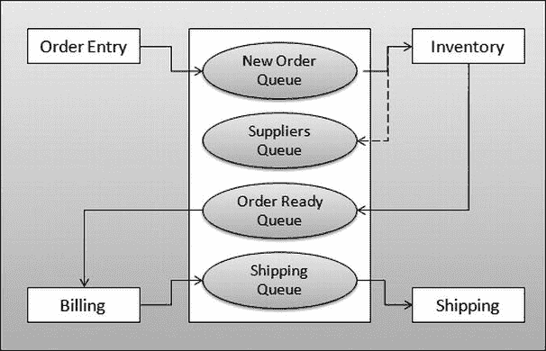

图 5-4.  从订单到发货的 JMS 消息系统

MDB 类

与会话 Bean 不同，MDB 没有任何业务接口。它仅包含以下内容：

*   一个消息驱动类
*   一个可选的回调监听器类
*   一个可选的拦截器类


一个*MDB 类*是任何带有类级别注解`@MessageDriven`的标准 Java 类。如果使用部署描述符代替注解，则应将 Bean 类标记为 MDB 类。在混合模式下（即同时使用注解和部署描述符），如果在 Bean 类中指定了任何其他类级别或成员级别的注解，则必须指定`@MessageDriven`注解。`@MessageDriven`注解的参数可用于指定 Bean 正在监听的 JMS 队列或主题。表 5-2 详细说明了这些参数。

表 5-2. @MessageDriven 注解的参数详情

| 参数 | 描述 |
| --- | --- |
| `ActivationConfigProperty` | 用于指定目标名称和类型的一组属性 |
| `description` | Bean 类的描述 |
| `mappedName` | MDB 正在监听的物理 Java 命名和目录接口（JNDI）主题或队列名称 |
| `messageListener` | MDB 所扩展的接口类的接口名称 |
| `name` | MDB 的名称，如果它必须与 Bean 类的名称不同 |

为了说明 MDB 的使用，我们将创建图 5-5 中所示的用例。我们将有一个应用程序客户端，它是一个 Java 命令行程序，用于调用`OrderProcessing`会话 Bean 中的业务方法。`OrderProcessing`会话 Bean 将创建一条 JMS 消息并将其发送到在 GlassFish 应用服务器中注册/配置的主题。一个名为`StatusMailer`的 MDB 将监听该主题并处理传入的消息。接收到的消息将包含客户的详细信息，并将用于向客户发送关于其订单状态的电子邮件通知。这个简单的用例将使我们能够演示 MDB 如何工作，以及如何在会话 Bean 和 MDB 中注入不同类型的资源。

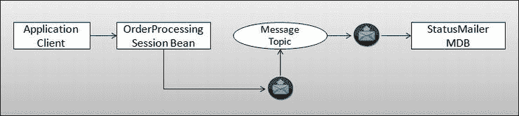

图 5-5.  一个 MDB 示例用例

清单 5-1 展示了`StatusMailer` MDB 的定义。我们使用`@MessageDriven`注解标记了`StatusMailerBean`类。

***清单 5-1.***  StatusMailerBean.java

```
package com.apress.ejb.chapter05;
import javax.ejb.MessageDriven;
@MessageDriven
public class StatusMailerBean {
}
```

一个 MDB 类有一个方法`onMessage()`，当 MDB 监听的队列/主题中有消息到达时，EJB 容器会调用该方法。`onMessage()`方法包含如何处理传入消息的业务逻辑。`onMessage()`方法包含一个参数，即 JMS 消息。对于`StatusMailer` Bean，`onMessage()`方法会检查消息是否为`MapMessage`类型，然后从消息中获取客户信息，创建关于订单状态的电子邮件，最后向客户发送电子邮件。清单 5-2 展示了`onMessage()`方法的代码。在`try`块中，我们首先检查接收到的消息是否如我们所预期的那样是`MapMessage`类型。如果是，则使用`getStringProperty()`来检索消息中`from`、`to`、`subject`和`content`属性的值。

***清单 5-2.***  onMessage 方法代码

```
package com.apress.ejb.chapter05;
import javax.ejb.MessageDriven;
@MessageDriven
public class StatusMailerBean {
    public void onMessage(Message message){
        try  {
            if (message instanceof MapMessage) {
                MapMessage orderMessage = (MapMessage)message;
                String from = orderMessage.getStringProperty("from");
                String to = orderMessage.getStringProperty("to");
                String subject = orderMessage.getStringProperty("subject");
                String content = orderMessage.getStringProperty("content");
             }
            else {
                System.out.println("Invalid message ");
                }
        } catch (Exception ex)  {
            ex.printStackTrace();
        }
     }
}
```

除了用`@MessageDriven`注解标记标准 Java 类之外，MDB 类还需满足以下要求：

*   MDB 类必须实现消息监听器接口。对于 JMS，这将是`javax.jms.MessageListener`。
*   该类不能是 final 或 abstract 的。
*   该类应有一个无参的公共构造函数，供 EJB 容器用于创建 Bean 类的实例。

如果同时使用注解和部署描述符，则在部署过程中，部署描述符中的设置或值将覆盖类中的注解。

配置属性

Bean 开发者可以随 MDB 类一起提供配置属性，这些属性在部署时使用。EJB 容器使用这些属性来配置 Bean 并将其链接到适当的 JMS 提供者。这些配置属性可以使用`@ActivationConfigProperty`注解进行设置。该注解可以作为`@MessageDriven`注解的参数之一提供。清单 5-3 展示了带有`StatusMailer` MDB 属性的`@MessageDriven`注解。我们定义了两个`ActivationConfigProperty`注解，用于指定逻辑目标名称和目标类型。

***清单 5-3.***  带有 StatusMailer MDB 属性的 @MessageDriven 注解

```
@MessageDriven(activationConfig= {
@ActivationConfigProperty(propertyName="destinationName",←
propertyValue="StatusMessageTopic"),←
@ActivationConfigProperty(propertyName="destinationType",←
propertyValue="javax.jms.Topic")
}, mappedName="StatusMessageTopic")

public class StatusMailerBean implements javax.jms.MessageListener {

}
```

EJB 3.0 和 3.1 版本中 MDB 可用的标准配置属性对应于 JMS 1.1 版本中的配置属性。EJB 3.2 版本中 MDB 的标准配置属性已扩展，以对应于 JMS 2.0 版本中的配置属性。表 5-3 展示了 EJB 版本与 JMS 版本之间的对应关系。

表 5-3. EJB MDB 版本与 JMS 版本的映射

| EJB 版本 | JMS 版本 |
| --- | --- |
| EJB 3.0 | JMS 1.1 |
| EJB 3.1 | JMS 1.1 |
| EJB 3.2 | JMS 2.0 |

在接下来的章节中，我们将展示可以为 MDB 设置哪些配置属性。

消息确认

EJB 容器提供消息确认服务。有两种消息确认模式：

*   `自动确认`
*   `允许重复确认`


在 `Auto-acknowledge` 模式下，消息传递确认发生在 `onMessage()` 方法之后。此属性适用于需要**无重复消息**的应用程序。例如，库存系统应**仅接收一次**新订单。在 `Dups-ok-acknowledge` 模式下，确认是延迟执行的，这意味着可能会出现重复的消息传递，但这种方式减少了会话因即时确认而产生的开销。例如，订单处理过程中发送的电子邮件可以允许重复消息。我们可以使用 `@ActivationConfigProperty` 注解来指定消息确认属性。清单 5-4 展示了设置为允许重复的属性。

***清单 5-4.***  @ActivationConfigProperty 注解

```
@MessageDriven(
activationConfig= {
@ActivationConfigProperty(propertyName="acknowledgeMode",
propertyValue="Dups-ok-acknowledge")}
)
```

**消息选择器**

消息选择器允许根据 Bean 开发者使用 `@ActivationConfigProperty` 注解提供的选择标准来过滤传入的消息。此属性对于限制 Bean 接收的消息非常有用。例如，处理传入订单的 MDB 可能只处理与红葡萄酒和白葡萄酒相关的订单。用于指定此属性的属性名称为 `messageSelector`。

**消息目的地**

消息目的地描述了 MDB 是监听队列还是主题。Bean 开发者可以在 Bean 中使用 `@ActivationConfigProperty` 注解提供描述。该属性的值必须是 `javax.jms.Queue` 或 `javax.jms.Topic`。例如，新订单可能需要由库存系统作为工作流中的下一步进行处理；在这种情况下，订单录入系统不必广播新订单消息。订单录入系统和库存系统可以就某个特定目的地达成一致。清单 5-3 展示了指定目的地名称和类型的代码。

**订阅持久性**

如果 Bean 被设计为监听主题，那么 Bean 开发者可以进一步指定消息的持久性。主题可以是 `Durable`（持久）或 `Non-Durable`（非持久）。使用 `Durable` 主题可以确保应用程序的可靠性。即使 EJB 容器暂时离线，也能确保消息不会丢失。例如，如果 EJB 容器宕机，我们需要确保从客户端应用程序接收的新采购订单不会丢失。所有采购订单都必须由 MDB 可靠地处理。我们可以使用 `@ActivationConfigProperty` 注解，通过 `subscriptionDurability` 属性来指定持久性。清单 5-5 展示了将属性设置为 `Durable` 的代码。如果未设置此属性，容器将假定默认值为 `Non-Durable`。

***清单 5-5.***  将属性设置为 Durable 的代码

```
@MessageDriven(
activationConfig= {
@ActivationConfigProperty(propertyName="subscriptionDurability", propertyValue="Durable")}
)
```

在 `StatusMailer` MDB 中，我们将使用 `@ActivationConfigProperty` 注解创建属性。消息的 `destinationName` 设置为 `StatusMessageTopic`，`destinationType` 设置为 `javax.jms.Topic`。我们将使用 `mappedName` 参数来指定主题的物理目的地名称。在我们的例子中，它与 `destinationName` 相同。清单 5-6 展示了当前完成状态下的 `StatusMailer` MDB。

***清单 5-6.***  StatusMailerBean.java

```
package com.apress.ejb.chapter05;
import javax.ejb.ActivationConfigProperty;
import javax.jms.Message;
import javax.ejb.MessageDriven;
import javax.jms.MapMessage;

@MessageDriven(activationConfig= {
@ActivationConfigProperty(propertyName="destinationName", propertyValue="StatusMessageTopic"),
@ActivationConfigProperty(propertyName="destinationType", propertyValue="javax.jms.Topic")
}, mappedName="StatusMessageTopic")
public class StatusMailerBean implements javax.jms.MessageListener{
    public void onMessage(Message message){
        try  {
            if (message instanceof MapMessage) {
                MapMessage orderMessage = (MapMessage)message;
                String from = orderMessage.getStringProperty("from");
                String to = orderMessage.getStringProperty("to");
                String subject = orderMessage.getStringProperty("subject");
                String content = orderMessage.getStringProperty("content");
             }
            else {
                System.out.println("Invalid message ");
                }
        } catch (Exception ex)  {
            ex.printStackTrace();
        }
    }
}
```

**MDB 中的依赖注入**

MDB 可以使用依赖注入来获取对 JavaMail、EJB 或其他对象等资源的引用。MDB 尝试获取和使用的资源必须在容器上下文或环境上下文中可用。

在图 5-5 的示例用例中，我们讨论了在消息处理后创建电子邮件，并通过电子邮件将订单状态发送给客户。为了在 `StatusMailer` 消息 Bean 中实现这一点，我们需要获取一个 JavaMail 会话，以便创建并发送电子邮件。*JavaMail* 是一个 API，它提供了一个与平台无关的框架，用于构建邮件应用程序。JavaMail API 在 Java EE 平台中可用。

我们可以使用依赖注入在 MDB 中获取 JavaMail 会话。清单 5-7 展示了使用依赖注入和 JavaMail API 完成的 `StatusMailer` MDB。`@Resource` 注解用于注入一个名为 `mail/wineappMail` 的 JavaMail 会话，该会话已在 GlassFish 应用服务器中注册为邮件资源。注入的邮件会话用于创建 `javax.mail.Message`，并使用 setter 方法创建邮件消息的标头和内容。最后，使用 `javax.mail.Transport` 类中的 `send()` 方法发送创建的消息。

***清单 5-7.***  使用依赖注入和 JavaMail API 完成的 StatusMailer MDB

```
package com.apress.ejb.chapter05;
import javax.annotation.Resource;
import javax.ejb.ActivationConfigProperty;
import javax.jms.Message;
import javax.ejb.MessageDriven;
import javax.jms.MapMessage;
import javax.mail.Transport;
import javax.mail.internet.InternetAddress;
import javax.mail.internet.MimeMessage;

@MessageDriven(activationConfig= {
@ActivationConfigProperty(propertyName="destinationName",
propertyValue="StatusMessageTopic"),
@ActivationConfigProperty(propertyName="destinationType",
propertyValue="javax.jms.Topic")
}, mappedName="StatusMessageTopic")

public class StatusMailerBean implements javax.jms.MessageListener{
@Resource(name="mail/wineappMail" )
private javax.mail.Session ms;


public void onMessage(Message message){
        try  {
            if (message instanceof MapMessage) {
                MapMessage orderMessage = (MapMessage)message;
                String from = orderMessage.getStringProperty("from");
                String to = orderMessage.getStringProperty("to");
                String subject = orderMessage.getStringProperty("subject");
                String content = orderMessage.getStringProperty("content");
                javax.mail.Message msg = new MimeMessage(ms);
                msg.setFrom(new InternetAddress(from));
                InternetAddress[] address = {new InternetAddress(to)};
                msg.setRecipients(javax.mail.Message.RecipientType.TO, address);
                msg.setSubject(subject);
                msg.setSentDate(new java.util.Date());
                msg.setContent(content, "text/html");
                System.out.println("MDB: Sending Message...");
                Transport.send(msg);
                System.out.println("MDB: Message Sent");
             }
            else {
                System.out.println("Invalid message ");
                }

} catch (Exception ex)  {
            ex.printStackTrace();
        }

}
}
```

生命周期回调方法

在某些情况下，使用 MDB 的应用程序需要细粒度的控制。MDB 支持两种生命周期事件回调：

*   `PostConstruct`
*   `PreDestroy`

`PostConstruct` 回调发生在容器执行依赖注入之后、Bean 上第一个消息监听器方法调用之前。`PreDestroy` 回调发生在 MDB 从池中移除或销毁时。

例如，`PostConstruct` 回调可用于初始化某些属性或资源，而 `PreDestroy` 回调可用于清理或释放已获取的资源。

在 MDB 类上定义的回调方法应具有以下签名：

```
public void <METHOD> ()
```

回调方法也可以在 Bean 的监听器类上定义，在这种情况下，方法应具有以下签名：

```
public void <METHOD>(Object)
```

其中 `Object` 可以声明为实际的 Bean 类型，该类型是运行时传递给回调方法的参数。

回调方法可以是 MDB 中带有回调注解的任何方法。以下规则适用于这些方法：

*   方法应为 public。
*   方法不能是 final 或 static。
*   返回类型应为 `void`。

如前所示，方法可以接受零个或一个参数。回调监听器类通过与其关联的 MDB 类上的 `@CallbackListener` 注解来标识。

拦截器

EJB 规范提供了一些称为*拦截器*的注解，允许您拦截业务方法调用。可以为 MDB 定义拦截器方法。

您可以为特定方法添加 `@AroundInvoke` 注解或在部署描述符中添加 `<around-invoke-method>` 元素，也可以定义一个拦截器类，其方法在 MDB 类中的 `onMessage()` 方法被调用之前被调用。拦截器类通过与其关联的 MDB 类上的 `@Interceptor` 注解来标识。在存在多个拦截器类的情况下，使用 `@Interceptors` 注解。Bean 类或任何给定的拦截器类上只能存在一个 `AroundInvoke` 方法。`AroundInvoke` 方法不能是 MDB 类的 `onMessage()` 方法。

`AroundInvoke` 方法应具有以下签名：

```
public Object <METHOD>(InvocationContext) throws Exception
```

`InvocationContext` 的定义如下：

```
  package javax.ejb;
   public interface InvocationContext {
      public Object getBean();
      public java.lang.reflect.Method getMethod();
      public Object[] getParameters();
      public void setParameters(Object[] params);
      public EJBContext getEJBContext();
      public java.util.Map getContextData();
      public Object proceed() throws Exception;
   }
```

以下列表描述了每个方法：

*   `getBean()`：返回被调用方法所在的 Bean 实例
*   `getMethod()`：返回被调用的 Bean 实例上的方法
*   `getParameters()`：返回方法调用的参数
*   `setParameters()`：允许修改方法调用的参数
*   `getEJBContext()`：使拦截器方法能够访问 Bean 的 `EJBContext`
*   `getContextData()`：允许使用返回的 `Map` 在同一个 `InvocationContext` 实例中的拦截器方法之间传递值
*   `proceed()`：如果有下一个拦截器则调用它，否则调用目标 Bean 方法

异常处理

EJB 规范概述了两种类型的异常：应用程序异常和系统异常。有关这些异常的更多一般信息，请参阅第 2 章的“异常处理”部分。对于 MDB，监听器方法不得抛出 `java.rmi.RemoteException` 或一般的运行时异常。客户端假定消息消费者即使在发生运行时异常后仍然存在。如果在抛出运行时异常后客户端发送消息，则 EJB 容器会将消息委托给另一个 MDB 实例。此外，如果允许异常“逃逸”出 MDB，则该消息不被视为已被消费，并且会返回到队列/主题中。然后，有问题的消息会被重新投递。这被称为“毒消息”问题。

回调方法可以抛出运行时异常。在事务内执行的回调方法抛出的运行时异常会导致该事务回滚。回调方法不得抛出应用程序异常。

客户端视图

对于客户端应用程序而言，MDB 只是一个消息消费者。客户端应用程序可以是任何使用 JMS API 发送消息的 Java EE 组件的 Java 客户端。从客户端应用程序的角度来看，MDB 的存在完全隐藏在 MDB 作为消息监听器的目标或端点之后。

客户端的 JNDI 命名空间可以配置为包含安装在网络上多台机器上的多个 EJB 容器中的 MDB 的目标或端点。企业 Bean 和 EJB 容器的实际位置通常对使用该企业 Bean 的客户端是透明的。

对消息目标的引用可以通过 `@Resource` 注解（位于 `javax.annotation` 包中）注入，或者在资源已在部署描述符中定义的情况下通过 JNDI 查找注入。

 **注意**   从 EJB 3.2 开始，JMS 资源适配器可以通过其标准名称查找 MDB 来构造订阅名称。


在前文讨论并展示于图 5-5 的用例中，我们有一个会话 Bean 充当客户端应用程序与消息主题之间的中介。客户端应用程序调用会话 Bean 中的业务方法，该会话随后成为创建并发送消息的客户端或 JMS 消息生产者。为说明这一点，我们将创建一个无状态会话 Bean `OrderProcessing`，其中包含一个业务方法 `SendOrderStatus()`。代码清单 5-8 展示了 `OrderProcessing` 会话 Bean 的代码。我们使用 `@Resource` 注解注入 `TopicConnectionFactory` 和 `StatusMailer` MDB 正在监听的 `Topic`。我们将在会话 Bean 中使用一些硬编码值来模拟客户电子邮件地址和电子邮件内容。在 `try` 块中，我们创建到 `statusMessageTopicConnectionFactory` 的连接并启动该连接。利用创建的会话，我们通过 `createSession()` 和 `createProducer()` 方法创建主题会话和主题生产者。最后，我们创建一个 `MapMessage` 对象，用电子邮件地址、主题和内容填充消息，并使用 `send()` 方法将消息发送到 `Topic`。

***代码清单 5-8.***  OrderProcessingBean.java

```
package com.apress.ejb.chapter05;
import javax.annotation.Resource;
import javax.ejb.Stateless;
import javax.jms.Connection;
import javax.jms.JMSException;
import javax.jms.MapMessage;
import javax.jms.MessageProducer;
import javax.jms.Session;
import javax.jms.Topic;
import javax.jms.TopicConnectionFactory;

@Stateless(name = "OrderProcessing")
public class OrderProcessingBean
{
    public OrderProcessingBean() {
    }

@Resource(mappedName = "StatusMessageTopicConnectionFactory")
    private TopicConnectionFactory statusMessageTopicCF;

@Resource(mappedName = "StatusMessageTopic")
    private Topic statusTopic;

public String SendOrderStatus() {
        String from = "chirag.rathod@oracle.com";
        String to = "chirag.rathod@oracle.com";
        String content =
        "Your order has been processed " + "If you have questions" +
        " call EJB Application with order id # " + "1234567890";

try {
        System.out.println("Before status TopicCF connection");
        Connection connection = statusMessageTopicCF.createConnection();
        System.out.println("Created connection");
        connection.start();
        System.out.println("statted connection");
        System.out.println("Starting Topic Session");
        Session topicSession =
            connection.createSession(false, Session.AUTO_ACKNOWLEDGE);
        MessageProducer publisher = topicSession.createProducer(statusTopic);
        System.out.println("created producer");
        MapMessage message = topicSession.createMapMessage();
        message.setStringProperty("from", from);
        message.setStringProperty("to", to);
        message.setStringProperty("subject", "Status of your wine order");
        message.setStringProperty("content", content);
        System.out.println("before send");
        publisher.send(message);
        System.out.println("after send");
        }
        catch (JMSException e) {
            e.printStackTrace();
        }

return "Created a MapMessage and sent it to StatusTopic";
    }
}
```

 **注意** 在代码清单 5-8 中，请将“from”和“to”字段的值更新为您的电子邮件 ID。

完成图 5-5 中讨论的用例，我们最后需要做的是创建一个客户端应用程序，该程序将查找 `OrderProcessing` 会话 Bean 并调用 `SendOrderStatus()` 消息。代码清单 5-9 展示了客户端应用程序的代码。在 `try` 块中，我们通过 JNDI 查找 `OrderProcessing` 会话 Bean，并调用 `SendOrderStatus()` 业务方法。

***代码清单 5-9.***  StatusMailerClient.java

```
package com.apress.ejb.chapter05;
import java.io.IOException;
import java.io.PrintWriter;
import javax.ejb.EJB;
import javax.servlet.ServletException;
import javax.servlet.annotation.WebServlet;
import javax.servlet.http.HttpServlet;
import javax.servlet.http.HttpServletRequest;
import javax.servlet.http.HttpServletResponse;

@WebServlet(name = "StatusMailerClient", urlPatterns = {"/StatusMailerClient"})
public class StatusMailerClient extends HttpServlet {
    @EJB
    OrderProcessingBean orderProcessing;

protected void processRequest(HttpServletRequest request, HttpServletResponse response)
            throws ServletException, IOException {
        response.setContentType("text/html;charset=UTF-8");
        PrintWriter out = response.getWriter();
        try {
            out.println("<html>");
            out.println("<head>");
            out.println("<title>Servlet StatusMailerClient</title>");
            out.println("</head>");
            out.println("<body>");

out.println("<h1>OrderProcessing session bean lookup to be done</h1>");
            out.println("<h1>Invoking SendOrderStatus() business method now</h1>");
            out.println("<h1>" + orderProcessing.SendOrderStatus() + "</h1>");
            out.println("<h1>Done !!!</h1>");
            out.println("</body>");
            out.println("</html>");
        } finally {
            out.close();
        }
    }

@Override
    protected void doGet(HttpServletRequest request, HttpServletResponse response)
            throws ServletException, IOException {
        processRequest(request, response);
    }

@Override
    protected void doPost(HttpServletRequest request, HttpServletResponse response)
            throws ServletException, IOException {
        processRequest(request, response);
    }

@Override
    public String getServletInfo() {
        return "Short description";
    }
}
```

在下一节中，我们将介绍编译、部署和运行我们已完成的用例。

编译、部署和测试 MDB

MDB 需要打包到 EJB JAR（Java 归档）文件中，然后才能部署到 EJB 容器中。这些 EJB 归档文件随后即可部署。（对于某些 EJB 容器或应用服务器，它们需要组装成 EAR [企业归档] 文件）。大多数 EJB 容器或应用服务器提供部署实用程序或 Ant 任务，以方便将 EJB 部署到其容器中。像 JDeveloper、NetBeans 和 Eclipse 这样的 Java 集成开发环境（IDE）也提供部署功能，允许开发者将 EJB 打包、组装并部署到应用服务器。打包、组装和部署方面的内容将在第 11 章中详细讨论。

在本章中，我们开发了一个无状态会话 Bean（`OrderProcessing`）和一个 MDB（`StatusMailer`）。在部署 MDB 之前，必须配置 JMS 提供程序，使其包含客户端应用程序和 MDB 将相应使用的队列和主题。

以下各节描述了编译、部署和测试这些 MDB 及会话 Bean 的步骤。

前提条件

在执行后续各节详述的任何步骤之前，请先完成第 1 章的“入门”部分，该部分将引导您完成本章示例所需的安装和环境设置。

编译会话 Bean 和 MDB


将 `Chapter05-MDBSamples` 目录及其内容复制到你选择的目录中。运行 NetBeans IDE，然后通过 `File -> Open Project` 菜单打开 `Chapter05-MDBSamples` 项目。确保 `'Open Required Projects'` 复选框已勾选。

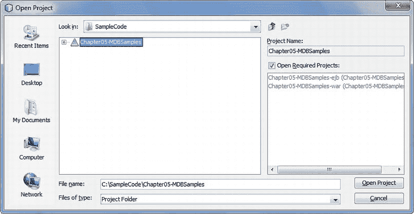

图 5-6.   打开 Chapter05-MDBSamples 项目

展开 `Chapter05-MDBSamples-ejb` 节点，观察我们创建的 MDB 和会话 Bean 出现在 `com.apress.ejb.chapter05` 包中。同样，两个客户端 Servlet 出现在 `Chapter05-MDBSamples`-war 节点下。

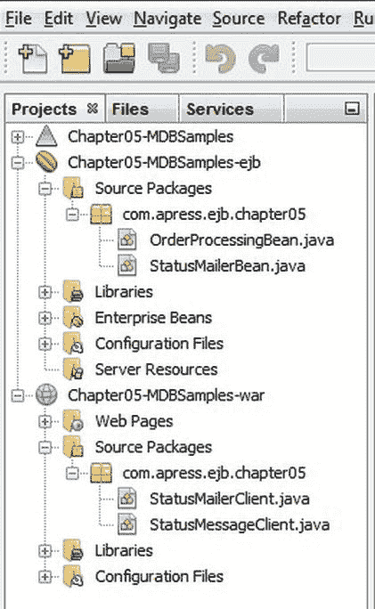

图 5-7.   验证 MDB、会话 Bean 及其客户端在项目中可用

在 `Chapter05-MDBSamples` 节点上调用上下文菜单，并通过选择 `Clean and Build` 菜单选项来构建应用程序。

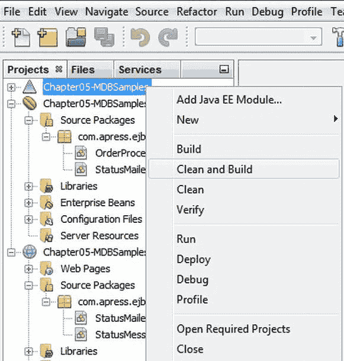

图 5-8.   构建应用程序

创建 JMS 和 JavaMail 资源

`StatusMailer` MDB 使用了 JMS 和 JavaMail 资源。在将 `Chapter05-MDBSamples` 应用程序部署到 GlassFish 之前，需要预先配置这些资源。首先，我们将启动 GlassFish 应用服务器，然后通过基于 Web 的管理控制台配置 JMS 和 JavaMail 资源。

单击 NetBeans 应用程序导航器中的 `'Services'` 选项卡。`'GlassFish Server 3+'` 列在 `'Servers'` 节点下。在 `'GlassFish Server 3+'` 上调用上下文菜单，并通过选择 `Start` 菜单选项启动服务器。

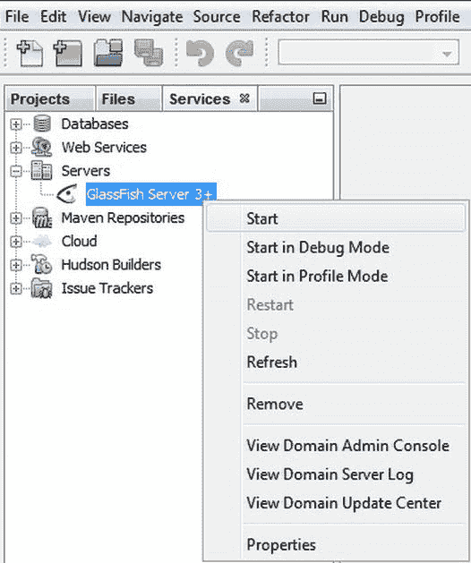

图 5-9.   启动 GlassFish 应用服务器

服务器启动后，打开你喜欢的浏览器并导航到 `http://localhost:4848/`。GlassFish 服务器的管理控制台将加载，如图 5-10 所示。

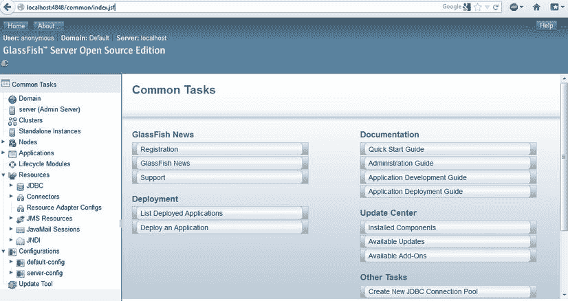

图 5-10.  导航到管理控制台

 **注意**   如果你在不同的机器上运行 GlassFish，请在命令行参数中将该机器名称替换为 `localhost`。同样，如果你在不同的端口上运行，请将你运行的端口号替换为 `4848`。

使用管理控制台，如图 5-11 所示，创建一个名为 `StatusMessageTopicConnectionFactory` 的 JMS `TopicConnectionFactory`，`OrderProcessing` 会话 Bean 将使用它向主题发送消息，该消息将由 `StatusMailer MDB` 消费。

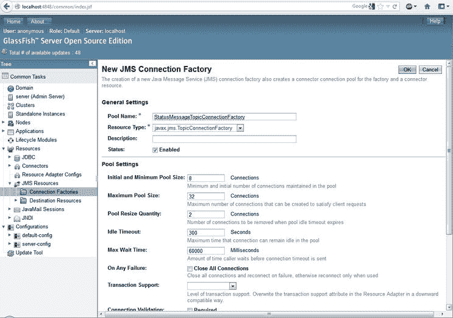

图 5-11.  创建 TopicConnectionFactory

然后创建一个名为 `StatusMessageTopic` 的 JMS 主题，如图 5-12 所示。

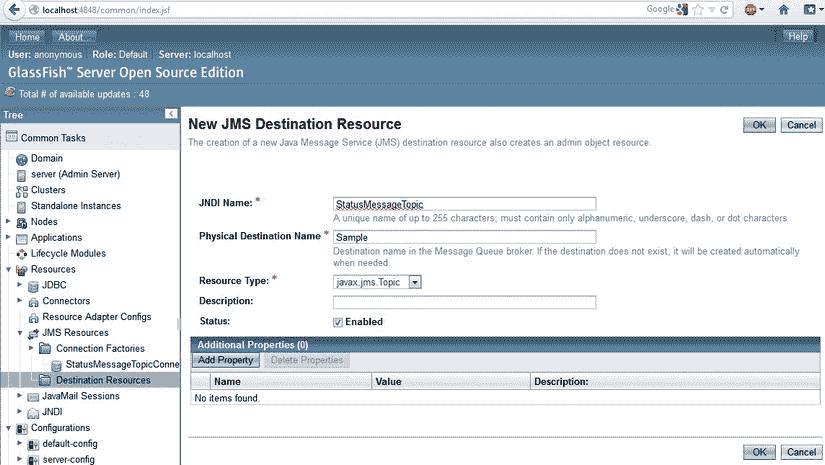

图 5-12.  创建 JMS 主题

创建一个名为 `mail/wineappMail` 的 JavaMail 资源，`StatusMailer` MDB 将使用它发送电子邮件，如图 5-13 所示。

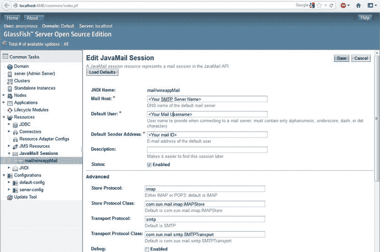

图 5-13.  创建 JavaMail 资源

如果 SMTP 服务器需要身份验证，则设置“附加属性”，如图 5-14 所示。

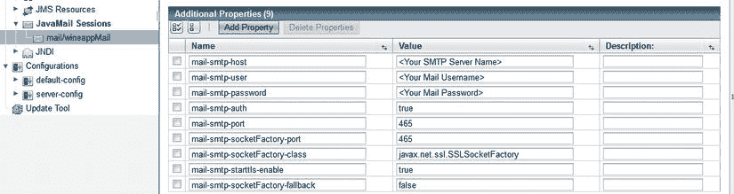

图 5-14.  为需要身份验证的 SMTP 服务器设置附加属性

部署会话 Bean、MDB 及其客户端

配置好 JMS 和 JavaMail 资源后，就可以将应用程序部署到 GlassFish 应用服务器了。在 `Chapter05-MDBSamples` 节点上调用上下文菜单，并通过选择 `Deploy` 菜单选项部署应用程序，如图 5-15 所示。

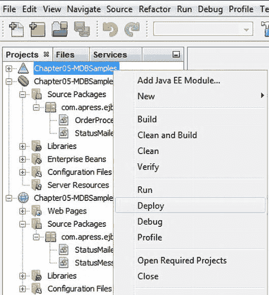

图 5-15.  部署 MDB、会话 Bean 及其客户端

运行客户端程序

成功部署 MDB、会话 Bean 及其客户端 Servlet 后，我们需要设置要执行的运行目标。我们有两个运行目标可供选择：`StatusMailerClient` 或 `StatusMessageClient`。要设置运行目标，请在 `Chapter05-MDBSamples` 节点上调用上下文菜单，并选择 Properties 菜单选项。选择 Run 类别，在 Relative URL 文本字段中输入运行目标，然后单击 OK。我们将运行目标设置为 `StatusMailerClient`，如图 5-16 所示。

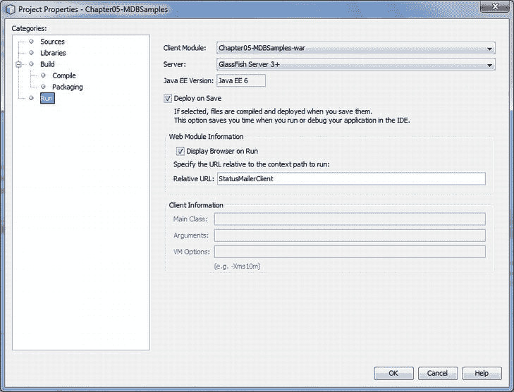

图 5-16.  将运行目标设置为 StatusMailerClient

要运行客户端 Servlet，请在 `Chapter05-MDBSamples` 节点上调用上下文菜单，并选择 `Run` 菜单选项，如图 5-17 所示。

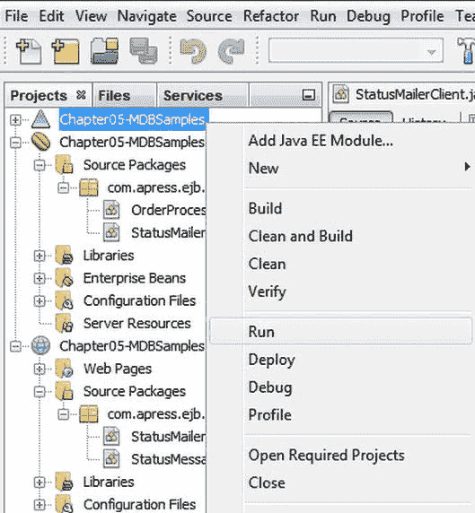

图 5-17.  运行 StatusMailerClient 应用程序目标

`StatusMailerClient` 成功运行后，NetBeans 将打开你的默认浏览器并执行选定的 Servlet。以下是 `StatusMailerClient` Servlet 的输出。你还应该能够在发送消息的收件箱中看到一封电子邮件。

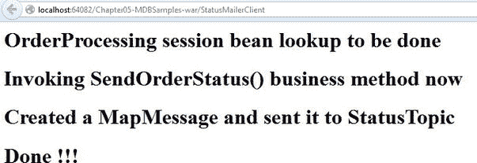

图 5-18.   StatusMailerClient Servlet 的输出

结论

在本章中，我们向你介绍了面向消息的中间件的概念，以及为什么企业正在寻求能够以异步方式进行通信的松散耦合应用程序。

我们介绍了使用 P2P 和发布-订阅模型的消息应用程序架构，并讨论了为什么消息传递是实现异步应用程序的最佳方式之一。我们详细研究了 JMS，包括不同的 JMS 组件，如提供者、消费者、客户端和不同类型的消息。我们研究了 MDB 以及可以构成它们的各种工件。我们介绍了 MDB 的不同配置属性，以及如何使用注解设置它们。我们通过注入 JavaMail 资源的具体示例解释了 MDB 中的依赖注入。我们讨论了编译、打包、部署和测试 MDB 所需的内容，以及如何在 GlassFish 应用服务器中创建不同类型的资源。最后，我们介绍了使用 GlassFish 中的应用程序客户端容器运行示例客户端程序，查看输出以及接收 MDB 发送的电子邮件消息。

在下一章中，我们将深入探讨 Web 服务，包括如何将会话 Bean 发布为 Web 服务，以及如何从 EJB 应用程序调用 Web 服务。

第 6 章


EJB 与 Web 服务

本章将解释 Web 服务，介绍核心 Web 服务标准（SOAP、WSDL、UDDI、XML），并讨论 Java EE 平台中 Web 服务支持的演变。我们还将深入探讨如何将 EJB 无状态会话 Bean 发布为 Web 服务。最后，我们将讨论如何从命令行 Java 客户端程序和无状态会话 Bean 调用已发布的 Web 服务。

什么是 Web 服务？


Web 服务本质上构成了一种业务逻辑或功能，这些逻辑或功能存在于应用程序或模块中，并通过服务接口暴露给客户端应用程序（通常称为*服务消费者*）。Web 服务的消费者无需了解该服务的任何实现细节——客户端能够利用服务接口中提供的信息来访问或调用该 Web 服务。这种架构从根本上提供了一种松耦合模型，在此模型中，消费者不必了解作为 Web 服务暴露的业务逻辑实现所特有的技术或基础设施细节。

W3C（万维网联盟）的 Web 服务架构工作组为 Web 服务提供了以下定义：

*Web 服务是一种旨在支持网络上可互操作的机器间交互的软件系统。它拥有一个以机器可处理格式（特别是 WSDL）描述的接口。其他系统按照其描述所规定的方式，使用 SOAP 消息与该 Web 服务进行交互，这些消息通常通过 HTTP 传输，并采用 XML 序列化，同时结合其他与 Web 相关的标准。*

虽然将细节抽象到接口的概念已在多种语言和分布式架构（例如 EJB 和 CORBA）中使用，但 Web 服务的关键区别在于使用标准来描述服务的抽象、调用和注册。

Web 服务架构遵循“查找-绑定-执行”模型，在该模型中，你在注册中心（UDDI）中找到所需的服务，获取该服务的描述，将其绑定到该服务（根据描述创建将发送到服务的消息），最后执行或调用该服务。图 6-1 展示了“查找-绑定-执行”模型。UDDI、WSDL 和 SOAP 是使这种“查找-绑定-执行”模型无处不在并区别于早期计算模型的标准。

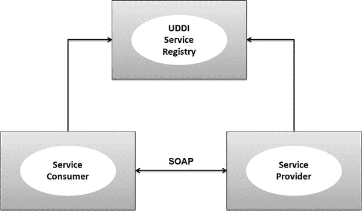

图 6-1.  Web 服务架构

UDDI

*通用描述、发现与集成（UDDI）* 提供了一种基于标准的方法来定位 Web 服务以及调用该服务的信息。它还提供了关于该服务的额外元数据。UDDI 帮助你动态绑定 Web 服务，而不是必须将它们硬编码到外部接口，并且它还有助于提供分类法。企业或服务提供商可以提供基本的联系信息（包括标识）、服务的分类、描述其行为的信息以及 Web 服务的实际位置。

目前版本为 3 的 UDDI 在过去几年中不断发展。版本 1 侧重于为服务提供注册中心，而版本 2 侧重于使规范与其他 Web 服务规范和灵活的分类法保持一致。当前版本侧重于为服务的私有或公共实现的安全交互提供支持。包括 Oracle、SAP、Microsoft、IBM、Cisco、Computer Associates 和 Systinet 在内的多家公司都是结构化信息标准促进组织（OASIS）的 UDDI 技术委员会成员。大多数应用服务器供应商（例如 Oracle 和 IBM）要么将 UDDI 注册中心作为其应用服务器的标准组件提供，要么将 OEM UDDI 注册中心（来自 Systinet 或其他注册中心提供商）作为其中间件平台的一部分提供。

WSDL

*Web 服务描述语言（WSDL）* 是一种使用 XML 描述服务接口的技术。WSDL 是由 W3C 开发的标准，过去几年中，多家供应商和个人为其做出了贡献。WSDL 描述了服务做什么、如何调用其操作以及在哪里找到它。

WSDL 的详细信息可以分为两类：服务接口定义细节和服务实现定义细节。服务接口定义是一种抽象的或可重用的服务定义，它可以被多个服务实现定义实例化和引用。它包含以下 WSDL 元素，这些元素构成了服务描述中可重用的部分。我们将使用一个信用检查 Web 服务作为示例来介绍此处列出的服务接口定义元素：

```
<definitions>
<types>
<message>
<portType>
<binding>
```

<definitions> 元素

`<definitions>` 元素允许你指定在 WSDL 文档中可见的命名空间的全局声明。它充当服务描述的容器。清单 6-1 展示了一个 `<definitions>` 元素的示例，该元素定义了一个目标命名空间以及信用服务所引用的其他命名空间。

***清单 6-1.***  CreditService.wsdl 中的 <definitions> 元素

```
<?xml version="1.0" encoding="UTF-8" standalone="yes"?>
<definitions targetNamespace="http://www.apress.com/ejb3/credit" ←
name="CreditService" xmlns:tns="http://www.apress.com/ejb3/credit" ←
xmlns:xsd="http://www.w3.org/2001/XMLSchema" ←
xmlns:soap="http://schemas.xmlsoap.org/wsdl/soap/"←
xmlns=http://schemas.xmlsoap.org/wsdl//>
```

<types> 元素

`<types>` 元素用于定义 `<message>` 元素的数据类型。XML 模式定义（XSD）最常用于指定数据类型。清单 6-2 展示了一个 `<types>` 元素的示例，该元素提供了信用服务的模式位置。

***清单 6-2.***  CreditService.wsdl 中的 <types> 元素

```
  <types>
    <xsd:schema>
<xsd:import namespace="http://www.apress.com/ejb3/credit"←
    schemaLocation="CreditServiceBeanService_schema1.xsd"/>
    </xsd:schema>
  </types>
```

<message> 元素

`<message>` 元素用于定义 Web 服务消费者和 Web 服务提供者之间交换的数据格式。清单 6-3 展示了两个 `<message>` 元素的示例：`CreditCheck` 和 `CreditCheckResponse`。

***清单 6-3.***  CreditService.wsdl 中的 <message> 元素

```
  <message name="CreditCheck">
    <part name="parameters" element="tns:CreditCheck"/>
  </message>
  <message name="CreditCheckResponse">
    <part name="parameters" element="tns:CreditCheckResponse"/>
  </message>
```

<portType> 元素

`<portType>` 元素用于指定 Web 服务的操作。清单 6-4 展示了信用服务的 `<portType>` 元素，其中包含 `CreditCheck` 操作。

***清单 6-4.***  CreditService.wsdl 中的 <portType> 元素

```
<portType name="CreditCheckEndpointBean">
  <operation name="CreditCheck">
    <input message="tns:CreditCheck"/>
    <output message="tns:CreditCheckResponse"/>
  </operation>
</portType>
```

<binding> 元素

`<binding>` 元素描述了 `<portType>` 元素的协议、数据格式和安全性。标准绑定是 HTTP 或 SOAP；或者你也可以创建自己的绑定。

WSDL 规范的“绑定”部分非常灵活——它允许你提供自己的绑定环境，而不是默认的基于 SOAP-over-HTTP 的模型。规范的这种灵活性已被 WSIF（Web 服务调用框架）广泛利用，这是一个 Apache 开源项目。WSIF 提供了一种很好的方式，将现有的基于 Java、EJB、JMS（Java 消息服务）和 JCA 的组件作为具有本地绑定的 Web 服务暴露出来，这些本地绑定提供了更好的性能并支持本地事务。清单 6-5 展示了信用服务的 `<binding>` 元素，使用了 SOAP-over-HTTP。


***清单 6-5.***  CreditService.wsdl 中的 <binding> 元素

```
  <binding name="CreditCheckEndpointBeanPortBinding"←
type="tns:CreditCheckEndpointBean"> ←
    <soap:binding transport="http://schemas.xmlsoap.org/soap/http" ←
style="document"/>
    <operation name="CreditCheck">
      <soap:operation soapAction=""/>
      <input>
        <soap:body use="literal"/>
      </input>
      <output>
        <soap:body use="literal"/>
      </output>
    </operation>
  </binding>
```

WSDL 文档的服务实现定义部分用于标识一个 Web 服务。它包含以下元素：

```
<service>
<port>
```

<service> 元素

`<service>` 元素包含一组 `<port>` 元素，每个端口都与一个端点（网络地址位置或 URL）相关联。清单 6-6 展示了信用服务的 `<service>` 元素示例。

***清单 6-6.***  CreditService.wsdl 中的 <service> 元素

```
  <service name="CreditService">
    <port name="CreditCheckEndpointBeanPort" ←
binding="tns:CreditCheckEndpointBeanPortBinding">
      <soap:address location="http://localhost:64082/CreditService/CreditCheckEndpointBean"/>
    </port>
  </service>
```

清单 6-7 展示了我们将在本章后续开发的信用服务的完整 WSDL 文档。

***清单 6-7.***  CreditService.wsdl 的完整 WSDL 文档

```
  <?xml version='1.0' encoding='UTF-8'?>
  <definitions xmlns:soap="http://schemas.xmlsoap.org/wsdl/soap/" xmlns:tns="http://www.apress.com/ejb/credit" xmlns:xsd="http://www.w3.org/2001/XMLSchema" xmlns="http://schemas.xmlsoap.org/wsdl/" targetNamespace="http://www.apress.com/ejb/credit" name="CreditService">
    <types>
    <xsd:schema>
      <xsd:import namespace="http://www.apress.com/ejb3/credit"←
        schemaLocation="CreditServiceBeanService_schema1.xsd"/>
    </xsd:schema>
    </types>
    <message name="CreditCheck">
      <part name="parameters" element="tns:CreditCheck"/>
    </message>
    <message name="CreditCheckResponse">
      <part name="parameters" element="tns:CreditCheckResponse"/>
    </message>
    <portType name="CreditCheckEndpointBean">
      <operation name="CreditCheck">
        <input message="tns:CreditCheck"/>
        <output message="tns:CreditCheckResponse"/>
      </operation>
    </portType>
    <binding name="CreditCheckEndpointBeanPortBinding" type="tns:CreditCheckEndpointBean">
      <soap:binding transport="http://schemas.xmlsoap.org/soap/http" style="document"/>
      <operation name="CreditCheck">
        <soap:operation soapAction=""/>
        <input>
          <soap:body use="literal"/>
        </input>
        <output>
          <soap:body use="literal"/>
        </output>
      </operation>
    </binding>
    <service name="CreditService">
      <port name="CreditCheckEndpointBeanPort" binding="tns:CreditCheckEndpointBeanPortBinding">
        <soap:address location="http://localhost:64082/CreditService/CreditCheckEndpointBean"/>
      </port>
    </service>
  </definitions>
```

SOAP

*简单对象访问协议 (SOAP)* 是一种基于 XML 的协议，用于在分布式和去中心化环境中使用 XML 交换信息。SOAP 是由 W3C 开发的标准。从根本上说，SOAP 是 Web 服务的默认传输层。

SOAP 消息是一个普通的 XML 文档，包含以下元素：

*   必需的 `Envelope` 元素将 XML 文档标识为 SOAP 消息。`Envelope` 是文档中的顶级元素。信封是必需的，它基本上标记了 SOAP 消息的开始和结束（尽管消息可以包含指向信封外部对象的链接）。信封包含 `Header` 和 `Body` 元素。
*   可选的 `Header` 元素包含头部信息。当 SOAP 协议通过 HTTP 使用时，HTTP 头部提供有关消息内容类型、内容长度和接收者的信息。包含头部是为了在不事先与通信方达成一致的情况下向 SOAP 消息添加功能。
*   必需的 `Body` 元素包含请求和响应信息。`Body` 是必需的元素，包含供消息接收者使用的信息。
*   可选的 `Fault` 元素提供有关消息处理过程中发生的错误的信息。`Body` 元素可以包含一个可选的 `Fault` 元素来报告错误。

图 6-2 展示了 SOAP 消息的元素。

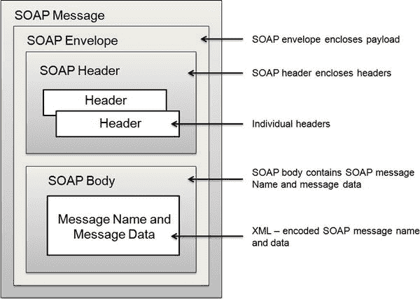

图 6-2.  SOAP 消息

REST

*REST（表述性状态转移）* 是一种软件架构模式，它使用 HTTP（超文本传输协议）在分布式和去中心化环境中发现、查询和操作资源。近年来，由于其简单性，REST 相比基于 WSDL-SOAP 的实现更受欢迎。

使用 REST，客户端通过 URI（统一资源标识符）和标准的 HTTP 方法集（GET、POST、PUT 和 DELETE）访问服务器上的资源。作为响应，服务器返回资源的*表述*，这只是一个包含资源当前或预期状态的文档。在每次访问调用和相应的新资源表述响应之后，客户端被称为*转移状态*，因此得名*表述性状态转移*。REST 架构模式规定了以下六个约束：

1.  *客户端-服务器架构*：客户端和服务器应该分离，并且只能通过统一接口进行交互。这种分离意味着客户端不关心服务器的数据存储内部细节，服务器也不关心客户端的用户界面。
2.  *无状态交互*：客户端和服务器只能使用像 HTTP 这样的无状态协议进行交互。服务器不能在请求之间存储客户端上下文。所有请求必须包含这些请求所需的所有信息。
3.  *可缓存*：服务器响应必须将自身标识为可缓存或不可缓存。这可用于防止客户端使用过时数据，也有助于提高性能和可扩展性。
4.  *分层系统*：客户端应该能够无缝地连接到中间系统，而不是直接连接到最终服务器。中间系统提供负载均衡和共享缓存等功能，从而提高系统的可扩展性。
5.  *命名资源*：客户端必须能够在每个请求中使用 URI 标识单个服务器资源。
6.  *统一接口*：客户端和服务器之间的统一接口允许它们独立演进。

RESTful Web 服务

*RESTful Web 服务*是基于上述 REST 原则构建的服务。RESTful Web 服务使用 HTTP 并实现映射到常见 HTTP 方法的操作，如表 6-1 所示。

表 6-1. HTTP 方法到 CRUD 操作的映射

| HTTP 方法 | CRUD 操作 |
| --- | --- |
| `POST` | 创建 |
| `GET` | 读取 |
| `PUT` | 更新 |
| `DELETE` | 删除 |


清单 6-8 展示了一个名为 `CreditCheck` 的简单 RESTful Web 服务，它接收信用卡号作为输入，并根据其有效性返回 `true` 或 `false`。为简单起见，我们的方法始终返回 `true`。

***清单 6-8.***  CreditCheck.java

```
package com.apress.ejb.chapter06.services;
import javax.ws.rs.Consumes;
import javax.ws.rs.PUT;
import javax.ws.rs.Path;
import javax.ws.rs.PathParam;
import javax.ws.rs.Produces;

@Path("creditCheck")
public class CreditCheck {
    @PUT
    @Consumes("text/plain")
    @Produces("text/plain")
    @Path("isValid")
    public boolean isValid(@PathParam("cardNumber")String ccNumber) {
        return true;
    }
}
```

用户可以按如下方式调用 `CreditCheck` 中的 `isValid` 方法，并且 `ccNumber` 将被赋值为 12345。

```
http://<host>:<port>/<resource>/creditCheck/isValid/12345
```

RESTful 与基于 SOAP 的 Web 服务

表 6-2 列出了 RESTful Web 服务与基于 SOAP 的 Web 服务之间的重要区别和相似之处。

表 6-2. RESTful 与基于 SOAP 的 Web 服务

| 标准 | SOAP | RESTful |
| --- | --- | --- |
| 规范 | JAX-WS | JAX-RS |
| 简单/复杂 | 复杂 | 简单 |
| 消息大小 | 大（XML 标记） | 小（无额外 XML 标记） |
| 基于标准 | 是 | 否 |
| 传输协议 | HTTP, SMTP, JMS | HTTP |
| 缓存 | 否 | GET 操作可缓存 |
| 协议 | JMS, SMTP, HTTP | HTTP |
| 人类可读负载 | 否 | 是 |
| 语言和平台 | 独立 | 独立 |

何时使用 Web 服务？

Web 服务提供了一种标准方式，利用行业标准，将现有或新的应用程序和数据暴露给外部各方（包括客户、供应商和合作伙伴），或跨企业部门进行共享。Web 服务也可用于集成异构应用程序和数据。

虽然许多企业在内部使用 Web 服务，但也有大量可用的外部 Web 服务示例。其中一些流行的服务包括包裹跟踪服务（由 FedEx、UPS 和 USPS 等承运商提供）。电子商务网站，如 `www.amazon.com`、`www.yahoo.com`、`www.ebay.com` 和 `www.google.com`，通过 Web 服务暴露其核心功能。开发者可以订阅并使用这些电子商务提供商提供的 Web 服务，来开发能够为后端系统增加价值或与其无缝集成的应用程序。

Java EE 与 Web 服务

Java EE 平台在过去几年中不断发展，已成为一个成熟、稳定、可靠且可用的企业应用平台。虽然 JDBC（Java 数据库连接）、JMS 和 EJB 等技术从一开始就存在于 Java EE 平台中，但直到 J2EE 1.4 版本，Web 服务的开发和部署才呈现出更好的形态，因为它们已被标准化，使得 Java EE 平台中的 Web 服务在应用服务器之间更具可移植性，并与 .NET Web 服务可互操作。Java EE 规范的共同目标是简化应用程序和服务的开发与部署。Java EE 中与 Web 服务相关的一些关键规范包括 JAX-WS、JAXB、JAXR、SAAJ 和 JSR 181 注解。在接下来的章节中，我们将展示这些规范是什么，以及如何将它们与 EJB 一起使用。图 6-3 展示了 EJB 如何在 Java EE 平台下与不同的 Web 服务相关规范进行交互。

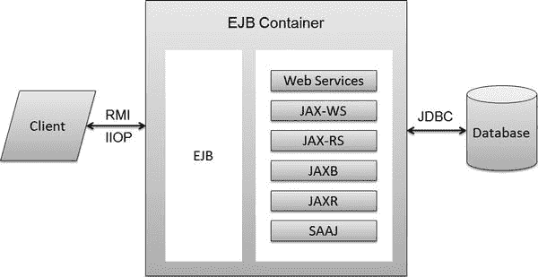

图 6-3.  EJB 与 Web 服务

JAX-WS

JAX-WS（用于 XML Web 服务的 Java API）定义了用于从 Java 应用程序和 Java EE 组件（如 EJB）访问 Web 服务的 Java API 和注解。JAX-WS 提供了 WSDL 与 Java 接口之间，或从 Java 接口到 WSDL 的映射功能。映射到 WSDL 的接口称为*服务端点接口*。JAX-WS 还提供了客户端和服务器端的 API 及注解，用于通过 SOAP 发送和接收 Web 服务请求。Java EE 中的 JAX-WS 规范依赖于 Java EE 平台的其他相关规范，包括 JSR 175（与注解相关）、JSR 181（与 Web 服务相关）和 JAXB。它还支持最新的 Web 服务标准，如 SOAP 1.2 和 WSDL 2.0。图 6-4 展示了一个简化的 Web 服务调用图。

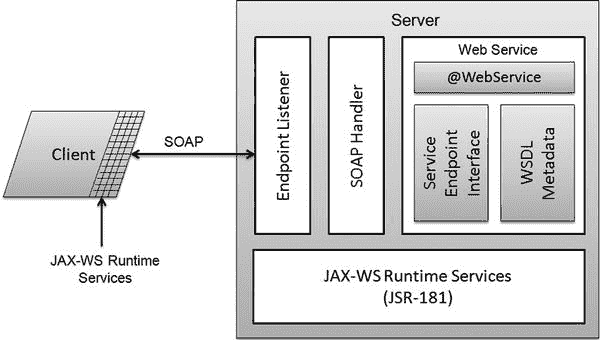

图 6-4.  Web 服务调用内部机制

JAX-RS

JAX-RS（JAX-RS：用于 RESTful Web 服务的 Java API）定义了用于创建基于 REST 架构模式的 Web 服务的 Java API 和注解。JAX-RS 1.1 版本通过 JSR-311 成为 Java EE 6 的组成部分。JAX-RS 提供了诸如 `@PATH`、`@GET`、`@PUT`、`@POST`、`@DELETE`、`@HEAD`、`@PRODUCES`、`@CONSUMES` 等注解，这些注解有助于将 POJO（普通 Java 对象）映射为 Web 资源。

JAXB

Web 服务的消费者和提供者使用 XML 消息来发送请求和响应。这些消息可以是诸如包含 XSD 的采购订单之类的内容，XSD 允许相关方（提供者和消费者）理解采购订单。使用低级语言 API 处理 XML 文档可能非常耗时，并且涉及复杂的代码。在 Java EE 上下文中，*JAXB（用于 XML 绑定的 Java 架构）*规范提供了用于将 XML 文档表示为 Java 工件的标准 API，以便开发者可以基于模式（XSD）处理代表 XML 文档的 Java 对象。JAXB 规范有助于将 XML 文档解组为 Java 对象集，并将 Java 对象集编组回 XML 文档。JAXB 规范为 XML 模式提供全面支持，并为 JAX-WS 提供绑定支持，同时它还利用了其他 Java EE 规范，例如 JSR 175。

JAXR

UDDI 是 Web 服务注册中心的标准。*JAXR（用于 XML 注册中心的 Java API）*规范定义了一组标准 API，允许 Java 客户端访问注册中心。这些 API 也可用于 UDDI 之外的 XML 注册中心。

SAAJ

类似于可以在电子邮件中使用的附件，您也可以向调用 Web 服务的 SOAP 消息发送附件。*SAAJ（带附件的 SOAP API for Java）*定义了一组标准 API，允许 Java SE 或 EE 组件构建带有附件的 SOAP 消息。

JSR 181

*JSR 181（Java 平台的 Web 服务元数据）*定义了一组可用于简化 Web 服务开发的标准注解。这些注解可用于 Java 类或 EJB 会话 Bean，这些 Bean 可以是 JAX-WS 组件。

作为 Web 服务的 EJB 无状态会话 Bean

使用 WSDL 描述的 Web 服务端点本质上是无状态的。无状态会话 Bean 也具有相同的无状态特性，非常适合用于开发 Web 服务。EJB 规范依赖于 Java EE 平台中的其他 Web 服务规范，包括 JAX-WS、JAXB 和 JSR 181，无论是用于消费 Web 服务，还是将无状态会话 Bean 发布为 Web 服务。

*服务端点接口 (SEI)* 是映射到 Web 服务的接口。JAX-WS 提供了这个映射层。为了开发一个新的 Web 服务，您可以采用自底向上或自顶向下的方法，这两种方法将在下面进行描述。


在自底向上的方法中，你从一个 SEI 和一个可发布为 Web 服务的实现开始。在此过程中，WSDL 文档等 Web 服务工件会在部署时，或通过 Java EE 应用服务器提供的管理工具或实用程序生成。

在自顶向下的情况下，你从一个 WSDL 文档开始，并使用实现 JAX-WS 的工具生成一个 SEI。一旦有了 SEI，就可以在其后添加实现。对于 EJB 无状态会话 Bean，你需要使用 JAX-WS 和 JSR 181 规范中提供的注解来标记业务接口和/或 Bean 类，以便在部署时生成正确的 Web 服务工件集。Java EE 规范要求，添加到组件中的注解在部署时被处理，以生成正确的工件集。带有 Web 服务注解的 EJB 无状态会话 Bean 也不例外；它们也会在部署时由应用服务器提供的部署实用程序处理。每个 SEI 对应一个无状态会话 Bean。

开发新的 Web 服务

无状态会话 Bean 使用第 2 章中描述的编程模型实现。如果你希望将一个无状态会话 Bean 作为 Web 服务，则需要以下类：

*   Bean 类（实现）
*   Web 服务端点接口（可选）
*   如果 Bean 类有本地或远程客户端，则还需要其他业务接口

创建 Bean 类

*无状态会话 Bean 类*是任何带有类级别注解`@Stateless`的标准 Java 类。从版本 3 开始，EJB 规范不再强制要求 SEI。提供 SEI 以及 Bean 类是可选的。在 Bean 类将作为 Web 服务发布而不使用任何服务端点接口的用例中，Bean 类将具有额外的类级别注解`@WebService`（JSR 181）。`@WebService`注解位于`javax.jws`包中，它将 Bean 类标记为基于 SOAP 的 Web 服务的实现。

`@WebService`注解接受表 6-3 中描述的参数。

表 6-3. @WebService 注解

| 参数 | 描述 | 附加信息 |
| --- | --- | --- |
| `name` | 映射到`wsdl:portType`的 Web 服务名称。 | 如果未指定，则使用 Java 类的名称。 |
| `targetNamespace` | 用于 Web 服务的 XML 命名空间。 | 如果未指定，则使用 Java 类的名称。 |
| `serviceName` | 映射到`wsdl:service`的 Web 服务名称。 | 如果未指定，则使用 Java 类的名称。 |
| `wsdlLocation` | WSDL 文档的位置，当 Bean 类实现现有 Web 服务时会派上用场。 |  |

为了说明一个发布为 Web 服务的无状态会话 Bean，我们将创建一个`CreditServiceEndpointBean`，它将发布为`CreditService`。

在清单 6-9 中，我们有一个 Java 类`CreditCheckEndpointBean`，它有两个类级别注解：`@Stateless`和`@WebService`。`@Stateless`注解提供了一个额外的参数来将 Bean 标记为`CreditCheckEndpointBean`。如果同一个类暴露给远程或本地客户端，这些客户端将使用该名称访问无状态会话 Bean。`@WebService`注解提供了两个额外的参数：一个将服务名称标记为`CreditService`，另一个指定目标命名空间（而不是使用默认的 Java 包结构）。

***清单 6-9.***  CreditCheckEndpointBean.java

```
package com.apress.ejb.chapter06.services;
import javax.ejb.Stateless;
import javax.jws.WebMethod;
import javax.jws.WebService;

@Stateless(name = "CreditCheckEndpointBean")
@WebService(serviceName = "CreditService", targetNamespace = "http://www.apress.com/ejb/credit")
public class CreditCheckEndpointBean  {
    public CreditCheckEndpointBean() {
    }

}
```

JSR 181 中定义的`@WebMethod`注解允许你自定义作为 Web 服务操作暴露的方法。如果在带有`@WebService`注解的 Bean 类中没有指定`@WebMethod`注解，则所有公共方法都将作为 Web 服务操作暴露。

`@WebMethod`注解接受表 6-4 中描述的参数。

表 6-4. @WebMethod 注解

| 参数 | 描述 | 附加信息 |
| --- | --- | --- |
| `operationName` | 与此方法匹配的`wsdl:operation`的名称。 | 默认情况下，这是 Java 方法的名称。 |
| `action` | 此操作的动作。对于 SOAP 绑定，它将是`SOAP action`头的值。 | 默认情况下，这是 Java 方法的名称。 |

在清单 6-10 中，我们在`CreditCheckEndpointBean`类中添加了以下方法，该方法将作为 Web 服务操作暴露。操作名称通过`@WebMethod`参数自定义为`CreditCheck`。该方法接受一个`java.lang.String`参数（即信用卡号），并根据信用卡是否有效返回`true`或`false`的`java.lang.boolean`值。为简单起见，我们将始终返回`true`。

***清单 6-10.***  CreditCheckEndpointBean.java 中的 validateCC 方法

```
@WebMethod(operationName="CreditCheck" )
public boolean validateCC(String cc){
return true;
}
```

Web 服务端点接口

JAX-WS 不强制要求使用 SEI 来实现 Web 服务端点。你可以使用 JSR 181 中提供的注解将 Bean 类标记为 Web 服务，并将一个或多个业务方法标记为 Web 服务操作。在为无状态会话 Bean 定义了 SEI 的用例中，应遵守以下规则：

*   SEI 必须具有 `javax.jws.WebService` 注解。
*   一个或多个方法可以具有 `javax.jws.WebMethod` 注解。
*   所有方法参数和返回类型应与 JAXB XML 模式映射定义兼容。
*   方法的参数和返回类型必须是有效的 JAX-RPC 值类型，包括 Java 基本类型（`int`、`long` 等）、Java 类（`String`、`Date` 等）、Java Bean 和数组。
*   `throws` 子句除了包含任何其他应用程序异常外，还必须包含 `java.rmi.RemoteException`。

 **注意**   在 Java EE 7 中，对 JAX-RPC 的支持已变为可选。Java EE 7 规范鼓励新应用程序使用 JAX-WS 提供的简化 Web 服务开发的设施。

在我们的示例中，我们将注解添加到 Bean 类本身，如清单 6-9 和 6-10 所示。

清单 6-11 说明了提供 SEI 的用例的服务端点接口，清单 6-12 显示了实现该 SEI 的 `CreditCheckEndpointBean` 类。

***清单 6-11.***  用例的服务端点接口

```
@WebService(serviceName="CreditService",targetNamespace="http://www.apress.com/ejb/credit")
public interface CreditCheckEndpoint {

@WebMethod(operationName="CreditCheck")
      public boolean validateCC(String cc);
}
```

***清单 6-12.***  实现 SEI 的 CreditCheckEndpointBean 类

```
@Stateless
public class CreditCheckEndpointBean implements CreditCheckEndpoint {
    public CreditCheckEndpointBean() {
    }
    //implementation goes here
}
```

打包、部署和测试 Web 服务


带有 Web 服务注解的无状态会话 Bean 在部署到 EJB 容器之前，需要打包成 *EJB Java 归档（JAR）* 文件。对于某些 EJB 容器或应用服务器，它们首先需要被组装成 EAR [企业归档] 文件。大多数 EJB 容器或应用服务器都提供部署工具或 Ant 任务，以方便将 EJB 部署到其容器中。像 JDeveloper、NetBeans 和 Eclipse 这样的 Java 集成开发环境（IDE）也提供部署功能，允许开发者打包、组装并将 EJB 部署到应用服务器。打包、组装和部署方面的内容在第 11 章中有详细说明。

在本章中，我们开发了一个带有 Web 服务注解的无状态会话 Bean（`CreditCheckEndpointBean`）。我们将执行以下步骤来编译、部署和测试这个将被发布为 Web 服务的无状态会话 Bean。

前提条件

在执行后续章节详述的任何步骤之前，请先完成第 1 章的“入门”部分，该部分将引导您完成本章示例所需的安装和环境设置。

编译会话 Bean

将 `Chapter06-WebServiceSamples` 目录及其内容复制到您选择的目录中。运行 NetBeans IDE，并使用 `File -> Open Project` 菜单打开 `Chapter06-WebServiceSamples` 项目。确保选中“`Open Required Projects'`”复选框，如图 6-5 所示。

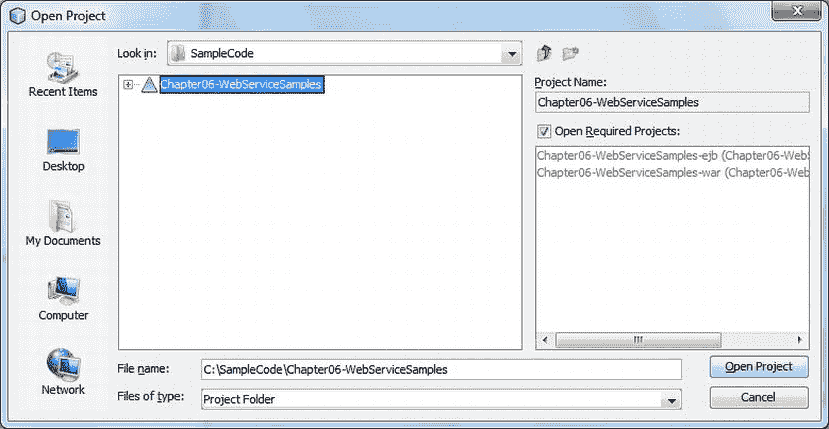

图 6-5.  打开 Chapter06-WebServiceSamples 项目

展开 `Chapter06-WebServiceSamples-ejb` 节点，观察我们创建的基于会话 Bean 的 Web 服务出现在 `com.apress.ejb.chapter06.services` 包中。类似地，客户端 Servlet 也出现在 `Chapter06-WebServiceSamples`-war 节点下。

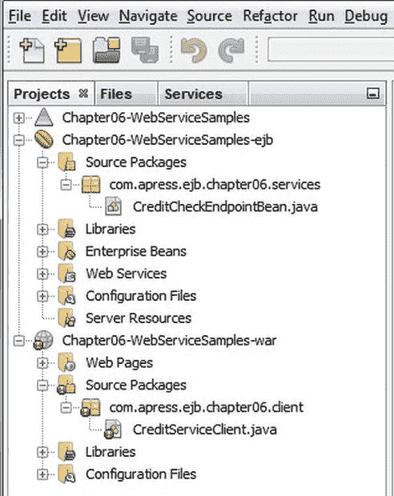

图 6-6.  验证会话 Bean 及其客户端在项目中可用

在 `Chapter06-WebServiceSamples` 节点上调用上下文菜单，并通过选择 `Clean and Build` 菜单选项来构建应用程序。基于会话 Bean 的 Web 服务将无错误地编译，但 `Chapter06-WebServiceSamples`-war 节点中的客户端将显示编译错误。我们暂时忽略客户端中的这些错误。

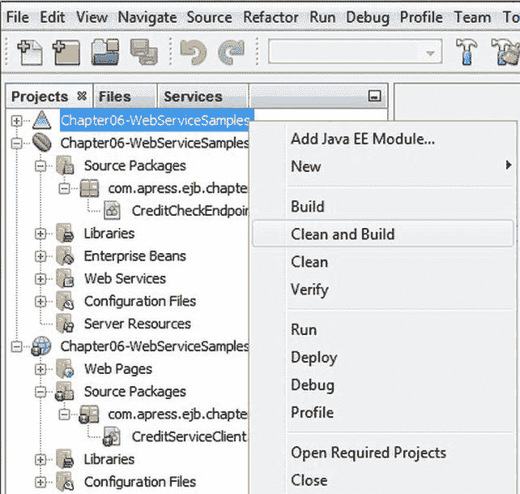

图 6-7.  构建应用程序

部署基于会话 Bean 的 Web 服务

一旦我们编译了会话 Bean，就可以将其部署到 GlassFish 应用服务器。在 `Chapter06-WebServiceSamples-ejb` 节点上调用上下文菜单，并通过选择 `Deploy` 菜单选项来部署应用程序，如图 6-8 所示。

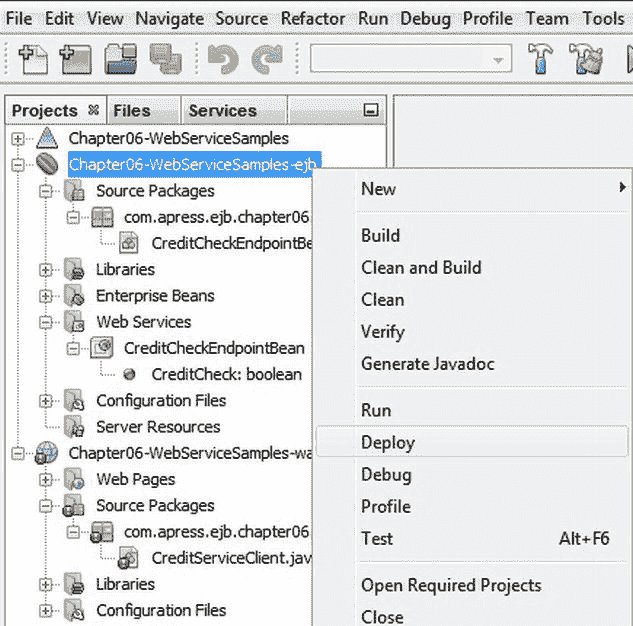

图 6-8.  部署 CreditService

测试信用服务

成功部署后，我们可以使用测试工具来查看 `CreditService` 是否可以被正确调用。要调用测试工具，请展开 `Chapter06-WebServiceSamples-ejb` 下的 `Web Services` 节点以显示 `CreditCheckEndpointBean` 节点，然后选择 `Test Web Service` 菜单选项，如图 6-9 所示。

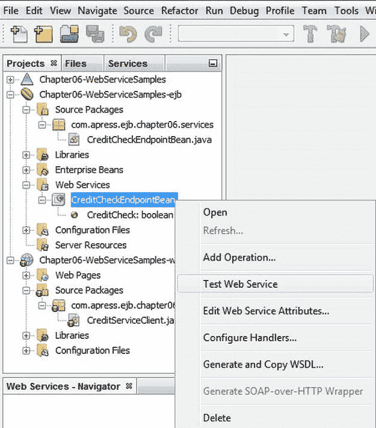

图 6-9.  测试 CreditService

在生成的测试工具页面（如图 6-10 所示）中，输入 **12345** 作为信用卡号，然后点击 `creditCheck` 按钮。您也可以点击 `WSDL File` 链接来检查其内容。请将 WSDL `File` URL 加入书签，因为它将在后续章节中用于创建 Web 服务客户端。

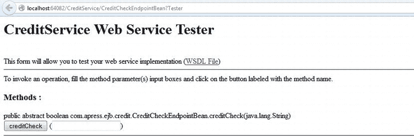

图 6-10.  Web 服务测试工具

在生成的页面中，您可以使用 SOAP 请求和响应来测试结果，如图 6-11 所示。

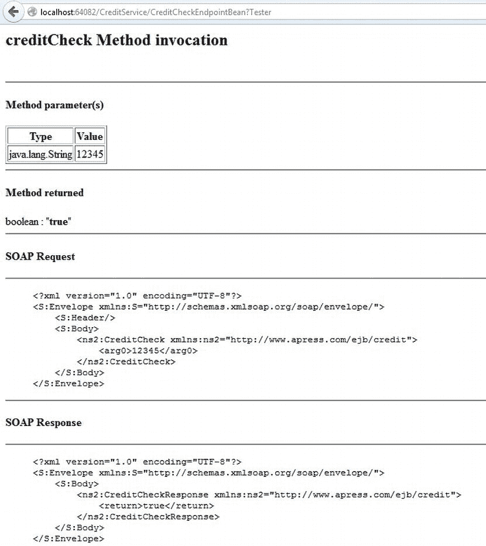

图 6-11.  SOAP 请求和响应消息

到目前为止，我们已经了解了如何使用测试工具测试已部署的 Web 服务。在下一节中，我们将讨论 Web 服务客户端，以及如何开发和运行能够调用 Web 服务的程序。在我们的案例中，我们将针对已部署的信用服务进行测试。

Web 服务客户端视图

发布为 Web 服务的无状态会话 Bean 可以通过部署期间生成的 WSDL 文档所描述的客户端视图进行访问（如清单 6-7 所示）。由于无状态会话 Bean 是使用 WSDL 等标准发布为 Web 服务的，因此任何能够发送和接收 SOAP 消息（无论技术或语言）的客户端应用程序都可以调用它。客户端应用程序可以使用 .NET 或 Java EE 编写，也可以使用 PHP、Python 或 Ruby 等脚本语言编写。从客户端的角度来看，它看到的契约是一个 WSDL 文档。为了访问 Web 服务，应该从 WSDL 文档生成编程接口。

Web 服务是位置无关的，并且可以远程访问。如果调用 Web 服务的客户端应用程序是 Java 客户端或其他 Java EE 组件（例如 EJB），则它使用 JAX-WS 客户端 API 或注解通过 SOAP 和 HTTP 调用 Web 服务。

开发访问 Web 服务的 Java 客户端

为了通过 WSDL 服务契约访问 Web 服务，客户端程序需要从 WSDL 文档生成的编程接口（通常称为 *存根* 或 *代理*）。一旦从 WSDL 文档生成了存根，我们就可以使用 JAX-WS 注解来获取对 Web 服务的引用并调用它。

生成 Web 服务代理类

我们将首先使用 NetBeans IDE 提供的 `Web Service Client` 向导为 `CreditService` WSDL 文档生成存根。从 `Chapter06-WebServiceSamples-ejb` 节点的上下文菜单中调用 `Web Service Client` 向导，如图 6-12 所示。

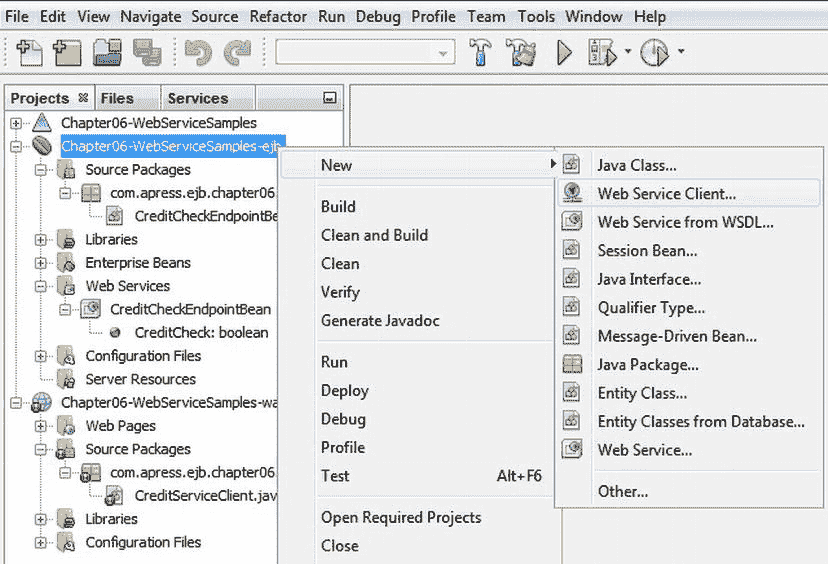

图 6-12.  调用 Web Service Client 向导

在 `Web Service Client` 向导中，选择 `WSDL URL` 单选按钮，并输入您在前面的章节中已加入书签的 `WSDL File` URL（参见图 6-10）。我们还需要指定将生成客户端 Java 工件的包。我们将在 `com.apress.ejb.chapter06.services.client` 包中生成这些工件。输入这些详细信息，如图 6-13 所示，然后完成向导。

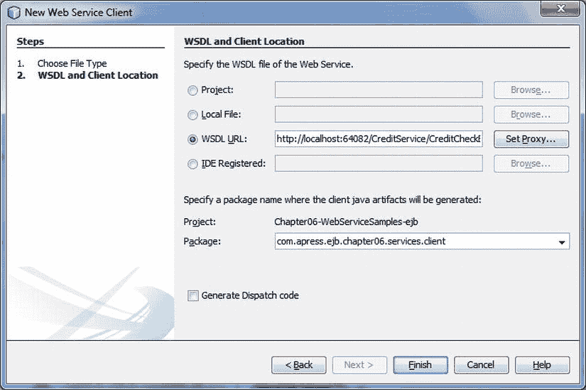

图 6-13.  创建 Web Service Client

一旦存根生成并编译完成，我们就可以在 `Generated Sources (jax-ws)` 节点下看到工件。

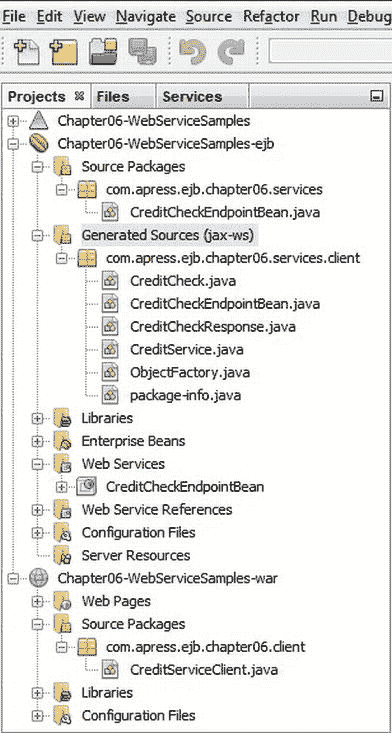

图 6-14.  验证生成的存根源

 **注意**   GlassFish 还提供了命令行工具 `wsimport.bat`，给定一个有效的 WSDL 文档，它可以生成 Web 服务存根。如果您将 Web 服务部署到其他兼容 Java EE 的服务器，这些服务器也可能提供一些工具或实用程序来生成 Web 服务的存根。

一旦存根生成并编译完成，下一步就是创建一个将消费 `CreditService` 的客户端。


JAX-WS 规范提供了 `@WebServiceRef` 注解，可用于声明对 Web 服务的引用，在本例中该服务为 `CreditService`。

`@WebServiceRef` 注解可以接受表 6-5 中描述的参数。

表 6-5. @WebServiceRef 注解

| 参数 | 描述 | 附加信息 |
| --- | --- | --- |
| `name` | 标识 Web 服务引用的名称 | 使用该资源的应用程序组件本地的名称 |
| `wsdlLocation` | 指向 WSDL 文档位置的 URL |  |
| `type` | 资源类型 |  |
| `value` | 服务类型 |  |
| `mappedName` | 用于将资源映射到特定供应商容器的资源物理名称 |  |

开发 Web 服务客户端程序

`@WebServiceRef` 注解要么提供对容器生成的 SEI 的引用，要么提供对应用程序开发者提供的 SEI 的引用。清单 6-13 展示了一个将作为 Web 服务客户端的 Servlet 类。在这个名为 `CreditServiceClient` 的 Servlet 类中，我们使用依赖注入来注入之前作为 Web 服务部署的信用服务。`@WebServiceRef` 注解用于注入已生成为代理类的 `CreditService`。一旦我们注入了可用的资源，我们就使用该代理类通过 `getCreditCheckEndpointBeanPort()` 方法获取 Web 服务端口。成功获取端口后，我们可以调用该端口上可用的操作。在本例中，我们只定义了一个操作 `creditCheck`。你可以看到，该操作正在使用信用卡号 12345678 进行调用。

***清单 6-13.***  CreditServiceClient.java

```
package com.apress.ejb.chapter06.client;
import com.apress.ejb.chapter06.services.client.CreditCheckEndpointBean;
import com.apress.ejb.chapter06.services.client.CreditService;
import java.io.IOException;
import java.io.PrintWriter;
import javax.servlet.ServletException;
import javax.servlet.annotation.WebServlet;
import javax.servlet.http.HttpServlet;
import javax.servlet.http.HttpServletRequest;
import javax.servlet.http.HttpServletResponse;
import javax.xml.ws.WebServiceRef;

@WebServlet(name = "CreditServiceClient", urlPatterns = {"/CreditServiceClient"})
public class CreditServiceClient extends HttpServlet {
      @WebServiceRef(wsdlLocation = "http://localhost:64082/CreditService/CreditCheckEndpointBean?WSDL")
      CreditService service;
    protected void processRequest(HttpServletRequest request, HttpServletResponse response)
            throws ServletException, IOException {
        response.setContentType("text/html;charset=UTF-8");
        PrintWriter out = response.getWriter();
        try {
            out.println("<html>");
            out.println("<head>");
            out.println("<title>Servlet CreditServiceClient</title>");
            out.println("</head>");
            out.println("<body>");
            CreditCheckEndpointBean creditService = service.getCreditCheckEndpointBeanPort();
            out.println("<h1>Credit Check returned: " + creditService.creditCheck("12345678") + "</h1>");
            out.println("</body>");
            out.println("</html>");
        } finally {
            out.close();
        }
    }
    @Override
    protected void doGet(HttpServletRequest request, HttpServletResponse response)
            throws ServletException, IOException {
        processRequest(request, response);
    }

@Override
    protected void doPost(HttpServletRequest request, HttpServletResponse response)
            throws ServletException, IOException {
        processRequest(request, response);
    }

@Override
    public String getServletInfo() {
        return "Short description";
    }
}
```

编译客户端类


在`Chapter06-WebServiceSamples-war`节点上调用上下文菜单，然后选择`Clean and Build`菜单选项来构建客户端，如图 6-15 所示。

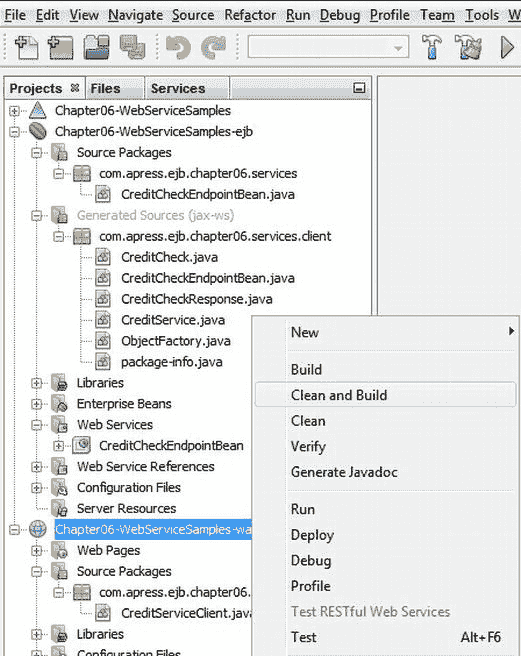

图 6-15.  编译 Web 服务客户端

运行 Web 服务客户端

编译完客户端后，我们需要将`CreditServiceClient`设置为运行目标。在`Chapter06-WebServiceSamples`节点上调用上下文菜单，选择`Properties`菜单选项，打开`Project Properties`对话框。将`CreditServiceClient`设置为运行目标，如图 6-16 所示。

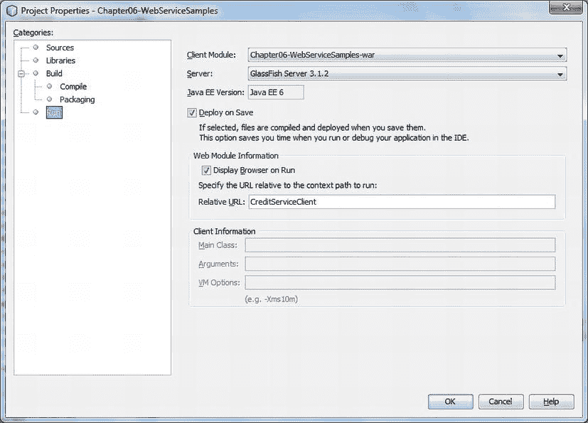

图 6-16.  将运行目标设置为 CreditServiceClient

要运行客户端 Servlet，请在`Chapter06-WebServiceSamples`节点上调用上下文菜单，然后选择`Run`菜单选项，如图 6-17 所示。

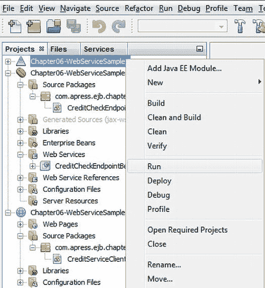

图 6-17.  运行客户端

一旦`CreditServiceClient`成功运行，NetBeans 将打开您的默认浏览器并执行所选的 Servlet。以下是`CreditServiceClient servlet`的输出结果。


图 6-18.  检查 Servlet 输出

会话 Bean 作为 Web 服务客户端

会话 Bean 也可以作为 Web 服务的客户端。在第 7 章将要构建的示例应用程序中，负责协调工作流的`OrderProcessing`会话 Bean 可以在开始处理订单之前调用信用服务来检查信用卡的有效性。为了充当 Web 服务的客户端，`OrderProcessing`会话 Bean 将使用`@WebServiceRef`注解，这与我们在之前的客户端示例中展示的方式类似。

清单 6-14 展示了无状态会话 Bean `OrderProcessFacadeBean`，它实现了本地和远程业务接口。`@WebServiceRef`注解用于注入对`CreditService` WSDL 文档的引用。`OrderProcessFacadeBean`会话 Bean 中的`PerformCheckCredit()`方法使用注入的引用来获取`CreditService`中的端口，并调用`creditCheck`操作。如您所见，从会话 Bean 中注入 Web 服务、获取端口以及调用操作的过程，与我们之前作为 Web 服务客户端的客户端所做的类似。

***清单 6-14.***  OrderProcessFacadeBean.java

```
@Stateless(name="OrderProcessFacade")
public class OrderProcessFacadeBean implements OrderProcessFacade,
                                               OrderProcessFacadeLocal {
    @WebServiceRef(type=CreditService.class)
    CreditService service;
    public OrderProcessFacadeBean() {
    }

private boolean PerformCreditCheck(Individual customer){
                String ccnum  = customer.getCcNum().toString();
                CreditCheckEndpointBean creditService =
                    service.getCreditCheckEndpointBeanPort();
                return creditService.creditCheck(ccnum);
           }
}
```

结论

在本章中，我们向您介绍了 Web 服务——一种遵循查找-绑定-执行模型的架构——以及 UDDI、WSDL 和 SOAP 等标准如何在标准化和互操作性方面使 Web 服务相较于早期的分布式计算模型变得无处不在。我们还简要讨论了 REST 架构模式和 RESTful Web 服务，它们简化了 Web 服务的创建和使用。

我们深入研究了 UDDI、SOAP 和 WSDL 标准的细节，并通过一个简单的信用服务示例演示了 WSDL 文档和 SOAP 消息是如何构建的。


我们讨论了 Web 服务的一些使用场景，以及它们如何融入内联网和互联网模型，并列举了一些提供 Web 服务的现有电子商务网站示例。

随后，我们深入探讨了 Java EE 平台，并研究了不同的标准（JAX-WS、JAX-RS、JAXB、JAXR、SAAJ 和 JSR 181），这些标准使开发者能够创建在.NET 平台上可移植且可互操作的 Web 服务。

接着，我们探讨了如何使用简单的 Web 服务元数据注解将 EJB 无状态会话 Bean 发布为 Web 服务。我们开发了一个可供 Web 服务客户端调用的信用服务。

最后，我们研究了如何使用 GlassFish 应用服务器和 Servlet 客户端来编译、部署和测试 Web 服务，并探讨了这种编程模型与使用 EJB 调用 Web 服务的相似之处。

到目前为止，我们已经讨论了 EJB 规范的各个独立组件：会话 Bean、JPA 实体、MDB 和 Web 服务。在下一章中，我们将讨论如何整合所有这些组件来构建一个企业级应用。

第 7 章


整合会话 Bean、实体、消息驱动 Bean 和 Web 服务

引言

本书前面的章节涵盖了 EJB 及相关技术的各个独立组件。这些组件包括会话 Bean、消息驱动 Bean（MDB）、作为 Web 服务的无状态会话 Bean 以及 JPA 实体。在本章中，我们将以虚构的葡萄酒商店应用为例，向您展示如何将这些组件整合成一个完整的 Java EE 7 应用。

应用概述

我们将在本章开发的示例应用是“在线葡萄酒”应用，它为顾客（个人或分销商）提供多种搜索条件，顾客可以据此浏览、选择葡萄酒，将其添加到购物车，并处理订单。顾客需要先在“在线葡萄酒”应用中注册，然后才能提交订单。订单提交后，系统会验证顾客的信用卡，并触发订单处理消息，同时向顾客发送关于订单状态的电子邮件通知。

顾客用于搜索、导航和提交订单的界面是简单的 JavaServer Faces（JSF）Web 应用的一部分，该应用与使用 EJB 开发的后端服务和组件进行交互。在本章中，我们的重点将放在开发应用的后端部分，这部分可以通过 Servlet 和简单的 Java 客户端进行测试。在第 12 章中，我们将为这些后端服务开发一个 JSF 客户端。

如图 7-1 所示，“在线葡萄酒”应用由客户端应用使用的多个后端组件组成，而这些后端组件又利用不同类型的服务来执行 CRUD（创建、检索、更新、删除）操作、向顾客发送关于订单状态的电子邮件通知、处理传入订单以及验证顾客的信用卡状态。我们将在下一节讨论这些组件的行为和功能。

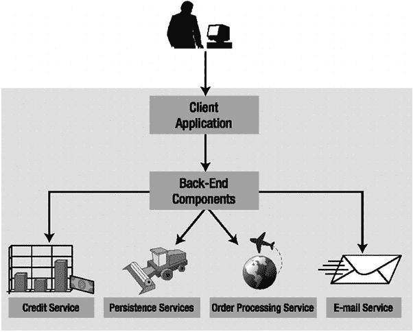

图 7-1. “在线葡萄酒”应用架构

应用组件与服务

后端葡萄酒商店应用由不同类型的 EJB 组成，这些 EJB 被创建为组件和服务。关键组件和服务将在以下各节中描述。

购物车组件

购物车组件管理已登录应用的注册顾客的购物车项目。该组件是一个有状态会话 Bean，它跟踪添加到购物车和从购物车中移除的购物车项目（葡萄酒和数量）。最后，购物车组件将订单信息传递给订单处理组件。

搜索外观组件

搜索外观组件允许顾客检索所有葡萄酒，或使用年份、国家和葡萄品种等条件搜索葡萄酒。该组件是一个无状态会话 Bean，它根据执行的搜索条件返回葡萄酒列表。

顾客外观组件

顾客外观组件允许顾客将自己注册为葡萄酒应用的会员，并根据其电子邮件地址检索顾客信息。该组件是一个无状态会话 Bean。

订单处理外观组件

订单处理外观组件充当信用服务和订单处理服务之间的协调器。该组件处理购物车项目并创建可供订单处理服务使用的采购订单（PO）。该组件是一个无状态会话 Bean。

持久化服务

持久化服务包含一个打包的持久化单元，该单元由一组映射到葡萄酒商店数据库模式的实体组成。应用后端部分的所有其他组件和服务都使用这个公共持久化单元来执行 CRUD 操作。

电子邮件服务

电子邮件服务是一个 MDB，它向顾客发送关于已提交订单状态的电子邮件。该服务本质上与我们在第 5 章中构建的 MDB 相同，并且需要相同的 JMS 和 Java Mail 会话资源。

信用服务

信用服务是应用使用的一个 Web 服务。该服务将信用卡信息作为输入消息，并返回特定顾客的信用状态。我们将使用在第 6 章中开发的信用服务。

订单处理服务

订单处理服务是一个 MDB，它在收到采购订单后负责大部分订单处理工作。

“在线葡萄酒”应用业务流程

图 7-2 说明了葡萄酒应用的流程。一旦购物车服务将顾客和购物车项目信息提交给订单处理外观，它会在继续处理订单之前验证顾客的信用卡信息是否准确以及卡片是否有效。在收到信用服务的批准后，它会创建一个包含顾客和订单信息的采购订单，并将其提交给订单处理服务。如果从信用服务收到否定响应，则订单被取消，电子邮件服务会向顾客发送通知。一旦订单处理服务收到采购订单，它就会继续履行订单，这包括更新库存，并通过电子邮件服务向顾客发送关于订单状态的电子邮件通知。

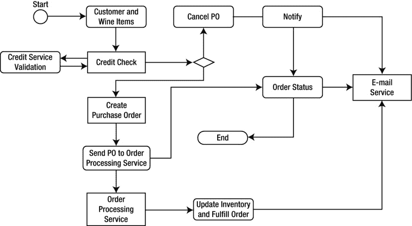

图 7-2. “在线葡萄酒”应用业务流程

图 7-3 说明了葡萄酒应用各组件和服务之间发生的交互。对这些交互的逐步解释见该图之后。

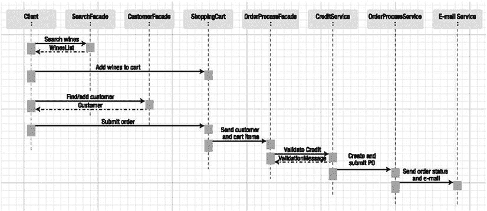

图 7-3. “在线葡萄酒”应用组件与服务交互

深入的组件/服务详解

在以下各节中，我们将逐一讲解每个组件的代码，以解释其与其他组件和服务的交互。每个代码清单都包含在`Chapter07-IntegratedServices`示例应用中。在本章末尾，您将找到关于如何配置、构建、部署和执行此应用的分步说明。

持久化服务


持久化服务以 JPA 持久化单元的形式向应用程序呈现领域模型。该持久化单元由 JPA 实体以及 `EntityManager` 组成，`EntityManager` 用于对实体执行 CRUD 操作，并在事务上下文中管理这些实体的持久化状态。

图 7-4 展示了这些实体、继承模型以及它们之间的关系。`Customer` 实体被 `Individual` 和 `Distributor` 实体继承。`InventoryItem`、`CartItem` 和 `OrderItem` 实体继承自 `WineItem` 实体。`BusinessContact` 实体被 `Supplier` 实体继承。葡萄酒商店持久化单元还包含这些实体之间不同类型的关联（包括一对一、一对多和多对多），这些关联将从应用程序代码中访问。这些实体中使用的映射已在第 3 章和第 4 章中介绍过。我们将重点介绍此应用程序其他组件中用于集成此持久化单元的代码。

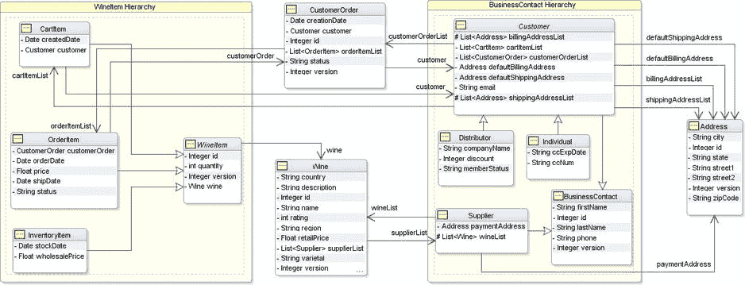

图 7-4.  Wines Online 领域模型

客户外观组件

`CustomerFacadeBean` 是一个无状态会话 Bean。它提供业务方法，允许客户端应用程序根据电子邮件地址查询客户，或对 `Customer` 实体及其子类执行 CRUD 操作。此外观通过 `@PersistenceContext` 注解注入了一个 `EntityManager`，它使用该管理器对 `Customer` 实体执行 CRUD 操作。清单 7-1 展示了 `CustomerFacadeBean` 中的 `getCustomerFindByEmail` 方法。此方法使用 `EntityManager` 中的 `createNamedQuery()` 方法调用在葡萄酒商店持久化单元的 `Customer` 实体中定义的命名查询 `Customer.findByEmail`。

 **注意**   `createNamedQuery()` 是 `javax.persistence.EntityManager` 接口中的一个方法。此方法创建一个 `javax.persistence.Query` 实例，用于执行以 JPQL（Java 持久化查询语言）或原生 SQL 指定的命名查询。

***清单 7-1.***  getCustomerFindByEmail 方法

```
public Customer getCustomerFindByEmail(String email) {
  return em.createNamedQuery("Customer.findByEmail", Customer.class).setParameter("email", email).  getSingleResult();
}
```

清单 7-2 展示了 `CustomerFacadeBean` 的完整代码，其中包含使用 `EntityManager` 执行 CRUD 操作的业务方法。此 Bean 类未实现 Local 或 Remote 接口，因此 EJB 容器以 Local 模式直接调用 Bean 类。

 **注意**   在第 2 章中，我们提供了会话 Bean 的远程和客户端视图架构之间差异的详细信息，并总结了优缺点，同时讨论了 EJB 3.1 中引入的无接口模式。第 3 章提供了关于 `EntityManager` 上可用于执行 CRUD 操作的方法的详细信息。

***清单 7-2.***  CustomerFacadeBean.java

```
@Stateless(name = "CustomerFacade", mappedName = "Chapter07-IntegratedSamples-Chapter07-ServiceIntegration-ejb-CustomerFacade")
public class CustomerFacadeBean {
  @PersistenceContext(unitName = "Chapter07-WineAppUnit-JTA")
  private EntityManager em;

public <T> T persistEntity(T entity) {
    em.persist(entity);
    return entity;
  }

public <T> T mergeEntity(T entity) {
    return em.merge(entity);
  }

public void removeCustomer(Customer customer) {
    customer = em.find(Customer.class, customer.getId());
    em.remove(customer);
  }

/**
   * <code>select o from Customer o</code>
   */
  public List<Customer> getCustomerFindAll() {
    return em.createNamedQuery("Customer.findAll", Customer.class).getResultList();
  }

public Customer getCustomerFindById(Integer id) {
    return em.find(Customer.class, id);
  }

/**
   * <code>select o from Customer o where o.email = :email</code>
   */
  public Customer getCustomerFindByEmail(String email) {
    return em.createNamedQuery("Customer.findByEmail", Customer.class).setParameter("email", email).    getSingleResult();
  }

public Customer registerCustomer(Customer customer) {
    return persistEntity(customer);
  }
}
```

搜索外观组件

`SearchFacadeBean` 是一个无状态会话 Bean。此 Bean 提供业务方法，允许客户端应用程序根据葡萄酒的年份、国家和品种查询持久化单元中的 `Wine` 实体。`SearchFacadeBean` 中的持久化单元通过 `@PersistenceContext` 注解注入。清单 7-3 展示了 `SearchFacadeBean` 的完整代码，其中包含使用 `EntityManager` 执行搜索操作的业务方法。此 Bean 类有一个业务接口 `SearchFacadeLocal`，它支持本地客户端访问。方法 `getWineFindAll()`、`getWineFindByYear()`、`getWineFindByCountry()` 和 `getWineFindByVarietal()` 使用 `EntityManager` 中的 `createNamedQuery()` 方法调用在葡萄酒商店持久化单元的 `Wine` 实体中定义的相应命名查询，并在 `java.util.List` 中返回零个或多个 `Wine` 对象。

***清单 7-3.***  SearchFacadeBean.java

```
@Stateless(name = "SearchFacade", mappedName = "Chapter07-IntegratedSamples-Chapter07-ServiceIntegration-ejb-SearchFacade")
public class SearchFacadeBean implements SearchFacadeLocal {
  @PersistenceContext(unitName = "Chapter07-WineAppUnit-JTA")
  private EntityManager em;

public Object queryByRange(String jpqlStmt, int firstResult, int maxResults) {
    Query query = em.createQuery(jpqlStmt);
    if (firstResult > 0) {
      query = query.setFirstResult(firstResult);
    }
    if (maxResults > 0) {
      query = query.setMaxResults(maxResults);
    }
    return query.getResultList();
  }

public <T> T persistEntity(T entity) {
    em.persist(entity);
    return entity;
  }

public <T> T mergeEntity(T entity) {
    return em.merge(entity);
  }

public void removeWine(Wine wine) {
    wine = em.find(Wine.class, wine.getId());
    em.remove(wine);
  }

/**
   * <code>select object(o) from Wine o</code>
   */
  public List<Wine> getWineFindAll() {
    return em.createNamedQuery("Wine.findAll", Wine.class).getResultList();
  }

/**
   * <code>select object(wine) from Wine wine where wine.year = :year</code>
   */
  public List<Wine> getWineFindByYear(Integer year) {
    return em.createNamedQuery("Wine.findByYear", Wine.class).setParameter("year", year).    getResultList();
  }

/**
   * <code>select object(wine) from Wine wine where wine.country = :country</code>
   */
  public List<Wine> getWineFindByCountry(String country) {
    return em.createNamedQuery("Wine.findByCountry", Wine.class).setParameter("country", country).    getResultList();
  }

/**
   * <code>select object(wine) from Wine wine where wine.varietal = :varietal</code>
   */
  public List<Wine> getWineFindByVarietal(String varietal) {
    return em.createNamedQuery("Wine.findByVarietal", Wine.class).setParameter("varietal",     varietal).getResultList();
  }
}
```

购物车组件


`ShoppingCartBean` 是一个有状态会话 Bean，并使用扩展的持久化上下文。该 Bean 保存了已登录系统且当前正在向购物车添加或移除葡萄酒商品的客户状态。一旦客户提交订单，`ShoppingCartBean` 会将客户信息发送给订单处理外观，由后者负责处理订单。我们决定在此用例中使用有状态会话 Bean，原因如下：

*   有多种类型的客户端应用程序访问后端应用程序（Web、Swing 和命令行客户端）。
*   我们希望展示 EJB 有状态会话 Bean 在典型应用程序中的用法。

 **注意**   通常，人们普遍认为有状态会话 Bean 在存储状态方面有些重量级（与使用 HTTP 会话为 Web 客户端在客户端存储状态相比）。有证据表明，有状态会话 Bean 在性能或事务方面并不会带来巨大的成本。（有关此主题的全面介绍，请参阅 Peter Zadrozny 所著的 *J2EE Performance Testing with BEA WebLogic Server* [Apress, 2003]。）

`ShoppingCartBean` 拥有以下小节中描述的业务方法。

查找客户

清单 7-4 展示了 `ShoppingCartBean` 中的 `findCustomer()` 方法。此方法使用注入的 `CustomerFacadeBean` 并调用 `findCustomerByEmail()` 方法来获取一个实例，在我们的案例中，该实例恰好是一个 `Individual` 子实体。一旦检索到 `Customer`，它就会被分配给一个类级别的属性，以便随后可以通过此有状态会话 Bean 上的其他方法引用它。因为我们使用的是扩展的持久化上下文，所以此实例将在 Bean 的整个生命周期内（跨越事务边界）保持受管状态，除非它被主动从持久化上下文中移除。

***清单 7-4.***  findCustomer 业务方法

```
public Customer findCustomer(String email) {
  customer = customerFacade.getCustomerFindByEmail(email);
  return customer;
}
```

添加葡萄酒商品

清单 7-5 展示了 `ShoppingCartBean` 中的 `addWineItem()` 方法。客户端应用程序调用此业务方法，以将特定的葡萄酒商品及其数量添加到购物车。代码创建了一个新的 `CartItem` 实体实例，并使用 `CartItem` 中的 setter 方法设置了数量、葡萄酒和创建时间。

 **注意**   快速回顾一下实体实例的三种状态：受管、分离和新建。受管实例是被持久化上下文主动引用的实例，对该实例所做的所有更改都由持久化上下文跟踪。当持久化上下文与数据库同步时，在受管实例中发现的所有待处理更改都会通过 SQL 语句刷新到数据库。分离的实体实例是不再被持久化上下文引用的实例，因此其更改不会被跟踪。如果客户端修改了分离的实例，客户端需要确保这些更改被合并到受管实例中（例如，通过 `EntityManager.merge()` 调用），否则这些更改将永远不会与数据库同步。新建的实体实例类似于分离的实例，只是它尚未持久化到数据库中。

`addWineItem()` 方法使用指定的属性创建一个新的 `CartItem`，并将其添加到 `Customer` 实例中。因为我们查询了 `Customer` 实例并将其缓存在有状态会话 Bean 的类级别变量中，所以我们可以依赖它处于受管状态。`ShoppingCartBean` 使用容器管理的事务，并且 `addWineItem()` 方法默认使用 `TransactionAttributeType.REQUIRED`，因此在此方法执行期间将启动并提交一个事务。提交时，持久化上下文将与数据库同步，并且受管 `customer` 实例中的任何待处理更改都将被推送到数据库。由于 `Customer` 的 `cartItemList` 属性上的级联规则，任何引用的 `CartItem` 实例也将被持久化。因此，此方法调用的结果将是在 `CartItem` 的表中新增一行，该行带有对 `Customer` 表（或 `Individual` 表，具体取决于实体继承层次结构的映射方式）的外键引用。

***清单 7-5.***  addWineItem 业务方法

```
public void addWineItem(Wine wine, int quantity) {
  CartItem cartItem = new CartItem(quantity, wine);
  customer.addCartItem(cartItem);
}
```

移除葡萄酒商品

清单 7-6 展示了 `ShoppingCartBean` 中的 `removeWineItem()` 方法。此方法允许客户端应用程序在最终用户（通过用户界面）请求时从购物车中移除商品。同样，因为 `customer` 属性是一个受管实例，所以对其应用的任何更改都将在此方法结束时（即在此方法开始时创建的 CMT 事务提交时）持久化。

***清单 7-6.***  removeWineItem 业务方法

```
public void removeWineItem(CartItem cartItem) {
  customer.removeCartItem(cartItem);
}
```

向订单处理外观提交订单

清单 7-7 展示了 `ShoppingCartBean` 中的 `sendOrderToOPC()` 方法。当最终用户最终决定购买一种或多种葡萄酒时，客户端应用程序调用此方法来提交订单。此方法使用注入的 `OrderProcessFacadeBean` 并调用 `processOrder()` 方法，通过传递 `customer` 对象来提交订单。

 **注意**   `sendOrderToOPC()` 方法命名的理由是，接收采购订单的 `OrderProcess FacadeBean` 实际上充当了“订单处理中心”。考虑到这一点，我们决定将“订单处理中心”缩写为 OPC，以避免方法名过长。

***清单 7-7.***  sendOrderToOPC 业务方法

```
public String sendOrderToOPC() {
  String result = null;
  try {
    orderProcessFacade.processOrder(customer);
    result = "您的订单已提交 - 您将通过电子邮件收到状态通知";
  } catch (Exception ex) {
    ex.printStackTrace();
    result = "处理您的订单时发生错误。请联系客户服务。";
  }

return result;
}
```

检索客户的购物车商品

清单 7-8 展示了 `ShoppingCartBean` 中的 `getCartItems()` 方法。此方法从 `customer` 字段（可以是 `Individual` 或 `Distributor` 实体类型）检索当前的购物车商品列表。当我们构建一个 JSF 应用程序时，此方法将非常有用，我们可以在客户提交订单之前在用户界面中显示所有购物车商品。

***清单 7-8.***  getCartItems 业务方法

```
public List<CartItem> getCartItems() {
  return customer.getCartItemList();
}
```

`ShoppingCartBean` 的完整代码如清单 7-9 所示。

***清单 7-9.***  ShoppingCartBean.java


```
@Stateful(name = "ShoppingCart", mappedName = "Chapter07-IntegratedSamples-Chapter07-ServiceIntegration-ejb-ShoppingCart")
public class ShoppingCartBean implements ShoppingCartLocal {
  @PersistenceContext(unitName = "Chapter07-WineAppUnit-JTA", type = PersistenceContextType.  EXTENDED)
  private EntityManager em;
  private Customer customer;
  @EJB
  private CustomerFacadeBean customerFacade;
  @EJB
  private OrderProcessFacadeBean orderProcessFacade;

public Customer getCustomer() {
    return customer;
  }

public void addWineItem(Wine wine, int quantity) {
    CartItem cartItem = new CartItem(quantity, wine);
    customer.addCartItem(cartItem);
  }

public void addWineItem(Wine wine) {
    CartItem cartItem = new CartItem();
    cartItem.setQuantity(20);
    wine = em.find(Wine.class, wine.getId());
    cartItem.setWine(wine);
    cartItem.setCreatedDate(new Timestamp(System.currentTimeMillis()));
    customer.addCartItem(cartItem);
  }

public void removeWineItem(CartItem cartItem) {
    customer.removeCartItem(cartItem);
  }

public void addCartItemsTemporarily() {
    List<Wine> wines = em.createNamedQuery("findAllWine").getResultList();
    for (Wine wine : wines) {
      final CartItem cartItem = new CartItem();
      cartItem.setCreatedDate(new Timestamp(System.currentTimeMillis()));
      cartItem.setQuantity(20);
      cartItem.setWine(wine);
      customer.addCartItem(cartItem);
    }
  }

public Customer findCustomer(String email) {
    customer = customerFacade.getCustomerFindByEmail(email);
    return customer;
  }

public String sendOrderToOPC() {
    String result = null;
    try {
      orderProcessFacade.processOrder(customer);
      result = "您的订单已提交——我们将通过电子邮件通知您订单状态";
    } catch (Exception ex) {
      ex.printStackTrace();
      result = "处理您的订单时发生错误。请联系客户服务。";
    }

return result;
  }

public <T> T persistEntity(T entity) {
    em.persist(entity);
    return entity;
  }

public <T> T mergeEntity(T entity) {
    return em.merge(entity);
  }

public void removeCartItem(CartItem cartItem) {
    cartItem = em.find(CartItem.class, cartItem.getId());
    em.remove(cartItem);
  }

public List<CartItem> getCartItems() {
    return customer.getCartItemList();
  }

public void removeWine(Wine wine) {
    wine = em.find(Wine.class, wine.getId());
    em.remove(wine);
  }

/**
   * <code>select object(o) from Wine o</code>
   */
  public List<Wine> getWineFindAll() {
    return em.createNamedQuery("Wine.findAll", Wine.class).getResultList();
  }

/**
   * <code>select object(wine) from Wine wine where wine.year = :year</code>
   */
  public List<Wine> getWineFindByYear(Integer year) {
    return em.createNamedQuery("Wine.findByYear", Wine.class).setParameter("year", year).    getResultList();
  }

/**
   * <code>select object(wine) from Wine wine where wine.country = :country</code>
   */
  public List<Wine> getWineFindByCountry(String country) {
    return em.createNamedQuery("Wine.findByCountry", Wine.class).setParameter("country", country).    getResultList();
  }

/**
   * <code>select object(wine) from Wine wine where wine.varietal = :varietal</code>
   */
  public List<Wine> getWineFindByVarietal(String varietal) {
    return em.createNamedQuery("Wine.findByVarietal", Wine.class).setParameter("varietal",     varietal).getResultList();
  }
}
```

订单处理外观组件

`OrderProcessFacadeBean` 是一个无状态会话 Bean。该 Bean 提供了由 `ShoppingCartBean` 调用的业务方法，用于提交订单，以及其他与信用和订单处理服务交互的方法。`OrderProcessFacadeBean` 包含以下小节中描述的业务方法。

信用检查

清单 7-10 展示了 `OrderProcessFacadeBean` 中的 `performCreditCheck()` 方法。该方法使用通过 `@WebServiceRef` 注解注入的 `CreditService` 来获取 Web 服务的端口。一旦端口可用，代码即可调用 `creditCheck` Web 服务操作，该操作接收信用卡号，并以布尔值形式返回该卡有效性的消息。我们使用的是在第 6 章中开发的信用服务。

***清单 7-10.***  performCreditCheck 业务方法

```
private boolean performCreditCheck(Individual individual) {
  String ccnum = individual.getCcNum().toString();
  CreditCheckEndpointBean creditService = service.getCreditCheckEndpointBeanPort();
  return creditService.creditCheck(ccnum);
}
```

创建采购订单

清单 7-11 展示了 `OrderProcessFacadeBean` 中的 `processOrder()` 方法。当客户端应用程序提交订单时，`ShoppingCartBean` 会调用此业务方法。该方法有一个参数，类型为 `Customer` 实体。客户的购物车包含在其 `cartItems` 列表中，列表中的每个成员都引用了一种葡萄酒以及客户在购物时添加到购物车的数量。

首先，该方法检查接收到的实体是否受管理。如果不是，则调用 `EntityManager` 的 `merge()` 方法来获取一个受管理的 `Customer` 对象。

 **注意**   值得注意的是，当我们运行此应用程序时（按照本章末尾的步骤操作），`customer` 参数将在持久化上下文中找到，因此不会执行合并步骤。这是因为 `processOrder()` 是从一个现有的事务上下文中调用的——该事务是在其调用方法 `ShoppingCartBean.sendOrderToOPC()` 被调用时创建的。单个持久化上下文始终绑定到给定的事务，在这种情况下，来自 `ShoppingCartBean` 的扩展持久化上下文就是与此事务关联的那个。当调用 `sendOrderToOPC()` 时，会找到并使用一个现有的上下文事务。当在 `processOrder` 内部调用 `em.contains(customer)` 时，`OrderProcessFacadeBean` 的 EntityManager 会观察到持久化上下文已与此事务关联，并使用该持久化上下文，即与 ShoppingCartBean 关联的同一个扩展持久化上下文。这就是客户实例已被确定为受管理的原因。

一旦获取了受管理的客户实体，它会检查客户是 `Individual` 还是 `Distributor`。对于个人，会调用 `performCreditCheck()` 方法来验证信用卡。如果发现信用卡无效，则通过 `ShoppingCartBean` 将消息“无效信用卡”发送回客户端应用程序。对于分销商，会检查 `memberStatus` 属性，任何非“APPROVED”的值都会被拒绝。

如果客户通过验证，则继续处理，并创建一个新的 `CustomerOrder` 类型的订单。此新订单将填充与 `Customer` 关联并在其 `cartItems` 属性中找到的 `CartItem` 对象集合。对于每个购物车项，都会创建一个 `OrderItem` 对象，以捕获每种葡萄酒的数量以及该购物车项中葡萄酒的总价。每个订单项的价格使用每个 `Wine` 实体可用的零售价格信息进行计算。

处理完所有购物车项并创建相应的订单项后，包含订单项的新 `CustomerOrder` 会被持久化，部分原因是为了获取其 `id` 字段的生成值，该值在从 `sendPOtoMDB()` 调用内部生成电子邮件时使用。然后，对每个购物车项调用 `removeCartItem()` 方法，以将其从 `Customer` 中移除。


创建了一个非实体工具类 `PurchaseOrder`，它将 `Customer` 对象与特定的 `CustomerOrder` 关联起来。此采购订单实例作为参数传递给 `sendPOtoMDB()` 方法，将采购订单发送到处理服务。调用完成后，该过程变为异步，并向客户端应用程序发送一条消息，告知订单已发送进行处理。

由于整个方法在事务上下文中执行，当事务结束时，对客户对象以及任何其他受管对象的更改将被持久化。

***清单 7-11.***  processOrder 业务方法

```
public String processOrder(Customer customer) {
  String processStatus = null;
  if (!em.contains(customer)) {
    customer = em.merge(customer);
  }

if (customer instanceof Individual) {
    if (!performCreditCheck((Individual) customer)) {
      processStatus = "Invalid Credit Card number or credit check failed";
    }
  } else if (customer instanceof Distributor) {
    if (!"APPROVED".equals(((Distributor) customer).getMemberStatus())) {
      processStatus = "Distributor credit check rejected";
    }
  }

if (processStatus == null) {
    CustomerOrder order = new CustomerOrder();
    order.setCreationDate(new Timestamp(System.currentTimeMillis()));
    em.persist(order);

List<CartItem> cartItems = customer.getCartItemList();
    if (cartItems != null) {
      List<CartItem> tempCartItems = new ArrayList<CartItem>();
      for (CartItem cItem : cartItems) {
        OrderItem oItem = new OrderItem();
        int qty = cItem.getQuantity();
        oItem.setQuantity(qty);
        oItem.setOrderDate(new Timestamp(System.currentTimeMillis()));
        oItem.setWine(cItem.getWine());
        Wine tempWine = cItem.getWine();
        Float d = tempWine.getRetailPrice();
        Float price = d * cItem.getQuantity();
        oItem.setPrice(price);
        order.addOrderItem(oItem);
        tempCartItems.add(cItem);
      }
      for (CartItem cartItem : tempCartItems) {
        customer.removeCartItem(cartItem);
        em.remove(cartItem);
      }
    }
    customer.addCustomerOrder(order);

PurchaseOrder po = new PurchaseOrder();
    po.setCustomer(customer);
    po.setCustomerOrder(order);

sendPOtoMDB(po);
    processStatus = "Purchase Order sent for processing to the process queue";
  }
  return processStatus;
}
```

将采购订单发送到订单处理服务

清单 7-12 展示了 `OrderProcessFacadeBean` 中的 `sendPOtoMDB()` 方法。此业务方法使用了为主题连接工厂和主题注入的 Java 消息服务（JMS）资源。创建到主题连接工厂的连接并启动该连接。一旦连接可用，便创建一个会话，并使用主题创建一个 `MessageProducer`。创建一个 `ObjectMessage` 来承载 `PurchaseOrder` 对象，并使用 `MessageProducer` 将 `PurchaseOrder` 发送到该主题。

***清单 7-12.***  sendPOtoMDB 业务方法

```
private void sendPOtoMDB(PurchaseOrder po) {
  //send PO to MDB now
  Connection connection = null;
  Session session = null;
  try {
    connection = poTopicCF.createConnection();
    connection.start();
    session = connection.createSession(false, Session.AUTO_ACKNOWLEDGE);
    MessageProducer producer = session.createProducer(poTopic);
    ObjectMessage objMessage = session.createObjectMessage();
    objMessage.setObject(po);
    producer.send(objMessage);
  } catch (JMSException e) {
    e.printStackTrace();
  } finally {
    if (session != null) {
      try {
        session.close();
      } catch (JMSException ex) {
        Logger.getLogger(OrderProcessFacadeBean.class.getName()).log(Level.SEVERE, null, ex);
      }
    }
    if (connection != null) {
      try {
        connection.close();
      } catch (JMSException ex) {
        Logger.getLogger(OrderProcessFacadeBean.class.getName()).log(Level.SEVERE, null, ex);
      }
    }
  }
}
```

`OrderProcessFacadeBean.java` 的完整代码如清单 7-13 所示。

***清单 7-13.***  OrderProcessFacadeBean.java

```
@Stateless(name = "OrderProcessFacade", mappedName = "OrderProcessFacade")
public class OrderProcessFacadeBean {
  @PersistenceContext(unitName = "Chapter07-WineAppUnit-JTA")
  private EntityManager em;
  @Resource(mappedName = "poTopicConnectionFactory")
  private TopicConnectionFactory poTopicCF;
  @Resource(mappedName = "PurchaseOrderTopic")
  private Topic poTopic;
  @WebServiceRef(type = CreditService.class)
  CreditService service;

public Object mergeEntity(Object entity) {
    return em.merge(entity);
  }

public Object persistEntity(Object entity) {
    em.persist(entity);
    return entity;
  }

public void createNewOrder(CustomerOrder newOrder) {
    persistEntity(newOrder);
  }

private boolean performCreditCheck(Individual individual) {
    String ccnum = individual.getCcNum().toString();
    CreditCheckEndpointBean creditService = service.getCreditCheckEndpointBeanPort();
    return creditService.creditCheck(ccnum);
  }

public String processOrder(Customer customer) {
    String processStatus = null;
    if (!em.contains(customer)) {
      customer = em.merge(customer);
    }

if (customer instanceof Individual) {
      if (!performCreditCheck((Individual) customer)) {
        processStatus = "Invalid Credit Card number or credit check failed";
      }
    } else if (customer instanceof Distributor) {
      if (!"APPROVED".equals(((Distributor) customer).getMemberStatus())) {
        processStatus = "Distributor credit check rejected";
      }
    }

if (processStatus == null) {
      CustomerOrder order = new CustomerOrder();
      order.setCreationDate(new Timestamp(System.currentTimeMillis()));
      em.persist(order);

List<CartItem> cartItems = customer.getCartItemList();
      if (cartItems != null) {
        List<CartItem> tempCartItems = new ArrayList<CartItem>();
        for (CartItem cItem : cartItems) {
          OrderItem oItem = new OrderItem();
          int qty = cItem.getQuantity();
          oItem.setQuantity(qty);
          oItem.setOrderDate(new Timestamp(System.currentTimeMillis()));
          oItem.setWine(cItem.getWine());
          Wine tempWine = cItem.getWine();
          Float d = tempWine.getRetailPrice();
          Float price = d * cItem.getQuantity();
          oItem.setPrice(price);
          order.addOrderItem(oItem);
          tempCartItems.add(cItem);
        }
        for (CartItem cartItem : tempCartItems) {
          customer.removeCartItem(cartItem);
          em.remove(cartItem);
        }
      }
      customer.addCustomerOrder(order);

PurchaseOrder po = new PurchaseOrder();
      po.setCustomer(customer);
      po.setCustomerOrder(order);

sendPOtoMDB(po);
      processStatus = "Purchase Order sent for processing to the process queue";
    }
    return processStatus;
  }


private void sendPOtoMDB(PurchaseOrder po) {
    //send PO to MDB now
    Connection connection = null;
    Session session = null;
    try {
      connection = poTopicCF.createConnection();
      connection.start();
      session = connection.createSession(false, Session.AUTO_ACKNOWLEDGE);
      MessageProducer producer = session.createProducer(poTopic);
      ObjectMessage objMessage = session.createObjectMessage();
      objMessage.setObject(po);
      producer.send(objMessage);
    } catch (JMSException e) {
      e.printStackTrace();
    } finally {
      if (session != null) {
        try {
          session.close();
        } catch (JMSException ex) {
          Logger.getLogger(OrderProcessFacadeBean.class.getName()).log(Level.SEVERE, null, ex);
        }
      }
      if (connection != null) {
        try {
          connection.close();
        } catch (JMSException ex) {
          Logger.getLogger(OrderProcessFacadeBean.class.getName()).log(Level.SEVERE, null, ex);
        }
      }
    }
  }
}
```

订单处理服务

订单处理服务是一个 MDB。在葡萄酒商店应用程序中使用 MDB 的目的是展示企业应用程序中的某些处理如何以异步方式完成，以及如何从 MDB 中使用 `EntityManager`、会话 Bean 和其他 MDB。

 **注意**   第 5 章介绍了 MDB，详细描述了异步架构，并给出了一些可能实现的示例。

`OrderProcessingMDBBean` 是一个普通的旧式 Java 对象（POJO），它通过类级别的 `@MessageDriven` 注解来表明它是一个 MDB。该 POJO 实现了强制性的 `onMessage()` 方法，借助一个实用方法 `processOrder()` 来处理传入的消息。我们将从这里开始逐步介绍 MDB 中的方法。

清单 7-14 展示了 `onMessage()` 方法的代码。该方法检查接收到的消息是否为 `ObjectMessage` 实例类型，然后将检索到的对象类型转换为 `PurchaseOrder` 实用类。之后，调用 `processOrder()` 实用方法来处理接收到的采购订单。

***清单 7-14.***  OrderProcessingMDBBean 中的 onMessage 方法

```
public void onMessage(Message message) {
  try {
    if (message instanceof ObjectMessage) {
      ObjectMessage objMessage = (ObjectMessage) message;
      Object obj = objMessage.getObject();
      if (obj instanceof PurchaseOrder) {
        po = (PurchaseOrder) obj;
        processOrder(po);
      }
    }
  } catch (JMSException e) {
    e.printStackTrace();
  }
}
```

清单 7-15 展示了 `processOrder()` 方法的代码，该方法首先打开 `PurchaseOrder` 以获取 `Customer` 和 `CustomerOrder` 对象。对于客户订单中的每个订单项，从库存表中扣除相应数量的葡萄酒。为了执行此操作，调用了 `deductInventory()` 实用方法。

扣除库存后，就该向客户发送状态更新了。这是通过电子邮件服务完成的。从 PO 对象中检索客户的电子邮件信息和订单 ID，构建电子邮件内容，然后调用 `sendStatus()` 实用方法。

***清单 7-15.***  processOrder 业务方法

```
private void processOrder(PurchaseOrder po) {
  Customer customer = po.getCustomer();
  CustomerOrder order = po.getCustomerOrder();

for (OrderItem oItem : order.getOrderItemList()) {
    Wine wine = oItem.getWine();
    int qty = oItem.getQuantity();
    deductInventory(wine, qty);
  }

String from = PopulateDemoData.FROM_EMAIL_ADDRESS;
  String to = customer.getEmail();
  String content =
      "Your order has been processed. "
      + "If you have questions call Beginning EJB Wine Store "
      + "Application with order id # "
      + po.getCustomerOrder().getId().toString();    sendStatus(from, to, content);
}
```

清单 7-16 展示了 `deductInventory()` 方法的代码。该方法使用注入的 `EntityManager` 来调用在 `InventoryItem` 实体中定义的名为 `Inventory.findItemByWine` 的查询。一旦检索到特定葡萄酒的库存，就使用 `setQuantity()` 设置器方法更新数量。库存项是受管理的，因此当此 CMT 方法结束或在其上下文事务提交时，其修改将与数据库同步。

***清单 7-16.***  deductInventory 业务方法

```
private void deductInventory(Wine tempWine, int deductQty) {
  InventoryItem iItem =
          em.createNamedQuery("InventoryItem.findItemByWine",
          InventoryItem.class).setParameter("wine", tempWine).getSingleResult();
  int newQty = iItem.getQuantity() - deductQty;
  iItem.setQuantity(newQty);
}
```

清单 7-17 展示了 `sendStatus()` 方法的代码。该实用方法使用注入的 JMS 资源来获取主题连接工厂和主题。创建到主题连接工厂的连接并启动该连接。一旦连接可用，就创建一个会话，并创建一个包含该主题的 `MessageProducer`。创建一个 `Message` 对象，并将 `JMSType` 设置为 `MailMessage`。之后，对 `Message` 对象进行一系列 `setStringProperty()` 方法的调用，以创建电子邮件的收件人、发件人、主题和内容部分。设置完所有属性后，将消息发送到消息主题，该主题将由电子邮件服务处理。

***清单 7-17.***  sendStatus() 业务方法

```
private void sendStatus(String from, String to, String content) {
  try {
    System.out.println("Before status TopicCF connection");
    Connection connection = statusMessageTopicCF.createConnection();
    System.out.println("Created connection");
    connection.start();
    System.out.println("Started connection");
    System.out.println("Starting Topic Session");
    Session topicSession =
            connection.createSession(false, Session.AUTO_ACKNOWLEDGE);

MessageProducer publisher = topicSession.createProducer(statusTopic);
    System.out.println("created producer");
    MapMessage message = topicSession.createMapMessage();
    message.setStringProperty("from", from);
    message.setStringProperty("to", to);
    message.setStringProperty("subject", "Status of your wine order");
    message.setStringProperty("content", content);
    System.out.println("before send");
    publisher.send(message);
    System.out.println("after send");
  } catch (JMSException e) {
    e.printStackTrace();
  }
}
```

`OrderProcessingMDBBean` 的完整代码如清单 7-18 所示。

***清单 7-18.***  OrderProcessingMDBBean.java

```
@MessageDriven(activationConfig = {
  @ActivationConfigProperty(propertyName = "destinationType", propertyValue = "javax.jms.Topic")},
    mappedName = "PurchaseOrderTopic")
public class OrderProcessingMDBBean implements MessageListener {
  private PurchaseOrder po;
  @PersistenceContext(unitName = "Chapter07-WineAppUnit-JTA")
  private EntityManager em;
  @Resource(mappedName = "StatusMessageTopicConnectionFactory")
  private TopicConnectionFactory statusMessageTopicCF;
  @Resource(mappedName = "StatusMessageTopic")
  private Topic statusTopic;


public void onMessage(Message message) {
    try {
      if (message instanceof ObjectMessage) {
        ObjectMessage objMessage = (ObjectMessage) message;
        Object obj = objMessage.getObject();
        if (obj instanceof PurchaseOrder) {
          po = (PurchaseOrder) obj;
          processOrder(po);
        }
      }
    } catch (JMSException e) {
      e.printStackTrace();
    }
  }

private void processOrder(PurchaseOrder po) {
    Customer customer = po.getCustomer();
    CustomerOrder order = po.getCustomerOrder();

for (OrderItem oItem : order.getOrderItemList()) {
      Wine wine = oItem.getWine();
      int qty = oItem.getQuantity();
      deductInventory(wine, qty);
    }

String from = PopulateDemoData.FROM_EMAIL_ADDRESS;
    String to = customer.getEmail();
    String content =
        "您的订单已处理。"
        + "如有疑问，请致电 Beginning EJB Wine Store "
        + "应用程序，订单编号为 # "
        + po.getCustomerOrder().getId().toString();
    sendStatus(from, to, content);
  }

private void deductInventory(Wine tempWine, int deductQty) {
    InventoryItem iItem =
        em.createNamedQuery("InventoryItem.findItemByWine",
        InventoryItem.class).setParameter("wine", tempWine).getSingleResult();
    int newQty = iItem.getQuantity() - deductQty;
    iItem.setQuantity(newQty);
  }

private void sendStatus(String from, String to, String content) {
    try {
      System.out.println("状态 TopicCF 连接前");
      Connection connection = statusMessageTopicCF.createConnection();
      System.out.println("已创建连接");
      connection.start();
      System.out.println("已启动连接");
      System.out.println("正在启动 Topic 会话");
      Session topicSession =
          connection.createSession(false, Session.AUTO_ACKNOWLEDGE);

MessageProducer publisher = topicSession.createProducer(statusTopic);
      System.out.println("已创建生产者");
      MapMessage message = topicSession.createMapMessage();
      message.setStringProperty("from", from);
      message.setStringProperty("to", to);
      message.setStringProperty("subject", "您的葡萄酒订单状态");
      message.setStringProperty("content", content);
      System.out.println("发送前");
      publisher.send(message);
      System.out.println("发送后");
    } catch (JMSException e) {
      e.printStackTrace();
    }
  }
}

电子邮件服务

电子邮件服务是一个 MDB。该 MDB 通过使用作为资源引用注入的电子邮件资源发送电子邮件，来处理传入的消息。

清单 7-19 展示了 `StatusMailerBean` MDB 中 `onMessage()` 方法的代码。我们将从消息中检索所有属性开始，然后使用注入的邮件资源引用 `mailSession` 创建一个 `javax.mail.Message` 对象。接着，用相关的电子邮件信息装饰该消息，并调用 `send()` 方法发送电子邮件。

***清单 7-19.***  StatusMailer MDB 中的 onMessage 方法

```
public void onMessage(Message message) {
  try {
    if (message instanceof MapMessage) {
      MapMessage orderMessage = (MapMessage) message;
      String from = orderMessage.getStringProperty("from");
      String to = orderMessage.getStringProperty("to");
      String subject = orderMessage.getStringProperty("subject");
      String content = orderMessage.getStringProperty("content");
      javax.mail.Message msg = new MimeMessage(mailSession);
      msg.setFrom(new InternetAddress(from));
      InternetAddress[] address = {new InternetAddress(to)};
      msg.setRecipients(RecipientType.TO, address);
      msg.setSubject(subject);
      msg.setSentDate(new java.util.Date());
      msg.setContent(content, "text/html");
      System.out.println("MDB: 正在发送来自 " + from + " 到 " + to + " 的消息...");
      Transport.send(msg);
      System.out.println("MDB: 消息已发送");
    } else {
      System.out.println("无效消息 ");
    }

} catch (Exception ex) {
    ex.printStackTrace();
  }
}
```

`StatusMailerBean` 的完整代码如清单 7-20 所示。

***清单 7-20.***  StatusMailerBean.java

```
@MessageDriven(activationConfig = {
  @ActivationConfigProperty(propertyName = "destinationName",
                            propertyValue = "StatusMessageTopic"),
  @ActivationConfigProperty(propertyName = "destinationType",
                            propertyValue = "javax.jms.Topic")
}, mappedName = "StatusMessageTopic")
public class StatusMailerBean implements MessageListener {
  @Resource(name = "mail/wineappMail")
  private Session mailSession;

public void onMessage(Message message) {
    try {
      if (message instanceof MapMessage) {
        MapMessage orderMessage = (MapMessage) message;
        String from = orderMessage.getStringProperty("from");
        String to = orderMessage.getStringProperty("to");
        String subject = orderMessage.getStringProperty("subject");
        String content = orderMessage.getStringProperty("content");
        javax.mail.Message msg = new MimeMessage(mailSession);
        msg.setFrom(new InternetAddress(from));
        InternetAddress[] address = {new InternetAddress(to)};
        msg.setRecipients(RecipientType.TO, address);
        msg.setSubject(subject);
        msg.setSentDate(new java.util.Date());
        msg.setContent(content, "text/html");
        System.out.println("MDB: 正在发送来自 " + from + " 到 " + to + " 的消息...");
        Transport.send(msg);
        System.out.println("MDB: 消息已发送");
      } else {
        System.out.println("无效消息 ");
      }
    } catch (Exception ex) {
      ex.printStackTrace();
    }
  }
}
```

信用服务

信用服务是一个无状态会话 Bean，它使用 JSR 181（Java 平台 Web 服务元数据）注解发布为 Web 服务。创建此 Web 服务的想法有两个方面：

*   它展示了如何将无状态会话 Bean 暴露为 Web 服务。
*   它展示了如何从 EJB 应用程序中使用 Web 服务。

`OrderProcessFacadeBean` 使用此 Web 服务来检查客户的信用卡。我们将使用在第 6 章中开发的信用服务。

数据库模式


Wines Online 应用程序使用单一数据库模式来存储所有与客户、订单、库存等相关的信息。图 7-5 展示了一个包含所有表和关系的数据库图表。该模式旨在容纳或展示本书所涵盖的 JPA 规范中的大部分 O/R（对象/关系）映射，包括实体之间不同类型的继承策略。图中未显示的是专用于为继承层次结构中的每个根实体（例如 `BUSINESS_CONTACT_ID_GEN`）或未参与继承的实体（例如 `ADDRESS_ID_GEN`）生成 ID 的表。

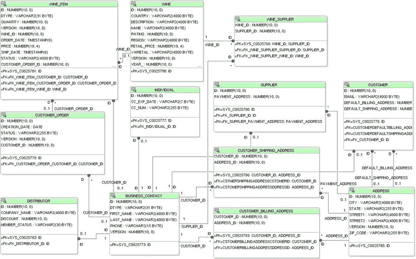

图 7-5.  Wines Online 应用程序的数据库图表

构建、部署和测试应用程序

EJB 需要被打包成 EJB JAR（Java 归档）文件，然后才能组装成包含应用程序所有必需模块和库的 EAR（企业归档）文件。大多数应用服务器都提供部署实用程序或 Ant 任务，以方便将 EJB 部署到其容器中。像 NetBeans、JDeveloper 和 Eclipse 这样的 Java 集成开发环境（IDE）提供了图形化部署工具，允许开发者将应用程序打包、组装并部署到应用服务器。EJB 并非必须被打包成 EJB JAR 文件并组装成 EAR 文件。你也可以直接部署 EJB JAR 文件。在本章中，我们将把它们组装成 EAR 文件，以便使持久化单元成为一个共享模块（位于其自身的 JAR 文件中），并为第 12 章做好准备，届时我们将为刚刚开发的葡萄酒商店后端构建客户端应用程序。我们还将把第 6 章中的 EJB/WebService 模块以及一个包含驱动测试场景的简单测试 Servlet 的 Web 模块打包到这个 EAR 文件中。

打包、组装和部署方面的内容将在第 11 章中详细介绍。在本章中，我们使用会话 Bean、MDB、JPA 实体和 Web 服务开发了葡萄酒商店应用程序的后端。使用 NetBeans 并部署到 GlassFish，我们将执行以下步骤来打包、组装、部署和测试本章中定义的服务。

先决条件

在执行后续章节详述的任何步骤之前，请先完成第 1 章中的“入门”部分，该部分将引导您完成本章示例所需的安装和环境设置。

创建数据库连接

本章的示例需要数据库连接，对于这些测试，我们将使用 NetBeans 和 Glassfish 捆绑的 Derby 数据库。如果您尚未创建也用于第 3 章和第 4 章示例的 WineApp 数据库，请单击 `Services` 选项卡，展开 `Databases` 图标，然后在 `Java DB` 节点上调用“`Create Database...`”。创建一个名为“`WineApp`”的数据库，用户名和密码为 `wineapp/wineapp`，如图 7-6 所示：

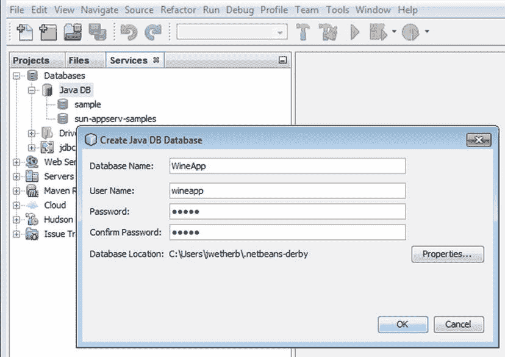

图 7-6.  创建 WineApp 数据库和连接

最后一步创建了一个数据库连接，JPA 和 EJB 项目中的 `persistence.xml` 文件里的持久化单元都会引用该连接。虽然可以预先创建数据库对象（表、序列、键约束等），但我们将让 JPA 在每个持久化单元首次需要时自动创建这些数据库对象。

 **注意**   本章的示例，与第 3 章的示例一样，包含一个引用这些连接详细信息的 JDBC 数据源。如果您选择使用不同的凭据，请确保更新 `persistence.xml` 文件，以及 `Chapter07-IntegratedServices-ejb` 项目中 `glassfish-resources.xml` 文件中定义的数据源。

创建 JMS 和 JavaMail 资源

此集成应用程序中的 MDB 需要 JMS 资源。在第 5 章中，我们创建了一个 JMS 主题连接工厂和一个 JMS 主题，我们将再为每种资源各创建一个，供 MDB 使用。最初，`OrderProcessFacadeBean` 向队列发送一条消息，该消息由 `OrderProcessingMDBBean` 消费。接着，`OrderProcessingMDBBean` 使用一个 JMS 主题连接工厂向队列发送一条消息，该消息将由 `StatusMailerBean` 用于向客户发送电子邮件。我们的每个主题连接工厂还需要定义一个 JMS 主题。

如果您尚未完成第 5 章（EJB 消息驱动 Bean）中的示例，请按照该章“创建 JMS 和 JavaMail 资源”一节中的步骤操作。除了为该章示例创建的资源之外，您还需要创建一个额外的 `TopicConnectionFactory` 和 `Topic`。第 5 章将指导您使用 GlassFish 管理控制台创建这些额外资源。

您需要创建的新资源是一个名为 `poTopicConnectionFactory` 的 `TopicConnectionFactory` 和一个名为 `PurchaseOrderTopic` 的 `Topic`。

打开示例应用程序

在执行下一步之前，您可能希望关闭 NetBeans 中任何现有的项目以避免混乱。使用 `File Open Project` 菜单打开 `Chapter07-ServiceIntegration`，如图 7-7 所示。确保选中“`Open Required Projects`”复选框。

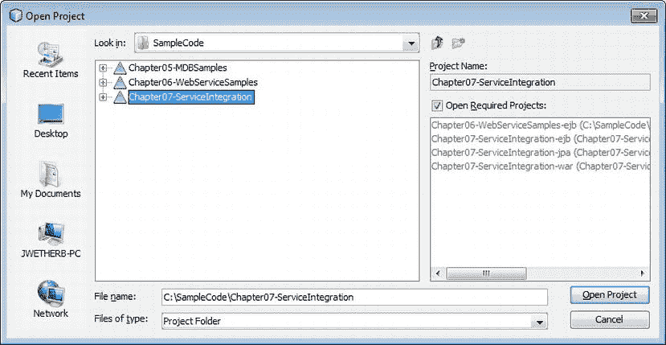

图 7-7.  打开 Chapter07-ServiceIntegration 项目

请注意，这也会打开 `Chapter06-WebServiceSamples-ejb` 项目，因为它被第 7 章的示例直接使用。一些源文件最初会带有警告标记，因为在下一步配置 EJB Web 服务之前，它们缺少依赖项。

配置 EJB Web 服务

我们的葡萄酒商店后端应用程序是在第 6 章工作的基础上构建的，我们在该章中实现了信用服务。

1.  除非您按照第 6 章中的步骤部署 Web 服务并创建 Web 服务客户端，否则本章中的应用程序将无法编译。此处概述了这些步骤，但您可能需要参考第 6 章以获取执行这些操作的更全面说明。右键单击 `Chapter06-WebServiceSamples-ejb` 项目，然后选择“Clean and Build”，接着选择“Deploy”。
2.  在 `Chapter06-WebServiceSamples` 项目中，打开“Web Services”部分，右键单击 `CreditCheckEndpointBean` 并选择“Test Web Service”。当网页出现时，单击“WSDL File”链接，然后复制浏览器中 `.wsdl` 文件的 URL（通常为 `http://localhost:8080/CreditService/CreditCheckEndpointBean?Tester``)`）。
3.  现在再次右键单击 `Chapter06-WebServiceSamples-ejb` 项目，并选择“New | Web Service Client”。在向导中，选择“WSDL URL”单选按钮，并粘贴您在步骤 2 中复制的 `.wsdl` URL。将包设置为“`com.apress.ejb.chapter06.services.client`”，然后选择“Finish”。这将完成运行第 7 章示例所需的 Web 服务配置。


快速浏览本例中包含的模块可以发现，除了第 6 章的 EJB/WebServices 模块外，我们还有另一个包含会话 Bean 外观和 MDB 的 EJB 模块、多个构成 JPA 持久化单元的 JPA 实体，以及一个包含测试 Servlet 的 Web 模块。

`wineapp@yahoo.com`账户与`user.properties`文件

我们已设置了一个雅虎邮箱账户`wineapp@yahoo.com`，供您测试使用。密码为：`wine_app`。本书中所有涉及 JavaMail 会话的示例均默认使用此账户。您可以自由使用该账户，也可以选择通过自己的邮件服务器（例如，如果您在防火墙后）使用自己的邮箱账户收发邮件。

在`Chapter07-ServiceIntegration-jpa`项目中，您可以在根源码目录下找到`user.properties`文件。该文件允许您指定本示例生成邮件的发件人（From:）和收件人（To:）邮箱地址，如清单 7-21 所示：

***清单 7-21.***  `Chapter07-ServiceIntegration-jpa`项目源码根目录下的`user.properties`文件

```
# 指定将在 JavaMail 会话发送的邮件头中显示的发件人和收件人邮箱账户
# 该会话名为'mail/wineappMail'，配置于第 5 章。请注意，
# 尽管邮件头可能显示来自下方的发件人账户，但实际发件人将是
# 在'mail/wineappMail' JavaMail 会话中配置的账户。
from_email_address =wineapp@yahoo.com
to_email_address =wineapp@yahoo.com
```

如需更改收件人和/或发件人邮箱地址，请随意编辑此纯文本文件。此外，关于代理服务器及其他非默认安装环境导致的问题，请参考`Readme.txt`文件。

构建、部署与执行示例应用程序

完成所有配置步骤后，您现在可以构建、部署并通过简单的 Servlet 客户端运行本章的`WineApp`应用程序。为确保移除所有先前工件，请先选中全部五个 NetBeans 项目并调用“清理”操作，如图 7-8 所示：

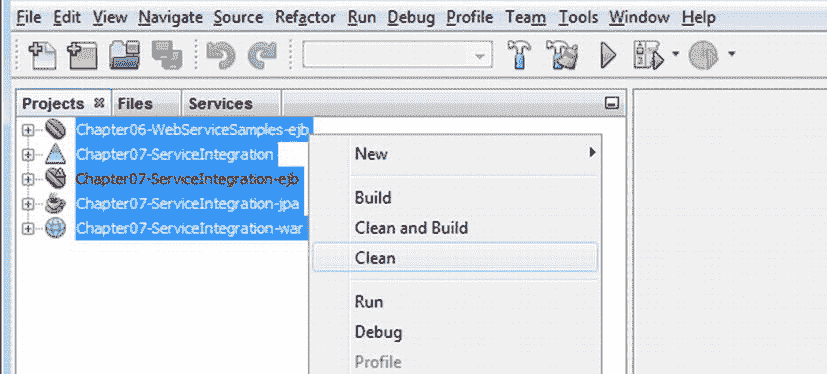

图 7-8.  清理 Chapter07-ServiceIntegration 项目

 **注意**   如果 GlassFish 正在运行，且因.jar 文件无法删除而导致构建错误，请尝试关闭 GlassFish 后重新调用“清理”操作。

接下来的步骤是构建、打包、部署 EJB、JPA 和 Web 模块，并运行 Servlet 客户端。当调用图 7-9 所示的“运行”操作时，所有这些步骤将自动执行。NetBeans 能够跟踪项目状态，并在执行`ShoppingCartClient` Servlet 之前完成所有必要工作。

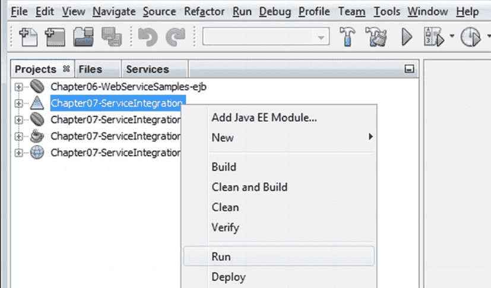

图 7-9.  运行 Chapter07-ServiceIntegration 项目，该项目将执行 Chapter07-ServiceIntegration-web 模块中的 ShoppingCartClient Servlet

客户端应用程序及不同的应用程序架构将在第 12 章中详细讨论。为了测试已部署的葡萄酒商店应用程序，我们提供了一个简单的 Servlet 客户端。GlassFish 将`ShoppingCart`和`SearchFacade`会话 Bean 注入到 Servlet 中，用于搜索葡萄酒、将商品添加到购物车，并最终提交订单。

清单 7-22 展示了 Servlet 客户端的代码。首先，客户端查找`SearchFacadeBean`会话 Bean 并调用`findWineByYear()`方法，该方法返回一个葡萄酒列表。为了将葡萄酒添加到购物车，客户端程序查找`ShoppingCart`会话 Bean 并调用`findCustomer()`方法。找到客户后，客户端进入一个`while`循环，使用`ShoppingCart` Bean 中的`addWineItem()`方法将从`SearchFacadeBean`获取的葡萄酒列表添加进去。为保持客户端简单，每种葡萄酒的数量设置为 20。当客户端将所有葡萄酒添加到购物车后，调用`ShoppingCart` Bean 中的`sendOrderToOPC()`方法提交订单。

`ShoppingCartClient` Servlet 使用 EJB 注入，通过其本地接口获取`SearchFacade`和`ShoppingCart`这两个 EJB。该 Servlet 执行以下步骤，并通过向浏览器窗口发送 HTML 来记录其进度：

*   通过一个 Java 服务外观——`PopulateDemoData`——初始化示例数据，该外观使用 JPA 实体填充数据库
*   使用有状态的`ShoppingCart`在示例数据集中通过电子邮件查找现有客户，并将其缓存在会话 Bean 中
*   使用`SearchFacade`通过`"Wine.findByYear"` JPQL 命名查询查找 2004 年的葡萄酒，显示该年份葡萄酒的信息，并使用`ShoppingCart` Bean 中的`addWineItem()`方法将每种葡萄酒各 20 瓶添加到客户的购物车中
*   当客户端将所有葡萄酒添加到购物车后，调用`ShoppingCart` Bean 中的`sendOrderToOPC()`方法提交订单

清单 7-22 展示了 Servlet 源码：

***清单 7-22.***  ShoppingCartClient.java Servlet

```
@WebServlet(name = "ShoppingCartClient", urlPatterns = {"/ShoppingCartClient"})
public class ShoppingCartClient extends HttpServlet {
  @EJB
  private SearchFacadeLocal searchFacade;
  @EJB
  private ShoppingCartLocal shoppingCart;

/**
   * Processes requests for both HTTP
   * <code>GET</code> and
   * <code>POST</code> methods.
   *
   * @param request servlet request
   * @param response servlet response
   * @throws ServletException if a servlet-specific error occurs
   * @throws IOException if an I/O error occurs
   */
  protected void processRequest(HttpServletRequest request, HttpServletResponse response)
          throws ServletException, IOException {
    response.setContentType("text/html;charset=UTF-8");
    PrintWriter out = response.getWriter();
    try {
      /* TODO output your page here. You may use following sample code. */
      out.println("<html>");
      out.println("<head>");
      out.println("<title>Servlet ShoppingCartClient</title>");
      out.println("</head>");
      out.println("<body>");
      out.println("<h1>Servlet ShoppingCartClient at " + request.getContextPath() + "</h1>");
      out.println("</body>");
      out.println("</html>");

out.print("<h2>Populating Demo Data... ");
      new PopulateDemoData("Chapter07-WineAppUnit-ResourceLocal").resetData();
      out.println("done</h2>");

out.print("<h2>Calling the ShoppingCart to find and cache customer with email address " +
      PopulateDemoData.TO_EMAIL_ADDRESS + "... ");
      final Customer customer = shoppingCart.findCustomer(PopulateDemoData.TO_EMAIL_ADDRESS);
      out.println("found " + customer.getFirstName() + " " + customer.getLastName() + "</h2>");

out.println("<h2>Calling the SearchFacade to find wines from 2004</h2>");
      List<Wine> yearWineList = searchFacade.getWineFindByYear(2004);
      if (yearWineList != null) {
        for (Wine wine : yearWineList) {
          shoppingCart.addWineItem(wine, 20);
          out.println("<h3>Added cart item for 20 bottles of " + wine.getName() + " " + wine.
          getYear() + "</h3>");
        }
      }


out.print("<h2>调用 ShoppingCart 将订单发送至订单处理中心... ");
      shoppingCart.sendOrderToOPC();
      out.println("完成</h2>");
    } catch (Exception ex) {
      ex.printStackTrace();
    } finally {
      out.close();
    }
  }

/* HttpServlet 方法 */
}
```

Servlet 输出

`ShoppingCartClient` Servlet 的输出记录了客户端执行的高级操作，如图 7-10 所示：

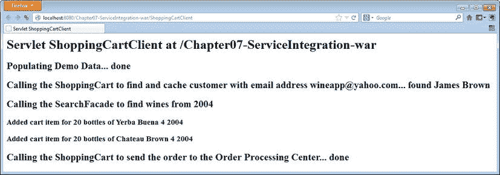

图 7-10.  ShoppingCartClient Servlet 的输出

生成的电子邮件

图 7-10 所示的 Servlet 输出只说明了部分情况。Servlet 的工作在调用 `shoppingCart.sendOrderToOPC()` 将订单发送至订单处理中心后结束。在此示例中，成功处理订单的结果是，从 JavaMail 会话（在第 5 章中创建）中配置的账户发送一封电子邮件至 `user.properties` 文件中 `to_email_account` 属性指定的账户。使用默认账户信息发送的电子邮件如图 7-11 所示：

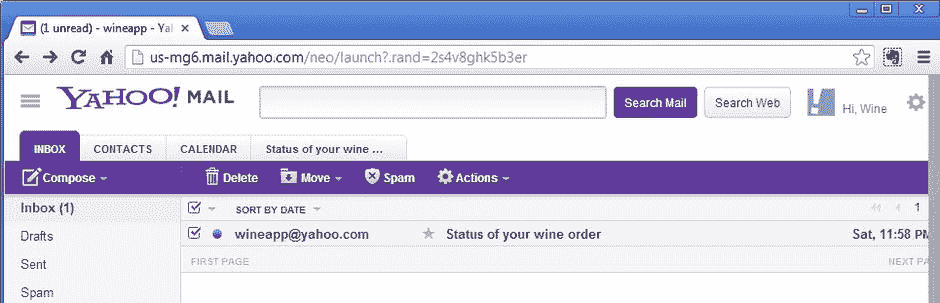

图 7-11.  来自 `wineapp@yahoo.com` 的电子邮件出现在 wineapp 账户的收件箱中

如果 `user.properties` 文件的 `to_email_address` 属性所列账户的收件箱中没有出现电子邮件，请检查该账户的垃圾邮件文件夹，或查看 NetBeans 输出窗口中的“GlassFish 服务器”选项卡以获取诊断信息。`Chapter07-ServiceIntegration` 项目中的 `Readme.txt` 文件包含其他故障排除信息（如有需要）。

结论

在本章中，我们介绍了一些将不同类型的 EJB、JPA 实体和 Web 服务与数据源、JMS 主题和 JavaMail 等资源集成的方法。

我们研究了虚构葡萄酒商店应用的概念设计，并规划了需要构建的组件和服务的设计。我们审视了各个组件和服务，并演示了如何使用不同类型的 EJB 来解决特定的应用问题。

该葡萄酒商店应用展示了典型后端应用的各个部分，包括一个利用一系列 JPA 映射的综合持久化单元、与持久化单元中实体交互的会话 Bean、MDB 以及使用依赖注入的 Web 服务。

我们还研究了如何在会话 Bean 和 MDB 中注入各种类型的资源，以及如何使用 MDB 在应用中构建异步性。

此外，我们还探讨了如何处理持久化上下文中的托管实体和分离实体，以及如何将异步模型集成到典型的后端应用中。

最后，我们详细介绍了如何将各个组件和服务打包成模块，将它们组装成一个 Java EE 应用，并部署到 GlassFish 服务器上。

在下一章中，我们将讨论 EJB 容器提供的事务服务，并探索可在各种应用架构中使用的不同类型的事务模型。

第 8 章


EJB 中的事务支持

围绕企业应用设计和开发的许多工作都涉及如何协调持久化数据流的决策。这包括何时何地缓存数据、何时将其应用到持久化存储（通常是数据库）、如何解决同时尝试访问同一数据的问题，以及如何解决因违反数据库约束的操作而可能发生的错误。可靠的数据库能够在较低层级（数据库层）处理这些问题，但同样的问题也可能存在于中间层（应用服务器）和客户端层，并且通常需要特殊的应用逻辑。例如，数据库通过悲观锁支持提供内置的并发控制，而应用可能选择使用乐观锁策略来获得更优化的性能结果。

使用 EJB 的主要好处之一是其对企业级服务（如事务管理和安全控制）的支持。在本章中，我们将探讨 EJB 如何提供事务服务，以及如何利用这些服务来满足您的特定需求。

为了说明 EJB 提供的功能及其使用方法，我们将从示例应用 Apress Wines Online 中选取一个场景进行审视，该场景体现了上述数据流问题。我们将通过展示执行任务的方法来说明 EJB 的事务支持，这些方法从简单简洁到略微复杂但更灵活。不过，在深入探讨示例之前，我们先概述 EJB 事务领域中的一些重要事务概念，包括 Java 事务 API (JTA)、EJB 容器通过声明式 EJB 元数据为您提供的多种灵活事务选项，以及持久化层中事务的处理方式。EJB 自诞生以来就提供了这些基本的事务服务，因此，如果您对这些概念已经熟悉，可以直接跳到示例部分，了解它们如何在涉及 Java 持久化 API (JPA) 的 EJB 世界中体现。

什么是事务？

在本节中，我们将探讨以下问题：

*   什么是事务？为什么它对企业应用很重要？
*   定义健壮可靠事务的核心 ACID（原子性、一致性、隔离性、持久性）属性是什么？
*   什么是 JTA？什么是分布式事务？什么是两阶段提交？

事务是一组必须作为一个单元执行的操作。这些操作可以是同步的或异步的，并且可能涉及持久化数据对象、发送邮件、验证信用卡以及许多其他事件。一个经典的例子是银行转账，其中一个操作从一个账户扣除资金（即更新数据库表中的一条记录），另一个操作将相同的资金存入另一个账户（更新同一或不同数据库表中的另一行）。从查询这两个账户的外部应用角度来看，绝不能出现这些资金同时在两个账户中可见的情况。也不能出现资金在两个账户中都不可见的时刻。只有当此事务中的两个操作都成功执行后，这些更改才能从另一个应用上下文中可见。以这种方式必须作为一个单元一起执行的一组操作称为事务。

事务中的操作是顺序或并行执行的，通常在一个（相对较短的）时间段内。在所有操作都执行完毕后，事务被应用或提交。如果在事务执行过程中出现错误或其他无效条件，事务可能会被取消或回滚，并且在该事务上下文中已执行的操作将被撤销。

分布式事务


当事务中的操作跨数据库或位于不同计算机或进程上的其他资源执行时，这被称为**分布式事务**。此类企业级事务需要在所涉及的资源之间进行特殊协调，并且极难进行可靠的编程。这正是 JTA 发挥作用的地方，它提供了资源可以实现并绑定的接口，以便参与分布式事务。

EJB 容器是一个支持 JTA 的事务管理器，因此可以参与涉及其他 EJB 容器以及第三方 JTA 资源（例如许多数据库管理系统 (DBMS)）的分布式事务。这减轻了业务应用程序开发人员协调分布式事务的复杂性，使他们能够自由地集成松散耦合的服务，并根据自己的选择在企业内部分布数据。此外，正如您将在以下各节中看到的，EJB 允许开发人员选择是显式地划分事务边界（通过调用 begin、commit 或 rollback (cancel) 来标记事务），还是允许 EJB 容器沿着 EJB 方法边界自动执行事务划分。

事务的 ACID 属性

不，不是指那种迷幻饮料。事务有各种形式和规模，可能涉及同步和异步操作，但它们都具有一些共同的核心特征，即 ACID 组件。ACID 指的是定义健壮且可靠的事务的四个特性：原子性、一致性、隔离性和持久性。表 8-1 描述了这四个组件。

表 8-1.  事务的 ACID 属性

| 特性 | 描述 |
| --- | --- |
| 原子性 | 一个事务由一个或多个作为一组执行的操作组成，这组操作被称为工作单元。原子性确保在事务结束时，这些操作要么全部成功执行（成功提交），要么全部不执行（成功回滚）。在事务结束时，如果只有部分操作完成，则违反了原子性。 |
| 一致性 | 一致的事务具有数据完整性。一致性确保在事务结束时，数据处于一致状态，从而不会违反数据库约束或逻辑验证规则。 |
| 隔离性 | 事务隔离性规定外部世界无法看到事务的中间状态。查看事务中涉及的数据对象的外部程序，必须等到事务提交后才能看到修改后的数据对象。事务隔离性本身是一门复杂的科学，在很大程度上超出了本讨论的范围，但可以说，EJB 服务器提供商通常提供可配置的隔离设置，让您可以选择事务范围内的资源能够看到彼此待定更改的程度，以及外部提交但在上下文事务期间发生的更改（脏读）。没有标准的隔离设置，因此可移植的应用程序不应依赖其运行时环境中的特定配置。 |
| 持久性 | 正确执行的事务是永久性的，不会受到任何系统故障的影响。将数据提交到关系数据库中（随后可以查询结果）通常可以实现此要求。 |

自然，EJB 满足了所有这些要求，我们将在后续示例中指出如何处理每一个要求。

Java 事务 API (JTA)

JTA 为客户端和感知事务的资源管理器定义了一个接口，用于参与容错的分布式事务。EJB 自动绑定到这些服务，因此客户端和企业 Bean 都可以方便地参与分布式编程，而无需显式编码诸如两阶段提交协议之类的逻辑。EJB 进入其 JTA 事务的主要接口是通过 `javax.transaction.UserTransaction` 对象接口，该接口由 EJB 容器实例化，并可通过注入到企业 Bean 类或通过 Java 命名和目录接口 (JNDI) 查找来获得。

两阶段提交协议

如果您使用关系数据库编写过逻辑程序，您可能熟悉两阶段提交协议。此策略赋予参与分布式事务的资源管理器否决权，通过“准备”命令通知它们即将发出提交，并允许它们声明是否可以应用其更改。只有当所有资源管理器一致同意它们已准备好应用其更改时，事务管理器才会下达最终指令来实际应用更改。通常，资源管理器在“准备”步骤期间执行大部分更改，因此最终的“提交”步骤执行起来很简单。这降低了在“提交”步骤期间发生错误的可能性。健壮的事务管理器和资源管理器甚至能够处理这种意外情况。

EJB 中的事务支持

本节将探讨以下问题：

*   企业 Bean 开发人员可以使用哪些事务服务？
*   会话 Bean、消息驱动 Bean (MDB) 和实体如何在事务上下文中交互？

EJB 服务器中的大部分基础设施都专用于支持这些服务，这是有充分理由的。EJB 不仅提供了一个健壮的 JTA 事务管理器，还通过可在可互操作、可移植的业务组件上指定的声明性元数据使其易于访问。几乎所有的 Java EE 应用程序都需要事务服务，而 EJB 以非常简洁的包将它们提供给应用程序开发人员。

从其诞生之初，EJB 框架就提供了一种便捷的方式来管理事务和访问控制，它允许您逐个方法地以声明方式定义行为。除了这些容器提供的服务之外，EJB 还允许您将控制权交给应用程序，以定义事务事件边界和其他自定义行为。

在本章中，我们将探讨事务在您的应用程序中完成一系列常见任务时所扮演的角色。在典型的 Java EE 应用程序中，会话 Bean 通常用于建立事务边界，并操作实体以在事务上下文中与数据库交互。我们的示例混合了会话 Bean 和实体操作，以说明 EJB 提供的内置（声明式）和手动行为。本着简化开发模型的精神，EJB 默认提供了许多最有用的功能，因此默认事务选项既实用又强大也就不足为奇了。

EJB 事务服务

EJB 事务模型构建在此 JTA 模型之上，在该模型中，会话 Bean 或其他应用程序客户端提供事务上下文，企业服务作为逻辑工作单元在其中执行。在 Java EE 环境中，通常在事务上下文中运行的企业服务包括：创建、检索、更新和删除实体；向队列发送 JMS 消息；执行 MDB；触发邮件请求；调用 Web 服务；执行 JDBC 操作等等。


EJB 提供了内置的 JTA 事务管理器，但其真正的强大之处在于 EJB 为 Bean 提供者提供的声明式服务。通过使用元数据标签而非程序化逻辑，EJB 开发者可以无缝地参与 JTA 事务，并以声明方式控制企业 Bean 上每个业务方法的事务行为。

EJB 通过为 JTA 事务和非 JTA（资源本地）事务提供显式支持，扩展了这一编程模型。资源本地事务仅限于单个资源管理器（例如数据库连接），但可以通过避免分布式事务监视器的开销来实现性能优化。

此外，应用程序构建者可以利用容器提供的服务来自动管理事务，或者他们也可以选择控制事务边界，并显式处理事务的开始、提交和回滚事件。在单个应用程序中，这两种方法可以结合使用。虽然由容器还是应用程序自身来划分事务的选择是在企业 Bean 上定义的，但针对 JPA 实体使用哪种事务模型（JTA 或资源本地）的决定，则取决于 `persistence.xml` 文件中持久化单元的配置方式。

游戏中的持久化对象（即实体）完全且愉快地对其管理事务框架一无所知。实体运行的事务上下文并非其定义的一部分，因此，只要创建了适当的 `EntityManager` 来服务实体的生命周期事件，同一个实体类就可以在应用程序选择的任何事务上下文中使用。

如果这一切在此时看起来有些令人生畏，请不要担心。一旦我们通过一些代码示例来演示所有部分如何协同工作，一切都会变得清晰。同样值得注意的是，EJB 内置的容器管理事务（CMT）支持对于在 EJB 容器内运行的大多数应用程序来说已经绰绰有余。本章将让您探索各种选项——但除非您编写的应用程序涉及完全存在于 EJB 容器之外的实体，否则默认支持很可能很好地满足您的需求。

服务模型中的会话 Bean 事务行为

下一节将探讨以下问题：

*   EJB 容器为会话 Bean 提供了哪些声明式事务支持？
*   容器管理事务（CMT）划分与 Bean 管理事务（BMT）划分之间有什么区别？在什么情况下你会选择一种方法而不是另一种？
*   什么是 CMT 属性？
*   EJB 如何支持使用 Bean 管理事务（BMT）Bean 显式划分事务边界？
*   隐式提交行为与显式提交行为有何区别？

企业 Bean 是 EJB 服务层的核心。通过会话 Bean，EJB 容器提供了事务事件的声明式划分，以及选择在 Bean 或应用程序客户端代码中显式划分事务事件的选项。让我们分别考虑这两种方法，从默认选项开始：利用声明式标记进行容器管理事务划分。

容器管理事务（CMT）划分

EJB 容器提供内置的事务管理服务，默认情况下会话 Bean 和 MDB 均可使用这些服务。Bean 通过元数据（使用注解或 XML）为其每个方法指定事务特性，EJB 容器遵循这些指令来确定要执行的事务操作（如果有的话）。使用这些指令，EJB 容器可以在方法被调用时自动开始一个新事务，或挂起或重用现有事务，并可能在方法返回给调用者之前提交事务。

 **注意** 只有 Bean 开发者可以分配企业 Bean 的事务管理类型。允许应用程序组装者通过 `ejb-jar.xml` 文件覆盖 Bean 的方法级容器管理事务属性，但他们必须谨慎行事，以避免死锁的可能性。通常不允许应用程序组装者和部署者覆盖 Bean 的事务管理类型。

当 EJB 在元数据中声明其事务行为时，容器会拦截对企业 Bean 方法的调用，并在会话 Bean 的方法边界应用事务行为，提供一组固定的选项供您为每个方法指定。容器提供的默认行为（即未指定其他指令时）是在调用方法之前立即检查当前线程是否关联了事务上下文。如果没有可用的事务上下文，容器会在执行方法之前开始一个新事务。如果存在可用的事务，容器会允许该事务传播到方法调用，并使方法代码可用。然后，在从方法调用返回时，容器会再次检查。如果容器负责创建了新的事务上下文，它会在方法退出后自动提交该事务。如果容器没有创建事务，则允许该事务不受影响地继续。通过拦截 Bean 的方法调用，EJB 容器能够在运行时应用在开发时以声明方式指定的事务行为。

上一段描述的默认行为只是容器提供的六种 CMT 划分选项之一。您可以将这六种划分选项中的任何一种归因于会话 Bean 上的任何方法。某些属性值需要满足特定条件；当条件不满足时，会抛出异常。这六种属性列于表 8-2 中。

表 8-2. 容器事务属性定义


| 事务属性 | 行为 |
| --- | --- |
| `MANDATORY` | 调用方法时，必须存在一个有效的事务。如果没有可用的事务，则会抛出 `javax.ejb.EJBTransactionRequired` 异常。该方法执行期间，此事务保持有效，并在将控制权返回给调用者后保持活动状态。 |
| `REQUIRED` | 这是默认的事务属性值。进入方法时，如果当前没有可用的事务上下文，容器会介入创建一个新的事务上下文。如果容器在进入方法时创建了事务，则会在方法调用完成时提交该事务。如果已存在一个有效的事务，容器在将控制权返回给客户端之前不会提交该事务。 |
| `REQUIRES_NEW` | 容器在执行标记为此属性的方法之前，总是创建一个新的事务。如果在调用方法时已存在一个事务上下文，则容器会在创建新事务之前，通过将该事务与当前线程分离来挂起它。然后，在提交中间事务后，容器会将原始事务重新关联到当前线程。 |
| `SUPPORTS` | 此选项基本上是一个空操作，不会导致容器执行额外工作。如果存在事务上下文，则该方法会使用它。如果没有可用的事务上下文，则容器会在没有事务上下文的情况下调用该方法。退出该方法时，任何预先存在的事务上下文仍保持有效。 |
| `NOT_SUPPORTED` | 容器在未指定事务上下文的情况下调用该方法。如果在调用方法时存在事务上下文，则容器会在调用方法之前将该事务与当前线程分离，然后在从方法返回时将该事务重新关联到线程。 |
| `NEVER` | 调用该方法时不得存在事务上下文。容器在调用方法之前不会创建事务上下文，如果已存在一个有效的事务，容器会抛出 `javax.ejb.EJBException`。 |

 **注意** 通常，事务属性可以在会话 bean 的业务接口方法或 Web 服务端点接口上指定，也可以在 MDB 的监听器方法上指定，但在特定情况下会有一些额外的限制。`此类`细节超出了本书的范围，但可以在 EJB *核心契约与需求* 规范中找到。

所有六个属性通常都可用于会话 bean 方法，但某些属性在会话超时回调方法上不可用，或者当会话 bean 实现了 `javax.ejb.SessionSynchronization` 时也不可用。MDB 仅支持 `REQUIRED` 和 `NOT_SUPPORTED` 属性。以下是一个示例，说明如何在会话 bean 方法上指定事务行为，以覆盖在 bean 级别指定（或默认）的事务行为：

```
@TransactionAttribute(TransactionAttributeType.SUPPORTS)
public CustomerOrder createCustomerOrderUsingSupports(Customer customer)
 throws Exception { ... }
```

表 8-3 说明了 EJB 的事务行为，该行为取决于其事务属性以及在调用会话方法时是否存在事务上下文。对于每个事务属性，我们在单独的行中列出了当客户端事务不存在（None）和当客户端事务存在（Tc）时的方法体和资源事务上下文。每当为方法的执行期间创建新事务（Tm）时，该事务总是在控制权返回给调用者之前由 EJB 容器提交。同时显示了与方法体代码关联的事务以及与该方法使用的资源关联的事务。

表 8-3. 六种事务属性对应的客户端和 Bean 事务状态

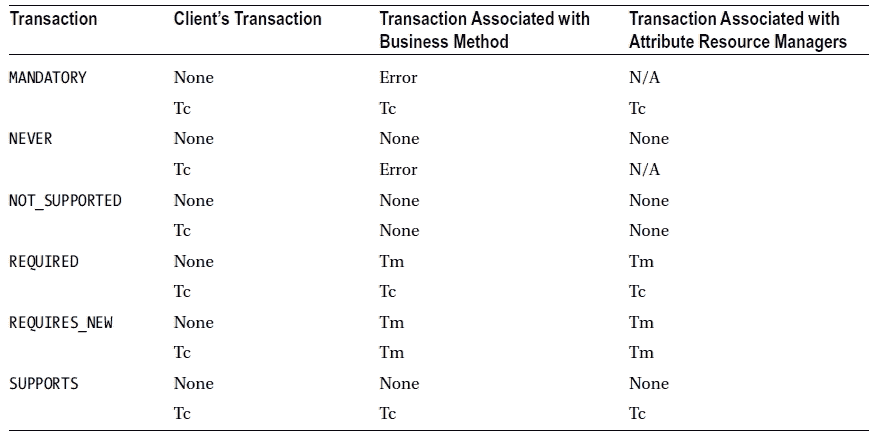

表 8-3 说明了容器如何介入 CMT 划分的方法，为每个事务属性以不同方式传播事务上下文。该表还说明了在 bean 方法中使用的事务上下文，总是会依次传播给该 CMT bean 方法所调用的其他方法。请注意，企业 bean 的客户端本身可能是另一个企业 bean。

EJBContext.setRollbackOnly 和 getRollbackOnly 方法

如果在 CMT 划分的企业 bean 的方法中遇到异常或其他错误情况，该 bean 可能希望阻止上下文事务被提交。不允许 bean 显式回滚事务，但它可以获取 `javax.ejb.EJBContext` 资源（通过容器注入或 JNDI 查找）并调用其 `setRollbackOnly()` 方法，以确保容器不会提交该事务。类似地，bean 方法可以随时调用 `EJBContext.getRollbackOnly()` 方法，以确定当前事务是否已被标记为回滚，无论是由当前 bean、其他 bean 还是与当前事务关联的其他资源标记的。

Bean 管理的事务（BMT）划分

对于某些企业 bean，声明式 CMT 服务可能无法提供它们所需的划分粒度。例如，客户端可能希望调用会话 bean 上的多个方法，而不希望每个方法在完成后都提交其工作。在这种情况下，客户端有几种选择：它可以实例化自己的 JTA（或资源本地）事务，从而显式控制事务的开始/结束边界；它可以编写一个自定义的 CMT 会话 bean，将工作封装在事务性 bean 方法内部，并在容器管理的事务中执行这些步骤；或者，它可以通过使用 EJB 上下文中可用的事务资源来显式控制事务划分。

EJB 为企业 bean 提供了后一种选项——称为 Bean 管理的事务（BMT）支持——作为处理其事务事件划分的便捷方式。要关闭自动的 CMT 划分服务，企业 bean 只需指定 `@TransactionManagement(TransactionManagementType.BEAN)` 注解，或在 `ejb-jar.xml` 文件中将会话 bean 的等效元数据分配给它。使用 BMT 划分时，EJB 容器仍然通过 bean 的 `EJBContext` 对象中可用的 `UserTransaction` 对象为 bean 提供事务支持。主要区别在于，bean 代码显式调用 begin、commit 和 rollback 事务，而不是使用 CMT 属性以声明方式为其方法分配事务行为。容器不会介入 BMT 方法来开始和提交事务，也不会将客户端开始的事务传播给选择自行划分事务的 bean。虽然任何给定的企业 bean 必须为其方法选择一种方案（CMT 或 BMT 划分），但两种类型的 bean 可以在单个事务上下文中相互交互。

为了划分事务，企业 bean 通过注入获取一个 `EJBContext`（即，对于会话 bean 是 `SessionContext`，对于 MDB 是 `MessageDrivenContext`）资源：

```
@Resource
SessionContext sessionContext;
```

然后通过此资源获取一个 JTA `javax.transaction.UserTransaction` 实例：

```
UserTransaction txn = sessionContext.getUserTransaction();
```


此 EJB 容器提供的 `UserTransaction` 接口为 Bean 提供了 `begin()`、`commit()` 和 `rollback()` 事务划分方法。类似地，非企业 Bean 客户端可以从 EJB 容器之外的 JTA 服务器获取 `UserTransaction` 资源，以便在应用客户端环境中划分事务，或者它们可以使用通过 `EntityManager` 获取的非 JTA 资源本地 `EntityTransaction`（见下文）。不过，无论它们如何开始一个事务，当它们调用会话 Bean 方法时，该事务都会成为上下文中的事务，并且适用表 8-3 中的规则。

在我们即将分析的示例中，一个使用 `EXTENDED` 持久化上下文和 BMT 划分的有状态会话 Bean 在一个方法中启动一个事务，该事务随后会传播到后续的方法调用，直到该事务最终在另一个单独的方法中被提交。这种行为的实现无法通过在 CMT 会话 Bean 上分别调用这些方法并采用相同的方法结构来达成，尽管可以通过将这些单独的调用包装在 CMT 会话 Bean 上的单个 CMT 划分的自定义方法中来实现相同的结果。

 **注意**  EJB 服务器是如何连接事务上下文的？您可能好奇 EJB 服务器如何能够自动将数据库连接以及在企业 Bean 内部通过编程方式获取的其他资源注册到事务上下文中。由于 EJB 服务器为执行 Bean 方法提供了上下文，它能够介入这些请求并执行这种副作用逻辑，而不会中断方法内的执行流程。也就是说，它在方法调用执行之前进行拦截；执行一些额外的工作（例如检查事务上下文的状态，可能创建一个新事务，并将企业 Bean 与该上下文关联）；然后调用 Bean 方法。从 Bean 方法调用返回后，它再次有机会执行额外的逻辑，例如提交在调用该方法时创建的事务，然后再将控制权返回给最初调用该 Bean 方法的客户端。

隐式提交与显式提交

使用 CMT 时，容器要求其在调用方法时开始的任何事务，都必须在方法返回给调用者时结束。这被称为隐式提交行为，有时也称为自动提交行为。容器必须强制执行此规则，否则当控制权在进程栈中向上传递时，可能会丢失对事务的跟踪。虽然您仍然可以使用 CMT 的容器管理事务来允许在单个事务中调用多个方法，但您必须通过将方法调用包装在外部的容器管理方法中来实现这一点。从客户端的角度来看，这仍然是对包装器方法的单个方法调用。

当对有状态会话 Bean 使用 BMT 时，您可以灵活地实现显式提交模型，其中 Bean 或客户端可以控制事务的开始和结束，并在结束之前显式调用提交或回滚操作期间，显式地调用多个方法。这给客户端或 Bean 开发者带来了负担，以确保事务不会悬而未决。然而，如果处理得当，当应用程序需要这种行为时，这将是一个强大的工具。如前所述，EJB 为会话 Bean 和 MDB 提供了一个内置事务供其使用——`javax.transaction.UserTransaction`——Bean 可以通过其注入的 `javax.ejb.EJBContext` 属性（作为 `SessionContext` 或 `MessageDrivenContext` 实例）访问该事务。

我们将在本章末尾的示例应用中进一步探讨隐式和显式提交行为。

在 JPA 实体中使用事务

本节将讨论以下问题：

*   持久化层中的事务是如何管理的？
*   持久化框架提供了哪些选项来控制涉及实体的事务？
*   持久化上下文在事务中的作用是什么？
*   实体如何与事务上下文关联和解除关联？

如果您还记得第 3 章，持久化单元定义了一组实体类，而持久化上下文是来自单个持久化单元的一组受管理的实体实例。在任何时间点，跨应用服务器中执行的多个应用程序，许多持久化上下文可能活跃地与任何给定的持久化单元相关联，但每个持久化上下文最多与一个事务上下文相关联。

实体与事务上下文之间的关系

从前面关于 EJB 服务器如何作为事务协调器将资源与事务上下文关联的讨论中，您可能已经意识到持久化上下文就是与事务关联的资源。通过这种方式，持久化上下文通过方法调用进行传播，以便持久化单元中的实体，只要它们与同一个事务上下文关联，就可以通过它们共同的持久化上下文看到彼此的中间状态。此外，对于任何给定的持久化单元，必须只有一个持久化上下文与给定的事务上下文相关联，这一限制确保了对于任何标识为 `I` 的类型为 `T` 的实体，其状态在任何事务上下文中都只能由一个持久化上下文表示。

在一个应用程序线程中，任何时刻只有一个事务上下文可用，但 EJB 服务器可以自由地将一个持久化上下文与该线程解除关联，并为同一个持久化单元关联一个新的持久化上下文，以满足事务隔离边界。当 EJB 服务器这样做时，新实例化的持久化上下文无法看到对与挂起的持久化上下文关联的任何实体所做的中间更改。

容器管理持久化上下文与应用管理持久化上下文

EJB 中的持久化服务允许您完全退出容器管理的持久化上下文，并在您的应用程序代码中显式管理持久化上下文的生命周期。当注入（或通过 JNDI 获取）一个 `EntityManager` 实例时，它作为容器管理的持久化上下文出现。容器会自动将容器管理的持久化上下文与使用 `EntityManager` 时恰好处于上下文中的任何事务关联起来，并在事务结束时销毁该持久化上下文（有一个例外——请参见下面的扩展持久化上下文）。如果应用程序希望控制其持久化上下文如何或是否与事务关联，以及它是否能在事务边界之后继续存在，它可以获取一个 `EntityManagerFactory`（同样通过容器注入或 JNDI 查找）并显式创建管理其持久化上下文的 `EntityManager` 实例。当 `EntityManager` 通过 `EntityManagerFactory` 获取时，使用的是应用管理的持久化上下文——这是在 Java EE 容器外部运行时的要求。有关在 Java EE 容器外部（例如在纯 Java SE 环境中）使用应用管理的 `EntityManager` 的更多信息，请参见第 4 章。

事务范围持久化上下文与扩展持久化上下文

在事务创建时创建、在事务结束时销毁的持久化上下文称为事务范围持久化上下文。这是与无状态会话 Bean 上使用的所有 `EntityManager` 关联的持久化上下文的行为。


对于有状态会话 Bean，存在一种特殊形式的容器管理实体管理器，它不与事务的生命周期绑定，而是与有状态会话 Bean 自身的生命周期绑定。这被称为扩展`EntityManager`，其行为类似于应用程序管理的持久化上下文，但 EJB 容器方便地管理其生命周期。由于扩展持久化上下文不会像事务范围的持久化上下文那样在每个事务结束时被销毁，因此实体即使在已与数据库同步后，仍可保持托管状态。在某些情况下，这避免了在提交后若想继续使用它们时重新查询或获取托管实例的需求。在会话式环境（如 Web 应用程序）中，这非常有用。扩展持久化上下文会保持打开状态，直到其上下文中的有状态会话 Bean 被销毁。只有有状态会话 Bean 才能使用扩展持久化上下文。在创建`EntityManager`实例时，其持久化上下文类型即被定义，并且在`EntityManager`的生命周期内不可更改。默认类型是事务范围的；要通过指定扩展持久化上下文来注入`EntityManager`，你可以使用以下注入指令：

```
@PersistenceContext(unitName="WineAppUnit", type = PersistenceContextType.EXTENDED)
private EntityManager em;
```

或者你可以在 XML 描述符中定义一个`persistence-context-ref`元素。

在本章末尾的事务示例中，我们将比较使用事务范围持久化上下文的无状态会话 Bean 与使用扩展持久化上下文的有状态会话 Bean 的行为。

JTA 与资源本地 EntityManager

`EntityManager`可以被定义为参与 JTA 事务或非 JTA（资源本地）事务。JTA 的特性——最显著的是对分布式事务的支持——以及 Bean 与 JTA 事务的接口`javax.transaction.UserTransaction`的使用，之前已经描述过。资源本地的`EntityManager`使用`javax.persistence.EntityTransaction`接口提供服务事务，客户端可通过`EntityManager.getEntityTransaction()`方法访问该接口。该接口暴露了预期的事务划分方法`begin()`、`commit()`和`rollback()`，以及`getRollbackOnly()`和`setRollbackOnly()`方法，这些方法等同于之前描述的企业 Bean 可用的`EJBContext`和`UserTransaction`方法，还有一个`isActive()`方法用于指示事务当前是否正在进行。

容器管理的`EntityManager`必须是 JTA `EntityManager`。应用程序管理的`EntityManager`可以是 JTA 或资源本地的，但只有当`EntityManager`位于 Java EE 环境中时，它们才能是 JTA `EntityManager`。

你可能想使用资源本地`EntityManager`的一个原因是，虽然 JTA 提供了分布式事务的基础设施，但资源本地事务可以通过消除该基础设施的开销来提供性能优化。另一个原因是你可能希望在独立的 Java SE 环境中使用 JPA 实体，而该环境不支持 JTA 和/或数据源资源。

在本章后面剖析示例应用程序中的 Java 外观时，我们将研究`EntityTransaction`的使用。

两个示例场景

以下两个示例场景使用了为 Wines Online 应用程序定义的持久化单元中的实体，我们在第 7 章中对此进行了研究。第一个场景使用无状态 CMT 会话 Bean，利用 EJB 容器提供的声明式事务服务。第二个场景展示了在使用有状态 BMT 会话 Bean 时，Bean 和客户端如何显式管理事务。在本章末尾，你将找到在 NetBeans 中使用 GlassFish 构建、部署和测试这些示例的分步说明。现在，我们将研究源文件，并讨论 EJB 和 JPA 在事务环境中可以交互的不同方式。

使用 CMT 划分的无状态会话 Bean

我们从默认的、直接的无状态会话 Bean 实现`OrderProcessorCMTBean.java`开始（如清单 8-1 所示）。该会话 Bean 使用 CMT 划分来利用 EJB 的声明式事务支持。随后是一个简单的 Servlet 客户端`OrderProcessorCMTClient.java`（如清单 8-2 所示）。

***清单 8-1.***  OrderProcessorCMTBean.java，一个使用 CMT 划分的无状态会话 Bean

```
@Stateless(name = "OrderProcessorCMT", mappedName = "Chapter08-TransactionSamples-
OrderProcessorCMT")
public class OrderProcessorCMTBean {
  @Resource
  SessionContext sessionContext;
  @PersistenceContext(unitName = "Chapter08-TransactionSamples-JTA")
  private EntityManager em;

/**
   * 移除任何电子邮件为'wineapp@yahoo.com'的现有客户以及任何国家为'United States'的现有葡萄酒。
   * EJB 容器将确保此工作在一个事务上下文中执行。
   */
  public String initialize() {
    StringBuffer strBuf = new StringBuffer();
    strBuf.append("已移除 ");
    int i = 0;

//  通过移除任何电子邮件为'wineapp@yahoo.com'（或 user.properties 文件中定义的任何内容）的现有客户来过滤数据。
    for (Customer customer :
         getCustomerFindByEmail(PopulateDemoData.TO_EMAIL_ADDRESS)) {
      em.remove(customer);
      i++;
    }
    strBuf.append(i);
    strBuf.append(" 个客户和 ");

//  移除任何国家为'United States'的现有葡萄酒
    i = 0;
    for (Wine wine : getWineFindByCountry("United States")) {
      em.remove(wine);
      i++;
    }
    strBuf.append(i);
    strBuf.append(" 瓶葡萄酒");
    return strBuf.toString();
  }

/**
   * 根据客户购物车中的商品创建一个新的 CustomerOrder。创建一个新的 CustomerOrder 实体，
   * 然后为客户购物车中找到的每个 CartItem 创建一个新的 OrderItem 实体。
   *
   * 使用 CMT 和默认的 REQUIRED 事务属性，如果在没有事务上下文的情况下调用此方法，
   * 则在调用该方法时，EJB 容器将创建一个新事务，并在成功完成该方法时提交该事务。
   *
   * @return 状态消息（纯文本）
   */
  public CustomerOrder createCustomerOrder(Customer customer) {
    return createCustomerOrderUsingSupports(customer);
  }

@TransactionAttribute(TransactionAttributeType.SUPPORTS)
  public CustomerOrder createCustomerOrderUsingSupports(Customer customer) {
    if (customer == null) {
      throw new IllegalArgumentException("OrderProcessingBean.createCustomerOrder(): 未指定客户");
    }

if (!em.contains(customer)) {
      customer = em.merge(customer);
    }

final CustomerOrder customerOrder = new CustomerOrder();
    customer.addCustomerOrder(customerOrder);


final Timestamp orderDate = new Timestamp(System.currentTimeMillis());
    final List<CartItem> cartItemList =
            new ArrayList(customer.getCartItemList());
    for (CartItem cartItem : cartItemList) {
      //  为此 CartItem 创建一个新的 OrderItem
      final OrderItem orderItem = new OrderItem();
      orderItem.setOrderDate(orderDate);
      orderItem.setPrice(cartItem.getWine().getRetailPrice());
      orderItem.setQuantity(cartItem.getQuantity());
      orderItem.setStatus("Order Created");
      orderItem.setWine(cartItem.getWine());
      customerOrder.addOrderItem(orderItem);

//  移除 CartItem
      customer.removeCartItem(cartItem);
    }

return persistEntity(customerOrder);
  }

public <T> T persistEntity(T entity) {
    em.persist(entity);
    return entity;
  }

public <T> T mergeEntity(T entity) {
    return em.merge(entity);
  }

public <T> void removeEntity(T entity) {
    em.remove(em.merge(entity));
  }

public <T> List<T> findAll(Class<T> entityClass) {
    CriteriaQuery cq = em.getCriteriaBuilder().createQuery();
    cq.select(cq.from(entityClass));
    return em.createQuery(cq).getResultList();
  }

public <T> List<T> findAllByRange(Class<T> entityClass, int[] range) {
    CriteriaQuery cq = em.getCriteriaBuilder().createQuery();
    cq.select(cq.from(entityClass));
    Query q = em.createQuery(cq);
    q.setMaxResults(range[1] - range[0]);
    q.setFirstResult(range[0]);
    return q.getResultList();
  }

/**
   * <code>select o from Customer o where o.email = :email</code>
   */
  @TransactionAttribute(TransactionAttributeType.NOT_SUPPORTED)
  public List<Customer> getCustomerFindByEmail(String email) {
    return em.createNamedQuery("Customer.findByEmail", Customer.class).setParameter("email", email).getResultList();
  }

/**
   * <code>select object(wine) from Wine wine where wine.country = :country</code>
   */
  @TransactionAttribute(TransactionAttributeType.NOT_SUPPORTED)
  public List<Wine> getWineFindByCountry(String country) {
    return em.createNamedQuery("Wine.findByCountry", Wine.class).setParameter("country", country).getResultList();
  }
}
```

***清单 8-2.***  OrderProcessorCMTClient.java，一个驱动 OrderProcessorCMT 会话 Bean 的 Servlet

```
@WebServlet(name = "OrderProcessorCMTClient", urlPatterns = {"/OrderProcessorCMTClient"})
public class OrderProcessorCMTClient extends HttpServlet {
  @EJB
  OrderProcessorCMTBean orderProcessorCMT;

/**
   * 处理 HTTP
   * <code>GET</code> 和
   * <code>POST</code> 方法的请求。
   *
   * @param request servlet 请求
   * @param response servlet 响应
   * @throws ServletException 如果发生特定于 servlet 的错误
   * @throws IOException 如果发生 I/O 错误
   */
  protected void processRequest(HttpServletRequest request, HttpServletResponse response)
          throws ServletException, IOException {
    response.setContentType("text/html;charset=UTF-8");
    response.setContentType("text/html;charset=UTF-8");
    OutputStream rOut = response.getOutputStream();
    PrintStream out = new PrintStream(rOut);
    try {
      /* TODO 在此处输出您的页面。您可以使用以下示例代码。 */
      out.println("<html>");
      out.println("<head>");
      out.println("<title>Servlet OrderProcessorCMTClient</title>");
      out.println("</head>");
      out.println("<body>");
      out.println("<h1>Servlet OrderProcessorCMTClient at " + request.getContextPath() + "</h1>");
      out.println("</body>");
      out.println("</html>");

//  创建并持久化一组 JPA 实体，用数据填充数据库
      out.print("<h2>填充演示数据... ");
      PopulateDemoData.resetData("Chapter07-WineAppUnit-ResourceLocal", System.out);
      out.println("完成</h2>");

//  通过移除任何电子邮件为 'wineapp@yahoo.com'（或 user.properties 文件中定义的任何内容）的现有客户来过滤数据。
      //  对 OrderProcessorBMT 上事务方法的第一次调用将开始一个事务。
      out.print("<h2>过滤演示数据... ");
      System.out.println(orderProcessorCMT.initialize());
      out.println("完成</h2>");

//  创建一个客户并添加一些 CartItem 及其关联的 Wine
      Individual customer = new Individual();
      customer.setFirstName("Transaction");
      customer.setLastName("Head");
      customer.setEmail(PopulateDemoData.TO_EMAIL_ADDRESS);
      for (int i = 0; i < 5; i++) {
        final Wine wine = new Wine();
        wine.setCountry("United States");
        wine.setDescription("Delicious wine");
        wine.setName("Xacti");
        wine.setRegion("Dry Creek Valley");
        wine.setRetailPrice(new Float(20.00D + i));
        wine.setVarietal("Zinfandel");
        wine.setYear(2000 + i);
        orderProcessorCMT.persistEntity(wine);

final CartItem cartItem = new CartItem();
        cartItem.setCreatedDate(new Timestamp(System.currentTimeMillis()));
        cartItem.setCustomer(customer);
        cartItem.setQuantity(12);
        cartItem.setWine(wine);

customer.addCartItem(cartItem);
      }

//  持久化客户，依赖级联设置来同时持久化所有相关的 Wine 和 CartItem 实体。调用后，客户实例将拥有一个由 EJB 容器在持久化时分配的 ID 值。
      orderProcessorCMT.persistEntity(customer);

//  创建客户订单并从 CartItem 创建 OrderItem
      final CustomerOrder customerOrder =
        orderProcessorCMT.createCustomerOrder(customer);

out.print("<h2>检索客户订单项... ");
      for (OrderItem orderItem: customerOrder.getOrderItemList()) {
        final Wine wine = orderItem.getWine();
        out.println(wine.getName() + " with ID " + wine.getId());
      }
      out.println("完成</h2>");
    } finally {
      rOut.close();
      out.close();
    }
  }

/*  HttpServlet 方法 */
}
```

事务分析

以下部分将从事务角度分析此次测试运行。

通过事务性 Java 外观填充测试数据

Servlet 客户端首先清空数据。CMT Bean 的客户端不创建事务，也不关心事务细节。它将所有工作委托给 CMT 会话 Bean 和（间接地）一个 Java 外观，并依赖它们在事务上下文中执行工作。客户端首先从第 7 章示例应用程序中调用 `PopulateDemoData` 类，这是一个辅助类，它委托给一个使用应用程序管理的 `EntityManager` 的 Java 外观，以重置演示数据，为新的测试运行做准备。我们首先提供这个示例，是为了看到在应用程序管理的 `EntityManager` 上下文中事务的原始用法。稍后我们将检查 EJB 会话 Bean 的行为。

```
//  创建并持久化一组 JPA 实体，用数据填充数据库
out.print("<h2>填充演示数据... ");
PopulateDemoData.resetData("Chapter07-WineAppUnit-ResourceLocal", System.out);
out.println("完成</h2>");
```

PopulateDemoData 类如清单 8-3 所示：

***清单 8-3.***  PopulateDemoData.java，一个实用类，通过委托给 JPA 实体上的事务性 Java 外观来重置示例数据

```
public class PopulateDemoData {
  public static final String FROM_EMAIL_ADDRESS;
  public static final String TO_EMAIL_ADDRESS;


static {
    Properties properties = new Properties();
    InputStream is = null;
    try {
      is = PopulateDemoData.class.getClassLoader().getResourceAsStream("user.properties");
      properties.load(is);
      FROM_EMAIL_ADDRESS = properties.getProperty("from_email_address");
      TO_EMAIL_ADDRESS = properties.getProperty("to_email_address");
    } catch (IOException e) {
      throw new RuntimeException(e);
    } finally {
      if (is != null) {
        try {
          is.close();
        } catch (IOException ex) {
          Logger.getLogger(PopulateDemoData.class.getName()).log(Level.SEVERE, null, ex);
        }
      }
    }
  }

private JavaServiceFacade facade;

public static void main(String[] args) {
    PopulateDemoData.resetData("Chapter07-WineAppUnit-ResourceLocal", System.out);
  }

public static void resetData(String persistenceUnit, PrintStream out) {
    PopulateDemoData pdd = null;
    try {
      pdd = new PopulateDemoData(persistenceUnit);

out.println("正在报告现有数据...");
      pdd.showDataCount(out);

out.println("正在移除数据...");
      pdd.removeAllDemoData(out);

out.println("正在报告移除后的数据...");
      pdd.showDataCount(out);

out.println("正在填充数据...");
      pdd.populateDemoCustomer();
      pdd.populateWines();

out.println("正在报告最终数据...");
      pdd.showDataCount(out);
    } finally {
      if (pdd != null) {
        pdd.releaseEntityManager();
      }
    }
  }

private PopulateDemoData(String persistenceUnit) {
    facade = new JavaServiceFacade(persistenceUnit);
  }

private void removeAllDemoData(PrintStream out) {
    removeAll(OrderItem.class, out);
    removeAll(CustomerOrder.class, out);
    removeAll(Individual.class, out);
    removeAll(Distributor.class, out);
    removeAll(Supplier.class, out);
    removeAll(InventoryItem.class, out);
    removeAll(CartItem.class, out);
    removeAll(Wine.class, out);
  }

private <T> void removeAll(Class<T> entityClass, PrintStream out) {
    int i = 0;
    for (T entity : facade.findAll(entityClass)) {
      facade.removeEntity(entity);
    }
    out.println("已移除 " + i + " 个 " + entityClass.getSimpleName() + " 实例");
  }

private Customer populateDemoCustomer() {
    Address a = new Address("Redwood Shores", "CA", "200 Oracle Pkwy", null, "94065");
    Individual i = new Individual("James", "Brown", "800.888.8000", TO_EMAIL_ADDRESS, a, a, "04/14", "123");
    facade.persistEntity(i);

return i;
  }

private InventoryItem populateWines() {
    InventoryItem ii = null;
    for (int i = 0; i < 6; i++) {
      Wine w = new Wine("USA", "Fine Wine - ranked #" + i, "Yerba Buena " + i, 90, "Napa Valley", new Float(10 + i), "Zinfandel", 2000 + i);
      facade.persistEntity(w);
      ii = new InventoryItem(10 + i, w, new java.util.Date(System.currentTimeMillis()), new Float(1 + i));
      facade.persistEntity(ii);
    }
    for (int i = 4; i < 10; i++) {
      Wine w = new Wine("France", "Fine Wine - ranked #" + i, "Chateau Brown " + i, 90, "Loire Valley ", new Float(10 + i), "Zinfandel", 2000 + i);
      facade.persistEntity(w);
      ii = new InventoryItem(10 + i, w, new java.util.Date(System.currentTimeMillis()), new Float(1 + i));
      facade.persistEntity(ii);
    }

return ii;
  }

public void showDataCount(PrintStream out) {
    out.println(facade.getCount(Address.class) + " 个地址已找到");
    out.println(facade.getCount(BusinessContact.class) + " 个业务联系人已找到");
    out.println(facade.getCount(CustomerOrder.class) + " 个客户订单已找到");
    out.println(facade.getCount(Wine.class) + " 个葡萄酒已找到");
    out.println(facade.getCount(WineItem.class) + " 个葡萄酒项目已找到");
  }

private void releaseEntityManager() {
    if (facade != null) {
      facade.close();
    }
  }
}

请注意，我们没有使用 `@EJB` 注解注入 EJB 外观，而是通过其构造函数实例化了 Java 外观（`JavaServiceFacade`），并向其传递了一个 `RESOURCE_LOCAL` 持久化单元的名称，从原始调用中我们可以看到该名称为 `"Chapter07-WineAppUnit-ResourceLocal"`。这个辅助类正在调用外观上的 `persistEntity()` 和 `removeCustomerOrder()` 等操作，而没有显式地要求提交操作，这表明该外观使用了隐式提交行为。

我们还注意确保在使用外观后，通过其自身的 `close()` 方法通知它。这允许它释放自己的资源；特别是它的 `EntityManagerFactory` 和 `EntityManager` 资源。这些是您在使用 EJB 时无需担心的内务管理项，因为 EJB 容器会为您处理这一级别的资源管理。

使用应用程序管理的 EntityManager 的 Java 外观

这就引出了 Java 外观本身的细节。这个外观实际上在第 7 章中就已经悄悄引入了，它与我们当时共享的通用持久化归档捆绑在一起。现在，我们将通过检查清单 8-4 中的 `JavaServiceFacade` 类来了解它是如何处理的：

***清单 8-4.***  JavaServiceFacade.java，一个基于 JPA 实体的、具有事务性的 Java 外观，展示了隐式提交行为

```
public class JavaServiceFacade {
  private final EntityManagerFactory emf;
  private final EntityManager em;

public JavaServiceFacade() {
    this("Chapter13-EmbeddableEJBTests-ResourceLocal");
  }

public JavaServiceFacade(String persistenceUnit) {
    emf = Persistence.createEntityManagerFactory(persistenceUnit);
    em = emf.createEntityManager();
  }

public void close() {
    if (em != null && em.isOpen()) {
      em.close();
    }
    if (emf != null && emf.isOpen()) {
      emf.close();
    }
  }

/**
   * 对持久化上下文中托管实体所做的所有更改都将应用到数据库并提交。
   */
  private void commitTransaction() {
    final EntityTransaction entityTransaction = em.getTransaction();
    if (!entityTransaction.isActive()) {
      entityTransaction.begin();
    }
    entityTransaction.commit();
  }

public <T> T persistEntity(T entity) {
    em.persist(entity);
    commitTransaction();
    return entity;
  }

public <T> T mergeEntity(T entity) {
    entity = em.merge(entity);
    commitTransaction();
    return entity;
  }

public <T> void removeEntity(T entity) {
    em.remove(em.merge(entity));
    commitTransaction();
  }

public <T> List<T> findAll(Class<T> entityClass) {
    CriteriaQuery cq = em.getCriteriaBuilder().createQuery();
    cq.select(cq.from(entityClass));
    return em.createQuery(cq).getResultList();
  }

public <T> int getCount(Class<T> entityClass) {
    CriteriaQuery cq = em.getCriteriaBuilder().createQuery();
    Root<T> rt = cq.from(entityClass);
    cq.select(em.getCriteriaBuilder().count(rt));
    javax.persistence.Query q = em.createQuery(cq);
    return ((Long) q.getSingleResult()).intValue();
  }

/**
   * <code>select object(wine) from Wine wine where wine.year = :year</code>
   */
  public List<Wine> getWineFindByYear(int year) {
    return em.createNamedQuery("Wine.findByYear", Wine.class).setParameter("year", year).getResultList();
  }

/**
   * <code>select object(wine) from Wine wine where wine.country = :country</code>
   */
  public List<Wine> getWineFindByCountry(String country) {
    return em.createNamedQuery("Wine.findByCountry", Wine.class).setParameter("country", country).getResultList();
  }

/**
   * <code>select object(wine) from Wine wine where wine.varietal = :varietal</code>
   */
  public List<Wine> getWineFindByVarietal(String varietal) {
    return em.createNamedQuery("Wine.findByVarietal", Wine.class).setParameter("varietal", varietal).getResultList();
  }
}
```


该外观类从`EntityManagerFactory`获取其`EntityManager`，因此该`EntityManager`的生命周期现在由外观类负责，而非容器。应用程序管理的`EntityManager`绑定到一个持久化上下文缓存，该缓存可以存在于事务上下文之外，并跨越多个事务存活，这本质上与有状态会话 Bean 的`EXTENDED`持久化上下文相同。这使得诸如`EntityManager.persist()`之类的调用可以在事务开始之前执行。这种事务外的调用会将新实体添加到持久化上下文中，但不会立即产生更新数据库的 SQL 调用。

 **注意**   即使在 EntityManager 事务开始之前，持久化上下文也会在需要时悄悄启动自己的私有事务，以在调用 EntityManager.persist()时处理任何 ID 生成器请求。由于我们将实体的主键字段绑定到了@GeneratedValue ID 生成器，这些 ID 实际上会在 persist()期间被急切地获取并分配给实体。

持久化上下文缓存不会刷新到数据库，直到事务通过`EntityTransaction.begin()`调用实际开始，该调用可能紧接在`EntityTransaction.commit()`调用执行之前。也就是说，你可以选择在将任何更改应用到持久化上下文之前开始事务，或者将事务的开始推迟到准备提交时。在我们的示例中，我们将`begin()`调用推迟到`commitTransaction()`方法内部：

```
private void commitTransaction() {
  final EntityTransaction entityTransaction = em.getTransaction();
  if (!entityTransaction.isActive()) {
    entityTransaction.begin();
  }
  entityTransaction.commit();
}
```

将此行为与使用默认 CMT 行为`TransactionAttributeType.REQUIRED`的无状态会话 Bean 进行对比，后者在调用会话 Bean 方法时隐式开始一个事务，并在从该方法调用返回时将工作提交到数据库。事务在该方法调用的边界内开始和结束，并且此类 CMT Bean 永远不会向其客户端公开`commitTransaction()`或`rollbackTransaction()`方法，正如我们接下来将在 BMT 示例中看到的那样。隐式提交行为避免了未提交的数据在缓存中悬而未决，从而容易因硬件或网络故障而丢失。然而，它也会在每次执行原子操作时产生额外的后端处理来完成工作并提交（更不用说，每次调用都会创建和销毁一个持久化上下文缓存），这可能会影响性能。

一个 RESOURCE_LOCAL `EntityManager`为其客户端提供一个`EntityTransaction`对象来管理事务。清单 8-4 中的`commitTransaction()`方法演示了其用法，并且该外观类的隐式行为是通过在每个更新持久化上下文（通过 persist、merge 或 remove 操作）的方法末尾调用`commitTransaction()`的策略来实现的。

使用 CMT 会话 Bean 过滤测试数据

在使用 Java 外观类（通过一个工具类）填充演示数据后，servlet 客户端随后调用一个无状态 CMT 会话 Bean `OrderProcessorCMTBean`来过滤这些数据，移除可能从先前调用中创建的`Customer`和`Wine`实体。我们本可以将数据填充和数据过滤都放在一个绑定到单个持久化单元的外观类中，但我们在这里故意混合搭配选项，以展示它们如何交互。使这成为可能的原因是，两个持久化单元（一个 RESOURCE_LOCAL 和一个 JTA）都指向同一个数据库连接。

```

//  通过移除任何电子邮件为'xaction.head@yahoo.com'的现有 Customer
//  以及任何国家为'United States'的现有 Wine 来过滤数据。
out.print("<h2>Filtering Demo Data... ");
System.out.println(orderProcessorCMT.initialize());
out.println("done</h2>");
```

无状态会话 Bean `OrderProcessorCMTBean`没有显式声明其事务行为，因此它采用默认的`TransactionManagement`值——CMT——这等同于对 Bean 进行如下注解：

```
@TransactionManagement(TransactionManagementType.CONTAINER)
```

由于`initialize()`方法没有使用`TransactionAttribute`覆盖进行注解，并且`OrderProcessorCMTBean`没有在 Bean 级别为其所有方法覆盖默认的`TransactionAttribute`值，因此它采用默认的事务属性值，等同于以下内容：

```
@TransactionAttribute(TransactionAttributeType.REQUIRED)
```

由于客户端既没有开始也没有继承一个事务，因此 EJB 容器会在`initialize()`方法持续期间创建并开始一个事务，并且在该方法成功完成后提交所有更改。CMT Bean 总是会表现出隐式提交行为，因为容器不允许它开始的事务在方法完成后继续存在。隐式提交会导致在该方法执行期间所做的任何更改被持久化，并应用到数据库中，以便所有客户端此后都能看到这些更改。

在客户端创建新的 Customer 和 CartItem 实体实例

客户端的下一步是创建一个新的`Customer`实体实例（实际上是抽象`Customer`实体的具体`Individual`实体子类），创建一些`Wine`实例，并将由`CartItem`实例表示的几瓶酒添加到客户的购物车中：

```
//  创建一个 Customer 并添加一些 CartItem 及其关联的 Wine
Individual customer = new Individual();
customer.setFirstName("Transaction");
customer.setLastName("Head");
customer.setEmail(PopulateDemoData.TO_EMAIL_ADDRESS);
for (int i = 0; i < 5; i++) {
  final Wine wine = new Wine();
  wine.setCountry("United States");
  wine.setDescription("Delicious wine");
  wine.setName("Xacti");
  wine.setRegion("Dry Creek Valley");
  wine.setRetailPrice(new Float(20.00D + i));
  wine.setVarietal("Zinfandel");
  wine.setYear(2000 + i);
  orderProcessorCMT.persistEntity(wine);

final CartItem cartItem = new CartItem();
  cartItem.setCreatedDate(new Timestamp(System.currentTimeMillis()));
  cartItem.setCustomer(customer);
  cartItem.setQuantity(12);
  cartItem.setWine(wine);

customer.addCartItem(cartItem);
}
```

请注意，在此阶段，只有`wine`实例被显式持久化。所有其他创建的实体都直接或间接地与`customer`实例关联，并且它们仅存在于 servlet 的方法上下文中。在创建这些实体对象、分配其普通属性以及将它们相互关联的过程中，不涉及任何事务。`wine`实例故意不通过级联规则与其他对象关联，因此必须显式持久化它们。

持久化 Customer

在创建了`Customer`和关联的`CartItem`对象之后，客户端将`Customer`传递给`OrderProcessorCMT` Bean 的`persistEntity()`方法。由于`Customer`和`CartItem`实体上的关系被注解为`cascade = {CascadeType.ALL}`，持久化`Customer`实体的操作会级联到所有关联的实体，因此它们也都被持久化了。此方法调用将开始一个事务，将客户和相关对象持久化到数据库，并提交工作：


```
//  持久化 Customer，依赖级联设置来持久化所有相关的 CartItem 实体。
//  调用后，Customer 实例将拥有一个由 EJB 容器在持久化时分配的 ID 值。
orderProcessorCMT.persistEntity(customer);
```

另请注意，由于我们在持久化单元中为每个实体的基类设置了 ID 生成器，它们的 `id` 字段会在持久化时自动填充，并且映射到实体关系的外键列也会正确连接。对于使用表生成器的 `BusinessContext` 类，其 `id` 字段的 ID 生成器定义如下：

```
@Id
@Column(nullable = false)
@GeneratedValue(strategy = GenerationType.TABLE, generator = "BusinessContact_ID_Generator")
private Integer id;
```

我们传递给 `persistEntity()` 的 `Customer` 实例会被更新，从而同时成为受管和持久化状态。如果我们通过 `OrderProcessorCMTBean` 的远程接口调用 `persistEntity()`，该调用将使用按值传递语义，我们需要在方法结果中捕获更新后的 `Customer` 实例。由于我们是在 Java EE 层内以本地模式调用会话 Bean，使用的是按引用传递语义，因此 `Customer` 实例会直接更新。

在 `persistEntity()` 调用结束时，`Customer`（`Individual`）和所有关联数据现在已应用到数据库，并对所有客户端（包括我们自己的客户端）可用。

创建 CustomerOrder

`Customer` 实体的一个实例现在作为数据库中的持久化行存在，因此我们可以使用 `customer` 调用 `createCustomerOrder()` 来创建一个新的 `CustomerOrder`，并为 `Customer` 上的每个 `CartItem` 创建一个 `OrderItem`：

```
//  创建客户订单，并从 CartItem 创建 OrderItem
final CustomerOrder customerOrder =
  orderProcessorCMT.createCustomerOrder(customer);
```

同样，`createCustomerOrder()` 方法定义没有使用事务属性进行注解，因此它默认为 `REQUIRED`，EJB 容器会在该方法持续期间创建并开始一个新事务，然后在将控制权返回给客户端时提交该事务。请注意，`createCustomerOrder()` 方法的实现委托给了另一个方法 `createCustomerOrderUsingSupports()`，该方法的注解如下：

```
@TransactionAttribute(TransactionAttributeType.SUPPORTS)
public CustomerOrder createCustomerOrderUsingSupports(Customer customer) {...}
```

这种委托纯粹是为了让我们能够说明从标记为 `REQUIRED` 的方法调用标记为 `SUPPORTS` 的方法时所涉及的事务行为。从客户端调用的方法 `createCustomerOrder()` 会创建一个事务，该事务会传播给其委托方法 `createCustomerOrderUsingSupports()`。后一个方法继承了 EJB 容器为其调用者创建的事务上下文。如果客户端直接调用 `createCustomerOrderUsingSupports()`，那么当 `remove()` 和 `persist()` 操作在事务上下文之外执行时，其执行过程中将会抛出异常。

`createCustomerOrderUsingSupports()` 方法内部做了很多事情。因为 customer 参数可能是分离的（在我们的例子中并非如此，因为我们的 servlet 在本地 Java EE 环境中运行），所以需要将其转换为受管实例。如果它已经是受管实例，这种预防措施是不必要的，但也没有坏处：

```
if (!em.contains(customer)) {
  customer = em.merge(customer);
}
```

接下来，创建 `CustomerOrder` 实例并将其添加到 `Customer`。我们的 `addCustomerOrder()` 方法实现将 `CustomerOrder` 添加到 `Customer` 的 `customerOrderList` 属性，并且还分配了 `CustomerOrder` 上的 `customer` 反向指针属性，从而有效地建立了双向关系：

```
final CustomerOrder customerOrder = new CustomerOrder();
customer.addCustomerOrder(customerOrder);
```

然后，用新的 `OrderItem` 填充 `CustomerOrder`，以匹配 `Customer` 购物车中的每个 `CartItem`。我们将客户的 `CartItem` 列表复制到一个 `ArrayList` 中，这样我们就可以对其进行迭代，并在 `CustomerOrder` 中创建相应的 `OrderItem` 后，从 `Customer` 中移除每个 `CartItem`，而不会导致并发异常：

```
final Timestamp orderDate = new Timestamp(System.currentTimeMillis());
final List<CartItem> cartItemList =
        new ArrayList(customer.getCartItemList());
for (CartItem cartItem : cartItemList) {
  //  为此 CartItem 创建一个新的 OrderItem
  final OrderItem orderItem = new OrderItem();
  orderItem.setOrderDate(orderDate);
  orderItem.setPrice(cartItem.getWine().getRetailPrice());
  orderItem.setQuantity(cartItem.getQuantity());
  orderItem.setStatus("Order Created");
  orderItem.setWine(cartItem.getWine());
  customerOrder.addOrderItem(orderItem);

//  移除 CartItem
  customer.removeCartItem(cartItem);
}
```

每创建一个 `OrderItem`，其对应的 `CartItem` 就会从 `Customer` 中移除。注解 `Customer.orderItemList` 的 `@OneToMany` 关系上的 `orphanRemoval=true` 属性确保每个 `CartItem` 从 `Customer` 中移除后，当上下文事务提交时，它也会自动从持久化存储中移除。

最后，新填充的 `CustomerOrder` 被持久化并返回给调用者：

```
return persistEntity(customerOrder);
```

事务直到 `createCustomerOrderUsingSupports()` 方法完成并且控制权从包装方法 `createCustomerOrder()` 返回后才提交。假设我们使用的是采用两阶段提交的 JTA 事务（例如，由 EJB 容器创建的容器管理事务），那么如果这两个方法中的任何一个在执行过程中出现问题，整个事务都将回滚，并且此客户端或任何外部应用程序都不会知道曾经创建过一个 `CustomerOrder`。

这能通过 ACID 测试吗？

表征有效事务的核心 ACID 要求是否得到满足？让我们看看 EJB 如何解决每一个要求。

原子性

EJB 容器确保，每当调用标记为 `REQUIRED` 或 `REQUIRES_NEW` 的无状态 CMT 方法时，如果容器介入创建一个新事务（对于 `REQUIRES_NEW` 总是会发生这种情况），它将在退出该方法时解析该事务。如果方法成功完成，并且 Bean 代码没有调用 `EJBContext.setRollbackOnly()`，则事务将被提交。如果方法抛出异常，或者调用了 `EJBContext.setRollbackOnly()`，则事务将被回滚。这两个事务属性是容器可能介入创建新事务的唯一属性。对于所有其他事务属性，要么涉及外部管理的事务（在这种情况下，容器在退出方法时不会介入提交它），要么在没有任何事务上下文的情况下调用该方法。在后一种情况下，由于我们使用的是事务范围的持久化上下文并且没有事务上下文，因此对 `persist()`、`merge()` 或 `remove()` 的调用将导致 `javax.persistence.TransactionRequiredException`。如果我们使用带有扩展持久化上下文的有状态会话 Bean，即使在没有事务的情况下，这些更改也会被持久化上下文跟踪，并且如果随后创建（并与此持久化上下文关联）并提交了事务，这些更改将被应用。

一致性


任何数据库约束或并发条件（无论是在数据库中实施还是在 EJB 容器中实施）都保证在通过 EJB 服务提交事务时得到满足。违反这些条件将导致 EJB 容器抛出异常，并且事务将自动回滚。成功提交表明所有定义的约束条件均已满足。

隔离性

此要求主要取决于底层 JTA 资源。每个资源都可能公开其自己的可配置隔离级别设置，以便为事务中涉及的资源提供不同程度的一致性。隔离级别决定了事务内的资源能够看到事务中其他资源的部分（事务中）状态的程度，并且主要转化为资源内的缓存一致性设置。隔离性还确保事务不应看到另一个事务的未提交数据。为了保持数据库中立性，我们的示例未尝试配置这些设置。

持久性

这同样主要取决于事务中涉及的底层 JTA 资源（例如，数据库或邮件服务器）。在 JTA 事务结束时，任何此类资源在被查询时都应能够显示数据的新状态。我们通过以下方式演示了这一点：在 `createCustomerOrder()` 方法及其封装的事务完成后，从客户端查询新的 `CustomerOrder` 的详细信息。

此方法的优点

使用带有 CMT 划分的默认无状态会话 Bean 的一个主要优点是，客户端无需关心事务逻辑的开始、结束或其他协调工作。此外，调用 Bean 方法的线程上当前生效的任何事务上下文都会自动传播到该方法调用（如果事务属性是 `REQUIRED` 或 `SUPPORTS`）。对 `OrderProcessorCMT` Bean 的每次调用要么成功完成（在这种情况下可以假定工作已持久应用），要么导致异常（在这种情况下，该方法中执行的工作将完全回滚）。这是一个非常简单的模型。

此方法的局限性

通常，简单是好的，但有时它过于局限。虽然此示例允许客户端在客户端层创建和操作新的实体实例（例如，当它创建 `Customer`、`Wine` 和 `CartItem` 实例时），但客户端必须依赖 EJB 来确保其对实体模型所做的更新在事务内持久化到数据库，因为事务总是在控制权交还给客户端之前由 EJB 容器启动和终止。

在下一个示例中，我们将展示如何使用有状态会话 Bean，结合 BMT 和扩展持久化上下文，使客户端在应用程序的事务行为方面拥有更大的灵活性（以及相应的责任）。

 **注意**   EJB 用户中普遍存在一种观念，即出于性能原因应避免使用有状态会话 Bean。我们进行的性能测试强烈表明，有状态会话 Bean 被错误地诋毁了，并且如果正确使用，它们实际上可以提高性能。此外，在 EJB 中，它们的价值得到了提升，因为它们为您提供了 `PersistenceContext.EXTENDED` 选项，允许跨事务缓存实体实例以供使用。

带有 BMT 划分和扩展持久化上下文的有状态会话 Bean

为了说明扩展 EJB 事务支持的范围，以下是使用有状态 BMT 会话 Bean `OrderProcessorBMTBean.java` 编写的相同应用程序。此 BMT 示例也利用了 EJB 的内置事务支持，但并非依赖容器在方法边界管理事务划分，而是展示了如何在企业 Bean 代码内部显式划分事务，并且也可以从客户端进行控制。

使用有状态会话 Bean 时，不要求您使用 BMT 划分，实际上此选项通常不被使用。我们在清单 8-5 中展示它，以说明如果您愿意，应如何使用它。

***清单 8-5.***  OrderProcessorBMTBean.java，一个使用 BMT 划分和扩展持久化上下文的有状态会话 Bean

```
@Stateful(name = "OrderProcessorBMT", mappedName = "Chapter08-TransactionSamples-OrderProcessorBMT")
@TransactionManagement(TransactionManagementType.BEAN)
@Interceptors(OrderProcessorBMTBeanTxnInterceptor.class)
public class OrderProcessorBMTBean {
  @Resource
  SessionContext sessionContext;
  @PersistenceContext(unitName = "Chapter08-TransactionSamples-JTA", type = PersistenceContextType.EXTENDED)
  private EntityManager em;

/**
   * 删除任何电子邮件为 'wineapp@yahoo.com' 的现有 Customer 以及任何
   * 国家为 'United States' 的现有 Wine
   */
  public String initialize() throws HeuristicMixedException,
      HeuristicRollbackException,
      RollbackException,
      SystemException {
    StringBuffer strBuf = new StringBuffer();
    strBuf.append("已删除 ");
    int i = 0;

//  通过删除任何电子邮件为 'wineapp@yahoo.com'（或 user.properties 文件中定义的任何内容）的现有 Customer 来过滤数据。
    //  对 OrderProcessorBMT 的事务性方法的第一次调用将开始一个事务。
    for (Customer customer
        : getCustomerFindByEmail(PopulateDemoData.TO_EMAIL_ADDRESS)) {
      em.remove(customer);
      i++;
    }
    strBuf.append(i);
    strBuf.append(" 个 Customer 和 ");

//  删除任何国家为 'United States' 的现有 Wine
    i = 0;
    for (Wine wine : getWineFindByCountry("United States")) {
      em.remove(wine);
      i++;
    }
    strBuf.append(i);
    strBuf.append(" 个 Wine");

//  应用这些更改，提交实体删除操作
    commitTransaction();

return strBuf.toString();
  }

/**
   * 根据客户购物车中的商品创建新的 CustomerOrder。创建一个
   * 新的 CustomerOrder 实体，然后为客户购物车中找到的每个 CartItem 创建一个新的 OrderItem 实体。
   *
   * 使用 CMT 和默认的 Required 事务属性，如果此方法
   * 在没有事务上下文的情况下被调用，则 EJB 容器将在调用该方法时创建一个新事务，
   * 并在成功完成该方法时提交该事务。
   *
   * @return 状态消息（纯文本）
   */
  public CustomerOrder createCustomerOrder(Customer customer) throws Exception {
    if (customer == null) {
      throw new IllegalArgumentException("OrderProcessingBean.createCustomerOrder(): 未指定客户");
    }

//  确保我们正在处理一个受管理的 Customer 对象
    customer = em.find(Customer.class, customer.getId());


CustomerOrder customerOrder = new CustomerOrder();
    customer.addCustomerOrder(customerOrder);
    final Timestamp orderDate = new Timestamp(System.currentTimeMillis());
    //  克隆 CartItem 列表，以便从 Customer 中移除 CartItem 条目，
    //  而不会在迭代器上引发 ConcurrentModificationException。
    final List<CartItem> cartItemList = new ArrayList(customer.getCartItemList());
    for (CartItem cartItem : cartItemList) {
      //  为此 CartItem 创建一个新的 OrderItem
      final OrderItem orderItem = new OrderItem();
      orderItem.setOrderDate(orderDate);
      orderItem.setPrice(cartItem.getWine().getRetailPrice());
      orderItem.setQuantity(cartItem.getQuantity());
      orderItem.setStatus("Order Created");
      orderItem.setWine(cartItem.getWine());
      customerOrder.addOrderItem(orderItem);

//  移除 CartItem。请注意，'orphanRemoval' 标志将确保
      //  一旦 cartItem 与客户解除关联，它就会从数据库中删除。
      customer.removeCartItem(cartItem);
    }

//  Customer 上的级联规则将导致 CustomerOrder 在 Customer 合并时被持久化
    em.merge(customer);

return customerOrder;
  }

@ExcludeClassInterceptors
  public void commitTransaction() throws HeuristicMixedException, HeuristicRollbackException, RollbackException, SystemException {
    final UserTransaction txn = sessionContext.getUserTransaction();
    if (txn.getStatus() == Status.STATUS_ACTIVE) {
      txn.commit();
    }
  }

@ExcludeClassInterceptors
  public void rollbackTransaction() throws SystemException {
    final UserTransaction txn = sessionContext.getUserTransaction();
    if (txn.getStatus() == Status.STATUS_ACTIVE) {
      txn.rollback();
    }
  }

@ExcludeClassInterceptors
  public boolean isTransactionDirty() throws SystemException {
    final UserTransaction txn = sessionContext.getUserTransaction();
    return Boolean.valueOf(txn.getStatus() == Status.STATUS_ACTIVE);
  }

@ExcludeClassInterceptors
  public Object queryByRange(String jpqlStmt, int firstResult, int maxResults) {
    Query query = em.createQuery(jpqlStmt);
    if (firstResult > 0) {
      query = query.setFirstResult(firstResult);
    }
    if (maxResults > 0) {
      query = query.setMaxResults(maxResults);
    }
    return query.getResultList();
  }

public <T> T persistEntity(T entity) {
    em.persist(entity);
    return entity;
  }

public <T> T mergeEntity(T entity) {
    return em.merge(entity);
  }

public <T> void removeEntity(T entity) {
    em.remove(em.merge(entity));
  }

@ExcludeClassInterceptors
  public <T> List<T> findAll(Class<T> entityClass) {
    CriteriaQuery cq = em.getCriteriaBuilder().createQuery();
    cq.select(cq.from(entityClass));
    return em.createQuery(cq).getResultList();
  }

@ExcludeClassInterceptors
  public <T> List<T> findAllByRange(Class<T> entityClass, int[] range) {
    CriteriaQuery cq = em.getCriteriaBuilder().createQuery();
    cq.select(cq.from(entityClass));
    Query q = em.createQuery(cq);
    q.setMaxResults(range[1] - range[0]);
    q.setFirstResult(range[0]);
    return q.getResultList();
  }

/**
   * <code>select o from Customer o where o.email = :email</code>
   */
  @ExcludeClassInterceptors
  public List<Customer> getCustomerFindByEmail(String email) {
    return em.createNamedQuery("Customer.findByEmail", Customer.class).setParameter("email", email).getResultList();
  }

/**
   * <code>select object(wine) from Wine wine where wine.year = :year</code>
   */
  @ExcludeClassInterceptors
  public List<Wine> getWineFindByYear(Integer year) {
    return em.createNamedQuery("Wine.findByYear", Wine.class).setParameter("year", year).getResultList();
  }

/**
   * <code>select object(wine) from Wine wine where wine.country = :country</code>
   */
  @ExcludeClassInterceptors
  public List<Wine> getWineFindByCountry(String country) {
    return em.createNamedQuery("Wine.findByCountry", Wine.class).setParameter("country", country).getResultList();
  }

/**
   * <code>select object(wine) from Wine wine where wine.varietal = :varietal</code>
   */
  @ExcludeClassInterceptors
  public List<Wine> getWineFindByVarietal(String varietal) {
    return em.createNamedQuery("Wine.findByVarietal", Wine.class).setParameter("varietal", varietal).getResultList();
  }

/**
   * <code>select o from InventoryItem o where o.wine = :wine</code>
   */
  @ExcludeClassInterceptors
  public List<InventoryItem> getInventoryItemFindItemByWine(Object wine) {
    return em.createNamedQuery("InventoryItem.findItemByWine", InventoryItem.class).setParameter("wine", wine).getResultList();
  }
}

与此有状态会话 Bean 耦合的是一个拦截器类，它用于拦截每个通过 EntityManager 应用更改的方法，以自动开始一个事务。这种模式类似于 SQL 的事务模型，在该模型中，每次调用 INSERT、UPDATE 或 DELETE 等 DML 操作时，都会隐式地开始一个事务。因此，客户端只需调用 COMMIT 或 ROLLBACK 来结束事务，而无需显式调用开始事务。拦截器类如下所示，见清单 8-6：

***清单 8-6.***  OrderProcessorBMTBeanTxnInterceptor.java，一个由 OrderProcessorBMTBean 使用的拦截器，用于在每次通过 EntityManager 应用更改的方法被调用时，使用 BMT Bean 的 SessionContext 中的 UserTransaction 开始一个 JTA 事务

```
class OrderProcessorBMTBeanTxnInterceptor {
  public OrderProcessorBMTBeanTxnInterceptor() {
  }

@AroundInvoke
  Object beginTrans(InvocationContext invocationContext) throws Exception {
    final OrderProcessorBMTBean orderProcessorBMTBean = (OrderProcessorBMTBean) invocationContext.getTarget();
    final UserTransaction txn = orderProcessorBMTBean.sessionContext.getUserTransaction();
    if (txn.getStatus() == Status.STATUS_NO_TRANSACTION) {
      txn.begin();
    }
    return invocationContext.proceed();
  }
}
```

清单 8-7 展示了 `OrderProcessorBMTClient.java`，这是一个驱动 `OrderProcessorBMT` 会话 Bean 的 Servlet 客户端，通过调用 UserTransaction 接口来演示 EJB 的 BMT 边界划分。

***清单 8-7.***  OrderProcessorBMTClient.java，我们的模拟 Java SE 客户端

```
@WebServlet(name = "OrderProcessorBMTClient", urlPatterns = {"/OrderProcessorBMTClient"})
public class OrderProcessorBMTClient extends HttpServlet {
  @EJB
  OrderProcessorBMTBean orderProcessorBMT;

/**
   * 处理 HTTP
   * <code>GET</code> 和
   * <code>POST</code> 方法的请求。
   *
   * @param request servlet 请求
   * @param response servlet 响应
   * @throws ServletException 如果发生特定于 servlet 的错误
   * @throws IOException 如果发生 I/O 错误
   */
  protected void processRequest(HttpServletRequest request, HttpServletResponse response)
          throws ServletException, IOException {
    response.setContentType("text/html;charset=UTF-8");
    response.setContentType("text/html;charset=UTF-8");
    OutputStream rOut = response.getOutputStream();
    PrintStream out = new PrintStream(rOut);
    try {
      /* TODO 在此处输出您的页面。您可以使用以下示例代码。 */
      out.println("<html>");
      out.println("<head>");
      out.println("<title>Servlet OrderProcessorBMTClient</title>");
      out.println("</head>");
      out.println("<body>");
      out.println("<h1>Servlet OrderProcessorBMTClient at " + request.getContextPath() + "</h1>");
      out.println("</body>");
      out.println("</html>");


out.print("<h2>填充演示数据... ");
      PopulateDemoData.resetData("Chapter07-WineAppUnit-ResourceLocal", System.out);
      out.println("done</h2>");

out.print("<h2>过滤演示数据... ");
      StringBuffer strBuf = new StringBuffer();
      strBuf.append("已移除 ");
      int n = 0;

//  通过移除所有电子邮件为 'wineapp@yahoo.com'（或 user.properties 文件中定义的任何地址）的现有 Customer 来过滤数据。
      //  对 OrderProcessorBMT 上事务方法的首次调用将启动一个事务。
      for (Customer customer :
           orderProcessorBMT.getCustomerFindByEmail(PopulateDemoData.TO_EMAIL_ADDRESS)) {
        orderProcessorBMT.removeEntity(customer);
        n++;
      }
      strBuf.append(n + " 个 Customer 和 ");

//  移除所有国家为 'United States' 的现有 Wine
      n = 0;
      for (Wine wine : orderProcessorBMT.getWineFindByCountry("United States")) {
        orderProcessorBMT.removeEntity(wine);
        n++;
      }
      strBuf.append(n + " 个 Wine");
      out.print(strBuf.toString() + "</h2>");

//  应用这些更改，提交实体移除操作
      orderProcessorBMT.commitTransaction();

//  创建一个 Customer 并添加一些 CartItem 及其关联的 Wine
      Individual customer = new Individual();
      customer.setFirstName("Transaction");
      customer.setLastName("Head");
      customer.setEmail(PopulateDemoData.TO_EMAIL_ADDRESS);
      for (int i = 0; i < 5; i++) {
        final Wine wine = new Wine();
        wine.setCountry("United States");
        wine.setDescription("Delicious wine");
        wine.setName("Xacti");
        wine.setRegion("Dry Creek Valley");
        wine.setRetailPrice(new Float(20.00D + i));
        wine.setVarietal("Zinfandel");
        wine.setYear(2000 + i);
        orderProcessorBMT.persistEntity(wine);

final CartItem cartItem = new CartItem();
        cartItem.setCreatedDate(new Timestamp(System.currentTimeMillis()));
        cartItem.setCustomer(customer);
        cartItem.setQuantity(12);
        cartItem.setWine(wine);

customer.addCartItem(cartItem);
      }

//  持久化 Customer，依赖级联设置来同时持久化所有相关的 CartItem 实体。调用后，Customer
      //  实例将拥有一个由 EJB 容器在持久化时分配的 ID 值。
      orderProcessorBMT.persistEntity(customer);

//  创建一个客户订单并从 CartItem 创建 OrderItem
      final CustomerOrder customerOrder =
              orderProcessorBMT.createCustomerOrder(customer);

out.print("<h2>检索客户订单项... ");
      for (OrderItem orderItem : customerOrder.getOrderItemList()) {
        final Wine wine = orderItem.getWine();
        out.println(wine.getName() + " with ID " + wine.getId());
      }
      out.println("done</h2>");

//  提交订单，应用到目前为止所做的所有更改
      orderProcessorBMT.commitTransaction();
    } catch (Exception ex) {
      ex.printStackTrace();
      if (orderProcessorBMT != null) {
        try {
          orderProcessorBMT.rollbackTransaction();
        } catch (Exception e) {
          e.printStackTrace();
        }
      }
    } finally {
      rOut.close();
      out.close();
    }
  }

/* HTTPServlet 方法... */
}

事务分析

以下部分将从事务角度分析这第二个示例。我们赋予了会话 Bean 状态（即 `Stateful`），使其能够控制其事务的划分，并允许其关联的持久化上下文从一个事务存活到下一个事务。

会话 Bean 声明

这些特性是通过注解和代码的结合实现的。你会注意到这个会话 Bean 被注解为：

```
@Stateful(name = "OrderProcessorBMT", mappedName = "Chapter08-TransactionSamples-OrderProcessorBMT")
@TransactionManagement(TransactionManagementType.BEAN)
@Interceptors(OrderProcessorBMTBeanTxnInterceptor.class)
public class OrderProcessorBMTBean {
  @Resource
  SessionContext sessionContext;
  @PersistenceContext(unitName = "Chapter08-TransactionSamples-JTA", type = PersistenceContextType.EXTENDED)
  private EntityManager em;
  ...
}
```

它注入了 `SessionContext` 和 `EntityManager`。作为有状态 Bean，它允许企业 Bean 在一次客户端调用到下一次调用之间保留状态。在这种情况下，该状态就是持久化上下文和关联的事务，它们必须跨越多个方法调用而存活。BMT 声明意味着容器不应自动介入方法边界来划分事务。尝试向 BMT 会话 Bean 的方法添加 `TransactionAttribute` 限定符将在部署时被捕获并引发异常。

`@PersistenceContext` 注解持有一个值为 `PersistenceContextType.EXTENDED` 的 `type` 属性，这意味着它会从一个事务持续到下一个事务，并允许关联的实体即使在创建它们的事务结束后仍保持受管状态。通过 `sessionContext` 属性可用的 `UserTransaction` 对象是该 BMT Bean 与 EJB 容器的 JTA 事务管理器交互的接口，并暴露了 `begin()`、`commit()` 和 `rollback()` 这些事务划分方法。

移除之前的测试数据

我们本可以通过会话 Bean 方法调用来填充测试环境，就像我们在前面的 CMT 示例中所做的那样。然而，使用 BMT 为我们提供了在客户端交互式地执行此工作的选项。这是因为 `OrderProcessorBMT` Bean 的持久化上下文是 `EXTENDED` 的，允许实体即使在控制权从企业 Bean 返回到客户端后，仍与持久化上下文保持关联。

```
//  通过移除所有电子邮件为 'wineapp@yahoo.com'（或 user.properties 文件中定义的任何地址）的现有 Customer 来过滤数据。
//  对 OrderProcessorBMT 上事务方法的首次调用将启动一个事务。
for (Customer customer :
  orderProcessorBMT.getCustomerFindByEmail(PopulateDemoData.TO_EMAIL_ADDRESS)) {
  orderProcessorBMT.removeEntity(customer);
  n++;
}
strBuf.append(n + " 个 Customer 和 ");

//  移除所有国家为 'United States' 的现有 Wine
n = 0;
for (Wine wine : orderProcessorBMT.getWineFindByCountry("United States")) {
  orderProcessorBMT.removeEntity(wine);
  n++;
}
strBuf.append(n + " 个 Wine");
out.print(strBuf.toString() + "</h2>");

//  应用这些更改，提交实体移除操作
orderProcessorBMT.commitTransaction();
```

每次对 `removeEntity()` 的调用都在通过其拦截器在 `OrderProcessorBMT` Bean 上启动的事务中执行，并将实体置于其持久化上下文中的“已移除”状态。在这些步骤结束时，客户端调用 `commitTransaction()` 来实际执行数据库中的 DBMS `DELETE` 操作并提交事务。

在客户端创建新的 Customer 和 CartItem 实体实例

与前面的无状态会话示例一样，实例化 `Customer` 及其 `CartItem` 实体实例并将它们连接在一起的步骤不涉及任何事务，并且可以完全在客户端内执行：


```
//  创建一个客户，并添加一些购物车项及其关联的葡萄酒
Individual customer = new Individual();
customer.setFirstName("Transaction");
customer.setLastName("Head");
customer.setEmail(PopulateDemoData.TO_EMAIL_ADDRESS);
for (int i = 0; i < 5; i++) {
  final Wine wine = new Wine();
  wine.setCountry("United States");
  wine.setDescription("Delicious wine");
  wine.setName("Xacti");
  wine.setRegion("Dry Creek Valley");
  wine.setRetailPrice(new Float(20.00D + i));
  wine.setVarietal("Zinfandel");
  wine.setYear(2000 + i);
  orderProcessorBMT.persistEntity(wine);

final CartItem cartItem = new CartItem();
  cartItem.setCreatedDate(new Timestamp(System.currentTimeMillis()));
  cartItem.setCustomer(customer);
  cartItem.setQuantity(12);
  cartItem.setWine(wine);

customer.addCartItem(cartItem);
}
```

值得注意的是，在 JPA 出现之前，这项工作需要付出更多的努力和资源。使用 EJB 2.x 实体 Bean 时，客户端开发者主要有两种选择。一种方法是，开发者可以创建数据传输对象（DTO），或遵循其他类似模式，通过代理来模拟创建和关联实体对象的任务。然后，这个 DTO 类网络会被传入会话 Bean 层，就像我们之前做的那样；但在会话 Bean 内部，必须从 DTO 对象显式地创建和初始化实际的实体 Bean。

第二种方法，即直接从客户端更新实体 Bean，编码更简单，但可能会牺牲更高的性能。如果客户端位于 Java EE 层之外，每次方法调用都会产生 RMI/IIOP（基于互联网内部 ORB 协议的远程方法调用）编组的开销，以便与驻留在 EJB 容器中的实际 EJB 对象进行通信。当客户端位于 Java EE 层内时，这种开销大部分会被消除，因为它可以使用本地实体 Bean 接口直接与活动的实体 Bean 通信；但 Java SE 客户端被迫对实体 Bean 使用远程接口。除此之外，容器管理关系（CMR）仅在本地组件接口上受支持；因此，在 EJB 2.x 世界中，Java SE 客户端甚至无法进行直接的实体 Bean 关系查找和更新。

**持久化客户**

尽管在本示例中，我们选择将事务的 `begin()` 操作嵌入到拦截 BMT 会话 Bean 方法的拦截器类中，但我们也可以向客户端暴露一个 `beginTransaction()` 调用。由于我们选择了当前的方法，所需做的只是调用 `persistEntity()`，该方法现在会隐式地开始事务（但不会提交它）：

```
//  持久化客户，依赖级联设置来同时持久化所有相关的 CartItem 实体。
//  重新赋值 customer，以获取 EJB 容器在持久化时分配的 ID 值。
orderProcessorBMT.persistEntity(customer);
```

事务上下文不会扩展到客户端线程本身；它只存在于会话 Bean 的线程中。在拦截器内部发生的 `UserTransaction.begin()` 调用会在该线程上建立一个事务上下文，当会话 Bean 的 `persistEntity()` 方法被调用时，该上下文可供其使用。

**创建客户订单**

我们的事务现在已生效，将继续执行创建客户订单的步骤。这个阶段与无状态 CMT 示例类似，不同之处在于事务已经创建，并且必须在结束时显式提交。

```
//  创建一个客户订单，并从购物车项创建订单项
final CustomerOrder customerOrder =
        orderProcessorBMT.createCustomerOrder(customer);

out.print("<h2>正在检索客户订单项... ");
for (OrderItem orderItem : customerOrder.getOrderItemList()) {
  final Wine wine = orderItem.getWine();
  out.println(wine.getName() + " 的 ID 为 " + wine.getId());
}
out.println("完成</h2>");

//  提交订单，应用到目前为止所做的所有更改
orderProcessorBMT.commitTransaction();
```

如果客户端希望在此阶段取消订单，例如通过客户端面板中暴露的交互式确认/取消按钮，BMT 选项即使在 `CustomerOrder` 创建后也提供了这种可能性。

**这种方法的优势**

使用显式事务划分的好处在于它提供了额外的灵活性。EJB 服务器仍然扮演着事务管理器的角色，只是它将事务划分控制权暴露给企业 Bean，而不是基于每个方法上的 `@TransactionAttribute` 设置来自动化这种划分。虽然无状态示例可以在创建 `CustomerOrder` *之前*提示用户，但这种方法允许先创建并验证 `CustomerOrder`——例如，在提交给用户确认之前。然而，由于下一节中提到的原因，必须谨慎使用 BMT。

**这种方法的局限性**

可以说，额外的灵活性通常被跟踪事务状态和避免会话 Bean 客户端误用的额外负担所抵消。将开始和结束事务的过程交由客户端调用会话 Bean 方法的顺序来决定，可能会产生悬空事务。客户端需要与 Bean 本身协调，负责干净地结束（无论是提交还是回滚）每个已开始的事务。如果你能控制客户端如何使用 Bean，这可能是一个合理的风险——但会话 Bean 是公开发布的，很难预测谁会使用它们以及如何使用。

可以编写 BMT 会话 Bean 来防止误用，但这种防护代码很可能最终使 Bean 的行为与 CMT Bean 类似，在这种情况下，你的努力几乎没有什么收获。

**构建、部署和测试：来自 Wines Online 应用的一个事务场景**

现在我们已经研究了 EJB 提供的事务支持的许多细节，让我们执行刚刚介绍过的测试用例。

对于 CMT 和 BMT 场景，我们都调用一个 Servlet 客户端，该客户端创建一个新客户，构建一个由购物车项组成的购物车，然后根据购物车中的购物车项创建一个包含订单项的客户订单。我们选择这些示例作为本章的内容，是因为它们涉及多个操作，可以根据客户端的需求将这些操作划分为粒度或大或小的事务工作单元。

为了说明 EJB 提供的默认支持，我们使用首先探讨的示例：一个使用默认 CMT 划分的标准无状态会话 Bean 实现。在第二个示例中，我们演示客户端承担部分事务管理责任，使用一个采用 BMT 划分和扩展持久化上下文的有状态会话 Bean。

**前提条件**

在执行后续章节详述的任何步骤之前，请先完成第 1 章的“入门”部分。该部分将引导你完成本章示例所需的安装和环境设置。

**打开示例应用**

本章的根项目依赖于 `Chapter07-ServiceIntegration-jpa` 中定义的 JPA 持久化单元。启动 NetBeans IDE，并使用 `File Open Project` 菜单打开 `Chapter08-TransactionSamples` 项目。确保选中“`Open Required Projects`”复选框。

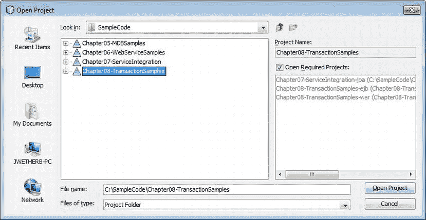


图 8-1. 打开 Chapter08-TransactionSamples 项目

该应用程序由三个模块组成：一个直接取自第 7 章的 JPA 持久化单元；一个包含本章探讨的 CMT 和 BMT 会话 Bean 的 EJB 模块；以及一个包含我们同样研究过的两个 Servlet 客户端的 Web 模块。

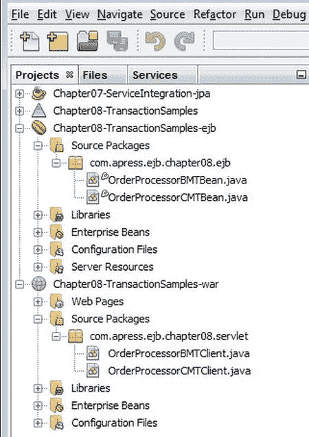

图 8-2. 观察 Chapter08-TransactionSamples 应用程序的结构

创建数据库连接

本章的示例需要数据库连接，为此我们将使用 NetBeans 和 Glassfish 捆绑提供的 Derby 数据库。如果你已经创建了`WineApp`数据库（该数据库也用于第 3 章、第 4 章和第 7 章的示例），请继续下一步。否则，请点击`Services`选项卡，展开`Databases`图标，然后在`Java DB`节点上调用“`Create Database...`”。创建一个名为“`WineApp`”的数据库，用户名和密码均为`wineapp/wineapp`：

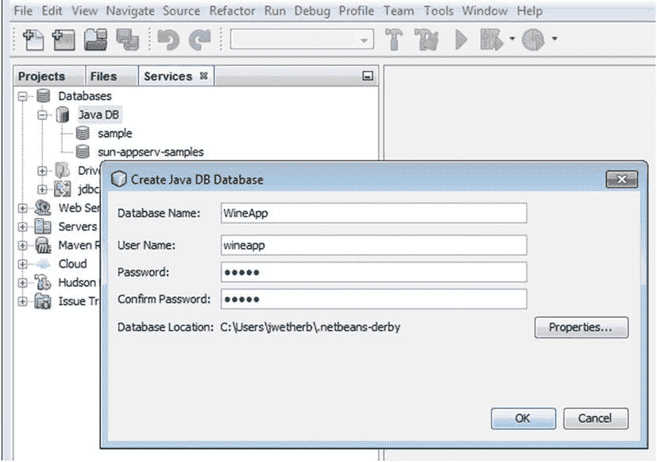

图 8-3. 创建 WineApp 数据库及连接

最后一步创建了一个数据库连接，该连接被 JPA 和 EJB 项目中的 persistence.xml 文件里的持久化单元所引用。虽然可以预先创建数据库对象（表、序列、键约束等），但我们将让 JPA 在每个持久化单元首次需要时自动创建这些数据库对象。

编译源代码

创建`WineApp`数据库后，在`Chapter08-TransactionSamples`节点上调用上下文菜单，并通过选择`Clean and Build`菜单选项来构建应用程序：

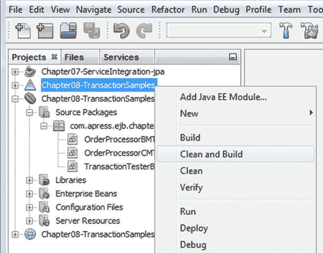

图 8-4. 构建应用程序

部署并运行客户端程序

项目源代码成功构建后，调用相同菜单并选择`Deploy`。部署完成后，调用`Run`或`Debug`菜单项来启动`OrderProcessorCMTClient` Servlet。我们已预先配置`Chapter09-TransactionSamples`项目默认运行此 Servlet。该 Servlet 将使用 NetBeans 配置的默认浏览器显示示例输出：

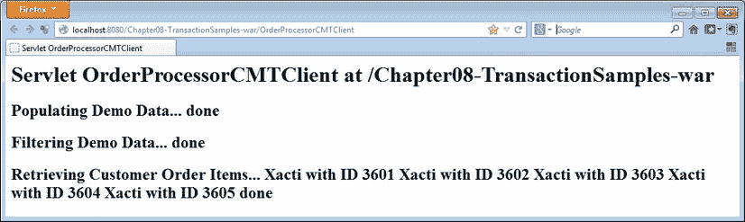

图 8-5. 运行 OrderProcessorCMTClient Servlet 的输出

如果选择调试，可以随意在`OrderProcessorCMTBean.java`会话 Bean、`OrderProcessorCMTClient.java` Servlet、JPA 实体或应用程序中的任何其他源文件中添加一些断点。

接下来，启动第二个示例`OrderProcessorBMTClient` Servlet。为此，你可以更新浏览器 URL，将`CMT`替换为`BMT`，或者更新`Chapter09-TransactionSamples`项目的属性。后一种方法是通过右键单击该项目并选择`Properties`，然后选择`Run`类别，如图 8-6 所示：

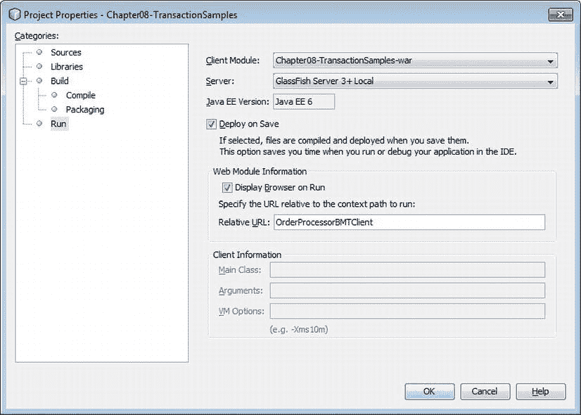

图 8-6. 配置 Chapter09-TransactionSamples 项目的运行目标

 **注意** 首次运行每个示例 Servlet 时，持久化单元所需的表将自动在 WineApp 数据库中创建。在后续运行时，你会在日志窗口中看到一些 SQL 警告和错误，这些可以忽略。这些示例中的持久化单元配置为使用`create-tables`的表生成策略，这意味着 JPA 在客户端实例化持久化单元时总会尝试创建表。一旦为持久化单元创建了模式，你可能希望通过编辑器更新 persistence.xml 文件（Chapter07-ServiceIntegration-jpa 和 Chapter09-TransactionSamples 中各有一个），将策略重置为`none`。

结论

本章定义了所有事务行为所必需的核心概念，并探讨了 EJB 服务器提供的事务特性以及企业 Bean 开发者可访问的接口。

我们首先探讨了定义事务的核心 ACID 特性——原子性、一致性、隔离性和持久性。我们介绍了 JTA，并描述了其分布式事务模型的特性和优势，包括关键的两阶段提交协议的行为。

我们研究了 EJB 服务器如何充当 JTA 事务管理器，使 EJB 能够无缝参与分布式事务，并减轻了 Bean 开发者显式将持久化或其他事务操作与事务资源绑定的需求。我们还详细介绍了 EJB 为企业 Bean 开发者提供的对这些事务服务的声明式支持，探讨了 CMT 和 BMT 两种划分方式所支持的企业 Bean，并使用了隐式和显式提交模型。对于 CMT Bean，我们描述了可用于定义 CMT Bean 方法事务行为的六种事务属性的行为及其含义。在 JPA 领域，我们探讨了事务与持久化上下文之间的关系，并解释了如何将有状态会话 Bean 与扩展持久化上下文结合使用，以支持实体在事务上下文之外解析与其他实体的关系。

随后，本章基于 Wines Online 应用程序的一个场景，研究了一些实际示例。这些示例展示了 CMT 和 BMT 划分的使用、有状态会话 Bean 上的扩展持久化上下文、回滚场景、客户端控制的事务、使用 BMT Bean 在事务上下文之外与实体交互，以及 CMT Bean 方法之间的事务上下文传播。

最后，我们提供了运行所研究的 CMT 和 BMT 示例应用程序的步骤。

在下一章中，我们将探讨一些可用于分析应用程序 EJB 特定性能的技术。通过几个常见示例，我们将演示如何设置自己的测试来分析特定的应用程序组件。

第 9 章


EJB 3 性能与测试

作为开发者，我们总是在寻找编写最高性能代码的最有效方法。多年来，我们意识到我们做出的一些假设并不总是正确的，并且我们使用的某些编程模型和技术并未达到预期的性能水平。令人惊讶的是，大多数时候，我们的期望都被那些逻辑和直觉认为最佳的模型和技术所击败。


计算机系统的性能是一个非常复杂的问题。试想一下：我们正在编写一段 Java 代码，它利用了一个名为 Java 企业版（Java EE）的基础设施，而该基础设施恰好运行在 Java 虚拟机（JVM）之上。这个虚拟机又托管在一个操作系统上，该操作系统运行在一台计算机上，这台计算机通过由硬件和软件组件构成的网络与其他计算机交互。这些层级中的每一层——网络、计算机、操作系统、JVM 以及 Java EE 服务器——都有许多可调参数，用于配置和优化其行为。在不同的使用条件下，每一层都会表现出不同的行为，这不可避免地会影响其他层级的行为。在这个相当复杂的背景下，我们就能更容易理解为什么我们的逻辑并不总是能奏效了。

归根结底，我们在进行性能陈述时不能一概而论。找出系统预期性能的唯一方法，就是在尽可能接近代码在生产环境中运行条件的场景下进行测试。

每个软件应用程序都是独一无二的。为了理解你自己应用的性能，你必须根据自己对性能的定义亲自进行测试。在某些情况下，良好的性能意味着能够支持大量用户；而在其他情况下（例如，当用户负载较小时），则仅仅意味着能够尽可能快地运行。

在本章中，我们将介绍一种方法，你可以用它对系统进行一致的性能测试。我们还会介绍一些可用于执行这些测试的工具。最后，我们将进行一次性能测试，以演示该方法及工具的使用。这套方法和工具包在两种基本情况下非常有用：

*   对完整应用进行性能测试
*   为性能而设计（考察 Java EE API 各个方面的性能成本，以及某些设计决策将如何影响整体性能）

在第一种场景中，我们将应用视为一个黑盒。我们在不同的用户负载下测试应用，并调查用户发出的每个请求的性能。然后分析数据——我们寻找那些不符合要求标准的请求，并识别出改进性能的机会。

虽然上述方法很有用，但我们的建议是，在开发周期中尽早进行性能测试。这样，你就可以利用该方法以及从中获得的数据来帮助你为性能而设计，而不是事后才进行性能测试。

本章提供的示例侧重于为性能而设计，而不是测试一个完整的应用。如果你有兴趣了解更多关于测试应用的方法以及一般的性能测试，可以参考 Peter Zadrozny 所著的 *J2EE Performance Testing with BEA WebLogic Server*（Apress, 2003）。在本章中，我们呈现了 Zadrozny 书中所述方法的一个改编版本，该版本紧密聚焦于手头的示例。

测试方法

测试方法的重点是数据测量的一致性。以下列表概述了该方法所涉及的步骤。我们将按照执行每次测试时的逻辑顺序来呈现和描述它们：

1.  *定义性能标准。*我们必须为所讨论的特定应用定义相关的性能指标，并为该指标设定一个现实的目标（例如，最大可接受的响应时间）。
2.  *准确模拟应用使用情况。*其关键方面是测试脚本的定义。这些是包含一组请求的配置文件，这些请求代表了应用的典型使用模式。
3.  *定义测试指标。*这些包括测试的持续时间、样本大小、要排除的初始数据量等。
4.  *执行测试。*

性能标准

根据应用的类型，你的关注点会在两个基本性能指标之间变化：响应时间和吞吐量。

在处理同步交互式应用时，我们定义一个最大可接受的响应时间。这是我们愿意等待从应用获得响应之前的最长时间。

对于批处理或后端应用，我们定义最小可接受的吞吐量，通常以每秒事务数（TPS）表示，但这必须基于对系统中事务具体如何定义的扎实理解。

这些指标中的每一个都彼此密不可分；然而，我们尚未能发现它们之间存在任何数学或几何关系。

我们的建议是，清晰且无歧义地定义你的性能指标，并根据明确定义的需求进行测试。不这样做无异于邀请你进行无休止的测试和调优。

由于我们将在性能测试运行期间收集数据，我们需要清楚地理解基本统计量，因此让我们更详细地审视它们。

就本书而言，我们将*响应时间*定义为客户端从发送请求到收到来自应用的响应的最后一个字节所需等待的时间长度。

我们从一次性能测试运行中收集的数据集，由构成测试脚本的每个请求的个体响应时间组成。测试脚本中的每个请求由每个模拟用户在一段时间内依次执行。我们分析的基本度量是特定请求所有用户的响应时间的算术平均值：平均响应时间（ART）。

*聚合平均响应时间（AART）*是我们在分析性能数据时广泛使用的一个度量，我们将其定义为测试脚本中每个单独请求的 ART 之和，除以该测试脚本中的请求数量。

诚然，AART 在应用性能表现方面并没有实际意义，但它确实提供了一个极好的指标，表明整个系统的负载程度。因此，我们有时将这个度量称为*负载因子*。当绘制成与并发用户数的关系图时，典型的 AART 曲线看起来就像图 9-1 所示的那样。

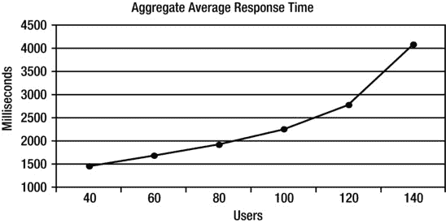

图 9-1.  典型的 AART 曲线

吞吐量并不像响应时间那样是一个明确的指标。表达吞吐量的标准方式是 TPS，理解事务在被测试的应用中代表什么是至关重要的。它可能是一个单一的查询，也可能是一组特定的查询。在消息系统中，它可能是一条单一的消息；而在基于 Servlet 的应用中，它可能是一个请求。即使对于正在测量的具体内容达成共识，所获得的吞吐量值也常常会被误解。原因在于，许多人看待这个指标的方式，就像看待“英里每小时”一样：将其视为速度的度量。实际上，吞吐量是容量的度量。


我们可以尝试用超市的类比来解释吞吐量是如何工作的。想象一下，一家超市正在举办促销活动，10 名购物者可以在 15 分钟内免费拿走他们购物车里的所有东西。超市就是应用程序，购物者类似于请求（或消息），而负责补货的超市员工则类似于系统中努力应对需求的组件。

即使所有 10 名购物者都达到了容量上限（在 15 分钟内装满购物车），也未必意味着他们拿走了超市里所有的东西。然而，随着我们增加购物者的数量，我们最终会达到一个临界点，即足够多的购物者可以在那段时间内清空超市。我们称这个点为**饱和点**，因为此时已经没有更多可用资源了。当我们继续增加购物者数量超过这个点时，过道里的拥挤会导致购物者行动能力下降（响应时间变长），最终导致吞吐量实际下降。

与 ART 类似，我们分析的基础度量指标是特定请求的所有用户的每秒请求数的算术平均值。我们称之为**TPS**。

为了分析性能数据，并且独立于特定性能测试所使用的吞吐量定义，我们使用**总事务速率（TTR）** 的概念。TTR 是测试脚本中每个请求的 TPS 测量值的总和。TTR 为我们提供了一个极好的系统容量指标。图 9-2 展示了一条典型的 TTR 曲线，它在约 100 个用户时达到饱和点。此时，曲线开始下降（例如，由于购物者过多）。

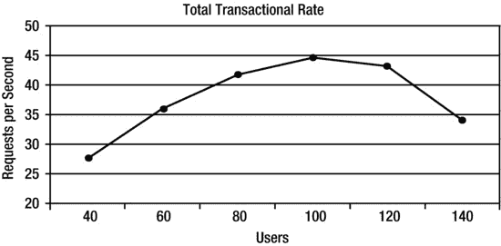

图 9-2.  一条典型的 TTR 曲线

图 9-1 中展示的 AART 曲线，是与图 9-2 中 TTR 曲线来自同一次测试运行的数据结果。如果你查看 AART 曲线，可以看到响应时间呈线性增长，直到达到 100 个用户。之后，增长变得更加剧烈。这与 TTR 曲线相吻合，后者在 100 个用户时达到饱和点。此后，应用程序的整体性能开始下降。分析这两条曲线，你可以得出结论：在该性能测试条件下，应用程序的用户上限为 100 个。

**模拟应用程序使用情况**

本方法论这一节的目标是确保我们在尽可能模拟现实的测试条件下收集性能数据。这一点在测试整个应用程序的性能时更为适用，而在为性能进行设计时则不那么重要。

对于每个应用程序，都会有多个不同的使用场景同时运行。有时，我们可以用一个测试脚本和一个请求来模拟使用情况。在其他情况下，可能需要十几个场景，每个场景都有不同数量的请求。

需要特别说明的是关于**思考时间**（也称为**休眠时间**）。这是测试脚本中每个单独请求执行之间所经过的时间。在现实生活中，思考时间可能变化很大。它可能短至几秒钟（例如，点击一个按钮进入下一页），也可能长达 5 到 10 分钟（例如，查看我们上个月在银行账户中进行的交易）。对于性能测试，我们采用了两种基本策略：

*   **使用真实的思考时间**：这种情况用于对完整、可运行的应用程序进行性能测试时。
*   **使用零思考时间**：这种情况用于进行更通用的调查性测量时，例如比较编程技术。这样做的后果是我们不是在现实的条件下进行测试。然而，我们可以进行精确的比较测量，一旦我们从这些结果中选出了最佳方案，我们就可以使用真实的思考时间进行测试。

**定义测试指标**

该方法论基于每次测试运行使用固定数量的用户。一个性能测试由多次测试运行组成，通常每次后续测试运行都会增加用户负载。有些人倾向于在单次测试运行期间逐步增加用户数量。我们认为这会引入一个新的变量，可能对结果产生负面影响，并且从寻找最大用户负载的角度来看，这在统计上是不正确的。

第一步是找到一个具有代表性的并发用户数（下限），可以以规律的方式增加，直到达到应用程序的饱和点（上限）。我们通常会在上限之上再进行几次额外的测试运行，只是为了更好地理解应用程序的行为（或异常行为）。

不幸的是，没有一门精确的科学可以预先确定上限。我们通常会选择一个随机的用户数，然后进行几次测试运行，其中用户数高于和低于这个初始随机选择，并分析结果以确定我们应该努力的方向——是增加还是减少用户数。

第二步是定义样本大小，即测试运行将持续的时间长度。为了选择实际的样本大小，我们必须在两个相互矛盾的需求之间达成妥协。第一个是我们希望有足够的数据，使得样本在统计上具有显著性。第二个是希望测试尽可能短，因为我们有很多测试运行要做，不想在上面花费太多时间。

为了确定样本大小，我们使用用户上限进行一次测试运行，持续时间比平时更长。然后我们绘制 AART 随时间变化的曲线并进行分析。我们寻找曲线上相当稳定的一段。

另一点需要说明的是数据排除。当你刚开始测试时，响应时间通常高于正常水平。这是因为构成应用程序的所有子系统都需要一点时间来加速。例如，JVM 中的优化器需要几分钟来优化运行中的代码。数据库的缓存也是如此，它需要一点时间才能变得有用（应用程序的其他组件也是如此）。

这些最初出现的异常高的响应时间只会影响生产应用程序中的最初几个用户，而生产应用程序通常会运行数周。然而，在我们的案例中，我们只测试几分钟，这些结果会对我们的样本结果产生负面的偏差。因此，我们排除收集到的前几组数据，并在曲线稳定后开始采样。

因此，样本大小将从实际测试运行开始后的某个时间点开始，并持续一段时间，这段时间为我们提供足够的数据，使其在统计上具有显著性。

接下来是评估测试结果准确性的问题。根据所进行的性能测试类型，你可以使用两种不同的方法，以高置信度来衡量准确性。

对于涉及完整应用程序的性能测试，我们通常计算以下指标，我们称之为**样本质量**：

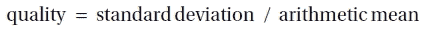

我们通常将此公式应用于收集到的 AART 数据。


 **提示** 根据我们的经验，可接受的质量数值范围在 0.06 到 0.2 之间。当质量数值超过 0.25 时，我们会仔细分析所有可用数据，以找出样本质量如此低下的原因。有时，这会导致我们丢弃该次测试运行所生成的数据。

在进行以性能设计为目标的测试时，更具体地说，当思考时间为零时，我们会使用另一种称为*校准*的方法。在此过程中，我们使用用户上限执行三次测试运行。然后，我们比较每次测试运行的 AART 和 TTR 结果。比较以百分比形式进行，所有数值中的最大差值即被视为性能测试的误差范围。

现在我们已经描述了所有的准备工作，接下来可以描述实际的测试运行了，这些运行将为我们提供执行分析和得出性能测试结论所需的数据。实际的测试运行是相当机械和枯燥的过程：你从使用用户下限进行一次测试运行开始，然后增加用户数量，再进行一次测试运行，依此类推，直到达到用户上限。如前所述，你可能还需要进行几次额外的测试运行，其中会超过用户上限。

由于该方法的基础是一致性，你必须重置或重启构成应用程序的每个组件或子系统。在我们的案例中，这包括数据库和 Java EE 服务器。

我们将在本章后面部分介绍一个实施该方法的实际示例，以说明如何使用它。

The Grinder

*The Grinder* 是一个基于 Java 的负载测试框架，在 BSD 风格的开源许可下免费提供。*The Grinder* 及其源代码、文档、辅助模块、测试脚本等更多内容，都可以在 `http://grinder.sourceforge.net` 找到。还有一些邮件列表，你可以加入以参与 Grinder 社区。

*The Grinder* 功能极其强大，同时又易于使用，是一个轻量级的工具包。它允许你通过测试脚本在多台机器上模拟用户和行为。它由以下部分组成：

*   一个工作进程，用于解释用 Jython 编写的测试脚本，并使用多个工作线程执行测试，每个线程模拟一个用户。
*   一个代理进程，用于管理工作进程。如果你在多台计算机上运行模拟用户，则每台计算机需要一个代理进程。
*   控制台，用于在协调其他进程的同时整理和显示统计数据。

使用 *The Grinder* 进行的*性能测试*是测试运行的集合，可以包含一个或多个*测试脚本*。*测试运行*是测试脚本的连续顺序执行。测试运行可以持续特定的循环次数或特定的时间段。*循环*是测试脚本的单次执行。

 **注意** 我们所说的*循环*在 *The Grinder* 的文档中被定义为 *run*，我们认为这容易造成混淆。

测试脚本用于模拟应用程序的使用情况。测试脚本代表你想要模拟的使用场景。一个测试脚本包含一个或多个*请求*，这些请求模拟了特定场景的用户与应用程序的典型交互。

 **注意** 同样，为避免混淆，我们使用*请求*一词代替 *The Grinder* 文档中定义的 *test*。

Grinder 测试脚本是一个 Jython 程序，可以包含某些逻辑来修改默认行为（即请求的顺序执行），例如，根据已执行请求的响应来执行某些请求。

测试脚本可以手动编写，或者，如果模拟用户通过 HTML 界面与应用程序交互，也可以录制。TCP 代理模块可用于实现此目的。该模块是 *The Grinder* 发行版的一部分。代理的 HTML 插件过滤器允许你通过 Web 浏览器记录与应用程序的交互。有关如何使用此功能的详细信息，请参阅文档。

除了执行 URL 之外，*The Grinder* 还可以在测试脚本的请求中执行 Java 代码。这为你提供了模拟胖客户端（例如基于 Swing 的客户端）的灵活性。

每个代理进程都与控制台建立连接以接收命令（例如 start、stop 和 reset），并将这些命令传递给其工作进程。每个工作进程都与控制台建立连接以报告统计数据。

除了控制台上显示的统计数据外，对于每次测试运行，每个工作进程都会将日志信息和最终统计摘要写入一个文件名以 `out` 开头的文件中。错误信息会写入一个文件名以 `error` 开头的文件中。如果在测试运行期间没有发生错误，则不会创建错误文件。每个已执行请求的详细统计信息会写入一个文件名以 `data` 开头的文件中。这些文件遵循命名约定，除了我们描述的关键词外，文件名还包含托管工作进程的计算机名称和工作进程的编号（因为你可以有多个工作进程）。

修改 `grinder.properties` 配置文件中的值可以轻松改变 *The Grinder* 的行为。你最常修改的属性很可能如下：

*   `grinder.threads`：此属性指定将执行指定测试脚本的模拟用户数量。
*   `grinder.runs`：此属性指定模拟用户顺序执行测试脚本的次数（循环次数）。如果值为零，则将无限执行。
*   `grinder.consoleHost`：运行 Grinder 控制台的计算机名称或 IP 地址。
*   `grinder.logProcessStreams`：将此属性设置为 `true` 将提供关于每个模拟用户执行的极其详细的信息。这些信息会出现在 `out` 文件中。这在初步运行期间很有用，但我们强烈建议你在所有其他运行中将其设置为 `false`，因为它会降低测试运行的性能。
*   `grinder.logDirectory`：此属性指定你希望放置前面描述的三个日志文件的目录。
*   `grinder.script`：这是要执行的测试脚本的文件名。

还有更多可用的属性。请查阅 Grinder 文档以获取完整的属性列表。

测试应用程序

我们用于性能测试的测试应用程序是 第 7 章 中开发的集成 Wines Online 后端应用程序的一个子集。用户界面使用 JavaServer Faces (JSF) 开发。图 9-3 显示了 JSF 页面，该页面在列表框中展示了所有可用葡萄酒的目录。用户可以选择他们想要的葡萄酒商品，在输入文本框中输入数量，然后点击“添加到购物车”按钮。用户可以重复相同的过程来添加更多葡萄酒，最后他们可以点击“提交订单”按钮。

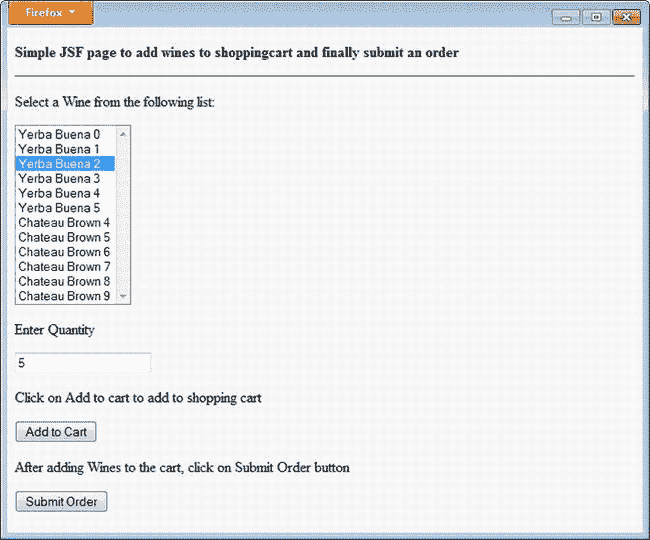

图 9-3. 葡萄酒商店 JSF 应用程序


图 9-4 展示了 JSF 应用与后端葡萄酒商店应用之间的交互。当从浏览器启动 JSF 应用时，会调用`getWineDisplayList()`方法（该方法在托管 Bean 中使用了注入的 EJB）。该方法通过注入的`WineFacade` EJB 上的`findAll()`方法检索所有可用的葡萄酒列表。初始 JSF 页面会显示检索到的葡萄酒列表。当用户添加一个葡萄酒商品并点击“添加到购物车”按钮时，会调用`ShoppingCart`会话 Bean 中的`addWineToCart()`方法，创建一个新客户并将该葡萄酒添加到客户的购物车商品中。仅在首次调用`addWineToCart()`时才会创建客户。当用户最终从客户端应用提交订单时，会调用`ShoppingCart`会话 Bean 中的`processOrder()`方法，该方法会创建一个新的客户订单，将所有购物车商品作为订单商品添加到订单中，删除购物车中的商品，并最终扣减库存。

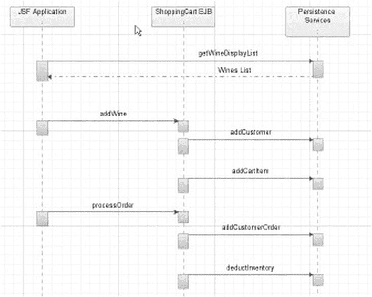

图 9-4.  葡萄酒商店应用组件与服务交互

图 9-5 展示了 Java 持久化 API（JPA）实体、Java 类之间的继承模型以及它们之间的关系。`BusinessContact`实体被`Customer`和`Supplier`实体继承。`Customer`实体被`Individual`和`Distributor`实体继承。`InventoryItem`、`CartItem`和`OrderItem`实体继承自`WineItem`实体。葡萄酒商店持久化单元还包含这些实体之间不同类型的关系（包括一对一、一对多和多对多），这些关系在测试应用中得到了实践。名称以`List`结尾的关系字段是 0..*属性；其他所有字段都是单值属性。这些实体中使用的关系映射已在第 3 章和第 4 章中介绍过。

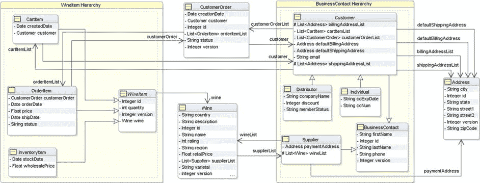

图 9-5.  葡萄酒商店领域模型

对于我们将要运行的性能测试，之前讨论的所有组件（JSF 应用、`ShoppingCart`和`WineFacade`会话 Bean 以及持久化单元中的 Java 类）都保持不变。两次测试之间的唯一区别在于领域模型 JPA 实体中指定的对象/关系（O/R）映射注解，以及这些 Java 类所映射到的数据库模式。第一次测试使用了`JOINED`实体继承策略，其中两个根实体（`BusinessContact`和`WineItem`）映射到层次结构中的根表，所有子实体的表都连接到该根表。图 9-6 展示了使用`JOINED`继承策略映射持久化 Java 类所使用的数据库模式。

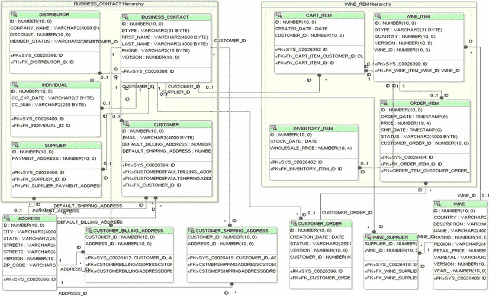

图 9-6.  JOINED 实体继承策略的数据库模式

在第二次测试中，我们使用了`SINGLE_TABLE`实体继承策略，其中每个类层次结构中的实体都映射到单个表。图 9-7 展示了用于映射第二个测试用例的数据库模式。

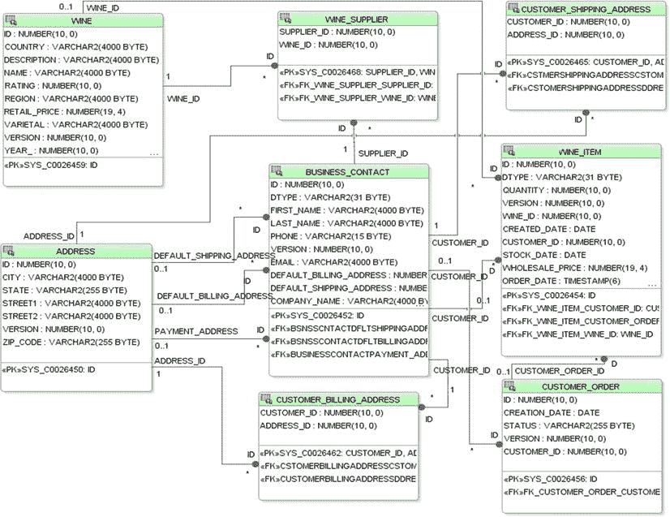

图 9-7.  SINGLE_TABLE 实体继承策略的数据库模式

 **注意**  继承策略在第 4 章中有详细说明。

性能测试

按照前面描述的方法，并使用刚刚描述的测试程序，我们将着手比较继承模型的任务，以找出在以下条件下哪种模型最佳。

测试环境

我们在云端设置了一台测试机器，拥有八个核心和 8GB 内存。它运行着一个 GlassFish 服务器实例（版本 3.1.2.2 – build 5）。测试应用使用了 Derby 数据库，该数据库也运行在这台服务器上。我们从笔记本电脑上运行*The Grinder*，这台笔记本电脑并不在运行测试机器的数据中心内，因此所有流量都通过互联网传输。通常我们不会这样做，因为我们更倾向于在所谓的无菌条件下工作；也就是说，测试网络上唯一的流量就是测试本身产生的流量。然而，在进行了多次初步测试后，我们发现测试的误差幅度非常低（1%），因此我们决定继续以这种方式工作。

测试计算机除了运行操作系统默认进程外，只运行测试所需的相应软件。我们对所有涉及的软件都使用默认设置。我们意识到通过微调这些组件可以获得更好的性能，但这超出了本书的范围。

测试脚本

正如本章前面所述，我们的想法是创建一个尽可能贴近真实应用使用情况的测试脚本。由于这是一个面向性能设计的测试，我们使用了一个大致类似于应用典型使用概况的测试脚本：

1.  用户访问葡萄酒应用网站（首页）。
2.  用户选择一种葡萄酒的几瓶。
3.  用户选择另一种葡萄酒的几瓶。
4.  用户结账。

由于在本例中，我们比较几种不同的继承模型以了解哪种最适合我们的情况（面向性能设计），因此我们使用了零思考时间。

诚然，使用 Derby 运行这组性能测试并不十分现实，但这里的目的是提供一个关于如何使用该方法的示例。我们的意图是让读者在自己的应用环境中，将此过程应用于测试自己的应用。

TCP 代理模块的输出可以重定向到一个文件。这个输出是一个 Jython 程序，其中包含了记录测试的高级流程，并且易于人类阅读。正是在这里，我们修改或删除`grinder.sleeptime`指令以消除思考时间，或者更改运行应用的目标机器的名称或 IP 地址。我们将在下一节详细审查实际的`wine.py`测试脚本。

设置

GlassFish 的安装已在第 1 章的“入门”部分中说明，因此我们在此不再赘述。您只需确保 GlassFish 服务器已启动并运行，并且应用已部署了必要的资源（JDBC 连接池和资源）。启动 GlassFish 服务器的一种方法是在命令 shell 中切换到`%GLASSFISH_HOME%/bin`目录，并执行以下命令：

```
asadmin start-domain
```

要停止 GlassFish 服务器，请执行以下命令：

```
asadmin stop-domain
```

在整个性能测试过程中，我们使用以下命令重启 GlassFish 服务器：

```
asadmin restart-domain
```

数据库


这两项测试各自需要独立的数据库连接，以确保数据库模式不会冲突。每种继承模式映射的表虽然名称相似，但结构不同。为尽量降低安装要求，我们在测试中使用了 GlassFish 自带的 Derby 数据库。项目已预先配置为使用 Derby，若要开箱即用，你需要创建 Derby 数据库。关于如何在 Derby 中创建新数据库（及关联连接）的步骤，请参考第 3 章中的“创建数据库连接和示例模式”一节。对于这些测试，你需要创建一个用户为 `wineapp_join/wineapp_join` 的 `WineAppJoin` 数据库，以及一个用户为 `wineapp_st/wineapp_st` 的 `WineAppST` 数据库。

**配置连接到自有数据库**

你可能希望在运行测试时使用 Oracle 或其他生产级数据库。为此，你需要更新每个测试的 JPA 项目（`Chapter09-PerformanceJoined-jpa` 和 `Chapter09-PerformanceSingleTable-jpa`）中的 `persistence.xml` 文件，修改连接信息以指向你的数据库。首先，按照上面 Derby 的方式，为每个测试创建一个独立的数据库连接。对于 Oracle，我们建议你先在数据库中创建新的数据库用户 `wineapp_join/wineapp_join` 和 `wineapp_st/wineapp_st`。然后，在 NetBeans 中转到“服务”选项卡，右键单击“数据库”，选择“新建连接…”为每个用户创建一个新的数据库连接。

创建好测试数据库连接后，你可以通过每个 JPA 项目的设计编辑器选项卡，在 `persistence.xml` 文件中通过“JDBC 连接”组合框选择相应的“Joined”或“SingleTable”连接来进行编辑。

类似地，你还需要更新每个测试的 EJB 项目（`Chapter09-PerformanceJoined-ejb` 和 `Chapter09-PerformanceSingleTable-ejb`）中 `glassfish-resources.xml` 文件里的 `<jdbc-connection-pool>` 条目的 `<property>` 元素，以更新连接信息。（NetBeans 7.2.1 不提供通过下拉列表进行此操作的编辑器，但你可以轻松地剪切/粘贴指定连接详细信息的 `<property>` 元素。）请务必保留 `<jdbc-resource> jndi-name` 属性为 `jdbc/wineAppJoin`，对于 `SINGLE_TABLE` 测试则为 `jdbc/wineAppST`，因为 EJB 项目中的持久化单元会通过名称引用此资源。

**The Grinder**

下一步是在专门用于模拟用户负载的计算机上安装 *The Grinder*。从 `http://grinder.sourceforge.net` 下载 *The Grinder* 后，你只需将其解压到所需目录即可。我们将其安装在笔记本电脑的 `C:\grinder` 目录中。完成后，你可以从下载包中提取与 Grinder 相关的文件。这些文件位于 `grinder` 目录中。我们将这些文件安装在 `C:\SampleCode` 目录中。共有三个文件：`grinder.properties`、`joined.py` 和 `single.py`。后两个文件是实际的测试脚本。

我们先来查看第一个脚本 `grinder.properties`，如清单 9-1 所示。

***清单 9-1.***  grinder.properties

```
