# A method for each recorded page.
  def page1(self):
    """GET WineStoreJoined.jsp (request 101)."""
    result = request101.GET('/Chapter09-PerformanceJoined-war/faces/WineStoreJoined.jsp')
    self.token_j_id_id17 = \
      httpUtilities.valueFromHiddenInput('j_id_id17') # 'j_id_id17'
    self.token_javaxfacesViewState = \
      httpUtilities.valueFromHiddenInput('javax.faces.ViewState') # '9131085258160566843:4053788772783974794'

return result
```

**运行模拟用户**

你需要根据 Grinder 软件的安装位置修改以下命令的类路径。不过，要执行 Grinder，你只需要以下简单的命令。在启动 Grinder 控制台之前，请勿运行此命令。

```
java -classpath \grinder\lib\grinder.jar net.grinder.Grinder
```

**Grinder 控制台**

启动控制台的另一种方法是，将目录切换到 `C:\grinder\lib`，然后执行以下命令来启动控制台：

```
java –classpath grinder.jar net.grinder.Console
```

控制台左上角有几个按钮，用于指示 Grinder 代理启动或重置工作线程（即模拟用户）。将鼠标悬停在按钮上时，会显示该按钮功能的描述。图 9-8 显示了性能测试执行期间的 Grinder 控制台及其通常显示的信息。

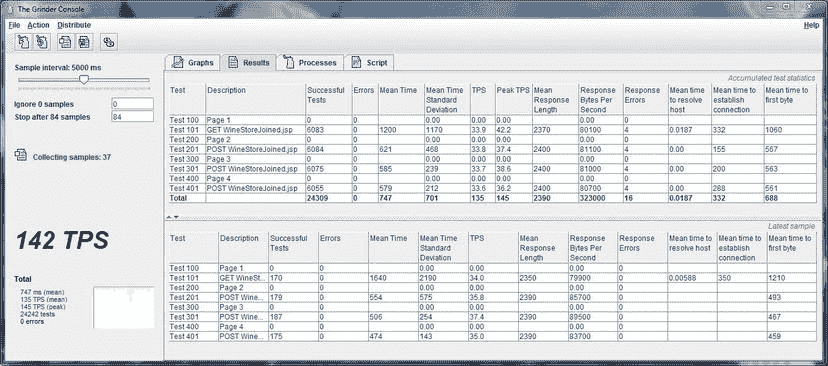

图 9-8.  Grinder 控制台

为了确保一切正常，请先使用一个模拟用户运行一个周期进行快速测试（配置数据库后，请参见上面的“数据库”部分）。步骤如下：


1.  使用以下 URL 重置数据库：`http://yourserver:port/Chapter09-PerformanceJoined-war/ResetJoinedData`
2.  重置 Glassfish 服务器。
3.  启动 Grinder 控制台：`java -classpath` <classpath_to_the_grinder></classpath_to_the_grinder>`net.grinder.Console`
4.  编辑 `grinder.properties` 文件，并确认你只设置了一个用户和一个循环。
5.  通过输入以下命令启动 Grinder 代理和 Grinder 控制台：`java -classpath` <classpath_to_the_grinder></classpath_to_the_grinder>`net.grinder.Grinder`
6.  点击 Grinder 控制台上的启动按钮。控制台上不会显示任何结果，因为它只会运行一个循环。
7.  检查你启动 Grinder 代理的窗口。当它显示已完成并正在等待控制台信号时，点击 Grinder 控制台上的重置按钮。
8.  进入日志目录，查看以 `out` 开头的文件。该文件包含整个测试运行的摘要，包括统计数据。如果出现问题，此文件和错误文件将为你提供解决问题所需的信息。

在为每个测试运行完这些步骤一次后，你可能需要更新每个测试应用的两个 JPA 项目中的 `persistence.xml` 文件，以关闭表生成。我们保留此标志为开启状态，以便在首次运行 `ResetJoinedData/ResetSingleTableData` servlet 时创建表。在运行每个脚本一次以创建持久化单元的表之后，你可以避免因后续每次运行时表已存在而产生的开销（以及发出的警告）。

现在一切就绪，你可以继续下一步了。

初步测试

这第一组测试的目的是熟悉应用程序及其行为，并发现测试脚本或应用程序可能存在的任何潜在问题。由于我们正在测试继承的两种不同实现，因此对于这些初步测试，使用哪种实现并不重要，所以我们选择使用多表实现来进行初始测试。我们已经使用一个用户运行了一个循环的测试。现在，我们可以继续进行无限循环的测试运行，并让它运行几分钟。然后，我们将继续测试多个并发用户运行一个循环的情况。这样做是为了确保应用程序和测试脚本能够正确处理并发。我们通常会选择 10 个用户。之后，我们将测试 10 个用户无限循环运行几分钟。一旦这些测试成功完成，我们就知道测试脚本和应用程序运行正常，可以准备进行下一步了。

我们旨在选择具有代表性的用户数量，进行大约六次快速测试运行，以便清晰地展示随着用户负载增加，应用程序的行为变化。

在处理完整应用程序的性能测试时，我们通常会寻找达到或超过最大可接受响应时间时的用户上限。由于这是一次面向性能设计的测试，并且我们在测试脚本中没有使用任何思考时间，因此我们将专注于找到应用程序达到饱和点的用户数量。策略（如果可以这样称呼的话）是随机选择一个用户数量。

测试运行时间很短，因为我们不需要精确的上限数字，只需要一个近似值。在这种情况下，我们选择从 100 个并发用户开始，并将从测试运行中收集 2.5 分钟的数据。由于我们使用的采样间隔是 5 秒，我们只需在 Grinder 控制台的“永久收集样本”框中输入 **30**。输入 30 后，该框的标题将变为“30 个样本后停止”。为简单起见，我们不会排除初始数据。为此，我们在 Grinder 控制台的“忽略样本”框中输入 **0**。收集到的统计数据将呈现略高于正常值的数值。这不是问题，因为这些测试只是初步的。遵循最佳实践，我们在每次性能测试前都会重置数据库和 Glassfish 服务器。

我们开始第一次测试运行，得到的 AART 为 737 毫秒。

 **注意**   你可以在控制台左列底部（以图形方式显示 TPS 的方块的左侧）找到此信息，其标题为“(mean)”。

TTR 为 137（你可以在找到 AART 的同一位置找到此信息，其标题为“TPS (mean)”）。接下来，我们将尝试使用 120 个用户。为此，我们修改 `grinder.properties` 文件，将 `grinder.threads` 属性更改为 120。我们进行下一次运行，得到的 AART 为 911 毫秒，TTR 为 133。由于 120 个用户的 TTR 低于 100 个用户，我们知道饱和点大约在 100 个用户或更少，因此我们的下一次测试运行将使用 80 个用户。

在 `grinder.properties` 文件中更改用户数量后，我们开始测试运行。我们得到的 AART 为 593 毫秒，TTR 为 136。这些结果表明饱和点大约在 100 个用户左右，因此我们将以此作为上限。（选择 100 个用户作为初始测试点，真是幸运的猜测！）

基于此信息，我们选择 40 个用户作为下限，100 个用户作为上限。测试运行将分别使用 40、60、80、100、120 和 140 个用户进行。这将为我们提供六个参考点，应该能清晰地展示应用程序的行为。

样本量

现在我们已经选择了并发用户的上限和下限，我们需要确定测试应该运行多长时间。这相当简单。我们只需要执行一次测试运行，其运行时间要比我们之前选择的 2.5 分钟更长。根据我们对此类测试的经验，大约 7 分钟通常是一个不错的选择。测试运行将使用上限，即 100 个用户。

测试运行结束后，我们获取由 *The Grinder* 生成的数据文件，该文件包含每次测试中每个模拟用户的单独响应时间。此文件可以在日志目录中找到，文件名以 `data` 开头。接下来，我们绘制一条曲线，显示测试时间段内的 AART。此测试运行的结果如图 9-9 所示。在这里，我们可以看到响应时间曲线在测试开始后约 60 秒处趋于稳定。


图 9-9.  样本量分析图表，绘制测试时间段内的 AARP

我们还可以看到，曲线在 60 秒标记后保持相当稳定，在 240 秒标记后极其稳定。因此，我们决定测试运行将持续 240 秒（4 分钟——既好又短），其中我们将忽略前 60 秒。由于我们在 Grinder 控制台中将样本大小定义为 5 秒，这意味着我们将忽略 12 个样本并收集 36 个样本。

校准


现在我们来计算性能测试的准确度。由于我们将基于三次使用上限的测试运行来进行，因此只需额外进行两次运行。我们可以利用前一次运行中的适当数据来确定样本量。

 **提示**   根据我们的经验，使用此方法产生的典型误差范围在 5%到 10%之间。当测试脚本中存在思考时间时，误差范围往往会增大。在这些情况下，数值高达 30%的情况并不罕见。

表 9-1 和 表 9-2 显示了从测试运行中收集到的 AART 和 TTR 结果的差异。

表 9-1. 误差范围 (AART)

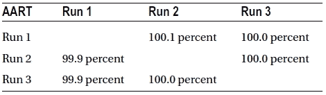

表 9-2. 误差范围 (TTR)

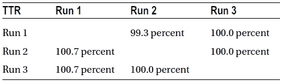

这些表格中最大的差异是 100.7%（例如，TTR 表中运行 2 与运行 1 的对比）和 99.9%（例如，AART 表中运行 3 与运行 1 的对比）。因此，本次性能测试的官方误差范围为 0.7%，这是一个非常好的数值。

实际测试运行

现在我们已经完成了所有准备工作，可以开始运行正式测试了，这些测试将让我们了解哪种继承模型在极端压力条件下表现最佳。

性能测试的这一部分比较机械且相当枯燥。第一步是启动 Grinder 控制台，并确保测试参数设置正确。首先，我们验证采样间隔是否设置为 5000 毫秒。接下来，我们检查是否忽略了 12 个样本（每个样本 5 秒，总计我们之前选择的 60 秒）。然后，我们选择在收集 36 个样本后停止数据收集（每个样本 5 秒，总计我们之前选择的 180 秒）。

每次测试运行需要遵循的步骤如下：

1.  根据继承模型，使用相应的 URL 重置数据库：

```
    http://yourserver:port/Chapter09-PerformanceJoined-war/ResetJoinedData

http://yourserver:port/Chapter09-PerformanceSingleTable-war/ResetSingleTableData
    ```

2.  重启 GlassFish 服务器。
3.  编辑 `grinder.properties` 文件，并修改用户数量。
4.  点击 Grinder 控制台上的“开始捕获统计信息”按钮。这将清除前一次运行的所有结果。
5.  点击 Grinder 控制台上的“启动进程”按钮。
6.  等待数据收集完成。一个很好的指示是，当左侧面板中央的线条从绿色的“正在收集样本：XX”变为红色的“正在忽略样本：XX”时。
7.  点击 Grinder 控制台上的“重置进程”按钮。此步骤实际上会停止模拟用户的执行。
8.  点击“保存结果”按钮。提供一个描述性的文件名，并保存控制台上显示的结果以供后续分析。
9.  回到此列表的开头重新开始。

完成 `JOINED` 表继承策略的所有测试运行后，您可以继续为 `SINGLE_TABLE` 继承方案的一组测试运行进行所有准备工作。

如前几节所述，我们两个测试之间的区别在于 O/R 映射注解和数据库模式。一旦应用程序准备好进行下一组测试运行，只需重复您为上一组测试运行所做的步骤即可。

分析结果

我们必须首先声明，本章呈现的结果并非旨在推崇某一种继承方法优于另一种。它们仅用于说明如何应用该方法以及如何使用 Grinder 工具包。正因如此，我们在进行此性能测试时，对哪种继承模型表现更好没有任何预期。

我们首先回顾 100 个用户的多表继承测试运行结果，以此开始分析。这些结果显示在表 9-3 中。

表 9-3. 多表，100 用户结果

| 100 用户 | ART | TPS |
| --- | --- | --- |
| 请求 1 | 1,240 | 34.1 |
| 请求 2 | 594 | 34.1 |
| 请求 3 | 549 | 34.1 |
| 请求 4 | 543 | 34.1 |
| 总计 | 732 | 136 |

有两件事应该会很快引起您的注意。第一是获取应用程序主页所需的时间很长——略超过 1 秒——尤其是与测试脚本中所有其他响应时间相比。这可以解释为，在设置主页时，虽然简单，但涉及将数据从服务器发送到浏览器，这通常被认为比更新购物车更耗费资源。接下来应该引起您注意的是结账过程持续不到 1 秒。虽然这对于一个验证库存并执行其他与结账相关操作的流程来说是一个理想的时间，但事实是这个测试系统上的库存并不多。

查看 100 个用户的单表继承模型测试运行结果（显示在表 9-4 中），您可以看到类似的行为模式，因此至少是一致的。

表 9-4. 单表，100 用户结果

| 100 用户 | ART | TPS |
| --- | --- | --- |
| 请求 1 | 1,320 | 33.4 |
| 请求 2 | 580 | 33.4 |
| 请求 3 | 540 | 33.5 |
| 请求 4 | 543 | 33.6 |
| 总计 | 745 | 134 |

这部分分析仅限于审查每个单独的请求，并且通常使用在用户上限的测试运行中收集的结果来完成。下一步是分析我们选择的所有用户负载下的 AART 和 TTR。我们从使用多表继承模型的结果开始，如表 9-5 所示。

表 9-5. 多表，所有用户结果

| 用户 | AART | TTR |
| --- | --- | --- |
| 40 | 291 | 137 |
| 60 | 438 | 137 |
| 80 | 584 | 137 |
| 100 | 732 | 136 |
| 120 | 919 | 130 |
| 140 | 1,120 | 125 |

从该表可以看出，饱和点从性能测试一开始就达到了，这相当不寻常。这意味着继承模型从一开始就吞噬了所有可用资源。

让我们回顾一下单表继承模型的结果，以便进行一些比较。它们显示在表 9-6 中。

表 9-6. 单表，所有用户结果

| 用户 | AART | TTR |
| --- | --- | --- |
| 40 | 296 | 135 |
| 60 | 446 | 135 |
| 80 | 592 | 134 |
| 100 | 745 | 134 |
| 120 | 908 | 132 |
| 140 | 1,120 | 125 |

我们再次看到从一开始就出现相同的饱和模式。这可以归因于 Derby 数据库和内存使用情况。还可以看到，总事务速率和聚合平均响应时间都略低于多表继承模型。

这种比较可以更清晰地体现在图 9-10 和图 9-11 所示的图表中，其中图 9-10 包含两组 AART 结果的比较；图 9-11 包含 TTR 的比较。

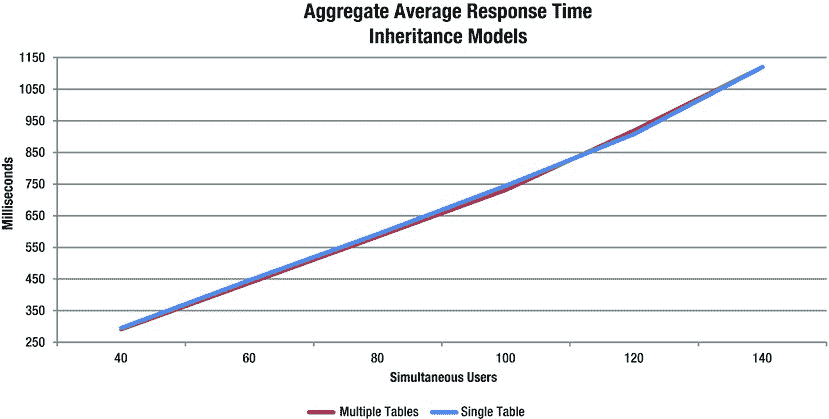

图 9-10.  AART 比较

在图 9-10 中，聚合平均响应时间 (AART) 几乎相同，因此我们必须仔细查看总事务速率 (TTR)，以尝试理解在我们正在进行的性能测试条件下，哪种模型更有利。


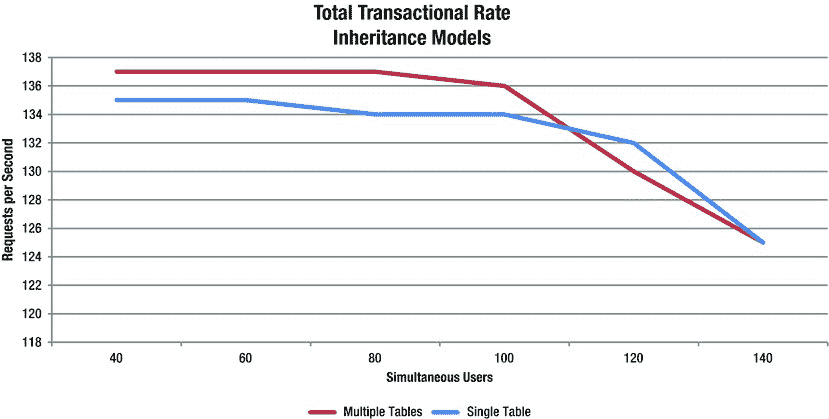

图 9-11.  TTR 对比

在图 9-11 中，单表模型不仅比多表模型更快达到饱和点，而且其总事务率也略低于多表模型。如您所见，单表模型在 60 个并发用户时开始性能下降，而多表模型则在 80 个并发用户时才开始下降。然而，多表模型出现大幅下降的时间更早。根据收集的数据，我们可以得出结论：`JOINED`（即多表）继承模型在高压力条件下表现略优。

结论

在本章中，我们介绍了 *The Grinder*（一种执行性能测试的方法论）以及一个用于生成性能测试负载的工具包。我们通过一个使用该方法和工具包的性能测试示例进行了讲解。具体来说，我们讨论了性能标准，并回顾了两个性能指标：响应时间和吞吐量。我们涵盖了应用程序使用情况的模拟，讨论了测试脚本和思考时间。我们还涉及了测试指标的定义，例如用户数量、样本大小和数据排除，以及如何确定性能测试的准确性。

为了说明该方法的使用，我们使用前几章创建的应用程序进行了一个详细的案例研究，并比较了两种继承策略。

在下一章中，我们将探讨上下文与依赖注入（CDI），以及如何利用它来增强 EJB 和应用程序开发体验。

第 10 章


上下文与依赖注入

在本章中，我们将讨论*上下文与依赖注入*（CDI）。CDI 提供了强大的服务，用于将 Java EE 框架的各个层*粘合*在一起。JSR 299 中定义的*Java 平台上下文与依赖注入*的第一个公开草案于 2008 年发布。在最初的开发阶段，JSR 299 规范被称为 *Web Beans*。在规范更名为上下文与依赖注入后，最初的参考实现被命名为 *Web Beans*。在两种不同上下文中使用相同名称 Web Beans 在社区成员中造成了一些混淆，这导致参考实现从 Web Beans 更名为 *Weld*。CDI 建立在拦截器规范（JSR 318）、托管 Bean 规范（JSR 316）和 Java 依赖注入规范（JSR 330）之上。

您可能会想，为什么我们在本书中包含了关于 CDI 的一章。这有两个原因：首先，最初在 EJB 中引入的依赖注入行为在 CDI 中得到了增强；其次，CDI 通过为应用程序提供*上下文*功能来补充 EJB。EJB 则通过为应用程序提供安全、事务管理和可伸缩性等企业级服务来补充 CDI。如果应用程序开发者*明智地*决定何时使用 CDI、EJB 或两者兼用，那么最终生成的应用程序将既灵活又具有可伸缩性。

完成本章后，您将深入了解以下领域：

*   CDI 基础
*   CDI 与 EJB 的关系
*   部署和执行 CDI 客户端

什么是 CDI？

在 CDI 出现在 Java EE 领域之前，Java EE 技术的三个层——即 Web 层、业务层和持久化层——之间没有一种简单的方式能够以松散耦合但类型安全的方式相互交互。Web 层没有适当的机制来支持事务，因为它专注于呈现内容，并且对事务资源的访问有限。CDI 服务有助于统一企业 JavaBean（EJB）和 JavaServer Faces（JSF）编程模型。CDI 服务允许企业 JavaBean 在 JavaServer Faces 框架中用作托管 Bean。CDI 还为访问事务资源提供了良好的支持，这有助于使用 Java 持久化 API 轻松创建 Web 应用程序。CDI 弥合了这一差距。使用 CDI，Web 层可以直接与业务层和持久化层中的 Bean 进行交互。这就是 CDI 最初被命名为 Web Beans 的原因。

图 10-1 展示了 CDI 出现在 Java EE 领域之前 Java EE 应用程序的架构，而图 10-2 展示了 CDI 出现后 Web 层和业务层如何交互。

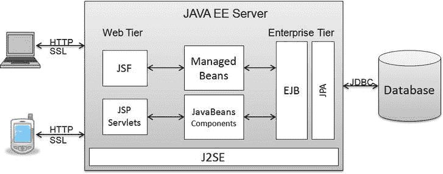

图 10-1.  CDI 之前的 Java EE 应用程序架构

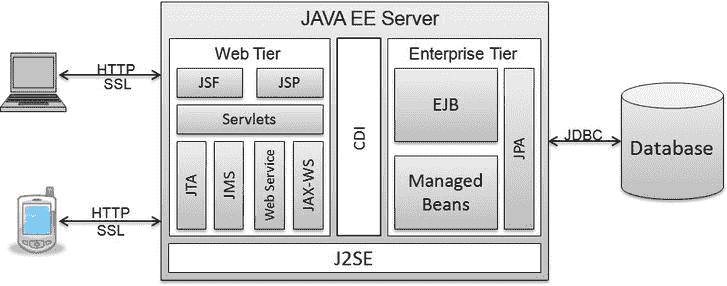

图 10-2.  CDI 应用程序架构

CDI 提供的两个重要特性体现在其名称中：

*   **上下文**：涉及将有状态组件（如有状态会话 Bean）绑定到定义明确的作用域。有状态组件是指在多次调用之间保留信息的组件。CDI 容器将有状态组件与特定的作用域关联起来——在需要时创建它们，在它们超出作用域时销毁它们。因此，客户端无需承担管理有状态组件生命周期的负担。
*   **依赖注入**：涉及以松散耦合但类型安全的方式将组件注入到应用程序中。被注入的组件由容器实例化，这意味着用户无需使用 *new* 来创建组件的实例。用户可以使用接口而不是接口的实际实现来进行注入。这允许用户将需要注入的 Bean 类型的具体实现的选择推迟到部署或运行时。

清单 10-1、10-2 和 10-3 以最简单的形式演示了“上下文”和“依赖注入”的概念。在本章的后续部分，我们将以此示例为基础来演示 CDI 的各种特性。清单 10-1 定义了一个 `Wine` 接口，该接口由 `RedWine` 类实现，如清单 10-2 所示。

***清单 10-1.***  Wine.java

```
package com.apress.ejb.chapter10;

public interface Wine {
   public String getColor();
}
```

`RedWine` 类演示了 CDI 的“上下文”方面。它带有 `ApplicationScoped` 注解，这意味着当应用程序被实例化时，`RedWine` 的实例只会被创建一次，并且该实例将在应用程序关闭时被销毁。在应用程序的生命周期内，该实例将在整个应用程序中共享。我们将在本章后面进一步了解作用域。

***清单 10-2.***  RedWine.java 演示了上下文方面

```
package com.apress.ejb.chapter10;

import javax.enterprise.context.ApplicationScoped;

@ApplicationScoped
public class RedWine implements Wine {
   public String getColor() {
       return "Red";
   }
}
```


清单 10-3 所示的客户端使用 `@Inject` 注解注入字段 `newWine`。通过 `@Inject` 注解注入的字段由容器实例化，这意味着用户无需使用 *new* 创建对象实例，也*不需要对实际实现类存在编译时依赖*。这里需要注意的一个重要点是，`newWine` 字段的类型是 `Wine`。在这种特定情况下，容器会自动使用 `RedWine` 实现进行实例化。如果我们必须用传统方式实例化 `RedWine`，那么我们将不得不使用 `RedWine` 实现而不是 `Wine` 接口。结果，客户端和 `Wine` 对象之间将存在紧密耦合，这种耦合在部署时或运行时都无法更改。在本章后面讨论依赖注入时，我们将进一步了解 CDI 容器如何*知道*要注入哪个实现。

***清单 10-3.***  WineClient.java 演示了依赖注入方面

```
package com.apress.ejb.chapter10;

import javax.inject.Inject;

public class WineClient {
   // 传统方式实例化
   private Wine oldWine = new RedWine();

// 通过字段依赖注入实例化
   @Inject
   private Wine newWine;
}
```

作为参考，CDI 规范还定义了以下服务。对这些高级 CDI 主题的更详细解释超出了本章的范围，但鼓励您参考 CDI 规范以获取更多信息。

*   通过统一表达式语言 (EL) 将 Web 层与上下文对象集成
*   实现 bean 并可以通过业务方法拦截这些 bean 调用的装饰器
*   用于将业务逻辑与横切关注点分离的拦截器
*   定义 bean 之间以松散耦合方式进行交互的事件通知模型
*   通过可移植扩展与容器进行干净交互的能力

与 EJB 的关系

CDI 弥合了由 Servlet、JSP 和 JSF 组成的 Web 层与由 EJB 和 JPA 组成的企业层之间的差距。Servlet、JSP 和 JSF 负责内容呈现，但不具备事务管理和持久化功能。另一方面，EJB 和 JPA 支持与数据库相关的操作，如提交、回滚和其他事务管理功能。使用 CDI，Web 应用程序可以使用会话 Bean 作为*外观*来执行 JPA 支持的数据库相关操作。

会话 Bean 像*托管 Bean* 一样参与 CDI 生命周期。会话 Bean 可以注入到其他会话 Bean 和托管 Bean 中。托管 Bean 可以注入到会话 Bean 中。用户在决定使用会话 Bean 还是托管 Bean 时应谨慎。当应用程序需要以下高级企业服务时，应使用会话 Bean：

*   基于角色的安全性
*   事务管理
*   通过实例池实现可伸缩性
*   并发性
*   事件和定时器

对于需要依赖注入、生命周期管理和拦截器的应用程序，托管 Bean 就足够了。通过添加 `@Stateless`、`@Stateful` 或 `@Singleton` 注解，可以轻松地将托管 Bean 升级为会话 Bean。

 **注意**  消息驱动 Bean 和实体是非上下文对象，不能注入到其他对象中。消息驱动 Bean 利用了 CDI 的一些特性，例如拦截器和装饰器，因为容器会对所有托管 Bean 实例（包括非上下文实例）执行注入。

CDI 概念

现在我们对 CDI、它在 Java EE 堆栈中的位置以及它与 EJB 的关系有了基本的了解，让我们详细了解一下上下文和依赖注入。

Bean 和 beans.xml

Bean 是包含业务逻辑的容器管理组件：例如，托管 Bean 和会话 Bean。读者需要注意，CDI 并*没有*引入一种名为“CDI Bean”的、具有自己独特组件模型的新 Bean 类型。CDI 提供了一组服务，这些服务可以被托管 Bean 和 EJB（由其现有组件模型定义）使用。CDI 容器识别在各个部署模块中找到的 Bean 的过程称为 *bean 发现*。容器通过 bean 发现发现的 Bean 参与 CDI 生命周期。这些 Bean 的生命周期由容器根据 CDI 规范进行管理。

 **注意**  在本章中，除非另有说明，“bean”一词指的是参与 CDI 生命周期的 Java Bean。

如果容器在 WAR 文件的 `WEB-INF` 目录或 JAR 文件的 `META-INF` 目录中检测到 `beans.xml` 文件，则模块内的 Bean 将参与 CDI 生命周期。模块中存在 `beans.xml` 有助于容器快速隔离与 CDI 相关的模块，从而加快 bean 发现速度。CDI 并*不*要求 `beans.xml` 声明模块中可用的 Bean；`beans.xml` 可以为空。CDI 工件（如替代项、拦截器和原型）如果需要，则在 `beans.xml` 中声明。

CDI 容器为其 Bean 提供以下服务：

*   透明的创建、销毁和作用域管理
*   注入到 Java 客户端时，通过限定符进行类型安全的作用域解析
*   在 JSF 客户端的统一 EL 表达式中使用时，通过名称进行类型安全的作用域解析
*   生命周期回调
*   自动注入其他 Bean 实例
*   拦截和装饰
*   事件通知

通过声明一个类级别字段并使用 `javax.inject.Inject` 注解对其进行注解，可以将 Bean 注入到其他 Bean 和客户端中。Bean 也可以通过使用 `javax.inject.Named` 注解进行注解，通过统一 EL 表达式与 Web 层技术（如 JSP 和 JSF）一起使用。

作用域

对象的作用域决定了该对象各个实例的生命周期。包含有状态对象实例的应用程序需要这些实例在定义的时间段内保持其状态。作用域决定了何时应创建 Bean 实例以及容器何时应销毁它。

CDI 有以下五种作用域类型：

应用程序作用域

应用程序作用域 Bean 的状态在应用程序的所有用户之间共享。应用程序作用域的对象在应用程序的生命周期内仅创建一次——第一次被注入时——并且仅在应用程序关闭时被销毁。应用程序作用域使用 `@javax.enterprise.context.ApplicationScoped` 注解声明。

请求作用域

请求作用域 Bean 的状态由单个请求中涉及的所有 Bean 共享。请求作用域的 Bean 每个请求创建一次，并在该请求完成后销毁。请求作用域使用 `@javax.enterprise.context.RequestScoped` 注解声明。

会话作用域

会话作用域 Bean 的状态在同一 HTTP 会话内的多个请求之间共享。会话作用域的 Bean 在 HTTP 会话开始时创建，并在 HTTP 会话关闭或超时时销毁。会话作用域使用 `@javax.enterprise.context.SessionScoped` 注解声明。

对话作用域


会话作用域（conversation-scoped）Bean 的状态在 JSF 请求或非 JSF 请求的所有标准生命周期阶段中共享。一个 JSF 请求仅与一个会话相关联。任何会话都可以处于*临时*状态或*长期运行*状态。临时状态是会话的默认状态。通过调用 `Conversation.begin()` 将会话标记为长期运行，通过调用 `Conversation.end()` 将其标记为临时状态。在 JSF 请求结束时，会话作用域对象必须处于临时状态才能被销毁。会话作用域通过 `@javax.enterprise.context.ConversationScoped` 注解声明。

依赖伪作用域

依赖作用域是默认作用域，当未显式定义作用域时，容器会应用该作用域。具有依赖作用域的 Bean 实例仅绑定到一个对象。此类 Bean 的实例会随着关联对象的创建和销毁而同步创建和销毁。这些 Bean 实例不会在客户端应用程序之间共享。依赖作用域通过 `@javax.enterprise.context.Dependent` 注解声明。

 **注意** 用户可以通过 `@javax.inject.Scope` 注解定义自定义作用域。

使用 @Inject 进行依赖注入

在引入依赖注入的 JSR 330 发布之前，需要依赖类服务的客户端要么必须实例化该类的具体实例，要么依赖外部模块在需要之前完成依赖装配。这会导致客户端与依赖类之间产生紧密耦合的编译时依赖，或者客户端依赖外部进程来适当地“配置”自身。通过依赖注入，客户端与依赖类之间的契约变得解耦，并且客户端对自身的初始化方式获得了一定控制权。客户端可以请求通过其接口注入资源，并依赖容器注入一个客户端未知的具体实现类的可接受实例。CDI 通过引入一种方式（限定符，见下文），让客户端能够告知容器其对注入类所需的抽象特性，从而扩展了客户端控制其配置的能力。容器在运行时利用这些需求来决定注入哪个依赖类。这创建了一个更加松散耦合的系统，其中注入类的需求在客户端中以声明式和动态方式配置，并由容器在运行时绑定到实现类。

`@javax.inject.Inject` 注解定义了一个注入点，在 Bean 中有三个位置可以由 CDI 容器执行注入：在构造函数声明上初始化参数值、在方法声明上初始化参数值、以及在字段声明上初始化类成员。接下来我们将逐一探讨这些方式。

Bean 构造函数参数注入

CDI Bean 会指定其一个构造函数作为*Bean 构造函数*。这是 CDI 容器用于实例化 Bean 的构造函数。当我们向带有一个或多个参数的 Bean 构造函数添加 `@javax.inject.Inject` 注解时，就会发生 Bean 构造函数参数注入。如果 Bean 构造函数有多个参数，那么所有参数都是有效的注入点，这意味着容器必须为 Bean 构造函数的所有参数提供值。如果 Bean 类没有带 `@Inject` 注解的 Bean 构造函数，则默认（无参）构造函数会被用作 Bean 构造函数。

客户端应用程序可以绕过容器直接实例化 Bean。在这种情况下，显而易见的结果是返回的对象不与任何上下文绑定，并且新实例的生命周期不受容器管理。

清单 10-4 展示了如何使用 Bean 构造函数参数注入，用年份（vintage）`Wine` 类型初始化 `WineCellarClient` 类中的 `beanConstParaInjVintage` 字段。

 **注意** CDI 容器将选择 `Wine` 接口的默认实现，并将该实现的一个实例传递给 `WineCellarClient` Bean 构造函数。

***清单 10-4.*** WineCellarClient.java

```
package com.apress.ejb.chapter10;

import javax.inject.Inject;

public class WineCellarClient {
    private Wine beanConstParaInjVintage;

@Inject
    WineCellarClient(Wine vintage)
    {
        this.beanConstParaInjVintage = vintage;
    }
}
```

初始化器方法参数注入

CDI 还可以在之后通过调用已标注 `@javax.inject.Inject` 注解的 Bean 方法来初始化 Bean 的属性。带有 `@javax.inject.Inject` 注解的 Bean 方法被称为*初始化器方法*。初始化器方法必须是非抽象、非静态且非泛型的。初始化器方法可以有零个或多个参数。如果初始化器方法有多个参数，那么所有参数都是有效的注入点，并且 CDI 容器必须能够为所有参数提供值。Bean 类声明多个初始化器方法是合法的。

客户端应用程序可以绕过容器直接调用初始化器方法。同样，在这种情况下，显而易见的结果是容器不会向该方法传递任何参数。

清单 10-5 展示了如何修改 `WineCellarClient` 类，使用初始化器方法参数注入代替 Bean 构造函数参数注入，以达到相同的结果。

***清单 10-5.*** WineCellarClient.java

```
package com.apress.ejb.chapter10;

import javax.inject.Inject;

public class WineCellarClient {
    private Wine initParaInjVintage;

WineCellarClient()
    {
    }

@Inject
    public void setVintageWine(Wine vintage)
    {
        this.initParaInjVintage = vintage;
    }
}
```

字段注入

最后，CDI 容器可以通过选择字段接口类型的明确实现来实例化类级别字段。通过使用 `@Inject` 注解标注类级别字段，可以对其进行注入。被注入的字段必须是 Bean 类或任何支持注入的 Java EE 组件类中的非静态、非 final 字段。

清单 10-6 展示了字段注入如何简化 `fieldInjVintage` 的初始化。

***清单 10-6.*** WineCellarClient.java

```
package com.apress.ejb.chapter10;

import javax.inject.Inject;

public class WineCellarClient {
    @Inject
    private Wine fieldInjVintage;
}
```

依赖解析

CDI 规范保证了注入 Bean 的松散耦合和类型安全解析。CDI 容器可以明确选择只有一个实现的 Bean 类型（类或接口）的实现。但一个 Bean 类型可能有多个实现。例如，我们可以添加另一个实现我们在清单 10-1 中创建的 `Wine` 接口的类 `WhiteWine`。

***清单 10-7.*** WhiteWine.java

```
package com.apress.ejb.chapter10;

public class WhiteWine implements Wine {
   public String getColor() {
       return "White";
   }
}
```


在引入 `WhiteWine` 实现后，我们的 `WineClient`（其中注入了 `Wine`）需要区分 `Wine` 的两种实现：即 `RedWine` 和 `WhiteWine`。当 CDI 容器无法隔离出需要在给定注入点注入的 bean 类时，它会在部署时抛出*不满足或存在歧义的依赖*错误。这种歧义依赖问题可以通过使用以下三种解决方案中的任意一种来解决：

*   限定符（用于编译时解析）
*   替代方案（用于部署时解析）
*   生产者（用于运行时解析）

限定符

限定符类型通过提供编译时的多态性和运行时的动态绑定，使 CDI 组件能够以松散耦合的方式进行交互。限定符类型允许客户端指定要注入的实例的所需特性，而无需知道选择了哪个具体的实现类。

让我们通过一个示例来理解限定符。在清单 10-7 中添加 `WhiteWine` 类迫使容器抛出错误，因为容器无法决定是实例化 `RedWine` 还是 `WhiteWine` 实现。我们将使用一个限定符来解决此依赖问题。清单 10-8 展示了一个名为 `Red` 的用户自定义限定符。

***清单 10-8.***  Red.java

```
package com.apress.ejb.chapter10;

import static java.lang.annotation.ElementType.TYPE;
import static java.lang.annotation.ElementType.FIELD;
import static java.lang.annotation.ElementType.PARAMETER;
import static java.lang.annotation.ElementType.METHOD;
import static java.lang.annotation.RetentionPolicy.RUNTIME;
import java.lang.annotation.Retention;
import java.lang.annotation.Target;
import javax.inject.Qualifier;

@Qualifier
@Retention(RUNTIME)
@Target({METHOD, FIELD, PARAMETER, TYPE})
public @interface Red {
}
```

我们将为清单 10-2 中所示的 `RedWine` 类添加 `Red` 限定符，如清单 10-9 所示。

***清单 10-9.***  RedWine.java

```
package com.apress.ejb.chapter10;

import javax.enterprise.context.ApplicationScoped;

// 实例只会创建一次，将在整个应用程序中共享，
// 并在应用程序关闭时销毁
@ApplicationScoped
@Red
public class RedWine implements Wine {
   public String getColor() {
       return "Red";
   }
}
```

引入这个自定义限定符使我们能够解决歧义依赖错误。如清单 10-3 中所编码的 `WineClient`，现在将实例化 `WhiteWine`，因为 `WhiteWine` 具有 `@Default` 限定符，并且注入点也具有相同的 `@Default` 限定符。清单 10-10 展示了如何通过在注入点添加 `@Red` 限定符，用 `RedWine` 实现来实例化 `newWine` 字段。

***清单 10-10.***  WineClient.java

```
package com.apress.ejb.chapter10;

import javax.inject.Inject;

public class WineClient {
   // 以经典方式实例化
   // private Wine oldWine = new RedWine();

// 通过字段依赖注入进行实例化
   @Inject
   @Red
   private Wine newWine;
}
```

现在我们基本了解了限定符如何帮助我们解决歧义，接下来我们将研究四种类型的 CDI 限定符。

@Default

当 bean 或注入点没有显式定义限定符时，CDI 容器会假定限定符为 `@javax.enterprise.inject.Default`。如果 CDI bean 只有一个实现，那么 CDI 容器可以轻松选择该实现进行注入，因为不存在歧义。`@Default` 是一个内置限定符，它告知 CDI 容器，在未指定其他限定符（除了 @Named，见下文）时，注入一个单一的默认 bean 实现。清单 10-7 中的 `WhiteWine` 类具有 `@Default` 限定符，可以按清单 10-11 所示编写，行为不会发生任何变化。

***清单 10-11.***  WhiteWine.java

```
package com.apress.ejb.chapter10;
import javax.enterprise.inject.Default;
@Default
public class WhiteWine implements Wine {
   public String getColor() {
       return "White";
   }
}
```

@Any

与 `@Default` 限定符一样，所有 bean 都隐式具有 `@Any` 限定符。我们可以向 `WhiteWine` 类添加 `@javax.enterprise.inject.Any` 注解，如清单 10-11 所示，与 `@Default` 一起使用，行为不会发生任何变化。注入点上的 `@Any` 限定符对于遍历 bean 类型的所有实现非常有用。

清单 10-12 展示了如何使用 `@Any` 限定符来遍历 `Wine` 的所有实现。

***清单 10-12.***  AllWinesClient.java

```
package com.apress.ejb.chapter10;

import javax.enterprise.inject.Any;
import javax.enterprise.inject.Instance;
import javax.inject.Inject;

public class AllWinesClient {
   @Inject
   @Any
   private Instance<Wine> allWines;

private void printAllWineColors(){
       for (Wine wine : allWines){
           System.out.println(wine.getColor());
       }
   }
}
```

@Named

`@Named` 内置限定符用于需要通过统一表达式语言 (EL) 对 Web 层进行访问的 bean。默认情况下，使用首字母小写的 bean 名称来访问该 bean。可以将非默认名称作为参数传递给 `@Named` 限定符。

@New

`@New` 限定符将 bean 的实例与其声明的范围解耦。应用程序可以通过使用 `@New` 限定符获取未绑定到声明范围的 bean 实例。`@New` 限定符强制容器创建一个新的 bean 实例，该实例不绑定到指定的 CDI 上下文生命周期。

例如，如清单 10-10 所示的 `newWine` 实例将是应用程序作用域的，因为它使用了 `@Red` 注解进行限定，并且 `RedWine` bean 是应用程序作用域的。如果我们更新客户端以包含 `@New` 注解，如清单 10-13 所示，那么 `newWine` 实例将是依赖作用域的——采用其普通 Java 上下文的生命周期——而不是应用程序作用域的。

***清单 10-13.***  WineClient.java

```
package com.apress.ejb.chapter10;

import javax.enterprise.inject.New;
import javax.inject.Inject;

public class WineClient {
   // 以经典方式实例化
   // private Wine oldWine = new RedWine();

// 通过字段依赖注入进行实例化
   @Inject
   @Red
   @New
   private Wine newWine;
}
```

可以使用 `@Qualifier` 注解创建用户自定义的限定符，如清单 10-8 所示。

替代方案


通过提供部署时的多态性，备选方案使 CDI 组件能够以松散耦合的方式进行交互。备选 Bean 通过在 Bean 类上添加 `@Alternative` 注解来声明。如果备选 Bean 需要可用于查找、注入或 EL 解析，则必须在 `beans.xml` 文件中显式声明。当注入点存在不明确的依赖关系时，容器会尝试通过查找可注入的 Bean 中的可用备选方案来解决歧义。

备选方案使用 `beans.xml` 中提供的信息来选择需要实例化的实现。由于选择实现的责任已从 Java 代码转移到部署描述符中，因此如果我们决定选择不同的实现，则无需重新编译 Java 代码。

要使用备选方案在部署时解决依赖关系，请分别向清单 10-2 和清单 10-7 中提到的 `RedWine` 和 `WhiteWine` 实现添加 `@javax.enterprise.inject.Alternative` 注解。然后使用应实例化的实现类更新 `beans.xml`，如清单 10-14 所示。在这种情况下，CDI 容器将实例化 `RedWine` 类。如果我们稍后决定实例化 `WhiteWine` 类，则无需重新编译客户端。我们只需要相应地更新 `beans.xml` 描述符。如果在部署时 `beans.xml` 包含多个实现类或包含无法解析的类名，容器会自动检测到该问题并将其视为错误。

***清单 10-14.***  beans.xml

```
<?xml version="1.0" encoding="UTF-8"?>
<beans xmlns="http://java.sun.com/xml/ns/javaee"
   xmlns:xsi="http://www.w3.org/2001/XMLSchema-instance"
   xsi:schemaLocation="http://java.sun.com/xml/ns/javaee
   http://java.sun.com/xml/ns/javaee/beans_1_0.xsd">

<alternatives>
       <class>com.apress.ejb.chapter10.RedWine</class>
   </alternatives>
</beans>
```

生产者

我们已经了解了如何使用 `@Inject` 注解来注入 Bean，以及如何使用限定符和备选方案来解决注入过程中遇到的不明确依赖关系。使用生产者，我们可以将任何对象注入到任何其他对象中，前提是*我们生产*需要注入的对象。生产者方法充当需要注入的对象的来源。需要注入的对象不必是 Bean 的实例，并且需要注入的对象的具体类型可以在运行时决定。这提供了运行时松散耦合但类型安全的多态性。生产者的一个实际用途是注入 Java EE 资源，例如 `EntityManager`、`QueueConnetion`、`QueueSession` 等。CDI 还提供了 `@Dispose` 注解，我们可以使用它在资源超出作用域时关闭它们以释放资源。

生产者字段是生产者方法的一种更简单的替代方案。

清单 10-16 展示了如何使用生产者方法选择 `Wine` 接口的哪个实现用于依赖注入。选择用于注入的确切实现的决定是在运行时做出的。清单 10-15 中定义的限定符 `RandomSelector` 类似于清单 10-8 中定义的限定符 `Red`。

***清单 10-15.***  RandomSelector.java

```
package com.apress.ejb.chapter10;

import static java.lang.annotation.ElementType.TYPE;
import static java.lang.annotation.ElementType.FIELD;
import static java.lang.annotation.ElementType.PARAMETER;
import static java.lang.annotation.ElementType.METHOD;
import static java.lang.annotation.RetentionPolicy.RUNTIME;
import java.lang.annotation.Retention;
import java.lang.annotation.Target;
import javax.inject.Qualifier;

@Qualifier
@Retention(RUNTIME)
@Target({METHOD, FIELD, PARAMETER, TYPE})
public @interface RandomSelector {
}
```

清单 10-16 展示了 `WineSelector` 类，它有一个返回 `Wine` 实例的 `getWine` 方法。这里需要注意的重要一点是，将返回的 `Wine`（`RedWine` 或 `WhiteWine`）的确切实例是在运行时决定的。在这种情况下，该决定基于随机数生成器生成的数字。

***清单 10-16.***  WineSelector.java

```
package com.apress.ejb.chapter10;

import java.util.Random;
import javax.enterprise.inject.New;
import javax.enterprise.inject.Produces;

public class WineSelector {
   @Produces
   @RandomSelector
   public Wine getWine(@New RedWine rw, @New WhiteWine ww) {
       final int wineNumber = new Random().nextInt(2);
       if (wineNumber == 0) {
           return rw;
       }
       else if (wineNumber == 1) {
           return ww;
       }
       else{
           return null;
       }
   }
}
```

清单 10-17 展示了 `WineClient` 类，它使用 `RandomSelector` 限定符根据清单 10-16 中生成的随机数来实例化 `randomWine` 字段。

***清单 10-17.***  WineClient.java

```
package com.apress.ejb.chapter10;

import javax.inject.Inject;

public class WineClient {
   @Inject
   @RandomSelector
   private Wine randomWine;
}
```

与会话 Bean 的交互

CDI 通过将会话 Bean 与明确的作用域关联，并创建一个松散耦合的类型安全生态系统（该生态系统通过编译时、部署时或运行时的注入来解决歧义），从而增强了会话 Bean 提供的功能。作为回报，可以使用 `@Stateful`、`@Stateless` 或 `@Singleton` 注解来注解受管 Bean，从而为它们增强声明式企业特性，例如基于角色的安全性、事务管理、可伸缩性以及多用户环境中的并发性。

会话 Bean 作用域

会话 Bean 像任何其他 Bean 一样参与 CDI 容器提供的上下文生命周期。可以通过添加 CDI 特定的作用域注解（`@ApplicationScoped`、`@RequestScoped`、`@SessionScoped` 或 `@ConversationScoped`）将会话 Bean 与 CDI 作用域关联起来。因此，当客户端需要时，容器会自动创建会话 Bean 实例，并且当不再处于作用域内时，容器会自动销毁该实例。

默认情况下，所有通用会话 Bean 都具有 `@Dependent` 伪作用域，因此它们不能在客户端应用程序之间共享。从本质上讲，某些类型的会话 Bean 与特定类型的作用域配合良好。例如，单例会话 Bean 在应用程序的整个生命周期中只能有一个实例。单例会话 Bean 的这一特性补充了应用程序作用域 Bean 的特性。向无状态会话 Bean 添加 `@ApplicationScoped` 注解是没有意义的，因为无状态会话 Bean 实例仅在其调用期间与客户端关联，并且不与客户端维护会话状态。

因此，用户在将会话 Bean 应用 CDI 作用域时必须遵循表 10-1 中提到的规则。如果会话 Bean 指定了非法作用域，容器会自动检测到该问题并将其视为定义错误。

表 10-1. 会话 Bean 到 CDI 作用域的映射


| 会话 Bean 类型 | 作用域 |
| --- | --- |
| `@Singleton` | `@ApplicationScoped 或 @Dependent` |
| `@Stateless` | `@Dependent` |
| `@Stateful` | `@ApplicationScoped`、`@RequestScoped`、`@SessionScoped`、`@ConversationScoped` 或 `@Dependent` |

解决会话 Bean 的歧义性

与任何其他 Bean 一样，参与 CDI 生命周期的会话 Bean 在 CDI 容器无法隔离出可在给定注入点注入的单个会话 Bean 时，可能会遇到“未满足或存在歧义的依赖关系”错误。可以通过对参与的会话 Bean 应用限定符、替代方案或生产者来解决这些歧义。

参与 CDI 生命周期的会话 Bean 会使用限定符（`@Default`、`@Any`、`@New`、`@Named` 或用户自定义的）在编译时解决歧义依赖关系，这与任何其他 Bean 相同。

如果需要在部署时解决歧义依赖关系，则必须在 `beans.xml` 中显式声明一个替代会话 Bean。一旦在 `beans.xml` 中声明，它就会自动可用于查找、注入或 EL 解析。

会话 Bean 的生产者方法必须是 EJB 的业务方法或 Bean 类的静态方法。如果不是这种情况，容器会自动检测到问题并将其视为定义错误。类似地，生产者字段必须是 Bean 类的静态字段。

用户可以将限定符、替代方案和生产者与会话 Bean 结合使用，其方式与将它们与其他 Bean 结合使用完全相同。

局限性

虽然 CDI 和会话 Bean 是很好的搭档，彼此填补了对方留下的空白，但参与 CDI 生命周期的会话 Bean 确实存在一些局限性。例如，会话 Bean 的远程接口不包含在 Bean 类型集合中，并且不能参与 CDI 生命周期。

编译、部署和测试 CDI 应用程序

与 EJB 不同，CDI 没有定义任何特殊的部署归档文件。CDI Bean 可以打包在 JAR、EJB-JAR 或 WAR 文件中。唯一的条件是归档文件必须是 *bean 归档文件*，这意味着该归档文件必须包含 `beans.xml` 描述符。CDI Bean 在归档文件中的位置取决于其 `beans.xml` 的位置。

*   如果 `beans.xml` 位于归档文件的 `META-INF` 目录中，则 CDI Bean 必须打包在库 JAR、EJB JAR 或 RAR 归档文件中。
*   如果 `beans.xml` 位于 WAR 文件的 `WEB-INF` 目录中，则 CDI Bean 必须打包在 WAR 文件的 `WEB-INF/classes` 目录中。

在某些 CDI 容器的情况下，打包好的 CDI 归档文件需要在部署前组装成一个企业归档（EAR）文件。应用服务器提供了部署实用程序或 Ant 任务来简化 CDI Bean 的部署。像 JDeveloper、NetBeans 和 Eclipse 这样的 Java 集成开发环境也提供了部署功能，允许开发者将 CDI Bean 打包并部署到应用服务器。

在本章中，我们使用了代码片段来演示 CDI 的两个核心方面：作用域和依赖注入。我们从开发一个简单的 `Wine` 接口开始，然后继续创建了它的两个实现——`RedWine` 和 `WhiteWine`。我们了解了各种作用域，并为 `RedWine` 实现添加了应用程序作用域。我们还看到了通过使用限定符、替代方案和生产者来解决歧义依赖关系的示例。我们到目前为止在章节中列出的 `WineClient` 客户端演示了客户端如何与 CDI Bean 进行交互，但它不是一个完整的可执行客户端。我们现在将把 `WineClient` 客户端转换为一个 Servlet 客户端，并通过将其部署在 GlassFish 应用服务器上来使用它测试 CDI Bean。以下各节将引导您完成使用相应的 Servlet 客户端编译、部署和测试这些 CDI Bean 所需的步骤。

先决条件


在执行后续章节详述的任何步骤之前，请先完成第 1 章的“入门”部分。该部分将引导您完成本章示例所需的安装和环境设置。

 **注意** 在创建*新*的 NetBeans 项目时，请确保在新建应用程序向导的“服务器和设置”页面上选中了“启用上下文和依赖注入”复选框。这将创建一个 `beans.xml` 文件，并将与 CDI 相关的运行时库添加到您的项目中。

示例代码的结构

我们将示例划分为以下四个包，并且这些包中的所有工件都具有包私有作用域。我们进行这种分离是为了让 CDI 对象及其客户端互不干扰，从而可以单独观察它们的行为。

*   `com.apress.ejb.chapter10.userdefinedqualifier`
*   `com.apress.ejb.chapter10.anyqualifier`
*   `com.apress.ejb.chapter10.alternatives`
*   `com.apress.ejb.chapter10.producers`

编译 CDI Bean 及其客户端

将 `Chapter10-CDISamples` 目录及其内容复制到您选择的目录中。运行 NetBeans IDE，并使用 `文件` `打开项目` 菜单打开 `Chapter10-CDISamples` 项目，如图 10-3 所示。

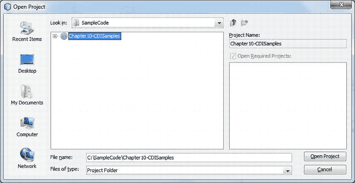

图 10-3. 打开 Chapter10-CDISamples 项目

展开 `Chapter10-CDISamples` 节点，观察上面列出的各个包出现在 `源包` 部分下。

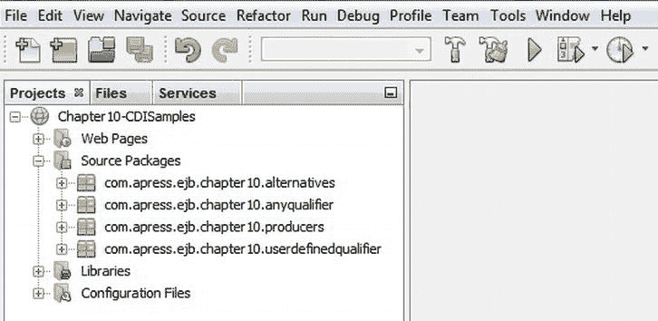

图 10-4. 验证 Chapter10-CDISamples 项目中的包

在 `Chapter10-CDISamples` 节点上调用上下文菜单，并通过选择 `清理并构建` 菜单选项来构建应用程序，如图 10-5 所示。CDI Bean 及其客户端编译无误。

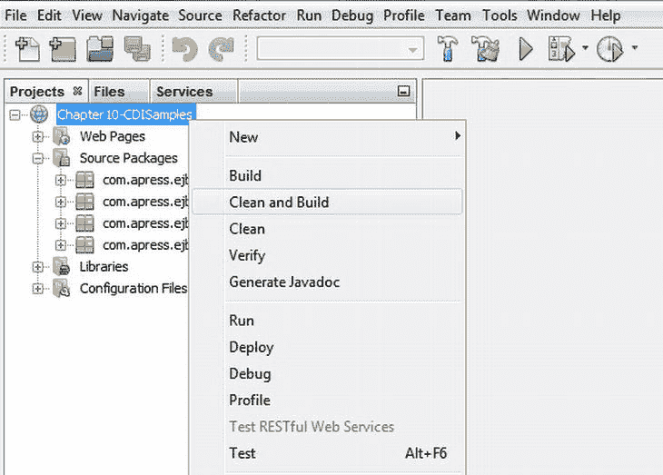

图 10-5. 构建项目

部署和运行 CDI 客户端

编译完 CDI 项目后，我们可以直接使用每个 Servlet 客户端上下文菜单中的 `运行` 选项来运行客户端。当我们*运行* Servlet 客户端时，NetBeans IDE 将自动打包 CDI Bean 及其客户端，并将其部署到集成的 GlassFish 应用服务器。

测试用户定义限定符客户端

我们将从测试和实验用户定义的限定符 `Red` 开始，该限定符我们在清单 10-8 中创建，并在清单 10-9 和 10-10 中使用。

除了 `Red` 限定符之外，我们还创建了 `White` 限定符，并将其添加到 `Wine` 接口的 `WhiteWine` 实现中。展开 `com.apress.ejb.chapter10.userdefinedqualifier` 包，右键单击 `UsrDefQlfWineClient` Servlet 以调用上下文菜单，如图 10-6 所示。接下来选择 `运行` 选项来执行 Servlet 客户端。

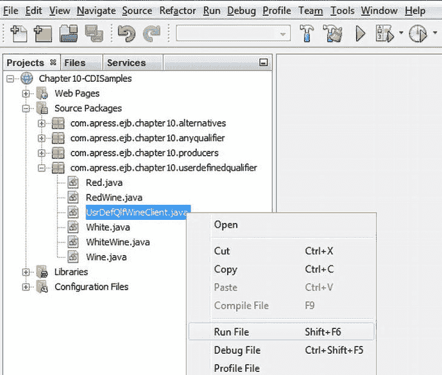

图 10-6. 运行用户定义限定符客户端

尽管 `Wine` 接口有两个实现——`RedWine` 和 `WhiteWine`——但 CDI 容器能够通过在被注入的 `newWine` 字段上使用 `@Red` 注解来解决歧义依赖。执行 Servlet 的结果如图 10-7 所示。

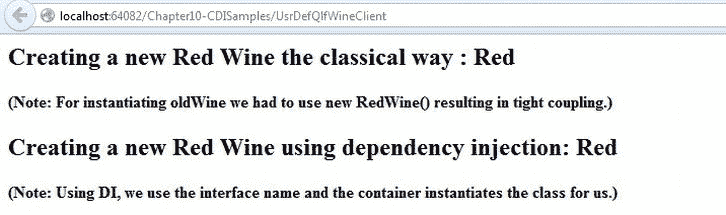

图 10-7. 用户定义限定符 Servlet 的结果

您可以尝试进行以下更改后再次运行客户端，并观察输出中的差异：


*   将注入的 `newWine` 字段上的 `@Red` 注解替换为 `@White` 注解。
*   移除注入的 `newWine` 字段上的 `@Red` 和 `@White` 注解，并执行 Servlet 客户端。

测试任意限定符客户端

接下来我们将测试 `Any` 限定符，如清单 10-12 所示，它将返回 `Wine` 接口所有实现的列表。

除了 `RedWine` 和 `WhiteWine` 实现之外，我们还创建了 `SparklingWine` 实现及其 `Sparkling` 限定符。展开 `com.apress.ejb.chapter10.anyqualifier` 包，右键单击 `AnyWineClient` Servlet 以调用上下文菜单，如图 10-8 所示。选择 `Run` 选项来执行 Servlet 客户端。

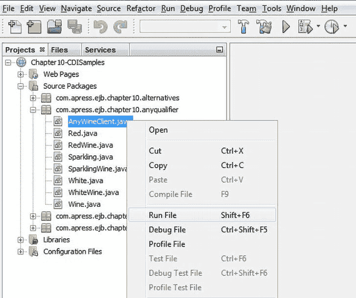

图 10-8.  运行任意限定符客户端

通过使用 `@Any` 限定符，容器能够确定 `Wine` 接口的所有实现。执行 Servlet 的结果如图 10-9 所示。

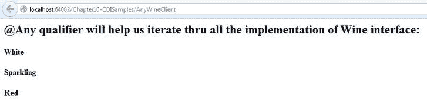

图 10-9.  任意限定符客户端 Servlet 的结果

你可以尝试进行以下更改后再次运行客户端，并观察输出的差异：

*   在同一包中创建一个 `RoseWine` 实现及其 `Rose` 限定符，然后重新运行 Servlet 客户端。
*   移除注入的 `allWines` 字段上的 `@Any` 注解，并执行 Servlet 客户端。

测试备选方案客户端

在了解了限定符的实际应用后，我们将探讨如何在部署时使用备选方案来解决歧义依赖问题。我们在清单 10-14 中看到了如何在 `beans.xml` 中声明备选方案。

展开 `com.apress.ejb.chapter10.alternatives` 包，右键单击 `AlternativesWineClient` Servlet 以调用上下文菜单，如图 10-10 所示。选择 `Run` 选项来执行 Servlet 客户端。

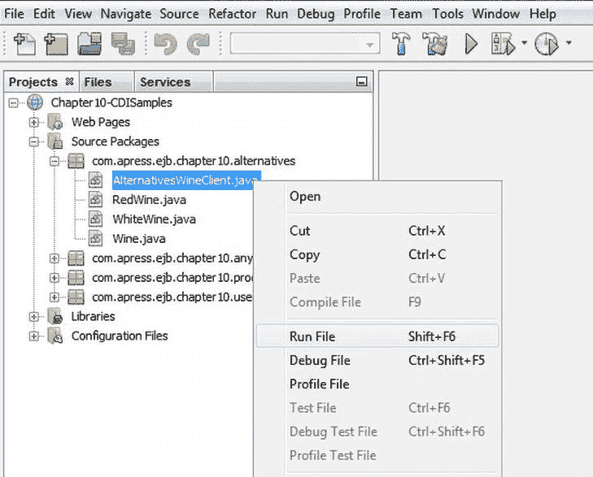

图 10-10.  运行备选方案客户端

CDI 容器使用 `beans.xml` 中的 `<alternatives>` 声明来实例化 `RedWine` 类。执行结果如图 10-11 所示。

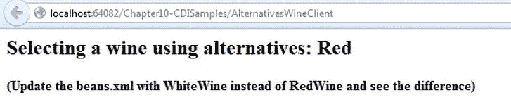

图 10-11.  备选方案客户端的结果

你可以尝试进行以下更改后再次运行客户端，并观察输出的差异：

*   将 `beans.xml` 更新为 `WhiteWine`，然后重新运行 Servlet 客户端。
*   移除 `RedWine` 或 `WhiteWine` 实现上的 `@Alternative` 注解，并执行 Servlet 客户端。

测试生产者客户端

最后，我们将了解生产者的实际应用。我们在清单 10-16 中看到了如何声明一个生产者方法。展开 `com.apress.ejb.chapter10.producers` 包，右键单击 `ProducerWineClient` Servlet 以调用上下文菜单，如图 10-12 所示。选择 `Run` 选项来执行 Servlet 客户端。

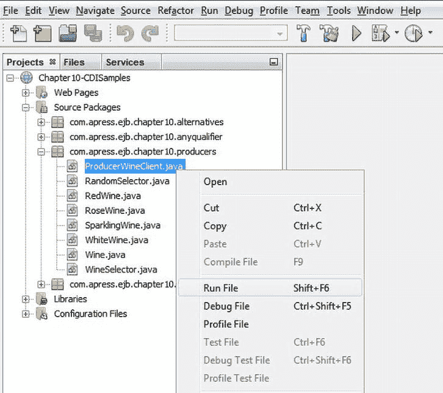

图 10-12.  运行生产者客户端

`WineSelector` 类声明了一个名为 `getWine` 的生产者方法。在 `getWine` 方法中，我们生成一个大于等于 0 且小于 4 的随机数。`getWine` 方法根据生成的随机数返回一个 `Wine` 接口实现的实例。输出如图 10-13 所示。

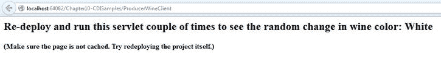

图 10-13.  生产者客户端的结果

你可以尝试进行以下更改后再次运行客户端，并观察输出的差异：

*   重新部署并多次重新运行客户端 Servlet，观察输出的差异。
*   注释掉 `getWine` 方法上的 `@Produces` 注解，并执行 Servlet 客户端。

总结

在本章中，我们介绍了上下文和依赖注入（CDI）。我们探讨了 CDI 在 Java EE 框架中所处的位置，以及它通过粘合 Web 层和业务层所提供的优势。我们解释了 CDI 框架的两个主要组件，即上下文和依赖注入。我们还研究了参与 CDI 生命周期的有状态组件的上下文生命周期，并讨论了不同类型的作用域。通过示例，我们还探讨了依赖注入的不同方式，以及如何在编译时、部署时或运行时解决歧义依赖问题。我们讨论了 CDI 与 EJB 之间的关系，特别是与会话 Bean 的关系。最后，我们使用 GlassFish 应用服务器部署并执行了示例 CDI 客户端程序，并通过实验示例代码来观察代码更改如何影响输出。

第 11 章


EJB 打包与部署

到目前为止，我们一直专注于如何构建 EJB、Java 持久化 API（JPA）实体及其客户端，以利用 EJB 容器提供的周边企业服务。用 Java EE 的术语来说，这些任务属于应用程序组件提供者（通常简称为提供者）的职责。在本章中，我们将探讨围绕以下过程的相关主题：将你的组件打包成模块和库组件，将 Java EE 组件中声明的外部引用绑定到服务器环境中的实际资源，并将所有这些发送到应用服务器，以便组件可以在运行时由应用程序执行。这些职责由 Java EE 角色中的应用程序组装者（组装者）和应用程序部署者（部署者）处理。虽然在实践中，通常由一个人执行一个或多个这些角色，或者由多人执行任何一个角色，但为了解释这些主题，我们将把部署任务划分为与这些指定角色相对应的阶段。

我们将重点介绍 EJB 和 JPA 实体组件，并会涉及其他 Java EE 模块类型的部署：Web 应用程序模块、应用程序客户端和资源适配器。我们还将探讨 Java EE 服务器与其支持的四个 Java EE 容器之间的关系，并探索 Java EE 服务器提供的一些服务。

在简要概述部署任务（其中我们介绍许多部署术语）之后，我们将介绍支持部署的 Java EE 基础设施组件——Java EE 服务器和容器。我们将探讨不同类型的 Java EE 模块，它们如何组合在一起，以及如何指定定义每个模块的部署描述符（元数据文件）。接下来是一个关于库组件的章节，其中解释了如何声明 Java EE 模块和库组件之间的类路径依赖关系。然后，我们将更详细地检查组装者和部署者的角色，最后以 EJB 模块和 JPA 持久化单元特有的部署要求作为本章的结尾。

阅读本章后，你应该了解如何执行以下操作：


*   将您的 EJB、JPA 及其他应用组件分组到 Java EE 模块和库组件中。
*   解决外部引用中发现的命名冲突和冗余。
*   打包一个由一个或多个 Java EE 模块和库组件组成的 Java EE 应用程序。
*   声明模块与库之间的类路径依赖关系。
*   将外部引用绑定到应用服务器环境中的物理资源。

关于部署工具的说明

本章提供了一些关于如何构建应用程序归档文件的示例。它假设您可以使用通常通过集成开发环境（IDE）提供的软件工具，来协助您组装和部署 Java EE 应用程序。Java 社区过程（JCP）一直在努力实现该领域的标准化（参见 JSR 88，Java EE 应用程序部署 API），但部署不可避免地需要特定于应用服务器的配置任务。幸运的是，应用服务器通常提供 Ant 任务来调用它们自己的部署工具，您也可以使用 Ant 来创建可部署的归档文件。Ant 在许多开发环境中被广泛使用，并且在需要自动化脚本将相同的 Java EE 应用程序部署到多个 Java EE 服务器实例的生产环境中几乎无处不在。本章描述的许多自定义步骤需要使用交互式编辑器，主要用于更新 Java EE 通用和特定于平台的 XML 部署描述符。对于这些任务，IDE 的价值无可估量，许多 IDE 提供特定于平台的部署支持，指导您打包、配置和部署 Java EE 应用程序。

打包和部署流程概述

*打包*是将各种 Java EE 模块组装（或分组）到 Java EE JAR、WAR 或 EAR 文件中的过程。一旦打包到 Java 归档（JAR）文件、Web 归档（WAR）文件或企业归档（EAR）文件中，Java EE 应用程序就可以交付给应用服务器了。*部署*是将 Java EE 组件安装到应用服务器中的过程，以便在运行应用程序时可以找到并执行它们。此过程涉及多个必须大致按顺序执行的任务。这些任务将在以下各节中总结，并且在本章后面部分将对每个任务进行更详细的描述，并专门应用于 EJB 和 JPA 部署。某些步骤仅在特殊情况下才需要执行，因此实际部署可能只涉及这些任务的一个子集。

提供者

一般来说，提供者（对于一个给定的项目可能有多个）作为部署的前置步骤，生成 Java EE 应用程序组件。与提供者相关的任务，以及此角色交付的文件，如图 11-1 所示。

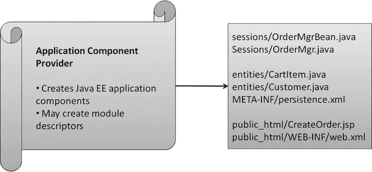

图 11-1.  应用程序组件提供者的任务和交付物

提供者的交付物是应用程序组件以及可能的模块描述符，它们可以作为磁盘上的文件提供，也可以打包到 Java 归档（JAR）文件中。

组装者

组装者接收提供者的输出，并据此执行任务并生成如图 11-2 所示的交付物。

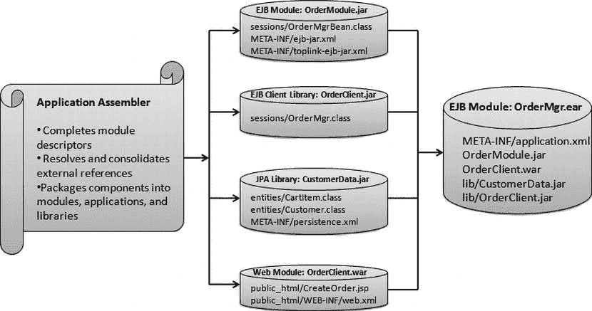

图 11-2.  应用程序组装者的部署任务和交付物

按容器类型分组组件以生成 Java EE 模块

提供者的输出是一组 Java EE 组件，例如 EJB、JPA 实体、JSF（JavaServer Faces）页面、应用程序客户端类，以及可能的其他组件。提供者也可能生成非 Java EE 组件，比如普通的 Java 类。组装者将 Java EE 组件分组，使得每个组只包含一种 Java EE 组件类型的组件。每当提供者定义了模块级部署描述符（XML）文件时，组装者可以遵循该文件中的任何指令来组成这些组，或者组装者可以选择合并或拆分描述符，以增加或减少每个组中的 Java EE 组件数量。在此过程结束时，每个生成的组将成为一个 Java EE 模块。剩余的非 Java EE 类和资源可以捆绑到 Java EE 模块中，或者隔离到它们自己的组中，成为可共享的库组件。

定义模块级部署描述符（可选）

对于形成的每个 Java EE 模块，组装者可以定位并分配一个部署描述符来表示该模块。从 Java EE 5 开始，此步骤是可选的，因为现在可以通过分析文件内容来识别模块类型。例如，您（作为提供者或组装者）可以自由定义一个 `ejb-jar.xml` 部署描述符；但除非您要覆盖 Java 注解中捕获的信息，或者您选择不使用注解，否则不再需要它。在 Java EE 5 中，一个 EJB 模块仅通过文件组中存在一个带有 `@Stateless`、`@Stateful` 或 `@MessageDriven` 注解的类来定义。

将组件（以及可选的描述符）打包到 JAR 文件中

在此阶段，第一阶段识别出的组件组将与其模块级部署描述符（如果已定义）一起，使用 JAR 格式打包到文件中。EJB 模块归档到扩展名为 `.jar` 的 EJB JAR 文件中，Web 应用程序模块归档到扩展名为 `.war` 的 Web 归档（WAR）文件中，应用程序客户端归档到扩展名为 `.jar` 的 JAR 文件中，依此类推。JPA 持久化单元可以归档到它们自己的 JAR 文件（扩展名为 `.jar`）中，或者直接归档到 EJB JAR 或 WAR 文件中。我们将在本章后面的“组装持久化单元”一节中详细介绍这一点。

此外，非 Java EE 组件（例如普通的 Java 类）可以添加到这些 Java EE 模块归档文件中；或者组装者可以将它们归档到自己的 JAR 文件中，作为库组件进行部署。

创建企业归档（EAR）文件（可选）

如果您（作为组装者）创建了多个希望作为一个逻辑组一起部署的归档文件，则需要将这些归档文件捆绑到一个称为 *EAR 文件* 的包装 JAR 文件中，该文件使用后缀 `.ear`。此 EAR 文件被称为 Java EE 应用程序。如果您只创建了一个单独的 EJB JAR 或 WAR 归档文件，则无需进一步打包。您可以跳过创建包装 EAR 文件的步骤，并将 EJB JAR 或 WAR 文件作为独立模块进行部署。

应用程序充当一个打包边界，确保所有模块中的 Java EE 组件能够在单个命名上下文中相互通信。一个 Java EE 应用程序不一定对应于一个实际的最终用户应用程序，因为它可能被许多不同的客户端应用程序使用，但它允许客户端应用程序连接到该 Java EE 应用程序一次，并从单个上下文访问该应用程序中的 Java EE 组件。


一个 EAR 文件可能在其 `META-INF` 目录中包含一个应用级部署描述符 `application.xml`。在 Java EE 5 中，此文件是可选的，因为现在可以依赖默认规则为每个模块提供默认名称和属性。默认情况下，每个模块的名称默认为其归档文件的短名称，减去文件后缀（`.jar`、`.war` 等）。定义 `application.xml` 描述符允许您优化默认名称和属性，并有选择地选择 EAR 文件中的哪些模块包含在特定部署的应用中。

 **注意**   WAR 文件和 EAR 文件是分别带有 `.war` 或 `.ear` 扩展名的标准 JAR 文件。

组装者特定任务

根据每个模块部署描述符的完整性和复杂性，可能需要组装者完成或优化提供者声明的一些外部引用。在许多情况下，模块足够自包含且完整，因此即使提供者未提供部署描述符，组装者也无需执行进一步工作。在更复杂的部署场景中，当使用提供者提供的文档（可能通过注解或部署描述符中的描述属性传达）时，组装者可能需要将语义等价但名称不同的资源合并到一个最小的、不同的集合中。相反，组装者可能需要通过重命名共享相同名称但具有不同语义的资源引用来避免资源名称冲突。

例如，如果组装者正在将两个由不同提供者生成的 Java EE 模块打包到一个 Java EE 应用中，两个提供者可能引用同一个逻辑 EJB 但使用不同的名称，或者它们可能使用尚未绑定的名称来引用。组装者有责任使用提供者提供的文档检测此类情况，并更新 EJB 引用以绑定到单个名称。此名称可由组装者选择并分配给该应用上下文中的 EJB。

组装者所做的任何更改仅应用于模块和应用部署描述符文件，而不应用于 Java 源代码。此过程之所以有效，是因为 Java EE 规定的优先级规则：当 Java 注解源代码和 XML 部署描述符中都定义了冲突的元数据属性时，部署描述符将优先。组装者只需处理部署描述符文件即可解决 Java 源代码中的不一致性。

部署者

部署者的任务和交付物如图 11-3 所示。

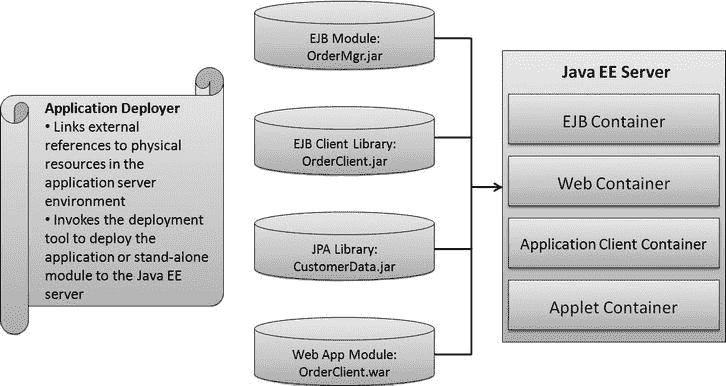

图 11-3.  应用部署者的任务和交付物

部署者特定任务

再次使用来自组装者（和提供者）的指令——通常通过部署描述符或源代码注解中的描述属性传达——部署者需要将所有外部引用绑定到目标应用服务器环境中的具体资源（EJB 引用、资源引用、持久化单元引用等）。只有部署者能够了解目标服务器环境，并且 Java EE 特意为所有资源使用添加了一层间接性，以允许此绑定发生，而不影响提供者或组装者的工作。这就是 Java EE 组件使用的所有资源都通过间接引用进行引用的原因。

与组装者的情况一样，Java EE 策略规定部署者只能更改 XML 部署描述符文件，而不能更改 Java 源代码中的注解。

调用应用服务器特定的部署工具

最后，您的 Java EE 模块或 Java EE 应用已准备好提交给应用服务器。您的应用服务器将提供一个部署工具，让您完成部署并将 Java EE 组件安装到应用服务器中，准备由最终用户应用执行。在此阶段，部署工具将验证提交的模块的内部完整性，并确保所有资源都可以绑定到驻留在应用服务器环境中的实际对象。如果在部署时找不到任何必需的资源，或者找不到引用的库组件，则部署将失败。

概述总结

Java EE 部署允许您部署单个模块、库组件或完整的应用。在许多情况下，部署可能仅涉及将编译后的源代码与描述符（对于持久化单元，`persistence.xml` 文件是必需的，但对于 EJB JAR、WAR 和 EAR 模块，`ejb-jar.xml`、`web.xml` 和 `application.xml` 文件是可选的）打包在一起，并提交给部署工具。当从可能由不同组件提供者构建且可能版本不同的多个模块组装应用时，组装者的角色变得更加重要。

Java EE 部署基础设施

现在我们已经总结了部署过程，让我们探讨一下 Java EE 基础设施中一些对部署至关重要的领域。当您需要自行决定如何将代码打包到模块中以及如何解析和绑定外部引用时，理解此主题会很有用。

Java EE 服务器

*Java EE 服务器* 是在您的应用服务器内部运行的程序，它在 Java EE 组件执行时为其提供企业服务。Java EE 服务器还负责处理部署请求，并将其重定向到其托管的 Java EE 容器。

Java EE 规范定义了 Java EE 服务器必须支持的核心服务列表。这些服务包括消息传递、数据库、安全、事务、持久化以及许多其他服务。Java EE 服务器也可以扩展以提供超出规范要求的额外服务，或现有服务的替代实现。Java EE 规范定义了服务器如何通过 Java EE 连接器 API 使用资源适配器将其适配到 Java EE 环境中，从而扩展以为其容器提供对远程和外部服务的访问。

Java EE 容器

Java EE 服务器的主要目的是支持 Java EE 容器，这些容器提供了运行 Java EE 组件的各种环境。Java EE 规范规定支持四种 Java EE 容器：EJB、Web、应用客户端和 Applet。虽然 EJB 和 Web 容器在中间层的应用服务器中执行，但应用客户端容器通常在客户端层的 Java SE 环境中执行，而 Applet 容器通常在 Web 浏览器内运行。尽管如此，它们都依赖其底层的 Java EE 服务器来获取它们通过 API 提供给在其容器环境中执行的组件的众多企业服务。例如，Java EE 服务器向 Java EE 容器提供本地消息传递服务，而容器则通过 JMS（Java 消息服务）API 向其组件公开消息传递服务。类似地，容器通过 Java 数据库连接（JDBC）公开数据库服务，通过 Java 事务 API（JTA）公开事务服务，等等。Java EE 容器还介入在 Java EE 容器中执行的 Java EE 应用组件之间的所有通信，以提供组件和资源注入。如图 11-4 所示。

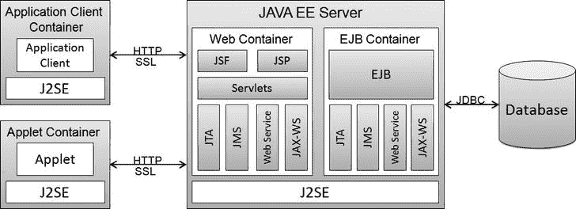


图 11-4.  JAVA EE 服务器

除了 Java EE 容器为 Java EE 组件提供的众多内置服务外，Java EE 还允许通过资源适配器和连接器 API 集成第三方服务——这些服务通过 Java EE 服务提供者接口 (SPI) 经由其容器暴露给 Java EE 组件。

Java EE 部署组件

Java EE 部署的主要构建块组件是 Java EE 应用程序和 Java EE 模块。让我们来看看这些组件的定义。

Java EE 应用程序

Java EE 允许您将单个 Java EE 模块和整个 Java EE 应用程序部署到服务器。正如前面“打包和部署过程概述”一节中提到的，在部署应用程序时，您将各个 Java EE 模块以及任何相关的部署描述符和依赖库组件打包到一个称为 EAR 文件的包装归档 JAR 文件中，该文件的后缀为 `.ear`。部署单个 Java EE 模块本质上是一种快捷方式，以避免将一个 JAR 文件包裹在另一个单独的 JAR 文件周围。

除了其打包结构之外，Java EE 应用程序在运行时作为一个上下文运行，在该上下文中，一个或多个相关的 Java EE 组件（例如 EJB、Servlet 和应用程序客户端）可以使用共享的类加载器和命名空间进行操作和相互通信。将 Java EE 应用程序视为一个松散耦合的 Java EE 模块组可能会很有用，这些模块能够相互可见并共享资源。

Java EE 模块类型

Java EE 定义了以下 Java EE 模块类型：EJB、Web 应用程序、应用程序客户端和资源适配器。前三种对应于它们同名的容器，并且它们的部署委托给这些容器。部署资源适配器模块会在 Java EE 服务器中安装资源，并注册这些资源以供 Java EE 组件使用。您的 Java EE 模块引用的普通 Java 类和其他资源也可以作为库组件包含在 EAR 文件中，既可以打包为 JAR 文件，也可以存储为目录，并与您的 Java EE 应用程序一起部署。

请注意，一个由一组 JPA 实体组成的 JPA 持久化单元不是一个 Java EE 模块，而是一个库组件。我们将在后面的“持久化单元”一节中描述其中的一些原因。

让我们仔细看看每种 Java EE 模块类型。

EJB 模块

一个 EJB 模块由一个或多个会话和/或消息驱动 Bean (MDB) 组成。它被打包成一个 EJB JAR 文件，如果它包含一个 `ejb-jar.xml` 部署描述符（从 Java EE 5 开始这是可选的），则必须位于 JAR 文件的 `META-INF` 目录中。特定于平台的描述符也可以添加到这个 `META-INF` 目录中。如果 EJB JAR 文件不包含 `ejb-jar.xml` 文件，则 EJB Bean 类必须使用 `@Stateless`、`@Stateful`、`@Singleton` 或 `@MessageDriven` 注解将自身标识为 EJB。

在许多情况下，将客户端对 EJB 模块的视图隔离到其自己的归档中是可取的。当客户端仅与会话 Bean 的接口通信时，它不需要访问会话 Bean 类。在这种情况下，最佳实践是仅将会话 Bean 的接口以及任何其他依赖类打包到一个单独的 EJB 客户端 JAR 库中。这个 JAR 文件可以交给客户端，但也可以从 EJB JAR 文件中引用，这样这些接口就不需要在 EJB JAR 文件内部重复。为了引用 EJB 客户端 JAR 文件，或 EAR 文件中的任何其他 JAR 文件或目录，装配器会在 JAR 文件的 `META-INF/MANIFEST.MF` 文件中添加一个指向这些位置的 `Class-Path` 条目：

```
Class-Path: MyEjb-Client.jar
```

 **注意**   有关 `MANIFEST.MF` 文件的更多信息，包括本章中提到的 Class-Path 和 Extension-List 条目的用法，请参阅：`http://docs.oracle.com/javase/6/docs/technotes/guides/jar/jar.html`。

可以通过用空格字符分隔 `.jar` 和目录条目来以这种方式引用多个 JAR 文件或目录。被引用的 JAR 文件的路径是相对于 EJB JAR 文件本身的，该文件必须位于 EAR 文件的根目录中。在前面的示例中，`MyEjb-Client.jar` 文件也位于 EAR 文件的根目录中。

一个 EJB 模块也可能包含一个持久化单元，这将在下一节中描述。持久化单元只能以展开形式存在于 EJB JAR 中；JAR 文件不能嵌套在 EJB JAR 文件内部。持久化单元由 EJB JAR 文件内容中存在 `META-INF/persistence.xml` 文件来定义。

可以使用 `META-INF/application.xml` 文件中的模块声明为 EJB 模块分配一个名称。当部署期间不存在 `META-INF/application.xml` 文件时（例如当 EJB JAR 文件独立部署或位于不包含此描述符的 EAR 文件中时），会为其分配一个默认名称。此名称源自 EJB JAR 归档的名称，减去任何目录信息或 `.jar` 后缀。例如，一个 EJB JAR 文件可能捆绑在 EAR 文件中的以下位置：

```
./OrderManagerEJBModule.jar
```

在这种情况下，其默认模块名称将是 `OrderManagerEJBModule`。

WAR 文件中的 EJB

EJB 3.0 规范通过使 `ejb-jar.xml` 等 XML 描述符的打包成为可选，简化了 EJB 的打包。EJB 3.1 规范进一步推进了这种简化，允许将 EJB（使用 `@Stateless`、`@Stateful`、`@Singleton` 或 `@MessageDriven` 注解的 POJO）直接打包在 WAR 文件的 `WEB-INF/classes` 目录中。类似地，`ejb-jar.xml` 描述符（如果存在）可以与 `web.xml` 一起直接打包到 `WEB-INF` 目录中。通过这一更改，用户不再需要创建单独的 EJB JAR 模块来打包 EJB。图 11-5 描绘了这一新的打包选项。

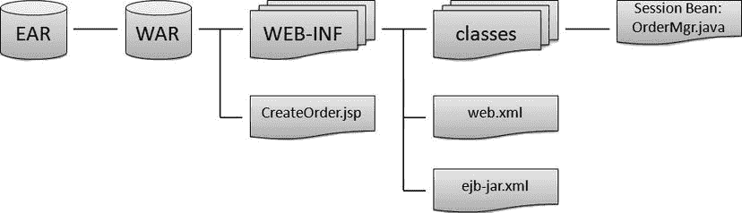

图 11-5.  将 EJB 直接打包在 WAR 文件的 WEB-INF\classes 目录下

持久化单元

一组 JPA 实体，称为*持久化单元*，既严格来说不是一种模块类型，也没有自己专用的容器。相反，Java EE 服务器直接支持持久化，作为其提供给 Java EE 容器的核心服务之一。这使得 JPA 实体能够表现为持久化对象，并在其他 Java EE 容器环境中执行时与 Java EE 组件交互。通过不受限于它们自己的容器，JPA 实体也可以自由地在 Java EE 环境之外执行并展示持久化行为。

 **注意**   在部署上下文中，术语*持久化单元*指的是一组共置的 JPA 实体和一个相应的（且必需的）`META-INF/persistence.xml` 文件。这组文件可以打包到其自己的 JAR 文件中，或者这些文件可以直接捆绑在 EJB JAR 或 WAR 文件内部。反过来，`persistence.xml` 文件定义了一个或多个 `<persistence-unit>` 条目，这些条目可以进一步划分持久化单元打包结构中的实体。在本章中，我们通过始终在描述 `<persistence-unit>` XML 元素时使用连字符（persistence-unit）来区分这两个名称相似的概念。因此，任何对持久化单元的引用都可以假定为指代与 `persistence.xml` 文件共置的那组实体。


如前文所述，持久化单元的打包方式与其他模块类型不同。当打包在 Java EE 应用程序的 EAR 文件中时，持久化单元被视为一个库组件（请参见下文“库组件”一节）。它可以被打包成一个 JAR 文件，或者其类可以直接打包在 EJB JAR 或 WAR 文件中。无论哪种方式，`META-INF/persistence.xml` 文件都用于标识持久化单元中包含的实体。我们将在本章后面的“组装持久化单元”一节中讨论打包细节。

Web 应用程序模块

Web 应用程序模块由 Servlet、HTML 页面、JSF、JSP 文档以及任何其他基于 Web 的文件组成。其部署描述符是 `WEB-INF/web.xml` 文件，与 EJB 模块一样，从 Java EE 5 开始，该文件的存在现在是可选的，因为其内容可以使用默认规则推导出来。归档时，Web 应用程序模块的内容被打包成一个后缀为 `.war` 的 JAR 文件。这通常被称为 *WAR 文件*。

WAR 文件的内容遵循一种特殊结构，以便更好地适应 Web 浏览器中的应用程序分区。在将持久化单元打包到 WAR 文件中时，特别相关的是，Java `.class` 文件放置在 `WEB-INF/classes` 目录中，而依赖的 JAR 文件可以直接添加到 `WEB-INF/lib` 目录中。

与 EJB 模块类似，Web 模块可以通过 `META-INF/application.xml` 文件中的模块声明来分配一个名称。当部署期间不存在 `META-INF/application.xml` 文件时（例如，当 WAR 文件独立部署或位于不包含此描述符的 EAR 文件中时），会为其分配一个默认名称。此名称源自 WAR 归档文件的名称，去掉任何目录信息或 `.war` 后缀。例如，WAR 文件可以打包在 EAR 文件中的以下位置：

```
./OrderManagerWebApp.war
```

在这种情况下，其默认模块名称将是 `OrderManagerWebApp`。

资源适配器模块

资源适配器提供了一种扩展 Java EE 服务器的机制。它们允许将由外部系统管理的资源和服务集成到 Java EE 服务器中，供在 Java EE 容器中执行的组件使用。资源适配器模块包含一组资源适配器和一个可选的 `META-INF/ra.xml` 部署描述符。

在部署期间，资源适配器被打包成一个*资源归档 (RAR) 文件*，这是一个后缀为 `.rar` 的 JAR 文件。

应用程序客户端模块

应用程序客户端模块包含可以在客户端层的 Java SE 环境中执行的 Java 类。应用程序客户端容器是一个轻量级的 Java EE 容器，它支持注入，并提供持久化、安全性和消息传递等服务。它不提供中间层 Java EE 容器可用的许多服务。

应用程序客户端模块的部署描述符位于 `META-INF/application-client.xml` 中，并且与其他 Java EE 模块部署描述符一样，从 Java EE 5 开始是可选的。

库组件

模块在运行时所需的共享类或其他资源可以打包到*库组件*中。库可以安装在应用程序服务器中（此处不描述安装库的过程），也可以捆绑在您的 EAR 或 WAR 文件中。嵌入在 EAR 中的任何 JAR 格式文件，无论是 Java EE 模块还是捆绑的库归档文件，都可以使用 `META-INF/MANIFEST.MF` 文件中的 `Class-Path` 属性来引用捆绑的库组件。

 **注意**   每当通过 `Class-Path` 条目引用 JAR 文件时，部署工具仅识别被引用 JAR 文件中的类。被引用 JAR 文件中的任何描述符文件都将被忽略。

捆绑的库

清单 11-1 显示了一个示例 EAR 文件的文件内容，以演示 `Class-Path` 属性如何引用捆绑的库。这里我们使用一种简写符号来显示位于其关联 JAR 和 WAR 文件的 `META-INF/MANIFEST.MF` 文件中的 `Class-Path: myEjb-Client.jar` 条目。

***清单 11-1.***  示例 EAR 文件内容，显示模块对捆绑库组件的显式依赖

```
myApp.ear:
 META-INF/application.xml
 myEjb.jar Class-Path: myEjb-Client.jar
 myWebApp.war Class-Path: myEjb-Client.jar
 myEjb-Client.jar
```

在此示例中，客户端接口（远程、本地和 Web 服务端点接口）已特意从 `myEjb.jar` EJB 模块中剥离出来，并打包到捆绑的 `myEjb-Client.jar` 库组件中。`myEjb.jar` 中的 `META-INF/ejb-jar.xml` 描述符包含以下条目：

```
<ejb-client-jar>myEjb-Client.jar</ejb-client-jar>
```

这将 `myEjb-Client.jar` 标识为保存其客户端接口的 JAR 文件。`myEjb.jar` EJB 模块依赖于这些 EJB 接口，并通过其引用 `myEjb-Client.jar` 库的 `Class-Path` 条目声明其依赖关系。`myWebApp.war` Web 模块引用这些 EJB 接口，并以相同方式声明其对 `myEjb-Client.jar` 的依赖。`myEjb-Client.jar` 库是一个普通的 JAR 文件，它与 EJB 和 WAR 文件一起位于 EAR 文件中。

显式声明对捆绑库组件的依赖的另一种方法是使用 EAR 文件的内置库目录 `lib`，如清单 11-2 所示。`lib` 目录中的所有 JAR 文件都会自动添加到 EAR 文件中 Java EE 模块的类路径中。

***清单 11-2.***  示例 EAR 文件内容，显示模块对共享捆绑库组件的隐式依赖

```
myApp.ear:
 META-INF/application.xml
 myEjb.jar
 myWebApp.war
 lib/myEjb-Client.jar
```

这实现了与清单 11-1 相同的结果。假设 `application.xml` 没有指定覆盖默认 `lib` 目录的 `<library-directory>` 元素，Java EE 服务器将自动将 `myEjb-Client.jar` 文件添加到 `myEjb.jar` 和 `myWebApp.war` 模块的类路径中。

库也可以捆绑在 WAR 文件的 JAR 文件的 `WEB-INF/lib` 目录中，以及 WAR 文件的未打包类的 `WEB-INF/classes` 目录中。

已安装的库

也可以在您的应用程序服务器环境中安装库，然后使用 JAR 文件的 `META-INF/MANIFEST.MF` 文件中的 `Extension-List` 属性从 EAR 文件中的 JAR 格式文件引用它们。这是在 Java EE 应用程序之间共享库的一种有效方式，因为它避免了在多个 EAR 文件中冗余捆绑库。已安装的库由应用程序服务器实例存储在磁盘上，并且通常，应用程序服务器配置文件中的共享库条目会将已安装库的名称与其一个或多个 JAR 文件关联起来。然后，Java EE 应用程序可以按名称引用此已安装的库，而无需了解该库的 JAR 文件内容。

使用已安装库的示例如清单 11-3 所示。

***清单 11-3.***  示例 EAR 文件内容，显示已安装库的使用

```
myApp.ear:
 META-INF/MANIFEST.MF:
  Extension-List: commonUtils
  commonUtils-Extension-Name: com/apress/ejb/ch11/commonUtils
  commonUtils-Extension-Specification-Version: 1.4
 META-INF/application.xml
 myEjb.jar
```


在此示例中，EAR 文件的 `META-INF/MANIFEST.MF` 文件用于声明对名为 `commonUtils`（版本 1.4）的已安装库的引用。这使得 EAR 文件内的所有 JAR 文件都能访问 `commonUtils` 库的内容，从而满足 `myEjb.jar` 模块对该库内容的依赖。该引用也可以定义在 `myEjb.jar` 上，在这种情况下，只有 `myEjb.jar` 会被授予对该库的访问权限。无论哪种方式，已安装的库都必须在部署 `myEjb.jar` 之前安装好。

`commonUtils` 库中包含的 JAR 文件的 `META-INF/MANIFEST.MF` 文件如清单 11-4 所示。

***清单 11-4.***  已安装库的 JAR 文件内容

```
commonUtils.jar:
 META-INF/MANIFEST.MF:
  Extension-Name: com/apress/ejb/ch11/commonUtils
  Specification-Title: Utils for implementing common patterns
  Specification-Version: 1.4
```

库的版本管理

尽管 Java EE 规范并未强制要求，但许多应用服务器支持 Java EE 应用隔离级别，允许每个 Java EE 应用拥有自己的类加载器。这使得在同一台 Java EE 服务器上同时运行的多个应用可以引用同一捆绑或已安装库组件的不同版本。一个有用的场景是，当你希望将部分应用迁移到使用新版本的库时。你可以在服务器中安装新版本的库，然后有选择地更新那些你希望使用新版本库的应用的 `Specification-Version` 属性。

或者，支持此隔离级别的 Java EE 服务器允许你部署一个捆绑了其自身依赖库版本的 Java EE 应用。Java EE 规范中的优先级规则规定，当捆绑库与具有相同 `Extension-Name` 的已安装库发生冲突时，将使用捆绑库。这保证了应用将始终使用其捆绑的库，无论服务器已安装的库基础中有哪些版本可用。

应用服务器与平台无关性

Java EE 一直非常注重可移植性，尽管在实践中这往往难以实现。理想情况下，所有 Java EE 服务器都尽可能完整地实现规范，然后在性能和特性上区分彼此，例如支持可配置的隔离级别以及规范推荐（或暗示但非强制）的高级对象/关系（O/R）映射选项。

应用服务器应定义其特定于平台的描述符，用于增强 Java EE 规范的核心需求，事实上几乎所有应用服务器实现都提供了此类描述符。随着时间的推移（我们在 JPA 映射元数据领域尤为明显地看到这一点），规范中缺失且由供应商实现解决的功能，会被纳入规范并变得通用。例如，EJB 2.1 既没有提供关于如何为实体 Bean 定义 O/R 映射的支持或规定，也没有说明如何实现实体继承层次结构。从 EJB 3 开始，JPA 吸收了来自 TopLink、Hibernate 和 Java 数据对象（JDO）的许多最佳理念，并将它们直接整合到 `orm.xml` 文件中，以提供这些功能以及其他功能。

部署工具

应用服务器供应商几乎都标准化了 JSR 88，该规范规定了使用受管 JavaBean（称为 *MBeans*）来管理部署过程。MBeans 是自描述的，并遵循 Java 管理扩展（JMX）规范定义的设计模式，为 Java EE 服务器和应用服务器的部署工具之间提供接口。Java EE 部署 MBeans 暴露的实际接口因应用服务器而异；但所有部署工具现在都在不同程度上使用它们，这一事实为供应商的部署工具之间提供了一定的一致性。

通常，供应商的部署工具不仅会指导装配员完成打包 Java EE 模块、库和应用归档文件的过程，还会指导其指定一些元数据，用于填充 Java EE 通用和特定于平台的部署描述符。这些工具还会接受 EJB、WAR 或 EAR 文件，并实际在服务器本身中执行安装和验证部署任务。

 **注意**   Cargo 是一个轻量级封装，允许你以标准方式操作 Java EE 容器。Cargo 旨在通过 Ant 任务、Maven 和 IDE 插件等媒介，为许多流行的 Java EE 容器提供抽象 API。有关 Cargo 的更多信息，请参见 `http://cargo.codehaus.org`。

部署计划

某些供应商的应用服务器工具会将部署者的选择记录在一个称为*部署计划*的文档中。由于部署通常是一个迭代过程，尤其是在开发和测试阶段，捕获部署者的选择会很方便，这样部署者就不必重复指定相同的信息。

目前，JSR 88 或其他地方都没有为部署计划指定标准格式，因此它不是一个可以在不同应用服务器实现之间复用的文档。如果你觉得这很不方便，可以参与 JCP 并组建或加入一个 JSR，以推动该领域的标准化。

部署角色

任何包罗万象的企业服务平台本质上都是复杂的。认识到这一现实，Java EE 的架构师将 Java EE 服务划分成了定义良好的 API。类似地，他们将与开发和配置 Java EE 应用各个阶段相关的任务划分成了定义良好的角色。我们提到过，与构建各种应用组件（如 EJB、实体、Servlet、JSF JSP 等）相关的任务属于 Java EE 的应用组件提供者角色。还有其他角色，例如系统组件提供者，负责在应用服务器中安装应用组件所需的资源。其中包括数据库资源、授权策略、安全角色以及许多其他资源，包括通过资源适配器引入的服务。

我们之前介绍过应用装配者和应用部署者的角色。然而，在本节中，我们将更深入地探讨这些角色。

应用装配者

以下是作为应用装配者需要了解的内容。

定义和描述外部依赖


提供者通过注解、部署描述符或两者结合的方式，标识其组件所持有的外部需求。这些依赖关系可能涉及其他 EJB、持久化单元、环境属性值、数据库连接，或该应用组件外部的任何其他对象。装配者的职责是进一步描述这些外部依赖关系，以便部署者能够确定如何将它们映射到特定应用服务器环境中的具体资源。外部依赖关系通过注解或部署描述符中的`<ejb-ref>`、`<ejb-local-ref>`、`<resource-ref>`、`<resource-env-ref>`、`<security-role-ref>`和`<message-destination-ref>`条目来定义。装配者的工作是分析这些外部引用并进行修补。此过程包括以下步骤。

**确保所有引用完整**

提供者仅部分完成外部引用的定义是合法且常见的。提供者可能不知道，或试图猜测所引用资源的实际名称。在这种情况下，提供者会详细说明引用的细节——其对象类型、内部使用的名称，以及对被引用对象逻辑行为的描述。装配者获取这些信息，然后将其链接到应用程序内部一致的资源名称。EJB 引用就是一个例子。允许使用`<ejb-ref>`元素在`web.xml`、`ejb-jar.xml`或`application-client.xml`描述符中声明 EJB 引用。`<ejb-ref>`有一个`ejb-ref-name`属性，供引用组件（无论是 Web 表单、另一个 EJB 还是应用客户端）使用，并通过为`<ejb-ref>`的`ejb-link`属性赋值，将其链接到部署期间分配给该 EJB 的实际名称。清单 11-5 展示了一个由装配者完整定义的`<ejb-ref>`。

***清单 11-5.***  一个已正确链接到命名 EJB 的 ejb-ref 描述符元素

```
<ejb-ref>
 <description>
  向装配者描述此 EJB 的说明
 </description>
 <ejb-ref-name>ejb/MyAccountManager</ejb-ref-name>
 <ejb-ref-type>Session</ejb-ref-type>
 <remote>com.apress.ejb.ch11.MyAccountManager</remote>
 <ejb-link>SalesAccountManager</ejb-link>
</ejb-ref>
```

 **注意**   从 EJB 3 开始，`<home>`和`<local-home>`属性是可选的。

也可以解析对同一应用程序中不同 EJB JAR 文件内打包的 EJB 的引用。清单 11-6 展示了如何在`ejb-link`值中使用特殊路径表示法来实现这一点。`ejb-link`属性值可以引用应用程序 EAR 文件中任何 EJB JAR 文件内的 EJB。

***清单 11-6.***  一个链接到应用程序中不同 EJB JAR 内 EJB 的 ejb-ref 描述符元素

```
<ejb-ref>
 <description>
  向装配者描述此 EJB 的说明
 </description>
 <ejb-ref-name>ejb/MyAccountManager</ejb-ref-name>
 <ejb-ref-type>Session</ejb-ref-type>
 <remote>com.apress.ejb.ch11.MyAccountManager</remote>
 <ejb-link>../salesEjbModule.jar#SalesAccountManager</ejb-link>
</ejb-ref>
```

此示例展示了如果`SalesAccountManager` EJB 被移入一个名为`salesEjbModule.jar`的对等 EJB 模块时，链接将如何显示。最后，装配者可能需要解析在 Java 源代码中使用`@EJB`注解部分声明的 EJB 引用，如清单 11-7 所示。

***清单 11-7.***  Java 源文件中的部分@EJB 注解

```
@EJB(name="AccountManager",
   beanInterface=AccountManager.class,
   description="部门账户管理器")
private AccountManager acctMgr;
```

装配者会添加一个`<ejb-ref>`元素来完成此引用，但会保持已定义的属性不变，如清单 11-8 所示。

***清单 11-8.***  一个填充@EJB 注解缺失属性的 ejb-ref 描述符元素

```
<ejb-ref>
 <ejb-ref-name>ejb/MyAccountManager</ejb-ref-name>
 <ejb-link>SalesAccountManager</ejb-link>
</ejb-ref>
```

 **注意**   虽然可以使用 JNDI（Java 命名和目录接口）来查找部署在上下文应用程序之外的 EJB，但`<ejb-ref>`、`<ejb-local-ref>`以及相应的`@EJB`注解只能用于访问部署在上下文应用程序中的 EJB。

此过程持续进行，直到装配者链接了所有悬而未决的 EJB、资源、资源环境以及任何其他引用。

**解决冲突和冗余引用**

提交给装配者以组装成应用程序的模块可能由不同的提供者构建，或在不同时间构建。在这种情况下，通常会找到对相同逻辑资源的引用，但使用了不同的名称。装配者的职责是扫描源注解和任何 XML 部署描述符，并将任何冗余引用重命名为一个通用名称。

类似地，应用程序组件可能使用相同的内部名称来引用逻辑上不同的资源。装配者必须利用这些引用的描述属性（可在注解和部署描述符中找到），以及提供者提供的任何其他文档，来检测此类冲突并适当地重命名这些引用。

装配者可以选择通过将模块源文件中的 Java 注解合并到描述符中（只要不冲突）来完全填充每个模块描述符。如果装配者选择执行此任务，则描述符的`metadata-complete`属性可以设置为`true`。这向部署者发出信号，表明无需进一步分析此描述符和 Java 注解，从而实现更快速的部署。

**打包**

装配者执行打包阶段，将应用程序组件捆绑到特定于容器的 JAR 文件和组件库中。此打包过程在前面的“打包和部署过程概述”部分中已概述。您可以使用 Ant 或 ZIP 工具来执行这些步骤，将 Java EE 组件分组到模块中并将其打包到 JAR 文件中。然而，这是一个受益于使用可视化打包工具的领域，该工具通常可通过 IDE 获得。装配者将 EJB 和应用客户端模块打包到 JAR 文件中，将 Web 应用程序模块打包到 WAR 文件中，并将资源适配器打包到 RAR 文件中。

在组装没有捆绑库的独立 Java EE 模块时，无需进一步打包。该模块的 JAR 文件即可部署。

如果涉及多个模块，或者也需要捆绑库，则装配者会创建一个 EAR 文件，并将模块和库添加到此归档文件中。装配者可以使用内部目录结构添加模块，前提是`lib`目录或`application.xml`文件中由`<library-directory>`指定的目录被作为隐式共享库的位置。

EAR 文件`META-INF`目录中的可选`application.xml`文件可用于显式标识应用程序中包含的模块。这是告诉部署工具忽略那些不打算作为应用程序一部分，但由于某种原因被包含在应用程序中的模块的方法。

**应用程序部署者**


由装配器生成的模块或包随后会移交给部署器。部署器对目标应用服务器环境了如指掌，包括该环境中当前已部署的所有资源信息。

由于各供应商为其应用服务器提供的工具集各不相同，部署器的实际体验也会有所差异。部署阶段所涉及的逻辑流程将在以下章节中概述。

**解压归档文件**

EAR 文件或独立的模块 JAR 文件会被解压，并对其内容进行分析。

**推导模块描述符**

部署器会处理每个 Java EE 模块的描述符。如果提供了描述符，并且其 `metadata-complete` 属性设置为 `true`，那么部署器可以将该模块发送到相应的容器。如果未提供描述符，或者 `metadata-complete` 未设置为 `true`，则必须扫描该模块的 Java 源代码内容以检测注解。通过扫描注解发现的所有元数据属性将与描述符中的属性合并。在此协调步骤中，Java EE 的优先级规则规定：每当注解和描述符都为某个给定属性提供值时，描述符中的值优先。此协调状态的结果是为该模块生成一个完整的描述符。

**绑定外部引用**

会检查所有发现的外部引用的完整性，以确保装配器的工作已完成。然后，这些引用会与应用服务器环境中的实际资源进行匹配。如果任何资源无法绑定，则会向部署器报告错误，以便解决该问题。可以想象，此过程极大地受益于应用服务器提供的强大部署工具集。

**部署到容器**

每个完整的模块都可以发送到其对应的容器进行安装和注册。完成后，这些模块中的 Java EE 组件即可供客户端访问。

**组装 EJB JAR 模块**

EJB JAR 文件是一个相当直接的归档文件。`.class` 文件在 JAR 文件中按照其包对应的目录进行布局，根目录位于 JAR 的顶层目录。`ejb-jar.xml` 部署描述符（如果存在）则放在 `META-INF` 目录中，通常还会附带其他特定于平台的描述符。

任意类都可以与 EJB 类和接口一起包含在内。一种常见的做法是将共享库 JAR 与 EJB JAR 文件打包在同一个 EAR 文件中。可以使用 EJB JAR 文件的 `META-INF/MANIFEST.MF` 文件中的 `Class-Path` 属性来引用打包在外部 EAR 文件中的库，如前文“库组件”部分所述。类似地，可以通过在 `META-INF/MANIFEST.MF` 文件的 `Extension-List` 属性中列出它们，来引用之前已部署但在上下文应用程序之外的已安装库。

在指定 EJB 的元数据时，`ejb-jar.xml` 描述符和 Java 源代码注解是相互冗余的。选择使用哪种方法主要取决于提供者的偏好，尽管此决定也受到应用程序编辑、组装和部署方式的影响。然而，顶层设置（例如 `<ejb-client-jar>`）没有对应的注解，必须通过此描述符进行分配。

 **注意** 从 Java EE 5 开始，我们可以直接部署 EJB 和 WAR 模块，而无需将它们打包为 Java EE 应用程序。这仅适用于这些模块不依赖于其他 JAR 文件中尚未部署到目标应用服务器环境的类的情况。

**命名范围**

在一个 Java EE 应用程序中，不能有两个 EJB 具有相同的名称。装配器有责任检测这种情况，并适当地重命名 EJB 以解决冲突。

**组装持久化单元**

一个*持久化单元*是一组 JPA 实体、映射超类和可嵌入类，并附带一个必需的 `META-INF/persistence.xml` 文件。Java EE 提供了一组固定的方式在部署期间打包持久化单元。你可以通过以下任何一种方式打包持久化单元：

*   打包到一个或多个 JAR 文件中，这些 JAR 文件随后可以打包到 WAR 或 EAR 文件中
*   作为 EJB-JAR 文件中的一组类
*   在 WAR 文件的 `classes` 目录中
*   或者作为上述方式的组合

其 `META-INF/persistence.xml` 文件所在的 JAR 文件或目录被称为持久化单元的*根*，它定义了构成持久化单元的类的根目录。持久化单元的根必须是以下之一：

*   一个 EJB-JAR 文件
*   WAR 文件的 `WEB-INF/classes` 目录
*   WAR 文件的 `WEB-INF/lib` 目录中的一个 JAR 文件
*   EAR 文件的库目录中的一个 JAR 文件
*   一个应用程序客户端 JAR 文件

你打包持久化单元的位置决定了哪些模块可以访问它。例如，将其添加到 EAR 文件的库目录中，可以使其被应用程序中的所有其他模块访问。将其放置在 EJB、Web 应用程序或应用程序客户端 JAR 中，则将其范围限制在该模块内。

除了 `persistence.xml` 文件之外，还可以将一个或多个 O/R 映射文件添加到 `META-INF` 目录中，以扩充或覆盖可能在受管理的 JPA 类中指定的任何注解。JPA 指定默认文件名为 `META-INF/orm.xml`，但 `persistence.xml` 文件中定义的每个 `<persistence-unit>` 都可以使用 `<mapping-file>` 元素指定其自己的映射文件。

**命名范围**

在一个 Java EE 应用程序中，两个 JPA 实体可以具有相同的名称，但前提是它们位于不同的上下文中。例如，两个 Web 应用程序模块可以在其 `WEB-INF/lib` 或 `WEB-INF/classes` 目录中打包各自的持久化单元。在这种情况下，持久化单元对每个 Web 应用程序模块是私有的，这些持久化单元之间的重复名称不会引起冲突。

装配器有责任检测同一命名范围内的冲突，并适当地重命名实体 `name` 属性以解决冲突。

**总结**

本章介绍了 Java EE 部署的主题，涵盖了通用的部署问题以及特定于 EJB 和 JPA 实体的部署领域。我们首先概述了部署期间执行的任务，并指出，根据所部署的 Java EE 模块的复杂性，某些步骤可能不是必需的。本概述部分还解释了装配器和部署器的角色，并在这两个角色的背景下解释了部署任务。

为了提供一些关于部署基础设施的背景知识（这些知识将有助于你选择如何划分应用程序和解决外部引用），我们探讨了 Java EE 服务器和四个 Java EE 容器：EJB、Web、应用程序客户端和 Applet。这引出了对相应 Java EE 模块类型以及 Java EE 应用程序定义的讨论。我们还解释了如何使用库组件来打包你的 JPA 持久化单元和非 Java EE 组件。

本章的其余部分更深入地探讨了装配器和部署器的角色，最后进一步详细说明了如何部署 EJB 模块和 JPA 持久化单元。

在下一章中，我们将探讨如何构建能够在多用户分布式环境中与 EJB 组件交互的客户端。

**第 12 章**


EJB 客户端应用程序

到目前为止，我们已经详细介绍了会话 Bean、使用 Java 持久化 API（JPA）的实体、消息驱动 Bean（MDB）、将无状态会话 Bean 发布为 Web 服务，以及如何集成所有这些组件。除此之外，我们还讨论了事务和性能的具体细节。虽然我们一直在开发简单的 Servlet 作为客户端应用程序来演示这些组件的工作方式，但我们尚未深入探讨不同类型的 EJB 客户端应用程序及其开发方法。在本章中，我们将讨论客户端应用程序可能涉及的不同应用架构，并构建其中常见的几种。

应用架构

Java EE 平台在组件如何分布到不同层和架构方面提供了灵活性。您可以根据应用或配置需求选择合适的架构和编程模型。在本节中，我们将介绍您可以使用的不同架构和编程模型。

图 12-1 展示了基于 Web 的应用的架构布局。这种架构通常由运行在浏览器中的 Web 应用程序作为前端。如今，其他类型的客户端设备（如智能手机、平板电脑、手机和 telnet 设备）也被用来运行这些应用程序。运行在浏览器或移动设备中的 Web 应用程序使用诸如 JavaServer Pages（JSP）、JavaServer Faces（JSF）或 Java Servlet 等 Web 技术来呈现用户界面。典型的用户操作，例如输入搜索条件或向购物车添加商品，将通过上述 Web 技术之一调用运行在 EJB 容器中的会话 Bean。会话 Bean 被调用后，会处理请求，并将响应发送回来。

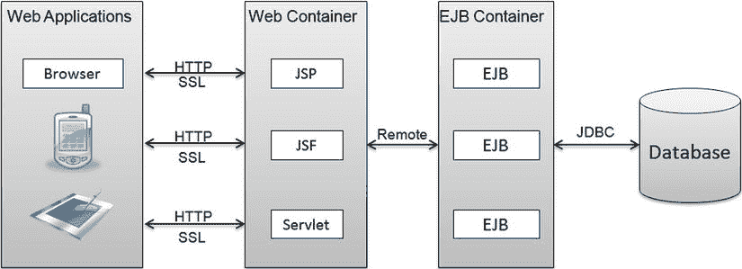

图 12-1.  基于 Web 的应用架构

这种架构允许您充分利用会话 Bean 的所有优势，例如封装与实体的交互、管理事务和安全性等。其缺点在于，您需要一个 EJB 容器或应用服务器来部署和运行会话 Bean。在这种架构中，另一点需要注意的是，您可以将 Web 容器和 EJB 容器运行在两台不同的物理机器上，或者同一台物理机器上的两个不同 Java 虚拟机（JVM）中。这种方法的优缺点已在第 2 章中讨论过。

这种架构的一个细微变体如图 12-2 所示，其中 Web 容器和 EJB 容器位于同一个 JVM 中。在这种架构中，Web 组件以本地模式与 EJB 组件交互。这种方法的优缺点也已在第 2 章中讨论过。

JPA 规范提供了一种轻量级的持久化对象模型，使用普通的 Java 对象（POJO）和注解进行对象/关系（O/R）映射。这与早期 EJB 规范处理持久化的方式截然不同。这种持久化模型的轻量级特性使得应用架构成为可能，允许 Web 应用程序直接与持久化对象模型或 JPA 实体交互。图 12-3 展示了这种编程模型的架构布局。在这种架构中，Web 组件将使用 `EntityManager` 与实体交互，执行 CRUD（创建、检索、更新、删除）操作以及查询来检索数据。

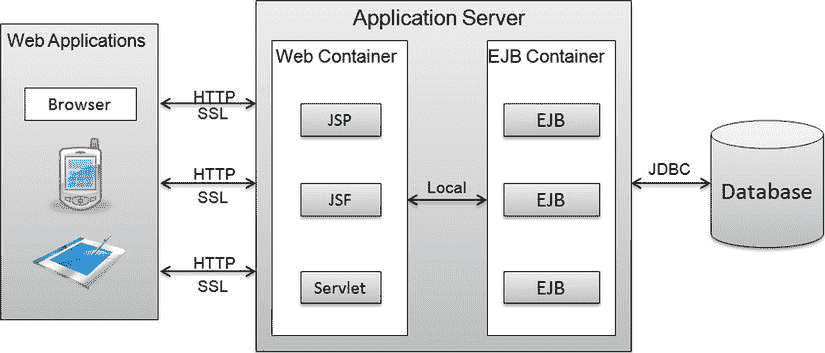

图 12-2.  支持本地调用的基于 Web 的应用架构

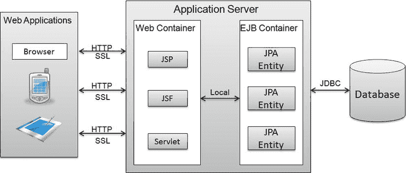

图 12-3.  使用 JPA 实体的基于 Web 的应用架构

这种编程模型的优点在于，您可以在任何标准的轻量级 Web 容器（如 Tomcat）上运行 Web 应用程序。由于您没有使用会话 Bean 或 MDB，因此不需要任何 EJB 容器或应用服务器。这种架构与其他 O/R 框架（如 TopLink 和 Hibernate，JPA 规范正是基于它们）一起被广泛使用。其缺点在于，您会失去 EJB 容器提供的一些服务（例如事务和安全性）。

在构建使用 EJB 或实体的 Web 应用程序时，上述三种架构是最常用的。这些架构还有其他变体，但我们不会深入探讨所有选项。

接下来的两种架构是编程模型，其中客户端应用程序属于桌面类型，为数据录入目的提供丰富的 UI 功能。

图 12-4 展示了一种架构，其中运行在桌面上的客户端应用程序调用远程会话。运行在桌面上的客户端应用程序具有供最终用户（例如客户服务代表和银行柜员）使用的数据录入界面。这些客户端应用程序可以使用 Java SE 中的 Java Swing 技术开发，或者使用从命令行运行的普通 Java 类（POJO）开发。通常，最终用户从其桌面启动客户端应用程序，输入一些数据，然后通过按下屏幕上的某个 UI 组件（例如“提交”按钮）来触发事件。

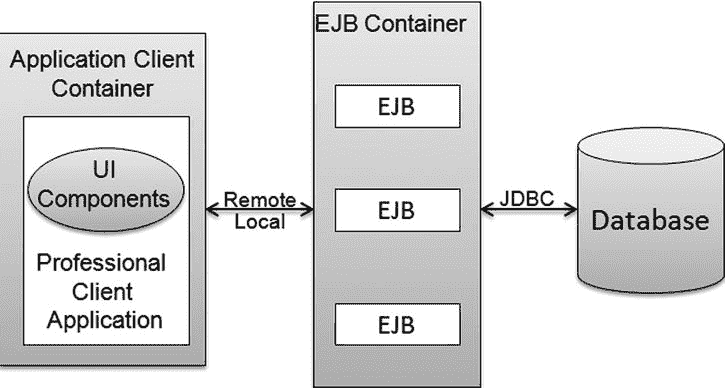

图 12-4.  专业桌面客户端应用架构

客户端应用程序可以安装在桌面机器上，也可以使用诸如 Java Web Start 之类的技术从服务器下载。在这种架构中，由于会话 Bean 将在远程服务器上运行，因此客户端应用程序始终会远程调用会话 Bean。与 Web 应用程序的情况一样，这种架构可以利用会话 Bean 的优势。

图 12-5 展示了一种直接使用 JPA 实体而不通过会话 Bean 的架构。在这种编程模型中，客户端应用程序和打包在持久化单元中的实体位于同一位置，并作为一个单一的应用单元进行组装。客户端应用程序使用 `EntityManager` 执行 CRUD 操作和查询来检索数据。

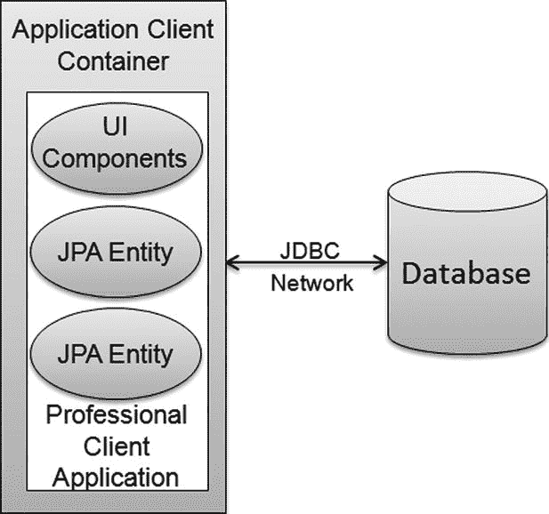

图 12-5.  使用 JPA 实体的专业客户端应用架构

这种编程模型的优点在于，您可以在标准的 Java SE 环境中运行应用程序，而无需使用 EJB 容器，但明显的缺点是，您将失去 EJB 容器提供的诸如安全性和事务管理等服务。

如第 6 章所述，无状态会话 Bean 可以发布为 Web 服务。一旦无状态会话 Bean 被发布为 Web 服务，任何能够组装并发送简单对象访问协议（SOAP）消息的 Web 服务客户端应用程序都可以调用已发布的 Web 服务。图 12-6 展示了这种架构。

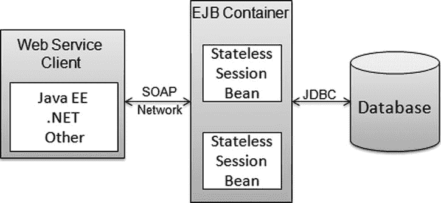

图 12-6.  Web 服务客户端应用架构


企业通常拥有多个与异构后端系统或服务交互的业务流程。*业务流程执行语言（BPEL）* 是一种标准标记语言，允许你将离散的 Web 服务组合成单个业务流程。基于 BPEL 的业务流程使用标准的 Web 服务架构和基础设施来调用一个或多个 Web 服务。图 12-7 展示了一种架构，其中基于 BPEL 的业务流程调用了一个发布为 Web 服务的无状态会话 Bean。例如，第 6 章演示了如何创建和发布一个用于检查信用卡有效性的信用服务。在订单处理业务流程的上下文中，该信用服务可能是该业务流程为完成订单处理而与之交互的多个服务之一。

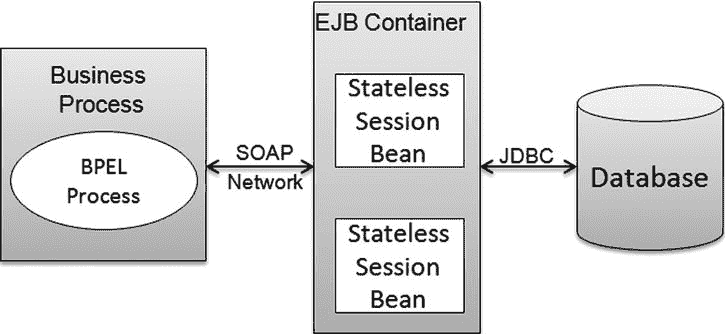

图 12-7.  作为客户端应用程序的业务流程

到目前为止，我们已经了解了涉及 EJB 或 JPA 组件的可能架构和编程模型。在接下来的章节中，我们将深入探讨图 12-2 中所示的基于 Web 的应用程序架构，并演示如何扩展在第 7 章中为 Wines Online 应用程序开发的集成后端应用程序。我们选择这种架构是因为它很常用，并且有助于我们说明容器服务的用法。

JSF

在本节中，我们将探讨如何开发一个 Web 应用程序，该应用程序使用 JavaServer Faces (JSF) 通过图 12-2 所示的架构与集成的 EJB 后端应用程序进行通信。我们将首先简要介绍 JSF 的几个概念，为你开发一个功能完备的 Web 应用程序做好准备。

 **注意**   本节绝不提供对 JSF 的全面讨论。与任何其他 Java EE 技术一样，有关 JSF 的详细信息可以在以下网址找到：`http://www.oracle.com/technetwork/java/javaee/javaserverfaces-139869.html`

Java EE Web 技术的演进

Java EE 技术已经发展成为一个成熟、可靠且稳定的平台，允许开发者构建企业级应用程序。该平台在 Web 技术领域也经历了显著的演进。图 12-8 展示了 Java EE 平台中 Web 技术的演进过程。

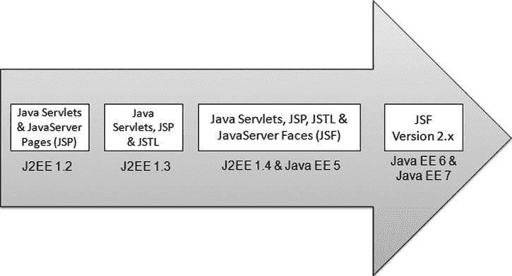

图 12-8.  Java EE Web 技术的演进

在 Java Servlet 出现之前，CGI 脚本被用于生成动态 Web 内容。CGI 脚本有其自身的局限性，包括脚本作为独立进程运行，这导致了可扩展性问题。

在 CGI 脚本之后，Java Servlet 成为了 Java EE 平台中所有 Web 技术的基础。Java Servlet 为开发基于标准的、可在 Web 容器间移植的 Web 组件和应用程序提供了一个良好的开端。Java Servlet 的缺点之一是代码密集——所有 HTML 都是通过 `println()` 方法打印出来的。Servlet 没有在创建页面设计的图形设计师和创建动态内容的 Java 程序员之间建立桥梁。

JSP 是 Web 技术演进中的下一步；它弥合了图形设计师和 Java 程序员之间的鸿沟。基于 Java Servlet 技术，JSP 页面是嵌入了 Java 代码的 HTML 页面。这种模型允许图形设计师创建 JSP 页面，然后程序员可以通过添加 Java 代码或*脚本片段*使其具有动态性。编译后，JSP 页面就变成了 Java Servlet。

虽然 JSP 页面的出现很好，但许多开发者现在不得不处理诸如遍历数据集合之类的繁琐任务。这导致了 JSP 标准标签库 (JSTL) 的创建，它自动化了其中一些任务。

尽管这些技术的进步简化了 Web 应用程序的构建，但当时还没有用于开发它们的标准组件模型。除此之外，使用像 Visual Basic、Oracle Forms 和 PowerBuilder 这样的第四代语言 (4GL) 开发具有可重用组件的 Web 应用程序也还不可行。

JSF 是最新的 Java EE Web 技术。通过组件模型，它解决了可重用组件和简化 Web 应用程序构建的问题。不过，可重用组件模型并不是 JSF 提供的唯一功能。我们将在接下来的章节中探讨 JSF 的其他一些特性和优势。

模型-视图-控制器模式

在 Java EE Web 技术开发的早期阶段，大多数 Web 应用程序都是使用所谓的 Model-I 方法构建的。Model-I 的基本思想是，呈现动态 Web 内容的 Web 技术与后端系统的业务逻辑紧密交织在一起。这种方法没有关注点分离，导致了应用程序维护问题。Model-II 方法（也称为模型-视图-控制器 [MVC] 模式）是对 Model-I 方法的后续改进。这种方法的关键在于视图层与提供数据和业务逻辑的模型层之间的清晰分离。

MVC 模式并非 Java 语言所特有；它可以追溯到像 Smalltalk 这样的语言。在这种方法中，模型层用于业务逻辑和数据，视图用于呈现用户界面，控制器用于应用程序流程和事件处理。虽然 Java EE 平台在模型和视图端技术方面一直在演进，但它并没有包含一个可用于控制器端的内置框架。相反，许多开发者使用 Java Servlet 技术构建了自制的控制器。还有许多其他人转向了 Apache Struts，它为编写自制控制器提供了一种替代方案。Apache Struts 是一个广泛使用的开源框架，已成为 Web 应用程序事实上的控制器框架。

最终，JSF 技术通过提供控制器作为框架的一部分，标准化了 MVC 模式的控制器方面。

JSF 架构

图 12-9 展示了简化的 JSF 架构。JSF 有一个名为 `FacesServlet` 的前端控制器 Servlet。`FacesServlet` 扮演着将来自客户端的传入请求路由到正确位置的中介角色。如前所述，JSF 带有可重用的 Web 组件，可用于开发用户界面。这些 UI 组件可以与称为*托管 Bean* 的对象相关联。这些托管 Bean 处理应用程序的逻辑，并与后端系统或组件（如 EJB）进行交互。JSF 中的每个 UI 组件都可以与不同的渲染工具包相关联，这些工具包可以为不同类型的设备生成不同的标记，例如 HTML 或 WML（无线标记语言）。

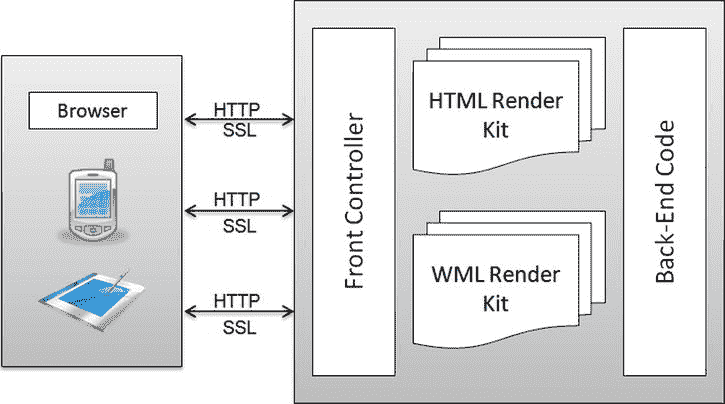

图 12-9.  JSF 架构

JSF 生命周期

图 12-10 展示了处理初始请求以及来自客户端应用程序或用户界面的*回传*的 JSF 生命周期。以下列表描述了生命周期的各个阶段：


*   **恢复视图**：如果传入的请求是初始请求，JSF 实现会创建视图。在视图创建过程中，每个 UI 组件的 UI 对象都会被创建并存储在组件树中。随后，UI 视图的状态会被保存，以供后续请求使用。如果传入的请求是回传请求，JSF 实现会恢复已保存的 UI 以处理当前请求。
*   **应用请求值**：在此阶段，作为请求一部分发送的数据会被用来更新属于该视图的 UI 对象。
*   **处理验证**：在此阶段，已提交的数据会被验证。
*   **更新模型**：在此阶段，后端对象会使用来自请求的已验证数据进行更新。接收到的数据转换也在此阶段发生。
*   **调用应用**：在此阶段，后端应用会被调用来完成请求的处理，并将响应渲染回客户端。
*   **渲染响应**：在此生命周期阶段，UI 组件会被渲染，并将响应发送回客户端。

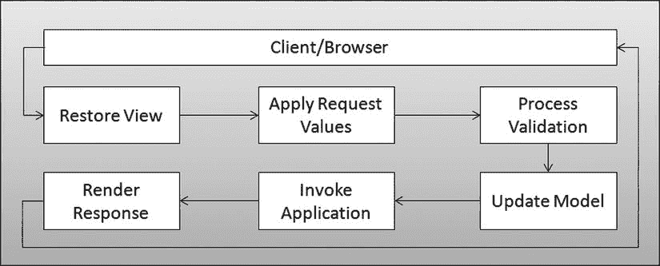

图 12-10.  JSF 生命周期

JSF 应用

一个典型的 JSF 应用包含以下部分：

*   **JSP 页面或 Facelets**：应用中的 JSP 页面或 Facelets 包含封装在 JSP 标签中的 JSF UI 组件。每个 JSF 组件都是一个与标记无关的构建块。它包含三个主要部分：一个 UIComponent、一个渲染器和一个标签处理器。UIComponent 定义了组件的行为（例如，单选按钮组或菜单等 UI 组件的行为）。它在运行时还与特定的渲染器相关联。渲染器负责决定向客户端渲染何种标记。*标签处理器*是一个 JSP 标签，允许在 JSP 中使用 JSF UI 组件。
*   **导航模型**：关于控制如何在应用中流转的信息定义在一个名为 `faces-config.xml` 的 XML 部署描述符中。该文件可以包含其他多种类型的信息，例如验证器、转换器和受管 Bean 列表。每个 JSF 应用可以包含多个 `faces-config.xml` 文件。
*   **受管 Bean**：这些是促进应用逻辑的普通 Java 类。它们可以用作来自后端组件数据的绑定，或者用于调用后端应用中的业务方法。

JSF 工具和组件

仅仅拥有标准并不总是有帮助。来自开发者社区和供应商的支持对于一项技术的成功起着重要作用。虽然 JSF 的目标是极大地简化 Web 应用开发，但仅靠标准化无法实现这一目标。我们需要为开发者提供全套可用的 UI 组件来构建应用，以及全套的开发工具来辅助应用构建过程。在过去几年中，JDeveloper、Java Studio Creator 和 Eclipse 等开发工具已经为构建 JSF 应用提供了支持。Apache MyFaces 作为 JSF 框架的一个开源实现，提供了比 JSF 参考实现功能更丰富的组件。Oracle 也发布了超过 100 个标准 Faces 组件，统称为 ADF Faces。这些 ADF Faces 组件已捐赠给 Apache 软件基金会，现在已成为 MyFaces 项目的一部分，也称为 *Trinidad*。所有这些因素都为 JSF 技术的成功及其被开发者采用做出了重大贡献。

 **注意**   关于 MyFaces 项目的信息可以在以下网址找到：`http://myfaces.apache.org`。

使用 JSF 和 EJB 开发 Web 应用

在第 7 章中，我们做了大量工作来集成不同类型的 EJB（会话 Bean、MDB、实体和 Web 服务），以便为 Wines Online 应用开发一个功能完备的 EJB 后端基础设施。在本节中，我们将开发一个运行在 EJB 后端应用之上的 JSF 客户端应用，如图 12-11 所示。

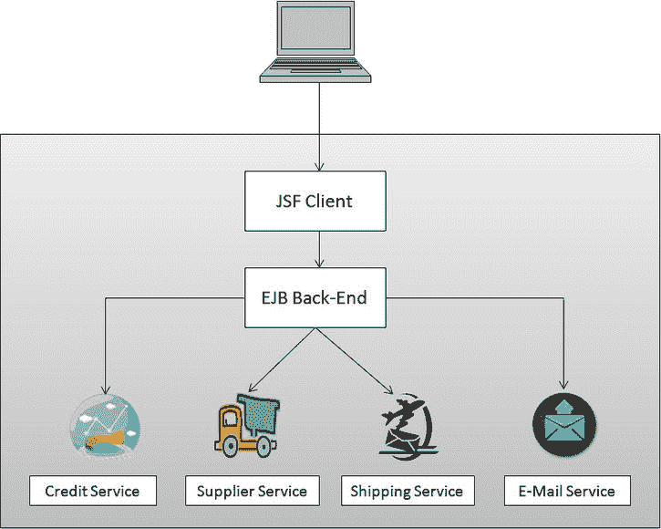

图 12-11.  示例应用架构

本节的主要目标是向您展示如何开发一组 JSF 页面，并将它们连接到后端应用中的 EJB 组件。考虑到这一点，我们将从用户如何通过一组 Web 页面导航来执行以下操作开始：

*   注册为新客户
*   登录
*   根据不同条件搜索葡萄酒
*   将葡萄酒添加到购物车
*   查看购物车内容
*   提交订单

图 12-12 展示了应用流程，并说明了一组允许用户执行上述操作的 JSF 页面。我们将一次构建一个页面，根据需要将每个页面连接到 EJB 后端应用，并完成整个应用。

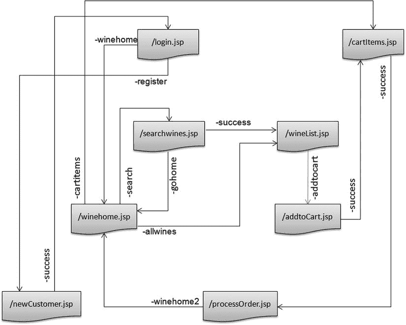

图 12-12.  JSF 应用页面流程

我们将从一个简单的登录页面开始。

登录页面

为了简化登录过程，我们将使用客户的电子邮件地址来验证和授权订单。`Email` 是第 7 章中使用的持久化单元中 `Customer` 实体的映射字段之一。清单 12-1 展示了 `login.jsp` 的代码。首先，有两个标签库指令、一些标准 HTML 标签以及一些用于渲染 JSF UI 组件的标签。任何包含 JSF 元素的页面都必须将 `f:view` 标签作为最外层的 JSF 标签。`h:form` 标签创建一个 HTML 表单，`h:inputText` 标签创建一个输入文本字段，`h:commandButton` 标签在表单中创建一个提交按钮。您可能会注意到，`h:inputText` 的 `value` 属性使用的语法与 HTML 中使用的不同。我们使用的是表达式语言 (EL) 语法 — `#{}`。表达式 `#{Login.email}` 表示 JSP 页面想要访问 `Login` 对象中的 email 属性。`Login` 对象是一个*受管 Bean*，稍后将对此进行讨论。与 HTML 表单类似，`h:commandButton` 有一个 `action` 属性。用于 `action` 的 EL 语法是 `#{Login.processLogin}`，这意味着当用户点击提交按钮时，一个 `POST` 操作将触发 `Login` 受管 Bean 中的 `processLogin` 方法。

***清单 12-1.***  login.jsp

```
<!DOCTYPE HTML PUBLIC "-//W3C//DTD HTML 4.01 Transitional//EN"
"http://www.w3.org/TR/html4/loose.dtd">
<%@ page contentType="text/html;charset=windows-1252"%>
<%@ taglib uri="http://java.sun.com/jsf/html" prefix="h"%>
<%@ taglib uri="http://java.sun.com/jsf/core" prefix="f"%>
<f:view>
  <html>
    <head>
      <meta http-equiv="Content-Type"content="text/html; charset=windows-1252"/>
      <title>Login Page</title>
    </head>
    <body>
      <h:form>
        <h3> Beginning EJB: Wine Store Application </h3>
        <h5> Enter Email address: </h5>
        <p>  <h:inputText value="#{Login.email}"/> </p>
        <p>  <h:commandButton value="Login" action="#{Login.processLogin}"/> </p>
      </h:form>
    </body>
  </html>
</f:view>
```

本章后面“编译、部署和测试 JSF 应用”部分中的图 12-18 展示了 `login.jsp` 页面在浏览器中的渲染效果。


下一步是创建一个名为 `Login` 的受管 bean，它将与 `login.jsp` 配合使用。受管 bean 是 JSF 应用程序使用的 JavaBean。这些对象由 JSF 实现管理，并且这些对象中的属性和方法可以通过值绑定和方法绑定表达式从 JSP 页面引用。清单 12-2 展示了 `Login` 受管 bean。`Login` 有三个属性字段及其访问器：`email`、`customer` 和 `shoppingCart`。我们在 `setShoppingCart()` 方法上方添加了一个 `@EJB` 注解。我们使用 setter 注入来注入我们在第 7 章中开发的有状态会话 bean `ShoppingCart`。我们的 bean 中还有一个额外的方法 `processLogin()`，它使用注入的 `shoppingCart` 有状态会话 bean 调用 `findCustomer(String email)` 业务方法。如果客户数据库中存在该电子邮件 ID，此业务方法将返回一个 `Customer` 对象。我们还加入了额外的逻辑，以返回存储在 `faces-config.xml` 文件中的字符串值，供导航模型使用。我们稍后将对此进行讨论。

***清单 12-2.***  Login.java

```
package com.apress.ejb.chapter12.view.managed;

import com.apress.ejb.chapter07.ejb.ShoppingCartLocal;
import com.apress.ejb.chapter07.entities.Customer;
import javax.ejb.EJB;

public class Login
{
  public Login() {
  }
  String email;
  Customer customer;
  ShoppingCartLocal shoppingCart;

public void setEmail(String email) {
    this.email = email;
  }

public String getEmail() {
    return email;
  }

public String processLogin() {
    String navigation = null;
    customer = (Customer)shoppingCart.findCustomer(email);

if (customer != null) {
      navigation = "winehome";
    }
    else {
      navigation = "register";
    }
    return navigation;
  }

public void setCustomer(Customer customer) {
    this.customer = customer;
  }

public Customer getCustomer() {
    return customer;
  }

@EJB
  public void setShoppingCart(ShoppingCartLocal shoppingCart) {
    this.shoppingCart = shoppingCart;
  }

public ShoppingCartLocal getShoppingCart() {
    return shoppingCart;
  }
}
```

部署描述符 `faces-config.xml` 包含页面导航、受管 bean 等信息。清单 12-3 展示了 `faces-config.xml` 中与 `login.jsp` 之间的控制流。它还展示了 `Login` 类被注册为受管 bean。我们将 `Login` 受管 bean 的作用域设置为 `session`。这允许我们通过会话存储有关客户和购物车的信息，这样我们就不必为相同的信息重新查询后端应用程序。这也便于在其他页面中使用这些信息，并调用 `ShoppingCart` 有状态会话 bean 上的其他业务方法，而无需再次查找该 bean。此外，我们还创建了三个导航规则：

*   从 `login.jsp` 到 `winehome.jsp`，值为 `winehome`：如果登录成功，将使用此规则。
*   从 `login.jsp` 到 `newCustomer.jsp`，值为 `register`：如果登录失败且客户想要注册为新客户，将使用此规则。
*   从 `newCustomer.jsp` 到 `login.jsp`，值为 `success`：此规则用于在成功注册后将客户导航回登录页面。

***清单 12-3.***  faces-config.xml

```
<?xml version="1.0" encoding="windows-1252"?>
<!DOCTYPE faces-config PUBLIC
  "-//Sun Microsystems, Inc.//DTD JavaServer Faces Config 1.1//EN"
  "http://java.sun.com/dtd/web-facesconfig_1_1.dtd">

<faces-config xmlns="http://java.sun.com/JSF/Configuration">

<managed-bean>
    <managed-bean-name>Login</managed-bean-name>
    <managed-bean-class>com.apress.ejb.chapter12.view.managed.Login</managed-bean-class>
    <managed-bean-scope>session</managed-bean-scope>
  </managed-bean>

<navigation-rule>
    <from-view-id>/login.jsp</from-view-id>
    <navigation-case>
      <from-outcome>winehome</from-outcome>
      <to-view-id>/winehome.jsp</to-view-id>
    </navigation-case>
    <navigation-case>
      <from-outcome>register</from-outcome>
      <to-view-id>/newCustomer.jsp</to-view-id>
    </navigation-case>
  </navigation-rule>

<navigation-rule>
    <from-view-id>/newCustomer.jsp</from-view-id>
    <navigation-case>
      <from-outcome>success</from-outcome>
      <to-view-id>/login.jsp</to-view-id>
    </navigation-case>
  </navigation-rule>

</faces-config>
```

到目前为止，我们已经向您展示了如何通过一个简单的登录页面开始使用 JSF 应用程序，该页面可以查找 EJB 并调用业务方法。在接下来的几节中，我们将继续完成葡萄酒商店 JSF 应用程序的其余页面。

新客户注册页面

清单 12-4 展示了 `newCustomer.jsp` JSF 页面的代码。此页面与之前创建的 `login.jsp` 页面非常相似，只是它有更多用于捕获客户信息的输入字段。JSP 页面中的所有输入字段（名字、姓氏、电话、电子邮件、地址 1、地址 2、城市、州、邮政编码、信用卡和信用卡到期日期）都具有值绑定表达式，这些表达式映射到 `NewCustomer` 受管 bean 中的属性。它还有一个提交按钮，其操作使用表达式 `#{NewCustomer.AddNewCustomer}` 映射到受管 bean 中的 `AddNewCustomer()` 方法。

***清单 12-4.***  newCustomer.jsp


```
<!DOCTYPE HTML PUBLIC "-//W3C//DTD HTML 4.01 Transitional//EN"
"http://www.w3.org/TR/html4/loose.dtd">
<%@ page contentType="text/html;charset=windows-1252"%>
<%@ taglib uri="http://java.sun.com/jsf/html" prefix="h"%>
<%@ taglib uri="http://java.sun.com/jsf/core" prefix="f"%>
<f:view>
  <html>
    <head>
      <meta http-equiv="Content-Type" content="text/html; charset=windows-1252"/>
      <title>新客户页面</title>
    </head>
    <body>
      <h:form>
        <h1> EJB 入门：葡萄酒商店应用 </h1>
        输入以下信息以注册为新客户：
        <table cellspacing="2" cellpadding="3" border="1" width="100%">
          <tr>
            <td width="33%">名</td>
            <td width="67%"> <h:inputText value="#{NewCustomer.firstName}"/> </td>
          </tr>
          <tr>
            <td width="33%">姓</td>
            <td width="67%"> <h:inputText value="#{NewCustomer.lastName}"/> </td>
          </tr>
          <tr>
            <td width="33%">电话</td>
            <td width="67%"> <h:inputText value="#{NewCustomer.phone}"/> </td>
          </tr>
          <tr>
            <td width="33%">电子邮件</td>
            <td width="67%"> <h:inputText value="#{NewCustomer.email}"/> </td>
          </tr>
          <tr>
            <td width="33%">街道 1</td>
            <td width="67%"> <h:inputText value="#{NewCustomer.streetOne}"/> </td>
          </tr>
          <tr>
            <td width="33%">街道 2</td>
            <td width="67%"> <h:inputText value="#{NewCustomer.streetTwo}"/> </td>
          </tr>
          <tr>
            <td width="33%">城市</td>
            <td width="67%"> <h:inputText value="#{NewCustomer.city}"/> </td>
          </tr>
          <tr>
            <td width="33%">州/省</td>
            <td width="67%"> <h:inputText value="#{NewCustomer.state}"/> </td>
          </tr>
          <tr>
            <td width="33%">邮政编码</td>
            <td width="67%"> <h:inputText value="#{NewCustomer.zipCode}"/> </td>
          </tr>
          <tr>
            <td width="33%">信用卡</td>
            <td width="67%"> <h:inputText value="#{NewCustomer.ccnum}"/> </td>
          </tr>
          <tr>
            <td width="33%">信用卡到期日期</td>
            <td width="67%"> <h:inputText value="#{NewCustomer.ccexpDate}"/> </td>
          </tr>
        </table>
        <h1>
          <h:commandButton value="提交" action="#{NewCustomer.AddNewCustomer}"/>
        </h1>
      </h:form>
    </body>
  </html>
</f:view>
```

图 12-19（位于“编译、部署和测试 JSF 应用”部分）展示了 `newCustomer.jsp` 页面在浏览器中的渲染效果。

创建 `newCustomer.jsp` 页面后，我们将创建 `NewCustomer` 托管 bean。清单 12-5 展示了该托管 bean 的代码，其中包含了 `newCustomer.jsp` 页面所引用的所有属性的 getter 和 setter 方法。此外，该类使用 `@EJB` 注解注入了 `CustomerFacade` 无状态会话 bean。最后，`AddNewCustomer()` 方法利用属性的 getter 方法创建一个新的 `Individual` 实体实例，并调用 `CustomerFacade` 中的 `AddCustomer()` 业务方法。成功执行后，该方法返回一个 `success` 字符串，将用户导航至登录页面。

***清单 12-5.***  NewCustomer.java

```
package com.apress.ejb.chapter12.view.managed;

import com.apress.ejb.chapter07.ejb.CustomerFacadeLocal;
import com.apress.ejb.chapter07.entities.Address;
import com.apress.ejb.chapter07.entities.Individual;
import javax.ejb.EJB;

public class NewCustomer
{
  private String firstName;
  private String lastName;
  private String phone;
  private String email;
  private String streetOne;
  private String streetTwo;
  private String city;
  private String state;
  private String zipCode;
  private String ccnum;
  private String ccexpDate;

@EJB
 CustomerFacadeLocal customerFacade;

public NewCustomer() {
  }

public void setFirstName(String firstName) {
    this.firstName = firstName;
  }

public String getFirstName() {
    return firstName;
  }

public void setLastName(String lastName) {
    this.lastName = lastName;
  }

public String getLastName() {
    return lastName;
  }

public void setPhone(String phone) {
    this.phone = phone;
  }

public String getPhone() {
    return phone;
  }

public void setEmail(String email) {
    this.email = email;
  }

public String getEmail() {
    return email;
  }

public void setStreetOne(String streetOne) {
    this.streetOne = streetOne;
  }

public String getStreetOne() {
    return streetOne;
  }

public void setStreetTwo(String streetTwo) {
    this.streetTwo = streetTwo;
  }

public String getStreetTwo() {
    return streetTwo;
  }

public void setCity(String city) {
    this.city = city;
  }

public String getCity() {
    return city;
  }

public void setState(String state) {
    this.state = state;
  }

public String getState() {
    return state;
  }

public void setZipCode(String zipCode) {
    this.zipCode = zipCode;
  }

public String getZipCode() {
    return zipCode;
  }

public void setCcnum(String ccnum) {
    this.ccnum = ccnum;
  }

public String getCcnum() {
    return ccnum;
  }

public void setCcexpDate(String ccexpDate) {
    this.ccexpDate = ccexpDate;
  }

public String getCcexpDate() {
    return ccexpDate;
  }

public String AddNewCustomer() {
    Individual customer = new Individual();
    customer.setFirstName(firstName);
    customer.setLastName(lastName);
    customer.setPhone(phone);
    customer.setEmail(email);

Address address = new Address();
    address.setStreet1(streetOne);
    address.setStreet2(streetTwo);
    address.setState(state);
    address.setCity(city);
    address.setZipCode(zipCode);

customer.setDefaultBillingAddress(address);
    customer.setCcNum(ccnum);
    customer.setCcExpDate(ccexpDate);

if (customerFacade != null) {
      customerFacade.registerCustomer(customer);
    }

return "success";
  }
}
```

 **注意**   第 7 章 提供了客户端可用的所有 EJB 和业务方法的详细信息。

现在我们需要更新 清单 12-3 中所示的 `faces-config.xml` 文件，将 `NewCustomer` 添加为托管 bean。清单 12-6 展示了需要添加的 XML 片段。与 `Login` 托管 bean 不同，我们将此 bean 的作用域设置为 `request`，因为我们不需要在会话中存储客户注册信息。

***清单 12-6.***  faces-config.xml，包含 NewCustomer 托管 bean

```
<managed-bean>
  <managed-bean-name>NewCustomer</managed-bean-name>
  <managed-bean-class>com.apress.ejb.chapter12.view.managed.NewCustomer</managed-bean-class>
  <managed-bean-scope>request</managed-bean-scope>
</managed-bean>
```

 **注意**   我们已经在 清单 12-3 中添加了从 `newCustomer.jsp` 到 `login.jsp` 的导航规则。

我们已经完成了登录和新客户注册任务。下一步是允许用户根据不同的条件搜索葡萄酒。我们将首先创建一个简单的 JSF 页面，该页面将提供指向用户可用不同选项的链接。

链接页面


清单 12-7 展示了`winehome.jsp` JSF 页面的代码。该页面使用了一个`h:commandLink` JSF UI 组件，允许你嵌入在页面渲染时应显示的输出文本。它还包含一个用户可点击的实时链接，用于导航到下一页。该页面为用户提供了三个选项：

*   所有可用葡萄酒的完整列表
*   按年份、国家或品种搜索葡萄酒的功能
*   查看购物车并提交订单的功能

我们可以为`h:commandLink`组件指定`action`属性，该属性可以是一个基于受管 Bean 中方法或属性的表达式。或者，`action`属性也可以是`faces-config.xml`中定义的导航规则的名称。我们将使用方法绑定表达式`#{WineList.findAllWines}`作为“葡萄酒完整列表”选项的`action`属性值，而对于其余两个选项，我们将使用导航规则的名称。

***清单 12-7.***  winehome.jsp

```
<!DOCTYPE HTML PUBLIC "-//W3C//DTD HTML 4.01 Transitional//EN"
"http://www.w3.org/TR/html4/loose.dtd">
<%@ page contentType="text/html;charset=windows-1252"%>
<%@ taglib uri="http://java.sun.com/jsf/html" prefix="h"%>
<%@ taglib uri="http://java.sun.com/jsf/core" prefix="f"%>
<f:view>
  <html>
    <head>
      <meta http-equiv="Content-Type" content="text/html; charset=windows-1252"/>
      <title>葡萄酒主页</title>
    </head>
    <body>
      <h:form>
        <h1> Beginning EJB: 葡萄酒商店应用 </h1>
        <p>
          <h:commandLink action="#{WineList.findAllWines}">
            <h:outputText value="葡萄酒完整列表"/>
          </h:commandLink>
        </p>
        <p>
          <h:commandLink action="search">
            <h:outputText value="按年份、国家或品种搜索"/>
          </h:commandLink>
        </p>
        <p>
          <h:commandLink action="cartitems">
            <h:outputText value="查看购物车并提交订单"/>
          </h:commandLink>
        </p>
      </h:form>
    </body>
  </html>
</f:view>
```

图 12-21（位于“编译、部署和测试 JSF 应用”部分）展示了`winehome.jsp`页面在浏览器中的渲染效果。

下一步是定义`WineList`受管 Bean，它将与后端 EJB 通信以获取所有葡萄酒的列表。清单 12-8 展示了`WineList` Bean 的代码。我们将首先使用`@EJB`注解注入`SearchFacade` EJB。Bean 类中的`findAllWines()`方法利用注入的`SearchFacade`无状态会话 Bean，并调用返回可用葡萄酒列表的`getWineFindAll()`业务方法。返回的葡萄酒列表存储在受管 Bean 的`winesList`属性中，而字符串`allwines`则作为导航规则返回。

***清单 12-8.***  WineList.java

```
package com.apress.ejb.chapter12.view.managed;

import com.apress.ejb.chapter07.ejb.SearchFacadeLocal;
import com.apress.ejb.chapter07.entities.Wine;
import java.util.ArrayList;
import java.util.List;
import javax.ejb.EJB;
import javax.faces.application.Application;
import javax.faces.component.html.HtmlDataTable;
import javax.faces.context.FacesContext;
import javax.faces.el.ValueBinding;

public class WineList
{
  public WineList() {
  }

@EJB
  private SearchFacadeLocal searchFacade;
  private List<Wine> winesList = new ArrayList();

public String findAllWines() {
    if (searchFacade == null) {
      return "gohome";
    }
    else {
      winesList = searchFacade.getWineFindAll();
      return "allwines";
    }
  }

public void setWinesList(List<Wine> winesList) {
    this.winesList = winesList;
  }

public List<Wine> getWinesList() {
    return winesList;
  }
}
```

为了完成此页面的工作，我们将使用清单 12-9 中所示的详细信息扩展`faces-config.xml`文件。我们将`WineList`定义为一个受管 Bean，并添加了三个导航规则，用于创建以下链接：

*   从`winehome.jsp`到`searchwines.jsp`，将用户带到搜索页面
*   从`winehome.jsp`到`wineList.jsp`，在执行受管 Bean 中提供的`findAllWines()`方法之后
*   从`winehome.jsp`到`cartItems.jsp`，显示购物车中所有项目的列表

***清单 12-9.***  faces-config.xml，包含 WineList 受管 Bean

```
<managed-bean>
  <managed-bean-name>WineList</managed-bean-name>
  <managed-bean-class>com.apress.ejb.chapter12.view.managed.WineList</managed-bean-class>
  <managed-bean-scope>session</managed-bean-scope>
</managed-bean>

<navigation-rule>
  <from-view-id>/winehome.jsp</from-view-id>
  <navigation-case>
    <from-outcome>search</from-outcome>
    <to-view-id>/searchwines.jsp</to-view-id>
  </navigation-case>
  <navigation-case>
    <from-outcome>allwines</from-outcome>
    <to-view-id>/wineList.jsp</to-view-id>
  </navigation-case>
  <navigation-case>
    <from-outcome>cartitems</from-outcome>
    <to-view-id>/cartItems.jsp</to-view-id>
  </navigation-case>
</navigation-rule>
```

我们将在接下来的章节中处理这三个导航目标页面。

搜索页面

清单 12-10 展示了`searchwines.jsp` JSF 页面的代码。该页面允许用户按年份、国家或品种搜索葡萄酒。我们使用了`h:selectOneListBox`组件，这些组件为每个搜索条件填充了静态值列表。从列表框中选择的值通过`h:selectOneListBox`组件的`value`属性中指定的值绑定表达式，存储在`SearchWines`受管 Bean 的属性中。我们还提供了三个提交按钮，其`action`属性具有方法绑定表达式，例如`#{WineList.searchByYear}`，用于触发`WineList`受管 Bean 中的方法，该方法将从 EJB 后端应用中检索结果。

***清单 12-10.***  searchwines.jsp


```
<!DOCTYPE HTML PUBLIC "-//W3C//DTD HTML 4.01 Transitional//EN"
"http://www.w3.org/TR/html4/loose.dtd">
<%@ page contentType="text/html;charset=windows-1252"%>
<%@ taglib uri="http://java.sun.com/jsf/html" prefix="h"%>
<%@ taglib uri="http://java.sun.com/jsf/core" prefix="f"%>
<f:view>
  <html>
    <head>
      <meta http-equiv="Content-Type" content="text/html; charset=windows-1252"/>
      <title>搜索葡萄酒页面</title>
    </head>
    <body>
      <h:form>
        <h2> 入门 EJB：葡萄酒商店应用 </h2>
        <h4> 搜索葡萄酒 </h4>
        <table cellspacing="2" cellpadding="3" border="1" width="100%">
          <tr>
            <td><h:outputText value="年份"/></td>
            <td>
              <h:selectOneListbox value="#{SearchWines.year}">
              <f:selectItem itemLabel="2001" itemValue="2001"/>
              <f:selectItem itemLabel="2002" itemValue="2002"/>
              <f:selectItem itemLabel="2003" itemValue="2003"/>
              <f:selectItem itemLabel="2007" itemValue="2007"/>
              <f:selectItem itemLabel="2008" itemValue="2008"/>
              <f:selectItem itemLabel="2009" itemValue="2009"/>
              </h:selectOneListbox>
            </td>
            <td><h:commandButton value="搜索" action="#{WineList.searchByYear}"/></td>
          </tr>
          <tr>
            <td><h:outputLabel value="国家"/></td>
            <td>
              <h:selectOneListbox value="#{SearchWines.country}">
              <f:selectItem itemLabel="美国" itemValue="USA"/>
              <f:selectItem itemLabel="法国" itemValue="France"/>
              <f:selectItem itemLabel="澳大利亚" itemValue="Australia"/>
              </h:selectOneListbox>
            </td>
            <td><h:commandButton value="搜索" action="#{WineList.searchByCountry}"/></td>
          </tr>
          <tr>
            <td><h:outputLabel value="品种"/></td>
            <td><h:selectOneListbox value="#{SearchWines.varietal}">
              <f:selectItem itemLabel="仙粉黛" itemValue="Zinfandel"/>
              </h:selectOneListbox>
            </td>
            <td><h:commandButton value="搜索" action="#{WineList.searchByVarietal}"/></td>
          </tr>
        </table>
      </h:form>
    </body>
  </html>
</f:view>
```

图 12-22（位于“编译、部署和测试 JSF 应用”部分）展示了在浏览器中渲染后的 `searchwines.jsp` 页面。

下一步是向 `WineList` 托管 Bean 添加新方法，并定义一个名为 `SearchWines` 的新托管 Bean。清单 12-11 展示了 `SearchWines` 托管 Bean，它包含三个属性（`year`、`varietal` 和 `country`）及其访问器。用户在 `searchwines.jsp` 页面中选择的值存储在这些属性中，`WineList` 托管 Bean 可以检索这些属性。

***清单 12-11.***  SearchWines.java

```
package com.apress.ejb.chapter12.view.managed;

public class SearchWines
{
  public SearchWines() {
  }

public String year;
  public String varietal;
  public String country;

public void setYear(String year) {
    this.year = year;
  }

public String getYear() {
    return year;
  }

public void setVarietal(String varietal) {
    this.varietal = varietal;
  }

public String getVarietal() {
    return varietal;
  }

public void setCountry(String country) {
    this.country = country;
  }

public String getCountry() {
    return country;
  }
}
```

我们需要向之前创建的 `WineList` 托管 Bean（参见清单 12-8）添加新功能，即增加三个方法，这些方法绑定在 `searchwines.jsp` JSF 页面的方法绑定表达式中。清单 12-12 展示了这三个方法：`searchByYear()`、`searchByCountry()` 和 `searchByVarietal()`。每个方法都需要从 `SearchWines` 托管 Bean 中获取属性的值。JSF 通过 `FacesContext` 对象提供对请求数据和其他对象数据的访问。一旦我们获得了 `FacesContext` 的引用，就可以访问应用和托管 Bean。所有方法都使用相同的技术：从 `FacesContext` 获取 `Application`，然后调用带有值绑定表达式的 `createValueBinding()` 方法，从 `SearchWines` 托管 Bean 中检索相关属性的值。从 `SearchWines` 检索到属性值后，该方法通过传入与搜索条件匹配的参数，调用 `SearchFacade` EJB 中的业务方法，以检索葡萄酒列表。检索到的葡萄酒列表存储在 `winesList` 属性中，该属性的类型为 `java.util.List`。

***清单 12-12.***  WineList.java，包含搜索方法

```
public String searchByCountry() {
  FacesContext ctx = FacesContext.getCurrentInstance();
  Application app = ctx.getApplication();
  ValueBinding wineyear = app.createValueBinding("#{SearchWines.country}");
  String country = wineyear.getValue(ctx).toString();
  if (searchFacade == null) {
    return "gohome";
  }
  else {
    winesList = searchFacade.getWineFindByCountry(country);
    return "success";
  }
}

public String searchByVarietal() {
  FacesContext ctx = FacesContext.getCurrentInstance();
  Application app = ctx.getApplication();
  ValueBinding wineyear = app.createValueBinding("#{SearchWines.varietal}");
  String varietal = wineyear.getValue(ctx).toString();
  if (searchFacade == null) {
    return "gohome";
  }
  else {
    winesList = searchFacade.getWineFindByVarietal(varietal);
    return "success";
  }
}

public String searchByYear() {
  FacesContext ctx = FacesContext.getCurrentInstance();
  Application app = ctx.getApplication();
  ValueBinding wineyear = app.createValueBinding("#{SearchWines.year}");
  String year = wineyear.getValue(ctx).toString();
  if (searchFacade == null) {
    return "gohome";
  }
  else {
    winesList = searchFacade.getWineFindByYear(new Integer(year));
    return "success";
  }
}
```

所有方法都返回一个 `success` 值，该值将用作导航规则。我们需要将此导航规则添加到 `faces-config.xml` 中，并将 `SearchWines` 注册为托管 Bean。清单 12-13 展示了需要添加到 `faces-config.xml` 中的 XML 片段。方法返回的 `success` 值会将用户导航到 `wineList.jsp` 页面，该页面将显示葡萄酒列表。请注意，我们将 `SearchWines` 托管 Bean 的作用域设置为 `session`，因为我们也会从其他托管 Bean 中访问其属性。

***清单 12-13.***  faces-config.xml，包含 SearchWines 托管 Bean

```
<navigation-rule>
  <from-view-id>/searchwines.jsp</from-view-id>
  <navigation-case>
    <from-outcome>gohome</from-outcome>
    <to-view-id>/winehome.jsp</to-view-id>
  </navigation-case>
  <navigation-case>
    <from-outcome>success</from-outcome>
    <to-view-id>/wineList.jsp</to-view-id>
  </navigation-case>
</navigation-rule>

<managed-bean>
  <managed-bean-name>SearchWines</managed-bean-name>
  <managed-bean-class>com.apress.ejb.chapter12.view.managed.SearchWines</managed-bean-class>
  <managed-bean-scope>session</managed-bean-scope>
</managed-bean>
```

到目前为止，我们已经完成了以下任务：


*   创建登录页面
*   创建注册页面
*   创建包含选项列表的主页
*   创建搜索页面

现在，我们将在 `wineList.jsp` 页面中向用户展示葡萄酒列表。

葡萄酒列表页面

代码清单 12-14 展示了 `wineList.jsp` JSF 页面的代码。在这个页面中，我们使用了一个名为 `h:dataTable` 的新 UI 组件。该组件能够渲染来自类型为 `java.util.List` 的受管 Bean 属性的数据集合。在前面的章节中，我们一直将检索到的葡萄酒存储在 `winesList` 属性中。`#{WinesList.winesList}` 表达式被用于 `h:dataTable` 的 `value` 属性，以表格形式显示葡萄酒列表。当葡萄酒列表展示给用户后，用户可以选择数据表组件中显示的某一款葡萄酒，以便在另一个页面查看该葡萄酒的详细信息，并在想要购买时将其添加到购物车。为了追踪数据表组件中被选中的葡萄酒，我们为 `h:dataTable` 添加了 `binding` 属性。最后需要做的是，为数据表中的每一行提供一个用户可点击以选择葡萄酒的超链接。为此，我们将显示葡萄酒 ID 的列用 `h:commandLink` 组件包裹起来。`h:commandLink action` 属性的值被设置为 `#{WinesList.invokeAddToCart}` 表达式，这意味着我们需要为 `WinesList` 受管 Bean 扩展一个名为 `invokeAddToCart()` 的新方法。

***代码清单 12-14.***  wineList.jsp

```
<!DOCTYPE HTML PUBLIC "-//W3C//DTD HTML 4.01 Transitional//EN"
"http://www.w3.org/TR/html4/loose.dtd">
<%@ page contentType="text/html;charset=windows-1252"%>
<%@ taglib uri="http://java.sun.com/jsf/html" prefix="h"%>
<%@ taglib uri="http://java.sun.com/jsf/core" prefix="f"%>
<f:view>
  <html>
    <head>
      <meta http-equiv="Content-Type" content="text/html; charset=windows-1252"/>
      <title>葡萄酒列表页面</title>
    </head>
    <body>
      <h:form>
        <h2> 入门 EJB：葡萄酒商店应用 </h2>
        <h:dataTable value="#{WineList.winesList}" var="wines"
                          binding="#{WineList.dataTable1}" id="dataTable1">
          <h:column>
            <f:facet name="header">
              <h:outputText value="编号"/>
            </f:facet>
            <h:commandLink action="#{WineList.invokeAddToCart}">
                <h:outputText value="#{wines.id}"/>
            </h:commandLink>
          </h:column>
          <h:column>
            <f:facet name="header">
              <h:outputText value="名称"/>
            </f:facet>
            <h:outputText value="#{wines.name}"/>
          </h:column>
          <h:column>
            <f:facet name="header">
              <h:outputText value="品种"/>
            </f:facet>
            <h:outputText value="#{wines.varietal}"/>
          </h:column>
          <h:column>
            <f:facet name="header">
              <h:outputText value="国家"/>
            </f:facet>
            <h:outputText value="#{wines.country}"/>
          </h:column>
          <h:column>
            <f:facet name="header">
              <h:outputText value="年份"/>
            </f:facet>
            <h:outputText value="#{wines.year}"/>
          </h:column>
          <h:column>
            <f:facet name="header">
              <h:outputText value="产区"/>
            </f:facet>
            <h:outputText value="#{wines.region}"/>
          </h:column>
          <h:column>
            <f:facet name="header">
              <h:outputText value="评分"/>
            </f:facet>
            <h:outputText value="#{wines.rating}"/>
          </h:column>
          <h:column>
            <f:facet name="header">
              <h:outputText value="零售价"/>
            </f:facet>
            <h:outputText value="#{wines.retailPrice}"/>
          </h:column>
          <h:column>
            <f:facet name="header">
              <h:outputText value="描述"/>
            </f:facet>
            <h:outputText value="#{wines.description}"/>
          </h:column>
          <h:column>
            <h:commandButton value="添加到购物车" action="#{WineList.invokeAddToCart}"/>
          </h:column>
        </h:dataTable>
      </h:form>
    </body>
  </html>
</f:view>
```

图 12-23（位于“编译、部署和测试 JSF 应用”部分）展示了 `wineList.jsp` 页面在浏览器中的渲染效果。

代码清单 12-15 展示了我们需要添加到 `WinesList` 受管 Bean 中的新代码。我们将添加一个新属性 `dataTable1`，以及相应的访问器方法和一个全新的方法 `invokeAddToCart()`。新的 `dataTable1` 属性用于设置 `wineList.jsp` 中 `h:dataTable1` 组件的 `binding` 属性的值，如代码清单 12-14 所示。在 `invokeAddToCart()` 方法中，我们使用 `dataTable1` 属性的 `getRowData()` 方法检索选中的行，并将其设置为新受管 Bean `JSFShoppingCart` 中 `selectedWine` 属性的值。我们采用了从 `FacesContext` 获取应用并设置属性值的技术，而不是像之前用例那样检索值。`invokeAddToCart()` 方法在成功执行后返回 `addtocart`，我们将把它用作导航规则。


***列表 12-15.***  包含 invokeAddToCart 方法的 WineList.java

```
private HtmlDataTable dataTable1;

public void setDataTable1(HtmlDataTable dataTable1) {
  this.dataTable1 = dataTable1;
}

public HtmlDataTable getDataTable1() {
  return dataTable1;
}

public String invokeAddToCart() {
  Wine addWine = (Wine)this.getDataTable1().getRowData();
  FacesContext ctx = FacesContext.getCurrentInstance();
  Application app = ctx.getApplication();
  ValueBinding binding = app.createValueBinding("#{JSFShoppingCart.selectedWine}");
  binding.setValue(ctx, addWine);
  return "addtocart";
}
```

在更新 `faces-config.xml` 之前，我们需要创建一个新的受管 bean `JSFShoppingCart`。列表 12-16 展示了这个受管 bean 的代码。我们将从一个简单的属性 `selectedWine` 及其访问器方法开始，然后扩展该 bean 以满足新的需求。（这些需求将在本章后续部分讨论。）

***列表 12-16.***  JSFShoppingCart.java

```
package com.apress.ejb.chapter12.view.managed;

import com.apress.ejb3.wineapp.Wine;

public class JSFShoppingCart {
  public JSFShoppingCart() {
  }

Wine selectedWine;

public void setSelectedWine(Wine selectedWine) {
    this.selectedWine = selectedWine;
  }

public Wine getSelectedWine() {
    return selectedWine;
  }
}
```

我们需要更新 `faces-config.xml`，将 `JSFShoppingCart` 注册为受管 bean，并添加一条从 `wineList.jsp` 到 `addtoCart.jsp` 的新导航规则。列表 12-17 展示了将放入 `faces-config.xml` 文件中的 XML 片段。

***列表 12-17.***  包含 JSFShoppingCart 受管 Bean 的 faces-config.xml

```
<managed-bean>
  <managed-bean-name>JSFShoppingCart</managed-bean-name>
  <managed-bean-class>com.apress.ejb.chapter12.view.managed.JSFShoppingCart</managed-bean-class>
  <managed-bean-scope>session</managed-bean-scope>
</managed-bean>

<navigation-rule>
  <from-view-id>/wineList.jsp</from-view-id>
  <navigation-case>
    <from-outcome>addtocart</from-outcome>
    <to-view-id>/addtoCart.jsp</to-view-id>
  </navigation-case>
</navigation-rule>
```

在此特定任务中，我们在数据表格组件中显示了葡萄酒列表，并为用户提供了选择其中一款葡萄酒的功能。选中的葡萄酒存储在 `JSFShoppingCart` 受管 bean 中。

显示所选葡萄酒详情页面

列表 12-18 展示了 `addtoCart.jsp` JSF 页面的代码。在此页面中，我们将使用 `h:outputText` 组件来显示葡萄酒信息，并使用 `h:inputText` 组件让用户输入所选葡萄酒的数量。`h:outputText` 的 `value` 属性从上一节开发的 `JSFShoppingCart` 受管 bean 中的 `selectedWine` 属性获取数据。`h:inputText` 的值设置为表达式 `#{JSFShoppingCart.quantity}`；这将是一个我们需要添加到 `JSFShoppingCart` 中的新属性。此页面中最后需要注意的一点是 `h:commandButton` 组件，用户将使用它作为提交按钮将葡萄酒添加到购物车。`h:commandButton` 的 `action` 属性值设置为 `#{JSFShoppingCart.addToCart}` 表达式。`addToCart()` 是一个新方法，我们需要将其添加到 `JSFShoppingCart` bean 中。

***列表 12-18.***  addtoCart.jsp

```
<!DOCTYPE HTML PUBLIC "-//W3C//DTD HTML 4.01 Transitional//EN"
"http://www.w3.org/TR/html4/loose.dtd">
<%@ page contentType="text/html;charset=windows-1252"%>
<%@ taglib uri="http://java.sun.com/jsf/html" prefix="h"%>
<%@ taglib uri="http://java.sun.com/jsf/core" prefix="f"%>
<f:view>
  <html>
    <head>
      <meta http-equiv="Content-Type" content="text/html; charset=windows-1252"/>
      <title>添加到购物车页面</title>
    </head>
    <body>
      <h:form>
        <h3>Beginning EJB: 葡萄酒商店应用</h3>
        <h5>已选葡萄酒 - 输入数量并按添加到购物车按钮</h5>
        <table cellspacing="3" cellpadding="2" border="1" width="100%">
          <tr>
            <td>葡萄酒 ID</td>
            <td> <h:outputText value="#{JSFShoppingCart.selectedWine.id}"/> </td>
          </tr>
          <tr>
            <td>名称</td>
            <td> <h:outputText value="#{JSFShoppingCart.selectedWine.name}"/> </td>
          </tr>
          <tr>
            <td>描述</td>
            <td> <h:outputText value="#{JSFShoppingCart.selectedWine.description}"/> </td>
          </tr>
          <tr>
            <td>国家</td>
            <td> <h:outputText value="#{JSFShoppingCart.selectedWine.country}"/> </td>
          </tr>
          <tr>
            <td>评分</td>
            <td> <h:outputText value="#{JSFShoppingCart.selectedWine.rating}"/> </td>
          </tr>
          <tr>
            <td>产区</td>
            <td> <h:outputText value="#{JSFShoppingCart.selectedWine.region}"/> </td>
          </tr>
          <tr>
            <td>零售价</td>
            <td> <h:outputText value="#{JSFShoppingCart.selectedWine.retailPrice}"/> </td>
          </tr>
          <tr>
            <td>品种</td>
            <td> <h:outputText value="#{JSFShoppingCart.selectedWine.varietal}"/> </td>
          </tr>
          <tr>
            <td>年份</td>
            <td>
              <h:outputText value="#{JSFShoppingCart.selectedWine.year}"/>
            </td>
          </tr>
          <tr>
            <td>数量</td>
            <td> <h:inputText value="#{JSFShoppingCart.quantity}"/> </td>
          </tr>
        </table>
        <p>
          <h:commandButton value="添加到购物车" action="#{JSFShoppingCart.addToCart}"/>
        </p>
      </h:form>
    </body>
  </html>
</f:view>
```

图 12-24（在“编译、部署和测试 JSF 应用程序”部分）展示了在浏览器中渲染的 `addtoCart.jsp` 页面。

我们将使用一个新的 `Quantity` 属性和一个 `addToCart()` 方法来更新 `JSFShoppingCart` 受管 bean。列表 12-19 展示了这两部分的代码片段。`Quantity` 属性包含访问器方法，而 `addToCart()` 方法则使用从 `FacesContext` 获取应用程序并从 `Login` 受管 bean 中检索 `ShoppingCart` 有状态 EJB 实例的技术。完成后，将调用 `addWineItem()` 业务方法，将选中的葡萄酒和数量添加到 `ShoppingCart` EJB 中的购物车项目列表中。`addToCart()` 方法返回一个值 `success`，该值将用作导航规则。

***列表 12-19.***  包含 addToCart 方法的 JSFShoppingCart.java

```
String Quantity;

public void setQuantity(String quantity) {
  this.Quantity = quantity;
}

public String getQuantity() {
  return Quantity;
}

public String addToCart() {
  Integer qty = new Integer(Quantity);
  FacesContext ctx = FacesContext.getCurrentInstance();
  Application app = ctx.getApplication();
```


//检查客户是否已登录。
  ValueBinding customerBinding = app.createValueBinding("#{Login.customer}");
  if (customerBinding.getValue(ctx) == null) {
    return "success";
  }
  else {
    ValueBinding shoppingCartBinding = app.createValueBinding("#{Login.shoppingCart}");
    shoppingCart = (ShoppingCartLocal)shoppingCartBinding.getValue(ctx);
    shoppingCart.addWineItem(selectedWine, qty.intValue());
    return "success";
  }
}
```

要完成此任务，我们需要向 `faces-config.xml` 添加一个导航规则。清单 12-20 展示了该 XML 片段。当葡萄酒成功添加到购物车后，用户将被引导至一个新页面 `cartItems.jsp`，该页面会显示购物车中所有商品的列表。

***清单 12-20.***  faces-config.xml，包含 addtoCart 导航规则

```
<navigation-rule>
  <from-view-id>/addtoCart.jsp</from-view-id>
  <navigation-case>
    <from-outcome>success</from-outcome>
    <to-view-id>/cartItems.jsp</to-view-id>
  </navigation-case>
</navigation-rule>
```

显示购物车商品页面

清单 12-21 展示了 `cartItems.jsp` JSF 页面。在此页面中，我们希望使用数据表格组件显示购物车中的所有商品。`#{JSFShoppingCart.cartItems}` 表达式被用作 `h:dataTable1` 组件的值绑定表达式。这意味着我们再次需要更新 `JSFShoppingCart` 受管 Bean，添加用于填充 `cartItems` 属性的代码。最后，JSF 页面包含一个 `h:commandButton` 组件，用户将其用作提交按钮来完成订单。`#{JSFShoppingCart.ProcessOrder}` 是一个方法绑定表达式，用于该提交按钮。

***清单 12-21.***  cartItems.jsp

```
<!DOCTYPE HTML PUBLIC "-//W3C//DTD HTML 4.01 Transitional//EN"
"http://www.w3.org/TR/html4/loose.dtd">
<%@ page contentType="text/html;charset=windows-1252"%>
<%@ taglib uri="http://java.sun.com/jsf/html" prefix="h"%>
<%@ taglib uri="http://java.sun.com/jsf/core" prefix="f"%>
<f:view>
  <html>
    <head>
      <meta http-equiv="Content-Type" content="text/html; charset=windows-1252"/>
      <title>购物车商品页面</title>
    </head>
    <body>
      <h:form>
        <h3>Beginning EJB: 葡萄酒商店应用</h3>
        <h4>购物车</h4>
          <h:dataTable value="#{JSFShoppingCart.cartItems}" var="cartItems">
            <h:column>
              <f:facet name="header">
                <h:outputText value="编号"/>
              </f:facet>
              <h:outputText value="#{cartItems.id}"/>
            </h:column>
            <h:column>
              <f:facet name="header">
                <h:outputText value="创建日期"/>
              </f:facet>
              <h:outputText value="#{cartItems.createdDate}"/>
            </h:column>
            <h:column>
              <f:facet name="header">
                <h:outputText value="葡萄酒"/>
              </f:facet>
              <h:outputText value="#{cartItems.wine.name}"/>
            </h:column>
            <h:column>
              <f:facet name="header">
                <h:outputText value="数量"/>
              </f:facet>
              <h:outputText value="#{cartItems.quantity}"/>
            </h:column>
          </h:dataTable>
          <h:commandButton value="提交订单" action="#{JSFShoppingCart.ProcessOrder}"/>
      </h:form>
    </body>
  </html>
</f:view>
```

图 12-25（位于“编译、部署和测试 JSF 应用”部分）展示了在浏览器中渲染后的 `cartItems.jsp` 页面。

清单 12-22 展示了用于更新 `JSFShoppingCart` 受管 Bean 的代码片段。我们有一个 `java.util.List` 类型的属性 `cartItems`，并带有访问器方法。在 getter 方法中，我们从 `Login` 受管 Bean 中获取 `Customer` 对象和 `ShoppingCart` 有状态 EJB 的实例，并调用业务方法 `getAllCartItems()`，该方法返回购物车中的商品列表。第二个方法 `ProcessOrder()` 同样从 `Login` 受管 Bean 中获取 `ShoppingCart` 有状态 EJB 的实例，并在后端应用中调用 `ProcessOrder` 业务方法，以在 JSF 应用端完成订单。成功执行后，`JSFShoppingCart` 中的 `ProcessOrder()` 方法返回 `success` 作为值，用于导航回应用的主页。

***清单 12-22.***  JSFShoppingCart.java，包含 getCartItems 和 ProcessOrder 方法

```
List<CartItem> cartItems = new ArrayList();

public void setCartItems(List<CartItem> cartItems) {
  this.cartItems = cartItems;
}

public List<CartItem> getCartItems() {
  FacesContext ctx = FacesContext.getCurrentInstance();
  Application app = ctx.getApplication();
  ValueBinding customerBinding = app.createValueBinding("#{Login.customer}");
  Individual customer = (Individual)customerBinding.getValue(ctx);
  ValueBinding shoppingCartBinding = app.createValueBinding("#{Login.shoppingCart}");
  shoppingCart = (ShoppingCartLocal)shoppingCartBinding.getValue(ctx);
  return shoppingCart.getAllCartItems(customer);
}

public String ProcessOrder() {
  FacesContext ctx = FacesContext.getCurrentInstance();
  Application app = ctx.getApplication();
  ValueBinding shoppingCartBinding = app.createValueBinding("#{Login.shoppingCart}");
  shoppingCart = (ShoppingCartLocal)shoppingCartBinding.getValue(ctx);
  shoppingCart.sendOrderToOPC();
  return "success";
}
```

最后需要做的一件事是向 `faces-config.xml` 添加一个导航规则，该规则会将用户路由回 `processOrder.jsp` 通知页面，如清单 12-24 所示。

***清单 12-23.***  faces-config.xml，包含 cartItems 导航规则

```
<navigation-rule>
  <from-view-id>/cartItems.jsp</from-view-id>
  <navigation-case>
    <from-outcome>success</from-outcome>
    <to-view-id>/processOrder.jsp</to-view-id>
  </navigation-case>
</navigation-rule>
```

通知页面

我们快完成了！我们将添加最后一个 JSF 页面 `processOrder.jsp`，该页面会向用户显示订单提交消息，并提供一个链接以导航回主页。清单 12-24 展示了 `processOrder.jsp` 的代码。如您所见，该页面相当静态——它输出通知文本，并使用 `h:commandLink` 组件将用户路由回 `winehome.jsp` 页面，该页面显示搜索葡萄酒、查看购物车内容等选项的列表。

***清单 12-24.***  processOrder.jsp


```
<!DOCTYPE HTML PUBLIC "-//W3C//DTD HTML 4.01 Transitional//EN"
"http://www.w3.org/TR/html4/loose.dtd">
<%@ page contentType="text/html;charset=windows-1252"%>
<%@ taglib uri="http://java.sun.com/jsf/html" prefix="h"%>
<%@ taglib uri="http://java.sun.com/jsf/core" prefix="f"%>
<f:view>
  <html>
    <head>
      <meta http-equiv="Content-Type" content="text/html; charset=windows-1252"/>
      <title>订单处理页面</title>
    </head>
    <body>
      <h:form>
        <p> <strong>入门 EJB：葡萄酒商店应用</strong> </p>
        <p> <strong>您的订单已提交，您将收到一封包含订单 ID 和详细信息的电子邮件。</strong> </p>
        <p>
          <h:commandLink value="返回首页" action="winehome2">
            <h:outputText value="返回葡萄酒搜索"/>
          </h:commandLink>
        </p>
      </h:form>
    </body>
  </html>
</f:view>
```

图 12-26（位于“编译、部署和测试 JSF 应用”部分）展示了 `processOrder.jsp` 页面在浏览器中的渲染效果。

为了完成流程，我们将在 `faces-config.xml` 中添加最后一个导航规则，如清单 12-25 所示。

***清单 12-25.***  faces-config.xml，包含 processOrder 导航规则

```
<navigation-rule>
  <from-view-id>/processOrder.jsp</from-view-id>
  <navigation-case>
    <from-outcome>winehome2</from-outcome>
    <to-view-id>/winehome.jsp</to-view-id>
  </navigation-case>
</navigation-rule>
```

至此，我们完成了 JSF 应用的构建，其控制流如前文图 12-12 所示。现在，我们将部署并执行这个完整的应用，并逐步浏览我们开发的、用于访问 EJB 后端应用的各个界面。

编译、部署和测试 JSF 应用

JSF 应用需要先打包成 Web 归档（WAR）文件，然后才能组装成企业归档（EAR）文件，后者包含了应用所需的所有模块和库。大多数应用服务器都提供了部署工具或 Ant 任务，以便于将 EJB 部署到其容器中。像 JDeveloper、NetBeans 和 Eclipse 这样的 Java 集成开发环境（IDE）也提供了部署功能，允许开发者将应用打包、组装并部署到应用服务器上。

打包、组装和部署方面的内容在第 11 章中有详细说明。在本章中，我们开发了一个 JSF 应用，用于访问在第 7 章中构建的后端应用。我们将执行以下步骤来部署和测试这个 JSF 应用。

前提条件

在执行后续章节详述的步骤之前，请先完成第 1 章中的“入门”部分，该部分将引导您完成本章示例所需的安装和环境设置。由于我们的 JSF 应用是基于第 7 章的工作成果构建的，因此您需要确保已完成以下步骤：

*   您必须已创建了第 7 章中“创建数据源、JMS 资源和邮件资源”部分详述的资源。
*   您必须已按照第 7 章中“部署应用”部分的说明成功部署了应用。

 **注意**   第 7 章的示例代码依赖于第 6 章。因此，在继续之前，请确保您已完成第 6 章和第 7 章的内容。如果在执行示例代码时遇到任何问题，请参考示例代码附带的 `Readme.txt` 文件。

编译 JSF 应用

将 `Chapter12-JSFClientSamples` 目录及其内容复制到您选择的目录中。由于本章的示例代码引用了第 6 章的工件，请确保 `Chapter06-WebServiceSamples` 目录与 `Chapter12-JSFClientSamples` 目录位于同一层级。运行 NetBeans IDE，并使用 `文件` -> `打开项目` 菜单打开 `Chapter12-JSFClientSamples` 文件，如图 12-13 所示。

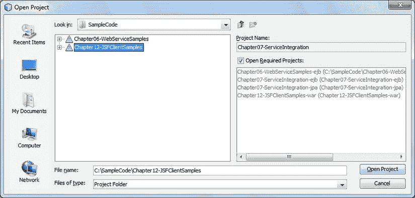

 **注意**   在 NetBeans 中打开 `Chapter12-JSFClientSamples` 文件之前，请确保您已从 NetBeans IDE 中关闭了 `Chapter07-ServiceIntegration` 项目和 `Chapter06-WebServiceSamples`。第 12 章的示例代码构建在第 6 章和第 7 章之上，如果在 NetBeans 中同时打开这些项目，会导致编译错误。当打开 `Chapter12-JSFClientSamples` 时，NetBeans 会自动打开所需的项目。

图 12-13.  打开 Chapter12-JSFClientSamples 文件

展开 `Chapter12-JSFClientSamples-war` 节点，可以看到本章讨论的所有 JSF 文件和管理 Bean 都列在其中，如图 12-14 所示。

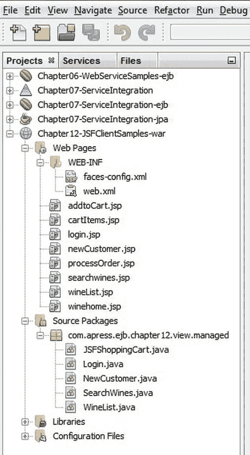

图 12-14.  验证 Chapter12-JSFClientSamples-war 项目中的包

在 `Chapter07-ServiceIntegration` 节点上调用上下文菜单，并通过选择 `清理并构建` 菜单选项来构建应用，如图 12-15 所示。JSF 页面及其管理 Bean 将无错误地编译。

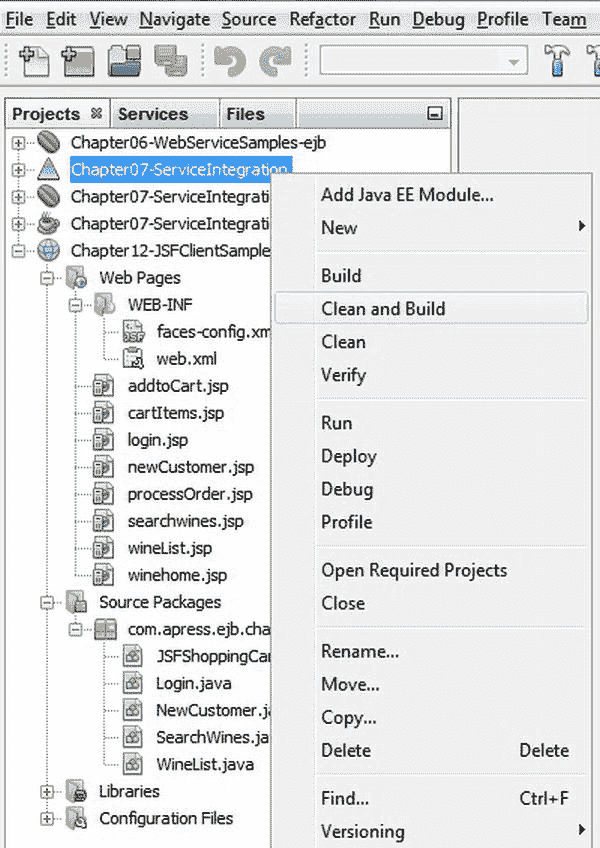

图 12-15.  构建项目

部署和运行葡萄酒商店应用

一旦 JSF 页面和管理 Bean 成功编译，我们需要设置要执行的运行目标。要设置运行目标，请在 `Chapter07-ServiceIntegration` 节点上调用上下文菜单，并选择 `属性` 菜单选项。如图 12-16 所示，选择 `运行` 类别，在 `相对 URL` 文本字段中输入运行目标 `faces/login.jsp`，然后单击“确定”。

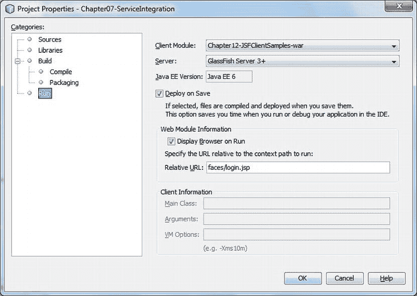

图 12-16.  设置运行目标

现在，您已准备好运行带有 JSF 用户界面的葡萄酒商店应用。要运行该应用，请在 `Chapter07-ServiceIntegration` 节点上调用上下文菜单，并选择 `运行` 菜单选项，如图 12-17 所示。运行应用将把应用部署到集成的 GlassFish 应用服务器上，并在您的默认浏览器中启动葡萄酒商店应用。

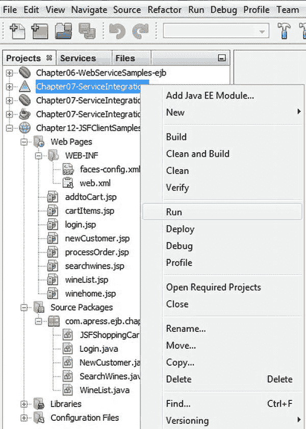

图 12-17.  运行葡萄酒商店应用

启动后，登录页面将渲染，如图 12-18 所示。

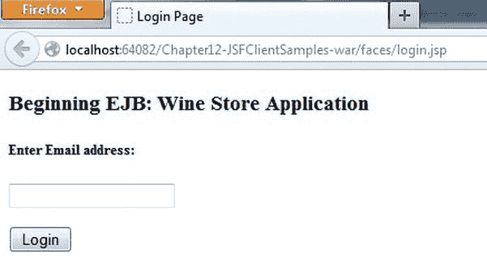

图 12-18.  葡萄酒商店应用登录页面


 **注意**：由于此示例应用程序的唯一目的是学习技术，其代码并未包含企业级应用中常见的数据验证输入。因此，请确保在给定的文本字段中输入有效值。

在“输入电子邮件地址”文本字段中输入您的电子邮件，然后单击“登录”按钮。由于您尚未注册为客户，且您的电子邮件不存在于客户数据库中，您将被重定向到客户注册页面，如图 12-19 所示。按图示在输入字段中输入相关值，然后单击“提交”按钮。

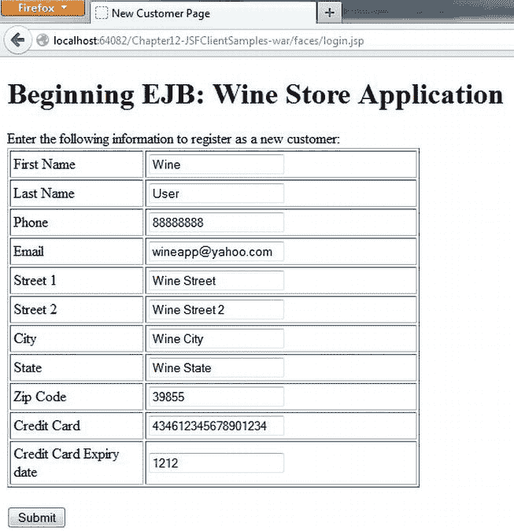

图 12-19. 客户注册页面

注册成功后，您将被重新引导回登录页面。在登录页面上，输入您在注册过程中使用的电子邮件地址，然后单击“登录”按钮，如图 12-20 所示。

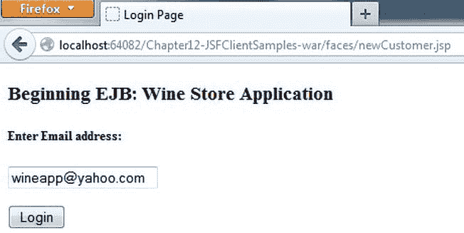

图 12-20. 葡萄酒商店应用程序登录页面

电子邮件地址验证通过后，您将被引导至葡萄酒商店主页，该页面将显示一系列选项，如图 12-21 所示。

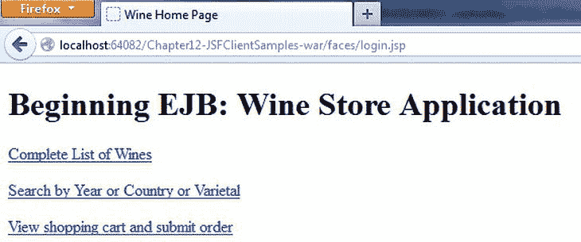

图 12-21. 葡萄酒商店主页

我们将引导您完成搜索用例。点击“按年份、国家或品种搜索”链接。您将被引导至搜索页面，如图 12-22 所示。

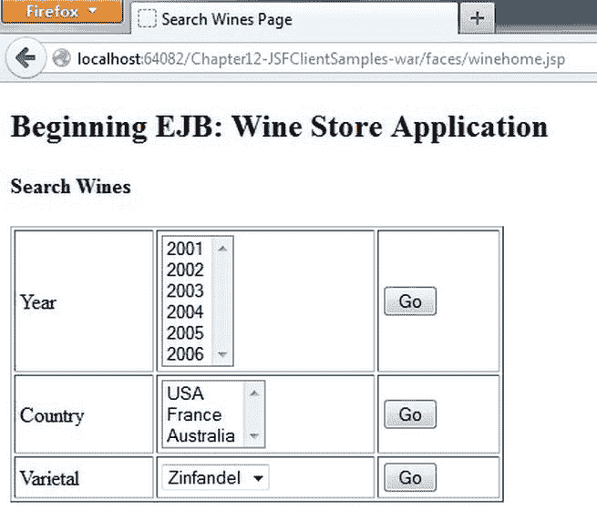

图 12-22. 搜索页面

选择“仙粉黛”作为品种，然后单击“开始”按钮。图 12-23 显示了满足搜索条件的葡萄酒列表。

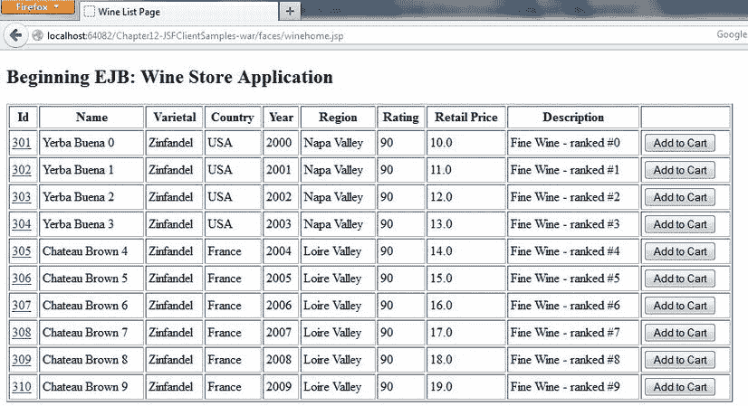

图 12-23. 葡萄酒列表页面

在葡萄酒列表页面，点击您希望添加到购物车的葡萄酒对应的“添加到购物车”按钮。这将带您进入 JSF 页面，如图 12-24 所示，该页面显示了葡萄酒的详细信息以及一个用于输入数量的文本框。

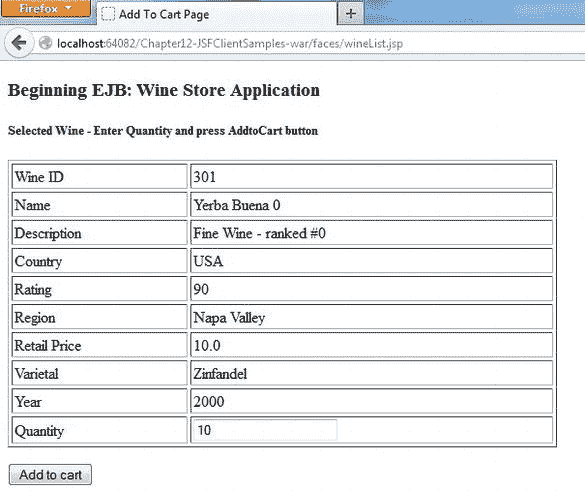

图 12-24. 葡萄酒详情页面

在数量处输入“10”，然后单击“添加到购物车”按钮。您将被引导至购物车页面。在此阶段，您可以通过按下“提交订单”按钮来提交订单，或者使用浏览器的返回按钮返回到列出葡萄酒的页面，将更多葡萄酒添加到购物车。如图 12-25 所示，购物车页面显示了购物车中的所有商品。

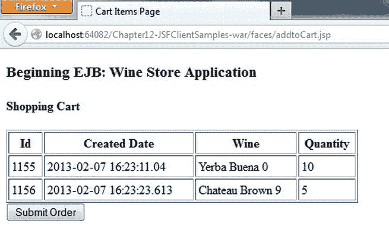

图 12-25. 购物车页面

购物车页面提供了一个“提交订单”按钮用于提交订单。单击此按钮，订单将由 EJB 后端应用程序处理。然后您将看到一个通知页面，如图 12-26 所示。

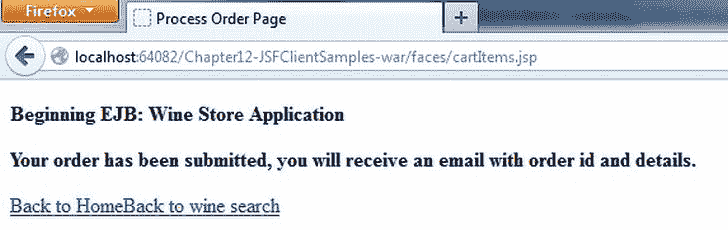

图 12-26. 通知页面

订单处理完毕后，您将收到一封电子邮件通知，如图 12-27 所示。

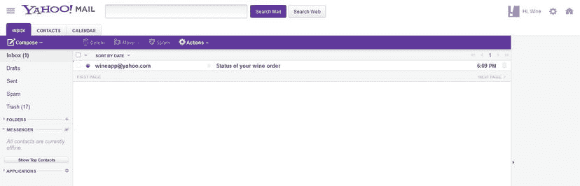

图 12-27. 通知电子邮件

应用程序客户端容器

我们在前面的章节中已经提到并使用了应用程序客户端容器，并且在图 12-4 和图 12-5 中展示了几种应用程序架构。使用 Java Swing 等技术开发的应用程序客户端或客户端程序可以在独立的 Java SE 环境中运行。应用程序客户端容器提供了客户端程序在执行期间可以使用的额外系统服务（例如安全性和部署）。

应用程序客户端可以利用应用程序客户端容器提供的身份验证服务来验证其用户。容器的服务可以与本地平台的身份验证系统集成，为企业用户提供单点登录功能。

使用应用程序客户端容器的客户端程序可以调用 EJB。与其他 Java EE 组件类似，在客户端容器中运行的程序可以使用 Java 命名和目录接口（JNDI）来查找 EJB 或资源，如 Java 消息服务（JMS）和 JavaMail。应用程序客户端容器还为客户端程序提供注入功能。由于应用程序客户端容器不会创建应用程序客户端的实例，因此应使用静态字段和方法来注入任何资源。

应用程序客户端被打包成 JAR 文件。如果使用应用程序客户端容器来运行客户端程序，则必须将应用程序客户端容器与应用程序一起捆绑或打包，以便您可以在单独的桌面机器上运行它。

结论

在本章中，我们介绍了可用于满足不同需求的不同应用程序架构，以及与之配套的编程模型。我们研究了适用于 Web 和桌面应用程序的架构，还研究了 Web 服务客户端应用程序和可以利用作为 Web 服务发布的 EJB 的业务流程服务。

我们讨论了基于 Java EE 的 Web 技术是如何演进的，从而显著简化了 Web 应用程序的开发。

我们深入探讨了 JSF 架构、JSF 生命周期和 JSF 应用程序，以及 JSF 工具和 UI 组件的当前状态。

最后，我们构建了一个全面的 JSF 应用程序，用于与第 7 章中开发的集成 EJB 后端应用程序进行通信。在开发过程中，我们演示了几种编程技术，用于在 JSF 应用程序中共享数据，以及在后端应用程序中查找和调用业务方法。

最后，我们研究了应用程序客户端容器，包括它为在桌面机器上运行的客户端程序提供的服务。

本书的最后一章将详细介绍各种 EJB 测试场景，并指导您如何使用 JUnit 在 GlassFish 的可嵌入 EJB 容器中测试 EJB 组件（和 JPA 实体）。

第 13 章


在可嵌入 EJB 容器中进行测试

与所有关键任务软件一样，EJB 组件在部署到生产环境之前必须经过充分测试。EJB 中最细粒度的级别是其方法；因此，适当的单元测试必须单独测试每个 EJB 的每个方法。对于无状态会话 Bean，这通常就足够了。由于有状态会话 Bean 也可能包含状态，因此完全覆盖还需要包含更粗粒度的场景，涉及方法调用序列。当无状态会话 Bean 通过 JPA 实体等方式在数据库中有效存储“状态”信息时，通常也需要多步骤测试场景。在本章中，我们将研究单方法和多方法测试，涵盖主要作为基于 JPA 操作的服务接口的无状态和有状态会话 Bean。

测试客户端


到目前为止，本书中的示例大多使用 Servlet 作为客户端来调用 EJB 方法。通过使用诸如 ServletUnit 之类的测试框架，Servlet 可以作为测试 EJB 的可行单元测试平台。类似地，调用 EJB 的 JSF 客户端可以使用 HttpUnit 框架进行单元测试，该框架允许你记录用户在浏览器中与 JSF 客户端交互的过程，然后将实际的屏幕结果与预期的屏幕结果进行比较。然而，这两种方法都必须在完整的 Java EE 应用服务器中执行。在本章中，我们将探索一种在纯 Java SE 环境中测试 EJB 的轻量级方案。

EJB Lite

EJB Lite 是在 EJB 3.1 中引入的，并在 EJB 3.2 中得到了进一步增强，它被定义为完整 EJB 容器功能的一个最小子集。认识到许多企业应用只需要完整 EJB API 的一个子集，EJB Lite 包含了 EJB 的许多最重要特性，但占用空间更小。EJB Lite 的实现包括下面描述的可嵌入 EJB 容器和 Java EE Web Profile。

由于 EJB Lite 是 EJB API 的一个严格子集，任何符合 EJB Lite 的应用也将在 Java EE 服务器内的完整 EJB 容器中运行。也就是说，EJB Lite 并不显式支持任何超出 EJB API 范围的行为。

可嵌入 EJB 容器

*可嵌入 EJB 容器*本质上是一个 Java 库，它提供了 EJB Lite 规范所定义的服务。它模拟了在 Java EE 环境中运行的 EJB 容器，但自身运行在 Java SE 环境中。事实上，尝试从 Java EE 环境内部实例化一个可嵌入 EJB 容器是受限的。这个可嵌入容器为 EJB 提供了一个运行环境，提供注入的资源、安全性和 JTA 事务接口，以便 EJB 可以在受控环境中进行测试。

本章组织结构

在本章中，我们将探讨围绕单元测试的一些主要概念。然后，我们将结合 WineApp 应用中的几个场景，研究如何使用可嵌入 EJB 容器来设置、执行和调试 JUnit 测试。接下来，我们将仔细审视 EJB Lite 提供的服务，揭示其优势和局限性，并展示一些有用的快捷方式，以隔离正在测试的 EJB 和 JPA 组件，同时降低测试环境的复杂性。

在研究了使您能够在可嵌入 EJB 容器中使用 EJB 的 JUnit 测试代码之后，我们将探讨一些特别适合测试环境的、您可以利用的配置选项。在本章结束时，我们将逐步指导您如何在 NetBeans 中设置和配置 JUnit 环境，然后执行和调试测试。

核心概念

让我们更仔细地看看本章将要涵盖的一些主要概念。

JUnit

*JUnit* 是一个广泛用于测试各种形式 Java 类的测试框架。*测试类*是普通的 Java 类，它们通过注解来标识具有特殊用途的方法。被注解为 `@Test` 的方法标识一个单独的单元测试。该测试调用被测试类上的一个或多个方法，获取调用这些方法的结果，并将实际结果与预期结果进行比较。当它们不同时，测试会报告失败，从而提醒测试人员某个测试需要关注。

通过编写能够全面测试一个或多个类行为的 JUnit 测试，测试人员可以在每次修改被测试代码或任何被间接调用的代码时执行这些测试。任何失败都表明预期的行为不再发生。此外，由于单元测试通常针对非常特定的功能点，失败的测试可以清晰地告知测试人员导致问题的具体代码区域。

由于 EJB 是一个遵循公共接口的组件，它非常适合这种形式的单元测试。EJB 3.1 中引入的 EJB Lite 和可嵌入 EJB 容器，正式允许 EJB 在纯 Java SE 环境中，通过 JUnit 测试框架进行无需修改的单元测试。

EJB Lite

让我们更仔细地看看构成 EJB Lite 的特性子集。表 13-1 显示了 EJB 3.2 的主要特性中哪些包含在 EJB 3.2 Lite 中：

表 13-1. 属于 EJB 3.2 Lite 一部分的 EJB 3.2 特性

| EJB 3.2 特性 | 是否包含在 EJB 3.2 Lite 中 |
| --- | --- |
| 会话 Bean（无状态、有状态和单例） | 是 |
| 消息驱动 Bean (MDB) | 否 |
| Java 持久化 API | 是 |
| 本地业务接口/无接口 | 是 |
| 远程接口 | 否 |
| JAX-WS Web 服务端点 | 否 |
| JAX-RPC Web 服务端点 | 否 |
| 非持久化 EJB 定时器服务 | 是 |
| 持久化 EJB 定时器服务 | 否 |
| 本地异步会话 Bean 调用 | 是 |
| 远程异步会话 Bean 调用 | 否 |
| 拦截器 | 是 |
| RMI-IIOP 互操作性 | 否 |
| 容器管理事务/Bean 管理事务 | 是 |
| 声明式和编程式安全 | 是 |

最值得注意的是，在 EJB 3.2 Lite 中，支持所有形式的本地会话 Bean，但不支持远程会话 Bean、MDB 以及作为 Web 服务的 EJB。EJB Lite 中包含安全性和 JTA 支持，包括对 BMT 和 CMT 的支持。最后，为 JPA 提供了对 EntityManager 和 EntityManagerFactory 注入的支持。

可嵌入 EJB 容器客户端

使用可嵌入 EJB 容器的客户端通过 JNDI 查找 EJB，而不是通过注入，因为 Java EE 服务器提供了客户端注入，而在此环境中则没有。然而，EJB 本身可以被注入其他 EJB，以及由其 EJB 容器提供的其他资源。

在本章后面展示的 JUnit 示例中，JUnit 测试类本身是可嵌入 EJB 容器的客户端。它们通过一个静态工厂方法直接实例化容器，并可选地使用配置属性初始化容器。然后，容器向客户端提供一个 InitialContext，客户端可以通过 JNDI 命名空间查找 EJB 和其他资源。可嵌入 EJB 容器能够在运行时支持 EJB，为会话 Bean 注入资源，提供用于执行事务的 JTA 上下文，以及 表 13-1 中列出的 EJB Lite 中指定的所有其他服务。

当在存在 GlassFish 可嵌入服务器（它也在 Java SE 环境中运行）的环境中实例化可嵌入 EJB 容器时，GlassFish 通过向可嵌入 EJB 容器提供服务来增强体验。

JUnit 测试

在探讨了本章的核心概念之后，现在让我们来看一些代码示例。与可嵌入 EJB 容器一样，JUnit 本质上是一个 Java 库，您将其包含在类路径中，以在您的应用中启用功能。虽然描述 JUnit 的所有特性（包括将测试分组到套件、定义初始化参数等）超出了本章的范围，但就我们的示例而言，将编写和执行 JUnit 类的基本任务视为如下步骤是很有用的：

*   编写遵循 JUnit 模式来初始化测试环境的测试类。


*   编写一个或多个方法，通过调用 EJB 上的一个或多个方法来执行特定的单元测试，从这些方法调用中获取结果，并将结果与先前定义的预期结果进行比较。
*   在类级别上，当类中的任何测试方法首次被调用时，实例化可嵌入的 EJB 容器，并在最后一个测试方法被调用后关闭容器以释放资源。
*   在测试级别上，初始化 JPA 持久化单元使用的数据库连接，以清除任何现有数据，并将状态重置为正确配置的状态。

*   调用 JUnit 测试运行器，将要执行的测试类名称作为参数传递，并将以下内容添加到类路径中：

*   JUnit 类（`.jar` 文件）
*   您编写的 JUnit 类（可选地放在 `.jar` 文件中）
*   您正在测试的 EJB 的 EJB `.jar` 文件，以及任何依赖的 `.jar` 文件（如 JPA 持久化单元）
*   一个可嵌入的 EJB 容器 `.jar`，以及它所需的任何依赖 `.jar` 文件

像 NetBeans、JDeveloper 或 Eclipse 这样的 IDE 极大地简化了调用过程，正如您将在本章后面看到的那样，它甚至会在您的 JUnit 测试类中设置许多基本的基础结构。这使您只需编写每个单元测试特定的核心代码。

现在，让我们剖析一个我们针对 WineApp 示例应用程序中的 EJB 编写的 JUnit 测试类，以测试几个场景。

WineAppServiceTest：针对 WineAppService EJB 的 JUnit 测试类

对于本章的示例，我们在清单 13-1 中提供了一个 JUnit 测试类，其中包含在可嵌入 EJB 容器中对 EJB 进行单元测试所需的所有元素。

***清单 13-1.***  WineAppServiceTest.java，一个用于测试 WineApp 应用程序中 EJB 的 JUnit 类

```
public class WineAppServiceTest {
  private static EJBContainer ejbContainer;
  private static NetworkServerControl derbyServer;

public WineAppServiceTest() {
  }

@BeforeClass
  public static void setUpClass() throws Exception {
    PrintWriter pw = new PrintWriter(System.out);

//  启动 Derby 数据库服务器，等待其响应后再继续
    try {
      derbyServer = new org.apache.derby.drda.NetworkServerControl();
      derbyServer.start(pw);
      int i = 50;
      while (--i > 0) {
        try {
          derbyServer.ping();
          break;
        } catch (Exception ex) {
          System.out.println("Derby 服务器已启动；等待响应...");
        }
        Thread.sleep(100);
      }
    } finally {
      pw.close();
    }

//  实例化一个可嵌入的 EJB 容器
    ejbContainer = javax.ejb.embeddable.EJBContainer.createEJBContainer();
  }

@AfterClass
  public static void tearDownClass() throws Exception {
    //  关闭可嵌入的 EJB 容器，释放所有资源
    ejbContainer.close();

//  关闭 Derby 数据库服务器
    derbyServer.shutdown();
  }

@Before
  public void setUp() {
    //  初始化领域模型中的数据
    PopulateDemoData.resetData("Chapter13-EmbeddableEJBTests-ResourceLocal", System.out);
  }

@After
  public void tearDown() {
  }

/**
   * 测试 WineAppService 上的 findCustomerByEmail。
   *
   * 断言返回的 Customer 名为 "James Brown"。
   *
   * @throws Exception
   */
  @Test
  public void testFindCustomerByEmail() throws Exception {
    System.out.println("findCustomerByEmail");
    WineAppService wineAppSvcFacade =
        (WineAppService) ejbContainer.getContext().lookup("java:global/classes/WineAppService");
    Customer customer =
        wineAppSvcFacade.findCustomerByEmail(PopulateDemoData.TO_EMAIL_ADDRESS);
    assertEquals("WineAppServiceFacade.findCustomerByEmail(): 检查客户姓名",
        "James Brown",
        customer.getFirstName() + " " + customer.getLastName());
  }

/**
   * 测试 WineAppService 上的 createIndividual() 和 CustomerFacade 上的 findCustomerByEmail()。
   *
   * 断言在 createIndividual() 中创建的 Individual 实例具有预期的 email 属性。
   * 断言在 findCustomerByEmail() 中检索到的 Customer 具有预期的姓名。
   * 断言 shippingAddress 属性在合并后处于托管状态。
   */
  @Test
  public void testCreateIndividual() throws Exception {
    System.out.println("createIndividual");
    WineAppService wineAppSvcFacade =
        (WineAppService) ejbContainer.getContext().lookup("java:global/classes/WineAppService");
    String email = "drwho@yahoo.com";
    Individual individual =
        wineAppSvcFacade.createIndividual("Adam", "Beyda", email);
    assertEquals("WineAppServiceFacade.createIndividual(): 检查 Individual.email 属性",
        email, individual.getEmail());

CustomerFacade custFacade =
        (CustomerFacade) ejbContainer.getContext().lookup("java:global/classes/CustomerFacade");
    Customer customer = custFacade.findCustomerByEmail(email);
    assertEquals("CustomerFacade.findCustomerByEmail(): 检查 Customer.email 属性",
        "Adam Beyda", customer.getFirstName() + " " + customer.getLastName());

//  托管/分离实体状态检查
    Address shippingAddress = new Address("San Mateo", null, null, null, null);
    customer.setDefaultShippingAddress(shippingAddress);
    customer = custFacade.merge(customer);
    assertNotNull("customer.getDefaultShippingAddress().getId() 为空",
        customer.getDefaultShippingAddress().getId());
    assertNotNull("shippingAddress.getId() 为空",
        shippingAddress.getId());
  }

/**
   * 测试 WineAppService 上的 createIndividual() 和 createCustomerOrder()，
   * WineFacade 上的 getWineFindByYear()，以及 CustomerFacade 上的 merge()。
   *
   * 断言创建的订单总价值为 110。
   * 断言 customerOrder 和 customer 对象处于托管状态。
   */
  @Test
  public void testCreateCustomerOrder() throws Exception {
    System.out.println("createCustomerOrder");
    Context context = ejbContainer.getContext();
    WineAppService wineAppSvcFacade =
        (WineAppService) context.lookup("java:global/classes/WineAppService");
    WineFacade wineFacade =
        (WineFacade) context.lookup("java:global/classes/WineFacade");
    CustomerFacade custFacade =
        (CustomerFacade) context.lookup("java:global/classes/CustomerFacade");

//  将 CartItems 添加到客户的购物车并合并客户更改
    final String email = "drwho@yahoo.com";
    Customer customer = wineAppSvcFacade.createIndividual("Adam", "Beyda", email);
    for (Wine wine : wineFacade.getWineFindByYear(2005)) {
      customer.addCartItem(new CartItem(10, wine));
    }
    customer = custFacade.merge(customer);

CustomerOrder customerOrder = wineAppSvcFacade.createCustomerOrder(customer);
    Float total = new Float(0);
    for (OrderItem orderItem : customerOrder.getOrderItemList()) {
      total += orderItem.getQuantity() * orderItem.getPrice();
    }
    assertEquals("检查客户订单总额是否为 $270", total, new Float(270));

//  从持久化上下文中查询客户的最新状态
    //  （借助 CMT 使用新事务）并检查其是否包含一个具有已填充 'id' 字段的客户订单
    CustomerOrder customerOrder1 =
        wineAppSvcFacade.findCustomerByEmail(email).getCustomerOrderList().get(0);
    assertNotNull("customerOrder1.getId() 为空", customerOrder1.getId());

//  检查我们原始的客户订单是否已自动填充其 'id' 字段
    assertNotNull("customerOrder.getId() 为空", customerOrder.getId());

//  检查由我们的客户引用的客户订单
    //  是否已自动填充其 'id' 字段
    CustomerOrder customerOrder2 = customer.getCustomerOrderList().get(0);
    assertNotNull("customerOrder2.getId() 为空", customerOrder2.getId());
  }
}
```


当这个测试类在 JUnit 测试器中执行时，每个标注了 `@Test` 的方法都会作为独立的单元测试被隔离运行。然而，在执行这些方法之前，JUnit 会执行一些初始化步骤，以实例化可嵌入的 EJB 容器并初始化持久化单元中的数据。接下来，我们将从初始化步骤开始，探索这个 JUnit 类的各个元素。

实例化可嵌入的 EJB 容器并启动 Derby

在执行该类中的任何测试之前，我们需要初始化可嵌入的 EJB 容器。由于这是一个相对消耗资源的操作（尽管不如启动一个完整的 GlassFish 服务器那么昂贵），我们希望每次启动 JUnit 测试器时只执行一次。JUnit 允许你使用 `@BeforeClass` 注解静态方法，这些方法会在每个 JUnit 会话中执行一次，且在该类上执行第一个单元测试方法之前运行。我们的类级设置方法如下：

```
@BeforeClass
public static void setUpClass() throws Exception {
  PrintWriter pw = new PrintWriter(System.out);

//  启动 Derby 数据库服务器，等待其响应后再继续
  try {
    derbyServer = new org.apache.derby.drda.NetworkServerControl();
    derbyServer.start(pw);
    int i = 50;
    while (--i > 0) {
      try {
        derbyServer.ping();
        break;
      } catch (Exception ex) {
        System.out.println("Derby 服务器已启动；等待响应...");
      }
      Thread.sleep(100);
    }
  } finally {
    pw.close();
  }

//  实例化一个可嵌入的 EJB 容器
  ejbContainer = javax.ejb.embeddable.EJBContainer.createEJBContainer();
}
```

我们首先启动 Derby 数据库，以便持久化单元能够连接到正在运行的服务器。由于 `org.apache.derby.drda.NetworkServerControl.start()` 方法是异步的，我们必须假设服务器可能不会立即接受连接，因此我们在循环中对其进行 ping 操作，每次迭代之间短暂休眠，直到它准备就绪或我们决定超时。

一旦 Derby 可以接受连接，我们就通过调用 `javax.ejb.embeddable.EJBContainer.createEJBContainer()` 来创建可嵌入的 EJB 容器。我们的 `WineAppServiceTest` 类由 JUnit 测试器调用，NetBeans 启动测试器时使用的类路径包含 JPA 持久化单元 `.jar` 文件（来自第 7 章）、第 13 章 EJB jar 中定义的 EJB，以及运行 JUnit 框架和实例化可嵌入 EJB 容器所需的所有必要 Java 库。当前（撰写本文时）的 GlassFish 实现会链接到 GlassFish 服务器安装区域，以提供 EJB 容器通常从其宿主 Java EE 服务器环境所需的服务。再次强调，由于我们在 Java SE 环境中运行，Java EE GlassFish 服务器实际上并未启动，但可嵌入 EJB 容器所需的类会根据需要从构成 GlassFish 的 Java 库中加载。

在 JUnit 会话结束时，必须正确关闭可嵌入的 EJB 容器和 Derby 数据库服务器，以释放它们可能持有的任何资源。此时，JUnit 会调用标注了 `@AfterClass` 的方法，我们的 `tearDownClass()` 方法执行这些任务：

```
@AfterClass
public static void tearDownClass() throws Exception {
  //  关闭可嵌入的 EJB 容器，释放所有资源
  ejbContainer.close();

//  关闭 Derby 数据库服务器
  derbyServer.shutdown();
}
```

初始化持久化单元中的数据

虽然启动 Derby 和可嵌入 EJB 容器等步骤在每个 JUnit 测试会话中只需执行一次，但其他初始化步骤必须在每个 JUnit 测试之前执行。每个测试的初始化步骤放在一个（或多个）标注了 `@Before` 的方法中，如下所示：

```
@Before
public void setUp() {
  //  初始化领域模型中的数据
  PopulateDemoData.resetData("Chapter13-EmbeddableEJBTests-ResourceLocal", System.out);
}
```

对于我们的测试，我们希望确保每个单元测试开始时数据库中的数据相同，因此我们执行一个脚本来初始化数据库并将数据重置为所需状态。你可能还记得这个静态的 `PopulateDemoData.resetData()` 方法，它在其他章节中也使用过。请注意，我们传递了一个持久化单元的名称，以便在不同的应用程序上下文中重用它。`Chapter07-ServiceIntegration-jpa` 项目中的 JPA 持久化单元定义了它自己的 `persistence.xml` 文件，其中包含一个名为 `Chapter07-WineAppUnit-ResourceLocal` 的 `<persistence-unit>`。我们用于 JUnit 测试的 `<persistence-unit>` 是“`Chapter13-EmbeddableEJBTests-ResourceLocal`”，它定义在我们的上下文项目 `Chapter13-EmbeddedEJBTests` 的“`Configuration Files`”部分中。由于 JPA 持久化单元中的实体类对我们的测试/EJB 模块可见，我们可以自由定义引用这些相同实体类的其他持久化单元。JPA 允许你为相同的实体类定义多个持久化单元，如果需要，可以使用多个 `persistence.xml` 文件，使每个持久化单元能够指定不同的数据库连接、模式生成计划、持久化提供程序或任何其他配置选项。在这种情况下，我们定义一个新的持久化单元，以便将它们映射到适合测试目的的数据库连接。接下来将描述这个连接。

使用“jdbc/__default”连接

GlassFish 预配置了一个非常适合可嵌入 EJB 容器使用的连接。它在请求时自动创建，并在嵌入式 GlassFish 服务器关闭时自动删除。它作为名为 `jdbc/__default` 的数据源资源提供给客户端，并且被我们在 `Chapter13-EmbeddableEJBTests` 的 `persistence.xml` 文件中定义的 JTA 和 RESOURCE_LOCAL 持久化单元所使用，如清单 13-2 所示。

***清单 13-2.***  persistence.xml，包含我们测试所使用的两个持久化单元


```
<?xml version="1.0" encoding="UTF-8"?>
<persistence version="2.0" xmlns="http://java.sun.com/xml/ns/persistence" xmlns:xsi="http://www.w3.org/2001/XMLSchema-instance" xsi:schemaLocation="http://java.sun.com/xml/ns/persistencehttp://java.sun.com/xml/ns/persistence/persistence_2_0.xsd">
  <persistence-unit name="Chapter13-EmbeddableEJBTests-ResourceLocal" transaction-type="RESOURCE_LOCAL">
    <provider>org.eclipse.persistence.jpa.PersistenceProvider</provider>
    <non-jta-data-source>jdbc/__default</non-jta-data-source>
    <class>com.apress.ejb.chapter07.entities.Address</class>
    <class>com.apress.ejb.chapter07.entities.BusinessContact</class>
    <class>com.apress.ejb.chapter07.entities.CartItem</class>
    <class>com.apress.ejb.chapter07.entities.Customer</class>
    <class>com.apress.ejb.chapter07.entities.CustomerOrder</class>
    <class>com.apress.ejb.chapter07.entities.Distributor</class>
    <class>com.apress.ejb.chapter07.entities.Individual</class>
    <class>com.apress.ejb.chapter07.entities.InventoryItem</class>
    <class>com.apress.ejb.chapter07.entities.OrderItem</class>
    <class>com.apress.ejb.chapter07.entities.Supplier</class>
    <class>com.apress.ejb.chapter07.entities.Wine</class>
    <class>com.apress.ejb.chapter07.entities.WineItem</class>
    <exclude-unlisted-classes>true</exclude-unlisted-classes>
    <properties>
      <property name="eclipselink.ddl-generation" value="drop-and-create-tables"/>
    </properties>
  </persistence-unit>
  <persistence-unit name="Chapter13-EmbeddableEJBTests-JTA" transaction-type="JTA">
    <provider>org.eclipse.persistence.jpa.PersistenceProvider</provider>
    <jta-data-source>jdbc/__default</jta-data-source>
    <class>com.apress.ejb.chapter07.entities.Address</class>
    <class>com.apress.ejb.chapter07.entities.BusinessContact</class>
    <class>com.apress.ejb.chapter07.entities.CartItem</class>
    <class>com.apress.ejb.chapter07.entities.Customer</class>
    <class>com.apress.ejb.chapter07.entities.CustomerOrder</class>
    <class>com.apress.ejb.chapter07.entities.Distributor</class>
    <class>com.apress.ejb.chapter07.entities.Individual</class>
    <class>com.apress.ejb.chapter07.entities.InventoryItem</class>
    <class>com.apress.ejb.chapter07.entities.OrderItem</class>
    <class>com.apress.ejb.chapter07.entities.Supplier</class>
    <class>com.apress.ejb.chapter07.entities.Wine</class>
    <class>com.apress.ejb.chapter07.entities.WineItem</class>
    <exclude-unlisted-classes>true</exclude-unlisted-classes>
  </persistence-unit>
</persistence>
```

这两个持久化单元几乎完全相同，区别仅在于事务处理和模式生成行为。第一个持久化单元 `Chapter13-EmbeddableEJBTests-ResourceLocal` 将 `jdbc/__default` 引用为 `non-jta-data-source`，并在 `PopulateDemoData.resetData()` 操作中由非 EJB Java 外观使用。由于我们知道测试会在每次测试前执行此操作，因此我们将其持久化单元配置为始终删除并重新创建该单元中实体所需的模式对象。这体现在为该单元定义的属性中：

```
<property name="eclipselink.ddl-generation" value="drop-and-create-tables"/>
```

 **注意**   在 JPA 2.0 及更早版本中，规范未定义模式生成选项，用户必须依赖特定平台的支持，例如上面显示的 EclipseLink 属性。JPA 2.1 通过一系列标准配置属性引入了对模式生成的支持，包括与上述属性平行的属性：“`javax.persistence.schema-generation-action`”。为了与 JPA 2.0 库兼容，目前我们在示例中使用 EclipseLink 属性。

`persistence.xml` 文件中的第二个持久化单元 `Chapter13-EmbeddableEJBTests-JTA` 可以假定模式已创建，因此我们特意不为该持久化单元启用模式生成选项。

如果需要在单个单元测试运行期间释放获取的资源，我们可以使用标注了 `@After` 的方法来释放它们。在我们的示例中，不需要这样做，因此我们将方法体留空。

单元测试方法

在介绍了测试初始化步骤之后，我们将注意力转向单元测试本身。每个单元测试都标注了 `@Test`，以区别于类中可能存在的其他普通方法，我们包含了三个测试方法。

第一个测试 `findCustomerByEmail()`：在 `WineAppService` EJB 上执行单个方法 `findCustomerByEmail()`，该方法返回一个 `Customer` 实例。然后断言 firstName + lastName 为“`James Brown`”，即预期结果。我们的测试类控制持久化单元中数据的状态，因此它知道预期结果。

```
/**
 * 测试 WineAppService 上的 findCustomerByEmail。
 *
 * 断言返回的 Customer 名为 "James Brown"。
 *
 * @throws Exception
 */
@Test
public void testFindCustomerByEmail() throws Exception {
  System.out.println("findCustomerByEmail");
  WineAppService wineAppSvcFacade =
      (WineAppService) ejbContainer.getContext().lookup("java:global/classes/WineAppService");
  Customer customer =
      wineAppSvcFacade.findCustomerByEmail(PopulateDemoData.TO_EMAIL_ADDRESS);
  assertEquals("WineAppServiceFacade.findCustomerByEmail(): 检查客户名称",
      "James Brown",
      customer.getFirstName() + " " + customer.getLastName());
}
```

通过 JNDI 进行 EJB 查找

由于 JUnit 测试类运行在普通的 Java SE 环境中，而非可嵌入 EJB 容器内部，因此我们无法使用 EJB 注入。因此，我们通过 `EJBContainer` 对象提供的 `javax.naming.Context` API 使用 JNDI 来获取正在测试的 EJB 的引用。根据 EJB 是全局应用于应用程序还是本地应用于上下文模块，有多种查找方式。在本示例中，我们的 EJB 是全局注册到应用程序的，我们可以使用全局命名空间来查找它们，例如使用 `"java:global/classes/WineAppService"` 这样的 URL。

第二个测试 `testCreateIndividual()` 是第一个测试的超集，但它不依赖于第一个测试的任何副作用：

```
/**
 * 测试 WineAppService 上的 createIndividual() 和 CustomerFacade 上的 findCustomerByEmail()。
 *
 * 断言在 createIndividual() 中创建的 Individual 实例具有预期的 email 属性。
 * 断言在 findCustomerByEmail() 中检索到的 Customer 具有预期的名称。
 */
@Test
public void testCreateIndividual() throws Exception {
  System.out.println("createIndividual");
  WineAppService wineAppSvcFacade =
      (WineAppService) ejbContainer.getContext().lookup("java:global/classes/WineAppService");
  String email = "drwho@yahoo.com";
  Individual individual =
      wineAppSvcFacade.createIndividual("Adam", "Beyda", email);
  assertEquals("WineAppServiceFacade.createIndividual(): 检查 Individual.email 属性",
      email, individual.getEmail());

CustomerFacade custFacade =
      (CustomerFacade) ejbContainer.getContext().lookup("java:global/classes/CustomerFacade");
  Customer customer = custFacade.findCustomerByEmail(email);
  assertEquals("CustomerFacade.findCustomerByEmail(): 检查 Customer.email 属性",
      "Adam Beyda", customer.getFirstName() + " " + customer.getLastName());

//  托管/分离实体状态检查
  Address shippingAddress = new Address("San Mateo", null, null, null, null);
  customer.setDefaultShippingAddress(shippingAddress);
  customer = custFacade.merge(customer);
  assertNotNull("customer.getDefaultShippingAddress().getId() 为空",
      customer.getDefaultShippingAddress().getId());
  assertNotNull("shippingAddress.getId() 为空",
      shippingAddress.getId());
}
```


本测试对 `WineAppService` 上的事务性方法 `createIndividual()` 进行了验证，该方法创建并持久化了一个 `Individual` 实例。随后，我们通过另一个 EJB `CustomerFacade` 上的 `findCustomerByEmail()` 方法查询该实例，以确认其可被找到。

测试的第二步是创建一个新地址，并将其设为客户的默认送货地址。我们将在本章后续运行测试时再回到这一步。

第三个单元测试 `testCreateCustomerOrder()` 通过调用不同 EJB 上的多个事务性方法，并结合测试端和服务器端的步骤，构建客户购物车并处理生成客户订单，进一步测试了应用行为：

```
/**
 * 测试 WineAppService 上的 createIndividual() 和 createCustomerOrder()，
 * WineFacade 上的 getWineFindByYear()，以及 CustomerFacade 上的 merge()。
 *
 * 断言创建的订单总价值为 110。
 * 断言 customerOrder 和 customer 对象处于托管状态。
 */
@Test
public void testCreateCustomerOrder() throws Exception {
  System.out.println("createCustomerOrder");
  Context context = ejbContainer.getContext();
  WineAppService wineAppSvcFacade =
      (WineAppService) context.lookup("java:global/classes/WineAppService");
  WineFacade wineFacade =
      (WineFacade) context.lookup("java:global/classes/WineFacade");
  CustomerFacade custFacade =
      (CustomerFacade) context.lookup("java:global/classes/CustomerFacade");

//  向客户的购物车添加购物车项，并合并客户更改
  final String email = "drwho@yahoo.com";
  Customer customer = wineAppSvcFacade.createIndividual("Adam", "Beyda", email);
  for (Wine wine : wineFacade.getWineFindByYear(2005)) {
    customer.addCartItem(new CartItem(10, wine));
  }
  customer = custFacade.merge(customer);

CustomerOrder customerOrder = wineAppSvcFacade.createCustomerOrder(customer);
  Float total = new Float(0);
  for (OrderItem orderItem : customerOrder.getOrderItemList()) {
    total += orderItem.getQuantity() * orderItem.getPrice();
  }
  assertEquals("检查客户订单总额是否为 $270", total, new Float(270));

//  从持久化上下文中查询客户的最新状态
  //  （借助 CMT 使用新事务），并检查其是否包含一个具有已填充 'id' 字段的客户订单
  CustomerOrder customerOrder1 =
      wineAppSvcFacade.findCustomerByEmail(email).getCustomerOrderList().get(0);
  assertNotNull("customerOrder1.getId() 为空", customerOrder1.getId());

//  检查原始客户订单的 'id' 字段是否已自动填充
  assertNotNull("customerOrder.getId() 为空", customerOrder.getId());

//  检查客户引用的客户订单的 'id' 字段是否已自动填充
  CustomerOrder customerOrder2 = customer.getCustomerOrderList().get(0);
  assertNotNull("customerOrder2.getId() 为空", customerOrder2.getId());
}
```

这个高级测试覆盖了多个方面，并模拟了一个真实世界的流程。它旨在检测相对较大代码范围内的任何故障，并与其他测试互补——当应用变更导致这些测试开始失败时，其他测试则用于精确定位代码的特定区域。

在详细检查了我们的 JUnit 测试代码后，你现在可以按照下一节概述的步骤，在 NetBeans 中使用 JUnit 和嵌入式 EJB 容器来构建并运行这些测试。

构建与测试示例代码

既然我们已经了解了如何编写 JUnit 测试来针对可嵌入 EJB 容器执行 EJB 单元测试，那么让我们在 NetBeans 中执行刚刚介绍的测试用例。

先决条件

在执行下一节详述的任何步骤之前，请先完成第 1 章的“入门”部分。该部分将引导你完成本章示例所需的安装和环境设置。

打开示例应用

本章的根项目依赖于 `Chapter07-ServiceIntegration-jpa` 中定义的 JPA 持久化单元。启动 NetBeans IDE，并使用 `File Open Project` 菜单打开 `Chapter13-EmbeddableEJBTests` 项目。确保选中 `'Open Required Projects'` 复选框。

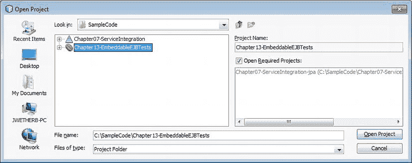

图 13-1.   打开 Chapter13-EmbeddableEJBTests 项目

该项目是一个独立的 EJB 项目，与我们其他章节使用的 Java EE 应用程序项目有所不同。项目包含：`Source Packages` 文件夹下待测试的几个 EJB；`Configuration Files` 文件夹中定义 EJB 所用持久化单元的 `persistence.xml` 文件；以及 `Test Packages` 文件夹中的 JUnit 测试类。其结构如图 13-2 所示。

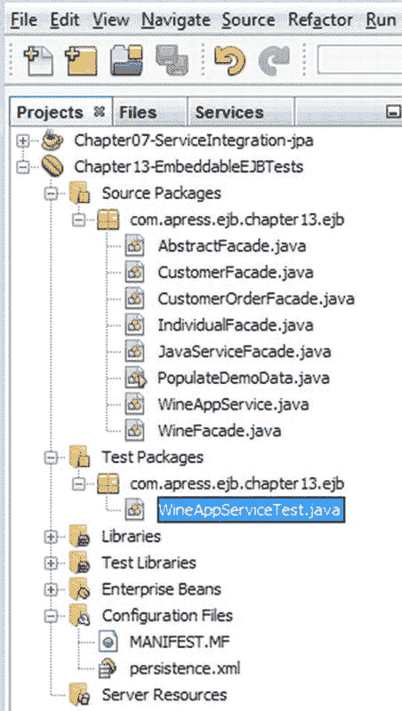

图 13-2.  观察 Chapter13-EmbeddableEJBTests 项目的结构

编译源代码

在 `Chapter13-EmbeddableEJBTests` 节点上调用上下文菜单，并选择 `Clean and Build` 菜单选项来构建应用程序，如图 13-3 所示：

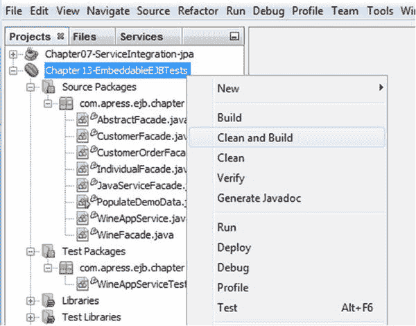

图 13-3.  构建应用程序

运行 JUnit 测试

从 NetBeans 启动 JUnit 测试有多种方法，但对于这些测试，你可以在 `WineAppServiceTest` 类上右键单击，并选择“`Test File`”，如图 13-4 所示：

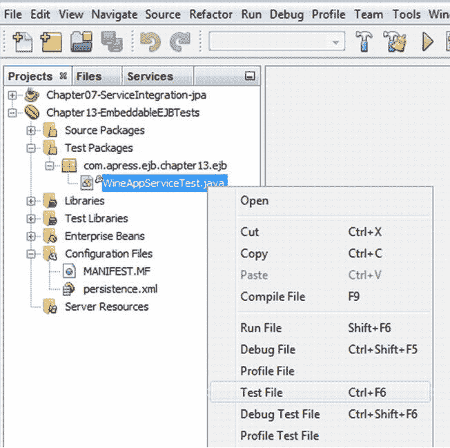

图 13-4.  启动 JUnit 测试器以执行 WineAppServiceTest.java 中的单元测试

此步骤会实例化可嵌入 EJB 容器，初始化数据库，并执行类中的三个单元测试。测试结果将显示在 `Test Results` 选项卡中。

你会看到，第二个和第三个测试因断言失败而失败。那么，让我们诊断这些问题。

修复测试用例

第一个失败发生在第二个单元测试 `testCreateIndividual()` 中，错误消息为 `shippingAddress.getId()` 是 `null`。有趣的是，该单元测试中先前的断言检查——检查当前 `customer` 已知的 `shippingAddress` 属性上的 `id` 字段——成功了。你可能会认为这些断言应该检查同一个对象——即最初通过 `setDefaultShippingAddress()` 分配给 `customer` 的对象——因为，尽管我们对 `customer` 执行了 `merge()`，但 `shippingAddress` 是一个新实例，因此逻辑上它被持久化了，而不是合并了。由于 `persist()` 操作会就地（in-place）将对象转换为托管实例，而不会像 `merge()` 那样创建新的托管对象，那么原始的 `shippingAddress` 实例现在难道不应该只是处于托管状态的原始实例吗？

级联 MERGE 操作


答案是，级联 `MERGE` 操作会对新实例以及游离和受管实例执行 `merge()`；在这种情况下，新实例不会通过调用 `persist()` 来持久化。因此，我们原来的 `shippingAddress` 引用现在已过时，而 `customer` 持有的是指向 `shippingAddress` 新受管副本的引用。当持久化和合并那些对其引用的对象级联 `MERGE` 操作的实体时，这是一个重要的“陷阱”。`merge()` 操作会针对在级联 `MERGE` 过程中发现的新对象和现有对象都执行。而 `persist()` 会将原始实例转换为受管副本并将其放入持久化上下文中，`merge()` 则会创建一个原始实例的新受管副本并添加该副本。被合并的原始对象（在我们的例子中是 `customer`）会被正确更新，以引用 `shippingAddress` 的新受管副本。然而，任何对原始游离实例的引用——例如，我们的 `shippingAddress` 变量——现在都已过时，需要在使用前进行刷新。

因此，要解决这个问题，我们需要通过调用 `merge()` 从 `EntityManager` 获取 `shippingAddress` 对象的新受管副本。如果我们修改测试代码，添加第 124 行，如图 13-5 所示，然后重新运行测试，这个测试现在就会成功。

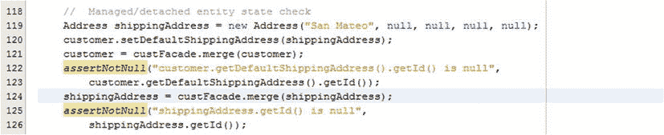

图 13-5.  更新测试方法 WineAppServiceTest.testCreateIndividual() 以刷新过时的引用

从 EJB 方法返回受管对象

第三个测试似乎因类似问题而失败。我们可以用同样的方式修复它，即在所有对象被添加到持久化上下文后（无论是直接添加还是通过级联 `MERGE` 操作），在测试客户端中显式合并所有对象以获取受管引用。然而，在这种情况下，我们是在调用一个 EJB 方法来组装 `CustomerOrder`，而不是在测试客户端内部进行组装，因此我们决定在 EJB 代码本身中解决这个问题。

让我们进入调试器，看看能否找出为什么我们的 `customerOrder` 引用的 `id` 字段为 null，而从数据库查询同一个 `customerOrder` 时，其 `id` 字段却被正确赋值。

打开 `WineAppService.java` 文件，在 `createCustomerOrder()` 方法内部的 `custFacade.merge(customer);` 调用处添加一个断点，如图 13-6 所示：

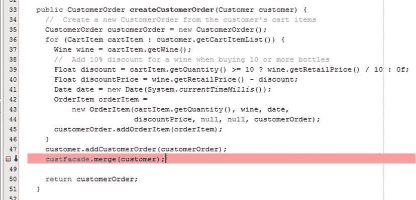

图 13-6.  在 WineAppService.createCustomerOrder() 内部设置断点

设置好断点后，右键点击 `WineAppServiceTest.java`，这次选择“`Debug Test File`”项，以调试模式启动 JUnit 测试器。

当命中断点时，打开 `Variables` 面板并导航到 `customerOrder` 局部变量。展开 `customerOrder` 查看其属性的当前值，导航到其继承的属性，并观察其 `id` 属性为 null。这是意料之中的。在方法的这个阶段，`customerOrder` 是一个新实例，尚未被持久化。因此，其主键值尚未生成或赋值给其 `id` 字段。

单步执行断点所在的行，对 `customer` 执行 `merge()`。我们从 `Customer` 上的级联规则得知，当一个 `Customer` 实例（或其任何子类型）被合并时，所有被引用的 `CustomerOrder` 实例也会被合并。

在执行合并后，再次在 Variables 窗口中检查 `customerOrder`，我们发现其 `id` 字段仍然为 null。其 `id` 字段上的 `@GeneratedValue` 设置确保在它被持久化或合并到持久化上下文时会被赋值，因此显然这个对象并不是在其 `customer` 父对象上调用 `merge()` 时创建的受管副本。因此，方法 `createCustomerOrder()` 返回了错误的 `customerOrder` 实例。要修复此问题，请编辑 return 语句，改为返回一个 `customerOrder` 的受管实例：


图 13-7.  更新 WineAppService.createCustomerOrder() 以返回 customerOrder 的受管实例

这让我们通过了之前遇到的 `customerOrder.getId() is null` 断言失败。再次运行测试，我们遇到了需要解决的最后一个问题。我们的 `customer` 实例在几行前通过 `createCustomerOrder()` 创建后处于受管状态。然而，断言失败 `customerOrder2.getId()` 为 `null` 表明它不知何故持有了一个 `customerOrder` 的过时副本。进一步检查发现，我们的 `customer` 副本在 `createCustomerOrder()` 内部被合并时变成了游离状态。因为我们没有将合并后的副本传回给客户端，所以客户端有责任获取新的受管副本。通过另一次 `merge()` 调用来获取这个受管副本解决了问题，如图 13-8 中第 173 行所示：

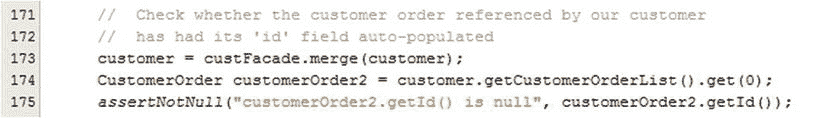

图 13-8.  更新 WineAppServiceTest.testCreateCustomerOrder() 以将受管实例赋值给 customer 变量

……至此，我们的测试现在成功执行了。

除了探索执行和调试涉及会话 Bean 和实体的 JUnit 测试的逐步过程之外，本练习的一个关键收获是，合并操作，特别是那些涉及级联 `MERGE` 的操作，可能导致过时引用，这在代码中可能难以发现。一个安全的方法是，如果你需要继续引用新实体，则显式持久化它们，而不是让它们通过级联合并被持久化，因为后者会导致原始实例变为游离状态。另外，如果在方法调用后（实体可能已被持久化或合并）对其状态有任何疑问，请记住合并对象以获取其当前的受管状态。

结论

本章首先介绍了以下关键概念：

*   *JUnit*：用于对 Java 类进行单元测试的框架
*   *EJB Lite*：EJB API 的一个最小子集，它为 EJB 提供基本服务，而无需完整 EJB 容器所需的一些更耗资源的特性所带来的开销
*   *可嵌入 EJB 容器*：EJB Lite 的一种实现，它在纯 Java SE 环境（而非 Java EE 应用服务器）中运行，并为通过 JUnit 测试 EJB 提供了一个轻量级环境

在检查一个为测试 JPA 持久化单元上的 EJB 外观而编写的 JUnit 测试类时，我们剖析了在可嵌入 EJB 容器中运行测试时的配置要求。

最后，我们逐步介绍了在 NetBeans 中针对 GlassFish 可嵌入 EJB 服务器实现构建和执行 JUnit 测试的步骤。这些测试被预先配置为失败，我们逐步检查并揭示了失败的原因，并借助调试器找到了解决方案。

本章以一个重要的收获作为结尾：在处理实体引用时需谨慎，因为当相关实体被合并时，这些引用可能因级联规则而变为游离状态。

索引

  A

Address 实例


聚合平均响应时间（AART）

应用组装者、部署角色

外部需求

冲突与冗余

依赖关系

引用

打包

  B

Bean 管理的事务（BMT）

有状态会话 Bean

OrderProcessorBMTBean.java

OrderProcessorBMTBeanTxnInterceptor.java

OrderProcessorBMTClient.java

业务流程执行语言（BPEL）

  C

客户端应用程序

应用客户端容器

客户端应用架构

业务流程

使用 JPA 实体

Web 服务

Java EE 技术

JSF

基于 Web 的应用架构

使用 JPA 实体

通过本地调用

客户端视图

开发-Web 服务

应用运行

编译

CreditServiceClient.java

输出

代理类

创建

存根源码

Web 服务客户端向导

@WebServiceRef 注解

会话 Bean

WSDL 文档

容器管理的事务（CMT）

ACID 测试

原子性

一致性

持久性

隔离性

应用管理的 EntityManager

属性定义

客户端与 Bean 事务状态

数据过滤

CartItem 实体实例

createCustomerOrder()方法

initialize()方法

persistEntity()方法

getRollbackOnly()方法

Java 外观

setRollbackOnly()方法

无状态会话 Bean

优势

Java 外观

局限性

OrderProcessorCMTBean.java

OrderProcessorCMTClient.java


上下文与依赖注入（CDI）

备选方案

应用作用域

架构

Bean 与 beans.xml

beans.xml

编译过程

打开项目菜单

项目构建

验证

上下文方面

会话作用域

依赖注入

依赖伪作用域

部署过程

备选方案

任意限定符客户端

生产者

用户自定义限定符客户端

EJB 关系

特性

@Inject 依赖注入

Bean 构造函数

客户端与类

字段注入

初始化方法

交互会话 Bean

局限性

映射

解析

作用域

Java EE 架构

NetBeans 项目

前提条件

生产者

RedWine 类

请求作用域

解析

@Any

@Default

@Name

@New

限定符类型

未满足/歧义依赖

WhiteWine 类

会话作用域

规范

结构

Web Beans

Customer 实体

  D

部署。*参见* 打包与部署过程

  E

企业 JavaBean（EJB）

客户端应用程序

性能测试（*参见* 性能测试，EJB）

会话 Bean

BMT 划分

CMT 划分

隐式 *与* 显式提交

EJB 架构

管理（Glassfish 应用服务器）

管理控制台

服务选项卡

测试页面


高级持久化概念

CDI

客户端应用程序

组件模型

容器

开发模型

例外配置

声明式元数据

位置透明性

多用户安全性

持久化

可移植性

可重用性

可伸缩性

事务

分布式计算模型

EJB 3 架构

EJB 3 简化开发模型

默认行为

依赖注入

拦截器（回调方法）

POJO 实现

XML 与注解

Glassfish

安装 NetBeans IDE 与集成的 GlassFish 服务器

集成会话 Bean、实体、消息驱动 Bean 与 Web 服务

JCP 作为 JSR

JPA

消息驱动 Bean

NetBeans IDE 下载

打包与部署

性能与测试

演进历程（EJB 规范）

EJB 1.0

EJB 1.1

EJB 2.0

EJB 2.1

EJB 3.0

EJB 3.1

EJB 3.2

角色

应用程序组装者

部署者

企业 Bean 提供者

运行时环境

会话 Bean

软件安装与配置

测试（NetBeans IDE 与 GlassFish 安装）

创建

新建 Servlet 向导

运行（Servlet）

示例项目

启动与关闭

测试 Servlet 创建

Windows 防火墙

事务服务支持

故障排除

错误

GlassFish 服务器的测试页面

“localhost”主机名

未找到兼容的 JDK

“8080”端口

“葡萄酒订单”邮件


Web 服务

EJB Lite

EJB 消息驱动 Bean (MDB) *另请参阅* 面向消息架构

异步消息消费者

类

@MessageDriven 注解

onMessage() 方法

参数

要求

简单用例

StatusMailerBean 类

客户端程序

上下文菜单

设置

StatusMailerClient Servlet

客户端视图

编译、部署和测试

构建菜单选项

客户端程序

集成开发环境 (IDE)

JMS 和 JavaMail 资源

前提条件

示例目录

会话 Bean、MDB 和客户端

验证

配置属性

@ActivationConfigProperty 注解

目的地

EJB-JMS 版本

消息确认服务

@MessageDriven 注解

选择器

订阅持久性

依赖注入

异常处理

拦截器

生命周期回调方法

使用

EJB 无状态会话 Bean

Bean 类

CreditCheckEndpointBean.java

validateCC 方法

@WebMethod 注解

@WebService 注解

类

端点接口

SEI

可嵌入 EJB 容器

Derby 数据库

JPA 持久化单元

单元测试方法

JNDI

testCreateCustomerOrder() 方法

testCreateIndividual() 方法

企业归档 (EAR) 文件

实体。*另请参阅* Java 持久化 API (JPA)

实体类

  F

FetchType.EAGER

FetchType.LAZY

  G

@GeneratedValue 注解

Grinder


代理进程

控制台

定义

属性

grinder.consoleHost

grinder.logDirectory

grinder.logProcessStreams

grinder.runs

grinder.script

grinder.threads

报告统计信息

TCP 代理模块

测试脚本

URL 执行

葡萄酒商店 JSF 应用程序

addWineToCart() 方法

findAll() 方法

getWineDisplayList() 方法

JOINED 继承策略

JPA 实体

processOrder() 方法

SINGLE_TABLE 实体继承策略

工作进程

  H

超文本传输协议 (HTTP)

  I

集成开发环境 (IDE)

  J, K

Java API for RESTful Web Services (JAX-RS)

Java API for XML Registries (JAXR)

Java API for XML Web Services (JAX-WS)

Java Architecture for XML Binding (JAXB)

Java Archive (JAR) 文件

Java Community Process (JCP)

Java EE 部署过程

应用程序

容器

库组件

捆绑的库

安装库

库版本

共享类

模块类型

应用程序客户端模块

EJB 模块

概述

持久化单元

资源适配器

WAR 文件 - EJB

Web 应用程序模块

服务器

Java EE 平台

EJB 交互

JAXB

JAXR

JAX-RS

JAX-WS

JSR 181

SAAJ

规范

Java EE 技术

演进

Java Servlets

MVC 模式

脚本片段


JavaMail 资源

管理员控制台

身份验证

创建

GlassFish 应用服务器

TopicConnectionFactory

主题

Java 消息服务 (JMS)。*另请参阅* JavaMail 资源

应用程序架构

类

队列

队列

主题

架构

消息系统

类型

Java 命名和目录接口 (JNDI)

Java 持久化 API (JPA)

编码要求

默认构造函数与非默认构造函数

实例变量 *vs.* JavaBean 属性访问器

java.io.Serializable 接口

编译、部署和测试

“清理并构建”菜单选项

客户端程序

数据库连接与数据库模式

“部署”菜单选项

EJB 外观

PersistenceSamples 项目

前提条件

复合键

@Embeddable 类

@EmbeddedId 注解

嵌入式键 (@EmbeddedId)

字段（Id 和关系）

@IdClass

映射关系

可序列化的 Java 类

复合主键

@Embeddable 注解

@EmbeddedId 注解

@IdClass

Customer.java

附加字段类型

@Basic 注解

@Column 注解

默认配置

*vs.* EJB 2.x

@Entity 注解

使用默认配置的实体

@Id 注解

简单 JavaBean

@Table 注解

CustomerOrderManager

addCustomerOrder() 和 removeCustomerOrder() 方法

Address.java

CustomerOrder.java

@OneToOne

persistence.xml

服务方法

无状态会话


实体、服务

应用（示例）

构建应用

客户端程序执行

编译源代码

数据库连接

Java 类库

SINGLE_TABLE 继承执行

测试

在 Web 环境中

WineApp 数据库与连接

实体 Bean

实体数据访问

实体生命周期

分离实体实例

实体类

实体实例管理

新建实体实例

已移除实体实例

EntityManager

定义

Java SE 服务客户端

JNDI

持久化上下文

会话 Bean，容器注入

事务支持

实体关系

级联操作

字段

懒加载 *vs.* 急加载字段绑定

@ManyToMany 注解

@ManyToOne

@OneToMany

@OneToOne

字段

@GeneratedValue（自动生成值）

@SequenceGenerator

@TableGenerator

继承层次结构

抽象实体

地址，嵌入

集合字段

@ElementCollection

@Embeddable

@Embedded

JOINED，根实体

映射超类

非实体类，可嵌入

非实体，映射超类

根实体继承超类

单值，非实体

实例变量注解

源代码

@Transient

拦截器（回调方法）

JPQL

绑定查询参数

批量更新与删除操作

复杂查询

动态查询

@NamedQuery

查询


映射实体继承

抽象实体

地址实例

双向关系

客户端代码

设计时考量

设计时，JOINED

@DiscriminatorColumn 注解

@DiscriminatorValue 注解

实体实例

实体类型

外观模式

@GeneralValue 注解

初始化

中间实体，SINGLE_TABLE 继承层次结构

中间实体，JOINED

JavaServiceFacadeClient

@JoinColumn 注解

叶子实体，SINGLE_TABLE 继承层次结构

叶子实体，JOINED

ManyToOne 字段

对象/关系继承

OneToMany 字段

O/R 实现

性能影响

根实体，SINGLE_TABLE 继承层次结构

根实体，JOINED

示例层次结构

单表每类

单表最外层

独立实体，JOINED

TABLE_PER_CLASS，设计考量

TABLE_PER_CLASS，中间实体

TABLE_PER_CLASS，叶子实体

TABLE_PER_CLASS，性能

TABLE_PER_CLASS，根实体

类型枚举

类型 JOINED

单向关系

映射实体继承；独立实体

原生 SQL 查询

O/R 映射

@Column 注解

复杂映射

持久化框架

@Table 注解

持久化归档

持久化 *vs.* 适配

POJOs

多态关系与映射

多态 JPQL 查询

主键与嵌套外键（*参见* Java Persistence API (JPA)，复合键）

主键

@GeneratedValue

Java 类型

单字段

属性访问或注解

访问类型


getAddressId()

setZipCode()

副作用代码

属性名称

查询条件

@Version（乐观锁定）

Java 持久化查询语言 (JPQL)

绑定查询参数

批量更新与删除操作

复杂查询

动态查询

@NamedQuery

查询

JavaServer Faces (JSF)

架构

FacesServlet

JSP 页面/Facelets

生命周期阶段

托管 Bean

导航模型

编译

部署与测试

EJB 后端应用程序

addToCart() 方法

cartItems 页面

链接页面

登录页面

新客户注册页面

通知页面

页面流程

搜索页面

wineList 页面

工具与组件

葡萄酒商店应用程序

详情页面

主页

列表页面

登录页面

通知页面

注册页面

运行目标

搜索页面

购物车页面

Java 规范请求 (JSR)

Java 事务 API (JTA)

@JoinColumn 信息

JPA 实体

容器管理 *vs.* 应用程序管理持久化上下文

JTA *vs.* 资源本地实体管理器

事务范围持久化上下文 *vs.* 扩展持久化上下文

*vs.* 事务上下文

JSP 标准标签库 (JSTL)

JSR 181（Java 平台 Web 服务元数据）

JUnit

构建与测试方法

级联 MERGE 操作

前提条件

示例应用程序

源代码编译

返回托管对象

在 WineAppServiceTest.java 中


WineAppServiceTest

  L

LiCustomer

  M

消息驱动 Bean (MDB)

面向消息架构 *另请参阅* Java 消息服务 (JMS)

模型-视图-控制器 (MVC) 模式

  N

NetBeans

  O

OrderProcessFacadeBean

performCreditCheck() 方法

processOrder() 方法

sendPOtoMDB() 方法

  P, Q

打包与部署流程 *另请参阅* Java EE 部署流程

应用程序组装器

应用服务器与平台无关性

部署计划

MBean

性能与特性

组装器

组件

定义模块级部署描述符

EAR 文件

JAR 文件-组件

特定任务

任务与交付物

部署器

应用服务器

容器

外部引用

模块描述

概述

特定任务

任务与交付物

解包

部署工具

EJB JAR 文件

任意类

命名作用域

练习

Java EE 模块类型

Java EE 角色

JPA

持久化单元

目录

命名作用域

要点

提供者

角色

应用程序组装器

部署器

性能，EJB

应用程序使用情况

实际思考时间

休眠时间

零思考时间

Grinder 工具包 (*参见* Grinder)

性能指标

AART

响应时间

吞吐量

总事务率

测试指标

校准


样本质量

样本量

用户，代表性数量

性能测试，EJB

实际测试运行

校准

数据库连接

GlassFish 服务器

Grinder

Grinder 控制台

多表

AART 比较

所有用户结果

TTR 比较

100 用户结果

初步测试

样本量分析图

模拟用户

单表

AART 比较

所有用户结果

TTR 比较

100 用户结果

测试环境

测试脚本

普通 Java 对象 (POJOs)

  R

表述性状态转移 (REST)

约束

差异 (RESTful *与* SOAP)

HTTP

RESTful Web 服务

RESTful Web 服务

CreditCheck

差异 (RESTful *与* SOAP)

HTTP 方法-CRUD 操作

@Retention 注解

逆向工程

  S

服务端点接口 (SEI)

会话 Bean

会话 Bean。*另请参阅* 无状态会话 Bean

三层架构

富客户端

Web 应用程序

客户端视图

本地和远程客户端

SearchFacade

SearchFacadeClient

ShopperCountClient

ShoppingCartClient

类型

编译

构建应用程序

SessionSamples 项目

验证

部署

GlassFish 应用程序

菜单选项

EJB JAR (.jar) 文件

Java 组件

模型

先决条件

运行客户端程序

执行


SearchFacadeClient 的 Servlet 输出

Servlet

单例会话 Bean

Bean 类

Bean 管理的并发

业务接口

业务方法

回调方法

并发管理

容器管理的并发

错误处理

有状态 Bean

Bean 类

业务接口

业务方法

回调方法

异常处理

拦截器

定时器服务

基于日历的时间表达式

示例（基于日历的时间表达式）

LogShopperCount.java

持久化

实时事件

类型

使用

ShoppingCartBean

addWineItem() 方法

findCustomer() 方法

getCartItems() 方法

removeWineItem() 方法

sendOrderToOPC() 方法

简单对象访问协议 (SOAP)

元素

消息

用于 Java 的 SOAP 附件 API (SAAJ)

无状态会话 Bean

异步方法

Bean 类

业务接口

注解

客户端应用程序

富客户端 - 远程接口

SearchFacadeLocal.java

SearchFacade 会话 Bean

Web 客户端 - 本地接口

业务方法

SearchFacadeBean.java

wineSearch() 方法

回调方法

依赖注入

元素

拦截器

InvocationContext

方法

前置代码

任务

  T

事务

ACID 属性

分布式事务

在 EJB 中

CMT 支持

JTA 事务


本地事务

事务上下文

使用 JPA 实体

JTA

两阶段提交协议

  U, V

通用描述、发现与集成 (UDDI)

  W, X, Y, Z

Web 归档 (WAR) 文件

Web 服务。*另请参阅* Java EE 平台

架构

客户端视图

Java 客户端

会话 Bean

WSDL 文档

编译会话 Bean

构建应用程序

验证

WebServiceSamples 项目

定义

部署会话 Bean

EJB 无状态会话 Bean

Bean 类

类

端点接口

SEI

JAR

前提条件

REST

约束

差异 (RESTful *对比* SOAP)

HTTP

RESTful Web 服务

服务消费者

SOAP

元素

消息

测试信用服务

CreditService

测试页面

SOAP 请求和响应消息

UDDI

用途

WSDL

<binding> 元素

类别

<definitions> 元素

<message> 元素

<portType> 元素

<service> 元素

<types> 元素

Web 服务描述语言 (WSDL)

<binding> 元素

类别

<definitions> 元素

<message> 元素

<portType> 元素

<service> 元素

<types> 元素

WineApp 数据库

Wines Online 应用程序

后端组件

信用服务

客户外观组件

电子邮件服务

订单处理外观组件

订单处理服务

持久化服务

搜索外观组件

购物车组件

业务流程

组件与服务交互

组件与服务

信用服务

客户外观组件

数据库模式

电子邮件服务

订单处理外观组件

订单处理服务

持久化服务

搜索外观组件

购物车组件

EJB

数据库连接

部署与运行

前提条件

源码编译

TransactionSamples 项目

打包、组装与部署方面

数据库连接

EJB Web 服务配置

JMS 和 JavaMail 资源

打开示例应用程序

前提条件

Servlet 输出

wineapp@yahoo.com 账户
