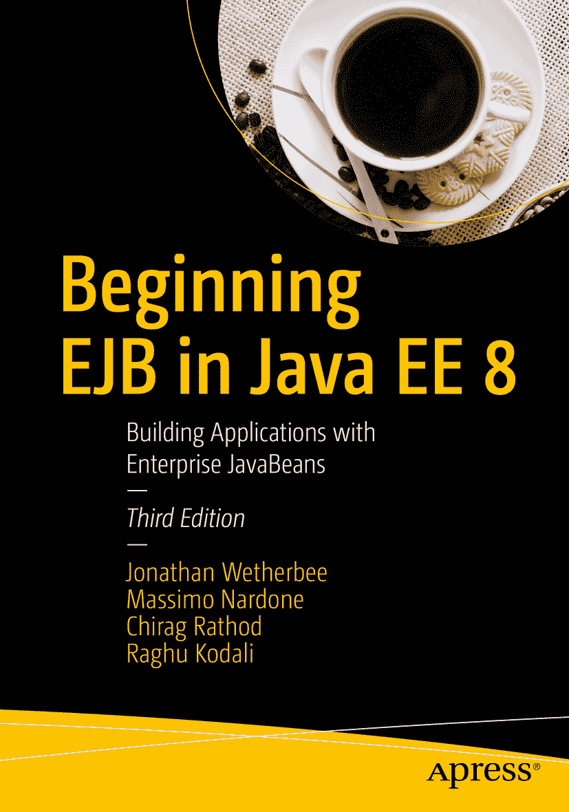

乔纳森·韦瑟比、马西莫·纳尔多内、奇拉格·拉索德与拉古·科达利  
《Java EE 8 中的 EJB 入门：使用企业级 JavaBean 构建应用程序》  
第 3 版

本书作者引用的任何源代码或其他补充材料，读者均可通过本书在 GitHub 上的产品页面获取，网址为 [www.​apress.​com/​9781484235720](http://www.apress.com/9781484235720)。如需更详细信息，请访问 [`​www.​apress.​com/​source-code`](http://www.apress.com/source-code)。  
ISBN 978-1-4842-3572-0  
电子书 ISBN 978-1-4842-3573-7  
[`doi.org/10.1007/978-1-4842-3573-7`](https://doi.org/10.1007/978-1-4842-3573-7)  
美国国会图书馆控制号：2018944142  
© 乔纳森·韦瑟比、马西莫·纳尔多内、奇拉格·拉索德与拉古·科达利 2018  
本作品受版权保护。出版商保留所有权利，涉及材料的全部或部分内容，特别是翻译权、重印权、插图复用权、朗诵权、广播权、缩微胶片复制权或任何其他物理形式的复制权，以及信息存储与检索、电子改编、计算机软件或目前已知或未来开发的类似或不同方法的传输权。  
本书中可能出现商标名称、标识和图像。我们并未在每次出现商标名称、标识或图像时使用商标符号，而是仅以编辑方式使用这些名称、标识和图像，以维护商标所有者的权益，且无意侵犯商标权。  
本出版物中使用的商品名称、商标、服务标记及类似术语，即使未被明确标识，也不应被视为对其是否受专有权利保护的立场表达。  
尽管本书在出版时被认为提供真实准确的信息，但作者、编辑及出版商均不对可能出现的任何错误或遗漏承担法律责任。出版商对本书所含内容不作任何明示或暗示的担保。  
本书通过 Springer Science+Business Media New York 在全球图书贸易中发行，地址：233 Spring Street, 6th Floor, New York, NY 10013。电话：1-800-SPRINGER，传真：(201) 348-4505，电子邮件：orders-ny@springer-sbm.com，或访问 www.springeronline.com。  
Apress Media, LLC 是一家加利福尼亚有限责任公司，其唯一成员（所有者）是 Springer Science + Business Media Finance Inc (SSBM Finance Inc)。SSBM Finance Inc 是一家特拉华州公司。  
献给我的儿子们——雅各布、帕特里克和尼古拉斯——感谢你们在整个过程中给予的爱、支持和灵感。  
——乔恩·韦瑟比  
献给谢莉和阿什维尼。  
——奇拉格·拉索德  
谨以此书纪念我深爱的已故母亲玛丽亚·奥古斯塔·奇尼利奥。谢谢您，妈妈，感谢您教会我的一切，让我成为一个善良的人，让我学习成为计算机科学家，以及您留给我的美好回忆。您将永远被爱和怀念。我爱您，妈妈。安息。  
——马西莫  
前言

亲爱的读者：

当我们在 2006 年构思本书第一版时，轻量级的 EJB 3 API 仍处于早期阶段，但我们清楚地看到，EJB 规范设计者终于实现了功能与易用性的完美结合。从 EJB 2.x 的世界走来，这犹如一股清新的空气，让我们想起了在多年使用 C 和 C++ 编程后，发现 Java 技术时的那种感觉。EJB 组件被重新定义为普通的 Java 类，其元数据可通过 Java 注解声明，并通过引入泛型、容器注入和拦截器得到增强，从而成为更灵活开发模型的基础——这种模型通过简洁性获得了优雅。随着新的 Java 持久化 API (JPA) 的出现，实体也被重塑为轻量级 Java 类，O/R 映射元数据可通过规范定义的注解指定，我们突然拥有了一个包含最新技术的全面企业组件模型，并全部整合到一个全球标准中。所以，你能理解我们为何如此兴奋。

时光飞逝，如今 EJB 3.2 和 JPA 2.1 规范已经发布。这些规范合计超过一千页，已经成熟，涵盖了多个新领域，并进一步提升了易用性。我们再次看到了一个机会，可以将这些最新材料转化为易于理解的格式，使其可读性强，并大量使用示例，让你可以在自己的机器上构建、执行并进一步探索。在这本伴随 Java EE 7 发布的第二版中，我们通过一系列易于消化的章节，介绍了 EJB 3.2 和 JPA 2.1 API，以及 CDI 和 JAX-RS 规范的关键特性，让你能够一次一个主题地逐步熟悉这些技术。在每一章中，我们都提供了可执行的源代码示例，演示每个功能如何工作，以及各个部分如何组合在一起。因此，你无需一口吞下整个“玉米卷饼”。秉承我们在本书众多示例中使用的 Apress Wines Online 应用程序的精神，我们希望你能真正品味和欣赏 Java EE 7 组件生态系统的丰富性。

对于每项技术，我们不仅提供简单的示例，还努力解释何时何地使用其功能、它们的优缺点，并提供最佳实践见解。在完成这些主题探索之后，我们将解释如何将 EJB 及相关组件集成到全面的 Java EE 7 应用程序中，然后重点介绍事务管理、性能分析、部署、在可嵌入 EJB 容器中进行测试，以及如何构建健壮的 EJB 客户端。

我们的任务是将你从 EJB 新手转变为专家，我们希望你能享受这段旅程！

乔纳森·韦瑟比、马西莫·纳尔多内、奇拉格·拉索德与拉古·科达利

## 本书适合哪些读者？

本书面向具备 Java 开发经验的企业软件开发者，他们曾使用早期版本的 EJB 或相关技术构建过单层或多层应用，并希望基于最新的跨平台行业标准来构建企业级软件。

作为一本入门级教材的作者，我们有两个主要目标：

*   第一个目标是让您熟练掌握 EJB 的众多核心要素及若干密切相关的技术，从而能够在 Java EE 环境中设计、构建、部署、执行和测试完整的企业级应用。我们希望您能轻松掌握构建和组装基于 EJB 组件的应用所需的关键细节。
*   第二个目标是让您对 Java EE 整体中的服务层和持久化层有一个广阔的视角，特别是对 EJB 所提供的全部功能有一个全面的了解。我们期望您在读完本书后，能够建立一个广度优先的知识基础，以此为跳板，更深入地探索 EJB 及相关规范的特定领域。

为此，本书力求为 EJB 提供一个易于上手的入门路径，让您能够熟练地构建充分利用 EJB 广度的服务和应用程序。我们刻意避免深入探讨规范的许多领域，以便您能熟悉整体环境，而不会被细枝末节的选项所干扰。我们相信，这种基于对 EJB 广泛功能的扎实理解而建立的广度优先基础，将使您能够以最佳状态，利用规范和其他高级文本作为参考指南，更深入地探索您自己的软件开发项目所需的 EJB API 特定领域。

## 致谢

本书的诞生离不开众多人士的努力与洞见，他们在本书的整个创作过程中提供了技术输入和纯粹的灵感。特别感谢我的同事兼本书第二版的主要合著者 Chirag Rathod，感谢他在项目的各个阶段所展现的洞察力、精神与奉献。当亲密的合作者同时也是如此要好的朋友时，熬夜工作也变得轻松愉快！Raghu Srinivasan 和 John Bracken 在设计会议以及讨论 EJB 和 JPA 最佳实践时提供了宝贵的帮助。Chris Carter 支持我的探索，即使这让我暂时放下了 JDeveloper 的工作；他知道，从研究和撰写本书中获得的见解必将回馈给整个团队。与 Marina Vatkina 就 EJB 3.2 的最新状态和未来方向进行的一个半小时的愉快讨论，既富有启发性又非常及时。

有了上述所有人的技术帮助，如果不是日常生活中的种种干扰，撰写这本我珍视的主题的书本应只是一场马拉松！但对于这些令人愉快的分心之事，我想特别感谢其中的几位。Adam Beyda 和 Lauren Webster 让我对什么才是真正重要的有了终生的洞察和视角。Bob Lieb 在撰写本书的心理历程中给予的深刻指导和导航至关重要。Rhonda Jeffrey、Andy Cortwright、Dave Clark 和 Marianna Klebanov：感谢你们在过去一年里成为我良好的倾听者和出色的朋友。

我的父母 Andrea 和 Peter Wetherbee，感谢你们的爱与鼓励，并不断提醒我你们是我最忠实的粉丝。

最后，我完成这件事的主要动力来自于再次希望与我的孩子和亲密朋友共度更多时光。现在，就是那个时刻了！

——Jon Wetherbee

当 Jon Wetherbee 问我是否有兴趣与他一起做一个“非工作”相关的项目时，我完全不知道这会让我陷入什么境地。我要感谢 Jon 给我这个共同撰写第二版的绝佳机会。对我来说，他不仅仅是主要作者——他是一位朋友和导师，引领我走上了最终成就本书的道路。

我要感谢 Srinivasan T. Raman 和 Chris Carter，他们不仅在此过程中支持我，还鼓励了我。如果不是 Oracle 给予我时间和资源，我可能会为撰写本书而熬更多个深夜。为此，我感谢 Oracle 公司。

我的父母 Chandrabala 和 Jayantilal Rathod，感谢你们的爱。最后但同样重要的是，我要感谢我的妻子 Ashwini 和女儿 Shaylee，是你们让我感觉自己像一位正在创作下一部“畅销书”的“作者”。

——Chirag Rathod

非常感谢我美好的家人——我的妻子 Pia，以及我的孩子 Luna、Leo 和 Neve，感谢你们在我撰写本书期间给予的支持。你们是我生命中最美好的理由。

我想感谢我已故的挚爱母亲 Maria Augusta Ciniglio，她一直如此支持和深爱着我。我将永远爱您、想念您，我最亲爱的妈妈。

我还要感谢我亲爱的父亲 Giuseppe 以及我的兄弟 Mario 和 Roberto，感谢你们无尽的爱，并成为世界上最好的父亲和兄弟。

感谢 Franco Gentilucci 和 Maurizio De Marco，你们是两位出色的朋友。

本书也献给我已故的挚爱表姐 Ann Goss。我们会想念你的。

特别感谢 Catrin Bergholm 和 Sakari Salomaa，你们是两位出色的人，为我的家庭带来了欢乐。

非常感谢 Steve Anglin 和 Matthew Moodie 给我机会作为作者参与本书的工作，以及 Mark Powers 在编辑过程中所做的出色工作并一直支持我；最后感谢 Mario Faliero，一位好朋友和本书的技术审阅者，感谢他帮助我使本书变得更好。

——Massimo Nardone

目录 第 1 章：EJB 3.2 架构与 CDI 服务简介 1 Java 企业版 (Java EE) 8 架构的新特性？ 2 EJB 简介 3 什么是 EJB？ 4 EJB 开发模型的核心特性 5 EJB 规范的演进 7 EJB 3 简化开发模型 10 分布式计算模型 13 本书的组织结构 15 第 1 章：EJB 3.2 架构与 CDI 服务简介 15 第 2 章：EJB 会话 Bean 15 第 3 章：实体与 Java 持久化 API (JPA) 15 第 4 章：高级持久化特性 16 第 5 章：EJB 消息驱动 Bean 16 第 6 章：EJB、Web 服务与微服务 16 第 7 章：集成会话 Bean、实体、消息驱动 Bean 与微服务 16 第 8 章：事务管理 16 第 9 章：EJB 性能与测试 17 第 10 章：上下文与依赖注入 17 第 11 章：EJB 打包与部署 17 第 12 章：EJB 客户端应用 17 第 13 章：在可嵌入 EJB 容器中测试 18 入门指南 18 安装 Java SE 开发工具包 (JDK) 8 19 下载 NetBeans IDE 20 安装 NetBeans IDE 及其集成的 GlassFish 服务器 21 测试 NetBeans IDE 与 GlassFish 安装 24 管理 GlassFish 应用服务器 30 故障排除 33 总结 37 第 2 章：EJB 会话 Bean 39 会话 Bean 简介 39 会话 Bean 的类型 40 何时使用会话 Bean？ 40 无状态会话 Bean 43 设置依赖项 44 Bean 类 44 业务接口 45 业务方法 49 依赖注入 51 生命周期回调方法 52 拦截器 54 有状态会话 Bean 57 Bean 类 57 业务接口 58 业务方法 60 生命周期回调方法 61 拦截器 62 异常处理 62 单例会话 Bean 63 Bean 类 63 业务接口 65 业务方法 65 生命周期回调方法 66 并发管理 68 错误处理 71 定时器服务 71 基于日历的时间表达式 73 基于日历的时间表达式示例 74 定时器持久化 75 会话 Bean 的客户端视图 76 编译、部署和测试会话 Bean 83 前提条件 84 编译会话 Bean 及其客户端 84 部署会话 Bean 及其客户端 86 运行客户端程序 88 总结 92 第 3 章：实体与 Java 持久化 API (JPA) 93 实体示例 96 一个简单的 JavaBean：Customer.java 96 一个简单的实体：Customer.java 97 暴露默认值的实体：Customer.java 99 编码要求 102 实体数据访问 103 属性名称 104 示例：注解实例变量 104 示例：注解属性访问器 106 声明主键 108 简单主键 108 复合主键 110 实体示例总结 113 持久化归档 113 persistence.xml 文件 113 EntityManager 115 持久化上下文 116 获取 EntityManager 实例 116 事务支持 118 实体生命周期 119 新实体实例的生命周期 119 O/R 映射 122 @Table 注解（再探） 122 @Column 注解（再探） 123 复杂映射 124 实体关系 125 @OneToOne 125 @OneToMany 和 @ManyToOne 126 @ManyToMany 128 懒加载与急加载字段绑定 129 级联操作 130 Java 持久化查询语言 (JPQL) 131 @NamedQuery 和 @NamedQueries 132 绑定查询参数 133 动态查询 134 批量更新和删除操作 134 复杂查询 136 持久化与适配 136 正向生成——持久化 136 逆向工程——适配 136 哪种方法适合你的项目？ 137 示例应用：CustomerOrderManager 137 Customer.java 137 编译、部署和测试 JPA 实体 145 前提条件 145 打开示例应用 145 创建数据库连接和示例模式 148 编译实体、EJB 和客户端 149 部署 JPA 持久化单元、EJB 模块和 Servlet 150 运行客户端程序 152 总结 154 第 4 章：高级持久化特性 157 映射实体继承层次结构 158 入门指南 159 实体继承映射策略 160 每个类层次结构一张表 (InheritanceType.SINGLE_TABLE) 164 公共基表与连接子类表 (InheritanceType.JOINED) 181 每个最外层具体实体类一张表 (InheritanceType.TABLE_PER_CLASS) 186 O/R 实现方法比较 190 在继承层次结构中使用抽象实体、映射超类和非实体类 191 抽象实体类 191 映射超类 (@MappedSuperclass) 192 非实体类 195 非实体单值和集合字段 195 多态关系 200 关系映射 200 多态 JPQL 查询 201 使用原生 SQL 查询 201 查询条件 API 202 复合主键与嵌套外键 204 使用嵌入式复合键 (@EmbeddedId) 204 在实体类上直接暴露复合键类字段 (@IdClass) 206 映射使用复合键的关系 208 乐观锁支持 (@Version) 210 自动生成主键值支持 (@GeneratedValue) 211 拦截器：实体回调方法 214 编译、部署和测试 JPA 实体 216 前提条件 216 打开示例应用 216 创建数据库连接 219 编译源代码 221 运行客户端程序 222 测试其他持久化示例 224 总结 225 映射实体继承层次结构 225 在继承层次结构中使用抽象实体、映射超类和非实体类 225 多态关系 225 多态 JPQL 查询 226 使用原生 SQL 查询 226 使用查询条件 API 226 复合主键与嵌套外键 227 乐观锁支持 227 自动生成主键值支持 227 拦截器：实体回调方法 227 第 5 章：EJB 消息驱动 Bean 229 面向消息的架构 229 什么是 JMS？ 230 消息应用架构 232 JMS 2.0 234 JMS 2.1 234 使用 MDB 235 何时使用 MDB？ 235 MDB 类 236 配置属性 239 MDB 中的依赖注入 244 生命周期回调方法 246 拦截器 247 异常处理 248 客户端视图 248 编译、部署和测试 MDB 253 前提条件 253 编译会话 Bean 和 MDB 254 创建 JMS 和 JavaMail 资源 256 部署会话 Bean、MDB 及其客户端 262 运行客户端程序 263 总结 264 第 6 章：EJB、Web 服务与微服务 265 什么是 Web 服务？ 265 UDDI 267 WSDL 267 SOAP 273 REST 274 何时使用 Web 服务？ 277 Java EE 8 与 Web 服务 277 JAX-WS 278 JAX-RS 279 JAXB 279 JAXR 280 SAAJ 280 JSR 224 280 作为 Web 服务的 EJB 无状态会话 Bean 280 开发新的 Web 服务 281 打包、部署和测试 Web 服务 285 前提条件 285 编译会话 Bean 286 部署基于会话 Bean 的 Web 服务 288 测试信用服务 289 Web 服务客户端视图 292 开发访问 Web 服务的 Java 客户端 292 作为 Web 服务客户端的会话 Bean 301 什么是微服务？ 302 Java EE 8 与微服务 305 使用 Spring Boot 和 NetBeans 的微服务示例 307 前提条件 307 总结 317 第 7 章：集成会话 Bean、实体、消息驱动 Bean 和 Web 服务 319 简介 319 应用概述 319 应用组件与服务 321 购物车组件 321 搜索外观组件 321 客户外观组件 321 订单处理外观组件 321 持久化服务 322 电子邮件服务 322 信用服务 322 订单处理服务 322 Wines Online 应用业务流程 322 深入组件/服务详解 324 持久化服务 324 客户外观组件 325 搜索外观组件 327 购物车组件 329 订单处理外观组件 337 订单处理服务 345 电子邮件服务 351 信用服务 353 数据库模式 353 构建、部署和测试应用 354 前提条件 355 创建数据库连接 355 创建 JMS 和 JavaMail 资源 357 打开示例应用 357 配置 EJB Web 服务 358 wineapp@yahoo.com 账户与 user.properties 文件 359 构建、部署和执行示例应用 360 Servlet 输出 365 生成的电子邮件 365 总结 366 第 8 章：事务管理 367 什么是事务？ 368 分布式事务 369 事务的 ACID 属性 369 Java 事务 API (JTA) 371 两阶段提交协议 371 EJB 中的事务支持 371 EJB 事务服务 372 服务模型中会话 Bean 的事务行为 373 容器管理事务 (CMT) 划分 374 Bean 管理事务 (BMT) 划分 379 隐式提交与显式提交 381 将事务与 JPA 实体一起使用 382 实体与事务上下文之间的关系 382 容器管理与应用管理的持久化上下文 383 事务范围持久化上下文与扩展持久化上下文 384 JTA 与资源本地 EntityManager 385 两个示例场景 385 使用 CMT 划分的无状态会话 Bean 386 使用应用管理 EntityManager 的 Java 外观 397 使用 CMT 会话 Bean 过滤测试数据 401 使用 BMT 划分和扩展持久化上下文的有状态会话 Bean 409 构建、部署和测试：来自 Wines Online 应用的事务场景 426 前提条件 426 打开示例应用 426 创建数据库连接 428 编译源代码 429 部署和运行客户端程序 430 总结 433 第 9 章：EJB 性能与测试 435 测试方法论 436 性能标准 437 模拟应用使用 440 定义测试指标 440 Grinder 443 测试应用 446 性能测试 451 测试环境 452 测试脚本 452 设置 453 初步测试 460 样本大小 462 校准 462 实际测试运行 463 分析结果 465 总结 468 第 10 章：上下文与依赖注入 471 什么是 CDI？ 472 与 EJB 的关系 478 CDI 概念 479 Bean 与 beans.xml 479 作用域 480 使用 @Inject 进行依赖注入 482 依赖解析 485 替代方案 490 生产者 491 与会话 Bean 的交互 494 会话 Bean 作用域 494 解决会话 Bean 歧义 495 限制 495 编译、部署和测试 CDI 应用 495 前提条件 496 示例代码结构 497 编译 CDI Bean 及其客户端 497 部署和运行 CDI 客户端 499 总结 507 第 11 章：EJB 打包与部署 509 关于部署工具的说明 510 打包与部署流程概述 511 提供者 511 组装者 512 部署者 516 Java EE 部署基础设施 518 Java EE 服务器 518 Java EE 容器 519 Java EE 部署组件 521 Java EE 应用 521 Java EE 模块类型 522 库组件 527 应用服务器与平台独立性 530 部署工具 530 部署计划 531 部署角色 531 应用组装者 532 应用部署者 536 组装 EJB JAR 模块 537 命名作用域 538 组装持久化单元 538 命名作用域 539 总结 539 第 12 章：EJB 客户端应用 541 应用架构 541 JSF 547 Java EE Web 技术的演进 549 JSF 架构 553 JSF 工具与组件 556 使用 JSF 和 EJB 开发 Web 应用 557 登录页面 559 新客户注册页面 563 链接页面 570 搜索页面 574 葡萄酒列表页面 580 显示所选葡萄酒详情页面 585 显示购物车项目页面 589 通知页面 593 编译、部署和测试 JSF 应用 594 前提条件 595 编译 JSF 应用 595 部署和运行葡萄酒商店应用 599 应用客户端容器 607 总结 608 第 13 章：在可嵌入 EJB 容器中测试 609 测试客户端 609 EJB Lite 610 可嵌入 EJB 容器 610 本章的组织结构 610 概念 611 JUnit 测试 613 WineAppServiceTest：WineAppService EJB 的 JUnit 测试类 614 实例化可嵌入 EJB 容器并启动 Derby 620 在持久化单元中初始化数据 622 单元测试方法 625 构建和测试示例代码 629 前提条件 629 打开示例应用 630 编译源代码 631 运行 JUnit 测试 632 总结 637 索引 639 关于作者与关于技术审校者 关于作者 关于技术审校者

