# 1. EJB 3.2 架构与 CDI 服务简介

当我们着手撰写本书时，我们的目标是向开发者介绍企业级 JavaBean（EJB），并密切关注这项技术如何在日常的真实世界应用中使用。JSR-345：Enterprise JavaBeans™，3.2 版 EJB 核心合约与需求是一份深度的规范，它同时满足了初级开发者和硬核高级用户的需求。这是一个需要满足的庞大受众群体，而作为参考指南，EJB 规范文档很好地覆盖了这一点。在撰写一本关于如何使用 EJB 的书籍时，我们必须缩小我们的受众范围；尽管如此，我们相信我们写出了一本能够满足大多数 Java EE 开发者需求的书籍。

本书的目标读者是那些有 Java 经验、使用过早期版本的 EJB 或其他技术构建过单层或多层应用，并且准备好迎接使用基于标准的技术构建企业级应用的挑战（和回报）的开发者。考虑到总共 1100 页的参考材料（涵盖 EJB 和 Java 持久化 API（JPA）规范）可能令人望而生畏，我们为开发者提供了一个入门通道，逐步展开 EJB 的各个部分，并为你提供所需的信息和代码示例，让你能够卷起袖子开始工作。

随着每一章的展开，你不仅会学习到规范的一个新领域，还会通过具体的示例学习如何将其应用到自己的应用程序中。许多这些示例直接来自第 7 章和第 12 章中构建的综合性、端到端的 Java EE 企业级葡萄酒在线应用程序，这样你就能看到它们如何融入更大的图景。我们鼓励你获取这些示例并加以实践。在你喜欢的 IDE 或开发环境中尝试它们，修改它们并尝试新事物。本书涵盖的 EJB 及相关 API——JPA、Web 服务以及上下文和依赖注入（CDI）——为你提供了大量的工作基础。一旦你熟悉了构建、部署和测试的基础知识，你会发现 EJB 组件不仅功能强大，而且易于构建和使用。

本书的作者们共同使用 EJB 与 Java EE 技术栈中的其他技术构建了许多应用程序，我们试图在书中收录关于我们学到的实用模式、我们发现成功的策略以及你可以避免的一些陷阱的建议。本书的大部分章节致力于探索 EJB 的特定领域，但我们还包含了关于 Java 持久化 API（JPA）、上下文和依赖注入（CDI）、Web 服务、评估你的 EJB 应用程序性能以及部署到你选择的 Java EE 应用服务器的章节。本章末尾的“入门”部分将帮助你设置好环境，以运行本书每章末尾提供的许多有用的示例应用程序。

我们希望本书不仅能作为 EJB 信息的参考指南，还能作为一本操作指南和实用示例的宝库，在你构建自己的应用程序时可以随时参考。祝阅读愉快！

## Java 企业版（Java EE）8 架构的新特性是什么？

Java 企业版（Java EE）平台的第一个版本发布于 2013 年 6 月，而在我更新这份手稿时，Java EE 9 已经发布了。

Java EE 8 包含了对核心 API 的更新，例如 Servlet 4.0 和上下文与依赖注入 2.0，以及两个新的 API——用于 JSON 绑定的 Java API（JSR 367）和 Java EE 安全 API（JSR 375）。

Java EE 是 Java SE 平台的超集，包含超过 30 个规范和一个运行时环境，这意味着 Java EE 组件可以充分利用所有 Java SE API。

以下是 Java EE 8 中最重要的变更列表：

*   Java EE 8 平台
*   JSON-B 1.0
*   JSON-P 1.1
*   JAX-RS 2.1
*   MVC 1.0
*   Java Servlet 4.0
*   JSF 2.3
*   JMS 2.1
*   CDI 2.0
*   Java EE 安全 1.0
*   Java EE 管理 2.0
*   并发工具
*   连接器架构
*   WebSocket
*   JPA
*   EJB
*   JTA
*   JCache
*   JavaMail

关于 Java EE 8 的更多信息可以在官方 Java 网页上找到：[`http://www.oracle.com/technetwork/java/javaee/overview/index.html`](http://www.oracle.com/technetwork/java/javaee/overview/index.html)

## EJB 简介

在 20 世纪 90 年代末，随着 Java 因应对大规模应用企业需求的独立技术（如 RMI、JTA 和 CORBA）的出现而得到加强，对一种能够统一这些技术并将其纳入标准组件开发模型的业务组件框架的需求应运而生。EJB 应运而生以满足这一需求。在随后的几年里，EJB 不断发展，包含了众多特性（同时明智地拒绝了其他特性），并已成熟为一个健壮且标准的框架，用于在分布式、多用户环境中部署和执行业务组件。

### 什么是 EJB？

EJB 的每个版本都通过 Java 社区流程（JCP）作为 Java 规范请求（JSR）进行管理。本书涵盖的最新版本由 JSR 345：Enterprise JavaBeans™ 3.2 定义。在 EJB 3.0 之前的 EJB JSR 涵盖了持久化组件，但自从引入 JPA 以来，持久化现在通过其自己的 JSR 进行管理。尽管如此，这两个领域相辅相成，我们在本书中包含了几个主要致力于 JPA 的章节。

EJB 3.2 规范，标题为 JSR 345：Enterprise JavaBeans™，3.2 版 EJB 核心合约与需求，连同 EJB 3.2 API 中定义的类库，共同定义了一个组件模型和一个容器框架。

#### EJB 组件模型

作为一个组件模型，EJB 定义了三种对象类型，开发者可以按如下方式构建和定制：

*   会话 Bean 可以是无状态的、有状态的或单例的，它们执行业务服务操作。这些服务可以声明式地配置为在分布式、事务性和访问控制上下文中运行。
*   消息驱动 Bean（MDB）通过与消息队列或主题关联，响应外部事件而被异步调用。

与此相辅相成的是，Java 持久化 API（JPA）主要定义了以下持久化对象类型：

*   实体是具有唯一标识并代表持久化业务数据的对象。

会话 Bean 和消息驱动 Bean 是 EJB，它们通常被统称为企业 Bean。在早期版本的 EJB 中，实体被称为实体 Bean，它们也属于这一类别。然而，在 EJB 3 中，实体现在由持久化提供者管理，而不是 EJB 容器，并且它们不再被视为企业 Bean。增强的消息驱动 Bean 合约使用一个无方法的消息监听器接口，将所有公共方法暴露为消息监听器方法。


#### EJB 容器

EJB 容器为 EJB 组件的运行提供了支持环境。该环境提供事务与安全服务、资源池化与缓存、组件生命周期服务、并发支持等功能——本书将逐一探讨这些内容。EJB 组件通过特定于 EJB 的元数据，详细说明它们希望如何与支持容器进行交互。这些元数据要么由容器捕获并在运行时应用于 EJB 的行为，要么在 EJB 组件部署到 EJB 容器时被解释，并用于构建包装层。EJB 3.2 规范还定义了 EJB API 组，并为支持其他 API 组的 EJB Lite 容器制定了明确的规则。

### EJB 开发模型的核心特性

在其发展历程中，EJB 始终专注于交付具备若干核心特性的组件。

#### 声明式元数据

EJB 组件模型的标志性特征之一是，开发者能够使用 Java 注解和/或 XML 描述符，以声明方式（而非编程方式）指定企业 Bean 和实体的行为。这极大地简化了开发流程，因为无需在 Java 源代码中掺杂服务实现代码，即可为 Bean 添加大量定制化功能。为兼顾开发者偏好与应用灵活性，EJB 为开发者提供了注解和 XML 两种选择，并允许在同一 EJB 或实体中同时使用这两种方式来指定元数据中的行为。当同一元数据片段在注解和 XML 中均有定义时，XML 声明在解决冲突时具有优先权。本章后续的“EJB 3 简化开发模型”部分将进一步探讨此方法的其他优势。

#### 例外配置

与声明式指定行为的能力相辅相成的是，EJB 中大量使用了智能默认值。许多行为会自动附加到 EJB 或实体上，无需显式声明，例如会话 Bean 方法的事务行为，以及映射到实体持久化数据属性的表和列的名称。仅当需要非默认行为时，才需要显式指定注解或对应的 XML。在利用默认行为的最常见情况下，这种方法能够产生非常精简、干净的代码。这种开发模型被称为“例外配置”，因为仅在例外（非默认）情况下才需要显式配置组件的行为。

#### 可伸缩性

大型应用程序要求随着客户端负载的增加而具有良好的伸缩能力。EJB 服务器采用资源池化来最大化对象复用，利用持久化缓存来避免重复查询或创建相同对象，并在中间层实现乐观锁定策略，以减轻关系数据库管理系统（RDBMS）的负载并避免并发锁定问题。EJB 容器还管理着 EJB 的生命周期，允许释放和复用相关资源以优化性能。

#### 位置透明性

EJB 可以配置为远程访问，从而允许通过网络连接进行访问。客户端（可能是另一个 EJB）只需请求一个远程 EJB 的实例，本地和远程 EJB 容器便会透明地管理通信细节。

#### 事务性

Java 事务 API（JTA）定义了分布式事务的标准 API，而 EJB 容器则充当 EJB 的 JTA 事务管理器。自诞生以来，EJB 规范就定义了一个标准模型，用于在企业 Bean 上以声明方式指定容器管理的事务行为。

#### 多用户安全性

可以在 EJB 上以声明方式指定方法级别的访问控制，从而强制执行由应用服务器管理员定义的用户和角色级别权限。

#### 可移植性

符合规范的 EJB 至少理论上可以部署到任何实现了 EJB 规范的应用服务器上。在实践中（这在 EJB 3 之前的版本中尤其如此），供应商提供了自己的元数据定义，企业 Bean 开发者逐渐依赖这些定义，从而被锁定在特定供应商的实现中。随着 EJB 的成熟，它逐渐吸收了这些原先的平台特定特性，因此今天实现的 EJB 比过去具有更强的可移植性。

#### 可复用性

EJB 是松耦合的组件。一个 EJB 可以被复用并打包到多个应用程序中，但它必须与所依赖的 EJB 的业务接口捆绑在一起，或者能够访问这些接口。

#### 持久化

尽管 JPA 实体已不再包含在 EJB 规范中，但它们仍然是 EJB 的重要补充。实体是具有唯一标识的持久化领域对象。一个实体类映射到一个数据库表，每个实体实例由该表中的一行数据表示。

### EJB 规范的演进

每次引入新版本的 EJB 规范时，它都会包含重要的新特性，以满足普遍需求并采纳新兴技术。以下是自 1996 年 EJB 规范诞生以来，或者更确切地说，自 1998 年首次商业实现以来，其演进历程的简要总结。

#### EJB 1.0

初始版本 1.0 开始支持有状态和无状态的服务对象，称为会话 Bean；并可选支持持久化领域对象，称为实体 Bean。为了实现可移植性，EJB 通过一种特殊的远程接口进行访问，该接口提供了可移植性和远程访问能力，但带来了远程通信基础设施和按值传递语义的开销。

#### EJB 1.1

后续版本 1.1 强制要求供应商支持实体 Bean，并引入了 XML 部署描述符，以取代将元数据存储在特殊的序列化类文件中。

#### EJB 2.0

EJB 2.0 通过引入本地接口，解决了远程接口的开销和按值传递的缺点。只有运行在 J2EE 容器内的客户端才能通过本地接口访问 EJB，但按引用传递的方法调用使得组件间的交互更加高效。同时引入了一种新型 EJB——消息驱动 Bean（MDB），它可以参与异步消息系统。实体 Bean 获得了对容器管理关系（CMR）的支持，允许 Bean 开发者以声明方式指定由 EJB 容器管理的实体 Bean 之间的持久化关系。此外，还引入了 Enterprise JavaBeans 查询语言（EJB QL），使开发者能够使用一种类似 SQL 的语言来查询实体 Bean 实例。

#### EJB 2.1

EJB 2.1 增加了对 Web 服务的支持，允许会话 Bean 暴露端点接口，并引入了定时器服务，使得 EJB 可以在指定的时间或时间间隔被调用。EJB 2.1 还扩展了 EJB QL 函数，并引入了一个 XML 模式来替代定义 `ejb-jar.xml` 部署描述符的 DTD。


#### EJB 3.0

EJB 3.0 是该标准演进过程中的一个重要里程碑。它引入了一种新的、简化的开发模型（见下文），使得 EJB 组件变成了 POJO（普通老式 Java 对象）；EJB 的 Bean 类不再需要实现 EJB 特定的接口；并且，使 Java 类成为 EJB 的那些属性被提取到 Java 注解中，或者被捕获在外部 `ejb-jar.xml` 部署描述符文件中。只需满足几个基本条件，任何类都可以成为 EJB，并利用 EJB 容器提供的企业级服务。

同样在 EJB 3.0 中新增的是，规范中的实体 Bean 部分被新的 JPA 规范所取代，并且与新的简化开发模型一致，JPA 实体也是 POJO。JPA 实体也与 EJB 容器解耦，可以独立于 EJB 使用，包括在纯 Java SE 环境中。

#### EJB 3.1

EJB 3.1 进一步改进了 EJB 3.0 中引入的简化开发模型。现在本地 EJB 支持无接口选项。为会话 Bean 提供了单例模式，以及异步和增强的定时器支持。EJB Lite——EJB 容器功能的一个可嵌入子集——允许 EJB 组件在与 EJB 客户端相同的虚拟机中执行。

#### EJB 3.2

在 EJB 3.2 中，异步和增强的定时器功能被添加到 EJB Lite 子集中。除了其他改进之外，Bean 开发者可以对生命周期拦截器方法的事务性拥有更多控制权，并且管理本地和远程行为声明的规则也得到了简化。

JSR-000345 Enterprise JavaBeansTM 3.2 最终版可从以下网页下载：

[`http://download.oracle.com/otndocs/jcp/ejb-3_2-fr-spec/index.html`](http://download.oracle.com/otndocs/jcp/ejb-3_2-fr-spec/index.html)

最新的 EJB 3.2 版本发布日期为 2013 年 4 月 10 日，并且从 Java EE 7 到 EE 8 没有发生变化。

主要变化包括以下内容：

*   增强了禁用有状态会话 Bean 钝化的选项。
*   增强了用于访问 EJB 模块中所有活动定时器的 `TimerService` API。
*   增强了可嵌入的 `EJBContainer` 以实现 `AutoClosable` 接口。
*   移除了对 `javax.ejb.Timer` 和 `javax.ejb.TimerHandle` 的限制，这些限制要求引用只能在 Bean 内部使用。
*   增强了标准 JMS MDB 激活属性的列表。
*   增加了对上一版本中可选功能的支持，并将其描述移至单独的 EJB 可选功能文档中。

### EJB 3 简化开发模型

EJB 3.0 与早期版本相比有显著不同。EJB 3 的设计者着手重新设计开发体验；引入一个大大简化的开发模型，以减少企业 Bean 本身的复杂性；同时，整合了许多同类技术中的理念。共识是：该规范被广泛认为已经实现了这些目标，并且在此过程中克服了许多阻碍早期版本 EJB 被广泛采用的问题。

#### XML 与注解

如果你熟悉早期版本的 EJB，你在 EJB 3 中首先会注意到的事情之一是，不再需要在部署描述符中捕获 EJB 元数据。EJB 现在允许你使用 Java 注解将 EJB 元数据存储在 Bean 源代码中。这并不是说 XML 部署描述符已经消失；它们仍然存在并且运行良好，许多开发者更喜欢它们而不是注解。使用 XML 可以将 Java 源代码与 EJB 元数据解耦，允许相同的实体或企业 Bean 类在不同的上下文中使用，其中特定于上下文的信息被捕获在 XML 中，并且不会“污染” Bean 类。

然而，许多用户更倾向于在其 POJO 类的上下文中直接查看他们的 EJB 元数据并使用注解。为了避免陷入一场“宗教战争”（双方都有很多直言不讳的支持者），我们建议你自己选择。我们遵循的一个简单规则是：如果我们需要将实体和 Bean 类与其 EJB 元数据解耦，例如当我们想要对两个不同的实体继承策略使用相同的实体类时，我们将元数据放在 XML 中。否则，我们坚持使用注解。别忘了——你总是可以混合搭配，依靠一个坚定的策略：每当使用 XML 和注解都为某个元素指定了元数据时，XML 总是胜出。这允许 Bean 开发者下游的任何角色（参见本章后面的“EJB 角色”部分）覆盖元数据设置，而无需更新 Java 源代码，因为覆盖可以专门应用于 XML 描述符。

注意

我们还推荐一种更高级的策略：仅在定义企业 Bean 或实体的行为（该行为真正是其定义不可或缺的一部分）时使用注解，例如实体关系字段的关系类型，或会话 Bean 上方法的事务要求。任何可以合理覆盖的内容，例如实体映射到的表的名称，或用于填充实体主键的值生成器的详细信息，都将放在 XML 描述符中，在那里可以由应用程序组装器（或许与数据库管理员协商）在部署时指定。虽然在 Java 源文件中使用注解指定默认值没有坏处，但这种方法认识到了固定元数据（不应修改）和松散元数据（可以在不改变企业 Bean 或实体行为的情况下自由修改）之间的区别。

#### 依赖注入

在 Java EE 容器中实例化 EJB 之后，但在将其交给客户端之前，容器可以根据为该企业 Bean 定义的规则初始化实例上的属性数据。此功能称为依赖注入，它是控制反转模式的一个例子，即由外部提供者而不是类本身来初始化对象实例的属性。EJB 3 在 Java EE 中引入了依赖注入的使用，并且很大程度上因为它非常流行，这个功能现在有了自己的规范。当前的依赖注入 API 通过 JSR-330：Java ^(TM) 的依赖注入进行管理，并且该功能通过 JSR 346：Java ^(TM) EE 1.1 的上下文和依赖注入进一步扩展，我们将在第 10 章“上下文和依赖注入”中介绍。

注意

注入使用“推送”模型将数据推送到 Bean，并且无论 Bean 是否实际使用该数据都会发生。如果有可能不使用该数据，Bean 可以选择避免承担资源派生的成本，而仅在确实（或可能）使用时，通过在 Java 代码中执行 Java 命名和目录接口（JNDI）查找来“拉取”数据。

EJB 中依赖注入使用的常见示例如下：

*   将 `EntityManager` 注入到会话 Bean 中，以便与持久化单元中的实体进行交互
*   将 `UserTransaction` 注入到管理其事务边界的会话 Bean 中


#### 拦截器：回调方法

企业级 Bean 和实体都可以指定其某些方法或独立类中的方法，在特定生命周期事件发生时被调用。例如，会话 Bean 可以指定某个方法在 Bean 实例化之后、交付给客户端之前被调用。该方法可以初始化 Bean 的状态信息，使用 JNDI 查找资源，或执行任何其他不要求事务上下文的操作。此类回调方法被称为拦截器，它们允许 Bean 开发者以编程方式参与企业级 Bean（或实体）与其容器之间的交互。这种模式（也称为横切）的一个重要优势是，单个拦截器可以定义一次，然后应用于多个方法，甚至多个 EJB。EJB 3.2 规范还增加了一个选项，允许有状态会话 Bean 的生命周期回调拦截器方法在由该生命周期回调方法的事务属性决定的事务上下文中执行。

#### POJO 实现

EJB 3 在消除早期 EJB 版本中困扰企业级 Bean 类及其必需接口的繁文缛节方面取得了巨大进步。与开发者抱怨即使定义最基本的 Bean 行为也必须定义 XML 元数据类似，他们发现必须编写自定义接口来处理企业级 Bean 的工厂支持很繁琐，并且要求会话 Bean 的接口扩展 EJB 特定接口也很不方便。所有这些限制都在 EJB 3 中得到了解决。

Home 方法不再是强制性的，尽管它们仍然受支持。对于会话 Bean 和 MDB，默认构造函数取代了早期 EJB 规范要求的无参 `ejbCreate()` 方法。

对于实体，`Home` 接口被一个 `EntityManagerFactory` 实例取代，该实例为 JPA 持久化单元生成 `EntityManager` 实例，以管理实体生命周期操作，包括查询执行。

#### 智能使用默认值

EJB 3 如何简化开发过程的一个绝佳示例是，它利用默认行为来提供丰富的功能，而无需任何编码或声明性元数据。例如，只需用 `@Entity` 注解标记一个 POJO，其所有公共属性就会自动成为持久化字段，并且表和列名称会采用与实体和字段名称匹配的派生值。仅在需要覆盖特定区域的默认行为时，才需要额外的注解或 XML 元素。仅当表名与实体名不匹配时，才需要 `@Table` 注解。我们已非常谨慎地确保默认值与最常见的用法相匹配，因此在大多数用例中，不需要显式元数据，从而产生更精简、更整洁的代码。

注意

依赖默认行为的一个后果是，类不会在任何地方描述其完整行为，因此你需要很好地理解正在应用的默认行为。IDE 在推导和显示企业级 Bean 或实体（并明确显示其完全默认值）方面可能很有用。

### 分布式计算模型

任何企业应用程序的核心都是能够在单独的 Java 线程或进程中执行任务和运行组件。通过基于 RMI 的远程服务，应用程序客户端层中的客户端可以访问网络上任何位置的应用服务器中运行的 EJB。远程接口方法的传值行为提供了一种粗粒度模型，旨在减少松散连接的客户端和服务器之间的网络流量。然而，许多使用 EJB 的应用程序不需要远程访问，并选择将其 EJB 配置为本地使用。这消除了远程访问支持的开销，同时继续提供其余的企业服务。

#### EJB 角色

EJB 规范为参与定义企业级 Bean 或实体的不同阶段，或为企业级 Bean 提供服务和 API 实现的个人定义了七个角色。本书针对的是参与定义企业级 Bean 及其相关元数据的三个角色。在实践中，这些角色中的一个或多个可能由同一个人执行，某些任务可能由一个角色执行并由另一个角色覆盖；但理解 EJB 开发过程中任务的逻辑划分是有用的。我们将在本书的各个章节中引用这些角色。

##### 企业级 Bean 提供者

企业级 Bean 提供者，也称为 Bean 提供者，负责定义和实现企业级 Bean 的业务逻辑和结构。这包括定义 Java 类、实现服务方法、在 Bean 及其方法上声明性地指定事务和安全性信息、注入或查找所需资源，以及任何其他可应用于企业级 Bean 类的内容。

应用于 JPA 实体时，Bean 提供者定义实体的持久化结构及其与其他实体的关系。提供者可以定义映射和主键生成行为，但此角色通常仅限于定义实体的逻辑依赖关系和结构。

##### 应用程序组装者

应用程序组装者将 EJB 组合成 EJB 模块，将实体组合成持久化归档，然后将这些模块与其他 Java EE 模块组合在一起以生成应用程序。此任务需要解析对逻辑服务器资源的引用，包括 EJB 之间的引用。应用程序组装者必须使用为 EJB 和实体组件定义的接口和元数据，但无需熟悉实现细节。

##### 部署者

部署者获取由应用程序组装者组装好的应用程序，并将其部署到特定的应用服务器实例或集群。部署者必须解析 EJB 组件定义的所有外部依赖关系，将它们映射到安装在应用服务器环境中的具体资源。对于实体，部署者可以提供或覆盖实体将映射到的实际数据库对象的详细信息。

## 本书的组织结构

为了帮助你了解本书其余部分的结构，以下是各章的简要总结。你不必按顺序阅读这些章节。每章都附有示例程序，它们可以独立运行。不过，主题是逐步引入的，因此，如果你在某章中遇到一个在该章中未定义的术语或概念，它很可能是在本书的前面章节中定义的。

### 第 1 章：EJB 3.2 架构与 CDI 服务简介

本章首先介绍本书，并提供对 EJB 的概述。该概述涵盖 EJB 开发框架和组件模型、EJB 的核心特性、EJB 的历史、EJB 3 简化开发模型以及 EJB 分布式计算模型。本章最后以“入门”部分结束，帮助你安装运行本书提供的众多示例应用程序所需的 NetBeans IDE 和 GlassFish Java EE 参考实现服务器。

### 第 2 章：EJB 会话 Bean

第 2 章探讨了 EJB 的主要服务对象：会话 Bean。会话 Bean 在其多种角色中被审视：作为实体外观、作为服务组件（无论有无状态）、作为单例或定时器驱动对象，以及作为事务和安全服务的主要协调者。


### 第 3 章：实体与 Java 持久化 API (JPA)

本章介绍 Java 持久化 API (JPA)，以及可用于在 Java EE 容器内外支持实体的各种持久化服务。本章涵盖基本的 O/R 映射，并介绍 Java 持久化查询语言（JPQL）。

### 第 4 章：高级持久化特性

本章深入探讨更高级的持久化概念，描述 JPA 为映射实体继承层次结构所提供的支持。通过三种受支持的继承映射策略的示例，指出每种方法的优缺点，以帮助您决定哪种策略最适合您应用的特定需求。在其他主题中，本章还涵盖复杂主键 (PK) 映射、用于使用数据库序列或表自动填充主键值的 ID 生成器、锁定策略以及缓存管理。

### 第 5 章：EJB 消息驱动 Bean

本章介绍如何使用 MDB 为您的应用添加异步、事件驱动的行为。本章的代码示例将解释并演示 Java 的消息传递 API——JMS。

### 第 6 章：EJB、Web 服务与微服务

会话 Bean 为 Web 服务提供了出色的实现，本章将探讨 EJB 对这种技术完美结合的支持。

### 第 7 章：集成会话 Bean、实体、消息驱动 Bean 与微服务

在分别介绍了所有不同的组件模型类型之后，第 7 章将它们整合到一个集成的 Java EE 应用中。我们认为，了解所有部分如何组合在一起以生成一个运行中的应用将特别有用。

### 第 8 章：事务管理

EJB 提供丰富的事务服务支持，并使 Bean 提供者能够轻松地以声明方式为企业 Bean 指定自定义的、由容器提供的事务行为。EJB 还允许企业 Bean 选择退出此模型并控制自己的事务划分行为。本章将两种可选的事务模型应用于一个单一的逻辑场景，以权衡每种方法的优势。

### 第 9 章：EJB 性能与测试

本章提供了关于如何评估 EJB 组件性能的宝贵见解，以帮助您决定 EJB 提供的众多选项中哪一个适合您的应用。除了解释如何设置性能测试之外，我们还提供了一些我们运行过的性能测试案例，并附有我们对结果的评估。

### 第 10 章：上下文与依赖注入

上下文与依赖注入 (CDI) 服务在 Java EE 6 中引入，它通过一种强大的方式增强了 EJB 中定义的组件模型，即向您的应用中注入资源，这些资源的生命周期是上下文相关的，并由服务器方便地管理。本章介绍 CDI，并解释 EJB 开发者如何利用这种支持来丰富应用的行为。

### 第 11 章：EJB 打包与部署

组装和部署被整合到本章中，我们将涵盖应用组装者和部署者角色所需的任务。本章讨论打包 EJB 和持久化模块、以不同方式将模块组装到企业归档 (EAR) 文件中、解析模块之间以及打包在不同模块中的 EJB 之间的引用，以及将资源需求绑定到目标应用服务器环境中安装的具体资源。

### 第 12 章：EJB 客户端应用

在本章中，我们将引导您了解可用于构建应用的应用架构和不同的编程模型，包括每种方法的优缺点。完成这些之后，我们将确定一种应用架构——使用 JavaServer Faces (JSF) 技术开发 Web 应用。然后，我们将深入探讨 JSF 架构和概念，并专注于将 JSF 用户界面组件和 JSF 导航模型与我们在第 7 章中开发的 EJB/WebService/JPA 后端应用集成。

最后，我们还将解释如何使用轻量级应用客户端容器在纯 Java SE 环境中执行您的会话 Bean。此轻量级容器提供了在其环境中执行的 EJB，并具备真正的 EJB 容器所提供的某些服务（例如容器注入）。

### 第 13 章：在可嵌入 EJB 容器中测试

在生产部署中，EJB 组件在应用服务器内的 Java EE 环境中运行。出于测试目的，EJB 允许您在 EJB 容器的轻量级子集中测试您的 EJB 组件，该子集称为 EJB Lite，并作为可嵌入 EJB 容器实现，可以在纯 Java SE 环境中运行。本章涵盖各种 EJB 测试场景，并指导您使用 JUnit 在 GlassFish 的可嵌入 EJB 容器中测试 EJB 组件（和 JPA 实体）。

## 入门指南

本章的这一部分将帮助您准备好运行本书其余部分示例所需的软件安装和配置。在撰写本文时，EJB 3.2 规范即将最终定稿。GlassFish 应用服务器已经实现了该规范，使开发者社区能够亲身体验新规范。

GlassFish 是一个开源应用服务器，实现了 Java EE 平台的最新特性。事实上，GlassFish 是 Java EE 平台所有规范（包括 EJB 3.2 规范）的参考实现。NetBeans IDE 紧密跟踪 GlassFish 的发布，确保 NetBeans 支持 Java EE 规范的最新状态，并使 NetBeans 成为部署和运行本书示例的理想平台。您会发现，每一章都附带一个 NetBeans 应用项目，该项目由一个或多个附加项目组成，这些项目代表 EJB、Web 或其他模块，演示了该章涵盖的特性。尽管这些示例应用都配置为在 GlassFish 服务器中运行，但它们是可移植的（由于遵循 Java EE 标准），并且可以部署到您选择的任何 Java EE 8 服务器。

虽然我们是在 Windows 7 环境中使用 NetBeans 构建和测试本书中的示例，但代码示例并非特定于操作系统，它们可以在任何能够运行 NetBeans 及其集成的 GlassFish 服务器的系统上执行。尽管如此，您可能需要在其他操作系统上调整环境设置以安装和执行 NetBeans 及其集成的 GlassFish 服务器。

注意

您可以在以下网站找到有关 NetBeans IDE 及其集成的 GlassFish 应用服务器的更多详细信息：[`http://netbeans.org/features/index.html`](http://netbeans.org/features/index.html)

本章的其余部分将涵盖以下内容：

*   安装 Java SE 开发工具包 (JDK)
*   下载 NetBeans IDE
*   安装 NetBeans 及其集成的 GlassFish 服务器
*   测试 NetBeans 和 GlassFish 安装
*   管理 GlassFish 应用服务器

即使您熟悉 NetBeans 和 GlassFish，我们也建议您阅读以下部分，因为运行其余章节中的示例代码依赖于正确完成此设置。


### 安装 Java SE 开发工具包 (JDK) 8

首先，我们要确保从 Java 官网安装 Java SE 开发工具包 (JDK) 8 版本：

[`http://www.oracle.com/technetwork/pt/java/javase/downloads/jdk8-downloads-2133151.html`](http://www.oracle.com/technetwork/pt/java/javase/downloads/jdk8-downloads-2133151.html)

安装完 Java SE 开发工具包 (JDK) 8 后，你可以通过运行图 1-1 所示的命令来测试它是否正常工作。

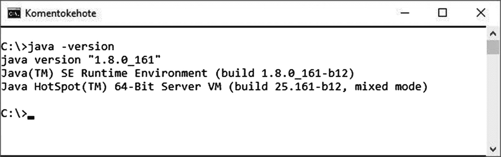

图 1-1

检查已安装的 Java 版本

请注意，还有一个 JDK 8u161 的发行版，其中包含了 NetBeans IDE 8.2 版本的 Java SE 捆绑包：

[`http://www.oracle.com/technetwork/java/javase/downloads/jdk-netbeans-jsp-142931.html`](http://www.oracle.com/technetwork/java/javase/downloads/jdk-netbeans-jsp-142931.html)

在本书中，我们分别安装了 JDK 和 NetBeans。

### 下载 NetBeans IDE

你可以从以下位置下载最新的 NetBeans 安装程序：

[`http://netbeans.org/downloads/`](http://netbeans.org/downloads/)

请确保下载带有“Java EE”技术的安装程序，如图 1-2 所示。此安装程序还将包含所需的 Java SE 和 GlassFish 包。Ant 包含在 GlassFish 中；你可以使用它，或者配置环境属性以使用其他安装。GlassFish 项目建议你使用其捆绑的 Ant。

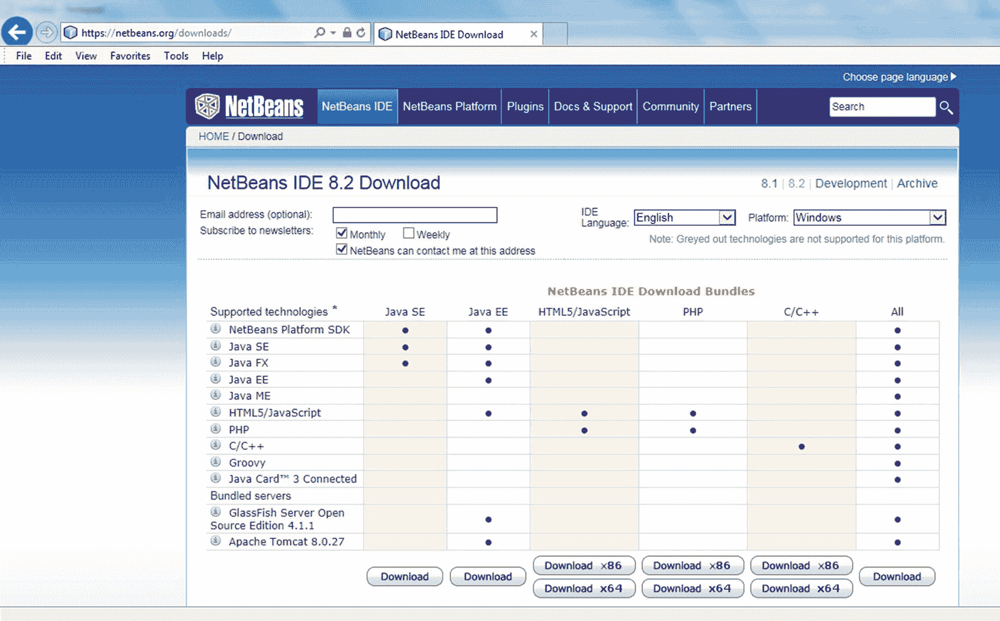

图 1-2

下载 NetBeans IDE 注意

当我们开始编写本书时，最新的 NetBeans 版本是 8.2，我们用它来测试设置和示例代码。请记住，NetBeans IDE 5.x、6.x 和 7.x 的多个安装可以与 NetBeans IDE 8.2 在同一系统上共存。实际上，你无需卸载早期版本即可安装或运行 NetBeans IDE 8.2。

下载完成后，你就可以开始安装 NetBeans 及其集成的 GlassFish 服务器了。

### 安装 NetBeans IDE 及其集成的 GlassFish 服务器

导航到下载 NetBeans IDE 安装程序的目录，然后运行安装程序。安装向导的第一页会列出将要安装的包。

如果没有安装 Java SE 开发工具包 (JDK) 版本，你将收到如图 1-3 所示的消息。

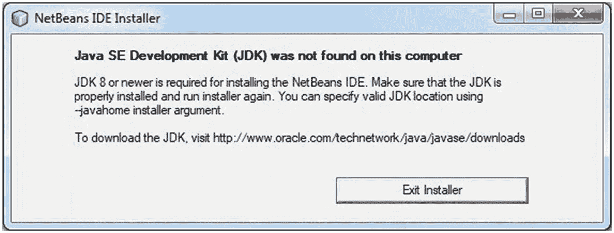

图 1-3

未安装 Java SE 开发工具包 (JDK)

相反，如果已安装 Java SE 开发工具包 (JDK)，但你看到“未找到兼容的 JDK”警告消息，如图 1-4 所示，那么你将不得不退出向导，首先下载并安装正确且兼容的 Java SE 开发工具包 8。

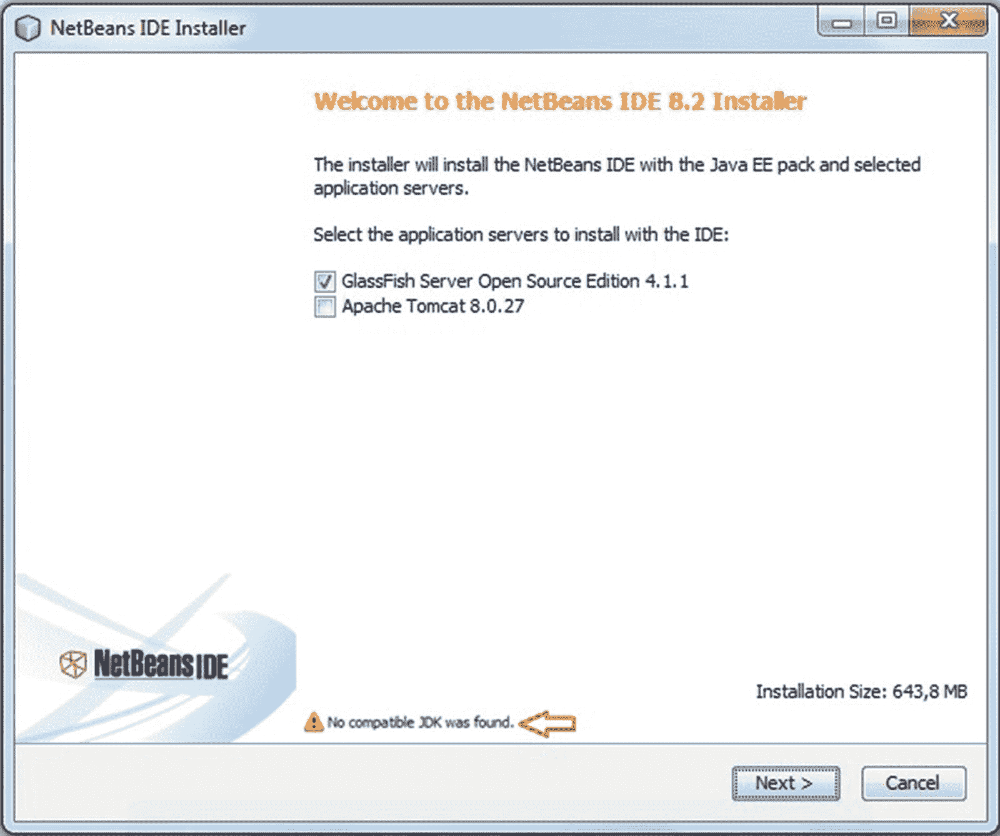

图 1-4

安装 NetBeans。“未找到兼容的 JDK”警告注意

即使你没有看到“`未找到兼容的 JDK`”警告，也请验证你是否已安装 Java 平台 (JDK) 8。如果你没有安装 Java 平台 (JDK) 8，那么在执行本书中的示例时，可能会遇到“`javac: invalid target release: 1.8.0`”错误。

安装兼容的 JDK 版本后，重新运行 NetBeans 安装程序。验证“未找到兼容的 JDK”警告不再出现，然后遍历向导，保持所有默认值选中。“摘要”页面将列出 NetBeans IDE 和 GlassFish 应用服务器将要安装的文件夹。按下`安装`按钮完成向导，如图 1-5 所示。

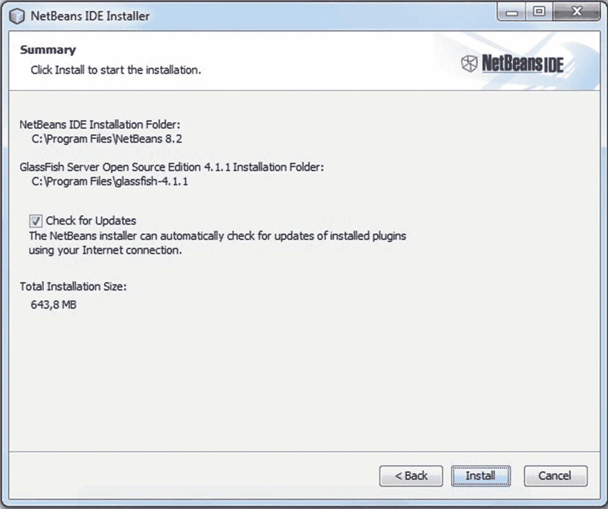

图 1-5

安装 NetBeans IDE 和 GlassFish 应用服务器

成功安装后，你的 NetBeans IDE 和 GlassFish 应用服务器即可使用。在接下来的章节中，我们将向你展示如何创建一个简单的 NetBeans 项目，并验证已安装的 GlassFish 服务器是否正常运行。

### 测试 NetBeans IDE 和 GlassFish 安装

假设上述所有步骤都已成功执行，你就可以启动 NetBeans IDE 和集成的 GlassFish 应用服务器了。我们还将演示一些简单的测试，以确保你可以运行本书中的示例。

#### 启动 NetBeans IDE

NetBeans IDE 提供了一个用于创建、部署和执行 Java EE 应用程序的图形化环境。诸如启动和关闭 GlassFish 服务器域之类的管理任务也可以使用 NetBeans 执行。

启动 NetBeans，可以通过在 Windows 7 机器的“开始”菜单中选择“NetBeans”，或者在命令提示符下运行 `C:\Program Files (x86)\NetBeans 8.2\bin\netbeans64.exe`。请注意，确切路径将取决于图 1-3 中提到的安装位置，对于 32 位系统，可执行文件将命名为 `netbeans.exe`。如果你运行的是 Windows 8 或 10，则需要按下“Windows”键并开始输入“NetBeans”。应用搜索工具将搜索 NetBeans 可执行文件，你可以选择它来启动 NetBeans IDE。

NetBeans IDE 和 GlassFish 应用服务器如图 1-6 所示。

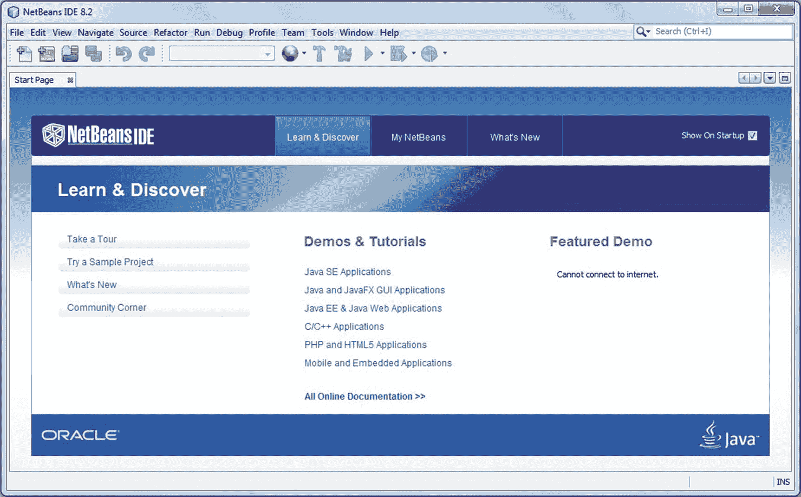

图 1-6

NetBeans IDE 和 GlassFish 应用服务器


#### 使用示例项目进行测试

打开 NetBeans IDE 后，我们将创建一个示例项目，以测试 IDE 及应用服务器的编译、部署和执行功能。

要创建新项目，请按 `Ctrl-Shift-N` 打开 `新建项目` 向导。选择 `Java Web` 类别和 `Web 应用程序` 项目，如图 1-7 所示。浏览向导，保持所有默认值不变，然后点击 `完成` 结束向导。

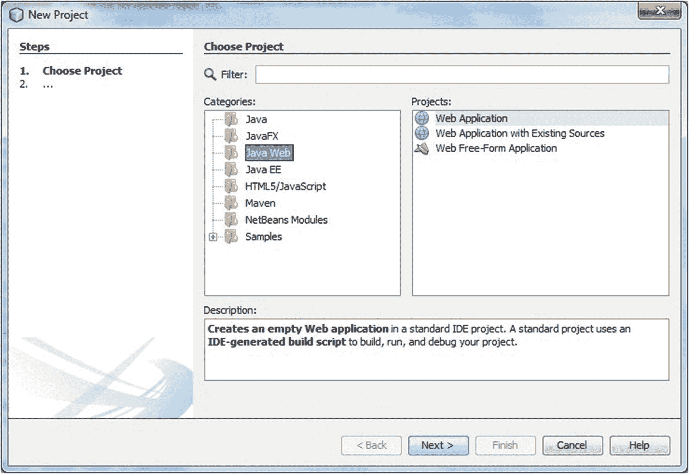

图 1-7

创建示例测试项目

创建一个名为 `WebApplication1` 的项目。接下来，我们将在 `WebApplication1` 项目下创建一个 Servlet。要创建 Servlet，请在项目导航器中右键单击项目名称以调用上下文菜单。选择 `新建` 下的 `Servlet ...` 菜单，如图 1-8 所示。

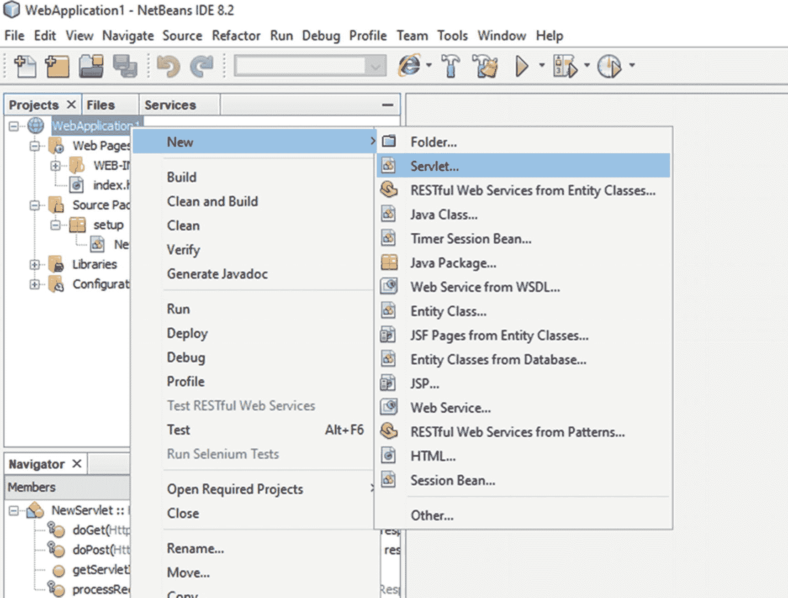

图 1-8

创建测试 Servlet

在 `新建 Servlet` 向导中，输入包名并保持其他默认值不变，然后点击 `完成` 结束向导，如图 1-9 所示。我们使用了 `setup` 作为包名。

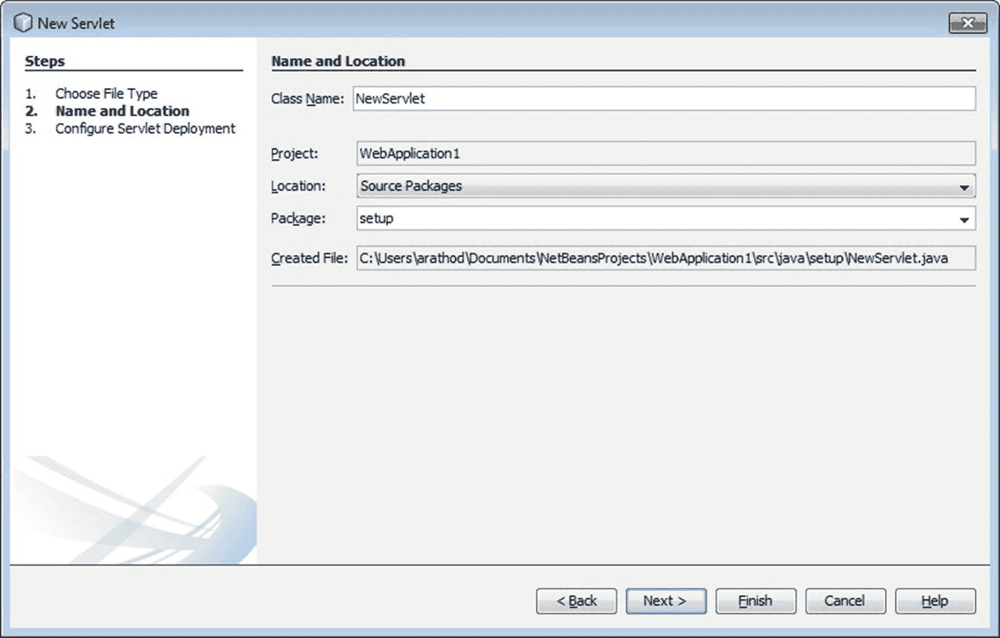

图 1-9

浏览新建 Servlet 向导

创建 `NewServlet` 类后，我们可以通过调用 Servlet 文件上的上下文菜单并选择 `运行文件` 菜单选项来立即运行它，如图 1-10 所示。

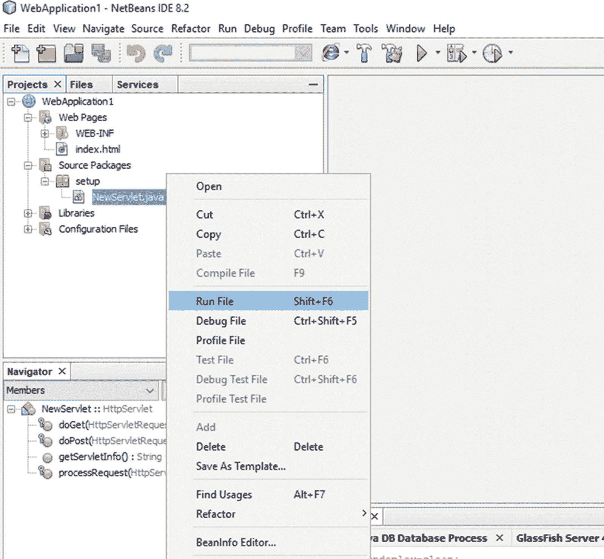

图 1-10

运行 Servlet

当我们运行 Servlet 时，NetBeans 将自动启动集成的 GlassFish 服务器。

作为运行 Servlet 的一部分，NetBeans 将编译、打包并将其部署到集成的 GlassFish 服务器。部署后，NetBeans 将自动在默认浏览器中打开 Servlet URL，如图 1-11 所示。

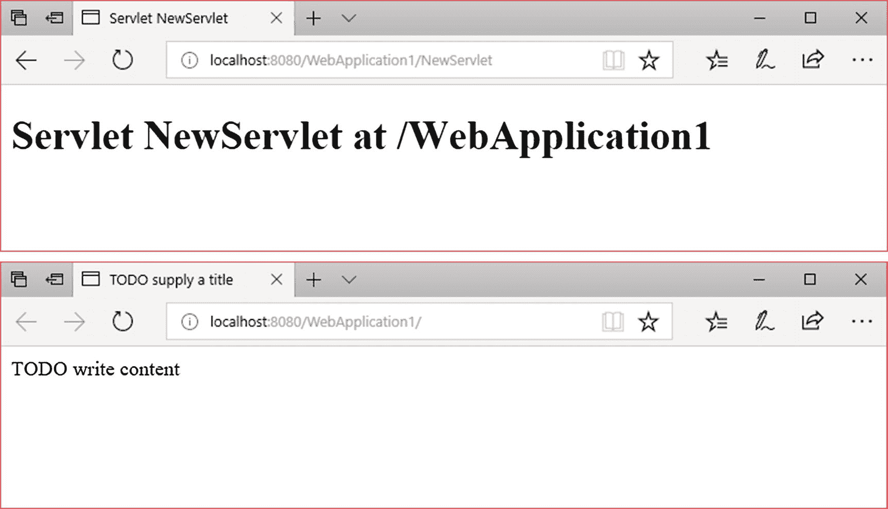

图 1-11

运行 Servlet 类

Servlet 类成功执行意味着 NetBeans 和集成的 GlassFish 服务器已成功安装，并且运行本书中示例的设置已准备就绪。

注意

本章的这一部分绝不是 GlassFish 应用服务器的用户指南。有关 GlassFish 的更多信息，请参阅 [`https://javaee.github.io/glassfish/`](https://javaee.github.io/glassfish/)

### 管理 GlassFish 应用服务器

NetBeans 为我们提供了一个图形界面来执行各种与 GlassFish 服务器相关的管理任务。您可以从 `服务` 选项卡中重启、启动和停止 GlassFish 服务器，如图 1-12 所示。

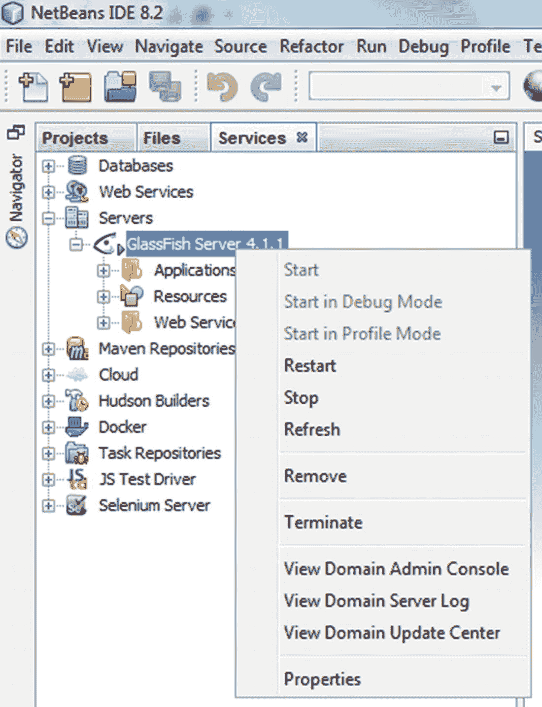

图 1-12

管理 GlassFish 应用服务器

一旦 GlassFish 成功启动，您可以测试服务器是否能够接受基本的 HTTP 请求。为此，请打开浏览器，输入 URL `http://localhost:8080/`，如果服务器正在运行，您将能够看到如图 1-13 所示的页面。

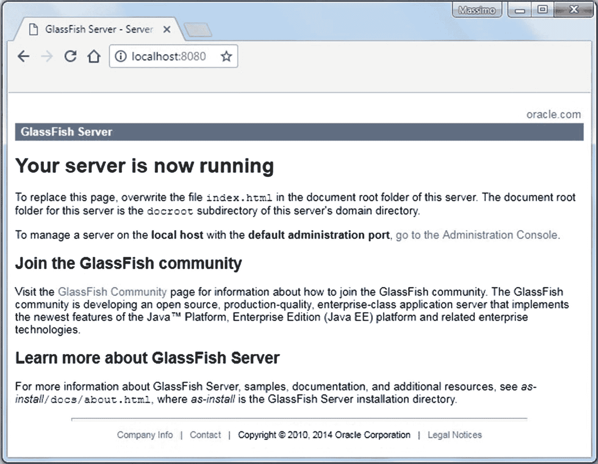

图 1-13

测试 GlassFish 服务器 注意

如果您尝试从非安装 GlassFish 的机器访问，请将 `localhost` 替换为机器名或 IP 地址。如果您在安装期间更改了端口号，请使用该端口而不是 8080。

下一步是测试对 GlassFish 服务器管理控制台的访问。确保 GlassFish 服务器已启动并正在运行，然后从上下文菜单中选择 `查看域管理控制台` 菜单选项，如图 1-12 所示。NetBeans 将启动默认浏览器并打开管理控制台。或者，您可以输入 URL `http://localhost:4848/`，您将能够看到管理控制台页面，如图 1-14 所示。

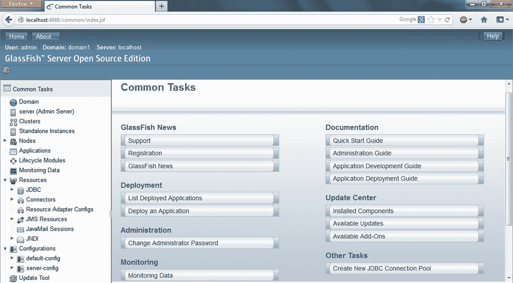

图 1-14

GlassFish 管理控制台 注意

如果您尝试从非安装 GlassFish 的机器访问，请将 `localhost` 替换为机器名或 IP 地址。您需要在管理控制台登录页面输入用户名和密码。如果您在安装期间更改了端口号，请使用该端口而不是 4848。

### 故障排除

即使精确遵循本章中提到的步骤，并在安装和配置 NetBeans IDE 及其集成的 GlassFish 应用服务器时格外小心，您在运行本书附带的示例代码时仍可能遇到问题。本节将尝试强调您可能遇到的问题，并提供有关如何缓解这些问题的信息。

#### 安装期间出现“未找到兼容的 JDK”警告

您在 NetBeans 安装程序向导的第一页收到“`未找到兼容的 JDK`”警告消息。

##### 诊断

本书中的示例需要 NetBeans 版本 8.2，因为我们使用了 Java EE 8。而 NetBeans 8.2 需要 Java 平台 (JDK) 8。如果您的机器上未安装 Java 平台 (JDK) 8，您将收到“`未找到兼容的 JDK`”警告消息。

##### 解决方案

您必须退出向导，并从以下位置下载并安装 Java 平台 (JDK) 8：

[`http://www.oracle.com/technetwork/java/javase/downloads/index.html`](http://www.oracle.com/technetwork/java/javase/downloads/index.html)

#### 无法看到 GlassFish 服务器的测试页面

安装 NetBeans IDE 及其集成的 GlassFish 应用服务器后，您无法看到如图 1-13 所示的 GlassFish 服务器测试页面。

##### 诊断

您可能由于以下原因无法看到测试页面：

*   GlassFish 服务器未运行。
*   浏览器无法解析服务器的主机名。
*   URL 中提到了错误的端口号。

##### 解决方案

*   使用上下文菜单启动/重启 GlassFish 服务器，如图 1-12 所示。
*   验证 URL 中使用的机器名或 IP 地址是否正确。您可以通过在 Windows 机器的命令提示符下执行 `ipconfig` 命令来找到您机器的 IP 地址。如果您使用的是 `localhost`，请验证浏览器是否能够通过将其回环到您机器的 IP 地址来解析它。
*   验证 URL 中使用的端口号是否正确。此解决方案将在后续章节中说明。

#### 无法解析“localhost”主机名

您的浏览器或 NetBeans IDE 的测试器能够使用机器名或 IP 地址运行 GlassFish 服务器的测试页面，但无法解析 `localhost` 主机名。

##### 诊断

NetBeans IDE 的测试器或浏览器无法使用 `localhost` 回环到您的机器。

##### 解决方案

更新 Windows 机器的 `C:\Windows\System32\drivers\etc\hosts` 文件，添加一个将您机器的 IP 地址映射到 `localhost` 的条目。

```
# localhost 名称解析由 DNS 本身处理。
# 127.0.0.1          localhost
# ::1                localhost
    localhost
```

#### 浏览器无法连接到“8080”端口

您 URL 的主机名部分是正确的，但您的浏览器无法连接到端口 8080 上的 GlassFish 应用服务器。


##### 诊断

如果 8080 端口号已被其他应用程序占用，您的浏览器将无法使用该端口访问 GlassFish 应用服务器。在安装过程中，配置工具会首先尝试将 8080 端口分配给 GlassFish 应用服务器，但如果检测到 8080 端口号不可用，则会为其分配一个不同的端口号。

##### 解决方案

您可以按照以下步骤找到 GlassFish 应用服务器运行的端口：

*   导航至 NetBeans IDE 的 `Services` 选项卡，并在 GlassFish 服务器节点上调用上下文菜单，如图 1-12 所示。
*   选择 `Properties` 菜单选项以打开 `Servers` 对话框。
*   在左侧面板中选择 GlassFish 服务器实例。
*   `Common` 选项卡下的 `Location` 文本字段将显示 GlassFish 应用服务器正在运行的端口号。

#### 编译或执行示例应用程序项目时出错

打开示例应用程序项目后，您可能会遇到编译错误，或者示例应用程序项目无法按预期执行。

##### 诊断

本书提供的示例已使用 NetBeans 8.2 版本和 Java 平台 (JDK) 8 进行了测试。

如果 NetBeans IDE 未配置为使用 Java 平台 (JDK) 8，则在编译本书提供的示例应用程序项目时，您可能会遇到“`javac: invalid target release: 1.8`”错误。

示例应用程序代码包含与创建它们时所用的 NetBeans 安装相对应的硬编码端口号。如果示例代码中硬编码的端口号与您的 NetBeans 安装不同，则示例将无法按预期执行。

##### 解决方案

要解决“`javac: invalid target release: 1.8`”错误，您必须验证 NetBeans 是否正在使用 Java 平台 (JDK) 8。您可能需要从前面章节提到的 URL 安装它。

如果示例应用程序无法按预期工作，请验证示例代码使用的端口号是否与您的 NetBeans 安装相同。

您可以查阅每个示例应用程序附带的 `Readme.txt` 文件以获取更多信息。

#### 无法发送或接收“葡萄酒订单”邮件

在执行示例应用程序项目时，您无法发送或接收“葡萄酒订单”邮件。

##### 诊断

少数示例项目在执行过程中会发送邮件。您可能会在发送邮件时遇到问题，并且可能由于以下原因无法收到邮件：

*   您尚未更新示例代码中的 `from` 和 `to` 电子邮件地址。
*   您在位于防火墙后面的机器上运行示例。
*   `JMS Resource` 配置不正确。
*   `JavaMail Session` 配置不正确。

##### 解决方案

在执行发送邮件的示例应用程序项目之前，请验证：

*   您已按照第 5 章所示创建并配置了 `JMS Resource`。
*   您已按照第 5 章所示创建并配置了 `JavaMail Session`。
*   您已更新了示例源代码中的 `from` 和 `to` 电子邮件地址。
*   您不在防火墙后面。

您可以查阅第 5 章示例应用程序附带的 `Readme.txt` 文件，了解如何为常用邮件服务配置 `JavaMail Session` 属性。

即使在验证了这些细节之后，如果您在发送或接收邮件时仍然遇到问题，请检查 GlassFish 服务器日志以获取有关该问题的更多详细信息。

## 总结

本章以本书和 EJB 的介绍开篇。本指南涵盖了关于 EJB 核心特性、EJB 框架和组件模型的基本信息。其中包括对 EJB 历史、EJB 3 简化开发模型以及 EJB 分布式计算模型的简要概述。

在“本书的组织结构”部分，我们提供了每一章的摘要，以说明本书的总体流程，并帮助您决定如果您希望不按顺序阅读各章，应首先关注哪些领域。

本章以“入门”部分结束，帮助您安装和配置 NetBeans IDE 及其集成的 GlassFish 应用服务器（该服务器包含最新 Java EE 规范的参考实现）；并验证安装是否成功。完成此任务后，您现在拥有了运行本书代码示例以及后续章节中研究 EJB 众多特性所需的软件基础设施。在下一章中，我们将详细讨论 EJB 会话 Bean。

