# 2. EJB 会话 Bean

本章将讨论 EJB 会话 Bean，即 EJB 客户端应用程序使用的核心业务服务对象。您将理解简化的 EJB 会话 Bean 模型，并深入了解以下主题：

*   会话 Bean 的类型——有状态、无状态和单例——以及何时使用每一种
*   Bean 类、业务接口和业务方法
*   异步方法
*   回调方法
*   拦截器
*   异常处理
*   客户端视图
*   与会话 Bean 相关的注解依赖注入
*   定时器服务

## 会话 Bean 简介

会话 Bean 是 EJB 技术中最重要的部分，因为它们为 Java 应用程序的业务流程建模，并为每个流程封装业务逻辑。

会话 Bean 是 Java 组件，它们可以在独立的 EJB 容器中运行，也可以在作为标准 Java 平台企业版 (Java EE) 应用服务器一部分的 EJB 容器中运行。这些 Java 组件通常用于为特定的用户任务或用例建模，例如输入客户信息或实现一个与客户端应用程序维护会话状态的流程。会话 Bean 可以为多种类型的应用程序（如人力资源、订单录入和费用报告应用程序）保存业务逻辑。EJB 容器为会话 Bean 提供服务，而 Bean 则使用 Java 注解和/或 XML 元数据来指示它需要哪些服务。

容器将管理企业会话 Bean，并为它们提供许多服务，包括安全性、事务、线程安全等。

### 会话 Bean 的类型

会话 Bean 分为三种类型：

*   **无状态**：这种类型的 Bean 不维护任何代表客户端应用程序的会话状态。
*   **有状态**：这种类型的 Bean 维护状态，并且 Bean 的特定实例与特定的客户端请求相关联。有状态 Bean 可以被视为在服务器上运行的客户端程序的扩展。
*   **单例**：这种类型的 Bean 每个应用程序仅实例化一次。单例 Bean 在应用程序的整个生命周期中存在，并在客户端调用之间维护其状态。

我们将在以下各节中深入探讨无状态、有状态和单例 Bean 的更多细节。


### 何时使用会话 Bean？

会话 Bean 用于编写业务逻辑、维护客户端的会话状态，以及建模执行一个或多个业务操作的后端流程或用户任务。

例如，当我们有某些方法或 API 不需要容器服务时，应考虑使用会话 Bean。在这种情况下，使用会话 Bean 反而会给容器带来额外开销。

此外，数据访问对象（DAO）类不需要作为会话 Bean，因为它们将在 EJB 应用服务层中使用。

在本书中，我们还将看到如何将无状态 EJB 会话 Bean（作为 DAO）与 Java 持久化 API（JPA）一起实现。

典型的例子包括：

*   人力资源应用中，用于创建新员工并将该员工分配到特定部门的会话 Bean
*   费用报告应用中，用于创建新费用报告的会话 Bean
*   订单录入应用中，用于为特定客户创建新订单的会话 Bean
*   电子商务应用中，用于管理购物车内容的会话 Bean
*   利用 EJB 容器中事务服务的会话 Bean（免去应用程序开发者编写事务支持的麻烦）
*   当客户端应用未部署在同一服务器上时，用于解决部署需求的会话 Bean
*   利用容器在组件或方法级别提供的安全支持的会话 Bean
*   实现日志记录功能并在应用的不同组件之间共享的会话 Bean

会话 Bean 可用于传统的两层或三层架构（配合专业/富客户端应用），也可用于基于 Web 的三层应用。这些应用可以部署在不同的逻辑和物理层组合中。在下一节中，我们将探讨一些可能的组合。

#### 富客户端三层架构

图 2-1 展示了一个典型的会话 Bean 三层架构，前端是富客户端应用，包含供最终用户（如客户服务代表、银行柜员等）使用的数据录入界面。这些客户端应用可以使用 Java Swing 技术与 Java 平台标准版（Java SE）开发，也可以是简单的旧式 Java 对象（POJO），通过命令行运行。通常，最终用户从其桌面启动客户端应用，输入一些数据，然后通过按下某个用户界面组件（如“提交”按钮）触发事件。一般的工作流程可能如下所示：

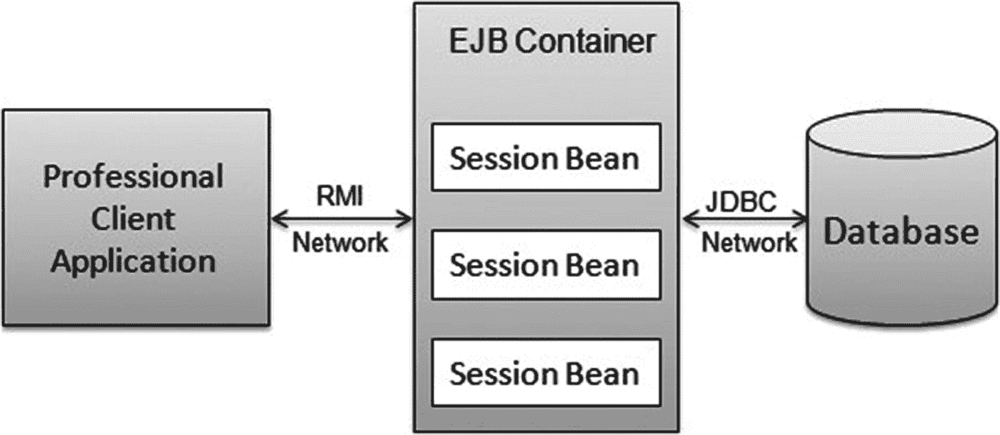

图 2-1

富客户端三层架构中的会话 Bean

1.  用户操作通过远程方法调用（RMI）建立与 EJB 容器中运行的会话 Bean 的连接。
2.  客户端应用调用会话 Bean 中的一个或多个业务方法。
3.  会话 Bean 处理请求，并通过与数据库、企业应用、遗留系统等交互来验证数据，以执行特定的业务操作或任务。
4.  最后，会话 Bean 通过数据集合或包含确认消息的简单对象，将响应发送回客户端应用。

#### Web 应用三层架构

如图 2-2 所示，这种架构通常由运行在台式机或笔记本电脑浏览器中的 Web 应用作为前端。如今，其他类型的客户端设备，如智能手机、平板电脑、手机和 telnet 设备，也被用于运行这些应用。运行在浏览器或移动设备中的 Web 应用使用 JavaServer Pages（JSP）、JavaServer Faces（JSF）或 Java Servlet 等 Web 技术来呈现用户界面（数据录入界面、提交按钮等）。典型的用户操作，例如输入搜索条件或向 Web 应用购物车添加特定商品，将通过上述 Web 技术之一调用 EJB 容器中运行的会话 Bean。一旦会话 Bean 被调用，它就会处理请求并将响应发送回 Web 应用，Web 应用按需格式化响应，然后将响应发送给请求的客户端设备（浏览器、智能手机、telnet 等）。

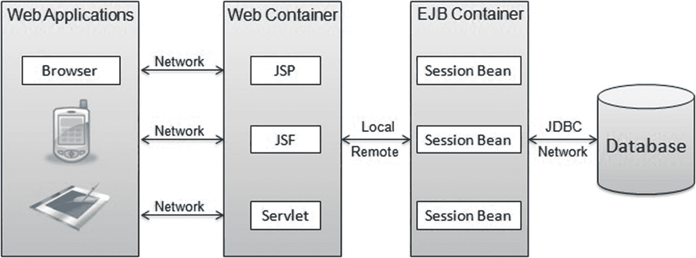

图 2-2

Web 应用三层架构中的会话 Bean

在刚刚讨论的三层架构中，客户端应用（即 Web 应用）和会话 Bean 可以在同一应用服务器实例中运行（共置），也可以在同一台机器的不同实例中运行。它们还可以运行在物理上分离的、各自拥有应用服务器实例的机器上。

## 无状态会话 Bean

无状态会话 Bean 由以下元素组成：

*   一个 Bean 类，包含要执行的业务方法实现

可选地，一个或多个业务接口允许向客户端应用展示 Bean 业务方法的不同组合。无状态会话 Bean 池是一个包含所有无状态会话 Bean 实例的池。因此，当有请求到达某个 Bean 时，容器会分配一个 Bean，无状态会话 Bean 方法执行完毕后会将 Bean 放回池中。如果没有可用的 Bean 来处理请求，该请求将被放入队列。

### 设置依赖项

为了使用 Java EE 8 Enterprise Beans 3.2，我们需要确保将最新版本添加到 `pom.xml` 文件的依赖配置部分，这将确保所有 Java EE 8 API 在编译期间可用：

```
javax
javaee-web-api
8.0
compile
true

```

您可以查看 Maven 仓库以找到最新的 Java EE 8 API `pom.xml` 文件：

[`https://search.maven.org/remotecontent?filepath=javax/javaee-api/8.0/javaee-api-8.0.pom`](https://search.maven.org/remotecontent?filepath=javax/javaee-api/8.0/javaee-api-8.0.pom)


### Bean 类

无状态会话 Bean 类是一个标准的 Java 类，带有类级别的 `@Stateless` 注解。如果使用部署描述符代替注解，则应在 `ejb-jar.xml` 描述符中将该类标记为无状态会话 Bean。如果同时使用注解和部署描述符（混合模式），并且在 Bean 类中指定了任何其他类级别或成员级别的注解，则必须指定 `@Stateless` 注解。如果同时使用注解和部署描述符，则在部署过程中，部署描述符中的设置或值将覆盖类中的注解。

注意

从 EJB 3.1 开始，会话 Bean 类可以是另一个会话 Bean 类的子类。

为了说明无状态会话 Bean 的使用，我们将创建一个 `SearchFacade` 会话 Bean，它为客户端应用程序提供关于可用葡萄酒的各种搜索功能。工作流程如下：

1.  应用程序的用户将输入或选择一个或多个搜索条件，这些条件将被提交给 `SearchFacade` 会话 Bean。  
2.  `SearchFacade` Bean 将访问后端数据库以检索请求的信息。为了简化本章中的代码示例，我们实际上将在 Bean 类中检索硬编码的值列表。在后面的章节中，我们将增强 `SearchFacade` Bean 以访问后端数据库。  
3.  Bean 将满足搜索条件的信息返回给客户端应用程序。  

清单 2-1 展示了 `SearchFacade` Bean 的定义。在本章的后续部分，我们将构建代码来演示上述工作流程的实际运行。`SearchFacadeBean` 是一个标准的 Java 类，带有类级别的 `@Stateless` 注解。

```
package com.apress.ejb.chapter02;
import javax.ejb.Stateless;
@Stateless(name="SearchFacade")
public class SearchFacadeBean implements SearchFacade, SearchFacadeLocal {
public SearchFacadeBean() {
}
}
清单 2-1
SearchFacadeBean.java
```

### 业务接口

无状态会话业务接口是一个标准的 Java 接口，没有其他特殊要求。该接口包含一系列可供客户端应用程序使用的业务方法定义。会话 Bean 可以有一个由 Bean 类实现的业务接口；可以在设计时由 JDeveloper、NetBeans 或 Eclipse 等工具生成；也可以在部署时由 EJB 容器生成。

业务接口也可以使用注解，如下所述：

*   `@Remote` 注解可用于标识远程业务接口。
*   `@Local` 注解可用于标识本地业务接口。

注意

从 EJB 3.1 开始，会话 Bean 支持“无接口本地视图”。这是本地视图的一种变体，它公开 Bean 类的公共方法，而无需单独的接口。

如果接口中未指定任何注解，则 Bean 类本身的公共方法将成为其事实上的本地接口。

如果您的架构要求客户端应用程序（Web 应用程序或富客户端）在与运行 EJB 容器中会话 Bean 不同的 Java 虚拟机（JVM）上运行，那么您需要使用远程接口。请确保远程接口中的方法确实是应该远程暴露的。不同的 JVM 可以在同一台物理机器上，也可以在不同的机器上。如果您的应用程序架构将为客户端应用程序和会话 Bean 使用相同的 JVM，那么使用本地接口（可以是无接口选项）可以提高性能。

您的应用程序架构可能同时需要远程和本地接口。例如，一个企业可能有一个订单录入应用程序，该应用程序使用会话 Bean 开发，这些 Bean 具有提交新订单以及处理管理任务（例如产品数据录入）的业务方法。您可能有两个不同的客户端应用程序访问后端的订单录入应用程序，如下所示：

*   一个 Web 客户端应用程序（如图 2-3 所示），可以在与会话 Bean 相同的 JVM 中运行，用于提交新订单

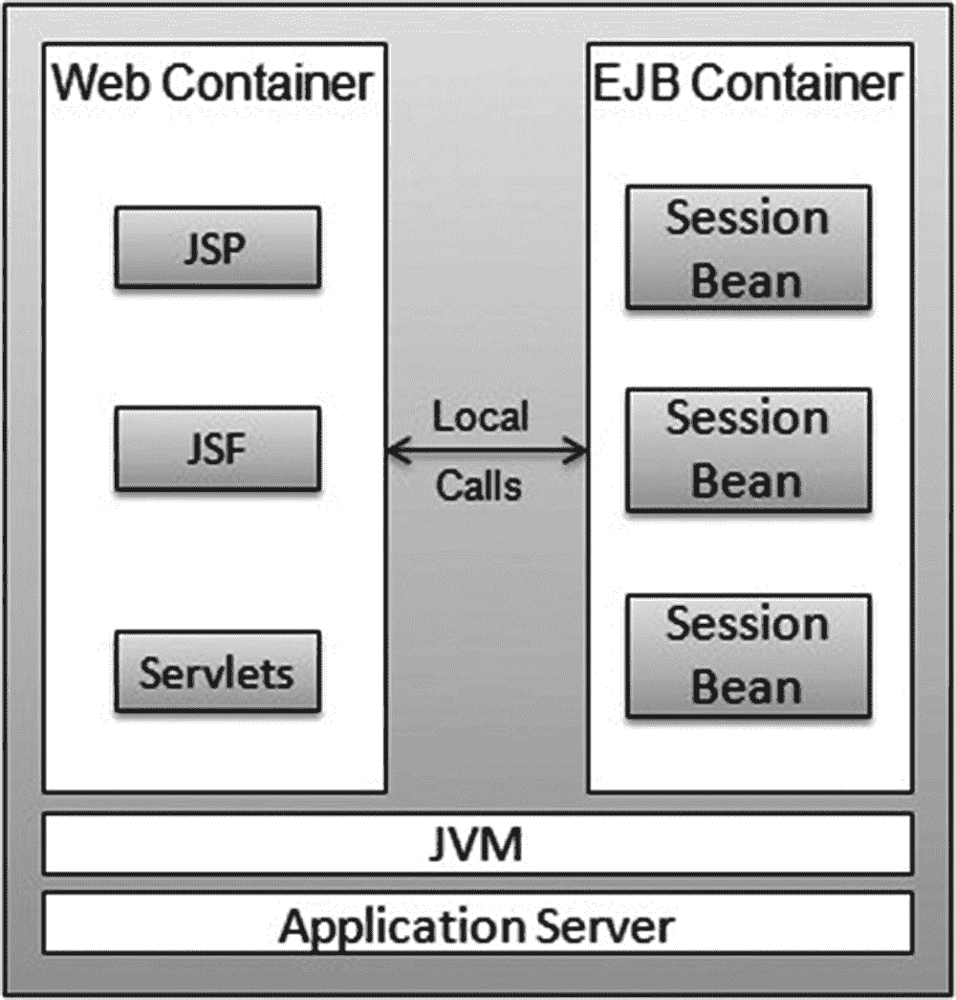

图 2-3

使用会话 Bean 本地接口的 Web 客户端
*   一个富客户端应用程序（如图 2-4 所示），运行在最终用户的桌面机器上，供管理员用于数据录入目的

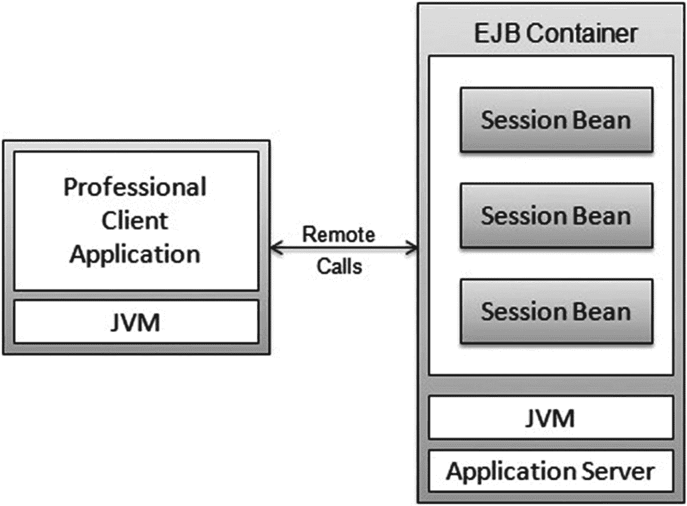

图 2-4

使用会话 Bean 远程接口的富客户端

`SearchFacade` 会话 Bean 同时具有远程和本地接口，如图 2-5 所示。

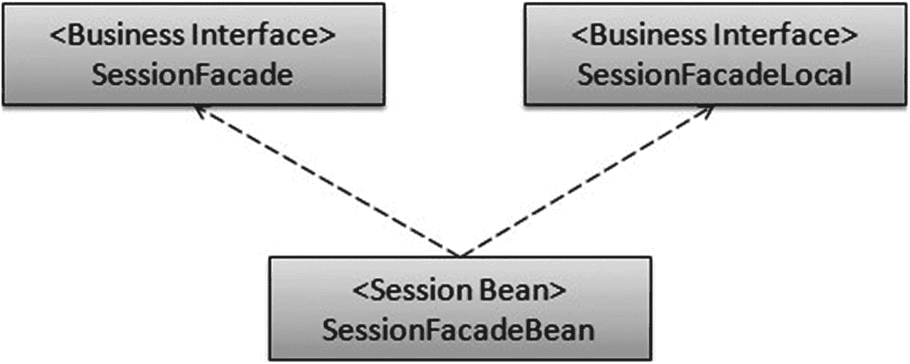

图 2-5

SearchFacade 会话 Bean 的业务接口

清单 2-2 展示了 `SearchFacade` 远程业务接口的代码片段，其中包含 `@Remote` 注解和一个 `wineSearch()` 方法声明。`wineSearch()` 方法接受一个代表葡萄酒类型的参数，并返回一个与葡萄酒类型条件匹配的葡萄酒列表。

```
package com.apress.ejb.chapter02;
import java.util.List;
import javax.ejb.Remote;
@Remote
public interface SearchFacade {
List wineSearch(String wineType);
}
清单 2-2
SearchFacade.java
```

清单 2-3 展示了 `SearchFacade` 本地业务接口的代码片段，其中包含 `@Local` 注解和一个 `wineSearch()` 方法声明。

```
package com.apress.ejb.chapter02;
import java.util.List;
import javax.ejb.Local;
@Local
public interface SearchFacadeLocal {
List wineSearch(String wineType);
}
清单 2-3
SearchFacadeLocal.java
```

### 业务方法

在 Bean 类中实现的方法必须与远程或本地业务接口中声明的业务方法相对应。它们基于具有相同名称和方法签名的约定进行匹配。Bean 类中其他在业务接口中没有相应声明的方法将是 Bean 类方法的私有方法。

`SearchFacade` Bean 实现了一个方法 `wineSearch()`，该方法已在远程和本地业务接口中声明。`wineSearch()` 方法根据葡萄酒类型返回一个静态的葡萄酒列表。清单 2-4 展示了 `wineSearch()` 的实现。

```
package com.apress.ejb.chapter02;
import java.util.ArrayList;
import java.util.List;
import javax.ejb.Stateless;
@Stateless(name="SearchFacade")
public class SearchFacadeBean implements SearchFacade, SearchFacadeLocal {
public SearchFacadeBean() {
}
public List wineSearch(String wineType) {
List wineList = new ArrayList();
if (wineType.equals("Red")) {
wineList.add("Bordeaux");
wineList.add("Merlot");
wineList.add("Pinot Noir");
}
else if (wineType.equals("White")) {
wineList.add("Chardonnay");
}
return wineList;
}
}
清单 2-4
SearchFacadeBean.java
```


#### 异步业务方法

异步方法会立即将控制权返回给调用方，而无需等待方法执行完成。异步方法通常用于处理器密集型或长时间运行的后台任务，例如打印文档或发送大型电子邮件。

从 EJB 3.1 开始，会话 Bean 可以声明其一个或多个方法能够异步执行。当会话 Bean 客户端调用异步方法时，容器会立即将控制权返回给客户端。这使得客户端能够在业务方法于单独线程上完成执行的同时，并行执行其他任务。例如，客户端可以利用此功能，通过进度条来显示长时间运行任务的进度。

异步方法通过在业务方法上添加 `javax.ejb.Asynchronous` 注解来定义。在类级别添加 `@Asynchronous` 注解，会将会话 Bean 的所有业务方法标记为异步。异步方法必须返回 `void` 或实现 `java.lang.concurrent.Future<V>` 接口。返回 `void` 的异步方法不能抛出应用程序异常。只有返回 `Future<V>` 的异步方法才能抛出应用程序异常。

在 Bean 类上定义的异步方法应具有以下签名：

```
public void (Object)
```

或

```
public java.util.concurrent.Future (Object) throws 
```

会话 Bean 客户端调用异步方法的方式与调用同步方法相同。如果异步方法被定义为返回结果，客户端会立即收到一个 `Future<V>` 接口的实例。客户端可以使用该实例进行以下任何操作：

*   使用 `get()` 方法检索最终结果集。由于此方法调用会同步阻塞，直到返回结果或抛出异常，因此通常直到 `isDone()` 返回 true 时才调用它。
*   使用 `isDone()` 方法检查异步方法的状态。
*   使用 `cancel(boolean)` 方法取消方法调用。调用 `cancel()` 不会中断线程，它只是设置一个状态标志，该标志可以在正在运行的方法中检查，以便其能够优雅地中断执行并返回。
*   使用 `isCancelled()` 方法检查方法调用是否已被取消。
*   检查异常。

注意

作为 Web 服务公开的会话 Bean 方法不能是异步的。

如果异步方法返回结果，则必须使用 `javax.ejb.AsyncResult<V>` 便捷包装器对象来返回该结果。请注意，此对象实际上并不会返回给客户端，而是由 EJB 容器拦截并解包，以服务于客户端调用该方法时实际返回给客户端的 `Future<V>` 对象上的方法调用。

### 依赖注入

在第 1 章中，我们介绍了依赖注入作为编程设计模式的概念。在本节中，我们将初步了解如何在无状态会话 Bean 中使用依赖注入。依赖注入将在第 10 章中详细讨论。

EJB 容器提供了将各种类型的资源注入无状态会话 Bean 的功能。通常，为了执行用户任务或处理来自客户端应用程序的请求，会话 Bean 中的业务方法需要一种或多种类型的资源。这些资源可以是其他会话 Bean、数据源或消息队列。托管 Bean 可以使用上下文和依赖注入（CDI）注入到会话 Bean 中。

无状态会话 Bean 尝试使用的资源可以通过注解或部署描述符进行注入。可以通过对实例变量进行注解或对 setter 方法进行注解来获取资源。清单 2-5 展示了一个基于 setter 和实例变量注入 `myDb` 的示例，该变量代表数据源。

```
@Resource
DataSource myDb;
// 或
@Resource
public void setMyDb(DataSource myDb) {
this.myDb = myDb;
}
清单 2-5
数据源注入
```

你通常会使用 setter 注入来预配置或初始化注入资源的属性。


### 生命周期回调方法

在某些场景或用例中，使用会话 Bean 的应用程序需要对生命周期事件（如自身的创建、销毁等）进行细粒度控制。例如，`SearchFacade` 会话 Bean 可能需要在创建时执行某些数据库初始化操作，或在销毁时关闭某些数据库连接。应用程序可以通过称为回调方法的方法来获得对 Bean 生命周期各个阶段的细粒度控制。回调方法可以是会话 Bean 中带有回调注解的任何方法。EJB 容器会在 Bean 生命周期的适当阶段（Bean 创建和销毁）调用这些方法。

以下是无状态会话 Bean 的两种此类回调：

*   `PostConstruct`：使用 `@PostConstruct` 注解标识。Bean 类中使用特定签名的方法（如下所述）可以用此注解标记。
*   `PreDestroy`：使用 `@PreDestroy` 注解标识。同样，Bean 类中具有特定签名的任何方法（如下所述）都可以用此注解标记。

在 Bean 类上定义的回调方法应具有以下签名：

```
void ()
```

回调方法也可以在 Bean 的监听器类上定义；这些方法应具有以下签名：

```
void (Object)
```

其中，`Object` 可以声明为实际的 Bean 类型，该类型是运行时传递给回调方法的参数。生命周期回调方法可以具有 public、private、protected 或包级访问权限。生命周期回调方法不得声明为 `final` 或 `static`。

`PostConstruct` 回调发生在 EJB 容器中实例化 Bean 实例之后。如果 Bean 使用任何依赖注入机制来获取对其环境中资源或其他对象的引用，则 `PostConstruct` 将在注入执行之后、Bean 类中的第一个业务方法被调用之前发生。以 `SearchFacade` 会话 Bean 为例，你可以有一个业务方法 `wineSearchByCountry()`，它返回特定国家的葡萄酒列表，并有一个 `PostConstruct` 回调方法 `initializeCountryWineList()`，该方法会在 Bean 被实例化时初始化该国家的葡萄酒列表。理想情况下，你会从后端数据存储中加载列表；但在本章中，我们将仅使用一些硬编码值填充到 `HashMap` 中，如清单 2-6 所示。

```
@PostConstruct
public void initializeCountryWineList() {
// countryMap 是 HashMap
countryMap.put("Australia", "Sauvignon Blanc");
countryMap.put("Australia", "Grenache");
countryMap.put("France","Gewurztraminer");
countryMap.put("France","Bordeaux");
}
清单 2-6
PostConstruct 方法
```

`PreDestroy` 回调发生在容器从其对象池中销毁未使用或过期的 Bean 实例之前。此回调可用于关闭通过依赖注入创建的任何连接池，并释放任何其他资源。

以 `SearchFacade` 会话 Bean 为例，我们可以在 `SearchFacade` Bean 中添加一个 `PreDestroy` 回调方法（`destroyWineList()`），该方法会在 Bean 被销毁时清除国家葡萄酒列表。理想情况下，在 `PreDestroy` 期间，我们会关闭通过依赖注入创建的任何资源；但在本章中，我们将仅清除包含国家和葡萄酒列表的 `HashMap`。清单 2-7 展示了 `destroyWineList()` 的代码。

```
@PreDestroy
public void destroyWineList() {
countryMap.clear();
}
清单 2-7
PreDestroy 方法
```

### 拦截器

EJB 规范提供了一种称为拦截器的注解，它允许你在业务方法调用时进行干预，在方法调用之前和/或之后添加你自己的包装代码。可以为会话 Bean 和消息驱动 Bean（MDB）定义拦截器方法。我们将向你展示在会话 Bean 上下文中拦截器的用法。

在典型应用程序中，有许多拦截器的用例，你会发现需要在业务方法被调用之前或之后执行特定任务。例如，你可能希望执行以下操作之一：

*   在转账超过 10 万美元的关键业务方法之前执行额外的安全检查
*   进行一些性能分析，以计算执行任务所需的时间
*   在方法调用之前或之后进行额外的日志记录

有两种定义拦截器的方法。你可以在特定方法上添加 `@AroundInvoke` 注解，或者你可以注解 Bean 类以指定一个拦截器类，该类将干预 Bean 类上的所有（或显式子集）方法。拦截器类通过在其关联的 Bean 类上使用 `@Interceptor` 注解来表示。在多个拦截器类的情况下，使用 `@Interceptors` 注解。特定于方法的拦截器通过将 `@Interceptors` 注解应用于业务方法来表示。使用 `@AroundInvoke` 注解的方法应具有以下签名：

```
Object (InvocationContext) throws Exception
```

`AroundInvoke` 方法可以具有 public、private、protected 或包级访问权限。`AroundInvoke` 方法不得声明为 `final` 或 `static`。`InvocationContext` 的定义如下：

```
package javax.ejb;
public interface InvocationContext {
public Object getBean();
public java.lang.reflect.Method getMethod();
public Object[] getParameters();
public void setParameters(Object[] params);
public EJBContext getEJBContext();
public java.util.Map getContextData();
public Object proceed() throws Exception;
}
```

以下列表描述了上述代码中的方法：

*   `getBean()` 返回被调用方法所在的 Bean 实例。
*   `getMethod()` 返回被调用的 Bean 实例上的方法。
*   `getParameters()` 返回方法调用的参数。
*   `setParameters()` 修改用于方法调用的参数。
*   `getEJBContext()` 允许拦截器方法访问 Bean 的 `EJBContext`。
*   `getContextData()` 允许使用返回的 `Map` 在同一个 `InvocationContext` 实例中的拦截器方法之间传递值。
*   `proceed()` 调用下一个拦截器（如果有），或调用目标 Bean 方法。

在 `SearchFacade` 会话 Bean 中，我们可以添加一个拦截器，用于记录客户端应用程序调用每个业务方法所花费的时间。清单 2-8 展示了一个时间日志方法，它将打印出执行业务方法所花费的时间。`InvocationContext` 用于获取 Bean 类的名称和被调用的方法名称。在调用业务方法之前，捕获当前系统时间，并在业务方法执行后从系统时间中扣除。最后，使用 `System.out.println` 将详细信息打印到控制台日志。

```
@AroundInvoke
public Object TimerLog (InvocationContext ctx) throws Exception {
String beanClassName = ctx.getClass().getName();
String businessMethodName = ctx.getMethod().getName();
String target = beanClassName + "." + businessMethodName ;
long startTime = System.currentTimeMillis();
System.out.println ("Invoking " + target);
try {
return ctx.proceed();
}
finally {
System.out.println ("Exiting" + target);
long totalTime = System.currentTimeMillis() - startTime;
System.out.println ("Business method" + businessMethodName +
"in" + beanClassName + "takes" + totalTime + "ms to execute");
}
}
清单 2-8
拦截器方法
```

## 有状态会话 Bean

与无状态会话 Bean 类似，有状态 Bean 包含一个 Bean 类，并且可选地包含一个或多个业务接口。


### Bean 类

有状态会话 Bean 类是指任何带有类级别注解 `@Stateful` 的标准 Java 类。如果使用部署描述符代替注解，则应将 Bean 类标记为有状态会话 Bean。在混合模式下（即同时使用注解和部署描述符），如果在类中指定了任何其他类级别或成员级别的注解，则必须指定 `@Stateful` 注解。

为了说明有状态会话 Bean，我们将创建一个 `ShoppingCart` 会话 Bean，它将跟踪添加到用户购物车中的商品及其各自的数量。在本章中，我们将对购物车使用硬编码值，以说明客户端与有状态会话 Bean 之间的状态和会话维护。清单 2-9 展示了 `ShoppingCart` 会话 Bean 的定义。

```
package com.apress.ejb.chapter02;
import javax.ejb.Stateful;
@Stateful(name="ShoppingCart")
public class ShoppingCartBean implements ShoppingCart, ShoppingCartLocal {
public ShoppingCartBean() {
}
}
清单 2-9
ShoppingCartBean.java
```

在某些用例中，应用程序希望在事务发生之前或之后收到 EJB 容器的通知，然后利用这些通知来管理数据和缓存。当有状态会话 Bean 实现了 `javax.ejb.SessionSynchronization` 接口时，它可以接收来自 EJB 容器的此类通知。这是一个可选特性。有状态会话 Bean 从 EJB 容器接收三种不同类型的事务通知：

*   `afterBegin`：指示一个新事务已开始
*   `beforeCompletion`：指示事务即将提交
*   `afterCompletion`：指示一个事务已完成

例如，`ShoppingCart` 会话 Bean 可以实现 `javax.ejb.SessionSynchronization` 接口来获取 `afterCompletion` 通知，以便它可以清除购物车缓存。

### 业务接口

有状态会话 Bean 的业务接口与无状态会话 Bean 使用的接口类似，并且使用相同的方式进行注解，即使用 `@Local` 和 `@Remote` 注解。有状态会话 Bean 的本地视图可以在没有单独本地业务接口的情况下访问。`ShoppingCart` 会话 Bean 同时具有远程和本地接口，如图 2-6 所示。

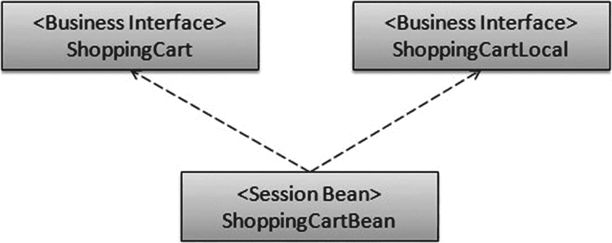

图 2-6

ShoppingCart 的业务接口

我们将主要从 Web 应用程序中使用本地接口。添加远程接口是为了方便本章中对 Bean 进行单元测试。

清单 2-10 和 2-11 分别展示了带有 `@Remote` 和 `@Local` 注解的远程和本地 `ShoppingCart` 业务接口。

```
package com.apress.ejb.chapter02;
import javax.ejb.Remote;
@Remote
public interface ShoppingCart {
}
清单 2-10
ShoppingCart.java
```

```
package com.apress.ejb.chapter02;
import javax.ejb.Local;
@Local
public interface ShoppingCartLocal {
}
清单 2-11
ShoppingCartLocal.java
```

或者，您可以使用清单 2-12 中所示的编码风格，即在指定 `@Stateful` 或 `@Stateless` 以及业务接口名称之前，先指定 `@Local` 和 `@Remote` 注解。

```
package com.apress.ejb.chapter02;
import javax.ejb.Local;
import javax.ejb.Remote;
import javax.ejb.Stateful;
@Local({ShoppingCartLocal.class})
@Remote({ShoppingCart.class})
@Stateful(name="ShoppingCart")
public class ShoppingCartBean implements ShoppingCart, ShoppingCartLocal {
public ShoppingCartBean() {
}
}
清单 2-12
ShoppingCartBean.java
```

注意

本书将遵循较早的约定，即在业务接口上标记 `@Local` 和 `@Remote` 注解。

### 业务方法

有状态会话 Bean 中的业务方法与无状态会话 Bean 中的类似。我们将通过添加业务方法来增强 `ShoppingCart` Bean，这些方法将向购物车添加和删除葡萄酒，并返回购物车商品列表。

清单 2-13 展示了实现 `addWineItem()`、`removeWineItem()` 和 `getCartItems()` 方法的 `ShoppingCart` Bean。

```
package com.apress.ejb.chapter02;
import java.util.ArrayList;
import javax.ejb.Stateful;
@Stateful(name="ShoppingCart")
public class ShoppingCartBean implements ShoppingCart, ShoppingCartLocal {
public ShoppingCartBean() {
}
public ArrayList cartItems;
public void addWineItem(String wine) {
cartItems.add(wine);
}
public void removeWineItem(String wine) {
cartItems.remove(wine);
}
public void setCartItems(ArrayList cartItems) {
this.cartItems = cartItems;
}
public ArrayList getCartItems() {
return cartItems;
}
}
清单 2-13
ShoppingCartBean.java
```

### 生命周期回调方法

有状态会话 Bean 支持构造、销毁、激活和钝化等回调事件。以下是映射到上述事件的回调方法：

*   `PostConstruct`：使用 `@PostConstruct` 注解标记。
*   `PreDestroy`：使用 `@PreDestroy` 注解标记。
*   `PreActivate`：使用 `@PreActivate` 注解标记。
*   `PrePassivate`：使用 `@PrePassivate` 注解标记。

`PostConstruct` 回调发生在 Bean 实例在 EJB 容器中被实例化之后。如果 Bean 使用任何依赖注入机制来获取对其环境中资源或其他对象的引用，则 `PostConstruct` 事件会在注入执行之后、Bean 类中的第一个业务方法被调用之前发生。

对于 `ShoppingCart` 会话 Bean，我们可以有一个名为 `initialize()` 的业务方法来初始化 `cartItems` 列表，如清单 2-14 所示。

```
@PostConstruct
public void initialize() {
cartItems = new ArrayList();
}
清单 2-14
PostConstruct 方法
```

`PreDestroy` 回调发生在任何带有 `@Remove` 注解的方法完成之后。对于 `ShoppingCart` 会话 Bean，我们可以有一个名为 `exit()` 的业务方法，它将 `cartItems` 列表写入数据库。在本章中，我们将仅向系统控制台打印一条消息来说明此回调。清单 2-15 展示了带有 `@PreDestroy` 注解的 `exit()` 方法的代码。

```
@PreDestroy
public void exit() {
// items list into the database.
System.out.println("Saved items list into database");
}
清单 2-15
PreDestroy 方法
```

`@Remove` 注解对于有状态会话 Bean 来说是一个有用的生命周期方法。当调用带有 `@Remove` 注解的方法时，容器将在该方法执行后从对象池中移除该 Bean 实例。清单 2-16 展示了带有 `@Remove` 注解的 `stopSession()` 方法的代码。

```
@Remove
public void stopSession() {
// The method body can be empty.
System.out.println("From stopSession method with @Remove annotation");
}
清单 2-16
Remove 方法
```

当有状态会话 Bean 实例空闲时间过长时，`PrePassivate` 回调会被触发。在此事件期间，容器可能会钝化并将其状态存储到缓存中。带有 `@PrePassivate` 注解的方法会在容器钝化 Bean 实例之前被调用。

当客户端应用程序再次使用一个已钝化的有状态会话 Bean 时，会触发 `PostActivate` 事件。此时会创建一个具有恢复状态的新实例。当 Bean 实例准备就绪时，会调用带有 `@PostActivate` 注解的方法。


### 拦截器

无状态和有状态会话 Bean 的拦截器存在一些细微差别。`AroundInvoke` 方法可用于有状态会话 Bean。对于实现了 `SessionSynchronization` 的有状态会话 Bean，`afterBegin` 会在任何带有 `AroundInvoke` 注解的方法之前以及 `beforeCompletion()` 回调方法之前执行。

### 异常处理

EJB 规范概述了两种类型的异常：

*   应用程序异常
*   系统异常

应用程序异常是与业务逻辑执行相关的异常，应由客户端处理。例如，如果客户端应用程序传递了无效参数（如错误的信用卡号），则可能引发应用程序异常。

另一方面，系统异常是由系统级故障引起的，例如 Java 命名和目录接口 (JNDI) 错误或无法获取数据库连接。系统异常必须是 `java.rmi.RemoteException` 的子类，或者是非应用程序异常的 `java.lang.RuntimeException` 的子类。

从 EJB 应用程序的角度来看，应用程序异常是通过编写继承 `java.lang.Exception` 类的特定于应用程序的异常类来完成的。

对于系统异常，应用程序会捕获特定的异常，例如由 JNDI 故障导致的 `NamingException`，并抛出 `EJBException`。在本章中，示例并未使用任何此类资源，但在后续章节中有更多关于系统异常的示例。

## 单例会话 Bean

单例会话 Bean 在 EJB 3.1 中引入，是一个每个应用程序仅实例化一次的会话 Bean 组件。对于一个应用程序，只能存在一个单例会话 Bean 实例。一旦实例化，单例会话 Bean 的生命周期与应用程序的完整生命周期相同。单例会话 Bean 在客户端调用之间维护其状态，但在容器关闭或崩溃后无法保存该状态。与无状态和有状态会话 Bean 类似，单例会话 Bean 由一个 Bean 类以及可选的一个或多个业务接口组成。

### Bean 类

单例会话 Bean 类是任何带有类级别注解 `@Singleton` 的标准 Java 类。如果使用部署描述符代替注解，则应将 Bean 类标记为单例会话 Bean。如果你同时使用注解和部署描述符（混合模式），则如果在类中指定了任何其他类级别或成员级别的注解，则必须指定 `@Singleton` 注解。

注意

单例可以在首次调用时初始化，也可以在部署时使用 `@Startup` 注解进行初始化。

为了说明单例会话 Bean，我们将创建一个 `ShopperCount` 会话 Bean，用于跟踪登录我们购物网站的用户数量。清单 2-17 显示了 `ShopperCount` 会话 Bean 的定义。

```
package com.apress.ejb.chapter02;
import javax.ejb.Singleton;
import javax.ejb.Startup;
@Singleton (name = "ShopperCount")
@Startup
public class ShopperCountBean {
private int shopperCounter;
// 增加购物者计数器
public void incrementShopperCount() {
shopperCounter++;
}
// 返回购物者数量
public int getShopperCount() {
return shopperCounter;
}
}
清单 2-17
ShopperCountBean.java
```

单例会话 Bean 由 EJB 容器自行决定何时实例化。但是，你可以使用 `@Startup` 注解 Bean 类，以指示容器必须在应用程序启动序列期间初始化该单例 Bean。

当在应用程序中使用多个单例会话 Bean 时，应用程序可能要求它们按特定顺序初始化。`@DependsOn` 注解声明了单例会话 Bean 的启动依赖关系。清单 2-18 显示了依赖于 `ShopperCount` 会话 Bean 的 `LogShopperCount` 会话 Bean 的定义。

```
package com.apress.ejb.chapter02;
import javax.ejb.Singleton;
import javax.ejb.Startup;
import javax.ejb.DependsOn;
import java.util.logging.Logger;
@Singleton
@Startup
@DependsOn("ShopperCount")
public class LogShopperCount {
private final Logger log = Logger.getLogger("LogShopperCount.class");
public void logShopperCount() {
// 记录购物者数量
}
}
清单 2-18
LogShopperCount.java
```

与无状态和有状态会话 Bean 不同，单例会话 Bean 不得实现 `javax.ejb.SessionSynchronization` 接口或使用会话同步注解。

### 业务接口

单例会话 Bean 的业务接口与无状态和有状态会话 Bean 的接口类似，并且使用 `@Local` 和 `@Remote` 注解以相同的方式进行注解。单例会话 Bean 支持无接口本地视图，这使得对于本地视图而言，业务接口的声明是可选的。

### 业务方法

单例会话 Bean 中的业务方法与无状态和有状态会话 Bean 中的方法类似。我们将通过添加一个重置计数器的业务方法来增强 `ShopperCount` Bean。

清单 2-19 显示了实现业务方法的 `ShopperCount` Bean。

```
package com.apress.ejb.chapter02;
import javax.ejb.Singleton;
import javax.ejb.Startup;
@Singleton(name = "ShopperCount")
@Startup
public class ShopperCountBean {
private int shopperCounter = 0;
// 增加购物者计数器
public void incrementShopperCount() {
shopperCounter++;
}
// 返回购物者数量
public int getShopperCount() {
return shopperCounter;
}
// 重置计数器
public void resetCounter() {
shopperCounter = 0;
}
}
清单 2-19
ShopperCountBean.java
```


### 生命周期回调方法

单例生命周期的流程是：我们首先创建单例会话 Bean 实例，然后将其注入容器；之后，该实例会被放入一个名为“method-ready”的受管池中，等待处理请求。

单例会话 Bean 支持构造和销毁时的回调事件。以下是映射到上述事件的回调方法：

*   `PostConstruct`：使用 `@PostConstruct` 注解标记
*   `PreDestroy`：使用 `@PreDestroy` 注解标记。

`PostConstruct` 回调发生在 Bean 实例在 EJB 容器中被实例化之后。如果 Bean 使用任何依赖注入机制来获取其环境中资源或其他对象的引用，则 `PostConstruct` 事件会在注入执行之后、Bean 类中的第一个业务方法被调用之前发生。

`PreDestroy` 回调发生在应用程序关闭期间。容器会考虑单例会话 Bean 之间的 `DependsOn` 关系，并按照与创建顺序相反的顺序移除它们。对于 `ShopperCount` 示例，`LogShopperCount` Bean 将在 `ShopperCount` Bean 之前被移除。

清单 2-20 展示了带有 `@PostConstruct` 注解的 `applicationStartup()` 方法的代码。该方法在启动时重置 `shopperCounter`。清单 2-20 还展示了带有 `@PreDestroy` 注解的 `applicationShutdown()` 方法的代码。该方法在应用程序关闭时打印一条消息。

```
package com.apress.ejb.chapter02;
import javax.annotation.PostConstruct;
import javax.annotation.PreDestroy;
import javax.ejb.Singleton;
import javax.ejb.Startup;
@Singleton(name = "ShopperCount")
@Startup
public class ShopperCountBean {
private int shopperCounter;
// 增加购物者计数器
public void incrementShopperCount() {
shopperCounter++;
}
// 返回购物者数量
public int getShopperCount() {
return shopperCounter;
}
// 重置计数器
public void resetCounter() {
shopperCounter = 0;
}
// 重置计数器
@PostConstruct
public void applicationStartup() {
System.out.println("来自 applicationStartup 方法。");
resetCounter();
}
@PreDestroy
public void applicationShutdown() {
System.out.println("来自 applicationShutdown 方法。");
}
}
清单 2-20
ShopperCountBean.java
```

与无状态会话 Bean 类似，单例会话 Bean 永远不会被钝化，因此不应使用 `@PrePassivate` 和 `@PostActivate` 注解来装饰单例会话 Bean 的方法。

### 并发管理

单例会话 Bean 在每个应用程序中仅实例化一次，因此它被设计为支持并发访问。并发访问意味着多个客户端可以同时访问同一个单例会话 Bean 实例。并发访问的管理对客户端是透明的。客户端只需要一个对单例会话 Bean 的引用，而无需关心其他客户端是否也在访问同一个单例会话 Bean 实例。

并发管理有两种方式：

*   **容器管理并发**：容器控制并发访问，并通过提供一组固定的选项来实现对状态同步行为的细粒度控制。这是默认的并发管理类型。
*   **Bean 管理并发**：容器允许对并发 Bean 实例进行完全访问，用户负责状态同步。

并发类型（容器管理或 Bean 管理）由在单例会话 Bean 类上指定的 `javax.ejb.ConcurrencyManagement` 注解指定。对于容器管理并发，`@ConcurrencyManagement` 的 `type` 属性设置为 `javax.ejb.ConcurrencyManagementType.CONTAINER`；对于 Bean 管理并发，`@ConcurrencyManagement` 的 `type` 属性设置为 `javax.ejb.ConcurrencyManagementType.BEAN`。

#### 容器管理并发

对于使用容器管理并发的单例会话 Bean，容器通过将每个业务方法与共享的 `Read` 锁或独占的 `Write` 锁关联来管理并发。使用 `@Lock` 注解指定 `Read` 或 `Write` 锁。

清单 2-21 通过在 `getShopperCount` 方法上使用 `Read` 锁，在 `incrementShopperCount` 方法上使用 `Write` 锁，演示了容器管理并发。通过此更改，多个客户端可以并发获取 `shopperCounter` 的值，但是当一个客户端正在访问 `incrementShopperCount` 时，所有其他客户端对该方法的访问将被阻塞。

```
package com.apress.ejb.chapter02;
import javax.annotation.PostConstruct;
import javax.annotation.PreDestroy;
import javax.ejb.ConcurrencyManagement;
import javax.ejb.ConcurrencyManagementType;
import javax.ejb.Lock;
import javax.ejb.LockType;
import javax.ejb.Singleton;
import javax.ejb.Startup;
@Singleton(name = "ShopperCount")
@Startup
@ConcurrencyManagement(ConcurrencyManagementType.CONTAINER)
public class ShopperCountBean {
private int shopperCounter;
// 增加购物者计数器
@Lock(LockType.WRITE)
public void incrementShopperCount() {
shopperCounter++;
}
// 返回购物者数量
@Lock(LockType.READ)
public int getShopperCount() {
return shopperCounter;
}
// 重置计数器
public void resetCounter() {
shopperCounter = 0;
}
// 重置计数器
@PostConstruct
public void applicationStartup() {
resetCounter();
}
@PreDestroy
public void applicationShutdown() {
System.out.println("来自 applicationShutdown 方法。");
}
}
清单 2-21
ShopperCountBean.java
```

对于单例会话 Bean，类级别的 `@Lock` 注解指定所有业务方法将使用指定的锁类型，除非在方法级别显式设置了不同的类型。当单例会话 Bean 类上没有显式存在 `@Lock` 注解时，默认锁类型 `@Lock(LockType.WRITE)` 将应用于所有业务方法。

#### Bean 管理并发

在 Bean 管理并发的情况下，容器允许对单例会话 Bean 实例进行完全并发访问，Bean 开发者必须保护 Bean 的内部状态，防止因并发访问导致的同步错误。为此，您可以使用诸如 `synchronized` 和 `volatile` 之类的同步原语。

### 错误处理

单例会话 Bean 在初始化期间可能会发生错误。这些错误是致命的，因此必须丢弃该单例会话 Bean 实例。尝试调用初始化失败的单例会话 Bean 实例将导致抛出 `javax.ejb.NoSuchEJBException`。一旦单例会话 Bean 成功实例化，即使业务方法或回调抛出异常，它也不会被销毁。


## 定时器服务

EJB 定时器服务是一种容器管理服务，允许为基于时间的事件调度回调。定时器通知可以按日历计划、在特定时间、特定时间之后或按特定的重复间隔进行调度。

请记住，企业 Bean 定时器要么是编程式定时器，要么是自动定时器。

将定时器用于应用程序级别的流程。不要将定时器用于实时事件。使用定时器的典型示例包括：

*   费用报告应用程序中的定时器，每晚 9 点打印新提交的费用。
*   错误跟踪应用程序中的定时器，每天早上 6 点向团队成员发送未解决错误的列表。
*   人力资源应用程序中的定时器，每年 1 月 1 日向所有员工发送公共假期列表。

注意

企业 Bean 的定时器服务可用于为除有状态会话 Bean 之外的所有类型的企业 Bean 启用定时通知的调度。

正如我们刚才所说，企业 Bean 定时器要么是编程式定时器，要么是自动定时器。编程式定时器可以通过显式调用 `TimerService` 接口的定时器创建方法来设置，而自动定时器则通过部署一个包含使用 `javax.ejb.Schedule` 或 `javax.ejb.Schedules` 注解的方法的企业 Bean 来创建。

在 EJB 3.1 中，通过引入 `@Schedule` 和 `@Schedules` 注解，创建定时器得到了简化，这些注解会根据方法上指定的元数据自动创建定时器。在清单 2-22 中，我们通过添加一个每两小时记录一次购物者数量的重复定时器来增强我们的 `LogShopperCount`。

```
package com.apress.ejb.chapter02;
import javax.ejb.DependsOn;
import javax.ejb.Schedule;
import javax.ejb.Singleton;
import javax.ejb.Startup;
@Singleton
@Startup
@DependsOn("ShopperCountBean")
public class LogShopperCount {
// 每 2 小时记录一次购物者数量
@Schedule(hour="*/2")
public void logShopperCount() {
// 记录购物者数量
}
}
清单 2-22
LogShopperCount.java
```

将 `Timer` 对象传递给使用 `@Schedule` 注解的方法，以获取有关定时器的信息。清单 2-23 演示了如何使用 `Timer` 对象获取有关刚刚到期的定时器的信息。

```
package com.apress.ejb.chapter02;
import javax.ejb.DependsOn;
import javax.ejb.Schedule;
import javax.ejb.Singleton;
import javax.ejb.Startup;
import javax.ejb.Timer;
@Singleton
@Startup
@DependsOn("ShopperCount")
public class LogShopperCount {
// 每 2 小时记录一次购物者数量
@Schedule(hour="*/2")
public void logShopperCount(Timer timer) {
// 记录购物者数量
String timerInfo = (String) timer.getInfo();
System.out.println(timerInfo);
}
}
清单 2-23
LogShopperCount.java
```

### 基于日历的时间表达式

定时器服务的灵感来源于 UNIX `cron` 工具。表 2-1 列出了基于日历的时间表达式的各种属性。

表 2-1

基于日历的时间表达式的属性

| 属性 | 描述 | 允许值 | 默认值 |
| --- | --- | --- | --- |
| second | 一分钟内的一秒或多秒 | [ 0, 59 ] | 0 |
| minute | 一小时内的一分钟或多分钟 | [ 0, 59 ] | 0 |
| hour | 一天内的一小时或多小时 | [ 0, 23 ] | 0 |
| dayOfMonth | 一个月内的一天或多天 | [ 1, 31 ] 或 [ −7, -1 ] 或 “Last” 或 {1st, 2nd, 3rd, 4th, 5th, “Last”} {“Sun”, “Mon”, “Tue”, “Wed”, “Thu”, “Fri”, “Sat”} | * |
| month | 一年内的一个月或多个月 | [ 1, 12 ] 或 {“Jan”, “Feb”, “Mar”, “Apr”, “May”, “Jun”, “Jul”, “Aug”, “Sep”, “Oct”, “Nov”, “Dec”} | * |
| dayOfWeek | 一周内的一天或多天 | [ 0, 7 ] 或 {“Sun”, “Mon”, “Tue”, “Wed”, “Thu”, “Fri”, “Sat”} | * |
| year | 特定的日历年份 | 4 位数字的日历年份 | * |

注意

对于 `dayOfWeek`，0 和 7 都代表星期日，负数（−7 到 −1）表示月末前的第 n 天。所有字符串常量（“Sun”、“Jan”、“Last”、“1st”）都不区分大小写。只有 second、minute 和 hour 支持增量。列表中的重复值将被忽略。

### 基于日历的时间表达式示例

让我们看一些演示如何使用基于日历的时间表达式的示例。

*   “每天每时每分每秒”
    *   `@Schedule(second="*", minute="*", hour="*")`
*   “每小时内的每十五分钟”
    *   `@Schedule(minute="*/15", hour="*")`
    *   `@Schedule(minute="0, 15, 30, 45", hour="*")`
*   “每个星期五午夜”
    *   `@Schedule(dayOfWeek="Fri")`
*   “周末每六小时”
    *   `@Schedule(hour="*/6", dayOfWeek="Sat, Sun")`
*   “每个工作日上午 7:30（美国太平洋时间）”
    *   `@Schedule(minute="30", hour="7", dayOfWeek="Mon-Fri", timezone="America/Los_Angeles")`
*   “1 月 10 日和 9 月 10 日上午 6 点”
    *   `@Schedule(month="Jan, Sep", dayOfMonth="10", hour="6")`
*   “12 月最后一个星期五下午 6 点”
    *   `@Schedule(month="Dec", dayOfMonth="Last Fri", hour="18")`
*   “每个月的倒数第二天（最后一天的前一天）”
    *   `@Schedule(dayOfMonth="-1")`
*   “仅在 2013 年的每一天”
    *   `@Schedule(year="2013")`

### 定时器持久性

定时器是持久的。定时器服务通过将定时器存储在数据库中来持久化它。可以通过将定时器服务的定时器数据源设置更改为有效的 JDBC 资源来更改定时器服务使用的数据库。持久性有助于定时器在应用程序关闭、容器崩溃和容器关闭后仍然存在。

可以通过将 `@Schedule` 注解的 persistent 属性设置为 false 来按定时器禁用持久性。非持久性定时器的生命周期与创建它的 JVM 相关联。如果应用程序关闭、容器崩溃或创建定时器的 JVM 崩溃/关闭，则认为非持久性定时器已取消。


## 会话 Bean 的客户端视图

会话 Bean 可被视为客户端程序或应用的逻辑扩展，该应用的大部分逻辑和数据处理都在此进行。客户端应用通常通过会话 Bean 的客户端视图接口来访问会话对象。这些接口就是前面章节讨论过的业务接口。

访问会话 Bean 的客户端应用可分为以下三种类型：

*   **Web 服务**：你可以将无状态会话 Bean 发布为 Web 服务，供 Web 服务客户端调用。我们将在第 6 章讨论 Web 服务及其客户端。

表 2-2

选择本地与远程客户端的考量因素

| 远程 | 本地 |
| --- | --- |
| Bean 与客户端之间的松耦合 | 对组件的轻量级访问 |
| 位置无关性 | 位置相关性 |
| 昂贵的远程调用 | 必须与 Bean 部署在同一位置 |
| 对象必须序列化 | 不需要 |
| 对象通过值传递 | 对象通过引用传递 |

*   **远程**：远程客户端运行在与它们所访问的会话 Bean 不同的 JVM 中，如图 2-4 所示。远程客户端通过 Bean 的远程业务接口访问会话 Bean。远程客户端可以是另一个 EJB、一个 Java 客户端程序或一个 Java Servlet。远程客户端具有位置无关性，这意味着它们可以使用与运行在同一个 JVM 中的客户端相同的 API。
*   **本地**：本地客户端运行在同一个 JVM 中，如图 2-3 所示，并通过本地业务接口访问会话 Bean。本地客户端可以是另一个 EJB，或者是使用 Java Servlet、JavaServer Pages (JSP) 或 JavaServer Faces (JSF) 的 Web 应用。本地客户端具有位置相关性。远程客户端与本地客户端的比较见表 2-2。

在某些情况下，会话 Bean 需要同时拥有本地和远程业务接口，以支持不同类型的客户端应用。客户端可以通过依赖注入或 JNDI 查找来获取会话 Bean 的业务接口。在调用会话 Bean 中的方法之前，客户端需要通过 JNDI 获取 Bean 的存根对象。一旦客户端获得了存根对象的句柄，它就可以调用会话 Bean 中的业务方法。对于无状态会话 Bean，每次调用都可以获取一个新的存根。对于有状态会话 Bean，存根需要在客户端缓存，以便容器知道在后续调用中返回哪个 Bean 实例。使用依赖注入，我们可以通过以下代码获取 `SearchFacade` 会话 Bean 的业务接口：

```
@EJB SearchFacade searchFacade;
```

如果访问会话 Bean 的客户端是远程的，那么在获取了具有正确环境属性的上下文接口后，客户端可以使用 JNDI 查找。本地客户端也可以使用 JNDI 查找，但依赖注入能产生更简洁的代码。清单 2-24 展示了 `SearchFacadeTest` 客户端程序的代码，该程序查找 `SearchFacade` Bean，调用 `wineSearch()` 业务方法，并打印返回的葡萄酒列表。`SearchFacadeClient` 还查找了 `ShopperCount` 单例 Bean，并调用 `getShopperCount()` 业务方法来打印已登录的购物者数量。

注意

如果远程客户端是一个 Java 应用或命令行程序，则可以使用应用客户端容器来调用会话 Bean。应用客户端容器支持远程客户端的依赖注入。我们将在第 12 章与其他类型的客户端应用一起讨论应用客户端容器。

```
package com.apress.ejb.chapter02;
import java.io.IOException;
import java.io.PrintWriter;
import java.util.List;
import javax.ejb.EJB;
import javax.servlet.ServletException;
import javax.servlet.annotation.WebServlet;
import javax.servlet.http.HttpServlet;
import javax.servlet.http.HttpServletRequest;
import javax.servlet.http.HttpServletResponse;
@WebServlet(name = "SearchFacadeClient", urlPatterns = {"/SearchFacadeClient"})
public class SearchFacadeClient extends HttpServlet {
@EJB
SearchFacadeBean searchFacade;
@EJB
ShopperCountBean shopperCount;
protected void processRequest(HttpServletRequest request, HttpServletResponse response)
throws ServletException, IOException {
response.setContentType("text/html;charset=UTF-8");
PrintWriter out = response.getWriter();
try {
out.println("");
out.println("");
out.println("Servlet SearchFacadeClient");
out.println("");
out.println("");
out.println(" Starting Search Facade test ... ");
out.println("SearchFacade Lookup");
out.println("Searching wines");
List winesList = searchFacade.wineSearch("Red");
out.println("Printing wines list");
for (String wine:(List)winesList ){
out.println("" + wine + "");
}
System.out.println("Printing Shopper Count after incrementing it ...");
shopperCount.incrementShopperCount();
out.println("" + shopperCount.getShopperCount() + "");
out.println("");
out.println("");
} finally {
out.close();
}
}
@Override
protected void doGet(HttpServletRequest request, HttpServletResponse response)
throws ServletException, IOException {
processRequest(request, response);
}
@Override
protected void doPost(HttpServletRequest request, HttpServletResponse response)
throws ServletException, IOException {
processRequest(request, response);
}
@Override
public String getServletInfo() {
return "Short description";
}
}
清单 2-24
SearchFacadeClient.java
```

清单 2-25 展示了 `ShoppingCartClient` Servlet，它查找有状态的 `ShoppingCart` 会话 Bean，调用 `addWineItem()` 业务方法向购物车添加一种葡萄酒，调用 `getCartItems()` 业务方法获取购物车中的商品，最后打印购物车中的葡萄酒列表。

```
package com.apress.ejb.chapter02;
import java.io.IOException;
import java.io.PrintWriter;
import java.util.ArrayList;
import java.util.List;
import javax.ejb.EJB;
import javax.servlet.ServletException;
import javax.servlet.annotation.WebServlet;
import javax.servlet.http.HttpServlet;
import javax.servlet.http.HttpServletRequest;
import javax.servlet.http.HttpServletResponse;
@WebServlet(name = "ShoppingCartClient", urlPatterns = {"/ShoppingCartClient"})
public class ShoppingCartClient extends HttpServlet {
@EJB
ShoppingCartBean shoppingCart;
protected void processRequest(HttpServletRequest request, HttpServletResponse response)
throws ServletException, IOException {
response.setContentType("text/html;charset=UTF-8");
PrintWriter out = response.getWriter();
try {
out.println("");
out.println("");
out.println("Servlet ShoppingCartClient");
out.println("");
out.println("");
out.println("Starting Shopping Cart test ... ");
out.println("ShoppingCart Lookup ");
out.println("Adding Wine Item ");
shoppingCart.addWineItem("Zinfandel");
out.println("Printing Cart Items ");
ArrayList cartItems = shoppingCart.getCartItems();
for (String wine: (List)cartItems) {
out.println("" + wine + "");
}
out.println("");
out.println("");
} finally {
out.close();
}
}
@Override
protected void doGet(HttpServletRequest request, HttpServletResponse response)
throws ServletException, IOException {
processRequest(request, response);
}
@Override
protected void doPost(HttpServletRequest request, HttpServletResponse response)
throws ServletException, IOException {
processRequest(request, response);
}
@Override
public String getServletInfo() {
return "Short description";
}
}
清单 2-25
ShoppingCartClient.java
```


清单 2-26 展示了 `ShopperCountClient` Servlet，它查找单例 `ShopperCount` 会话 Bean，调用 `resetCounter()` 业务方法重置购物者计数，调用 `incrementShopperCount()` 业务方法增加购物者计数，最后打印统计到的购物者总数。购物者计数的值将在整个应用程序中可见。

```
package com.apress.ejb.chapter02;
import java.io.IOException;
import java.io.PrintWriter;
import javax.ejb.EJB;
import javax.servlet.ServletException;
import javax.servlet.annotation.WebServlet;
import javax.servlet.http.HttpServlet;
import javax.servlet.http.HttpServletRequest;
import javax.servlet.http.HttpServletResponse;
@WebServlet(name = "ShopperCountClient", urlPatterns = {"/ShopperCountClient"})
public class ShopperCountClient extends HttpServlet {
@EJB
ShopperCountBean shopperCount;
protected void processRequest(HttpServletRequest request, HttpServletResponse response)
throws ServletException, IOException {
response.setContentType("text/html;charset=UTF-8");
PrintWriter out = response.getWriter();
try {
/* TODO output your page here. You may use following sample code. */
out.println("");
out.println("");
out.println("Servlet ShopperCountClient");
out.println("");
out.println("");
out.println("Resetting Shopper Count ... ");
shopperCount.resetCounter();
out.println("Incrementing Shopper Count ... ");
shopperCount.incrementShopperCount();
out.println("Shopper Count: " + shopperCount.getShopperCount() + "");
out.println("");
out.println("");
} finally {
out.close();
}
}
@Override
protected void doGet(HttpServletRequest request, HttpServletResponse response)
throws ServletException, IOException {
processRequest(request, response);
}
@Override
protected void doPost(HttpServletRequest request, HttpServletResponse response)
throws ServletException, IOException {
processRequest(request, response);
}
@Override
public String getServletInfo() {
return "Short description";
}
}
清单 2-26
ShopperCountClient.java
```

## 编译、部署和测试会话 Bean

会话 Bean 在部署到 EJB 容器之前，需要打包成 EJB JAR（`.jar`）文件。在某些 EJB 容器或应用服务器的情况下，打包好的 EJB 归档文件在部署前需要组装成企业归档（EAR）文件。EJB 容器或应用服务器提供了部署工具或 Ant 任务来简化 EJB 的部署。像 JDeveloper、NetBeans 和 Eclipse 这样的 Java IDE（集成开发环境）也提供了部署功能，允许开发者将 EJB 打包、组装并部署到应用服务器。打包、组装和部署将在第 11 章中详细讨论。

到目前为止，在本章中我们已经开发了一个无状态会话 Bean（`SearchFacade`）、一个有状态会话 Bean（`ShoppingCart`）和一个单例会话 Bean（`ShopperCount`）。接下来的部分将引导您完成编译、部署和测试这些会话 Bean 所需的步骤。

### 前提条件

在执行后续章节详述的任何步骤之前，请先完成第 1 章的“入门”部分。该部分将引导您完成本章示例所需的安装和环境设置。

### 编译会话 Bean 及其客户端

将 `Chapter02-SessionSamples` 目录及其内容复制到您选择的目录中。运行 NetBeans IDE，并使用“文件 ➤ 打开项目”菜单打开 `Chapter02-SessionSamples` 项目。确保选中“打开所需项目”复选框，如图 2-7 所示。

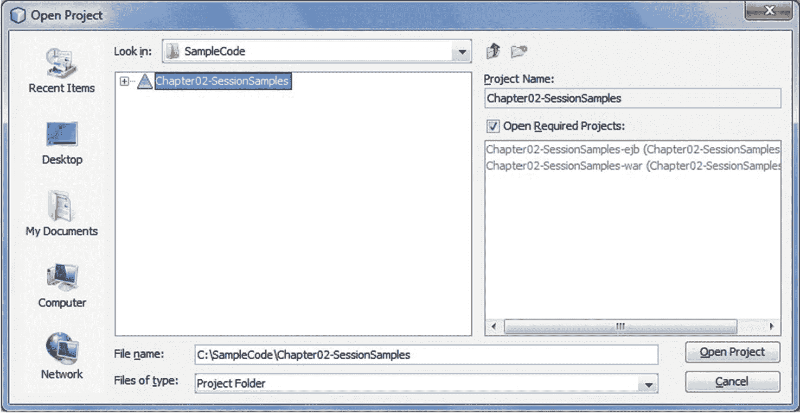

图 2-7

打开 Chapter02-SessionSamples 项目

展开 `Chapter02-SessionSamples-ejb` 节点，观察我们创建的三个会话 Bean 出现在 `com.apress.ejb.chapter02` 包中。类似地，三个客户端 Servlet 出现在 `Chapter02-SessionSamples-war` 节点下，如图 2-8 所示。

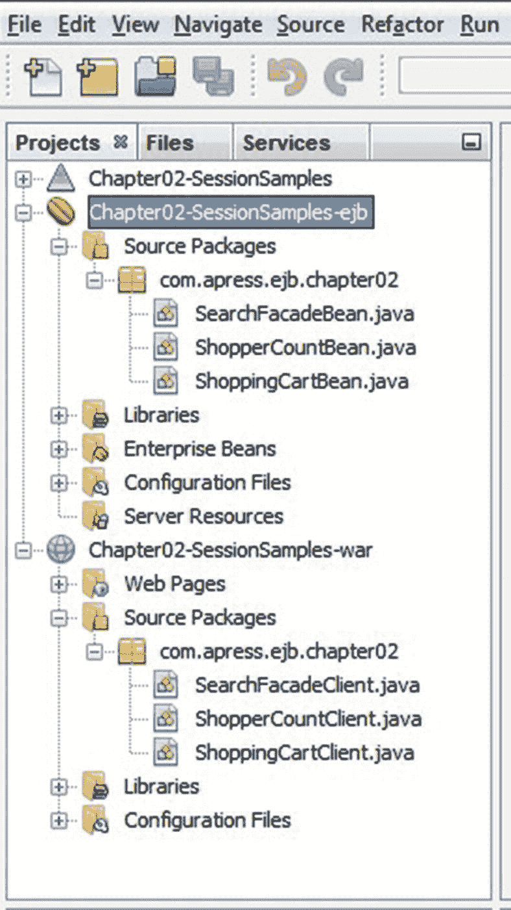

图 2-8

验证会话 Bean 及其客户端在项目中可用

在 `Chapter02-SessionSamples` 节点上调用上下文菜单，并通过选择“清理并构建”菜单选项来构建应用程序，如图 2-9 所示。

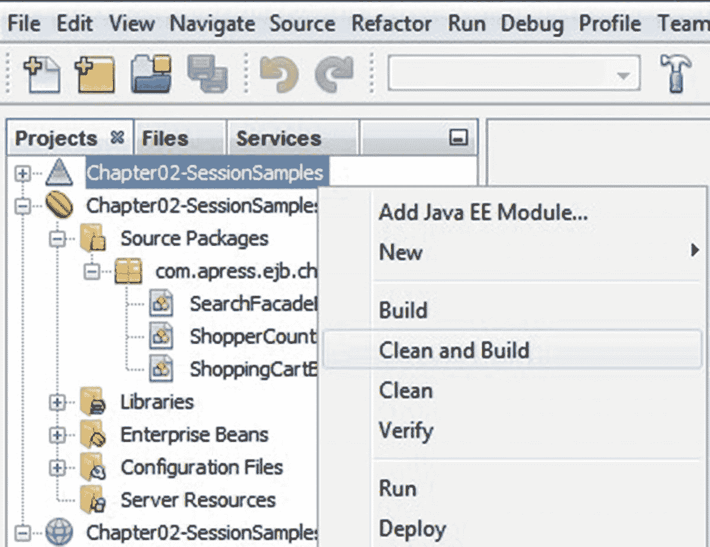

图 2-9

构建应用程序

### 部署会话 Bean 及其客户端

编译完会话 Bean 和 Servlet 客户端后，您可以将应用程序部署到 GlassFish 应用服务器。在 `Chapter02-SessionSamples` 节点上调用上下文菜单，并通过选择“部署”菜单选项来部署应用程序，如图 2-10 所示。

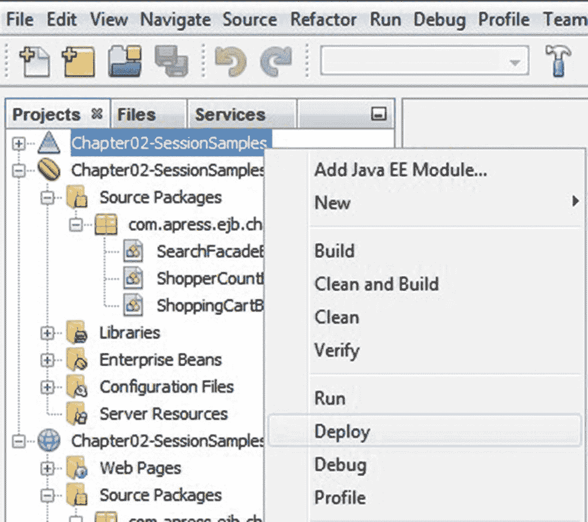

图 2-10

部署应用程序

NetBeans 将启动集成的 GlassFish 应用服务器并将应用程序部署到服务器，如图 2-11 所示。

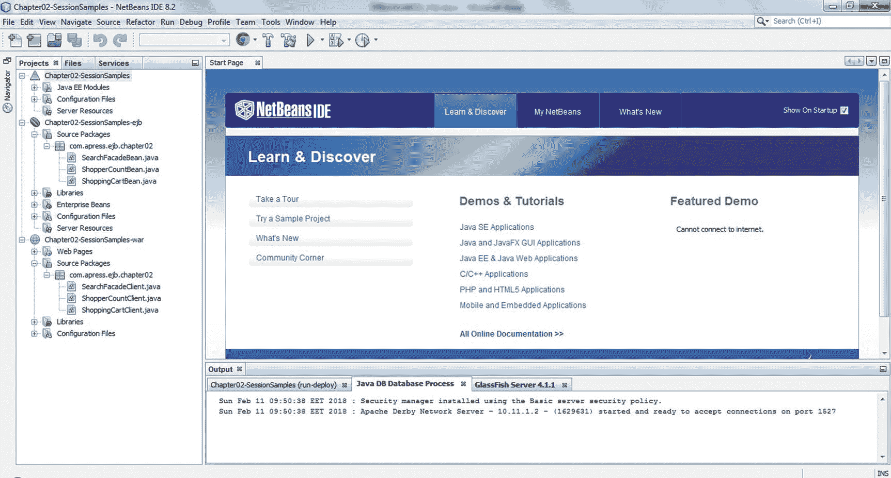

图 2-11

应用程序部署结果

服务器的日志窗口将记录应用程序的部署状态，如图 2-12 所示。

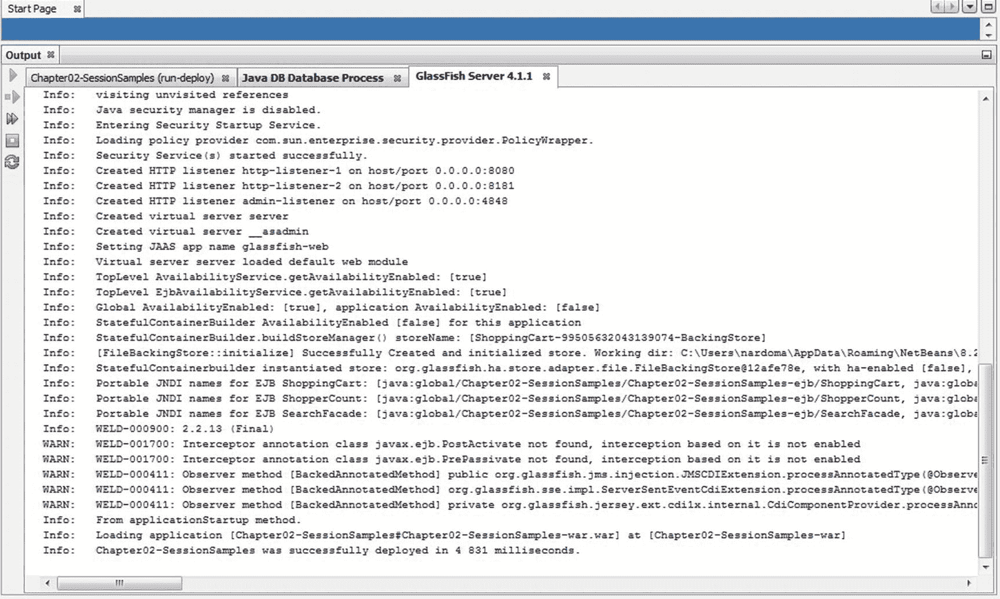

图 2-12

显示成功部署的日志

### 运行客户端程序

成功部署会话 Bean 及其客户端 Servlet 后，我们需要设置要执行的运行目标。我们有三个运行目标可供选择：`ShopperCountClient`、`SearchFacadeClient` 或 `ShoppingCartClient`。要设置运行目标，请在 `Chapter02-SessionSamples` 节点上调用上下文菜单，并选择“属性”菜单选项。选择“运行”类别，在“相对 URL”文本字段中输入运行目标，然后确认对话框。请注意，在图 2-13 中，JDK 1.8 被用作构建应用程序的库。

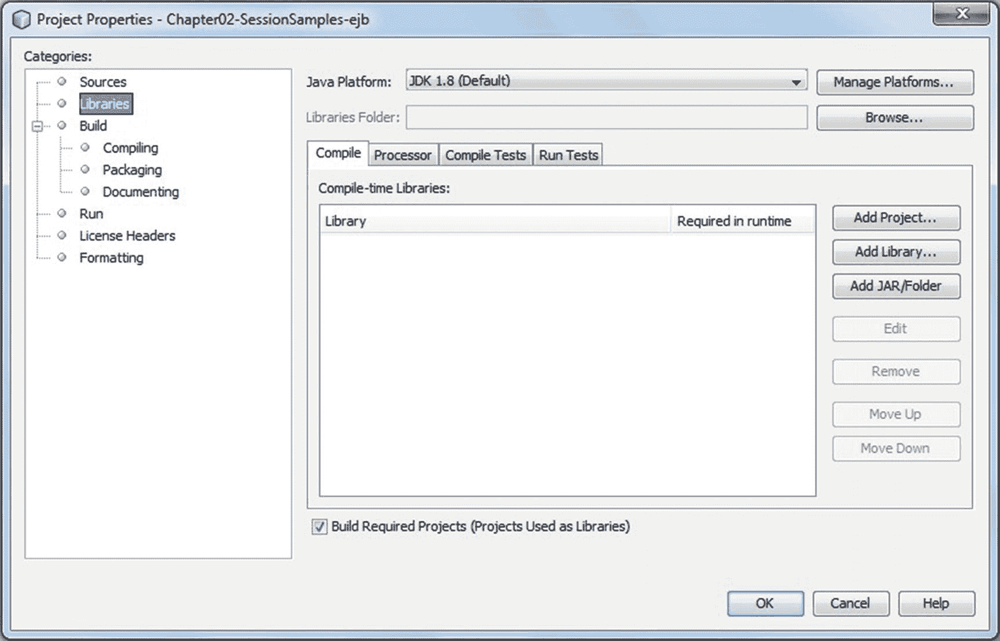

图 2-13

JDK 1.8 作为构建 Java 库

要运行客户端 Servlet，请在 `Chapter02-SessionSamples` 节点上调用上下文菜单，并选择“运行”菜单选项，如图 2-14 所示。

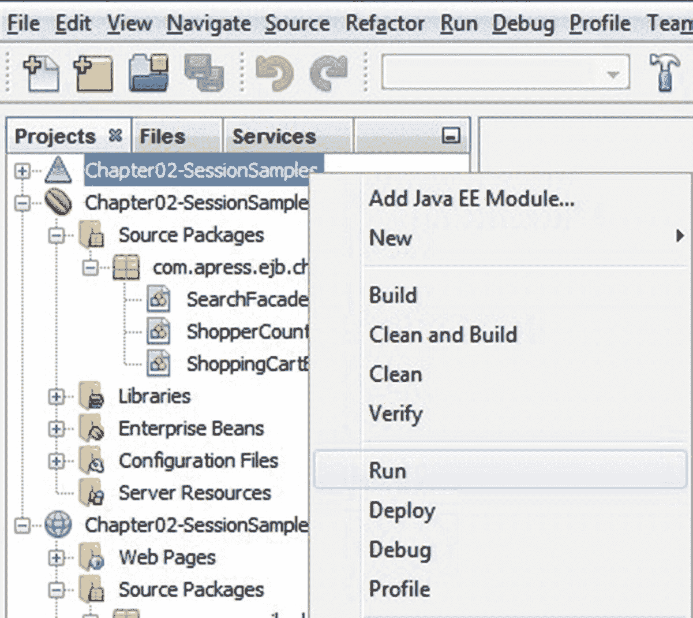

图 2-14

运行选定的 Servlet

NetBeans 将打开您的默认浏览器并执行选定的 Servlet。三个客户端 Servlet 的输出如图 2-15、2-16 和 2-17 所示。

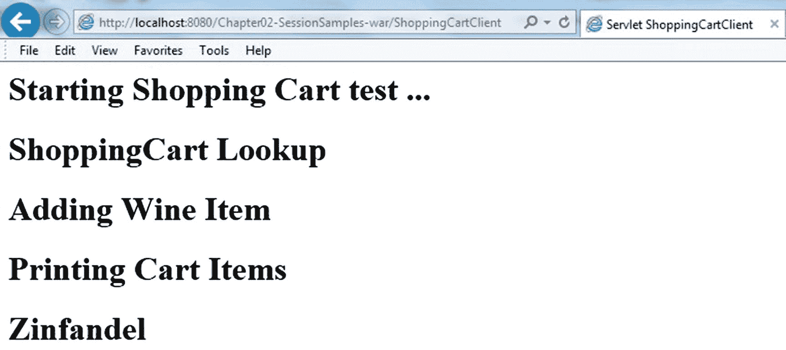

图 2-17

ShoppingCartClient Servlet 的输出

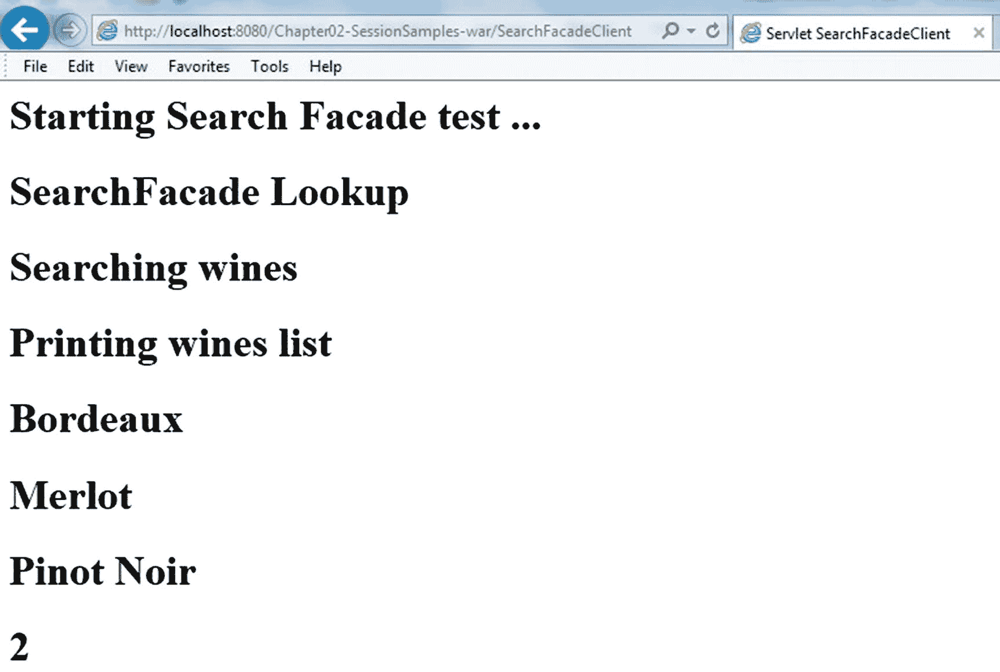

图 2-16

SearchFacadeClient Servlet 的输出

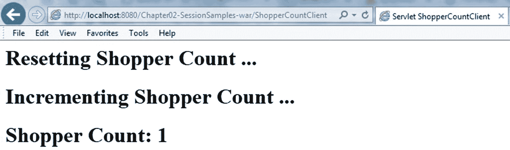

图 2-15

ShopperCountClient Servlet 的输出 注意

应用程序客户端容器将在第 12 章中详细讨论。


## 总结

本章通过一组特定示例详细介绍了 EJB 会话 Bean。我们探讨了如何使用标准 Java 语言构件（如 Java 类和接口）来开发会话 Bean 的简化 EJB 模型。我们了解了会话 Bean 及其在开发应用程序时的一些典型用例。我们讨论了三种不同类型的会话 Bean（无状态、有状态和单例），包括它们之间的区别以及各自的一些通用用例。我们还介绍了会话 Bean 在两层和三层应用程序架构中的使用方式。我们讨论了依赖注入在无状态、有状态和单例 Bean 中的应用。我们考虑了如何对应用程序流程进行细粒度控制，包括在无状态和有状态 Bean 中使用生命周期回调方法和拦截器，以及使用诸如 `@PostConstruct` 和 `@PreDestroy` 之类的注解。我们了解了编译/构建、打包以及将会话 Bean 部署到 GlassFish 应用服务器所需的条件。最后，我们探讨了如何使用 GlassFish 应用客户端容器运行示例客户端程序。

在接下来的两章中，我们将深入探讨 Java 持久化 API（JPA），以便你学习如何将 POJO 映射到数据库表，并执行查询及增删改查（CRUD）操作。


