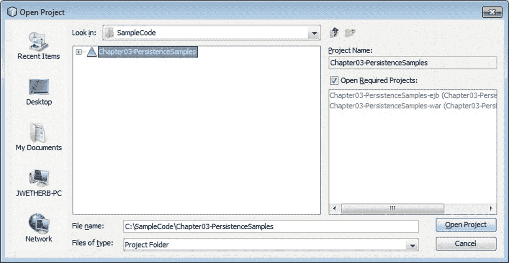
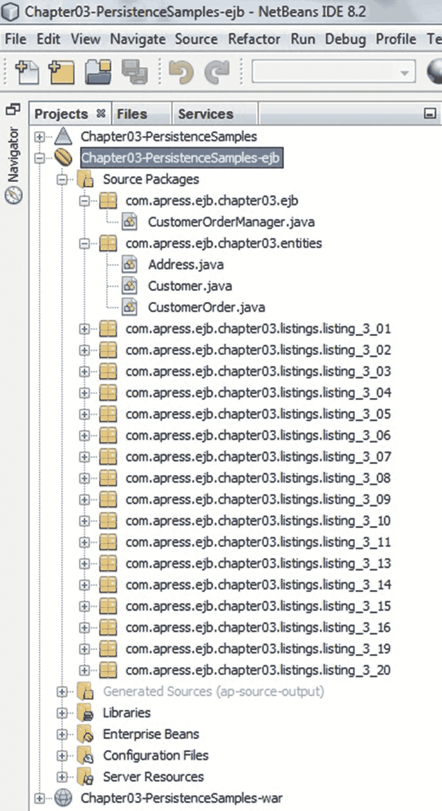
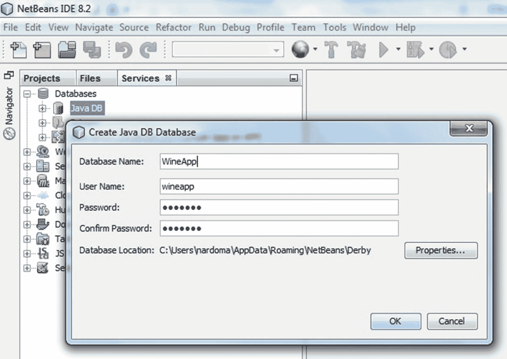
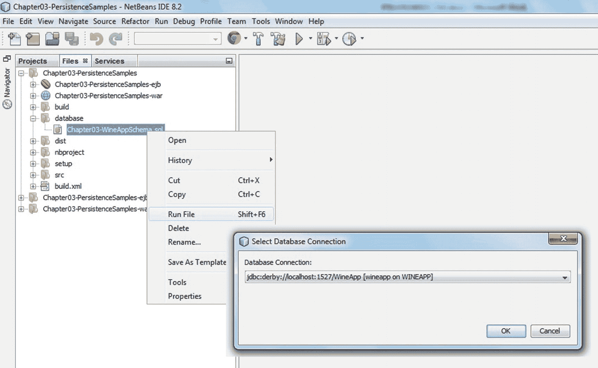
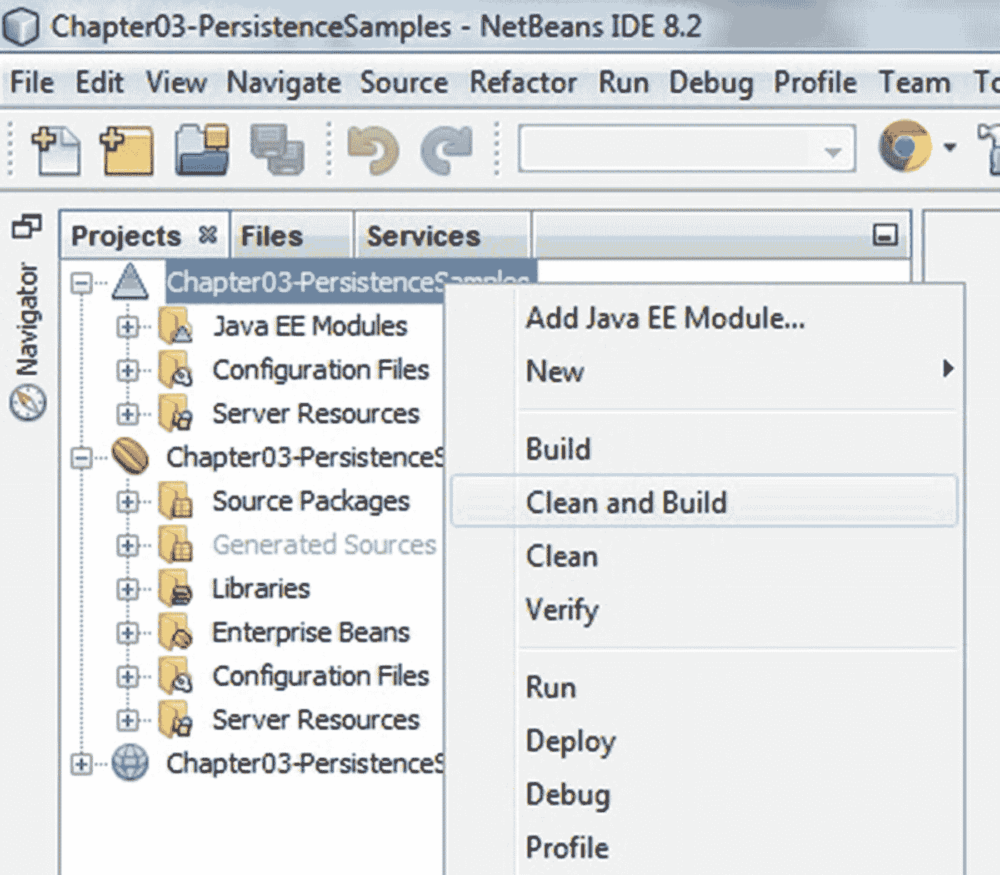
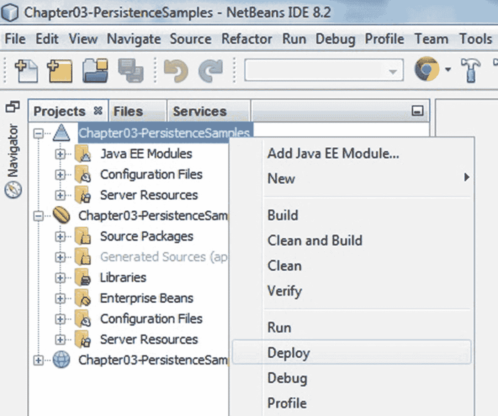
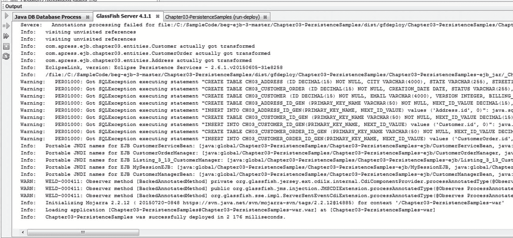
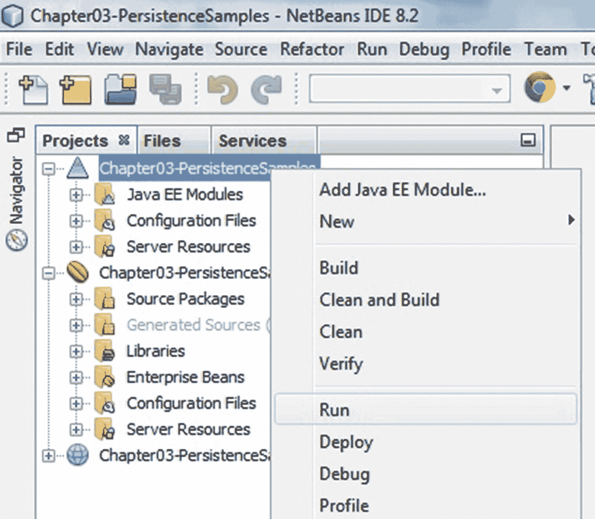
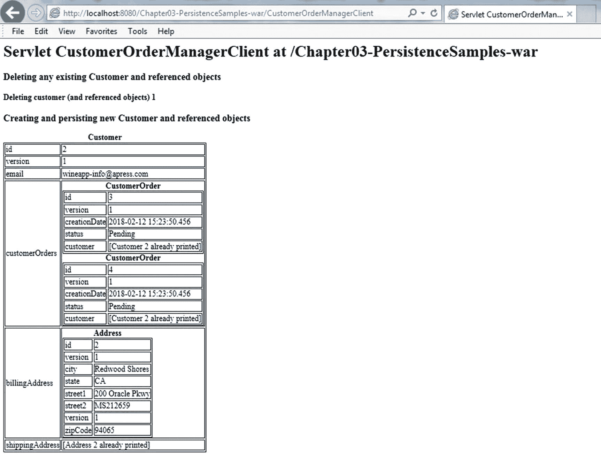

# 3. 实体与 Java 持久化 API (JPA)

在了解了 EJB 如何通过会话 Bean 提供业务服务之后，我们将把注意力转向一种不同类型的组件，称为实体。实体是代表数据库中表的类，其实例代表这些表中的行。会话 Bean 为客户端应用程序提供服务，而实体则代表业务数据。一种常见的模式是，会话 Bean 提供一个便捷的接口，用于在事务、安全、访问控制和其他企业服务的上下文中操作实体。执行创建、检索、更新和删除操作的方法（也称为 CRUD 方法）在会话 Bean 上暴露给客户端，以提供一种“外观”模式，我们将在本书中通篇使用这种模式。

Java 持久化包含四个领域：

*   Java 持久化 API
*   Java 持久化 Criteria API
*   查询语言
*   对象与关系映射元数据

Java 持久化 API (JPA) 首次引入于 Java EE 5，它标志着与之前定义为 EJB 规范一部分的“实体 Bean”持久化模型的分离。JPA 被广泛认为是对早期 EJB 版本中定义的实体 Bean 模型的巨大改进。JPA 毫不掩饰地借鉴了诸如 TopLink、Hibernate、JDO 和 Spring 等专有和开源模型，这些模型作为早期 EJB 修订版中通常重量级且繁琐的实体 Bean 模型的流行替代方案而获得关注。因此，与会话 Bean 类似，实体是简单的 POJO（普通旧式 Java 对象），除了表明它们是实体的一小部分元数据（捕获在 Java 注解或持久化 XML 描述符中）之外，它们是对底层数据库表非常清晰的表示。虽然 JPA 在范围和能力上扩展了持久化模型，但实体本身却方便地与其支持的持久化框架在很大程度上解耦，允许它们既可以用作普通 POJO，也可以用作持久化框架管理的对象，无论是在 Java EE 容器内部还是外部。

JPA 1.0 引入于 Java EE 5，JPA 2.0 伴随 Java EE 6 出现，JPA 2.1 紧随 Java EE 7，而 JPA 2.2 包含在 Java EE 8 中。JPA 2.2 的最终版本将成为 Java EE 9 的一部分。

注意

当使用 JPA 1.0、JPA 2.0 或 JPA 2.1 实现时，模式将分别是 `orm_1_0.xsd`、`orm_2_0.xsd` 或 `orm_2_1.xsd`，位于 [`http://xmlns.jcp.org/xml/ns/persistence/`](http://xmlns.jcp.org/xml/ns/persistence/) 。当使用 JPA 2.2 时，模式将改名为 `persistence_2_2.xsd`，并且同样位于之前的地址 [`http://xmlns.jcp.org/xml/ns/persistence/`](http://xmlns.jcp.org/xml/ns/persistence/) 。

在本书中，我们将使用 Java 持久化 API 的 2.2 版本，作为 Java EE 8 的一部分。

请注意，总的来说，JPA 2.2 只是一个小的发布版本，增加了一些新特性，而其余特性仍然是 JPA 2.1 的一部分。

JPA 2.2 的维护版本于 2017 年在 JSR 338 下启动，并于 2017 年 6 月 19 日最终获得批准。

以下是官方的 Java 持久化 2.2 维护版本声明：

“Java 持久化 2.2 规范通过支持重复注解、向属性转换器注入、支持 `java.time.LocalDate`、`java.time.LocalTime`、`java.time.LocalDateTime`、`java.time.OffsetTime` 和 `java.time.OffsetDateTime` 类型的映射，以及提供将 `Query` 和 `TypedQuery` 的结果作为流检索的方法，增强了 Java 持久化 API。”

JPA 2.2 的变更日志文件可以在这里找到：

[`https://jcp.org/aboutJava/communityprocess/maintenance/jsr338/ChangeLog-JPA-2.2-MR.txt`](https://jcp.org/aboutJava/communityprocess/maintenance/jsr338/ChangeLog-JPA-2.2-MR.txt)

本着本书的精神，关于持久化的两章将涵盖 JPA 2.2 中包含的最常用特性，通过使用我们的在线葡萄酒商店应用程序的实际示例来描述它们的用法。本章将引导您开始编写实体类并使用关键的持久化特性。下一章将探讨更高级的持久化特性。通过这些示例，这些章节解释了持久化编程模型的主要领域。然而，它们无意替代内容广泛的 JPA 规范。当您准备好探索超出本讨论范围的细节时，我们鼓励您参考 JPA 规范。

表 3-1 总结了本章将要涵盖的内容。

表 3-1

本章关键主题

| 概念 | 描述 |
| --- | --- |
| 实体示例 | 我们从简单的 JavaBean 开始，逐步添加所需的注解，将其转换为一个简单的实体，然后再进一步。 |
| 主要实体注解 | 进一步细化实体的要求，实体类必须有一个无参的 `public` 或 `protected` 构造方法，并且不能是 `final` 的。实体通过其 JavaBeans 属性访问器或实例变量定义其持久化结构，并且它们还可以包含自定义方法。 |
| `EntityManager` | `EntityManager` 对象提供持久化服务，包括事务管理以及查询、合并、移除、查找和刷新操作。它是理解 JPA 持久化框架的核心。 |
| 实体生命周期 | 一个实体实例在其作为内存中 Java 对象的生命周期中可能会经历许多正式状态。理解这些不同的状态将帮助您了解实体何时与后端数据库处于一致或不一致的状态，以及如何在事务上下文中协调这些差异。 |
| 对象/关系 (O/R) 映射 | JPA 通过注解和/或 XML 描述符定义声明式标记，以将实体字段映射到关系数据库管理系统 (RDBMS) 中的表列。 |
| 实体关系 | 实体类可以持有对自身或其他实体的一元引用和集合引用。请注意，在 JPA 中，关系字段不是由容器双向维护的。 |
| Java 持久化查询语言 (JPQL) | JPA 定义了一种类似 SQL 的语言——JPQL——它支持查询以及批量更新和删除操作。查询可以静态定义为命名查询，也可以动态定义。查询可以接受绑定参数并返回 Java 对象，包括实体实例或 Map。 |
| 持久化 vs. 适配 | 在设计实体类时，作为一个实际考虑，要判断实体类是主要的设计对象，还是数据库模式是事实来源。在前一种情况下，数据库主要用于持久化实体数据；而在后一种情况下，实体类用于将表适配到 Java 中。 |
| 示例应用程序 | 最后，我们给出一个示例应用程序，它由三个 JPA 实体、一个 EJB 和一个 HTTP Servlet 组成，在一个简单的工作模型中演示了本章的所有概念。 |

## 实体示例

让我们看看如何将一个简单的 JavaBean 转换为一个实体，并逐步对其进行定制以增加功能和灵活性。


### 一个简单的 JavaBean：Customer.java

我们从清单 3-1 所示的一个简单 JavaBean 开始。该类具有 JavaBeans 标准定义的属性。JavaBean 上的每个属性都通过一对属性访问器方法向 Bean 外部呈现。对于每个属性，getter 方法检索其数据，setter 方法为其赋值。在内部，这些属性访问器方法读取和写入 JavaBean 类上一个私有的、专用的实例变量。

```
public class Customer {
private long customerId;
private String name;
public long getCustomerId() { return customerId; }
public void setCustomerId(long customerId) { this.customerId = customerId; }
public String getName() { return name; }
public void setName(String name) { this.name = name; }
}
清单 3-1
一个简单的 JavaBean
```

### 一个简单的实体：Customer.java

清单 3-2 展示了我们的简单 JavaBean 被转换为实体后的样子。

```
@Entity
public class Customer implements Serializable {
@Id
private long customerId;
private String name;
public long getCustomerId() { return customerId; }
public void setCustomerId(long customerId) { this.customerId = customerId; }
public String getName() { return name; }
public void setName(String name) { this.name = name; }
}
清单 3-2
一个简单的实体
```

唯一需要的更改是添加了 `@Entity` 和 `@Id` 注解。`@Id` 注解将 `customerId` 标识为实体的主键，这是表达其唯一标识所必需的。这是将该类转换为实体所需的最低元数据要求。我们还添加了 `Serializable` 接口，因为这是确保与远程客户端兼容的良好实践。

#### @Entity 注解

`@Entity` 注解是必需的，用于在实体部署时将其标识为实体。当实体部署在持久化归档文件（JAR 文件）中时，它们可能伴随有非实体类。此注解，或其等效声明（在 `orm.xml` 文件中），告诉容器查找该类上的进一步注解，并处理其 O/R 映射，使其能够参与查询和与其他实体的持久关系，并在持久化提供程序稍后实例化它们时进行字节编织或其他处理。在部署期间，所有未标记为实体的类都会被持久化提供程序忽略。

#### @Id 注解

`@Id` 注解指示哪个或哪些字段（可能有多个）是实体的主键或标识符。标识符字段中的值在实体类型 `Customer` 的所有实体实例中必须是唯一的，以便能够唯一标识此实体。如果主键跨越表中的多个列，则需要复合主键，并且 `@Id` 字段可以被一个标注了 `@EmbeddedId` 的单个字段替换。我们将在本章后面讨论如何指定复合键。

#### 与 EJB 2.x 的比较

JPA 的基本编码结构是实体类。在 EJB 2.x 及更早版本中，实体 Bean 作为主要的持久化对象，由一个 Bean 类以及本地和/或远程组件和 Home 接口组成。从 JPA 开始，实体 Bean 的大部分外在特征都通过大量使用默认值和注解而被剥离或简化。剩下的只是实体 Bean 类，现在称为实体类，或者更简单地称为实体。虽然在 XML 描述符中指定持久化元数据同样有效，但为简洁起见，本章中的所有示例都使用 Java 注解。与 EJB 3 领域一样，每个由注解指定的声明性构造在持久化单元（共置实体的集合）的 XML 描述符中都有对应的表示形式，因此可以在 XML 中等效地指定。决定使用注解还是 XML 完全是个人的选择。

#### 默认配置

前两个注解是显式指定的。鉴于 EJB 3 简化了开发模型并利用了默认配置，您不会惊讶地发现此示例中的许多其他元数据都是默认隐含的。在探索这些默认设置之前，值得思考为什么选择显式指定 `@Entity` 和 `@Id` 注解，而不是隐式地暗示它们。

`@Entity` 注解本可以是每个通过持久化归档部署的类的默认设置，并且可以使用一个假设的 `@NotEntity` 注解来指定非实体类。然而，遵循会话 Bean 和消息驱动 Bean 设定的模式，选择了显式选择加入的模式。

类似地，所有字段本可以被假定为主键的一部分，但在实践中，通常只有一小部分（通常只有一个）实体的属性构成实体的主键。规范设计者认为，在这种情况下，使用在主键字段上显式指定 `@Id` 的选择加入模式更有意义，这意味着所有列都不是主键的一部分。这种类型的决策体现了默认配置方法的特点，即在更常见的情况下不需要注解，仅在需要覆盖时才使用它们。

下一节将检查此 `Customer` 实体默认获得的一些行为，并将展示如何覆盖此默认行为。

### 暴露默认值的实体：Customer.java

清单 3-3 展示了同一个实体及其部分默认值。

```
@Entity(name="Customer")
@Table(name=" CUSTOMER")
public class Customer implements Serializable {
@Id
@Column(name="CUSTOMERID", table="CUSTOMER", unique=true,
nullable=false, insertable=true, updatable=true)
private long customerId;
@Basic(fetch=FetchType.EAGER)
@Column(name="NAME", table="CUSTOMER")
private String name;
// . . .
}
清单 3-3
显示默认值的实体
```

每个实体都有一个名称，除非另有指定，否则此名称默认为非限定类名，在本例中为 `Customer`。此名称在查询语句（Java 持久化查询语言，简称 JPQL，将在第 4 章介绍）中引用实体时使用，并且通常在非限定类名不便于使用或属于 JPQL 中的保留名称时显式指定。

#### @Table 注解

一个实体实例通常代表表中的一行，并通过实体上的相应属性公开该行中的每个列值。因此，实体必须映射到数据库中的一张表，该表使用 `@Table` 注解指定。其名称默认为实体名称。由于并非所有数据库都支持混合大小写的表名，因此这会被转换为名为 `CUSTOMER` 的表。

#### @Column 注解

类似地，实体上声明的每个字段默认映射到同名的列，因此 `customerId` 和 `name` 字段映射到 `CUSTOMER` 表中的 `CUSTOMERID` 和 `NAME` 列。`@Column` 注解也可用于覆盖默认的列类型信息以及列级约束，例如用于指示该列是否可选、是否可插入和/或是否可更新的约束。通常，仅当您依赖容器在部署实体时创建表时，才需要指定此级别的详细信息。


#### @Basic 注解

对于简单 Java 类型的实体字段，例如 `String` 或 `int`（如 `customerId` 和 `name` 字段），JPA 会自动配置使用 `@Basic` 注解。简单类型的数组，以及任何其他实现了 `Serializable` 接口的类型，也可以标记为 `@Basic`。

持久化框架提供了将列数据类型自动转换为特定 Java 类型的功能，并且 JPA 持久化提供程序在部署期间为实体类生成表时，会尝试定义合适的默认列类型。大多数数字、字符串和日期类型都会被自动转换。

表 3-2 列出了可以标注 `@Basic` 注解并自动映射的 Java 类型列表。

表 3-2

适用于简单映射的字段/属性类型

| Java 类型 |
| --- |
| Java 原始类型（`int`、`long`、`char` 等） |
| 原始类型包装类（`Integer`、`Long`、`Char` 等） |
| Java 可序列化类型 |
| 用户定义的可序列化类型 |
| 枚举类型 |
| `java.lang.String` |
| `java.math.BigInteger` |
| `java.math.BigDecimal` |
| `java.util.Date` |
| `java.util.Calendar` |
| `java.sql.Date` |
| `java.sql.Time` |
| `java.sql.Timestamp` |
| `byte[]` |
| `Byte[]` |
| `char[]` |
| `Character[]` |

#### 其他字段类型

还有许多其他类型说明符可以应用于不同类型的列。例如，一个实体也可能持有对其他实体的引用，这些引用也通过实体上的属性来表示。我们将在本章后面部分介绍如何指定这些关系属性的一些示例。

一个实体可能拥有除属性访问方法之外的其他方法，但通常这些方法仅限于支持方法，用于管理集合关系属性的添加和移除操作。

### 编码要求

除了 `@Entity` 注解和主键说明符之外，实体的最低编码要求是：它必须有一个 `public` 或 `protected` 的默认（无参数）构造函数，并且该类不能是 final 的。在这个 `Customer` 示例中，隐含了一个默认构造函数，因为在一个公共类上，如果没有定义任何非默认构造函数，Java 会假定存在一个默认构造函数。也可以在实体上指定非默认构造函数，它们通常用于使用实体的必需属性来初始化实体。

#### java.io.Serializable 接口

那些需要按值传递的实体（例如，通过远程会话 Bean 传递给 EJB 容器外部的 Java SE 客户端时），必须实现 `java.io.Serializable` 标记（无方法）接口。实现此接口向编译器表明，它必须强制实体类上的所有字段都是可序列化的，以便任何实例都可以被序列化为字节流，并通过 HTTP 上的远程方法调用（RMI）进行传递。

#### 在实例变量上放置注解 vs. JavaBean 属性访问器上放置注解

在定义实体类时，你可以选择将成员级别的注解放在实体实例变量上，或者放在这些实例变量对应的 JavaBean 属性访问器上。就像在通过注解还是 XML 指定元数据之间做选择一样，这很大程度上是个人偏好问题。

注意

自 JPA 2.0 起，允许 Java 开发者在实例变量和属性 getter 方法上同时进行注解。在此之前，继承层次结构中的所有实体必须选择遵循单一的方法。

无论成员级别的注解指定在何处，实体的实例变量都不能是 public 的，并且该实体的客户端（包括相关实体）必须始终通过访问器方法来访问实体的属性。由实体提供者决定哪些属性访问器设为 public（暴露给客户端），哪些设为 protected（仅对持久化提供程序可用）。当注解实例变量时，如果需要，实体无需定义任何属性访问器方法。

根据策略，只有持久化框架和类方法本身才允许直接访问这些字段。对于两种访问类型，客户端都必须通过实体类上的公共访问器或其他方法来访问字段数据。

选择一种方法而非另一种方法会产生几个实质性的后果。这些将在以下章节中讨论。

### 实体数据访问

当注解指定在实体的实例变量上时，持久化管理器在向实体读写持久化属性时，会直接访问实例变量。当注解属性访问器而非实例变量时，持久化管理器会通过这些属性访问器来读写属性数据。

直接注解实体的实例变量避免了方法调用的开销，并提供了一定的性能优化，因为持久化管理器直接与字段交互。注解属性访问器则为实体开发者提供了一种简单的方法，可以在所有尝试读写属性数据时进行拦截并执行自定义逻辑。

如果需要，后一种选项为实体开发者提供了按需惰性派生持久化属性值的机会。但是，请注意，在实体状态转换期间，属性访问器方法上的任何验证或副作用代码都会被调用。正如你将在下一章中看到的，如果实体开发者希望在首次加载实体的持久化状态时，或者在将更改保存到持久化存储之前，初始化临时数据或优化持久化数据，那么最好使用实体生命周期回调方法来执行这些步骤。结合使用字段级注解和实体生命周期回调的好处是，setter 方法中的验证和其他代码只会在客户端调用 setter 时被调用，而不会在框架从持久化存储实例化实体时被调用。

另一个考虑因素是实体在参与查询时的行为方式。这是一个类似的问题，因为查询语句可能既检索又更新实体上的字段数据。因此，了解使用属性访问器可能产生的任何副作用非常重要。

### 属性名称

选择注解实例变量还是属性访问器的第二个实质性影响发生在属性访问器表达出的默认字段名称与实例变量名称不同时。当注解属性访问器时，逻辑属性名称是使用 JavaBean 属性命名约定从 getter 方法派生出来的；而如果注解的是实例变量，则逻辑属性名称就是该实例变量的名称。


### 示例：注解实例变量

清单 3-4 中的代码片段演示了实例变量注解，并展示了验证和副作用代码。此示例同样可在本章的源代码区域中找到，其中实体提供者将客户端接口收窄，仅暴露 `get`/`setZipCode()` 方法，但向持久化提供者同时指定了 `zipCodeInternal` 和 `zipCode` 属性。在实例变量上放置注解，可以在实体的客户端 API 与其持久化端接口之间实现清晰的分离。

```
@Entity
public class Address implements Serializable {
@Id
private long addressId;
@Column(name = "ZIP")
private int zipCodeInternal;
@Transient
private String zipCode;
public long getAddressId() { return addressId; }
public void setAddressId(long addressId) { this.addressId = addressId; }
public String getZipCode() {
if (zipCode == null && zipCodeInternal > 0) {
zipCode = convertToStr(zipCodeInternal);
}
return zipCode;
}
public void setZipCode(String zipCode) throws IllegalArgumentException {
//  验证 zipcode 字符串，确保它能干净地缩减为
//  5 位或 9 位整数，并将其赋值给内部持久化
//  的 'zipCodeInternal' 类字段
//  . . . . . .
this.zipCode = zipCode;
zipCodeInternal = convertToInt(zipCode);
}
private int convertToInt(String zipCode) {
return new Integer(zipCode).intValue();
}
private String convertToStr(int zipCode) {
return new Integer(zipCode).toString();
}
}
清单 3-4
使用实例变量注解的实体
```

`get`/`setZipCode()` 方法允许实体将内部数据惰性地转换为对客户端友好的 `String` 表示形式，但仅在请求时进行。对于 `zipCodeInternal` 实例变量，甚至没有指定任何属性访问器。

#### @Transient 注解

你可能不希望让实体类的所有字段或属性都持久化。派生字段或瞬态字段可以注解为 `@Transient`，以指示持久化框架应忽略它们。`zipCode` 实例变量被标记为 `@Transient`，表示持久化提供者不应管理它。此实例变量仅用于将内部的 `int` 值适配为对客户端友好的派生 `String` 值。

### 示例：注解属性访问器

清单 3-5 演示了实体开发者在注解实体的属性访问器时，如何使用副作用代码。

```
@Entity
public class Address implements Serializable {
private BigDecimal addressId;
private int zipCode;
private String city;
@Id
public BigDecimal getAddressId() { return addressId; }
public void setAddressId(BigDecimal addressId) { this.addressId = addressId; }
public int getZipCode() { return zipCode; }
public void setZipCode(int zipCode) {
if (zipCode != this.zipCode)
{
city = null; // 强制 city 被惰性重新派生
this.zipCode = zipCode;
}
}
public String getCity() {
//  如果可用，从 zipcode 属性派生 city
if (city == null && zipCode > 0) {
city = deriveCityFromZip();
}
return city;
}
public void setCity(String city) {
this.city = city;
}
private String deriveCityFromZip() {
/* 此处为实现代码. . . */
return null;
}
}
清单 3-5
使用属性访问器注解的实体
```

将 `@Id` 注解放在 `getAddressId()` 属性访问器上，可以消除访问策略的歧义，指示持久化提供者应使用属性访问器。强制持久化提供者通过属性访问器分配数据，使得实体有机会在分配新邮政编码时重置 `city` 值。此外，知道 `city` 字段将通过其 getter 方法由持久化管理器获取，允许实体仅在通过 `getCity()` 访问器请求时才惰性计算其值。如果该实体的使用涉及在实体持久化（或合并）到数据库之前多次调用 `setZipCode()`，那么将 `city` 值的派生推迟到实际请求时才进行，效率更高。如果此实体使用实例变量访问，则每次分配 `zipCode` 时都需要急切地更新 `city` 字段，因为随时可能发出将实体更改合并到数据库的请求。然而，如前所述，使用实体生命周期回调方法可以避免急切派生此值的开销。

#### 访问类型总结

JPA 提供了两种模型，供持久化提供者访问实体上的字段数据：直接通过实例变量，或间接通过属性访问器。在一般情况下，我们发现注解实体的实例变量比注解其属性访问器更可取。你很少需要验证来自持久化存储的数据，并且 setter 方法中的任何副作用代码通常应惰性执行，而不是在实体实例化时急切执行。此外，字段级注解允许你将通过该字段的 get/set 方法暴露的公共属性类型与底层列表示解耦。例如，你可能希望通过 `getZipcode()/setZipcode()` 方法将 `zipCode` 属性暴露为 `String`，但在内部将其转换为整数，使用 `Integer` 类型的字段，以便持久化到数据库中的 `INTEGER` 列。最后，使用实体生命周期回调方法提供了在实体数据加载后和保存前进行额外初始化或准备的机会。

### 声明主键

实体必须声明其主键。主键用于在实体类型的所有实例中唯一标识一个实体实例。主键可以是简单的，由基本 Java 类的单个字段表示，例如 `String` 或 `Long`，如之前的 `Customer` 示例（清单 3-2）所示。或者，主键也可以是复杂的，由包含多个基本字段或属性的复合类表示。

实体表上由主键字段映射的底层列，可能受数据库主键约束的正式约束，但这并非必需。然而，要求任何实体实例的主键列值在实体的所有实例中解析为唯一值。数据库约束有助于强制执行此要求，在缺乏约束的情况下，应小心确保应用程序分配唯一值。


### 简单主键

简单主键通过在实体类中使用 `@Id` 注解标注单个基本类型字段来声明（参见清单 3-6）。基本类型字段是指 Java 基本类型（基本类型列表见表 3-2）。

```
@Entity
public class Customer implements Serializable {
@Id
private Integer id;
private String name;
public Customer() {}
public Customer(Integer id) { this.id = id; }
public Integer getId() { return id; }
public void setId(Integer id) { this.id = id; }
public String getName() { return name; }
public void setName(String name) { this.name = name; }
}
清单 3-6
一个具有简单主键的实体
```

请注意，我们可以通过使用数据库序列自动填充主键值，来消除实体类中备用构造函数的必要性。清单 3-7 展示了如何使用 JPA 提供的 ID 值生成器来实现这一点。

```
@Entity
@SequenceGenerator(name = " CustomerSequence",
sequenceName = " CUSTOMER_SEQ",
initialValue = 100, allocationSize = 20)
public class Customer implements Serializable {
@Id
@GeneratedValue(strategy = GenerationType.SEQUENCE,
generator = " CustomerSequence")
private Integer id;
private String name;
public Integer getId() { return id; }
public void setId(Integer id) { this.id = id; }
public String getName() { return name; }
public void setName(String name) { this.name = name;}
}
清单 3-7
一个使用 @GeneratedValue 填充的具有简单主键的实体
```

#### @GeneratedValue 注解

`@GeneratedValue` 注解告知持久化框架使用指定的序列生成器自动填充该列，该生成器必须在持久化归档中的某个实体上定义。（它直接定义在 `Customer` 实体上。）`@SequenceGenerator` 注解定义了一个可共享的序列生成器，它可以定义一个新的框架生成的序列，也可以引用数据库中已有的序列。ID 生成器将在第 4 章中更全面地探讨。

### 复合主键

如果实体的主键映射到多个数据库列，则使用复杂主键（或称复合主键）。在实体类中，这可以通过两种方式之一来表示。实体可以直接在实体类上声明复合键中的每个字段（使用 `@Id` 注解标注每个字段），并在 `@IdClass` 注解中指定一个提供完全相同字段的复合键类。或者，实体可以通过使用 `@EmbeddedId` 注解标注一个单一的复杂字段来将其指定为主键。`@EmbeddedId` 字段的类类型就是实体的复合键类。这个复合键类使用 `@Embeddable` 注解标注，并且必须指定其每个字段的映射细节。这些字段最终将映射到实体的基表。无论采用哪种方法，复合主键类都必须重写 `java.lang.Object` 中的 `hashCode()` 和 `equals(Object obj)` 方法。

清单 3-8 展示了这些选项的具体形式。

```
@Entity
@IdClass(CustomerPK.class)
public class Customer implements Serializable {
@Id
private Integer customerId;
@Id
private String name;
public Integer getCustomerId() { return customerId; }
public void setCustomerId(Integer customerId) { this.customerId = customerId; }
public void setName(String name) { this.name = name; }
public String getName() { return name; }
}
清单 3-8
一个使用 @IdClass 的具有复合主键的实体
```

#### @IdClass 注解

`@IdClass` 标识了一个普通的 POJO（例如清单 3-9 中所示的示例），该 POJO 不需要任何元数据。主键字段所需的任何映射细节都在实体的字段上指定。

```
public class CustomerPK implements Serializable {
private Integer id;
private String name;
public void setId(Integer id) { this.id = id; }
public Integer getId() { return id; }
public void setName(String name) { this.name = name; }
public String getName() { return name; }
@Override
public int hashCode() { return 0; /* 此处为实现代码 */ }
@Override
public boolean equals(Object obj) { return false; /* 此处为实现代码 */ }
}
清单 3-9
一个作为复合主键的简单 POJO
```

复合主键类必须符合实体的访问类型（注解实例变量 vs. 属性访问器），并且其所有字段或属性必须在实体类中有匹配的字段或属性。实体上对应的字段必须使用 `@Id` 注解标注。

#### @EmbeddedId 注解

或者，实体可以通过使用 `@EmbeddedId` 注解标注其某个字段或属性来将其指定为复合主键（参见清单 3-10）。

```
@Entity
public class Customer implements Serializable {
@EmbeddedId
private CustomerPK customerId;
public CustomerPK getCustomerId() { return customerId; }
public void setCustomerId(CustomerPK customerId) {
this.customerId = customerId;
}
// . . .
}
清单 3-10
一个使用 @EmbeddedId 注解的实体
```

#### @Embeddable 注解

每个 `@EmbeddedId` 必须引用一个标记为 `@Embeddable` 的类。清单 3-11 展示了相应的可嵌入复合键类。

```
@Embeddable
public class CustomerPK implements Serializable {
Long id;
String name;
public void setId(Long id) { this.id = id; }
public Long getId() { return id; }
public void setName(String name) { this.name = name; }
public String getName() { return name; }
@Override
public int hashCode() { return 0; /* 此处为实现代码 */ }
@Override
public boolean equals(Object obj) { return false; /* 此处为实现代码 */ }
}
清单 3-11
一个 @Embeddable 复合键类
```

复合键类 `CustomerPK` 必须使用 `@Embeddable` 注解标注。与 `@IdClass` 的情况不同，其实例变量或属性访问器可以包含 `@Column` 注解来指定其映射细节。

### 实体示例总结

基本的 `@Entity` 和 `@Id` 注解足以定义一个实体类，这使得实体编码的入门变得非常直接。随着你对可用注解越来越熟悉，以及需求变得越来越复杂，你可以简单地向实体添加注解来实现强大的持久化特性。

我们刚刚介绍了本节中最基础的内容。现在，我们将把注意力从实体类本身转向 `EntityManager` 以及持久化框架中的其他一些重要服务。稍后，我们将回来探讨更多满足更复杂需求的注解。

## 持久化归档

到目前为止，我们将持久化归档称为一组部署为 JAR 文件的共存实体的封装。该归档定义了为部署而捆绑在一起的实体和相关非实体类。严格来说，持久化归档并不需要存在于其专用的 .jar 文件中。持久化归档可以打包在 .war 文件、EJB .jar 文件中，甚至可以作为 .class 文件和 META-INF/persistence.xml 文件存在于 Java 应用程序的类路径上。

无论其上下文环境如何，我们现在都将更仔细地审视此归档的内容。


### persistence.xml 文件

持久化归档文件需要在其 `META-INF` 目录中包含一个 `persistence.xml` 文件。该文件将归档文件中的实体子集分组为所谓的持久化单元。`persistence.xml` 文件必须至少定义一个持久化单元，并且同一个实体可以包含在同一 `persistence.xml` 文件中的多个持久化单元内。

persistence.xml 和 orm.xml 映射文件及其模式已在 JPA 2.2 版本中更新。

persistence.xml 文件定义了一个持久化单元，它位于持久化单元根目录的 META-INF 目录中。

orm.xml 文件位于持久化单元根目录的 META-INF 目录中，它包含了用于以对象-关系映射信息注解形式存在的受管持久化类。persistence 提供者会将 orm.xml 映射文件或其他映射文件作为资源加载。

注意

JPA 2.1 和 2.2 版本要求 XML 文件映射（例如 persistence.xml 和 orm.xml）位于 Java 类路径中。

JPA 2.2 版本指出：

“一个名为 orm.xml 的对象/关系映射 XML 文件可以指定在持久化单元根目录的 META-INF 目录中，或者位于 persistence.xml 引用的任何 jar 文件的 META-INF 目录中。”

请注意，我们可以添加更多可能位于类路径上任何位置的映射文件，并且 Classloader 可以将它们作为资源加载。

清单 3-12 展示了一个 `persistence.xml` 文件的示例。

```
<?xml version="1.0" encoding="UTF-8"?>
<persistence version="2.2"
             xmlns="http://xmlns.jcp.org/xml/ns/persistence"
             xmlns:xsi="http://www.w3.org/2001/XMLSchema-instance"
             xsi:schemaLocation="http://xmlns.jcp.org/xml/ns/persistence
             http://xmlns.jcp.org/xml/ns/persistence/persistence_2_2.xsd">
    <persistence-unit name="Chapter03PersistenceUnit" transaction-type="JTA">
        <provider>org.eclipse.persistence.jpa.PersistenceProvider</provider>
        <jta-data-source>jdbc/wineapp</jta-data-source>
        <class>com.apress.ejb.chapter03.entities.Address</class>
        <class>com.apress.ejb.chapter03.entities.Customer</class>
        <class>com.apress.ejb.chapter03.entities.CustomerOrder</class>
        <exclude-unlisted-classes>false</exclude-unlisted-classes>
    </persistence-unit>
    <persistence-unit name="Chapter03PersistenceUnit-JSE" transaction-type="RESOURCE_LOCAL">
        <provider>org.eclipse.persistence.jpa.PersistenceProvider</provider>
        <class>com.apress.ejb.chapter03.entities.Customer</class>
    </persistence-unit>
</persistence>

清单 3-12
persistence.xml 文件示例
```

请注意属性 version=“2.2”，自 JDK 8 起，它可以作为 JPA 版本使用。

此 `persistence.xml` 文件定义了两个持久化单元：`Chapter03PersistenceUnit` 和 `Chapter03PersistenceUnit-JSE`。`Customer` 类在两个单元中都有定义。第一个持久化单元供 Java EE 客户端（如会话 Bean）使用，而第二个单元则配置供 Java SE 客户端（如清单 3-14 中所示的 `CustomerService.java` 类）使用。在两个持久化单元中指定不同的配置设置，可以使客户端与持久化单元的配置细节隔离开来，并且使得在 Java SE 和 EE 环境中运行的实体在两种情况下看起来几乎相同。

## EntityManager

`EntityManager` 是客户端访问 JPA 持久化框架提供的实体管理服务的网关。客户端会话在与持久化实体实例交互之前，必须先获取一个 `EntityManager` 实例。`EntityManager` 提供对现有实体实例进行查询、更新、刷新和删除的支持，以及注册实体类以创建具有标识的新持久化对象。

### 持久化上下文

`EntityManager` 在一个称为持久化上下文的事务性上下文中维护一个实例缓存。持久化上下文允许 `EntityManager` 跟踪已修改、创建和删除的实体实例，并将实体实例与在 `EntityManager` 自身事务之外并发提交的外部事务所做的更改进行协调。

通过 `EntityManager` 查询到的实体实例可以自由地传递给 EJB 容器内外的客户端。客户端可以像操作普通 Java 对象一样访问和更新实体数据。要将更改应用回持久化存储，客户端需要在事务范围内调用 `EntityManager` 的 `merge()` 方法，然后 `EntityManager` 会将实体数据的状态持久化到后端存储中。

### 获取 EntityManager 实例

`EntityManager` 实例既可以在 EJB 容器（Java EE）内部获取，也可以在容器外部（Java SE）获取。这为客户端提供了灵活性，使其能够以统一的方式与持久化实体 Bean 交互，而无需考虑持久化代码是在 Java EE 容器内部还是外部运行。

#### 使用容器注入的会话 Bean

清单 3-13 提供了一个通过容器注入获取 `EntityManager` 实例的会话 Bean 示例。

```
@Stateless
public class CustomerManager {
    @PersistenceContext(unitName="Chapter03PersistenceUnit")
    private EntityManager em;

    public void createCustomer() {
        final Customer cust = new Customer();
        cust.setName("Moneybags MgGee");
        em.persist(cust);
    }
}

清单 3-13
注入 EntityManager 实例的会话 Bean
```

在此示例中，我们使用容器注入来获取一个绑定到 `Chapter03PersistenceUnit` 持久化单元的 `EntityManager` 实例，该单元包含了来自清单 3-7 的 `Customer` 实体。然后，我们使用此 `EntityManager` 来持久化一个新的 `Customer` 实例。请注意，此示例假设存在一个 ID 生成器或其他服务来自动填充新实例的主键。

#### 使用 EntityManagerFactory 的 Java SE 服务客户端

有时无法使用容器注入，或者应用程序希望对 `EntityManager` 的生命周期拥有更多控制权。在这种情况下，客户端可以先获取一个 `EntityManagerFactory`，然后通过它来获得 `EntityManager`。`javax.persistence.Persistence` 类充当获取 `EntityManagerFactory` 的工厂，并且可以在 Java EE 环境和 Java SE 环境中使用。清单 3-14 展示了普通的 Java SE 服务客户端如何获取 `EntityManager`。

```
public class CustomerService {
    public static void main(String[] args) {
        final EntityManagerFactory emf =
            Persistence.createEntityManagerFactory("Chapter03PersistenceUnit-JSE");
        final EntityManager em = emf.createEntityManager();
        final Customer cust = new Customer();
        cust.setName("Best Customer Ever");
        em.persist(cust);
    }
}

清单 3-14
充当实体外观的 POJO
```

这里我们创建了一个 `EntityManagerFactory`，它同样绑定到 `Chapter03PersistenceUnit-JSE` 持久化单元，该单元包含了来自清单 3-7 的 `Customer` 实体。然后，我们从该工厂创建一个 `EntityManager` 实例，并使用它来持久化一个新的 `Customer` 实例。

#### 通过 JNDI 查找 EntityManager

第三种选择（同样适用于 Java SE 和 EE 环境）是通过 Java 命名和目录接口（JNDI）查找 `EntityManagerFactory` 或 `EntityManager` 本身。清单 3-15 展示了如何在会话 Bean 中实现这一点。

```
@Stateless
@PersistenceContext(unitName="Chapter03PersistenceUnit")
public class CustomerServiceBean {
    @Resource
    SessionContext ctx;

    public void performService() {
        EntityManager em = (EntityManager)ctx.lookup("Chapter03PersistenceUnit");
        // . . .
    }
}

清单 3-15
通过 JNDI 查找 EntityManager
```

注入的 `SessionContext` 资源提供了一个 JNDI 命名空间，用于在运行时获取其他资源。

### 事务支持

`EntityManager` 还公开了用于开始、提交和回滚事务的方法，这些方法适用于资源本地（非 JTA）事务。此主题将在第 8 章中深入讨论。


## 实体生命周期

一个实体实例在作为内存中的 Java 对象时，可能会经历多种正式状态。理解这些不同的状态有助于你了解实体何时与后端数据库保持一致或不一致的状态，以及如何在事务上下文中协调这些差异。

一个实体实例在其作为 Java 对象的生命周期中，通常会经历多种持久化状态。自 EJB 3 起，实体类变得完全透明。它们通过普通的构造函数创建，而不是早期 EJB 版本中的 `Home` 和 `LocalHome` 工厂接口。它们可以自由地在 EJB 容器与客户端之间传递，也可以被客户端更新，而无需回调 EJB 容器的开销。

### 新实体实例的生命周期

让我们来看一个新建持久化实体实例的生命周期。在其生命周期中，实体可能会经历新建、托管、分离和已删除状态。

#### 新建实体实例

客户端通过使用实体的 Java 构造函数之一来创建新的实体实例。与早期 EJB 规范相比，这是一个显著的简化，早期规范要求用户在实体 Bean 的 `Home` 和/或 `LocalHome` 接口上定义 `create()` 工厂方法。所有实体类都需要默认（无参）构造函数，但也可以定义额外的构造函数。客户端可以位于 EJB 容器外部或内部。在构造时，它处于新建状态，并且尚未拥有持久化标识，因为它尚未与 `EntityManager` 的持久化上下文关联。客户端可以自由调用其任何方法并赋值，所有对实体的更新都保留在实体类本地。

#### 托管实体实例

要将此实体类转变为持久化对象，客户端需要获取一个 `EntityManager` 实例并调用 `EntityManager.persist()` 方法。清单 3-16 展示了一个会话 Bean 的代码片段，该 Bean 通过注入获取 `EntityManager`，然后将作为参数传递给 `persistEntity()` 方法的实体实例持久化。

```
@Stateless
public class MySessionEJB {
@PersistenceContext(unitName = "Chapter03PersistenceUnit")
private EntityManager em;
public void persistEntity(Object entity) {
em.persist(entity);
}
}
清单 3-16
展示如何使实体实例持久化的示例
```

当实体被持久化时，它会作为托管实例添加到持久化上下文中。被托管为实体带来了以下优势：

*   默认情况下，实体上的所有字段都被指定为由持久化提供程序延迟加载。虽然延迟指定实际上只是一个提示（请参阅本章后面的“延迟与即时字段绑定”部分），但延迟字段绑定只能无缝地在托管实例上执行。
*   当实体被托管时，对其所做的更改可能会被持久化管理器跟踪，以优化后续的 `EntityManager.merge()` 操作。例如，可以使用持久化提供程序在实例化实体时提供的字节编织技术，直接在实体实例上处理更改跟踪。这在管理相关实体网络时尤其重要，以便在将实体网络合并回持久化上下文时，计算变更集所需的工作量最小。

通常，无法保证调用 `EntityManager.persist()` 会立即执行 SQL `INSERT` 语句。由持久化管理器决定是立即执行此步骤，还是稍后但在提交事务之前执行。然而，在此示例中，无状态会话 Bean 上方法的默认行为是每次调用其方法时创建一个新事务并提交工作，因此实体不仅被插入，而且已被提交。

在此步骤中，可能已为实体实例分配了序列值，并且可能还执行了其他副作用代码。

#### 分离实体实例

实体在其所属的持久化上下文生命周期内，或从数据库中删除之前，一直处于托管状态。如果发生这些事件之一，或者实例通过值传递给客户端，它就会变成分离的实体实例，并且不再与持久化上下文关联。分离的实体不会进行更改跟踪或其他内部优化。特别是，持久化提供程序无法延迟绑定在实体分离时尚未绑定的字段，尝试访问尚未绑定的分离实体字段将抛出运行时异常。要将其状态合并回持久化上下文并使其再次成为托管实例，需要将分离的实体传递给 `EntityManager.merge()` 方法。

虽然从 `EntityManager.merge()` 调用返回的实体实例是托管的，但更改不会立即传播到持久化存储；它们仅更新实体本身。假设客户端修改了实体：

```
entity = mySession.persistEntity(entity);
entity.setName("foo");
```

在上述第二条语句之后，名称更改仅应用于实体实例，并且没有将任何更改传播到持久化上下文或数据库。要将这些更改应用于持久化上下文，需要调用 `EntityManager.merge()` 操作，如下所示：

```
// 假设已获取 EntityManager em，可能通过注入
em.merge(entity);
```

这会更新持久化上下文缓存，并且可能还会更新底层数据库中的行，具体取决于生效的事务设置。

#### 已删除实体实例

当实体的 `remove()` 方法被调用时，它就成为已删除实例。当上下文事务提交时，表示其持久化状态的行（如果此实体映射到多个表，则为多行）将被删除。

## O/R 映射

我们已经研究了许多定义实体一般行为的注解。现在让我们探讨涉及将实体上的持久化字段或属性 O/R 映射到数据库表列的注解。

实体类的核心是定义其持久化结构的字段或属性列表。这些定义其持久化状态的字段或属性必须映射到数据库表中的列。持久化框架的工作是在实体实例分发给客户端之前，将此状态从数据库加载到实体实例中，并在持久化时将此状态复制回表的行中。在早期版本的 EJB 中，此 O/R 映射信息特定于各种容器管理持久化（CMP）提供程序，而在 JPA 中，此映射标记现在是规范的一部分。与自 3.0 版以来 EJB 的几乎所有部分一样，用户可以选择通过注解或在 `orm.xml` 文件中使用 XML 来指定此信息。


### @Table 注解（再探）

`@Table` 注解允许你指定实体所映射的基础表的详细信息。清单 3-17 展示了 `@Table` 注解的定义。

```
@Target({ElementType.TYPE})
@Retention(RetentionPolicy.RUNTIME)
public @interface Table {
String name() default "";
String catalog() default "";
String schema() default "";
UniqueConstraint[] uniqueConstraints() default {};
}
清单 3-17
@Table 注解
```

每个实体都会标识一个用于存储其持久化数据的数据库表，如下所示：

```
@Entity
@Table(name="ADDRESSES")
public class Address implements Serializable {
. . .
}
```

此处，`@Table` 注解用于覆盖 `Address` 实体的默认表名。如果没有 `@Table` 注解，默认表名将与实体类名相同（在此示例中，默认表名将为 `"ADDRESS"`）。`@Table` 注解还允许你指定数据库模式和约束信息，这些信息将在部署期间生成表时使用。实体也可以通过指定 `@SecondaryTable` 注解来映射到多个表。

注意

预定义的注解类型 `@Target` 和 `@Retention` 可以在注解定义中指定，以向编译器提供关于该注解的信息。`@Target` 注解标识可以接受该注解的程序元素（在我们的示例中，是类的一部分）。`@Retention` 注解用于指示该注解是仅在 Java 源文件中可用，还是在编译后的类文件中也可用。当指定 `@Retention(SOURCE)` 时，该注解作为文档有用，并且可能被设计时工具（如集成开发环境 (IDE)）使用，但注解的使用不会编译到 `.class` 文件中。当指定 `@Retention(RUNTIME)` 时，该信息也会编译到 `.class` 文件中，因此可以通过 Java 反射获取，供部署或运行时工具（如 EJB 容器）使用。

### @Column 注解（再探）

实体类字段或属性使用 `@Column` 注解映射到数据库列。同样，如果某个字段通过其实例变量或属性访问器没有定义 `@Column` 注解，则映射的列名将从该字段名派生。

清单 3-18 给出了 `@Column` 注解的定义。

```
@Target({ElementType.METHOD, ElementType.FIELD})
@Retention(RetentionPolicy.RUNTIME)
public @interface Column {
String name() default "";
boolean unique() default false;
boolean nullable() default true;
boolean insertable() default true;
boolean updatable() default true;
String columnDefinition() default "";
String table() default "";
int length() default 255;
int precision() default 0; // decimal precision
int scale() default 0; // decimal scale
}
清单 3-18
@Column 注解
```

如你所见，如果需要，可以完整指定列的属性。当你希望给出部署时指令以生成自定义列定义时，这非常有用。最常见的情况是，你使用 `name` 属性将列名与字段或属性名解耦，例如当列名过于实用或晦涩时。

此处，字段 `identifier` 被指示映射到名为 `ID` 的列，从而解除了默认情况下将它们绑定在一起的命名依赖关系：

```
@Entity
@Table(name="ADDRESSES")
public class Address implements Serializable {
...
@Column(name="ID")
String identifier;
...
}
```

### 复杂映射

更复杂的映射，包括涉及每个实体多个表、复杂数据类型、嵌入类和继承层次结构的映射，将在下一章中介绍。现在，让我们研究一下实体之间的关系是如何映射的。

## 实体关系

实体可以持有对自身或其他实体的单值引用和集合引用。此外，关系可以作为关系字段暴露在参与关系的一个或两个实体上。对于熟悉 EJB 2.x 的人来说，请注意，在 JPA 中，关系字段不再由容器双向维护。更新双向关系一端的关系字段不再自动导致另一端的关系字段也被更新。在映射关系字段时，其主键始终代表目标实体。关系的源端（或拥有端）可以映射到源实体表上的外键，但不需要在底层列上指定实际的数据库外键约束。

让我们看看 JPA 如何让你定义关系。

### @OneToOne

以下是 `@OneToOne` 关系注解的定义：

```
@Target({ElementType.METHOD, ElementType.FIELD})
@Retention(RetentionPolicy.RUNTIME)
public @interface OneToOne {
Class targetEntity() default void.class;
CascadeType[] cascade() default {};
FetchType fetch() default EAGER;
boolean optional() default true;
String mappedBy() default "";
}
```

`@OneToOne` 关系由关系一端或两端的单值实体引用表示。一个关系字段将映射到其表上的列，这些列引用关系另一端表上的主键列。

以下是一个示例，其中 `Customer` 使用了 `Address`，但 `Address` 不知道 `Customer` 对其的使用情况，因此其类中没有关系字段：

```
@Entity
public class Customer implements Serializable {
. . .
@OneToOne
@JoinColumn(name="MAILING_ADDRESS_REF",
referencedColumnName="ADDRESS_PK")
protected Address address;
. . .
}
```

要使其成为双向关系，只需向 `Address` 添加一个指向 `Customer` 的关系字段：

```
@Entity
public class Address implements Serializable {
. . .
@OneToOne(mappedBy="address")
protected Customer customer;
. . .
}
```

请注意，通过使用 `(mappedBy="address")` 属性，无需在 `Address.customer` 字段上重复指定 `@JoinColumn` 信息。此外，关系另一端的实体类型是从 `customer` 字段类型派生的。

如果你随后要使关系成为单向但方向相反，只需将 `@JoinColumn` 注解从 `Customer.address` 移动到 `Address.customer`，然后移除 `Customer.address` 字段。

### @OneToMany 和 @ManyToOne

类似地，以下是 @OneToMany 和 @ManyToOne 注解的定义：

#### @OneToMany:

```
@Target(value = {ElementType.METHOD, ElementType.FIELD})
@Retention(value = RetentionPolicy.RUNTIME)
public @interface OneToMany {
public Class targetEntity() default void.class;
public CascadeType[] cascade() default {};
public FetchType fetch() default FetchType.LAZY;
public String mappedBy() default "";
public boolean orphanRemoval() default false;
}
```


#### @ManyToOne:

```
@Target(value = {ElementType.METHOD, ElementType.FIELD})
@Retention(value = RetentionPolicy.RUNTIME)
public @interface ManyToOne {
public Class targetEntity() default void.class;
public CascadeType[] cascade() default {};
public FetchType fetch() default FetchType.EAGER;
public boolean optional() default true;
}
```

`@OneToMany` 关系注解被添加到一个 `Collection` 关系字段上，此时另一端的实体要么没有关系字段，要么有一个指向本实体的单值关系字段。如果关系另一端的实体上存在这样一个字段，则该字段会被标注为 `@ManyToOne`，表明它是某个 `Collection` 的一部分，并且它知道拥有该 `Collection` 的实体类型。与 `@OneToOne` 关系字段类似，在 `@OneToMany` 关系上指定 `mappedBy` 属性就足以标识两个关系字段所使用的映射。

```
@Entity
public class Orders implements Serializable {
. . .
@OneToMany(mappedBy="orders")
protected Collection orderItemsCollection;
. . .
}
@Entity
public class OrderItems implements Serializable {
. . .
@ManyToOne
@JoinColumn(name="SELECTION_REF", referencedColumnName="SELECTION_PK")
protected Orders orders;
. . .
}
```

请注意，通过使用泛型集合类型（`Collection<OrderItems>`），持久化框架能够确定关系另一端的实体类型。这样一来，解析 `@OneToMany` 端的映射所需的一切，就是该实体上的字段或属性名称，在本例中即为 `orders`。

### @ManyToMany

以下是 `@ManyToMany` 关系注解的定义：

```
@Target(value = {ElementType.METHOD, ElementType.FIELD})
@Retention(value = RetentionPolicy.RUNTIME)
public @interface ManyToMany {
public Class targetEntity() default void.class;
public CascadeType[] cascade() default {};
public FetchType fetch() default FetchType.LAZY;
public String mappedBy() default "";
}
```

`@ManyToMany` 注解被分配给一个 `Collection` 关系字段，以表明目标实体也拥有一个源实体类型的 `Collection`。这种类型的映射需要一个 `@JoinTable`，通常称为交集表。该连接表持有指向关系两端实体主键的引用。在下面的示例中，交集表 `EJB_PROJ` 有两列：`EMP_ID` 是引用 `EMPLOYEE` 表 `ID` 主键列的引用列，而 `PROJ_ID` 是指向 `PROJECT` 表 `ID` 主键列的引用列。

```
@Entity
public class Employee implements Serializable {
. . .
@ManyToMany(mappedBy="employees", cascade=CascadeType.PERSIST)
@JoinTable(name="EMP_PROJ",
joinColumns={@JoinColumn(name="EMP_ID",
referencedColumnName="ID")},
inverseJoinColumns={@JoinColumn(name="PROJ_ID",
referencedColumnName="ID")})
protected Collection projects;
. . .
}
@Entity
public class Project implements Serializable {
. . .
@ManyToMany(mappedBy="projects")
protected Set employees;
. . .
}
```

在 `@ManyToMany` 上使用 `(mappedBy="projects")` 属性，使得 `@JoinTable` 注解中包含的映射信息可以被两个关系字段共享。

### 懒加载与即时加载字段绑定

默认情况下，出于性能考虑，所有字段值都被指定为懒加载，这是因为每个字段映射（`@Basic`、`@OneToMany` 等）上隐含的 `fetch` 属性都持有默认值 `FetchType.LAZY`。实际上，这个默认的 `FetchType.LAZY` 值仅仅是一个提示，持久化管理器并不一定要遵循该请求。对于许多字段（包括几乎所有简单值），在实际需要时才懒加载实体的字段会带来显著负担，因此持久化管理器通常会忽略 `FetchType.LAZY` 指令，无论如何都会即时加载它们。

然而，当在字段映射上指定了非默认值 `FetchType.EAGER` 时，这就不再是一个可选请求。当字段被如此修饰时，持久化管理器有义务在实体实例化时立即绑定其值。这在处理关系字段时尤其相关。关系字段可以使用 `fetch=FetchType.EAGER` 属性进行注解，以确保即使实体变为游离状态，客户端仍然能够遍历该关系字段以访问相关的实体实例。

当实体处于受管状态时，关系值将在首次被请求时绑定。但是，当实体被实例化然后变为游离状态时（例如，当它被序列化并传递给远程客户端时），可能需要预先即时绑定其所有关系字段。在这种情况下，您可以覆盖默认的 `fetch` 值，并在关系字段上设置 `(fetch=FetchType.EAGER)`。然而，请注意此操作的后果，因为如果即时加载的集合又即时加载了它们引用的对象，依此类推，可能会导致级联加载风暴。

### 级联操作

与其他实体相关联的实体可以跨引用级联某些生命周期操作。这允许对一个实体的操作传播到某些其他相关实体。级联选项通过各个关系字段上的注解来定义，以便您可以精确控制级联行为。以下是级联选项：

```
public enum CascadeType {
ALL,
PERSIST,
MERGE,
REMOVE,
REFRESH
}
```

例如，一个持有对独占拥有的 `Address` 实体引用的 `Customer` 实体，可能希望将对 `Customer` 的所有操作都传播到 `Address` 实例。

```
@Entity
public class Customer implements Serializable {
. . .
@OneToOne(cascade=CascadeType.ALL)
protected Address address;
. . .
}
```

当在 `Customer` 实体上调用诸如 `persist()` 或 `remove()` 之类的 `EntityManager` 操作时，该操作也会在 `address` 字段中持有的 `Address` 实例上调用，并继续传播到该 `Address` 实例的任何级联字段，依此类推。

使用这些 `cascade` 注解属性，实体开发者可以声明式地、简洁地指定级联行为，并且它使客户端无需在顶级实例上执行 `persist()`、`merge()`、`remove()` 或 `refresh()` 生命周期操作时，跟踪需要操作的实例网络。


## Java 持久化查询语言 (JPQL)

Java 持久化 API 提供了两种查询实体的方法：Java 持久化查询语言 (JPQL) 和 Criteria API。

我们来简单比较一下 JPQL 和 Criteria API。JPQL 查询通常比 Criteria 查询更简洁、更易读。对于有 SQL 基础的程序员来说，JPQL 很容易学习。

JPQL 查询不是类型安全的，这意味着从实体管理器检索查询结果时需要进行强制类型转换。因此，类型转换错误可能无法在编译时被发现。

此外，JPQL 查询不支持开放式参数。Criteria API 查询是类型安全的，因此不需要强制类型转换。请记住，在比较 JPQL 和 Criteria API 的性能时，Criteria API 查询提供了更好的性能，因为 JPQL 动态查询每次被调用时都必须进行解析。

Criteria API 的一个常见缺点是，它们通常比 JPQL 查询更冗长。这意味着在将 Criteria API 查询提交给实体管理器之前，程序员需要创建许多对象并对这些对象执行操作。

JPA 定义了自己的查询语言，以支持基于实体的查询以及批量更新和删除操作。JPQL 与 SQL 有很多共同之处，主要区别在于其主要结构是实体和字段，而不是表和列。与 SQL 一样，JPQL 查询可以通过声明的 `@NamedQuery` 注解静态定义，也可以作为动态语句提交给 `EntityManager` 并在运行时处理。查询可以接受绑定参数，其返回结果可以是实体或普通的 Java 对象。

通过以实体及其字段来表达查询，JPQL 语句变得独立于底层模式。因此，当实体的映射被修改时，JPQL 查询无需更改。

JPQL 查询由 `EntityManager` 在持久化上下文中执行，因此查询结果将包含上下文中待提交的未提交数据。

### @NamedQuery 和 @NamedQueries

```
@Target({TYPE}) @Retention(RUNTIME)
public @interface NamedQuery {
String name();
String query ();
LockModeType lockMode() default LockModeType.NONE;
QueryHint[] hints() default {};
}
@Target({TYPE}) @Retention(RUNTIME)
public @interface NamedQueries {
NamedQuery [] value ();
}
```

一个实体可以在 `@NamedQuery` 注解中声明命名的 JPQL 语句，以定义可重用的查询。`@NamedQuery` 仅包含一个 `name` 和一个包含 JPQL 文本的 `query`。`@NamedQuery` 的名称在持久化单元中必须是唯一的。

```
@Entity
@NamedQueries({
@NamedQuery(name="Inventory.findAll",
query="select o from Inventory o"),
@NamedQuery(name="Inventory.findByYear",
query="select o from Inventory o where o.year=:year"),
@NamedQuery(name="Inventory.findByRegion",
query="select o from Inventory o where o.region=?1 ")
})
public class Inventory implements Serializable {
. . .
}
```

### 绑定查询参数

查询可以接受绑定参数，可以是命名参数或索引参数。要调用上一节中的查询，客户端代码（例如会话 Bean）可能会发出以下调用：

```
@Stateless
public class InventoryManagerBean implements InventoryManager,
InventoryManagerLocal {
. . .
/** select o from Inventory o */
public List findAllInventory() {
return em.createNamedQuery("Inventory.findAll", Inventory.class).getResultList();
}
/** select o from Inventory o where o.year=:year */
public List findInventoryByYear(Object year) {
return em.createNamedQuery("Inventory.findByYear", Inventory.class).setParameter("year",year).getResultList();
}
/** select object(o) from Inventory o where o.region=?1  */
public List findInventoryByRegion(Object p1) {
return em.createNamedQuery("findInventoryByRegion", Inventory.class).setParameter(0,p1).getResultList();
}
. . .
}
```

请注意，`findInventoryByYear` 查询使用了一个命名参数 `:year`，而 `findInventoryByRegion` 使用了一个索引参数 `?1`。这两种方法是等效的，但在查询执行前绑定参数时需要调用不同的 `setParameter()` 方法，如前面的示例代码所示。

### 动态查询

到目前为止，我们展示的示例查询都是通过在实体类上使用 `@NamedQuery` 注解来定义的。也可以通过传递在运行时动态构建的查询字符串来动态执行查询。

清单 3-19 展示了如何实现这一点。

```
@Stateless
public class CustomerManagerBean {
@PersistenceContext(unitName = "Chapter03PersistenceUnit")
private EntityManager em;
/** select object(o) from Customer o */
public List findAllCustomers() {
return em.createQuery("select o from Customer o", Customer.class).getResultList();
}
// . . .
}
清单 3-19
动态 JPQL 使用示例
```

### 批量更新和删除操作

JPQL 也可用于对特定实体类（包括子类实例）的多个实例执行批量更新和删除操作。这些 JPQL 语句也可以接受参数，并返回受操作影响的实体实例数量。批量删除操作的示例如清单 3-20 所示。

```
@Stateless
public class CustomerManagerBean {
@PersistenceContext(unitName = "Chapter03PersistenceUnit")
private EntityManager em;
/**
* 批量删除已完成的 CustomerOrder 项
*/
public int bulkDeleteFulfilledOrders() {
return em.createQuery("delete from CustomerOrder o where o.status = 'FULFILLED'").executeUpdate();
}
// . . .
}
清单 3-20
JPQL 中批量删除语句示例
```

批量删除和更新语句通过 `EntityManager` 的查询引擎使用 `EntityManager.createQuery()` 调用执行。它们也可以像上面清单 3-20 所示，通过 `@NamedQuery` 元素声明式地指定，或动态地指定。

警告

执行批量更新和删除操作时应格外小心，因为它们会绕过 `PersistenceContext`，并可能导致缓存不一致。它们本质上被直接转换为 SQL 并执行，而不进行乐观锁检查或遵循关系字段上指定的级联规则。根据经验，批量操作应在自己的事务上下文中执行，或者至少在事务开始时执行。如果使用了 `type` 为 `PersistenceContextType.EXTENDED` 的 `PersistenceContext`，请确保在批量操作后调用 `EntityManager.flush()`。这样，批量操作后缓存中就不会存在可能已过时或已删除的实体。

### 复杂查询

我们将在下一章介绍 JPQL 更高级的领域，包括返回普通非实体 Java 对象的查询；以及用 SQL 编写的原生查询，这些查询可以返回转换为实体实例的结果。

注意

JPA 2.2 中最重要的变化之一是能够使用添加到 `Query` 和 `TypedQuery` 接口的方法 `Stream getResultStream()` 来流式处理查询执行的结果。当我们需要处理大量结果集时，这非常有用。

## 持久化 vs. 适配

应用程序设计者在处理 JPA 实体类时必须做出的决策之一是，是自上而下还是自下而上地设计：即，是先创建实体并让数据库模式随之生成，还是先创建数据库模式。当然，也可以并行构建实体和表，但在许多情况下，其中一个对象是固定的，另一个必须构建以与之匹配。


### 正向生成——持久化

在自顶向下的模型中，实体类作为数据源，数据库模式则被创建用于为实体类数据提供持久化支持。底层表结构可作为部署实体类的附带结果生成；你可以在`@Table`、`@Column`及相关注解中指定元数据，以指导部署工具生成模式结构。

### 逆向工程——适配

在自底向上的方法中，数据库模式是数据源：模式是固定的，而 Java 对象（即实体类）的存在是为了将数据库对象适配到 Java 世界中。此过程通常通过 IDE 使用 EJB 逆向工程工具实现，会为每个表生成默认的实体类，并为每个列生成默认的字段。

### 哪种方法适合你的项目？

在实际开发项目中，这两种方法同样常见。你的需求将决定使用哪种工具来连接数据库与实体 Bean。你可以将这个问题视为持久化与适配之间的选择：数据库模式的存在仅仅是为了为实体 Bean 提供持久化支持，还是你在将数据库模式适配到 Java 空间？在开始创建实体 Bean 时，请思考这个问题。

## 示例应用：CustomerOrderManager

在 CustomerOrderManager 示例中，我们展示了会话 Bean 如何作为多个相互关联的 JPA 实体的外观。我们的`CustomerOrderManager`会话 Bean 将 CRUD（创建、检索、更新、删除）操作作为服务方法暴露出来，允许客户端访问和操作`Customer`、`CustomerOrder`和`Address`实体。会话外观上的这些服务方法提供了事务、访问控制及其他企业级服务，并允许持久化框架处理 JPA 实体与底层关系型数据库管理系统之间的接口。


### Customer.java

`Customer.java`类（如清单 3-21 所示）包含一对命名查询，并拥有一个简单的主键。它通过`billingAddress`和`shippingAddress`字段与`Address`实体建立了两个单向的`@OneToOne`关系。此外，它还通过`customerOrders`字段与`CustomerOrder`建立了一个双向的`@OneToMany`关系。请注意，`customerOrders`字段的属性访问器由`addCustomerOrder()`和`removeCustomerOrder()`方法补充。客户端在向`Customer`添加或移除`CustomerOrder`时，应使用这些方法，以确保所涉及的两个实体类上的关系字段都能用正确的关系信息进行适当更新。

```
@Entity
@NamedQueries({
@NamedQuery(name = "Customer.findAll",
query = "select o from Customer o"),
@NamedQuery(name = "Customer.findByEmail",
query = "select o from Customer o where o.email = :email")})
@Table(name = "CH03_CUSTOMER")
@TableGenerator(name = "Customer_ID_Generator",
table = "CUSTOMER_ID_GENERATOR",
pkColumnName = "PRIMARY_KEY_NAME",
pkColumnValue = "Customer.id",
valueColumnName = "NEXT_ID_VALUE")
public class Customer implements Serializable {
@Id
@Column(nullable = false)
@GeneratedValue(strategy = GenerationType.TABLE,
generator = "Customer_ID_Generator")
private BigDecimal id;
@Version
private int version;
@Column(length = 4000)
private String email;
@OneToMany(mappedBy = "customer", cascade = {CascadeType.ALL})
private List customerOrders;
@OneToOne(cascade = {CascadeType.ALL})
@JoinColumn(name = "BILLING_ADDRESS")
private Address billingAddress;
@OneToOne(cascade = {CascadeType.ALL})
@JoinColumn(name = "SHIPPING_ADDRESS")
private Address shippingAddress;
public BigDecimal getId() { return id; }
public void setId(BigDecimal id) { this.id = id; }
public int getVersion() { return version; }
public void setVersion(int version) { this.version = version; }
public String getEmail() { return email; }
public void setEmail(String email) { this.email = email; }
public List getCustomerOrders() { return customerOrders; }
public void setCustomerOrders(List customerOrders) {
this.customerOrders = customerOrders;
}
public CustomerOrder addCustomerOrder(CustomerOrder customerOrder) {
if (customerOrders == null) {
customerOrders = new ArrayList();
}
customerOrders.add(customerOrder);
customerOrder.setCustomer(this);
return customerOrder;
}
public CustomerOrder removeCustomerOrder(CustomerOrder customerOrder) {
getCustomerOrders().remove(customerOrder);
customerOrder.setCustomer(null);
return customerOrder;
}
public Address getBillingAddress() { return billingAddress; }
public void setBillingAddress(Address billingAddress) {
this.billingAddress = billingAddress;
}
public Address getShippingAddress() { return shippingAddress; }
public void setShippingAddress(Address shippingAddress) {
this.shippingAddress = shippingAddress;
}
}
清单 3-21
Customer.java
```

`CustomerOrder`实体的一个实例（如清单 3-22 所示）代表客户下的一个订单。为简洁起见，本示例省略了相关的`OrderItem`实体。完整的 Apress Wines Online 应用程序（其中还包含许多其他实体）将在第 7 章中探讨。

```
@Entity
@NamedQueries({
@NamedQuery(name = "CustomerOrder.findAll",
query = "select o from CustomerOrder o")})
@Table(name = "CH03_CUSTOMER_ORDER")
@TableGenerator(name = "CustomerOrder_ID_Generator",
table = "CUSTOMERORDER_ID_GENERATOR",
pkColumnName = "PRIMARY_KEY_NAME", pkColumnValue = "CustomerOrder.id",
valueColumnName = "NEXT_ID_VALUE")
public class CustomerOrder implements Serializable {
@Id
@Column(nullable = false)
@GeneratedValue(strategy = GenerationType.TABLE,
generator = "CustomerOrder_ID_Generator")
private BigDecimal id;
@Version
private int version;
@Temporal(TemporalType.DATE)
@Column(name = "CREATION_DATE")
private Date creationDate;
private String status;
@ManyToOne
@JoinColumn(name = "CUSTOMER_ID")
private Customer customer;
public Date getCreationDate() { return creationDate; }
public void setCreationDate(Date creationDate) {
this.creationDate = creationDate;
}
public BigDecimal getId() { return id; }
public void setId(BigDecimal id) { this.id = id; }
public String getStatus() { return status; }
public void setStatus(String status) { this.status = status; }
public int getVersion() { return version; }
public void setVersion(int version) { this.version = version; }
public Customer getCustomer() { return customer; }
public void setCustomer(Customer customer) { this.customer = customer; }
}
清单 3-22
CustomerOrder.java
```

本示例中的最后一个实体是`Address`，如清单 3-23 所示。`Address`实体被`Customer`实体引用，但其自身不持有任何关系字段，这使得来自`Customer`的引用是单向的。

```
@Entity
@NamedQueries({
@NamedQuery(name = "Address.findAll",
query = "select o from Address o")})
@Table(name = "CH03_ADDRESS")
@TableGenerator(name = "Address_ID_Generator",
table = "CH03_ADDRESS_ID_GEN",
pkColumnName = "PRIMARY_KEY_NAME",
pkColumnValue = "Address.id",
valueColumnName = "NEXT_ID_VALUE")
public class Address implements Serializable {
@Column(length = 4000)
private String city;
@Id
@Column(nullable = false)
@GeneratedValue(strategy = GenerationType.TABLE,
generator = "Address_ID_Generator")
private BigDecimal id;
private String state;
@Column(length = 4000)
private String street1;
@Column(length = 4000)
private String street2;
@Version
private Integer version;
@Column(name = "ZIP_CODE")
private int zipCode;
public String getCity() { return city; }
public void setCity(String city) { this.city = city; }
public BigDecimal getId() { return id; }
public void setId(BigDecimal id) { this.id = id; }
public String getState() { return state; }
public void setState(String state) { this.state = state; }
public String getStreet1() { return street1; }
public void setStreet1(String street1) { this.street1 = street1; }
public String getStreet2() { return street2; }
public void setStreet2(String street2) { this.street2 = street2; }
public Integer getVersion() { return version; }
public void setVersion(Integer version) { this.version = version; }
public int getZipCode() { return zipCode; }
public void setZipCode(int zipCode) { this.zipCode = zipCode; }
}
清单 3-23
Address.java
```

`CustomerOrderManager`无状态会话 bean 作为前面展示的三个实体的外观，并提供了对`EntityManager`上`persist()`、`merge()`和`remove()`方法的接口。它如清单 3-24 所示。

```
@Stateless
public class CustomerOrderManager {
@PersistenceContext(unitName = "Chapter03PersistenceUnit")
private EntityManager em;
public CustomerOrderManager() {
}
public  T persistEntity(T entity) {
em.persist(entity);
return entity;
}
public  T mergeEntity(T entity) {
return em.merge(entity);
}
public void removeCustomer(Customer customer) {
customer = em.find(Customer.class, customer.getId());
em.remove(customer);
}
/** select o from Customer o */
public List getCustomerFindAll() {
return em.createNamedQuery("Customer.findAll", Customer.class).getResultList();
}
public void removeAddress(Address address) {
address = em.find(Address.class, address.getId());
em.remove(address);
}
/** select o from Address o */
public List getAddressFindAll() {
return em.createNamedQuery("Address.findAll", Address.class).getResultList();
}
public void removeCustomerOrder(CustomerOrder customerOrder) {
customerOrder = em.find(CustomerOrder.class, customerOrder.getId());
em.remove(customerOrder);
}
/** select o from CustomerOrder o */
public List getCustomerOrderFindAll() {
return em
.createNamedQuery("CustomerOrder.findAll", CustomerOrder.class)
.getResultList();
}
/** select o from CustomerOrder o where o.email = :email */
public List getCustomerOrderFindByEmail(String email) {
return em
.createNamedQuery("CustomerOrder.findByEmail", CustomerOrder.class)
.setParameter("email", email)
.getResultList();
}
}
清单 3-24
CustomerOrderManager.java
```

要部署此示例，您需要一个`persistence.xml`文件，该文件声明一个可由会话 bean 引用的命名持久化单元（参见清单 3-25）。

```

org.eclipse.persistence.jpa.PersistenceProvider
jdbc/wineapp
com.apress.ejb.chapter03.entities.Address
com.apress.ejb.chapter03.entities.CustomerOrder
com.apress.ejb.chapter03.entities.Customer
true

清单 3-25
persistence.xml
```


## 编译、部署和测试 JPA 实体

### 前提条件

在执行后续章节详述的任何步骤之前，请先完成第 1 章的“入门”部分。该部分将引导您完成本章示例所需的安装和环境设置。

### 打开示例应用程序

将 `Chapter03-PersistenceSamples` 目录及其内容复制到您选择的目录中。运行 NetBeans IDE，并使用 `文件` ➤ `打开项目` 菜单打开 `Chapter03-PersistenceSamples` 项目。确保选中“`打开所需项目`”复选框。见图 3-1。



图 3-1

打开 Chapter03-PersistenceSamples 项目

展开 `Chapter03-PersistenceSamples-ejb` 节点，观察包含此示例应用程序的 EJB 外观层和 JPA 实体的包，以及章节列表的源代码。`persistence.xml` 文件可以在 `配置文件` 文件夹中找到，而指定数据库连接的 JDBC 数据源则位于 `服务器资源` 下的 `glassfish-resources.xml` 文件中。如前面“持久化归档”部分所述，JPA 持久化归档可以在应用程序中以多种方式打包。在此示例中，我们将持久化归档与 EJB 外观层一起打包在 EJB .jar 文件中。

客户端 HTTP Servlet `CustomerOrderManagerClient.java` 位于 `Chapter03-PersistenceSamples-war` 项目中。见图 3-2。



图 3-2

验证项目中 EJB 和 JPA 构件是否可用

### 创建数据库连接和示例模式

本章的示例需要一个数据库连接和一个填充了映射到 JPA 实体的表的数据库模式。要创建数据库本身，请单击 `服务` 选项卡，展开 `数据库` 图标，然后在 `Java DB` 节点上调用“`创建数据库...`”。创建一个名为“`WineApp`”的数据库，用户名和密码为 `wineapp/wineapp`，如图 3-3 所示。



图 3-3

创建 WineApp 数据库和连接

上一步创建了一个数据库连接，现在可以用它来创建数据库模式。为此，请切换到 `文件` 选项卡，展开 `Chapter03-PersistenceSamples` 文件夹，然后展开 `database` 文件夹，右键单击 `Chapte03-WineAppSchema.sql` 文件，并选择“`运行文件`”。在对话框中，请确保选择了上一步创建的新 `WineApp` 连接。您可以安全地忽略 `Chapter03-WineAppSchema.sql` 脚本中因尝试清理尚不存在的对象而引发的错误。见图 3-4。



图 3-4

在 WineApp 数据库中创建示例数据库模式

### 编译实体、EJB 和客户端

在 `Chapter03-PersistenceSamples` 节点上调用上下文菜单，并通过选择 `清理并构建` 菜单选项来构建应用程序。见图 3-5。



图 3-5

构建应用程序

### 部署 JPA 持久化单元、EJB 模块和 Servlet

编译应用程序后，您可以将其部署到 GlassFish 应用服务器。在 `Chapter03-PersistenceSamples` 节点上调用上下文菜单，并通过选择 `部署` 菜单选项来部署应用程序。见图 3-6。



图 3-6

部署应用程序

NetBeans 将启动集成的 GlassFish 应用服务器并将应用程序部署到服务器。服务器的日志窗口将记录应用程序的部署状态。见图 3-7。



图 3-7

显示成功部署的日志

### 运行客户端程序

成功部署实体、EJB 及其客户端 Servlet 后，我们需要设置要执行的运行目标。要设置运行目标，请在 `Chapter03-PersistenceSamples` 节点上调用上下文菜单，并选择 `属性` 菜单选项。选择 `运行` 类别，在 `相对 URL` 文本字段中输入运行目标“`CustomerOrderManagerClient`”，然后确认对话框。

要运行客户端 HTTP Servlet，请在 `Chapter03-PersistenceSamples` 节点上调用上下文菜单，并选择 `运行` 菜单选项，如图 3-8 所示。



图 3-8

运行选定的 Servlet

NetBeans 将打开您的默认浏览器并执行选定的 Servlet。任何现有的冲突数据将被删除，新的测试数据被创建，然后被查询并以表格格式呈现。为避免循环依赖，实体的属性仅在首次遇到时显示；之后对该实体的任何引用都将显示为 `[<entity> <PK> already printed]`。引用的对象，包括引用对象的列表，将显示在嵌套的表格单元格中。以下是客户端 Servlet 的输出，显示了 Servlet 操作的日志。见图 3-9。



图 3-9

CustomerOrderManagerClient Servlet 的输出

请查看 `CustomerOrderManagerClient.java` 中的代码。欢迎您通过创建额外的实体、测试 EJB 会话 Bean 上的 `mergeEntity()` 和其他服务方法，并观察结果行为来进行实验。要将测试模式重置回其原始状态，您可以随时重新执行图 3-4 中描述的步骤。

## 总结

本章介绍了 Java EE 8 引入的 Java 持久化 API 2.2 及其提供的一些基本服务。我们研究了如何通过简单地添加几个注解，将一个简单的 JavaBean 转换为 JPA 实体。然后，我们扩展了这个示例，以说明如何通过在实体类上声明性地指定额外的注解，来进一步优化实体以增加更大的灵活性。

我们探讨了 JPA 的这些基本组件：持久化归档、持久化单元、持久化上下文和 `EntityManager`。我们逐步了解了实体生命周期，以检查实体在以下状态之间转换时的行为：新建、托管、分离和已删除。

关于 O/R 映射的部分，我们探讨了实体如何映射到底层表，以及如何控制基本映射以允许字段映射到具有不同名称的列。

我们讨论了实体主键的作用，探讨了简单主键和复合主键，以及如何定义它们。我们展示了如何配置 ID 生成器，以便 JPA 在持久化实体时自动分配其主键。

然后，我们深入研究了实体关系，并讨论了 JPA 支持的关系字段类型：`@OneToOne`、`@OneToMany`、`@ManyToOne` 和 `@ManyToMany`。

随后进行了关于 JPQL 的讨论，并提供了如何声明和执行命名查询以及如何使用动态和批量更新与删除查询的示例。

最后，我们以一个示例应用程序作为结束，该应用程序说明了相关实体如何交互，以及如何通过会话外观层（该外观层又由 HTTP Servlet 调用）来操作它们。


