# 4. 高级持久化特性

我们将本书中关于持久化的内容组织为三个主要章节。前一章介绍了 Java 持久化 API（JPA），并为你提供了创建实体、建立对象/关系（O/R）映射以及编写检索实体的查询的起点。理解了这些概念后，你就可以创建并构建具有强大持久化实体的应用程序，这些实体既能在 EJB 容器内部运行，也能在其外部运行。

在本章中，我们将以此为基础，深入探讨 Java 持久化 API（JPA）中能为你的应用程序提供更大灵活性和强大功能的领域，包括以下内容：

*   如何定义和处理实体继承层次结构
*   如何使用抽象实体、映射超类和非实体类
*   如何使用 Java 持久化查询语言（JPQL）、原生 SQL 和查询条件 API 构建查询
*   如何配置 ID 生成器以自动填充主键字段
*   如何指定实体生命周期回调
*   如何配置乐观锁

持久化 API 的第三个主要领域将在第 8 章中介绍，涉及在使用 JPA 实体时 EJB 对事务管理的支持。EJB 容器为你提供了多种选项，让会话 Bean 能够管理 `EntityManager` 的生命周期、控制持久化上下文的持续时间，以及使用 Java 事务 API（JTA）或资源本地事务。充分了解 EJB 和 JPA 如何支持事务以及如何应用这项技术后，你将拥有构建大规模持久化企业级应用所需的工具。

与本书其他部分一样，本章涵盖了规范中定义的许多概念，但无意取代规范。事实上，我们强烈建议读者将规范作为参考文档和资源，以更深入地探索这些概念，并发现其他超出本入门文本范围的内容。在此，我们专注于将规范中的一些基本特性转化为实际应用，并提供示例说明如何使用新的持久化特性来实现构建基于组件的企业级 Java 应用程序这一现实目标。

本章中的每个主要概念都包含在一个独立的、可运行的示例中。运行这些示例所需的步骤将在本章末尾的“编译、部署和测试 JPA 实体”一节中介绍。总体结构是，我们为每个示例提供一个独立的 NetBeans 项目，并为每个项目提供其自己的 JPA 持久化单元、实体和 Java 测试服务类。你可以在纯 Java SE 环境中从 Java 客户端运行和测试这些示例，而无需运行 Glassfish；或者，你也可以执行每个项目附带的 Servlet，在 Java EE Web 环境中运行示例。

注意

正如前一章所讨论的，实体可以指定其持久化状态由其实例变量或 Bean 属性访问器定义。为了提高本章的可读性，我们使用术语“字段”来泛指实体的持久化成员，而不具体说明实体如何声明其持久化属性。

## 映射实体继承层次结构

Java 从一开始就支持单类继承——即非接口类可以扩展另一个类。虽然在业务领域的许多方面，利用继承带来的代码复用和多态性优势已成为常见做法，但在 JPA 引入之前，EJB 持久化领域并不支持数据继承。这曾是一个重大缺陷，因为在现实世界中，数据往往是层次化的；而缺乏对数据对象继承的标准内置支持，导致了无数变通方法和令人头疼的问题。利用 JDK 注解的易用性，JPA 提供了对定义和映射实体继承层次结构的声明式支持，包括抽象实体以及多态关系和查询。

注意

抽象实体是包含 `abstract` 修饰符的实体类，因此不能直接实例化。抽象实体必须是实体继承层次结构中的中间类；它本身不能是叶子实体，因为它只能通过其子实体之一进行实例化。相应地，实体继承层次结构中的所有叶子实体都必须是具体的，因此是可实例化的。抽象实体的存在是为了为其子实体提供公共数据结构，并通过与其他实体的多态关系来表示其子实体。

JPA 中许多实体继承的支持源于设计人员和工具开发者的工作，他们多年来想出了各种自行实现 O/R 映射的方法，而 JPA 则方便地采用了源自这些努力的几种替代继承映射方法。

在给定的实体继承层次结构中，单一的继承策略适用于该层次结构中的所有实体。此外，无论采用何种继承策略，层次结构中的所有实体都必须使用相同的主键类型。这使得容器能够合理地支持多态关系，无论类层次结构采用何种映射策略。

另外，如果你的数据库有表列数限制（例如 256 列），请注意实体可以自由地将其字段映射分布到多个表的连接行中。

### 入门指南

本章中的所有代码片段都以可运行的形式存在，你可以直接下载并在本地环境中执行，同时附带了用于在本地数据库中创建相应表和其他数据库对象的 SQL 脚本。运行示例的步骤将在本章末尾描述。由于这些示例仅涉及实体，我们可以利用 JPA 提供的纯 Java SE（容器外）支持，并跳过将这些实体部署到 Java EE 容器的步骤。你将看到，一个简单的 Java 类就足以创建能够与这些实体交互并驱动示例测试的 `EntityManager`。实际观察这些概念将有助于澄清此处未解答的问题，并且这些示例也应为你测试自己的想法提供一个有用的起点。

### 实体继承映射策略

JPA 为三种主要的实现策略提供了声明式支持，这些策略决定了层次结构中的实体如何映射到底层表。我们将通过将每种策略应用于一个示例实体层次结构来研究它们，并探讨每种方法的优缺点。此比较旨在帮助你决定如何在自己的应用程序中映射每个实体层次结构。


#### 示例实体层次结构

为了说明这三种策略如何在代码中体现，图 4-1 展示了一个示例实体层次结构，其中同时体现了继承和多态关系。

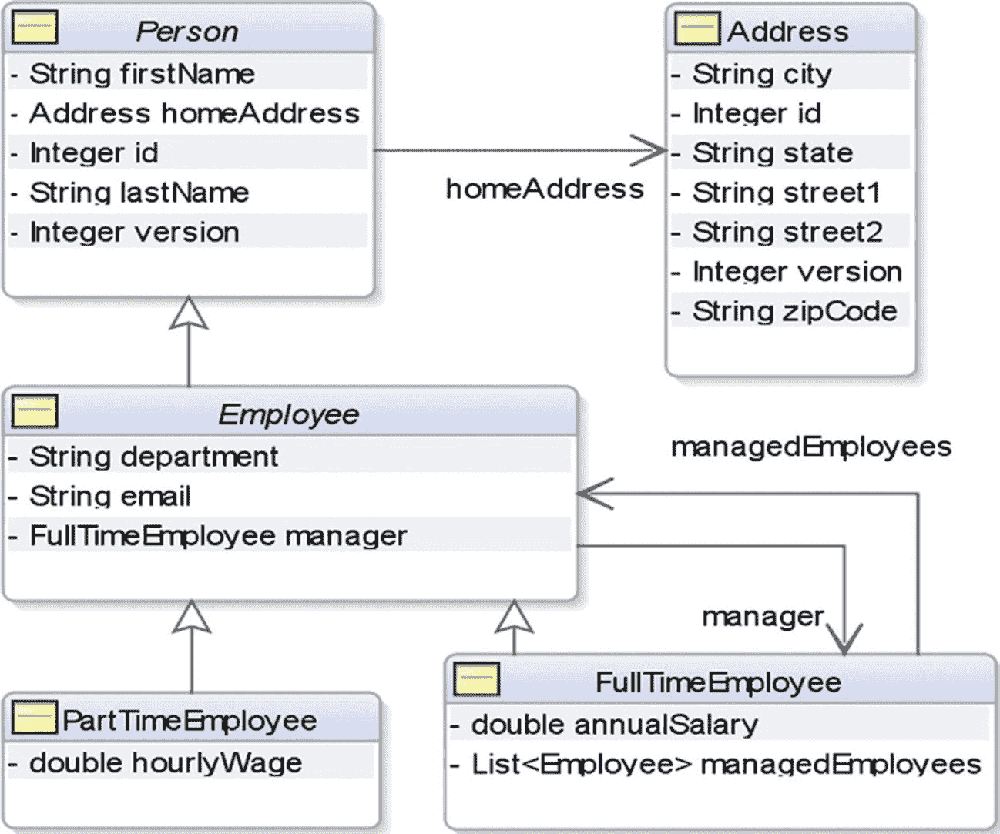

图 4-1

一个以基础实体 Person 为根的实体类型层次结构，展示了层次结构内部和外部的实体之间的关系

在此示例中，`Person` 实体作为实体层次结构中的根类，并由 `Employee` 实体扩展。`Employee` 进一步特化，衍生出另外两个实体：`FullTimeEmployee` 和 `PartTimeEmployee`。图中通过无名称的白色箭头表示继承关系，通过有名称的开放箭头表示普通实体关系。

在我们的示例中，根实体 `Person` 和中间实体 `Employee` 都是抽象的。只有叶子实体 `FullTimeEmployee` 和 `PartTimeEmployee`，以及独立实体 `Address` 是具体的且可实例化的。请注意，即使是抽象实体也可能参与与其他实体的关系，并且正如你将从后续代码中看到的，抽象实体也可能在 JPQL 语句中使用。每当引用非叶子实体时，该引用隐式地假定所引用的实际具体实现可能是该实体或其任何子类实体。不过，非叶子实体也可以是具体的，如果我们选择在示例中这样做，我们可以将这些基类设为具体类。

根实体 `Person` 还持有一个对 `Address` 实例的单值引用，由 `Person` 上的 `homeAddress` 字段表示。此关系被 `Person` 的所有子类继承；因此，所有 `Employee`（`FullTimeEmployee` 和 `PartTimeEmployee`）的实例也可以引用它们的 `homeAddress` 字段。请注意，`Address` 上没有对应的字段引用 `Person`，因此这是一个单向关系。从上一章关于实体关系的讨论中，你会记得这是一个一对一关系。

注意

两个实体之间仅通过其中一个实体的字段暴露的关系称为**单向关系**。通过两个实体的字段暴露的关系称为**双向关系**。

此外，我们在 `FullTimeEmployee`（一个 `manager`）和一组 `Employee`（其 `managedEmployees`）之间定义了一个一对多、双向的关系。由于此关系通过关系两端的字段暴露（在这种情况下，涉及的两个实体实际上是同一个实体 `Employee`），因此这是一个双向的一对多关系。

在查看每个示例时，你会看到 Java 源文件在三种继承映射策略中基本保持不变。只有用于声明继承策略的类级别注解以及一些细节（如表名）将一个示例中的实体与另一个示例中的实体区分开来。这是一个关键优势——可以在不影响实体 Java API 的情况下替换所选的继承策略。在接下来的三节中，我们将说明如何将每种映射策略应用于此层次结构。

在这些继承示例中，我们为 `Address` 实体包含了一个单独的表，该表与映射到每个继承层次结构的表并列，如数据库模式图所示。严格来说，不必为每个实体层次结构替换 `ADDRESS` 表，因为与 `Person` 实体关联的任何表都可以持有其自身对公共 `ADDRESS` 表的外键引用。然而，我们采用这种方法是为了帮助隔离每个继承示例。

#### 对象/关系继承映射策略

注意

除非另有说明，你可以假定本章中提到的所有 JPA 类都在 `javax.persistence.*` 包中。

现在我们已经定义了实体层次结构，让我们看看 JPA 原生支持的三种 O/R 策略如何用于将此 `Person` 实体层次结构以及关联的 `Address` 实体映射到关系模式。以下是 `InheritanceType` 枚举定义的每种策略的总结：

*   `SINGLE_TABLE`：每个类层次结构一张表。这是默认策略。实体层次结构本质上被扁平化为其字段的总和，这些字段被映射到单个表中。
*   `JOINED`：公共基表与连接的子类表。在这种方法中，层次结构中的每个实体都映射到其自己的专用表，该表仅映射在该实体上声明的字段。层次结构中的根实体映射到基表，层次结构中所有其他实体的表都引用此基表。
*   `TABLE_PER_CLASS`：每个最外层具体实体类一张表。第三种继承映射选项对于符合 JPA 2.1 规范最终草案的 JPA 容器也不是必需的，因此可移植的应用程序应避免使用它，直到它被正式强制要求或至少得到广泛支持。此策略将每个叶子（即最外层、具体的）实体映射到其自己的专用表。每个这样的叶子实体分支被扁平化，将其声明的字段与其所有超实体上声明的字段组合起来，这些字段的总和被映射到其表上。

```
public enum InheritanceType
{ SINGLE_TABLE, JOINED, TABLE_PER_CLASS };
```

##### @GeneratedValue 注解

在每个继承策略示例中，我们使用 `@GeneratedValue` 注解来自动填充 `Person` 实体层次结构和独立实体 `Address` 的主键。在我们的示例中，为了保持一致性，我们指定一个名为 `id` 的字段作为主键。在元数据中指定 ID 生成器允许持久化提供程序在实体实际作为一行保存到数据库之前为其分配 ID 值。声明式地指定 `@GeneratedValue` 注解当然比在应用程序代码中分配 ID 更容易，并且相对于使用数据库触发器自动填充 ID 值的替代方案，这也是一种优化。由于在持久化关系映射时会使用 ID 值，这节省了持久化管理器再次从数据库查询该行以检索触发器填充值的麻烦。有关如何自定义基于序列或表的 ID 生成器的详细信息将在本章后面提供。

我们现在将探讨每种策略，讨论其优缺点，并通过示例说明其用法。

注意

下面列表中显示的示例的 Java 源文件都可以在本章的源代码区域中找到。


### 单表每类继承层次结构 (InheritanceType.SINGLE_TABLE)

默认的继承映射策略是 `SINGLE_TABLE`，在该策略中，类层次结构中的所有实体都映射到单个表。此表上的专用鉴别器列标识与每一行关联的特定实体类型，并且层次结构中的每个实体都被赋予一个唯一值存储在此列中。默认情况下，实体的鉴别器值是其实体名称，尽管实体可以使用 `@DiscriminatorValue` 注解覆盖此值。这种方法在查询时性能良好，因为只涉及单个表，并且如果你的类型层次结构能够遵守实际限制，这可能是最佳的使用方法。

图 4-2 展示了一个模式图，该模式使用 `SINGLE_` `TABLE` 策略映射我们的示例实体。我们选择为这些表添加前缀 `CH04_ST_`，以避免与完整 Enterprise Wines Online 应用程序使用的示例模式中的 `PERSON` 和 `ADDRESS` 表冲突。

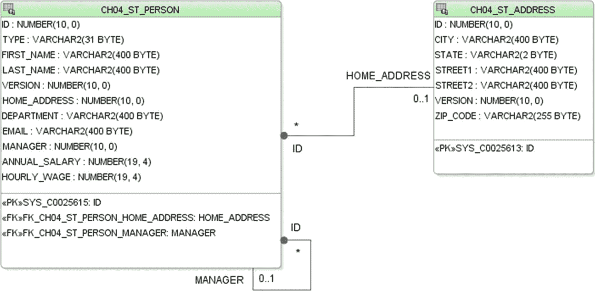

图 4-2

`CH04_ST_PERSON` 表保存了以 `Person` 为根的实体层次结构中的所有实体实例。`CH04_ST_ADDRESS` 表保存了关联的 `Address` 实例。

以 `Person` 实体为根的实体层次结构中的所有属性都映射到单个表 `CH04_ST_` `PERSON` 的列。该表持有一个外键引用，绑定到 `HOME_ADDRESS` 列，指向映射到 `Address` 实体的 `CH04_ST_ADDRESS` 表。它还使用 `MANAGER` 列持有一个指向自身的外键引用。此外键不强制唯一，表示多行可以在其 `MANAGER` 列中持有相同的值。

#### 示例实体类

清单 4-1 到 4-4 展示了如何使用 `SINGLE_TABLE` 继承策略映射 `Person` 层次结构中的实体。继承策略在层次结构的根实体上声明，并且也适用于层次结构中的所有子实体。示例实体中引入但尚未涵盖的注解将在后续章节中解释。

```
/*
* Person: 一个抽象实体，也是继承层次结构的根
*
* 创建 ID 生成器表 "CH04_ST_PERSON_ID_GEN":
* CREATE TABLE "CH04_ST_PERSON_ID_GEN" ("PRIMARY_KEY_NAME" VARCHAR2(4000) PRIMARY KEY,     "NEXT_ID_VALUE" NUMBER(38));
*
* 为此实体的 ID 生成器 'Person.id' 初始化此表的数据（从值 '0' 开始）:
* INSERT INTO "CH04_ST_PERSON_ID_GEN" VALUES ('Person.id', 0);
*/
@Entity
@NamedQueries({ @NamedQuery(name = "Person.findAll", query = "select o from Person o") })
@Table(name = "CH04_ST_PERSON")
@TableGenerator(name = "Person_ID_Generator", table = "CH04_ST_PERSON_ID_GEN", pkColumnName = "PRIMARY_KEY_NAME",
pkColumnValue = "Person.id", valueColumnName = "NEXT_ID_VALUE")
@Inheritance(strategy = InheritanceType.SINGLE_TABLE)
@DiscriminatorColumn(name="TYPE")
public abstract class Person
implements Serializable
{
@SuppressWarnings("compatibility:-7074714881275658754")
private static final long serialVersionUID = 5291172566067954515L;
@Id
@Column(nullable = false)
@GeneratedValue(strategy = GenerationType.TABLE, generator = "Person_ID_Generator")
private Integer id;
@Column(name = "FIRST_NAME", length = 400)
private String firstName;
@Column(name = "LAST_NAME", length = 400)
private String lastName;
@OneToOne(cascade=CascadeType.ALL)
@JoinColumn(name = "HOME_ADDRESS")
private Address homeAddress;
@Version
private Integer version;
public Person() {
}
/* get/set 方法... */
}
清单 4-1
Person.java，SINGLE_TABLE 继承层次结构中的抽象根实体
```

```
/*
* Employee: 一个扩展 Person 的抽象实体
*/
@Entity
@NamedQueries({
@NamedQuery(name = "Employee.findAll", query = "select o from Employee o")})
@Table(name = "CH04_ST_EMPLOYEE")
public abstract class Employee extends Person implements Serializable {
@SuppressWarnings("compatibility:276774077273820023")
private static final long serialVersionUID = -8529011412038476148L;
@Column(length = 400)
private String department;
@Column(length = 400)
private String email;
@ManyToOne
@JoinColumn(name = "MANAGER")
private FullTimeEmployee manager;
public Employee() {
}
/* get/set 方法... */
}
清单 4-2
Employee.java，SINGLE_TABLE 继承层次结构中的抽象中间实体
```

```
/*
* FullTimeEmployee: 一个具体的叶子实体
*/
@Entity
@NamedQueries({
@NamedQuery(name = "FullTimeEmployee.findAll", query = "select o from FullTimeEmployee o")})
@Table(name = "CH04_ST_FT_EMPLOYEE")
public class FullTimeEmployee
extends Employee
implements Serializable {
@SuppressWarnings("compatibility:9058152191575937294")
private static final long serialVersionUID = -7301681120809804802L;
@Column(name = "ANNUAL_SALARY")
private double annualSalary;
@OneToMany(mappedBy = "manager", cascade = {CascadeType.PERSIST, CascadeType.MERGE})
private List managedEmployees;
public FullTimeEmployee() {
}
/* get/set 方法... */
}
清单 4-3
FullTimeEmployee.java，SINGLE_TABLE 继承层次结构中的具体叶子实体
```

```
/*
* PartTimeEmployee: 一个具体的叶子实体
*/
@Entity
@NamedQueries({
@NamedQuery(name = "PartTimeEmployee.findAll", query = "select o from PartTimeEmployee o")})
@Table(name = "CH04_ST_PT_EMPLOYEE")
public class PartTimeEmployee extends Employee implements Serializable {
@SuppressWarnings("compatibility:-4882346458268010846")
private static final long serialVersionUID = 4017999239159878209L;
@Column(name = "HOURLY_WAGE")
private double hourlyWage;
public PartTimeEmployee() {
}
/* get/set 方法... */
}
清单 4-4
PartTimeEmployee.java，SINGLE_TABLE 继承层次结构中的具体叶子实体
```

在此实体层次结构之外，存在 `Address` 实体，如清单 4-5 所示。该实体是之前显示的根（且抽象）`Person` 实体的单向 `@OneToOne` 关系的目标。

```
/*
* Address: 一个独立的实体
*
* 创建 ID 生成器表 "CH04_ST_ADDRESS_ID_GEN": CREATE TABLE "CH04_ST_ADDRESS_ID_GEN"
* ("PRIMARY_KEY_NAME" VARCHAR2(4000) PRIMARY KEY, "NEXT_ID_VALUE" NUMBER(38));
*
* 为此实体的 ID 生成器 'Address.id' 初始化此表的数据（从值 '0' 开始）:
* INSERT INTO "CH04_ST_ADDRESS_ID_GEN" VALUES ('Address.id', 0);
*/
@Entity
@NamedQueries({
@NamedQuery(name = "Address.findAll", query = "select o from Address o")})
@Table(name = "CH04_ST_ADDRESS")
@TableGenerator(name = "Address_ID_Generator", table = "CH04_ST_ADDRESS_ID_GEN", pkColumnName = "PRIMARY_KEY_NAME",
pkColumnValue = "Address.id", valueColumnName = "NEXT_ID_VALUE")
public class Address
implements Serializable {
@SuppressWarnings("compatibility:-5340972441524875330")
private static final long serialVersionUID = -5279408726470732092L;
@Id
@Column(nullable = false)
@GeneratedValue(strategy = GenerationType.TABLE, generator = "Address_ID_Generator")
private Integer id;
@Column(length = 400)
private String city;
@Column(length = 2)
private String state;
@Column(length = 400)
private String street1;
@Column(length = 400)
private String street2;
@Version
private Integer version;
@Column(name = "ZIP_CODE")
private String zipCode;
public Address() {
}
/* get/set 方法... */
}
清单 4-5
Address.java，一个具体的独立实体
```

让我们来看看此示例中引入的一些注解。


##### @JoinColumn 注解

`Employee` 实体有一个类型为 `FullTypeEmployee` 的 `manager` 字段，其映射方式如下：

```
@ManyToOne
@JoinColumn(name = "MANAGER")
private FullTimeEmployee manager;
```

`manager` 字段的类型为 `FullTimeEmployee`，它映射到 `MANAGER` 列，该列由 `@JoinColumn` 注解上的 `name = "MANAGER"` 属性标识。`MANAGER` 列恰好是 `FullTypeEmployee` 实体所映射表的外键引用，在本例中，该表就是 `CH04_ST_PERSON` 表。为此类列定义外键并非严格必要，但通常被认为是良好的数据库设计。由于 `manager` 字段映射到外键列，因此它被视为关系的拥有方。

此双向关系的另一端实体 `FullTimeEmployee` 持有 `managedEmployees` 字段。

```
@OneToMany(mappedBy = "manager", cascade = {CascadeType.PERSIST, CascadeType.MERGE})
private List managedEmployees;
```

由于我们已经在拥有方指定了映射，因此该字段只需使用 `mappedBy = "manager"` 属性来引用那个 `manager` 字段即可。这样，两个关系字段都映射到同一个外键，并且不需要连接表。

注意

JPA 允许您将 `@OneToMany` 字段映射到目标实体表上的外键，即使目标实体没有暴露相应的 `@ManyToOne` 关系字段。为此，您需要在 `@OneToMany` 字段上使用 `@JoinColumn` 来标识远程外键，而不是使用 `mappedBy` 属性。

这个 `managedEmployees` 字段包含一个 `Employee` 实例列表，实际上这些实例将是具体的 `FullTimeEmployee` 和/或 `PartTimeEmployee` 实例。

`cascade = { CascadeType.PERSIST, CascadeType.MERGE }` 属性表示，对此实体 `Employee` 执行的任何合并或持久化操作，也必须应用于此关系字段引用的所有 `FullTimeEmployee` 实例。例如，如果创建了一个新的 `Employee` 实例，并为其分配了一个 `FullTimeEmployee` 作为经理，那么通过 `EntityManager.persist()` 持久化该 `Employee` 实例的操作，也会同时持久化任何被引用的、尚未被持久化的 `FullTimeEmployee` 实例。

`Person` 实体通过 `homeAddress` 字段与 `Address` 建立关系。

```
@OneToOne(cascade=CascadeType.ALL)
@JoinColumn(name = "HOME_ADDRESS")
private Address homeAddress;
```

由于 `Address` 上没有引用 `Person` 的对应字段，因此这是一个单向关系。`@OneToOne` 上的 `cascade` 属性指明了哪些操作应传播到被引用的对象。因为我们指定了 `CascadeType.ALL` 的级联规则，所以应用于 `Person` 的所有事件——`DETACH`、`MERGE`、`PERSIST`、`REFRESH` 和 `REMOVE`——都会自动应用于其 `homeAddress` 对象。

##### @DiscriminatorColumn 注解

每当我们像使用 `InheritanceType.SINGLE_TABLE` 策略那样，将多个实体类映射到单个表时，必须要有某种方法来识别表中任何给定行的具体实体类型。为了确定实体类型，持久化管理器会在根实体的表中查找名为 `DTYPE` 的列来获取此信息。如果您的模式需要使用不同的列名来捕获此信息，您可以使用 `@DiscriminatorColumn` 注解来标识 JPA 应使用的列；在清单 4-1 中，Person.java 实体通过 `@DiscriminatorColumn(name = "TYPE")` 注解指定了一个名为 `TYPE` 的鉴别器列。如果我们像在其余示例中那样使用名为 `DTYPE` 的列，则可以完全省略此注解并接受默认值。

##### @DiscriminatorValue 注解

存储在鉴别器列中的值称为鉴别器值。每个具体实体都显式声明或默认接受一个唯一的鉴别器值，该值用于标识与表中每一行关联的具体实体类型。鉴别器值默认为实体名称，在此示例中，我们为层次结构中的每个实体都接受了此默认值。当将遗留表和数据库适配到 JPA，并且您希望将预先存在的鉴别器值映射到名称不同的实体时，可以使用 `@DiscriminatorValue` 注解来指定层次结构中需要覆盖的每个实体所使用的鉴别器值。

#### SINGLE_TABLE 策略的优缺点

我们从设计时和性能的角度来权衡每个继承层次结构的优缺点。我们从 SINGLE_TABLE 策略开始。

##### 设计时考量

当类型层次结构相当简单且稳定时，SINGLE_TABLE 映射方法效果很好。向层次结构添加新类型以及向现有超类型添加字段，只需向表中添加新列即可。然而，在特别大型的部署中，这可能会对数据库内部的索引和列布局产生不利影响。如果您的层次结构可能超出单个表的列限制（通常为 256 列），或者由于某种原因需要将多个非常大的字段映射到内联 LOB（大对象）列，则可能需要引入 `@SecondaryTable` 映射。在这种情况下，采用后续方法之一可能更为明智。此外，对于层次结构中并非所有类型共享的列，不能使用 NOT NULL 约束。

##### 性能影响

SINGLE_TABLE 策略对于查询层次结构中的所有类型或特定类型非常高效。内部持久化框架不需要表连接——只需要一个列出类型标识符的 `WHERE` 子句。特别是，涉及采用此映射策略的类型的关系，其性能表现良好。

#### 示例客户端代码

正如我们在本章“入门”部分提到的，我们准备了示例客户端代码来测试继承示例，以及本章后面出现的其他示例。在本章提供的示例代码中，我们为每个继承示例都提供了一个 Java 客户端和一个 HTTP servlet。清单 4-6 展示了一个简单的 Java 类，它作为一个外观（类似于 EJB Session Bean 外观），用于实例化 `Chapter04-PersistenceIISamples-SingleTable` 持久化单元的 `EntityManager`，并公开用于操作该单元中 JPA 实体的 CRUD 方法。清单 4-7 展示了一个用于此服务的 Java 客户端，它执行这些 CRUD 方法并打印结果。我们本也可以为此目的使用实际的 EJB Session 外观，但我们想演示一个普通的 Java 类如何在非 JavaEE 环境中与 JPA 实体交互。

在示例代码区域中，我们为其他继承策略提供了类似的 Java 服务外观和配套的 Java 客户端。除了每个策略使用的持久化单元以及用特定继承策略细节注解的实体类不同之外，它们在各个继承策略之间是相同的。

类似地，我们为每个继承策略提供了一个简单的 HTTP servlet 客户端，演示了在 JavaEE Web 环境中使用 JPA 实体。这些 servlet 替代了 Java 客户端，并直接与相同的 Java 服务外观进行交互。


```
/*
* 一个 Java 服务外观，用于获取在 Java EE 容器外部运行的 EntityManager，
* 并演示对少量实体执行的 CRUD 操作。
* 采用自动提交行为，模拟无状态会话 Bean 的默认事务行为。
*/
public class JavaServiceFacade {
private final EntityManager em;
public JavaServiceFacade() {
// 为了支持非 JavaEE 环境，我们避免注入，并为所需的持久化单元创建一个 EntityManagerFactory。
// 然后通过该工厂创建 EntityManager。
final EntityManagerFactory emf = Persistence.createEntityManagerFactory("Chapter04-PersistenceIISamples-SingleTable");
em = emf.createEntityManager();
}
/**
* 将对持久化上下文中托管实体所做的所有更改应用到数据库并提交。
*/
private void commitTransaction() {
final EntityTransaction entityTransaction = em.getTransaction();
if (!entityTransaction.isActive()) {
entityTransaction.begin();
}
entityTransaction.commit();
}
public Object queryByRange(String jpqlStmt, int firstResult, int maxResults) {
Query query = em.createQuery(jpqlStmt);
if (firstResult > 0) {
query = query.setFirstResult(firstResult);
}
if (maxResults > 0) {
query = query.setMaxResults(maxResults);
}
return query.getResultList();
}
public  T persistEntity(T entity) {
em.persist(entity);
commitTransaction();
return entity;
}
public  T mergeEntity(T entity) {
entity = em.merge(entity);
commitTransaction();
return entity;
}
public void removeEmployee(Employee employee) {
employee = em.find(Employee.class, employee.getId());
em.remove(employee);
commitTransaction();
}
/**
* select o from Employee o
*/
public List getEmployeeFindAll() {
return em.createNamedQuery("Employee.findAll", Employee.class).getResultList();
}
public void removeFullTimeEmployee(FullTimeEmployee fullTimeEmployee) {
fullTimeEmployee = em.find(FullTimeEmployee.class, fullTimeEmployee.getId());
em.remove(fullTimeEmployee);
commitTransaction();
}
/**
* select o from FullTimeEmployee o
*/
public List getFullTimeEmployeeFindAll() {
return em.createNamedQuery("FullTimeEmployee.findAll", FullTimeEmployee.class).getResultList();
}
public void removePartTimeEmployee(PartTimeEmployee partTimeEmployee) {
partTimeEmployee = em.find(PartTimeEmployee.class, partTimeEmployee.getId());
em.remove(partTimeEmployee);
commitTransaction();
}
/**
* select o from PartTimeEmployee o
*/
public List getPartTimeEmployeeFindAll() {
return em.createNamedQuery("PartTimeEmployee.findAll", PartTimeEmployee.class).getResultList();
}
public void removePerson(Person person) {
person = em.find(Person.class, person.getId());
em.remove(person);
commitTransaction();
}
/**
* select o from Person o
*/
public List getPersonFindAll() {
return em.createNamedQuery("Person.findAll", Person.class).getResultList();
}
public void removeAddress(Address address) {
address = em.find(Address.class, address.getId());
em.remove(address);
commitTransaction();
}
/**
* select o from Address o
*/
public List getAddressFindAll() {
return em.createNamedQuery("Address.findAll", Address.class).getResultList();
}
}
清单 4-6
JavaServiceFacade.java，一个充当图 4-1 中定义实体的外观的 Java 类
```


```java
/*
* Java 客户端，用于 Java 服务外观
*/
public class JavaServiceFacadeClient {
public static void main(String[] args) {
try {
final JavaServiceFacade javaServiceFacade = new JavaServiceFacade();
//-------------------------------------------------------------------
//  清除所有之前的测试数据。由于 "Person.homeAddress" 关系字段上的 "级联" 设置，
//  删除一个 Person 也会同时删除其 Address。
//-------------------------------------------------------------------
for (PartTimeEmployee parttimeemployee : (List)        javaServiceFacade.getPartTimeEmployeeFindAll()) {
javaServiceFacade.removePartTimeEmployee(parttimeemployee);
}
for (FullTimeEmployee fulltimeemployee : (List)        javaServiceFacade.getFullTimeEmployeeFindAll()) {
javaServiceFacade.removeFullTimeEmployee(fulltimeemployee);
}
//-------------------------------------------------------------------
//  创建 FullTimeEmployee 和 PartTimeEmployee 实例及其 Address 对象，
//  并将它们持久化到数据库中。
//-------------------------------------------------------------------
Address add = new Address();
add.setCity("San Mateo");
add.setState("CA");
add.setStreet1("1301 Ashwood Ct");
add.setZipCode("94402");
javaServiceFacade.persistEntity(add);
FullTimeEmployee ft = new FullTimeEmployee();
ft.setAnnualSalary(1000D);
ft.setDepartment("HQ");
ft.setEmail("x@y.com");
ft.setFirstName("Brian");
ft.setLastName("Jones");
ft.setHomeAddress(add);
ft = javaServiceFacade.persistEntity(ft);
add = new Address();
add.setCity("San Francisco");
add.setState("CA");
add.setStreet1("53 Surrey St");
add.setZipCode("94131");
javaServiceFacade.persistEntity(add);
final PartTimeEmployee pt = new PartTimeEmployee();
pt.setHourlyWage(100D);
pt.setDepartment("SALES");
pt.setEmail("a@b.com");
pt.setFirstName("David");
pt.setLastName("Holmes");
pt.setHomeAddress(add);
pt.setManager(ft);
javaServiceFacade.persistEntity(pt);
//-------------------------------------------------------------------
//  通过特定类型的 JPQL 查询检索实体并打印输出
//-------------------------------------------------------------------
System.out.println("\nPersons:\n");
for (Person person : (List) javaServiceFacade.getPersonFindAll()) {
printPerson(person);
}
System.out.println("\nEmployees:\n");
for (Employee employee : (List) javaServiceFacade.getEmployeeFindAll()) {
printEmployee(employee);
}
System.out.println("\nPartTimeEmployees:\n");
for (PartTimeEmployee parttimeemployee : (List)        javaServiceFacade.getPartTimeEmployeeFindAll()) {
printPartTimeEmployee(parttimeemployee);
}
System.out.println("\nFullTimeEmployees:\n");
for (FullTimeEmployee fulltimeemployee : (List)
javaServiceFacade.getFullTimeEmployeeFindAll()) {
printFullTimeEmployee(fulltimeemployee);
}
System.out.println("\nAddresses:\n");
for (Address address : (List) javaServiceFacade.getAddressFindAll()) {
printAddress(address);
}
} catch (Exception ex) {
ex.printStackTrace();
}
}
private static void printEmployee(Employee employee) {
System.out.println("dept = " + employee.getDepartment());
System.out.println("email = " + employee.getEmail());
System.out.println("manager = " + employee.getManager());
System.out.println("firstName = " + employee.getFirstName());
System.out.println("id = " + employee.getId());
System.out.println("lastName = " + employee.getLastName());
System.out.println("version = " + employee.getVersion());
System.out.println("homeAddress = " + employee.getHomeAddress());
}
private static void printFullTimeEmployee(FullTimeEmployee fulltimeemployee) {
System.out.println("annualSalary = " + fulltimeemployee.getAnnualSalary());
System.out.println("managedEmployees = " + fulltimeemployee.getManagedEmployees());
System.out.println("dept = " + fulltimeemployee.getDepartment());
System.out.println("email = " + fulltimeemployee.getEmail());
System.out.println("manager = " + fulltimeemployee.getManager());
System.out.println("firstName = " + fulltimeemployee.getFirstName());
System.out.println("id = " + fulltimeemployee.getId());
System.out.println("lastName = " + fulltimeemployee.getLastName());
System.out.println("version = " + fulltimeemployee.getVersion());
System.out.println("homeAddress = " + fulltimeemployee.getHomeAddress());
}
private static void printPartTimeEmployee(PartTimeEmployee parttimeemployee) {
System.out.println("hourlyWage = " + parttimeemployee.getHourlyWage());
System.out.println("dept = " + parttimeemployee.getDepartment());
System.out.println("email = " + parttimeemployee.getEmail());
System.out.println("manager = " + parttimeemployee.getManager());
System.out.println("firstName = " + parttimeemployee.getFirstName());
System.out.println("id = " + parttimeemployee.getId());
System.out.println("lastName = " + parttimeemployee.getLastName());
System.out.println("version = " + parttimeemployee.getVersion());
System.out.println("homeAddress = " + parttimeemployee.getHomeAddress());
}
private static void printPerson(Person person) {
System.out.println("firstName = " + person.getFirstName());
System.out.println("id = " + person.getId());
System.out.println("lastName = " + person.getLastName());
System.out.println("version = " + person.getVersion());
System.out.println("homeAddress = " + person.getHomeAddress());
}
private static void printAddress(Address address) {
System.out.println("city = " + address.getCity());
System.out.println("id = " + address.getId());
System.out.println("state = " + address.getState());
System.out.println("street1 = " + address.getStreet1());
System.out.println("street2 = " + address.getStreet2());
System.out.println("version = " + address.getVersion());
System.out.println("zipCode = " + address.getZipCode());
}
}
清单 4-7
JavaServiceFacadeClient.java，一个 JavaServiceFacade 的 Java 客户端，演示了删除、创建和检索图 4-1 中定义的实体

### 公共基表与连接子类表 (InheritanceType.JOINED)

在 `JOINED` 策略中，层次结构中的每个实体都有自己的表，但仅用于映射在该实体类型上声明的字段。层次结构中的根实体映射到一个根表，该表定义了实体层次结构中所有表要使用的主键结构，以及鉴别器列和可选的版本列。层次结构中的其他每个表都定义一个与根表主键匹配的主键，并且可以选择从其 ID 列向根表的 ID 列添加外键约束。非根表不包含鉴别器类型或版本列。由于层次结构中的每个实体实例由一个虚拟行表示，该行跨越其自身的表以及其所有超类的表，因此它最终会与根表中捕获此鉴别器类型和版本信息的行进行连接。查询任何类型的所有字段都需要在超类型层次结构中的所有表之间进行连接。

图 4-3 展示了使用 `JOINED` 继承策略映射我们实体的模式。与前面的示例一样，我们为表添加了策略指示符前缀，在本例中为 `CH04_JOIN_`，以便这些示例中的所有表都可以加载到单个测试模式中，而不会发生名称冲突。

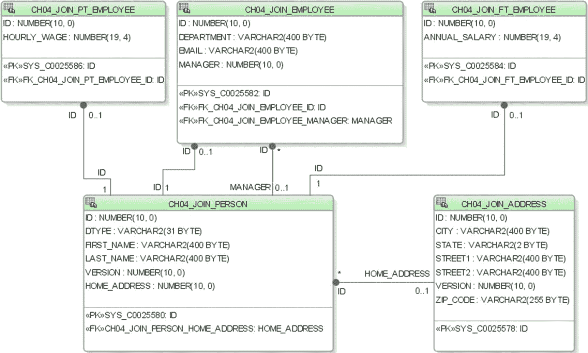

图 4-3

使用 JOINED 策略映射示例实体的模式。层次结构中的每个实体都有自己的表来持久化其声明的字段。表 CH04_JOIN_ADDRESS 保存关联的 Address 实例。
```


#### 示例实体类

现在让我们来看一下映射到之前模式的实体类。我们省略了每个实体的类体，因为这些实体与之前`SINGLE_TABLE`策略示例中展示的实体之间的唯一区别在于实体类级别的注解。清单 4-8 至 4-11 展示了`Person`层次结构中的实体，而清单 4-12 展示了`Address`实体。

```
/*
* Person: 一个抽象实体，也是继承层次结构的根
*/
@Entity
@NamedQueries({
@NamedQuery(name = "Person.findAll", query = "select o from Person o")})
@Table(name = "CH04_JOIN_PERSON")
@TableGenerator(name = "Person_ID_Generator", table = "CH04_JOIN_PERSON_ID_GEN",
pkColumnName = "PRIMARY_KEY_NAME", pkColumnValue = "Person.id",
valueColumnName = "NEXT_ID_VALUE")
@Inheritance(strategy = InheritanceType.JOINED)
public abstract class Person implements Serializable {
/* 类体在所有继承策略中都是相同的 */
}
清单 4-8
Person.java，JOINED 继承层次结构中的抽象根实体
```

```
/*
* Employee: 一个扩展 Person 的抽象实体
*/
@Entity
@NamedQueries({
@NamedQuery(name = "Employee.findAll", query = "select o from Employee o")})
@Table(name = "CH04_JOIN_EMPLOYEE")
public abstract class Employee extends Person implements Serializable {
/* 类体在所有继承策略中都是相同的 */
}
清单 4-9
Employee.java，JOINED 继承层次结构中的抽象中间实体
```

```
/*
* FullTimeEmployee: 一个具体的叶子实体
*/
@Entity
@NamedQueries({
@NamedQuery(name = "FullTimeEmployee.findAll", query = "select o from FullTimeEmployee o")})
@Table(name = "CH04_JOIN_FT_EMPLOYEE")
public class FullTimeEmployee extends Employee implements Serializable {  /* 类体在所有继承策略中都是相同的 */
}
清单 4-10
FullTimeEmployee.java，JOINED 继承层次结构中的具体叶子实体
```

```
/*
* PartTimeEmployee: 一个具体的叶子实体
*/
@Entity
@NamedQueries({
@NamedQuery(name = "PartTimeEmployee.findAll", query = "select o from PartTimeEmployee o")})
@Table(name = "CH04_JOIN_PT_EMPLOYEE")
public class PartTimeEmployee extends Employee implements Serializable {
/* 类体在所有继承策略中都是相同的 */
}
清单 4-11
PartTimeEmployee.java，JOINED 继承层次结构中的具体叶子实体
```

```
/**
* Address: 一个独立的实体
*/
@Entity
@NamedQueries({
@NamedQuery(name = "Address.findAll", query = "select o from Address o")})
@Table(name = "CH04_JOIN_ADDRESS")
@TableGenerator(name = "Address_ID_Generator", table = "CH04_JOIN_ADDRESS_ID_GEN",
pkColumnName = "PRIMARY_KEY_NAME",pkColumnValue = "Address.id",
valueColumnName = "NEXT_ID_VALUE")
public class Address implements Serializable {
/* 类体在所有继承策略中都是相同的 */
}
清单 4-12
Address.java，一个具体的独立实体
```

从高亮显示的差异可以看出，它们非常微小。忽略表名的差异（这些差异仅仅是为了避免与其他示例中的表名冲突），只有根实体`Person`上的`@Inheritance`注解发生了变化。除了表名和序列名之外，`Address`实体与清单 4-5（即之前`SINGLE_TABLE`策略的示例）完全相同。

#### JOINED 策略的优缺点

##### 设计时考量

使用 JOINED 策略，在层次结构的任何级别引入新类型，只需在模式中插入一个新表即可。该类型的子类型将在运行时自动与该新类型进行连接。同样，通过添加、修改或删除字段来修改层次结构中的任何实体类型，只会影响直接映射到该类型的表。此选项在设计时提供了最大的灵活性，因为对任何类型的更改始终仅限于该类型专用的表。

##### 性能影响

JOINED 方法不会受到`UNION`操作的影响，但本质上需要多次`JOIN`操作才能执行几乎任何查询。跨所有实例进行查询最初只需对最顶层基实体的表执行一次查询，以检索层次结构中所有实例的主键列表。由于基实体表中存在鉴别器列，根据持久化管理器实现所采用的延迟加载策略，将这些实例解析为实体类可以是高效的。

### 每个最外层具体实体类一张表 (InheritanceType.TABLE_PER_CLASS)

对最后一种继承映射策略的支持对于持久化提供者来说是可选的。JPA 规范并不强制要求支持该策略，因此可移植的应用程序应避免使用它，直到它被官方强制要求或至少得到广泛支持。此继承映射选项将每个最外层的具体实体映射到其自己专用的表。每个表映射该实体整个类型层次结构中的所有字段；由于没有共享表，因此也没有共享列。唯一的表结构要求是所有表必须共享一个共同的主键结构，这意味着主键列的名称和类型必须在层次结构中的所有表中匹配。

为了更清楚地说明，图 4-4 展示了使用 TABLE_PER_CLASS 继承策略的第三种层次结构类型，该图演示了每个实体子类一张表的方法。这些表除了主键结构之外无需共享任何共同点；并且由于表隐式标识了实体类型，因此不需要鉴别器列。请注意，虽然为`abstract`实体`Person`和`Employee`显示了表，但它们实际上并未被使用。未来版本的 EclipseLink（JPA 的参考实现）可能会进行修订，以在使用`TABLE_PER_CLASS`继承策略时抑制这些表的生成。在这种情况下，将这些类标注为`@MappedSuperclass`而不是`@Entity`可以防止生成类，但也会阻止这些类参与实体关系或 JPQL 语句。

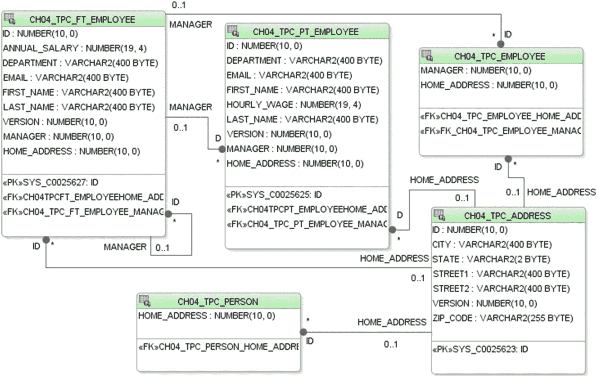

图 4-4

一个使用 TABLE_PER_CLASS 策略映射示例实体的模式。具体的叶子实体被映射到专用表，这些表包含映射其所有声明和继承字段的列。


#### 示例实体类

清单 4-13 至 4-16 展示了映射到这些表的实体是如何进行注解的。由于只有类级别的注解与之前的策略不同，因此方法体已被省略。

```
/**
* Person: 一个抽象实体，也是继承层次结构的根
*/
@Entity
@NamedQueries({
@NamedQuery(name = "Person.findAll", query = "select o from Person o")})
@Table(name = "CH04_TPC_PERSON")
@TableGenerator(name = "Person_ID_Generator", table = "CH04_TPC_PERSON_ID_GEN",
pkColumnName = "PRIMARY_KEY_NAME", pkColumnValue = "Person.id",
valueColumnName = "NEXT_ID_VALUE")
@Inheritance(strategy = InheritanceType.TABLE_PER_CLASS)
public abstract class Person implements Serializable {
/* 类体在所有继承策略中都是相同的 */
}
清单 4-13
Person.java，TABLE_PER_CLASS 继承层次结构中的抽象根实体
```

```
/*
* Employee: 一个扩展 Person 的抽象实体
*/
@Entity
@NamedQueries({
@NamedQuery(name = "Employee.findAll", query = "select o from Employee o")})
@Table(name = "CH04_TPC_EMPLOYEE")
public abstract class Employee extends Person implements Serializable {
/* 类体在所有继承策略中都是相同的 */
}
清单 4-14
Employee.java，TABLE_PER_CLASS 继承层次结构中的抽象中间实体
```

```
/*
* FullTimeEmployee: 一个具体的叶子实体
*/
@Entity
@NamedQueries({
@NamedQuery(name = "FullTimeEmployee.findAll", query = "select o from FullTimeEmployee o")})
@Table(name = "CH04_TPC_FT_EMPLOYEE")
public class FullTimeEmployee extends Employee implements Serializable {
/* 类体在所有继承策略中都是相同的 */
}
清单 4-15
FullTimeEmployee.java，TABLE_PER_CLASS 继承层次结构中的具体叶子实体
```

```
/*
* PartTimeEmployee: 一个具体的叶子实体
*/
@Entity
@NamedQueries({
@NamedQuery(name = "PartTimeEmployee.findAll", query = "select o from PartTimeEmployee o")})
@Table(name = "CH04_TPC_PT_EMPLOYEE")
public class PartTimeEmployee extends Employee implements Serializable {
/* 类体在所有继承策略中都是相同的 */
}
清单 4-16
PartTimeEmployee.java，TABLE_PER_CLASS 继承层次结构中的具体叶子实体
```

同样，在 `TABLE_PER_CLASS` 示例中，`Address` 类与我们选择的表名和序列名不同之外，与之前的示例完全相同。

#### TABLE_PER_CLASS 策略的优缺点

##### 设计时考量

使用 TABLE_PER_CLASS 策略时，当新的最外层具体类型被引入层次结构时，会添加新的表。这很好，因为既不会影响现有表，也不会影响它们的数据。然而，由于每个类型也会映射其所有超类型的字段，因此在基类上引入新字段，或引入新的基实体本身，都需要修改层次结构中所有受影响子类型的表，以映射任何新引入的字段。

##### 性能影响

使用 TABLE_PER_CLASS 方法时，跨多个类型进行查询需要 `UNION` 选择语句，这可能性能不佳，但查询单个类型非常高效，因为查询只涉及一个表。应避免此层次结构中的多态关系（涉及超类型），因为它们必然需要此 `UNION` 操作来解析为具体的子类型实例。

### O/R 实现方法比较

现在我们已经探讨了三种继承映射实现，让我们看看在选择用于类型层次结构的实现方法时应考虑的类继承层次结构的一些特征。以下列表包含关于您自己的实体层次结构的主观问题。它们没有精确的答案；相反，它们旨在在构建应用程序时激发设计考量。

*   类层次结构可以是静态的，具有固定数量的子类型，也可以是动态的，具有不同数量的子类型。您需要将新子类型纳入层次结构的频率如何？
*   层次结构可以是深的，包含许多子类，也可以是浅的，只包含少数几个。您的层次结构粒度如何？
*   层次结构中的类型可能差异很大，子类上的属性集与基类上的属性集非常不同，或者属性差异很小。您的实体的持久属性集彼此之间的差异有多大？
*   其他实体是否会与此类型层次结构中的类定义关系；如果是，基类是否会经常成为被引用的类型？
*   此层次结构中的类型是否会被频繁查询、更新或删除？SQL `JOIN` 或 `UNION` 操作的存在与否将如何影响应用程序的性能？
*   在应用程序的生命周期中，您更新类型层次结构本身的频率如何？这种变更的影响因继承策略而异，需要考虑以下因素：
    *   向层次结构添加或删除新类型（例如重构类时）。
    *   在层次结构中的实体上添加、删除或修改字段。
*   添加、删除或修改涉及此层次结构中类型的关系。

注意

第 9 章将探讨这三种继承策略的性能比较，以及如何设置自己的性能比较测试的详细信息。请查看我们性能测试的结果；并在构建实体层次结构时对其进行测试，以帮助您决定哪种策略在应用程序上下文中最有意义。

## 在继承层次结构中使用抽象实体、映射超类和非实体类

在实体类层次结构中，JPA 允许混合使用非实体类和抽象类。使用上面的 JOINED 示例，让我们看看如何映射这些类。

### 抽象实体类

如上一节关于继承层次结构所示，JPA 实体可以是具体的，也可以是抽象的。抽象实体只是一个不能单独实例化的实体——它仍然可以参与实体关系和查询，并且其字段会按照其类型层次结构的映射策略进行持久化。清单 4-17 是我们一个抽象实体的示例。

```
/**
* Person: 一个抽象实体，也是继承层次结构的根
*/
@Entity
@NamedQueries({
@NamedQuery(name = "Person.findAll", query = "select o from Person o")})
@Table(name = "CH04_JOIN_PERSON")
@TableGenerator(name = "Person_ID_Generator", table = "CH04_JOIN_PERSON_ID_GEN",
pkColumnName = "PRIMARY_KEY_NAME", pkColumnValue = "Person.id",
valueColumnName = "NEXT_ID_VALUE")
@Inheritance(strategy = InheritanceType.JOINED)
public abstract class Person implements Serializable {
...
@OneToOne(cascade=CascadeType.ALL)
@JoinColumn(name = "HOME_ADDRESS")
private Address homeAddress;
...
}
清单 4-17
Person.java，JOINED 继承层次结构中的抽象根实体
```

抽象的 `Person` 实体不仅可以被查询（这里我们定义了一个名为 `"Person.findAll"` 的命名查询），它还持有一个与 `Address` 实体的关联，该关联由其所有子类共享。尽管 `Person` 是抽象的，但它可以指定自己的映射和自己的表。只是它不会有自己的鉴别器值，因为永远不会有基类 `Person` 的具体实体实例。


### 映射超类（@MappedSuperclass）

映射超类是一种非实体类，但持久化管理器仍能识别它，并且它可以声明持久化字段及其映射。由于它不是实体，因此不能作为持久化实体关系的目标，也不能在 JPQL 查询中使用。不过，它可以为任何直接或间接继承它的实体提供通用的持久化属性。从之前的继承示例开始，让我们将根实体 `Person` 转换为一个映射超类。清单 4-18 和 4-19 展示了转换后的类。

```
/**
* Person: 一个映射超类，也是继承层次结构中的基类（但不是根实体）
*
* 创建 ID 生成器表 "CH04_MS_PERSON_ID_GEN"：CREATE TABLE
* "CH04_MS_PERSON_ID_GEN" ("PRIMARY_KEY_NAME" VARCHAR2(4000) PRIMARY KEY,
* "NEXT_ID_VALUE" NUMBER(38));
*
* 为此实体的 ID 生成器 'Person.id' 初始化该表的数据
* （从值 '0' 开始）：INSERT INTO "CH04_MS_PERSON_ID_GEN" VALUES
* ('Person.id', 0);
*/
@MappedSuperclass
@TableGenerator(name = "Person_ID_Generator", table = "CH04_MS_PERSON_ID_GEN",
pkColumnName = "PRIMARY_KEY_NAME", pkColumnValue = "Person.id",
valueColumnName = "NEXT_ID_VALUE")
public abstract class Person implements Serializable {
@SuppressWarnings("compatibility:-7074714881275658754")
private static final long serialVersionUID = 5291172566067954515L;
@Id
@Column(nullable = false)
@GeneratedValue(strategy = GenerationType.TABLE, generator = "Person_ID_Generator")
private Integer id;
@Column(name = "FIRST_NAME", length = 400)
private String firstName;
@Column(name = "LAST_NAME", length = 400)
private String lastName;
@OneToOne(cascade=CascadeType.ALL)
@JoinColumn(name = "HOME_ADDRESS")
private Address homeAddress;
@Version
private Integer version;
public Person() {
}
/* get/set 方法 */
}
清单 4-18
Person.java，一个抽象映射超类（非实体）
```

```
/*
* Employee: 继承层次结构中的根。继承自 Person，一个映射超类。
*/
@Entity
@NamedQueries({
@NamedQuery(name = "Employee.findAll", query = "select o from Employee o")})
@Table(name = "CH04_MS_EMPLOYEE")
@Inheritance(strategy = InheritanceType.JOINED)
public abstract class Employee extends Person implements Serializable {
@SuppressWarnings("compatibility:276774077273820023")
private static final long serialVersionUID = -8529011412038476148L;
@Column(length = 400)
private String department;
@Column(length = 400)
private String email;
@ManyToOne
@JoinColumn(name = "MANAGER")
private FullTimeEmployee manager;
public Employee() {
}
/* get/set 方法 */
}
清单 4-19
Employee.java，一个 JOINED 实体继承层次结构中的抽象根实体，也是映射超类的子类
```

`Person` 类变成了一个映射超类（`@MappedSuperclass`），并且去掉了它的 `@NamedQuery`、`@Table` 和 `@Inheritance` 注解。`@Inheritance` 被移到了 `Employee` 上，`Employee` 成为层次结构中新的根实体。

虽然映射超类不能作为持久化关系字段的目标引用，但它可以拥有自己的持久化关系字段，因此引用 `Address` 实体的 `homeAddress` 字段是完全合法的。

还要注意，我们可以继续在映射超类上定义 `@Id` 和 `@Version` 字段，甚至可以继续为 `id` 字段指定 ID 生成器。继承此映射超类的实体将这些字段以及映射超类上定义的所有其他字段映射到它们自己的表中。

### 非实体类

实体也可以在其类型层次结构中使用非实体类。实体可以继承非实体类，或者非实体类可以继承实体。这些类可以是具体的或抽象的，因此它们可以被实例化，但它们的字段不会被 JPA 持久化框架持久化或维护。它们也不能参与持久化实体关系或 JPQL 查询。如果类型层次结构中的某个类仅作为其子类的组织构造，并且不涉及实体关系（也没有其他理由将其标记为实体），那么最好将其保留为普通类。以后随时可以通过添加注解或在 XML 描述符中将其指定为实体来将其转换为实体。

### 非实体单值字段和集合字段

最后，实体可以嵌入一个非实体类或非实体类的集合，供其自身私有使用。此类嵌入引用可以是单个对象或对象集合。单值字段通常是我们已经熟悉的类型：基本对象类型，如 `String`、`int` 或 `Long`，它们被隐式标记为 `@Basic`。单值字段也可以具有复杂类型，我们对此已经熟悉，即作为实体引用，使用标记为 `@OneToOne` 或 `@ManyToOne` 的字段。当字段引用复杂的非实体类型时，它们被标记为 `@Embedded`，并且目标类必须使用 `@Embeddable` 注解。对非实体对象的集合引用被标记为 `@ElementCollection`，它们可以是 `@Basic` 或 `@Embeddable` 类类型的集合。让我们更仔细地看看这些非实体字段引用。


#### @Embedded 与 @Embeddable

一个实体或映射超类可以包含标记为 `@Embedded` 的字段，这些字段的类型必须是相应标记为 `@Embeddable` 的类。与映射超类类似，可嵌入类可以为其持久化字段持有映射元数据。当以这种方式使用时，引用可嵌入对象的字段被标记为 `@Embedded`，而可嵌入类上的字段则映射到所属实体的表。可嵌入类完全由其嵌入类所拥有，并与所属对象一起进行持久化、合并、查询和删除。可嵌入类的实例没有自己的持久化标识，也不能在实体之间传递。它们通常作为一种字段组织工具使用，方便将一组持久化字段封装为所属实体上的单个字段。

举个例子，让我们将 `Address` 实体（清单 4-20）转换为一个可嵌入类，并将其作为 `Person` 实体（清单 4-21）上的一个字段嵌入。图 4-5 展示了与我们 `JOINED` 层次结构配置类似的底层模式，不同之处在于 `CH04_JOIN_ADDRESS` 上的数据列已被合并到 `CH04_EMB_PERSON` 表中。

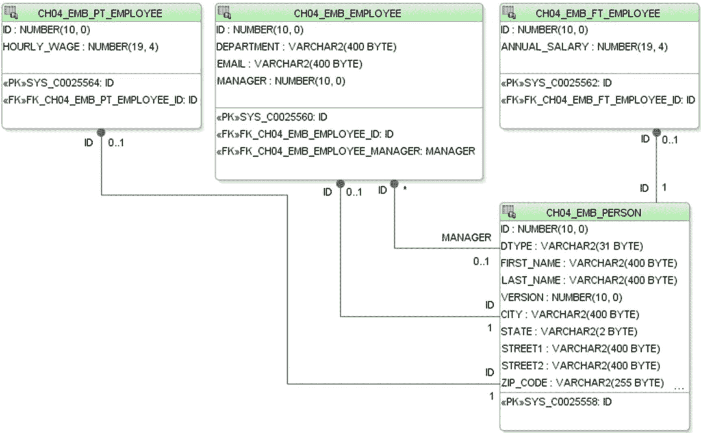

图 4-5

表 CH04_EMB_PERSON 包含 Person 实体中所有字段的列，以及来自嵌入的 Address 的字段

将 `Address.java` 转换为 `@Embeddable` 非实体类的过程如清单 4-20 所示。`@Id` 和 `@Version` 字段现已消失，因为 Address 不再拥有自己的标识。`Employee`、`FullTimeEmployee` 和 `PartTimeEmployee` 实体与 `JOINED` 层次结构配置相比保持不变。

```
/**
* Address: 一个可嵌入的非实体类
*/
@Embeddable
public class Address implements Serializable {
@SuppressWarnings("compatibility:-5340972441524875330")
private static final long serialVersionUID = -5279408726470732092L;
@Column(length = 400)
private String city;
@Column(length = 2)
private String state;
@Column(length = 400)
private String street1;
@Column(length = 400)
private String street2;
@Column(name = "ZIP_CODE")
private String zipCode;
public Address() {
}
/* get/set 方法 */
}
清单 4-20
Address.java，一个可嵌入的非实体类
```

```
/**
* Person: 一个抽象实体，也是继承层次结构的根
*
* 创建 ID 生成器表 "CH04_EMB_PERSON_ID_GEN": CREATE TABLE "CH04_EMB_PERSON_ID_GEN"
* ("PRIMARY_KEY_NAME" VARCHAR2(4000) PRIMARY KEY, "NEXT_ID_VALUE" NUMBER(38));
*
* 为此实体的 ID 生成器 'Person.id' 初始化该表的数据（从值 '0' 开始）：
* INSERT INTO "CH04_EMB_PERSON_ID_GEN" VALUES ('Person.id', 0);
*/
@Entity
@NamedQueries({
@NamedQuery(name = "Person.findAll", query = "select o from Person o")})
@Table(name = "CH04_EMB_PERSON")
@TableGenerator(name = "Person_ID_Generator", table = "CH04_EMB_PERSON_ID_GEN",
pkColumnName = "PRIMARY_KEY_NAME", pkColumnValue = "Person.id",
valueColumnName = "NEXT_ID_VALUE")
@Inheritance(strategy = InheritanceType.JOINED)
public abstract class Person implements Serializable {
@SuppressWarnings("compatibility:-7074714881275658754")
private static final long serialVersionUID = 5291172566067954515L;
@Id
@Column(nullable = false)
@GeneratedValue(strategy = GenerationType.TABLE, generator = "Person_ID_Generator")
private Integer id;
@Column(name = "FIRST_NAME", length = 400)
private String firstName;
@Column(name = "LAST_NAME", length = 400)
private String lastName;
@Embedded
private Address homeAddress;
@Version
private Integer version;
public Person() {
}
/* get/set 方法 */
}
清单 4-21
Person.java，一个持有 @Embedded homeAddress 字段的实体
```

当持久化一个 `Person` 实例时，其 `homeAddress` 实例上字段的值会被保存到 `CH04_EMB_PERSON` 表的列中。

#### @ElementCollection

自 JPA 2.0 引入的一个有用的映射特性是能够在实体或映射超类中嵌入非实体对象的集合，并使这些集合完全由嵌入类所拥有。`@ElementCollection` 是使用 `@Embeddable` 和 `@Basic` 字段的集合对应物；只是集合中的实例始终存储在独立于所属实体或映射超类的表中。同样，它也是实体关系类型 `@OneToMany` 的非实体对应物。清单 4-22 展示了我们的 Employee 实体持有两个元素集合：一个是 `@Embeddable` 实例的集合，另一个是 `@Basic` 实例的集合。

```
@Entity
public abstract class Person implements Serializable {
...
@ElementCollection(fetch=FetchType.LAZY)
private List addresses;
@ElementCollection
Private Collection favoriteCities;
public Person() {
}
/* get/set 方法 */
}
清单 4-22
Person.java，一个持有两个 @ElementCollection 字段的实体
```

这段代码演示了 `@ElementCollection` 的一些最简单用法，主要采用了默认映射。通过使用更高级的映射，你可以自定义集合映射表与 `Person` 根表的连接方式、查找是立即加载还是延迟加载、列名和表名、如何将元素集合指定为 `Map`，以及许多其他细节。

## 多态关系

如前面的示例所示，实体关系可以在层次结构中的具体实体和抽象实体之间指定。你可以与继承层次结构中的任何实体定义关系，并且该关系将隐式地包含该实体的子类型。即使在映射超类上声明的持久化实体关系字段也是多态的。以这种方式隐式包含子类型的关系称为多态关系。

在 JPA 中，关系可以针对任何其他实体类定义，包括层次结构中的抽象超类型实体。这种对多态关系的支持补充了 JPA 对映射类层次结构的支持，并为跨实体类型层次结构在任何级别查询实体提供了强大的构造。在前面的实体层次结构示例中，`FullTimeEmployee.manager` 到 `Employee.managedEmployees` 的关系说明了具体实体 `FullTimeEmployee`（`manager`）与其抽象 `Employee`（`managedEmployee`）实例集合之间的一对多双向关系。此示例展示了同一层次结构内实体之间的关系，但它同样可以轻松地在不同实体层次结构的实体之间定义。

### 关系映射

映射多态关系不需要了解关系中任一实体的继承表映射策略。这一点从以下事实可以明显看出：在我们应用三种继承映射策略时，示例实体类中的关系字段映射保持不变。所有关系都映射到目标类的主键，这种映射假设之所以成为可能，是因为规范要求类层次结构中的所有类共享一个共同的主键结构，即使每个子类映射到自己的表也是如此。为每个实体定义的映射信息足以让 JPA 持久化框架将基类型引用解析到实际的子类实例上。关系字段使用 `JOIN` 和 `UNION` 语句自动派生，并且这些查询进一步受到 `WHERE` 子句的约束，这些子句引用了鉴别器列的值。


## 多态 JPQL 查询

类似地，JPQL 和条件 API 查询可以选择或连接超类型类的实体，并且任何符合查询条件的子类型实例都将被返回在查询结果列表中。此外，查询可以使用内部的 `JOIN` 子句将引用绑定到超类型层次结构中的任意类型，唯一的限制是 `JOIN` 子句的左侧和右侧必须解析为共同的基类型。

在前面的继承层次结构中，定义在抽象 `Person` 和 `Employee` 实体上的命名查询 `"Person.findAll"` 和 `"Employee.findAll"` 就是多态查询的示例。从这些查询返回的实例都是具体的实体——要么是 `FullTimeEmployee`，要么是 `PartTimeEmployee`。

举例来说，让我们看看示例客户端中的一些代码。清单 4-23 查询了所有家庭地址位于圣马特奥某处的 `Employee` 实例。该查询是在抽象 `Employee` 实体上发出的，并遍历了定义在根 `Person` 实体上的 `homeAddress` 关系字段。任何从此查询返回的实体都是具体的，要么是 `FullTimeEmployee`，要么是 `PartTimeEmployee`。

```
//  用于演示多态关系使用的临时 JPQL
final String stmt =
"select o from Employee o where o.homeAddress.city = 'San Mateo'";
final List emps = em.createQuery(stmt).getResultList();
for (Employee emp : emps)
{
System.out.println(emp.getFirstName());
System.out.println(emp.getLastName());
}
清单 4-23
演示 JPQL 中多态关系使用的代码清单
```

## 使用原生 SQL 查询

JPQL 提供了按名称引用实体字段以及通过关系与其他实体连接的能力，而无需考虑底层映射细节。这为数据库模式定义者和查询定义者角色之间提供了一定程度的独立性。然而，有时您希望控制查询以利用特定的索引、返回稀疏数据集，或者以其他方式发出用 SQL 表达更方便的查询。JPA 让您可以轻松做到这一点，并且如果您愿意，它甚至支持将查询结果映射回实体。

例如，您可能希望使用原生 SQL 查询，仅从一个恰好映射到您某个实体的表中返回名称和主键列数据。然后，查询到的名称值可以通过组合框呈现给用户，只有当用户选择一个名称时，您才去访问 `EntityManager`，并使用 `EntityManager.find(Object primaryKey)` 调用将该名称对应的主键值绑定到一个实体实例上。如果您使用 JPQL 返回一个完全加载的实体集合，而不是仅返回稀疏的键和名称数据集，那么您将查询比实际需要更多的数据字段，从而导致消耗比实际需要更多的资源。

清单 4-24 中的示例展示了如何定义一个返回 `Address` 实体类型实例的命名原生 SQL 查询。执行此命名原生查询对客户端来说与执行等效的 JPQL 命名查询相同。

```
@NamedNativeQueries({
@NamedNativeQuery(name = "Address.findAllNative",
query = "select id, city, state, street1, street2, zip_code from ch04_join_address",
resultClass=Address.class)})
清单 4-24
演示原生 SQL 支持的代码清单
```

## 查询条件 API

自 2.0 版本起，JPA 引入了一种使用强类型组件来定义和执行查询的替代 JPQL 的方法。仅使用 Java，条件 API 允许您动态构建任意复杂的查询并执行它们，以返回与通过 JPQL 所能实现的相同结果，但具有编译时类型检查。由于相同的底层查询引擎同时用于 JPQL 和条件 API，它们在能力上是等效的，并且对于 JPQL 中可以表达的每个特性，都有一个对应的条件 API 调用。例如，在需要通过查询构建器动态定义查询的情况下，条件 API 可能比动态构建等效的 JPQL 语句更易于管理。我们在第 3 章中讨论了 JPA 2.2 作为 Java EE 8 的一部分引入了哪些更改。

虽然完整的条件 API（如同 JPQL 语言的完整特性集）超出了本书的范围，但我们在清单 4-25 中展示了一个如何使用它的示例。

```
/**
*  条件 API 等效于以下 JPQL 查询：
*
*    select o from Address o where o.city = :city
*/
public List getAddressFindByCity(String city) {
//  定义一个查询以返回 Address 类型的对象
CriteriaBuilder cb = em.getCriteriaBuilder();
CriteriaQuery c = cb.createQuery(Address.class);
Root addr = c.from(Address.class);
//  添加 SELECT 子句
c.select(addr);
//  在 WHERE 子句中定义一个谓词，将 city 属性与参数值进行比较
ParameterExpression p = cb.parameter(String.class, "city");
c.where(cb.equal(addr.get("city"), p));
//  绑定 'city' 参数
TypedQuery q = em.createQuery(c);
q.setParameter("city", city);
//  将查询结果作为 List 返回
return q.getResultList();
}
清单 4-25
演示查询条件 API 使用的代码清单
```

条件 API 是一种更正式的方法，但在合适的应用场景中可能非常有用。

## 复合主键与嵌套外键

在将实体映射到新模式时，最佳实践是指定一个专用的单列作为主键列，正如我们在前面的示例中所做的那样。实体的主键值一旦分配就不能更新。此外，专门使用一列来保存主键，而不是使用名称或其他包含有意义属性数据的列，可以消除用户希望修改恰好是主键一部分的语义重要字段时可能产生的潜在冲突。遵循一种对所有实体通用的单一方法也是可取的，而使用单个专用列作为主键是我们发现效果良好的简单模式。

然而，在某些情况下，模式已经定义好并正在被适配为 JPA 实体，或者出于其他原因需要复合主键。我们经常遇到的一种遗留情况是，复合主键包含列，例如外键列，这些列也参与了与其他实体的关系。除此之外，这些关系必然是强制性的（因为所有主键列必须为 `NOT NULL`），因此当您需要持久化这些相关实体时，必须小心如何持久化您的实体图，以避免在 `EntityManager.persist()` 调用期间插入行数据时违反 `NOT NULL` 约束。

有两种方法可以使用复合主键来实现实体的标识。它们将在以下章节中描述。


### 使用嵌入式复合主键（@EmbeddedId）

如果复合主键的字段不代表您认为属于实体定义一部分的有用属性数据，您可以将单个实体字段指定为主键字段，并将其类型设置为复合主键类类型。此复合主键类标记为 `@Embedded`。它的字段将被映射，就像它们是实体本身的一部分一样，但客户端只能通过复合字段访问它们。

实体上的嵌入式复合主键字段 `myId` 使用 `@EmbeddedId` 注解。在清单 4-26 中，我们引入了 `@Embeddable` 类 `MyIdClass`，其中包含之前位于 `Person` 上的字段 `firstName` 和 `lastName`。

```
@Embeddable
public class MyIdClass {
@Column(name = "FIRST_NAME", length = 400)
private String firstName;
@Column(name = "LAST_NAME", length = 400)
private String lastName;
@Override
public boolean equals(Object obj) {
return (obj instanceof MyIdClass &&
firstName.equals(((MyIdClass) obj).getFirstName()) &&
lastName.equals(((MyIdClass) obj).getLastName()));
}
@Override
public int hashCode() {
return System.identityHashCode(this);
}
/* get/set methods */
}
清单 4-26
MyIdClass.java，一个适合用作 @EmbeddedId 的 @Embeddable 类
```

清单 4-27 展示了这个新类在 `Person` 类上被用作 `@EmbeddedId`。

```
@Entity
@NamedQueries({
@NamedQuery(name = "Person.findAll", query = "select o from Person o")})
@Table(name = "CH04_EMBID_PERSON")
public class Person implements Serializable {
@SuppressWarnings("compatibility:-7074714881275658754")
private static final long serialVersionUID = 5291172566067954515L;
@EmbeddedId
private MyIdClass myId = new MyIdClass();
@Version
private Integer version;
public Person() {
}
/* get/set methods */
}
清单 4-27
Person.java，演示如何使用 @EmbeddedId 注解实现复合主键
```

为了将 `Person` 类转换为使用嵌入式 ID，我们用 `@EmbeddedId myIdClass myId` 字段替换了 `@Id Integer id` 字段。为了将此实体重新纳入我们的示例 `JOINED` 实体层次结构，需要修改 `Person` 的 `Employee` 子实体上的 `manager` 关系字段以及所有子实体上的 PK 字段，以映射到新主键中的所有列。

### 在实体类上直接公开复合键类字段（@IdClass）

映射复合主键的另一种方法是在实体类上为主键类中的每个字段显式声明字段，但为每个字段添加 `@Id` 注解，如清单 4-28 所示。如果主键上的任何字段同时也是实体上的有用属性，您可能希望采用这种方法。然后，您需要定义一个新的复合键类，声明这些 `@Id` 字段中的每一个，并确保它们在名称和类型上与键类字段完全匹配。

从上一个使用 `@EmbeddedId` 的示例中的类开始，我们可以修改 `MyIdClass` 以移除 `@Embedded` 注解，如清单 4-28 所示。

```
public class MyIdClass implements Serializable {
@Column(name = "FIRST_NAME", length = 400)
private String firstName;
@Column(name = "LAST_NAME", length = 400)
private String lastName;
public MyIdClass() {
}
public MyIdClass(String firstName, String lastName) {
this.firstName = firstName;
this.lastName = lastName;
}
@Override
public boolean equals(Object obj) {
return obj instanceof MyIdClass && firstName.equals(((MyIdClass) obj).getFirstName()) && lastName.equals(((MyIdClass) obj).getLastName());
}
@Override
public int hashCode() {
return System.identityHashCode(this);
}
/* get/set methods */
}
清单 4-28
MyIdClass.java，一个适合用作 @IdClass 的可序列化 Java 类
```

这个复合键类不需要特殊的注解。它主要用于通过主键查找 `Person` 实例，使用 `EntityManager.find()` 方法。

在 `Person` 上，`firstName` 和 `lastName` 字段现在都标记为 `@Id`。我们添加了一个 `@IdClass` 注解，将 `MyIdClass` 标识为复合主键类，如清单 4-29 所示。

```
@Entity
@NamedQueries({
@NamedQuery(name = "Person.findAll", query = "select o from Person o")})
@Table(name = "CH04_IDCLASS_PERSON")
@IdClass(MyIdClass.class)
public class Person implements Serializable {
@SuppressWarnings("compatibility:-7074714881275658754")
private static final long serialVersionUID = 5291172566067954515L;
@Id
@Column(name = "FIRST_NAME", length = 400)
private String firstName;
@Id
@Column(name = "LAST_NAME", length = 400)
private String lastName;
@Embedded
private Address homeAddress;
@Version
private Integer version;
public Person() {
}
/* get/set methods */
}
清单 4-29
Person.java，一个使用 @IdClass 作为复合主键的实体
```

### 映射使用复合键的关系

在定义目标实体使用复合主键的关系时，拥有实体必须将其关系字段映射到相应类型的列。这需要使用 `@JoinColumns` 注解（或等效的 XML 元数据）。如果这些列恰好嵌套在拥有实体的主键中，或者它们受到 `NOT NULL` 约束，那么该关系必须在调用 `EntityManager.persist()` 操作将此实体持久化到持久化上下文时绑定，或者至少在调用 `EntityManager.flush()` 发出数据库 `INSERT` 调用时绑定。

在以下示例中，`PersonPK` 复合主键类包含两个字段——`id` 和 `addressId`——它们是强制性的（`NOT NULL`），因为它们是主键的一部分。由于 `addressId` 和关系字段 `homeAddress` 都映射到同一个 `ADDRESS_ID` 列，并且这些字段中只有一个可以是可插入和可更新的，我们必须将其中一个字段标记为只读。在清单 4-30 中，关系字段 `homeAddress` 通过在 `@JoinColumn` 注解上分配 `insertable=false` 和 `updatable=false` 属性而被标记为只读。

```
/*
* Person: 一个抽象实体，也是 SINGLE_TABLE 层次结构的根，
* 演示了使用复合键，该键包含一个字段，其映射的列
* 也映射到一个关系字段。
*/
@Entity
@Inheritance(strategy = InheritanceType.SINGLE_TABLE)
@NamedQueries({
@NamedQuery(name = "Person.findAll", query = "select o from Person o")})
@TableGenerator(name = "Person_ID_Generator", table = "CH04_FKINPK_PERSON_ID_GEN",
pkColumnName = "PRIMARY_KEY_NAME", pkColumnValue = "Person.id",
valueColumnName = "NEXT_ID_VALUE")
@Table(name = "CH04_FKINPK_PERSON")
@IdClass (PersonPK.class)
public abstract class Person
implements Serializable
{
@Id
@Column(name = "ADDRESS_ID")
private Integer addressId;
@Id
@Column(nullable = false)
@GeneratedValue(strategy = GenerationType.TABLE, generator = "Person_ID_Generator")
private Integer id;
@Column(name = "FIRST_NAME")
private String firstName;
@Column(name = "LAST_NAME")
private String lastName;
@Version
private Integer version;
@OneToOne(cascade = { CascadeType.ALL })
@JoinColumn(name = "HOME_ADDRESS")
private Address homeAddress;
public Person() {
}
/* get/set methods */
}
清单 4-30
Person.java，具有一个复合主键，该主键映射到一个由普通 @Id 字段和关系字段共享的列
```

使用此 `Person` 类时，您可以通过 `homeAddress` 关系字段检索数据，但不能更新此字段。其值必须在实体被持久化时填充，并且由于它是实体主键的一部分，之后不能修改。


## 支持乐观锁（@Version）

如前面的示例所示，你可以使用 `@Version` 注解来指定一个字段，供 `EntityManager` 在合并操作和并发管理时执行乐观锁。乐观锁是一种有用的性能优化手段，它将原本需要数据库承担的工作转移了出来。数据库通常提供悲观锁服务，允许数据库客户端（此处指 JPA 的 `EntityManager`）锁定表中的某一行，以防止在 `EntityManager` 应用某些更改时其他客户端更新该行。这是一种确保两个客户端不会同时修改同一行的有效机制，但它需要在数据库内部进行代价高昂的低级访问检查。悲观锁的一种替代方案是将并发控制转移到像 `EntityManager` 这样的数据库客户端中，并采用乐观锁策略。通过使用专用的 `@Version` 列，`EntityManager` 遵循几条简单的规则。每当它将修改后的实体发送到数据库时（例如在提交或刷新操作期间），它会查看实体实例的 `@Version` 字段的当前值，从数据库中查询该实体行的当前状态，并比较版本值。如果它们相同，它会递增实体实例的 `@Version` 字段（或任何标注了 `@Version` 的字段），并将更改发送到数据库，从而执行一条 `UPDATE` 语句。如果版本值不同，则意味着在 `EntityManager` 上次查询该行并将其加载到实体实例，到该实例被刷新回数据库的这段时间内，有其他客户端修改了该行。当检测到这种差异时，我们称之为并发异常，`EntityManager` 会抛出异常并将事务标记为回滚。`EntityManager` 的客户端需要预见到可能发生并发异常，并且必须准备好解决冲突，通常是通过通知用户存在冲突，以便在继续操作前刷新实体。

在实体上使用专用的 `@Version` 列，使得 `EntityManager` 只需比较实体实例中存储的 `@Version` 字段值与数据库中 `VERSION` 列的值，即可执行乐观锁。如果你没有指定 `@Version` 字段，`EntityManager` 就必须遍历实体实例中的每个字段，并将其值与数据库中对应的映射列进行比较，这要繁琐得多。声明的 `@Version` 字段将由持久化框架自动填充，应用程序代码不应更新它。

总而言之，使用 `@Version` 字段并非强制要求，但在实体上定义 `@Version` 字段是一种良好的实践，可以让 `EntityManager` 利用这一优化。

## 支持自动生成的主键值（@GeneratedValue）

除了通过 `@Version` 列提供的内置乐观锁支持外，JPA 还提供了几种便捷的方式，在持久化实体时自动填充主键列。你可以声明使用以下方式填充字段值：

*   持久化框架维护的自动机制（`strategy=GenerationType.AUTO`）
*   自定义数据库序列（`strategy=GenerationType.SEQUENCE` 或 `GenerationType.IDENTITY`）
*   模拟伪序列的自定义数据库表（`strategy=GenerationType.TABLE`）

我们发现自动填充主键功能在便捷性方面非常出色，省去了我们在应用程序中为每个实体编写此代码的麻烦。在 `persistence.xml` 中对持久化单元使用模式生成设置，可以让你让 JPA 在数据库中自动创建所需的工件（序列或表），甚至可以通过注解或 XML 使用 JPA 元数据指定的设置来配置它们。一旦安装，`AUTO` 情况会为任何标注了 `@GeneratedValue` 或 `@GeneratedValue(strategy=GenerationType.AUTO)` 的 `@Id` 字段生成唯一标识符，至少能让实体类看起来不那么杂乱。由于并非所有数据库都支持序列对象，你可能希望使用表生成器，如本章各示例所示。

清单 4-31 演示了默认 ID 生成特性的用法。

```
@Entity
@Inheritance(strategy = InheritanceType.JOINED)
@DiscriminatorColumn(name = "TYPE")
@Table(name = "CH04_JOIN_PERSON")
@NamedQuery(name = "findAllPerson", query = "select object(o) from Person o")
public abstract class Person implements Serializable {
@Id
@GeneratedValue
private Long id;
/* ... */
}
清单 4-31
Person.java，使用默认 ID 生成器
```

用于生成本章示例中所有表和序列的 SQL 脚本可在示例代码区域中找到。此外，JPA 提供商会生成 DDL 对象，甚至一些所需的 DML，以支持部署的任何实体；因此，预先创建模式并非绝对必要。然而，虽然 JPA 会接受关于使用哪些表和列名的指导（例如），但目前还没有办法指定自动为你创建的约束或其他工件的名称。因此，如果你需要控制映射对象的名称和其他细节，最好在首次部署持久化单元之前预先创建模式。

为了说明如何预先创建 ID 生成所需的表和序列，清单 4-31 和 4-32 展示了在这些示例中创建 ID 生成器表和序列所需的 DDL。

```
/**
* 创建 ID 生成器序列 "CH04_SEQID_PERSON_ID_GEN":
* CREATE SEQUENCE "CH04_SEQID_PERSON_ID_GEN" INCREMENT BY 50 START WITH 50;
*/
@Entity
@Table(name = "CH04_JOIN_PERSON")
@SequenceGenerator(name = "Person_ID_Generator", sequenceName = "CH04_JOIN_PERSON_ID_GEN",
allocationSize = 50, initialValue=1)
@Inheritance(strategy = InheritanceType.JOINED)
public abstract class Person implements Serializable {
...
@Id
@Column(nullable = false)
@GeneratedValue(strategy = GenerationType.SEQUENCE, generator = "Person_ID_Generator")
private Integer id;
...
}
清单 4-32
@GeneratedValue 与 @SequenceGenerator 的用法
```

清单 4-33 提供了一个基于表的 ID 生成器声明的示例，以及一条用于为伪序列创建命名行的 INSERT 语句。

```
/**
* 创建 ID 生成器表 "CH04_JOIN_PERSON_ID_GEN": CREATE TABLE
* "CH04_JOIN_PERSON_ID_GEN" ("PRIMARY_KEY_NAME" VARCHAR2(4000) PRIMARY KEY,
* "NEXT_ID_VALUE" NUMBER(38));
*
* 为此实体的 ID 生成器 'Person.id' 初始化该表的数据（从值 '0' 开始）:
* INSERT INTO "CH04_JOIN_PERSON_ID_GEN" VALUES ('Person.id', 0);
*/
@Entity
@Table(name = "CH04_JOIN_PERSON")
@TableGenerator(name = "Person_ID_Generator", table = "CH04_JOIN_PERSON_ID_GEN",
pkColumnName = "PRIMARY_KEY_NAME", pkColumnValue = "Person.id",
valueColumnName = "NEXT_ID_VALUE")
@Inheritance(strategy = InheritanceType.JOINED)
public abstract class Person implements Serializable {
...
@Id
@Column(nullable = false)
@GeneratedValue(strategy = GenerationType.TABLE, generator = "Person_ID_Generator")
private Integer id;
...
}
清单 4-33
@GeneratedValue 与 @TableGenerator 的用法
```


## 拦截器：实体回调方法

JPA 支持多种回调方法（或称拦截器），允许你在实体或映射超类的特定生命周期事件发生时，添加自定义代码。你可以注册拦截器，使其在特定实体类型的生命周期事件发生时被调用，或者更广泛地，在任何实体的生命周期事件发生时被调用。后一种情况是少数必须使用 XML 指定元数据的场景之一，因为其效果会全局应用于持久化单元中的所有实体。

以下注解可应用于方法，以表明它们是实体回调方法：

*   `@PrePersist`
*   `@PostPersist`
*   `@PreRemove`
*   `@PostRemove`
*   `@PreUpdate`
*   `@PostUpdate`
*   `@PostLoad`

要使用回调方法，你需要编写一个方法来实现所需行为，然后使用上述生命周期回调注解之一（例如 `@PrePersist`）对其进行注解。回调方法可以任意命名，但不得接受任何参数，且必须返回 `void`。如果需要，单个方法可以使用多个实体回调注解进行注解。

或者，可以为实体（或映射超类）注册回调类，以拦截一个或多个实体类型上的一个或多个生命周期事件。可以为任何给定的实体生命周期事件注册多个拦截器方法，它们将按照指定的顺序执行。

实体回调方法可用于在实体持久化之前验证其内容，并在实例化后填充瞬态、派生字段。清单 4-34 展示了如何将 `@PreUpdate` 拦截器插入公司薪资系统中的 `FullTimeEmployee` 实体，以便每当来自某个邮政编码的员工实例因任何原因被更新时，自动为其加薪。（一厢情愿的想法！）

```
@Entity
@Inheritance
public class FullTimeEmployee extends Employee {
...
@PreUpdate
public void wishfulThinking() {
if (getHomeAddress().getZipCode() == 94402) {
setSalary(getSalary() + 10000);
}
}
...
}
清单 4-34
FullTimeEmployee.java，使用非法实体回调最终向体制叫板！
```

## 编译、部署和测试 JPA 实体

对于本章描述的七个主要特性，我们分别提供了一个独立的 NetBeans 项目，用于在纯 Java SE 环境中测试该特性。此外，每个项目都附带一个专用的 HTTP Servlet，用于通过 Java EE Web 应用程序测试相同的代码。我们鼓励你从两个客户端环境探索这些示例，编辑 JPA 实体和测试代码，并观察结果。

### 前提条件

在执行后续章节详述的任何步骤之前，请先完成第 1 章的“入门”部分。该部分将引导你完成本章示例所需的安装和环境设置。

### 打开示例应用程序

将 `Chapter04-PersistenceIISamples` 目录及其内容复制到你选择的目录中。运行 NetBeans IDE，并使用 `文件` ➤ `打开项目` 菜单打开 `Chapter04-PersistenceIISamples` 项目。确保选中“`打开所需项目`”复选框。参见图 4-6。

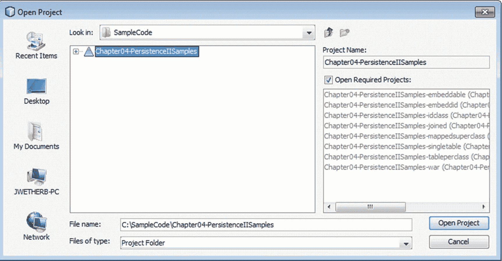

图 4-6

打开 Chapter04-PersistenceIISamples 项目

这些示例中未使用 EJB Session Bean，尽管它们本可以轻松替代 Java 服务外观类。Java 外观类在执行 persist、merge 或 remove 操作时自动提交结果，从而模拟无状态 Session Bean 的默认事务行为。主要区别在于 EJB 在 EJB 容器中执行，该容器提供企业级服务，而这些服务对于这些 JPA 示例并非必需。

本章的示例由七个 Java 类库和一个 Web 应用程序组成，该 Web 应用程序为七个 Java 库各包含一个 Servlet。展开第一个 Java 类库——`Chapter04-PersistenceIISamples-embeddable`，观察每个项目共有的通用结构，如图 4-7 所示。

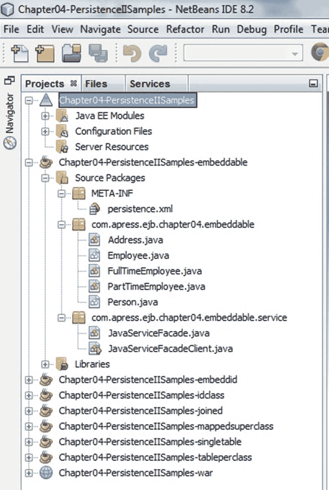

图 4-7

观察 Chapter04-PersistenceIISamples-joined 项目的结构

每个 Java 类库包含以下内容：

*   一个 JPA 持久化单元，由若干 JPA 实体或其他映射类以及一个 `META-INF/persistence.xml` 文件组成
*   一个 Java 服务外观——`JavaServiceFacade.java`——一个包装类，提供用于操作上下文持久化单元中 JPA 实体的 CRUD 方法
*   一个 Java 客户端——`JavaServiceFacadeClient.java`——用于执行该持久化单元测试用例的服务外观

### 创建数据库连接

本章的示例需要数据库连接，对于这些测试，我们将使用 NetBeans 和 Glassfish 捆绑的 Derby 数据库。如果你尚未创建第 3 章示例也使用的 WineApp 数据库，请单击“`服务`”选项卡，展开“`数据库`”图标，然后在“`Java DB`”节点上调用“`创建数据库...`”。创建一个名为“`WineApp`”的数据库，用户名和密码为 `wineapp/wineapp`，如图 4-8 所示。

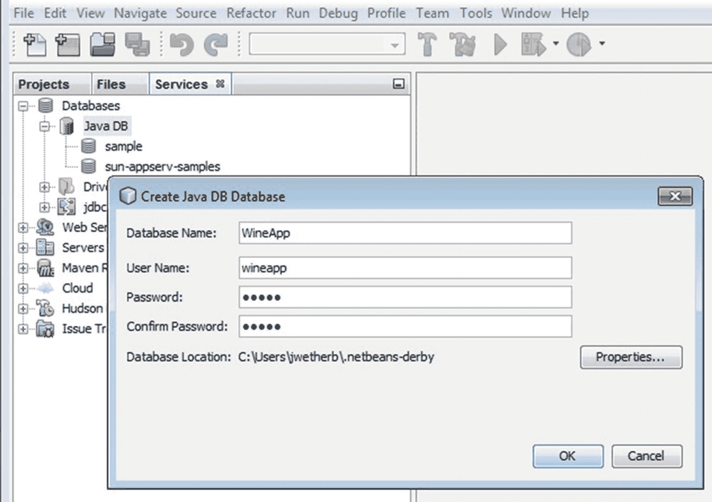

图 4-8

创建 WineApp 数据库和连接

如果你确实在第 3 章中创建了 WineApp 数据库，那么你应该能在 Java DB 部分下找到它，如图 4-9 所示。

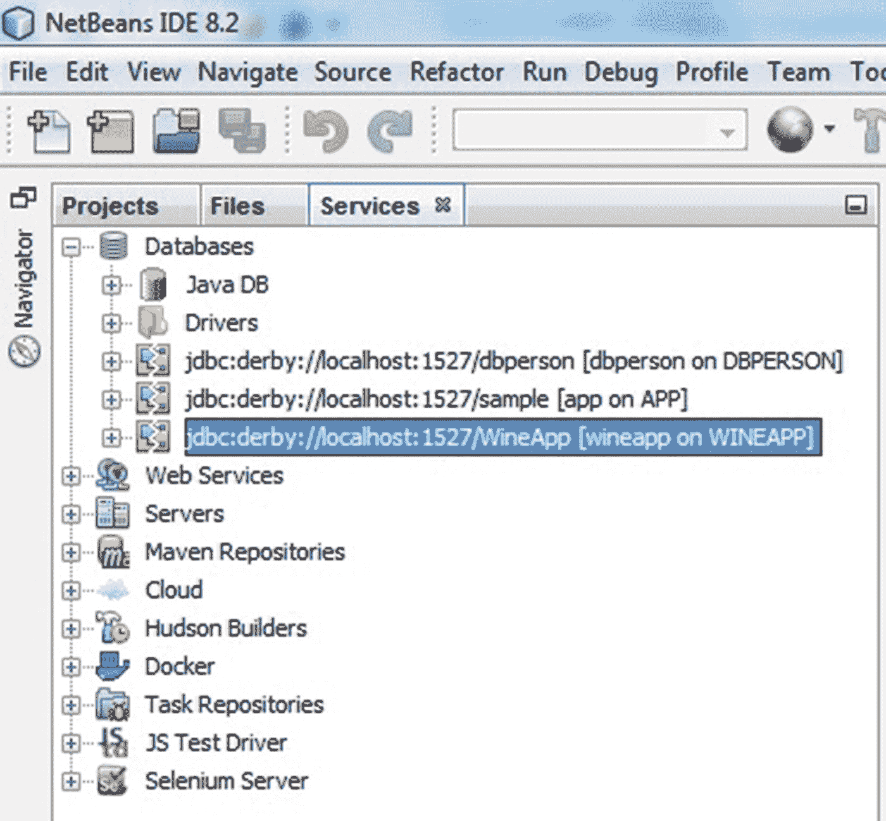

图 4-9

“WineApp” Java DB

最后一步创建了一个数据库连接，并在 JPA 项目中每个 `persistence.xml` 文件的持久化单元中引用该连接。虽然可以预先创建数据库对象（表、序列、键约束等），但我们将让 JPA 在每个持久化单元首次需要时自动创建这些数据库对象。

### 编译源代码

在 `Chapter04-PersistenceIISamples` 节点上调用上下文菜单，并通过选择“`清理并构建`”菜单选项来构建应用程序，如图 4-10 所示。

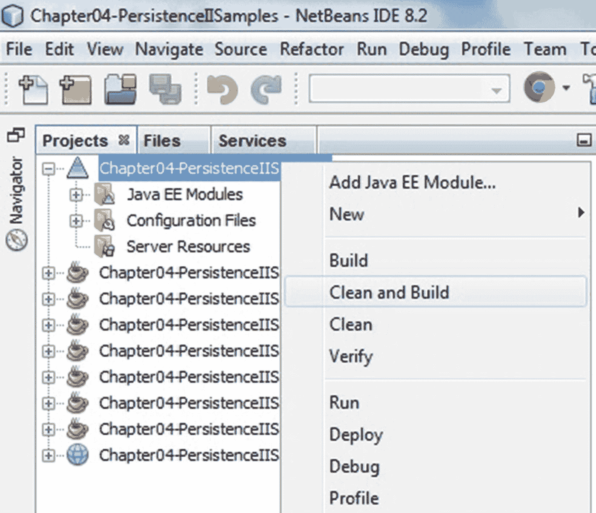

图 4-10

构建应用程序


### 运行客户端程序

在创建好 `WineApp` 数据库并构建项目后，即可运行示例客户端。打开 `Chapter04-PersistenceIISamples-singletable` 项目，展开 `com.apress.ejb.chapter04.singletable.service` 包。您将看到 Java 服务外观类（`JavaServiceFacade.java`）及其客户端类。右键点击 `JavaServiceFacadeClient.java`，选择“`运行文件`”。测试将在 NetBeans 中运行，输出结果会发送到日志窗口。参见图 4-11。

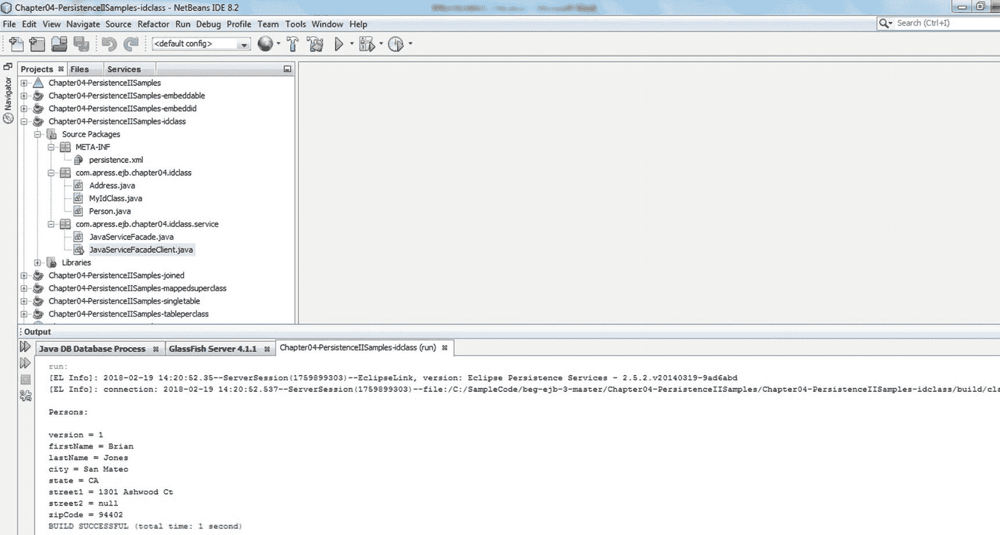

图 4-11

在 Java SE 环境中执行 SINGLE_TABLE 继承示例

接下来，运行 HTTP Servlet 客户端：打开 `Chapter04-PersistenceIISamples-war` 项目，展开 `com.apress.ejb.chapter04.client` 包。打开 NetBeans 用于运行 Servlet 的浏览器。（如果不确定，请通过“工具” ➤ “选项” ➤ “常规”打开 NetBeans 首选项。）右键点击 `SingleTableInheritanceClient.java` Servlet，选择“`运行文件`”，以 Web 应用程序的方式运行测试，如图 4-12 所示。

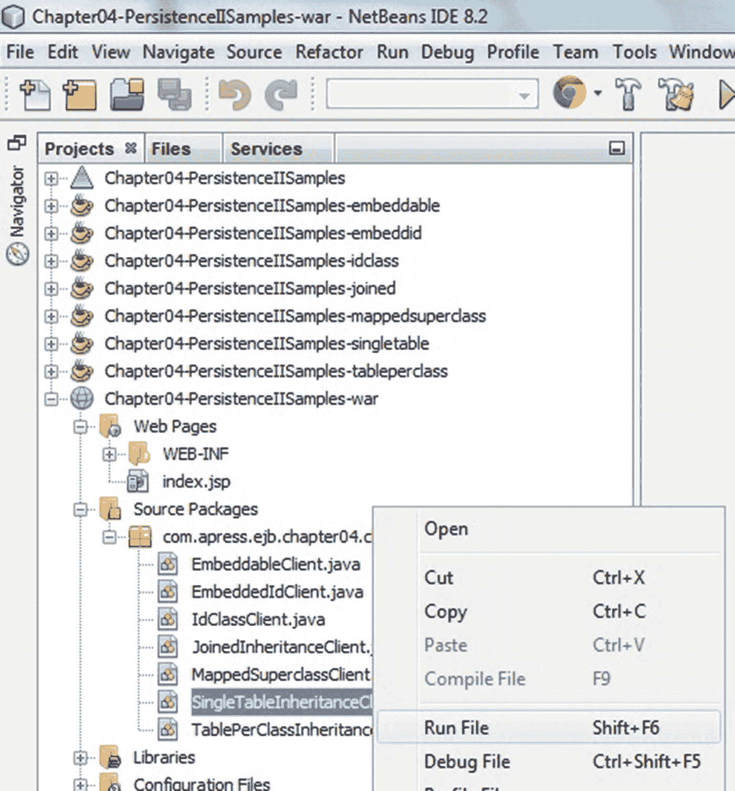

图 4-12

执行 `com.apress.ejb.chapter04.client Servlet`

NetBeans 将在默认浏览器中执行该 Servlet，如图 4-13 所示。在测试执行过程中，任何冲突的现有数据都会被删除，新的测试数据会被创建，然后被查询并以表格形式呈现。引用的对象（包括引用对象的列表）会显示在嵌套的表格单元格中。图 4-13 展示了该客户端 Servlet 的输出，其中记录了 Servlet 的操作日志。

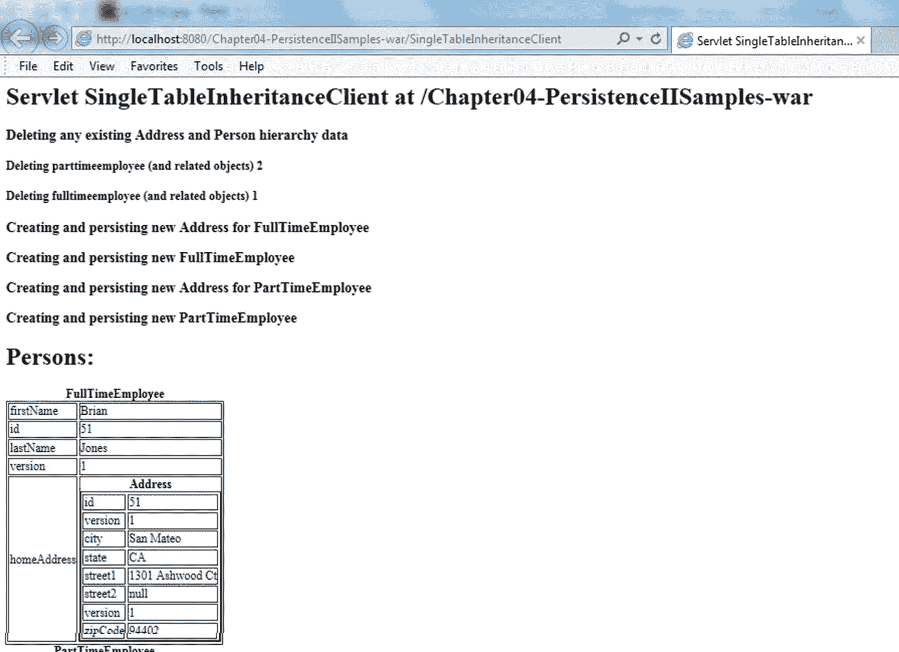

图 4-13

在 Java EE Web 环境中执行 SINGLE_TABLE 继承示例

请查看 `SingleTableInheritanceClient.java` 中的代码。您可以自由尝试创建额外的实体、测试 Java 服务外观上的查询和其他服务方法，并观察结果行为。要将测试模式重置回初始状态，您可以随时删除 WineApp 测试数据库，然后重新执行图 4-8 所示的步骤。

### 测试其他持久化示例

其余六个项目分别测试了本章涵盖的不同特性，这些特性已在项目名称中标识。建议您将这些项目作为参考，了解如何配置各种继承层次结构、映射超类、嵌入类以及复合主键。

由于本章中的每个项目结构相同，并且每个项目都附带一个专用的 HTTP Servlet 测试器，因此上述步骤可以指导您以相同的方式执行每个示例。

## 总结

本章内容相当丰富，掌握了这些信息后，您应该能够构建一些强大的实体，并根据您的应用领域进行最佳配置。以下是本章涵盖的关键概念总结。

### 映射实体继承层次结构

JPA 为实体类继承层次结构提供了三种常见的 O/R 映射策略的内置支持：SINGLE_TABLE、JOINED 和 TABLE_PER_CLASS。我们分析了每种方法的优缺点，并提供了最适合每种策略的常见用例示例。

### 在继承层次结构中使用抽象实体、映射超类和非实体类

JPA 在类型层次结构中混合使用实体与抽象类和非实体类时提供了灵活的解决方案。实体可以是具体的，也可以是抽象的。只有实体类可以被查询或作为映射实体关系的目标，但实体仍然可以使用非实体类，既可以通过 `@Embedded` 和 `@ElementCollection` 嵌入它们，也可以通过扩展它们或被它们扩展。我们展示了一些混合使用这些选项的示例来说明它们的用法。

### 多态关系

可以在实体之间指定关系，包括层次结构中的抽象超类型实体。这允许您与继承层次结构中任意位置的实体定义关系，该关系也会隐式地涉及该实体的子类型。

### 多态 JPQL 查询

类似地，JPQL 查询可以选择或连接超类型类的实体，并且任何符合查询条件的子类型实例都将包含在查询结果中。我们研究了如何使用 JPQL 构建可重用的 `@NamedQuery` 对象，以及自 JPA 2.0 以来引入的 QueryCriteria API。

### 使用原生 SQL 查询

`EntityManager` 允许您发出原生 SQL 查询，这既是对经验丰富的 SQL 开发者的友好表示，也是一种优化手段，可以避免在只需要少数几个字段时查询实体的所有字段所带来的开销。我们提供了一个示例，说明如何定义一个返回实体实例的命名原生 SQL 查询，以便将结果无缝集成到应用程序中。

### 使用查询条件 API

作为 JPQL 的类型安全替代方案，自 JPA 2.0 以来引入的条件 API 允许您通过动态组装子句和谓词来构建查询，形成一个 CriteriaQuery 对象，该对象可以被调用来检索实体或其他结果。图 4-14 展示了 persistence.xml 文件在 NetBeans IDE 8.2 中的外观。

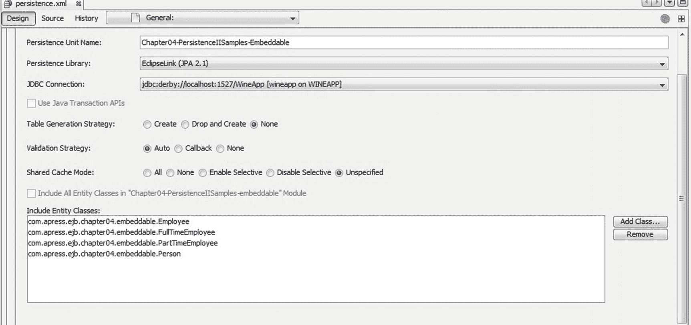

图 4-14

Persistence.xml 文件

### 复合主键和嵌套外键

我们探讨了不同类型的复合主键用法，展示了如何使用 `@EmbeddedId` 字段和多个 `@Id` 字段。当实体的主键映射到的列也参与了与其他实体的关系时（例如，当主键包含一个或多个也是外键一部分的列时），情况可能会变得有些棘手。我们提供了一些处理这种情况的示例。

### 乐观锁支持

使用 `@Version` 注解，您可以指定一个字段（该字段在继承层次结构中的所有实体中通用），供 `EntityManager` 在管理并发时（例如在合并操作期间）执行乐观锁定。该字段将由持久化框架自动填充，不应由应用程序代码更新。

### 自动生成主键值支持

JPA 为使用唯一值填充 `@Id` 字段提供了声明式支持。我们提供了如何声明基于数据库序列和基于表的 ID 生成器的示例。

### 拦截器：实体回调方法

您可以在实体类或您选择的辅助类上指定方法，以处理实体生命周期回调。我们列出了可用的回调方法，并解释了如何使用它们来注册您自己的自定义方法，这些方法将在生命周期事件期间被调用。

