# 5. EJB 消息驱动 Bean

本章讨论了面向消息架构的必要性。它介绍了 Java 消息服务（JMS）、消息传递应用程序的典型架构，并详细阐述了 EJB 消息驱动 Bean（MDB）背后的概念。本章还涵盖了与 MDB 相关的注解、依赖注入和拦截器。


## 面向消息的架构

如今，IT 组织拥有数十个应用程序和服务，用于执行诸如库存管理、计费、费用报告和订单录入等定义明确的任务。随着互联网和电子商务的发展，企业开始思考不同的应用程序如何既能独立工作，又能同时成为信息工作流的一部分。

这一新需求引出了集成现有应用程序，以及构建能与现有应用程序协同工作的新应用程序的概念。将现有应用程序与新应用程序集成是一项非常复杂的任务：首先是因为大多数企业使用的应用程序数量庞大，其次是因为它们复杂的业务工作流。

消息传递是在异步通信和松耦合事务模型中集成现有和新应用程序的最可行解决方案之一。异步消息传递允许应用程序通过独立交换消息进行通信，而无需彼此硬连接。发送消息的应用程序或业务流程不必等待接收方，只要发送方和接收方都理解并商定消息格式和中间目的地即可。

以下是 MDB 的消息传递概念：

*   发送松耦合、异步消息的过程。
*   发送方不知道消息何时被接收。
*   发送方可以保证消息在传输过程中不会丢失。
*   当接收方不在（AFK）时，MOM（面向消息的中间件）服务的作用类似于语音信箱。

### 什么是 JMS？

JMS 是一个 Java 面向消息的中间件（MOM）API，允许应用程序异步发送和接收消息。JMS 是 JSR 914 定义的标准 Java EE API 的一部分。JMS 类似于 JDBC（Java 数据库连接），后者提供了连接多种类型数据库（Oracle、DB2、MySQL）的标准 API。同样，JMS 提供了连接多种类型消息传递系统（IBM MQ、SonicMQ）的标准 API。

注意

MOM 将消息存储在发送方指定的位置，随后由消费者收集。

JMS 架构由以下部分组成：

表 5-1

JMS 消息类型

| 消息类型 | 描述 |
| --- | --- |
| `ByteMessage` | 由一系列字节组成 |
| `MapMessage` | 由一组名称/值对组成 |
| `ObjectMessage` | 由一个序列化的 Java 对象组成 |
| `StreamMessage` | 由一系列原始数据类型组成 |
| `TextMessage` | 由字符串组成 |

*   JMS 提供者：一个消息传递系统（如图 5-1 所示），负责处理消息的路由和传递。JMS 提供者可以是应用服务器的消息传递组件（例如 Oracle WebLogic Server、IBM WebSphere、Oracle GlassFish Server）。JMS 提供者也称为 JMS 服务器。

    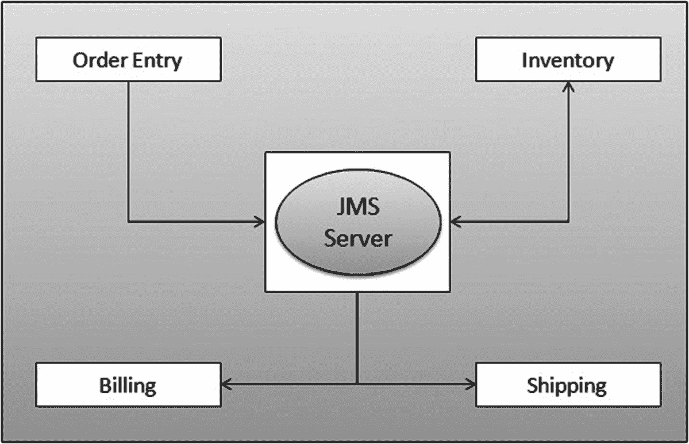

    图 5-1

    一个 JMS 消息传递系统
*   JMS 客户端：任何使用 JMS API 消费或生成 JMS 消息的 Java 应用程序或 Java EE 组件。
*   JMS 消费者：一个消费 JMS 消息的 JMS 客户端应用程序。图 5-1 中显示的库存、计费和发货应用程序是 JMS 消息消费者。
*   JMS 生产者：一个生成消息的 JMS 客户端。图 5-1 中显示的订单录入应用程序是 JMS 消息生产者。
*   JMS 消息：由标头、属性和正文组成的消息。标头标识消息并包含标准信息，例如 `JMSTimestamp`。MOM 在发送消息时将此标头设置为当前时间。属性提供特定于应用程序和提供者的附加属性。属性由应用程序显式创建，例如 `Message.setBooleanProperty(“”,true);`，它可以是布尔型、字节型、双精度浮点型、浮点型、整型、长整型、短整型、字符串、对象等。正文包含消息的内容，可以是 `ObjectMessage`、`ByteMessage`、`MapMessage`、`StreamMessage` 和 `TextMessage`。JMS 规范支持发送和接收不同类型的消息。表 5-1 显示了消息类型及其描述。

JMS 有两种类型的资源：`JMSContext` 和 `Destination`。

JMS 应用程序将使用 CDI 的 `@Inject` 通过依赖注入（DI）获取 `JMSContext`，并使用 `@JMSConnectionFactory` 配置 `JMSContext` 以连接到连接工厂。

### 消息传递应用程序架构

通常，存在两种不同类别的消息传递应用程序：

*   点对点（P2P）模型：只有一个消费者会处理给定的消息，PTP 消息目的地称为队列，A 写入队列，B 从队列读取。
*   发布-订阅（pub-sub）模型：每个订阅者都会收到消息的一个副本。

P2P 模型基于消息队列，队列保存由 JMS 客户端应用程序发送的 JMS 消息。消息生产者和消费者商定一个公共队列来交换消息。

如果每条消息有且只有一个消息消费者，则使用 P2P 模型。例如，图 5-2 中显示的订单录入系统将新订单发送到消息队列，该队列由库存系统接收。类似地，库存系统发送的消息由发货系统消费，而发货系统发送的消息由计费系统消费。

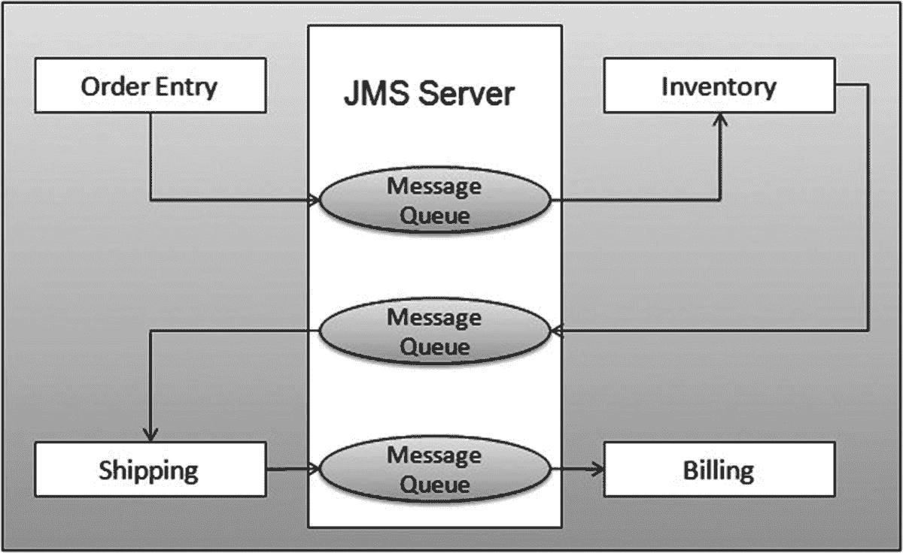

图 5-2

一个使用队列的 JMS 消息传递系统

发布-订阅模型基于主题，主题是消息的目标地址。多个接收者或 JMS 消费者可以检索每条消息。在此模型中，发布者并不总是知道可能的订阅者。发布-订阅模型用于广播类型的应用程序，如图 5-3 所示，其中一条消息被传递给多个 JMS 客户端。主题在消息传递服务器中定义，每个主题都有唯一的名称。每条消息及其关联的主题被发布并传递给所有订阅者。

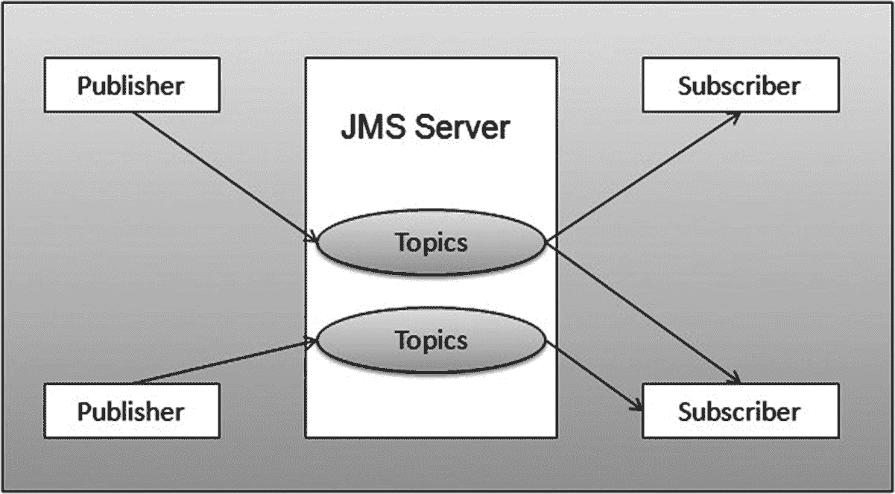

图 5-3

一个使用主题的 JMS 消息传递系统

## JMS 2.0

JMS 2.0 于 2013 年 4 月发布，这是自 2002 年发布 1.1 版以来对 JMS 规范的首次更新。

JMS 2.0 目前是 Java EE 7 平台的一部分，可用于 Java EE Web 或 EJB 应用程序，或作为 Java SE 环境中的独立组件使用。

JMS 2.0 的主要目标包括：

*   API 现代化
*   与 Java EE 对齐
*   与 EJB3/MDB 对齐
*   自 1.1 版以来的次要修正和澄清
*   用于发送和接收消息的新 API
*   新 API 也支持资源注入

JMS 2.0 最大的变化是引入了用于发送和接收消息的新 API，帮助程序员减少需要编写的代码量。


## JMS 2.1

JMS 2.1 最初由 Oracle 于 2014 年 8 月提出，随后根据 Java 社区流程提交为 JSR 368。它被提出并最终获批成为 Java EE 8 的一部分。

早期草案评审 1（EDR1）于 2015 年 10 月发布以供公众评审，其中包含关于灵活 JMS 消息驱动 Bean 的新章节。

2016 年 3 月，EDR2 最终发布以供公众评审，但随后 Oracle 停止了 JMS 2.1 的开发，并宣布他们正在更改 Java EE 8 的优先级，其中包括 JMS 2.1 的开发。

最终，在 2016 年 11 月，Oracle 正式提议撤回该 JSR，并确认 JMS 仍将是 Java EE 8 的一部分，但将使用现有版本 JMS 2.0，而非新版本 2.1。

JMS 2.1 规范可在此网页中找到：

[`https://jcp.org/en/jsr/detail?id=368`](https://jcp.org/en/jsr/detail?id=368)

以下是 JMS 2.1 中最重要的变更：

*   与 Java SE 8 对齐
*   灵活的 MDB（EE）
*   异步消息传递的变更，包括 MDB 如何将任何 `MessageListener` 接口实现为任何 CDI Bean
*   CDI Bean 作为监听器
*   批量投递，包括确认模式、`setMessageListener`（EE）等
*   可重复注解，包括重新投递配置（EE）

## 使用 MDB

MDB 是一个异步消息消费者，用于处理通过 JMS 投递的消息。当 MDB 执行处理消息的工作时，运行 MDB 的 EJB 容器负责处理服务（事务、安全、资源、并发、消息确认），让 Bean 开发者专注于处理消息的业务逻辑。传统的 JMS 应用程序需要自行编写其中一些服务。MDB 本质上是无状态的，这意味着 EJB 容器可以拥有大量 MDB 实例并发执行，以处理来自各种应用程序或 JMS 生产者的数百条 JMS 消息，并为企业应用程序提供服务质量（QoS），例如高可用性和可靠性。

EJB 客户端应用程序不能像访问会话 Bean 和实体那样直接访问 MDB。与 MDB 通信的唯一方式是将 JMS 消息发送到 MDB 正在监听的目标。任何使用 JMS API 的 Java 应用程序或 Java EE 组件都可以通过向队列或主题发送消息来成为 MDB 的消息提供者。

### 何时使用 MDB？

在本章前面，我们讨论了企业中异步性的需求。异步消息传递在应用程序、系统和服务之间提供了松散耦合，从而为应用程序和系统提供了更大的灵活性和变更管理能力。MDB 提供了一种标准的消息组件模型，可在企业中实现异步和面向消息的架构目标。

图 5-4 展示了一个面向消息的应用程序，它包含订单录入、库存、计费和发货系统，这些系统异步通信以处理一个工作流，该工作流从新的采购订单开始，到订单发货给客户结束。订单录入系统捕获客户的新订单，处理订单，并将其发送到指定的消息队列（在图 5-4 中，这是“新订单”队列）。库存系统从队列中取出消息，检查库存是否可用。如果不可用，则向“供应商”队列发送消息；如果可以发货，则将消息放入“订单就绪”队列。计费系统取出这条新消息，处理客户的计费，然后将消息放回“发货”队列。最后，发货应用程序取出消息，将订单发货给客户，并向客户发送一封包含跟踪信息的电子邮件。

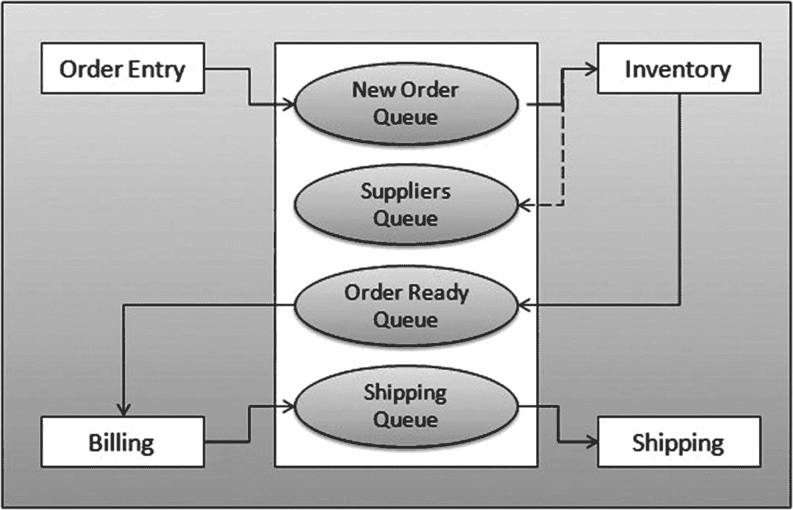

图 5-4

一个订单到发货的 JMS 消息传递系统

### MDB 类

与会话 Bean 不同，MDB 没有任何业务接口。它仅包含以下内容：

*   一个消息驱动类
*   一个可选的回调监听器类
*   一个可选的拦截器类

MDB 类是任何带有类级别注解 `@MessageDriven` 的标准 Java 类。如果使用部署描述符代替注解，则应将 Bean 类标记为 MDB 类。在混合模式下（即同时使用注解和部署描述符），如果在 Bean 类中指定了任何其他类级别或成员级别的注解，则必须指定 `@MessageDriven` 注解。`@MessageDriven` 注解参数可用于指定 Bean 正在监听的 JMS 队列或主题。表 5-2 详细说明了这些参数。

表 5-2

@MessageDriven 注解的参数详情

| 参数 | 描述 |
| --- | --- |
| `ActivationConfigProperty` | 用于指定目标名称和类型的属性集 |
| `description` | Bean 类的描述 |
| `mappedName` | MDB 正在监听的 Topic 或 Queue 的物理 Java 命名和目录接口（JNDI）名称 |
| `messageListener` | MDB 所扩展的接口类的接口名称 |
| `name` | MDB 的名称，如果它必须与 Bean 类名称不同的话 |

为了说明 MDB 的使用，我们将创建图 5-5 中所示的用例。我们将有一个应用程序客户端，它是一个 Java 命令行程序，用于调用 `OrderProcessing` 会话 Bean 中的业务方法。`OrderProcessing` 会话 Bean 将创建一条 JMS 消息并将其发送到在 GlassFish 应用服务器中注册/配置的主题。一个名为 `StatusMailer` 的 MDB 将监听该主题并处理传入的消息。接收到的消息将包含客户的详细信息，并将用于向客户发送关于其订单状态的电子邮件通知。这个简单的用例将使我们能够演示 MDB 如何工作，以及如何在会话 Bean 和 MDB 中注入不同类型的资源。

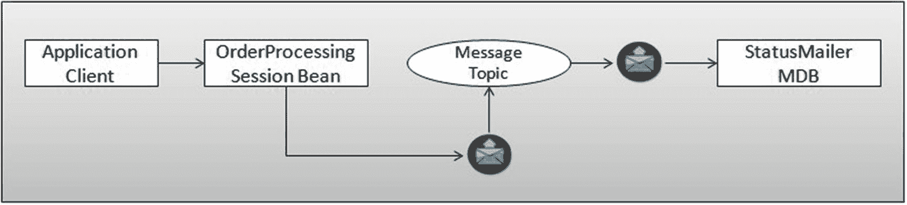

图 5-5

一个示例 MDB 用例

清单 5-1 展示了 `StatusMailer` MDB 的定义。我们使用 `@MessageDriven` 注解标记了 `StatusMailerBean` 类。

```
package com.apress.ejb.chapter05;
import javax.ejb.MessageDriven;
@MessageDriven
public class StatusMailerBean {
}
清单 5-1
StatusMailerBean.java
```

MDB 类有一个方法 `onMessage()`，当消息到达 MDB 正在监听的队列/主题时，EJB 容器会调用该方法。`onMessage()` 方法包含如何处理传入消息的业务逻辑。`onMessage()` 方法包含一个参数，即 JMS 消息。在 `StatusMailer` Bean 的情况下，`onMessage()` 方法检查消息是否为 `MapMessage` 类型，然后从消息中获取客户信息，创建一封关于订单状态的电子邮件，然后向客户发送电子邮件。清单 5-2 展示了 `onMessage()` 方法的代码。在一个 `try` 块中，我们首先检查接收到的消息是否如我们所预期的那样是 `MapMessage` 类型。如果是，则使用 `getStringProperty()` 来检索消息中 `from`、`to`、`subject` 和 `content` 属性的值。


```content
```
package com.apress.ejb.chapter05;
import javax.ejb.MessageDriven;
@MessageDriven
public class StatusMailerBean {
public void onMessage(Message message){
try  {
if (message instanceof MapMessage) {
MapMessage orderMessage = (MapMessage)message;
String from = orderMessage.getStringProperty("from");
String to = orderMessage.getStringProperty("to");
String subject = orderMessage.getStringProperty("subject");
String content = orderMessage.getStringProperty("content");
}
else {
System.out.println("Invalid message ");
}
} catch (Exception ex)  {
ex.printStackTrace();
}
}
}
代码清单 5-2
onMessage 方法代码
```

除了用`@MessageDriven`注解标记标准 Java 类外，MDB 类还需满足以下要求：

*   MDB 类必须实现消息监听器接口。对于 JMS 而言，该接口为`javax.jms.MessageListener`。
*   该类不能是 final 或 abstract 类型。
*   该类应包含一个无参公共构造函数，供 EJB 容器用于创建 Bean 类的实例。

如果同时使用注解和部署描述符，在部署过程中，部署描述符中的设置或值将覆盖类中的注解。

### 配置属性

Bean 开发者可以为 MDB 类提供配置属性，这些属性将在部署时使用。EJB 容器利用这些属性来配置 Bean，并将其链接到相应的 JMS 提供程序。这些配置属性可通过`@ActivationConfigProperty`注解进行设置。该注解可作为`@MessageDriven`注解的参数之一提供。代码清单 5-3 展示了为`StatusMailer` MDB 添加属性的`@MessageDriven`注解。我们定义了两个`ActivationConfigProperty`注解，分别指定了逻辑目标名称和目标类型。

```
@MessageDriven(activationConfig= {
@ActivationConfigProperty(propertyName="destinationName",
propertyValue="StatusMessageTopic"),
@ActivationConfigProperty(propertyName="destinationType",
propertyValue="javax.jms.Topic")
}, mappedName="StatusMessageTopic")
public class StatusMailerBean implements javax.jms.MessageListener {
}
代码清单 5-3
为 StatusMailer MDB 添加属性的@MessageDriven 注解
```

EJB 3.0 和 3.1 版本中 MDB 可用的标准配置属性，与 JMS 1.1 版本的配置属性相对应。EJB 3.2 版本中 MDB 的标准配置属性已扩展，以对应 JMS 2.0 版本的配置属性。表 5-3 展示了 EJB 版本与 JMS 版本之间的对应关系。

表 5-3

EJB MDB 版本与 JMS 版本映射关系

| EJB 版本 | JMS 版本 |
| --- | --- |
| EJB 3.0 | JMS 1.1 |
| EJB 3.1 | JMS 1.1 |
| EJB 3.2 | JMS 2.0 |
| EJB 3.2 | JMS 2.1 |

在接下来的章节中，我们将展示可以为 MDB 设置哪些配置属性。

#### 消息确认

EJB 容器提供消息确认服务。有两种消息确认模式：

*   `自动确认`
*   `允许重复确认`

对于`自动确认`模式，消息传递确认在`onMessage()`方法执行后发生。此属性适用于要求无重复消息的应用程序。例如，库存系统应且仅应接收一次新订单。对于`允许重复确认`模式，确认是延迟执行的，这意味着可能存在消息重复传递，但减少了会话在即时确认方面的开销。例如，在订单处理过程中发送的电子邮件可能允许重复消息。我们可以使用`@ActivationConfigProperty`注解来指定消息确认属性。代码清单 5-4 展示了设置为允许重复的属性。

```
@MessageDriven(
activationConfig= {
@ActivationConfigProperty(propertyName="acknowledgeMode",
propertyValue="Dups-ok-acknowledge")}
)
代码清单 5-4
@ActivationConfigProperty 注解
```

#### 消息选择器

消息选择器允许根据 Bean 开发者通过`@ActivationConfigProperty`注解提供的选择条件，对传入消息进行过滤。此属性用于限制 Bean 接收的消息。例如，处理传入订单的 MDB 可能只处理与红葡萄酒和白葡萄酒相关的订单。用于指定该属性的属性名为`messageSelector`。

#### 消息目标

消息目标描述了 MDB 是监听队列还是主题。Bean 开发者可以通过`@ActivationConfigProperty`注解在 Bean 中提供描述。该属性的值必须是`javax.jms.Queue`或`javax.jms.Topic`。例如，新订单可能需要由库存系统作为工作流中的下一步进行处理；在这种情况下，订单录入系统无需广播新订单消息。订单录入系统和库存系统可以就特定目标达成一致。代码清单 5-3 展示了指定目标名称和类型的代码。

#### 订阅持久性

如果 Bean 设计为监听主题，则 Bean 开发者可以进一步指定消息的持久性。主题可以是`持久`或`非持久`。使用`持久`主题可确保应用程序的可靠性。即使 EJB 容器暂时离线，也能确保消息不会丢失。例如，我们需要确保如果 EJB 容器宕机，从客户端应用程序接收的新采购订单不会丢失。所有采购订单都必须由 MDB 可靠地处理。我们可以使用`@ActivationConfigProperty`注解，通过`subscriptionDurability`属性来指定持久性。代码清单 5-5 展示了将该属性设置为`Durable`的代码。如果未设置此属性，容器将采用默认值`Non-Durable`。

```
@MessageDriven(
activationConfig= {
@ActivationConfigProperty(propertyName="subscriptionDurability", propertyValue="Durable")}
)
代码清单 5-5
将属性设置为 Durable 的代码
```

在`StatusMailer` MDB 中，我们将使用`@ActivationConfigProperty`注解创建属性。消息的`destinationName`设置为`StatusMessageTopic`，`destinationType`设置为`javax.jms.Topic`。我们将使用`mappedName`参数指定主题的物理目标名称。在我们的例子中，它与`destinationName`相同。代码清单 5-6 展示了当前完成状态下的`StatusMailer` MDB。

```
package com.apress.ejb.chapter05;
import javax.ejb.ActivationConfigProperty;
import javax.jms.Message;
import javax.ejb.MessageDriven;
import javax.jms.MapMessage;
@MessageDriven(activationConfig= {
@ActivationConfigProperty(propertyName="destinationName", propertyValue="StatusMessageTopic"),
@ActivationConfigProperty(propertyName="destinationType", propertyValue="javax.jms.Topic")
}, mappedName="StatusMessageTopic")
public class StatusMailerBean implements javax.jms.MessageListener{
public void onMessage(Message message){
try  {
if (message instanceof MapMessage) {
MapMessage orderMessage = (MapMessage)message;
String from = orderMessage.getStringProperty("from");
String to = orderMessage.getStringProperty("to");
String subject = orderMessage.getStringProperty("subject");
String content = orderMessage.getStringProperty("content");
}
else {
System.out.println("Invalid message ");
}
} catch (Exception ex)  {
ex.printStackTrace();
}
}
}
代码清单 5-6
StatusMailerBean.java
```
```


### MDB 中的依赖注入

MDB 可以使用依赖注入来获取对 JavaMail、EJB 或其他对象等资源的引用。MDB 尝试获取和使用的资源必须在容器上下文或环境上下文中可用。

在图 5-5 的示例用例中，我们讨论了在消息处理完成后创建一封电子邮件，并通过电子邮件将订单状态发送给客户。为了在 `StatusMailer` 消息 Bean 中实现这一点，我们需要获取一个 JavaMail 会话，以便创建并发送电子邮件。JavaMail 是一个 API，它提供了一个独立于平台的框架来构建邮件应用程序。JavaMail API 在 Java EE 平台中可用。

我们可以使用依赖注入在 MDB 中获取 JavaMail 会话。清单 5-7 展示了使用依赖注入和 JavaMail API 完成的 `StatusMailer` MDB。`@Resource` 注解用于注入一个名为 `mail/wineappMail` 的 JavaMail 会话，该会话已在 GlassFish 应用服务器中注册为邮件资源。注入的邮件会话用于创建 `javax.mail.Message`，并使用 setter 方法创建邮件消息的头部和内容。最后，使用 `javax.mail.Transport` 类中的 `send()` 方法发送创建的消息。

```
package com.apress.ejb.chapter05;
import javax.annotation.Resource;
import javax.ejb.ActivationConfigProperty;
import javax.jms.Message;
import javax.ejb.MessageDriven;
import javax.jms.MapMessage;
import javax.mail.Transport;
import javax.mail.internet.InternetAddress;
import javax.mail.internet.MimeMessage;
@MessageDriven(activationConfig= {
@ActivationConfigProperty(propertyName="destinationName",
propertyValue="StatusMessageTopic"),
@ActivationConfigProperty(propertyName="destinationType",
propertyValue="javax.jms.Topic")
}, mappedName="StatusMessageTopic")
public class StatusMailerBean implements javax.jms.MessageListener{
@Resource(name="mail/wineappMail" )
private javax.mail.Session ms;
public void onMessage(Message message){
try  {
if (message instanceof MapMessage) {
MapMessage orderMessage = (MapMessage)message;
String from = orderMessage.getStringProperty("from");
String to = orderMessage.getStringProperty("to");
String subject = orderMessage.getStringProperty("subject");
String content = orderMessage.getStringProperty("content");
javax.mail.Message msg = new MimeMessage(ms);
msg.setFrom(new InternetAddress(from));
InternetAddress[] address = {new InternetAddress(to)};
msg.setRecipients(javax.mail.Message.RecipientType.TO, address);
msg.setSubject(subject);
msg.setSentDate(new java.util.Date());
msg.setContent(content, "text/html");
System.out.println("MDB: Sending Message...");
Transport.send(msg);
System.out.println("MDB: Message Sent");
}
else {
System.out.println("Invalid message ");
}
} catch (Exception ex)  {
ex.printStackTrace();
}
}
}
清单 5-7
使用依赖注入和 JavaMail API 完成的 StatusMailer MDB
```

### 生命周期回调方法

在某些情况下，使用 MDB 的应用程序需要细粒度的控制。MDB 支持两种生命周期事件回调：

*   `PostConstruct`
*   `PreDestroy`

`PostConstruct` 回调发生在 Bean 上第一次调用消息监听器方法之前，并且在容器执行依赖注入之后。`PreDestroy` 回调发生在 MDB 从池中移除或销毁时。

例如，`PostConstruct` 回调可用于初始化某些属性或资源，而 `PreDestroy` 回调可用于清理或释放已获取的资源。

在 MDB 类上定义的回调方法应具有以下签名：

```
public void  ()
```

回调方法也可以在 Bean 的监听器类上定义，在这种情况下，方法应具有以下签名：

```
public void (Object)
```

其中 `Object` 可以声明为实际的 Bean 类型，该类型是运行时传递给回调方法的参数。

回调方法可以是 MDB 中任何带有回调注解的方法。以下规则适用于这些方法：

*   方法应为 public。
*   方法不能是 final 或 static。
*   返回类型应为 `void`。

如前所示，方法可以接受零个或一个参数。回调监听器类通过与其关联的 MDB 类上的 `@CallbackListener` 注解来标识。

### 拦截器

EJB 规范提供了一些称为拦截器的注解，允许您拦截业务方法的调用。可以为 MDB 定义拦截器方法。

您可以为特定方法添加 `@AroundInvoke` 注解或在部署描述符中添加 `<around-invoke-method>` 元素，或者您可以定义一个拦截器类，其方法在 MDB 类中的 `onMessage()` 方法被调用之前被调用。拦截器类通过与其关联的 MDB 类上的 `@Interceptor` 注解来标识。在存在多个拦截器类的情况下，使用 `@Interceptors` 注解。Bean 类或任何给定的拦截器类上只能存在一个 `AroundInvoke` 方法。`AroundInvoke` 方法不能是 MDB 类的 `onMessage()` 方法。

`AroundInvoke` 方法应具有以下签名：

```
public Object (InvocationContext) throws Exception
```

`InvocationContext` 的定义如下：

```
package javax.ejb;
public interface InvocationContext {
public Object getBean();
public java.lang.reflect.Method getMethod();
public Object[] getParameters();
public void setParameters(Object[] params);
public EJBContext getEJBContext();
public java.util.Map getContextData();
public Object proceed() throws Exception;
}
```

以下列表描述了每个方法：

*   `getBean()`: 返回被调用方法所在的 Bean 实例
*   `getMethod()`: 返回被调用的 Bean 实例上的方法
*   `getParameters()`: 返回方法调用的参数
*   `setParameters()`: 允许修改方法调用的参数
*   `getEJBContext()`: 使拦截器方法能够访问 Bean 的 `EJBContext`
*   `getContextData()`: 允许使用返回的 `Map` 在同一个 `InvocationContext` 实例中的拦截器方法之间传递值
*   `proceed()`: 如果有下一个拦截器则调用它，否则调用目标 Bean 方法

### 异常处理

EJB 规范概述了两种类型的异常：应用程序异常和系统异常。有关这些异常的更多一般信息，请参见第 2 章的“异常处理”部分。对于 MDB，监听器方法不得抛出 `java.rmi.RemoteException` 或一般的运行时异常。客户端假定消息消费者即使在发生运行时异常后仍然存在。如果在抛出运行时异常后客户端发送消息，则 EJB 容器会将消息委托给另一个 MDB 实例。此外，如果您允许异常“逃逸”出 MDB，则该消息不被视为已被消费，它会回到队列/主题中。然后，有问题的消息会被重新投递。这被称为“毒消息”问题。

回调方法可以抛出运行时异常。由在事务内执行的回调方法抛出的运行时异常会导致该事务回滚。回调方法不得抛出应用程序异常。


### 客户端视图

对于客户端应用程序而言，MDB 只是一个消息消费者。客户端应用程序可以是任何使用 JMS API 发送消息的 Java EE 组件的 Java 客户端。从客户端应用程序的角度来看，MDB 的存在完全隐藏在 MDB 作为消息监听器的目标或端点之后。

客户端的 JNDI 命名空间可以配置为包含安装在网络上多台机器上的多个 EJB 容器中的 MDB 的目标或端点。企业 Bean 和 EJB 容器的实际位置，通常对使用该企业 Bean 的客户端是透明的。

对消息目标的引用可以通过 `@Resource` 注解（位于 `javax.annotation` 包中）注入，或者如果资源已在部署描述符中定义，则可以通过 JNDI 查找进行注入。

注意

从 EJB 3.2 开始，JMS 资源适配器可以通过使用其标准名称查找 MDB 来构造订阅名称。

在前面讨论并如图 5-5 所示的用例中，我们有一个会话 Bean 充当客户端应用程序和消息主题之间的中介。客户端应用程序调用会话 Bean 中的业务方法，该会话成为创建和发送消息的客户端或 JMS 消息生产者。为了说明这一点，我们将创建一个无状态会话 Bean `OrderProcessing`，其中包含一个业务方法 `SendOrderStatus()`。清单 5-8 显示了 `OrderProcessing` 会话 Bean 的代码。我们使用 `@Resource` 注解来注入 `TopicConnectionFactory` 和 `StatusMailer` MDB 正在监听的 `Topic`。我们将在会话 Bean 中使用一些硬编码值来模拟客户电子邮件地址和电子邮件内容。在 `try` 块中，我们创建一个到 `statusMessageTopicConnectionFactory` 的连接并启动该连接。使用创建的会话，我们通过 `createSession()` 和 `createProducer()` 方法创建一个主题会话和主题生产者。最后，我们创建一个 `MapMessage` 对象；用电子邮件地址、主题和内容填充消息；并使用 `send()` 方法将消息发送到 `Topic`。

```
package com.apress.ejb.chapter05;
import javax.annotation.Resource;
import javax.ejb.Stateless;
import javax.jms.Connection;
import javax.jms.JMSException;
import javax.jms.MapMessage;
import javax.jms.MessageProducer;
import javax.jms.Session;
import javax.jms.Topic;
import javax.jms.TopicConnectionFactory;
@Stateless(name = "OrderProcessing")
public class OrderProcessingBean
{
public OrderProcessingBean() {
}
@Resource(mappedName = "StatusMessageTopicConnectionFactory")
private TopicConnectionFactory statusMessageTopicCF;
@Resource(mappedName = "StatusMessageTopic")
private Topic statusTopic;
public String SendOrderStatus() {
String from = "chirag.rathod@oracle.com";
String to = "chirag.rathod@oracle.com";
String content =
"Your order has been processed " + "If you have questions" +
" call EJB Application with order id # " + "1234567890";
try {
System.out.println("Before status TopicCF connection");
Connection connection = statusMessageTopicCF.createConnection();
System.out.println("Created connection");
connection.start();
System.out.println("statted connection");
System.out.println("Starting Topic Session");
Session topicSession =
connection.createSession(false, Session.AUTO_ACKNOWLEDGE);
MessageProducer publisher = topicSession.createProducer(statusTopic);
System.out.println("created producer");
MapMessage message = topicSession.createMapMessage();
message.setStringProperty("from", from);
message.setStringProperty("to", to);
message.setStringProperty("subject", "Status of your wine order");
message.setStringProperty("content", content);
System.out.println("before send");
publisher.send(message);
System.out.println("after send");
}
catch (JMSException e) {
e.printStackTrace();
}
return "Created a MapMessage and sent it to StatusTopic";
}
}
清单 5-8
OrderProcessingBean.java
```

注意

在清单 5-8 中，将“from”和“to”字段的值更新为您的电子邮件 ID。

为了完成图 5-5 中讨论的用例，我们需要做的最后一件事是提出一个客户端应用程序，该应用程序将查找 `OrderProcessing` 会话 Bean 并调用 `SendOrderStatus()` 消息。清单 5-9 显示了客户端应用程序的代码。在 `try` 块中，我们对 `OrderProcessing` 会话 Bean 进行 JNDI 查找，并调用 `SendOrderStatus()` 业务方法。

```
package com.apress.ejb.chapter05;
import java.io.IOException;
import java.io.PrintWriter;
import javax.ejb.EJB;
import javax.servlet.ServletException;
import javax.servlet.annotation.WebServlet;
import javax.servlet.http.HttpServlet;
import javax.servlet.http.HttpServletRequest;
import javax.servlet.http.HttpServletResponse;
@WebServlet(name = "StatusMailerClient", urlPatterns = {"/StatusMailerClient"})
public class StatusMailerClient extends HttpServlet {
@EJB
OrderProcessingBean orderProcessing;
protected void processRequest(HttpServletRequest request, HttpServletResponse response)
throws ServletException, IOException {
response.setContentType("text/html;charset=UTF-8");
PrintWriter out = response.getWriter();
try {
out.println("");
out.println("");
out.println("Servlet StatusMailerClient");
out.println("");
out.println("");
out.println("OrderProcessing session bean lookup to be done");
out.println("Invoking SendOrderStatus() business method now");
out.println("" + orderProcessing.SendOrderStatus() + "");
out.println("Done !!!");
out.println("");
out.println("");
} finally {
out.close();
}
}
@Override
protected void doGet(HttpServletRequest request, HttpServletResponse response)
throws ServletException, IOException {
processRequest(request, response);
}
@Override
protected void doPost(HttpServletRequest request, HttpServletResponse response)
throws ServletException, IOException {
processRequest(request, response);
}
@Override
public String getServletInfo() {
return "Short description";
}
}
清单 5-9
StatusMailerClient.java
```

在下一节中，我们将介绍编译、部署和运行我们处理的用例。

## 编译、部署和测试 MDB

MDB 需要打包到 EJB JAR（Java 归档）文件中，然后才能部署到 EJB 容器中。然后可以部署这些 EJB 归档文件。（对于某些 EJB 容器或应用服务器，它们需要组装成 EAR [企业归档] 文件）。大多数 EJB 容器或应用服务器提供部署实用程序或 Ant 任务，以方便将 EJB 部署到其容器中。像 JDeveloper、NetBeans 和 Eclipse 这样的 Java 集成开发环境（IDE）也提供部署功能，允许开发人员将 EJB 打包、组装和部署到应用服务器。打包、组装和部署方面在第 11 章中有详细说明。

在本章中，我们开发了一个无状态会话 Bean（`OrderProcessing`）和一个 MDB（`StatusMailer`）。在部署 MDB 之前，必须使用客户端应用程序和 MDB 将相应使用的队列和主题来配置 JMS 提供程序。

以下各节描述了编译、部署和测试这些 MDB 和会话 Bean 的步骤。

### 先决条件

在执行后续各节中详述的任何步骤之前，请先完成第 1 章的“入门”部分，该部分将引导您完成本章示例所需的安装和环境设置。


### 编译会话 Bean 与 MDB

将`Chapter05-MDBSamples`目录及其内容复制到您选择的目录中。运行 NetBeans IDE，使用`文件 ➤ 打开项目`菜单打开`Chapter05-MDBSamples`项目。确保勾选了`'打开所需项目'`复选框。如图 5-6 所示。

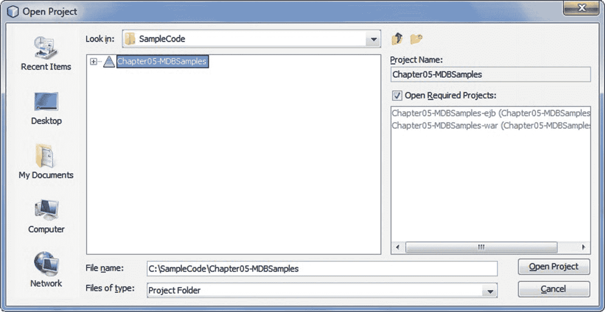

图 5-6

打开 Chapter05-MDBSamples 项目

展开`Chapter05-MDBSamples-ejb`节点，观察我们创建的 MDB 和会话 Bean 出现在`com.apress.ejb.chapter05`包中。同样，两个客户端 Servlet 出现在`Chapter05-MDBSamples`-war 节点下，如图 5-7 所示。

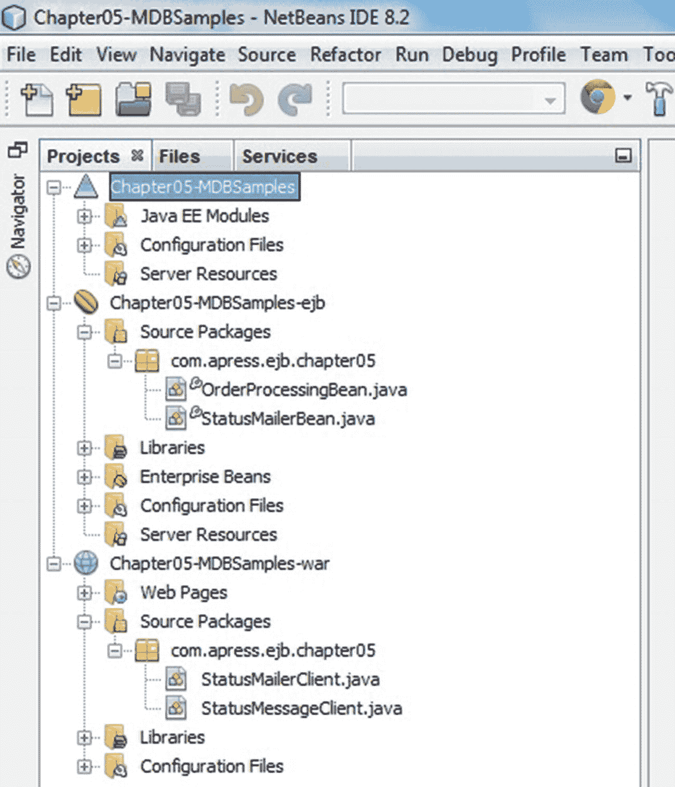

图 5-7

验证 MDB、会话 Bean 及其客户端在项目中可用

在`Chapter05-MDBSamples`节点上调用上下文菜单，通过选择`清理并构建`菜单选项来构建应用程序，如图 5-8 所示。

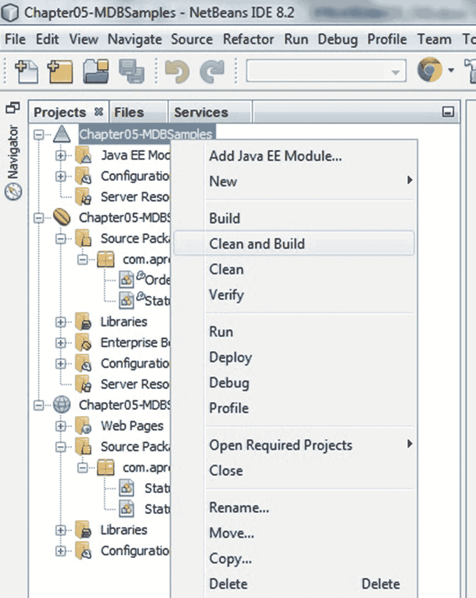

图 5-8

构建应用程序

### 创建 JMS 和 JavaMail 资源

`StatusMailer` MDB 使用了 JMS 和 JavaMail 资源。在将`Chapter05-MDBSamples`应用程序部署到 GlassFish 之前，需要预先配置这些资源。首先，我们将启动 GlassFish 应用服务器，然后通过基于 Web 的管理控制台配置 JMS 和 JavaMail 资源。

点击 NetBeans 应用程序导航器中的`'服务'`选项卡。`'GlassFish Server 3+'`列在`'服务器'`节点下。在`'GlassFish Server 3+'`上调用上下文菜单，通过选择`启动`菜单选项来启动服务器。如图 5-9 所示。

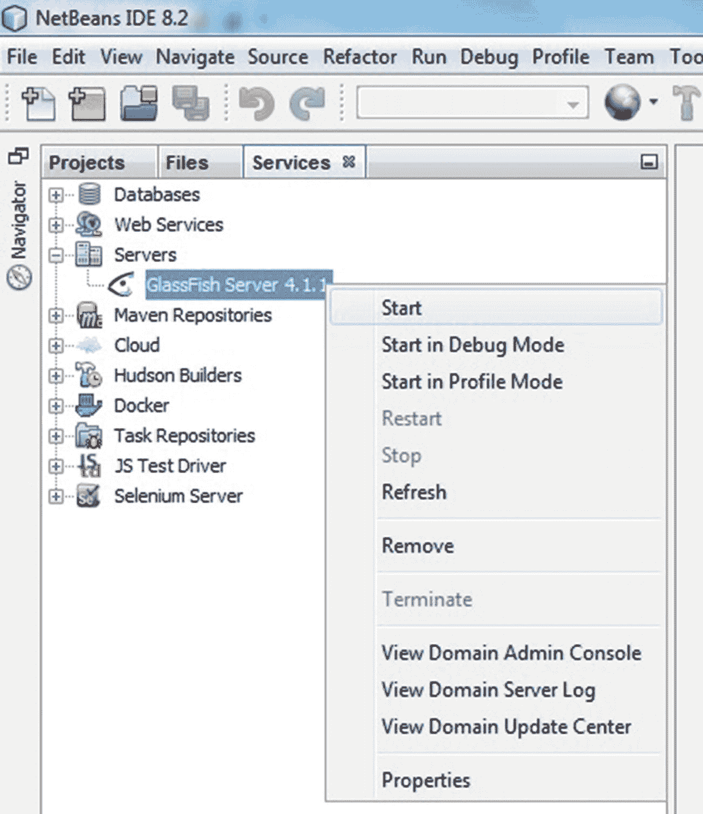

图 5-9

启动 GlassFish 应用服务器

GlassFish Server 4.1.1 的启动日志文件如图 5-10 所示。

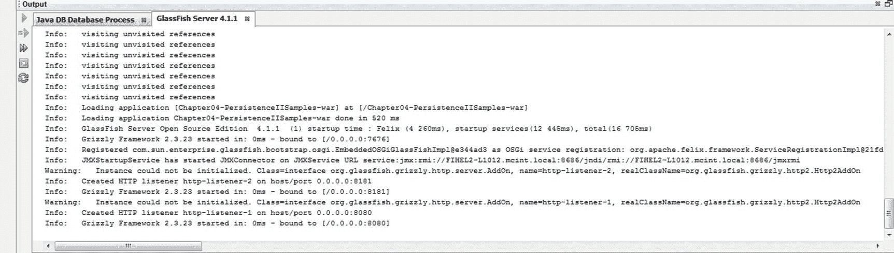

图 5-10

GlassFish 应用服务器启动日志文件

服务器启动后，打开您喜欢的浏览器并导航至`http://localhost:4848/`。GlassFish 4.1.1 版本服务器的管理控制台将加载，如图 5-11 所示。

注意

如果您在不同的机器上运行 GlassFish，请在命令行参数中将该机器名称替换为`localhost`。同样，如果您在不同的端口上运行，请将您运行的端口号替换为`4848`。

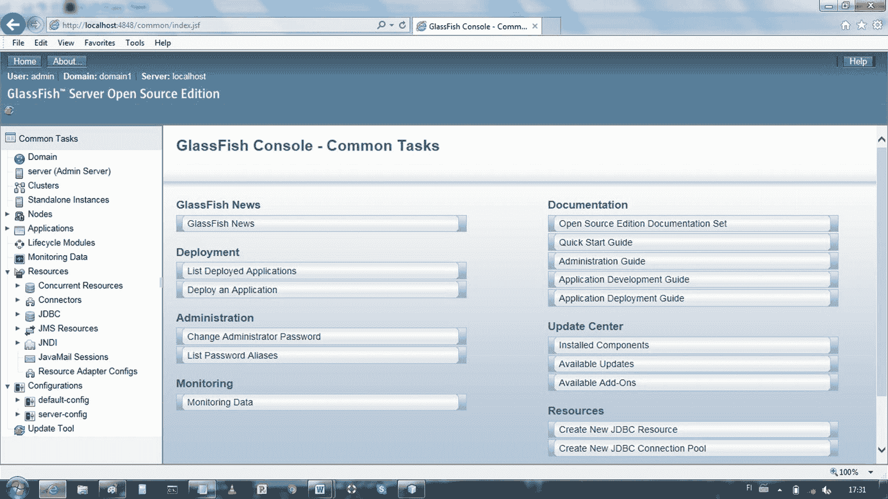

图 5-11

GlassFish 4.1.1 服务器的管理控制台

使用管理控制台，如图 5-12 所示，创建一个名为`StatusMessageTopicConnectionFactory`的 JMS `TopicConnectionFactory`，`OrderProcessing`会话 Bean 将使用它向主题发送消息，该消息将由`StatusMailer MDB`消费。

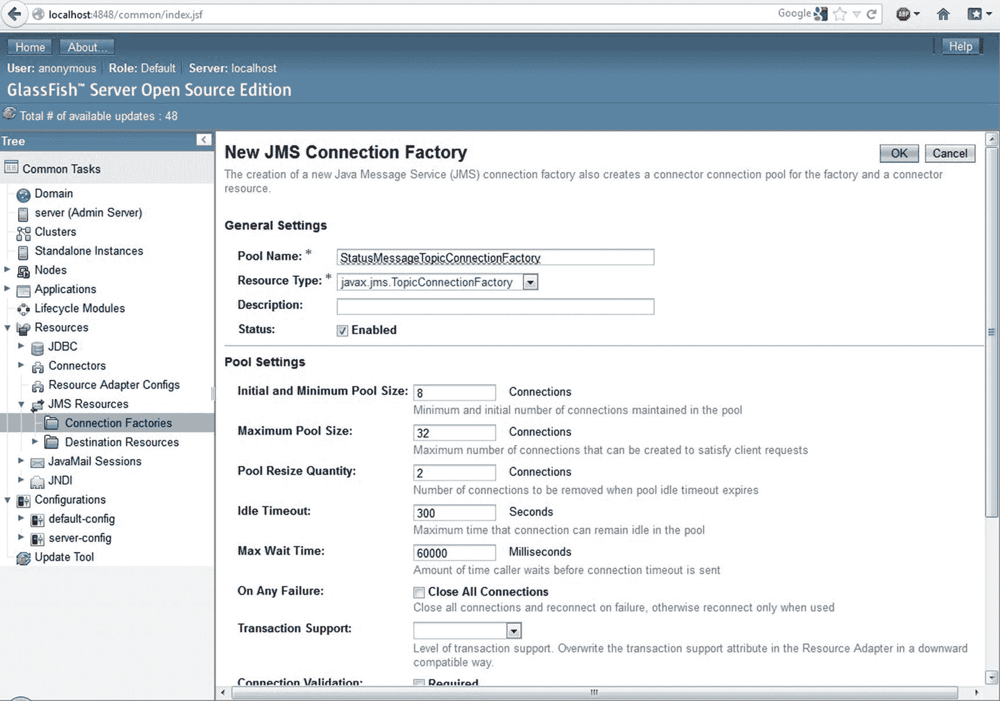

图 5-12

创建 TopicConnectionFactory

然后创建一个名为`StatusMessageTopic`的 JMS 主题，如图 5-13 所示。

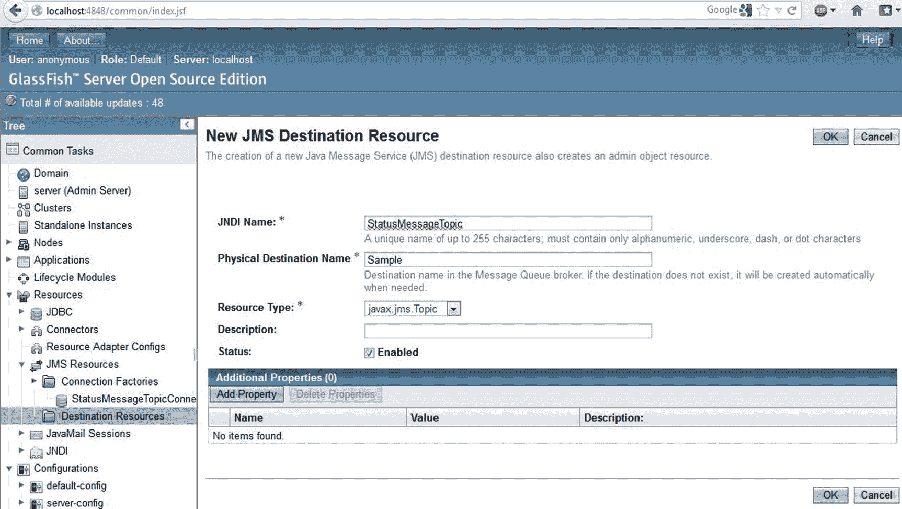

图 5-13

创建 JMS 主题

创建一个名为`mail/wineappMail`的 JavaMail 资源，`StatusMailer` MDB 将使用它发送电子邮件，如图 5-14 所示。

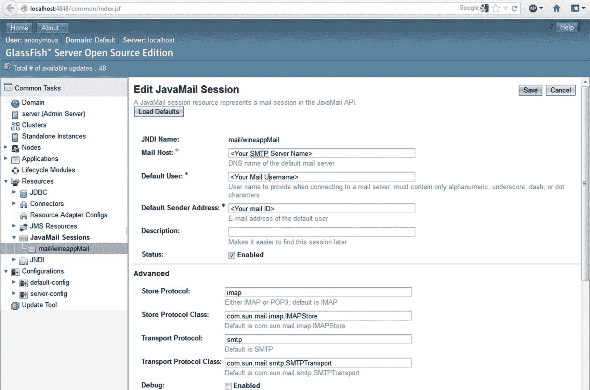

图 5-14

创建 JavaMail 资源

如果 SMTP 服务器需要身份验证，则设置“附加属性”，如图 5-15 所示。

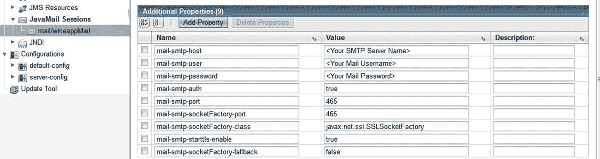

图 5-15

为需要身份验证的 SMTP 服务器设置附加属性

### 部署会话 Bean、MDB 及其客户端

配置好 JMS 和 JavaMail 资源后，您可以将应用程序部署到 GlassFish 应用服务器。在`Chapter05-MDBSamples`节点上调用上下文菜单，通过选择`部署`菜单选项来部署应用程序，如图 5-16 所示。

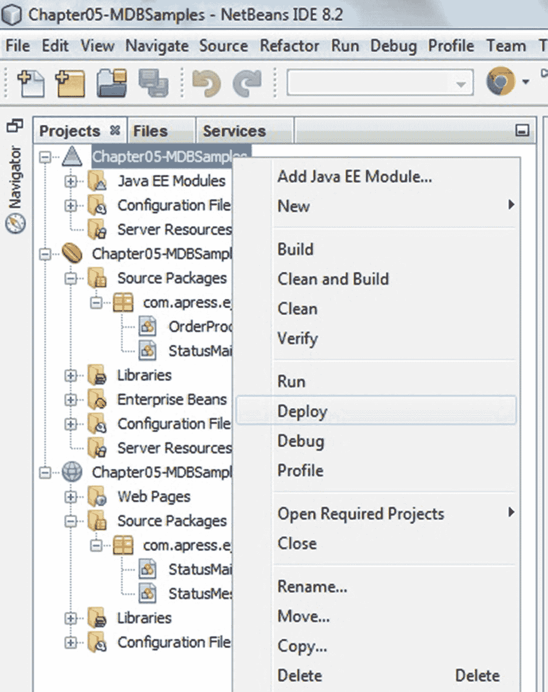

图 5-16

部署 MDB、会话 Bean 及其客户端

### 运行客户端程序

成功部署 MDB、会话 Bean 及其客户端 Servlet 后，我们需要设置要执行的运行目标。我们有两个运行目标可供选择：`StatusMailerClient`或`StatusMessageClient`。要设置运行目标，请在`Chapter05-MDBSamples`节点上调用上下文菜单，并选择“属性”菜单选项。

要运行客户端 Servlet，请在`Chapter05-MDBSamples`节点上调用上下文菜单，并选择`运行`菜单选项，如图 5-17 所示。

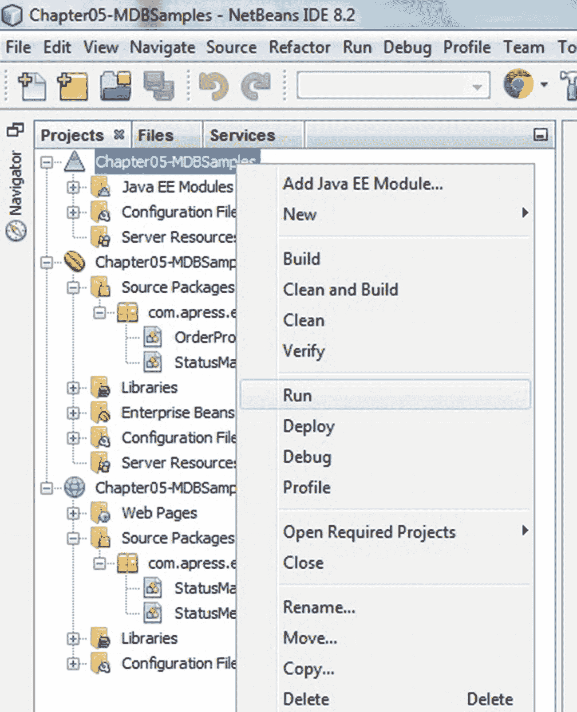

图 5-17

运行 StatusMailerClient 应用程序目标

`StatusMailerClient`成功运行后，NetBeans 将打开您的默认浏览器并执行选定的 Servlet。以下是`StatusMailerClient servlet`的输出。您还应该能够在收件箱中看到发送消息的电子邮件，如图 5-18 所示。

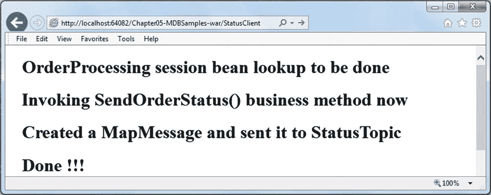

图 5-18

StatusMailerClient Servlet 的输出

## 总结

在本章中，我们向您介绍了面向消息的中间件的概念，以及为什么企业正在寻求能够以异步方式进行通信的松散耦合应用程序。

我们介绍了采用 P2P 和发布-订阅模型的消息应用程序架构，并讨论了为什么消息传递是实现异步应用程序的最佳方式之一。我们详细研究了 JMS，包括不同的 JMS 组件，如提供者、消费者、客户端和不同类型的消息。我们研究了 MDB 以及构成它们的各种工件。我们介绍了 MDB 的不同配置属性，以及如何使用注解设置它们。我们通过注入 JavaMail 资源的具体示例解释了 MDB 中的依赖注入。我们讨论了编译、打包、部署和测试 MDB 所需的内容，以及如何在 GlassFish 应用服务器中创建不同类型的资源的信息。最后，我们介绍了使用 GlassFish 中的应用程序客户端容器运行示例客户端程序，查看输出以及接收 MDB 发送的电子邮件消息。

在下一章中，我们将深入探讨 Web 服务，包括如何将会话 Bean 发布为 Web 服务，以及如何从 EJB 应用程序调用 Web 服务。

