# 6. EJB、Web 服务与微服务

本章将解释 Java EE 8 Web 服务与微服务及其区别。我们将介绍核心 Web 服务标准（SOAP、WSDL、UDDI、XML），并讨论 Java EE 平台中 Web 服务和微服务支持的演变。我们还将深入探讨如何将 EJB 无状态会话 Bean 发布为 Web 服务，以及如何从命令行 Java 客户端程序和无状态会话 Bean 调用已发布的 Web 服务。最后，我们将展示一个使用 Spring Boot 项目的关于微服务的简短示例。


## 什么是 Web 服务？

Web 服务本质上构成了一种业务逻辑或功能，这些逻辑或功能存在于某个应用程序或模块中，并通过服务接口暴露给客户端应用程序（通常称为服务消费者）。Web 服务的消费者无需了解该 Web 服务的任何实现细节——客户端仅凭服务接口中提供的信息即可访问或调用该 Web 服务。这种架构从根本上提供了一种松耦合模型，消费者无需了解作为 Web 服务暴露的业务逻辑在实现时所特有的技术或基础设施细节。

W3C（万维网联盟）的 Web 服务架构工作组为 Web 服务提供了如下定义：

> Web 服务是一种旨在支持网络上可互操作的机器间交互的软件系统。它拥有一个以机器可处理格式（特别是 WSDL）描述的接口。其他系统通过其描述所规定的方式与该 Web 服务进行交互，通常使用 SOAP 消息，并借助 HTTP 协议结合 XML 序列化以及其他与 Web 相关的标准进行传输。

虽然将细节抽象到接口的概念已在多种语言和分布式架构（例如 EJB 和 CORBA）中使用，但 Web 服务的关键区别在于使用标准来描述服务的抽象、调用和注册。

Web 服务架构遵循“查找-绑定-执行”模型，在该模型中，您在注册中心（UDDI）中找到所需的服务，获取该服务的描述，将其绑定到服务（根据描述创建将发送到服务的消息），最后执行或调用该服务。图 6-1 展示了“查找-绑定-执行”模型。UDDI、WSDL 和 SOAP 是使这种“查找-绑定-执行”模型无处不在并区别于早期计算模型的标准。

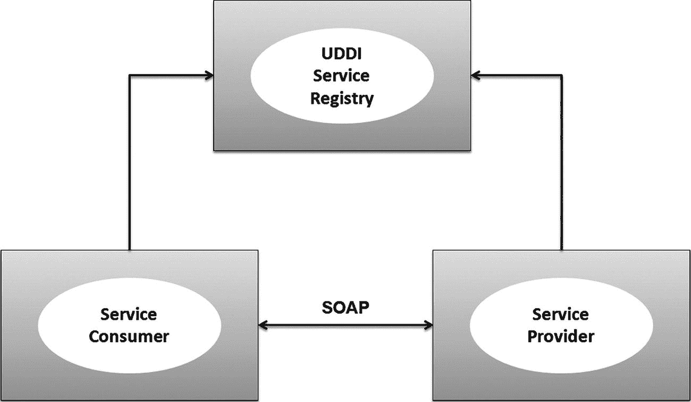

图 6-1

Web 服务架构

### UDDI

统一描述、发现和集成（UDDI）提供了一种基于标准的方法来定位 Web 服务以及获取调用该服务的信息。它还提供了关于该服务的额外元数据。UDDI 帮助您动态绑定 Web 服务，而无需将它们硬编码到外部接口，并且还有助于提供分类法。企业或服务提供商可以提供基本的联系信息（包括标识）、服务的分类、描述其行为的信息以及 Web 服务的实际位置。

目前版本为 3 的 UDDI 在过去几年中不断发展。版本 1 侧重于为服务提供注册中心，而版本 2 侧重于使规范与其他 Web 服务规范和灵活的分类法保持一致。当前版本侧重于为私有或公共服务实现的安全交互提供支持。包括 Oracle、SAP、Microsoft、IBM、Cisco、Computer Associates 和 Systinet 在内的多家公司都是结构化信息标准促进组织（OASIS）的 UDDI 技术委员会成员。大多数应用服务器供应商（如 Oracle 和 IBM）要么将 UDDI 注册中心作为其应用服务器的标准组件提供，要么将 OEM 的 UDDI 注册中心（来自 Systinet 或其他注册中心提供商）作为其中间件平台的一部分提供。

### WSDL

Web 服务描述语言（WSDL），当前版本为 2.0，是一种使用 XML 描述服务接口的技术。WSDL 是由 W3C 开发的标准，过去几年中许多供应商和个人为其做出了贡献。WSDL 描述了服务做什么、如何调用其操作以及在哪里找到它。

WSDL 的详细信息可以分为两类：服务接口定义细节和服务实现定义细节。服务接口定义是一种抽象的或可重用的服务定义，可以被多个服务实现定义实例化和引用。它包含以下 WSDL 元素，这些元素构成了服务描述中可重用的部分。我们将以信用检查 Web 服务为例，介绍此处列出的服务接口定义元素：

#### <definitions> 元素

`<definitions>` 元素允许您指定在 WSDL 文档中可见的命名空间的全局声明。它充当服务描述的容器。清单 6-1 展示了一个示例 `<definitions>` 元素，该元素定义了一个目标命名空间以及信用服务引用的其他命名空间。

```

清单 6-1
CreditService.wsdl 中的 <definitions> 元素
```

#### <types> 元素

`<types>` 元素用于定义 `<message>` 元素的数据类型。XML 模式定义（XSD）最常用于指定数据类型。清单 6-2 展示了一个示例 `<types>` 元素，该元素提供了信用服务的模式位置。

```

清单 6-2
CreditService.wsdl 中的 <types> 元素
```

#### <message> 元素

`<message>` 元素用于定义 Web 服务消费者和 Web 服务提供者之间交换的数据格式。清单 6-3 展示了两个 `<message>` 元素的示例：`CreditCheck` 和 `CreditCheckResponse`。

```

清单 6-3
CreditService.wsdl 中的 <message> 元素
```

#### <portType> 元素

`<portType>` 元素用于指定 Web 服务的操作。清单 6-4 展示了信用服务的 `<portType>` 元素，其中包含 `CreditCheck` 操作。

```

清单 6-4
CreditService.wsdl 中的 <portType> 元素
```

#### <binding> 元素

`<binding>` 元素描述了 `<portType>` 元素的协议、数据格式和安全性。标准绑定是 HTTP 或 SOAP；或者您可以创建自己的绑定。

WSDL 规范的“绑定”部分非常灵活——它允许您提供自己的绑定环境，而不是默认的基于 SOAP-over-HTTP 的模型。规范的这种灵活性已被 WSIF（Web 服务调用框架）广泛利用，这是一个 Apache 开源项目。WSIF 提供了一种很好的方式，将现有的基于 Java、EJB、JMS（Java 消息服务）和 JCA 的组件作为具有本地绑定的 Web 服务暴露出来，这些本地绑定提供了更好的性能并支持本地事务。清单 6-5 展示了信用服务的 `<binding>` 元素，使用了 SOAP-over-HTTP。

```

清单 6-5
CreditService.wsdl 中的 <binding> 元素
```

WSDL 文档的服务实现定义部分标识了一个 Web 服务。它包含以下元素：

#### <service> 元素

`<service>` 元素包含一组 `<port>` 元素，其中每个端口都与一个端点（网络地址位置或 URL）相关联。清单 6-6 展示了信用服务的 `<service>` 元素示例。

```

清单 6-6
CreditService.wsdl 中的 <service> 元素
```

清单 6-7 展示了我们将在本章后面开发的信用服务的完整 WSDL 文档。

```

清单 6-7
CreditService.wsdl 的完整 WSDL 文档
```


### SOAP

简单对象访问协议（SOAP），当前版本为 1.2，是一种基于 XML 的协议，用于在分布式和去中心化环境中使用 XML 交换信息。SOAP 是由 W3C 开发的标准。从根本上说，SOAP 是 Web 服务的默认传输层。

一条 SOAP 消息是一个普通的 XML 文档，包含以下元素：

*   必需的 `Envelope` 元素将 XML 文档标识为 SOAP 消息。`Envelope` 是文档中的顶级元素。该信封是必需的，它基本上标记了 SOAP 消息的开始和结束（尽管消息可以包含指向信封外部对象的链接）。信封包含 `Header` 和 `Body` 元素。
*   可选的 `Header` 元素包含头部信息。当 SOAP 协议通过 HTTP 使用时，HTTP 头部提供有关内容类型、内容长度和消息接收者的信息。包含头部是为了在不事先与通信方达成协议的情况下向 SOAP 消息添加功能。
*   必需的 `Body` 元素包含调用和响应信息。`Body` 是必需元素，包含供消息接收者使用的信息。
*   可选的 `Fault` 元素提供有关消息处理过程中发生的错误的信息。`Body` 元素可以包含一个可选的 `Fault` 元素来报告错误。

图 6-2 展示了 SOAP 消息的元素。

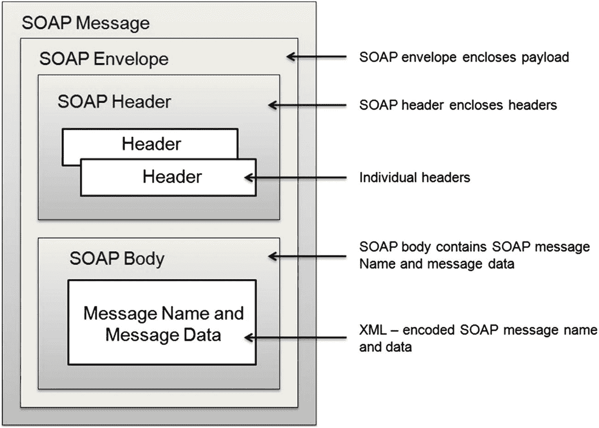

图 6-2

一条 SOAP 消息

### REST

REST（表述性状态传递）是一种软件架构模式，它使用 HTTP（超文本传输协议）在分布式和去中心化环境中发现、查询和操作资源。近年来，由于其简单性，REST 比基于 WSDL-SOAP 的实现更受欢迎。

使用 REST，客户端通过 URI（统一资源标识符）和标准的 HTTP 方法集（GET、POST、PUT 和 DELETE）访问服务器上的资源。作为响应，服务器返回资源的表述，这实际上是一个包含资源当前或预期状态的文档。在每次访问调用和相应的新资源表述响应之后，客户端被认为进行了状态传递，因此得名表述性状态传递。REST 架构模式规定了以下六个约束：

1.  客户端-服务器架构：客户端和服务器应该分离，并且只能通过统一接口进行交互。这种分离意味着客户端不关心服务器的数据存储内部细节，服务器也不关心客户端的用户界面。
2.  无状态交互：客户端和服务器只能使用像 HTTP 这样的无状态协议进行交互。服务器不能在请求之间存储客户端上下文。所有请求必须包含这些请求所需的所有信息。
3.  可缓存：服务器响应必须将其自身标识为可缓存或不可缓存。这可用于防止客户端使用过时数据，也有助于提高性能和可扩展性。
4.  分层系统：客户端应该能够无缝连接到中间系统，而不是直接连接到最终服务器。中间系统提供负载均衡和共享缓存等功能，从而提高系统的可扩展性。
5.  命名资源：客户端必须能够在每个请求中使用 URI 识别单个服务器资源。
6.  统一接口：客户端和服务器之间的统一接口允许它们独立演进。

#### RESTful Web 服务

RESTful Web 服务是基于上述 REST 原则构建的服务。RESTful Web 服务使用 HTTP 并实现映射到常见 HTTP 方法的操作，如表 6-1 所示。

表 6-1

HTTP 方法到 CRUD 操作的映射

| HTTP 方法 | CRUD 操作 |
| --- | --- |
| `POST` | 创建 |
| `GET` | 检索 |
| `PUT` | 更新 |
| `DELETE` | 删除 |

清单 6-8 展示了一个名为 `CreditCheck` 的简单 RESTful Web 服务，它接受一个信用卡号作为输入，并根据其有效性返回 `true` 或 `false`。为简单起见，我们的方法始终返回 `true`。

```
package com.apress.ejb.chapter06.services;
import javax.ws.rs.Consumes;
import javax.ws.rs.PUT;
import javax.ws.rs.Path;
import javax.ws.rs.PathParam;
import javax.ws.rs.Produces;
@Path("creditCheck")
public class CreditCheck {
@PUT
@Consumes("text/plain")
@Produces("text/plain")
@Path("isValid")
public boolean isValid(@PathParam("cardNumber")String ccNumber) {
return true;
}
}
清单 6-8
CreditCheck.java
```

用户可以如下调用 `CreditCheck` 中的 `isValid` 方法，并且 `ccNumber` 将被赋值为 12345。

`http://<host>:<port>/<resource>/creditCheck/isValid/12345`

#### RESTful 与基于 SOAP 的 Web 服务

表 6-2 列出了 RESTful Web 服务和基于 SOAP 的 Web 服务之间的重要区别和相似之处。

表 6-2

RESTful 与基于 SOAP 的 Web 服务

| 标准 | SOAP | RESTful |
| --- | --- | --- |
| 规范 | JAX-WS | JAX-RS |
| 简单/复杂 | 复杂 | 简单 |
| 消息大小 | 大（XML 标记） | 小（无额外 XML 标记） |
| 基于标准 | 是 | 否 |
| 传输 | HTTP, SMTP, JMS | HTTP |
| 缓存 | 否 | GET 操作可被缓存 |
| 协议 | JMS, SMTP, HTTP | HTTP |
| 人类可读负载 | 否 | 是 |
| 语言和平台 | 独立 | 独立 |

### 何时使用 Web 服务？

Web 服务提供了一种标准方式，使用行业标准将现有或新的应用程序和数据暴露给外部各方——包括客户、供应商和合作伙伴——或企业内的不同部门。Web 服务也可用于集成异构应用程序和数据。

虽然许多企业在内部使用 Web 服务，但也有许多可用的外部 Web 服务示例。一些流行的服务包括包裹跟踪服务（由 FedEx、UPS 和 USPS 等承运商提供）。电子商务网站，如 [`www.amazon.com`](http://www.amazon.com) 、 [`www.yahoo.com`](http://www.yahoo.com) 、 [`www.ebay.com`](http://www.ebay.com) 和 [`www.google.com`](http://www.google.com) ，通过 Web 服务暴露其核心功能。开发者可以订阅并使用这些电子商务提供商提供的 Web 服务，来开发能够为后端系统增加价值或与其无缝集成的应用程序。

## Java EE 8 与 Web 服务

Java EE 平台在过去几年中已经发展成为一个成熟、稳定、可靠且可用的企业应用平台。虽然像 JDBC（Java 数据库连接）、JMS 和 EJB 这样的技术从一开始就存在于 Java EE 平台中，但直到 J2EE 1.4，Web 服务的开发和部署才呈现出更好的形态，因为它们已被标准化，使得 Java EE 平台中的 Web 服务在应用服务器之间更具可移植性，并与 .NET Web 服务可互操作。Java EE 规范的共同目标是为应用程序和服务提供易于开发和部署的特性。Java EE 中与 Web 服务相关的一些关键规范包括 JAX-WS、JAXB、JAXR、SAAJ 和 JSR 224 注解。在接下来的章节中，我们将展示这些规范是什么，以及它们如何与 EJB 一起使用。图 6-3 展示了 EJB 如何在 Java EE 平台下与不同的 Web 服务相关规范进行交互。

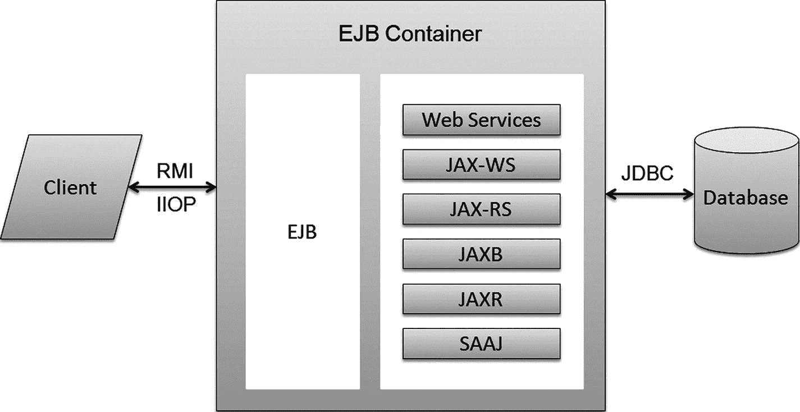

图 6-3

EJB 与 Web 服务


### JAX-WS

JAX-WS（Java API for XML Web Services）定义了用于从 Java 应用程序和 Java EE 组件（如 EJB）访问 Web 服务的 Java API 和注解。JAX-WS 提供了 WSDL 与 Java 接口之间，或从 Java 接口到 WSDL 的映射功能。映射到 WSDL 的接口被称为服务端点接口。JAX-WS 还提供了客户端和服务器端的 API 及注解，用于通过 SOAP 发送和接收 Web 服务请求。Java EE 中的 JAX-WS 规范依赖于 Java EE 平台的其他相关规范（224）和 JAXB。JAX-WS 的当前版本是 2.3（JSR 224）。它还支持最新的 Web 服务标准，如 SOAP 1.2 和 WSDL 2.0。图 6-4 展示了 Web 服务调用的简化示意图。

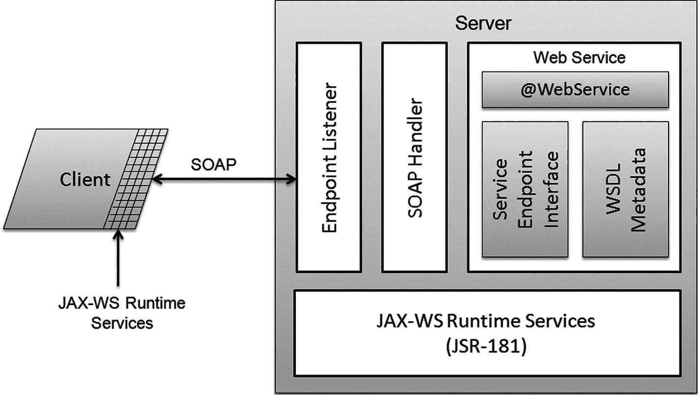

图 6-4

Web 服务调用内部机制

### JAX-RS

JAX-RS（JAX-RS：Java API for RESTful Web Services）定义了用于基于 REST 架构模式创建 Web 服务的 Java API 和注解。JAX-RS 1.1 版本通过 JSR-311 成为 Java EE 6 的组成部分。JAX-RS 提供了诸如 `@PATH`、`@GET`、`@PUT`、`@POST`、`@DELETE`、`@HEAD`、`@PRODUCES`、`@CONSUMES` 等注解，这些注解有助于将 POJO（普通 Java 对象）映射为 Web 资源。JAX-RS 的当前版本是 2.1（JSR 370）。

### JAXB

Web 服务的消费者和提供者使用 XML 消息来发送请求和响应。这些消息可以是类似包含 XSD 的采购订单，这使得相关方（提供者和消费者）能够理解该采购订单。使用底层语言 API 处理 XML 文档可能耗时且涉及复杂代码。在 Java EE 上下文中，JAXB（Java Architecture for XML Binding）规范提供了标准 API，用于将 XML 文档表示为 Java 构件，以便开发人员能够基于模式（XSD）处理代表 XML 文档的 Java 对象。JAXB 规范有助于将 XML 文档解组为 Java 对象集合，并将 Java 对象集合编组回 XML 文档。JAXB 规范为 XML 模式提供全面支持，并为 JAX-WS 提供绑定支持，同时它还利用了其他 Java EE 规范，如 JSR 175。

### JAXR

UDDI 是 Web 服务注册中心的标准。JAXR（Java API for XML Registries）规范定义了一组标准 API，允许 Java 客户端访问注册中心。这些 API 也可用于 UDDI 之外的 XML 注册中心。

### SAAJ

类似于可以在电子邮件中使用的附件，你可以向调用 Web 服务的 SOAP 消息发送附件。SAAJ（SOAP with Attachments API for Java）Java API for XML Registries 定义了一组标准 API，允许 Java SE 或 EE 组件构建带有附件的 SOAP 消息。

### JSR 224

JSR 224（Java 平台 Web 服务元数据）定义了一组标准注解，可用于简化 Web 服务开发。这些注解可用于 Java 类或可作为 JAX-WS 组件的 EJB 会话 Bean。JSR 224 补充了旧的 JSR-181 注解。

## 作为 Web 服务的 EJB 无状态会话 Bean

使用 WSDL 描述的 Web 服务端点在本质上是无状态的。无状态会话 Bean 也具有相同的无状态特性，非常适合开发 Web 服务。EJB 规范依赖于 Java EE 平台中的其他 Web 服务规范，包括 JAX-WS、JAXB 和 JSR 224，无论是用于消费 Web 服务还是将无状态会话 Bean 发布为 Web 服务。

服务端点接口（SEI）是映射到 Web 服务的接口。JAX-WS 提供了这个映射层。为了开发一个新的 Web 服务，你可以采用自底向上或自顶向下的方法，这两种方法将在下面描述。

在自底向上的方法中，你从一个 SEI 和一个可以发布为 Web 服务的实现开始。在此过程中，Web 服务构件（如 WSDL 文档）会在部署时或通过 Java EE 应用服务器提供的管理工具或实用程序生成。

在自顶向下的情况下，你从一个 WSDL 文档开始，并使用实现 JAX-WS 的工具生成一个 SEI。一旦有了 SEI，你就可以为其添加实现。对于 EJB 无状态会话 Bean，你需要使用 JAX-WS 和 JSR 224 规范中提供的注解来标记业务接口和/或 Bean 类，以便在部署时生成正确的 Web 服务构件集。Java EE 规范要求添加到组件中的注解在部署时被处理，以生成正确的构件集。带有 Web 服务注解的 EJB 无状态会话 Bean 也不例外；它们也在部署时由应用服务器提供的部署实用程序处理。每个 SEI 对应一个无状态会话 Bean。

### 开发一个新的 Web 服务

无状态会话 Bean 使用第 2 章中描述的编程模型来实现。如果你想将一个无状态会话 Bean 作为 Web 服务，你将需要以下类：

*   一个 Bean 类（实现）
*   一个 Web 服务端点接口（可选）
*   如果 Bean 类有本地或远程客户端，则需要额外的业务接口


#### 创建 Bean 类

无状态会话 Bean 类是一个标准的 Java 类，带有类级别的 `@Stateless` 注解。从版本 3 开始，EJB 规范不再强制要求 SEI。是否提供 SEI 以及 Bean 类是可选的。在 Bean 类将作为 Web 服务发布且不包含任何服务端点接口的用例中，Bean 类将额外带有类级别的 `@WebService` 注解（JSR 224）。`@WebService` 注解位于 `javax.jws` 包中，它将 Bean 类标记为基于 SOAP 的 Web 服务的实现。

`@WebService` 注解接受表 6-3 中描述的参数。

表 6-3

@WebService 注解

| 参数 | 描述 | 附加信息 |
| --- | --- | --- |
| `name` | 映射到 `wsdl:portType` 的 Web 服务名称。 | 如果未指定，则使用 Java 类的名称。 |
| `targetNamespace` | 用于 Web 服务的 XML 命名空间。 | 如果未指定，则使用 Java 类的名称。 |
| `serviceName` | 映射到 `wsdl:service` 的 Web 服务名称。 | 如果未指定，则使用 Java 类的名称。 |
| `wsdlLocation` | WSDL 文档的位置，当 Bean 类实现现有 Web 服务时会派上用场。 |   |

为了说明一个作为 Web 服务发布的无状态会话 Bean，我们将创建一个 `CreditServiceEndpointBean`，它将作为 `CreditService` 发布。

在清单 6-9 中，我们有一个 Java 类 `CreditCheckEndpointBean`，它有两个类级别的注解：`@Stateless` 和 `@WebService`。`@Stateless` 注解提供了一个额外的参数，将 Bean 标记为 `CreditCheckEndpointBean`。如果同一个类暴露给远程或本地客户端，这些客户端将使用该名称访问无状态会话 Bean。`@WebService` 注解提供了两个额外的参数：一个将服务名称标记为 `CreditService`，另一个指定目标命名空间（而不是使用默认的 Java 包结构）。

```
package com.apress.ejb.chapter06.services;
import javax.ejb.Stateless;
import javax.jws.WebMethod;
import javax.jws.WebService;
@Stateless(name = "CreditCheckEndpointBean")
@WebService(serviceName = "CreditService", targetNamespace = "http://www.apress.com/ejb/credit")
public class CreditCheckEndpointBean  {
public CreditCheckEndpointBean() {
}
}
清单 6-9
CreditCheckEndpointBean.java
```

JSR 224 中定义的 `@WebMethod` 注解允许你自定义作为 Web 服务操作暴露的方法。如果带有 `@WebService` 注解的 Bean 类中没有指定任何 `@WebMethod` 注解，那么所有公共方法都将作为 Web 服务操作暴露。

`@WebMethod` 注解接受表 6-4 中描述的参数。

表 6-4

@WebMethod 注解

| 参数 | 描述 | 附加信息 |
| --- | --- | --- |
| `operationName` | 与此方法匹配的 `wsdl:operation` 的名称。 | 默认情况下，这是 Java 方法的名称。 |
| `action` | 此操作的动作。对于 SOAP 绑定，它将是 `SOAP action` 标头的值。 | 默认情况下，这是 Java 方法的名称。 |

在清单 6-10 中，我们在 `CreditCheckEndpointBean` 类中添加了以下方法，该方法将作为 Web 服务操作暴露。操作名称通过 `@WebMethod` 参数自定义为 `CreditCheck`。该方法接受一个 `java.lang.String` 参数（即信用卡号），并根据信用卡是否有效返回 `true` 或 `false` 的 `java.lang.boolean` 值。为简单起见，我们将始终返回 `true`。

```
@WebMethod(operationName="CreditCheck")
public boolean validateCC(String cc){
return true;
}
清单 6-10
CreditCheckEndpointBean.java 中的 validateCC 方法
```

#### Web 服务端点接口

JAX-WS 不强制要求使用 SEI 来实现 Web 服务端点。你可以使用 JSR 224 中提供的注解将 Bean 类标记为 Web 服务，并将一个或多个业务方法标记为 Web 服务操作。在为无状态会话 Bean 定义了 SEI 的用例中，应遵守以下规则：

*   SEI 必须具有 `javax.jws.WebService` 注解。
*   一个或多个方法可以具有 `javax.jws.WebMethod` 注解。
*   所有方法参数和返回类型应与 JAXB XML 模式映射定义兼容。
*   方法的参数和返回类型必须是有效的 JAX-RPC 值类型，包括 Java 基本类型（`int`、`long` 等）、Java 类（`String`、`Date` 等）、Java Bean 和数组。
*   `Throw` 子句必须包含 `java.rmi.RemoteException` 以及任何其他应用程序异常。

注意

自 Java EE 7 起，对 JAX-RPC 的支持已成为可选项。从 Java EE 7 开始，规范鼓励新应用程序使用 JAX-WS 提供的简化 Web 服务开发的工具。当前版本的 JAX-RPC 是 1.1。

在我们的示例中，我们将注解添加到 Bean 类本身，如清单 6-9 和 6-10 所示。

清单 6-11 说明了提供 SEI 的用例的服务端点接口，清单 6-12 显示了实现该 SEI 的 `CreditCheckEndpointBean` 类。

```
@WebService(serviceName="CreditService",targetNamespace="http://www.apress.com/ejb/credit")
public interface CreditCheckEndpoint {
@WebMethod(operationName="CreditCheck")
public boolean validateCC(String cc);
}
清单 6-11
用例的服务端点接口
```

```
@Stateless
public class CreditCheckEndpointBean implements CreditCheckEndpoint {
public CreditCheckEndpointBean() {
}
// 实现代码在此处
}
清单 6-12
实现 SEI 的 CreditCheckEndpointBean 类
```

## 打包、部署和测试 Web 服务

带有 Web 服务注解的无状态会话 Bean 需要先打包到 EJB Java 归档（JAR）文件中，然后才能部署到 EJB 容器中。对于某些 EJB 容器或应用服务器，它们首先需要被组装成 EAR（企业归档）文件。大多数 EJB 容器或应用服务器提供部署实用程序或 Ant 任务，以方便将 EJB 部署到其容器中。像 JDeveloper、NetBeans 和 Eclipse 这样的 Java 集成开发环境（IDE）也提供部署功能，允许开发者将 EJB 打包、组装和部署到应用服务器。打包、组装和部署方面的内容将在第 11 章中详细讨论。

在本章中，我们开发了一个带有 Web 服务注解的无状态会话 Bean（`CreditCheckEndpointBean`）。我们将执行以下步骤来编译、部署和测试将作为 Web 服务发布的无状态会话 Bean。

### 前提条件

在执行后续章节详述的任何步骤之前，请先完成第 1 章的“入门”部分，该部分将引导你完成本章示例所需的安装和环境设置。


### 编译会话 Bean

将 `Chapter06-WebServiceSamples` 目录及其内容复制到你选择的目录中。运行 NetBeans IDE，并使用 `文件 ➤ 打开项目` 菜单打开 `Chapter06-WebServiceSamples` 项目。确保勾选了“`打开所需项目`”复选框，如图 6-5 所示。

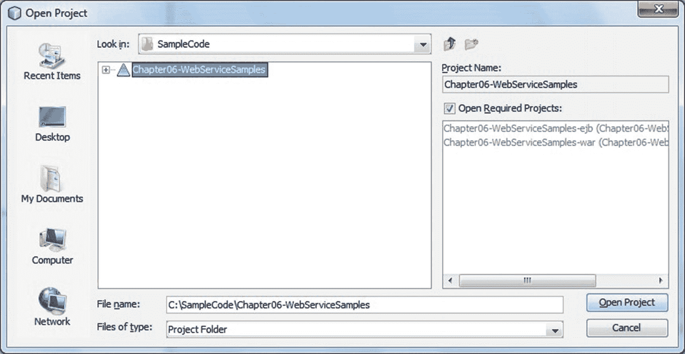

图 6-5

打开 Chapter06-WebServiceSamples 项目

展开 `Chapter06-WebServiceSamples-ejb` 节点，如图 6-6 和 6-7 所示，观察我们创建的基于会话 Bean 的 Web 服务出现在 `com.apress.ejb.chapter06.services` 包中。同样，客户端 Servlet 也出现在 `Chapter06-WebServiceSamples`-war 节点下。

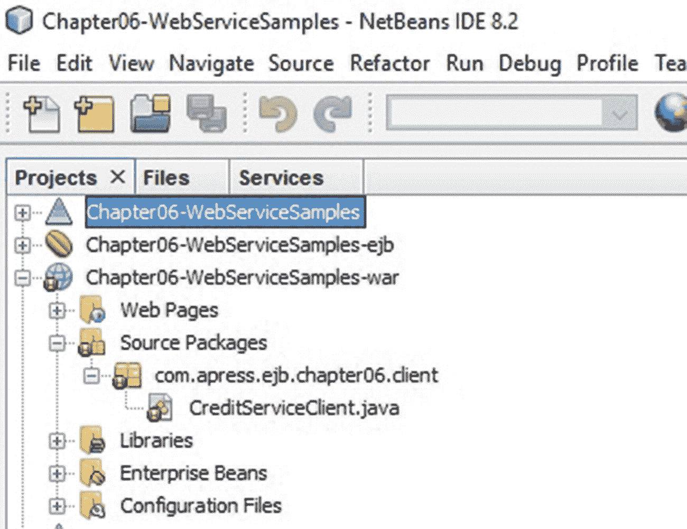

图 6-6

验证会话 Bean 及其客户端在项目中可用

在 `Chapter06-WebServiceSamples` 节点上调用上下文菜单，并通过选择 `清理并构建` 菜单选项来构建应用程序。基于会话 Bean 的 Web 服务将无错误地编译，但 `Chapter06-WebServiceSamples`-war 节点中的客户端将显示编译错误。我们暂时忽略客户端中的这些错误。

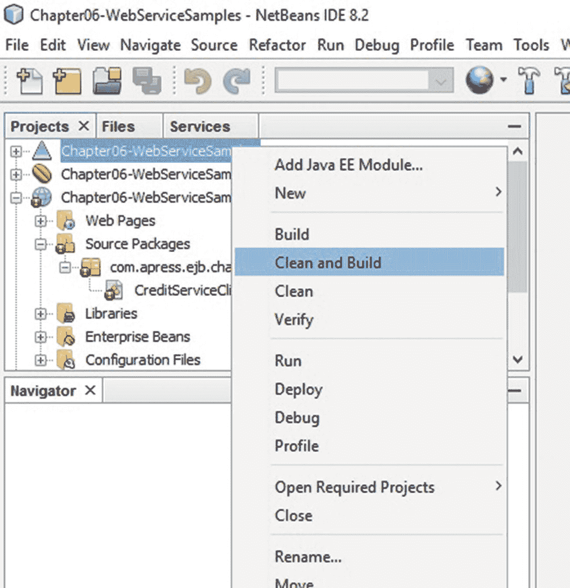

图 6-7

构建应用程序

### 部署基于会话 Bean 的 Web 服务

编译完会话 Bean 后，我们可以将其部署到 GlassFish 应用服务器。在 `Chapter06-WebServiceSamples-ejb` 节点上调用上下文菜单，并通过选择 `部署` 菜单选项来部署应用程序，如图 6-8 所示。

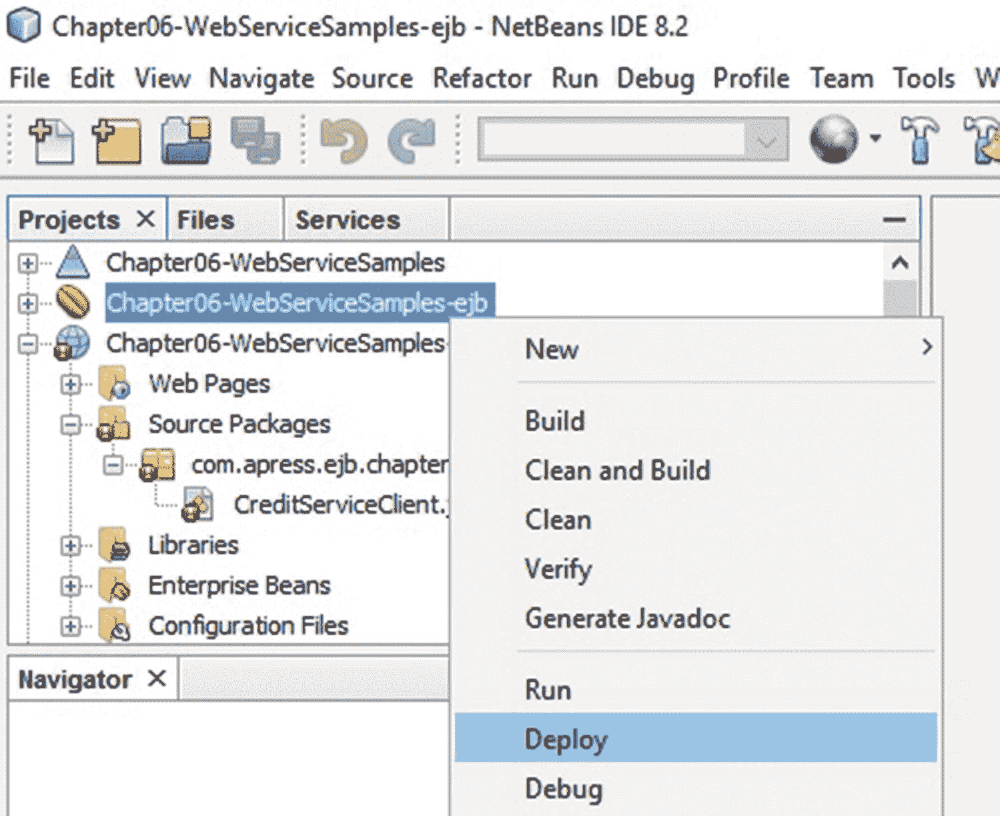

图 6-8

部署 CreditService

### 测试信用服务

成功部署后，我们可以使用测试工具来检查 `CreditService` 是否可以被正确调用。要调用测试工具，请展开 `Chapter06-WebServiceSamples-ejb` 下的 `Web 服务` 节点以显示 `CreditCheckEndpointBean` 节点，然后选择 `测试 Web 服务` 菜单选项，如图 6-9 所示。

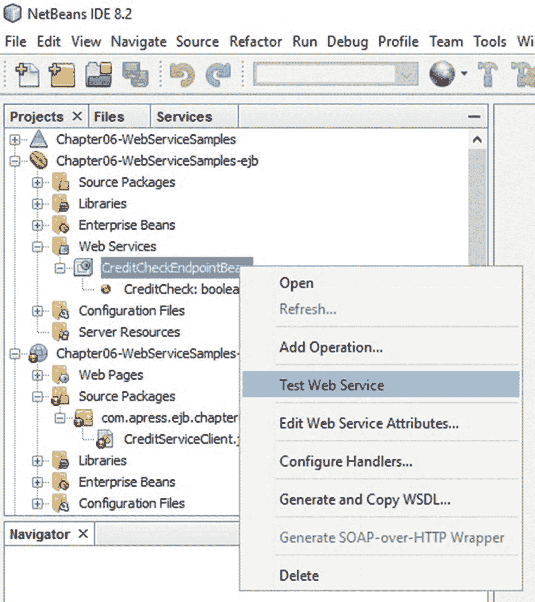

图 6-9

测试 CreditService

在生成的测试工具页面（如图 6-10 所示）中，输入 12345 作为信用卡号，然后点击 `creditCheck` 按钮。你也可以点击 `WSDL 文件` 链接来检查其内容。请将 WSDL `文件` URL 加入书签，因为它将在后续章节中用于创建 Web 服务客户端。

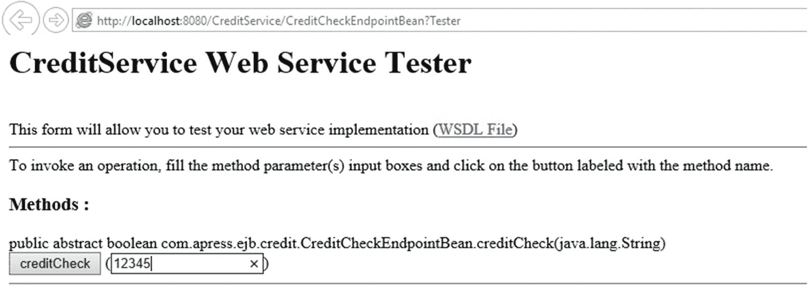

图 6-10

Web 服务测试工具

在生成的页面中，你可以通过 SOAP 请求和响应来测试结果，如图 6-11 所示。

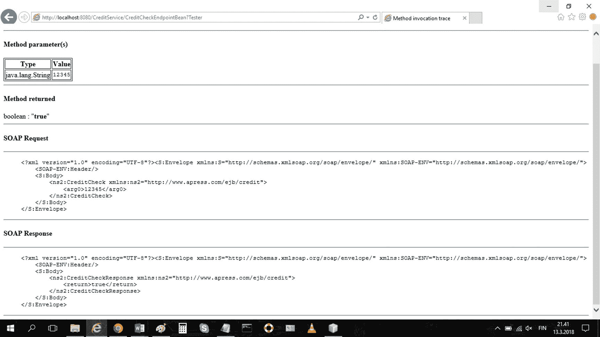

图 6-11

SOAP 请求和响应消息

到目前为止，我们已经了解了如何使用测试工具测试已部署的 Web 服务。在下一节中，我们将讨论 Web 服务客户端，以及如何开发和运行能够调用 Web 服务的程序。在我们的案例中，我们将针对已部署的信用服务进行测试。

## Web 服务客户端视图

发布为 Web 服务的无状态会话 Bean 可以通过部署期间生成的 WSDL 文档所描述的客户端视图进行访问（如清单 6-7 所示）。由于无状态会话 Bean 是使用 WSDL 等标准发布为 Web 服务的，因此任何能够发送和接收 SOAP 消息的客户端应用程序（无论技术或语言）都可以调用它。客户端应用程序可以使用 .NET 或 Java EE，或 PHP、Python 或 Ruby 等脚本语言编写。从客户端的角度来看，它看到的契约是一个 WSDL 文档。为了访问 Web 服务，应该从 WSDL 文档生成编程接口。

Web 服务是位置无关的，并且可以远程访问。如果调用 Web 服务的客户端应用程序是 Java 客户端或其他 Java EE 组件（例如 EJB），则它使用 JAX-WS 客户端 API 或注解通过 SOAP 和 HTTP 调用 Web 服务。

### 开发访问 Web 服务的 Java 客户端

为了通过 WSDL 服务契约访问 Web 服务，客户端程序需要从 WSDL 文档生成的编程接口（通常称为存根或代理）。一旦从 WSDL 文档生成了存根，我们就可以使用 JAX-WS 注解来获取对 Web 服务的引用并调用它。

#### 生成 Web 服务代理类

我们将使用 NetBeans IDE 提供的 `Web 服务客户端` 向导开始为 `CreditService` WSDL 文档生成存根。从 `Chapter06-WebServiceSamples-ejb` 节点的上下文菜单中调用 `Web 服务客户端` 向导，如图 6-12 所示。

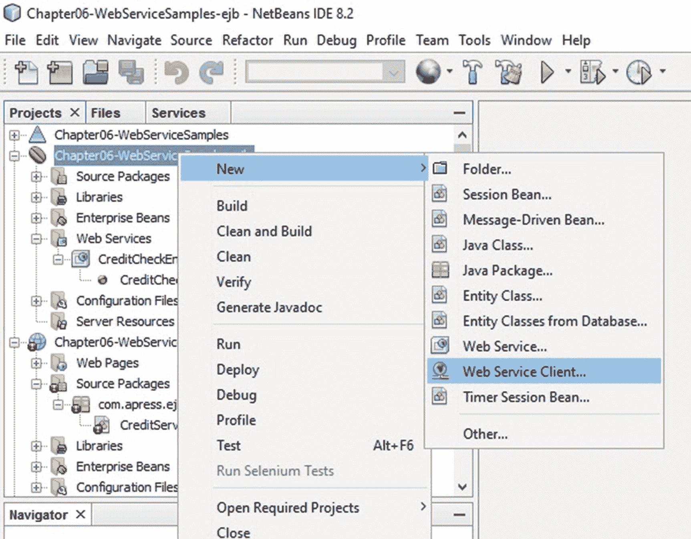

图 6-12

调用 Web 服务客户端向导

在 `Web 服务客户端` 向导中，选择 `WSDL URL` 单选按钮，并输入你在上一节中已加入书签的 `WSDL 文件` URL（见图 6-10）。我们还需要指定将生成客户端 Java 工件的包。我们将这些工件生成在 `com.apress.ejb.chapter06.services.client` 包中。输入这些详细信息，如图 6-13 所示，然后完成向导。

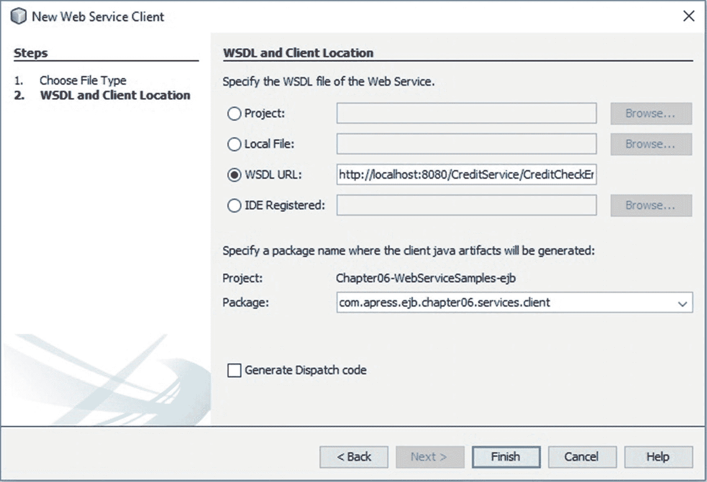

图 6-13

创建 Web 服务客户端

一旦存根生成并编译完成，我们就可以在 `生成的源代码 (jax-ws)` 节点下看到工件，如图 6-14 所示。

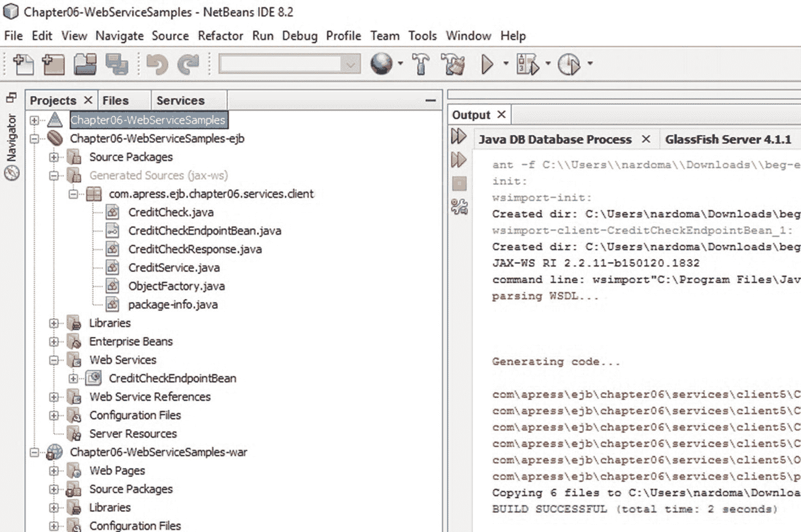

图 6-14

验证生成的存根源代码 注意

GlassFish 还提供了命令行工具 `wsimport.bat`，它可以在给定有效 WSDL 文档的情况下生成 Web 服务存根。如果你将 Web 服务部署到其他兼容 Java EE 的服务器，这些服务器也可能提供一些工具或实用程序来生成 Web 服务的存根。

一旦存根生成并编译完成，下一步就是创建一个将使用 `CreditService` 的客户端。

JAX-WS 规范提供了 `@WebServiceRef` 注解，可用于声明对 Web 服务的引用，在我们的案例中就是 `CreditService`。

`@WebServiceRef` 注解可以接受表 6-5 中描述的参数。

表 6-5

@WebServiceRef 注解

| 参数 | 描述 | 附加信息 |
| --- | --- | --- |
| `name` | 标识 Web 服务引用的名称 | 使用该资源的应用程序组件本地的名称 |
| `wsdlLocation` | 指向 WSDL 文档位置的 URL |   |
| `type` | 资源类型 |   |
| `value` | 服务类型 |   |
| `mappedName` | 用于将资源映射到特定于供应商的容器的资源的物理名称 |   |


#### 开发 Web 服务客户端程序

`@WebServiceRef` 注解要么提供对容器生成的 SEI 的引用，要么提供对应用程序开发者提供的 SEI 的引用。清单 6-13 展示了一个将作为 Web 服务客户端的 Servlet 类。在这个名为 `CreditServiceClient` 的 Servlet 类中，我们使用依赖注入来注入之前作为 Web 服务部署的信用服务。`@WebServiceRef` 注解用于注入已生成为代理类的 `CreditService`。一旦注入了可用资源，我们就使用该代理类通过 `getCreditCheckEndpointBeanPort()` 方法获取 Web 服务端口。成功获取端口后，我们就可以调用该端口上可用的操作。在我们的例子中，只定义了一个操作 `creditCheck`。你可以看到，这里使用信用卡号 12345678 调用了该操作。

```
package com.apress.ejb.chapter06.client;
import com.apress.ejb.chapter06.services.client.CreditCheckEndpointBean;
import com.apress.ejb.chapter06.services.client.CreditService;
import java.io.IOException;
import java.io.PrintWriter;
import javax.servlet.ServletException;
import javax.servlet.annotation.WebServlet;
import javax.servlet.http.HttpServlet;
import javax.servlet.http.HttpServletRequest;
import javax.servlet.http.HttpServletResponse;
import javax.xml.ws.WebServiceRef;
@WebServlet(name = "CreditServiceClient", urlPatterns = {"/CreditServiceClient"})
public class CreditServiceClient extends HttpServlet {
@WebServiceRef(wsdlLocation = "http://localhost:64082/CreditService/CreditCheckEndpointBean?WSDL")
CreditService service;
protected void processRequest(HttpServletRequest request, HttpServletResponse response)
throws ServletException, IOException {
response.setContentType("text/html;charset=UTF-8");
PrintWriter out = response.getWriter();
try {
out.println("");
out.println("");
out.println("Servlet CreditServiceClient");
out.println("");
out.println("");
CreditCheckEndpointBean creditService = service.getCreditCheckEndpointBeanPort();
out.println("Credit Check returned: " + creditService.creditCheck("12345678") + "");
out.println("");
out.println("");
} finally {
out.close();
}
}
@Override
protected void doGet(HttpServletRequest request, HttpServletResponse response)
throws ServletException, IOException {
processRequest(request, response);
}
@Override
protected void doPost(HttpServletRequest request, HttpServletResponse response)
throws ServletException, IOException {
processRequest(request, response);
}
@Override
public String getServletInfo() {
return "Short description";
}
}
清单 6-13
CreditServiceClient.java
```

#### 编译客户端类

在 `Chapter06-WebServiceSamples-war` 节点上调用上下文菜单，并通过选择 `Clean and Build` 菜单选项来构建客户端，如图 6-15 所示。

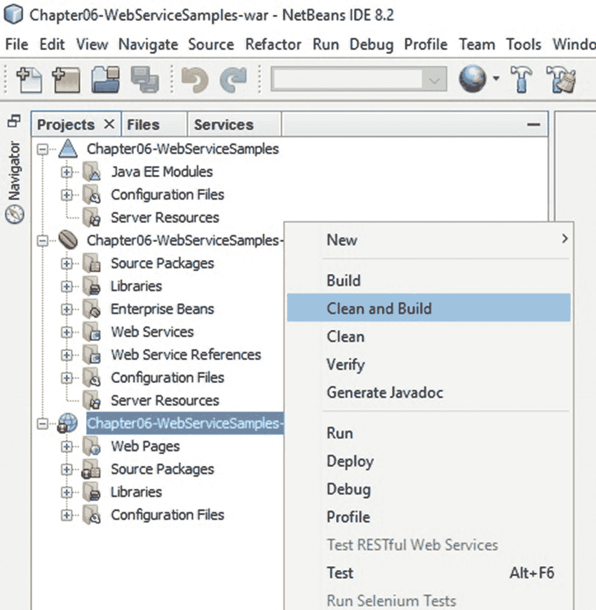

图 6-15

编译 Web 服务客户端

#### 运行 Web 服务客户端

编译完客户端后，我们需要运行它。

要运行客户端 Servlet，请在 `Chapter06-WebServiceSamples` 节点上调用上下文菜单，并选择 `Run` 菜单选项，如图 6-16 所示。

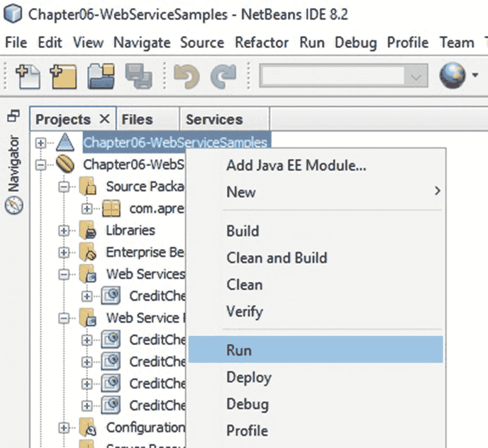

图 6-16

运行客户端

一旦 `CreditServiceClient` 成功运行，NetBeans 将打开您的默认浏览器并执行所选的 Servlet。以下是 `CreditServiceClient` Servlet 的输出，如图 6-17 所示。

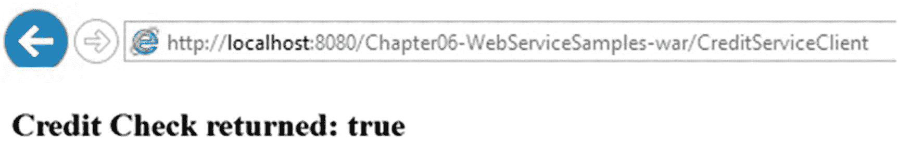

图 6-17

检查 Servlet 输出

### 会话 Bean 作为 Web 服务客户端

会话 Bean 也可以作为 Web 服务的客户端。在我们将在第 7 章构建的示例应用程序中，协调工作流的 `OrderProcessing` 会话 Bean 可以在开始处理订单之前调用信用服务来检查信用卡的有效性。为了充当 Web 服务的客户端，`OrderProcessing` 会话 Bean 将使用 `@WebServiceRef` 注解，类似于我们在之前的客户端示例中展示的那样。

清单 6-14 展示了无状态会话 Bean `OrderProcessFacadeBean`，它实现了本地和远程业务接口。`@WebServiceRef` 注解用于注入对 `CreditService` WSDL 文档的引用。`OrderProcessFacadeBean` 会话 Bean 中的 `PerformCheckCredit()` 方法使用注入的引用来获取 `CreditService` 中的端口，并调用 `creditCheck` 操作。如您所见，从会话 Bean 中注入 Web 服务、获取端口以及调用操作的过程，与我们之前作为 Web 服务客户端的客户端所做的类似。

```
@Stateless(name="OrderProcessFacade")
public class OrderProcessFacadeBean implements OrderProcessFacade,
OrderProcessFacadeLocal {
@WebServiceRef(type=CreditService.class)
CreditService service;
public OrderProcessFacadeBean() {
}
private boolean PerformCreditCheck(Individual customer){
String ccnum  = customer.getCcNum().toString();
CreditCheckEndpointBean creditService =
service.getCreditCheckEndpointBeanPort();
return creditService.creditCheck(ccnum);
}
}
清单 6-14
OrderProcessFacadeBean.java
```


## 什么是微服务？

微服务是面向服务架构（SOA）风格的一种变体。

微服务定义了一种新的架构结构模型，使得一个简单的应用程序被开发为一组多个单一且轻量级的服务。

与以往的架构方法相比，微服务明确地定义了软件开发行业的一个新趋势。

微服务的一个主要优点是，每个服务都可以独立部署和扩展，并且可以使用不同的编程语言编写。

微服务通常通过 HTTP REST API 调用直接调用。像 RAML（RESTful API 建模语言）这样的标准允许对 REST API 进行正式定义。

微服务的开发是直接通过 HTTP 调用和间接通过消息代理调用的结合。

我们将看到单体架构与微服务之间的主要区别，并提供一个微服务开发的示例。

以下是微服务最重要的一些优点和缺点：

优点：

*   更好的软件实践
*   容错性
*   演进式设计
*   易于部署
*   降低耦合度
*   为工作选择合适的工具
*   持续交付
*   更小的代码库更易于推理
*   易于替换旧服务
*   高效扩展
*   更易于开发、理解和维护
*   启动速度比单体应用快
*   局部变更易于部署
*   改善故障隔离
*   非技术驱动，而是业务聚焦

缺点：

*   工具开销
*   调试困难
*   分布式事务
*   延迟
*   依赖关系
*   分布式系统的额外复杂性
*   显著的运维复杂性，需要高水平的自动化
*   协调部署的发布计划

微服务技术栈可能包括：

*   Java
*   Spring
*   Hibernate
*   NodeJS
*   PostgreSQL
*   Redis
*   Bootstrap
*   AngularJS
*   亚马逊云服务
*   Docker
*   RabbitMQ
*   Hystrix

图 6-18 展示了微服务概念。

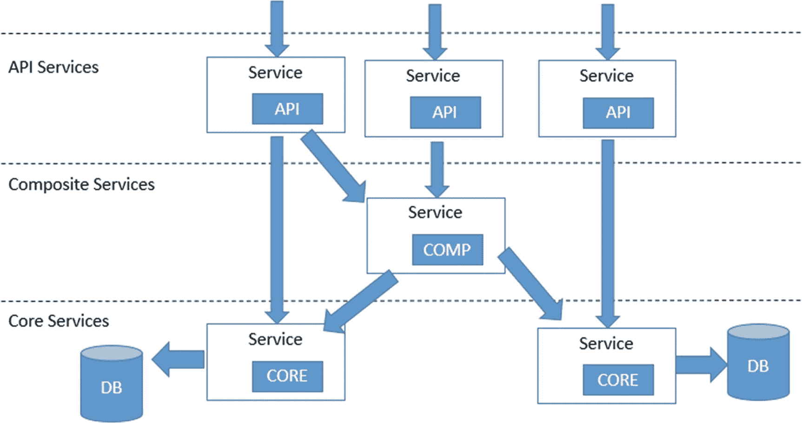

图 6-18

微服务概念

图 6-19 展示了单体架构与微服务之间的主要区别。

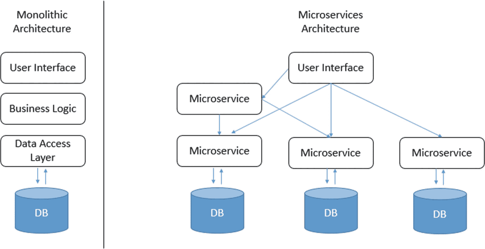

图 6-19

单体架构与微服务对比

总的来说，传统的软件开发流程会导致相对较大的团队在一个单一的、单体式的部署工件上工作，而微服务则是 IT 处理软件开发方式的一个根本性转变。

图 6-20 展示了微服务的通用架构。

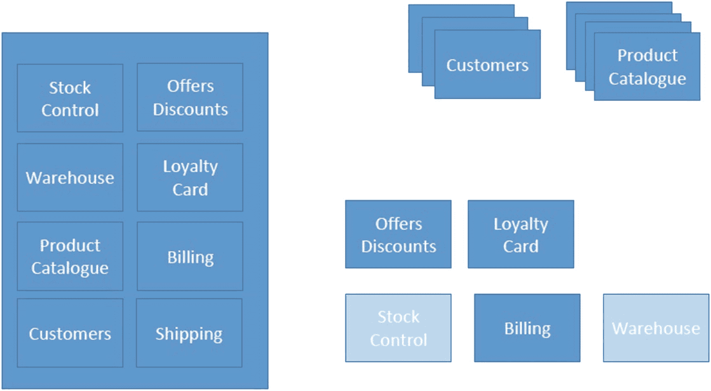

图 6-20

微服务架构

## Java EE 8 与微服务

当然，Java EE 平台可用于开发微服务。

总的来说，Java EE 规范集允许 Java 开发人员轻松创建单体应用程序，因为他们无需担心处理诸如扩展、安全、网络处理、事务管理等技术问题。在开发单体应用时，Java EE 开发人员只需专注于业务问题。

但是，开发单体应用时的问题是，应用程序将被结构化为一个包含多个模块的 EAR 文件，包括以下内容：

*   一个处理集成方面（如 SOAP Web 服务、消息处理等）的 EJB 模块。
*   一个具有通用持久化层的 EJB 模块，用于通过传统方式（如 JPA、JDBC、JCA 等）访问数据存储。
*   多个 WAR 模块

这种情况很容易变得非常复杂，难以开发。而使用 Maven 或 OSGi 等工具，将 Java EE 应用程序模块化（例如微服务），简化了 Java EE 上单体应用的开发，这意味着 Java EE 开发人员的整个应用程序可以部署在单个 WAR 文件中。

以下是使用 Java EE 开发微服务的主要优势：

*   Java EE 极其轻量
*   开发快速
*   大多数替代 Java 框架都基于 Java EE API
*   专注于构建业务功能
*   生成小巧的 WAR 文件
*   版本化运行时 – 有助于运维

Java 中的微服务开发平台包括：

*   Java EE
*   Microprofile
*   OSGI
*   Vertx
*   Akka
*   Dropwizard
*   等等

Java EE 微服务构建工具包括：

*   Maven
*   Gradle

微服务创建以下类型的工件：

*   jar, war, ear, rar 等
*   Java EE 服务器运行时配置

接下来，我们将展示一个 Java EE 8 微服务的示例。

## 使用 Spring Boot 和 NetBeans 的微服务示例

现在，我们将展示如何使用 Spring Boot 和 NetBeans IDE v8.2 开发一个 Java EE 8 微服务应用程序。

Spring Boot 是一个创新项目，可以帮助 Java 开发人员创建简单的、独立的、生产级的基于 Spring 的应用程序等。Spring Boot 可以在 [`https://projects.spring.io/spring-boot/`](https://projects.spring.io/spring-boot/) 找到。


### 前提条件

本示例需要满足以下前提条件：

*   NetBeans IDE 8.2
*   推荐使用 JDK 8
*   Spring Boot 插件：由 Alex Falappa 在 [`https://github.com/AlexFalappa/nb-springboot`](https://github.com/AlexFalappa/nb-springboot) 创建的 NB-SpringBoot

首先，我们必须下载 NB-SpringBoot 插件并将其导入 NetBeans IDE 8.2。

导入后，图 6-21 显示了已安装到 NetBeans 中的 NB-SpringBoot 插件。

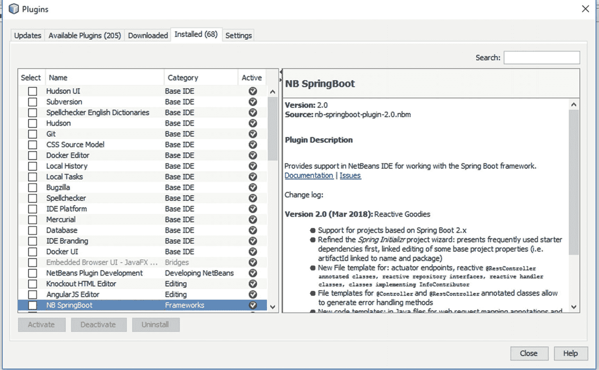

图 6-21

已安装的 NB-SpringBoot 插件

现在，我们可以使用 Spring Boot 创建微服务。

让我们直接使用 NetBeans 中的 Spring Initializer 创建一个新项目，如图 6-22 所示。

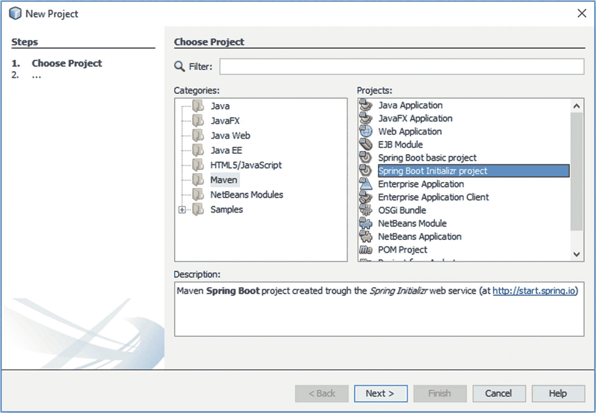

图 6-22

新建 Maven SpringBoot 项目

添加一些项目信息：如图 6-23、6-24 和 6-25 所示。

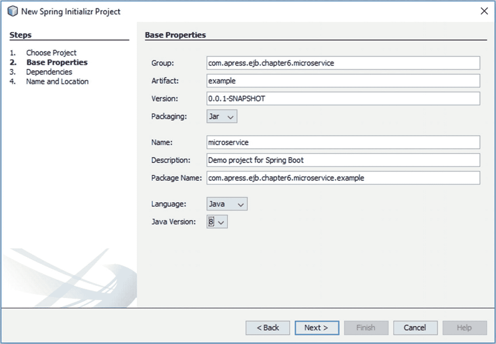

图 6-23

新建 Maven SpringBoot 项目信息

添加 Spring Boot 版本和所需的依赖项，例如 Web：

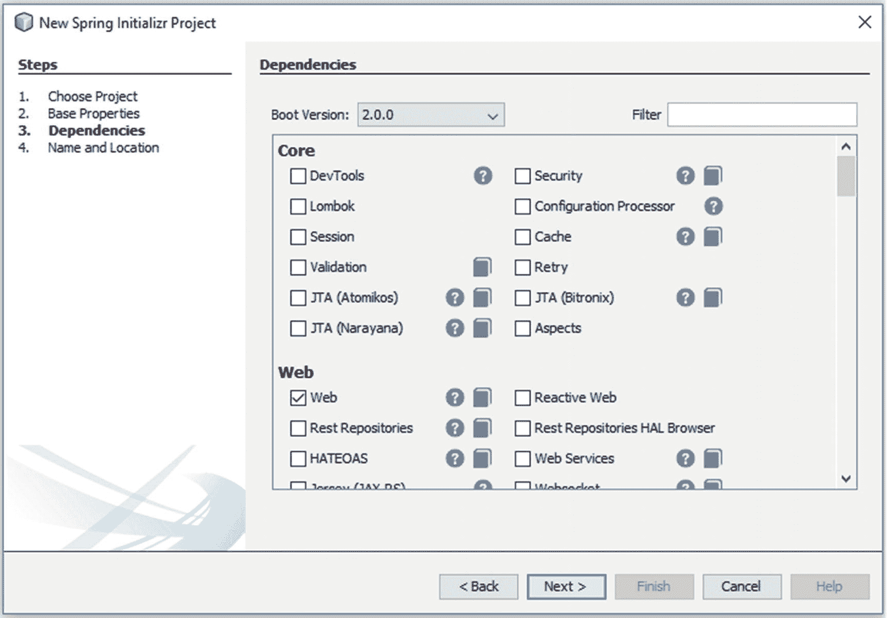

图 6-24

新建 Maven SpringBoot 项目依赖项

接下来，将项目名称添加为“nb-springboot”：

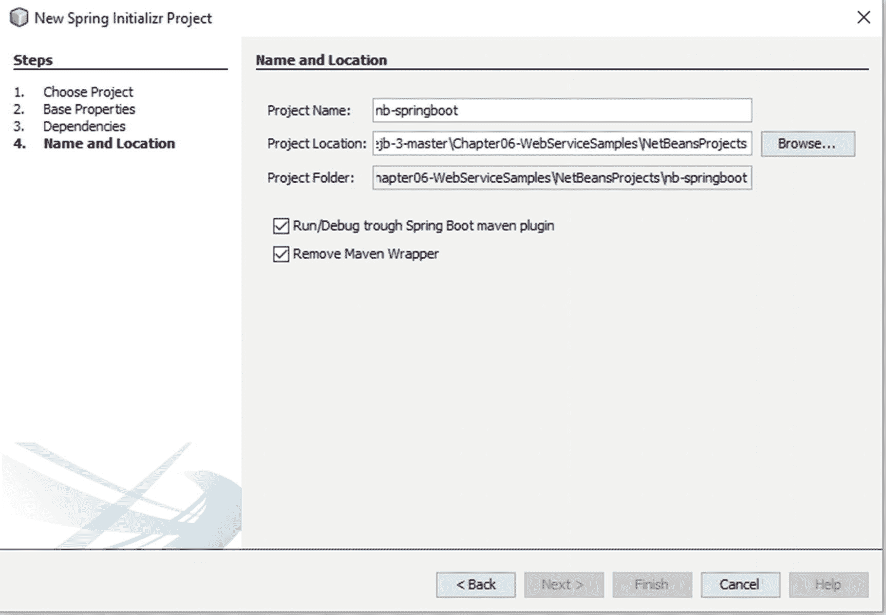

图 6-25

新建 Maven SpringBoot 项目名称

点击“完成”以创建项目，如图 6-26 所示。

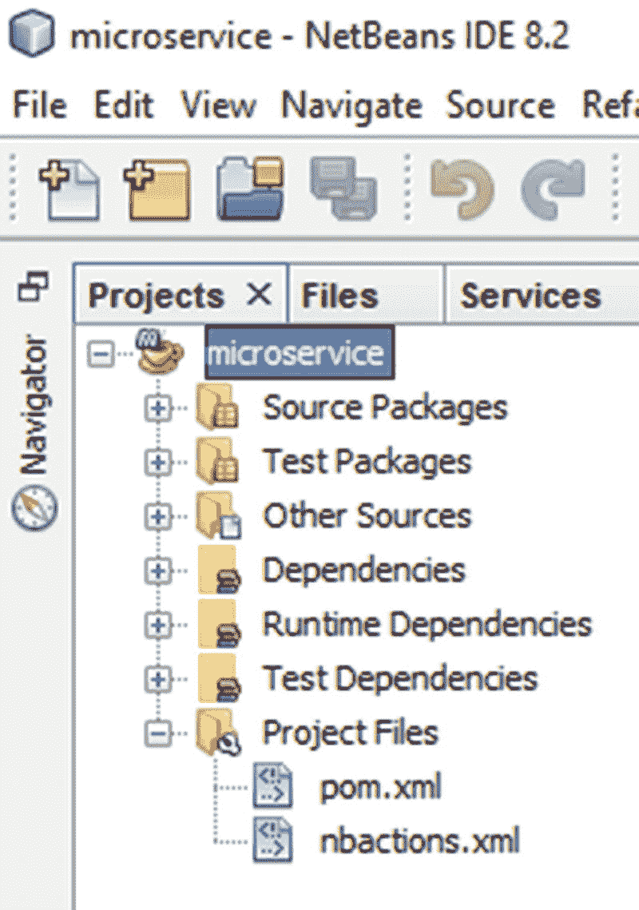

图 6-26

新建 Maven SpringBoot 项目微服务

现在，我们需要创建一个新的 RestController 类文件，如图 6-27 所示。

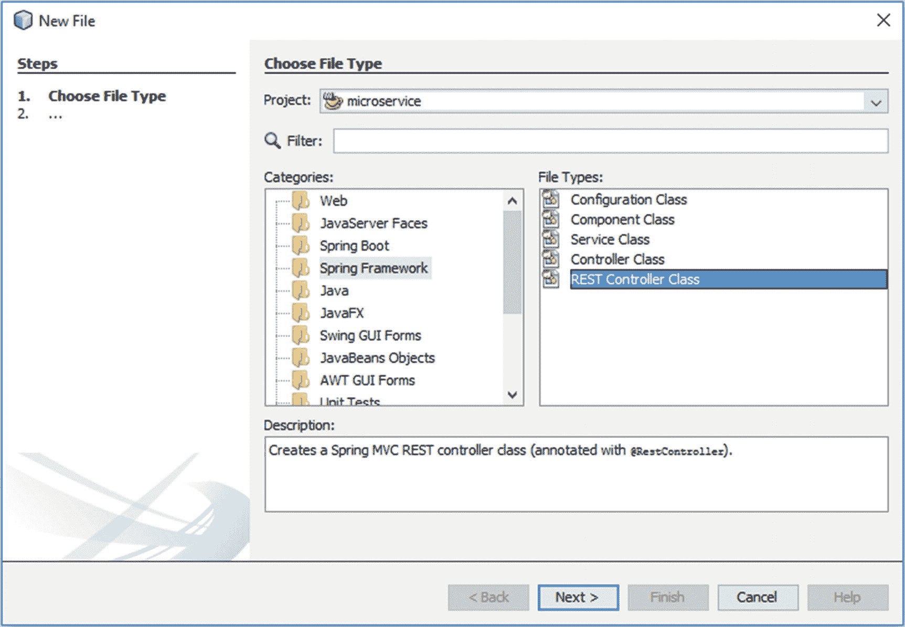

图 6-27

新建 RestController 文件

向文件添加一些信息，然后点击“完成”以创建文件，如图 6-28 所示。

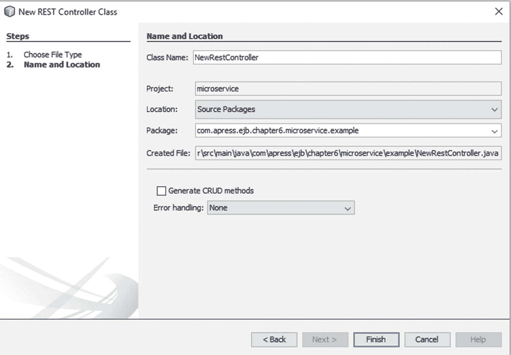

图 6-28

完整的 RestController 文件信息

添加一些代码来测试我们新的微服务 NewRestController.java。参见清单 6-15。

```
/*
* To change this license header, choose License Headers in Project Properties.
* To change this template file, choose Tools | Templates
* and open the template in the editor.
*/
package com.apress.ejb.chapter6.microservice.example;
import org.springframework.web.bind.annotation.RestController;
import org.springframework.web.bind.annotation.RequestMapping;
import static org.springframework.web.bind.annotation.RequestMethod.GET;
/**
*
* @author Massimo Nardone
*/
@RestController
@RequestMapping("/url")
public class NewRestController {
@RequestMapping(path = "/microservice", method = GET)
public String sayMicroService(){
return "My first Java EE 8 microservice!";
}
}
清单 6-15
NewRestController.java
```

最后，运行微服务，如图 6-29 所示。

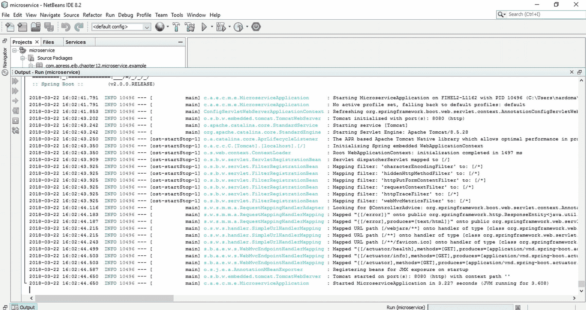

图 6-29

微服务正在运行

现在，我们的 Java EE 8 微服务正在运行，可以通过输入 `http://localhost:8080/microservice` 进行测试，结果如图 6-30 所示。

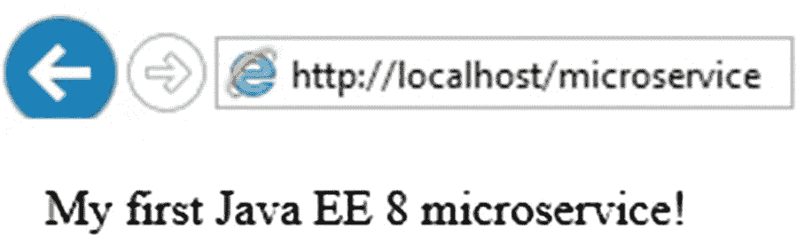

图 6-30

测试新的微服务

## 总结

在本章中，我们向您介绍了作为 Java EE 8 一部分的 Web 服务和微服务。我们解释了遵循查找-绑定-执行模型的 Web 服务架构，以及像 UDDI、WSDL 和 SOAP 这样的标准如何在标准化和互操作性方面使 Web 服务比早期的分布式计算模型更加普及。我们还简要讨论了 REST 架构模式和 RESTful Web 服务，它们简化了 Web 服务的创建和使用。

我们深入研究了 UDDI、SOAP 和 WSDL 标准的细节，并通过一个简单的信用服务示例演示了如何构建 WSDL 文档和 SOAP 消息。

我们讨论了一些可以使用 Web 服务的用例，并讨论了它们如何适应内联网和互联网模型，包括一些提供 Web 服务的现有电子商务网站示例。

然后，我们深入探讨了 Java EE 平台，并研究了不同的标准（JAX-WS、JAX-RS、JAXB、JAXR、SAAJ 和 JSR 224），这些标准使开发人员能够创建可在 .NET 平台内移植和互操作的 Web 服务。

接着，我们研究了如何使用简单的 Web 服务元数据注解将 EJB 无状态会话 Bean 发布为 Web 服务。我们开发了一个可以从 Web 服务客户端调用的信用服务。

接下来，我们研究了使用 GlassFish 应用服务器和 Servlet 客户端编译、部署和测试 Web 服务，并且还研究了这种编程模型与使用 EJB 调用 Web 服务的相似之处。

最后，我们介绍了作为新 Java 平台一部分的 Java EE 微服务，以及如何使用 Spring Boot 项目构建一个简单的微服务示例。

到目前为止，我们已经讨论了 EJB 规范的各个组件：会话 Bean、JPA 实体、MDB 和 Web 服务。在下一章中，我们将讨论如何集成所有这些组件来构建一个企业级应用程序。

