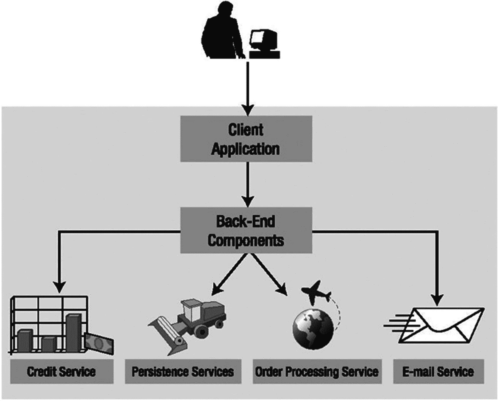
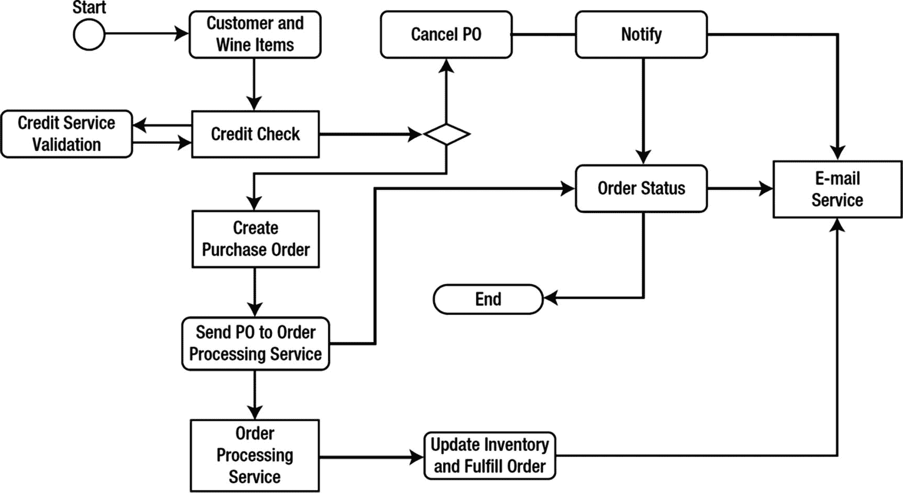
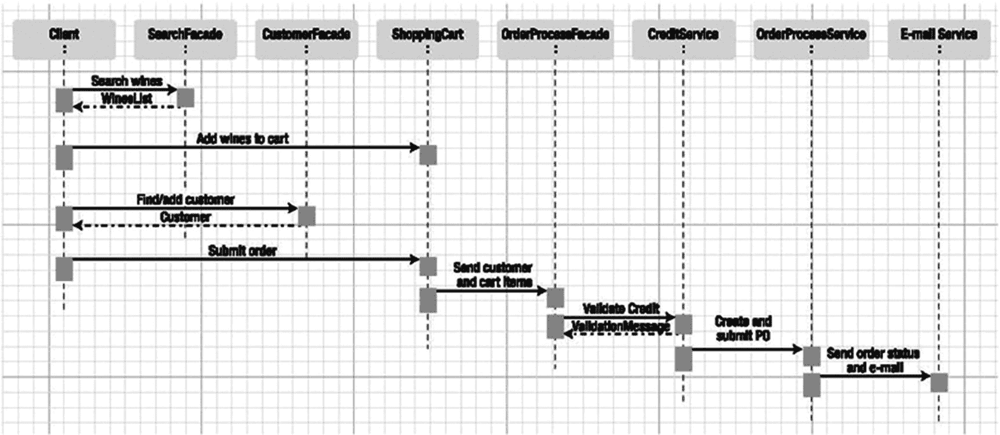
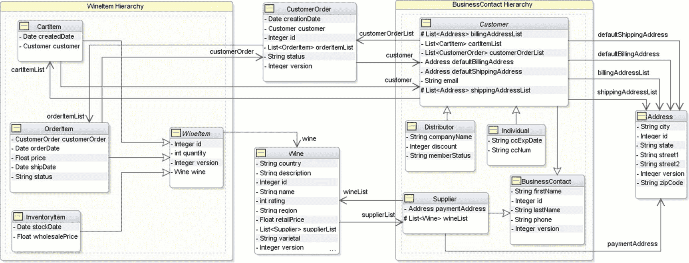
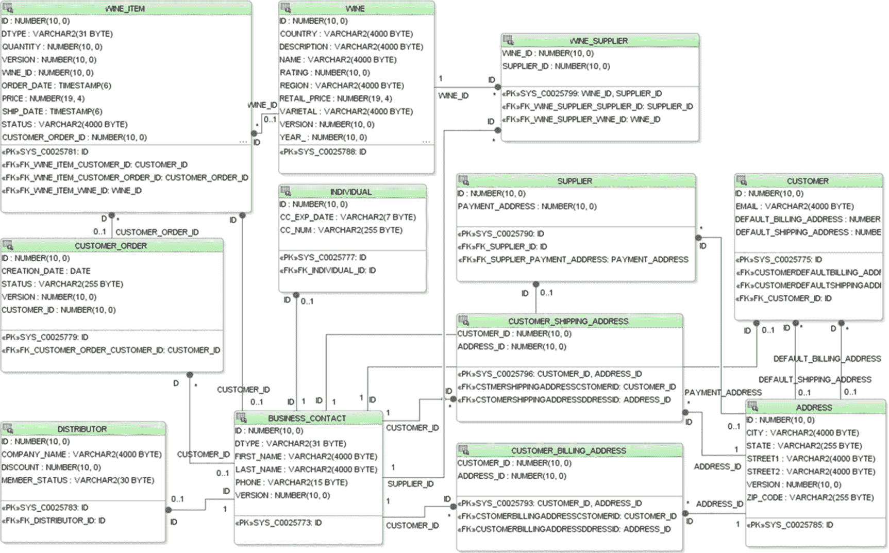
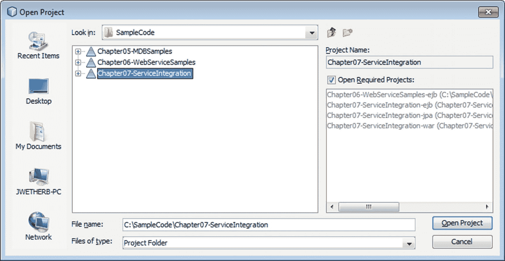
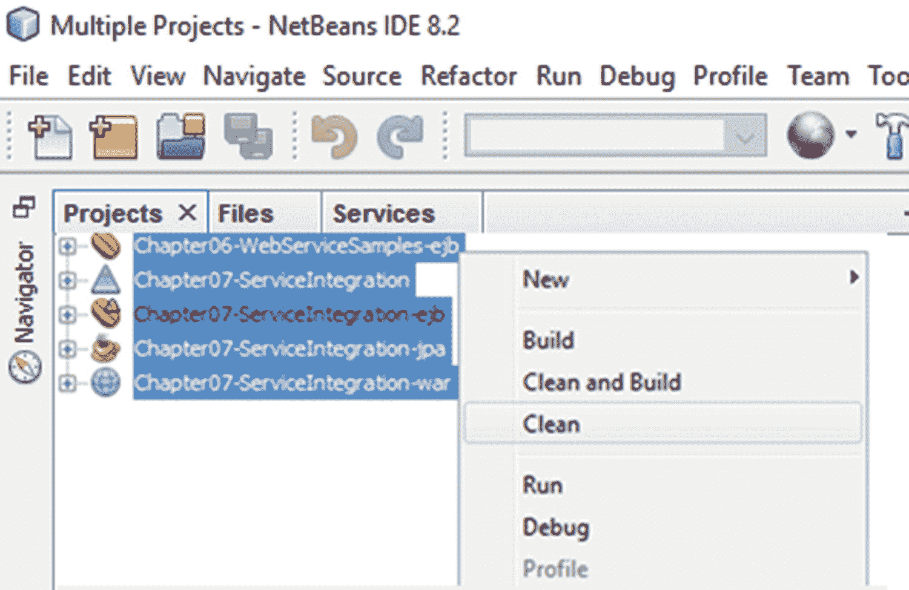
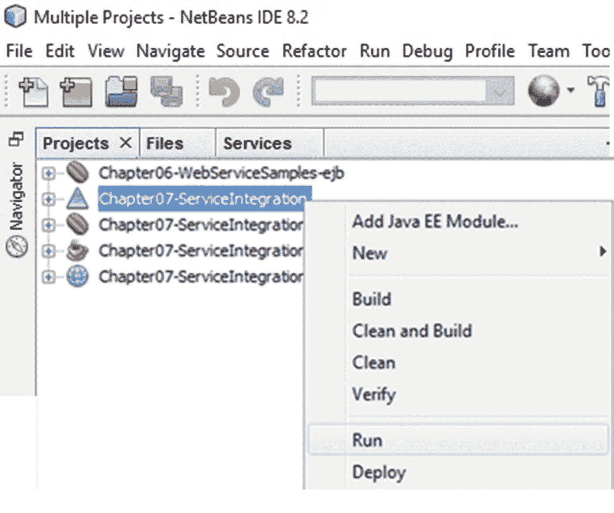
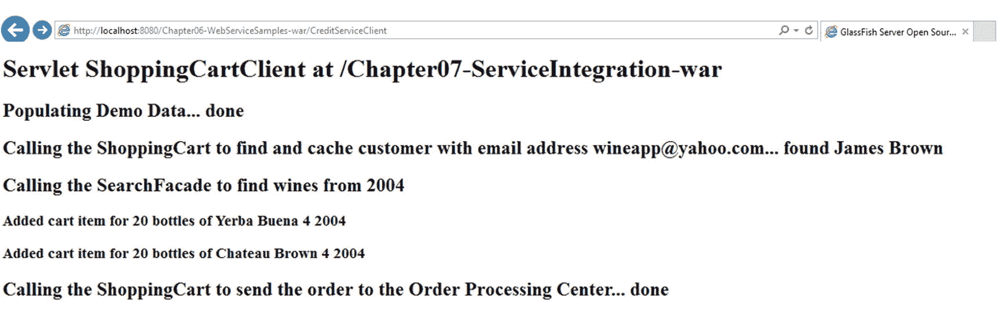
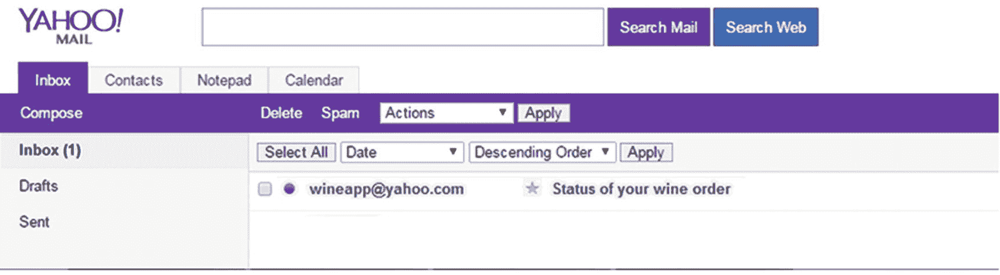

# 7. 集成会话 Bean、实体、消息驱动 Bean 和 Web 服务

## 引言

本书前面的章节涵盖了 EJB 及相关技术的各个组件。这些包括会话 Bean、消息驱动 Bean (MDB)、作为 Web 服务的无状态会话 Bean 以及 JPA 实体。在本章中，我们将通过一个虚构的葡萄酒商店应用程序示例，向您展示如何将这些组件集成到一个完整的 Java EE 8 应用程序中。

## 应用程序概述

我们将在本章中开发的示例应用程序是 Wines Online 应用程序，它为顾客（个人或分销商）提供多种搜索条件，使他们能够浏览、选择葡萄酒，将其添加到购物车，并处理订单。顾客必须先向 Wines Online 应用程序注册，然后才能提交订单。订单提交后，将验证顾客的信用卡，这会触发订单处理消息，并向顾客发送关于订单状态的电子邮件通知。

顾客用于搜索、导航和提交订单的屏幕是一个简单的 JavaServer Faces (JSF) Web 应用程序的一部分，该应用程序与使用 EJB 开发的后端服务和组件进行交互。在本章中，我们的重点将是开发应用程序的后端部分，这部分可以使用 Servlet 和简单的 Java 客户端进行测试。在第 12 章中，我们将为这些后端服务开发一个 JSF 客户端。

如图 7-1 所示，Wines Online 应用程序由客户端应用程序使用的多个后端组件组成，而这些后端组件又使用不同类型的服务来执行 CRUD（创建、检索、更新、删除）操作、向顾客发送关于订单状态的电子邮件通知、处理传入订单以及验证顾客的信用卡状态。我们将在下一节讨论这些组件的行为和功能。



图 7-1

Wines Online 应用程序架构

## 应用程序组件和服务

后端葡萄酒商店应用程序由不同类型的 EJB 组成，这些 EJB 被创建为组件和服务。关键组件和服务将在以下各节中描述。


### 购物车组件

购物车组件用于管理已登录注册客户的购物车商品。该组件是一个有状态会话 Bean，负责跟踪添加到购物车或从购物车中移除的商品（葡萄酒及数量）。最后，购物车组件会将订单信息传输给订单处理组件。

### 搜索外观组件

搜索外观组件允许客户检索所有葡萄酒，或根据年份、国家和品种等条件搜索葡萄酒。该组件是一个无状态会话 Bean，会根据执行的搜索条件返回葡萄酒列表。

### 客户外观组件

客户外观组件允许客户将自己注册为葡萄酒应用的会员，并可根据电子邮件地址检索客户信息。该组件是一个无状态会话 Bean。

### 订单处理外观组件

订单处理外观组件充当信用服务与订单处理服务之间的协调器。该组件处理购物车商品并创建可供订单处理服务使用的采购订单。该组件是一个无状态会话 Bean。

### 持久化服务

持久化服务包含一个打包的持久化单元，该单元由一组映射到葡萄酒商店数据库模式的实体组成。应用程序后端部分的所有其他组件和服务都使用这个公共持久化单元来执行 CRUD 操作。

### 电子邮件服务

电子邮件服务是一个 MDB，负责向客户发送关于已提交订单状态的电子邮件。该服务本质上与我们在第 5 章中构建的 MDB 相同，并且需要相同的 JMS 和 Java Mail Session 资源。

### 信用服务

信用服务是一个被应用程序消费的 Web 服务。该服务将信用卡信息作为输入消息，并返回特定客户的信用状态。我们将使用第 6 章中开发的信用服务。

### 订单处理服务

订单处理服务是一个 MDB，在收到采购订单后负责处理大部分订单处理工作。

## 葡萄酒在线应用业务流程

图 7-2 展示了葡萄酒应用的流程。一旦购物车服务将客户和购物车商品信息提交给订单处理外观，订单处理外观会在继续处理订单之前验证客户信用卡信息是否准确以及卡片是否有效。在收到信用服务的批准后，它会创建一个包含客户和订单信息的采购订单，并将其提交给订单处理服务。如果收到信用服务的否定响应，订单将被取消，电子邮件服务会向客户发送通知。一旦订单处理服务收到采购订单，它就会继续履行订单，这包括更新库存，并通过电子邮件服务向客户发送关于订单状态的通知。



图 7-2

葡萄酒在线应用业务流程

图 7-3 展示了葡萄酒应用各组件和服务之间的交互。图中之后是对这些交互的逐步说明。



图 7-3

葡萄酒在线应用组件与服务交互

## 深入组件/服务详解

在接下来的章节中，我们将逐一讲解每个组件的代码，以说明其与其他组件和服务的交互。每个代码清单都包含 `Chapter07-IntegratedServices` 示例应用程序中的代码。在本章末尾，您将找到关于如何配置、构建、部署和执行此应用程序的分步说明。

### 持久化服务

持久化服务以 JPA 持久化单元的形式向应用程序提供领域模型。该持久化单元由 JPA 实体以及一个 EntityManager 组成，EntityManager 用于对实体执行 CRUD 操作，并在事务上下文中管理这些实体的持久化状态。

图 7-4 展示了实体、继承模型以及它们之间的关系。`Customer` 实体由 `Individual` 和 `Distributor` 实体继承。`InventoryItem`、`CartItem` 和 `OrderItem` 实体继承 `WineItem` 实体。`BusinessContact` 实体由 `Supplier` 实体继承。葡萄酒商店持久化单元还包含这些实体之间不同类型的关联（包括一对一、一对多和多对多），这些关联将从应用程序代码中访问。这些实体中使用的映射已在第 3 章和第 4 章中介绍过。我们将重点介绍该应用程序其他组件中用于集成此持久化单元的代码。



图 7-4

葡萄酒在线领域模型


### 客户外观组件

`CustomerFacadeBean` 是一个无状态会话 Bean。它提供业务方法，允许客户端应用程序根据客户的电子邮件地址查询客户，或对 `Customer` 实体及其子类执行 CRUD 操作。该外观通过 `@PersistenceContext` 注解注入了一个 `EntityManager`，用于对 `Customer` 实体执行 CRUD 操作。清单 7-1 展示了 `CustomerFacadeBean` 中的 `getCustomerFindByEmail` 方法。该方法使用 `EntityManager` 中的 `createNamedQuery()` 方法，调用了在葡萄酒商店持久化单元的 `Customer` 实体中定义的命名查询 `Customer.findByEmail`。

注意

`createNamedQuery()` 是 `javax.persistence.EntityManager` 接口中的一个方法。此方法创建一个 `javax.persistence.Query` 实例，用于执行以 JPQL（Java 持久化查询语言）或原生 SQL 指定的命名查询。

```
public Customer getCustomerFindByEmail(String email) {
return em.createNamedQuery("Customer.findByEmail", Customer.class).setParameter("email", email).
getSingleResult();
}
清单 7-1
getCustomerFindByEmail 方法
```

清单 7-2 展示了 `CustomerFacadeBean` 的完整代码，其中包含使用 `EntityManager` 执行 CRUD 操作的业务方法。此 Bean 类未实现 Local 或 Remote 接口，因此 EJB 容器以 Local 模式直接调用该 Bean 类。

注意

在第 2 章中，我们详细介绍了会话 Bean 的远程和客户端视图架构之间的区别，总结了各自的优缺点，并讨论了 EJB 3.1 中引入的无接口模式。第 3 章详细介绍了 `EntityManager` 上可用于执行 CRUD 操作的方法。

```
@Stateless(name = "CustomerFacade", mappedName = "Chapter07-IntegratedSamples-Chapter07-ServiceIntegration-ejb-CustomerFacade")
public class CustomerFacadeBean {
@PersistenceContext(unitName = "Chapter07-WineAppUnit-JTA")
private EntityManager em;
public  T persistEntity(T entity) {
em.persist(entity);
return entity;
}
public  T mergeEntity(T entity) {
return em.merge(entity);
}
public void removeCustomer(Customer customer) {
customer = em.find(Customer.class, customer.getId());
em.remove(customer);
}
/**
* select o from Customer o
*/
public List getCustomerFindAll() {
return em.createNamedQuery("Customer.findAll", Customer.class).getResultList();
}
public Customer getCustomerFindById(Integer id) {
return em.find(Customer.class, id);
}
/**
* select o from Customer o where o.email = :email
*/
public Customer getCustomerFindByEmail(String email) {
return em.createNamedQuery("Customer.findByEmail", Customer.class).setParameter("email", email).
getSingleResult();
}
public Customer registerCustomer(Customer customer) {
return persistEntity(customer);
}
}
清单 7-2
CustomerFacadeBean.java
```

### 搜索外观组件

`SearchFacadeBean` 是一个无状态会话 Bean。此 Bean 提供业务方法，允许客户端应用程序根据葡萄酒的年份、国家和品种查询持久化单元中的 `Wine` 实体。`SearchFacadeBean` 中的持久化单元通过 `@PersistenceContext` 注解注入。清单 7-3 展示了 `SearchFacadeBean` 的完整代码，其中包含使用 `EntityManager` 执行搜索操作的业务方法。此 Bean 类有一个业务接口 `SearchFacadeLocal`，支持本地客户端访问。方法 `getWineFindAll()`、`getWineFindByYear()`、`getWineFindByCountry()` 和 `getWineFindByVarietal()` 使用 `EntityManager` 中的 `createNamedQuery()` 方法，调用了在葡萄酒商店持久化单元的 `Wine` 实体中定义的相应命名查询，并以 `java.util.List` 形式返回零个或多个 `Wine` 对象。

```
@Stateless(name = "SearchFacade", mappedName = "Chapter07-IntegratedSamples-Chapter07-ServiceIntegration-ejb-SearchFacade")
public class SearchFacadeBean implements SearchFacadeLocal {
@PersistenceContext(unitName = "Chapter07-WineAppUnit-JTA")
private EntityManager em;
public Object queryByRange(String jpqlStmt, int firstResult, int maxResults) {
Query query = em.createQuery(jpqlStmt);
if (firstResult > 0) {
query = query.setFirstResult(firstResult);
}
if (maxResults > 0) {
query = query.setMaxResults(maxResults);
}
return query.getResultList();
}
public  T persistEntity(T entity) {
em.persist(entity);
return entity;
}
public  T mergeEntity(T entity) {
return em.merge(entity);
}
public void removeWine(Wine wine) {
wine = em.find(Wine.class, wine.getId());
em.remove(wine);
}
/**
* select object(o) from Wine o
*/
public List getWineFindAll() {
return em.createNamedQuery("Wine.findAll", Wine.class).getResultList();
}
/**
* select object(wine) from Wine wine where wine.year = :year
*/
public List getWineFindByYear(Integer year) {
return em.createNamedQuery("Wine.findByYear", Wine.class).setParameter("year", year).
getResultList();
}
/**
* select object(wine) from Wine wine where wine.country = :country
*/
public List getWineFindByCountry(String country) {
return em.createNamedQuery("Wine.findByCountry", Wine.class).setParameter("country", country).
getResultList();
}
/**
* select object(wine) from Wine wine where wine.varietal = :varietal
*/
public List getWineFindByVarietal(String varietal) {
return em.createNamedQuery("Wine.findByVarietal", Wine.class).setParameter("varietal",varietal).getResultList();
}
}
清单 7-3
SearchFacadeBean.java
```

### 购物车组件

`ShoppingCartBean` 是一个有状态会话 Bean，并使用扩展的持久化上下文。此 Bean 会保留已登录系统且当前正在向购物车添加或移除葡萄酒商品的客户的状态。一旦客户提交订单，`ShoppingCartBean` 会将客户信息发送给订单处理外观，由后者负责处理订单。我们决定为此用例使用有状态会话 Bean，原因如下：

*   有不止一种类型的客户端应用程序访问后端应用程序（Web、Swing 和命令行客户端）。
*   我们希望展示 EJB 有状态会话 Bean 在典型应用程序中的用法。

注意

通常，人们普遍认为有状态会话 Bean 在存储状态方面（与使用 HTTP 会话为 Web 客户端在客户端存储状态相比）有些重量级。但有证据表明，有状态会话 Bean 在性能或事务方面并不会带来巨大的成本。（有关此主题的全面介绍，请参阅 Peter Zadrozny 所著的《J2EE Performance Testing with BEA WebLogic Server》[Apress, 2003]。）

`ShoppingCartBean` 包含以下小节中描述的业务方法。

#### 查找客户

清单 7-4 展示了 `ShoppingCartBean` 中的 `findCustomer()` 方法。此方法使用注入的 `CustomerFacadeBean`，并调用 `findCustomerByEmail()` 方法来获取一个实例，在我们的案例中，该实例恰好是一个 `Individual` 子实体。一旦检索到 `Customer`，它就会被分配给一个类级属性，以便随后可以通过此有状态会话 Bean 上的其他方法引用它。由于我们使用的是扩展的持久化上下文，除非该实例被主动从持久化上下文中移除，否则它将在 Bean 的整个生命周期内（跨越事务边界）保持受管状态。

```
public Customer findCustomer(String email) {
customer = customerFacade.getCustomerFindByEmail(email);
return customer;
}
清单 7-4
findCustomer 业务方法
```


#### 添加酒品项

清单 7-5 展示了 `ShoppingCartBean` 中的 `addWineItem()` 方法。客户端应用程序调用此业务方法，将特定酒品项及其数量添加到购物车中。代码创建了一个新的 `CartItem` 实体实例，并使用 `CartItem` 中的 setter 方法设置了数量、酒品和创建时间。

注意

快速回顾实体实例的三种状态：受管、分离和新建。受管实例是被持久化上下文主动引用的实例，对该实例所做的所有更改都会被持久化上下文跟踪。当持久化上下文与数据库同步时，在受管实例中发现的所有待处理更改都会通过 SQL 语句刷新到数据库中。分离实体实例是不再被持久化上下文引用的实例，因此其更改不会被跟踪。如果客户端修改了分离实例，客户端需要确保这些更改被合并到受管实例中（例如，通过 `EntityManager.merge()` 调用），否则这些更改将永远不会与数据库同步。新建实体实例类似于分离实例，只是它尚未被持久化到数据库中。

`addWineItem()` 方法使用指定的属性创建一个新的 `CartItem`，并将其添加到 `Customer` 实例中。由于我们查询了 `Customer` 实例并将其缓存在有状态会话 bean 的类级变量中，因此可以确信它处于受管状态。`ShoppingCartBean` 使用容器管理的事务，并且 `addWineItem()` 方法默认使用 `TransactionAttributeType.REQUIRED`，因此在该方法执行期间将启动并提交一个事务。提交时，持久化上下文将与数据库同步，并且受管 `customer` 实例中任何待处理的更改都将被推送到数据库中。由于 `Customer` 的 `cartItemList` 属性上的级联规则，任何被引用的 `CartItem` 实例也将被持久化。因此，此方法调用的结果将是 `CartItem` 表中新增一行，该行包含对 `Customer` 表（或 `Individual` 表，具体取决于实体继承层次结构的映射方式）的外键引用。

```
public void addWineItem(Wine wine, int quantity) {
CartItem cartItem = new CartItem(quantity, wine);
customer.addCartItem(cartItem);
}
清单 7-5
addWineItem 业务方法
```

#### 移除酒品项

清单 7-6 展示了 `ShoppingCartBean` 中的 `removeWineItem()` 方法。当最终用户（通过用户界面）提出请求时，此方法允许客户端应用程序从购物车中移除项。同样，由于 `customer` 属性是受管实例，对其应用的任何更改都将在此方法结束时，即该方法开始时创建的 CMT 事务提交时被持久化。

```
public void removeWineItem(CartItem cartItem) {
customer.removeCartItem(cartItem);
}
清单 7-6
removeWineItem 业务方法
```

#### 向订单处理外观提交订单

清单 7-7 展示了 `ShoppingCartBean` 中的 `sendOrderToOPC()` 方法。当最终用户最终决定购买一种或多种酒品时，客户端应用程序调用此方法来提交订单。此方法使用注入的 `OrderProcessFacadeBean`，并通过传递 `customer` 对象调用 `processOrder()` 方法来提交订单。

注意

`sendOrderToOPC()` 方法命名的依据是：接收采购订单的 `OrderProcess` ➤ `FacadeBean` 实际上充当了“订单处理中心”的角色。考虑到这一点，我们决定将“订单处理中心”缩写为 OPC，以避免方法名过长。

```
public String sendOrderToOPC() {
String result = null;
try {
orderProcessFacade.processOrder(customer);
result = "您的订单已提交 - 您将通过电子邮件收到状态通知";
} catch (Exception ex) {
ex.printStackTrace();
result = "处理您的订单时发生错误。请联系客户服务。";
}
return result;
}
清单 7-7
sendOrderToOPC 业务方法
```


#### 检索客户的购物车商品

清单 7-8 展示了 `ShoppingCartBean` 中的 `getCartItems()` 方法。该方法从 `customer` 字段（该字段可以是 `Individual` 或 `Distributor` 实体类型）中检索当前的购物车商品列表。在构建 JSF 应用程序时，此方法将非常有用，我们可以在客户提交订单之前，在用户界面中显示所有购物车商品。

```
public List getCartItems() {
return customer.getCartItemList();
}
清单 7-8
getCartItems 业务方法
```

`ShoppingCartBean` 的完整代码如清单 7-9 所示。

```
@Stateful(name = "ShoppingCart", mappedName = "Chapter07-IntegratedSamples-Chapter07-ServiceIntegration-ejb-ShoppingCart")
public class ShoppingCartBean implements ShoppingCartLocal {
@PersistenceContext(unitName = "Chapter07-WineAppUnit-JTA", type = PersistenceContextType.
EXTENDED)
private EntityManager em;
private Customer customer;
@EJB
private CustomerFacadeBean customerFacade;
@EJB
private OrderProcessFacadeBean orderProcessFacade;
public Customer getCustomer() {
return customer;
}
public void addWineItem(Wine wine, int quantity) {
CartItem cartItem = new CartItem(quantity, wine);
customer.addCartItem(cartItem);
}
public void addWineItem(Wine wine) {
CartItem cartItem = new CartItem();
cartItem.setQuantity(20);
wine = em.find(Wine.class, wine.getId());
cartItem.setWine(wine);
cartItem.setCreatedDate(new Timestamp(System.currentTimeMillis()));
customer.addCartItem(cartItem);
}
public void removeWineItem(CartItem cartItem) {
customer.removeCartItem(cartItem);
}
public void addCartItemsTemporarily() {
List wines = em.createNamedQuery("findAllWine").getResultList();
for (Wine wine : wines) {
final CartItem cartItem = new CartItem();
cartItem.setCreatedDate(new Timestamp(System.currentTimeMillis()));
cartItem.setQuantity(20);
cartItem.setWine(wine);
customer.addCartItem(cartItem);
}
}
public Customer findCustomer(String email) {
customer = customerFacade.getCustomerFindByEmail(email);
return customer;
}
public String sendOrderToOPC() {
String result = null;
try {
orderProcessFacade.processOrder(customer);
result = "Your Order has been submitted - you will be notified about the status via email";
} catch (Exception ex) {
ex.printStackTrace();
result = "An error occurred while processing your order. Please contact Customer Service.";
}
return result;
}
public  T persistEntity(T entity) {
em.persist(entity);
return entity;
}
public  T mergeEntity(T entity) {
return em.merge(entity);
}
public void removeCartItem(CartItem cartItem) {
cartItem = em.find(CartItem.class, cartItem.getId());
em.remove(cartItem);
}
public List getCartItems() {
return customer.getCartItemList();
}
public void removeWine(Wine wine) {
wine = em.find(Wine.class, wine.getId());
em.remove(wine);
}
/**
* select object(o) from Wine o
*/
public List getWineFindAll() {
return em.createNamedQuery("Wine.findAll", Wine.class).getResultList();
}
/**
* select object(wine) from Wine wine where wine.year = :year
*/
public List getWineFindByYear(Integer year) {
return em.createNamedQuery("Wine.findByYear", Wine.class).setParameter("year", year).
getResultList();
}
/**
* select object(wine) from Wine wine where wine.country = :country
*/
public List getWineFindByCountry(String country) {
return em.createNamedQuery("Wine.findByCountry", Wine.class).setParameter("country", country).
getResultList();
}
/**
* select object(wine) from Wine wine where wine.varietal = :varietal
*/
public List getWineFindByVarietal(String varietal) {
return em.createNamedQuery("Wine.findByVarietal", Wine.class).setParameter("varietal",
varietal).getResultList();
}
}
清单 7-9
ShoppingCartBean.java
```

### 订单处理外观组件

`OrderProcessFacadeBean` 是一个无状态会话 Bean。该 Bean 提供了由 `ShoppingCartBean` 调用的业务方法，用于提交订单，以及其他与信用卡和订单处理服务交互的方法。`OrderProcessFacadeBean` 包含以下小节中描述的业务方法。

#### 信用检查

清单 7-10 展示了 `OrderProcessFacadeBean` 中的 `performCreditCheck()` 方法。该方法使用通过 `@WebServiceRef` 注解注入的 `CreditService` 来获取 Web 服务的端口。一旦端口可用，代码就可以调用 `creditCheck` Web 服务操作，该操作接受一个信用卡号，并以布尔值形式返回该卡有效性的消息。我们使用的是在第 6 章中开发的信用服务。

```
private boolean performCreditCheck(Individual individual) {
String ccnum = individual.getCcNum().toString();
CreditCheckEndpointBean creditService = service.getCreditCheckEndpointBeanPort();
return creditService.creditCheck(ccnum);
}
清单 7-10
performCreditCheck 业务方法
```


#### 创建采购订单

清单 7-11 展示了 `OrderProcessFacadeBean` 中的 `processOrder()` 方法。当客户端应用提交订单时，`ShoppingCartBean` 会调用此业务方法。该方法有一个参数，类型为 `Customer` 实体。客户的购物车包含在其 `cartItems` 列表中，列表中的每个成员都引用了一款葡萄酒以及客户在购物时添加到购物车的数量。

首先，该方法会检查接收到的实体是否为受管状态。如果不是，则会调用 `EntityManager` 的 `merge()` 方法来获取一个受管的 `Customer` 对象。

注意

值得注意的是，当我们运行此应用程序时（按照本章末尾的步骤操作），客户参数将在持久化上下文中找到，因此不会执行合并步骤。这是因为 `processOrder()` 是从一个现有的事务上下文中调用的——该事务是在其调用方法 `ShoppingCartBean.sendOrderToOPC()` 被调用时创建的。单个持久化上下文始终绑定到给定的事务，在这种情况下，来自 `ShoppingCartBean` 的扩展持久化上下文就是与此事务关联的那个。当调用 `sendOrderToOPC()` 时，会找到并使用一个现有的上下文事务。当在 `processOrder` 内部调用 `em.contains(customer)` 时，`OrderProcessFacadeBean` 的 `EntityManager` 会观察到持久化上下文已与此事务关联，并使用该持久化上下文，即与 `ShoppingCartBean` 关联的同一个扩展持久化上下文。这就是客户实例已被确定为受管状态的原因。

一旦获取到受管的客户实体，它会检查客户是 `Individual` 还是 `Distributor`。对于个人客户，会调用 `performCreditCheck()` 方法来验证信用卡。如果发现信用卡无效，则会通过 `ShoppingCartBean` 向客户端应用发送消息“信用卡无效”。对于分销商，会检查 `memberStatus` 属性，任何非“APPROVED”的值都会被拒绝。

如果客户通过验证，则继续处理，并创建一个类型为 `CustomerOrder` 的新订单。这个新订单会填充与 `Customer` 关联并在其 `cartItems` 属性中找到的 `CartItem` 对象集合。对于每个购物车项，会创建一个 `OrderItem` 对象来记录每款葡萄酒的数量以及该购物车项中葡萄酒的总价。每个订单项的价格使用每个 `Wine` 实体可用的零售价信息进行计算。

处理完所有购物车项并创建相应的订单项后，包含这些订单项的新 `CustomerOrder` 会被持久化，部分目的是为了获取其 `id` 字段的生成值，该值在从 `sendPOtoMDB()` 调用内部生成电子邮件时使用。然后，对每个购物车项调用 `removeCartItem()` 方法，将其从 `Customer` 中移除。

创建了非实体工具类 `PurchaseOrder`，它将一个 `Customer` 对象与一个特定的 `CustomerOrder` 关联起来。此采购订单实例作为参数传递给 `sendPOtoMDB()` 方法，将采购订单发送到处理服务。一旦调用完成，该过程变为异步，并向客户端应用发送一条消息，告知订单已发送进行处理。

由于整个方法是在事务上下文中执行的，因此对客户对象以及任何其他受管对象的更改将在事务结束时被持久化。

```
public String processOrder(Customer customer) {
String processStatus = null;
if (!em.contains(customer)) {
customer = em.merge(customer);
}
if (customer instanceof Individual) {
if (!performCreditCheck((Individual) customer)) {
processStatus = "信用卡号无效或信用检查失败";
}
} else if (customer instanceof Distributor) {
if (!"APPROVED".equals(((Distributor) customer).getMemberStatus())) {
processStatus = "分销商信用检查被拒绝";
}
}
if (processStatus == null) {
CustomerOrder order = new CustomerOrder();
order.setCreationDate(new Timestamp(System.currentTimeMillis()));
em.persist(order);
List cartItems = customer.getCartItemList();
if (cartItems != null) {
List tempCartItems = new ArrayList();
for (CartItem cItem : cartItems) {
OrderItem oItem = new OrderItem();
int qty = cItem.getQuantity();
oItem.setQuantity(qty);
oItem.setOrderDate(new Timestamp(System.currentTimeMillis()));
oItem.setWine(cItem.getWine());
Wine tempWine = cItem.getWine();
Float d = tempWine.getRetailPrice();
Float price = d * cItem.getQuantity();
oItem.setPrice(price);
order.addOrderItem(oItem);
tempCartItems.add(cItem);
}
for (CartItem cartItem : tempCartItems) {
customer.removeCartItem(cartItem);
em.remove(cartItem);
}
}
customer.addCustomerOrder(order);
PurchaseOrder po = new PurchaseOrder();
po.setCustomer(customer);
po.setCustomerOrder(order);
sendPOtoMDB(po);
processStatus = "采购订单已发送到处理队列进行处理";
}
return processStatus;
}
清单 7-11
processOrder 业务方法
```

#### 向订单处理服务发送采购订单

清单 7-12 展示了 `OrderProcessFacadeBean` 中的 `sendPOtoMDB()` 方法。此业务方法使用了注入的 Java 消息服务（JMS）资源，用于主题连接工厂和主题。创建到主题连接工厂的连接并启动该连接。一旦连接可用，就会创建一个会话，并使用主题创建一个 `MessageProducer`。创建一个 `ObjectMessage` 来承载 `PurchaseOrder` 对象，并使用 `MessageProducer` 将 `PurchaseOrder` 发送到主题。

```
private void sendPOtoMDB(PurchaseOrder po) {
// 现在将采购订单发送到 MDB
Connection connection = null;
Session session = null;
try {
connection = poTopicCF.createConnection();
connection.start();
session = connection.createSession(false, Session.AUTO_ACKNOWLEDGE);
MessageProducer producer = session.createProducer(poTopic);
ObjectMessage objMessage = session.createObjectMessage();
objMessage.setObject(po);
producer.send(objMessage);
} catch (JMSException e) {
e.printStackTrace();
} finally {
if (session != null) {
try {
session.close();
} catch (JMSException ex) {
Logger.getLogger(OrderProcessFacadeBean.class.getName()).log(Level.SEVERE, null, ex);
}
}
if (connection != null) {
try {
connection.close();
} catch (JMSException ex) {
Logger.getLogger(OrderProcessFacadeBean.class.getName()).log(Level.SEVERE, null, ex);
}
}
}
}
清单 7-12
sendPOtoMDB 业务方法
```

`OrderProcessFacadeBean.java` 的完整代码如清单 7-13 所示。


```
@Stateless(name = "OrderProcessFacade", mappedName = "OrderProcessFacade")
public class OrderProcessFacadeBean {
@PersistenceContext(unitName = "Chapter07-WineAppUnit-JTA")
private EntityManager em;
@Resource(mappedName = "poTopicConnectionFactory")
private TopicConnectionFactory poTopicCF;
@Resource(mappedName = "PurchaseOrderTopic")
private Topic poTopic;
@WebServiceRef(type = CreditService.class)
CreditService service;
public Object mergeEntity(Object entity) {
return em.merge(entity);
}
public Object persistEntity(Object entity) {
em.persist(entity);
return entity;
}
public void createNewOrder(CustomerOrder newOrder) {
persistEntity(newOrder);
}
private boolean performCreditCheck(Individual individual) {
String ccnum = individual.getCcNum().toString();
CreditCheckEndpointBean creditService = service.getCreditCheckEndpointBeanPort();
return creditService.creditCheck(ccnum);
}
public String processOrder(Customer customer) {
String processStatus = null;
if (!em.contains(customer)) {
customer = em.merge(customer);
}
if (customer instanceof Individual) {
if (!performCreditCheck((Individual) customer)) {
processStatus = "信用卡号无效或信用检查失败";
}
} else if (customer instanceof Distributor) {
if (!"APPROVED".equals(((Distributor) customer).getMemberStatus())) {
processStatus = "经销商信用检查被拒绝";
}
}
if (processStatus == null) {
CustomerOrder order = new CustomerOrder();
order.setCreationDate(new Timestamp(System.currentTimeMillis()));
em.persist(order);
List cartItems = customer.getCartItemList();
if (cartItems != null) {
List tempCartItems = new ArrayList();
for (CartItem cItem : cartItems) {
OrderItem oItem = new OrderItem();
int qty = cItem.getQuantity();
oItem.setQuantity(qty);
oItem.setOrderDate(new Timestamp(System.currentTimeMillis()));
oItem.setWine(cItem.getWine());
Wine tempWine = cItem.getWine();
Float d = tempWine.getRetailPrice();
Float price = d * cItem.getQuantity();
oItem.setPrice(price);
order.addOrderItem(oItem);
tempCartItems.add(cItem);
}
for (CartItem cartItem : tempCartItems) {
customer.removeCartItem(cartItem);
em.remove(cartItem);
}
}
customer.addCustomerOrder(order);
PurchaseOrder po = new PurchaseOrder();
po.setCustomer(customer);
po.setCustomerOrder(order);
sendPOtoMDB(po);
processStatus = "采购订单已发送至处理队列进行处理";
}
return processStatus;
}
private void sendPOtoMDB(PurchaseOrder po) {
//现在将采购订单发送至 MDB
Connection connection = null;
Session session = null;
try {
connection = poTopicCF.createConnection();
connection.start();
session = connection.createSession(false, Session.AUTO_ACKNOWLEDGE);
MessageProducer producer = session.createProducer(poTopic);
ObjectMessage objMessage = session.createObjectMessage();
objMessage.setObject(po);
producer.send(objMessage);
} catch (JMSException e) {
e.printStackTrace();
} finally {
if (session != null) {
try {
session.close();
} catch (JMSException ex) {
Logger.getLogger(OrderProcessFacadeBean.class.getName()).log(Level.SEVERE, null, ex);
}
}
if (connection != null) {
try {
connection.close();
} catch (JMSException ex) {
Logger.getLogger(OrderProcessFacadeBean.class.getName()).log(Level.SEVERE, null, ex);
}
}
}
}
}
清单 7-13
OrderProcessFacadeBean.java
```

### 订单处理服务

订单处理服务是一个 MDB。在葡萄酒商店应用中使用 MDB 的理念，是为了展示企业应用中的某些处理如何以异步方式完成，以及如何从 MDB 中与`EntityManager`、会话 Bean 和其他 MDB 协同工作。

注意

第 5 章介绍了 MDB，详细描述了异步架构，并给出了一些可能实现的示例。

`OrderProcessingMDBBean`是一个普通的旧 Java 对象（POJO），通过类级别的`@MessageDriven`注解来标识它是一个 MDB。该 POJO 实现了强制性的`onMessage()`方法，借助一个工具方法`processOrder()`来处理传入的消息。我们将从这里开始逐步讲解 MDB 中的方法。

清单 7-14 展示了`onMessage()`方法的代码。该方法检查接收到的消息是否为`ObjectMessage`实例类型，然后将检索到的对象类型转换为`PurchaseOrder`工具类。之后，调用`processOrder()`工具方法来处理接收到的采购订单。

```
public void onMessage(Message message) {
try {
if (message instanceof ObjectMessage) {
ObjectMessage objMessage = (ObjectMessage) message;
Object obj = objMessage.getObject();
if (obj instanceof PurchaseOrder) {
po = (PurchaseOrder) obj;
processOrder(po);
}
}
} catch (JMSException e) {
e.printStackTrace();
}
}
清单 7-14
OrderProcessingMDBBean 中的 onMessage 方法
```

清单 7-15 展示了`processOrder()`方法的代码。该方法首先打开`PurchaseOrder`以获取`Customer`和`CustomerOrder`对象。对于客户订单中的每个订单项，从库存表中扣除相应数量的葡萄酒。为了执行此操作，调用了`deductInventory()`工具方法。

扣除库存后，就该向客户发送状态更新了。这是通过电子邮件服务完成的。从 PO 对象中检索客户的电子邮件信息和订单 ID，构建电子邮件内容，然后调用`sendStatus()`工具方法。

```
private void processOrder(PurchaseOrder po) {
Customer customer = po.getCustomer();
CustomerOrder order = po.getCustomerOrder();
for (OrderItem oItem : order.getOrderItemList()) {
Wine wine = oItem.getWine();
int qty = oItem.getQuantity();
deductInventory(wine, qty);
}
String from = PopulateDemoData.FROM_EMAIL_ADDRESS;
String to = customer.getEmail();
String content =
"您的订单已处理。"
+ "如有疑问，请致电 Beginning EJB 葡萄酒商店应用，"
+ "订单编号为 # "
+ po.getCustomerOrder().getId().toString();    sendStatus(from, to, content);
}
清单 7-15
processOrder 业务方法
```

清单 7-16 展示了`deductInventory()`方法的代码。该方法利用注入的`EntityManager`来调用在`InventoryItem`实体中定义的名为`Inventory.findItemByWine`的查询。一旦检索到特定葡萄酒的库存，就使用`setQuantity()`设置器方法更新数量。库存项是受管理的，因此当此 CMT 方法结束，或当其上下文事务提交时，其修改会与数据库同步。

```
private void deductInventory(Wine tempWine, int deductQty) {
InventoryItem iItem =
em.createNamedQuery("InventoryItem.findItemByWine",
InventoryItem.class).setParameter("wine", tempWine).getSingleResult();
int newQty = iItem.getQuantity() - deductQty;
iItem.setQuantity(newQty);
}
清单 7-16
deductInventory 业务方法
```


清单 7-17 展示了 `sendStatus()` 方法的代码。这个实用方法利用了一个注入的 JMS 资源来获取主题连接工厂和主题。它会创建一个到主题连接工厂的连接，并启动该连接。一旦连接可用，就会创建一个会话，并创建一个包含该主题的 `MessageProducer`。接着创建一个 `Message` 对象，并将 `JMSType` 设置为 `MailMessage`。之后，对 `Message` 对象进行一系列 `setStringProperty()` 方法的调用，以创建电子邮件的收件人、发件人、主题和内容部分。所有属性设置完毕后，消息会被发送到消息主题，并由电子邮件服务进行处理。

```
private void sendStatus(String from, String to, String content) {
try {
System.out.println("Before status TopicCF connection");
Connection connection = statusMessageTopicCF.createConnection();
System.out.println("Created connection");
connection.start();
System.out.println("Started connection");
System.out.println("Starting Topic Session");
Session topicSession =
connection.createSession(false, Session.AUTO_ACKNOWLEDGE);
MessageProducer publisher = topicSession.createProducer(statusTopic);
System.out.println("created producer");
MapMessage message = topicSession.createMapMessage();
message.setStringProperty("from", from);
message.setStringProperty("to", to);
message.setStringProperty("subject", "Status of your wine order");
message.setStringProperty("content", content);
System.out.println("before send");
publisher.send(message);
System.out.println("after send");
} catch (JMSException e) {
e.printStackTrace();
}
}
清单 7-17
sendStatus() 业务方法
```

`OrderProcessingMDBBean` 的完整代码如清单 7-18 所示。

```
@MessageDriven(activationConfig = {
@ActivationConfigProperty(propertyName = "destinationType", propertyValue = "javax.jms.Topic")},
mappedName = "PurchaseOrderTopic")
public class OrderProcessingMDBBean implements MessageListener {
private PurchaseOrder po;
@PersistenceContext(unitName = "Chapter07-WineAppUnit-JTA")
private EntityManager em;
@Resource(mappedName = "StatusMessageTopicConnectionFactory")
private TopicConnectionFactory statusMessageTopicCF;
@Resource(mappedName = "StatusMessageTopic")
private Topic statusTopic;
public void onMessage(Message message) {
try {
if (message instanceof ObjectMessage) {
ObjectMessage objMessage = (ObjectMessage) message;
Object obj = objMessage.getObject();
if (obj instanceof PurchaseOrder) {
po = (PurchaseOrder) obj;
processOrder(po);
}
}
} catch (JMSException e) {
e.printStackTrace();
}
}
private void processOrder(PurchaseOrder po) {
Customer customer = po.getCustomer();
CustomerOrder order = po.getCustomerOrder();
for (OrderItem oItem : order.getOrderItemList()) {
Wine wine = oItem.getWine();
int qty = oItem.getQuantity();
deductInventory(wine, qty);
}
String from = PopulateDemoData.FROM_EMAIL_ADDRESS;
String to = customer.getEmail();
String content =
"Your order has been processed. "
+ "If you have questions call Beginning EJB Wine Store "
+ "Application with order id # "
+ po.getCustomerOrder().getId().toString();
sendStatus(from, to, content);
}
private void deductInventory(Wine tempWine, int deductQty) {
InventoryItem iItem =
em.createNamedQuery("InventoryItem.findItemByWine",
InventoryItem.class).setParameter("wine", tempWine).getSingleResult();
int newQty = iItem.getQuantity() - deductQty;
iItem.setQuantity(newQty);
}
private void sendStatus(String from, String to, String content) {
try {
System.out.println("Before status TopicCF connection");
Connection connection = statusMessageTopicCF.createConnection();
System.out.println("Created connection");
connection.start();
System.out.println("Started connection");
System.out.println("Starting Topic Session");
Session topicSession =
connection.createSession(false, Session.AUTO_ACKNOWLEDGE);
MessageProducer publisher = topicSession.createProducer(statusTopic);
System.out.println("created producer");
MapMessage message = topicSession.createMapMessage();
message.setStringProperty("from", from);
message.setStringProperty("to", to);
message.setStringProperty("subject", "Status of your wine order");
message.setStringProperty("content", content);
System.out.println("before send");
publisher.send(message);
System.out.println("after send");
} catch (JMSException e) {
e.printStackTrace();
}
}
}
清单 7-18
OrderProcessingMDBBean.java
```

### 电子邮件服务

电子邮件服务是一个 MDB。该 MDB 通过使用一个作为资源引用注入的电子邮件资源来发送电子邮件，从而处理传入的消息。

清单 7-19 展示了 `StatusMailerBean` MDB 中 `onMessage()` 方法的代码。我们将首先从消息中检索所有属性，然后使用注入的邮件资源引用 `mailSession` 创建一个 `javax.mail.Message` 对象。接着，用相关的电子邮件信息装饰该消息，并调用 `send()` 方法来发送电子邮件消息。

```
public void onMessage(Message message) {
try {
if (message instanceof MapMessage) {
MapMessage orderMessage = (MapMessage) message;
String from = orderMessage.getStringProperty("from");
String to = orderMessage.getStringProperty("to");
String subject = orderMessage.getStringProperty("subject");
String content = orderMessage.getStringProperty("content");
javax.mail.Message msg = new MimeMessage(mailSession);
msg.setFrom(new InternetAddress(from));
InternetAddress[] address = {new InternetAddress(to)};
msg.setRecipients(RecipientType.TO, address);
msg.setSubject(subject);
msg.setSentDate(new java.util.Date());
msg.setContent(content, "text/html");
System.out.println("MDB: Sending Message from " + from + " to " + to + "...");
Transport.send(msg);
System.out.println("MDB: Message Sent");
} else {
System.out.println("Invalid message ");
}
} catch (Exception ex) {
ex.printStackTrace();
}
}
清单 7-19
StatusMailer MDB 中的 onMessage 方法
```

`StatusMailerBean` 的完整代码如清单 7-20 所示。

```
@MessageDriven(activationConfig = {
@ActivationConfigProperty(propertyName = "destinationName",
propertyValue = "StatusMessageTopic"),
@ActivationConfigProperty(propertyName = "destinationType",
propertyValue = "javax.jms.Topic")
}, mappedName = "StatusMessageTopic")
public class StatusMailerBean implements MessageListener {
@Resource(name = "mail/wineappMail")
private Session mailSession;
public void onMessage(Message message) {
try {
if (message instanceof MapMessage) {
MapMessage orderMessage = (MapMessage) message;
String from = orderMessage.getStringProperty("from");
String to = orderMessage.getStringProperty("to");
String subject = orderMessage.getStringProperty("subject");
String content = orderMessage.getStringProperty("content");
javax.mail.Message msg = new MimeMessage(mailSession);
msg.setFrom(new InternetAddress(from));
InternetAddress[] address = {new InternetAddress(to)};
msg.setRecipients(RecipientType.TO, address);
msg.setSubject(subject);
msg.setSentDate(new java.util.Date());
msg.setContent(content, "text/html");
System.out.println("MDB: Sending Message from " + from + " to " + to + "...");
Transport.send(msg);
System.out.println("MDB: Message Sent");
} else {
System.out.println("Invalid message ");
}
} catch (Exception ex) {
ex.printStackTrace();
}
}
}
清单 7-20
StatusMailerBean.java
```


### 信用服务

信用服务是一个无状态会话 Bean，它通过 JSR 181（Java 平台 Web 服务元数据）注解发布为 Web 服务。创建此 Web 服务的初衷有两个：

*   展示如何将无状态会话 Bean 暴露为 Web 服务。
*   展示如何从 EJB 应用程序中消费 Web 服务。

`OrderProcessFacadeBean` 会消费此 Web 服务来检查客户的信用卡。我们将使用在第 6 章中开发的信用服务。

### 数据库模式

Wines Online 应用程序使用单一的数据库模式来存储所有与客户、订单、库存等相关的信息。图 7-5 展示了一个包含所有表和关系的数据库图表。该模式旨在容纳或展示本书所涵盖的 JPA 规范中的大部分 O/R（对象/关系）映射，包括实体之间不同类型的继承策略。图中未显示的是专用于为继承层次结构中的每个根实体（例如 `BUSINESS_CONTACT_ID_GEN`）或未参与继承的实体（例如 `ADDRESS_ID_GEN`）生成 ID 的表。



图 7-5

Wines Online 应用程序的数据库图表

## 构建、部署和测试应用程序

EJB 需要被打包成 EJB JAR（Java 归档）文件，然后才能组装成包含应用程序所有必需模块和库的 EAR（企业归档）文件。大多数应用服务器都提供部署实用程序或 Ant 任务，以方便将 EJB 部署到其容器中。像 NetBeans、JDeveloper 和 Eclipse 这样的 Java 集成开发环境（IDE）提供了图形化部署工具，允许开发者将应用程序打包、组装并部署到应用服务器。EJB 并非必须被打包成 EJB JAR 文件并组装成 EAR 文件。你也可以直接部署 EJB JAR 文件本身。在本章中，我们将把它们组装成 EAR 文件，以便使持久化单元成为一个共享模块（位于其自己的 JAR 文件中），并为第 12 章做准备，届时我们将为我们刚刚开发的葡萄酒商店后端构建客户端应用程序。我们还将把第 6 章的 EJB/WebService 模块以及一个包含驱动测试场景的简单测试 Servlet 的 Web 模块打包到这个 EAR 文件中。

打包、组装和部署方面的内容将在第 11 章中详细讨论。在本章中，我们使用会话 Bean、MDB、JPA 实体和 Web 服务开发了葡萄酒商店应用程序的后端。使用 NetBeans 并部署到 GlassFish，我们将执行以下步骤来打包、组装、部署和测试本章中定义的服务。

### 前提条件

在执行后续章节详述的任何步骤之前，请先完成第 1 章的“入门”部分，该部分将引导您完成本章示例所需的安装和环境设置。

### 创建数据库连接

本章的示例需要数据库连接，对于这些测试，我们将使用 NetBeans 和 Glassfish 捆绑的 Derby 数据库。如果您尚未创建第 3 章和第 4 章示例也使用的 WineApp 数据库，请单击 `Services` 选项卡，展开 `Databases` 图标，然后在 `Java DB` 节点上调用 `"Create Database..."`。创建一个名为 `"WineApp"` 的数据库，用户名和密码为 `wineapp/wineapp`，如图 7-6 所示。


图 7-6

创建 WineApp 数据库和连接

最后一步创建了一个数据库连接，JPA 和 EJB 项目中的 `persistence.xml` 文件里的持久化单元都会引用该连接。虽然可以预先创建数据库对象（表、序列、键约束等），但我们将让 JPA 在每个持久化单元首次需要时自动创建这些数据库对象。

注意

本章的示例（与第 3 章的示例一样）包含一个引用这些连接详细信息的 JDBC 数据源。如果您选择使用不同的凭据，请确保更新 `persistence.xml` 文件，以及 `Chapter07-IntegratedServices-ejb` 项目中 `glassfish-resources.xml` 文件中定义的数据源。

### 创建 JMS 和 JavaMail 资源

此集成应用程序中的 MDB 需要 JMS 资源。在第 5 章中，我们创建了一个 JMS 主题连接工厂和一个 JMS 主题，我们将为 MDB 再各创建一个。最初，`OrderProcessFacadeBean` 向队列发送一条消息，该消息由 `OrderProcessingMDBBean` 消费。接着，`OrderProcessingMDBBean` 使用一个 JMS 主题连接工厂向队列发送一条消息，该消息将由 `StatusMailerBean` 用来向客户发送电子邮件。我们的每个主题连接工厂还需要定义一个 JMS 主题。

如果您尚未完成第 5 章（EJB 消息驱动 Bean）中的示例，请按照该章“创建 JMS 和 JavaMail 资源”一节中的步骤操作。除了为该章示例创建的资源之外，您还需要创建一个额外的 `TopicConnectionFactory` 和 `Topic`。第 5 章将指导您使用 GlassFish 管理控制台创建这些额外的资源。

您需要创建的新资源是一个名为 `poTopicConnectionFactory` 的 `TopicConnectionFactory` 和一个名为 `PurchaseOrderTopic` 的 `Topic`。

### 打开示例应用程序

在执行下一步之前，您可能希望关闭 NetBeans 中任何现有的项目以避免混乱。使用 `File` ➤ `Open Project` 菜单打开 `Chapter07-ServiceIntegration`，如图 7-7 所示。确保选中“`Open Required Projects`”复选框。



图 7-7

打开 Chapter07-ServiceIntegration 项目

请注意，这也会打开 `Chapter06-WebServiceSamples-ejb` 项目，因为它被第 7 章的示例直接使用。一些源文件最初会带有警告标记，因为在下一步配置 EJB Web 服务之前，它们缺少依赖项。


### 配置 EJB Web 服务

我们在第 6 章工作的基础上构建了葡萄酒商店后端应用程序，并在该章中实现了信用服务。

1.  本章中的应用程序只有在您按照第 6 章的步骤部署 Web 服务并创建 Web 服务客户端后才能编译。此处概述了这些步骤，但您可能需要参考第 6 章以获取执行这些操作的更全面说明。右键单击 `Chapter06-WebServiceSamples-ejb` 项目，然后依次选择“清理并构建”和“部署”。
2.  在 `Chapter06-WebServiceSamples` 项目中，打开“Web 服务”部分，右键单击 `CreditCheckEndpointBean`，然后选择“测试 Web 服务”。当网页出现时，单击“WSDL 文件”链接，然后复制浏览器中 `.wsdl` 文件的 URL（通常为 `http://localhost:8080/CreditService/CreditCheckEndpointBean?Tester`）。
3.  现在再次右键单击 `Chapter06-WebServiceSamples-ejb` 项目，然后选择“新建 | Web 服务客户端”。在向导中，选择“WSDL URL”单选按钮，并粘贴您在步骤 2 中复制的 `.wsdl` URL。将包设置为“`com.apress.ejb.chapter06.services.client`”，然后选择“完成”。这将完成运行第 7 章示例所需的 Web 服务配置。

快速查看此示例中包含的模块可以发现，除了第 6 章的 EJB/WebServices 模块之外，我们还有另一个包含会话 Bean 外观和 MDB 的 EJB 模块、多个构成 JPA 持久化单元的 JPA 实体，以及一个包含测试 Servlet 的 Web 模块。

### wineapp@yahoo.com 账户与 user.properties 文件

我们设置了一个 Yahoo! 邮件账户 `wineapp@yahoo.com`，您可以将其用于测试目的。密码是：`wine_app`。本书中所有涉及 JavaMail 会话的示例默认使用此账户。您可以自由使用它，或者您可能更倾向于通过自己的邮件服务器（例如，如果您在防火墙后面）使用自己的电子邮件账户来发送和接收电子邮件。

在 `Chapter07-ServiceIntegration-jpa` 项目中，您会在根源目录下找到一个 `user.properties` 文件。此文件允许您指定此示例生成的电子邮件的“发件人：”和“收件人：”电子邮件地址。如清单 7-21 所示：

```
# 指定将显示在邮件头中的“发件人：”和“收件人：”电子邮件账户，
# 该邮件头由名为 'mail/wineappMail' 的 JavaMail 会话发送，
# 并在第 5 章中配置。请注意，
# 尽管邮件头可能显示来自下面的“发件人”账户，
# 但它实际上源自 'mail/wineappMail' JavaMail 会话中配置的账户。
from_email_address = wineapp@yahoo.com
to_email_address = wineapp@yahoo.com
清单 7-21
位于 Chapter07-ServiceIntegration-jpa 项目源根目录中的 user.properties 文件
```

要更改“收件人：”和/或“发件人：”电子邮件地址，请随意编辑此纯文本文件。此外，请参考 `Readme.txt` 文件以获取有关代理服务器以及因非默认安装环境导致的其他问题的指导。

### 构建、部署和执行示例应用程序

完成所有配置步骤后，您现在可以准备通过其简单的 Servlet 客户端来构建、部署和运行本章的 `WineApp` 应用程序。为确保移除任何先前的工件，请首先选择所有五个 NetBeans 项目并调用“清理”操作，如图 7-8 所示。



图 7-8

清理 Chapter07-ServiceIntegration 项目 注意

如果 GlassFish 已在运行，并且您在构建时因无法删除 .jar 文件而遇到错误，请尝试关闭 GlassFish 并重新调用“清理”操作。

接下来的步骤是构建、打包和部署 EJB、JPA 和 Web 模块，并运行 Servlet 客户端。当调用图 7-9 中所示的“运行”操作时，所有这些步骤都会自动执行。NetBeans 能够跟踪项目的状态，并在执行 `ShoppingCartClient` Servlet 之前执行任何必要的工作。



图 7-9

运行 Chapter07-ServiceIntegration 项目，该项目执行位于 Chapter07-ServiceIntegration-web 模块中的 Servlet ShoppingCartClient

客户端应用程序和不同的应用程序架构将在第 12 章中详细讨论。为了测试已部署的葡萄酒商店应用程序，我们提供了一个简单的 Servlet 客户端。GlassFish 将 `ShoppingCart` 和 `SearchFacade` 会话 Bean 注入到 Servlet 中，以搜索葡萄酒、将商品添加到购物车，并最终提交订单。

清单 7-22 显示了 Servlet 客户端的代码。首先，客户端查找 `SearchFacadeBean` 会话 Bean 并调用 `findWineByYear()` 方法，该方法返回一个葡萄酒列表。为了将葡萄酒添加到购物车，客户端程序查找 `ShoppingCart` 会话 Bean 并调用 `findCustomer()` 方法。一旦找到客户，客户端进入一个 `while` 循环，并使用 `ShoppingCart` Bean 中的 `addWineItem()` 方法将从 `SearchFacadeBean` 检索到的葡萄酒列表添加进去。为了保持客户端简单，每种葡萄酒的数量设置为 20。一旦客户端完成将所有葡萄酒添加到购物车，就会调用 `ShoppingCart` Bean 中的 `sendOrderToOPC()` 方法来提交订单。

`ShoppingCartClient` Servlet 使用 EJB 注入通过其本地接口获取 EJB `SearchFacade` 和 `ShoppingCart`。此 Servlet 执行以下步骤，并通过将 HTML 发送回浏览器窗口来记录其进度：

*   通过一个 Java 服务外观——`PopulateDemoData`——初始化示例数据，该外观使用 JPA 实体填充数据库
*   使用有状态的 `ShoppingCart` 在示例数据集中按电子邮件查找现有客户，并将其缓存在会话 Bean 中
*   使用 `SearchFacade` 通过 `"Wine.findByYear"` JPQL 命名查询查找 2004 年的葡萄酒，显示有关该年份葡萄酒的信息，并使用 `ShoppingCart` Bean 中的 `addWineItem()` 方法将每种葡萄酒的 20 瓶添加到客户的购物车中
*   一旦客户端完成将所有葡萄酒添加到购物车，就会调用 `ShoppingCart` Bean 中的 `sendOrderToOPC()` 方法来提交订单

清单 7-22 显示了 Servlet 源代码。


```
@WebServlet(name = "ShoppingCartClient", urlPatterns = {"/ShoppingCartClient"})
public class ShoppingCartClient extends HttpServlet {
@EJB
private SearchFacadeLocal searchFacade;
@EJB
private ShoppingCartLocal shoppingCart;
/**
* 处理 HTTP
* GET 和
* POST 方法的请求。
*
* @param request  servlet 请求
* @param response servlet 响应
* @throws ServletException 如果发生特定于 servlet 的错误
* @throws IOException      如果发生 I/O 错误
*/
protected void processRequest(HttpServletRequest request, HttpServletResponse response)
throws ServletException, IOException {
response.setContentType("text/html;charset=UTF-8");
PrintWriter out = response.getWriter();
try {
/* TODO 在此处输出您的页面。您可以使用以下示例代码。 */
out.println("");
out.println("");
out.println("Servlet ShoppingCartClient");
out.println("");
out.println("");
out.println("Servlet ShoppingCartClient at " + request.getContextPath() + "");
out.println("");
out.println("");
out.print("正在填充演示数据... ");
new PopulateDemoData("Chapter07-WineAppUnit-ResourceLocal").resetData();
out.println("完成");
out.print("正在调用 ShoppingCart 查找并缓存电子邮件地址为 " +
PopulateDemoData.TO_EMAIL_ADDRESS + " 的客户... ");
final Customer customer = shoppingCart.findCustomer(PopulateDemoData.TO_EMAIL_ADDRESS);
out.println("找到 " + customer.getFirstName() + " " + customer.getLastName() + "");
out.println("正在调用 SearchFacade 查找 2004 年的葡萄酒");
List yearWineList = searchFacade.getWineFindByYear(2004);
if (yearWineList != null) {
for (Wine wine : yearWineList) {
shoppingCart.addWineItem(wine, 20);
out.println("已为 20 瓶 " + wine.getName() + " " + wine.
getYear() + " 添加购物车项目");
}
}
out.print("正在调用 ShoppingCart 将订单发送到订单处理中心... ");
shoppingCart.sendOrderToOPC();
out.println("完成");
} catch (Exception ex) {
ex.printStackTrace();
} finally {
out.close();
}
}
/* HttpServlet 方法 */
}
清单 7-22
ShoppingCartClient.java servlet
```

### Servlet 输出

`ShoppingCartClient` servlet 的输出记录了客户端执行的高级操作，如图 7-10 所示：



图 7-10

ShoppingCartClient servlet 的输出

### 生成的电子邮件

图 7-10 中显示的 servlet 输出只说明了部分情况。当订单通过调用 `shoppingCart.sendOrderToOPC()` 发送到订单处理中心时，servlet 的工作就结束了。在此示例中，成功处理订单的结果是，从 JavaMail 会话（在第 5 章中创建）中配置的帐户向 `user.properties` 文件中 `to_email_account` 属性指定的帐户发送一封电子邮件。使用默认帐户信息发送的电子邮件如图 7-11 所示。



图 7-11

来自 wineapp@yahoo.com 的电子邮件出现在 wineapp 帐户的收件箱中

如果 `user.properties` 文件的 `to_email_address` 属性中列出的帐户的收件箱中没有出现电子邮件，请检查该帐户的垃圾邮件文件夹，或查看 NetBeans 输出窗口的“GlassFish 服务器”选项卡以获取诊断信息。`Chapter07-ServiceIntegration` 项目中的 `Readme.txt` 文件包含其他故障排除信息（如果需要）。

## 总结

在本章中，我们介绍了一些将不同类型的 EJB、JPA 实体和 Web 服务与数据源、JMS 主题和 JavaMail 等资源集成的方法。

我们研究了虚构葡萄酒商店应用程序的概念设计，并规划了需要构建的组件和服务的设计。我们研究了各个组件和服务，并演示了如何使用不同类型的 EJB 来解决特定的应用程序问题。

葡萄酒商店应用程序说明了典型后端应用程序的各个部分，其中包括一个利用一系列 JPA 映射的综合持久化单元、与持久化单元中的实体交互的会话 Bean、MDB 以及使用依赖注入的 Web 服务。

我们还研究了如何在会话 Bean 和 MDB 中注入各种类型的资源，以及如何使用 MDB 在应用程序中构建异步性。

此外，我们还探讨了如何处理持久化上下文中的托管实体和分离实体，以及如何将异步模型集成到典型的后端应用程序中。

最后，我们详细介绍了如何将各个组件和服务打包到模块中，将它们组装到 Java EE 应用程序中，并将其部署到 GlassFish 服务器。

在下一章中，我们将讨论 EJB 容器提供的事务服务，并探索可在各种应用程序架构中使用的不同类型的事务模型。

