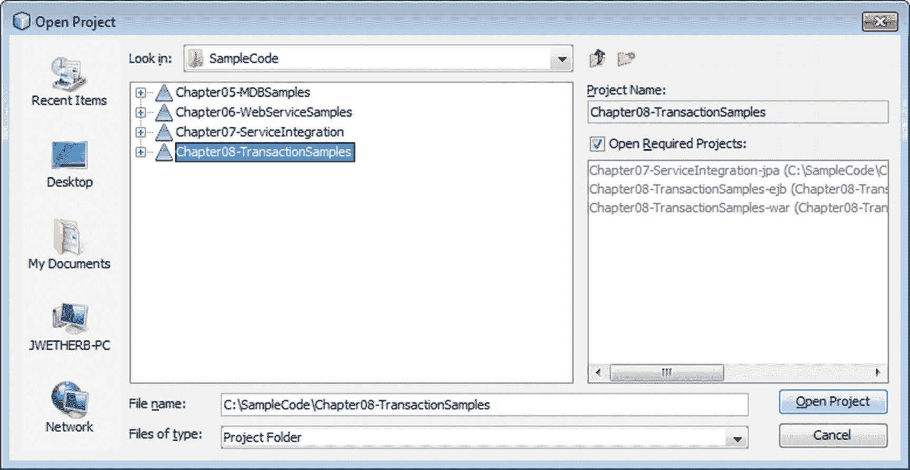
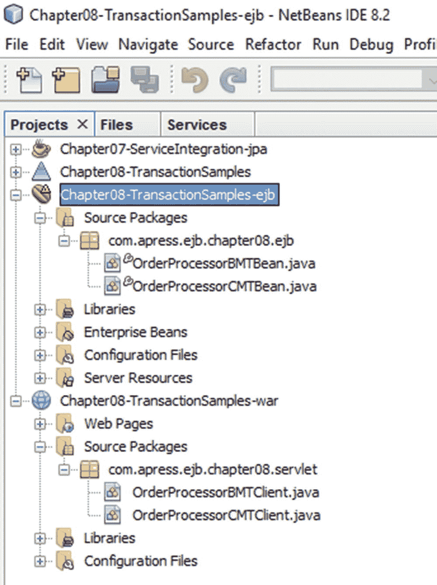
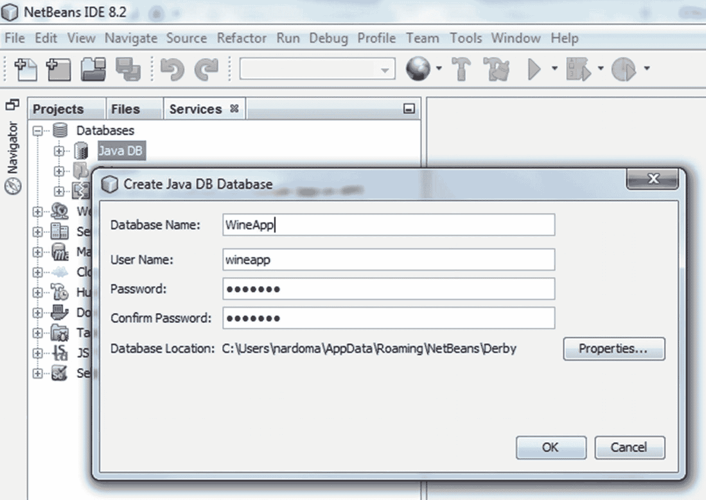
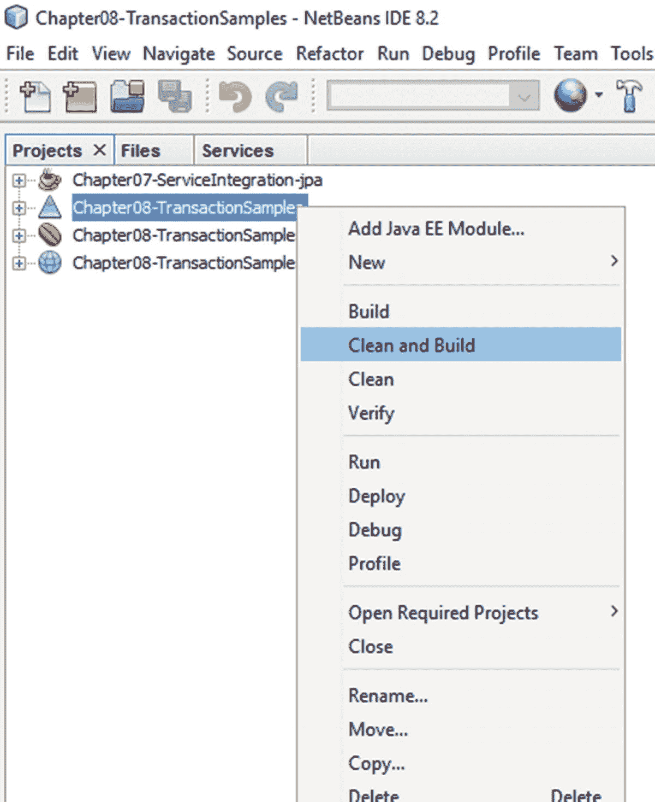
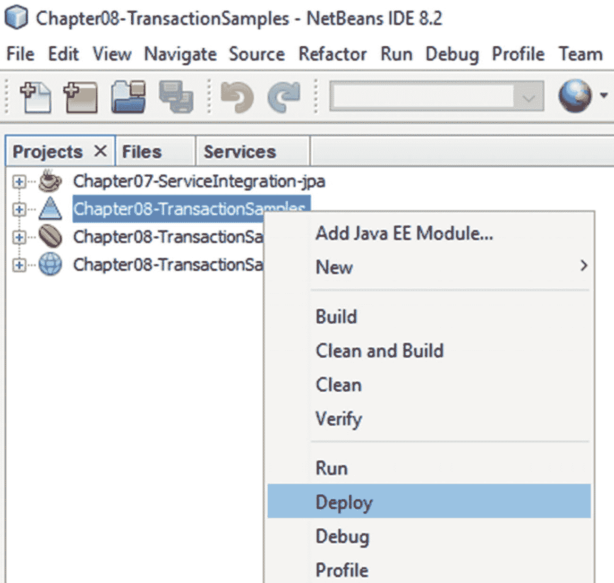
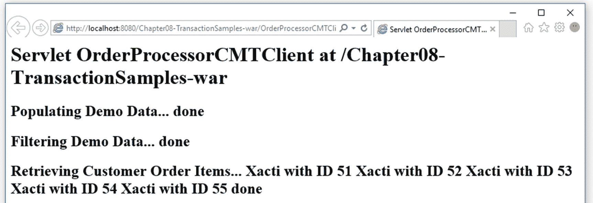
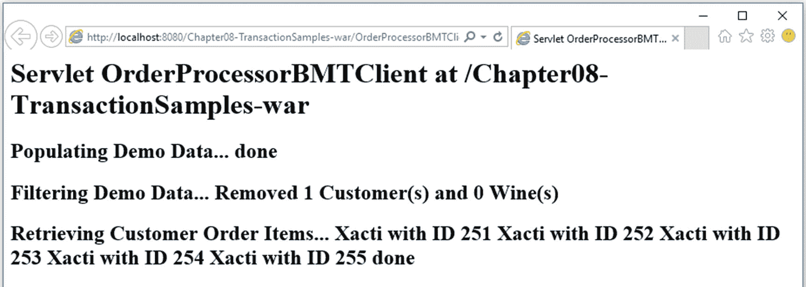

# 8. 事务管理

围绕企业应用程序设计和开发的大部分工作都涉及如何协调持久化数据流的决策。这包括何时何地缓存数据、何时将其应用到持久化存储（通常是数据库）、如何解决同时访问同一数据的尝试，以及如何解决在发生违反数据库约束的操作时可能出现的错误。可靠的数据库能够在较低级别（数据库层）处理这些问题，但同样的问题也可能存在于中间层（应用服务器）和客户端层，并且通常需要特殊的应用程序逻辑。例如，数据库通过悲观锁定支持提供内置的并发控制，而应用程序可能会选择使用乐观锁定策略来获得更优化的性能结果。

使用 EJB 的主要好处之一是它支持事务管理和安全控制等企业级服务。在本章中，我们将探讨 EJB 如何提供事务服务，以及如何利用这些服务来满足您的特定需求。

为了说明 EJB 提供的功能以及如何使用它，我们将从示例 Apress Wines Online 应用程序中检查一个场景，该场景体现了上述数据流问题。我们将通过展示执行任务的方法来说明 EJB 的事务支持，这些方法从简单简洁到稍微复杂但更灵活。不过，在深入探讨示例之前，我们将概述 EJB 事务领域中的一些重要事务概念，包括 Java 事务 API (JTA)、EJB 容器通过声明式 EJB 元数据为您提供的许多灵活的事务选项，以及事务在持久化层中的处理方式。EJB 从一开始就提供了这些基本的事务服务，因此，如果您对这些概念已经熟悉，可以直接跳到示例部分，了解它们如何在涉及 Java 持久化 API (JPA) 的 EJB 世界中体现。


## 什么是事务？

在本节中，我们将探讨以下问题：

*   什么是事务，为什么它对企业应用至关重要？
*   定义稳健可靠事务的核心 ACID（原子性、一致性、隔离性、持久性）属性是什么？
*   什么是 JTA，什么是分布式事务，什么是两阶段提交？

事务是一组必须作为一个单元执行的操作。这些操作可以是同步或异步的，可能涉及持久化数据对象、发送电子邮件、验证信用卡以及许多其他事件。一个经典的例子是银行转账，其中一个操作从一个账户扣除资金（即更新数据库表中的一条记录），另一个操作将相同的资金存入另一个账户（更新同一或不同数据库表中的另一行）。从查询这两个账户的外部应用程序的角度来看，绝不能出现这些资金同时在两个账户中可见的情况。也不能存在资金在两个账户中都不可见的时刻。只有当此事务中的两个操作都成功执行后，这些更改才能从另一个应用程序上下文中可见。必须以这种方式作为一个单元一起执行的一组操作，被称为事务。

事务中的操作按顺序或并行执行，通常在一个（相对较短的）时间段内完成。在所有操作都执行完毕后，事务被应用，即提交。如果在事务执行过程中出现错误或其他无效状况，事务可能会被取消，即回滚，并且在该事务上下文中已执行的操作将被撤销。

### 分布式事务

当事务中的操作跨数据库或位于不同计算机或进程上的其他资源执行时，这被称为分布式事务。此类企业级事务需要在所涉及的资源之间进行特殊协调，并且极难可靠地编程。这正是 JTA 的用武之地，它提供了资源可以实现并绑定以参与分布式事务的接口。

EJB 容器是一个支持 JTA 的事务管理器，因此它可以参与涉及其他 EJB 容器以及第三方 JTA 资源（如许多数据库管理系统 (DBMS)）的分布式事务。这减轻了业务应用程序开发人员协调分布式事务的复杂性，使他们能够自由地集成松散耦合的服务，并按照自己的选择在企业中分布数据。此外，正如您将在以下各节中看到的，EJB 允许开发人员选择是显式地划分事务边界——通过调用 begin、commit 或 roll back（取消）事务——还是允许 EJB 容器沿着 EJB 方法边界自动执行事务划分。

### 事务的 ACID 属性

不，不是那种迷幻的 Kool-Aid。事务形式多样、规模各异，可能涉及同步和异步操作，但它们都具有一些共同的核心特性，即 ACID 组件。ACID 指的是定义稳健可靠事务的四个特性：原子性、一致性、隔离性和持久性。表 8-1 描述了这四个组件。

表 8-1

事务的 ACID 属性

| 特性 | 描述 |
| --- | --- |
| 原子性 | 事务由一个或多个作为一组（称为工作单元）执行的操作组成。原子性确保在事务结束时，这些操作要么全部成功执行（成功提交），要么全部不执行（成功回滚）。在事务结束时，如果只有部分操作完成，则违反了原子性。 |
| 一致性 | 一致的事务具有数据完整性。一致性确保在事务结束时，数据处于一致状态，从而不会违反数据库约束或逻辑验证规则。 |
| 隔离性 | 事务隔离性规定外部世界无法看到事务的中间状态。查看事务中涉及的数据对象的外部程序，在事务提交之前不得看到修改后的数据对象。事务隔离性本身是一门复杂的科学，在很大程度上超出了本讨论的范围，但可以说，EJB 服务器提供商通常提供可配置的隔离设置，让您可以选择事务范围内的资源彼此看到对方待定更改的程度，以及在上下文事务期间外部提交的更改（脏读）的程度。没有标准的隔离设置，因此可移植的应用程序不应依赖其运行时环境中的特定配置。 |
| 持久性 | 正确执行的事务是永久性的，不会受到任何系统故障的影响。将数据提交到关系数据库中（随后可以查询结果）通常可以实现这一要求。 |

自然，EJB 满足了所有这些要求，我们将在后续示例中指出如何处理每一项。

### Java 事务 API (JTA)

JTA 为客户端和事务感知的资源管理器定义了一个接口，以参与容错的分布式事务。EJB 自动绑定到这些服务，因此客户端和企业 Bean 都可以方便地参与分布式编程，而无需显式编写诸如两阶段提交协议之类的逻辑。EJB 进入其 JTA 事务的主要接口是通过 `javax.transaction.UserTransaction` 对象接口，该接口由 EJB 容器实例化，并可通过注入到企业 Bean 类或通过 Java 命名和目录接口 (JNDI) 查找获得。

### 两阶段提交协议

如果您使用关系数据库编写过逻辑，您可能熟悉两阶段提交协议。该策略赋予参与分布式事务的资源管理器否决权，通过“准备”命令通知它们即将发出提交，并允许它们声明是否可以应用其更改。只有当所有资源管理器一致同意它们已准备好应用其更改时，事务管理器才会下达最终命令来实际应用更改。通常，资源管理器在“准备”步骤中执行大部分更改，因此最终的“提交”步骤执行起来微不足道。这降低了在“提交”步骤中发生错误的可能性。稳健的事务管理器和资源管理器甚至能够处理这种意外情况。


## EJB 中的事务支持

本节将探讨以下问题：

*   企业 Bean 开发者可以使用哪些事务服务？
*   会话 Bean、消息驱动 Bean (MDB) 和实体在事务上下文中如何交互？

EJB 服务器中的大部分基础设施都致力于支持这些服务，这并非没有道理。EJB 不仅提供了一个健壮的 JTA 事务管理器，还通过可在可互操作、可移植的业务组件上指定的声明性元数据使其易于访问。几乎所有 Java EE 应用程序都需要事务服务，而 EJB 以一种非常简洁的方式将它们提供给应用程序开发者。

从其诞生之初，EJB 框架就提供了一种便捷的方式来管理事务和访问控制，它允许你基于每个方法以声明方式定义行为。除了这些容器提供的服务之外，EJB 还允许你将控制权交给应用程序，以定义事务事件边界和其他自定义行为。

在本章中，我们将探讨事务在应用程序中完成一系列常见任务时所扮演的角色。在一个典型的 Java EE 应用程序中，会话 Bean 通常用于建立事务边界，并操作实体以在事务上下文中与数据库交互。我们的示例混合了会话 Bean 和实体操作，以说明 EJB 提供的内置（声明式）和手动行为。本着简化开发模型的精神，EJB 默认提供了许多最有用的特性，因此默认事务选项既实用又强大也就不足为奇了。

### EJB 事务服务

EJB 事务模型构建于 JTA 模型之上，在该模型中，会话 Bean 或其他应用程序客户端提供事务上下文，企业服务作为逻辑工作单元在其中执行。Java EE 环境中通常在事务上下文中运行的企业服务包括：创建、检索、更新和删除实体；向队列发送 JMS 消息；执行 MDB；触发电子邮件请求；调用 Web 服务；执行 JDBC 操作等等。

EJB 提供了一个内置的 JTA 事务管理器，但真正的力量在于 EJB 为 Bean 提供者提供的声明式服务。通过使用元数据标签而非编程逻辑，EJB 开发者可以无缝地参与 JTA 事务，并以声明方式控制企业 Bean 上每个业务方法的事务行为。

EJB 通过为 JTA 事务和非 JTA（资源本地）事务提供显式支持来扩展此编程模型。资源本地事务仅限于单个资源管理器（例如数据库连接），但可以通过避免分布式事务监视器的开销来实现性能优化。

此外，应用程序构建者可以利用容器提供的服务来自动管理事务，或者他们可以选择控制事务边界并显式处理事务的开始、提交和回滚事件。在单个应用程序中，如果需要，可以结合使用这两种方法。虽然选择由容器还是应用程序本身来划分事务是在企业 Bean 上定义的，但决定对 JPA 实体使用哪种事务模型（JTA 或资源本地）则取决于 `persistence.xml` 文件中持久化单元的配置方式。

游戏中的持久化对象——实体——完全且愉快地对其管理事务框架一无所知。实体运行的事务上下文不是其定义的一部分，因此，只要创建了适当的 `EntityManager` 来服务实体的生命周期事件，同一个实体类就可以在应用程序选择的任何事务上下文中使用。

如果这一切在此时看起来有点令人生畏，请不要担心。一旦我们通过一些代码示例来演示所有部分如何协同工作，一切都会变得清晰。同样值得注意的是，EJB 内置的容器管理事务 (CMT) 支持对于在 EJB 容器内运行的大多数应用程序来说已经足够。本章将让你探索各种选项——但除非你编写的应用程序涉及完全在 EJB 容器之外运行的实体，否则默认支持很可能很好地满足你的需求。

## 服务模型中会话 Bean 的事务行为

下一节将探讨以下问题：

*   EJB 容器为会话 Bean 提供了哪些声明式事务支持？
    *   容器管理事务 (CMT) 划分和 Bean 管理事务 (BMT) 划分有什么区别？你会在什么情况下选择其中一种方法？
    *   什么是 CMT 属性？
    *   EJB 如何使用 Bean 管理事务 (BMT) Bean 来支持事务边界的显式划分？
*   隐式提交行为与显式提交行为有何区别？

企业 Bean 是 EJB 服务层的核心。通过会话 Bean，EJB 容器提供了事务事件的声明式划分，以及选择在 Bean 或应用程序客户端代码中显式划分事务事件的选项。让我们分别考虑这两种方法，从默认选项开始：利用声明式标记进行容器管理的事务划分。


### 容器管理事务（CMT）边界划分

EJB 容器提供了内置的事务管理服务，会话 Bean 和消息驱动 Bean（MDB）默认可以使用这些服务。Bean 通过元数据（使用注解或 XML）为其每个方法指定事务特性，EJB 容器遵循这些指令来确定要执行的事务操作（如果有的话）。利用这些指令，EJB 容器可以在方法被调用时自动开始一个新事务，或者挂起或重用现有事务，并可能在方法返回调用者之前提交该事务。

注意

只有 Bean 开发者可以为企业 Bean 分配事务管理类型。允许应用程序组装者通过 `ejb-jar.xml` 文件覆盖 Bean 的方法级容器管理事务属性，但他们必须谨慎操作以避免死锁的可能性。通常不允许应用程序组装者和部署者覆盖 Bean 的事务管理类型。

当 EJB 在元数据中声明其事务行为时，容器会拦截对企业 Bean 方法的调用，并在会话 Bean 的方法边界应用事务行为，提供一组固定的选项供你为每个方法指定。容器提供的默认行为（即未指定其他指令时）是在调用方法之前立即检查当前线程是否关联了事务上下文。如果没有可用的事务上下文，容器会在执行方法之前开始一个新事务。如果存在可用的事务，容器会允许该事务传播到方法调用，并使其对方法代码可用。然后，在从方法调用返回时，容器会再次检查。如果容器负责创建了新的事务上下文，它会在方法退出后自动提交该事务。如果容器没有创建该事务，则允许该事务不受影响地继续执行。通过拦截 Bean 的方法调用，EJB 容器能够在运行时应用开发时声明式指定的事务行为。

上一段描述的默认行为只是容器提供的六种 CMT 边界划分选项之一。你可以将这六种边界划分选项中的任意一种分配给会话 Bean 上的任何方法。某些属性值需要满足特定条件；当条件不满足时，会抛出异常。这六个属性列在表 8-2 中。

表 8-2

容器事务属性定义

| 事务属性 | 行为 |
| --- | --- |
| `MANDATORY` | 调用方法时必须存在一个有效的事务。如果没有可用的事务，则抛出 `javax.ejb.EJBTransactionRequired` 异常。该方法执行期间此事务保持有效，并且在将控制权返回给调用者时保持活动状态。 |
| `REQUIRED` | 这是默认的事务属性值。进入方法时，如果尚无可用的上下文，容器会介入创建一个新的事务上下文。如果容器在进入方法时创建了事务，则会在方法调用完成时提交该事务。如果已经存在一个有效的事务，容器在将控制权返回给客户端之前不会提交它。 |
| `REQUIRES_NEW` | 容器在执行标记为此属性的方法之前总是创建一个新事务。如果在调用方法时已经存在一个事务上下文，则容器会将该事务与当前线程分离以挂起它，然后再创建新事务。在提交中间事务后，容器会将原始事务重新关联到当前线程。 |
| `SUPPORTS` | 此选项基本上是一个空操作，不会导致容器执行额外工作。如果存在事务上下文，则方法会使用它。如果没有可用的事务上下文，则容器会在没有事务上下文的情况下调用该方法。退出方法时，任何预先存在的事务上下文保持有效。 |
| `NOT_SUPPORTED` | 容器在未指定事务上下文的情况下调用该方法。如果在调用方法时存在事务上下文，则容器会在调用方法之前将该事务与当前线程分离，然后在从方法返回时将该事务重新关联到线程。 |
| `NEVER` | 调用方法时不得带有事务上下文。容器在调用方法之前不会创建事务上下文，如果已经存在一个有效的事务，容器会抛出 `javax.ejb.EJBException`。 |

注意

通常，事务属性可以在会话 Bean 的业务接口方法或 Web 服务端点接口上指定，也可以在 MDB 的监听器方法上指定，但在特定情况下会有一些额外的限制。此类细节超出了本书的范围，但可以在 EJB 核心契约与需求规范中找到。

所有六个属性通常都可用于会话 Bean 方法，尽管某些属性在会话超时回调方法上不可用，或者当会话 Bean 实现 `javax.ejb.SessionSynchronization` 时不可用。MDB 仅支持 `REQUIRED` 和 `NOT_SUPPORTED` 属性。以下是一个示例，说明如何在会话 Bean 方法上指定事务行为以覆盖在 Bean 级别指定（或默认）的事务行为：

```
@TransactionAttribute(TransactionAttributeType.SUPPORTS)
public CustomerOrder createCustomerOrderUsingSupports(Customer customer)
throws Exception { ... }
```

表 8-3 展示了 EJB 的事务行为，该行为取决于其事务属性以及在调用会话方法时是否存在事务上下文。对于每个事务属性，我们在单独的行中列出了当客户端事务不存在（None）和当客户端事务存在（Tc）时的方法体和资源事务上下文。每当为方法执行期间创建新事务（Tm）时，该事务总是在控制权返回给调用者之前由 EJB 容器提交。表中同时显示了与方法体代码关联的事务以及与该方法使用的资源关联的事务。

表 8-3

六种事务属性对应的客户端和 Bean 事务状态

| 事务属性 | 客户端的事务 | 与业务方法关联的事务 | 与资源管理器关联的事务 |
| --- | --- | --- | --- |
| `MANDATORY` | 无 | 错误 | 不适用 |
|   | Tc | Tc | Tc |
| `NEVER` | 无 | 无 | 无 |
|   | Tc | 错误 | 不适用 |
| `NOT_SUPPORTED` | 无 | 无 | 无 |
|   | Tc | 无 | 无 |
| `REQUIRED` | 无 | Tm | Tm |
|   | Tc | Tc | Tc |
| `REQUIRES_NEW` | 无 | Tm | Tm |
|   | Tc | Tm | Tm |
| `SUPPORTS` | 无 | 无 | 无 |
|   | Tc | Tc | Tc |

表 8-3 展示了容器如何拦截具有 CMT 边界划分的方法，从而为每个事务属性以不同方式传播事务上下文。该表还说明了在 Bean 方法中使用的事务上下文总是会依次传播给该 CMT Bean 方法所调用的其他方法。请注意，企业 Bean 的客户端本身可能是另一个企业 Bean。


#### EJBContext.setRollbackOnly 与 getRollbackOnly 方法

在采用容器管理事务（CMT）的企业 Bean 方法中，如果遇到异常或其他错误情况，该 Bean 可能希望阻止上下文事务被提交。

在使用容器管理事务时，可以通过以下方式使用 `MessageDrivenContext` 方法：

*   `setRollbackOnly`：此方法可用于错误处理。
*   `getRollbackOnly`：此方法可用于测试当前事务是否已被标记为回滚。

Bean 不允许显式回滚事务，但它可以获取 `javax.ejb.EJBContext` 资源（通过容器注入或 JNDI 查找），并调用其 `setRollbackOnly()` 方法，以确保容器不会提交该事务。类似地，Bean 方法可以随时调用 `EJBContext.getRollbackOnly()` 方法，以确定当前事务是否已被标记为回滚——无论是由当前 Bean、其他 Bean 还是与当前事务关联的资源所标记。

### Bean 管理事务（BMT）划分

对于某些企业 Bean，声明式的 CMT 服务可能无法提供它们所需的划分粒度。例如，客户端可能希望调用会话 Bean 上的多个方法，而不希望每个方法在完成后都提交其工作。在这种情况下，客户端有几种选择：它可以实例化自己的 JTA（或资源本地）事务，从而显式控制事务的开始/结束边界；它可以编写一个自定义的 CMT 会话 Bean，将工作封装在一个事务性 Bean 方法内，并在容器管理的事务中执行这些步骤；或者，它可以通过使用 EJB 上下文中可用的事务资源来显式控制事务划分。

EJB 为企业 Bean 提供了后一种选项——称为 Bean 管理事务（BMT）支持——作为处理其事务事件划分的便捷方式。要关闭自动的 CMT 划分服务，企业 Bean 只需指定 `@TransactionManagement(TransactionManagementType.BEAN)` 注解，或在 `ejb-jar.xml` 文件中将会话 Bean 分配等效的元数据。使用 BMT 划分时，EJB 容器仍然通过 Bean 的 `EJBContext` 对象中可用的 `UserTransaction` 对象，为 Bean 提供事务支持。主要区别在于，Bean 代码显式调用 begin、commit 和 rollback 事务，而不是使用 CMT 属性以声明方式为其方法分配事务行为。容器不会干预 BMT 方法来开始和提交事务，也不会将客户端开始的事务传播给选择自行划分事务的 Bean。虽然任何给定的企业 Bean 必须为其方法选择一种方案（CMT 与 BMT 划分），但两种类型的 Bean 可以在单个事务上下文内相互交互。

为了划分事务，企业 Bean 通过注入获取一个 `EJBContext`（即，对于会话 Bean 是 `SessionContext`，对于 MDB 是 `MessageDrivenContext`）资源：

```
@Resource
SessionContext sessionContext;
```

然后通过此资源获取一个 JTA `javax.transaction.UserTransaction` 实例：

```
UserTransaction txn = sessionContext.getUserTransaction();
```

这个由 EJB 容器提供的 `UserTransaction` 接口为 Bean 提供了 `begin()`、`commit()` 和 `rollback()` 事务划分方法。类似地，非企业 Bean 客户端可以从 EJB 容器之外的 JTA 服务器获取 `UserTransaction` 资源，以从应用程序客户端环境划分事务，或者它们可以使用通过 `EntityManager` 获取的非 JTA 资源本地 `EntityTransaction`（见下文）。然而，无论它们如何开始事务，当它们调用会话 Bean 方法时，该事务都会成为上下文中的事务，并且表 8-3 中的规则适用。

在我们即将研究的示例中，一个使用 `EXTENDED` 持久化上下文和 BMT 划分的有状态会话 Bean 在一个方法中启动一个事务，该事务随后传播到后续的方法调用，直到该事务最终在另一个方法中被提交。这种行为的实现，无法通过在 CMT 会话 Bean 上分别调用这些方法并采用相同的方法结构来达成，尽管可以通过将这些单独的调用包装在 CMT 会话 Bean 的单个 CMT 划分的自定义方法内来实现相同的结果。

注意

EJB 服务器如何连接事务上下文？您可能对 EJB 服务器如何能够自动将数据库连接以及在企业 Bean 内部以编程方式获取的其他资源注册到事务上下文中感到好奇。由于 EJB 服务器为执行 Bean 方法提供了上下文，它能够干预这些请求并执行这种副作用逻辑，而不会中断方法内的执行流程。也就是说，它在方法调用执行之前进行拦截；执行一些额外的工作（例如检查事务上下文的状态，可能创建一个新事务，并将企业 Bean 与该上下文关联）；然后调用 Bean 方法。从 Bean 方法调用返回后，它再次有机会执行额外的逻辑，例如提交在调用该方法时创建的事务，然后再将控制权返回给最初调用该 Bean 方法的客户端。

当我们使用 Bean 管理事务时，将消息投递到 `onMessage` 方法的过程发生在 JTA 事务上下文之外。

该事务将：

*   在我们于 `onMessage` 方法内调用 `UserTransaction.begin` 方法时开始，并且
*   在我们调用 `UserTransaction.commit` 或 `UserTransaction.rollback` 时结束。

请注意，任何对 `Connection.createSession` 方法的调用都应在事务内进行。

### 隐式提交与显式提交

使用 CMT 时，容器要求其在调用方法时开始的任何事务，都必须在方法返回给调用者时结束。这被称为隐式提交行为，有时也称为自动提交行为。容器必须强制执行此规则，否则当控制权沿进程堆栈向上传递时，可能会丢失对事务的跟踪。虽然您仍然可以使用 CMT 的容器管理事务来允许在单个事务内调用多个方法，但您必须通过将方法调用包装在外部容器管理的方法中来实现这一点。从客户端的角度来看，这仍然是对包装器方法的单个方法调用。

当对有状态会话 Bean 使用 BMT 时，您可以灵活地实现显式提交模型，其中 Bean 或客户端可以控制事务的开始和结束，并在此期间显式调用多个方法，最后通过显式调用 commit 或 rollback 来结束工作。这给客户端或 Bean 开发者带来了负担，以确保事务不会悬空。然而，如果处理得当，当应用程序需要这种行为时，这将是一个强大的工具。如前所述，EJB 为会话 Bean 和 MDB 提供了一个内置事务供其使用——`javax.transaction.UserTransaction`——Bean 可以通过其注入的 `javax.ejb.EJBContext` 属性（作为 `SessionContext` 或 `MessageDrivenContext` 实例）访问该事务。

我们将在本章末尾的示例应用程序中进一步探讨隐式和显式提交行为。


## 在 JPA 实体中使用事务

本节将讨论以下问题：

*   在持久化层中，事务是如何管理的？
*   持久化框架提供了哪些选项来控制涉及实体的事务？
*   持久化上下文在事务中扮演什么角色？
*   实体是如何与事务上下文关联和解除关联的？

如果你还记得第 3 章的内容，持久化单元定义了一组实体类，而持久化上下文则是来自单个持久化单元的一组受管理的实体实例。在任何时刻，跨应用服务器中执行的多个应用程序，许多持久化上下文可能活跃地与任何给定的持久化单元相关联，但每个持久化上下文最多与一个事务上下文相关联。

### 实体与事务上下文之间的关系

从前面关于 EJB 服务器如何作为事务协调器将资源与事务上下文关联起来的讨论中，你可能已经意识到，持久化上下文就是与事务关联的资源。通过这种方式，持久化上下文通过方法调用进行传播，以便持久化单元中的实体，当它们与同一个事务上下文关联时，可以通过它们共同的持久化上下文看到彼此的中间状态。此外，对于任何给定的持久化单元，只能有一个持久化上下文与给定的事务上下文相关联，这一限制确保了对于任何标识为 `I` 的类型为 `T` 的实体，其状态在任何事务上下文中都只会由一个持久化上下文来表示。

在一个应用程序线程中，任何时刻都只有一个事务上下文可用，但 EJB 服务器可以自由地将一个持久化上下文与该线程解除关联，并为同一个持久化单元关联一个新的持久化上下文，以满足事务隔离边界。当 EJB 服务器这样做时，新实例化的持久化上下文将无法看到对与挂起的持久化上下文关联的任何实体所做的中间更改。

### 容器管理 vs. 应用程序管理的持久化上下文

EJB 中的持久化服务允许你完全放弃容器管理的持久化上下文，并在应用程序代码中显式管理持久化上下文的生命周期。当注入（或通过 JNDI 获取）一个 `EntityManager` 实例时，它作为一个容器管理的持久化上下文出现。容器会自动将容器管理的持久化上下文与使用 `EntityManager` 时恰好处于上下文中的任何事务关联起来，并在事务结束时销毁该持久化上下文（有一个例外——请参见下面的扩展持久化上下文）。如果应用程序希望控制其持久化上下文如何或是否与事务关联，以及它是否能在事务边界之后继续存在，它可以获取一个 `EntityManagerFactory`（同样通过容器注入或 JNDI 查找），并显式创建管理其持久化上下文的 `EntityManager` 实例。当通过 `EntityManagerFactory` 获取 `EntityManager` 时，使用的是应用程序管理的持久化上下文——这是在 Java EE 容器外部运行时的要求。有关在 Java EE 容器外部（例如在纯 Java SE 环境中）使用应用程序管理的 `EntityManager` 的更多信息，请参见第 4 章。

### 事务范围的持久化上下文 vs. 扩展持久化上下文

在事务创建时创建、在事务结束时销毁的持久化上下文，称为事务范围的持久化上下文。这是与无状态会话 Bean 上使用的所有 `EntityManager` 关联的持久化上下文的行为。

对于有状态会话 Bean，存在一种特殊形式的容器管理 `EntityManager`，它不与事务的生命周期绑定，而是与有状态会话 Bean 自身的生命周期绑定。这被称为扩展的 `EntityManager`，它的行为很像应用程序管理的持久化上下文，但 EJB 容器方便地管理其生命周期。由于扩展持久化上下文不会像事务范围的持久化上下文那样在每个事务结束时被销毁，因此即使实体已与数据库同步，它们也可以保持在受管理状态。在某些情况下，这避免了在提交后如果希望继续使用它们时，需要重新查询它们或以其他方式获取受管理实例。在会话式环境（例如 Web 应用程序）中，这可能非常有用。扩展持久化上下文会保持打开状态，直到其上下文中的有状态会话 Bean 被销毁。只有有状态会话 Bean 才能使用扩展持久化上下文。在创建 `EntityManager` 实例时，其持久化上下文类型就已定义，并且在 `EntityManager` 的生命周期内不能更改。默认类型是事务范围的；要通过指定扩展持久化上下文来注入 `EntityManager`，你可以使用以下指令指定注入：

```
@PersistenceContext(unitName="WineAppUnit", type = PersistenceContextType.EXTENDED)
private EntityManager em;
```

或者你可以在 XML 描述符中定义一个 `persistence-context-ref` 元素。

在本章末尾的事务示例中，我们将比较使用事务范围持久化上下文的无状态会话 Bean 与使用扩展持久化上下文的有状态会话 Bean 的行为。

### JTA vs. 资源本地的 EntityManager

`EntityManager` 可以被定义为参与 JTA 事务或非 JTA（资源本地）事务。JTA 的特性——最显著的是对分布式事务的支持——以及 Bean 与 JTA 事务的接口 `javax.transaction.UserTransaction` 的使用，之前已经描述过。资源本地的 `EntityManager` 使用 `javax.persistence.EntityTransaction` 接口来服务事务，该接口可通过 `EntityManager.getEntityTransaction()` 方法提供给客户端。该接口暴露了预期的事务划分方法 `begin()`、`commit()` 和 `rollback()`，以及 `getRollbackOnly()` 和 `setRollbackOnly()` 方法（这些方法等同于之前描述的企业 Bean 可用的 `EJBContext` 和 `UserTransaction` 方法），还有一个 `isActive()` 方法，用于指示事务当前是否正在进行中。

容器管理的 `EntityManager` 必须是 JTA `EntityManager`。应用程序管理的 `EntityManager` 可以是 JTA 或资源本地的，但只有当 `EntityManager` 位于 Java EE 环境中时，它们才能是 JTA `EntityManager`。

你可能想要使用资源本地 `EntityManager` 的一个原因是，虽然 JTA 提供了分布式事务的基础设施，但资源本地事务可以通过消除这种基础设施的开销来提供性能优化。另一个原因是，你可能希望在独立的 Java SE 环境中使用你的 JPA 实体，而该环境不支持 JTA 和/或数据源资源。

在本章后面剖析示例应用程序中的 Java 外观时，我们将研究 `EntityTransaction` 的使用。


## 两个示例场景

以下两个示例场景使用了为 Wines Online 应用程序定义的持久化单元中的实体，我们在第 7 章中对此进行了探讨。第一个场景使用了一个无状态的 CMT 会话 Bean，利用了 EJB 容器提供的声明式事务服务。第二个场景展示了在使用有状态的 BMT 会话 Bean 时，Bean 和客户端如何显式地管理事务。在本章末尾，你将找到使用 NetBeans 在 GlassFish 中构建、部署和测试这些示例的分步说明。现在，我们将分析源文件，并讨论 EJB 和 JPA 在事务环境中交互的不同方式。

### 使用 CMT 边界的无状态会话 Bean

我们从无状态会话 Bean `OrderProcessorCMTBean.java`（如清单 8-1 所示）的一个默认、直接的实现开始。此会话 Bean 使用 CMT 边界来利用 EJB 的声明式事务支持。紧随其后的是一个简单的 Servlet 客户端 `OrderProcessorCMTClient.java`（如清单 8-2 所示）。

```
@Stateless(name = "OrderProcessorCMT", mappedName = "Chapter08-TransactionSamples-OrderProcessorCMT")
public class OrderProcessorCMTBean {
@Resource
SessionContext sessionContext;
@PersistenceContext(unitName = "Chapter08-TransactionSamples-JTA")
private EntityManager em;
/**
* 移除所有电子邮件为 'wineapp@yahoo.com' 的现有客户以及所有国家为 'United States' 的现有葡萄酒。
* EJB 容器将确保此工作在一个事务上下文中执行。
*/
public String initialize() {
StringBuffer strBuf = new StringBuffer();
strBuf.append("已移除 ");
int i = 0;
//  通过移除所有电子邮件为 'wineapp@yahoo.com'（或 user.properties 文件中定义的任何地址）的现有客户来过滤数据。
for (Customer customer :
getCustomerFindByEmail(PopulateDemoData.TO_EMAIL_ADDRESS)) {
em.remove(customer);
i++;
}
strBuf.append(i);
strBuf.append(" 个客户和 ");
//  移除所有国家为 'United States' 的现有葡萄酒
i = 0;
for (Wine wine : getWineFindByCountry("United States")) {
em.remove(wine);
i++;
}
strBuf.append(i);
strBuf.append(" 个葡萄酒");
return strBuf.toString();
}
/**
* 根据客户购物车中的商品创建一个新的 CustomerOrder。创建一个新的 CustomerOrder
* 实体，然后为客户购物车中的每个 CartItem 创建一个新的 OrderItem 实体。
*
* 使用 CMT 和默认的 REQUIRED 事务属性，如果在没有事务上下文的情况下调用此方法，
* 则在调用该方法时，EJB 容器将创建一个新事务，并在方法成功完成后提交该事务。
*
* @return 状态消息（纯文本）
*/
public CustomerOrder createCustomerOrder(Customer customer) {
return createCustomerOrderUsingSupports(customer);
}
@TransactionAttribute(TransactionAttributeType.SUPPORTS)
public CustomerOrder createCustomerOrderUsingSupports(Customer customer) {
if (customer == null) {
throw new IllegalArgumentException("OrderProcessingBean.createCustomerOrder(): 未指定客户");
}
if (!em.contains(customer)) {
customer = em.merge(customer);
}
final CustomerOrder customerOrder = new CustomerOrder();
customer.addCustomerOrder(customerOrder);
final Timestamp orderDate = new Timestamp(System.currentTimeMillis());
final List cartItemList =
new ArrayList(customer.getCartItemList());
for (CartItem cartItem : cartItemList) {
//  为此 CartItem 创建一个新的 OrderItem
final OrderItem orderItem = new OrderItem();
orderItem.setOrderDate(orderDate);
orderItem.setPrice(cartItem.getWine().getRetailPrice());
orderItem.setQuantity(cartItem.getQuantity());
orderItem.setStatus("订单已创建");
orderItem.setWine(cartItem.getWine());
customerOrder.addOrderItem(orderItem);
//  移除 CartItem
customer.removeCartItem(cartItem);
}
return persistEntity(customerOrder);
}
public  T persistEntity(T entity) {
em.persist(entity);
return entity;
}
public  T mergeEntity(T entity) {
return em.merge(entity);
}
public  void removeEntity(T entity) {
em.remove(em.merge(entity));
}
public  List findAll(Class entityClass) {
CriteriaQuery cq = em.getCriteriaBuilder().createQuery();
cq.select(cq.from(entityClass));
return em.createQuery(cq).getResultList();
}
public  List findAllByRange(Class entityClass, int[] range) {
CriteriaQuery cq = em.getCriteriaBuilder().createQuery();
cq.select(cq.from(entityClass));
Query q = em.createQuery(cq);
q.setMaxResults(range[1] - range[0]);
q.setFirstResult(range[0]);
return q.getResultList();
}
/**
* select o from Customer o where o.email = :email
*/
@TransactionAttribute(TransactionAttributeType.NOT_SUPPORTED)
public List getCustomerFindByEmail(String email) {
return em.createNamedQuery("Customer.findByEmail", Customer.class).setParameter("email", email).getResultList();
}
/**
* select object(wine) from Wine wine where wine.country = :country
*/
@TransactionAttribute(TransactionAttributeType.NOT_SUPPORTED)
public List getWineFindByCountry(String country) {
return em.createNamedQuery("Wine.findByCountry", Wine.class).setParameter("country", country).getResultList();
}
}
清单 8-1
OrderProcessorCMTBean.java，一个使用 CMT 边界的无状态会话 Bean
```

```
@WebServlet(name = "OrderProcessorCMTClient", urlPatterns = {"/OrderProcessorCMTClient"})
public class OrderProcessorCMTClient extends HttpServlet {
@EJB
OrderProcessorCMTBean orderProcessorCMT;
/**
* 处理 HTTP
* GET 和
* POST 方法的请求。
*
* @param request servlet 请求
* @param response servlet 响应
* @throws ServletException 如果发生特定于 servlet 的错误
* @throws IOException 如果发生 I/O 错误
*/
protected void processRequest(HttpServletRequest request, HttpServletResponse response)
throws ServletException, IOException {
response.setContentType("text/html;charset=UTF-8");
response.setContentType("text/html;charset=UTF-8");
OutputStream rOut = response.getOutputStream();
PrintStream out = new PrintStream(rOut);
try {
/* TODO 在此处输出你的页面。你可以使用以下示例代码。 */
out.println("");
out.println("");
out.println("Servlet OrderProcessorCMTClient");
out.println("");
out.println("");
out.println("Servlet OrderProcessorCMTClient at " + request.getContextPath() + "");
out.println("");
out.println("");
//  创建并持久化一批 JPA 实体，用数据填充数据库
out.print("正在填充演示数据... ");
PopulateDemoData.resetData("Chapter07-WineAppUnit-ResourceLocal", System.out);
out.println("完成");
//  通过移除所有电子邮件为 'wineapp@yahoo.com'（或 user.properties 文件中定义的任何地址）的现有客户来过滤数据。
//  对 OrderProcessorBMT 上事务方法的第一次调用将开始一个事务。
out.print("正在过滤演示数据... ");
System.out.println(orderProcessorCMT.initialize());
out.println("完成");
//  创建一个客户并添加一些 CartItem 及其关联的葡萄酒
Individual customer = new Individual();
customer.setFirstName("Transaction");
customer.setLastName("Head");
customer.setEmail(PopulateDemoData.TO_EMAIL_ADDRESS);
for (int i = 0; i < 5; i++) {
Wine wine = new Wine();
wine.setName("Wine " + i);
wine.setCountry("United States");
wine.setRetailPrice(12.99);
wine.setStockNumber("STK" + i);
CartItem cartItem = new CartItem();
cartItem.setQuantity(i + 1);
cartItem.setWine(wine);
customer.addCartItem(cartItem);
}
out.print("正在创建客户订单... ");
CustomerOrder customerOrder = orderProcessorCMT.createCustomerOrder(customer);
out.println("完成");
out.print("正在检索客户订单项... ");
for (OrderItem orderItem: customerOrder.getOrderItemList()) {
final Wine wine = orderItem.getWine();
out.println(wine.getName() + " 的 ID 为 " + wine.getId());
}
out.println("完成");
} finally {
rOut.close();
out.close();
}
}
/*  HttpServlet 方法 */
}
清单 8-2
OrderProcessorCMTClient.java，一个驱动 OrderProcessorCMT 会话 Bean 的 Servlet
```

#### 事务分析

以下部分将从事务角度分析此测试运行。


##### 通过事务性 Java 外观填充测试数据

Servlet 客户端首先会清空数据。CMT Bean 的客户端不会创建事务，也不会关心事务细节。它将所有工作委托给 CMT 会话 Bean（并间接委托给）一个 Java 外观，并依赖它们在事务上下文中执行工作。客户端首先调用第 7 章示例应用程序中的 `PopulateDemoData` 类，这是一个辅助类，它委托给一个使用应用程序管理的 `EntityManager` 的 Java 外观，以重置演示数据，为新的测试运行做准备。我们首先提供这个示例，是为了观察在应用程序管理的 `EntityManager` 上下文中事务的原始用法。稍后我们将检查 EJB 会话 Bean 的行为。

```
//  创建并持久化一批 JPA 实体，用数据填充数据库
out.print("正在填充演示数据... ");
PopulateDemoData.resetData("Chapter07-WineAppUnit-ResourceLocal", System.out);
out.println("完成");
```

PopulateDemoData 类如清单 8-3 所示：

```
public class PopulateDemoData {
public static final String FROM_EMAIL_ADDRESS;
public static final String TO_EMAIL_ADDRESS;
static {
Properties properties = new Properties();
InputStream is = null;
try {
is = PopulateDemoData.class.getClassLoader().getResourceAsStream("user.properties");
properties.load(is);
FROM_EMAIL_ADDRESS = properties.getProperty("from_email_address");
TO_EMAIL_ADDRESS = properties.getProperty("to_email_address");
} catch (IOException e) {
throw new RuntimeException(e);
} finally {
if (is != null) {
try {
is.close();
} catch (IOException ex) {
Logger.getLogger(PopulateDemoData.class.getName()).log(Level.SEVERE, null, ex);
}
}
}
}
private JavaServiceFacade facade;
public static void main(String[] args) {
PopulateDemoData.resetData("Chapter07-WineAppUnit-ResourceLocal", System.out);
}
public static void resetData(String persistenceUnit, PrintStream out) {
PopulateDemoData pdd = null;
try {
pdd = new PopulateDemoData(persistenceUnit);
out.println("报告现有数据...");
pdd.showDataCount(out);
out.println("正在删除数据...");
pdd.removeAllDemoData(out);
out.println("报告删除后的数据...");
pdd.showDataCount(out);
out.println("正在填充数据...");
pdd.populateDemoCustomer();
pdd.populateWines();
out.println("报告最终数据...");
pdd.showDataCount(out);
} finally {
if (pdd != null) {
pdd.releaseEntityManager();
}
}
}
private PopulateDemoData(String persistenceUnit) {
facade = new JavaServiceFacade(persistenceUnit);
}
private void removeAllDemoData(PrintStream out) {
removeAll(OrderItem.class, out);
removeAll(CustomerOrder.class, out);
removeAll(Individual.class, out);
removeAll(Distributor.class, out);
removeAll(Supplier.class, out);
removeAll(InventoryItem.class, out);
removeAll(CartItem.class, out);
removeAll(Wine.class, out);
}
private  void removeAll(Class entityClass, PrintStream out) {
int i = 0;
for (T entity : facade.findAll(entityClass)) {
facade.removeEntity(entity);
}
out.println("已移除 " + i + " 个 " + entityClass.getSimpleName() + " 实例");
}
private Customer populateDemoCustomer() {
Address a = new Address("Redwood Shores", "CA", "200 Oracle Pkwy", null, "94065");
Individual i = new Individual("James", "Brown", "800.888.8000", TO_EMAIL_ADDRESS, a, a, "04/14", "123");
facade.persistEntity(i);
return i;
}
private InventoryItem populateWines() {
InventoryItem ii = null;
for (int i = 0; i < 6; i++) {
Wine w = new Wine("USA", "Fine Wine - ranked #" + i, "Yerba Buena " + i, 90, "Napa Valley", new Float(10 + i), "Zinfandel", 2000 + i);
facade.persistEntity(w);
ii = new InventoryItem(10 + i, w, new java.util.Date(System.currentTimeMillis()), new Float(1 + i));
facade.persistEntity(ii);
}
for (int i = 4; i < 10; i++) {
Wine w = new Wine("France", "Fine Wine - ranked #" + i, "Chateau Brown " + i, 90, "Loire Valley ", new Float(10 + i), "Zinfandel", 2000 + i);
facade.persistEntity(w);
ii = new InventoryItem(10 + i, w, new java.util.Date(System.currentTimeMillis()), new Float(1 + i));
facade.persistEntity(ii);
}
return ii;
}
public void showDataCount(PrintStream out) {
out.println("找到 " + facade.getCount(Address.class) + " 个地址");
out.println("找到 " + facade.getCount(BusinessContact.class) + " 个业务联系人");
out.println("找到 " + facade.getCount(CustomerOrder.class) + " 个客户订单");
out.println("找到 " + facade.getCount(Wine.class) + " 个葡萄酒");
out.println("找到 " + facade.getCount(WineItem.class) + " 个葡萄酒项目");
}
private void releaseEntityManager() {
if (facade != null) {
facade.close();
}
}
}
清单 8-3
PopulateDemoData.java，一个实用工具类，通过委托给 JPA 实体上的事务性 Java 外观来重置示例数据
```

请注意，我们没有使用 `@EJB` 注解注入 EJB 外观，而是通过其构造函数实例化 Java 外观（`JavaServiceFacade`），并向其传递一个 `RESOURCE_LOCAL` 持久化单元的名称，从原始调用中我们可以看到该名称为 `"Chapter07-WineAppUnit-ResourceLocal"`。这个辅助类正在调用外观上的操作，例如 `persistEntity()` 和 `removeCustomerOrder()`，而没有显式要求提交操作，这表明该外观使用了隐式提交行为。

我们还注意确保在使用外观后，通过其自身的 `close()` 方法通知它。这允许它释放自己的资源：特别是其 `EntityManagerFactory` 和 `EntityManager` 资源。这些是你不必为 EJB 担心的内务管理事项，因为 EJB 容器会为你处理这一级别的资源管理。


### 使用应用程序管理实体管理器的 Java 门面

这让我们回到了 Java 门面本身的细节。这个门面实际上在第 7 章中就已悄然引入，当时它与该章节中共享的通用持久化归档捆绑在一起。现在，我们将通过检查清单 8-4 中的 `JavaServiceFacade` 类来了解其处理方式：

```
public class JavaServiceFacade {
private final EntityManagerFactory emf;
private final EntityManager em;
public JavaServiceFacade() {
this("Chapter13-EmbeddableEJBTests-ResourceLocal");
}
public JavaServiceFacade(String persistenceUnit) {
emf = Persistence.createEntityManagerFactory(persistenceUnit);
em = emf.createEntityManager();
}
public void close() {
if (em != null && em.isOpen()) {
em.close();
}
if (emf != null && emf.isOpen()) {
emf.close();
}
}
/**
* 对持久化上下文中托管实体所做的所有更改都将应用到数据库并提交。
*/
private void commitTransaction() {
final EntityTransaction entityTransaction = em.getTransaction();
if (!entityTransaction.isActive()) {
entityTransaction.begin();
}
entityTransaction.commit();
}
public  T persistEntity(T entity) {
em.persist(entity);
commitTransaction();
return entity;
}
public  T mergeEntity(T entity) {
entity = em.merge(entity);
commitTransaction();
return entity;
}
public  void removeEntity(T entity) {
em.remove(em.merge(entity));
commitTransaction();
}
public  List findAll(Class entityClass) {
CriteriaQuery cq = em.getCriteriaBuilder().createQuery();
cq.select(cq.from(entityClass));
return em.createQuery(cq).getResultList();
}
public  int getCount(Class entityClass) {
CriteriaQuery cq = em.getCriteriaBuilder().createQuery();
Root rt = cq.from(entityClass);
cq.select(em.getCriteriaBuilder().count(rt));
javax.persistence.Query q = em.createQuery(cq);
return ((Long) q.getSingleResult()).intValue();
}
/**
* select object(wine) from Wine wine where wine.year = :year
*/
public List getWineFindByYear(int year) {
return em.createNamedQuery("Wine.findByYear", Wine.class).setParameter("year", year).getResultList();
}
/**
* select object(wine) from Wine wine where wine.country = :country
*/
public List getWineFindByCountry(String country) {
return em.createNamedQuery("Wine.findByCountry", Wine.class).setParameter("country", country).getResultList();
}
/**
* select object(wine) from Wine wine where wine.varietal = :varietal
*/
public List getWineFindByVarietal(String varietal) {
return em.createNamedQuery("Wine.findByVarietal", Wine.class).setParameter("varietal", varietal).getResultList();
}
}
清单 8-4
JavaServiceFacade.java，一个基于 JPA 实体的事务性 Java 门面，展示了隐式提交行为
```

该门面从 `EntityManagerFactory` 获取其 `EntityManager`，因此该 `EntityManager` 的生命周期现在由门面负责，而非容器。应用程序管理的 `EntityManager` 绑定到一个持久化上下文缓存，该缓存可以存在于事务上下文之外，并跨越多个事务存活，这本质上与有状态会话 Bean 的 `EXTENDED` 持久化上下文相同。这允许在事务启动之前调用诸如 `EntityManager.persist()` 之类的方法。这种事务外的调用会将一个新实体添加到持久化上下文中，但不会立即产生更新数据库的 SQL 调用。

注意

即使在 EntityManager 事务开始之前，持久化上下文也会在需要时悄然启动自己的私有事务，以在调用 `EntityManager.persist()` 时处理任何 ID 生成器请求。由于我们将实体的 PK 字段绑定到了 `@GeneratedValue` ID 生成器，这些 ID 实际上会在 `persist()` 期间被急切地获取并分配给实体。

持久化上下文缓存不会刷新到数据库，直到事务通过 `EntityTransaction.begin()` 调用实际开始，而该调用可能紧接在 `EntityTransaction.commit()` 调用执行之前。也就是说，你可以选择在将任何更改应用到持久化上下文之前开始事务，或者将事务的开始推迟到准备提交时。在我们的示例中，我们将 `begin()` 调用推迟到了 `commitTransaction()` 方法内部：

```
private void commitTransaction() {
final EntityTransaction entityTransaction = em.getTransaction();
if (!entityTransaction.isActive()) {
entityTransaction.begin();
}
entityTransaction.commit();
}
```

将此行为与使用默认 CMT 行为 `TransactionAttributeType.REQUIRED` 的无状态会话 Bean 进行对比，后者在调用会话 Bean 方法时隐式启动一个事务，并在从该方法调用返回时将工作提交到数据库。事务在该方法调用的边界内开始和结束，并且此类 CMT Bean 永远不会向其客户端暴露 `commitTransaction()` 或 `rollbackTransaction()` 方法，正如我们将在下一个 BMT 示例中看到的那样。隐式提交行为避免了将未提交的数据留在缓存中，从而防止因硬件或网络故障而丢失。然而，它也会产生额外的后端处理来完成工作，并在每次执行原子操作时提交（更不用说，每次调用都会创建和销毁一个持久化上下文缓存），这可能会影响性能。

一个 `RESOURCE_LOCAL` 类型的 `EntityManager` 为其客户端提供一个 `EntityTransaction` 对象来管理事务。清单 8-4 中的 `commitTransaction()` 方法演示了其用法，而该门面的隐式行为是通过在每个更新持久化上下文（通过 persist、merge 或 remove 操作）的方法末尾调用 `commitTransaction()` 的策略来实现的。


### 使用 CMT 会话 Bean 过滤测试数据

通过 Java 外观（借助一个工具类）填充演示数据后，Servlet 客户端会调用一个无状态的 CMT 会话 Bean `OrderProcessorCMTBean` 来过滤这些数据，移除可能由先前调用创建的 `Customer` 和 `Wine` 实体。我们本可以将数据填充和过滤功能整合到一个绑定到单个持久化单元的外观中，但这里我们特意混合搭配了不同的选项，以展示它们如何协同工作。实现这一点的关键在于，两个持久化单元（一个为 `RESOURCE_LOCAL`，另一个为 `JTA`）都指向同一个数据库连接。

```
//  通过移除所有 email 为 'xaction.head@yahoo.com' 的现有 Customer
//  以及所有 country 为 'United States' 的现有 Wine 来过滤数据。
out.print("正在过滤演示数据... ");
System.out.println(orderProcessorCMT.initialize());
out.println("完成");
```

无状态会话 Bean `OrderProcessorCMTBean` 没有显式声明其事务行为，因此它采用默认的 `TransactionManagement` 值——CMT，这等同于在 Bean 上添加以下注解：

```
@TransactionManagement(TransactionManagementType.CONTAINER)
```

由于 `initialize()` 方法没有使用 `TransactionAttribute` 覆盖注解，并且 `OrderProcessorCMTBean` 也没有在 Bean 级别为所有方法覆盖默认的 `TransactionAttribute` 值，因此它采用默认的事务属性值，等同于以下设置：

```
@TransactionAttribute(TransactionAttributeType.REQUIRED)
```

由于客户端既没有开始也没有继承一个事务，因此在 `initialize()` 方法执行期间，EJB 容器会创建并开始一个事务，并且在该方法成功完成后提交所有更改。CMT Bean 始终会表现出隐式提交行为，因为容器不允许其开始的事务在方法完成后继续存在。隐式提交会导致该方法期间所做的任何更改持久化，并应用到数据库中，从而使这些更改此后对所有客户端可见。

#### 在客户端创建新的 Customer 和 CartItem 实体实例

客户端的下一步是创建一个新的 `Customer` 实体实例（实际上是抽象 `Customer` 实体的具体子类 `Individual`），创建一些 `Wine` 实例，并将由 `CartItem` 实例表示的几瓶葡萄酒添加到客户的购物车中：

```
//  创建一个 Customer 并添加一些 CartItem 及其关联的 Wine
Individual customer = new Individual();
customer.setFirstName("Transaction");
customer.setLastName("Head");
customer.setEmail(PopulateDemoData.TO_EMAIL_ADDRESS);
for (int i = 0; i < 5; i++) {
final Wine wine = new Wine();
wine.setCountry("United States");
wine.setDescription("美味的葡萄酒");
wine.setName("Xacti");
wine.setRegion("干溪谷");
wine.setRetailPrice(new Float(20.00D + i));
wine.setVarietal("仙粉黛");
wine.setYear(2000 + i);
orderProcessorCMT.persistEntity(wine);
final CartItem cartItem = new CartItem();
cartItem.setCreatedDate(new Timestamp(System.currentTimeMillis()));
cartItem.setCustomer(customer);
cartItem.setQuantity(12);
cartItem.setWine(wine);
customer.addCartItem(cartItem);
}
```

请注意，在此阶段，只有 `wine` 实例被显式持久化。所有其他创建的实体都直接或间接地与 `customer` 实例关联，并且它们仅存在于 Servlet 的方法上下文中。在创建这些实体对象、分配其普通属性以及将它们相互关联的过程中，不涉及任何事务。`wine` 实例特意没有通过级联规则与其他对象关联，因此必须显式持久化它们。

##### 持久化 Customer

创建了 `Customer` 和关联的 `CartItem` 对象后，客户端将 `Customer` 传递给 `OrderProcessorCMT` Bean 的 `persistEntity()` 方法。由于 `Customer` 和 `CartItem` 实体上的关系被注解为 `cascade = {CascadeType.ALL}`，持久化 `Customer` 实体的操作会级联到所有关联的实体，因此它们也都被持久化了。此方法调用将开始一个事务，将客户及相关对象持久化到数据库，并提交工作：

```
//  持久化 Customer，依赖级联设置来同时持久化所有相关的 CartItem 实体。
//  调用后，Customer 实例将拥有一个由 EJB 容器在持久化时分配的 ID 值。
orderProcessorCMT.persistEntity(customer);
```

另外请注意，由于我们在持久化单元中为每个实体的基类设置了 ID 生成器，它们的 `id` 字段会在持久化时自动填充，并且映射到实体关系的外键列也会正确连接。对于使用表生成器的 `BusinessContext` 类，其 `id` 字段的 ID 生成器定义如下：

```
@Id
@Column(nullable = false)
@GeneratedValue(strategy = GenerationType.TABLE, generator = "BusinessContact_ID_Generator")
private Integer id;
```

我们传递给 `persistEntity()` 的 `Customer` 实例会被更新，变为受管理且已持久化的状态。如果我们通过 `OrderProcessorCMTBean` 的远程接口调用 `persistEntity()`，则调用将使用按值传递语义，我们需要在方法结果中捕获更新后的 `Customer` 实例。由于我们在 Java EE 层内使用本地模式调用会话 Bean，因此使用的是按引用传递语义，所以 `Customer` 实例会直接被更新。

在 `persistEntity()` 调用结束时，`Customer`（`Individual`）及其所有关联数据现在已应用到数据库中，并对所有客户端（包括我们自己的客户端）可用。


##### 创建客户订单

`Customer` 实体的一个实例现在作为数据库中的持久化行存在，因此我们可以使用 `customer` 调用 `createCustomerOrder()` 来创建一个新的 `CustomerOrder`，并为 `Customer` 上的每个 `CartItem` 创建一个 `OrderItem`：

```
// 创建一个客户订单，并根据 CartItems 创建 OrderItems
final CustomerOrder customerOrder =
orderProcessorCMT.createCustomerOrder(customer);
```

同样地，`createCustomerOrder()` 方法定义没有使用事务属性进行注解，因此它默认为 `REQUIRED`，EJB 容器会在该方法执行期间创建并开始一个新事务，然后在将控制权返回给客户端时提交该事务。请注意，`createCustomerOrder()` 方法的实现委托给了另一个方法 `createCustomerOrderUsingSupports()`，该方法注解如下：

```
@TransactionAttribute(TransactionAttributeType.SUPPORTS)
public CustomerOrder createCustomerOrderUsingSupports(Customer customer) {...}
```

这种委托纯粹是为了让我们能够说明从标记为 `REQUIRED` 的方法调用标记为 `SUPPORTS` 的方法时所涉及的事务行为。从客户端调用的方法 `createCustomerOrder()` 会创建一个事务，该事务会传播给其委托方法 `createCustomerOrderUsingSupports()`。后一个方法继承了 EJB 容器为其调用者创建的事务上下文。如果客户端直接调用 `createCustomerOrderUsingSupports()`，那么当在事务上下文之外调用 `remove()` 和 `persist()` 操作时，其执行过程中将会抛出异常。

`createCustomerOrderUsingSupports()` 方法内部做了很多事情。因为 `customer` 参数可能是分离的（在我们的例子中并非如此，因为我们的 servlet 在本地 Java EE 环境中运行），所以需要将其转换为受管实例。如果它已经是受管的，则此预防措施是不必要的，但也没有坏处：

```
if (!em.contains(customer)) {
customer = em.merge(customer);
}
```

接下来，创建 `CustomerOrder` 实例并将其添加到 `Customer`。我们的 `addCustomerOrder()` 方法实现将 `CustomerOrder` 添加到 `Customer` 的 `customerOrderList` 属性中，同时还设置了 `CustomerOrder` 上的 `customer` 反向指针属性，从而有效地建立了双向关系：

```
final CustomerOrder customerOrder = new CustomerOrder();
customer.addCustomerOrder(customerOrder);
```

然后，用新的 `OrderItem` 填充 `CustomerOrder`，以匹配 `Customer` 购物车中的每个 `CartItem`。我们将客户的 `CartItem` 列表复制到一个 `ArrayList` 中，以便可以对其进行迭代，并在 `CustomerOrder` 中创建相应的 `OrderItem` 后，从 `Customer` 中移除每个 `CartItem`，而不会导致并发异常：

```
final Timestamp orderDate = new Timestamp(System.currentTimeMillis());
final List cartItemList =
new ArrayList(customer.getCartItemList());
for (CartItem cartItem : cartItemList) {
// 为此 CartItem 创建一个新的 OrderItem
final OrderItem orderItem = new OrderItem();
orderItem.setOrderDate(orderDate);
orderItem.setPrice(cartItem.getWine().getRetailPrice());
orderItem.setQuantity(cartItem.getQuantity());
orderItem.setStatus("Order Created");
orderItem.setWine(cartItem.getWine());
customerOrder.addOrderItem(orderItem);
// 移除 CartItem
customer.removeCartItem(cartItem);
}
```

每创建一个 `OrderItem`，其对应的 `CartItem` 就会从 `Customer` 中移除。注解 `Customer.orderItemList` 的 `@OneToMany` 关系上的 `orphanRemoval=true` 属性确保每个 `CartItem` 从 `Customer` 中移除后，当上下文事务提交时，它也会自动从持久化存储中移除。

最后，新填充的 `CustomerOrder` 被持久化并返回给调用者：

```
return persistEntity(customerOrder);
```

事务直到 `createCustomerOrderUsingSupports()` 方法完成并且控制权从包装方法 `createCustomerOrder()` 返回后才提交。假设我们使用的是采用两阶段提交的 JTA 事务（例如，由 EJB 容器创建的容器管理事务），那么如果这两个方法中的任何一个在执行过程中出现问题，整个事务都将回滚，并且此客户端或任何外部应用程序都不会知道曾经创建过一个 `CustomerOrder`。

#### 这能通过 ACID 测试吗？

表征有效事务的核心 ACID 要求是否得到满足？让我们看看 EJB 如何解决每一个问题。

##### 原子性

EJB 容器确保，每当调用标记为 `REQUIRED` 或 `REQUIRES_NEW` 的无状态 CMT 方法时，如果容器介入创建一个新事务（对于 `REQUIRES_NEW` 总是会发生），它将在退出该方法时解析该事务。如果方法成功完成，并且 bean 代码没有调用 `EJBContext.setRollbackOnly()`，则事务将被提交。如果方法抛出异常，或者调用了 `EJBContext.setRollbackOnly()`，则事务将被回滚。这两个事务属性是容器可能介入创建新事务的唯一属性。对于所有其他事务属性，要么涉及外部管理的事务（在这种情况下，容器在方法退出时不会介入提交它），要么在没有事务上下文的情况下调用该方法。在后一种情况下，因为我们使用的是事务范围的持久化上下文并且没有事务上下文，所以对 `persist()`、`merge()` 或 `remove()` 的调用将导致 `javax.persistence.TransactionRequiredException`。如果我们使用带有扩展持久化上下文的有状态会话 bean，那么即使在事务之外，这些更改也会被持久化上下文跟踪，并且如果随后创建（并与此持久化上下文关联）并提交了事务，则会应用这些更改。

##### 一致性

通过 EJB 服务提交事务时，保证满足任何数据库约束或并发条件（无论是在数据库中还是在 EJB 容器中强制执行）。违反将导致 EJB 容器抛出异常，并且事务将自动回滚。成功的提交表明所有定义的约束条件都已满足。

##### 隔离性

此要求主要取决于底层 JTA 资源。每个资源可能公开其自己可配置的隔离级别设置，以便为事务中涉及的资源提供不同程度的*一致性*。隔离级别决定了事务内的资源能够看到事务中涉及的其他资源的部分（事务中）状态的程度，并且在很大程度上转化为资源内的缓存一致性设置。隔离性还确保事务不应看到另一个事务的未提交数据。为了保持数据库中立，我们的示例没有尝试配置这些设置。

##### 持久性

这也主要取决于事务中涉及的底层 JTA 资源（例如，数据库或邮件服务器）。在 JTA 事务结束时，任何此类资源在被查询时都应能够显示数据的新状态。我们通过以下方式演示了这一点：在 `createCustomerOrder()` 方法及其封装的事务完成后，从客户端查询新 `CustomerOrder` 的详细信息。


#### 此方法的优势

使用带有 CMT 边界的默认无状态会话 Bean 的主要优势在于，客户端无需关心事务逻辑的启动、结束或其他协调工作。此外，调用 Bean 方法时线程中当前生效的任何事务上下文都会自动传播到该方法调用（如果事务属性为`REQUIRED`或`SUPPORTS`）。每次对`OrderProcessorCMT` Bean 的调用要么成功完成（此时可假定工作已持久化保存），要么抛出异常（此时该方法中执行的工作将完全回滚）。这是一种非常简单的模型。

#### 此方法的局限性

通常来说，简单是好事，但有时也过于局限。虽然此示例允许客户端在客户端层创建和操作新的实体实例（例如创建`Customer`、`Wine`和`CartItem`实例时），但客户端必须依赖 EJB 来确保其对实体模型所做的更新能在事务中持久化到数据库，因为事务总是在控制权交还给客户端之前由 EJB 容器启动和终止。

在下一个示例中，我们将展示如何使用有状态会话 Bean，结合 BMT 和扩展持久化上下文，使客户端在应用程序的事务行为方面拥有更大的灵活性（以及相应的责任）。

注意

EJB 用户中普遍存在一种观念，认为出于性能原因应避免使用有状态会话 Bean。我们进行的性能测试强烈表明，有状态会话 Bean 一直受到不公正的诋毁，如果正确使用，它们实际上可以提升性能。此外，在 EJB 中，它们的价值得到了提升，因为它们提供了`PersistenceContext.EXTENDED`选项，允许实体实例跨事务缓存以供使用。

### 带有 BMT 边界和扩展持久化上下文的有状态会话 Bean

为了说明如何扩展 EJB 事务支持的范围，以下是使用有状态 BMT 会话 Bean `OrderProcessorBMTBean.java`编写的同一应用程序。此 BMT 示例也利用了 EJB 内置的事务支持，但并非依赖容器在方法边界管理事务边界，而是展示了如何在企业 Bean 代码内部显式地划分事务，并可由客户端控制。

使用有状态会话 Bean 时并不要求必须使用 BMT 边界，事实上这个选项通常并不常用。我们在清单 8-5 中展示它，是为了说明如果您愿意，可以如何使用它。


```java
@Stateful(name = "OrderProcessorBMT", mappedName = "Chapter08-TransactionSamples-OrderProcessorBMT")
@TransactionManagement(TransactionManagementType.BEAN)
@Interceptors(OrderProcessorBMTBeanTxnInterceptor.class)
public class OrderProcessorBMTBean {
@Resource
SessionContext sessionContext;
@PersistenceContext(unitName = "Chapter08-TransactionSamples-JTA", type = PersistenceContextType.EXTENDED)
private EntityManager em;
/**
* 移除所有电子邮件为 'wineapp@yahoo.com' 的现有客户以及所有国家为 'United States' 的现有葡萄酒
*/
public String initialize() throws HeuristicMixedException,
HeuristicRollbackException,
RollbackException,
SystemException {
StringBuffer strBuf = new StringBuffer();
strBuf.append("已移除 ");
int i = 0;
//  通过移除所有电子邮件为 'wineapp@yahoo.com'（或 user.properties 文件中定义的任何地址）的现有客户来过滤数据。
//  对 OrderProcessorBMT 上事务方法的首次调用将启动一个事务。
for (Customer customer
: getCustomerFindByEmail(PopulateDemoData.TO_EMAIL_ADDRESS)) {
em.remove(customer);
i++;
}
strBuf.append(i);
strBuf.append(" 个客户和 ");
//  移除所有国家为 'United States' 的现有葡萄酒
i = 0;
for (Wine wine : getWineFindByCountry("United States")) {
em.remove(wine);
i++;
}
strBuf.append(i);
strBuf.append(" 款葡萄酒");
//  应用这些更改，提交实体移除操作
commitTransaction();
return strBuf.toString();
}
/**
* 根据客户购物车中的商品创建新的 CustomerOrder。创建一个新的 CustomerOrder 实体，
* 然后为在客户购物车中找到的每个 CartItem 创建一个新的 OrderItem 实体。
*
* 使用 CMT 和默认的 Required 事务属性，如果此方法在没有事务上下文的情况下被调用，
* EJB 容器将在调用该方法时创建一个新事务，并在成功完成该方法时提交该事务。
*
* @return 状态消息（纯文本）
*/
public CustomerOrder createCustomerOrder(Customer customer) throws Exception {
if (customer == null) {
throw new IllegalArgumentException("OrderProcessingBean.createCustomerOrder(): 未指定客户");
}
//  确保我们正在处理一个受管理的 Customer 对象
customer = em.find(Customer.class, customer.getId());
CustomerOrder customerOrder = new CustomerOrder();
customer.addCustomerOrder(customerOrder);
final Timestamp orderDate = new Timestamp(System.currentTimeMillis());
//  克隆 CartItem 列表，以便从 Customer 中移除 CartItem 条目时不会导致迭代器上的 ConcurrentModificationException。
final List cartItemList = new ArrayList(customer.getCartItemList());
for (CartItem cartItem : cartItemList) {
//  为此 CartItem 创建一个新的 OrderItem
final OrderItem orderItem = new OrderItem();
orderItem.setOrderDate(orderDate);
orderItem.setPrice(cartItem.getWine().getRetailPrice());
orderItem.setQuantity(cartItem.getQuantity());
orderItem.setStatus("订单已创建");
orderItem.setWine(cartItem.getWine());
customerOrder.addOrderItem(orderItem);
//  移除 CartItem。请注意，'orphanRemoval' 标志将确保
//  一旦 cartItem 与客户解除关联，它就会从数据库中删除。
customer.removeCartItem(cartItem);
}
//  Customer 上的级联规则将确保在合并 Customer 时持久化 CustomerOrder
em.merge(customer);
return customerOrder;
}
@ExcludeClassInterceptors
public void commitTransaction() throws HeuristicMixedException, HeuristicRollbackException, RollbackException, SystemException {
final UserTransaction txn = sessionContext.getUserTransaction();
if (txn.getStatus() == Status.STATUS_ACTIVE) {
txn.commit();
}
}
@ExcludeClassInterceptors
public void rollbackTransaction() throws SystemException {
final UserTransaction txn = sessionContext.getUserTransaction();
if (txn.getStatus() == Status.STATUS_ACTIVE) {
txn.rollback();
}
}
@ExcludeClassInterceptors
public boolean isTransactionDirty() throws SystemException {
final UserTransaction txn = sessionContext.getUserTransaction();
return Boolean.valueOf(txn.getStatus() == Status.STATUS_ACTIVE);
}
@ExcludeClassInterceptors
public Object queryByRange(String jpqlStmt, int firstResult, int maxResults) {
Query query = em.createQuery(jpqlStmt);
if (firstResult > 0) {
query = query.setFirstResult(firstResult);
}
if (maxResults > 0) {
query = query.setMaxResults(maxResults);
}
return query.getResultList();
}
public  T persistEntity(T entity) {
em.persist(entity);
return entity;
}
public  T mergeEntity(T entity) {
return em.merge(entity);
}
public  void removeEntity(T entity) {
em.remove(em.merge(entity));
}
@ExcludeClassInterceptors
public  List findAll(Class entityClass) {
CriteriaQuery cq = em.getCriteriaBuilder().createQuery();
cq.select(cq.from(entityClass));
return em.createQuery(cq).getResultList();
}
@ExcludeClassInterceptors
public  List findAllByRange(Class entityClass, int[] range) {
CriteriaQuery cq = em.getCriteriaBuilder().createQuery();
cq.select(cq.from(entityClass));
Query q = em.createQuery(cq);
q.setMaxResults(range[1] - range[0]);
q.setFirstResult(range[0]);
return q.getResultList();
}
/**
* select o from Customer o where o.email = :email
*/
@ExcludeClassInterceptors
public List getCustomerFindByEmail(String email) {
return em.createNamedQuery("Customer.findByEmail", Customer.class).setParameter("email", email).getResultList();
}
/**
* select object(wine) from Wine wine where wine.year = :year
*/
@ExcludeClassInterceptors
public List getWineFindByYear(Integer year) {
return em.createNamedQuery("Wine.findByYear", Wine.class).setParameter("year", year).getResultList();
}
/**
* select object(wine) from Wine wine where wine.country = :country
*/
@ExcludeClassInterceptors
public List getWineFindByCountry(String country) {
return em.createNamedQuery("Wine.findByCountry", Wine.class).setParameter("country", country).getResultList();
}
/**
* select object(wine) from Wine wine where wine.varietal = :varietal
*/
@ExcludeClassInterceptors
public List getWineFindByVarietal(String varietal) {
return em.createNamedQuery("Wine.findByVarietal", Wine.class).setParameter("varietal", varietal).getResultList();
}
/**
* select o from InventoryItem o where o.wine = :wine
*/
@ExcludeClassInterceptors
public List getInventoryItemFindItemByWine(Object wine) {
return em.createNamedQuery("InventoryItem.findItemByWine", InventoryItem.class).setParameter("wine", wine).getResultList();
}
}
清单 8-5
OrderProcessorBMTBean.java，一个使用 BMT 划分和扩展持久化上下文的有状态会话 Bean
```


与此有状态会话 Bean 关联的是一个拦截器类，其作用是在每个通过`EntityManager`应用变更的方法上介入，以自动开启事务。这种模式类似于 SQL 的事务模型，即每次调用 INSERT、UPDATE 或 DELETE 等 DML 操作时都会隐式开启事务。因此，客户端只需调用 COMMIT 或 ROLLBACK 来结束事务，而无需显式调用开启事务的方法。拦截器类如下所示，见清单 8-6。

```
class OrderProcessorBMTBeanTxnInterceptor {
public OrderProcessorBMTBeanTxnInterceptor() {
}
@AroundInvoke
Object beginTrans(InvocationContext invocationContext) throws Exception {
final OrderProcessorBMTBean orderProcessorBMTBean = (OrderProcessorBMTBean) invocationContext.getTarget();
final UserTransaction txn = orderProcessorBMTBean.sessionContext.getUserTransaction();
if (txn.getStatus() == Status.STATUS_NO_TRANSACTION) {
txn.begin();
}
return invocationContext.proceed();
}
}
清单 8-6
OrderProcessorBMTBeanTxnInterceptor.java，一个由 OrderProcessorBMTBean 使用的拦截器，用于在每次通过 EntityManager 应用变更的方法被调用时，利用 BMT Bean 的 SessionContext 中的 UserTransaction 来开启 JTA 事务
```

清单 8-7 展示了`OrderProcessorBMTClient.java`，这是一个驱动`OrderProcessorBMT`会话 Bean 的 Servlet 客户端，通过调用`UserTransaction`接口来演示 EJB 的 BMT 边界划分。

```
@WebServlet(name = "OrderProcessorBMTClient", urlPatterns = {"/OrderProcessorBMTClient"})
public class OrderProcessorBMTClient extends HttpServlet {
@EJB
OrderProcessorBMTBean orderProcessorBMT;
/**
* 处理 HTTP GET 和 POST 方法的请求。
*
* @param request  servlet 请求
* @param response servlet 响应
* @throws ServletException 如果发生特定于 servlet 的错误
* @throws IOException      如果发生 I/O 错误
*/
protected void processRequest(HttpServletRequest request, HttpServletResponse response)
throws ServletException, IOException {
response.setContentType("text/html;charset=UTF-8");
response.setContentType("text/html;charset=UTF-8");
OutputStream rOut = response.getOutputStream();
PrintStream out = new PrintStream(rOut);
try {
/* TODO 在此处输出您的页面。您可以使用以下示例代码。 */
out.println("");
out.println("");
out.println("Servlet OrderProcessorBMTClient");
out.println("");
out.println("");
out.println("Servlet OrderProcessorBMTClient at " + request.getContextPath() + "");
out.println("");
out.println("");
out.print("填充演示数据... ");
PopulateDemoData.resetData("Chapter07-WineAppUnit-ResourceLocal", System.out);
out.println("完成");
out.print("过滤演示数据... ");
StringBuffer strBuf = new StringBuffer();
strBuf.append("已移除 ");
int n = 0;
//  过滤数据，移除所有电子邮件为'wineapp@yahoo.com'（或 user.properties 文件中定义的任何地址）的现有客户。
//  对 OrderProcessorBMT 的事务性方法的第一次调用将开启一个事务。
for (Customer customer :
orderProcessorBMT.getCustomerFindByEmail(PopulateDemoData.TO_EMAIL_ADDRESS)) {
orderProcessorBMT.removeEntity(customer);
n++;
}
strBuf.append(n + " 个客户 和 ");
//  移除所有国家为'United States'的现有 Wine
n = 0;
for (Wine wine : orderProcessorBMT.getWineFindByCountry("United States")) {
orderProcessorBMT.removeEntity(wine);
n++;
}
strBuf.append(n + " 个 Wine");
out.print(strBuf.toString() + "");
//  应用这些变更，提交实体移除操作
orderProcessorBMT.commitTransaction();
//  创建一个客户并添加一些 CartItem 及其关联的 Wine
Individual customer = new Individual();
customer.setFirstName("Transaction");
customer.setLastName("Head");
customer.setEmail(PopulateDemoData.TO_EMAIL_ADDRESS);
for (int i = 0; i < 5; i++) {
//  为每个 Wine 创建 CartItem
Wine wine = new Wine();
wine.setCountry("United States");
wine.setName("Wine " + i);
wine.setRating(100);
//  将 Wine 添加到持久化上下文
orderProcessorBMT.addEntity(wine);
//  创建订单项
OrderItem orderItem = new OrderItem();
orderItem.setWine(wine);
orderItem.setQuantity(i + 1);
//  将订单项添加到客户
customer.addOrderItem(orderItem);
}
//  将客户添加到持久化上下文
orderProcessorBMT.addEntity(customer);
//  获取客户的订单
CustomerOrder customerOrder = orderProcessorBMT.getCustomerOrder(customer);
out.print("检索客户订单项... ");
for (OrderItem orderItem : customerOrder.getOrderItemList()) {
final Wine wine = orderItem.getWine();
out.println(wine.getName() + " 的 ID 为 " + wine.getId());
}
out.println("完成");
//  提交订单，应用到目前为止所做的所有更改
orderProcessorBMT.commitTransaction();
} catch (Exception ex) {
ex.printStackTrace();
if (orderProcessorBMT != null) {
try {
orderProcessorBMT.rollbackTransaction();
} catch (Exception e) {
e.printStackTrace();
}
}
} finally {
rOut.close();
out.close();
}
}
/* HTTPServlet 方法... */
}
清单 8-7
OrderProcessorBMTClient.java，我们的模拟 Java SE 客户端
```

#### 事务分析

以下部分将从事务角度分析第二个示例。我们赋予了会话 Bean 状态（即`Stateful`），使其能够控制自身事务的边界划分，并允许其关联的持久化上下文从一个事务延续到下一个事务。

##### 会话 Bean 声明

这些特性是通过注解和代码的组合实现的。您会注意到这个会话 Bean 被注解为：

```
@Stateful(name = "OrderProcessorBMT", mappedName = "Chapter08-TransactionSamples-OrderProcessorBMT")
@TransactionManagement(TransactionManagementType.BEAN)
@Interceptors(OrderProcessorBMTBeanTxnInterceptor.class)
public class OrderProcessorBMTBean {
@Resource
SessionContext sessionContext;
@PersistenceContext(unitName = "Chapter08-TransactionSamples-JTA", type = PersistenceContextType.EXTENDED)
private EntityManager em;
...
}
```

它注入了`SessionContext`和`EntityManager`。有状态特性允许企业 Bean 在一次客户端调用到下一次调用之间保持状态。在这种情况下，该状态就是持久化上下文和关联的事务，它们必须跨越多个方法调用而存在。BMT 声明意味着容器不应自动在方法边界上介入以划分事务。尝试向 BMT 会话 Bean 的方法添加`TransactionAttribute`限定符将在部署时被捕获并引发异常。

`@PersistenceContext`注解包含一个`type`属性，其值为`PersistenceContextType.EXTENDED`，这意味着它会从一个事务持久化到下一个事务，并允许关联的实体即使在创建它们的事务结束后仍保持受管状态。通过`sessionContext`属性可用的`UserTransaction`对象是此 BMT Bean 与 EJB 容器 JTA 事务管理器的接口，并公开了`begin()`、`commit()`和`rollback()`事务边界划分方法。


##### 移除之前的测试数据

我们可以像之前的 CMT 示例那样，通过会话 Bean 方法调用来填充测试环境。然而，使用 BMT 让我们可以选择在客户端以交互方式执行此工作。这是因为 `OrderProcessorBMT` Bean 的持久化上下文是 `EXTENDED`（扩展的），允许实体在控制权从企业 Bean 返回到客户端后，仍然与持久化上下文保持关联。

```
//  通过移除所有电子邮件为 'wineapp@yahoo.com'（或 user.properties 文件中定义的任何地址）的现有 Customer 来过滤数据。
//  对 OrderProcessorBMT 上事务性方法的第一次调用将开始一个事务。
for (Customer customer :
orderProcessorBMT.getCustomerFindByEmail(PopulateDemoData.TO_EMAIL_ADDRESS)) {
orderProcessorBMT.removeEntity(customer);
n++;
}
strBuf.append(n + " Customer(s) and ");
//  移除所有国家为 'United States' 的现有 Wine
n = 0;
for (Wine wine : orderProcessorBMT.getWineFindByCountry("United States")) {
orderProcessorBMT.removeEntity(wine);
n++;
}
strBuf.append(n + " Wine(s)");
out.print(strBuf.toString() + "");
//  应用这些更改，提交实体移除操作
orderProcessorBMT.commitTransaction();
```

每次对 `removeEntity()` 的调用都在通过其拦截器在 `OrderProcessorBMT` Bean 上启动的事务中执行，并将实体置于其持久化上下文中的“已移除”状态。在这些步骤结束时，客户端调用 `commitTransaction()` 来实际执行数据库中的 `DELETE` 操作并提交事务。

##### 在客户端创建新的 Customer 和 CartItem 实体实例

与之前的无状态会话示例一样，实例化 `Customer` 及其 `CartItem` 实体实例并将它们关联起来的步骤不涉及事务，并且可以完全在客户端内部执行：

```
//  创建一个 Customer 并添加一些 CartItem 及其关联的 Wine
Individual customer = new Individual();
customer.setFirstName("Transaction");
customer.setLastName("Head");
customer.setEmail(PopulateDemoData.TO_EMAIL_ADDRESS);
for (int i = 0; i < 5; i++) {
final Wine wine = new Wine();
wine.setCountry("United States");
wine.setDescription("Delicious wine");
wine.setName("Xacti");
wine.setRegion("Dry Creek Valley");
wine.setRetailPrice(new Float(20.00D + i));
wine.setVarietal("Zinfandel");
wine.setYear(2000 + i);
orderProcessorBMT.persistEntity(wine);
final CartItem cartItem = new CartItem();
cartItem.setCreatedDate(new Timestamp(System.currentTimeMillis()));
cartItem.setCustomer(customer);
cartItem.setQuantity(12);
cartItem.setWine(wine);
customer.addCartItem(cartItem);
}
```

值得注意的是，在 JPA 之前，这项工作需要付出更多的努力并消耗更多的资源。使用 EJB 2.x 实体 Bean 时，客户端开发人员有两个主要选择。一种方法是，开发人员可以创建数据传输对象（DTO）或遵循其他类似模式，通过代理来模拟创建和关联实体对象的任务。然后，这个 DTO 类网络会被传递到会话 Bean 层，就像我们之前所做的那样；但在会话 Bean 内部，必须从 DTO 对象显式创建和初始化实际的实体 Bean。

第二种方法，直接从客户端更新实体 Bean，编码更简单，但可能会以更高的性能开销为代价。如果客户端位于 Java EE 层之外，每次方法调用都会产生 RMI/IIOP（互联网内部 ORB 协议上的远程方法调用）编组的开销，以便与驻留在 EJB 容器中的实际 EJB 对象进行通信。当客户端位于 Java EE 层内时，这些开销中的大部分都会被消除，因为它可以使用本地实体 Bean 接口直接与活动的实体 Bean 通信；但 Java SE 客户端被迫对实体 Bean 使用远程接口。除此之外，容器管理关系（CMR）仅在本地组件接口上受支持；因此，在 EJB 2.x 世界中，即使是直接的实体 Bean 关系查找和更新，Java SE 客户端也无法使用。

##### 持久化 Customer

尽管在此示例中，我们选择将事务 `begin()` 操作嵌入到拦截 BMT 会话 Bean 方法的拦截器类中，但我们也可以向客户端公开一个 `beginTransaction()` 调用。因为我们选择了所采用的方法，所以只需要调用 `persistEntity()`，它会隐式地开始事务（但不会提交它）：

```
//  持久化 Customer，依赖级联设置来同时持久化所有相关的 CartItem 实体。
//  重新赋值 customer 以获取 EJB 容器在持久化时分配的 ID 值。
orderProcessorBMT.persistEntity(customer);
```

事务上下文不会扩展到客户端线程本身；它只存在于会话 Bean 的线程中。在拦截器内部发生的对 `UserTransaction.begin()` 的调用会在该线程上建立一个事务上下文，当会话 Bean 的 `persistEntity()` 方法被调用时，该上下文可供其使用。

##### 创建 CustomerOrder

我们的事务现在生效，并继续执行创建客户订单的步骤。此阶段类似于无状态 CMT 示例，不同之处在于事务已经创建，并且必须在结束时显式提交。

```
//  创建一个客户订单并从 CartItem 创建 OrderItem
final CustomerOrder customerOrder =
orderProcessorBMT.createCustomerOrder(customer);
out.print("Retrieving Customer Order Items... ");
for (OrderItem orderItem : customerOrder.getOrderItemList()) {
final Wine wine = orderItem.getWine();
out.println(wine.getName() + " with ID " + wine.getId());
}
out.println("done");
//  提交订单，应用到目前为止所做的所有更改
orderProcessorBMT.commitTransaction();
```

如果客户端希望在此阶段取消订单，例如通过客户端面板中公开的交互式确认/取消按钮，即使在 `CustomerOrder` 创建之后，BMT 选项也提供了这种可能性。

#### 此方法的优点

使用显式事务划分的好处在于它提供了额外的灵活性。EJB 服务器仍然以事务管理器的身份运行，只是它将事务划分控制权暴露给企业 Bean，而不是基于每个方法上的 `@TransactionAttribute` 设置来自动化此划分。虽然无状态示例可以在创建 `CustomerOrder` 之前提示用户，但此方法允许创建和验证 `CustomerOrder`——例如，在提交给用户确认之前。但是，必须谨慎使用 BMT，原因如下一节所述。

#### 此方法的局限性

可以说，额外的灵活性通常被跟踪事务状态和避免会话 Bean 客户端误用的额外负担所抵消。将开始和结束事务的过程交由客户端调用会话 Bean 方法的顺序来支配，可能会产生悬空事务。客户端与 Bean 本身协调，有责任干净地结束每个已开始的事务——无论是提交还是回滚。如果您能控制客户端如何使用 Bean，这可能是一个合理的风险——但会话 Bean 是公开发布的，可能很难预测谁会使用它们以及如何使用它们。

可以编写 BMT 会话 Bean 来防止误用，但这种防护代码很可能最终使 Bean 的行为与 CMT Bean 类似，在这种情况下，您的努力几乎没有什么收获。


## 构建、部署与测试：来自葡萄酒在线应用的一个事务场景

现在我们已经了解了 EJB 提供的事务支持的许多细节，让我们执行刚才介绍的那些测试用例。

对于 CMT 和 BMT 两种场景，我们都会调用一个 Servlet 客户端，该客户端会创建一个新客户，构建一个由购物车条目组成的购物车，然后根据购物车中的商品创建一个包含订单项的客户订单。我们选择这些示例作为本章内容，是因为它们涉及多个操作，这些操作可以根据客户端的需求，被划分为粒度或大或小的事务工作单元。

为了说明 EJB 提供的默认支持，我们使用首先探讨的示例：一个标准的无状态会话 Bean 实现，它使用了默认的 CMT 划分。在第二个示例中，我们演示了客户端承担部分事务管理责任，使用了一个采用 BMT 划分和扩展持久化上下文的有状态会话 Bean。

### 前提条件

在执行后续章节详述的任何步骤之前，请先完成第 1 章的“入门”部分。该部分将引导您完成本章示例所需的安装和环境设置。

### 打开示例应用程序

本章的根项目依赖于 `Chapter07-ServiceIntegration-jpa` 中定义的 JPA 持久化单元。启动 NetBeans IDE，使用 `文件` ➤ `打开项目` 菜单打开 `Chapter08-TransactionSamples` 项目。确保选中“`打开所需项目`”复选框。见图 8-1。



图 8-1

打开 Chapter08-TransactionSamples 项目

此应用程序包含三个模块：一个直接取自第 7 章的 JPA 持久化单元；一个包含本章探讨的 CMT 和 BMT 会话 Bean 的 EJB 模块；以及一个包含我们也已探讨过的两个 Servlet 客户端的 Web 模块。见图 8-2。



图 8-2

观察 Chapter08-TransactionSamples 应用程序的结构

### 创建数据库连接

本章的示例需要一个数据库连接，对于这些测试，我们将使用 NetBeans 和 Glassfish 捆绑的 Derby 数据库。如果您已经创建了 `WineApp` 数据库（该数据库也用于第 3 章、第 4 章和第 7 章的示例），请继续下一步。否则，请单击 `服务` 选项卡，展开 `数据库` 图标，然后在 `Java DB` 节点上调用“`创建数据库...`”。创建一个名为“`WineApp`”的数据库，用户名和密码为 `wineapp/wineapp`，如图 8-3 所示。



图 8-3

创建 WineApp 数据库和连接

最后一步创建了一个数据库连接，JPA 和 EJB 项目中的 `persistence.xml` 文件里的持久化单元都会引用该连接。虽然可以预先创建数据库对象（表、序列、键约束等），但我们将让 JPA 在每个持久化单元首次需要这些数据库对象时自动创建它们。

### 编译源代码

创建 `WineApp` 数据库后，在 `Chapter08-TransactionSamples` 节点上调用上下文菜单，并通过选择 `清理并构建` 菜单选项来构建应用程序，如图 8-4 所示。



图 8-4

构建应用程序

### 部署并运行客户端程序

项目源代码成功构建后，调用相同的菜单并选择 `部署`，如图 8-5 所示。



图 8-5

部署应用程序

部署完成后，调用 `运行` 或 `调试` 菜单项来启动 `OrderProcessorCMTClient` Servlet。我们已预先配置 `Chapter09-TransactionSamples` 项目默认运行此 Servlet。该 Servlet 将使用为 NetBeans 配置的默认浏览器显示示例输出，如图 8-6 所示。



图 8-6

运行 OrderProcessorCMTClient Servlet 的输出

如果您选择调试，可以随意在 `OrderProcessorCMTBean.java` 会话 Bean、`OrderProcessorCMTClient.java` Servlet、JPA 实体或应用程序中的任何其他源文件中添加一些断点。

接下来，启动第二个示例，即 `OrderProcessorBMTClient` Servlet。为此，您可以更新浏览器 URL，将 `CMT` 替换为 `BMT`，或者更新 `Chapter09-TransactionSamples` 项目的属性。只需使用 `OrderProcessorCMTBean.java` 会话 Bean 重新部署项目，然后选择 `运行` 类别即可。结果如图 8-7 所示。



图 8-7

配置 Chapter09-TransactionSamples 项目的运行目标

## 总结

本章定义了所有事务行为所必需的核心概念，并探讨了 EJB 服务器提供的事务特性以及企业 Bean 开发者可以访问的接口。

我们首先探讨了定义事务的核心 ACID 特性——原子性、一致性、隔离性和持久性。我们介绍了 JTA，并描述了其分布式事务模型的特性与优势，包括关键的两阶段提交协议的行为。

我们研究了 EJB 服务器如何充当 JTA 事务管理器，使 EJB 能够无缝地参与分布式事务，并减轻了 Bean 开发者显式地将持久化或其他事务操作与事务资源绑定的需求。我们还详细介绍了 EJB 为企业 Bean 开发者提供的对这些事务服务的声明式支持，探讨了 CMT 和 BMT 两种划分方式所支持的企业 Bean，并使用了隐式和显式两种提交模型。对于 CMT Bean，我们描述了可用于定义 CMT Bean 方法事务行为的六种事务属性各自的行为及其含义。在 JPA 领域，我们探讨了事务与持久化上下文之间的关系，并解释了如何将扩展持久化上下文与有状态会话 Bean 结合使用，以支持实体在事务上下文之外也能解析与其他实体的关系。

然后，本章基于葡萄酒在线应用中的一个场景，考察了一些实际示例。这些示例说明了 CMT 和 BMT 划分的使用、有状态会话 Bean 上的扩展持久化上下文、回滚场景、客户端控制的事务、使用 BMT Bean 在事务上下文之外与实体交互，以及 CMT Bean 方法之间的事务上下文传播。

最后，我们提供了运行所探讨的 CMT 和 BMT 示例应用程序的步骤。

在下一章中，我们将探讨一些可用于分析应用程序中 EJB 特定性能的技术。通过几个常见示例，我们将演示如何设置自己的测试来分析特定的应用程序组件。


