# 9. EJB 性能与测试

作为开发者，我们始终在寻找编写高性能代码的最高效方式。多年来，我们逐渐意识到，某些我们曾深信不疑的假设并不总是正确的，而某些编程模型和技术也未能达到预期的性能水平。令人惊讶的是，大多数时候，那些我们凭逻辑和直觉认为最优的模型与技术，反而辜负了我们的期望。

计算机系统的性能是一个极其复杂的问题。试想一下：我们编写的 Java 代码依赖于名为 Java 企业版（Java EE）的基础设施，而它又运行在 Java 虚拟机（JVM）之上。本书将使用 Java EE 8 版本。虚拟机则托管于操作系统之上，而操作系统运行在计算机中，这些计算机通过由硬件和软件组件构成的网络与其他计算机交互。每一层——网络、计算机、操作系统、JVM 以及 Java EE 服务器——都拥有大量可用于配置和优化行为的参数。在不同的使用条件下，每一层都会表现出不同的行为，这不可避免地会影响其他层的表现。在这种相当复杂的背景下，我们就不难理解为什么单凭逻辑推理往往行不通了。

关键在于，我们绝不能对性能表现一概而论。要了解系统能达到怎样的性能水平，唯一的方法就是在尽可能接近生产环境运行条件的场景下进行测试。

每个软件应用都是独一无二的。要理解你自己应用的性能，你必须根据自己对性能的定义亲自进行测试。在某些情况下，良好的性能意味着能够支持大量用户；而在另一些情况下（例如用户负载较小时），则仅仅意味着能够尽可能快地运行。

在本章中，我们将介绍一种可用于以一致的方式测试系统性能的方法论。我们还将介绍可用于执行这些测试的工具。最后，我们将进行一次性能测试，以演示该方法论和工具的使用。这套方法论和工具包在两种基本场景下非常有用：

*   对完整应用进行性能测试
*   为性能而设计（考察 Java EE API 各个方面的性能开销，以及某些设计决策将如何影响整体性能）

在第一种场景中，我们将应用视为一个黑盒。我们在不同的用户负载下测试应用，并调查用户发出的每个请求的性能。分析收集到的数据——我们寻找那些未达到所需标准的请求，并识别出改进性能的机会。

虽然上述方法很有用，但我们建议尽可能在开发周期的早期进行性能测试。这样，你就可以利用该方法论及其获得的数据来帮助你进行性能设计，而不是事后才进行性能测试。

本章中的示例侧重于为性能而设计，而非测试一个完整的应用。如果你有兴趣了解更多关于应用测试方法论和一般性能测试的知识，可以参考 Peter Zadrozny 所著的《J2EE Performance Testing with BEA WebLogic Server》（Apress, 2003）。在本章中，我们呈现了 Zadrozny 书中方法论的一个改编版本，该版本紧密聚焦于手头的示例。

## 测试方法论

该测试方法论的核心在于数据测量的一致性。以下列表提供了该方法论所涉及步骤的概要。我们将按照执行每次测试时的逻辑顺序来呈现和描述这些步骤：

1.  **定义性能标准。** 我们必须为所讨论的特定应用定义相关的性能指标，并为该指标设定一个现实的目标（例如，最大可接受的响应时间）。
2.  **准确模拟应用使用情况。** 其关键方面是测试脚本的定义。这些是包含一组请求的配置文件，这些请求代表了应用的典型使用模式。
3.  **定义测试指标。** 这些包括测试的持续时间、样本大小、要排除的初始数据量等。
4.  **执行测试。**


### 性能标准

根据应用类型的不同，你的关注点会在两个基本性能指标之间有所侧重：**响应时间**和**吞吐量**。

在处理同步交互式应用时，我们会定义一个可接受的最大响应时间。这是我们愿意等待应用给出响应的最长时间。

对于批处理或后端应用，我们会定义可接受的最小吞吐量，通常以每秒事务数（TPS）来衡量，但这必须基于对系统中事务具体定义方式的透彻理解。

这两个指标彼此之间有着千丝万缕的联系；然而，我们尚未找到它们之间任何数学或几何上的关系。

我们的建议是，清晰且无歧义地定义你的性能指标，并针对明确的需求进行测试。不这样做，无异于为无休止的测试和调优敞开大门。

由于我们将在性能测试运行期间收集数据，因此需要清楚理解基本的统计概念，下面我们来详细探讨一下。

就本书而言，我们将响应时间定义为：客户端从发送请求的那一刻起，到收到来自应用的响应的最后一个字节为止，所必须等待的时间长度。

我们从一次性能测试运行中收集的数据集，包含了构成测试脚本的每个请求的个体响应时间。测试脚本中的每个请求，由每个模拟用户在一段时间内依次执行。我们分析的基本度量是特定请求在所有用户中的响应时间的算术平均值：即平均响应时间（ART）。

聚合平均响应时间（AART）是我们在分析性能数据时广泛使用的一个度量，我们将其定义为：测试脚本中每个个体请求的 ART 之和，除以该测试脚本中的请求数量。

诚然，AART 在应用实际运行表现方面并无实际意义，但它确实能很好地指示整个系统的负载程度。因此，我们有时也将这个度量称为负载因子。一个典型的 AART 曲线，当以并发用户数为横轴绘制时，其形状如图 9-1 所示。

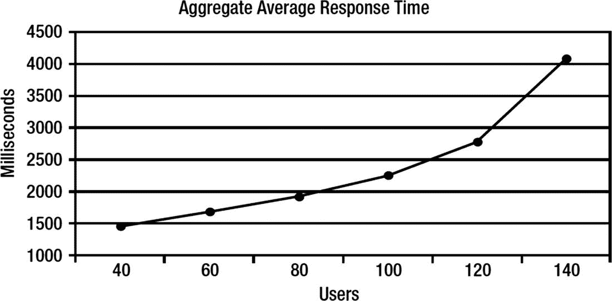

图 9-1

一条典型的 AART 曲线

吞吐量并不像响应时间那样是一个界限分明的度量。表达吞吐量的标准方式是 TPS，理解事务在被测应用中代表什么至关重要。它可能是一个单一的查询，也可能是一组特定的查询。在消息系统中，它可能是一条单一的消息；在基于 Servlet 的应用中，它可能是一个请求。即使对于具体测量什么达成了共识，所获得的吞吐量值也常常会被误解。原因在于，许多人看待这个度量就像看待“英里每小时”一样：将其视为速度的度量。实际上，吞吐量是容量的度量。

我们可以尝试用超市的类比来解释吞吐量的工作原理。想象一下，一家超市举办了一场促销活动，10 位购物者可以在 15 分钟内免费拿走他们能放进购物车的所有东西。超市就是应用，购物者类比于请求（或消息），而负责补货的超市员工则类比于系统中努力应对需求的各个组件。

即使所有 10 位购物者都达到了容量上限（在 15 分钟内完全装满他们的购物车），这也不一定意味着他们拿走了超市里所有的东西。然而，随着我们增加购物者的数量，最终会达到一个点，即有足够多的购物者能在规定时间内清空超市。我们称这个点为饱和点，因为此时已无更多可用资源。当我们继续增加购物者数量超过这个点时，通道内的拥挤会导致购物者移动速度下降（响应时间变长），最终导致吞吐量实际下降。

与 ART 类似，我们分析的基本度量是特定请求在所有用户中每秒请求数的算术平均值。我们称之为 TPS。

为了分析性能数据，并且独立于特定性能测试所使用的吞吐量定义，我们引入了总事务速率（TTR）的概念。TTR 是测试脚本中每个请求的 TPS 测量值之和。TTR 为我们提供了一个极好的系统容量指标。图 9-2 展示了一条典型的 TTR 曲线，它在约 100 个用户时达到饱和点。此时，曲线开始下降（例如，由于购物者过多）。

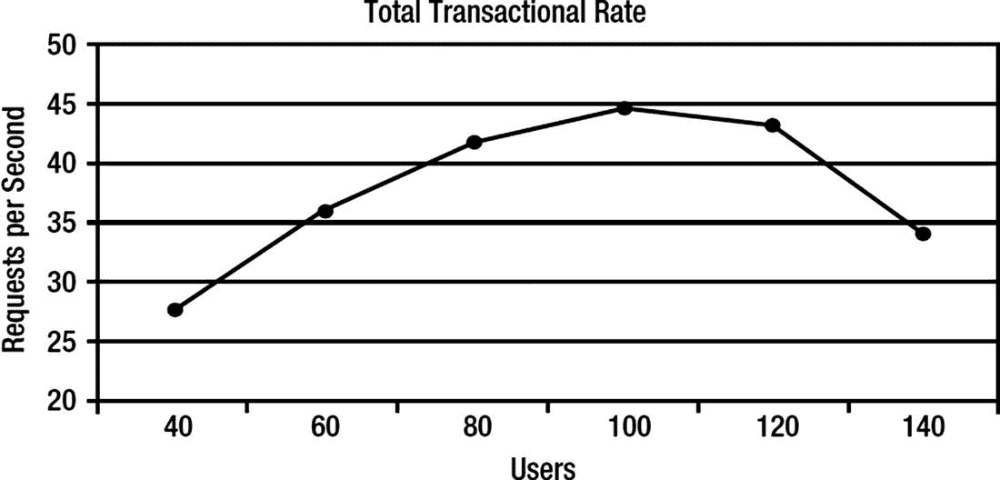

图 9-2

一条典型的 TTR 曲线

图 9-1 中展示的 AART 曲线，与图 9-2 中展示的 TTR 曲线来自同一次测试运行的数据。如果你审视 AART 曲线，可以看到响应时间呈线性增长，直到达到 100 个用户。之后，增长变得更加剧烈。这与 TTR 曲线相吻合，后者在 100 个用户时达到饱和点。此后，应用的整体性能开始下降。分析这两条曲线，你可以得出结论：在该性能测试的条件下，该应用的用户上限为 100 人。

### 模拟应用使用情况

本方法论这一节的目标是确保我们在尽可能模拟现实的测试条件下收集性能数据。这一点在进行整个应用的性能测试时尤为重要，而在为性能而设计时则相对次要。

对于每个应用，都会有一些不同的使用场景同时运行。有时，我们可以用一个测试脚本和一个请求来模拟使用情况。在其他情况下，可能需要十几个场景，每个场景包含不同数量的请求。

关于思考时间（也称为休眠时间）需要特别说明。这是测试脚本中每个个体请求执行之间所经过的时间。在现实生活中，思考时间可能变化很大。它可能短至几秒钟（例如，点击一个按钮进入下一页），也可能长达 5 到 10 分钟（例如，查看过去一个月银行账户的交易记录）。对于性能测试，我们采用了两种基本策略：

*   **使用真实思考时间**：此情况用于对完整、正在运行的应用进行性能测试时。
*   **使用零思考时间**：此情况用于进行更通用的调查性测量时，例如比较编程技术。这样做的后果是我们并非在现实条件下进行测试。然而，我们可以进行精确的比较测量，一旦从这些结果中选出了最佳方案，我们就可以使用真实的思考时间进行测试。


### 定义测试指标

该方法基于每次测试运行使用固定数量的用户。性能测试由多次测试运行组成，通常每次后续测试运行都会增加用户负载。有些人倾向于在单次测试运行期间逐步增加用户数量。我们认为这会引入一个可能对结果产生负面影响的新变量，并且从寻找最大用户负载的角度来看，这在统计上是不正确的。

第一步是找到一个具有代表性的并发用户数量（下限），可以按规律递增，直到达到应用程序的饱和点（上限）。我们通常会在上限之上额外进行几次测试运行，只是为了更好地理解应用程序的行为（或异常行为）。

不幸的是，预先精确选择上限并没有确切的科学方法。我们通常会随机选择一个用户数量，然后进行几次测试运行，其中用户数量分别高于和低于这个初始随机选择，并分析结果以确定我们应该采取的方向——是增加还是减少用户数量。

第二步是定义样本量：即测试运行将执行的时长。为了选择合适的样本量，我们必须在两种不同的需求之间达成妥协。第一种是我们希望拥有足够的数据，使样本具有统计显著性。第二种是希望测试尽可能短，因为我们有许多测试运行要做，不想在上面花费太多时间。

为了确定样本量，我们使用用户上限进行一次测试运行，持续时间比平时更长。然后我们绘制 AART 随时间变化的曲线并进行分析。我们寻找曲线上相当稳定的一段。

另一点需要说明的是数据排除。当你首次开始测试时，响应时间通常高于正常水平。这是因为构成应用程序的所有子系统都需要一点时间来加速。例如，JVM 中的优化器需要几分钟来优化运行中的代码。数据库的缓存也是如此，它需要一点时间才能发挥作用（应用程序的其他组件也是如此）。

这些最初出现的异常高的响应时间，只会影响在生产环境中通常运行数周的应用程序的最初几个用户。然而，在我们的案例中，我们只测试几分钟，这些结果会对我们的样本结果产生负面偏差。因此，我们排除最初收集的几组数据，并在曲线稳定后开始采样。

因此，样本量将在实际测试运行开始后的某个时间点开始，并持续一段时间，这段时间为我们提供足够的数据，使其具有统计显著性。

接下来是评估测试结果准确性的问题。根据所进行的性能测试类型，你可以使用两种不同的方法，以高确定性来衡量准确性。

对于涉及完整应用程序的性能测试，我们通常计算以下指标，我们称之为样本质量：

质量 = 标准差 / 算术平均值

我们通常将此公式应用于收集到的 AART 数据。

提示

根据我们的经验，可接受的质量数值范围在 0.06 到 0.2 之间。当质量数值超过 0.25 时，我们会仔细分析所有可用数据，以找出样本质量如此低下的原因。有时，这可能导致我们丢弃该次测试运行产生的数据。

在进行专注于性能设计的测试时，更具体地说，当思考时间为零时，我们使用另一种称为校准的方法。这里我们使用用户上限进行三次测试运行。然后，我们比较每次测试运行的 AART 和 TTR 结果。比较以百分比形式进行，所有值中的最大差异被视为性能测试的误差范围。

现在我们已经描述了所有的准备工作，可以继续描述实际的测试运行，这些运行将为我们提供执行分析和得出性能测试结论所需的数据。实际的测试运行是相当机械和枯燥的过程：你从使用用户下限开始一次测试运行，然后增加用户数量，进行另一次测试运行，依此类推，直到达到上限。如前所述，你可能希望额外进行几次超过上限的测试运行。

由于该方法的基础是一致性，你必须重置或重启构成应用程序的每个组件或子系统。在我们的案例中，这将是数据库和 Java EE 服务器。

我们将在本章后面通过一个实施该方法的实际示例来说明如何使用它。


## Grinder 工具

Grinder 是一款基于 Java 的负载测试框架，采用 BSD 风格的开源许可证，可免费使用。您可以在 [`http://grinder.sourceforge.net`](http://grinder.sourceforge.net) 找到 Grinder 及其源代码、文档、辅助模块、测试脚本等更多内容。此外，还有一些邮件列表可供加入，以便参与 Grinder 社区。

请记住，Java EE 8 需要 Grinder 3 版本。

Grinder 功能极其强大，同时又易于使用，是一个轻量级的工具包。它允许您通过测试脚本在多台机器上模拟用户和行为。它包含以下组件：

*   **工作进程**：解释用 Jython 编写的测试脚本，并使用多个工作线程执行测试，每个线程模拟一个用户。
*   **代理进程**：管理工作进程。如果您在多台计算机上运行模拟用户，则每台计算机需要一个代理进程。
*   **控制台**：在协调其他进程的同时，整理并显示统计数据。

Grinder 的进程如图 9-3 所示。

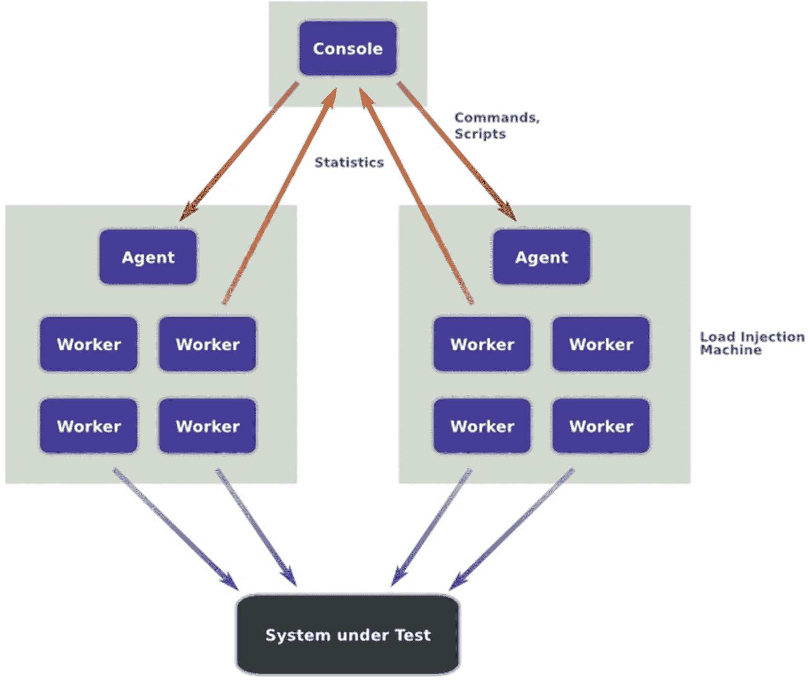

图 9-3

Grinder 进程

使用 Grinder 进行性能测试是一系列测试运行的集合，其中可以包含一个或多个测试脚本。一次测试运行是指测试脚本的连续顺序执行。测试运行可以持续特定的循环次数或特定的时间段。一个循环是指测试脚本的单次执行。

注意

我们在 Grinder 文档中称之为“循环”的概念被定义为一次“运行”，我们认为这容易造成混淆。

测试脚本用于模拟应用程序的使用情况。测试脚本代表了您想要模拟的使用场景。一个测试脚本包含一个或多个请求，这些请求模拟了特定场景的用户与应用程序之间的典型交互。

注意

再次强调，为避免混淆，我们使用“请求”一词代替 Grinder 文档中定义的“测试”。

Grinder 测试脚本是一个 Jython 程序，它可以包含某些逻辑来修改默认行为（即请求的顺序执行），例如，根据已执行请求的响应来执行某些请求。

测试脚本可以手动编写，或者，如果模拟用户通过 HTML 界面与应用程序交互，则可以录制。TCP 代理模块可用于实现此目的。该模块是 Grinder 发行版的一部分。代理的 HTML 插件过滤器允许您录制通过 Web 浏览器与应用程序的交互。有关如何使用此功能的详细信息，请参阅文档。

除了执行 URL 之外，Grinder 还可以在测试脚本的请求中执行 Java 代码。这为您模拟重型客户端（例如基于 Swing 的客户端）提供了灵活性。

每个代理进程都与控制台建立连接以接收命令（例如启动、停止和重置），并将这些命令传递给其工作进程。每个工作进程都与控制台建立连接以报告统计数据。

除了控制台上显示的统计数据外，对于每次测试运行，每个工作进程都会将日志信息和最终统计摘要写入一个文件名以 `out` 开头的文件中。错误信息写入一个文件名以 `error` 开头的文件中。如果测试运行期间未发生错误，则不会创建错误文件。每个已执行请求的详细统计信息写入一个文件名以 `data` 开头的文件中。这些文件遵循命名约定，除了我们描述的关键词外，文件名还包含托管工作进程的计算机名称和工作进程编号，因为您可能拥有多个工作进程。

修改 `grinder.properties` 配置文件中的值可以轻松改变 Grinder 的行为。您最常修改的属性很可能如下：

*   `grinder.threads`：此属性指定将执行指定测试脚本的模拟用户数量。
*   `grinder.runs`：此属性指定模拟用户顺序执行测试脚本的次数（循环次数）。如果值为零，则将无限执行。
*   `grinder.consoleHost`：运行 Grinder 控制台的计算机名称或 IP 地址。
*   `grinder.logProcessStreams`：将此属性设置为 `true` 将提供关于每个模拟用户执行的极其详细的信息。这些信息会出现在 `out` 文件中。这在初步运行期间很有用，但我们强烈建议您在所有其他运行中将其设置为 `false`，因为它会降低测试运行的性能。
*   `grinder.logDirectory`：此属性指定您希望放置上述三个日志文件的目录。
*   `grinder.script`：这是要执行的测试脚本的文件名。

还有更多可用属性。请查阅 Grinder 文档以获取完整的属性列表。


## 测试应用程序

我们用于性能测试的测试应用程序是第 7 章中开发的集成版 Wines Online 后端应用程序的一个子集。其用户界面是使用 JavaServer Faces (JSF) 开发的。

最新的 JSF 规范可在此网页中找到：

[`https://javaee.github.io/javaserverfaces-spec/`](https://javaee.github.io/javaserverfaces-spec/)

JavaServer Faces (JSF) 是一种 Java 社区过程 (JCP) 标准技术，用于在 Java EE 平台上编写基于组件的用户界面。

请注意，在撰写本文时，可用的 JSF 版本是 2.3，该版本于 2017 年 4 月成为 Java EE 8 的一部分。

JSF 2.3 的可执行实现可在 javax.faces 仓库中找到：

[`https://maven.java.net/content/repositories/releases/org/glassfish/javax.faces/2.3.0/`](https://maven.java.net/content/repositories/releases/org/glassfish/javax.faces/2.3.0/)

请参考 NetBeans 网页上的 NetBeans JavaServer Faces 2.x 入门指南：

[`https://netbeans.org/kb/docs/web/jsf20-intro.html`](https://netbeans.org/kb/docs/web/jsf20-intro.html)

图 9-4 展示了 JSF 页面，该页面在列表框中显示了所有可用葡萄酒的目录。用户可以选择他们想要的葡萄酒商品，在输入文本框中输入数量，然后点击“添加到购物车”按钮。用户可以重复相同的过程来添加更多葡萄酒，最后他们可以点击“提交订单”按钮。

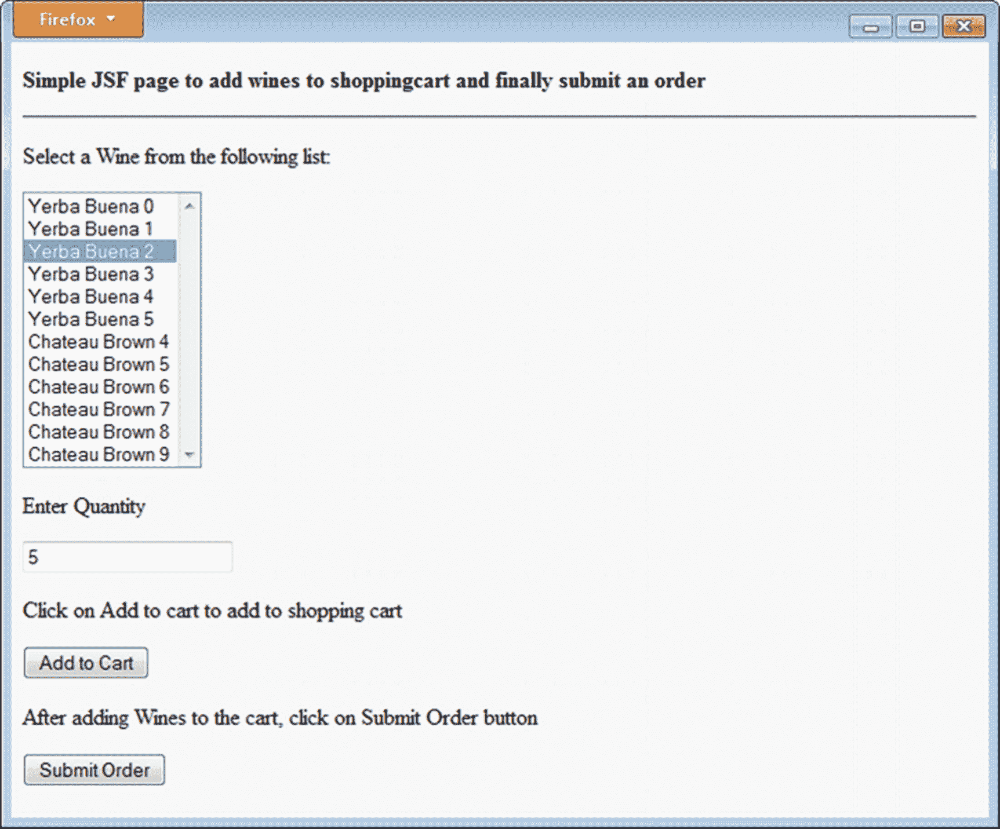

图 9-4

葡萄酒商店 JSF 应用程序

图 9-5 展示了 JSF 应用程序与后端葡萄酒商店应用程序之间的交互。当从浏览器启动 JSF 应用程序时，会调用 `getWineDisplayList()` 方法（该方法在托管 Bean 中使用了一个注入的 EJB）。这会通过注入的 `WineFacade` EJB 上的 `findAll()` 方法检索所有可用葡萄酒的列表。初始 JSF 页面会显示检索到的葡萄酒列表。当用户添加一个葡萄酒商品并点击“添加到购物车”按钮时，会调用 `ShoppingCart` 会话 Bean 中的 `addWineToCart()` 方法，创建一个新客户并将该葡萄酒添加到客户的购物车商品中。仅在首次调用 `addWineToCart()` 方法时才会创建客户。当用户最终从客户端应用程序提交订单时，会调用 `ShoppingCart` 会话 Bean 中的 `processOrder()` 方法，该方法会创建一个新的客户订单，将所有购物车商品作为订单商品添加到订单中，删除购物车中的商品，并最终扣减库存。

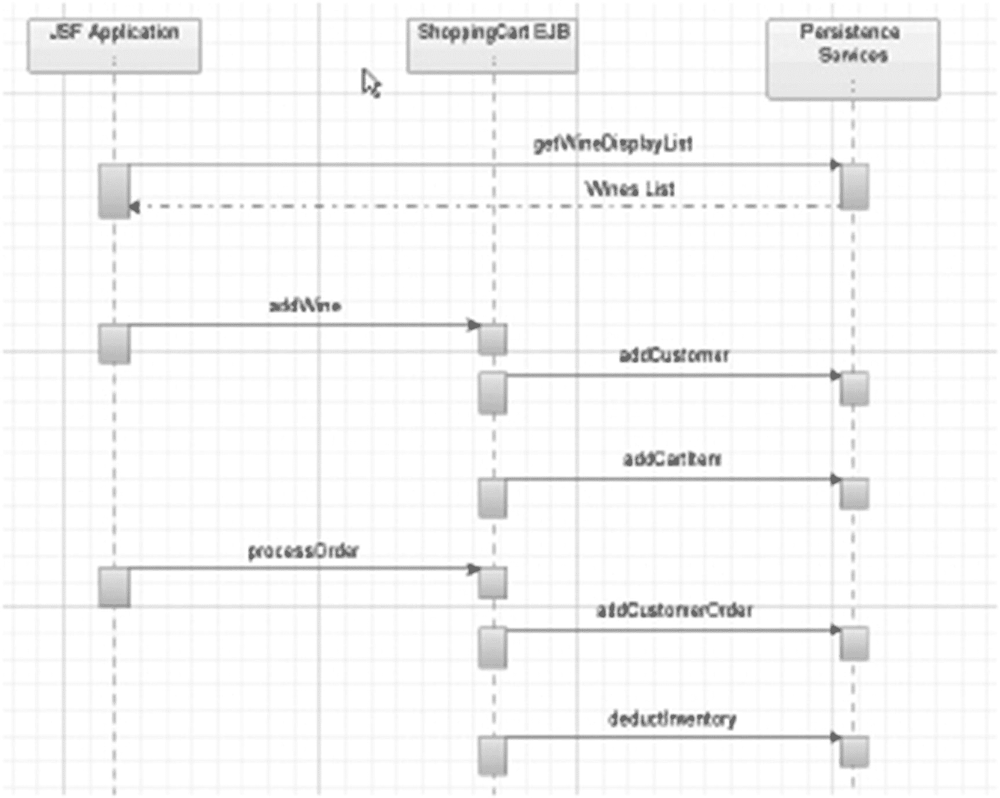

图 9-5

葡萄酒商店应用程序组件与服务交互

图 9-6 展示了 Java 持久化 API (JPA) 实体、Java 类之间的继承模型以及它们之间的关系。`BusinessContact` 实体被 `Customer` 和 `Supplier` 实体继承。`Customer` 实体被 `Individual` 和 `Distributor` 实体继承。`InventoryItem`、`CartItem` 和 `OrderItem` 实体继承自 `WineItem` 实体。葡萄酒商店持久化单元还包含了这些实体之间不同类型的关系（包括一对一、一对多和多对多），这些关系在测试应用程序中得到了运用。名称以 `List` 结尾的关系字段是 0..* 属性；所有其他字段都是单值属性。这些实体中使用的关系映射已在第 3 章和第 4 章中介绍过。

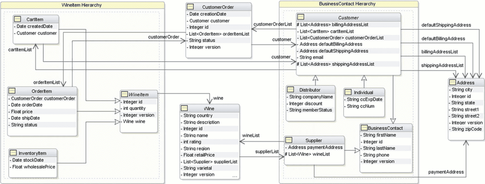

图 9-6

葡萄酒商店领域模型

对于我们将要运行的性能测试，之前讨论的所有组件（JSF 应用程序、`ShoppingCart` 和 `WineFacade` 会话 Bean 以及持久化单元中的 Java 类）都保持不变。两次测试之间的唯一区别在于领域模型 JPA 实体中指定的对象/关系 (O/R) 映射注解，以及这些 Java 类所映射到的数据库模式。第一次测试使用了 `JOINED` 实体继承策略，其中两个根实体（`BusinessContact` 和 `WineItem`）映射到层次结构中的根表，而所有子实体的表都连接到该根表。图 9-7 展示了使用 `JOINED` 继承策略映射持久化 Java 类所使用的数据库模式。

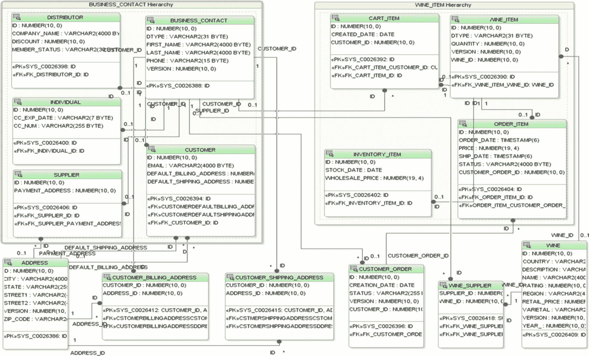

图 9-7

JOINED 实体继承策略的数据库模式

在第二次测试中，我们使用了 `SINGLE_TABLE` 实体继承策略，其中每个类层次结构中的实体都映射到单个表。图 9-8 展示了用于映射第二个测试用例的数据库模式。

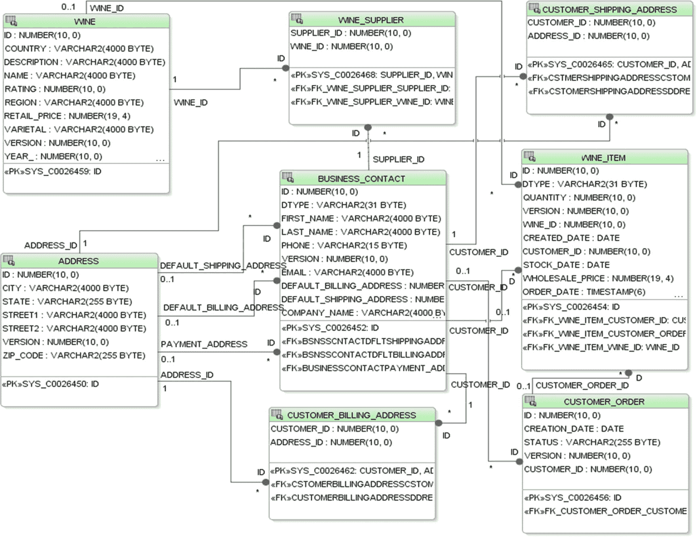

图 9-8

SINGLE_TABLE 实体继承策略的数据库模式

注意

继承策略在第 4 章中有详细解释。

## 性能测试

遵循前面描述的方法，并使用刚刚描述的测试程序，我们将着手比较继承模型的任务，以找出在以下条件下哪种模型最佳。

### 测试环境

我们在云中设置了一台测试机器，该机器拥有八个核心和 8GB 内存。它运行着一个 GlassFish 服务器实例（本书中使用的是 4.1.1 版本）。测试应用程序使用了同样运行在此服务器上的 Derby 数据库。我们从笔记本电脑上运行 The Grinder，该笔记本电脑并不在运行测试机器的数据中心内，因此所有流量都通过互联网传输。通常我们不会这样做，因为我们更倾向于在所谓的无菌条件下工作；也就是说，测试网络上的唯一流量就是测试本身产生的流量。然而，在进行了许多初步测试后，我们发现测试的误差范围非常低（1%），因此我们决定继续以这种方式工作。

测试计算机除了运行操作系统的默认进程外，仅运行测试所需的相应软件。我们对所有涉及的软件都使用默认设置。我们意识到，通过微调这些组件可以获得更好的性能，但这超出了本书的范围。


### 测试脚本

如本章前面所述，我们的思路是创建一个尽可能贴近真实应用使用场景的测试脚本。由于这是一个面向性能设计的测试，我们使用的测试脚本大致模拟了应用的典型使用场景：

1.  用户访问葡萄酒应用网站（首页）。
2.  用户选择某类葡萄酒中的几瓶。
3.  用户选择另一类葡萄酒中的几瓶。
4.  用户结账。

在本示例中，由于我们要比较几种不同的继承模型，以确定哪种模型最适合我们的场景（面向性能设计），因此我们使用了零思考时间。

诚然，使用 Derby 运行这组性能测试并不十分真实，但我们的目的是提供一个关于如何使用该方法的示例。我们希望读者能够将这一流程应用到自己的应用环境中，对自己的应用进行测试。

TCP 代理模块的输出可以重定向到一个文件中。该输出是一个 Jython 程序，其中包含了录制测试的高级流程，并且易于人类阅读。我们正是在这里修改或删除 `grinder.sleeptime` 指令以消除思考时间，或者更改运行应用的目标机器的名称或 IP 地址。我们将在下一节详细审查实际的 `wine.py` 测试脚本。

### 环境设置

GlassFish 的安装已在第 1 章的“入门”部分介绍过，因此这里不再赘述。你只需确保 GlassFish 服务器已启动并运行，并且应用已使用必要的资源（JDBC 连接池和资源）完成部署。启动 GlassFish 服务器的一种方法是在命令提示符中切换到 `%GLASSFISH_HOME%/bin` 目录，然后执行以下命令：

```
asadmin start-domain
```

要停止 GlassFish 服务器，请执行以下命令：

```
asadmin stop-domain
```

在整个性能测试过程中，我们使用以下命令重启 GlassFish 服务器：

```
asadmin restart-domain
```

#### 数据库

这两个测试各自需要独立的数据库连接，以确保数据库模式不会冲突。每个继承模式映射的表使用相似的名称，但具有不同的结构。为尽量简化安装要求，我们在测试中使用了 GlassFish 自带的 Derby 数据库。项目已预先配置为使用 Derby，要开箱即用，你需要创建 Derby 数据库。关于如何在 Derby 中创建新数据库（及关联连接）的步骤，请参考第 3 章的“创建数据库连接和示例模式”部分。对于这些测试，你需要创建一个用户为 `wineapp_join/wineapp_join` 的 `WineAppJoin` 数据库，以及一个用户为 `wineapp_st/wineapp_st` 的 `WineAppST` 数据库。

##### 配置连接到自有数据库

你可能希望在运行测试时使用 Oracle 或其他生产数据库。为此，你需要更新每个测试的 JPA 项目（`Chapter09-PerformanceJoined-jpa` 和 `Chapter09-PerformanceSingleTable-jpa`）中的 `persistence.xml` 文件，修改连接信息以指向你的数据库。首先，像上面为 Derby 所做的那样，为每个测试创建一个独立的数据库连接。对于 Oracle，我们建议你首先在数据库中创建新的数据库用户 `wineapp_join/wineapp_join` 和 `wineapp_st/wineapp_st`。然后，转到 NetBeans 中的“服务”选项卡，右键单击“数据库”，选择“新建连接...”，为每个用户创建一个新的数据库连接。

创建好测试数据库连接后，你可以通过每个 JPA 项目的设计编辑器选项卡，在 JDBC 连接组合框中选择相应的“Joined”或“SingleTable”连接，来编辑 `persistence.xml` 文件。

类似地，你需要更新每个测试的 EJB 项目（`Chapter09-PerformanceJoined-ejb` 和 `Chapter09-PerformanceSingleTable-ejb`）中 `glassfish-resources.xml` 文件里的 `<jdbc-connection-pool>` 条目的 `<property>` 元素，以更新连接信息。（NetBeans 7.2.1 未提供通过下拉列表进行此操作的编辑器，但你可以轻松地剪切/粘贴指定连接详细信息的 `<property>` 元素。）请确保将 `<jdbc-resource> jndi-name` 属性保留为 `jdbc/wineAppJoin`，对于 `SINGLE_TABLE` 测试则保留为 `jdbc/wineAppST`，因为 EJB 项目中的持久化单元会通过名称引用此资源。

#### The Grinder

下一步是在专用于创建模拟用户负载的计算机上安装 The Grinder。从 [`http://grinder.sourceforge.net`](http://grinder.sourceforge.net) 下载 The Grinder 后，你只需将其解压到所需目录即可。

本次测试安装了 The Grinder 3.11 版本，位于我们笔记本电脑的 `C:\grinder-3.11` 目录中。完成后，你可以从下载包中提取与 Grinder 相关的文件。这些文件位于 `grinder` 目录中。我们将这些文件安装在 `C:\SampleCode` 目录中。我们的示例需要三个文件：`grinder.properties`、`joined.py` 和 `single.py`。后两个文件是实际的测试脚本。

有关如何配置此文件的更多信息，请参考 Grinder.properties 网页：

[`http://grinder.sourceforge.net/g3/properties.html`](http://grinder.sourceforge.net/g3/properties.html)

让我们先来审查第一个脚本 `grinder.properties`，如清单 9-1 所示。

```
# Beginning EJB in Java EE 8
# Chapter 9: EJB Performance and Testing
# 工作进程数
grinder.processes=1
# 模拟用户数
grinder.threads=140
# 永远运行
grinder.runs=0
# 运行控制台的机器名称
grinder.consoleHost=localhost
# 我们不需要完整的详细日志文件
grinder.logProcessStreams=false
# 将日志文件放置在此目录中
grinder.logDirectory=log
# 所有模拟用户同时启动
grinder.initialSleepTime=0
# 属性文件。默认值为 "helloworld.py"。
# 执行名为 joined.py 的测试脚本
grinder.script=joined.py
清单 9-1
grinder.properties
```

此属性文件中的注释非常清晰。你只需更改模拟用户数（`grinder.threads`）和测试脚本将运行的周期数（`grinder.runs`）。请确保 Grinder 控制台将要运行的机器名称或 IP 地址正确无误。除此之外，你实际上无需更改此属性文件中的任何其他内容。


#### 测试脚本

在清单 9-2 中，我们展示了当使用连接表继承方案录制会话时，HTTP 代理生成的 Jython 程序的核心部分。以粗体显示的思考时间语句，通常表示录制测试脚本时从一个请求到下一个请求所花费的时间（以毫秒为单位）。如前所述，我们将原始值替换为零，但您也可以直接删除该行（参见清单 9-2）。

```
def __call__(self):
"""Called for every run performed by the worker thread."""
self.page1()      # GET WineStoreJoined.jsp (request 101)
grinder.sleep(0)
self.page2()      # POST WineStoreJoined.jsp (request 201)
grinder.sleep(0)
self.page3()      # POST WineStoreJoined.jsp (request 301)
grinder.sleep(0)
self.page4()      # POST WineStoreJoined.jsp (request 401)
Listing 9-2
Main Section of the Test Script
```

作为页面方法的一个示例，我们在清单 9-3 中展示了页面 1（测试脚本的第一个请求）的方法，以及第一个页面方法之前的一些定义。

```
url0 = 'http://glassfish:8080'
request101 = createRequest(Test(101, 'GET WineStoreJoined.jsp'), url0)
class TestRunner:
"""A TestRunner instance is created for each worker thread."""
# A method for each recorded page.
def page1(self):
"""GET WineStoreJoined.jsp (request 101)."""
result = request101.GET('/Chapter09-PerformanceJoined-war/faces/WineStoreJoined.jsp')
self.token_j_id_id17 = \
httpUtilities.valueFromHiddenInput('j_id_id17') # 'j_id_id17'
self.token_javaxfacesViewState = \
httpUtilities.valueFromHiddenInput('javax.faces.ViewState') # '9131085258160566843:4053788772783974794'
return result
Listing 9-3
Example of the page method
```

#### 运行模拟用户

您需要根据 Grinder 软件的安装位置修改以下命令的类路径。不过，要执行 Grinder，您只需要以下简单的命令。但请确保在启动 Grinder 控制台之前不要运行它。

```
java -classpath \grinder\lib\grinder.jar net.grinder.Grinder
```

#### Grinder 控制台

作为启动控制台的另一种方式，我们只需将目录更改为 `C:\grinder\lib`，然后发出以下命令来启动控制台：

```
java –classpath grinder.jar net.grinder.Console
```

图 9-9 展示了 Grinder 控制台。

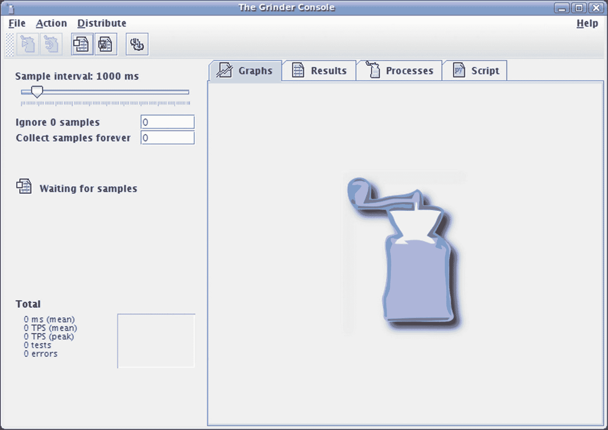

图 9-9

Grinder 控制台

控制台左上角有几个按钮，用于指示 Grinder 代理启动或重置工作线程（即模拟用户）。当您将鼠标悬停在它们上方时，会显示按钮功能的描述。图 9-10 展示了性能测试执行期间的 Grinder 控制台及其通常显示的信息。

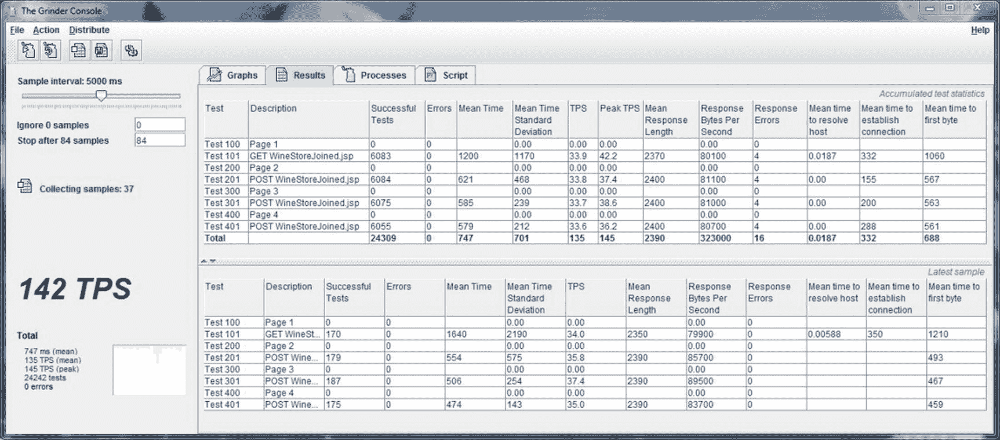

图 9-10

使用 Grinder 进行性能测试

为了确保一切正常，请先使用一个模拟用户运行一个周期进行快速测试（在配置数据库之后；请参见上文“数据库”部分）。步骤如下：

1.  使用以下 URL 重置数据库：`http://yourserver:port/Chapter09-PerformanceJoined-war/ResetJoinedData`  
2.  重置 Glassfish 服务器。  
3.  启动 Grinder 控制台：`java -classpath` <classpath_to_the_grinder></classpath_to_the_grinder>`net.grinder.Console`  
4.  编辑 `grinder.properties` 文件，并确认您只有一个用户和一个周期。  
5.  通过输入以下命令启动 Grinder 代理和 Grinder 控制台：`java -classpath` <classpath_to_the_grinder></classpath_to_the_grinder>`net.grinder.Grinder.`  
6.  点击 Grinder 控制台上的启动按钮。控制台上不会显示任何结果，因为它只运行一个周期。  
7.  检查您启动 Grinder 代理的窗口。当它显示已完成并等待控制台信号时，点击 Grinder 控制台上的重置按钮。  
8.  转到日志目录，查看以 `out` 开头的文件。该文件包含整个测试运行的摘要，包括统计数据。如果出现问题，该文件和错误文件将为您提供解决问题所需的信息。

在您为每个测试运行一次这些步骤后，您可能希望更新每个测试应用的 JPA 项目中的 `persistence.xml` 文件，以关闭表生成。我们保留此标志，以便在您首次运行 `ResetJoinedData/ResetSingleTableData` servlet 时创建表。在您为持久化单元运行一次每个脚本以创建表之后，您可以避免因后续每次运行时表已存在而产生的开销（以及发出的警告）。

现在一切就绪，您可以继续下一步了。


### 初步测试

这第一组测试的目标是熟悉应用程序及其行为，并发现测试脚本或应用程序可能存在的任何潜在问题。由于我们正在测试两种不同的继承实现，使用哪一种进行初步测试其实无关紧要，因此我们选择使用多表继承的实现来进行初始测试。我们已经用单个用户完成了一个周期的测试运行。现在，我们可以进行无限周期的测试运行，并让它运行几分钟。然后，我们将继续测试多个并发用户在一个周期内的表现。这样做是为了确保应用程序和测试脚本能够正确处理并发。我们通常会选择 10 个用户。之后，我们将测试 10 个用户进行无限周期的运行，持续几分钟。一旦这些测试成功完成，我们就知道测试脚本和应用程序运行正常，可以准备进行下一步了。

我们希望选择具有代表性的用户数量，进行大约六次快速测试运行，以便清晰地展示应用程序在用户负载增加时的行为表现。

在进行完整应用程序的性能测试时，我们通常会寻找达到或超过最大可接受响应时间时的用户上限。由于这是一项面向性能的设计测试，并且我们在测试脚本中没有使用任何思考时间，因此我们将专注于找到应用程序达到饱和点的用户数量。这个策略（如果可以称之为策略的话）就是随机选择一个用户数量。

测试运行时间很短，因为我们不需要精确的上限值，只需要一个近似值。在这种情况下，我们选择从 100 个并发用户开始，并收集 2.5 分钟的测试运行数据。由于我们使用的采样间隔是 5 秒，我们只需在 Grinder 控制台的“Collect samples forever”框中输入 30。输入 30 后，该框的标题将变为“Stop after 30 samples”。为了简单起见，我们不会排除初始数据。我们通过在 Grinder 控制台的“Ignore samples”框中输入 0 来实现这一点。收集到的统计数据所呈现的值会略高于正常值。这不是问题，因为这些只是初步测试。按照最佳实践，我们在每次性能测试前都会重置数据库和 Glassfish 服务器。

我们开始第一次测试运行，得到的 AART（平均响应时间）为 737 毫秒。

注意

您可以在控制台左栏底部（以图形方式显示 TPS 的方块的左侧）找到此信息，其标题为“(mean)”。

TTR（每秒事务数）为 137（您可以在找到 AART 的同一位置找到此信息，其标题为“TPS (mean)”）。接下来，我们将尝试使用 120 个用户。为此，我们修改`grinder.properties`文件，将`grinder.threads`属性更改为 120。我们进行下一次运行，得到的 AART 为 911 毫秒，TTR 为 133。由于 120 个用户的 TTR 低于 100 个用户，我们知道饱和点大约在 100 个用户或更少，因此我们的下一次测试运行将使用 80 个用户。

在`grinder.properties`文件中更改用户数量后，我们启动测试运行。我们得到的 AART 为 593 毫秒，TTR 为 136。这些结果表明饱和点大约在 100 个用户左右，因此我们将以此作为上限。（真是幸运的猜测，选择了 100 个用户作为初始测试点！）

基于此信息，我们选择 40 个用户作为下限，100 个用户作为上限。测试运行将分别使用 40、60、80、100、120 和 140 个用户进行。这将为我们提供六个参考点，应该能清晰地展示应用程序的行为。

### 样本量

现在我们已经选择了并发用户的上限和下限，我们需要确定测试应该运行多长时间。这相当简单。我们只需要进行一次比之前选择的 2.5 分钟更长时间的测试运行。我们对此类测试的经验表明，大约 7 分钟通常是一个不错的选择。测试运行将使用上限，即 100 个用户进行。

测试运行结束后，我们获取由 The Grinder 生成的数据文件，该文件包含每个模拟用户在每次测试中的个体响应时间。该文件可以在日志目录中找到，文件名以`data`开头。接下来，我们绘制一条曲线，展示测试时间段内的 AART。本次测试运行的结果如图 9-11 所示。在这里，我们可以看到响应时间曲线在测试开始后约 60 秒趋于稳定。

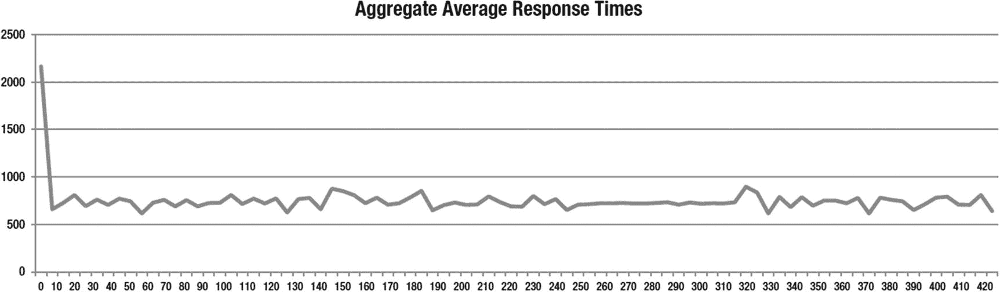

图 9-11

样本量分析图，绘制了测试时间段内的 AART

我们还可以看到，曲线在 60 秒后保持相当稳定，在 240 秒后则极其稳定。因此，我们决定测试运行将持续 240 秒（4 分钟——既好又短），其中我们将忽略前 60 秒的数据。由于我们在 Grinder 控制台中将样本大小定义为 5 秒，这意味着我们将忽略 12 个样本，并收集 36 个样本。

### 校准

现在我们继续确定性能测试的准确性。由于这将基于使用上限的三次测试运行来完成，我们只需要额外进行两次运行。我们可以使用前一次运行的适当数据来确定样本量。

提示

根据我们的经验，使用此方法的典型误差范围在 5%到 10%之间。当测试脚本中存在思考时间时，误差往往会增大。在这些情况下，发现高达 30%的数字并不罕见。

表 9-1 和表 9-2 显示了从测试运行中收集到的 AART 和 TTR 结果的差异。

表 9-2

误差范围 (TTR)

| TTR | 运行 1 | 运行 2 | 运行 3 |
| --- | --- | --- | --- |
| 运行 1 |   | 99.3% | 100.0% |
| 运行 2 | 100.7% |   | 100.0% |
| 运行 3 | 100.7% | 100.0% |   |

表 9-1

误差范围 (AART)

| AART | 运行 1 | 运行 2 | 运行 3 |
| --- | --- | --- | --- |
| 运行 1 |   | 100.1% | 100.0% |
| 运行 2 | 99.9% |   | 100.0% |
| 运行 3 | 99.9% | 100.0% |   |

这些表格中最大的差异是 100.7%（例如，TTR 表中运行 2 与运行 1 的比较）和 99.9%（例如，AART 表中运行 3 与运行 1 的比较）。因此，本次性能测试的官方误差范围为 0.7%，这是一个非常好的数字。


### 实际测试运行

现在我们已经完成了所有准备工作，可以开始运行正式测试了。这些测试将帮助我们了解在极端压力条件下，哪种继承模型表现最佳。

这部分性能测试是机械性的，而且相当枯燥。第一步是启动 Grinder 控制台，并确保测试参数设置正确。首先，我们验证采样间隔是否设置为 5000 毫秒。接着，我们检查是否忽略了 12 个样本（每个样本 5 秒，总计我们之前选择的 60 秒）。然后，我们选择在收集 36 个样本（每个样本 5 秒，总计我们之前选择的 180 秒）后停止收集数据。

每次测试运行的步骤如下：

1.  根据继承模型，使用相应的 URL 重置数据库：

    ```
    http://yourserver:port/Chapter09-PerformanceJoined-war/ResetJoinedData
    http://yourserver:port/Chapter09-PerformanceSingleTable-war/ResetSingleTableData
    ```

2.  重启 GlassFish 服务器。  
3.  编辑 `grinder.properties` 文件，修改用户数量。  
4.  点击 Grinder 控制台上的“开始捕获统计信息”按钮。这将清除之前运行的所有结果。  
5.  点击 Grinder 控制台上的“启动进程”按钮。  
6.  等待数据收集完成。一个很好的标志是，左侧面板中央的线条从绿色的“正在收集样本：XX”变为红色的“正在忽略样本：XX”。  
7.  点击 Grinder 控制台上的“重置进程”按钮。此步骤实际上会停止模拟用户的执行。  
8.  点击“保存结果”按钮。提供一个描述性文件名，并保存控制台上显示的结果，以供后续分析。  
9.  从本列表的开头重新开始。

完成 `JOINED` 表继承策略的所有测试运行后，您可以继续为 `SINGLE_TABLE` 继承方案的一组测试运行进行所有准备工作。

如前几节所述，我们两次测试之间的区别在于 O/R 映射注解和数据库模式。一旦应用程序准备好进行下一组测试运行，只需重复您为上一组测试运行所做的步骤即可。

### 分析结果

我们必须首先声明，本章呈现的结果并非旨在推崇某一种继承方法优于另一种。它们仅用于说明如何应用该方法以及如何使用 Grinder 工具包。正因如此，我们在进行此性能测试时，对哪种继承模型表现更好没有任何预期。

我们首先回顾多表继承模型在 100 个用户下的测试运行结果，以此开始分析。这些结果如表 9-3 所示。

表 9-3

多表，100 用户结果

| 100 用户 | ART | TPS |
| --- | --- | --- |
| 请求 1 | 1,240 | 34.1 |
| 请求 2 | 594 | 34.1 |
| 请求 3 | 549 | 34.1 |
| 请求 4 | 543 | 34.1 |
| 总计 | 732 | 136 |

有两件事应该会迅速引起您的注意。第一是获取应用程序主页所需的时间很长——略超过 1 秒——尤其是与测试脚本中所有其他响应时间相比。这可以解释为，在设置主页时，虽然简单，但涉及将数据从服务器发送到浏览器，这通常被认为比更新购物车更耗费资源。接下来应该引起您注意的是，结账过程持续不到 1 秒。虽然对于验证库存并执行与结账相关的其他操作的过程来说，这是一个理想的时间，但事实是，这个测试系统上的库存并不多。

查看单表继承模型在 100 个用户下的测试运行结果（如表 9-4 所示），您可以看到类似的行为模式，因此至少它是一致的。

表 9-4

单表，100 用户结果

| 100 用户 | ART | TPS |
| --- | --- | --- |
| 请求 1 | 1,320 | 33.4 |
| 请求 2 | 580 | 33.4 |
| 请求 3 | 540 | 33.5 |
| 请求 4 | 543 | 33.6 |
| 总计 | 745 | 134 |

这部分分析仅限于审查每个单独的请求，并且通常使用从用户上限的测试运行中收集的结果来完成。下一步是分析我们选择的所有用户负载下的 AART 和 TTR。我们从使用多表继承模型的结果开始，如表 9-5 所示。

表 9-5

多表，所有用户结果

| 用户 | AART | TTR |
| --- | --- | --- |
| 40 | 291 | 137 |
| 60 | 438 | 137 |
| 80 | 584 | 137 |
| 100 | 732 | 136 |
| 120 | 919 | 130 |
| 140 | 1,120 | 125 |

从该表可以看出，饱和点从性能测试一开始就达到了，这相当不寻常。这意味着继承模型从一开始就吞噬了所有可用资源。

让我们回顾一下单表继承模型的结果，以便进行一些比较。它们如表 9-6 所示。

表 9-6

单表，所有用户结果

| 用户 | AART | TTR |
| --- | --- | --- |
| 40 | 296 | 135 |
| 60 | 446 | 135 |
| 80 | 592 | 134 |
| 100 | 745 | 134 |
| 120 | 908 | 132 |
| 140 | 1,120 | 125 |

我们再次看到从一开始就出现相同的饱和模式。这可能归因于 Derby 数据库和内存使用情况。还可以看到，总事务速率和聚合平均响应时间都略低于多表继承模型。

这种比较可以更清楚地从图 9-12 和图 9-13 所示的图表中看出。图 9-12 包含两组 AART 结果的比较；图 9-13 包含 TTR 的比较。

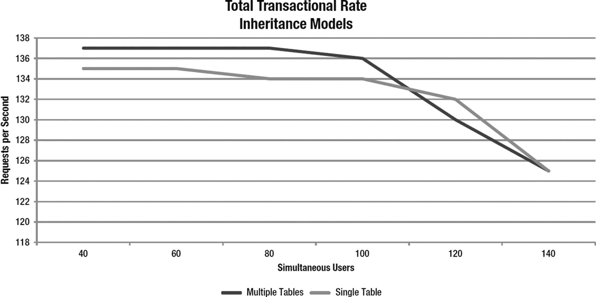

图 9-13

TTR 比较

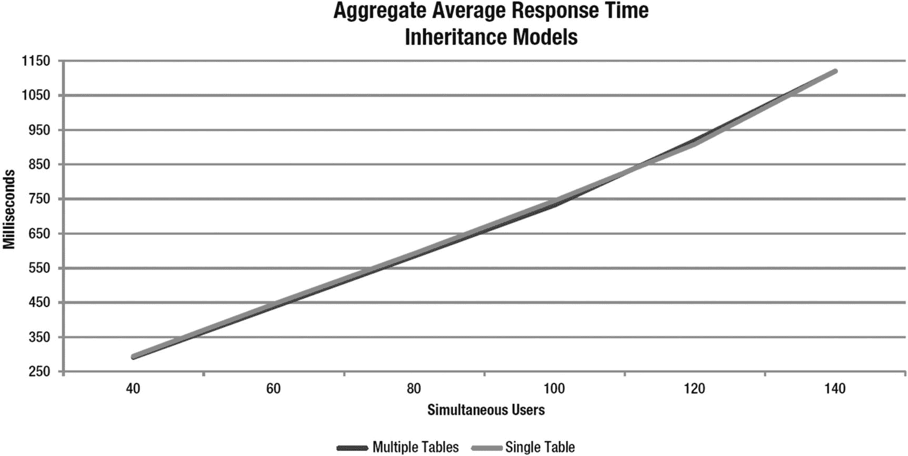

图 9-12

AART 比较

在图 9-12 中，聚合平均响应时间 (AART) 几乎相同，因此我们必须仔细查看总事务速率 (TTR)，以尝试了解在我们正在进行的性能测试条件下，哪种模型更有利。

在图 9-13 中，单表模型不仅比多表模型更快达到饱和点，而且总事务速率也略低于多表模型。如您所见，单表模型在 60 个并发用户时开始下降，而多表模型则在 80 个并发用户时开始下降。然而，多表模型出现了更早的大幅下降。根据收集到的数据，我们可以得出结论：`JOINED`（即多表）继承模型在高度压力条件下表现出略优的性能。


## 总结

在本章中，我们介绍了 The Grinder，这是一种执行性能测试的方法论，以及一套用于生成性能测试负载的工具包。我们通过一个使用该方法和工具包的性能测试示例进行了讲解。具体来说，我们讨论了性能标准，并回顾了两个性能指标：响应时间和吞吐量。我们涵盖了应用程序使用情况的模拟，并讨论了测试脚本和思考时间。我们还涉及了测试指标的界定，例如用户数量、样本大小和数据排除，以及如何确定性能测试的准确性。

为了说明该方法的使用，我们使用前几章创建的应用程序展示了一个详细的案例研究，并比较了两种继承策略。

在下一章中，我们将探讨上下文与依赖注入（CDI），以及如何使用它来增强 EJB 和应用程序开发体验。

