# 10. 上下文与依赖注入

在本章中，我们将讨论上下文与依赖注入（CDI）。CDI 提供了强大的服务，用于将 Java EE 框架的各个层级粘合在一起。Java 平台上下文与依赖注入（定义于 JSR 299）的第一个公开草案于 2008 年发布。在最初的开发阶段，JSR 299 规范被称为 Web Beans。在规范更名为上下文与依赖注入后，最初的参考实现被命名为 Web Beans。在两种不同上下文中使用相同的名称“Web Beans”在社区成员中造成了一些混淆，这导致参考实现从 Web Beans 更名为 Weld。请注意，CDI 的参考实现 Weld 3.0 将集成到即将发布的 GlassFish 5 中。

CDI 建立在拦截器规范（JSR 318）、托管 Bean 规范（JSR 316）和 Java 依赖注入规范（JSR 330）之上。

您可能会想，为什么我们在本书中包含了关于 CDI 的章节。这有两个原因：首先，EJB 中首次引入的依赖注入行为在 CDI 中得到了增强；其次，CDI 通过为应用程序提供上下文功能来补充 EJB。EJB 通过为应用程序提供安全、事务管理和可伸缩性等企业服务来补充 CDI。如果应用程序开发者明智地决定何时使用 CDI、EJB 或两者兼用，那么最终生成的应用程序将既灵活又具有可伸缩性。

完成本章后，您将对以下领域有所了解：

*   CDI 基础
*   CDI 与 EJB 的关系
*   部署和执行 CDI 客户端

## 什么是 CDI？

在 CDI 出现在 Java EE 领域之前，Java EE 技术的三个层级——即 Web 层、业务层和持久化层——之间没有一种简单的方式能够以松散耦合但类型安全的方式进行交互。Web 层没有合适的机制来支持事务，因为它专注于呈现内容，并且对事务资源的访问有限。

引入 CDI 主要是为了帮助解决以下问题：

*   绑定到生命周期上下文的有状态对象的生命周期
*   类型安全的依赖注入机制
*   事件通知
*   与统一表达式语言（EL）的集成

CDI 服务有助于统一企业 JavaBean（EJB）和 JavaServer Faces（JSF）编程模型。CDI 服务允许企业 JavaBean 在 JavaServer Faces 框架中用作托管 Bean。CDI 还为访问事务资源提供了良好的支持，这有助于使用 Java 持久化 API 轻松创建 Web 应用程序。CDI 弥合了这一差距。使用 CDI，Web 层可以直接与业务层和持久化层中的 Bean 进行交互。这就是 CDI 最初被命名为 Web Beans 的原因。

Java EE 的上下文与依赖注入（CDI）1.0（JSR-299）首次作为 Java EE 6 平台的一部分引入，包括：

*   为绑定到生命周期上下文的有状态对象定义良好的生命周期
    *   其中上下文集合是可扩展的
*   无需冗长配置的类型安全依赖注入机制
*   配置
    *   可以在开发或部署时选择依赖项
*   类型安全的装饰器和拦截器
*   事件通知模型
*   一个 SPI，允许可移植扩展干净地集成到容器中

随后开发了 CDI 1.1/1.2（JSR-346），包括以下内容：

*   在 Java EE 中自动启用 CDI（不需要 `beans.xml`）
*   添加对事件、Bean、装饰器和拦截器元数据的自省支持
*   通过 `CDI` 类简化从 CDI 外部访问 Bean 管理器
*   使用 `@Priority` 注解添加拦截器的全局启用
*   添加 `@Unmanaged` 以轻松访问非上下文实例
*   明确 CDI 生命周期和事件的规范
*   重新定义 Bean 定义注解以避免与其他 JSR 330 框架冲突
*   明确对话解析
*   API 中的官方 OSGi 支持

最后，于 2017 年 5 月完成的 CDI 2.0（JSR-365）是由 Antoine Sabot-Durand（Red Hat Inc.）领导的 CDI 1.2（JSR 346）规范的一次重大演进。

Java EE 8 平台要求使用 CDI 2.0，它带来了以下新特性：

*   可用于创建注解实例的内置注解字面量
*   可用于在 Java SE 8 中引导 CDI 容器的 API
*   一些新的配置器接口，可用于动态定义和修改 CDI 对象
*   支持观察者排序，用于确定特定事件的观察者方法的调用顺序
*   支持异步触发事件
*   规范被分为三个部分
*   Java SE 支持，即在 Java EE 之外使用 CDI
*   与 Java 8 特性对齐（流、Lambda 表达式、可重复限定符）
*   事件增强
*   主要 SPI 元素的配置器
*   能够在生产者上应用拦截器

CDI 2.0 规范被分为三个部分：Java SE、Java EE 和 CDI 核心。拆分的主要原因是：

*   与许多其他支持 Java SE 引导的 Java EE 规范保持一致
    *   JAX-RS、JPA 等
*   促进规范和框架对 CDI 的采用
    *   Weld、Apache OpenWebBeans、Apache DeltaSpike 等已经支持 Java SE，但每个实现的 API 不同。
    *   应定义编程模型以避免用户混淆。
*   提供一种在 Java EE（MicroProfile）之外构建新堆栈的方法


拆分后，规范名称也从“Java EE 的上下文与依赖注入（JSR 346）”变更为“Java 的上下文与依赖注入（JSR 365）”。

注意

使用 CDI 1.x 的自定义库可能需要重新构建以适配 CDI 2.0。

关于 CDI 的信息可查阅：[`http://www.cdi-spec.org/`](http://www.cdi-spec.org/)

CDI 规范可查阅：[`http://docs.jboss.org/cdi/spec/2.0/cdi-spec.html`](http://docs.jboss.org/cdi/spec/2.0/cdi-spec.html)

图 10-1 展示了 CDI 出现之前 Java EE 应用程序的架构，而图 10-2 则展示了 CDI 出现后 Web 层与业务层之间的交互方式。

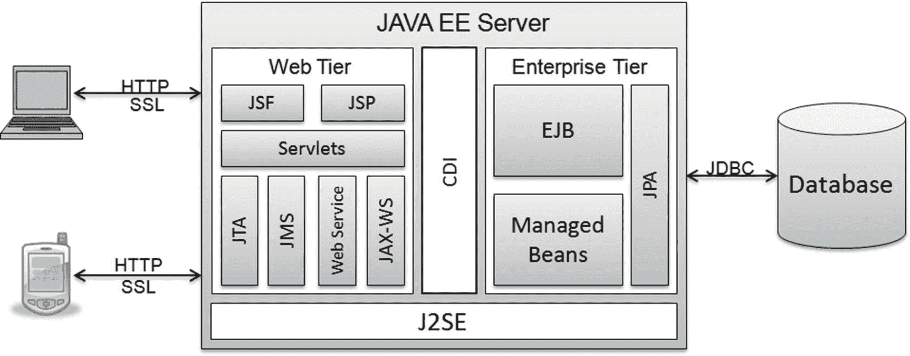

图 10-2

CDI 应用程序架构

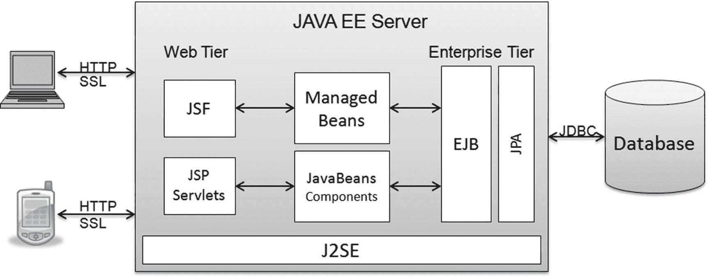

图 10-1

CDI 出现前的 Java EE 应用程序架构

CDI 提供的两个重要特性就体现在其名称中：

*   **上下文**：负责将有状态组件（如有状态会话 Bean）绑定到定义明确的作用域。有状态组件是指在多次调用之间保留信息的组件。CDI 容器将有状态组件与特定作用域关联——在需要时创建它们，在超出作用域时销毁它们。因此，客户端无需承担管理有状态组件生命周期的负担。
*   **依赖注入**：负责以松耦合但类型安全的方式将组件注入到应用程序中。被注入的组件由容器实例化，这意味着用户无需使用 `new` 来创建组件实例。用户可以使用接口而非接口的实际实现来进行注入。这允许用户将需要注入的 Bean 类型的具体实现选择推迟到运行时部署。

注意

我们只能在启用了 CDI 的应用程序中使用注入点，而 Java EE 8 平台要求使用 Java 依赖注入 1.0。

清单 10-1、10-2 和 10-3 以最简单的形式演示了“上下文”和“依赖注入”的概念。在本章后续章节中，我们将以此示例为基础来演示 CDI 的各种特性。清单 10-1 定义了一个 `Wine` 接口，该接口由 `RedWine` 类实现，如清单 10-2 所示。

```
package com.apress.ejb.chapter10;
public interface Wine {
public String getColor();
}
清单 10-1
Wine.java
```

`RedWine` 类演示了 CDI 的“上下文”方面。它带有 `ApplicationScoped` 注解，这意味着当应用程序被实例化时，`RedWine` 的实例只会被创建一次，并且该实例将在应用程序关闭时被销毁。在应用程序的生命周期内，该实例将在整个应用程序中共享。我们将在本章后面部分详细了解作用域。

```
package com.apress.ejb.chapter10;
import javax.enterprise.context.ApplicationScoped;
@ApplicationScoped
public class RedWine implements Wine {
public String getColor() {
return "Red";
}
}
清单 10-2
RedWine.java 演示了上下文方面
```

清单 10-3 中显示的客户端使用 `@Inject` 注解注入了 `newWine` 字段。使用 `@Inject` 注解注入的字段由容器实例化，这意味着用户无需使用 `new` 创建对象实例，也无需在编译时依赖于实际的实现类。这里需要注意的一个重要点是，`newWine` 字段的类型是 `Wine`。在这种特定情况下，容器会自动使用 `RedWine` 实现进行实例化。如果我们必须以传统方式实例化 `RedWine`，那么我们将不得不使用 `RedWine` 实现而不是 `Wine` 接口。结果，客户端和 `Wine` 对象之间将存在紧密耦合，这种耦合在部署时或运行时都无法更改。我们将在本章后面讨论依赖注入时，进一步了解 CDI 容器如何知道要注入哪个实现。

```
package com.apress.ejb.chapter10;
import javax.inject.Inject;
public class WineClient {
// 传统方式实例化
private Wine oldWine = new RedWine();
// 通过字段依赖注入实例化
@Inject
private Wine newWine;
}
清单 10-3
WineClient.java 演示了依赖注入方面
```

作为参考，CDI 规范还定义了以下服务。对这些高级 CDI 主题的更详细解释超出了本章的范围，但鼓励您参考 CDI 规范以获取更多信息。

*   通过统一表达式语言 (EL) 将 Web 层与上下文对象集成
*   实现 Bean 并可以通过业务方法拦截这些 Bean 调用的装饰器
*   用于将业务逻辑与横切关注点分离的拦截器
*   定义 Bean 之间以松耦合方式交互的事件通知模型
*   通过可移植扩展与容器进行清晰交互的能力

## 与 EJB 的关系

CDI 弥合了由 Servlet、JSP 和 JSF 组成的 Web 层与由 EJB 和 JPA 组成的企业层之间的鸿沟。Servlet、JSP 和 JSF 负责内容呈现，但不具备事务管理和持久化功能。EJB 和 JPA 支持与数据库相关的操作，如提交、回滚和其他事务管理功能。使用 CDI，Web 应用程序可以使用会话 Bean 作为外观来执行 JPA 支持的数据库相关操作。

会话 Bean 像托管 Bean 一样参与 CDI 生命周期。会话 Bean 可以被注入到其他会话 Bean 和托管 Bean 中。托管 Bean 可以被注入到会话 Bean 中。用户在决定使用会话 Bean 还是托管 Bean 时应谨慎。当应用程序需要以下高级企业服务时，应使用会话 Bean：

*   基于角色的安全性
*   事务管理
*   通过实例池实现的可伸缩性
*   并发性
*   事件和定时器

对于需要依赖注入、生命周期管理和拦截器的应用程序，托管 Bean 就足够了。通过添加 `@Stateless`、`@Stateful` 或 `@Singleton` 注解，可以轻松地将托管 Bean 升级为会话 Bean。

注意

消息驱动 Bean 和实体是非上下文对象，可能不会被注入到其他对象中。消息驱动 Bean 利用了 CDI 的一些特性，例如拦截器和装饰器，因为容器会对所有托管 Bean 实例（包括非上下文实例）执行注入。

## CDI 概念

现在我们对 CDI、它在 Java EE 技术栈中的位置以及它与 EJB 的关系有了基本了解，接下来让我们详细探讨上下文和依赖注入。


### Beans 与 beans.xml

Beans 是由容器管理的、包含业务逻辑的组件，例如托管 Bean 和会话 Bean。读者需要注意，CDI 并未引入一种名为“CDI Bean”且拥有独特组件模型的新 Bean 类型。CDI 提供了一套服务，可供托管 Bean 和 EJB（它们由其现有的组件模型定义）使用。CDI 容器识别各个部署模块中发现的 Bean 的过程称为 Bean 发现。通过 Bean 发现被容器发现的 Bean 会参与 CDI 生命周期。这些 Bean 的生命周期由容器根据 CDI 规范进行管理。

注意

在本章中，除非另有说明，“Bean”一词指的是参与 CDI 生命周期的 Java Bean。

如果容器在 WAR 文件的 `WEB-INF` 目录或 JAR 文件的 `META-INF` 目录中检测到 `beans.xml` 文件，则该模块内的 Bean 会参与 CDI 生命周期。模块中存在 `beans.xml` 有助于容器快速隔离与 CDI 相关的模块，从而加快 Bean 发现速度。CDI 不要求 `beans.xml` 声明模块中可用的 Bean；`beans.xml` 可以为空。CDI 构件（如替代项、拦截器和原型）会根据需要在 `beans.xml` 中声明。

CDI 容器为其 Bean 提供以下服务：

*   透明的创建、销毁和作用域管理
*   注入到 Java 客户端时，通过限定符进行类型安全的作用域解析
*   在 JSF 客户端的统一 EL 表达式中使用时，通过名称进行类型安全的作用域解析
*   生命周期回调
*   其他 Bean 实例的自动注入
*   拦截与装饰
*   事件通知

通过声明一个类级别的字段并使用 `javax.inject.Inject` 注解对其进行标注，可以将 Bean 注入到其他 Bean 和客户端中。通过使用 `javax.inject.Named` 注解对 Bean 进行标注，它们也可以通过统一 EL 表达式与 JSP 和 JSF 等 Web 层技术一起使用。

### 作用域

对象的作用域决定了该对象各个实例的生命周期。包含有状态对象实例的应用程序需要这些实例在定义的时间段内保持其状态。作用域规定了 Bean 实例应在何时创建，以及容器应在何时销毁它。

CDI 有以下五种类型的作用域。

#### 应用作用域

应用作用域的 Bean 的状态在应用程序的所有用户之间共享。一个应用作用域的对象在应用程序的生命周期内仅创建一次——即首次被注入时——并且仅在应用程序关闭时被销毁。应用作用域使用 `@javax.enterprise.context.ApplicationScoped` 注解声明。

#### 请求作用域

请求作用域的 Bean 的状态由单个请求中涉及的所有 Bean 共享。一个请求作用域的 Bean 在每个请求中创建一次，并在该请求完成后被销毁。请求作用域使用 `@javax.enterprise.context.RequestScoped` 注解声明。

#### 会话作用域

会话作用域的 Bean 的状态在同一 HTTP 会话内的多个请求之间共享。一个会话作用域的 Bean 在 HTTP 会话开始时创建，并在 HTTP 会话关闭或超时时被销毁。会话作用域使用 `@javax.enterprise.context.SessionScoped` 注解声明。

#### 对话作用域

对话作用域的 Bean 的状态在 JSF faces 请求或非 faces 请求的所有标准生命周期阶段之间共享。一个 JSF 请求仅与一个对话相关联。任何对话都可以处于瞬态或长期运行状态。瞬态是对话的默认状态。通过调用 `Conversation.begin()` 将对话标记为长期运行，通过调用 `Conversation.end()` 将其标记为瞬态。在 JSF 请求结束时，对话作用域的对象必须处于瞬态才能被销毁。对话作用域使用 `@javax.enterprise.context.ConversationScoped` 注解声明。

#### 依赖伪作用域

依赖作用域是默认作用域，当未显式定义作用域时，容器会应用它。具有依赖作用域的 Bean 的实例仅绑定到一个对象。此类 Bean 的实例会随着关联对象的创建和销毁而同步创建和销毁。这些 Bean 实例不会在客户端应用程序之间共享。依赖作用域使用 `@javax.enterprise.context.Dependent` 注解声明。

注意

用户可以通过使用 `@javax.inject.Scope` 注解来定义自定义作用域。

### 使用 @Inject 进行依赖注入

在引入依赖注入的 JSR 330 发布之前，需要依赖类服务的客户端要么必须实例化该类的具体实例，要么依赖外部模块在需要之前连接好依赖关系。这要么在客户端和依赖类之间创建了紧密耦合的编译时依赖关系，要么导致客户端依赖外部进程来适当地“配置”自身。通过依赖注入，客户端和依赖类之间的契约变得解耦，并且客户端对自身如何被初始化获得了一定的控制权。客户端可以请求通过其接口注入一个资源，并依赖容器注入一个客户端有意未知的某个具体实现类的可接受实例。CDI 通过引入一种方式（限定符，见下文），让客户端能够告诉容器它需要注入类具有哪些抽象特性，从而扩展了客户端控制其配置的能力。容器在运行时根据这些需求来决定注入哪个依赖类。这创建了一个更加松散耦合的系统，其中注入类的需求在客户端中以声明式和动态的方式配置，并由容器在运行时绑定到一个实现类。

`@javax.inject.Inject` 注解定义了一个注入点，在 Bean 中有三个位置可以由 CDI 容器执行注入：在构造函数声明上初始化参数值、在方法声明上初始化参数值，以及在字段声明上初始化类成员。接下来我们将逐一考察这些位置。


#### Bean 构造函数参数注入

一个 CDI bean 会指定其众多构造函数中的一个作为其 bean 构造函数。CDI 容器使用此构造函数来实例化该 bean。当我们向一个带有一个或多个参数的 bean 构造函数添加 `@javax.inject.Inject` 注解时，就会发生 bean 构造函数参数注入。如果 bean 构造函数有多个参数，那么所有参数都是有效的注入点，这意味着容器必须为 bean 构造函数的所有参数提供值。如果 bean 类没有带有 `@Inject` 注解的 bean 构造函数，那么默认的（无参）构造函数将被用作 bean 构造函数。

客户端应用程序有可能绕过容器，直接实例化该 bean。在这种情况下，显而易见的结果是，返回的对象不与任何上下文绑定，并且新实例的生命周期不受容器管理。

清单 10-4 展示了如何使用 bean 构造函数参数注入，用 `Wine` 类型的年份酒来初始化 `WineCellarClient` 类中的 `beanConstParaInjVintage` 字段。

注意

CDI 容器将选择 `Wine` 接口的默认实现，并将该实现的一个实例传递给 `WineCellarClient` bean 构造函数。

```
package com.apress.ejb.chapter10;
import javax.inject.Inject;
public class WineCellarClient {
private Wine beanConstParaInjVintage;
@Inject
WineCellarClient(Wine vintage)
{
this.beanConstParaInjVintage = vintage;
}
}
清单 10-4
WineCellarClient.java
```

#### 初始化器方法参数注入

CDI 还可以通过调用 bean 上带有 `@javax.inject.Inject` 注解的方法，在之后初始化 bean 的属性。带有 `@javax.inject.Inject` 注解的 bean 方法被称为初始化器方法。初始化器方法必须是非抽象的、非静态的且非泛型的。初始化器方法可以有零个或多个参数。如果初始化器方法有多个参数，那么所有参数都是有效的注入点，并且 CDI 容器必须能够为所有参数提供值。一个 bean 类声明多个初始化器方法是合法的。

客户端应用程序有可能绕过容器，直接调用初始化器方法。同样，在这种情况下，显而易见的结果是容器不会向该方法传递任何参数。

清单 10-5 展示了如何修改 `WineCellarClient` 类，使用初始化器方法参数注入代替 bean 构造函数参数注入，以达到相同的结果。

```
package com.apress.ejb.chapter10;
import javax.inject.Inject;
public class WineCellarClient {
private Wine initParaInjVintage;
WineCellarClient()
{
}
@Inject
public void setVintageWine(Wine vintage)
{
this.initParaInjVintage = vintage;
}
}
清单 10-5
WineCellarClient.java
```

#### 字段注入

最后，CDI 容器可以通过选择字段接口类型的明确实现来实例化一个类级别的字段。通过使用 `@Inject` 注解标记类级别的字段，可以对其进行注入。被注入的字段必须是 bean 类或任何支持注入的 Java EE 组件类中的非静态、非 final 字段。

清单 10-6 展示了字段注入如何简化 `fieldInjVintage` 的初始化。

```
package com.apress.ejb.chapter10;
import javax.inject.Inject;
public class WineCellarClient {
@Inject
private Wine fieldInjVintage;
}
清单 10-6
WineCellarClient.java
```

### 依赖解析

CDI 规范保证了注入的 bean 是松散耦合且类型安全的。对于只有一个实现的 bean 类型（类或接口），CDI 容器可以明确地选择其实现。但一个 bean 类型可能有多个实现。例如，我们可以添加另一个类 `WhiteWine`，如清单 10-7 所示，它实现了我们在清单 10-1 中创建的接口 `Wine`。

```
package com.apress.ejb.chapter10;
public class WhiteWine implements Wine {
public String getColor() {
return "White";
}
}
清单 10-7
WhiteWine.java
```

在引入 `WhiteWine` 实现之后，我们的 `WineClient`（其中注入了 `Wine`）需要区分 `Wine` 的两个实现：即 `RedWine` 和 `WhiteWine`。当 CDI 容器无法隔离出需要在给定注入点注入的一个 bean 类时，它会引发一个未满足或不明确的依赖部署时错误。这个不明确的依赖问题可以通过使用以下三种解决方案中的任何一种来解决：

*   限定符（用于编译时解析）
*   备选方案（用于部署时解析）
*   生产者（用于运行时解析）

#### 限定符

限定符类型通过提供编译时的多态性和运行时的动态绑定，使 CDI 组件能够以松散耦合的方式进行交互。限定符类型允许客户端指定要注入的实例的所需特性，而无需知道选择了哪个具体的实现类。

让我们通过一个例子来尝试理解限定符。清单 10-7 中 `WhiteWine` 类的添加迫使容器引发错误，因为容器无法决定是实例化 `RedWine` 还是 `WhiteWine` 实现。我们将使用一个限定符来解决这个依赖问题。清单 10-8 展示了一个名为 `Red` 的用户自定义限定符。

```
package com.apress.ejb.chapter10;
import static java.lang.annotation.ElementType.TYPE;
import static java.lang.annotation.ElementType.FIELD;
import static java.lang.annotation.ElementType.PARAMETER;
import static java.lang.annotation.ElementType.METHOD;
import static java.lang.annotation.RetentionPolicy.RUNTIME;
import java.lang.annotation.Retention;
import java.lang.annotation.Target;
import javax.inject.Qualifier;
@Qualifier
@Retention(RUNTIME)
@Target({METHOD, FIELD, PARAMETER, TYPE})
public @interface Red {
}
清单 10-8
Red.java
```

我们将为清单 10-2 中所示的 `RedWine` 类添加 `Red` 限定符，如清单 10-9 所示。

```
package com.apress.ejb.chapter10;
import javax.enterprise.context.ApplicationScoped;
// 实例将只创建一次，将在整个应用程序中共享，
// 并在应用程序关闭时销毁
@ApplicationScoped
@Red
public class RedWine implements Wine {
public String getColor() {
return "Red";
}
}
清单 10-9
RedWine.java
```

引入这个自定义限定符使我们能够解决不明确的依赖错误。如清单 10-3 中所编码的 `WineClient`，现在将实例化 `WhiteWine`，因为 `WhiteWine` 具有 `@Default` 限定符，并且注入点也具有相同的 `@Default` 限定符。清单 10-10 展示了如何通过在注入点添加 `@Red` 限定符，用 `RedWine` 实现来实例化 `newWine` 字段。

```
package com.apress.ejb.chapter10;
import javax.inject.Inject;
public class WineClient {
// 以经典方式实例化
// private Wine oldWine = new RedWine();
// 通过字段依赖注入实例化
@Inject
@Red
private Wine newWine;
}
清单 10-10
WineClient.java
```

现在我们对限定符如何帮助我们解决歧义有了基本的了解，接下来我们将研究 CDI 限定符的四种类型。


##### @Default

当一个 Bean 或注入点没有显式定义限定符时，CDI 容器会假定其限定符为 `@javax.enterprise.inject.Default`。如果 CDI Bean 只有一个实现，那么 CDI 容器可以轻松选择该实现进行注入，因为不存在歧义。`@Default` 是一个内置限定符，它告知 CDI 容器：当未指定其他限定符（除了 @Named，见下文）时，注入单个默认的 Bean 实现。清单 10-7 中的 `WhiteWine` 类具有 `@Default` 限定符，可以按清单 10-11 所示编写，其行为不会发生任何变化。

```
package com.apress.ejb.chapter10;
import javax.enterprise.inject.Default;
@Default
public class WhiteWine implements Wine {
public String getColor() {
return "White";
}
}
清单 10-11
WhiteWine.java
```

##### @Any

与 `@Default` 限定符一样，所有 Bean 都隐式具有 `@Any` 限定符。我们可以向 `WhiteWine` 类添加 `@javax.enterprise.inject.Any` 注解，如清单 10-11 所示，与 `@Default` 共存，其行为不会发生任何变化。在注入点上使用 `@Any` 限定符，对于遍历某个 Bean 类型的所有实现非常有用。

清单 10-12 展示了如何使用 `@Any` 限定符来遍历 `Wine` 的所有实现。

```
package com.apress.ejb.chapter10;
import javax.enterprise.inject.Any;
import javax.enterprise.inject.Instance;
import javax.inject.Inject;
public class AllWinesClient {
@Inject
@Any
private Instance allWines;
private void printAllWineColors(){
for (Wine wine : allWines){
System.out.println(wine.getColor());
}
}
}
清单 10-12
AllWinesClient.java
```

##### @Named

`@Named` 内置限定符用于那些需要通过统一表达式语言（EL）对 Web 层进行访问的 Bean。默认情况下，使用首字母小写的 Bean 名称来访问该 Bean。也可以将非默认名称作为参数传递给 `@Named` 限定符。

##### @New

`@New` 限定符会将 Bean 的实例与其声明的作用域解除关联。应用程序可以通过使用 `@New` 限定符来获取不受声明作用域约束的 Bean 实例。`@New` 限定符强制容器创建一个新的 Bean 实例，该实例不受指定的 CDI 上下文生命周期的约束。

例如，如清单 10-10 所示，`newWine` 的实例将是应用程序作用域的，因为它使用了 `@Red` 注解进行限定，并且 `RedWine` Bean 是应用程序作用域的。如果我们更新客户端以包含 `@New` 注解，如清单 10-13 所示，那么 `newWine` 实例将是依赖作用域的——即采用其普通 Java 上下文的生命周期——而不再是应用程序作用域。

```
package com.apress.ejb.chapter10;
import javax.enterprise.inject.New;
import javax.inject.Inject;
public class WineClient {
// 以经典方式实例化
// private Wine oldWine = new RedWine();
// 通过字段依赖注入实例化
@Inject
@Red
@New
private Wine newWine;
}
清单 10-13
WineClient.java
```

用户定义的限定符可以使用 `@Qualifier` 注解创建，如清单 10-8 所示。

### 备选方案

备选方案通过在部署时提供多态性，使 CDI 组件能够以松散耦合的方式进行交互。备选 Bean 通过在 Bean 类上添加 `@Alternative` 注解来声明。如果备选 Bean 需要可用于查找、注入或 EL 解析，则必须在 `beans.xml` 文件中显式声明。当注入点存在歧义依赖时，容器会尝试通过查找可注入的 Bean 中的可用备选方案来解决歧义。

备选方案使用 `beans.xml` 中提供的信息来选择需要实例化的实现。由于选择实现的责任从 Java 代码转移到了部署描述符中，因此如果我们决定选择不同的实现，则无需重新编译 Java 代码。

要使用备选方案在部署时解决依赖关系，请将 `@javax.enterprise.inject.Alternative` 注解分别添加到清单 10-2 和清单 10-7 中提到的 `RedWine` 和 `WhiteWine` 实现中。然后，使用应该被实例化的实现类更新 `beans.xml`，如清单 10-14 所示。在这种情况下，CDI 容器将实例化 `RedWine` 类。如果我们稍后决定实例化 `WhiteWine` 类，则无需重新编译客户端。我们只需要相应地更新 `beans.xml` 描述符即可。如果在部署时 `beans.xml` 包含多个实现类或包含无法解析的类名，容器会自动检测到该问题并将其视为错误。

```

com.apress.ejb.chapter10.RedWine

清单 10-14
beans.xml
```


### 生产者

我们已经了解了如何使用 `@Inject` 注解来注入 Bean，以及如何通过限定符和替代方案来解决注入过程中遇到的歧义依赖问题。利用生产者，我们可以将任何对象注入到任何其他对象中，前提是我们能够生产出需要被注入的对象。生产者方法充当了需要被注入的对象的来源。需要被注入的对象不必是 Bean 的实例，并且其具体类型可以在运行时决定。这提供了一种松散耦合但类型安全的运行时多态性。生产者的一个实际用途是注入 Java EE 资源，例如 `EntityManager`、`QueueConnetion`、`QueueSession` 等。CDI 还提供了 `@Dispose` 注解，我们可以用它来在资源超出作用域时关闭它们，从而释放资源。

生产者字段是生产者方法的一种更简单的替代方案。

清单 10-16 展示了如何使用生产者方法来选择将 `Wine` 接口的哪个实现用于依赖注入。选择注入哪个具体实现的决策是在运行时做出的。清单 10-15 中定义的限定符 `RandomSelector` 与清单 10-8 中定义的限定符 `Red` 类似。

```
package com.apress.ejb.chapter10;
import static java.lang.annotation.ElementType.TYPE;
import static java.lang.annotation.ElementType.FIELD;
import static java.lang.annotation.ElementType.PARAMETER;
import static java.lang.annotation.ElementType.METHOD;
import static java.lang.annotation.RetentionPolicy.RUNTIME;
import java.lang.annotation.Retention;
import java.lang.annotation.Target;
import javax.inject.Qualifier;
@Qualifier
@Retention(RUNTIME)
@Target({METHOD, FIELD, PARAMETER, TYPE})
public @interface RandomSelector {
}
清单 10-15
RandomSelector.java
```

清单 10-16 展示了 `WineSelector` 类，它有一个返回 `Wine` 实例的 `getWine` 方法。这里需要注意的重要一点是，返回的 `Wine` 的具体实例（`RedWine` 或 `WhiteWine`）是在运行时决定的。在这个例子中，该决策基于随机数生成器生成的数字。

```
package com.apress.ejb.chapter10;
import java.util.Random;
import javax.enterprise.inject.New;
import javax.enterprise.inject.Produces;
public class WineSelector {
@Produces
@RandomSelector
public Wine getWine(@New RedWine rw, @New WhiteWine ww) {
final int wineNumber = new Random().nextInt(2);
if (wineNumber == 0) {
return rw;
}
else if (wineNumber == 1) {
return ww;
}
else{
return null;
}
}
}
清单 10-16
WineSelector.java
```

清单 10-17 展示了 `WineClient` 类，它使用 `RandomSelector` 限定符，根据清单 10-16 中生成的随机数来实例化 `randomWine` 字段。

```
package com.apress.ejb.chapter10;
import javax.inject.Inject;
public class WineClient {
@Inject
@RandomSelector
private Wine randomWine;
}
清单 10-17
WineClient.java
```

## 与会话 Bean 的交互

CDI 通过将会话 Bean 与明确的作用域关联，并创建一个松散耦合的类型安全生态系统（该系统在编译时、部署时或运行时通过注入解决歧义），从而增强了会话 Bean 提供的功能。作为回报，托管 Bean 可以使用 `@Stateful`、`@Stateless` 或 `@Singleton` 注解进行标注，从而为其增强声明式企业特性，例如基于角色的安全性、事务管理、可伸缩性以及多用户环境中的并发性。

### 会话 Bean 作用域

会话 Bean 像任何其他 Bean 一样，参与 CDI 容器提供的上下文生命周期。可以通过添加 CDI 特定的作用域注解（`@ApplicationScoped`、`@RequestScoped`、`@SessionScoped` 或 `@ConversationScoped`）将会话 Bean 与 CDI 作用域关联起来。因此，当客户端需要时，容器会自动创建会话 Bean 实例，并且当不再处于作用域内时，容器会自动销毁该实例。

默认情况下，所有通用会话 Bean 都具有 `@Dependent` 伪作用域，因此它们不能在客户端应用程序之间共享。本质上，某些类型的会话 Bean 与特定类型的作用域配合良好。例如，单例会话 Bean 在应用程序的整个生命周期内只能有一个实例。单例会话 Bean 的这一特性与应用程序作用域 Bean 的特性相辅相成。向无状态会话 Bean 添加 `@ApplicationScoped` 注解是没有意义的，因为无状态会话 Bean 实例仅在其调用期间与客户端关联，并且不与客户端维护会话状态。

因此，用户在将会话 Bean 应用 CDI 作用域时，必须遵循表 10-1 中提到的规则。如果会话 Bean 指定了非法的作用域，容器会自动检测到该问题并将其视为定义错误。

表 10-1

会话 Bean 到 CDI 作用域的映射

| 会话 Bean 类型 | 作用域 |
| --- | --- |
| `@Singleton` | `@ApplicationScoped 或 @Dependent` |
| `@Stateless` | `@Dependent` |
| `@Stateful` | `@ApplicationScoped`、`@RequestScoped`、`@SessionScoped`、`@ConversationScoped` 或 `@Dependent` |

### 解决会话 Bean 歧义

就像任何其他 Bean 一样，参与 CDI 生命周期的会话 Bean 在 CDI 容器无法隔离出一个可用于给定注入点的会话 Bean 时，可能会遇到“未满足或歧义依赖”错误。这些歧义可以通过对参与的会话 Bean 应用限定符、替代方案或生产者来解决。

参与 CDI 生命周期的会话 Bean 像任何其他 Bean 一样，使用限定符（`@Default`、`@Any`、`@New`、`@Named` 或用户自定义的）在编译时解决歧义依赖。

如果需要在部署时解决歧义依赖，则必须在 `beans.xml` 中显式声明一个替代会话 Bean。一旦在 `beans.xml` 中声明，它就会自动可用于查找、注入或 EL 解析。

会话 Bean 的生产者方法必须是 EJB 的业务方法或 Bean 类的静态方法。如果不是这种情况，容器会自动检测到该问题并将其视为定义错误。类似地，生产者字段必须是 Bean 类的静态字段。

用户可以像使用其他 Bean 一样，以完全相同的方式将会话 Bean 与限定符、替代方案和生产者结合使用。

### 局限性

虽然 CDI 和会话 Bean 是很好的搭档，彼此填补了对方留下的空白，但参与 CDI 生命周期的会话 Bean 确实存在一些局限性。例如，会话 Bean 的远程接口不包含在 Bean 类型集合中，并且不能参与 CDI 生命周期。


## 编译、部署和测试 CDI 应用

与 EJB 不同，CDI 并未定义任何特殊的部署归档格式。CDI Bean 可以打包在 JAR、EJB-JAR 或 WAR 文件中。唯一的要求是该归档文件必须是一个 Bean 归档，这意味着归档文件中必须包含 `beans.xml` 描述符。CDI Bean 在归档文件中的位置取决于其 `beans.xml` 的位置。

*   如果 `beans.xml` 位于归档文件的 `META-INF` 目录中，则 CDI Bean 必须打包在库 JAR、EJB JAR 或 RAR 归档文件中。
*   如果 `beans.xml` 位于 WAR 文件的 `WEB-INF` 目录中，则 CDI Bean 必须打包在 WAR 文件的 `WEB-INF/classes` 目录中。

在某些 CDI 容器中，打包好的 CDI 归档文件在部署前需要组装成一个企业归档（EAR）文件。应用服务器提供了部署工具或 Ant 任务来简化 CDI Bean 的部署。像 JDeveloper、NetBeans 和 Eclipse 这样的 Java 集成开发环境（IDE）也提供了部署功能，允许开发者将 CDI Bean 打包并部署到应用服务器。

在本章中，我们使用了代码片段来演示 CDI 的两个核心方面：作用域和依赖注入。我们从开发一个简单的 `Wine` 接口开始，然后继续创建了它的两个实现——`RedWine` 和 `WhiteWine`。我们学习了各种作用域，并为 `RedWine` 实现添加了应用作用域。我们还看到了通过使用限定符、备选方案和生产者来解决歧义依赖的示例。我们到目前为止在章节中列出的 `WineClient` 客户端演示了客户端如何与 CDI Bean 进行交互，但它并不是一个功能完备的可执行客户端。我们现在将把 `WineClient` 客户端转换为一个 Servlet 客户端，并通过将其部署在 GlassFish 应用服务器上来测试 CDI Bean。以下各节将引导您完成使用相应的 Servlet 客户端编译、部署和测试这些 CDI Bean 所需的步骤。

### 前提条件

在执行下一节详述的任何步骤之前，请先完成第 1 章的“入门”部分。该部分将引导您完成本章示例所需的安装和环境设置。

注意

在创建新的 NetBeans 项目时，请确保您已在新建应用程序向导的“服务器和设置”页面上选中了“启用上下文和依赖注入”复选框。这将创建一个 `beans.xml` 并将 CDI 相关的运行时库添加到您的项目中。

### 示例代码的结构

我们将示例分为以下四个包，并且这些包中的所有工件都具有包私有作用域。我们进行这种分离是为了让 CDI 对象及其客户端互不干扰，并且我们可以隔离地观察它们的行为。

*   `com.apress.ejb.chapter10.userdefinedqualifier`
*   `com.apress.ejb.chapter10.anyqualifier`
*   `com.apress.ejb.chapter10.alternatives`
*   `com.apress.ejb.chapter10.producers`

### 编译 CDI Bean 及其客户端

将 `Chapter10-CDISamples` 目录及其内容复制到您选择的目录中。运行 NetBeans IDE，并使用 `文件` ➤ `打开项目` 菜单打开 `Chapter10-CDISamples` 项目，如图 10-3 所示。

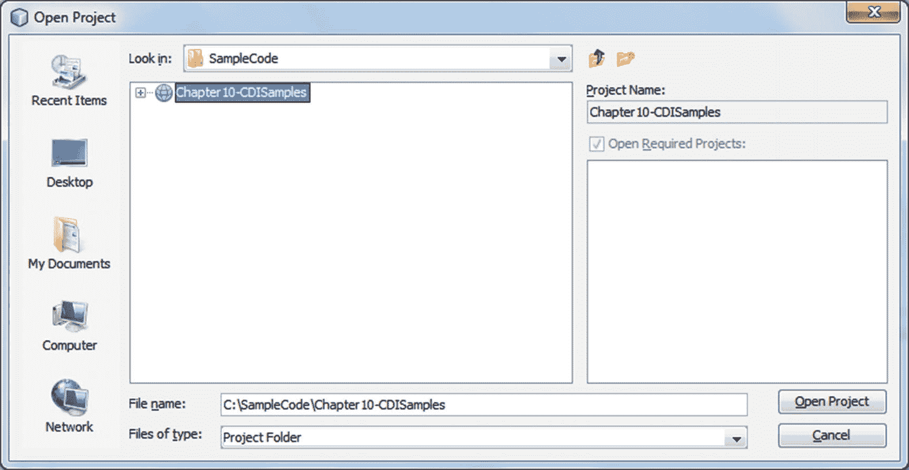

图 10-3

打开 Chapter10-CDISamples 项目

展开 `Chapter10-CDISamples` 节点，观察上述各个包出现在“源包”部分下，如图 10-4 所示。

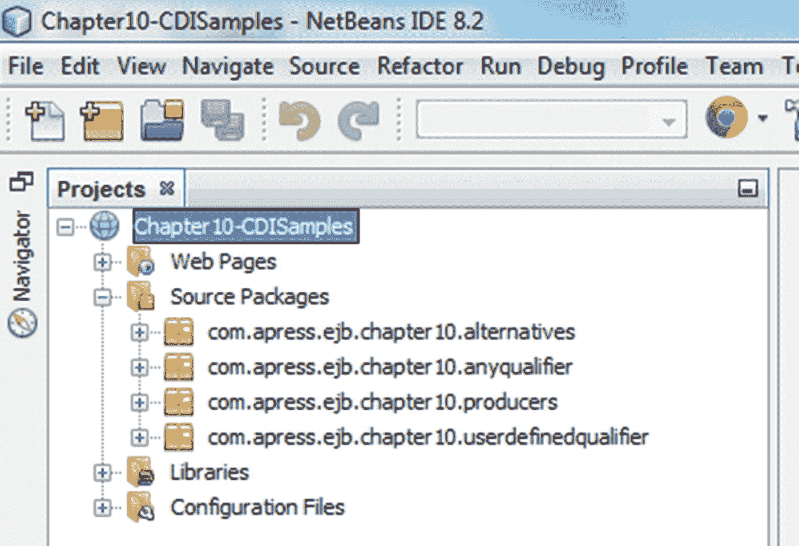

图 10-4

验证 Chapter10-CDISamples 项目中的包

调用 `Chapter10-CDISamples` 节点的上下文菜单，并通过选择 `清理并构建` 菜单选项来构建应用程序，如图 10-5 所示。CDI Bean 及其客户端编译无误。

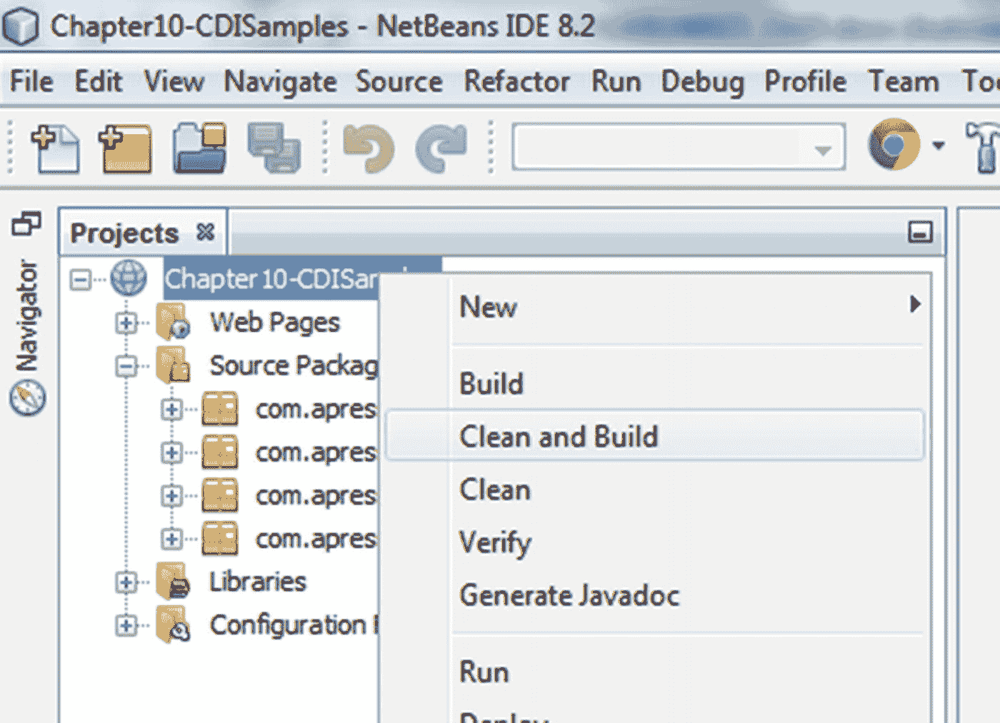

图 10-5

构建项目

### 部署和运行 CDI 客户端

一旦我们编译了 CDI 项目，就可以直接使用每个 Servlet 客户端上下文菜单中的 `运行` 选项来运行客户端。当我们运行 Servlet 客户端时，NetBeans IDE 将自动打包 CDI Bean 及其客户端，并将其部署到集成的 GlassFish 应用服务器。

#### 测试用户自定义限定符客户端

我们将从测试和实验用户自定义限定符 `Red` 开始，我们在清单 10-8 中创建了它，并在清单 10-9 和 10-10 中使用了它。

除了 `Red` 限定符之外，我们还创建了 `White` 限定符，并将其添加到了 `Wine` 接口的 `WhiteWine` 实现中。展开 `com.apress.ejb.chapter10.userdefinedqualifier` 包，右键单击 `UsrDefQlfWineClient` Servlet 以调用上下文菜单，如图 10-6 所示。接下来选择 `运行` 选项来执行 Servlet 客户端。

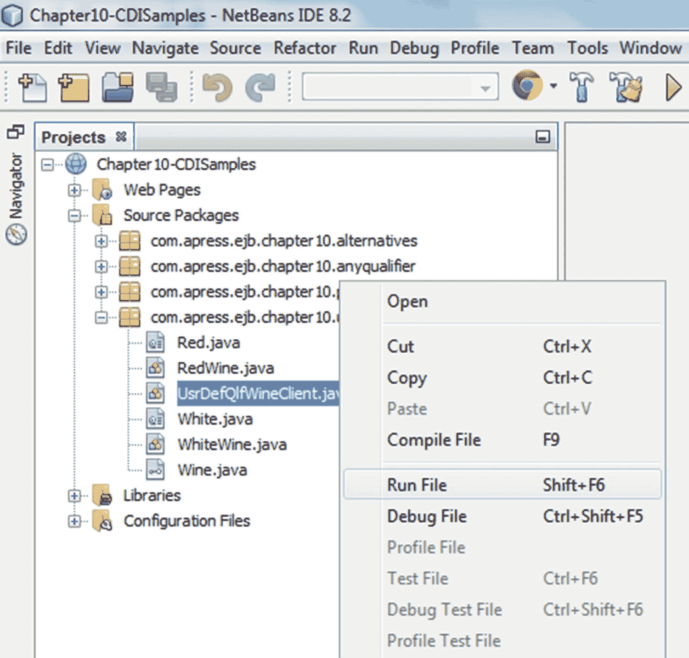

图 10-6

运行用户自定义限定符客户端

尽管 `Wine` 接口有两个实现——`RedWine` 和 `WhiteWine`——CDI 容器能够通过在被注入的 `newWine` 字段上使用 `@Red` 注解来解决歧义依赖。执行的 Servlet 的结果如图 10-7 所示。

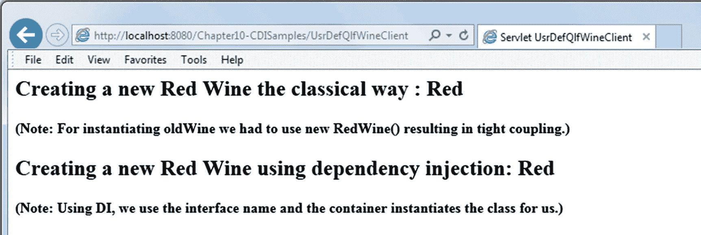

图 10-7

用户自定义限定符 Servlet 的结果

您可以尝试进行以下更改后再次运行客户端，并观察输出中的差异：

*   将注入的 `newWine` 字段上的 `@Red` 注解替换为 `@White` 注解。
*   移除注入的 `newWine` 字段上的 `@Red` 和 `@White` 注解，然后执行 Servlet 客户端。

#### 测试 Any 限定符客户端

接下来，我们将测试 `Any` 限定符，如清单 10-12 所示，它将返回 `Wine` 接口所有实现的列表。

除了 `RedWine` 和 `WhiteWine` 实现之外，我们还创建了 `SparklingWine` 实现及其 `Sparkling` 限定符。展开 `com.apress.ejb.chapter10.anyqualifier` 包，右键单击 `AnyWineClient` Servlet 以调用上下文菜单，如图 10-8 所示。选择 `运行` 选项来执行 Servlet 客户端。

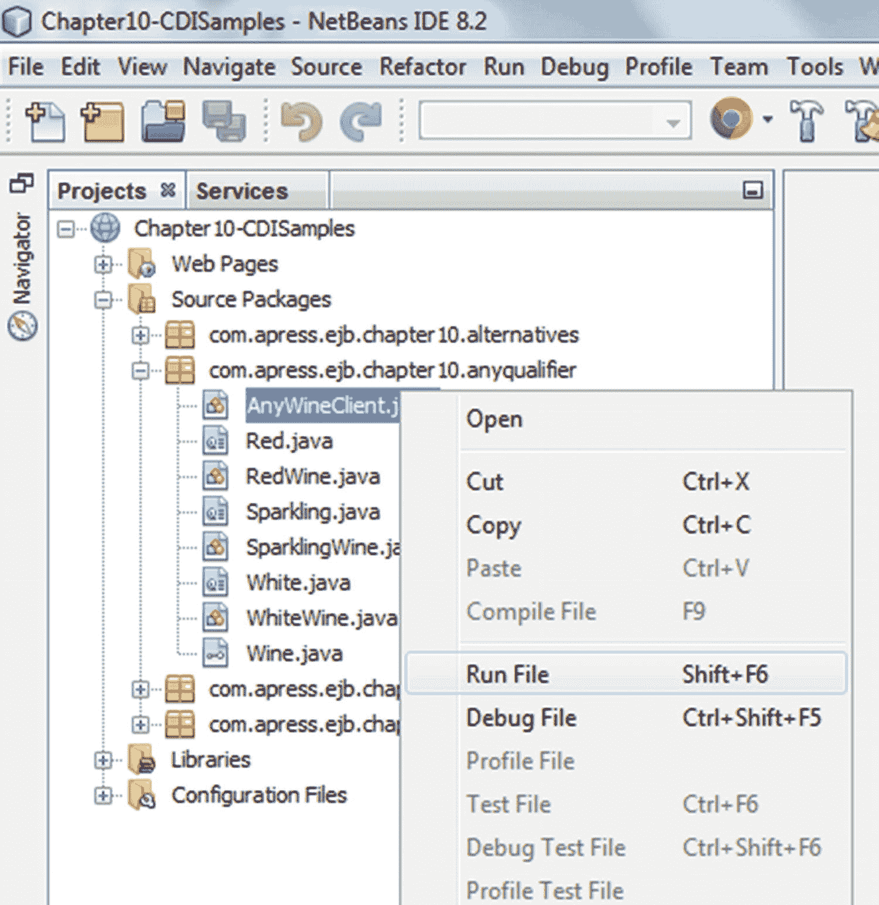

图 10-8

运行 Any 限定符客户端

通过使用 `@Any` 限定符，容器能够确定 `Wine` 接口的所有实现。执行的 Servlet 的结果如图 10-9 所示。

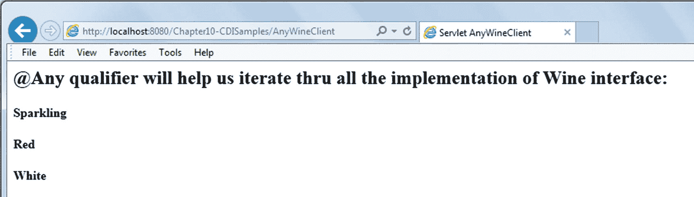

图 10-9

Any 限定符客户端 Servlet 的结果

您可以尝试进行以下更改后再次运行客户端，并观察输出中的差异：

*   在同一包中创建一个 `RoseWine` 实现及其 `Rose` 限定符，然后重新运行 Servlet 客户端。
*   移除注入的 `allWines` 字段上的 `@Any` 注解，然后执行 Servlet 客户端。


#### 测试备选方案客户端

在了解了限定符的实际应用后，我们将探讨如何在部署时使用备选方案来解决歧义依赖问题。我们在清单 10-14 中看到了如何在 `beans.xml` 中声明备选方案。

展开 `com.apress.ejb.chapter10.alternatives` 包，右键点击 `AlternativesWineClient` Servlet 以调用上下文菜单，如图 10-10 所示。选择 `Run` 选项来执行该 Servlet 客户端。

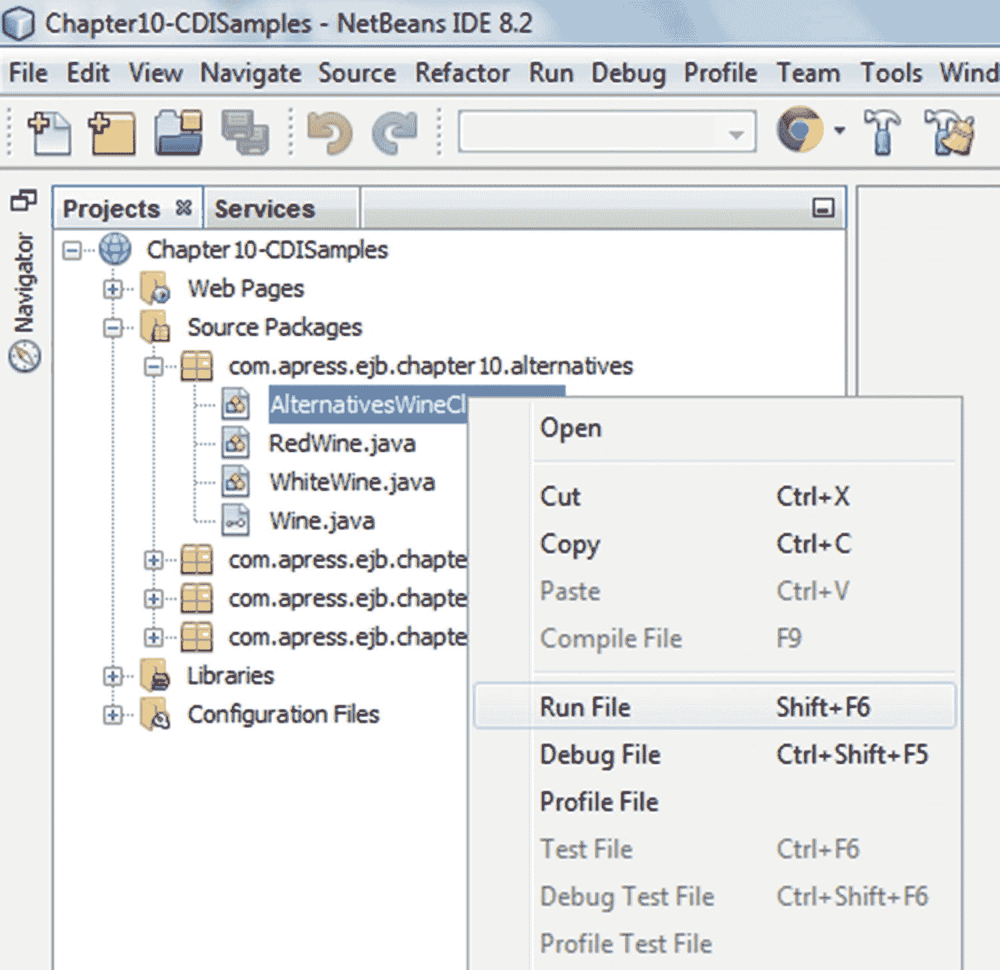

图 10-10

运行备选方案客户端

CDI 容器通过 `beans.xml` 中的 `<alternatives>` 声明来实例化 `RedWine` 类。执行结果如图 10-11 所示。

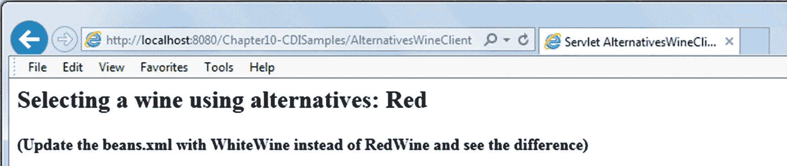

图 10-11

备选方案客户端的结果

你可以尝试进行以下更改后再次运行客户端，并观察输出结果的差异：

*   将 `beans.xml` 更新为 `WhiteWine`，然后重新运行 Servlet 客户端。
*   移除 `RedWine` 或 `WhiteWine` 实现上的 `@Alternative` 注解，然后执行 Servlet 客户端。

#### 测试生产者客户端

最后，我们将看到生产者的实际应用。我们在清单 10-16 中看到了如何声明一个生产者方法。展开 `com.apress.ejb.chapter10.producers` 包，右键点击 `ProducerWineClient` Servlet 以调用上下文菜单，如图 10-12 所示。选择 `Run` 选项来执行该 Servlet 客户端。

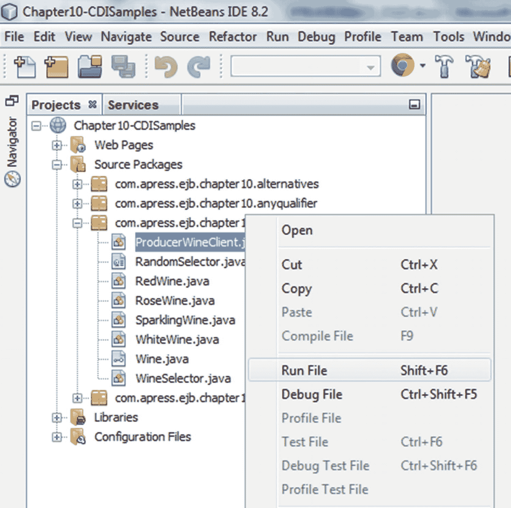

图 10-12

运行生产者客户端

`WineSelector` 类声明了一个名为 `getWine` 的生产者方法。在 `getWine` 方法中，我们生成一个大于等于 0 且小于 4 的随机数。`getWine` 方法根据生成的随机数返回一个 `Wine` 接口实现的实例。输出结果如图 10-13 所示。

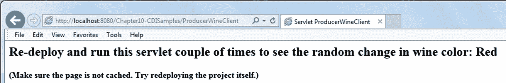

图 10-13

生产者客户端的结果

你可以尝试进行以下更改后再次运行客户端，并观察输出结果的差异：

*   重新部署并多次运行客户端 Servlet，观察输出结果的差异。
*   注释掉 `getWine` 方法上的 `@Produces` 注解，然后执行 Servlet 客户端。

## 总结

在本章中，我们介绍了上下文与依赖注入（CDI）2.0 版本。我们探讨了 CDI 在 Java EE 框架中的地位，以及它通过连接 Web 层和业务层所带来的优势。我们特别了解到，现在可以在 Java EE 以及 Java SE 中使用 CDI 2.0，并且 CDI 2.0 的新特性如何帮助提高开发者的生产力。我们解释了 CDI 框架的两个主要组成部分，即上下文和依赖注入。我们还研究了参与 CDI 生命周期的有状态组件的上下文生命周期，并讨论了不同类型的作用域。通过示例，我们还探讨了依赖注入的不同方式，以及如何在编译时、部署时或运行时解决歧义依赖问题。我们讨论了 CDI 与 EJB 之间的关系，特别是与会话 Bean 的关系。最后，我们使用 GlassFish 应用服务器部署并执行了示例 CDI 客户端程序，并通过实验示例代码观察了代码更改如何影响输出结果。

