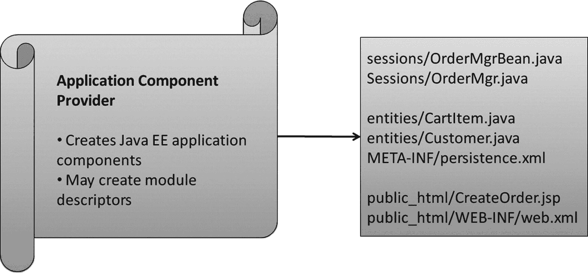
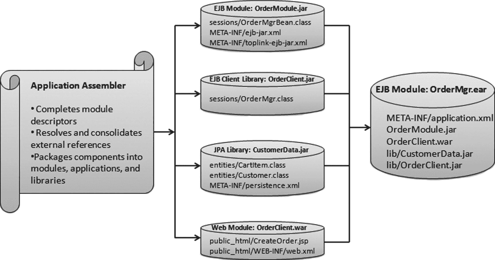
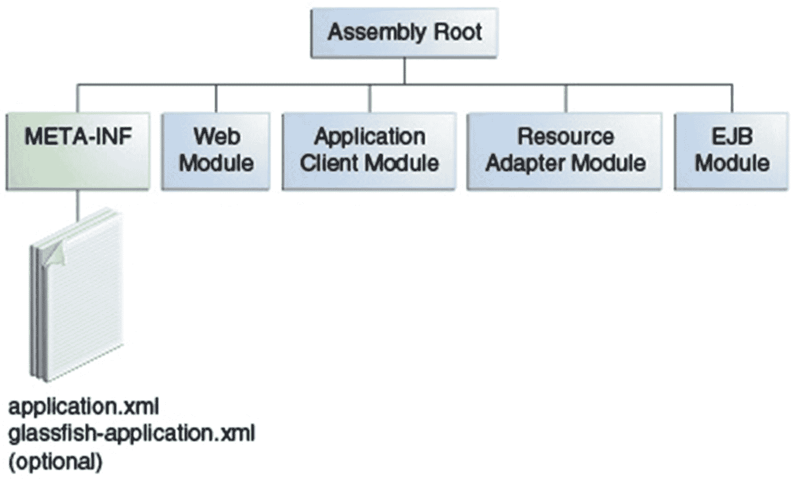
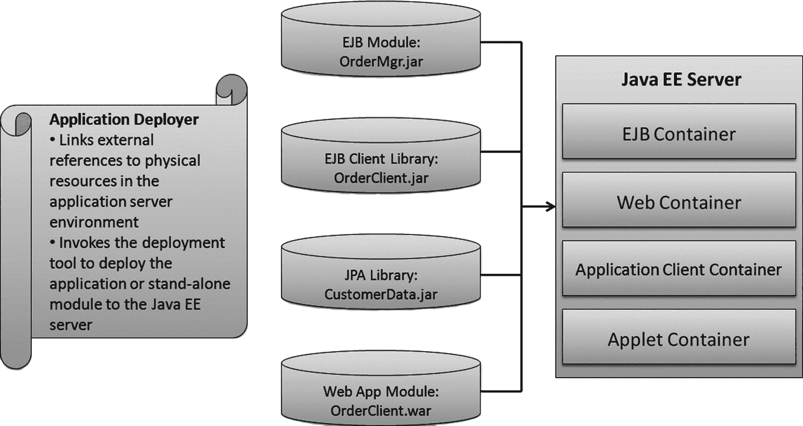
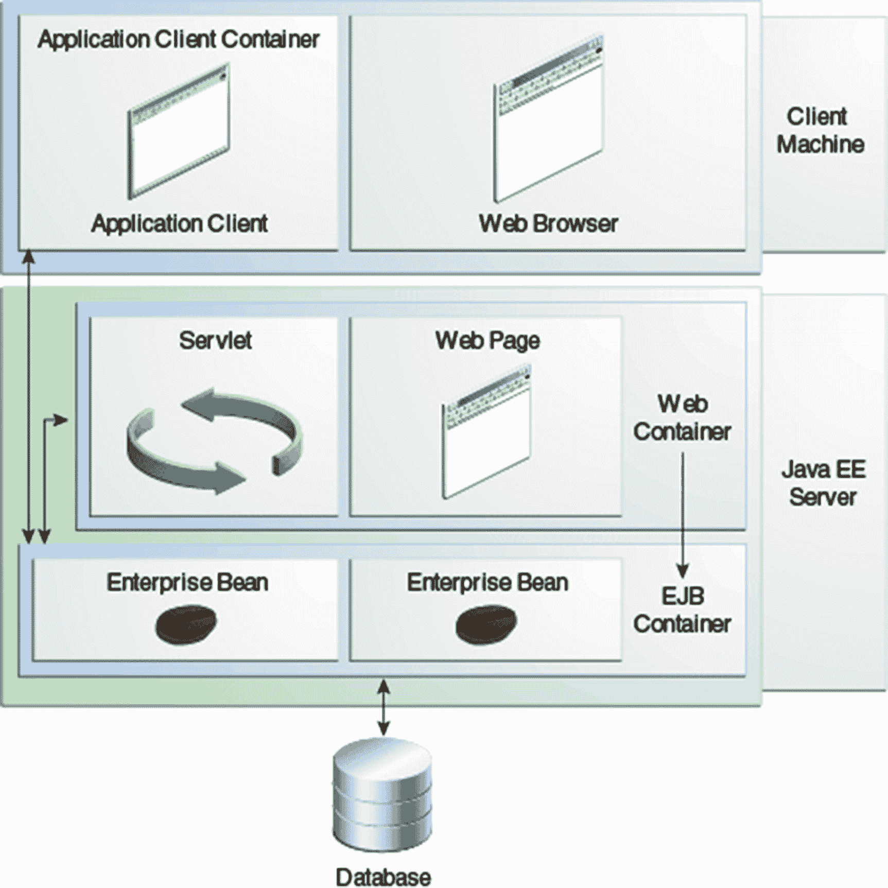
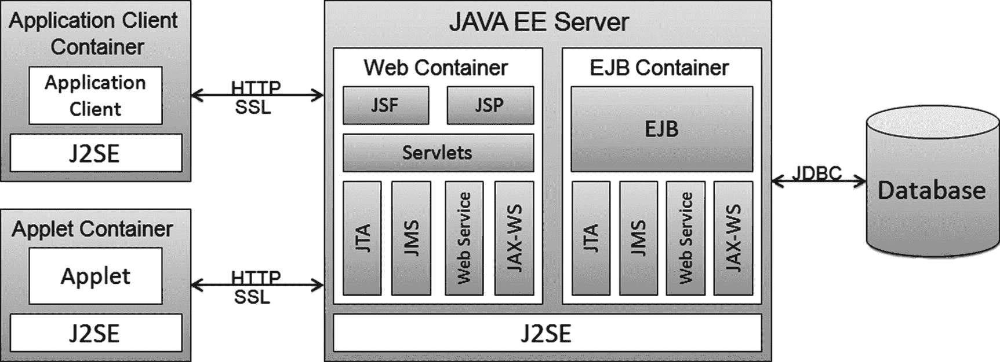
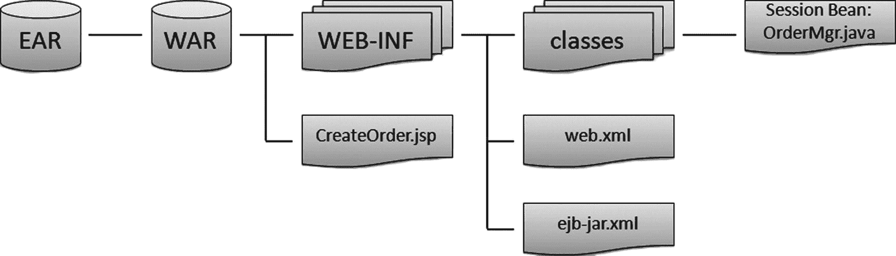

# 11. EJB 打包与部署

到目前为止，我们一直专注于如何构建 EJB、Java 持久化 API（JPA）实体及其客户端，以利用 EJB 容器提供的周边企业服务。用 Java EE 的术语来说，这些任务属于应用程序组件提供者（通常简称为提供者）的职责。在本章中，我们将探讨围绕以下过程的相关主题：将组件打包成模块和库组件，将 Java EE 组件中声明的外部引用绑定到服务器环境中的实际资源，并将所有这些内容发送到应用服务器，以便应用程序能够在运行时执行这些组件。这些职责由 Java EE 角色中的应用程序组装者（组装者）和应用程序部署者（部署者）负责处理。虽然在实践中，通常由一个人执行其中一个或多个角色，或者由多人共同执行任何一个角色，但为了解释这些主题，我们将把部署任务划分为与这些指定角色相对应的阶段。

我们将重点介绍 EJB 和 JPA 实体组件，同时也会涉及其他 Java EE 模块类型的部署：Web 应用程序模块、应用程序客户端和资源适配器。我们还将探讨 Java EE 服务器与其支持的四个 Java EE 容器之间的关系，并探索 Java EE 服务器提供的一些服务。

在简要概述部署任务（其中我们将介绍许多部署术语）之后，我们将介绍支持部署的 Java EE 基础设施组件——Java EE 服务器和容器。我们将探讨不同类型的 Java EE 模块及其如何组合在一起，以及如何指定定义每个模块的部署描述符（元数据文件）。接下来将介绍库组件部分，解释如何在 Java EE 模块和库组件之间声明类路径依赖关系。然后，我们将更详细地检查组装者和部署者的角色，最后以 EJB 模块和 JPA 持久化单元特有的部署要求作为本章的结尾。

在当前的 Java 世界中，Java 虚拟机（JVM）的使用非常重要。基本上，每个 Java 程序都需要在我们的机器上运行一个 JVM，以便所有 Java 字节码都使用该 JVM 运行。这意味着虚拟机不会随每个程序一起分发。同样的概念也适用于 Java EE。阅读完本章后，您应该了解如何执行以下操作：

*   将您的 EJB、JPA 和其他应用程序组件分组到 Java EE 模块和库组件中。
*   解决外部引用中的命名冲突和冗余问题。
*   打包一个包含一个或多个 Java EE 模块和库组件的 Java EE 应用程序。
*   声明模块和库之间的类路径依赖关系。
*   将外部引用绑定到应用服务器环境中的物理资源。


## 关于部署工具的说明

本章提供了一些如何构建应用程序归档文件的示例。它假设你可以使用通常由集成开发环境（IDE）提供的软件工具，来协助你组装和部署 Java EE 应用程序。Java 社区流程（JCP）曾努力在这一领域进行标准化（参见 JSR 88，即 Java EE 应用程序部署 API），但部署不可避免地需要特定于应用服务器的配置任务。幸运的是，应用服务器通常提供 Ant 任务来调用它们自己的部署工具，你也可以使用 Ant 来创建可部署的归档文件。Ant 的使用在许多开发环境中都很普遍，并且在需要自动化脚本将相同的 Java EE 应用程序部署到多个 Java EE 服务器实例的生产环境中几乎无处不在。本章描述的许多自定义步骤需要使用交互式编辑器，主要用于更新 Java EE 通用和特定于平台的 XML 部署描述符。对于这些任务，IDE 的价值无可估量，许多 IDE 提供特定于平台的部署支持，指导你打包、配置和部署 Java EE 应用程序。

## 打包与部署流程概述

打包是将各种 Java EE 模块组装（或分组）成 Java EE JAR、WAR 或 EAR 文件的过程。一旦打包成 Java 归档（JAR）文件、Web 归档（WAR）文件或企业归档（EAR）文件，Java EE 应用程序就可以交付给应用服务器了。部署是将 Java EE 组件安装到应用服务器中的过程，以便在运行应用程序时可以找到并执行它们。此过程涉及多个必须大致按顺序执行的任务。这些任务将在以下各节中总结，并在本章后面部分针对 EJB 和 JPA 部署进行更详细的描述和应用。某些步骤仅在特殊情况下才需要执行，因此实际部署可能只涉及这些任务的一个子集。

主要的打包分发目标是确保：

*   程序所需的所有库不会被分发。相反，要确保它们在整个系统中只被“下载”一次。
*   程序所需的许多库不会多次加载到内存中。相反，我们需要将共享代码加载一次，供其他程序使用。

### 提供者

一般来说，提供者（对于一个给定的项目可能有多个）作为部署的前置步骤，生成 Java EE 应用程序组件。与提供者相关的任务，以及此角色交付的文件，如图 11-1 所示。



图 11-1

应用程序组件提供者的任务和交付物

提供者的交付物是应用程序组件以及可能的模块描述符，它们可以作为磁盘上的文件提供，也可以打包到 Java 归档（JAR）文件中。

### 组装者

组装者接收提供者的输出，并据此执行任务，生成如图 11-2 所示的交付物。



图 11-2

应用程序组装者的部署任务和交付物

#### 按容器类型分组组件以生成 Java EE 模块

提供者的输出是一组 Java EE 组件，例如 EJB、JPA 实体、JSF（JavaServer Faces）页面、应用程序客户端类，以及其他可能的组件。提供者也可能生成非 Java EE 组件，比如普通的 Java 类。组装者将 Java EE 组件分组，使得每个组只包含一种 Java EE 组件类型的组件。每当提供者定义了模块级部署描述符（XML）文件时，组装者可以遵循该文件中的任何指令来组成这些组，或者组装者可以选择合并或拆分描述符，以增加或减少每个组中的 Java EE 组件数量。在此过程结束时，每个生成的组将成为一个 Java EE 模块。剩余的非 Java EE 类和资源可以打包到 Java EE 模块中，或者隔离到它们自己的组中，成为可共享的库组件。

#### 定义模块级部署描述符（可选）

对于形成的每个 Java EE 模块，组装者可以定位并分配一个部署描述符来表示该模块。从 Java EE 5 开始，此步骤是可选的，因为现在可以通过分析文件内容来识别模块类型。例如，你（作为提供者或组装者）可以自由定义 `ejb-jar.xml` 部署描述符；但是，除非你要覆盖 Java 注解中捕获的信息，或者你选择不使用注解，否则不再需要它。在 Java EE 5 中，EJB 模块仅通过文件组中存在一个带有 `@Stateless`、`@Stateful` 或 `@MessageDriven` 注解的类来定义。

#### 将组件（以及可选的描述符）打包成 JAR 文件

在此阶段，第一阶段识别出的组件组将与其模块级部署描述符（如果已定义）一起，使用 JAR 格式打包成文件。EJB 模块归档到扩展名为 `.jar` 的 EJB JAR 文件中，Web 应用程序模块归档到扩展名为 `.war` 的 Web 归档（WAR）文件中，应用程序客户端归档到扩展名为 `.jar` 的 JAR 文件中，依此类推。JPA 持久化单元可以归档到它们自己的 JAR 文件（扩展名为 `.jar`）中，或者直接归档到 EJB JAR 或 WAR 文件中。我们将在本章后面的“组装持久化单元”一节中详细介绍这一点。

此外，非 Java EE 组件，例如普通的 Java 类，可以添加到这些 Java EE 模块归档文件中；或者组装者可以将它们归档到自己的 JAR 文件中，作为库组件进行部署。


#### 创建企业归档 (EAR) 文件（可选）

如果您（作为装配者）创建了多个归档文件，并希望将它们作为一个逻辑组一起部署，则需要将这些归档文件打包到一个称为 EAR 文件的包装 JAR 文件中，该文件使用后缀 `.ear`。此 EAR 文件被称为 Java EE 应用程序。如果您只创建了单个 EJB JAR 或 WAR 归档文件，则无需进一步打包。您可以跳过创建包装 EAR 文件的步骤，并将 EJB JAR 或 WAR 文件作为独立模块进行部署。

一个应用程序充当着打包边界，确保所有模块中的 Java EE 组件能够在单个命名上下文中相互通信。一个 Java EE 应用程序不一定对应于一个实际的最终用户应用程序，因为它可能被许多不同的客户端应用程序使用，但它允许客户端应用程序一次性连接到该 Java EE 应用程序，并从单个上下文访问该应用程序中的 Java EE 组件。

一个 EAR 文件可能在其 `META-INF` 目录中包含一个应用程序级部署描述符 `application.xml`。该文件在 Java EE 5 中是可选的，因为现在可以依赖默认规则为每个模块提供默认名称和属性。默认情况下，每个模块名称默认为其归档文件的短名称，减去文件后缀（`.jar`、`.war` 等）。定义 `application.xml` 描述符允许您优化默认名称和属性，并有选择地选择 EAR 文件中哪些模块包含在特定部署的应用程序中。图 11-3 展示了 EAR 文件结构。

注意

WAR 文件和 EAR 文件是分别带有 `.war` 或 `.ear` 扩展名的标准 JAR 文件。



图 11-3

EAR 文件结构

#### 装配者特定任务

根据每个模块部署描述符的完整性和复杂性，装配者可能需要完成或完善提供者声明的一些外部引用。在许多情况下，模块是足够自包含和完整的，因此即使提供者没有提供部署描述符，装配者也不需要执行进一步的工作。在更复杂的部署场景中，当使用提供者提供的文档（可能通过注解或部署描述符中的描述属性传达）时，装配者可能需要将语义等价但名称不同的资源整合到一个最小的、不同的集合中。相反，装配者可能需要通过重命名共享相同名称但具有不同语义的资源引用来避免资源名称冲突。

例如，如果装配者正在将两个由不同提供者生成的 Java EE 模块打包到一个 Java EE 应用程序中，两个提供者可能引用同一个逻辑 EJB 但使用了不同的名称，或者他们可能使用尚未绑定的名称来引用它们。装配者有责任使用提供者提供的文档来检测此类情况，并更新 EJB 引用以绑定到单个名称。此名称可由装配者选择，并在该应用程序上下文中分配给该 EJB。

装配者所做的任何更改仅应用于模块和应用程序部署描述符文件，而不应用于 Java 源代码。此过程之所以有效，是因为 Java EE 规定的优先级规则：在 Java 注解源代码和 XML 部署描述符中都定义了冲突的元数据属性的情况下，部署描述符将优先。装配者只需处理部署描述符文件，就能解决 Java 源代码中的不一致性。

### 部署者

部署者的任务和交付物如图 11-4 所示。



图 11-4

应用程序部署者的任务和交付物

#### 部署者特定任务

同样，使用来自装配者（和提供者）的指令——通常通过部署描述符或源代码注解中的描述属性传达——部署者需要将所有外部引用绑定到目标应用服务器环境中的具体资源（EJB 引用、资源引用、持久化单元引用等）。只有部署者才能假定了解目标服务器环境，并且 Java EE 特意为所有资源使用添加了一层间接性，以允许这种绑定在不影响提供者或装配者工作的情况下发生。这就是为什么 Java EE 组件使用的所有资源都通过间接引用进行引用。

与装配者的情况一样，Java EE 策略规定部署者只能对 XML 部署描述符文件进行更改，而不能更改 Java 源代码中的注解。

#### 调用应用服务器特定的部署工具

最后，您的 Java EE 模块或 Java EE 应用程序已准备好提交给应用服务器。您的应用服务器将提供一个部署工具，让您完成部署并在应用服务器中安装 Java EE 组件，准备由最终用户应用程序执行。在此阶段，部署工具将验证提交的模块的内部完整性，并确保所有资源都可以绑定到驻留在应用服务器环境中的实际对象。如果在部署时找不到任何必需的资源，或者找不到引用的库组件，则部署将失败。

注意

应用服务器将在每个环境中运行一次，这意味着只启动一个运行时。

#### 概述总结

Java EE 部署允许您部署单个模块、库组件或完整的应用程序。在许多情况下，部署可能仅仅涉及将编译后的源代码与描述符（持久化单元必须要有 `persistence.xml` 文件，但对于 EJB JAR、WAR 和 EAR 模块，`ejb-jar.xml`、`web.xml` 和 `application.xml` 文件是可选的）打包在一起，并提交给部署工具。当从可能由不同组件提供者构建且可能版本不同的多个模块组装应用程序时，装配者的角色变得更加重要。

## Java EE 部署基础设施

现在我们已经总结了部署过程，让我们探讨一下 Java EE 基础设施中一些对部署至关重要的领域。当您需要自行决定如何将代码打包到模块中以及如何解析和绑定外部引用时，理解这个主题会很有帮助。

### Java EE 服务器

Java EE 服务器是在您的应用服务器内部运行的程序，它在您的 Java EE 组件执行时为其提供企业服务。Java EE 服务器还负责处理部署请求，并将其重定向到其托管的 Java EE 容器。

Java EE 规范定义了 Java EE 服务器必须支持的核心服务列表。这些服务包括消息传递、数据库、安全性、事务、持久化以及许多其他服务。Java EE 服务器也可以扩展以提供超出规范要求的额外服务，或现有服务的替代实现。Java EE 规范定义了如何扩展服务器，以通过 Java EE 连接器 API 使用资源适配器将其适配到 Java EE 环境中，从而为其容器提供对远程和外部服务的访问。


### Java EE 容器

Java EE 服务器的主要目的是支持 Java EE 容器，这些容器提供了运行 Java EE 组件的各种环境。

容器是组件与支持该组件的底层平台特定功能之间的接口。

在我们可以执行它之前，必须将以下内容组装到 Java EE 模块中并部署到其容器中：一个 Web、企业 Bean 或应用程序客户端组件，这意味着我们需要为 Java EE 应用程序中的每个组件以及 Java EE 应用程序本身指定容器设置。

我们必须使用 Java EE 容器设置来自定义 Java EE 服务器提供的底层支持，包括以下服务：

*   Java EE 安全模型；
*   Java EE 事务模型；
*   JNDI 查找服务；
*   Java EE 远程连接模型。

Java EE 8 规范规定支持图 11-5 中所示的以下 Java EE 容器，具体如下：



图 11-5

一个 Java EE 8 容器

*   Java EE 服务器：Java EE 产品的运行时部分。
*   EJB 容器：管理 Java EE 应用程序的企业 Bean 的执行。
*   Web 容器：管理 Java EE 应用程序的网页、Servlet 和某些 EJB 组件的执行。
*   应用程序客户端容器：管理应用程序客户端组件的执行。
*   Applet 容器：管理 Applet 的执行，由 Web 浏览器和客户端上运行的 Java 插件共同组成。

虽然 EJB 和 Web 容器在中间层运行的应用程序服务器中执行，但应用程序客户端容器通常在客户端层的 Java SE 环境中执行，而 Applet 容器通常在 Web 浏览器内运行。尽管如此，它们都依赖其底层的 Java EE 服务器来获取它们通过 API 提供给在其容器环境中执行的组件的众多企业服务。例如，Java EE 服务器向 Java EE 容器提供原生消息服务，而容器通过 JMS（Java 消息服务）API 向其组件公开消息服务。类似地，容器通过 Java 数据库连接（JDBC）公开数据库服务，通过 Java 事务 API（JTA）公开事务服务，等等。Java EE 容器还会干预在 Java EE 容器中执行的 Java EE 应用程序组件之间的所有通信，以提供组件和资源注入。如图 11-6 所示。



图 11-6

一个 Java EE 服务器

除了 Java EE 容器向 Java EE 组件提供的许多内置服务外，Java EE 还允许通过资源适配器和连接器 API 集成第三方服务，这些服务通过 Java EE 服务提供者接口（SPI）经由其容器暴露给 Java EE 组件。

## Java EE 部署组件

Java EE 部署的主要构建块组件是 Java EE 应用程序和 Java EE 模块。让我们看看这些组件的定义。

### Java EE 应用程序

Java EE 允许您将单个 Java EE 模块和整个 Java EE 应用程序部署到服务器。如前文“打包和部署过程概述”部分所述，在部署应用程序时，您将各个 Java EE 模块以及任何相关的部署描述符和依赖的库组件打包到一个称为 EAR 文件的归档 JAR 文件中，该文件的后缀为 `.ear`。部署单个 Java EE 模块本质上是一种快捷方式，以避免将一个 JAR 文件包裹在另一个单个 JAR 文件周围。

除了其打包结构之外，Java EE 应用程序在运行时作为一个上下文运行，其中一个或多个相关的 Java EE 组件（例如 EJB、Servlet 和应用程序客户端）可以使用共享的类加载器和命名空间进行操作并相互通信。将 Java EE 应用程序视为一组松散耦合的 Java EE 模块可能会很有用，这些模块能够相互看见并共享资源。

### Java EE 模块类型

Java EE 定义了以下 Java EE 模块类型：EJB、Web 应用程序、应用程序客户端和资源适配器。前三种对应于其同名的容器，它们的部署委托给这些容器。部署资源适配器模块会在 Java EE 服务器中安装资源，并注册这些资源以供 Java EE 组件使用。Java EE 模块引用的普通 Java 类和其他资源也可以作为库组件包含在 EAR 文件中，既可以打包为 JAR 文件，也可以存储为目录，并与您的 Java EE 应用程序一起部署。

请注意，包含一组 JPA 实体的 JPA 持久化单元不是 Java EE 模块，而是一个库组件。我们将在后面的“持久化单元”部分描述其中的一些原因。

让我们更详细地了解每种 Java EE 模块类型。


#### EJB 模块

EJB 模块由一个或多个会话 Bean 和/或消息驱动 Bean (MDB) 组成。它被打包成一个 EJB JAR 文件，如果其中包含 `ejb-jar.xml` 部署描述符（从 Java EE 5 开始为可选），则该描述符必须位于 JAR 文件的 `META-INF` 目录中。特定于平台的描述符也可以添加到此 `META-INF` 目录中。如果 EJB JAR 文件不包含 `ejb-jar.xml` 文件，则 EJB Bean 类必须使用 `@Stateless`、`@Stateful`、`@Singleton` 或 `@MessageDriven` 注解来标识自身为 EJB。

在许多情况下，最好将客户端对 EJB 模块的视图隔离到其自己的归档文件中。当客户端仅与会话 Bean 的接口通信时，它不需要访问会话 Bean 类。在这种情况下，最佳实践是仅将会话 Bean 的接口以及任何其他依赖类打包到一个单独的 EJB 客户端 JAR 库中。此 JAR 文件可以提供给客户端，但也可以从 EJB JAR 文件中引用，这样这些接口就不需要在 EJB JAR 文件内部重复。为了引用 EJB 客户端 JAR 文件，或 EAR 文件中的任何其他 JAR 文件或目录，装配器会在 JAR 文件的 `META-INF/MANIFEST.MF` 文件中添加一个指向这些位置的 `Class-Path` 条目：

```
Class-Path: MyEjb-Client.jar
```

注意

有关 `MANIFEST.MF` 文件的更多信息，包括本章中提到的 `Class-Path` 和 `Extension-List` 条目的用法，请参阅：[`http://docs.oracle.com/javase/6/docs/technotes/guides/jar/jar.html`](http://docs.oracle.com/javase/6/docs/technotes/guides/jar/jar.html)。

可以通过用空格字符分隔 `.jar` 和目录条目来以这种方式引用多个 JAR 文件或目录。被引用的 JAR 文件的路径是相对于 EJB JAR 文件本身的，该文件必须位于 EAR 文件的根目录中。在前面的示例中，`MyEjb-Client.jar` 文件也位于 EAR 文件的根目录中。

EJB 模块还可以包含一个持久化单元，这将在下一节中描述。持久化单元只能以展开形式存在于 EJB JAR 中；JAR 文件不能嵌套在 EJB JAR 文件内部。持久化单元通过 EJB JAR 文件内容中存在 `META-INF/persistence.xml` 文件来定义。

可以使用 `META-INF/application.xml` 文件中的模块声明为 EJB 模块分配名称。当部署期间不存在 `META-INF/application.xml` 文件时（例如，当 EJB JAR 文件独立部署或位于不包含此描述符的 EAR 文件中时），将为其分配一个默认名称。此名称源自 EJB JAR 归档文件的名称，减去任何目录信息或 `.jar` 后缀。例如，EJB JAR 文件可能打包在 EAR 文件中的以下位置：

```
./OrderManagerEJBModule.jar
```

在这种情况下，其默认模块名称将是 `OrderManagerEJBModule`。

#### WAR 文件中的 EJB

EJB 3.0 规范通过使 `ejb-jar.xml` 等 XML 描述符的打包变为可选，简化了 EJB 的打包。EJB 3.1 规范进一步简化了这一过程，允许将 EJB（使用 `@Stateless`、`@Stateful`、`@Singleton` 或 `@MessageDriven` 注解的 POJO）直接打包到 WAR 文件的 `WEB-INF/classes` 目录中。类似地，`ejb-jar.xml` 描述符（如果存在）可以与 `web.xml` 一起直接打包到 `WEB-INF` 目录中。通过此更改，用户不再需要创建单独的 EJB JAR 模块来打包 EJB。图 11-7 描述了这种新的打包选项。



图 11-7

将 EJB 直接打包在 WAR 文件的 WEB-INF\classes 目录下

#### 持久化单元

一组 JPA 实体（称为持久化单元）既不是严格的模块类型，也没有其专用的容器。相反，Java EE 服务器直接将持久化作为其向 Java EE 容器提供的核心服务之一来支持。这允许 JPA 实体在其它 Java EE 容器环境中执行时，表现为持久化对象并与 Java EE 组件交互。由于不受限于其自身的容器，JPA 实体也可以在 Java EE 环境之外自由执行并展示持久化行为。

注意

在部署上下文中，术语“持久化单元”指的是一组共置的 JPA 实体和一个对应的（且必需的）`META-INF/persistence.xml` 文件。这组文件可以打包到其自己的 JAR 文件中，或者这些文件可以直接捆绑在 EJB JAR 或 WAR 文件内部。反过来，`persistence.xml` 文件定义了一个或多个 `<persistence-unit>` 条目，这些条目可以进一步划分持久化单元打包结构中的实体。在本章中，我们通过始终在描述 `<persistence-unit>` XML 元素时使用连字符（persistence-unit）来区分这两个名称相似的概念。因此，任何对“持久化单元”的引用都可以假定是指与 `persistence.xml` 文件共置的一组实体。

如前所述，持久化单元的打包不同于其他模块类型的打包。当打包在 Java EE 应用程序 EAR 文件中时，持久化单元被视为一个库组件（请参阅下面的“库组件”部分）。它可以打包到一个 JAR 文件中，或者其类可以直接打包在 EJB JAR 或 WAR 文件内部。无论哪种方式，`META-INF/persistence.xml` 文件都用于标识持久化单元中包含的实体。我们将在本章后面的“组装持久化单元”部分讨论打包细节。

#### Web 应用程序模块

Web 应用程序模块由 Servlet、HTML 页面、JSF、JSP 文档以及任何其他基于 Web 的文件组成。其部署描述符是 `WEB-INF/web.xml` 文件，与 EJB 模块一样，从 Java EE 5 开始，此文件的存在现在是可选的，因为其内容可以使用默认规则推导出来。归档时，Web 应用程序模块的内容被打包成一个后缀为 `.war` 的 JAR 文件。这通常被称为 WAR 文件。

WAR 文件的内容遵循一种特殊结构，以更好地适应 Web 浏览器中的应用程序分区。在将持久化单元捆绑到 WAR 文件中时，特别需要注意的是，Java `.class` 文件放置在 `WEB-INF/classes` 目录中，而依赖的 JAR 文件可以直接添加到 `WEB-INF/lib` 目录中。

与 EJB 模块类似，可以使用 `META-INF/application.xml` 文件中的模块声明为 Web 模块分配名称。当部署期间不存在 `META-INF/application.xml` 文件时（例如，当 WAR 文件独立部署或位于不包含此描述符的 EAR 文件中时），将为其分配一个默认名称。此名称源自 WAR 归档文件的名称，减去任何目录信息或 `.war` 后缀。例如，WAR 文件可能打包在 EAR 文件中的以下位置：

```
./OrderManagerWebApp.war
```

在这种情况下，其默认模块名称将是 `OrderManagerWebApp`。

#### 资源适配器模块

资源适配器提供了一种扩展 Java EE 服务器的机制。它们允许将由外部系统管理的资源和服务集成到 Java EE 服务器中，供在 Java EE 容器中执行的组件使用。资源适配器模块包含一组资源适配器和一个可选的 `META-INF/ra.xml` 部署描述符。

在部署期间，资源适配器被打包成一个资源归档 (RAR) 文件，这是一个后缀为 `.rar` 的 JAR 文件。


#### 应用客户端模块

应用客户端模块包含可在客户端层的 Java SE 环境中执行的 Java 类。应用客户端容器是一个轻量级的 Java EE 容器，支持注入并提供持久化、安全性和消息传递等服务。它不提供中间层 Java EE 容器中可用的许多服务。

应用客户端模块的部署描述符位于 `META-INF/application-client.xml` 中，与其他 Java EE 模块部署描述符一样，从 Java EE 5 开始它是可选的。

#### 安全模块

此模块将帮助并允许开发者配置 Web 组件或企业 Bean，以便只有授权用户才能访问系统资源。

如前所述，企业层和 Web 层应用程序由组件组成，这些组件随后被部署到各种容器中。这些组件通常组合在一起以构建多层企业应用程序。具体来说，组件的安全性由其容器提供，每个容器提供两种类型的安全性：声明式安全性和编程式安全性。

*   声明式安全性通过使用部署描述符或注解来定义特定应用程序组件的安全需求。
*   编程式安全性则嵌入在应用程序中，用于做出安全决策。

### 库组件

模块在运行时所需的共享类或其他资源可以打包到库组件中。库可以安装在应用服务器中（此处不描述安装库的过程），也可以捆绑在您的 EAR 或 WAR 文件中。嵌入在 EAR 中的任何 JAR 格式文件，无论是 Java EE 模块还是捆绑的库归档文件，都可以使用 `META-INF/MANIFEST.MF` 文件中的 `Class-Path` 属性引用捆绑的库组件。

注意

每当通过 `Class-Path` 条目引用 JAR 文件时，部署工具仅识别被引用 JAR 文件中的类。被引用 JAR 文件中的任何描述符文件都将被忽略。

#### 捆绑库

清单 11-1 显示了一个示例 EAR 文件的文件内容，以演示 `Class-Path` 属性如何引用捆绑库。这里我们使用简写符号来显示位于其关联 JAR 和 WAR 文件的 `META-INF/MANIFEST.MF` 文件中的 `Class-Path: myEjb-Client.jar` 条目。

```
myApp.ear:
META-INF/application.xml
myEjb.jar Class-Path: myEjb-Client.jar
myWebApp.war Class-Path: myEjb-Client.jar
myEjb-Client.jar
清单 11-1
示例 EAR 文件内容，显示模块对捆绑库组件的显式依赖关系
```

在此示例中，客户端接口（远程、本地和 Web 服务端点接口）已特意从 `myEjb.jar` EJB 模块中剥离，并打包到捆绑的 `myEjb-Client.jar` 库组件中。`myEjb.jar` 中的 `META-INF/ejb-jar.xml` 描述符包含以下条目：

```
myEjb-Client.jar
```

这标识了 `myEjb-Client.jar` 是包含其客户端接口的 JAR 文件。`myEjb.jar` EJB 模块依赖于这些 EJB 接口，并通过其引用 `myEjb-Client.jar` 库的 `Class-Path` 条目声明其依赖关系。`myWebApp.war` Web 模块引用这些 EJB 接口，并以相同方式声明其对 `myEjb-Client.jar` 的依赖关系。`myEjb-Client.jar` 库是一个普通的 JAR 文件，它与 EJB 和 WAR 文件一起位于 EAR 文件中。

显式声明对捆绑库组件依赖关系的另一种方法是使用 EAR 文件的内置库目录 `lib`，如清单 11-2 所示。`lib` 目录中的所有 JAR 文件都会自动添加到 EAR 文件中 Java EE 模块的类路径中。

```
myApp.ear:
META-INF/application.xml
myEjb.jar
myWebApp.war
lib/myEjb-Client.jar
清单 11-2
示例 EAR 文件内容，显示模块对共享捆绑库组件的隐式依赖关系
```

这实现了与清单 11-1 相同的结果。假设 `application.xml` 没有指定覆盖默认 `lib` 目录的 `<library-directory>` 元素，Java EE 服务器将自动将 `myEjb-Client.jar` 文件添加到 `myEjb.jar` 和 `myWebApp.war` 模块的类路径中。

库也可以捆绑在 WAR 文件的 JAR 文件的 `WEB-INF/lib` 目录中，以及 WAR 文件的未打包类的 `WEB-INF/classes` 目录中。

#### 已安装库

还可以在应用服务器环境中安装库，然后使用 JAR 文件的 `META-INF/MANIFEST.MF` 文件中的 `Extension-List` 属性从 EAR 文件中的 JAR 格式文件引用它们。这是在 Java EE 应用程序之间共享库的有效方式，因为它避免了在多个 EAR 文件中冗余捆绑库。已安装的库由应用服务器实例存储在磁盘上，并且通常应用服务器配置文件中的共享库条目将已安装库的名称与其 JAR 文件关联起来。然后，Java EE 应用程序可以按名称引用此已安装库，而无需了解该库的 JAR 文件内容。

使用已安装库的示例如清单 11-3 所示。

```
myApp.ear:
META-INF/MANIFEST.MF:
Extension-List: commonUtils
commonUtils-Extension-Name: com/apress/ejb/ch11/commonUtils
commonUtils-Extension-Specification-Version: 1.4
META-INF/application.xml
myEjb.jar
清单 11-3
示例 EAR 文件内容，显示已安装库的使用
```

在此示例中，EAR 文件的 `META-INF/MANIFEST.MF` 文件用于声明对名为 `commonUtils`（版本 1.4）的已安装库的引用。这使得 EAR 文件内的所有 JAR 文件都能访问 `commonUtils` 库的内容，从而满足 `myEjb.jar` 模块对该库内容的依赖关系。该引用本可以在 `myEjb.jar` 上定义，在这种情况下，只有 `myEjb.jar` 会被授予访问此库的权限。无论哪种方式，已安装库都必须在部署 `myEjb.jar` 之前安装好。

我们的 `commonUtils` 库中包含的 JAR 文件的 `META-INF/MANIFEST.MF` 文件如清单 11-4 所示。

```
commonUtils.jar:
META-INF/MANIFEST.MF:
Extension-Name: com/apress/ejb/ch11/commonUtils
Specification-Title: Utils for implementing common patterns
Specification-Version: 1.4
清单 11-4
已安装库的 JAR 文件内容
```


#### 库的版本管理

尽管 Java EE 规范并未强制要求，但许多应用服务器支持 Java EE 应用程序隔离级别，允许每个 Java EE 应用程序拥有自己的类加载器。这使得同一台 Java EE 服务器上同时运行的多个应用程序可以引用同一捆绑或安装库组件的不同版本。一个实用的场景是，当你希望将部分应用程序迁移到新库版本时，可以在服务器中安装新库版本，然后有选择地更新希望使用新库版本的应用程序的 `Specification-Version` 属性。

或者，支持此隔离级别的 Java EE 服务器允许你部署一个捆绑了自身依赖库版本的 Java EE 应用程序。Java EE 规范中的优先级规则规定，当捆绑库与具有相同 `Extension-Name` 的已安装库发生冲突时，将优先使用捆绑库。这保证了应用程序始终使用其捆绑的库，无论服务器已安装库基础中存在该库的哪些版本。

## 应用服务器与平台无关性

Java EE 一直高度重视可移植性，尽管在实践中这往往难以实现。理想情况下，所有 Java EE 服务器都尽可能完整地实现规范，然后在性能和特性上体现差异化，例如支持可配置的隔离级别以及规范推荐（或暗示但非强制）的高级对象/关系（O/R）映射选项。

应用服务器需要定义自己的平台特定描述符，用于增强 Java EE 规范的核心需求，事实上几乎所有应用服务器实现都提供了此类描述符。随着时间的推移（在 JPA 映射元数据领域尤为明显），规范中缺失的功能由供应商实现解决后，会被纳入规范并变得通用。例如，EJB 2.1 没有提供关于如何为实体 Bean 定义 O/R 映射的支持或规定，也没有说明如何实现实体继承层次结构。从 EJB 3 开始，JPA 吸收了来自 TopLink、Hibernate 和 Java 数据对象（JDO）的许多最佳理念，并将它们直接整合到 `orm.xml` 文件中，以提供这些功能及其他特性。

### 部署工具

应用服务器供应商几乎都统一采用了 JSR 88，该规范指定使用称为 MBean 的受管 JavaBean 来管理部署过程。MBean 是自描述的，并遵循 Java 管理扩展（JMX）规范定义的设计模式，为 Java EE 服务器和应用服务器的部署工具之间提供接口。Java EE 部署 MBean 暴露的实际接口因应用服务器而异；但所有部署工具现在都在不同程度上使用它们，这一事实为不同供应商的部署工具提供了一定的一致性。

通常，供应商的部署工具不仅会引导装配员完成打包 Java EE 模块、库和应用程序归档的过程，还会指导其指定一些元数据，用于填充 Java EE 通用和平台特定的部署描述符。这些工具还会接受 EJB、WAR 或 EAR 文件，并实际在服务器本身中执行安装和验证部署任务。

注意

Cargo 是一个轻量级封装，允许你以标准方式操作 Java EE 容器。Cargo 旨在通过 Ant 任务、Maven 和 IDE 插件等媒介，为许多流行的 Java EE 容器提供抽象 API。有关 Cargo 的更多信息，请参见 [`http://cargo.codehaus.org`](http://cargo.codehaus.org)。

### 部署计划

某些供应商的应用服务器工具会将部署者的选择记录在一个称为部署计划的文档中。由于部署通常是一个迭代过程，尤其是在开发和测试阶段，捕获部署者的选择可以方便其不必重复指定相同的信息。

目前，JSR 88 或其他规范中并未规定部署计划的标准格式，因此它不是一个可以在不同应用服务器实现之间复用的文档。如果你觉得这很不方便，可以参与 JCP 并组建或加入一个 JSR，以推动该领域的标准化。

## 部署角色

任何全面的企业服务平台本质上都是复杂的。认识到这一现实，Java EE 架构师将 Java EE 服务划分为定义明确的 API。同样，他们将与开发和配置 Java EE 应用程序各个阶段相关的任务划分为定义明确的角色。我们提到，与构建各种应用程序组件（如 EJB、实体、Servlet、JSF JSP 等）相关的任务属于 Java EE 的应用程序组件提供者角色。还有其他角色，例如系统组件提供者，负责在应用服务器中安装应用程序组件所需的资源。其中包括数据库资源、授权策略、安全角色以及许多其他资源，包括通过资源适配器引入的服务。

我们之前介绍了应用程序装配员和应用程序部署者的角色。但在本节中，我们将更深入地探讨这些角色。

### 应用程序装配员

以下是作为应用程序装配员需要了解的内容。

#### 定义和描述外部依赖

提供者通过注解、部署描述符或两者，标识其组件的外部需求。这些依赖可能涉及其他 EJB、持久化单元、环境属性值、数据库连接或该应用程序组件外部的任何其他对象。装配员有责任进一步描述这些外部依赖，以便部署者能够弄清楚如何将它们映射到特定应用服务器环境中的具体资源。外部依赖通过注解或部署描述符中的 `<ejb-ref>`、`<ejb-local-ref>`、`<resource-ref>`、`<resource-env-ref>`、`<security-role-ref>` 和 `<message-destination-ref>` 条目来定义。装配员的工作是分析这些外部引用并进行修补。此过程包括以下步骤。


#### 打包

装配器执行打包阶段，将应用程序组件打包到特定于容器的 JAR 文件和组件库中。此打包过程已在前面“打包和部署流程概述”部分中概述。您可以使用 Ant 或 ZIP 工具来执行这些步骤，将 Java EE 组件分组到模块中，并将它们打包到 JAR 文件中。然而，这是一个受益于使用可视化打包工具的领域，该工具通常可通过 IDE 获得。装配器将 EJB 和应用程序客户端模块打包到 JAR 文件中，将 Web 应用程序模块打包到 WAR 文件中，并将资源适配器打包到 RAR 文件中。

在组装一个没有捆绑库的独立 Java EE 模块时，无需进一步打包。该模块的 JAR 文件即可直接部署。

如果涉及多个模块，或者也需要捆绑库，则装配器会创建一个 EAR 文件，并将模块和库添加到该归档文件中。装配器可以使用内部目录结构添加模块，前提是 `lib` 目录或 `application.xml` 文件中由 `<library-directory>` 指定的目录被视作隐式共享库的位置。

EAR 文件 `META-INF` 目录中可选的 `application.xml` 文件可用于显式标识应用程序中包含的模块。这是告诉部署工具忽略那些本不属于应用程序，但由于某种原因被包含在应用程序中的模块的方式。

### 应用程序部署器

装配器生成的模块或包随后被移交给部署器。部署器对目标应用程序服务器环境有深入的了解，包括有关该环境中当前部署的所有资源的信息。

由于供应商为其应用程序服务器提供的工具集各不相同，部署器的实际体验也有所不同。部署状态的逻辑过程将在以下各节中概述。

#### 解包归档文件

EAR 文件或独立模块 JAR 文件被解包，并分析其内容。

#### 派生模块描述符

部署器处理每个 Java EE 模块的描述符。如果提供了描述符，并且其 `metadata-complete` 属性设置为 `true`，则部署器可以将该模块发送到相应的容器。如果未提供描述符，或者 `metadata-complete` 未设置为 `true`，则必须扫描该模块的 Java 源代码内容以检测注解。通过扫描注解发现的所有元数据属性将与描述符中找到的属性合并。在此协调步骤中，Java EE 优先级规则规定，每当注解和描述符都为给定属性提供值时，描述符中的值优先。此协调状态的结果是该模块的完整描述符。

#### 部署到容器

每个完整的模块都可以发送到其对应的容器进行安装和注册。完成后，这些模块中的 Java EE 组件即可供客户端访问。

## 组装 EJB JAR 模块

EJB JAR 文件是一个非常直接的归档文件。`.class` 文件在 JAR 文件中按照其包对应的目录进行布局，根目录位于 JAR 的顶层目录。`ejb-jar.xml` 部署描述符（如果存在）放在 `META-INF` 目录中，通常还附带任何其他特定于平台的描述符。

任意类都可以与 EJB 类和接口一起包含在内。一种常见的做法是将共享库 JAR 与 EJB JAR 文件打包在同一个 EAR 文件中。可以使用 EJB JAR 文件的 `META-INF/MANIFEST.MF` 文件中的 `Class-Path` 属性来引用打包在外部 EAR 文件中的库，如前面“库组件”部分所述。类似地，您可以通过在 `META-INF/MANIFEST.MF` 文件的 `Extension-List` 属性中列出它们，来引用先前部署但在上下文应用程序之外的已安装库。

在指定 EJB 的元数据时，`ejb-jar.xml` 描述符和 Java 源代码注解是相互冗余的。选择使用哪种方法主要取决于提供者的偏好，尽管此决定也受到应用程序将如何编辑、组装和部署的影响。但是，顶层设置（例如 `<ejb-client-jar>`）没有对应的注解，必须通过此描述符进行分配。

注意

从 Java EE 5 开始，我们可以直接部署 EJB 和 WAR 模块，而无需将它们打包为 Java EE 应用程序。这仅适用于这些模块不依赖于其他 JAR 文件中尚未部署到目标应用程序服务器环境的类的情况。

### 命名范围

在 Java EE 应用程序中，不能有两个 EJB 具有相同的名称。装配器有责任检测这种情况并适当地重命名 EJB 以解决冲突。

## 组装持久化单元

持久化单元是一组 JPA 实体、映射超类和可嵌入类，以及一个必需的 `META-INF/persistence.xml` 文件。Java EE 提供了一组固定的方式来在部署期间捆绑持久化单元。您可以通过以下任何一种方式打包持久化单元：

*   打包到一个或多个 JAR 文件中，这些 JAR 文件又可以打包到 WAR 或 EAR 文件中
*   作为 EJB-JAR 文件中的一组类
*   在 WAR 文件的 `classes` 目录中
*   或者作为上述方式的组合

其 `META-INF/persistence.xml` 文件所在的 JAR 文件或目录称为持久化单元的根，它定义了构成持久化单元的类的根目录。持久化单元的根必须是以下之一：

*   一个 EJB-JAR 文件
*   WAR 文件的 `WEB-INF/classes` 目录
*   WAR 文件的 `WEB-INF/lib` 目录中的一个 JAR 文件
*   EAR 文件的库目录中的一个 JAR 文件
*   一个应用程序客户端 JAR 文件

您捆绑持久化单元的位置决定了哪些模块可以访问它。例如，将其添加到 EAR 文件的库目录中，可以授予应用程序中所有其他模块的访问权限。将其放置在 EJB、Web 应用程序或应用程序客户端 JAR 中，则将其范围限制在该模块内。

除了 `persistence.xml` 文件之外，还可以将一个或多个 O/R 映射文件添加到 `META-INF` 目录，以增强或覆盖托管 JPA 类中可能已指定的任何注解。JPA 指定默认文件名为 `META-INF/orm.xml`，但 `persistence.xml` 文件中定义的每个 `<persistence-unit>` 都可以使用 `<mapping-file>` 元素指定其自己的映射文件。请注意，Java EE 8 附带 JPA 版本 2.2。

### 命名范围

在 Java EE 应用程序中，两个 JPA 实体可能具有相同的名称，但前提是它们位于不同的上下文中。例如，两个 Web 应用程序模块可以在其 `WEB-INF/lib` 或 `WEB-INF/classes` 目录中捆绑单独的持久化单元。在这种情况下，持久化单元对每个 Web 应用程序模块是私有的，这些持久化单元之间的重复名称不会导致冲突。

装配器有责任检测同一命名范围内的冲突，并适当地重命名实体 `name` 属性以解决冲突。


## 摘要

本章介绍了 Java EE 部署的主题，涵盖了通用部署问题以及特定于 EJB 和 JPA 实体的部署领域。我们首先概述了部署期间执行的任务，并指出，根据所部署 Java EE 模块的复杂性，某些步骤可能并非必需。本概述部分还解释了装配员和部署员的角色，并在这两个角色的背景下说明了部署任务。

为了提供一些关于部署基础设施的背景知识（这些知识将有助于你选择如何划分应用程序和解析外部引用），我们探讨了 Java EE 服务器和四个 Java EE 容器：EJB、Web、应用程序客户端和 Applet。这引出了对相应 Java EE 模块类型以及 Java EE 应用程序定义的讨论。我们还解释了如何使用库组件来打包你的 JPA 持久化单元和非 Java EE 组件。

本章的其余部分更深入地探讨了装配员和部署员的角色，并以关于如何部署 EJB 模块和 JPA 持久化单元的更多具体细节作为结尾。

在下一章中，我们将探讨如何构建能够在多用户分布式环境中与 EJB 组件交互的客户端。

