# 12. EJB 客户端应用程序

到目前为止，在我们的旅程中，我们已经详细介绍了会话 Bean、使用 Java 持久化 API (JPA) 的实体、消息驱动 Bean (MDB)、将无状态会话 Bean 发布为 Web 服务，以及集成所有这些组件。除此之外，我们还介绍了事务和性能的具体细节。虽然我们一直在开发简单的 Servlet 作为客户端应用程序来说明组件的工作方式，但我们尚未深入讨论不同类型的 EJB 客户端应用程序以及如何开发它们。在本章中，我们将讨论客户端应用程序可能涉及的不同应用程序架构，并将构建常见的几种架构。

## 应用程序架构

Java EE 平台在组件如何跨不同层和架构进行分布方面提供了灵活性。你可以根据应用程序或配置需求选择正确的架构和编程模型。在本节中，我们将介绍你可以使用的不同架构和编程模型。

图 12-1 展示了基于 Web 的应用程序的架构布局。这种架构通常由运行在浏览器中的 Web 应用程序作为前端。如今，其他类型的客户端设备（例如智能手机、平板电脑、手机和 Telnet 设备）也被用来运行这些应用程序。运行在浏览器或移动设备中的 Web 应用程序使用诸如 JavaServer Pages (JSP)、JavaServer Faces (JSF) 或 Java Servlet 等 Web 技术来渲染用户界面。典型的用户操作，例如输入搜索条件或向购物车添加商品，将通过上述一种 Web 技术调用/调用运行在 EJB 容器中的会话 Bean。一旦会话 Bean 被调用，它们会处理请求，并发送回响应。

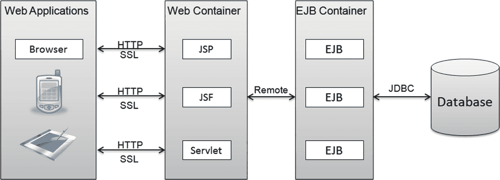

图 12-1

基于 Web 的应用程序架构

这种架构允许你利用会话 Bean 的所有优势，例如封装与实体的交互、管理事务和安全性等。缺点是，你需要一个 EJB 容器或应用服务器来部署和运行会话 Bean。在这种架构中，另一点需要注意的是，你可以将 Web 和 EJB 容器运行在两个不同的物理机器上，或者运行在同一物理机器的两个独立的 Java 虚拟机 (JVM) 上。这种方法的优缺点已在第 2 章中讨论过。

这种架构的一个轻微变体如图 12-2 所示，其中 Web 和 EJB 容器位于同一个 JVM 中。在这种架构中，Web 组件以本地模式与 EJB 组件交互。这种方法的优缺点也已在第 2 章中讨论过。

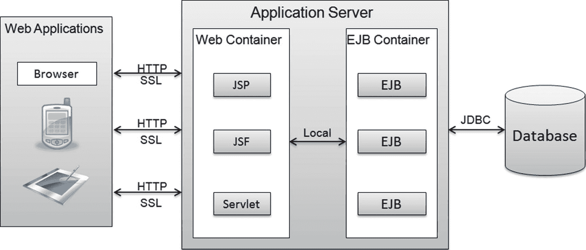

图 12-2

具有本地调用的基于 Web 的应用程序架构

JPA 规范提供了一个轻量级的持久化对象模型，使用普通的旧 Java 对象 (POJO) 和注解进行对象/关系 (O/R) 映射。这与早期 EJB 规范在持久化方面所做的截然不同。这种持久化模型的轻量级特性使得应用程序架构成为可能，允许 Web 应用程序直接与持久化对象模型或 JPA 实体交互。图 12-3 展示了这种编程模型的架构布局。在这种架构中，Web 组件将使用 `EntityManager` 与实体交互，以执行 CRUD（创建、检索、更新、删除）操作和查询来检索数据。

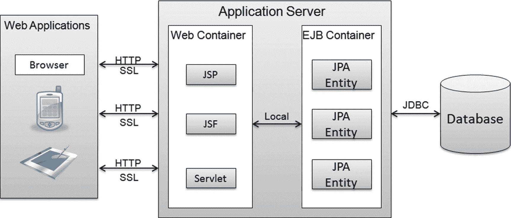

图 12-3

使用 JPA 实体的基于 Web 的应用程序架构

这种编程模型的优点在于，你可以在任何标准的轻量级 Web 容器（例如 Tomcat）上运行你的 Web 应用程序。你不需要任何 EJB 容器或应用服务器，因为你没有使用会话 Bean 或 MDB。这种架构与 JPA 规范所基于的其他 O/R 框架（例如 TopLink 和 Hibernate）一起被广泛使用。缺点是，你会失去 EJB 容器提供的一些服务（例如事务和安全性）。

在构建使用 EJB 或实体的 Web 应用程序时，上述三种架构是最常用的。这些架构的其他变体也是可能的，但我们不会深入探讨所有选项。


接下来的两种架构是编程模型，其中客户端应用程序属于桌面类型，为数据录入目的提供了丰富的用户界面功能。

图 12-4 展示了一种架构，其中运行在桌面上的客户端应用程序调用远程会话。运行在桌面上的客户端应用程序具有供最终用户（例如客户服务代表和银行柜员）使用的数据录入界面。这些客户端应用程序可以使用 Java SE 中的 Java Swing 技术开发，也可以使用从命令行运行的普通 Java 类（POJO）开发。通常，最终用户从桌面启动客户端应用程序，输入一些数据，然后通过按下屏幕上的某个 UI 组件（例如“提交”按钮）来触发事件。

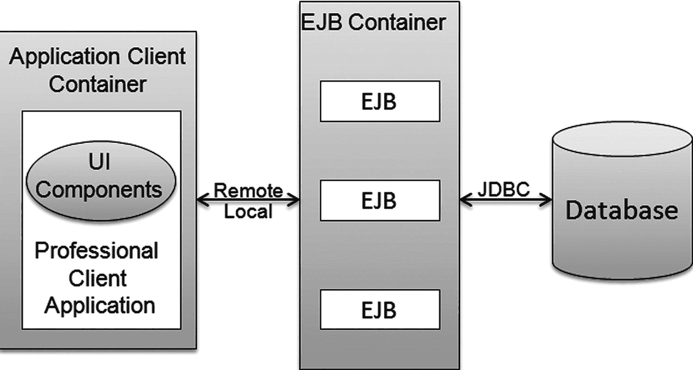

图 12-4

专业的桌面客户端应用程序架构

客户端应用程序可以安装在桌面机器上，也可以使用 Java Web Start 等技术从服务器下载。在这种架构中，客户端应用程序将始终远程调用会话 Bean，因为会话 Bean 将在远程服务器上运行。这种架构可以利用会话 Bean 的优势，就像 Web 应用程序一样。

图 12-5 展示了一种直接使用 JPA 实体而不经过会话 Bean 的架构。在这种编程模型中，客户端应用程序和打包在持久化单元中的实体被部署在一起，并组装成一个单一的应用程序单元。客户端应用程序使用 `EntityManager` 来执行 CRUD 操作和查询以检索数据。

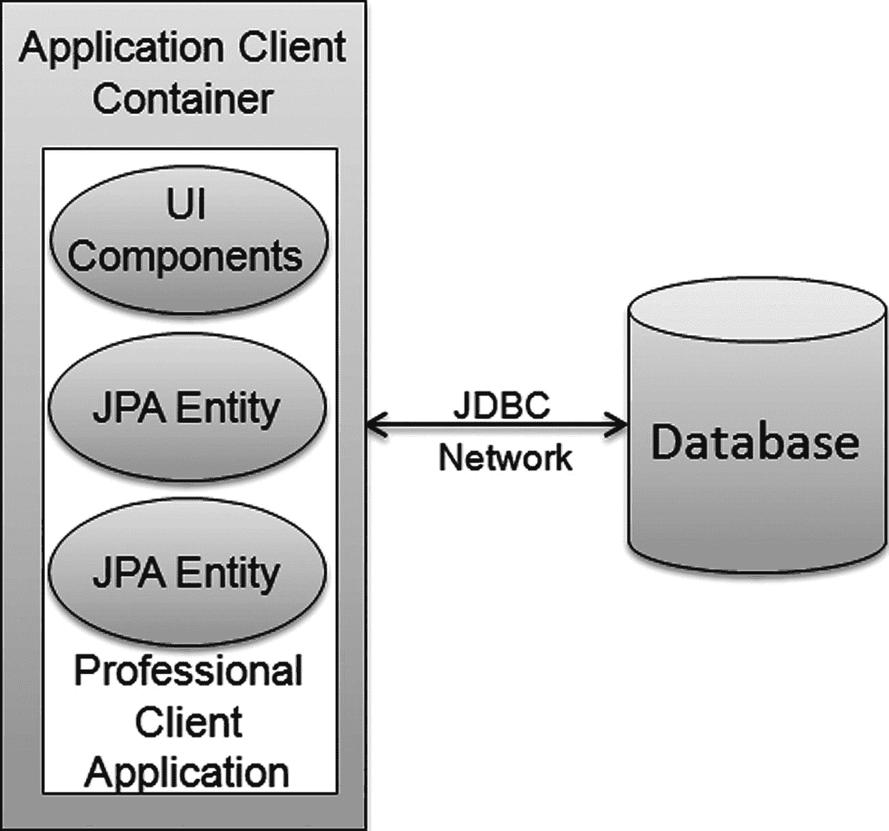

图 12-5

使用 JPA 实体的专业客户端应用程序架构

这种编程模型的优点在于，你可以在标准的 Java SE 环境中运行应用程序，而无需使用 EJB 容器，但明显的缺点是你将失去 EJB 容器提供的安全性和事务管理等服务。

如第 6 章所述，无状态会话 Bean 可以作为 Web 服务发布。一旦无状态会话 Bean 作为 Web 服务发布，任何能够组装和发送简单对象访问协议（SOAP）消息的 Web 服务客户端应用程序都可以调用已发布的 Web 服务。图 12-6 展示了这种架构。

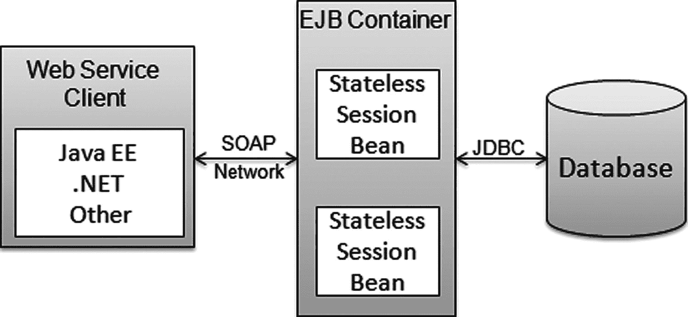

图 12-6

Web 服务客户端应用程序架构

企业通常拥有多个与异构后端系统或服务交互的业务流程。业务流程执行语言（BPEL）是一种标准标记语言，允许你将离散的 Web 服务组装成一个单一的业务流程。基于 BPEL 的业务流程使用标准的 Web 服务架构和基础设施来调用一个或多个 Web 服务。图 12-7 展示了一种架构，其中基于 BPEL 的业务流程调用了一个作为 Web 服务发布的无状态会话 Bean。例如，第 6 章演示了如何创建和发布一个检查信用卡有效性的信用服务。在订单处理业务流程的上下文中，该信用服务可能是业务流程为完成订单处理而与之交互的多个服务之一。

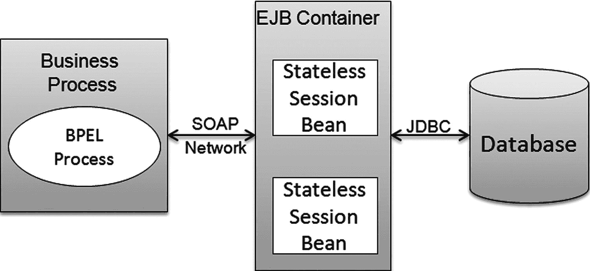

图 12-7

作为客户端应用程序的业务流程

到目前为止，我们已经了解了涉及 EJB 或 JPA 组件的可能架构和编程模型。在接下来的章节中，我们将深入探讨图 12-2 中所示的基于 Web 的应用程序架构，并演示如何扩展在第 7 章中为 Wines Online 应用程序开发的集成后端应用程序。我们选择这种架构是因为它很常用，并且有助于说明容器服务的使用。

## JSF

JavaServer Faces 技术为构建 Java EE 的服务器端用户界面建立了标准。JavaServer Faces（JSF）自定义标签库用于在视图中表达 UI 组件，并将组件连接到服务器端对象。本书撰写时使用的是 JSF 2.3 版本。

在本节中，我们将研究开发一个 Web 应用程序，该应用程序使用 JavaServer Faces（JSF）与集成的 EJB 后端应用程序通信，采用图 12-2 所示的架构。我们将从简要介绍 JSF 的几个概念开始，为你开发一个功能完备的 Web 应用程序做好准备。JSF 于 2002 年首次推出，需要 JDK 1.5 或更高版本，因此首要条件是在你的机器上安装 JDK。

JSF 主要帮助我们完成以下工作：

*   通过添加组件标签将组件拖放到页面上，
*   将组件生成的事件连接到服务器端应用程序代码，
*   将页面上的 UI 组件绑定到服务器端数据，
*   使用可重用和可扩展的组件构建 UI，
*   在服务器请求的生命周期之外保存和恢复 UI 状态。

在本书中，使用了 JSF 2.3 版本，其中包括以下新特性：

*   CDI 对齐改进；
*   JSF 2.3 工件现在可以轻松注入到 Java 类和 EL 表达式中；
*   改进了 WebSocket，这是一种通过 TCP 提供全双工双向通信的协议；
*   日期时间 API 改进；
*   API 增强，包括 UIData、UIRepeat 等。

注意

本节绝非对 JSF 的全面讨论。与任何其他 Java EE 技术一样，有关 JSF 的详细信息可以在以下网址找到：[`https://myfaces.apache.org/jsfintro.html`](https://myfaces.apache.org/jsfintro.html)

JSF 视图包括：

*   组件树
*   Facelets 或 HTML
*   表达式语言
*   根据需要与 JSTL 和其他标签库混合使用
*   组件库

以下是 Java EE 8 中 JSF 2.3 的新特性：

*   两个特性驱动者：Oracle 和社区
*   特性清理
*   基于社区请求的小型新特性集
*   用于构建 Java EE 应用程序的成熟标准

JSF 2.3 新特性包括：

*   注入 ViewMap
    *   @ViewMap
    *   @Inject
    *   Map viewMap;
*   注入 UiViewRoot @Inject
    *   UIViewRoot viewRoot;
*   #1332 - 让 CDI 处理 #{view}
*   #1331 - 让 CDI 处理 #{application}
*   #1254 - Contracts 属性限制过于严格
*   #1328 - 让 CDI 处理 #{session} EL 解析
*   #1325 - 让 CDI 处理 #{applicationScope}
*   #1311 - 让 CDI 处理 #{facesContext} EL 解析
*   #1323 - 支持对 applicationMap 使用 @Inject @ApplicationMap
    *   @Inject
    *   Map applicationMap;
    *   Map applicationMap;
*   #1322 - 简化 #{externalContext} 以使用 ExternalContextProducer
*   #1309 - 支持对 ExternalContext 使用 @Inject
    *   @Inject ExternalContext externalContext;
*   #527 - 支持对 FacesContext 使用 @Inject
    *   @Inject FacesContext facesContext;
*   javax.faces.bean.ManagedProperty 的替代方案
*   #1396 - 用于 SSE 和 WebSocket 的 f:socket


### Java EE Web 技术的演进

Java EE 技术已发展成为一个成熟、可靠且稳定的平台，使开发者能够构建企业级应用。该平台在 Web 技术领域也经历了显著的演进。图 12-8 展示了 Java EE 平台中 Web 技术的演进历程。

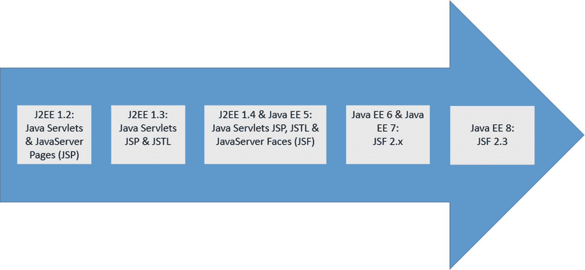

图 12-8

Java EE Web 技术的演进

在 Java Servlet 出现之前，CGI 脚本被用于生成动态 Web 内容。CGI 脚本有其自身的局限性，包括脚本作为独立进程运行，这导致了可扩展性问题。

在 CGI 脚本之后，Java Servlet 成为了 Java EE 平台中所有 Web 技术的基础。Java Servlet 为开发基于标准、可在不同 Web 容器间移植的 Web 组件和应用提供了一个良好的开端。Java Servlet 的缺点之一是代码密集——所有 HTML 都通过 `println()` 方法输出。Servlet 未能为创建页面设计的图形设计师和创建动态内容的 Java 程序员之间搭建起桥梁。

JSP 是 Web 技术演进中的下一步；它弥合了图形设计师与 Java 程序员之间的鸿沟。基于 Java Servlet 技术，JSP 页面是嵌入了 Java 代码的 HTML 页面。这种模式允许图形设计师创建 JSP 页面，然后程序员可以通过添加 Java 代码或脚本片段使其具有动态性。JSP 页面在编译后会变成 Java Servlet。

虽然 JSP 页面的出现很不错，但许多开发者现在不得不处理诸如遍历数据集合之类的繁琐任务。这促使了 JSP 标准标签库（JSTL）的诞生，它自动化了其中一些任务。

尽管这些技术进步简化了 Web 应用的构建，但当时仍缺乏一个标准的组件模型来开发它们。除此之外，使用像 Visual Basic、Oracle Forms 和 PowerBuilder 这样的第四代语言（4GL）开发具有可重用组件的 Web 应用也尚不可行。

JSF 是最新的 Java EE Web 技术。凭借其组件模型，它解决了可重用组件以及简化 Web 应用构建的问题。不过，可重用组件模型并非 JSF 提供的唯一特性。我们将在后续章节中探讨 JSF 的其他一些特性和优势。

#### 模型-视图-控制器模式

在 Java EE Web 技术开发的早期阶段，大多数 Web 应用都是使用所谓的 Model-I 方法构建的。Model-I 的基本思想是，渲染动态 Web 内容的 Web 技术与后端系统的业务逻辑紧密交织在一起。这种方法没有关注点分离，导致了应用维护问题。Model-II 方法（也称为模型-视图-控制器 [MVC] 模式）是 Model-I 方法的后续发展。这种方法的关键在于视图层与提供数据和业务逻辑的模型层之间的清晰分离。

模型-视图-控制器的主要优势包括：

*   基于 JAX-RS 的面向动作框架
*   手动控制器逻辑……你掌控自己的命运
*   无 UI 组件
*   你选择你的前端技术

MVC 模式并非 Java 语言所特有；它可以追溯到像 Smalltalk 这样的语言。在这种方法中，模型层用于业务逻辑和数据，视图用于渲染用户界面，控制器用于应用流程和事件处理。虽然 Java EE 平台在模型和视图相关技术方面一直在演进，但它并未包含一个可用于控制器侧的内置框架。相反，许多开发者使用 Java Servlet 技术构建了自制的控制器。还有许多人转向了 Apache Struts，它为编写自制控制器提供了一种替代方案。Apache Struts 是一个广泛使用的开源框架，已成为 Web 应用事实上的控制器框架。

最终，JSF 技术通过提供控制器作为框架的一部分，标准化了 MVC 模式中的控制器方面。

MVC 1.0 控制器的优势包括：

*   控制 MVC 应用的请求处理
*   JAX-RS 实现
*   在类级别或方法级别使用 `@Controller` 注解的类
*   必须是 CDI 管理的
*   可以创建混合类（在方法级别使用 `@Controller`）
*   四种返回类型：String、void、Response、Viewable
    *   String：返回视图路径
    *   Void：需要 `@javax.mvc.View` 注解
    *   Response：典型的 `javax.ws.rs.core.Response`，提供对响应的完全访问
    *   Viewable：`javax.mvc.Viewable`，包含关于视图及其处理方式的信息
*   默认响应类型为 text/html，但可以通过 `@Produces` 修改

MVC 1.0 包含模型，用于利用实体类处理数据，或存储到 CDI bean 中。

使用模型的两种方式包括：

*   `javax.mvc.Models` 类
*   基于 CDI 的模型

JSR 371：模型-视图-控制器 1.0 规范可在以下网址找到：[`https://www.mvc-spec.org/`](https://www.mvc-spec.org/)

以下是 JSF 和 MVC 之间的主要区别：

JSF：

*   基于组件
*   控制器逻辑
*   自动化处理
*   Facelets
*   快速开发
*   与 REST 配合良好
*   有状态……跨请求保持

MVC：

*   基于动作
*   基于 JAX-RS 的层次化
*   手动验证/转换
*   多种不同的视图选项
*   精细控制请求/响应
*   非常适合 REST
*   跨请求无状态

### JSF 架构

图 12-9 展示了简化的 JSF 架构。JSF 有一个名为 `FacesServlet` 的前端控制器 Servlet。`FacesServlet` 扮演着将来自客户端的传入请求代理到正确位置的角色。如前所述，JSF 带有可重用的 Web 组件，可用于开发用户界面。这些 UI 组件可以与称为托管 bean 的对象相关联。这些托管 bean 处理应用的逻辑，并与后端系统或组件（如 EJB）进行交互。JSF 中的每个 UI 组件都可以与不同的渲染工具包相关联，这些工具包可以生成不同的标记，例如 HTML 或 WML（无线标记语言），以适应不同类型的设备。

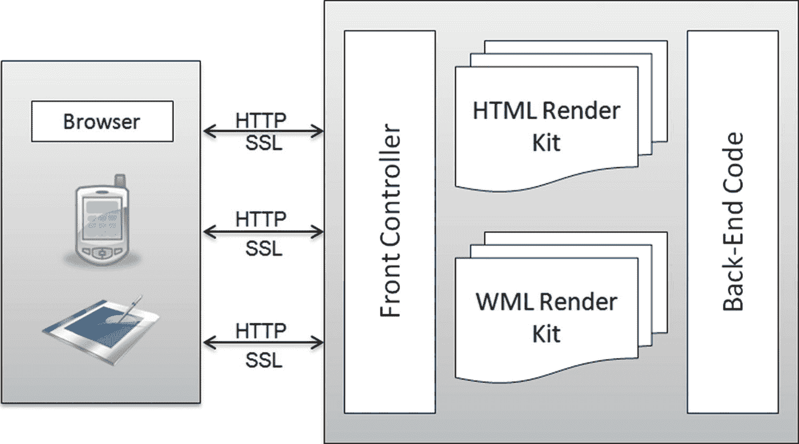

图 12-9

JSF 架构


#### JSF 生命周期

图 12-10 展示了处理初始请求以及来自客户端应用或用户界面的回送的 JSF 生命周期。以下列表描述了生命周期的各个阶段：

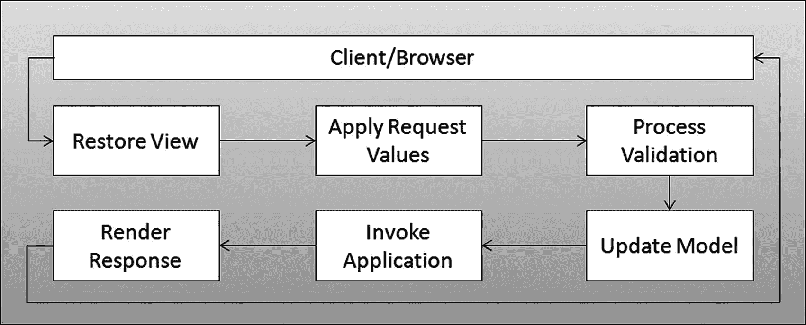

**图 12-10** JSF 生命周期

*   **恢复视图**：如果传入的请求是初始请求，JSF 实现会创建视图。在视图创建过程中，会为每个 UI 组件创建 UI 对象，并将其存储在组件树中。随后，UI 视图的状态会被保存，以供后续请求使用。如果传入的请求是回送，JSF 实现会恢复已保存的 UI 来处理当前请求。
*   **应用请求值**：在此阶段，会使用作为请求一部分发送的数据来更新属于视图的 UI 对象。
*   **处理验证**：在此阶段，会对已提交的数据进行验证。
*   **更新模型**：在此阶段，会使用来自请求的已验证数据更新后端对象。接收到的数据转换也在此阶段进行。
*   **调用应用**：在此阶段，会调用后端应用来完成请求的处理，并将响应渲染回客户端。
*   **渲染响应**：在此生命周期阶段，会渲染 UI 组件，并将响应发送回客户端。

#### JSF 应用

一个典型的 JSF 应用包含以下部分：

*   **JSP 页面或 Facelets**：应用中的 JSP 页面或 Facelets 包含封装在 JSP 标签中的 JSF UI 组件。每个 JSF 组件都是一个与标记无关的构建块。它包含三个主要部分：一个 UIComponent、一个渲染器和一个标签处理器。UIComponent 定义了组件的行为（例如，单选按钮组或菜单等 UI 组件的行为）。它在运行时还与特定的渲染器相关联。渲染器负责决定向客户端渲染何种标记。标签处理器是一个 JSP 标签，允许在 JSP 中使用 JSF UI 组件。
*   **导航模型**：关于控制流如何在应用中流转的信息，定义在一个名为 `faces-config.xml` 的 XML 部署描述符中。该文件可以保存多种其他类型的信息，例如验证器、转换器和托管 Bean 列表。每个 JSF 应用可以包含多个 `faces-config.xml` 文件。
*   **托管 Bean**：这些是促进应用逻辑的普通 Java 类。它们可以用作来自后端组件数据的绑定，或者用于调用后端应用中的业务方法。

### JSF 工具与组件

仅仅拥有标准并不总是有帮助。来自开发者社区和供应商的支持对于一项技术的成功起着重要作用。虽然 JSF 的目标是极大地简化 Web 应用开发，但仅靠标准化无法实现这一目标。我们需要为开发者提供全套可用的 UI 组件来构建应用，以及全套的开发工具来辅助应用构建过程。在过去几年中，诸如 JDeveloper、Java Studio Creator 和 Eclipse 等开发工具已经为构建 JSF 应用提供了支持。作为 JSF 框架的一个开源实现，Apache MyFaces 提供的组件比 JSF 参考实现中的组件功能更丰富。Oracle 也在 ADF Faces 的框架下发布了超过 100 个标准 Faces 组件。这些 ADF Faces 组件已被捐赠给 Apache 软件基金会，并且现在已成为 MyFaces 项目（又名 Trinidad）的一部分。所有这些因素都为 JSF 技术的成功及其被开发者采用做出了重大贡献。

**注意**

关于 MyFaces 项目的信息，请访问：[`http://myfaces.apache.org`](http://myfaces.apache.org)。

## 使用 JSF 和 EJB 开发 Web 应用

在第 7 章中，我们做了大量工作来集成不同类型的 EJB（会话 Bean、MDB、实体和 Web 服务），以便为 Wines Online 应用开发一个功能完备的 EJB 后端基础设施。在本节中，我们将开发一个 JSF 客户端应用，该应用将运行在 EJB 后端应用之上，如图 12-11 所示。

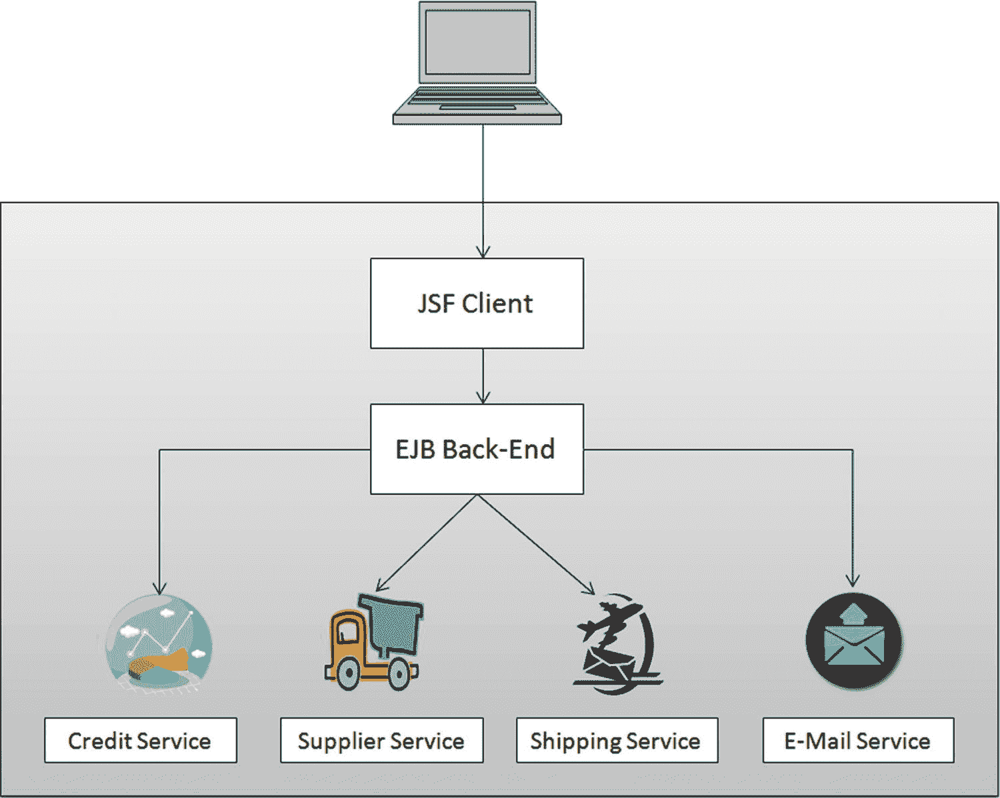

**图 12-11** 示例应用架构

本节的主要目标是向您展示如何开发一组 JSF 页面，并将它们连接到后端应用中的 EJB 组件。考虑到这一点，我们将从用户浏览一组 Web 页面以执行以下操作的方式开始：

*   注册为新客户
*   登录
*   根据不同条件搜索葡萄酒
*   将葡萄酒添加到购物车
*   查看购物车内容
*   提交订单

图 12-12 展示了应用流程，并说明了一组允许用户执行上述操作的 JSF 页面。我们将一次构建一个页面，根据需要将每个页面连接到 EJB 后端应用，并完成整个应用。

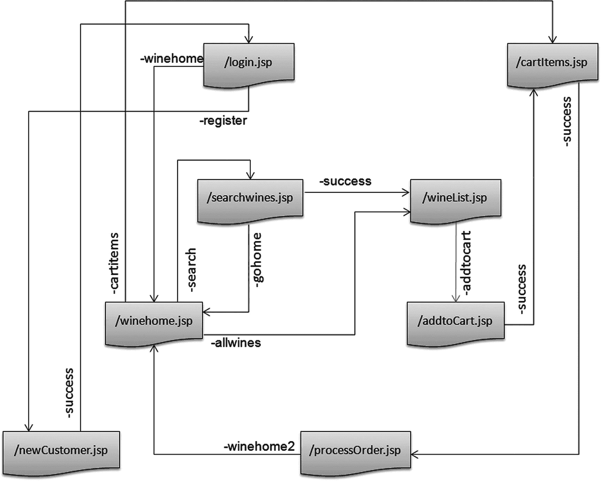

**图 12-12** JSF 应用页面流程

我们将从一个简单的登录页面开始。


### 登录页面

为简化登录流程，我们将使用客户的电子邮件地址来验证和授权订单。`Email` 是第 7 章使用的持久化单元中 `Customer` 实体的映射字段之一。清单 12-1 展示了 `login.jsp` 的代码。首先，有两个标签库指令、一些标准 HTML 标签以及一些用于渲染 JSF UI 组件的标签。任何包含 JSF 元素的页面都必须将 `f:view` 标签作为最外层的 JSF 标签。`h:form` 标签创建一个 HTML 表单，`h:inputText` 标签创建一个输入文本字段，`h:commandButton` 标签在表单中创建一个提交按钮。你可能注意到，`h:inputText` 的 `value` 属性与 HTML 中使用的语法不同。我们使用的是表达式语言 (EL) 语法 — `#{}`。表达式 `#{Login.email}` 表示 JSP 页面想要访问 `Login` 对象中的 email 属性。`Login` 对象是一个托管 bean，稍后将对此进行讨论。与 HTML 表单类似，`h:commandButton` 有一个 `action` 属性。`action` 使用的 EL 语法是 `#{Login.processLogin}`，这意味着当用户点击提交按钮时，一个 `POST` 操作将触发 `Login` 托管 bean 中的 `processLogin` 方法。

```

登录页面

Beginning EJB: Wine Store Application 
输入电子邮件地址：

清单 12-1
login.jsp
```

图 12-18（显示在本章后面的“编译、部署和测试 JSF 应用程序”部分）展示了在浏览器中渲染的 `login.jsp` 页面。

下一步是创建一个将与 `login.jsp` 一起使用的 `Login` 托管 bean。托管 bean 是 JSF 应用程序使用的 JavaBean。这些对象由 JSF 实现管理，并且这些对象中的属性和方法可以通过使用值绑定和方法绑定表达式从 JSP 页面引用。清单 12-2 展示了 `Login` 托管 bean。`Login` 有三个属性字段及其访问器：`email`、`customer` 和 `shoppingCart`。我们在 `setShoppingCart()` 方法上方有一个 `@EJB` 注解。我们使用 setter 注入来注入我们在第 7 章开发的有状态会话 bean `ShoppingCart`。我们的 bean 中还有一个额外的方法 `processLogin()`，它使用注入的 `shoppingCart` 有状态会话 bean 调用 `findCustomer(String email)` 业务方法。如果客户数据库中存在该电子邮件 ID，此业务方法将返回一个 `Customer` 对象。还加入了额外的逻辑，以返回存储在 `faces-config.xml` 文件中的字符串值，供我们的导航模型使用。我们稍后将对此进行讨论。

```
package com.apress.ejb.chapter12.view.managed;
import com.apress.ejb.chapter07.ejb.ShoppingCartLocal;
import com.apress.ejb.chapter07.entities.Customer;
import javax.ejb.EJB;
public class Login
{
public Login() {
}
String email;
Customer customer;
ShoppingCartLocal shoppingCart;
public void setEmail(String email) {
this.email = email;
}
public String getEmail() {
return email;
}
public String processLogin() {
String navigation = null;
customer = (Customer)shoppingCart.findCustomer(email);
if (customer != null) {
navigation = "winehome";
}
else {
navigation = "register";
}
return navigation;
}
public void setCustomer(Customer customer) {
this.customer = customer;
}
public Customer getCustomer() {
return customer;
}
@EJB
public void setShoppingCart(ShoppingCartLocal shoppingCart) {
this.shoppingCart = shoppingCart;
}
public ShoppingCartLocal getShoppingCart() {
return shoppingCart;
}
}
清单 12-2
Login.java
```

部署描述符 `faces-config.xml` 包含页面导航、托管 bean 等信息。清单 12-3 展示了包含进出 `login.jsp` 控制流的 `faces-config.xml`。它还展示了 `Login` 类被注册为托管 bean。我们将 `Login` 托管 bean 的作用域设置为 `session`。这允许我们通过会话存储有关客户和购物车的信息，这样我们就不必为相同的信息重新查询后端应用程序。这也便于在其他页面中使用这些信息，并调用 `ShoppingCart` 有状态会话 bean 上的其他业务方法，而无需再次查找该 bean。此外，我们创建了三个导航规则：

*   从 `login.jsp` 到 `winehome.jsp`，值为 `winehome`：如果登录成功，将使用此规则。
*   从 `login.jsp` 到 `newCustomer.jsp`，值为 `register`：如果登录失败且客户想要注册为新客户，将使用此规则。
*   从 `newCustomer.jsp` 到 `login.jsp`，值为 `success`：此规则用于在成功注册后将客户导航回登录页面。

```

Login
com.apress.ejb.chapter12.view.managed.Login
session

/login.jsp

winehome
/winehome.jsp

register
/newCustomer.jsp

/newCustomer.jsp

success
/login.jsp

清单 12-3
faces-config.xml
```

到目前为止，我们已经向你展示了如何通过一个简单的登录页面开始使用 JSF 应用程序，该页面可以查找 EJB 并调用业务方法。在接下来的几节中，我们将继续完成葡萄酒商店 JSF 应用程序的其余页面。

### 新客户注册页面

清单 12-4 展示了 `newCustomer.jsp` JSF 页面的代码。此页面与之前创建的 `login.jsp` 页面非常相似，只是它有更多用于捕获客户信息的输入字段。JSP 页面中的所有输入字段（名字、姓氏、电话、电子邮件、街道 1、街道 2、城市、州、邮政编码、信用卡和信用卡到期日期）都具有值绑定表达式，这些表达式映射到 `NewCustomer` 托管 bean 中的属性。它还有一个提交按钮，其操作使用表达式 `#{NewCustomer.AddNewCustomer}` 映射到托管 bean 中的 `AddNewCustomer()` 方法。

```

新客户页面

Beginning EJB: Wine Store Application 
输入以下信息以注册为新客户：

名字

姓氏

电话

电子邮件

街道 1

街道 2

城市

州

邮政编码

信用卡

信用卡到期日期

清单 12-4
newCustomer.jsp
```

图 12-19（在“编译、部署和测试 JSF 应用程序”部分）展示了在浏览器中渲染的 `newCustomer.jsp` 页面。

创建 `newCustomer.jsp` 页面后，我们将创建 `NewCustomer` 托管 bean。清单 12-5 展示了此托管 bean 的代码，它为 `newCustomer.jsp` 页面引用的所有属性提供了 getter 和 setter 方法。此外，该类使用 `@EJB` 注解注入了 `CustomerFacade` 无状态会话 bean。最后，`AddNewCustomer()` 方法使用属性的 getter 方法创建一个新的 `Individual` 实体实例，并调用 `CustomerFacade` 中的 `AddCustomer()` 业务方法。成功执行后，此方法返回一个 `success` 字符串，将用户导航到登录页面。


```
package com.apress.ejb.chapter12.view.managed;
import com.apress.ejb.chapter07.ejb.CustomerFacadeLocal;
import com.apress.ejb.chapter07.entities.Address;
import com.apress.ejb.chapter07.entities.Individual;
import javax.ejb.EJB;
public class NewCustomer
{
private String firstName;
private String lastName;
private String phone;
private String email;
private String streetOne;
private String streetTwo;
private String city;
private String state;
private String zipCode;
private String ccnum;
private String ccexpDate;
@EJB
CustomerFacadeLocal customerFacade;
public NewCustomer() {
}
public void setFirstName(String firstName) {
this.firstName = firstName;
}
public String getFirstName() {
return firstName;
}
public void setLastName(String lastName) {
this.lastName = lastName;
}
public String getLastName() {
return lastName;
}
public void setPhone(String phone) {
this.phone = phone;
}
public String getPhone() {
return phone;
}
public void setEmail(String email) {
this.email = email;
}
public String getEmail() {
return email;
}
public void setStreetOne(String streetOne) {
this.streetOne = streetOne;
}
public String getStreetOne() {
return streetOne;
}
public void setStreetTwo(String streetTwo) {
this.streetTwo = streetTwo;
}
public String getStreetTwo() {
return streetTwo;
}
public void setCity(String city) {
this.city = city;
}
public String getCity() {
return city;
}
public void setState(String state) {
this.state = state;
}
public String getState() {
return state;
}
public void setZipCode(String zipCode) {
this.zipCode = zipCode;
}
public String getZipCode() {
return zipCode;
}
public void setCcnum(String ccnum) {
this.ccnum = ccnum;
}
public String getCcnum() {
return ccnum;
}
public void setCcexpDate(String ccexpDate) {
this.ccexpDate = ccexpDate;
}
public String getCcexpDate() {
return ccexpDate;
}
public String AddNewCustomer() {
Individual customer = new Individual();
customer.setFirstName(firstName);
customer.setLastName(lastName);
customer.setPhone(phone);
customer.setEmail(email);
Address address = new Address();
address.setStreet1(streetOne);
address.setStreet2(streetTwo);
address.setState(state);
address.setCity(city);
address.setZipCode(zipCode);
customer.setDefaultBillingAddress(address);
customer.setCcNum(ccnum);
customer.setCcExpDate(ccexpDate);
if (customerFacade != null) {
customerFacade.registerCustomer(customer);
}
return "success";
}
}
清单 12-5
NewCustomer.java
```

注意

第 7 章提供了客户端可用的所有 EJB 和业务方法的详细信息。

现在，我们需要更新清单 12-3 中所示的 `faces-config.xml` 文件，将 `NewCustomer` 添加为受管 bean。清单 12-6 显示了需要添加的 XML 片段。与 `Login` 受管 bean 不同，我们将此 bean 的作用域设置为 `request`，因为我们不需要跨会话存储客户注册信息。

```
NewCustomer
com.apress.ejb.chapter12.view.managed.NewCustomer
request

清单 12-6
faces-config.xml，包含 NewCustomer 受管 Bean
```

注意

我们已经在清单 12-3 中添加了从 `newCustomer.jsp` 到 `login.jsp` 的导航案例。

我们已经完成了登录和新客户注册任务。下一步是允许用户根据不同的条件搜索葡萄酒。我们将从创建一个简单的 JSF 页面开始，该页面将提供指向用户可用不同选项的链接。

### 链接页面

清单 12-7 显示了 `winehome.jsp` JSF 页面的代码。此页面使用了一个 `h:commandLink` JSF UI 组件，该组件允许您嵌入在页面渲染时应显示的输出文本。它还包含一个用户可以点击以导航到下一页的活动链接。此页面为用户提供了三个选项：

*   所有可用葡萄酒的完整列表
*   按年份、国家或品种搜索葡萄酒的功能
*   查看购物车和提交订单的功能

```

Wine Home Page

Beginning EJB: Wine Store Application 

清单 12-7
winehome.jsp
```

我们可以为 `h:commandLink` 组件指定 `action` 属性，该属性可以是一个基于受管 bean 中方法或属性的表达式。或者，`action` 属性也可以是 `faces-config.xml` 中定义的导航案例的名称。对于“所有葡萄酒的完整列表”选项，我们将使用方法绑定表达式 `#{WineList.findAllWines}` 作为 `action` 属性值，而对于其余两个选项，我们将使用导航案例的名称。

图 12-21（位于“编译、部署和测试 JSF 应用程序”部分）显示了在浏览器中渲染的 `winehome.jsp` 页面。

下一步是定义 `WineList` 受管 bean，它将与后端 EJB 通信以获取所有葡萄酒的列表。清单 12-8 显示了 `WineList` bean 的代码。我们将首先使用 `@EJB` 注解注入 `SearchFacade` EJB。bean 类中的 `findAllWines()` 方法利用注入的 `SearchFacade` 无状态会话 bean，并调用 `getWineFindAll()` 业务方法，该方法返回可用葡萄酒的列表。返回的葡萄酒列表存储在受管 bean 的 `winesList` 属性中，并且字符串 `allwines` 作为导航案例返回。

```
package com.apress.ejb.chapter12.view.managed;
import com.apress.ejb.chapter07.ejb.SearchFacadeLocal;
import com.apress.ejb.chapter07.entities.Wine;
import java.util.ArrayList;
import java.util.List;
import javax.ejb.EJB;
import javax.faces.application.Application;
import javax.faces.component.html.HtmlDataTable;
import javax.faces.context.FacesContext;
import javax.faces.el.ValueBinding;
public class WineList
{
public WineList() {
}
@EJB
private SearchFacadeLocal searchFacade;
private List winesList = new ArrayList();
public String findAllWines() {
if (searchFacade == null) {
return "gohome";
}
else {
winesList = searchFacade.getWineFindAll();
return "allwines";
}
}
public void setWinesList(List winesList) {
this.winesList = winesList;
}
public List getWinesList() {
return winesList;
}
}
清单 12-8
WineList.java
```

为了完成此页面的工作，我们将使用清单 12-9 中所示的详细信息扩展 `faces-config.xml` 文件。我们将 `WineList` 定义为受管 bean，并添加了三个额外的导航规则，这些规则创建了以下链接：

*   从 `winehome.jsp` 到 `searchwines.jsp`，将用户带到搜索页面
*   从 `winehome.jsp` 到 `wineList.jsp`，在执行受管 bean 中提供的 `findAllWines()` 方法之后
*   从 `winehome.jsp` 到 `cartItems.jsp`，显示购物车中所有项目的列表

```
WineList
com.apress.ejb.chapter12.view.managed.WineList
session

/winehome.jsp

search
/searchwines.jsp

allwines
/wineList.jsp

cartitems
/cartItems.jsp

清单 12-9
faces-config.xml，包含 WineList 受管 Bean
```

我们将在接下来的章节中处理我们要导航到的三个页面。


### 搜索页面

清单 12-10 展示了 `searchwines.jsp` JSF 页面的代码。该页面允许用户按年份、国家或葡萄品种搜索葡萄酒。我们使用了 `h:selectOneListBox` 组件，这些组件通过每个搜索条件的静态值列表进行填充。从列表框中选择的值会通过 `h:selectOneListBox` 组件的 `value` 属性中指定的值绑定表达式，存储在 `SearchWines` 托管 Bean 的属性中。我们还提供了三个提交按钮，其 `action` 属性包含方法绑定表达式，例如 `#{WineList.searchByYear}`，用于触发 `WineList` 托管 Bean 中的方法，该方法将从 EJB 后端应用程序中检索结果。

```

Search Wines Page

Beginning EJB: Wine Store Application 
Search Wines

Listing 12-10
searchwines.jsp
```

图 12-22（位于“编译、部署和测试 JSF 应用程序”部分）展示了在浏览器中渲染后的 `searchwines.jsp` 页面。

下一步是向 `WineList` 托管 Bean 添加新方法，并定义一个名为 `SearchWines` 的新托管 Bean。清单 12-11 展示了 `SearchWines` 托管 Bean，它包含三个属性（`year`、`varietal` 和 `country`）及其访问器。用户在 `searchwines.jsp` 页面中选择的值存储在这些属性中，`WineList` 托管 Bean 可以检索这些值。

```
package com.apress.ejb.chapter12.view.managed;
public class SearchWines
{
public SearchWines() {
}
public String year;
public String varietal;
public String country;
public void setYear(String year) {
this.year = year;
}
public String getYear() {
return year;
}
public void setVarietal(String varietal) {
this.varietal = varietal;
}
public String getVarietal() {
return varietal;
}
public void setCountry(String country) {
this.country = country;
}
public String getCountry() {
return country;
}
}
Listing 12-11
SearchWines.java
```

我们需要为之前创建的 `WineList` 托管 Bean（参见清单 12-8）添加新功能，即增加三个方法，这些方法绑定在 `searchwines.jsp` JSF 页面的方法绑定表达式中。清单 12-12 展示了这三个方法：`searchByYear()`、`searchByCountry()` 和 `searchByVarietal()`。每个方法都需要从 `SearchWines` 托管 Bean 中获取属性值。JSF 通过 `FacesContext` 对象提供对请求数据和其他对象数据的访问。一旦我们获得了 `FacesContext` 的引用，就可以访问应用程序和托管 Bean。所有方法都使用相同的技术：从 `FacesContext` 获取 `Application`，然后调用带有值绑定表达式的 `createValueBinding()` 方法，以从 `SearchWines` 托管 Bean 中检索相关属性的值。从 `SearchWines` 检索到属性值后，该方法通过传入与搜索条件匹配的参数，调用 `SearchFacade` EJB 中的业务方法，以检索葡萄酒列表。检索到的葡萄酒列表存储在 `winesList` 属性中，该属性的类型为 `java.util.List`。

```
public String searchByCountry() {
FacesContext ctx = FacesContext.getCurrentInstance();
Application app = ctx.getApplication();
ValueBinding wineyear = app.createValueBinding("#{SearchWines.country}");
String country = wineyear.getValue(ctx).toString();
if (searchFacade == null) {
return "gohome";
}
else {
winesList = searchFacade.getWineFindByCountry(country);
return "success";
}
}
public String searchByVarietal() {
FacesContext ctx = FacesContext.getCurrentInstance();
Application app = ctx.getApplication();
ValueBinding wineyear = app.createValueBinding("#{SearchWines.varietal}");
String varietal = wineyear.getValue(ctx).toString();
if (searchFacade == null) {
return "gohome";
}
else {
winesList = searchFacade.getWineFindByVarietal(varietal);
return "success";
}
}
public String searchByYear() {
FacesContext ctx = FacesContext.getCurrentInstance();
Application app = ctx.getApplication();
ValueBinding wineyear = app.createValueBinding("#{SearchWines.year}");
String year = wineyear.getValue(ctx).toString();
if (searchFacade == null) {
return "gohome";
}
else {
winesList = searchFacade.getWineFindByYear(new Integer(year));
return "success";
}
}
Listing 12-12
WineList.java, with Search Methods
```

所有方法都返回一个 `success` 值，该值将用作导航规则。我们需要将此导航规则添加到 `faces-config.xml` 中，并将 `SearchWines` 注册为托管 Bean。清单 12-13 展示了需要添加到 `faces-config.xml` 中的 XML 片段。方法返回的 `success` 值会将用户导航到 `wineList.jsp`，该页面将显示葡萄酒列表。请注意，我们将 `SearchWines` 托管 Bean 的作用域设置为 `session`，因为我们也会从其他托管 Bean 访问其属性。

```
/searchwines.jsp

gohome
/winehome.jsp

success
/wineList.jsp

SearchWines
com.apress.ejb.chapter12.view.managed.SearchWines
session

Listing 12-13
faces-config.xml, with the SearchWines Managed Bean
```

到目前为止，我们已经完成了以下任务：

*   创建登录页面
*   创建注册页面
*   创建包含选项列表的主页
*   创建搜索页面

接下来，我们将致力于在 `wineList.jsp` 页面中向用户展示葡萄酒列表。


### 葡萄酒列表页面

清单 12-14 展示了 `wineList.jsp` JSF 页面的代码。在此页面中，我们使用了一个名为 `h:dataTable` 的新 UI 组件。该组件能够将类型为 `java.util.List` 的管理 Bean 属性中的数据集合渲染出来。在前面的章节中，我们一直将检索到的葡萄酒存储在 `winesList` 属性中。`#{WinesList.winesList}` 表达式被用于 `h:dataTable` 的 `value` 属性，以表格形式显示葡萄酒列表。当葡萄酒列表展示给用户后，用户可以选择数据表组件中显示的某一款葡萄酒，以便在另一个页面查看该葡萄酒的详细信息，并在想要购买时将其添加到购物车。为了追踪数据表组件中被选中的葡萄酒，我们为 `h:dataTable` 添加了 `binding` 属性。最后需要做的是，为数据表中的每一行提供一个用户可点击以选择葡萄酒的超链接。为此，我们将显示葡萄酒 ID 的列用 `h:commandLink` 组件包裹起来。`h:commandLink` 的 `action` 属性值被设置为 `#{WinesList.invokeAddToCart}` 表达式，这意味着我们需要为 `WinesList` 管理 Bean 扩展一个新方法：`invokeAddToCart()`。

```

葡萄酒列表页面

Beginning EJB: Wine Store Application

清单 12-14
wineList.jsp
```

图 12-23（位于“编译、部署和测试 JSF 应用程序”部分）展示了在浏览器中渲染后的 `wineList.jsp` 页面。

清单 12-15 展示了我们需要添加到 `WinesList` 管理 Bean 中的新代码。我们将添加一个新属性 `dataTable1`，以及相应的访问器方法，还有一个全新的方法 `invokeAddToCart()`。新的 `dataTable1` 属性用于设置 `wineList.jsp` 中 `h:dataTable1` 组件的 `binding` 属性值，如清单 12-14 所示。在 `invokeAddToCart()` 方法中，我们通过 `dataTable1` 属性的 `getRowData()` 方法获取选中的行，并将其设置为新管理 Bean `JSFShoppingCart` 中 `selectedWine` 属性的值。我们采用了从 `FacesContext` 获取应用程序并设置属性值的技术，而不是像之前用例那样获取值。`invokeAddToCart()` 方法在成功执行后返回 `addtocart`，我们将把它用作导航规则。

```
private HtmlDataTable dataTable1;
public void setDataTable1(HtmlDataTable dataTable1) {
this.dataTable1 = dataTable1;
}
public HtmlDataTable getDataTable1() {
return dataTable1;
}
public String invokeAddToCart() {
Wine addWine = (Wine)this.getDataTable1().getRowData();
FacesContext ctx = FacesContext.getCurrentInstance();
Application app = ctx.getApplication();
ValueBinding binding = app.createValueBinding("#{JSFShoppingCart.selectedWine}");
binding.setValue(ctx, addWine);
return "addtocart";
}
清单 12-15
WineList.java，包含 invokeAddToCart 方法
```

在更新 `faces-config.xml` 之前，我们需要创建一个新的管理 Bean `JSFShoppingCart`。清单 12-16 展示了这个管理 Bean 的代码。我们将从一个简单的属性 `selectedWine` 及其访问器方法开始，然后扩展该 Bean 以满足新的需求。（这些需求将在本章后续部分讨论。）

```
package com.apress.ejb.chapter12.view.managed;
import com.apress.ejb3.wineapp.Wine;
public class JSFShoppingCart {
public JSFShoppingCart() {
}
Wine selectedWine;
public void setSelectedWine(Wine selectedWine) {
this.selectedWine = selectedWine;
}
public Wine getSelectedWine() {
return selectedWine;
}
}
清单 12-16
JSFShoppingCart.java
```

我们需要更新 `faces-config.xml`，将 `JSFShoppingCart` 注册为一个管理 Bean，并添加一条从 `wineList.jsp` 到 `addtoCart.jsp` 的新导航规则。清单 12-17 展示了将放入 `faces-config.xml` 文件中的 XML 片段。

```
JSFShoppingCart
com.apress.ejb.chapter12.view.managed.JSFShoppingCart
session

/wineList.jsp

addtocart
/addtoCart.jsp

清单 12-17
faces-config.xml，包含 JSFShoppingCart 管理 Bean
```

在此特定任务中，我们在数据表组件中显示了葡萄酒列表，并为用户提供了选择其中一款葡萄酒的能力。选中的葡萄酒被存储在 `JSFShoppingCart` 管理 Bean 中。


### 显示所选葡萄酒详情页面

清单 12-18 展示了 `addtoCart.jsp` JSF 页面的代码。在这个特定页面上，我们将使用 `h:outputText` 组件来显示葡萄酒信息，并使用 `h:inputText` 组件让用户输入所选葡萄酒的数量。`h:outputText` 的 `value` 属性由上一节开发的 `JSFShoppingCart` 托管 bean 中的 `selectedWine` 属性填充。`h:inputText` 的值通过表达式 `#{JSFShoppingCart.quantity}` 设置；这将是一个我们需要添加到 `JSFShoppingCart` 中的新属性。此页面中最后需要注意的一点是 `h:commandButton` 组件，用户将用它作为提交按钮来将葡萄酒添加到购物车。`h:commandButton` 的 `action` 属性值设置为 `#{JSFShoppingCart.addToCart}` 表达式。`addToCart()` 是一个新方法，我们将必须将其添加到 `JSFShoppingCart` bean 中。

```

添加到购物车页面

Beginning EJB: 葡萄酒商店应用
所选葡萄酒 - 输入数量并按添加到购物车按钮

葡萄酒 ID

名称

描述

国家

评分

产区

零售价

品种

年份

数量

清单 12-18
addtoCart.jsp
```

图 12-24（位于“编译、部署和测试 JSF 应用”部分）展示了在浏览器中渲染的 `addtoCart.jsp` 页面。

我们将使用一个新的 `Quantity` 属性和一个 `addToCart()` 方法来更新 `JSFShoppingCart` 托管 bean。清单 12-19 展示了这两部分的代码片段。`Quantity` 属性具有访问器方法，而 `addToCart()` 方法则使用从 `FacesContext` 获取应用并从 `Login` 托管 bean 中检索 `ShoppingCart` 有状态 EJB 实例的技术。完成后，将调用 `addWineItem()` 业务方法，将所选葡萄酒和数量添加到 `ShoppingCart` EJB 中的购物车项目列表中。`addToCart()` 方法返回一个值为 `success` 的结果，该结果将用作导航规则。

```
String Quantity;
public void setQuantity(String quantity) {
this.Quantity = quantity;
}
public String getQuantity() {
return Quantity;
}
public String addToCart() {
Integer qty = new Integer(Quantity);
FacesContext ctx = FacesContext.getCurrentInstance();
Application app = ctx.getApplication();
//检查客户是否已登录。
ValueBinding customerBinding = app.createValueBinding("#{Login.customer}");
if (customerBinding.getValue(ctx) == null) {
return "success";
}
else {
ValueBinding shoppingCartBinding = app.createValueBinding("#{Login.shoppingCart}");
shoppingCart = (ShoppingCartLocal)shoppingCartBinding.getValue(ctx);
shoppingCart.addWineItem(selectedWine, qty.intValue());
return "success";
}
}
清单 12-19
JSFShoppingCart.java，包含 addToCart 方法
```

为了完成此任务，我们需要向 `faces-config.xml` 添加一个导航规则。清单 12-20 展示了 XML 片段。当葡萄酒成功添加到购物车后，用户将被带到一个新页面 `cartItems.jsp`，该页面显示购物车中所有项目的列表。

```
/addtoCart.jsp

success
/cartItems.jsp

清单 12-20
faces-config.xml，包含 addtoCart 导航规则
```

### 显示购物车项目页面

清单 12-21 展示了 `cartItems.jsp` JSF 页面。在此页面中，我们想使用数据表组件显示购物车中的所有项目。`#{JSFShoppingCart.cartItems}` 表达式用作 `h:dataTable1` 组件的值绑定表达式。这意味着我们必须再次更新 `JSFShoppingCart` 托管 bean，添加用于填充 `cartItems` 属性的代码。最后，JSF 页面有一个 `h:commandButton` 组件，用户将用它作为提交按钮来完成订单。`#{JSFShoppingCart.ProcessOrder}` 是用于提交按钮的方法绑定表达式。

```

购物车项目页面

Beginning EJB: 葡萄酒商店应用
购物车

清单 12-21
cartItems.jsp
```

图 12-25（位于“编译、部署和测试 JSF 应用”部分）展示了在浏览器中渲染的 `cartItems.jsp` 页面。

清单 12-22 展示了用于更新 `JSFShoppingCart` 托管 bean 的代码片段。我们有一个 `java.util.List` 类型的属性 `cartItems`，并带有访问器方法。在 getter 方法中，我们从 `Login` 托管 bean 中检索 `Customer` 对象和 `ShoppingCart` 有状态 EJB 的实例，并调用返回购物车项目列表的业务方法 `getAllCartItems()`。第二个方法 `ProcessOrder()` 也从 `Login` 托管 bean 中检索 `ShoppingCart` 有状态 EJB 的实例，并在后端应用上调用 `ProcessOrder` 业务方法，以在 JSF 应用端完成订单。成功执行后，`JSFShoppingCart` 中的 `ProcessOrder()` 方法返回 `success` 作为值，用于导航回应用的主页。

```
List cartItems = new ArrayList();
public void setCartItems(List cartItems) {
this.cartItems = cartItems;
}
public List getCartItems() {
FacesContext ctx = FacesContext.getCurrentInstance();
Application app = ctx.getApplication();
ValueBinding customerBinding = app.createValueBinding("#{Login.customer}");
Individual customer = (Individual)customerBinding.getValue(ctx);
ValueBinding shoppingCartBinding = app.createValueBinding("#{Login.shoppingCart}");
shoppingCart = (ShoppingCartLocal)shoppingCartBinding.getValue(ctx);
return shoppingCart.getAllCartItems(customer);
}
public String ProcessOrder() {
FacesContext ctx = FacesContext.getCurrentInstance();
Application app = ctx.getApplication();
ValueBinding shoppingCartBinding = app.createValueBinding("#{Login.shoppingCart}");
shoppingCart = (ShoppingCartLocal)shoppingCartBinding.getValue(ctx);
shoppingCart.sendOrderToOPC();
return "success";
}
清单 12-22
JSFShoppingCart.java，包含 getCartItems 和 ProcessOrder 方法
```

我们需要做的最后一件事是向 `faces-config.xml` 添加一个导航规则，该规则将把用户路由回 `processOrder.jsp` 通知页面，如清单 12-23 所示。

```
/cartItems.jsp

success
/processOrder.jsp

清单 12-23
faces-config.xml，包含 cartItems 导航规则
```


### 通知页面

我们快完成了！我们将添加最后一个 JSF 页面 `processOrder.jsp`，它会向用户显示订单提交消息，并提供一个返回主页的链接。清单 12-24 展示了 `processOrder.jsp` 的代码。如你所见，该页面相当静态——它输出通知文本，并使用 `h:commandLink` 组件将用户引导回 `winehome.jsp` 页面，该页面显示搜索葡萄酒、查看购物车内容等选项的列表。

```

处理订单页面

Beginning EJB: Wine Store Application 
您的订单已提交，您将收到一封包含订单 ID 和详细信息的电子邮件。

清单 12-24
processOrder.jsp
```

图 12-26（位于“编译、部署和测试 JSF 应用程序”部分）展示了 `processOrder.jsp` 页面在浏览器中的渲染效果。

为了完成整个流程，我们将在 `faces-config.xml` 中添加最后一个导航规则，如清单 12-25 所示。

```
/processOrder.jsp

winehome2
/winehome.jsp

清单 12-25
faces-config.xml，包含 processOrder 导航规则
```

至此，我们完成了 JSF 应用程序，其控制流如图 12-12 所示。现在，我们将部署并执行这个完整的应用程序，并逐步浏览我们开发的、用于访问 EJB 后端应用程序的各个屏幕。

## 编译、部署和测试 JSF 应用程序

JSF 应用程序需要先打包成 Web 归档 (WAR) 文件，然后才能组装成企业归档 (EAR) 文件，后者包含应用程序所需的所有模块和库。大多数应用服务器都提供部署工具或 Ant 任务，以便于将 EJB 部署到其容器中。像 JDeveloper、NetBeans 和 Eclipse 这样的 Java 集成开发环境 (IDE) 也提供了部署功能，允许开发者打包、组装并将应用程序部署到应用服务器。

关于打包、组装和部署的详细内容，请参见第 11 章。在本章中，我们开发了一个 JSF 应用程序，用于访问在第 7 章中构建的后端应用程序。我们将执行以下步骤来部署和测试该 JSF 应用程序。

### 前提条件

在执行后续章节详述的步骤之前，请先完成第 1 章的“入门”部分，该部分将引导您完成本章示例所需的安装和环境设置。由于我们的 JSF 应用程序是基于第 7 章的工作构建的，因此您需要确保已完成以下步骤：

*   您必须已创建第 7 章“创建数据源、JMS 资源和邮件资源”部分中详述的资源。
*   您必须已按照第 7 章“部署应用程序”部分中的说明成功部署了应用程序。

注意

第 7 章的示例代码依赖于第 6 章。因此，在继续之前，请确保您已完成第 6 章和第 7 章。如果在执行示例代码时遇到任何问题，请参考示例代码附带的 `Readme.txt` 文件。

### 编译 JSF 应用程序

将 `Chapter12-JSFClientSamples` 目录及其内容复制到您选择的目录中。由于本章的示例代码引用了第 6 章的工件，请确保 `Chapter06-WebServiceSamples` 目录与 `Chapter12-JSFClientSamples` 目录位于同一层级。运行 NetBeans IDE，并使用 `文件 ➤ 打开项目` 菜单打开 `Chapter12-JSFClientSamples` 文件，如图 12-13 所示。

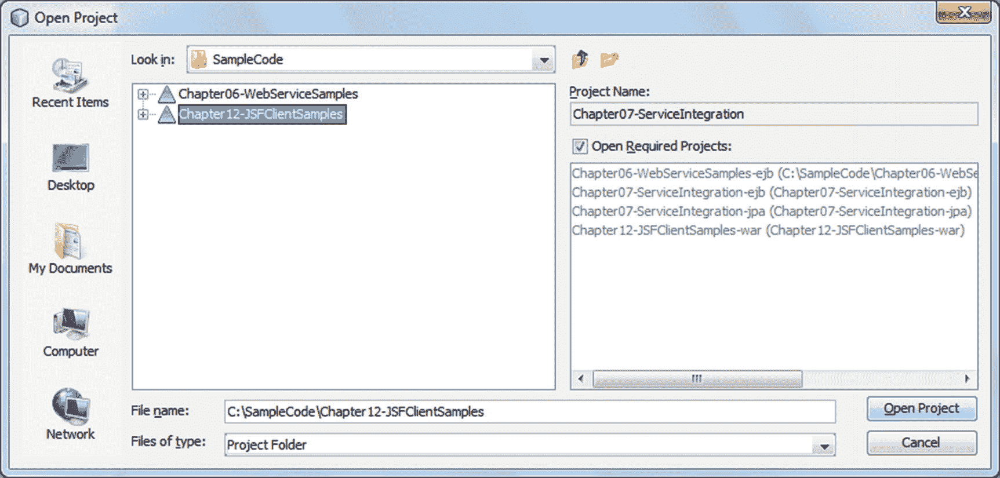

图 12-13

打开 Chapter12-JSFClientSamples 文件 注意

在 NetBeans 中打开 `Chapter12-JSFClientSamples` 文件之前，请确保已从 NetBeans IDE 中关闭 `Chapter07-ServiceIntegration` 项目和 `Chapter06-WebServiceSamples`。第 12 章的示例代码构建在第 6 章和第 7 章的基础上，如果在 NetBeans 中同时打开这些项目，将会导致编译错误。当打开 `Chapter12-JSFClientSamples` 时，NetBeans 会自动打开所需的项目。

展开 `Chapter12-JSFClientSamples-war` 节点，观察本章讨论的所有 JSF 文件和托管 Bean 是否都已列出，如图 12-14 所示。

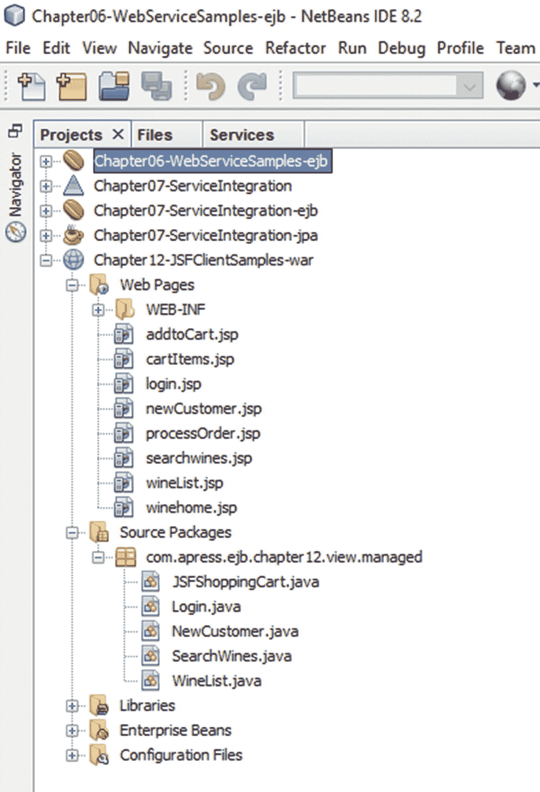

图 12-14

验证 Chapter12-JSFClientSamples-war 项目中的包

在 `Chapter07-ServiceIntegration` 节点上调用上下文菜单，并通过选择 `清理并构建` 菜单选项来构建应用程序，如图 12-15 所示。JSF 页面及其托管 Bean 将无错误地编译。

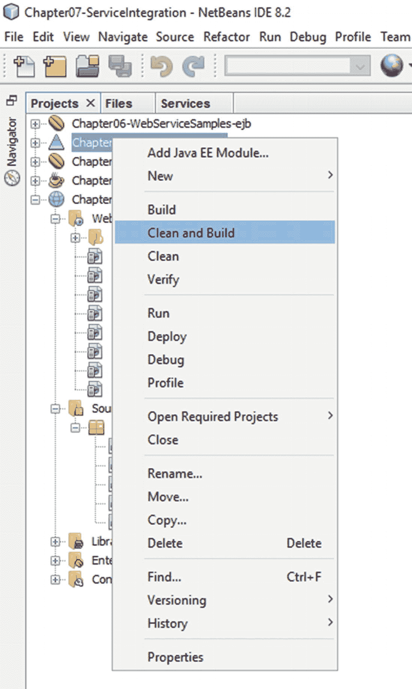

图 12-15

构建项目


### 部署并运行葡萄酒商店应用程序

在 JSF 页面和托管 Bean 成功编译后，我们需要设置想要执行的运行目标。要设置运行目标，请在 `Chapter07-ServiceIntegration` 节点上调用上下文菜单，并选择 `Properties` 菜单选项。如图 12-16 所示，选择 `Run` 类别，在 `Relative URL` 文本字段中输入运行目标 `faces/login.jsp`，然后点击确定。

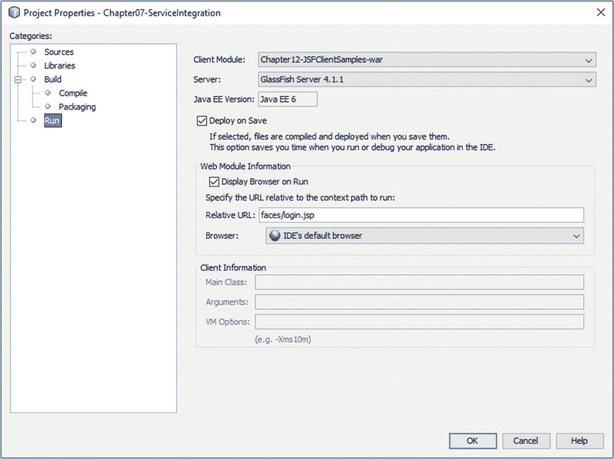

图 12-16

设置运行目标

现在，您可以准备运行带有 JSF 用户界面的葡萄酒商店应用程序了。要运行该应用程序，请在 `Chapter07-ServiceIntegration` 节点上调用上下文菜单，并选择 `Run` 菜单选项，如图 12-17 所示。运行应用程序将会把应用部署到集成的 GlassFish 应用服务器上，并在您的默认浏览器中启动葡萄酒商店应用程序。

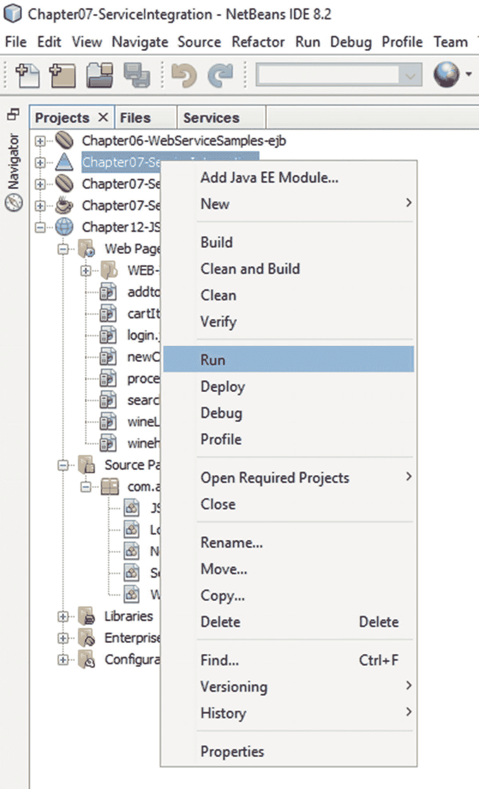

图 12-17

运行葡萄酒商店应用程序

启动后，登录页面将如图 12-18 所示呈现。

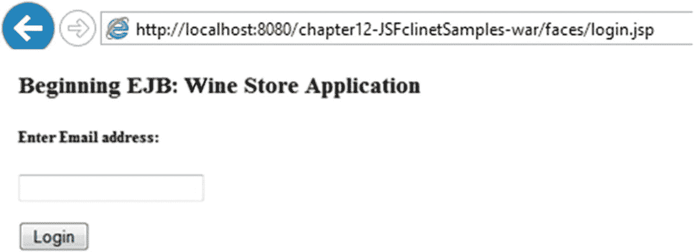

图 12-18

葡萄酒商店应用程序登录页面 注意

由于此示例应用程序的唯一目的是学习相关技术，其代码并未包含企业应用程序中通常应有的数据验证输入。因此，请确保为给定的文本字段输入有效值。

在“输入电子邮件地址”文本字段中输入您的电子邮件，然后点击“登录”按钮。由于您尚未注册为客户，并且您的电子邮件在客户数据库中不存在，您将被重定向到客户注册页面，如图 12-19 所示。按图示在输入字段中输入相关值，然后点击“提交”按钮。

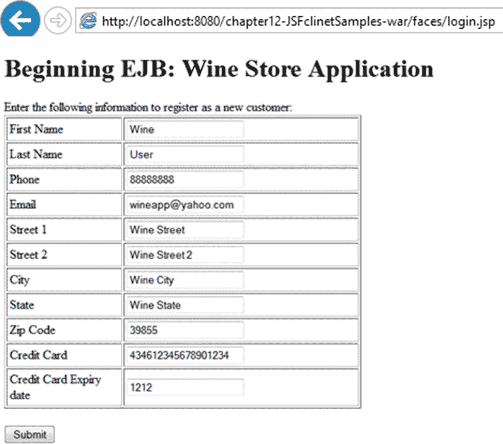

图 12-19

客户注册页面

注册成功后，您将被引导回登录页面。在登录页面上，输入您在注册过程中使用的电子邮件地址，然后点击“登录”按钮，如图 12-20 所示。

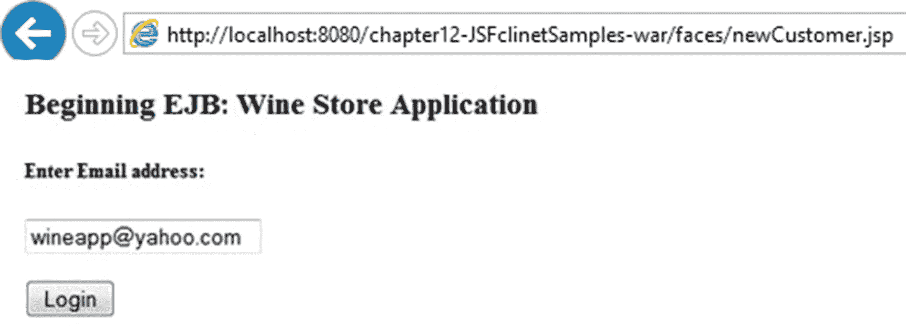

图 12-20

葡萄酒商店应用程序登录页面

电子邮件地址验证通过后，您将被引导至葡萄酒商店主页，该页面将显示一系列选项，如图 12-21 所示。

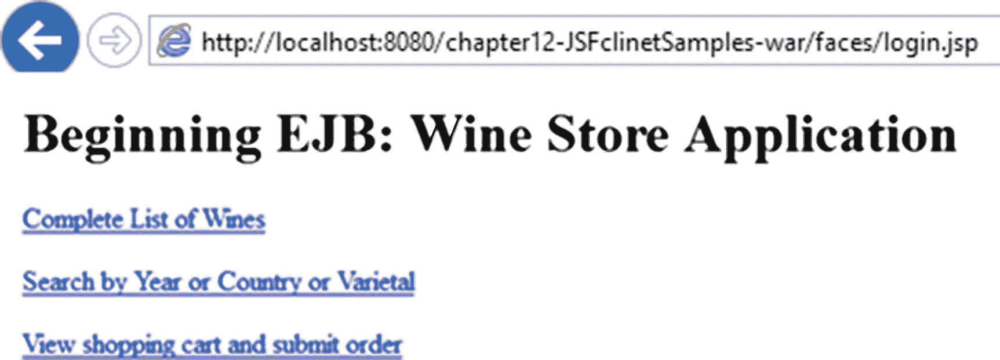

图 12-21

葡萄酒商店主页

我们将引导您完成搜索用例。点击显示为“按年份、国家或品种搜索”的链接。您将被引导至搜索页面，如图 12-22 所示。

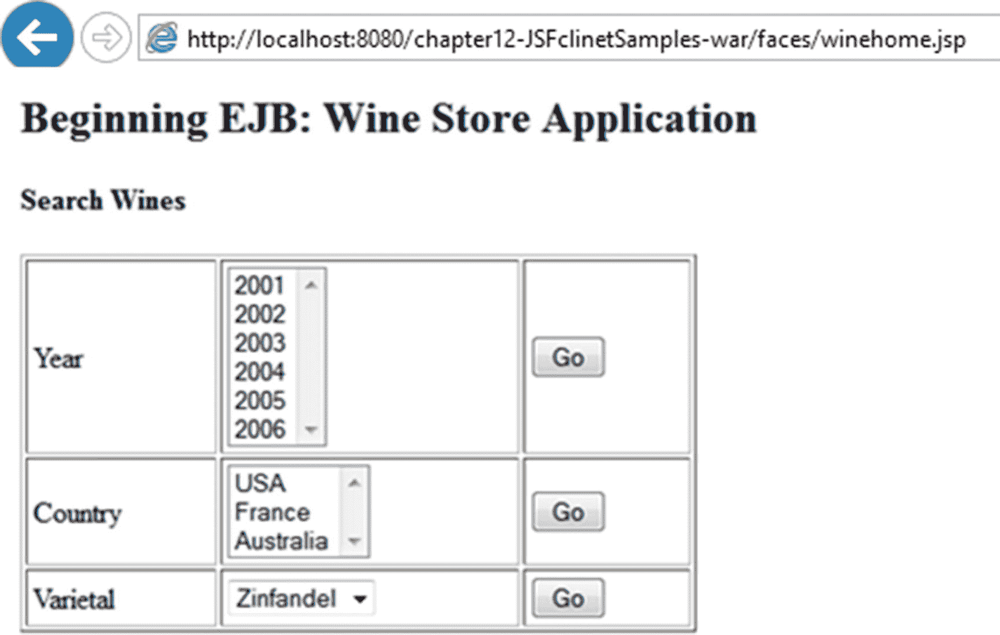

图 12-22

搜索页面

选择“仙粉黛”作为品种，然后点击“开始”按钮。图 12-23 显示了满足搜索条件的葡萄酒列表。

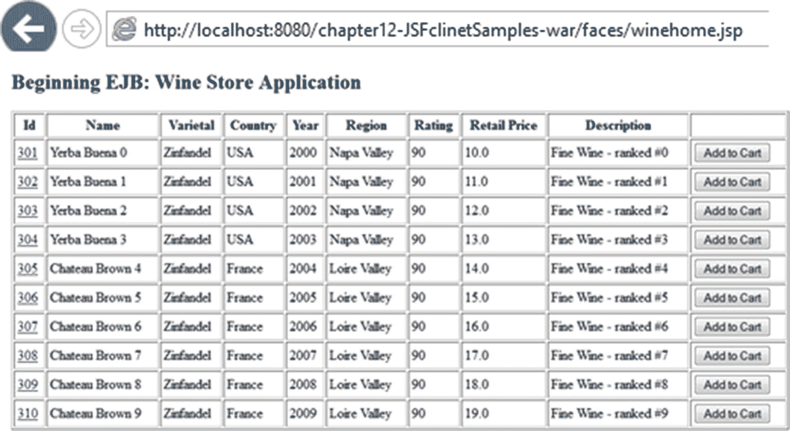

图 12-23

葡萄酒列表页面

在葡萄酒列表页面，点击您想要添加到购物车的葡萄酒对应的“添加到购物车”按钮。这将带您进入 JSF 页面，如图 12-24 所示，该页面显示了葡萄酒的详细信息以及一个用于输入数量的文本框。

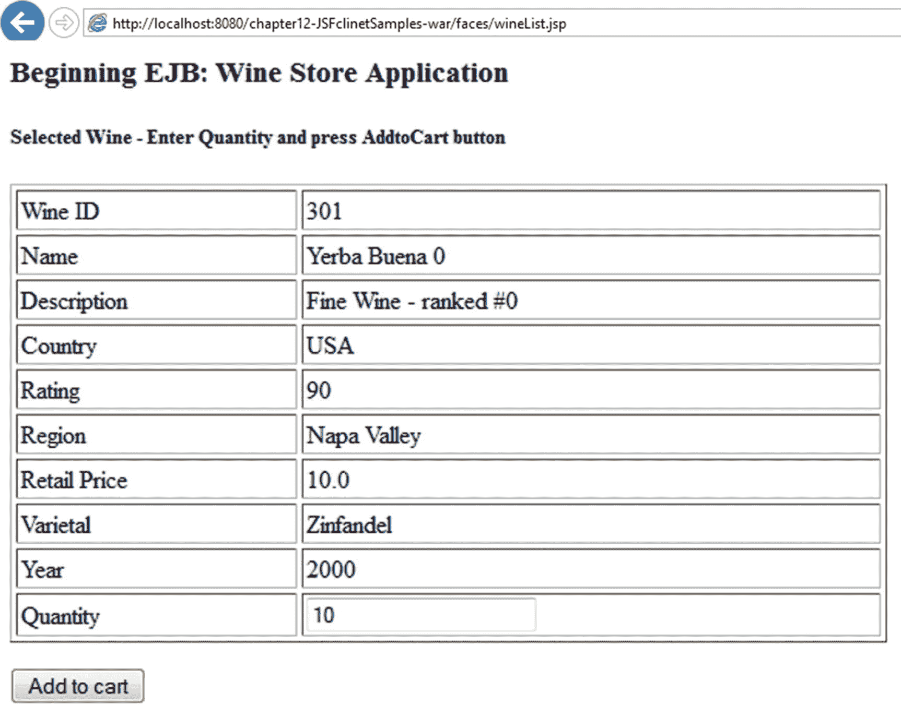

图 12-24

葡萄酒详情页面

在数量处输入“10”，然后点击“添加到购物车”按钮。您将被引导至购物车页面。在此阶段，您可以通过按下“提交订单”按钮来提交订单，或者使用浏览器的返回按钮返回到列出葡萄酒的页面，以便向购物车中添加更多葡萄酒。如图 12-25 所示，购物车页面显示了购物车中的所有商品。

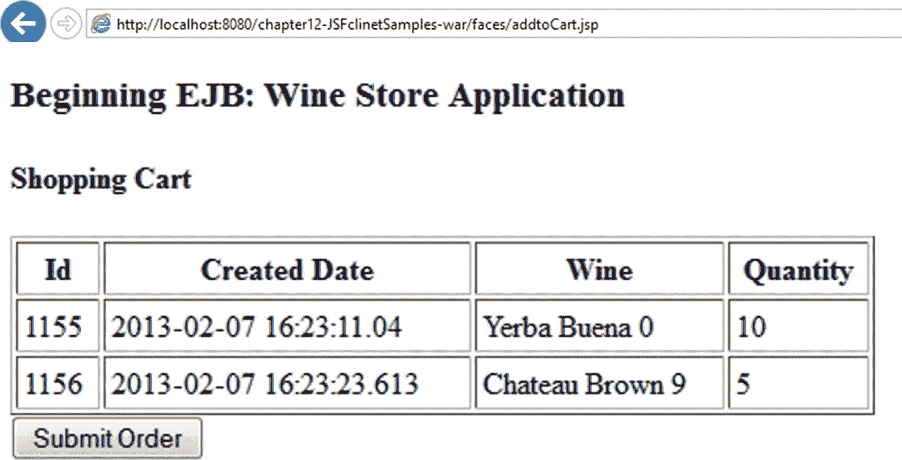

图 12-25

购物车页面

购物车页面提供了一个“提交订单”按钮用于提交订单。点击此按钮，订单将由 EJB 后端应用程序处理。然后，您将看到一个通知页面，如图 12-26 所示。

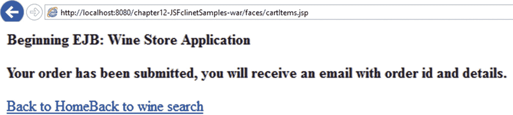

图 12-26

通知页面

订单处理完毕后，您将收到一封电子邮件通知，如图 12-27 所示。

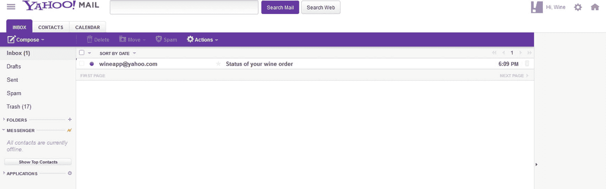

图 12-27

通知电子邮件

## 应用程序客户端容器

我们在前面的章节中已经提到并使用了应用程序客户端容器，并且在图 12-4 和图 12-5 中展示了几种应用程序架构。使用诸如 Java Swing 等技术开发的应用程序客户端或客户端程序可以在独立的 Java SE 环境中运行。应用程序客户端容器提供了客户端程序在执行期间可以使用的额外系统服务（例如安全性和部署）。

应用程序客户端可以利用应用程序客户端容器提供的身份验证服务来验证其用户。容器的服务可以与本地平台的身份验证系统集成，为企业用户提供单点登录功能。

使用应用程序客户端容器的客户端程序可以调用 EJB。与其他 Java EE 组件类似，在客户端容器中运行的程序可以使用 Java 命名和目录接口 (JNDI) 来查找 EJB 或诸如 Java 消息服务 (JMS) 和 JavaMail 之类的资源。应用程序客户端容器还为客户端程序提供了注入功能。由于应用程序客户端容器不会创建应用程序客户端的实例，因此应使用静态字段和方法来注入任何资源。

应用程序客户端被打包成 JAR 文件。如果使用应用程序客户端容器来运行客户端程序，则必须将应用程序客户端容器与应用程序一起捆绑或打包，以便您可以在单独的桌面计算机上运行它。


## 摘要

在本章中，我们介绍了可用于满足不同需求的各种应用架构，以及与之配套的编程模型。我们探讨了适用于 Web 和桌面应用的架构，还研究了能够利用发布为 Web 服务的 EJB 的 Web 服务客户端应用和业务流程服务。

我们讨论了基于 Java EE 的 Web 技术如何演进，从而显著简化了 Web 应用开发。

我们深入剖析了 JSF 架构、JSF 生命周期和 JSF 应用，以及 JSF 工具和 UI 组件的当前状态。

最终，我们构建了一个全面的 JSF 应用，用于与第 7 章开发的集成式 EJB 后端应用进行通信。在开发过程中，我们演示了几种编程技术，用于在 JSF 应用中共享数据，以及在后端应用中查找和调用业务方法。

最后，我们研究了应用客户端容器，包括它为在桌面机器上运行的客户端程序提供的服务。

本书的最后一章将详细介绍各种 EJB 测试场景，并指导您如何使用 JUnit 在 GlassFish 的可嵌入 EJB 容器中测试 EJB 组件（和 JPA 实体）。

