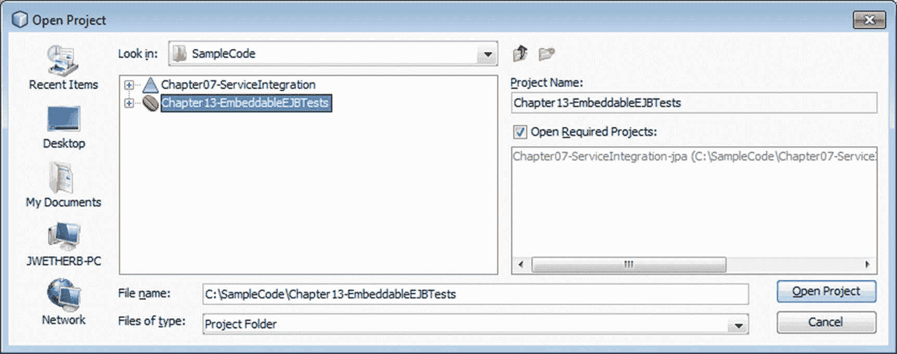
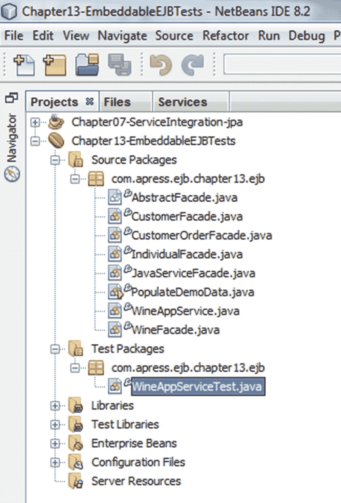
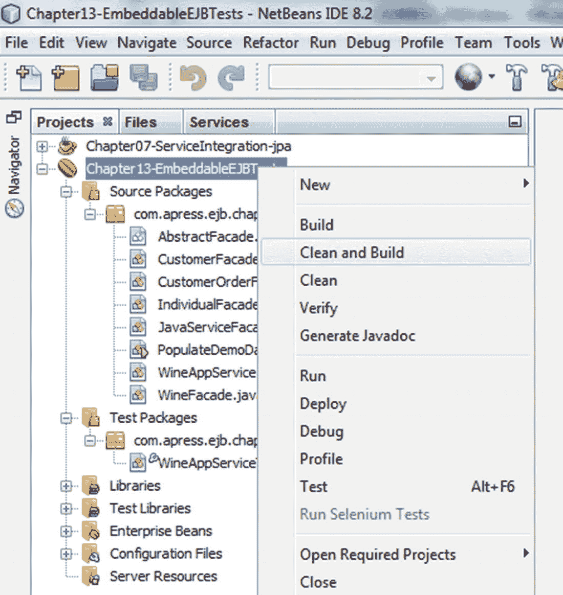
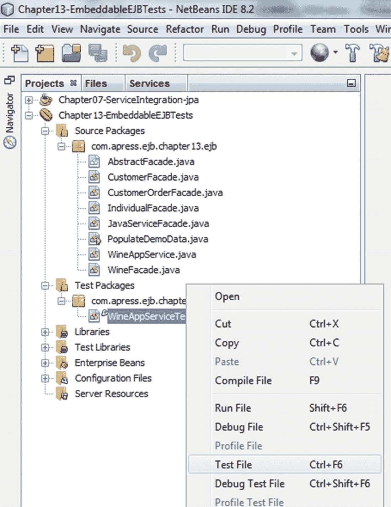
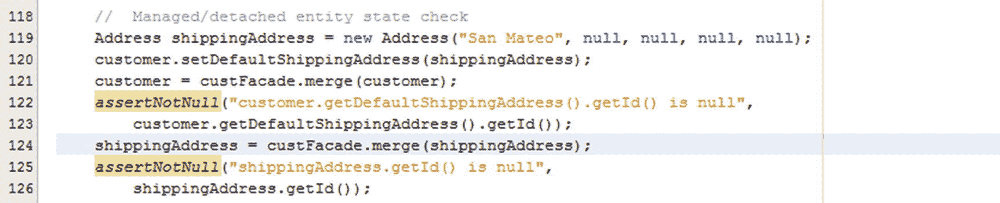
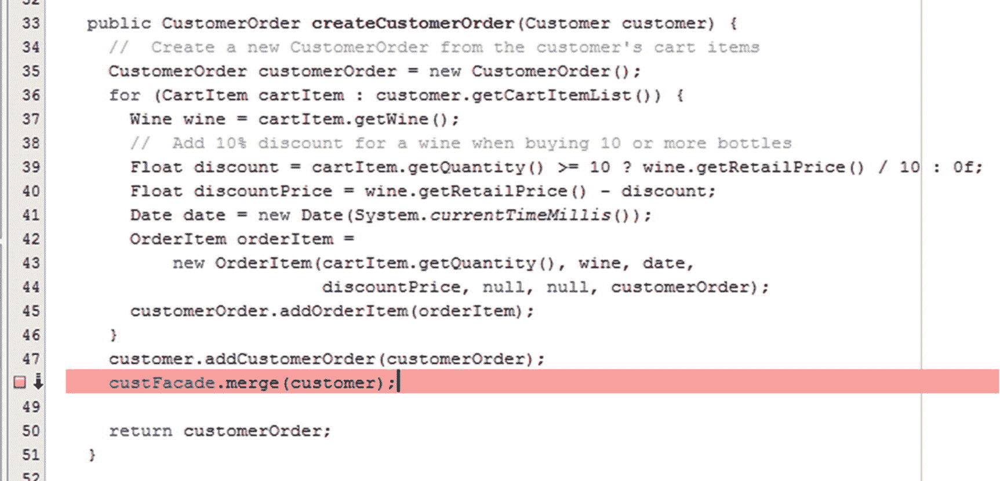
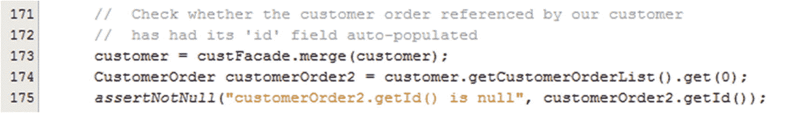

# 13. 在可嵌入 EJB 容器中进行测试

与所有关键任务软件一样，EJB 组件在部署到生产环境之前必须经过充分测试。EJB 中最精细的粒度是其方法；因此，适当的单元测试必须隔离地测试每个 EJB 的每个方法。对于无状态会话 Bean，这通常就足够了。由于有状态会话 Bean 也可能包含状态，因此完全覆盖还需要包含更粗粒度的场景，涉及方法调用序列。当无状态会话 Bean 通过 JPA 实体等方式在数据库中有效存储“状态”信息时，通常也需要多步骤的测试场景。在本章中，我们将研究单方法和多方法测试，涵盖主要作为基于 JPA 操作的服务接口的无状态和有状态会话 Bean。

## 测试客户端

到目前为止，本书中的示例主要使用 Servlet 作为客户端来调用 EJB 方法。使用诸如 ServletUnit 之类的测试框架，Servlet 可以作为测试 EJB 的可行单元测试平台。类似地，调用 EJB 的 JSF 客户端可以使用 HttpUnit 框架进行单元测试，该框架允许您记录用户在浏览器中与 JSF 客户端的交互，然后将实际屏幕结果与预期屏幕结果进行比较。然而，这两种方法都必须在完整的 Java EE 应用服务器内执行。在本章中，我们将探索一种在纯 Java SE 环境中测试 EJB 的轻量级选项。

## EJB Lite

EJB Lite 在 EJB 3.1 中引入，并在 EJB 3.2 中进一步增强，它被指定为完整 EJB 容器功能的最小子集。认识到许多企业应用只需要完整 EJB API 的一个子集，EJB Lite 包含了 EJB 的许多最重要特性，但占用空间更小。EJB Lite 的实现包括下面描述的可嵌入 EJB 容器；以及 Java EE Web Profile。

由于 EJB Lite 是 EJB API 的严格子集，任何符合 EJB Lite 的应用也将在 Java EE 服务器内的完整 EJB 容器中运行。也就是说，EJB Lite 不显式支持 EJB API 之外的任何行为。

## 可嵌入 EJB 容器

可嵌入 EJB 容器本质上是一个 Java 库，它提供由 EJB Lite 规范定义的服务。它模拟在 Java EE 环境中运行的 EJB 容器，但它在 Java SE 环境中运行。实际上，尝试从 Java EE 环境内部实例化可嵌入 EJB 容器是受限的。这个可嵌入容器为 EJB 提供了一个运行环境，提供注入的资源、安全性和 JTA 事务接口，以便 EJB 可以在受控环境中进行测试。

## 本章组织方式

在本章中，我们将探讨围绕单元测试的一些主要概念。然后，我们将研究如何使用可嵌入 EJB 容器设置、执行和调试 JUnit 测试，并从我们的 WineApp 应用中的几个场景中汲取经验。接下来，我们将仔细研究 EJB Lite 提供的服务，揭示其优势和局限性，并展示一些有用的捷径来隔离正在测试的 EJB 和 JPA 组件，同时降低测试环境的复杂性。

在研究了使您能够在可嵌入 EJB 容器中使用 EJB 的 JUnit 测试代码之后，我们将研究一些您可以利用的、特别适合测试环境的配置选项。在本章结束时，我们将逐步指导您如何在 NetBeans 中设置和配置 JUnit 环境，然后执行和调试测试。

### 概念

让我们更仔细地研究一下本章将涵盖的一些主要概念。

#### JUnit

JUnit 是一个广泛用于测试各种形式 Java 类的测试框架。测试类是普通的 Java 类，它们被注解以标识具有特殊用途的方法。被注解为 `@Test` 的方法标识一个单独的单元测试。该测试在被测试的类上调用一个或多个方法，获取调用这些方法的结果，并将实际结果与预期结果进行比较。当它们不同时，测试报告失败，测试人员会收到警报，表明某个测试需要关注。

通过编写全面测试一个或多个类行为的 JUnit 测试，测试人员可以在每次对被测代码或任何间接调用的代码进行更改时执行这些测试。任何失败都表明预期的行为不再发生。此外，由于单元测试通常针对非常特定的功能点，失败的测试可以清晰地告知测试人员导致问题的特定代码区域。

由于 EJB 是一个遵循公共接口的组件，它非常适合这种形式的单元测试。EJB 3.1 引入的 EJB Lite 和可嵌入 EJB 容器正式允许 EJB 在纯 Java SE 环境中通过 JUnit 测试框架进行单元测试，而无需修改。

#### EJB Lite

让我们更仔细地研究一下构成 EJB Lite 的特性子集。表 13-1 显示了 EJB 3.2 的主要特性中哪些包含在 EJB 3.2 Lite 中。

表 13-1

属于 EJB 3.2 Lite 一部分的 EJB 3.2 特性

| EJB 3.2 特性 | 是否包含在 EJB 3.2 Lite 中 |
| --- | --- |
| 会话 Bean（无状态、有状态和单例） | 是 |
| 消息驱动 Bean (MDB) | 否 |
| 实体 Bean (EJB 2.x) | 否 |
| Java 持久化 API (JPA) 2.0 | 是 |
| 无接口视图 | 是 |
| 本地业务接口 | 是 |
| 远程接口 | 否 |
| 可嵌入 API | 是 |
| JAX-WS Web 服务端点 | 否 |
| JAX-RPC Web 服务端点 | 否 |
| 非持久化 EJB 定时器服务 | 是 |
| 持久化 EJB 定时器服务 | 否 |
| 本地异步会话 Bean 调用 | 是 |
| 远程异步会话 Bean 调用 | 否 |
| 拦截器 | 是 |
| RMI-IIOP 互操作性 | 否 |
| 容器管理事务 | 是 |
| Bean 管理事务 | 是 |
| 声明式安全 | 是 |
| 编程式安全 | 是 |

最值得注意的是，在 EJB 3.2 Lite 中，支持所有形式的本地会话 Bean，但不支持远程会话 Bean、MDB 和作为 Web 服务的 EJB。EJB Lite 中包含安全性和 JTA 支持，包括对 BMT 和 CMT 的支持。最后，为 JPA 提供了对 EntityManager 和 EntityManagerFactory 注入的支持。


#### 可嵌入式 EJB 容器客户端

使用可嵌入式 EJB 容器的客户端通过 JNDI 查找 EJB，而非通过注入方式，因为 Java EE 服务器提供了客户端注入，而在此环境中该功能缺失。不过，EJB 本身可以注入其他 EJB，以及其 EJB 容器提供的其他资源。

在本章稍后展示的 JUnit 示例中，JUnit 测试类本身即为可嵌入式 EJB 容器的客户端。它们通过静态工厂方法直接实例化容器，并可选择使用配置属性对容器进行初始化。随后，容器会向客户端提供一个 `InitialContext`，客户端可通过 JNDI 命名空间查找 EJB 及其他资源。可嵌入式 EJB 容器能够在运行时支持 EJB，为会话 Bean 注入资源，提供用于执行事务的 JTA 上下文，以及 EJB Lite 规范中列出的所有其他服务（参见表 13-1）。

当可嵌入式 EJB 容器在包含 GlassFish 可嵌入式服务器（同样运行于 Java SE 环境）的环境中实例化时，GlassFish 会通过向可嵌入式 EJB 容器提供服务来增强用户体验。

## JUnit 测试

在探讨了本章的核心概念后，让我们来看一些代码示例。与可嵌入式 EJB 容器类似，JUnit 本质上是一个 Java 库，你将其包含在类路径中即可为应用程序启用相关功能。虽然描述 JUnit 的所有特性（包括将测试分组为测试套件、定义初始化参数等）超出了本章范围，但就我们的示例而言，了解编写和执行 JUnit 类的基本任务如下会很有帮助：

*   编写遵循 JUnit 模式的测试类，以初始化测试环境。
    *   编写一个或多个方法，通过调用 EJB 的一个或多个方法执行特定单元测试，从这些方法调用中获取结果，并将结果与先前定义的预期结果进行比较。
    *   在类级别上，当类中任何测试方法首次被调用时实例化可嵌入式 EJB 容器，并在最后一个测试方法被调用后关闭容器以释放资源。
    *   在测试级别上，初始化 JPA 持久化单元使用的数据库连接，以清除任何现有数据，并将状态重置为正确配置的状态。
*   调用 JUnit 测试运行器，将待执行测试类的名称作为参数传递，并将以下内容添加到类路径中：
    *   JUnit 类（`.jar` 文件）
    *   你编写的 JUnit 类（可选地打包在 `.jar` 文件中）
    *   待测试 EJB 的 `.jar` 文件，以及任何依赖的 `.jar` 文件（如 JPA 持久化单元）
    *   可嵌入式 EJB 容器的 `.jar` 文件，以及其所需的任何依赖 `.jar` 文件

如本章后续所示，NetBeans、JDeveloper 或 Eclipse 等 IDE 能极大简化调用过程，甚至会在你的 JUnit 测试类中设置许多基础框架。这样，你只需专注于编写每个单元测试特有的核心代码。

现在，让我们剖析一个针对 WineApp 示例应用程序中的 EJB 编写的 JUnit 测试类，以测试几个场景。

### WineAppServiceTest：WineAppService EJB 的 JUnit 测试类

作为本章的示例，我们在清单 13-1 中提供了一个 JUnit 测试类，其中包含在可嵌入式 EJB 容器中对 EJB 进行单元测试所需的所有元素。


```
public class WineAppServiceTest {
private static EJBContainer ejbContainer;
private static NetworkServerControl derbyServer;
public WineAppServiceTest() {
}
@BeforeClass
public static void setUpClass() throws Exception {
PrintWriter pw = new PrintWriter(System.out);
//  启动 Derby 数据库服务器，等待其响应后再继续
try {
derbyServer = new org.apache.derby.drda.NetworkServerControl();
derbyServer.start(pw);
int i = 50;
while (--i > 0) {
try {
derbyServer.ping();
break;
} catch (Exception ex) {
System.out.println("Derby 服务器已启动，正在等待响应...");
}
Thread.sleep(100);
}
} finally {
pw.close();
}
//  实例化一个可嵌入的 EJB 容器
ejbContainer = javax.ejb.embeddable.EJBContainer.createEJBContainer();
}
@AfterClass
public static void tearDownClass() throws Exception {
//  关闭可嵌入的 EJB 容器，释放所有资源
ejbContainer.close();
//  关闭 Derby 数据库服务器
derbyServer.shutdown();
}
@Before
public void setUp() {
//  初始化领域模型中的数据
PopulateDemoData.resetData("Chapter13-EmbeddableEJBTests-ResourceLocal", System.out);
}
@After
public void tearDown() {
}
/**
* 测试 WineAppService 上的 findCustomerByEmail 方法。
*
* 断言返回的 Customer 名为 "James Brown"。
*
* @throws Exception
*/
@Test
public void testFindCustomerByEmail() throws Exception {
System.out.println("findCustomerByEmail");
WineAppService wineAppSvcFacade =
(WineAppService) ejbContainer.getContext().lookup("java:global/classes/WineAppService");
Customer customer =
wineAppSvcFacade.findCustomerByEmail(PopulateDemoData.TO_EMAIL_ADDRESS);
assertEquals("WineAppServiceFacade.findCustomerByEmail(): 检查客户姓名",
"James Brown",
customer.getFirstName() + " " + customer.getLastName());
}
/**
* 测试 WineAppService 上的 createIndividual() 方法和 CustomerFacade 上的 findCustomerByEmail() 方法。
*
* 断言在 createIndividual() 中创建的 Individual 实例具有预期的 email 属性。
* 断言在 findCustomerByEmail() 中检索到的 Customer 具有预期的姓名。
* 断言合并后 shippingAddress 属性处于受管状态。
*/
@Test
public void testCreateIndividual() throws Exception {
System.out.println("createIndividual");
WineAppService wineAppSvcFacade =
(WineAppService) ejbContainer.getContext().lookup("java:global/classes/WineAppService");
String email = "drwho@yahoo.com";
Individual individual =
wineAppSvcFacade.createIndividual("Adam", "Beyda", email);
assertEquals("WineAppServiceFacade.createIndividual(): 检查 Individual.email 属性",
email, individual.getEmail());
CustomerFacade custFacade =
(CustomerFacade) ejbContainer.getContext().lookup("java:global/classes/CustomerFacade");
Customer customer = custFacade.findCustomerByEmail(email);
assertEquals("CustomerFacade.findCustomerByEmail(): 检查 Customer.email 属性",
"Adam Beyda", customer.getFirstName() + " " + customer.getLastName());
//  受管/分离实体状态检查
Address shippingAddress = new Address("San Mateo", null, null, null, null);
customer.setDefaultShippingAddress(shippingAddress);
customer = custFacade.merge(customer);
assertNotNull("customer.getDefaultShippingAddress().getId() 为空",
customer.getDefaultShippingAddress().getId());
assertNotNull("shippingAddress.getId() 为空",
shippingAddress.getId());
}
/**
* 测试 WineAppService 上的 createIndividual() 和 createCustomerOrder() 方法，
* WineFacade 上的 getWineFindByYear() 方法，以及 CustomerFacade 上的 merge() 方法。
*
* 断言创建的订单总价值为 110。
* 断言 customerOrder 和 customer 对象处于受管状态。
*/
@Test
public void testCreateCustomerOrder() throws Exception {
System.out.println("createCustomerOrder");
Context context = ejbContainer.getContext();
WineAppService wineAppSvcFacade =
(WineAppService) context.lookup("java:global/classes/WineAppService");
WineFacade wineFacade =
(WineFacade) context.lookup("java:global/classes/WineFacade");
CustomerFacade custFacade =
(CustomerFacade) context.lookup("java:global/classes/CustomerFacade");
//  将 CartItem 添加到客户的购物车中，并合并客户更改
final String email = "drwho@yahoo.com";
Customer customer = wineAppSvcFacade.createIndividual("Adam", "Beyda", email);
for (Wine wine : wineFacade.getWineFindByYear(2005)) {
customer.addCartItem(new CartItem(10, wine));
}
customer = custFacade.merge(customer);
CustomerOrder customerOrder = wineAppSvcFacade.createCustomerOrder(customer);
Float total = new Float(0);
for (OrderItem orderItem : customerOrder.getOrderItemList()) {
total += orderItem.getQuantity() * orderItem.getPrice();
}
assertEquals("检查客户订单总额是否为 $270", total, new Float(270));
//  从持久化上下文中查询客户的最新状态
//  （借助 CMT 使用新事务），并检查其是否包含一个具有已填充 'id' 字段的客户订单
CustomerOrder customerOrder1 =
wineAppSvcFacade.findCustomerByEmail(email).getCustomerOrderList().get(0);
assertNotNull("customerOrder1.getId() 为空", customerOrder1.getId());
//  检查原始客户订单的 'id' 字段是否已自动填充
assertNotNull("customerOrder.getId() 为空", customerOrder.getId());
//  检查客户引用的客户订单的 'id' 字段是否已自动填充
CustomerOrder customerOrder2 = customer.getCustomerOrderList().get(0);
assertNotNull("customerOrder2.getId() 为空", customerOrder2.getId());
}
}
清单 13-1
WineAppServiceTest.java，一个用于测试 WineApp 应用程序中 EJB 的 JUnit 类
```

当此测试类在 JUnit 测试器中执行时，每个标记为 `@Test` 的方法都会作为独立的单元测试单独运行。然而，在执行这些方法中的任何一个之前，JUnit 会执行一些初始化步骤，以实例化可嵌入的 EJB 容器并初始化持久化单元中的数据。接下来，我们将从初始化步骤开始，探讨此 JUnit 类的各个元素。


### 实例化可嵌入 EJB 容器并启动 Derby

在执行本类中的任何测试之前，我们需要初始化可嵌入 EJB 容器。由于这是一个相对资源密集型的操作（尽管不如启动一个完整的 GlassFish 服务器那么昂贵），我们希望每次启动 JUnit 测试器时只执行一次。JUnit 允许你使用 `@BeforeClass` 注解静态方法，这些方法会在每个 JUnit 会话中执行一次，且在该类上执行第一个单元测试方法之前运行。我们的类级设置方法如下：

```
@BeforeClass
public static void setUpClass() throws Exception {
PrintWriter pw = new PrintWriter(System.out);
//  启动 Derby 数据库服务器，等待其响应后再继续
try {
derbyServer = new org.apache.derby.drda.NetworkServerControl();
derbyServer.start(pw);
int i = 50;
while (--i > 0) {
try {
derbyServer.ping();
break;
} catch (Exception ex) {
System.out.println("Derby 服务器已启动；正在等待响应...");
}
Thread.sleep(100);
}
} finally {
pw.close();
}
//  实例化一个可嵌入 EJB 容器
ejbContainer = javax.ejb.embeddable.EJBContainer.createEJBContainer();
}
```

我们首先启动 Derby 数据库，以便持久化单元能够连接到正在运行的服务器。由于 `org.apache.derby.drda.NetworkServerControl.start()` 方法是异步的，我们必须假设服务器可能不会立即准备好接受连接，因此我们在一个循环中对其进行 ping 操作，每次迭代之间短暂休眠，直到它准备就绪或我们决定超时。

一旦 Derby 准备好接受连接，我们就通过调用 `javax.ejb.embeddable.EJBContainer.createEJBContainer()` 来创建可嵌入 EJB 容器。我们的 `WineAppServiceTest` 类由 JUnit 测试器调用，NetBeans 启动测试器时使用的类路径包含 JPA 持久化单元 `.jar` 文件（来自第 7 章）、第 13 章 EJB jar 中定义的 EJB，以及运行 JUnit 框架和实例化可嵌入 EJB 容器所需的所有必要 Java 库。当前（撰写本文时）的 GlassFish 实现会链接到 GlassFish 服务器安装区域，以提供 EJB 容器通常从其宿主 Java EE 服务器环境所需的服务。同样，由于我们在 Java SE 环境中运行，Java EE GlassFish 服务器实际上并未启动，但可嵌入 EJB 容器所需的类会按需从构成 GlassFish 的 Java 库中加载。

在 JUnit 会话结束时，必须正确关闭可嵌入 EJB 容器和 Derby 数据库服务器，以释放它们可能持有的任何资源。JUnit 此时会调用使用 `@AfterClass` 注解的方法，我们的 `tearDownClass()` 方法执行这些任务：

```
@AfterClass
public static void tearDownClass() throws Exception {
//  关闭可嵌入 EJB 容器，释放所有资源
ejbContainer.close();
//  关闭 Derby 数据库服务器
derbyServer.shutdown();
}
```

### 在持久化单元中初始化数据

虽然启动 Derby 和可嵌入 EJB 容器等步骤在每个 JUnit 测试会话中只需执行一次，但其他初始化步骤必须在每个 JUnit 测试之前执行。每个测试的初始化步骤放在一个（或多个）使用 `@Before` 注解的方法中，如下所示：

```
@Before
public void setUp() {
//  初始化领域模型中的数据
PopulateDemoData.resetData("Chapter13-EmbeddableEJBTests-ResourceLocal", System.out);
}
```

对于我们的测试，我们希望确保每个单元测试开始时数据库中的数据相同，因此我们执行一个脚本来初始化数据库并将数据重置为所需状态。你可能对这个静态的 `PopulateDemoData.resetData()` 方法很熟悉，它在其他章节中也使用过。请注意，我们传递了一个持久化单元的名称，以便可以在不同的应用程序上下文中重用它。`Chapter07-ServiceIntegration-jpa` 项目中的 JPA 持久化单元定义了它自己的 `persistence.xml` 文件，其中包含一个名为 `Chapter07-WineAppUnit-ResourceLocal` 的 `<persistence-unit>`。我们用于 JUnit 测试的 `<persistence-unit>` 是 “`Chapter13-EmbeddableEJBTests-ResourceLocal`”，它定义在我们的上下文项目 `Chapter13-EmbeddedEJBTests` 的 “`Configuration Files`” 部分中。由于 JPA 持久化单元中的实体类对我们的测试/EJB 模块是可见的，我们可以自由定义引用这些相同实体类的其他持久化单元。JPA 允许你为相同的实体类定义多个持久化单元，如果需要，可以使用多个 `persistence.xml` 文件，从而允许每个持久化单元指定不同的数据库连接、模式生成计划、持久化提供程序或任何其他配置选项。在这种情况下，我们定义一个新的持久化单元，以便将它们映射到适合测试目的的数据库连接。这个连接将在下一节中描述。


#### 使用“jdbc/__default”连接

GlassFish 预配置了一个非常适合可嵌入 EJB 容器使用的连接。该连接在请求时自动创建，并在嵌入式 GlassFish 服务器关闭时自动删除。它作为名为 `jdbc/__default` 的数据源资源提供给客户端，并被我们在 `Chapter13-EmbeddableEJBTests` 中找到的 `persistence.xml` 文件中定义的 JTA 和 RESOURCE_LOCAL 持久化单元所使用，该文件如清单 13-2 所示。

```
org.eclipse.persistence.jpa.PersistenceProvider
jdbc/__default
com.apress.ejb.chapter07.entities.Address
com.apress.ejb.chapter07.entities.BusinessContact
com.apress.ejb.chapter07.entities.CartItem
com.apress.ejb.chapter07.entities.Customer
com.apress.ejb.chapter07.entities.CustomerOrder
com.apress.ejb.chapter07.entities.Distributor
com.apress.ejb.chapter07.entities.Individual
com.apress.ejb.chapter07.entities.InventoryItem
com.apress.ejb.chapter07.entities.OrderItem
com.apress.ejb.chapter07.entities.Supplier
com.apress.ejb.chapter07.entities.Wine
com.apress.ejb.chapter07.entities.WineItem
true

org.eclipse.persistence.jpa.PersistenceProvider
jdbc/__default
com.apress.ejb.chapter07.entities.Address
com.apress.ejb.chapter07.entities.BusinessContact
com.apress.ejb.chapter07.entities.CartItem
com.apress.ejb.chapter07.entities.Customer
com.apress.ejb.chapter07.entities.CustomerOrder
com.apress.ejb.chapter07.entities.Distributor
com.apress.ejb.chapter07.entities.Individual
com.apress.ejb.chapter07.entities.InventoryItem
com.apress.ejb.chapter07.entities.OrderItem
com.apress.ejb.chapter07.entities.Supplier
com.apress.ejb.chapter07.entities.Wine
com.apress.ejb.chapter07.entities.WineItem
true

清单 13-2
persistence.xml，包含我们测试使用的两个持久化单元
```

这两个持久化单元除了事务和模式生成行为外几乎完全相同。第一个持久化单元 `Chapter13-EmbeddableEJBTests-ResourceLocal` 将 `jdbc/__default` 引用为 `non-jta-data-source`，并在 `PopulateDemoData.resetData()` 操作中被我们的非 EJB Java 外观使用。由于我们知道测试会在每次测试前执行此操作，因此我们将其持久化单元配置为始终删除并重新创建该单元中实体所需的模式对象。这体现在为该单元定义的属性中：

```
注意

在 JPA 2.0 及更早版本中，规范未定义模式生成选项，用户必须依赖特定平台的支持，例如上面显示的 EclipseLink 属性。JPA 2.1 通过许多标准配置属性引入了对模式生成的支持，包括与上述属性并行的属性：“`javax.persistence.schema-generation-action`”。目前 Java EE 8 提供 JPA 版本 2.2，但为了与 JPA 2.0 库兼容，我们在示例中暂时使用 EclipseLink 属性。
```

`persistence.xml` 文件中的第二个持久化单元 `Chapter13-EmbeddableEJBTests-JTA` 可以假定模式已经创建，因此我们特意不为该持久化单元启用模式生成选项。

如果我们需要释放在单个单元测试运行期间获取的资源，我们可以使用标注了 `@After` 的方法来释放它们。在我们的示例中，我们不需要这样做，因此我们将方法体留空。

单元测试方法

现在我们已经介绍了测试初始化步骤，接下来将注意力转向单元测试本身。每个单元测试都标注了 `@Test`，以区别于类中可能存在的其他普通方法，我们包含了三个测试方法。

第一个测试 `findCustomerByEmail()` 在 `WineAppService` EJB 上执行单个方法 `findCustomerByEmail()`，该方法返回一个 `Customer` 实例。然后它断言 firstName + lastName 是“`James Brown`”，即预期结果。我们的测试类控制持久化单元中数据的状态，因此它知道预期结果是什么。

```
/**
 * 测试 WineAppService 上的 findCustomerByEmail。
 *
 * 断言返回的 Customer 名为 "James Brown"。
 *
 * @throws Exception
 */
@Test
public void testFindCustomerByEmail() throws Exception {
    System.out.println("findCustomerByEmail");
    WineAppService wineAppSvcFacade =
        (WineAppService) ejbContainer.getContext().lookup("java:global/classes/WineAppService");
    Customer customer =
        wineAppSvcFacade.findCustomerByEmail(PopulateDemoData.TO_EMAIL_ADDRESS);
    assertEquals("WineAppServiceFacade.findCustomerByEmail(): 检查客户姓名",
                 "James Brown",
                 customer.getFirstName() + " " + customer.getLastName());
}
```

通过 JNDI 进行 EJB 查找

EJB 注入对 JUnit 测试类不可用，因为它运行在普通的 Java SE 环境中，而不是在可嵌入 EJB 容器内部。因此，我们通过 `EJBContainer` 对象提供的 `javax.naming.Context` API 使用 JNDI 来获取我们正在测试的 EJB 的引用。根据 EJB 是全局应用于应用程序还是本地应用于上下文模块，有几种查找 EJB 的方法。在此示例中，我们的 EJB 是全局注册到应用程序的，我们可以使用全局命名空间来查找它们，使用诸如 `"java:global/classes/WineAppService"` 之类的 URL。

第二个测试 `testCreateIndividual()` 是第一个测试的超集，但它不依赖于第一个测试的任何副作用：

```
/**
 * 测试 WineAppService 上的 createIndividual() 和 CustomerFacade 上的 findCustomerByEmail()。
 *
 * 断言在 createIndividual() 中创建的 Individual 实例具有预期的 email 属性。
 * 断言在 findCustomerByEmail() 中检索到的 Customer 具有预期的名称。
 */
@Test
public void testCreateIndividual() throws Exception {
    System.out.println("createIndividual");
    WineAppService wineAppSvcFacade =
        (WineAppService) ejbContainer.getContext().lookup("java:global/classes/WineAppService");
    String email = "drwho@yahoo.com";
    Individual individual =
        wineAppSvcFacade.createIndividual("Adam", "Beyda", email);
    assertEquals("WineAppServiceFacade.createIndividual(): 检查 Individual.email 属性",
                 email, individual.getEmail());
    CustomerFacade custFacade =
        (CustomerFacade) ejbContainer.getContext().lookup("java:global/classes/CustomerFacade");
    Customer customer = custFacade.findCustomerByEmail(email);
    assertEquals("CustomerFacade.findCustomerByEmail(): 检查 Customer.email 属性",
                 "Adam Beyda", customer.getFirstName() + " " + customer.getLastName());
    //  托管/分离实体状态检查
    Address shippingAddress = new Address("San Mateo", null, null, null, null);
    customer.setDefaultShippingAddress(shippingAddress);
    customer = custFacade.merge(customer);
    assertNotNull("customer.getDefaultShippingAddress().getId() 为空",
                  customer.getDefaultShippingAddress().getId());
    assertNotNull("shippingAddress.getId() 为空",
                  shippingAddress.getId());
}
```

这测试了 `WineAppService` 上的事务性方法 `createIndividual()`，该方法创建并持久化一个 `Individual` 实例。然后我们通过另一个 EJB `CustomerFacade` 上的 `findCustomerByEmail()` 查询它，以验证它是否可以被找到。

测试中的第二步创建一个新地址，并将其分配为客户默认送货地址。我们将在本章后面运行测试时再回到这一点。

我们的第三个单元测试 `testCreateCustomerOrder()` 通过在不同 EJB 上调用多个事务性方法，并结合测试端和服务器端步骤来构建客户购物车并处理它以创建客户订单，进一步测试应用程序行为：


```
/**
* 测试 WineAppService 上的 createIndividual() 和 createCustomerOrder()，
* WineFacade 上的 getWineFindByYear()，以及 CustomerFacade 上的 merge()。
*
* 断言所创建订单的总价值为 110。
* 断言 customerOrder 和 customer 对象处于受管状态。
*/
@Test
public void testCreateCustomerOrder() throws Exception {
System.out.println("createCustomerOrder");
Context context = ejbContainer.getContext();
WineAppService wineAppSvcFacade =
(WineAppService) context.lookup("java:global/classes/WineAppService");
WineFacade wineFacade =
(WineFacade) context.lookup("java:global/classes/WineFacade");
CustomerFacade custFacade =
(CustomerFacade) context.lookup("java:global/classes/CustomerFacade");
// 将 CartItems 添加到客户的购物车并合并客户更改
final String email = "drwho@yahoo.com";
Customer customer = wineAppSvcFacade.createIndividual("Adam", "Beyda", email);
for (Wine wine : wineFacade.getWineFindByYear(2005)) {
customer.addCartItem(new CartItem(10, wine));
}
customer = custFacade.merge(customer);
CustomerOrder customerOrder = wineAppSvcFacade.createCustomerOrder(customer);
Float total = new Float(0);
for (OrderItem orderItem : customerOrder.getOrderItemList()) {
total += orderItem.getQuantity() * orderItem.getPrice();
}
assertEquals("检查客户订单总额是否为 $270", total, new Float(270));
// 从持久化上下文中查询客户的最新状态
// （借助 CMT 使用新事务）并检查其是否包含一个
// 具有已填充 'id' 字段的客户订单
CustomerOrder customerOrder1 =
wineAppSvcFacade.findCustomerByEmail(email).getCustomerOrderList().get(0);
assertNotNull("customerOrder1.getId() 为空", customerOrder1.getId());
// 检查原始客户订单的 'id' 字段是否已自动填充
assertNotNull("customerOrder.getId() 为空", customerOrder.getId());
// 检查客户引用的客户订单
// 其 'id' 字段是否已自动填充
CustomerOrder customerOrder2 = customer.getCustomerOrderList().get(0);
assertNotNull("customerOrder2.getId() 为空", customerOrder2.getId());
}
```

这个高级测试涵盖了一些内容，并且也演练了一个真实世界的过程。它旨在检测相对较大代码范围内的任何损坏，并补充了其他旨在精确定位代码非常特定区域的测试，以便在应用程序更改导致这些测试开始失败时使用。

在详细检查了我们的 JUnit 测试代码之后，您现在可以按照下一节中概述的步骤，在 NetBeans 中使用带有嵌入式 EJB 容器的 JUnit 来构建和运行这些测试。

构建和测试示例代码

既然我们已经研究了如何编写 JUnit 测试来针对可嵌入的 EJB 容器执行 EJB 单元测试，那么让我们在 NetBeans 中执行我们刚刚介绍的测试用例。

先决条件

在执行后续章节详述的任何步骤之前，请先完成第 1 章的“入门”部分。本节将引导您完成本章示例所需的安装和环境设置。

打开示例应用程序

本章的根项目依赖于 `Chapter07-ServiceIntegration-jpa` 中定义的 JPA 持久化单元。启动 NetBeans IDE，并使用 `文件 ➤ 打开项目` 菜单打开 `Chapter13-EmbeddableEJBTests` 项目。确保选中 `'打开所需项目'` 复选框，如图 13-1 所示。



图 13-1

打开 Chapter13-EmbeddableEJBTests 项目

该项目是一个独立的 EJB 项目，与我们用于其他章节的 Java EE 应用程序项目不同。该项目包含一些待测试的 EJB，位于 `源包` 文件夹下；一个 `persistence.xml` 文件，定义了 EJB 使用的持久化单元，位于 `配置文件` 文件夹中；以及我们的 JUnit 测试类，位于 `测试包` 文件夹中。其结构如图 13-2 所示。



图 13-2

观察 Chapter13-EmbeddableEJBTests 项目的结构

编译源代码

在 `Chapter13-EmbeddableEJBTests` 节点上调用上下文菜单，并通过选择 `清理并构建` 菜单选项来构建应用程序，如图 13-3 所示。



图 13-3

构建应用程序

运行 JUnit 测试

有多种方法可以从 NetBeans 启动 JUnit 测试，但对于这些测试，您将右键单击 `WineAppServiceTest` 类并选择“`测试文件`”，如图 13-4 所示。



图 13-4

启动 JUnit 测试器以执行 WineAppServiceTest.java 中的单元测试

此步骤实例化可嵌入的 EJB 容器，初始化数据库，并执行我们类中的三个单元测试。测试结果将显示在 `测试结果` 选项卡中。

您将看到，第二个和第三个测试因断言失败而失败。那么让我们诊断这些问题。

修复测试用例

我们的第一个失败发生在第二个单元测试 `testCreateIndividual()` 中，消息为 `shippingAddress.getId()` 是 `null`。
有趣的是，该单元测试中先前的断言检查——检查当前 `customer` 已知的 `shippingAddress` 属性上的 `id` 字段——成功了。
您可能会认为这些断言应该检查同一个对象——即最初使用 `setDefaultShippingAddress()` 分配给 `customer` 的对象——因为，
尽管我们对 customer 执行了 `merge()`，
但 `shippingAddress` 是一个新实例，因此逻辑上它被持久化了，而不是被合并了。
由于 `persist()` 操作会将对象就地转换为受管实例，而不会像 `merge()` 那样创建新的受管对象，
难道我们原始的 `shippingAddress` 实例现在不应该是处于受管状态的原始实例吗？

级联 MERGE 操作

答案是，级联 `MERGE` 不仅对分离和受管实例执行 `merge()`，也对新实例执行；在这种情况下，新实例不会通过调用 `persist()` 来持久化。因此，我们原始的 `shippingAddress` 引用现在已过时，而 `customer` 持有对新受管副本 `shippingAddress` 的引用。当持久化和合并那些将 `MERGE` 操作级联到它们所引用对象的实体时，这是一个重要的“陷阱”。在级联 `MERGE` 操作期间找到的新对象和现有对象上都会执行 `merge()`。
而 `persist()` 将原始实例转换为受管副本并将其放入持久化上下文中，`merge()` 则会创建原始实例的新受管副本并添加该副本。正在被合并的原始对象（在我们的例子中是 `customer`）会被正确更新以引用 `shippingAddress` 的新受管副本。
然而，对原始分离实例的任何引用——例如，我们的 `shippingAddress` 变量——现在都已过时，需要在使用前刷新。

因此，要解决此问题，我们需要通过调用 `merge()` 从 `EntityManager` 获取 `shippingAddress` 对象的新受管副本。如果我们修改测试代码，添加第 124 行，如图 13-5 所示，并重新运行测试，此测试现在将成功。




图 13-5

更新测试方法 `WineAppServiceTest.testCreateIndividual()` 以刷新过时的引用

从 EJB 方法返回受管对象

第三个测试似乎因类似问题而失败。我们可以通过显式合并测试客户端中的所有对象来解决，以便在它们被添加到持久化上下文后（无论是直接添加还是通过级联的 `MERGE` 操作）获得受管引用。然而，在这种情况下，我们调用的是 EJB 方法来组装一个 `CustomerOrder`，而不是在测试客户端中手动连接各个部分，因此我们决定在 EJB 代码本身中解决这个问题。

让我们进入调试器，看看能否找出为什么我们的 `customerOrder` 引用的 `id` 字段为 `null`，而数据库中查询到的同一个 `customerOrder` 的 `id` 字段却被正确赋值。

打开 `WineAppService.java` 文件，在 `createCustomerOrder()` 方法内部的 `custFacade.merge(customer);` 调用处添加一个断点，如图 13-6 所示。



图 13-6

在 `WineAppService.createCustomerOrder()` 内部设置断点

设置好断点后，右键点击 `WineAppServiceTest.java`，这次选择“`Debug Test File`”项，以调试模式启动 JUnit 测试器。

当断点被触发时，打开 `Variables` 面板并导航到 `customerOrder` 局部变量。展开 `customerOrder` 查看其属性的当前值，导航到其继承的属性，并观察到其 `id` 属性为 `null`。这是意料之中的。在方法的这个阶段，`customerOrder` 是一个新实例，尚未被持久化。因此，其主键值尚未生成或赋值给其 `id` 字段。

单步执行断点所在的行，对 `customer` 执行 `merge()` 操作。根据 `Customer` 上的级联规则，我们知道当合并一个 `Customer` 实例（或其任何子类型）时，所有引用的 `CustomerOrder` 实例也会被合并。

在执行合并后再次检查 `Variables` 窗口中的 `customerOrder`，我们发现其 `id` 字段仍然为 `null`。其 `id` 字段上的 `@GeneratedValue` 设置确保在将其持久化或合并到持久化上下文时会分配一个值，因此显然这个对象并不是在对其父对象 `customer` 调用 `merge()` 时创建的受管副本。因此，`createCustomerOrder()` 方法返回了错误的 `customerOrder` 实例。要修复此问题，请修改返回语句，改为返回一个受管的 `customerOrder` 实例，如图 13-7 所示。


图 13-7

更新 `WineAppService.createCustomerOrder()` 以返回 `customerOrder` 的受管实例

这让我们通过了之前遇到的 `customerOrder.getId() is null` 断言失败。再次运行测试，我们遇到了最后一个需要解决的问题。我们的 `customer` 实例在几行之前通过 `createCustomerOrder()` 创建后处于受管状态。然而，断言失败 `customerOrder2.getId()` 为 `null` 表明它不知何故持有了一个过时的 `customerOrder` 副本。进一步检查发现，我们的 `customer` 副本在 `createCustomerOrder()` 内部被合并时变成了游离状态。因为我们没有将合并后的副本传回给客户端，所以客户端需要负责获取新的受管副本。通过另一次 `merge()` 调用来获取这个受管副本解决了问题，如图 13-8 的第 173 行所示。



图 13-8

更新 `WineAppServiceTest.testCreateCustomerOrder()` 以将受管实例赋值给 `customer` 变量

……至此，我们的测试现在成功执行了。


除了探讨执行和调试涉及会话 Bean 和实体的 JUnit 测试的逐步过程外，本练习的一个重要收获是，合并操作（尤其是涉及级联`MERGE`的操作）可能导致过时的引用，这在代码中可能难以发现。一种安全的方法是，如果需要继续引用新实体，则始终显式持久化它们，而不是允许它们通过级联合并被持久化，因为后者会导致原始实例变为游离状态。此外，如果在方法调用后对实体的状态（可能已被持久化或合并）有任何疑问，请记住合并对象以获取其当前受管状态。

总结

本章首先介绍了以下关键概念：

*   JUnit：用于对 Java 类进行单元测试的框架；
*   EJB Lite：EJB API 的一个最小子集，它为 EJB 提供基本服务，而无需完整 EJB 容器所需的一些资源密集型功能；
*   可嵌入 EJB 容器：EJB Lite 的一种实现，它在纯 Java SE 环境中运行，而不是在 Java EE 应用服务器中，并提供了一个轻量级环境，用于通过 JUnit 测试 EJB。

在检查一个为测试 JPA 持久化单元上的 EJB 外观而编写的 JUnit 测试类时，我们剖析了在可嵌入 EJB 容器中运行测试时的配置要求。

最后，我们逐步介绍了在 NetBeans 中针对 GlassFish 实现的可嵌入 EJB 服务器构建和执行 JUnit 测试的步骤。这些测试被预先配置为失败，我们逐步检查并揭示了失败的原因，使用调试器帮助我们找到解决方案。

本章以一个重要的收获作为结尾：在处理实体引用时要谨慎，因为当相关实体被合并时，由于级联规则，这些实体引用可能会在合并或持久化过程中变为游离状态。

索引

A

抽象实体

高级持久化特性

聚合平均响应时间 (AART)

应用程序装配器

创建 EAR 文件

部署描述符

外部依赖

冲突和冗余引用

<ejb-ref> 描述符

打包

部分 @EJB 注解

职责

web.xml、ejb-jar.xml 和 application-client.xml 描述符

分组组件

打包组件，JAR 文件

特定任务

任务和交付物

应用服务器

部署计划

部署工具

平台特定描述符

AroundInvoke 方法

原子性、一致性、隔离性、持久性 (ACID)

自动确认

自动生成的主键值 (@GeneratedValue)

B

Bean 管理的并发

Bean 管理的事务 (BMT)

优点

CMT 服务

创建 CustomerOrder

Customer 和 CartItem 实体实例

EJBContext

局限性

onMessage 方法

OrderProcessorBMTBean.java

OrderProcessorBMTBeanTxnInterceptor.java

OrderProcessorBMTClient.java

持久化客户

删除测试数据

会话 Bean 声明

UserTransaction 对象

双向关系

业务流程执行语言 (BPEL)

C

回调方法

PostActivate

PostConstruct

PreDestroy

PrePassivate

客户端应用程序，会话 Bean

业务方法

本地

远程

SearchFacadeTest

ShopperCountClient

ShoppingCartClient

Web 服务

复合主键

数据库列

@Embeddable

@EmbeddedId

外键

@IdClass

映射关系

并发异常

容器管理的并发

容器管理的持久化 (CMP)

容器管理的关系 (CMR)

容器管理的事务 (CMT)

属性

优点

客户端和 Bean 事务状态

默认行为

EJBContext.setRollbackOnly 方法

过滤测试数据

ACID 要求

创建 CustomerOrder

Customer 和 CartItem 实体实例

OrderProcessorCMTBean

持久化客户

TransactionAttribute 覆盖

getRollbackOnly 方法

Java 外观

应用程序管理的 EntityManager

JavaServiceFacade 类

PopulateDemoData 类

局限性

MessageDrivenContext 方法

OrderProcessorCMTBean.java


OrderProcessorCMTClient.java

事务特性

上下文与依赖注入（CDI）

应用作用域

架构，Java EE 应用

Bean 构造器

Bean 与 beans.xml

CDI 1.1/1.2（JSR-346）

CDI 2.0

会话作用域

依赖解析

参见“依赖解析，CDI”

依赖伪作用域

企业服务

特性

字段注入

初始化方法

@Inject

Java EE 6 平台

受管 Bean

RedWine 类

请求作用域

示例项目

备选方案客户端

@Any 限定符客户端

“清理并构建”菜单选项

“打开项目”菜单

包

生产者客户端

用户自定义限定符客户端

会话 Bean

歧义性

限制

受管 Bean

作用域

会话作用域

规范

Web Beans

Web 层

Wine 接口

WineClient.java

Wine 接口

D

数据访问对象（DAO）

数据传输对象（DTO）

依赖解析

备选方案

生产者

RandomSelector 类

WineClient 类

WineSelector 类

限定符

@Any

@Default

@Named

@New

Red.java

RedWine.java

WineClient.java

WhiteWine 类

分布式事务

Dups-ok-acknowledge

E

EJB 1.0

EJB 1.1

EJB 2.0

EJB 2.1

EJB 3.0

默认行为

依赖注入

拦截器（回调方法）

POJO 实现

XML 与注解

EJB 3.1

EJB 3.2

EJB 客户端应用程序

应用程序架构

BPEL

专业桌面客户端

基于 Web 的

Web 服务客户端

客户端容器

JSF

参见 JavaServer Faces（JSF）应用程序

EJB Lite

EJB 事务模型

CMT

容器提供的服务

Java EE 应用程序

JTA 事务管理器

持久化对象

资源本地事务

电子邮件服务

可嵌入 EJB 容器

客户端

EJB Lite

GlassFish 可嵌入服务器

jdbc/__default，数据源资源

JUnit 测试

参见 JUnit 测试

静态工厂方法

测试框架

企业归档（EAR）文件

企业 JavaBeans（EJB）

CDI

客户端应用程序

组件模型

异常配置

容器

声明性元数据

定义

开发者

分布式计算模型

应用程序组装者

部署者

企业 Bean 提供者

基于 RMI 的远程服务

EJB 1.0

EJB 1.1

EJB 2.0

EJB 2.1

EJB 3.0

参见 EJB 3.0

EJB 3.1

EJB 3.2

GlassFish

参见 GlassFish 应用服务器

Java EE 8 架构

位置透明性

多用户安全性

打包与部署

性能与测试

持久化

可移植性

实际应用

可重用性

可伸缩性

事务性

Web 服务与微服务

实体

回调方法

编码要求

默认构造器

实例变量与 JavaBean 属性访问器

java.io.serializable 接口

数据访问

默认值

@Basic 注解

@Column 注解

字段/属性类型

LiCustomer

@Table 注解

O/R 映射

CMP 提供者

@Column 注解

复杂映射

字段/属性

@Table 注解

persistence.xml 文件

主键

复合主键

参见复合主键

声明

简单主键

属性名称

实例变量注解

属性访问器注解

@Transient 注解

简单实体

默认配置

EJB 2.x

@Entity 注解

@Id 注解

简单 JavaBean

实体继承映射

层次结构

JOINED 策略

抽象中间实体

抽象根实体

具体叶子实体

具体独立实体

设计时考虑

性能

模式

O/R 策略

参见对象/关系（O/R）映射

查询

条件 API

JPQL

原生 SQL

示例实体层次结构

SINGLE_TABLE 映射方法

抽象中间实体

抽象根实体

具体叶子实体

具体独立实体

设计时考虑

@DiscriminatorColumn 注解

@DiscriminatorValue 注解

JavaServiceFacade.java

@JoinColumn 注解

性能

策略

TABLE_PER_CLASS

抽象中间实体

抽象根实体

具体叶子实体

设计时考虑

性能

模式

实体生命周期

分离实体实例

正式状态

Home 和 LocalHome 工厂接口

受管实体实例

新实体实例

已移除实体实例

EntityManager

容器注入

定义

EntityManagerFactory

JNDI

持久化上下文

事务

实体关系

级联操作

FetchType.EAGER

FetchType.LAZY

字段

@ManyToMany

@ManyToOne

@OneToMany

@OneToOne

主键

错误处理

异常处理

应用程序异常

系统异常

F

FacesServlet

外键


第四代语言（4GL）

G

GlassFish 应用服务器

管理

环境设置

安装 JDK 8

NetBeans IDE

下载

安装

启动

示例测试项目

创建

新建 Servlet 向导

运行 Servlet

测试 Servlet

故障排除

编译错误

localhost

“未找到兼容的 JDK”警告信息

端口 8080

GlassFish 服务器的测试页面

“葡萄酒订单”邮件

The Grinder

代理进程

控制台

定义

目录

错误

HTML 界面

进程

属性

测试脚本

工作进程

H

HttpUnit 框架

I

拦截器

J, K

用于 RESTful Web 服务的 Java API (JAX-RS)

用于 XML 注册中心的 Java API (JAXR)

用于 XML Web 服务的 Java API (JAX-WS)

用于 XML 绑定的 Java 架构 (JAXB)

Java 数据库连接 (JDBC)

Java EE 应用

容器

GlassFish 服务器

模块

参见 Java EE 模块

Java EE 模块

应用客户端模块

EJB 模块

Java 类和资源

库组件

持久化单元

资源适配器

安全模块

WAR 文件，EJB

Web 应用模块

Java EE 服务器

Java 消息服务 (JMS)

架构

创建主题

JMS 2.0

JMS 2.1

消息类型

TopicConnectionFactory

Java 命名和目录接口 (JNDI)

Java 持久化 API (JPA)

“清理并构建”菜单选项

CustomerOrderManager

Address.java

CRUD（创建、检索、更新、删除）操作

Customer.java

CustomerOrder.java

CustomerOrderManager.java

persistence.xml 文件

数据库连接

描述

实体 Bean

JPQL

参见 Java 持久化查询语言 (JPQL)

维护版本，JPA 2.2

PersistenceSamples 项目

构建应用

数据库连接与数据库模式

部署

打开示例应用

运行客户端程序

持久化 vs. 适配

POJO

运行客户端程序

示例项目

测试

WineApp 数据库

Java 持久化查询语言 (JPQL)

绑定查询参数

批量更新和删除操作

复杂查询

Criteria API

定义

动态查询

@NamedQuery

多态

类型转换错误

JavaServer Faces (JSF) 应用

架构

构建项目

编译

部署并运行葡萄酒商店应用

Java EE Web 技术

4GL

Java Servlet

JSTL

MVC 模式

println() 方法

JSF 2.3 特性

生命周期

受管 Bean

导航模型

NetBeans 网页

页面/Facelets

前提条件

规范

工具与组件

视图

Web 应用

显示购物车商品页面

显示所选葡萄酒详情页面

目标

链接页面

登录页面

新客户注册页面

通知页面

页面流程

示例应用

搜索页面

葡萄酒列表页面

葡萄酒商店应用

组件与服务交互

领域模型

JOINED 实体继承策略

SINGLE_TABLE 实体继承策略

葡萄酒商品

JavaServer Pages (JSP)

Java Servlet

Java Swing

Java 事务 API (JTA)

Java 虚拟机 (JVM)

JSP 标准标签库 (JSTL)

JSR 224

JUnit 测试

构建应用

类路径

数据初始化

Derby 数据库

失败

模式

持久化单元

PopulateDemoData.resetData() 方法

“jdbc/__default” 连接

示例应用

级联 MERGE 操作

编译源代码

修复测试用例

受管对象，EJB 方法

打开

前提条件

WineAppServiceTest 类

tearDownClass() 方法

测试初始化

单元测试方法

WineAppServiceTest

L

生命周期回调方法

M

受管 Bean

映射超类 (@MappedSuperclass)

消息驱动 Bean (MDB)

客户端视图

编译会话 Bean

概念

配置属性

@ActivationConfigProperty

自动确认

允许重复确认

JMS 版本

消息目标

消息选择器

StatusMailer

订阅持久性

依赖注入

部署

异常

拦截器

JMS 和 JavaMail 资源

生命周期回调方法

@MessageDriven 注解

onMessage() 方法

订单到发货 JMS 消息系统

QoS

“运行”菜单选项

StatusMailer

用例

微服务

优势

架构

益处

概念

劣势

与 Java EE 8

vs. 单体架构

Spring Boot

创建项目

依赖

已安装的 NB-SpringBoot 插件

NewRestController.java

前提条件

项目信息

项目名称

RestController 类文件

运行

Spring Initializer

测试

技术栈

模型-视图-控制器 (MVC) 模式

优势

JSF

MVC 1.0

N

原生 SQL 查询

导航模型

非实体类

@ElementCollection


@Embedded 和 @Embeddable

O

对象/关系（O/R）映射

CMP 提供者

@Column 注解

复杂映射

字段/属性

@GeneratedValue 注解

实现方法

InheritanceType 枚举

@Table 注解

乐观锁定（@Version）

P, Q

打包与部署流程

应用组装器

参见“应用组装器”

组装 EJB JAR 文件

部署者

应用服务器

容器

外部引用

模块描述符

特定任务

任务与交付物

解压归档

分发目标

EJB 与 JPA 实体组件

JAR、WAR 和 EAR 文件

Java EE 模块

参见“Java EE 模块”

JVM

库组件

捆绑库

已安装库

JAR 文件

版本

持久化单元

提供者

软件工具

性能测试

分析结果

AART 比较

多表，100 用户

多表，所有用户

单表，100 用户

单表，所有用户

TTR 比较

应用使用情况

校准

计算机系统

数据分析

描述

The Grinder

参见“The Grinder”

JSF 应用

参见“JavaServer Faces (JSF) 应用”

JVM

方法论与工具包

性能标准

AART

响应时间

吞吐量

TTR

初步测试

真实思考时间

样本量

设置

数据库连接

GlassFish 服务器

测试脚本

软件应用

测试环境

测试指标

测试运行

测试脚本

零思考时间

持久化上下文

Persistence.xml 文件

悲观锁定

普通 Java 对象（POJO）

点对点（P2P）模型

毒消息问题

多态关系

PopulateDemoData.resetData() 操作

发布-订阅（pub-sub）模型

R

表述性状态转移（REST）

可缓存

客户端-服务器架构

HTTP 方法

分层系统

命名资源

RESTful Web 服务

CreditCheck

HTTP 方法与 CRUD 操作

与 SOAP 对比

无状态交互

统一接口

RESOURCE_LOCAL 持久化单元

S

脚本片段

服务端点接口（SEI）

会话 Bean

编译

DAO 类

定义

部署

EJB JAR（.jar）文件

前提条件

运行客户端程序

单例

参见“单例会话 Bean”

有状态

参见“有状态会话 Bean”

无状态

参见“无状态会话 Bean”

三层架构

富客户端

Web 应用

定时器服务

事务

BMT

CMT

参见“容器管理事务（CMT）”

隐式提交与显式提交

类型

典型示例

简单对象访问协议（SOAP）

元素

与 RESTful Web 服务对比

单例会话 Bean

Bean 类

业务接口

业务方法

回调方法

客户端调用

并发管理

Bean 管理的并发

容器管理的并发

错误处理

LogShopperCount

ShopperCount

用于 Java 的 SOAP 附件 API（SAAJ）

SQL 查询

有状态会话 Bean

Bean 类

业务接口，ShoppingCart

业务方法

回调方法

异常处理

拦截器

无状态会话 Bean

Bean 类

业务接口

注解

客户端应用

JVM

富客户端应用

SearchFacade 会话 Bean

Web 客户端应用

业务方法

异步

SearchFacade Bean

依赖注入

拦截器

生命周期回调方法

SearchFacadeBean

设置依赖

Web 服务

编译

CreditCheckEndpointBean

部署

端点接口

JAR 文件

JAX-WS 与 JSR 224

SEI

SOAP 请求与响应消息

测试 CreditService

@WebMethod 注解，参数

@WebService 注解，参数

T

标签处理器

定时器服务

应用级进程

基于日历的时间表达式

属性

示例

LogShopperCount

通知

持久化

编程式/自动定时器

Tomcat

总事务率（TTR）

事务管理

ACID 属性

容器管理与应用管理的持久化上下文

数据库

定义

分布式

实体与事务上下文

JTA 与资源本地 EntityManager

会话 Bean

参见“会话 Bean”

事务范围与扩展持久化上下文

两阶段提交协议

Wines Online 应用

“清理并构建”菜单选项

编译

数据库连接

部署

打开示例应用

OrderProcessorBMTClient Servlet

运行

结构

每秒事务数（TPS）

U, V

单向关系

单元测试方法

EJBContainer 对象，JNDI

findCustomerByEmail()

testCreateCustomerOrder()

testCreateIndividual()

通用描述、发现与集成（UDDI）

W, X, Y, Z

Web 归档（WAR）文件

Web Beans

Web 服务客户端程序

编译

创建

CreditServiceClient

生成的存根源

调用

运行

脚本语言

会话 Bean

@WebServiceRef 注解

Web 服务

架构

消费者

定义

电子商务网站

调用

与 Java EE 8

JAXB

JAXR

JAX-RS

JAX-WS

JSR 224

SAAJ

规范

技术

包裹跟踪服务

REST

参见“表述性状态转移（REST）”

SOAP

无状态会话 Bean

参见“无状态会话 Bean”

UDDI

Web 服务描述语言（WSDL）

<binding> 元素

类别

<definitions> 元素

<message> 元素

<portType> 元素

<service> 元素

服务端点接口

<types> 元素

Web 服务客户端

参见“Web 服务客户端程序”

葡萄酒商店应用

架构

业务流程

组件与服务交互

信用服务

客户外观组件

数据库连接

数据库模式

EJB JAR 文件

EJB Web 服务

电子邮件服务

JMS 与 JavaMail 资源

订单处理外观组件

信用检查

OrderProcessFacadeBean.java

processOrder() 方法

sendPOtoMDB() 方法

订单处理服务

deductInventory() 方法

MDB

onMessage() 方法

OrderProcessingMDBBean.java

POJO

processOrder() 方法

sendStatus() 方法

持久化服务

示例应用

清理

电子邮件

打开

运行

ShoppingCartClient Servlet

搜索外观组件

购物车组件

addWineItem() 方法

findCustomer() 方法

getCartItems() 方法

removeWineItem() 方法

sendOrderToOPC() 方法

ShoppingCartBean

有状态会话 Bean

user.properties 文件

wineapp@yahoo.com

```