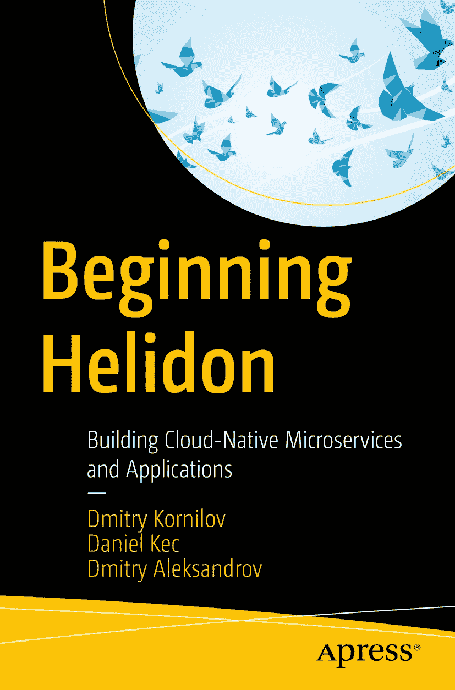

ISBN 978-1-4842-9472-7e-ISBN 978-1-4842-9473-4 [`doi.org/10.1007/978-1-4842-9473-4`](https://doi.org/10.1007/978-1-4842-9473-4) © Dmitry Kornilov、Daniel Kec、Dmitry Aleksandrov 2023 本作品受版权保护。无论涉及全部还是部分材料，所有权利均由出版方独家专有许可，具体包括翻译、重印、插图再利用、朗诵、广播、以缩微胶片或任何其他物理方式复制，以及传输或信息存储与检索、电子改编、计算机软件，或以当前已知或未来开发的类似或不类似方法进行处理的权利。本出版物中对通用描述性名称、注册名称、商标、服务标志等的使用，即使在没有特别声明的情况下，也不意味着这些名称不受相关保护法律法规约束，因此可供公众自由使用。出版商、作者和编辑有理由认为本书中的建议和信息在出版时真实且准确。出版商、作者或编辑均不对本文所含材料或可能存在的任何错误或遗漏作出明示或默示担保。对于已出版地图中的司法管辖权主张和机构隶属关系，出版商保持中立。

本 Apress 品牌由注册公司 APress Media, LLC（Springer Nature 旗下）出版。

注册公司地址为：美国纽约州纽约市纽约广场 1 号，邮编 10004。

*献给我的母亲。*

*我想你……*

*——Dmitry Kornilov*

*献给我非凡的妻子，她竟然能忍受我无休止的深夜写作。我爱你。*

*——Daniel Kec*

*献给我的父母。他们才是真正的英雄。*

*——Dmitry Aleksandrov*

引言

Helidon 是一个用于开发云原生微服务的 Java 框架。其高性能、轻量化方案和便捷的 API 迅速在 Java 社区流行起来。本书是你入门 Helidon 所需的一切，并将教你如何高效使用它。本书由 Helidon 的开发者撰写，他们最清楚该框架的设计使用方式。书中相当大的篇幅致力于对 MicroProfile API 和规范进行详细讲解。

阅读本书后，你将能够做到以下几点。

*   创建和消费 RESTful 服务

*   将应用打包并部署到 Kubernetes

*   开发可观测应用，并利用健康检查、指标和追踪能力

*   使用 OpenID Connect 保护你的服务

*   处理数据

*   提升应用的韧性

*   理解并使用响应式消息和响应式流

## 本书适合谁阅读

本书适合希望使用 Helidon 开始开发云原生应用的开发者和架构师，适合有兴趣使用 MicroProfile 和 Jakarta EE 开发可移植应用的开发者，也适合正在寻找 Oracle Helidon Microservices Developer Professional 认证备考资料的人群。

## Helidon 认证

Oracle 宣布了 Helidon Microservices Developer Professional 认证及其配套课程，用于证明微服务开发技能。本书作者参与了考试与课程开发。本书被设计为该认证考试的补充备考材料。尽管本书覆盖的是 Helidon 3.x 版本，而考试基于较早版本的 Helidon（2.x）编制，但本书涵盖了所有认证主题，提供了额外信息，并从不同角度解释相关技术。

你可以在官方页面获取更多信息：[`https://mylearn.oracle.com/ou/learning-path/become-a-helidon-microservices-developer-professional/114512`](https://mylearn.oracle.com/ou/learning-path/become-a-helidon-microservices-developer-professional/114512)。

## 本书内容概览

第 1 章介绍 Helidon 并解释其关键优势。该章还讨论了 Helidon 的两种形态，并说明它们之间的差异。

第 2 章介绍了用于引导创建 Helidon 应用的多种工具，例如 Helidon CLI、Project Starter 和 Maven Archetypes；讲解如何创建第一个应用、使用不同构建配置（可执行 jar、JLink 镜像和 GraalVM 原生镜像）进行构建、创建 Docker 镜像并部署到 Kubernetes。

第 3 章讲解如何配置 Helidon 应用，介绍 MicroProfile Config 规范；解释配置源、默认值和配置档案等概念；演示与 Kubernetes config map 的集成。

第 4 章讲解可观测性及其对微服务的重要性，涵盖健康检查、指标、追踪和日志等概念，以及相应的 MicroProfile 规范。

第 5 章讲解如何在 Helidon 应用中调用其他服务。内容涵盖 MicroProfile Rest Client 和跨域资源共享（CORS）。

第 6 章讲解如何使用 JDBC 和 Jakarta Persistence 与数据库交互、查询及更新数据。

第 7 章讨论如何使用 MicroProfile Fault Tolerance API 提升应用韧性，并解释超时、重试、回退、舱壁和断路器等概念。

第 8 章讲解如何保护你的应用。内容涵盖 OpenID Connect 和 MicroProfile JWT RBAC 规范。

第 9 章讲解如何使用 OpenAPI 为 API 编写文档，以及如何基于该文档自动生成客户端。

第 10 章讲解如何使用 JUnit 测试应用，因为 Helidon 与该框架集成良好。

第 11 章讲解如何在 Helidon 应用中调度任务。

第 12 章讲解 Helidon 与其他技术（如 Neo4j、Verrazzano、Coherence CE 以及 Kotlin 编程语言）的集成程度。

第 13 章讲解如何在 Helidon 应用中使用部分响应式功能。内容涵盖 MicroProfile Reactive Stream Operators、MicroProfile Reactive Messaging 规范以及与 Kafka 的集成。

第 14 章讲解如何在 Helidon 应用中使用分布式事务。内容涵盖 Saga 模式和 MicroProfile LRA 规范。

第 15 章介绍 Helidon SE——Helidon 的响应式形态。本章将引导你创建第一个 Helidon SE 应用，使用不同构建配置（可执行 jar、JLink 镜像、GraalVM 原生镜像）并将其部署到 Kubernetes。

## 示例代码

你可以在本书官方 GitHub 仓库访问所有示例源码：[`https://github.com/Apress/Beginning-Helidon`](https://github.com/Apress/Beginning-Helidon)。

要编译示例，你需要安装以下工具：

*   Linux 或 macOS 环境。在 Windows 上，我们建议使用适用于 Linux 的 Windows 子系统（WSL）。

*   JDK 17

*   Maven 3.9.0

*   某些示例依赖使用 cURL 等实用工具

如果你发现示例代码存在问题，请在问题跟踪器中提交：[`https://github.com/Apress/Beginning-Helidon/issues`](https://github.com/Apress/Beginning-Helidon/issues)。

前言

## 关于本书

我们所处的云时代对应用程序提出了一些要求。本书介绍的是 Helidon——一个专为开发云原生应用而设计的 Java 框架。Helidon 汇集了创建云原生应用所需的全部功能，应用启动快、磁盘镜像占用小、内存消耗低。Helidon 支持 MicroProfile 等现代标准，并部分支持 Jakarta EE，这为你的应用增加了可移植性，使其能够运行在不同厂商支持的运行时环境上。

读完本书后，你将了解如何使用 Helidon 构建 Java 云原生应用，理解将应用打包进 Docker 容器的不同方案，并将其部署到 Kubernetes。你还将学习如何使用 MicroProfile API 和 Helidon Reactive API。

本书围绕各个主题提供了许多实用的配方、最佳实践和方法论。书中附带示例来演示 Helidon 的不同功能，可作为动手实践参考。内容按照复杂度递增的顺序展开，从创建一个简单的 RESTful 服务开始，最终到 OpenID Connect 和分布式事务等复杂场景。

### 前置条件

你需要了解 Java 语言的语法、语义，以及 Java 函数式编程基础，包括 lambda 函数。

本书的部分章节需要你对依赖注入设计模式和 Jakarta EE CDI 规范有一些基础理解。

本书的部分章节需要你理解响应式编程概念，包括背压（backpressure）、观察者（observers）和调度器（schedulers）。

要运行示例，你必须安装 JDK 17 和 Maven 3.8.4。示例在更新版本的 Maven 上通常也能正常运行，但我们使用该版本构建，并可保证一切可用。推荐环境是带有 bash shell 的 Linux 或 macOS。如果你使用 Windows，我们建议使用 Windows Subsystem for Linux（WSL）。

关于作者 关于技术审校者

