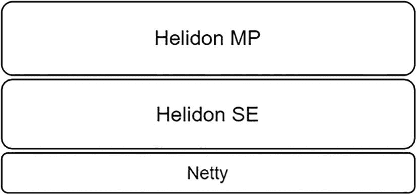
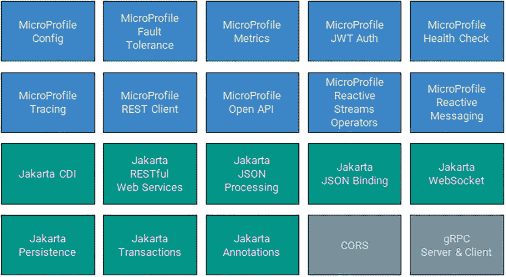

# 1. 简介

本章涵盖以下主题。

*   理解云原生应用

*   介绍 Helidon

*   解释 Helidon 的不同版本（flavors）

*   了解哪种版本适合你的应用

我们生活在云计算时代，这决定了应用设计需求。本书聚焦于构建云原生应用。

注意

为在云环境中运行并充分利用云优势而设计的应用，被称为*云原生*。

云的主要优势是能够快速扩展应用——这是我们过去在数据中心托管应用时不具备的能力。比如，在云环境中，你可以在工作时段应用负载高时进行扩容，然后在其余时间缩容。另一个例子是测试：你可以快速部署大规模测试基础设施，并在测试完成后迅速释放。在这两种情况下，你都不需要为不需要的资源额外付费。如果应用设计得当，云环境的成本效率会非常高。

那么，什么才是好的云原生应用设计？这取决于你想实现什么。最常见的场景是使用部署在 Kubernetes 上的微服务。微服务架构允许你独立扩展应用的某些部分。Kubernetes 是事实上的容器管理标准系统。它可以部署在本地或云端。所有大型云厂商都提供托管 Kubernetes 服务。本书不讨论 Kubernetes 搭建和微服务架构，而是专注于单个服务的设计。

那你的服务应该如何正确设计？云原生应用有一些特定要求。

*   你的应用应该容器化。这是在 Kubernetes 环境中运行的前提要求。

*   你的应用应该具备可观测性。它应提供一些遥测数据，以帮助识别并快速修复问题。例如，你可能只希望将用户请求转发到已完全初始化的节点；或者你可能希望重启一个内存耗尽的节点。你也可能想知道哪些操作执行耗时更长，以便优化。可观测性并非硬性要求，但会让你的工作轻松很多。

*   你的应用应该启动迅速。节点启动越快，就越早能处理请求。时间就是金钱。

*   你的应用应尽可能少地消耗内存。在典型云环境中，RAM 是按量付费的。用得越少，付得越少。

*   你的应用磁盘镜像体积应尽可能小。磁盘空间是要付费的。占用越少，成本越低。网络流量同样需要付费。应用越小，流量消耗越少。

多年来，Java EE 一直是构建本地部署后端应用的优秀选择。虽然它也可以用于构建云原生应用，但并非最佳。

这就像在 5G 网络中使用 LTE 手机。能用吗？能。会快吗？确实会。能用上 5G 的全部优势吗？不能。会和原生支持 5G 的设备一样快吗？当然不会。

因此，需要一个新的 Java 框架来构建云原生应用，以与 Spring Boot 竞争。这就是 Oracle 开始研发 Helidon 框架的原因。


## Helidon 简介

一个产品名称应当反映其用途，并触发恰当的联想。“Bulldog”或“Elephant”都不是好名字。我们希望这个名字能够传达“小巧、轻量、快速”的特质，就像鸟一样。“Swallow”会是一个完美选择。维基百科称它“体态纤细流线、翅膀狭长而尖，这使它具备极强的机动性，以及……非常高效的飞行能力。”非常适合在云间穿梭。我们还想知道*swallow*在其他语言里听起来如何。例如在希腊语中，它是 Χελιδόνι。我们稍作修改后，向团队提出了 Helidon。虽然还有其他候选，但 Helidon 明显胜出。

这里有一句话描述：Helidon 是一组用于开发云原生服务的 Java 库。这个定义非常宽泛，要理解其全部细微差别并不容易。但如果有人问 Helidon 是什么，这是个不错的回答。它清晰明了，也不包含任何令人困惑的亚原子或超音速概念。

Helidon 的设计旨在实现以下高层目标。

*   以性能为核心设计

*   云原生

*   拥抱 Java SE

*   与现代企业级 Java 标准兼容

*   支持 GraalVM Native Image

第一个目标非常直接。Helidon 的整体设计都以性能为先。Helidon 的核心是构建在 Netty 之上的响应式 Web 服务器。

注意

Netty 是一个异步、事件驱动的网络应用框架，用于快速开发可维护的高性能协议服务器和客户端。（更多信息请见[`https://netty.io`](https://netty.io)。）

响应式非阻塞实现使 Helidon 能够达到令人印象深刻的性能指标。Oracle 的性能调优团队与我们紧密合作来优化 Helidon 的性能，而我们的用户对结果也很满意。

“云原生”目标列在第二位，但它其实是首要目标。Helidon 被打造为开发云原生应用的工具。它提供快速启动时间、低内存消耗、小磁盘占用，以及上一节中列出的云原生应用的其他全部特性。

第三个目标是拥抱 Java SE。这里的*拥抱*包含多层含义。我们努力快速采用最新的 Java 版本并使用新特性。比如，Helidon 完全模块化，并利用了 jlink 的优势。我们大量使用 Flow API，并依赖 `java.util.logging`。另一个优势是尽量减少第三方依赖数量。如果使用纯 JDK 就能实现同样功能，我们就不会使用第三方库。结果是，我们“只依赖了半个互联网”，Helidon 应用的体积也因此足够小巧。此外，这还能为企业客户节省时间，因为他们需要为应用中使用的所有第三方依赖获取法务审批。

注意

Helidon 在设计上就将第三方依赖数量保持在较低水平。

第四个目标是与现代企业级 Java 标准兼容。目前企业级 Java 领域有两个标准：Jakarta EE 和 MicroProfile。Helidon 对 MicroProfile 提供完整支持，对 Jakarta EE 提供部分支持。为什么？因为标准正在降低系统熵。基于标准构建的系统具有可移植性且高度可维护。开发者可以获得熟悉的 API 和开发体验，而架构师则能确信系统可升级、可支持。Jakarta EE 是 Java EE 的继任者。这使 Helidon 成为将旧的 Java EE 应用迁移到微服务架构的良好选择。本书后续将介绍所有受支持的规范。

GraalVM Native Image 可以从你的 Java 应用创建原生可执行文件。使用 GraalVM Native Image 后，你不再需要 JVM。你的应用会被编译成一个可执行文件。它能在毫秒级启动并占用更少内存，因此非常适合云原生应用，尤其是函数场景。对 GraalVM Native Image 的支持，已成为 Quarkus 和 Micronaut 等现代微服务框架的标准特性。即使具有运行时特性的 Spring，如今也通过 Spring Native 提供了支持。Helidon 也不例外。它在所有形态中都支持 native image。稍微提前剧透一下，值得一提的是，Helidon 可以在 native image 中使用 CDI（包括可移植扩展）。其他框架通常不支持这一点，因为 CDI 扩展具有运行时特性。

最终演变为 Helidon 的工作始于 2017 年，但在主要设计理念成形之前，曾有过多个原型。最初重点放在响应式 API 上。这是当时很流行的概念，也让我们能够实现出色性能。它受到了 Netflix 的启发——和当时大多数响应式框架一样。我们希望创建一组轻量库，不需要任何应用服务器运行时，从而使你的应用成为标准 Java SE 应用。这些库可以彼此独立使用，但组合起来时，就能提供开发者构建云原生服务所需的一切。

注意

Helidon 是一个开源产品，托管于 GitHub：[`https://github.com/helidon-io/helidon`](https://github.com/helidon-io/helidon)，并采用 Apache 2.0 许可证。

开源模式如今已是现代框架和库的显而易见之选。它为用户提供透明性，也让用户能够了解我们的进展并参与贡献。

注意

Oracle 要求所有外部贡献者签署 Oracle Contributor Agreement（OCA）后，其贡献才会被接受。流程很简单。你可以在[`https://oca.opensource.oracle.com/`](https://oca.opensource.oracle.com/)了解更多细节。


## Helidon 风格

Helidon 的 *风格* 是不同的 API，它们提供不同的开发体验，你可以用它们来开发应用程序。

例如，想象你正在玩一款电脑游戏。你的目标是击败最终 Boss 并拯救星球。开始游戏时，你必须选择角色，而且有多个选项，比如战士或术士。这两者的游戏机制不同。战士是使用剑进行近战的角色，而术士使用魔法和远程攻击。尽管如此，你可以使用其中任意一个通关并击败最终 Boss。

在这个例子中，*游戏* 就是你正在开发的应用程序，而你选择游玩的 *角色* 就是你可以选择的不同编程方式。Helidon 提供了两个角色，称为 *风格*。

注意

Helidon 有两种风格：Helidon MP 和 Helidon SE。

为了更好地理解它们之间的差异，我们来看两段代码。两者都实现了一个简单的 RESTful 服务：当向 `/hello` 端点发送 `Get` 请求时，返回 “Hello World”。

清单 1-1 展示了它在 Helidon MP 中的样子。

```
@Path("hello")
@ApplicationScoped
public class HelloWorld {
@GET
public String hello() {
return "Hello World";
}
}
Listing 1-1
Helidon MP Code-Style Sample
```

清单 1-2 展示了在 Helidon SE 中如何实现。

```
Routing routing = Routing.builder()
.get("/hello", (req, res) -> res.send("Hello World"))
.build();
WebServer.create(routing)
.start();
Listing 1-2
Helidon SE Code-Style Sample
```

差异汇总在表 1-1 中。

表 1-1

Helidon 风格对比

| Helidon MP | Helidon SE |
| --- | --- |
| 声明式风格 API | 函数式风格 API |
| 阻塞式、同步 | 响应式、非阻塞 |
| 较小的内存占用 | 极小的内存占用 |
| 大量使用注解 | 不使用注解 |
| Jakarta Contexts and Dependency Injection (CDI) | 无依赖注入 |
| 完整支持 MicroProfile，部分支持 Jakarta EE | 不支持 Enterprise Java 标准 |

这些风格是 Helidon 设计的逻辑结果（见图 1-1）。



一个 Helidon 架构。各层从上到下依次为：Helidon MP、Helidon SE 和 Netty。

图 1-1

Helidon 架构

Helidon SE 构成了高性能的底层，Helidon MP 构建在其之上。这解释了为什么两种风格在功能上基本相同。某个 Helidon 特性会先在 Helidon SE 中实现，然后在 Helidon MP 中构建一层轻量适配层。这有助于实现高性能。

### Helidon MP

Helidon MP 是一种支持现代 Enterprise Java 标准的风格。它为易用性而设计，提供类似 Spring Boot 的开发体验，重度使用依赖注入、注解和其他“魔法”。其缺点是你的控制力会少一些，因为框架会自动完成很多事情。这个缺点不应被视为致命问题。它是一个相对较小的限制，但仍值得提及，以保证本书的客观性。

对应游戏示例，Helidon MP 就像术士。魔法使他成为强大的对手。魔法攻击威力十足，魔法护盾也很有效。即使你并不完全理解魔法本质，也很容易上手术士这个角色。

现代 Enterprise Java 标准

**Jakarta EE** 是 Java EE 的新名称，因为它已迁移到 Eclipse Foundation 的新家。截至本文写作时，它包含 40 个独立规范和 3 个平台规范。Enterprise Java 开发者几乎在每个项目中都会使用一些规范，例如 CDI、JAX-RS 和 JSON-P/B；也有一些新规范，如 Jakarta EE Core Profile 和 Jakarta Config。Jakarta EE 得到 Oracle、IBM、RedHat、Payara 和 Tomitribe 等主要行业参与者的支持。Jakarta EE 一直重视向后兼容性和稳定性，这使其非常适合企业级应用。（更多信息见 [`https://jakarta.ee`](https://jakarta.ee)。）

**MicroProfile** 是一组由开源社区驱动的规范集合，旨在帮助使用 Enterprise Java 构建云原生应用。这使它成为 Jakarta EE 的绝佳补充。MicroProfile 是 Eclipse Foundation 项目，采用源自 Eclipse Foundation Specification Process (EFSP) 的规范流程。与 Jakarta EE 不同，MicroProfile 发布节奏更快，每年发布三次：一次主版本、两次次版本。快速创新并保持在现代技术前沿，往往意味着会打破向后兼容。尽管保持向后兼容不是其目标，MicroProfile 仍尽量减少不兼容变更的数量，并遵循语义化版本模型，仅在主版本中引入破坏性变更。更多信息可见 MicroProfile 官方网站 [`https://microprofile.io`](https://microprofile.io)。

如图 1-2 所示，Helidon MP 支持完整的 MicroProfile 5.0 平台，其中包括 10 个规范，以及 8 个 Jakarta EE 规范（包括 Jakarta CDI 和 Jakarta RESTful Web Services，即原 JAX-RS）。CORS 和 gRPC 是两个未被任何规范覆盖的组件；它们是 Helidon 特有的。



由 4 行共 20 个区块组成的 Helidon MP 组件集合。它包括 10 个规范、8 个 Jakarta EE 规范和 2 个 Helidon 特有组件。MicroProfile Config、MicroProfile Metrics、Jakarta CDI、Jakarta JSON Binding 和 CORS 是其中的一些组件。

图 1-2

Helidon MP 组件

关于 Helidon MP 中 MP 的含义有不同看法。有些人认为 MP 来自 MicroProfile。但也有另一种观点认为 MP 代表 Magic Powered（魔法驱动）。

### Helidon SE

我前面已经说过，Helidon 基于构建在 Netty 之上的响应式 Web 服务器。它形成了一种响应式、非阻塞的风格，称为 *Helidon SE*。响应式编程是一个很大的主题，值得单独写一本书。在第 15 章会做简要讨论。

Helidon SE 的 API 基于 Java SE Flow API。它大量使用 Builder 模式、流式 API 和 lambda。既不使用注解，也不使用依赖注入。我们称之为“没有魔法参与”。生成的代码非常干净，而且你可以完全控制代码行为，因为框架不会在构建期或运行期生成任何代码。这也使 Helidon SE 天然非常适合 GraalVM Native Image。缺点是需要编写更多代码。此外，响应式编程并不容易使用。这个缺点大吗？取决于你的编程经验。如果你熟悉响应式编程，它影响较小；如果不熟悉，影响就更大。

响应式 Web 服务器 API 的灵感来自 Express。这使 Helidon SE 成为希望转向 Java 的 JavaScript 开发者的不错选择。

注意

Express 是一个用于 Node.js 的快速、无强约束、极简主义 Web 框架。（更多信息见 [`https://expressjs.com`](https://expressjs.com)。）

回到我们的游戏示例，Helidon SE 像一位手持双短剑、没有护甲的战士。轻量让他移动迅速，并能快速闪避敌人攻击。凭借双持武器，他的攻击速度可以达到两倍。但要高效使用它，作为玩家的你需要知道如何操作这个角色。一步走错、反应稍慢，你的战士就会阵亡。


### 你应该使用哪种风味？

注意

你的应用必须是 Helidon MP 应用或 Helidon SE 应用之一。

你可以在 Helidon MP 应用中使用 Helidon SE 的功能，但反过来不行。这是 Helidon 设计带来的结果。Helidon SE 属于更底层，不知道 Helidon MP 的存在。此外，大多数 Helidon MP 特性都需要已初始化的 CDI 容器，而 Helidon SE 按设计并不存在该容器。借用我的游戏示例，你不能同时操控两个角色。但你的法师在魔法不够高效时，偶尔可以使用匕首。

在 Helidon MP 中使用 Helidon SE 功能的一个很好的例子是响应式消息（见第 13 章）。

那么你的应用应该使用哪种风味？如果拿不准，就用 Helidon MP。

提示

如果你不知道该使用哪种风味，就使用 Helidon MP。

表 1-2 汇总了一些建议。

表 1-2

Helidon 风味使用建议

| 使用 Helidon MP | 使用 Helidon SE |
| --- | --- |
| • 你不知道该选哪种风味。• 你想使用 CDI 以及其他 MicroProfile 或 Jakarta EE API。• 你正在从现有 Java EE/Jakarta EE 应用迁移。• 你是 Spring Boot 或 Java EE 开发者，并希望获得类似的开发体验。 | • 通过大量并发使用获得性能是你的首要目标。• 你希望完全掌控应用。• 你有响应式编程经验。• 你的应用涉及文件上传。• 你的应用不是基于 CDI，且你不打算使用任何 MicroProfile 和 Jakarta EE API。 |

本书主要讲 Helidon MP，但第 15 章也会简要介绍 Helidon SE。

## 总结

*   在云环境中运行并充分利用云能力而设计的应用，被称为*云原生*。

*   Helidon 是一组用于开发云原生服务的 Java 库。

*   Helidon 有两种风味：Helidon MP（声明式风格 API，实现了 MicroProfile 以及部分 Jakarta EE 规范）和 Helidon SE（响应式、非阻塞 API）。

如果你不知道该使用哪种风味，就使用 Helidon MP。

