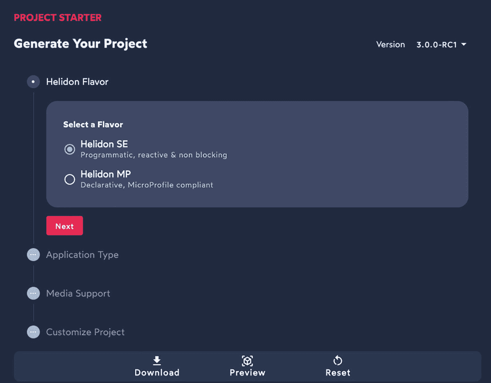

# 2. 你的第一个应用

本章涵盖以下主题。

*   使用 Project Starter、命令行界面（CLI）或 Maven 原型创建 Helidon 应用

*   构建可执行 JAR、jlink 优化的 JVM，以及 GraalVM Native Image

*   制作 Docker 镜像并将其部署到 Kubernetes

这是第一章实践内容，提供了动手编码环节。很有意思的是，写书的方法也在演进。20 世纪 90 年代早期，技术书读起来相当枯燥。作者并不太在意让书更有趣。学习是工作，而工作是有挑战的。读书需要思考每一句话并理解作者表达的内容。这很难，但会迫使你的大脑运转。现在情况变了。技术书在传递同等“纯知识”量的同时，努力做到更易读、更有趣。这类书写起来也更轻松、更有趣。我们希望这本书易于阅读；这段简短的引言就是“让它更有趣”的一部分。

## 生成你的第一个应用

刚开始接触 Helidon 的开发者第一件事应该做什么？当然是创建项目并开始编码。我们现在就来做。

提示

创建新的 Helidon 项目有三种方式：命令行界面（CLI）、Project Starter 或 Maven 原型。

### Helidon CLI

Helidon CLI 是一个命令行工具，可简化你使用 Helidon 的工作。借助 CLI，你可以基于提供的模板创建项目。它还有一个叫做开发者循环（developer loop）的功能：当检测到源代码变化时，会自动重新编译并重启应用。我们稍后会深入了解。现在，先安装 CLI 并生成第一个项目。

首先，你必须确保已安装 JDK 17 和最新版本的 Maven。要检查，请在终端输入 **java -version** 和 **mvn -version**。你应看到类似如下输出。

```
$ java -version
java version "17.0.2" 2022-01-18 LTS
Java(TM) SE Runtime Environment (build 17.0.2+8-LTS-86)
Java HotSpot(TM) 64-Bit Server VM (build 17.0.2+8-LTS-86, mixed mode, sharing)
$ mvn -version
Apache Maven 3.8.6 (84538c9988a25aec085021c365c560670ad80f63)
Maven home: /usr/local/Cellar/maven/3.8.6/libexec
Java version: 18.0.1.1, vendor: Homebrew, runtime: /usr/local/Cellar/openjdk/18.0.1.1/libexec/openjdk.jdk/Contents/Home
Default locale: en_RU, platform encoding: UTF-8
OS name: "mac os x", version: "12.5", arch: "x86_64", family: "mac"
```

如果没有，请安装 JDK 和 Maven。关于如何安装的详细说明可以在网上找到。

现在，我们来安装 CLI。安装命令取决于你使用的操作系统。

如果你使用 macOS，请执行以下命令。

```
curl -O https://helidon.io/cli/latest/darwin/helidon
chmod +x ./helidon
sudo mv ./helidon /usr/local/bin/
```

如果你使用 Linux，请执行以下命令。

```
curl -O https://helidon.io/cli/latest/linux/helidon
chmod +x ./helidon
sudo mv ./helidon /usr/local/bin/
```

如果你使用 Windows，必须以管理员身份运行 PowerShell，并执行以下命令。

```
PowerShell -Command Invoke-WebRequest -Uri "https://helidon.io/cli/latest/windows/helidon.exe" -OutFile "C:\Windows\system32\helidon.exe"
```

在命令提示符中输入 **helidon**，测试 CLI 是否安装成功。若出现带有简短说明的界面，即表示 CLI 配置成功。

```
$ helidon
Helidon command line tool
Usage: helidon [OPTIONS] COMMAND
Options
-D=    Define a system property
--verbose           Produce verbose output
--debug             Produce debug output
--plain             Do not use color or styles in output
Commands
build               Build the application
dev                 Continuous application development
info                Print project information
init                Generate a new project
version             Print version information
Run helidon COMMAND --help for more information on a command.
```

安装好 CLI 后，就该生成你的第一个项目，并看看生成了什么。使用 `init` 命令启动该过程。

```
$ helidon init
```

系统会询问你希望生成的项目信息。第一个问题是项目要使用哪种 Helidon 风味。

```
| Helidon Flavor
Select a Flavor
(1) se | Helidon SE
(2) mp | Helidon MP
Enter selection (default: 1):2
```

你要使用 MP 风味，因此在命令提示符中输入 **2**。

下一个问题是要生成哪种类型的项目。

```
| Application Type
Select an Application Type
(1) quickstart | Quickstart
(2) database   | Database
(3) custom     | Custom
Enter selection (default: 1):1
```

这里有三个选项。

*   **Quickstart** 会生成一个 Maven 项目，包含所有依赖、Dockerfile、Kubernetes 应用描述文件，以及一个简单的问候服务应用，其中包含 RESTful 服务示例和所需的全部引导代码。如果你计划开发 RESTful 服务，这是个不错的选择。

*   **Database** 是当你的应用与数据库交互时的最佳选项。生成的项目包含所需的全部第三方依赖、配置文件和引导代码。


*   **自定义**提供了更多选择，并允许对你的项目进行细粒度定制。它会询问你希望使用的媒体支持，以及是否要启用指标、健康检查和追踪功能。此外，它还会询问数据库支持，并允许你在 Hibernate 和 EclipseLink 之间进行选择。

让我们使用 Quickstart 模板。在命令提示符中输入 **2**。

下一个问题与你希望在项目中使用的 JSON 库有关。有两个选项。

*   [Jackson](https://github.com/FasterXML/jackson)是一个流行的库，用于将 Java 类绑定到 JSON 对象。它是默认选项。

*   [JSON-B](https://jakarta.ee/specifications/jsonb/2.0/)是 Jakarta JSON Binding 规范的实现。更具体地说，使用的是 [Yasson](https://github.com/eclipse-ee4j/yasson)。如果你希望完全符合标准，请选择此选项。

让我们在这个示例应用中使用 JSON-B。

```
Select a JSON library
(1) jackson | Jackson
(2) jsonb   | JSON-B
Enter selection (default: 1): 2
```

最后一组问题是关于要使用的 Maven 坐标和 Java 包名。对于这个示例，你可以放心使用默认值。你应该在真实应用中改成自己的配置。

```
Project groupId (default: me.dmitry-helidon):
Project artifactId (default: quickstart-mp):
Project version (default: 1.0-SNAPSHOT):
Java package name (default: me.dmitry.mp.quickstart):
Switch directory to /Users/dmitry/quickstart-mp to use CLI
Start development loop? (default: n):
```

提示

开发循环（Development Loop）是一种 CLI 模式，它会保持应用持续运行，并监视其源代码的变化。检测到变更时，你的应用会自动重新编译并重启。

使用 CLI `helidon dev` 命令来启动开发循环。

如果你希望用一条命令生成项目，可以使用批处理模式。在批处理模式中，你需要在 `init` 命令参数里回答所有问题。

你可以使用以下命令生成相同的项目。

```
helidon init --batch --flavor MP --archetype quickstart
```

完整参数列表可以在 `helidon init` 命令的帮助页面中找到。

```
helidon init --help
```

### 项目启动器

项目启动器（Project Starter）是一个用于生成 Helidon 项目的 Web 应用（见图 2-1）。它具有与上一节所述 CLI 相同的功能。

要打开项目启动器，请在浏览器中打开 [`https://helidon.io/starter`](https://helidon.io/starter)，或者在 Helidon 主页顶部点击 Starter 按钮：[`https://helidon.io`](https://helidon.io)。



一张标题为 PROJECT STARTER 的截图，在“生成你的项目”下包含 4 个选项：Helidon flavor（启用了 Helidon S E 单选按钮，并在下方有一个 next 按钮）、application type、media support 和 customize project。

图 2-1

项目启动器

项目启动器会引导你完成多个步骤，在每一步中你需要选择希望包含在项目中的选项/功能。步骤数量会根据你之前的选择而变化。即便如此，你仍可以在任意阶段点击 Download，用默认值填充所有未访问页面，并下载包含已生成项目的 zip 文件。

### Helidon Maven 原型

生成 Helidon 项目的另一种方法是使用 Maven 原型。Helidon 为 CLI 提供的所有选项都提供了对应的 Maven 原型。

下面展示了如何使用 CLI 生成相同的 Quickstart 应用。

```
mvn -U archetype:generate -DinteractiveMode=false \
-DarchetypeGroupId=io.helidon.archetypes \
-DarchetypeArtifactId=helidon-quickstart-mp \
-DarchetypeVersion=3.0.0 \
-DgroupId=me.dmitry-helidon \
-DartifactId=quickstart-mp \
-Dpackage=me.dmitry.mp.quickstart
```

Maven 原型及其对应 CLI 选项的完整列表见表 2-1。

表 2-1

Helidon Maven 原型及对应 CLI 选项

| Maven 原型 | CLI 选项 | 描述 |
| --- | --- | --- |
| helidon-bare-mp | `--flavor MP --archetype bare` | 具有最小依赖的 Helidon MP 应用 |
| helidon-quickstart-mp | `--flavor MP --archetype quickstart` | 包含多个 REST 操作（问候服务）的 Helidon MP 示例项目（本章后面会分析） |
| helidon-database-mp | `--flavor MP --archetype database` | 使用 JPA 和内存 H2 数据库的 Helidon MP 应用 |
| helidon-bare-se | `--flavor SE --archetype bare` | 适合从零开始的最小化 Helidon SE 项目 |
| helidon-quickstart-se | `--flavor SE --archetype quickstart` | 包含多个 REST 操作（问候服务）的 Helidon SE 示例项目 |
| helidon-database-se | `--flavor SE --archetype database` | 使用 Helidon DBClient 和内存 H2 数据库的 Helidon SE 应用 |

## 分析已生成的项目


### 快速开始应用程序

恭喜！你刚刚创建了你的第一个 Helidon 应用程序。这个简单但功能完整的问候服务既可以向世界问候，也可以向指定用户问候。它允许你自定义问候语，完整支持健康检查、指标和追踪，使用外部化配置，并且包含 Docker 构建文件和 Kubernetes 部署描述符。它是用于引导你更大服务的绝佳起点。

你可以在表 2-2 中看到完整的 REST API 描述及调用示例。

表 2-2

快速开始应用程序 REST API

| 端点 | 描述与示例 |
| --- | --- |
| `GET /greet` | 向世界问候`curl -X GET http://localhost:8080/greet``{"message":"Hello World!"}` |
| `GET /greet/{user}` | 向指定用户问候`curl -X GET http://localhost:8080/greet/Dmitry``{"message":"Hello Dmitry!"}` |
| `PUT /greet/greeting` | 修改问候语`curl -X PUT -H "Content-Type: application/json" -d '{"greeting" : "Hola"}' http://localhost:8080/greet/greeting``curl -X GET http://localhost:8080/greet/Dmitry``{"message":"Hola Dmitry!"}` |
| `GET /health` | 健康检查`curl -s -X GET http://localhost:8080/health` |
| `GET /metrics` | Prometheus 格式的指标`curl -s -X GET http://localhost:8080/metrics`JSON 格式的指标`curl -H 'Accept: application/json' -X GET http://localhost:8080/metrics` |

清单 2-1 展示了已生成的内容。

*   ① Kubernetes 部署描述符

*   ② 用于构建 Docker 镜像的 Dockerfile（你的应用运行在标准 Java 运行时上）

*   ③ 用于构建 Docker 镜像的 Dockerfile（你的应用运行在自定义 Java 运行时上，即 jlink 镜像）

*   ④ 用于构建 Docker 镜像的 Dockerfile（你的应用的原生镜像）

*   ⑤ Maven 项目

*   ⑥ 应用作用域的 Jakarta Enterprise Bean

*   ⑦ 提供 REST 请求服务的 JAX-RS 资源

*   ⑧ CDI Bean 归档描述符

*   ⑨ Quickstart 项目的配置属性

*   ⑩ 用于微调 GraalVM 原生镜像构建的配置文件

*   ⑪ JUnit 测试示例

```
$ tree quickstart-mp/
quickstart-mp
app.yaml                                            ①
Dockerfile                                          ②
Dockerfile.jlink                                    ③
Dockerfile.native                                   ④
pom.xml                                             ⑤
README.md
src
main
java
me
dmitry
mp
quickstart
GreetingProvider.java        ⑥
GreetResource.java           ⑦
Message.java
SimpleGreetResource.java
package-info.java
resources
META-INF
beans.xml                           ⑧
microprofile-config.properties      ⑨
native-image
reflect-config.json             ⑩
application.yaml
logging.properties
test
java
me
dmitry
mp
quickstart
MainTest.java                ⑪
resources
application.yaml
Listing 2-1
Generated Quickstart Application Source Code
```

这个小应用包含了构建一个功能完整的 RESTful Web 服务所需的一切：测试它、将其打包为 Docker 镜像，并将其部署到 Kubernetes。本章将解释如何完成这些工作，并从分析表示 RESTful Web 服务的 `GreetingResource` 类开始。

### Maven 项目

Maven `pom.xml` 会在生成 Quickstart 应用时自动创建。它简洁明了。它可以被所有支持 Maven 项目的 IDE 打开。作为 IntelliJ Idea 的重度用户（本书就是在 IntelliJ 中编写的！），我们可以确认它能无问题打开。

构建 MicroProfile 应用只需要一个依赖项。

```
io.helidon.microprofile.bundles
helidon-microprofile

```

这是一个包含 MicroProfile 平台所需全部依赖的 bundle。在应用开发阶段使用它是合理的。

如果你不会使用全部 MicroProfile 功能，可以精简依赖，从而减小应用体积。在这种情况下，你可以使用 helidon-microprofile-core bundle，它只包含最小依赖集合，其它依赖由你手动添加。

```
io.helidon.microprofile.bundles
helidon-microprofile-core

```

### CDI

Jakarta 上下文与依赖注入（CDI）是所有 MicroProfile 应用的关键部分。它将所有组件连接在一起，并在用户应用中启用注入。Helidon MP 是一个大型 CDI 容器，会在你的应用启动时自动启动。

Jakarta 上下文与依赖注入（CDI）

CDI 是一个依赖注入（DI）规范。它是 Jakarta EE 的一部分，早期属于 Java EE。CDI 高度依赖注解。它允许用户定义 Bean、通过上下文管理其生命周期，并使用构造器注入、字段注入或 setter 注入将其注入到其他受管 Bean 中。除此之外，CDI 还提供了其他有价值的功能，比如拦截器、装饰器和事件通知。它具有高度可定制性，并且易于集成。CDI 提供了与 Spring Dependency Injection（Spring DI）类似的功能。市场上有多个 CDI 实现。Helidon MP 使用的是 Weld（[`https://weld.cdi-spec.org`](https://weld.cdi-spec.org)）。

学习 CDI 的最佳方式是阅读规范本身。你可以在这里找到它：[`https://jakarta.ee/specifications/cdi/3.0/jakarta-cdi-spec-3.0.html`](https://jakarta.ee/specifications/cdi/3.0/jakarta-cdi-spec-3.0.html)。

注入仅对 CDI 管理的 Bean 生效。如果你的类不由 CDI 管理，你将无法注入它。

让你的类成为 CDI 管理 Bean 的最简单方式，是通过 `@RequestScoped`、`@ApplicationScoped` 或 `@Dependent` 为它声明作用域。

`@RequestScoped` Bean 的生命周期与 HTTP 请求生命周期绑定。它在每个请求内是单例。每个 HTTP 请求都会创建一个新对象，并在该请求生命周期内与其他对象共享。

`@ApplicationScoped` Bean 是单例。它们只创建一次，并在你的应用中与其他对象共享。

`@Dependent` Bean 的生命周期与注入它的 Bean 绑定。这类 Bean 不是单例。每个注入点都会创建一个新实例，且从不共享。

清单 2-2 展示了在我们的 Quickstart 应用中如何使用注入。

*   ① 它使这个类成为单例。它只会被创建一次，并且该实例会被注入到其他对象中。

*   ② 这是一个*构造器注入*示例。一个配置属性被注入到构造器中。配置将在第 3 章讨论。

```
@ApplicationScoped                  ①
public class GreetingProvider {
...
@Inject                         ②
public GreetingProvider(
@ConfigProperty(name = "app.greeting") String message) {
...
}
...
}
Listing 2-2
CDI Usage in GreetingProvider.java
```

*   ① 这个类会在每个 HTTP 请求上实例化（不同请求 == 不同实例）。

*   ② 这是另一个*构造器注入*示例。`GreetingProvider` 的实例作为构造器参数被注入。记住 `GreetingProvider` 是应用作用域，因此在创建新的 `GreetResource` 实例时，注入的是同一个实例。

```
@RequestScoped                    ①
public class GreetResource {
...
@Inject                        ②
public GreetResource(GreetingProvider greetingConfig) {
...
}
...
}
Listing 2-3
CDI usage in GreetingResource.java
```

提示

如果你需要在应用启动时运行某些代码，可以在某个受管 Bean 中创建一个观察者，监听应用作用域的初始化。应用作用域初始化的时机正是你的应用启动之时。

```
void onAppStart(@Observes @Initialized(ApplicationScoped.class) Object ignoredEvent) {
...
}
```


### RESTful Web 服务

问候服务是一个 RESTful Web 服务。Helidon MP 是 MicroProfile 的一个实现，而 MicroProfile 依赖 Jakarta RESTful Web Services 规范来创建 RESTful 服务。

Jakarta Restful Web Services（JAX-RS）

JAX-RS 是 Jakarta EE 的一项规范，定义了使用表述性状态转移（REST）架构模式处理 Web 服务的 API。它高度依赖注解，并且与 CDI 深度集成。目前市面上有许多 JAX-RS 实现，排名前三的是 Jersey、RESTeasy 和 Apache CXF。Helidon MP 使用的是 Jersey。

要了解更多 JAX-RS 信息，请访问 [`https://jakarta.ee/specifications/restful-ws`](https://jakarta.ee/specifications/restful-ws)。你可以在那里找到规范文档的链接。

JAX-RS 使用注解来配置请求路径（`@Path`）和 HTTP 方法（`@GET`、`@POST`、`@PUT` 等）。如果传入请求匹配成功，就会执行带注解的方法。可用的变体和组合非常多，因此你拥有很高的灵活性。

*   ① 这是一个请求作用域的 CDI Bean，用于处理 `/greet` URI 上的请求。

*   ② 该方法在 `GET /greet` 端点被调用，并返回 JSON。

*   ③ 该方法在 `GET /greet/{name}` 端点被调用，并返回 JSON。有效 URI 包括 `/greet/Dmitry`、`/greet/Daniel`。

*   ④ 该方法在 `PUT /greet/greeting` 端点被调用。它接收并返回 JSON。它还包含两个用于 REST API 文档的 OpenAPI 注解：`@RequestBody` 和 `@APIResponses`。OpenAPI 在第 9 章中介绍。

```
@Path("/greet")
@RequestScoped
public class GreetResource {                             ①
...
@GET
@Produces(MediaType.APPLICATION_JSON)
public Message getDefaultMessage() {                 ②
...
}
@Path("/{name}")
@GET
@Produces(MediaType.APPLICATION_JSON)                ③
public Message getMessage(@PathParam("name") String name) {
...
}
@Path("/greeting")
@PUT
@Consumes(MediaType.APPLICATION_JSON)
@Produces(MediaType.APPLICATION_JSON)
@RequestBody(...)
@APIResponses(...)
public Response updateGreeting(Message jsonObject) {  ④
...
}
...
}
Listing 2-4
JAX-RS Usage in GreetingResource.java
```

## 构建与运行

要构建该项目，你必须切换到 `pom.xml` 所在目录并运行以下命令。

```
mvn package
```

提示

你也可以使用 CLI 命令 `helidon build` 来构建项目。

Helidon 默认构建一个*可执行 JAR*。不同的打包选项将在本章后续讨论。现在你只需知道，这个 JAR 位于 `target/quickstart-mp.jar`，并且可执行。让我们运行它。

```
$ java -jar target/quickstart-mp.jar
```

当服务器启动后，你可以在输出中看到一些有用信息，例如它运行的端口以及启用了哪些功能。

```
... Server started on http://localhost:8080 (and all other host addresses) in 1742 milliseconds (since JVM startup).
... Helidon MP 3.0.0 features: [CDI, Config, Health, JAX-RS, Metrics, Open API, Server]
```

现在让我们触发几个问候应用端点，验证应用是否正常运行。你需要保持服务器持续运行，因此必须打开另一个终端窗口或标签页。

先测试默认问候。

```
$ curl -X GET localhost:8080/greet
{"message":"Hello World!"}
```

下面是个性化问候。

```
$ curl -X GET localhost:8080/greet/Reader
{"message":"Hello Reader!"}
```

你也可以尝试修改问候语。`curl` 命令列在表 2-2 中。

## 打包

一个 Helidon 应用有三种打包选项。

*   **可执行 JAR** 是 Java 应用的默认打包方式，并针对 Docker 分层进行了优化。

*   **jlink 镜像** 是一个定制的 Java 运行时环境（JRE），只包含应用所需模块。

*   **原生镜像** 是原生编译的二进制可执行文件，启动速度极快。

### 可执行 JAR

使用 Maven 构建项目时，默认打包产物是可执行 JAR 文件。如果未指定额外 profile，则会启用该方式。

```
mvn package
```

提示

你也可以使用 CLI 命令 `helidon build` 来构建项目。

我们使用 *Hollow JAR* 方案。这意味着 JAR 文件只包含你的应用代码。所有第三方运行时依赖会被收集到应用 JAR 产出目录下的 `lib` 子目录中。

在我们的 Quickstart 应用中，JAR 构建在 `target` 目录下，而所有第三方依赖会被收集到 `target/libs`。

Hollow JAR 方案与 Docker 分层配合得非常好。一个 Dockerfile（在项目创建时自动生成）会为应用 JAR 创建单独层，而所有应用依赖存储在 `libs` 目录中。相较于应用本身，这些依赖通常不常变化，因此这一层可以构建一次后重复使用，不必在每次创建 Docker 镜像时重建。此外，包含应用的层会非常小，有助于减少网络流量并缩短应用部署时间。

要构建 Docker 镜像，请运行以下命令。

```
docker build -t quickstart-mp .
```

这会创建一个 `quickstart-mp` Docker 镜像。要运行它，使用以下命令。

```
docker run --rm -p 8080:8080 quickstart-mp:latest
```

### jlink 镜像

JRE 发行版体积通常较大。你的应用很可能并不会使用所有 Java 功能。有一种方法可以创建一个定制（更小）的 Java 运行时镜像，仅包含应用所需功能。这可以通过 JDK 自带的 `jlink` 工具实现。

警告

并非所有 Java 发行版都提供生成定制 JRE 所需的 JDK 模块。在使用 Helidon JLink profile 之前，请先运行 `ls $JAVA_HOME/jmods` 确认这些模块存在。如果没有任何输出，则说明未安装。基于 RPM 的发行版会在单独的 `java-*-openjdk-jmods` 包中提供 `*.jmod` 文件。基于 Debian 的发行版仅在 `openjdk-*-jdk-headless` 包中提供 `*.jmod` 文件。

Helidon 提供了一个特殊的构建 profile 来简化这一过程。它使用 Java 平台模块系统（JPMS）和一些高级分析，使其即使面对自动模块也能工作，而默认情况下并非如此。你可以使用以下命令调用它。

```
mvn package -Pjlink-image
```

提示

你也可以使用 CLI 构建 jlink 镜像：`helidon build --mode JLINK`。

执行该命令后，结果位于 `target/quickstart-mp-jri` 目录。该目录包含应用的自包含定制镜像，其中包括应用本身、运行时依赖以及它依赖的 JDK 模块。你可以使用以下命令启动它。

```
./target/quickstart-mp-jri/bin/start
```

该镜像还包含一个类数据共享（CDS）归档，它可以提升启动性能并减少内存占用，但不会减小磁盘占用。为了获得这些性能优化，磁盘占用会增加，而且增加可能相当明显——可达数 MB。CDS 归档大小总会在构建输出末尾显示。

Helidon 提供了一个选项来禁用 CDS 归档创建。如果你的目标是尽可能减小磁盘占用，这样做是有意义的。

```
mvn package -Pjlink-image -Djlink.image.addClassDataSharingArchive=false
```

要构建一个包含定制 JRE 的 Docker 镜像，请使用 Quickstart 附带的 `Dockerfile.jlink`。

```
docker build -t quickstart-mp-jri -f Dockerfile.jlink .
```

这会在 Docker 容器内执行完整构建。下载某些 Maven 依赖可能需要一些时间。完成后，你将在本地 Docker 仓库中获得一个 `quickstart-mp-jri` Docker 镜像。

以下命令用于启动应用。

```
docker run --rm -p 8080:8080 quickstart-mp-jri:latest
```


### 原生镜像

当你运行 Java 应用程序时，必须安装 Java 运行时环境（JRE）。你的应用程序会被编译为可由 JRE 执行的字节码。JRE 是你所使用平台上的原生应用程序。它有 Linux、Windows、macOS 以及其他操作系统的版本。

GraalVM 是一种 Java 运行时，附带许多额外特性。其中一个特性是能够将 Java 字节码编译为原生可执行文件。这个特性称为 Native Image（原生镜像）。

使用原生镜像时，用户可以获得多个优势。

*   原生应用几乎可以瞬时启动。

*   磁盘占用小于 JRE 加上你的编译后应用。而且它只是一个文件，传输起来也很简单。

*   内存占用也更低，因为对于完全原生代码，运行时不需要大量元数据。

这些优势并非没有代价，同时也存在一些限制。

*   GraalVM 原生编译器必须了解所有允许你在运行时读取或修改类信息的功能调用。这包括 Reflection API 的所有用法、字节码操作、以及 `sun.misc.Unsafe` 的使用等。这可能会让你的工作变复杂，尤其是在你的应用所依赖的第三方依赖中也使用了这些功能时。

*   构建需要显著的时间。

*   原生镜像是静态编译的，不使用任何运行时优化。对于长时间运行的服务，使用 HotSpot VM 可能更有意义，因为它会在运行时优化你的应用。借助这些优化，你的应用最终会超过以原生镜像方式运行的同一应用的性能。

Helidon 支持两种构建原生镜像的方法。

*   使用本地安装的 GraalVM 进行本地构建

*   使用 Docker

#### 本地原生镜像构建

这种方式使用本地安装的 GraalVM。在构建之前，你需要确保 GraalVM 和 native image 组件已安装，并且 `GRAALVM_HOME` 变量指向 GraalVM 安装目录内的 `Contents/Home/` 目录。应该类似如下。

```
export GRAALVM_HOME=/opt/graalvm-ce-21.3.0/Contents/Home/
```

要验证 GraalVM 是否正确安装，请运行以下命令。

```
$GRAALVM_HOME/bin/native-image --version
```

它应当显示 GraalVM 版本。如果没有显示，你必须继续排查和调整 GraalVM 安装。

现在让我们构建一个原生镜像。

```
mvn package -Pnative-image
```

提示

你也可以使用 CLI 构建原生镜像：`helidon build --mode NATIVE`。

构建可能需要几分钟。完成后，你可以在 `target` 目录中找到原生可执行文件，并像平常运行原生应用那样运行它。

```
./target/quickstart-mp
```

#### Docker 原生镜像构建

该方法在 Docker 容器内构建原生镜像。结果是一个基于 *scratch* 且仅包含原生二进制文件的 Docker 镜像。你不需要在本地安装 GraalVM，但需要安装 Docker。

要构建它，运行以下命令。

```
docker build -t quickstart-mp-native -f Dockerfile.native .
```

第一次运行时会花一些时间，因为它会下载所有 Maven 依赖并将其缓存到 Docker 层中。后续构建会快得多。

构建结果是 `quickstart-mp-native` Docker 镜像。你可以使用 `docker images` 命令进行验证。

```
$ sudo docker images
REPOSITORY             TAG      IMAGE ID       CREATED         SIZE
quickstart-mp-native   latest   18a7c74dd257   47 seconds ago  95.6MB
```

使用以下命令在 Docker 中启动你的原生应用。

```
docker run --rm -p 8080:8080 quickstart-mp-native:latest
```

## 部署到 Kubernetes

现在让我们看看如何将你的应用部署到 Kubernetes。如果你没有云端 Kubernetes 集群，你可以在本地计算机上安装 minikube 或 Docker Desktop。对于部署我们的 Quickstart 应用来说，这已经足够。

Kubernetes 部署描述文件 `app.yaml` 在项目创建时就已生成。所以现在，你需要做的就是部署应用。

首先，确保你的集群已经启动并正在运行。

```
kubectl cluster-info
kubectl get nodes
```

如果你在屏幕上看到任何错误，说明你的集群不可用。你需要花些时间修复它。

现在让我们确认你已经构建了包含应用的 Docker 镜像。

```
docker images
```

确保命令输出中存在 `quickstart-mp`。如果没有，你应按照“Executable JAR”章节中的说明构建 Docker 镜像。

提示

如果你想部署 jlink 或原生镜像容器，请将 `app.yaml` 中的 `image` 属性相应改为 `quickstart-mp-jri` 或 `quickstart-mp-native`。

运行以下命令来部署你的应用。

```
kubectl create -f app.yaml
```

部署可能需要一些时间，但通常不会太久。持续执行 `kubectl get pods`，直到你看到 `quickstart-mp` Pod 的状态为 RUNNING。

你需要找到它运行的端口来测试应用是否正常。查看以下命令的结果，并注意 PORT(S)。你需要使用的是第二个端口号。

```
kubectl get service quickstart-mp
NAME          TYPE     CLUSTER-IP    EXTERNAL-IP PORT(S)         AGE
quickstart-mp NodePort 10.108.202.98       8080:30324/TCP  3m50s
```

例如，如果端口是 30324，运行以下命令。

```
curl -X GET http://localhost:30324/greet
```

要从 Kubernetes 中移除你的应用，运行以下命令。

```
kubectl delete -f app.yaml
```

## 总结

*   Helidon 提供了便捷方式，可通过 Project Starter、CLI 和 Maven Archetypes 快速引导你的应用开发。

*   你可以构建可执行 JAR、自定义 jlink 镜像以及 GraalVM Native Image。

*   Helidon MP 应用已为 CDI 做好支持。

*   得益于提供的 Dockerfile，构建包含你应用的 Docker 镜像非常容易。

*   Kubernetes 部署描述文件会在项目创建时自动生成。


