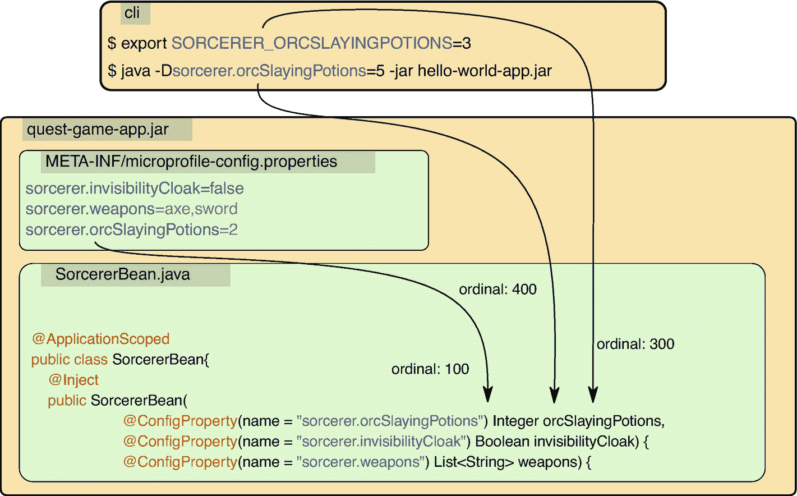
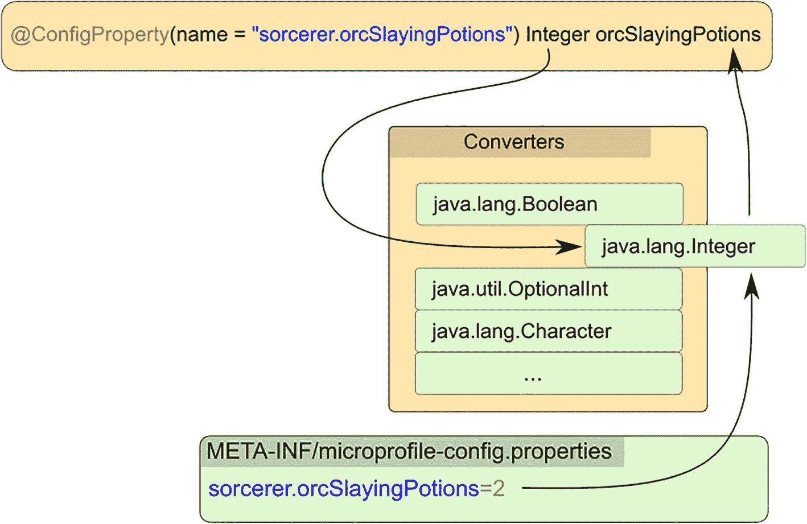

# 3. 配置

本章涵盖以下主题。

*   在基于 Helidon 的微服务中使用 MicroProfile Config

*   理解配置源（config sources）的概念

*   与 Kubernetes ConfigMap 集成

*   配置数组或集合

*   使用默认值、Profile 和表达式

你的微服务需要可配置。为什么？因为任何依赖硬编码值的部署都会让你的服务失去可移植性。想象一下魔法师游戏里的一个角色。当你想派他去执行任务时，你会为他配备最适合该任务的各种药水和武器。但如果做不到呢？如果这个魔法师的背包是硬编码的，那他可能只适合某些任务。一个配置良好的服务也是同样道理；你可以把它部署到任何地方，而不必仅仅因为数据库名称不同就去重新构建和重新打包。那当你把服务从测试环境迁移到生产环境时怎么办？你肯定不想只为了改连接凭据就重建应用，对吧？Java 自身就有配置工具。你知道 `System.getProperties()` 和 `System.getenv()`。这些属性是通过命令行提供配置的一种很好的方式。

通过 `java -DorcSlayingPotions=5 -jar mySorcerer.jar` 启动 Java 应用时，你可以设置属性，并在应用内部通过简单调用 `System.getProperty("orcSlayingPotions")` 取回该值。在你只需要这些功能时它很好用；但一旦你希望它做得更多，比如覆盖默认值、解析占位符，或者基于环境 profile 快速切换时，就不够了。那么，如果有一个工具能做到这些，还能把你的属性映射为正确类型并在最需要的地方注入它们，会怎样？下面介绍 Helidon MicroProfile 的配置实现。下文我们称它为“Config”。它也被 Helidon 的许多其他特性使用，并且在本书后续会经常提到。

由于 Helidon MP 提供了 CDI，你可以轻松地将配置属性直接注入到 Bean 中；不需要任何特殊设置。

*   ① 默认值始终以字符串定义。用于配置源中值的转换器同样会应用到默认值上。

*   ② 这里通过 CDI 将配置属性注入到 Bean 构造函数中。

```
@ApplicationScoped
public class SorcererBean {
@Inject
public SorcererBean(
@ConfigProperty(name="sorcerer.orcSlayingPotions",
defaultValue = "0")   ①
Integer orcSlayingPotions){           ②
Listing 3-1
Default Value Definition with the @ConfigProperty Annotation
```

如果你在注入属性时没有提供默认值，并且在任何可用配置源中都找不到该属性，那么在部署期间会抛出 `NoSuchElementException` 错误。不过别担心，对于可选属性，你可以使用下面这些可空数据类型之一。

*   `org.eclipse.microprofile.config.ConfigValue`

*   `Optional<TheType>`

## 表达式

有时，同一个值需要被多个配置属性使用，或者需要由多个值拼接而成。在这种情况下，表达式就非常有帮助，它可以用其他属性值来组合当前属性值。表达式可以帮助你避免配置重复，并定义与上下文相关的默认值。

*   ① 注意 `sorcerer.level` 表达式的默认值是 `15`。

```
sorcerer.level=30
sorcerer.name=Merlin
sorcerer.title=${sorcerer.name}_${sorcerer.level:15}   ①
Listing 3-2
Expression with a Default Value in a Properties File
```

在清单 3-2 中，魔法师的头衔是 `Merlin_30`。但是，如果缺少 `sorcerer.level` 属性，就会使用表达式中的默认值，头衔将变为 `Merlin_15`。表达式在直接于配置文件中拼接数据库连接字符串或 JAAS 配置时非常实用。

## 编程式 API

当 CDI 注入不可用时，编程式 API 就能派上用场。它的所有优点与注入配置属性时的行为一致。你可以以单例方式访问 `org.eclipse.microprofile.config.Config`。

```
Integer orcSlayingPotions =
ConfigProvider.getConfig()
.getValue("sorcerer.orcSlayingPotions", Integer.class);
Listing 3-3
Obtaining a Configuration Property over the Programmatic API
```

或者，直接通过 `@Inject Config` 将 config 注入你的 Bean。该方式允许你手动访问所有配置源中的可用属性。那么这个 Config 源到底是什么？它就是属性值的来源！

## 配置源

MicroProfile Config 首先会查找可用的配置源。配置源提供了应用中可检索的属性。每个配置源都有一个特殊的序号（ordinal），用于定义属性解析顺序。如果多个配置源包含同一属性，则使用序号更高的那个。这个特性提供了一种优雅的方式，在需要时覆盖属性。规范定义了以下三个默认配置源。

*   类路径上所有 `META-INF/microprofile-config.properties` 文件，默认优先级序号为 `100`。

*   环境变量，默认优先级序号为 `300`，会覆盖属性文件中的同名属性。环境变量键名不区分大小写，非字母数字字符可与下划线互换。例如，当 `sorcerer.orcSlayingPotions` 在环境变量中没有候选项时，会解析 `SORCERER_ORCSLAYINGPOTIONS` 这个键。

*   系统属性（我们的 `-Dsorcerer.orcSlayingPotions=5` 在这里同样适用，默认优先级序号为 `400`）。因此，它会覆盖所有其他默认配置源中的同名属性。

图 3-1 显示了多个默认配置源为 `sorcerer.orcSlayingPotions` 属性提供不同值。你已经知道，会注入来自序号最高配置源的属性。在我们的例子中，`SorcererBean` 得到五瓶 `orcSlayingPotions`，没有隐形斗篷，武器则是一把斧头和一把剑。所有配置源的属性会被合并，重复项按源序号来解析。



三个矩形块包含一组代码。来自 c l i 和 micro profile config properties 块的、标注为 ordinal 100、ordinal 400 和 ordinal 300 的箭头，指向 Sorcerer Bean dot Java 块中的代码。

图 3-1

从各种配置源注入配置属性，优先级由 ordinal 表示。若键相同，则注入来自 ordinal 最高配置源的属性

默认配置源的优先级并非一成不变。你可以通过一个特殊配置键 `config_ordinal` 来调整优先级。例如，如果你需要在类路径中再加入一个 JAR，并让其中的属性文件覆盖主 JAR 中的属性文件，你可以借助这个特殊键提高该文件优先级，比如：`config_ordinal=105`。

查看图 3-1 中的武器配置，你会很快认出那是一个数组。默认情况下，数组使用逗号分隔。一个配置数组可以作为列表、集合（set）或目标类型数组来注入。

*   ① 以数组形式注入的武器

*   ② 字符串列表

*   ③ 字符串集合

```
@Inject
public SorcererBean(
@ConfigProperty(name="sorcerer.weapons")
String[] weaponsArray,   ①
@ConfigProperty(name="sorcerer.weapons")
List weaponsList,   ②
@ConfigProperty(name="sorcerer.weapons")
Set weaponsSet{   ③
Listing 3-4
Configuration Properties Injected into a Bean Constructor
```


## 转换器

每个配置值都会被当作纯文本处理，并通过一组内置或自定义转换器转换为目标类型，无论该值来自哪个配置源。转换器会根据目标属性类型进行选择，如图 3-2 所示。



包含文本的三个区块展示了配置值到目标属性类型的转换。使用的转换器是 Java dot lang dot integer。

图 3-2

用于解析给定属性文本值的转换器由注入点的类型决定

内置转换器覆盖了你能想到的所有基础类型——数字、布尔值、字符、类引用、日期和模式。

*   布尔值：`true`、`1`、`YES`、`Y` 和 `ON` 会被转换为 `true`；其他所有值都会被转换为 `false`。

*   数字：基本上，所有表示数字的 Java 原始类型和装箱类型都受支持；点号会被解析为小数分隔符。

*   日期和时间：支持 `LocalDate`、`Duration`、`Period`、`Instant` 以及许多其他类型。

*   其他：支持 `Path`、`File`、`URL`、`URI`、`Charset`、`Pattern` 以及许多其他类型。

这样就够了吗？因为你才刚刚开始！

### 自动转换器

如果自定义类型提供以下任意一种能力，那么任何自定义类型都可以通过自动转换器自动完成转换：

*   拥有方法 `public static T of(String val)`

*   拥有方法 `public static T valueOf(String val)`

*   拥有方法 `public static T parse(CharSequence val)`

*   拥有一个带单个 `String` 参数的公共构造函数

如果没有为该自定义类型注册自定义转换器，就会应用自动转换器。

## 聚合属性

你可以在逻辑上对属性进行分组。这样的配置更容易理解和使用。对于扁平结构的配置文件（例如 properties 文件），你可以基于公共前缀来实现分组。

```
sorcerer.orcSlayingPotions=68
sorcerer.invisibilityCloak=false
sorcerer.weapons=axe,sword
Listing 3-5
Properties with a Common Prefix
```

在 YAML 这类树形结构格式中，分组会容易得多。我们用 *readable* 这个词来形容它，但在没完没了的 YAML 论战中保持中立。

```
sorcerer:
orcSlayingPotions: 68
invisibilityCloak: false
weapons: axe,sword
Listing 3-6
YAML Properties with a Common Prefix
```

将这类分组属性逐个注入，会让我们的兽人猎杀业务代码显得相当杂乱。

```
@Inject
public SorcererBean(
@ConfigProperty(name="sorcerer.orcSlayingPotions")
int potions,
@ConfigProperty(name="sorcerer.invisibilityCloak")
boolean cloak,
@ConfigProperty(name="sorcerer.weapons")
List weapons)
Listing 3-7
Injection of Each Separate Property To a Bean Constructor
```

在这段代码中，你无论如何都会把这些属性归到同一个 Java 对象下；例如 `SorcererProperties` 这个名字就不错。你可以把向对象填充属性的工作交给 config 来完成。

```
@ConfigProperties(prefix="sorcerer")
public class SorcererProperties {
@ConfigProperty(name="orcSlayingPotions") int potions;
boolean cloak;
List weapons;
}
Listing 3-8
Properties with a Common Prefix Grouped to a Common Bean
```

请注意这个 CDI 配置 Bean；属性名默认从字段名派生，除非通过注解覆盖。我们的 `SorcererProperties` 可以像标准 CDI Bean 一样被注入，因此你可以在任何需要的地方注入它，并访问其中所有分组属性。

```
@Inject
public SorcererBean(@ConfigProperties SorcererProperties
sorcererProperties)
Listing 3-9
Properties Bean Injected to a Bean Constructor
```

### 自定义转换器

如果到目前为止提到的所有转换器都不能满足你的使用场景，你仍然可以创建自己的自定义 Config 转换器，并通过服务定位器进行注册。

你可以创建一个转换器，把保存为属性值的 JSON 转换出来。假设在我们的示例中，兽人是这样配置的。

```
app.jsonOrc={"orcName":"Scullcrack", "level":"34"}
Listing 3-10
Property with a Raw JSON Value
```

但你希望将属性值直接注入为 `jakarta.json.JsonObject`，这样业务代码就不会被 JSON 解析逻辑弄得杂乱。让我们为此创建一个自定义转换器；它只是一个实现了 `org.eclipse.microprofile.config.spi.Converter` 的类。

*   ① 如果同一类型有多个可用转换器，则使用优先级最高的那个；`100` 是默认优先级。

```
@Priority(101)   ①
public class JsonConverter implements Converter{
private static final JsonReaderFactory JSON =
Json.createReaderFactory(Collections.emptyMap());
@Override
public JsonObject convert(String value) {
return JSON.createReader(new StringReader(value))
.readObject();
}
}
Listing 3-11
Custom JSON Converter for Parsing Properties with JSON as the Value
```

注意

转换器会作为服务提供者进行注册。如果你正在开发基于 classpath 的项目，请创建一个提供者配置文件，内容为 `my.package.JsonConverter`。

`META-INF/services/org.eclipse.microprofile.config.spi.Converter`

Config 运行时会通过服务加载机制找到你的转换器。

在基于 JPMS 模块的项目中注册服务提供者时，别忘了使用 `module-info.java`。只需在 `module-info.java` 中添加 `provides` `org.eclipse.microprofile.config.spi.Converter` with `my.package.JsonConverter`; 子句。

你可以直接在 JAX-RS 资源中测试我们崭新的自定义转换器。你会看到，直接在需要的地方注入转换后的值是多么容易。

```
@Path("/jsonOrc")
public class OrcResource {
private JsonObject jsonOrc;
@Inject
public OrcResource(@ConfigProperty(name = "app.jsonOrc")
JsonObject jsonOrc) {
this.jsonOrc=jsonOrc;
}
@GET
@Produces(MediaType.APPLICATION_JSON)
public JsonObject getJsonOrc() {
return jsonOrc;
}
}
Listing 3-12
JAX-RS Resource with the Directly Injected Converted Property
```

配置转换器是强大的工具，可将样板配置代码与法师业务逻辑清晰分离。

## 配置档案（Profiles）

是否生产环境，这是个问题！当你同时有测试环境和生产环境时，这是非常典型的场景。

你还记得 Dieselgate（柴油门）排放丑闻吗？这是配置档案的一个很好的例子。汽车控制单元被编程为在实验室测试时以更低排放运行发动机。对控制单元而言，当车辆处于实验室还是高速公路时，整套参数都必须切换。让我们尝试用 Helidon Config 实现这一点。

第一步是通过 `mp.config.profile` 属性设置档案本身。你可以通过任何已使用的配置源设置该属性。例如，将其作为环境变量 `export MP_CONFIG_PROFILE=TEST`，或者使用 `-Dmp.config.profile=TEST` 属性。

```
java -Dmp.config.profile=TEST -jar myCarControlUnit.jar
Listing 3-13
Running Helidon with Profile TEST
```

配置档案既可在配置源级别使用（切换整个配置文件），也可在属性级别使用（通过带前缀的属性）。

### 属性级别

在属性级别，以 `%` 加档案名为前缀的属性，会比其他具有相同键的属性拥有更高优先级。

*   ① 当 `PROD` 档案激活时，`false` 生效

*   ② 当 `TEST` 档案激活时，`true` 生效

*   ③ 当没有激活档案时，`false` 生效

```
%PROD.engine.emission.control=false    ①
%TEST.engine.emission.control=true     ②
engine.emission.control=false          ③
Listing 3-14
Properties Specific for a Given Profile
```


### 配置源级别

在配置源级别，如果文件名匹配所选的 profile，则会包含整个配置文件。如果类路径中 `META-INF` 文件夹下存在配置文件 `microprofile-config-<PROFILE NAME>.properties`，并且相应 profile 处于激活状态，则这些属性会被合并。当两个文件中存在相同属性时，文件名中带有激活 profile 的文件中的值具有更高优先级。

```
META-INF/
microprofile-config.properties
microprofile-config-TEST.properties
Listing 3-15
Property file specific for a given profile
```

不过让我们回到 Orc 狩猎冒险的示例。你可能会决定使用不同的配置源设置来部署我们已经构建好的游戏制品。为此，你需要更强大的能力：元配置。

## 元配置

打包在 JAR 文件内部的配置文件实际上几乎是不可变的。你在这些配置源中的所有设置都已板上钉钉。你可以用系统属性或环境变量覆盖它们的值，但你必须依赖于 JAR 包深处某处已经定义好的优先级。Helidon 提供了一个额外特性，用于在制品外部重新定义配置，称为元配置。它是一个可以按你希望的方式配置配置源的位置，并会覆盖任何现有的隐式或显式设置（通过编程式 API 创建的设置除外）。

注意

这是 Helidon 特有功能。

当在类路径、当前目录中找到 `mp-meta-config.yaml` 或 `mp-meta-config.properties` 文件，或者在外部指定位置发现它后，配置源将按其内容进行组织。你可以通过 `io.helidon.config.mp.meta-config` 属性或 `HELIDON_MP_META_CONFIG` 环境变量来指定元配置文件位置。

元配置支持 YAML 和 properties 文件格式。让我们看看 YAML 示例 `mp-meta-config.yaml`。

*   ① 包含或排除隐式源或转换器。

*   ② 显式定义配置源。

*   ③ 定义配置源优先级。

```
add-discovered-sources: true   ①
add-discovered-converters: true
add-default-sources: true
sources:
- type: "environment-variables"
- type: "system-properties"
- type: "properties"         ②
classpath: "weapons.properties"
ordinal: 50                ③
optional: true
- type: "yaml"
path: "/config/orc-army.yaml"
Listing 3-16
Meta Configuration
```

你可以更改优先级序号（ordinal），并选择使用默认源或自定义源。甚至还可以排除自定义转换器，或添加一些可选配置源。

## YAML 配置源

除了 MP 规范要求的内置配置源之外，Helidon 还提供了其他便捷的配置源。例如，有人喜爱也有人“深恶痛绝”的 YAML 配置。

注意

这是 Helidon 特有功能。

与 MP 默认属性文件不同，Helidon 会在类路径根目录下查找名为 `application.yaml` 的文件。其默认优先级 `200` 会覆盖 MP 默认属性文件中的属性，但会被系统属性和环境变量覆盖。

```
sorcerer:
invisibilityCloak: false
orcSlayingPotions: 2
weapons:
- "axe"
- "sword"
Listing 3-17
YAML Configuration File
```

与 properties 相比，YAML 格式中最显著的特性是 *序列（sequences）*。你可以在 YAML 中用流式（flow style）或块式（block style）来表示序列。

*   ① 流式序列

*   ② 块式序列

```
amulets: ["Hearth of Zeard", "Spider's eye"]   ①
weapons:    ②
- "axe"
- "sword"
Listing 3-18
Sequence Styles in YAML Files
```

Helidon 的 YAML 配置源会将序列映射为配置数组。尽管所有配置源也都可以用逗号分隔值来声明数组，你仍然可以用简单文本值声明数组：`weapons: "axe,sword".`

YAML 的 `null` 值会被转换为缺失属性。当直接注入这类属性时会抛出 `NoSuchElementException`。这一特性与默认 properties 配置源很好地保持一致：后者只能通过缺失属性或空值来表示 `null`。

*   ① properties 文件中没有 `null`。空值或缺失属性的行为类似 null 值。

```
sorcerer.invisibilityCloak=    ①
#sorcerer.invisibilityCloak=2
Listing 3-19
Empty Property in YAML File
```

*   ① YAML 有专门的 `null` 值

```
sorcerer:
invisibilityCloak: null   ①
orcSlayingPotions:
#ghoulSlayingPotions: 2
Listing 3-20
Null Property in YAML File
```

但请记住，你始终可以指定默认值，或注入可选值 `@ConfigProperty(name = "sorcerer.invisibilityCloak") Optional<Boolean> cloak`，然后在运行时决定如何处理 null。

要使用 YAML 配置源，你需要以下依赖，它已经包含在 Helidon MicroProfile bundle 中。

```
io.helidon.config
helidon-config-yaml-mp

Listing 3-21
Maven Dependency for the YAML Configuration Support
```

## 自定义配置源

总会有一些场景是 YAML 或 properties 不够用的。无论你需要从某种“异域”数据库、超安全二进制文件，还是非常复杂的 XML 文档中获取配置，你都可以创建自己的配置源。这个新配置源只需要根据键提供属性值、提供可用键列表、用于优先级解析的 ordinal 数值，以及配置源名称。所有逻辑都可以放进一个实现单一接口 `org.eclipse.microprofile.config.spi.ConfigSource` 的类中。

我们来尝试一个简单的配置源：把硬编码 map 中的条目作为配置属性提供。为了更有意思一些，把其中一个属性设为 JSON 值，这样就可以让配置源和本章前面创建的自定义 JsonConverter 配合使用。

*   ① 新的自定义配置源优先级。

*   ② 排序逻辑使用的源名称。

```
public class CustomConfigSource implements ConfigSource {
private static final Map props = Map.of(
"sorcerer.orcSlayingPotions", "55",
"app.jsonOrc",
"""
{"orcName":"Bonecrash", "level":"28"}
"""
);
@Override
public int getOrdinal() {return 105;}   ①
@Override
public Set getPropertyNames() {
return props.keySet();
}
@Override
public String getValue(String key) {
return props.get(key);
}
@Override
public String getName() {
return "custom-sorcerer-map";   ②
}
}
Listing 3-22
Custom Config Source
```

注册流程与自定义转换器非常类似。你需要把我们的实现注册为服务提供者。

注意

如果你使用的是基于 classpath 的项目，请创建 provider-configuration 文件，并将 `my.package.CustomConfigSource` 作为其内容。

`META-INF/services/org.eclipse.microprofile.config.spi.ConfigSource`

配置运行时会通过 service loader 机制找到你的转换器。

如果你在基于 JPMS 模块的项目中注册服务提供者，别忘了使用 `module-info.java`。只需在 `module-info.java` 中添加 `provides` 子句即可。

`provides org.eclipse.microprofile.config.spi.ConfigSource with my.package.CustomConfigSource;`


## 动态配置源

到目前为止，你看到的配置都是不可变数据源。想要用新值重新注入配置属性，唯一的方法是重启 Helidon 应用程序。但配置源也可以提供可变属性。大多数内置的基于文件的配置源都支持可变性。对于基于文件的配置源，你可以使用内置的变更监听器，或者使用自定义间隔进行轮询。

你可以结合前面创建的自定义 `JsonConverter` 来尝试动态配置源，这样就能确认它们能够很好地协同工作。首先，在文件系统上创建一个配置文件。

*   ① 动态源需要注册监听器或使用轮询。首次加载时，使用变更监听器。

*   ② `app.jsonOrc` 属性需要通过自定义转换器进行转换。

```
helidon.config.watcher.enabled: true   ①
app.jsonOrc: '{"orcName":"Scullcrack", "level":"37"}'   ②
Listing 3-23
Dynamically Loaded Configuration
```

由于动态配置文件位于文件系统中的某处，你必须在元配置中注册它，这样 Helidon 才知道去哪里查找。让我们在工作目录中创建 `mp-meta-config.yaml` 文件。

*   ① 使用自定义 JsonConverter

*   ② 动态变化配置文件的路径

```
add-discovered-converters: true   ①
sources:
- type: "yaml"
path: "./dynamic-config.yaml"   ②
optional: false
Listing 3-24
Meta Configuration for the Dynamic Config Source
```

现在你只需要注入配置值即可。不过，单例 bean 中的注入只会执行一次，对吧？这对于动态变化的配置并不实用。你需要注入 `java.util.function.Supplier`，而不是实际值本身。

```
@ConfigProperty(name = "app.jsonOrc") Supplier jsonOrc
Listing 3-25
Injecting a Dynamically Loaded Configuration Property
```

这样一来，每次调用 `jsonOrc.get()` 时，你都可以拿到实际值。每当配置源发生变化，变更监听器都会重新加载配置源，并缓存新值。无需担心每次调用 supplier 都会去读取文件。另一种方式是轮询。你只需配置希望配置源重新加载的时间间隔。

*   ① 使用轮询进行动态源重载。

*   ② 每五秒轮询一次。时长采用 ISO-8601 格式表示。

```
helidon.config.polling.enabled: true   ①
helidon.config.polling.duration: PT5S  ②
app.jsonOrc: '{"orcName":"Scullcrack", "level":"37"}'
Listing 3-26
Dynamically Polled Configuration
```

用于启用变更监听或轮询的属性，尽管是动态重载配置的一部分，但并不会被动态解释。你不能动态更改轮询间隔。

注意

虽然动态配置源是 MicroProfile 规范的一部分，但轮询和变更监听是 Helidon 的功能特性。

## Kubernetes ConfigMap

Kubernetes ConfigMap 是在 Kubernetes 集群中分发配置的便捷工具。来自 ConfigMap 的属性可以通过映射到容器环境变量，或者直接作为配置文件挂载到文件系统的方式，供 Pod 访问。

### 环境变量

将 Kubernetes ConfigMap 传递给应用程序最简单的方法是通过环境变量。由于 Helidon Config 默认将这些变量作为配置源，你在应用侧几乎不需要做任何事。Kubernetes 在 Pod 的操作系统层完成映射，Helidon Config 会从那里接管。

*   ① `SORCERER_ORCSLAYINGPOTIONS` 环境变量会被传递到 my-sorcerer-app 配置中，作为 `sorcerer.orcSlayingPotions` 配置属性。

*   ② `APP_JSONORC` 环境变量会被传递到 my-sorcerer-app 配置中，作为 `app.jsonOrc`。

*   ③ 这是将 ConfigMap 作为环境变量来源的引用。

```
apiVersion: v1
kind: ConfigMap
metadata:
name: my-sorcerer-config
data:
SORCERER_ORCSLAYINGPOTIONS: 68   ①
APP_JSONORC: '{"orcName":"Sharpteeth","level":"22"}'   ②

apiVersion: v1
kind: Pod
metadata:
name: my-sorcerer-pod
spec:
containers:
- name: my-sorcerer-container
image: my-sorcerer-app
envFrom:
- configMapRef:
name: my-sorcerer-config   ③
Listing 3-27
K8s ConfigMap Propagated to Helidon As Environment Variables
```

### 挂载卷

有时环境变量的扁平结构并不足够。Kubernetes ConfigMap 可以指定要作为配置文件挂载到容器文件系统中的配置。你可以把你喜欢的配置格式（无论是 properties 文件、YAML 还是 JSON）挂载到你选择的目录。

*   ① 生成的配置文件名称

*   ② 挂载目录路径，其中包含生成的 `my-sorcerer-app-config.yaml` 文件

```
apiVersion: v1
kind: ConfigMap
metadata:
name: my-sorcerer-config
data:
my-sorcerer-app-config.yaml: |   ①
app.jsonOrc: '{"orcName":"Sharpteeth", "level":"22"}'
sorcerer:
orcSlayingPotions: 68
invisibilityCloak: false
weapons: axe,sword

apiVersion: v1
kind: Pod
metadata:
name: my-sorcerer-pod
spec:
containers:
- name: my-sorcerer-container
image: my-sorcerer-app
volumeMounts:
- mountPath: /config   ②
name: config-volume
volumes:
- name: config-volume
configMap:
name: my-sorcerer-config
Listing 3-28
K8s ConfigMap Propagated to Helidon over the Configuration File on the Mounted Volume
```

在 `my-sorcerer-app` 中，你需要设置元配置文件 `mp-meta-config.yaml`，以指定挂载配置文件的位置。

*   ① 挂载配置文件的路径。

*   ② 相对于 classpath 上默认配置文件的优先级。

*   ③ 该值是可选的，因此在需要时你可以在没有挂载文件的情况下运行应用程序。

```
sources:
- type: "yaml"
path: "/config/my-sorcerer-app-config.yaml"   ①
ordinal: 250   ②
optional: true   ③
Listing 3-29
Mounted Configuration File Usage with Meta Config
```

从一开始，Helidon 配置就是为微服务环境而设计的。你可以看到，每个特性都汇聚到同一个目标：尽量减少微服务应用中与配置相关的样板代码。

## 总结

*   微服务需要可配置性。

*   配置源可满足各种场景需求。

*   在配置源中使用序数（ordinal）以支持覆盖。

*   不必局限于 YAML；你可以创建自己的配置源。

*   转换器可用于解析或反序列化。

*   无需重启服务即可处理动态变化的配置。

*   与 Kubernetes ConfigMap 的集成使你的应用真正实现云原生。

